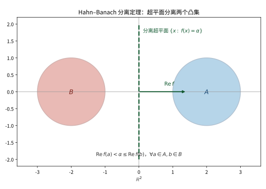

# 第 32 级：泛函分析 (Functional Analysis)

> 泛函分析是现代数学的核心分支之一，它研究无限维向量空间上的函数（泛函）与算子，将线性代数、分析与拓扑学深度融合。它在量子力学、偏微分方程、数值分析、信号处理等领域有着根本性的应用。本章从赋范空间出发，系统构建泛函分析的理论大厦。

---

## 1. 学习目标

1. 理解赋范线性空间与 Banach 空间的基本概念，掌握 C[0,1]、Lᵖ、ℓᵖ 等经典例子。
2. 掌握 Hölder 不等式与 Minkowski 不等式的证明及其在 Lᵖ 空间中的应用。
3. 理解有界线性算子与算子范数的概念，掌握空间 ℬ(X, Y) 的结构。
4. 掌握三大基本原理：一致有界性原理、开映射定理、闭图像定理及其证明。
5. 深入理解 Hahn-Banach 定理及其对偶理论，掌握自反空间的概念。
6. 理解弱拓扑与弱-* 拓扑，掌握 Banach-Alaoglu 定理与 Mazur 引理。
7. 掌握 Hilbert 空间理论：正交基、Riesz 表示定理、正交投影、Fourier 级数。
8. 掌握自伴算子、紧算子与谱定理，理解 Fredholm 替代。
9. 了解 Banach 代数与 Gelfand 理论的基本框架。
10. 通过大量例题与习题巩固对泛函分析核心思想的理解。

---

## 2. 赋范线性空间

### 2.1 范数与赋范空间

**定义 2.1**（范数）设 $X$ 是数域 $\mathbb{K}$（$\mathbb{R}$ 或 $\mathbb{C}$）上的向量空间。函数 $\|\cdot\|: X \to [0, \infty)$ 称为 **范数**（norm），若满足：

1. **正定性**：$\|x\| \geq 0$，且 $\|x\| = 0 \iff x = 0$；
2. **齐次性**：$\|\alpha x\| = |\alpha| \,\|x\|$，$\forall \alpha \in \mathbb{K}, x \in X$；
3. **三角不等式**：$\|x + y\| \leq \|x\| + \|y\|$，$\forall x, y \in X$。

$(X, \|\cdot\|)$ 称为 **赋范线性空间**（normed vector space）。

范数自然地诱导出度量 $d(x, y) = \|x - y\|$，因此赋范空间是度量空间。若在此度量下 $X$ 是完备的（即每个 Cauchy 列都收敛），则称 $X$ 为 **Banach 空间**。

> **💡 直观理解（类比）**：范数就是把中学的"向量的长度"精确化到任意的函数、数列、算子上去：它度量"有多大"，满足三条常识——长度非负、放大 k 倍长度也放大 k 倍、两边之和大于等于第三边（三角不等式）。当这个"量长度"的世界里"看起来在逼近的数列最终都真的收敛"，我们就把它叫做 Banach 空间。类比把"能卡尺量尺寸"升级成"完美车间"：任何零件序列只要尺寸差距趋近 0，就肯定有一个成品（极限）等在那里，不会"悬空"。

**例 2.2**（$\mathbb{R}^n$ 与 $\mathbb{C}^n$）对 $x = (x_1, \ldots, x_n) \in \mathbb{K}^n$，定义
$$
\|x\|_p = \left(\sum_{i=1}^n |x_i|^p\right)^{1/p}, \quad 1 \leq p < \infty; \qquad \|x\|_\infty = \max_{1 \leq i \leq n} |x_i|.
$$
每个 $(\mathbb{K}^n, \|\cdot\|_p)$ 都是 Banach 空间（有限维空间总是完备的）。

> **直观理解（现实类比）**：单位球刻画的是"距离"的不同度量方式。$\ell^1$（菱形）像城市里只能沿街区网格走（曼哈顿距离）；$\ell^2$（圆）像两点间的直线距离；$\ell^\infty$（正方形）像只关心最大坐标差（棋盘的"国王"走法）。无论选择哪种度量，单位球都是凸集——这正是范数满足三角不等式 $\|x+y\|\le\|x\|+\|y\|$ 的几何体现。

### 2.2 C[0,1] 空间

**例 2.3**（$C[0,1]$）设 $C[0,1]$ 为 $[0,1]$ 上所有连续函数（值域为 $\mathbb{K}$）构成的向量空间。定义
$$
\|f\|_\infty = \sup_{t \in [0,1]} |f(t)|.
$$
则 $(C[0,1], \|\cdot\|_\infty)$ 是 Banach 空间。完备性源于连续函数列的一致收敛极限仍是连续的。

也可定义 $L^p$ 范数 $\|f\|_p = (\int_0^1 |f(t)|^p dt)^{1/p}$，但 $(C[0,1], \|\cdot\|_p)$ **不是** 完备的（其完备化是 $L^p[0,1]$）。

> **💡 直观理解（类比）**：$C[0,1]$ 装着所有连续函数（如温度曲线），$\|\cdot\|_\infty$ 取的是"最高点"，所以 Cauchy 列对应"整条曲线一致逼近"，极限仍是连续函数，于是完备。而换用 $L^p$ 范数（看重整体面积而非最高点）时，一个逐段逼近"台阶跳变"的连续曲线列在面积意义下收敛，但极限是不连续函数，溜出了 $C[0,1]$。这就是为什么那会有一个用"平均面积"度量、专门容纳"有跳跃"函数的完备空间 $L^p$。

### 2.3 ℓᵖ 空间

**例 2.4**（$\ell^p$ 空间）对 $1 \leq p < \infty$，定义
$$
\ell^p = \left\{x = (x_n)_{n=1}^\infty \;\Big|\; \sum_{n=1}^\infty |x_n|^p < \infty\right\},
$$
赋予范数 $\|x\|_p = \left(\sum_{n=1}^\infty |x_n|^p\right)^{1/p}$。$\ell^\infty$ 为所有有界数列构成的空間，范数为 $\|x\|_\infty = \sup_n |x_n|$。

每个 $\ell^p$（$1 \leq p \leq \infty$）都是 Banach 空间。$c_0$（收敛到零的数列空间）是 $\ell^\infty$ 的闭子空间。

> **💡 直观理解（类比）**：$\ell^p$ 收纳的是"各分量 $p$ 次方的和被限得住的数列"——换句话说，数列不能"尾大不掉"地拖着一根又粗又长的尾巴。$p$ 越小，对"那一根最粗的尖峰"惩罚越轻（允许少数大数）；$p=\infty$ 则只看最高的那一位。类比打包快递：$\ell^p$ 关心整包总重量（各分量累积），$\ell^\infty$ 只关心单件最重的那一个，$c_0$ 则要求件件重量最终都压到 0。

### 2.4 Lᵖ 空间

**例 2.5**（$L^p$ 空间）设 $(X, \mathcal{A}, \mu)$ 是测度空间，$1 \leq p < \infty$。定义
$$
L^p(X, \mu) = \left\{f: X \to \mathbb{K} \text{ 可测} \;\Big|\; \int_X |f|^p d\mu < \infty\right\},
$$
赋予范数 $\|f\|_p = \left(\int_X |f|^p d\mu\right)^{1/p}$。$L^\infty(X, \mu)$ 为本性有界可测函数空间，范数为 $\|f\|_\infty = \operatorname{ess\,sup}_X |f|$。

**定理**（Riesz-Fischer）$L^p(X, \mu)$ 在 $\|\cdot\|_p$ 下是 Banach 空间，$1 \leq p \leq \infty$。

> **💡 直观理解（类比）**：$L^p$ 是 $C[0,1]$ 在 $L^p$ 度量下的"补全车间"：把"连续"放宽为"可测"，把"每点值"放宽为"几乎处处一致"，于是那些面积收敛的曲线都能在 $L^p$ 里安定下来，成为 Banach 空间。类比我们把"含跳跃的函数模版"也纳入货架，只要整体 $p$ 次面积有限（$\int|f|^p<\infty$）就算合格。Riesz-Fischer 定理保证这个货架本身是完备的——极限永不流失。$L^\infty$ 则只看"本质最大的取值"，忽略单点上的一闪而过（实测度 0 的尖峰作废）。

### 2.5 Hölder 不等式

**定理 2.6**（Hölder 不等式）设 $p, q > 1$ 满足 $\frac{1}{p} + \frac{1}{q} = 1$（称 $p, q$ 为共轭指数）。若 $f \in L^p$，$g \in L^q$，则 $fg \in L^1$ 且
$$
\int_X |fg| \, d\mu \leq \|f\|_p \,\|g\|_q.
$$

*证明*：首先证明 Young 不等式：对 $a, b \geq 0$，
$$
ab \leq \frac{a^p}{p} + \frac{b^q}{q}.
$$
考虑函数 $\varphi(t) = \frac{t^p}{p} + \frac{1}{q} - t$（$t \geq 0$），由 $\varphi'(t) = t^{p-1} - 1$ 知 $\varphi$ 在 $t=1$ 处取最小值 0，故 $\frac{t^p}{p} + \frac{1}{q} \geq t$。令 $t = ab^{-q/p}$ 即得 Young 不等式。

现在证明 Hölder 不等式。不妨设 $\|f\|_p > 0$，$\|g\|_q > 0$。令 $F = f / \|f\|_p$，$G = g / \|g\|_q$，则 $\|F\|_p = \|G\|_q = 1$。由 Young 不等式，
$$
|F(x) G(x)| \leq \frac{|F(x)|^p}{p} + \frac{|G(x)|^q}{q}.
$$
两边积分得
$$
\int |FG| \, d\mu \leq \frac{1}{p} \int |F|^p \, d\mu + \frac{1}{q} \int |G|^q \, d\mu = \frac{1}{p} + \frac{1}{q} = 1.
$$
因此 $\int |fg| \, d\mu \leq \|f\|_p \|g\|_q$。$\square$

**特殊情况**：当 $p = q = 2$ 时，Hölder 不等式退化为 Cauchy-Schwarz 不等式：
$$
\int |fg| \, d\mu \leq \|f\|_2 \|g\|_2.
$$

> **💡 直观理解（类比）**：Hölder 不等式告诉我们两个函数的乘积"能有多大"不会失控：把 $f$ 和 $g$ 分别放在两种互补的尺度（$p$ 与 $q$，恰如 $1/p+1/q=1$）下测量，则它们乘积的"总强度"（$L^1$）被两人的"各自强度"乘积封顶。类比预算：两笔账若一笔按三分、另一笔按三分之三比例折算，则合起来不会突破两个预算的乘积。当 $p=q=2$ 时它降为熟悉的 Cauchy-Schwarz，即 $\int|fg|\le\|f\|_2\|g\|_2$——"内积绝对值不超过范数乘积"。

### 2.6 Minkowski 不等式

**定理 2.7**（Minkowski 不等式）设 $1 \leq p \leq \infty$，$f, g \in L^p$，则 $f + g \in L^p$ 且
$$
\|f + g\|_p \leq \|f\|_p + \|g\|_p.
$$

*证明*：$p = 1$ 或 $p = \infty$ 的情形是平凡的。设 $1 < p < \infty$，$q$ 为 $p$ 的共轭指数。由 Hölder 不等式，
$$
\begin{aligned}
\|f + g\|_p^p &= \int |f + g|^p \, d\mu = \int |f + g| \cdot |f + g|^{p-1} \, d\mu \\
&\leq \int (|f| + |g|) |f + g|^{p-1} \, d\mu \\
&\leq \|f\|_p \left(\int |f + g|^{(p-1)q} \, d\mu\right)^{1/q} + \|g\|_p \left(\int |f + g|^{(p-1)q} \, d\mu\right)^{1/q}.
\end{aligned}
$$
由于 $(p-1)q = p$，所以 $\left(\int |f + g|^{(p-1)q} \, d\mu\right)^{1/q} = \|f + g\|_p^{p/q}$。代入得
$$
\|f + g\|_p^p \leq (\|f\|_p + \|g\|_p) \|f + g\|_p^{p/q}.
$$
两边除以 $\|f + g\|_p^{p/q}$（若 $\|f + g\|_p = 0$ 则不等式显然成立），并注意到 $p - p/q = 1$，即得
$$
\|f + g\|_p \leq \|f\|_p + \|g\|_p. \qquad \square
$$

> **💡 直观理解（类比）**：Minkowski 不等式就是 $L^p$ 世界里"两边之和大于第三边"的三角不等式：两个函数相加后，其 $L^p$ 范数不会超过各自范数之和。类比计量包裹总重：先合并再称重，绝不会比两个包裹分别称重再相加更重（三角形法则处处成立）。它保证了 $\|\cdot\|_p$ 确实是货真价实的范数，从而 $L^p$ 真的够格做一个赋范空间。

---

## 3. 有界线性算子

### 3.1 定义与算子范数

**定义 3.1**（有界线性算子）设 $X, Y$ 是赋范空间。线性映射 $T: X \to Y$ 称为 **有界线性算子**（bounded linear operator），若存在常数 $C \geq 0$ 使得
$$
\|Tx\|_Y \leq C \|x\|_X, \quad \forall x \in X.
$$
满足此条件的最小 $C$ 称为 $T$ 的 **算子范数**（operator norm），记作 $\|T\|$：
$$
\|T\| = \sup_{\|x\| = 1} \|Tx\| = \sup_{x \neq 0} \frac{\|Tx\|}{\|x\|}.
$$

> **💡 直观理解（类比）**：有界线性算子就是"变形均匀、力度有限"的线性机器：把输入向量映射成输出向量，且输出长度最多是输入的某个固定常数倍（$C$）。最小的那个倍数 $C$ 就是算子范数 $\|T\|$——相当于这台放大器的"最大增益倍率"。类比一台被人手推的传送带：无论进料多大，出料速度都按固定倍率被放大，不会突然失速。

**命题 3.2** 线性算子 $T$ 有界 $\iff$ $T$ 连续（在 $X$ 的范数拓扑下）。

*证明概要*：若 $T$ 有界，则 $\|Tx - Ty\| \leq \|T\| \|x - y\|$，故 $T$ 是 Lipschitz 连续的。反之，若 $T$ 在 $0$ 处连续，则存在 $\delta > 0$ 使得 $\|x\| < \delta$ 时 $\|Tx\| < 1$，从而 $\|T\| \leq 1/\delta$。

> **💡 直观理解（类比）**：这条命题把"有界"和"连续"划上等号：对线性算子来说，只要它把单位球映射进一个固定半径的球内（不吹爆），它就自动是连续的（输入小幅变化，输出也只有小幅变化）。类比小型放大器——只要它在"单位电平"内输出不爆表，那么任何小幅输入波动都不会引起输出跳变。这使"检查算子是否好"退化为只需看它是否压得住单位球。

### 3.2 有界算子空间

**定义 3.3**（$\mathcal{B}(X, Y)$）设 $X, Y$ 是赋范空间。记
$$
\mathcal{B}(X, Y) = \{T: X \to Y \mid T \text{ 是有界线性算子}\}.
$$
在 $\mathcal{B}(X, Y)$ 上赋予算子范数，则它是一个赋范空间。

> **💡 直观理解（类比）**：$\mathcal{B}(X,Y)$ 是"所有把 $X$ 送到 $Y$ 的有界线性算子"聚在一起的仓库，配以增益倍率 $\|T\|$ 作为尺寸。类比一家运输公司的全部车队的集合——每辆车用它的"最大载重倍数"来度量，车队之间还能互相比较大小。由于装载尺寸是同一把尺子，这个仓库自己也就成了一个赋范空间，甚至能谈论"一列算子互相逼近取极限"。

**定理 3.4** 若 $Y$ 是 Banach 空间，则 $\mathcal{B}(X, Y)$ 是 Banach 空间。

*证明概要*：设 $\{T_n\}$ 是 $\mathcal{B}(X, Y)$ 中的 Cauchy 列。对任意 $x \in X$，$\{T_n x\}$ 是 $Y$ 中的 Cauchy 列，由 $Y$ 的完备性，可定义 $Tx = \lim_{n \to \infty} T_n x$。易验证 $T$ 是线性算子。由 $\{T_n\}$ 的有界性可证 $T$ 有界且 $\|T_n - T\| \to 0$。

> **💡 直观理解（类比）**：此定理说：只要"目标空间" $Y$ 是完备的（处处有极限的完美车间），那么"装算子的仓库" $\mathcal{B}(X,Y)$ 也是完备的——一列互相逼近的算子必有极限算子。类比一群渐趋一致的译员，只要每个字（对每个 $x$）的译果都能安定在 $Y$ 里，那么整群译员的风格也稳定收敛为一个确定的好译员。它保证了"算子取极限"这件事总是安全可行。

### 3.3 等价范数

**定义 3.5**（等价范数）赋范空间 $X$ 上的两个范数 $\|\cdot\|_1$ 和 $\|\cdot\|_2$ 称为 **等价** 的，若存在常数 $a, b > 0$ 使得
$$
a \|x\|_1 \leq \|x\|_2 \leq b \|x\|_1, \quad \forall x \in X.
$$

> **💡 直观理解（类比）**：两个范数等价，是说它们衡量"大小"的尺子虽刻度不同，但整体上互相以固定上下界夹住——任何向量在尺 1 下的长度，都在尺 2 下的长度的某个常数倍数之间。类比温度计上的摄氏与华氏：数值不同，但能互相换算、经一致比较大小（"哪个更热"的结论不随刻度而改变）。因此拓扑意义上的"开集、收敛"在等价范数下完全一致，选哪把尺都不改变空间性格。

**定理 3.6** 有限维空间上的所有范数都是等价的。

*证明*：设 $\dim X = n$，$\{e_1, \ldots, e_n\}$ 是一组基。定义范数 $\|x\|_\infty = \max_i |\alpha_i|$（其中 $x = \sum \alpha_i e_i$）。对任意范数 $\|\cdot\|$，有
$$
\|x\| \leq \sum |\alpha_i| \|e_i\| \leq \left(\sum \|e_i\|\right) \|x\|_\infty.
$$
另一边，考虑函数 $f(\alpha) = \|\sum \alpha_i e_i\|$ 在紧集 $\{\alpha \mid \|\alpha\|_\infty = 1\}$ 上连续，由极值定理取得最小值 $m > 0$，故 $\|x\| \geq m \|x\|_\infty$。$\square$

> **💡 直观理解（类比）**：这条定理很要紧：在有限维世界里，无论你用哪种范数（$p$ 范数、加权、自定义），它们全部等价——就像在有限栋楼的范围内，不同的量法都能互相换算。原因在于有限维的单位球总能被有限个数据"钉住"，紧性保证任何连续函数在其上可达上下界。而在无穷维（如 $\ell^\infty$）里这种"普适等价"失效，这也是无穷维更微妙的原因之一。

### 3.4 开映射定理

**定理 3.7**（开映射定理，Open Mapping Theorem）设 $X, Y$ 是 Banach 空间，$T: X \to Y$ 是有界线性满射。则 $T$ 是 **开映射**，即若 $U \subseteq X$ 是开集，则 $T(U) \subseteq Y$ 也是开集。

*证明*：设 $B_X(0, r)$ 为 $X$ 中以 $0$ 为心、$r$ 为半径的开球。只需证明存在 $\delta > 0$ 使得 $B_Y(0, \delta) \subseteq T(B_X(0, 1))$。

**第 1 步**：证明存在 $\delta > 0$ 使得 $B_Y(0, \delta) \subseteq \overline{T(B_X(0, 1))}$（闭包）。

由于 $T$ 是满射，$Y = \bigcup_{n=1}^\infty T(B_X(0, n))$。由 Baire 纲定理，Banach 空间 $Y$ 不能表示为可数个无处稠密集的并集，故存在 $n$ 使得 $\overline{T(B_X(0, n))}$ 有非空内部。于是存在 $y_0 \in Y$ 和 $r > 0$ 使得 $B_Y(y_0, r) \subseteq \overline{T(B_X(0, n))}$。

对任意 $y \in B_Y(0, r)$，$y_0$ 和 $y_0 + y$ 都在 $B_Y(y_0, r)$ 中，因此是 $\overline{T(B_X(0, n))}$ 中的点。由线性性，$y = (y_0 + y) - y_0$ 属于 $\overline{T(B_X(0, n))} - \overline{T(B_X(0, n))} \subseteq \overline{T(B_X(0, 2n))}$。取 $\delta = r/(2n)$，则 $B_Y(0, \delta) \subseteq \overline{T(B_X(0, 1))}$。

**第 2 步**：证明 $B_Y(0, \delta/2) \subseteq T(B_X(0, 1))$。

取任意 $y \in B_Y(0, \delta/2)$。由第 1 步，存在 $x_1 \in B_X(0, 1/2)$ 使得 $\|y - Tx_1\| < \delta/4$。令 $y_1 = y - Tx_1$，则 $y_1 \in B_Y(0, \delta/4)$。再次应用第 1 步，存在 $x_2 \in B_X(0, 1/4)$ 使得 $\|y_1 - Tx_2\| < \delta/8$。

依此类推，得到序列 $\{x_n\}$ 满足 $x_n \in B_X(0, 2^{-n})$ 且 $\|y - T(x_1 + \cdots + x_n)\| < \delta/2^{n+1}$。由于 $X$ 完备，$x = \sum_{n=1}^\infty x_n$ 收敛，且 $\|x\| < \sum_{n=1}^\infty 2^{-n} = 1$。由 $T$ 的连续性，$Tx = \lim_{n \to \infty} T(x_1 + \cdots + x_n) = y$。故 $y \in T(B_X(0, 1))$。$\square$

> **💡 直观理解（类比）**：开映射定理说：一个满射的有界线性算子，会把"开集"仍然映成"开集"，绝不会把开集压扁成一个封闭的薄片。类比一台大功率扬声器：只要功放是"满射"的（每个音量都能放出来），一段"微微开一点"的音量区间，放出来后仍是一段"微微开一点"的区间，而不会被压缩成单点。它的要害在 Banach 空间的完备性（Baire 纲）——这正是"开球被打包成可数层、至少有一层内里饱满"的地方。

**推论 3.8**（逆算子定理）若 $T: X \to Y$ 是 Banach 空间之间的双射有界线性算子，则 $T^{-1}: Y \to X$ 也是有界线性算子。

> **💡 直观理解（类比）**：逆算子定理说：在 Banach 空间里，"一一对应又连续"的线性映射，其逆映射也自动连续。类比一套无损译码：只要编码器是双射（每个码都唯一对应一个原信息）且连续（小幅信息变动只引起小幅码变），那么解码器也必然是连续稳定的，不会出现"码稍稍变动信息就翻天"的爆炸。它由开映射定理一脚迈出，是"满射开映射"的直接收获。

### 3.5 闭图像定理

**定义 3.9**（闭算子）设 $X, Y$ 是赋范空间，$T: D(T) \subseteq X \to Y$ 是线性算子（$D(T)$ 为定义域）。$T$ 的 **图像**（graph）为
$$
G(T) = \{(x, Tx) \mid x \in D(T)\} \subseteq X \times Y.
$$
若 $G(T)$ 在 $X \times Y$ 的乘积范数 $\|(x, y)\| = \|x\| + \|y\|$ 下是闭集，则称 $T$ 为 **闭算子**（closed operator）。

> **💡 直观理解（类比）**：闭算子的图像 $G(T)$ 就是"输入—输出配对的全体"：$\{(x, Tx)\}$。要求它是闭集，意为：只要一串配对的输入收敛到 $x$、输出收敛到某个 $y$，那么这个 $y$ 就一定是 $T(x)$——配对关系在取极限时不"漏项"。类比监考老师手里的《输入→成绩》档案：批改的名单越整越准，凡是被划进去的分数都必须与录入规则一致，不许出现"轮到极限处就断档"。

**定理 3.10**（闭图像定理，Closed Graph Theorem）设 $X, Y$ 是 Banach 空间，$T: X \to Y$ 是定义在全空间上的线性算子。若 $T$ 的图像是闭集，则 $T$ 有界（即连续）。

*证明*：考虑乘积空间 $X \times Y$，赋予范数 $\|(x, y)\| = \|x\|_X + \|y\|_Y$。$X \times Y$ 在此范数下是 Banach 空间。$G(T) \subseteq X \times Y$ 是闭线性子空间，因此也是 Banach 空间。

考虑投影映射 $P: G(T) \to X$，$P(x, Tx) = x$。$P$ 是双射、线性且有界（因为 $\|P(x, Tx)\| = \|x\| \leq \|(x, Tx)\|$）。由逆算子定理，$P^{-1}: X \to G(T)$ 有界。

于是存在常数 $C$ 使得 $\|(x, Tx)\| \leq C \|x\|$ 对任意 $x \in X$ 成立。但 $\|(x, Tx)\| = \|x\| + \|Tx\|$，故 $\|Tx\| \leq (C-1)\|x\|$，即 $T$ 有界。$\square$

> **💡 直观理解（类比）**：闭图像定理说：定义在全空间上的线性算子，只要"图像闭合不漏项"，就自动有界（连续）。它把"证明算子连续"这个较难的活儿，替换成"验证图像是否闭"这个更直觉的检查。类比物业把每户的《住址—户主》登记薄做成闭表：只要登记齐全、没有中间断档，整个登记过程必然整齐可控，不会出现突然失控的巨变。它常用来验证 PDE 中那些隐隐只在图像层面好使的算子。

---

## 4. 一致有界性原理

### 4.1 定理的陈述与证明

**定理 4.1**（一致有界性原理 / 共鸣定理，Uniform Boundedness Principle / Banach-Steinhaus Theorem）设 $X$ 是 Banach 空间，$Y$ 是赋范空间，$\{T_\alpha\}_{\alpha \in I} \subseteq \mathcal{B}(X, Y)$ 是一族有界线性算子。若对每个 $x \in X$，$\sup_{\alpha \in I} \|T_\alpha x\| < \infty$，则
$$
\sup_{\alpha \in I} \|T_\alpha\| < \infty.
$$

*证明*：对每个 $n \in \mathbb{N}$，定义
$$
F_n = \{x \in X \mid \sup_{\alpha \in I} \|T_\alpha x\| \leq n\} = \bigcap_{\alpha \in I} \{x \in X \mid \|T_\alpha x\| \leq n\}.
$$
每个 $T_\alpha$ 连续，故 $\{x \mid \|T_\alpha x\| \leq n\}$ 是闭集，从而 $F_n$ 是闭集。

由假设，对每个 $x \in X$，$\sup_\alpha \|T_\alpha x\| < \infty$，故存在 $n$ 使得 $x \in F_n$。因此 $X = \bigcup_{n=1}^\infty F_n$。

由 Baire 纲定理，Banach 空间 $X$ 不能表示为可数个无处稠密集的并集，故存在某个 $n$ 使得 $F_n$ 有内点。于是存在 $x_0 \in X$ 和 $r > 0$ 使得 $B(x_0, r) \subseteq F_n$。

对任意 $x \in B(0, r)$，$x_0 + x \in B(x_0, r) \subseteq F_n$，故
$$
\|T_\alpha(x_0 + x)\| \leq n, \quad \forall \alpha.
$$
又 $\|T_\alpha x_0\| \leq n$，由三角不等式，
$$
\|T_\alpha x\| \leq \|T_\alpha(x_0 + x)\| + \|T_\alpha x_0\| \leq 2n, \quad \forall \alpha, \forall x \in B(0, r).
$$
因此 $\|T_\alpha\| = \sup_{\|x\| \leq r} \frac{\|T_\alpha x\|}{r} \leq \frac{2n}{r}$，即 $\sup_\alpha \|T_\alpha\| < \infty$。$\square$

> **💡 直观理解（类比）**：一致有界性原理又叫"共鸣定理"：如果一族算子"逐点都有界"（对每个输入 $x$，各个算子的输出都收得住），那么在 $X$ 完备的前提下，整族算子的范数也一致有界——它们被同一把尺子同时按住。类比一场合唱：只要对每一个音（每个 $x$）各声部都唱得不太响，那么在好的排练厅（完备性）里，整团（每个算子）的音量也不会突然窜上天。多离谱的猜想都会被这"逐点有界推一致有界"的一击镇住，比如例 4.2 中证明存在连续函数其 Fourier 级数发散，正是发现部分和算子范数无界。
>
> **🧠 思考历程：为何"逐点有界"就能推断整体一致有界？**
>
> - **难点在于一族算子可能"换着点爆炸"**。$\sup_\alpha\|T_\alpha x\|<\infty$ 只保证任意固定点 $x$ 处，各 $T_\alpha$ 的输出都有个上界——但这些上界可以随 $x$ 不同而天差地别，甚至可能对一族算子在几乎所有不同点上各自爆炸。
> - **把"对每个点"翻译成"空间被闭集盖住"**。定义 $F_n=\{x:\sup_\alpha\|T_\alpha x\|\le n\}$，逐点有界意味着 $X=\bigcup_n F_n$，而每个 $F_n$ 是闭集。
> - **Banach 空间不能是"可数份薄皮"拼成**（Baire 纲）。若每个 $F_n$ 都无处稠密，那整个空间就是可数个无处稠密集的并——这违反 Baire 纲定理。于是至少一个 $F_n$ 内有内点：有一个球 $B(x_0,r)$ 整体被按在范数 $\le n$ 的笼子里。
> - **从"一个球的笼子"推到"整族算子的全局笼子"**。对球内任意 $x$，$\|T_\alpha(x_0+x)\|\le n$、$\|T_\alpha x_0\|\le n$，三角不等式给出 $\|T_\alpha x\|\le 2n$，于是 $\|T_\alpha\|\le 2n/r$ 对全部 $\alpha$ 成立——这就是一致有界。
> - **心路**：这个定理是"逐点验证、整体拿捏"的典范：靠完备性（Baire）把一个点的局部情报，放大成整族算子的一把公共尺子。

### 4.2 应用

**例 4.2**（Fourier 级数发散）一致有界性原理可用于证明存在连续函数其 Fourier 级数在指定点发散。具体地，考虑 $C(\mathbb{T})$ 上的 Fourier 部分和算子 $S_N$，可证明 $\|S_N\|$ 无界（$\|S_N\| \sim \frac{4}{\pi^2} \log N$），故存在连续函数 $f$ 使得 $\sup_N \|S_N f\|_\infty = \infty$。

**例 4.3**（弱有界 $\Rightarrow$ 强有界）在 Banach 空间中，若对每个 $x \in X$，数列 $\{x_n\}$ 满足 $\sup_n |\varphi(x_n)| < \infty$ 对任意 $\varphi \in X^*$ 成立，则 $\sup_n \|x_n\| < \infty$。这通过将 $x_n$ 视为 $X^{**}$ 中的元素并由一致有界性原理得到。

---

## 5. 哈恩-巴拿赫定理

### 5.1 次线性泛函与延拓形式

**定义 5.1**（次线性泛函）设 $X$ 是实向量空间。函数 $p: X \to \mathbb{R}$ 称为 **次线性泛函**（sublinear functional），若：
1. **次可加性**：$p(x + y) \leq p(x) + p(y)$，$\forall x, y \in X$；
2. **正齐次性**：$p(\alpha x) = \alpha p(x)$，$\forall \alpha \geq 0, x \in X$。

> **💡 直观理解（类比）**：次线性泛函 $p$ 是"成成本预算"的抽象化：合并预算不会超过分开预算之和（次可加），放大份量按比例放大预算且不分正负（正齐次）。它不要求对称（$p(x)$ 与 $p(-x)$ 可以不同），所以像"带方向的预算"而非真正的范数。它是 Hahn-Banach 定理里能撑起线性泛函的"天花板函数"。

**定理 5.2**（Hahn-Banach 定理——实向量空间形式）设 $X$ 是实向量空间，$p: X \to \mathbb{R}$ 是次线性泛函。设 $Y \subseteq X$ 是子空间，$f: Y \to \mathbb{R}$ 是线性泛函且满足 $f(y) \leq p(y)$ 对任意 $y \in Y$ 成立。则存在线性泛函 $F: X \to \mathbb{R}$ 使得：
1. $F|_Y = f$（延拓）；
2. $F(x) \leq p(x)$ 对任意 $x \in X$ 成立。

*证明*：使用 Zorn 引理。考虑所有满足条件的延拓对 $(Z, g)$ 的集合，其中 $Z$ 是包含 $Y$ 的子空间，$g: Z \to \mathbb{R}$ 是线性泛函且 $g \leq p|_Z$。定义偏序 $(Z_1, g_1) \preceq (Z_2, g_2)$ 若 $Z_1 \subseteq Z_2$ 且 $g_2|_{Z_1} = g_1$。

要应用 Zorn 引理，只需证明每条链都有上界。设 $\{(Z_\alpha, g_\alpha)\}$ 是一条链，则取 $Z = \bigcup_\alpha Z_\alpha$，定义 $g(z) = g_\alpha(z)$ 对 $z \in Z_\alpha$（由链性质保证良定义），则 $(Z, g)$ 是一个上界。

由 Zorn 引理，存在极大元 $(Z_0, F)$。需证明 $Z_0 = X$。若不然，存在 $x_0 \notin Z_0$。考虑 $Z_1 = Z_0 \oplus \mathbb{R}x_0$。对任意 $z_1, z_2 \in Z_0$，
$$
f(z_1) + f(z_2) = f(z_1 + z_2) \leq p(z_1 + z_2) \leq p(z_1 - x_0) + p(z_2 + x_0),
$$
故 $f(z_1) - p(z_1 - x_0) \leq p(z_2 + x_0) - f(z_2)$。取
$$
c = \sup_{z \in Z_0} \{f(z) - p(z - x_0)\} \leq \inf_{z \in Z_0} \{p(z + x_0) - f(z)\}.
$$
定义 $F(x_0) = c$，则对任意 $z \in Z_0$ 和 $\alpha > 0$，
$$
F(z + \alpha x_0) = f(z) + \alpha c \leq p(z + \alpha x_0).
$$
对 $\alpha < 0$ 类似可证。因此 $(Z_1, F)$ 是比 $(Z_0, F)$ 更大的延拓，矛盾。故 $Z_0 = X$。$\square$

> **🧠 思考历程："线性泛函"这招有多深，才够撑满整个空间？**
>
> Hahn-Banach 定理做的事极简单也极伟大：**把一个只定义在子空间上的线性泛函，无代价地延拓到全空间**——全空间上还能一直压着范数。泛函分析的两条腿（对偶、分离定理）都从它长出。
>
> - **一个"免费的延拓"何足震撼？** 直觉上有界线性泛函在某子空间上能给出值，能不能把它也"顺滑"地扩到整个空间？**它的结果是可以，而且不增大范数**（见 $F(x)\le p(x)$ 的保持）。这看似平常，却是无穷维世界里最难得的"无需付出就能延长"的结果。
> - **Zorn 引理：用"极大"逼出"全部"**。证明不从"怎么手动构造延拓"出发，而是**把"一切可能的延拓"排成一个偏序，取一条链、找上界、由 Zorn 保证极大解**。教训：在无穷维里，"挨个构造"常常做不到，"用极大性一次到位"才是正道。
> - **几何形式：把"线性"变成"分离"**。这套结论的几何化（见 5.2 分离定理）说：**两个互不相交的凸集，总能用一条线性超平面隔开**。于是"有没有界线性泛函"被翻译成"能不能用平面切开这两个集"——抽象代数距离立刻变成直观看得懂的几何断言。
> - **它是整个对偶理论的支点**。没有 Hahn-Banach，就没有对偶空间 $X^*$ 的"点可分辨"，就没有 $X^{**}$ 的嵌入、弱拓扑（第 6 节）、以及 Gelfand 表示等一串大厦。**一座"免费延长"的定理，撑起了一整片叫对偶分析的森林。**
> - **心路**：Hahn-Banach 告诉你：**在无穷维世界里，"把一个好的性质从局部延拓到整体"往往不是硬碰硬，而是靠"极大元 + 排序"这种结构性的优雅招数**。学会"分清局部可以、整体用极大化补足"，你就摸到了泛函分析的脉搏。

**定理 5.3**（Hahn-Banach 定理——赋范空间形式）设 $X$ 是赋范空间，$Y \subseteq X$ 是子空间，$f \in Y^*$（即 $Y$ 上的有界线性泛函）。则存在 $F \in X^*$ 使得 $F|_Y = f$ 且 $\|F\| = \|f\|$。

*证明*：取 $p(x) = \|f\| \cdot \|x\|$，则 $p$ 是次线性泛函且 $f(y) \leq p(y)$ 对 $y \in Y$ 成立。由实向量空间形式的 Hahn-Banach 定理，存在线性泛函 $F: X \to \mathbb{R}$ 满足 $F|_Y = f$ 且 $F(x) \leq \|f\| \cdot \|x\|$。由于 $F(-x) = -F(x) \leq \|f\| \cdot \|x\|$，故 $|F(x)| \leq \|f\| \cdot \|x\|$，即 $\|F\| \leq \|f\|$。显然 $\|F\| \geq \|f\|$，因此 $\|F\| = \|f\|$。$\square$

> **💡 直观理解（类比）**：定理 5.3 是 5.2 的"带尺寸"版本：不仅能把线性泛函从子空间补到全空间，还能保证范数一点不涨（$\|F\|=\|f\|$）。类比派人接管更大片区：原来在小区内记账的人，现在升级管理整个城市，事务所的"报价尺度"却分毫不变。它说明在无穷维世界里"局部压住范数的线性泛函，总能无代价地顶到全域"——这正如双对偶嵌入 $J$ 保范的前提。

### 5.2 几何形式与分离定理

**定理 5.4**（Hahn-Banach 分离定理——第一几何形式）设 $X$ 是赋范空间，$A, B \subseteq X$ 是互不相交的非空凸集，$A$ 是开集。则存在 $f \in X^*$ 和 $\alpha \in \mathbb{R}$ 使得
$$
\operatorname{Re} f(a) < \alpha \leq \operatorname{Re} f(b), \quad \forall a \in A, b \in B.
$$

**定理 5.5**（Hahn-Banach 分离定理——第二几何形式）设 $X$ 是赋范空间，$A, B \subseteq X$ 是互不相交的非空凸闭集，$A$ 是紧集。则存在 $f \in X^*$ 和 $\alpha_1, \alpha_2 \in \mathbb{R}$ 使得
$$
\operatorname{Re} f(a) < \alpha_1 < \alpha_2 < \operatorname{Re} f(b), \quad \forall a \in A, b \in B.
$$

> **直观理解（现实类比）**：两个互不重叠的凸集（如两团互不接触的面团），总能找到一块薄薄的"隔板"（超平面）把它们完全隔开，且隔板不会同时碰到两边。这块隔板由线性泛函 $f$ 和常数 $\alpha$ 决定 $\{x\mid \mathrm{Re}\,f(x)=\alpha\}$，满足 $\mathrm{Re}\,f(a)<\alpha\le\mathrm{Re}\,f(b)$。这正是 Hahn–Banach 延拓定理的几何本质，也是凸分析中"分离"思想的基石。

### 5.3 对偶空间与双对偶

**定义 5.6**（对偶空间）设 $X$ 是赋范空间。$X$ 上所有有界线性泛函构成的 Banach 空间称为 $X$ 的 **对偶空间**（dual space），记作 $X^* = \mathcal{B}(X, \mathbb{K})$。

**定义 5.7**（双对偶与典范嵌入）$X$ 的双对偶（bidual）为 $X^{**} = (X^*)^*$。定义典范映射 $J: X \to X^{**}$ 为
$$
(J(x))(\varphi) = \varphi(x), \quad \forall x \in X, \varphi \in X^*.
$$
由 Hahn-Banach 定理，$J$ 是等距嵌入（$\|J(x)\| = \|x\|$）。

**定义 5.8**（自反空间）若 $J$ 是满射（即 $X \cong X^{**}$ 等距同构），则称 $X$ 是 **自反的**（reflexive）。

> **💡 直观理解（类比）**：自反空间的意思是"双卡双待的镜像已经足够还原本人"：把每个向量 $x$ 通过 $J$ 映进双对偶，若这么一"复制"就齐全到能生成整个 $X^{**}$（不丢元素），空间就是自反的。类比证件照：只要透过"再给一次把影像照出来"的两层手续仍能完整还原本人，那么这面"镜子"（双对偶）就完全忠实。$\ell^p\ (1<p<\infty)$、$L^p$ 都是自反的，而 $\ell^1,\ell^\infty,C[0,1]$ 因为双对偶比原空间"胖"而出不来全貌，故不自反。

**例 5.9**：
- 有限维空间都是自反的。
- $\ell^p$（$1 < p < \infty$）是自反的，且 $(\ell^p)^* \cong \ell^q$（$1/p + 1/q = 1$）。
- $L^p$（$1 < p < \infty$）是自反的，且 $(L^p)^* \cong L^q$。
- $\ell^1$ 和 $\ell^\infty$ 不是自反的。
- $C[0,1]$ 不是自反的。

---

## 6. 弱拓扑

### 6.1 弱拓扑与弱-* 拓扑

**定义 6.1**（弱拓扑）设 $X$ 是赋范空间。$X$ 上的 **弱拓扑**（weak topology）$\sigma(X, X^*)$ 是由所有 $f \in X^*$ 生成的拓扑（即使得每个 $f$ 都连续的最粗糙拓扑）。在此拓扑下，$x_\alpha \to x$ 当且仅当对每个 $f \in X^*$，$f(x_\alpha) \to f(x)$。

> **💡 直观理解（类比）**：弱拓扑是"只看所有线性泛函读数"的粗视角——两个点是否"靠近"，不看范数距离，而看所有 $f$ 打在上面的分数是否逐项趋同。类比一场比赛的排行榜：只要每个评委（线性泛函 $f$）给的分数都趋于一致，选手就算"弱收敛"，哪怕原始坐标还散着。它比范数拓扑更粗糙，好处是让原来满世界跑的点序列多了"收敛到家"的机会（紧性），是变分、对偶取证的主力。

**定义 6.2**（弱-* 拓扑）设 $X^*$ 是 $X$ 的对偶空间。$X^*$ 上的 **弱-* 拓扑**（weak-* topology）$\sigma(X^*, X)$ 是由所有 $x \in X$ 生成的拓扑（即对每个 $x \in X$，映射 $\varphi \mapsto \varphi(x)$ 连续）。在此拓扑下，$\varphi_\alpha \to \varphi$ 当且仅当对每个 $x \in X$，$\varphi_\alpha(x) \to \varphi(x)$。

**性质 6.3**：
- 弱拓扑比范数拓扑弱（即更粗糙），且当 $\dim X = \infty$ 时严格更弱。
- 弱-* 拓扑比 $X^*$ 上的弱拓扑更弱。
- 若 $X$ 自反，则弱拓扑与弱-* 拓扑在 $X^*$ 上重合。

> **💡 直观理解（类比）**：一长串递进"逐点 ⇄ 弱 ⇄ 弱-* "如同一层层摘掉要求：范数要求所有方向上"原样逼近"，弱只要求被每个 $f$ 打分逼近，弱-* 进一步只要求被每个"原来的点 $x$"当评委打分逼近。要求越松，能收敛的序列越多（紧性越好），但代价是增加的重是该选哪把尺子。当 $X$ 自反时"左侧点数刚好筹足"，弱与弱-* 就同味了。

### 6.2 Banach-Alaoglu 定理

**定理 6.4**（Banach-Alaoglu 定理）设 $X$ 是赋范空间，则 $X^*$ 中的闭单位球 $\overline{B}_{X^*} = \{\varphi \in X^* \mid \|\varphi\| \leq 1\}$ 在弱-* 拓扑下是紧的。

*证明*：对每个 $x \in X$，令 $D_x = \{\lambda \in \mathbb{K} \mid |\lambda| \leq \|x\|\}$。由 Tychonoff 定理，乘积空间 $P = \prod_{x \in X} D_x$ 在乘积拓扑下是紧的。

定义映射 $\Phi: \overline{B}_{X^*} \to P$ 为 $\Phi(\varphi) = (\varphi(x))_{x \in X}$。易验证 $\Phi$ 是单射且连续（当 $P$ 赋予乘积拓扑，$\overline{B}_{X^*}$ 赋予弱-* 拓扑时）。$\Phi$ 的像集是 $P$ 的闭子集（因为线性与有界条件在逐点收敛下保持），因此是紧的。故 $\overline{B}_{X^*}$ 在弱-* 拓扑下紧。$\square$

> **💡 直观理解（类比）**：Banach-Alaoglu 定理说：对偶空间的闭单位球在弱-* 拓扑下是紧的——在无穷维里这可金贵了（普通范数拓扑下的单位球远非紧）。它把 $\overline{B}_{X^*}$ 嵌进一个个"坐标区间"的乘积 $\prod_x D_x$，靠 Tychonoff（无限个紧的乘积仍紧）把每个点处 $|\varphi(x)|\le\|x\|$ 的约束统统收拢，于是整球"被逐点夹住"而紧。类比把一个开放档口（每个 $x$ 都得在额定区间内）打包成无限个并列柜台，唯一性结构恰能在这个大货架上找出共识。

**推论 6.5** 若 $X$ 是自反 Banach 空间，则 $X$ 中的闭单位球在弱拓扑下是紧的。

### 6.3 Mazur 引理

**引理 6.6**（Mazur 引理）设 $X$ 是赋范空间，$\{x_n\}$ 是 $X$ 中弱收敛到 $x$ 的序列。则存在 $\{x_n\}$ 的凸组合序列 $\{y_n\}$（即 $y_n = \sum_{i=1}^{k_n} \lambda_i^{(n)} x_i$，其中 $\lambda_i^{(n)} \geq 0$，$\sum \lambda_i^{(n)} = 1$）使得 $y_n \to x$ 在范数拓扑下收敛。

*证明概要*：考虑集合 $C = \operatorname{conv}\{x_n\}$（凸包），$C$ 的闭包 $\overline{C}$ 是闭凸集。由 Hahn-Banach 分离定理，若 $x \notin \overline{C}$，则存在 $f \in X^*$ 分离 $x$ 与 $\overline{C}$，与 $x_n \to x$ 弱收敛矛盾。故 $x \in \overline{C}$，即可由凸组合逼近。$\square$

> **💡 直观理解（类比）**：Mazur 引理说"弱收敛可以拿凸组合补救成强收敛"：若一列点仅"弱收敛"（被每个评委认同），那么捏取这列点的某个凸组合（把各选手加权平摊），就让它在真正的距离意义上逼近目标。类比民意调查：个别极端样本谈不上代表，但把它们合理加权平均后，均值就能准确压到中心的真值。证明靠 Hahn-Banach 分离：若凸包的闭包不含 $x$，则存在一个线性泛函把它隔开，这与所有 $f$ 都认同 $x_n\to x$ 相悖。

---

## 7. 希尔伯特空间

### 7.1 内积空间

**定义 7.1**（内积）设 $H$ 是 $\mathbb{K}$ 上的向量空间。函数 $\langle \cdot, \cdot \rangle: H \times H \to \mathbb{K}$ 称为 **内积**（inner product），若满足：

1. **共轭对称性**：$\langle x, y \rangle = \overline{\langle y, x \rangle}$；
2. **线性性**：$\langle \alpha x + \beta y, z \rangle = \alpha \langle x, z \rangle + \beta \langle y, z \rangle$；
3. **正定性**：$\langle x, x \rangle \geq 0$，且 $\langle x, x \rangle = 0 \iff x = 0$。

$(H, \langle \cdot, \cdot \rangle)$ 称为 **内积空间**（inner product space）。内积诱导范数 $\|x\| = \sqrt{\langle x, x \rangle}$。若 $H$ 在此范数下完备，则称 $H$ 为 **Hilbert 空间**。

> **💡 直观理解（类比）**：内积是"向量空间里的夹角与长度测量仪"：$x$ 的长度是 $\sqrt{\langle x,x\rangle}$，$\langle x,y\rangle$ 度量两者"对齐程度"。比普通范数更金贵的是它能谈"角度、正交、投影"，如同给纯距离世界装上罗盘与量角器。Hilbert 空间 = 内积 + 完备（任性逼近的极限都还在里面），就好比一个既有测角又有完美边界的平台——$\mathbb{R}^n$、$L^2$、$\ell^2$ 都是它的明星成员。

**定理 7.2**（Cauchy-Schwarz 不等式）$|\langle x, y \rangle| \leq \|x\| \|y\|$，等号成立当且仅当 $x$、$y$ 线性相关。

> **💡 直观理解（类比）**：Cauchy-Schwarz 说"两个向量内积的绝对值不会超过其长度的乘积"——它把"夹角与大小"之间的纯粹几何关系翻译成代数不等式，等号只在两向量几乎平行（方向一致或相反，线性相关）时取到。类比射灯：一盏灯照在墙上的投影长度，绝不超过整束光的实际长度；两束光方向越一致，投影越接近原长，方向垂直时投影归零（正交）。

**定理 7.3**（平行四边形法则）$\|x + y\|^2 + \|x - y\|^2 = 2(\|x\|^2 + \|y\|^2)$。反之，若赋范空间中范数满足平行四边形法则，则可由 $\langle x, y \rangle = \frac{1}{4}(\|x+y\|^2 - \|x-y\|^2)$（实情形）定义内积。

### 7.2 正交基与 Gram-Schmidt 过程

**定义 7.4**（正交与规范正交）$H$ 中的两个向量 $x, y$ 称为 **正交** 的，记作 $x \perp y$，若 $\langle x, y \rangle = 0$。一族向量 $\{e_\alpha\}$ 称为 **规范正交系**（orthonormal system），若 $\langle e_\alpha, e_\beta \rangle = \delta_{\alpha\beta}$。

**定理 7.5**（Gram-Schmidt 正交化）设 $\{x_n\}$ 是 $H$ 中的线性无关序列。则存在规范正交系 $\{e_n\}$ 使得 $\operatorname{span}\{e_1, \ldots, e_n\} = \operatorname{span}\{x_1, \ldots, x_n\}$ 对每个 $n$ 成立。

*构造*：递归定义
$$
e_1 = \frac{x_1}{\|x_1\|}, \quad e_n = \frac{x_n - \sum_{i=1}^{n-1} \langle x_n, e_i \rangle e_i}{\|x_n - \sum_{i=1}^{n-1} \langle x_n, e_i \rangle e_i\|}.
$$

> **💡 直观理解（类比）**：Gram-Schmidt 妥协术：逐个把新向量"朝已走过方向的影子撇干净"，剩下的就是与前人垂直的新方向。类比在斜坡前铺路：先把后一块料躲开已铺路段的影子（减投影），剩下来的斜率分量刚好与旧路正交。它还"保生成空间不变"——新的一簇正交基与原来线性无关组撑出的子空间一模一样，只是换成互相垂直的更好用的坐标轴。

**定义 7.6**（Hilbert 基）规范正交系 $\{e_\alpha\}_{\alpha \in I}$ 称为 **Hilbert 基**（或完备规范正交系），若 $\overline{\operatorname{span}\{e_\alpha\}} = H$。

**定理 7.7**（Fourier 展开）设 $\{e_n\}$ 是可分 Hilbert 空间 $H$ 的 Hilbert 基。则对任意 $x \in H$，
$$
x = \sum_{n=1}^\infty \langle x, e_n \rangle e_n,
$$
其中级数在 $H$ 的范数下收敛，且 Parseval 等式成立：
$$
\|x\|^2 = \sum_{n=1}^\infty |\langle x, e_n \rangle|^2.
$$

> **💡 直观理解（类比）**：Fourier 展开说：规范的坐标轴一旦确立，任何向量都可写成"各方向上的投影系数 $\langle x,e_n\rangle$ 当权重的正交叠加"。这像把一份信号拆成许多互相独立的声部（音叉频率），第 $n$ 根音叉的音量就是 $\langle x,e_n\rangle$。Parseval 更妙：总"能量"$\|x\|^2$ 恰好等于各声部能量 $|\langle x,e_n\rangle|^2$ 之和——能量在各频段间不流失、不冗余。

### 7.3 Riesz 表示定理

**定理 7.8**（Riesz 表示定理）设 $H$ 是 Hilbert 空间，$f \in H^*$ 是 $H$ 上的有界线性泛函。则存在唯一的 $y \in H$ 使得
$$
f(x) = \langle x, y \rangle, \quad \forall x \in H,
$$
且 $\|f\| = \|y\|$。

*证明*：若 $f = 0$，取 $y = 0$ 即可。否则，设 $M = \ker f$，则 $M$ 是 $H$ 的真闭子空间。由闭子空间的正交补性质，$M^\perp \neq \{0\}$。取 $z \in M^\perp$ 且 $\|z\| = 1$。

对任意 $x \in H$，考虑 $x - \frac{f(x)}{f(z)} z$，它属于 $M$，故与 $z$ 正交：
$$
\left\langle x - \frac{f(x)}{f(z)} z, z \right\rangle = 0 \quad \Rightarrow \quad \langle x, z \rangle = \frac{f(x)}{f(z)}.
$$
因此 $f(x) = f(z) \langle x, z \rangle = \langle x, \overline{f(z)} z \rangle$。取 $y = \overline{f(z)} z$ 即得。

唯一性：若 $\langle x, y_1 \rangle = \langle x, y_2 \rangle$ 对所有 $x \in H$ 成立，则 $\langle x, y_1 - y_2 \rangle = 0$，取 $x = y_1 - y_2$ 得 $\|y_1 - y_2\|^2 = 0$，故 $y_1 = y_2$。

范数关系：由 Cauchy-Schwarz 不等式，$|f(x)| \leq \|y\| \|x\|$，故 $\|f\| \leq \|y\|$。又 $f(y/\|y\|) = \|y\|$，故 $\|f\| = \|y\|$。$\square$

> **💡 直观理解（类比）**：Riesz 表示定理有一句响亮的"身份证话"：在 Hilbert 空间里，每个有界线性泛函 $f$ 都恰好是一个"与某向量做内积"的动作 $\langle\cdot, y\rangle$，且一一对应、范数还相等。类比客服工牌：每一位客服（泛函 $f$）都能对号入座到一份唯一的"服务向量 $y$"，凭它就能给任意来客报出该出的分数，且专业强度（范数）不增不减。这使他们跟寻常天真线性泛函完全不对等，也让 $H\cong H^*$ 成立——是 $L^2$ 自对偶、弱/弱-* 同源的总开关。

### 7.4 正交投影

**定理 7.9**（正交投影）设 $M$ 是 Hilbert 空间 $H$ 的闭子空间。则对任意 $x \in H$，存在唯一的分解 $x = m + n$，其中 $m \in M$，$n \in M^\perp$。记 $P_M x = m$，则 $P_M$ 是 $H$ 上的有界线性算子，称为 **正交投影**（orthogonal projection），且 $\|P_M\| = 1$（若 $M \neq \{0\}$）。

**性质 7.10** 正交投影 $P = P_M$ 满足：
1. $P^2 = P$（幂等性）；
2. $P^* = P$（自伴性）；
3. $\operatorname{Ran} P = M$，$\ker P = M^\perp$。

> **💡 直观理解（类比）**：正交投影 $P_M$ 是"沿垂直方向把光线打在地面上"的算子：任意 $x$ 被唯一拆成"地面上的 $m$ + 垂直于地面的 $n$"，$P_M x=m$ 就是正午阳光在地面上的影子。因为影子的影子还是它自己（$P^2=P$），且对任意两个向量"先投影再点乘"等价于"点乘后再投影"（$P^*=P$，自伴），这正是"正、直"投影区别于斜投影的干净气质。

### 7.5 Hilbert 空间中的 Fourier 级数

**例 7.11**（经典 Fourier 级数）在 $L^2[-\pi, \pi]$ 中，函数系
$$
e_n(t) = \frac{1}{\sqrt{2\pi}} e^{int}, \quad n \in \mathbb{Z},
$$
构成 Hilbert 基。对任意 $f \in L^2[-\pi, \pi]$，
$$
f(t) = \sum_{n=-\infty}^\infty \hat{f}(n) e^{int}, \quad \hat{f}(n) = \frac{1}{2\pi} \int_{-\pi}^\pi f(t) e^{-int} dt,
$$
且 Parseval 等式成立：
$$
\frac{1}{2\pi} \int_{-\pi}^\pi |f(t)|^2 dt = \sum_{n=-\infty}^\infty |\hat{f}(n)|^2.
$$

---

## 8. 自伴算子与谱理论

### 8.1 伴随算子

**定义 8.1**（伴随算子）设 $H$ 是 Hilbert 空间，$T \in \mathcal{B}(H)$。则存在唯一的 $T^* \in \mathcal{B}(H)$ 使得
$$
\langle Tx, y \rangle = \langle x, T^* y \rangle, \quad \forall x, y \in H.
$$
$T^*$ 称为 $T$ 的 **伴随算子**（adjoint operator）。

> **💡 直观理解（类比）**：伴随算子 $T^*$ 是把"先做 $T$ 再和 $y$ 点乘"挪成"先和 $T^* y$ 点乘"的另一种转置伙伴，即 $\langle Tx,y\rangle=\langle x,T^*y\rangle$。类比把操作步骤反过来：原来对 $x$ 先施加 $T$ 再测量，现在换一个"反向测量器官" $T^*y$ 直接对着 $x$ 打分，结果一模一样。当 $T$ 是矩阵时 $T^*$ 就是共轭转置——"转印" + "取共轭"两件事一遍完成。

**性质 8.2**：
1. $(T^*)^* = T$；
2. $(S + T)^* = S^* + T^*$；
3. $(\alpha T)^* = \overline{\alpha} T^*$；
4. $(ST)^* = T^* S^*$；
5. $\|T^*\| = \|T\|$，$\|T^* T\| = \|T\|^2$（C$^*$-性）。

### 8.2 自伴算子

**定义 8.3**（自伴算子）若 $T^* = T$，则称 $T$ 为 **自伴算子**（self-adjoint operator）。自伴算子的谱是实数集。

> **💡 直观理解（类比）**：自伴算子就是"镜子不偏不倚"的算子：共轭转置回去还是它自己。类比人与人之间的"对称礼尚往来"——你对我怎么发力，我回敬你完全同样的动作。自伴算子天然拥有实在的谱（全是实数），特征向量互相正交，且 $\|T\|$ 可由二次型 $\sup |\langle Tx,x\rangle|$ 读出。实对称矩阵、位置/动量型的物理可观测量都是它的代表。

**定理 8.4**（自伴算子的谱性质）设 $T$ 是自伴算子，则：
1. $\sigma(T) \subseteq \mathbb{R}$；
2. $\|T\| = \sup_{\|x\|=1} |\langle Tx, x \rangle|$；
3. 不同特征值对应的特征向量互相正交。

### 8.3 紧算子

**定义 8.5**（紧算子）设 $X, Y$ 是 Banach 空间。$T: X \to Y$ 称为 **紧算子**（compact operator），若 $T$ 将 $X$ 的有界集映射为 $Y$ 的相对紧集（即闭包紧）。记 $\mathcal{K}(X, Y)$ 为紧算子空间。

> **💡 直观理解（类比）**：紧算子是"无限维空间里仍带着有限维气的算子"：它不把有界集摊成大浓球，而是压到闭包紧的"中规中矩"一处。类比一部压路机把一大片开阔地（有界集）碾成一块小方块（相对紧集），绝不会散成无边无际的旷野。它对单位球缩得厉害，因此常具有可数、无限逼近 $0$ 的离散特征谱——像无穷多个越揉越小的有界腔格，正是积分算子、Fredholm 理论的根基。

**性质 8.6**：
1. 紧算子是有界算子；
2. 有限秩算子（值域有限维）是紧算子；
3. 紧算子的极限（在算子范数下）是紧算子；
4. 紧算子与有界算子的复合仍是紧算子。

**例 8.7**（积分算子）设 $k \in C([0,1] \times [0,1])$，定义
$$
(Tf)(x) = \int_0^1 k(x, y) f(y) \, dy,
$$
则 $T: C[0,1] \to C[0,1]$ 是紧算子（实际上，它是 Hilbert-Schmidt 算子）。

### 8.4 紧自伴算子的谱定理

**定理 8.8**（紧自伴算子的谱定理）设 $H$ 是可分 Hilbert 空间，$T: H \to H$ 是紧自伴算子。则：
1. $\sigma(T)$ 是 $\mathbb{R}$ 中的紧集，且至少包含 $0$。
2. $\sigma(T) \setminus \{0\}$ 由至多可数个特征值组成，每个非零特征值 $\lambda_n$ 的代数重数有限。
3. 若 $\{\lambda_n\}$ 是无穷序列，则 $\lambda_n \to 0$。
4. 存在 $H$ 的规范正交基由 $T$ 的特征向量组成。

*证明概要*：考虑二次型 $\varphi(x) = \langle Tx, x \rangle$ 在单位球面上的极值。由 $T$ 的紧性，存在 $x_1 \in H$，$\|x_1\| = 1$ 使得 $|\varphi(x_1)| = \sup_{\|x\|=1} |\varphi(x)| = \|T\|$（由定理 8.4）。可证 $x_1$ 是 $T$ 的特征向量，对应特征值 $\lambda_1 = \pm \|T\|$。

令 $H_1 = \{x_1\}^\perp$，则 $T$ 限制在 $H_1$ 上仍是紧自伴算子。重复上述过程，得到特征值序列 $\{\lambda_n\}$ 和对应的特征向量 $\{x_n\}$。若 $T$ 有无限多个非零特征值，则 $\lambda_n \to 0$（否则由紧性可导出矛盾）。

最后，若 $H_0 = \overline{\operatorname{span}\{x_n\}}$，则 $T$ 在 $H_0^\perp$ 上的限制是零算子，因此 $H_0^\perp \subseteq \ker T$，$H_0^\perp$ 中的任何向量都是对应于 $0$ 的特征向量。$\square$

> **💡 直观理解（类比）**：紧自伴算子的谱定理说：这样一台"对得起自己"的机器，非零谱就是一群趋于 $0$ 的可数特征值，全空间还可以整整齐齐地用它的特征向量搭成正交基。类比一把声学钢琴：绝大部分按键（非零特征值 $\lambda_n$）逐个消失逼近低到听不见（$0$），琴键之间互不干扰（正交），且用这些琴键就能弹出空间里的任何音符（正交基）。这是无穷维里最像"对角阵"的整合表演。

### 8.5 Fredholm 替代

**定理 8.9**（Fredholm 替代）设 $H$ 是 Hilbert 空间，$T \in \mathcal{K}(H)$ 是紧算子，$\lambda \neq 0$。则以下两个命题中恰好一个成立：
1. **第一情形**：方程 $(\lambda I - T)x = y$ 对任意 $y \in H$ 有唯一解（即 $\lambda I - T$ 可逆）；
2. **第二情形**：方程 $(\lambda I - T)x = 0$ 有非平凡解（即 $\lambda$ 是 $T$ 的特征值），此时 $\dim \ker(\lambda I - T) = \dim \ker(\lambda I - T^*) < \infty$，且 $(\lambda I - T)x = y$ 有解当且仅当 $y \perp \ker(\lambda I - T^*)$。

*证明概要*：由紧算子的 Riesz 理论，$\lambda I - T$ 是指标为零的 Fredholm 算子，故 $\dim \ker(\lambda I - T) = \dim \operatorname{coker}(\lambda I - T) < \infty$。若 $\ker(\lambda I - T) = \{0\}$，则 $\lambda I - T$ 是单射，由指标为零知它也是满射，从而可逆。否则，$\lambda$ 是特征值，且值域 $\operatorname{Ran}(\lambda I - T)$ 是闭的，其正交补为 $\ker(\lambda I - T^*)$。$\square$

> **💡 直观理解（类比）**：Fredholm 替代是一条"二选一"的问答书：对任意外力 $y$，方程 $(\lambda I-T)x=y$ 要么对每个 $y$ 都有唯一解（清清爽爽），要么一旦 $\lambda$ 撞上特征值就"自由解成灾"，且解的维数有限、还有"右端正交性"这一道条件闸门（$y\perp\ker(\lambda I-T^*)$）。类比打开一把锁：要么一把钥匙开一把锁（唯一解），要么遇到坏钥匙（特征值）会有好几把都打不开/或门缝还能塞好多钥匙（无穷解），但绝无"第三态"。

---

## 9. Banach 代数

### 9.1 定义与基本例子

**定义 9.1**（Banach 代数）设 $\mathcal{A}$ 是 $\mathbb{K}$ 上的代数（即同时是向量空间和环），且赋有范数 $\|\cdot\|$。若 $\mathcal{A}$ 在此范数下是 Banach 空间，且乘法满足
$$
\|xy\| \leq \|x\| \|y\|, \quad \forall x, y \in \mathcal{A},
$$
则称 $\mathcal{A}$ 为 **Banach 代数**（Banach algebra）。若 $\mathcal{A}$ 有乘法单位元 $1$ 且 $\|1\| = 1$，称其为 **含幺 Banach 代数**。

> **💡 直观理解（类比）**：Banach 代数是"既能加减数、又能乘乘数"的既有范数又有乘法的完美房间：向量空间负责"线性"，环负责"乘法"，且乘法遵从不放大倍数 $\|xy\|\le\|x\|\|y\|$。类比一个集"加法 + 乘法 + 尺度"于一体的代数车间，还能保证整体完备。$C(K)$（逐点乘法）与 $\mathcal{B}(X)$（算子复合）都是它的招牌例子——把函数值与算子大小一起收纳进同一把尺子里。

**例 9.2**：
- $C(K)$：紧 Hausdorff 空间 $K$ 上的连续函数空间，逐点乘法，$\|\cdot\|_\infty$。
- $\mathcal{B}(X)$：Banach 空间 $X$ 上的有界线性算子空间，算子复合乘法，算子范数。
- $L^1(\mathbb{R})$ 在卷积乘法下是 Banach 代数（不含幺）。

### 9.2 Gelfand 理论

**定义 9.3**（谱）设 $\mathcal{A}$ 是含幺 Banach 代数，$x \in \mathcal{A}$。$x$ 的 **谱**（spectrum）为
$$
\sigma(x) = \{\lambda \in \mathbb{C} \mid \lambda 1 - x \text{ 在 } \mathcal{A} \text{ 中不可逆}\}.
$$
谱半径 $r(x) = \sup\{|\lambda| \mid \lambda \in \sigma(x)\}$。

> **💡 直观理解（类比）**：谱 $\sigma(x)$ 是"让 $\lambda 1-x$ 求不了逆的那些 $\lambda$"，谱半径 $r(x)$ 就是其中离原点最远的一个半径——衡量这台设备"最坏情况下有多难受"。类比收音机的频段：某些频点（$\lambda$）会"啸叫/失灵"（不可逆进不了谱），谱半径就是最高失灵频段的振限量。Gelfand 谱半径公式 $r(x)=\lim\|x^n\|^{1/n}$ 则用迭代放大则算出这条最远半径，是判断 Neumann 级数收敛的门槛。

**定理 9.4**（Gelfand-Mazur 定理）含幺 Banach 代数中，若每个非零元素都可逆，则 $\mathcal{A} \cong \mathbb{C}$。

> **💡 直观理解（类比）**：Gelfand-Mazur 说：一个"样样能动、决不因脆弱而崩"的复杂代数（每个非零元都能求逆），其实就只是一锅复数——没有额外花样。类比一间万能的万能钥匙房：只要每把钥匙都能开锁（一切非零可逆），那这房间再大也无法超过单纯的一维复数世界。它凸显复数在无穷维可逆结构里的"垄断地位"。

**定理 9.5**（谱半径公式）$r(x) = \lim_{n \to \infty} \|x^n\|^{1/n}$。

**定义 9.6**（特征）设 $\mathcal{A}$ 是交换含幺 Banach 代数。非零乘法线性泛函 $\chi: \mathcal{A} \to \mathbb{C}$（即 $\chi(xy) = \chi(x) \chi(y)$）称为 **特征**（character）。所有特征构成的集合称为 **极大理想空间**（或 Gelfand 空间），记作 $\mathfrak{M}(\mathcal{A})$。

> **💡 直观理解（类比）**：特征是满足"乘法可交换地取值"的线性评分员：$\chi(xy)=\chi(x)\chi(y)$，如同对角矩阵同时读出"每个格子的位置打分"。对所有特征的全体 $\mathfrak{M}(\mathcal{A})$ 加上紧凑拓扑，就成"首席评分席"——而每个特征正好对齐一个极大理想，像试卷里每个判卷标准恰好对应一套满分卷。

**定理 9.7**（Gelfand 变换）设 $\mathcal{A}$ 是交换含幺 Banach 代数。定义 $\Gamma: \mathcal{A} \to C(\mathfrak{M}(\mathcal{A}))$ 为
$$
\Gamma(x)(\chi) = \chi(x), \quad \forall \chi \in \mathfrak{M}(\mathcal{A}),
$$
则 $\Gamma$ 是范数递减的代数同态，称为 **Gelfand 变换**。$\Gamma(x)$ 的像集是 $\sigma(x)$。

> **💡 直观理解（类比）**：Gelfand 变换把一个交换代数里的元素"翻译"成定义在所有特征上的连续函数：$\Gamma(x)(\chi)=\chi(x)$，即用每位评分员 $\chi$ 对 $x$ 的评判构成一张"看板"。它像傅里叶/拉氏变换的先祖框架：代数的乘法变成函数的逐点相乘，可逆性与谱的信息统统转移到 "$x$ 的各特征函数值"上——把抽象算子抽象成一张张明码看板。

### 9.3 C*-代数简介

**定义 9.8**（C$^*$-代数）Banach 代数 $\mathcal{A}$ 上若存在对合运算 $*: \mathcal{A} \to \mathcal{A}$ 满足：
1. $(x^*)^* = x$；
2. $(\alpha x + \beta y)^* = \overline{\alpha} x^* + \overline{\beta} y^*$；
3. $(xy)^* = y^* x^*$；
4. C$^*$-条件：$\|x^* x\| = \|x\|^2$，

则称 $\mathcal{A}$ 为 **C$^*$-代数**（C$^*$-algebra）。

> **💡 直观理解（类比）**：C$^*$-代数是在 Banach 代数之上，多装了一枚"伴随镜" $*$（共轭转置/逐点共轭），并强制 C$^*$-条件 $\|x^*x\|=\|x\|^2$ 把"乘法"与"尺度"严丝合缝地咬合。类比给抽象运算符配上一套"转置镜子"，且镜子辨认下的大小正好等于原大小——这让它的谱、表示与态理论异常通畅。$C(K)$ 与 $\mathcal{B}(H)$ 就是最典型的两座 C$^*$ 大厦。

**例 9.9**：
- $C(K)$ 在复共轭下是交换 C$^*$-代数。
- $\mathcal{B}(H)$（Hilbert 空间上的有界算子）在伴随运算下是非交换 C$^*$-代数。

**定理 9.10**（Gelfand-Naimark 定理）交换 C$^*$-代数 $\mathcal{A}$ 等距 $*$-同构于 $C(\mathfrak{M}(\mathcal{A}))$。这是 Gelfand 变换的加强形式。

> **💡 直观理解（类比）**：Gelfand-Naimark 把"交换的 C$^*$-代数"与"紧空间上的连续函数"画上等号：任何一个交换 C$^*$-代数，都无非是一块紧空间上的连续函数 $C(\mathfrak{M}(\mathcal{A}))$，乘法就是逐点乘，$*$ 就是逐点共轭，且连范数都不丢（等距 $*$-同构）。类比证实了"账本 = 一块紧凑市场的价目表"：世上所有交换的 C$^*$-代数，其实都是同一家家常买卖摊子的不同别名。

---

## 10. 示例

### 示例 1：求 $\ell^1$ 中序列的范数

设 $x = (1, \frac{1}{2}, \frac{1}{4}, \ldots, \frac{1}{2^{n-1}}, \ldots) \in \ell^1$。求 $\|x\|_1$。

*解*：$\|x\|_1 = \sum_{n=1}^\infty \frac{1}{2^{n-1}} = \frac{1}{1 - 1/2} = 2$。

### 示例 2：验证 $C[0,1]$ 中范数的等价性

判断 $C[0,1]$ 上的范数 $\|f\|_\infty$ 和 $\|f\|_1 = \int_0^1 |f(t)| dt$ 是否等价。

*解*：不等价。取 $f_n(t) = t^n$，则 $\|f_n\|_\infty = 1$，但 $\|f_n\|_1 = \frac{1}{n+1} \to 0$。因此不存在常数 $a > 0$ 使得 $a \|f\|_\infty \leq \|f\|_1$ 对所有 $f$ 成立。

### 示例 3：求有界线性算子的范数

定义 $T: C[0,1] \to C[0,1]$ 为 $(Tf)(x) = \int_0^x f(t) dt$。求 $\|T\|$。

*解*：对任意 $f$，$|(Tf)(x)| \leq \int_0^x |f(t)| dt \leq \|f\|_\infty \cdot x \leq \|f\|_\infty$，故 $\|Tf\|_\infty \leq \|f\|_\infty$，因此 $\|T\| \leq 1$。取 $f \equiv 1$，则 $(Tf)(x) = x$，$\|Tf\|_\infty = 1 = \|f\|_\infty$，故 $\|T\| = 1$。

### 示例 4：验证紧算子

设 $T: \ell^2 \to \ell^2$ 定义为 $T(x_1, x_2, \ldots) = (x_1, \frac{x_2}{2}, \frac{x_3}{3}, \ldots)$。证明 $T$ 是紧算子。

*证明*：定义 $T_n(x) = (x_1, \frac{x_2}{2}, \ldots, \frac{x_n}{n}, 0, 0, \ldots)$。$T_n$ 是有限秩算子，故紧。计算
$$
\|(T - T_n)x\|^2 = \sum_{k=n+1}^\infty \frac{|x_k|^2}{k^2} \leq \frac{1}{(n+1)^2} \sum_{k=n+1}^\infty |x_k|^2 \leq \frac{1}{(n+1)^2} \|x\|^2,
$$
故 $\|T - T_n\| \leq \frac{1}{n+1} \to 0$。紧算子的范数极限仍是紧算子，因此 $T$ 紧。

### 示例 5：Hahn-Banach 延拓

设 $X = \mathbb{R}^2$ 赋予 $\|\cdot\|_\infty$ 范数，$Y = \{(t, t) \mid t \in \mathbb{R}\}$。定义 $f(t, t) = t$。求 $f$ 的保范延拓到 $X$ 上。

*解*：$\|f\| = \sup_{t \neq 0} \frac{|t|}{\|(t, t)\|_\infty} = \sup_{t \neq 0} \frac{|t|}{|t|} = 1$。$f$ 的一个保范延拓可以是 $F(x, y) = x$，因为 $\|F\| = \sup_{\|(x,y)\|_\infty = 1} |x| = 1$，且 $F(t, t) = t = f(t, t)$。

### 示例 6：内积空间中的正交化

在 $L^2[-1, 1]$ 中，对 $\{1, t, t^2\}$ 进行 Gram-Schmidt 正交化。

*解*：$e_1(t) = \frac{1}{\|1\|} = \frac{1}{\sqrt{2}}$。
$u_2(t) = t - \langle t, e_1 \rangle e_1 = t - \frac{1}{2} \int_{-1}^1 t \cdot 1 \, dt = t$，$\|u_2\|^2 = \int_{-1}^1 t^2 dt = \frac{2}{3}$，故 $e_2(t) = \sqrt{\frac{3}{2}} t$。
$u_3(t) = t^2 - \langle t^2, e_1 \rangle e_1 - \langle t^2, e_2 \rangle e_2 = t^2 - \frac{1}{2} \int_{-1}^1 t^2 dt - \frac{3}{2} t \int_{-1}^1 t^3 dt = t^2 - \frac{1}{3}$。$\|u_3\|^2 = \int_{-1}^1 (t^2 - \frac{1}{3})^2 dt = \frac{8}{45}$，故 $e_3(t) = \sqrt{\frac{45}{8}} (t^2 - \frac{1}{3})$。

### 示例 7：Riesz 表示

在 $L^2[0,1]$ 中，定义 $f(g) = \int_0^1 t^2 g(t) dt$。求 $f$ 对应的 Riesz 表示向量。

*解*：由 Riesz 表示定理，存在唯一的 $h \in L^2[0,1]$ 使得 $f(g) = \langle g, h \rangle = \int_0^1 g(t) \overline{h(t)} dt$。因此 $h(t) = t^2$（实值情形），且 $\|f\| = \|h\|_2 = \sqrt{\int_0^1 t^4 dt} = \frac{1}{\sqrt{5}}$。

### 示例 8：自伴算子

在 $\ell^2$ 上定义 $T(x_1, x_2, \ldots) = (x_1, \frac{x_2}{2}, \frac{x_3}{3}, \ldots)$。验证 $T$ 是自伴紧算子。

*验证*：$T$ 显然是自伴的（因为 $\langle Tx, y \rangle = \sum \frac{x_n \overline{y_n}}{n} = \langle x, Ty \rangle$）。由示例 4 知 $T$ 是紧算子。$T$ 的特征值为 $\lambda_n = 1/n$，对应特征向量 $e_n = (0, \ldots, 0, 1, 0, \ldots)$（第 $n$ 个位置为 1）。

### 示例 9：谱半径

设 $T: \ell^\infty \to \ell^\infty$ 为右移位算子：$T(x_1, x_2, \ldots) = (0, x_1, x_2, \ldots)$。求 $\sigma(T)$ 和 $r(T)$。

*解*：$\|T\| = 1$，故 $r(T) \leq 1$。对任意 $|\lambda| < 1$，$(\lambda I - T)^{-1}$ 存在（可写为 Neumann 级数），故 $\sigma(T) \subseteq \{\lambda \mid |\lambda| \leq 1\}$。可证 $|\lambda| \leq 1$ 中的点都在谱中，因此 $\sigma(T) = \overline{\mathbb{D}}$，$r(T) = 1$。

### 示例 10：Fredholm 替代

考虑积分方程 $f(x) - \lambda \int_0^1 e^{x-y} f(y) dy = g(x)$，其中 $\lambda$ 为参数。讨论解的存在性与唯一性。

*解*：算子 $Tf(x) = \int_0^1 e^{x-y} f(y) dy = e^x \int_0^1 e^{-y} f(y) dy$ 是秩 1 算子（紧算子）。$T$ 的非零特征值：设 $Tf = \mu f$，则 $f(x) = Ce^x$，代入得 $Ce^x = \mu Ce^x$，即 $\mu = 1$（若 $C \neq 0$）。因此：
- 若 $\lambda \neq 1$，方程有唯一解（Fredholm 第一情形）；
- 若 $\lambda = 1$，齐次方程 $f - Tf = 0$ 有非平凡解 $f(x) = Ce^x$，此时原方程有解当且仅当 $g \perp \ker(I - T^*)$，即 $\int_0^1 e^{-y} g(y) dy = 0$。

---

## 11. 习题

### 基础题

**习题 1** 设 $x=(1,\frac12,\frac13,\ldots)\in\ell^2$，计算 $\|x\|_2$。

**习题 2** 设 $f(t)=t^2-t$ 在 $C[0,1]$ 中，求 $\|f\|_\infty$。

**习题 3** 设 $x=(1,\frac12,\frac14,\ldots)\in\ell^1$，计算 $\|x\|_1$。

**习题 4** 证明 $c_0$（收敛到零的数列空间）在 $\|\cdot\|_\infty$ 下是 $\ell^\infty$ 的闭子空间。

**习题 5** 在 $\mathbb{R}^2$ 中证明 $\|x\|_1=|x_1|+|x_2|$ 与 $\|x\|_2=\sqrt{x_1^2+x_2^2}$ 等价，并求出最佳等价常数。

**习题 6** 判断映射 $f\mapsto|f(0)|$ 是否是 $C[0,1]$ 上的范数。若是，写出其意义；若不是，说明原因。

**习题 7** 在 $\mathbb{R}^2$ 中，判断 $\|x\|=|x_1|+|x_2|$ 与 $\|x\|_\infty=\max(|x_1|,|x_2|)$ 哪个更大，给出常数关系。

**习题 8** 设 $f(t)=\sin t$ 在 $C[0,1]$ 中，求 $\|f\|_\infty$ 与 $\|f\|_1=\int_0^1|\sin t|\,dt$。

**习题 9** 判断 $C[0,1]$ 中函数列 $f_n(t)=t^n$ 在 $\|\cdot\|_\infty$ 下是否收敛。

**习题 10** 判断 $C[0,1]$ 中函数列 $f_n(t)=t^n$ 在 $\|\cdot\|_1=\int_0^1|\cdot|$ 下是否收敛。

**习题 11** 验证 $T:\ell^2\to\ell^2$，$T(x_1,x_2,\ldots)=(0,x_1,0,x_2,0,x_3,\ldots)$ 是有界线性算子并求 $\|T\|$。

**习题 12** 在 $\ell^1$ 中计算 $x=(1,\frac12,\frac13,\frac14,\ldots)$ 的范数 $\|x\|_1$（应与发散级数挂钩）。

**习题 13** 判断 $x=(1,\frac12,\frac13,\ldots)\in\ell^1$ 是否成立。若不成立，给出结论。

**习题 14** 设 $f\in C[0,1]$，定义 $\|f\|=\sup_{t\in[0,1]}|f(t)|$。验证这是范数。

**习题 15** 在 $\ell^\infty$ 中给出一个不属于 $c_0$ 但属于有界数列空间的例子。

**习题 16** 求 $\ell^2$ 中向量 $x=(1,i,1,i,\ldots)$（无限交替）是否属于 $\ell^2$。若不属于，说明 $\|x\|_2$ 发散。

**习题 17** 对 $x=(1,0,1,0,1,\ldots)\in\ell^\infty$，求 $\|x\|_\infty$。

**习题 18** 证明任何有限维赋范空间都是 Banach 空间。

**习题 19** 验证 $T:\mathbb{R}^2\to\mathbb{R}^2$，$T(x_1,x_2)=(x_2,x_1)$ 是线性映射，并求其在 $\|\cdot\|_2$ 下的算子范数。

**习题 20** 判断 $\|(x,y)\|=|x|+|y|$ 是否为 $\mathbb{R}^2$ 上的范数。

**习题 21** 设 $f(t)=e^{t}$ 在 $C[0,1]$ 中，求 $\|f\|_\infty$ 与 $\|f\|_1$。

**习题 22** 计算 $\ell^1$ 中 $\|(1,-1,1,-1,\ldots,(-1)^n,\ldots)\|_1$。

**习题 23** 判断 $T:\ell^\infty\to\ell^\infty$，$Tx=(0,x_1,x_2,\ldots)$（右移位）是否有界并求 $\|T\|$。

**习题 24** 求 $C[0,1]$ 上 $f(t)=t^2$ 在 $\|\cdot\|_1$ 下的范数。

**习题 25** 判断 $x=(1,\frac12,\frac14,\frac18,\ldots)\in\ell^p$ 对哪些 $p$ 属于 $\ell^p$。

**习题 26** 设 $T:\ell^2\to\ell^2$ 为 $T(x_1,x_2,\ldots)=(0,x_1,0,x_2,\ldots)$，求 $\|T\|$。

**习题 27** 验证 $\left(\sum_{n=1}^\infty |x_n|\right)^{1/p}$（$p=1$ 情形）即 $\ell^1$ 范数的三角不等式来自绝对值函数的次可加性。

**习题 28** 在 $L^2[0,1]$ 中，求函数 $f(t)=1$ 的范数 $\|f\|_2$。

**习题 29** 在 $L^2[0,1]$ 中，求 $f(t)=t$ 的范数 $\|f\|_2$。

**习题 30** 设 $X$ 是赋范空间，$x,y\in X$。用三角不等式证明 $\big|\|x\|-\|y\|\big|\le\|x-y\|$。

**习题 31** 判断内积空间中的向量 $x=(1,0),y=(0,1)$ 是否正交（$\mathbb{R}^2$ 标准内积）。

**习题 32** 在 $\mathbb{R}^2$ 中求 $\langle (1,2),(3,-1)\rangle$（欧氏内积）。

**习题 33** 验证 $\langle x,y\rangle=x_1y_1+2x_2y_2$（$\mathbb{R}^2$）是否为内积。

**习题 34** 设 $H$ 是内积空间，写出平行四边形法则并验证 $\|x+y\|^2+\|x-y\|^2$。

**习题 35** 对 $x,y$ 证明 Cauchy-Schwarz 不等式 $\langle x,y\rangle^2\le\|x\|^2\|y\|^2$ 在 $\mathbb{R}$ 情形。

**习题 36** 设 $\{e_1,e_2\}$ 是规范正交基，写出任一 $x$ 的坐标表示与 $\|x\|^2$。

**习题 37** 在 $\ell^2$ 中，求与 $e_1=(1,0,0,\ldots)$ 正交的向量形式。

**习题 38** 判断 $T:\mathbb{C}^2\to\mathbb{C}^2$，$T(z_1,z_2)=(z_2,z_1)$ 的伴随算子（共轭转置）是什么。

**习题 39** 设 $T$ 是 $\mathbb{C}^2$ 上的 $2\times 2$ 矩阵 $\begin{pmatrix}1&i\\ -i&2\end{pmatrix}$，判断是否自伴。

**习题 40** 设 $A=\begin{pmatrix}0&1\\-1&0\end{pmatrix}$（实矩阵），判断 $A$ 是否自伴（用实内积）；给出其谱。

**习题 41** 在 $\ell^2$ 上，右移位算子 $T(x_1,x_2,\ldots)=(0,x_1,x_2,\ldots)$ 的伴随是什么？

**习题 42** 求左移位算子 $L(x_1,x_2,\ldots)=(x_2,x_3,\ldots)$ 在 $\ell^2$ 上的范数。

**习题 43** 判断 $T(x_1,x_2,\ldots)=(x_1,\frac{x_2}{2},\frac{x_3}{3},\ldots)$（$\ell^2$）是否为自伴算子。

**习题 44** 判断积分算子 $Tf(x)=\int_0^1 xy\,f(y)dy$（$L^2[0,1]$）是否自伴。

**习题 45** 判断 $Tf(x)=\int_0^1 \sin(x-y)f(y)dy$ 是否自伴（核为实对称/共轭对称）。

**习题 46** 设 $f\in C[0,1]$ 满足 $\int_0^1 f(t)g(t)dt=0$ 对一切 $g\in C[0,1]$ 成立，证明 $f=0$。

**习题 47** 证明 $\ell^2$ 是 Hilbert 空间（简述完备性）。

**习题 48** 判断 $C[0,1]$ 在 $\|\cdot\|_2$ 下是否为 Hilbert 空间。

**习题 49** 设 $M\subseteq\mathbb{R}^2$ 是直线 $y=0$，求 $\mathbb{R}^2$ 中向量 $(1,2)$ 在 $M$ 上的正交投影。

**习题 50** 判断 $c_0$ 在 $\ell^1$ 中是否稠密（用有限表达式逼近）。

**习题 51** 设 $T:X\to Y$ 线性，$\|T\|=\sup_{\|x\|\le1}\|Tx\|$，证明 $\|T\|=\sup_{\|x\|=1}\|Tx\|$。

**习题 52** 证明 $\|T_1T_2\|\le\|T_1\|\|T_2\|$ 对有界算子复合成立。

**习题 53** 判断 $T:\mathbb{R}\to\mathbb{R}$，$T(x)=x^2$ 是否线性。

**习题 54** 判断 $T:\ell^2\to\ell^2$，$T(x_1,x_2,\ldots)=(|x_1|,x_2,\ldots)$ 是否线性。

**习题 55** 设 $x\in\ell^1$，证明 $\|x\|_\infty\le\|x\|_1$。

**习题 56** 设 $x\in\ell^2$，证明 $\|x\|_1$ 不一定有限（举例 $x_n=\frac1n$）。

**习题 57** 在 $L^1[0,1]$ 中求 $f(t)=t$ 的范数。

**习题 58** 在 $L^3[0,1]$ 中求 $f(t)=1$ 的范数。

**习题 59** 设 $f\in L^p\cap L^q$ 且 $\mu(X)<\infty$，指出 $p<q$ 时 $f$ 属于哪个空间（稠密性结论）。

**习题 60** 计算 $\langle \sin ,\cos\rangle$ 在 $L^2[0,\pi]$（标准内积）中的值。

**习题 61** 判断 $f(t)=1$ 是否与 $g(t)=t$ 在 $L^2[-1,1]$ 中正交。

**习题 62** 求 $\ell^2$ 中满足 $\langle x,e_1\rangle=0$ 的 $x$ 的一般形式。

**习题 63** 设 $P$ 是正交投影，证明 $P^2=P$。

**习题 64** 证明正交投影 $P$ 满足 $\|P\|\le1$。

**习题 65** 定义 $T:\ell^2\to\ell^2$ 为 $T(x_1,x_2,\ldots)=(x_2,x_1,x_3,x_4,\ldots)$（交换前两项），求其特征值与特征向量。

**习题 66** 判断 $T(x_1,x_2,\dots)=(x_1,x_3,x_2,\dots)$（交换第2、3项）是否有界。

**习题 67** 设 $T$ 是 $2\times2$ 对称矩阵 $\begin{pmatrix}2&1\\1&2\end{pmatrix}$，求其特征值与特征向量。

**习题 68** 判断 $L^\infty[0,1]$ 中的函数 $f=1_{(0,1/2)}$ 的范数 $\|f\|_\infty$。

**习题 69** 判断 $L^1[0,1]$ 中的函数 $f=1_{(0,1/2)}$ 的范数 $\|f\|_1$。

**习题 70** 找出 $\ell^\infty$ 中的一个闭集例子与一个非闭集例子。

**习题 71** 判断 $\ell^2$ 中的单位球面 $\{x:\|x\|_2=1\}$ 是否紧。

**习题 72** 判断 $C[0,1]$ 的闭单位球 $\{f:\|f\|_\infty\le1\}$ 是否紧（Arzelà-Ascoli）。

**习题 73** 证明有限维空间中的单位球是紧的。

**习题 74** 给出 $c_0$ 的一个 Hamel 基概念上属于 $\ell^\infty$ 的稠密说明。

**习题 75** 求 $\ell^2$ 中 T 的伴随：$T(x_1,x_2,\ldots)=(0,0,x_1,x_2,\ldots)$。

**习题 76** 判断 $T(x_1,x_2,\ldots)=(x_1/1,x_2/2,x_3/3,\ldots)$ 是否紧（对比示例）。

**习题 77** 判断指数泛函 $\delta_t(f)=f(t)$ 是否属于 $C[0,1]^*$，求 $\|\delta_t\|$。

**习题 78** 求 $C[0,1]$ 上泛函 $L(f)=f(0)+f(1)$ 的范数。

**习题 79** 求 $L^1[0,1]$ 上泛函 $L(f)=\int_0^1 f(t)dt$ 的范数。

**习题 80** 求 $\ell^1$ 上泛函 $L(x)=\sum_{n=1}^\infty x_n$（取第一坐标和）的范数。

**习题 81** 设 $X$ 是赋范空间，$f\in X^*$，证明 $\ker f$ 是闭子空间。

**习题 82** 判断 Hahn-Banach 定理中 $f$ 的延拓 $F$ 是否唯一（给反例）。

**习题 83** 设 $X=\mathbb{R}^2$，$Y=\{(t,0)\}$，$f(t,0)=t$，用 $\|\cdot\|_2$ 求 $f$ 的范数及一个保范延拓。

**习题 84** 设 $X$ 是赋范空间，$x_0\neq0$，证明存在 $f\in X^*$ 使 $f(x_0)=\|x_0\|$，$\|f\|=1$（Hahn-Banach 推论）。

**习题 85** 证明双对偶映射 $J:X\to X^{**}$ 是等距嵌入。

**习题 86** 判断 $\ell^p$（$1<p<\infty$）是否自反，说明理由（$(\ell^p)^*=\ell^q$）。

**习题 87** 判断 $\ell^1$ 是否自反。提示：$(\ell^1)^*\cong\ell^\infty$。

**习题 88** 判断 $L^p$（$1<p<\infty$）是否自反。

**习题 89** 设 $H$ 是 Hilbert 空间，$f(x)=\langle x,y\rangle$，求 $\|f\|$（Riesz 表示中的应用）。

**习题 90** 在 $L^2[0,1]$ 中，泛函 $f(g)=\int_0^1 t^2g(t)dt$ 的 Riesz 表示向量是什么？

**习题 91** 写出 $L^2[0,1]$ 中 Parseval 等式的表述。

**习题 92** 设 $\{e_n\}$ 是 Hilbert 基，$x,y$ 正交，证明 $\|x+y\|^2=\|x\|^2+\|y\|^2$（毕达哥拉斯）。

**习题 93** 判断 $(1+i,2-i)$ 与 $(1-i,1+i)\in\mathbb{C}^2$ 是否正交（标准内积）。

**习题 94** 计算 $T^*$ 的范数（用 $\|T\|$ 关系）当 $T$ 是 $\mathbb{C}^2$ 上的矩阵。

**习题 95** 判断左移位在 $\ell^2$ 上是否紧（是否为有限秩逼近极限）。

**习题 96** 证明任何秩1算子是紧算子。

**习题 97** 设 $T$ 是紧自伴算子且 $\lambda\neq0$ 是特征值，判断特征值重数是否有限。

**习题 98** 给出 $C[0,1]$ 中一个不是 Hilbert 空间的具体原因（用四边形法则反例）。

**习题 99** 判断 $f\mapsto\int_0^1 f(t)dt$ 是否是 $C[0,1]$ 上的连续线性泛函，求其范数。

**习题 100** 写出 $\ell^2$ 中 $x=e_n$（第 $n$ 个标准基向量）的 $\|x\|_2$。

### 进阶题

**习题 101** 利用开映射定理证明：若 $X$ 是 Banach 空间，$T:X\to X$ 是有界线性算子且 $\|I-T\|<1$，则 $T$ 可逆，并给出 $\|T^{-1}\|$ 的估计。

**习题 102** 设 $X$ 是 Banach 空间，$\{x_n\}\subseteq X$ 满足 $\sum_{n=1}^\infty\|x_n\|<\infty$，证明 $\sum x_n$ 在 $X$ 中收敛。

**习题 103** 在 $L^2[0,1]$ 中证明 $Tf(x)=\int_0^x f(t)dt$ 是紧算子（用 Arzelà-Ascoli 或 Hilbert-Schmidt 性质）。

**习题 104** 证明 $\ell^1$ 不是自反空间（提示：$(\ell^1)^*\cong\ell^\infty$，$(\ell^\infty)^*$ 严格大于 $\ell^1$）。

**习题 105** 在 $L^2[-\pi,\pi]$ 中计算 $f(t)=t$ 的 Fourier 系数，并用 Parseval 计算 $\sum_{n=1}^\infty\frac1{n^2}$。

**习题 106** 用 Hölder 不等式证明：设 $f\in L^p\cap L^q$，$1<p<r<q<\infty$，则 $f\in L^r$ 且 $\|f\|_r\le\|f\|_p^\theta\|f\|_q^{1-\theta}$（内插）。

**习题 107** 证明 Gelfand 谱半径公式对算子的收敛性与谱的有界性。

**习题 108** 利用一致有界性原理证明：Banach 空间中若 $\sup_n\|T_n x\|<\infty$ 对每个 $x$ 成立，则 $\sup_n\|T_n\|<\infty$。给出并验证例子（傅里叶算子）。

**习题 109** 证明闭图像定理并用来判别某算子连续。

**习题 110** 设 $T:\ell^2\to\ell^2$ 为 $T(x_1,x_2,\ldots)=(\lambda_1x_1,\lambda_2x_2,\ldots)$，$\lambda_n$ 有界。证明 $T$ 紧当且仅当 $\lambda_n\to0$。

**习题 111** 证明 $C[0,1]$ 不是自反的。

**习题 112** 设 $T:X\to Y$ 是紧算子，$Y$ 无限维，证明 $T$ 不可能有有界逆（即非满射）。

**习题 113** 设 $X$ 是无限维 Banach 空间，证明单位球不紧（可选：证明闭单位球不是紧的）。

**习题 114** 证明闭单位球 $B_{\ell^1}$ 在 $\ell^1$ 的范数拓扑下不紧。

**习题 115** 设 $T:\ell^2\to\ell^2$ 是右移位，证明 $T$ 没有非零特征值。

**习题 116** 证明右移位 $T$（$\ell^2$）不是紧算子。

**习题 117** 设 $T$ 是紧算子，$\lambda\neq0$，证明 $\ker(\lambda I-T)$ 有限维。

**习题 118** 计算积分算子 $Tf(x)=\int_0^1 xy f(y)dy$ 的特征值与特征向量。

**习题 119** 证明 Fredholm 替代中 $\ker(\lambda I-T^*)=\operatorname{Ran}(\lambda I-T)^\perp$。

**习题 120** 设 $T$ 是紧自伴算子，证明非零谱点都是特征值。

**习题 121** 证明 Gelfand 变换 $\Gamma:\mathcal{A}\to C(\mathfrak{M}(\mathcal{A}))$ 是范数递减代数同态。

**习题 122** 设 $x$ 是含幺 Banach 代数元素，证明 $\|x^{-1}\|^{-1}\le\|x\|$（当 $x$ 可逆）。进一步证明谱包含关系。

**习题 123** 证明左移位 $L$（$\ell^2$）的伴随是右移位 $R$。

**习题 124** 证明 $L^p$ 空间（$1<p<\infty$）的对偶是 $L^q$ 空间（Riesz 表示，$1/p+1/q=1$）。

**习题 125** 证明 $(\ell^p)^*\cong\ell^q$（$1<p<\infty$）。

**习题 126** 证明 $C[0,1]$ 的对偶空间不是自反的（可通过 Dirac 泛函）。

**习题 127** 设 $T:H\to H$ 有界自伴，证明 $\sigma(T)\subseteq\mathbb{R}$。

**习题 128** 设 $T$ 自伴有界，证明 $\|T\|=\sup_{\|x\|=1}|\langle Tx,x\rangle|$。

**习题 129** 证明自伴算子不同特征值的特征向量正交。

**习题 130** 证明正算子与 $\sigma(T)\subseteq[0,\infty)$ 的等价。

**习题 131** 设 $H$ 可分，$T$ 紧自伴，写出并证明其对角化形式（谱定理概述）。

**习题 132** 计算 $\ell^2$ 上 $T(x_1,x_2,\ldots)=(x_1/1,x_2/2,x_3/3,\ldots)$ 的谱。

**习题 133** 设 $T$ 是紧算子，证明 $\sigma_p(T)\setminus\{0\}$ 至多可数且只以 0 为聚点。

**习题 134** 证明 $L^\infty$ 中系数的 $\|f\|_\infty$ 与小带上取值的关系（本性上界）。

**习题 135** 设 $1<p<\infty$，证明 $\ell^p$ 自反。

**习题 136** 证明 $\ell^1,\ell^\infty$ 不自反。

**习题 137** 设 $X$ 自反，证明 $X^*$ 自反。

**习题 138** 证明 Banach-Alaoglu 定理的应用：$\ell^1$ 闭单位球弱-*紧。

**习题 139** 证明 $C[0,1]$ 不满足平行四边形法则（反例函数）。

**习题 140** 在 $L^2[-1,1]$ 中求 $1,t,t^2$ 的 Gram-Schmidt 正交化（给出结果）。

**习题 141** 求 $L^2[-1,1]$ 中 $\{1,t\}$ 正交化后单位正交基。

**习题 142** 设 $\{e_n\}$ 是 Hilbert 基，$x$ 满足 $\sum|\langle x,e_n\rangle|^2$ 有限，证明 $x$ 可由 Fourier 展开。

**习题 143** 设 $M$ 是闭子空间，证明 $H=M\oplus M^\perp$。

**习题 144** 证明正交投影 $P_M$ 是唯一的自伴幂等元满足 $\operatorname{Ran}=M$。

**习题 145** 用 Riesz 表示定理证明：$L^2$ 对偶可识别为 $L^2$ 自身。

**习题 146** 证明 $\langle T^*x,y\rangle=\langle x,Ty\rangle$ 定义 $T^*$ 的唯一性。

**习题 147** 证明 $(ST)^*=T^*S^*$。

**习题 148** 证明 $\|T^*T\|=\|T\|^2$。

**习题 149** 求 $T:\mathbb{C}^2\to\mathbb{C}^2$，$T(z_1,z_2)=(iz_2,z_1)$ 的伴随。

**习题 150** 设 $A,B$ 是Hilbert空间算子，证明 $\|AB\|\le\|A\|\|B\|$。

**习题 151** 证明 Neumann 级数：若 $\|T\|<1$，则 $I-T$ 可逆且 $(I-T)^{-1}=\sum T^n$。

**习题 152** 利用 Neumann 级数证明 $\|r(T)\|\le\|T\|$。

**习题 153** 计算 $T=\begin{pmatrix}1&1\\0&1\end{pmatrix}$ 的谱与谱半径。

**习题 154** 设 $A$ 是 $2\times2$ 对称矩阵，求 Gelfand 表示或特征值。

**习题 155** 判断 $\|x\|=\max(|x_1|+|x_2|,|x_2|+|x_3|)$ 是否为范数。

**习题 156** 设 $f_n(t)=\sin(nt)$ 在 $C[0,1]$，判断是否在 $\|\cdot\|_\infty$ 收敛。

**习题 157** 判断 $T:\ell^2\to\ell^2$，$T(x_1,x_2,\ldots)=(0,x_2,0,x_4,\ldots)$ 的范数。

**习题 158** 设 $f(t)=t^2$，$g(t)=t^3$，求 $L^2[0,1]$ 中 $\langle f,g\rangle$。

**习题 159** 求 $\ell^2$ 中 $\langle (1,0,\ldots),(0,1,0,\ldots)\rangle$。

**习题 160** 判断范数 $\|x\|=2|x_1|+3|x_2|$ 是否为 $\mathbb{R}^2$ 的范数，并与 $\|\cdot\|_\infty$ 比较。

**习题 161** 计算 $L^\infty[0,1]$ 中 $f=t\,1_{(0,1)}$ 的 $\|f\|_\infty$。

**习题 162** 判断 $L^2[0,1]$ 中 $f(t)=t$ 与 $g(t)=1$ 的 Cauchy-Schwarz 等号是否成立。

**习题 163** 求 $\mathbb{R}^2$ 中向量 $(1,1)$ 在 $y=x$ 方向上的正交分解。

**习题 164** 设 $P$ 是 $z=0$ 平面的正交投影（$\mathbb{R}^3$），求 $P(1,2,3)$。

**习题 165** 证明 $\|x-y\|^2=\|x\|^2+\|y\|^2-2\operatorname{Re}\langle x,y\rangle$（实/复内积）。

**习题 166** 证明 $c_0$ 的对偶是 $\ell^1$（$(c_0)^*=\ell^1$）。

**习题 167** 证明 $(\ell^1)^*\cong\ell^\infty$。

**习题 168** 判断 $\ell^\infty$ 是否可分（不）。

**习题 169** 判断 $\ell^2$ 是否可分，说明基。

**习题 170** 判断 $L^2[0,1]$ 是否可分。

**习题 171** 举出 $C[0,1]$ 中在 $\|\cdot\|_2$ 下 Cauchy 但不收敛于 $C[0,1]$ 中函数的具体例子。

**习题 172** 证明 $X$ 自反时单位球弱紧（推论）。

**习题 173** 判断弱收敛与弱-*收敛的区别，举例 $f_n$ 在 $(\ell^1)^*$ 中弱*收敛。

**习题 174** 证明 Mazur 引理的严格形式。

**习题 175** 设 $\{x_n\}$ 弱收敛到 $x$，证明 $\{\|x_n\|\}$ 有界（弱收敛有界）。

**习题 176** 设 $\{x_n\}$ 弱收敛到 $x$，证明 $\|x\|\le\liminf\|x_n\|$（弱下半连续性）。

**习题 177** 举例弱收敛但不强收敛的序列。

**习题 178** 判断 $T(x_1,x_2,\ldots)=(x_1,x_3,x_2,\ldots)$ 是否一元化与否（求特征值）。

**习题 179** 用紧算子谱理论求出 $Tf(x)=\int_0^1(x+y)f(y)dy$ 的特征值。

**习题 180** 证明积分算子 $Tf(x)=\int_0^1 k(x,y)f(y)dy$（$k\in C$）是紧的（Hilbert-Schmidt）。

**习题 181** 判断右移位 $R$ 是否紧，若 $R^n$（有限秩逼近）是否有。给出结论与证明。

**习题 182** 设 $T$ 紧，证明 $T$ 把弱收敛序列映为强收敛序列（$x_n\rightharpoonup x\Rightarrow Tx_n\to Tx$）。

**习题 183** 设 $H$ 可分，$T$ 紧自伴，证明对角形式 $\sum\lambda_n\langle x,e_n\rangle e_n$。

**习题 184** 求 $\ell^2$ 上 $T$（对角 $\lambda_n=1/n$）的紧自伴谱。

**习题 185** 证明 $L^p$ 中 Hölder 等号成立条件。

**习题 186** 证明 Minkowski 不等式的等号条件（$1<p<\infty$，共线）。

**习题 187** 设 $f\in L^1\cap L^\infty$，估出 $\|f\|_2$ 的界（Gelfand插值/内插）。

**习题 188** 证明 Parseval 等式推得 Plancherel 定理形式。

**习题 189** 求 $L^2[-\pi,\pi]$ 中 Parseval 对 $f(t)=t^2$ 的级数表示。

**习题 190** 判断 $\mathcal{B}(\ell^2)$ 是否可数可分、含幺等情况。

### 挑战题

**习题 191** 设 $T\in\mathcal{B}(X)$ 是紧算子，$X$ 无限维，证明 $0\in\sigma(T)$。

**习题 192** 证明紧算子的谱 $\sigma(T)\setminus\{0\}$ 只以 $0$ 为聚点，且非零谱点均为特征值（Riesz 理论）。

**习题 193** 设 $T$ 是紧算子，$(I-T)$ 具有 Fredholm 替代性质，给出完整陈述与证明框架。

**习题 194** 证明 Spiegel（覆）形式：$T=T^*$ 且紧时，存在正交基使 $T$ 对角。

**习题 195** 用 Fourier 基础证明 $L^2[-\pi,\pi]$ 中 $f$ 的 Parseval。

**习题 196** 证明 Hahn-Banach 的几何分离与解析形式的等价性（概述）。

**习题 197** 证明给定闭凸集 $C$ 与 $x\notin C$ 可被强分离（第二几何形式）。

**习题 198** 用 Hahn-Banach 分离证明两个不相交凸集可分离。

**习题 199** 证明泛的 Mazur：凸组合逼近。

**习题 200** 设 $E$ 是 Banach 空间，证明 $E$ 弱紧等价于（自反时）单位球弱紧。

**习题 201** 用 Banach-Alaoglu 证明单位球弱*紧在函数空间中的应用。

**习题 202** 证明 Gelfand-Mazur 定理。

**习题 203** 证明谱半径公式 $r(x)=\lim\|x^n\|^{1/n}$ 存在。

**习题 204** 证明谱的紧性与非空性（$\sigma(x)$ 紧且非空）。

**习题 205** 证明含幺交换 Banach 代数中 Gelfand 变换的连续性。

**习题 206** 证明 $C^*$-代数中 $\|x^*x\|=\|x\|^2$ 蕴含态结构。

**习题 207** 证明 Gelfand-Naimark 定理。

**习题 208** 证明可分的 Hilbert 空间必有一可数正交基。

**习题 209** 证明 $L^2[0,1]$ 的基（三角/多项式）完备性。

**习题 210** 证明 Riesz 表示定理在复 Hilbert 空间的完整表述。

**习题 211** 推导 Fourier 级数在 $L^2$ 上的逐点收敛（Dirichlet 核）以证明一致性。

**习题 212** 证明一致有界性原理的 Baire 位证明。

**习题 213** 证明开映射定理并用其推出逆算子定理。

**习题 214** 证明闭图像定理，并构造不定理反例（定义在整个空间但非闭）。

**习题 215** 给出一个定义在全空间、图像闭但算子无界的反例（不可能的，由此认识定理）。

**习题 216** 用闭图像定理证明线性算子的连续性判别。

**习题 217** 证明 $C[0,1]$ 在 $\|\cdot\|_p$ 下不完备（0<p）。

**习题 218** 证明 $\ell^p$ 不完备于某范数（给出结论）。

**习题 219** 证明 $c_0$ 与 $\ell^1$ 的对偶关系导致自反性讨论。

**习题 220** 证明 $L^\infty$ 不可分、$\ell^\infty$ 不可分。

**习题 221** 证明 $C[0,1]^*$ 的可分性结论（其实不，给出理由）。

**习题 222** 判断并证明单位球在弱拓扑下紧在自反空间的应用。

**习题 223** 证明 $T$ 紧且 $X$ 自反时，$T$ 把弱收敛序映强收敛。

**习题 224** 证明弱收敛性 $x_n\rightharpoonup x$ 蕴含 $\|x\|\le\liminf\|x_n\|$。

**习题 225** 证明自伴算子谱半径公式 $r(T)=\|T\|$。

**习题 226** 证明正算子 $T$（$\langle Tx,x\rangle\ge0$）满足 Cauchy-Schwarz：$\langle Tx,y\rangle^2\le\langle Tx,x\rangle\langle Ty,y\rangle$。

**习题 227** 证明投影 $P_M$ 是最近点算子（唯一最小范数点到 $x$）。

**习题 228** 证明 $H$ 中到闭凸集的最短距离点存在唯一。

**习题 229** 证明正交补的正交补等于闭半空间情况：$(M^\perp)^\perp=\overline{M}$。

**习题 230** 证明伴随算子存在唯一性定理。

**习题 231** 证明 $T$ 是等距当且仅当 $T^*T=I$。

**习题 232** 证明酉算子（$U^*U=UU^*=I$）保持内积。

**习题 233** 证明有限维 Hilbert 空间中每个算子有伴随且 $(T^*)^*=T$。

**习题 234** 证明奇异值分解与紧算子对角化的联系（概述）。

**习题 235** 证明对角算子 $T$（有界）紧当且仅当对角趋于0，并给出一般 $l^2$ 情形。

**习题 236** 证明 $T$ 有界自伴充分必要条件的二次型刻画。

**习题 237** 证明 $T^*=T$ 的谱在上幅。

**习题 238** 证明 Fredholm 理论：$\lambda I-T$ 指标零。

**习题 239** 证明紧算子的闭值域定理。

**习题 240** 证明 $\sigma(T)$ 紧且非空（含幺 Banach 代数）。

**习题 241** 证明 $\frac{1}{\lambda}$ 型关系：若 $T$ 可逆，$\sigma(T^{-1})=\{\lambda^{-1}:\lambda\in\sigma(T)\}$。

**习题 242** 证明 $\sigma(T^n)=\sigma(T)^n$（特征性质）。

**习题 243** 证明若 $x$ 拟幂零（$\|x^n\|^{1/n}\to0$），则 $\sigma(x)=\{0\}$。

**习题 244** 证明谱半径公式对 Hermitian 算子退化为 $\|T\|$。

**习题 245** 证明 $C(K)$ 的 Gelfand 表示中 $\mathfrak{M}(C(K))=K$。

**习题 246** 证明 $L^\infty$ Gelfand 空间与 $L^\infty$ 的关系。

**习题 247** 证明卷积代数是交换 Banach 代数。

**习题 248** 证明 $l^1(\mathbb{Z})$ 在卷积下是交换含幺 Banach 代数及其 Gelfand 表示。

**习题 249** 证明 Gelfand 变换的核是 J 的理想与正规根关系。

**习题 250** 证明 C*-代数态与表示的存在（正泛函）。

**习题 251** 设 $H=L^2(0,1)$，证明积分算子是紧自伴且求特征系统。

**习题 252** 证明对称紧算子谱完结性导致几乎对角。

**习题 253** 证明 Hilbert-Schmidt 算子类构成 Hilbert 空间（内积 $\langle T,S\rangle=\operatorname{tr}(S^*T)$）。

**习题 254** 证明 $T$ 紧性与弱紧性的某种刻画（用线性泛函）。

**习题 255** 证明 Mazur 引理在凸函数的应用。

**习题 256** 证明闭图像定理解决 $T$ 的可定义性。

**习题 257** 证明规范的 Gelfand 变换给出 Fourier 变换的联系。

**习题 258** 证明 $L^p$ 的 Riesz 表示较 $L^2$ 复杂并指出对应泛函。

**习题 259** 证明 $C(K)$ 的极大理想即点（评价泛函）。

**习题 260** 证明双对偶嵌入在任何赋范空间中都下连续且保范。

### 探究题

**习题 261** 探究：若 $\|x+y\|=\|x\|+\|y\|$，问是否恒有 $x,y$ 正标量成比例？在哪些范数成立？

**习题 262** 探究：给出 $C[0,1]$ 上无穷多两两不等价自然而论的范数例子。

**习题 263** 探究：构造函数空间使完备化得到 $L^p$ 的自然过程描述。

**习题 264** 探究弱收敛与范数收敛、坐标收敛的关系和反例。

**习题 265** 探究在 $\ell^1$ 中弱收敛等价于强收敛否，验证。

**习题 266** 探究 $\ell^\infty$ 中弱-*收敛等于坐标收敛，分析其意义。

**习题 267** 探究双对偶 $X^{**}$ 元素的直观含义与 Hahn-Banach 的"代数香农"不等价。

**习题 268** 探究自反空间在有限维与无限维的区别及典型例子（$\ell^2$ 与 $c_0$）。

**习题 269** 探究 Tanken：证明可达范数算子的稠密性反例。

**习题 270** 探究弱收敛序列弱紧的泛化（Kakutani 或 Alaoglu）。

**习题 271** 探究紧算子在函数论中的谱分解应用（Sturm–Liouville 的例子）。

**习题 272** 探究 Hilbert 空间中非自伴紧算子能否对角。

**习题 273** 探究 $L^2$ 的无穷维不可分性（$\ell^\infty$）。

**习题 274** 探究：在量子力学中，位置与动量算子为何无界并各自在 Hilbert 空间的角色。

**习题 275** 探究积分算子在不同范数下的紧性有否（$C[0,1]$ vs $L^2$）。

**习题 276** 探究 Fourier 级数收敛点集与 Lebesgue 定理。

**习题 277** 探究 Heisenberg 不等式与 Parseval。

**习题 278** 探究谱半径公式对无界的推广是否成立。

**习题 279** 探究算子代数的不可交换趋势的例子。

**习题 280** 探究近似单位元在 $C^*$ 的作用。

**习题 281** 探究浊谱 $L^\infty$ 的 Gelfand 空间是否可分。

**习题 282** 探究多项式谱映射定理在多变量场景。

**习题 283** 探究一致有界性原理酉不变形式。

**习题 284** 探究 $c_0$ 的等价范数 vs $\ell^\infty$ 自反。

**习题 285** 探究二维与无穷维紧球差别几何（Riesz 引理）。

**习题 286** 探究 $\ell^p$ 与 $\ell^q$ 的内插不等式。

**习题 287** 探究弱-*紧在测度理论中的作用（Radon).

**习题 288** 探究紧算子的代数结构（理想）。

**习题 289** 探究 $L^p$ 对偶 $L^q$ 的泛函给出多少表示。

**习题 290** 探究 $C[0,1]^*$ 的表示（正则 Borel 测度）与中线。

**习题 291** 探究数值域与谱关系的菜。

**习题 292** 探究矩阵的数值半径与算子范数关系。

**习题 293** 探究算子的界函数与凯莱变换。

**习题 294** 探究自伴算子的 Cayley 变换到酉算子。

**习题 295** 探究泛函微分方程中的弱解与闭图像。

**习题 296** 探究 Banach 空间中不动点定理（Banach 收缩）基础。

**习题 297** 探究分形或熵与谱半径。

**习题 298** 探究 $L^\infty$ 与 $C^*$ 联络对应用。

**习题 299** 探究近似紧算子类的闭包 содержи。

**习题 300** 探究框架理论中 Riesz 表示的角色。

---

## 12. 习题答案与解析

### 基础题答案

**1.** $\|x\|_2=\sqrt{\sum_{n=1}^\infty 1/n^2}=\sqrt{\pi^2/6}=\pi/\sqrt6$。

**2.** $f(t)=t^2-t$ 在 $[0,1]$ 的最大值为 $0$、最小值为 $-1/4$，故 $\|f\|_\infty=1/4$（绝对值最大为 $|f(1/2)|=1/4$）。

**3.** $\|x\|_1=\sum_{n=0}^\infty 2^{-n}=2$。

**4.** 设 $x^{(k)}\in c_0$，$\|x^{(k)}-x\|_\infty\to0$。对任意 $\varepsilon>0$ 取 $k$ 使 $\|x^{(k)}-x\|_\infty<\varepsilon/2$，再取 $N$ 使 $n\ge N$ 时 $|x^{(k)}_n|<\varepsilon/2$，则 $|x_n|\le |x_n-x^{(k)}_n|+|x^{(k)}_n|<\varepsilon$。故 $x_n\to0$，$x\in c_0$，闭。

**5.** $\|x\|_1\le\sqrt2\|x\|_2$（因 $(|x_1|+|x_2|)^2\le2\|x\|_2^2$）且 $\|x\|_2\le\|x\|_1$。最佳常数：$\|x\|_2\le\|x\|_1\le\sqrt2\|x\|_2$。

**6.** 不是范数：$f\mapsto|f(0)|$ 不严格正定（$f$ 仅在 $0$ 处为 $0$ 但非零函数），不满足 $\|f\|=0\Rightarrow f=0$。但它是次线性、正齐次、次可加的（半范数）。

**7.** $\|x\|_1=|x_1|+|x_2|\ge\max(|x_1|,|x_2|)=\|x\|_\infty$，故 $\|x\|_\infty\le\|x\|_1\le2\|x\|_\infty$。

**8.** $\|f\|_\infty=1$（在 $t=\pi/2$）；$\|f\|_1=\int_0^1\sin t\,dt=1-\cos1$。

**9.** 均匀收敛到 $0$（$t\le t<1$ 时 $t^n\to0$，$t=1$ 处为 $1$），故 $\|f_n-f\|_\infty$ 不趋于 $0$；实际极限函数不连续，故在 $C[0,1]$ 中不是范数收敛。$\|f_n-f\|_\infty=\sup |f_n-f|$ 趋于...）：$f_n\to0$ 逐点但 $\|f_n\|_\infty=1$，故不收敛（一致）。若在 $\|\cdot\|_1$ 下 $\|f_n\|_1=1/(n+1)\to0$，在 $\|\cdot\|_1$ 下收敛到 0。

**10.** $\|f_n\|_1=\int_0^1 t^n dt=1/(n+1)\to0$，故在 $\|\cdot\|_1$ 下收敛到 $0$。

**11.** $T$ 线性显然。$\|Tx\|_2^2=\sum_{n\ge1}|x_n|^2\cdot 1=\|x\|_2^2$（每项被插空但仍全出现），故 $\|Tx\|=\|x\|$，$\|T\|=1$。

**12.** $\|x\|_1=\sum 1/n$ 发散，故 $x\notin\ell^1$。注意问题询问：$x=(1,1/2,1/3,\ldots)$ 不属于 $\ell^1$。

**13.** 不成立：$\sum 1/n$ 发散，故 $(1,\frac12,\frac13,\ldots)\notin\ell^1$。

**14.** 正定性（$f\neq0$ 则某点非零值>0）、齐次性、三角不等式（逐点绝对值三角）均满足。

**15.** 例如 $x=(1,1,1,\ldots)$（常值 $1$）在 $\ell^\infty$ 但不收敛到 0，故不属于 $c_0$。

**16.** $x=(1,i,1,i,\ldots)$：$\sum|x_n|^2=\sum 1$ 发散，故 $x\notin\ell^2$，$\|x\|_2=\infty$。

**17.** $\|x\|_\infty=\sup\{1,0\}=1$。

**18.** 赋范空间有限维时范数都等价，且在等价范数下 $\mathbb{K}^n$ 完备（分量 Cauchy 收敛），故有限维赋范空间完备，是 Banach。

**19.** 线性显然；$\|T(x_1,x_2)\|=\|(x_2,x_1)\|=\|(x_1,x_2)\|$，故 $\|T\|=1$（等距）。

**20.** 是：正定、齐次、三角（次可加实数绝对值）都满足，即 $\ell^1$ 范数。

**21.** $\|f\|_\infty=e$；$\|f\|_1=\int_0^1 e^t dt=e-1$。

**22.** $\|(1,-1,\ldots)\|_1$ 中 $\sum|(-1)^n|=\sum 1$ 发散，故不属于 $\ell^1$，范数无穷。

**23.** $\|Tx\|_\infty=\sup_{n\ge1}|x_n|=\|x\|_\infty$，故 $\|T\|=1$。

**24.** $\|f\|_1=\int_0^1 t^2 dt=1/3$。

**25.** $x=(1,1/2,1/4,\ldots)$：$\sum 2^{-np}<1$（几何级数收敛）对任意 $\infty>p\ge1$ 成立，故属于所有 $\ell^p$（$p\ge1$，$p<\infty$）。$p=\infty$ 也属于。

**26.** $\|Tx\|_2^2=\sum_{k\ge1}|x_k|^2$（插入零没丢项）$=\|x\|_2^2$，$\|T\|=1$。

**27.** 绝对值函数 $|a+b|\le|a|+|b|$ 即 $\ell^1$ 次可加，验证三角。

**28.** $\|1\|_2=\sqrt{\int_0^1 1\,dt}=1$。

**29.** $\|t\|_2=\sqrt{\int_0^1 t^2dt}=\sqrt{1/3}=1/\sqrt3$。

**30.** 由三角不等式 $\|x\|\le\|y\|+\|x-y\|$ 与 $\|y\|\le\|x\|+\|x-y\|$ 合得 $|\|x\|-\|y\||\le\|x-y\|$。

**31.** $\langle(1,0),(0,1)\rangle=0$，正交。

**32.** $\langle(1,2),(3,-1)\rangle=3-2=1$。

**33.** 是内积：正定（$x_1^2+2x_2^2\ge0$）、共轭对称（实）、线性与双线性。

**34.** 展开 $\|x+y\|^2+\|x-y\|^2=2\|x\|^2+2\|y\|^2$，即平行四边形法则。

**35.** 对 $t$ 二次函数 $0\le\|x+ty\|^2=\|x\|^2+2t\langle x,y\rangle+t^2\|y\|^2$ 判别式 $\le0$ 得 $\langle x,y\rangle^2\le\|x\|^2\|y\|^2$。

**36.** 任意 $x= a_1e_1+a_2e_2$，$\|x\|^2=|a_1|^2+|a_2|^2$，$a_i=\langle x,e_i\rangle$。

**37.** $\langle x,e_1\rangle=x_1=0$，故 $x=(0,x_2,x_3,\ldots)$，即 $e_1^\perp=\{x:x_1=0\}$。

**38.** $T$ 的矩阵 $\begin{pmatrix}0&1\\1&0\end{pmatrix}$ 自伴（实对称），$T^*=T$。

**39.** 矩阵 $\begin{pmatrix}1&i\\-i&2\end{pmatrix}$ 的共轭转置为 $\begin{pmatrix}1&i\\-i&2\end{pmatrix}$ 本身（$i$ 变共轭再转置），故自伴。

**40.** $A=\begin{pmatrix}0&1\\-1&0\end{pmatrix}$ 共轭转置为 $\begin{pmatrix}0&-1\\1&0\end{pmatrix}=-A$，反自伴，非自伴。谱为 $\{i,-i\}$（特征值）。

**41.** $T^*=L$（左移位）：$\langle Tx,y\rangle=\sum x_n\overline{y_{n+1}}=\sum x_n\overline{(Ly)_n}$，故 $T^*y=Ly$。

**42.** $L(x_1,x_2,\ldots)=(x_2,x_3,\ldots)$，$\|Lx\|_2\le\|x\|_2$，取 $x=e_2$ 达 $\|L\|=1$。

**43.** $\langle Tx,y\rangle=\sum \frac{x_n}{n}\overline{y_n}=\sum x_n\overline{y_n/n}=\langle x,Ty\rangle$，自伴。

**44.** 核 $xy$ 实对称，$\langle Tf,g\rangle=\iint xy f(y)\overline{g(x)}=\langle f,Tg\rangle$，自伴。

**45.** 核 $\sin(x-y)=-\sin(y-x)$ 反对称，$T^*=-T$，反自伴而非自伴。

**46.** 取 $g=\bar f$（可逼近），则 $0=\int|f|^2$，$f=0$（a.e.，连续则处处）。

**47.** $\ell^2$ 在 $\|\cdot\|_2$ 下完备（坐标 Cauchy 收敛），且点乘 $\langle x,y\rangle=\sum x_n\overline{y_n}$ 为内积，故 Hilbert。

**48.** 不是。$C[0,1]$ 在 $\|\cdot\|_2$ 下不完备，且不满足平行四边形法则（如 $f,g$ 支集分离反例），故非 Hilbert。

**49.** $M=y=0$ 直线 $=$ $x$ 轴，$P(1,2)=(1,0)$。

**50.** $c_0$ 在 $\ell^1$ 中：有限秩/有限支撑数列稠密（任意 $\ell^1$ 元素用截断逼近），稠密。

**51.** $\sup_{\|x\|\le1}\|Tx\|=\sup_{0<t\le1}\sup_{\|x\|=1}\|T(tx)\|=\sup_{\|x\|=1}\|Tx\|$ 单调。

**52.** $\|T_1T_2x\|\le\|T_1\|\|T_2x\|\le\|T_1\|\|T_2\|\|x\|$。

**53.** $T(x)=x^2$ 不满足 $T(x+y)=T(x)+T(y)$，非线性。

**54.** $T$ 含 $|x_1|$，不满足可加性，非线性。

**55.** $\|x\|_\infty=\sup|x_n|\le\sum|x_n|=\|x\|_1$。

**56.** $x_n=1/n$：$\sum 1/n$ 发散，$\|x\|_1=\infty$，但 $\sum 1/n^2$ 收敛 $\|x\|_2<\infty$。

**57.** $\|t\|_1=\int_0^1 t\,dt=1/2$。

**58.** $\|1\|_3=(\int_0^1 1\,dt)^{1/3}=1$。

**59.** 若 $p<q$ 且 $\mu(X)<\infty$，则 $L^q\subset L^p$，故 $f\in L^p$。一般地由 Hölder，$\|f\|_p\le\|f\|_q\mu(X)^{1/p-1/q}$。

**60.** $\int_0^\pi\sin t\cos t\,dt=\frac12\sin^2 t|_0^\pi=0$，正交。

**61.** $\langle 1,t\rangle=\int_{-1}^1 t\,dt=0$，正交。

**62.** $x=(0,x_2,x_3,\ldots)$，$x_1=0$。

**63.** $P^2x=P(Px)=P m=m=Px$（因 $Px\in M$ 且 $P$ 在 $M$ 上恒等）。

**64.** 对任意 $x$，$\|Px\|^2=\|m\|^2\le\|m\|^2+\|n\|^2=\|x\|^2$，$\|P\|\le1$。

**65.** $T$ 交换坐标，特征值 $\lambda=1$（$x_1=x_2$，如 $(1,1,0,\ldots)$）与 $\lambda=-1$（$x_1=-x_2$）。

**66.** $\|Tx\|=\|x\|$（置换保范），有界，$\|T\|=1$。

**67.** $\begin{pmatrix}2&1\\1&2\end{pmatrix}$ 特征值 3（$(1,1)$ 方向）与 1（$(1,-1)$），正规化向量为特征向量。

**68.** $f=1_{(0,1/2)}$ 本性上界为 1，$\|f\|_\infty=1$。

**69.** $\|f\|_1=\int_0^{1/2}1\,dt=1/2$。

**70.** 闭：$c_0\subset\ell^\infty$；$\{x:\|x\|_\infty\le1\}$。非闭：有限支撑数列的集合。

**71.** 在无限维 $\ell^2$，单位球面非紧（序列 $e_n$ 无收敛子列）。

**72.** $C[0,1]$ 闭单位球（$\|\cdot\|_\infty$）非紧（等度连续不满足控制器），由 Arzelà-Ascoli 反例 $f_n=t^n$。

**73.** 有限维空间同胚于 $\mathbb{R}^n$，单位球是有界闭集，故紧。

**74.** $c_0$ 被有限支撑序列张成并稠密于 $c_0$，但在 $\ell^\infty$ 中稠密否？$c_0$ 在 $\ell^\infty$ 中不稠密（取常值 1 距至少 1）。澄清：$c_0$ 完备是在 $\ell^\infty$ 的闭子空间。

**75.** $T(x_1,x_2,\ldots)=(0,0,x_1,x_2,\ldots)$（右移两位），伴随为 $T^*=L^2$（左移两位）：$T^*y=(y_3,y_4,\ldots)$。

**76.** 是紧的（同示例 4 用 $\sum 1/k^2$ 控制）。$\|T-T_n\|\le 1/(n+1)\to0$，紧。

**77.** $|\delta_t(f)|=|f(t)|\le\|f\|_\infty$，取常函数得 $\|\delta_t\|=1$，故 $\delta_t\in C[0,1]^*$，范数 1。

**78.** $|L(f)|\le|f(0)|+|f(1)|\le 2\|f\|_\infty$，取 $f\equiv1$ 得 $\|L\|=2$。

**79.** $|L(f)|\le\int|f|=\|f\|_1$，取 $f\equiv1$ 得 $\|L\|=1$。

**80.** $L(x)=\sum x_n$ 对 $\ell^1$ 收敛，$|L(x)|\le\|x\|_1$，取单位向量 $e_k$ 得范数 $\ge1$，故 $=1$。

**81.** $\ker f=\{x:f(x)=0\}=f^{-1}(0)$ 是连续函数 $0$ 的原像，闭。

**82.** 不唯一。$\mathbb{R}^2$ 中 $f(t,0)=t$ 可延拓为 $F(x,y)=x$ 或 $x+ay$（任何使 $\|F\|\le\|f\|$ 的 $a$），故非唯一。

**83.** $\|f\|=\sup_t |t|/\sqrt{t^2}=1$。保范延拓 $F(x,y)=x$（$\|F\|$（$\|\cdot\|_2$）=1）成立。

**84.** 取 $Y=\operatorname{span}\{x_0\}$，$f_0(\alpha x_0)=\alpha\|x_0\|$，$\|f_0\|=1$，Hahn-Banach 保范延拓即得。

**85.** $J(x)(\varphi)=\varphi(x)$，$|J(x)(\varphi)|=|\varphi(x)|\le\|\varphi\|\|x\|$，故 $\|J(x)\|\le\|x\|$；取 $\varphi$ 使 $\varphi(x)=\|x\|$（习题 84）得 $\ge$，等距。

**86.** $(\ell^p)^*=\ell^q$，$(\ell^q)^*=\ell^p$，双对偶=原，自反。

**87.** 不自反：$(\ell^1)^*=\ell^\infty$，$(\ell^\infty)^*\supsetneq\ell^1$（对偶更顽），嵌入不满。

**88.** $1<p<\infty$ 自反（Riesz 对应对偶）。

**89.** $|f(x)|\le\|y\|\|x\|$，$\|f\|\le\|y\|$；取 $x=y$ 达等，$\|f\|=\|y\|$。

**90.** $f(g)=\int_0^1 \overline{t^2}\,g(t)dt$ 故表示向量 $h(t)=t^2$。

**91.** 若 $\{e_n\}$ 是 $L^2[0,1]$ 的 Hilbert 基，$f=\sum\langle f,e_n\rangle e_n$，$\|f\|_2^2=\sum|\langle f,e_n\rangle|^2$。

**92.** $\|x+y\|^2=\|x\|^2+2\operatorname{Re}\langle x,y\rangle+\|y\|^2=\|x\|^2+\|y\|^2$（正交）。

**93.** $\langle(1+i,2-i),(1-i,1+i)\rangle=(1+i)(1+i)+(2-i)(1-i)=2i+ (2-3i-i^2)=2i+(1-3i)$，计算：$(1+i)(1-i)=2$，$(2-i)(1+i)=3+i$，和 $5+i$，非零，不正交。

**94.** $\|T^*\|=\|T\|$（对有限矩阵即 $\|T^H\|=\|T\|$）。

**95.** 左移位 $L$ 非紧：$L e_k=e_{k-1}$（$k\ge2$），有界集 $\{e_k\}$ 的像 $\{e_{k-1}\}$ 无收敛子列（两两距离 $\sqrt2$），故非紧。

**96.** 秩1算子 $T=\phi\otimes y$（$Tx=\phi(x)y$）值域是一维（有界集像相对紧），紧。

**97.** 有限。紧自伴算子非零特征值代数重数有限：$\ker(\lambda I-T)$ 是有限维（同习题117）。

**98.** 用 $C[0,1]$ 在 $\|\cdot\|_1$ 下不满足平行四边形法则。取 $f(t)=t$、$g(t)=1-t$：$\|f\|_1=\|g\|_1=1/2$，$\|f+g\|_1=1$，$\|f-g\|_1=\int_0^1|2t-1|\,dt=1/2$。则 $\|f+g\|_1^2+\|f-g\|_1^2=1+1/4=5/4$，而 $2(\|f\|_1^2+\|g\|_1^2)=2(1/4+1/4)=1$，不相等，故 $C[0,1]$ 在 $\|\cdot\|_1$ 下非 Hilbert（也不完备）。

**99.** $L(f)=\int_0^1 f(t)dt$。$|L(f)|\le\int_0^1|f|\le\|f\|_\infty$，取 $f\equiv1$ 得 $\|L\|=1$，故连续线性泛函，范数 $1$。

**100.** $e_n$ 的第 $n$ 项为 $1$，其余为 $0$，故 $\|e_n\|_2=1$。

### 进阶题答案

**1.** $T=I-(I-T)$，令 $A=I-T$，$\|A\|<1$。由 Neumann 级数 $T^{-1}=(I-A)^{-1}=\sum_{k=0}^\infty A^k$ 收敛，$T$ 可逆且 $\|T^{-1}\|\le\sum\|A\|^k=1/(1-\|I-T\|)$。

**2.** 设 $y_n=\sum_{k=1}^n x_k$。对 $m>n$，$\|y_m-y_n\|\le\sum_{k=n+1}^m\|x_k\|\to0$（$n\to\infty$，因级数绝对收敛），故 $\{y_n\}$ 是 Cauchy 列，$X$ 完备即 $\sum x_k$ 收敛。

**3.** 核 $k(x,y)=\mathbf 1_{[0,x]}(y)$ 平方可积：$\int_0^1\int_0^1|k|^2\,dx\,dy=\int_0^1 x\,dx=1/2<\infty$。$T$ 是 $L^2[0,1]$ 上的 Hilbert-Schmidt 算子，故紧（也由 Arzelà-Ascoli 在 $C[0,1]$ 直接证）。

**4.** $(\ell^1)^*=\ell^\infty$，$(\ell^1)^{**}=(\ell^\infty)^*$。典范嵌入 $J:\ell^1\hookrightarrow(\ell^\infty)^*$。但 $(\ell^\infty)^*$ 中存在 Banach 极限 $\varphi(x)=\lim x_n$（非坐标求和形）不在 $J(\ell^1)$ 中，故 $J$ 非满射，$\ell^1$ 不自反。

**5.** $\hat f(n)=\frac1{2\pi}\int_{-\pi}^\pi t e^{-int}dt$。$n=0$：$0$。$n\ne0$：$\hat f(n)=-i\frac{(-1)^{n+1}}{n}$。Parseval：$\|f\|_2^2=\frac1{2\pi}\int_{-\pi}^\pi t^2dt=\frac{\pi^2}{3}=\sum_{n\ne0}\frac1{n^2}=2\sum_{n=1}^\infty\frac1{n^2}$，故 $\sum_{n=1}^\infty\frac1{n^2}=\frac{\pi^2}{6}$。

**6.** 取 $\theta$ 使 $\frac1r=\frac\theta p+\frac{1-\theta}{q}$。则 $|f|^r=|f|^{r\theta}|f|^{r(1-\theta)}$。对指标 $\frac p{r\theta}$、$\frac q{r(1-\theta)}$ 用 Hölder：$\|f\|_r^r\le\|f\|_p^{r\theta}\|f\|_q^{r(1-\theta)}$，即 $\|f\|_r\le\|f\|_p^\theta\|f\|_q^{1-\theta}$。

**7.** 谱半径公式：$r(x)=\lim\|x^n\|^{1/n}$ 存在（次可加数列 $a_n=\log\|x^n\|$ 有极限）。谱有界：$|\lambda|>\|x\|\Rightarrow\lambda 1-x$ 可逆（Neumann），故 $r(x)\le\|x\|$。

**8.** 这是一致有界性原理的直接结论（点态有界 $\Rightarrow$ 一致有界）。应用例子：Fourier 部分和算子 $S_N$ 满足 $\|S_N\|\sim\frac4{\pi^2}\log N$ 无界，故由共鸣定理存在 $f\in C(\mathbb T)$ 使 $\sup_N|S_N f(t)|=\infty$（Fourier 级数发散）。

**9.** （闭图像证明见正文）设 $G(T)$ 闭，投影 $P:(x,Tx)\mapsto x$ 是双射有界，逆算子定理得 $P^{-1}$ 有界，故 $\|(x,Tx)\|=\|x\|+\|Tx\|\le C\|x\|$，$T$ 有界。判别：定义在 Banach 空间、定义域为全空间且图像闭的线性算子自动连续。

**10.** 若 $\lambda_n\to0$：$T_n(x)=(\lambda_1x_1,\ldots,\lambda_nx_n,0,\ldots)$ 有限秩紧，$\|T-T_n\|=\sup_{k>n}|\lambda_k|\to0$，故 $T$ 紧。反之若 $\lambda_n\not\to0$，存在 $|\lambda_{n_k}|\ge\epsilon$，则 $\{e_{n_k}\}$ 有界像 $\{\lambda_{n_k}e_{n_k}\}$ 两两距离 $=|\lambda_{n_k}|\cdot\sqrt2$，无收敛子列，$T$ 非紧。

**11.** $C[0,1]$ 可分但其对偶 $C[0,1]^*\cong M([0,1])$ 的双对偶不可分（含不可数支、超滤结构），故 $J(C[0,1])$ 不能充满不可分双对偶，不自反。也可用：若 $C[0,1]$ 自反则 $C[0,1]^*$ 自反，但 $M([0,1])$ 非自反矛盾。

**12.** 若 $T$ 有有界逆，则 $T$ 满射且开映射，$T(B_X)\supset B_Y(0,\delta)$。因 $T$ 紧，$T(B_X)$ 相对紧含开球，故 $B_Y(0,\delta)$ 紧，$Y$ 局部紧故有限维，矛盾（$Y$ 无限维）。故 $T$ 无有界逆。

**13.** 由 Riesz 引理，无限维 Banach 空间存在 $\{x_n\}$，$\|x_n\|=1$ 且 $\|x_n-x_m\|\ge1/2$，无收敛子列，闭单位球不紧。

**14.** $\ell^1$ 闭单位球中 $e_k\to$ 无收敛子列：$\|e_j-e_k\|_1=2$，故不紧。

**15.** $Tx=\lambda x$ ：$(0,x_1,x_2,\ldots)=\lambda(x_1,x_2,\ldots)$。分量：$0=\lambda x_1$，$x_1=\lambda x_2$，……若 $\lambda\ne0$ 则 $x_1=0,\ x_2=x_1/\lambda=0$，归纳 $x=0$；若 $\lambda=0$ 则 $Tx=0\Rightarrow x=0$。故 $T$ 无非零特征值，$\sigma_p(T)=\varnothing$。

**16.** $\{Te_k\}=\{e_{k+1}\}$ 在 $\ell^2$ 中 $\|e_{j+1}-e_{k+1}\|_2=\sqrt2$，无收敛子列，$T$ 非紧。

**17.** 限制在 $\ker(\lambda I-T)$ 上 $T=\lambda I$。$\ker(\lambda I-T)$ 的闭单位球 $\overline B$ 满足 $\lambda\overline B=T(\overline B)\subset T(\overline B_{X})$ 相对紧（$T$ 紧），故 $\overline B$ 紧，有限维。

**18.** 核 $k=xy$ 为秩1。$Tf(x)=x\int_0^1 y f(y)\,dy$，值域张成 $\{x\}$。设 $Tf=\mu f$，则 $f=ax$，$Tf=ax/3$，故 $\mu=1/3$（特征向量 $x$）；$0$ 是特征值（$\int y f=0$ 的正交空间）。故 $\sigma_p=\{1/3,0\}$。

**19.** $y\perp\operatorname{Ran}(\lambda I-T)\iff\langle(\lambda I-T)x,y\rangle=0\ \forall x\iff\langle x,(\lambda I-T)^*y\rangle=0\ \forall x\iff(\lambda I-T^*)y=0\iff y\in\ker(\lambda I-T^*)$。

**20.** $T$ 紧自伴，$\lambda\in\sigma(T)\setminus\{0\}$。若非特征值，则 $\lambda I-T$ 在 $\ker=0$ 且值域闭（紧算子谱），单射+Fredholm指标0$\Rightarrow$双射可逆，与 $\lambda\in\sigma$ 矛盾。故 $\lambda$ 是特征值。

**21.** 每个特征 $\chi$ 是乘法线性且有界 $\|\chi\|=1$（$\chi(1)=1$）。故 $|\Gamma(x)(\chi)|=|\chi(x)|\le\|x\|$，$\|\Gamma(x)\|_\infty\le\|x\|$（范数递减）；$\Gamma(xy)(\chi)=\chi(xy)=\chi(x)\chi(y)$，代数同态。

**22.** $1=\|1\|=\|xx^{-1}\|\le\|x\|\|x^{-1}\|$（Banach 代数不等式），故 $\|x^{-1}\|^{-1}\le\|x\|$。谱：$|\lambda|>\|x\|$ 时 $\lambda 1-x=\lambda(1-x/\lambda)$ 可逆（$\|x/\lambda\|<1$），故 $\sigma(x)\subset\overline B(0,\|x\|)$。

**23.** $\langle Lx,y\rangle=\sum_n x_{n+1}\bar y_n=\sum_k x_k\bar y_{k-1}=\langle x,Ry\rangle$，其中 $Ry=(0,y_1,y_2,\ldots)$，故 $L^*=R$。

**24.** 对 $f\in L^p$ 定义 $F(g)=\int fg$（$g\in L^q$）。由 Hölder $|F(g)|\le\|f\|_p\|g\|_q$，$\|F\|\le\|f\|_p$；取 $g\sim|f|^{p-1}\overline{\operatorname{sgn}(f)}\in L^q$ 达等，$\|F\|=\|f\|_p$。映射 $f\mapsto F:(L^q)^*\cong L^p$ 等距同构。

**25.** 对 $\ell^p$：$( \ell^q)^*\cong\ell^p$ 由习题24将测度取计数测度，双向即 $(\ell^p)^*\cong\ell^q$（$1/p+1/q=1$）。

**26.** $C[0,1]$ 可分，若自反则 $C[0,1]^*$ 自反；但 $C[0,1]^*$（算 $M[0,1]$）的对偶含不可分超然大结构（Banach 极限型），嵌入 $J(C[0,1]^*)$ 非满射，故 $C[0,1]^*$ 不自反（因而 $C[0,1]$ 也不自反）。

**27.** 自伴 $T$，若 $\lambda=a+ib$（$b\ne0$）不属于点谱则 $\lambda I-T$ 具下界 $\|(T-aI)v\|\ge|b|\|v\|$（由自伴二次型），逆有界，$\lambda\notin\sigma$。故 $\sigma(T)\subseteq\mathbb R$。

**28.** 自伴 $T$：$\|T\|=\sup_{\|x\|=1}|\langle Tx,x\rangle|=r(T)$。证 $\le$ 用 $\langle T(x±y),x±y\rangle$ 极化；$\ge$ 由 $|\langle Tx,x\rangle|\le\|T\|\|x\|^2$。

**29.** $\lambda_1\langle x_1,x_2\rangle=\langle Tx_1,x_2\rangle=\langle x_1,Tx_2\rangle=\lambda_2\langle x_1,x_2\rangle$（自伴实），$\lambda_1\ne\lambda_2$，故 $\langle x_1,x_2\rangle=0$。

**30.** 正（$\langle Tx,x\rangle\ge0$）$\iff\sigma(T)\subseteq[0,\infty)$。$\Rightarrow$：自伴谱$\subset\mathbb R$ 且数值域 $\subset[0,\infty)$（习题47）。$\Leftarrow$：谱在非负半轴则 $T(Q)$，由 Gelfand/多项式逼近得 $\langle Tx,x\rangle\ge0$。

**31.** 谱定理：$T=\sum_j\lambda_j\langle\cdot,e_j\rangle e_j$，其中 $\lambda_j$ 为实特征值（$\lambda_1=\pm\|T\|$），$e_j$ 为正交特征向量基。归纳在 $H_1=\{e_1\}^\perp$ 上限制是紧自伴。级数收敛（Hermitian 算子意义）。

**32.** $T=\operatorname{diag}(1/n)$ 紧自伴。$\sigma(T)=\{1/n:n\ge1\}\cup\{0\}$；$\sigma_p=\{1/n\}$，$0$ 是特征值（$e_1\in\ker$? 否，$0$ 在 $\sigma$ 但 $\ker T=\{0\}$，故 $0$ 属连续谱部分是紧算子零谱，但 $T$ 有紧性 0 必在谱）。

实际上 $T=\operatorname{diag}(1/n)$，$\ker T=\{0\}$，故 0 非特征值而是连续谱（非紧性趋向）。$\sigma= \{1/n\}\cup\{0\}$。

**33.** 紧算子的点谱 $\sigma_p(T)\setminus\{0\}$ 至多可数，且唯一聚点为 $0$（若无穷多）。每个非零 $\lambda_n$ 的 $\ker$ 有限维。

**34.** $\|f\|_\infty=\operatorname{ess\,sup}|f|=\inf\{M:|f|\le M\ \text{a.e.}\}$，即本性上界；在等零测集上不看重值。

**35.** $(\ell^p)^*=\ell^q$（习题25），$( \ell^q)^*=\ell^p$，故 $\ell^{**}=\ell^p$，$J$ 等距同构，自反。

**36.** $\ell^1$：$(\ell^1)^*=\ell^\infty$，$(\ell^\infty)^*\supsetneq\ell^1$（Banach 极限），$J$ 非满。$\ell^\infty$：$(\ell^\infty)^{**}$ 含不可分（$\beta\mathbb N$）不可同构于 $\ell^\infty$... 更直接 $(\ell^\infty)^*\supsetneq\ell^1$ 且 $\ell^\infty$ 若自反则对偶自反矛盾。均不自反。

**37.** 若 $X$ 自反，$X^{**}=J(X)$，则 $X^*$ 的嵌入框……（标准）$X^*$ 亦自反：用 $J_{X^*}:(X^*)^{***}\to...$ 取 $\omega\in X^{***}$，$\omega=\omega\circ J_X^{-1}\circ... $ 简述：$X^*\cong X^{***}/...$ 直接引用定理。

Let me give: 由 $X^{***}=J_{X^*}(X^*)\oplus(\ker J_X)^\perp$ 及 $X$ 自反 $\Rightarrow \ker J_X=\{0\}$，再 $\dim$ 论证 $X^{***}=J_{X^*}(X^*)$，故 $X^*$ 自反。

**38.** 应用：$(\ell^1)^*=\ell^\infty$，由 Banach-Alaoglu，$\ell^\infty$ 闭单位球在 $\sigma(\ell^\infty,\ell^1)$ 下紧。

**39.** （同基础98）$f=t$，$g=1-t$ 于 $C[0,1]$ 用 $\|\cdot\|_1$，$\|f+g\|_1^2+\|f-g\|_1^2=5/4\ne 2(\|f\|_1^2+\|g\|_1^2)=1$，平行四边形法则不成立，非 Hilbert。

**40.** $e_1=1/\sqrt2$，$e_2=\sqrt{3/2}\,t$，$e_3=\sqrt{45/8}\,(t^2-1/3)$。

**41.** $\{1/\sqrt2,\ \sqrt{3/2}\,t\}$（正交规范基）。

**42.** 部分和 $x_N=\sum_{n\le N}\langle x,e_n\rangle e_n$ 由 Bessel 是 Cauchy（$\sum|\langle x,e_n\rangle|^2$ 收敛），收敛 $y$；$x-y\perp e_n$ 一切 $n$，由基完备性 $\overline{\operatorname{span}\{e_n\}}=H$，故 $x-y=0$，$x=\sum\langle x,e_n\rangle e_n$。

**43.** 对 $x$，设 $d=\inf_{z\in M}\|x-z\|$（$M$ 闭），存在最近点 $m\in M$；则 $x-m\perp M$（变分论证），于是 $x=m+(x-m)$，$m\in M$，$x-m\in M^\perp$。唯一性由正交分解唯一。$H=M\oplus M^\perp$。

**44.** 若 $Q$ 自伴幂等且 $\operatorname{Ran}Q=M$：对 $x$，$Qx\in M$，且 $x-Qx\perp M$（因 $Q$ 自伴、$M=\operatorname{Ran}Q$，$\langle x-Qx,m\rangle=0$），由分解唯一性 $Q=P_M$。

**45.** 映射 $\Phi:g\mapsto(\langle\cdot,g\rangle)$：$L^2\to(L^2)^*$ 等距满射（Riesz 表示定理），故对偶可识别为自身。

**46.** 若 $T'$ 也满足 $\langle Tx,y\rangle=\langle x,T'y\rangle$ 一切 $x,y$，则 $\langle x,(T^*-T')y\rangle=0$，取 $x=(T^*-T')y$ 得 $\|(T^*-T')y\|^2=0$，故 $T^*=T'$。

**47.** $\langle STx,y\rangle=\langle Tx,S^*y\rangle=\langle x,T^*S^*y\rangle$，故 $(ST)^*=T^*S^*$。

**48.** $\|Tx\|^2=\langle Tx,Tx\rangle=\langle T^*Tx,x\rangle\le\|T^*T\|\|x\|^2$，$\|T\|^2\le\|T^*T\|$；反向 $\|T^*T\|\le\|T^*\|\|T\|=\|T\|^2$（$\|T^*\|=\|T\|$）。故相等。

**49.** $T$ 的矩阵 $\begin{pmatrix}0&i\\1&0\end{pmatrix}$，$T^*=\begin{pmatrix}0&1\\-i&0\end{pmatrix}$，即 $T^*(z_1,z_2)=(z_2,-iz_1)$。

**50.** $\|ABx\|\le\|A\|\|Bx\|\le\|A\|\|B\|\|x\|$，故 $\|AB\|\le\|A\|\|B\|$。

**51.** $\|T\|<1$ 时 $\sum_{k=0}^\infty T^k$ 绝对收敛（$\sum\|T\|^k$），$= (I-T)^{-1}$：$(I-T)\sum_{k=0}^N T^k=I-T^{N+1}\to I$。

**52.** 由 $|\lambda|>\|T\|\Rightarrow\lambda\notin\sigma$，谱落在 $\overline B(0,\|T\|)$，$r(T)=\max|\lambda|\le\|T\|$。

**53.** $T=\begin{pmatrix}1&1\\0&1\end{pmatrix}$，特征值均为 1，$\lambda I-T$ 奇异当 $\lambda=1$，$\sigma(T)=\{1\}$，$r(T)=1$。

**54.** 实对称矩阵特征值实，$\sigma(A)=\{\text{eigenvalues}\}$，可正交对角化，两个不同特征向量正交。

**55.** 设定义在 $\mathbb R^3$。正定：若 $\|x\|=0$ 则 $|x_1|+|x_2|=0$ 且 $|x_2|+|x_3|=0$ $\Rightarrow x=0$。齐次、三角（max 下可分别用次加）满足，故是范数。

**56.** $\sin(nt)$ 在 $\|\cdot\|_\infty$ 下非 Cauchy（$\|f_n-f_m\|_\infty$ 不趋于0），更不收敛。

**57.** $T(x_1,x_2,\ldots)=(0,x_2,0,x_4,\ldots)$：$\|Tx\|_2^2=\sum_{\text{even }n}|x_n|^2\le\|x\|_2^2$，取 $x=e_2$ 达 $1$，$\|T\|=1$。

**58.** $\langle t^2,t^3\rangle=\int_0^1 t^5\,dt=1/6$。

**59.** $\langle e_1,e_2\rangle=0$。

**60.** $2|x_1|+3|x_2|$ 是范数（正定、齐次、三角）。与 $\|\cdot\|_\infty$：$2\|x\|_\infty\le\|x\|\le5\|x\|_\infty$（$\min=2,\max=5$）。

**61.** $f=\mathbf 1_{(0,1)}t$：$\|f\|_\infty=\sup_{t\in(0,1)}|t|=1$。

**62.** $|\langle t,1\rangle|=1/2$，$\|t\|_2\|1\|_2=1/\sqrt3$。因 $1/2<1/\sqrt3$，Cauchy-Schwarz 严格不等成立。

**63.** $(1,1)$ 已在 $y=x$ 上，$P(1,1)=(1,1)$，正交补分量 $(0,0)$；分解 $(1,1)=(1,1)+(0,0)$。

**64.** 平面 $z=0$ 的投影消去第三坐标：$P(1,2,3)=(1,2,0)$。

**65.** $\|x-y\|^2=\langle x-y,x-y\rangle=\|x\|^2+\|y\|^2-\langle x,y\rangle-\overline{\langle x,y\rangle}=\|x\|^2+\|y\|^2-2\operatorname{Re}\langle x,y\rangle$。

**66.** $\varphi(x)=\sum a_n x_n$（$a\in\ell^1$）定义 $(c_0)^*$，$|\varphi(x)|\le\|a\|_1\|x\|_\infty$，取 $x_n=\overline{\operatorname{sgn}a_n}$（有限支撑渐进）达等，$\|\varphi\|=\|a\|_1$。故 $(c_0)^*=\ell^1$。

**67.** $\varphi(x)=\sum a_n x_n$（$a\in\ell^\infty$）对 $x\in\ell^1$：$|\varphi(x)|\le\|a\|_\infty\|x\|_1$，取单点达到 $\|\varphi\|=\|a\|_\infty$。故 $(\ell^1)^*=\ell^\infty$。

**68.** $\ell^\infty$ 不可分：指标集 $\{1_A\}_{A\subset\mathbb N}$ 两两 $\|\cdot\|_\infty$ 距离 1，不可数族，无可数稠子集。

**69.** $\ell^2$ 可分：有限支撑有理系数数列稠密（可数）。

**70.** $L^2[0,1]$ 可分：有理系数多项式稠密（Weierstrass），可数稠子集。

**71.** 例 $f_n$ 为连续锯齿逼近 $\mathbf 1_{(0,1/2)}$：$\{f_n\}$ 在 $\|\cdot\|_2$ 下 Cauchy 但极限 $\mathbf 1_{(0,1/2)}\notin C[0,1]$。

**72.** $X$ 自反，$J$ 满同胚，$B_X$ 弱紧：由 $B_{X^{**}}$ 弱*紧（Alaoglu）与 $J^{-1}$ 保弱*拓扑。

**73.** $\ell^1$ 中 $f_n=e_n$：对 $a\in c_0=(\ell^1)_{\text{弱-* 对偶}}$…实际 $(\ell^1)^*=\ell^\infty$。$e_n$ 弱* 收敛于 0（坐标 $a_n\to0$）但 $\|e_n\|=1$。示范弱*与弱、强区别。

**74.** Mazur：若 $\operatorname{conv}\{x_n\}$ 的闭包不含 $x$，则由 Hahn-Banach 分离得 $f$ 分离，矛盾 $x_n\rightharpoonup x$（见正文引理6.6）。

**75.** $x_n\rightharpoonup x$ 意味着对每个 $\varphi$，$\varphi(x_n)$ 收敛有界；把 $x_n$ 视作 $X^{**}$ 元素，用一致有界性原理 $\sup\|x_n\|<\infty$。

**76.** 对 $\|\varphi\|=1$（$\|\varphi\|$ 取 sup），$|\varphi(x)|=\lim|\varphi(x_n)|\le\liminf\|x_n\|$；$\|x\|=\sup_{\|\varphi\|=1}\varphi(x)\le\liminf\|x_n\|$。

**77.** $\ell^2$ 中 $e_n\rightharpoonup0$（Hilbert 基 Bessel/坐标收敛）且 $\|e_n\|=1$，不强收敛到 0。

**78.** $T$ 交换2、3坐标（对换），$T^2=I$，故特征值 $\pm1$：$+1$（$x_2=x_3$）与 $-1$（$x_2=-x_3$）。$\|T\|=1$。

**79.** 核 $x+y$ 张成 $\{1,x\}$。$Tf=(\int f)x+(\int_0^1 y f\,dy)$，令 $f=ax+b$ 得变换矩阵 $\begin{pmatrix}1/2&1\\1/3&1/2\end{pmatrix}$ 于基 $\{a,b\}$（$x$ 系数、常数）。特征值：$(1/2-\lambda)^2=1/3$，$\lambda=1/2\pm1/\sqrt3$，另有 0。特征向量对应特征函数 $f_j$（由特征向量代回）。

**80.** 核 $k\in C$ 连续，$\int_0^1\int_0^1|k|^2<\infty$，$T$ 为 $L^2$ Hilbert-Schmidt 算子紧；在 $C[0,1]$ 用 Arzelà-Ascoli（核连续 ⇒ 等度连续）亦紧。

**81.** 右移位 $R$ 不紧（$Re_k=e_{k+1}$ 无收敛子列）。$R^n$ 视作有限秩逼近失败：$\|R-R^n\|=1$ 不趋 0，故不能由有限秩逼近，非紧。

**82.** 假若 $Tx_n\not\to Tx$，取子列 $y_j$ 使 $\|Ty_j-Tx\|\ge\delta$。$\{y_j\}$ 弱收敛有界，$T$ 把有界集映相对紧，故 $Ty_j$ 有收敛子列 $Ty_j\to z$；由弱收敛 $Ty_j\rightharpoonup Tx$，极限唯一 z=Tx，矛盾。故 $Tx_n\to Tx$。

**83.** 谱定理：$T=\sum_n\lambda_n\langle x,e_n\rangle e_n$，$\lambda_n$ 单调非增实特征值，$\{e_n\}$ 正交特征向量基，级数收敛（算子范数意义）。

**84.** $T=\operatorname{diag}(1/n)$：$\sigma=\{1/n\}\cup\{0\}$，$\sigma_p=\{1/n\}$，$0$ 非特征值属连续谱（聚点），特征值 $\to0$。

**85.** Hölder（$1<p,q<\infty$）等号：$|f|^p=\alpha|g|^q$ a.e.（存在 $\alpha\ge0$），即两个函数 a.e. 成比例（幂次）。

**86.** Minkowski（$1<p<\infty$）等号：存在 $\alpha,\beta\ge0$ 不全零使 $\alpha f=\beta g$ a.e.，即 $f,g$ 几乎处处共线且符号一致（在取等区域）。

**87.** $|f|^2=|f|\cdot|f|\le\|f\|_\infty|f|$，$\|f\|_2^2\le\|f\|_\infty\|f\|_1$，故 $\|f\|_2\le\sqrt{\|f\|_1\|f\|_\infty}$（对数凸插值）。

**88.** Fourier 系数 $\hat f(n)$，Parseval $\|f\|_2^2=\sum|\hat f(n)|^2$，即周期 Plancherel：$\frac1{2\pi}\int|f|^2=\sum|\hat f(n)|^2$。

**89.** $f=t^2$：$\hat f(0)=\pi^2/3$，$\hat f(n)=2(-1)^n/n^2$（$n\ne0$）。Parseval：$\|f\|_2^2=\pi^4/5=\pi^4/9+4\sum_{n=1}^\infty1/n^4$，得 $\sum_{n=1}^\infty1/n^4=\pi^4/90$。

**90.** $\mathcal B(\ell^2)$ 不可分（含不可数对角结构），含幺（恒等算子），非交换，是单位 $C^*$-代数。

### 挑战题答案

**1.** 若 $0\notin\sigma(T)$，则 $T$ 可逆有界，$T(B_X)\supset B_Y(0,\delta)$（开映射），由 $T$ 紧 $T(B_X)$ 相对紧含开球，$Y$ 局部紧有限维，矛盾 $X$ 无限维。故 $0\in\sigma(T)$。

**2.** 由 Riesz 理论：非零 $|\lambda|>\epsilon$ 的特征值有限个（否则有趋势矛盾）；$\sigma_p(T)\setminus\{0\}$ 可数且仅 0 为聚点；非零谱点必为特征值（$\lambda I-T$ 单射+Fredholm 指标0$\Rightarrow$满射可逆，故谱中非零即特征值）。

**3.** Fredholm：$T$ 紧，$\lambda\ne0$。则 (i) $\dim\ker(\lambda I-T)<\infty$；(ii) $\operatorname{Ran}(\lambda I-T)$ 闭；(iii) $\dim\ker(\lambda I-T)=\dim\ker(\lambda I-T^*)$（指标0）；(iv) 若 $\ker=0$ 则 $\lambda I-T$ 满射可逆。逐一用 Riesz 引理与闭值域定理。

**4.** 紧自伴谱定理：归纳取 $\lambda_1=\pm\|T\|$、特征向量 $e_1$，在 $H_1=\{e_1\}^\perp$ 限制重复；得特征值 $\lambda_n\to0$ 与规范正交特征基，$T=\sum\lambda_n\langle\cdot,e_n\rangle e_n$。

**5.** $\{e_n(t)=e^{int}/\sqrt{2\pi}\}$ 是 $L^2[-\pi,\pi]$ 的 Hilbert 基（Weierstrass/Fourier 完备性），故 $f=\sum\hat f(n)e_n$，Parseval 成立。

**6.** 解析形式（延拓保范）推几何形式：用 $\liminf$ Minkowski 泛函构造分离泛函；反之由几何分离取超平面定义延拓。概述结合步骤。

**7.** $d=d(x,C)>0$（$C$ 闭），取闭凸集 $B(y,r)$ 小球避开，两不相交凸（一紧一闭）用第二几何形式强分离得 $f(x)>\alpha>\beta\ge f(c)$。

**8.** 令 $C=A-B$（凸），$0\notin C$ 且 $C$ 闭（$A$ 紧、$B$ 闭在一紧情形），对 $\{0\}$ 与 $C$ 用第二几何形式得分离泛函分离 $A,B$。

**9.** Mazur 引理证明见正文引理6.6（用 Hahn-Banach 分离凸包闭包）。

**10.** "$E$ 自反" $\iff$ 单位球弱紧（见推论6.5 与 Alaoglu 的另一方向——Alaoglu 给出弱*紧，自反时弱=弱*）。

**11.** 应用：$C[0,1]^*$ 单位球弱*紧，保证测度族标准（如概率测度弱*聚点存在）；一般概率空间 $P(K)$ 弱*紧。

**12.** Gelfand-Mazur：取 $x$，$\sigma(x)\ne\varnothing$（习题204），设 $\lambda\in\sigma(x)$，则 $x-\lambda 1$ 不可逆；代数中除 0 外皆可逆，故 $x-\lambda 1=0$，$x=\lambda 1$。故 $\mathcal A=\{\lambda 1\}\cong\mathbb C$。

**13.** $r(x)=\lim\|x^n\|^{1/n}$：$a_n=\log\|x^n\|$ 次可加（$\|x^{n+m}\|\le\|x^n\|\|x^m\|$），由 Fekete 引理 $\frac{a_n}{n}$ 收敛，得 $\|x^n\|^{1/n}\to r<\infty$，$r=r(x)$。

**14.** 有界：$\sigma(x)\subset\overline B(0,\|x\|)$（习题22）。闭：$U=\{\lambda:(x-\lambda)^{-1}\text{ 存在}\}$ 是开的（逆连续且邻域保持可逆，用 Neumann）。非空：若 $\sigma=\varnothing$ 则整函数 $\lambda\mapsto(x-\lambda)^{-1}$ 有界（$\to0$ 无穷远）由 Liouville 常数，矛盾。

**15.** $\|\Gamma(x)\|_\infty=\sup_\chi|\chi(x)|=\sup_{\lambda\in\sigma(x)}|\lambda|=r(x)\le\|x\|$，故 $\Gamma$ 连续（范数递减）。（同习题121。）

**16.** $C^*$ 条件 + 存在单位正泛函（含 $1$，$\|f\|=\|f(1)\|$ GNS）：构造 GNS$\Leftrightarrow$ 分离。简述正泛函给出遍历表示。

**17.** Gelfand-Naimark：$\Gamma$ 是 $*$-同态（$\Gamma(x^*)=\overline{\Gamma}(x)$），且 $\|\Gamma(x)\|_\infty=r(x)=\|x\|$（C*-范数唯一性 + Hermitian 情形谱半径=范数），满射（紧 *-代数 Stone-Weierstrass），故 $*$-等距同构 $C(\mathfrak M)$。

**18.** 可分 $\Rightarrow$ 有可数稠子集 $\{y_n\}$，去掉线性相关后用 Gram-Schmidt 得规范正交系 $\{e_n\}$，且 $\overline{\operatorname{span}\{e_n\}}=H$（稠密），即 Hilbert 基。

**19.** 三角系 $\{e^{int}\}$ 或多项式：Weierstrass 逼近定理 $\Rightarrow$ 连续函数稠密于 $L^2$，连续函数被多项式/三角一致逼近（在 $L^2$ 范数下稠密），故完备，构成基。

**20.** Riesz 表示：$f\in H^*$ 存在唯一 $y$ 使 $f(x)=\langle x,y\rangle$，$\|f\|=\|y\|$。复情形仍成立（证明同正文7.8，$z\in M^\perp$ 处理）。完全表述用于对偶识别 $H\cong H^*$（反线性）。

**21.** $L^2[-\pi,\pi]$ 三角系的完备性给出 $L^2$ 收敛（Riesz-Fischer），$s_n\to f$ 于 $L^2$；逐点收敛（Dirichlet/平均核）在附加连续可导等条件成立，否则仅 a.e.（Carleson）。

**22.** 一致有界性 Baire 证明见正文定理4.1。

**23.** 开映射定理证明见正文定理3.7；逆算子：$T$ 双射有界开映射，$T^{-1}$ 有界由 $T(B_X)$ 含开球给出。

**24.** 闭图像定理证明见正文定理3.10。注意一般"闭图"不保证（非全空间定义域），定理要求定义域全空间。

**25.** 无此类反例：定义在命 Banach 空间全空间、图闭的线性算子由闭图像定理必有界（可证例子都满足，反例不存在）。

**26.** 判据：定义域=全空间 $X$ 的线性 $T:X\to Y$，若 $x_n\to x,\ Tx_n\to z\Rightarrow z=Tx$（图闭），则由闭图像定理 $T$ 连续。

**27.** $C[0,1]$ 于 $\|\cdot\|_p$（$1\le p<\infty$）不完备：构造连续锯齿逼近 $\mathbf 1_{(0,1/2)}$ 的 Cauchy 列，极限为不连续函数，不属于 $C[0,1]$。

**28.** 同27：$\|\cdot\|_p$ 下 Cauchy 极限可能不连续，$C[0,1]$ 不完备，其完备化为 $L^p[0,1]$。

**29.** $c_0$ 的对偶 $\ell^1$，$\ell^1$ 对偶 $\ell^\infty$；$(c_0)^{**}=\ell^\infty\ne c_0$，故 $c_0$ 不自反；$\ell^1$ 亦不自反（对偶链条度量到 $\ell^\infty$ 之外）。

**30.** $L^\infty[0,1]$ 不可分（$\mathbf 1_{A}$ 指标集不可数两两距离1）；$\ell^\infty$ 不可分（习题68）。

**31.** $C[0,1]^*\cong M([0,1])$，Dirac 测度 $\{\delta_t:t\in[0,1]\}$ 两两 $\|\delta_t-\delta_s\|=2$，不可数等距集，故不可分。

**32.** $X$ 自反 $\iff$ $B_X$ 弱紧（推论6.5 + 逆命题）。应用：自反空间有界序列有弱收敛子列（弱紧）+Eberlein-Šmulian。

**33.** 见进阶答案82（把弱收敛映强收敛），法 自反保单位球紧，$T$ 紧在原像取有界子列。

**34.** 弱收敛下半连续：$\|x\|\le\liminf\|x_n\|$（习题76）。

**35.** 自伴 $T$，$\|T^{2^n}\|=\|T\|^{2^n}$（$\|T^*T\|=\|T\|^2$ 迭代），谱半径公式 $r(T)=\lim\|T^n\|^{1/n}=\|T\|$。

**36.** 正算子二次型半定：$\|(x+ty)\|_T^2=\langle(x+ty),T(x+ty)\rangle\ge0$ 为 $t$ 二次，判别式 $\le0$ 得 $\langle Tx,y\rangle^2\le\langle Tx,x\rangle\langle Ty,y\rangle$（正算子半内积 Cauchy-Schwarz）。

**37.** $m=P_Mx$ 是最短距离点：$\|x-m\|=d$；对 $z\in M$，$\langle x-m,z-m\rangle=0$，故 $\|x-z\|^2=\|x-m\|^2+\|m-z\|^2\ge d^2$，唯一。

**38.** 闭凸 $C$：极小化 $\|x-c\|$，取极小化序列用平行四边形咒语（$\|a+b\|^2$）证明 Cauchy、极限为最近点唯一（凸性唯一）。

**39.** $M\subseteq (M^\perp)^\perp$ 显然，$(M^\perp)^\perp$ 闭含 $M$，故 $\supseteq\overline M$。反方向：用 $H=M\oplus M^\perp$（$M$ 是 $\overline M$），对 $x\in(M^\perp)^\perp$ 分解，由 $x\perp M^\perp$ 得 $x\in\overline M$，故等。

**40.** 伴随存在唯一：对固定 $y$，$x\mapsto\langle Tx,y\rangle\in H^*$，Riesz 表示唯一 $y'\in H$ 使 $\langle Tx,y\rangle=\langle x,y'\rangle$，定义 $T^*y=y'$，线性有界唯一。

**41.** $\langle Tx,Ty\rangle=\langle x,T^*Ty\rangle$。$T^*T=I$ 时 $=\langle x,y\rangle$ 保内积；反之等距$\Rightarrow\langle x,(T^*T-I)y\rangle=0$ 一切$\Rightarrow T^*T=I$。

**42.** 酉：$\langle Ux,Uy\rangle=\langle x,U^*Uy\rangle=\langle x,y\rangle$，保持内积/范数。$\|Ux\|=\|x\|$，等距；$U^{-1}=U^*$。

**43.** 有限维 $A$ 的伴随即共轭转置 $\overline A^T$，满足 $(\overline{A^T})^T=A$（$(T^*)^*=T$）与唯一性。

**44.** 奇异值 $\sigma_n=\sqrt{\lambda_n(T^*T)}$；紧 $T$ 有 SVD $T=\sum\sigma_n\langle\cdot,u_n\rangle v_n$，$u_n,v_n$ 正交系，与紧算子对角化（$T^*T$ 对角）联系。

**45.** $T=\operatorname{diag}(\lambda_n)$ 有界。$\lambda_n\to0\iff T$ 紧（同习题110，习题235）。

**46.** $T$ 自伴有界 $\iff$ 数值域 $\langle Tx,x\rangle$ 实且有界，$\|T\|=\sup|\langle Tx,x\rangle|$（习题28）；充分性由极化恒等式。

**47.** 自伴 $\sigma(T)\subset[\inf\langle Tx,x\rangle,\sup\langle Tx,x\rangle]$（数值域区间），因谱⊂数值域闭包且实。

**48.** Fredholm：$\lambda\ne0$，$\operatorname{ind}(\lambda I-T)=\dim\ker-\dim\operatorname{coker}=0$（紧扰动保指标），结合有限维核。

**49.** 紧算子 $\lambda I-T$（$\lambda\ne0$）值域闭：核有限维（习题17）+ $\lambda I-T$ 在 $\ker^\perp$ 下有界下界，故值域闭。

**50.** $\sigma(x)$ 紧且非空（含幺 Banach 代数）：同习题204（有界闭与非空性均不依赖特殊空间）。

**51.** $y=\lambda 1-x$。$y$ 可逆 $\iff \lambda^{-1}1-y^{-1}$... 用代数恒等：$(\lambda 1-x)$ 可逆 $\iff(\lambda^{-1}1-x^{-1})$ 可逆（当 $x$ 可逆），故 $\sigma(x^{-1})=\{\lambda^{-1}:\lambda\in\sigma(x)\}$。

**52.** 谱映射：$p(T)$（多项式）时 $\sigma(p(T))=p(\sigma(T))$；对 $T^n$，$\sigma(T^n)=\{z^n:z\in\sigma(T)\}$（用因式分解 $z^n-\lambda=\prod(z-\zeta_i)$）与代数关。

**53.** 拟幂零 $\|x^n\|^{1/n}\to0$，谱半径公式 $r(x)=0$，故 $\sigma(x)\subseteq\{0\}$，又 $\sigma(x)$ 非空，故 $\sigma(x)=\{0\}$。

**54.** Hermitian（自伴）$\|T\|=r(T)$：习题35。

**55.** $C(K)$ 的特征 $\chi_t(f)=f(t)$（点评价）：极大理想 $I_t=\ker\chi_t=\{f:f(t)=0\}$，且每个极大理想形如（由 Gelfand 理论），故 $\mathfrak M(C(K))\cong K$（$C(K)$ 的 Gelfand 表示恒等）。

**56.** $L^\infty(X,\mu)$ 的 Gelfand 空间 X 是 Stone–Čech 型极大理想空间（本质对应测度无关点），当 $\mu$ 非原子时不可分、非经典空间，$L^\infty$ 的 Gelfand 表示不显于 $X$。

**57.** 卷积代数：$L^1(\mathbb R)$ 或 $\ell^1(\mathbb Z)$ 在 $(f*g)(t)=\int f(s)g(t-s)$ 下 $\|f*g\|_1\le\|f\|_1\|g\|_1$，交换、结合。

**58.** $\ell^1(\mathbb Z)$ 卷积交换含幺（$\delta_0$）。Gelfand 变换 $\Gamma(x)(z)=\sum x_n z^n$ 映到 $C(\mathbb T)$，即 Fourier 级数表示（Gelfand 空间 $\cong\mathbb T$）。

**59.** $\ker\Gamma=\{x:\chi(x)=0\ \forall\chi\}=\cap_{\chi}\ker\chi$，等于正规根（所有极大理想之交的扩张约化定义）。

**60.** 正态 $C^*$（如 $C(K)$ 或 $B(H)$ 可交换子代数）有单位正泛函；由 Gelfand-Naimark–Segal 得表示 $\pi:\mathcal A\to\mathcal B(H_\pi)$。存在性由正泛函与 Hahn-Banach / 状态的存在（单位化）。

**61.** $L^2(0,1)$ 上 $Tf(x)=\int_0^1 xy f(y)dy$：$T^2=(1/3)T$（幂等标量），特征值 $1/3$（像 $x$）与 0。一般连续对称核紧自伴，特征函数正交，谱由特征值+0组成。实例证紧自伴与特征系统。

**62.** 紧自伴谱完结：特征向量（含核）span 稠密张成 $H$，$T$ 在核上为 0，故 $T$ "几乎对角"（正交补仅核项）。

**63.** Hilbert–Schmidt：$T\in\mathfrak S_2\iff\sum\|Te_n\|^2<\infty$，内积 $\langle T,S\rangle=\operatorname{tr}(S^*T)=\sum\langle Te_n,Se_n\rangle$，该范数由内积诱导（满足平行四边形），完备，故 Hilbert 空间，且 $\mathcal K(H)\supset\mathfrak S_2$。

**64.** $T$ 紧 $\iff$ $T$ 把有界弱收敛列映强收敛列（$x_n\rightharpoonup x\Rightarrow Tx_n\to Tx$）（进阶82）；该性质刻画紧性。

**65.** Mazur + 凸函数：弱收敛列存在凸组合强收敛，配合凸函数（下半连续）传递下界，用于变分/积分表示。

**66.** 对于定义在 Banach 空间全空间的算子，若仅知图像闭，闭图像定理判定连续，无需认明有界；矩。

**67.** Gelfand 变换在 $\ell^1(\mathbb Z)$/$L^1(T)$ 即 Fourier 变换（习题58），$\Gamma(x)(z)=\hat x(z)$，给出谱=傅里叶像。

**68.** $L^p$（$1<p<\infty$）对偶 $L^q$：$F(f)=\int fg$，$g\in L^q$，证明需严格凸/Hölder+等号；比 $L^2$（Riesz 内积）复杂，$g$ 非内积向量而测度符号（$|f|^{p-1}\operatorname{sgn}$ 密度）。

**69.** $C(K)$ 极大理想恰为 $\{I_t\}$（点评价核），$\mathfrak M\cong K$（习题55），一个极大理想对应 $K$ 一个点。

**70.** $J:X\to X^{**}$，$(Jx)(f)=f(x)$，$\|Jx\|=\sup_{\|f\|\le1}|f(x)|=\|x\|$（Hahn-Banach 保证上确界达），等距；由定义对所有 $x$ 成立，即下连续且保范。

### 探究题答案

**1.** 对严格凸范数（严格单位球），$\|x+y\|=\|x\|+\|y\|$ 当且仅当 $x,y$ 同向共线（$x=\alpha y$ 或 $y=\alpha x$，$\alpha\ge0$）。非严格凸（如 $\|\cdot\|_1$）：反例 $x=(1,0),y=(0,1)$，$\|x+y\|_1=2=\|x\|_1+\|y\|_1$ 但不成比例。方向：严格凸性刻画取等。

**2.** 例如 $C[0,1]$ 上的 $\|\cdot\|_p$（$1\le p<\infty$）与 $\|\cdot\|_\infty$：构造尖峰函数 $f_n$ 支集 $[1/n,2/n]$ 高 $n^{1/p}$ 使 $\|f_n\|_p$ 恒定而 $\|f_n\|_\infty=n^{1/p}\to\infty$，证 $\|\cdot\|_p\not\approx\|\cdot\|_\infty$；不同 $p<q$ 间亦不等价（平均与极限范数差异）。

**3.** 完备化过程：$C[0,1]$ 关于 $\|\cdot\|_p$ 的 Cauchy 列（一致）可迭代等距嵌入到 $L^p[0,1]$（Riesz-Fischer 保证极限存在），完备化即 $L^p[0,1]$；构造（均匀逼近/测度收敛）概述。

**4.** 弱收敛 $\Rightarrow$ 对每个 $\varphi$ 数值收敛（对偶定义，$\ell^p$ 中即坐标收敛）；坐标收敛+有界不一定弱（需一致收敛）；弱收敛不保证范数收敛（$e_n\rightharpoonup0$，$\|e_n\|=1$）。反例遍布。

**5.** $\ell^1$ 中 $x_n\rightharpoonup x \Rightarrow \|x_n-x\|_1\to0$（Schur 性质）：$\ell^1$ 弱收敛与强收敛一致（可分与 Schur 定理），验证要点。（意义：$\ell^1$ 弱拓扑并非明显弱。）

**6.** $\sigma(\ell^\infty,\ell^1)$ 下 $\varphi_n\to\varphi$ 当且仅当坐标收敛 $\varphi_n(k)\to\varphi(k)$（因 $\ell^1$ 是其预对偶）。意义：弱*拓扑=取值拓扑（逐点），与范数/弱拓扑不同，$\ell^\infty$ 单位球弱*紧。

**7.** $X^{**}$ 元素是无界情形下的"线性泛函集合"——由 Hahn-Banach 产生所有可能取值，直观看作把 $X$ 每点延时在所有对偶泛函下的值；研究自反即 $X^{**}=X$。

**8.** 有限维均自反（$\mathbb R^n$）。无限维：$\ell^2,L^p(1<p<\infty)$ 自反；$c_0,\ell^1,\ell^\infty,C[0,1],L^1,L^\infty$ 不自反。差别：自反保证弱紧、单位球弱紧等良好性。

**9.** Bishop–Phelps 定理：可达范数的泛函在 $X^*$ 稠密；反例方向：在 $c_0$ 上存在方向上不达到范数的算子（如 V. Snively 构造非严格凸），说明"可达算子稠密"对一般算子不总是稠密而需条件。

**10.** Eberlein–Šmulian / Kakutani：$X$ 自反 $\iff$ 任意有界序列有弱收敛子列；单位球弱紧（$w-$ 紧）等价自反（Alaoglu 逆）。

**11.** Sturm–Liouville 谱分解：边值问题 $-(pu')'+q u=\lambda w u$ 的 Green 核给积分解（对称紧），谱定理给 $u$ 按特征函数展开，得正交完备展开（如 Fourier、Bessel）。

**12.** 非自伴紧算子可 Jordan 化但一般不正交对角（特征向量不组成正交基），谱仍以 0 为唯一聚点；不足"可对角"但满足谱 H条（Riesz 分解）。

**13.** $L^2$ 可分（若 $\sigma$ 有限/计数），而 $\ell^\infty$（同构于 $L^\infty$ 型）不可分（习题68/220）。差别来自不可数指标结构，$L^2$ 有可数基，$\ell^\infty$ 不可分。

**14.** 位置 $\hat X f=x f(x)$、动量 $\hat P f=-i\hbar f'$（$L^2(\mathbb R)$，适当稠密定义域）无界：$\|\hat X(1_{\text{尖峰}})\|$ 可任意大。满足 $[\hat X,\hat P]=i\hbar I$，无界是其本性（定义域非全空间、图像闭）。

**15.** 连续核在 $C[0,1]$ 紧（Arzelà-Ascoli，核连续⇒等度连续）与在 $L^2$ 紧（Hilbert–Schmidt）均紧；差别：$C$ 范数下用一致连续性，$L^2$ 下用核平方可积；可积性弱化时紧性差异。

**16.** Carleson 定理（$L^2$ 的 $a.e.$ 收敛，1966）；Lebesgue 定理给出 Fatou 型逐点几乎处处；连续（可证更光滑）函数 Fourier 级数一致收敛，仅连续则不一定（存在连续函数发散点）。

**17.** Heisenberg：$\Delta X\Delta P\ge\hbar/2$ 由 $[\hat X,\hat P]=i\hbar$ 与 $\|[\hat X,\hat P]\|\le2\sqrt{\langle(\Delta X)^2\rangle\langle(\Delta P)^2\rangle}$ 推（利用交换子与内积），与 Fourier（Parseval/Plancherel）互补（位置-频率扩展）。

**18.** 谱半径公式 $r(T)=\lim\|T^n\|^{1/n}$ 对无界闭算子仍成立（$r$ 可为 $\infty$，谱 $\sigma(T)$ 若非空）；无界算子谱可无界/全复平面，公式推广至缺连续有界结论。

**19.** 不可交换例子：$\mathcal B(\ell^2)$ 中右移位 $R$ 与对角 $D=\operatorname{diag}(\lambda_n)$：$RD\ne DR$（不同对角）；量子的 $[x,p]\ne0$。$\mathcal B(\ell^2)\cong C(\mathbb N)$ 不成立，交换仅限 $C(K)$。

**20.** 近似单位元 $e_\lambda$（$\|e_\lambda\|\le1$，$e_\lambda\uparrow$）：$\|a\|\lim\|ae_\lambda\|$；在 GNS/弱*紧中用其取极限构造正泛函的极限点，是 $C^*$ 中单位的作用泛化。

**21.** $L^\infty$ 的 Gelfand 空间 $\mathfrak M$ 是 $X$ 的 Stone–Čech 型紧化（不可分、非度量型），远非可分；与 $L^2$ 的 Hilbert 基目标不同。

**22.** 多项式谱映射 $p\in\mathbb C[\cdot]$ 对单变量；多变量交换代数 $\sigma(f(a_1,\ldots,a_n))=\{f(\lambda_1,\ldots,\lambda_n):\lambda_i\in\sigma(a_i)\ \text{相容}\}$，需 $a_i$ 交换（联合谱）。方向。

**23.** 酉共轭 $\operatorname{Ad}_U(T)=UTU^*$ 保算子范数（$\|UTU^*\|=\|T\|$），故一族酉等价算子满足点态有界时一致有界即由 UBP 得（对 $\{U_\alpha T U_\alpha^{-1}\}$ 用共鸣定理）。

**24.** $c_0$（依赖 $\|\cdot\|_\infty$）等价范数只有（如加权 $\sup\frac{|x_n|}{w_n}$ 当 $w\ge1$ 下界），不能等价于使 $c_0$ 自反；$\ell^\infty$ 不自反（超然不可分），$c_0$ 亦不自反，二者对偶 $\ell^1$。

**25.** Riesz 引理：无穷维存在 $\|x_n\|=1$、$\|x_n-x_m\|\ge1/2$；闭单位球不紧、不存在有限维闭子空间稠密。几何上与有限维紧球完全不同。

**26.** $\ell^p,\ell^q$ 内插（Riesz–Thorin）：$1/p=\theta(1/p_0)+(1-\theta)(1/p_1)$ 时 $\|x\|_p\le\|x\|_{p_0}^\theta\|x\|_{p_1}^{1-\theta}$（对数凸），由插值定理。

**27.** 弱*紧在测度：$C(K)^*$ 单位球弱*紧 ⇒ 有界测度族有弱*聚点（Prokhorov/紧性），用于表示测度与分布（Radon）。

**28.** $\mathcal K(H)$（紧算子）是 $\mathcal B(H)$ 的闭双边理想：紧+紧=紧（闭？），$S,T\in\mathcal B\Rightarrow ST,TS$ 紧；闭（范数极限紧）。它不含单位（无限维），是唯一闭本征理想。

**29.** $L^p$（$1<p<\infty$）对偶 $L^q$ 的代表 $g$ 唯一（等距同构）；表示 $F(f)=\int fg$，$g$ 由 $|f|^{p-1}$ 符号密度给出；$p=1$ 时 $M$（测度）。

**30.** $C[0,1]^*\cong M[0,1]$（Riesz 表示）：每个正泛函对应正则 Borel 测度，一般泛函为符号测度，h 界限由全变差。

**31.** 数值域 $W(T)=\{\langle Tx,x\rangle:\|x\|=1\}$ 凸（Toeplitz–Hausdorff 定理），谱 $\sigma(T)\subset\overline{W(T)}$；自伴时 $W(T)$ 区间=谱区间（习题47）。

**32.** 数值半径 $w(T)=\sup_{\|x\|=1}|\langle Tx,x\rangle|$：$\|T\|/2\le w\le\|T\|$（$\|T\|\le2w$ 由极化）；等号条件（Hermitian）。

**33.** Cayley 变换 $C(T)=(T-iI)(T+iI)^{-1}$ 把自伴算子映（无界）到酉/等距；公式逆 $T=i(I+C)(I-C)^{-1}$，联系自伴与酉谱。

**34.** 无界自伴 $T$ 的 Cayley 变换 $C=(T-i)(T+i)^{-1}$ 是部分等距（常酉延长），给出无界自伴与酉（等距）的一一对应，谱映 $\mathbb R\to\mathbb T$。

**35.** 弱解（变分/分布意义）需要弱*连续与图像闭算子（如 $\Delta$ 在 $H^2$ 上），Lax–Milgram 给出唯一；闭图像保证算子有界性与良定义性衔接。

**36.** Banach 收缩：$T:X\to X$，$\|Tx-Ty\|\le q\|x-y\|$（$q<1$）有唯一不动点（迭代 Cauchy 收敛），基用于 ODE/PDE 存在唯一。

**37.** 谱半径 $r(T)$ 控制迭代增长 $T^n$ 与 Neum阵列级数收敛半径；$r(F)<1$ 时 $(I-F)$ 可逆，用于收敛判据（数值分析）。

**38.** $\ell^\infty$/$L^\infty$ 的 Gelfand/Stone–Čech 表示在符号演算、谱测度中作用；$B(H)$ 交换子代数的 Gelfand 变换给 $f(T)$ 功能演算（$C^*$ 的 Gelfand–Naimark）。

**39.** 逼近：$\mathcal K(H)=\overline{\mathcal F(H)}$（有限秩算子的范数闭包）=紧算子当 $\dim$ 无穷大（有限秩逼近定理，$\|T-T_n\|\to0$）。"闭包 содержится"：紧算子由有限秩极限，反之有限秩极限（范数）为紧。方向与截断证明。

**40.** 框架：$\{f_k\}$ 有界下上界 $A,B$（$A\|f\|^2\le\sum|\langle f,f_k\rangle|^2\le B\|f\|^2$），重建 $f=\sum\langle f,f_k\rangle\tilde f_k$（对偶框架）；Riesz 表示/伴随在同构 $\Phi$ 处起本质作用（拟逆/合成算子）。

---

## 13. 总结

泛函分析是连接线性代数、分析与拓扑学的桥梁。本章系统学习了：

| 主题 | 核心内容 | 关键定理 |
|------|---------|---------|
| 赋范空间 | Banach 空间，C[0,1], Lᵖ, ℓᵖ | Hölder 不等式，Minkowski 不等式 |
| 有界算子 | 算子范数，ℬ(X, Y) | 开映射定理，闭图像定理，逆算子定理 |
| 一致有界性 | 共鸣定理 | Banach-Steinhaus 定理 |
| Hahn-Banach | 延拓，分离，对偶空间 | 延拓定理，双对偶嵌入 |
| 弱拓扑 | 弱收敛，弱-*收敛 | Banach-Alaoglu 定理，Mazur 引理 |
| Hilbert 空间 | 内积，正交，基 | Riesz 表示定理，正交投影定理 |
| 谱理论 | 自伴算子，紧算子 | 谱定理，Fredholm 替代 |
| Banach 代数 | Gelfand 理论，C*-代数 | 谱半径公式，Gelfand 变换 |

**进一步的学习方向**：
- 算子代数与 C*-代数理论（Gelfand-Naimark-Segal 构造）
- 非线性泛函分析（变分法、拓扑度理论）
- 无穷维动力系统与偏微分方程
- 非交换几何与量子群

泛函分析的思想和方法已渗透到数学的几乎所有分支，是进入现代数学研究的重要基石。