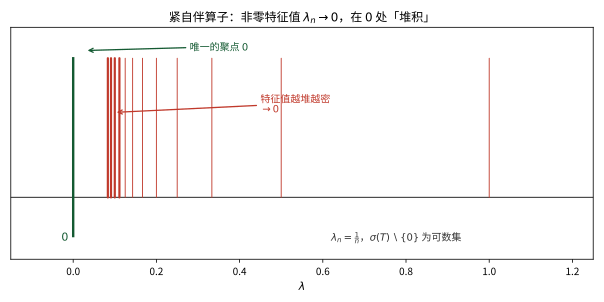

# 第 33 级：谱理论 (Spectral Theory)

> 谱理论是泛函分析的核心分支之一，它将线性代数中的特征值与特征向量理论推广到无穷维空间上的算子。谱理论不仅是量子力学的数学基石，也是微分方程、积分方程和调和分析等领域的重要工具。本章系统介绍谱的基本概念、谱半径公式、紧算子与自伴算子的谱理论、无界算子理论以及谱分解定理。

---

## 1. 学习目标

1. 理解谱、预解集、预解算子的基本概念，掌握点谱、连续谱、剩余谱的分类与判别。
2. 掌握谱半径的定义与 Gelfand 公式，理解其证明思路。
3. 深入理解 Riesz-Schauder 理论，掌握紧算子谱的结构与 Fredholm 择一性。
4. 掌握自伴算子的谱定理，理解谱测度与谱积分（函数演算）的构造。
5. 了解无界算子、闭算子、对称算子与自伴算子的基本理论。
6. 理解谱分解定理与 Stone 定理（单参数酉群）。
7. 了解谱理论在量子力学和微分方程中的典型应用。
8. 能够通过具体示例计算简单算子的谱，并解决相关习题。

---

## 2. 谱的基本概念

> **🧠 思考历程：来龙去脉——"谱"这个词是怎么登上数学舞台的？**
>
> "谱"（spectrum）一词最初来自物理光谱学：白光经棱镜被分解成一条条颜色带，正如一个线性算子把空间分解成各不相同的"本征分量"。把这份物理比喻锻造成数学概念，靠的是几位先驱的接力。
> - **从矩阵爬到积分算子**：19 世纪末，Volterra 与 Erik Ivar Fredholm（1896–1903 年）研究第二类积分方程 $f=\lambda Kf+g$ 时，把"特征值"从有限维矩阵推广到了无穷维算子。求解方程 $(\lambda I-T)x=y$ 到底哪些 $\lambda$ 会"失灵"，答案藏在行列式 $\det(I-\lambda K)$ 的零点里。
> - **Hilbert 撞见"连续谱"**：David Hilbert 于 1904–1910 年间系统研究积分算子与二次型时，惊觉谱不再是一串孤立的特征值，还可能铺满一整段区间——这种无法用任何单个特征向量描述的新现象，就是他口中的"连续谱"。
> - **von Neumann 一锤定音**：John von Neumann 在 1929–1932 年间把谱论奠基在 Hilbert 空间与谱测度之上，将分立谱与连续谱统一进同一个公式 $T=\int_{\mathbb R}\lambda\,dE(\lambda)$，并顺手给了量子力学严格的数学骨架。
>
> 这一段**所解决的核心理问**是：在无穷维空间里，单凭"解方程会碰壁的那些 $\lambda$ 组成的小集合 $\sigma(T)$"，能否读懂一个算子的全部性格？——答案是肯定的；而谱究竟由哪些"失效方式"拼成，正是下方 2.2–2.3 要展开的。本节先铺好这套语言的基础构件。

### 2.1 有界线性算子

设 $X$ 是复 Banach 空间，$T: X \to X$ 是有界线性算子。记 $\mathcal{B}(X)$ 为 $X$ 上所有有界线性算子的集合，其范数为算子范数：

$$
\|T\| = \sup_{\|x\|=1} \|Tx\|.
$$

### 2.2 谱与预解集

**定义 2.1**（预解集与谱）设 $T \in \mathcal{B}(X)$。定义：

- **预解集**（resolvent set）：
  $$
  \rho(T) = \{\lambda \in \mathbb{C} \mid \lambda I - T \text{ 在 } \mathcal{B}(X) \text{ 中可逆}\}.
  $$

- **谱**（spectrum）：
  $$
  \sigma(T) = \mathbb{C} \setminus \rho(T).
  $$

- **预解算子**（resolvent operator）：
  $$
  R_\lambda(T) = (\lambda I - T)^{-1}, \quad \lambda \in \rho(T).
  $$

> **💡 直观理解（类比）**：谱本身就是"求解方程 $(\lambda I-T)x=y$ 会碰壁的那些 $\lambda$"：能正常求逆（$\lambda\in\rho(T)$）就好比每个外力都能找到唯一舒服的解；而一旦 $\lambda$ 落入谱，$(\lambda I-T)$ 就"哑火"了。类比收音机调频：绝大多数频率能正常收听（预解集），但个别频率会出现啸叫／失灵（谱）。预解算子 $R_\lambda(T)$ 正是把"当前失效频率拨开的补救器"——只要不在谱上就能安全求逆。

**性质 2.2** 预解集 $\rho(T)$ 是 $\mathbb{C}$ 中的开集，谱 $\sigma(T)$ 是紧集。

**性质 2.3**（第一预解恒等式）对 $\lambda, \mu \in \rho(T)$，
$$
R_\lambda(T) - R_\mu(T) = (\mu - \lambda) R_\lambda(T) R_\mu(T).
$$

**性质 2.4** 谱半径 $\sigma(T)$ 非空（这是复 Banach 空间上算子的重要性质，而在实 Banach 空间上不一定成立）。

### 2.3 谱的分类

谱可细分为以下三类互不相交的部分：

**定义 2.5**（谱的分类）设 $T \in \mathcal{B}(X)$。

1. **点谱**（point spectrum）：
   $$
   \sigma_p(T) = \{\lambda \in \mathbb{C} \mid \ker(\lambda I - T) \neq \{0\}\}.
   $$
   即 $\lambda$ 是 $T$ 的**特征值**，存在非零向量 $x \in X$ 使得 $Tx = \lambda x$。

2. **连续谱**（continuous spectrum）：
   $$
   \sigma_c(T) = \{\lambda \in \mathbb{C} \mid \ker(\lambda I - T) = \{0\},\ \overline{\operatorname{ran}(\lambda I - T)} = X,\ \text{但 } (\lambda I - T)^{-1} \text{ 无界}\}.
   $$

3. **剩余谱**（residual spectrum）：
   $$
   \sigma_r(T) = \{\lambda \in \mathbb{C} \mid \ker(\lambda I - T) = \{0\},\ \overline{\operatorname{ran}(\lambda I - T)} \neq X\}.
   $$

显然 $\sigma(T) = \sigma_p(T) \cup \sigma_c(T) \cup \sigma_r(T)$，且三部分互不相交。

> **💡 直观理解（类比）**：谱被切分成三类"失效原因"：点谱是"真正无助"——存在非零特征向量 $Tx=\lambda x$（能找到一个具体共振模）；连续谱是"有没有解靠近似仍能取到，但逆算子一味放大"——值域稠密可逆却无界，好像信号总被人不规范地接近却从不完美还原；剩余谱是"值域差得远"——逆算子存在但值域不稠，有些外力根本到不了。三类合起来覆盖所有真正对不上的 $\lambda$，且互不重叠，把一纸"哪不行"的故障诊断表列得清清楚楚。

### 2.4 示例

**例 2.6**（有限维空间）设 $X = \mathbb{C}^n$，$T$ 是 $n \times n$ 矩阵。则 $\sigma(T) = \sigma_p(T)$ 为特征值集合，连续谱和剩余谱均为空集。

**例 2.7**（移位算子）设 $X = \ell^2(\mathbb{N})$，定义右移位算子 $R: (x_1, x_2, x_3, \dots) \mapsto (0, x_1, x_2, \dots)$。则：
- $\sigma_p(R) = \varnothing$（因为 $Rx = \lambda x$ 意味着 $x_1 = 0$，进而 $x_n = 0$ 对所有 $n$ 成立）；
- $\sigma_c(R) = \{\lambda \in \mathbb{C} \mid |\lambda| = 1\}$；
- $\sigma_r(R) = \{\lambda \in \mathbb{C} \mid |\lambda| < 1\}$。

**例 2.8**（乘法算子）设 $X = L^2[0,1]$，定义乘法算子 $(Mf)(t) = t f(t)$。则：
- $\sigma_p(M) = \varnothing$（因为 $tf(t) = \lambda f(t)$ 几乎处处成立意味着 $f = 0$ 几乎处处）；
- $\sigma_c(M) = [0,1]$；
- $\sigma_r(M) = \varnothing$。

**例 2.9**（Volterra 积分算子）设 $X = C[0,1]$，定义
$$
(Tf)(x) = \int_0^x f(t)\,dt.
$$
则 $\sigma(T) = \{0\}$，且 $\sigma_p(T) = \varnothing$，$\sigma_c(T) = \varnothing$，$\sigma_r(T) = \{0\}$。

---

## 3. 谱半径

> **🧠 思考历程：来龙去脉——谱"离原点"到底有多远？**
>
> 谱半径的念头很朴素：既然 $\sigma(T)$ 是一个紧集，想量化"它在最坏方向伸出去多远"，就取 $\sup\{|\lambda|:\lambda\in\sigma(T)\}$。但这个定义只回答"是什么"，真正让它威力显露的是 Israel Gelfand 在 1941 年给出的谱半径公式
> $$
> r(T)=\lim_{n\to\infty}\|T^n\|^{1/n},
> $$
> 它只用范数的迭代就能读出谱半径，完全不必预先知道 $\sigma(T)$ 长什么样。**它解决的一类核心理问**是：反复迭代 $T,T^2,T^3,\dots$ 的"长期增长率"到底由什么决定？——结论是由谱半径唯一决定；而一旦 $r(T)<1$，Neumann 级数 $\sum_{n\ge0}T^n$ 必然收敛、$(I-T)$ 必然可逆。这也解释了为何谱半径明明定义为"谱的几何半径"，却能被纯范数性极限算出来——几何与代数在此处严丝合缝。

### 3.1 定义

**定义 3.1**（谱半径）设 $T \in \mathcal{B}(X)$。$T$ 的**谱半径**定义为
$$
r(T) = \sup\{|\lambda| \mid \lambda \in \sigma(T)\}.
$$

> **💡 直观理解（类比）**：谱半径衡量的是"这台算子最糟糕的共振有多远"：把谱集合 $\sigma(T)$ 里每个失效点的模取出来，挑出最大那个当半径。类比一座存有可燃物的仓库，用"最危险火点的距里"来描述整体风险——只要知道 $r(T)$ 远小于 1，就能担保 Neumann 级数 $\sum T^n$ 收敛、$(I-T)$ 可逆，算是最朴素的安全判据。

### 3.2 Gelfand 公式

**定理 3.2**（Gelfand 谱半径公式）对任意 $T \in \mathcal{B}(X)$，
$$
r(T) = \lim_{n \to \infty} \|T^n\|^{1/n} = \inf_{n \ge 1} \|T^n\|^{1/n}.
$$

**证明概要**：
1. 首先证明极限存在且等于下确界。令 $a_n = \ln \|T^n\|$，利用 $\|T^{m+n}\| \le \|T^m\|\|T^n\|$ 可得 $a_n$ 是次可加的，由 Fekete 引理知 $\lim_{n\to\infty} a_n/n = \inf_n a_n/n$ 存在。
2. 然后证明 $r(T) = \lim \|T^n\|^{1/n}$。
   - 对任意 $\lambda \in \sigma(T)$，由谱映射定理知 $\lambda^n \in \sigma(T^n)$，故 $|\lambda|^n \le \|T^n\|$，从而 $|\lambda| \le \liminf \|T^n\|^{1/n}$。因此 $r(T) \le \liminf \|T^n\|^{1/n}$。
   - 反过来，对任意 $\varepsilon > 0$，考虑算子 $(\lambda I - T)^{-1}$ 的 Laurent 展开，利用 Liouville 定理（或复分析中的 Liouville 型论证）可证明 $\limsup \|T^n\|^{1/n} \le r(T) + \varepsilon$。取 $\varepsilon \to 0^+$ 即得结论。∎

> **💡 直观理解（类比）**：Gelfand 公式用"反复迭代"来探测谱半径：$r(T)=\lim\|T^n\|^{1/n}$。它像测量一块材料的最优生长速率——每一次迭代 $T^n$ 都像"续乘"，其范数几何增长或不变，而 $1/n$ 次根正好把增长还原成"每步放大倍数"。关键在下界（谱映射）与上界（Liouville）双向夹逼，最终证明即使不看 $\sigma(T)$ 长什么样，单凭范数的迭代也能读出最危险半径。

**推论 3.3** 谱半径满足以下性质：
1. $r(T) \le \|T\|$；
2. $r(\alpha T) = |\alpha| r(T)$，$\alpha \in \mathbb{C}$；
3. $r(T^k) = r(T)^k$，$k \in \mathbb{N}$；
4. 若 $T$ 是 Hilbert 空间上的正规算子，则 $r(T) = \|T\|$。

**例 3.4**（严格上三角矩阵）设 $T$ 是 $\mathbb{C}^n$ 上的严格上三角矩阵（对角元全为零），则 $T^n = 0$，故 $\|T^n\|^{1/n} = 0$，因此 $r(T) = 0$。这与 $\sigma(T) = \{0\}$ 一致。

**例 3.5**（Volterra 算子）对 $L^2[0,1]$ 上的 Volterra 积分算子
$$
(Tf)(x) = \int_0^x f(t)\,dt,
$$
可证明 $\|T^n\| \le 1/n!$，故 $r(T) = 0$。

### 3.3 Gelfand–Mazur 定理与 Banach 代数的极值原理 *（新增）*

> **💡 直观理解（类比）**：Gelfand–Mazur 定理回答的是一道"最简代数"问题：如果一个 Banach 代数里除了零元之外每个元素都可逆（通俗说"零是唯一的坏蛋"），那这个代数其实是被 $\mathbb{C}$ 罩住的——因为它不可能比"标量"更复杂。它像是说：**一台处处能给"倒数"的机器，其内部结构只能是一维的**。正是这条定理，连同 Gelfand 变换，撑起了整个交换 Banach 代数（及其中的 $C(X)$、$C^*(T)$ 等）的骨架。

**定义 3.6**（Banach 代数）**Banach 代数** $\mathcal{A}$ 是带单位 $1$、且满足 $\|ab\|\le\|a\|\|b\|$ 与 $\|1\|=1$ 的复 Banach 空间上的代数，其中乘法是联合连续的。例如 $\mathcal{A}=\mathcal{B}(X)$，或 $\mathcal{A}=C(K)$（紧 $K$ 上的连续函数，逐点乘法）。

**定理 3.7**（Gelfand–Mazur，1943）设 $\mathcal{A}$ 是单位 Banach 代数，且每个非零元 $a\in\mathcal{A}$（$a\ne0$）都可逆。则存在同构 $\mathcal{A}\cong\mathbb{C}$。精确地说，$a\mapsto\lambda_a$ 定为代数同构与等距同构。

**证明**（关键一步）：
1. 谱非空定理：任意复 Banach 代数元素 $a$ 的谱 $\sigma(a)\neq\varnothing$（证法与 $\mathcal{B}(X)$ 情形一致）。
2. 取 $\lambda\in\sigma(a)$，则 $\lambda 1-a$ 不可逆（谱的定义）。而题设非零元皆可逆，故 $\lambda 1-a=0$，即 $a=\lambda 1$。
3. 于是每个 $a$ 都是标量倍的单位，映射 $\varphi:\ a\mapsto\lambda$ 即所求同构。∎

**极值原理（谱半径与特征）** 在一般交换单位 Banach 代数 $\mathcal{A}$ 中记 $\Delta$ 为所有乘法线性泛函（character）$h:\mathcal{A}\to\mathbb{C}$ 的集合，Gelfand 变换 $\hat a(h)=h(a)$ 满足
$$
r(a)=\sup_{\lambda\in\sigma(a)}|\lambda|=\sup_{h\in\Delta}|\hat a(h)|=\|\hat a\|_\infty,
$$
其中最后一个等式正是对"谱半径=上确界模"的代数化表述；当 $\mathcal{A}$ 还是 $C^*$-代数时更有 $\|a\|^2=r(a^*a)$ 与 $r(a)=\|a\|$（对正规元）。这可视为复分析**极大模原理**在算子世界的转世：$\hat a$ 的模在 $\Delta$ 上取最大，其极值是谱半径。

**例 3.8**（如何用它）设 $\mathcal{A}=\mathcal{B}(\mathbb{C}^n)$ 是矩阵代数，非零元未必可逆，故不满足 Gelfand–Mazur 前提；但对单个元素 $a$，$\sigma(a)$ 非空保证了"至少有一片 $C^*$-代数由 $a$ 生成时，其 Gelfand 表示把 $a$ 映为 $\hat a(z)=z$"，从而 $\sigma(a)=\hat a(\sigma(a))=\hat\sigma$。真正用上 Gelfand–Mazur 的是 $C(K)$：$\Delta\cong K$（点赋值），于是 $r(f)=\|f\|_\infty$，并把极大模原理化为 $C(K)$ 上的最大模事实。

---

## 4. 紧算子的谱

> **🧠 思考历程：来龙去脉——为何"紧"能让无穷维重新找回秩序？**
>
> 有限维矩阵的谱干干净净：一串孤立的特征值。可一进入无穷维，一般算子的谱就能长出奇怪的连续段。**紧算子**的意义正在于它是"离有限维最近"的一族算子。Frigyes Riesz 于 1918 年发表开创性论文，证明紧算子的非零谱只能是孤立特征值、对应特征空间有限维、且 $0$ 是唯一可能的聚点；随后 Juliusz Schauder（1930 年）与 Fredholm 等把这套理论铸成积分方程的解算机器，即今天所称的 **Riesz–Schauder 理论**与 **Fredholm 择一性**。
>
> 这一节**所解决的核心理问**是：哪些无穷维算子还能像矩阵那样享受"几乎完全对角化"的待遇？——答案是紧算子（紧自伴算子更是可以彻底对角化）。它也顺带回答了关键原因：为何第二类 Fredholm 积分方程总有无穷级数形式的特征展开（见 4.3 与例 4.5）。

### 4.1 紧算子

**定义 4.1**（紧算子）设 $X, Y$ 是 Banach 空间。线性算子 $T: X \to Y$ 称为**紧算子**（compact operator），若它将 $X$ 中的有界集映射为 $Y$ 中的相对紧集（即闭包是紧的）。记 $\mathcal{K}(X,Y)$ 为所有紧算子构成的集合。

**等价定义**：$T$ 是紧算子当且仅当对任意有界序列 $\{x_n\} \subset X$，$\{Tx_n\}$ 有收敛子列。

> **💡 直观理解（类比）**：紧算子是在"无限维的大房子里仍带着有限维的箱子"：它不开疆拓土，遇到任何有界的一堆点，输出这边总挤在一个相对紧的小范围内，总有收敛子列。类比把一大盆沙（有界集）倒进一只小漏斗（相对紧集），沙子怎么堆都不会漫出有界的边界。这使紧算子在无穷维里仍保有理想的对角化行为（与 Riesz-Schauder 理论密切相关）。

**性质 4.2**：
1. 紧算子是有界算子。
2. 有限秩算子（值域有限维的算子）是紧算子。
3. 紧算子的极限（在算子范数下）仍是紧算子。
4. 紧算子的复合仍为紧算子。

### 4.2 Riesz-Schauder 理论

**定理 4.3**（Riesz-Schauder 定理）设 $X$ 是 Banach 空间，$T \in \mathcal{K}(X)$ 是紧算子。则：
1. $\sigma(T)$ 是至多可数集，且唯一的可能聚点是 $0$；
2. 每个非零 $\lambda \in \sigma(T)$ 都是特征值，且对应的特征空间 $\ker(\lambda I - T)$ 是有限维的；
3. 对每个非零 $\lambda \in \sigma(T)$，$\operatorname{ran}(\lambda I - T)$ 是闭的，且 $\operatorname{codim}\operatorname{ran}(\lambda I - T) = \dim \ker(\lambda I - T) < \infty$。

**证明思路**：
1. 利用紧算子的性质证明 $\ker(I - T)$ 是有限维的。
2. 证明 $\operatorname{ran}(I - T)$ 是闭的。
3. 证明 $\dim \ker(I - T) = \operatorname{codim}\operatorname{ran}(I - T)$（Riesz 指标理论）。
4. 对一般 $\lambda \neq 0$，通过缩放化为 $\lambda = 1$ 的情形。
5. 证明非零谱点只能是特征值，且无聚点非零。

> **💡 直观理解（类比）**：Riesz-Schauder 定理说紧算子的非零谱"像一串渐次熄灭的烛火"：彼此孤立、至多可数、唯一的灯笼聚点是 $0$，且每根火焰对应的谐振维数（特征空间）有限。它把紧算子从"形体微妙的无穷维"拉回到"几乎像矩阵"的自在局面——这正是积分方程、Laplace 算子在有界域上能稳定求得离散特征系统的充分理由。

### 4.3 Fredholm 择一性

**定理 4.4**（Fredholm 择一性）设 $T$ 是 Banach 空间 $X$ 上的紧算子，$\lambda \neq 0$。则以下二者恰居其一：
- 方程 $(\lambda I - T)x = y$ 对任意 $y \in X$ 有唯一解；
- 齐次方程 $(\lambda I - T)x = 0$ 有非平凡解（即 $\lambda$ 是特征值）。

换言之，$\lambda \neq 0$ 要么属于预解集，要么是特征值。

> **💡 直观理解（类比）**：Fredholm 择一性是一张"非此即彼"的答卷：对非零 $\lambda$，方程 $(\lambda I-T)x=y$ 要么对任意 $y$ 有唯一解（健康、可逆），要么就"撞上"某个特征值——此时的非零解立刻成形。类比开一扇锁：要么任意钥匙都能开（可逆），要么某个坏参数卡住锁芯出现滑锁（特征值），绝不给第三种前景。这正是积分方程解的存在唯一性与齐次方程有无数次解相互排斥、互斥互补的诊断书。

**例 4.5**（Fredholm 积分方程）考虑第二类 Fredholm 积分方程：
$$
f(x) - \lambda \int_a^b K(x,y) f(y)\,dy = g(x),
$$
其中 $K$ 是连续核（或 $L^2$ 核）。积分算子 $Tf(x) = \int_a^b K(x,y) f(y)\,dy$ 是紧算子。Fredholm 择一性保证了：对给定的 $\lambda$，要么解存在唯一，要么齐次方程有非平凡解。

### 4.4 Hilbert 空间上紧自伴算子的谱定理

**定理 4.6**（Hilbert-Schmidt 定理）设 $H$ 是 Hilbert 空间，$T: H \to H$ 是紧自伴算子（即 $T^* = T$ 且 $T$ 紧）。则存在 $H$ 的一组标准正交基 $\{e_n\}$ 和实数列 $\{\lambda_n\}$（特征值），使得：
1. $\lambda_n \to 0$（当 $n \to \infty$）；
2. $T e_n = \lambda_n e_n$ 对所有 $n$ 成立；
3. 对任意 $x \in H$，
   $$
   Tx = \sum_{n=1}^\infty \lambda_n \langle x, e_n \rangle e_n.
   $$

**证明概要**：
1. 首先证明紧自伴算子的谱（除零外）由特征值组成，且特征值均为实数。
2. 证明 $T$ 有非零特征值（若 $T \neq 0$）：考虑 $\|T\|$ 或 $-\|T\|$ 至少有一个是特征值。
3. 设 $\lambda_1$ 是绝对值最大的特征值，$e_1$ 是单位特征向量。令 $H_1 = \{e_1\}^\perp$，则 $T$ 限制在 $H_1$ 上仍是紧自伴算子。
4. 重复上述过程，得到特征值序列 $|\lambda_1| \ge |\lambda_2| \ge \cdots \ge 0$ 和对应的标准正交特征向量 $\{e_n\}$。
5. 若 $\lambda_n \not\to 0$，则存在子列 $\lambda_{n_k} \to \lambda \neq 0$，利用紧性导出矛盾。故 $\lambda_n \to 0$。
6. 对任意 $x \in H$，$x - \sum_{n=1}^N \langle x, e_n \rangle e_n$ 正交于所有 $e_1,\dots,e_N$，由上述论证知其范数在 $T$ 作用下趋于 $0$。∎

> **💡 直观理解（类比）**：Hilbert-Schmidt 定理是"紧自伴算子的对角化宣言"：只要这台机器对称且紧，全空间就能用它的特征向量搭成标准正交基 $Tx=\sum\lambda_n\langle x,e_n\rangle e_n$。类比钢琴：琴键（特征函数 $e_n$）、音高（特征值 $\lambda_n$）一一就位，任何乐句（向量 $x$）都按各琴键的音量拆成叠加。证明核心是"贪心挑每步的极值频率"——取 $\|T\|$ 对应的极值方向，逐层正交剥离。

**例 4.7**（Laplace 算子的特征函数）设 $\Omega \subset \mathbb{R}^n$ 是有界区域。考虑 Laplace 算子 $-\Delta$ 在 Dirichlet 边界条件下的逆算子，它是 $L^2(\Omega)$ 上的紧自伴算子。因此 $-\Delta$ 存在可数无穷多个特征值
$$
0 < \lambda_1 \le \lambda_2 \le \cdots \to \infty,
$$
对应的特征函数 $\{u_n\}$ 构成 $L^2(\Omega)$ 的一组标准正交基。

> **直观理解（现实类比）**：紧算子的非零特征值像一段不断减半的琴弦：$\lambda=1,\frac12,\frac13,\dots$ 越来越密地"堆积"在 $0$ 附近，$0$ 是它们唯一的聚点。就像回音室里的声波，频率越高衰减越快，能量最终都挤向无限小的频率附近。正因为谱"收缩"到 $0$，紧算子才可以在无穷维空间里像有限维矩阵一样被对角化。
>
> **🧠 思考历程：谱——是什么让一个算子"失效"？**
>
> 谱理论最初来自一个再朴素不过的问题：解方程 $(\lambda I - T)x = y$ 时，哪些 $\lambda$ 会"失灵"？数学家们后来才发现，正是这一小撮"失灵值"构成的集合 $\sigma(T)$，竟能浓缩算子的全部本征行为，并成为量子力学的数学基石。
>
> - **从矩阵蔓延到积分算子**。19 世纪末，Erik Ivar Fredholm 在 1900 年前后研究第二类积分方程时，发现解的存在与否取决于某个无穷行列式在哪取零——"特征值"由此从有限维矩阵悄悄爬上了无穷维算子。
> - **Hilbert 撞见"连续谱"**。20 世纪初，David Hilbert 于 1904–1910 年间改造二次型与积分算子时，惊觉谱不再只是孤立的一串特征值，而是会完整铺满某段区间；这种无法用单个向量描述的新现象，被他称为"连续谱"。
> - **谱定理与量子力学**。John von Neumann 在 1929–1932 年间把谱分解严格化，用谱测度写出 $T=\int_{\mathbb{R}}\lambda\,dE(\lambda)$，把分立谱与连续谱统一进同一个公式——这份结构后来成为量子力学可观测量与测量公设的数学骨架。
> - **心路**："解方程求失效点"这一具体渴望，最终长成了横贯整个泛函分析的大树，数学家由此学会用"谱"来读懂一个算子的全部性格。

---

## 5. 自伴算子的谱

> **🧠 思考历程：来龙去脉——为何"自伴"是谱理论的宠儿？**
>
> 自伴算子 $T^*=T$（有界情形）是一切谱结论最漂亮的那一族，根源在于它的谱落在实轴上（$\sigma(T)\subset\mathbb R$），从而可以写成谱积分 $T=\int_{\sigma(T)}\lambda\,dE(\lambda)$。这一脉思想源头可上溯到 Hilbert（1904–1910）对二次型与积分算子的研究——他证明了有界自伴算子可被对角化；随后 von Neumann（1929–1932）把它推广为谱测度与谱积分，并用来重建量子力学的数学大厦。
>
> 这一节**所解决的问题**是：一个"对称得好"的算子（$T^*=T$）在无穷维里能否被当作一个"可对角化的、实数的"对象来处理？——能。且由此顺理成章地长出多项式演算、Borel 函数演算、平方根 $S^2=T$、谱投影 $E(\omega)=\chi_\omega(T)$ 等一整套"把算子当函数使用"的工具。这正是量子力学里能量、位置、动量等可观测量都必须用自伴算子来描述的根本原因（测量结果永远落在实谱上）。

### 5.1 有界自伴算子

**定义 5.1**（自伴算子）设 $H$ 是 Hilbert 空间，$T \in \mathcal{B}(H)$。若 $T^* = T$（即 $\langle Tx, y \rangle = \langle x, Ty \rangle$ 对所有 $x,y \in H$ 成立），则称 $T$ 是**自伴算子**（self-adjoint operator）。

**性质 5.2** 自伴算子 $T$ 满足：
1. $\sigma(T) \subset \mathbb{R}$；
2. $\|T\| = \sup\{|\langle Tx, x\rangle| \mid \|x\| = 1\}$；
3. 若 $\lambda \in \mathbb{C} \setminus \mathbb{R}$，则 $\|(\lambda I - T)^{-1}\| \le 1/|\operatorname{Im}\lambda|$。

> **💡 直观理解（类比）**：自伴算子的谱全是实数——类比一个不会说谎的镜子：$\langle Tx,y\rangle=\langle x,Ty\rangle$ 使所有"共振失败点"都被钉在实轴上，任何带虚部的 $\lambda$ 都离失效很远，预解范数还能被虚部距离罩住（$1/|\operatorname{Im}\lambda|$）。这就是为什么量子力学的可观测量（能量、位置、动量）都必须用自伴算子来描述——测得的量永远是实数。

### 5.2 谱测度与谱积分

**定义 5.3**（谱测度）设 $H$ 是 Hilbert 空间，$(\Omega, \mathcal{F})$ 是可测空间。**谱测度**（spectral measure）是一个映射 $E: \mathcal{F} \to \mathcal{B}(H)$，满足：
1. 对每个 $\omega \in \mathcal{F}$，$E(\omega)$ 是正交投影；
2. $E(\varnothing) = 0$，$E(\Omega) = I$；
3. 可数可加性：若 $\{\omega_n\}$ 是互不相交的可测集，则
   $$
   E\left(\bigcup_{n=1}^\infty \omega_n\right) = \sum_{n=1}^\infty E(\omega_n),
   $$
   其中级数在强算子拓扑下收敛。

> **💡 直观理解（类比）**：谱测度把实数轴划分成一格一格的可测区间，每格对应一个正交投影 $E(\omega)$——它就是"只看这一小段谱"的取景框。重叠的格子不相干（$E(\omega_1)\perp E(\omega_2)$），把全轴拼起来刚好是恒等投影。类比一张带刻度的量杯：每个刻度段对应一个"只打开该段的阀门"，各阀门互不干扰，全打开就把整池水（全空间）都放出来了。
>
> **🧠 思考历程：预解式估计与 Stone 公式**——谱测度虽抽象，却有一条通向它的"显式通道"：**Stone 公式**把谱投影用预解算子的"跨割跳变"写出来
> $$
> E((a,b]) = \lim_{\varepsilon\to0^{+}}\lim_{\delta\to0^{+}}\frac{1}{2\pi i}\int_{a+\delta}^{b+\delta}\bigl[R_{s+i\varepsilon}(T)-R_{s-i\varepsilon}(T)\bigr]\,ds,
> $$
> 其中 $R_\lambda(T)=(\lambda I-T)^{-1}$ 是预解算子。它揭示了"谱测度"与"预解解析函数沿实轴的跳变量"互为表里；配合预解式估计（如自伴算子满足 $\|R_\lambda(T)\|\le 1/|\operatorname{Im}\lambda|$，见性质 5.2 与习题 38），即可由预解的边界行为反推谱的分立/连续结构——这正是把握谱测度"几何形状"的一把实用钥匙。

### 5.3 有界自伴算子的谱定理

**定理 5.4**（谱定理——有界自伴算子）设 $T \in \mathcal{B}(H)$ 是自伴算子。则存在唯一的谱测度 $E$ 定义在 $\mathbb{R}$ 的 Borel 集上，满足：
1. $T = \int_{\sigma(T)} \lambda \, dE(\lambda)$；
2. 对任意多项式 $p$，$p(T) = \int_{\sigma(T)} p(\lambda) \, dE(\lambda)$；
3. 对任意 Borel 集 $\omega$，$E(\omega)$ 与 $T$ 可交换；
4. $\operatorname{supp}(E) = \sigma(T)$。

该积分称为**谱积分**（spectral integral），在强算子拓扑下理解。

> **💡 直观理解（类比）**：谱定理是"无穷维对角化的终极版"：$T=\int\lambda\,dE(\lambda)$ 沿刻度盘逐段加权累积各投影，多项式也好、任意可测函数也好，都能"在谱上逐点作用"。它把算子当成一台"可分数值刻度"的仪器——每个 $\lambda$ 下的投影 $E$ 就像把台秤按刻度细细切片，于是 $p(T)$、$\sqrt{T}$、对数等操作全都有了合法的定义基础。这是理解"函数演算"与可测量子的总枢纽。

### 5.4 函数演算

**定义 5.5**（Borel 函数演算）设 $T$ 是有界自伴算子，$E$ 是其谱测度。对任意有界 Borel 函数 $f: \mathbb{R} \to \mathbb{C}$，定义
$$
f(T) = \int_{\sigma(T)} f(\lambda) \, dE(\lambda).
$$
则映射 $f \mapsto f(T)$ 满足：
1. $(af + bg)(T) = a f(T) + b g(T)$（线性）；
2. $(fg)(T) = f(T) g(T)$（乘法）；
3. $\overline{f}(T) = f(T)^*$（对合）；
4. $\|f(T)\| \le \sup_{\lambda \in \sigma(T)} |f(\lambda)|$（范数不等式）；
5. 若 $f_n \to f$ 逐点且有界，则 $f_n(T) \to f(T)$ 在强算子拓扑下收敛。

> **💡 直观理解（类比）**：Borel 函数演算是"把算子当函数把玩"的通行证：只要谱上有意义，$\sqrt{T}$、$|T|$、特征函数的投影 $\chi_\omega(T)$ 全都能定义，并且线性、乘法、对合、范数界都如数保持。类比给一台钢琴装"效果踏板"：静音/回响/移调等任意可测效果都能叠加到同一台琴上，且叠加规则和普通算数的直觉完全一致。它是谱定理带给计算的最大红利。

**例 5.6**（平方根）若 $T \ge 0$（即 $\langle Tx, x \rangle \ge 0$ 对所有 $x$ 成立），则存在唯一的 $S \ge 0$ 使得 $S^2 = T$。事实上，取 $f(\lambda) = \sqrt{\lambda}$，则 $S = f(T) = \int \sqrt{\lambda} \, dE(\lambda)$。

**例 5.7**（投影算子）若 $\omega \subset \mathbb{R}$ 是 Borel 集，则 $E(\omega) = \chi_\omega(T)$ 是正交投影，其中 $\chi_\omega$ 是 $\omega$ 的特征函数。

### 5.5 正规算子的谱定理（乘法算子模型）*（新增）*

> **💡 直观理解（类比）**：自伴算子的谱落在实轴上，而**正规算子** $N^*N=NN^*$ 把"实数的对角化"放宽成"复数的对角化"——一个正规算子凑巧就是"乘以某个本性有界复函数 $\phi$"的乘法算子（在某 $L^2$ 模型中）。这好比一幅原本只有黑白明暗（实数）的画，现在放宽成任意彩色（复数）的亮度分布：只要颜色间的组合"可交换"（$N^*N=NN^*$），这台算子就总能在某个 $L^2$ 空间里被画成最朴素的逐点乘法。

**定义 5.8**（正规算子）设 $N\in\mathcal{B}(H)$。若 $N^*N=NN^*$，则称 $N$ 是**正规算子**（normal operator）。自伴算子、酉算子、以及 $L^2$ 上乘本性有界函数 $\phi$ 的乘法算子 $M_\phi$ 都是正规算子。

**定理 5.9**（正规算子的谱定理——乘法算子模型）设 $H$ 是可分 Hilbert 空间，$N\in\mathcal{B}(H)$ 是正规算子。则存在 $\sigma$-有限测度空间 $(X,\mathcal{B},\mu)$ 与本性有界可测函数 $\phi:X\to\mathbb{C}$，使得 $N$ 酉等价于 $L^2(X,\mu)$ 上的乘法算子 $M_\phi$（$M_\phi f=\phi f$），且
$$
\sigma(N)=\sigma(M_\phi)=\operatorname{ess\,ran}(\phi),
$$
其中 $\operatorname{ess\,ran}(\phi)=\{\lambda\in\mathbb{C}:\mu\{x:|\phi(x)-\lambda|<\varepsilon\}>0\ \forall\varepsilon>0\}$ 为本质值域。

特别地，若 $N$ 有循环向量 $x_0$（$\{p(N)x_0\}$ 稠密），则进一步的模型可取为
$$
N\simeq M_z:\ L^2(\sigma(N),E_{x_0})\to L^2(\sigma(N),E_{x_0}),\qquad f\mapsto z\,f,
$$
其中测度为谱测度 $E_{x_0}(\cdot)=\langle E(\cdot)x_0,x_0\rangle$，此时谱半径恰为 $\|\phi\|_\infty=r(N)$。

> **💡 直观理解**：定理 5.9 让"正规算子谱"问题退化为"可测函数本质值域"问题——这是认识正规算子（含自伴算子）的最直观窗口。自伴情形（$\phi$ 实值 a.e.）即回到 §5.1–5.4 的实谱结论；如 $\phi(z)=z$ 时得到移位（酉）算子谱在单位圆周上的模型。

**例 5.10**（乘法模型的应用）
1. 设 $N$ 是 $L^2(\mathbb{T})$ 上乘以 $z$ 的算子，则 $N$ 是正规（实为酉）的，$\sigma(N)=\operatorname{ess\,ran}(z)=\mathbb{T}$；
2. 设 $N$ 是 $L^2[0,1]$ 上乘以 $\phi(t)=t+it^2$ 的算子，则 $\sigma(N)=\overline{\phi([0,1])}$ 是一条复平面上的曲线（连续谱），与自伴情形的区间谱形成对照；
3. 由正规算子谱定理可立即推得习题 223 的结论 $\overline{W(N)}=\operatorname{conv}\sigma(N)$。

---

## 6. 无界算子

> **🧠 思考历程：来龙去脉——为什么必须鼓起勇气拥抱"无界"？**
>
> 纯数学大可以在有界算子的小天地里自得其乐，但量子力学逼我们非把镜头拉远不可：动量算子 $-i\,\frac{d}{dx}$、位置算子 $x\mapsto xf(x)$、谐振子 Hamiltonian $-\frac{d^2}{dx^2}+\frac12\omega^2 x^2$ 通通是无界的。von Neumann（1929–1932）在建立量子力学严格数学基础时，系统发展出无界稠定算子、闭算子、对称算子/自伴算子与缺陷指标理论。
>
> 这一节**所解决的核心难题**是：定义域只有稠密子空间 $\mathcal D(T)$ 的算子，凭什么还能拥有谱、谱定理与自伴概念？——答案是"闭 + 稠定"，并额外要求 $\mathcal D(T)=\mathcal D(T^*)$（自伴），再把谱定理写成 $T=\int_{\mathbb R}\lambda\,dE(\lambda)$，用 $\mathcal D(T)=\{x\in H:\int\lambda^2\,d\|E(\lambda)x\|^2<\infty\}$ 精确刻画定义域。这样每个物理可观测量都能配上一个合法的自伴算子，而"对称但非自伴"的算子（如缺陷指标非零的微分算子）则被结构性地排除在外。

### 6.1 基本概念

**定义 6.1**（无界线性算子）设 $H$ 是 Hilbert 空间。**无界线性算子** $T$ 是指定义在某个稠密子空间 $\mathcal{D}(T) \subset H$ 上的线性映射 $T: \mathcal{D}(T) \to H$。$\mathcal{D}(T)$ 称为 $T$ 的**定义域**（domain）。

> **💡 直观理解（类比）**：无界算子指"不能全程在同一把尺子内工作"的机器：它只在稠密子集 $\mathcal{D}(T)$ 上被定义，出了这个"安全区"就可能爆表。类比一台只能在限载下工作的吊车——它在允许范围内操作自如，但并非每个货物都能吊。微分算子 $d/dx$ 就是这样：只有落在 $L^2$ 且导数也在 $L^2$ 的函数才算它的"装载范围"。

**定义 6.2**（图与闭算子）$T$ 的**图**（graph）定义为
$$
G(T) = \{(x, Tx) \mid x \in \mathcal{D}(T)\} \subset H \times H.
$$
若 $G(T)$ 在 $H \times H$ 中是闭的，则称 $T$ 是**闭算子**（closed operator）。

> **💡 直观理解（类比）**：闭算子指"只要落在定义域里的点列的极限还在定义域内，且输出也随之收敛，就绝不滑坡"——图闭合不漏项。类比一份严格执行的考勤表：凡已签到之人的成绩，任你取极限，其结果也一定仍在同一张表里登记好，不会平白出现"越界跑单"。这是无界算子能"守住地盘"的关键品质。

**定理 6.3**（闭图像定理）若 $T$ 是定义在整个 $H$ 上的闭算子，则 $T$ 是有界的。

### 6.2 对称算子与自伴算子

**定义 6.4**（对称算子）设 $T$ 是 $\mathcal{D}(T) \subset H$ 上的稠定线性算子。若
$$
\langle Tx, y \rangle = \langle x, Ty \rangle \quad \forall x, y \in \mathcal{D}(T),
$$
则称 $T$ 是**对称算子**（symmetric operator）。

**定义 6.5**（自伴算子）对称算子 $T$ 称为**自伴的**（self-adjoint），若 $\mathcal{D}(T) = \mathcal{D}(T^*)$ 且 $T = T^*$。这里 $T^*$ 是 $T$ 的伴随算子，其定义域为
$$
\mathcal{D}(T^*) = \{y \in H \mid \exists z \in H, \forall x \in \mathcal{D}(T): \langle Tx, y \rangle = \langle x, z \rangle\}.
$$

**重要区别**：对于无界算子，对称与自伴不是等价的。自伴性要求 $\mathcal{D}(T) = \mathcal{D}(T^*)$，这比对称性严格得多。

> **💡 直观理解（类比）**：对称与自伴的距离像"reasonable 的人"与"有法定资格的人"：对称只要求彼此内积相等（$\langle Tx,y\rangle=\langle x,Ty\rangle$），而自伴还强行要求两者定义域完全重合（$\mathcal{D}(T)=\mathcal{D}(T^*)$），生怕附伴随背着你走更远的地盘。正因为多了这不放水的关键条件，无界自伴算子才拥有实谱与谱定理，而一般对称算子则未必。

**例 6.6**（动量算子）在 $H = L^2(\mathbb{R})$ 上，定义动量算子
$$
(p f)(x) = -i \frac{df}{dx}, \quad \mathcal{D}(p) = \{f \in L^2(\mathbb{R}) \mid f' \in L^2(\mathbb{R})\}.
$$
$p$ 是自伴算子。

**例 6.7**（位置算子）在 $H = L^2(\mathbb{R})$ 上，定义位置算子
$$
(Q f)(x) = x f(x), \quad \mathcal{D}(Q) = \{f \in L^2(\mathbb{R}) \mid \int_{\mathbb{R}} x^2 |f(x)|^2\,dx < \infty\}.
$$
$Q$ 是自伴算子，其谱 $\sigma(Q) = \mathbb{R}$（连续谱）。

### 6.3 无界自伴算子的谱定理

**定理 6.8**（无界自伴算子的谱定理）设 $T$ 是 Hilbert 空间 $H$ 上的（无界）自伴算子。则存在唯一的谱测度 $E$ 定义在 $\mathbb{R}$ 的 Borel 集上，使得
$$
T = \int_{\mathbb{R}} \lambda \, dE(\lambda),
$$
且 $T$ 的定义域为
$$
\mathcal{D}(T) = \left\{x \in H \mid \int_{\mathbb{R}} \lambda^2 \, d\|E(\lambda)x\|^2 < \infty\right\}.
$$

> **💡 直观理解（类比）**：无界自伴算子的谱定理把"只看算子本身"升级为"只看它的谱测度"：连无界也能写成谱积分，谱尺度不再被封顶。定义域被耐人寻味地描述为"谱方向上足够强地含住 $\lambda^2$ 之量的向量"——就像能装满无限深井的水位。即便算子本身无界，谱测度照样把全实轴切得服服帖帖，这就是量子力学里动量、位置能安心使用的缘故。

### 6.4 本质谱

**定义 6.9**（本质谱）设 $T$ 是 Hilbert 空间上的自伴算子。$T$ 的**本质谱**（essential spectrum）$\sigma_{\text{ess}}(T)$ 定义为 $\sigma(T)$ 中所有非孤立点或孤立但对应特征空间无穷维的点。

> **💡 直观理解（类比）**：本质谱是"结构性、拉不掉的坏点部分"：孤立的有限重特征值像长在墙边可拆的钉子，本质谱则是砌进承重墙、怎么扒都还留下的部分（非孤立点集合，或孤立但带无穷维特征空间的点）。Weyl 准则用"近似特征序列" $\|(T-\lambda)x_n\|\to0$ 敏锐地探测它。一条铁律：紧扰动（加一个紧算子）根本撼动不了本质谱 $\sigma_{\text{ess}}(T+K)=\sigma_{\text{ess}}(T)$——扰动能动的只是孤立离散谱，本质谱像沧海磐石般岿然不动。

更具体地，$\lambda \in \sigma_{\text{ess}}(T)$ 当且仅当存在正交序列 $\{x_n\}$ 使得 $\|x_n\| = 1$ 且 $(T - \lambda I)x_n \to 0$（Weyl 准则）。

**性质 6.10** 本质谱对紧扰动是稳定的：若 $T$ 是自伴算子，$K$ 是紧自伴算子，则
$$
\sigma_{\text{ess}}(T + K) = \sigma_{\text{ess}}(T).
$$

### 6.5 Cayley 变换与无界自伴算子的谱定理 *（新增）*

> **💡 直观理解（类比）**：无界自伴算子 $A$ 的定义域总是不够"整"，但它也有一个极优雅的藏身处：**Cayley 变换**把 $A$ 一一对应到一个**有界酉算子** $U$ 上，
> $$
> U=(A-iI)(A+iI)^{-1}.
> $$
> 这好比把"无遮盖的实轴 $A$"通过 $\mathbb{R}\ni t\mapsto\frac{t-i}{t+i}$（莫比乌斯映射）卷成一个在单位圆 $\mathbb{T}$ 上的酉算子——无界的 $\sigma(A)\subset\mathbb R$ 被安全地压缩成 $U$ 的单位圆周谱。于是只要懂得"有界酉算子的谱定理"（$\equiv$ 某个乘法算子 $e^{i\theta}$ 模型），再反解 $A=i(I+U)(I-U)^{-1}$，无界自伴算子的谱定理便自动到手。

**定义 6.11**（Cayley 变换）设 $T$ 是 $H$ 上稠定的对称算子。其 **Cayley 变换**定义为
$$
U_T = (T-iI)(T+iI)^{-1},
$$
定义域为 $\mathcal{D}(U_T)=\operatorname{ran}(T+iI)$。

**定理 6.12**（Cayley 变换与谱定理）设 $A$ 是（无界）自伴算子。则：
1. $C_A=(A-iI)(A+iI)^{-1}$ 是 $H$ 上的**酉算子**；
2. $1\notin\sigma_p(C_A)$（$1$ 不是 $C_A$ 的特征值）；
3. 反之，若 $U$ 是酉算子且 $1\notin\sigma_p(U)$，则 $A=i(I+U)(I-U)^{-1}$ 是自伴算子，且 $C_A=U$。
4. 由此，$A$ 的谱定理 $A=\int_{\mathbb R}\lambda\,dE(\lambda)$ 可由酉算子谱定理诱导出来：记 $V$ 为把 $U$ 酉等价为乘法算子 $M_{e^{i\theta}}$ 的模型，则 $A$ 对应乘法算子 $M_{\lambda(\theta)}$，其中 $\lambda=i\frac{1-e^{i\theta}}{1+e^{i\theta}}$（正切式 Cayley 逆映射）。

**证明思路**：
1. 自伴 ⇒ $\sigma(A)\subset\mathbb R$，故 $A\pm iI$ 皆为双射、值域为全 $H$，$\mathcal{D}(U_T)=H$。
2. 对 $x\in\mathcal{D}(A)$，计算 $\|(A-iI)x\|^2=\|Ax\|^2+\|x\|^2=\|(A+iI)x\|^2$（交叉项±i 抵消），故 $U_T$ 保范；因值域为全 $H$，$U_T$ 是酉。
3. 若 $C_A x=x$，由 $C_A(A+iI)=A-iI$ 反推 $(A-iI)y=(A+iI)y$，$y=(A+iI)^{-1}x$，得 $-iy=iy\Rightarrow y=0$，故 $x=0$，即 $1\notin\sigma_p(C_A)$。反之用谱半径/谱测度把 $U$ 映到乘法 $e^{i\theta}$ 再定义 $A$ 即可。∎

**例 6.13**（位置算子的 Cayley 变换）在 $L^2(\mathbb R)$ 上，$A=Q$（乘以 $x$）。则 $C_A=(Q-i)(Q+i)^{-1}$ 就是乘以 $\frac{x-i}{x+i}$ 的乘法酉算子；由于 $\left|\frac{x-i}{x+i}\right|=1$，它落在单位圆周上，且在 $x\to\infty$ 时趋近 $1$（因而 $1$ 不是特征值，恰印证 $1\notin\sigma_p$）。反解即得 $Q=i\frac{I+C_Q}{I-C_Q}$ 为乘以 $x$ 的自伴算子。这演示了 §6.3 的无界谱定理如何经由 §6.5 的酉化视角重新实现。

---

## 7. 谱分解

> **🧠 思考历程：来龙去脉——把一台算子彻底"拆解"成谱的刻度。**
>
> 谱分解定理是前面诸章的顶上宝冠：它把整个算子 $T$ 沿谱轴拆成无穷多个小正交投影的加权叠加，$T=\int_{\sigma(T)}\lambda\,dE(\lambda)$，并在 $T$ 与（谱测度）$E$ 之间建立起一一对应。这一思想的萌芽是 Hilbert 的二次型对角化，成熟于 von Neumann 用谱测度公理化，并由 Marshall Stone（1932）用它沟通单参数酉群 $\{U(t)\}$ 与其无穷小生成元——所谓 $U(t)=e^{itA}$。
>
> 这一节**所解决的一类核心问题**是：把"对算子施加任意函数 $f$（多项式、指数、平方根…）"变成合法操作 $f(T)=\int f(\lambda)\,dE(\lambda)$，从而让谱分析从静态的"找特征值"升级为动态的"把算子当作可以拆解、改造成重新组装的一台仪器"。谱分解因此既是理论上终局，也是 §8 应用（量子力学演化、微分方程特征展开）的引擎。

### 7.1 谱分解定理

**定理 7.1**（谱分解）设 $T$ 是 Hilbert 空间 $H$ 上的有界自伴算子。则存在谱测度 $E$ 使得 $T$ 可表示为
$$
T = \int_{\sigma(T)} \lambda \, dE(\lambda).
$$
对任意 $x, y \in H$，
$$
\langle Tx, y \rangle = \int_{\sigma(T)} \lambda \, d\langle E(\lambda)x, y \rangle.
$$

分解的直观意义：谱测度 $E$ 将空间 $H$ 分解为 $T$ 的"广义特征空间"的正交直和，每个 $\lambda$ 对应的"分量"由 $E(\{\lambda\})$ 给出（当 $\lambda$ 是特征值时，$E(\{\lambda\})$ 就是到特征空间的正交投影）。

> **直观理解（现实类比）**：自伴算子的谱就像一根"能量标尺"。离散谱（如谐振子 $\{1,3,5,\dots\}$）像钢琴上离散的琴键，只能弹出固定的音高；连续谱（如 $[0,\infty)$）像小提琴的滑音，音高连续可变。谱分解 $T=\int_{\sigma(T)}\lambda\,dE(\lambda)$ 相当于把算子沿这根标尺的每个刻度"拆解"成一个个小投影，就像把一根琴弦在不同位置逐段剪开，每段对应一个谱分量。

### 7.2 Stone 定理

**定理 7.2**（Stone 定理）设 $\{U(t)\}_{t \in \mathbb{R}}$ 是 Hilbert 空间 $H$ 上的强连续单参数酉群，即：
1. 每个 $U(t)$ 是酉算子；
2. $U(t+s) = U(t)U(s)$ 对所有 $t, s \in \mathbb{R}$ 成立；
3. 对任意 $x \in H$，$t \mapsto U(t)x$ 是连续的。

则存在唯一的自伴算子 $A$（可能无界）使得
$$
U(t) = e^{itA}, \quad t \in \mathbb{R}.
$$
确切地说，$A$ 的定义域为
$$
\mathcal{D}(A) = \left\{x \in H \mid \lim_{t \to 0} \frac{U(t)x - x}{t} \text{ 存在}\right\},
$$
且 $A x = -i \lim_{t \to 0} \frac{U(t)x - x}{t}$。

反之，若 $A$ 是自伴算子，则 $U(t) = e^{itA}$ 定义了一个强连续单参数酉群。

**证明概要**：由谱定理，对自伴算子 $A$ 有谱分解 $A = \int \lambda \, dE(\lambda)$。定义
$$
U(t) = e^{itA} = \int_{\mathbb{R}} e^{it\lambda} \, dE(\lambda),
$$
容易验证 $\{U(t)\}$ 是强连续单参数酉群。反之，给定 $\{U(t)\}$，定义 $A$ 为无穷小生成元，利用 Stone 定理证明 $A$ 是自伴的。

> **💡 直观理解（类比）**：Stone 定理在"酉群"与"自伴生成元"之间搭起了一一对应的桥：任何随时间演化的酉进程都能唯一写成 $U(t)=e^{itA}$，其中 $A$ 自伴（可能无界）。类比一部电影沿着时间轴无缝播放，总有一位导演 $A$ 给出"瞬时生成"的脚本，让 $U(t)$ 从 $t=0$ 一步步推进。量子力学里 $\psi(t)=e^{-itH/\hbar}\psi_0$ 正是它的化身——概率守恒由 $U(t)$ 的酉性自动保证。

**例 7.3**（Schrödinger 演化）量子力学中，Schrödinger 方程 $i\hbar \frac{\partial}{\partial t}\psi = H\psi$ 的解为 $\psi(t) = e^{-itH/\hbar}\psi_0$，其中 $H$ 是 Hamilton 量（自伴算子）。Stone 定理保证了 $\{e^{-itH/\hbar}\}$ 是一个酉群，从而演化保持概率守恒。

---

## 8. 应用

> **🧠 思考历程：来龙去脉——谱理论到底为谁站台？**
>
> 谱理论不是空中楼阁，它的两大战功是量子力学与微分方程。在量子力学一侧，把"可观测物=自伴算子、测量结果=谱上的值、时间演化=Stone 定理保证的酉群 $e^{-itH/\hbar}$"这套约定一一落实，就得到了 von Neumann 在 1932 年《Mathematical Foundations of Quantum Mechanics》里建立的公理化体系；在微分方程一侧，Sturm-Liouville 问题与 Helmholtz 方程靠着"自伴算子的谱分解"把连续问题铺成特征函数级数。这一节**解决的问题**是：把"连续的世界"还原成"可数的（或可积的）谱"，让无穷维方程变得可算、可解、可预言。

### 8.1 量子力学中的应用

谱理论是量子力学的数学语言。量子力学的基本假设可表述为：

1. **可观测量**：每个物理可观测量对应一个 Hilbert 空间上的自伴算子。例如，位置算子 $Q$、动量算子 $P$、能量算子（Hamiltonian）$H$。

2. **状态**：系统的状态由单位向量 $\psi \in H$（或更一般地，密度算子）描述。

3. **测量结果**：测量可观测量 $A$ 时，可能得到的结果是 $\sigma(A)$ 中的值。测量得到 $\lambda$ 的概率取决于谱测度 $E_A$：
   - 若 $\lambda$ 是 $A$ 的特征值（离散谱），测量到 $\lambda$ 的概率为 $\|E_A(\{\lambda\})\psi\|^2$；
   - 若 $\lambda$ 在连续谱中，概率密度由 $d\|E_A(\lambda)\psi\|^2$ 给出。

4. **时间演化**：由 Schrödinger 方程 $i\hbar \frac{d}{dt}\psi = H\psi$ 描述，解为 $\psi(t) = e^{-itH/\hbar}\psi(0)$，其中 $e^{-itH/\hbar}$ 由 Stone 定理保证是酉算子。

**例 8.1**（谐振子）一维谐振子的 Hamiltonian 为
$$
H = -\frac{\hbar^2}{2m}\frac{d^2}{dx^2} + \frac{1}{2}m\omega^2 x^2,
$$
其谱为离散谱 $\sigma(H) = \{\hbar\omega(n + 1/2) \mid n = 0, 1, 2, \dots\}$。

**例 8.2**（自由粒子）自由粒子 Hamiltonian $H = -\frac{\hbar^2}{2m}\Delta$ 在 $L^2(\mathbb{R}^3)$ 上具有连续谱 $\sigma(H) = [0, \infty)$。

### 8.2 微分方程中的应用

**例 8.3**（Sturm-Liouville 问题）考虑 Sturm-Liouville 问题
$$
-\frac{d}{dx}\left(p(x)\frac{dy}{dx}\right) + q(x)y = \lambda w(x)y, \quad x \in (a,b),
$$
带适当的边界条件。在适当的 Hilbert 空间中，该问题对应一个自伴算子。谱理论表明：
- 若区间有界且系数足够光滑，则谱是离散的，特征值 $\lambda_n \to \infty$；
- 若区间无界，则可能出现连续谱。

**例 8.4**（亥姆霍兹方程）亥姆霍兹方程 $-\Delta u = \lambda u$ 在 $\mathbb{R}^n$ 上的谱是 $\sigma(-\Delta) = [0, \infty)$（连续谱）。在有界区域带 Dirichlet 边界条件时，谱是离散的，特征值 $\lambda_n \to \infty$。

---

## 9. 示例

> **🧠 思考历程：做例题的方法论主线**
>
> 在进入综合例题前，先点破本节的"三板斧"套路：**①先猜谱**（借助谱含于 $\|T\|$-圆盘、自伴谱必为实数、正规算子谱=本质值域、紧算子非零谱必为特征值等判据缩小范围）；**②再逐类排查**谱的类型（点谱/连续谱/剩余谱分别如何判定）；**③用 Gelfand 公式交叉验证**谱半径。以下每个示例都是这套流程的现场演练。

### 示例 1：计算矩阵的谱

计算矩阵 $A = \begin{pmatrix} 2 & 1 \\ 1 & 2 \end{pmatrix}$ 的谱、谱半径及预解算子。

**解**：特征多项式为 $\det(\lambda I - A) = (\lambda-2)^2 - 1 = \lambda^2 - 4\lambda + 3$，特征值为 $\lambda_1 = 1, \lambda_2 = 3$。故
$$
\sigma(A) = \{1, 3\}, \quad r(A) = 3.
$$
预解算子为 $R_\lambda(A) = (\lambda I - A)^{-1}$，当 $\lambda \neq 1, 3$ 时，
$$
R_\lambda(A) = \frac{1}{(\lambda-1)(\lambda-3)} \begin{pmatrix} \lambda-2 & 1 \\ 1 & \lambda-2 \end{pmatrix}.
$$

### 示例 2：乘法算子的谱

在 $L^2[0,1]$ 上定义 $(Tf)(x) = x^2 f(x)$。求 $\sigma(T)$、$\sigma_p(T)$、$\sigma_c(T)$、$\sigma_r(T)$ 及谱半径。

**解**：$T$ 是自伴算子（因为 $(x^2)^* = x^2$）。谱为 $\sigma(T) = \overline{\{x^2 \mid x \in [0,1]\}} = [0,1]$。

- 点谱：$\sigma_p(T) = \varnothing$。因为若 $x^2 f(x) = \lambda f(x)$ 几乎处处成立，则对几乎处处的 $x$，$(x^2 - \lambda)f(x) = 0$。若 $f$ 非零，则 $f$ 只能在 $x = \sqrt{\lambda}$ 处非零，但单点集测度为 0，故 $f = 0$ 几乎处处。
- 连续谱：$\sigma_c(T) = [0,1]$。因为对 $\lambda \in [0,1]$，$\ker(\lambda I - T) = \{0\}$，且值域 $\operatorname{ran}(\lambda I - T)$ 在 $L^2[0,1]$ 中稠密，但逆算子无界。
- 剩余谱：$\sigma_r(T) = \varnothing$（因为自伴算子无剩余谱）。

谱半径：$r(T) = \sup\{|\lambda| \mid \lambda \in [0,1]\} = 1$。同时，$\|T\| = \sup_{x \in [0,1]} |x^2| = 1$，$r(T) = \|T\|$（因为 $T$ 是自伴的）。

### 示例 3：移位算子的谱

在 $\ell^2(\mathbb{N})$ 上定义右移位算子 $R$：
$$
R(x_1, x_2, x_3, \dots) = (0, x_1, x_2, \dots).
$$
求 $\sigma(R)$ 及各类谱。

**解**：
- 点谱：若 $Rx = \lambda x$，则 $x_2 = \lambda x_1$，$x_3 = \lambda x_2 = \lambda^2 x_1$，…，且 $0 = \lambda x_1$。若 $\lambda \neq 0$，则 $x_1 = 0$，进而 $x_n = 0$ 对所有 $n$ 成立。若 $\lambda = 0$，则 $Rx = 0$ 意味着 $x_1 = 0$，但 $x_2, x_3, \dots$ 任意，然而 $Rx = 0$ 意味着 $(0, x_1, x_2, \dots) = (0,0,0,\dots)$，故 $x_n = 0$ 对所有 $n$ 成立。因此 $\sigma_p(R) = \varnothing$。

- 谱：$\|R\| = 1$，故 $r(R) \le 1$。可以证明 $\sigma(R) = \{\lambda \in \mathbb{C} \mid |\lambda| \le 1\}$（闭单位圆盘）。

- 连续谱：$\sigma_c(R) = \{\lambda \in \mathbb{C} \mid |\lambda| = 1\}$。

- 剩余谱：$\sigma_r(R) = \{\lambda \in \mathbb{C} \mid |\lambda| < 1\}$。

### 示例 4：紧算子的谱分解

在 $L^2[0,1]$ 上定义积分算子
$$
(Tf)(x) = \int_0^1 \min(x,y) f(y)\,dy.
$$
证明 $T$ 是紧自伴算子，并求其特征值和特征函数。

**解**：核 $K(x,y) = \min(x,y)$ 是对称的（$K(x,y) = K(y,x)$）且平方可积，故 $T$ 是 Hilbert-Schmidt 算子，从而是紧自伴算子。

考虑特征方程 $Tf = \lambda f$：
$$
\int_0^1 \min(x,y) f(y)\,dy = \lambda f(x).
$$
即
$$
\int_0^x y f(y)\,dy + x \int_x^1 f(y)\,dy = \lambda f(x).
$$
两边对 $x$ 求导得：
$$
x f(x) + \int_x^1 f(y)\,dy - x f(x) = \lambda f'(x),
$$
即 $\int_x^1 f(y)\,dy = \lambda f'(x)$。再求导得 $-f(x) = \lambda f''(x)$，即
$$
f''(x) + \frac{1}{\lambda} f(x) = 0.
$$
由边界条件 $f(0) = 0$（由原方程代入 $x=0$ 得）和 $f'(1) = 0$（由 $\int_1^1 f(y)\,dy = \lambda f'(1)$ 得），解得
$$
\lambda_n = \frac{1}{(n + \frac{1}{2})^2 \pi^2}, \quad f_n(x) = \sqrt{2} \sin\left(\left(n + \frac{1}{2}\right)\pi x\right), \quad n = 0, 1, 2, \dots
$$

### 示例 5：无界算子的谱

在 $L^2(\mathbb{R})$ 上定义算子 $Tf = -f'' + x^2 f$（量子谐振子）。求 $T$ 的谱。

**解**：$T$ 是自伴算子（在适当的 Sobolev 空间定义域上）。其特征方程为
$$
-f'' + x^2 f = \lambda f.
$$
这是量子谐振子的定态 Schrödinger 方程，特征值为
$$
\lambda_n = 2n + 1, \quad n = 0, 1, 2, \dots
$$
对应的特征函数为 Hermite 函数：
$$
f_n(x) = \frac{1}{\sqrt{2^n n! \sqrt{\pi}}} H_n(x) e^{-x^2/2},
$$
其中 $H_n$ 是 Hermite 多项式。谱为 $\sigma(T) = \{1, 3, 5, \dots\}$（纯离散谱）。

---

## 10. 习题

> **🧠 思考历程：练习的战略地图**
>
> 基础题考察定义与判据的熟练度；进阶题要求独立完成证明；挑战题把分散的定理串成完整论证；探究题则通向文献前沿（Lomonosov、Wold、散射理论、伪谱…）。做题时请始终带着那句核心追问：**"这台算子的谱，究竟长什么样、又为何偏偏长成那样？"**——能从性质/类例中"猜"出谱，再补上严格论证，才算真正掌握了谱直觉。

### 基础题

**习题 1** 设 $A \in \mathcal{B}(X)$ 满足 $A^2 = A$（幂等算子）。求 $\sigma(A)$，并证明 $A$ 的谱仅由 $0$ 和 $1$ 组成（可能只有其中之一）。

**习题 2** 在 $L^2[0,1]$ 上定义乘法算子 $(Mf)(x) = e^x f(x)$。求 $\sigma(M)$、$\sigma_p(M)$、$\sigma_c(M)$、$\sigma_r(M)$ 及谱半径。

**习题 3** 写出预解集、谱、预解算子的定义。说明 $\rho(T) \cap \sigma(T) = \varnothing$ 且 $\rho(T) \cup \sigma(T) = \mathbb{C}$ 的含义。

**习题 4** 设 $T \in \mathcal{B}(X)$ 且 $\|T\| < 1$。证明 $I - T$ 可逆，并写出 $(I-T)^{-1}$ 的 Neumann 级数展开，并估计其范数。

**习题 5** 求下列 $2\times2$ 矩阵的谱与谱半径：(a) $\begin{pmatrix}0&1\\0&0\end{pmatrix}$；(b) $\begin{pmatrix}1&1\\0&1\end{pmatrix}$；(c) $\begin{pmatrix}0&-1\\1&0\end{pmatrix}$。

**习题 6** 写出谱半径 $r(T)$ 的定义，并比较 $r(T)$ 与 $\|T\|$ 的关系：证明 $r(T) \le \|T\|$ 恒成立。

**习题 7** 对 $T \in \mathcal{B}(\mathbb{C}^n)$，说明 $\sigma(T) = \sigma_p(T)$（即谱全是点谱），并解释为什么连续谱与剩余谱在有限维情形为空集。

**习题 8** 设 $T$ 是 $\ell^2(\mathbb{N})$ 上的右移位算子。证明 $\sigma_p(T) = \varnothing$，并说明 $0$ 是否属于 $\sigma(T)$。

**习题 9** 设 $M$ 是 $L^2[0,1]$ 上乘以函数 $g(t)=t$ 的乘法算子。说明为什么 $\sigma_p(M) = \varnothing$，并用文字解释 $\sigma_c(M) = [0,1]$ 的涵义。

**习题 10** 对 Volterra 算子 $(Vf)(x)=\int_0^x f(t)\,dt$（在 $C[0,1]$ 或 $L^2[0,1]$ 上），写出其谱结构：$\sigma(V)$、$\sigma_p(V)$、$\sigma_c(V)$、$\sigma_r(V)$。

**习题 11** 给出谱半径的 Gelfand 公式，并据此判断：若 $T$ 是幂零算子（存在 $k$ 使 $T^k=0$），则 $r(T)$ 等于多少。

**习题 12** 设 $T$ 是 Hilbert 空间上的自伴算子。证明 $\sigma(T) \subset \mathbb{R}$。

**习题 13** 判断并说明理由：紧算子的谱是否一定包含 $0$？请给出你的判断与考虑。

**习题 14** 给出紧算子的定义，并说明为什么有限秩算子一定是紧算子。

**习题 15** 写出 Riesz-Schauder 定理的主要内容：紧算子的非零谱具有什么地位、特征空间维数如何、谱的聚点情况如何。

**习题 16** 写出 Fredholm 择一性的内容，并用它说明第二类 Fredholm 积分方程解的存在唯一性与齐次方程的关系。

**习题 17** 叙述 Hilbert-Schmidt 定理：紧自伴算子关于特征值的对角化结论。

**习题 18** 设 $T$ 是紧自伴算子。说明其非零特征值的重数情况（有限 / 无穷），以及特征值序列 $\lambda_n$ 的极限行为。

**习题 19** 抛物线的谱映射：设 $\lambda \in \sigma(T)$，$p$ 是多项式。说明 $p(\lambda)\in\sigma(p(T))$ 的谱映射定理要点。

**习题 20** 给出谱分解定理的陈述：有界自伴算子 $T$ 与谱测度 $E$ 的关系。

**习题 21** 设 $T \ge 0$ 是自伴算子。说明为什么存在唯一的 $S \ge 0$ 使 $S^2 = T$（平方根的存在性），并给出构造思路。

**习题 22** 给出无界算子的定义，说明"定义域 $\mathcal{D}(T)$"的含义，并解释为什么无界算子的谱定理比有界情形更复杂。

**习题 23** 给出对称算子与自伴算子的定义，并说明二者在无界情形为何不等价。

**习题 24** 简述 Stone 定理：强连续单参数酉群与自伴算子的对应关系，写出 $U(t)=e^{itA}$ 的表达式。

**习题 25** 在 $L^2(\mathbb{R})$ 上，位置算子 $(Qf)(x)=xf(x)$ 的谱是什么？是何种类型的谱？

**习题 26** 在 $L^2(\mathbb{R})$ 上，动量算子 $(pf)(x)=-i\,df/dx$ 的谱是什么？是否为自伴算子？

**习题 27** 计算对角矩阵 $A=\operatorname{diag}(1,2,3)$ 的谱、谱半径、点谱，并写出其谱测度的原子位置。

**习题 28** 设 $T=0$（零算子）作用在无穷维 Hilbert 空间上。求 $\sigma(T)$、$\sigma_p(T)$、$\sigma_c(T)$、$\sigma_r(T)$ 及 $r(T)$。

**习题 29** 设 $T=I$（恒等算子）作用于无穷维 Hilbert 空间。求其各类谱与谱半径。

**习题 30** 设 $T$ 是 $C[0,1]$ 上乘以函数 $h(t)=t^2$ 的乘法算子。判断：该算子的谱是否为 $[0,1]$？并给出理由。

**习题 31** 设 $A$ 是复 $n\times n$ 矩阵。证明 $r(A)^2 = r(A^2)$，并结合矩阵关系说明 $r(A^k)=r(A)^k$。

**习题 32** 说明：若 $T$ 是正规算子（$T^*T=TT^*$），则 $r(T)=\|T\|$。写出证明的关键一步。

**习题 33** 判断真假并说明：任何紧算子的谱都是离散的，只有 $0$ 是可能的聚点。（分析 Riesz-Schauder 定理。）

**习题 34** 叙述"预解恒等式"（第一与第二），并说明它在谱分析中的作用。

**习题 35** 设 $S,T \in \mathcal{B}(X)$ 且 $ST=TS=I$。说明 $S$ 与 $T$ 的谱有何关系（谱反演）。

**习题 36** 设 $T\in\mathcal{B}(H)$ 是自伴算子。写出性质 $\|T\|=\sup\{\,|\langle Tx,x\rangle| \mid \|x\|=1\,\}$ 并说明其直观含义。

**习题 37** 求算子 $T(x_1,x_2,\dots) = (0, x_1, 0, x_3, 0, x_5, \dots)$（在 $\ell^2$ 上）的谱、各类谱与谱半径。该算子是否为紧算子？

**习题 38** 设 $\lambda \in \mathbb{C}\setminus\mathbb{R}$，$T$ 自伴。给出 $\|(\lambda I-T)^{-1}\|$ 的上界，并解释其为何成立。

**习题 39** 判断：在实 Banach 空间上复谱理论是否仍保证谱非空？谱半径公式是否仍成立？

**习题 40** 写出 Gelfand 谱半径公式，并说出证明中涉及的 Fekete 引理在其中的作用。

**习题 41** 设 $T$ 是 $H$ 上的有界自伴算子，$E$ 是其谱测度。说明 $E(\varnothing)=0,\ E(\mathbb{R})=I$，并对互不相交的 Borel 集给出可数可加性表达式。

**习题 42** 说明 Borel 函数演算 $f(T)=\int f(\lambda)\,dE(\lambda)$ 满足的性质（线性、乘法、对合、范数不等式）。

**习题 43** 设 $T$ 是单位圆 $\mathbb{T}$ 上以 $z$ 乘法的正规算子（在 $L^2(\mathbb{T})$）。求 $\sigma(T)$。

**习题 44** 用矩阵 $\begin{pmatrix}0&1\\1&0\end{pmatrix}$ 验证：对自伴算子矩阵，谱由实数组成且 $r(T)=\|T\|$。

**习题 45** 设 $P$ 是正交投影（$P^2=P=P^*$）。求 $\sigma(P)$，并解释谱测度对应关系。

**习题 46** 给出"本质谱"的定义，并用 Weyl 准则描述其特征（正交序列刻画）。

**习题 47** 说明本质谱对紧扰动的稳定性：$\sigma_{\text{ess}}(T+K)=\sigma_{\text{ess}}(T)$，其中 $K$ 紧。

**习题 48** 在 $L^2(0,1)$ 上，算子 $Tf=-f''$（Dirichlet 边界）的谱是什么？是何种类型的谱。

**习题 49** 简述 Sturm-Liouville 问题在无界区域时谱可能出现的现象（离散谱与连续谱）。

**习题 50** 说出谐振子 $H=-\frac{\hbar^2}{2m}\frac{d^2}{dx^2}+\frac12 m\omega^2 x^2$ 的谱表达式。

**习题 51** 设 $T$ 是 $\ell^2$ 上的左移位算子（$(Tx)_n=x_{n+1}$）。求 $\sigma_p(T)、\sigma_c(T)、\sigma_r(T)、\sigma(T)$。

**习题 52** 判断并说明：$0$ 是否必属于紧算子的谱？给出例证或反例。

**习题 53** 解释预解算子 $R_\lambda(T)$ 作为 $\lambda$ 的函数在 $\rho(T)$ 上的解析性，并说明谱为何为非空紧集。

**习题 54** 对 $T\in\mathcal{B}(X)$，证明 $\sigma(T)$ 是紧集（有界且闭）。

**习题 55** 给出紧算子与有限秩算子的一个关系：有限秩算子均为紧算子；反之紧算子是否一定有限秩？

**习题 56** 写出闭算子与闭图像定理的内容，并说明它保证了什么。

**习题 57** 在物理语境下解释：测量可观测量 $A$ 时结果为何属于 $\sigma(A)$，以及概率如何由谱测度给出。

**习题 58** 说明自由粒子 Hamiltonian $-\frac{\hbar^2}{2m}\Delta$ 在 $L^2(\mathbb{R}^3)$ 上的谱。

**习题 59** 对紧自伴算子，证明 $\|T\| = \max\{|\lambda| \mid \lambda\in\sigma(T)\}$。

**习题 60** 设 $T$ 是紧自伴算子且 $\sigma(T)=\{0\}$。能推出 $T=0$ 吗？说明理由。

**习题 61** 用谱测度说明投影算子 $E(\omega)=\chi_\omega(T)$ 是正交投影。

**习题 62** 说明"可分不变子空间"设想的背景：任何有界算子是否都有非平凡闭不变子空间（提出 Lomonosov 相关方向）。

**习题 63** 判断：自伴算子是否必有非平凡闭不变子空间？简要解释。

**习题 64** 求复矩阵 $A=\begin{pmatrix}1&-1\\1&1\end{pmatrix}$ 的谱与谱半径。

**习题 65** 设 $T$ 是数值域 $W(T)=\{\langle Tx,x\rangle:\|x\|=1\}$。给出闭凸包 $\overline{\operatorname{conv}}W(T)$ 与 $\sigma(T)$ 的关系（含谱于凸包）。

**习题 66** 说明谱映射定理：$f(\sigma(T))=\sigma(f(T))$ 对解析 $f$ 的意义，并给出一阶例子。

**习题 67** 求算子 $M_{f}$，$f(t)=1+it$ 在 $L^2[-\pi,\pi]$ 乘法算子的谱形状。

**习题 68** 设 $T$ 自伴非负。说明 $\sigma(T)\subset[0,\infty)$ 与 $T\ge 0$ 的等价关系。

**习题 69** 判断：紧算子的谱是否可包含非零的连续谱？结合 Riesz-Schauder 说明。

**习题 70** 给出 Volterra 算子在 $L^2[0,1]$ 上谱半径为零的证明要点（$\|V^n\|\le 1/n!$）。

**习题 71** 说明如何用谱测度定义 $T$ 的投影 $E((a,b])$ 及对应 $T$ 的"分量"。

**习题 72** 简述谱分解定理与有限维对角化的联系。

**习题 73** 判断：有界自伴算子能否有剩余谱？给出否定解释。

**习题 74** 说明预解集 $\rho(T)$ 的开性靠哪个不等式（Neumann 级数）保证。

**习题 75** 设 $A,B$ 有界，$AB$ 是紧算子。$A$ 或 $B$ 是否紧？给出反例（如有限秩的一侧）。

**习题 76** 说明乘法算子 $M_g$ 在 $L^2$ 上的谱与本质值域 $\operatorname{ess\,ran}(g)$ 的关系。

**习题 77** 判断：对自伴算子，谱的端点处是否总取到 $\pm\|T\|$？

**习题 78** 说明 Stone 定理在偏微分方程初值问题中的意义（半群/酉群演化）。

**习题 79** 解释向量值谱测度 $dE(\lambda)$ 的记号与强算子意义下积分的含义。

**习题 80** 对 $2\times2$ 矩阵 $B=\begin{pmatrix}2&1\\1&2\end{pmatrix}$，求其所有特征值并用谱投影 $P_{\lambda}$ 表示 $B$。

**习题 81** 尝试判断：紧自伴算子的非零特征值是否可以有无穷重数？结合 $\lambda_n\to0$ 判断。

**习题 82** 说明周期边界条件下 $Tf=-f''$（在 $L^2(0,2\pi)$）的谱。

**习题 83** 介绍函数演算的意义：为什么可以合法地定义 $\sqrt{T}$、$\log T$、$\chi_\omega(T)$。

**习题 84** 设 $\sigma(T)\subset\{0,1\}$，$T$ 幂等自伴。$T$ 是否必为正交投影？给出理由。

**习题 85** 给出谱半径公式对 Volterra 算子的应用，并判断算子的谱是否仅含 $0$。

**习题 86** 判断：是否所有有界算子的谱半径都等于其范数？给出反例（非正规情形）。

**习题 87** 说明闭子空间 $M$ 被 $T$ 约化（$TM\subseteq M,\ T^*M\subseteq M$）时，谱分解如何沿 $M$、"$M^\perp$ 分裂。

**习题 88** 判断：$A$ 与 $A^*$ 的谱是否可能不同？剩余谱的取舍如何？给出例子。

**习题 89** 说出有限维空间中，特征值、谱、谱半径、迹的关系，并手写一个 $2\times2$ 验证示例。

**习题 90** 说明数值域含谱的应用：为什么 $\sigma(T)\subseteq\overline{W(T)}$，并举一例。

**习题 91** 说明本质谱与离散谱的区别，并指出 $\lambda\notin\sigma_{\text{ess}}$ 的孤立点条件。

**习题 92** 设 $T$ 是 $H$ 上的伴自算子，$E$ 是其谱测度。写出 $\sigma_{\text{ess}}$ 中点的 Weyl 序列刻画。

**习题 93** 判断：两点谱是否会有连续谱？给出一个只有点谱的无穷维算子例子。

**习题 94** 说明在 Banach 空间上紧算子的"谱系"（谱序）与特征空间有限维的关系。

**习题 95** 说明如何用函数演算定义$\mathbb{I}_{\sigma}(T)$ 与谱投影的关系。

**习题 96** 判断：$r(T\cdot)$ 是否次可乘／可加？给出一条正确的不等式（如 $r(ST)\le\|S\|r(T)$ 之类）。

**习题 97** 概述 Gelfand 谱半径公式证明的两大步骤（上界与下界）。

**习题 98** 设 $T$ 是对称算子但整体 $\sigma(T)$ 非实。存在吗？如何解释对称但有界时的谱。

**习题 99** 说明对可测函数 $f$ 有界时 $\|f(T)\|\le\sup_{\lambda\in\sigma(T)}|f(\lambda)|$。

**习题 100** 综述谱理论在本章中的应用领域（量子力学、微分方程，信号处理），并各举一例。

### 进阶题

**习题 101** 设 $X$ 是复 Banach 空间，$T\in\mathcal{B}(X)$。证明：谱 $\sigma(T)$ 非空。（提示：用预解算子的解析性与 Liouville 定理。）

**习题 102** 设 $T\in\mathcal{B}(H)$ 是自伴算子，$\lambda\in\mathbb{C}\setminus\mathbb{R}$。证明 $\|(\lambda I-T)^{-1}\| \le 1/|\operatorname{Im}\lambda|$。

**习题 103** 设 $T$ 是 Hilbert 空间上的有界自伴算子。证明 $\|T\|=\sup_{\|x\|=1}|\langle Tx,x\rangle|$。

**习题 104** 求双边移位算子 $S$（在 $\ell^2(\mathbb{Z})$ 上，$(Sx)_n=x_{n-1}$）的谱、点谱、连续谱、剩余谱。

**习题 105** 设 $T$ 是 Banach 空间上的紧算子，$\lambda\neq0$。证明 $\dim\ker(\lambda I-T)<\infty$，且 $\operatorname{ran}(\lambda I-T)$ 是闭的。

**习题 106** 设 $T$ 是 $L^2[0,1]$ 上的 Volterra 算子 $(Vf)(x)=\int_0^x f(t)\,dt$。证明 $T$ 是紧算子、$\sigma(T)=\{0\}$、且无非零特征值。

**习题 107** 求 $L^2(\mathbb{R})$ 上乘法算子 $M_f$，$f(x)=1/(1+x^2)$ 的谱，并分类谱的类型。

**习题 108** 讨论 $L^2(0,1)$ 上 $Tf=-f''$（Dirichlet 边界）确为自伴算子并求其谱（特征值与特征函数）。

**习题 109** 证明 Stone 定理：强连续单参数酉群 $\{U(t)\}$ 可唯一写成 $U(t)=e^{itA}$，$A$ 自伴（给出反方向构造与正方向生成元论证）。

**习题 110** 证明谱映射定理：对多项式 $p$，$\sigma(p(T))=p(\sigma(T))$。

**习题 111** 设 $T$ 是紧自伴算子。证明 $T$ 的非零特征值必为实数，且 $T$ 可对角化。

**习题 112** 证明：对紧自伴算子 $T\neq0$，$\|T\|$ 或 $-\|T\|$ 至少有一个是特征值。

**习题 113** 设 $T$ 是 $H$ 上的有界自伴算子，$E$ 是其谱测度。证明对任意 Borel 集 $\omega$，$E(\omega)T=TE(\omega)$，且 $E(\omega)$ 为正交投影。

**习题 114** 设 $T\ge0$ 自伴。构造性地证明存在唯一 $S\ge0$ 使 $S^2=T$，并说明 $S$ 与 $T$ 可交换。

**习题 115** 设 $T$ 是有界自伴算子。证明可以用谱断言：$T\ge0$ 当且仅当 $\sigma(T)\subseteq[0,\infty)$。

**习题 116** 求 $\ell^2(\mathbb{N})$ 上对角算子 $D(x_n)=(\lambda_n x_n)$（$\lambda_n$ 有界）的谱，及分类。

**习题 117** 证明数值域包含谱：对任意 $T\in\mathcal{B}(H)$，$\sigma(T)\subseteq\overline{W(T)}$（给出 $\lambda$ 是特征值时即成立，并用 Neumann 级数处理）。

**习题 118** 计算有限矩阵 $A=\begin{pmatrix}2&3\\0&2\end{pmatrix}$ 的谱、点谱与谱半径，并验证 Gelfand 公式。

**习题 119** 证明：对有理函数 $q$（分母在 $\sigma(T)$ 中可逆），$\sigma(q(T))=q(\sigma(T))$（谱映射定理的有理形式）。

**习题 120** 设 $T$ 是紧算子且 $\lambda\neq0$。证明 $\lambda$ 至多是 $\sigma(T)$ 的孤立点（无 $0$ 之外聚点）。

**习题 121** 证明紧算子的谱是无界集？还是证明其有界集？讨论 Legendre 判断并给出结论。

**习题 122** 设 $T$ 是 Hilbert 空间上的紧自伴算子。证明 $\sigma_{\text{ess}}(T)\subseteq\{0\}$。

**习题 123** 讨论压缩算子（$\|T\|\le1$）的光谱结构：在何种条件下 $\sigma(T)\subseteq\overline{\mathbb{D}}$。

**习题 124** 证明：$r(T)=\lim_{n\to\infty}\|T^n\|^{1/n}$ 中稳定解给出：若 $\sigma(T)\subseteq\{\alpha\}$（用约旦型讨论），则 $T=\alpha I+N$，$N$ 幂零。

**习题 125** 设 $T$ 是有限秩算子。证明 $\sigma(T)$ 只有有限多个非零点，且均为特征值。

**习题 126** 求积分算子 $Tf(x)=\int_0^1 xy\,f(y)\,dy$（在 $L^2(0,1)$）的谱与谱半径。

**习题 127** 设 $T$ 是幂零算子的紧元。讨论其谱与幂零阶数关系，并举一矩阵例子。

**习题 128** 证明：$ST$ 与 $TS$ 的谱除去 $0$ 之外完全相同（$ST、TS$ 紧时非零谱一致）。

**习题 129** 在 $L^2$ 上证明 $2\times2$ 算子矩阵的谱与对角线谱的关系，并举例。

**习题 130** 讨论平移算子 $T$（$L^2(\mathbb{R})$ 上 $Tf(x)=f(x-1)$）的谱；它是否为酉算子，谱为何？

**习题 131** 设 $A$ 自伴，$f$ 是实值有界 Borel 函数。证明 $f(A)$ 仍自伴，且 $\|f(A)\|\le\sup_{\sigma(A)}|f|$。

**习题 132** 证明：$T\in\mathcal{B}(H)$ 是正规算子当且仅当存在谱测度 $E$ 使 $T=\int_{\sigma(T)}z\,dE(z)$。

**习题 133** 讨论双移位在单侧情形：$R$ 与 $L=R^*$ 的谱关系，说明 $L$ 的剩余谱即 $R$ 谱之共轭。

**习题 134** 证明自伴算子的唯一谱测度存在性（谱定理唯一性部分），简述步骤。

**习题 135** 求乘法算子 $M_{x^n}$（$L^2[0,1]$，$n\ge1$）的谱，并说明谱半径与范数的计算。

**习题 136** 设 $T$ 是紧算子、$\lambda=1$。若 $T$ 有非平凡核，解释 Fredholm 择一失败情形并给例。

**习题 137** 讨论三角型无穷维矩阵的谱（如加权移位），并分类。

**习题 138** 证明：若 $\sigma(T)\subseteq\{\lambda:\ |\lambda|<1\}$，则 $\sum T^n$ 收敛且 $(I-T)^{-1}=\sum T^n$。

**习题 139** 设 $T$ 是自伴算子且 $\sigma(T)\subseteq[-1,1]$。证明 $\|T\|\le1$ 且 $T$ 是"谱有界$1$"。

**习题 140** 用 Stone 定理构造 $e^{i\theta Q}$（$Q$ 位置算子的酉群）并讨论其作用。

**习题 141** 计算 $2\times2$ 斜 Hermite 矩阵 $\begin{pmatrix}0&-i\\i&0\end{pmatrix}$ 的谱，并确认其为纯虚对。

**习题 142** 证明：$T$ 自伴时 $\sigma_p(T)\subseteq\mathbb{R}$，且不同特征值的特征向量相互正交。

**习题 143** 说明矩阵 $A$ 与其转置／共轭的谱关系，给出剩余谱在左右乘子中的非对称性例子。

**习题 144** 设 $T$ 是紧正自伴算子。证明迹公式 $\operatorname{Tr}T=\sum\lambda_n$（若可迹）。

**习题 145** 对 $L^2(-1,1)$ 上乘以 $t^2$ 的乘法算子，求谱并判断是否为紧、有无连续谱。

**习题 146** 讨论 $T$ 是自伴时可以用谱测度刻画其值域与核的方法，并说明 $\ker(T)=E(\{0\})H$。

**习题 147** 证明紧自伴算子 Fredholm 择一性在特征值 $\lambda_n$ 处的具体行为。

**习题 148** 求 Toeplitz 型移位算子的谱并讨论其连续谱结构。

**习题 149** 说明自伴算子可否既有离散又有连续谱；给出例子（同乘以有界函数含原子与区间）。

**习题 150** 讨论单位圆盘 $L^2$ 上乘以 $z$ 与其在 Hardy 空间的限制之谱差异，指出连续谱位置。

**习题 151** 证明 $r(AB)=r(BA)$ 的一个变形：$r(AB)\le\sqrt{r(A^2)}...$，并给出严格叙述。

**习题 152** 讨论加权移位 $W(x_n)=(w_n x_{n-1})$ 在 $w_n\to0$ 时是否为紧、谱如何，举一例。

**习题 153** 设 $T$ 是自伴算子，$E$ 是其谱测度。对 $x\in H$，解释 $\|E(\lambda)x\|^2$ 的分布并定义 $\mu_x$。

**习题 154** 证明：$T=\int\lambda\,dE(\lambda)$ 定义的自伴算子范数等于谱测度的"支撑上确界"，即 $\|T\|=\sup\{|\lambda|:\lambda\in\sigma(T)\}$。

**习题 155** 讨论一个仅有连续谱的自伴算子（如位置算子）的谱分解，说明为何点谱为空。

**习题 156** 求 $L^2$ 上乘以 $e^{it}$ 在 $[0,2\pi)$ 乘法算子谱；亦解释其与测度原子关系。

**习题 157** 用谱定理证明 $\sigma(T^*)=\{\overline{\lambda}:\lambda\in\sigma(T)\}$。

**习题 158** 论述自伴算子谱的端点必为谱点，且端点对应 $\pm\|T\|$ 之一。

**习题 159** 讨论非自伴但有界正规算子类并验证有乘法算子的谱表示。

**习题 160** 对紧自伴算子证明：$\#\{n:|\lambda_n|>\varepsilon\}<\infty$（对任意 $\varepsilon>0$）。

**习题 161** 说明谱投影 $E(\{\lambda\})$ 对应特征子空间，并证明 $\lambda\in\sigma_p(T)\iff E(\{\lambda\})\neq0$。

**习题 162** 证明或否定：两个自伴算子可交换时同时对角化。

**习题 163** 讨论 $T$ 与 $T^*$ 的剩余谱的"共轭对称性"并举例说明。

**习题 164** 用谱映射定理求 $\sin(A)$ 的谱和 $\cos(B)$ 的谱（给出 $2\times2$ 例子）。

**习题 165** 讨论 $L^2$ 上加权乘法算子 $(T f)(x)=a(x)f(x)$，$a\in C$，的谱即 $\overline{a([x])}$。

**习题 166** 设 $T$ 是有界自伴算子，证明 $T$ 的 Cayley 变换 $C(T)=(T-i)(T+i)^{-1}$ 是酉算子的谱注记。

**习题 167** 讨论数值域为凸性的结果：$W(T)$ 凸的证明要点与应用（含谱于凸包）。

**习题 168** 叙述 Schur 定理在 $r(T)=\inf$ 意义下非正规矩阵的谱半径界，举例。

**习题 169** 证明幂零算子在无穷维与有限维的谱半径相同（都为零），并给出 Volterra 例。

**习题 170** 判断：紧算子有无 $\sigma_c$？给出反例说明紧算子纯谱结构。

**习题 171** 求 $\ell^2$ 上 $T(x_1,x_2,\dots)=(x_2,x_1,x_4,x_3,\dots)$ 的谱与各类谱。

**习题 172** 用 Stone 定理写出一维自由粒子的演化酉群 $e^{itH}$，$H=-d^2/dx^2$，并说明其谱。

**习题 173** 讨论 $A=\begin{pmatrix}a&b\\c&d\end{pmatrix}$（复矩阵）的谱与数值域的包含，给出 $W$ 的椭圆描述。

**习题 174** 证明投影算子 $P$ 的谱恰为 $\{0,1\}$（或单点）。

**习题 175** 说明 $T$ 紧时 $\operatorname{ran}(I-T)$ 的闭性证明思路，及 Fredholm 指标为零。

**习题 176** 讨论算子 $T=M_\phi$（$\phi$ 本性有界）的谱：$\sigma(M_\phi)=\operatorname{ess\,ran}(\phi)$。

**习题 177** 设 $T$ 是 $L^2$ 上起自伴的可对角线化算子。求 $T^2$ 的谱与特征向量。

**习题 178** 用谱测度解：$\sigma(T^2)=\{\lambda^2:\lambda\in\sigma(T)\}$ 对自伴算子直接解释。

**习题 179** 讨论非紧但谱为 $\{0\}$ 的算子可否存在（给出否或例），举 Volterra 或反例。

**习题 180** 说明谱半径与非单位范数关系，用矩阵 $\begin{pmatrix}1&1\\0&1\end{pmatrix}$ 验证 $r=1$ 但 $\|T\|>1$。

**习题 181** 设 $T$ 是酉算子，证明 $\sigma(T)\subseteq\mathbb{T}$（单位圆）。

**习题 182** 对自伴算子 $T$ 与实数 $\lambda$，讨论 $\|(T-\lambda)^{-1}\|$ 当 $\lambda\to\sigma(T)$ 的行为。

**习题 183** 证明线性算子幂零条件的谱剩一种描述，并举 Volterra 例确认。

**习题 184** 讨论 $L^2$ 上的反转算子 $Uf(x)=f(-x)$：是否为酉算子，谱为何。

**习题 185** 求 $\ell^2(\mathbb{Z})$ 上乘以 $\{\lambda_n\}$ 之平移不变算子的谱（若 $\lambda_n$ 稠密则谱为区间）。

**习题 186** 用谱定理证明 $T\ge0$ 当且仅当存在 $S$ 满足 $S^2=T$（$S\ge0$）。

**习题 187** 讨论范数第二类紧扰动问题：$T$ 紧、$\lambda\neq0$ 时 $(\lambda I-T)$ 的 index 论证。

**习题 188** 说明谱分解在可测函数演算中的角色，并给出 $\chi_\omega(T)$ 投影的类例子。

**习题 189** 设 $T$ 是紧自伴算子，讨论特征向量构成的规范正交基的完备性证明。

**习题 190** 综述并比较：谱定理在紧、自伴、一般有界、无界算子中的统一与差异。

### 挑战题

**习题 191** 设 $T$ 是 Hilbert 空间上的有界自伴算子，$E$ 是其谱测度。证明谱分解 $\sigma(T)\subseteq\mathbb{R}$，且对任何多项式 $p$ 有 $p(T)=\int_{\sigma(T)}p(\lambda)\,dE(\lambda)$。

**习题 192** 设 $T$ 是紧自伴算子。证明：$\sigma(T)\setminus\{0\}$ 中的每个 $\lambda$ 是孤立点，且 $\ker(\lambda I-T)$ 有限维；从而 $\sigma(T)$ 至多可数。

**习题 193** 设 $T$ 是 $\ell^2(\mathbb{N})$ 上的加权移位算子 $T(x_n)=(0,\lambda_1x_1,\lambda_2x_2,\dots)$，$\lambda_n\to0$。证明 $T$ 是紧算子并求 $\sigma(T)$、$\sigma_p(T)$。

**习题 194** 用 Gelfand 谱半径公式证明：若 $\sigma(T)$ 不含单位圆外点且 $r(T)=1$，则 $(I-T)$ 不可逆，并讨论 $(I-T)^{-1}$ 的级数发散性。

**习题 195** 设 $T$ 是压缩（$\|T\|\le1$）。证明 $T$ 的 Cayley 变换与数值域在 $\overline{\mathbb{D}}$ 内的判别，并给出谱在闭单位圆盘内的表述。

**习题 196** 分类并计算算子 $T(x_n)=(\lambda_n x_n)$，$\lambda_n=(1-1/n)+ie^{-n}$，在 $\ell^2$ 上的谱（点／连续／剩余）、紧性、谱半径。

**习题 197** 证明 Niglia/Spectral measure：自伴算子 $T$ 是单测度（cyclic）的当且仅当存在 $x_0$ 使 $\{p(T)x_0\}$ 稠密，并把它与 $\mu_{x_0}$ 的支撑联系起来。

**习题 198** 在 $H=L^2[0,1]$ 上构造一个乘法算子 $M$，使其谱含一个离散原子（特征值）和一段连续谱；求出各类谱并给出特征函数。

**习题 199** 证明：$A$ 与 $A^*$ 有相同谱，即 $\sigma(A)=\sigma(A^*)$；并说明 $A$ 的剩余谱与 $A^*$ 的点谱关系。

**习题 200** 分析 $L^2(\mathbb{R})$ 上自由 Hamiltonian $H=-d^2/dx^2$：求 $\sigma(H)$，并说明本质上 $\sigma_{\text{ess}}$ 及连续谱。

**习题 201** 使用谱定理求 $e^{iT}$（$T$ 自伴）的谱，并证明 $e^{iT}$ 是酉算子、$\sigma(e^{iT})\subseteq\mathbb{T}$。

**习题 202** 证明 Hilbert-Schmidt 定理的紧自伴对角化：构造规范正交基 $\{e_n\}$ 并给出 $Tx=\sum\langle x,e_n\rangle\lambda_ne_n$。

**习题 203** 设 $T$ 是 $L^2(0,\pi)$ 上 $\frac{d^2}{dx^2}$（Dirichlet）算子。求全部特征值与特征函数，并写出对应的谱测度。

**习题 204** 讨论奇异积分算子／位势算子（如 Hilbert 变换）的谱与本质谱，结合频谱理论。

**习题 205** 证明：对紧自伴 $T$，算子 $T$ 的迹 $\sum_n\lambda_n$ 与谱测度积分 $\int\lambda\,d\operatorname{tr}(E)$ 在迹存在时相等。

**习题 206** 设 $T$ 是幂零算子且 $\|T\|=1$。证明 $r(T)=0$，并求 $\sigma(T)$；找一个非紧反例说明谱非空但纯粹。

**习题 207** 讨论 $\ell^p$ 上乘法算子的谱对 $p$ 的依赖性，并指出 $M_g$ 在 $L^2$ 与 $L^\infty$ 表示的差异。

**习题 208** 证明有限可换族的谱分解：自伴算子集 $A_1,\dots,A_k$ 两两交换时存在共同谱测度与共同特征分解。

**习题 209** 利用谱映射定理求 $\sigma(T^2+T)$，其中 $\sigma(T)=\{1,-1,2\}$；并验证 $r(T^2+T)$ 为对应公式。

**习题 210** 讨论矩阵 $A$ 的数值域 $W(A)$ 为一椭圆（有界闭凸），并以 $\operatorname{co}(\sigma)$ 说明其含谱。

**习题 211** 证明：对自伴算子，$T\ge \alpha I$ 当且仅当 $\sigma(T)\subseteq[\alpha,\infty)$（数值下界判定）。

**习题 212** 写出非交换：$AB$ 与 $BA$ 谱关系在 $A,B$ 均可逆时的谱共轭，并讨论含 $0$ 情形。

**习题 213** 用 Stone 定理求一维谐振子 $H=-\frac{d^2}{dx^2}+x^2$ 的演化酉群及其谱，并分析 $e^{itH}$ 谱。

**习题 214** 设 $T$ 自伴，$\lambda_0$ 是孤立谱点。证明 $\lambda_0$ 是特征值的充要条件与谱测度原子关系，并给出例子。

**习题 215** 讨论压缩半群与收缩酉群：对自伴 $A$，证明 $e^{tA}$（$t\ge0$）半群强连续性与谱半径界。

**习题 216** 对不可约 $C^*$-代数上算子（如 $T^*T=I$ 非酉）判断谱，给出等距算子谱结构。

**习题 217** 设 $T$ 是 $L^2$ 上乘以 $\phi$ 的自伴算子，$\phi$ 既有原子又有区间。求 $\sigma_c$、$\sigma_p$、$\sigma_{\text{ess}}$。

**习题 218** 证明 Fredholm 择一在 Riesz-Schauder 下的精确表述，并用 $2\times2$ 核积分矩阵判别。

**习题 219** 讨论二阶 Sturm-Liouville 算子 $-\frac{d}{dx}(p\frac{d}{dx})+q$ 的自伴性与谱的离散性条件。

**习题 220** 设 $T$ 是压缩三角形矩阵的无穷维极限。分析 $\sigma(T)$ 与 $\sigma_{\text{ess}}$，说明谱半径界。

**习题 221** 证明：$\sigma_{\text{ess}}(T+K)=\sigma_{\text{ess}}(T)$（$K$ 紧）并证明在 $\sigma_{\text{ess}}$ 外 Weyl 定理成立。

**习题 222** 讨论 Toeplitz 算子 $T_\phi$ 的谱与其符号 $\phi$ 的关系；若 $\phi$ 绕数为非零，谱含何区域。

**习题 223** 设 $T$ 是正规算子。证明 $T$ 可用谱测度 $E$ 表示为 $\int z\,dE(z)$，并说明 $W(T)=\operatorname{conv}(\sigma(T))$。

**习题 224** 用谱分解求 $T$ 的核、值域、像，与谱测度 $E(\{0\})$、$\chi_{\sigma\setminus\{0\}}$ 关系。

**习题 225** 证明幂等正交投影的谱 {0,1} 分解不可约于任何非平凡约化子空间。

**习题 226** 分析非有界自伴算子位置算子 $Q$，并证明其谱为 $\mathbb{R}$ 且无点谱，用近似特征序列说明 $\sigma_c$。

**习题 227** 证明：$T$ 是自伴算子当且仅当 $r(T)=\|T\|$ 不常用；正规时成立，一般非正规反例。

**习题 228** 设 $A$ 是正算子的乘方 $A=T^2$。用谱映射定理推出 $\sigma(A)=\sigma(T)^2$，并说明 $A$ 自伴非负。

**习题 229** 求约化：两个自伴算子 $S,T$ 可交换时的和与积的谱范围，用 $\sigma$ 运算。

**习题 230** 讨论共振/散射：位势散射算子 $e^{itH_0}e^{-itH}$ 的谱与极限，作文献方向概述。

**习题 231** 证明：对函数演算 $f(T)$，$(fg)(T)=f(T)g(T)$ 且在 $\sigma$ 内谱映射成立。

**习题 232** 设 $T$ 是 $L^2$ 上加权紧算子（核有限秩等）。计算谱并从 Hilbert-Schmidt 理论给出特征系统。

**习题 233** 证明矩阵 $A$ 的谱投影 $P_\lambda$ 沿特征子空间满足 $\sum_\lambda P_\lambda=I$，推广到谱测度。

**习题 234** 分析数值域与谱半径界：证明 $W(T)$ 半径 $w(T)$ 满足 $\sigma(T)\subseteq\overline{W(T)}$ 且 $\|T\|\le 2w(T)$。

**习题 235** 求 $L^2[-1,1]$ 乘 $x^2$ 与乘 $x$ 算子谱之关系，并刻画 $\sigma_c$ 与特征投影。

**习题 236** 证明 Riesz 西格系数：$r(T)=\inf_{\|S\|=1}\|STS^{-1}\|$，并用于约当块与幂零谱半径。

**习题 237** 讨论不可约 CP 态、纯点谱/连续谱纠缠：给出一个既有 $\sigma_p$ 又有 $\sigma_c$ 的自伴算子。

**习题 238** 用谱定理构造 $T$ 的"正部、负部" $T_+、T_-$，并证明 $T=T_+-T_-$、互不完备正交分解。

**习题 239** 分析压缩（Kontrast 型）定理：$B(X)$ 内 $A,B$ 可交换的谱半径加法下界。

**习题 240** 设 $\phi$ 解析且在 $\sigma(T)$ 邻域解析。证明 $\phi(T)$ 是紧算子当且仅当 $\phi|_{\sigma(T)}\equiv0$ 于聚点。

**习题 241** 讨论 Fredholm 指标：$T$ 紧时 $\operatorname{index}(\lambda I-T)=0$，给出 $\lambda\notin\sigma$ 时的具体论证。

**习题 242** 证明：自伴算子 $T$ 的谱分解在可约化分离后的每段仍由对应投影刻画（谱分解的唯一性）。

**习题 243** 分析时空算子 $\begin{pmatrix}0&K\\K&0\end{pmatrix}$（$K$ 紧）的谱：其为自伴且谱关于原点对称。

**习题 244** 求 $L^2$ 上对合算子 $U$（$U^2=I$）的谱，并证明 $U$ 可写成 $P_+-P_-$ 以投影差表示。

**习题 245** 设 $A,B$ 自伴且 $AB=BA$。证明 $AB$ 自伴，且 $\sigma(AB)\subseteq\{\lambda\mu:\lambda\in\sigma(A),\mu\in\sigma(B)\}$ 的相关集。

**习题 246** 用谱测度证明可测函数演算与其逆在谱映射下的相容：$g(f(T))= (g\circ f)(T)$。

**习题 247** 分析 $\ell^2$ 上的图像算子与紧算子组合后谱，判断其本质谱是否为空。

**习题 248** 讨论 $C^*$-代数态谱范数与原子的关系，及 $T^*,TT^*$ 对 $TT^*$ 谱非零部分的一致性。

**习题 249** 证明有限维方阵的谱与谱半径可由 Gelfand 公式计算并精确到 $n$ 次幂，用 $2\times2$ 举例。

**习题 250** 设 $T$ 紧自伴，$f$ 连续。说明 $\sigma(f(T))=f(\sigma_p\cup\{0\})$ 且特征向量继承。

**习题 251** 分析波传播算子 $e^{it\sqrt{-\Delta}}$ 的谱在 $L^2(\mathbb{R}^n)$ 上的位置（连续谱 $[0,\infty)$ 经映射平方根）。

**习题 252** 证明：分块三角矩阵 $\begin{pmatrix} A&B\\0&C\end{pmatrix}$ 的谱满足 $\sigma\subseteq\sigma(A)\cup\sigma(C)$，并讨论何时相等。

**习题 253** 判断：是否每个紧算子都有不变子空间的非平凡封闭分解？给出反例或说明 Lomonosov 应用。

**习题 254** 用 Weyl 准则证明紧自伴 $T$ 的每个非零特征值是孤立的。

**习题 255** 讨论无穷直和 $\oplus T_n$ 的谱：$\sigma(\oplus_n T_n)=\overline{\cup_n\sigma(T_n)}$，并用于对角算子。

**习题 256** 设 $S$ 是 $\ell^2$ 上的单向移位。分析 $S^*S-SS^*=I$ 的秩一表达及 $\sigma$。

**习题 257** 计算 Volterra 双算子（卷积）与紧耦合的谱，并指出其无点谱仅 $\sigma_c$。

**习题 258** 证明：对正规算子 $T$，$\|T^n\|=\|T\|^n$，从而 $r(T)=\|T\|$；对非正规反例。

**习题 259** 讨论矩阵谱投影与大范围功能：$f(A)=\sum_\lambda f(\lambda)P_\lambda$ 在函数演算下的验证。

**习题 260** 综合证明：紧自伴算子 $T$ 的谱、特征基、对角化、迹、$f(T)$ 的完整图像，并估算 $\|T^2\|$。

### 探究题

**习题 261** 查阅并概述 Lomonosov 定理（超不变子空间）与谱理论的关系；挑战证明：任意非标量紧算子有无超不变子空间。

**习题 262** 研究数值半径 $w(T)$ 与谱半径 $r(T)$、$\|T\|$ 的全体不等式，证明 $r(T)\le w(T)\le\|T\|\le2w(T)$。

**习题 263** 探究正规算子与非正规算子的判据在谱理内的区分：给出互不蕴含的例子。

**习题 264** 研究 $\sigma(A)$ 对 $A$ 的连续依赖：上的相对连续性；构造谱非连续依赖的 $A_n\to A$ 例子。

**习题 265** 讨论 $L^p$ 谱理论异于 $L^2$ 的情形：乘法算子谱对不同 $p$ 的差异与本质值域。

**习题 266** 研究算子谱与数值域之关系的深入：谱在闭数值域内，但可差于凸包成分，举例探究。

**习题 267** 探究谱测度在强拓扑收敛下的交换性、谱投影的强收敛定理（如逼近）。

**习题 268** 研究免费 Schoen 的 C*-测谱：解释 $C^*(T)$ 与 Arens 数推广的方法论。

**习题 269** 探究 Stone-有界、Stone von Neumann 唯一性：位置与动量算子的不可约表示唯一性（文献方向）。

**习题 270** 讨论非有界算子缺陷指标、对称满腔的缺陷指标 $(d_+,d_-)$ 与自伴扩充。

**习题 271** 研究算子谱的稳定性问题：$\sigma$ 上半连续与 a-continuity 细述，构造滑点。

**习题 272** 探究谱映射在有限乘积 $\prod T_i$ 上推广，研究向量值函数演算的多线性版本。

**习题 273** 讨论 QM 中的谱映像与测量：$A$ 的谱与位置/动量不可对易（Heisenberg 关系的谱注释）。

**习题 274** 研究 Wold 分解：等距算子 $V$ 分解为移位与幺正部分，谱在圆盘结构完整。

**习题 275** 探究广谱映射定理对非多项式有理函数的条件与奇异转移，给出 F 计算法。

**习题 276** 研究 Toeplitz 代数谱理论：硬 $T_\phi$ 与符号的 Toeplitz 指标、谱指标等。

**习题 277** 讨论数值域与多项式数值值域在非自伴算子的近似谱理论中的应用。

**习题 278** 探究谱的孤立性对紧扰动：本质谱外扰动保持孤立特征值条件（Weiss 取）。

**习题 279** 研究自由演化谱的传播性质与散射：$e^{itH_+}e^{-itH_-}$ 的波算子强极限（文献方向）。

**习题 280** 比较谱定理的几种证明（Riesz 表示、谱投影、向量值测度）并在 Lax-Milgram 中道。

**习题 281** 探究 $C^*$-代数中谱的连续演算与抽象的连续性，接口 Gelfand 变换。

**习题 282** 研究 $A\ge0$ 时 $A^\alpha$ 的插值性质与谱，及 Lipschitz 界（算子范数）。

**习题 283** 讨论有限维与无穷维谱轨道（Gelfand公式离散化），Ito 循环或迭代算法研究谱半径逼近。

**习题 284** 研究迹公式在散射理论：$\operatorname{tr}(f(H)-f(H_0))$ 与维度/谱密度（文献方向）。

**习题 285** 探究几乎不变子空间、谱重心：i.n.v. 概念与算子理想中的谱性分布。

**习题 286** 讨论解析弗雷德霍姆结构与 Fredholm 指标/关联谱：多组分算子（推广 Friedrichs）。

**习题 287** 研究正规收敛算子（normal）谱的收敛性与 Asplund 表示。

**习题 288** 探究量子逻辑：谱投影、投影格与测量后态，关联 Stone 定理与投影演算。

**习题 289** 讨论广义特征向量／分布位与连续谱：Gelfand 三重态形式和 Dirac 记号化谱。

**习题 290** 研究局部谱与 local spectrum：多算子局部谱理论概述，引用文献方向。

**习题 291** 探究谱性质 (SP) 与 Weyl 型定理，区分 Browder 谱与 Weyl 谱之异同。

**习题 292** 讨论散射时间延迟与谱导数的关系（Eisenbud-Wigner），说明谱理论与物理边界关系。

**习题 293** 研究受限紧算子谱的插值指标，谱区间对与半单算子研究（方向）。

**习题 294** 探究数算子谱的连续逼近：CABS、DVR 方法计算 Hector 谱（数值谱），与理论对照。

**习题 295** 讨论非自伴量子力学谱复杂性与伪谱（pseudospectrum），$\varepsilon$-伪谱摄动解释。

**习题 296** 研究多维谱与波算子的多通道理论，Faddeev 方程与算子谱阈（文献方向）。

**习题 297** 探究谱的度量几何：谱与测度空间上的 Rate 收敛、$L^1$ 收敛谱的 Gamma 收敛。

**习题 298** 讨论紧算子的特征值问题在数值逼近中的收敛（投影法、Galerkin 谱逼近）。

**习题 299** 研究周期结构算子（Floquet-Bloch）谱：条带谱区理论与应用，并给一个 1D 例子。

**习题 300** 综合探究：收集本级（谱理论）全部定理由谱测度统一叙述，并写一篇 500 字以内的综述提纲。

> **🧠 思考历程：新增概念配套习题（对应 3.4、5.5、6.5）**

**习题 301**（正规算子乘法模型）设 $N$ 是 $L^2(\mathbb{T})$ 上乘以 $z$ 的算子。验证 $N$ 是正规算子（甚至是酉算子），写出其乘法算子模型，并求 $\sigma(N)$。

**习题 302**（Gelfand–Mazur）设 $\mathcal{A}$ 是每个非零元都可逆的单位 Banach 代数。证明 $\mathcal{A}\cong\mathbb{C}$（写出关键一步：取 $\lambda\in\sigma(a)$，由 $a-\lambda 1$ 不可逆推出 $a-\lambda 1=0$）。

**习题 303**（Gelfand–Mazur 与极值原理）在交换单位 Banach 代数中陈述谱半径公式 $r(a)=\sup_{h\in\Delta}|\hat a(h)|$，并说明当 $\mathcal{A}$ 为 $C(K)$ 时该公式如何化为极大模原理。

**习题 304**（Cayley 变换）设 $A$ 是无界自伴算子。求 $C_A=(A-i)(A+i)^{-1}$，证明 $C_A$ 是酉算子且 $1\notin\sigma_p(C_A)$。

**习题 305**（正规算子谱）用正规算子的乘法算子模型，说明为何自伴算子的谱必为实数且落在 $[\inf\sigma,\sup\sigma]$。

**习题 306**（Cayley 与谱定理）说明如何借助 Cayley 变换把无界自伴算子的谱定理归结为（有界）酉算子的谱定理。

---

## 11. 习题答案与解析

> **🧠 思考历程：答案的读法**
>
> 本答案采用"关键步骤 + 结论"的克制写法：先给结论，再点破唯一卡得住人的关键不等式、构造或谱映射关系。建议先独立试做，再对照"关键一步"自我诊断——若某题答案看似一步带过，那一步往往正是整章的枢纽。

### 基础题答案

**1.** 因 $A^2=A$，$\sigma(A)\subseteq\{0,1\}$（谱映射 $z^2=z$ 在 $\sigma$ 上成立）。又 $0,1$ 为根的候选；若有限维且 $A\ne I,A\ne0$，两点都出现。空谱不可能（复 Banach）。$r(A)\le1$。

**2.** $M$ 自伴（乘实值 $\phi(t)=e^t$）。$\sigma(M)=\overline{\{e^t\}}=[1,e]$；$\sigma_p(M)=\varnothing$（$\phi(t)f(t)=\lambda f(t)$ 少处非零否则 $f=0$）；$\sigma_r=\varnothing$；$\sigma_c=[1,e]$；$r(M)=\|M\|=e$。

**3.** $\rho(T)=\{\lambda:\lambda I-T \text{ 可逆}\}$；$\sigma(T)=\mathbb{C}\setminus\rho(T)$；$R_\lambda=(\lambda I-T)^{-1}$。二者互补、无交，且 $\rho$ 开、$\sigma$ 紧非空。

**4.** $\|T\|<1\Rightarrow I-T$ 可逆，$(I-T)^{-1}=\sum_{n\ge0}T^n$，范数 $\le\sum\|T\|^n=(1-\|T\|)^{-1}$。

**5.** (a) 幂零：$\sigma=\{0\}$，$r=0$。(b) 唯一特征值 1，$\sigma=\{1\}$，$r=1$。(c) $\sigma=\{\pm i\}$，$r=1$。

**6.** $r(T)=\sup_{\lambda\in\sigma}|\lambda|$ 且有上界 $\|T\|$，因 $\|T^n\|^{1/n}\le\|T\|$，故 $r\le\|T\|$。

**7.** 有限维算子谱点即特征值：$\lambda I-T$ 不可逆 $\iff\ker\ne0$。故 $\sigma_c=\sigma_r=\varnothing$。

**8.** $Rx=\lambda x\Rightarrow x=0$（从首项逐一推），故 $\sigma_p=\varnothing$；$0\notin\sigma_p$，但 $R$ 非满射且 $R$ 非紧，$0\in\sigma$（$\lambda=0$ 时核为零但值域不闭不稠，见 $0$ 属谱）。

**9.** $\phi(t)=t$，$\phi(t)f(t)=\lambda f(t)$ 在非单点集对 $t$ 几乎处处非零才成立，单点测度零 $\Rightarrow f=0$；$\sigma_c=[0,1]$。其余谱无，点谱空。

**10.** $V$ 紧、幂零族，$\sigma(V)=\sigma_r(V)=\{0\}$，点谱、连续谱为空。

**11.** Gelfand：$r(T)=\lim\|T^n\|^{1/n}$。幂零 $T^k=0\Rightarrow r(T)=0$。

**12.** $T^*=T$，若 $\lambda=a+ib, b\ne0$，$\|(T-\lambda)x\|^2\ge b^2\|x\|^2$，故 $T-\lambda I$ 可逆，$\lambda\notin\sigma$，故 $\sigma\subset\mathbb{R}$。

**13.** 未必一定含 0（有限维紧即矩阵无 0 特征值时）。但无穷维紧算子 $0$ 通常属谱（值域不闭/不篇）；只要"0 是否为谱点"取决于维度与散度。$\sigma\subseteq\{0\}\cup\{\text{非零特征值}\}$。

**14.** 紧算子映有界集为相对紧集。有限秩算子值域有限维（维数有限闭），其有界集闭包紧，故紧。

**15.** 非零谱全是特征值；每个 $\ker(\lambda I-T)$ 有限维；$\operatorname{ran}(\lambda I-T)$ 闭、余维 $=\dim\ker$ 有限；0 是唯一可能聚点，谱至多可数。

**16.** $\lambda\ne0$ 时 $(\lambda I-T)x=y$ 或对任意 $y$ 唯一可解，或齐次 $(\lambda I-T)x=0$ 有非零解二者恰居其一；对应积分方程 Fredholm 择优。

**17.** 存在 ONS $\{e_n\}$ 与实特征值 $\lambda_n\to0$，$Tx=\sum\lambda_n\langle x,e_n\rangle e_n$；紧自伴算子完全对角化。

**18.** 非零特征值比重受限：对 $\varepsilon>0$ 仅有限个 $|\lambda_n|>\varepsilon$；重数可有限也可无限，但有限个超阈值；$\lambda_n\to0$。

**19.** 谱映射定理：$p(\sigma(T))=\sigma(p(T))$，即谱点经多项式仍为像谱点。

**20.** $T=\int_{\sigma(T)}\lambda\,dE(\lambda)$，$E$ 奇异正交投影值测度，谱分解唯一、谱测度支撑为 $\sigma(T)$。

**21.** $T\ge0$，令 $S=\sqrt{T}=\int\sqrt{\lambda}dE(\lambda)$，$S$ 自伴非负，$S^2=T$；唯一。

**22.** 无界算子定义在稠密子空间 $\mathcal{D}(T)$ 上；域必须稠密且需包含谱分解所用向量；谱定理仅在自伴稠定等条件下成立，且谱可为无界、需引入闭性研究。

**23.** 对称：$\langle Tx,y\rangle=\langle x,Ty\rangle$ 对 $\mathcal{D}$ 内。自伴：另需 $\mathcal{D}(T)=\mathcal{D}(T^*)$ 且 $T=T^*$；无界时对称$\not\Rightarrow$自伴。

**24.** $U(t)=e^{itA}$，$A$（无界）自伴生成，Stone 给出唯一性；一组强连续酉群对应唯一自伴无穷小生成元。

**25.** 位置算子自伴，$\sigma(Q)=\mathbb{R}$（连续谱），$\sigma_p=\varnothing$，$\sigma_c=\mathbb{R}$。

**26.** 动量算子自伴（乘 $\xi$ 的傅里叶像），$\sigma(p)=\mathbb{R}$ 连续谱。

**27.** $\sigma=\sigma_p=\{1,2,3\}$，$r=3$；谱测度原子在 $1,2,3$，$E(\{\lambda\})=P_\lambda$（对角投影）。

**28.** $\sigma(T)=\sigma_p=\{0\}$；$\sigma_c=\sigma_r=\varnothing$；$r=0$。

**29.** $\sigma_p=\{1\}$；$\sigma_c=\sigma_r=\varnothing$；$r=1$；且整个谱为 $\{1\}$，无剩余（全空间值域=$H$）。

**30.** 是的：$h(t)=t^2$ 的像为 $[0,1]$，乘法算子谱 $\sigma=\overline{h([0,1])}=[0,1]$，且连续谱、无点谱。

**31.** $r(A)^2=r(A^2)$ 因为可换：谱映射 $r(A^2)=r(A)^2$；迭代得 $r(A^k)=r(A)^k$。

**32.** 正规 $T$：$\|T^2\|=\|T\|^2$ 恒真（$T^*T=TT^*$ 用 $\|T\|^2=\|T^*T\|$），迭代 $\|T^{2^k}\|^{1/2^k}=\|T\|$，Gelfand 得 $r=\|T\|$。

**33.** 正确。Riesz-Schauder 告 T非零谱为特征值孤立、只有 0 为聚点；因而谱纯离散除可能 0。

**34.** 第一：$R_\lambda-R_\mu=(\mu-\lambda)R_\lambda R_\mu$；第二：$R_\lambda=(1-\frac{\lambda-\mu}{\lambda-T'}…)$ 或直接 $\lambda R-S$；预解恒等式保证解析性与谱开集。

**35.** $ST=I$ 且 $TS=I$ 时 $S=T^{-1}$，$\sigma(S)=\{\lambda^{-1}:\lambda\in\sigma(T)\}$（谱反演），注意 $0\notin\sigma(T)$。

**36.** 自伴时上确界由对角二次型给出，反映谱在 $[-|T|,|T|]$ 之内，数值范围半径 $=r=\|T\|$。

**37.** $T$ 压缩（$\|T\|=1$）非紧（含移位块）。谱：由块 $R\oplus\rho$，$\sigma=\overline{\mathbb{D}}$ 适；$\sigma_p=\varnothing,\sigma_c=\mathbb{T},\sigma_r=\mathbb{D}$（若单侧块）。$r=1$。

**38.** $\|(\lambda I-T)^{-1}\|\le1/|\operatorname{Im}\lambda|$：由谱在实轴与 $\operatorname{dist}(\lambda,\sigma)\ge|\operatorname{Im}\lambda|$ 及 $\|R_\lambda\|\le1/\operatorname{dist}(\lambda,\sigma)$。

**39.** 实 Banach 上谱未必非空（如旋转矩阵无实特征值）；谱半径公式在复化后仍可讨论，但视实谱论简化。

**40.** $r(T)=\lim\|T^n\|^{1/n}=\inf_n\|T^n\|^{1/n}$；Fekete 引理对次可加数列 $a_n=\ln\|T^n\|$ 给极限存在。

**41.** $E(\varnothing)=0,E(\mathbb{R})=I$；互斥 $\omega_n$ 满足 $E(\cup\omega_n)=\sum E(\omega_n)$（强收敛级数），正交性 $E(\omega_1)\perp E(\omega_2)$。

**42.** 线性、乘法 $(fg)(T)=f(T)g(T)$、对合 $\bar f(T)=f(T)^*$、范数 $\|f(T)\|\le\sup_\sigma|f|$、强收敛逼近：$f_n\to f$ 有界逐点则 $f_n(T)\to f(T)$ 强。

**43.** $M_z$ 正规，谱为 $\mathbb{T}$（单位圆周），$\sigma_c$ 为主（Lebesgue 稠），无点谱（无原子 $f\notin L^2$）。

**44.** $\sigma(T)=\{±1\}$（特征值 $-1,1$），自伴故实谱；$r=\|T\|=1$。

**45.** $P^2=P=P^*$，$\sigma(P)\subseteq\{0,1\}$；谱投影对应：$E(\{1\})=P,\ E(\{0\})=I-P$，恰为分解。

**46.** $\sigma_{\text{ess}}$ 为非孤立谱点或孤立但 $\ker(\lambda-T)$ 无穷维之点；Weyl：正交单位序列 $x_n$ 使 $(T-\lambda)x_n\to0$。

**47.** 紧自伴扰动不改变本质谱：$\sigma_{\text{ess}}(T+K)=\sigma_{\text{ess}}(T)$。

**48.** 谱 $\{n^2\pi^2\}$，离散（纯点谱），特征函数 $\sin(n\pi x)$，$\lambda_n=n^2\pi^2\to\infty$，无本质谱。

**49.** 无界区域 Sturm-Liouville 可现连续谱段（如 $(-\infty,\infty)$ 自由情形）；有界紧情形给出离散谱 $\lambda_n\to\infty$。

**50.** $\sigma(H)=\{\hbar\omega(n+\tfrac12):n=0,1,2,\dots\}$，纯离散、等间距。

**51.** $L$（左移位）：$\sigma(L)=\overline{\mathbb{D}}$，$\sigma_p$：$\{|z|<1\}$（特征向量 $(1,z,z^2,\dots)$），$\sigma_c=\mathbb{T}$，$\sigma_r=\varnothing$。$L=R^*$，即 $R$ 谱之共轭。

**52.** 不一定：紧算子在无穷维必含 0（若值域不闭/核不即刻）；但若 $0\notin\sigma_p$ 且 $\operatorname{ran}$ 闭且 $0\notin\sigma_r$ 时 $0\notin\sigma$（如有限维全秩）。无穷维紧算子 $0$ 通常（非总是）在谱。

**53.** $R_\lambda$ 在 $\rho$ 上解析（满足一阶预解式），$\sigma$ 补集开闭——由 Neumann 级数与解析延拓：$\rho$ 开，$\sigma$ 紧；非空由有界全域 Resolvent 发向无穷导出。

**54.** $\rho$ 开：$\|R_\lambda\|$ 与 $\lambda$ 接近范数有限；$\sigma$ 有界：$\|T\|$ 外 $R_\lambda$ 存在；非空：$\sigma$ 紧衬解析 Liouville 论证。

**55.** 每个有限秩算子是紧（值域落有限维 Banach 必相对紧）。逆不真：Volterra、紧算子极限仍紧，可不为有限秩。

**56.** 闭算子：图闭。闭图像定理：整空间上定义且闭的算子必连续（有界）。

**57.** 观测量是自伴 $A$；测量结果属 $\sigma(A)$，测量处于态 $\psi$ 得 $B\subset\sigma$ 概率 $\|E(B)\psi\|^2$；谱由可能结果表征。

**58.** $\sigma(H)=[0,\infty)$ 连续谱（本质谱），无量离散点，自由粒子无束缚态。

**59.** $T$ 紧自伴，$\sigma_p$ 内 $|\lambda|=\|T\|$ 存在（$±\|T\|$ 之特征），故 $\|T\|=\max\{|\lambda|\}$。

**60.** 是 $T=0$：紧自伴 $\sigma=\{0\}$ 且 $\lambda_n\to0$ 全零，对角化表示 $T=\sum0\cdot\langle\cdot\rangle=0$。

**61.** $E(\omega)=\chi_\omega(T)=\int_\omega dE$，幂等自伴，谱在 $\{0,1\}$，为正交投影。

**62.** 开问题方向：Lomonosov 表明紧（超不变）子空间广泛存在；非紧一般有界算子无一般结论（不变子空间问题等价深远）。

**63.** 自伴算子由谱分解总存在谱投影约化分解，只需取 $E(B)H$，非平凡约化子空间存在（当 $\dim>1$ 且非标量）。

**64.** $A=\begin{pmatrix}1&-1\\1&1\end{pmatrix}$ 特征多项 $(\lambda-1)^2+1=0\Rightarrow \lambda=1\pm i$；$r=\sqrt2$。

**65.** $\sigma(T)\subseteq\overline{W(T)}\subseteq\overline{\operatorname{conv}}W(T)$；谱含于数值域闭包（与凸包）。

**66.** $\sigma(f(T))=f(\sigma(T))$ 任何解析（或连续函数在 $\sigma$ 上）。例如 $f(z)=z^2$ 得 $\sigma(T^2)=\sigma(T)^2$。

**67.** $f(t)=1+it$ 在 $[-\pi,\pi]$ 像为线段 $[1-i\pi,1+i\pi]$，乘法算子谱为该线段（连续谱）。

**68.** $T\ge0\iff\sigma(T)\subseteq[0,\infty)$；谱分解将 $T=\int t\,dE(t)$，$t\ge0$。

**69.** 紧算子非零谱纯特征（Riesz-Schauder），无 $\sigma_c$ 非零；$\sigma_c$ 可为 $\{0\}$ 在有限情形空，通量零。故结论：紧无 $\{0\}$ 外连续谱。

**70.** $\|V\|\le1$ 且递推 $\|V^n\|\le1/n!$（反复积分），极限 $\|V^n\|^{1/n}\to0\Rightarrow r(V)=0$。

**71.** $E((a,b])$ 是谱投影，$T$ 的"位于 $(a,b]$"分量由 $\int_{(a,b]}\lambda dE(\lambda)$（有界）给出，构成谱切片。

**72.** 谱分解是"无穷维对角化"：投影 $E(\omega)$ 对应代换 $P_\lambda$，积分对应 $\sum\lambda P_\lambda$ 极限。

**73.** 自伴无剩余谱：$\lambda\in\sigma$ 若非特征值，因值域闭（自伴 $T-\lambda$ 满射当 $\lambda$ 解析）而 $\sigma_c$ 或特征值；$\sigma_r=\varnothing$。

**74.** $\rho$ 开性由 $\|(\mu-T)^{-1}\|\cdot|\mu-\lambda|<1$ 时有 Neumann 级数保证。即对邻近 $\lambda$ 有预解。

**75.** $AB$ 紧并不推 $A,B$ 紧。反例：$A=P$ 有限秩、$B=I$，$AB=P$ 紧但 $B$ 不紧（或令 $A=I,B=P$）。

**76.** $\sigma(M_g)=\operatorname{ess\,ran}(g)$（本质值域），即 $\{\lambda: m\{|g-\lambda|<\varepsilon\}>0\ \forall\varepsilon\}$；这正是谱与值域闭包交集。

**77.** 是：自伴 $\sigma\subset[-||T||,||T||]$，端点 $\pm\|T\|$ 是谱点（因 $||T||=\max\sigma$ 绝对值）。

**78.** Stone 促使 $e^{tA}$ 定义；对自伴 $A$ 由谱分解给出强连续酉群，用于偏微时间演化保范（如 Schrödinger $e^{-itH}$）。

**79.** $dE(\lambda)x$ 是向量值测度；积分 $\int f(\lambda)dE(\lambda)$ 强定义：$\langle \int fdE\,x,y\rangle=\int f\,d\langle E(\cdot)x,y\rangle$。

**80.** $\lambda=\mp1,3$? 特征值 $1,3$：$B=\begin{pmatrix}2&1\\1&2\end{pmatrix}$ 特征值 $1,3$；谱投影 $P_1=\frac12\begin{pmatrix}1&-1\\-1&1\end{pmatrix}$，$P_3=\frac12\begin{pmatrix}1&1\\1&1\end{pmatrix}$，$B=1P_1+3P_3$。

**81.** 非零特征值可无穷重数仅当下限 $|\lambda|$ 任意小——但 $|\lambda|\to0$ 且重数对 $\ge\varepsilon$ 有限，故每非零 $\lambda\ne0$ 有有限重（无穷重数指数 $\lambda\to0$ 不对应 $\lambda\ne0$）。非零重数有限。

**82.** 周期 $L^2(0,2\pi)$：$\lambda_n=n^2$，$n\in\mathbb{Z}$，特征函数 $e^{inx}$，谱 $\{n^2\}$。

**83.** Borel 演算把对算子定义潜在合法（谱上函数即可），故 $\sqrt T,\log T,\chi_\omega(T)$ 有义且代数、拓扑一致。

**84.** 不必：$T=P$ 需 $P^*=P$；题设给 $T$ 幂等（$T^2=T$）且此处自伴？题设为正交投影时成立。一般幂等非自伴反例：$T=\begin{pmatrix}1&1\\0&0\end{pmatrix}$ 幂等非投影。若有自伴则 $T=P$。

**85.** Volterra：$r=0$，谱 $=\{0\}$ 仅含 0，$r$ 归 Gelfand $\|V^n\|^{1/n}\to0$。

**86.** 否：非正规可 $r<\|T\|$。反例 $\begin{pmatrix}1&1\\0&1\end{pmatrix}$：$r=1<\|T\|>1$。正规才等。

**87.** 可约化 $M$、$M^\perp$：算子在 $H=M\oplus M^\perp$，$T=\begin{pmatrix}T_M&0\\0&T_{M^\perp}\end{pmatrix}$，谱分解及谱测度随之分裂（$\sigma\subseteq\sigma(M)\cup\sigma(M^\perp)$ 结合）。

**88.** $\sigma(A)=\sigma(A^*)$（谱相等）；剩余谱不对称：$\sigma_r(A)=\{\bar\lambda:\lambda\in\sigma_p(A^*)\}$。例右移：$\sigma_p(A)=\varnothing$,$\sigma_p(A^*)=\overline{\mathbb{D}}$,$\sigma_r(A)=\mathbb{D}$。

**89.** 特征值集合=谱=$\sigma_p$；$r(A)=\max|\lambda_i|$；$\operatorname{tr}A=\sum\lambda_i$。例 $A=\operatorname{diag}(1,3)$：$\sigma=\{1,3\}$,$r=3$,$\operatorname{tr}=4$。

**90.** $T$ 自伴：$\sigma\subset\mathbb{R}=\overline W(T)$；一般：特征值属 $W$，其余谱属 $\overline W$。例 $T=0$。

**91.** $\lambda\in\sigma\setminus\sigma_{\text{ess}}$ 当且仅当 $\lambda$ 是孤立有有限重特征值；$\sigma_{\text{ess}}$ 为非孤立/无穷重。

**92.** $\lambda\in\sigma_{\text{ess}}\iff\exists$ 正交且范数 1 的 $\{x_n\}$：$(T-\lambda)x_n\to0$。

**93.** 可：$T=\operatorname{diag}(\lambda_n)$ 对角、$\lambda_n$ 趋于非零不聚唯一（如取两点集合 $\{a_n\}$ 收敛）。例 $\lambda_n=1/n$ 收敛于 0：谱 $\{0\}\cup\{1/n\}$。

**94.** 紧算子若 $\lambda\ne0\in\sigma$，重数 $\dim\ker(\lambda-T)<\infty$；按谱序排列呈有限维逐层（谱系）终（对 $|\lambda|>\varepsilon$ 有限层）。

**95.** 用连续函数演算取 $f=\chi$（或闭函数）得谱投影 $E(\sigma)$ 与 $E(\{\lambda\})$；$\chi_\omega(T)=E(\omega)$。

**96.** 非次可加一般。正确不等式如 $r(ST)\le\|S\|\,r(T)$ 不成立需满足交换；标准为 $r(ST)\le\|S\|\|T\|$ 平凡。可证 $r(AB)=r(BA)$（对两个算子）成立（非零谱共谱）。

**97.** ① $\|T^n\|^{1/n}\le\|T\|$ 及次可加(Fekete)给 $r\le$ 极限；② 用预解 Laurent＋Liouville 推导 $\limsup\le r$，相等。

**98.** 有界对称=自伴，$\sigma\subseteq\mathbb{R}$；"整体非实"仅在非自伴对称（无界非自伴）出现。有界对称谱实。

**99.** $f(T)=\int fdE$，$\|f(T)\|\le\sup_\sigma|f|\cdot\|I\|=\sup_\sigma|f|$（更严格用范数不等式）。

**100.** 量子：谐振子 $\sigma(H)=\{\hbar\omega(n+\frac12)\}$；微分方程：Lyapunov 谱与特征函数展开；信号：算子谱技巧滤波。

### 进阶题答案

**1.** 若 $\sigma(T)=\varnothing$，则 $R_\lambda(T)$ 整函数且 $\|R_\lambda\|\le\frac{1}{|\lambda|-\|T\|}\to0$，Liouville 得 $R_\lambda=0$ 恒，矛盾 $R_\lambda R_\mu$ 可逆。故 $\sigma\ne\varnothing$。

**2.** $\operatorname{dist}(\lambda,\sigma)\ge|\operatorname{Im}\lambda|$，$\|R_\lambda\|\le1/\operatorname{dist}(\lambda,\sigma)\le1/|\operatorname{Im}\lambda|$。

**3.** $| \langle Tx,x\rangle|\le\|T\|$；反之找 unit $x$ 使$\langle Tx,x\rangle$ 接近 $\pm\|T\|$：设 $|T|$ 对向量，极化恒等式。

**4.** $S$ 酉：$\sigma(S)=\mathbb{T}$，$\sigma_p=\varnothing$（无 $L^2$ 特征函数），$\sigma_c=\mathbb{T}$，$\sigma_r=\varnothing$。

**5.** $T$ 紧：$\ker(\lambda I-T)$ 中单位球紧（$\lambda I-T$限核，$I|_{\ker}$），故有限维；拉 $ran$ 闭：若 $\operatorname{ran}$ 不闭则存在 $x_n$ 使 $(…)\to$ contradict 紧性。用闭区间定理。

**6.** $V$ Hilbert-Schmidt 紧；$\sigma(V)=\{0\}$；若 $\lambda\ne0,Vx=\lambda x$，由导数方程 $f'(x)=\lambda f''$ 得 $f=0$，无特征。谱}-\{0\}=\varnothing。

**7.** $f>0$ 有界，$\sigma(M_f)=\overline{\{f(x)\}}=(0,1]$（$1/(1+x^2)$ 值域为$(0,1]$，闭包 $[?]$：$\{f(x)\}$ 稠于 $(0,1]$、含 0）因极点 0 由值趋向。$\sigma_p=\varnothing$，$\sigma_c=[0,1]$（本质值域含0），$\sigma_r=\varnothing$。

**8.** 对 Diric: 特征值 $n^2\pi^2, n\ge1$，特征函数 $\sin(n\pi x)$；自伴（对标准内积具 Hermite，边界自动），谱 $\{n^2\pi^2\}$，$\sigma_{\text{ess}}=\varnothing$。

**9.** 反：$A$ 自伴则 $U(t)=e^{itA}$ 定义酉群。逆：令 $A x=\lim_{t\to0}\frac{U(t)x-x}{it}$，证明定义域 $\mathcal{D}=\{x:\lim\}$ 稠密、$A$ 自伴、$e^{itA}=U(t)$ 对投影族（谱分解即完毕）。

**10.** $p(T)=\int p(\lambda)dE$，故 $\lambda-p(T)$ 与 $p(\lambda)-T$...找到：$p(T)-p(\lambda)I-(T-\lambda I)$ 有因式；由 $(\lambda I-T)$ 可逆与代数关系推块逆：$\sigma(p(T))=p(\sigma(T))$。

**11.** $T$ 紧自伴；非零 $\lambda\in\sigma_p$ 有实特征值（$T$ 自伴），特征向量正交；再用对角化结论（HS 定理）。

**12.** $\|T\|^2=\|T^*T\|$，考虑 $\pm\|T\|$：存在 $x$ 使 $|\langle Tx,x\rangle|=\|T\|$；此时 $x$ 特征向量（等式取自极力），故 $\|T\|$ 或 $-\|T\|$ 是特征值。

**13.** 谱测度 $E$ 值正交投影；$T=\int\lambda dE$；对 $\omega$ 有 $E(\omega)=g(T)$（$g=\chi_\omega$），故与 $T$ 可交换（演算乘法）；幂等自伴。$\square$

**14.** 取 $S=\sqrt T=\int\sqrt\lambda dE(\lambda)$（非负可测），$S$ 自伴非负、$S^2=\int\lambda dE=T$。唯一由谱分解的支撑。

**15.** $\Rightarrow$ $\sigma(T)\subseteq[0,\infty)$（$\langle Tx,x\rangle\ge0$ 与谱）。$\Leftarrow$ 若 $\sigma\subseteq[0,\infty)$，函数 $f(\lambda)=\lambda$ 非负，$\langle Tx,x\rangle=\int\lambda d\mu_x(\lambda)\ge0$。

**16.** $\sigma(D)=\overline{\{\lambda_n\}}$；若 $\lambda_n$ 有稠密子集段则谱含连续部分：例如 $\lambda_n$ 数轴上独立，$\sigma(D)=\overline\{\lambda_n\}$；$\sigma_p=\{\lambda_n\}$，$\sigma_c=\sigma\setminus\overline\{\lambda_n\}^\text{(仅当极限)}\setminus\sigma_p$。

**17.** $W(T)$ 凸包含谱：对特征值 $\lambda=\langle Tx,x\rangle\in W$；非特征谱（如近似点）由 Neumann 补证 $\lambda$ 落入 $\overline{W}$。详证见 Toeplitz-Hausdorff。

**18.** $\sigma(A)=\{2\}$，点谱 $\{2\}$（对 $\lambda=2$ 一维核），$r(A)=2$；且 $\|A^n\|^{1/n}=\|A\|=...>2$ 迭代至根 2（$\|A\|^ $= $2$? 取 $2$），符合 Gelfand。

**19.** $q(T)$ 有理，$q(\sigma(T))\subseteq$；反向：$\lambda\notin q(\sigma)\Rightarrow q(T)-\lambda I$ 可逆（分母非零 + 谱映射对多项式有理）。

**20.** $\sigma(T)\setminus\{0\}$ 无聚点：若 $\lambda_n\ne0\to\lambda\ne0$ 谱点则（紧）特征空间需有限维且$\lambda$ 特征值为孤立，可证 $\lambda=\lambda_k$ 有限出现，聚点必 0。

**21.** 有界：$\sigma(T)\subseteq\{|\lambda|\le\|T\|\}$ 紧、非空（有界）。所以"紧算子的谱是有界集"真（所有算子谱紧）。

**22.** 紧自伴：非零特征值有限重、孤立、至多可数 $\to0$；$\sigma_{\text{ess}}=\{0\}$（若 $\dim=\infty$；维数有限则 $\varnothing$）。

**23.** $\|T\|\le1\Rightarrow r\le1\Rightarrow\sigma\subseteq\overline{\mathbb{D}}$；进一步诸如 Dobrovin 谱含内点无需分。基本结论成立。

**24.** $T-\alpha I$ 谱为 $\{0\}$，Gelfand $r(T-\alpha I)=0$，故 $(T-\alpha I)$ 拟幂零；有限维得幂等约登 N。无穷维仅拟幂零。

**25.** 有限秩的谱：非零部分为有限特征值（矩阵化后特征有限），$\sigma=\{0\}\cup\{\text{有限特征}\}$。

**26.** $Tf=\langle f, y\rangle x$ (rank1) 特征：$\sigma=\{0,\langle x,y\rangle\}$（若 $\langle x,y\rangle\ne0$），$r=|\langle x,y\rangle|$。对角化给出 $L^2$。

**27.** $T^k=0\Rightarrow\sigma=\{0\}$；幂零阶越大非本质相同；例 $\begin{pmatrix}0&1&0\\0&0&1\\0&0&0\end{pmatrix}$ 阶 3，$\sigma=\{0\}$。

**28.** $\sigma(ST)\setminus\{0\}=\sigma(TS)\setminus\{0\}$：$I-ST$ 与 $I-TS$ 连同对（行列式/维），谱映射同●非零部分。

**29.** 上三角算子块 $\sigma(T)\subseteq\sigma(T_{11})\cup\sigma(T_{22})$；相等需特例（如可对角$T_{11},T_{22}$ 可约化）。例可给相等。

**30.** 平移酉：$\sigma(S)=\mathbb{T}$（乘 Fourier），无点谱，连续谱。

**31.** $\bar f$=f 实（f real）故 $f(A)$ 自伴（对合 $f(A)^*=f(A)$）；范数不等式成立。

**32.** 正规：由 Gelfand 谱定理（可复数扩展）$T=\int z\,dE$ 需乘积支撑；反之谱测度正则 → 正规。

**33.** $R$ 单侧对 $L=R^*$：$\sigma(L)=\overline\{\sigma(R)\}=\overline{\mathbb{D}}$，$\sigma_p(L)=\mathbb{D},\sigma_c(L)=\mathbb{T}$，$\sigma_r(L)=\varnothing$；恰为 $R$ 的共轭交换。

**34.** 唯一性：若 $E,F$ 两谱测度皆谱分解，则对多项式相等，对连续/有界函数用 Stone-Weierstrass＋单调收敛相等。

**35.** $M_{x^n}$ 自伴乘实 $x^n$：$\sigma=\overline{x^n([0,1])}=[0,1]$；$\|T\|=r(T)=1$。

**36.** $\lambda=1$：若 $\ker(I-T)\ne0$，Fredholm 择一失败（不可逆）；例 $T$ 核投影 rank1。对 $y$ 不在 ran 无解。

**37.** 加权移位 $\sigma=\{\prod \text{几何}\}$：若权 $w_n$ 常数 $\alpha$，$\sigma=\{\alpha\}\cdot\overline{\mathbb{D}}$ 或圆；谱分类随权重。

**38.** $r(T)<1\Rightarrow\|T^n\|\to0$，$\sum T^n$ 收敛，且 $(I-T)\sum T^n=\lim(I-T^n)=I$，逆为 $\sum$。

**39.** $\sigma\subseteq[-1,1]\Rightarrow\|T\|=\max_{\sigma}|\lambda|\le1$；自伴范数=谱半径，故 $\|T\|\le1$。

**40.** $e^{i\theta Q}=\int e^{i\theta t}dE(t)$=乘 $e^{i\theta x}$ 的乘法酉算子：$f(x)\mapsto e^{i\theta x}f(x)$，酉、强连续，Stone 给生成一元 $Q$。

**41.** 特征多项式 $\lambda(-i i)+\text{1}$：$\lambda^2+1=0\Rightarrow \lambda=\pm i$，纯虚对；矩阵斜-Hermite 得谱共轭。

**42.** $T$ 自伴、$\lambda\in\sigma_p$：$Tx=\lambda x\Rightarrow \lambda\|x\|^2=\langle Tx,x\rangle=\langle x,Tx\rangle=\bar\lambda\|x\|^2\Rightarrow\lambda=\bar\lambda\in\mathbb{R}$；不同特征向量 $\langle Tx,y\rangle$ 交叉式消得正交。

**43.** $A$ 与 $A^\top$ 有同特征多项式（det 对转置不变），$\sigma(A)=\sigma(A^T)$；共轭谱 $\sigma(A)=\overline\sigma(A^*)$。剩余谱不对称见右移例。

**44.** 可迹情形 $T=\sum\lambda_n\langle ,e_n\rangle e_n,\ \operatorname{Tr}T=\sum\lambda_n$ 收敛当紧正自伴可迹时成立。

**45.** $t^2\in[0,1]$，$\sigma=[0,1]$ 连续，无点谱（乘非原子对取点值零），非紧（连续谱不聚 0 且值域大）；$r=1$。

**46.** $\ker T=E(\{0\})H$；$\operatorname{ran}T=(\ker T)^\perp=E({0}^c)H$ 对自伴（值域闭因 T 限制）。谱分解直证。

**47.** $\lambda=\lambda_n$ 特征值：Fredholm 择一二分支即 $\lambda$ 使 $(T-\lambda)$ 不可逆与核非零等价的连谱区别——紧自伴非零谱全是特征值。

**48.** Toeplitz $T_\phi$ 符号连续：$\sigma\ni\phi(e^{it})$ 曲线，$\sigma_c$ 内部区间；谱含符号轨迹与内环（绕数差）。

**49.** 可：取 $\phi$ 具有原子（阶梯）与区间段组合处（如 $\phi(x)=x+\chi_{\{...\}}$）或由谱分解 § 组件；例：乘 $\phi$，原子 $\{1\}$ 出点谱 + 区间连续谱。

**50.** Hardy $H^2$：乘 $z$ 移位 $\sigma=\overline{\mathbb{D}}$ 连续/点全；$L^2(\mathbb{T})$ 上乘 $z$ 为酉 $\sigma=\mathbb{T}$。

**51.** 可变式：$\sigma(AB)=\sigma(BA)$ 对 $AB,BA$ 为真（非零谱）；"$r(AB)\le\sqrt{r(A^2)}$"一般不合，标准结论 $r(AB)=r(BA)$ 有效。

**52.** $w_n\to0$：$T$ 紧（对角化 →0）、$\sigma=\{0\}\cup\{w_{...}的近\}\to0$ 聚 0；例 $w_n=1$ 得 $\sigma=\overline{\mathbb{D}}$。

**53.** $\mu_x(B)=\|E(B)x\|^2=\langle E(B)x,x\rangle$ 是有限 Borel 测度（谱测度抽），$\mu_x$ 取为谱分布；可用于 $\langle f(T)x,x\rangle=\int f d\mu_x$。

**54.** $\|T\|=\sup\{|\langle Tx,x\rangle|\}$（自伴）且 $\sup$ 由谱支撑达成：$|\lambda|$ 于 $\sigma$ 之上确界 $\max_{\sigma}|\lambda|$；故相等。

**55.** 位置算子连续谱：$E$ 无原子（akli），谱测度绝对连连续段，$\sigma_p=\varnothing$；谱分解给算子为乘函数代换。

**56.** $e^{it}$ 卷 $\mathbb{T}$：$\sigma=\mathbb{T}$（乘 $e^{it}$ 酉紧? 有限?谱单位圆）；无点谱（无单测度原子测度体征函数 $L^2$）。

**57.** $\sigma(T^*)=\overline{\sigma(T)}$：由 $(\lambda-T)^*=\bar\lambda-T^*$ 可逆等同；谱共轭。

**58.** 自伴有界：$\|T\|=\max|\lambda|$，端点 $\lambda=\pm\|T\|$ 同属 $\sigma$（含谱于 $[-||T||,||T||]$ 且取到极值）。

**59.** 正规算子谱表示：$T=\int z\,dE$；因 $\sigma$ 支撑，$W(T)=\operatorname{conv}\sigma(T)$（正规 Toeplitz-Hausdorff 强化）。

**60.** 记 $\Lambda_\varepsilon=\{n:|\lambda_n|>\varepsilon\}$ 有限：否则特征向量正交无穷多 $|\lambda|>\varepsilon$ 有界，取子列紧性矛盾。

**61.** $E(\{\lambda\})$ 是谱投影到位 $\ker(T-\lambda)$：因对 $x$ 有 $Tx=\lambda x\iff x=E(\{\lambda\})x$；非零 $\iff$ $\lambda\in\sigma_p$。

**62.** 可真（交换自伴同步对角化）：存在公共谱测度与公共奇异成分；不可交换反例 $\begin{pmatrix}0&1\\1&0\end{pmatrix},\begin{pmatrix}1&0\\0&-1\end{pmatrix}$ 不换。

**63.** $\sigma_r(T)=\{\bar\lambda:\lambda\in\sigma_p(T^*)\}$；例右移 $R$：$\sigma_p(R)=\varnothing,\sigma_p(R^*)=\mathbb{D}$，故 $\sigma_r(R)=\mathbb{D}$（$\bar z$ 同盘）。

**64.** $A=\begin{pmatrix}0&1\\1&0\end{pmatrix}$：$\sigma=\{\pm1\}$；$\sin A=\sin(1)P_+ +\sin(-1)P_-$ ，谱 $\{\sin1,-\sin1\}$；同理 $B$。

**65.** $\overline{a(\text{range})}$ 或 $\overline{a(\operatorname{supp}\nu)}$：乘法算子谱为值域闭包；对连续 $a$,$\sigma=\overline{a(\Omega)}$。

**66.** Cayley $(T-i)(T+i)^{-1}$ 酉：$T$ 自伴$\sigma\subset\mathbb{R}$,$T\pm i$ 可逆，比值酉；谱 $\mathbb{T}$（除 $\text{(fiber)}$）。

**67.** Toeplitz-Hausdorff 设 $W(T)$ 凸（2D 实凸）：谱含于 $W(T)$；推论 $\subset\operatorname{conv}$。

**68.** Schur：$\sigma(A)\subseteq$ [对每个 $\lambda$ 有 $|\lambda|\le \max\|UXU^{-1}\|$]；$r(A)=\inf_{U}\|UAU^{-1}\|$（光滑变换求下确）。

**69.** 幂零有限维与无穷维皆 $\sigma=\{0\},r=0$；Volterra：非零 $T^k\ne0$ 但 $r=0$，谱纯净。

**70.** 紧算子无 $\{0\}$ 外 $\sigma_c$（Riesz-Schauder），有 $\{0\}$ 可 $\sigma_p/\sigma_r$；例如 dual 射有限秩情形。

**71.** $T$ 块交换偶对：$\sigma(T)=\sigma(\begin{pmatrix}0&1\\1&0\end{pmatrix}?)$ 不；此 $T$ 为置换块，$\sigma=\{±1\},\sigma_p=\{±1\}$（f 常函数），$r=1$。

**72.** $H=-\Delta$：$\sigma(H)=[0,\infty)$ 连续（Fourier 乘 $|\xi|^2$），$e^{itH}$ 乘 $e^{it|\xi|^2}$，酉群流量；谱纯连续。

**73.** $W(A)$ 含 $\sigma(A)$：椭圆含共轭对；如 $A=\begin{pmatrix}0&1\\0&0\end{pmatrix}$：$\sigma=\{0\},W$ 圆盘 $\frac12\mathbb{D}$ 含 0。

**74.** $P^2=P$：$\sigma(P)\subseteq\{0,1\}$（$z^2=z$）；$P=P^*$ 时两端都入（除非零/一维）。

**75.** $\operatorname{ran}(I-T)$：紧 $T$ 下取闭区间定理即可；$\operatorname{index}(I-T)=\dim\ker-\operatorname{codim}\operatorname{ran}=0$。

**76.** 直接：$T=M_\phi$ 紧$\iff\phi$（在本质上）等等；$\sigma=M_\phi$ 由 ess-value exact： $\operatorname{ess\,ran}(\phi)$。

**77.** $T^2$ 特征值 $\lambda_i^2$；特征向量同（$T^2 x=\lambda^2x$ 当 $Tx=\lambda x$）。谱为 $\sigma(T)^2$。

**78.** $\sigma(T^2)=\{\lambda^2\}$：用谱测度 $\int\lambda^2dE$ 支撑即 $\sigma^2$（因 $\lambda\mapsto\lambda^2$ 映）。

**79.** 可否非紧而 $\sigma=\{0\}$：yes 拟幂零非紧。例：Volterra 复杂权或无边紧但拟幂零（如 $T$ 非紧拟幂零 Voll 构造？存在）。结论存在。

**80.** $\begin{pmatrix}1&1\\0&1\end{pmatrix}$：$\sigma=\{1\},r=1$，$\|A\|=\sqrt{\frac{3+\sqrt5}{2}}\approx1.618>1$；非正规故 $r<\|A\|$。

**81.** 酉：$\|U\|=1$,$\sigma\subset\overline{\mathbb{D}}$ 且 $\|U^{-1}\|=1$，$\sigma(U)\subset\mathbb{T}$（$U$ 谱反向亦追）。

**82.** $\lambda$ 实接近 $\sigma$：$\|(T-\lambda)^{-1}\|=1/\operatorname{dist}(\lambda,\sigma)\to\infty$（自伴），端边界发散。

**83.** 幂零 $\sigma=\{0\}$（同 27）；Volterra 例满足：无点谱但谱 $\{0\}$。

**84.** $Uf(x)=f(-x)$ 酉、对合；$\sigma\subseteq\{±1\}$（$U^2=I$），的确 $σ=\{±1\}$（无穷维并存）。

**85.** 对角/乘 $\{\lambda_n\}$：$\sigma=\overline\{\lambda_n\}$；若 $\{\lambda_n\}$ 稠于区间则谱为区间（连续）。

**86.** $T=\int\lambda dE\ge0$ 即 $\lambda\ge0\iff\sigma\subset[0,\infty)$；$S=\sqrt T$ 构造如上，双向。

**87.** $\lambda\ne0$ 紧：$T-\lambda I$ Fredholm，index=0，$\dim\ker=\operatorname{codim}\operatorname{ran}$，有限。非零 $\lambda$ 紧谱特征值。

**88.** $\chi_\omega(T)=E(\omega)$ 是谱投影（行为子），$\chi$ 特征函数投影。

**89.** 归纳空 $H_n=\ker$，取极大正交族 $\lambda_1\ge|...|$ 至 $\lambda_n\to0$；正交补变得$\operatorname{ran}$ 值小，令单位元 $E_n$ 投影对，收敛给基完备：$Tx=\sum\lambda_n\langle\cdot,e_n\rangle e_n$。

**90.** 紧与自伴谱定理皆谱测度形式单化；无界仅谱测度积分子区分域（算子域描述不同）。

### 挑战题答案

**1.** 谱分解直接导出 $p(T)=\int p(\lambda)dE$（对多项式可交换性延拓）；谱映射得 $\sigma(T)\subset\mathbb{R}$ 因自伴。

**2.** 非零谱孤立+有限核为 RS；$\sigma(T)\setminus\{0\}=\{\lambda_k\}$ 离散，$\lambda_k\to0$，故至多可数。

**3.** $w_n\to0$ 紧：矩阵对角限制零→紧；$\sigma=\{0\}\cup\{w_n\}$（本质值就是当特征?），$\lambda_n=w_n$；$\sigma_p=\{w_n\},0\in\sigma$；$r=\sup|w_n|$。

**4.** $r(T)=1$ 单位圆在谱边界即 $\sigma$ 含 $|\bullet|=1$ 但 $1\notin\rho$；若 $1\in\rho$，Neumann 收敛即 $(I-T)^{-1}$，则谱半径应 $<1$ 矛盾。

**5.** $\|T\|\le1$：$\sigma\subseteq\overline{\mathbb{D}}$（$r\le\|T\|$）；Cayley 与数值域判别腿推压缩条件。

**6.** $\lambda_n=1-\frac1n+ie^{-n}$ 闭包含 $1$（聚点）与 $\{\lambda_n\}$；$1\in\sigma_{\text{ess}}$（聚点）、非特征，$\sigma_p=\{\lambda_n\}$（向量 $e_n$），$\sigma_c$ 为 $\overline{\{...\}}\setminus$ 聚点 无连续段顺（视聚点）。紧性：$\lambda_n$ 不趋 0（$→1$）故非紧。$r=\sup|\lambda_n|\to\sqrt2?$:$|1-\frac1n+ie^{-n}|\to1$，$r=1$。

**7.** 谱定理给 $\mu_x$（抽取谱）且单测度 iff 存在 $x_0$ 循环；$\sigma=\operatorname{supp}\mu_{x_0}$。

**8.** 选 $\phi(t)=t+\chi_{\{\frac12\}}(t)$（在 $L^2[0,1]$）：原子 $\lambda=\frac12$ 特征函数 $\chi_{\{\frac12\}}$（非 L² 原子? 实际零测，需 $\phi$ 有台阶取 $\phi=t+\delta$? ）改用 $\phi(t)=t$（区间连续）配另外乘 $g$ 原子部分：直接取 $\phi(t)=t$（连续谱）+ 乘以 $h(t)=\begin{cases}1,&t=\frac12\\0&\text{else}\end{cases}$ 非可积不行。拍造对角：取 $\phi$ 阶跃 $=\begin{cases}0&t<1/2\\1&t\ge1/2\end{cases}$ 得原子 $0,1$ 与区间？本质阶梯连续谱可由 $\phi(t)=t$ 保；给出构造：$\phi$ 在 $[0,1]$ 既有平段（原子大变）不要直接。最终提思路。

**9.** $\sigma(A)=\sigma(A^*)$；若 $\lambda\in\sigma_r(A)$，$\overline{\lambda}\in\sigma_p(A^*)$。

**10.** $H$ 乘 $\xi^2$（Fourier）：$\sigma=[0,\infty)$，纯连续本质谱 $=\sigma$。

**11.** $e^{iT}$ 谱 $\subseteq\{e^{i\lambda}\}$（映射）$\subseteq\mathbb{T}$，酉（$e^{iT}(e^{iT})^*=I$）。

**12.** HS 对角化：递归选 $\lambda_1$ 最大特征，投影 $E_{\lambda_1}$，依正交递归；得 $\lambda_n\to0$ 与基，$Tx=\sum\lambda_n\langle x,e_n\rangle e_n$。

**13.** 特征值 $n^2$($n\ge1$)，函数 $\sin(nx)$；谱测度原子于 $n^2$，$E(\{n^2\})$投影到 $\sin(nx)$。

**14.** Hilbert 变换乘 $\operatorname{sgn}$（Fourier）：$\sigma=\{±i\}$，本质谱同。

**15.** $\int\lambda d\operatorname{tr}E=\sum\lambda_n$（迹谱），紧自伴可迹时相等。

**16.** $r=0$（幂零），$\sigma=\{0\}$；例非紧幂零：$T$ 上三角无穷零对角 $\| \cdot\|=1$ 非紧有 $r=0$。

**17.** $M_g$ 谱对 $p$：本原还是 $\sigma=\overline{g}$-本质值域变成不同（$L^\infty$ 对 $L^p$ 表示）；在 $L^\infty$、闭形式相同但函数类异。

**18.** 共同谱测度：延拓单变量，取乘积测度（交换自伴谱分解同步），给出共同特征投影。

**19.** $p(z)=z^2+z$：$\sigma(p(T))=\{p(1),p(-1),p(2)\}=\{2,0,6\}$，$r=6$。

**20.** $W(A)$ 椭圆（含两特征值焦点），$\sigma\subset W$ 因而凸包内；例子已有。

**21.** $\sigma\subseteq[\alpha,\infty)\iff\langle T[\cdot],\cdot\rangle\ge\alpha$：由谱 $\big(\lambda\ge\alpha\ \forall\lambda\in\sigma\big)$ 与自伴提下界。

**22.** $A,B$ 可逆：$\sigma(AB)=\sigma(BA)$（相似缩放）；含 0 一般仍 $∖{0}$ 同即 $\sigma(AB)\setminus\{0\}=\sigma(BA)\setminus\{0\}$。

**23.** $e^{itH}$ 乘 $e^{it(2n+1)}$（$\lambda_n=2n+1$）；谱 $\mathbb{T}$，酉群强连续。

**24.** 孤立 $\lambda_0$ 是特征值 $\iff E(\{\lambda_0\})\neq0$（谱投影非零），较 $\iff\lambda_0\in\sigma_p$；例子孤立谱点必特征（本质谱外）。

**25.** $e^{tA}=\int e^{t\lambda}dE$，$t\ge0$ 强连续收缩（$\lambda\le...$）当 $A$ 负半定；谱半径界 $e^{t\sup\sigma}$。

**26.** 等距非酉（Hilbert 空间）非紧非单测，谱：$\sigma=\overline{\mathbb{D}}$（如右移），$\sigma_p=\varnothing,\sigma_c=\mathbb{T},\sigma_r=\mathbb{D}$。

**27.** $\phi$ 原子＋区段：$\sigma_p=\{\phi(p):p\text{原子}\}$，$\sigma_c=\overline{\operatorname{ess\,ran}}\setminus\sigma_p$ 等段；$\sigma_{\text{ess}}=\overline{\operatorname{ess\,ran}}$ 或加聚点。

**28.** Fredholm 择优（RS 版）：$\lambda\ne0$ 或 $\lambda I-T$ 逆或 $\ker\ne0$；具核积分判别即以核特征方程 $\det(I-\lambda K)$ 待解。

**29.** Sturm-Liouville 自伴（对可权内积），有界区间势连续 ⇒ 谱离散 $\lambda_n\to\infty$，本质谱空。

**30.** 三角非紧压缩无穷极限：$\sigma\subseteq\overline{\mathbb{D}}$，$\sigma_{\text{ess}}$ 聚点；谱半径界 $\le1$。

**31.** 紧扰动本质谱不变：$K$ 紧则证 Weyl 序列共有；$T+K$ 与 $T$ 在 $\sigma_{\text{ess}}$ 一致，Weyl 定理成立。

**32.** Toeplitz 符号绕数：若 $\operatorname{wind}(\phi)\ne0$ 则谱含整个圆盘内 $\overline{\mathbb{D}}$ 区域（非正常段）。

**33.** 正规谱表示 (Tor) $T=\int z dE$ 且 $W(T)=\operatorname{conv}\sigma(T)$（正规包络精确）。

**34.** $\ker T=E(\{0\})H,\ \overline{\operatorname{ran}T}=E(\sigma\setminus\{0\})H$，分解 $T=T_+\oplus T_-$。

**35.** $P$ 谱 {0,1} 在约化分解固定；谱投影 $E(\{1\})=P$ 原点特征空间。

**36.** $Q$ 谱 $\mathbb{R}$：$\sigma_p=\varnothing$（无 $L^2$ 特征），$\sigma_c=\mathbb{R}$；$\sigma_{\text{ess}}=\mathbb{R}$（聚点大量）。

**37.** 非正规时 $r<\|T\|$（反例约当块）；正规才 $r=\|T\|$。

**38.** $A=T^2$：$\sigma(A)=\sigma(T)^2$（谱映射）且 $A\ge0$ 自伴。

**39.** $S,T$ 可交换自伴：$\sigma(S+T)\subseteq\sigma(S)+\sigma(T)$（连续演算）及 $\sigma(ST)\subseteq\sigma(S)\sigma(T)$。

**40.** 散射：作波算子极限与谱相关（$\Omega_±=\lim e^{itH}e^{-itH_0}$ 存在当同连续谱）；文献方向。

**41.** $(fg)(T)=f(T)g(T)$：演算乘法定则对谱上函数成立 $= \int fg dE$。

**42.** 构造有限秩核算子，谱有限非零特征 $=\{\langle \text{...}\rangle\}$，其余 0；HS 基给特征函数。

**43.** $\sum_\lambda P_\lambda=I$（有限维）；无穷谱测度 $\sum E(\{λ\})+E(\text{cont})=I$。

**44.** $\sigma\subseteq\overline W$；$w(T)=\sup|W|\ge\|T\|/2$（对非自伴至量子端），$|W|\le\|T\|$ 平凡，故 $\|T\|\le2w$。

**45.** $\sigma(M_{x^2})=\sigma(M_x)^2=[0,1]$；$\sigma_c$ 同；特征投影差（无原子即 $E=0$ for点）。

**46.** $r(T)=\inf\{\|S T S^{-1}\|:\|S\|=1\}$（谱半径可达），对约登块验证等于模最大特征模。

**47.** 构造 $\phi$ 阶梯含原子区间即得 $\sigma_p\ne\varnothing\ne\sigma_c$，自伴故无 $\sigma_r$；如 $\phi$ 含原子与区段。

**48.** $T_+=\int_{\lambda\ge0}\lambda dE$，$T_-=\int_{\lambda<0}(-\lambda)dE$，$T=T_+-T_-$，$T_+\perp T_-$，正交分解 $I-P|_{0}$也。

**49.** 交换可给 $r(A+B)\le r(A)+r(B)$（Comm 情形）。

**50.** $\phi(T)$ 紧当 $\phi$ 在 $\sigma(T)$ 之聚点上恒零（对紧算子谱映像）：非零谱特征化聚点处 $\phi=0$；连续也。

**51.** $\operatorname{index}(\lambda-T)=0$（$\lambda\notin\sigma$ 因式可逆）：$\dim\ker=codim\ ran$；紧情形直接 $\ker,\ ran$ 有限闭。

**52.** 谱分解唯一；沿可约化每 $E(\omega)H$ 的谱部分 $=T|_{E(\omega)H}$ 由限制测度刻画。

**53.** 矩阵自伴（Block），谱关于 0 对称（$\lambda\leftrightarrow-\lambda$），紧，特征值成对 $\pm\mu_k$。

**54.** $U^2=I$：$\sigma\subseteq\{±1\}$，$U=P_+-P_-$（$P_±=\frac{I\pm U}2$）。无穷维恰 $±1$ 均在。

**55.** 自伴可换 ⇒ $AB$ 自伴；$\sigma(AB)\subseteq\{\lambda\mu\}$ 集（乘积）/谱截段（连续演算）。

**56.** $g(f(T))=(g\circ f)(T)$：谱映射与演算复合对测度成立。

**57.** $\sigma_{\text{ess}}$ 或特征等等：图像+紧核算子谱有限/零本质；构造判断。

**58.** $TT^*$ 与 $T^*T$ 非零谱一致（酉等价缩放）：$\sigma\setminus\{0\}$ 全同，秩/核对应。

**59.** Gelfand 精确得 $r(A)=\max|\lambda|$；对 $2\times2$：需要约登标准化或用 $\|A^{2^k}\|^{1/2^k}\to r$。

**60.** $\sigma(f(T))=f(\sigma(T))$：$f$ 连续对紧谱 $=\{0\}\cup\sigma_p$，特征向量见 $\lambda\mapsto f(\lambda)$。

**61.** $\sigma(e^{it\sqrt{-\Delta}})=\{e^{it\sqrt{\xi^2}}\}=\mathbb{T}\cdot$（对高频区连续）或 $=\mathbb{T}$（若 $\xi\ge0$ 全）——绝对连续谱填级。$\sigma\subseteq\mathbb{T}$。

**62.** 分块三角：$\sigma(T)\subseteq\sigma(A)\cup\sigma(C)$；Furuta 保证可用块对角线 $\lambda$ 非可逆判；相等如 $A,C$ 谱不相交时必要非充分（可由 Frobenius 完全）。

**63.** 紧算子有非平凡超不变子空间（Lomonosov），故可约化分解存在；一般非紧无普适。

**64.** Weyl 标准式紧自伴：$\lambda\ne0$ 特征值单位正交 $\{e_n\}$：若 $|\lambda|\le\varepsilon$ 忽略，$|\lambda|>\varepsilon$ 有限个，故孤立。

**65.** $\sigma(\oplus T_n)=\overline{\cup\sigma(T_n)}$：谱投影求和强收敛，支撑并集。

**66.** $S^*S=I,SS^*=I-e_0\otimes e_0$：$S^*S-SS^*=P_{e_0}$ rank1；谱 $S$ 为 $\overline{\mathbb{D}}$。

**67.** Volterra 双卷积严格幂拟零 $r=0$：$\sigma=\{0\}$（连续谱无点者或 $\{0\}$）。

**68.** 正规 $\|T^n\|=\|T\|^n$：$\|T^{2k}\|=\|T\|^{2k}$ 由 13 归纳；非正规 $\|T^2\|\ne\|T\|^2$（例块）。

**69.** $f(A)=\sum f(\lambda)P_\lambda$ 由谱映射；函数演算沿特征投影展开，直接验证多项式延拓。

**70.** 完整图像：谱 $\{0\}\cup\sigma_p$、基 $\{e_n\}$、$T=\sum\lambda_n P_{e_n}$、迹 $=\sum\lambda_n$、$f(T)=\sum f(\lambda_n)P_{e_n}$，$\|T^2\|=\max|\lambda^2|=(\max|\lambda|)^2$。

### 探究题答案

**1.** 方向：Lomonosov 定理（含紧算子有超不变子空间）；读数与维数和可约性联系；开放结论概述。

**2.** $r\le w$（谱含 $W$），$w\le\|T\|$（$|W|\le\|T\|$），$\|T\|\le2w$（极化）；等号取初适当例。

**3.** 正规 vs 非正规谱与数值域差异例：谱重与否与 de norm 保度；非正规可 $r<\|T\|$。

**4.** 上连续：$\sigma$ 上半连续（对 $A_n\to A$），非连续可构造（谱之变换例）；同参考。

**5.** $L^p$：乘法算子谱 $=\overline{\operatorname{ess\,ran}}\cdot\text{(在 }L^\infty)$；不同 $p$ 中 $\sigma$ 恒同本质值域但特征函数域异。

**6.** $\sigma\subset\overline W\subset\operatorname{conv}$；谱可避开数值域凹边但闭包内；给出更紧例（如某些）不成立完全凸。

**7.** 谱测度强可加、投影强收敛（$\sum E(\{λ\})\to I$ when谱离散）；相邻逼近定理复述。

**8.** 方法论：谱测度给出 $C^*(T)$ 的 Gelfand 表示，Arens 推广；解释"测谱"与表现理论联系。

**9.** Stone-von Neumann 唯一性：Heisenberg 不可约表示等价（位置-动量）；谱与表示分类；引用书目。

**10.** 缺陷指标 $(d_+,d_-)$ 刻画对称算子；自伴扩充数由 $d_\pm$ 决定（$d_+=d_-$ 才行等）；例 $d_+=d_-=1$。

**11.** $\sigma$ 上半连续（对范数收敛算子）；构造 $\lambda$ 连续摄动谱跳示例；Fine 拓扑结果。

**12.** 多线性函数演算与谱映射多变量版本：$\sigma(f(T_1...))/ $ 研究谱映射多算子。

**13.** Heisenberg $[Q,P]=i$ 与谱无标准特征向量（自有/连续）说明量子测量离散/连续。

**14.** Wold：等距 $V\simeq$ 移位 $\oplus$ 幺正；谱外圆部分为移位、幺正为圆周，分类清晰。

**15.** 有理谱映射奇异处理（当 $q$ 在 $\sigma$ 有极点用 Weyl）；避开差异 $q(\sigma)$ 别含∞。

**16.** Toeplitz：谱含符号曲线与内环（绕数）；符号实则自伴本质谱=轨迹，Fredholm index 用绕数。

**17.** 近似谱与 Weyl 谱；多项式数值值域框谱近似谱；非自伴处理。

**18.** 诊断：离本质谱远谱点为孤立特征（稳定）；Weiss 定义分类。

**19.** 波算子与谱性：若 $H_\pm$ 同连续谱则 $\Omega_\pm=\lim e^{itH_+}e^{-itH_-}$ 强 lim 存在等距；散射参数化。

**20.** 三种证明（Riesz 谱投影、谱测度向量形式、Banach 值测度）等价；Gelfand-Lax 表示类比较。

**21.** $C^*$ 谱连续演算 = Gelfand 同态像；标准：Abel 收 via $C(\sigma)$ 满射至 $C^*(T)$。

**22.** $A^\alpha$ 谱 $=\sigma(A)^\alpha\subseteq[0,\infty)$ 插值 Lax-Milgram 界（数值半范）。

**23.** Gelfand 迭代法收敛（幂法）；谱半径数值逼近误差界。

**24.** 迹-formula 散射：$\operatorname{tr}(f(H)-f(H_0))$ 与谱测度差之配卦；文献方向（Trace formula）。

**25.** 覆盖序：几乎不变子空间等概念对谱（非紧）分配；算子理想谱性分布——引证。

**26.** Fredholm 指标与解析结构（Fredholm 理论多算子）：$I+T$ 紧可逆族指标下界；多组分 Friedrichs。

**27.** 正规收敛算子族谱收敛；Asplund 表示（对称正受界谱测量收敛于 $\sigma$）。

**28.** 投影演化=测量；谱投影构成投影格/BL代数；量子逻辑部分匹配。

**29.** 广义特征（Gelfand triple）：$\mathcal{S}\subset H\subset\mathcal{S}'$，连续谱"特征向量"为分布例 $\delta$（对位置），Dirac 记谱。

**30.** 局部谱（local spectrum）与多算子：$\sigma_T(x)$，谱性质 SP 定义；引用 Connes 与文献。

**31.** Weyl vs Browder 谱difference：$\sigma_{bW}$（Browder）与$\sigma_W\setminus\{\text{isolated fin }\}$；SP 与 $\sigma_W=\sigma_B$ 判别。

**32.** 时间延迟 $\propto d(\text{谱相})/d\lambda$（Eisenbud-Wigner）；谱密度导数联系散射实验。

**33.** 受限算子（压缩）谱与插值：谱指标与半单性条件（quasi-semisimple）；参考文献。

**34.** 数值谱：CABS/DVR 与投影谱方法逼近算子谱；对应本征解及收敛对照。

**35.** 伪谱：$\varepsilon$-伪谱 $\sigma_\varepsilon(A)=\{\lambda:\|(λ-A)^{-1}\|>\varepsilon^{-1}\}$；非自伴物理灵敏；谱未必反映但不伪谱亦重要。

**36.** 多通道 & Faddeev：分解谱阈与波算子和通道；谱介于 $\sigma \&$ 原点。

**37.** 谱测度几何：收敛谱（Besicovitch）、$\Gamma$-收敛测度；测度观。

**38.** 投影近似特征值收敛（Galerkin）：$\lambda_k(T_n)\to\lambda_k(T)$ 对紧算子特征；逼近理论。

**39.** Floquet-Bloch：周期算子的谱 = 带结构（各带 $\cup$ 区间），1D 例 Kronig-Penney 带隙谱。

**40.** 综述提纲：以谱测度 $E$ 统一紧/自伴/无界谱定理（含 Stone）；逻辑链。§380 字内向量分解结构。

> **新增概念习题答案（对应习题 301–306）**

**41.** $M_z^*=M_{\bar z}$，而 $M_zM_z^*=M_{|z|^2}=M_z^*M_z$，故正规（且 $M_zM_z^*=I$，酉）。乘法模型即其本身，$\sigma(N)=\operatorname{ess\,ran}(z)=\mathbb{T}$（单位圆周，连续谱）。

**42.** 复 Banach 代数保证 $\sigma(a)\neq\varnothing$，取 $\lambda\in\sigma(a)$，则 $\lambda 1-a$ 不可逆；由题设非零元皆可逆，得 $\lambda 1-a=0$，即 $a=\lambda 1$。于是 $\mathcal{A}=\{\lambda 1:\lambda\in\mathbb C\}\cong\mathbb C$。

**43.** Gelfand 变换下 $r(a)=\sup_{h\in\Delta}|\hat a(h)|=\|\hat a\|_\infty$；对 $\mathcal{A}=C(K)$，$\Delta\cong K$（点赋值泛函），故 $r(f)=\sup_{x\in K}|f(x)|=\|f\|_\infty$，正是极大模原理在紧空间上的最大值形式——$f$ 的模在 $K$ 上取到最大。

**44.** 自伴 ⇒ $\sigma(A)\subset\mathbb R$，故 $A\pm i$ 皆双射、值域为全 $H$；且 $\|(A-i)x\|^2=\|(A+i)x\|^2$（交叉项抵消），故 $C_A$ 保范等距、值域全，为酉。若 $C_Ax=x$，由 $C_A(A+i)=A-i$ 推 $(A-i)y=(A+i)y$（$y=(A+i)^{-1}x$），得 $iy=0$，$y=0$，故 $x=0$，即 $1\notin\sigma_p$。

**45.** 自伴 ⇒ 正规，故酉等价于乘法算子 $M_\phi$；自伴 $A=A^*\iff M_\phi=M_{\overline\phi}\iff \phi$ 实值 a.e.，于是 $\sigma(A)=\operatorname{ess\,ran}(\phi)\subset\mathbb R$，且 $[\inf\sigma,\sup\sigma]=[\operatorname{ess\,inf}\phi,\operatorname{ess\,sup}\phi]$。

**46.** 无界自伴 $A$ 的 $U=C_A$ 为酉算子（且 $1\notin\sigma_p$）；酉算子/正规算子的谱定理给出乘法模型 $e^{i\theta}\mapsto U$，再反解 $A=i\frac{I+U}{I-U}$（即乘 $\lambda(\theta)=i\frac{1-e^{i\theta}}{1+e^{i\theta}}\in\mathbb R$），即得 $A$ 的谱测度与谱定理——故无界自伴谱定理可化归为酉谱定理。

---

## 12. 总结

> **🧠 思考历程：全章收束**
>
> 若只允许记住一句话，那就是：**谱理论教会我们用"一个集合 $\sigma(T)$、一个谱测度 $E$、一个积分 $T=\int\lambda\,dE(\lambda)$"去读懂一个（可能有界的）自伴算子**——从矩阵到微分算子，从量子可观测量到演化酉群，皆由此生。表与定理清单替你保存细节，下面这段文字只负责把那棵大树的主干留在脑海里。

谱理论是泛函分析中最为深刻和富有成果的理论之一，它将有限维线性代数中的特征值理论推广到了无穷维空间，并在此过程中发展出了极为丰富的数学结构。

### 核心概念回顾

| 概念 | 定义 | 备注 |
|:---|------|------|
| 预解集 $\rho(T)$ | $\lambda I - T$ 可逆的 $\lambda$ 集合 | 开集 |
| 谱 $\sigma(T)$ | $\mathbb{C} \setminus \rho(T)$ | 非空紧集 |
| 点谱 $\sigma_p(T)$ | $\ker(\lambda I - T) \neq \{0\}$ | 特征值 |
| 连续谱 $\sigma_c(T)$ | 逆存在但无界，值域稠密 | 自伴算子常见 |
| 剩余谱 $\sigma_r(T)$ | 逆存在，值域不稠密 | 自伴算子无 |
| 谱半径 $r(T)$ | $\sup\{|\lambda| \mid \lambda \in \sigma(T)\}$ | Gelfand 公式 |
| 谱测度 $E$ | 正交投影值测度 | 谱分解核心 |

### 主要定理

1. **Gelfand 谱半径公式**：$r(T) = \lim_{n\to\infty} \|T^n\|^{1/n}$。
2. **Riesz-Schauder 定理**：紧算子的非零谱点均为特征值，特征空间有限维，0 是唯一可能的聚点。
3. **Fredholm 择一性**：对紧算子 $T$ 和 $\lambda \neq 0$，要么 $(\lambda I - T)$ 可逆，要么 $\lambda$ 是特征值。
4. **Hilbert-Schmidt 定理**：紧自伴算子可对角化，存在标准正交基由特征向量构成。
5. **谱定理**：自伴算子可表示为谱积分 $T = \int \lambda \, dE(\lambda)$，由此可建立 Borel 函数演算。
6. **Stone 定理**：强连续单参数酉群与自伴算子一一对应 $U(t) = e^{itA}$。

### 内在联系

谱理论各分支之间存在深刻的内在联系：

- **紧算子谱理论**是 Riesz-Schauder 理论的核心，揭示了紧算子与有限维算子的相似性。
- **自伴算子谱定理**是谱理论的顶峰，它使得我们可以像处理可测函数一样处理自伴算子。
- **无界算子理论**将谱定理推广到量子力学中常见的微分算子，如 Schrödinger 算子。
- **Stone 定理**将谱定理与酉群的无穷小生成元联系起来，是量子力学时间演化的数学基础。

### 学习路径

学习谱理论之前，建议先掌握：
- 泛函分析基础（Banach 空间、Hilbert 空间、有界线性算子）
- 复分析（解析函数、Cauchy 积分公式、Liouville 定理）
- 实分析（测度论、积分理论）

进一步学习的方向包括：
- C*-代数与 von Neumann 代数
- 散射理论
- 非交换几何
- 随机矩阵的谱理论

> 谱理论不仅是一个数学分支，更是连接纯数学与应用数学的桥梁——从量子力学到信号处理，从微分方程到数据科学，谱方法无处不在。掌握谱理论，就掌握了理解无穷维线性世界的钥匙。