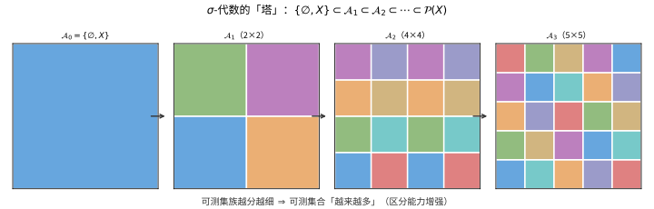
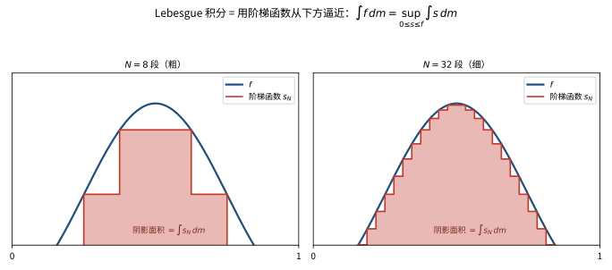

# 第 34 级：测度论 (Measure Theory)

> 测度论是现代分析学的基石，它为勒贝格积分提供了严格的数学基础，也是概率论、遍历论、泛函分析等领域的理论根基。本章从 σ-代数出发，系统构建测度与积分理论，并深入探讨其核心定理与应用。

---

## 1. 学习目标

1. 理解 σ-代数、可测空间与可测函数的基本概念，掌握 Borel σ-代数与乘积 σ-代数的构造。
2. 掌握测度的定义、基本性质与构造方法（外测度、Carathéodory 扩张定理），理解 Lebesgue 测度与 Lebesgue-Stieltjes 测度。
3. 深入理解勒贝格积分的构造过程，熟练掌握三大收敛定理（单调收敛、Fatou 引理、控制收敛）及其证明。
4. 掌握 Lᵖ 空间的基本理论，包括 Hölder 与 Minkowski 不等式、完备性与对偶性。
5. 理解乘积测度与 Fubini-Tonelli 定理，掌握重积分交换次序的条件。
6. 掌握符号测度与 Hahn-Jordan 分解、Radon-Nikodym 定理与 Lebesgue 分解。
7. 理解绝对连续与奇异测度的概念，掌握 Radon-Nikodym 导数的应用。
8. 理清各种收敛模式及其相互关系。

---

## 2. σ-代数与可测空间

### 2.1 σ-代数的定义

**定义 2.1**（σ-代数）设 $X$ 是非空集合，$\mathcal{A} \subseteq \mathcal{P}(X)$ 是 $X$ 的子集族。若 $\mathcal{A}$ 满足以下三条公理：

1. **空集属于**：$\varnothing \in \mathcal{A}$；
2. **补集封闭**：若 $A \in \mathcal{A}$，则 $A^c = X \setminus A \in \mathcal{A}$；
3. **可数并封闭**：若 $\{A_n\}_{n=1}^\infty \subseteq \mathcal{A}$，则 $\bigcup_{n=1}^\infty A_n \in \mathcal{A}$，

则称 $\mathcal{A}$ 为 $X$ 上的一个 **σ-代数**（sigma-algebra），$(X, \mathcal{A})$ 称为一个 **可测空间**（measurable space），$\mathcal{A}$ 中的元素称为 **可测集**（measurable sets）。

**性质 2.2** 由 de Morgan 律，σ-代数对可数交也封闭：
$$
\bigcap_{n=1}^\infty A_n = \left(\bigcup_{n=1}^\infty A_n^c\right)^c \in \mathcal{A}.
$$

**例 2.3**（平凡 σ-代数与幂集 σ-代数）
- $\mathcal{A} = \{\varnothing, X\}$ 是最小的 σ-代数（平凡 σ-代数）。
- $\mathcal{A} = \mathcal{P}(X)$ 是最大的 σ-代数（幂集 σ-代数）。

**例 2.4**（生成 σ-代数）设 $\mathcal{E} \subseteq \mathcal{P}(X)$ 是任意子集族。存在包含 $\mathcal{E}$ 的最小 σ-代数，称为 $\mathcal{E}$ **生成的 σ-代数**，记作 $\sigma(\mathcal{E})$：
$$
\sigma(\mathcal{E}) = \bigcap\{\mathcal{A} \mid \mathcal{A} \text{ 是 } X \text{ 上的 } \sigma\text{-代数且 } \mathcal{E} \subseteq \mathcal{A}\}.
$$



> **直观理解（现实类比）**：$\sigma$-代数就像一台可测集合的"望远镜"。最小的平凡 $\sigma$-代数 $\{\varnothing,X\}$ 只能分辨"全部"与"空集"，像一副看不清细节的望远镜；随着不断细分（加入更多集合），望远镜越来越清晰，能分辨越来越细的集合，最终达到幂集 $\mathcal{P}(X)$——能分辨每一个点。可测集合越多，我们能"测量"的对象就越丰富。

### 2.2 Borel σ-代数

**定义 2.5**（Borel σ-代数）设 $(X, \tau)$ 是一个拓扑空间。由所有开集生成的 σ-代数称为 **Borel σ-代数**，记作 $\mathcal{B}(X)$。其中的元素称为 **Borel 集**。

**例 2.6**（$\mathbb{R}$ 上的 Borel σ-代数）在 $\mathbb{R}$ 上赋予通常的欧几里得拓扑，则 $\mathcal{B}(\mathbb{R})$ 包含：
- 所有开区间 $(a, b)$、闭区间 $[a, b]$、半开区间 $(a, b]$ 和 $[a, b)$；
- 所有单点集 $\{a\}$、可数集、Cantor 集；
- 所有开集、闭集、$G_\delta$ 集（可数交的开集）、$F_\sigma$ 集（可数并的闭集）。

事实上，$\mathcal{B}(\mathbb{R})$ 可由以下任何一种方式生成：
$$
\mathcal{B}(\mathbb{R}) = \sigma(\{(a, b) \mid a < b\}) = \sigma(\{(-\infty, a] \mid a \in \mathbb{R}\}) = \sigma(\{(a, \infty) \mid a \in \mathbb{R}\}).
$$

### 2.3 乘积 σ-代数

**定义 2.7**（乘积 σ-代数）设 $(X_1, \mathcal{A}_1), \ldots, (X_n, \mathcal{A}_n)$ 是可测空间。定义笛卡尔积 $X = X_1 \times \cdots \times X_n$ 上的 **乘积 σ-代数** 为：
$$
\mathcal{A}_1 \otimes \cdots \otimes \mathcal{A}_n = \sigma(\{A_1 \times \cdots \times A_n \mid A_i \in \mathcal{A}_i, i = 1, \ldots, n\}).
$$
即由所有可测矩形的有限乘积生成的 σ-代数。

**重要事实**：对于 $\mathbb{R}^n$，有 $\mathcal{B}(\mathbb{R}^n) = \mathcal{B}(\mathbb{R}) \otimes \cdots \otimes \mathcal{B}(\mathbb{R})$（$n$ 次），即 $\mathbb{R}^n$ 上的 Borel σ-代数等于 $\mathbb{R}$ 上的 Borel σ-代数的 $n$ 次乘积。

### 2.4 可测函数

**定义 2.8**（可测函数）设 $(X, \mathcal{A})$ 和 $(Y, \mathcal{B})$ 是可测空间。函数 $f: X \to Y$ 称为 **可测函数**（measurable function），若对任意 $B \in \mathcal{B}$，有 $f^{-1}(B) \in \mathcal{A}$。

当 $Y = \mathbb{R}$ 且 $\mathcal{B} = \mathcal{B}(\mathbb{R})$ 时，$f: X \to \mathbb{R}$ 可测等价于以下任一条件：
- 对任意 $a \in \mathbb{R}$，$\{x \mid f(x) > a\} \in \mathcal{A}$；
- 对任意 $a \in \mathbb{R}$，$\{x \mid f(x) \geq a\} \in \mathcal{A}$；
- 对任意 $a \in \mathbb{R}$，$\{x \mid f(x) < a\} \in \mathcal{A}$；
- 对任意 $a \in \mathbb{R}$，$\{x \mid f(x) \leq a\} \in \mathcal{A}$。

**性质 2.9** 可测函数的四则运算、绝对值、最大值、最小值、上确界、下确界、上极限、下极限仍为可测函数。特别地，若 $\{f_n\}$ 是一列可测函数，则 $\sup_n f_n$、$\inf_n f_n$、$\limsup_{n\to\infty} f_n$、$\liminf_{n\to\infty} f_n$ 都是可测的。

**定义 2.10**（简单函数）可测函数 $f: X \to \mathbb{R}$ 称为 **简单函数**（simple function），若其值域是有限集。任何简单函数可唯一表示为：
$$
f = \sum_{i=1}^n a_i \mathbf{1}_{A_i},
$$
其中 $A_i \in \mathcal{A}$ 互不相交且 $\bigcup_{i=1}^n A_i = X$，$a_i \in \mathbb{R}$。

**定理 2.11**（可测函数的简单逼近）对任意非负可测函数 $f: X \to [0, \infty]$，存在一列递增的简单函数 $\{s_n\}$，使得 $0 \leq s_1 \leq s_2 \leq \cdots \leq f$，且 $s_n \to f$ 逐点收敛。

*证明概要*：对 $n \in \mathbb{N}$，定义
$$
s_n(x) = \sum_{k=0}^{n2^n-1} \frac{k}{2^n} \mathbf{1}_{f^{-1}([k/2^n, (k+1)/2^n))}(x) + n \mathbf{1}_{f^{-1}([n, \infty])}(x).
$$
则 $s_n$ 是简单函数且单调递增收敛到 $f$。

---

## 3. 测度

### 3.1 测度的定义与基本性质

**定义 3.1**（测度）设 $(X, \mathcal{A})$ 是可测空间。函数 $\mu: \mathcal{A} \to [0, \infty]$ 称为 **测度**（measure），若满足：

1. **非负性**：对任意 $A \in \mathcal{A}$，$\mu(A) \geq 0$；
2. **空集零测**：$\mu(\varnothing) = 0$；
3. **可数可加性**（σ-可加性）：若 $\{A_n\}_{n=1}^\infty \subseteq \mathcal{A}$ 两两不交，则
   $$
   \mu\left(\bigcup_{n=1}^\infty A_n\right) = \sum_{n=1}^\infty \mu(A_n).
   $$

三元组 $(X, \mathcal{A}, \mu)$ 称为 **测度空间**（measure space）。

**性质 3.2**（测度的基本性质）

1. **单调性**：若 $A \subseteq B$，则 $\mu(A) \leq \mu(B)$。
2. **次可加性**：$\mu\left(\bigcup_{n=1}^\infty A_n\right) \leq \sum_{n=1}^\infty \mu(A_n)$。
3. **下连续性**：若 $A_1 \subseteq A_2 \subseteq \cdots$，则 $\mu\left(\bigcup_{n=1}^\infty A_n\right) = \lim_{n\to\infty} \mu(A_n)$。
4. **上连续性**：若 $A_1 \supseteq A_2 \supseteq \cdots$ 且 $\mu(A_1) < \infty$，则 $\mu\left(\bigcap_{n=1}^\infty A_n\right) = \lim_{n\to\infty} \mu(A_n)$。

**定义 3.3**（有限测度与 σ-有限测度）
- 若 $\mu(X) < \infty$，称 $\mu$ 为 **有限测度**。
- 若存在可测集 $X_n \uparrow X$ 使得 $\mu(X_n) < \infty$ 对每个 $n$ 成立，称 $\mu$ 为 **σ-有限测度**。

### 3.2 外测度与 Carathéodory 扩张定理

**定义 3.4**（外测度）设 $X$ 是非空集合。函数 $\mu^*: \mathcal{P}(X) \to [0, \infty]$ 称为 **外测度**（outer measure），若满足：

1. $\mu^*(\varnothing) = 0$；
2. **单调性**：$A \subseteq B \Rightarrow \mu^*(A) \leq \mu^*(B)$；
3. **次可数可加性**：$\mu^*\left(\bigcup_{n=1}^\infty A_n\right) \leq \sum_{n=1}^\infty \mu^*(A_n)$。

**定义 3.5**（Carathéodory 可测集）设 $\mu^*$ 是 $X$ 上的外测度。称 $A \subseteq X$ 为 **$\mu^*$-可测的**，若对任意 $E \subseteq X$，
$$
\mu^*(E) = \mu^*(E \cap A) + \mu^*(E \setminus A).
$$

**定理 3.6**（Carathéodory 扩张定理）设 $\mu^*$ 是 $X$ 上的外测度，则所有 $\mu^*$-可测集构成一个 σ-代数 $\mathcal{M}$，且 $\mu^*$ 限制在 $\mathcal{M}$ 上是一个完备测度。

**定理 3.7**（从半环到测度的扩张）设 $\mathcal{C}$ 是 $X$ 上的半环（semi-ring），$\mu_0: \mathcal{C} \to [0, \infty]$ 是 $\sigma$-可加的且 $\mu_0(\varnothing) = 0$。定义外测度：
$$
\mu^*(E) = \inf\left\{\sum_{n=1}^\infty \mu_0(C_n) \;\Big|\; C_n \in \mathcal{C}, \; E \subseteq \bigcup_{n=1}^\infty C_n\right\},
$$
则 $\mu^*$ 是外测度。由 Carathéodory 定理，$\mu^*$ 限制在 $\sigma(\mathcal{C})$ 上是一个测度，且是 $\mu_0$ 的扩张。若 $\mu_0$ 是 σ-有限的，则扩张是唯一的。

*证明概要*：首先验证 $\mu^*$ 满足外测度的定义。然后证明 $\mathcal{C}$ 中的元素都是 $\mu^*$-可测的，从而 $\sigma(\mathcal{C}) \subseteq \mathcal{M}$。最后利用单调类引理证明在 σ-有限条件下扩张的唯一性。

### 3.3 Lebesgue 测度

**定理 3.8**（Lebesgue 测度的存在性与唯一性）存在唯一的测度 $m$ 定义在 $\mathbb{R}$ 的 Borel σ-代数 $\mathcal{B}(\mathbb{R})$ 上，使得对任意区间 $[a, b]$（$a < b$），有
$$
m([a, b]) = b - a.
$$
$m$ 称为 **Lebesgue 测度**（或 **Borel 测度**）。

*构造*：考虑半环 $\mathcal{C} = \{(a, b] \mid a < b\}$，定义 $\mu_0((a, b]) = b - a$。通过 Carathéodory 扩张定理延拓到 $\mathcal{B}(\mathbb{R})$ 上，再取完备化得到 Lebesgue 可测集。

**性质 3.9**（Lebesgue 测度的性质）
- **平移不变性**：$m(E + x) = m(E)$ 对任意 $x \in \mathbb{R}$。
- **伸缩性**：$m(\lambda E) = |\lambda| m(E)$ 对任意 $\lambda \in \mathbb{R}$。
- **正则性**：对任意 Lebesgue 可测集 $E$，
  $$
  m(E) = \inf\{m(U) \mid U \text{ 开集}, E \subseteq U\} = \sup\{m(K) \mid K \text{ 紧集}, K \subseteq E\}.
  $$

**重要事实**：存在 $\mathbb{R}$ 上的子集不是 Lebesgue 可测的（如 Vitali 集），这意味着 $\mathcal{B}(\mathbb{R})$ 真包含于 $\mathcal{P}(\mathbb{R})$。

### 3.4 Lebesgue-Stieltjes 测度

**定义 3.10**（Lebesgue-Stieltjes 测度）设 $F: \mathbb{R} \to \mathbb{R}$ 是右连续单调递增函数。存在唯一的测度 $\mu_F$ 在 $\mathcal{B}(\mathbb{R})$ 上，使得对任意 $a < b$，
$$
\mu_F((a, b]) = F(b) - F(a).
$$
$\mu_F$ 称为由 $F$ 生成的 **Lebesgue-Stieltjes 测度**。

**例 3.11**
- 若 $F(x) = x$，则 $\mu_F$ 是 Lebesgue 测度。
- 若 $F(x) = \mathbf{1}_{[0, \infty)}(x)$（Heaviside 阶梯函数），则 $\mu_F = \delta_0$，即 Dirac 测度集中在 0 点：$\delta_0(A) = \mathbf{1}_A(0)$。
- 若 $F$ 是 Cantor 函数，则 $\mu_F$ 是奇异连续测度（Cantor 测度）。

### 3.5 测度的完备化

**定义 3.12**（完备测度）测度空间 $(X, \mathcal{A}, \mu)$ 称为 **完备的**（complete），若 $\mu$ 的任意零测子集都是可测的，即
$$
N \in \mathcal{A}, \; \mu(N) = 0 \quad\Longrightarrow\quad \forall M \subseteq N, \; M \in \mathcal{A}.
$$

**定理 3.13**（测度的完备化）对任意测度空间 $(X, \mathcal{A}, \mu)$，存在唯一的完备测度空间 $(X, \overline{\mathcal{A}}, \overline{\mu})$，称为 $\mu$ 的 **完备化**，其中
$$
\overline{\mathcal{A}} = \{A \cup N \mid A \in \mathcal{A}, \; N \subseteq B \in \mathcal{A}, \; \mu(B) = 0\},
$$
且 $\overline{\mu}(A \cup N) = \mu(A)$。

---

## 4. 勒贝格积分

### 4.1 简单函数的积分

**定义 4.1**（非负简单函数的积分）设 $s = \sum_{i=1}^n a_i \mathbf{1}_{A_i}$ 是非负简单函数，$a_i \geq 0$，$A_i \in \mathcal{A}$ 互不相交。定义 $s$ 在测度 $\mu$ 下的积分为：
$$
\int s \, d\mu = \sum_{i=1}^n a_i \mu(A_i),
$$
其中约定 $0 \cdot \infty = 0$。

### 4.2 非负可测函数的积分

**定义 4.2**（非负可测函数的积分）设 $f: X \to [0, \infty]$ 是可测函数。定义 $f$ 的 **勒贝格积分** 为：
$$
\int f \, d\mu = \sup\left\{\int s \, d\mu \;\Big|\; 0 \leq s \leq f,\; s \text{ 是简单函数}\right\}.
$$



> **直观理解（现实类比）**：测量一块形状不规则的蛋糕体积。Lebesgue 积分不把蛋糕横切成细条（Riemann 式竖切片），而是用一层层从下往上叠的"积木"（阶梯函数）去逼近它——每块积木都垫在蛋糕曲线下方，一层比一层更贴合。积木层的总面积（$\int s\,dm$）随层数增加单调上升，最终收敛到蛋糕的真实体积 $\int f\,dm$。

**性质 4.3**（积分的基本性质）
1. **线性性**：$\int (af + bg) \, d\mu = a\int f \, d\mu + b\int g \, d\mu$，$a, b \geq 0$。
2. **单调性**：若 $0 \leq f \leq g$，则 $\int f \, d\mu \leq \int g \, d\mu$。
3. **Chebyshev 不等式**：对任意 $c > 0$，
   $$
   \mu(\{x \mid f(x) \geq c\}) \leq \frac{1}{c} \int f \, d\mu.
   $$
4. 若 $\int f \, d\mu < \infty$，则 $f < \infty$ 几乎处处成立。

### 4.3 单调收敛定理

**定理 4.4**（单调收敛定理，Monotone Convergence Theorem, MCT）设 $\{f_n\}$ 是一列非负可测函数，且 $0 \leq f_1 \leq f_2 \leq \cdots \leq f$，$f_n \to f$ 逐点收敛。则
$$
\int f_n \, d\mu \;\uparrow\; \int f \, d\mu.
$$

*证明*：由 $f_n \leq f$ 知 $\limsup \int f_n \, d\mu \leq \int f \, d\mu$。反之，取任意简单函数 $0 \leq s \leq f$ 和 $0 < c < 1$。令 $E_n = \{x \mid f_n(x) \geq c s(x)\}$。由于 $f_n \uparrow f$，$E_n \uparrow X$。则
$$
\int f_n \, d\mu \geq \int_{E_n} f_n \, d\mu \geq c \int_{E_n} s \, d\mu = c \int s \mathbf{1}_{E_n} \, d\mu.
$$
由测度的下连续性，$\int s \mathbf{1}_{E_n} \, d\mu \to \int s \, d\mu$。因此 $\liminf \int f_n \, d\mu \geq c \int s \, d\mu$。令 $c \to 1$ 并对 $s$ 取上确界即得 $\liminf \int f_n \, d\mu \geq \int f \, d\mu$。$\square$

### 4.4 Fatou 引理

**引理 4.5**（Fatou 引理，Fatou's Lemma）设 $\{f_n\}$ 是一列非负可测函数，则
$$
\int \liminf_{n\to\infty} f_n \, d\mu \leq \liminf_{n\to\infty} \int f_n \, d\mu.
$$

*证明*：令 $g_n = \inf_{k \geq n} f_k$，则 $g_n$ 非负可测且 $g_n \uparrow \liminf f_n$。由单调收敛定理，
$$
\int \liminf f_n \, d\mu = \lim_{n\to\infty} \int g_n \, d\mu.
$$
而 $g_n \leq f_n$，故 $\int g_n \, d\mu \leq \int f_n \, d\mu$，从而
$$
\lim_{n\to\infty} \int g_n \, d\mu \leq \liminf_{n\to\infty} \int f_n \, d\mu.
$$
$\square$

### 4.5 一般可测函数的积分

**定义 4.6**（一般可测函数的积分）设 $f: X \to \overline{\mathbb{R}}$ 是可测函数。记 $f^+ = \max(f, 0)$，$f^- = \max(-f, 0)$，则 $f = f^+ - f^-$。若 $\int f^+ \, d\mu$ 和 $\int f^- \, d\mu$ 不同时为 $\infty$，定义
$$
\int f \, d\mu = \int f^+ \, d\mu - \int f^- \, d\mu.
$$
若 $\int |f| \, d\mu = \int f^+ \, d\mu + \int f^- \, d\mu < \infty$，称 $f$ 是 **可积的**（integrable），记作 $f \in L^1(\mu)$。

### 4.6 控制收敛定理

**定理 4.7**（勒贝格控制收敛定理，Dominated Convergence Theorem, DCT）设 $\{f_n\}$ 是一列可测函数，$f_n \to f$ 几乎处处收敛。若存在可积函数 $g \in L^1(\mu)$，使得对每个 $n$，$|f_n| \leq g$ 几乎处处成立，则 $f \in L^1(\mu)$ 且
$$
\lim_{n\to\infty} \int f_n \, d\mu = \int f \, d\mu.
$$

*证明*：由 $|f_n| \leq g$ 知 $|f| \leq g$ 几乎处处成立，故 $f \in L^1$。考虑 $g - f_n \geq 0$，由 Fatou 引理，
$$
\int (g - f) \, d\mu = \int \liminf (g - f_n) \, d\mu \leq \liminf \int (g - f_n) \, d\mu = \int g \, d\mu - \limsup \int f_n \, d\mu.
$$
故 $\int f \, d\mu \geq \limsup \int f_n \, d\mu$。类似地，考虑 $g + f_n \geq 0$ 可得 $\int f \, d\mu \leq \liminf \int f_n \, d\mu$。因此
$$
\liminf \int f_n \, d\mu \leq \int f \, d\mu \leq \limsup \int f_n \, d\mu.
$$
从而 $\lim \int f_n \, d\mu = \int f \, d\mu$。$\square$

### 4.7 与 Riemann 积分的比较

**定理 4.8**（Riemann 可积函数是 Lebesgue 可积的）设 $f: [a, b] \to \mathbb{R}$ 是有界函数。

1. 若 $f$ 在 $[a, b]$ 上 Riemann 可积，则 $f$ 是 Lebesgue 可积的，且两种积分值相等。
2. $f$ 在 $[a, b]$ 上 Riemann 可积当且仅当 $f$ 几乎处处连续（即 $f$ 的不连续点集是 Lebesgue 零测集）。

**例 4.9**（Dirichlet 函数）$f(x) = \mathbf{1}_{\mathbb{Q} \cap [0, 1]}(x)$ 在 $[0, 1]$ 上不是 Riemann 可积的（因为处处不连续），但它是 Lebesgue 可积的，且 $\int f \, dm = 0$，因为有理数集是可数零测集。

**Lebesgue 积分的优势**：
- 可积函数空间是完备的（Riemann 可积函数空间不是）；
- 有更强大的收敛定理（MCT、Fatou、DCT）；
- 可在任意测度空间上定义积分，而非仅限于 $\mathbb{R}^n$。

---

## 5. Lᵖ 空间

### 5.1 定义与基本性质

**定义 5.1**（Lᵖ 空间）设 $(X, \mathcal{A}, \mu)$ 是测度空间，$0 < p < \infty$。定义
$$
\mathcal{L}^p(\mu) = \left\{f: X \to \mathbb{R} \text{ 可测} \;\Big|\; \int |f|^p \, d\mu < \infty\right\}.
$$
在 $\mathcal{L}^p$ 上定义等价关系 $f \sim g \iff f = g$ 几乎处处成立。商空间记为
$$
L^p(\mu) = \mathcal{L}^p(\mu) / \sim.
$$
$L^p$ 中的元素本质上是几乎处处相等的函数类。定义 **$p$-范数**：
$$
\|f\|_p = \left(\int |f|^p \, d\mu\right)^{1/p},\quad 1 \leq p < \infty.
$$
对于 $p = \infty$，定义
$$
\|f\|_\infty = \inf\{C \geq 0 \mid |f| \leq C \text{ 几乎处处}\},
$$
称为 $f$ 的 **本质上确界**（essential supremum），$L^\infty(\mu) = \{f \text{ 可测} \mid \|f\|_\infty < \infty\}$。

### 5.2 Hölder 不等式

**定理 5.2**（Hölder 不等式）设 $p, q \in (1, \infty)$ 满足 $\frac{1}{p} + \frac{1}{q} = 1$（称 $p, q$ 为共轭指数）。则对任意可测函数 $f, g$，有
$$
\int |fg| \, d\mu \leq \|f\|_p \|g\|_q.
$$
特别地，若 $f \in L^p$，$g \in L^q$，则 $fg \in L^1$。

*证明*：首先证明 Young 不等式：对 $a, b \geq 0$，
$$
ab \leq \frac{a^p}{p} + \frac{b^q}{q}.
$$
（利用凸函数 $\ln$ 的性质：$\ln(ab) = \ln a + \ln b \leq \ln\left(\frac{a^p}{p} + \frac{b^q}{q}\right)$。）若 $\|f\|_p = 0$ 或 $\|g\|_q = 0$，不等式平凡成立。否则，令 $a = |f|/\|f\|_p$，$b = |g|/\|g\|_q$，由 Young 不等式：
$$
\frac{|fg|}{\|f\|_p \|g\|_q} \leq \frac{|f|^p}{p\|f\|_p^p} + \frac{|g|^q}{q\|g\|_q^q}.
$$
两边积分得：
$$
\frac{\int |fg| \, d\mu}{\|f\|_p \|g\|_q} \leq \frac{1}{p} + \frac{1}{q} = 1.
$$
$\square$

### 5.3 Minkowski 不等式

**定理 5.3**（Minkowski 不等式）设 $1 \leq p \leq \infty$，$f, g \in L^p$，则 $f + g \in L^p$ 且
$$
\|f + g\|_p \leq \|f\|_p + \|g\|_p.
$$

*证明*（$1 < p < \infty$ 的情形）：
$$
\begin{aligned}
\|f + g\|_p^p &= \int |f + g|^p \, d\mu \\
&\leq \int |f + g|^{p-1} (|f| + |g|) \, d\mu \\
&= \int |f + g|^{p-1}|f| \, d\mu + \int |f + g|^{p-1}|g| \, d\mu.
\end{aligned}
$$
对右端两项分别应用 Hölder 不等式（指数 $p$ 和 $q = p/(p-1)$）：
$$
\int |f + g|^{p-1}|f| \, d\mu \leq \left(\int |f + g|^{(p-1)q} \, d\mu\right)^{1/q} \left(\int |f|^p \, d\mu\right)^{1/p} = \|f + g\|_p^{p/q} \|f\|_p.
$$
同理，$\int |f + g|^{p-1}|g| \, d\mu \leq \|f + g\|_p^{p/q} \|g\|_p$。因此
$$
\|f + g\|_p^p \leq \|f + g\|_p^{p/q} (\|f\|_p + \|g\|_p).
$$
除以 $\|f + g\|_p^{p/q}$（若为 0 则结论平凡）得 $\|f + g\|_p \leq \|f\|_p + \|g\|_p$。$\square$

### 5.4 完备性

**定理 5.4**（Riesz-Fischer 定理）对于 $1 \leq p \leq \infty$，$L^p(\mu)$ 是 Banach 空间（完备的赋范向量空间）。

*证明概要*（$1 \leq p < \infty$）：设 $\{f_n\}$ 是 $L^p$ 中的 Cauchy 列。选取子列 $\{f_{n_k}\}$ 使得 $\|f_{n_{k+1}} - f_{n_k}\|_p \leq 2^{-k}$。令 $g = \sum_{k=1}^\infty |f_{n_{k+1}} - f_{n_k}|$，由 Minkowski 不等式和单调收敛定理，$\|g\|_p \leq 1$，故 $g$ 几乎处处有限。因此 $\sum_{k=1}^\infty (f_{n_{k+1}} - f_{n_k})$ 几乎处处绝对收敛，即 $\{f_{n_k}\}$ 几乎处处收敛到某个 $f$。利用 Fatou 引理和 Cauchy 性可证 $f_{n_k} \to f$ 在 $L^p$ 中，进而整个序列收敛到 $f$。$\square$

### 5.5 对偶空间与 Riesz 表示定理

**定义 5.5**（对偶空间）Banach 空间 $X$ 的 **对偶空间**（dual space）$X^*$ 是 $X$ 上所有连续线性泛函构成的空间。

**定理 5.6**（Riesz 表示定理，$L^p$ 的对偶）设 $1 \leq p < \infty$，$q$ 是 $p$ 的共轭指数（即 $1/p + 1/q = 1$）。则 $L^p(\mu)^*$ 等距同构于 $L^q(\mu)$。具体地，对任意 $\Phi \in L^p(\mu)^*$，存在唯一的 $g \in L^q(\mu)$，使得
$$
\Phi(f) = \int fg \, d\mu,\quad \forall f \in L^p(\mu),
$$
且 $\|\Phi\| = \|g\|_q$。

对于 $p = \infty$，$L^\infty$ 的对偶空间严格大于 $L^1$（除非测度空间是原子的）。

---

## 6. 乘积测度与 Fubini 定理

### 6.1 乘积测度

**定义 6.1**（乘积测度）设 $(X, \mathcal{A}, \mu)$ 和 $(Y, \mathcal{B}, \nu)$ 是 σ-有限测度空间。在 $(X \times Y, \mathcal{A} \otimes \mathcal{B})$ 上存在唯一的测度 $\mu \times \nu$，称为 **乘积测度**（product measure），满足对任意 $A \in \mathcal{A}$，$B \in \mathcal{B}$，
$$
(\mu \times \nu)(A \times B) = \mu(A) \nu(B).
$$

### 6.2 截面与单调类引理

**定义 6.2**（截面）对 $E \subseteq X \times Y$，定义
- $x$-截面：$E_x = \{y \in Y \mid (x, y) \in E\}$；
- $y$-截面：$E^y = \{x \in X \mid (x, y) \in E\}$。

对函数 $f: X \times Y \to \mathbb{R}$，定义 $x$-截面函数 $f_x(y) = f(x, y)$，$y$-截面函数 $f^y(x) = f(x, y)$。

**引理 6.3** 若 $E \in \mathcal{A} \otimes \mathcal{B}$，则对每个 $x \in X$，$E_x \in \mathcal{B}$；对每个 $y \in Y$，$E^y \in \mathcal{A}$。

### 6.3 Tonelli 定理

**定理 6.4**（Tonelli 定理）设 $(X, \mathcal{A}, \mu)$ 和 $(Y, \mathcal{B}, \nu)$ 是 σ-有限测度空间，$f: X \times Y \to [0, \infty]$ 是非负可测函数。则

1. 对每个 $x \in X$，$y \mapsto f(x, y)$ 是 $\mathcal{B}$-可测的；
2. 对每个 $y \in Y$，$x \mapsto f(x, y)$ 是 $\mathcal{A}$-可测的；
3. $x \mapsto \int_Y f(x, y) \, d\nu(y)$ 是 $\mathcal{A}$-可测的；
4. $y \mapsto \int_X f(x, y) \, d\mu(x)$ 是 $\mathcal{B}$-可测的；
5. 重积分相等：
   $$
   \int_{X \times Y} f \, d(\mu \times \nu) = \int_X \left(\int_Y f(x, y) \, d\nu(y)\right) d\mu(x) = \int_Y \left(\int_X f(x, y) \, d\mu(x)\right) d\nu(y).
   $$

*证明概要*：首先对 $f = \mathbf{1}_E$（$E \in \mathcal{A} \otimes \mathcal{B}$）证明，利用单调类引理由矩形逐步推广到所有可测集。然后通过线性性推广到非负简单函数，最后用单调收敛定理推广到一般非负可测函数。$\square$

### 6.4 Fubini 定理

**定理 6.5**（Fubini 定理）设 $(X, \mathcal{A}, \mu)$ 和 $(Y, \mathcal{B}, \nu)$ 是 σ-有限测度空间，$f \in L^1(\mu \times \nu)$。则

1. 对几乎处处的 $x \in X$，$y \mapsto f(x, y)$ 属于 $L^1(\nu)$；
2. 对几乎处处的 $y \in Y$，$x \mapsto f(x, y)$ 属于 $L^1(\mu)$；
3. $x \mapsto \int_Y f(x, y) \, d\nu(y)$ 属于 $L^1(\mu)$（在几乎处处有定义的条件下）；
4. $y \mapsto \int_X f(x, y) \, d\mu(x)$ 属于 $L^1(\nu)$；
5. 重积分公式成立：
   $$
   \int_{X \times Y} f \, d(\mu \times \nu) = \int_X \left(\int_Y f(x, y) \, d\nu(y)\right) d\mu(x) = \int_Y \left(\int_X f(x, y) \, d\mu(x)\right) d\nu(y).
   $$

*证明*：由 Tonelli 定理应用于 $|f|$ 知 $\int_{X \times Y} |f| \, d(\mu \times \nu) < \infty$，从而 $\int_X (\int_Y |f(x, y)| \, d\nu(y)) \, d\mu(x) < \infty$，故对几乎处处 $x$，$\int_Y |f(x, y)| \, d\nu(y) < \infty$。将 $f = f^+ - f^-$ 分别应用 Tonelli 定理即得。$\square$

**重要说明**：Tonelli 定理适用于非负函数（不必可积），Fubini 定理适用于可积函数（可正可负）。验证可积性的常用方法是先用 Tonelli 定理计算 $\int |f|$ 判定是否有限。

---

## 7. 符号测度与 Hahn 分解

### 7.1 符号测度

**定义 7.1**（符号测度）设 $(X, \mathcal{A})$ 是可测空间。函数 $\nu: \mathcal{A} \to [-\infty, \infty]$ 称为 **符号测度**（signed measure），若满足：

1. $\nu(\varnothing) = 0$；
2. $\nu$ 至多取 $\infty$ 或 $-\infty$ 中的一个（不能同时取）；
3. $\nu$ 具有 σ-可加性：对任意两两不交的 $\{A_n\} \subseteq \mathcal{A}$，
   $$
   \nu\left(\bigcup_{n=1}^\infty A_n\right) = \sum_{n=1}^\infty \nu(A_n),
   $$
   其中右端级数绝对收敛（若 $\nu(\bigcup A_n)$ 有限）或发散到 $\pm\infty$。

### 7.2 Hahn 分解

**定理 7.2**（Hahn 分解定理）设 $\nu$ 是 $(X, \mathcal{A})$ 上的符号测度。则存在可测集 $P, N \in \mathcal{A}$，使得 $P \cup N = X$，$P \cap N = \varnothing$，且
- 对任意 $A \subseteq P$，$A \in \mathcal{A}$，有 $\nu(A) \geq 0$；
- 对任意 $A \subseteq N$，$A \in \mathcal{A}$，有 $\nu(A) \leq 0$。

$P$ 和 $N$ 称为 $\nu$ 的一个 **Hahn 分解**，且在不计零测集意义下唯一。

*证明*：不失一般性，设 $\nu$ 不取 $-\infty$。令
$$
\alpha = \sup\{\nu(E) \mid E \in \mathcal{A}\}.
$$
选取 $E_n$ 使得 $\nu(E_n) \to \alpha$。令 $P = \bigcup_{n=1}^\infty E_n$ 的适当构造（通过取上极限）可证 $P$ 满足条件。详细证明需利用测度的上连续性，并验证 $N = X \setminus P$ 是负集。$\square$

### 7.3 Jordan 分解

**定理 7.3**（Jordan 分解定理）设 $\nu$ 是符号测度，则存在唯一的正测度 $\nu^+$ 和 $\nu^-$，使得
$$
\nu = \nu^+ - \nu^-,
$$
且 $\nu^+$ 和 $\nu^-$ 相互奇异（即存在可测集 $E$ 使得 $\nu^-(E) = \nu^+(X \setminus E) = 0$）。$\nu^+$ 和 $\nu^-$ 分别称为 $\nu$ 的 **正变差**（positive variation）和 **负变差**（negative variation），$|\nu| = \nu^+ + \nu^-$ 称为 **全变差测度**（total variation measure）。

*构造*：取 Hahn 分解 $(P, N)$，定义
$$
\nu^+(A) = \nu(A \cap P),\quad \nu^-(A) = -\nu(A \cap N).
$$
$\square$

### 7.4 Radon-Nikodym 定理

**定理 7.4**（Radon-Nikodym 定理）设 $(X, \mathcal{A})$ 是可测空间，$\mu$ 是 σ-有限测度，$\nu$ 是 σ-有限符号测度，且 $\nu \ll \mu$（即 $\nu$ 关于 $\mu$ 绝对连续）。则存在唯一的可测函数 $f: X \to \mathbb{R}$（在 $\mu$-几乎处处意义下唯一），使得对任意 $A \in \mathcal{A}$，
$$
\nu(A) = \int_A f \, d\mu.
$$
$f$ 称为 **Radon-Nikodym 导数**，记作 $\frac{d\nu}{d\mu}$。

*证明概要*：首先考虑 $\mu$ 和 $\nu$ 都是有限正测度的情况。令
$$
\mathcal{F} = \left\{f: X \to [0, \infty] \text{ 可测} \;\Big|\; \int_A f \, d\mu \leq \nu(A),\; \forall A \in \mathcal{A}\right\}.
$$
令 $\alpha = \sup\left\{\int_X f \, d\mu \mid f \in \mathcal{F}\right\}$，选取序列 $\{f_n\} \subseteq \mathcal{F}$ 使得 $\int_X f_n \, d\mu \to \alpha$。定义 $f = \sup_n f_n$（或 $\limsup$），可证 $f$ 是 Radon-Nikodym 导数。关键在于证明 $\nu - \int f \, d\mu$ 是零测度（否则可构造更大的 $f$，与 $\alpha$ 的极大性矛盾）。$\square$

### 7.5 Lebesgue 分解

**定理 7.5**（Lebesgue 分解定理）设 $\mu, \nu$ 是 σ-有限测度。则存在唯一的测度 $\nu_a$ 和 $\nu_s$，使得
$$
\nu = \nu_a + \nu_s,\quad \nu_a \ll \mu,\quad \nu_s \perp \mu.
$$
其中 $\nu_a$ 称为 $\mu$ 的 **绝对连续部分**，$\nu_s$ 称为 **奇异部分**。

*证明*：令 $\lambda = \mu + \nu$，则 $\mu \ll \lambda$，$\nu \ll \lambda$。由 Radon-Nikodym 定理，存在 $f, g$ 使得
$$
\mu(A) = \int_A f \, d\lambda,\quad \nu(A) = \int_A g \, d\lambda.
$$
令 $N = \{x \mid f(x) = 0\}$，定义 $\nu_a(A) = \nu(A \setminus N)$，$\nu_s(A) = \nu(A \cap N)$。可验证 $\nu_a \ll \mu$ 且 $\nu_s \perp \mu$。$\square$

---

## 8. 绝对连续与奇异

### 8.1 绝对连续测度

**定义 8.1**（绝对连续）设 $\mu, \nu$ 是 $(X, \mathcal{A})$ 上的测度。称 $\nu$ **关于 $\mu$ 绝对连续**（absolutely continuous），记作 $\nu \ll \mu$，若对任意 $A \in \mathcal{A}$，
$$
\mu(A) = 0 \;\Longrightarrow\; \nu(A) = 0.
$$

**定理 8.2**（等价刻画）若 $\nu$ 是有限测度，则 $\nu \ll \mu$ 当且仅当：对任意 $\varepsilon > 0$，存在 $\delta > 0$，使得对任意 $A \in \mathcal{A}$，$\mu(A) < \delta$ 蕴含 $\nu(A) < \varepsilon$。

### 8.2 奇异测度

**定义 8.3**（奇异）称 $\nu$ 与 $\mu$ **相互奇异**（mutually singular），记作 $\nu \perp \mu$，若存在 $E \in \mathcal{A}$，使得 $\mu(E) = 0$ 且 $\nu(X \setminus E) = 0$。

**例 8.4**（奇异测度的例子）
- Dirac 测度 $\delta_0$ 与 Lebesgue 测度 $m$ 奇异：取 $E = \{0\}$，则 $m(E) = 0$，$\delta_0(\mathbb{R} \setminus E) = 0$。
- Cantor 测度（Cantor 函数生成的 Lebesgue-Stieltjes 测度）与 Lebesgue 测度奇异：Cantor 集 $C$ 满足 $m(C) = 0$，而 Cantor 测度集中在 $C$ 上。

### 8.3 Radon-Nikodym 导数的应用

**链式法则**：若 $\nu \ll \mu \ll \lambda$，则
$$
\frac{d\nu}{d\lambda} = \frac{d\nu}{d\mu} \cdot \frac{d\mu}{d\lambda},\quad \lambda\text{-几乎处处}.
$$

**逆导数**：若 $\mu \ll \nu$ 且 $\nu \ll \mu$（即 $\mu$ 与 $\nu$ 等价），则
$$
\frac{d\mu}{d\nu} = \left(\frac{d\nu}{d\mu}\right)^{-1}.
$$

**变元替换公式**：设 $T: (X, \mathcal{A}) \to (Y, \mathcal{B})$ 是可测映射，$\mu$ 是 $X$ 上的测度，$\nu = \mu \circ T^{-1}$ 是 $Y$ 上的 **前推测度**（pushforward measure）。则对任意非负可测函数 $f: Y \to \mathbb{R}$，
$$
\int_Y f \, d\nu = \int_X (f \circ T) \, d\mu.
$$
若 $g: X \to \mathbb{R}$ 是可积函数，且 $T$ 是双可测同构，则
$$
\int_X g \, d\mu = \int_Y (g \circ T^{-1}) \, d\nu.
$$

---

## 9. 收敛模式

### 9.1 各种收敛定义

**定义 9.1**（收敛模式）设 $(X, \mathcal{A}, \mu)$ 是测度空间，$\{f_n\}$ 和 $f$ 是可测函数。

1. **几乎处处收敛**（almost everywhere convergence）：
   $$
   f_n \xrightarrow{\text{a.e.}} f \iff \mu(\{x \mid \lim_{n\to\infty} f_n(x) \neq f(x)\}) = 0.
   $$

2. **几乎一致收敛**（almost uniform convergence）：对任意 $\varepsilon > 0$，存在 $E \in \mathcal{A}$ 使得 $\mu(E) < \varepsilon$ 且 $f_n$ 在 $X \setminus E$ 上一致收敛到 $f$。

3. **依测度收敛**（convergence in measure）：
   $$
   f_n \xrightarrow{\mu} f \iff \forall \varepsilon > 0,\; \lim_{n\to\infty} \mu(\{x \mid |f_n(x) - f(x)| \geq \varepsilon\}) = 0.
   $$

4. **$L^p$ 收敛**（convergence in $L^p$）：
   $$
   f_n \xrightarrow{L^p} f \iff \lim_{n\to\infty} \|f_n - f\|_p = 0.
   $$

### 9.2 收敛模式之间的关系

**定理 9.2**（关系图）

```
几乎一致收敛  ────→  几乎处处收敛
     ↓                      ↓
依测度收敛  ←────────  L^p 收敛 (1 ≤ p < ∞)
```

具体来说：

1. **几乎一致收敛 ⇒ 几乎处处收敛**：显然。
2. **几乎一致收敛 ⇒ 依测度收敛**：由定义直接可得。
3. **$L^p$ 收敛 ⇒ 依测度收敛**：由 Chebyshev 不等式，
   $$
   \mu(\{|f_n - f| \geq \varepsilon\}) \leq \frac{1}{\varepsilon^p} \|f_n - f\|_p^p \to 0.
   $$
4. **几乎处处收敛 $\nRightarrow$ 依测度收敛**：反例见例 9.4。
5. **依测度收敛 $\nRightarrow$ 几乎处处收敛**：反例见例 9.5。

**定理 9.3**（Egorov 定理）若 $\mu(X) < \infty$，则几乎处处收敛蕴含几乎一致收敛。

**定理 9.4**（Riesz 定理）若 $f_n \xrightarrow{\mu} f$，则存在子列 $\{f_{n_k}\}$ 使得 $f_{n_k} \xrightarrow{\text{a.e.}} f$。

---

## 10. 示例

### 例 10.1（非可测集：Vitali 集）

在 $[0, 1)$ 上定义等价关系：$x \sim y \iff x - y \in \mathbb{Q}$。用选择公理从每个等价类中选取一个代表，构成 Vitali 集 $V$。则 $V$ 不是 Lebesgue 可测的。

*证明*：若 $V$ 可测，则 $\{V + r \mid r \in \mathbb{Q} \cap [0, 1)\}$ 是 $[0, 1)$ 的一个不交覆盖，且平移不变性给出 $m(V + r) = m(V)$。但 $[0, 1) = \bigcup_r (V + r)$ 是不交并，故 $m([0, 1)) = \sum_r m(V)$，右端要么为 0 要么为 $\infty$，矛盾。

### 例 10.2（Cantor 集）

Cantor 集 $C$ 是 $[0, 1]$ 中删去中间三分开区间后得到的集合。$C$ 是不可数紧集，$m(C) = 0$。Cantor 函数 $\varphi: [0, 1] \to [0, 1]$ 是连续的单调递增函数，几乎处处有导数 0，但 $\varphi(0) = 0$，$\varphi(1) = 1$。

### 例 10.3（勒贝格积分与 Riemann 积分不同的例子）

函数 $f(x) = \mathbf{1}_{\mathbb{Q} \cap [0, 1]}(x)$ 是 Dirichlet 函数。$f$ 不是 Riemann 可积的（因为上下 Riemann 积分分别为 1 和 0），但 $f$ 是 Lebesgue 可积的，且 $\int_{[0, 1]} f \, dm = 0$。

### 例 10.4（单调收敛定理的应用）

计算 $\lim_{n\to\infty} \int_0^\infty \frac{\sin(x/n)}{x(1 + x^2)} \, dx$。

令 $f_n(x) = \frac{\sin(x/n)}{x(1 + x^2)}$，$|f_n(x)| \leq \frac{1}{1 + x^2}$ 可积。但 DCT 不能直接应用，因为 $\frac{\sin(x/n)}{x}$ 在 $x=0$ 附近没有可积控制函数。改用 MCT 的变体：注意到 $f_n(x) \to 0$ 逐点，且 $|f_n| \leq \frac{1}{1+x^2}$，由 DCT 得极限为 0。

### 例 10.5（Fatou 引理严格不等式）

取 $X = [0, 1]$，$m$ 为 Lebesgue 测度。定义 $f_n(x) = n \mathbf{1}_{[0, 1/n]}(x)$。则 $\int f_n \, dm = 1$ 对所有 $n$ 成立，但 $\liminf f_n(x) = 0$ 几乎处处成立，故
$$
0 = \int \liminf f_n \, dm < \liminf \int f_n \, dm = 1.
$$

### 例 10.6（控制收敛定理的应用）

计算 $\lim_{n\to\infty} \int_0^\infty \frac{x^n}{1 + x^n} e^{-x} \, dx$。

令 $f_n(x) = \frac{x^n}{1 + x^n} e^{-x}$。则 $|f_n(x)| \leq e^{-x}$ 可积，且 $f_n(x) \to \mathbf{1}_{[0, 1)}(x) \cdot 0 + \mathbf{1}_{(1, \infty)}(x) \cdot e^{-x} + \mathbf{1}_{\{1\}}(x) \cdot \frac{1}{2}e^{-1}$。由 DCT，极限为 $\int_1^\infty e^{-x} \, dx = e^{-1}$。

### 例 10.7（Fubini 定理的应用）

计算 $\int_0^\infty \frac{e^{-x} - e^{-ax}}{x} \, dx$（$a > 0$）。

利用 $e^{-x} - e^{-ax} = \int_1^a x e^{-xy} \, dy$，但更巧妙的方法是：
$$
\frac{e^{-x} - e^{-ax}}{x} = \int_1^a e^{-xy} \, dy.
$$
由 Tonelli 定理，
$$
\int_0^\infty \int_1^a e^{-xy} \, dy \, dx = \int_1^a \int_0^\infty e^{-xy} \, dx \, dy = \int_1^a \frac{1}{y} \, dy = \ln a.
$$

### 例 10.8（Hölder 不等式的应用）

证明：若 $f \in L^p \cap L^q$（$1 \leq p < q < \infty$），则 $f \in L^r$ 对任意 $r \in [p, q]$ 成立。

取 $\theta \in [0, 1]$ 使得 $\frac{1}{r} = \frac{\theta}{p} + \frac{1-\theta}{q}$。则 $|f|^r = |f|^{\theta r} \cdot |f|^{(1-\theta)r}$。由 Hölder 不等式（指数 $p/\theta r$ 和 $q/(1-\theta)r$）：
$$
\int |f|^r \, d\mu \leq \left(\int |f|^p \, d\mu\right)^{\theta r/p} \left(\int |f|^q \, d\mu\right)^{(1-\theta)r/q}.
$$

### 例 10.9（Radon-Nikodym 导数的例子）

设 $\mu$ 是 Lebesgue 测度，$\nu(A) = \int_A e^{-x^2} \, dx$。则 $\nu \ll \mu$，且 $\frac{d\nu}{d\mu}(x) = e^{-x^2}$。

### 例 10.10（奇异测度：Cantor 测度）

Cantor 函数 $\varphi$ 是 $[0, 1]$ 上的连续单调递增函数，$\varphi(0) = 0$，$\varphi(1) = 1$，且 $\varphi'(x) = 0$ 几乎处处成立（在 $[0, 1] \setminus C$ 上）。由 $\varphi$ 生成的 Lebesgue-Stieltjes 测度 $\mu_\varphi$ 满足：
- $\mu_\varphi(C) = 1$（集中在 Cantor 集上）；
- $\mu_\varphi \perp m$（与 Lebesgue 测度奇异）；
- $\mu_\varphi$ 无原子部分。

### 例 10.11（$L^p$ 收敛但不几乎处处收敛）

取 $X = [0, 1]$ 上的 Lebesgue 测度。定义 $f_n$ 为区间 $[k/2^m, (k+1)/2^m)$ 的示性函数，按 $n = 2^m + k$ 编号（$0 \leq k < 2^m$）。则 $\|f_n\|_p = 2^{-m/p} \to 0$，故 $f_n \xrightarrow{L^p} 0$。但对任意 $x \in [0, 1]$，$f_n(x)$ 在 0 和 1 之间无限次振荡，故 $f_n$ 不几乎处处收敛。

### 例 10.12（依测度收敛但不 $L^1$ 收敛）

$f_n(x) = n \mathbf{1}_{[0, 1/n]}(x)$。对任意 $\varepsilon > 0$，$\mu(\{|f_n| \geq \varepsilon\}) \leq 1/n \to 0$，故 $f_n \xrightarrow{\mu} 0$。但 $\int f_n \, dm = 1$，故 $f_n \not\to 0$ 在 $L^1$ 中。

---

## 11. 习题

> 本部分共 300 题，覆盖测度论的完整知识体系：σ-代数与可测结构、测度与外测度、Lebesgue 测度、Lebesgue 积分与三大收敛定理、$L^p$ 空间、乘积测度与 Fubini 定理、符号测度与 Radon-Nikodym 定理、收敛模式。题目按难度分为基础、进阶、挑战、探究四类，编号全局连续。

### 基础题

**习题 1**（σ-代数的性质）证明：σ-代数对可数交运算封闭。

**习题 2**（σ-代数的基本判定）判断下列集合族是否为 $\mathbb{R}$ 上的 σ-代数，说明理由：(a) $\{\varnothing, \mathbb{R}\}$；(b) $\mathcal{P}(\mathbb{R})$；(c) 所有至多可数的 $\mathbb{R}$ 子集的集合族。

**习题 3**（生成 σ-代数）设 $\mathcal{E} = \{(a, b) \mid a, b \in \mathbb{Q}, a < b\}$。证明 $\sigma(\mathcal{E}) = \mathcal{B}(\mathbb{R})$。

**习题 4**（最小 σ-代数）设 $A \subseteq X$。写出由 $\{A\}$ 生成的 σ-代数 $\sigma(\{A\})$ 的所有元素。

**习题 5**（两个集合生成的 σ-代数）设 $A, B \subseteq X$ 互不相交且不全为 $\varnothing$。写出 $\sigma(\{A, B\})$ 的所有元素。

**习题 6**（可测函数）证明：若 $f, g$ 是 $X$ 上的可测实值函数，则 $f + g$ 和 $fg$ 都是可测的。

**习题 7**（可测函数复合）设 $f: X \to Y$ 是可测的，$g: Y \to Z$ 连续（$Y, Z$ 为拓扑空间）。证明 $g \circ f$ 可测。

**习题 8**（单调函数可测）设 $f: \mathbb{R} \to \mathbb{R}$ 是单调函数。证明：$f$ 是 Borel 可测的。

**习题 9**（示性函数可测性）设 $A \subseteq X$。证明：$\mathbf{1}_A$ 可测当且仅当 $A$ 可测。

**习题 10**（简单函数）设 $s = \sum_{i=1}^n a_i \mathbf{1}_{A_i}$ 是非负简单函数。给出其标准形式的定义，并说明 $a_i$ 与 $A_i$ 的取法。

**习题 11**（测度单调性）设 $(X, \mathcal{A}, \mu)$ 是测度空间。若 $A, B \in \mathcal{A}$ 满足 $A \subseteq B$，证明 $\mu(A) \leq \mu(B)$。

**习题 12**（次可加性）证明：对任意可测集 $A_1, A_2, \ldots$，有 $\mu\left(\bigcup_{n=1}^\infty A_n\right) \leq \sum_{n=1}^\infty \mu(A_n)$。

**习题 13**（测度下连续性）若 $A_1 \subseteq A_2 \subseteq \cdots$ 是递增可测集列，证明 $\mu\left(\bigcup_n A_n\right) = \lim_n \mu(A_n)$。

**习题 14**（穷举计数测度的 σ-可加性）设 $X = \mathbb{N}$，$\mu$ 为计数测度。验证 $\mu$ 是测度。

**习题 15**（Dirac 测度）设 $x_0 \in X$，$\delta_{x_0}(A) = \mathbf{1}_A(x_0)$。验证 $\delta_{x_0}$ 是 $X$ 上的测度。

**习题 16**（测度的有限可加性）设 $A_1, \ldots, A_n$ 两两不交的可测集。证明 $\mu\left(\bigcup_{i=1}^n A_i\right) = \sum_{i=1}^n \mu(A_i)$。

**习题 17**（σ-有限判定）证明：Lebesgue 测度 $m$ 是 $\mathbb{R}$ 上的 σ-有限测度但不是有限测度。

**习题 18**（Fatou 型不等式）设 $\mu$ 是有限测度。证明：对任意可测集列 $\{A_n\}\subseteq\mathcal{A}$，$\mu\left(\liminf_n A_n\right) \leq \liminf_n\; \mu(A_n)$，以及 $\mu\left(\limsup_n A_n\right) \geq \limsup_n \mu(A_n)$。

**习题 19**（测度上连续性）若 $A_1 \supseteq A_2 \supseteq \cdots$ 递减且 $\mu(A_1) < \infty$，证明 $\mu\left(\bigcap_n A_n\right) = \lim_n \mu(A_n)$。

**习题 20**（外测度定义验证）在 $\mathbb{R}$ 上定义：当 $A$ 可数时 $\mu^*(A) = 0$，否则 $\mu^*(A) = 1$。验证它是 $[0, \infty]$-值外测度吗？若是，写出其 Carathéodory 可测集。

**习题 21**（Lebesgue 区间测度）计算 Lebesgue 测度下的 $m([a, b))$、$m((a, b))$、$m(\{x\})$、$m(\mathbb{Q})$。

**习题 22**（平移不变性）解释为何 Lebesgue 测度满足 $m(E + x) = m(E)$，并利用伸缩性写出 $m(\lambda E)$ 的公式。

**习题 23**（零测集）证明：可数个 Lebesgue 零测集的并仍是零测集。并说明 $\mathbb{Q}$ 是零测集。

**习题 24**（简单函数积分）设 $s = 2\mathbf{1}_{[0, 1)} + 5\mathbf{1}_{[1, 3)}$ 在 Lebesgue 测度下。求 $\int s \, dm$。

**习题 25**（积分单调性）设 $0 \leq f \leq g$ 可测。证明 $\int f \, d\mu \leq \int g \, d\mu$。

**习题 26**（Chebyshev 不等式）设 $f \geq 0$ 可测，$c > 0$。证明 $\mu(\{f \geq c\}) \leq \frac{1}{c}\int f \, d\mu$。

**习题 27**（零函数的积分）证明 $f = 0$ 几乎所有处处当且仅当 $\int |f| \, d\mu = 0$。

**习题 28**（可积函数几乎处处有限）证明：若 $\int |f| \, d\mu < \infty$，则 $|f| < \infty$ 几乎处处成立。

**习题 29**（一般积分定义）设 $f$ 可测，写出 $f^+$、$f^-$ 的定义，并证明 $f = f^+ - f^-$，$|f| = f^+ + f^-$。

**习题 30**（Lebesgue 与 Riemann）说明 Dirichlet 函数 $f = \mathbf{1}_{\mathbb{Q} \cap [0,1]}$ 的 Riemann 积分不存在，但它是 Lebesgue 可积的且 $\int f \, dm = 0$。

**习题 31**（$L^1$ 判定）判断 $f(x) = \frac{1}{x}$ 在 $(0, 1]$ 上是否属于 $L^1(m)$。

**习题 32**（$L^1$ 判定 2）判断 $g(x) = \frac{1}{\sqrt{x}}$ 在 $(0, 1]$ 上是否属于 $L^1(m)$。

**习题 33**（p-范数定义）写出 $\|f\|_p$（$1 \leq p < \infty$）和 $\|f\|_\infty$ 的定义。

**习题 34**（直线上 $L^{p}$ 判定）判断 $f(x) = \frac{1}{1 + x^2}$ 在 $\mathbb{R}$ 上属于哪些 $L^p(m)$（$p$ 的范围）。

**习题 35**（乘积 σ-代数）设 $X = Y = \mathbb{R}$。说明 $\mathcal{B}(\mathbb{R}) \otimes \mathcal{B}(\mathbb{R}) = \mathcal{B}(\mathbb{R}^2)$ 的含义。

**习题 36**（截面可测性）说明 Tonelli 定理中为何 $x \mapsto \int f(x, y)\, d\nu(y)$ 可测。

**习题 37**（Dirac 乘积测度）设 $\mu = m$ 限制于 $[0,1]$，$\nu = \delta_0$。求 $(\mu\times\nu)(E)$，其中 $E = \{0\}\times\{0\}$，以及 $(\mu\times\nu)([0,1]\times\{0\})$。

**习题 38**（符号测度的例子）设 $f\in L^1(\mu)$ 为可积函数。定义 $\nu(A)=\int_A f\, d\mu$。验证 $\nu$ 是符号测度（σ-可加且不同时取 $\infty$ 与 $-\infty$），并说明何种 $f$ 使 $\nu$ 是普通正测度。

**习题 39**（全变差）写出 $|\nu|$ 的定义（正负变差之和）。

**习题 40**（绝对连续概念）解释 $\nu \ll \mu$ 的定义，并用一句话给出判别意义。

**习题 41**（奇异概念）解释 $\nu \perp \mu$ 的定义，并举一个直观例子。

**习题 42**（Radon-Nikodym 导数概念）若 $\nu(A) = \int_A f\, d\mu$，$\frac{d\nu}{d\mu}$ 表示什么？

**习题 43**（可测函数的简单逼近）写出对非负可测函数 $f$ 的递增简单函数逼近 $s_n$ 的公式（即定理 2.11 证明中的 $s_n$ 定义）。

**习题 44**（收敛的定义）写出几乎处处收敛、依测度收敛的符号定义。

**习题 45**（Lebesgue 测度的正则性）写出 $m(E)$ 用开集外正则、用紧集内正则的表达式。

**习题 46**（Borel σ-代数生成元）判断 $\mathcal{B}(\mathbb{R})$ 是否等于 $\sigma(\{(a, \infty) : a \in \mathbb{R}\})$。

**习题 47**（单点集可测）说明 $\{x\}$ 是 Borel 集，$m(\{x\}) = 0$。

**习题 48**（Cantor 集）Cantor 集 $C$ 的测度是多少？它是不可数集吗？

**习题 49**（Vitali 集不可测）简述 Vitali 集 $V$ 不 Lebesgue 可测的论证要点。

**习题 50**（完备化）说明完备化的 $\overline{\mathcal{A}}$ 是如何由 $\mathcal{A}$ 和零测子集构成的。

**习题 51**（Lebesgue-Stieltjes 测度）给出由右连续单调递增 $F$ 生成测度的定义式 $\mu_F((a, b]) = F(b) - F(a)$，并针对 $F(x) = x$ 说明 $\mu_F = m$。

**习题 52**（Dirac 的 Stieltjes）求使 $\delta_0$ 是本级 Lebesgue-Stieltjes 测度的函数 $F$。

**习题 53**（有限测度的紧性正则）说明当 $\mu$ 有限时，对任意可测集和 $\varepsilon$，用紧集逼近的外部精度含义。

**习题 54**（可测函数上下极限）若 $\{f_n\}$ 可测，证明 $\limsup_n f_n$、$\liminf_n f_n$ 可测。

**习题 55**（$f\equiv 0$ 可测）恒为零函数为什么可测？其积分是多少？

**习题 56**（示范性积分）计算 $\int_{[0,1]} x \, dm$ 和 $\int_{[0,1]} x^2 \, dm$。

**习题 57**（MCT 用法）简述单调收敛定理的适用前提与结论。

**习题 58**（Fatou 用法）写出 Fatou 引理的不等式形式。

**习题 59**（DCT 用法）写出控制收敛定理的条件（控制函数 $g$ 的可积性）与结论。

**习题 60**（可测函数的基本运算）证明 $\max(f, g)$、$\min(f, g)$、$|f|$ 均可测。

**习题 61**（简单函数的积分线性）设 $s, t$ 为非负简单函数，说明 $\int (s + t)\, d\mu = \int s\, d\mu + \int t\, d\mu$。

**习题 62**（零测集上积分）若 $\mu(A) = 0$，证明 $\int_A f \, d\mu = 0$（$f$ 非负可测）。

**习题 63**（可积性与绝对值）证明 $f$ 可积当且仅当 $|f|$ 可积。

**习题 64**（共轭指数）写出 Hölder 不等式中 $p, q$ 的关系，并验证 $p = 2 = q$ 时的不等式形式（Cauchy-Schwarz）。

**习题 65**（Minkowski 条件）写出 Minkowski 不等式，并解释 $1 \le p < \infty$ 的适用范围。

**习题 66**（$L^\infty$ 本质确界）解释 $\|f\|_\infty = \inf\{C : |f| \le C \text{ a.e.}\}$。

**习题 67**（乘积测度的矩形）写出 $(\mu \times \nu)(A \times B) = \mu(A)\nu(B)$，并验证 $(m\times m)([0,1]\times[0,1]) = 1$。

**习题 68**（乘积 σ-代数矩形）说明乘积 σ-代数由可测矩形生成。

**习题 69**（Hahn 分解概念）写出 Hahn 分解定义，正集 $P$ 与负集 $N$ 满足的条件。

**习题 70**（Jordan 分解）写出 $\nu = \nu^+ - \nu^-$ 与全变差 $|\nu|$。

**习题 71**（Radon-Nikodym 定理条件）写出随机定理的两个前提（σ-有限与绝对连续）与结论。

**习题 72**（Lebesgue 分解）写出 $\nu = \nu_a + \nu_s$ 中 $\nu_a \ll \mu$、$\nu_s \perp \mu$ 的意义。

**习题 73**（可测函数的**定义**回顾）写出可测函数的 $\{f > a\} \in \mathcal{A}$ 形式定义。

**习题 74**（几乎处处概念）解释 $f = g$ 几乎处处，以及 $f \le g$ 几乎处处。

**习题 75**（积分与有限集）说明有限集对 Lebesgue 测度的测度、以及对计数测度的测度。

**习题 76**（Fubini 的矩形简单情形）对 $f = \mathbf{1}_{[0,1]\times[0,1]}$ 验证 $\iint f = 1\cdot 1$。

**习题 77**（收敛定理的接口统一）指出 MCT、Fatou、DCT 三个定理各自的控制/单调条件。

**习题 78**（$L^p$ 中 $p=\infty$ 不成立的对偶关系）简述为什么 $L^{1}$ 不必等于 $L^{\infty}$ 的对偶。

**习题 79**（绝对连续与可积）解释为何 $\nu(A) = \int_A f\, dm$ 恒可推出 $\nu \ll m$。

**习题 80**（奇异与 Dirac）说明 Dirac $\delta_0$ 与 $m$ 为什么奇异（取 $E=\{0\}$）。

**习题 81**（生成 σ-代数的并）若 $\sigma(\mathcal E)$ 定义中的交为空（无 σ-代数包含 $\mathcal E$）时，说明集合族 $\mathcal E$ 会怎样。

**习题 82**（可测空间乘积）用 $\sigma$ 的定义重申乘积 $\sigma$-代数 $\mathcal A \otimes \mathcal B$ 的生成元。

**习题 83**（简单函数的唯一表示）为什么简单函数标准形需要集合两两不交？给出反例说明若不要求会失去唯一性。

**习题 84**（非负函数积分定义）写出 $\int f \, d\mu = \sup\{\int s\, d\mu : 0 \le s \le f, s$ 简单$\}$。

**习题 85**（Chebyshev 在 $L^p$ 的应用）对 $|f|^p$ 应用 Chebyshev 得 $\mu(\{|f|\ge c\}) \le c^{-p}\|f\|_p^p$。

**习题 86**（示性函数积分）若 $A$ 可测，$\mu(A) < \infty$，$\int \mathbf 1_A \, d\mu = \mu(A)$。

**习题 87**（常函数积分）$\int c \, d\mu = c\mu(X)$（$c\ge 0$），解释若 $\mu(X) = \infty$ 会如何。

**习题 88**（测度有限与否）区分有限测度与 σ-有限测度，说明计数测度在 $\mathbb{N}$ 上是否 σ-有限。

**习题 89**（点测度体积）$\mu = \delta_1$ 于 $\mathbb{R}$，求 $\int x\, d\mu = 1$ 的依据。

**习题 90**（Lebesgue-Stieltjes 连续性判定）若 $F$ 是右连续单调递增函数，如何用 $\mu_F((a,b])$ 判定 $F$ 在某点连续。

**习题 91**（$f^{-1}$ 可测性判断）若 $f$ 可测，证明 $f^{-1}(B)\in \mathcal A$ 对任意开集/任意 Borel 集 $B$ 成立。

**习题 92**（微分与积分相消一道题）设 $\nu\ll\mu$ 且 $f=\frac{d\nu}{d\mu}$。说明 $\int f\, d\mu = \nu(X)$。

**习题 93**（对偶空间的初步认识）$L^p$ 对偶是 $L^q$，写出共轭指数关系。

**习题 94**（乘积测度有限性）若 $\mu,\nu$ 有限，证明 $(\mu\times\nu)(X\times Y) = \mu(X)\nu(Y) < \infty$。

**习题 95**（符号测度零）说明符号测度是否一定要在空集取值 0。

**习题 96**（普通积分 vs 受控）说明为什么 Riemann 可积函数一定 Lebesgue 可积（定理 4.8）。

**习题 97**（完备测度）若 $\mu$ 完备，说明零测集任意子集可测。

**习题 98**（Lebesgue 与 Borel 关系）$B(\mathbb{R})$ 与 Lebesgue 可测集的关系。

**习题 99**（零测集可否不可数）举例说明 Lebesgue 零测集可以不可数（Cantor 集）。

**习题 100**（单位区间示性）计算 $\int_0^1 1\, dm$，并验证 $(m\times m)([0,1]^2)$。

### 进阶题

**习题 101**（单调收敛定理）计算 $\lim_{n\to\infty} \int_0^\infty \frac{n \sin(x/n)}{x(1 + x^2)} \, dx$。

**习题 102**（Fatou 引理）构造一列非负可测函数 $\{f_n\}$，使得 $\int \liminf f_n \, d\mu < \liminf \int f_n \, d\mu$（严格不等式）。

**习题 103**（控制收敛定理）设 $f_n(x) = \frac{nx}{1 + n^2 x^2}$，$x \in \mathbb{R}$。判断 $\lim_{n\to\infty} \int_0^1 f_n(x) \, dx$ 是否存在，并求之。

**习题 104**（Hölder 不等式）设 $1 \leq p < q < \infty$。证明：$L^p \cap L^q \subseteq L^r$ 对任意 $r \in [p, q]$ 成立。

**习题 105**（$L^\infty$ 的完备性）证明：$L^\infty$ 是 Banach 空间。

**习题 106**（收敛模式的关系）构造例子说明：(a) 几乎处处收敛但不依测度收敛；(b) 依测度收敛但不几乎处处收敛；(c) $L^p$ 收敛但不几乎处处收敛。

**习题 107**（Chebyshev 不等式加强）设 $f\ge0$ 可测，$0<p<\infty$ 且在 $L^p$。证明 $\mu(\{|f|\ge\varepsilon\})\le \varepsilon^{-p}\|f\|_p^p$。

**习题 108**（MCT 计算一）计算 $\lim_n \int_0^1 \frac{n x}{1+n x}\, dx$。

**习题 109**（MCT 计算二）计算 $\sum_{n=1}^\infty \frac{1}{n^2}$ 的一种积分表示：利用 $\frac{1}{n^2}=\int_0^\infty x e^{-n x}\, dx$ 与单调收敛定理交换求和与积分，验证其结果并判断是否收敛。

**习题 110**（Fatou 严格不等式（$L^1$ 示例））给出一个使 Fatou 严格成立（即 $\int \liminf f_n < \liminf \int f_n$）的非负函数列，并解释为何 Fatou 允许严格不等式而控制收敛不能。

**习题 111**（DCT 极限一）注：$f_n(x)=\frac{n}{1+x^2}\cdot\frac1n$ 退化平凡。改用 $\frac{\sin(n x)}{1+x^2}$ 说明：$\lim_n\int_0^\infty \frac{\sin(n x)}{1+x^2}\, dx$ 用 DCT 的极限是多少？（提示：不再适用 DCT，需黎曼-勒贝格型论证。）

**习题 112**（Lebesgue 控制函数选取）设 $f_n\to f$ a.e. 且 $|f_n|\le g\in L^1$。写出 DCT 结论。

**习题 113**（$L^1$ 中 Fatou 的不等式）对 $f_n = n\mathbf 1_{[0,1/n]}$ 验证 Fatou 严格不等式。

**习题 114**（积分交换与极限）计算 $\lim_n \int_0^1 nx^n\, dx$。（提示：先算出精确值。）

**习题 115**（转移积分定理）设 $T\colon X\to Y$ 可测、$\nu = \mu\circ T^{-1}$。证明：对任意非负可测 $f\colon Y\to[0,\infty]$，$\int_Y f\, d\nu = \int_X (f\circ T) \, d\mu$。

**习题 116**（插值）设 $f\in L^1\cap L^\infty$。证明 $f\in L^p$ 对所有 $1\le p\le \infty$ 成立，并给出 $\|f\|_p$ 的界。

**习题 117**（Minkowski 验证）对 $p=2$ 在实值函数上直接利用内积验证 $\|f+g\|_2\le\|f\|_2+\|g\|_2$。

**习题 118**（$L^p$ 单调性）设 $\mu(X)<\infty$，$1\le r<p\le \infty$。证明 $L^p\subseteq L^r$ 且 $\|f\|_r \le \mu(X)^{1/r-1/p}\|f\|_p$。

**习题 119**（Fubini 简单算）计算 $\iint_{[0,1]^2} xy \, dm^2$。

**习题 120**（Tonelli 重积分）计算 $\int_0^\infty\int_0^\infty e^{-(x+y)}\, dy\, dx$。

**习题 121**（Fubini 应用：$\Gamma$ 函数）计算 $\Gamma(1/2)=\int_0^\infty x^{-1/2}e^{-x}\, dx$（提示：换元 $u=\sqrt{x}$ 并化为正态积分）。

**习题 122**（重积分换序原则）设 $f\colon X\times Y\to\overline{\mathbb{R}}$ 可测。说明在使用 Fubini 换序前，为何必须先用 Tonelli 验证 $f\in L^1(\mu\times\nu)$。

**习题 123**（Radon-Nikodym 计算）设 $\mu=m$，$\nu(A)=\int_A e^{-x^2} dx$。求 $\frac{d\nu}{d\mu}$ 并验证 $\nu\ll m$。

**习题 124**（条件密度）设 $\mu$ 是 $\mathbb{R}$ 上 Lebesgue 测度，$\nu$ 是标准正态测度。写出 $\frac{d\nu}{d\mu}$。

**习题 125**（Lebesgue 分解）将 Dirac 测度 $\delta_0$ 分解为关于 Lebesgue 测度 $m$ 的绝对连续部分和奇异部分。

**习题 126**（Jordan 分解）设 $\nu$ 是 $X$ 上符号测度，(P,N) 为 Hahn 分解，$\nu^+(A)=\nu(A\cap P)$、$\nu^-(A)=-\nu(A\cap N)$。证明 $\nu^+$ 与 $\nu^-$ 都是正测度。

**习题 127**（$L^1$ 收敛与积分）设 $f_n\to f$ 于 $L^1(\mu)$。证明 $\int f_n\, d\mu \to \int f\, d\mu$。

**习题 128**（Chebyshev 取等）构造非负可测 $f$ 与 $c>0$ 使 Chebyshev 不等式 $\mu(\{f\ge c\}) = \frac1c\int f\, d\mu$ 取等。

**习题 129**（可测性并）设 $A_n$ 可测，证明 $\bigcup_n A_n$、$\bigcap_n A_n$ 可测。

**习题 130**（生成 σ-代数的并）证明：$\sigma(\mathcal E_1)\cup\sigma(\mathcal E_2)\subseteq\sigma(\mathcal E_1\cup\mathcal E_2)$，并说明为何一般不能取等号。

**习题 131**（单调函数的测度）设 $f\colon\mathbb{R}\to\mathbb{R}$ 单调递增右连续。说明由其生成的 Lebesgue-Stieltjes 测度 $\mu_f$ 与 $f$ 的关系，并计算 $\mu_f(\{a\})$。

**习题 132**（Cantor 测度密度）说明 Cantor 测度 $\mu_\varphi$ 与 Lebesgue 测度 $m$ 奇异，并用 Lebesgue-Stieltjes 表述其定义。

**习题 133**（绝对连续函数）设 $F\colon[a,b]\to\mathbb R$ 绝对连续。证明 $F$ 几乎处处可微，且 $F(b)-F(a)=\int_a^b F'(x)\, dm$。

**习题 134**（AC 的导数）设 $F$ 绝对连续，$F'$ 为 $\mu_F$ 关于 $m$ 的 Radon-Nikodym 导数。说明为何 $F'=\frac{d\mu_F}{dm}$。

**习题 135**（测度正则性证明方向）设 $E$ 可测，$\varepsilon>0$。利用外正则证明存在开集 $U\supseteq E$ 使 $m(U\setminus E)<\varepsilon$。

**习题 136**（紧集逼近）设 $E$ 可测且 $m(E)<\infty$，证明对任意 $\varepsilon$ 存在紧集 $K$ 使 $m(E\setminus K)<\varepsilon$。

**习题 137**（依测度收敛与子列）设 $f_n\xrightarrow{\mu} f$。证明：存在子列 $\{f_{n_k}\}$ 使得 $f_{n_k}\xrightarrow{a.e.} f$（Riesz 定理）。

**习题 138**（Egorov 应用）在有限测度空间中，若 $f_n\to f$ 几乎处处收敛，说明为什么我们可以假定在某开集外 $f_n$ 一致收敛到 $f$（即几乎一致收敛）。

**习题 139**（$L^p$ 收敛蕴含依测度收敛）证明：$\|f_n-f\|_p\to0$（$1\le p<\infty$）蕴含依测度收敛（用 Chebyshev）。

**习题 140**（不可积则换序不一定合法）说明：若 $f\notin L^1(\mu\times\nu)$，则两个累次积分一般不再相等。可援引习题 192 的反例。

**习题 141**（一维可测集乘积测度）若 $A$ 可测且 $m(A)<\infty$，计算 $(m\times m)(A\times\{y_0\})$。

**习题 142**（期望与积分）设 $(\Omega,\mathcal A,\mathbb P)$ 概率空间，随机变量 $X\in L^1$。说明 $\int_\Omega X\, d\mathbb P$ 即期望 $\mathbb E[X]$。

**习题 143**（Hahn 与 Jordan 的联系）设 $(P,N)$ 是符号测度 $\nu$ 的 Hahn 分解。写出 $\nu^+,\nu^-$ 由 $P,N$ 表示的公式。

**习题 144**（绝对连续 + 奇异分解唯一性）设 $\nu=\nu_a+\nu_s$，其中 $\nu_a\ll\mu$、$\nu_s\perp\mu$。给出该分解唯一的简要理由。

**习题 145**（$L^p$ 三角不等式型）设 $f,g\in L^p$。用 Minkowski 证明 $\big|\|f\|_p-\|g\|_p\big|\le\|f-g\|_p$。

**习题 146**（Riesz-Fischer 证明核心）简述 $L^p$（$1\le p<\infty$）完备性证明中，为何需要先取 $\sum_k\|f_{n_{k+1}}-f_{n_k}\|_p<\infty$ 的快速 Cauchy 子列。

**习题 147**（简单函数的稠密性）设 $1\le p<\infty$，$f\in L^p$。给出用简单函数在 $L^p$ 范数下逼近 $f$ 的思路（分正负部、用有限高阶截断）。

**习题 148**（无原子与连续）设 $F$ 右连续单调递增。证明 $\mu_F$（Lebesgue-Stieltjes）无原子当且仅当 $F$ 连续。

**习题 149**（不可测集与测度）设 $V$ 是 Vitali 集。说明：若 $V$ 可测则 $\{V+q\}_{q\in\mathbb{Q}\cap[0,1)}$ 全体测度守恒，从而引出矛盾。

**习题 150**（Fubini 与期望层塔）设 $X\ge0$ 为可积随机变量，分布函数 $F(x)=\mathbb P(X\le x)$。用 Fubini 证明 $\mathbb E X = \int_0^\infty \mathbb P(X>t)\, dt$。

**习题 151**（Fubini 换序研究）已知反例 $f(x,y)=\frac{x^2-y^2}{(x^2+y^2)^2}$ 表明两累次积分不同。验证 $\int_0^1\!\!\int_0^1 f\,dx\,dy\ne\int_0^1\!\!\int_0^1 f\,dy\,dx$，并解释为何 Fubini 不适用。

**习题 152**（$L^p$ 与 $L^q$ 乘积）若 $f\in L^p$，$g\in L^q$，证明 $fg\in L^1$（Hölder）。

**习题 153**（Young 不等式证明）用对数凸性证明 $ab\le a^p/p + b^q/q$（$a,b\ge0$）。

**习题 154**（$L^p$ 空间的对偶映射）说明 $g\mapsto \int fg$ 定义线性泛函并论证其有界。

**习题 155**（测度上连续性的反例）构造递减可测集列 $\{A_n\}$ 当 $\mu(A_1)=\infty$ 时使 $\mu(\bigcap_n A_n)\ne\lim_n\mu(A_n)$（即在 $\mu(A_1)<\infty$ 条件被去掉后上连续性失效）。

**习题 156**（乘积测度的 σ-有限性）若 $\mu,\nu$ 均 σ-有限，证明乘积测度 $\mu\times\nu$ 也是 σ-有限。

**习题 157**（Tonelli 的可积性判据）利用 Tonelli 证明：若 $f\ge0$ 且 $\int_X\!\!\int_Y f(x,y)\,d\nu(y)\,d\mu(x)<\infty$，则 $f\in L^1(\mu\times\nu)$。

**习题 158**（链式法则）若 $\nu\ll\mu\ll\lambda$，$\frac{d\nu}{d\lambda} = \frac{d\nu}{d\mu}\frac{d\mu}{d\lambda}$。给出证明思路。

**习题 159**（逆导数）若 $\mu\ll\nu\ll\mu$，证明 $\frac{d\mu}{d\nu}=(\frac{d\nu}{d\mu})^{-1}$。

**习题 160**（Lebesgue 分解中奇异部分）回忆 Lebesgue 分解 $\nu=\nu_a+\nu_s$（$\nu_a\ll\mu$，$\nu_s\perp\mu$），设 $N=\{f=0\}$（在 $\lambda=\mu+\nu$ 的密度意义下）。说明为何 $\nu_s(A)=\nu(A\cap N)$ 与 $\mu$ 奇异。

**习题 161**（绝对连续与导数）设 $F\colon[a,b]\to\mathbb R$ 绝续单调。说明单调绝对连续函数几乎处处可微，且非常态导数为可积。

**习题 162**（分布函数对应测度）设 $X$ 为连续型随机变量，分布函数 $F$。写出 $F$ 对应的 Lebesgue-Stieltjes 测度 $\mu_F$，并解释 $\mu_F((a,b])$ 的概率含义。

**习题 163**（依测度收敛子列）证明 Riesz：$f_n\xrightarrow{\mu}f$ 蕴含子列 $f_{n_k}\xrightarrow{a.e.}f$。

**习题 164**（几乎一致收敛类）证明 Egorov：有限测度空间几乎处处收敛蕴含几乎一致收敛。

**习题 165**（$L^1$ 中 Fatou 的等式条件）说明在什么条件下 Fatou 变为等式（如 $\{f_n\}$ 有可积控制函数、或 $f_n$ 一致可积），并给出理由。

**习题 166**（乘积示性积分）计算 $\lambda_2(\{(x,y)\in[0,1]^2:x\le y\})=\iint_{[0,1]^2}\mathbf 1_{\{x\le y\}}\, dm^2$。

**习题 167**（$L^p$ 嵌入有限测度）若 $\mu(X)<\infty$ 且 $1\le r<p<\infty$，用 Hölder 不等式证明 $L^p\subset L^r$。

**习题 168**（简单函数积分线性）设 $s,t$ 非负简单函数。说明由积分定义可推出 $\int(s+t)\,d\mu=\int s\,d\mu+\int t\,d\mu$。

**习题 169**（正负分解积分）设 $f$ 一般可测。写出 $\int f = \int f^+-\int f^-$ 成立的条件（即哪个积分必须有限）。

**习题 170**（单调函数可数个不连续点）证明单调函数 $F\colon\mathbb R\to\mathbb R$ 的不连续点集至多可数（跳跃有限，总跳跃和有界）。

**习题 171**（纯原子测度）设 $\mu=\sum_n c_n\delta_{x_n}$（$c_n>0$）。说明它是无连续部分、只含原子的措施，并说明它为何与 $m$ 奇异。

**习题 172**（$L^2$ 的 Riesz 表示）设 $(\Omega,\mathcal A,\mathbb P)$ 概率空间。说明 $L^2(\mathbb P)$ 是 Hilbert 空间，并用 Riesz 表示给出其自身对偶。

**习题 173**（积分的可加性）设 $f,g\ge0$ 可测。证明 $\int(f+g)\,d\mu=\int f\,d\mu+\int g\,d\mu$（用简单逼近 + MCT）。

**习题 174**（Chebyshev 与尾部）设 $f\ge0$ 可测，$t>0$。用 Chebyshev 不等式估计 $\mu(\{f>t\})$，并由此说明积分有限蕴含尾部可测集测度衰减到 0。

**习题 175**（RN 定理价值）说明为什么存在绝对连续但无法用简单密度公式直接计算 $\frac{d\nu}{d\mu}$ 的测度对，恰说明 Radon-Nikodym 定理的存在性价值。

**习题 176**（符号测度的 Jordan 分解）设 $\nu(A)=m(A\cap[0,1])-m(A\cap(1,2])$。求 $\nu^+$、$\nu^-$ 与全变差 $|\nu|$。

**习题 177**（$\|\cdot\|_\infty$ 是范数）设 $f,g$ 可测。证明 $\|f+g\|_\infty\le\|f\|_\infty+\|g\|_\infty$。

**习题 178**（乘积 σ-代数与开集）说明为何 $\mathcal B(\mathbb R^2)=\mathcal B(\mathbb R)\otimes\mathcal B(\mathbb R)$（开方块生成两边 σ-代数）。

**习题 179**（Dirac 积分）用定义证明对任意可测 $f$，$\int f\, d\delta_{x_0}=f(x_0)$。

**习题 180**（$L^1$ 判定特例）判断 $f(x)=e^{-x^2}$ 在 $\mathbb R$ 上是否属于 $L^1(m)$，并求 $\|f\|_1$。

**习题 181**（单调收敛定理关键步骤）在 MCT 的证明中，说明为何需要简单函数 $s\le f$ 与水平截断集 $E_n=\{x:f_n(x)\ge (1-\varepsilon)s(x)\}$ 的论证。

**习题 182**（Fatou 的证明）用 $g_n=\inf_{k\ge n}f_k$ 给出 Fatou 引理 $\int\liminf f_n\le\liminf\int f_n$ 的证明概要。

**习题 183**（从 Fatou 推 DCT）说明如何从 Fatou 引理 + 控制函数 $g$ 推得 DCT 的两个方向的积分界。

**习题 184**（DCT 用于模式转化）设 $f_n\to f$ a.e. 且存在 $g\in L^1$ 使 $|f_n|\le g$ a.e.。写出并应用 DCT 得到 $\lim\int f_n=\int f$。

**习题 185**（R-N 导数唯一性）设 $\nu\ll\mu$ 有密度 $f_1,f_2$。证明 $f_1=f_2$ 几乎处处（用差函数在任意可测集的积分为 0）。

**习题 186**（乘积测度维数）设 $m^n$ 为 $\mathbb R^n$ 上 Lebesgue 测度。验证 $m^n([0,1]^n)=1$，并利用乘积公式写 $m^n$ 与 $m^{k},m^{n-k}$ 的关系。

**习题 187**（乘积概率测度）设 $(\Omega_i,\mathcal A_i,\mathbb P_i)$ 为两个概率空间。说明乘积概率测度 $\mathbb P_1\otimes\mathbb P_2$ 如何定义，以及其与独立随机变量的联系。

**习题 188**（Chebyshev 概率界）设 $\mathbb E|X|<\infty$。用 Chebyshev 不等式证明 $\mathbb P(|X|>a)\le \frac{\mathbb E|X|}{a}$ 对所有 $a>0$。

**习题 189**（对称差测度）证明：$\mu(A\,\triangle\,B)=\mu(A)+\mu(B)-2\mu(A\cap B)$（当各项为有限时），其中 $A\triangle B=(A\setminus B)\cup(B\setminus A)$。

**习题 190**（单调收敛与级数）设 $f_n\ge0$。用 MCT 证明 $\int\left(\sum_{n=1}^\infty f_n\right)\,d\mu=\sum_{n=1}^\infty\int f_n\, d\mu$。

### 挑战题

**习题 191**（对偶空间）设 $1 < p < \infty$，$1/p + 1/q = 1$。证明 $L^p$ 的对偶空间等距同构于 $L^q$。

**习题 192**（Fubini 定理的反例）考虑 $[0, 1] \times [0, 1]$ 上的函数
$$
f(x, y) = \frac{x^2 - y^2}{(x^2 + y^2)^2}.
$$
证明：$\int_0^1 \int_0^1 f(x, y) \, dx \, dy \neq \int_0^1 \int_0^1 f(x, y) \, dy \, dx$。为什么 Fubini 定理不适用？

**习题 193**（Hahn 分解）设 $\nu$ 是 $X$ 上的符号测度，$(P, N)$ 是其 Hahn 分解。证明 $\nu^+(A) = \nu(A \cap P)$ 和 $\nu^-(A) = -\nu(A \cap N)$ 是正测度，且 $\nu = \nu^+ - \nu^-$。

**习题 194**（Lebesgue 分解）将 Dirac 测度 $\delta_0$ 分解为关于 Lebesgue 测度 $m$ 的绝对连续部分和奇异部分。

**习题 195**（Egorov 定理）证明 Egorov 定理：若 $\mu(X) < \infty$ 且 $f_n \to f$ 几乎处处收敛，则 $f_n \to f$ 几乎一致收敛。

**习题 196**（Radon-Nikodym 定理证明）在 $L^2$ 框架下给出 Radon-Nikodym 定理的证明（利用 Hahn-Banach/Riesz 表示）。

**习题 197**（Lebesgue 分解唯一性）证明 $\nu=\nu_a+\nu_s$ 中若 $\nu_a\ll\mu$、$\nu_s\perp\mu$ 分解唯一。

**习题 198**（Carathéodory 可测判定）设 $\mu^*$ 外测度，证明所有 $\mu^*$-可测集组成 σ-代数。

**习题 199**（外测度的可加性）设 $A_n$ 两两不交 $\mu^*$-可测，证明 $\mu^*(\bigcup A_n)=\sum\mu^*(A_n)$。

**习题 200**（Vitali 的更完整证明）给出 Vivaiti 集不可测的完整双矛盾论证（包含必要不等式）。

**习题 201**（$L^p$ 的完备性$L^p$证明核心）对 $1\le p<\infty$ 证明 Riesz-Fischer。

**习题 202**（对偶 $L^p$ 凝聚精细）证明 $L^p$ 连续线性泛函表示用 $\Phi(f)=\int fg$ 存在。

**习题 203**（积分极限交换 DCT 反例）构造 $|f_n|\nleq g$ 无法套 DCT 但极限仍交换的例子。

**习题 204**（Fatou 无法处理的情况）给出 $f_n\to f$ 但 $\liminf\int f_n < \int f$ 的积分……（说明 Fatou 方向为何如此。）

**习题 205**（乘积测度的单调类）对 $\mathcal{B}(\mathbb R^2)$ 的乘积结构证明用到单调类引理的切截。

**习题 206**（条件测度 Fubini 对奇异）若 $f$ 在不可积时，重积分不等例子：用例子给出何时不可换。（例 12 的反面建立。）

**习题 207**（唯一的 RN）证明分布函数对应密度函数唯一性几乎处处。

**习题 208**（$L^p$-可积与分布尾部）用分布函数表示 $\|f\|_p^p = p\int_0^\infty t^{p-1}\mu(\{|f|>t\})\, dt$，并证明。

**习题 209**（插值不等式）设 $1\le p<r<q\le\infty$。证明 $L^p\cap L^q\subseteq L^r$，并用 $\theta$ 插值参数给出 $\|f\|_r\le\|f\|_p^{\theta}\|f\|_q^{1-\theta}$ 的界。

**习题 210**（Young 不等式 / 卷积）设 $1\le p\le\infty$，$g\in L^1(\mathbb R^n)$，$f\in L^p(\mathbb R^n)$。证明 $\|f*g\|_p\le\|f\|_1\|g\|_p$。

**习题 211**（乘积测度与截面积分）证明：对 $E\in\mathcal A\otimes\mathcal B$，$(\mu\times\nu)(E)=\int_X \nu(E_x)\, d\mu(x)$（用单调类或定义逐步验证）。

**习题 212**（Fubini 交换积分）计算 $\int_0^\infty \frac{e^{-x}-e^{-ax}}{x}\, dx$（$a>0$，用 $\frac{e^{-x}-e^{-ax}}{x}=\int_1^a e^{-xy}\,dy$ 与 Tonelli）。

**习题 213**（连续奇异测度）说明 Cantor 测度 $\mu_\varphi$ 是连续（无原子）但奇异于 $m$，从而不可能用 Lebesgue 密度函数 $\frac{d\mu_\varphi}{dm}$ 表示（该导数 $\mu_\varphi$-a.e. 为 $0$）。

**习题 214**（有界密度）设 $\nu\ll\mu$ 且 $f=\frac{d\nu}{d\mu}$ 满足 $0<c\le f\le C$（$\mu$-a.e.在 $[0,1]$）。由此估计 $\nu(A)$ 与 $c\mu(A)$、$C\mu(A)$ 的关系。

**习题 215**（子 σ-代数的限制）设 $\mathcal A'\subseteq\mathcal A$ 为子 σ-代数。讨论 $\mu\upharpoonright\mathcal A'$ 仍是测度，以及与完备化的关系。

**习题 216**（可测函数判别）证明 $f\colon X\to[0,\infty]$ 可测当且仅当对每个 $a>0$，$\{x:f(x)>a\}\in\mathcal A$。

**习题 217**（复 $L^p$ 对偶）说明在复 $L^p$（$1\le p<\infty$）中对偶表示也成立，且范数相等；简要说明与实情形的差别。

**习题 218**（对角线的乘积测度）证明 $(\mu\times\nu)(\text{对角线}\,\Delta)$ 当 $\mu,\nu$ 无原子、绝续于 $m$（如 $m\times m$ 于 $\mathbb R^2$）时为 0，并解释原因。

**习题 219**（Egorov 的有限性条件）说明 Egorov 定理中 $\mu(X)<\infty$ 条件不可去：给出 $\sigma$-有限但结论不成立的例子。

**习题 220**（可测函数列极限）设 $\{f_n\}$ 可测且逐点收敛于 $f$。证明 $f$ 可测。

**习题 221**（$L^p$ 一致有界的 Fatou）设 $\sup_n\|f_n\|_p<\infty$ 且 $f_n\to f$ a.e.。证明 $f\in L^p$ 且 $\|f\|_p\le\sup_n\|f_n\|_p$（用 Fatou）。

**习题 222**（分布函数与 $L^p$ 范数）用习题 208 的分布函数公式，把 $\|f\|_p$ 用尾部测度表示，并由此证明习题 221 的结论（Fatou 与截断）。

**习题 223**（绝对连续性与奇异不是二分法）说明：任意测度 $\nu$ 相对 $\mu$ 可唯一分解为 $\nu\ll\mu$ 与 $\nu_s\perp\mu$，故"非此即彼"不成立——测度可以是两者的混合。

**习题 224**（Lebesgue-Stieltjes 表示所有测度）证明：$\mathbb R$ 上每个有限 Borel 测度都是某个右连续单调递增函数 $F$ 的 Lebesgue-Stieltjes 测度 $\mu_F$。

**习题 225**（Radon-Nikodym 的 σ-有限推广）把 RN 定理陈述到 $\nu$ 为 σ-有限符号测度的情形，并给出约化到有限情形的证明思路。

**习题 226**（分解后的原子）设 $F$ 右连续单调递增。证明 $\mu_F$ 的原子与 $F$ 的跳跃点一一对应，且 $\mu_F(\{a\})=F(a)-F(a-)$。

**习题 227**（$L^\infty$ 对偶的反例）说明在 $\ell^\infty$ 与 $\ell^1$ 的关系中，$(\ell^\infty)^*\neq\ell^1$（存在不属于标准嵌入的泛函），由此体现 $L^\infty$ 对偶不等于 $L^1$。

**习题 228**（Hahn 分解构造）给出 Hahn 分解的构造思路：令 $\alpha=\sup\{\nu(E):E\in\mathcal A\}$，解释为何选 $E_n$ 使 $\nu(E_n)\to\alpha$ 并取合适的并集即可。

**习题 229**（Jordan 分解的 σ-可加）设 $(P,N)$ 是符号测度 $\nu$ 的 Hahn 分解。证明 $\nu^+(A)=\nu(A\cap P)$ 与 $\nu^-(A)=-\nu(A\cap N)$ 都是测度（σ-可加）。

**习题 230**（绝对连续测度的 $\varepsilon$-$\delta$）设 $\nu$ 有限且 $\nu\ll\mu$。用 Radon-Nikodym 或反证证明：对任意 $\varepsilon>0$ 存在 $\delta>0$ 使 $\mu(A)<\delta\Rightarrow\nu(A)<\varepsilon$。

**习题 231**（MCT 的非负限制）说明为何单调收敛定理要求 $f_n\ge0$（或至少 $f_1$ 下有界）：给出 $f_n\uparrow f$ 但积分由正部主导而不收敛的反例。

**习题 232**（分布函数与 Radon-Nikodym）设 $F$ 分布函数，$\mu_F$ 为其 Lebesgue-Stieltjes 测度，$\varphi\in L^1(\mu_F)$。写出 $\int\varphi\, d\mu_F=\int_{\mathbb R}\varphi\, dF$ 的 Stieltjes 含义，并当 $\varphi\in C_c$ 时说明其与积分的联系。

**习题 233**（Cauchy 子列技巧）在 $L^p$ 完备性的证明中，我们令 $g=\sum_{k=1}^\infty|f_{n_{k+1}}-f_{n_k}|$。证明若 $\sum_k\|f_{n_{k+1}}-f_{n_k}\|_p<\infty$ 则 $g\in L^p$，从而 $g$ 几乎处处有限，子列几乎处处收敛。

**习题 234**（Lebesgue 测度无原子）证明：Lebesgue 测度 $m$ 无原子，即任意可测集 $E$ 若 $m(E)>0$，则存在可测子集 $F\subseteq E$ 使 $0<m(F)<m(E)$。

**习题 235**（乘积测度的双截面）证明：映射 $E\mapsto\int_X\nu(E_x)\,d\mu(x)$ 在 $E\in\mathcal A\otimes\mathcal B$ 上是测度（用单调类引理/$\pi$-$\lambda$）。

**习题 236**（全变差的相互奇异）设 $(P,N)$ 为 $\nu$ 的 Hahn 分解。验证 $\nu^+$ 与 $\nu^-$ 相互奇异（即 $|\nu|$ 的正负变差集中在 $P,N$ 上）。

**习题 237**（RN 缩放的线性）设 $\nu\ll\mu$，$a\in\mathbb R$。证明 $\frac{d(a\nu)}{d\mu}=a\frac{d\nu}{d\mu}$。

**习题 238**（Lebesgue 点）陈述 Lebesgue 微分定理的关于 Lebesgue 点的结论（平均在几乎处处点上收敛到函数值），并用它说明可积函数的局部平均技巧。

**习题 239**（绝对连续即不定积分）证明：$F\colon[a,b]\to\mathbb R$ 绝对连续当且仅当存在 $f\in L^1([a,b])$ 使 $F(x)=F(a)+\int_a^x f\, dm$。

**习题 240**（Chebyshev 的矩界）设 $X$ 为随机变量，$\mathbb E|X|^r<\infty$。用 Chebyshev 证明 $\mathbb P(|X|>a)\le a^{-r}\mathbb E|X|^r$。

**习题 241**（$L^p$ 对偶的范数保持）细化对偶证明：设 $\Phi\in(L^p)^*$，令 $g=\frac{d\nu}{d\mu}$ 形式的构造泛函 $\Phi(f)=\int fg$，证明 $\|\Phi\|=\|g\|_q$（$q=\frac{p}{p-1}$）。

**习题 242**（乘积测度化归为概率）把乘积测度 $\mu\times\nu$ 在 $\sigma$-有限情形化归到概率/有限情形（用单调收敛类与单调类引理），简述转换步骤。

**习题 243**（Fubini 换序求值）计算 $\int_0^\infty\!\!\int_x^\infty e^{-y}\,dy\,dx$（交换积分次序）。

**习题 244**（分布函数与期望的一般公式）证明：$\mathbb E X=\int_0^\infty\mathbb P(X>t)\,dt-\int_{-\infty}^0\mathbb P(X<t)\,dt$（广义可积情形），其中 $X$ 可为任一随机变量（两侧允许同时为 $\pm\infty$）。

**习题 245**（Cantor 测度的重点）验证 Cantor 测度 $\mu_\varphi(C)=1$（$C$ 为 Cantor 集）且 $\mu_\varphi\perp m$，其中 $\varphi$ 为 Cantor 函数。

**习题 246**（完备化）证明：Lebesgue 测度 $m$ 是完备测度（即把 Borel 测度完备化得到 Lebesgue 测度）。

**习题 247**（Lebesgue-Stieltjes 部分积）陈述并证明简单形式的积分变换/分部公式：$\int_b^a f\,dF$ 与 $\int fF'$ 的关系（$F$ 绝续）。

**习题 248**（Hahn 分解与 Jordan 分解）从 Hahn 分解 $(P,N)$ 推出 $\nu^+,\nu^-$ 的公式，并说明 $\nu^+$ 的支撑取自 $P$。

**习题 249**（$L^p$ 中柯西列子列收敛）证明：$L^p$（$1\le p<\infty$）中的 Cauchy 列存在一个几乎处处收敛的子列（利用快速子列技巧）。

**习题 250**（连续有界函数与 $L^1$ 的空间）设 $g\in L^1(\mu)$，$h$ 有界连续。证明 $hg\in L^1$ 且 $\|hg\|_1\le\|h\|_\infty\|g\|_1$。

**习题 251**（可测性判据）设 $g\colon X\times Y\to[0,\infty]$ 可测且 $\int_X\!\!\int_Y g\,d\nu\,d\mu<\infty$。证明 $g\in L^1(\mu\times\nu)$，这正是 Fubini 前置的可积性验证。

**习题 252**（绝对连续测度之和）设 $\mu_1,\mu_2\ll\nu$。证明 $\mu_1+\mu_2\ll\nu$，且 $\frac{d(\mu_1+\mu_2)}{d\nu}=\frac{d\mu_1}{d\nu}+\frac{d\mu_2}{d\nu}$。

**习题 253**（单调类引理）陈述单调类引理，并说明它如何用于证明 $\sigma(\mathcal E)$ 上由某族属性引导的性质。

**习题 254**（Lebesgue 测度正则性）完整写出 Lebesgue 测度 $m$ 的外正则与内正则表述（用开集外逼近、紧集内逼近）。

**习题 255**（不可测集与选择公理）说明 Vitali 集的不可测性依赖选择公理（AC），并简要提及其他构造（如 Bernstein 集）与 ZF 关系。

**习题 256**（无原子乘积）若 $\mu,\nu$ 均无原子，则 $\mu\times\nu$ 也无原子。给出证明思路。

**习题 257**（概率密度）设 $h\ge0$ 为 Borel 函数且 $\int_{\mathbb R}h\, dm=1$。定义 $\mu_h(A)=\int_A h\, dm$。证明 $\mu_h$ 是概率测度且 $\mu_h\ll m$。

**习题 258**（概率空间的 $L^p$ 单调性）设在概率空间 $(\Omega,\mathcal A,\mathbb P)$ 上 $1\le r<p$。证明 $\|X\|_r\le\|X\|_p$，并解释这对矩不等式（如由二阶矩导出一阶矩）的意义。

**习题 259**（符号测度的变差分解）设 $\nu$ 是有限符号测度，Jordan 分解 $\nu=\nu^+-\nu^-$。说明 $\nu(X)=|\nu|(P)-|\nu|(N)$ 用 Hahn 分解解释 $\nu(X)$ 的正负变差结构。

**习题 260**（从 Fatou 推 DCT）设 $f_n\to f$ a.e. 且 $|f_n|\le g\in L^1$。用 Fatou 证明 $\int f=\int\lim f_n$ 成立（构造 $g\pm f_n\ge0$ 并用双向界）。

### 探究题

**习题 261**（积分与 a.e. 收敛+范数收敛）探究：若 $f_n\to f$ a.e. 且 $\int|f_n|\,d\mu\to\int|f|\,d\mu<\infty$，是否推出 $\int f_n\to\int f$？给出证明（用 Fatou 于 $|f_n|+|f|-|f_n-f|$）或反例。

**习题 262**（无限测度下的 $L^p$ 嵌入）设 $\mu(X)=\infty$。探究 $L^p\cap L^q$ 与 $L^r$ 的包含方向：$L^p\cap L^q\subseteq L^r$ 是否仍成立？$L^p$ 与 $L^q$ 之间一般有无包含关系？

**习题 263**（不可测集与选择公理）在 ZF 中能否（形式）证明存在不可测集？联系 Vitali 构造对 AC 的依赖与 Solovay 模型的表述讨论。

**习题 264**（矩估计）设 $\mathbb E|X|^r<\infty$（$r\ge1$）。考察尾部概率 $\mathbb P(|X|>t)$ 随 $t\to\infty$ 的衰减，并用 Chebyshev $t^{-r}\mathbb E|X|^r$ 估计其衰减速率的台阶性。

**习题 265**（$n$ 重 Fubini）把 Fubini-Tonelli 推广到 $n$ 个 σ-有限测度的乘积，写出重积分相等的公式与归纳证明步骤。

**习题 266**（无穷维一致测度）简述为什么 $\mathbb R^{\mathbb N}$ 上不存在非平凡平移不变测度（用 $\{0,1\}^{\mathbb N}$ 与紧致性/容纳原理对比 $\mathbb R^n$）。

**习题 267**（通过单调类重证 Tonelli）用单调类引理把 Tonelli 定理的证明组织成标准三步：示性函数→简单函数→非负可测函数，逐条列出。

**习题 268**（$L^\infty$ 可分性）讨论在一般测度空间上 $L^\infty$ 是否可分，并说明其不可分的典型来源（如 $\ell^\infty$ 不可分）。

**习题 269**（随机变量的变换）设 $X$ 在 $\mathbb R$ 上有密度 $f$，$g$ 光滑且单调。探究 $Y=g(X)$ 的密度表示（用 $g^{-1}$ 与链式法则）以及 $g^{-1}$ 对应的前推测度。

**习题 270**（绝对连续与奇异不是二分）设 $\nu$ 任意测度。说明 $\nu$ 关于 $\mu$ 的 Lebesgue 分解给出唯一分量 $\nu_a\ll\mu$、$\nu_s\perp\mu$，因而"既不绝连也不奇异"的测度正是有非零混合部分的测度。

**习题 271**（RN 与可导性）用 Radon-Nikodym 说明：绝对连续函数几乎处处可微且导数等于其密度；反过来一般的单调连续函数的 Stieltjes 测度可分解为绝对连续与奇异部分。

**习题 272**（条件期望与 RN）在概率空间 $(\Omega,\mathcal A,\mathbb P)$ 与子 σ-代数 $\mathcal G\subseteq\mathcal A$ 上，叙述并说明如何用 Radon-Nikodym 定义条件期望 $\mathbb E[X\mid\mathcal G]$（取 $\nu(A)=\int_A X\, d\mathbb P$ 关于 $\mathbb P\upharpoonright\mathcal G$ 的密度）。讨论该定义所刻画的函数类。

**习题 273**（完备化对 $L^p$ 的作用）比较在有限与无限测度空间上，把 $\sigma$-代数完备化前后 $L^p$ 空间是否作为集合相同。说明完备化的必要性。

**习题 274**（乘积外测度与 Carathéodory）说明如何用 Carathéodory 外测度构造 $n$ 维 Lebesgue 乘积测度 $m^n$，以及为何其恰为各维 Lebesgue 测度的乘积并得到一个完全化。

**习题 275**（依分布与收敛）探究依分布收敛与几乎处处/依测度/$L^p$ 收敛的联系与区别，说明为何依分布收敛最弱、在什么条件下由几乎处处收敛推出。

**习题 276**（去掉 σ-有限的后果）探究若 $\mu$ 或 $\nu$ 不是 σ-有限，Fubini 为何失效：用例子 $f=\mathbf 1$ 或某个测度取 $\infty$ 的乘积说明两个累次积分可不同。

**习题 277**（Lebesgue 微分定理）阐述 Lebesgue 微分定理（Lebesgue 点）结论：对 $f\in L^1_{\rm loc}$，在几乎所有点上 $\frac{1}{m(B_r(x))}\int_{B_r(x)}|f-f(x)|\, dm\to0$，并说明其证明思路（Hardy–Littlewood 极大算子）。

**习题 278**（$L^\infty$ 对偶 ≠ $L^1$ 的反例）在无限原子测度空间（如 $\ell^\infty$）构造$-\ell^1$ 之外的对偶元，说明 $L^\infty$ 的 predual 不是 $L^1$。

**习题 279**（奇异连续测度构造）设计除 Cantor 外奇异连续测度的构造（广义 Cantor/分布函数奇异单调连续），并验证其无原子、奇异于 $m$。

**习题 280**（不可测与正交）讨论 Vitali 集 $V$ 不为 Lebesgue 可测（而非简单不可加），并联系 Haar 测度说明 $\mathbb R$ 上由平移不变性刻画测度的方式。

**习题 281**（重积分为 $\infty$ 的 Tonelli）探究在 $f\ge0$ 时 Tonelli 允许两侧均为 $\infty$（可交换），而 $f$ 可正可负时需再次用到可积性判据，说明差别与 $\infty$ 之处理。

**习题 282**（Borel 层级）阐述 Borel σ-代数可分层的观点（$G_\delta$、$F_\sigma$ 及其有限/可数迭代产生 Borel 层级），并说明其复杂度严格递增。

**习题 283**（向量测度的 RN 化）概要与表格化 Radon-Nikodym 对向量值测度（如取值 $\mathbb R^n$）的推广与条件，说明其与标量情形的差别。

**习题 284**（概率空间的完备化）说明为什么概率论模型中通常取完备可测空间（可同时处理任意零测集的子集为事件），并举例说明其方便性。

**习题 285**（有限测度下积分与极限）设 $\mu(X)<\infty$，$\{f_n\}$ 一致有界且逐点收敛。证明 $\lim\int f_n=\int\lim f_n$（用 DCT 找常数控制函数）。

**习题 286**（Riesz–Thorin 插值）概述 Riesz–Thorin 插值定理的用途：若算子 $p\mapsto\|Tf\|_q$ 在两条线上受控，则整个区间受控。说明其在分析中的意义。

**习题 287**（边缘分布与联合）给定两个概率边缘分布 $\mu,\nu$，探究存在联合分布 $\pi$（即以 $\mu,\nu$ 为边缘）的条件——这类 $\pi$ 总存在（乘积测度），但非唯一（如 copula/耦合视角）。讨论该框架的意义。

**习题 288**（Jensen 不等式）设 $\varphi$ 凸，$(X,\mathcal A,\mu)$ 概率空间，$f\in L^1$。证明 $\varphi(\int f\, d\mu)\le\int\varphi\circ f\, d\mu$。

**习题 289**（级数与积分交换）设 $f_n\ge0$ 可测。用 MCT 证明 $\int\sum_n f_n=\sum_n\int f_n$（允许两侧 $=\infty$），并讨论：若 $f_n$ 可取负值且不存在绝对收敛保证，交换为何失效。

**习题 290**（不可测与选择公理再探）修正并说明：构造不可测集通常需要某种 AC（Vitali 用选择公理；在前述模型中 AC 失效）。讨论 ZF 下 Lebesgue 可测性（Solovay）。

**习题 291**（重积分的交换与截面可积）设 $\mu,\nu$ σ-有限，$f\in L^1(\mu\times\nu)$。探究为什么两个累次积分与乘积积分三方相等，并指出关键的一步：$\sigma$-有限下截面可积几乎处处有定义。

**习题 292**（正则性的几何意义）讨论 Lebesgue 测度同时具有内正则与外正则的几何意义，以及为何一般 Borel 测度在 $\mathbb R^n$ 上都具有此性质（正则 Radon 测度）。

**习题 293**（连续测度未必绝续）证明：连续测度（无原子）未必绝对连续于 $m$，给出奇异连续测度 $\mu_\varphi$ 作为例子。

**习题 294**（弱收敛）利用分布函数 $F_n\Rightarrow F$ 的刻画，探究弱收敛与依分布收敛的关系，并指出在可测/一致可积下的加强。

**习题 295**（π–λ 定理 / 单调类）陈述 $\pi$-$\lambda$ 定理（Dynkin）。并用它证明：由 $\mathbb R$ 上形如 $(-\infty,a]$ 的半无限区间族生成的 σ-代数是 $\mathcal B(\mathbb R)$。

**习题 296**（$L^p$ 的实插值）对概率空间，给出 $1\le p<r<q\le\infty$ 时用 Hölder 把 $f$ 拆为 $|f|^{\theta p}|f|^{(1-\theta)q}$ 的插值链，展示 $L^r\subseteq L^p+L^q$ 的分解思路。

**习题 297**（保测变换）设 $T\colon X\to X$ 可测且保测 $\mu$（$\mu\circ T^{-1}=\mu$）。探究其在测度论中的意义（遍历映射、动力系统、前推测度），并举例说明积分 $\int(f\circ T)\,d\mu=\int f\, d\mu$。

**习题 298**（外测度的完全化）说明由 Carathéodory 定理得到的外测度 $\mu^*$ 限制在可测集上是完备测度，以及其在 $\mathcal P(X)$ 上如何"精选"可测结构。

**习题 299**（Fatou 严格的构造）说明能令 Fatou 严格不等成立的函数列的典型形状（如 $n\mathbf 1_{[0,1/n]}$ 型的移动尖峰），并解释这些列为何自动违反 DCT 的受控条件。

**习题 300**（测度论知识图）总结测度论的主要定理（可测结构、扩张、三种收敛定理、Fubini、RN、分解）之间的逻辑联系，用文字构建一张知识关系图，并各给出一个应用场景。

---

## 12. 习题答案与解析

### 基础题答案

1. 由 de Morgan 律，$\bigcap_n A_n=\left(\bigcup_n A_n^c\right)^c$；因 $\sigma$-代数对补集与可数并封闭，故交集也属于 $\sigma$-代数。

2. (a) 是，平凡 $\sigma$-代数：含 $\varnothing$、补集、可数并均成立。(b) 是，幂集 $\mathcal{P}(\mathbb{R})$ 是 $\sigma$-代数。(c) 不是：$\sigma$-代数需对补集封闭，而可数集补集不可数，不在该族中。

3. 任一开区间 $(a,b)$（$a<b$ 实数）可写成若干有理区间之并可外逼近；反之 $\sigma(\mathcal{E})$ 由有理区间生成。因 $\mathcal{B}(\mathbb{R})$ 由开集生成、含开区间，两者互相包含，故相等。

4. $\sigma(\{A\})=\{\varnothing,A,A^c,X\}$。

5. 四区块划分 $A,B,(A\cup B)^c$ 的所有并：$\varnothing,A,B,C,A\cup B,A\cup C,B\cup C,X$（$C=(A\cup B)^c$），共 $2^3=8$ 个。

6. $f+g$ 可测：$\{f+g>t\}=\bigcup_{q\in\mathbb Q}\{f>q\}\cap\{g>t-q\}$ 可测。$fg$：利用 $fg=\frac{(f+g)^2-(f-g)^2}{4}$ 与平方函数可测、线性组合可测。

7. $g$ 连续$\Rightarrow$对开集 $O\subset Z$，$g^{-1}(O)$ 开于 $Y$，故 $g^{-1}(O)\in\mathcal B(Y)$；$f$ 可测类似保证原像可测；按生成元验证 $g\circ f$ 可测。

8. 设 $f$ 单调递增。对 $\{f>a\}$ 是区间（形如 $[x_0,\infty)$ 或 $(x_0,\infty)$）属于 $\mathcal B(\mathbb R)$，故 $f$ Borel 可测。

9. $\{x:\mathbf 1_A(x)>t\}=A$（$0\le t<1$）或 $\varnothing$（$t\ge1$）。故 $\mathbf 1_A$ 可测当且仅当 $A$ 可测。

10. 标准形要求 $a_i$ 互不相同、$A_i$ 两两不交且 $\bigcup A_i=X$、$a_i\ge0$；此时表示唯一。取 $a_i$ 为 $s$ 的不同取值，$A_i=\{s=a_i\}$。

11. $B=A\sqcup(B\setminus A)$，由可数可加性（有限情形）$\mu(B)=\mu(A)+\mu(B\setminus A)\ge\mu(A)$。

12. 令 $B_1=A_1$，$B_n=A_n\setminus\bigcup_{k<n}A_k$ 两两不交且 $\bigcup B_n=\bigcup A_n$，再由 $\sigma$-可加性与 $B_n\subseteq A_n$ 得次可加性。

13. 令 $B_n=A_n\setminus A_{n-1}$（$A_0=\varnothing$），$B_n$ 两两不交，$\bigcup B_n=\bigcup A_n$。由 $\sigma$-可加性与单调性 $\mu(A_n)=\sum_{k=1}^n\mu(B_k)\to\sum_{k=1}^\infty\mu(B_k)=\mu(\bigcup A_n)$。

14. 计数测度 $\mu(A)=|A|\in\{0,1,2,\dots,\infty\}$。空集 $\mapsto0$；两两不交可数并的势等于各势之和（可数基数的可数可加），故 σ-可加。

15. $\delta_{x_0}(\varnothing)=\mathbf 1_\varnothing(x_0)=0$；对不交族，$x_0$ 至多属其一，故 $\delta_{x_0}(\bigcup A_n)=\sum\mathbf 1_{A_n}(x_0)$。

16. 由可数可加性并补充 $A_{n+1}=A_{n+2}=\cdots=\varnothing$ 即得有限可加性（$\mu(\varnothing)=0$）。

17. $m([-n,n])=2n<\infty$ 且 $[-n,n]\uparrow \mathbb R$，故 σ-有限；但 $m(\mathbb R)=\infty$ 非有限。

18. 先证 Fatou：$\mu(\liminf A_n)\le\liminf\mu(A_n)$（利用 $\bigcap_{k\ge n}A_k\uparrow\liminf A_n$ 与下连续性）。用 $\liminf A_n\subseteq A_n$ 单调性合并即得；第二式对 $\limsup$ 用上极限并集按下连续性。证法：$\mu(\bigcup_{k\ge n}A_k)\ge\mu(A_n)$ 取极限。

19. 设 $B_n=A_1\setminus A_n$，则 $B_n\uparrow A_1\setminus\bigcap A_n$。由下连续性 $\mu(B_n)\to\mu(A_1\setminus\bigcap A_n)$，即 $\mu(A_1)-\mu(A_n)\to\mu(A_1)-\mu(\bigcap A_n)$（因 $\mu(A_1)<\infty$），故 $\mu(A_n)\to\mu(\bigcap A_n)$。

20. 可数集可数并仍可数，故次可加；单调性显然；$\mu^*(\varnothing)=0$。它是外测度。Carathéodory 可测集：$A$ 可测当且仅当对任意 $E$，$\mu^*(E)\ge\mu^*(E\cap A)+\mu^*(E\setminus A)$。易验证恰为"$A$ 或其补集可数"（实际上是所有 $A$ 使要么 $A$ 可数要么 $A^c$ 可数）；可测 σ-代数为 $\{A:A \text{ 可数或 }A^c \text{ 可数}\}$。

21. $m([a,b))=b-a$，$m((a,b))=b-a$，$m(\{x\})=0$，$m(\mathbb Q)=0$。

22. 平移 $E\mapsto E+x$ 是保长度双射（等距），Lebesgue 测度由长度定义、具平移不变性。伸缩：$m(\lambda E)=|\lambda|\,m(E)$。

23. 零测集可数并：$\bigcup_n N_n\subseteq\bigcup_n U_n$ 且可用外正则控制，总测度 $\le\sum_n m(N_n)=0$。$\mathbb Q$ 可数，单点零测，故 $m(\mathbb Q)=0$。

24. $\int s\,dm=2m([0,1))+5m([1,3))=2\cdot1+5\cdot2=12$。

25. 对 $0\le s\le f$ 的简单函数 $s$，也满足 $s\le g$，故 $\sup_{s\le f}\int s\le\sup_{s\le g}\int s$，即 $\int f\le\int g$。

26. $f\ge c\cdot\mathbf 1_{\{f\ge c\}}$，两边积分：$\int f\ge c\mu(\{f\ge c\})$。

27. 若 $f=0$ a.e.，取简单逼近 $s_n\uparrow|f|$ 逐点 $=0$ a.e. 用 MCT 得 $\int|f|=0$。反之若 $\int|f|=0$，对 $A_n=\{|f|\ge1/n\}$，Chebyshev 给出 $\mu(A_n)\le n\int|f|=0$，故 $\{|f|>0\}=\bigcup A_n$ 零测。

28. 若 $\mu(\{|f|=\infty\})>0$，则取大 $c$：$\mu(\{|f|>c\})$ 不趋于 0 反而 ≥某正数；由 Chebyshev $\mu(\{|f|>c\})\le\frac1c\int|f|<0$ 矛盾——故零测。

29. $f^+=\max(f,0)$，$f^-=\max(-f,0)$。$f=f^+-f^-$、$|f|=f^++f^-$，且 $f^\pm\ge0$ 恒成立。

30. 上下 Riemann 积分分别为 $1$（处处稠密）与 $0$，故不可积。但 $\mathbb Q\cap[0,1]$ 可数零测，$\int f=1\cdot0=0$。

31. $\int_0^1\frac1x\,dx=\ln x\big|_0^1$ 发散，故 $f=\frac1x\notin L^1(0,1]$。

32. $\int_0^1 x^{-1/2}dx=[2x^{1/2}]_0^1=2<\infty$，故 $g\in L^1$。

33. $\|f\|_p=\left(\int|f|^p d\mu\right)^{1/p}$（$1\le p<\infty$）；$\|f\|_\infty=\inf\{C:|f|\le C\ \text{a.e.}\}$。

34. 对 $|x|$ 大时 $f\sim1/x^2$。$\int_{\mathbb R}(1+x^2)^{-p/2}$ 收敛当且仅当 $p/2>1$，即 $p>2$。故 $f\in L^p$ 当且仅当 $2<p\le\infty$（其实 $p=\infty$ 有界成立）。

35. 指 $\mathbb R^2$ 的 Borel σ-代数等于两个 $\mathbb R$ 上 Borel σ-代数的乘积 σ-代数（开集的乘积结构）。

36. 对 $f\ge0$ 非负可测，Tonelli 第一步对示性函数 $\mathbf 1_E$ 用单调类定理证 $x\mapsto\nu(E_x)$ 可测，再线性与 MCT 推广，故 $x\mapsto\int f(x,y)d\nu(y)$ 可测。

37. $E=\{0\}\times\{0\}$：$(\mu\times\nu)(E)$：$E_x=\varnothing$ 除非 $x=0$，$E_0=\{0\}$。$\int\nu(E_x)d\mu(x)=\delta_0(\{0\})\cdot\mu(\{0\})=0$（因 $m(\{0\})=0$）。而 $(\mu\times\nu)([0,1]\times\{0\})$：$([0,1]\times\{0\})_0=\{0\}$，故 $\nu(\{0\})\mu$ 测度，$\int\delta_0(\{0\})d\mu=1\cdot m([0,1])=1$。即 $(\mu\times\nu)([0,1]\times\{0\})=1$。

38. σ-可加：$\nu(\bigcup A_n)=\sum_n\int_{A_n}f=\sum\nu(A_n)$（DCT）。不取 $\pm\infty$：$\int|f|<\infty$，故对任意 $A$，$|\nu(A)|\le\int_A|f|<\infty$。当 $f\ge0$（a.e.）$\nu$ 是正测度。

39. 取 Hahn 分解 $(P,N)$：$\nu^+(A)=\nu(A\cap P)$，$\nu^-(A)=-\nu(A\cap N)$；$|\nu|=\nu^++\nu^-$。

40. $\nu\ll\mu$：$\mu(A)=0\Rightarrow\nu(A)=0$。判别意义：零测集上测度也为零，保证"无跳变"、可用密度表示。

41. $\nu\perp\mu$：存在 $E$ 使 $\mu(E)=0,\ \nu(E^c)=0$。例：$\delta_0\perp m$（取 $E=\{0\}$）。

42. $\frac{d\nu}{d\mu}$ 是使 $\nu(A)=\int_A\frac{d\nu}{d\mu}d\mu$ 的密度函数（几乎处处唯一）。

43. $s_n(x)=\sum_{k=0}^{n2^n-1}\frac k{2^n}\mathbf 1_{[k/2^n,(k+1)/2^n)}(f^{-1}(x))+n\mathbf 1_{f^{-1}([n,\infty])}(x)$。

44. $f_n\xrightarrow{a.e.}f\iff\mu(\{x:\lim f_n\ne f\})=0$；$f_n\xrightarrow{\mu}f\iff\forall\varepsilon>0,\lim_n\mu(\{|f_n-f|\ge\varepsilon\})=0$。

45. 外正则：$m(E)=\inf\{m(U):E\subseteq U,U$ 开$\}$；内正则：$m(E)=\sup\{m(K):K\subseteq E,K$ 紧$\}$。

46. 是。$\{(a,\infty)\}$ 生成 $\mathcal B(\mathbb R)$（因为 $(-\infty,b)=(b,\infty)^c$，且区间可由右侧半直线交并生成）。

47. $\{x\}=\bigcap_n(x-\frac1n,x+\frac1n)$ 可数个开集交为 Borel 集；$m(\{x\})\le m(x-\varepsilon,x+\varepsilon)=2\varepsilon\to0$，故 $m(\{x\})=0$。

48. $m(C)=0$（删去区间长度 $\sum\frac{2^n}{3^{n+1}}=1$）；$C$ 不可数（与 $\{0,1\}^{\mathbb N}$ 双射）。

49. 用 $V$ 及平移 $V+q$（$q\in\mathbb Q\cap[0,1)$）覆盖 $[0,1)$ 为不交并；若 $V$ 可测则 $m(V)>0$，由平移不变 $m(V+q)=m(V)$，则 $\sum_qm(V)=m([0,1))=1$，左端为 $0$ 或 $\infty$，矛盾。

50. $\overline{\mathcal A}=\{A\cup N:A\in\mathcal A,\,N\subseteq B\in\mathcal A,\,\mu(B)=0\}$，$\overline\mu(A\cup N)=\mu(A)$；加入全部零测子集使完备。

51. $\mu_F((a,b])=F(b)-F(a)$。$F(x)=x$ 时 $\mu_F((a,b])=b-a=m((a,b])$，由可测集外正则唯一延拓到 Borel，故 $\mu_F=m$。

52. 取 $F(x)=\mathbf 1_{\{x\ge0\}}$（或 Heaviside），则 $\mu_F((a,b])=F(b)-F(a)$ 仅在包含 $0$ 的区间为 $1$，故 $\mu_F=\delta_0$。

53. 内正则：$\forall E$ 可测、$\varepsilon>0$，$\exists$ 紧 $K\subseteq E$ 使 $\mu(K)>\mu(E)-\varepsilon$。有限测度结合正则性保证。

54. $\{\sup_n f_n>t\}=\bigcup_n\{f_n>t\}\in\mathcal A$，$\{\inf_n f_n>t\}$ 用 $>t\subseteq\bigcap\{f_n>t\}$ 的等价可测刻画；从而 $\limsup f_n$、$\liminf f_n$ 也是可测。

55. 任意 $a$，$\{0>a\}=\varnothing\in\mathcal A$ 可测（或常函数可测）。$\int0\,d\mu=0\cdot\mu(X)=0$。

56. $\int_0^1 x\,dx=\frac12$，$\int_0^1x^2dx=\frac13$（Lebesgue=Riemann 于连续函数）。

57. 前提 $0\le f_n\uparrow f$ 逐点；结论 $\int f_n\uparrow\int f$。

58. $f_n\ge0$ 可测 $\Rightarrow\int\liminf f_n\le\liminf\int f_n$。

59. 条件：$f_n\to f$ a.e.，且存在 $g\in L^1(μ)$ 使 $|f_n|\le g$ a.e.；结论：$f\in L^1$ 且 $\lim\int f_n=\int f$。

60. 三者都可由 $\{f>a\}\cap\{g>a\}\subseteq\{max>$…，及 $\{\max(f,g)>t\}=\{f>t\}\cup\{g>t\}$、$\{\min>t\}=\{f>t\}\cap\{g>t\}$、$\{|f|>t\}=\{f>t\}\cup\{f<-t\}$ 可测得到。

61. 将 $s,t$ 写成定义于同一无交分划 $A_1,\dots,A_n$的表示（取共同细分化），则 $s+t=\sum(a_i+b_i)\mathbf 1_{A_i}$，$\int(s+t)=\sum(a_i+b_i)\mu(A_i)=\int s+\int t$。

62. $\int_A f=\int f\mathbf 1_A$；简单逼近 $\int\mathbf 1_A\,d\mu=\mu(A)=0$ 推得一般情形 $\int_Af\,d\mu=0$。

63. $f\in L^1\iff\int|f|=\int f^++\int f^-<\infty$（定义），故与 $|f|$ 可积等价。

64. $\frac1p+\frac1q=1$，$\int|fg|\le(\int|f|^p)^{1/p}(\int|g|^q)^{1/q}$。$p=2=q$：$\int|fg|\le\|f\|_2\|g\|_2$（Cauchy–Schwarz）。

65. $\|f+g\|_p\le\|f\|_p+\|g\|_p$（$1\le p\le\infty$）。$p=1$ 与 $\infty$ 由三角不等式；$1<p<\infty$ 用 Hölder。

66. 本质确界是最小 a.e. 上界；只与 a.e. 函数类有关，作为范数 $L^\infty$。

67. 乘积测度矩形公式成立；$(m\times m)([0,1]^2)=m([0,1])m([0,1])=1\cdot1=1$。

68. $\mathcal A\otimes\mathcal B=\sigma(\{A\times B:A\in\mathcal A,B\in\mathcal B\})$，故由可测矩形生成。

69. Hahn 分解 $X=P\sqcup N$，$P$ 为正集（$\forall A\subseteq P,\ \nu(A)\ge0$），$N$ 为负集（$\nu(A)\le0$）。

70. $\nu^+(A)=\nu(A\cap P)$，$\nu^-(A)=-\nu(A\cap N)$，$\nu=\nu^+-\nu^-$，$|\nu|=\nu^++\nu^-$。

71. 前提：$\mu$ σ-有限、$\nu$ σ-有限符号测度且 $\nu\ll\mu$；结论：存在唯一（a.e.）$f=\frac{d\nu}{d\mu}$ 使 $\nu(A)=\int_A f\,d\mu$。

72. $\nu_a\ll\mu$（零测集上为零，有密度）；$\nu_s\perp\mu$（集中于某 $\mu$-零测集）。

73. $f$ 可测：$\forall a\in\mathbb R$，$\{x:f(x)>a\}\in\mathcal A$。

74. $f=g$ a.e.：$\mu(\{f\ne g\})=0$；$f\le g$ a.e.：$\mu(\{f>g\})=0$。

75. 有限集 $F=\{x_1,\dots,x_k\}$：$m(F)=0$；计数测度 $\mu(F)=k$。

76. $\mathbf 1_{[0,1]^2}$ 积分 $=\int_0^1\int_0^1 1\,dydx=1=m([0,1])m([0,1])$。

77. MCT：非负单调递增（无需控制）；Fatou：非负（不等式）；DCT：受 $L^1$ 控制（等式）。

78. $L^\infty$ 的预对偶是 $A(L^1)$ 之类的逆像；一般 $(L^\infty)^*\supsetneqq L^1$（如非测度可加泛函），仅在原子测度空间相等。

79. 若 $m(A)=0$ 则 $\int_A f\,dm=0$（上疑问 62），故 $\nu(A)=0$，即 $\nu\ll m$。

80. $E=\{0\}$：$m(E)=0$ 而 $\delta_0(E^c)=\delta_0(\mathbb R\setminus\{0\})=0$，故 $\delta_0\perp m$。

81. $\sigma(\mathcal E)$ 的交非空：因 $\mathcal P(X)$ 总包含 $\mathcal E$ 且是 σ-代数，所以定义良好，恒有意义。

82. $\mathcal A\otimes\mathcal B=\sigma\{A\times B:A\in\mathcal A,B\in\mathcal B\}$。

83. 标准形要求 $A_i$ 两两不交且值 $a_i$ 互异；否则如 $f=\mathbf 1_A+\mathbf 1_A=2\mathbf 1_A$ 可用不交也可用交叠表示，不唯一。

84. $\int f\,d\mu=\sup\{\int s\,d\mu:0\le s\le f,\ s$ 简单$\}$。

85. 由 Chebyshev，$\mu(|f|^p\ge c^p)\le\frac1{c^p}\int|f|^p=\frac{\|f\|_p^p}{c^p}$。

86. $\int\mathbf 1_A\,d\mu=\mu(A)$（简单函数定义）。

87. $\int c\,d\mu=c\mu(X)$；若 $\mu(X)=\infty$ 且 $c>0$ 则积分为 $\infty$。

88. 有限：$\mu(X)<\infty$；σ-有限：可分解为可数个有限测度集。计数测度于 $\mathbb N$：$\mathbb N=\bigcup_{n}\{1,\dots,n\}$，各段有限，故 σ-有限但非有限。

89. $\delta_1$ 在 $\{1\}$ 有质量，$\int f\,d\delta_1=f(1)$；故 $\int x\,d\delta_1=1$。

90. $F$ 在 $a$ 连续 $\iff$ 对 $a\downarrow$，$F(a)-F(a-)\to0$ $\iff$ $\mu_F(\{a\})\to0$；即原子质量 $\mu_F(\{a\})=F(a)-F(a-)\to0$。

91. 对开集 $O$，$f$ 可测给 $f^{-1}(O)\in\mathcal A$；$\{O$ 开$\}$ 生成 $\mathcal B(\mathbb R)$，故所有 Borel 集原像可测。

92. $\nu(X)=\int_Xf\,d\mu=\int_{\mathbb R}\frac{d\nu}{d\mu}d\mu$；当 $\nu$ 有限、$f\in L^1$ 时积分存在并等于 $\nu(X)$。

93. $(L^p)^*\cong L^q$，$\frac1p+\frac1q=1$（$1\le p<\infty$）。

94. $(\mu\times\nu)(X\times Y)=\mu(X)\nu(Y)$；有限之积有限。

95. 符号测度必须 $\nu(\varnothing)=0$（σ-可加性要求）。

96. $f$ Riemann 可积$\Rightarrow$不连续点零测$\Rightarrow f$ a.e. 连续$\Rightarrow$ Lebesgue 可测且积分相等（定理 4.8）。

97. $\mu$ 完备：若 $N$ 零测可测，则任意 $M\subseteq N$ 可测（由完备化定义）。

98. $\mathcal B(\mathbb R)\subseteq$ Lebesgue 可测集；Lebesgue 可测集= Borel 集并零测集（完备化），真包含。

99. Cantor 集 $C$：不可数但 $m(C)=0$，证明零测集可不可数。

100. $\int_0^11\,dm=m([0,1])=1$；$(m\times m)([0,1]^2)=1\cdot1=1$。

### 进阶题答案

101. 由 $|\sin t|\le|t|$ 得 $\left|\frac{n\sin(x/n)}{x(1+x^2)}\right|\le\frac{1}{1+x^2}\in L^1(0,\infty)$，且逐点 $\frac{n\sin(x/n)}{x(1+x^2)}\to\frac{1}{1+x^2}$。由 DCT，极限 $=\int_0^\infty\frac{dx}{1+x^2}=\frac{\pi}{2}$。

102. 在 $X=[0,1]$ 上取 $f_n=n\,\mathbf1_{[0,1/n]}$。逐点 $f_n\to0$ a.e.，故 $\int\liminf f_n=0$，而 $\int f_n=1$，$\liminf\int f_n=1$。所以 $\int\liminf f_n=0<1=\liminf\int f_n$，严格成立。

103. 逐点 $f_n(x)\to0$（固定 $x$，分子 $\sim nx$，分母 $\sim n^2x^2$）。令 $t=nx$，$\frac{nx}{1+n^2x^2}=\frac{t}{1+t^2}\le\frac12$，故 $|f_n|\le\frac12\le 1\in L^1([0,1])$。由 DCT，$\lim_n\int_0^1 f_n=0$。

104. 取 $\theta$ 使 $\frac1r=\frac{\theta}{p}+\frac{1-\theta}{q}$（$\theta\in[0,1]$）。则 $|f|^r=|f|^{\theta r}|f|^{(1-\theta)r}$，由 Hölder：
$\int|f|^r\,d\mu\le\|f\|_p^{\theta r}\|f\|_q^{(1-\theta)r}$，即 $\|f\|_r\le\|f\|_p^{\theta}\|f\|_q^{1-\theta}<\infty$，故 $L^p\cap L^q\subseteq L^r$。

105. $\|\cdot\|_\infty$ 显然是范数。完备性：设 $\{f_n\}$ 为 Cauchy 列，令 $N=\bigcup_{m,n}\{|f_n-f_m|>\|f_n-f_m\|_\infty\}\cup\bigcup_n\{|f_n|>\|f_n\|_\infty\}$ 为零集；在 $N^c$ 上各 $f_n$ 一致 Cauchy，故逐点收敛于某 $f$，延拓到 $X$ 得 $f\in L^\infty$ 且 $\|f_n-f\|_\infty\to0$。

106. (a) 在 $(\mathbb R,\mathcal B,m)$ 上 $f_n=\mathbf1_{[n,n+1)}$：逐点 $f_n\to0$，但 $\mu(\{|f_n|>\frac12\})=1\not\to0$，故不依测度收敛。(b) 打字机函数列（把 $\mathbf1_{(k2^{-m},(k+1)2^{-m}]}$ 依次排列）：依测度收敛却无处逐点收敛。(c) $L^1$ 上的打字机列范数 $\to0$，但逐点不收敛。

107. 因 $\{|f|\ge\varepsilon\}\subseteq\{|f|^p\ge\varepsilon^p\}$，由 Chebyshev：$\mu(\{|f|\ge\varepsilon\})\le\varepsilon^{-p}\int|f|^p\,d\mu=\varepsilon^{-p}\|f\|_p^p$。

108. 固定 $x>0$，$g_n(x)=\frac{nx}{1+nx}$ 关于 $n$ 递增且 $\to1$；$x=0$ 处为 $0$。由 MCT：$\lim_n\int_0^1\frac{nx}{1+nx}\,dx=\int_0^1 1\,dx=1$。

109. 由 $\frac1{n^2}=\int_0^\infty x e^{-nx}dx$ 及非负性用 MCT 交换：
$\sum_{n=1}^\infty\frac1{n^2}=\int_0^\infty x\sum_{n\ge1}e^{-nx}dx=\int_0^\infty\frac{x}{e^x-1}dx=\Gamma(2)\zeta(2)=\frac{\pi^2}{6}$，收敛。

110. 取 $f_n=n\mathbf1_{[0,1/n]}$：质量在收缩集上聚拢，故 Fatou 严格成立。控制收敛不可能严格：若 $|f_n|\le g\in L^1$，则 $g\pm f_n\ge0$ 用 Fatou 双向夹逼可得 $\int f_n\to\int f$ 且取极限为等式，故 DCT 下必为等式。

111. 因 $g(x)=\frac{1}{1+x^2}\in L^1(\mathbb R)$，由 Riemann–Lebesgue 引理 $\int g(x)\sin(nx)dx\to0$。故 $\lim_n\int_0^\infty\frac{\sin(nx)}{1+x^2}dx=0$。这里不能直接套 DCT（极限函数为 $0$ 但需专门论证震荡项衰减）。

112. 结论：$\lim_n\int f_n\,d\mu=\int f\,d\mu$。因为 $|f_n|\le g\in L^1$ 且 $f_n\to f$ a.e.，由 DCT 交换极限与积分。

113. $f_n=n\mathbf1_{[0,1/n]}$：$\int f_n=1$，逐点 $\to0$ a.e.，故 $\int\liminf f_n=0<1=\liminf\int f_n$，Fatou 严格成立。

114. 精确值 $\int_0^1 nx^n dx=[\frac{n}{n+1}x^{n+1}]_0^1=\frac{n}{n+1}\to1$。故 $\lim_n\int_0^1 nx^n dx=1$。

115. 先对示性函数：$\int\mathbf1_B\,d\nu=\nu(B)=\mu(T^{-1}B)=\int(\mathbf1_B\circ T)\,d\mu$；再由线性与 MCT 对简单函数、非负可测函数逐步推广，得 $\int f\,d\nu=\int(f\circ T)\,d\mu$。

116. 因 $|f|\le\|f\|_\infty$ a.e.，$\int|f|^p\,d\mu=\int|f|^{p-1}|f|\,d\mu\le\|f\|_\infty^{p-1}\|f\|_1<\infty$。故 $f\in L^p$ 且 $\|f\|_p\le\|f\|_\infty^{1-1/p}\|f\|_1^{1/p}$。

117. 对内积：$\|f+g\|_2^2=\|f\|_2^2+2\langle f,g\rangle+\|g\|_2^2\le\|f\|_2^2+2\|f\|_2\|g\|_2+\|g\|_2^2=(\|f\|_2+\|g\|_2)^2$（用了 Cauchy–Schwarz $\langle f,g\rangle\le\|f\|_2\|g\|_2$）。两遍开方即三角不等式。

118. 对 $p>r$，用 Hölder（指数 $p/r$ 与 $p/(p-r)$，因 $\frac{r}{p}+\frac{p-r}{p}=1$）：
$\int|f|^r\,d\mu\le\|f\|_{p}^{r}\mu(X)^{1-\frac{r}{p}}$，即 $\|f\|_r\le\mu(X)^{\frac1r-\frac1p}\|f\|_p$，故 $L^p\subseteq L^r$。

119. $\iint_{[0,1]^2}xy\,dm^2=\left(\int_0^1 x\,dx\right)^2=\left(\frac12\right)^2=\frac14$。

120. 由 Tonelli 分裂：$\int_0^\infty\int_0^\infty e^{-(x+y)}dy\,dx=\left(\int_0^\infty e^{-x}dx\right)^2=1^2=1$。

121. 令 $u=\sqrt{x}$，$x=u^2,dx=2u\,du$：$\Gamma(1/2)=\int_0^\infty x^{-1/2}e^{-x}dx=2\int_0^\infty e^{-u^2}du=\sqrt{\pi}$（正态积分）。

122. 先对 $|f|$ 用 Tonelli：若 $\int_X(\int_Y|f|\,d\nu)d\mu<\infty$ 则 $f\in L^1(\mu\times\nu)$，此时才能用 Fubini 交换顺序。若 $f\notin L^1$，则换序可能失败或两侧不再相等（参见习题 192 的反例）。

123. 因 $\nu(A)=\int_A e^{-x^2}dm$，故 $\frac{d\nu}{dm}=e^{-x^2}$；密度可积（$\int e^{-x^2}dm=\sqrt\pi<\infty$），故 $\nu$ 有限且 $\nu\ll m$。

124. 标准正态 $\nu(dx)=\frac{1}{\sqrt{2\pi}}e^{-x^2/2}dx$，故 $\frac{d\nu}{dm}=\frac{1}{\sqrt{2\pi}}e^{-x^2/2}$。

125. $\delta_0$ 集中于 $\{0\}$，而 $m(\{0\})=0$，故 $\delta_0\perp m$。Lebesgue 分解为 $\nu_a=0$（绝对连续部分为零测度）、$\nu_s=\delta_0$。

126. $P,N$ 互不相交。$\nu^+$ 的正性来自 $P$ 是正集（$\nu(E)\ge0$ 对 $E\subseteq P$），σ-可加性来自 $\nu$ 的 σ-可加性并限制在 $P$ 上（$P$ 可测）；$\nu^-$ 同理。故 $\nu^+,\nu^-$ 都是正测度。

127. $\left|\int f_n\,d\mu-\int f\,d\mu\right|\le\int|f_n-f|\,d\mu=\|f_n-f\|_1\to0$。

128. 取 $f=c\,\mathbf1_A$（$A$ 可测，$\mu(A)<\infty$），则 $\{f\ge c\}=A$，$\int f\,d\mu=c\mu(A)$，故 $\mu(\{f\ge c\})=\mu(A)=\frac1c\int f\,d\mu$，Chebyshev 取等。

129. σ-代数对可数并可加。$\bigcup_n A_n$ 可测；又 $\bigcap_n A_n=(\bigcup_n A_n^c)^c$，由补集封闭得 $\bigcap_n A_n$ 可测。

130. 因 $\mathcal E_i\subseteq\mathcal E_1\cup\mathcal E_2\subseteq\sigma(\mathcal E_1\cup\mathcal E_2)$，故 $\sigma(\mathcal E_i)\subseteq\sigma(\mathcal E_1\cup\mathcal E_2)$，于是 $\sigma(\mathcal E_1)\cup\sigma(\mathcal E_2)\subseteq\sigma(\mathcal E_1\cup\mathcal E_2)$。一般不能取等号：两个 σ-代数的并通常不是 σ-代数（如 $X=\{1,2,3\}$ 时取两个由单点生成的 σ-代数，它们的并不含其并集的某些元素），等号只在特殊情形成立。

131. $\mu_f$ 由 $\mu_f((a,b])=F(b)-F(a)$ 定义并在 $\mathcal B(\mathbb R)$ 上扩张。对单点：$\mu_f(\{a\})=F(a)-F(a-)$（$a$ 处的跳跃幅度）。

132. Cantor 测度 $\mu_\varphi((a,b])=\varphi(b)-\varphi(a)$，$\varphi$ 为 Cantor 函数。它集中在 Cantor 集 $C$ 上（$\mu_\varphi(C)=1$）而 $m(C)=0$，故 $\mu_\varphi\perp m$，奇异于 Lebesgue 测度。

133. 绝对连续函数几乎处处可微（Lebesgue 微分定理），且微积分基本定理成立：$F(b)-F(a)=\int_a^b F'(x)\,dm$。其等价的积分表述即 $\mu_F\ll m$ 且 $F'$ 为 $\mu_F$ 相对 $m$ 的密度。

134. 因 $F$ 绝续，$\mu_F\ll m$；对任意区间 $(a,b]$，$F(b)-F(a)=\mu_F((a,b])=\int_{(a,b]}F'(x)\,dm$（由 133）。故 $F'$ 恰为 Radon–Nikodym 导数，即 $F'=\frac{d\mu_F}{dm}$ a.e.。

135. 由外正则：对 $E$ 可测、$\varepsilon>0$，存在开集 $U\supseteq E$ 使 $m(U)<m(E)+\varepsilon=m^*(E)+\varepsilon$。因 $E$ 可测，$m(U\setminus E)=m(U)-m(E)<\varepsilon$。

136. 由内正则：$m(E)<\infty$。令 $E_n=E\cap[-n,n]$，$m(E\setminus E_n)\to0$；对每个 $n$ 用外逼近取开集 $U_n\supset E_n$ 使 $m(U_n\setminus E_n)<\varepsilon 2^{-n}$，再令 $K=E\setminus\bigcup_n(U_n\setminus E_n)$，取足够大的闭（有界即紧）截断 $K$ 满足 $m(E\setminus K)<\varepsilon$。

137. 依测度收敛给出 $n_k\uparrow\infty$ 使 $\mu(\{|f_{n_k}-f|>2^{-k}\})<2^{-k}$。由 Borel–Cantelli，几乎每个点至多属于有限个 {$|f_{n_k}-f|>2^{-k}$}，故 $f_{n_k}\to f$ a.e.。

138. Egorov：在有限测度空间上，a.e. 收敛蕴含几乎一致收敛——对 $k$ 取开（可测）集 $E_k$，$\mu(E_k)<\frac1k$，使在 $E_k^c$ 上 $f_n$ 一致收敛到 $f$。于是可在某个小测度集外假定一致收敛。

139. 由 Chebyshev：$\mu(\{|f_n-f|\ge\varepsilon\})\le\frac{1}{\varepsilon^p}\int|f_n-f|^p\,d\mu=\frac{\|f_n-f\|_p^p}{\varepsilon^p}\to0$，故 $f_n\xrightarrow{\mu}f$。

140. $f\in L^1(\mu\times\nu)$ 是 Fubini 的前提。若 $f\notin L^1$，则 $\int_X\int_Y f$ 与 $\int_Y\int_X f$ 一般不等（可能一个有限一个发散，或者都有限但不相等）。例见习题 192 中 $\frac{x^2-y^2}{(x^2+y^2)^2}$ 的反例。

141. $(m\times m)(A\times\{y_0\})=m(A)\cdot m(\{y_0\})=m(A)\cdot 0=0$（乘积测度定义）。

142. 概率空间上 $\mathbb P(X\le x)$ 给出 $\Omega$ 上概率测度 $\mathbb P$，依定义 Lebesgue 积分 $\int_\Omega X\,d\mathbb P$ 就是随机变量 $X$ 的期望 $\mathbb E[X]$。

143. $\nu^+(A)=\nu(A\cap P)$，$\nu^-(A)=-\nu(A\cap N)$，全变差 $|\nu|=\nu^++\nu^-$，且 $\nu=\nu^+-\nu^-$。

144. 若 $\nu_a+\nu_s=\nu_a'+\nu_s'$，则 $\nu_a-\nu_a'=\nu_s'-\nu_s$。左边 $\ll\mu$，右边 $\perp\mu$；一个既 $\ll\mu$ 又 $\perp\mu$ 的测度必为零测度，故 $\nu_a=\nu_a'$、$\nu_s=\nu_s'$，分解唯一。

145. 由三角不等式：$\|f\|_p\le\|f-g\|_p+\|g\|_p$ 且 $\|g\|_p\le\|f-g\|_p+\|f\|_p$，合并得 $\big|\|f\|_p-\|g\|_p\big|\le\|f-g\|_p$。

146. 取指数固定的快速 Cauchy 子列使 $\sum_k\|f_{n_{k+1}}-f_{n_k}\|_p<\infty$，则 $\sum_k|f_{n_{k+1}}-f_{n_k}|$ 的 $L^p$ 范数有限，从而该级数 a.e. 绝对收敛，定义出逐点极限 $f$；再证 $f\in L^p$ 且 $\|f_n-f\|_p\to0$，完成 $L^p$ 完备性。

147. 拆 $f=f^+-f^-$。对 $f^+$ 用阶截断 $f^+_n=\min\{n,\text{简单逼近}\}$（如按值域 $[0,\infty)$ 分层 $s_n=\sum_{k} \frac{k}{2^n}\cdot2^n\text{-level}$），$s_n\uparrow f^+$，由 MCT/DCT 得 $\|s_n-f^+\|_p\to0$；负部同理。合并即简单函数在 $L^p$ 中稠。

148. $\mu_F(\{a\})=F(a)-F(a-)$。$\mu_F$ 无原子当且仅当对一切 $a$，$\mu_F(\{a\})=0$，当且仅当 $F(a)=F(a-)$（即 $F$ 在 $a$ 处连续）。故无原子 $\iff$ $F$ 连续。

149. 平移不变性使每个 $V+q$（$q\in\mathbb Q\cap[0,1)$）测度相同，且两两（模零集）不交、并覆盖 $[0,1)$。若干个等测度集的并测度 $\le\mu([0,1))=1$，故该公共测度为 $0$；但它们并的并又含于有限区间且有正测度，迫使公共测度 $>0$，矛盾。故 $V$ 不可测。

150. $X=\int_0^\infty\mathbf1_{\{X>t\}}dt$，由 Tonelli-Fubini：
$\mathbb E X=\int_\Omega\int_0^\infty\mathbf1_{\{X>t\}}dt\,d\mathbb P=\int_0^\infty\mathbb P(X>t)dt$。

151. 直接计算两累次积分：$\int_0^1\int_0^1\frac{x^2-y^2}{(x^2+y^2)^2}dx\,dy$ 与交换后的值分别为 $-\frac{\pi}{4}$ 与 $+\frac{\pi}{4}$，二者不等。原因：$f\notin L^1([0,1]^2)$（$\int|f|$ 发散），Fubini 前提不满足。

152. 由 Hölder：$\|fg\|_1=\int|f||g|\,d\mu\le\left(\int|f|^p\right)^{1/p}\left(\int|g|^q\right)^{1/q}=\|f\|_p\|g\|_q<\infty$，故 $fg\in L^1$。

153. 设 $p,q$ 共轭。由对数凸性（$t\mapsto\log t$ 的加权平均）：$\log(ab)\le\frac1p\log(a^p)+\frac1q\log(b^q)$，即 $ab\le\frac{a^p}{p}+\frac{b^q}{q}$。

154. 对固定 $g\in L^q$，映射 $\Phi(f)=\int fg\,d\mu$ 是线性的；又由 Hölder $|\Phi(f)|\le\|f\|_p\|g\|_q$，故 $\Phi\in(L^p)^*$ 且 $\|\Phi\|\le\|g\|_q$，有界线性泛函。

155. 在 $(\mathbb N,2^{\mathbb N},\text{计数测度})$ 上取 $A_n=\{n,n+1,\dots\}$：递减、$\mu(A_1)=\infty$、$\bigcap A_n=\varnothing$。则 $\mu(\bigcap A_n)=0$，但 $\lim_n\mu(A_n)=\infty$，二者不等，上连续性在 $\mu(A_1)<\infty$ 被去掉后失效。

156. 若 $\mu=\bigcup_n X_n$、$\nu=\bigcup_m Y_m$（递增可测并，$\mu(X_n)<\infty$、$\nu(Y_m)<\infty$），则 $X_n\times Y_m$ 递增覆盖 $X\times Y$ 且 $\mu\times\nu(X_n\times Y_m)=\mu(X_n)\nu(Y_m)<\infty$，故 $\mu\times\nu$ σ-有限。

157. 由 Tonelli：$\iint|f|\,d(\mu\times\nu)=\int_X\int_Y|f(x,y)|\,d\nu(y)\,d\mu(x)<\infty$，故 $f\in L^1(\mu\times\nu)$。

158. 思路：$\nu(A)=\int_A\frac{d\nu}{d\mu}d\mu$，且 $\mu(A)=\int_A\frac{d\mu}{d\lambda}d\lambda$。把 $\nu(A)$ 写成 $\int_A\frac{d\nu}{d\mu}\frac{d\mu}{d\lambda}d\lambda$，与 R–N 导数的唯一性（a.e.）对照即可得 $\frac{d\nu}{d\lambda}=\frac{d\nu}{d\mu}\frac{d\mu}{d\lambda}$ a.e.。

159. 因 $\mu\ll\nu\ll\mu$，两密度处处正 a.e.。由习题 158 的链式法则与习题 185 的唯一性，$\frac{d\mu}{d\nu}\cdot\frac{d\nu}{d\mu}=1$ a.e.，即 $\frac{d\mu}{d\nu}=1/\frac{d\nu}{d\mu}$。

160. 设 $\lambda=\mu+\nu$，$f=\frac{d\nu}{d\lambda}$，则 $\frac{d\mu}{d\lambda}=1-f$ a.e.。$\nu$ 的相对密度 $f=0$ 处 $\nu(N)=0$。真正的奇异载集是 $\mu$ 的密度消失处 $N_c=\{x:f(x)=1\}$：$\mu(N_c)=\int_{N_c}(1-f)d\lambda=0$，而 $\nu_s=\nu\upharpoonright N_c$ 满足 $\nu_s\perp\mu$（被 $N_c$ 的 $\mu$-零测性承载）。故 $\nu_s$ 与 $\mu$ 奇异源于存在 $\mu$-零测载集。

161. 单调绝续函数属于绝对连续类，由 Lebesgue 微分定理几乎处处可微，且 $F'=\frac{d\mu_F}{dm}\ge0$ 可积，$F(b)-F(a)=\int_a^b F'\,dm$。

162. $F$ 对应测度 $\mu_F((a,b])=F(b)-F(a)$；对连续型随机变量 $\mu_F(A)=\int_A f(x)\,dx$。$\mu_F((a,b])$ 即随机变量落入 $(a,b]$ 的概率 $\mathbb P(a<X\le b)$。

163. 同上 137：由依测度收敛选子列 $\sum_k\mu(\{|f_{n_k}-f|>2^{-k}\})<\infty$，Borel–Cantelli 推出 $f_{n_k}\to f$ a.e.。

164. Egorov：设 $\mu(X)<\infty$，$f_n\to f$ a.e.。对每个 $k$ 取 $E_k$，$\mu(E_k)<\frac1k$，使在 $E_k^c$ 上一收敛；令 $A_k=\bigcup_{m\ge k}E_m$，$\mu(A_k)\to0$ 且 $f_n$ 在 $A_k^c=\bigcap_{m\ge k}E_m^c$ 上一致收敛，即几乎一致收敛。

165. Fatou 变为等式的情形：$\{f_n\}$ 受 $g\in L^1$ 控制（此时广义 DCT），或 $\{f_n\}$ 一致可积（Vitali）。理由：控制/一致可积阻止质量泄露到无穷或收缩集，使 $\liminf$ 与 $\limsup$ 重合并可交换。

166. $m^2(\{x\le y\})=\iint\mathbf1_{\{x\le y\}}=\int_0^1\left(\int_0^y dx\right)dy=\int_0^1 y\,dy=\frac12$。

167. 同 118：对 $\mu(X)<\infty$、$p>r$，$\int|f|^r\,d\mu\le\|f\|_p^r\mu(X)^{1-\frac{r}{p}}<\infty$，故 $L^p\subset L^r$。

168. 对简单函数，积分定义在原子分解上取有限和；$s+t$ 仍为简单函数，其积分等于取公共细分后各原子贡献之和，故 $\int(s+t)=\int s+\int t$，线性成立。

169. $\int f\,d\mu=\int f^+d\mu-\int f^-d\mu$ 仅在 $\int f^+$ 与 $\int f^-$ 之一有限时良定义（否则可能面临 $\infty-\infty$ 无定义）。$f\in L^1$ 要求两者均有限。

170. 对 $\mathbb R$ 上单调 $F$，跳跃 $\sum_{a\in D_F}(F(a)-F(a-))\le F(\infty)-F(-\infty)$ 有界。每个跳跃超过 $\frac1n$ 的跳跃点至多有限个（个数值有界），故全体不连续点 $=\bigcup_n\{a: \text{跳跃}>1/n\}$ 为至多可数集。

171. $\mu=\sum_n c_n\delta_{x_n}$（$c_n>0$）只有原子：任意不含任何 $x_n$ 的可测集测度为 0，是纯原子测度、无连续部分。因 $\mu$ 集中于可数集 $\{x_n\}$，而 $m(\{x_n\})=0$，故 $\mu\perp m$，与 Lebesgue 测度奇异。

172. 概率空间上 $L^2(\mathbb P)$ 带内积 $\langle f,g\rangle=\mathbb E[fg]$ 是 Hilbert 空间。Riesz 表示：每个连续线性泛函 $\Phi$ 唯一对应 $\Phi(f)=\langle f,h\rangle$，故 $(L^2)^*\cong L^2$（自对偶，$q=2$）。

173. 对非负可测 $f,g$，用简单函数 $s_n\uparrow f$、$t_n\uparrow g$：$\int(s_n+t_n)=\int s_n+\int t_n$；MCT 取极限得 $\int(f+g)=\int f+\int g$。

174. 由 Chebyshev：$\mu(\{f>t\})\le\frac1t\int f\,d\mu$。若 $f\in L^1$，则 $\mu(\{f>t\})\le\frac{\|f\|_1}{t}\to0$（$t\to\infty$），说明尾部可测集测度衰减到 0。

175. 很多绝续测度对（如 $\nu(A)=\int_A g\,dm$ 中 $g$ 无初等原函数）无法由简单"差值"公式直接给出密度；R–N 定理保证这类 $\frac{d\nu}{d\mu}$ 的存在性（仅 a.e. 确定），这正是其存在性层面的价值。

176. 在 $[0,1]$ 上 $\nu=m$，在 $(1,2]$ 上 $\nu=-m$，其余为 0；Hahn 正集 $P=[0,1]$，负集 $N=(1,2]$。故 $\nu^+(A)=m(A\cap[0,1])$，$\nu^-(A)=m(A\cap(1,2])$，全变差 $|\nu|(A)=m(A\cap[0,2])$，且 $\nu(X)=\nu([0,1])-\nu((1,2])=1-1=0$。

177. 由 $|f+g|\le|f|+|g|\le\|f\|_\infty+\|g\|_\infty$ a.e.，取本质下确界即 $\|f+g\|_\infty\le\|f\|_\infty+\|g\|_\infty$。

178. 乘积 $\sigma$-代数 $\mathcal B(\mathbb R)\otimes\mathcal B(\mathbb R)=\sigma(\{A\times B:A,B\in\mathcal B(\mathbb R)\})$ 恰为 $\sigma(\text{开方块})$；因 $\mathbb R^2$ 的开集可由可数开方块并得，故 $\mathcal B(\mathbb R^2)=\mathcal B(\mathbb R)\otimes\mathcal B(\mathbb R)$。

179. 对示性 $\mathbf1_A$，$\int\mathbf1_A\,d\delta_{x_0}=\delta_{x_0}(A)=\mathbf1_A(x_0)$；线性扩展到简单函数，再由单调收敛/定义的极限对任意可测 $f$ 得 $\int f\,d\delta_{x_0}=f(x_0)$。

180. $e^{-x^2}\ge0$ 且在有限区间可积、在无穷处衰减快于任何幂，故 $f\in L^1(\mathbb R)$，且 $\|f\|_1=\int_{-\infty}^{\infty}e^{-x^2}dx=\sqrt\pi<\infty$。

181. MCT 的等价步要求用逼近简单函数估计 $\lim\int f_n$ 的下界：固定简单 $s\le f$ 与 $\varepsilon$，集 $E_n=\{f_n\ge(1-\varepsilon)s\}$ 递增覆盖 $X$，$f_n\ge(1-\varepsilon)s\mathbf1_{E_n}$；取积分、再取极限并令 $\varepsilon\to0$ 即得 $\lim\int f_n\ge\int s$，上确界后得 $\ge\int f$。这一步是利用"逐点逼近"唯一地建立下界的关键。

182. 令 $g_n=\inf_{k\ge n}f_k\uparrow\liminf f_k$。因 $g_n\le f_n$，$\int g_n\le\int f_n$；由 MCT：$\int\liminf f_k=\lim\int g_n\le\liminf\int f_k$，即 Fatou。

183. 由 $|f_n|\le g$ 得 $g+f_n\ge0$、$g-f_n\ge0$；对二者用 Fatou：$\int(g+f)\le\int g+\liminf\int f_n$、$\int(g-f)\le\int g-\limsup\int f_n$，联立推出 $\int f\le\liminf\int f_n$ 且 $\limsup\int f_n\le\int f$，故 $\int f_n\to\int f$（DCT 由 Fatou 得证）。

184. 记控制函数 $g\in L^1$。DCT：$\lim_n\int f_n\,d\mu=\int f\,d\mu$。应用于模式转化（如由 a.e.+受控推出积分极限），保证交换 $\lim$ 与 $\int$ 合法。

185. 设 $f_1,f_2$ 均为 $\nu$ 相对 $\mu$ 的密度，则 $h=f_1-f_2$ 满足 $\int_A h\,d\mu=0$ 对一切 $A$ 可测。取 $A=\{h>0\}$ 得 $\int_{\{h>0\}}h=0$ 即 $h=0$ on $\{h>0\}$；同理 $h=0$ on $\{h<0\}$，故 $f_1=f_2$ a.e.。

186. $m^n([0,1]^n)=\prod_{i=1}^n m([0,1])=1$。对 $k$：$m^n=m^k\times m^{n-k}$，即 $m^n(A\times B)=m^k(A)\,m^{n-k}(B)$。

187. 乘积概率测度 $\mathbb P_1\otimes\mathbb P_2$ 由 $\mathbb P_1\otimes\mathbb P_2(A\times B)=\mathbb P_1(A)\mathbb P_2(B)$ 在 $\mathcal A_1\otimes\mathcal A_2$ 上唯一扩张。若 $X,Y$ 独立，其联合分布 $\mathbb P_{(X,Y)}=\mathbb P_X\otimes\mathbb P_Y$，恰为乘积概率测度。

188. 由 Chebyshev：$\mathbb P(|X|>a)\le\frac{\mathbb E|X|^r}{a}$（$r=1$）对 $a>0$，即 $\mathbb P(|X|>a)\le\frac{\mathbb E|X|}{a}$。

189. $A\triangle B=(A\setminus B)\cup(B\setminus A)$，不交。$\mu(A\setminus B)=\mu(A)-\mu(A\cap B)$，$\mu(B\setminus A)=\mu(B)-\mu(A\cap B)$（各项有限时）。相加得 $\mu(A\triangle B)=\mu(A)+\mu(B)-2\mu(A\cap B)$。

190. 令 $S_n=\sum_{k=1}^{n}f_k\uparrow\sum_{k=1}^\infty f_k$（均非负）。MCT：$\int\sum_{k=1}^\infty f_k=\lim_n\int S_n=\lim_n\sum_{k=1}^n\int f_k=\sum_{k=1}^\infty\int f_k$（允许两侧为 $\infty$）。

### 挑战题答案

191. 对 $g\in L^q$ 定义 $\Phi_g(f)=\int fg\,d\mu$。Hölder 给出 $\|\Phi_g\|\le\|g\|_q$，而取 $f=\mathrm{sgn}(g)|g|^{q-1}\frac{1}{\|g\|_q^{q-1}}\in L^p$ 使 $\Phi_g(f)=\|g\|_q$ 得 $\|\Phi_g\|=\|g\|_q$（等距嵌入）。反过来，任何 $\Phi\in(L^p)^*$ 通过把 $X$ 剖成 σ-有限可测块、在 $L^2$ 上用 Riesz 表示造出 $g$，再令 $N=\{x:\sum\Phi((f \text{块} ))=0\}$ 归纳得到 $g\in L^q$（$q=p/(p-1)$），满足 $\Phi(f)=\int fg$。故 $T:L^q\to(L^p)^*$ 为等距同构。

192. $f(x,y)=\frac{x^2-y^2}{(x^2+y^2)^2}$ 满足 $\frac{\partial f}{\partial x}$-类：$\int_0^1\frac{x^2-y^2}{(x^2+y^2)^2}dy=-\frac{1}{1+x^2}$，故 $\int_0^1\int_0^1 f\,dy\,dx=-\frac{\pi}{4}$；类似地 $\int_0^1\int_0^1 f\,dx\,dy=+\frac{\pi}{4}$，二者不等。因为 $f\notin L^1([0,1]^2)$（$\int|f|$ 沿对角线发散），Fubini 前提被违反。

193. 设 $(P,N)$ 为 Hahn 分解。$P,N$ 可测且不交。对不交 $A_k$：$\nu^+(\bigcup A_k)=\nu((\bigcup A_k)\cap P)=\sum\nu(A_k\cap P)=\sum\nu^+(A_k)$（$\nu$ 的 σ-可加性），且 $\nu^+\ge0$（$P$ 正集），故 $\nu^+$ 是正测度；$\nu^-$ 同理（$N$ 负集）。又 $\nu(A)=\nu(A\cap P)+\nu(A\cap N)=\nu^+(A)-\nu^-(A)$，故 $\nu=\nu^+-\nu^-$。

194. $\delta_0$ 关于 $m$：$m(\{0\})=0$ 且 $\delta_0$ 集中于此，故 $\delta_0\perp m$。于是绝对连续部分 $\nu_a=0$，奇异部分 $\nu_s=\delta_0$。

195. 设 $\mu(X)<\infty$，$f_n\to f$ a.e.。对 $p,k$ 令 $E_{p,k}=\bigcup_{n\ge k}\{|f_n-f|>\tfrac1p\}$，$\mu(E_{p,k})\downarrow0$（逐点收敛）；取 $k_p$ 使 $\mu(E_{p,k_p})<\frac{1}{2^p}$，再令 $A_r=\bigcup_{p\ge r}E_{p,k_p}$。则 $\mu(A_r)\le\sum_{p\ge r}2^{-p}\to0$，且对 $\varepsilon=\frac1p$，当 $r$ 充分大时 $f_n$ 在 $A_r^c\supseteq$ 上满足 $|f_n-f|\le\frac1p$，即一致收敛。故 a.e. 收敛蕴含几乎一致收敛。

196. 设 $\nu\le\lambda:=\mu+\nu$（$\nu$ 有限、$\nu\ll\mu$）。定义 $\Phi(f)=\int f\,d\nu$ 于 $L^2(\lambda)$：$|\Phi(f)|\le\nu(X)^{1/2}\|f\|_{L^2(\lambda)}$，有界。Riesz 表示给出 $h\in L^2(\lambda)$，$\Phi(f)=\int fh\,d\lambda$，即 $\nu(A)=\int_A h\,d\lambda$。因 $\nu\ge0$，$h\ge0$ a.e.；由 $\lambda=\mu+\nu$，$\nu(A)=\int_A h\,d\mu+\int_A h\,d\nu$。在集 $\{h=1\}$ 上 $\nu=\lambda$，故 $\mu=\lambda-\nu=0$ 于其上（$\mu\upharpoonright\{h=1\}=0$），从而 $\nu\upharpoonright\{h=1\}\perp\mu$；在 $\{h<1\}$ 上由上式解得 $\nu(A)=\int_A\frac{h}{1-h}d\mu$。二者合成 Lebesgue 分解，给出绝对连续密度 $g=\frac{h}{1-h}$ a.e.，即 Radon–Nikodym 定理。

197. 同 144：若 $\nu_a+\nu_s=\nu_a'+\nu_s'$，令 $\eta=\nu_a-\nu_a'=\nu_s'-\nu_s$。$\eta\ll\mu$ 且 $\eta\perp\mu$，故 $\eta=0$，于是 $\nu_a=\nu_a'$、$\nu_s=\nu_s'$，分解唯一。

198. 由 Carathéodory 可测定义，$\mathcal M$（$\mu^*$-可测集）非空、对补集封闭、对可数不交并封闭（用可加性质在其外测度有限切截上横推出），由并分解 $\bigcup A_n=\bigcup (A_1\cup\cdots)$ 化为不交并，得 $\mathcal M$ 是 $\sigma$-代数。

199. 对可测 $A_n$ 的两两不交并，Carathéodory 加性逐步给出 $\mu^*(\bigcup_{n=1}^N A_n)=\sum_{n=1}^N\mu^*(A_n)$；可取 $A_n$ 有限并上界挤压 $\mu^*(\bigcup A_n)\le\sum\mu^*(A_n)$，反方向由单调性，故 $\mu^*(\bigcup_n A_n)=\sum_n\mu^*(A_n)$。

200. Vitali 全集：取代表集 $V\subseteq[0,1]$（等价类 $x-y\in\mathbb Q$ 的标准代表）。有理平移 $V_q=V+q$（$q\in\mathbb Q\cap(-1,1)$）两两不交，且 $[0,1]\subseteq\bigcup V_q\subseteq(-1,2)$。平移不变给出 $m(V_q)=m(V)=\alpha$。若 $V$ 可测，由可数可加：$1=m([0,1])\le\sum_q\alpha\le m((-1,2))=3$。若 $\alpha=0$，$\sum\alpha=0<1$ 矛盾；若 $\alpha>0$，$\sum\alpha=\infty>3$ 矛盾。两种情形均矛盾，故 $V$ 不可测。

201. Riesz–Fischer（$1\le p<\infty$）：取 $f_n$ 快速 Cauchy 子列，$\sum_k\|f_{n_{k+1}}-f_{n_k}\|_p<\infty$。$g=\sum_k|f_{n_{k+1}}-f_{n_k}|$ 满足 $\|g\|_p\le\sum_k\|f_{n_{k+1}}-f_{n_k}\|_p<\infty$，故 $g$ a.e. 有限，子列 a.e. 收敛到某 $f$；由 $|f|\le g\in L^p$ 与 DCT/三角不等式得 $f\in L^p$、$\|f_n-f\|_p\to0$，故 $L^p$ 完备。

202. 对每个 $\sigma$-有限块，定义测度 $\nu_\Phi(A)=\Phi(\mathbf1_A)$（$A$ 有限可测），$\nu_\Phi\ll\mu$ 且 σ-可加；由 R–N 得密度 $g$（块内），$g\in L^q$ 且 $|\nu_\Phi|$ 有界保证 $\|g\|_q\le\|\Phi\|$；于全空间拼合得 $\Phi(f)=\int fg\,d\mu$，$g\in L^q$，即存在表示（习题 191 的构造本质）。

203. 例：$[0,1]$ 上 $f_n=n^{1/2}\mathbf1_{[0,1/n]}$。$\varlimsup_n f_n=\infty$ 无 $L^1$ 控制，故 DCT 不适用；但 $\int f_n=n^{-1/2}\to0=f$，极限仍交换。这表明 DCT 是充分条件而非必要条件。

204. Fatou（非负）保证 $\int f\le\liminf\int f_n$，故反向严格不等式 $\liminf\int f_n<\int f$ 不可能成立。可发生的严格方向是 $\liminf\int f_n>\int f$（质量泄漏到无穷远处造成亏损），如 $\mathbb R$ 上 $f_n=\mathbf1_{[n,n+1]}\to0$，$\int f_n=1>{0}=\int f$。

205. 设 $\mathcal C=\{(x,y)\in E: \nu(E_x)\}$-截面族 $\{E_x\}$ 使 $x\mapsto\nu(E_x)$ 可测的类 $\mathcal C=\{E:(\mu\times\nu)(E)=\int\nu(E_x)d\mu\}$。$\mathcal C$ 含所有矩形 $A\times B$（$\pi$-系）、对补与递增并封闭（单调类）。由单调类/π-λ 引理，$\mathcal C$ 覆盖 $\mathcal A\otimes\mathcal B$，证明截面可测与公式。

206. 换序合法的前提是 $f\in L^1(\mu\times\nu)$。反例（如习题 192）中 $f\notin L^1$，两个累次积分一个为 $-\pi/4$、一个 $+\pi/4$，不相等。故先验无法判定时，必须先对 $|f|$ 用 Tonelli 判可积，再谈 Fubini 换序。

207. 设 $F$ 的密度 $f_1,f_2$，则对任半开区间 $h=f_1-f_2$ 的区间积分为 0，故 $h$ 在各 Borel 集上积分为 0，由习题 185 得 $h=0$ a.e.。密度唯一（a.e. 意义下）——分布函数代表的测度被完全确定，密度只差零测集。

208. 分层（layer-cake）：$|f|^p=p\int_0^\infty t^{p-1}\mathbf1_{\{|f|>t\}}dt$。由 Tonelli，$\|f\|_p^p=\int|f|^p d\mu=p\int_0^\infty t^{p-1}\mu(\{|f|>t\})dt$。

209. 用对数插值：$\|f\|_r\le\|f\|_p^{\theta}\|f\|_q^{1-\theta}$，其中 $\theta$ 由 $\frac1r=\frac{\theta}{p}+\frac{1-\theta}{q}$ 决定 $\theta=\frac{1/r-1/q}{1/p-1/q}$。若 $\|f\|_p,\|f\|_q<\infty$，则 $\|f\|_r\le \max(\|f\|_p^{},\|f\|_q^{})<\infty$，故 $L^p\cap L^q\subseteq L^r$，且界关于 $\theta$ 为对数凸。

210. Young 卷积不等式：$|(f*g)(x)|\le\int|f(y)||g(x-y)|dy$，对 $x$ 取 $L^p$ 范数并用 Minkowski 积分不等式：$\|f*g\|_p\le\left\|\int|f(y)||g(\cdot-y)|dy\right\|_p\le\int|f(y)|\|g(\cdot-y)\|_p dy=\|f\|_1\|g\|_p$。

211. 对 $E=A\times B$：$(\mu\times\nu)(A\times B)=\mu(A)\nu(B)=\int_A\nu(B)d\mu=\int_X\nu((A\times B)_x)d\mu(x)$。含矩形族由 π-系放开，对补与递增并封闭，由单调类引理推广到 $\mathcal A\otimes\mathcal B$。

212. 由 $\frac{e^{-x}-e^{-ax}}{x}=\int_1^a e^{-xy}dy$（非负、Tonelli）：$\int_0^\infty\frac{e^{-x}-e^{-ax}}{x}dx=\int_0^\infty\int_1^a e^{-xy}dy\,dx=\int_1^a\frac{dy}{y}=\ln a$（$a>0$）。

213. Cantor 测度 $\mu_\varphi$：无原子（$\mu_\varphi(\{x\})=0$ 由 $\varphi$ 连续）但 $\mu_\varphi\perp m$（集中在零测 Cantor 集，$\mu_\varphi(C)=1\neq m(C)=0$）。由奇异，其 R–N 密度若存在必 a.e. 为 0；然而 $\mu_\varphi\ne\int(\cdot)0\,dm=0$，故不可用 Lebesgue 密度表示——它是"连续奇异"测度的典型。

214. 由 $0<c\le\frac{d\nu}{d\mu}\le C$（$\mu$-a.e.）：$c\mu(A)=\int_A c\,d\mu\le\nu(A)\le\int_A C\,d\mu=C\mu(A)$，即 $\nu$ 在任何零测集上为零、在正测集上与 $c\mu$、$C\mu$ 夹逼，两者完全互相绝续（$\nu\ll\mu\ll\nu$）。

215. 子 $\sigma$-代数 $\mathcal A'\subseteq\mathcal A$ 上 $\mu\upharpoonright\mathcal A'$ 仍是测度（σ-可加、$\ge0$）。完备化一般会丢失：原 $\mu$-零测集的子集未必 $\mathcal A'$-可测，故 $\mu\upharpoonright\mathcal A'$ 通常不完备。

216. $(a,\infty]\subseteq[0,\infty]$ 生成 Borel $\sigma$-代数，故由 $\sigma$-代数对原像封闭性，$f$ 可测当且仅当对一切 $a$：$f^{-1}((a,\infty])=\{f>a\}\in\mathcal A$。

217. 复 $L^p$ 情形成立：$\Phi\mapsto g$（$g\in L^q$）由 $\Phi(f)=\int f\overline{g}\,d\mu$ 给出，且 $\|\Phi\|=\|g\|_q$ 等距。差别只在使用共轭 $\bar g$（内积/对偶偶对为 $fg$ 之实部约定），以及 $q=1$（$L^1$ 对偶）与 $q=\infty$（$L^\infty$ 对偶）情形需加减条件，实质与实情形一致。

218. 对角线 $\Delta=\{(x,x)\}$。对 $m\times m$：每个垂直截面 $\Delta_x=\{x\}$ 为单点、$m$-零测，$(\mu\times\nu)(\Delta)=\int m(\Delta_x)\,dm(x)=\int 0\,dm=0$。因 $\mu,\nu$ 无原子，$\Delta$ 的每个截面为零测，故 $\Delta$ 为零测。

219. Egorov 需 $\mu(X)<\infty$。σ-有限反例：$\mathbb R$ 上 $f_n=\mathbf1_{[n,n+1]}\to0$ a.e.。若几乎一致收敛，则存在 $A_r$，$m(A_r)\to0$，在 $A_r^c$ 上一致收敛到 0；但任何余集 $A_r^c$ 仍含无穷多个点指标与元使 $|f_n|=1$ 出现，与一致收敛矛盾，故结论不成立。

220. 由 $\{f>a\}=\bigcup_{k\ge1}\bigcap_{n\ge k}\{f_n>a+\tfrac1k\}$（用 $\lim$ 与 $>a$ 之间的缝隙）及 $\{f_n>a+1/k\}\in\mathcal A$，可数交并后 $f$ 可测。更简洁地以 $\limsup$：$\{f>a\}=\bigcup_m\bigcap_{k}\bigcup_{n\ge k}\{f_n>a+\tfrac1m\}$。

221. $f_n\to f$ a.e. 且 $|f_n|^p\to|f|^p$ a.e.。Fatou：$\int|f|^p\le\liminf\int|f_n|^p\le(\sup_n\|f_n\|_p)^p$，故 $f\in L^p$ 且 $\|f\|_p\le\sup_n\|f_n\|_p$。

222. 由 208：$\|f\|_p^p=p\int_0^\infty t^{p-1}\mu(\{|f|>t\})dt$。$f_n\to f$ a.e. 给出尾部 $\mu(\{|f|>t\})\le\liminf\mu(\{|f_n|>t\})$；与 221 一致，配合截断（$\min\{|f_n|^{1}_{...}\}$）控制低频部分，Fatou 得 $\|f\|_p\le\sup\|f_n\|_p$。

223. 对任意测度 $\nu$ 关于 $\mu$，Lebesgue 分解给唯一 $\nu_a\ll\mu$、$\nu_s\perp\mu$（$\nu=\nu_a+\nu_s$）。故 $\nu$ 可同时含绝续与奇异混合部分，所谓"非绝续即奇异"并不成立——两者是互补分量，可并存。

224. 对有限 Borel 测度 $\nu$，令 $F(x)=\nu((-\infty,x])$：$F$ 右连续、单调递增（$F(x\downarrow)=F(x)$ 由 $\nu$+下连续性及 $F(\infty)-F(-\infty)=\nu(\mathbb R)$ 有限保证）。则由 $\sigma$-代数扩张，$\nu=\mu_F$（Lebesgue–Stieltjes），即所有有限 Borel 测度可由此表示。

225. $\nu$ 为 σ-有限符号测度：取 $X_n\uparrow X$，$|\nu|(X_n)<\infty$，$\nu\upharpoonright X_n$ 有限。对每个 $n$ 用有限 R–N 得密度 $g_n\in L^1(\mu\upharpoonright X_n)$，满足 $\nu(A\cap X_n)=\int_{A\cap X_n}g_n d\mu$；在 $X_n$ 上 $g_n=g_{n+1}$ a.e.（唯一性），故可拼成 $g$，$\nu(A)=\int_A g\,d\mu$ 对 $A\subseteq X$（若 $\mu$ 亦 σ-有限用 Fubini 化到碎块），将 R–N 推广到 σ-有限。

226. 由 $\mu_F(\{a\})=F(a)-F(a-)$；$\{a\}$ 是原子当且仅当 $\mu_F(\{a\})>0$ 当且仅当 $F(a)>F(a-)$（即 $a$ 是跳跃点）。故原子与跳跃点一一对应，且 $\mu_F(\{a\})=F(a)-F(a-)$。

227. $(\ell^\infty)^*\ncong\ell^1$：标准嵌入 $\ell^1\hookrightarrow(\ell^\infty)^*$ 是等距，但 $(\ell^\infty)^*$ 远大于 $\ell^1$（存在基于 $\mathcal B(\mathbb N)$/有限加性的扩展泛函如 Banach 极限，或利用 $(\ell^\infty)^*\cong\mathrm{ba}(\mathbb N)$ 的纯有限加项）。故 $L^\infty$ 的对偶一般不等于 $L^1$，其 predual 不是 $L^1$。

228. 令 $\alpha=\sup\{\nu(E):E\in\mathcal A\}$（有限）。取 $E_n$ 使 $\nu(E_n)\to\alpha$。设 $P=\bigcup_n E_n$ 的正测度；需去掉负贡献：令 $N=X\setminus P'$。精确地：令 $P$ 为 $E_n$ 的适量"正"并，$N$ 为其补；由 $\alpha$ 极大性，任何 $F\subseteq N$ 有 $\nu(F)\le0$（否则 $\nu(E_k\cup F)>\alpha$），故 $(P,N)$ 为 Hahn 分解。

229. 同 193：$P,N$ 不交可测，$\nu^+(A)=\nu(A\cap P)$ 由 $\nu$ 在 $P$ 上为正、σ-可加且限制可测而成为测度；$\nu^-$ 同理（$N$ 负集，去负号后为非负 σ-可加）。故 $\nu^+,\nu^-$ 都是（正）测度。

230. 设 $g=\frac{d\nu}{d\mu}\in L^1(\mu)$（$\nu$ 有限）。由绝对连续性：取 $M$ 使 $\int_{\{g>M\}}g\,d\mu<\frac\varepsilon2$；令 $\delta=\frac{\varepsilon}{2M}$。若 $\mu(A)<\delta$，则 $\nu(A)=\int_A g\,d\mu\le M\mu(A)+\int_{\{g>M\}}g\,d\mu<\frac\varepsilon2+\frac\varepsilon2=\varepsilon$。故 $\varepsilon$-$\delta$ 成立。

231. MCT 要求 $f_n\ge0$：否则单调递增可产生负部亏损。反例：$(\mathbb R,m)$ 上 $f_n=-1_{[n,\infty)}$，$f_n\uparrow 0$，但 $\int f_n=-\infty$、$\int f=0$，$\lim\int f_n=-\infty\ne0$，MCT 失效。$f_1\ge-\infty$ 时把负部剥离即可证。

232. $\int\varphi\,d\mu_F=\int\varphi\,dF$（Stieltjes 记号），其中 $\mu_F((a,b])=F(b)-F(a)$；对 $\varphi\in C_c$，$\int\varphi\,dF$ 即 Stieltjes 积分，与 $\int\varphi F'\,dm$ 一致当 $F$ 绝续，否则含跳跃/奇异部分。

233. 由 $g=\sum_k|f_{n_{k+1}}-f_{n_k}|$：$\|g\|_p\le\sum_k\|f_{n_{k+1}}-f_{n_k}\|_p<\infty$，故 $g\in L^p$，于是 $g$ 有限 a.e.（$p<\infty$）。在 $g<\infty$ 上 $\sum_k|f_{n_{k+1}}-f_{n_k}|$ 绝对收敛，子列 a.e. 收敛。

234. 对 $E$，$m(E)>0$。选小方体/区间技巧：取 $n$ 使 $r=\frac12 m(E\cap[-n,n])$... 更直接：若 $m(E)>0$，存在区间 $I$ 使 $0<m(E\cap I)<m(E)$（否则 $E$ 处处满密度致 $m(E)=\infty$ 或矛盾）；取 $F=E\cap I$ 即 $0<m(F)<m(E)$。故 $m$ 无原子。

235. $E\mapsto\int_X\nu(E_x)d\mu(x)$：矩形上为 $(\mu\times\nu)$；σ-有限 + 单调类引理（$\pi$-系为矩形、含 $X\times Y$、对递增并可 X 上积分单调收敛封闭，对补封闭由有限性），故它是 $\mathcal A\otimes\mathcal B$ 上的测度，且与 $\mu\times\nu$ 一致。

236. $\nu^+(A)=\nu(A\cap P)$、$\nu^-(A)=-\nu(A\cap N)$，$P\cap N=\varnothing$。故 $\nu^+\upharpoonright P$... 事实上存在 $P$ 使 $\nu^+(P^c)=\nu^-(P)=0$，即正负变差分别集中于 $P,N$，故 $\nu^+\perp\nu^-$（全变差 $|\nu|$ 在 $P,N$ 上分居正负部分）。

237. 由 $\frac{d\nu}{d\mu}=f$ 的定义：$\int_A f\,d\mu=\nu(A)$。于是 $\int_A af\,d\mu=a\nu(A)$ 对一切 $A$，故 $\frac{d(a\nu)}{d\mu}=af=a\frac{d\nu}{d\mu}$。

238. Lebesgue 微分定理：对 $f\in L^1_{\rm loc}(m^n)$ 与 a.e. $x$，$\frac{1}{m^n(B_r(x))}\int_{B_r(x)}|f(y)-f(x)|\,dm^n(y)\to0$（$r\to0$），称这样的点为 Lebesgue 点。应用：可积函数的局部平均 a.e. 收敛到函数值，为 Hardy–Littlewood 极大函数与热点分析铺路。

239. 若 $F(b)-F(a)=\int_a^b f\,dm$（$f\in L^1$），则 $\sum|F(\beta_i)-F(\alpha_i)|=\sum|\int f\,dm|\le\int_{\bigcup(\alpha_i,\beta_i)}|f|\,dm\to0$ 当 $\sum(\beta_i-\alpha_i)\to0$，故 $F$ 绝续。反之绝续函数 $F'=\frac{d\mu_F}{dm}\in L^1$，由 FTC $F(x)=F(a)+\int_a^x F'\,dm$。故绝续 $\iff$ 为某 $L^1$ 函数的不定积分。

240. 由 $|X|^r\ge a^r\mathbf1_{\{|X|>a\}}$：$\mathbb E|X|^r\ge a^r\mathbb P(|X|>a)$，即 $\mathbb P(|X|>a)\le a^{-r}\mathbb E|X|^r$。矩 $r$ 存在控制尾概率以 $t^{-r}$ 阶衰减。

241. 由 191，表示泛函为 $\Phi(f)=\int fg$，$\|\Phi\|\le\|g\|_q$；取 $f=\mathrm{sgn}(g)|g|^{q-1}/\|g\|_q^{q-1}$ 使 $\Phi(f)=\|g\|_q$，故 $\|\Phi\|=\|g\|_q$，范数被保持（$q=p/(p-1)$）。

242. σ-有限：取 $X_n\uparrow X$、$Y_m\uparrow Y$ 有限可测。在每 $X_n\times Y_m$ 上是有限乘积测度，用概率化归一（除以 $\mu(X_n)\nu(Y_m)$）化为概率测度证明 Fubini/Tonelli；再用单调收敛在 $n,m\to\infty$ 上拼合，得 σ-有限情形结论。

243. $\int_0^\infty\int_x^\infty e^{-y}dy\,dx=\int_0^\infty e^{-y}\int_0^y dx\,dy=\int_0^\infty ye^{-y}dy=1$。

244. 一般公式：$\mathbb E X=\int_0^\infty\mathbb P(X>t)dt-\int_{-\infty}^0\mathbb P(X<t)dt$。证：$X=X^+-X^-$，$X^+=\int_0^\infty\mathbf1_{\{X>t\}}dt$、$X^-=\int_0^\infty\mathbf1_{\{-X>t\}}dt=\int_{-\infty}^0\mathbf1_{\{X<t\}}dt$（注意 $X<0$），Fubini 得两项，至多同时取 $\pm\infty$。

245. Cantor 函数 $\varphi$ 把 Cantor 集 $C$ 映成 $[0,1]$，$\mu_\varphi(C)=1$；因 $m(C)=0$，$\mu_\varphi\perp m$。故 $\mu_\varphi$ 是奇异测度（质量全在零测 Cantor 集上）。

246. Lebesgue 测度完备：对每个零测集 $N$（$m^*(N)=0$）与 $E\subseteq N$，$E$ 的 Carathéodory 可测性——外测度下界：对 $A$，$m^*(A)\le m^*(A\cap E)+m^*(A\cap E^c)$ 且 $m^*(A\cap E)=0$，故外测度等式成立，$E$ 可测。因此所有零测集的子集可测，$m$ 是 $\mathcal B(\mathbb R)$ 的完备化。

247. 对 $F$ 绝续、$f$ 可测，分部积分：$\int_a^b f\,dF=\int_a^b fF'\,dm=[fF]_a^b-\int_a^b F\,df$（$f$ 亦有界变差时）。若 $F\in C^1$，Stieltjes 积分 $\int_a^b f\,dF=\int_a^b fF'\,dm$ 后退化为通常 Lebesgue 积分。

248. 由 Hahn 分解 $(P,N)$：$\nu^+(A)=\nu(A\cap P)$、$\nu^-(A)=-\nu(A\cap N)$、$|\nu|(A)=\nu(A\cap P)-\nu(A\cap N)$。$\nu^+$ 的支撑取自 $P$（$\nu^+$ 在 $N^c$ 上为零之超外），$N$ 为负集承负——变差集中于 $P\cup N=X$。

249. 设 $\|f_n-f_m\|_p\to0$。取子列 $\|f_{n_{k+1}}-f_{n_k}\|_p<2^{-k}$，则由 233，$\sum|f_{n_{k+1}}-f_{n_k}|$ a.e. 收敛，故子列 $f_{n_k}$ a.e. 收敛于 $f$；再由 Fatou $\|f\|_p\le\sup\|f_{n_k}\|_p<\infty$，$f\in L^p$ 且 $\|f_{n_k}-f\|_p\to0$。

250. $|hg|\le\|h\|_\infty|g|$ a.e.，故 $hg\in L^1$ 且 $\int|hg|\,d\mu\le\|h\|_\infty\int|g|\,d\mu$，即 $\|hg\|_1\le\|h\|_\infty\|g\|_1$。

251. 由题设 $\int_X\int_Y g\,d\nu\,d\mu<\infty$（$g\ge0$），Tonelli 给出 $g\in L^1(\mu\times\nu)$ 且三重积分相等，这正是 Fubini 前置的可积性验证（$g=|f|$ 时即判 $f\in L^1$）。

252. $\mu_1+\mu_2\ll\nu$（零集并仍零）。密度：$\frac{d(\mu_1+\mu_2)}{d\nu}=\frac{d\mu_1}{d\nu}+\frac{d\mu_2}{d\nu}$ a.e.，因为对 $A$：$\int_A(g_1+g_2)d\nu=\mu_1(A)+\mu_2(A)=(\mu_1+\mu_2)(A)$，由唯一性立得。

253. 单调类引理：若 $\mathcal E$ 是 $\pi$-系（对有限交封闭），$\mathcal M$ 是含 $\mathcal E$ 的 $\lambda$-系（含 $X$、对补、可数不交并封闭），则 $\mathcal M\supseteq\sigma(\mathcal E)$。用法：欲证 $\mathcal E$-生成的 $\sigma(\mathcal E)$ 上某性质（如测度相等、截面公式、乘积表示）成立，先验证其在 $\pi$-系 $\mathcal E$ 上成立且所成类为 $\lambda$-系，则由引理推广到 $\sigma(\mathcal E)$ 全体。

254. 外正则：对可测 $E$，$m(E)=\inf\{m(U):U\supseteq E,\ U\text{ 开}\}$；内正则：$m(E)=\sup\{m(K):K\subseteq E,\ K\text{ 紧}\}$。两者结合表示 Lebesgue 测度可由开集外逼近与紧集内逼近同时刻画（Radon 测度正则性）。

255. Vitali 集构造依赖选择公理（AC：从等价类中择代表）。在 ZF 下未必可构造不可测集：Solovay 模型（ZF+DC）中 $\mathbb R$ 上每个集合 Lebesgue 可测。还可构造 Bernstein 集（每不可数闭集都与其相交不空不至），同样不可测，同样强依赖 AC/超滤。故"存在不可测集"在 ZF 下不可证（不依赖 AC 的显式 Vitali 集不存在）。

256. 对 $E$ 带 $(\mu\times\nu)(E)>0$，则存在 $x$ 使 $\nu(E_x)>0$；因 $\nu$ 无原子，取 $B\subseteq E_x$ 使 $0<\nu(B)<\nu(E_x)$，则 $(x,B')$ 对应 $E'=\{x\}\times B\subseteq E$（$B'\subseteq E_x$ 提成截面可测使 $E'$ 可测）满足 $0<(\mu\times\nu)(E')<(\mu\times\nu)(E)$，故 $\mu\times\nu$ 无原子。

257. $\mu_h\ge0$、$\mu_h(\mathbb R)=\int h\,dm=1$ 为概率测度；若 $m(A)=0$，$\mu_h(A)=\int_A h\,dm=0$，故 $\mu_h\ll m$，且 $\frac{d\mu_h}{dm}=h$。

258. 概率空间 $\mu(\Omega)=1$：由习题 118 取 $\|\cdot\|_r\le\mu(\Omega)^{1/r-1/p}\|\cdot\|_p=\|\cdot\|_p$，得 $\|X\|_r\le\|X\|_p$。意义：高阶矩存在蕴含低阶矩存在，且借 Hölder 各阶矩可互相夹逼（矩单调性）。

259. 设 $(P,N)$ 为 Hahn 分解，$|\nu|=\nu^++\nu^-$。$\nu(X)=\nu(P)+\nu(N)=\nu^+(P)-\nu^-(N)=|\nu|(P)-|\nu|(N)$（因 $\nu^+(P)=|\nu|(P)$、$\nu^-(N)=|\nu|(N)$），说明全空间上 $\nu$ 取总值是正变差与负变差的代数和。

260. 由 $|f_n|\le g$ 得 $g+f_n\ge0$、$g-f_n\ge0$（同习题 183）。对 $g+f_n$ 用 Fatou：$\int(g+f)\le\int g+\liminf\int f_n$；对 $g-f_n$ 用 Fatou：$\int(g-f)\le\int g-\limsup\int f_n$。联立得 $\liminf\int f_n\ge\int f$ 且 $\limsup\int f_n\le\int f$，故 $\lim_n\int f_n=\int f$，DCT 由 Fatou 得证。

### 探究题答案

261. 结论：能推出。证：令 $g_n=|f_n|+|f|-|f_n-f|$。因 $|f_n-f|\le|f_n|+|f|$，$g_n\ge0$，且 $g_n\to2|f|$ a.e.。由 Fatou：$\int\liminf g_n\le\liminf\int g_n$，即 $2\|f\|_1\le 2\|f\|_1-\limsup\|f_n-f\|_1$，故 $\limsup\|f_n-f\|_1\le0$，$\int|f_n-f|\to0$。于是 $f_n\to f$ in $L^1$，特别 $\int f_n\to\int f$（此即 Scheffé 引理）。

262. 仍成立：$\int|f|^r\le\|f\|_p^{\theta r}\|f\|_q^{(1-\theta)r}$（$\theta$ 满足 $\frac1r=\frac\theta p+\frac{1-\theta}q$）对任意测度空间成立，无需有限性，故 $L^p\cap L^q\subseteq L^r$。但 $L^p$ 与 $L^q$ 之间无一般包含：$\mu(X)=\infty$ 时可构造函数分别属于 $L^p$ 不在 $L^q$（如 $x^{-1/s}$ 型球状衰减/尖峰），故两者可不含。

263. 在 ZF 中不能证明存在不可测集（R. Solovay 模型：ZF+DC 下 $\mathbb R$ 每个子集 Lebesgue 可测）。Vitali 构造需要对 $\mathbb R/\mathbb Q$ 的每个等价类择代表，即对不可数族用选择公理；无 AC 时该选择无从给出，显式不可测集不存在。

264. Chebyshev：$\mathbb P(|X|>t)\le t^{-r}\mathbb E|X|^r=O(t^{-r})$。阶 $r$ 决定尾部衰减率；$r$ 越大的矩存在说明尾部衰减越快（幂律的"台阶"：已知 $r$ 阶矩收敛，只能保证 $t^{-r}$ 量级，更高阶信息需要更高阶矩）。

265. $n$-重情形：将 $\int_{X_1\times\cdots\times X_n}f\,d(\mu_1\times\cdots\times\mu_n)$ 与任意顺序的 $n$ 重累次积分相等。归纳：写 $\mu_1\times\cdots\times\mu_n=(\mu_1\times\cdots\times\mu_{n-1})\times\mu_n$，对二元 Fubini 逐层换序，各步都要求非负或整体 $L^1$（Fubini）。可任选 $n!$ 种顺序，只要保证可积性判据。

266. $\mathbb R^{\mathbb N}$ 上不存在非平凡平移不变 $\sigma$-有限测度。理由（如 $\{0,1\}^{\mathbb N}$）：对 (0,1) 型零与一坐标盒，无穷多独立"独立维"使每一有限自由度的盒子平移等测，迫使单点坐标盒测度要么 $0$ 要么 $\infty$，夹挤真实质量为 0 或逐点集几何爆到 $\infty$；与 $\mathbb R^n$（对任意单点平移不变且有界盒正有限测度）对照，无限维没有紧支撑的平移不变正则测度。

267. 三步：(1) 示性函数 $E=\prod A_i$：$\int_{E}f\ldots$ 由乘积公式两边相等；(2) 简单函数：线性；(3) 非负可测函数：取简单逼近 $s_n\uparrow f$，MCT 在乘积侧与累次侧同时取极限。每一步都先对非负用 Tonelli，再对可积用 Fubini；由单调类引理把 (1) 从矩形扩展到整个乘积 $\sigma$-代数。

268. 一般测度空间上 $L^\infty$ 常不可分：$\ell^\infty$（计数测度）不可分，因为特征函数 $\mathbf1_B$（$B\subseteq\mathbb N$）两两距离 $\|\mathbf1_B-\mathbf1_C\|_\infty=1$（$B\ne C$），不可数族互异，无可分稠子集。即使 $\sigma$-有限，只要"原子多样性"不可数，$L^\infty$ 也不可分。

269. 若 $g$ 严格单调、$C^1$，$Y=g(X)$ 密度 $f_Y(y)=f_X(g^{-1}(y))\,|g^{-1}(y)'|$。它由前推测度 $P_Y=P_X\circ g^{-1}$ 对 Lebesgue 求导得出：$F_Y(y)=F_X(g^{-1}(y))$，微分即链式公式。$g^{-1}$ 对应前推测度是将 $P_Y$ 拉回。

270. Lebesgue 分解给唯一 $\nu_a\ll\mu$、$\nu_s\perp\mu$，$\nu=\nu_a+\nu_s$。于是 $\nu$ 同时含绝续与奇异分量是常态；"既不绝续也不奇异"的测度正是其混合分量 $\nu_a,\nu_s$ 都可非零的测度。绝续/奇异不是二分而是两个正交分量轨道。

271. R–N：若 $F$ 绝续则 $F'=\frac{d\mu_F}{dm}\in L^1$，$F(x)=F(a)+\int_a^xF'\,dm$，故绝续函数 a.e. 可微且导数即密度。一般单调连续函数 $F$ 的 $\mu_F$ 依 Lebesgue 分解为 $\mu_F=\mu_a+\mu_s$；对应 $F=F_a+F_s$（绝续部分几乎处处可微，奇异部分如 Cantor 函数 a.e. 导数为 0）。

272. 条件期望由 R–N 定义：对 $X\in L^1(\mathbb P)$，取 $\nu(A)=\int_AX\,d\mathbb P$，则 $\nu$ 是 $(\Omega,\mathcal G)$ 上有限符号测度且 $\nu\ll\mathbb P\upharpoonright\mathcal G$。定义 $\mathbb E[X\mid\mathcal G]=\frac{d\nu}{d\mathbb P\upharpoonright\mathcal G}\in L^1(\Omega,\mathcal G,\mathbb P)$：$\mathcal G$-可测、且对一切 $A\in\mathcal G$ 有 $\int_A\mathbb E[X\mid\mathcal G]d\mathbb P=\int_A X\,d\mathbb P$。该定义刻画的函数类即所有 $\mathcal G$-可测可积随机变量中与 $X$ 有相同 $\mathcal G$-截面积分的一类，投影到闭子空间 $L^2(\Omega,\mathcal G)$ 上为内积投影。

273. 完备化加入所有零测集的子集为可测。对非负/可积函数类不改变元（可测性在差零测集的函数上等价），故 $L^p$ 作为函数等价类集合不变、等距同构。必要性：完备化保证"每个零测集的子集"可测，使 a.e. 收敛的函数极限仍可测、几乎处处性质继承；不完成则研究 $\mathcal A$ 上零测子集的子集不可测导致积分/集合运算不便，故通常取完备测度空间。

274. 定义 $\mu^*_n(A)=\inf\{\sum m^n(I_k)\}$（阿雷开方体覆盖），Carathéodory 给出 $\sigma$-代数 $\mathcal M(m^n)$ 上的完备测度 $m^n$，且限制在 Borel 集上是乘积测度 $m\otimes\cdots\otimes m$（$\mathcal B(\mathbb R^n)=\otimes^n\mathcal B(\mathbb R)$，方块上的乘积公式），再经"选取可测集"的完备化过程等同。故 $m^n$ 是 $(\otimes m)$ 的完备化。

275. 依分布收敛（$\mathbb E\varphi(X_n)\to\mathbb E\varphi(X)$，$\varphi\in C_b$）是最弱、由其他几种推出但推不出它们；a.e. 收敛蕴含依测度与依分布收敛；依测度收敛蕴含依分布收敛（$\Rightarrow$ 用 $t$-层连续函数逼近）且有 a.e.-子列；$L^p$ 收敛蕴含依测度收敛。由几乎处处推出依分布：直接紧致化或 Egorov + 有界一致逼近。

276. 若 $\mu$ 或 $\nu$ 非 σ-有限，Fubini 失效。例：$X=Y=[0,1]$，$\mu=m$ 有限、$\nu$ 为计数测度（非 σ-有限），$f=\mathbf1_{\Delta}$（对角线）或取构造使 $\int_X\int_Y=\infty$、$\int_Y\int_X=0$。本质：截面可测/可积性判据依赖 σ-有限性（Fubini 定理的证明用单调类需 σ-有限避免 $\infty$ 之歧义）。

277. 结论：对 $f\in L^1_{\rm loc}(m^n)$，几乎所有 $x$ 是 Lebesgue 点：$\frac{1}{m^n(B_r(x))}\int_{B_r(x)}|f(y)-f(x)|\,dm^n(y)\to0$（$r\to0$）。证明思路：先证 Hardy–Littlewood 极大估计——对极大算子 $Mg(x)=\sup_r\frac{1}{m(B_r)}\int_{B_r}|g|\,dm$ 有弱型不等式 $m(\{Mg>\lambda\})\le\frac{C}{\lambda}\|g\|_1$（Vitali 覆盖），用它把不可积点集控制为可测小集、令其测度为 0（对这一族估计用稠密子集如连续函数逼近），得 a.e. 收敛。

278. 在 $\ell^\infty$（$(\mathbb N,2^{\mathbb N},\text{计数测度})$）上，$L^\infty=\ell^\infty$，而 $(\ell^\infty)^*=\mathrm{ba}(\mathbb N)$ 含有限加性测度分量，如 Banach 极限给出 $\Phi\in(\ell^\infty)^*$ 仅由 $\Phi(\mathbf1_{\{2n\}})=1/2$ 等定义，不属于 $\ell^1$ 标准嵌入。故 $(\ell^\infty)^*\ncong\ell^1$，$L^\infty$ 的 predual 不是 $L^1$。

279. 设计：将 Cantor 三分法推广为按比 $\lambda_k$（如 $<1/2$）挖洞，得 Cantor 型集 $C_\lambda$（Lebesgue 测度 $0<\cdots\to0$），配合连续单调函数 $F_\lambda$（在三段区间上线性、总增量 1）得奇异连续测度 $\mu_\lambda((a,b])=F_\lambda(b)-F_\lambda(a)$。验证：$\{x\}$ 处连续故无原子；$m(C_\lambda)=0$ 而 $\mu_\lambda(C_\lambda)=1$，故 $\mu_\lambda\perp m$；是连续奇异测度的又一例。

280. Vitali 集 $V$ 不可测指的是不满足 Carathéodory 可测，而非仅仅不满足可数可加性之类——平移不变性 + 覆盖 $[0,1]$ + 有理平移晦乱并在任一 $\sigma$-可加平移不变测度框架下矛盾。测度论上，$\mathbb R$ 的平移不变（如 Haar）测度本质即是 Lebesgue 测度（正则、局部有限、左平移不变唯一到常数倍），故任何不是 a.e. 之类退化构造的 Vitali 型集必不可测。

281. $f\ge0$ 时 Tonelli 允许两侧同时为 $\infty$：$\int_X\int_Y f=\int_Y\int_X f=\iint f$（$\infty$ 作为非负扩展值，交换合法）。$f$ 可正可负时须先用 $|f|$ 的 Tonelli 判据保证 $f\in L^1(\mu\times\nu)$，再谈 Fubini 换序；否则 $\infty$ 的出现会造成 $\infty-\infty$ 不定义，两侧累次积分可不等。

282. Borel 层级：$\Sigma^0_1$=开、$\Pi^0_1$=闭；$\Sigma^0_{n+1}$=$\Pi^0_n$ 的可数并，$\Pi^0_{n+1}$=$\Sigma^0_n$ 的可数交；$\Delta^0_n=\Sigma^0_n\cap\Pi^0_n$。Cantor 集 $C$ 是 $\Pi^0_1$ 又一 $\Sigma^0_2$，等等；对每个 $n$ 存在严格 $\Sigma^0_n$-但-非-$\Pi^0_n$ 的集（阶梯构造），故复杂度严格递增，$\sigma$-代数 $\mathcal B=\bigcup_n\Sigma^0_n$（可数并覆盖可能需 $\omega_1$ 层描述时）。Borel 集经这些层级逐层浮现。

283. 向量值测度 $\phi:\mathcal A\to E$（Banach 空间取值）的 R–N 推广：若 $\phi\ll\mu$、$\phi$ 有有界变差且具 Radon–Nikodym 性质，则存在密度 $g\in L^1(X,\mu;E)$，$\phi(A)=\int_A g\,d\mu$。区别于标量：需 Banach 空间的 RNP（如自反空间有 RNP），且定理不再恒成立（非 RNP 空间有反例）；数值情形等价于 $g$ 的分量函数可求 R–N。

284. 完备概率空间使任何零测集的子集（如 $\{X\in B\}$ 中 $X$ 取值零集的不利子集）都成为事件，方便处理 a.s. 性质、条件期望、随机过程滤波、抛硬币瞬时态等。例：$X$ 与零变量 $Y=0$ 几乎处处相等时，$\{X\ne Y\}$ 零测且其子集在完备化后可测，偶然事件有概率。是概率论标准模型背景。

285. 设 $|f_n|\le M$（一致有界）且 $f_n\to f$ 逐点。因 $\mu(X)<\infty$，常函数 $M$ 于 $X$ 上可积，DCT：$\lim_n\int f_n=\int f$。即有限测度 + 一致有界 + 逐点收敛保证极限交换。

286. Riesz–Thorin：插值系 $T:L^{p_0}\to L^{q_0}$、$T:L^{p_1}\to L^{q_1}$ 有界，则对 $\frac1p=\frac{1-t}{p_0}+\frac{t}{p_1}$、$\frac1q=\frac{1-t}{q_0}+\frac{t}{q_1}$，$\|T\|_{p\to q}\le\|T\|_{p_0\to q_0}^{1-t}\|T\|_{p_1\to q_1}^{t}$（三线定理 + 极大算子的复值整函数方法）。意义：把两端的有界性插值出区间内一切范数界，是分析中估计算子范数（如 Hilbert 变换、Fourier 乘子、卷积）的核心工具。

287. 对给定边缘 $\mu,\nu$，联合分布 $\pi$（$\pi(A\times\mathbb R)=\mu(A)$、$\pi(\mathbb R\times B)=\nu(B)$）恒存在：取独立乘积 $\pi=\mu\times\nu$。一般非唯一：耦合/copula 观点下，同一边缘有无穷多种依赖结构（如联合正态的不同相关系数）。框架意义：刻画"边缘固定时的依赖自由度"，是运输问题、最优耦合、copula 模型的基础。

288. Jensen：$f\in L^1$、$\varphi$ 凸、$\mu(X)=1$。取 $\varphi$ 在支撑点 $\int f\,d\mu$ 处的次梯度 $\lambda$：$\varphi(t)\ge\varphi(\int f)+\lambda(t-\int f)$。代入 $t=f(x)$ 积分：$\int\varphi\circ f\,d\mu\ge\varphi(\int f)+\lambda(\int f-\int f)=\varphi(\int f)$，得证。

289. 对 $f_n\ge0$，MCT 于 $S_N=\sum_{n\le N}f_n\uparrow\sum_n f_n$：$\int\sum_n f_n=\lim_N\sum_{n\le N}\int f_n=\sum_n\int f_n$（两侧允许 $=\infty$）。$f_n$ 可取负时交换一般失效：缺乏绝对收敛保证时，重排可使部分和极限改变或出现 $\infty-\infty$，故需先验 $\sum\int|f_n|<\infty$（此时由 DCT/绝对收敛）。

290. 修正：Vitali 集需要 AC 从 $\mathbb R/\mathbb Q$ 无可数稠的不可数等价类族中择代表；在 ZF 下（乃至 ZF+DC）不必存在不可测集——Solovay 模型证明"每个实数子集 Lebesgue 可测"与 ZF+DC 相容。故不可测集的存在与不可选择集/不可证 AC 紧密相连：在 ZF 定义了测度但无 AC 的模型里，所有集合可测。

291. 设 $f\in L^1(\mu\times\nu)$，$\mu,\nu$ σ-有限。$\iint f = \int_X\int_Y f +\int_Y\int_X f$ 三者相等：先对正负部分用 Tonelli（σ-有限保证截面 $x\mapsto\int_Yf\,d\nu$ 与 $y\mapsto\int_X f\,d\mu$ a.e. 良定且在 $L^1$），再用可积性判据（回顾 Fubini 证明最后一步：σ-有限使截面 a.e. 可测可积，累次积分不产生 $\infty$ 歧义）。

292. 几何意义：Lebesgue 测度既（外正则）用开集从上逼近集大小、又（内正则）用紧集从下逼近，说明"集合的测度"可被规则集任意逼近，便于用紧支撑连续函数、Cantor 结构等工具。一般 $\mathbb R^n$ 上有界 Borel 测度皆正则（Radon 测度正则性，由 Lusin/紧支撑逼近），是调和分析、势论与几何测度论的基础。

293. 反例即 Cantor 测度 $\mu_\varphi$：无原子（$\varphi$ 连续）且 $\mu_\varphi\perp m$，故绝非绝续于 $m$（绝续则 R–N 密度 $\in L^1$ 表示，但这会发生矛盾）。所以"连续（无原子）$\Rightarrow$ 绝续"错误：还有奇异连续测度这一类。

294. 依分布收敛 $\Leftrightarrow$ 弱收敛（分布函数 $\Rightarrow$，特征函数逐点收敛到连续极限等）。若加一致可积 + 矩收敛则推出依分布升为更严格收敛；a.e. 收敛与依分布之间的桥（Skorokhod 表示：弱收敛可由 a.e. 收敛实现于公共概率空间）说明两者紧密关联，依分布可视为"轨道化"后的弱涌现。

295. $\pi$-$\lambda$ 定理（Dynkin）：$\pi$-系 $\mathcal P$ 生成的最小 $\lambda$-系等于 $\sigma(\mathcal P)$。应用：$\mathcal P=\{(-\infty,a]:a\in\mathbb R\}$ 是 $\pi$-系（$(-\infty,a]\cap(-\infty,b]=(-\infty,\min(a,b)]$），其 $\lambda$-系也包含开区间如 $(-\infty,b)-(-\infty,b-\tfrac1n]$……更直接：开区间单元可表示，故 $\lambda$-系含 $\mathcal B(\mathbb R)$ 生成元开集族，于是 $\sigma(\mathcal P)=\mathcal B(\mathbb R)$。

296. 拟实数插值（$1\le p<r<q\le\infty$）：$f$ 写 $f=|f|^{\theta p\,\cdot\,(1)}|f|^{(1-\theta)q\,\cdot(1)}\mathrm{sgn}$ 用 Hölder 把 $L^r\subseteq L^p+L^q$ 分解为支撑在 $\{|f|>\tau\}$ 与 $\{|f|\le\tau\}$ 两块的 $L^p$ 与 $L^q$ 部分。剖分技巧（$\Omega_1=\{|f|>\tau\}$、$\Omega_2=\Omega\setminus\Omega_1$）：$f=f\mathbf1_{\Omega_1}+f\mathbf1_{\Omega_2}$，前者 $\in L^q$、后者 $\in L^p$，展示 $L^r$ 中函数可拆入 $L^p+L^q$。

297. $T$ 保测（$\mu\circ T^{-1}=\mu$）是遍历理论与动力系统的核心：轨道平均（Birkhoff 遍历定理）与大数定律联系、前推测度恒等保证 $\int(f\circ T)\,d\mu=\int f\,d\mu$（由转移积分公式）。如 $T$ 为旋转 $x\mapsto x+\alpha$（$\mu=m$），积分在变换下不变，提供守恒系统模型。

298. Carathéodory 扩的是 $\sigma$-代数 $\mathcal M=\mathcal M(\mu^*)$ 上 $\mu^*$ 为完全测度：任意 $\mu^*$-零测集 $N$ 的子集 $E\subseteq N$ 也 $\mu^*$-可测且 $\mu^*(E)=0$。它又从 $\mathcal P(X)$ "精选"出 $\mu^*$-可测集族作为严格可测结构，把外测度限制成完全、可数可加的测度——构造 Lebesgue 测度与外测度联系的关键。

299. Fatou 严格的不等式由"移动尖峰"列达成：$f_n=n\mathbf1_{(0,1/n)}$（$\int f_n=1$，$\liminf f_n=0$ a.e. 故 $\int\liminf=0<1$）。共性：支撑在测度趋 0 的收缩集、幅度趋于 $\infty$，故不存在 $g\in L^1$ 满足 $|f_n|\le g$ a.e.（否则 $\sup_n 1=\int f_n\le\int g$ 与 $g\ge\limsup f_n$ 之支撑趋零矛盾）。这正解释了为何这类列自动违反 DCT 的受控条件。

300. 知识图：可测结构（σ-代数、生成、单调类/π-λ）为语言层，支撑外测度→Carathéodory 扩张→Lebesgue/一般测度；Lebesgue 积分由简单函数+MCT 建立，Fatou/DCT 是其极限交换工具；$L^p$ 空间（Hölder、Minkowski、Riesz–Fischer、对偶）刻画其分析结构；乘积测度/Fubini 用于重积分；符号测度→Hahn/Jordan 分解；Lebesgue–Stieltjes 与单调函数/分布函数相连；R–N 定理与 Lebesgue 分解给出"密度+奇异"二分。各定理互锁：Carathéodory（测度存在）→ 单调类（乘积/唯一性）→ MCT/Fatou（积分收敛）→ Riesz–Fischer（$L^p$）→ R–N（密度）→ Fubini（重积分）。应用：概率论（期望、条件期望≈R–N、随机过程）、调和分析（极大算子、插值）、微分方程弱解、金融/数理统计的密度估计等；每一环都在其下游定理中作为前提反复被调用。

---

## 13. 总结

测度论是现代分析学的语言基础，它从集合论出发，通过 σ-代数定义可测结构，通过测度定义"大小"的概念，通过勒贝格积分推广了经典的 Riemann 积分。

**核心知识脉络**：

1. **可测空间**：σ-代数 → Borel σ-代数 → 乘积 σ-代数 → 可测函数
2. **测度**：测度定义与性质 → 外测度 → Carathéodory 扩张 → Lebesgue 测度 → Lebesgue-Stieltjes 测度
3. **勒贝格积分**：简单函数积分 → 非负函数积分 → 一般函数积分 → 三大收敛定理
4. **$L^p$ 空间**：范数 → Hölder/Minkowski 不等式 → 完备性 → 对偶表示
5. **乘积与 Fubini**：乘积测度 → Tonelli 定理 → Fubini 定理
6. **符号测度与分解**：Hahn 分解 → Jordan 分解 → Radon-Nikodym 定理 → Lebesgue 分解
7. **收敛模式**：几乎处处收敛 → 依测度收敛 → $L^p$ 收敛 → 几乎一致收敛

**关键定理索引**：

| 定理 | 核心内容 | 应用场景 |
|------|---------|---------|
| Carathéodory 扩张 | 从半环上的预测度扩张为测度 | 构造 Lebesgue 测度 |
| 单调收敛定理 | 非负递增函数列的积分与极限可交换 | 积分交换次序 |
| Fatou 引理 | $\int \liminf f_n \leq \liminf \int f_n$ | 证明其他收敛定理 |
| 控制收敛定理 | 有控制函数的几乎处处收敛可交换积分与极限 | 极限与积分交换 |
| Fubini-Tonelli 定理 | 重积分可化为累次积分 | 多重积分计算 |
| Radon-Nikodym 定理 | 绝对连续测度可表示为密度函数的积分 | 概率论、测度变换 |
| Lebesgue 分解定理 | 任意测度可分解为绝对连续部分与奇异部分 | 测度结构分析 |

**推荐参考资料**：
- Halmos, *Measure Theory* — 经典但较抽象
- Folland, *Real Analysis: Modern Techniques and Their Applications* — 现代标准教材
- Rudin, *Real and Complex Analysis* — 简洁深刻
- 程民德等,《实变函数论》— 中文经典教材

测度论不仅是实分析的基础，更是概率论（公理化概率）、遍历论、调和分析、泛函分析等领域的共同语言。掌握测度论，便掌握了现代分析学的一把钥匙。