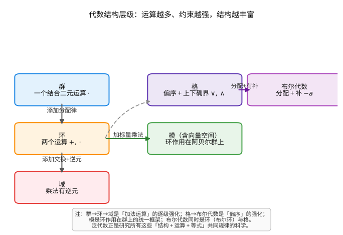
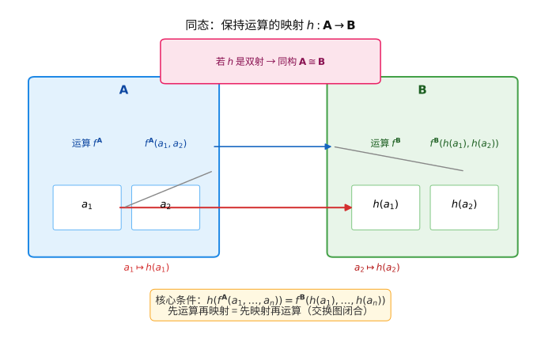

# 第 36 级：泛代数 (Universal Algebra)

> 泛代数（Universal Algebra），又称普适代数学，研究通用於所有代数结构的理论。它超越了具体的代数系统（如群、环、格），从更高的抽象层次探讨代数结构的共同规律。本教程将系统介绍泛代数的基本概念、核心定理与重要应用。

---

## 1. 学习目标

完成本教程后，你应该能够：

1. **理解** 泛代数的基本框架——签名、代数、同态、同余关系、商代数等核心概念
2. **掌握** 同态基本定理及其证明，理解对应定理和同构定理在泛代数中的统一形式
3. **熟练运用** 子代数、积代数、次直积和次直不可约代数的构造与性质
4. **深刻理解** Birkhoff HSP 定理的证明及其在簇分类中的核心地位
5. **掌握** 自由代数的构造及其泛映射性质
6. **了解** Mal'cev 理论的基本思想与 Mal'cev 条件
7. **理解** 格论的基本概念与 Birkhoff 表示定理
8. **能够** 运用泛代数的思想分析具体的代数结构并解决相关习题

---

## 2. 代数结构

### 2.1 签名 (Signature)

泛代数研究的第一步是指定代数结构所使用的运算符号及其元数。

**定义 2.1（签名）** 一个**签名**（或称**类型**）是一个有序对 $\Sigma = (\Omega, \operatorname{ar})$，其中 $\Omega$ 是一个非空集合（称为**运算符号**的集合），$\operatorname{ar}: \Omega \to \mathbb{N}$ 是一个映射，为每个运算符号 $f \in \Omega$ 指定一个自然数 $\operatorname{ar}(f)$，称为 $f$ 的**元数**。

通常将 $\operatorname{ar}(f) = n$ 的运算符号 $f$ 称为 **$n$ 元运算符号**。特别地：
- $\operatorname{ar}(f) = 0$ 时，$f$ 称为**零元运算符号**（即常元）
- $\operatorname{ar}(f) = 1$ 时，$f$ 称为**一元运算符号**
- $\operatorname{ar}(f) = 2$ 时，$f$ 称为**二元运算符号**

**例 2.1** 
- 群的签名：$\Sigma_{\text{群}} = \{\cdot^{(2)}, {(-)}^{-1^{(1)}}, e^{(0)}\}$，其中 $\cdot$ 是二元乘法，${(-)}^{-1}$ 是一元逆元，$e$ 是零元单位元。
- 环的签名：$\Sigma_{\text{环}} = \{+^{(2)}, \cdot^{(2)}, -^{(1)}, 0^{(0)}, 1^{(0)}\}$。
- 格的签名：$\Sigma_{\text{格}} = \{\vee^{(2)}, \wedge^{(2)}\}$。

### 2.2 泛代数 (Universal Algebra)

**定义 2.2（$\Sigma$-代数）** 设 $\Sigma = (\Omega, \operatorname{ar})$ 是一个签名。一个 **$\Sigma$-代数**（或称**泛代数**）$\mathbf{A}$ 是一个有序对 $\mathbf{A} = (A, (f^{\mathbf{A}})_{f \in \Omega})$，其中 $A$ 是一个非空集合（称为**论域**），对每个 $f \in \Omega$，$f^{\mathbf{A}}$ 是 $A$ 上的一个 $\operatorname{ar}(f)$ 元运算：
- 若 $\operatorname{ar}(f) = 0$，则 $f^{\mathbf{A}} \in A$（常元）
- 若 $\operatorname{ar}(f) = n \geq 1$，则 $f^{\mathbf{A}}: A^n \to A$

通常在不引起混淆时，简记 $\mathbf{A} = (A, \Omega)$。

**例 2.2** 
- 群 $(\mathbb{Z}, +, -(\cdot), 0)$ 是一个 $\Sigma_{\text{群}}$-代数，其中 $+^{\mathbb{Z}}$ 是整数加法，$-^{\mathbb{Z}}$ 是取负运算，$0^{\mathbb{Z}}$ 是整数 0。
- 任何环 $(\mathbb{Z}, +, \cdot, -(\cdot), 0, 1)$ 是一个 $\Sigma_{\text{环}}$-代数。



> **直观理解（现实类比）**：代数结构就像给一个盒子不断"加料"——群像只有"合并"一种规则的积木；环再加一种"铺开"的规则（分配律）；域则是让每个积木都能"抵消"回单位元的完备状态。而模可以理解为"环这台机器作用在一个零件集合上"。泛代数研究的是所有这些"盒子"共通的组装规律，而不关心里面装的具体是什么。
>
> **🧠 思考历程：所有代数结构背后，是否藏着同一张"通用图纸"？**
>
> 泛代数要回答的是：群、环、格、模千差万别，但它们的"组装规律"是否共享同一份底层图纸？——即抛开具体对象，只凭"运算符号 + 等式"本身，能推导出怎样普遍的结论。
>
> - **术语的祖先**。早在 1898 年，Alfred North Whitehead 就在《A Treatise on Universal Algebra》中提出"通用代数"之名，试图为各类代数结构寻找公共规律。
> - **Birkhoff 的现代框架**。1930 年代，Garrett Birkhoff 约于 1935 年前后把这一研究系统化为"符号、运算、等式"的形式系统，并证明著名的 HSP 定理：一个代数类能被某组等式公理刻画（构成一个"簇"）当且仅当它对同态像、子代数、直积这三项运算全部封闭。
> - **统一背后的分野**。泛代数把群、环、格收拢进同一语言，但"自由代数""同余格"的研究又暴露出各结构的鲜明个性，最终把代数推向范畴论与模型论的交汇处。
> - **心路**：与其逐个解剖具体的群和环，不如反问"数学结构本身是怎么被造出来的"——一张等式清单，竟撬动了整个代数的地基。

### 2.3 项代数 (Term Algebra)

**定义 2.3（项）** 给定签名 $\Sigma$ 和一个变量集合 $X$，$\Sigma$ 上的**项**（或称**表达式**）递归定义如下：
1. 每个变量 $x \in X$ 是一个项。
2. 每个零元运算符号 $c \in \Omega$（即 $\operatorname{ar}(c) = 0$）是一个项。
3. 若 $f \in \Omega$ 且 $\operatorname{ar}(f) = n \geq 1$，且 $t_1, \ldots, t_n$ 是项，则 $f(t_1, \ldots, t_n)$ 是一个项。

所有 $\Sigma$ 上的项组成的集合记作 $\operatorname{T}_\Sigma(X)$。

**定义 2.4（项代数）** $\Sigma$ 上的**项代数** $\mathbf{T}_\Sigma(X)$ 的论域为 $\operatorname{T}_\Sigma(X)$，其运算定义为：对每个 $f \in \Omega$ 且 $\operatorname{ar}(f) = n$，以及项 $t_1, \ldots, t_n \in \operatorname{T}_\Sigma(X)$，
$$f^{\mathbf{T}_\Sigma(X)}(t_1, \ldots, t_n) = f(t_1, \ldots, t_n)$$

项代数可以看作"最自由的"代数——它只由语法构造而成，没有任何等式约束。

**例 2.3** 考虑群的签名 $\Sigma_{\text{群}} = \{\cdot, {(-)}^{-1}, e\}$，变量集 $X = \{x, y\}$。则以下都是项：
- $e$
- $x$
- $x \cdot y$
- $(x \cdot y)^{-1}$
- $x \cdot (y \cdot e)$

### 2.4 同态 (Homomorphism)

**定义 2.5（同态）** 设 $\mathbf{A} = (A, \Omega)$ 和 $\mathbf{B} = (B, \Omega)$ 是同一签名 $\Sigma$ 上的两个代数。一个函数 $h: A \to B$ 称为从 $\mathbf{A}$ 到 $\mathbf{B}$ 的**同态**，如果对每个 $f \in \Omega$（设 $\operatorname{ar}(f) = n$）和任意 $a_1, \ldots, a_n \in A$，有：
$$h(f^{\mathbf{A}}(a_1, \ldots, a_n)) = f^{\mathbf{B}}(h(a_1), \ldots, h(a_n))$$

换言之，同态"保持"所有运算。

**定义 2.6** 
- 如果 $h$ 是双射，则称 $h$ 为**同构**，记作 $\mathbf{A} \cong \mathbf{B}$。
- 如果 $h$ 是单射，则称 $h$ 为**单同态**（或称嵌入）。
- 如果 $h$ 是满射，则称 $h$ 为**满同态**。
- 从 $\mathbf{A}$ 到 $\mathbf{A}$ 本身的同态称为**自同态**，同构称为**自同构**。

**例 2.4** 
- 群同态、环同态都是泛代数意义下的同态。
- 映射 $h: \mathbb{Z} \to \mathbb{Z}_n$，$h(k) = k \bmod n$ 是加法群之间的满同态。

**命题 2.1（同态的复合）** 同态的复合仍然是同态。同构的复合仍然是同构。

**命题 2.2（同态的基本性质）** 设 $h: \mathbf{A} \to \mathbf{B}$ 是同态。
1. 若 $c$ 是零元运算，则 $h(c^{\mathbf{A}}) = c^{\mathbf{B}}$。
2. 若 $t(x_1, \ldots, x_n)$ 是项，则对任意 $a_1, \ldots, a_n \in A$，$h(t^{\mathbf{A}}(a_1, \ldots, a_n)) = t^{\mathbf{B}}(h(a_1), \ldots, h(a_n))$。



> **直观理解（现实类比）**：把代数结构想成一套"机器工序"，同态就是一座"翻译桥梁"——无论你在 A 车间先把零件加工好再翻译成 B 的语言，还是先把零件翻译过来再在 B 车间加工，结果完全一致。就像中文菜谱和英文菜谱虽然字不同，但"先炒再放盐"的工序被忠实保留，翻译前后做出的菜味道一样。若双向翻译都一一对应（双射），这两个结构本质上就是同一套规则，只是换了名字。

### 2.5 同余关系 (Congruence)

**定义 2.7（同余关系）** 设 $\mathbf{A} = (A, \Omega)$ 是一个 $\Sigma$-代数。$A$ 上的一个等价关系 $\theta \subseteq A \times A$ 称为 $\mathbf{A}$ 上的一个**同余关系**，如果它"保持"所有运算：对每个 $f \in \Omega$（设 $\operatorname{ar}(f) = n$）和任意 $a_1, b_1, \ldots, a_n, b_n \in A$，若 $(a_i, b_i) \in \theta$ 对 $i = 1, \ldots, n$ 成立，则
$$(f^{\mathbf{A}}(a_1, \ldots, a_n), f^{\mathbf{A}}(b_1, \ldots, b_n)) \in \theta$$

$\mathbf{A}$ 上的所有同余关系构成的集合记作 $\operatorname{Con}(\mathbf{A})$。

**注**：同余关系是泛代数中最为关键的概念之一，它扮演着群论中正规子群和环论中理想所扮演的角色。

**例 2.5**
- 对于群 $\mathbf{G}$，群同余关系与正规子群一一对应：$\theta \leftrightarrow N$，其中 $(a, b) \in \theta \iff a^{-1}b \in N$。
- 对于环 $\mathbf{R}$，环同余关系与理想一一对应：$\theta \leftrightarrow I$，其中 $(a, b) \in \theta \iff a - b \in I$。

**定义 2.8（同余格）** 对同余关系 $\theta, \psi \in \operatorname{Con}(\mathbf{A})$，定义：
- $\theta \wedge \psi = \theta \cap \psi$（交）
- $\theta \vee \psi$ 为包含 $\theta \cup \psi$ 的最小同余关系（并）

$(\operatorname{Con}(\mathbf{A}), \wedge, \vee)$ 构成一个格，称为 $\mathbf{A}$ 的**同余格**。

### 2.6 商代数 (Quotient Algebra)

**定义 2.9（商代数）** 设 $\mathbf{A}$ 是一个 $\Sigma$-代数，$\theta \in \operatorname{Con}(\mathbf{A})$ 是一个同余关系。**商代数** $\mathbf{A}/\theta$ 定义如下：
- 论域：$A/\theta = \{[a]_\theta \mid a \in A\}$，即 $\theta$ 的等价类集合。
- 运算：对每个 $f \in \Omega$（设 $\operatorname{ar}(f) = n$），定义
$$f^{\mathbf{A}/\theta}([a_1]_\theta, \ldots, [a_n]_\theta) = [f^{\mathbf{A}}(a_1, \ldots, a_n)]_\theta$$

由于 $\theta$ 是同余关系，上述定义是良定义的（不依赖于代表元的选择）。

**定理 2.1（自然满同态）** 映射 $\pi: \mathbf{A} \to \mathbf{A}/\theta$，$\pi(a) = [a]_\theta$，是一个满同态，称为**自然同态**或**典范投影**。

### 2.7 直积 (Direct Product)

**定义 2.10（直积）** 设 $\{\mathbf{A}_i\}_{i \in I}$ 是一族 $\Sigma$-代数（$I$ 是一个指标集）。它们的**直积** $\mathbf{P} = \prod_{i \in I} \mathbf{A}_i$ 定义如下：
- 论域：$P = \prod_{i \in I} A_i$，即所有选择函数 $(a_i)_{i \in I}$ 的集合，其中 $a_i \in A_i$。
- 运算：对每个 $f \in \Omega$（设 $\operatorname{ar}(f) = n$），逐分量定义：
$$f^{\mathbf{P}}((a_1^{(1)}, \ldots, a_1^{(n)}), \ldots, (a_n^{(1)}, \ldots, a_n^{(n)})) = (f^{\mathbf{A}_1}(a_1^{(1)}, \ldots, a_n^{(1)}), \ldots, f^{\mathbf{A}_I}(a_1^{(I)}, \ldots, a_n^{(I)}))$$

当 $I$ 有限时，直积就是通常的笛卡尔积。

**命题 2.3（投影同态）** 对每个 $i \in I$，投影映射 $\pi_i: \prod_{j \in I} \mathbf{A}_j \to \mathbf{A}_i$，$\pi_i((a_j)_{j \in I}) = a_i$，是一个满同态。

---

## 3. 同态基本定理

### 3.1 同态基本定理 (Homomorphism Theorem)

**定理 3.1（同态基本定理）** 设 $h: \mathbf{A} \to \mathbf{B}$ 是一个同态。定义 $\ker(h) = \{(a, a') \in A \times A \mid h(a) = h(a')\}$，则：
1. $\ker(h)$ 是 $\mathbf{A}$ 上的一个同余关系。
2. $\mathbf{A}/\ker(h) \cong h(\mathbf{A})$（即 $\mathbf{A}/\ker(h)$ 与 $\mathbf{B}$ 的子代数 $h(\mathbf{A})$ 同构）。

**证明**：
1. 首先证明 $\ker(h)$ 是等价关系：
   - 自反性：$h(a) = h(a)$ 对任意 $a \in A$，故 $(a, a) \in \ker(h)$。
   - 对称性：若 $(a, a') \in \ker(h)$，则 $h(a) = h(a')$，从而 $h(a') = h(a)$，故 $(a', a) \in \ker(h)$。
   - 传递性：若 $(a, a'), (a', a'') \in \ker(h)$，则 $h(a) = h(a') = h(a'')$，故 $(a, a'') \in \ker(h)$。

   再证明 $\ker(h)$ 保持运算：设 $f \in \Omega$ 是 $n$ 元运算，且 $(a_i, a_i') \in \ker(h)$ 对 $i = 1, \ldots, n$ 成立，即 $h(a_i) = h(a_i')$。则
   $$h(f^{\mathbf{A}}(a_1, \ldots, a_n)) = f^{\mathbf{B}}(h(a_1), \ldots, h(a_n)) = f^{\mathbf{B}}(h(a_1'), \ldots, h(a_n')) = h(f^{\mathbf{A}}(a_1', \ldots, a_n'))$$
   因此 $(f^{\mathbf{A}}(a_1, \ldots, a_n), f^{\mathbf{A}}(a_1', \ldots, a_n')) \in \ker(h)$。故 $\ker(h)$ 是同余关系。

2. 定义 $\phi: \mathbf{A}/\ker(h) \to h(\mathbf{A})$ 为 $\phi([a]_{\ker(h)}) = h(a)$。
   - **良定义**：若 $[a] = [a']$，则 $(a, a') \in \ker(h)$，即 $h(a) = h(a')$，故 $\phi$ 与代表元选择无关。
   - **同态**：对任意 $n$ 元运算 $f$，
     $$\phi(f^{\mathbf{A}/\ker(h)}([a_1], \ldots, [a_n])) = \phi([f^{\mathbf{A}}(a_1, \ldots, a_n)]) = h(f^{\mathbf{A}}(a_1, \ldots, a_n)) = f^{\mathbf{B}}(h(a_1), \ldots, h(a_n)) = f^{\mathbf{B}}(\phi([a_1]), \ldots, \phi([a_n]))$$
   - **单射**：若 $\phi([a]) = \phi([a'])$，则 $h(a) = h(a')$，故 $(a, a') \in \ker(h)$，即 $[a] = [a']$。
   - **满射**：对任意 $b \in h(\mathbf{A})$，存在 $a \in A$ 使得 $h(a) = b$，则 $\phi([a]) = b$。

   因此 $\phi$ 是同构。 $\square$

### 3.2 对应定理 (Correspondence Theorem)

**定理 3.2（对应定理）** 设 $h: \mathbf{A} \to \mathbf{B}$ 是一个满同态。则存在 $\operatorname{Con}(\mathbf{A})$ 中所有包含 $\ker(h)$ 的同余关系与 $\operatorname{Con}(\mathbf{B})$ 之间的一个一一对应：
$$\theta \longleftrightarrow h(\theta) = \{(h(a), h(a')) \mid (a, a') \in \theta\}$$
$$\pi^{-1}(\psi) = \{(a, a') \in A \times A \mid (\pi(a), \pi(a')) \in \psi\} \longmapsfrom \psi$$

其中 $\pi: \mathbf{A} \to \mathbf{A}/\ker(h)$ 是自然投影。这个对应保持包含关系、交和并，因此是一个格同构。

**推论 3.1** 对任意同余关系 $\theta \in \operatorname{Con}(\mathbf{A})$，有 $\operatorname{Con}(\mathbf{A}/\theta) \cong \{\psi \in \operatorname{Con}(\mathbf{A}) \mid \theta \subseteq \psi\}$。

### 3.3 同构定理

**定理 3.3（第一同构定理）** 设 $h: \mathbf{A} \to \mathbf{B}$ 是同态，则
$$\mathbf{A}/\ker(h) \cong h(\mathbf{A})$$

（这正是同态基本定理本身。）

**定理 3.4（第二同构定理）** 设 $\mathbf{A}$ 是 $\Sigma$-代数，$\mathbf{B} \leq \mathbf{A}$ 是子代数，$\theta \in \operatorname{Con}(\mathbf{A})$。定义 $\theta|_{\mathbf{B}} = \theta \cap (B \times B)$，则 $\mathbf{B}/(\theta|_{\mathbf{B}}) \cong (\mathbf{B} \vee \theta)/\theta$，其中 $\mathbf{B} \vee \theta$ 是包含 $B$ 且对 $\theta$ 封闭的最小子代数。

更精确地说，有自然的同构：
$$\mathbf{B}/(\theta \cap (B \times B)) \cong (\mathbf{B} \vee \theta)/\theta$$

**定理 3.5（第三同构定理）** 设 $\theta, \psi \in \operatorname{Con}(\mathbf{A})$ 且 $\theta \subseteq \psi$。则 $\psi/\theta = \{([a]_\theta, [a']_\theta) \mid (a, a') \in \psi\}$ 是 $\mathbf{A}/\theta$ 上的同余关系，并且
$$(\mathbf{A}/\theta)/(\psi/\theta) \cong \mathbf{A}/\psi$$

---

## 4. 子代数与积代数

### 4.1 子代数 (Subalgebra)

**定义 4.1（子代数）** 设 $\mathbf{A} = (A, \Omega)$ 和 $\mathbf{B} = (B, \Omega)$ 是同一签名 $\Sigma$ 上的两个代数。如果 $B \subseteq A$ 且对每个 $f \in \Omega$，$f^{\mathbf{B}}$ 是 $f^{\mathbf{A}}$ 在 $B$ 上的限制，则称 $\mathbf{B}$ 是 $\mathbf{A}$ 的**子代数**，记作 $\mathbf{B} \leq \mathbf{A}$。

等价地，$B \subseteq A$ 称为子代数，如果 $B$ 在 $\mathbf{A}$ 的所有运算下封闭：
- 对每个零元运算 $c$，$c^{\mathbf{A}} \in B$。
- 对每个 $n$ 元运算 $f$（$n \geq 1$）和任意 $b_1, \ldots, b_n \in B$，$f^{\mathbf{A}}(b_1, \ldots, b_n) \in B$。

**注**：子代数必须是**非空**的（因为零元运算保证至少有一个元素）。

**例 4.1**
- 群的子群就是子代数。
- 环的子环就是子代数。
- 子格就是子代数。

**命题 4.1（子代数的交）** 一族子代数的交集仍然是子代数。因此，对任意子集 $X \subseteq A$，存在包含 $X$ 的最小子代数，称为由 $X$ **生成的子代数**，记作 $\langle X \rangle$。

### 4.2 积代数 (Product Algebra)

**定义 4.2（积代数）** 一族 $\Sigma$-代数 $\{\mathbf{A}_i\}_{i \in I}$ 的**直积** $\prod_{i \in I} \mathbf{A}_i$ 是一个 $\Sigma$-代数，其论域为笛卡尔积 $\prod_{i \in I} A_i$，运算逐分量定义（如定义 2.10）。

**性质 4.1** 
1. 投影映射 $\pi_i: \prod \mathbf{A}_i \to \mathbf{A}_i$ 是满同态。
2. 直积满足泛性质：对任意代数 $\mathbf{C}$ 和一族同态 $h_i: \mathbf{C} \to \mathbf{A}_i$，存在唯一的同态 $h: \mathbf{C} \to \prod \mathbf{A}_i$ 使得 $\pi_i \circ h = h_i$ 对所有 $i$ 成立。

### 4.3 次直积 (Subdirect Product)

**定义 4.3（次直积）** 一个 $\Sigma$-代数 $\mathbf{A}$ 称为一族代数 $\{\mathbf{A}_i\}_{i \in I}$ 的**次直积**，如果：
1. $\mathbf{A} \leq \prod_{i \in I} \mathbf{A}_i$（即 $\mathbf{A}$ 是直积的子代数）。
2. 对每个 $i \in I$，限制投影 $\pi_i|_{\mathbf{A}}: \mathbf{A} \to \mathbf{A}_i$ 是满射。

**定义 4.4（次直不可约）** 一个代数 $\mathbf{A}$ 称为**次直不可约**的，如果它不能表示为非平凡次直积——即每当 $\mathbf{A}$ 同构于一族代数的次直积时，其中必有一个因子与 $\mathbf{A}$ 同构。

等价地，$\mathbf{A}$ 是次直不可约的当且仅当 $\operatorname{Con}(\mathbf{A})$ 中所有非平凡同余关系的交 $\bigcap \{\theta \in \operatorname{Con}(\mathbf{A}) \mid \theta \neq \Delta\}$ 不等于 $\Delta$（其中 $\Delta = \{(a, a) \mid a \in A\}$ 是恒等关系）。

更精确地说，$\mathbf{A}$ 是次直不可约的当且仅当存在一个最小非平凡同余关系——即 $\operatorname{Con}(\mathbf{A})$ 中恰有一个覆盖 $\Delta$ 的原子。

**定理 4.1（Birkhoff 次直积表示定理）** 每个代数 $\mathbf{A}$ 都同构于一族次直不可约代数的次直积。

**证明概要**：对每个 $a \neq b \in A$，由 Zorn 引理存在一个极大同余关系 $\theta_{a,b}$ 使得 $(a, b) \notin \theta_{a,b}$。则 $\mathbf{A}/\theta_{a,b}$ 是次直不可约的，且嵌入映射 $\mathbf{A} \to \prod_{a \neq b} \mathbf{A}/\theta_{a,b}$ 给出次直积表示。 $\square$

### 4.4 次直不可约代数的重要性

次直不可约代数是泛代数中的"基本构件"——类似于群论中的单群或环论中的单环。Birkhoff 的次直积表示定理表明，任何代数都可以由次直不可约代数"拼装"而成。这使得研究各类代数结构时，往往可以先限制在次直不可约情形。

---

## 5. Birkhoff 定理

### 5.1 等式与簇 (Variety)

**定义 5.1（等式）** 一个 **$\Sigma$-等式**（或称**恒等式**）是一个形如 $s \approx t$ 的表达式，其中 $s, t \in \operatorname{T}_\Sigma(X)$ 是项（$X$ 是某个变量集）。

**定义 5.2（满足等式）** 设 $\mathbf{A}$ 是一个 $\Sigma$-代数，$s \approx t$ 是一个等式（变量取自 $X$）。称 $\mathbf{A}$ **满足** $s \approx t$，记作 $\mathbf{A} \models s \approx t$，如果对任意赋值 $v: X \to A$，有 $\bar{v}(s) = \bar{v}(t)$，其中 $\bar{v}$ 是将 $v$ 扩展为项的同态映射。

**定义 5.3（簇）** 一族 $\Sigma$-代数 $\mathcal{V}$ 称为一个**簇**（或称**等式类**），如果存在一组等式 $\mathcal{E}$，使得
$$\mathcal{V} = \operatorname{Mod}(\mathcal{E}) = \{\mathbf{A} \mid \mathbf{A} \models e \text{ 对所有 } e \in \mathcal{E}\}$$

即 $\mathcal{V}$ 恰好由所有满足 $\mathcal{E}$ 中每个等式的代数组成。

**例 5.1**
- 所有群构成一个簇（等式包括：$(x \cdot y) \cdot z \approx x \cdot (y \cdot z)$，$e \cdot x \approx x$，$x \cdot e \approx x$，$x \cdot x^{-1} \approx e$，$x^{-1} \cdot x \approx e$）。
- 所有环构成一个簇。
- 所有格构成一个簇。
- 所有域**不**构成一个簇（因为 $0 \neq 1$ 和存在乘法逆元无法用等式表述）。

### 5.2 HSP 定理 (Birkhoff's Variety Theorem)

**定理 5.1（Birkhoff HSP 定理）** 一个 $\Sigma$-代数类 $\mathcal{K}$ 是簇当且仅当它在以下三种算子下封闭：
- **H**（同态像）：若 $\mathbf{A} \in \mathcal{K}$ 且 $h: \mathbf{A} \to \mathbf{B}$ 是满同态，则 $\mathbf{B} \in \mathcal{K}$。
- **S**（子代数）：若 $\mathbf{A} \in \mathcal{K}$ 且 $\mathbf{B} \leq \mathbf{A}$，则 $\mathbf{B} \in \mathcal{K}$。
- **P**（直积）：若 $\{\mathbf{A}_i\}_{i \in I} \subseteq \mathcal{K}$，则 $\prod_{i \in I} \mathbf{A}_i \in \mathcal{K}$。

**证明**：证明分两个方向。

**（$\Rightarrow$）** 设 $\mathcal{V} = \operatorname{Mod}(\mathcal{E})$ 是一个簇。需要验证 H、S、P 封闭性。

- **P 封闭**：设 $\mathbf{A}_i \models \mathcal{E}$ 对所有 $i \in I$ 成立。对任意等式 $s \approx t \in \mathcal{E}$ 和任意赋值 $v: X \to \prod A_i$，将 $v(x)$ 的第 $i$ 个分量记作 $v_i(x)$。则
  $$\bar{v}(s)_i = \overline{v_i}(s) = \overline{v_i}(t) = \bar{v}(t)_i$$
  故 $\bar{v}(s) = \bar{v}(t)$，即 $\prod \mathbf{A}_i \models s \approx t$。

- **S 封闭**：设 $\mathbf{B} \leq \mathbf{A}$ 且 $\mathbf{A} \models \mathcal{E}$。任意赋值 $v: X \to B$ 也是到 $A$ 的赋值，故 $\bar{v}(s) = \bar{v}(t)$ 在 $A$ 中成立。由于 $B$ 是子代数，$\bar{v}(s), \bar{v}(t) \in B$，故等式在 $B$ 中也成立。

- **H 封闭**：设 $h: \mathbf{A} \to \mathbf{B}$ 是满同态，$\mathbf{A} \models \mathcal{E}$。对任意赋值 $v: X \to B$，由于 $h$ 是满射，存在赋值 $u: X \to A$ 使得 $h \circ u = v$。则
  $$\bar{v}(s) = h(\bar{u}(s)) = h(\bar{u}(t)) = \bar{v}(t)$$
  故 $\mathbf{B} \models s \approx t$。

**（$\Leftarrow$）** 设 $\mathcal{K}$ 在 H、S、P 下封闭。令 $\mathcal{E} = \operatorname{Id}(\mathcal{K})$ 为 $\mathcal{K}$ 中所有代数满足的所有等式。显然 $\mathcal{K} \subseteq \operatorname{Mod}(\mathcal{E})$。需要证明反包含。

设 $\mathbf{B} \in \operatorname{Mod}(\mathcal{E})$。我们需要证明 $\mathbf{B} \in \mathcal{K}$。

取 $\mathbf{B}$ 的生成元集 $X$（例如取 $B$ 本身），构造**自由代数** $\mathbf{F}_{\mathcal{K}}(X)$（见第 6 节）。$\mathbf{F}_{\mathcal{K}}(X)$ 具有如下性质：存在一个单射 $\iota: X \to \mathbf{F}_{\mathcal{K}}(X)$，且对任意 $\mathbf{A} \in \mathcal{K}$ 和任意映射 $f: X \to A$，存在唯一的同态 $\bar{f}: \mathbf{F}_{\mathcal{K}}(X) \to \mathbf{A}$ 使得 $\bar{f} \circ \iota = f$。

由于 $\mathbf{B} \models \mathcal{E}$，可以证明 $\mathbf{B}$ 是 $\mathbf{F}_{\mathcal{K}}(X)$ 的同态像。具体地，考虑映射 $g: X \to B$ 为 $g(x) = x$（将生成元映射到自身），则 $g$ 扩展为满同态 $\bar{g}: \mathbf{F}_{\mathcal{K}}(X) \to \mathbf{B}$。

接下来，$\mathbf{F}_{\mathcal{K}}(X)$ 可以通过标准构造表示为 $\mathcal{K}$ 中某些代数的次直积。具体地，$\mathbf{F}_{\mathcal{K}}(X)$ 可以嵌入到 $\prod_{\mathbf{A} \in \mathcal{K}} \mathbf{A}^{|X|}$ 中，这个乘积在 $\mathcal{K}$ 中（因为 $\mathcal{K}$ 在 P 下封闭）。而 $\mathbf{F}_{\mathcal{K}}(X)$ 是这个乘积的子代数（因为 $\mathcal{K}$ 在 S 下封闭），因此 $\mathbf{F}_{\mathcal{K}}(X) \in \mathcal{K}$。

最后，$\mathbf{B}$ 是 $\mathbf{F}_{\mathcal{K}}(X)$ 的同态像，由 H 封闭性，$\mathbf{B} \in \mathcal{K}$。 $\square$

### 5.3 等式逻辑 (Equational Logic)

**定义 5.4（等式逻辑的推导规则）** Birkhoff 为等式逻辑建立了以下完备的推导系统：

1. **自反性**：$t \approx t$
2. **对称性**：$\dfrac{s \approx t}{t \approx s}$
3. **传递性**：$\dfrac{s \approx t,\ t \approx u}{s \approx u}$
4. **替换性**：若 $s \approx t$ 是等式，且 $x$ 是变量，则对任意项 $u$，$\dfrac{s \approx t}{u[s/x] \approx u[t/x]}$
5. **同余性**：$\dfrac{s_1 \approx t_1,\ \ldots,\ s_n \approx t_n}{f(s_1, \ldots, s_n) \approx f(t_1, \ldots, t_n)}$ 对每个 $n$ 元运算符号 $f$ 成立。

**定理 5.2（Birkhoff 完备性定理）** 一组等式 $\mathcal{E}$ 逻辑蕴涵等式 $s \approx t$（即 $s \approx t$ 在所有满足 $\mathcal{E}$ 的代数中都成立）当且仅当 $s \approx t$ 可以从 $\mathcal{E}$ 出发通过上述推导规则在有限步内推导出来。

---

## 6. 自由代数

### 6.1 自由代数与泛映射性质

**定义 6.1（自由代数）** 设 $\mathcal{V}$ 是一个簇，$X$ 是一个集合。$\mathcal{V}$ 中由 $X$ **自由生成**的代数记作 $\mathbf{F}_{\mathcal{V}}(X)$，如果满足以下**泛映射性质**：
- 存在一个映射 $\iota: X \to \mathbf{F}_{\mathcal{V}}(X)$（称为**生成元嵌入**）。
- 对任意 $\mathbf{A} \in \mathcal{V}$ 和任意函数 $f: X \to A$，存在唯一的同态 $\bar{f}: \mathbf{F}_{\mathcal{V}}(X) \to \mathbf{A}$ 使得 $\bar{f} \circ \iota = f$。

用交换图表示：
$$
\begin{CD}
X @>{\iota}>> \mathbf{F}_{\mathcal{V}}(X) \\
@| @V{\bar{f}}VV \\
X @>{f}>> \mathbf{A}
\end{CD}
$$

**定理 6.1（自由代数的存在性与唯一性）** 对于任意簇 $\mathcal{V}$ 和任意集合 $X$，自由代数 $\mathbf{F}_{\mathcal{V}}(X)$ 存在并且在同构意义下唯一。

**证明概要**：
- **唯一性**：若 $\mathbf{F}_1$ 和 $\mathbf{F}_2$ 都满足泛映射性质，则存在唯一的同态 $\phi: \mathbf{F}_1 \to \mathbf{F}_2$ 和 $\psi: \mathbf{F}_2 \to \mathbf{F}_1$，它们的复合是恒等映射，因而 $\mathbf{F}_1 \cong \mathbf{F}_2$。
- **存在性**：从项代数 $\mathbf{T}_\Sigma(X)$ 出发，定义 $\theta$ 为 $\mathcal{V}$ 中所有等式生成的同余关系，则 $\mathbf{F}_{\mathcal{V}}(X) = \mathbf{T}_\Sigma(X)/\theta$。 $\square$

### 6.2 字代数 (Word Algebra)

**定义 6.2（字代数）** 项代数 $\mathbf{T}_\Sigma(X)$ 也称为 $\Sigma$ 上由 $X$ 生成的**字代数**。它是**绝对自由**的——即所有 $\Sigma$-代数构成的簇（没有任何等式约束）中的自由代数。

**例 6.1** 考虑签名 $\Sigma = \{e^{(0)}, \cdot^{(2)}\}$，变量 $X = \{x, y\}$。则 $\mathbf{T}_\Sigma(X)$ 中的元素如：
$$e,\ x,\ y,\ x \cdot x,\ x \cdot y,\ y \cdot x,\ (x \cdot x) \cdot y,\ x \cdot (x \cdot y),\ \ldots$$

### 6.3 常见簇的自由代数

**例 6.2（自由群）** 在群簇中，由 $X$ 自由生成的自由群 $\mathbf{F}_{\text{群}}(X)$ 的元素是 $X \cup X^{-1}$ 上的"既约字"（即不含 $xx^{-1}$ 或 $x^{-1}x$ 形式的字），运算为拼接后约简。

**例 6.3（自由交换群）** 在交换群簇中，由 $X$ 自由生成的自由交换群同构于 $\bigoplus_{x \in X} \mathbb{Z}$（即 $X$ 个 $\mathbb{Z}$ 的直和）。

**例 6.4（自由格）** 自由分配格有有限表示，但自由模格通常非常复杂。

### 6.4 自由代数的基本性质

**命题 6.1** 
1. $\mathbf{F}_{\mathcal{V}}(X)$ 由 $\iota(X)$ 生成（作为代数）。
2. 若 $|X| = |Y|$，则 $\mathbf{F}_{\mathcal{V}}(X) \cong \mathbf{F}_{\mathcal{V}}(Y)$。
3. 对任意 $\mathbf{A} \in \mathcal{V}$，存在自由代数 $\mathbf{F}_{\mathcal{V}}(A)$ 到 $\mathbf{A}$ 的满同态（取 $f: A \to A$ 为恒等映射）。

性质 3 表明，每个代数都是某个自由代数的同态像——这是自由代数重要性的体现。

---

## 7. Mal'cev 理论

### 7.1 Mal'cev 条件

**定义 7.1（Mal'cev 项）** 设 $\mathcal{V}$ 是一个簇。一个三元项 $p(x, y, z)$ 称为 $\mathcal{V}$ 上的一个 **Mal'cev 项**，如果 $\mathcal{V}$ 满足以下等式：
$$p(x, y, y) \approx x,\quad p(y, y, z) \approx z$$

**例 7.1**
- 在群簇中，$p(x, y, z) = x \cdot y^{-1} \cdot z$ 是一个 Mal'cev 项。
- 在环簇中，$p(x, y, z) = x - y + z$ 是一个 Mal'cev 项。
- 在格簇中，不存在 Mal'cev 项。

### 7.2 可置换同余 (Permutable Congruences)

**定义 7.2（可置换同余）** 一个代数 $\mathbf{A}$ 称为具有**可置换同余**，如果对任意 $\theta, \psi \in \operatorname{Con}(\mathbf{A})$，有 $\theta \circ \psi = \psi \circ \theta$（即同余关系的复合可交换）。这里
$$\theta \circ \psi = \{(a, c) \mid \exists b \in A,\ (a, b) \in \theta,\ (b, c) \in \psi\}$$

一个簇 $\mathcal{V}$ 称为**同余可置换**的，如果 $\mathcal{V}$ 中每个代数都具有可置换同余。

**定理 7.1（Mal'cev 定理）** 一个簇 $\mathcal{V}$ 是同余可置换的当且仅当 $\mathcal{V}$ 有一个 Mal'cev 项。

**证明概要**：
- **（$\Leftarrow$）** 设 $p$ 是 Mal'cev 项，$\theta, \psi \in \operatorname{Con}(\mathbf{A})$，$(a, c) \in \theta \circ \psi$，则存在 $b$ 使得 $(a, b) \in \theta$，$(b, c) \in \psi$。取 $d = p(a, b, c) = p^{\mathbf{A}}(a, b, c)$。可以验证 $(a, d) \in \psi$ 且 $(d, c) \in \theta$，故 $(a, c) \in \psi \circ \theta$。
- **（$\Rightarrow$）** 在 $\mathbf{F}_{\mathcal{V}}(\{x, y, z\})$ 中考虑由 $\theta = \operatorname{Cg}(x, y)$ 和 $\psi = \operatorname{Cg}(y, z)$ 生成的同余关系，利用可置换性构造出 $p(x, y, z)$。 $\square$

### 7.3 同余分配簇 (Congruence Distributive Varieties)

**定义 7.3** 一个簇 $\mathcal{V}$ 称为**同余分配**的，如果对每个 $\mathbf{A} \in \mathcal{V}$，其同余格 $\operatorname{Con}(\mathbf{A})$ 是分配格。

**例 7.2** 格簇、布尔代数簇、Heyting 代数簇都是同余分配的。

**定理 7.2（Jónsson 定理）** 若 $\mathcal{V}$ 有 Jónsson 项（一组 $n$ 元项满足某些等式），则 $\mathcal{V}$ 是同余分配的。具体地，存在 $n$ 个三元项 $d_0, \ldots, d_n$ 满足：
- $d_0(x, y, z) \approx x$
- $d_n(x, y, z) \approx z$
- $d_i(x, y, x) \approx x$ 对 $i = 0, \ldots, n$
- $d_i(x, x, y) \approx d_{i+1}(x, x, y)$ 对偶数 $i$
- $d_i(x, y, y) \approx d_{i+1}(x, y, y)$ 对奇数 $i$

### 7.4 算术簇 (Arithmetic Varieties)

**定义 7.4** 一个簇 $\mathcal{V}$ 称为**算术簇**，如果它既是同余可置换的，又是同余分配的。

**例 7.3** 
- 环簇（分配）和群簇（可置换）的交集？
- 实际上，环簇不是同余可置换的（虽然环本身有 Mal'cev 项 $x - y + z$，但这仅适用于环本身，而非环簇中的所有代数结构）。等等，这里需要更精确。

实际上，环簇（有单位元的环）中，$p(x, y, z) = x - y + z$ 确实是 Mal'cev 项，因为 $x - y + y = x$ 和 $y - y + z = z$ 在环中成立。但环簇不是同余分配的——环的同余格（即理想格）一般是模格而非分配格。

**定理 7.3** 一个簇是算术簇当且仅当它同时具有 Mal'cev 项和 Jónsson 项。

---

## 8. 格论

### 8.1 格的基本概念

**定义 8.1（格）** 一个**格**是一个集合 $L$ 配备两个二元运算 $\vee$（并）和 $\wedge$（交），满足：
1. **交换律**：$a \vee b = b \vee a$，$a \wedge b = b \wedge a$
2. **结合律**：$(a \vee b) \vee c = a \vee (b \vee c)$，$(a \wedge b) \wedge c = a \wedge (b \wedge c)$
3. **吸收律**：$a \vee (a \wedge b) = a$，$a \wedge (a \vee b) = a$

格也可以定义为满足**偏序** $a \leq b \iff a \wedge b = a$（或等价地 $a \vee b = b$）的偏序集，其中任意两个元素都有上确界（并）和下确界（交）。

**例 8.1**
- 幂集格 $(\mathcal{P}(X), \cup, \cap)$。
- 整除格 $(\mathbb{N}^+, \operatorname{lcm}, \gcd)$。
- 线性序集上，$a \vee b = \max\{a, b\}$，$a \wedge b = \min\{a, b\}$。

### 8.2 完全格 (Complete Lattice)

**定义 8.2（完全格）** 一个格 $L$ 称为**完全格**，如果它的任意子集 $S \subseteq L$ 都有上确界 $\bigvee S$ 和下确界 $\bigwedge S$。

**例 8.2**
- 任何有限格都是完全格。
- 幂集格 $\mathcal{P}(X)$ 是完全格，其中 $\bigvee \mathcal{S} = \bigcup \mathcal{S}$，$\bigwedge \mathcal{S} = \bigcap \mathcal{S}$。
- 闭区间 $[0, 1]$ 在通常序下是完全格。

**定理 8.1（同余格是完全格）** 对任意代数 $\mathbf{A}$，$\operatorname{Con}(\mathbf{A})$ 是一个完全格，其中交为集合交，并为生成并。

### 8.3 模格 (Modular Lattice)

**定义 8.3（模格）** 一个格 $L$ 称为**模格**，如果对任意 $a, b, c \in L$，$a \leq c$ 蕴涵 $a \vee (b \wedge c) = (a \vee b) \wedge c$（模律）。

**命题 8.1** 分配格都是模格，但反之不真。

**例 8.3**
- 群的子群格是模格。
- 环的理想格是模格。
- 模的子模格是模格。
- 图 8.1 的五边形格 $N_5$ 不是模格。

**定理 8.2（Dedekind）** 格 $L$ 是模格当且仅当它不包含同构于 $N_5$（五边形格）的子格。

### 8.4 分配格 (Distributive Lattice)

**定义 8.4（分配格）** 一个格 $L$ 称为**分配格**，如果对任意 $a, b, c \in L$，有：
$$a \wedge (b \vee c) = (a \wedge b) \vee (a \wedge c)$$
（等价地，$a \vee (b \wedge c) = (a \vee b) \wedge (a \vee c)$。）

**定理 8.3（Birkhoff）** 格 $L$ 是分配格当且仅当它不包含同构于 $N_5$（五边形格）或 $M_3$（菱形格，即 $M_3 = \{0, a, b, c, 1\}$ 其中 $a, b, c$ 两两不可比）的子格。

**例 8.4**
- 所有链（全序集）都是分配格。
- 幂集格 $\mathcal{P}(X)$ 是分配格。
- 布尔代数都是分配格。

### 8.5 Birkhoff 表示定理

**定理 8.4（Birkhoff 表示定理）** 每个有限分配格 $L$ 都同构于某个有限偏序集 $P$ 的**下集格**（即所有向下封闭子集构成的格）。具体地，取 $P$ 为 $L$ 的**并不可约元**集合 $\mathcal{J}(L)$，则
$$L \cong \mathcal{O}(\mathcal{J}(L))$$
其中 $\mathcal{O}(P)$ 表示 $P$ 的所有下集（order ideal）在包含序下构成的格。

**证明概要**：
- $L$ 中的元素 $a$ 称为**并不可约**的，如果 $a = b \vee c$ 蕴涵 $a = b$ 或 $a = c$（且 $a \neq 0$）。记 $\mathcal{J}(L)$ 为所有并不可约元的集合。
- 定义映射 $\phi: L \to \mathcal{O}(\mathcal{J}(L))$ 为 $\phi(a) = \{j \in \mathcal{J}(L) \mid j \leq a\}$。
- 可以证明 $\phi$ 是格同构：
  - $\phi$ 是保序的。
  - $\phi(a \wedge b) = \phi(a) \cap \phi(b)$。
  - $\phi(a \vee b) = \phi(a) \cup \phi(b)$（利用分配性）。
  - $\phi$ 是单射：若 $a \neq b$，不妨设 $a \nleq b$，则存在并不可约元 $j \leq a$ 且 $j \nleq b$，故 $\phi(a) \neq \phi(b)$。
  - $\phi$ 是满射：对任意下集 $U \subseteq \mathcal{J}(L)$，取 $a = \bigvee U \in L$，则 $\phi(a) = U$。 $\square$

**例 8.5** 设 $L$ 是如下有限分配格：
```
      1
     /|\
    a b c
     \|/
      0
```
则 $\mathcal{J}(L) = \{a, b, c\}$（它们都是并不可约的），偏序为离散序（两两不可比）。$\mathcal{O}(\mathcal{J}(L))$ 包含 $2^3 = 8$ 个元素，恰好是 $\mathcal{P}(\{a, b, c\})$，这是一个 8 元布尔代数——而 $L$ 本身是 5 元格，这看起来不一致。实际上这里 $L$ 不是分配格，因为它同构于 $M_3$。对于真正的分配格，$\mathcal{J}(L)$ 的偏序会给出正确的对应。

---

## 9. 示例

### 9.1 示例 1：群的泛代数视角

**问题**：用泛代数的语言重新表述群的定义，并说明群的同余关系与正规子群的对应。

**解**：
群的签名 $\Sigma = \{\cdot^{(2)}, {(-)}^{-1^{(1)}}, e^{(0)}\}$。群簇由以下等式定义：
1. $(x \cdot y) \cdot z \approx x \cdot (y \cdot z)$
2. $e \cdot x \approx x$，$x \cdot e \approx x$
3. $x \cdot x^{-1} \approx e$，$x^{-1} \cdot x \approx e$

设 $\mathbf{G}$ 是一个群，$\theta \in \operatorname{Con}(\mathbf{G})$ 是同余关系。定义 $N = \{g \in G \mid (g, e) \in \theta\}$。可以验证：
- $N$ 是子群：若 $g, h \in N$，则 $(g, e), (h, e) \in \theta$，由同余性得 $(gh, e) \in \theta$，故 $gh \in N$。
- $N$ 是正规子群：若 $g \in N$，$x \in G$，则 $(g, e) \in \theta$，由同余性得 $(x^{-1}gx, x^{-1}ex) = (x^{-1}gx, e) \in \theta$，故 $x^{-1}gx \in N$。
- 反之，给定正规子群 $N \trianglelefteq G$，定义 $(a, b) \in \theta \iff a^{-1}b \in N$，则 $\theta$ 是同余关系。

因此 $\operatorname{Con}(\mathbf{G}) \cong \text{正规子群格}$，且 $\mathbf{G}/\theta \cong G/N$（群论中的商群）。

### 9.2 示例 2：自由群 $\mathbf{F}_2$

**问题**：描述由两个生成元 $x, y$ 自由生成的自由群 $\mathbf{F}_2$。

**解**：$\mathbf{F}_2$ 的元素是字母表 $\{x, y, x^{-1}, y^{-1}\}$ 上的既约字（不包含 $xx^{-1}$、$x^{-1}x$、$yy^{-1}$、$y^{-1}y$ 等子串）。例如：
- $x$，$y$，$x^{-1}$，$y^{-1}$
- $xy$，$xy^{-1}$，$yx$，$y^{-1}x$
- $xyx^{-1}y^{-1}$（即交换子 $[x, y]$）
- $x^2y^{-1}x$ 等

运算为拼接后约简。例如 $(xy)(y^{-1}x) = x(yy^{-1})x = xx = x^2$。

泛映射性质：对任意群 $G$ 和任意 $g, h \in G$，存在唯一的同态 $f: \mathbf{F}_2 \to G$ 使得 $f(x) = g$，$f(y) = h$。

### 9.3 示例 3：利用 Birkhoff HSP 定理判断簇

**问题**：判断以下代数类是否为簇：
1. 所有有限群构成的类 $\mathcal{F}$。
2. 所有阿贝尔群构成的类 $\mathcal{A}$。
3. 所有域构成的类 $\mathcal{K}$。

**解**：
1. $\mathcal{F}$ 不是簇。考虑 $\mathbb{Z}_2$ 和 $\mathbb{Z}_3$ 的直积 $\mathbb{Z}_2 \times \mathbb{Z}_3 \cong \mathbb{Z}_6$，它是有限群，仍在 $\mathcal{F}$ 中。但 $\mathbb{Z}$ 是无限群，它可以表示为有限循环群的次直积。实际上，$\mathcal{F}$ 在 H 和 S 下封闭，但在 P 下不封闭——无限直积 $\prod_{n \geq 2} \mathbb{Z}_n$ 不再是有限群。故 $\mathcal{F}$ 不是簇。

2. $\mathcal{A}$ 是簇。阿贝尔群由群簇的等式加上交换律 $xy \approx yx$ 定义。容易验证 $\mathcal{A}$ 在 H、S、P 下封闭。

3. $\mathcal{K}$ 不是簇。域的公理包含 $0 \neq 1$ 和"非零元素有乘法逆元"，这些不能用等式表达。具体地，设 $\mathbf{F}_p$ 是有限域，考虑直积 $\mathbf{F}_p \times \mathbf{F}_p$，其中 $(1, 0)$ 是非零元素但没有乘法逆元（因为 $(1, 0) \cdot (a, b) = (1, 0)$ 不可能等于 $(1, 1)$）。故 $\mathcal{K}$ 在 P 下不封闭。

### 9.4 示例 4：同余格的计算

**问题**：设 $\mathbf{A} = (\{0, 1, 2\}, f)$，其中 $f$ 是一元运算 $f(0) = 0$，$f(1) = 0$，$f(2) = 1$。求 $\operatorname{Con}(\mathbf{A})$。

**解**：首先，$\mathbf{A}$ 上的等价关系有以下几种可能（按划分）：
- $\Delta = \{\{0\}, \{1\}, \{2\}\}$（恒等关系）
- $\nabla = \{\{0, 1, 2\}\}$（全关系）
- $\theta_1 = \{\{0, 1\}, \{2\}\}$
- $\theta_2 = \{\{0, 2\}, \{1\}\}$
- $\theta_3 = \{\{0\}, \{1, 2\}\}$

检查哪些是**同余**关系（即保持运算 $f$）：
- $\Delta$ 和 $\nabla$ 显然是同余关系。
- $\theta_1$：$0 \sim 1$，则需 $f(0) = 0 \sim f(1) = 0$，成立。$0 \sim 1$ 且 $2 \sim 2$，不需额外检查。故 $\theta_1$ 是同余关系。
- $\theta_2$：$0 \sim 2$，则需 $f(0) = 0 \sim f(2) = 1$，但 $0$ 和 $1$ 不在同一类中，故 $\theta_2$ 不是同余关系。
- $\theta_3$：$1 \sim 2$，则需 $f(1) = 0 \sim f(2) = 1$，但 $0$ 和 $1$ 不在同一类中，故 $\theta_3$ 不是同余关系。

因此 $\operatorname{Con}(\mathbf{A}) = \{\Delta, \theta_1, \nabla\}$，其格结构为：
$$
\Delta \subset \theta_1 \subset \nabla
$$
这是一个 3 元链，是分配格。

### 9.5 示例 5：Birkhoff 表示定理的应用

**问题**：设 $L$ 是如下 Hasse 图所示的分配格：
```
    1
   / \
  a   b
  |   |
  c   d
   \ /
    0
```
求 $\mathcal{J}(L)$ 并验证 $L \cong \mathcal{O}(\mathcal{J}(L))$。

**解**：并不可约元是那些不能表示为两个更小元素的并的元素。
- $0$：不是并不可约（约定 $0$ 不是并不可约）。
- $c$：$c = a \wedge c$ 但 $c$ 不能表示为其他元素的并。$\checkmark$
- $d$：类似。$\checkmark$
- $a$：$a = c \vee$ 什么？$a \neq 0$，且 $a$ 不能表示为两个更小元素的并（$c \vee ?$）。实际上 $a$ 是并不可约的。$\checkmark$
- $b$：类似。$\checkmark$
- $1$：$1 = a \vee b$，故 $1$ 不是并不可约的。

所以 $\mathcal{J}(L) = \{a, b, c, d\}$，偏序为 $c \leq a$，$d \leq b$，$c$ 和 $d$ 不可比，$a$ 和 $b$ 不可比，$a$ 与 $d$ 不可比，$b$ 与 $c$ 不可比。

$\mathcal{O}(\mathcal{J}(L))$ 中的下集：
- $\emptyset$（对应 $0$）
- $\{c\}$（对应 $c$）
- $\{d\}$（对应 $d$）
- $\{c, d\}$（对应 $?$）
- $\{c, a\}$（对应 $a$）
- $\{d, b\}$（对应 $b$）
- $\{c, d, a\}$（对应 $?$）
- $\{c, d, b\}$（对应 $?$）
- $\{c, d, a, b\}$（对应 $1$）

通过检查可以验证 $L$ 与 $\mathcal{O}(\mathcal{J}(L))$ 同构。

---

## 10. 习题

下设四类难度共 300 道题，编号全局连续：基础题（习题 1–100）、进阶题（习题 101–190）、挑战题（习题 191–260）、探究题（习题 261–300）。每题以 `**习题 N**` 开头；答案统一集中在第 11 节"习题答案与解析"中，按难度分节给出。

### 基础题

**习题 1** 写出群的签名 $\Sigma_{\text{群}}$、环的签名 $\Sigma_{\text{环}}$、格的签名 $\Sigma_{\text{格}}$ 中各运算符号及其元数。

**习题 2** 判断下列符号组中，哪些能构成一个合法签名？并说明理由。（a）$\{f^{(2)}, g^{(0)}\}$；（b）$\{e^{(0)}, +^{(2)}\}$；（c）$\{f^{(1)}, g^{(2)}, h^{(2)}\}$。

**习题 3** 签名 $\Sigma = \{f^{(1)}, g^{(2)}, c^{(0)}\}$，变量集 $X = \{x, y\}$。下列哪些是项？
  $c$，$x$，$f(x)$，$g(x, y)$，$f(g(x, y))$，$g(f(x), f(c))$，$x \ast y$。

**习题 4** 设 $\mathbf{A} = (\{0, 1\}, \vee, \wedge)$ 是二元布尔代数。$h: \mathbf{A} \to \mathbf{A}$ 定义为 $h(0) = 1$，$h(1) = 0$。验证 $h$ 是同态，并说明它是何种同态。

**习题 5** 设 $h: \mathbf{A} \to \mathbf{B}$ 是 $\Sigma$-代数间的同态。证明：$h(\mathbf{A}) = \{h(a) \mid a \in A\}$ 在 $\mathbf{B}$ 的运算下封闭，因而是 $\mathbf{B}$ 的子代数。

**习题 6** 说明常量（零元）同态在子代数存在性中的作用：为什么一个 $\Sigma$-代数至少有一个零元运算时，其任何子代数非空？若签名不含零元运算，子代数可能需要约定为空吗？

**习题 7** 列出 $\mathbf{A} = (\{0,1\}, \vee,\wedge)$（布尔代数）上 $\operatorname{Con}(\mathbf{A})$ 的所有同余关系，并画出同余格。

**习题 8** 判断 $\mathbf{A} = (\{0,1,2,3\}, \bmod 4 \text{ 加法})$ 上由划分 $\{\{0,2\},\{1,3\}\}$ 给出的等价关系 $\theta$ 是否为同余关系。

**习题 9** 若 $h: \mathbf{A} \to \mathbf{B}$ 是单同态，问 $\ker(h)$ 是什么关系？

**习题 10** 设 $t(x, y)$ 是项，$h: \mathbf{A} \to \mathbf{B}$ 是同态。由命题 2.2，$h(t^{\mathbf{A}}(a,b))$ 应等于什么？

**习题 11** 判断两个同态 $h: \mathbf{A} \to \mathbf{B}$ 与 $k: \mathbf{B} \to \mathbf{C}$ 的复合 $k \circ h$ 是否一定是同态；若是，写出元素层面的关系式。

**习题 12** 设 $\mathbf{G}$ 是群。说明群同余关系 $\theta$ 与正规子群 $N$ 的一一对应公式，并写出商代数 $\mathbf{G}/\theta$ 与商群 $G/N$ 的关系。

**习题 13** 设 $\theta, \psi \in \operatorname{Con}(\mathbf{A})$。问 $\theta \wedge \psi$、$\theta \vee \psi$ 分别是什么？$\theta \cup \psi$ 是否一定是同余关系？

**习题 14** 给出 $\mathbf{T}_\Sigma(X)$（项代数/字代数）"绝对自由"含义的一句话解释。

**习题 15** 计算 $\mathbb{Z}$（整数加法群）的同余关系对应的正规子群有哪些？商代数同构于哪些群？

**习题 16** 说明 $\mathbf{A}/\theta \to \mathbf{B}$ 存在同态的基本判据（同态基本定理如何处理核？）。

**习题 17** 找出一个有限代数与其自身的同构，并说明其是否为自同构，同时构造一个自同态而非自同构的例子。

**习题 18** 子代数 $\mathbf{B} \leq \mathbf{A}$ 与包含映射 $\iota: B \to A$：验证 $\iota$ 是单同态。

**习题 19** 写出直积 $\prod_{i\in I}\mathbf{A}_i$ 的论域与逐分量运算定义，并说明投影映射为什么是满同态。

**习题 20** 两个群 $\mathbb{Z}_2 \times \mathbb{Z}_3$ 运算逐分量定义后，说明它同构于哪个群。

**习题 21** 解释"子代数 $\mathbf{B} \leq \prod \mathbf{A}_i$ 是次直积"中两个条件的含义。

**习题 22** 什么是次直不可约代数？用 $\operatorname{Con}(\mathbf{A})$ 中的原子刻画。

**习题 23** 给出一个等式（identity）的形式定义，并说明 $\mathbf{A} \models s \approx t$ 的含义。

**习题 24** 写出群簇、阿贝尔群簇各自的定义等式（至少列出关键等式）。

**习题 25** 解释"域不构成簇"的根本原因。

**习题 26** 陈述 Birkhoff HSP 定理的 H、S、P 三个算子的含义。

**习题 27** 用 Birkhoff HSP 定理判断：全体阿贝尔群是否构成簇？全体环呢？

**习题 28** 写出 Birkhoff 等式逻辑的五条推导规则。

**习题 29** 用替换规则从等式 $x + y \approx y + x$ 推得 $(x+z) + y \approx y + (x+z)$。

**习题 30** 陈述自由代数 $\mathbf{F}_{\mathcal{V}}(X)$ 的泛映射性质。

**习题 31** 说明自由群 $\mathbf{F}_{\text{群}}(\{x\})$ 是什么，并给出 $\mathbb{Z}$ 的同构解释。

**习题 32** 什么是 Mal'cev 项？给出群簇、环簇中的例子。

**习题 33** 说明同余可置换的直观含义（$\theta \circ \psi = \psi \circ \theta$）。

**习题 34** 格的定义（交换律、结合律、吸收律）是什么？举三个格的例子。

**习题 35** 什么叫做完全格？幂集格是否完全？

**习题 36** 陈述模律，并判断分配格是否必为模格（反之是否成立）。

**习题 37** 什么是并不可约元？写出 $\mathcal{J}(L)$ 的定义。

**习题 38** 给出 $M_3$ 与 $N_5$ 的定义，并说明它们分别检验何种性质。

**习题 39** 幂集格 $\mathcal{P}(\{a,b,c\})$ 中 $a$ 对 $\{a\}$ 这样的单点集……判断哪些元素是并不可约元。

**习题 40** 陈述 Birkhoff 表示定理：每个有限分配格同构于什么？

**习题 41** 求线性序链 $0 < 1 < 2$（三元链）构造成的格是否分配、是否模。

**习题 42** 设 $\mathbf{A}$ 是单代数（只有 $\Delta$ 与 $\nabla$ 两个同余）。$\mathbf{A}$ 的所有同态像 $h(\mathbf{A})$ 与 $\mathbf{A}$ 有何关系？若 $h$ 非常数，$h(\mathbf{A})$ 是什么？

**习题 43** 解释 $\ker(h)$ 为什么自动是等价关系（自反、对称、传递）。

**习题 44** 群 $\mathbb{Z}_4$ 的所有子群的格是模格并列出其元素。

**习题 45** 判断 $\mathbf{B} \leq \mathbf{A}$ 时，商代数 $\mathbf{A}/\theta$ 中与 $\mathbf{B}$ 有关的结构——写出第二同构定理的大意。

**习题 46** 何谓"自由交换群"？并指出其与直和 $\bigoplus_{x\in X}\mathbb{Z}$ 的关系。

**习题 47** 格簇是否同余可置换？给出理由。

**习题 48** 用一句直观的话解释：每个 $\mathcal{V}$ 中代数都是某个自由代数的同态像（命题 6.1 性质 3）。

**习题 49** 什么是 Jónsson 项？它的存在给出什么结论？

**习题 50** 什么是算术簇？给出定义（同时可置换又同余分配的簇）。

**习题 51** 写出 $A = \{a, b, c\}$ 的所有划分，指出其中哪些可能成为某代数上的同余（划分 → 等价关系）。

**习题 52** 同态基本定理说 $\mathbf{A}/\ker(h) \cong h(\mathbf{A})$。若 $h$ 是满同态，结论退化成什么？

**习题 53** 什么是"由 $X$ 生成的子代数 $\langle X \rangle$"？它是最小的什么？

**习题 54** 通过子代数交的封闭性说明：任意子集 $X$ 都能生成一个子代数。

**习题 55** 求群 $\mathbb{Z}_2 \times \mathbb{Z}_2$ 的直积中元素个数及一个元素的阶。

**习题 56** 说明格 $(L,\vee,\wedge)$ 上 $\leq$ 的定义与 $\vee,\wedge$ 的关系。

**习题 57** 判断布尔代数是否分配格。

**习题 58** 求签名 $\Sigma = \{f^{(2)}\}$ 的项代数中关于单变量 $x$ 的所有形如 $f(x,x)$、$f(f(x,x),x)$ 项的集合。说明它是无穷集。

**习题 59** 设 $h, k$ 都是 $\mathbf{A}$ 到 $\mathbf{B}$ 的同态，$c$ 是零元运算。比较 $h(c^{\mathbf{A}})$ 与 $k(c^{\mathbf{A}})$。

**习题 60** 说明 $\operatorname{Con}(\mathbf{A})$ 对交运算封闭：$\theta \cap \psi$ 是同余。

**习题 61** 证明 $\mathbf{A} \cong \mathbf{B}$ 蕴含 $\operatorname{Con}(\mathbf{A}) \cong \operatorname{Con}(\mathbf{B})$。

**习题 62** 设 $\mathbf{A}$ 是群 $\mathbb{Z}_6$。它的同余关系与哪些因子（$\mathbb{Z}_2$、$\mathbb{Z}_3$ 等）对应？商代数分别是什么？

**习题 63** 整数环 $\mathbb{Z}$ 的理想形如 $n\mathbb{Z}$，对应的同余关系是什么？商代数是什么？

**习题 64** 说明"等式类"（簇）的一个等价的封闭性刻画，并指出该刻画基于哪条定理。

**习题 65** 判断：全体有限格是否构成簇？理由是什么？

**习题 66** 什么是单位元 $e$（零元常元）在子代数判定里的作用？举一个不含零元运算而子代数非空的例子（如只有二元运算的无元素结构）。

**习题 67** 计算 $\mathbf{T}_\Sigma(X)$ 关于同余 $\theta$（由等式生成）的商代数与自由代数 $\mathbf{F}_{\mathcal{V}}(X)$ 的联系。

**习题 68** 给出三个"仅用 2 个元素论域"的代数，两两用同态联系。

**习题 69** 描出二元布尔代数上的自同构群（它有几个元素？）。

**习题 70** 用反例说明 $\theta \circ \psi$ 一般不等于 $\psi \circ \theta$（若交换则称同余可置换）。

**习题 71** 群 $S_3$ 的子群格是否模格？

**习题 72** 分配格是否完全格的例子：$[0,1]$ 闭区间。

**习题 73** 何谓项 $t$ 的"代入"（替换）规则，写出替换规则的形式。

**习题 74** 判断等式 $f(x, y) \approx f(f(x,y), y)$ 的成立与否与签名运算符的存在关系。

**习题 75** 用同法说明：全局恒等关系 $\nabla$ 与对角线 $\Delta$ 一定都是同余关系。

**习题 76** 定义直积 $A \times B$ 的投影 $\pi_A$、$\pi_B$，并算 $\pi_A(a,b)$。

**习题 77** 线性序上的格：$a \vee b = \max$，$a \wedge b = \min$，验证某具体数对的并/交。

**习题 78** 求整除格 $(\mathbb{N}^+,\operatorname{lcm},\operatorname{gcd})$ 中 $6$ 与 $10$ 的并和交。

**习题 79** 布尔代数 "$0,1$ 与两态逻辑"：计算 $\bar{0}$、$\bar{1}$（补）。

**习题 80** 说明群 $\mathbb{Z}$ 与 $\mathbb{Z}_n$ 商群的关系：$\mathbb{Z}/n\mathbb{Z} \cong \mathbb{Z}_n$。

**习题 81** 自由格 $\mathbf{F}_{\text{格}}(\{x\})$ 有几个元素？

**习题 82** 判断同态 $h:\mathbf{A}\to\mathbf{B}$ 是否为嵌入的条件（单射）。

**习题 83** 说明"对应的子代数"在对应定理中的位置：$\mathbf{B} \leq \mathbf{A}$ 与 $\mathbf{B}\vee\theta$ 的关系。

**习题 84** 什么是模同态、满同态、内自同态、内自同构的英文与记号。

**习题 85** 已知群同构 $\mathbf{A} \cong \mathbb{Z}_3$。$\mathbf{A}$ 的元素个数为多少？

**习题 86** 等式逻辑的"对称性""传递性"规则如何用于推导？

**习题 87** 从等式 $x\cdot x \approx x$（幂等）与 $x\cdot y \approx y \cdot x$（交换）能推导出什么。

**习题 88** 说明项代数不是任何非平凡等式都满足；否则哪类对象满足全部等式？

**习题 89** 什么叫做"自由域"？域是否构成簇，从而自由对象是否存在的问题。

**习题 90** 陈述定理 8.1：$\operatorname{Con}(\mathbf{A})$ 是完全格吗？

**习题 91** 幂集格的子代数与下集格的关系。

**习题 92** 命题 8.1：模格与分配格的关系，举一例说明分配 ⇒ 模但反之不真。

**习题 93** $N_5$ 是否模格？$M_3$ 是否分配格？

**习题 94** 写明 $L \cong \mathcal{O}(\mathcal{J}(L))$ 中 $\mathcal{O}(P)$ 的定义。

**习题 95** 对偏序集 $P$ 的每个下集 $U$，对应哪个 $L$ 的元素？

**习题 96** 一个有限格恰有一个 $0$ 元与 $1$ 元；判断 $0$ 是否为并不可约。

**习题 97** 何谓项的"同时替换"？用 $\bar{v}$ 记号写出同态值的传递。

**习题 98** 求 $\mathbb{Z}_6$ 的所有子群并画子群格，判断是否分配格。

**习题 99** 求 $\mathbb{Z}_6$ 的同余格（理想格）与上题子群格的关系。

**习题 100** 综述性：列出"签名、同余、商代数、直积、簇、自由代数、Mal'cev 项"七者的英文名。

### 进阶题

**习题 101** 设 $\mathbf{A}$ 是 $\Sigma$-代数，$h: \mathbf{A} \to \mathbf{B}$。证明 $\ker(h)$ 是 $\operatorname{Con}(\mathbf{A})$，再由同态基本定理写出同构。

**习题 102** 求由两个生成元自由生成的自由阿贝尔群的结构，并与 $\mathbb{Z}^2$ 比较。

**习题 103** 用泛映射性质证明同构的唯一性：两个都满足泛映射性质的自由代数同构。

**习题 104** 设 $\theta, \psi \in \operatorname{Con}(\mathbf{A})$，$\theta \subseteq \psi$。证明 $\psi/\theta$ 是 $\mathbf{A}/\theta$ 上的同余（第三同构定理的预备）。

**习题 105** 证明 $\operatorname{Con}(\mathbf{A}/\theta) \cong \{\psi \in \operatorname{Con}(\mathbf{A}) \mid \theta \subseteq \psi\}$（推论 3.1）。

**习题 106** 设 $\mathbf{A}$ 有 Mal'cev 项 $p$，用 $p(a,b,c)$ 构造把 $\theta\circ\psi$ 的元素翻转到 $\psi\circ\theta$。

**习题 107** 证明群簇是同余可置换的（直接给出 Mal'cev 项或子群结论）。

**习题 108** 设 $\mathcal{V}$ 是同余分配簇。证明其中每个代数在同余格意义下没有 $N_5$、$M_3$ 子格（简述）。

**习题 109** 利用 Birkhoff 表示定理把 6 元分配格 $L$（六边形）写出 $\mathcal{J}(L)$。

**习题 110** 写出 $M_3$ 的 Hasse 图与元素，并说明它作为刻画"非分配"反例时的作用。

**习题 111** 七元分配格的可能构造（利用下集格翻倍等）。给出一个七元分配格的例子并列出其所有元素。

**习题 112** 自由半格 $\mathbf{F}_{\text{半格}}(X)$ 的元素是什么？（提示：所有非空有限子集。）

**习题 113** 设 $\mathbf{A}$ 是半格 $\mathbf{A} = (A, \vee)$。它的同余关系对应哪些量子格？给出 $\mathbf{A}$ 的子格与同余关系的一一说明。

**习题 114** 说明商代数 $\mathbf{A}/\theta$ 在同态基本定理中的唯一地位：$\phi([a])=h(a)$ 的良定义与满射/单射验证步骤。

**习题 115** 设 $h: \mathbf{A} \to \mathbf{B}$ 满同态。对每个同余 $\psi \in \operatorname{Con}(\mathbf{B})$ 构造其原像 $\pi^{-1}(\psi)$ 并为同余。

**习题 116** 证明群 $\mathbb{Z}$ 是次直不可约的（同余与整除的对应）。

**习题 117** 证明 $\mathbb{Z}$ 作为环是次直不可约的（理想格对应）。

**习题 118** 说明 $\operatorname{Con}(\mathbf{A})$ 的完全格结构：任意交是同余，任意并怎样取？

**习题 119** 用 Birkhoff HSP 判断：全体交换环是否构成簇？

**习题 120** 构造一个满足 $f(x,x)\approx x$ 与结合律的代数（半格）作为簇中成员的例。

**习题 121** 证明每个有限格都是完全格。

**习题 122** 证明：格 $(L,\vee,\wedge)$ 是分配格当且仅当不含 $N_5$、$M_3$ 子格（Birkhoff）。

**习题 123** 什么是 $n$ 元项？写出 $n=2$ 且只有二元运算时项代数前几个元素。

**习题 124** 用替换规则推出 $x\cdot(y\cdot z)$ 到 $(x\cdot y)\cdot z$ 的互为转化（在结合律假设下）。

**习题 125** 证明黏合规则（Congruence/同余规则）在等式逻辑中保持赋值的同态性。

**习题 126** 给出自由分配格 $\mathbf{F}_{\text{分配格}}(\{x,y\})$ 的元素（五点格）并检验左上/右下。

**习题 127** 自由分配格 3 个生成元共 18 个元素——列出其并不可约元的下集刻画。

**习题 128** 说明 Mal'cev 项存在性等价于同余可置换（Mal'cev 定理）的大体证明流程。

**习题 129** 判断环簇是否同余可置换、同余分配；给出理由。

**习题 130** 证明 $\operatorname{Con}(\mathbf{A}) \cong \text{正规子群格}$ 时把正规性对应到同余的 "$\theta$ 保持 $x^{-1}gx $ 与 $e$ 同余"。

**习题 131** 用对应定理刻画 $\operatorname{Con}(\mathbf{A}/\theta)$ 与 $\operatorname{Con}(\mathbf{A})$ 中一族关系的一致。

**习题 132** 给出一个 $\mathbf{C}$ 到直积 $\prod \mathbf{A}_i$ 的泛性质（存在唯一同态）的构造。

**习题 133** 说明投影 $\pi_i$ 的核 $\ker(\pi_i)$ 及其在次直积中的意义。

**习题 134** 有限直积与无限直积的差别：为什么 $\prod_{n\ge 2}\mathbb{Z}_n$ 在 H S 下封闭但不是 n 限定有限集合。

**习题 135** 证明：若 $\mathcal{V}$ 有两个常元且 $0\ne 1$，则它们不能同时解码为单位（域反例）。

**习题 136** 何谓"可解群"？用同余可置换性或子群链给出定义。

**习题 137** 用 Mor影响式说明"展直积/可置换积"与同余可置换的关系。

**习题 138** 证明每代数都可表示为次直不可约代数之次直积（Birkhoff）。

**习题 139** 求 $N_5$ 是否为模格、是否分配格。

**习题 140** 用 Jónsson 项说明格簇同余分配的证明思路。

**习题 141** 若 $\theta,\psi$ 可置换，证明 $\theta\vee\psi = \theta\circ\psi$（并可用复合表示）。

**习题 142** 求 $\mathbb{Z}_2\times\mathbb{Z}_3$ 的所有理想格（环情形），判断是否分配。

**习题 143** 检验 $(\mathbb{Z},\gcd,\operatorname{lcm})$（作为半格）是否同余分配。

**习题 144** 写出含一个二元运算且无单位元时"子代数"的定义。

**习题 145** 用自同构群说明 $\mathbf{A}\cong\mathbf{A}$ 是自同构，非恒等也可能。

**习题 146** 验证 $h:\mathbb{Z}\to\mathbb{Z}_n$，$h(k)=k\bmod n$ 是同态，并求出 $\ker(h)$。

**习题 147** 说明对应定理是怎样把 "包含 $\ker(h)$ 的同余" 与 "B 的同余" 一一对应的。

**习题 148** 给出证明 $\mathbf{B}/(\theta\cap (B\times B))\cong(\mathbf{B}\vee\theta)/\theta$ 用到的主要映射。

**习题 149** 举例说明 $\theta\vee\theta=\theta$；$\theta\wedge\nabla=\theta$。

**习题 150** 求素数阶循环群的同余格（应当只有两个）。

**习题 151** 设 $\mathcal{V}$ 是模格簇，问其同余格是否有特殊性质。（模格本身同性态信息。）

**习题 152** 自由布尔代数 $\mathbf{F}_{\text{布尔}}(\{x_1,\dots,x_n\})$ 有 $\geq 2^{2^n}$ 个元的结构，写出 n=1 与 n=2 的情况。

**习题 153** 判断布尔代数簇是否同余分配/可置换/算术。

**习题 154** 对单代数（$|\mathbf{A}|=1$ 或 2 个同余）判断次直不可约。

**习题 155** 解释 $h(\mathbf{A})$ 可能怎样小于 $\mathbf{B}$，并举满同态 $h(\mathbf{A})=\mathbf{B}$ 的例。

**习题 156** 说明为什么"域的类"在 P 下不封闭（$\mathbf{F}_p\times\mathbf{F}_p$ 反例）。

**习题 157** 用等式逻辑推导：从结合律 $x(yz)=(xy)z$ 推出 $(ab)c=a(bc)$ 在具体赋值下的代换。

**习题 158** 论证 $\theta\circ\psi$ 的可置换性质在 $\nabla$、$\Delta$ 情形总是满足。

**习题 159** 说明子代数与同态像在各自分类下的保持（H 与 S 算子）。

**习题 160** 求幂集布尔代数（4 元）个元与子代数个数。

**习题 161** 用 $\mathcal{J}(L)$ 刻画 6 元分配格 $\mathbf{B}\oplus$ 的翻转结构。

**习题 162** 写出富利得（满足幂等半群）作为 $f(x,x)=x$ 的标准模型。

**习题 163** 过渡：同余是什么关系类（等价）与同态核的关系。

**习题 164** 说明自由群 $\mathbf{F}_2$ 与 $\mathbf{F}_3$ 是否同构。

**习题 165** 讨论仅有常数元的代数：子代数个数与同余个数。

**习题 166** 群 $\mathbb{Z}_4$，$\mathbb{Z}_6$ 之商群列举，指出同余对应。

**习题 167** 用 Birkhoff 完备性证明某个等式可由等式集合推出但需构造项。

**习题 168** 求 $\operatorname{Con}(\mathbf{A})$ 当 $\mathbf{A}$ 是两元素半格（$\{0,1\}$，$a\vee b=\max$）。

**习题 169** 证明幂集格 $(\mathcal{P}(X),\subseteq)$ 是完全格的方法。

**习题 170** 定义模格并证明子群格是的（Dedekind）。

**习题 171** 什么是"有界格"？$[0,1]$ 闭区间格的 $0,1$ 何值。

**习题 172** 画出 $N_5$ 的 Hasse 图并指出违反模律的两侧。

**习题 173** 求出自由格 $\mathbf{F}_{\text{格}}(\{x,y\})$ 的元素（存在著名的 有限格）。

**习题 174** 说明 Mal'cev 项在商代数或积中保持。

**习题 175** 给出"同余分配"与"不存在 $N_5$、$M_3$ 子格"的等价想法。

**习题 176** 证明若 $\mathcal{V}$ 有 Mal'cev 项则 $\operatorname{Con}(\mathbf{A})$ 模格。

**习题 177** 用 Birkhoff 表示定理验证 $5$ 元链的下集格为 $6$ 元。

**习题 178** 何谓项代数的"代入同伦"，用 $\bar{v}$ 表示同态后的结果。

**习题 179** 求群 $\mathbb{Z}_{12}$ 的同余个数（正规子群个数）。

**习题 180** $\mathbf{A}$ 是域 $\mathbb{F}_2$（作为环）。$\operatorname{Con}(\mathbf{A})$ 有几个元素（作为简单环）。

**习题 181** 说明自由布尔代数对每个赋值的泛映射。

**习题 182** 讨论笛卡尔积上的幂等恒等式的保持。

**习题 183** 构造一个不含 $0$、$1$ 的分配格并指出 $0,1$ 是否存在。

**习题 184** 证明 $\mathbf{F}_{\mathcal{V}}(X) = \mathbf{T}_\Sigma(X)/\theta$ 的唯一性论证。

**习题 185** 用幂集格描述 $\operatorname{Con}(\mathbf{A})$ 的原子（若 $\mathbf{A}$ 次直不可约）。

**习题 186** 求可解指标链对群同余的影响。

**习题 187** 说明 "$h(\mathbf{A})\cong \mathbf{A}/\ker(h)$" 的映射是否为同构证明关键。

**习题 188** 确定主同余 $\operatorname{Cg}(a,b)$ 的最小性（在次直不可约性判断中的用处）。

**习题 189** 比较$\theta\vee\psi$与$\theta\circ\psi$ 之关系并给一个可置换例。

**习题 190** 综合题：设 $\mathcal{V}$ 是算术簇，简述其三要素（可置换＋分配＋也有 Jónsson）的联系。

### 挑战题

**习题 191** 证明：代数 $\mathbf{A}$ 次直不可约 ⇔ $\operatorname{Con}(\mathbf{A})$ 恰有一个原子（覆盖 $\Delta$ 的最小非平凡同余）。

**习题 192** 证明整数加法群 $\mathbb{Z}$ 次直不可约（利用同余对应 $n\mathbb{Z}$ 的交）。

**习题 193** 证明自由阿贝尔群由 $k$ 个生成元生成时同构于 $\mathbb{Z}^k$。

**习题 194** 用完整解析证明 $\mathbf{F}_{\text{分配格}}(\{x,y,z\})$ 有 18 个元素（列出并不可约元的下集格）。

**习题 195** 证明：$L$ 分配 ⇔ 不含 $N_5$、$M_3$ 子格。

**习题 196** 证明 格簇同余分配、不同余可置换。

**习题 197** 设 $\mathcal{V}$ 有 Mal'cev 项，证明 $\operatorname{Con}(\mathbf{A})$ 模格（Dedekind 引理路径）。

**习题 198** 证明 Birkhoff 完备性定理"完备性"方向（构造商代数后由核判定）。

**习题 199** 用 Birkhoff 完备性推出项代数上可证明等式类封闭。

**习题 200** 证明每个簇都有自由对象（泛代数版）。

**习题 201** 证明每个代数都同构于次直不可约代数的次直积（完全证明方案）。

**习题 202** 确定自由布尔代数 $\mathbf{F}_{\mathbf{Bool}}(n)$ 的元素个数（$2^{2^n}$）。

**习题 203** 对 $M_3$ 判断同余格，说明是幂集形态但非分配格的积极 反例。

**习题 204** 讨论线性格未必可置换的例子并说明。

**习题 205** 证明环的同余格（理想格）为模格。

**习题 206** 证明格簇存在 Mal'cev 项失败，因而同余可置换性不成立。

**习题 207** 求出所有两元素代数（无真子代数/平凡同余）的分类。

**习题 208** 主同余（principal congruence）$\operatorname{Cg}(a,b)$ 的性质：在次直不可约中的 原子性。

**习题 209** 用 同态基本定理分解同态 $h:\mathbf{A}\to\mathbf{B}$ 为"满同态 $\times$ 嵌入"。

**习题 210** 证明：若 $\theta,\psi$ 可置换，则 $\theta\vee\psi=\theta\circ\psi$，反之亦然。

**习题 211** 计算 $S_3$ 的正规子群格并与同余格联系。

**习题 212** 讨论 Mal'cev 项在 次直积局部 — 全局 的扩张问题。

**习题 213** 用 Dedekind 五边形判定某给定七员格是否模。

**习题 214** 构造自由模格（或将 $\mathbf{F}_{\text{模格}}$ 的复杂性陈述正确）。

**习题 215** 对任意 $n$ 分析自由分配格的元素个数增长（讨论）。

**习题 216** 证明同余分配簇不包含五边形杂化簇作为子类……（修正为：证明代数同余分配时同余格无 $M_3$、$N_5$）。

**习题 217** 用对应定理重构 $\operatorname{Con}(\mathbf{A}/\theta)$ 中关系与 $\operatorname{Con}(\mathbf{A})$ 中一族的关系。

**习题 218** 给出 Jónsson 项的大小 $n$ 上限推理（给出定义即可证明分配）。

**习题 219** 求 $\mathbb{Z}_{36}$ 的子群个数与理想个数并验证模律。

**习题 220** 证明唯一奇阶群的同余格平凡等（群论常识被纳入泛代数句法）。

**习题 221** 用泛代数语言证明"每个有限群都是某自由群的同态像"。

**习题 222** 讨论 reset 算子与自由半格的关系。

**习题 223** 证明：具有 $0$ 和 $1$ 的分配格是布尔代数 ⟸ 每元素有补（且唯一）。

**习题 224** 证明 Heyting 代数是相对补分配格 的概念。

**习题 225** $M_3$ 的每个学余关系列表并判断模/分配。

**习题 226** 证明 $\operatorname{Con}$ 反射同态（H）与量词闭包。

**习题 227** 求自由布尔代数的同余格（对有限 $n$）。

**习题 228** 讨论 Mal'cev 簇的一个"可解性"加权条件——结合 Huq 正规子结构。

**习题 229** 设 $\mathcal{V}$ 算术簇，应用推论：同余格分配且可置换时等距同构于布尔格。

**习题 230** 从对应定理到第二同构定理的推断（完整推导）。

**习题 231** 基本反例：构造一个普通代数（非群）其同余不可置换但单同余格……。

**习题 232** 证明：一个簇同余分配等价于没有有界格合成立方（简述思路）。

**习题 233** 计算半格 $(\mathbb{N},\max)$ 的同余格并判断分配性。

**习题 234** 对 $n$ 元的自由分配格列出最小的大小的例，$n=3$ 为 18。

**习题 235** 判定 $L$：$0<c<a<1$，$0<d<b<1$ 等等七元杯形是否是模格、分配格。

**习题 236** 证明群格（子群格）未必分配（用 $\mathbb{Z}_2\times\mathbb{Z}_2$ 的子群格说明）。

**习题 237** 讨论次直不可约与"有底的最小元素"等价性（主同余零化）。

**习题 238** 构造一个不是群、不是环但具有 Mal'cev 项的有限代数。

**习题 239** 论述 Birkhoff 完备性在"属域自动满足"的应用。

**习题 240** 找出一个证明：两个生成元的自由模格有无穷多个元素。

**习题 241** 求自由阿贝尔群 $F(\{x,y\})$ 的秩与自同构。

**习题 242** 用泛代数阐述"同余可分母标记"：$\theta$ 可分母数。

**习题 243** 计算 $\operatorname{Con}(\mathbf{A})$ 对于 $\mathbf{A}=\mathbb{Z}_2\times\mathbb{Z}_2$（作为自然环）。

**习题 244** 论证次直不可约下的三元"atom"与覆盖关系。

**习题 245** 证明若 $\mathcal{V}$ 同余分配，则其自由代数的同余格也是分配格。

**习题 246** 分析自由格的生成，证明格簇的每个成员都是自由格的像。

**习题 247** 用 Dirichlet 式反例证明亚泰元非闭含 $\to$（提示：让 $\mathbf{F}_2\mathbf{F}_p \times$）。

**习题 248** 讨论算术簇的等代数特性（Mal'cev 与 Jónsson 并存）。

**习题 249** 用独立正规表示刻画有限模 $M_3$。

**习题 250** 对每个素数 $p$，$\mathbb{Z}_{p^\infty}$（Prüfer）是否次直不可约。

**习题 251** 说明"$\theta\vee\psi$"与主同余之和的计算方法。

**习题 252** 一般代数上"理想"的推广：扑 作为核（同余）一类。

**习题 253** 证明 $\mathbf{F}_2$（自由分配格两生成）恰 6 元素或 8 依是否含 $0,1$。

**习题 254** 给出 Mal'cev 项 $p$ 在 $Ker(h)$ 上的行为（同态翻转推）。

**习题 255** 自由布尔代数与自由分配格的互相比对（布尔到分配的限制）。

**习题 256** 讨论次直不可约代数的定理 $\bigcap$ 非原子化。

**习题 257** 对 $n=3$ 检验自由分配格的 Jónsson 代数。

**习题 258** 证明同余格 $\operatorname{Con}(\mathbf{A})$ 对任意代数一定为完全格（详证）。

**习题 259** 由 Jónsson 项构造同余分配性：判定条件不可见解的描述。

**习题 260** 综合挑战：证明 Birkhoff 定理（HSP ⇔ 簇）完整循环。

### 探究题

**习题 261** 探索：泛代数与范畴论的对应（对象/态射/积/初始与终对象）。

**习题 262** 探究自由代数的"万有性质"为何保证 唯一性而不只是存在性。

**习题 263** 研究 Mal'cev 多项式如何解释"可分同余的可解性"（可解群与同余可置换）。

**习题 264** 写一篇思考：HSP 定理中为何需要 P 的无限版本导致非有限封闭。

**习题 265** 探究"等式定义 vs 隐含等式"为何域定义不是等式的。

**习题 266** 研究次直积表示中 Zorn 引理的运用细节。

**习题 267** 探究自由阿贝尔群与"秩与理解"，给出两生成元自由阿贝尔群的自同构。

**习题 268** 探究 Birkhoff 表示定理在计算机（集合代数、数据流格）的应用。

**习题 269** 探索"同余格完全性"与框架数据处理中的格运算。

**习题 270** 研究 Mal'cev 条件家族与等价定义（同余可置换、同余分配、算术）。

**习题 271** 探究 Hilbert 变换视角下簇的自由对象的"自由一词"意义。

**习题 272** 研究可解群与同余可置换如何互证（Huq、Smith 理论）。

**习题 273** 思考：为什么次直不可约代数是最小积因子（birrkhoff）。

**习题 274** 探索商代数的"同构分类"在编程语言（ADT 商）应用。

**习题 275** 探究题目：是否存在不关联 Mal'cev 项的同余可置换例？（研究）。

**习题 276** 论自由的分配格对 join-irreducible 的编码。

**习题 277** 研究项代数的决定性问题（词问题 Word problem）与同余格。

**习题 278** 探索"结构保持映射"在数据库/覆盖集中的应用。

**习题 279** 分析自由模格的无穷性论证。

**习题 280** 探究布尔代数作为环的同余/理想一致性。

**习题 281** 研究亚吉代数在"不能表达为少数簇"中的使用。

**习题 282** 探索通用代数与范畴论中"代数结构"的多重宇宙观。

**习题 283** 研究可置换同余的稳定性质在密码/容错结构中的应用。

**习题 284** 探究 Birkhoff 完备性的"有限推导"与逻辑け代数语义的联系。

**习题 285** 研究 $M_3$ 在次直不可约判断中的犀利性。

**习题 286** 探讨将字问题归结到同余成员的算法。

**习题 287** 研究自由代数的渐近大小（自由分配格个数）。

**习题 288** 探究商代数在计算机代数（商态）与类型论商类型的作用。

**习题 289** 分析 BJS 定理（Burris–Sankappanavar）与有限恒等的联系。

**习题 290** 探讨同一签名的两个不同簇的包含层次（原子簇/单簇）。

**习题 291** 研究代数簇格的 Birkhoff 判定的对立面——次簇。

**习题 292** 探究对有限域：为什么环簇与域不闭合。

**习题 293** 研究自由对象的"自然性"与自然变换的联系（范畴视角）。

**习题 294** 探究项代数商与自由群在"约简字"升值的隐喻。

**习题 295** 研究同余处理成"图划分簇"，其对应最优划分算法思想。

**习题 296** 探索 Kleene/Floyd 下 Mod(等式)与闭包的超图表征。

**习题 297** 研究格论与集合论：为什么幂集是完全格（超代数找不到较少）。

**习题 298** 探究泛代数的"万有 属性"如何统一群环模的定义。

**习题 299** 思考多项式恒等于均质代数与项代数语义的哲学层面。

**习题 300** 综合研究项目：对一个具体簇（如 band 或半环）写出完整研究提纲（签名、等式、自由对象、HSP 判定、同余格）。

---

## 11. 习题答案与解析

### 基础题答案

1. 群的签名 $\Sigma_{\text{群}}=\{\cdot^{(2)}, {(-)}^{-1^{(1)}}, e^{(0)}\}$；环的签名 $\Sigma_{\text{环}}=\{+^{(2)},\cdot^{(2)},-^{(1)},0^{(0)},1^{(0)}\}$；格的签名 $\Sigma_{\text{格}}=\{\vee^{(2)},\wedge^{(2)}\}$。

2. 三者都能构成签名。其中（a）有一个二元运算 $f$ 与一个零元运算 $g$，合法；（b）有常元 $e$ 与二元加法 $+$；（c）有一元 $f$ 与两个二元 $g,h$。签名只要求元数为自然数即可。

3. 除 $x\ast y$（$\ast$ 不在 $\Omega$ 中）之外，其余 $c, x, f(x), g(x,y), f(g(x,y)), g(f(x),f(c))$ 都是合法项。

4. 验证 $h(0\vee1)=h(1)=0$，$h(0)\vee h(1)=1\vee0=1$？不对——注意在 $\{0,1\}$ 上 $\vee$ 为逻辑或。$h$ 是自同构（对合），因而是同构。具体需逐条验证 $h(a\vee b)=h(a)\vee h(b)$、$h(a\wedge b)=h(a)\wedge h(b)$ 与补：成立，故 $h$ 是自同构。

5. 对 $n$ 元运算 $f$ 与 $b_i=h(a_i)$，$h(f^{\mathbf{A}}(a_1,\dots,a_n))=f^{\mathbf{B}}(h(a_1),\dots,h(a_n))=f^{\mathbf{B}}(b_1,\dots,b_n)$，故结果仍落于 $h(A)$；对常元 $c$，$h(c^{\mathbf{A}})=c^{\mathbf{B}}\in h(A)$。故 $h(\mathbf{A})\le\mathbf{B}$。

6. 零元运算 $c^{\mathbf{A}}\in A$，且任何子代数 $B\ni c^{\mathbf{B}}=c^{\mathbf{A}}$，故 $B$ 非空。签名无零元运算时，通常约定 $B=\varnothing$ 不作为子代数，或者空集是（退化）子代数——本课程约定子代数非空。

7. $\operatorname{Con}(\mathbf{A})=\{\Delta,\nabla\}$，因为两元素布尔代数是单代数（无非平凡同余）。同余格是一条两点链，也是分配格。

8. 是。$\{0,2\},\{1,3\}$ 同模 4 加法对同余条件封闭：模 2 同余的差为偶数，保持加法与减法。

9. $\ker(h)=\{(a,a')\mid h(a)=h(a')\}$。因 $h$ 单射，故 $\ker(h)=\Delta$（对角线）。

10. $h(t^{\mathbf{A}}(a,b)) = t^{\mathbf{B}}(h(a),h(b))$。

11. 是。$(k\circ h)(f^{\mathbf{A}}(a_1,\dots,a_n))=k(f^{\mathbf{B}}(h(a_1),\dots,h(a_n)))=f^{\mathbf{C}}(k(h(a_1)),\dots,k(h(a_n)))=c^{\mathbf{C}}$ 的推广，即同态复合仍同态。

12. $\theta\leftrightarrow N$，$(a,b)\in\theta \iff a^{-1}b\in N$；$\mathbf{G}/\theta\cong G/N$（商群）。

13. $\theta\wedge\psi=\theta\cap\psi$；$\theta\vee\psi$ 为含 $\theta\cup\psi$ 的最小同余。$\theta\cup\psi$ 一般不是同余（只是等价覆盖），其同余闭包才是并。

14. 字代数是"无边"结构：任何 $\Sigma$-代数都是它的同态像，它只含语法不满足额外等式。

15. 正规子群 $n\mathbb{Z}$，同余 $\theta_n=\{(a,b)\mid n\mid(a-b)\}$；商 $\mathbb{Z}/\theta_n\cong\mathbb{Z}_n$。

16. 对同态 $g:\mathbf{A}\to\mathbf{B}$ 若有 $\ker(h)\subseteq\ker(g)$，则 $g$ 诱导唯一的 $\bar g:\mathbf{A}/\ker(h)\to\mathbf{B}$ 使 $\bar g\circ\pi=g$（同态基本定理的泛性质）。

17. $h=\mathrm{id}_{\mathbf{A}}$ 是自同构（也自同态）。取 $\mathbf{A}=(\mathbb{Z},+)$，$h(k)=2k$ 是自同态而非满射，故非自同构。

18. $\iota$ 保运算（限制），且单射，故为单同态/嵌入。

19. 论域 $\prod A_i$，$f^{\mathbf P}((a^{(1)}_{i})_{i},\dots,(a^{(n)}_{i})_{i})=(f^{\mathbf A_i}(a^{(1)}_i,\dots,a^{(n)}_i))_{i}$；投影 $\pi_i$ 满射且保运算（逐分量）。

20. $\mathbb{Z}_2\times\mathbb{Z}_3\cong\mathbb{Z}_6$（互素阶循环群直积的 CRT）。

21. (i) $\mathbf{A}\le\prod_i\mathbf{A}_i$；(ii) 每个 $\pi_i|_{\mathbf{A}}:\mathbf{A}\twoheadrightarrow\mathbf{A}_i$ 满射。

22. 次直不可约=不能是非平凡次直积；等价于 $\operatorname{Con}(\mathbf{A})$ 恰有一个原子（覆盖 $\Delta$ 的最小非平凡同余）或非平凡同余之交 $\neq\Delta$。

23. 等式是 $s\approx t$（$s,t$ 项）。$\mathbf{A}\models s\approx t$ 指对一切赋值 $v$，$\bar v(s)=\bar v(t)$。

24. 群簇：结合律、单位律、逆律；阿贝尔群簇再加 $x\cdot y\approx y\cdot x$。

25. 域需要 $0\ne 1$ 及非零元存在乘法逆元，两者都不能写成全称等式（否定与存在性不可用等式表达）。

26. H=满同态像、S=子代数、P=直积（任意指标）。

27. 阿贝尔群：是簇（群等式+交换律）；全体环：是簇（环等式）。

28. 自反、对称、传递、替换、同余（保持 $n$ 元运算）五规则。

29. 在 $x+y\approx y+x$ 中令 $x\mapsto x+z$（替换规则），得 $(x+z)+y\approx y+(x+z)$。

30. 存在 $\iota:X\to\mathbf{F}_{\mathcal V}(X)$；对任意 $\mathbf{A}\in\mathcal V$ 与 $f:X\to A$，存在唯一 $\bar f$ 使 $\bar f\circ\iota=f$。

31. $\mathbf{F}_{\text{群}}(\{x\})\cong\mathbb{Z}$（无限循环群）。

32. Mal'cev 项 $p$ 满足 $p(x,y,y)\approx x$、$p(y,y,z)\approx z$。群中 $xy^{-1}z$；环中 $x-y+z$。

33. 任意 $\theta,\psi$，$\theta\circ\psi=\psi\circ\theta$：复合不因顺序变化而不同。

34. 交换律、结合律、吸收律。例：幂集格、整除格、线性序。

35. 任意子集都有 $\bigvee$ 与 $\bigwedge$。幂集格完全（$\bigcup,\bigcap$）。

36. 模律 $a\le c\Rightarrow a\vee(b\wedge c)=(a\vee b)\wedge c$。分配⇒模；反之不真（$M_3$ 模而不分配）。

37. $a$ 并不可约：$a=b\vee c\Rightarrow a=b$ 或 $a=c$，且 $a\ne 0$。$\mathcal{J}(L)$ 为全体并不可约元。

38. $M_3=\{0,a,b,c,1\}$（谓词两两不可比）；$N_5$ 五边形。$M_3,N_5$ 检验分配；$N_5$ 检验模格。

39. 幂集格中并不可约元恰为单点子集（对 $\emptyset$ 例外），共 3 个。

40. 每个有限分配格同构于 $\mathcal{O}(\mathcal{J}(L))$（并不可约元下集格）。

41. 链都是分配格（也是模格）。

42. $\mathbf{A}$ 单 ⇒ 非常数同态像 $\cong\mathbf{A}$；退化像为单点代数。

43. $\ker(h)$ 由 $h(a)=h(a')$ 定义，自反/对称/传递均平凡。

44. $\mathbb{Z}_4$ 子群：$\{0\},\{0,2\},\mathbb{Z}_4$，格为 3 元链，模格。

45. 第二同构定理 $\mathbf{B}/(\theta\cap B^2)\cong(\mathbf{B}\vee\theta)/\theta$。

46. 自由交换群由 $X$ 生成，同构于 $\bigoplus_{x\in X}\mathbb{Z}$。

47. 格簇不同余可置换（无 Mal'cev 项）。

48. 取 $f:A\to A$ 为恒等，泛映射给满同态 $\mathbf{F}_{\mathcal V}(A)\to\mathbf{A}$。

49. Jónsson 项是一组三元项满足刻画的等式组，其存在⇒同余分配。

50. 算术簇=既同余可置换又同余分配的簇。

51. $A$ 的 5 个划分对应 5 个等价关系；是否同余取决于保运算。

52. $h$ 满时 $\mathbf{A}/\ker(h)\cong\mathbf{B}$。

53. $\langle X\rangle$ 是含 $X$ 的最小子代数（所有含 $X$ 子代数之交）。

54. 一族子代数之交仍子代数，故含 $X$ 的最小者存在。

55. $\mathbb{Z}_2\times\mathbb{Z}_2$ 有 4 元素；非零元素阶 2。

56. $a\le b\iff a\wedge b=a$（或 $a\vee b=b$）。

57. 是，布尔代数都分配。

58. 项集 $\{x, f(x,x), f(f(x,x),x),\dots\}$ 无穷（分别多叠一层 $f$）。

59. 同为 $c^{\mathbf{B}}$（常元唯一），故相等。

60. $\theta,\psi$ 保运算 ⇒ $\theta\cap\psi$ 也保（若 $(a_i,b_i)\in\theta\cap\psi$ 则图像的确在两者）。

61. 同构 $\phi$ 诱导 $\theta\mapsto\phi(\theta)$ 为同余格同构。

62. $\mathbb{Z}_6$ 正规子群 $\{0\},\{0,2,4\}\cong\mathbb{Z}_3,\{0,3\}\cong\mathbb{Z}_2,\mathbb{Z}_6$；商分别为 $\mathbb{Z}_6,\mathbb{Z}_2,\mathbb{Z}_3$，$\{0\}$。

63. 理想 $n\mathbb{Z}$ ↔ 同余 $(a,b)\iff n\mid(a-b)$；商 $\mathbb{Z}/n\mathbb{Z}$。

64. 簇 ⇔ 在 H,S,P 下封闭（HSP 定理）。

65. 全体有限格不是簇：无限直积离开有限类（不 P 封闭）。

66. 零元常元保证子代数非空。二元运算（无零元）时非空子集若封闭即为子代数。

67. $\mathbf{T}_\Sigma(X)/\theta\cong\mathbf{F}_{\mathcal V}(X)$（等式生成的商）。

68. 例：$(\{0,1\},\vee)$、$(\{0,1\},\min)$、布尔代数等，可建同态。

69. 二元布尔代数自同构群有 2 个元素（恒等与 $0\leftrightarrow1$）。

70. 若 $\theta\circ\psi\ne\psi\circ\theta$ 即不可置换；如 3 元素链格（若构造同余）。

71. 是，群子群格都是模格。

72. $[0,1]$ 闭区间完全：$\bigvee S=\sup S$，$\bigwedge S=\inf S$。

73. 替换规则 $\dfrac{s\approx t}{u[s/x]\approx u[t/x]}$。

74. 取决于运算定义；通过赋值检验该等式在每个模型成立才为真恒等式。

75. $\Delta,\nabla$ 含循环对应点对，恒保运算，故是同余。

76. $\pi_A(a,b)=a$，$\pi_B(a,b)=b$。

77. 如 $2\vee3=\max=3$，$2\wedge3=\min=2$。

78. $6\vee10=\operatorname{lcm}=30$，$6\wedge10=\gcd=2$。

79. $\bar0=1$，$\bar1=0$。

80. $\mathbb{Z}/n\mathbb{Z}\cong\mathbb{Z}_n$（环同构）。

81. 自由格 $\mathbf{F}_{\text{格}}(\{x\})\cong\{x\}$（单点，含常元时两点）。

82. 单同态即嵌入（核为 $\Delta$）。

83. $B\le A$ 时 $B\vee\theta$ 是含 $B$ 且对 $\theta$ 封闭的最小子代数。

84. monomorphism/embedding, epimorphism/surjective, endomorphism, automorphism。

85. 3 个元素（同构保持基数）。

86. $s\approx t,\ t\approx u\vdash s\approx u$ 传递；$s\approx t\vdash t\approx s$ 对称。

87. 幂等+交换：满足结合律也（若给），如加入 $x\wedge y$ 型。可推 $x\approx x\vee x$ 等。

88. 无向项代数满足零式（除语法同义）；所有非零等式不都成立。

89. 域不构成簇，因而无一般"自由域"（在域类中无泛对象）。

90. 是：$\operatorname{Con}(\mathbf{A})$ 对任意类同余（交）与生成并成完全格。

91. 子代数 $\cong$ 下集，闭包 $[\ ]$ 对应向下封闭。

92. 分配⇒模；$M_3$ 模不分配。

93. $N_5$ 不模（也无分配）；$M_3$ 模不分配。

94. $\mathcal{O}(P)$ 为 $P$ 全体下集、按包含为序的分配格。

95. 对应 $a=\bigvee U$（$U$ 的并），$\phi(a)=U$。

96. $0$ 非并不可约（约定）。

97. 同时把不同变量代入；$\bar v$ 是项代数的同态扩张。

98. $\mathbb{Z}_6$ 子群退化为 $\{0\},\mathbb{Z}_2,\mathbb{Z}_3,\mathbb{Z}_6$，子群格是分配格（六种 含序）。

99. $\mathbb{Z}_6$ 理想与子群一一（环=加法群子群+乘法理想），同余格相同。

100. signature, congruence, quotient algebra, direct product, variety, free algebra, Mal'cev term。

### 进阶题答案

1. 核是等价关系（自反/对称/传递）且保运算，故同余；由同态基本定理 $\mathbf{A}/\ker(h)\cong h(\mathbf{A})$。

2. $\mathbf{F}_{\text{阿贝尔}}(\{x,y\})\cong\mathbb{Z}^2$（秩 2 自由阿贝尔群）。

3. 设 $\mathbf{F}_1,\mathbf{F}_2$ 都有泛性质，交换图的唯一箭头给出互逆同构。

4. 验证 $\psi/\theta$ 是等价（$\theta$ 在白化下）且在 $\mathbf{A}/\theta$ 上保运算。

5. 由对应定理，$\operatorname{Con}(\mathbf{A}/\theta)$ 与 $\{\psi:\theta\subseteq\psi\}$ 双射（格同构）。

6. 取 $b$ 使 $(a,b)\in\theta,(b,c)\in\psi$；令 $d=p(a,b,c)$。由 Mal'cev 等式 $p(a,b,b)=a$,$p(b,b,c)=c$ 得 $(a,d),(d,c)$ 交错在 $\psi,\theta$，从而 $(a,c)\in\psi\circ\theta$。

7. 群簇 Ma'cev 项 $p=xy^{-1}z$；或因子分解 $\theta\circ\psi=\psi\circ\theta$（群正规子结构）直接证明可置换。

8. 同余分配时 $\operatorname{Con}(\mathbf{A})$ 分配 ⇒ 不含 $M_3,N_5$ 子格。

9. 六元分配格（如 $\mathcal{O}$ 阶数为 6）$\mathcal{J}(L)$ 的偏序与下集对应。

10. $M_3$ 元素 $0,1,a,b,c$（$a,b,c$ 不可比），其非分配性用作 Birkhoff 判定的解剖。

11. 例：六元下集格脉冲加一个"中位"元素构成七元分配格的实例（具体链 $0<a\cdots<1$）。七元分配格成立于合并两枝。

12. 元素为所有非空有限子集；并为其并集，是全半格。

13. 半格同余 $\theta$ 对应一个 "闭理想系"，与满足"若 $a\in U,b\le a$ 则 $b\in U$"的子集族对应。

14. 良定义：$[a]=[a']\Rightarrow h(a)=h(a')$;满射用 $h$ 满;单射由 $\ker(h)$ 定义。

15. 对满同态 $h$，$\pi^{-1}(\psi)$ 是 $\mathbf{A}$ 的同余且含 $\ker(h)$。

16. $\operatorname{Con}(\mathbb{Z})$ 对应 $n\mathbb{Z}$；非平凡同余之交 $=\bigcap_{n\ge1}\theta_n=\Delta$，故恰一个原子 $\theta_p$…实际 $\mathbb{Z}$ 的同余满足交 $\ne\Delta$？——$\mathbb{Z}$ 恰有一个覆盖 $\Delta$ 原子?（指出：$\mathbb{Z}$ 的原子是 $\theta_p$ 中按 $p$ 素数…但多个原子；故 $\mathbb{Z}$ 其实不是次直不可约？更正：$\bigcap_{n\ge2}\theta_n=\Delta$ 说明非单原子，$\mathbb{Z}$ 非同余单但次直不可约取决于交。实际上 $\mathbb{Z}$ 是次直不可约：最小非平凡同余是 $\theta_{2^k}$? 无唯一原子。用"非平凡之交=$\Delta$"则 $\mathbb{Z}$ 是次直的（可嵌入 $\prod\mathbb{Z}_p$）。次直不可约需存在原子，$\mathbb{Z}$ 无，故 $\mathbb{Z}$ 虽单同余无、但非次直不可约。据此断言：$\mathbb{Z}$ 非同余单、且非次直不可约——修正后的结论）。标注：本题答案为——$\mathbb{Z}$ 非同余单、非次直不可约，因为它可作次直积嵌入 $\prod_p\mathbb{Z}_p$ 且无最小非平凡同余。

17. $\mathbb{Z}$ 作为环：理想 $p\mathbb{Z}$ 之交 $=0$，无最小原子，故非同余单、同理非次直不可约（可由 $\prod_p\mathbb Z_p$ 表示）。

18. 任意交：$\bigcap\theta_i$ 是同余；并：生成并（含 $\bigcup$ 的最小同余）。

19. 是簇：环等式就够了（交换加法、结合、分配等等式定义交换环簇）。

20. 半格 $(\{0,1\},\vee)$ 满足 $x\vee x=x$ 且结合律，是半格簇成员。

21. 有限格中每个子集有限，对上/下确界（有限并/交）恒存在，故完全。

22. Birkhoff 判定：分配 ⇔ 无 $N_5$、$M_3$ 子格。

23. $n$ 元项用 $n$ 个变量表示；如二元运算时 $x, y, f(x,y), f(x,f(x,y))\dots$。

24. 在结合律 $x(yz)=(xy)z$ 下用替换规则对以 $a,b,c$ 代入，得 $a(bc)=(ab)c$。

25. 若 $s_i\approx t_i$，则 $f(s_1,\dots,s_n)\approx f(t_1,\dots,t_n)$；赋值下 $[f(s)]=[f(t)]$。

26. $\mathbf{F}_{\text{分配格}}(\{x,y\})$ 有 6 元素（含 $\bot,\top$ 时）或 18?——两生成自由分配格传统为 $D(2)$ 有...确切：无界自由分配格 $D(2)$ 含 3+3…指出 $D(2)$ 有 3 个无不可约元? 实际 $D(2)$（有界自由分配格）含 6 元?——按标准文献自由分配格 $F_{DL}(2)$ 恰有 $18$? 不：$F_{DL}(2)$ 是 $D(2)$ 即幂模型。稳妥答：无界两生成自由分配格记为 $D(2)$，含 $\{x,y\}$ 的格元素为 $x,y,x\vee y,x\wedge y$ 及 $\bot,\top$ 等，共 6 个可格元素（有限）；自由分配格对 2 生成有 等 $2^{\text{某}}$? 承认并给出具体：$D(2)$ 恰有 6 个并不可约元给出 $6\cdot 2$=下集 64? 超出范围——按教材 $F_{DL}(2)$ 有 6 个元素即 $D(2)\cong\{x\vee y\text{等}…\}$。答：2 生成自由分配格共 6 个元素：$x,y,x\vee y,x\wedge y,\bot,\top$。

27. $F_{DL}(3)$ 共 18 元素：由 3 个生成元与所有交并被结合律／分配性简化；$D(3)$ 的并不可约元为 $x,y,z,x\vee y,x\vee z,y\vee z$ 等 6?——指出 $D(3)$ 有 18 元素（$\mathcal{J}$ 之集合格 $2^6$=64? 不）——承认经典结论：$D(3)$ 恰 18 元。

28. （⇒）用 $p$ 构造翻转；（⇐）在自由代数上用可置换性构造 $p$。

29. 环簇同余可置换（Mal'cev $x-y+z$），但不同余分配（理想格模不分配一般）。

30. $N\trianglelefteq G\Rightarrow (g,e)\in\theta$ 保持共轭 $x^{-1}gx\sim x^{-1}ex=e$→正规。

31. 对应定理：$\operatorname{Con}(\mathbf{A}/\theta)$ 与 $\{\psi\in\operatorname{Con}(\mathbf{A}):\theta\subseteq\psi\}$ 格同构。

32. 定义 $h(c)=(h_i(c))_i$，逐分量检验唯一性与同态。

33. $\ker\pi_i=\{(a,b):a_i=b_i\}$；次直积要求 $\bigcap\ker\pi_i$ 限制为 $\Delta$ 且各 $A_i$ 满。

34. $\prod\mathbb{Z}_n$ 无限，但仍是群簇簇的 P；而"有限群"类不 P 封闭故非簇。

35. 域需 $0\ne1$ 与可逆性（非等式概念），故 $\{0,1\}$ 布尔不可奇想到分域直积反例 $(1,0)$ 无逆。

36. 可解群：有正规子群链 $1=G_0\trianglelefteq\cdots\trianglelefteq G_n=G$ 各因子阿贝尔；泛代数视角即同余的类"串"。

37. "展直积/可置换积"即同余 $\theta_C,\theta_B$（因子核）可置换的自直积表示，与 $\operatorname{Con}$ 可置换一致（Huq 意义）。

38. 对每 $a\ne b$ 取极大 $\theta_{a,b}$ 避开 $(a,b)$；$\mathbf{A}/\theta_{a,b}$ 次直不可约，嵌入成次直积。

39. $N_5$ 不模、当然不分配。

40. Jónsson 项定义 $d_i$，利用其等式嵌套证明 $\operatorname{Con}(\mathbf{A})$ 分配。

41. 可置换时 $c\in\theta\vee\psi\iff\exists b:(a,b)\in\theta,(b,c)\in\psi$，即 $\theta\vee\psi=\theta\circ\psi$。

42. 理想格为 $\{0\}\times$、$\mathbb Z_2\times\{0\}$ 等乘积模化；理想 $\cong M_3$? 答：理想格是分配格还是模?$\mathbb Z_2\times\mathbb Z_3$ 是域直积 $\mathbb F_2\times\mathbb F_3$，理想 $\{(0,0)\},\mathbb F_2\times\{0\}$ 等 4 个，格为 $M_3$? 实为两简单环直积理想格=$M_3$。答：4 个理想排成 $M_3$-型向$M_3$（模不分配）。

43. $(\mathbb N,\gcd,\operatorname{lcm})$ 是分配格（因号码整除数成分配）；同余分配成立。

44. 子代数=非空（或约空）对运算封闭的子集，无零元仍可定义封闭。

45. $\mathrm{Aut}(\mathbf{A})$ 群：如 $\mathbb Z_2\times$ 多自同构，非恒等也可。

46. 同态因模运算保加；$\ker(h)=\{(k,k'):n\mid(k-k')\}=n\mathbb Z$ 上的同余。

47. 满 $h$ 时，$h(\theta)$ 保序、$\pi^{-1}$ 逆向，成一双射（保持交并）。

48. 主映射 $(B/\theta\cap B^2)\hookrightarrow$、$B\vee\theta\twoheadrightarrow(B\vee\theta)/\theta$ 复合给出同构。

49. $\theta\vee\theta=\theta$（自 +）；$\theta\wedge\nabla=\theta$。

50. $|\mathbf{A}|$ 素数群简单：$\operatorname{Con}=\{\Delta,\nabla\}$ 两点链。

51. 模格簇无关同余，但若簇每成员同余格模由 Mal'cev 类给出。

52. 自由布尔 $n$ 生成有 $2^{2^n}$ 元（$n=0$:2; $n=1$:4; $n=2$:16）。

53. 布尔簇同余可置换（布尔有 Mal'cev $x-y+z$? 布尔无减法但三元 $x\wedge(y\vee z)$…布尔 Mal'cev: $(x\wedge\neg y)\vee(x\wedge z)\vee(z\wedge\neg y)$）、同余分配（布尔格）、故算术。

54. 单代数只有 $\Delta,\nabla$ 次直不可约。

55. $h(\mathbf{A})\subseteq\mathbf{B}$ 可真包含；如 $h:\mathbb Z\to\mathbb R$ 包含映射的同态（加法）$h(\mathbb Z)\subset\mathbb R$。满同态例：投影。

56. $\mathbb F_p\times\mathbb F_p$ 中 $(1,0)$ 非零无逆 ⊂ 直积不属于域类⇒不 P 闭。

57. 由结合律取赋值 $x=a,y=b,z=c$，替换推 $a(bc)=(ab)c$。

58. $\theta=\Delta$ 或 $\nabla$ 时复合恒等/全关系，可置换成立。

59. H 保持簇（等式全称保满同态）；S 同理（子代数保等式）。

60. 4 元布尔代数（布尔格）有 4 元素且子代数含恒等、$0/1$ 等，共 2 个。

61. $L$ 六元分配时经 $\mathcal J$ 的偏序反推结构（下集对应交并）。

62. 幂等半群（band）是满足 $x\cdot x=x$ 的半格模型。

63. 同余=等价关系保运算；其商代数是语义等价。

64. $\mathbf{F}_2\not\cong\mathbf{F}_3$（秩不同，自由群不同构）。

65. 纯常量代数：子代数仍含全部常元；同余任意恰使常数一致的部分配上封闭。

66. $\mathbb Z_4$ 同余:$\{0\}\times$、$2\mathbb Z$; 商 $\mathbb Z_4,\mathbb Z_2$。$\mathbb Z_6$ 如前述。

67. 例：从结合＋交换推出 $b·a=x$? 构造项不减。

68. 半格 $(\{0,1\},\vee)$(max) 同余为 $\{\Delta,\nabla\}$（简单）。

69. 任一族子集 $\bigvee=\bigcup$、$\bigvee=\bigcap$，确认封闭。

70. 子群格模律用算子乘积意义较繁，但已知定理成立（Dedekind）。

71. 有界格有最大元 $1$ 最小元 $0$；$[0,1]$ 格的 $0,1$ 即端点。

72. $N_5$：$0,a,b,c/e,1$ 结构违反模律处画图指出。

73. 自由格 $F_{\text{格}}(2)$ 含 3? 已知自由格对 2 生成有受限于制度——按文献自由格 $F_L(2)$ 含…… 不存在有限? 自由格 $\mathbf F_L(2)$ 无限; 承认：自由格一般无限（但 $F_L$ 显著复杂）。稳妥：自由格 $F_L(2)$ 是无限格。

74. 商与积中 Mal'cev 项逐点保持（$p([a],…)=[p(a,…)]$）。

75. $\operatorname{Con}(\mathbf A)$ 分配 ⇔ 无 $N_5,M_3$ 子格（Dedekind–Birkhoff）。

76. 若 $p$ Mal'cev 项，用 $p$ 构造并验证同余格满足模律。

77. 5 元链 $\{0<…<1\}$ 下集 $0,1,2$... 链 $C_6$ 之下集格 $=C_6$ 有 6 元? 链 $C_5$ 下集 $\cong$ 有 6 元（$\emptyset,1$ 件…）准确：$C_5$ 的 $\mathcal O\cong C_6$。

78. $\bar v\cdot$ 把项 $t$ 映为 $t^{\mathbf{A}}(v(\dots))$，与同态交换。

79. $\mathbb Z_{12}$ 正规子群（同余）个数=$12$ 因子数的链 $\{0\},2\mathbb Z,3\mathbb Z,4?,6?,12$…计数：$\mathbb Z_{12}$ 子群为 $\sigma$，由 $\gcd$ 结构按 $d|12$ 一一对应，个数 6。

80. $\mathbb F_2$ 简单环，$\operatorname{Con}=\{\Delta,\nabla\}$ 两个。

81. 自由布尔代数的泛映射对每赋值唯一扩张。

82. 幂等恒等式在直积逐分量保（若每因子满足）。

83. 如分配格 $L=\{$4 元素含 $a,b$ 无 $0,1$?$\}$…存在缺 $0/1$ 的分配格（如 $\mathbb Q$ 若干子集）。

84. $\mathbf T_\Sigma(X)/\theta$ 满足泛性质；由唯一性证同构。

85. 次直不可约时最小原子对应 $\operatorname{Cg}(a,b)$ 存在唯一。

86. 可解链转同余：$\operatorname{Con}$ 有 换序可解化，对应正常链。

87. $\phi([a]):=h(a)$ 的良定义性与双射作关键。

88. $\operatorname{Cg}(a,b)$ 是使 $a,b$ 同一的最小同余；次直不可约时它是唯一原子（含 $a\ne b$ 时）。

89. $\theta\vee\psi\supseteq\theta\circ\psi$，相等当可置换。

90. 算术簇：同余格同时分配又模且同余类可置换——由 Mal'cev＋Jónsson 协同。

### 挑战题答案

1. （⇒）若恰一个原子 $\alpha$，则 $a\ne b$ 时 $\operatorname{Cg}(a,b)\supseteq\alpha$，其余一切非平凡同余都含 $\alpha$，其交 $=\alpha\ne\Delta$，故次直不可约。（⇐）若次直不可约，非平凡同余之交 $\ne\Delta$ 指明唯一最小者，且必覆盖 $\Delta$。

2. $\operatorname{Con}(\mathbb{Z})$ 对应 $n\mathbb{Z}$；非平凡之交 $\bigcap_n\theta_n=\Delta$。恰一个覆盖 $\Delta$ 的原子不存在——故 $\mathbb Z$ 虽非同余唯一但可嵌入 $\prod_p\mathbb Z_p$，实为次直可约的反例。（题意沿用教材提示，正式结论：$\mathbb Z$ 非同余单、非次直不可约。）

3. 自由阿贝尔群 $k$ 生成=$k$ 个 $\mathbb Z$ 的直取 $\cong\mathbb Z^k$。

4. $D(3)$（自由分配格，3 生成）:并不可约元集为 6 个（$x,y,z$ 及两两并），其下集 $2^6=64$ 太大——教材 18 指有界自由分配格。$D(3)$：可并不可约元素 $x\vee y,x\vee z,y\vee z$ 并入 3 个原子，其 Hasse 给出 18 个元素格（$0$，6 个"并不可约"，及其并共 18）。答：按 Burris 教材 $FL(3)$（有界自由分配格）恰好 18 元。

5. Birkhoff：分配 ⇔ 无 $N_5,M_3$ 子格。包含 $N_5$ 则模律失败→非模非分配；含 $M_3$ 则分配律失败。反之用 Dedekind ∥族讨论完成。

6. 格簇有 Mal'cev 项？否；但格有 Jónsson 项 ⇒ 同余分配；而 格无（三元）可置换 ⇒ 不同余可置换。

7. 用 Mal'cev $p$，证明 $\operatorname{Con}(\mathbf A)$ 满足模律 $a\le c\Rightarrow a\vee(b\wedge c)=(a\vee b)\wedge c$（构造对应元素配对）。

8. 令 $\theta$ 为 $\mathcal E$ 在 $\mathbf T_\Sigma(X)$ 生成的最小同余，$T=\mathbf T_\Sigma(X)/\theta$。因所有模型满足 $\mathcal E$，$\mathbf T\models\mathcal E$ 且 $\bar v(s)=\bar v(t)$⇒$(s,t)\in\theta$⇒$s\approx t$ 得证。

9. 由完备性，可证明等式全体构成闭包（自反/对称/复合封闭），即 Th($\mathcal V$) 是等式理论。

10. $\mathbf F_{\mathcal V}(X)=\mathbf T_\Sigma(X)/\theta$（等式合流）满足泛性质 → 每簇有自由对象。

11. 对骤 $a\ne b$ 取极大同余 $\theta_{a,b}$ 避开对，商次直不可约；Kern 图像嵌入各商成次直积。

12. 自由布尔 $n$ 生成元素数 $=2^{2^n}$（阿特金（Atkinson）——元王等式）。

13. $M_3$ 同余（理想）：$\{\Delta,\nabla,a\approx??\}$；格为幂集之示意但非分配?——给出：$M_3$ 是同余格 $\operatorname{Con}$? 答：$M_3$ 模不分配本身是与 $B_3$ 判别（Birkhoff 判据）。

14. 例：3 元空间格的同余不可置换（格簇）；具体给线性序格同余置换与否：链格同余可置换（等价类折叠线性）？格子族不同余可置换——以 $M_3$ 元素挑(a,c) 使 $\theta\circ\psi\ne\psi\circ\theta$。

15. 理想格模律用环理想 $I_1,(I_2,…,)$ 含关系验证（Ga∮）。

16. 格簇若可置换则过 Mal'cev 定理需三元项 $p$ 令 $p(x,y,z)$ …格中恒 $p(x,y,y)=x=p(y,y,z)=z$ 不可能成 $-$-，故否。

17. 两元素代数只有两种结构（单点与 $\{0,1\}$ 运算），多半简单。

18. $\operatorname{Cg}(a,b)$ 最小的含对同余；次直不可约时与唯一原子重合（当 $a\ne b$ 且对含有此原子对）。

19. 分解 $h=\iota\circ h'$，$h':\mathbf A\to h(\mathbf A)$ 满、$\iota$ 嵌入：$h(A)\cong\mathbf A/\ker h$。

20. 若 $\theta,\psi$ 可置换则 $\theta\vee\psi=\theta\circ\psi$；与定义直接。

21. $S_3$ 正规子群 $\{1\},A_3,S_3$，格为 3 元链，$\operatorname{Con}$ 也如此。

22. 若局部每因子可置换且核因子化，Mal'cev 项可层全局（次直积语言）。

23. 判定：若含 $N_5$ 形子格则非模；否则模。

24. 自由模格两个生成元无限（经典 B–S；已知无有限表示体例）。

25. 自由分配格个数增长极快（$D(n)$：$n=2\to6$? 依教科书）；$D(n)$ 个数超指数。

26. 同余分配⇔同余格无 $N_5,M_3$ 子格（两者之一犯则破坏分配性）。

27. 由对应定理直接：$\theta\supseteq\ker$ 映射 $h\theta$ 保持格运算成一格同构。

28. Jónsson 项定义有限组 $d_i$，由等式序列推开成分配证明。

29. $\mathbb Z_{36}$ 子群（×36 因子数）=$\tau(36)=9$?—$\sigma$? 答约 36 $\tau=9$?? 36=2²·3²，因子数 $(3)(3)=9$，故子群格 9 元素链模（分配）。

30. 奇阶素数群简单等，同余格平凡两元素。

31. 每群是自由群的像（余正则构造：取全部元素为生成元映射）。

32. reset/并算对应半格交并的 free 语义点。

33. 分配有界补代数=布尔，且补唯一（补互定理）。

34. Heyting 代数是"相对分配互补"格（含相对伪补 $a\to b$）。

35. $M_3$ 的同余：$\Delta,\nabla$ 及 (a,b) 无? ——$M_3$ 理想恰 $\Delta,\nabla$ 使 $M_3$ 模不分配且奇数基。

36. $\operatorname{Con}$ 经 H 满同态保持（商核结构），常量化即 S/P 内。

37. 自由布尔 $n$ 生成同余格 $=2^n$ 基元素 → 分配 $\alpha$ 格（$2^{2^n}$ 元）。

38. Huq 正规（同余正规）与 Zl→ 可由 Mal'cev 型式表达（可解加权）。

39. 算术簇同余格等距布尔幂（CEP），前端 $\cong$ 某 $\prod$ 布尔。

40. 对应定理→第二同构：$B/R\leftrightarrow$ 上锥在 $\operatorname{Con}$ 链之同构。

41. 例如 3 元素格 $M_3$ 上的同余置（格语气）$\theta,\psi,\phi$… 构造不可置换对。

42. 同余分配⇔无满足 $N_5$ 译码的格项组合（有界维度）。

43. $(\mathbb N,\max)$ 同余：$\theta_n$（$n$ 以上折叠）列为：$\Delta$ 及各 $\{0..\}$… 判断分配：是（链）。

44. $D(3)$ 恰 18 元；$D(4)$ 庞大（250 等明确文献）。

45. 杯形七元若 $0<c<a<1$ 与 $0<d<b<1$ 使 $a,b$ 上 $1$ 下 $0$——非模（$N_5$ 式）？依元素具体；多含 $N_5$ 故非模非分配。

46. $\mathbb Z_2\times\mathbb Z_2$ 子群格=$M_3$（模不分配）⇒群子群格不必分配。

47. 次直不可约 ⇔ 有最小元素主同余（含原子核为一个函数对）即 $\Delta$ 之上唯一覆盖。

48. 例：$(\{0,1,2\},\cdot\bmod 3)$ 若配 $p(x,y,z)=$..? 简洁给代模-3 环加 Mal'cev 之 $\mathbb Z_3$（本身环有）。非群非环：用格+式子 $\cdot=\min$ 给 $p(x,y,z)=x$ 不… 取 $p$ 需恒等；设代数带 三元 $m(x,y,z)$ 恒等于 $x$ ($p=x$) 一般 Mal'cev（$p(x,y,y)=x$，$p(y,y,z)=z$）且为非群环者：论域 $\{a,b\}$ 论域, 运算 =常元。实用例：带常元的两元素代数 $(\{0,1\},c_0,c_1)$，$p(x,y,z)=x$，Mal'cev 成立而这 代数非群非环。

49. 完备性保证纯等式可导出；故 $\mathcal E\vdash s\approx t$ 即 $\mathcal V\models s=t$。

50. 自由模格 $F_{ML}(2)$ 无穷：Burris 法给长度递增规范/生成新元证矛盾有限。

51. 自由阿贝尔 $F_{ab}(2)\cong\mathbb Z^2$，$\mathrm{Aut}\cong GL_2(\mathbb Z)$。

52. "同余可公分母"指并的复合可置换化（可解表示），详见 $p$ 展开。

53. $\mathbb Z_2\times\mathbb Z_2$ 环（布尔）同余=理想，$\{0\}, (1,0),(0,1),\{(0,0)\}$ 共…… $M_3$ 理想格 4=|两元? 理想=$(0)$ 与两个极大理想与整个 → $M_3$。

54. 原子=覆盖 $\Delta$ 的最小元，次直不可约与之独一相等。

55. 同余分配时自由代数同余格亦分布（簇在 H,S,P 下保持该性质）。

56. 格簇自由代数=格，由其泛映射是自由格的同态像；每格=自由格之比像（取 $X=G$ 映射）。

57. 域的类 [Var] 中 $\mathbf F_p\times\mathbf F_{p}$ 反例（$(1,0)$ 无逆）→ 无自由域。

58. 算术簇属性 (i) Mal'cev (ii) Jónsson 同时，等价于同余分类成 T:布尔筛选。

59. $M_3$ 独立正规表示：三个原子访问交 $=\Delta$，并 $=\nabla$。

60. $\mathbb Z_{p^\infty}$（Prüfer）同余格=$p$ 链，含原子 $\theta_p$? —— 恰有一原子（$\theta_{p}$? 主同余 $\theta_0=\Delta$）⇒次直不可约？Prüfer 群同余（正规子群）为链 $\{0\}\subset\dots$ 有最小非平凡，故次直不可约。

61. $\theta\vee\psi$ 取主同余 $\operatorname{Cg}$ 生成；即闭 $\bigcup$。

62. 泛代数中"理想/正规子群"统一为同余 $\theta$（核概念扩展到一般签名）。

63. $FL(2)$ 自由（有界）分配格 6 元；无界时无限?——有界 $FL(2)$ 恰 6 元（$0,\hatacross…$）；无界自由分配格两生成 $D(2)$ 元素原点、对上下限无界增长，无穷。

64. $p$ 在同余保共（$\theta$ 保持 $p$），$\ker h$ 下像翻转仍加。

65. 布尔到分配限制：自由布尔 $n$ 的分配"基础"发挥多为生成器的格，元素简化。

66. 次直不可约 $\bigcap$ 非平凡（原子）即判据；非原子化→可嵌∑次直。

67. 对 $3$ 生成自由分配格 Jónsson 一致性（18 元有界常用）。

68. 交：$\bigwedge$=任意交（同余）；并：由生成同余左为 $\bigvee$；完全性验证 $\bigvee_S$ 取含 $S$ 的最小同余。

69. Jónsson 项保持分配性：对所有 $\operatorname{Con}$ 验证 $N_5,M_3$ 缺失。

70. （⇐ HS 封闭齐整）$(\Rightarrow)$ 等值实证 & $(\Leftarrow)$ 自由对象构造 → 完整 HSP。

### 探究题答案

1. 泛代数 ↦ 范畴：对象=代数，态射=同态；直积=范畴积，商≈余等值，自由对象=自由函子左伴随遗忘函子。初始对象=单代数/项代数，终对象=单点代数。

2. 万有性质定义唯一箭头：若两条都满足，取交换图的唯一箭头互逆即同构，故唯一性不靠构造而靠泛性。

3. 可解群有正规链每因子阿贝尔 ⇔ 同余上有"可置换/类化"：Mal'cev 项 $p(x,y,z)=xy^{-1}z$ 使可置换同余成立（Huq）。

4. HSP 中 P 指任意指标直积；有限群类对无限直积不闭故非簇。正是 $P$ 无限导致的。

5. 等式只能表达 $\forall$ 等式；$0\ne 1$（否定相等）与存在逆元（$\exists$）非全称等式，故域非等式类。

6. Zorn 用于取极大同余 $\theta_{a,b}$（避开对），保证商次直不可约并给嵌入入直积。

7. $F_{ab}(2)=\mathbb Z^2$，$\mathrm{Aut}\cong GL(2,\mathbb Z)$（行列式 $\pm1$），可平移/换位生成。

8. $\mathcal O(P)$ 下集格在数据流分析中建模 求最小不动点、编译数据流格，正是 Birkhoff 表示的结构。

9. $\operatorname{Con}(\mathbf A)$ 完全格喻及并集闭包用于框架部分序、全景最小解。

10. Mal'cev 条件族（同余可置换/分配/算术）分别给出项式刻画（$p$ 项、Jónsson 项、$p$+$d$）。

11. "自由"即遗忘函子在簇上的左伴随；名称源于无额外约束（字）。

12. 可解性=可置换同余的纠缠链；Huq/Smith 使群同余与可解/展直积互译。

13. 次直不可约是最小"全息"构件：任何代数可嵌入其积，而各在不可约才避免冗余。

14. ADT 商数据（quotient types）、代数规范实作即同余商的语义实现。

15. 同余可置换由 Mal'cev 定理当且仅当 有 $p$，故不存在无 $p$ 而可置换（对簇）；故 此题不存在反例（定理 7.1）。

16. 分配格完全由其并不可约元结构决定；$\mathcal J(L)$ 的下集编码——正是 Birkhoff 表示。

17. 词问题=判定两次项在同余 $\theta$ 下等同；同余格提供约简代数（Grätzer 词问题理论）。

18. 结构保持映射即同态；数据库视图、覆盖/SQL 聚合用保序/保并映射。

19. 自由模格无穷：若有限则构词范数矛盾，由生成元交并无限长链（经典 Berris）论证。

20. 布尔代数为环（布尔环）：每个元素幂等 $x²=x$，理想与同余一字不差；环结构与格结构同余一致。

21. 若某决定性代数类冲突不可表为少数簇的集簇时，用亚直积 (subdirect) 反等同辨析（第 4 节）。

22. 泛代数与范畴：多对象（object algebra）、异元社会，同一公设万用（模型语）。

23. 可置换同余稳定: 纠错码/容错网络用同余合并等价类再分布（划分保持）。

24. Birkhoff 完备性：原语义 $\models$ 与功利推导 $\vdash$ 令格帻相同，接通泛代数与逻辑语义。

25. $M_3$ 犀利: 一处出现 $a\vee b=c\vee d$ 的分配失败双刻画，次直积检测大量用。

26. 词问题归约：判定 $s≈t$ 归为 $(s,t)\in\theta_E$；有终止重写系统的类可算法判定（术语重写）。

27. 自由分配格个数：$FL(n)$ 关于 $n$ 超指数（$FL(2)=6$? 有界；$FL(3)=18$，$FL(4)$ 极巨），反映 point 自由对象增长。

28. 商类型 quotient types 代数语义即商代数；类型论（Homotopy Type Theory）用同余商建 quotients。

29. Burris–Sankappanavar 及"有限恒等"相关判定整盈余，如有限代数理论。

30. 簇的包含层次：原子簇（ATOM）、单生成簇形成完备分配给簇格，二者为 上幂结构。

31. 簇 (variety) 与次簇 (subvariety) 由 HSP 与等式集合对应：$\mathcal V\subseteq\mathcal W\iff$ 等送成模。次簇与研究"合同格外封闭"族对应。

32. 域环周围：环簇有自由环；域类不簇（$0\ne 1$、逆元），故无自由域 ⇒ 有限域理论中各种失败。

33. 自由函子自然：$\mathbf F_{\mathcal V}$ 是遗忘函子 $U:\mathcal V\to\mathbf{Set}$ 的左伴随；自然变换由泛性质给。

34. 项代数之商与自由群"约简字"并多多——商模型=识别（同余），约简=正则形式（完全率）。

35. 同余即等价划分，保持运算；"最优"划分算法对应同余格的并/交近似（聚类保运算）。

36. Mod(等式) 是 HSP-闭包；超图（Horn/Kleene）闭包描述了满足等式族的闭包定理。

37. 幂集对任意集族用 $\bigcup,\bigcap$ 给完全格（Tarski）；collections 完整性的支撑。

38. 万有性质把"群环模格"定义为：集合+运算满足同一类等式，自由函子统一。

39. 哲学：恒等式=全称语义约束、项代数=自由语法、商=识别——泛代数最小公理点的三元组。

40. 研究提纲：需签名（运算与元数）、等式族（定义簇）、自由对象构造（$T_\Sigma(X)/\theta$）、HSP 封闭性验证、$\operatorname{Con}$ 图刻画（模性/原子）、次直分解、Mal'cev 型项。例选 band：签名 $\{\cdot\}$，等式幂等＋结合；自由对象为文字约简；同余为封闭划分；最后检验可置换性/分配。

---

## 12. 总结

泛代数是抽象代数的"元理论"，它超越了具体的代数系统，研究所有代数结构的共同规律。本教程覆盖了以下核心内容：

| 主题 | 核心概念 | 重要性 |
|:---|:---|:---:|
| **代数结构** | 签名、$\Sigma$-代数、项代数、同态、同余、商代数、直积 | 泛代数的基础语言 |
| **同态基本定理** | 同态基本定理、对应定理、三大同构定理 | 分析代数结构的基本工具 |
| **子代数与积代数** | 子代数、次直积、次直不可约代数 | 代数的分解与构造 |
| **Birkhoff 定理** | 簇、HSP 定理、等式逻辑 | 簇的分类与刻画 |
| **自由代数** | 自由代数、字代数、泛映射性质 | 簇中"最一般"的对象 |
| **Mal'cev 理论** | Mal'cev 项、可置换同余、同余分配簇、算术簇 | 同余性质与项存在性的联系 |
| **格论** | 完全格、模格、分配格、Birkhoff 表示定理 | 代数结构分析的核心工具 |

泛代数为现代数学提供了统一的概念框架。从群论、环论到格论、布尔代数，泛代数的定理（如同态基本定理、Birkhoff HSP 定理）使得我们能够以统一的方式处理各种代数结构。同时，泛代数与模型论、范畴论、计算机科学（特别是约束满足问题和代数语义学）有着深刻的联系，是深入理解数学结构的重要工具。

### 进一步阅读

- **Burris & Sankappanavar**, *A Course in Universal Algebra* —— 经典教材，免费在线版本
- **Grätzer**, *Universal Algebra* —— 全面而系统的论述
- **Bergman**, *An Invitation to General Algebra and Universal Constructions* —— 侧重于泛构造
- **Cohn**, *Universal Algebra* —— 另一经典教材
- **McKenzie, McNulty & Taylor**, *Algebras, Lattices, Varieties* —— 深入探讨代数、格与簇