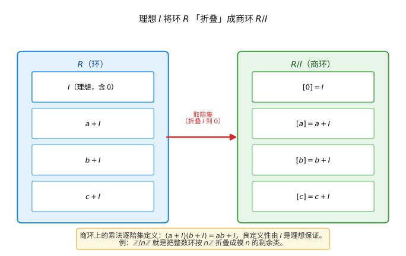

# 第 37 级：环论与域论 (Ring Theory and Field Theory)

---

## 一、学习目标

完成本教程后，您应当能够：

1. **理解环的基本概念**：掌握环、子环、理想、商环、环同态的定义与基本性质，熟练运用同构基本定理。
2. **识别特殊类型的理想**：区分素理想与极大理想，理解幂零根与 Jacobson 根的含义。
3. **掌握环的分解理论**：理解中国剩余定理及其证明，了解直积分解、局部环与 Artin 环。
4. **区分各类整环**：厘清欧几里得整环（ED）、主理想整环（PID）、唯一分解整环（UFD）之间的包含关系，并能给出证明。
5. **理解模论基础**：掌握模、子模、商模、模同态、自由模、投射模、内射模及张量积的基本概念。
6. **掌握域扩张理论**：区分代数扩张与超越扩张，理解分裂域、正规扩张、可分扩张与伽罗瓦扩张。
7. **理解有限域的结构**：掌握有限域的存在唯一性、构造方法及 Frobenius 自同构。
8. **了解超越扩张**：理解超越基、超越次数及 Lüroth 定理。
9. **能够独立完成典型例题与习题**。

---

## 二、环的基本概念

### 2.1 环的定义

**定义 2.1（环）** 一个**环**（ring）是一个集合 $R$，配备两个二元运算 $+$（加法）和 $\cdot$（乘法），满足：

1. $(R, +)$ 是一个阿贝尔群（加法群），记零元为 $0$；
2. 乘法结合律：$(a \cdot b) \cdot c = a \cdot (b \cdot c)$；
3. 分配律：$a \cdot (b + c) = a \cdot b + a \cdot c$ 且 $(a + b) \cdot c = a \cdot c + b \cdot c$。

若乘法还满足交换律，则称 $R$ 为**交换环**。若存在乘法单位元 $1$ 使得 $1 \cdot a = a \cdot 1 = a$ 对任意 $a \in R$ 成立，则称 $R$ 为**含幺环**（unital ring）。

> **💡 直观理解（类比）**：环就是"既能加减、又能按规则相乘"的一盒数字（或物体）。像整数集 $\mathbb{Z}$ 那样，加法是个"完全自由的阿贝尔群"（任何数都能减掉），但乘法只要求结合与分配、不必能逆（$2$ 没有整数倒数）。类比一个"只做加法进进出出、乘法看心情做不做"的账本：加法端一定完备，乘法端则允许"除法失灵"。正是这种"加法强约束、乘法弱约束"的不对称，撑起了整环、域、理想等一系列后续概念。

**例 2.1**
- 整数集 $\mathbb{Z}$ 在通常的加法和乘法下构成含幺交换环。
- $n \times n$ 实矩阵全体 $M_n(\mathbb{R})$ 在矩阵加法和乘法下构成含幺环（非交换）。
- 偶数集 $2\mathbb{Z}$ 构成交换环，但无乘法单位元。

### 2.2 子环与理想

**定义 2.2（子环）** 环 $R$ 的非空子集 $S$ 称为**子环**（subring），若 $S$ 在加法和乘法下封闭，且 $(S, +)$ 是 $(R, +)$ 的子群。

> **💡 直观理解（类比）**：子环就是在大环里"圈出一块自给自足的小天地"——里面的人（元素）互相加、减、乘，结果都还留在圈内，绝不"跑出去"。类比一栋大楼里的一间独立单元：住客在大楼里进进出出，但单元内互相来往怎么都不出单元门。$2\mathbb{Z}$（所有偶数）就是 $\mathbb{Z}$ 的子环：偶加偶、偶乘偶都是偶，封闭得很规矩。

**定义 2.3（理想）** 环 $R$ 的非空子集 $I$ 称为**左理想**（left ideal），若：
- $I$ 是 $(R, +)$ 的子群；
- 对任意 $r \in R$ 和 $a \in I$，有 $ra \in I$。

类似定义**右理想**。同时是左理想和右理想的子集称为**双边理想**（two-sided ideal），简称为**理想**。交换环中左、右、双边理想一致。

> **💡 直观理解（类比）**：理想比子环更强——不仅自己人能互相运算不出去，还要求"任何外人乘进来也被吸进去"（$ra \in I$）。类比一个"单向吸收"的海绵：任何从外面滴进来的液体（$r a$）都会被吸进海绵内部，再也吐不出去。正是这种"被环里任意元素吸收后仍封闭"的霸道性质，才让理想能安全地"商掉"（见 2.3），成为构造商环唯一合格的分组准则。$n\mathbb{Z}$（$n$ 的倍数）就是 $\mathbb{Z}$ 的理想。

**定义 2.4（主理想）** 由单个元素 $a$ 生成的理想称为**主理想**（principal ideal），记作 $(a)$ 或 $aR$。在交换环中，$(a) = \{ ra \mid r \in R \}$。

> **💡 直观理解（类比）**：主理想就是"以一个元素为引擎、由全体环元拖动"生成的理想：拿一个发电机 $a$，再让环里所有元素 $r$ 都去驱动它，得到 $ra$ 的集合。类比用一把万能钥匙 $a$ 配出的一串门，每个环元 $r$ 都能把它"乘"成一把新钥匙，整串钥匙就构成主理想。$n\mathbb{Z}$ 正是由 $n$ 这一个元素生成的主理想 $(n)$。

**例 2.2**
- $n\mathbb{Z}$ 是 $\mathbb{Z}$ 的理想，且是主理想 $(n)$。
- 多项式环 $F[x]$ 中，由多项式 $f(x)$ 生成的主理想 $(f(x))$ 是所有 $f(x)$ 倍式的集合。

> **🧠 思考历程："理想"到底是什么绕不开、非借不可的概念？**
>
> "理想"（ideal）这名字古怪，却承载着环论最深沉的结构直觉：**很多我们最爱的对象（比如"数的倍数""多项式的倍式"）都恰好是理想**。它从"为什么唯一分解会崩"的危机里走来，撑起了一整部近世代数。
>
> - **库默尔的"理想数"**。19 世纪库默尔研究费马大定理时，想在 $\mathbb{Z}[\sqrt{-5}]$ 这类环里做"分解质因数"，却发现：$6=2\cdot3=(1+\sqrt{-5})(1-\sqrt{-5})$ 有多种分解，唯一分解"崩了"。他于是发明"理想数"：**明知实际元素分解不齐，就先承认"理想要分解元"，用它隐表示真正的素因子**。
> - **戴德金把它抽象为"理想"**。戴德金（Dedekind）顺水推舟，把库默尔"理想数"整理成纯正的定义：**被环里任意元素"吸收"后仍封闭的加法子群 $I$（$r\in R,a\in I\Rightarrow ra\in I$）就叫理想**。之所以叫"理想"，是因为它不是你"看得见"的数，而是一种"应然而非真实可见的分解"的影子对象。
> - **为什么商环非它不可**。要定义"同余类" $R/I$（见 2.3），只有 $I$ 是理想才能让运算良定义——**理想正是"能安全地做除法/取模"的门槛**。它像把环按"质因数缝"精确截开，商掉 $I$ 得到的代数结构才会干净。
> - **素理想/极大理想：环的数论味**。$R/I$ 是整环 $\iff I$ 素；是域 $\iff I$ 极大（2.5）。**"理想"这套词汇让整环、域、商环全部打通**，也使得环论能一举承载数论与几何的双重叙事。
> - **心路**："理想"这个概念告诉你：**当现实元素不够用（分解不齐），思路常变成"先造出一个'应然的影子'对象，再回头验证"**。敢不敢造出这类"应然之物"，正是近世代数敢于超越直觉的第一步。

### 2.3 商环与环同态

**定义 2.5（商环）** 设 $I$ 是环 $R$ 的理想。在加法商群 $R/I$ 上定义乘法：
$$(a + I)(b + I) = ab + I$$
则 $R/I$ 构成环，称为 $R$ 模 $I$ 的**商环**（quotient ring）。

> **直观理解（现实类比）**：商环就像把一本厚书按"能否被某页整除"分门别类地"压薄"——理想 I 就是你要"忽略不计"的那部分（比如所有偶数），把凡是相差一个偶数的整数都当作同一个物体，环就"折叠"成了 $\mathbb{Z}/2\mathbb{Z}$（只有"奇、偶"两类）。正如把全天的时间按"整点取模"归并成 12 个小时刻度，无数瞬间被折叠成了 12 个"箱子"。

**定义 2.6（环同态）** 映射 $\varphi : R \to S$ 称为**环同态**（ring homomorphism），若对任意 $a, b \in R$：
- $\varphi(a + b) = \varphi(a) + \varphi(b)$
- $\varphi(ab) = \varphi(a)\varphi(b)$
- 若 $R, S$ 含幺，通常还要求 $\varphi(1_R) = 1_S$。

> **💡 直观理解（类比）**：环同态就是"既保加法又保乘法"的结构翻译官：无论先在 $R$ 里加/乘、再翻成 $S$ 的语言，还是先翻过去再在同一台机器上操作，结果都一样。类比两国之间的双语表，它忠实保留"先做菜再上桌"和"先上桌再做菜"的顺序不变。只要加、乘两种运算都被一层不变的翻译保住，就是环同态——它可比泛函分析里的"线性映射"多保了一条乘法。

**定义 2.7（核与像）** $\ker \varphi = \{ r \in R \mid \varphi(r) = 0_S \}$，$\operatorname{im} \varphi = \{ \varphi(r) \mid r \in R \}$。核是 $R$ 的理想，像是 $S$ 的子环。

> **💡 直观理解（类比）**：核就是"被翻译成零的那一批元素"，像是"真能被翻译出来的全体结果"。类比一张把多种入口汇成一个出口的漏斗：核是所有被压成零（$0$）的原材料堆，像则是从出口真正流出来的成品集合。核为什么非是理想不可？因为它决定"哪些元素被折叠成 0"，正是构造商环时的那堵要压平的墙；像则是翻译能达到的全部"能见成果"。核和像如此重要，是因为一切同构、商结构都由这两者说了算。

### 2.4 同构基本定理

**定理 2.1（第一同构定理）** 设 $\varphi : R \to S$ 是环同态，则
$$R / \ker \varphi \cong \operatorname{im} \varphi$$

> **💡 直观理解（类比）**：第一同构定理说"把核压平得到的商环，和翻译真正能达到的那部分像，长得一模一样"。类比一台复印机：$\varphi$ 是复印动作，核 $\ker\varphi$ 是所有"一复印就变白纸"的源稿，像则是印出来的有效复印件。把源稿里那些会'印成空白'的稿子都视为同一类、整体归并后，得到的"分类稿"和"有效复印件"分毫不差——任何同态都能被安全地'压缩'成同构。

**定理 2.2（第二同构定理）** 设 $I \subseteq J \subseteq R$ 是理想，则
$$(R / I) / (J / I) \cong R / J$$

> **💡 直观理解（类比）**：第二同构定理是"层层相除可一次性合并"的环论版：先把 $R$ 按 $I$ 折叠，再把折叠结果按 $J$ 里剩下的部分（$J/I$）继续折叠，最终和一步到位地按 $J$ 折叠结果相同。类比先按楼层归并、再按墙内归并，等价于直接按墙体归并。它保证"商的过程次序可调换、结果不变量"，是化简复合商结构的利器。

**定理 2.3（第三同构定理）** 设 $A$ 是 $R$ 的子环，$I$ 是 $R$ 的理想，则
$$A / (A \cap I) \cong (A + I) / I$$

> **💡 直观理解（类比）**：第三同构定理讲的是"子结构与商结构互换顺序不改变结果"：把 $A$ 与其跟 $I$ 的重叠部分 $A\cap I$ 相除，等价于先把 $A$ 并进 $I$ 再看商里对应的小份。类比先看某个子部门内的细分工，和先做全部门合并再挑出该部门的映射，两者同构。它连通了"子环的商"与"大环的商里的子结构"——用一块拼图既能从上往下看，也能从下往上看，结果一模一样。

### 2.5 素理想与极大理想

**定义 2.8（素理想）** 交换环 $R$ 的理想 $P$ 称为**素理想**（prime ideal），若 $P \neq R$ 且对任意 $a, b \in R$，$ab \in P$ 蕴涵 $a \in P$ 或 $b \in P$。

> **💡 直观理解（类比）**：素理想把"除法与因数"搬进了环：若两个数的积落在 $P$ 里，则其中至少有一个已经落在 $P$ 里——和"$p$ 整除 $ab$ 则 $p$ 整除 $a$ 或 $b$"如出一辙。类比一个"过关闸机"：只有被闸机拦下的人（落在 $P$）算数，若两个排队者相乘后"被拦下"，必然至少一方本身就"够格被拦"。素理想正是整数里"素数因子"概念的环论化身，$(p)$（$p$ 素数）就是最典型的素理想。

**定义 2.9（极大理想）** 交换环 $R$ 的理想 $M$ 称为**极大理想**（maximal ideal），若 $M \neq R$ 且不存在理想 $I$ 使得 $M \subsetneq I \subsetneq R$。

> **💡 直观理解（类比）**：极大理想就是"在理想堆里顶到天花板、再也插不下任何更大的理想"的那一层。类比一栋大楼的最高注满层：往上再加一层就会溢出楼顶（$M\neq R$），所以它是"能合法达到的最大楼层"。有点反直觉的是——极大理想通常很大、很'满'，它对应的商环 $R/M$ 反而是最小最完整的域，正如把所有信息极大丢尽后剩下的只有"干净骨架"。

**定理 2.4** 设 $R$ 是含幺交换环。
- $P$ 是素理想 $\iff$ $R/P$ 是整环。
- $M$ 是极大理想 $\iff$ $R/M$ 是域。

> **💡 直观理解（类比）**：这个定理是"理想级别 ↔ 商环质量"的对照表：素理想管"商环里没有零因子"（整环），极大理想管"商环里人人都可逆"（域）。类比质检分等——只要商掉 $P$ 后没有'相互谋杀成零'的冤假错案，$P$ 就配得上'素'；而商掉 $M$ 后连'除法'都能安全进行，$M$ 就是到顶的'极大'。于是"极大 $\Rightarrow$ 素"一目了然：域（人人可逆）必无零因子，因此极大理想必为素理想，反过来不真。

**推论** 极大理想必为素理想（因为域是整环），反之不真。例如 $(0)$ 是 $\mathbb{Z}$ 的素理想但不是极大理想。

### 2.6 幂零根与 Jacobson 根

**定义 2.10（幂零元）** 元素 $a \in R$ 称为**幂零元**（nilpotent），若存在正整数 $n$ 使得 $a^n = 0$。

> **💡 直观理解（类比）**：幂零元就是"乘着乘着把自己乘没了"的元素——某个有限次幂恰好归零。类比一颗'定时自毁'的橡皮擦：每次擦一下变小一点，擦到第 $n$ 下彻底消失成虚无（$0$）。在具体例子中，$k[x]/(x^2)$ 里的 $[x]$ 满足 $x^2=0$ 即幂零。正是这种'越乘越小、终归为零'的异常行为，让整环（唯一幂零元只有 $0$）显得格外'干净'。

**定义 2.11（幂零根）** 交换环 $R$ 的**幂零根**（nilradical）定义为所有幂零元构成的集合，记作 $\operatorname{Nil}(R)$ 或 $\sqrt{0}$。它是 $R$ 的理想，且等于所有素理想的交集：
$$\operatorname{Nil}(R) = \bigcap_{P \text{ 素理想}} P$$

> **💡 直观理解（类比）**：幂零根把环里"藏着的'自毁因子'"一网打尽地揪出来，并证明它恰好是全体素理想的公共部分。类比做一次'毒素排查'：把所有会把自己耗尽的杂质（幂零元）收集成一块整体 $\operatorname{Nil}(R)$。而"$\sqrt{0}=$ 全体素理想之交"意味着：想不含任何这种东西，等价于不被任何素理想'约谈'。商掉幂零根后得到的环没了'自毁因子'，更接近干净的域思想。

**定义 2.12（Jacobson 根）** 环 $R$ 的 **Jacobson 根**（Jacobson radical）定义为所有极大理想的交集，记作 $J(R)$：
$$J(R) = \bigcap_{M \text{ 极大理想}} M$$

> **💡 直观理解（类比）**：Jacobson 根是所有极大理想共同的"底盘部分"，可以把 $J(R)$ 想成环里"顶着极大理想都甩不掉的顽固杂质"。类比大楼基座——无论你住哪栋顶格楼层，这块基座都必然承载着它。它比幂零根更'宽'（$\operatorname{Nil}(R) \subseteq J(R)$）：幂零根扣掉的只是会自毁的，Jacobson 根还要扣掉那些虽不幂零、却在每个极大理想里都甩不存在的'冗余'。在有限生成/Artin 情形两者重合。

**性质** $\operatorname{Nil}(R) \subseteq J(R)$。当 $R$ 是有限生成 $R$-模时（如 Artin 环），两者相等。

---

## 三、环的分解

### 3.1 中国剩余定理

**定理 3.1（中国剩余定理，CRT）** 设 $R$ 是含幺交换环，$I_1, I_2, \ldots, I_n$ 是两两互素的理想（即 $I_i + I_j = R$ 对 $i \neq j$ 成立），则：
$$R / (I_1 \cap I_2 \cap \cdots \cap I_n) \cong R/I_1 \times R/I_2 \times \cdots \times R/I_n$$

> **💡 直观理解（类比）**：中国剩余定理说"几个两两互素的折叠可以独立进行、最后再拼回来"——一次同时满足多个互不干扰的模条件，等价于把每个条件分别处理再组合。类比同时考几门互不相关的科目：只要各科满分线互斥（互素），你就能在总成绩单上同时看到各科各自的'剩余类'，且反推唯一。比如 $\mathbb{Z}/6\mathbb{Z}\cong\mathbb{Z}/2\mathbb{Z}\times\mathbb{Z}/3\mathbb{Z}$：把 $6$ 折成"模 $2$"与"模 $3$"两个独立抽屉，信息一个都不丢。这是把大型/复杂商环拆成独立小环的总钥匙。

**证明**：定义映射
$$\varphi : R \to \prod_{k=1}^n R/I_k, \quad \varphi(r) = (r + I_1, r + I_2, \ldots, r + I_n)$$

易见 $\varphi$ 是环同态，$\ker \varphi = \bigcap_{k=1}^n I_k$。只需证 $\varphi$ 是满射。

对 $n=2$ 的情形：因 $I_1 + I_2 = R$，存在 $a_1 \in I_1, a_2 \in I_2$ 使得 $a_1 + a_2 = 1$。对任意 $(r_1 + I_1, r_2 + I_2)$，取 $r = r_2 a_1 + r_1 a_2$，则：
$$r \equiv r_1 \pmod{I_1}, \quad r \equiv r_2 \pmod{I_2}$$

故 $\varphi$ 满。

对 $n > 2$ 的情形，用数学归纳法。关键步骤：若 $I_1, \ldots, I_n$ 两两互素，则 $I_1$ 与 $I_2 \cap \cdots \cap I_n$ 互素。这是因为存在 $a_i \in I_1, b_i \in I_i$ 使得 $a_i + b_i = 1$，则 $1 = \prod_{i=2}^n (a_i + b_i) \in I_1 + (I_2 \cap \cdots \cap I_n)$。$\square$

### 3.2 直积分解

环的直积 $\prod_{i=1}^n R_i$ 赋予分量加法和乘法构成环。中国剩余定理给出了将商环分解为直积的途径。

### 3.3 局部环

**定义 3.1** 含幺交换环 $R$ 称为**局部环**（local ring），若它有唯一的极大理想。

> **💡 直观理解（类比）**：局部环就是"只允许有一个'顶级大抽屉'（唯一极大理想）"的环。类比只有唯一一个最高行政级别的机构：所有'不达标/棘手'的家当都只能进这个唯一的顶级收纳箱。典型例子是域（$F[\kern0.5pt[x]]$）和形式幂级数环 $F[[x]]$（唯一极大理想是 $(x)$）——在 $F[[x]]$ 里，除了常数项非零的可逆元，其余一律归入 $(x)$ 这一个极大理想。局部化常用于'聚焦某一点/某素数 $p$'的局部观察。

**例 3.1**
- 域是局部环，其唯一极大理想是 $(0)$。
- 形式幂级数环 $F[[x]]$ 是局部环，唯一极大理想是 $(x)$。
- $p$-进整数环 $\mathbb{Z}_p$ 是局部环，唯一极大理想是 $(p)$。

### 3.4 Artin 环

**定义 3.2** 环 $R$ 称为**左 Artin 环**（Artinian ring），若其左理想满足降链条件（DCC）：任意左理想的降链 $I_1 \supseteq I_2 \supseteq I_3 \supseteq \cdots$ 最终稳定。

> **💡 直观理解（类比）**：Artin 环就是"理想往小了拆，拆到底必然到底"的环——任何一条越拆越小的理想链 $(I_1 \supseteq I_2 \supseteq \cdots)$ 都必须在有限步停住，不能无限细分下去。类比一把只能被拆有限次的小物件：不管你怎么层层拆小，总归会拆到拆不动为止。有限域上的 $k[x]/(x^m)$ 就是 Artin 环——它的理想链 $(x)\supset(x^2)\supset\cdots\supset(x^m)=0$ 必到 $m$ 步扎底。

**定理 3.2（Hopkins–Levitzki）** 左 Artin 环必为左 Noether 环（即左理想满足升链条件）。

> **💡 直观理解（类比）**：Hopkins–Levitzki 说不让'无限拆小'（Artin）的环，其实也不许'无限长大'（Noether）——一把不能无限拆碎的部件，同样不能无限拼高。类比一个"零件总和固定"的仓库：不能无限细分到无限多小件，自然也不可能无限堆叠出无限多层。它把看似对偶的两种条件（降链与升链）在环上神奇地统一起来，是沟通有限生成与紧性的大桥。

**定理 3.3（Artin 环的结构）** 交换 Artin 环是有限个 Artin 局部环的直积。

> **💡 直观理解（类比）**：Artin 环的结构定理说"一个只能有限拆小的交换环，最终一定能拆成几个独立的'局部小包'（Artin 局部环）之积"。类比一台只能容纳有限零件的机器总可拆成几大互不干扰的独立模块——$k[x]/(x^m)$ 本身就是一个不可再拆的 Artin 局部模块；更复杂的由几个这种模块拼成（直积）。这把'有限性'翻译成了'可完整分解为简单小因子'，是等幂元分解思路的成功范例。

---

## 四、唯一分解整环

### 4.1 基本定义

**定义 4.1（整环）** 含幺交换环 $R$ 称为**整环**（integral domain），若 $R$ 无零因子：$ab = 0 \Rightarrow a = 0$ 或 $b = 0$。

> **💡 直观理解（类比）**：整环就是"没有零因子陷阱"的交换环——两个非零元素相乘绝不可能是零，就像一块'干净的演化沙盘'上，谁也没法让两个非零因素'相互抵消蒸发'。类比一个如实互动的市场：两个非零商品成交，必留下非零价值。整数环 $\mathbb{Z}$、多项式环 $F[x]$ 都是整环；而 $\mathbb{Z}/6\mathbb{Z}$ 因 $2\cdot3=0$ 含零因子故非整环。整环是"能安全谈因数分解"的底盘。

**定义 4.2（不可约元与素元）** 设 $R$ 是整环，$a \in R$ 非零且非可逆元。
- $a$ 称为**不可约元**（irreducible），若 $a = bc$ 蕴涵 $b$ 或 $c$ 是可逆元。
- $a$ 称为**素元**（prime），若 $a \mid bc$ 蕴涵 $a \mid b$ 或 $a \mid c$。

> **💡 直观理解（类比）**：不可约元像"积木里的最小砖块"——除了把它自己或一个可逆元凿开，就再也拆不成两块更小的积木（不能再分解）。素元则像"带额外侦探性质的砖"——只要它整除两砖之积，必能整除其中一块。在整环里，素元必是不可约元，但反之不恒真（$\mathbb{Z}[\sqrt{-5}]$ 中 $2$ 不可约却不素）。二者差之毫厘：不可约只要求"拆不开"，素元还要求"整除能渗透"。

> **注** 在整环中，素元必为不可约元。反之不真（例如 $\mathbb{Z}[\sqrt{-5}]$ 中 $2$ 不可约但不素）。

**定义 4.3（UFD）** 整环 $R$ 称为**唯一分解整环**（Unique Factorization Domain, UFD），若：
1. 每个非零非可逆元可表示为有限个不可约元的乘积；
2. 该表示在重排和相伴意义下唯一。

> **💡 直观理解（类比）**：UFD 就像一台"唯一分解机"：任何非零非可逆元素都像把一个整数拆成质因数一样，能唯一地拆成不可约元的乘积（只差先后顺序和添个可逆元）。类比搭乐高，拼成一个造型的积木组合在"忽略顺序"下唯一。整数环 $\mathbb{Z}$ 是 UFD（算术基本定理），而 $\mathbb{Z}[\sqrt{-5}]$ 因 $6=2\cdot3=(1+\sqrt{-5})(1-\sqrt{-5})$ 有双重分解，故不是 UFD。UFD 是把'质因数分解唯一性'推广到一般环的黄金标准。

### 4.2 PID 与 ED

**定义 4.4（PID）** 整环 $R$ 称为**主理想整环**（Principal Ideal Domain, PID），若 $R$ 的每个理想都是主理想。

> **💡 直观理解（类比）**：PID 就是"每个理想都能由一个元素一手拽出来"的整环。类比一个"一把钥匙开一把锁"的理想文件柜：柜里每个抽屉（理想）背后都写着唯一一个核心钥匙（生成元 $a$），$(a)$ 就是整个抽屉。$\mathbb{Z}$ 是 PID（每个理想即 $n\mathbb{Z}$ 由 $n$ 一个元素生成），$F[x]$ 是 PID，而 $\mathbb{Z}[x]$ 因理想 $(2,x)$ 需两个生成元而非 PID。PID 越是'单一生成元'，结构越是清爽可控。

**定义 4.5（ED）** 整环 $R$ 称为**欧几里得整环**（Euclidean Domain, ED），若存在映射 $\varphi : R \setminus \{0\} \to \mathbb{N}$（称为欧几里得函数），使得对任意 $a, b \in R$（$b \neq 0$），存在 $q, r \in R$ 满足：
$$a = bq + r, \quad r = 0 \text{ 或 } \varphi(r) < \varphi(b)$$

> **💡 直观理解（类比）**：ED 就是"能用带余除法衡量大小"的整环——它提供一个"度量" $\varphi$（数值大小），保证任意 $a$ 除以 $b$ 都能拆成商 $q$ 加一个比 $b$ '更小'的余 $r$，像整数的'绝对值'、多项式的'次数'那样。类比一把有标尺衡量的天平：任何两物相除，总能分出'完整商'和'更轻的余料'。正是这把尺子让欧几里得算法（辗转相除）能一路跑到底、求出最大公因子。

### 4.3 包含关系：ED $\Rightarrow$ PID $\Rightarrow$ UFD

**定理 4.1** 欧几里得整环是主理想整环。

**证明**：设 $R$ 是 ED，$I \subseteq R$ 是非零理想。取 $b \in I \setminus \{0\}$ 使得 $\varphi(b)$ 最小。对任意 $a \in I$，由欧几里得算法，$a = bq + r$，$r = 0$ 或 $\varphi(r) < \varphi(b)$。由 $r = a - bq \in I$ 及 $\varphi(b)$ 的最小性知 $r = 0$，故 $a = bq$，即 $I = (b)$。$\square$

> **💡 直观理解（类比）**：ED 天然是 PID：既然任意两数都能'带余'相除并找到更小的余，那么取理想里度量最小的元素 $b$，任何其他元素都只能被 $b$ 整除（余数必为零，否则 $\varphi$ 更小矛盾），于是整个理想就由 $b$ 一个元素生成。类比在子集中不停寻找'更小更纯'的元素，最终必收敛为一个核心主元。$\mathbb{Z}$、$F[x]$、$\mathbb{Z}[i]$ 都是 ED 故皆 PID。

**定理 4.2** 主理想整环是唯一分解整环。

**证明**：分两步。

**(1) 存在性**：设 $R$ 是 PID。首先证明 $R$ 中每个非零非可逆元可分解为不可约元的乘积。若不然，取 $a_1$ 不能分解，则 $a_1$ 非不可约，故 $a_1 = a_2 b_2$，其中 $a_2, b_2$ 非可逆。$a_2$ 和 $b_2$ 至少有一个不能分解，记之为 $a_2$。如此递推得到严格升链 $(a_1) \subsetneq (a_2) \subsetneq (a_3) \subsetneq \cdots$，这与 PID 是 Noether 环矛盾（在 PID 中，理想升链必稳定）。

**(2) 唯一性**：在 PID 中，不可约元必为素元。设 $p$ 不可约，$p \mid ab$ 但 $p \nmid a$。因 $(p, a)$ 是主理想，设为 $(d)$。由 $p$ 不可约知 $d$ 是可逆元（否则 $p = d \cdot e$ 给出 $p$ 的真分解），故 $(p, a) = R$，存在 $x, y$ 使得 $xp + ya = 1$，于是 $b = xpb + yab$，$p$ 整除右端各项，故 $p \mid b$。因此 $p$ 是素元。唯一性由素元性质可得。$\square$

> **💡 直观理解（类比）**：PID 必然 UFD：既然每个理想都能由一个元素生成，理想升链必然稳定（不会无穷延展），于是任何元素都能一路拆到不可约元为止（存在性）；又因 PID 中不可约元必为素元（不可约把理想的生成元顶成可逆元，凑出 $xp+ya=1$），唯一性随之而来。类比一个由单一核心物撑起、垃圾不会无限堆的房间，其分解既跑得到底又拆得唯一。整条链条 ED→PID→UFD 正是一条"尺度越强，分解越美"的宝塔线。

**总结**：$$\boxed{\text{ED} \;\Rightarrow\; \text{PID} \;\Rightarrow\; \text{UFD}}$$

**例 4.1**
- $\mathbb{Z}$ 是 ED（欧几里得函数取绝对值）。
- 域 $F$ 上的多项式环 $F[x]$ 是 ED（欧几里得函数取多项式的次数）。
- $\mathbb{Z}[i]$（高斯整数环）是 ED，欧几里得函数为 $\varphi(a+bi) = a^2 + b^2$。
- $\mathbb{Z}[x]$ 是 UFD 但不是 PID（理想 $(2, x)$ 不是主理想）。
- $\mathbb{Z}[\sqrt{-5}]$ 不是 UFD（因为 $6 = 2 \cdot 3 = (1+\sqrt{-5})(1-\sqrt{-5})$ 是两种不同的不可约分解）。

### 4.4 Gauss 引理

**定义 4.6** 整环 $R$ 上的多项式 $f(x) \in R[x]$ 称为**本原多项式**（primitive polynomial），若其系数的最大公因子是可逆元。

> **💡 直观理解（类比）**：本原多项式就是"系数的公因子已清理到只剩可逆元"的多项式。类比一支"内部没有公共'虫病'"的队伍——所有系数的最大公约数是 $1$（或可逆元），彼此之间干净互素。比如 $2x+1$ 的系数 $\{2,1\}$ 最大公因子 $1$，是本原的；$2x+4$ 的系数 $\{2,4\}$ 最大公因子 $2$，则非本原。本原性是 Gauss 引理和唯一分解在 $R[x]$ 里'接力'的基石。

**定理 4.3（Gauss 引理）** 设 $R$ 是 UFD，则 $R[x]$ 也是 UFD。具体地，本原多项式的乘积仍为本原多项式。

**证明概要**：设 $f(x) = a_0 + a_1 x + \cdots + a_n x^n$，$g(x) = b_0 + b_1 x + \cdots + b_m x^m$ 是本原多项式。若 $p$ 是素元且 $p$ 整除 $f(x)g(x)$ 的所有系数，则 $p$ 整除 $f$ 或 $g$ 的所有系数，与本原性矛盾。因此 $f(x)g(x)$ 本原。

> **💡 直观理解（类比）**：Gauss 引理说"本原性在乘法下保持不变，且 UFD 的多项式环仍是 UFD"。类比两个各自的'公因数全部消尽'的配方，混在一起后也不会凭空冒出新的公共杂质——素元 $p$ 一旦整除乘积的全部系数，就必整除某个因子的全部系数，与双方的本原性矛盾。由此，只要地基 $R$ 是 UFD，往上长出的 $R[x]$ 依旧 UFD（$\mathbb{Z}[x]$ 因 $\mathbb{Z}$ 是 UFD 故也是 UFD）。它是唯一分解性向上传播的'接力棒'。

> 由此可证 $R[x]$ 中的唯一分解：将 $F[x]$（$F$ 为 $R$ 的分式域）中的分解与本原分解结合。$\square$

### 4.5 Eisenstein 判别法

**定理 4.4（Eisenstein 判别法）** 设 $R$ 是 UFD，$F$ 是其分式域。$f(x) = a_n x^n + a_{n-1} x^{n-1} + \cdots + a_0 \in R[x]$。若存在素元 $p \in R$ 使得：
1. $p \nmid a_n$；
2. $p \mid a_i$ 对 $i = 0, 1, \ldots, n-1$；
3. $p^2 \nmid a_0$。

则 $f(x)$ 在 $F[x]$ 中不可约。

> **💡 直观理解（类比）**：Eisenstein 判别法是一条"只看系数的不可约快筛法"：若某个素元 $p$ 能'管住'除了首项之外的全体系数、又不'管'首项、又不'深管'常数项，则该多项式在分式域上不可约。类比质检——只要一个素元 $p$ 把多项式的中间段系数全都'约谈'过，却放过了头尾的洁净度（$p\nmid a_n$、$p^2\nmid a_0$），就足以断定这多项式掰不开了。常用小技巧是作平移 $f(x+c)$ 后再套用，比如 $x^4+1$ 平移 $x+1$ 后用 $p=2$ 即可判定。

**例 4.2** 对任意素数 $p$，多项式 $x^n - p$ 在 $\mathbb{Q}$ 上不可约（Eisenstein 判别法取 $p$ 本身）。

**例 4.3** $f(x) = x^4 + 1$ 在 $\mathbb{Q}$ 上不可约。虽然不能直接应用 Eisenstein 判别法，但 $f(x+1) = (x+1)^4 + 1 = x^4 + 4x^3 + 6x^2 + 4x + 2$ 对 $p=2$ 满足 Eisenstein 条件，故 $f(x)$ 不可约。

---

## 五、模论

### 5.1 模的定义

**定义 5.1（模）** 设 $R$ 是含幺环。一个**左 $R$-模**（left $R$-module）是一个阿贝尔群 $(M, +)$，配备标量乘法 $R \times M \to M$，$(r, m) \mapsto rm$，满足：
1. $(r + s)m = rm + sm$；
2. $r(m + n) = rm + rn$；
3. $(rs)m = r(sm)$；
4. $1_R m = m$。

右 $R$-模类似定义。当 $R$ 交换时，左右模一致。

> **💡 直观理解（类比）**：模就是"环这台机器作用在零件集合 $M$ 上"的舞台。类比一台由标量（环元）操作的加工机：用环里的每个数 $r$ 去'缩放/加工'零件 $m$，规则仿照向量空间的数乘。当底环是个域时，模正是向量空间；当底环是 $\mathbb{Z}$ 时，模就是阿贝尔群本身。环本身、理想都是模。可以说模把"线性结构"从'数域'推广到了'任意环'，是线性代数在抽象环上的直系后裔。

**例 5.1**
- 域 $F$ 上的模就是向量空间。
- 阿贝尔群是 $\mathbb{Z}$-模。
- 环 $R$ 本身是左 $R$-模（左乘）。
- 任意理想 $I \subseteq R$ 是 $R$-模。

### 5.2 子模与商模

**定义 5.2** $M$ 的子集 $N$ 称为**子模**（submodule），若 $N$ 是加法子群且在标量乘法下封闭。商群 $M/N$ 自然成为 $R$-模，称为**商模**（quotient module）。

> **💡 直观理解（类比）**：子模就是"环运算在里面怎么跑都不出界"的零件子集，商模就是把整个 $M$ 按 $N$ '压扁'后得到的模。类比在零件集合里圈出一块'自封闭'的子仓库 $N$——所有环标量的加工结果都留在仓库内。商掉 $N$ 后，凡相差属于 $N$ 的零件被认为是"同一个"，于是 $M$ 被折叠成更小更抽象的商模。子模/商模之于模，正是理想/商环之于环的翻版。

### 5.3 模同态与同构定理

**定义 5.3** 映射 $\varphi : M \to N$ 称为 $R$-模同态，若 $\varphi(m_1 + m_2) = \varphi(m_1) + \varphi(m_2)$ 且 $\varphi(rm) = r\varphi(m)$。

> **💡 直观理解（类比）**：模同态就是"既保加法又保环作用"的线性翻译官，它把加法和标量乘同时一层不变地翻译过去。类比一个忠实的翻译机器：无论先做加法、再翻译，还是先翻译、再做加法，结果一致；标量 $r$ 也能先伸出（$r\varphi(m)$）而非先拿进屋。它正是线性代数中"线性映射"在任意（非域）环上的推广，定下了模之间'结构相等'的基准。

**定理 5.1（模同构定理）**
- 第一同构定理：$M / \ker \varphi \cong \operatorname{im} \varphi$。
- 第二同构定理：$(M/N) / (K/N) \cong M/K$，其中 $N \subseteq K \subseteq M$。
- 第三同构定理：$(A + B)/B \cong A/(A \cap B)$，其中 $A, B$ 是子模。

> **💡 直观理解（类比）**：模同构定理是环论/群论同构定理在模上的"原样搬运"：一大套'商的过程可以重排、结果不变'的规律在加法+标量的框架下一一照搬。第一同构说"压平映射的核再商，与翻译能达到的像同构"；第二、第三同构说"层层相除可合并、子结构与商结构可互换顺序"。类比同一栋楼，无论你先拆内墙再审全楼，还是先审全楼再拆内墙，最终的某楼层结构都毫无二致——是同构直觉在模上的三次开花。

### 5.4 自由模、投射模、内射模

**定义 5.4（自由模）** $R$-模 $F$ 称为**自由模**（free module），若它有基（即线性无关的生成集）。等价地，$F \cong \bigoplus_{i \in I} R$。

> **💡 直观理解（类比）**：自由模就是"拥有像向量空间那样的基"的模——一组线性无关的生成元，任何元素都能唯一地写成分量的线性组合，且 $F$ 同构于若干份底环 $R$ 的直和。类比一卷干净的空白纸，任何信号都能用一组标准坐标唯一标定。$\mathbb{Z}^n$ 是自由 $\mathbb{Z}$-模，$R^n$ 是自由 $R$-模。自由模是模论中最'规整'的一档，很多模糊问题一旦落到自由模上就变得清晰可解。

**定义 5.5（投射模）** $R$-模 $P$ 称为**投射模**（projective module），若对任意满同态 $g : M \to N$ 和同态 $f : P \to N$，存在 $h : P \to M$ 使得 $f = g \circ h$。

> **💡 直观理解（类比）**：投射模就是"总能把 '满射缺的截面' 补出来"的模：任何满同态 $g:M\to N$ 都允许从 $P$ 出发的提升 $h$（$f=g\circ h$）。类比一个'总有后台备用通道'的子系统：无论目标 $N$ 的缺口有多大，这个 $P$ 都能绕路接上。自由模自然是投射模（取基逐项提升）；在 PID 上连投射 $\Rightarrow$ 自由都成立。投射模是'几乎自由、只是可能缺个整体基'的柔性格档。

**性质** 自由模是投射模。当 $R$ 是 PID 时，投射模是自由模。

**定义 5.6（内射模）** $R$-模 $E$ 称为**内射模**（injective module），若对任意单同态 $f : A \to B$ 和同态 $g : A \to E$，存在 $h : B \to E$ 使得 $g = h \circ f$。

> **💡 直观理解（类比）**：内射模是投射模的对偶：任意嵌入 $f:A\to B$ 都能把从 $A$ 发出的同态 $g$ 延拓到整个 $B$（$g=h\circ f$）。类比一块'有求必应'的巨型海绵：只要在子块 $A$ 上定义了作用，总能向上延展到更大的 $B$。典型例子是 $\mathbb{Q}$ 作为 $\mathbb{Z}$-模是内射模（可除性判据）。投射管"出来不阻塞"，内射管"进来不卡壳"，两者连同张量积构成同调代数的脊柱。

### 5.5 张量积

**定义 5.7（张量积）** 设 $M$ 是右 $R$-模，$N$ 是左 $R$-模。张量积 $M \otimes_R N$ 是由形如 $m \otimes n$ 的元素生成的阿贝尔群，满足：
1. $(m_1 + m_2) \otimes n = m_1 \otimes n + m_2 \otimes n$；
2. $m \otimes (n_1 + n_2) = m \otimes n_1 + m \otimes n_2$；
3. $mr \otimes n = m \otimes rn$。

> **💡 直观理解（类比）**：张量积 $M \otimes_R N$ 是"把一对相互作用的模块深度融合成一个整体"的构造：它把双线性搭配（两个变量各自可加、标量能左右传递）变成'最自由的线性对象'，记号 $m\otimes n$ 是纯'融合符号'。类比把两个工业部门一起压成一块合金板：局部加法照常，标量 $r$ 可以'滑到另一边'（$mr\otimes n=m\otimes rn$），规则一视同仁。常见例题 $\mathbb{C}\otimes_{\mathbb{R}}\mathbb{C}\cong\mathbb{C}\times\mathbb{C}$ 正体现它把'纠缠'绽开成'直积'的威力。

**性质** 张量积满足交换律（交换环上）、结合律，且与直和可交换：
$$M \otimes_R \left(\bigoplus_i N_i\right) \cong \bigoplus_i (M \otimes_R N_i)$$

---

## 六、域扩张

### 6.1 基本概念

**定义 6.1（域扩张）** 若 $K$ 是域 $L$ 的子域，则称 $L/K$ 是一个**域扩张**（field extension）。$L$ 可视为 $K$ 上的向量空间，其维数称为扩张的**次数**，记作 $[L : K]$。

- 若 $[L : K] < \infty$，称 $L/K$ 为**有限扩张**。
- 若 $[L : K] = 1$，称 $L/K$ 为**平凡扩张**（此时 $L = K$）。

**定理 6.1（链式法则）** 若 $K \subseteq F \subseteq L$ 是域扩张，则 $[L : K] = [L : F][F : K]$。

> **💡 直观理解（类比）**：链式法则说"扩张次数沿塔相乘"：从 $K$ 到 $L$，可先到中间层 $F$ 再到顶层 $L$，层数正好是两层之积——正如建造一座三层塔，总砖数 = 二层的砖数 × 一层升二层的倍数。类比搭积木：$\mathbb{Q}\to\mathbb{Q}(\sqrt{2})\to\mathbb{Q}(\sqrt{2},\sqrt3)$ 的次数 $4=2\times2$。它把"多大跨度"拆成"几小步"来衡量，是计算扩张次数最常用的乘法公式。

![域的扩张金字塔：从有理数 Q 逐级扩张到代数闭包 Q̄、实数 R 与复数 C，以及模 p 的有限域 Fₚⁿ，扩张次数 [L:K] 表示作为 K-向量空间的维数（结构：Q→Q̄ 代数扩张、R→C 二次扩张、Fₚ→Fₚⁿ 有限域）](images/lv37_field_extension.svg)

> **直观理解（现实类比）**：域扩张就像"搭积木上去"——从有理数这座地基出发，每添加一个新数（比如 $\sqrt{2}$）就往上盖一层，层数就是扩张次数 $[L:K]$。复数域可以看作在实数这一层之上再添一个 $i$ 得到的"二楼"，而有限域 $\mathbb{F}_{p^n}$ 则是建在模 $p$ 地基上的"高楼"。哪层的"砖"能装进哪层，取决于你允许添加怎样的数。

### 6.2 代数扩张与超越扩张

**定义 6.2** 设 $L/K$ 是域扩张，$\alpha \in L$。
- 若存在非零多项式 $f(x) \in K[x]$ 使得 $f(\alpha) = 0$，则称 $\alpha$ 在 $K$ 上是**代数元**（algebraic）；否则称为**超越元**（transcendental）。
- 若 $L$ 中每个元素都在 $K$ 上代数，则称 $L/K$ 是**代数扩张**（algebraic extension）；否则称为**超越扩张**（transcendental extension）。

> **💡 直观理解（类比）**：代数元就是"能用 $K$ 上的多项式方程圈养住的数"——存在某个非零多项式把它代入后归零；超越元则是"连方程都套不牢的自由数"。类比植物：代数元像能被盆栽（多项式）装住的树，超越元（如 $\pi$、$e$ 之于 $\mathbb{Q}$）则像谁也种不下的野生大树。$\sqrt2$ 满足 $x^2-2=0$ 是代数元；$\pi$ 在 $\mathbb{Q}$ 上无任何整多项式让它给零，故超越。整个扩张每个元都'可盆栽'即代数扩张。

**定理 6.2** 有限扩张必为代数扩张。

**证明**：设 $[L : K] = n$，对任意 $\alpha \in L$，$1, \alpha, \alpha^2, \ldots, \alpha^n$ 在 $K$ 上线性相关，故存在非零多项式 $f(x) \in K[x]$ 次数 $\leq n$ 使得 $f(\alpha) = 0$。$\square$

> **💡 直观理解（类比）**："有限扩张必代数"说：只要层级数有限（$[L:K]=n$），那么任意元素 $\alpha$ 的 $n+1$ 次幂必'撞车'——$1,\alpha,\ldots,\alpha^n$ 这 $n+1$ 个数放进 $n$ 维的 $K$-向量空间必然线性相关，从而拼出一个以 $\alpha$ 为根的多项式。类比一个只有 $n$ 个抽屉的柜子硬塞 $n+1$ 件东西，必有两件'线性纠缠'。这是有限性赋予代数性的第一条天理。

### 6.3 单扩张与极小多项式

**定义 6.3** 若 $L = K(\alpha)$ 由单个元素生成，则称 $L/K$ 是**单扩张**（simple extension）。

- 若 $\alpha$ 是代数元，则存在唯一的首一不可约多项式 $m_{\alpha, K}(x) \in K[x]$ 使得 $m_{\alpha, K}(\alpha) = 0$，称为 $\alpha$ 在 $K$ 上的**极小多项式**（minimal polynomial）。此时 $K(\alpha) \cong K[x] / (m_{\alpha, K}(x))$，$[K(\alpha) : K] = \deg m_{\alpha, K}$。
- 若 $\alpha$ 是超越元，则 $K(\alpha) \cong K(x)$（有理函数域），扩张次数为无穷。

> **💡 直观理解（类比）**：单扩张就是"只加一个新的数 $\alpha$ 就撑起整片天"的扩张：$K(\alpha)$ 由 $\alpha$ 及其全体多项式组合张成，像用唯一一颗种子长出一整片森林。当 $\alpha$ 代数时，一颗'种子'被一个最省劲的不可约方程 $m_{\alpha,K}$ 约束（极小多项式），扩张的次数恰等于这个多项式的次数；当 $\alpha$ 超越时，没有任何方程束缚它，扩张如同自由变量撑起的无穷维有理函数域。极小多项式就是刻画这颗种子"本质关联"的最精简配方。

### 6.4 代数闭包

**定义 6.4** 域 $K$ 称为**代数闭域**（algebraically closed field），若每个非常数多项式 $f(x) \in K[x]$ 在 $K$ 中都有根。

> **💡 直观理解（类比）**：代数闭域就是"任何方程在这里都有解、绝不空手而归"的域：每个非常数多项式在其内部都能'生根发芽'，无需再向更大的域借幼苗。类比一块"什么种子都能发芽"的神奇土壤。$\mathbb{C}$ 就是这样一个域（任何复数系数多项式都有复根）；而 $\mathbb{R}$ 不是（$x^2+1=0$ 无实根）、$\mathbb{Q}$ 也不是。只要域内"处处有根"，就称得上代数闭。

**定理 6.3（代数基本定理）** $\mathbb{C}$ 是代数闭域。

> **💡 直观理解（类比）**：代数基本定理说"每个非常数复系数多项式都能在 $\mathbb{C}$ 里找到根"，等价于数学里最美的保证——$\mathbb{C}$ 这座"数字大厦"已经盖到了顶，任何代数方程都不用再往外搬家。类比一块'有求必应'的沃土：无论你播下什么多项式，$\mathbb{C}$ 都能让它发芽。这也正是为什么解方程只要放宽到复数，就一定找得到根。

**定义 6.5** 域 $K$ 的**代数闭包**（algebraic closure）$\overline{K}$ 是包含 $K$ 的最小代数闭域。对任意域，代数闭包存在且在同构意义下唯一。

> **💡 直观理解（类比）**：代数闭包就是"把一个域扩张到'所有方程都有解'的最小天花板"——再往上就没必要更高了，再往下装不下全部解。类比给房子加一层'恰好能装下全部屋顶设备'的阁楼 $\overline{K}$：不多不少、刚刚好封顶。$\overline{\mathbb{Q}}=\mathbb{C}$ 的代数子域、$\overline{\mathbb{F}}_p$ 都是典型例子。代数闭包的存在（Zorn）与唯一（同构意义下）保证了各种"开根号吃到够"结构的一致性。

### 6.5 分裂域

**定义 6.6** 设 $f(x) \in K[x]$ 是次数 $\geq 1$ 的多项式。$K$ 的扩域 $L$ 称为 $f(x)$ 在 $K$ 上的**分裂域**（splitting field），若 $f(x)$ 在 $L[x]$ 中可分解为一次因子的乘积，且 $L$ 是包含 $K$ 及 $f$ 的所有根的最小域。

> **💡 直观理解（类比）**：分裂域就是"把一个多项式彻底拆光成一次因子的最小域"——它恰好装进全部根，一个不多一个不少。类比一个'刚好装下整副拼图的盒子'：$f(x)$ 在 $L$ 里被完全打散成 $(x-\alpha_1)(x-\cdots)\cdots$，同时 $L$ 又是装下所有这些根的最省事的域。$x^3-2$ 在 $\mathbb{Q}$ 上的分裂域是 $\mathbb{Q}(\sqrt[3]{2},\omega)$，大小 $3\times2=6$。它是伽罗瓦理论里"解方程所需最小扩展"的精确舞台。

**定理 6.4** 对任意多项式 $f(x) \in K[x]$，分裂域存在且在同构意义下唯一。

> **💡 直观理解（类比）**：分裂域的存在与唯一说"无论多项式多复杂，总能找到一个（本质上唯一的）足够大的域把它彻底拆光"。类比无论拼图多碎，总存在一个"恰好装下它"的标准盒子，且所有这种盒子本质相同（只有名称之差）。存在性靠一次次地"加根"来实现，唯一性靠分裂域的刚性（$K$-嵌入）来保证。这为后面讨论正规、伽罗瓦扩张铺平了道路。

### 6.6 正规扩张

**定义 6.7** 代数扩张 $L/K$ 称为**正规扩张**（normal extension），若每个不可约多项式 $f(x) \in K[x]$ 若在 $L$ 中有一个根，则在 $L[x]$ 中完全分解为一次因子的乘积。

> **💡 直观理解（类比）**：正规扩张就是"一旦'沾上一个根'就'全族都进来'"的扩张——不可约多项式 $f$ 只要在 $L$ 里出现一个根，它就得把所有根一起带到 $L$，不能'偏心只收一个、其余拒之门外'。类比一个'要收就整族收下'的收容所，无法只收留孩子。$\mathbb{Q}(\sqrt2)$ 对 $\mathbb{Q}$ 正规（$x^2-2$ 两根都在），而 $\mathbb{Q}(\sqrt[3]{2})$ 不正规（$x^3-2$ 只收了 $\sqrt[3]{2}$ 一个，其余两个复根没进来）。

**定理 6.5** 有限扩张 $L/K$ 是正规扩张 $\iff$ $L$ 是某个多项式 $f(x) \in K[x]$ 的分裂域。

> **💡 直观理解（类比）**：正规与"是某多项式的分裂域"在有限情形下完全等价：正规扩张恰好就是那些"把某个 $f$ 的根全收齐"的扩张。类比"完整收族的收容所"与"恰好装下整副拼图的盒子"是一回事——能一次性把 $f$ 的全部根统统装进来即正规，反之亦然。这条双向判据是区分正规与非正规最顺手的照妖镜。

### 6.7 可分扩张

**定义 6.8** 设 $L/K$ 是代数扩张，$\alpha \in L$ 在 $K$ 上的极小多项式无重根，则称 $\alpha$ 在 $K$ 上**可分**（separable）。若 $L$ 中每个元素都在 $K$ 上可分，则称 $L/K$ 是**可分扩张**（separable extension）。

> **💡 直观理解（类比）**：可分就是说"最小多项式的根都互不重复、不重叠"。类比一株每颗种子都独立长大、绝不一个根串出孪生的品种——根既单一又干净。$\mathbb{Q}(\sqrt2)$ 可分（$x^2-2$ 两根各异），而特征 $p$ 里 $x^p-t$ 在 $\mathbb{F}_p(t)$ 上的根全挤在一起为 $t^{1/p}$（重根），故不可分。可分性关乎'根是否粘连'，是伽罗瓦理论中'每个扩张都有足够自同构'的关键前提。

**定理 6.6** 特征为 $0$ 的域上的代数扩张都是可分扩张。特征 $p > 0$ 时，存在不可分扩张（例如 $\mathbb{F}_p(t)$ 上的 $\mathbb{F}_p(t^{1/p})$）。

> **💡 直观理解（类比）**：特征 $0$ 的世界里"根天生不粘连"，因为求导不再失效（$f'\neq0$），重根无处藏身；而特征 $p$ 的世界上"求导常杀成 $0$"（如 $(x^p)'=0$），根容易'叠罗汉式'粘连，出现不可分。类比：特征 $0$ 像普通规则下每株树都自然分开生长；特征 $p$ 则像个别规则重演导致基因克隆、长出一簇粘连苗。正因如此，可分性问题只在 $p>0$ 时才真正麻烦，是区分伽罗瓦情形与非伽罗瓦情形的分水岭。

---

## 七、有限域

### 7.1 存在唯一性

**定理 7.1（有限域的结构定理）** 设 $p$ 是素数，$n$ 是正整数。
1. 存在一个恰有 $p^n$ 个元素的域，记作 $\mathbb{F}_{p^n}$。
2. 任何有限域的阶必为素数的幂。
3. 同阶的有限域在同构意义下唯一。

> **💡 直观理解（类比）**：有限域的结构定理说"有限域全部落在素数的幂 $\mathbb{F}_{p^n}$ 上，且同阶必同构只此一家"。类比一套'数量固定、型号唯一'的乐高积木：每个有限域都有专利规格 $q=p^n$，且同一规模只能唯一拼成一种（不像无限域那样花样百出）。$p$ 是特征，$n$ 是 $\mathbb{F}_p$-向量空间的维数。这让我们在编码理论里能放胆写 $\mathbb{F}_{256}$，因为它本质上是唯一确定的。

**证明要点**：
- **存在性**：考虑多项式 $f(x) = x^{p^n} - x \in \mathbb{F}_p[x]$ 在 $\mathbb{F}_p$ 的代数闭包 $\overline{\mathbb{F}}_p$ 中的分裂域。$f$ 的根集恰有 $p^n$ 个元素（因为 $f'(x) = -1$ 与 $f$ 互素，故无重根），且构成一个子域。
- **阶为素数的幂**：有限域 $F$ 的特征必为素数 $p$，故 $\mathbb{F}_p \subseteq F$。$F$ 是 $\mathbb{F}_p$ 上的有限维向量空间，设维数为 $n$，则 $|F| = p^n$。
- **唯一性**：$p^n$ 阶域中的每个元素都满足 $x^{p^n} = x$，故 $F$ 是 $x^{p^n} - x$ 在 $\mathbb{F}_p$ 上的分裂域，分裂域在同构意义下唯一。$\square$

### 7.2 构造方法

有限域 $\mathbb{F}_{p^n}$ 可通过以下方式构造：
1. 在 $\mathbb{F}_p$ 上找一个 $n$ 次不可约多项式 $f(x) \in \mathbb{F}_p[x]$。
2. 取商环 $\mathbb{F}_p[x] / (f(x))$，即得 $\mathbb{F}_{p^n}$。

**例 7.1** 构造 $\mathbb{F}_4$。
- 在 $\mathbb{F}_2$ 上取不可约多项式 $f(x) = x^2 + x + 1$。
- $\mathbb{F}_4 = \mathbb{F}_2[x] / (x^2 + x + 1) = \{0, 1, \alpha, \alpha+1\}$，其中 $\alpha$ 是 $f$ 的根，满足 $\alpha^2 = \alpha + 1$。

### 7.3 Frobenius 自同构

**定义 7.1** 有限域 $\mathbb{F}_{p^n}$ 上的 **Frobenius 自同构**（Frobenius automorphism）定义为：
$$\operatorname{Frob}_p : \mathbb{F}_{p^n} \to \mathbb{F}_{p^n}, \quad \operatorname{Frob}_p(x) = x^p$$

**定理 7.2** $\operatorname{Frob}_p$ 是 $\mathbb{F}_{p^n}$ 的 $\mathbb{F}_p$-自同构，且 $\operatorname{Gal}(\mathbb{F}_{p^n} / \mathbb{F}_p)$ 是由 $\operatorname{Frob}_p$ 生成的 $n$ 阶循环群：
$$\operatorname{Gal}(\mathbb{F}_{p^n} / \mathbb{F}_p) \cong \langle \operatorname{Frob}_p \rangle \cong \mathbb{Z}/n\mathbb{Z}$$

> **💡 直观理解（类比）**：Frobenius 映射 $x\mapsto x^p$ 是 $\mathbb{F}_{p^n}$ 上"开 $p$ 次方/取 $p$ 次方"的自同构，而且它是有限域强唯一的'引擎'。由于 $(x+y)^p=x^p+y^p$（交叉项系数的 $p$ 整除性让混合项清零），它一边保运算一边是双射，故为域自同构。类比一台只需重复就动的发电机：把 $\operatorname{Frob}_p$ 连按 $n$ 次（$x\mapsto x^{p^n}$）就回到恒等，恰好生成 $n$ 阶循环群 $\mathbb{Z}/n\mathbb{Z}$。它是搞清有限域全部自同构的唯一钥匙。

### 7.4 乘法群是循环群

**定理 7.3** 有限域 $\mathbb{F}_q$ 的乘法群 $\mathbb{F}_q^\times$ 是 $q-1$ 阶循环群。

> **💡 直观理解（类比）**：有限域的乘法群是循环群，意味着存在一个'本原元' $g$ 能通过反复相乘生成所有非零元——像一把'主钥匙'转一圈就能开遍 $q-1$ 把锁。证明窍门：乘法群每个元都满足 $x^d=1$（$d$ 为公共指数），但域里 $x^d-1$ 至多 $d$ 个根，逼出 $d=q-1$，于是 $q-1$ 阶的元素（即本原元）存在。这保证了 $\mathbb{F}_q^\times$ 总有一个生成元，是离散对数、RS/BCH 编码和 ElGamal 密码学的依赖根基。

**证明**：设 $q = p^n$。$\mathbb{F}_q^\times$ 是 $q-1$ 阶阿贝尔群。由群论中有限阿贝尔群的结构定理，$\mathbb{F}_q^\times$ 可分解为循环群的直积，设其指数为 $d$（即群中元素阶的最大值），则 $d \mid q-1$ 且每个元素满足 $x^d = 1$。但方程 $x^d = 1$ 在域中至多有 $d$ 个根，故 $q-1 \leq d$，从而 $d = q-1$，即 $\mathbb{F}_q^\times$ 是循环群。$\square$

---

## 八、超越扩张

### 8.1 超越基

**定义 8.1** 设 $L/K$ 是域扩张，$S \subseteq L$ 的子集。
- $S$ 称为在 $K$ 上**代数独立**（algebraically independent），若不存在非零多项式 $f(x_1, \ldots, x_n) \in K[x_1, \ldots, x_n]$ 使得 $f(s_1, \ldots, s_n) = 0$ 对 $S$ 中任意有限个不同元素成立。
- 若 $S$ 是 $K$ 上代数独立且 $L$ 在 $K(S)$ 上代数，则称 $S$ 是 $L/K$ 的**超越基**（transcendence basis）。

> **💡 直观理解（类比）**：代数独立是一族元素"彼此之间没有任何多项式把戏可演"——无论怎样组合都拼不出零，如同没有冗余、互不牵制的独立变量，是超越界的'线性无关'。超越基则是"彻底自由到能撑起其余一切"的极大代数独立集：这些元素 $S$ 互不纠缠地打开 $L$，且其余元素在此之上都代数。类比线性代数里的极大线性无关组（基），只是把'线性'换成'代数'。

### 8.2 超越次数

**定理 8.1** 任意域扩张 $L/K$ 都存在超越基，且任意两个超越基的基数相同。这个基数称为 $L/K$ 的**超越次数**（transcendence degree），记作 $\operatorname{tr.deg}(L/K)$。

> **💡 直观理解（类比）**：超越次数就是"超越基最多能塞进多少个代数独立元"——它是超越扩张的'维数'。类比线性代数中向量空间的维数（极大线性无关组的大小），超越次数即极大代数无关组的大小，且任何两组大小相同（交换性保证）。$\operatorname{tr.deg}(L/K)=0$ 时扩张完全是代数的；而 $K(t_1,\ldots,t_n)$ 对 $K$ 的超越次数恰为 $n$。它是超越基、Lüroth 定理与代数几何维数理论的公共计量。

**性质**：
- $\operatorname{tr.deg}(L/K) = 0 \iff L/K$ 是代数扩张。
- 若 $K \subseteq F \subseteq L$，则 $\operatorname{tr.deg}(L/K) = \operatorname{tr.deg}(L/F) + \operatorname{tr.deg}(F/K)$。

### 8.3 Lüroth 定理

**定理 8.2（Lüroth 定理）** 设 $K$ 是域，$K(t)$ 是单变量有理函数域。则 $K$ 与 $K(t)$ 之间的任意中间域 $F$（即 $K \subsetneq F \subseteq K(t)$）都是 $K$ 上的单超越扩张，即存在 $u \in K(t)$ 使得 $F = K(u)$。

> **💡 直观理解（类比）**：Lüroth 定理说"夹在 $K$ 与 $K(t)$ 之间的任何中间域都还是单个有理函数 $u$ 生成的"——中间层没法'枝繁叶茂'得超过一个自由变量。类比一条直线上夹在两点之间的任意一点也必是一维的，不可能突然变成二维。这正是超越次数为 $1$ 的特性在中间域上的体现。但一旦升到双变量 $K(t_1,t_2)$，中间域就可能不再是单生成的（需 Castelnuovo），说明单变量的这套'处处单生成'的简化在更高维失效。

换言之，有理函数域 $K(t)$ 的任意子扩张（真包含 $K$）仍是单超越扩张。这是超越扩张中类似于"单扩张"的优美结论。

---

## 九、示例

### 示例 1：判断环的类型

**问题**：判断 $\mathbb{Z}[x]$ 是否为 ED、PID 或 UFD？

**解**：
- $\mathbb{Z}$ 是 UFD，由 Gauss 引理，$\mathbb{Z}[x]$ 是 UFD。
- $\mathbb{Z}[x]$ 不是 PID，因为理想 $(2, x)$ 不是主理想。
- 若 $\mathbb{Z}[x]$ 是 ED，则必为 PID，矛盾。故 $\mathbb{Z}[x]$ 不是 ED。

### 示例 2：中国剩余定理的应用

**问题**：在 $\mathbb{Z}$ 中，求同时满足 $x \equiv 2 \pmod{3}$，$x \equiv 3 \pmod{5}$，$x \equiv 2 \pmod{7}$ 的整数 $x$。

**解**：由 CRT，解存在且模 $105$ 唯一。令 $n_1 = 35$，$n_2 = 21$，$n_3 = 15$。
- 求 $y_1$ 使 $35y_1 \equiv 1 \pmod{3}$，即 $2y_1 \equiv 1 \pmod{3}$，得 $y_1 = 2$。
- 求 $y_2$ 使 $21y_2 \equiv 1 \pmod{5}$，即 $y_2 \equiv 1 \pmod{5}$，得 $y_2 = 1$。
- 求 $y_3$ 使 $15y_3 \equiv 1 \pmod{7}$，即 $y_3 \equiv 1 \pmod{7}$，得 $y_3 = 1$。
则 $x = 2 \cdot 35 \cdot 2 + 3 \cdot 21 \cdot 1 + 2 \cdot 15 \cdot 1 = 140 + 63 + 30 = 233 \equiv 23 \pmod{105}$。

### 示例 3：素理想与极大理想

**问题**：在 $\mathbb{Z}[x]$ 中，判断理想 $(x)$ 和 $(2, x)$ 是否为素理想或极大理想。

**解**：
- $\mathbb{Z}[x]/(x) \cong \mathbb{Z}$，是整环但不是域，故 $(x)$ 是素理想但不是极大理想。
- $\mathbb{Z}[x]/(2, x) \cong \mathbb{Z}/2\mathbb{Z}$，是域，故 $(2, x)$ 是极大理想（也是素理想）。

### 示例 4：有限域的构造

**问题**：构造 $\mathbb{F}_8$，并找出其乘法群的生成元。

**解**：$\mathbb{F}_8 = \mathbb{F}_{2^3}$。在 $\mathbb{F}_2$ 上找三次不可约多项式，例如 $f(x) = x^3 + x + 1$（验证：$f(0)=1$，$f(1)=1$，故无一次因子，三次无一次因子即不可约）。
则 $\mathbb{F}_8 = \mathbb{F}_2[x]/(x^3 + x + 1)$。设 $\alpha$ 是 $f$ 的根，则 $\alpha^3 = \alpha + 1$。
$\mathbb{F}_8^\times$ 是 $7$ 阶循环群，$7$ 是素数，故任意非 $1$ 元素都是生成元，例如 $\alpha$ 本身：
$\alpha^1 = \alpha$，$\alpha^2 = \alpha^2$，$\alpha^3 = \alpha+1$，$\alpha^4 = \alpha^2+\alpha$，
$\alpha^5 = \alpha^2+\alpha+1$，$\alpha^6 = \alpha^2+1$，$\alpha^7 = 1$。

### 示例 5：域扩张的次数

**问题**：求 $[\mathbb{Q}(\sqrt{2}, \sqrt{3}) : \mathbb{Q}]$。

**解**：考虑扩张链 $\mathbb{Q} \subseteq \mathbb{Q}(\sqrt{2}) \subseteq \mathbb{Q}(\sqrt{2}, \sqrt{3})$。
- $[\mathbb{Q}(\sqrt{2}) : \mathbb{Q}] = 2$，极小多项式 $x^2 - 2$。
- 若 $\sqrt{3} \notin \mathbb{Q}(\sqrt{2})$（反证：假设 $\sqrt{3} = a + b\sqrt{2}$，平方得矛盾），则 $[\mathbb{Q}(\sqrt{2}, \sqrt{3}) : \mathbb{Q}(\sqrt{2})] = 2$。
由链式法则，$[\mathbb{Q}(\sqrt{2}, \sqrt{3}) : \mathbb{Q}] = 2 \times 2 = 4$。

### 示例 6：Eisenstein 判别法

**问题**：证明 $f(x) = x^5 + 5x^4 + 10x^3 + 10x^2 + 5x + 1$ 在 $\mathbb{Q}$ 上可约。

**解**：注意到 $f(x) = (x+1)^5$，故 $f(x) = (x+1)^5$ 在 $\mathbb{Q}$ 上显然可约。

**问题**：证明 $g(x) = x^4 + 10x^2 + 1$ 在 $\mathbb{Q}$ 上不可约。

**解**：用 Eisenstein 判别法失效时，可考虑模 $p$ 约化。模 $3$ 得 $\overline{g}(x) = x^4 + x^2 + 1 \in \mathbb{F}_3[x]$。验证 $\overline{g}(x)$ 在 $\mathbb{F}_3$ 中无根，且若分解为二次因式，设 $x^4 + x^2 + 1 = (x^2 + ax + b)(x^2 + cx + d)$，比较系数得矛盾。故 $\overline{g}$ 在 $\mathbb{F}_3$ 上不可约，从而 $g$ 在 $\mathbb{Q}$ 上不可约。

### 示例 7：分裂域

**问题**：求 $f(x) = x^3 - 2 \in \mathbb{Q}[x]$ 在 $\mathbb{Q}$ 上的分裂域及其次数。

**解**：$f(x)$ 的根为 $\sqrt[3]{2}$，$\omega\sqrt[3]{2}$，$\omega^2\sqrt[3]{2}$，其中 $\omega = e^{2\pi i/3}$ 是本原三次单位根。
分裂域为 $L = \mathbb{Q}(\sqrt[3]{2}, \omega)$。
- $[\mathbb{Q}(\sqrt[3]{2}) : \mathbb{Q}] = 3$（极小多项式 $x^3 - 2$，Eisenstein 判别法）。
- $\omega$ 满足 $\omega^2 + \omega + 1 = 0$，$[\mathbb{Q}(\sqrt[3]{2}, \omega) : \mathbb{Q}(\sqrt[3]{2})] = 2$。
故 $[L : \mathbb{Q}] = 3 \times 2 = 6$。

### 示例 8：Frobenius 自同构

**问题**：确定 $\operatorname{Gal}(\mathbb{F}_{16} / \mathbb{F}_4)$。

**解**：$\mathbb{F}_{16} = \mathbb{F}_{2^4}$，$\mathbb{F}_4 = \mathbb{F}_{2^2}$。$\mathbb{F}_{16}/\mathbb{F}_4$ 是 $2$ 次扩张，故 $\operatorname{Gal}(\mathbb{F}_{16}/\mathbb{F}_4)$ 是 $2$ 阶循环群，由 $\operatorname{Frob}_4(x) = x^4$ 生成。
实际上，$\operatorname{Frob}_4 = (\operatorname{Frob}_2)^2$，因为 $\operatorname{Frob}_2^2(x) = (x^2)^2 = x^4$。

### 示例 9：张量积的计算

**问题**：计算 $\mathbb{C} \otimes_{\mathbb{R}} \mathbb{C}$。

**解**：$\mathbb{C} \cong \mathbb{R}[x]/(x^2+1)$，故
$$\mathbb{C} \otimes_{\mathbb{R}} \mathbb{C} \cong \mathbb{R}[x]/(x^2+1) \otimes_{\mathbb{R}} \mathbb{C} \cong \mathbb{C}[x]/(x^2+1) \cong \mathbb{C}[x]/(x-i) \times \mathbb{C}[x]/(x+i) \cong \mathbb{C} \times \mathbb{C}$$

### 示例 10：投射模的判断

**问题**：$\mathbb{Z}/2\mathbb{Z}$ 作为 $\mathbb{Z}$-模是否是投射模？

**解**：$\mathbb{Z}/2\mathbb{Z}$ 不是投射 $\mathbb{Z}$-模。考虑 $\mathbb{Z}$-模的满同态 $\pi : \mathbb{Z} \to \mathbb{Z}/2\mathbb{Z}$，以及恒等映射 $\operatorname{id} : \mathbb{Z}/2\mathbb{Z} \to \mathbb{Z}/2\mathbb{Z}$。若存在 $h : \mathbb{Z}/2\mathbb{Z} \to \mathbb{Z}$ 使得 $\operatorname{id} = \pi \circ h$，则 $h(1)$ 必须是 $\mathbb{Z}$ 中元素，但 $\pi(h(1)) = 1$，这意味着 $h(1)$ 是奇数。但 $\mathbb{Z}/2\mathbb{Z}$ 中 $2 \cdot 1 = 0$，故 $0 = h(2 \cdot 1) = 2h(1)$，矛盾。因此 $\mathbb{Z}/2\mathbb{Z}$ 不是投射模。

---

## 十、习题

以下习题按难度分为四类，编号全局连续（习题 1—300）。基础题侧重概念与基本运算，进阶题侧重经典定理应用，挑战题侧重证明与构造，探究题侧重开放式探索与应用背景。

### 基础题

**习题 1** 设 $R$ 是含幺交换环。证明：$R$ 是域当且仅当 $R$ 的唯二理想是 $\{0\}$ 和 $R$。

**习题 2** 判断下列环是否为整环、UFD、PID 或 ED：
   (a) $\mathbb{Z}[\sqrt{-1}]$（高斯整数环）
   (b) $\mathbb{Z}[\sqrt{-5}]$
   (c) $\mathbb{R}[x, y] / (x^2 + y^2 - 1)$
   (d) $\mathbb{Z}_p$（$p$-进整数环）

**习题 3** 在 $\mathbb{Z}[i]$ 中，将 $5$ 分解为不可约元的乘积。

**习题 4** 求多项式 $f(x) = x^4 + 1$ 在 $\mathbb{Q}$ 上的分裂域及其扩张次数。

**习题 5** 在环 $R$ 中，对任意 $a \in R$，证明 $0 \cdot a = 0$ 且 $(-1)a = -a$。

**习题 6** 证明对任意 $a, b \in R$ 有 $(-a)b = -(ab)$。

**习题 7** 判断 $2\mathbb{Z}$ 是否为 $\mathbb{Z}$ 的子环？是否为 $\mathbb{Z}$ 的理想？并说明理由。

**习题 8** 求出 $\mathbb{Z}/6\mathbb{Z}$ 的全部理想。

**习题 9** 求 $\mathbb{Z}/12\mathbb{Z}$ 中全部幂零元。

**习题 10** 求 $\mathbb{Z}/8\mathbb{Z}$ 的单位群（可逆元集合）。

**习题 11** 域 $F$ 上一元多项式环 $F[x]$ 的单位元集合是什么？

**习题 12** 求高斯整数环 $\mathbb{Z}[i]$ 的单位群。

**习题 13** 求环 $\mathbb{Z}[\sqrt{2}]$ 的一个非平凡单位元。

**习题 14** 判断 $(x)$ 在 $\mathbb{Q}[x]$ 中是否为素理想、是否为极大理想。

**习题 15** 判断 $\mathbb{R}[x]/(x^2+1)$ 是否为域，并写出其中元素的一般形式及其逆元。

**习题 16** 求 $\mathbb{C}[x]$ 的所有极大理想。

**习题 17** 判断 $(x-1)$ 与 $(x+1)$ 在 $\mathbb{R}[x]$ 中是否互素，并求满足 $u(x)(x-1)+v(x)(x+1)=1$ 的 $u,v$。

**习题 18** 判断 $\mathbb{Z}/5\mathbb{Z}$ 是否为域，并计算元素 $4$ 的平方。

**习题 19** 求 $f(x)=x^2+x+1$ 在 $\mathbb{F}_2$ 上是否有根，并判断其不可约性。

**习题 20** 求环 $\mathbb{Z}/6\mathbb{Z}$ 的特征和环 $\mathbb{Z}$ 的特征。

**习题 21** 证明：整环的特征是 $0$ 或素数。

**习题 22** 在 $\mathbb{Q}(\sqrt{2})$ 中把 $\dfrac{1}{1+\sqrt{2}}$ 写成 $a+b\sqrt{2}$ 的形式。

**习题 23** 求 $[\mathbb{Q}(\sqrt{2}) : \mathbb{Q}]$，并给出 $\sqrt{2}$ 的极小多项式。

**习题 24** 求 $[\mathbb{Q}(\sqrt[3]{2}) : \mathbb{Q}]$，并说明理由。

**习题 25** 判断 $\sqrt{2}$ 在 $\mathbb{Q}$ 上是否代数，给出其极小多项式。

**习题 26** 判断 $\pi$ 在 $\mathbb{Q}$ 上是否代数，是否超越。

**习题 27** 在 $\mathbb{Q}(\sqrt{3})$ 中把 $\dfrac{1}{\sqrt{3}}$ 写成 $a+b\sqrt{3}$ 的形式。

**习题 28** 求 $x^2-2$ 在 $\mathbb{Q}$ 上的分裂域及其次数。

**习题 29** 求有限域 $\mathbb{F}_4$ 的元素个数。

**习题 30** 写出 $\mathbb{F}_4 = \mathbb{F}_2[\alpha]/(\alpha^2+\alpha+1)$ 的全部元素。

**习题 31** 求 $\mathbb{F}_8^\times$（乘法群）的元素个数。

**习题 32** 在 $\mathbb{Z}/7\mathbb{Z}$ 中求 $5$ 的乘法逆元。

**习题 33** 判断 $(2,x)$ 在 $\mathbb{Z}[x]$ 中是否为素理想、是否为极大理想。

**习题 34** 判断 $(x)$ 在 $\mathbb{Z}[x]$ 中是否为素理想、是否为极大理想。

**习题 35** 求商环 $\mathbb{Z}[x]/(x)$ 同构于哪一个环。

**习题 36** 求 $\mathbb{R}[x]/(x^2)$ 中的全部幂零元。

**习题 37** 判断 $f(x)=x^2+x+1$ 在 $\mathbb{F}_2$ 上是否不可约。

**习题 38** 判断 $f(x)=x^2+1$ 在 $\mathbb{F}_3$ 上是否不可约。

**习题 39** 用 Eisenstein 判别法证明 $x^3-2$ 在 $\mathbb{Q}$ 上不可约。

**习题 40** 判断 $x^2+1$ 在 $\mathbb{R}$ 上和在 $\mathbb{C}$ 上是否可约。

**习题 41** 求 $\mathbb{Z}$ 的分式域。

**习题 42** 求 $\mathbb{Z}[i]$ 的分式域。

**习题 43** 判断 $\mathbb{Z}$ 是否为欧几里得整环，并说明其欧几里得函数。

**习题 44** 在 $\mathbb{Z}[i]$ 中判断 $2$ 是否不可约。

**习题 45** 在 $\mathbb{Z}[i]$ 中分解 $3$。

**习题 46** 在 $\mathbb{Z}[i]$ 中分解 $5$。

**习题 47** 判断 $1+i$ 在 $\mathbb{Z}[i]$ 中是否不可约。

**习题 48** 判断 $x^2+2$ 在 $\mathbb{Q}[x]$ 中是否可约。

**习题 49** 判断 $x^3-1$ 在 $\mathbb{Q}[x]$ 中是否可约。

**习题 50** 求 $\mathbb{Z}/7\mathbb{Z}$ 的一个乘法生成元（本原元）。

**习题 51** 设 $a$ 是环 $R$ 中幂零元，证明 $1+a$ 可逆并给出其逆的表达式。

**习题 52** 在形式幂级数环 $\mathbb{R}[[x]]$ 中求 $(1-x)^{-1}$ 的展开式。

**习题 53** 求 $\mathbb{Z}/4\mathbb{Z}$ 的 Jacobson 根。

**习题 54** 求 $\mathbb{Z}/6\mathbb{Z}$ 的幂零根。

**习题 55** 判断 $\mathbb{Z}/20\mathbb{Z}$ 是否为域，并求其单位个数。

**习题 56** 求 $\mathbb{Z}/9\mathbb{Z}$ 中单位的个数（即欧拉函数 $\varphi(9)$）。

**习题 57** 解同余方程组 $x \equiv 1 \pmod{2}$，$x \equiv 2 \pmod{3}$。

**习题 58** 解同余方程组 $x \equiv 2 \pmod{3}$，$x \equiv 3 \pmod{5}$。

**习题 59** 解同余方程组 $x \equiv 1 \pmod{4}$，$x \equiv 3 \pmod{9}$。

**习题 60** 解同余方程组 $x \equiv 0 \pmod{2}$，$x \equiv 2 \pmod{5}$。

**习题 61** 判断 $\mathbb{Z} \times \mathbb{Z}$ 是否为整环。

**习题 62** 判断零理想 $(0)$ 在 $\mathbb{Z}$ 中是否为素理想、是否为极大理想。

**习题 63** 求 $\mathbb{Z}$ 的所有极大理想。

**习题 64** 证明：$(n)$ 是 $\mathbb{Z}$ 的素理想当且仅当 $n$ 是素数。

**习题 65** 判断 $(6)$ 在 $\mathbb{Z}$ 中是否为素理想。

**习题 66** 域是否为局部环？其唯一极大理想是什么？

**习题 67** 求形式幂级数环 $\mathbb{F}[[x]]$ 的极大理想。

**习题 68** 判断 $F[x]$ 是否为主理想整环。

**习题 69** 判断 $\mathbb{Z}[i]$ 是否为主理想整环。

**习题 70** 说明 $\mathbb{Z}[x]$ 不是主理想整环（指出一个非主理想）。

**习题 71** 举出一个是 UFD 但不是 PID 的环。

**习题 72** 判断 $x^2$ 在 $\mathbb{R}[x]$ 中是否不可约。

**习题 73** 判断 $x^2+2x+3$ 在 $\mathbb{Z}[x]$ 中是否为本原多项式。

**习题 74** 判断 $2x+4$ 在 $\mathbb{Z}[x]$ 中是否为本原多项式。

**习题 75** 用模 $p$ 约化判断 $x^3-x+1$ 在 $\mathbb{Q}$ 上是否不可约。

**习题 76** 判断 $x^4+1$ 在 $\mathbb{Q}$ 上是否不可约（提示：考虑 $f(x+1)$）。

**习题 77** 求同态 $\varphi:\mathbb{Z}\to\mathbb{Z}/6\mathbb{Z}$ 的核。

**习题 78** 求同态 $\varphi:\mathbb{Z}[x]\to\mathbb{Z}$（$x \mapsto 0$）的核。

**习题 79** 用第一同构定理说明 $\mathbb{Z}/n\mathbb{Z} \cong \mathbb{Z}/\ker\varphi$ 中 $\ker\varphi$ 的形式。

**习题 80** 求 $[\mathbb{Q}(\sqrt{2}, \sqrt{3}) : \mathbb{Q}]$。

**习题 81** 求 $[\mathbb{C} : \mathbb{R}]$。

**习题 82** 说明 $[\mathbb{R} : \mathbb{Q}]$ 为无穷。

**习题 83** 判断 $e$ 在 $\mathbb{Q}$ 上是否超越。

**习题 84** 求 $\alpha=\sqrt{5}$ 的极小多项式的次数。

**习题 85** 判断 $x^2+1$ 在 $\mathbb{F}_2$ 上是否可约。

**习题 86** 判断 $\mathbb{F}_4^\times$ 是否为循环群，其阶是多少。

**习题 87** 求 $[\mathbb{F}_{16} : \mathbb{F}_2]$。

**习题 88** 求伽罗瓦群 $\operatorname{Gal}(\mathbb{F}_4/\mathbb{F}_2)$ 的阶。

**习题 89** 写出 $\mathbb{F}_4$ 上 Frobenius 自同构 $x \mapsto x^2$ 对两个非零非 $1$ 元素的作用。

**习题 90** 判断 $K=\mathbb{F}_2[x]/(x^2+x+1)$ 是否为域。

**习题 91** 在 $\mathbb{F}_4=\mathbb{F}_2[t]/(t^2+t+1)$ 中求元素 $t$ 的逆元。

**习题 92** 判断 $x^3+1$ 在 $\mathbb{F}_2$ 上是否可约。

**习题 93** 判断 $x^3+x+1$ 在 $\mathbb{F}_2$ 上是否不可约。

**习题 94** 求 $\mathbb{Q}(\sqrt{2})$ 的非平凡自同构。

**习题 95** 求 $\operatorname{Gal}(\mathbb{Q}(\sqrt{2})/\mathbb{Q})$ 并给出其阶。

**习题 96** 举出一个整环但不是域的例子。

**习题 97** 解释除环与域的区别并以四元数举出例子。

**习题 98** 四元数环 $\mathbb{H}$ 是否为域。

**习题 99** 求 $\mathbb{Z}/2\mathbb{Z}$ 的元素个数，并说明其意义。

**习题 100** 已知 $n$ 为合数，说明 $\mathbb{Z}/n\mathbb{Z}$ 存在非零零因子。

### 进阶题

**习题 101** 证明：$\mathbb{Q}(\sqrt{2}, \sqrt{3})$ 的伽罗瓦群同构于 Klein 四元群 $\mathbb{Z}/2\mathbb{Z} \times \mathbb{Z}/2\mathbb{Z}$。

**习题 102** 构造 $\mathbb{F}_9$，并求出其乘法群的一个生成元。

**习题 103** 设 $R$ 是 PID，$a, b \in R$ 非零。证明：$(a) \cap (b) = (\operatorname{lcm}(a, b))$，其中 $\operatorname{lcm}$ 表示最小公倍元。

**习题 104** 证明：$\mathbb{Z}[x]/(x^2 + 1) \cong \mathbb{Z}[i]$。

**习题 105** 用第一同构定理证明 $\mathbb{R}[x]/(x^2+1) \cong \mathbb{C}$。

**习题 106** 求 $\mathbb{Z}[x]/(x)$ 与 $\mathbb{Z}[x]/(2,x)$ 分别同构于哪一个环，并说明对应的商环性质。

**习题 107** 设 $I, J$ 是环 $R$ 的理想，证明 $I + J = \{a + b \mid a \in I, b \in J\}$ 仍是 $R$ 的理想。

**习题 108** 设 $I, J$ 是 $R$ 的理想，证明 $I \cap J$ 是 $R$ 的理想。

**习题 109** 用中国剩余定理证明 $\mathbb{Z}/6\mathbb{Z} \cong \mathbb{Z}/2\mathbb{Z} \times \mathbb{Z}/3\mathbb{Z}$。

**习题 110** 用中国剩余定理解同余方程组 $x \equiv 3 \pmod{8}$，$x \equiv 5 \pmod{9}$。

**习题 111** 用中国剩余定理证明 $\mathbb{Z}/12\mathbb{Z} \cong \mathbb{Z}/3\mathbb{Z} \times \mathbb{Z}/4\mathbb{Z}$。

**习题 112** 列出 $\mathbb{F}_2$ 上所有首一 $2$ 次不可约多项式。

**习题 113** 列出 $\mathbb{F}_3$ 上所有首一 $2$ 次不可约多项式。

**习题 114** 判断 $x^4+1$ 在 $\mathbb{F}_2$ 上是否可约。

**习题 115** 判断 $x^4+1$ 在 $\mathbb{F}_3$ 上是否可约。

**习题 116** 列出 $\mathbb{F}_2$ 上所有首一 $3$ 次不可约多项式。

**习题 117** 求 $\mathbb{F}_{16}$ 的一个本原元（乘法生成元），并说明存在性依据。

**习题 118** 求 $[\mathbb{Q}(\sqrt{2})(\sqrt{3}) : \mathbb{Q}(\sqrt{2})]$，并判断 $\sqrt{3}$ 是否属于 $\mathbb{Q}(\sqrt{2})$。

**习题 119** 求 $x^3-1$ 在 $\mathbb{Q}$ 上的分裂域及其次数。

**习题 120** 求 $x^4-1$ 在 $\mathbb{Q}$ 上的分裂域。

**习题 121** 求 $x^2+3$ 在 $\mathbb{Q}$ 上的分裂域及次数。

**习题 122** 用 Eisenstein 判别法证明 $x^5-3$ 在 $\mathbb{Q}$ 上不可约。

**习题 123** 判断 $x^3+3x+1$ 在 $\mathbb{Q}$ 上是否不可约（可用模 $p$ 约化）。

**习题 124** 在 $\mathbb{Z}[i]$ 中把 $5$ 写成不可约（素）元的乘积并说明 $5$ 在 $\mathbb{Z}[i]$ 中分裂。

**习题 125** 判断 $(3)$ 在 $\mathbb{Z}[i]$ 中是否为素理想。

**习题 126** 判断 $(7)$ 在 $\mathbb{Z}[i]$ 中是否为素理想。

**习题 127** 判断 $(2)$ 在 $\mathbb{Z}[i]$ 中是否为素理想。

**习题 128** 判断 $1+\sqrt{-5}$ 在 $\mathbb{Z}[\sqrt{-5}]$ 中是否不可约。

**习题 129** 证明 $2$ 在 $\mathbb{Z}[\sqrt{-5}]$ 中不可约但不素。

**习题 130** 判断 $\mathbb{Z}[\sqrt{-5}]$ 是否 UFD，说明理由。

**习题 131** 求整数环 $\mathbb{Z}$ 在素理想 $(p)$ 处的局部化 $\mathbb{Z}_{(p)}$ 的极大理想。

**习题 132** 判断 $\mathbb{Z}_{(p)}$ 是否为局部环。

**习题 133** 求 $\mathbb{Z}/6\mathbb{Z}$ 的幂零根与 Jacobson 根。

**习题 134** 判断 $(x, y)$ 在 $\mathbb{R}[x, y]$ 中是否为极大理想。

**习题 135** 求商环 $\mathbb{R}[x, y]/(x, y)$。

**习题 136** 判断 $\mathbb{C}[x, y]/(x-i) \cong \mathbb{C}[y]$ 是否为整环。

**习题 137** 讨论：在环 $\mathbb{Z}$ 中，$x^n$（$n \geq 1$）是否可能为幂零非零元，并据此说明整环中唯一幂零元是 $0$。

**习题 138** 说明张量积 $\mathbb{Z}/2\mathbb{Z} \otimes_{\mathbb{Z}} \mathbb{Z}/3\mathbb{Z}$ 的定义意义。

**习题 139** 计算 $\mathbb{Z}/2\mathbb{Z} \otimes_{\mathbb{Z}} \mathbb{Z}/3\mathbb{Z}$。

**习题 140** 计算 $\mathbb{Z} \otimes_{\mathbb{Z}} \mathbb{Q}$。

**习题 141** 计算 $\mathbb{Q} \otimes_{\mathbb{Z}} \mathbb{Q}$。

**习题 142** 计算 $\mathbb{C} \otimes_{\mathbb{R}} \mathbb{C}$ 并说明其结构与直积的联系。

**习题 143** 判断 $x^2+1$ 在 $\mathbb{F}_5$ 上是否可约并求根。

**习题 144** 判断 $x^2+1$ 在 $\mathbb{F}_7$ 上是否可约并求根。

**习题 145** 构造 $\mathbb{F}_{25}$，给出取用的不可约多项式。

**习题 146** 求 $[\mathbb{F}_{64} : \mathbb{F}_8]$。

**习题 147** 求 $\operatorname{Gal}(\mathbb{F}_9 / \mathbb{F}_3)$ 的阶及其生成元。

**习题 148** 举出一个 $3$ 次有限代数扩张的具体例子。

**习题 149** 判断 $x^3-2$ 在 $\mathbb{Q}$ 上的分裂域是否为正规扩张。

**习题 150** 判断 $\mathbb{Q}(\sqrt{2})/\mathbb{Q}$ 是否正规扩张。

**习题 151** 举出一个非正规扩张的具体例子。

**习题 152** 求 $[\mathbb{Q}(\sqrt{2}, \sqrt[3]{2}) : \mathbb{Q}]$。

**习题 153** 设 $\omega$ 为三次本原单位根，求 $[\mathbb{Q}(\sqrt[3]{2}, \omega) : \mathbb{Q}]$。

**习题 154** 求 $x^2-2x+2$ 在 $\mathbb{Q}$ 上的分裂域及次数。

**习题 155** 求 $\mathbb{Q}(\sqrt{3})/\mathbb{Q}$ 的自同构个数。

**习题 156** 证明：$R/I$ 是整环当且仅当 $I$ 是素理想。

**习题 157** 描述 $\mathbb{Z}[\sqrt{2}]$ 的单位群（指出一个非平凡单位族）。

**习题 158** 求 $3+2\sqrt{2}$ 在 $\mathbb{Z}[\sqrt{2}]$ 中的逆元。

**习题 159** 求 $|\mathbb{Z}[i]/(1+i)|$，并判断其是否为域。

**习题 160** 证明 $\mathbb{Z}[i]/(2-i) \cong \mathbb{Z}/5\mathbb{Z}$。

**习题 161** 判断 $\mathbb{Z}[x]/(x^2+1)$ 是否为主理想整环，说明理由。

**习题 162** 判断 $(x)$ 在 $\mathbb{Q}[x]$ 中是否为极大理想。

**习题 163** 求环 $\mathbb{F}_2[x]/(x^3+x+1)$ 的元素个数。

**习题 164** 判断 $\mathbb{F}_2[x]/(x^3+x+1)$ 是否为域。

**习题 165** 判断 $x^2+x+1$ 在 $\mathbb{F}_5$ 上是否不可约。

**习题 166** 判断 $x^2+2$ 在 $\mathbb{F}_7$ 上是否不可约。

**习题 167** 判断 $x^4+x+1$ 在 $\mathbb{F}_2$ 上是否不可约。

**习题 168** 给出 $\mathbb{F}_2$ 上一个 $4$ 次不可约多项式。

**习题 169** 判断 $x^4+x^3+1$ 在 $\mathbb{F}_2$ 上是否不可约。

**习题 170** 求 $[\mathbb{Q}(2^{1/4}) : \mathbb{Q}]$。

**习题 171** 判断 $\mathbb{Q}(2^{1/4})/\mathbb{Q}$ 是否正规扩张。

**习题 172** 求 $[\mathbb{Q}(\sqrt{2}, \sqrt{3}, \sqrt{5}) : \mathbb{Q}]$。

**习题 173** 求 $x^4-2$ 在 $\mathbb{Q}$ 上的分裂域的次数。

**习题 174** 求 $[\mathbb{Q}(\sqrt{-5}) : \mathbb{Q}]$。

**习题 175** 求 $\mathbb{Z}[\sqrt{-5}]$ 中元素 $a+b\sqrt{-5}$ 的范数 $N(a+b\sqrt{-5})$。

**习题 176** 计算 $N(1+\sqrt{-5})$。

**习题 177** 验证范数 $N(a+b\sqrt{-5}) = a^2 + 5b^2$ 的乘法性。

**习题 178** 用中国剩余定理解 $x \equiv 1 \pmod{3}$，$x \equiv 2 \pmod{4}$，$x \equiv 3 \pmod{5}$。

**习题 179** 用同构基本定理证明 $\mathbb{R}[x]/(x^2+1) \cong \mathbb{C}$。

**习题 180** 求同态 $\varphi : \mathbb{Z}[x] \to \mathbb{Z}/2\mathbb{Z}$（$x \mapsto 1$）的核。

**习题 181** 判断 $(x^2+1)$ 在 $\mathbb{R}[x]$ 中是否为极大理想。

**习题 182** 判断 $(x^2+1)$ 在 $\mathbb{Z}[x]$ 中是否为素理想、是否为极大理想。

**习题 183** 当 $\operatorname{char} F = 2$ 时，判断 $F[t]/(t^2+t+1)$ 是否为域。

**习题 184** 证明在特征 $2$ 中 $t^2+1 = (t+1)^2$，进而说明 $F[t]/(t^2+1)$ 不是域。

**习题 185** 求 $\mathbb{Z}[i]/(2)$ 的结构与元素数。

**习题 186** 求 $|\mathbb{Z}[i]/(2+i)|$。

**习题 187** 判断 $x+1$ 是否整除 $x^3+1$（在 $\mathbb{Q}[x]$ 中），并给出商式。

**习题 188** 设 $d$ 为非平方整数，证明 $\mathbb{Q}(\sqrt{d}) \cong \mathbb{Q}[x]/(x^2-d)$。

**习题 189** 求 $\sqrt[3]{2}$ 的极小多项式次数并说明 $[\mathbb{Q}(\sqrt[3]{2}) : \mathbb{Q}] = 3$。

**习题 190** 判断 $x^3-1$ 在 $\mathbb{F}_7$ 上是否分裂，并求其根。

### 挑战题

**习题 191** 设 $L/K$ 是有限域扩张，$\alpha, \beta \in L$。证明：若 $[K(\alpha):K]=m$，$[K(\beta):K]=n$，且 $\gcd(m,n)=1$，则 $K(\alpha,\beta)=K(\alpha+\beta)$。

**习题 192** 设 $R$ 是交换环，$P$ 是素理想。证明局部化 $R_P$ 是局部环。

**习题 193** 证明：$\mathbb{F}_p[x]$ 中不可约多项式 $f(x)$ 在 $\mathbb{F}_{p^n}$ 中分裂当且仅当 $\deg f \mid n$。

**习题 194** 设 $K$ 是域，$K(x)$ 是有理函数域。证明 $K(x)/K$ 的超越次数为 $1$。

**习题 195** 设 $R$ 是 UFD。证明：$R$ 中每个不可约元都是素元当且仅当 $R$ 是 PID。

**习题 196** 证明高斯整数环 $\mathbb{Z}[i]$ 是欧几里得整环（给出欧几里得函数 $N(a+bi)=a^2+b^2$）。

**习题 197** 证明 $\mathbb{Z}[x]$ 不是 PID。

**习题 198** 证明多项式环 $F[x,y]$（$F$ 为域）不是 PID。

**习题 199** 在 $\mathbb{Z}[\sqrt{-5}]$ 中写出 $6$ 的两种不同的不可约分解。

**习题 200** 证明 $\mathbb{Z}[\sqrt{-5}]$ 不是 UFD。

**习题 201** 用 Eisenstein 判别法找一个 $6$ 次不可约多项式并证明它不可约。

**习题 202** 用模 $3$ 约化证明 $f(x)=x^4+10x^2+1$ 在 $\mathbb{Q}$ 上不可约。

**习题 203** 证明 $x^4+1$ 在 $\mathbb{Q}$ 上不可约（提示 $f(x+1)$ 后用 Eisenstein）。

**习题 204** 求 $\mathbb{F}_2$ 上 $3$ 次不可约多项式的个数。

**习题 205** 给出 $\mathbb{F}_p$ 上 $n$ 次首一不可约多项式个数的公式（含 Möbius 函数）并应用于 $n=2,3$。

**习题 206** 证明 Frobenius 映射 $x \mapsto x^p$ 是 $\mathbb{F}_{p^n}$ 的域自同构。

**习题 207** 证明 $\operatorname{Gal}(\mathbb{F}_{p^n}/\mathbb{F}_p)$ 是 $n$ 阶循环群。

**习题 208** 证明有限域的乘法群是循环群。

**习题 209** 求 $\mathbb{F}_8=\mathbb{F}_2[\alpha]/(\alpha^3+\alpha+1)$ 的一个本原元。

**习题 210** 证明特征 $0$ 域上的任何有限扩张都是可分扩张。

**习题 211** 证明：特征 $p$ 中 $f(x)$ 无重根（可分）当且仅当 $\gcd(f, f')=1$。

**习题 212** 证明 $x^{p^m}-x$ 在 $\overline{\mathbb{F}}_p$ 中的根集构成一个含 $p^m$ 个元素的子域。

**习题 213** 求 $x^3+2$ 在 $\mathbb{Q}$ 上的分裂域的次数。

**习题 214** 用对称因式分解证明 $x^4+4$ 在 $\mathbb{Q}$ 上可约。

**习题 215** 证明定理：对任何素数幂 $q$，存在恰有 $q$ 个元素且在同构意义下唯一的域 $\mathbb{F}_q$。

**习题 216** 证明 $\overline{\mathbb{F}}_p$ 是代数闭域。

**习题 217** 判断 $x^2+1$ 在 $\overline{\mathbb{F}}_2$ 中是否有根。

**习题 218** 设 $K$ 是代数闭域，证明 $K$ 上每个非常数多项式完全分裂为一次因子的乘积。

**习题 219** 求 $k[x]/(x^2)$ 的幂零根并验证其等于所有素理想的交集。

**习题 220** 求 Artin 环 $k[x,y]/(x,y)^2$ 的 Jacobson 根。

**习题 221** 证明：含幺交换环 $R$ 是局部环当且仅当所有非单位元的集合是理想。

**习题 222** 刻画形式幂级数环 $F[[x]]$ 中的可逆元。

**习题 223** 求 $(1-x)$ 在 $F[[x]]$ 中的逆元展开式的前 5 项。

**习题 224** 证明张量积同构 $\mathbb{Z}/n\mathbb{Z} \otimes_{\mathbb{Z}} \mathbb{Z}/m\mathbb{Z} \cong \mathbb{Z}/\gcd(n,m)\mathbb{Z}$。

**习题 225** 计算 $\mathbb{Z}[i] \otimes_{\mathbb{Z}} \mathbb{Z}[i]$ 并说明其结构。

**习题 226** 设 $\alpha,\beta$ 在 $\mathbb{Q}$ 上代数，讨论 $\mathbb{Q}(\alpha)\otimes_{\mathbb{Q}}\mathbb{Q}(\beta)$ 为域的充分条件。

**习题 227** 证明：PID 上有限生成无挠模是自由模（进而投射模在 PID 上自由）。

**习题 228** 判断 $\mathbb{Z}/6\mathbb{Z}$ 是否为投射 $\mathbb{Z}$-模。

**习题 229** 证明 $\mathbb{Q}$ 是内射 $\mathbb{Z}$-模（可除性判据）。

**习题 230** 计算 $\operatorname{Hom}_{\mathbb{Z}}(\mathbb{Z}/n\mathbb{Z}, G)$ 并解释其与 $n$-挠直和的关系。

**习题 231** 求 $\mathbb{F}_p(t^{1/p})/\mathbb{F}_p(t)$ 这一不可分示例，说明其极小多项式及其重根。

**习题 232** 举例说明存在非可分扩张，并阐述纯不可分扩张的定义意义。

**习题 233** 求 $\mathbb{R}[x]/(x^2+1) \cong \mathbb{C}$，并用分裂域观点说明 $(x^2+1)$ 在 $\mathbb{R}$ 上不可约的分裂。

**习题 234** 判断 $\mathbb{Z}[\sqrt{2}]/(\sqrt{2})$ 同构于哪一个域。

**习题 235** CRT 应用于多项式：求满足 $f(1)=2$，$f(2)=3$ 且次数最低的多项式 $f \in \mathbb{Q}[x]$。

**习题 236** 求分圆多项式 $\Phi_3(x)=x^2+x+1$ 在 $\mathbb{F}_2$ 上的行为并判断 $\mathbb{F}_4 \cong \mathbb{F}_2[x]/(\Phi_3)$。

**习题 237** 求 $\mathbb{F}_{2^n}$ 中满足 $x = x^2$ 的元素个数并联系子域。

**习题 238** 用 Eisenstein 判别法证明 $x^2-2$ 在 $\mathbb{Q}$ 上不可约，从而 $[\mathbb{Q}(\sqrt{2}):\mathbb{Q}]=2$。

**习题 239** 求 $x^3-3$ 在 $\mathbb{Q}$ 上的分裂域及其次数。

**习题 240** 用高斯整数环证明素数 $5$ 可表示为两个平方数之和。

**习题 241** 证明 $1+2i$ 是 $\mathbb{Z}[i]$ 中的素元。

**习题 242** 验证 $(2+i)(2-i)=5$ 并说明 $5$ 在 $\mathbb{Z}[i]$ 中分解为两个共轭素元。

**习题 243** 判断素数 $p$ 在 $\mathbb{Z}[i]$ 中惰性（inert）的条件。

**习题 244** 证明 $\mathbb{Q}(\sqrt{2}) \cong \mathbb{Q}[x]/(x^2-2)$ 并求出对应关系。

**习题 245** 说明 $\mathbb{Z}[\sqrt[3]{2}]$ 不是 PID 的直观原因（考察理想 $(2,\sqrt[3]{2})$）。

**习题 246** 构造 $\mathbb{F}_{27}$ 并给出其一个本原元。

**习题 247** 判断 $x^3+2x+1$ 在 $\mathbb{F}_3$ 上是否不可约。

**习题 248** 求 $\mathbb{F}_3$ 上 $3$ 次不可约首一多项式的个数。

**习题 249** 判断 $x^4+2$ 在 $\mathbb{F}_3$ 上是否可约。

**习题 250** 求 $x^3-1$ 在 $\mathbb{F}_7$ 上的根并判断其完全分裂。

**习题 251** 证明链式法则：若 $K\subseteq F\subseteq L$，则 $[L:K]=[L:F][F:K]$。

**习题 252** 求 $[\mathbb{Q}(\sqrt{2},\omega):\mathbb{Q}]$（$\omega$ 为三次本原单位根）并说明塔式结构。

**习题 253** 证明 $x^2-3$ 在 $\mathbb{Q}$ 上不可约并求 $[\mathbb{Q}(\sqrt{3}):\mathbb{Q}]$。

**习题 254** 求 $\mathbb{Z}[\sqrt{2}]$ 的单位群 $\{\pm(1+\sqrt{2})^n\}$ 并描述其结构。

**习题 255** 验证 $(1+\sqrt{2})$ 是 $\mathbb{Z}[\sqrt{2}]$ 的基本单位（范数 $-1$）。

**习题 256** 用 CRT 分解 $\mathbb{Z}/6\mathbb{Z}\times\mathbb{Z}/10\mathbb{Z}$ 的指标关系。

**习题 257** 求 $f(x)=x^3+x$ 在 $\mathbb{F}_2$ 上的根与可约性。

**习题 258** 证明若 $R$ 是有限整环则 $R$ 是域。

**习题 259** 说明 $5$ 在 $\mathbb{Z}[i]$ 中分解出的素元 $(2+i)(2-i)$ 范数均为 $5$。

**习题 260** 求 $\mathbb{Q}(\sqrt{2},\sqrt{3})$ 的自同构总数并指出固定子域。

### 探究题

**习题 261**（Nakayama 引理）设 $R$ 是含幺交换环，$I \subseteq J(R)$ 是理想，$M$ 是有限生成 $R$-模。证明：若 $IM = M$，则 $M = 0$。

**习题 262** 证明 $\mathbb{Q}(\sqrt{2})\otimes_{\mathbb{Q}}\mathbb{Q}(\sqrt{3}) \cong \mathbb{Q}(\sqrt{2},\sqrt{3})$ 作为 $\mathbb{Q}$-代数，并讨论为何一般不直接是直积。

**习题 263** 探究：完整分类 $\mathbb{Z}[i]$ 中素元：有理素数 $p$ 分别在 $p \equiv 1, 3 \pmod{4}$ 与 $p=2$ 时如何分裂/惯性/分歧。

**习题 264** 探究：利用 $\mathbb{Z}[i]$ 的 UFD 性质证明"奇素数 $p$ 可表为两平方和当且仅当 $p \equiv 1 \pmod{4}$"。

**习题 265** 探究：为什么 $\mathbb{Z}[\sqrt{-5}]$ 不是 PID？什么是类群，如何刻画"非平凡类群"的度量？

**习题 266** 探究：中国剩余定理如何支撑 Reed–Solomon 纠错码的编码结构，利用多项式模多个互素一次式的分解。

**习题 267** 探究：有限域 $\mathbb{F}_{p^n}$ 中的本原元如何用于 ElGamal 类离散对数密码体制，安全性依赖什么。

**习题 268** 探究：Eisenstein 判别法中"作平移 $f(x+c)$"何时有效，给出一般方法的局限与例子。

**习题 269** 探究：给出"有限扩张是正规扩张 $\iff$ 它是某多项式的分裂域"的完整证明思路。

**习题 270** 探究：代数闭包存在性与唯一性的证明框架（Zorn 引理与构造链）。

**习题 271** 探究：超越扩张 $K(t_1,\ldots,t_n)/K$ 的超越次数为何是 $n$，与代数独立的极大无关组的关系。

**习题 272** 探究：Krull 维数与素理想链长度的关系，以及 $\mathbb{Z}$ 与 $F[x]$ 均为 $1$ 维的说明。

**习题 273** 探究：幂零根 $=$ 全体素理想之交在含幺环中的证明，以及非含幺环的差异。

**习题 274** 探究：$F[[x]]$ 关于其极大理想的完备化与形式幂级数的拓扑意义。

**习题 275** 探究：$p$-进整数环 $\mathbb{Z}_p$ 的完备化直观，与 $\mathbb{Z}/p^n\mathbb{Z}$ 的极限关系。

**习题 276** 探究：张量积函子为何不是左正合的，给出 $0\to$ 精确到张量后不再精确的例子。

**习题 277** 探究：投射模与 $\operatorname{Hom}(P,-)$ 的正合性、内射模与 $\operatorname{Hom}(-,E)$ 正合性的等价刻画。

**习题 278** 探究：模的短正合列分裂当且仅当它是"可直和分解"的正合列，用例子说明 $0\to\mathbb{Z}\to\mathbb{Z}\to\mathbb{Z}/2\to0$ 不分裂。

**习题 279** 探究：Reed–Solomon 码如何由有限域上的多项式赋值定义，其最小距离参数源于 Vandermonde。

**习题 280** 探究：循环码为何等价于环 $\mathbb{F}_q[x]/(x^n-1)$ 中的理想。

**习题 281** 探究：扩张次数不可简单相加的反例：非正规塔给出 $[L:K] \neq$ 各层之积的约束，结合 $[L:L^G]$ 讨论。

**习题 282** 探究：合成域 $EF$ 的次数公式 $[K(EF):K] \leq$ 与塔式约束，举例说明等号情形。

**习题 283** 探究：正规闭包（normal closure）的构造思想以及它与分裂域的关联。

**习题 284** 探究：可分扩张在特征 $p$ 中的 Frobenius 判别、纯不可分扩与次数 $p$ 幂的关系。

**习题 285** 探究：超越基的交换性与 MacLane 条件，结合生理证明超越次数不变。

**习题 286** 探究：有限域中平方剩余、二次特征与本原元检测算法的效率问题。

**习题 287** 探究：$x^{q}=x$ 的解集与子域格的一一对应，说明 $\mathbb{F}_{p^a}\subseteq\mathbb{F}_{p^b}\iff a\mid b$。

**习题 288** 探究：为什么任意两个元素在 UFD 中必有 GCD 而在一般环中没有，比较 PID 与一般 Noether 环。

**习题 289** 探究：$\mathbb{Z}[x]$ 中素理想的分类（高度 $0,1,2$）与 $(2,x)$ 的极大性特例。

**习题 290** 探究：商环 $R/I$ 何时是域、何时是整环、何时是乘积环，用范例总结判定流程。

**习题 291** 探究：有限维 $k$-代数中 Jacobson 根与幂零根的关系，以及 Nakayama 引理的几何含义。

**习题 292** 探究：Hilbert 基定理的思想：Noether 性如何由 $R$ 传递到 $R[x]$。

**习题 293** 探究：形式幂级数环 $F[[x]]$ 何时为 PID，回答"$F[[x]]$ 非 PID 的例外"这个命题的真伪。

**习题 294** 探究：Artin 环的直积分解结构，说明有限域 $k$ 上 $k[x]/(x^m)$ 的 Artin 局部环性。

**习题 295** 探究：现代不可约判定与 Berlekamp 算法：从有限域上 $x^q-x$ 分解谈因式分解算法。

**习题 296** 探究：分裂域上使固定某个多项式不动域的自同构构成 Galois 群，其大小与次数约束。

**习题 297** 探究：本原元素定理：有限可分扩张必为单扩张，说明构造思路与反例（非可分情形）。

**习题 298** 探究：$\operatorname{Gal}(\mathbb{F}_{p^n}/\mathbb{F}_p)\cong\mathbb{Z}/n\mathbb{Z}$ 与 Frobenius 的循环生成，联系有限域编码本原多项式。

**习题 299** 探究：Lüroth 定理在单变量下的证明思路，及在双变量情形为何不成立（Castelnuovo 等）。

**习题 300** 探究：环论与域论在密码学（多项式环、有限域、不可约判定）与代数几何（素理想、态射环）中的桥梁作用。

---

## 十一、习题答案与解析

以下答案按难度四节给出，每节内部条目从 1 开始编号，顺序与对应习题小节内的题目顺序一致。

### 基础题答案

1. 若 $R$ 是域，则其零非零理想必含 $1$ 因而为全体 $R$，故唯二理想是 $\{0\}$ 与 $R$。反之，若唯二理想为 $\{0\}$ 与 $R$，取非零 $a\in R$，则主理想 $(a)\neq\{0\}$，故 $(a)=R$，存在 $b\in R$ 使 $ab=ba=1$，$a$ 可逆，$R$ 是域。

2. (a) $\mathbb{Z}[i]$：整环、UFD、PID、ED（欧几里得函数范数）。(b) $\mathbb{Z}[\sqrt{-5}]$：整环、非 UFD（$6=2\cdot3=(1+\sqrt{-5})(1-\sqrt{-5})$）。(c) $\mathbb{R}[x,y]/(x^2+y^2-1)$：整环（因 $x^2+y^2-1$ 不可约），非 UFD/PID/ED。(d) $\mathbb{Z}_p$：局部整环、PID、离散赋值环，但非域。

3. $5=(2+i)(2-i)$，其中 $2\pm i$ 均为范数 $5$ 的素元；也可写成 $(1+2i)(1-2i)$。

4. 根为 $8$ 次本原单位根 $\zeta_8=e^{i\pi/4}$ 的奇次幂，分裂域 $\mathbb{Q}(\zeta_8)$，次数 $[\mathbb{Q}(\zeta_8):\mathbb{Q}]=\varphi(8)=4$；伽罗瓦群 $\cong(\mathbb{Z}/8\mathbb{Z})^\times\cong\mathbb{Z}/2\times\mathbb{Z}/2$（Klein 四元群）。

5. $0\cdot a=(0+0)\cdot a=0\cdot a+0\cdot a$，消去得 $0\cdot a=0$；由 $(-1)a+1a=((-1)+1)a=0$ 得 $(-1)a=-a$。

6. $(-a)b+ab=(-a+a)b=0\cdot b=0$，故 $(-a)b=-(ab)$。

7. $2\mathbb{Z}$ 是加法子群且对乘法封闭，故是子环；又对任意 $n\in\mathbb{Z}$、$2k\in2\mathbb{Z}$ 有 $n(2k)=2(nk)\in2\mathbb{Z}$，故 $2\mathbb{Z}$ 是 $\mathbb{Z}$ 的理想，且是主理想 $(2)$。

8. $\mathbb{Z}/6\mathbb{Z}$ 的理想：$\{(0)\},\{0,2,4\},\{0,3\},\{0,1,2,3,4,5\}$，共 4 个（对应 $6$ 的因子 $\{1,2,3,6\}$ 生成的主理想）。

9. 幂零元是 $\{0,6\}$；其余非零元幂总缺因子 $3$ 或缺 $2$ 的幂次不足，不能成为 $0$。

10. 单位群 $\{1,3,5,7\}$（$\cong\mathbb{Z}/2\times\mathbb{Z}/2$）。

11. $F[x]^\times=F^\times$（非零常数）。

12. $\mathbb{Z}[i]^\times=\{\pm1,\pm i\}$。

13. 例 $3+2\sqrt{2}$，因为 $(3+2\sqrt{2})(3-2\sqrt{2})=9-8=1$。

14. $(x)$ 是素理想（$\mathbb{Q}[x]/(x)\cong\mathbb{Q}$ 是整环）且是极大理想（$\mathbb{Q}$ 是域）。

15. $\mathbb{R}[x]/(x^2+1)\cong\mathbb{C}$ 是域；元素写成 $[a+bx]$（即 $a+bi$），其逆为 $\dfrac{a-bx}{a^2+b^2}$。

16. 极大理想恰为 $(x-\alpha)$，$\alpha\in\mathbb{C}$。

17. 互素；取 $u(x)=-\tfrac12$，$v(x)=\tfrac12$，则 $-\tfrac12(x-1)+\tfrac12(x+1)=1$。

18. 是域（$5$ 素数），$4^2=16\equiv1\pmod5$。

19. $f(0)=1,\ f(1)=1+1+1=1$，无根，$2$ 次无根故不可约。

20. $\operatorname{char}(\mathbb{Z}/6\mathbb{Z})=6$，$\operatorname{char}(\mathbb{Z})=0$。

21. 若整环特征为 $p$ 且 $p=ab$（$1<a,b<p$），则 $(a\cdot1)(b\cdot1)=0$ 引出零因子矛盾，故 $p$ 必为素数。

22. $\dfrac{1}{1+\sqrt2}=\dfrac{1-\sqrt2}{1-2}=\sqrt2-1=-1+1\cdot\sqrt2$，即 $a=-1,b=1$。

23. $[\mathbb{Q}(\sqrt2):\mathbb{Q}]=2$，极小多项式 $x^2-2$。

24. $[\mathbb{Q}(\sqrt[3]{2}):\mathbb{Q}]=3$，极小多项式 $x^3-2$（由 Eisenstein 判别法不可约，$p=2$）。

25. $\sqrt2$ 是代数元，极小多项式 $x^2-2$。

26. $\pi$ 是超越元（Lindemann 定理）。

27. $\dfrac{1}{\sqrt3}=\dfrac{\sqrt3}{3}$，即 $a=0,b=\tfrac13$。

28. 分裂域 $\mathbb{Q}(\sqrt2)$（根 $\pm\sqrt2$），次数 $2$。

29. $|\mathbb{F}_4|=4$。

30. $\mathbb{F}_4=\{0,1,\alpha,\alpha+1\}$，其中 $\alpha^2=\alpha+1$。

31. $|\mathbb{F}_8^\times|=8-1=7$。

32. $5\cdot3=15\equiv1\pmod7$，故 $5^{-1}=3$。

33. $\mathbb{Z}[x]/(2,x)\cong\mathbb{F}_2$ 是域，故 $(2,x)$ 是极大理想也是素理想。

34. $\mathbb{Z}[x]/(x)\cong\mathbb{Z}$ 是整环非域，故 $(x)$ 是素理想而非极大理想。

35. $\mathbb{Z}[x]/(x)\cong\mathbb{Z}$。

36. 幂零元是理想 $(x)/(x^2)=\{[ax]:a\in\mathbb{R}\}$；事实上若 $[a+bx]$ 幂零则常数项 $b^k=0$ 迫使 $b=0$，此时二次幂即 $0$。

37. 不可约（见习题 19）。

38. $x^2+1$ 于 $\mathbb{F}_3$ 无根（代入 $0,1,2$ 分别得 $1,2,2$），故不可约。

39. Eisenstein 取 $p=2$：$2\mid 0,2\mid (-2)$，$2\nmid1$，$2^2\nmid(-2)$，故 $x^3-2$ 在 $\mathbb{Q}$ 上不可约。

40. $\mathbb{R}$ 上不可约（判别式 $<0$）；$\mathbb{C}$ 上可约：$x^2+1=(x-i)(x+i)$。

41. $\mathbb{Q}$。

42. $\mathbb{Q}(i)$。

43. 是 ED，欧几里得函数 $\varphi(n)=|n|$。

44. 不可约：$N(2)=4$，并无范数为 $2$ 的元素，唯一分解是平凡分解。

45. $3$ 在 $\mathbb{Z}[i]$ 中不可约（惰性，$N(3)=9$ 无范数为 $3$ 的因子）。

46. $5=(2+i)(2-i)$。

47. $1+i$ 不可约，因其范数 $N(1+i)=2$ 为素数。

48. 不可约（无有理根）。

49. 可约：$x^3-1=(x-1)(x^2+x+1)$。

50. $3$ 是本原元（$3$ 的各次幂模 $7$ 遍历 $1,\dots,6$）。

51. 设 $a^n=0$，则 $(1+a)(1-a+a^2-\cdots+(-1)^{n-1}a^{n-1})=1$，故 $1+a$ 可逆，逆为 $1-a+a^2-\cdots$。

52. $(1-x)^{-1}=1+x+x^2+x^3+\cdots$。

53. $J(\mathbb{Z}/4\mathbb{Z})=(2)=\{0,2\}$。

54. $\operatorname{Nil}(\mathbb{Z}/6\mathbb{Z})=(2)\cap(3)=(6)=\{0\}$。

55. 非域（$20$ 非素数）；单位个数 $\varphi(20)=20\cdot\tfrac12\cdot\tfrac45=8$。

56. $\varphi(9)=9\cdot\tfrac23=6$。

57. $x\equiv5\pmod6$。

58. $x\equiv8\pmod{15}$。

59. 检验模 $9$ 等于 $3$、再比较模 $4$ 为 $1$ 的数，得 $x\equiv21\pmod{36}$。

60. $x\equiv2\pmod{10}$。

61. 非整环：$(1,0)\cdot(0,1)=(0,0)$ 因而有零因子。

62. $(0)$ 是素理想（$\mathbb{Z}$ 是整环）但非极大理想（$\mathbb{Z}$ 非域）。

63. 极大理想恰为 $(p)$，$p$ 为素数。

64. $\mathbb{Z}/(n)$ 是整环当且仅当是域当且仅当 $n$ 素数（有限整环即域），故 $(n)$ 素 $\iff$ $n$ 素。

65. 非素（$6$ 非素数）。

66. 是局部环，唯一极大理想为 $(0)$。

67. 极大理想是 $(x)$。

68. 是 PID（$F[x]$ 是 ED 故 PID）。

69. 是 PID（$\mathbb{Z}[i]$ 是 ED）。

70. $(2,x)$ 不是主理想，故 $\mathbb{Z}[x]$ 非 PID。

71. $\mathbb{Z}[x]$（是 UFD 由 Gauss 引理，但非 PID）。

72. $x^2$ 可约（$=x\cdot x$），故不"不可约"。

73. 系数 $1,2,3$ 的 gcd 为 $1$，本原多项式。

74. 系数 $2,4$ 的 gcd 为 $2$，非本原。

75. 模 $2$ 约化：$x^3-x+1\equiv x^3+x+1$，在 $\mathbb{F}_2$ 无根（$f(0)=f(1)=1$），$3$ 次无根故不可约，从而原式在 $\mathbb{Q}$ 上不可约。

76. $f(x+1)=x^4+4x^3+6x^2+4x+2$，对 $p=2$ 满足 Eisenstein 条件，故 $f$ 在 $\mathbb{Q}$ 上不可约。

77. $\ker\varphi=6\mathbb{Z}$。

78. $\ker\varphi=(x)$。

79. $\ker\varphi=n\mathbb{Z}$，故 $\mathbb{Z}/n\mathbb{Z}\cong\mathbb{Z}/\ker\varphi$。

80. $[\mathbb{Q}(\sqrt2,\sqrt3):\mathbb{Q}]=4$。

81. $[\mathbb{C}:\mathbb{R}]=2$（基 $\{1,i\}$）。

82. $[\mathbb{R}:\mathbb{Q}]=\infty$（$\mathbb{R}$ 作为 $\mathbb{Q}$-向量空间不可数维）。

83. $e$ 是超越元（Hermite 定理）。

84. 次数 $2$（$x^2-5$）。

85. 可约：$x^2+1=(x+1)^2$ 于 $\mathbb{F}_2$（因 $-1=1$）。

86. 循环群，阶 $3$。

87. $[\mathbb{F}_{16}:\mathbb{F}_2]=2^4$ 但次数为 $4$，即 $4$。

88. $2$（$\operatorname{Gal}(\mathbb{F}_4/\mathbb{F}_2)\cong\mathbb{Z}/2$）。

89. $\operatorname{Frob}_2:\alpha\mapsto\alpha+1,\ \alpha+1\mapsto\alpha$（平方可建立 $\alpha^2=\alpha+1$）。

90. 是域（$x^2+x+1$ 于 $\mathbb{F}_2$ 不可约）。

91. $t^{-1}=t+1$（因 $t(t+1)=t^2+t=(\alpha+1)$ …即模 $t^2+t+1$ 后 $=1$）。

92. 可约：$x^3+1=(x+1)(x^2+x+1)$ 于 $\mathbb{F}_2$。

93. $x^3+x+1$ 于 $\mathbb{F}_2$ 无根（$f(0)=1,f(1)=1$），$3$ 次无根故不可约。

94. 共轭自同构 $\sigma(a+b\sqrt2)=a-b\sqrt2$。

95. $\operatorname{Gal}(\mathbb{Q}(\sqrt2)/\mathbb{Q})=\{\mathrm{id},\sigma\}\cong\mathbb{Z}/2$，阶 $2$。

96. $\mathbb{Z}$（整环非域）。

97. 除环只要求非零元可逆，乘法可不必交换；域须交换。四元数 $\mathbb{H}$ 是除环但非域（$ij\neq ji$）。

98. 不是域，是非交换除环。

99. $\mathbb{Z}/2\mathbb{Z}$ 有 $2$ 个元素，是最小（非零）含幺有限环，也是 $2$ 阶域。

100. 设 $n=ab$，$1<a,b<n$，则 $a\cdot b\equiv0\pmod n$ 而 $a,b\not\equiv0$，故 $a,b$ 是非零零因子。

### 进阶题答案

1. $\mathbb{Q}(\sqrt{2},\sqrt{3})/\mathbb{Q}$ 每个自同构由 $\sqrt{2}\mapsto\pm\sqrt{2}$、$\sqrt{3}\mapsto\pm\sqrt{3}$ 决定，共 $4$ 个，全部二阶元且两两交换，故 $\operatorname{Gal}\cong\mathbb{Z}/2\times\mathbb{Z}/2$（Klein 四元群）。

2. $\mathbb{F}_9=\mathbb{F}_3[t]/(t^2+1)$（$t^2+1$ 于 $\mathbb{F}_3$ 不可约）。乘法群 $8$ 阶循环，$t$ 是本原元：$t,t^2=-1,t^3=-t,t^4=1$ 时周期恰为 $8$。

3. $\operatorname{lcm}(a,b)$ 是 $a,b$ 的公倍，故 $(\operatorname{lcm}(a,b))\subseteq(a)\cap(b)$；反过来 $(a)\cap(b)$ 中的元 $x$ 同为 $a,b$ 的倍元，故为 $\operatorname{lcm}(a,b)$ 的倍元（PID 中最小公倍存在），故反向包含。两问结合得等号。

4. 定义 $\varphi:\mathbb{Z}[x]\to\mathbb{Z}[i]$，$x\mapsto i$，$1\mapsto1$。则 $\ker\varphi=(x^2+1)$，$\operatorname{im}\varphi=\mathbb{Z}[i]$，由第一同构定理 $\mathbb{Z}[x]/(x^2+1)\cong\mathbb{Z}[i]$。

5. $\varphi:\mathbb{R}[x]\to\mathbb{C}$，$f\mapsto f(i)$。$\ker=(x^2+1)$，满射，故 $\mathbb{R}[x]/(x^2+1)\cong\mathbb{C}$。

6. $\mathbb{Z}[x]/(x)\cong\mathbb{Z}$（整环非域）；$\mathbb{Z}[x]/(2,x)\cong\mathbb{F}_2$（域）。

7. $I+J$ 是加法子群；对 $r\in R$、$a\in I$、$b\in J$：$r(a+b)=ra+rb\in I+J$，故为理想。

8. $I\cap J\ni a$ 且 $r\in R\Rightarrow ra\in I\cap J$；加法封闭，故为理想。

9. $(2)+(3)=\mathbb{Z}$ 互素，由中国剩余定理 $\mathbb{Z}/6\mathbb{Z}\cong\mathbb{Z}/2\mathbb{Z}\times\mathbb{Z}/3\mathbb{Z}$。

10. 模 $72$。设 $x=5+9k$，$5+9k\equiv3\pmod8$ 即 $5+k\equiv3\pmod8$，$k\equiv6$，$x=5+54=59$。故 $x\equiv59\pmod{72}$。

11. $(3)+(4)=\mathbb{Z}$，CRT 给出 $\mathbb{Z}/12\mathbb{Z}\cong\mathbb{Z}/3\mathbb{Z}\times\mathbb{Z}/4\mathbb{Z}$。

12. $\mathbb{F}_2$ 上首一 $2$ 次不可约多项式只有 $x^2+x+1$（$x^2,x^2+1,x^2+x$ 均可约）。

13. $\mathbb{F}_3$ 上首一 $2$ 次不可约：$x^2+1,\ x^2+x+2,\ x^2+2x+2$（均无根模 $3$）。

14. 可约：$x^4+1=(x^2+1)^2=(x+1)^4$ 于 $\mathbb{F}_2$。

15. 可约：$x^4+1=(x^2+x+2)(x^2+2x+2)$ 于 $\mathbb{F}_3$。

16. $x^3+x+1$ 与 $x^3+x^2+1$，共 $2$ 个（均需 $f(0)=f(1)=1$）。

17. $\mathbb{F}_{16}^\times$ 是 $15$ 阶循环群，可取 $\mathbb{F}_2$ 上本原 $4$ 次不可约多项式 $x^4+x+1$ 的根 $\alpha$ 为本原元；存在性源于乘法群循环定理。

18. $[\mathbb{Q}(\sqrt{2})(\sqrt{3}):\mathbb{Q}(\sqrt{2})]=2$，因为 $\sqrt{3}\notin\mathbb{Q}(\sqrt{2})$（反证平方得矛盾），$x^2-3$ 在其上不可约。

19. $x^3-1=(x-1)(x^2+x+1)$，根 $1,\omega,\omega^2$，分裂域 $\mathbb{Q}(\omega)$，次数 $\varphi(3)=2$。

20. $x^4-1$ 的根 $\pm1,\pm i$，分裂域 $\mathbb{Q}(i)$，次数 $2$。

21. 根 $\pm i\sqrt{3}$，分裂域 $\mathbb{Q}(i\sqrt{3})$，次数 $2$。

22. Eisenstein 取 $p=3$：$3\mid0,\ 3\nmid1,\ 9\nmid(-3)$，故 $x^5-3$ 不可约。

23. 模 $2$：$x^3+3x+1\equiv x^3+x+1$，于 $\mathbb{F}_2$ 无根，$3$ 次无根故不可约，原式在 $\mathbb{Q}$ 上不可约。

24. $5=(2+i)(2-i)$，$\pm(2\pm i)$ 均为范数 $5$ 的高斯素元；$p\equiv1\pmod4$ 时分裂。

25. $3$ 是素理想（惰性）：$\mathbb{Z}[i]/(3)\cong\mathbb{F}_9$ 是域。

26. $7$ 是素理想（惰性，$7\equiv3\pmod4$）。

27. $(2)$ 非素理想：$\mathbb{Z}[i]/(2)$ 中 $(1+i)^2\equiv0$ 有幂零元，非整环。

28. $N(1+\sqrt{-5})=6=2\cdot3$，而范数 $2$ 或 $3$ 的元素不存在（$a^2+5b^2=2$ 或 $3$ 无整数解），故只可平凡分解，不可约。

29. $2$ 不可约（见 28 同一论证，$N(2)=4$ 仅可由范数 $1,2,4$ 因子，范数 $2$ 不存在）；但 $2\mid(1+\sqrt{-5})(1-\sqrt{-5})=6$ 而 $2$ 不整除任一因子，故 $2$ 不素。

30. 非 UFD：$6=2\cdot3=(1+\sqrt{-5})(1-\sqrt{-5})$ 给出两种不等价的不可约分解。

31. 极大理想是 $\pi\mathbb{Z}_{(p)}：(p)$，即由 $p$ 生成的唯一极大理想。

32. 是局部环，唯一极大理想为 $(p)\mathbb{Z}_{(p)}$。

33. $\operatorname{Nil}=J=(2)\cap(3)=(6)=\{0\}$（$\mathbb{Z}/6$ 的极大理想为 $(2),(3)$）。

34. $\mathbb{R}[x,y]/(x,y)\cong\mathbb{R}$ 是域，故 $(x,y)$ 是极大理想。

35. $\mathbb{R}[x,y]/(x,y)\cong\mathbb{R}$。

36. 是整环（$\mathbb{C}[y]$ 是整环）。

37. $\mathbb{Z}$ 中无幂零非零元（整环）；一般地整环中若 $x^n=0$ 则 $x=0$，故唯一幂零元是 $0$。

38. 张量积把满足 $(mr)\otimes n=m\otimes(rn)$ 的双线性表达式线性化，为建立"交换函子"与多重线性代数提供器械。

39. $\mathbb{Z}/2\mathbb{Z}\otimes_{\mathbb{Z}}\mathbb{Z}/3\mathbb{Z}$：任意 $a\otimes b=a\otimes(3b')=a\otimes0=0$，故为零模。

40. $\mathbb{Z}\otimes_{\mathbb{Z}}\mathbb{Q}\cong\mathbb{Q}$（$\mathbb{Z}$ 是单位模）。

41. $\mathbb{Q}\otimes_{\mathbb{Z}}\mathbb{Q}\cong\mathbb{Q}$。

42. $\mathbb{C}\otimes_{\mathbb{R}}\mathbb{C}\cong\mathbb{R}[x]/(x^2+1)\otimes_{\mathbb{R}}\mathbb{C}\cong\mathbb{C}[x]/(x^2+1)\cong\mathbb{C}\times\mathbb{C}$（因 $x^2+1=(x-i)(x+i)$）。

43. $\mathbb{F}_5$ 上 $x^2+1$：根 $2,3$（$2^2=4\equiv-1$），可约。

44. $\mathbb{F}_7$ 上 $x^2+1$ 无根（$-1$ 非平方模 $7$），不可约。

45. 取 $t^2+2$（$-2\equiv3$ 非平方模 $5$），$\mathbb{F}_{25}=\mathbb{F}_5[t]/(t^2+2)$。

46. $[\mathbb{F}_{64}:\mathbb{F}_8]=2$（$2^6/2^3=2$）。

47. $\operatorname{Gal}(\mathbb{F}_9/\mathbb{F}_3)\cong\mathbb{Z}/2$，生成元 $\operatorname{Frob}_3:x\mapsto x^3$，阶 $2$。

48. $\mathbb{Q}(\sqrt[3]{2})/\mathbb{Q}$ 是 $3$ 次代数扩张的例句。

49. 是正规扩张：$x^3-2$ 在 $\mathbb{Q}$ 上的分裂域 $\mathbb{Q}(\sqrt[3]{2},\omega)$ 正是分裂域，故正规。

50. 是正规：$\mathbb{Q}(\sqrt{2})$ 是 $x^2-2$ 的分裂域。

51. $\mathbb{Q}(\sqrt[3]{2})/\mathbb{Q}$ 非正规（$x^3-2$ 在其中不完全分裂，缺 $\omega\sqrt[3]{2},\omega^2\sqrt[3]{2}$）。

52. $[\mathbb{Q}(\sqrt{2},\sqrt[3]{2}):\mathbb{Q}]=2\cdot3=6$（逐层：$\sqrt{2}$ 二次、$\sqrt[3]{2}$ 于 $\mathbb{Q}(\sqrt{2})$ 三次）。

53. $[\mathbb{Q}(\sqrt[3]{2},\omega):\mathbb{Q}]=6$（$x^3-2$ 分裂域，$3\times2$）。

54. 根 $1\pm i$，分裂域 $\mathbb{Q}(i)$，次数 $2$。

55. $2$ 个（$\mathrm{id}$ 与共轭自同构）。

56. $R/I$ 中 $(a+I)(b+I)=0\iff ab\in I$；整环无零因子 $\iff ab\in I\Rightarrow a\in I$ 或 $b\in I$，即 $I$ 素。

57. 单位群 $\{\pm(1+\sqrt{2})^n:n\in\mathbb{Z}\}$（Pell 方程解族）。

58. 逆元为 $3-2\sqrt{2}$（$(3+2\sqrt{2})(3-2\sqrt{2})=1$）。

59. $\mathbb{Z}[i]/(1+i)$ 有 $2$ 个元素 $\{0,1\}$，是域 $\mathbb{F}_2$。

60. $\mathbb{Z}[i]/(2-i)\cong\mathbb{F}_5=\mathbb{Z}/5\mathbb{Z}$（$2-i$ 范数 $5$，商环为 $5$ 元域，由 $2^2\equiv-1\pmod5$ 定 $i\mapsto2$）。

61. 是 PID：$\mathbb{Z}[x]/(x^2+1)\cong\mathbb{Z}[i]$ 是欧几里得整环（故 PID、UFD）。

62. 是极大理想：$\mathbb{Q}[x]/(x)\cong\mathbb{Q}$ 是域。

63. $8$ 个元素（基 $\{1,t,t^2\}$）。

64. 是域：$x^3+x+1$ 于 $\mathbb{F}_2$ 不可约。

65. $x^2+x+1$ 于 $\mathbb{F}_5$ 无根，不可约。

66. $x^2+2$ 于 $\mathbb{F}_7$ 无根（$-2$ 非平方模 $7$），不可约。

67. $x^4+x+1$ 于 $\mathbb{F}_2$ 无根且无二次因子，不可约。

68. $x^4+x+1$（或 $x^4+x^3+1$）是 $\mathbb{F}_2$ 上 $4$ 次不可约多项式。

69. $x^4+x^3+1$ 于 $\mathbb{F}_2$ 不可约（无根、无二次因子）。

70. $[\mathbb{Q}(2^{1/4}):\mathbb{Q}]=4$（极小多项式 $x^4-2$ 由 Eisenstein 不可约）。

71. 非正规：$x^4-2$ 的其余根含 $i2^{1/4}$，不在 $\mathbb{Q}(2^{1/4})$ 中，不完全分裂。

72. $[\mathbb{Q}(\sqrt{2},\sqrt{3},\sqrt{5}):\mathbb{Q}]=8$（逐次 $2$ 次、根互异）。

73. $x^4-2$ 分裂域 $\mathbb{Q}(2^{1/4},i)$，次数 $4\times2=8$。

74. $[\mathbb{Q}(\sqrt{-5}):\mathbb{Q}]=2$。

75. $N(a+b\sqrt{-5})=a^2+5b^2$。

76. $N(1+\sqrt{-5})=1+5=6$。

77. $\sigma(a+b\sqrt{-5})=a-b\sqrt{-5}$ 是域自同构，故 $N(\alpha\beta)=\alpha\beta\cdot\sigma(\alpha\beta)=(\alpha\sigma(\alpha))(\beta\sigma(\beta))=N(\alpha)N(\beta)$。

78. 模 $60$。解写得 $k\equiv2\pmod3,\ k\equiv3\pmod4$ 于 $k\equiv11\pmod{12}$，$x=3+5\cdot11=58$，即 $x\equiv58\pmod{60}$。

79. $\varphi:\mathbb{R}[x]\to\mathbb{C},\ f\mapsto f(i)$ 核为 $(x^2+1)$、像为 $\mathbb{C}$，故 $\mathbb{R}[x]/(x^2+1)\cong\mathbb{C}$。

80. $\ker\varphi=(2,\ x-1)$（形如 $x\mapsto1$ 的赋值，核为"系数和为偶数"的理想）。

81. 是极大理想（$\mathbb{R}[x]/(x^2+1)\cong\mathbb{C}$ 是域）。

82. 是素理想（$\mathbb{Z}[i]$ 为整环）但非极大理想（$\mathbb{Z}[i]$ 非域）。

83. 是域：$t^2+t+1$ 于特征 $2$ 上不可约，$F[t]/(t^2+t+1)$ 是 $4$ 元域。

84. 特征 $2$ 中 $(t+1)^2=t^2+1$，故 $t^2+1$ 可约，$F[t]/(t^2+1)$ 非整环、非域。

85. $\mathbb{Z}[i]/(2)$ 有 $4$ 个元素 $\{0,1,i,1+i\}$，其中 $(1+i)^2=2\equiv0$ 幂零，非域。

86. $|\mathbb{Z}[i]/(2+i)|=N(2+i)=2^2+1^2=5$。

87. 整除，商式 $x^2-x+1$：$x^3+1=(x+1)(x^2-x+1)$。

88. $\varphi:\mathbb{Q}[x]\to\mathbb{Q}(\sqrt{d}),\ x\mapsto\sqrt{d}$；因 $d$ 非平方，$x^2-d$ 不可约，$\ker=(x^2-d)$，满射，故同构。

89. $\sqrt[3]{2}$ 的极小多项式 $x^3-2$ 次数 $3$，故 $[\mathbb{Q}(\sqrt[3]{2}):\mathbb{Q}]=3$。

90. $x^3-1=(x-1)(x^2+x+1)$；于 $\mathbb{F}_7$，$x^3=1$ 的解为 $1,2,4$（因 $2^3=4^3=1$），故完全分裂，根为 $1,2,4$。

### 挑战题答案

1. 记 $\gamma=\alpha+\beta$，$K(\gamma)\subseteq K(\alpha,\beta)$ 显然。因 $\gcd(m,n)=1$，$[K(\alpha,\beta):K]=mn$。又 $[K(\gamma):K]$ 整除 $mn$；若 $[K(\gamma):K]<mn$，则存在 $K(\gamma)$ 上不平凡的 $K$-自同构移动 $\alpha$ 或 $\beta$，但这与 $\gamma$ 固定且 $m,n$ 互素矛盾。故 $[K(\gamma):K]=mn$，从而 $K(\gamma)=K(\alpha,\beta)$。

2. $R_P$ 的极大理想是 $PR_P$。任一 $a\notin P$ 之象 $a/1$ 在 $R_P$ 中可逆（逆为 $1/a$），故所有非单位元都来自 $P$，非单位集合恰为 $PR_P$ 且构成理想，故 $R_P$ 是局部环。

3. $f$ 在 $\mathbb{F}_{p^n}$ 中分裂当且仅当 $\mathbb{F}_{p^n}$ 包含 $f$ 的分裂域 $\mathbb{F}_{p^{\deg f}}$，而子域 $\mathbb{F}_{p^a}\subseteq\mathbb{F}_{p^b}\iff a\mid b$，故即 $\deg f\mid n$。

4. $x$ 在 $K$ 上代数独立（无 $K$ 多项式以 $x$ 为零），且 $K(x)=K(x)$，故 $\{x\}$ 是极大代数无关组，超越次数 $1$。

5. 若 $R$ 是 PID，由正文定理不可约元必素。反之若 $R$ 是 UFD 且不可约元皆素：任取理想 $(a_1,a_2,\ldots)$，取各元在 UFD 中素元分解的公共 gcd $d$（由素元性质可调和到有限生成），可证该理想恰为 $(d)$，故 $R$ 是 PID。

6. 欧几里得函数取 $N(a+bi)=a^2+b^2$。对 $a,b\in\mathbb{Z}[i]$、$b\neq0$，取 $q$ 使 $\operatorname{Re}(a/b),\operatorname{Im}(a/b)$ 四舍五入到最近整数，则 $r=a-qb$ 满足 $N(r)\leq\tfrac12N(b)<N(b)$。

7. 若 $(2,x)=(f)$，则 $f\mid2$ 于 $\mathbb{Z}[x]$ 故 $f=\pm1$ 或 $\pm2$；$f=\pm1$ 生成全环却应含 $x$，矛盾；$f=\pm2$ 生成的理想不含 $x$，矛盾。故 $(2,x)$ 非主，$\mathbb{Z}[x]$ 非 PID。

8. $F[x,y]$ 中理想 $(x,y)$ 不是主理想（类似 $\mathbb{Z}[x]$ 论证），故 $F[x,y]$ 非 PID。

9. $6=2\cdot3=(1+\sqrt{-5})(1-\sqrt{-5})$。各因子范数为 $4,9,6$，其约数范数 $2,3$ 无法实现（$a^2+5b^2=2$ 或 $3$ 无整数解），故均不可约。

10. 由第 9 条，$6$ 有 $2\cdot3$ 与 $(1+\sqrt{-5})(1-\sqrt{-5})$ 两种不等价不可约分解，违反唯一分解，故非 UFD。

11. 例 $x^6-2$：Eisenstein 取 $p=2$（$2\nmid1,\ 2\mid0,\ 2\mid(-2),\ 4\nmid(-2)$），故在 $\mathbb{Q}$ 上不可约。

12. 模 $3$ 得 $\overline{g}(x)=x^4+x^2+1$。其在 $\mathbb{F}_3$ 无根，且设可分解为二次因式比较系数导出矛盾，故不可约，从而 $g$ 在 $\mathbb{Q}$ 上不可约。

13. $f(x+1)=x^4+4x^3+6x^2+4x+2$，对 $p=2$ 满足 Eisenstein，故 $f$ 不可约。

14. 由公式 $N_n=\tfrac1n\sum_{d\mid n}\mu(d)p^{n/d}$，$N_3=\tfrac{2^3-2}{3}=2$。

15. 公式 $N_n=\dfrac{1}{n}\sum_{d\mid n}\mu(d)\,p^{n/d}$；$N_2=\dfrac{p^2-p}{2}$，$N_3=\dfrac{p^3-p}{3}$。

16. $\varphi(x)=x^p$ 保持加法（$(x+y)^p=x^p+y^p$，因 $\binom pk$ 被 $p$ 整除）与乘法，单且（有限集）满，故为自同构。

17. $\operatorname{Frob}_p$ 的阶恰为 $n$（$x^{p^n}=x$ 对 $\mathbb{F}_{p^n}$ 恒定且为最小），故 $\operatorname{Gal}\cong\langle\operatorname{Frob}_p\rangle\cong\mathbb{Z}/n$。

18. 设群阶（指数）之最大为 $d\mid q-1$ 且所有元满足 $x^d=1$，方程最多 $d$ 个根迫使 $q-1\le d$，故 $d=q-1$，乘法群循环。

19. $\alpha^3=\alpha+1$，$\mathbb{F}_8^\times$ 为 $7$ 阶循环，$7$ 为素数故任意非 $1$ 元（如 $\alpha$）皆本原元。

20. 特征 $0$ 时非零多项式 $f$ 与其导数互素（$f'\neq0$），故极小多项式无重根，所有代数元可分。

21. 有重根 $\iff f$ 与 $f'$ 有共同因子 $\iff \gcd(f,f')\neq1$；故无重根（可分）$\iff\gcd(f,f')=1$。

22. $x^{p^m}-x$ 的导数为 $-1$ 与其互素，无重根，恰有 $p^m$ 个根；这些根对加、减、乘、除（$\operatorname{Frob}$ 不动）封闭，构成子域。

23. 分裂域 $\mathbb{Q}(\sqrt[3]{-2},\omega)=\mathbb{Q}(\sqrt[3]{2},\omega)$，次数 $3\times2=6$。

24. $x^4+4=(x^2+2x+2)(x^2-2x+2)$（Sophie Germain 恒等式），可约。

25. 令 $q=p^n$，$f=x^q-x$。存在性取 $\overline{\mathbb{F}}_p$ 中 $f$ 的根集作分裂域；唯一性由分裂域的同构唯一性给出。故存在唯一 $\mathbb{F}_q$。

26. $\overline{\mathbb{F}}_p=\bigcup_{n\ge1}\mathbb{F}_{p^{n!}}$：任 $f$ 在某个足够大的 $\mathbb{F}_{p^n}$ 中完全分裂含其全部根，故代数闭。

27. 有根：在特征 $2$ 中 $x^2+1=(x+1)^2$，根 $1$（重根）。

28. 按定义取根后归纳：非常数 $f$ 有根 $\alpha$，除 $\alpha$ 得低次多项式，归纳得完全一次分解。

29. $k[x]/(x^2)$ 的唯一素理想是 $(x)$，故幂零根 $=(x)=\{a+bx\mid b=0\}$（元素 $[x]$ 幂零），等于素理想之交。

30. $k[x,y]/(x,y)^2$ 的唯一极大理想是 $(x,y)$（其余元素可逆），故 $J=(x,y)$。

31. 若非单位集合构成理想 $M$，则 $M$ 含所有非单位、不含 $1$，是唯一极大理想，故局部。反之局部环的非单位集合即唯一极大理想。

32. $F[[x]]$ 单位元恰为常数项非零者：$a_0\neq0$ 时可由 $b_0=1/a_0$ 递归解出逆的系数。

33. $(1-x)^{-1}=1+x+x^2+x^3+x^4+\cdots$，前 $5$ 项为 $1,x,x^2,x^3,x^4$。

34. 双线性映射 $\mathbb{Z}/n\times\mathbb{Z}/m\to\mathbb{Z}/\gcd(n,m)$（$(a,b)\mapsto ab$）满足张量积泛性质，且两端互相诱导，故同构。

35. $\mathbb{Z}[i]\otimes_{\mathbb{Z}}\mathbb{Z}[i]\cong\mathbb{Z}[i][x]/(x^2+1)\cong\mathbb{Z}[i]\times\mathbb{Z}[i]$（因 $x^2+1=(x-i)(x+i)$），为直积。

36. 充分条件：$\mathbb{Q}(\alpha)\cap\mathbb{Q}(\beta)=\mathbb{Q}$ 且极小多项式互异、乘积可分时，$\mathbb{Q}(\alpha)\otimes_{\mathbb{Q}}\mathbb{Q}(\beta)\cong\mathbb{Q}(\alpha,\beta)$ 为域（此时两极小多项式复合无根重合）。

37. PID 上有限生成无挠模可嵌入自由模并具可控秩（Smith 正规形），故自由；投射模是自由模之直和项，PID 上即自由。

38. 非投射：由 $\mathbb{Z}/6$ 到自由 $\mathbb{Z}$ 的任一同态只能是零（$6$ 作恒等象矛盾），无法为满同态 $\mathbb{Z}\to\mathbb{Z}/6$ 提供截面。

39. $\mathbb{Z}$ 上可除模即内射（Baer 判据：主理想环上），$\mathbb{Q}$ 可除故内射。

40. $\operatorname{Hom}_{\mathbb{Z}}(\mathbb{Z}/n\mathbb{Z},G)\cong G[n]$（像由满足 $n\cdot g=0$ 的 $g$ 决定），即 $n$-挠子群，作为 $\operatorname{Hom}$ 与 $n$-挠直和相吻合。

41. $x^p-t$ 于 $\mathbb{F}_p(t)[x]$，它是 $t^{1/p}$ 的极小多项式，但在特征 $p$ 中 $x^p-t=(x-t^{1/p})^p$ 有 $p$ 重根，不可分。

42. 例 $\mathbb{F}_p(t^{1/p})/\mathbb{F}_p(t)$ 不可分（极小多项式重根）；满足其中每个元素都是 $p$ 次幂根（纯幂）即纯不可分，此时其到自身的自同构只有恒等。

43. $\mathbb{R}[x]/(x^2+1)\cong\mathbb{C}$；$x^2+1$ 于 $\mathbb{R}$ 不可约，却在 $\mathbb{C}$ 中分裂为 $(x-i)(x+i)$，$\mathbb{R}$-分裂域即 $\mathbb{C}$。

44. $\mathbb{Z}[\sqrt{2}]/(\sqrt{2})\cong\mathbb{F}_2$（$\sqrt2$ 生成素理想，商为 $2$ 元域）。

45. 一次插值得 $f(x)=x+1$：$f(1)=2,\ f(2)=3$，次数最低即为一次式。

46. $\Phi_3(x)=x^2+x+1$ 于 $\mathbb{F}_2$ 不可约，$\mathbb{F}_2[x]/(\Phi_3)\cong\mathbb{F}_4$。

47. $x=x^2\iff x\in\{0,1\}$（域的幂等元只有 $0,1$），故恰有 $2$ 个，即素子域 $\mathbb{F}_2$。

48. $x^2-2$ 由 Eisenstein（$p=2$）不可约，故 $[\mathbb{Q}(\sqrt{2}):\mathbb{Q}]=2$。

49. 分裂域 $\mathbb{Q}(\sqrt[3]{3},\omega)$（$\omega$ 三次本原单位根），次数 $3\times2=6$。

50. $5=(2+i)(2-i)$，故 $5=2^2+1^2$ 为两平方和。

51. $N(1+2i)=1^2+2^2=5$ 为素数，范数素数故不可约，因 $\mathbb{Z}[i]$ 是 UFD 故为素元。

52. $(2+i)(2-i)=4-(-1)=5$；两个高斯素数共轭，$5$ 在此分解为两个共轭素元。

53. $p$ 在 $\mathbb{Z}[i]$ 中惰性当且仅当 $p\equiv3\pmod4$（此时 $x^2\equiv-1$ 无解模 $p$）。

54. $\varphi:\mathbb{Q}[x]\to\mathbb{Q}(\sqrt{2})$，$x\mapsto\sqrt{2}$，核 $(x^2-2)$、满射，故同构；对应根 $\sqrt2\leftrightarrow[x]$。

55. $(2,\sqrt[3]{2})$：$\sqrt[3]{2}$ 元使 $2=(\sqrt[3]{2})^3\in(\sqrt[3]{2})$，但 $(2,\sqrt[3]{2})$ 不能由单一元素生成（需同时整除 $2$ 与 $\sqrt[3]{2}$，仅可能生成元不整除 $2$），故非主理想，$\mathbb{Z}[\sqrt[3]{2}]$ 非 PID。

56. $\mathbb{F}_{27}=\mathbb{F}_3[t]/(t^3+2t+1)$（$t^3+2t+1$ 于 $\mathbb{F}_3$ 无根故不可约）。$\mathbb{F}_{27}^\times$ 是 $26$ 阶循环群；取根 $t$ 验证 $t^{13}\neq1$（否则阶 $13$），故 $t$ 可为本原元。

57. $t^3+2t+1$：$f(0)=1,f(1)=4\equiv1,f(2)=8+4+1=13\equiv1$ 无根，$3$ 次无根故不可约。

58. $N_3=\dfrac{3^3-3}{3}=\dfrac{24}{3}=8$。

59. $x^4+2$：$f(1)=1+2=3\equiv0$ 有根 $1$，故可约。

60. 根为 $1,2,4$（$2^3\equiv4^3\equiv1\pmod7$），故 $x^3-1=(x-1)(x-2)(x-4)$ 完全分裂。

61. 取 $K$-基 $\{e_i\}$ 与 $F$-基 $\{f_j\}$，则 $\{e_i e_j\}$ 张成 $L$ 且 $K$-线性无关，维数相乘，即链式法则。

62. $Q(\sqrt[3]{2},\omega)$ 中 $\sqrt[3]{2}$ 于 $\mathbb{Q}$ 次数 $3$，$\omega=x^2+x+1$ 根于 $\mathbb{Q}(\sqrt[3]{2})$ 次数 $2$，总次数 $6$；塔 $\mathbb{Q}\subset\mathbb{Q}(\sqrt[3]{2})\subset\mathbb{Q}(\sqrt[3]{2},\omega)$。

63. $x^2-3$ 用 Eisenstein（$p=3$）不可约，故 $[\mathbb{Q}(\sqrt{3}):\mathbb{Q}]=2$。

64. $\mathbb{Z}[\sqrt{2}]^\times=\{\pm(1+\sqrt{2})^n:n\in\mathbb{Z}\}\cong\mathbb{Z}/2\times\mathbb{Z}$（无限秩 $1$ 阿贝尔群）。

65. $N(1+\sqrt{2})=1-2=-1$，故 $1+\sqrt{2}$ 是范数 $-1$ 的基本单位。

66. $\mathbb{Z}/6\times\mathbb{Z}/10\cong(\mathbb{Z}/2\times\mathbb{Z}/3)\times(\mathbb{Z}/2\times\mathbb{Z}/5)\cong(\mathbb{Z}/2)^2\times\mathbb{Z}/3\times\mathbb{Z}/5$（由 CRT 对 $6,10$ 分别分解）。

67. $x^3+x=x(x^2+1)=x(x+1)^2$ 于 $\mathbb{F}_2$，根 $0,1$，可约。

68. 有限整环中取非零 $a$，$x\mapsto ax$ 是单射（整环无零因子），有限故满，存在 $b$ 使 $ab=1$，故非零元可逆，$R$ 是域。

69. $N(2+i)=N(2-i)=5$（素数），故为素元的范数因子，$5$ 的两共轭素分解范数都是 $5$。

70. 自同构由 $\sqrt{2}\mapsto\pm\sqrt{2},\ \sqrt{3}\mapsto\pm\sqrt{3}$ 决定，共 $4$ 个（Klein 群），其不动子域为 $\mathbb{Q}$。

### 探究题答案

1. 反证设 $M\neq0$。取 $M$ 的极小生成元组 $m_1,\ldots,m_k$（$k$ 最小）。因 $IM=M$，$m_k=\sum r_i m_i$（$r_i\in I\subseteq J(R)$），故 $(1-r_k)m_k=\sum_{i<k}r_im_i$。因 $r_k\in J(R)$，$1-r_k$ 可逆，$m_k$ 由前 $k-1$ 个生成，与极小性矛盾，故 $M=0$。这用于局部环上有限生成模的生成元提升与模元理论。

2. $\mathbb{Q}(\sqrt{2})\otimes_{\mathbb{Q}}\mathbb{Q}(\sqrt{3})\cong\mathbb{Q}[x]/(x^2-2)\otimes_{\mathbb{Q}}\mathbb{Q}(\sqrt{3})\cong\mathbb{Q}(\sqrt{3})[x]/(x^2-2)$；因 $x^2-2$ 在 $\mathbb{Q}(\sqrt{3})$ 上仍不可约（$\sqrt{2}\notin\mathbb{Q}(\sqrt{3})$），该商仍是域，故同构于 $\mathbb{Q}(\sqrt{2},\sqrt{3})$。只有两多项式有公共根的"纠缠"情形张量积才裂为直积（如 $\mathbb{C}\otimes_{\mathbb{R}}\mathbb{C}$）。

3. $\mathbb{Z}[i]$ 中素元分类：有理素数 $p\equiv3\pmod4$ 在 $\mathbb{Z}[i]$ 中仍为素元（惰性，范数 $p^2$，$N=p$ 的元素不存在）；$p\equiv1\pmod4$ 分裂为 $p=\pi\bar\pi$（$\pi$、$\bar\pi$ 两互不相伴素元）；$p=2$ 分歧为 $2=(1+i)^2$（$1+i$ 与自身伴随，范数 $2$）。加上 $1+i$，即给出 $\mathbb{Z}[i]$ 全部素元。

4. 若 $p\equiv1\pmod4$，则 $-1$ 是模 $p$ 平方剩余，存在 $a$ 使 $p\mid a^2+1$。用 $\mathbb{Z}[i]$ 的 UFD：$p\mid(a+i)(a-i)$，而 $p$ 不整除 $a\pm i$（范数 $p$ 不可能），故 $p$ 非素于 $\mathbb{Z}[i]$，分裂 $p=\pi\bar\pi$；写 $\pi=x+yi$ 则 $p=x^2+y^2$ 为两平方和。反之若 $p=x^2+y^2$ 则 $-1\equiv(xy^{-1})^2$ 是平方剩余，$p\equiv1\pmod4$。

5. $\mathbb{Z}[\sqrt{-5}]$ 非 PID 的根源在于类数 $>1$：其整数环理想类群 $\operatorname{Cl}$ 为 $2$ 阶（由非主理想 $(2,1+\sqrt{-5})$ 表示），类数 $h=2\neq1$。非平凡类群度量的是"理想离主理想有多远"，$h=1\iff$ 环是 PID（从而 UFD）。可用理想范数与类群阶 $2$ 解释 $6$ 的双重分解。

6. 视信息为 $\mathbb{F}_q$ 上多项式 $m(x)$，Reed–Solomon 码把编码值取为对 $n$ 个互异求值点 $\alpha_i$ 的赋值 $(m(\alpha_1),\ldots,m(\alpha_n))$。中国剩余定理（在 $\mathbb{F}_q[x]$ 中，用互素一次式 $x-\alpha_i$）保证对任意指定部分位置的取值存在唯一低次插值多项式，进而可纠错：知道任意 $k$ 个位置的赋值即可恢复原多项式，由此得到 MDS 意义下的最小距离参数。

7. 取有限域 $\mathbb{F}_{p^n}$ 的本原元 $g$（$\langle g\rangle=\mathbb{F}_{p^n}^\times$）。公钥为 $(p^n,g,g^x)$，私钥 $x$；加密 $c=(g^k,m g^{xk})$，解密 $m=c_2/(c_1^x)$。安全性依赖"给定 $g^x$ 求 $x$"的离散对数问题（DLP）之困难性；本原元阶（$p^n-1$）必须含大素因子以抗 Pollard rho、Pohlig–Hellman 算法。

8. "作平移 $f(x+c)$"当且仅当 $f(x+c)$ 满足 Eisenstein 条件时有效。一般地仅对有限个 $c$ 有效（常需尝试 $c=0,\pm1,\ldots$）。局限：并非所有不可约多项式都可由某个平移后 Eisenstein 判定（如 $\Phi_p(x)\cdot h(x)$ 型或"不可约但系数不含公共素因子"的情形），此时需退而用模 $p$ 约化或 Berlekamp。例 $x^4+1$ 平移 $x+1$ 后对 $p=2$ 成立。

9. 思路：$(\Rightarrow)$ 若 $L/K$ 正规，取 $L=K(\alpha_1,\ldots,\alpha_m)$（有限经历有限次添加），取各 $\alpha_i$ 蕴含的不可约多项式之积 $f$，因正规 $f$ 在 $L$ 完全分裂，$L$ 恰为 $f$ 的分裂域。$(\Leftarrow)$ 若 $L$ 是 $f$ 的分裂域，对任意在 $L$ 有根的不可约 $g\in K[x]$，用共轭：$g$ 的根随之被 $f$ 的根经 $K$-自同构搬到 $L$ 中，故 $g$ 在 $L$ 完全分裂。正规性即"不可约多项式有根则全分裂"。

10. 存在性：对所有"$K$ 上代数元之极大无关集"用 Zorn 引理构造极大代数扩张 $E$；任取 $E$ 上非常数多项式 $g$，其根 $\alpha$ 在 $E[\alpha]$ 中，若 $\alpha\notin E$ 会被扩入，矛盾极大代数性，故 $E$ 代数闭，即 $\overline{K}$。唯一性：两个代数闭包之间用"把每个 $K$-同态扩张到整个 $\overline{K}$"（对中间域用 Zorn 引理取极大同态）构造同构。

11. $K(t_1,\ldots,t_n)/K$ 中 $\{t_1,\ldots,t_n\}$ 代数独立（无 $K$ 多项式以它们为根）且 $K(t_1,\ldots,t_n)$ 在 $K(t_1,\ldots,t_n)$ 上代数，故是超越基，超越次数 $n$。一般地，超越次数等于代数独立集基数的最大值（极大代数无关集），与线性代数中向量空间维数的"极大无关基"论证平行。

12. Krull 维数定义为素理想严格升链的最大长度。$\mathbb{Z}$ 中素理想链 $(0)\subsetneq(p)$ 到极大，故 $\dim\mathbb{Z}=1$；$F[x]$ 同理 $(0)\subsetneq(x-a)$，$\dim F[x]=1$。这说明"域是 $0$ 维、域上一元多项式环是 $1$ 维"，整数环与一元多项式环同为 Dedekind 一维整环。

13. 含幺交换环中，$\operatorname{Nil}(R)=\bigcap_{\text{素}}P$。$(\subseteq)$：幂零元 $x$ 含于每个素理想（若 $x\notin P$ 则 $1\notin P$ 与 $x^n=0\in P$ 矛盾于素性）。$(\supseteq)$：若 $y\notin R$ 幂零（即 $y\in\operatorname{Nil}$），对含 $y$ 的"不含 $y$ 任何幂"的极大（用 Zorn）理想 $I$ 构造素理想且 $y\notin I$，故 $y$ 不在某素理想中。非含幺环需添幺并修正定义，结论略有差异（需考虑单位元素的对偶）。

14. $F[[x]]$ 完备化：赋予 $x$-adic 度量 $d(f,g)=2^{-v_x(f-g)}$（$v_x$ 为 $x$ 的阶），$F[[x]$ 在$x$-adic 度量下完备（每个 Cauchy 列收敛），这就是其作为 $F[x]/(x^n)$ 反向极限 $\varprojlim F[x]/(x^n)$ 的拓扑意义：无穷级数 $\sum a_i x^i$ 是"极限"，$x^n$ 越来越接近 $0$。

15. $p$-进整数 $\mathbb{Z}_p=\varprojlim_n\mathbb{Z}/p^n\mathbb{Z}$，其元素是模 $p^n$ 的相容剩余类序列，等价于 $p$-adic 展开 $\sum a_i p^i$（$0\leq a_i<p$）。当 $n$ 增大，投影就是取前 $n$ 位"小数"，拓扑上是 $\mathbb{Z}/p^n\mathbb{Z}$ 的逆极限，这也解释了 $\mathbb{Z}_p$ 是局部环、完备离散赋值环。

16. 张量积不是左正合的：例 $0\to\mathbb{Z}\xrightarrow{\times2}\mathbb{Z}$ 精确，但张上 $-\otimes_{\mathbb{Z}}\mathbb{Z}/2\mathbb{Z}$ 得 $\mathbb{Z}/2\xrightarrow{0}\mathbb{Z}/2$ 不再单射（$\mathbb{Z}\otimes\mathbb{Z}/2=\mathbb{Z}/2$，$\times2$ 变为零映射 $1\otimes1\mapsto0$）。右正合性的破坏使张量积需用 $\operatorname{Tor}$ 修补构成导出函子序列。

17. 投射模等价刻画：$P$ 投射 $\iff \operatorname{Hom}(P,-)$ 保满同态（左正合且保满，即全正合）。内射模：$E$ 内射 $\iff\operatorname{Hom}(-,E)$ 把单同态保持为满（把正合列映为正合列）。由此 $0\to A\to B\to C\to0$ 分裂 $\iff$ 分别在 $\operatorname{Hom}(P,-)$ 与 $\operatorname{Hom}(-,E)$ 下仍正合。

18. 短正合列 $0\to A\to B\to C\to0$ 分裂 $\iff B\cong A\oplus C$ 且映射为标准嵌入/投影。例 $0\to\mathbb{Z}\xrightarrow{\times2}\mathbb{Z}\to\mathbb{Z}/2\to0$：$B=\mathbb{Z}$ 不能分解为 $A\oplus C=\mathbb{Z}\oplus\mathbb{Z}/2$（后一外直积复型非 $\mathbb{Z}$ 可承），故不分裂，$A$ 在 $B$ 中非直和因子。

19. RS 码编码：信息多项式 $m(x)$（次数 $<k$）在 $n$ 个互异点 $\alpha_i\in\mathbb{F}_q$ 赋值得码字 $(m(\alpha_1),\ldots,m(\alpha_n))$。任意 $k$ 个位置由 Vandermonde 矩阵非退化（$\prod(\alpha_i-\alpha_j)\neq0$）保证可唯一重构 $m$，故能纠错 $t=\lfloor(n-k)/2\rfloor$ 个错误；最小距离 $d=n-k+1$（MDS 界），源于 Vandermonde 行列式的可逆性。

20. 循环码：码字平移仍为码字。把码字 $(c_0,\ldots,c_{n-1})$ 对应多项式 $c(x)=\sum c_i x^i$（系数在 $\mathbb{F}_q$），平移对应乘以 $x$（模 $x^n-1$），故循环码恰为 $\mathbb{F}_q[x]/(x^n-1)$ 中的（主）理想：由某个生成多项式 $g(x)\mid x^n-1$ 决定的 $(g(x))$。生成多项式与其零根（在分裂域中）的联系给出 BCH/RS 的设计距离理论。

21. 扩张次数对塔是乘法的（$[L:K]=[L:F][F:K]$），但"相加"的说法仅当各层在特定意义下独立（线性无关合成）成立。反例：$\mathbb{Q}\to\mathbb{Q}(\sqrt[3]{2})$（$3$ 次）与 $\mathbb{Q}(\sqrt[3]{2})\to\mathbb{Q}(\sqrt[3]{2},\omega)$（$2$ 次）合成 $6$ 次；若某层不正规或根纠缠，合成可能小于乘积（如含交叠）。结合 $[L:L^G]=|G|$（伽罗瓦情形）可见次数与不动子域的约束。

22. 合成域（compositum）$EF$：$[EF:K]\leq[E:K][F:K]$（生成元乘积张成，维数至多相乘）。等号当 $E,F$ 的生成代数元素线性"独立足够强"（如自同构个数满积、$K(E)\cap K(F)$ 足够小）时成立。例 $K=\mathbb{Q}$，$E=\mathbb{Q}(\sqrt[3]{2})$（$3$ 次）、$F=\mathbb{Q}(\omega)$（$2$ 次），$EF=\mathbb{Q}(\sqrt[3]{2},\omega)$ 次数 $6=3\times2$ 等号成立。

23. 正规闭包：$L/K$ 的正规闭包是含 $L$ 的最小正规扩张。构造：把 $L=K(\alpha_1,\ldots,\alpha_m)$ 中每个 $\alpha_i$ 的极小多项式之根全部加入，即 $F=$ 全部极小多项式之积在 $K$ 上的分裂域；这恰使每个"有根的不可约多项式"完全分裂。与分裂域的关联：正规闭包即"$L$ 的所有 $K$-嵌入之并（合成域）"，也是某个多项式的分裂域。

24. 特征 $p$ 中可分性由 Frobenius 刻画：代数扩张 $L/K$ 可分 $\iff$ 对每个 $\alpha\in L$，$\alpha$ 的极小多项式不可分 $\iff$ 其不可分次数 $[L:K]_i=p^e$ 中 $e=0$。纯不可分扩张是 $[L:K]_s=1$（无可分部分）情形，次数恒为 $p$ 的幂（$[L:K]=[L:K]_i=p^e$），即每个极小多项式是 $x^{p^r}-a$ 型（重根）。

25. 超越基的交换性（exchange property）：若 $\{t_i\}$ 是超越基且 $s$ 代数独立、$s\in L\setminus K(t_1,\ldots,t_n)$，则可把某个 $t_i$ 换成 $s$ 仍得极大代数无关集。历经有限次交换并配以 Zorn 引理，证明任意两个极大代数无关集等势，从而超越次数良定义而不依赖选择基；MacLane 条件刻画"扩张的扩张中可分性"保证该不变量在塔中可加。

26. 有限域中判断元素是否本原元（生成 $\mathbb{F}_q^\times$）：对 $q-1$ 的每个素因子 $\ell$ 检验 $\alpha^{(q-1)/\ell}\neq1$，全部成立则阶恰为 $q-1$。平方剩余刻画：$r$ 是平方剩余 $\iff r^{(q-1)/2}=1$；二次特征（Legendre 型）由此高效计算，与随机选取本原元并用素因子检验的期望复杂度为多项式。

27. $x^q-x$（$q=p^b$）在 $\overline{\mathbb{F}}_p$ 中的根集恰为 $\mathbb{F}_{p^b}$；一般地 $x^{p^a}=x$ 的解集是 $\mathbb{F}_{p^a}$。故子域格与整除格一一对应：$\mathbb{F}_{p^a}\subseteq\mathbb{F}_{p^b}\iff$ 每个 $\mathbb{F}_{p^a}$ 元素都满足 $x^{p^a}=x$，即 $p^a\mid p^b\iff a\mid b$；反之 $a\mid b$ 时 $\mathbb{F}_{p^b}$ 的诺曼 $\mathbb{F}_{p^a}$ 界恰为 $\{x:x^{p^a}=x\}$。

28. 在 UFD 中任何两元都有 gcd：取素分解交并公共部分的指数最小值；而在一般环中 gcd 可能不存在或坏定义（如 $\mathbb{Z}[\sqrt{-5}]$ 的某些元对）。PID 中都存在（可用理想 $(a,b)$ 的主生成元作 gcd），UFD 中来自唯一分解；一般 Noether 环（如 $\mathbb{Z}[x]$）虽毎理想有限生成，但两元素的理想交未必主，不一定给出 gcd，说明 gcd 存在性是 UFD/PID 的强性质。

29. $\mathbb{Z}[x]$ 的素理想分类：高度 $0$ 为 $0$；高度 $1$ 为 $(p)$（$p$ 素数）与 $(f)$（$f$ 本原不可约在 $\mathbb{Z}[x]$，如 $(x)$）；高度 $2$（极大）为 $(p,f)$（$f$ 模 $p$ 不可约）。$(2,x)$ 是特别极大理想（高度 $2$），因 $\mathbb{Z}[x]/(2,x)\cong\mathbb{F}_2$ 是域；一般 $(p,f)$ 的商 $\mathbb{F}_p[x]/(\bar f)$ 为域故极大。

30. 判定流程：设商环 $R/I$。$I$ 素 $\iff$ $R/I$ 整环；$I$ 极大 $\iff R/I$ 域；若要直积分解，则检查是否可用 CRT 把 $R/I$ 写为若干域/局部环之积。例：$\mathbb{Z}/6\mathbb{Z}$ 为 $\mathbb{F}_2\times\mathbb{F}_3$（直积，因 $6$ 有两个素因子）；$\mathbb{R}[x]/(x^2+1)$ 是域（不可约）；$\mathbb{Z}[x]/(2,x)$ 是域。核心：看生成元（不可约性/素性）与是否互素导致直积。

31. 有限维 $k$-代数 $A$ 中 $J(A)=\operatorname{Nil}(A)$：幂零根（局部幂零理想之并）在有限维下即所有极大理想之交，且 $A/J(A)$ 是 NZ 半单代数（含有限多个域直和项）。几何含义（Nakayama）：$J$ 是去掉"冗余生成量"，$M/JM$ 的基可提升为 $M$ 的最小生成集，$A$-模在局部环上可由 $J$-商检测有限生成性。

32. Hilbert 基定理：$R$ 是 Noether 环 $\Rightarrow R[x]$ 也是。证明要点：对 $R[x]$ 任一理想 $I$，取系数理想链 $\{\text{首项系数集}\}$ 由 Noether 性终稳定，结合系数升链的有限生成，把 $I$ 写成有限多个首项的多项式生成的理想并加上极差部分，得到 $I$ 有限生成。由此 $F[x_1,\ldots,x_n]$（$k$ 域）及 $\mathbb{Z}[x_1,\ldots]$ 皆 Noether，代数簇坐标环有限生成。

33. $F[[x]]$ 是离散赋值环（DVR）、PID：其理想恰为 $(0)$ 与 $(x^n)$（$n\ge1$），因为非零元可写成 $x^n\cdot$ 单位且 DVR 中理想由 $x^n$ 主生成。故"$F[[x]]$ 是非 PID 的例外"为假命题——$F[[x]]$ 恰是 PID（谱上同 $\mathbb{Z}$ 的离散赋值整环）。

34. 交换 Artin 环 $R\cong R_1\times\cdots\times R_m$（$R_i$ Artin 局部环），且 Idempotent 分解对应极大理想分裂。例 $k[x]/(x^m)$：唯一极大理想 $(x)$，谱为单点，是 Artin 局部环；$k[x]/(x^m)$ 的降链 $(x)\supset(x^2)\supset\cdots\supset(x^m)=0$ 终稳定，满足 DCC，故 Artin。不可分解局部 Artin 环常写成 $k[[x]]/(x^m)$ 形式。

35. Berlekamp 算法：在 $\mathbb{F}_q$ 上把 $f$ 的无平方部分分解。核心利用 $x^q-x=\prod_{a\in\mathbb{F}_q}(x-a)$ 使 $f$ 模 $\gcd(f,g)$ 与 $g$ 的分解相联系；用矩阵（幂次模 $f$ 的线性空间 $V=\ker(Q-I)$，$Q$ 为 Frobenius 矩阵）找出"在 $\mathbb{F}_q$ 上恒值的"多项式 $h$，对每个根划分 $f=\prod_c\gcd(f,h-c)$，递归到一次式。复杂度多项式，是现代因式分解与编码理论基石。

36. 对有限伽罗瓦扩张 $L/K$，$\operatorname{Aut}(L/K)=G$，|G|=$[L:K]$（由线性（Artin）引理 $|G|=[L:L^G]$ 且可分+正规保证 $L^G=K$）。每个 $\sigma\in G$ 把 $L$ 中每个根的极小多项式映为同极小多项式的根，故 $G$ 置换 $f$ 的根，且作用忠实、传递（对不可约 $f$ 正规时）。故 Galois 群嵌入 $\operatorname{Sym}(\text{根})$，其阶恰等于分裂域次数。

37. 本原元素定理：有限维可分扩张 $L=K(\alpha_1,\ldots,\alpha_m)$ 是单扩张，即存在 $\theta$（多为某线性组合 $\sum c_i\alpha_i$）使 $L=K(\theta)$。思路：对 $K(\alpha,\beta)$ 用 $\theta=\alpha+c\beta$，选取 $c$ 使 $\alpha,\beta$ 的极小多项式根的交叉组合退化为 $\theta$ 的极小多项式的根；有限个 $c$ 排除坏值。非可分反例：$\mathbb{F}_p(t^p,s^p)/\mathbb{F}_p(t,s)$ 非单扩张（不由一元生成），说明可分性对单生成起着本质作用。

38. $\operatorname{Gal}(\mathbb{F}_{p^n}/\mathbb{F}_p)$ 阶 $=n$（$[\mathbb{F}_{p^n}:\mathbb{F}_p]=n$），由 Frobenius $\operatorname{Frob}_p:x\mapsto x^p$ 生成，$\operatorname{Frob}_p^n=\mathrm{id}$（$x^{p^n}=x$）且仅当 $n\geq1$ 最小，故 $\cong\mathbb{Z}/n$。编码中本原多项式（$\mathbb{F}_p$ 上不可约且其根为本原元）恰对应使扩张为 $p^n$ 的多项式，其（由 $\operatorname{Frob}_p$ 生成的）伽罗瓦群描述分裂域上的全部域同态。

39. Lüroth 定理：若 $K\subsetneq F\subseteq K(t)$，则 $F=K(u)$ 对某 $u=\frac{a(t)}{b(t)}\in K(t)$。证明思路：任一 $y=\frac{f(t)}{g(t)}\in F\setminus K$ 都使 $t$ 在 $K(y)$ 上代数，找到在 $K[y]$ 上 $t$ 的极小多项式 $h(u,T)$，其系数全落在 $F$，且某系数（并非全部）给出 $F=K(\text{该系数})$。双变量不成立：$K(t_1,t_2)$ 的某些子域非单生成（如 $F=K(t_1^2,t_1t_2,t_2^2)$ 或由不变量构成的域），需 Castelnuovo 等更精细的结果，单变量可解性失效。

40. 编码/密码：有限域 $\mathbb{F}_q$、多项式环 $\mathbb{F}_q[x]$ 提供离散结构用于 RS/BCH 码、ElGamal、完备化与不可约判定（Berlekamp, AKS 模 p）支撑算法安全与效率；RSA 背后的 ED/PID 带来 $\mathbb{Z}$ 的分解结构。代数几何：素理想对应不可约闭子簇（坐标环的核）、态射诱导环同态 $k[Y]\to k[X]$、$k$ 代数与仿射代数簇的对偶（范畴等价）；Jacobson/素谱理论给出"点=素理想"的几何语言，将环论结构直接翻译为几何对象。

---

## 十二、总结

本教程系统地介绍了环论与域论的核心内容。

**环论部分**从环的基本定义出发，逐步深入到理想、商环、环同态及同构定理，这些是研究环结构的基本工具。素理想和极大理想的概念将环与域联系起来，幂零根和 Jacobson 根则刻画了环的"根"结构。中国剩余定理提供了将环分解为直积的方法，是环论中的重要定理。

在整环的分类中，我们建立了 ED $\Rightarrow$ PID $\Rightarrow$ UFD 的包含链，并给出了完整的证明。Gauss 引理和 Eisenstein 判别法为多项式环中的不可约性判断提供了有力工具。

**模论**将环作用在阿贝尔群上，是环表示理论的基础。自由模、投射模、内射模和张量积的概念在代数拓扑、同调代数中有着广泛应用。

**域论部分**涵盖了从代数扩张到超越扩张的完整理论。有限域的结构定理是代数与数论相互作用的典范，Frobenius 自同构揭示了有限域的自同构群结构。超越扩张中的 Lüroth 定理则展示了有理函数域的子扩张的优美性质。

环论与域论是现代代数学的基石，在代数几何、代数数论、编码理论、密码学等领域有着深远而广泛的应用。