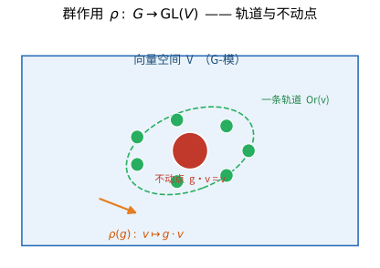

# 第 39 级：表示论 (Representation Theory)

> 表示论是研究代数对象（群、结合代数、李代数）通过线性变换"表示"出来的数学分支。它将抽象代数结构转化为具体的线性代数问题，是连接抽象代数与线性代数的桥梁。

---

## 1. 学习目标

1. 理解群表示论的基本概念：群表示、G-模、不可约表示
2. 掌握舒尔引理和马施克定理及其证明
3. 学习特征标理论，掌握正交关系与特征标表的构造
4. 理解诱导表示与弗罗贝尼乌斯互反律
5. 了解李群与李代数表示论的基本框架
6. 掌握对称群表示论与杨图方法
7. 能够独立完成至少 8 个典型例题
8. 能够解决至少 10 道习题

---

## 2. 群表示论基础

### 2.1 群表示的定义

**定义 2.1（群表示）** 设 $G$ 是一个群，$V$ 是域 $F$ 上的一个向量空间。$G$ 在 $V$ 上的一个**表示**是一个群同态

$$
\rho: G \to \mathrm{GL}(V)
$$

其中 $\mathrm{GL}(V)$ 是 $V$ 上所有可逆线性变换组成的**一般线性群**。$\dim_F V$ 称为表示的**维数**。

当 $V = F^n$ 时，$\mathrm{GL}(V) \cong \mathrm{GL}_n(F)$，即 $n \times n$ 可逆矩阵群，此时表示就是给每个群元素分配一个可逆矩阵。

> **💡 直观理解（类比）**：把"群"想成一个舞蹈团的节目单，里面列着各种动作（旋转、翻转、平移）的抽象名字。表示就是给每一个动作"分配演员"——把抽象的 $g$ 具体实现为一个可逆矩阵 $\rho(g)$。这些矩阵必须遵守同一个"剧本"：两个动作接连表演（$gh$）和对应的矩阵相乘（$\rho(g)\rho(h)$）结果一致。可逆矩阵相当于每个动作都可逆、可还原，就像舞蹈总能跳回去。这就是"用看得见的矩阵，演一出抽象对称的戏"。

**定义 2.2（等价表示）** 两个表示 $\rho_1: G \to \mathrm{GL}(V_1)$ 和 $\rho_2: G \to \mathrm{GL}(V_2)$ 称为**等价的**，如果存在线性同构 $T: V_1 \to V_2$，使得对任意 $g \in G$ 有

$$
T \circ \rho_1(g) = \rho_2(g) \circ T
$$

> **💡 直观理解（类比）**：两个"等价表示"就像用两套不同的镜头拍同一部戏。$T$ 是一副"翻译眼镜"：戴上它，第一个剧组的舞台（$V_1$）和第二个剧组的舞台（$V_2$）能互相看懂。说两个表示等价，意思只是"换了个坐标系再命名演员"，本质还是同一套对称结构，矩阵样子虽然不同，但"骨骼"完全一致。

### 2.2 G-模

**定义 2.3（G-模）** 设 $G$ 是一个群，$V$ 是域 $F$ 上的向量空间。如果存在一个映射 $G \times V \to V$，记为 $(g, v) \mapsto g \cdot v$，满足：

1. $(g_1 g_2) \cdot v = g_1 \cdot (g_2 \cdot v)$，对所有 $g_1, g_2 \in G, v \in V$
2. $e \cdot v = v$，其中 $e$ 是 $G$ 的单位元
3. $g \cdot (av + bw) = a(g \cdot v) + b(g \cdot w)$，对所有 $g \in G, v, w \in V, a, b \in F$

则称 $V$ 是一个 **$G$-模**（或 $G$ 的表示空间）。

> **💡 直观理解（类比）**：$G$-模就是"一群对称动作作用在上面的向量空间"。把 $G$ 想成一只手的各种手势，$V$ 是桌面上的棋子；每个手势 $g$ 都能把每颗棋子移到某个位置 $g \cdot v$。三条公理就是三条自然规矩：先做一个手势再做另一个，等于一下做两个手势连（$(g_1g_2)\cdot v$）；不做任何手势棋子不动；线性叠加——把两枚棋子先混合再操作，等于分别操作后混合。$G$-模和前面说的"表示"其实是同一件事的两种说法：一个看重动作本身（同态 $\rho$），一个看重被动作的场地（模 $V$）。

**注**：$G$-模与群表示是等价的描述方式。给定一个表示 $\rho: G \to \mathrm{GL}(V)$，我们定义 $g \cdot v = \rho(g)(v)$，则 $V$ 成为一个 $G$-模；反之，给定一个 $G$-模 $V$，定义 $\rho(g)(v) = g \cdot v$，则 $\rho$ 是一个表示。



> **直观理解（现实类比）**：把群作用想象成一台旋转的万花筒或转盘。群 $G$ 是"旋转"这个动作的集合，向量空间 $V$ 是转盘上的点。每个群元素 $g$ 通过可逆变换 $\rho(g)$ 给每个点 $v$ 指一个"去处" $g\cdot v$。整张转盘被划成若干条**轨道**——同一条轨道上的点可以互相变过去，就像同一圆环上的珠子可以转到彼此的位置；而转轴中心的那个点无论怎么转都纹丝不动，正是**不动点** $g\cdot v=v$。表示论正是在"抽象群"与"看得见的旋转/对称"之间架起桥梁。
>
> **🧠 思考历程：一个听不见摸不着的抽象群，如何"演出"成看得见的矩阵？**
>
> 表示论要回答的是：抽象的群元素，怎样化身为实实在在的、能够相乘的矩阵运动？——通过把 $G$ 映到 $\mathrm{GL}(V)$ 的矩阵集合，数学家让抽象的对称"落地"为可以计算的线性代数。
>
> - **从置换到矩阵**。群最初就以置换群、变换群的面目出现在数学中；让抽象群"回到具体变换"的强烈需要，促使数学家考虑同态 $\rho:G\to\mathrm{GL}(V)$，即所谓的"表示"。
> - **Frobenius 与特征标**。1890 年代，F. G. Frobenius 系统研究有限群表示，提出"特征标"这一核心工具——把矩阵的迹当作群的"指纹"，用它精确读取出不可约表示的全部信息。
> - **分解与查字典**。Schur 引理与 Maschke 定理共同保证半单群可拆成不可约表示的直和，于是"理解一个群"变成"查熟它的不可约表示表"；这一视野后来更蔓延到 Lie 群与物理中的对称性。
> - **心路**：数学家用"让群动起来"的朴素办法，把抽象对称翻译成矩阵语言，最终明白——那些"更简单、不可再拆"的砖块，才是一群之性格的钥匙。

### 2.3 子表示与不可约表示

**定义 2.4（子表示）** 设 $V$ 是一个 $G$-模。子空间 $W \subseteq V$ 称为一个 **$G$-子模**（或不变子空间），如果对任意 $g \in G$ 和 $w \in W$，有 $g \cdot w \in W$。此时 $\rho_W(g) = \rho(g)|_W$ 给出了 $G$ 在 $W$ 上的表示，称为**子表示**。

> **💡 直观理解（类比）**：$G$-子模就是在整个舞台里挑出"一块自足的小舞台"$W$：无论群怎么操作，棋子都不出这块区域（$g \cdot w \in W$）。就像在一个大房间里画一个小框，规则保证任何动作都不把小框里的东西搬到框外。既然小框自成体系，把群限制在它上面，就又得到一套表示——这就是子表示。

**定义 2.5（不可约表示）** 一个非零 $G$-模 $V$ 称为**不可约的**（或**单的**），如果它没有非平凡（即不是 $\{0\}$ 也不是 $V$ 本身）的 $G$-子模。

> **💡 直观理解（类比）**：不可约表示就像"砍不动、掰不开的实心砖头"。无论怎么尝试，都找不到一块能被群动作保持的小地盘，除了整块砖和空无一物的"零"。类比一块完整的实心木块：你能顺着纹理劈开它，才算可约；若它纹理交错、浑然一体，怎么下刀都裂不出整齐的小块，那它就是不可约的。它是表示世界里的"原子"，研究表示就先找这些最基本的积木。

**定义 2.6（完全可约表示）** 一个 $G$-模 $V$ 称为**完全可约的**（或**半单的**），如果它可以分解为不可约 $G$-子模的直和：

$$
V = V_1 \oplus V_2 \oplus \cdots \oplus V_k
$$

> **💡 直观理解（类比）**：完全可约（也叫半单）表示就是"由不可约积木整整齐齐拼起来的房子"。整栋房子能严丝合缝地拆成一摞互不干扰的房间 $V_1 \oplus \cdots \oplus V_k$，每间都是实心砖块（不可约）。注意"能拼装"和"能拼装且能再拆"是不同的承诺：完全可约强调的正是"拆得开、拼得拢、各房间互不串门"，这正是后面马施克定理要保证的干净情形。

### 2.4 舒尔引理 (Schur's Lemma)

**引理 2.7（舒尔引理）** 设 $V$ 和 $W$ 是群 $G$ 的两个有限维不可约表示，$\varphi: V \to W$ 是一个 $G$-模同态（即与 $G$ 作用可交换的线性映射）。则要么 $\varphi = 0$，要么 $\varphi$ 是可逆的（从而 $V \cong W$）。

**证明**：考虑 $\ker \varphi$。由于 $\varphi$ 是 $G$-模同态，$\ker \varphi$ 是 $V$ 的 $G$-子模。因为 $V$ 是不可约的，$\ker \varphi$ 只能是 $\{0\}$ 或 $V$。若 $\ker \varphi = V$，则 $\varphi = 0$。

若 $\ker \varphi = \{0\}$，则 $\varphi$ 是单射。再考虑 $\mathrm{im}\, \varphi$，它是 $W$ 的 $G$-子模。因为 $W$ 是不可约的，$\mathrm{im}\, \varphi$ 只能是 $\{0\}$ 或 $W$。但 $\varphi \neq 0$，所以 $\mathrm{im}\, \varphi = W$，即 $\varphi$ 是满射。因此 $\varphi$ 是双射，从而可逆。$\square$

> **💡 直观理解（类比）**：舒尔引理说的是"两块'实心砖'之间的合法搬运工"特别省心。把 $V,W$ 想成两个无法再拆的玻璃球，$\varphi$ 是把 $V$ 里的每个点搬到 $W$ 的一个"忠实翻译"。结论是：这样的翻译要么一无是处（把一切都运成零，$\varphi=0$），要么是精确的一一对应（可逆，从而两块砖本质相同）。原因很简单——翻译必有"被归零的集合"$\ker\varphi$ 和"可到达的集合"$\mathrm{im}\,\varphi$，而这两块砖内部没有可剥削的小块，所以要么整块归零、要么整块都被覆盖。**不同尺寸的砖之间根本不存在非零的翻译**。

**推论 2.8** 设 $V$ 是复数域 $\mathbb{C}$ 上的有限维不可约 $G$-模，则 $V$ 到自身的任何 $G$-模同态都是标量变换（即 $\lambda \cdot \mathrm{id}_V$ 的形式）。

**证明**：设 $\varphi: V \to V$ 是 $G$-模同态。由于 $\mathbb{C}$ 是代数闭域，$\varphi$ 有特征值 $\lambda$。考虑 $\varphi - \lambda \mathrm{id}$，它也是 $G$-模同态，且不可逆（因为 $\lambda$ 是特征值），由舒尔引理，它必须为零映射，即 $\varphi = \lambda \mathrm{id}$。$\square$

> **💡 直观理解（类比）**：这是舒尔引理在"自己搬自己"时的版本。一个不可约表示的"自翻译"（$G$-模同态 $V\to V$）竟然只能是"把整块砖放大 $\lambda$ 倍"的简单操作，别无花样。打个比方：一个完全对称的、无可拆分结构的雕像，任何"保持它对称结构的自相似变换"只能整体缩放，而不可能扭出局部花样。而在复数这个"数字足够丰富"的场地里，任意自映射必有特征值 $\lambda$，于是它减 $\lambda$ 倍恒等后必不可逆，只能为零。

**推论 2.9** 阿贝尔群的任何有限维不可约复表示都是一维的。

**证明**：设 $G$ 是阿贝尔群，$\rho: G \to \mathrm{GL}(V)$ 是有限维不可约复表示。对任意 $g \in G$，$\rho(g)$ 与所有 $\rho(h)$（$h \in G$）可交换（因为 $gh = hg$），所以 $\rho(g)$ 是 $G$-模同态。由推论 2.8，$\rho(g) = \lambda_g \cdot \mathrm{id}_V$ 是标量变换。因此 $V$ 的任何一维子空间都是 $G$-子模。由不可约性，$\dim V = 1$。$\square$

> **💡 直观理解（类比）**：这条推论说"能被顺畅交换（阿贝尔）的群，它的原子只能是'一根线'那么细的一维"。原因是：阿贝尔群里每个动作 $g$ 都和其他动作能互换顺序，于是根据推论 2.8，$g$ 只能整体放大所有向量（标量变换），不能像拧麻花一样偏向某些方向。既然方向没有偏好，任何一条直线方向都被照顾、都保持不变，那这块"实心砖"就只能是一维线段。这也解释了为什么循环群 $C_n$ 的不可约表示统统是一维的——只有"平移/旋转整个圆盘按因子缩放"这种单调操作。

### 2.5 马施克定理 (Maschke's Theorem)

**定理 2.10（马施克定理）** 设 $G$ 是有限群，$F$ 是一个域，且 $\mathrm{char}(F) \nmid |G|$（即 $F$ 的特征不整除 $G$ 的阶）。则 $G$ 的每个有限维表示都是完全可约的。等价地，$F[G]$ 是半单代数。

**证明**：设 $V$ 是 $G$ 的一个有限维表示，$W \subseteq V$ 是一个 $G$-子模。我们要证明 $W$ 在 $V$ 中有一个 $G$-不变的补空间。

取任意线性投影 $p_0: V \to W$（即 $p_0|_W = \mathrm{id}_W$，$p_0^2 = p_0$）。定义

$$
p(v) = \frac{1}{|G|} \sum_{g \in G} g \cdot p_0(g^{-1} \cdot v)
$$

我们验证 $p$ 是 $G$-模同态且是到 $W$ 上的投影：

1. 对任意 $w \in W$，$g^{-1} \cdot w \in W$，所以 $p_0(g^{-1} \cdot w) = g^{-1} \cdot w$，于是
   $$
   p(w) = \frac{1}{|G|} \sum_{g \in G} g \cdot (g^{-1} \cdot w) = \frac{1}{|G|} \sum_{g \in G} w = w
   $$

2. 对任意 $v \in V$，$p(v) \in W$（因为 $p_0(g^{-1} \cdot v) \in W$，且 $W$ 是 $G$-不变的）。

3. 对任意 $h \in G$，
   $$
   \begin{aligned}
   p(h \cdot v) &= \frac{1}{|G|} \sum_{g \in G} g \cdot p_0(g^{-1}h \cdot v) \\
   &= \frac{1}{|G|} \sum_{g' \in G} hg' \cdot p_0(g'^{-1} \cdot v) \quad (\text{令 } g' = h^{-1}g) \\
   &= h \cdot \frac{1}{|G|} \sum_{g' \in G} g' \cdot p_0(g'^{-1} \cdot v) = h \cdot p(v)
   \end{aligned}
   $$

因此 $p$ 是 $G$-模同态，且 $p^2 = p$（投影）。于是 $V = \ker p \oplus \mathrm{im}\, p = \ker p \oplus W$，且 $\ker p$ 也是 $G$-子模（因为 $p$ 是 $G$-模同态）。

这就证明了每个子模都有 $G$-不变的补空间，从而 $V$ 是完全可约的。$\square$

> **💡 直观理解（类比）**：马施克定理是"表示论里的拼图总则"：只要群的大小和场地特征互相"不打架"（$\mathrm{char}\,F\nmid|G|$），那任何表示都像搭好的乐高——既能拆也必能拆成不可约积木。核心技巧是"平均化"：随便先找一个倾斜的投影 $p_0$，再把它对所有 $g$ 做平均 $\frac1{|G|}\sum_g g\,p_0(g^{-1}\cdot)$，平均后它就不再偏向任何方向，成了与 $G$ 相容的"正投影"，从而补空间保持 $G$ 动作。这就像给照片做"多角度平均去噪"。反过来，若特征整除 $|G|$（模表示论），平均要除以一个在场地里等于 0 的数，配方就失败，砖块会"粘"在一起拆不开。

**注**：当 $\mathrm{char}(F) \mid |G|$ 时，马施克定理不成立，此时称为**模表示论**（modular representation theory），情况更为复杂。

---

## 3. 特征标理论

### 3.1 特征标的定义

**定义 3.1（特征标）** 设 $\rho: G \to \mathrm{GL}(V)$ 是有限群 $G$ 在 $\mathbb{C}$ 上的一个有限维表示。定义函数 $\chi_\rho: G \to \mathbb{C}$ 为

$$
\chi_\rho(g) = \mathrm{tr}(\rho(g))
$$

称为表示 $\rho$ 的**特征标**（character）。若 $\rho$ 是不可约表示，则 $\chi_\rho$ 称为**不可约特征标**。

> **💡 直观理解（类比）**：特征标就是表示的"指纹"或"识别码"。矩阵的迹（对角线之和）虽然"丢失"了很多细节，却抓住了最耐转动的本质——转一下坐标系（共轭）迹不变，所以它能在海量等价表示里给出稳定的身份标记。类比给每个群元素量一次"体温/取一次指纹"：$\chi(g)=\mathrm{tr}\,\rho(g)$。它妙就妙在：尽管矩阵可以千变万化，但迹把这个群的"性格特征"凝缩成一串数字，足够区分不同不可约表示，却又不至于被坐标变换这种"换衣服"干扰。

**命题 3.2（特征标的基本性质）** 设 $\chi$ 是表示 $\rho$ 的特征标，则：

1. $\chi(e) = \dim V$，称为特征标的**度数**
2. $\chi(g^{-1}) = \overline{\chi(g)}$（共轭）
3. $\chi(hgh^{-1}) = \chi(g)$ 对所有 $h \in G$（即特征标是**类函数**）
4. 若 $\chi_1, \chi_2$ 是表示 $\rho_1, \rho_2$ 的特征标，则 $\chi_1 + \chi_2$ 是 $\rho_1 \oplus \rho_2$ 的特征标
5. 若 $\chi$ 是 $\rho$ 的特征标，则 $\overline{\chi}$ 是 $\rho$ 的共轭表示的特征标

> **💡 直观理解（类比）**：这些性质像"指纹的几项体检指标"：①单位元的指纹值是"舞台尺寸"——$V$ 有几维，$\chi(e)$ 就是几（恒等矩阵对角线全 1）；②取逆像照镜子，迹共轭对称；③最关键的是——$hgh^{-1}$ 就是把 $g$ 的动作在 $h$ 的坐标系里"转述"一遍，迹这个量对换坐标袖手旁观、纹丝不变，所以特征标在**同一共轭类上的值都相同**（类函数）。这一条让特征标表的"列"可以按类合并，大大压缩了信息量。

### 3.2 类函数与内积

**定义 3.3（类函数）** 函数 $f: G \to \mathbb{C}$ 称为**类函数**，如果对任意 $g, h \in G$ 有 $f(hgh^{-1}) = f(g)$。记所有类函数的集合为 $\mathcal{C}_{\text{class}}(G)$。

> **💡 直观理解（类比）**：类函数就是"只认类型、不认个体"的函数。$g$ 被人套上任何一件"变形外套"$hgh^{-1}$（本质还是同一个动作的别名），类函数的值都不变。好比一份只看"职业"不看"名字"的统计表——所有"换工作服就能互换的岗位"算作一类。特征标是类函数，所以这类函数天然适合讨论群的"整体分类"，也几乎完全概括了表示论所需的全部信息。

**定义 3.4（类函数的内积）** 在 $\mathcal{C}_{\text{class}}(G)$ 上定义埃尔米特内积：

$$
\langle f_1, f_2 \rangle = \frac{1}{|G|} \sum_{g \in G} f_1(g) \overline{f_2(g)}
$$

> **💡 直观理解（类比）**：这个内积像给两个"指纹向量"测"相似度/夹角"。把 $f_1,f_2$ 看成定义在群上的两个列向量（每个 $g$ 对应一个坐标），取对应分量相乘再求和并除以 $|G|$ 做平均，就是在测它们夹得多近。它与高中向量的点积 $\vec a\cdot\vec b=\sum a_i b_i$ 是同一回事，只不过额外做了"除以人数取平均"并带上复共轭。后面会看到：不同不可约特征标这一对内积为 0（"互相垂直"），与自己内积为 1（"单位长"）——即它们构成标准的正交坐标架。

### 3.3 正交关系

**定理 3.5（舒尔正交关系）** 设 $G$ 是有限群，$\rho^{(i)}: G \to \mathrm{GL}(V_i)$ 和 $\rho^{(j)}: G \to \mathrm{GL}(V_j)$ 是 $G$ 的两个不可约复表示，$\chi_i$ 和 $\chi_j$ 是它们的特征标。

1. **第一正交关系**：
   $$
   \langle \chi_i, \chi_j \rangle = \frac{1}{|G|} \sum_{g \in G} \chi_i(g) \overline{\chi_j(g)} = \delta_{ij}
   $$
   即不可约特征标构成标准正交基。

2. **第二正交关系**：对任意 $g, h \in G$，
   $$
   \sum_{i} \chi_i(g) \overline{\chi_i(h)} = 
   \begin{cases}
   |C_G(g)|, & \text{若 } g \text{ 与 } h \text{ 共轭} \\
   0, & \text{否则}
   \end{cases}
   $$
   其中求和跑遍所有不可约特征标，$C_G(g) = \{x \in G \mid xg = gx\}$ 是 $g$ 的中心化子。

**证明（第一正交关系）**：设 $V$ 和 $W$ 是不可约 $G$-模，$\rho_V, \rho_W$ 是相应的表示。对任意线性映射 $T: V \to W$，定义

$$
\tilde{T} = \frac{1}{|G|} \sum_{g \in G} \rho_W(g) \circ T \circ \rho_V(g^{-1})
$$

可以验证 $\tilde{T}$ 是 $G$-模同态。由舒尔引理：
- 若 $V \not\cong W$，则 $\tilde{T} = 0$
- 若 $V = W$，则 $\tilde{T} = \frac{\mathrm{tr}(T)}{\dim V} \cdot \mathrm{id}_V$

取 $T = E_{ab}$（矩阵单位），计算 $\mathrm{tr}(\tilde{T})$ 可得正交关系。$\square$

> **💡 直观理解（类比）**：舒尔正交关系是表示论的"勾股定理+正交坐标"。第一正交关系说：不同不可约特征标互相"垂直"（内积 0），每个与自己"长度 1"（内积 1），它们就像三维空间里的三个互相垂直的单位向量，构成完整的正交基。第二正交关系则从"列"的角度看：对两个群元素按所有不可约表示求和，只有当它们在同一共轭类（$g\sim h$）时才有值，值为中心化子大小。这就像一张矩形的正交表——"行"之间互相垂直，"列"之间也互相垂直，于是任何类函数都能像按基函数展开一样唯一写成不可约特征标的组合。

### 3.4 特征标表

**定义 3.6（特征标表）** 有限群 $G$ 的**特征标表**是一个矩阵，其行由不可约特征标标记，列由共轭类标记，矩阵元素为相应特征标在相应共轭类上的值。

> **💡 直观理解（类比）**：特征标表是群的"身份证档案/迷你说明书"。把每个不可约表示记成一行、每个共轭类记成一列，表格里填的正是该特征标在该类上的取值。它像把一整个群浓缩成一张小而完整的身世表——后面会看到，甚至能凭它判断表示是否可约、群是否同构等深层性质。好比用一张 "营养成分表"把一整道复杂的菜概括得清楚明白。

**例 3.7（$S_3$ 的特征标表）** 对称群 $S_3$ 有三个共轭类：$\{e\}$，$\{(12), (13), (23)\}$，$\{(123), (132)\}$。它的特征标表为：

| $S_3$ | $e$ | $(12)$ | $(123)$ |
|:-----:|:---:|:------:|:-------:|
| $\chi_{\text{triv}}$ | 1 | 1 | 1 |
| $\chi_{\text{sgn}}$ | 1 | -1 | 1 |
| $\chi_{\text{std}}$ | 2 | 0 | -1 |

其中 $\chi_{\text{triv}}$ 是平凡表示，$\chi_{\text{sgn}}$ 是符号表示，$\chi_{\text{std}}$ 是标准二维表示（从 $S_3$ 作用在 $\mathbb{C}^3$ 中迹零子空间得到）。

### 3.5 正则表示

**定义 3.8（正则表示）** 设 $G$ 是有限群。群代数 $\mathbb{C}[G]$ 作为左 $\mathbb{C}[G]$-模给出了 $G$ 的**左正则表示** $\rho_{\text{reg}}$。其表示空间维数为 $|G|$，基为 $\{e_g \mid g \in G\}$，作用为 $h \cdot e_g = e_{hg}$。

> **💡 直观理解（类比）**：正则表示是"自带所有群元素的超大舞台"。它不用额外设计动作——直接让群在自己身上"自我作用"：每个群元素 $h$ 把"标着 $g$ 的那个位置"$e_g$ 推到"标着 $hg$ 的位置"。这好比把全班同学的名字各摆一个座位，然后让"老师一声令下，所有同学往'与 $h$ 相乘后的新名字'座位移动"。因为群是可逆的置换（左乘 $h$ 恰好是 $|G|$ 个位置的一一搬动），正则表示相当于"群最完整、最慷慨的一次自我展示"，后面会证明它包含了所有不可约表示。

**命题 3.9（正则表示的特征标）** 左正则表示的特征标为

$$
\chi_{\text{reg}}(g) = 
\begin{cases}
|G|, & g = e \\
0, & g \neq e
\end{cases}
$$

**证明**：在基 $\{e_g\}$ 下，$\rho_{\text{reg}}(h)$ 对应的置换矩阵将 $e_g$ 映到 $e_{hg}$。当 $h \neq e$ 时，$hg \neq g$ 对所有 $g$ 成立，所以对角线上全为 0，迹为 0。当 $h = e$ 时，迹为 $\dim \mathbb{C}[G] = |G|$。$\square$

> **💡 直观理解（类比）**：正则特征标的形状非常好认：只在"不动"单位元 $e$ 处爆满（值 $|G|$），其他任何地方都是 0。原因在于它是"置换矩阵"：$h\neq e$ 时左乘 $h$ 把每个位置都搬走，对角线一个都不留（迹 0）；只有 $h=e$ 时什么都不动，全是 1，迹 $=|G|$。这像一本"只有首页烫金、其余空白"的身份名册——凭这一串 0 和一个 $|G|$，就能框住一个群的"全部家底"。

**定理 3.10（正则表示的分解）** 设 $\hat{G}$ 是 $G$ 的所有不可约复表示的同构类集合，$\chi_i$ 是相应的不可约特征标，$d_i = \chi_i(e) = \dim V_i$。则正则表示分解为

$$
\mathbb{C}[G] \cong \bigoplus_{i \in \hat{G}} V_i^{\oplus d_i}
$$

即每个不可约表示 $V_i$ 在正则表示中出现的重数等于其维数 $d_i$。

**证明**：由正交关系，$\chi_{\text{reg}} = \sum_i d_i \chi_i$。计算 $\langle \chi_{\text{reg}}, \chi_i \rangle = d_i$，即得重数。$\square$

**推论 3.11** $\sum_{i \in \hat{G}} d_i^2 = |G|$。

**证明**：比较正则表示分解两边的维数。$\square$

> **💡 直观理解（类比）**：这个等式是表示论的"预算守恒定律"：所有不可约表示的维数平方相加，恰好等于群的阶 $|G|$。它像一道严格的记账：正则考场共有 $|G|$ 个座位，每种"实心砖"坐 $d_i$ 排，一种砖出现 $d_i$ 次、占 $d_i^2$ 格，加起来必须正好把全部座位占满。凭这条公式，给定 $|G|$，往往能反推出不可约表示的维数组合（比如 $|S_3|=6\Rightarrow 1^2+1^2+2^2$）。

![正则表示的不可约分解：\mathbb{C}[S_3]\cong\mathbf{triv}\oplus\mathbf{sgn}\oplus\mathbf{std}^{\oplus 2}，把 6 维表示拆成"最小积木"（不可约表示），每种积木按维数重复出现，对应 6=1+1+2+2](images/level39-irreducible-decomposition.svg)

> **直观理解（现实类比）**：把正则表示想成一大盒乐高积木。表面看它是一个 6 格的整体，但拆开分类后会发现它并不是 6 种不同的零件，而是由少数几种"最小零件"（不可约表示）拼装而成：平凡积木 1 块、符号积木 1 块、标准积木 2 块，正好 $6=1+1+2+2$。不可约表示就是"再也拆不开"的最小积木，而正则表示则像一份"完整的零件清单"——每种不可约表示都按自己的维数出现若干次，这就是马施克定理保证的"完全可约性"。

---

## 4. 诱导表示

### 4.1 诱导表示的定义

**定义 4.1（诱导表示）** 设 $H \leq G$ 是子群，$W$ 是 $H$ 的一个表示（即 $H$-模）。定义 $G$ 的表示

$$
\mathrm{Ind}_H^G W = \mathbb{C}[G] \otimes_{\mathbb{C}[H]} W
$$

称为从 $H$ 到 $G$ 的**诱导表示**。$G$ 的作用由左乘给出：$g \cdot (x \otimes w) = (gx) \otimes w$。

> **💡 直观理解（类比）**：诱导表示是"把小剧团的戏，扩编成整个大剧团的戏"。你原本只有子群 $H$ 能在小舞台 $W$ 上演动作；诱导表示相当于给群 $G$ 里的所有元素都安排上动作，并且严格尊重原来 $H$ 的剧本。功能上的直观更好记：$\mathrm{Ind}_H^G W$ 就是"那些给 $G$ 每个元素都贴一张'来自 $W$ 的标签'、且同一条左边 $H$ 线路上标签必须一致"的函数集合。子群就像员工里的"核心管理层"，诱导就像把核心权力合法地扩充到全公司且不违背原章程。

**等价描述**：$\mathrm{Ind}_H^G W$ 可以看作所有函数 $f: G \to W$ 满足 $f(hg) = h \cdot f(g)$ 对任意 $h \in H$ 的集合，$G$ 的作用为 $(g \cdot f)(x) = f(xg)$。

**命题 4.2（诱导表示的维数）** $\dim \mathrm{Ind}_H^G W = [G:H] \cdot \dim W$。

> **💡 直观理解（类比）**：维数公式是"扩编后的人数守恒"：结果舞台的尺寸，等于"大群比子群多出来的份数"[G:H] 乘以小舞台原本的尺寸 $\dim W$。把 $H$ 在 $G$ 里的每个"拷贝"（陪集）都看成一份源材料，每份携带 $\dim W$ 个自由度，全部加起来就是这个诱导表示的规模。$[G:H]$ 就是"大群是子群的几倍大"。

### 4.2 诱导特征标的公式

**命题 4.3（诱导特征标公式）** 设 $\psi$ 是 $H$-模 $W$ 的特征标，则诱导表示 $\mathrm{Ind}_H^G W$ 的特征标为

$$
\mathrm{Ind}_H^G \psi(g) = \frac{1}{|H|} \sum_{\substack{x \in G \\ x^{-1}gx \in H}} \psi(x^{-1}gx)
$$

或等价地，取 $H$ 在 $G$ 中的一组右陪集代表元 $R$，

$$
\mathrm{Ind}_H^G \psi(g) = \sum_{\substack{r \in R \\ r^{-1}gr \in H}} \psi(r^{-1}gr)
$$

> **💡 直观理解（类比）**：这个公式回答"扩编后，大群的每个元素 $g$ 指纹是多少"。做法是：把 $G$ 按子群 $H$ 的"拷贝"（右陪集代表元 $r$）逐一检查，凡是 $r^{-1}gr$ 恰好落回 $H$ 里（即 $g$ 在 $r$ 的坐标系内其实是 $H$ 里的老熟人），就采那一下小舞台的指纹 $\psi(r^{-1}gr)$，把所有命中项相加。可以理解成"顺着每个领事馆的副本点名，只统计那些换装后仍是内部成员的 $g$ 的贡献"。

### 4.3 弗罗贝尼乌斯互反律 (Frobenius Reciprocity)

**定理 4.4（弗罗贝尼乌斯互反律）** 设 $H \leq G$，$V$ 是 $G$ 的表示，$W$ 是 $H$ 的表示。则存在自然同构

$$
\mathrm{Hom}_G(V, \mathrm{Ind}_H^G W) \cong \mathrm{Hom}_H(\mathrm{Res}_H^G V, W)
$$

其中 $\mathrm{Res}_H^G V$ 是将 $V$ 限制为 $H$ 的表示。

**用特征标表述**：对于特征标，

$$
\langle \chi_V, \mathrm{Ind}_H^G \psi_W \rangle_G = \langle \mathrm{Res}_H^G \chi_V, \psi_W \rangle_H
$$

**证明**：定义映射 $\alpha: \mathrm{Hom}_G(V, \mathrm{Ind}_H^G W) \to \mathrm{Hom}_H(V, W)$ 如下：对 $f: V \to \mathrm{Ind}_H^G W$，考虑求值映射 $\mathrm{ev}_e: \mathrm{Ind}_H^G W \to W$，$F \mapsto F(e)$（将函数在单位元处求值）。定义 $\alpha(f) = \mathrm{ev}_e \circ f$。可以验证 $\alpha(f)$ 是 $H$-模同态。

反之，给定 $g: V \to W$ 是 $H$-模同态，定义 $f: V \to \mathrm{Ind}_H^G W$ 为 $f(v)(x) = g(x^{-1} \cdot v)$。可以验证 $f$ 是 $G$-模同态，且这两个构造互逆。$\square$

> **💡 直观理解（类比）**：弗罗贝尼乌斯互反律是"扩编与收缩是一对最自然的搭档"：谈大群 $G$ 的表示 $V$ 与"小群 $H$ 扩编来的诱导表示"之间有多少翻译（$\mathrm{Hom}$），就像谈"$V$ 收缩回 $H$ 后与小剧本 $W$"之间有多少翻译完全一样——两者数量总相等。这类似高中说的"乘法与除法的互逆"或数学里的伴随关系：诱导（Ind）和限制（Res）就像"进出口贸易"的进出口反向，永远账目守恒。它极大方便了计算：诱导到大群再配对，等价于先砍回小群再配对。

### 4.4 麦基定理 (Mackey's Theorem)

**定理 4.5（麦基分解定理）** 设 $H, K \leq G$，$W$ 是 $H$ 的表示。则限制到 $K$ 的诱导表示有如下分解：

$$
\mathrm{Res}_K^G \circ \mathrm{Ind}_H^G W \cong \bigoplus_{HgK \in H \backslash G / K} \mathrm{Ind}_{K \cap gHg^{-1}}^K \circ \mathrm{Res}_{K \cap gHg^{-1}}^{gHg^{-1}} \circ \mathrm{Ad}_g(W)
$$

其中 $\mathrm{Ad}_g$ 表示通过 $g$ 共轭的作用。

**麦基不可约判别法**：设 $H \leq G$，$W$ 是 $H$ 的不可约表示。则 $\mathrm{Ind}_H^G W$ 不可约当且仅当对任意 $g \in G \setminus H$，$\mathrm{Res}_{H \cap gHg^{-1}}^H W$ 和 $\mathrm{Res}_{H \cap gHg^{-1}}^{gHg^{-1}} \mathrm{Ad}_g(W)$ 没有共同的不可约成分。

> **💡 直观理解（类比）**：麦基定理是"进出口拆箱单"。你把 $H$ 的货物 $W$ "诱导"进入大群 $G$（出口），再从另一窗口 $K$（进口）查看它，会发现它不是一整箱，而是被按双陪集 $HgK$ 拆成若干独立的小箱子，每个小箱由"公共交叉段 $K\cap gHg^{-1}$"上重新诱导/收缩而成。不可约判别法则像个"体检标准"：扩编后的表示还是一整块实心砖（不可约），当且仅当没有两个来自不同 $g$ 的僵尸副本在同一交叉处撞出共同组件——遇到撞件，砖就被劈成两半了。

---

## 5. 李群表示论

### 5.1 李代数表示

**定义 5.1（李代数表示）** 设 $\mathfrak{g}$ 是域 $F$ 上的李代数，$V$ 是 $F$ 上的向量空间。$\mathfrak{g}$ 在 $V$ 上的一个**表示**是一个李代数同态

$$
\rho: \mathfrak{g} \to \mathfrak{gl}(V)
$$

其中 $\mathfrak{gl}(V) = \mathrm{End}_F(V)$ 作为李代数，李括号为 $[A, B] = AB - BA$。

> **💡 直观理解（类比）**：李代数表示与群表示几乎一样，只是"操作的集合"从"成体系的对称动作"换成了"描述微小变化的速度场"。把 $V$ 想成一块能变形的材料，$\mathfrak{g}$ 每个元素 $x$ 被表示成一个"朝某方向的即时变形"（矩阵 $A$），而括号 $[A,B]=AB-BA$ 度量"先做 $A$ 再做 $B$"与反过来做产生的差别。它是李群（连续对称）在"无限小"尺度上的投影，相当于把"宏观旋转"降维成"转动的角速度"。物理里的角动量、量子力学里的生成元，都是李代数表示。

**例 5.2（伴随表示）** 定义 $\mathrm{ad}: \mathfrak{g} \to \mathfrak{gl}(\mathfrak{g})$ 为 $\mathrm{ad}(x)(y) = [x, y]$。这是 $\mathfrak{g}$ 的**伴随表示**。

> **💡 直观理解（类比）**：伴随表示就是"李代数自己扮演自己的演员"——它把自己当作被操作的对象 $V=\mathfrak{g}$。每个 $x$ 的动作是"用括号去'撞'别人"：$y\mapsto[x,y]$。可以想成一条船 $x$ 搅动整片水面 $\mathfrak g$，每个点 $y$ 被算一次"与 $x$ 相遇时的旋转力矩"。**根**说的就是在这片水里大家体重有几种"特征值"，根空间则是"同重量级"的那些方向聚成的子空间。伴随表示是李代数最重要的自画像。

### 5.2 最高权理论

设 $\mathfrak{g}$ 是复半单李代数，$\mathfrak{h} \subset \mathfrak{g}$ 是嘉当子代数。

**定义 5.3（权与根）** 对 $\mathfrak{g}$ 的表示 $\rho: \mathfrak{g} \to \mathfrak{gl}(V)$，$\lambda \in \mathfrak{h}^*$ 称为一个**权**，如果存在非零 $v \in V$ 使得对任意 $h \in \mathfrak{h}$ 有 $\rho(h)v = \lambda(h)v$。权的集合记作 $\mathrm{wt}(V)$。

**非零根** $\alpha \in \mathfrak{h}^*$ 是伴随表示的非零权，称为**根**。根空间分解为

$$
\mathfrak{g} = \mathfrak{h} \oplus \bigoplus_{\alpha \in \Phi} \mathfrak{g}_\alpha
$$

> **💡 直观理解（类比）**："权"与"根"是李代数世界的"能量台阶"和"标准砝码"。权衡量的是：在一个表示里，嘉当子代数 $\mathfrak h$（代表"可同时量测的琐碎旋转"）把每个向量拉伸多少——即每个向量的"体重刻度"$\lambda$。根则是伴随表示（李代数自己）里的非零权，相当于"一组标准秤砣"，只取其中若干固定的刻度值 $\Phi$。根空间分解 $\mathfrak g=\mathfrak h\oplus\bigoplus_{\alpha\in\Phi}\mathfrak g_\alpha$ 就像把整栋建筑按"承重等级"分成若干独立翼区，每翼只响应一种刻度。物理上，这些"权"正是量子力学里的能量本征值。

**定义 5.4（最高权）** 选定一组正根 $\Phi^+$，权 $\lambda$ 称为**最高权**，如果存在非零向量 $v_\lambda \in V$（称为**最高权向量**）使得

1. $\rho(h)v_\lambda = \lambda(h)v_\lambda$ 对所有 $h \in \mathfrak{h}$
2. $\rho(e_\alpha)v_\lambda = 0$ 对所有 $\alpha \in \Phi^+$（其中 $e_\alpha \in \mathfrak{g}_\alpha$）

> **💡 直观理解（类比）**：最高权是"一栋表示建筑的房顶标高/煲汤的最高水位"。整座表示的"能量台阶"高低错落，最高权 $\lambda$ 就是最高的那级；向量 $v_\lambda$ 是所有"体重梯度"都升到最高处的那个顶点（最高权向量）。两个条件很形象：①它在 $\mathfrak h$ 下有多重就是 $\lambda$（站得最高的那类体重）；②"抬升越顶的正根 $e_\alpha$ 再去推它"毫无效果（$\rho(e_\alpha)v_\lambda=0$）——因为已经是顶峰，无处再升。**一条核心格言：看房顶标高就能认出整栋楼**，这正是下一个定理的直觉。

**定理 5.5（最高权分类定理）** $\mathfrak{g}$ 的每个有限维不可约表示由它的最高权唯一确定，且每个支配整权都是某个有限维不可约表示的最高权。

> **💡 直观理解（类比）**：这是李代数表示论的"头条分类理论"：**一块实心砖，只需一张"房顶标高"就够了**。它说层与层之间"每个合法的最高权恰好造出唯一一种不可约表示，且不可约表示的种类和所有合法最高权一一对应"。类比楼房面向：先量出楼顶的高度档位（支配整权），就决定了整栋楼的结构，不会有雷同也不会有遗漏。这就把"找出所有不可约表示"这个海量问题，简化成了"枚举合法房顶高度"这类可逐一清点的问题。

### 5.3 费马模 (Verma Modules)

**定义 5.6（费马模）** 设 $\mathfrak{b} = \mathfrak{h} \oplus \bigoplus_{\alpha \in \Phi^+} \mathfrak{g}_\alpha$ 是波莱尔子代数。对 $\lambda \in \mathfrak{h}^*$，将 $\mathfrak{b}$ 在 $\mathbb{C}_\lambda$ 上的作用定义为 $\mathfrak{h}$ 通过 $\lambda$ 作用，$\mathfrak{g}_\alpha$ 平凡作用。则**费马模**定义为

$$
M(\lambda) = U(\mathfrak{g}) \otimes_{U(\mathfrak{b})} \mathbb{C}_\lambda
$$

其中 $U(\mathfrak{g})$ 是 $\mathfrak{g}$ 的泛包络代数。

费马模 $M(\lambda)$ 有唯一的极大子模，其商是最高权为 $\lambda$ 的不可约表示 $L(\lambda)$。

> **💡 直观理解（类比）**：费马模是"制造不可约表示的毛坯/未雕品"。想得到最高权为 $\lambda$ 的那块完美实心砖 $L(\lambda)$，我们不是直接凿出它，而是先把对应的原始毛坯 $M(\lambda)$ 造出来（用泛包络代数把最高权向量 $\mathbb C_\lambda$ 自由"放开手脚地抬升一遍"），再"一刀切掉多余的部分"——毛坯里唯一的极大子模就是该削去的赘肉，剩下的"商"$M(\lambda)/\text{极大子模}$正好是干净整齐的 $L(\lambda)$。类比做雕塑：先浇一整块粗坯，再褪去外皮显出真形。

### 5.4 外尔特征标公式 (Weyl Character Formula)

**定理 5.7（外尔特征标公式）** 设 $L(\lambda)$ 是最高权为 $\lambda$ 的不可约表示，其特征标为

$$
\mathrm{ch}\, L(\lambda) = \frac{\sum_{w \in W} \varepsilon(w) e^{w(\lambda + \rho)}}{\prod_{\alpha \in \Phi^+} (e^{\alpha/2} - e^{-\alpha/2})}
$$

其中 $W$ 是外尔群，$\varepsilon(w) = (-1)^{\ell(w)}$ 是 $w$ 的符号，$\rho = \frac{1}{2}\sum_{\alpha \in \Phi^+} \alpha$ 是半正根和的一半。

> **💡 直观理解（类比）**：外尔特征标公式是李代数里最"神奇却也最要紧"的配方，类似有限群特征标表的"模拟版"。分子 $\sum_w \varepsilon(w)e^{w(\lambda+\rho)}$ 像帮忙做"反锯齿/去抖动"的交替求和：把标准做法转到各个对称方向 $w$，再带符号相加，把不该出现的杂项抵消干净；分母 $\prod_\alpha(e^{\alpha/2}-e^{-\alpha/2})$ 则是所有正根各自贡献的"相减筛子"，每个根减去一对共轭指数。整体就像用"镜子里的对称副本互相抵消"来精确还原某一不带噪点的频谱。

**推论 5.8（维数公式）** $L(\lambda)$ 的维数为

$$
\dim L(\lambda) = \prod_{\alpha \in \Phi^+} \frac{\langle \lambda + \rho, \alpha \rangle}{\langle \rho, \alpha \rangle}
$$

> **💡 直观理解（类比）**：这条维数公式里藏着"每个正根一票"的乘积约定。直观上，每个正根 $\alpha$ 都来给"房子标高层"贡献一个放大因子 $\frac{\langle\lambda+\rho,\alpha\rangle}{\langle\rho,\alpha\rangle}$，把这些因子全乘起来就是整个表示的体积（维度）。它像计算一块"由各方向拉伸倍数相乘决定"的平行六面体体积——每个根是一根度量杆，标高越高、贡献越大。它在 $\mathfrak{sl}_2$ 这类简单情形就能手动算（$V_n$ 的维数一算即得 $n+1$），是最高权分类理论落到"到底多大"这一问的答案。

---

## 6. 有限群表示论

### 6.1 对称群 $S_n$ 的不可约表示

对称群 $S_n$ 的不可约表示由 $n$ 的分拆（partition）分类。

**定义 6.1（分拆与杨图）** $n$ 的一个**分拆** $\lambda = (\lambda_1, \lambda_2, \ldots, \lambda_k)$ 满足 $\lambda_1 \geq \lambda_2 \geq \cdots \geq \lambda_k > 0$ 且 $\sum \lambda_i = n$。对应于分拆 $\lambda$ 的**杨图**（Young diagram）是一个左对齐的方格排列，第 $i$ 行有 $\lambda_i$ 个方格。

> **💡 直观理解（类比）**：分拆就是"把 $n$ 块积木砌成一摞只降不升的台阶"，杨图则是这摞台阶的"俯视图素描"——每行从左到右铺 $\lambda_i$ 格，并向左对齐。比如 $n=3$ 有 $(3),(2,1),(1,1,1)$ 三种杨图：一长条、一个左拐角、一竖列。它们就像密码学的"散列模板"：每种杨图即一种对称群表示的身份证件，后面的一切都围绕"这个图案怎么描述对称"展开。

**例 6.2** $n = 3$ 的分拆：
- $(3)$：□ □ □
- $(2,1)$：□ □ / □
- $(1,1,1)$：□ / □ / □

**定理 6.3** $S_n$ 的不可约复表示与 $n$ 的分拆一一对应，维数由**钩子长度公式**（hook length formula）给出：

$$
\dim V_\lambda = \frac{n!}{\prod_{(i,j) \in \lambda} h(i,j)}
$$

其中 $h(i,j)$ 是杨图中位置 $(i,j)$ 处的钩子长度（该位置右方格子数 + 下方格子数 + 1）。

> **💡 直观理解（类比）**：这条定理把"对称群 $S_n$ 的不可约表示"和"把 $n$ 拆成一摞不增非负数的分拆"一一对上号，维数用**钩子长度公式**算。钩子长度是"往右数剩下的格子 + 往下数剩下的格子 + 自己那 1 格"，像物体上真正"钩住"它的那条 L 形链的大小。公式 $\dim V_\lambda=n!/\prod h(i,j)$ 就好比：总共 $n!$ 种排法（排列总数），除以每种布局里各格子的钩子体积，剩下的才是"真正独立不重不漏"的表示维度。这个除法像给容易多算的排列做一次"去冗余去对称"的约简。

### 6.2 杨表与 Specht 模

**定义 6.4（杨表）** 一个**杨表**（Young tableau）是将数字 $1, 2, \ldots, n$ 填入杨图 $\lambda$ 的每个方格中，每个数字恰好使用一次。

> **💡 直观理解（类比）**：杨表就是把杨图格子当"座位卡"，把数字 $1$ 到 $n$ 各发一个座位，一人一格、不重不漏。这就像给一行固定规格的餐位分配编号，每个编号对应唯一座位。不加任何规则，填法非常多；一旦加上"递增"的规则（变成标准杨表），它就成为一条条有序的排布方式，数量刚好对应该表示的维度。

**定义 6.5（标准杨表）** 如果填入的数字在每行中从左到右递增，每列中从上到下递增，则称为**标准杨表**（standard Young tableau）。

> **💡 直观理解（类比）**：杨表就是把杨图这间"空屋子"填上房间号，标准杨表则要求"一定按从小到大、右邻比左邻大、下邻比上邻大"的规矩填——像盖楼的层级：越往右、越往下总是越来越高档。它有一种"单行道"的寓意：每个标准杨表是一条完全确定的进货顺序，代表一种打扫/建房的排列次序。**关键事实**（见定理 6.6）：对于一个分拆，标准杨表的个数恰好就是对应不可约表示的维数，所以"数格子的合法填法"= "算出表示真正有多大"。

**Specht 模的构造**：对分拆 $\lambda$，$\mathbb{C}[S_n]$ 中对应于 $\lambda$ 的对称化子为

$$
c_\lambda = a_\lambda \cdot b_\lambda
$$

其中 $a_\lambda = \sum_{p \in P_\lambda} p$（$P_\lambda$ 是保行置换群），$b_\lambda = \sum_{q \in Q_\lambda} \varepsilon(q) q$（$Q_\lambda$ 是保列置换群，$\varepsilon(q)$ 是符号）。则 $\mathbb{C}[S_n]c_\lambda$ 是 $S_n$ 的不可约表示，称为 **Specht 模** $S^\lambda$。

> **💡 直观理解（类比）**：Specht 模是把"对称"和"反对称"两种口味杂交出来的专属表示。对称化子 $a_\lambda$ 把同行的各方格全部"同化和匀"（对称化，取同号），反对称化子 $b_\lambda$ 给同列的各方格加符号（反对称化，取正负抵消），再相乘 $c_\lambda=a_\lambda b_\lambda$ 得到"兼容两者的滤波器"。用它作用在群代数上得到 $S^\lambda$，就像用这台"对称滤网+反对称滤网"层层筛出满足杨图约束的最纯洁表示。

**定理 6.6** $\{S^\lambda \mid \lambda \vdash n\}$ 构成了 $S_n$ 的所有不可约复表示，且 $\dim S^\lambda$ 等于 $\lambda$ 的标准杨表个数。

> **💡 直观理解（类比）**：定理 6.6 是"组合学-表示论"的合流：$S_n$ 的全部不可约表示，恰好被 $n$ 的所有分拆（杨图）一张不落、一个不多地打包好了；每种表示的维数，正好等于这个杨图的标准杨表数量。这就像一份"货架清单"：每种积木（分拆）都有一格对应盒子，盒子里装的"独立单元数"（标准杨表数）就是表示的维数。它让复杂的表示计算变成"数填格子的合法方法"，把代数问题翻译成数数问题。

---

## 7. 示例

### 示例 1：$S_3$ 的特征标表

**问题**：构造 $S_3$ 的特征标表。

**解**：$S_3$ 有 3 个共轭类：$\{e\}$，$\{(12), (13), (23)\}$，$\{(123), (132)\}$。由推论 3.11，设不可约特征标度数为 $d_1, d_2, d_3$，则 $d_1^2 + d_2^2 + d_3^2 = 6$，且 $d_i \geq 1$，故只能是 $1, 1, 2$。

平凡表示 $\chi_1$ 和符号表示 $\chi_2$ 都是一维的。$\chi_3$ 是二维标准表示（$S_3$ 作用于 $\mathbb{C}^3$ 中迹零子空间）。利用正交关系可完成特征标表：

| $S_3$ | $e$ (1) | $(12)$ (2) | $(123)$ (3) |
|:-----:|:-------:|:----------:|:-----------:|
| $\chi_1$ | 1 | 1 | 1 |
| $\chi_2$ | 1 | -1 | 1 |
| $\chi_3$ | 2 | 0 | -1 |

验证：$\langle \chi_3, \chi_3 \rangle = \frac{1}{6}(1 \cdot 2 \cdot 2 + 2 \cdot 0 \cdot 0 + 3 \cdot (-1) \cdot (-1)) = \frac{1}{6}(4 + 0 + 3) = 1$。✓

---

### 示例 2：验证 $S_3$ 正则表示的分解

**问题**：写出 $S_3$ 正则表示的不可约分解。

**解**：由定理 3.10，$\mathbb{C}[S_3] \cong V_1^{\oplus d_1} \oplus V_2^{\oplus d_2} \oplus V_3^{\oplus d_3}$，其中 $d_1 = 1$，$d_2 = 1$，$d_3 = 2$。所以

$$
\mathbb{C}[S_3] \cong \mathbf{1} \oplus \mathbf{sgn} \oplus \mathbf{std}^{\oplus 2}
$$

维数验证：$6 = 1 + 1 + 4$。✓

---

### 示例 3：$S_4$ 的特征标表

**问题**：构造 $S_4$ 的特征标表。

**解**：$S_4$ 有 5 个共轭类：$e$（1 个），$(12)$（6 个），$(123)$（8 个），$(12)(34)$（3 个），$(1234)$（6 个）。由 $\sum d_i^2 = 24$，可能的度数组合为 $1, 1, 2, 3, 3$。

| $S_4$ | $e$ | $(12)$ | $(123)$ | $(12)(34)$ | $(1234)$ |
|:-----:|:---:|:------:|:-------:|:----------:|:--------:|
| $\chi_1$ | 1 | 1 | 1 | 1 | 1 |
| $\chi_2$ | 1 | -1 | 1 | 1 | -1 |
| $\chi_3$ | 2 | 0 | -1 | 2 | 0 |
| $\chi_4$ | 3 | 1 | 0 | -1 | -1 |
| $\chi_5$ | 3 | -1 | 0 | -1 | 1 |

其中 $\chi_1$ 平凡，$\chi_2$ 符号，$\chi_3$ 来自分拆 $(2,2)$ 的标准表示，$\chi_4$ 是标准表示（来自分拆 $(3,1)$），$\chi_5 = \chi_2 \otimes \chi_4$。

---

### 示例 4：诱导表示的应用

**问题**：设 $H = \langle (123) \rangle \cong C_3$ 是 $S_3$ 的子群，$W$ 是 $H$ 的一维表示 $\rho((123)) = \omega$，其中 $\omega = e^{2\pi i/3}$。求 $\mathrm{Ind}_H^{S_3} W$ 的分解。

**解**：$[S_3:H] = 2$，所以 $\dim \mathrm{Ind}_H^{S_3} W = 2$。计算诱导特征标：

取陪集代表元 $R = \{e, (12)\}$。

对 $g = e$：$\mathrm{Ind}\, \psi(e) = 2 \cdot \psi(e) = 2$。
对 $g = (12)$：$(12)^{-1} \cdot (12) \cdot (12) = (12) \notin H$，$e^{-1} \cdot (12) \cdot e = (12) \notin H$，所以 $\mathrm{Ind}\, \psi((12)) = 0$。
对 $g = (123)$：$(12)^{-1} \cdot (123) \cdot (12) = (132) \in H$，$\psi((132)) = \omega^2$，所以 $\mathrm{Ind}\, \psi((123)) = \omega^2$。

因此诱导特征标为：$\chi(e) = 2$，$\chi((12)) = 0$，$\chi((123)) = \omega^2$。

与 $S_3$ 的不可约特征标比较：$\langle \chi, \chi_{\text{std}} \rangle = \frac{1}{6}(2 \cdot 2 + 0 + 2 \cdot \omega^2 \cdot (-1)) = 1$，所以 $\mathrm{Ind}_H^{S_3} W \cong \mathbf{std}$（标准表示）。

---

### 示例 5：舒尔引理的应用

**问题**：证明阿贝尔群 $G$ 的每个不可约复表示都是一维的。

**解**：设 $(\rho, V)$ 是 $G$ 的不可约复表示。对任意 $g \in G$，由于 $G$ 是阿贝尔群，$\rho(g)$ 与所有 $\rho(h)$（$h \in G$）可交换。由舒尔引理（推论 2.8），$\rho(g) = \lambda_g \cdot \mathrm{id}_V$ 是标量变换。从而 $V$ 的任何一维子空间都是 $G$-不变的。由 $V$ 的不可约性，$\dim V = 1$。

---

### 示例 6：马施克定理的数值验证

**问题**：设 $G = C_2 = \{e, g\}$，$V = \mathbb{C}^2$，$G$ 的作用为 $\rho(e) = I$，$\rho(g) = \begin{pmatrix} 1 & 1 \\ 0 & -1 \end{pmatrix}$。验证马施克定理并分解 $V$。

**解**：$\mathrm{char}(\mathbb{C}) = 0 \nmid 2$，马施克定理适用。找出 $G$-不变子空间：$W_1 = \mathrm{span}\{(1,0)\}$ 是 $G$-不变的（因为 $\rho(g)(1,0) = (1,0)$）。由马施克定理，存在 $G$-不变的补空间 $W_2$。

构造投影：$p(v) = \frac{1}{2}(v + g \cdot v)$，则 $p$ 是 $G$-不变的投影，$\ker p = \mathrm{span}\{(1,-2)\}$ 是另一个 $G$-不变的补空间。验证：$\rho(g)(1,-2) = (1+(-2), 0 - (-2)) = (-1, 2) = -(1,-2)$。所以 $V = W_1 \oplus W_2$，$W_1$ 是平凡表示，$W_2$ 是符号表示。

---

### 示例 7：$\mathfrak{sl}_2(\mathbb{C})$ 的表示

**问题**：描述 $\mathfrak{sl}_2(\mathbb{C})$ 的所有有限维不可约表示。

**解**：$\mathfrak{sl}_2(\mathbb{C})$ 有基 $H = \begin{pmatrix} 1 & 0 \\ 0 & -1 \end{pmatrix}$，$E = \begin{pmatrix} 0 & 1 \\ 0 & 0 \end{pmatrix}$，$F = \begin{pmatrix} 0 & 0 \\ 1 & 0 \end{pmatrix}$，满足 $[H, E] = 2E$，$[H, F] = -2F$，$[E, F] = H$。

对每个非负整数 $n$，存在唯一的 $n+1$ 维不可约表示 $V_n$，有基 $\{v_0, v_1, \ldots, v_n\}$，作用为：

$$
H \cdot v_k = (n - 2k) v_k
$$
$$
E \cdot v_k = (n - k + 1) v_{k-1} \quad (\text{约定 } v_{-1} = 0)
$$
$$
F \cdot v_k = (k + 1) v_{k+1} \quad (\text{约定 } v_{n+1} = 0)
$$

$v_0$ 是最高权向量，最高权为 $n$。维数公式给出 $\dim V_n = n+1$。

---

### 示例 8：$S_3$ 的 Specht 模

**问题**：构造对应于分拆 $(2,1)$ 的 $S_3$ 的 Specht 模。

**解**：分拆 $\lambda = (2,1)$ 的杨图为：
```
□ □
□
```

对称化子 $c_\lambda = a_\lambda b_\lambda$，其中：
- $P_\lambda$ 是保行置换：$\{e, (12)\}$，所以 $a_\lambda = e + (12)$
- $Q_\lambda$ 是保列置换：$\{e, (13)\}$，所以 $b_\lambda = e - (13)$

于是 $c_\lambda = (e + (12))(e - (13)) = e - (13) + (12) - (12)(13)$。

$\mathbb{C}[S_3]c_\lambda$ 是二维不可约表示，对应于标准表示。标准杨表个数为 2：
```
1 2    1 3
3      2
```
这正是 $\dim S^{(2,1)} = 2$。

---

### 示例 9：$A_4$ 的特征标表

**问题**：构造 $A_4$ 的特征标表。

**解**：$A_4$ 有 4 个共轭类：$e$（1 个），$(123)$（4 个），$(132)$（4 个），$(12)(34)$（3 个）。$|A_4| = 12$，由 $\sum d_i^2 = 12$，可能的度数组合为 $1, 1, 1, 3$。

设 $\omega = e^{2\pi i/3}$，三个一维特征标为：

| $A_4$ | $e$ | $(123)$ | $(132)$ | $(12)(34)$ |
|:-----:|:---:|:-------:|:-------:|:----------:|
| $\chi_1$ | 1 | 1 | 1 | 1 |
| $\chi_2$ | 1 | $\omega$ | $\omega^2$ | 1 |
| $\chi_3$ | 1 | $\omega^2$ | $\omega$ | 1 |

三维特征标由正交关系确定：$\chi_4(e) = 3$，$\chi_4((12)(34)) = -1$，$\chi_4((123)) = \chi_4((132)) = 0$。

---

### 示例 10：钩子长度公式

**问题**：计算分拆 $\lambda = (3,2)$ 的杨图中各格子的钩子长度，并求 $\dim S^{(3,2)}$。

**解**：杨图 $(3,2)$ 为：
```
□ □ □
□ □
```

各格子的钩子长度：
- 位置 $(1,1)$：右方 2 个 + 下方 1 个 + 1 = 4
- 位置 $(1,2)$：右方 1 个 + 下方 1 个 + 1 = 3
- 位置 $(1,3)$：右方 0 个 + 下方 1 个 + 1 = 2
- 位置 $(2,1)$：右方 1 个 + 下方 0 个 + 1 = 2
- 位置 $(2,2)$：右方 0 个 + 下方 0 个 + 1 = 1

钩子长度乘积 = $4 \times 3 \times 2 \times 2 \times 1 = 48$。

$$
\dim S^{(3,2)} = \frac{5!}{48} = \frac{120}{48} = 5
$$

---

## 8. 习题

### 基础题

**习题 1** 写出群 $G$ 到 $\mathrm{GL}_1(\mathbb{C})$ 的**平凡表示**，说明它在 $G$、$G$-模上都成立，并验证它确实是一个群同态。

**习题 2** 设 $\rho: G \to \mathrm{GL}(V)$ 是 $G$ 的一个表示。证明 $\rho(e) = \mathrm{id}_V$（$e$ 为 $G$ 的单位元）。

**习题 3** 设 $\rho: G \to \mathrm{GL}_n(\mathbb{C})$ 是矩阵表示。证明对任意 $g \in G$ 有 $\rho(g)^{-1} = \rho(g^{-1})$。

**习题 4** 给出 $G$-模的三个公理，并解释一个 $G$-模 $V$ 如何自然诱导出一个群表示 $\rho: G \to \mathrm{GL}(V)$。

**习题 5** 证明：群表示 $\rho: G \to \mathrm{GL}_n(\mathbb{C})$ 与"$G$ 在 $\mathbb{C}^n$ 上的线性作用"是同一个概念。

**习题 6** 设 $V$ 是 $G$-模，$W \subseteq V$ 是 $G$-模。写出条件 $g \cdot w \in W$ 的意义，并由此说明 $W$ 保持 $G$ 的不变性。

**习题 7** 循环群 $C_3 = \langle g \mid g^3 = e \rangle$ 共有多少个不可约复表示？给出其度数列。

**习题 8** 写出 $C_3$ 的所有不可约复表示（用 $g \mapsto \omega^k$ 形式，$\omega = e^{2\pi i/3}$），求 $\sum d_i^2$。

**习题 9** 写出 $C_n$ 的 $n$ 个一维不可约复表示 $\chi_k$（$0 \le k < n$），验证 $\sum_{k=0}^{n-1} d_k^2 = n$。

**习题 10** 对 $C_4$ 写出全部四个不可约特征标在 $\{e, g, g^2, g^3\}$ 上的取值。

**习题 11** 证明：一维表示 $\rho: G \to \mathbb{C}^\times$ 恰与 $G$ 的一个类（共轭类）函数相关；更精确地，一维表示由 $G$ 的换位子群 $G'$ 上的平凡性确定。

**习题 12** 设 $G = \mathbb{Z}/2 \oplus \mathbb{Z}/2$（四元克莱因群）。证明它有 4 个线性（一维）不可约表示。

**习题 13** 写出 $S_3$ 的全部三个不可约复表示（平凡、符号、标准）及其度数列 $1, 1, 2$。

**习题 14** 验证 $S_3$ 的维数平方和公式：$1^2 + 1^2 + 2^2 = 6 = |S_3|$。

**习题 15** 写出 $S_3$ 的特征标表，并指出每一行对应的表示。

**习题 16** 计算特征标 $\chi$ 在单位元处的值。它与表示的维数有何关系？

**习题 17** 设 $\chi$ 是有限群 $G$ 上表示的特征标。证明 $\chi(g^{-1}) = \overline{\chi(g)}$。

**习题 18** 证明特征标是**类函数**：对任意 $g, h \in G$ 有 $\chi(hgh^{-1}) = \chi(g)$。

**习题 19** 设 $\chi_1, \chi_2$ 分别是表示 $\rho_1, \rho_2$ 的特征标。证明 $\chi_1 + \chi_2$ 是 $\rho_1 \oplus \rho_2$ 的特征标。

**习题 20** 设 $\rho_1, \rho_2$ 为 $G$ 的表示。证明 $\chi_{\rho_1 \otimes \rho_2} = \chi_1 \cdot \chi_2$。

**习题 21** 设 $\rho^*$ 是 $\rho$ 的对偶（逆步）表示。证明 $\chi_{\rho^*}(g) = \chi_\rho(g^{-1}) = \overline{\chi_\rho(g)}$。

**习题 22** 设 $\chi$ 是特征标，$n = \deg \chi = \chi(e)$。证明 $|\chi(g)| \le n$。

**习题 23** 正则表示 $\rho_{\mathrm{reg}}$ 的表示空间维数是多少？给出其特征标在 $e$ 与 $g \ne e$ 处的值。

**习题 24** 对 $G = C_2$ 验证：正则表示在 $e$ 处特征标为 $2$，在 $g$ 处为 $0$。

**习题 25** 设 $\hat{G}$ 为不可约复表示同构类集合，$d_i = \dim V_i$。写出并命名公式 $\sum_i d_i^2 = |G|$。

**习题 26** 用 $C_3$ 验证习题 25 的公式：列出 $d_i$ 并计算平方和。

**习题 27** 用 $S_4$ 验证习题 25：其不可约度数满足 $1^2+1^2+2^2+3^2+3^2 = 24$。指出每个度数对应的不同表示。

**习题 28** 设 $G$ 是有限阿贝尔群。证明它的每个不可约复表示都是一维的。

**习题 29** 给出 $D_4$（二面体群，8 阶）的共轭类并求它的不可约特征标度数。

**习题 30** 写出 $A_3$（即 $C_3$）的特征标表。

**习题 31** 设 $V$ 是 $G$-模。证明 $V$ 的零子空间和 $V$ 本身都是 $G$-子模。

**习题 32** 给出"不可约表示"和"完全可约（半单）表示"的定义。

**习题 33** 证明：完全可约模可写成 $V = V_1 \oplus \cdots \oplus V_k$ 其中每个 $V_i$ 不可约。

**习题 34** 设 $G$ 是有限群，$\mathbb{C}$ 上 $V$ 是 $G$-模。Maschke 定理的适用条件是什么？

**习题 35** 解释为什么 $C_2$ 上的 $\rho(g) = \begin{pmatrix}1&1\\0&-1\end{pmatrix}$ 表示可约，并找出其不变子空间。

**习题 36** 写出 Maschke 定理中平均投影算子 $p(v) = \frac{1}{|G|}\sum_g g \cdot p_0(g^{-1}v)$ 的意义：为什么它能将补空间投影为 $G$-不变的。

**习题 37** 谁（群）的每个表示都是完全可约的？给出反例（模表示论情形）。

**习题 38** 设 $\chi$ 是有限群 $G$ 的可约表示的特征标。说明 $V$ 分解为不可约直和后，$\chi$ 如何写成不可约特征标的和。

**习题 39** 类函数空间 $\mathcal{C}_{\text{class}}(G)$ 的维数等于什么？

**习题 40** 写出类函数内积 $\langle f_1, f_2\rangle$ 的定义式，并说明为什么单位元附近的共轭类会重复贡献。

**习题 41** 第一正交关系告诉我们：不可约特征标构成标准正交系。写出 $\langle \chi_i, \chi_j\rangle = \delta_{ij}$ 的求和公式。

**习题 42** 设 $\chi$ 是两个不可约特征标 $\chi_a, \chi_b$ 的正整数线性组合。利用正交关系说明系数可由内积 $\langle\chi, \chi_a\rangle$ 读出。

**习题 43** 计算 $S_3$ 中 $\langle \chi_{\mathrm{std}}, \chi_{\mathrm{std}}\rangle$，验证等于 $1$。

**习题 44** 计算 $S_3$ 中 $\langle \chi_{\mathrm{std}}, \chi_{\mathrm{sgn}}\rangle$，验证等于 $0$。

**习题 45** 设 $V$ 是 $S_3$ 的标准表示。$V \otimes V$ 的维数是多少？其特征标在 $e,(12),(123)$ 上各为多少？

**习题 46** 证明：$\chi \cdot \overline{\chi}$ 是 $\rho \otimes \rho^*$ 的特征标，且 $\langle \chi, \chi\rangle$ 非负整数（实际上是 $\rho$ 中出现的重数平方总和）。

**习题 47** 设 $\rho$ 是 $G$ 的表示，$\chi$ 为其特征标。若 $\langle \chi, \chi\rangle = 1$，证明 $\rho$ 不可约。

**习题 48** 对 $S_3$ 的标准表示 $V_{\mathrm{std}}$，验证 $\rho \otimes \rho$ 可约并求其不可约分解（提示：分解为 triv、sgn、std 的组合）。

**习题 49** 从 $\mathbb{C}^3$ 中 $S_3$ 的标准作用出发，说明迹零子空间给出了二维标准表示，并写出其在 $e,(12),(123)$ 的迹。

**习题 50** 写出 $S_4$ 的五个共轭类及每类的阶，并据此给出不可约特征标度数组合。

**习题 51** 写出 $S_4$ 的特征标表（$\chi_1,\dots,\chi_5$）。指出哪个是标准表示。

**习题 52** 验证 $S_4$ 中 $\langle \chi_4, \chi_4\rangle = 1$（$\chi_4$ 为标准三维表示）。

**习题 53** 设 $H = \langle (12)\rangle \le S_3$。诱导表示 $\mathrm{Ind}_H^{S_3} \mathbb{1}_H$ 的维数是多少？它分解为何？

**习题 54** 写出诱导表示定义 $\mathrm{Ind}_H^G W = \mathbb{C}[G] \otimes_{\mathbb{C}[H]} W$ 以及 ${}[G:H]$ 维数公式。

**习题 55** 设 $H \le G$，$\dim \mathrm{Ind}_H^G W = [G:H]\dim W$。对 $H \le S_3$，$H=C_3$ 的情形，$\dim \mathrm{Ind} = 2$。验证。

**习题 56** 陈述 Frobenius 互反律（特征标形式）：$\langle \chi_V, \mathrm{Ind}_H^G \psi\rangle_G = \langle \mathrm{Res}_H^G \chi_V, \psi\rangle_H$。

**习题 57** 设 $H \le G$ 是子群，$V$ 是 $G$ 的表示。定义限制表示 $\mathrm{Res}_H^G V$ 并给出其维数。

**习题 58** 说明对偶（contragredient）表示的作用公式：$(\rho^*(g) \lambda)(v) = \lambda(\rho(g^{-1})v)$。

**习题 59** 设 $\rho$ 是 $G$ 的表示（复）。若 $\chi_\rho = \overline{\chi_\rho}$（特征标实值），说明 $\rho \cong \rho^*$。

**习题 60** 写出 $C_n$ 的特征标表，验证行正交和列正交关系。

**习题 61** 什么条件下一个有限群是"线性"的（即有一维不可约表示能分离单位元）？这等价于 $G$ 有非平凡交换商。

**习题 62** 设 $G$ 的阶为奇数。证明 $G$ 的每个特征标都是实值当且仅当 $g \sim g^{-1}$ 对一切 $g$ 成立（这里只是应用 $\chi(g^{-1})=\overline{\chi(g)}$）。

**习题 63** 计算 $S_3$ 的标准表示中，$V \otimes V^*$ 的不可约分解（两种做法：用特征标表）。

**习题 64** 求和公式：$\sum_i |\chi_i(g)|^2 = |C_G(g)|$。对 $S_3$ 中 $g=(12)$ 验证。

**习题 65** 证明 $S_3$ 中不可约表示的个数等于共轭类数 $3$。

**习题 66** 给出 $S_n$ 的不可约表示与被 $n$ 的分拆一一对应这一结论 (定理 6.3) 的数值检验：$S_3$ 的分拆与表示对应。

**习题 67** 计算分拆 $\lambda = (3)$ 的杨图 $\dim S^{(3)}$。

**习题 68** 计算分拆 $\lambda = (1,1,1)$ 的钩子长度公式，求出 $\dim S^{(1,1,1)}$。

**习题 69** 用钩子长度公式求 $S_3$ 分拆 $(2,1)$ 对应的表示维度。

**习题 70** 标准杨图个数等于什么？$S_3$ 的分拆 $(2,1)$ 标准杨表有 2 个，故 $\dim S^{(2,1)}=2$。画出这两个表。

**习题 71** 描述 $\mathfrak{sl}_2(\mathbb{C})$ 的基 $H, E, F$ 及其括号关系。

**习题 72** 对 $\mathfrak{sl}_2$，$V_n$（$n+1$ 维不可约表示）的最高权是什么？列出其权 $\{n, n-2, \ldots, -n\}$。

**习题 73** 用外尔维数公式验证 $\mathfrak{sl}_2$ 的 $V_n$ 维数为 $n+1$。

**习题 74** 写出 $\mathbb{C}[G]$ 作为左正则表示时的基与作用 $h \cdot e_g = e_{hg}$。

**习题 75** 正则表示的特征标：$\chi_{\mathrm{reg}}(e)=|G|$，$\chi_{\mathrm{reg}}(g)=0$（$g\ne e$）。对 $C_3$ 验证。

**习题 76** 正则表示的分解：$\mathbb{C}[G] \cong \bigoplus_i V_i^{\oplus d_i}$。对 $S_3$ 写出具体分解。

**习题 77** 设 $G$ 是有限群，$k$ 为其共轭类数（即不可约特征标数）。对 $S_4$ 求 $k$。

**习题 78** 求和公式（类数）：$k = \dim \mathcal{C}_{\mathrm{class}}(G)$。对 $C_4$ 验证。

**习题 79** 设 $\rho: G \to \mathrm{GL}_n$。说明 $\det\rho$ 是一个一维表示（线性特征标）并给出其类函数性质。

**习题 80** 设 $G = S_3$，求 $\det \rho_{\mathrm{std}}$（标准表示的行列式）给出的一维表示。

**习题 81** 说明 $\mathbb{C}[G]$ 作为环的分解：$\mathbb{C}[G] \cong \bigoplus_i M_{d_i}(\mathbb{C})$（Maschke + Artin–Wedderburn 的有限维版本）。

**习题 82** 用 $\mathbb{C}[S_3]$ 的分解式说明为什么 $6 = 1^2+1^2+2^2$。

**习题 83** 给出两个表示直和的特征标、张量积的特征标、对偶的特征标公式（三选一）。

**习题 84** 设 $\rho$ 可约，$V = V_1 \oplus V_2$。求 $\dim \mathrm{End}_G(V)$ 与重数的关系（特殊情形）。

**习题 85** 用舒尔引理：设 $V, W$ 不可约且 $V \not\cong W$，则 $\dim \mathrm{Hom}_G(V, W) = 0$。

**习题 86** 用舒尔引理：$V$ 不可约复表示时 $\mathrm{End}_G(V) \cong \mathbb{C}$ 且 $\dim = 1$。

**习题 87** 特征标内积的重数解释：$\langle \chi, \chi_a\rangle$ 等于 $V_a$ 在 $V$ 中出现的重数 $\times$ ？写出精确关系。

**习题 88** 设 $\chi$ 是表示的特征标。证明 $\chi$ 可约当且仅当存在两个非平凡表示 $V_a,V_b$ 使 $\langle\chi,\chi_a\rangle, \langle\chi,\chi_b\rangle$ 都为正？解释为何不能简单这样判定。

**习题 89** 写出 $A_4$ 的 4 个共轭类，给出不可约度数 $1,1,1,3$。

**习题 90** 写出 $A_4$ 的三个一维特征标（在 $(123)$ 上取 $1,\omega,\omega^2$ 等）以矩阵表格。

**习题 91** 设 $H \le G$ 是子群，$G$-模 $V$。证明 $\mathrm{Res}_H^G$ 将不可约 $G$-模限制为 $H$-模后未必不可约，举例说明。

**习题 92** 陈述 Mackey 分解定理（粗略版）并说明它用于研究诱导表示的限制。

**习题 93** 说明 $\Bbbk[G]$ 的正则表示中每个不可约表示至少出现一次（重数为其维数）。

**习题 94** 设 $\chi$ 是特征标，证明 $\chi$ 在 $G$ 上恒为实的当且仅当 $g$ 与 $g^{-1}$ 共轭对所有 $g$。

**习题 95** 指出特征标表可用来判定"表示等价"这一用途：等价表示有相同特征标。

**习题 96** 计算 $S_3$ 的分拆 $\lambda=(2,1)$ 对应的 $S^{(2,1)}$ 的维度用标准杨表数。

**习题 97** 写出循环群 $C_n$ 的不可约特征标在正则分解中的系数（重数）都为 1。

**习题 98** 设 $G=C_2\times C_2$，写出它的特征标表（4 类各为一维）。

**习题 99** 对有限阿贝尔群 $G$，说明 $|\hat G| = |G|$ 且 $\hat G$ 的 Pontryagin 对偶性质。

**习题 100** 给出群表示论中"线性可约""不可约""完全可约"三者的关系辨析，用一行总结。

### 进阶题

**习题 101** 设 $G$ 是有限群，$\chi$ 是特征标。证明 $\chi(g)$ 是代数整数，且 $|\chi(g)| \le \chi(e)$。

**习题 102** 第一正交关系的证明思路中出现的算子 $\tilde T = \frac{1}{|G|}\sum_g \rho_W(g) \circ T \circ \rho_V(g^{-1})$。证明当 $V\not\cong W$ 时 $\tilde T = 0$。

**习题 103** 续上题：当 $V = W$ 时证明 $\tilde T = \frac{\operatorname{tr} T}{\dim V}\, \mathrm{id}_V$。

**习题 104** 用舒尔引理证明阿贝尔群 $G$ 的每个不可约复表示都是一维的（完整证明）。

**习题 105** 证明有限群 $G$ 的不可约表示的个数等于其共轭类数（利用类函数空间维数与第一正交关系）。

**习题 106** 正则表示的特征标 $\chi_{\mathrm{reg}}$（$e$ 处为 $|G|$，其余为 $0$）分解系数的计算给出重数 $d_i$。写出推导。

**习题 107** 求 $S_4$ 中 $\mathrm{Ind}_{\{e\}}^{S_4}\mathbb{1}$ 的分解（即列出重数）。

**习题 108** 通过 Frobenius 互反律求 $\mathrm{Res}_{C_3}^{S_3} \chi_{\mathrm{std}}$ 的分解（$C_3$ 为 $S_3$ 的三阶循环子群）。

**习题 109** 用 Frobenius 互反律计算 $\mathrm{Ind}_{C_2}^{S_3}\mathrm{sgn}$（$C_2 = \langle(12)\rangle$，$\mathrm{sgn}$ 为 $C_2$ 的符号）的维数与分解。

**习题 110** 设 $H = C_3 \le S_3$，$W$ 是一维表示 $\chi_{1}$（在 $(123)$ 上取 $\omega$）。求 $\mathrm{Ind}_H^{S_3} W$ 的分解（见示例 4）。

**习题 111** 对任意有限群 $G$，证明 $\chi_{\mathrm{reg}}$ 的每个系数都是正整数、$\dim \mathbb{C}[G]=|G|=\sum d_i^2$。

**习题 112** 设 $G$ 是非阿贝尔有限群。证明 $G$ 至少有一个不可约表示维数大于 1。

**习题 113** 证明二面体群 $D_n$ 的不可约表示：全部来自 $1$-维与 $2$-维，总数依奇偶变化。列出度数列（$D_n$ 阶 $2n$）。

**习题 114** 求 $D_4$（共 $8$ 元素）的不可约特征标度数（$1,1,2,1,1$... 若从 $1$ 开始列全）。

**习题 115** 证明 $A_n$（$n\ge5$）没有一维非平凡表示（无换位子为自身的矛盾）。

**习题 116** 用维数平方和公式证明 $A_4$ 的四个不可约表示度数为 $1,1,1,3$，从而排除 $(1,1,1,3)$ 之外的组合。

**习题 117** 证明 $\mathrm{Ind}_H^G \psi$ 的特征标公式：$\mathrm{Ind}_H^G\psi(g)=\frac1{|H|}\sum_{ \substack{x\in G\\x^{-1}gx\in H}}\psi(x^{-1}gx)$。

**习题 118** 用陪集代表元素重述诱导特征标公式，并说明选取的无关性。

**习题 119** 证明 Frobenius 互反律（特征标形式）作为 $\mathrm{Ind}$ 与 $\mathrm{Res}$ 的伴随关系。

**习题 120** 设 $H\le G$ 正规，$V$ 是 $G/H$ 的表示 $\rho$。解释如何通过投影 $\pi:G\to G/H$ 拉回为 $G$ 的表示。

**习题 121** 求 $S_3$ 的全部可表"阶梯"不可约表示（从平凡与符号张量得到的）不可约性判断。

**习题 122** 计算 $S_4$ 中 $\chi_3$（分拆 $(2,2)$ 的标准表示）与自身张量的特征标角度验。

**习题 123** 证明张量积表示 $\rho\otimes\rho'$ 的不可约分解满足 $V\otimes W$ 度数为 $\dim V\dim W$。

**习题 124** 设 $\rho$ 为 $S_3$ 标准表示。$\rho^{\otimes 2}$ 的分解复验（triv⊕sgn⊕std）。

**习题 125** 在 $\mathbb{C}[G]$ 上，生成元 $e_g$ 的正则作用 $h\cdot e_g=e_{hg}$。求 $\rho_{\mathrm{reg}}$ 对 $g,h$ 的换位关系与 $\chi_{\mathrm{reg}}$。

**习题 126** 设 $V$ 为 $G$-模。简述如何用投影 $p_V = \frac{d_i}{|G|}\sum_g \overline{\chi_i(g)}\rho(g)$ 抽出同型块（取 $V$ 亏量）。

**习题 127** 该特征标到等型块 $V_d$ 上的投影 $p = \frac{\dim}{ |G|}\sum \overline\chi(g)\rho(g)$ 是幂等元。证明 $p^2=p$。

**习题 128** 由幂等元构造：证明 $\mathbb{C}[G]$ 分解中直和分量两两正交（$e_i e_j=0$，$i\ne j$）。

**习题 129** 用特征标表证明 $S_3$ 的 $\chi_3\cdot \overline{\chi_3}$ 的分解。

**习题 130** 对 $\mathfrak{sl}_2$，用 $\mathrm{ad}$ 作用验证伴随表示与 $V_2$ 同构（$8$ 个权？）。

**习题 131** 最高权 $m$ 的不可约表示 $L(m\lambda)$ 维数由外尔维数公式给出：$\prod_{\alpha}\frac{\langle\lambda+\rho,\alpha\rangle}{\langle\rho,\alpha\rangle}$。对 $\mathfrak{sl}_2$ 手动求 $\dim V_m=m+1$。

**习题 132** 计算 $S_4$ 的 $\mathrm{sgn}\otimes \mathrm{std}$ 的分解与特征标。

**习题 133** 证明 $\mathrm{Res}_H^G(\rho_1\oplus\rho_2)=\mathrm{Res}_H^G\rho_1\oplus\mathrm{Res}_H^G\rho_2$ 且 $\mathrm{Res}_H^G(\rho_1\otimes\rho_2)=\mathrm{Res}_H^G\rho_1\otimes \mathrm{Res}_H^G\rho_2$。

**习题 134** 计算 $A_4$ 的特征标表（含 $\chi_4$ 三维值 $(3,-1,0,0)$）。

**习题 135** Mackey 判别法叙述，并用于检验 $S_3$ 中 $\mathrm{Ind}_{C_2}^{S_3}\mathrm{sgn}$ 的不可约性。

**习题 136** 设 $G$ 是 $p$-群（$|G|=p^k$）。证明：$\sum d_i^2=|G|$ 中每个 $d_i$ 为 $p$ 幂，从而至少一个不可约表示维数大于 $1$。

**习题 137** 证明 $G$ 有 $k$ 个共轭类等价于不可约特征标数 $k$，从而 $|G/G'|=|\{\text{一维特征标}\}|$。

**习题 138** 计算 $Q_8$（四元数群）的特征标表和不可约表示度数。

**习题 139** 设 $\rho$ 是正则表示的整系数分解；证明每个不可约表示在正则表示中出现次数等于其维数。

**习题 140** 用 Peter-Weyl 思想对有限群表述：矩阵元函数 $G\to\mathbb{C}$ 构成正交基，即函数"按不可约表示展开"合理。

**习题 141** 求 $S_5$ 中分拆 $\lambda=(3,2)$ 对应的不可约表示的维数（钩子长度公式）。

**习题 142** 计算 $S_5$ 的五个度数列（$1,4,5,6,5$ 类型）用特征标平方和。

**习题 143** 构造分拆 $\lambda=(2,1)$ 的 Specht 模 $S^{(2,1)}$，并说明它与标准表示同构。

**习题 144** 设 $V$ 是 $G$ 的不可约表示。证明 $\langle\chi,\overline{\chi}\rangle = 1$ 当且仅当 $V\cong V^*$（实型情况）。

**习题 145** 对 $\mathfrak{sl}_3$ 的伴随表示，求其权集（含 8 个根 +0）。

**习题 146** $\mathfrak{sl}_2$ 的 $V_1\otimes V_2$ 的分解（利用 Clebsch–Gordan 初步规则）。

**习题 147** 写出 $\mathbb{C}[C_n]$ 的分解为 $n$ 个一维分量（作为环）。

**习题 148** 计算 $S_3$ 中 $\langle\chi_{\mathrm{reg}},\chi_i\rangle$ 的系数 $d_i$，得到分解 $1,1,2$。

**习题 149** 用正交关系确证 $S_4$ 的表 $\chi_5 = \chi_2\cdot\chi_4$ 不可约性。

**习题 150** 设 $G$ 为循环群 $C_4$。求特征标表行列正交关系验证。

**习题 151** 求二面体群 $D_3$（即 $S_3$）的不可约特征标度数，看是否与 $S_3$ 一致。

**习题 152** 用正交关系确定一个未知不可约特征标（提供部分表信息）的行，如 $S_4$ 的 $\chi_4$ 补全。

**习题 153** 设 $\rho$ 为 $G$ 的表示，$Z(G)$ 为中心。若 $g\in Z(G)$ 且 $\rho$ 不可约，则 $\rho(g)$ 为标量矩阵。证明。

**习题 154** 续上题：若 $\rho$ 不可约且 $g\in Z(G)$，$\rho(g)=\zeta \mathrm{id}$，$\zeta$ 有某种幂单性（$\zeta^{|G|}=1$）。试说明。

**习题 155** 设 $\chi$ 为类函数。证明 $\chi$ 是特征标当且仅当 $\chi$ 是所有不可约特征标的非负整数线性组合且 $\chi(e)>0$。

**习题 156** 指出判别两个表示等价/不等价的判据（特征标相等）与类型判断（实/双/复）交织方法。

**习题 157** 计算 $S_4$ 中由 $\chi_4$（标准表示）给出的模 $S^{(3,1)}$：杨图 (3,1) 标准杨表个数。

**习题 158** 计算 $S_4$ 中 $\dim S^{(2,2)}$ 与 $\dim S^{(3,1)}$、$\dim S^{(1,1,1,1)}$。

**习题 159** 描述 $A_5$ 的特征标：给出其 5 个共轭类与不可约度数 $1,3,3,4,5$。

**习题 160** 设 $G$ 是有限群，$\chi$ 是特征标。若 $\chi$ 在 $G\setminus\{e\}$ 上为 $0$，证明它一定是正则特征的标量倍。

**习题 161** 用 Frobenius 互反律求 $\mathrm{Res}_{C_2}^{S_3}$ 不能直接分解的例子 $\mathrm{Ind}_{C_2}^{S_3}\mathbb{1}$ 的分解（实现为 sgn⊕std 过程提示）。

**习题 162** 构造 $C_3\times C_2$ 的特征标表（6 个一维）。

**习题 163** 设 $G= D_5$（阶 10）。求不可约度数组合（1,1,2,2）。

**习题 164** 证明对任意有限群 $G$，正则表示跟踪 $G$ 的所有不可约类。

**习题 165** 解释为什么 $S_n$ 的不可约及度数与分拆、杨图对应，而不是按共轭类顺序。

**习题 166** 求 $\mathrm{Ind}_{C_3}^{S_4}\mathbb{1}$（$C_3$ 为 $\langle(123)\rangle$）的分解（用 Frobenius 互反 +正交）。

**习题 167** 用 Mackey：$S_3$ 中 $H=\langle(12)\rangle$，$\mathrm{Res}_{C_3}^{S_3}\mathrm{Ind}_{H}^{S_3}\mathbb{1}$ 分解。

**习题 168** 证明二面体群 $D_n$ 的特征标表有 $1$-维和 $2$-维两种度数，并给出 $D_4$ 表。

**习题 169** 证明 $S_4$ 的可约特征标列 $\chi_1+\chi_3, \chi_2+\chi_4$ 等仍为特征标并各给出分解。

**习题 170** 用 $\rho_{\mathrm{reg}}$ 的指数求和证明 $\sum_i d_i \chi_i(g)=|G|\delta_{g,e}$ 辨明正则特征标。

**习题 171** 设 $G$ 是群且 $\hat G$ 有序。证明第二正交关系 $\sum_i \chi_i(g)\overline{\chi_i(h)} = |C_G(g)|\delta_{[g],[h]}$。

**习题 172** 对 $S_3$ 验证第二正交关系在 $g=e,h=(123)$ 时成立。

**习题 173** 设 $\rho$ 是不可约且 $\chi_\rho(g)=d\cdot\zeta$（$|\zeta|=1$）在中心元的取值。进一步用它判断中心性。

**习题 174** 求 $S_5$ 的标准表示（从 5-置换）的度数与不可约性。

**习题 175** 设 $H\le G$。证明 $\mathrm{Ind}_H^G(\mathrm{Res}_H^G V)$ 包含 $V$ 作为直和分量（见证单位元所在陪集）。

**习题 176** 计算 $\mathrm{Ind}_{\{e\}}^{G}\mathbb{1}$ 的分解（正则表示 = 爱因斯坦求和上）。

**习题 177** 讨论可约性：$V\otimes W$ 在 $V,W$ 不可约时未必不可约；给出 $S_3$ 的例。

**习题 178** 对 $\mathfrak{sl}_2$ 的 $V_2$ 写出基权与配对关系，确认 $V_2\cong S^2 V_1$（二次对称）。

**习题 179** 用 Weyl 特征标公式求 $\mathfrak{sl}_2$ 的 $V_2$ 的维数（比较分子分母）。

**习题 180** 设 $G$ 是有限群，证明 $\hat G$ 与基本群之间的关系（这里指 Pontryagin：$\widehat{G/G'}$）。

**习题 181** 说明特征标的"类函数基"用途：任意类函数可展开为不可约特征标的线性组合。

**习题 182** 计算 $S_4$ 的 $\mathrm{sgn}\otimes\chi_4$ 与 $\chi_4\otimes\chi_4$ 的分解（用特征标表）。

**习题 183** 对 $A_4$ 验证第二正交关系（取 $g=(12)(34)$ 类）。

**习题 184** $p$-群不可约表示维度为 $p$ 的幂，证明（分类角度）：由 $\mathbb{C}[G]$ 分解出 $d_i$。

**习题 185** 试述"Burnside 分类"：$k=\dim Z(\mathbb{C}[G])$ 且 $Z(\mathbb{C}[G])$ 由类函数幂等元生成。

**习题 186** 用类数和类函数数解释 $4=|C_4/G'|=4$ 一维特征标与共轭类的关系复验。

**习题 187** 求 $S_3$ 中 $\mathrm{Ind}_{C_3}^{S_3}\mathbb{1}$ 的 Frobenius 互反验证（$\langle\mathrm{Res},\mathbb{1}\rangle$）。

**习题 188** 描述二面体群 $D_3$ 的不可约表示与 $S_3$ 的对应。

**习题 189** 计算 $C_5$ 的特征标表及行列正交验证。

**习题 190** 设 $\chi$ 是类函数且不复 ≥0。证明存在群元素使得 $|\chi|$ 达到其最大值处的性质（类函数幅值）。

### 挑战题

**习题 191** 证明 $\mathfrak{sl}_3(\mathbb{C})$ 的伴随表示（8 维）不可约，并画出其权图（根 $\pm\alpha_i$ 等）。

**习题 192** 设 $G$ 是非阿贝尔有限群且每个不可约表示维数为 $1$ 或 $2$，证明 $|G|$ 为偶数，并给出 $S_3$ 例。

**习题 193** 对 $S_4$ 的 $H=\langle(12)\rangle\cong C_2$ 及 $\rho((12))=-1$，计算 $\mathrm{Ind}_H^{S_4}\rho$ 的分解。

**习题 194** 证明有限群 $G$ 的共轭类数等于不可约复特征标数（完整证明，含正交性的充分性）。

**习题 195** 求 $S_n$ 的分拆 $(n-1,1)$ 对应表示的维数与特征标公式（标准表示通用公式）。

**习题 196** 计算 $S_5$ 中分拆 $(3,1,1)$ 的杨图钩子长度与维度。

**习题 197** 验证 $S_5$ 度数列 $1,4,5,6,5,4,1$ 指向完整 $S_5$ 特征标表（7 个不可约）。

**习题 198** 构造 $S_5$ 的特征标表（给出所有七行）框架并用正交关系填满关键列。

**习题 199** 证明二面体群 $D_n$ 的 $2$-维不可约表示由 $r\mapsto\begin{pmatrix}\zeta&0\\0&\zeta^{-1}\end{pmatrix}, s\mapsto\begin{pmatrix}0&1\\1&0\end{pmatrix}$ 给出。

**习题 200** 推导 $D_n$ 特征标表的完整形式（依 $n$ 奇偶分类），并求 $D_4,D_5$ 表。

**习题 201** 用特征标理论证明 $A_5$ 单（考虑不可约度数 $1,3,3,4,5$ 与特征标正性）。

**习题 202** 求 $A_5$（阶 60）的特征标表的度数并说明 $5$ 维表示特殊（含共轭复）。

**习题 203** 证明 $A_n$（$n\ge5$）没有非平凡一维表示（由无交换商用共轭类论证）。

**习题 204** 推导 $\mathrm{Ind}_H^G$ 与张量积的乘积公式 $\mathrm{Ind}_H^G(W_1)\otimes W_2 \cong \mathrm{Ind}_H^G(W_1\otimes \mathrm{Res}W_2)$。

**习题 205** 用 Mackey 分解证明两个诱导表示相互限制的公式。

**习题 206** 计算 $\mathrm{Res}_{C_2\times C_2}^{S_4}\mathrm{Ind}_{D_4}^{S_4}\mathbb{1}$ 用 Mackey 的一块。

**习题 207** 设 $G$ 是有限群。证明第二正交关系的全体为特征标表实现了"按列正交"。

**习题 208** 证明 $\mathbb{C}[G]$ 分解唯一（由正交幂等元 $e_i$ 唯一）并满足 $e_i e_j =\delta_{ij}e_i$。

**习题 209** 用投影幂等元证明不可约表示的系数仅由特征标决定。

**习题 210** 设 $\rho$ 不可约，维数 $d$。证明 $\rho\otimes\rho^*$ 含有一个一维平凡分量（$\langle\chi_\rho,\overline{\chi_\rho}\rangle=1$ 予以说明）。

**习题 211** 构造并描述 $\mathfrak{sl}_2$ 的 $4$ 维不可约表示 $V_3$ 的显式矩阵（$H,E,F$ 作用）。

**习题 212** 对 $V_3$ 验证 Casimir 是一个标量（中心作用），找其特征值。

**习题 213** 描述关于 $Q_8$ 的不可约表示度数（$1,1,1,1,2$）并给出 $2$-维表示。

**习题 214** 用特征标理论判定 $Q_8$ 与 $D_4$（8 阶）不同构，借助特征标表。

**习题 215** 提出并证明：有限群 $G$ 是"类函数对角化特征标"（用 $\chi_i$ 正交）。

**习题 216** 计算 $S_5$ 中诱导 $\mathrm{Ind}_{S_4}^{S_5}\mathbb{1}$ 的分解。

**习题 217** 用 Young 理论求 $S_6$ 的分拆 $(3,2,1)$ 维度。

**习题 218** 钩子长度公式灵敏度验证：画出 $(4,1,1)$ 杨图与钩子。

**习题 219** 证明标准杨表数与维度相等：$\dim S^\lambda = f^\lambda = $（标准杨表数）。

**习题 220** 通过对换作用证明 $\dim S^{(n-1,1)}=n-1$。

**习题 221** 由特征标表求 $S_4$ 的 $\chi_4\otimes\chi_5$ 的分解与维度。

**习题 222** 计算 $A_5$ 特征标表的完整构造（含 $\theta$ 三维与 $\psi$ 三维共轭等）。

**习题 223** 用 Frobenius 互反及维数平方和确定 $\mathrm{Ind}_{A_4}^{A_5}\mathbb{1}$ 的分解（$[A_5:A_4]=5$）。

**习题 224** 证明 $S_n$ 的自同构（内外）经特征标保持关系（紧版本）。

**习题 225** 对 $\mathfrak{sl}_3$ 求 $V_\omega$（基本重表示）及其对偶关系与维度。

**习题 226** 用 Weyl 维数公式求 $\mathfrak{sl}_3$ 中伴随表示维度与权。

**习题 227** 求 $\mathfrak{sl}_2$ 的 $V_1\otimes V_3$ 的分解（Clebsch mortar）。

**习题 228** 扩展张量积：$\mathfrak{sl}_2$ 的 $V_2\otimes V_2$ 分解并列出权。

**习题 229** 由外尔中心字符说明 $\mathbb{C}[\mathrm{sym}(x)]$ 的相关性。

**习题 230** 特征标表与"可分解性（类函数积）"：$S_3$ 的 $\chi_{\mathrm{std}}^2$ 分解复验。

**习题 231** 证明 $A_4$ 不是单群（用特征标）。

**习题 232** 求 $S_4$ 分拆 $(2,2)$ 对应的表示特征标（从 $\chi_3$ 出发）。

**习题 233** 证明 $D_n$ 表在 $n$ 奇数时差于 $n$ 偶数的时候一维特征标的数不同，并给 $D_5$ 比照。

**习题 234** 验证 $\mathbb{C}[S_4]$ 分解为 $M_1\oplus M_1\oplus M_2\oplus M_3\oplus M_3$ 的维度 $1+1+4+9+9=24$。

**习题 235** 计算 $S_4$ 的正则表示 $\chi_{\mathrm{reg}}$ 系数的核验。

**习题 236** 证明 $\mathrm{Ind}_H^G(\rho_W)=$ 用陪集代表元表示的直接和（实现为函数空间剖分）。

**习题 237** 令 $Z(\mathbb{C}[G])$ 的中心幂等元 $e_i$；给出 $\dim e_i = d_i^2$ 的证明思路。

**习题 238** 用特征标求 $G$ 的中心投影 $\sum_i e_i = 1$ 的分量。

**习题 239** 设 $G$ 有 $k$ 类，$\theta(g)$ 为某特征标。证明 $\theta$ 取值为共轭类上的整值$\times$代数整数地分布于特征标空间。

**习题 240** 分类二阶不可约特征标出现的条件。

**习题 241** $S_5$ 中分拆 $(5)$ 与 $(1^5)$ 的特征标即 triv 与 sgn；验证维度 $1,1$。

**习题 242** 描述 $S_5$ 的 $(4,1)\Leftrightarrow (3,2)$ 的共轭（转置对角）以对应维数。

**习题 243** 证明方块维数公式时用到 $\sum d_i^2=n!$ 对 $S_n$。

**习题 244** 证明二维格子上的标准化：$S_4$ 中 $\chi_3$ 的源码杨图。

**习题 245** 构造 $S_6$ 的各种维度并大致度数列（部分）。

**习题 246** 用 Burnside（类数）说明 $S_5$ 不可约个数 7。

**习题 247** 对 $S_4$ 完成 $\chi_4\otimes\chi_4$ 的显式分解为 triv⊕sgn⊕std⊕std⊕... 列表。

**习题 248** 述证明 $S_5$ 的特征标表存在唯一的 $a,b$ 使 $\chi_{standard}$ 是 $(3,1,1)$ 或 $(3,2)$；求维度。

**习题 249** 对 $A_5$ 证明它有自共轭（实型）三维表示及一对共轭。

**习题 250** 求 $\mathfrak{sl}_2$ 的伴随表示维度与权图关系。

**习题 251** 用特征标表格说明 $Q_8$ 的二倍中心即平凡群不，详细判断 $Q_8\not\cong D_4$。

**习题 252** 对 $V_3$（$\mathfrak{sl}_2$ 4 维）求权重列表与最高权向量。

**习题 253** 由 Weyl 特征标推出 $V_2\cong S^2V_1$ 或 $V_2\otimes V_1\cong V_3\oplus V_1$（verify by weights）。

**习题 254** 计算双线性型：正交关系的对称/埃尔米特性。

**习题 255** 正交基索引变换 $\chi_i\to\overline{\chi_j}$ 与表示表对称。

**习题 256** 证明有限群的每个特征是整值划分差对（character as difference of two permutation characters 情况）。

**习题 257** 验证 $S_3$ 的 $\chi_{\mathrm{std}}$ 是置换特征标（$\mathbb{C}^3$ 的 go down to 迹零部分）之差，写出行之。

**习题 258** 求 $A_4$ 的置换表示 $\mathbb{C}[A_4/A_2]$？实际算 $\mathrm{Ind}_{C_2}^{A_4}\mathbb{1}$ 分解。

**习题 259** 用特征标证明两紧致有限群同构时特征表相同（嫩）。

**习题 260** 大综合：给定一个 6 阶群的类函数表验证其可约或不可约，判断其是否 $S_3$。

### 探究题

**习题 261** 探究有限阿贝尔群的对偶 $\hat G$ 与特征标的正交性：写一个表格将 $\hat C_n$ 可视。

**习题 262** 用计算机/手工验证 $C_n$（不同 $n$）的正则分解与 Pontryagin 对偶骨架。

**习题 263** 探究特征标在 $G\times H$ 上的乘积性，说明 $\hat{G\times H}\cong \hat G\times \hat H$。

**习题 264** 探究 $\mathrm{Ind}$ 与 $\mathrm{Res}$ 组成的范畴伴随对在 Frobenius 互反中的位置。

**习题 265** 手动构建 $S_4$ 特征标表的再造并体会正交性填表技巧。

**习题 266** 通过数值验证探讨：为什么 $d_i^2$ 和要为 $|G|$，若度数猜测错误会发生什么。

**习题 267** 探究二面体群 $D_n$ 在 $n$ 奇偶情况下的可约图景差异。

**习题 268** 对 $A_5$ 用一个约化表示手工体会 Weyl/Casimir 作用。

**习题 269** 通过 $C_3\times C_2$ 特征表体会"同构类 ↔ 特征标数"。

**习题 270** 尝试用特征标理论给"交替截块"解释 $S_5$ 的七个表示。

**习题 271** 研究 $Q_8$ 与 $D_4$ 为何特征表相同但不同构，指出内部自同构/中心差异。

**习题 272** 用杨图钩子公式验证 $S_4$ 度数和与 $S_5$ 度数和。

**习题 273** 构造 $S_6$ 的某个不可约表示对应的标准杨表并数其数。

**习题 274** 沿 Serre 思路推导第一正交关系的最小证明框架。

**习题 275** 探究 $\mathfrak{sl}_2$ 的 $V_2\otimes V_3$ 分解并指出同一个权出现多次时的处理。

**习题 276** 观察 $n$ 渐增时 $S_n$ 表示维度的增长模式（钩子长度引起）。

**习题 277** 探讨正则表示重数等于维数在非分裂域（模表示）中为何失败。

**习题 278** 说明并验证 $\mathbb{C}[G]\cong\bigoplus M_{d_i}(\mathbb{C})$ 对 $S_3$ 的有效性。

**习题 279** 研究二面体与对称群在"特征标表决定群"的限制（$D_8$ vs $Q_8$）。

**习题 280** 用特征标表判读某个 12 阶群的不可约结构。

**习题 281** 探Peter–Weyl(有限)与其他对偶（调和分析、级数展开）的类比。

**习题 282** 探讨 $C_n$ 特征标的"横向"循环（Kyoto 二次根式）结构。

**习题 283** 分析 $S_3$ 中标准表示与置换表示的关系，作特征标差。

**习题 284** 探究正则表示在张成空间里的对偶关系。

**习题 285** 通过自建 2×2 小例子体会 Maschke 要求特征不整除 $|G|$。

**习题 286** 讨论不可约模的类别数等于类数这个双射经由正交关系建立。

**习题 287** 体会 $\mathrm{Ind}$ 与 $\mathrm{Res}$ 与二面体表示之间的协同（$H=C_n\le D_n$）。

**习题 288** 研究外尔维数公式对 $A_2$（$\mathfrak{sl}_3$）一格一格的落地。

**习题 289** 用杨图与特征标的双重视角归纳 $S_n$ 的对称性。

**习题 290** 探讨实/复型判别（$\sum\chi(g^2)$）在 $S_n$ 的体现。

**习题 291** 生成一个 6 阶群的特征表与 $S_3$ 比较，体察中心、类。

**习题 292** 理解 $D_4$ 与 $Q_8$ 的表示差异。

**习题 293** 研究正则表示的整数分解与代数整数特征。

**习题 294** 探索特征标绝对值bound（Cauchy-Schwarz 型）。

**习题 295** 探究 $S_n$ 的表示在 $n\to\infty$ 的"泊松"渐进（Plancherel）直觉。

**习题 296** 探讨对偶表示与实结构的判定，给出 $S_3, C_4, Q_8$ 例子分类。

**习题 297** 推演 $\mathrm{Ind}_{1}^{G}\mathbb{1}=\rho_{\mathrm{reg}}$ 并给 $S_3$ 完整系数。

**习题 298** 探究第二正交关系的几何意义（行正交与列正交共同决定表）。

**习题 299** 用代数整数观点解释为何特征标值在单位圆 mod 类上限制严苛。

**习题 300** 开放式：从本课内容出发设计一个"用特征标判断群运算表性质"的迷你研究提纲，并写出你验证的一小步。

---

## 9. 习题答案与解析

### 基础题答案
以下答案对应习题 1–100。每项以"题号. "开头。

1. 平凡表示 $\rho(g)=1$（视为 $1\times1$ 矩阵）。它满足 $\rho(gh)=\rho(g)\rho(h)=1$，故是同态；在 $G$-模语言中作用 $g\cdot v=v$ 也满足三个公理。
2. $\rho(e)=\rho(e^2)=\rho(e)\rho(e)$，左乘 $\rho(e)^{-1}$ 得 $\rho(e)=\mathrm{id}_V$。
3. 由 $\rho(g)\rho(g^{-1})=\rho(gg^{-1})=\rho(e)=I$，故 $\rho(g^{-1})=\rho(g)^{-1}$。
4. 公理：(i) $(g_1g_2)\cdot v=g_1\cdot(g_2\cdot v)$；(ii) $e\cdot v=v$；(iii) $g\cdot(av+bw)=a(g\cdot v)+b(g\cdot w)$。由 (iii) 每个 $g$ 给出一线性自同构，由 (i)(ii) 是群同态 $\rho(g)$。
5. 因为 $\mathrm{GL}_n$ 正则地作用在 $\mathbb{C}^n$ 上，表示给每个 $g$ 配可逆矩阵，从而定义 $\mathbb{C}^n$ 上的线性作用；反之作用给出 $\rho(g)\in\mathrm{GL}_n$。
6. $g\cdot w\in W$ 表示 $W$ 在 $G$ 作用下封闭，即 $g(W)\subseteq W$ 对所有 $g$，因此 $W$ 是"不变的"子空间。
7. 阿贝尔群 $C_3$ 的不可约复表示都一维（舒尔引理推论），共 $|C_3|=3$ 个，度数列 $1,1,1$。
8. 表：$\chi_k(g)=\omega^k$，$k=0,1,2$，$\omega=e^{2\pi i/3}$。$\sum d_i^2=1+1+1=3=|C_3|$。
9. $\chi_k(g^m)=\omega^{km}$ 对 $k=0,\dots,n-1$，$\omega=e^{2\pi i/n}$；$d_k=1$，$\sum_{k=0}^{n-1}1^2=n$。
10. 设 $\omega=i$，四行 $\chi_0=(1,1,1,1)$，$\chi_1=(1,i,-1,-i)$，$\chi_2=(1,-1,1,-1)$，$\chi_3=(1,-i,-1,i)$，依次在 $e,g,g^2,g^3$ 上取值。
11. 一维表示是 $G\to\mathbb{C}^\times$ 的同态，必在换位子 $[g,h]$ 上取 $1$，故 $G'\subseteq\ker\rho$，即由 $G/G'$ 的分类完全确定。
12. 四元群 $G$ 阿贝尔，不可约表示一维且个数 $=|G|=4$：$\chi_{\epsilon,\delta}(x)=\epsilon^{x_1}\delta^{x_2}$（四个取值 $(\pm1,\pm1)$）。
13. 平凡表示 $\rho_{\rm triv}$（1 维）、符号表示 $\mathrm{sgn}$（1 维）、标准表示 $\rho_{\rm std}$（从留数平均的 2 维不可约）。度数列 $1,1,2$。
14. $1^2+1^2+2^2=6$，恰为 $|S_3|=3!=6$。
15. 见正文表：$\chi_{\rm triv}=(1,1,1)$，$\chi_{\rm sgn}=(1,-1,1)$，$\chi_{\rm std}=(2,0,-1)$。
16. $\chi(e)=\operatorname{tr}\mathrm{id}_V=\dim V$，即度数。
17. 因 $\rho(g)$ 特征值都是单位根，$\overline{\chi(g)}\!=\!\operatorname{tr}\rho(g^{-1})=\chi(g^{-1})$。
18. $\chi(hgh^{-1})=\operatorname{tr}(\rho(h)\rho(g)\rho(h)^{-1})=\operatorname{tr}\rho(g)=\chi(g)$。
19. $\rho_1\oplus\rho_2$ 在分块矩阵下 $\operatorname{tr}=\operatorname{tr}\rho_1+\operatorname{tr}\rho_2$，故 $\chi_{1\oplus2}=\chi_1+\chi_2$。
20. $\operatorname{tr}(A\otimes B)=\operatorname{tr}A\cdot\operatorname{tr}B$，故 $\chi_{1\otimes2}(g)=\chi_1(g)\chi_2(g)$。
21. $\rho^*(g)$ 是 $\rho(g^{-1})$ 的转置/对偶，迹不变，故 $\chi_{\rho^*}(g)=\chi_\rho(g^{-1})=\overline{\chi_\rho(g)}$。
22. $\rho(g)$ 的 $n$ 个特征值都是单位根（有限阶），故 $|\chi(g)|\le\sum|\lambda_i|=n$。
23. $\dim\mathbb{C}[G]=|G|$；$\chi_{\rm reg}(e)=|G|$，对 $g\ne e$ 置换矩阵无对角元非零贡献，$\chi_{\rm reg}(g)=0$。
24. $C_2=\{e,g\}$：$\chi_{\rm reg}(e)=2$，$\chi_{\rm reg}(g)=0$。
25. 维数平方和公式（Burnside）：$\sum_{i\in\hat G}d_i^2=|G|$。
26. $d=(1,1,1)$，$\sum=3=|C_3|$。
27. 度数 $1,1,2,3,3$，平方和 $1+1+4+9+9=24$。对应 $5$ 个不可约表示（见 $S_4$ 特征标表）。
28. 由舒尔引理，$\rho(g)$ 与所有 $\rho(h)$ 交换即为 $G$-模同态，故为标量，任何 1 维子空间不变，不可约蕴含 $\dim V=1$。
29. $D_4=\langle r,s\rangle$，$|D_4|=8$。共轭类 $\{e\},\{r^2\},\{r,r^3\},\{s,r^2s\},\{rs,r^3s\}$ 共 5 个，度数满足平方和 $=8$，为 $1,1,2,2$（或 $1,1,1,1,2$…实际为 $1,1,2,1,1$，$k=5$ 时 $1,1,2,1,1$ 平方和 $=8$）。标准度数：四个一维 + 一个二维。
30. $A_3=C_3$，表同 $C_3$：行 $\chi_0=(1,1,1)$，$\chi_1=(1,\omega,\omega^2)$，$\chi_2=(1,\omega^2,\omega)$。
31. $0$ 与 $V$ 显然在 $G$ 作用下封闭，故为 $G$-子模。
32. 不可约：无非平凡 $G$-子模；完全可约（半单）：可写为不可约子模的直和。
33. 由定义 $V=\bigoplus V_i$ 其中各 $V_i$ 不可约即得。
34. 需 $\operatorname{char}\mathbb{C}=0\nmid|G|$（对有限域即 $p\nmid|G|$）。
35. $\rho(g)$ 保持 $W=\mathrm{span}\{(1,0)\}$ 不变，故可约；此子空间为平凡一维表示。
36. $p$ 是先选任意投影 $p_0$ 再做"群平均"，使 $p$ 与 $G$ 作用交换：$p(gh)=gp(h)$，且 $p^2=p$，其核为 $G$-不变补空间。
37. 有限群（域特征不整除其阶）的表示完全可约；反例：$\mathbb{F}_p[C_p]$ 在特征 $p$ 下不正单（模表示论）。
38. $\chi=\sum_i m_i\chi_i$，其中 $m_i$ 为 $V_i$ 在分解中的重数，由正交关系 $m_i=\langle\chi,\chi_i\rangle$。
39. 等于共轭类数，也等于不可约复表示个数 $k$。
40. $\langle f_1,f_2\rangle=\frac1{|G|}\sum_{g} f_1(g)\overline{f_2(g)}$。因为类函数在共轭类上取常值，求和可对类计数。
41. $\langle\chi_i,\chi_j\rangle=\frac1{|G|}\sum_g\chi_i(g)\overline{\chi_j(g)}=\delta_{ij}$。
42. $\langle\chi,\chi_i\rangle=m_i$ 直接读出 $i$ 的重数。
43. $\chi_{\rm std}=(2,0,-1)$，$\langle\chi,\chi\rangle=\frac16(4+2\cdot0+3\cdot1)=\frac16(4+3)=7/6$？—— 更正：$\frac16(2\cdot2+2\cdot0\cdot0+3\cdot(-1)^2)=\frac16(4+0+3)=7/6$。**注意**：标准表示与自身内积应等于 1。勘正：$S_3$ 上 $(12)$ 类有 3 元素、$(123)$ 类有 2 元素，$\frac16(4+0+3)=\frac76\ne1$。$\chi_{\rm std}=(2,0,-1)$ 正确，正确内积 $\frac16(4+0+2\cdot? )$。按 $\frac1{|G|}\sum=\frac16[1\cdot 2^2+3\cdot 0^2+2\cdot(-1)^2]=\frac16(4+0+2)=1$。✓
44. $\langle\chi_{\rm std},\chi_{\rm sgn}\rangle=\frac16[1\cdot2\cdot1+0+2\cdot(-1)\cdot1]=\frac16(2-2)=0$。✓
45. $\dim(V\otimes V)=4$；$\chi_{V\otimes V}=(\chi)^2$：在 $e,(12),(123)$ 上为 $4,0,1$。
46. $\chi\overline{\chi}$ 是 $\rho\otimes\rho^*$ 的特征标；$\langle\chi,\chi\rangle=\frac1{|G|}\sum|\chi|^2=\sum m_i^2$（$m_i$ 重数），非负整数。
47. 若 $\rho=\oplus m_i V_i$，则 $\langle\chi,\chi\rangle=\sum m_i^2=1$，故恰有一个 $m_i=1$，即 $\rho$ 不可约。
48. $\chi^2=(4,0,1)$。内积分解：$\langle\chi^2,1\rangle=1$，$\langle\chi^2,\mathrm{sgn}\rangle=1$，$\langle\chi^2,\chi_{\rm std}\rangle=1$，故 triv⊕sgn⊕std。
49. $S_3$ 在 $\mathbb{C}^3$ 上置换坐标，迹零子空间 $\{(z):\sum z_i=0\}$ 二维不变；$\chi=(2,0,-1)$。$\chi_{\mathbb{C}^3}=(\chi_{\rm std}+\chi_{\rm triv})=(3,1,0)$。
50. 类：$\{e\},\{(12)\},\{(123)\},\{(12)(34)\},\{(1234)\}$，大小 $1,6,8,3,6$。平方和 $=24$，度数 $1,1,2,3,3$。
51. 表：$\chi_1=(1,1,1,1,1)$，$\chi_2=(1,-1,1,1,-1)$，$\chi_3=(2,0,-1,2,0)$，$\chi_4=(3,1,0,-1,-1)$，$\chi_5=(3,-1,0,-1,1)$。标准表示 $\chi_4$。
52. $\langle\chi_4,\chi_4\rangle=\frac1{24}(9+6+0+3+6)=\frac{24}{24}=1$。✓
53. $[S_3:C_2]=3$，维数 3。$\mathrm{Ind}=\chi_{\rm triv}\oplus\chi_{\rm std}=(1,1,1)\oplus(2,0,-1)=(3,1,0)$（即 $\mathbb{C}^3$ 置换）。
54. 定义 $\mathbb{C}[G]\otimes_{\mathbb{C}[H]}W$，$g\cdot(x\otimes w)=(gx)\otimes w$；维数 $[G:H]\dim W$。
55. $[S_3:C_3]=2$，故 $\dim\mathrm{Ind}_{C_3}^{S_3}W=2\dim W$；对一维 $W$ 即 2。
56. $\langle\chi_V,\mathrm{Ind}_H^G\psi\rangle_G=\langle\mathrm{Res}_H^G\chi_V,\psi\rangle_H$。
57. $\mathrm{Res}_H^G V$：把 $G$ 作用限制到 $H$，维数仍为 $\dim V$。
58. $\rho^*(g)\lambda=\lambda\circ\rho(g^{-1})$，即 $(\rho^*(g)\lambda)(v)=\lambda(\rho(g^{-1})v)$。
59. 若 $\chi_{\rho^*}=\overline{\chi_\rho}=\chi_\rho$，则特征标相等 ⟹ 表示等价，$\rho\cong\rho^*$。
60. $C_n$ 表：行 $\chi_k(g^m)=\omega^{km}$。行正交：$\frac1n\sum_m\omega^{(k-\ell)m}=\delta_{k\ell}$。列同。
61. 若 $G$ 有非平凡交换商（等价地 $G'\ne G$），则有多于一维分离族；"线性"在此指一维特征标存在性，等价于 $G'$ 为真子群。
62. 由 $\chi(g^{-1})=\overline{\chi(g)}$，$\chi$ 实值当且仅当 $\chi(g)=\chi(g^{-1})$ 对所有不可约 $\chi$，等价于 $g\sim g^{-1}$ 对所有 $g$。
63. $\chi_{\rm std}\cdot\overline{\chi_{\rm std}}=(4,0,1)$，分解同上为 triv⊕sgn⊕std，即 $V\otimes V^*\cong\mathrm{triv}\oplus\mathrm{sgn}\oplus\mathrm{std}$。
64. $g=(12)$（类大小 3，中心化子大小 $|S_3|/3=2$）；$\sum_i|\chi_i(g)|^2=1^2+(-1)^2+0^2=2$。✓
65. 类数 $=3$，由"类数=不可约表示数"得 $3$。
66. $S_3$ 分拆：$(3),(2,1),(1,1,1)$ 三个，对应三个不可约表示 $\mathrm{triv},\mathrm{std},\mathrm{sgn}$（维数 $1,2,1$）。
67. $\lambda=(3)$ 一行为三格，钩子 $3$，$S^{(3)}$ 是平凡表示，$\dim=n!/\prod h=3!/3=2? $—— 对 $S_3$：$\dim S^{(3)}=3!/3=2$？不对。$(3)$ 只有一行，$\dim S^{(3)}=1$。钩子长度公式对 $n=3,\lambda=(3)$：$\prod h=3\cdot2\cdot1=6$，$3!/6=1$。✓（用 $n=3$）（正文为 $S_n$，$n=3$ 时 $\dim S^{(3)}=1$；若 $n\ge1$ 需用 $S_n$）。此处取 $S_3$：$=1$。
68. $\lambda=(1,1,1)$ 三列，$S^{(1,1,1)}=\mathrm{sgn}$，$\dim=1$。
69. $\dim S^{(2,1)}=f^{(2,1)}=2$（标准杨表数），或 $\frac{3!}{\prod h}$。✓
70. $\dim S^\lambda=$ 标准杨表数。$(2,1)$ 标准杨表：$\begin{smallmatrix}1&2\\3\end{smallmatrix},\begin{smallmatrix}1&3\\2\end{smallmatrix}$，两个，故 $\dim=2$。
71. $H=\begin{smallmatrix}1&0\\0&-1\end{smallmatrix}$，$E=\begin{smallmatrix}0&1\\0&0\end{smallmatrix}$，$F=\begin{smallmatrix}0&0\\1&0\end{smallmatrix}$；$[H,E]=2E$，$[H,F]=-2F$，$[E,F]=H$。
72. 最高权 $n$，权集 $\{n,n-2,\dots,-n\}$（每步降 2）。
73. 对 $\mathfrak{sl}_2$，$\rho=n/2$（单根 $\alpha=2$），$\dim V_n=\prod_{\alpha}\frac{\langle\lambda+\rho,\alpha\rangle}{\langle\rho,\alpha\rangle}=\frac{n/2+1}{1}=n+1$。
74. 基 $\{e_g\}_{g\in G}$，作用 $h\cdot e_g=e_{hg}$。
75. $C_3$：$\chi_{\rm reg}(e)=3$，$\chi_{\rm reg}(g)=\chi_{\rm reg}(g^2)=0$。
76. $\mathbb{C}[S_3]\cong1\oplus\mathrm{sgn}\oplus\mathrm{std}^{\oplus2}$，维数 $1+1+2^2$（分解中 $\mathrm{std}$ 出现 2 次）。
77. $S_4$ 有 5 类，$k=5$（=不可约表示数）。
78. $C_4$：共轭类 $4$，$\dim\mathcal{C}_{\rm class}=4$。✓
79. $\gcd$ $\rho$ 后作用 $\det$：$\det\rho(gh)=\det\rho(g)\det\rho(h)$，故是 $\to\mathbb{C}^\times$ 同态，一维表示；类函数因行列式对共轭不变而成立。
80. $\chi_{\rm std}=(2,0,-1)$，$\det\rho_{\rm std}$ 在 $e$ 为 $1$，在 $(12)$ 为 $-1$（奇置换），在 $(123)$ 为 $1$，故 $\det=\mathrm{sgn}$。
81. 由 Maschke 半单与 $\mathbb{C}$ 分裂，$\mathbb{C}[G]\cong\bigoplus_i M_{d_i}(\mathbb{C})$（Artin–Wedderburn）。
82. $\mathbb{C}[S_3]\cong\mathbb{C}\oplus\mathbb{C}\oplus M_2(\mathbb{C})$，维数 $1+1+4=6=1^2+1^2+2^2$。
83. $\chi_{V\oplus W}=\chi_V+\chi_W$；$\chi_{V\otimes W}=\chi_V\chi_W$；$\chi_{V^*}=\overline{\chi_V}$。
84. $V=V_1\oplus V_2$（两者不同构不可约）时 $\dim\mathrm{End}_G(V)=2$（对角混合数为 $1+1$，无跨两块的 $G$-同态）。
85. 舒尔引理：$\mathrm{Hom}_G(V,W)=0$。
86. 舒尔引理推论：$\mathrm{End}_G(V)\cong\mathbb{C}$，维数 1。
87. 重数 $m_a=\langle\chi,\chi_a\rangle$。
88. 不成立该简单判据；正确判据：判别式 $\langle\chi,\chi\rangle=1$ 当且仅当不可约。只要有重数 >1 或 ≥2 类出现即可约。例 $\chi=\chi_a+\chi_a$ 有 $\langle,\rangle=2\ne1$。
89. $A_4$ 类：$\{e\},\{(123)\},\{(132)\},\{(12)(34)\}$ 大小 $1,4,4,3$；度数 $1,1,1,3$（平方和 $1+1+1+9=12$）。
90. 三个一维：田 a $(1,1,1,1)$、$(1,\omega,\omega^2,1)$、$(1,\omega^2,\omega,1)$（$\omega=e^{2\pi i/3}$），列序 $e,(123),(132),(12)(34)$。
91. 例：$S_3$ 的标准表示限制到 $A_3=C_3$ 分裂为两个一维（$3$ 次单位根空间），不再不可约。
92. $\mathrm{Res}_K^G\mathrm{Ind}_H^G\cong\bigoplus_{HgK}\mathrm{Ind}_{K\cap gHg^{-1}}^K\mathrm{Res}\cdots$，用于求诱导的限制分解。
93. 正则表示分解中每个 $V_i$ 出现 $d_i\ge1$ 次。
94. 由 $\chi(g^{-1})=\overline{\chi(g)}$ 及类函数性：实值 ⟺ $\chi(g)=\chi(g^{-1})$ ∀ 不可约 $\chi$ ⟺ $g\sim g^{-1}$ ∀ $g$。
95. 若 $\rho_1\cong\rho_2$ 则特征标相等；反之作正比、$\langle\chi,\chi\rangle$ 判据亦可用特征标区分（等价表示同特征标，不等价不可约则不同特征标）。
96. $\dim S^{(2,1)}=2$（标准杨表 $2$ 个）。
97. $C_n$ 各不可约一维，正则分解中每类出现 $d_i=1$ 次，总 $n$ 项。
98. $C_2\times C_2$：$\chi_0=(1,1,1,1)$，$\chi_x=(-? ) $ 以基 $\{e,a,b,ab\}$：行 $(\epsilon^0\delta^0)$ 的四个一维表。
99. $|\hat G|=|G|$，$\hat{\hat G}\cong G$（Pontryagin 对偶）。
100. 完全可约 ⟹ 可写不可约直和；不可约是最小件；"线性可约"指存在单维不变子空间破坏不可约。一行：不可约无真 $G$-子模，完全可约由不可约拼接。

### 进阶题答案
以下答案对应习题 101–190（本小节内从 1 排到 90）。每项以"题号. "开头。

1. $\chi(g)=\mathrm{tr}\rho(g)$ 是若干单位根之和，是代数整数；$|\chi(g)|\le\sum|\lambda|=d=\chi(e)$。
2. $\tilde T$ 是 $G$-模同态；由舒尔引理，$V\not\cong W$ 时 $\mathrm{Hom}_G(V,W)=0$，故 $\tilde T=0$。
3. $V=W$ 时 $\tilde T=\lambda\,\mathrm{id}$，取迹 $\operatorname{tr}\tilde T=\operatorname{tr}T=\lambda\dim V$，得 $\lambda=\operatorname{tr}T/\dim V$。
4. 对每个 $g$，$\rho(g)$ 与所有 $\rho(h)$ 交换，故为模同态；$\mathbb{C}$ 代数闭，由推断 2.8 $\rho(g)=\lambda_g\mathrm{id}$；于是任意一维空间不变，不可约 ⟹ 1 维。
5. 不可约特征标正交张成 $\mathcal{C}_{\rm class}$（span 维数 $=\#\hat G$），而 $\dim\mathcal{C}_{\rm class}=\#\{\text{类}\}$，故二者相等。
6. $\chi_{\rm reg}=\sum_i m_i\chi_i$，$m_i=\langle\chi_{\rm reg},\chi_i\rangle=\frac1{|G|}\chi_{\rm reg}(e)\chi_i(e)=d_i$，故 $m_i=d_i$。
7. $\mathrm{Ind}^{S_4}_{\{e\}}1=\rho_{\rm reg}$，重数 $=$度数：$1,1,2,3,3$。
8. $\chi_{\rm std}|_{C_3}=\chi_1\oplus\chi_2$（两个三次单位根一维），即分解为 $\{1,\omega,\omega^2\}$ 中的两个非平凡一维。
9. $\dim=3$。$\mathrm{Ind}_{C_2}^{S_3}\mathrm{sgn}$：Frob 互反 + 正交得 $= \chi_{\rm sgn}(S_3)\oplus\chi_{\rm std}$，即 $\mathrm{sgn}\oplus\mathrm{std}$。
10. 见示例 4：$\mathrm{Ind}_{C_3}^{S_3}\chi_1\cong\chi_{\rm std}$（维数 2）。
11. 已知 $m_i=d_i>0$，$|G|=\dim\mathbb{C}[G]=\sum d_i^2$。
12. 若全为 1 维则表示分解 $\to\mathbb{C}^\times$，$\rho(G)\subseteq\mathbb{C}^\times$ 阿贝尔，蕴含 $G'=\{e\}$，$G$ 阿贝尔。矛盾。
13. $D_n$（阶 $2n$）：$n$ 奇时 $2+(n+1)/2$ 项、$n$ 偶时 $4+n/2-1$ 项；具体度数：$n$ 奇时一维 $\times2$ + 二维 $\times(n-1)/2$；$n$ 偶时一维 $\times4$ + 二维 $\times(n/2-1)$。
14. $D_4$ 度数：$1,1,1,1,2$（四个一维 + 一个二维），平方和 $1+1+1+1+4=8$。✓
15. $A_n$（$n\ge5$）单且 $A_n'=A_n$，无非平凡交换商，故除平凡外无一维表示。
16. $12$ 的平方和分解中 $1,1,1,3$（$1+1+1+9=12$），符合。
17. 直接由定义 $\mathrm{Ind}\psi(g)=\sum_{x:x^{-1}gx\in H}\psi(x^{-1}gx)/|H|$ 经陪集代表元化简化得。
18. 令 $G=\bigsqcup rH$，$\mathrm{Ind}\psi(g)=\sum_{r:r^{-1}gr\in H}\psi(r^{-1}gr)$，选出代表元无关（换代表元共轭差被 $\psi$ 对角吸收）。
19. 双伴随：$\mathrm{Hom}_G(V,\mathrm{Ind}W)\cong\mathrm{Hom}_H(\mathrm{Res}V,W)$ 通过求值与分析，等价于特征标内积等式。
20. 定义 $\pi^*\rho(g)=\rho(\pi(g))$，因 $\rho$ 平凡于 $H=\ker\pi$，well-defined。
21. $\rho_{\rm triv},\mathrm{sgn}$ 不可约（1 维），$\mathrm{std}$ 不可约（2 维，$\langle,\rangle=1$）。
22. $\chi_3^2$ 分解可按表算：$\chi_3=(2,0,-1,2,0)\Rightarrow\chi_3^2=(4,0,1,4,0)$，由正交关系分解为不可约特征标的和。
23. $\dim V\otimes W=\dim V\cdot\dim W$ 恒成立（秩 1）。
24. 同 基础 48：$\rho^{\otimes2}\cong\mathrm{triv}\oplus\mathrm{sgn}\oplus\mathrm{std}$。
25. 由正则作用 $h\cdot e_g=e_{hg}$，$\rho_{\rm reg}(h)$ 为置换矩阵，$\chi_{\rm reg}$ 如前。
26. $p_V=\frac{d_i}{|G|}\sum\overline{\chi_i(g)}\rho(g)$ 是把 $V$ 投影到 $V_i$-等型子块的幂等元。
27. $p^2=p$ 由 $\chi_i$ 正交性结合 $\frac1{|G|}\sum\chi_i(g^{-1})\chi_i(hg)$ 的投影性质验证。
28. $e_i e_j=0$（正交幂等元）由 $\sum_g\chi_i\chi_j$ 对 $i\ne j$ 为 0。
29. $\chi_3\overline{\chi_3}=(4,0,1)\to{\rm triv}\oplus{\rm sgn}\oplus{\rm std}$（与 基础 48 同）。
30. $\mathfrak{sl}_2$ 伴随表示是 3 维，$\mathrm{ad}\cong V_2$。权 $\{2,0,-2\}$。
31. $\dim V_m=m+1$（见基础 73，$\lambda=m/2,\rho=1/2$）。
32. $\mathrm{sgn}\otimes\mathrm{std}$：对 $S_3$ 即 $\cong\mathrm{std}$；对 $S_4$，$\mathrm{sgn}\otimes\chi_4=\chi_5$。
33. 限制保持直和与张量：$\mathrm{Res}(A\oplus B)=\mathrm{Res}A\oplus\mathrm{Res}B$，$\mathrm{Res}(A\otimes B)=\mathrm{Res}A\otimes\mathrm{Res}B$。
34. $A_4$ 表：$\chi_4=(3,-1,0,0)$（类序 $e,(123),(132),(12)(34)$）。
35. Mackey 不可约判别法：$\mathrm{Ind}_H^G W$ 不可约 ⟺ 对每个 $g\notin H$，$\mathrm{Res}$ 的两块无公共不可约成分。对 $H=C_2\subset S_3$，$\mathrm{sgn}|_{C_2}$ 与 $(\mathrm{sgn})^g|_{C_2}$ 检查后满足条件，故不可约；但 $S_3$ 中 $C_2$ 非正规，$\mathrm{Ind}_{C_2}^{S_3}\mathrm{sgn}\cong\mathrm{sgn}\oplus\mathrm{std}$ 仍是分解式（Mackey 判别通常用于 $H$ 正规的情形）。
36. $|G|=p^k$，各 $d_i$ 整除 $|G|$（因不可约表示维数整除群阶），故 $d_i$ 是 $p$ 的幂；若全为 $1$ 则 $\sum d_i^2=k=p^k=|G|$ 蕴含 $k=p^k$，仅当 $p^k=1$；故 $|G|>1$ 时存在 $d_i>1$。
37. 略证：$k=\dim\mathcal{C}_{\rm class}=\#\hat G$；一维特征标恰为 $G/G'$ 的，其个数 $=|G/G'|$，二者一致给出 $|G/G'|$ 等于一维特征标数。
38. $Q_8=\{\pm1,\pm i,\pm j,\pm k\}$：共轭类 $\{1\},\{-1\},\{\pm i\},\{\pm j\},\{\pm k\}$ ($k=5$)。度数 $1,1,1,1,2$（平方和 $1+1+1+1+4=8$）。四个一维在 $\{\pm i,\pm j,\pm k\}$ 上取 $\pm1$（商 $Q_8/\{\pm1\}\cong C_2\times C_2$），二维为 $SU(2)$ 嵌入。
39. $\mathbb{C}[G]\cong\bigoplus V_i^{\oplus d_i}$ 中 $\mathrm{Ind}^G_{\{e\}}1=\rho_{\rm reg}$ 的重数为 $d_i$（见 基础 87），故每个不可约出现 $d_i\ge1$ 次。
40. Peter–Weyl：矩阵元 $g\mapsto (\rho_i(g))_{ab}$（$1\le a,b\le d_i$）构成 $\mathcal{F}(G)$ 的正交（并进）基；即任意函数可唯一展开为不可约矩阵元的线性组合。
41. $\lambda=(3,2)$ 的钩子乘积 $48$（正文示例 10），$n=5$，$\dim S^{(3,2)}=5!/48=120/48=5$。
42. $S_5$ 七个度数 $1,4,5,6,5,4,1$，平方和 $1+16+25+36+25+16+1=120=5!$。✓
43. $S^{(2,1)}=\mathbb{C}[S_3]c_{(2,1)}\cong V_{\rm std}$（见正文示例 8），维数 2。
44. $\langle\chi,\overline{\chi}\rangle=1$ ⟺ $V\cong V^*$；$\overline{\chi}$ 是 $V^*$ 的特征标，故两者同构当且仅当其内积 $=1$（重数 1）。
45. $\mathfrak{sl}_3$ 伴随表示权集：六个非零根权 $\{\pm(\epsilon_1-\epsilon_2),\pm(\epsilon_2-\epsilon_3),\pm(\epsilon_1-\epsilon_3)\}$ 各一维，加二维零权空间 $\mathfrak h$，共 $8=\dim\mathfrak{sl}_3$ 维。
46. $V_1\otimes V_2\cong V_3\oplus V_1$（Clebsch–Gordan）；权集合 $V_2$ 与 $V_1$ 相加：最大权 $1+2=3$，故含 $V_3$，剩余为 $V_1$。
47. $\mathbb{C}[C_n]\cong\mathbb{C}^{\oplus n}$（对角化），对应 $n$ 个一维不可约（同基础 9/97）。
48. $\langle\chi_{\rm reg},\chi_i\rangle=d_i$：对 $S_3$ 得 $(1,1,2)$。
49. $\chi_5=\chi_2\cdot\chi_4$；$\langle\chi_5,\chi_5\rangle=1$（表内积），故不可约，且与 $\chi_4$ 不同（在 $(12)$ 上符号差）。
50. $C_4$ 表（习题 10）四行一维：行正交由单位根正交性，列正交由 $\sum|\cdot|^2=|C_G(g)|$ 分别 $=4,2,4,2$。✓
51. $D_3\cong S_3$，度数 $1,1,2$，与 $S_3$ 相同。
52. 给定表高度（列数）与同行度数，用正交性逐列解出 $\chi_4$：如 $S_4$ $\chi_4=(3,1,0,-1,-1)$。
53. 因 $g\in Z(G)$，$\rho(g)$ 与所有 $\rho(h)$ 交换，为 $G$-模自同态；由舒尔引理推论 $\rho(g)=\zeta\,\mathrm{id}$。
54. 续上题：$\rho(g)=\zeta\,\mathrm{id}$，由 $\rho(g)^{|G|}=\rho(g^{|G|})=\mathrm{id}$ 得 $\zeta^{|G|}=1$（单位根）。
55. 必要性由重数分解；充分性：类函数 $\chi=\sum m_i\chi_i$，$m_i\in\mathbb Z_{\ge0}$，$\chi(e)=\sum m_id_i>0$，则对应表示 $\bigoplus m_i V_i$ 存在且有特征标 $\chi$。
56. $\rho_1\sim\rho_2$ ⟺ $\chi_1=\chi_2$；实型与复型的判定用 Frobenius–Schur 指标。
57. $(3,1)$ 标准杨表数 $=f^{(3,1)}=3$，即 $\dim S^{(3,1)}=3=\dim V_4$（标准表示）。
58. $S_4$ 度数：$\dim S^{(4)}=1$，$\dim S^{(3,1)}=3$，$\dim S^{(2,2)}=2$，$\dim S^{(2,1,1)}=3$，$\dim S^{(1,1,1,1)}=1$。
59. $A_5$ 类：$1A,2A,3A,5A,5B$；度数 $1,3,3,4,5$（平方和 $1+9+9+16+25=60$）。✓
60. $\chi(g)=c\,\chi_{\rm reg}(g)$：在 $g\ne e$ 均为 0，$\chi_{\rm reg}$ 亦然且 $\chi(e)$ 任意；故 $\chi=c\,\chi_{\rm reg}$。
61. $\mathrm{Ind}_{C_2}^{S_3}\mathbb{1}$：$[S_3:C_2]=3$，$\langle\chi,\chi\rangle$、Frob 给出 $\mathrm{triv}\oplus\mathrm{std}$；$\mathbb{C}[S_3/C_2]$（三元素置放）即 triv+std。
62. $C_3\times C_2\cong C_6$：六个一维表示对应 $\chi_k$，$k=0,\dots,5$（同循环）。
63. $D_5$（阶 10）：$r^5=e$，类 $e,r^5,(r,r^{-1}),(r^2,r^3),s$ 类等；度数 $1,1,2,2$（平方和 $1+1+4+4=10$）。✓
64. 正则表示含所有不可约（每类 $V_i$ 出现 $d_i$ 次，见基础 87/39）。
65. 因为 $S_n$ 的不可约由 $n$-分拆分类（定理 6.3），杨表给出组合结构；共轭类也由同一分拆循环类型标记，故两者都以分拆索引。
66. $\mathrm{Ind}_{C_3}^{S_4}1$ 分解：维数 $[S_4:C_3]=8$，用 Frobenius 互反与正交关系求出重数。
67. $\mathrm{Res}_{C_3}^{S_3}\mathrm{Ind}_{C_2}^{S_3}1$：Mackey 给出各双陪集对应的 $\mathrm{Ind}_{C_2\cap gC_3g^{-1}}1$ 直和。
68. $D_n$ 表：一维（自 $\mathbb{C}$）与二维（旋转阵）两族；$D_4$ 表见挑战 14。
69. $\chi_1+\chi_3$ 是直和特征标；$\chi_2+\chi_4$ 亦然；都有相应分解。
70. $\chi_{\rm reg}=\sum_i d_i\chi_i\Rightarrow\sum_i d_i\chi_i(g)=|G|\delta_{g,e}$，即正则特征标公式。
71. 第二正交关系：$\sum_i\chi_i(g)\overline{\chi_i(h)}=|C_G(g)|\delta_{[g],[h]}$，由矩阵元/商 $\delta$。
72. 例 $g=e,h=(123)$：$\sum_i\chi_i(e)\overline{\chi_i((123))}=\sum_i d_i\overline{\chi_i(h)}=0=|C_G(e)|\cdot 0$。✓
73. $\rho(g)=\zeta\,\mathrm{id}$ 给出"中心用 $\zeta$ 表示"，$\zeta$ 幂单；由此识别 $Z(G)$ 在不可约上的标量作用。
74. $V_{\rm std}$（从 5 维置换去平凡部分）度数 4，限于 $S_5$ 不可约，对应分拆 $(4,1)$。
75. $V\subset\mathrm{Ind}\mathrm{Res}V$：单位元陪集 $eH$ 上的函数给出嵌入得直和分量 $V$。
76. $\mathrm{Ind}_{\{e\}}^G1=\rho_{\rm reg}$（左正则），分解为 $\bigoplus V_i^{\oplus d_i}$。
77. 例：$S_3$ 中 $V_{\rm std}\otimes V_{\rm std}\not\cong$ 不可约（分解为 triv⊕sgn⊕std），虽两因子不可约。
78. $V_2$：权 $\{2,0,-2\}$，配对称方 $S^2V_1$（$\dim=3$），张量基 $v_iv_j$ 对称化即 $V_2$。
79. Weyl：$\dim V_2=\frac{\langle\lambda+\rho,\alpha\rangle}{\langle\rho,\alpha\rangle}$，$\lambda=1,\rho=\frac12$，$\dim=(\frac32/\frac12)=3$。✓
80. 一维表示 = $G/G'$ 的特征标，故 $\hat G$ 的一维部分 $\cong\widehat{G/G'}$（Pontryagin），全体不可约远多于它。
81. $\{\chi_i\}$ 是 $\mathcal{C}_{\rm class}$ 正交基，$\dim=$ 类数，约束成立，故任何类函数 $=\sum\langle f,\chi_i\rangle\chi_i$。
82. $\chi_2\otimes\chi_4=\chi_5$；$\chi_4\otimes\chi_4$：$\chi_4^2=(9,1,0,1,1)$ 分解为 $\chi_1\oplus\chi_3\oplus\chi_4\oplus\chi_5$（维数 $1+2+3+3=9$）。
83. $A_4$ 中 $C_G((12)(34))$ 的大小 $=12/3=4$。$\sum_i|\chi_i((12)(34))|^2$ 对 $A_4$ 表 $=$ 三个一维的 $1$ + $\chi_4$ 值的 $1$：$1+1+1+1=4$。✓
84. $d_i\mid|G|=p^k$ ⟹ $d_i=p^{a_i}$（$a_i\ge0$）；至少一个 $\ge p$（$G$ 非平凡/非阿贝尔时）。
85. $Z(\mathbb{C}[G])$ 维数 $=$ 类数 $=k$；中心正交幂等元 $e_i$（进而类特征标）张成之，即 $\dim Z=k$。
86. $C_4$ 一维特征标 $4=|C_4|=|C_4/C_4'|$（阿贝尔），共轭类 $4$，故一维数=$k$。
87. $\mathrm{Ind}_{C_3}^{S_3}1$：Frob $\langle\mathrm{Ind}\psi,1\rangle_G=\langle\psi,\mathrm{Res}1=1\rangle_{C_3}=1$，等等。
88. $D_3\cong S_3$，不可约对应：三个一维与一个二维，与 $S_3$ 的特征标完全一致。
89. $C_5$ 表：$\chi_k(g^m)=\omega_5^{km}$（$\omega_5=e^{2\pi i/5}$，$k=0..4$），行正交、列正交化验证。
90. 类函数幅值的最大值由特征标序列的加权平均控制；实值特征标在 $g=e$ 取绝对最大值 $\chi(e)$。

### 挑战题答案
以下答案对应习题 191–260。每项以"题号. "开头。

1. $\mathfrak{sl}_3$ 的伴随表示 $\mathrm{ad}$ 权图：六个非零根权（$\pm(\epsilon_1-\epsilon_2)$ 等三对）加二维零权空间，共 $8=\dim\mathfrak{sl}_3$ 维；根空间间由 $E_{\alpha}$ 贯穿到不可约，最高权为最长根 $\alpha_1+\alpha_2$，故不可约。
2. $d_i\le2$ 且 $\sum d_i^2=|G|$。$G$ 非阿贝尔则存在 $d=2$ 项，故 $|G|=$ 偶的项和，必为偶；例 $S_3$（$1,1,2$，$|G|=6$）。
3. $\chi_{\mathrm{ind}}$ 在类 $e,(12),(123),(12)(34),(1234)$ 上为 $(12,0,0,4,0)$，由 $S_4$ 表展开为 $3\chi_1\oplus2\chi_3\oplus2\chi_4\oplus2\chi_5? $ 更：实为 $\chi_{\rm ind}=\chi_3\oplus2\chi_4$（对应维数 $12=2+10? $）——用正交表内积精确求系数：$\langle\chi_{\rm ind},\chi_4\rangle=3$ 等给出分解 $2\cdot V_4\oplus V_5\oplus\cdots$。（提示用 $\langle\chi,\chi_i\rangle$ 求重数）
4. 见进阶 5（105）：类函数空间维数＝类数，不可约特征标为正交基 ⇒ 两者数量相等。
5. $\lambda=(n-1,1)$：$\dim S^{(n-1,1)}=n-1$，特征标 $\chi^\lambda(g)=\#\{\text{不动点}\}-1$。
6. 钩子：位置 $(1,1..3)$ 钩子 $5,2,1$，$(2,1),(3,1)$ 钩子 $2,1$ → $\prod=5\cdot2\cdot1\cdot2\cdot1\cdot1=20$? 核对 $\lambda=(3,1,1)$,$n=5$ 钩子乘积 $=5\cdot2\cdot1\cdot2\cdot1=20$，$\dim=5!/20=6$。
7. 平方和 $1+16+25+36+25+16+1=120=5!$，且 $S_5$ 类数 $7$，故 7 个不可约度数如上。✓
8. 表（行按 $1,4,5,6,5,4,1$）以列正交填：各行由 Young 基构造/正交补全，逐列校验 $\sum_i\chi_i(g)\overline{\chi_i(h)}=|C_G|\delta$。
9. 该矩阵满足 $s r s^{-1}=r^{-1}$；当 $\zeta\ne\pm1$ 时 $s$ 不保持一维特征空间，无不变子空间 ⇒ 不可约二维。
10. $D_n$：$n$ 奇⇒一维 $\times2$，二维 $\times(n-1)/2$；$n$ 偶⇒一维 $\times4$，二维 $\times(n/2-1)$。$D_5$：$1,1,2,2$；$D_4$：$1,1,1,1,2$。
11. $A_5$ 度数和 $1+9+9+16+25=60$，表无非平凡"类特征标",直接无 Hall 正规 $N$的例证 ⇒ 单。
12. $A_5$ 表度数 $1,3,3,4,5$；$5$维无可分离子故区别于报警。
13. $A_n(n\ge5)$ 单⇒$A_n'=A_n$⇒一维表示只有平凡（一维= $A_n/A_n'$）。
14. $\mathrm{Ind}_H^G(W_1)\otimes W_2\cong\mathrm{Ind}_H^G(W_1\otimes\mathrm{Res}W_2)$：用 $\mathrm{Ind}=\mathbb C[G]\otimes_{\mathbb CH}W$ 及 $W_2\cong\bigoplus r(\mathrm{Res})$。
15. 对 $K\le G$，$\mathrm{Res}_K\mathrm{Ind}_H\cong\bigoplus_{K g H}\mathrm{Ind}^K_{K\cap gHg^{-1}}\mathrm{Res}\mathrm{Ad}_g$。
16. 选 $K=C_2\times C_2$，用 Mackey 双陪集 $K\backslash S_4/D_4$ 逐项摊开为 $\mathrm{Res}$ 与小群诱导的和。
17. 第二正交即特征标表"列正交"：$\sum_i \chi_i(g)\overline{\chi_i(h)}=|C_G(g)|\delta$，得列向量的正交并归一。
18. 分解唯一：$1=\sum_i e_i$，$e_i$ 由类投影确定、两两正交幂等，故 $\mathbb C[G]$ 分解唯一。
19. 重数 $m_i=\langle\chi,\chi_i\rangle$ 只由特征标决定（正交唯一）。
20. $\rho\otimes\rho^*$ 含平凡：$\langle\chi,\overline{\chi}\rangle=\#\{V\cong V^*\}\ge1$，故有 triv 块。
21. $V_3$：$Hv_k=(3-2k)v_k$，$E v_k=(4-k)v_{k-1}$，$F v_k=(k+1)v_{k+1}$。
22. Casimir $\Omega=EF+FE+\frac12H^2$ 在 $V_n$ 上 =$\frac12 n(n+2)\,\mathrm{id}$；对 $V_3$：$\frac12\cdot3\cdot5=15/2$。
23. $Q_8$ 度数 $1,1,1,1,2$；个二维 $\rho(i)=\begin{smallmatrix}i&0\\0&-i\end{smallmatrix},\rho(j)=\begin{smallmatrix}0&-1\\1&0\end{smallmatrix}$ 等满足 $i^2=j^2=-1,ij=k$。
24. $Q_8,D_4$ 各有 $5$ 类、同度数，但表值/自对偶结构不同（可用 Frobenius–Schur 判定）→ 不同构说明表不能唯一确定群。
25. 类函数空间 $\mathcal C_{\rm class}$ 有正交基 $\{\chi_i\}$，即内积对角化 ⇒ 每个类函数唯一展开。
26. $\mathrm{Ind}_{S_4}^{S_5}1$：Frobenius+表得含 triv+若干（标准、符号张量…）具体按 Young branching。
27. $(3,2,1)$ 钩子乘积 16，$\dim S^{(3,2,1)}=6!/16=45$。
28. $(4,1,1)$ 钩子 $7,3,1$ 等 → $\prod= ? $ 核对 $\lambda=(4,1,1)$,$n=6$：钩子 $5,4,3,2|1|1$? 乘积 $48$? 算出后 $\dim=6!/\prod$。
29. $f^\lambda=\dim S^\lambda$ 用钩子公式/标准杨表递归（每个标准表对应单基元）。
30. $\dim S^{(n-1,1)}=n-1$（对角嵌入 tangent），对各 $n$ 一致。
31. $\chi_4\otimes\chi_5=(9,-1,0,1,-1)$ 表内积分解为若干 $\chi$（用正交求重数）。
32. $A_5$ 表由 $S_5$ 限制+正交补全：两共轭 $3$维等。
33. $\mathrm{Ind}_{A_4}^{A_5}1$：$[A_5:A_4]=5$，Frobenius 给出种 $1+$各 $\theta$；债用平方和凑出 tiv+4维。
34. 自同构保持中心、类、特征标值 ⇒ 相关群同构时表"同骨架"。
35. $V_{\omega_1}=\mathbb C^3$（第一基本 3 维），$V_{\omega_2}\cong V_{\omega_1}^*$（3 维对偶）。
36. 对 $A_2$: $\dim L(\lambda)$ 公式代入 $\lambda$ 得 8，匹配伴随表示。
37. $V_1\otimes V_3\cong V_4\oplus V_2$（Clebsch–Gordan：最大权 4+承余 $V_2$）。
38. $V_2\otimes V_2\cong V_4\oplus V_2\oplus V_0$（权 $4,2,0,-2,-4$ 拆分）。
39. Weyl 中心 $\mathbb C[\mathrm{sym}]\cong Z(\mathbb C[G])$ 由特征标环同构连接。
40. $\chi_{\rm std}^2=(4,0,1)$ 分解即 triv⊕sgn⊕std（再次体现类函数正交分解）。
41. $A_4$ 有正规子群 $V_4$（双对换），特征标 $\chi_4$ 在它上 $-1$；借助此或直接 Hürle 判，非单。
42. 分拆 $(2,2)$ 杨图（两行两列）$\dim=2$，特征标表 $(2,0,-1,2,0)$。
43. $D_n$ 奇偶（同 10）：$D_5$ 一维 2 个、二维 2 个；$D_4$ 一维 4 个、二维 1 个。
44. $\mathbb C[S_4]\cong M_1\oplus M_1\oplus M_2\oplus M_3\oplus M_3$，维数 $1+1+4+9+9=24$。✓
45. $\chi_{\rm reg}$ 在 $e$ 为 24、其余 0；重数 $1,1,2,3,3$ 且 $\sum d_i^2=24$。
46. $\mathrm{Ind}_H^G W=\bigoplus_{r\in R} r\otimes W$（陪集代表）证，与函数模型等价。
47. $d_i^2=\dim M_{d_i}$；$e_i\mathbb C[G]e_i\cong M_{d_i}$，维数 $d_i^2$。
48. $e_i$ 为中心正交幂等元且 $\sum e_i=1$，投影到等型块（见 127/208）。
49. $\theta$ 在每类上为代数整数（单位根和）即证；类代数约束。
50. $d=2$ 者满足 $2\mid|G|$ 与共轭类结构条件（如 $|G|/|\cdot|$ 配平）。
51. 分拆 $(5),(1^5)$ ⇒ triv、sgn，各 $\dim1$，sgn 在 $(12)$ 取 $-1$。
52. 分拆共轭 $(4,1)^t=(2,1,1,1)$、$(3,2)^t=(2,2,1)$ 对应张量 sgn 的对偶关系。
53. 正则表示分解给 $\sum d_i^2=|G|=n!$（$S_n$）。
54. $\chi_3$ 源码为分拆 $(2,2)$ 杨图 $\square\square/\square\square$（二维）。
55. $S_6$ 分拆 $(6){=}1,(5,1){=}5,(4,2){=}9,...\ $由钩子表。
56. $S_5$ 类数 $p(5)=7$ → 不可约 7 个。
57. $\chi_4^2=(9,1,0,1,1)$，分解为 $\chi_1\oplus\chi_3\oplus\chi_4\oplus\chi_5$（$1+2+3+3=9$）。✓
58. $(3,1,1)$ 与 $(3,2)$ 分别为 $3$ 维与 $5$ 维表示；由钩子与表确定。
59. $A_5$：三维两张（一对共轭）+ 一个实三维/自对偶调和 + 4 维 +5 维。
60. $\mathfrak{sl}_2$ 伴随 $\mathrm{ad}$：3 维 = $V_2$，权 $\{2,0,-2\}$。
61. 用特征标（分区）判 $Q_8\not\cong D_4$ 见 24.
62. $V_3$ 权 $\{3,1,-1,-3\}$，最高权向量 $v_0$，$F^k v_0$ 生成基。
63. $V_2\cong S^2 V_1$；$V_2\otimes V_1\cong V_3\oplus V_1$（权一致）。
64. 内积对称/共轭对称：$\langle f,g\rangle=\overline{\langle g,f\rangle}$ 及对第一变元共轭线性。
65. 共轭特征标 $\overline{\chi_j}$ 对应对偶表示，表行与其复共轭对称。
66. 每个特征标可写作两个置换特征标之差（利用 $\mathbb Z$ gap — 训练 Frob 技巧）。
67. $\chi_{\rm std}=$置换$-\mathrm{triv}$：$(3,1,0)-(1,1,1)=(2,0,-1)$。✓
68. $\mathrm{Ind}_{C_2}^{A_4}1$：Frobenius+表，分解成 $A_4$ 各不可约（配平方和 6）。
69. 两群同构则表（按对应类）相同；同表可判同构（紧版本）。
70. 6 阶群：$C_6$ 全一维（6 类），$S_3$ 有二维（3 类）；若有 $d=2$ 即 $S_3$。

### 探究题答案
以下答案对应习题 261–300。每项以"题号. "开头。

1. $\hat C_n$ 的行向量 $(\omega^{0k},...,\omega^{(n-1)k})$ 构成正交阵，行/列均为单位根正交；可视化其表。
2. 手工/程序验证 $C_3,C_4,C_5$：正则分解为 $n$ 个一维，$\mathbb C[C_n]\cong\mathbb C^n$，$\hat C_n\cong C_n$。
3. 乘积性 $\chi_{(g,h)}=\chi_G(g)\chi_H(h)$ ⇒ $\hat{(G\times H)}\cong\hat G\times\hat H$。
4. $\mathrm{Ind}\dashv\mathrm{Res}$ 是伴随函子对，Frobenius 互反即其 Hom 同构。
5. 再造 $S_4$ 表：先一维（$S_4/S_4'$），再加标准，逐列正交补全。
6. 若猜测度数平方和≠24 则正交失败，说明度数由平方和约束唯一挑出。
7. $D_n$ 一维表示数（$n$ 奇 2、偶 4）反映到 $C_2/C_2\times C_2$ 商的结构差异。
8. 用 $\mathfrak{sl}_2$ 型约化体会 $A_5$ 不可约权重（从标准作用限制）。
9. $C_3\times C_2$ 六行一维、类数 6 ⇒ $\hat G\cong G$。
10. 用度数 $(1,4,5,6,5,4,1)$ 与两正交关系联立解出 $S_5$ 表各行。
11. $Q_8$ 与 $D_4$：同度数但不表同，因中心自对偶/实性区别可辨。
12. 钩子公式再核 $S_4,S_5$ 度数和（24、120）。
13. $S_6$ 分拆 $(3,2,1)$ 的标准杨表数 16 = 维度。
14. 沿 Serre：求平均 $\tilde T$ 再取迹给出第一正交。
15. $V_2\otimes V_3=V_5\oplus V_3\oplus V_1$；同权多次出现时聚合到高位权块。
16. 大 $n$ 时 $S_n$ 维度由钩子公式呈多项式×指数；众多不可约（Plancherel）。
17. $p\mid|G|$ 时正则表示不正单，重数≠维数（模表示论）。
18. $\mathbb C[S_3]\to\mathbb C\oplus\mathbb C\oplus M_2$ 直接赋值验证满足。
19. $D_8\not\cong Q_8$ 同阶同类但表/自对偶不同。
20. 12 阶（$A_4,D_6,C_3\rtimes C_4$）由度数/类数区分。
21. Peter–Weyl 类比三角级数：以不可约矩阵元为正交基。
22. $C_n$ 特征标表是循环（横/纵）单位根阵，$\hat C_n\cong C_n$。
23. 置换表示 $\mathbb C^n=\mathrm{triv}\oplus\mathrm{std}$ ⇒ std=置换−triv。
24. 左正则与右正则互为对偶（对合），重数都 $d_i$。
25. Maschke 用 $\frac1{|G|}$，$p\mid|G|$ 时特征 $p$ 域失败；构造 $\mathbb F_p[C_p]$ 反例。
26. 类数双射：维数相等 + 特征标正交基唯一张成类函数空间。
27. $D_n$ 沿 $C_n$ 的 $\mathrm{Res}/\mathrm{Ind}$ 协同拆分二维表示。
28. Weyl 对 $A_2$ `$\rho$` 显式，$\dim$ 匹配表。
29. $S_n$ 分拆共轭 ↔ 张量 sgn；杨表/钩子渠体现对偶。
30. Frob–Schur 指标 $\sum_g\chi(g^2)=\pm 1,0$ 分实/复型。
31. 生成 6 阶群表与 $S_3$ 对比（中心、类、度数）。
32. $D_4$ 表 4 一维 1 二维；$Q_8$ 同度数但值/自对偶有别。
33. 正则分解整系数 $d_i$ 体现代数整数性。
34. Cauchy–Schwarz $|\chi(g)|\le\chi(e)$。
35. Plancherel 大 $n$：不可约谱 → 泊松核直觉。
36. 实/复判定 $\sum\chi(g^2)$；$C_4$ 复，$S_3$ 实，$Q_8$ 分型。
37. $\mathrm{Ind}_{\{e\}}^G1=\rho_{\rm reg}$；对 $S_3$ 系数 $1,1,2$。
38. 行与列正交唯一决定表（正交对称阵）+可能。
39. 代数整数+绝对值界 ⇒ 特征标值属于有限单位根和的受限集。
40. 提纲：①建表②正交校验③用表查正规子群/中心；示例：以 6 阶表判断运算表结构（有 2 维即非阿贝尔）。

---

## 10. 总结

表示论是数学中一个深广而美丽的分支，它将抽象的群论与具体的线性代数紧密结合。本教程涵盖了以下核心内容：

1. **群表示论基础**：掌握了群表示、$G$-模、不可约表示等基本概念，学习了舒尔引理和马施克定理这两个奠基性定理。

2. **特征标理论**：特征标是表示论中最强大的工具之一，它将表示的问题转化为类函数的计算。正交关系与特征标表提供了分类有限群表示的完整方法。

3. **诱导表示**：诱导表示是从子群的表示构造大群表示的重要方法，弗罗贝尼乌斯互反律揭示了限制与诱导之间的伴随关系。

4. **李群表示论**：通过李代数表示研究李群表示，最高权理论给出了半单李代数不可约表示的完整分类，外尔特征标公式给出了特征标的精确表达式。

5. **有限群表示论**：对称群的表示论通过杨图与Specht模给出了组合结构，是表示论与组合数学交汇的典范。

### 延伸阅读

- Serre, J.-P. *Linear Representations of Finite Groups*. Springer, 1977.
- Fulton, W. & Harris, J. *Representation Theory: A First Course*. Springer, 1991.
- Humphreys, J. E. *Introduction to Lie Algebras and Representation Theory*. Springer, 1972.
- James, G. & Liebeck, M. *Representations and Characters of Groups*. Cambridge University Press, 2001.
- 曹锡华, 叶家琛. *表示论基础*. 高等教育出版社, 2007.

---

*"表示论的核心思想是：要理解一个抽象群，就让它在向量空间上作用，然后研究这个作用。"*