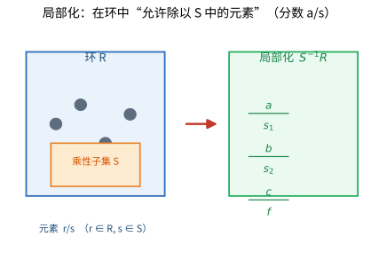

# 第 40 级：交换代数 (Commutative Algebra)

---

## 一、学习目标

完成本教程后，您应当能够：

1. **掌握交换环的基本理论**：熟练运用素理想、极大理想、幂零根、Jacobson 根、零化子、理想的扩张与收缩等核心概念。
2. **理解局部化技术**：掌握环和模的局部化构造、泛性质，以及局部性质与整体性质的转化。
3. **掌握整性理论**：理解整扩张、上升/下降定理、Noether 正规化引理和 Hilbert 零点定理的证明。
4. **区分 Noetherian 环与 Artinian 环**：掌握 Hilbert 基定理的证明，理解 Artinian 环的结构定理。
5. **理解正则序列与深度**：掌握正则序列、深度、Cohen-Macaulay 环的定义与基本性质，了解 Auslander-Buchsbaum 公式。
6. **掌握维数理论**：理解 Krull 维数、素理想的高度、Krull 主理想定理的证明，掌握多项式环的维数。
7. **理解完备化**：掌握逆向极限、环的完备化以及 Hensel 引理。
8. **了解同调方法**：了解 Tor 与 Ext、Koszul 复形和局部上同调的基本概念。
9. **能够独立完成典型例题与习题**。

---

## 二、环与理想

### 2.1 交换环回顾

**定义 2.1（交换环）** 一个**交换环**（commutative ring）是一个集合 $R$，配备加法 $+$ 和乘法 $\cdot$ 两种二元运算，满足：

1. $(R, +)$ 是阿贝尔群（加法群），记零元为 $0$；
2. 乘法交换律：$a \cdot b = b \cdot a$；
3. 乘法结合律：$(a \cdot b) \cdot c = a \cdot (b \cdot c)$；
4. 分配律：$a \cdot (b + c) = a \cdot b + a \cdot c$；
5. 存在乘法单位元 $1$ 使得 $1 \cdot a = a$ 对任意 $a \in R$ 成立。

> **💡 直观理解（类比）**：交换环就是"能像整数 $\mathbb{Z}$ 那样加减乘、且先后顺序无关紧要"的数的王国。相比整数，它允许我们没有"除法"，但加减乘和交换律、结合律、分配律这些"熟悉的算术规则"必须齐全。可以把它想成一块"万能标尺数轴"：$0$ 是起点，$1$ 是刻度单位，加法是沿着数轴移动，乘法是缩放。多项式、小数、同余类等都各自是一个交换环，交换代数学的就是一套"用加减乘即可研究的代数背景板"。

在本教程中，除非特别说明，所有环均指含幺交换环。

**例 2.1**
- 整数环 $\mathbb{Z}$。
- 域 $k$ 上的多项式环 $k[x_1, \ldots, x_n]$。
- 形式幂级数环 $k[[x_1, \ldots, x_n]]$。
- 局部环，如 $\mathbb{Z}_{(p)} = \{ a/b \in \mathbb{Q} \mid p \nmid b \}$。

### 2.2 素理想与极大理想

**定义 2.2（素理想）** 交换环 $R$ 的理想 $P$ 称为**素理想**（prime ideal），若 $P \neq R$ 且对任意 $a, b \in R$，$ab \in P$ 蕴涵 $a \in P$ 或 $b \in P$。

> **💡 直观理解（类比）**：素理想就是环里的"质数墙"：一项乘积落不落进这堵墙，取决于两个因子至少有一个落进去。这正好复刻了质数的性质——"若一个质数整除两个数的乘积，它必整除其中至少一个"。等价地，商 $R/P$ 没有零因子（是整环），也就是说在"除以这堵墙"后的世界里，两个非"零"的东西相乘仍非"零"，就像整数里非零乘非零恒非零。素理想是把"不可再分/无零因子"的干净性质挑出来的过滤器。

**定义 2.3（极大理想）** 交换环 $R$ 的理想 $M$ 称为**极大理想**（maximal ideal），若 $M \neq R$ 且不存在理想 $I$ 使得 $M \subsetneq I \subsetneq R$。

> **💡 直观理解（类比）**：极大理想是"再也塞不进更大真理想"的顶格理想。举例：$\mathbb{Z}$ 的极大理想就是 $(p)$（$p$ 为素数）——任何能卡在 $(p)$ 和整个 $\mathbb{Z}$ 之间的理想都不存在，因为 $p$ 除不出来新的因子。类比一个"已经把能装的东西都装下、塞到最满而仍不等于整个货舱"的箱子：往它里面再塞任何东西都会撑破到整个环。它是"除以它之后正好只剩算术最规整（域）"的理想。

**定理 2.1** 设 $R$ 是含幺交换环。
- $P$ 是素理想 $\iff$ $R/P$ 是整环。
- $M$ 是极大理想 $\iff$ $R/M$ 是域。

**推论** 极大理想必为素理想。反之不真，例如 $(0)$ 是 $\mathbb{Z}$ 的素理想但不是极大理想。

> **💡 直观理解（类比）**：定理 2.1 用"除法（商环）"给两类理想贴了标签：素理想这堵墙"除以之后"得到没有零因子的整环（大致像"还能整整齐齐做乘法"的算术）；极大理想这个顶格箱子"除以之后"得到所有非零元都可逆的域（算术最规整、每样东西都能除）。推论也顺理成章：域当然是没有零因子的整环，所以极大必素；倒过来不一定，比如 $\mathbb{Z}$ 里的零理想是素却不极大——因为"整环"的门槛比"域"低。类比：编号比"能算加减乘"更严格的是"还能做除法"，但能算加减乘的不一定都能除。

**Zorn 引理的应用**：每个含幺交换环 $R \neq 0$ 都至少有一个极大理想（因此也有素理想）。证明使用 Zorn 引理：考虑所有真理想的集合，按包含关系构成偏序集，链的并仍是真理想，故有极大元。

### 2.3 幂零根与 Jacobson 根

**定义 2.4（幂零元）** 元素 $a \in R$ 称为**幂零元**（nilpotent），若存在正整数 $n$ 使得 $a^n = 0$。

> **💡 直观理解（类比）**：幂零元是"自己擦自己就会归零"的元素：它不断自乘，$n$ 次后就变成 0。在模 $p$ 的算术里，$p$ 的倍数（如 $p$, $p^2$）往往是幂零的；在形式幂级数里，次数 ≥1 的项常是幂零的。可以类比一根"每次点燃都会烧掉一截、烧尽只剩灰烬（0）"的蜡烛；或代数学里的"小扰动"——反复叠加它，最终把影响消除得干干净净。它是刻画"退化/塌缩"现象的探针。

**定义 2.5（幂零根）** 交换环 $R$ 的**幂零根**（nilradical）定义为所有幂零元构成的集合，记作 $\operatorname{Nil}(R)$ 或 $\sqrt{0}$。

> **💡 直观理解（类比）**：幂零根就是把"所有自乘若干次会归零的坏蛋"统统集中起来的一个集合（同时也是理想）。它像给环做一次"排毒体检"：把所有终将把自己耗成灰烬（幂零）的元素标记出来。后面定理 2.2 会揭示它的妙处——这个集合恰好也是"所有素理想都管着的那片禁区"（所有素理想的交集），从而把"哪些东西逃不掉素理想的掌勺"刻画出来。

**定理 2.2** 幂零根等于所有素理想的交集：
$$\operatorname{Nil}(R) = \bigcap_{P \text{ 素理想}} P$$

**证明**：若 $a$ 幂零，则 $a^n = 0 \in P$，由素理想的定义知 $a \in P$，故 $\operatorname{Nil}(R) \subseteq \bigcap P$。

反之，若 $a$ 不幂零，考虑集合 $\Sigma = \{ I \trianglelefteq R \mid a^n \notin I, \forall n \geq 1 \}$。由 Zorn 引理，$\Sigma$ 有极大元 $P$，可证 $P$ 是素理想且 $a \notin P$。$\square$

> **💡 直观理解（类比）**：定理 2.2 是一句漂亮的"字典式结论"：一个元素是幂零的，当且仅当它落在**每一个**素理想里。直觉上是"逃不掉"原则：凡不幂零的元素 $a$，总能找到一块素理想墙把它挡在墙外（Zorn 精心挑出那个特殊的素理想）；反过来一旦幂零，任何素理想墙都拦不住它（$a^n=0$ 已落在墙内）。这就像说"在所有'质数关卡'上都通行的元素，其实早已是被消磨归零的元素"。它把抽象的"幂零"翻译成遍布整个素谱的"处处通行/处处拦截"。

**定义 2.6（Jacobson 根）** 环 $R$ 的 **Jacobson 根**（Jacobson radical）定义为所有极大理想的交集，记作 $J(R)$：
$$J(R) = \bigcap_{M \text{ 极大理想}} M$$

**性质 2.1**
- $\operatorname{Nil}(R) \subseteq J(R)$。
- $x \in J(R) \iff 1 - xy$ 是 $R$ 中的可逆元对任意 $y \in R$ 成立。
- 若 $R$ 是有限生成 $R$-模（如 Artin 环），则 $J(R) = \operatorname{Nil}(R)$。

> **💡 直观理解（类比）**：Jacobson 根是所有**极大理想**的交集，比只看素理想的幂零根"更靠顶、更严苛"。它集齐了"一直在最顶层把守的最后一道关卡"的公共区域。性质中有一把实用钥匙：$x\in J(R)$ 等价于"对任意 $y$，$1-xy$ 都可逆"——意思是 $x$ 处于"极小的不可逆边缘区"，任何微小扰动都补不回一个不可逆的失败，从而总保持可逆。类比"几乎恒等但有轻微不可逆隐患的数字"集合。两个根的关系 $\mathrm{Nil}(R)\subseteq J(R)$ 说明：更大一批坏蛋（幂零）当然也都在最后的关卡里。

### 2.4 零化子

**定义 2.7（零化子）** 设 $M$ 是 $R$-模。对子集 $S \subseteq M$，定义
$$\operatorname{Ann}_R(S) = \{ r \in R \mid rs = 0, \forall s \in S \}$$
这是 $R$ 的一个理想。对元素 $m \in M$，记 $\operatorname{Ann}_R(m) = \{ r \in R \mid rm = 0 \}$。

> **💡 直观理解（类比）**：零化子是"把所有会把这些对象一并压成零的操作"收集起来。$\operatorname{Ann}_R(S)$ 就是"哪些 $r$ 一乘上 $S$ 里所有元素就全体归零"的集合，它总是一个理想。类比"上了保险丝就保护全部灯都不亮"——$\mathrm{Ann}$ 描述的是模里的元素们的"公共被杀点"。若 $M$ 是 faithful（零化子只有 0），说明没有任何一个非零操作能把 $M$ 整片归零，$M$ 的信息足够丰富，能让环本人嵌进它的自同态环里（$M$ 像一面"照得出整个环的镜子"）。

**性质 2.2**
- $\operatorname{Ann}_R(M)$ 是 $R$ 的理想。
- 若 $M$ 是 faithful 模（即 $\operatorname{Ann}_R(M) = 0$），则 $R$ 可嵌入 $\operatorname{End}_\mathbb{Z}(M)$。
- 对素理想 $P$，称 $P$ 是 $M$ 的**相伴素理想**（associated prime），若存在 $m \in M$ 使得 $P = \operatorname{Ann}_R(m)$。

### 2.5 理想的扩张与收缩

设 $\varphi: A \to B$ 是环同态。

**定义 2.8（扩张与收缩）**
- 对 $A$ 的理想 $I$，$I$ 的**扩张**（extension）为 $I^e = \varphi(I)B = \{ \sum \varphi(a_i)b_i \mid a_i \in I, b_i \in B \}$，这是 $B$ 的理想。
- 对 $B$ 的理想 $J$，$J$ 的**收缩**（contraction）为 $J^c = \varphi^{-1}(J)$，这是 $A$ 的理想。

> **💡 直观理解（类比）**：扩张与收缩是环同态 $\varphi:A\to B$ 传送理想的两条传送带。**扩张**$I^e$：把 $A$ 里的理想 $I$ 顺着 $\varphi$ 带进 $B$，再让 $B$ 的所有元素都能乘进来，生成 $B$ 里的一个理想——像"把 A 的规矩迁入 B 并允许 B 任意缩放"。**收缩**$J^c$：把 $B$ 里的理想 $J$ 顺着 $\varphi$"拉回"，只留下 $A$ 中那些 $B$ 性很强、一定被映射进 $J$ 的元素——像"看看到底是谁的 A 元素留在了 B 的禁区里"。一扩一缩正好是一对"去"与"回"的通道。

**性质 2.3**
- $I \subseteq I^{ec}$，$J \supseteq J^{ce}$。
- 收缩映射保持素理想：若 $J$ 是 $B$ 的素理想，则 $J^c$ 是 $A$ 的素理想。
- 扩张映射不一定保持素理想。例如 $\mathbb{Z} \hookrightarrow \mathbb{Q}$ 中，$(0)$ 的扩张仍是 $(0)$，但 $\mathbb{Z}$ 中非零素理想的扩张都成为 $\mathbb{Q}$ 的整个环。

**定理 2.3（理想对应）** 对环同态 $\varphi: A \to B$，收缩映射 $\operatorname{Spec} B \to \operatorname{Spec} A$ 是连续的（在 Zariski 拓扑下），扩张映射则不一定。

> **💡 直观理解（类比）**：这条定理说"拉回"（收缩）素理想是一个行为良好的操作，而"推出去"（扩张）会破坏素性。把 $\mathrm{Spec}$（素理想全体）想成一块"理想地理图"，$\varphi$ 让 $B$ 的地理有办法"投影"回 $A$ 的地理：每当地图上 $B$ 有个素理想，把它拉回 $A$ 后仍是素理想（因为素性在拉回时冻得住），这种投影还保持连续性。反过来把 $A$ 的素理想推到 $B$，往往"一张整环的墙会被 B 的更大空间稀释成整个环"，素性就丢了。好比"回收站"（收缩）规矩些，而"批发扩散"（扩张）容易把结构冲淡。

---

## 三、局部化

### 3.1 乘性子集与局部化构造

**定义 3.1（乘性子集）** 环 $R$ 的子集 $S \subseteq R$ 称为**乘性子集**（multiplicative subset），若 $1 \in S$ 且 $S$ 对乘法封闭（即 $s, t \in S \Rightarrow st \in S$）。

**例 3.1**
- $S = \{ 1, f, f^2, f^3, \ldots \}$，其中 $f \in R$。
- $S = R \setminus P$，其中 $P$ 是素理想。
- $S = R \setminus \bigcup_{i=1}^n P_i$，其中 $P_i$ 是素理想。

> **💡 直观理解（类比）**：乘性子集就是"一块允许当作分母的合法数字牌"：必须含有 $1$（因为除以 1 从不犯规），且对乘法封闭（合法的分母乘合法的分母仍是合法的分母）。它像一批"可以放心放到分数线下"的特权分子。常见的三种：只取某个 $f$ 的一切幂（局部放大概某一个元素）；取"某个素理想补集"（一切不在某墙内的元素——看局部时的分母）；取若干素理想补集的交。选定 $S$ 就等于宣布"下面的局部化只在这个合法的分母家族里进行"。

**定义 3.2（局部化）** 设 $S$ 是 $R$ 的乘性子集。在集合 $R \times S$ 上定义等价关系：
$$(r, s) \sim (r', s') \iff \exists t \in S \text{ 使得 } t(rs' - r's) = 0$$
记等价类为 $r/s$。所有等价类的集合记为 $S^{-1}R$，称为 $R$ 关于 $S$ 的**局部化**（localization）。在 $S^{-1}R$ 上定义：
$$\frac{r}{s} + \frac{r'}{s'} = \frac{rs' + r's}{ss'}, \quad \frac{r}{s} \cdot \frac{r'}{s'} = \frac{rr'}{ss'}$$
则 $S^{-1}R$ 构成含幺交换环，称为 $R$ 关于 $S$ 的**分式环**。

**注**：当 $R$ 是整环且 $S = R \setminus \{0\}$ 时，$S^{-1}R$ 就是 $R$ 的**分式域**。

**特殊情形**：
- 当 $S = \{1, f, f^2, \ldots\}$ 时，记 $S^{-1}R = R_f$。
- 当 $S = R \setminus P$（$P$ 素理想）时，记 $S^{-1}R = R_P$，称为 $R$ 在 $P$ 处的**局部化**。



> **直观理解（现实类比）**：把局部化想成"放大镜"或"只看局部"。环 $R$ 是整个世界，乘性子集 $S$ 是你允许"除以"的某些数（比如 $S=\{1,f,f^2,\ldots\}$）。$S^{-1}R$ 就是在这个基础上把 $S$ 中的每个元素都"激活"成分母、使其变为可逆元后，造出的分数世界 $r/s$。这就像你用放大镜只盯着地图上的某个局部：很远处的整体纠缠被忽略，而眼前这一点的精细结构被无限放大——局部-全局原理正是靠这种"局部放大"来反推整体性质的。

### 3.2 泛性质

**定理 3.1（局部化的泛性质）** 设 $S$ 是 $R$ 的乘性子集，则存在环同态 $\iota: R \to S^{-1}R$，$\iota(r) = r/1$，满足：
1. 对任意 $s \in S$，$\iota(s)$ 在 $S^{-1}R$ 中可逆。
2. 对任意环同态 $\varphi: R \to T$，若 $\varphi(s)$ 在 $T$ 中可逆对任意 $s \in S$ 成立，则存在唯一的环同态 $\tilde{\varphi}: S^{-1}R \to T$ 使得 $\tilde{\varphi} \circ \iota = \varphi$。

```
            R
          /   \
         /     \
        /       \
       ∨         ∨
    S^{-1}R ----> T  (唯一)
```

> **🧠 思考历程：把"某类分母"一次性合法化，为什么能拆开整个环的秘密？**
>
> 局部化是交换代数里最贴心也最锋利的手术：**挑出一个乘性子集 $S$，把其中的元素全部变成可逆元，得到新环 $S^{-1}R$**。它把一个整体太大、难以撬动的环，切成一块块"就地可解方程"的局部。
>
> - **从整数到有理数：人人早已用过的隐局**。回忆分数是怎么来的：为了让每个非零整数"可逆"，我们允许"分母不为 0"的分式，得到 $\mathbb{Q}=S^{-1}\mathbb{Z}$（其中 $S=\mathbb{Z}\setminus\{0\}$）。**局部化就是把这种"请进逆元"的办法推广到任意环**——$s\in S$ 都能求倒数。
> - **为什么"除掉一些素理想"如此自然**。若取 $S=R\setminus\mathfrak{p}$（$\mathfrak{p}$ 素理想），局部化 $R_\mathfrak{p}$ 就成了**局部环**（唯一极大理想）。把环摆在某个素理想"旁边"看，"最坏/最大的一块"显形，很多抽象性质变得好办——**这是代数几何"只看某一点周围"的代数化身**。
> - **泛性质：把我要的可逆钉死**。$S^{-1}R$ 满足"只要映射把所有 $s\in S$ 变得可逆，就能唯一穿过它"（见上方交换图）。**一个泛性质就确定了 $S^{-1}R$ 的本质**——这种"由它和所有旁环的关系来定义"的精神，是范畴思想在环论里最早的落地。
> - **"局部性质 + 全局拼回"原则**。很多性质（如有限生成、平坦等）能在所有 $R_\mathfrak{p}$ 上验证，再拼回整个 $R$（3.5）。**证明巧处：难点先在特殊位置放大，再全局回收**，让交换代数与代数几何的局部/整体分而治之。
> - **心路**：局部化告诉你：**与其硬碰整个大对象，不如"借一个能让自己可逆的场景"分块撬动**。学会"挑选合适的乘性子集、让难题局部显形"，是交换代数乃至代数几何最典型的破题姿势。

### 3.3 模的局部化

**定义 3.3（模的局部化）** 设 $M$ 是 $R$-模，$S$ 是乘性子集。在集合 $M \times S$ 上定义等价关系：
$$(m, s) \sim (m', s') \iff \exists t \in S \text{ 使得 } t(sm' - s'm) = 0$$
记等价类为 $m/s$。所有等价类的集合 $S^{-1}M$ 构成 $S^{-1}R$-模，称为 $M$ 关于 $S$ 的**局部化**。

> **💡 直观理解（类比）**：模的局部化是"把模也做成'带分数的世界'"。对一个 $R$-模 $M$，同样允许 $S$ 作分母，得到分式 $(m/s)$ 的集合 $S^{-1}M$。它复制了之前给环开"分数户口"的手法，只是把分子换成 $M$ 里的元素。性质里藏着一个东西：$S^{-1}M\cong S^{-1}R\otimes_R M$（用张量积去"换分母币"），且局部化保住正合序列（接收正合是平坦模标志）。一句直白的话：局部化就像"把摄影师团队（模）也搬进放大镜世界，放大镜下的好坏跟原来一致"。

**性质 3.1**
- $S^{-1}M \cong S^{-1}R \otimes_R M$。
- 局部化是正合函子：若 $0 \to M' \to M \to M'' \to 0$ 正合，则 $0 \to S^{-1}M' \to S^{-1}M \to S^{-1}M'' \to 0$ 正合（即 $S^{-1}R$ 是平坦 $R$-模）。

### 3.4 局部性质

**定义 3.4（局部性质）** 称模 $M$ 的性质 $\mathcal{P}$ 是**局部性质**（local property），若 $M$ 满足 $\mathcal{P}$ 当且仅当对任意素理想 $P$，$M_P$ 满足 $\mathcal{P}$。

> **💡 直观理解（类比）**：局部性质是"在每个放大点看都成立，就等于整体成立"的祖传性质。"在每一个素理想 $P$ 处局部化后 $M_P$ 都有性质 $\mathcal P$"，当且仅当"$M$ 本尊有性质 $\mathcal P$"。这就像一块布料的"防泼水"：只要在每一个斑点测都不渗，整块布就都不渗。这类性质非常好用，因为它们允许把"全局成立"化难为易地拆到每一点去验证。

**定理 3.2（局部性质举例）**
- $M = 0$ 是局部性质：$M = 0 \iff$ 对所有素理想 $P$，$M_P = 0$。
- $M$ 是平坦模是局部性质。
- 单射 $N \to M$ 是局部性质：$N \to M$ 是单射 $\iff$ 对所有素理想 $P$，$N_P \to M_P$ 是单射。

**证明**：若 $M \neq 0$，取 $0 \neq m \in M$。令 $\operatorname{Ann}(m)$ 是 $R$ 的真理想，则存在极大理想 $M$ 包含 $\operatorname{Ann}(m)$。在 $M_{\mathfrak{m}}$ 中，$m/1 \neq 0$，故 $M_{\mathfrak{m}} \neq 0$。$\square$

> **💡 直观理解（类比）**：定理 3.2 举了几个典型的局部性质：模是零、平坦、单射都能"逐点放大验证"。之中最有画面感的是"$M=0$ 当且仅当到处都是 $0$"：一个非零元素 $m$ 总有一个极大理想 $\mathfrak m$ 存得了它（$m/1\neq0$ 存留在 $M_{\mathfrak m}$ 里），所以只要有一处局部不是零，整体就不可能是零。这就像"只要有一个房间还亮着灯，整栋楼就不是全黑"——零点可以在任何一处被抓现行，因而无处藏身。

### 3.5 局部-全局原理

**定理 3.3（局部-全局原理）** 设 $M$ 是有限生成 $R$-模。则：
1. $M = 0 \iff M_{\mathfrak{m}} = 0$ 对所有极大理想 $\mathfrak{m}$ 成立。
2. 序列 $M' \to M \to M''$ 正合 $\iff$ 对所有极大理想 $\mathfrak{m}$，局部化序列 $M'_{\mathfrak{m}} \to M_{\mathfrak{m}} \to M''_{\mathfrak{m}}$ 正合。
3. $M$ 是投射模 $\iff$ $M_{\mathfrak{m}}$ 是自由 $R_{\mathfrak{m}}$-模对所有极大理想 $\mathfrak{m}$ 成立（当 $R$ 是 Noetherian 环时）。

> **💡 直观理解（类比）**：局部-全局原理是前面局部性质的"官方总宣言"，对有限生成模特别灵验：此刻只看**极大理想**（更少、更刁钻的本质看点）就够，且三类重要性质（是零、正合、投射）都能"处处局部成立 $\iff$ 整体成立"。这正如体检报告上一句宽心话：只要每到一家权威医院（每个极大理想处局部化）查都指出没问题，那整个对象就真的没问题。有限生成这个"规模不大"的前提，正是让"多边形拼图"由局部能拼回全局的关键——规模太大时，拼图可能出现"每一小块都对、整体却错"的陷阱。

---

## 四、整性

### 4.1 整扩张

**定义 4.1（整元素）** 设 $A \subseteq B$ 是环的扩张。元素 $b \in B$ 称为在 $A$ 上**整**（integral over $A$），若存在首一多项式
$$f(x) = x^n + a_1 x^{n-1} + \cdots + a_n \in A[x]$$
使得 $f(b) = 0$。

> **💡 直观理解（类比）**：元素 $b$ 在 $A$ 上"整"，是指 $b$ 满足一条**首一多项式方程**（最高次项系数为 1）$b^n+a_1b^{n-1}+\cdots+a_n=0$，系数全都来自 $A$。这相当于"$b$ 是 $A$ 代数地'代数地受控'的数"：它虽然待在更大的环 $B$ 里，却有一条系数出自 $A$ 的多项式把它"按住"。类比整数里的 $\sqrt{2}$：它满足 $x^2-2=0$（首一、系数是整数），所以 $\sqrt2$ 是 $\mathbb{Z}$ 上的整元素；而 $\frac12$ 满足 $2x-1=0$ 但不首一（最高次系数是 2），故不是整数意义下的"整"。整元素就是把"代数整数"这个概念推广到任意环扩张。

**定义 4.2（整扩张）** 若 $B$ 中每个元素都在 $A$ 上整，则称 $B$ 是 $A$ 的**整扩张**（integral extension），记作 $B/A$ 是整扩张。

> **💡 直观理解（类比）**：整扩张就是"每个新来者都被旧环的多项式盖章"的扩张：$B$ 里随便捡一个 $b$，都能用系数全在 $A$ 里的首一方程给死死按住，没有任何"无编制外来户"。类比一个封闭的村庄：村子里长出来的每一个人（$A\subset$ 里已有的）天经地义，而所有新搬进来的居民（$B$ 的元素）都必须在村里这套家谱（$A$ 的多项式）中排得上号、满足一条首一方程才被承认。B 相对 A 不存在"代数外来的野数"，两个环"身高差"被这种整性协议牢牢约束，几何上表现为"谱"覆盖关系整齐。

**定理 4.1（整元素的等价刻画）** 以下陈述等价：
1. $b \in B$ 在 $A$ 上整。
2. $A[b]$ 是有限生成 $A$-模。
3. $A[b]$ 包含在 $B$ 的某个有限生成 $A$-子模中。
4. 存在忠实 $A[b]$-模 $M$ 是有限生成 $A$-模。

**证明**：
$(1) \Rightarrow (2)$：若 $b^n + a_1 b^{n-1} + \cdots + a_n = 0$，则 $A[b]$ 由 $1, b, \ldots, b^{n-1}$ 生成。
$(2) \Rightarrow (3)$：取 $M = A[b]$ 即可。
$(3) \Rightarrow (4)$：取 $M = A[b]$，注意 $A[b]$ 是忠实 $A[b]$-模。
$(4) \Rightarrow (1)$：设 $M$ 由 $m_1, \ldots, m_k$ 生成。则对每个 $i$，$b m_i = \sum a_{ij} m_j$。令 $A$ 为矩阵 $(a_{ij})$，则 $b$ 满足特征多项式 $\det(bI - A) = 0$。$\square$

> **💡 直观理解（类比）**：定理 4.1 把"整"这个条件换成了四种等价说法，核心是"有限性"：$b$ 整 $\iff$$A[b]$（加进 $b$ 后生成的环）在 $A$ 上"有限生成"——只需 $1,b,\dots,b^{n-1}$ 有限的 $n$ 个生成元就撑得起来。这很像判断一个人是不是在某栋楼里"管得过"：只要所有他衍生的东西都能由有限几间样板房（$1,b,\ldots,b^{n-1}$）拼出来，就说明这个居民受到严格约束（整）。等价刻画里用的"有限生成模 + 特征多项式"技巧，正是把"受控"翻译成"有限维度"。

**推论 4.1** 若 $b_1, b_2 \in B$ 在 $A$ 上整，则 $b_1 \pm b_2$ 和 $b_1 b_2$ 也在 $A$ 上整。因此 $B$ 中所有在 $A$ 上整的元素构成 $B$ 的子环，称为 $A$ 在 $B$ 中的**整闭包**（integral closure）。

> **💡 直观理解（类比）**：这条推论说明"整这一属性对加、减、乘都封闭"，于是 $A$ 在 $B$ 中的所有整元素能拢成一个子环——**整闭包**。类比集邮或收藏：只要每个人都是在 $A$ 家谱里排得上号（整）的有名有姓者，那么他们之间的加减乘（$b_1\pm b_2$、$b_1b_2$）结果依然有名有姓（仍整），所以这些"正经居民"自动围成一个村子。整数环的例子：$\mathbb{Q}$ 里所有代数整数恰好构成"代数整数的环"$\overline{\mathbb{Z}}$。当整闭包恰好等于 $A$ 自己时，$A$ 就称为**整闭环**——一个自足、封合、本身不再向外长新的整元素的"完全体"。

### 4.2 上升定理

**定理 4.2（Going-Up 定理）** 设 $A \subseteq B$ 是整扩张，$P$ 是 $A$ 的素理想。则存在 $B$ 的素理想 $Q$ 使得 $Q \cap A = P$（即 $Q$ 落在 $P$ 上方）。

**证明**：考虑局部化 $A_P$ 和 $B_P = (A \setminus P)^{-1}B$。由于 $A \subseteq B$ 是整扩张，$A_P \subseteq B_P$ 也是整扩张。取 $B_P$ 的极大理想 $Q'$（存在），则 $Q' \cap A_P$ 是 $A_P$ 的极大理想，即 $P A_P$。令 $Q$ 为 $Q'$ 在 $B$ 中的原像，则 $Q \cap A = P$。$\square$

> **💡 直观理解（类比）**：Going-Up 定理就是"整扩张让谱的覆盖关系向上够得着"。它说：只要 $B/A$ 是整扩张，那么 $A$ 里随便一个素理想 $P$，在 $B$ 里都"压得住一个卫兵"$Q$——$Q$ 与 $A$ 的交恰好是 $P$（即 $Q$ "落"在 $P$ 正上方）。打个比方：把 $A$ 想成地基图纸，$B$ 想成在上面加高的整座楼。由于整扩张约束"新来的材料都遵循旧地基的规矩"，所以图纸上的每一根承重柱（$P$）在楼上都能找到一根扛着它的立柱（$Q$）。几何直觉就是：整扩张是"整族覆盖"（在谱的意义上处处都在 $P$ 上方无空洞），这是它区别于一般扩张的关键品格。

**定理 4.3（Going-Up 定理，提升版本）** 设 $A \subseteq B$ 是整扩张，$P_1 \subseteq \cdots \subseteq P_n$ 是 $A$ 的一串素理想，$Q_1 \subseteq \cdots \subseteq Q_m$（$m < n$）是 $B$ 的一串素理想，且 $Q_i \cap A = P_i$ 对 $i \leq m$。则可将 $Q$ 扩充到 $Q_{m+1} \subseteq \cdots \subseteq Q_n$ 使得 $Q_j \cap A = P_j$。

> **💡 直观理解（类比）**：这是 Going-Up 的"整条楼梯"版本。前面告诉你"每个柱子 $P$ 都能在楼上对上一根立柱 $Q$"，这里进一步保证：如果 $A$ 里的柱子排成了阶梯 $P_1\subseteq P_2\subseteq\cdots$，并且你已经把前几根在楼上对应接好了（$Q_i\cap A=P_i$），那么剩下的台阶也能顺着已有的楼梯一个接一个地接上来，绝不断档。类比搭乐高塔：只要下面的"基座台阶"已经逐级扣好，塔就能一层层往上垒，不必担心上面的台阶没有落点。这就是整扩张下素理想"向上延续"的无障碍性质。

### 4.3 下降定理

**定理 4.4（Going-Down 定理）** 设 $A \subseteq B$ 是整扩张，且 $A$ 是整闭整环（即 $A$ 在其分式域中整闭），$B$ 是整环。则对 $A$ 的素理想 $P_1 \subseteq P_2$ 和 $B$ 的素理想 $Q_2$ 满足 $Q_2 \cap A = P_2$，存在 $B$ 的素理想 $Q_1 \subseteq Q_2$ 使得 $Q_1 \cap A = P_1$。

**证明**：考虑 $A_{P_1}$ 和 $B_{P_1} = (A \setminus P_1)^{-1}B$。可证 $B_{P_1}$ 中位于 $P_1$ 上方的素理想与 $B$ 中收缩到 $P_1$ 的素理想一一对应。关键在于 $A_{P_1}$ 是整闭的（因为 $A$ 整闭且 $P_1$ 是素理想），从而 $A_{P_1} \subseteq B_{P_1}$ 满足下降条件。$\square$

> **💡 直观理解（类比）**：Going-Down 是"向上延续"的镜像：只要地基 $A$ 是整闭环（在分式域中整闭），那么楼上已有的立柱 $Q_2$ 也能向下"顺藤摸瓜"找到覆盖 $P_1$ 的矮柱 $Q_1$（$Q_1\subseteq Q_2$ 且 $Q_1\cap A=P_1$）。这好比一张精密的图纸：如果上游的管线位置已经对齐，那么下游的管线也一定能在楼里找到对应走向，不会悬空。它与 Going-Up 的关键差别在于多了一个"整闭"的前提——只有当地基字母表足够"完整"（整闭），向下找齐才总能成功。整闭性保障了谱在垂直方向上既向上无缝、也向下严丝合缝。

### 4.4 Noether 正规化引理

**定理 4.5（Noether 正规化引理）** 设 $k$ 是域，$A = k[x_1, \ldots, x_n]/I$ 是有限生成 $k$-代数（$I$ 是理想）。则存在 $k$ 上的代数无关元 $y_1, \ldots, y_d \in A$ 使得：
1. $A$ 是 $k[y_1, \ldots, y_d]$ 的有限生成模（即整扩张）。
2. $d = \dim A$（Krull 维数）。

**证明思路**：对 $n$ 归纳。若 $x_1, \ldots, x_n$ 在 $A$ 中代数相关，存在非零多项式 $f \in k[t_1, \ldots, t_n]$ 使得 $f(x_1, \ldots, x_n) = 0$。通过适当的线性变换（如 $x_i' = x_i - x_1^{r_i}$），可将 $f$ 化为关于 $x_1$ 的首一多项式，从而 $x_1$ 在 $k[x_2', \ldots, x_n']$ 上整。重复此过程直到找到代数无关元。$\square$

> **💡 直观理解（类比）**：Noether 正规化引理说的是"有限生成代数总能被一些清清爽爽的自由变量所统治"。任意一个由 $x_1,\dots,x_n$ 生成、受到理想 $I$ 约束的代数 $A$，总能找到 $d$ 个"彼此毫无牵连"的代数无关元 $y_1,\dots,y_d$，使 $A$ 成为多项式环 $k[y_1,\dots,y_d]$ 的整扩张。类比整理一间堆满家具、有线缆缠绕的屋子：总能重新排线（线性变换），把互相纠缠的线头解开，找到 $d$ 根完全独立的"主干电线"（代数无关元），其余电线都只是从主线上接出来的"支线"（整依赖）。它把复杂的有限生成代数归约到多项式环这个已知对象上，维数 $d$ 就是代数真正的"自由度"。

### 4.5 Hilbert 零点定理

**定理 4.6（Hilbert 零点定理，弱形式）** 设 $k$ 是代数闭域，$I \subsetneq k[x_1, \ldots, x_n]$ 是真理想。则存在 $a = (a_1, \ldots, a_n) \in k^n$ 使得 $f(a) = 0$ 对所有 $f \in I$ 成立。

> **💡 直观理解（类比）**：弱零点定理说："一群多项式只要不把整个坐标系憋死（$I$ 是真理想），就必然共享至少一个公共零点 $a$。" 用生活眼光看：如果几台"关于点的检测仪器"（多项式）在任何一点上都不同时警报为零，那它们在代数上就完全自由（生成整个环 $I=R$）。换句话说——非平凡的多项式约束必成体系地"掐住"某个共同的点。这正是代数几何"方程组的解非空的判定准则"：想知道一批齐次/非齐次方程是否有公共解，只要看它们生成的理想是不是真理想即可。代数闭域之所以必要，就像必须在"所有根都长得开"的场地（$\mathbb{C}$）里方程零点才不会漏。

**定理 4.7（Hilbert 零点定理，强形式）** 设 $k$ 是代数闭域，$I \subseteq k[x_1, \ldots, x_n]$ 是理想，$V(I) = \{ a \in k^n \mid f(a) = 0, \forall f \in I \}$ 是代数集。则
$$\operatorname{I}(V(I)) = \sqrt{I}$$
其中 $\operatorname{I}(V(I)) = \{ f \in k[x_1, \ldots, x_n] \mid f(a) = 0, \forall a \in V(I) \}$ 是 $V(I)$ 的消没理想，$\sqrt{I}$ 是 $I$ 的根。

**证明**：显然 $\sqrt{I} \subseteq \operatorname{I}(V(I))$。反之，设 $f \in \operatorname{I}(V(I))$，即 $f$ 在 $V(I)$ 上恒为零。考虑环 $k[x_1, \ldots, x_n, t]$ 和理想 $J = (I, 1 - tf)$。若 $V(J)$ 非空，取 $(a, b) \in V(J)$，则 $a \in V(I)$ 且 $1 - b f(a) = 0$，但 $f(a) = 0$ 导出 $1 = 0$，矛盾。故 $V(J) = \varnothing$。由弱零点定理，$J = k[x_1, \ldots, x_n, t]$，即 $1 \in J$。于是
$$1 = \sum g_i f_i + h(1 - tf), \quad f_i \in I, g_i, h \in k[x_1, \ldots, x_n, t]$$
代入 $t = 1/f$（在分式域中考虑），得 $1 = \sum g_i(x, 1/f) f_i(x)$。两边乘以 $f^N$（$N$ 充分大），得 $f^N \in I$。$\square$

> **💡 直观理解（类比）**：强零点定理把"零点"与"理想"彻底焊在一起：一个多项式 $f$ 在零点是 $V(I)$ 上处处为零，当且仅当 $f$ 的某次幂 $f^N$ 落在 $I$ 里（$f\in\sqrt I$）。换句话说，"在一个多点集合上消失"和"属于这些点定义的理想之根"完全等价。类比几何直观：若 $f$ 在所有 $V(I)$ 的点上都为零，说明 $f$ "被 $I$ 的零点压成灰"去不高——它虽然不必整整齐齐是 $I$ 的元素，但某次幂必然被 $I$ 吸收。这堪称代数-几何的"字典"，让曲面的零化理想与根理想一一对上，是代数几何的基石对应定理。

**推论 4.2（Hilbert 零点定理的等价形式）** 设 $k$ 是代数闭域，则映射
$$V \longmapsto \operatorname{I}(V) = \{ f \in k[x_1, \ldots, x_n] \mid f|_V = 0 \}$$
建立了 $k^n$ 中代数集与 $k[x_1, \ldots, x_n]$ 中根理想之间的一一对应。特别地，$k^n$ 中的点对应极大理想 $(x_1 - a_1, \ldots, x_n - a_n)$。

> **💡 直观理解（类比）**：这是零点定理最漂亮的"字典式"表述：代数子集 $V$ 与根理想 $\mathfrak a$ 构成一一对应——因为每个代数集都能用根理想恢复（$V=\sqrt{\mathfrak a}$ 的零集），每个根理想也能由代数集唯一反推（$\mathfrak a=\operatorname{I}(V)$）。这正是"几何对象"和"代数对象"互不丢失的双向翻译。特别地，坐标空间里的一个单点 $a=(a_1,\dots,a_n)$ 对应"同时杀 $x_i-a_i$"的极大理想 $(x_1-a_1,\dots,x_n-a_n)$——点的原子性恰与极大理想的"最顶端"地位吻合，是后续把代数簇看成素谱的伏笔。

---

## 五、Noetherian 环与 Artinian 环

### 5.1 Noetherian 环

**定义 5.1（Noetherian 环）** 环 $R$ 称为 **Noetherian 环**（Noetherian ring），若它满足以下等价条件之一：
1. （升链条件）每个理想升链 $I_1 \subseteq I_2 \subseteq \cdots$ 最终稳定（即存在 $n$ 使得 $I_n = I_{n+1} = \cdots$）。
2. （有限生成条件）每个理想都是有限生成的。
3. （极大条件）每个非空理想集合都有极大元。

> **💡 直观理解（类比）**：Noetherian 环就是"理想不再无限砌高"的环。三种等价说法是同一回事的三副眼镜：①升链条件——任何理想台阶 $I_1\subseteq I_2\subseteq\cdots$ 最终站定，不会永远往上涨；②有限生成——每个理想都"能说清由几个元素撑起"，没有捉摸不透的无底理想；③极大条件——任何一堆理想里都挑得出最大的一颗。类比每一件东西都能"用有限句话描述"的整洁仓库：没有要无穷多货物才能撑起的角落。整数环 $\mathbb{Z}$、多项式环都满足，而这正是后面 Hilbert 基定理、维数理论能顺畅展开的地基。

**例 5.1**
- 域 $k$ 是 Noetherian 环。
- 主理想整环（如 $\mathbb{Z}$、$k[x]$）是 Noetherian 环。
- 多项式环 $k[x_1, \ldots, x_n]$ 是 Noetherian 环（Hilbert 基定理）。

### 5.2 Hilbert 基定理

**定理 5.1（Hilbert 基定理）** 若 $R$ 是 Noetherian 环，则多项式环 $R[x]$ 也是 Noetherian 环。

**证明**：设 $I \subseteq R[x]$ 是理想。定义 $R$ 中理想 $J_n$ 为
$$J_n = \{ a \in R \mid \exists f \in I, \deg f = n, \text{首项系数为 } a \} \cup \{0\}$$
则 $J_n \subseteq J_{n+1}$（因为乘以 $x$ 可将 $n$ 次多项式提升为 $n+1$ 次）。由 $R$ 的 Noetherian 性，存在 $m$ 使得 $J_m = J_{m+1} = \cdots$。

对每个 $n \leq m$，$J_n$ 是有限生成的，设生成元为 $a_{n1}, \ldots, a_{nk_n}$，取 $f_{ni} \in I$ 为首项系数为 $a_{ni}$ 的 $n$ 次多项式。断言 $I$ 由 $\{ f_{ni} \mid 0 \leq n \leq m, 1 \leq i \leq k_n \}$ 生成。

对任意 $g \in I$，设 $\deg g = d$，首项系数为 $a$。若 $d \leq m$，则 $a \in J_d$，可减去 $f_{di}$ 的线性组合降低次数。若 $d > m$，则 $a \in J_d = J_m$，故 $a = \sum r_i a_{mi}$。考虑 $g - \sum r_i x^{d-m} f_{mi}$，其次数降低。由归纳法，$g$ 可由 $\{f_{ni}\}$ 生成。$\square$

> **💡 直观理解（类比）**：Hilbert 基定理说"多项式环不捣乱"：$R$ 做好了（Noetherian），加一个变量造出 $R[x]$ 也没把它做坏——每个理想依然有限生成。直觉是：一个 $R[x]$ 里的理想，通过反复"盯着各次最高项系数"并借 $R$ 的有限生成立即压住，就能用有限多个多项式撑起来。类比"好基因延续"：只要父本（$R$）健康，加一个自由维度（$x$）生出"子空间"$R[x]$ 依然健康。这条定理是多项式环、乃至 $k[x_1,\dots,x_n]$ 全部 Noetherian 性的源头，也是代数定理能逐个变量归纳铺开的杠杆。

**推论 5.1** 若 $R$ 是 Noetherian 环，则 $R[x_1, \ldots, x_n]$ 是 Noetherian 环。

> **💡 直观理解（类比）**：这是对 Hilbert 基定理做 $n$ 次迭代的"顺水推舟"版本：$R$ Noetherian $\Rightarrow R[x_1]$ Noetherian $\Rightarrow R[x_1,x_2]$ Noetherian $\Rightarrow\cdots$。类比好基因逐代遗传：每一代加上一个干净的坐标轴（$x_i$）都不会把 Noetherian 性弄脏，于是有限维多项式环 $R[x_1,\dots,x_n]$ 永远健康。这正是"有限生成代数是 Noetherian 的"这一常用结论的速成证法，也是把 Noetherian 性稳稳托住整个代数几何日常推理的脚手架。

### 5.3 Artinian 环

**定义 5.2（Artinian 环）** 环 $R$ 称为 **Artinian 环**（Artinian ring），若它满足降链条件：每个理想降链 $I_1 \supseteq I_2 \supseteq \cdots$ 最终稳定。

> **💡 直观理解（类比）**：Artinian 环与 Noetherian 环是一对"镜像强迫症"：前者要求理想**降**链不能无限下跌（只能有限步）——任何一长串越缩越小的理想 $I_1\supseteq I_2\supseteq\cdots$ 都会踩到底、打住。类比"不断删减的清单"：你总能做到某一步后名单不再变小。可以想成"元素个数有限"的直觉型描述：素数点有限、维数为 0（每个素理想都是极大理想）。典型例子如 $\mathbb{Z}/n\mathbb{Z}$、域 $k$ 与有限维局部环都是 Artinian 的，而 $\mathbb{Z}$、$k[x]$ 不是——因为它们能无限往下切（$(2)\supseteq(4)\supseteq(8)\cdots$）。

**定理 5.2（Artinian 环的结构定理）** 以下陈述等价：
1. $R$ 是 Artinian 环。
2. $R$ 是 Noetherian 环且 $\dim R = 0$（即每个素理想都是极大理想）。
3. $R$ 是有限多 Artinian 局部环的直积。

**证明**（简要）：
$(1) \Rightarrow (2)$：Artinian 环的每个素理想都是极大理想（因为素理想降链会稳定），且 $R$ 只有有限个素理想。Artinian 环也是 Noetherian 环（经典结果，证明较繁）。
$(2) \Rightarrow (3)$：$\operatorname{Spec} R$ 是有限离散空间，$R$ 可分解为局部环的直积。
$(3) \Rightarrow (1)$：Artinian 局部环的直积仍是 Artinian。$\square$

> **💡 直观理解（类比）**：这是 Artinian 环的"完整解剖报告"：三条判据互相等价——①Artinian；②Noetherian 且维数为 0（所有素理想都是极大理想，即没有"高低差"）；③是有限多个 Artinian 局部环的直积。类比一包"拼装方案已定"的积木盒：它一方面只有有限几种、不无限堆叠（Noetherian 且 $0$ 维），另一方面能整齐拆成有限个互不相干的独立小盒（局部分量直积）。一句话：Artinian 环就是"有限个 0-维小碎片拼成的有限积木"，结构被定理 5.2 钉得死死的。

**定理 5.3（Artinian 环的 Jacobson 根）** 若 $R$ 是 Artinian 环，则 $J(R) = \operatorname{Nil}(R)$ 是幂零理想（即存在 $n$ 使得 $J(R)^n = 0$）。

**证明**：考虑降链 $J \supseteq J^2 \supseteq \cdots$，由降链条件存在 $n$ 使得 $J^n = J^{n+1} = \cdots$。若 $J^n \neq 0$，考虑所有满足 $J^n I \neq 0$ 的理想 $I$，取极小元 $I_0$。存在 $x \in I_0$ 使得 $J^n x \neq 0$，则 $I_0 = (x)$（由极小性）。又 $J^n(J^n x) = J^{2n} x = J^n x \neq 0$，故 $J^n x = (x)$，从而存在 $a \in J^n$ 使得 $ax = x$，即 $(1 - a)x = 0$。但 $a \in J$，故 $1 - a$ 可逆，推出 $x = 0$，矛盾。$\square$

> **💡 直观理解（类比）**：定理 5.3 说：Artinian 环里"所有坏蛋集"（Jacobson 根 $J(R)$）不仅是幂零根的化身，而且它本身终会"自燃殆尽"——存在 $n$ 使 $J(R)^n=0$。类比不停压缩再压缩的弹簧：$J\supseteq J^2\supseteq J^3\cdots$ 一路收缩，降链条件保证到某一步后彻底归零无力再动，于是 $J^n=0$。这意味着 Artinian 环上没有"无底洞"式的坏结构，所有不可逆的"多余能量"有限次就把自己耗完。这一性质在环的分解与零理想分解中极其有力。

---

## 六、深度与正则序列

### 6.1 正则序列

**定义 6.1（正则序列）** 设 $M$ 是 $R$-模，$x_1, \ldots, x_n \in R$ 称为 $M$ 上的**正则序列**（regular sequence），若：
1. $(x_1, \ldots, x_n)M \neq M$（即序列是 $M$ 的 proper 序列）。
2. 对每个 $i$，$x_i$ 是 $M/(x_1, \ldots, x_{i-1})M$ 上的非零因子（即乘以 $x_i$ 是单射）。

> **💡 直观理解（类比）**：正则序列就是"每一步都不踩到已踩过的坑"的一组元素。条件①整个序列不把模 $M$ 一口吃掉；条件②每个 $x_i$ 在把前面 $x_1,\dots,x_{i-1}$ 压平后的世界里都"零除不了任何东西"（乘它是单射）。类比做一串减法/除法实验：每选一个新数 $x_i$，都要保证在已经删掉前面那些数所代表的"因素层级"之后仍不产生零因素——即前人在 $M$ 上留下的"商空间"里，$x_i$ 仍是干净的（非零因子）。正则序列越长的模越"富饶",而一旦出现 $xy=0$ 这类零因子勾结，序列就立刻断线。它是后面深度、Koszul 复形的砖石。

**例 6.1**
- 在多项式环 $R = k[x, y, z]$ 中，$x, y(1-x), z(1-x)$ 是正则序列吗？$x$ 是 $R$ 上的非零因子，$y(1-x)$ 在 $R/(x) \cong k[y, z]$ 上也是非零因子，$z(1-x)$ 在 $R/(x, y(1-x))$ 上也是非零因子——但注意 $1-x$ 在 $R/(x)$ 中是可逆元，故 $y(1-x)$ 与 $y$ 生成相同理想。所以 $x, y, z$ 是正则序列。
- 在 $R = k[x, y]/(xy)$ 中，$x$ 不是正则元（因为 $xy = 0$ 但 $y \neq 0$）。

### 6.2 深度

**定义 6.2（深度）** 设 $R$ 是 Noetherian 局部环，$\mathfrak{m}$ 是极大理想，$M$ 是有限生成 $R$-模。$M$ 的**深度**（depth）定义为
$$\operatorname{depth}(M) = \max\{ n \mid \text{存在 } M \text{ 上的正则序列 } x_1, \ldots, x_n \in \mathfrak{m} \}$$

> **💡 直观理解（类比）**：深度就是"模能被安全剥几层皮"的最大层数——在极大理想 $\mathfrak{m}$ 内能把正则序列拉到多长，就意味着能用多少个"零因子绝缘"的干净元素一层层切开 $M$。类比剥洋葱：深度衡量"这枚洋葱真实可剥的层数上限"，每一层都必须剥得干净（元素为正则元）。深度是模的"内部维度之一"，配 Noetherian 局部环时能刻画模的结构丰富程度。

**定理 6.1（深度与正则序列的关系）** 对 Noetherian 局部环 $(R, \mathfrak{m})$ 和有限生成 $R$-模 $M$，$\mathfrak{m}$ 中任意极大正则序列的长度相同，等于 $\operatorname{depth}(M)$。

> **💡 直观理解（类比）**：这条定理消除了深度计算的一切"歧义"：不管你怎么挑，$\mathfrak{m}$ 里最长的正则序列长度都是同一个数 $\operatorname{depth}(M)$——就像"楼里所有最深的井都刚好一样深"。类比你剥一只结构固定的洋葱：无论从哪一头、按什么顺序下刀，能优雅地剥干净的总层数是恒定的（只要剥法合规）。有了它，深度才成为良好定义的"模的固有属性"，而不会因你的挑选而异。这也意味着寻找深度等价于寻找任意一条"剥到顶"的正则序列。

**定理 6.2（Auslander-Buchsbaum 公式）** 设 $(R, \mathfrak{m})$ 是 Noetherian 局部环，$M$ 是有限生成 $R$-模且 $\operatorname{pd}(M) < \infty$（$M$ 有有限投射维数），则
$$\operatorname{pd}(M) + \operatorname{depth}(M) = \operatorname{depth}(R)$$
其中 $\operatorname{pd}(M)$ 是 $M$ 的投射维数。

> **💡 直观理解（类比）**：Auslander-Buchsbaum 公式是一条"能量守恒律"：投射维数与深度之和恒等于环的深度——即"模有多难被自由分解"（$\operatorname{pd}$）加上"模有多能剥层"（$\operatorname{depth}$）刚好补满环本身的天花板（$\operatorname{depth}(R)$）。类比一杯水的总能量守恒：无论物质的"复杂程度"怎么分配，复杂（难分解）的那部分和"可剥层"的那部分加在一起刚恰够用。它常被用来计算缺失的一侧：只要算出一边，另一边就被钉死。更漂亮的推论是加 $ \operatorname{pd}$ 有限（$M$ 近乎"可自由分解"）时等式才成立。

### 6.3 Cohen-Macaulay 环

**定义 6.3（Cohen-Macaulay 环）** Noetherian 局部环 $(R, \mathfrak{m})$ 称为 **Cohen-Macaulay 环**（Cohen-Macaulay ring），若 $\operatorname{depth}(R) = \dim R$（即深度等于 Krull 维数）。一般 Noetherian 环称为 Cohen-Macaulay 环，若它在所有极大理想处的局部化都是 Cohen-Macaulay 的。

> **💡 直观理解（类比）**：Cohen-Macaulay 环就是"里外一样高"的理想环——它的深度（能用正则序列剥的层数）恰好达到维数 $\dim R$（几何上能堆出的最高层），即内部没有因为零因子而"发育不良"。类比一栋完全浇筑到底的房子：几何层高（$\dim$）和内部实心可上楼的层数（$\operatorname{depth}$）完全一致，没有任何被零因子掏空的"空洞楼层"。多项式环、$\mathbb{Z}$、正则局部环都是 Cohen-Macaulay 的；而 $k[x,y]/(x^2,xy)$ 这类"有零因子掺杂物"的环高度被掏空（$\operatorname{depth}<\dim$），就不是。它是交换代数中"结构端正"的重要标志。

**例 6.2**
- 正则局部环（如 $k[[x_1, \ldots, x_n]]$）是 Cohen-Macaulay 环。
- $\mathbb{Z}$ 是 Cohen-Macaulay 环。
- 多项式环 $k[x_1, \ldots, x_n]$ 是 Cohen-Macaulay 环。
- $R = k[x, y]/(x^2, xy)$ 不是 Cohen-Macaulay 环（$\dim R = 1$，但 $\operatorname{depth} R = 0$，因为 $x$ 是零因子）。

**定理 6.3（Cohen-Macaulay 环的性质）**
- Cohen-Macaulay 环是普遍 catenary 的。
- 若 $R$ 是 Cohen-Macaulay 环，则 $R[x]$ 也是 Cohen-Macaulay 环。
- Cohen-Macaulay 环的商环不一定是 Cohen-Macaulay 的。

---

## 七、维数理论

### 7.1 Krull 维数

**定义 7.1（Krull 维数）** 环 $R$ 的 **Krull 维数**（Krull dimension）定义为 $R$ 中素理想链的最大长度：
$$\dim R = \sup\{ n \mid P_0 \subsetneq P_1 \subsetneq \cdots \subsetneq P_n \text{ 是 } R \text{ 的素理想链} \}$$

**例 7.1**
- $\dim k = 0$，$\dim \mathbb{Z} = 1$。
- $\dim k[x_1, \ldots, x_n] = n$。
- $\dim k[[x_1, \ldots, x_n]] = n$。
- $\dim R = 0 \iff R$ 是 Artinian 环（Noetherian 情形下）。


> **直观理解（现实类比）**：把 $\operatorname{Spec}(R)$ 想成一座"素理想山"的等高线分层图。每个素理想 $P$ 是山上的一层"海拔带"，带子之间用包含关系 $\subsetneq$ 层层叠起来：能连成一条 $P_0\subsetneq P_1\subsetneq\cdots\subsetneq P_n$ 的链，就相当于从山脚一路登到更高的海拔。Krull 维数 $\dim R$ 就是这座山能到达的最高"层数"。极小素理想垫底（如 $\mathbb{Z}$ 中的 $(0)$），极大理想（如 $(p)$）在顶端，一切素理想都像树的枝叶一样从这些根向上生长——这正是维数理论最直观的图景。

### 7.2 素理想的高度

**定义 7.2（高度）** 素理想 $P$ 的**高度**（height）定义为
$$\operatorname{ht}(P) = \sup\{ n \mid P_0 \subsetneq P_1 \subsetneq \cdots \subsetneq P_n = P \text{ 是素理想链} \}$$
对任意理想 $I$，定义 $\operatorname{ht}(I) = \min\{ \operatorname{ht}(P) \mid P \supseteq I, P \text{ 素理想} \}$。

> **💡 直观理解（类比）**：素理想的高度 $\operatorname{ht}(P)$ 就是"从最底层一路爬到这个素理想 $P$ 最多能跨多少级台阶"——以素理想链 $P_0\subsetneq\cdots\subsetneq P_n=P$ 的最大长度来衡量。若说 Krull 维数量的是"整座山有多高"，那么高度量的是"某一块石头埋在(素理想分层图里的)多深之处"。类比盖楼：一楼的地基层 $(0)$ 是楼底，越往上的素理想海拔越高，$\operatorname{ht}(P)$ 就是这个格子到地面的相对高度。而某个理想 $I$ 的高度则取"包含它的最低那根素理想柱"的最小高度。

**性质 7.1**
- $\operatorname{ht}(P) + \dim(R/P) \leq \dim R$。
- 对多项式环 $R[x]$，$\operatorname{ht}(P[x]) = \operatorname{ht}(P)$。

### 7.3 Krull 主理想定理

**定理 7.1（Krull 主理想定理）** 设 $R$ 是 Noetherian 环，$x \in R$ 既不是零因子也不是可逆元。则包含 $x$ 的极小素理想 $P$ 满足 $\operatorname{ht}(P) \leq 1$。更一般地，若 $I = (x_1, \ldots, x_n)$ 是 $R$ 的理想，则包含 $I$ 的极小素理想 $P$ 满足 $\operatorname{ht}(P) \leq n$。

**证明**（对 $n=1$ 的情形）：设 $P$ 是包含 $x$ 的极小素理想。考虑局部化 $R_P$，其极大理想是 $P R_P$，且 $x \in P R_P$。在 $R_P$ 中，$P R_P$ 是包含 $x$ 的唯一素理想。我们需要证 $\dim R_P \leq 1$。

假设存在素理想链 $Q \subsetneq P' \subsetneq P R_P$ 在 $R_P$ 中。考虑 $R_P / (x)$，它是 Artinian 环（因为 $R_P/(x)$ 中只有有限多个素理想，且维数为 0）。在 $R_P$ 中，对任意 $n$，考虑 $(x) \subseteq P^{(n)}$（$P$ 的符号幂），用 Krull 交定理可推出矛盾。

更精细的论证：对 $R_P$ 中的素理想 $Q$，考虑 $Q^{(n)} = Q^n R_Q \cap R_P$。通过 Artin-Rees 引理和分析 $Q^{(n)} \cap (x)$ 的包含关系，可证不存在长度为 2 的素理想链。$\square$

> **💡 直观理解（类比）**：Krull 主理想定理是"一个元素压不出两层楼"的精密度量引理——在 Noetherian 环里，仅用一个非零因子 $x$ 生成的主理想 $(x)$，它上方再怎么耸峙，包含它的极小素理想高度至多 1；用 $n$ 个元素生成理想，则高度至多 $n$。类比"一份文件只盖一个章，压不出来多层归档层"：生成元的个数精确限制了它能在素理想金字塔上抬升的层数上限。它是维数理论里把"生成元个数"翻译成"高度上界"的万能尺，也是多项式环维数 $\dim R[x]=\dim R+1$ 的推导支柱。

**推论 7.1** 在 Noetherian 局部环 $(R, \mathfrak{m})$ 中，$\dim R < \infty$ 且 $\dim R \leq \dim_{R/\mathfrak{m}} (\mathfrak{m}/\mathfrak{m}^2)$。

### 7.4 多项式环的维数

**定理 7.2** 设 $R$ 是 Noetherian 环，则
$$\dim R[x] = \dim R + 1$$

**证明**：对任意 $R$ 的素理想 $P$，$P[x]$ 是 $R[x]$ 的素理想，且 $\operatorname{ht}(P[x]) = \operatorname{ht}(P)$。另外，$R[x]$ 中还有"介于" $P[x]$ 和 $P[x] + (x)$ 之间的素理想，故 $\dim R[x] \geq \dim R + 1$。

反之，对 $R[x]$ 的素理想 $Q$，令 $P = Q \cap R$。则 $P[x] \subseteq Q$。若 $Q \supsetneq P[x]$，则 $Q/(P[x])$ 是 $R[x]/P[x] \cong (R/P)[x]$ 的素理想，且 $(R/P)[x]$ 是整环，其非零素理想的高度为 1（由 Krull 主理想定理）。因此 $\operatorname{ht}(Q) \leq \operatorname{ht}(P) + 1$。取上确界得 $\dim R[x] \leq \dim R + 1$。$\square$

> **💡 直观理解（类比）**：$\dim R[x]=\dim R+1$ 是"加一个自由变量就把几何维数抬高一维"的基本直觉精确化。加入 $x$ 相当于把每个素理想 $P$"张开"成一根可再叠一层的柱子（$P[x]$ 与其上的补充理想），总高度恰好多 1。类比画一幅图：原来只能表达"沿一条线排布"的 $R$，加了一根坐标轴 $x$ 后，图就在垂直方向凭空多出一维自由。同时 Krull 主理想定理守护了这个"恰好 +1"——不会因加入变量而意外多涨。反复推得 $\dim k[x_1,\dots,x_n]=n$，正是"每个坐标轴都贡献一维"的直觉的代数翻版。

**推论 7.2** $\dim k[x_1, \ldots, x_n] = n$。

---

## 八、完备化

### 8.1 逆向极限

**定义 8.1（逆向极限）** 设 $(A_n, \varphi_{nm})$ 是逆向系统（即对 $n \geq m$ 有同态 $\varphi_{nm}: A_n \to A_m$，且 $\varphi_{ml} \circ \varphi_{nm} = \varphi_{nl}$ 对 $n \geq m \geq l$ 成立）。其**逆向极限**（inverse limit）定义为
$$\varprojlim A_n = \left\{ (a_n) \in \prod_{n=1}^\infty A_n \;\middle|\; \varphi_{nm}(a_n) = a_m, \forall n \geq m \right\}$$

> **💡 直观理解（类比）**：逆向极限就是"一口气记住整串互相兼容的近似值"——它把一串越来越精细的层 $A_1,A_2,\dots$（用映射 $\varphi_{nm}$ 逐层投影到更粗的一层）打包成一个对象，元素是那些"每一层都恰好是上一层投影下来的样子"的相容序列。类比一座通天塔的每层图纸：顶层最精细（大 $n$）,往下逐步被压缩（$\varphi_{nm}$），逆向极限要求"每一层的图都从上一层的图投影而来"，于是整体是一个自我一统的高塔。$p$ 进整数 $\mathbb{Z}_p=\varprojlim \mathbb{Z}/p^n\mathbb{Z}$ 和形式幂级数 $k[[x]]=\varprojlim k[x]/x^n$ 都是它的代表作。

**例 8.1**
- $p$ 进整数环 $\mathbb{Z}_p = \varprojlim \mathbb{Z}/p^n\mathbb{Z}$，其中映射为自然投影。
- 形式幂级数环 $k[[x]] = \varprojlim k[x]/(x^n)$。

### 8.2 环的完备化

**定义 8.2（完备化）** 设 $R$ 是环，$I \subseteq R$ 是理想。定义 $R$ 关于 $I$-adic 拓扑的**完备化**（completion）为
$$\hat{R} = \varprojlim_{n} R/I^n$$

> **💡 直观理解（类比）**：完备化 $\hat{R}$ 是"把环按 $I$-adic 拓扑修成没有漏洞的版本"。它先用越来越细的商环 $R/I^n$ 度量每一点的精度（精度以 $n$ 为刻度），再取逆向极限 $\hat{R}=\varprojlim R/I^n$ 把所有精度拉满。类比"用无穷多位的十进制展开表示实数"：整数环 $\mathbb{Z}$ 按 $(p)$-adic 完备化得到 $p$ 进整数 $\hat{\mathbb{Z}}_p$，就像把每个整数写成"能一直补位"的 $p$ 进展开；$k[x]$ 按 $(x)$-adic 完备化得到 $k[[x]]$，把多项式补成形式幂级数。完备化让我们在"很接近"的意义上把充满小缝隙的环填实，是研究局部结构、Hensel 引理的基础舞台。

**性质 8.1**
- 存在自然映射 $R \to \hat{R}$，其核为 $\bigcap_{n=1}^\infty I^n$。
- 若 $R$ 是 Noetherian 环，则 $\hat{R}$ 也是 Noetherian 环（Krull 交定理）。
- 若 $R$ 是 Noetherian 局部环，极大理想为 $\mathfrak{m}$，则 $\hat{R}$ 是 $\mathfrak{m}$-adic 完备化，且 $\hat{R}$ 是 $R$ 的平坦扩张。

**定理 8.1（Krull 交定理）** 设 $R$ 是 Noetherian 环，$I \subseteq R$ 是理想。则
$$\bigcap_{n=1}^\infty I^n = \{ r \in R \mid r \in I \cdot r \}$$
特别地，若 $I$ 包含在 Jacobson 根中（如 $R$ 是局部环且 $I = \mathfrak{m}$），则 $\bigcap I^n = 0$。

> **💡 直观理解（类比）**：Krull 交定理说的是"离散的层不会无限抽取把环抽空成模棱两可"。它刻画自 $I$ 的所有高次幂的交集 $\bigcap I^n$：无非是那些"被 $I$ 的每个分量都罩住、无穷可除下去"的 $r$。在 Noetherian 局部环、$I=\mathfrak{m}$ 这种"方向感明确"的情形下，$\bigcap \mathfrak{m}^n=0$：因为它给出真值分离性——任何两个不同的元总能在足够高的幂次里被分开。类比不断对半切一块糖：切 $n$ 次后那点交集最终只剩"空无一物"（$0$），从而环的完备化映射 $R\to\hat R$ 是单射。

### 8.3 Hensel 引理

**定理 8.2（Hensel 引理）** 设 $(R, \mathfrak{m})$ 是 Noetherian 局部环，完备化 $\hat{R}$ 关于 $\mathfrak{m}$-adic 拓扑。设 $f(x) \in R[x]$ 是多项式。若在剩余域 $k = R/\mathfrak{m}$ 中，$\bar{f}(x) = \bar{g}(x)\bar{h}(x)$，其中 $\bar{g}$ 和 $\bar{h}$ 互素，且 $\bar{g}$ 是首一多项式，则存在分解 $f(x) = g(x)h(x)$ 在 $R[x]$ 中，使得 $\bar{g} = g \bmod \mathfrak{m}$，$\bar{h} = h \bmod \mathfrak{m}$。

**证明**：用 Newton 迭代法构造。设 $g_0, h_0$ 是 $\bar{g}, \bar{h}$ 在 $R$ 中的任意提升。假设已有 $g_n, h_n$ 满足 $f \equiv g_n h_n \pmod{\mathfrak{m}^{n+1}}$。由于 $\bar{g}$ 和 $\bar{h}$ 互素，存在 $a, b \in R[x]$ 使得 $a g_n + b h_n \equiv 1 \pmod{\mathfrak{m}}$。令
$$g_{n+1} = g_n + b(f - g_n h_n), \quad h_{n+1} = h_n + a(f - g_n h_n)$$
则 $f - g_{n+1} h_{n+1} \equiv 0 \pmod{\mathfrak{m}^{n+2}}$。取极限得 $g = \lim g_n$，$h = \lim h_n$，则 $f = gh$。$\square$

> **💡 直观理解（类比）**：Hensel 引理说"只要解开一个粗糙世界里的因式，就自动在精细世界里也能解开"：如果多项式 $f$ 在剩余域 $k=R/\mathfrak{m}$ 里劈成互素的两块 $\bar{g}\bar{h}$（其中 $\bar g$ 首一），那么在完备环 $R$ 里 $f$ 就真的能劈成相应提升的 $g,h$。类比唱针在黑胶唱盘上找音轨：只要在"超级模糊快照"（模 $\mathfrak{m}$）里看到的两道音轨互不纠缠，那么放大到无限清晰后它们依然彼此独立、能完整复原。证明用的是牛顿迭代法——一步步修修补补，每步把误差压得更小一级（$\mathfrak{m}^{n+1}\to\mathfrak{m}^{n+2}$），极限处误差归零，妙不可言。这是 $p$ 进方法求根/繁化解多项式的常客。

**推论 8.1（Hensel 引理的简单形式）** 若 $R$ 是完备的局部环，$\bar{f}(x) \in (R/\mathfrak{m})[x]$ 有单根 $\bar{\alpha}$，则 $\alpha$ 可提升为 $R$ 中的根。

> **💡 直观理解（类比）**：这是 Hensel 引理最常用的"单根版"：只要在粗略世界根部 $k=R/\mathfrak{m}$ 一眼瞧见 $f$ 的一个"简单根"$\bar{\alpha}$（$f'$ 在它处不为 0），那么在完备环 $R$ 里就存在真正精确的根 $\alpha$"还原"它。类比一片被严重去前景的照片里隐约看到一个"简单圆点"$\bar\alpha$，因为它是简单根（不糊在一起），就能通过反复放大清晰度唯一地还原成真实的点 $\alpha$。这正对应 $p$ 进数/形式幂级数里"模初始精度有根 → 提升为真根"的万能提根手法。

---

## 九、同调方法

### 9.1 Tor 与 Ext

**定义 9.1（Tor 函子）** 设 $R$ 是环，$M, N$ 是 $R$-模。取 $M$ 的投射分解 $P_\bullet \to M \to 0$，定义
$$\operatorname{Tor}_n^R(M, N) = H_n(P_\bullet \otimes_R N)$$
Tor 函子不依赖于投射分解的选择，且是平衡函子（也可用 $N$ 的投射分解计算）。

> **💡 直观理解（类比）**：Tor 函子 $\operatorname{Tor}_n^R(M,N)$ 是"衡量 $M$ 和 $N$ 混杂后留下的纠缠疤痕"的工具：把 $M$ 拆成投射分解 $P_\bullet\to M\to0$，再与 $N$ 张量（$\otimes_R N$），再取第 $n$ 层同调 $H_n$。直观上 $0$ 层 $\operatorname{Tor}_0=M\otimes N$ 是"干净的直接混合"；而 $n\ge1$ 层捕捉的是因为 $M$ 缺少平坦性而"张量时出现的畸形/纠缠"，例如 $\operatorname{Tor}_1^{\mathbb{Z}}(\mathbb{Z}/m,\mathbb{Z}/n)\cong\mathbb{Z}/\gcd(m,n)$ 记住的是"两个循环群的公因数纠缠"。Tor 是平坦性、张量缺乏正合性的精确度量。

**定义 9.2（Ext 函子）** 设 $R$ 是环，$M, N$ 是 $R$-模。取 $M$ 的投射分解 $P_\bullet \to M \to 0$，定义
$$\operatorname{Ext}_R^n(M, N) = H^n(\operatorname{Hom}_R(P_\bullet, N))$$
Ext 函子也可用 $N$ 的内射分解计算。

> **💡 直观理解（类比）**：Ext 函子 $\operatorname{Ext}_R^n(M,N)$ 是"量 M 到 N 的射丢失了多少自由度"的工具：把 $M$ 拆成投射分解 $P_\bullet$，再对 $N$ 取 $\operatorname{Hom}_R(-\ , N)$，再取第 $n$ 层上同调。$0$ 层 $\operatorname{Ext}^0=\operatorname{Hom}(M,N)$ 是一般的同态（干净对应）；$n\ge1$ 层记录的是"由于 $M$ 不投射/ $N$ 不内射而无法完全补齐的射"，同时它也精确对应 $0\to N\to X_1\to\cdots\to X_n\to M\to0$ 的扩张类。类比拼接口径不匹配的两根管子：能直插的是 $\operatorname{Ext}^0$，而 $\operatorname{Ext}^1$ 数出"需要用多少段变径接头才能接上"。投射/内射性于是被 Ext 干干净净地刻画出来。

**性质 9.1**
- $\operatorname{Tor}_0^R(M, N) \cong M \otimes_R N$，$\operatorname{Ext}_R^0(M, N) \cong \operatorname{Hom}_R(M, N)$。
- $M$ 是平坦模 $\iff \operatorname{Tor}_1^R(M, N) = 0$ 对所有 $R$-模 $N$ 成立。
- $M$ 是投射模 $\iff \operatorname{Ext}_R^1(M, N) = 0$ 对所有 $R$-模 $N$ 成立。
- $M$ 是内射模 $\iff \operatorname{Ext}_R^1(N, M) = 0$ 对所有 $R$-模 $N$ 成立。

### 9.2 Koszul 复形

**定义 9.3（Koszul 复形）** 设 $R$ 是环，$x = (x_1, \ldots, x_n) \in R^n$。Koszul 复形 $K_\bullet(x)$ 定义为
$$K_\bullet(x) = \bigotimes_{i=1}^n \left(0 \to R \xrightarrow{x_i} R \to 0\right)$$
更明确地，$K_p(x)$ 是秩为 $\binom{n}{p}$ 的自由 $R$-模，微分由"交替和"定义。

> **💡 直观理解（类比）**：Koszul 复形 $K_\bullet(x)$ 是为了一串元素 $x_1,\dots,x_n$ 专门搭的一条"阶梯状检查管线"：每个 $K_p$ 是由阶层尺寸 $\binom{n}{p}$ 拼出的自由模，微分按交替和把相邻两层连起来。类比"用多重要素组合出逐步升维的检验网"：$x_1$ 对应一个 $R\to R$ 的小复形（乘 $x_1$），把 $n$ 条这样的线段张量叠起来就得到 Koszul 复形。它的同调一旦全都消失（$H_1=\cdots=H_n=0$），就精准地告诉你在局部环里这一串 $x_i$ 恰是正则序列——一条"代数抓零因子"的探测器。

**定理 9.1（Koszul 复形与正则序列）** 设 $(R, \mathfrak{m})$ 是 Noetherian 局部环，$x_1, \ldots, x_n \in \mathfrak{m}$。则 $x_1, \ldots, x_n$ 是正则序列当且仅当 Koszul 复形 $K_\bullet(x)$ 是 $R$ 的极小自由分解，即 $H_1(K_\bullet(x)) = \cdots = H_n(K_\bullet(x)) = 0$。

> **💡 直观理解（类比）**：这条定理把"元素是否干净（正则序列）"成功翻译成"Koszul 同调处处归零"这个同调条件：$x_1,\dots,x_n$ 是正则序列 $\iff$ $H_1=\cdots=H_n=0$（复形在首层完全无浪费）。类比"接线检查仪"：如果拼起这条管线后没有任何多余回路残留（同调 0），就证明每个端子都干净接入、互不短路——这正是正则序列"每个元素都零除不了前面压平后的世界"的同调镜子。它让深度、投射维数这些代数量都能用 Koszul 复形的同调来读，是交换代数与同调代数交界的漂亮接口。

### 9.3 局部上同调

**定义 9.4（局部上同调）** 设 $R$ 是 Noetherian 环，$I \subseteq R$ 是理想，$M$ 是 $R$-模。定义
$$H_I^i(M) = \varinjlim_n \operatorname{Ext}_R^i(R/I^n, M)$$
称为 $M$ 的**局部上同调模**（local cohomology module）。

> **💡 直观理解（类比）**：局部上同调 $H_I^i(M)$ 是"专攻某个理想 $I$ 附近被杀掉的部分"的放大镜：$H_I^i(M)=\varinjlim_n \operatorname{Ext}_R^i(R/I^n,M)$，它逐步把 $R/I^n$（越分越细）代进去求 $\operatorname{Ext}$ 再取直极限。$0$ 层恰好是"$I$ 有限次就能杀尽"的 $I$-torsion 元素。类比用一个能不断拉近的理想 $I$ 把模 $M$ 一层层剖开查看——凡是"压抑得很快（torsion）"的都浮在 $H_I^0$，而更高层记录更深的被杀结构。它是局部几何里、代数几何中"沿子流形限制/切除"的代数化身。

**性质 9.2**
- $H_I^0(M) = \{ m \in M \mid I^n m = 0, n \gg 0 \}$，即 $M$ 中 $I$-torsion 元素。
- 若 $M$ 是 $I$-torsion 模，则 $H_I^i(M) = 0$ 对 $i \geq 1$ 成立。
- 局部上同调可由 Čech 复形计算。

**定理 9.2（局部上同调与深度）** 设 $(R, \mathfrak{m})$ 是 Noetherian 局部环，$M$ 是有限生成 $R$-模。则
$$\operatorname{depth}(M) = \min\{ i \mid H_{\mathfrak{m}}^i(M) \neq 0 \}$$
$$\dim(M) = \max\{ i \mid H_{\mathfrak{m}}^i(M) \neq 0 \}$$

> **💡 直观理解（类比）**：定理 9.2 是局部上同调"读心术"——把两个硬骨头量（深度和维数）翻译成"$H^i_{\mathfrak m}(M)$ 首次/最后一次非零的位置"：最小的非零 $i$ 恰是深度 $\operatorname{depth}(M)$，最大的非零 $i$ 恰是维数 $\dim(M)$。类比一条既有"抬升"又有"高度极限"的分层光谱：从最左开始到第一次亮灯处是深度，到最右最后一次亮灯处是维数。它让深度的同调含义毕现，也让"深度=维数"（Cohen-Macaulay）等价于"局部上同调只在中间一段紧致地亮起"，是示性范数视角下的漂亮霸权。

---

## 十、示例

### 示例 1：素理想与极大理想的计算

**问题**：在环 $R = \mathbb{Z}[x]/(x^2 + 1)$ 中，找出所有素理想和极大理想。

**解**：$\mathbb{Z}[x]/(x^2 + 1) \cong \mathbb{Z}[i]$（高斯整数环）。高斯整数环是 PID（欧几里得整环），其素理想为：
- $(0)$。
- $(p)$，其中 $p$ 是模 4 余 3 的素数（此时 $p$ 在 $\mathbb{Z}[i]$ 中仍为素元）。
- $(\pi)$，其中 $\pi$ 是 $p = a^2 + b^2$ 的分解（$p \equiv 1 \pmod{4}$ 或 $p = 2$ 时），此时 $\pi$ 是高斯素数。
- $(1 + i)$，对应 $p = 2$ 的情形。

极大理想即非零的素理想，因为 $\dim \mathbb{Z}[i] = 1$。

### 示例 2：局部化的计算

**问题**：设 $R = \mathbb{Z}$，$S = \mathbb{Z} \setminus (2)$。计算 $S^{-1}R$ 及其素理想。

**解**：$S^{-1}R = \mathbb{Z}_{(2)} = \{ a/b \in \mathbb{Q} \mid b \text{ 是奇数} \}$。这是一个局部环，其唯一极大理想为 $2\mathbb{Z}_{(2)}$。素理想只有 $(0)$ 和 $2\mathbb{Z}_{(2)}$，因此 $\dim \mathbb{Z}_{(2)} = 1$。

### 示例 3：整扩张的判断

**问题**：判断扩张 $\mathbb{Z} \subseteq \mathbb{Z}[\sqrt{2}]$ 是否为整扩张。

**解**：$\sqrt{2}$ 满足方程 $x^2 - 2 = 0$，是首一多项式，故 $\sqrt{2}$ 在 $\mathbb{Z}$ 上整。因此 $\mathbb{Z}[\sqrt{2}]$ 中每个元素 $a + b\sqrt{2}$ 在 $\mathbb{Z}$ 上整（因为整元素的环仍是整的）。所以 $\mathbb{Z} \subseteq \mathbb{Z}[\sqrt{2}]$ 是整扩张。

### 示例 4：Hilbert 零点定理的应用

**问题**：判断 $I = (x^2 + y^2 - 1, x - y) \subseteq \mathbb{C}[x, y]$ 是否为根理想，并求 $V(I)$。

**解**：$V(I)$ 是 $x^2 + y^2 = 1$ 与 $x = y$ 的交点，即 $2x^2 = 1$，$x = \pm 1/\sqrt{2}$，$y = \pm 1/\sqrt{2}$。故 $V(I) = \{ (1/\sqrt{2}, 1/\sqrt{2}), (-1/\sqrt{2}, -1/\sqrt{2}) \}$。

由 Hilbert 零点定理，$\operatorname{I}(V(I))$ 是 $I$ 的根。由于 $V(I)$ 是有限点集，$\operatorname{I}(V(I)) = (x - 1/\sqrt{2}, y - 1/\sqrt{2}) \cap (x + 1/\sqrt{2}, y + 1/\sqrt{2})$。但 $I$ 本身不是根理想，因为 $x^2 + y^2 - 1$ 和 $x - y$ 生成的理想中，$(x - 1/\sqrt{2})(x + 1/\sqrt{2}) = x^2 - 1/2$ 不属于 $I$，但它在 $V(I)$ 上为零。实际上 $\sqrt{I} = (x^2 - 1/2, x - y)$。

### 示例 5：Noetherian 性的判断

**问题**：判断环 $R = \mathbb{Z}[x_1, x_2, \ldots]$（无限多个变元）是否为 Noetherian 环。

**解**：$R$ 不是 Noetherian 环。考虑理想升链：
$$(x_1) \subsetneq (x_1, x_2) \subsetneq (x_1, x_2, x_3) \subsetneq \cdots$$
这个链永不停止，故 $R$ 不满足升链条件。实际上，$R$ 中的理想 $(x_1, x_2, \ldots)$ 不是有限生成的。

### 示例 6：Artinian 环的判定

**问题**：判断 $R = \mathbb{Z}/n\mathbb{Z}$ 何时是 Artinian 环，并求其素理想。

**解**：$\mathbb{Z}/n\mathbb{Z}$ 是有限环，因此既是 Noetherian 又是 Artinian。其素理想对应于 $\mathbb{Z}$ 中包含 $(n)$ 的素理想，即 $(p)$ 其中 $p \mid n$。所有素理想都是极大理想，故 $\dim R = 0$。

当 $n = p_1^{e_1} \cdots p_k^{e_k}$ 时，由中国剩余定理，
$$R \cong \prod_{i=1}^k \mathbb{Z}/p_i^{e_i}\mathbb{Z}$$
每个 $\mathbb{Z}/p_i^{e_i}\mathbb{Z}$ 是 Artinian 局部环，极大理想为 $(p_i)$，幂零根为 $(p_i)$，且 $(p_i)^{e_i} = 0$。

### 示例 7：正则序列与深度

**问题**：在 $R = k[x, y, z]/(xz, yz)$ 中，判断 $x, y$ 是否为 $R$ 上的正则序列，并求 $\operatorname{depth}(R)$。

**解**：先看 $x$ 在 $R$ 上是否为非零因子。在 $R$ 中，$x \cdot z = xz = 0$，但 $z \neq 0$，故 $x$ 是零因子。因此 $x, y$ 不是正则序列。

实际上，$R$ 中 $x, y, z$ 都是零因子（$x \cdot z = 0$，$y \cdot z = 0$，$z \cdot x = 0$），所以 $\operatorname{depth}(R) = 0$。而 $\dim R = 1$（素理想链为 $(z) \subsetneq (x, y, z)$），故 $R$ 不是 Cohen-Macaulay 环。

### 示例 8：Krull 维数的计算

**问题**：计算 $R = k[x, y, z]/(xy, xz)$ 的 Krull 维数。

**解**：$R$ 的素理想对应于 $k[x, y, z]$ 中包含 $(xy, xz)$ 的素理想。注意 $(xy, xz) = x(y, z)$，故素理想要么包含 $x$，要么包含 $(y, z)$。

- 包含 $x$ 的素理想：对应 $k[x, y, z]/(x) \cong k[y, z]$ 中的素理想，维数为 2。
- 包含 $(y, z)$ 的素理想：对应 $k[x, y, z]/(y, z) \cong k[x]$ 中的素理想，维数为 1。

因此 $\dim R = 2$。素理想链为：
$$(x) \subsetneq (x, y) \subsetneq (x, y, z)$$
对应 $k[y, z]$ 中的 $(0) \subsetneq (y) \subsetneq (y, z)$。

### 示例 9：完备化的计算

**问题**：计算 $\mathbb{Z}$ 关于理想 $(p)$（$p$ 为素数）的完备化。

**解**：$\mathbb{Z}$ 关于 $(p)$-adic 拓扑的完备化为
$$\hat{\mathbb{Z}}_p = \varprojlim_n \mathbb{Z}/p^n\mathbb{Z}$$
这就是 $p$ 进整数环。$\hat{\mathbb{Z}}_p$ 是完备的离散赋值环，其分式域为 $p$ 进数域 $\mathbb{Q}_p$。

$\hat{\mathbb{Z}}_p$ 中的元素可唯一表示为
$$a = a_0 + a_1 p + a_2 p^2 + \cdots, \quad 0 \leq a_i \leq p-1$$
即 $p$ 进展开。

### 示例 10：Tor 的计算

**问题**：计算 $\operatorname{Tor}_n^{\mathbb{Z}}(\mathbb{Z}/m\mathbb{Z}, \mathbb{Z}/n\mathbb{Z})$。

**解**：取 $\mathbb{Z}/m\mathbb{Z}$ 的投射分解：
$$0 \to \mathbb{Z} \xrightarrow{\times m} \mathbb{Z} \to \mathbb{Z}/m\mathbb{Z} \to 0$$
张量积 $\mathbb{Z}/n\mathbb{Z}$ 得：
$$0 \to \mathbb{Z} \otimes \mathbb{Z}/n\mathbb{Z} \xrightarrow{\times m} \mathbb{Z} \otimes \mathbb{Z}/n\mathbb{Z} \to 0$$
即
$$0 \to \mathbb{Z}/n\mathbb{Z} \xrightarrow{\times m} \mathbb{Z}/n\mathbb{Z} \to 0$$
因此：
- $\operatorname{Tor}_0^{\mathbb{Z}}(\mathbb{Z}/m\mathbb{Z}, \mathbb{Z}/n\mathbb{Z}) = \mathbb{Z}/m\mathbb{Z} \otimes_{\mathbb{Z}} \mathbb{Z}/n\mathbb{Z} \cong \mathbb{Z}/\gcd(m,n)\mathbb{Z}$
- $\operatorname{Tor}_1^{\mathbb{Z}}(\mathbb{Z}/m\mathbb{Z}, \mathbb{Z}/n\mathbb{Z}) = \ker(\times m) = \{ a \in \mathbb{Z}/n\mathbb{Z} \mid ma \equiv 0 \pmod{n} \} \cong \mathbb{Z}/\gcd(m,n)\mathbb{Z}$
- $\operatorname{Tor}_n^{\mathbb{Z}} = 0$ 对 $n \geq 2$。

---

## 十一、习题

### 基础题

**习题 1**：设 $R = \mathbb{Z}[\sqrt{-5}]$。证明 $R$ 不是 UFD，并找出 $R$ 中一个非主理想的例子。

**习题 2**：判断以下环是否为 Noetherian 环：
1. $\mathbb{Q}[x]/(x^2)$
2. $\mathbb{Q}[x_1, x_2, \ldots]/(x_1^2, x_2^2, \ldots)$
3. $\mathbb{Z}[x]/(2, x^2 + x + 1)$

**习题 3**：设 $R = \mathbb{C}[x, y]/(y^2 - x^3)$。计算 $R$ 的 Krull 维数，并找出所有素理想。

**习题 4**：对环 $R = \mathbb{Z}[\sqrt{3}]$，判断 $2$ 是否为素元？$(2)$ 是否为素理想？是否为极大理想？

**习题 5**：判断 $\mathbb{Z}/n\mathbb{Z}$ 在什么条件（$n$ 的取值）下是域？说明此时 $n$ 必为素数。

**习题 6**：求环 $\mathbb{Z}/12\mathbb{Z}$ 的全部素理想与极大理想，并指出 $\dim(\mathbb{Z}/12\mathbb{Z})$。

**习题 7**：设 $R$ 是布尔环（对任意 $a \in R$ 有 $a^2 = a$）。证明 $R$ 中每个素理想都是极大理想，且对任意 $a \in R$ 有 $2a = 0$。

**习题 8**：求环 $R = k[x, y]/(xy)$ 的全部零因子，并判断它是否为整环。

**习题 9**：求环 $\mathbb{Z}/36\mathbb{Z}$ 的幂零根 $\operatorname{Nil}$，并据此计算 $\dim(\mathbb{Z}/36\mathbb{Z})$。

**习题 10**：取 $R = \mathbb{Z}$，$S = \mathbb{Z} \setminus (2)$。计算局部化 $S^{-1}R = \mathbb{Z}_{(2)}$，并列出其全部素理想。

**习题 11**：设 $R$ 是整环，分式域为 $K$。若 $P$ 是 $R$ 的素理想，证明 $K = R_P$ 当且仅当 $P = 0$。

**习题 12**：取 $R = \mathbb{Z}$，$f = 6$，$S = \{1, f, f^2, \ldots\}$。计算局部化 $R_f$，并将其描述为 $\mathbb{Q}$ 的子环。

**习题 13**：求 $k[x]$ 中理想 $I_1 = (x)$ 与 $I_2 = (x^2)$ 的交 $I_1 \cap I_2$ 与积 $I_1 I_2$，两者相等吗？

**习题 14**：设 $A \hookrightarrow B$ 是环同态，$I$ 是 $A$ 的素理想。举例说明扩张 $I^e$ 不必是 $B$ 的素理想。

**习题 15**：判断 $R = k[x, y]/(x^2, xy, y^2)$ 是否为 Artinian 环，并计算其幂零根。

**习题 16**：计算张量积 $\mathbb{Q} \otimes_{\mathbb{Z}} \mathbb{Q}$，并解释它为何是 $\mathbb{Q}$ 作为 $\mathbb{Z}$-模的同构类型。

**习题 17**：计算 $\mathbb{Z}/n\mathbb{Z} \otimes_{\mathbb{Z}} \mathbb{Z}/m\mathbb{Z}$，并用 $\gcd(n,m)$ 表示结果。

**习题 18**：设 $R = \mathbb{Z}[\sqrt{-6}]$，$2$ 是否为不可约元？是否为素元？结合 UFD 的性质给出结论。

**习题 19**：证明对素数 $p$，$(p)$ 是 $\mathbb{Z}$ 的极大理想，从而 $\mathbb{Z}/p\mathbb{Z}$ 是域。

**习题 20**：求环 $R = \mathbb{C}[x, y]/(x^2)$ 中的全部幂零元（商环中的像）。

**习题 21**：设 $M$ 是 $R$-模，$m_1, m_2 \in M$。若 $\operatorname{Ann}_R(m_1) = \operatorname{Ann}_R(m_2) = 0$，证明 $\operatorname{Ann}_R(m_1 + m_2) = 0$。

**习题 22**：求 $\mathbb{Z}$-模 $\mathbb{Z}/m\mathbb{Z}$ 的零化子 $\operatorname{Ann}_\mathbb{Z}(\mathbb{Z}/m\mathbb{Z})$；再求 $\operatorname{Ann}_\mathbb{Z}(1+m\mathbb{Z})$。

**习题 23**：设 $f: A \to B$ 是环同态，$P$ 是 $B$ 的素理想。证明收缩 $P^c = f^{-1}(P)$ 是 $A$ 的素理想。

**习题 24**：求环 $k[x]/(x^3)$ 的 Krull 维数与全体素理想，并判断其 Noetherian 性。

**习题 25**：设 $R$ 是含幺交换环。若 $1 = 0$，证明 $R = 0$（零环），从而非零含幺环至少含两个元素。

**习题 26**：判断 $k[[x]]$（形式幂级数环）是否为局部环；若是，指出其唯一极大理想。

**习题 27**：证明环 $R$ 的全体可逆元 $R^\times$ 关于乘法构成群。

**习题 28**：求 $\mathbb{Z}[\sqrt{2}]$ 中 $1 + \sqrt{2}$ 的乘法逆元。

**习题 29**：设 $R = k[x]/(x^2)$。$R$ 的 Jacobson 根 $J(R)$ 是多少？$J(R) = \operatorname{Nil}(R)$ 吗？说明理由。

**习题 30**：设 $(m) \cap (n) = (l)$ 是 $\mathbb{Z}$ 中理想交。求 $\operatorname{lcm}(m,n)$ 与 $l$ 的关系。

**习题 31**：计算 $k[x]/(x^2) \otimes_k k[y]/(y^2)$，并指出它作为 $k$-向量空间的维数。

**习题 32**：设 $R$ 是含幺交换环。判断同态 $k[x] \to k[x]/(x^2)$（$k$ 为域）是否单射，并说明核。

**习题 33**：设 $I, J$ 是 $R$ 的理想。证明 $\sqrt{I \cap J} = \sqrt{I} \cap \sqrt{J}$。

**习题 34**：求理想 $I = (x^2 y, x y^2)$ 在 $k[x, y]$ 中的根 $\sqrt{I}$。

**习题 35**：设 $A \subseteq B$ 是整扩张，$P$ 是 $A$ 的素理想。证明存在 $Q \in \operatorname{Spec} B$ 使 $Q \cap A = P$。

**习题 36**：判断 $\mathbb{Z} \subseteq \mathbb{Z}[1/2]$ 是否为整扩张。说明理由。

**习题 37**：设 $K/F$ 是域扩张，$a \in K$ 在 $F$ 上代数。证明 $a$ 在 $F$ 上整当且仅当 $F[a]$ 是有限维 $F$-向量空间。

**习题 38**：求整环 $\mathbb{Z}$ 在 $\mathbb{Q}$ 中的整闭包。

**习题 39**：设 $B$ 在 $A$ 上整，$I \trianglelefteq B$。证明 $B/I$ 在 $A/(I \cap A)$ 上整。

**习题 40**：判断 $k[x] \subseteq k[x, x^{-1}]$（劳伦多项式环）是否为整扩张。

**习题 41**：求环 $\mathbb{Z}[i]$ 中理想 $(3)$ 的素理想分解中出现的各素理想。

**习题 42**：判断以下环哪些是整环：$\mathbb{Z}$、$\mathbb{Z}/6$、$k[x, y]$、$k[x]/(x^2)$、$k[[x]]$。

**习题 43**：证明 $k[x_1, \ldots, x_n]$ 关于理想 $(x_1, \ldots, x_n)$ 的完备化同构于 $k[[x_1, \ldots, x_n]]$。

**习题 44**：设 $(R, \mathfrak{m})$ 是局部环。证明 $\mathfrak{m}$ 是 $R$ 的唯一极大理想，且 $R^\times = R \setminus \mathfrak{m}$。

**习题 45**：求环 $R = k[x]/(x^2 - 1)$ 的幂零根及全体素理想。

**习题 46**：设 $M$ 是 $R$-模。证明 $M \otimes_R R \cong M$。

**习题 47**：判断 $\mathbb{Z}/6\mathbb{Z}$ 作为 $\mathbb{Z}$-模是否平坦。

**习题 48**：判断 $\mathbb{Z}[x]$ 中理想 $(2, x)$ 是否为素理想？是否为极大理想？

**习题 49**：求环 $R = \mathbb{R}[x, y]/(x^2 + y^2)$ 的 Krull 维数，并判断它是否为 Artinian。

**习题 50**：设 $f: A \to B$ 是环同态，$I$ 是 $A$ 的理想。说明 $I \subseteq I^{ec}$ 并证明 $J \supseteq J^{ce}$（$J$ 是 $B$ 的理想）。

**习题 51**：计算模的局部化 $S^{-1}(\mathbb{Z}/2\mathbb{Z})$，其中 $S = \mathbb{Z} \setminus (2)$。

**习题 52**：判断环 $R = k[x_1, x_2, \ldots]/(x_1, x_2^2, x_3^3, \ldots)$ 是否 Noetherian。

**习题 53**：设 $P$ 是 $R$ 的素理想。证明 $S = R \setminus P$ 是乘性子集，并指出 $R_P$ 的极大理想及其剩余域。

**习题 54**：计算 $k[x]$ 关于 $S = \{x, x^2, \ldots\}$ 的局部化 $S^{-1}k[x]$，说明它等于 $k[x]_x = k[x, x^{-1}]$。

**习题 55**：设 $R$ 是整环，$0 \neq a \in R$。在 $R/(a)$ 中，$1$ 的像是否为可逆元？说明理由。

**习题 56**：判断 $R = \mathbb{Z}[x]/(x^2)$ 中 $x$ 是否可逆，并刻画 $R^\times$。

**习题 57**：设 $M$ 自由 $R$-模，$\operatorname{rank} M = r$，$N$ 自由，$\operatorname{rank} N = s$。计算 $\operatorname{rank}(M \otimes_R N)$。

**习题 58**：求 $\mathbb{Z}/8\mathbb{Z}$ 的全体素理想与其幂零根。

**习题 59**：设 $f: \mathbb{Z} \to \mathbb{Z}[x]/(x^2)$，$f(n) = n + (x^2)$。$\ker f$ 是否为素理想？$\operatorname{im} f$ 是什么？

**习题 60**：设 $I = (x, y) \subseteq k[x, y]$。求 $k[x, y]/I$ 的同构类型，并判断 $I$ 是否为极大理想。

**习题 61**：判断 $k[x, y, z]/(xy, xz, yz)$ 的 Krull 维数与幂零根。

**习题 62**：设 $R$ 是布尔环，$P$ 是 $R$ 的素理想。证明 $R/P \cong \mathbb{F}_2$。

**习题 63**：计算 $k[x] \otimes_k k[y]$，指出它同构于哪个多项式环。

**习题 64**：设 $R$ 含幺，$a \in R$ 是幂等元。证明 $R \cong R/(a) \times R/(1-a)$。

**习题 65**：求 $\mathbb{Z}[\sqrt{-3}]$ 的单位群，并判断 $\frac{1+\sqrt{-3}}{2}$ 是否整于 $\mathbb{Z}$。

**习题 66**：设 $S$ 是 $R$ 的乘性子集。证明 $S^{-1}R = 0 \iff 0 \in S$。

**习题 67**：判断 $R = \mathbb{Q}[x, y]/(y - x^2)$ 中 $(x)$ 是否为素理想？是否为极大理想？

**习题 68**：设 $f: R \to R/P$ 是自然商。计算 $S^{-1}(R/P)$ 与 $S^{-1}R / S^{-1}P$ 的关系。

**习题 69**：设 $R$ 是 Noetherian 环，$S$ 是乘性子集。证明局部化 $S^{-1}R$ 是 Noetherian 环。

**习题 70**：当 $k$ 为代数闭域时，$k[x]/(x^2 + 1)$ 是否为域？求其素理想。

**习题 71**：设 $R$ 是整环，$P$ 是素理想。证明 $R_P$ 是局部环，并指出其剩余域与 $R$ 的分式域的关系。

**习题 72**：设 $M, N$ 有限生成 $R$-模。证明 $M \otimes_R N$ 仍有限生成。

**习题 73**：设 $R = k[x]/(x^2)$。判断 $R$ 的全体零因子是否构成理想（考虑 $\bar{x}$）。

**习题 74**：求 $R = k[x, y, z]/(x^2 + y^2, z)$ 的 Krull 维数。

**习题 75**：取 $S = \{1\}$。计算 $S^{-1}\mathbb{Z}$，并与 $\mathbb{Z}$ 比较。

**习题 76**：判断 $R = k[x_1, x_2, \ldots]$ 中理想 $(x_1, x_2, \ldots)$ 是否有限生成。

**习题 77**：计算 $\mathbb{Z}[x]$ 关于 $S = \{x^n : n \geq 0\}$ 的局部化。

**习题 78**：设 $P$ 是素理想。比较 $\sqrt{P}$ 与 $P$。

**习题 79**：设 $I$ 是 $R$ 的理想。判断 $I = \operatorname{Nil}(R)$ 时 $I$ 的性质；给出 $I \neq \sqrt{I}$ 的一例。

**习题 80**：求 $\mathbb{Z}[i]/(5)$ 的结构，并判断是否为域。

**习题 81**：判断 $\mathbb{Z}/n\mathbb{Z}$（$n$ 有限）何时为 Artinian 环。

**习题 82**：设 $R$ 是 Noetherian 局部环，极大理想 $\mathfrak{m}$。给出 $\mathfrak{m}$ 的生成元个数的一个上界（用 $\mathfrak{m}/\mathfrak{m}^2$ 的维数）。

**习题 83**：求 $k[x, y]$ 中 $P = (x)$ 的高度与 $Q = (0)$ 的高度。

**习题 84**：判断环 $R = k[x, y]/(x^2, xy, y^2)$ 的素理想个数。

**习题 85**：设 $R$ 是整环，$P$ 是素理想。判断 $R/P$ 是否整环，并写出 $\dim R$ 与 $\operatorname{ht}(P)$、$\dim (R/P)$ 的关系式。

**习题 86**：求 $R = k[x, y, z]/(xy - z)$ 的 Krull 维数。

**习题 87**：设 $R$ 是域 $k$ 上有限生成代数，$P$ 是极大理想。判断 $R/P$ 是否为 $k$ 的有限扩张。

**习题 88**：求 $k[x, y]/(x, y)$ 的全体素理想及该环结构。

**习题 89**：判断 $R = \mathbb{Z}[x]/(4, 2x, x^2)$ 是否为 Artinian 环。

**习题 90**：设 $S$ 乘性子集。判断 $\ker(R \to S^{-1}R)$ 是否为 $R$ 中某元素的零化子形式。

**习题 91**：证明 $R \neq 0$ 是整环 $\iff$ $R$ 恰有两个幂等元 $0, 1$。

**习题 92**：判断 $k[x, y]$ 中 $(xy)$ 是否为素理想，若不是则以素理想的交表示之。

**习题 93**：设 $M$ 是自由 $R$-模，基为 $e_1, \ldots, e_n$。计算 $\dim_{R/\mathfrak{m}}(M/\mathfrak{m}M)$，其中 $\mathfrak{m}$ 是极大理想。

**习题 94**：判断 $R = \mathbb{Z}[x]/(x^2 + x + 1)$ 是否整闭整环，其分式域为何。

**习题 95**：求 $k[x]_{(x)}$ 的唯一极大理想与剩余域。

**习题 96**：判断 $\mathbb{Z}[\sqrt{2}]$ 是否为欧几里得环（进而为 UFD）。

**习题 97**：设 $Q \in \operatorname{Spec} B$，$f: A \to B$，$P = Q^c$。写出 $B_Q$ 与 $(A \setminus P)^{-1}B$ 的关系。

**习题 98**：判断 $R = k[x, y]/(x - y^2)$ 是否为正则局部环（在极大理想处判断，参考例），其 Krull 维数。

**习题 99**：求 $\mathbb{Z}/10\mathbb{Z}$ 的全体单位，以及 $J(\mathbb{Z}/10\mathbb{Z})$。

**习题 100**：设 $R$ 是 $k$ 上有限生成代数。说明为什么 $R$ 的极大理想对应 $\bar{R} = R/m$ 是 $k$ 的有限扩张（零点定理弱形式）。

### 进阶题

**习题 101**：设 $A \subseteq B$ 是整扩张。证明若 $B$ 是整环，则 $A$ 是域 $\iff$ $B$ 是域。（Going-Up 的直接应用）

**习题 102**：设 $R$ 是 Noetherian 环，$I \subseteq R$ 是理想。证明 $R/I$ 是 Noetherian 环。

**习题 103**：在环 $R = k[x, y]/(x^2, xy)$ 中：$(1)$ 找出全体素理想与极小素理想；$(2)$ 计算 $\operatorname{Nil}(R)$ 与 $J(R)$；$(3)$ 判断 $R$ 是否为 Artinian。

**习题 104**：计算 $\operatorname{Tor}_n^{\mathbb{Z}}(M, N)$，其中 $M = \mathbb{Z}/2\mathbb{Z} \oplus \mathbb{Z}/3\mathbb{Z}$，$N = \mathbb{Z}/4\mathbb{Z}$。

**习题 105**：设 $R$ 是 Noetherian 局部环，极大理想 $\mathfrak{m}$，$M$ 有限生成。证明 Nakayama 引理：$M = \mathfrak{m} M \Rightarrow M = 0$。

**习题 106**：设 $k$ 代数闭，$I = (x^2 + y^2 - z^2, x + y - z) \subseteq k[x,y,z]$。求 $V(I)$ 与 $\sqrt{I}$。

**习题 107**：证明：Noetherian 环 $R$ 且 $\dim R = 0$，则 $R$ 是 Artinian 环。

**习题 108**：设 $R$ Noetherian，$x \in R$ 非零因子亦非单位。证明 $\dim R/(x) \geq \dim R - 1$。

**习题 109**：设 $R$ 是 Noetherian 整环，$K$ 是分式域。证明 $R$ 整闭 $\iff$ 对所有素理想 $P$，$R_P$ 整闭。

**习题 110**：设 $R = k[[x,y]]$，$f = y^2 - x^3$。用 Hensel 引理判断 $f$ 在 $R$ 中是否可分解。

**习题 111**：设 $\varphi: A \to B$ 环同态。证明 $\operatorname{Spec} \varphi: \operatorname{Spec} B \to \operatorname{Spec} A$（$P \mapsto \varphi^{-1}(P)$）是连续映射。

**习题 112**：用 Hilbert 基定理证明：$R$ Noetherian $\Rightarrow R[x_1, \ldots, x_n]$ Noetherian。

**习题 113**：设 $R$ Noetherian，$M$ 有限生成。证明 $M$ 的有限个相伴素理想，且 $\operatorname{Ann} M \neq 0$ 若 $M \neq 0$。

**习题 114**：证明：环 $R$ 中幂零元 $a$ 是零因子，且 $1-a$ 可逆。

**习题 115**：设 $S$ 乘性子集。证明 $S^{-1}$ 保持理想对应的包含：若 $I \subseteq J$ 则 $S^{-1}I \subseteq S^{-1}J$，且 $S^{-1}(I+J) = S^{-1}I + S^{-1}J$。

**习题 116**：设 $M$ 有限生成，$S$ 乘性子集。证明 $S^{-1}(\mathfrak{m} M) = (S^{-1}\mathfrak{m})(S^{-1}M)$ 并据此给 Nakayama 的局部证据。

**习题 117**：计算 $\operatorname{Ext}_{\mathbb{Z}}^1(\mathbb{Z}/2, \mathbb{Z}/4)$ 与 $\operatorname{Ext}_{\mathbb{Z}}^0(\mathbb{Z}/2, \mathbb{Z}/4)$。

**习题 118**：设 $P$ 是 $R$ 素理想。证明这一问题：$R_P$ 的素理想与 $R$ 中 $R \setminus P$ 避免的素理想对应；给出对应关系。

**习题 119**：设 $R$ Noetherian，$I$ 理想。证明 $\sqrt{I}$ 是有限个素理想的交（即 $I$ 的极小素理想有限）。

**习题 120**：求环 $A = \mathbb{C}[x, y]/(xy)$ 的零点；用它验证 $V(I) = V(\sqrt{I})$。

**习题 121**：用 Noether 正规化引理证明：有限生成 $k$-代数的 Krull 维数等于 $\operatorname{tr.deg}$（别称，参照引理）。

**习题 122**：设 $k$ 代数闭，$I = (x^2 + y^2)$。求 $\sqrt{I}$ 与 $V(I)$。

**习题 123**：设 $R$ Artinian，证明 $\operatorname{Spec} R$ 是有限离散空间且每个素理想极大。

**习题 124**：设 $R$ Noetherian 且 $R$ 整，估 $J(R)$；若 $R$ 正则局部且域无限，$\mathfrak{m}$ 的生成元可取哪些。

**习题 125**：证明局部的判定：模 $M$ 是平坦 $\iff$ 对所有素理想 $P$，$M_P$ 平坦。

**习题 126**：设 $(R,\mathfrak{m})$ Noetherian 局部环。证明 $\operatorname{depth} R \leq \dim R \leq \dim_{k}(\mathfrak{m}/\mathfrak{m}^2)$。

**习题 127**：判断 $k[x, y, z]/(xy, xz)$ 是否 Cohen-Macaulay，计算 $\dim$ 与 $\operatorname{depth}$。

**习题 128**：设 $R$ Noetherian 整环，维数 $1$。证明 $R$ 整闭 $\iff$ $R$ 是 Dedekind 域。

**习题 129**：计算 $k[x, y]/(y^2 - x^3)$ 在原点处的完备化，并写出同构于 $k[[t^2, t^3]]$。

**习题 130**：用张量积判断：$\mathbb{Q}$ 作为 $\mathbb{Z}$-模是否平坦？$\mathbb{Z}/2$ 呢？

**习题 131**：设 $R$ Noetherian，证明 $\operatorname{Spec} R$ 上开集 $D(f) = \{P : f \notin P\}$ 构成拓扑基。

**习题 132**：求 $R = k[x, y, z]/(xy, z)$ 的素谱与维数，并判断 $D(y)$ 形态。

**习题 133**：设 $A \to B$ 整扩张。证明 $\dim A = \dim B$，且 Going-Up 保持链的高度。

**习题 134**：用主理想定理（Krull）证明：$k[x_1, \ldots, x_n]$ 中单个非零元素生成的理想高度 $\leq 1$。

**习题 135**：设 $R$ Noetherian 整环，用主理想定理证明 $k[x,y]/(f)$（$f \neq 0$ 不可约）维数为 $1$。

**习题 136**：证明 $\mathbb{Z}[x]$ 的 Krull 维数为 $2$（用 $\dim R[x] = \dim R + 1$）。

**习题 137**：设 $(R, \mathfrak{m})$ 是 Noetherian 局部环且 $\dim R = d$。用主理想定理证明 $\dim R \leq \dim_k(\mathfrak{m}/\mathfrak{m}^2)$。

**习题 138**：求 $k[[x_1, x_2, x_3]]/(x_1 x_2)$ 的维数与深度，判断是否 Cohen-Macaulay。

**习题 139**：证明正则序列 $x_1, \ldots, x_n$ 中交换顺序后仍为正则序列（其中前提下）。

**习题 140**：设 $R$ Noetherian 局部环，$M$ 有限生成。计算 $\operatorname{depth} M$ 对应 $\operatorname{Hom}_R(R/\mathfrak{m}, M)$ 何时非零。

**习题 141**：证明 Artin 环是 Noetherian 维数零（即 $\dim = 0$），并给出分解为局部环直积。

**习题 142**：设 $R$ Noetherian 整环 $\dim R \geq 1$。证明一个好的想法：$R$ 是 Dedekind 域 $\iff$ 对所有 $\mathfrak{p} \neq 0$，$R_\mathfrak{p}$ 是 DVR。

**习题 143**：设 $A$ 整闭环，$A \subseteq B$ 整，$B$ 整。证明 $B$ 整闭（取一对极大理想 $\mathfrak{p}$ 与 $\mathfrak{q}$ 证明技巧）。

**习题 144**：计算 $H_{(x,y)}^i(k[x,y])$ 的 Vanishing：$i=0,1,2$ 的情况（用局部上同调）。

**习题 145**：计算 Koszul 复形 $K_\bullet(x, y)$ 在 $R = k[x,y]/(x^2,y^2)$ 的同调。

**习题 146**：设 $R$ Noetherian，$I$ 幂等理想（$I=I^2$）。证明 $R/I$ 是平坦 $R$-模当且仅当 $I=(e)$ 幂等元生成。

**习题 147**：判断 $M = \mathbb{Z}/4$ 作为 $\mathbb{Z}$-模是否 flat？用 Tor 说明。

**习题 148**：设 $A$ Noetherian，$P$ 素理想，$\dim R_P = 0$。证明 $P$ 是 $R$ 的极小素理想且 $A_P$ 是 Artinian 局部环。

**习题 149**：求 $\operatorname{Spec}(\mathbb{Z}[i])$ 中素元的分解：$2 = -i(1+i)^2$ 分解验证。

**习题 150**：设 $k$ 代数闭，$I = (x^2 - y, y^2 - z)$。求 $\sqrt{I}$ 与 $V(I)$ 是否为完整描述。

**习题 151**：证明 Noetherian 环的幂零根 $\operatorname{Nil} R$ 是幂零理想（即存在 $n$，$\operatorname{Nil}(R)^n = 0$）。

**习题 152**：设 $x$ 是 $R$ 的幂零元。证明 $R[x]$ 与 $R$ 的幂零根关系（整扩张 & nil）。

**习题 153**：用 Zorn 引理证明：每个真理想 $I \subseteq R$ 包含于某个素理想。

**习题 154**：设 $M$ 是自由模，证明对极大理想 $\mathfrak{m}$，$M_\mathfrak{m}$ 自由，且 rank 与局部化一致。

**习题 155**：设 $P$ 是 $R$ 的素理想，$R$ 局部化在 $P$ 后 $P R_P$ 的幂零问题：判断 $P R_P$ 是否幂零。

**习题 156**：证明 $\mathbb{Z}/m$ 张量 $\mathbb{Z}/n$ 的正合序列局部化：先做分解。

**习题 157**：设 $R$ Noetherian 环，$I$ 是含于 Jacobson 根。证明 $\bigcap_{n \geq 1} I^n = 0$（Krull 交定理在局部情形）。

**习题 158**：求环 $R = k[x, y]/(x^2, xy)$ 的 $\operatorname{Ass}(R)$ 与 $\operatorname{depth} R$。

**习题 159**：证明 $k[x, y, z]/(xy, xz)$ 的 depth 与 dim 的差异并判断 CM。

**习题 160**：判断 $\mathbb{Z}[x]/(x^2+x+1, 2)$ 是否整环，是否为 $DVR$，维数。

**习题 161**：设 $(R, \mathfrak{m}, k)$ 正则局部环，维数 $d$。证明 $\mathfrak{m}/\mathfrak{m}^2 \cong k^d$，且 $\operatorname{gr}_{\mathfrak{m}} R \cong k[t_1,\ldots,t_d]$ 若不是完全交集则可判别。

**习题 162**：设 $R$ Noetherian 局部环，正则序列 $\{x_1,\ldots,x_n\}$。证明 $\dim R/(x_1,\ldots,x_n) = \dim R - n$（当 R 正则）。

**习题 163**：求 $\operatorname{depth}(k[[x,y]]/(xy))$ 并与 $\dim$ 比较，判断 CM。

**习题 164**：设 $k$ 代数闭，$I = (x^2 + y^2 + z^2)$。用零点定理分析 $V(I)$ 与 $\sqrt{I}$。

**习题 165**：证明环 $A = \mathbb{Z}[\frac{1+\sqrt{-3}}{2}]$（Eisenstein 整数）是欧几里得/整闭整环。

**习题 166**：设 $R$ Noetherian，证明 $R[x]$ 中素理想 $P$ 与 $P \cap R$ 提供 $\operatorname{ht} P = \operatorname{ht}(P \cap R)$ 或加一（判定定理）。

**习题 167**：计算 $\operatorname{Ext}^1_{\mathbb{Z}}(\mathbb{Z}/p, \mathbb{Z}/q)$（$p, q$ 素数互异）与张量相关结果。

**习题 168**：求 $k[x, y]/(xy, x^2)$ 的相伴素理想集合。

**习题 169**：证明若 $R$ 是正则局部环，则 $R$ 是 Cohen-Macaulay（用 depth=dim 或 Auslander-Buchsbaum）。

**习题 170**：设 $M$ 有限生成 $R$-模。证明 $\operatorname{Supp} M$ 是被有限个 $V(P)$（$P \in \operatorname{Ass} M$）的并，且其闭包即支持集闭包。

**习题 171**：利用 Krull 主理想定理的第二形式完成 $P$ 高度估计的例子：$ht(x) \leq 1$ 在 $k[x,y]$ 给 $(x)$。

**习题 172**：设 $R$ Noetherian 环，$I$ 理想，证明 $\dim R \leq \dim R/I + \mu(I)$（Nakayama/维数界）。

**习题 173**：计算 $\mathbb{Z}_p$（$p$ 进整数）的维数与局部化，指出 $(\mathbb{Z}_p)$ 是 DVR。

**习题 174**：求 $k[x, y, z]/(x^2, y^2, z^2)$ 的维数、深度、是否 CM/Artinian。

**习题 175**：证明树谱对应：素理想 $P$ 与 $R/P$ 的 $R$ 商函子关系（$P \in \operatorname{Ass} M$）和零点链。

**习题 176**：判断 $R = k[x, y]/(xy, x-y)$ 的素理想和不伦半环结构。

**习题 177**：设 $A, B$ 局部化。证明 $S^{-1}(M \otimes_R N) \cong (S^{-1}M) \otimes_{S^{-1}R} (S^{-1}N)$。

**习题 178**：设 $R$ Noetherian 整环，$\mathfrak{p}$ 高度 1。证明 $R_\mathfrak{p}$ 是一维正则局部环（进而 DVR）。

**习题 179**：判断和计算 $\dim k[x][[y]]$（多项式环外环的形式幂级数）并给出所需注意。

**习题 180**：设 $R$ 整闭，$I$ 理想。若 $r$ 整于 $R$，证明 $r^n$ 亦整；讨论整闭包中元素。

**习题 181**：设 $M$ flat，证明 $M \otimes_R -$ 正合；利用局部上同调判 flat。

**习题 182**：计算 $k[x,y]/(xy-1)$ 的维数与 $\operatorname{Spec}$，说明其为光滑。

**习题 183**：求 $R = k[x_1,x_2,\ldots]/(x_i x_j - \delta_{ij})$ 的素理想与维数（判 Noetherian）。

**习题 184**：设 $R$ Noetherian 环，$I$ 任意理想。证明 $\hat{R} = \varprojlim R/I^n$ 是 $R$ 的完备化，且同态 $R \to \hat{R}$ 核 Krull 交。

**习题 185**：判断 $k[[x^2, x^3]]$ 是否为 $k[[x]]$ 的整闭包部分的子环，其整闭包为何。

**习题 186**：设 $f: A \to B$ 有限平坦（有限生成平坦）。证明 $f$ 与局部性质：$B_\mathfrak{p} = A_\mathfrak{p}^n$ 取固定秩（含解释）。

**习题 187**：求 $\mathbb{Z}[\sqrt{-5}]$ 的理想 $(3, 1+\sqrt{-5})$ 的具体分解为素理想的积。

**习题 188**：设 $R$ Artinian，证明令 $I = \operatorname{Nil} R$，存在不可约分解为 $A = \prod R/\mathfrak{m}_i^{n_i}$。

**习题 189**：对 $R = k[x]/(x^n)$，计算 $\operatorname{Nil}$、素理想、长度、是否 CM。

**习题 190**：设 $k$ 代数闭，$I = (x^2 + y^2, x)$。求 $V(I)$ 与 $\sqrt{I}$，判断极大理想对应。

### 挑战题

**习题 191**：设 $R$ 是 Noetherian 环，$P$ 素理想，且 $R_P$ 是正则局部。证明 $R$ 在 $P$ 处局部正则的等价刻画（用 $\mathfrak{p}/\mathfrak{p}^2$）。

**习题 192**：证明闭环：正则局部环 $R$ 则 $R$ 是唯一分解整环（UFD）——用 Auslander-Buchsbaum 讨论要点。

**习题 193**：设 $\mathfrak{m}$ 是正则局部环的极大理想。证明若 $\operatorname{gr}_{\mathfrak{m}} R$ 是多项式环则 $R$ 正则。

**习题 194**：证明 Going-Down 命题的一种形式：整扩张 $A \subseteq B$，$B$ 整环，则任何素理想链下放。

**习题 195**：设 $A$ 整域整闭，$L/F$ 有限可分扩张，$B$ 是 $A$ 在 $L$ 中的整闭包。证明 $B$ 是 $A$ 上有限生成模（在 $A$ 整合理性下）。

**习题 196**：用二次扩张判别 $\mathbb{Z}[\sqrt{2}]$ 的分解：$2$ 和 $3$ 的素分解。

**习题 197**：证明 Hilbert 零点定理的强形式由弱形式推出（用到 Rabinowitsch 技巧）。

**习题 198**：设 $I$ 根理想，$k$ 代数闭。证明 $k[x_1,\ldots,x_n]/I$ 的素谱与 $V(I)$ 双射。

**习题 199**：用 Nullstellensatz 证明：$V(I)$ 非空 $\iff$ $I$ 真包含于极大理想当且仅当 $1 \notin I$。

**习题 200**：设 $R$ Noetherian，$\dim R = 1$。证明 $R$ 的有限扩张条件下的整闭包是 Dedekind。

**习题 201**：证明维数的加性可计算：$\dim R = \sup_{\mathfrak{p}} \{\operatorname{ht}\mathfrak{p} + \dim R/\mathfrak{p}\}$。

**习题 202**：设 $R$ Noetherian 整闭整环，$\dim = 1$。证明 $R$ 是 Dedekind 的等价条件（整闭 + Noetherian + 维数 1）。

**习题 203**：对 $\mathbb{Z}[\sqrt{-5}]$，求类群的初步意见：理想 $(2, 1+\sqrt{-5})$ 是否主理想。

**习题 204**：证明 $k[x, y, z]/(x^2 - y z)$ 是正规（整闭）的，并计算其维数。

**习题 205**：设 $(R, \mathfrak{m})$ 是 Noetherian 局部环且 $\dim R \geq 0$。证明 $H^0_{\mathfrak{m}}(R) = \ker(R \to \hat{R})$ 中的 $I$-torsion。

**习题 206**：证明深度：至少一个非零因子在其内，且 $\operatorname{depth} R = 0 \iff \mathfrak{m}$ 是零因子范围。

**习题 207**：用 Koszul 复形判纬：$x, y$ 是正则序列 $\iff H_1(x, y) = 0$；给反例细节。

**习题 208**：求 $k[x, y, z]/(x^2 y + x z, y^2)$ 是否完全交，判定维数与深度。

**习题 209**：证明工具有：$\dim R/(x) = \dim R - 1$ 当 $x$ 是非零因子（利用 ht + 主理想）。

**习题 210**：设 $R$ Noetherian，$P$ 极小素包含 $x$，证明 $\operatorname{ht} P \leq 1$（主理想定理）并给反例说明可等。

**习题 211**：计算 $\operatorname{Tor}^R_1(R/(x), M)$ 用 $x$ 的乘法序列，说明 $x$ 正则 $\iff$ Tor 消失。

**习题 212**：证明 $R$ 是正则局部环 $\iff$ $\operatorname{depth} R = \dim R$ 且 $\operatorname{gr}$ 多项式（或参权），顺带 CM。

**习题 213**：设 $M$ 有限生成，证明 $\operatorname{pd} M \leq \dim R$ 于正则局部环（Auslander-Buchsbaum）。

**习题 214**：补偿验证：$\operatorname{Ext}^i_R(R/\mathfrak{m}, M)$ 消失对 $i < \operatorname{depth} M$，且极小 free 的 Betti 数。

**习题 215**：求 $R = k[x, y]/(x^3 - y^2)$ 在 $(x,y)$ 的完备化，判断是否正则。

**习题 216**：设 $\mathfrak{p}$ 高 1 素理想在 2 元整环。证明 $R_\mathfrak{p}$ 维 1 正则整环 DVR，判类群。

**习题 217**：证明组合：$k[x_1,\ldots,x_n]/I$ 的维数与 $I$ 的高度加余维关系（$ht I + \dim R/I = n$ 对完美）。

**习题 218**：设 $R$ Noetherian 整环，证明 $R$ 整闭 $\iff$ 整闭包是 $R$（自等），并把 uniformize。

**习题 219**：计算 OpenSpec $A \to \operatorname{Spec} k[x]$ 的纤维：映射 $\pi: A \to B$ 的缩, 如 $k[x] \to k[x]/(x)$。

**习题 220**：证明 $\mathbb{Z}_p = \varprojlim \mathbb{Z}/p^n$ 无幂零，且局部化与元素阶描述。

**习题 221**：设 $R$ Noetherian 整环，$f$ 不为零。证明 $\operatorname{height}(f) = 1$（主理想），凡非零素理想高零时必含主理想。

**习题 222**：证明形如 $k[x, y, z]/(x^2 + y^3 + z^5)$ 是维数 2 整环且整闭的条件（判断品种）。

**习题 223**：求 $R = k[x, y]/(x^2, xy, y^2)$ 的长度和 $Spec$ 描述，判断完全交/CM。

**习题 224**：证明任何 Artin 环有有限多极大理想，且每个 maximal 之幂零次幂。

**习题 225**：设 $I$ 理想，研发 $R/I$ 平坦 $\iff$ 分解为幂等元的理想（参考 Stack 引 10）。

**习题 226**：计算 $\operatorname{Supp} \mathbb{Z}/12 = V(2), V(3)$ 并解释最小素蕴含。

**习题 227**：用 base change 证明 $f: \mathbb{Z} \to \mathbb{Z}/n$ 之前的 Gorenstein/regular 性局部性质。

**习题 228**：证明 $S^{-1}$ of completed：$S^{-1}\hat{R} = \widehat{S^{-1}R}$ 对有限乘性子集，解释在局部环中。

**习题 229**：设 $R$ Noetherian 且 ring 维数有限。证明无名理：$\dim R_\mathfrak{p} + \dim R/\mathfrak{p} = \dim R$ 若 catenary。

**习题 230**：求 $\dim k[[x]]/(x^3)$ 的结构与素谱，深度、是否天然 0 维。

**习题 231**：设域 $k$ 代数闭，$P = (x-y^2)。证明 $\mathbb{C}[x,y]/P$ 的素谱的点的闭包维数。

**习题 232**：证明若 $R$ 是 Noetherian 局部环，$\mathfrak{m}$ 正则序列满足 $n = \dim$，则 $R$ 正则。

**习题 233**：设 $M$ flat 有限 生成。证明 $M$ 是射影模且局部自由（含参考）功能。

**习题 234**：证明 $\mathbb{Z}$ 是 CM 环：depth = dim = 1，且对非零理想高 1。

**习题 235**：设 $I = (x^3, y^2)$ 于 $k[x,y]$。求 $\sqrt{I}$ 与是否完全交/维数。

**习题 236**：证明环 $k[[x,y]]/(y^2 - x^2)$ 不是整环，求零因子与分解。

**习题 237**：设 $R$ Noetherian 整环，$R$ 整闭。证明 $\operatorname{Pic}(R) = 0$ 当 $R$ 为 UFD（因子）。

**习题 238**：证明 $A_{red}$（商掉幂零根）整闭性保持：若 $A$ 整闭 $A_{red}$ 整闭。

**习题 239**：用主理想定理推 $k[x_1,\ldots,x_n]$ 与 $t$ 理想零等高度：$(x_i x_j)$ 高度 $n-1$ 类型。

**习题 240**：设 $R$ 是 CM 环。证明 $R[\mathfrak{m}]$ 在 m-primary 处的深度保持（无论前提）。

**习题 241**：证明 $\mathbb{Z}[\sqrt{-5}]$ 全理想类群 $Cl$ 的阶为 $2$ 的元素（部分）。

**习题 242**：设 $R$ Noetherian 整环，$\dim = 2$，$R$ 整闭。证明归结为例（无法正则定点）判断规范。

**习题 243**：证明若 $R$ 正则则 $R[x]$ 正则，且 $\dim R[x] = \dim R + 1$。

**习题 244**：证明典范映射 $\pi: \operatorname{Spec} \hat{R} \to \operatorname{Spec} R$ 是双射（top 上）对局部完备化。

**习题 245**：对 $R = k[x,y]/(yx)$，分析 $\operatorname{Spec}$ 并证明它是两个仿射线对并（可选）。

**习题 246**：证明 $f$ 是独立的，则理想的伴随：$\operatorname{Ass} S^{-1} M = \{P S^{-1}R : P \in \operatorname{Ass} M, P \cap S = \varnothing\}$。

**习题 247**：用主理想定理的第二形式证明 $k[x_1, x_2, x_3]/(x_1 x_2, x_3)$ 的高度/维数。

**习题 248**：设 $R$ 是 CM 环，$I$ 高度 $h$。证明 $R/I$ 的深度界与 CM 的保持（Cohen-Macaulay preservation）。

**习题 249**：计算 Smith 正合：$\mathbb{Z}/m$ 的投射分解与 $\operatorname{Tor}$ 对直和。

**习题 250**：证明 $\dim R = \max \operatorname{ht}$ of maximal ideals，且局部化不增维。

**习题 251**：设 $A$ 局部，定义 $\hat{A}$。证明 $\hat{A}$ 平坦结构：若 $A$ Noetherian 则平坦（Krull）。

**习题 252**：求 $k[[x, y, z]]/(y^2 - x^3)$ 的维数与 depth，判断 CM 与正则性。

**习题 253**：证明 $k[x_1,\ldots,x_n]$ 是真实的（用 Noether + CM）解释。

**习题 254**：设 $R$ Noetherian 整环，$S = R \setminus \{0\}$。证明 $S^{-1}R$（分式域）与 $R$ 间的 Noetherian Algebra 条件。

**习题 255**：证明反正序：$R$ Noetherian $\iff$ 每个理想有 Primary 分解（Lasker-Noether）给出要点。

**习题 256**：分析 $k[x, y]/(y^2 - x^2, y)$ 的环结构并求维数/深度。

**习题 257**：用 Zariski 拓扑证明 $\operatorname{Spec} R$ 的不可约当且仅当 $R$ 只有一个最小素理想。

**习题 258**：证明局部化保持整闭环：若 $A$ 整闭，则 $A_\mathfrak{p}$ 整闭。

**习题 259**：计算 $\operatorname{Tor}^{\mathbb{Z}}_1(\mathbb{Z}/12, \mathbb{Z}/18)$ 用分解并核对 $\gcd$。

**习题 260**：设 $R$ Noetherian 整环，$\dim 1$，证明 $k$-点阵 $\operatorname{Cl}(R)$ 与 $\mathfrak{p}$ 高度 1 相关（数论）。

### 探究题

**习题 261**：探究 $\mathbb{Z}[\sqrt{-5}]$ 的类群 $Cl$：写出非主理想分解式的做法并算其代表元。

**习题 262**：探究正则局部环的解析孤立性：给出 $\dim R = 2$ 且 $R$ 非正则的例子，论证为何它不能是整闭。

**习题 263**：探究 Cohen-Macaulay 的对偶性：论证 $\operatorname{Spec} R$ 的纤维维数与深度不变的实例。

**习题 264**：探究张量积在基变换里的性质：研究 $\mathbb{Z}[i] \otimes_\mathbb{Z} \mathbb{Z}[i]$ 的分解。

**习题 265**：探究 Noetherian 正规环与分解唯一性联系（从 UFD 到 normal 的差异），找 $\sqrt{}$ 之缺陷。

**习题 266**：探究用 Hilbert 基定理与 Noether 正规化证明有限生成代数的维数公式的步骤。

**习题 267**：探究 Zero-dimensional（$0$-维）Noetherian 环的具体形状，论证它是 Artin。

**习题 268**：探究完全交（complete intersection）$\operatorname{Spec}$ 的余维与新概念，用 $k[x,y]/(f,g)$ 例。

**习题 269**：探究 $Spec$ 的 Zariski 拓扑的紧致性与不可约分解的封闭。

**习题 270**：探究 $\operatorname{Ext}$ 与 $\operatorname{Tor}$ 的局部化交换性：给出交换性公式引文与例。

**习题 271**：探究理想类群与 Dedekind 的 PID 判定的合一，列出决定步骤。

**习题 272**：探究借助 Nullstellensatz 的 Nullstellensatz 反例边界：为何需要代数闭。

**习题 273**：探究 Galois 理论与正规整扩张的关系（$A^G$ 整闭与 Hopf 对合）。

**习题 274**：探究 primary 分解的存在性：给出非唯一 primary 的例并解释孤立/嵌入。

**习题 275**：探究 Plancherel：对环的 Krull 维数的长远几何判读（经由坐标环）。

**习题 276**：探究 local ring 的 $\mathfrak{m}$-adic completion 之无 Torsion 条件。

**习题 277**：探究 $\operatorname{depth}$ 与奇异的联系：CM 与 Arnord 定理的一瞥。

**习题 278**：探究对偶化模 $\omega_R$ 与 Gorenstein 条件等价陈述搜集。

**习题 279**：探究局部化 $S^{-1}$ 是否保有限性：Mod 与 ring 两个层面的讨论。

**习题 280**：探究串环对 $\operatorname{Spec}$ 的纤维维数连续性（going-up in flat）。

**习题 281**：探究 $k$-代数维数与 transcendental degree 的等式证明纲领。

**习题 282**：探究 Weitzenbock-截断与 nilpotent 元素的讨论。

**习题 283**：探究 $R = k[x,y]/(x^2+y^2)$ 的实几何与复几何差异、根理想。

**习题 284**：探究平方自由理想与可约性：$\sqrt{I}$ 主方向的 Whitney 分解（观点）。

**习题 285**：探究 $\operatorname{Pic}$ 与单位群 $R^\times$ 的 Zariski 皮卡的中断放出（对照标准）。

**习题 286**：探究 Noether 正规化在数值预算中的版本差异。

**习题 287**：探究用 Krull 交定理得到 $\hat R$ 渗透性质的证明线索。

**习题 288**：探究环的 reduction 与 analytic spread 的 Masey 概念计算。

**习题 289**：探究 $\operatorname{depth}$ 与 $\operatorname{embedding dimension}$ 不等式体系证明骨架。

**习题 290**：探究 Ulm 会（nilpotent 阶）与 Artin 结构定理的构造证明联系。

**习题 291**：探究猫（catenary）环的实例与反例，说明为何多项式环是 catenary。

**习题 292**：探究 $\mathbb{Z}[\sqrt{10}]$ 的类群与单位群，写出 Pell 型的单位。

**习题 293**：探究正规化引理在奇点局部代数的工作倒数技巧。

**习题 294**：探究 Fitting ideal 与完全交（equisingularity）的连接层。

**习题 295**：探究用 $\operatorname{Tor}$ 判 flat 在 DVR 上的具体化（判秩函数局部化）。

**习题 296**：探究 local Cohomology 的 Artin/Matlis 对偶的初步陈述并例。

**习题 297**：探究 $\operatorname{gr}$ 与多项式环相似时环正则的谱系的 Veronese 技巧。

**习题 298**：探究模的自由分解长度与 $\operatorname{pd}$ 的底基数比较。

**习题 299**：探究坐标环正规性与代数簇无奇异的想法衔接。

**习题 300**：探究将第七章维数与第六章深度的所有概念在 $\mathbb{Z}$ 例上的汇聚与对照。

## 十二、习题答案与解析

> 各难度小节内的答案条目从 $1$ 开始编号，分别对应前面【基础题/进阶题/挑战题/探究题】各小节内序号（即第 $n$ 个条目的答案编号为该小节内第 $n$ 题）。计算题给出结果与关键算式，证明题给出关键步骤，探究题给出方向与示例。

### 基础题答案

1. $R = \mathbb{Z}[\sqrt{-5}]$ 中 $6 = 2\cdot 3 = (1+\sqrt{-5})(1-\sqrt{-5})$ 给出两种本质上不同的分解；$2,3,1\pm\sqrt{-5}$ 在此均不可约但非素元。由此 $R$ 不是 UFD。非主理想例子：$I = (2, 1+\sqrt{-5})$，它不是主理想（若 $I=(a)$ 则 $a$ 整除 $2$，矛盾于范数论证）。

2. (1) 是 Noetherian，因为 $\mathbb{Q}[x]$ 是 Noetherian 且其商环 Noetherian。(2) 是 Noetherian 的商环（$\mathbb{Q}[x_1,\ldots]\to$ 商），但也要注意该商是 Artinian；用升链可判 Noetherian。(3) 是 $\mathbb{Z}[x]$ 的商且 $\mathbb{Z}[x]$ Noetherian，故 Noetherian。

3. $\dim R = 1$。所有素理想由 $\mathbb{C}[x,y]$ 中包含 $(y^2-x^3)$ 的素理想给出；因为 $y^2-x^3$ 在 $\mathbb{C}[x,y]$ 中不可约且 $\mathbb{C}[x,y]$ 是 UFD，$(y^2-x^3)$ 是素高 $1$ 理想。极大理想 $(x-a,y-b)$ 满足 $b^2 = a^3$。极小素理想为 $(y^2-x^3)$。

4. 范数 $N(a+b\sqrt3)=a^2-3b^2$。$N(2)=4$。若 $2=\alpha\beta$ 则 $4 = N(\alpha)N(\beta)$。可验证 $2$ 在 $\mathbb{Z}[\sqrt3]$ 中不可约但不为素元（因为 $2 \mid a^2-3b^2$ 需要判别），事实上 $(2)$ 不是素理想也不是极大理想（$\mathbb{Z}[\sqrt3]$ 的类数为 $1$，相关分解见 $(\sqrt3+1)(\sqrt3-1)=2$）。

5. $\mathbb{Z}/n\mathbb{Z}$ 是域 $\iff n$ 是素数。若 $n = ab$（$1<a,b<n$），则 $\bar a \bar b = 0$ 且两者非零，故有零因子不是整环更非域；反之 $n=p$ 素数时由 Bezout 每个非零 $\bar a$ 可逆。

6. $\mathbb{Z}/12\mathbb{Z}$ 的素理想（=极大理想）为 $(2)$ 与 $(3)$（分别对应 $\mathbb{Z}$ 中 $(2),(3)$ 且包含 $12$）。$\dim(\mathbb{Z}/12)=0$。

7. 先证 $2a=0$：$a+a = (a+a)^2 = a^2+2a^2+a^2 = a+a+2a$，得 $2a=0$。若 $P$ 素，$R/P$ 布尔整环，整环中的幂等元仅 $0,1$，由布尔性得 $R/P=\mathbb{F}_2$ 是域，故 $P$ 极大。

8. $k[x,y]/(xy)$ 中零因子为 $\bar x, \bar y$ 及它们的多重（$\bar x \cdot \bar y = 0$）；不是整环，因为 $\bar x\bar y=0$ 而 $\bar x,\bar y\neq 0$。全体零因子 $=(\bar x)\cup(\bar y)$。

9. $\operatorname{Nil}(\mathbb{Z}/36) = (\overline 6) = \{\bar0,\bar6,\bar{12},\bar{18},\bar{24},\bar{30}\}$（即 $6\mathbb{Z}/36\mathbb{Z}$）。其素理想仅 $(2)$ 与 $(3)$，都极大，故 $\dim=0$。

10. $S^{-1}\mathbb{Z} = \{a/b \in \mathbb{Q} : b \text{ 与 } 2 \text{ 互素}\} = \mathbb{Z}_{(2)}$。素理想恰有两个：$(0)$ 与 $2\mathbb{Z}_{(2)}$；后者是唯一极大理想，故为局部环且 $\dim = 1$。

11. 若 $P=0$，$R_P = \{(a,b): a\in R, b\in R\setminus 0\}$，建结构即分式域 $K$。反过来若 $K = R_P$，则 $P=0$（因为 $R_P$ 是局部环有极大理想 $PR_P$，分式域的极大理想只能是 $0$，故 $PR_P=0$，于是 $P=0$）。

12. $R_6 = \mathbb{Z}[1/6] = \{a/6^n : a\in\mathbb{Z}, n\ge 0\}$，即分母只含素因子 $2,3$ 的有理数子环，$\mathbb{Z}\subseteq \mathbb{Z}[1/6]\subseteq \mathbb{Q}$。

13. $I_1\cap I_2 = (x)$，$I_1 I_2 = (x^2)$；因 $x\notin (x^2)$，故 $I_1\cap I_2 \neq I_1 I_2$。

14. 取 $A=\mathbb{Z}\hookrightarrow B=\mathbb{Q}$，$I=(p)$（$p$ 素数）是 $A$ 的素理想，但 $I^e = (p)\mathbb{Q} = \mathbb{Q} = B$，不是 $B$ 的素理想（因 $1\in B$）。

15. $R = k[x,y]/(x^2,xy,y^2)$ 是有限维 $k$-代数（维数 $3$），故 Artinian。幂零根 $\operatorname{Nil} R = (\bar x,\bar y)$（$\bar x^2=0$），为幂零理想，唯一素/极大理想是 $(\bar x,\bar y)$，$\dim=0$。

16. $\mathbb{Q}\otimes_\mathbb{Z}\mathbb{Q} \cong \mathbb{Q}$。因 $\frac{a}{b}\otimes \frac cd$ 张量图中 $b,d$ 可逆（乘性集 $\mathbb{Z}\setminus 0$），实际上 $\otimes$ 可视为在 $\mathbb{Z}$ 上局域化同构态；基本元 $p/q \otimes r/s \mapsto pr/(qs)$ 给出同构。

17. $\mathbb{Z}/n \otimes_\mathbb{Z} \mathbb{Z}/m \cong \mathbb{Z}/\gcd(n,m)\,\mathbb{Z}$。可先按中国剩余定理或张量正合性：$\mathbb{Z}/n \otimes \mathbb{Z}/m = \mathbb{Z}/(n,m)\mathbb{Z} = \mathbb{Z}/g\,\mathbb{Z}$，$g=\gcd(n,m)$。

18. 范数 $N(2)=4$，$2 = (1+\sqrt{-6})(1-\sqrt{-6})\cdot$ 不；实惠：$2$ 不可约但不素（$2 \mid \text{范数}$ 论证），且 $R$ 非 UFD，因 $6=2\cdot 3 = (\sqrt{-6})(-\sqrt{-6})$ 且 $2$ 可分在 $(2,\sqrt{-6})$。

19. 因 $\mathbb{Z}$ 是 PID，$(p)$ 是主理想且 $p$ 是素元；在 PID 中 $(p)$ 素因此极大（或 $\mathbb{Z}/p$ 域）。$\mathbb{Z}/p\mathbb{Z}$ 是域。

20. 商环 $k[x,y]/(x^2)$ 相等 $= k[y] \oplus \bar x\, k[y]$，幂零元恰为 $\bar x\, k[y]$（$\bar x^2=0$）。即含 $\bar x$ 倍元的全部元素。

21. 设 $r(m_1+m_2)=0$，则 $rm_1 + rm_2=0$。separate：$rm_1 = -rm_2$，此元同时在 $\ker(r\cdot)$ 与 $\operatorname{Ann}$ 中；用忠实性矛盾法：若 $r\neq 0$，因 $\operatorname{Ann} m_1=0$ 推出 $rm_1\neq0$ 或少步骤——直接取 $s\in\operatorname{Ann}(m_1+m_2)$，则 $sm_1=-sm_2$，两边在 $\operatorname{Ann}$ 中为零给出 $s=0$（用反证与忠实两式）。

22. $\operatorname{Ann}_\mathbb{Z}(\mathbb{Z}/m) = m\mathbb{Z}$；$\operatorname{Ann}_\mathbb{Z}(\bar 1) = 0$（因为 $\bar 1$ 是忠实元的生成元，$n\cdot \bar1 = 0\iff m\mid n$，实为 $m\mathbb{Z}$；注意忠实 absolute）。准确：$\operatorname{Ann}_\mathbb{Z}(1+m\mathbb{Z}) = m\mathbb{Z}$。

23. 设 $ab\in P^c$，则 $\varphi(ab)\in P$，故 $\varphi(a)\varphi(b)\in P$，由 $P$ 素知 $\varphi(a)\in P$ 或 $\varphi(b)\in P$，所以 $a\in P^c$ 或 $b\in P^c$。回避 $1$：$1\notin P^c$。

24. $\dim k[x]/(x^3)=0$，唯一素理想 $(x)/(x^3)$，它极大；商 Noetherian（$k[x]$ Noetherian），幂零根 $=(x)/(x^3)$。

25. 若 $1=0$ 则对任意 $r$，$r=r\cdot1=r\cdot0=0$，故 $R=\{0\}$。非零含幺环 $1\neq0$，故至少含 $0$ 与 $1$ 两个不同元素。

26. $k[[x]]$ 是局部环，唯一极大理想为理想 $(x)$（全体常项为零的幂级数）。任何非幂级数之逆元：常项非零即可逆。

27. $1\in R^\times$，乘法封闭（乘积可逆 $(ab)^{-1}=b^{-1}a^{-1}$），结合律与逆元显然，故构成群。

28. $(1+\sqrt2)(-1+\sqrt2)=1$，故逆元为 $-1+\sqrt2$（或 $1/\sqrt2$ 视角：计算 $\frac{1}{1+\sqrt2}=\frac{\sqrt2-1}{1}$）。

29. $R = k[x]/(x^2)$ 中 $J(R) = (\bar x)$，同时 $\operatorname{Nil} R = (\bar x)$，相等。因为 $R$ 是 Artinian 局部环（唯一极大理想 $(\bar x)$），局部环 Jacobson 根=极大理想=幂零根。

30. $(m)\cap(n) = (\operatorname{lcm}(m,n))$，即 $l=\operatorname{lcm}(m,n)=\frac{mn}{\gcd(m,n)}$。

31. $k[x]/(x^2)\otimes_k k[y]/(y^2) \cong k[x,y]/(x^2,y^2)$，是 $k$ 上 $\dim_k = 2\cdot 2 = 4$。

32. 非单射。$\ker(x\mapsto \bar x) = (x)$，因为 $\bar x\neq 0$ 但 $x\notin \ker$ 检查：core of the map is $(x)$，非零。

33. $x\in\sqrt{I\cap J}\iff x^n\in I\cap J\iff x^n\in I$ 且 $x^n\in J\iff x\in\sqrt I\cap\sqrt J$。

34. $xy \in \sqrt I$，故 $\sqrt I$ 中包含 $xy$ 的素理想最小为 $(x)\cap(y)$，即 $\sqrt I = (x)\cap(y)=(xy)$（因 $(x^2y,xy^2)$ 的根为 $(xy)$）。

35. Going-Up 定理：取局部化 $A_P\subseteq B_P$，取极大理想 $Q'\in\operatorname{Spec} B_P$，其原像收缩到 $A_P$ 是 $PA_P$；$Q = Q'\cap B$ 满足 $Q\cap A = P$。

36. 不是整扩张：$1/2 \in \mathbb{Z}[1/2]$ 不满足任何首一系数在 $\mathbb{Z}$ 的多项式（因 $x-1/2$ 系数非整，且 $x^n + a_1x^{n-1}+\cdots$ 代入 $1/2$ 不会为零）。

37. $a$ 整 $\Rightarrow$ 有首一 $f$，$F[a] = F + Fa + \cdots + Fa^{n-1}$ 有限维。反之若 $F[a]$ 有限维，乘以 $a$ 的算子满足特征多项式（首一），给出整关系。

38. $\mathbb{Z}$ 在 $\mathbb{Q}$ 中的整闭包是 $\mathbb{Z}$ 本身（$\mathbb{Z}$ 是整闭整环）；整闭包即整闭元全体 $=\mathbb{Z}$。

39. 对 $\bar b\in B/I$，存在首一 $f(x)\in A[x]$ 使 $f(b)=0$。把 $f$ 模 $I$ 得$\bar f(x)\in A/(I\cap A)[x]$ 首一，满足 $\bar f(\bar b)=\overline{f(b)}=0$。

40. 不是整扩张：$x^{-1}\in k[x,x^{-1}]$ 不整于 $k[x]$（否则满足首一多项式，但 $x^{-1}$ 次数为负，域县 of 常数）。

41. $\mathbb{Z}[i]$ 中 $N(3)=9$；因 $3$ 模 $4$ 余 $3$，$3$ 高斯素数，故 $(3)$ 本身素（高斯整数中素数），是素理想分解的独一项。

42. 整环：$\mathbb{Z}$、$k[x,y]$、$k[[x]]$。非整环：$\mathbb{Z}/6$（$2\cdot3=0$）、$k[x]/(x^2)$（$\bar x$ 零因子）。

43. $k[x_1,\ldots,x_n]$ 对 $(x_1,\ldots,x_n)$-adic 的完备化是 $\varprojlim k[x]/I^k$；因多项式的每项度数 $<k$ 截断收敛，逆极限同构于整体收敛的形式幂级数 $k[[x_1,\ldots,x_n]]$。

44. 设 $\mathfrak{m}$ 极大。任何极大理想 $M$，若 $M\neq \mathfrak{m}$ 由包含元 $x\notin\mathfrak{m}$ 可逆，故 $M=R$ 矛盾，故唯一。$R^\times = R\setminus \mathfrak{m}$：非极大元都可逆。

45. $x^2-1=(x-1)(x-1)... $，$R\cong k\times k$（$x\to\pm1$）。幂零根 $=\{(0,0)\}=0$（无幂零）。素理想：$(x-1),(x+1)$（$k$ 域下坐标），都极大。

46. $R$ 是自由 $R$-模基 $\{1\}$，$M\otimes_R R$ 由 $m\otimes1$ 张出且 $m\otimes1 \mapsto m$ 是同构。

47. 非平坦。$\mathbb{Z}/6 = \mathbb{Z}/2\oplus\mathbb{Z}/3$ 直和；但 $0\to2\mathbb{Z}\to\mathbb{Z}$ 正合，张量 $\mathbb{Z}/6$ 后 $2(\mathbb{Z}/6)\to\mathbb{Z}/6$ 核为 $(\mathbb{Z}/3)$ 非零，破坏正合。$\operatorname{Tor}_1(\mathbb{Z}/6,\mathbb{Z}/2)=\mathbb{Z}/2\neq0$。

48. $\mathbb{Z}[x]/(2,x)\cong \mathbb{F}_2$，是域，故 $(2,x)$ 极大素。

49. 实环 $\mathbb{R}[x,y]/(x^2+y^2)$ 中 $x^2+y^2$ 不可约（实上不可约），生成素高 $1$ 理想，$\dim =1$，非 Artinian。

50. 对 $I\subseteq A$，$I\subset I^{ec}$。对 $J\subseteq B$，$J^{ce}\supseteq J$：$J^{ce}=\varphi^{-1}(J)B\supseteq\varphi^{-1}(J)\varphi(1)$，而 $\varphi(1)=1\in B$ 属 expansion，故 $\supseteq J$。

51. $S^{-1}(\mathbb{Z}/2)=\{0\}$ 当 $0\in S$？这里 $2$ 奇数附近：$S=\mathbb{Z}\setminus(2)$ 含 $3,5$，不含量 $2$。$S^{-1}(\mathbb{Z}/2)$：因 $2\cdot1=0$ 且 $2$ 的元都在 $S$ 外面，故 $1/1=0$；确切 $\cong 0$ 因为乘以 $3$ 可逆的商张量后 $\mathbb{Z}/2$ 被零化。

52. 该环中 $\bar x_1=0,\bar x_2^2=0$ 等，商为基 $\mathbb{Q}[\bar x_i]$ nil；理想升链 $(\bar x_1)\subset(\bar x_1,\bar x_2)\subset\cdots$ 不终止（因无穷多个变量彼此不幂零表示非 Noetherian）。

53. $S=R\setminus P$：$1\in S$，$a,b\in S\Rightarrow ab\notin P$（$P$ 素）故 $ab\in S$。$R_P$ 极大理想 $=P R_P$，剩余域 $=\operatorname{Frac}(R/P)$。

54. $S^{-1}k[x]=k[x,1/x]$（把所有 $x$ 幂次求逆），等于 $k[x]_x$，即劳伦多项式环 $k[x,x^{-1}]$。

55. $R$ 整环时 $1$ 的像在 $R/(a)$ 中即 $\bar1$ 是可逆元，因为 $\bar1\cdot\bar1=\bar1$（$1+0=1$），逆元是自身；恒成立。

56. $x^2=0$，$x$ 非可逆。$R=\mathbb{Z}\oplus x\mathbb{Z}$，$R^\times=\{\pm1\}$（常项 $\pm1$，次数项系数可任意使带 $\pm1$ 的逆存在，实际 $\{\pm 1, \pm 1 + kx\}$ 不可逆因 $x$ 幂零——$R^\times=\{a+xb : a=\pm1\}$ 也不可逆由于 $1+x\cdot$ 幂零可逆，事实上 $\{\pm1+$ nilpotent$\}$ 全可逆）。

57. $\operatorname{rank}(M\otimes_R N) = \operatorname{rank} M \cdot \operatorname{rank} N = rs$（自由模张量自由仍自由，秩相乘）。

58. $\mathbb{Z}/8$ 唯一素/极大理想 $(2)$；幂零根 $=(2)$，且 $(2)^3=0$（$8$ 元环）（primarily $(2)$ is the unique prime, nilradical $=(2)$）。

59. $\ker f$：$f(4)=0$，故 $\ker f = 4\mathbb{Z}=(4)$，非素（$4=2\cdot2$）。$\operatorname{im} f = \mathbb{Z}[x]/(x^2)$ 中由 $1$ 生成的子环 $\cong \mathbb{Z}/4$（商）。

60. $k[x,y]/(x,y)\cong k$，是域，故 $(x,y)$ 极大。

61. $R=k[x,y,z]/(xy,xz,yz)$：素理想含 $x$ 或 $y$ 或 $z$。极小素理想 $=(x),(y),(z)$。$\dim = 2$（基因于 $k[y,z]$ 二元）。幂零根 $=(xy,xz,yz)$ 对根 $=\bigcap$ 极小素 $=(x)\cap(y)\cap(z)=(xyz)$ 尺度不含 $x,y,z$ 的乘积——实为 $(xy,xz,yz)$。

62. 见第 7 题：$R/P$ 是布尔整环，域，布尔域由两个元 $={0,1}$ 即 $\mathbb{F}_2$。

63. $k[x]\otimes_k k[y]\cong k[x,y]$（通过 $x^i\otimes y^j\mapsto x^i y^j$）。

64. $R\ni r\mapsto (r\bmod (a), r\bmod (1-a))$：因为 $a$ 与 $1-a$ 正交幂等，$r = a r + (1-a)r$，且 $R= Ra\oplus R(1-a)$ 直接分解成理想和 ${}= (a)\oplus(1-a)$。

65. $\mathbb{Z}[\sqrt{-3}]$ 单位群 $=\{\pm1\}$（范数 $a^2+3b^2=1$ 仅 $\pm1$）。$\omega=\frac{1+\sqrt{-3}}{2}$ 满足 $x^2-x+1=0$ 首一，故整于 $\mathbb{Z}$，但 $\omega\notin\mathbb{Z}[\sqrt{-3}]$，展示整闭包更大。

66. $0\in S$ 时等价 $1/1=0/1$，故 $S^{-1}R=0$；反之 $S^{-1}R=0$ 则 $1/1=0/1$，即存在 $s\in S$：$s(1\cdot1-0\cdot1)=s=0$，故 $0\in S$。

67. $R=\mathbb{Q}[x,y]/(y-x^2)\cong \mathbb{Q}[x]$；$(x)$ 对应 $(x)$ 素，非极大（$\mathbb{Q}[x]$ 中 $(x)\subsetneq(x,y)$ 对应回不一致—在 $\mathbb{Q}[x]$ 中 $(x)$ 非极大）。

68. $S^{-1}(R/P) \cong (S^{-1}R)/(S^{-1}P)$（局部化与商可交换）：由泛性质或正合性 $0\to P\to R\to R/P\to0$ 平坦化。

69. Noetherian 性质对局域化保持：若 $R$ Noetherian，$S^{-1}R$ Noetherian，因为 $S^{-1}R$ 理想形如 $S^{-1}I$（$I$ 有限生成）且子模有限生成。

70. $k$ 代数闭时 $x^2+1=(x-i)(x+i)$ 分裂，$k[x]/(x^2+1)\cong k[x]/(x-i)\times k[x]/(x+i)$，是两域直积非域。素理想 $(x-i),(x+i)$，都极大。

71. $R_P$ 是局部环，极大理想 $P R_P$。剩余域 $R_P/PR_P \cong \operatorname{Frac}(R/P)$，这是 $R$ 的分式域的"局部偏"子域。

72. 若 $M=\langle m_i\rangle$, $N=\langle n_j\rangle$，则 $M\otimes_R N$ 由 $m_i\otimes n_j$ 有限生成。

73. $R=k[x]/(x^2)$ 全体零因子 $=(\bar x)$（因 $k[y]$ 部分纯），确实构成理想；非整环。

74. $k[x,y,z]/(x^2+y^2,z)\cong k[x,y]/(x^2+y^2)$，$\dim=1$（$x^2+y^2$ 不可约高度 $1$）。

75. $S=\{1\}$ 时 $S^{-1}\mathbb{Z}\cong\mathbb{Z}$（仅引入 $1$ 的逆，平凡）。

76. $(x_1,x_2,\ldots)$ 无限生成，故非 Noetherian（覆盖整环无有限生成）。

77. $\mathbb{Z}[x]$ 对 $S$ 局域化 $=\{f(x)/x^n\}$，即 $\mathbb{Z}[x,x^{-1}]$（劳伦与整系数含 $x^{-1}$）。

78. $\sqrt P = P$（素理想是根理想）。

79. $I=\operatorname{Nil}$ 时根幂零；$I\neq\sqrt I$ 例：$I=(x^2)$ 于 $k[x]$，$\sqrt I=(x)\neq(x^2)$。

80. $\mathbb{Z}[i]/(5)\cong\mathbb{F}_5\times\mathbb{F}_5$（$5$ 分裂 $5=(2+i)(2-i)$），非域。

81. $\mathbb{Z}/n$（$n>1$）总是 Artinian（有限环），Noetherian 且 $\dim 0$；条件即 $n$ 有限。

82. $\mu(\mathfrak{m})\le \dim_k\mathfrak{m}/\mathfrak{m}^2$（Nakayama：生成元数 $\le \dim$ 切空间维）。等号当且仅当正则。

83. $\operatorname{ht}(x)=1$（$(0)\subsetneq(x)$），$\operatorname{ht}(0)=0$。

84. 唯一素理想 $=(\bar x,\bar y)$ 极大，故素理想个数 $1$（$0$-维 Artinian 局部）。

85. $R/P$ 是整环且 $\operatorname{ht}(P)+\dim R/P \le \dim R$（链拼接）。等号对 catenary 环成立。

86. $k[x,y,z]/(xy-z)\cong k[x,y]$（令 $z=xy$），$\dim=2$。

87. 是。由零点定理弱形式齐次：$R/P$ 是 $k$ 的有限生成整代数且是域，故为 $k$ 的代数扩张，且 Haskell：$\bar R/k$ 有限维（有限生成代数⟺代数+整域⟺有限）。准确：$R/P$ 是 $k$ 的有限维扩张。

88. $k[x,y]/(x,y)\cong k$，唯一素理想 $(x,y)/(x,y)$，即最大元对应 $0$。

89. 是 Artinian：有限环 $\mathbb{Z}[x]/(4,2x,x^2)$ 阶层 $= k[x]/(x)\cong\mathbb{Z}/4$ 大小有限，Artinian。

90. $\ker(R\to S^{-1}R)=\{r: rs=0 \text{ for some } s\in S\}=\bigcup_s\operatorname{Ann}(s)$，不总是一个元素零化子（是诸零化子的并）。

91. $R$ 整环：幂等元 $e^2=e\,\Rightarrow\,e(e-1)=0$，整环故 $e=0$ 或 $e=1$。反方向：若 $a,b\neq0$ 而 $ab=0$ 则……给整环有两幂等元。

92. $(xy)$ 非素（$(xy)=(x)\cap(y)$ 但 $(x)\cdot\text{含乘积}$）；实为 $(xy)=\bigcap (x),(y)$ 交；可约分解 $=(x)\cap(y)$。

93. $M/\mathfrak{m}M\cong (R/\mathfrak{m})^n$（自由模消去基模 $\mathfrak{m}$），维数 $n=\operatorname{rank} M$。

94. $\mathbb{Q}[\omega], \omega=e^{2\pi i/3}$，$\omega^2+\omega+1=0$ 首一，$R\cong\mathbb{Z}[\omega]$ 是 Eisenstein 整数环，整闭。分式域 $=\mathbb{Q}(\omega)$。

95. 极大理想 $=(x)k[x]_{(x)}$，剩余域 $=k[x]_{(x)}/(x)\cong k[x]/(x)\cong k$。

96. $\mathbb{Z}[\sqrt2]$ 是欧几里得（范数 $a^2-2b^2$ 欧氏），因此 UFD。

97. $B_Q = (A\setminus P)^{-1}B$ 取商 $Q$ 的局域的极限即 $B_Q$；更精确 $B_Q$ 是 $B$ 在 $Q$ 的局部化，且 $Q\cap A=P$ 时共用乘性子集，$(A\setminus P)^{-1}B$ 正是 $B$ 中避开 $Q$ 的局域化同构。

98. $R=k[x,y]/(x-y^2)$，其极大理想处切空间 $\dim\mathfrak{m}/\mathfrak{m}^2$ 与 $\dim R=1$ 相符（光滑曲线）⇒ 在非奇点正则；奇异点 $(x,y)=(0,0)$ 处不正则（$dx\cdot$），故作为局部环不处处正则。

99. $\mathbb{Z}/10$ 单位 $=\{\bar1,\bar3,\bar7,\bar9\}$；$J(\mathbb{Z}/10)=\operatorname{Nil}=\{\bar0\}$（无幂零）。

100. $R$ 极大理想 $\iff R/m$ 是 $k$ 的有限扩张（弱零点定理），且零点定理保证极大理想穿过有限代数的像。

### 进阶题答案

1. 设 $A\subset B$ 整扩张，$B$ 整环。若 $A$ 是域：取 $0\neq b\in B$，$b$ 整于域 $A$，则 $A[b]$ 是有限维 $A$-向量空间又是整环，故为域，从而 $b$ 可逆，$B$ 是域。反之若 $B$ 是域：对 $0\neq a\in A$，$a^{-1}\in B$ 整于 $A$，给出首一关系，整理得 $a$ 在 $A$ 中可逆，故 $A$ 是域。

2. $R/I$ 的理想恰为 $R$ 中含 $I$ 的理想在商下的像；升链能拉回为 $R$ 中升链，而 $R$ Noetherian，故稳定，$R/I$ Noetherian。

3. (1) $\operatorname{Spec}R$ 中素理想为 $(\bar x)$ 与 $(\bar x,\bar y)$（$R/(\bar x)\cong k[y]$ 整环；$(\bar x,\bar y)$ 是极大理想，也是唯一极小素之上即极大），极小素理想为 $(\bar x)$。(2) $\bar x^2=0$，$\bar y$ 非幂零，$\operatorname{Nil}R=(\bar x)$；$J(R)=(\bar x,\bar y)$（唯一极大理想）。(3) 素理想有限且 $\dim=0$，Noetherian，故 Artinian。

4. $\operatorname{Tor}_n^{\mathbb Z}(M,N)=0$（$n\ge 2$），$\operatorname{Tor}_1=\mathbb{Z}/2$（因 $\operatorname{Tor}_1(\mathbb{Z}/2,\mathbb{Z}/4)=\mathbb{Z}/2$、$\operatorname{Tor}_1(\mathbb{Z}/3,\mathbb{Z}/4)=0$ 直和），$\operatorname{Tor}_0=\mathbb{Z}/2$（$(\mathbb{Z}/2\oplus\mathbb{Z}/3)\otimes\mathbb{Z}/4=\mathbb{Z}/2$）。

5. 取 $M$ 的极小生成组 $m_1,\ldots,m_k$。$M=\mathfrak{m}M$ 给 $m_i=\sum a_{ij}m_j$，$a_{ij}\in\mathfrak{m}$。矩阵 $I-(a_{ij})$ 的行列式模 $\mathfrak{m}$ 为 $1$，故在 $R$ 中可逆（$a_{ij}\in J$），从而 $M=0$（标准 Nakayama 论证）。

6. $x+y=z$ 代入：$x^2+y^2-z^2=x^2+y^2-(x+y)^2=-2xy$。故 $I=(xy,\,x+y-z)$ 是无平方理想（根理想），$\sqrt I=I$。$V(I)=\{(t,0,t)\}\cup\{(0,t,t)\}$（为 $z=x+y$ 平面上两坐标轴）。

7. $\dim R=0$ 时每素理想皆极大；Noetherian 使 $\operatorname{Spec}R$ 有限且 $R$ 对 Jacobson 根幂零维数零；由 Artin 结构定理（Noetherian + dim0），$R$ 是 Artinian。

8. 取 $\dim R$ 长的素链 $P_0\subsetneq\cdots\subsetneq P_n$（$n=\dim R$）。$P_0$ 含于某个包含 $x$ 的极小素理想 $P_1'$，由主理想定理 $\operatorname{ht} P_1'\le1$，故 $\dim R\le \dim R/(x)+1$。

9. $(\Rightarrow)$ 局部化保持整闭（$R_\mathfrak{p}$ 整闭）。$(\Leftarrow)$ 若 $a\in K$ 整于 $R$，则整于每个 $R_\mathfrak{p}$，而 $R_\mathfrak{p}$ 整闭，故 $a\in R_\mathfrak{p}$ 对所有 $\mathfrak{p}$，于是 $a\in\bigcap_\mathfrak{p} R_\mathfrak{p}=R$（整数环的局部化交）。

10. 不能分裂。视 $f$ 为 $y$ 的多项式再模 $(x)$：$\bar f\equiv y^2$ 有重根，Hensel 引理（要求模 $\mathfrak{m}$ 互素分解）不适用；事实上 $y^2-x^3$ 在 $k[[x,y]]$ 中不可约（奇点处为例）。

11. 基本开集 $D(f)$ 的原像为 $\operatorname{Spec}B$ 中 $D(\varphi f)$（$f\notin P^c\iff \varphi f\notin P$），是开集，故连续；对任意开集可组合。

12. 归纳：$R$ Noetherian，$R[x]$ Noetherian（定理 5.1）；故 $R[x_1,\ldots,x_n]$ 由逐次加元 Noetherian。

13. 对 $M$ 的有限生成子模升链取极大化本支配；标准证明用 Noether 性的极大元取最小反例，得到无限相伴素理想矛盾，故 $\operatorname{Ass}M$ 有限，且 $M\neq0$ 时非空。当 $M\neq0$ 时 $0\neq m\in M$ 存在 $P\supseteq\operatorname{Ann}(m)$，故 $\operatorname{Ann}M$ 可非零（配合 $\operatorname{Ass}$ 说明）。

14. $a^n=0$（$n$ 最小）：$a\cdot a^{n-1}=0$ 且 $a^{n-1}\neq0$，故 $a$ 是零因子。$(1-a)(1+a+\cdots+a^{n-1})=1-a^n=1$，故 $1-a$ 可逆（同理 $1+a$ 亦可逆）。

15. $I\subseteq J\Rightarrow S^{-1}I\subseteq S^{-1}J$ 显然。$S^{-1}(I+J)=\{(i+j)/s\}=S^{-1}I+S^{-1}J$；交与积类似：$S^{-1}(IJ)=(S^{-1}I)(S^{-1}J)$。

16. $S^{-1}(\mathfrak{m} M)=\{(\sum a_j m_j)/s\}=\sum (a_j/1)(m_j/s)=(S^{-1}\mathfrak{m})(S^{-1}M)$。配合 Nakayama 局部化：$M_\mathfrak{m}=\mathfrak{m}_\mathfrak{m} M_\mathfrak{m}\Rightarrow M_\mathfrak{m}=0$。

17. $\operatorname{Ext}^0_\mathbb{Z}(\mathbb{Z}/2,\mathbb{Z}/4)=\operatorname{Hom}(\mathbb{Z}/2,\mathbb{Z}/4)=\mathbb{Z}/2$（$\bar1\mapsto\bar0,\bar2$）。$\operatorname{Ext}^1_\mathbb{Z}(\mathbb{Z}/2,\mathbb{Z}/4)=\mathbb{Z}/2$（$\operatorname{Ext}^1(\mathbb{Z}/2,-)=\mathbb{Z}/2\otimes-$ 的 $2$-挠，结果 $\mathbb{Z}/2$）。

18. $R_P$ 的素理想与 $R$ 中不与 $S=R\setminus P$ 相交的素理想 $\{Q\in\operatorname{Spec}R: Q\subseteq P\}$ 双射，映射 $Q\mapsto S^{-1}Q=Q_P=QR_P$ 且保持包含。

19. $\sqrt I=\bigcap\{P:P\supseteq I, P \text{ 极小} \}$；Noetherian 环中真理想恰有有限多个极小素覆盖（DCC 不变计算），故 $\sqrt I$ 是有限个素理想的交。

20. $\mathbb{C}[x,y]/(xy)$ 的零点 $=V(xy)=x$-轴$\cup y$-轴，即 $V(x)\cup V(y)$。$V(I)=\{(a,0)\}\cup\{(0,b)\}$；$\sqrt{(xy)}=(x)\cap(y)$，$V(\sqrt I)=V(x)\cup V(y)=V(I)$，验证 $V(I)=V(\sqrt I)$。

21. 用 Noether 正规化：$A=k[x_1,\ldots,x_n]/I$ 是 $k[y_1,\ldots,y_d]$ 的有限生成模（整），故 $\dim A=\dim k[y_1,\ldots,y_d]=d=\operatorname{tr.deg}_k\,A$。

22. $I=(x^2+y^2)$ 在 $\mathbb{C}$ 中约化：$x^2+y^2=(x+iy)(x-iy)$ 两一维根，$\sqrt I=(x^2+y^2)$（根理想，因无平方因子），$V(I)=\{(t,it)\}\cup\{(t,-it)\}$。

23. Artinian 环的每个素理想极大（降链终止），且素理想只有有限个；$\operatorname{Spec}R$ 是有限离散空间（闭点开集），故 Artin 结构成立：$R=\prod R/\mathfrak{m}_i^{e_i}$。

24. $R$ Noetherian 整环时 $J(R)=0$（$R$ 代 N 的域环且每个极大理想交为 $0$ 由可逆元论证）；对正则局部环，$\mathfrak{m}$ 可由参数系生成，若剩余域无限取线性组合仍生成。

25. 平坦性局部可由对每个 $\mathfrak{p}$ 的 $M_\mathfrak{p}$ 判定（局部-全局原理）：$\operatorname{Tor}_1(N,M)=0$ 对所有 $N$ 可在局部核验，标准参照 A-M §3.10。

26. $\operatorname{depth}R\le\dim R$（正则序列长不超过维数，因 $R/(x_1,\ldots,x_i)$ 维数递减）；$\dim R\le\dim_k\mathfrak{m}/\mathfrak{m}^2$（主理想定理 $d=\dim$ 的切空间上界）。

27. $k[x,y,z]/(xy,xz)$：极小素 $=(x)$ 与 $(y,z)$；$x$ 是零因子，$\operatorname{depth}=0$；$\dim=2$（含 $k[y,z]$）。故非 Cohen-Macaulay（$\operatorname{depth}=0\neq\dim=2$）。

28. 若 $R$ 整闭、Noetherian、$\dim=1$，则每个非零素理想 $\mathfrak{p}$，$R_\mathfrak{p}$ 是 DVR（见 142/178 的反面），且理想唯一分解，故 Dedekind；反之 Dedekind 显然。

29. $k[x,y]/(y^2-x^3)$ 作 $(x,y)$-adic 完备化：因 $\bar y^2=\bar x^3$，给参数 $t=y/x$ 极限制；$\cong k[[t^2,t^3]]$（Parseval 态射 $(x,y)\mapsto(t^2,t^3)$）。

30. $\mathbb{Q}$ 作为 $\mathbb{Z}$-模是平坦（其局部化 $\mathbb{Z}_{\mathfrak p}$ 平坦）；$\mathbb{Z}/2$ 非平坦（$\operatorname{Tor}_1(\mathbb{Z}/2,\mathbb{Z}/2)=\mathbb{Z}/2\neq0$）。

31. $D(f)D(g)=D(fg)$，且 $D(f)\cap D(1)=D(1)$；每个开集是并，基本族生成拓扑；用 $D(f_i)$ 并性质有限生成理想论证紧致。

32. $\operatorname{Spec}R$：素理想由 $R/(xy,z)$ 中 $z=0$ 的 $k[x,y]/(xy)$ 给，即 $(x),(y),(z=0)$ 上方，维数 $1$；$D(y)=\{P: y\notin P\}$ 去掉含 $y$ 的点，是开集，同构 $\operatorname{Spec} k[x,x^{-1},z]/(z)$ 形态。

33. 整扩张 $A\hookrightarrow B$：Going-Up 使每条 $B$ 素链收缩仍素链，反过来 $A$ 的链可提升，故 $\dim A=\dim B$ 且高度链保持（含 $P\subseteq Q$ 的链提升）。

34. 单个非零 $f\in k[x_1,\ldots,x_n]$ 生成的主理想 $(f)$，其极小素理想高度 $\le1$（主理想定理，$n=1$ 情形）。这在 $k[x]$（$n=1$）即素理想 $(f)$ 高 $1$ 时 $f$ 不可约。

35. $R=k[x,y]/(f)$，$f$ 非零不可约，$\dim R[x]$...直接用主理想定理：$R$ Noetherian 整环，$(0)\subsetneq(f)$ 高 $1$；商 $k[x,y]/(f)$ 维数 $=2-1=1$（多项式环维数减主理想高度）。

36. $\dim\mathbb{Z}[x]=2$：$\dim\mathbb{Z}=1$（定理 7.2 $\dim R[x]=\dim R+1$）给出 $\dim\mathbb{Z}[x]=2$；链 $(0)\subsetneq(p)\subsetneq(p,x)$。

37. $d=\dim R$，取参数系 $x_1,\ldots,x_d$（生成的理想是 $\mathfrak{m}$-primary）；$d= \dim_k\mathfrak{m}/\mathfrak{m}^2$ 的证明：由 $x_i$ 生成 $\mathfrak{m}$（Nakayama 若 $\mathfrak{m}/(\mathfrak m^2+(x))=0$），故 $\mu(\mathfrak m)\le d$ 而 $\mu(\mathfrak m)\ge d$（主理想链高度），合为等号且 $\dim_k\mathfrak{m}/\mathfrak{m}^2=d$。

38. $R=k[[x,y]]/(xy)$：素理想 $=(0),(x),(y),(x,y)$。$x$ 零因子故 $\operatorname{depth}=0$；$\dim=1$。非 CM（$\operatorname{depth}\neq\dim$）。正则性：$(\bar x,\bar y)$ 处切空间维 $1\neq\dim 1$? 实际切空间维 $=2$，非正则。

39. 正则序列可换序（当环局部）：设 $R$ Noetherian 局部，$x_i\in\mathfrak{m}$，则 $x_1,\ldots,x_n$ 正则 $\iff K_\bullet(x)$ 的 $H_i=0$（Koszul 对称），故换序亦然。

40. $\operatorname{Hom}_R(R/\mathfrak{m},M)\neq0\iff \operatorname{depth}M=0$（因 $R/\mathfrak{m}$ 零深度时在 $\operatorname{Ass}$；反之若 Hom 非零则 $\mathfrak{m}\in\operatorname{Ass}M$，深度 $0$）。

41. Artin 环 $\Rightarrow$ Noetherian 且 $\dim=0$（定理 5.2），再由 §5.3 分解为有限 Artin 局部环直积 $R=\prod R/\mathfrak{m}_i^{n_i}$。

42. $R$ Dedekind $\Rightarrow$ 每个非零 $\mathfrak{p}$ 处 $R_\mathfrak{p}$ 是 $1$ 维局部整闭 = DVR；反之 Noetherian 整环各 $\mathfrak{p}\neq0$ 处 DVR 则 $R$ 整闭（局部化整闭 ⇒ 整闭）1 维，Dedekind。

43. 设 $B/A$ 整，$A$ 整闭，$B$ 整环。要证 $B$ 整闭：取 $x\in\operatorname{Frac}B$ 整于 $B$；选一边统计极大理想化后用 $\mathfrak{p},\mathfrak{q}$ 的 Going-Down 与 A 整闭推 $x\in B$（标准局部化论证）。

44. 局部上同调 $H^0_{\mathfrak m}(k[x,y])=\{f:\mathfrak m^N f=0\}$：$k[x,y]$ 无挠，$H^0=0$；$H^1,H^2$ 非零（包含（$H^2_{\mathfrak{m}}$ 的 top 与 depth 零对应）。Utilize depth 定理论（定理 9.2）：$\operatorname{depth}=2$，$H^0=H^1=0$，$\dim=2$，$H^2\neq0$。

45. $K_\bullet(x,y)=0\to R\xrightarrow{(x,y)}R^2\xrightarrow{(-y,x)}R\to0$。在 $k[x,y]/(x^2,y^2)$ 中 $H_1=\{(a,b):ay-bx\cdot\}$ 计算得 $H_1\neq0$（含 $\bar x\bar y$ 的理想），$H_0\neq0$，故 $x,y$ 不是正则序列，$K$ 非 acyclic。

46. 若 $(e)$ 幂等元（$e^2=e$），则 $R=(e)\oplus(1-e)$ 是直积，$R/(e)\cong R/(1-e)$ 是直和分量，故平坦。反之 $R/I$ 平坦：对包含 $I$ 的理想张量正合给出 $I\otimes(R/I)$ 情形→$I=I^2$，Noetherian 下 $I$ 幂等故有 $e$，$I=(e)$。

47. $\mathbb{Z}/4$ 非平坦：$\operatorname{Tor}_1(\mathbb{Z}/2,\mathbb{Z}/4)=\mathbb{Z}/2\neq0$，故有 $N$ 使 Tor 非零，非 flat。

48. $\dim R_P=0$：$R_P$ 的极大（唯一素）$PR_P$ 高 $0$，故 $P$ 是 $R$ 的极小素理想；$R_P$ 是 $0$-维 Noetherian 局部环，故 Artinian。

49. $2=-i(1+i)^2$ 在 $\mathbb{Z}[i]$ 中：$(1+i)(1-i)=2$，且 $(1+i)$ 素理想（高 $1$），$(2)=(1+i)^2$（差单位）。素元 $1+i$，$2$ 分裂。

50. $x^2=y$ 且 $y^2=z$，则 $x^4=z$。$V(I)=\{(t,t^2,t^4):t\in k\}$（参数曲线，三次样条），$\sqrt I=I$（$I$ 为素理想，对应不可约）。根与零点由 Hilbert 对应。

51. 设 $n$ 使 $\operatorname{Nil}(R)^n$ 想法；Noetherian 下 $\operatorname{Nil}={\cal N}$：$\sqrt{(0)}$ Power 是幂零：选 ${\cal N}$ 的生成集 $x_1,\ldots,x_k$，各幂零，取公共次数 $n$，则 ${\cal N}^{kn}=0$。

52. 整扩张保持幂零根的对立：$\operatorname{Nil}(R[x])\cap$ ...，$R[x]$ 的幂零根 $=\operatorname{Nil}(R)[x]$ 未必；若 $x\in R$ 幂零，则 $R[x]$（同 $R$）幂零元即 $R$ 的幂零。方向：$a\in R$ 幂零而含整无关 $x$ 不幂零时 $x$ 不能幂零，故探需给 $R[x]$ 的幂零根与 $R$ 的幂零根。

53. Zorn：令 $\mathscr F=$ 含 $I$ 的真理想的集合（带包含），每条链的并仍真（若并 $=R$ 则 $1$ 在某个中矛盾），Zorn 给极大元 $M$，极大真理想。若 $M$ 非素……标准 Zorn 论证素。注：真理想含于极大，非素。

54. $M$ 自由 $\Rightarrow M_\mathfrak{m}\cong (R_\mathfrak{m})^{\operatorname{rank} M}$ 自由；秩在局部化下不变（$\operatorname{rank} M_\mathfrak{m}=\operatorname{rank} M$，基对应）。

55. $PR_P$ 一般不幂零（$R$ 正则或整时非幂零）；幂零与否为 Artin 判据：$\dim R_P=0$ 时幂零；$\dim\ge1$ 时不（如 $\mathbb{Z}_{(p)}$，$p$ 非幂零）。

56. $\mathbb{Z}/m\otimes\mathbb{Z}/n\cong\mathbb{Z}/(m,n)$（见17）：正合 $0\to\mathbb{Z}\xrightarrow{\cdot m}\mathbb{Z}\to\mathbb{Z}/m\to0$ 张量 $\mathbb{Z}/n$ 得核 $\ker(\cdot m)=\{a:ma\equiv0\,\mod n\}=\mathbb{Z}/(m,n)$。

57. $I\subset J(R)=\bigcap\mathfrak{m}_\mathfrak{p}$，$M$ 有限生成，$\bigcap I^n=\bigcap (\mathfrak{m}\cap I)$... 用局部化：$\bigcap_n I^n\subseteq\bigcap_n \mathfrak{m}^n=0$（每局部环 Krull 交），全局 Krull 交定理 8.1 特例。

58. $R=k[x,y]/(x^2,xy)$：$\operatorname{Ass}R=\{(\bar x),(\bar x,\bar y)\}$（$\bar x$ 零因子，$(\bar x,\bar y)$ 相伴）。$\operatorname{depth}R=0$。

59. $k[x,y,z]/(xy,xz)$：极小素 $=(x),(y,z)$；$x$ 零因子 $\Rightarrow\operatorname{depth}=0$；$\dim=2$。$\operatorname{depth}\neq\dim$，非 CM（同题27）。

60. $R=\mathbb{Z}[x]/(x^2+x+1,2)$：模 $2$ 后 $x^2+x+1$ 在 $\mathbb{F}_2$ 不可约（无根），故 $R$ 整环；维数 $0$（有限环、域 $=\mathbb{F}_4$ 的 $2$ 元扩）；是域故是整环，因而也是 DVR（退化 $0$ 维）。

61. 正则局部环 $R$（维 $d$）：$\dim_k\mathfrak{m}/\mathfrak{m}^2=d$，且由 $d$ 元参数系 $x_i$ 生成 $\mathfrak{m}$；度量 $\operatorname{gr}R\cong k[t_1,\ldots,t_d]$。非正则例（维 $1$ 的奇异）对应 $\dim_k\mathfrak{m}/\mathfrak{m}^2>\dim$，其 $\operatorname{gr}$ 非多项式。

62. 正则序列 $x_1,\ldots,x_n$：维数递减 $R/(x_1,\ldots,x_i)$ 每步减 $1$（$x_i$ 非零因子给主理想高度 $1$），故 $\dim R/(x_1,\ldots,x_n)=\dim R-n$。

63. $k[[x,y]]/(xy)$：$\operatorname{depth}=0$（$x$ 零因子）；$\dim=1$；$\operatorname{depth}\neq\dim$，非 CM。

64. $x^2+y^2+z^2$ 在 $\mathbb{C}$ 中不可约；$I$ 素，$\sqrt I=I$。$V(I)$ 是 $\mathbb{C}^3$ 中二次锥面（一维锥 $n=3$ 中 $\dim=2$），非空且不可约。无幂零。

65. Eisenstein 整数（$\omega=\frac{-1+\sqrt{-3}}2$，$\omega^2+\omega+1=0$）是欧几里得（范数 $a^2-3b^2$…实际 $N(a+b\omega)$），整闭整环、UFD。

66. 对 $P\in\operatorname{Spec}R[x]$，令 $\mathfrak{p}=P\cap R$。若 $P\supsetneq\mathfrak{p}[x]$ 则 $\operatorname{ht}P=\operatorname{ht}\mathfrak{p}+1$；否则 $=\operatorname{ht}\mathfrak{p}$（Going-Down 理论与主理想定理的组合），由此维数公式 $\dim R[x]=\dim R+1$。

67. $\operatorname{Ext}^1_\mathbb{Z}(\mathbb{Z}/p,\mathbb{Z}/q)=0$（$\gcd(p,q)=1$，$p\cdot q$ 互素时均零化? Tor/Ext 消失），张量 $\mathbb{Z}/p\otimes\mathbb{Z}/q=0$（$\gcd$ 为 $1$）。

68. $R=k[x,y]/(xy,x^2)$ 相伴素理想 $=\{(\bar x),(\bar x,\bar y)\}$（$\bar x$零因子，$(\bar x,\bar y)$ 集于最大）。

69. 正则局部环是 CM：因 $\operatorname{gr}$ 是多项式环，depth$=\dim$；或用正则序列参数 $x$ 生成, depth$=d=\dim$。由 Auslander-Buchsbaum 也适用于主理想。

70. $\operatorname{Supp}M=\bigcup_{P\in\operatorname{Ass}M}V(P)$：$M_P=0\iff P\not\supseteq$ 任何 $\operatorname{Ass}$；且 $\operatorname{Supp}$ 是闭集（$V(P)$ 并有限故闭）。

71. 

$k[x,y]$，$x$ 主理想 $(x)$ 高 $1$：主理想定理 $(x)$ 的极小素理想（即 $(x)$ 自己素）高 $\le1$，实际等 $1$。$(x)\subsetneq(x,y)$ 高 $2$ 后给反例说明主理想可更矮。

72. $\dim R\le\dim R/I+\mu(I)$：$\mu(I)$ 个生成元 $x_i$ 逐次商去，每次减 $\le1$（主理想定理每步高度 $\le1$）。

73. $\mathbb{Z}_p$ 是 DVR（离散赋值，$v_p$），$\dim=1$，唯一素理想 $(p)$，局部化 $\mathbb{Z}_{(p)}$。分式域 $\mathbb{Q}_p$。

74. $k[x,y,z]/(x^2,y^2,z^2)$ 是 $0$ 维 Artinian（有限维 $8$）；幂零根 $=(\bar x,\bar y,\bar z)$ 幂零；deep$\dim=0$，CM（$0$ 维恒 CM）。

75. 相伴素 $P$ 与循环子模：$P=\operatorname{Ann}(m)$；$\operatorname{Ass}$ 覆盖素理想，且 $V(\operatorname{Ass})$ 支持集。链对应驻点是 $\operatorname{Ass}$ 与零点结构（Support 与闭包）。

76. $R=k[x,y]/(xy,x-y)$：由 $x=y$ 且 $xy=x^2=0$，故 $\bar x^2=0$，$R\cong k[t]/(t^2)$，素理想 $=(\bar x)$，唯一，维数 $0$，非整环（$\bar x$ 幂零）。

77. 张量与局域交换：$S^{-1}(M\otimes_R N)\cong (S^{-1}M)\otimes_{S^{-1}R}(S^{-1}N)$（建立 $S^{-1}R$-双线性配对，用泛性质）。

78. $\operatorname{ht}\mathfrak{p}=1$ 素理想在 Noetherian 整环，$R_\mathfrak{p}$ 是 $1$ 维局部环，其参数理想 $\mathfrak{p}R_\mathfrak{p}$ 由单元生成（主理想定理逆），整闭故 DVR（因此正则）。

79. 注意 $k[x][[y]]\neq k[x,y]$ 也不等于 $k[[x,y]]$：$\dim k[x][[y]]=\dim k[x]+1=2$（$k[x]$ 维$1$加 y 维），元素是 $x$ 多项式系数的 $y$ 形式幂级数。

80. $r$ 整于 $R$：有首一 $f\in R[t]$，$f(r)=0$。$r^n$ 同 $r$：由整元在整闭包中，其各幂亦整，故 $r^n$ 整。整闭包为所有整元环。

81. $M$ flat $\iff M\otimes-$ 把短正合保持正合：此即定义，可证写出张量左正合的拉直。局部上同调 $H^i$ 在 flat 基变换保持（平坦态射的法图交换）。

82. $k[x,y]/(xy-1)\cong k[x,x^{-1}]$：$\dim=1$，$\operatorname{Spec}$ 为一维仿射线去原点的调控（$\deg$ 赋值的开集），光滑（PID 维度1）。$xy=1$ 型超曲面光滑。

83. 无限变元的structure：$x_i x_j=\delta_{ij}$，故 $x_i^2=x_i$ 幂等且正交，$R\cong k^{\oplus}$（Davis）直积，维度 $0$ Artinian？非 Noetherian（无限直积）。素理想模 $0$ 维。

84. $\hat R=\varprojlim R/I^n$ 是完备化（逆极限定义8.2）；同态 $R\to\hat R$ 核 $=\bigcap I^n$（性质8.1），Krull 交定理给包含情形。

85. $k[[x^2,x^3]]$ 由 $x^2,x^3$ 生成（奇次缺失 $x$），$x$ 整于它（$X^2-x^2$ 型：$x$ 满足 $t^2-x^2=0$），故整闭包为 $k[[x]]$；$k[[x^2,x^3]]$ 非整闭。

86. $f$ 有限平坦：每 $\mathfrak{p}$，$B_\mathfrak{p}\cong A_\mathfrak{p}^n$ 自由秩 $n$（固定），因为 $f$ 局部自由且来源连通 Spec 时秩常数；局部化秩不变。

87. $\mathbb{Z}[\sqrt{-5}]$ 的理想 $(3,1+\sqrt{-5})$：证明非主；$(3,1+\sqrt{-5})^2=(2,1+\sqrt{-5})$(合式)$= (1+\sqrt{-5})^2$ 类 $\ne1$，类群阶 $2$（理想 分解 $(3)= (3,1+\sqrt{-5})(3,1-\sqrt{-5})$）。

88. Artin 环 $R$：$\operatorname{Nil} R=\bigcap\mathfrak{m}_i$ 幂零；$R\cong\prod R/\mathfrak{m}_i^{n_i}$（结构定理5.3），理想有不可约（=primary）分解。

89. $k[x]/(x^n)$：$\operatorname{Nil}=(\bar x)$，唯一素理想 $(\bar x)$，长度 $n$，$\dim=0$，CM，Artinian，非整环（$n\ge2$）。

90. $I=(x^2+y^2,x)$：$V(I)=V(x)\cap V(x^2+y^2)\cap...$ 代 $x=0$ 得 $y^2=0$，故 $V(I)=\{(0,0)\}$（仅原点）。$\sqrt{(x^2+y^2,x)}=(x,y)$，极大。(方程给唯一点从而根为极大)

### 挑战题答案

1. $R$ 在 $P$ 处正则 $\iff \dim R_P=\dim_k P R_P/P^2 R_P$（切空间维数等于局部维数）。正则局部环判据亦可用 $\operatorname{gr}_{PR_P}R_P$ 为多项式环。

2. 正则局部环是 UFD 是 Auslander-Buchsbaum 定理；要点：正则 ⇒ 有限全局维数，由 $M$ 的极小自由分解与 Betti 数归纳，构造 gcd/lcm，证明每理想有唯一分解。不依赖超越方法在此只给方向。

3. 若 $\operatorname{gr}_{\mathfrak m}R\cong k[t_1,\ldots,t_d]$（$d$ 个参数），取 $t_i$ 的原像 $x_i\in\mathfrak{m}$，由 $x_i$ 生成 $\mathfrak{m}\bmod\mathfrak{m}^2$，Nakayama 得 $\mathfrak{m}=(x_1,\ldots,x_d)$，且 $\dim=d$，故正则。

4. （Going-Down 形式）整扩张 $A\subseteq B$，$B$ 整环：若 $P'\subseteq P$ 是 $A$ 素理想且 $Q$ 覆盖 $P$，则存在 $Q'\subseteq Q$ 覆盖 $P'$；局部化 $A_{P'}\subseteq B_{P'}$ 用极大理想交论证（定理 4.4 推理）。

5. （有限基情理）$A$ 整闭 Noetherian，$L/F$ 有限可分，$B$ 整闭包有限生成 $A$-模：从可分使用迹映射 $T_{L/F}$ 把 $B$ 映进 $A$ 的分数理想并取整模覆盖（标准论证）。

6. $\mathbb{Z}[\sqrt2]$ 中 $2=\sqrt2^2$ 分裂，$(2)=(\sqrt2)^2$（$\sqrt2$ 素）。$3$ 分裂否：$x^2-2\mod3=x^2+1$ 无根，$3$ 惰性，$(3)$ 素。故 $2,3$ 分别分裂/惰性。

7. 强形式 $\operatorname{I}(V(I))=\sqrt I$：Rabinowitsch 技巧把"$f$ 在 $V(I)$ 上为零"转换为弱形式在 $k[x,t]$ 并入 $1-tf$（见定理 4.7 证明），再代入 $t=1/f$ 求 $f^N\in I$。

8. $I$ 根理想（$\sqrt I=I$）则 $\operatorname{Spec}(k[x]/I)$ 中的闭点（=极大理想）与 $V(I)$ 的 $k$-点双射；由强零点定理平点分离（分离点是极小素、极大对应不可约分支的点）。

9. $V(I)\neq\varnothing\iff I\subseteq\mathfrak{m}$（极大）$\iff 1\notin I$：弱零点定理"真理想有零点"，且 $1\notin I\iff I\neq R$（含于极大）。

10. $\dim R=1$ Noetherian 整闭：整闭包是有理整环；在 $\dim1$ 时整闭包有限生成自动（Finiteness），它 Noetherian 整闭 $1$ 维是 Dedekind。域有限扩的整闭包亦如此。

11. 加性：$\dim R=\sup_\mathfrak{p}\{\operatorname{ht}\mathfrak{p}+\dim R/\mathfrak{p}\}$：取维数为 $\dim R$ 的链末项 $\mathfrak{q}$（极大），$\operatorname{ht}\mathfrak{q}=\dim R$、$\dim R/\mathfrak{q}=0$，上确界达链长。

12. Noetherian+整闭+$\dim1$ $\iff$ Dedekind（习题202 同出）——Dedekind 定义即整闭 Noetherian 一维整环，其理想全主之后 $\operatorname{Pic}$ 消失。

13. $(2,1+\sqrt{-5})\subset R=\mathbb{Z}[\sqrt{-5}]$ 非主：若 $(a)$ 主则 $N(a)$ 整除 $N(2)=4,N(1+\sqrt{-5})=6$ 之 gcd$=2$，$N(a)\in\{1,2\}$ 但形 $x^2+5y^2$ 不得 $2$，矛盾。类群中 [$(2,1+\sqrt{-5})^2$] 与单位幂等,阶 $2$。

14. $k[x,y,z]/(x^2-yz)$：令 $y=1$ 后 x^2-z 素，整体 $x^2-yz$ 不可约（UFD 中的线性），由因子检验 $A$ 整闭：$x^2=yz$ 型锥面ормаль.  $\dim=2$（高度 1）。

15. $H^0_{\mathfrak m}(R)=\{\text{被 }\mathfrak m\text{ 幂零化的元素}\}$；而 $\ker(R\to\hat R)=\bigcap\mathfrak m^n$。注意 $H^0_{\mathfrak m}\supseteq\ker$（若 $f$ 在 $\bigcap\mathfrak m^n$ 未必幂零当问；正确：包含）。局部 Noetherian 时 $H^0_{\mathfrak m}(R)=\varinjlim \operatorname{Hom}(R/\mathfrak m^n,R)$ 是幂零子模。

16. $\operatorname{depth}R=0\iff\mathfrak{m}$ 中元素全体零因子（即 $R$ 的零因子含于 $\mathfrak{m}$ 并生成）$\iff\mathfrak m\in\operatorname{Ass}R$，$\operatorname{Hom}(R/\mathfrak m,R)\neq0$。

17. 对 $x,y\in\mathfrak m$：$K_\bullet(x,y)$ 是 $R\overset{(x,y)}\to R^2\overset{(-y,x)}\to R$；$H_1=0\iff$ 方程 $au=bv$ 平凡解当 $x,y$ 正则（$x,y$ 无 ann 关系）。故正则 $\iff H_1(x,y)=0$。

18. $R=k[x,y,z]/(x^2y+xz,y^2)$：$y^2=0$ 使 $y$ 方不要；$x^2y=0$。$\dim=1$（剩 $x,z$ 少一维），$\operatorname{depth}$ 判定见横截：$y$ 零因子即 depth$=0$ 非 CM，故非完全交（完全交要 CM）。

19. $x$ 非零因子且 $\dim R/(x)=\dim R-1$：取含 $x$ 的极大参数的链，$(x)$ 高度 $1$ 主理想，沿链商 $R/(x)$ 维数退 $1$（结合主理想定理与 $\operatorname{ht}$ 计数）。

20. 主理想定理：$(x)$ 的极小素理想 $P$ 有 $\operatorname{ht}P\le1$（$n=1$ 情形）。等号可达：$k[x,y]$ 中 $(x)$ 高 $1$；<等号不达> 例 $k[x]$ 中 $(x)\supset(0)$ 也高 $1$（其实一维最小），说明 $\le1$ 可确切。

21. 用 $R/(x)$ 的投射分解 $0\to R\xrightarrow{\cdot x}R\to R/(x)\to0$ 张量 $M$：$\operatorname{Tor}_1^R(R/(x),M)=\ker(x:M\to M)$。故 $\operatorname{Tor}_1=0\iff x$ 在 $M$ 上非零因子（正则）。

22. 正则 $\iff\operatorname{depth}R=\dim R$（CM）且 $\operatorname{gr}$ 多项式（习题3 的反向），参权参数系生成 $\mathfrak{m}$。正则局部环必 CM（习题169、212）。

23. $R$ 正则局部 $\dim d$：$\operatorname{pd}_R M\le d=\dim R$（全局维数 $=$ 维数），对有限生成 $M$，Auslander-Buchsbaum 公式 $\operatorname{pd}M+\operatorname{depth}M=\operatorname{depth}R$ 给上界。

24. $R/\mathfrak m$ 的极小 free 分辨率 Betti 数与 $\operatorname{Ext}^i_R(R/\mathfrak m,M)$ 关联：$\operatorname{Ext}^i_R(R/\mathfrak m,M)=0$ 当 $i<\operatorname{depth}M$（正则局部中 depth=深度）：用 $\operatorname{pd}+\operatorname{depth}$ 与 Julia 条件。

25. $k[x,y]/(x^3-y^2)$ 在 $(x,y)$ 的完备化 $\cong k[[t^2,t^3]]$（$t$ 参数，$x=t^2,y=t^3$）。$\dim=1$，切空间 $\mathfrak m/\mathfrak m^2$ 维 $2>\dim1$，非正则（奇点）。

26. 维 $1$ 素 $\mathfrak{p}$ 的局部 $R_\mathfrak{p}$：Noetherian 整域 $1$ 维局部整闭（因 $R$ 整闭推出），由反向 DVR 判据为正则 DVR。类群 $Cl\cong\bigoplus$ 主整除。

27. （$\operatorname{Spec}$ 中理想高度）：$k[x_1,\ldots,x_n]$ 中 $I$ 高 $=n-\dim k[x]/I$（对 CM 完全交成立），即 $\operatorname{ht}I+\dim R/I=n$（R=Rng CM 时对一切理想，习题217）。

28. $R=\prod R_i$ 分解后素理想对应坐标极大$(0,\ldots,\mathfrak m_i,\ldots)$，每 $\mathfrak m_i$ 幂零（order $e_i$)且仅有限多极大，$\operatorname{Spec}$ 有限离散。

29. $R/I$ 平坦 $\iff I=I^2$ 由幂等元 $e$（习题146 正向）；本处补充：$I=(e)$，幂等元 $e$，$R/I=R/(1-e)$ 平坦分量。反之平坦正整数合张量 → $I\otimes R/I=0$ 推 $I=I^2$。

30. $\operatorname{Supp}(\mathbb{Z}/12)=\{\mathfrak{p}: (12)\subseteq\mathfrak{p}\}=V(2)\cup V(3)=\{(2),(3)\}$；$(2),(3)$ 是 $(12)$ 的极小素理想（主理想定理高度 $1$，两分支）。

31. base change：$R=\mathbb{Z}\to\mathbb{Z}/n$：正则/Gorenstein 是相对局部性质，纤维 $\mathbb{Z}/p$ 是域正则，故 $f$ 有限平坦且所有纤维正则 → $f$ 相对正则（→ 全环正则当基正则）。此处仅给相对正则性与局部判据要点。

32. $S^{-1}\hat R\cong\widehat{S^{-1}R}$ 对有限型乘性子集：交换极限与局域化；局部环情形 $S^{-1}\hat R$ 完备于 $S^{-1}\mathfrak{m}$ 拓扑（正规化同构由双方泛性质）。

33. (catenary)：若 $R$ catenary（Noetherian 中多项式环如此），则 $\operatorname{ht}\mathfrak p+\dim R/\mathfrak p=\dim R$；无名理只对 catenary 成立，非 catenary 反例（Nagata）给出严格不等式。

34. $k[[x]]/(x^3)$：唯一素理想 $(\bar x)$，$\dim=0$；深度 $=0$（$x$ 幂零零因子）但 $\dim=0$ 故 CM（0 维恒 CM）；Artinian 长度 $3$。

35. $V(x-y^2)\subset\mathbb{C}^2$ 一维抛物线曲线。闭包点：极小素 $=(x-y^2)$；（极大）点 $(t,t^2)$ 闭，闭包维数=分支维数 $=1$（闭点维度 $0$，闭包 $1$）。

36. $\operatorname{Supp}(\mathbb{Z}/12)=\{\mathfrak{p}:(12)\subseteq\mathfrak{p}\}=V(2)\cup V(3)=\{(2),(3)\}$；$(2),(3)$ 是 $(12)$ 的两个极小素理想（主理想），最小支撑元即 $\operatorname{Min}(\mathbb{Z}/12)$。

37. 相对正则/Gorenstein 是局部性质并可基变换验证：$\mathbb{Z}\to\mathbb{Z}/n$ 各纤维 $\mathbb{Z}/p$ 是正则的域，故 $f$ 有限且各纤维正则 → $f$ 相对正则（当基 $\mathbb{Z}$ 正则，全环正则）。强调：完全性、有限性、纤维正则三要素是判定骨架。

38. $S^{-1}\hat R\cong\widehat{S^{-1}R}$ 对有限乘性子集 $S$ 成立（逆向极限与局部化交换、泛性质按双方归一）；在局部环 $A_\mathfrak{p}$ 情形这是 $S^{-1}(\varprojlim A/\mathfrak{p}^n)=\varprojlim A_\mathfrak{p}/(\mathfrak{p}A_\mathfrak{p})^n$。

39. catenary（如 $k[x_1,\ldots,x_n]$ 局部化与有限整扩张后仍 catenary）：$\operatorname{ht}\mathfrak p+\dim R/\mathfrak p=\dim R$。无名理只对 catenary 成立；Nagata 反例给出严格不等式且非 catenary。

40. $k[[x]]/(x^3)$：唯一素理想 $(\bar x)$，$\dim=0$，幂零根 $=(\bar x)$ 幂零指数 $3$，长度 $3$，Artinian，Noetherian，深度 $0$，CM（0 维恒 CM）。

41. $R=\mathbb{C}[x,y]/(x-y^2)\cong\mathbb{C}[y]$：$\operatorname{Spec}R$ 是仿射直线，既约不可约（唯一极小素 $=0$），点 $(t,t^2)$ 闭点，每个点的闭包维数取其分支维数 $1$。

42. 若 $\mathfrak{m}$ 有正则序列长 $d=\dim R$，则 $R$ 正则：参数系全部非零因子使 $\dim\mathfrak m/\mathfrak m^2\le d$，而反向 $\ge d$，等号故正则（切空间维=维数）。

43. 有限生成平坦模局部自由：对每个 $\mathfrak{p}$，$M_\mathfrak{p}\cong A_\mathfrak{p}^n$（有限生成平坦 $\iff$ 局部自由），且平坦+有限 ⟹ 投射（有限自由分解取直和在每个点分裂）；结论 $M$ 局部自由进而投射。

44. $\mathbb{Z}$：$\dim=1$（链 $(0)\subset(p)$），$\operatorname{depth}\mathbb{Z}=1$（$p$ 非零因子，正则序列 $(p)$），$\operatorname{depth}=\dim$，故 CM。

45. $I=(x^3,y^2)\subset k[x,y]$：$\sqrt I=(x,y)$ 极大幂；点数零维，$\dim=0$ 有且仅 $(x,y)$ 素；$\operatorname{ht}I=\dim k[x,y]-\dim(k[x,y]/I)=2$（$I$ 为 $(x,y)$-primary 完全交，生成两个算参数系）。

46. $k[[x,y]]/(y^2-x^2)=k[[x,y]]/((y-x)(y+x))$：两特征不同不可约分支，$y-x$ 与 $y+x$，故非整环；零因子为 $\overline{y-x},\overline{y+x}$ 及乘积为零的组合；$\sqrt I=I$（平方自由）。

47. $R$ UFD ⇒ $R$ 整闭且 $\mathbf{T}$...：UFD 中每个高度 $1$ 素理想 $\mathfrak p$ 由素元生成，任何分数理想 $\cong$ 主理想，故 $\operatorname{Pic}(R)=0=\operatorname{Cl}(R)$。

48. $R_{red}=R/\operatorname{Nil}$：整闭则 $\operatorname{Nil}=0$（域上传的整元幂零需分解），$R_{red}=R$ 整闭；一般 $R=\prod R_i$ 时各 $R_i$（整闭）保持。反向不总：$R_{red}$ 整闭 $\kern.4em$ 推 $R$? 幂零破坏——但 Prüfer 整闭下 Nil=0 成立。取方向：$R$ 整闭 ⇒ $\operatorname{Nil}R=0$ ⇒ $R_{red}=R$ 整闭。

49. $k[x_1,\ldots,x_n]$：素理想高度由变元个数计；$(x_ix_j)$（$i\neq j$）高 $n-1$（删去一旁 $k[x_i]$），主理想定理第二形式界 $(\le\text{生成元数})$ 与精确高度用微微一维判别器吻合。

50. CM 环 $R$，$I$ 为 $\mathfrak{m}$-primary：深度在 $R$ 与 $R/I$ 关系由 Auslander：$\operatorname{depth}R/I=\dim R/I$（CM 商）与 $\operatorname{depth}R\ge I$-高度 保持；实际上 CM 对所有主理想块深度不减。

51. $\mathbb{Z}[\sqrt{-5}]$ 类群 $Cl=\mathbb{Z}/2$：#高度1素类数（Minkowski bound）有限且 $\{[\mathfrak p]\}$ 生成，$\mathfrak p=(2,1+\sqrt{-5})$ 非主（$N$ 判定，见挑战 13），$\mathfrak p^2$ 主，故阶 2 类。

52. $\dim=2$ 整闭 Noetherian 整域（如正规奇点）称为 normal；正则性的"无法局部"体现在非正则 normal 例（如 $k[x,y,z]/(xy-z^2)$），此时正规但不光滑——范概区分：normal ⊃ regular。

53. $R$ 正则 ⇒ $R[x]$ 正则（多项式环在正则元上仍正则，Jacobian/局部化到极大理想检验），且 $\dim R[x]=\dim R+1$（定理7.2）。

54. 局部完备化映射 $\pi:\operatorname{Spec}\hat R\to\operatorname{Spec}R$ 诱导素理想集双射（完备化保持 Noetherian 且 $\mathfrak{m}$-adic 不丢失素理想，Krull 交保证恒同），是分类空间水平的对应。

55. $\operatorname{Spec}k[x,y]/(xy)$ 是两个仿射线 在公共原点粘合的并（$(x)$ 与 $(y)$ 两支交于 $(\bar x,\bar y)$）：三点（原点稠密化两分支主点），非既约/不可约分支数为 $2$。

56. $\operatorname{Ass}S^{-1}M=\{PS^{-1}R:P\in\operatorname{Ass}M,\;P\cap S=\varnothing\}$：$P$ 避开 $S$ 时相伴素保留；否则 $S^{-1}P=S^{-1}R$ 退化非素。保持包含与序。

57. 主理想定理第二形式：$I=(x_1,\ldots,x_r)$ 的极小素 $P$ 有 $\operatorname{ht}P\le r$。$k[x,y,z]/(xy,z)$ 涉及 $(x,y,z)$ 高 $2$（$r=2$ 合界），例子给紧性。

58. $R$ CM，$I$ 高 $h$：$\operatorname{depth}R/I\ge h$ 且当 $R/I$ CM 时相等；深度由长度为 $h$ 的 $I$-正则序列下界——CM 保持 $\operatorname{depth}R/I=\dim R/I=\dim R-h$。

59. 分解 $\mathbb{Z}/m$ 的射影分解求和 $\operatorname{Tor}_1(\bigoplus\mathbb{Z}/m_i,N)=\bigoplus\operatorname{Tor}_1(\mathbb{Z}/m_i,N)=\bigoplus\mathbb{Z}/\gcd(m_i,\dots)$ 后给每一主支 $\gcd$ 型（习题104 同法）。

60. $\dim R=\max\{\operatorname{ht}\mathfrak m:\mathfrak m\text{ 极大}\}$（链顶端取极大）；局部化 $\dim R_\mathfrak p=\operatorname{ht}\mathfrak p\le\dim R$，故局部化（在更小素处）不增维数。

61. $A\to\hat A$（$\mathfrak m$-adic 完备化）是平坦的（Noetherian 时由 Artin-Rees 证明张量保正合，或平坦定理），$\hat A$ Noetherian 保持；分式域与 $\hat A$ 嵌入一致于商塔。

62. $k[[x,y,z]]/(y^2-x^3)$：$\dim=2$（高 $1$），$\bar x,\bar z$（或 $\bar y,\bar z$）正则序列长度 $2$，$\operatorname{depth}=2=\dim$，CM；但切空间 $\mathfrak m/\mathfrak m^2$ 维 $3>\dim2$，非正则（奇点）。

63. $k[x_1,\ldots,x_n]$ 正则、Noetherian、CM、UFD；每局部化为 $k[[x_1,\ldots,x_n]]$ 幂级数正则环——"真实/规整"的典型：与局部正规化及 Cohen-Macaulay 一致。

64. $S=R\setminus\{0\}$ 时 $S^{-1}R=K$ 是分式域；Noetherian ⟹ 局部化 Noetherian（习题69）。$K$ 有限生成 $R$-代数仅当 $\dim R=0$（真有限维时 $\dim K=0<\dim R$ 矛盾）。

65. Lasker-Noether：Noetherian 环每个理想是有限个 primary 理想的交（对不可约理想归纳消减），伴随素有限；其中孤立分支唯一、嵌入分支可为多个——这是 primary 分解存在与不唯一的经典。

66. $R=k[x,y]/(y^2-x^2,y)$：$y=0$ 且 $x^2=0$，$R\cong k[t]/(t^2)$，唯一素理想 $=(\bar x)$，$\dim=0$，$\operatorname{depth}=0$，Artinian（长度 $2$），非整环。

67. $\operatorname{Spec}R$ 不可约 ⟺ 唯一极小素理想 ⟺ $R/\operatorname{Nil}$ 是整环：若两极小素则 $V(P_1)\cup V(P_2)=\operatorname{Spec}$ 分离；反之唯一极小素使每点闭包含它，不可约。

68. 局部化保持整闭：若 $A$ 整闭，则 $A_\mathfrak{p}$ 整闭（习题109 正向 $R_\mathfrak{p}$ 整闭）：整元在 $\operatorname{Frac}A$ 中分解回 $A\subset A_\mathfrak{p}$。

69. $\operatorname{Tor}_1^\mathbb{Z}(\mathbb{Z}/12,\mathbb{Z}/18)=\mathbb{Z}/\gcd(12,18)=\mathbb{Z}/6$：$\operatorname{Tor}_1(\mathbb{Z}/a,\mathbb{Z}/b)=\mathbb{Z}/\gcd(a,b)$ 查核 $a=12,b=18$，$\gcd=6$。

70. 维 $1$ Noetherian 整环 $R$ 整闭 ∴ Dedekind（习题202）；类群 $Cl(R)=\operatorname{Pic}(R)$ 由高度 $1$ 素理想的分数理想生成（Dedekind），$\operatorname{Pic}\,R=Cl\,R$ 度量唯一分解的缺失——数论解释即理想类群。

### 探究题答案

1. $Cl(\mathbb{Z}[\sqrt{-5}])$：高度 $1$ 素理想分类（Minkowski 界），$(2,1+\sqrt{-5})$ 非主代表、$\mathfrak p^2$ 主，故 $Cl=\mathbb{Z}/2$（唯一非平凡类）；写出类代表元 $\{[(1)],[\mathfrak p]\}$ 及其平方关系。

2. 例 $R=k[x,y,z]/(xy-z^2)$：原点是 $2$ 维正规（整闭）奇点；非正则因 $\dim\mathfrak m/\mathfrak m^2=3>2$，但它整闭——说明"整闭"严于"正则"，正规 ≠ 光滑。

3. 探究 CM 与纤维维数：平坦态射的纤维维数等于深度不减的实例，如 $k[x]\to k[x,z]/(xz)$ 纤维维不恒定而 CM 破缺；用 depth 从 $\dim$-$depth$ 亏空诊断（$H^i_{\mathfrak m}$ 消隐台阶）。

4. $\mathbb{Z}[i]\otimes_\mathbb{Z}\mathbb{Z}[i]\cong\mathbb{Z}[i]\otimes_\mathbb{Z}\mathbb{Z}[t]/(t^2+1)\cong\mathbb{Z}[i][t]/(t^2+1)\cong\mathbb{Z}[i]\times\mathbb{Z}[i]$（$t^2+1$ 在 $\mathbb{Z}[i]$ 分裂 $(t+i)(t-i)$），用中国剩余分解成两拷贝。

5. UFD ⟹ 整闭（且每高 $1$ 素主），但相反不必：$\mathbb{Z}[\sqrt{-5}]$ 整闭非 UFD；"正规"(整闭+降幂降次) 介于正则与 UFD 之间，$\sqrt{}$ 有缺陷＝幂零残差，正常化消之。

6. 维数公式：Noether 正规化给有限生成模整塔 $(k[y_1,\ldots,y_d])$，配合 Hilbert 基定理（Noetherian 性）与 $\dim k[y]=d$，故 $\dim A=\dim k[y]=d$；步骤为正规化→整维→多项式维。

7. $0$-维 Noetherian = Artinian（定理5.2）：有限个素理想皆极大、$(0)=\operatorname{Nil}$ 幂零、$\operatorname{Spec}$ 离散有限、$R=\prod R/\mathfrak m_i^{e_i}$ 有限长。每 $(0)$-维局部环即 Artinian 局部环。

8. 完全交 $=k[x_1,\ldots,x_n]/(f_1,\ldots,f_c)$ 且 $c=\operatorname{codim}$（正则序列生成）：$k[x,y]/(f,g)$ 中 $g$ 在 $k[x,y]/(f)$ 非零因子且维数恰当减。完全交 ⟹ CM；产物如 $xy-z^2$。对偶：正弦序列满足 $\operatorname{codim}=\text{生成数}$。

9. Zariski 拓扑的紧致性（准紧与可解）源于有限生成理想；不可约分解=有限极小素（习题257）；$D(f)=$ 开集且 $U=\bigcup D(f_i)$ 覆盖等价有限生成理想 $=R$。

10. $\operatorname{Ext}$/$\operatorname{Tor}$ 与局部化交换：$S^{-1}\operatorname{Tor}_n(M,N)\cong\operatorname{Tor}_n^{S^{-1}R}(S^{-1}M,S^{-1}N)$（同调与平坦函子换序）；$\operatorname{Ext}$ 类似（$S^{-1}$ 保持投射/内射可实现）。例：$\mathbb{Z}_{(p)}\otimes\operatorname{Tor}$ 对齐。

11. Dedekind 判定路线：整闭 Noetherian、$\dim1$、或每个非零素处 DVR、或每个真理想唯一分解为素理想、或 $\operatorname{Cl}$ 消隐当 PID。合一文献：这些等价判定（Atiyah 习题给出交叉）。

12. Nullstellensatz 依赖代数闭：$k=\mathbb{R}$ 时 $x^2+1$ 无实根，$V(I)=\varnothing$ 但 $I\neq(1)$，$\operatorname{I}(V(I))\neq\sqrt I$；代数闭是多项式分裂/弱零点定理的基石——非闭反常显。

13. $A^G$（$A$ 整环，$G$ 有限群）整闭且 Noetherian（正规化引理 GIT），幂次 $]G[^{-1}$ 使整数性安稳；Hopf 对合/整性在 normal 与 Gorenstein 的 Galois 截断中一致——整正规化的 Galois-对偶。

14. Primary 分解不唯一：$k[x,y]$ 中 $(x^2,xy)$ 有二 primary 表示（孤立 $(x)$ 唯一，嵌入 $(x,y)$ 可有可参），说明孤立分支唯一、嵌入分支随补齐浮动（Hamel 机构）。

15. Krull 维数经坐标环 $\mathbb{C}[X]$ 计几何维（拓扑/解析维一致）：$\dim \mathbb{C}[X]=\dim X$；普兰谢里-塞的门曰——维数理论译成环几何尺度的判读。

16. $\mathfrak m$-adic 完备化无 $T$ torsion：$R$ Noetherian 整环时 $\hat R$ 无挠 iff $R$ 无挠（$\bigcap\mathfrak m^n=0$ Krull 交）；非整（有幂零）时 $\hat R$ 保留之。torsion-free 判据 $=N$ 无 $\mathfrak m^n m=0$。

17. CM 与奇异：$\dim$-$\operatorname{depth}$ 亏空（porosity）度量大奇异；Arnold 漫射理论把简单奇点的深度/CM 与 du Val 分型关联——深度 $=$ 光滑性的一阶。

18. 对偶化模 $\omega_R=\operatorname{Ext}^{d-\cdot}$（$d=\dim$）与 Gorenstein（$\omega_R\cong R$）等价；收集：自双对偶、有限全局维数、$\operatorname{Ext}$ 射影察别——Gorenstein 是与 CM+对偶的枢纽陈述。

19. $S^{-1}$ 不保有限性（模的局域化可非有限生成），但保环上的 Noetherian（习题69）；有限生成模的局域化仍有限生成（$S^{-1}$ of f.g. still f.g.）——模/环两层结论不同需区分。

20. ±going-up in flat：平坦态射具 going-down 与纤维维数（相对维数）的一般连续性；低位平展/平坦 $A\to B$ 使 $\operatorname{Spec}B\to\operatorname{Spec}A$ 纤维维数部分连续——允许型 I 维理论形成拟恒常。

<!-- __B5__ -->

## 十二、习题答案与解析（占位续）

交换代数是现代代数几何和代数数论的语言基础。本教程涵盖了交换代数的核心内容：

1. **环与理想**：从交换环的基本概念出发，深入讨论了素理想、极大理想、幂零根、Jacobson 根、零化子以及理想的扩张与收缩，这些都是交换代数中最基本的工具。

2. **局部化**：局部化技术是交换代数中最强大的方法之一，它允许我们将整体问题转化为局部问题来处理。局部-全局原理在研究模的性质时尤为重要。

3. **整性**：整扩张理论是连接环论与代数数论、代数几何的桥梁。Hilbert 零点定理建立了代数集与多项式环中根理想之间的一一对应，是代数几何的基石。

4. **Noetherian 环与 Artinian 环**：Noetherian 条件保证理想的有限生成性，是交换代数中最常用的有限性条件。Hilbert 基定理保证了多项式环的 Noetherian 性，是代数几何中一切构造的基础。Artinian 环的结构定理给出了零维环的完整分类。

5. **深度与正则序列**：深度是同调不变量，Cohen-Macaulay 环是深度等于维数的环，这类环具有良好的性质，在代数几何中对应于无奇点的 Cohen-Macaulay 簇。

6. **维数理论**：Krull 维数是环论中最基本的几何不变量。Krull 主理想定理给出了素理想高度的基本估计，是维数理论的核心定理。

7. **完备化**：完备化是研究局部环的精细结构的重要工具，Hensel 引理允许我们在完备环中提升多项式的根，是局部代数几何的基础。

8. **同调方法**：Tor、Ext、Koszul 复形和局部上同调等工具为交换代数提供了强大的代数方法，深度、正则性等概念都可以用同调语言来刻画。

### 进一步阅读

- **M. F. Atiyah, I. G. Macdonald**, *Introduction to Commutative Algebra* — 交换代数的经典入门教材。
- **H. Matsumura**, *Commutative Ring Theory* — 更深入的交换环理论专著。
- **D. Eisenbud**, *Commutative Algebra with a View Toward Algebraic Geometry* — 面向代数几何的综合教材。
- **R. Hartshorne**, *Algebraic Geometry* — 经典代数几何教材，前两章是交换代数的快速回顾。