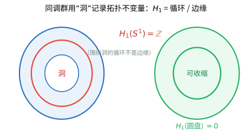
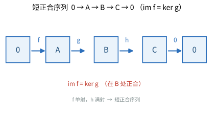

# 第 41 级：同调代数 (Homological Algebra)

> 同调代数是现代数学的核心工具之一，它将代数对象与拓扑、几何联系起来，通过链复形、同调群和导出函子等概念，为数学的各个分支提供了强大的代数语言和计算工具。同调代数肇始于拓扑学中对单纯复形和闭链的研究，随后演化为处理代数结构的通用方法，深刻地影响了代数拓扑、代数几何、表示论、交换代数和数论等领域。

---

## 1. 学习目标

- 理解链复形与同调的基本概念，掌握链映射和同伦等价
- 掌握蛇形引理并能独立证明，理解同调的长正合序列
- 理解投射分解与内射分解，掌握导出函子 Tor 和 Ext 的定义与性质
- 掌握 Abel 范畴的基本语言，理解左/右正合性与足够投射/内射对象
- 了解谱序列的基本结构，理解双复形的谱序列和 Grothendieck 谱序列
- 了解群上同调、Hochschild 上同调和层上同调的基本思想
- 理解导出范畴和三角范畴的基本概念
- 能够运用同调代数工具解决具体问题

---

## 2. 链复形与同调

### 2.1 链复形的定义

**定义 2.1（链复形）** 设 $\mathcal{A}$ 是一个 Abel 范畴（例如 $R$-模范畴）。一个 **链复形** $C_\bullet$ 是一列 $\mathcal{A}$ 中的对象和态射：

$$
\cdots \xrightarrow{\partial_{n+1}} C_n \xrightarrow{\partial_n} C_{n-1} \xrightarrow{\partial_{n-1}} \cdots
$$

满足 $\partial_n \circ \partial_{n+1} = 0$ 对所有 $n$ 成立。态射 $\partial_n$ 称为**边缘算子**或**微分**。条件 $\partial_n \circ \partial_{n+1} = 0$ 等价于 $\operatorname{im} \partial_{n+1} \subseteq \ker \partial_n$。

类似地，**上链复形** $C^\bullet$ 是一列对象和上边缘算子 $d^n : C^n \to C^{n+1}$，满足 $d^{n+1} \circ d^n = 0$。

> **💡 直观理解（类比）**：链复形就是一条"一步步往下退的传送带"：对象 $C_n$ 层层排列，微分 $\partial_n$ 把第 $n$ 层的元素带到第 $n-1$ 层，且强调一条硬规矩——走上两步必然归零（$\partial_n\circ\partial_{n+1}=0$，等价于 $\operatorname{im}\partial_{n+1}\subseteq\ker\partial_n$）。类比"走两步必回到零刻度"的楼梯：从高处连跨两阶不可能落在一个非零的地方，这保证了我们能讨论"到底层仍不消失"的一类元素。它是拓扑（把空间切成单链）与代数（纯抽象的模序列）之间通用的脚手架，同调 ${H_n=\ker/\operatorname{im}}$ 就坐在这条传送带上"量洞"。

**定义 2.2（循环、边缘与同调）** 对于链复形 $C_\bullet$，定义：

- **$n$-循环群**：$Z_n(C_\bullet) = \ker \partial_n$
- **$n$-边缘群**：$B_n(C_\bullet) = \operatorname{im} \partial_{n+1}$
- **$n$-同调群**：$H_n(C_\bullet) = Z_n(C_\bullet) / B_n(C_\bullet)$

由于 $\partial_n \circ \partial_{n+1} = 0$，有 $B_n \subseteq Z_n$，故同调群是良定义的。

> **直观理解（现实类比）**：把同调群想成"数洞"的计数器。拿一根橡皮筋（循环）套在甜甜圈（环面 $S^1$）的孔上，无论你再怎么拉扯、滑动，只要不把它剪断，它都缩不成一个点——这个"套得住却缩不掉"的洞就是非平凡的同调类，$H_1(S^1)=\mathbb{Z}$。可若把同一根橡皮筋平放在实心圆盘上，它就能一路收缩成一个点，因为圆盘里没有洞"卡住"它，故 $H_1(\text{圆盘})=0$。循环模掉边缘（$Z_n/B_n$）正是这套"用洞记账"的精准数学表达：有洞才算数，能缩掉的都算零。
>
> **🧠 思考历程：如何把"洞"变成一件可以加减运算的量？**
>
> 同调代数的起点在拓扑：怎样让"有洞"这个性质变成一个可加可减的代数量？——借助链复形与"边缘的边缘为零"（$\partial_n\circ\partial_{n+1}=0$），几何学家把空间形状翻译成了纯代数的计算。
>
> - **Poincaré 的广义算术**。1895 年，Henri Poincaré 在开创代数拓扑时引入链复形与 Betti 数，把"洞的个数"整理成可计算的代数对象，同调概念由此诞生。
> - **从同调到同调代数**。1940 年代 Samuel Eilenberg 与 Saunders Mac Lane 提出范畴论，1956 年 Henri Cartan 与 Eilenberg 系统化导出函子 Tor、Ext 与长正合序列，把同调从拓扑工具升格为普遍的代数语言。
> - **谱序列与全面渗透**。1950 年代 Jean-Pierre Serre 娴熟运用谱序列攻克拓扑难题，同调方法从此席卷代数、几何、数论，成为二十世纪最普适的"隧道挖掘机"。
> - **心路**：数学家把看不见摸不着的"洞"锤炼成可精确运算的代数量，令人惊异地证明——几何形状之内，竟真的藏着能加减乘除的结构。

**例 2.3（单纯同调）** 设 $X$ 是一个单纯复形，$C_n(X)$ 是 $X$ 的 $n$-维单纯链生成的自由 Abel 群，边缘算子 $\partial_n$ 将单纯形映射为其定向面之和。则 $H_n(X) = H_n(C_\bullet(X))$ 就是 $X$ 的单纯同调群。

**例 2.4（奇异的例子）** 考虑一个拓扑空间 $X$，$C_n(X)$ 是连续映射 $\sigma : \Delta^n \to X$ 生成的自由 Abel 群，其中 $\Delta^n$ 是标准 $n$-单形。边缘算子 $\partial_n(\sigma) = \sum_{i=0}^n (-1)^i \sigma \circ \varepsilon_i$，其中 $\varepsilon_i$ 是第 $i$ 个面映射。$H_n(X)$ 就是奇异同调群。

### 2.2 链映射与同伦

**定义 2.5（链映射）** 设 $C_\bullet$ 和 $D_\bullet$ 是两个链复形。**链映射** $f_\bullet : C_\bullet \to D_\bullet$ 是一族态射 $f_n : C_n \to D_n$，使得下图交换：

$$
\require{AMScd}
\begin{CD}
\cdots @>>> C_n @>{\partial_n}>> C_{n-1} @>>> \cdots \\
@. @V{f_n}VV @V{f_{n-1}}VV \\
\cdots @>>> D_n @>{\partial'_n}>> D_{n-1} @>>> \cdots
\end{CD}
$$

即 $f_{n-1} \circ \partial_n = \partial'_n \circ f_n$ 对所有 $n$ 成立。

> **💡 直观理解（类比）**：链映射就是"把一条传送带整条搬到另一条传送带上"的结构化搬运工：它必须在每一层 $n$ 都给出一个对应 $f_n$，并保证与微分"可交换"（$f_{n-1}\circ\partial_n=\partial'_n\circ f_n$）——也就是说"先沿旧带子往下一步再搬运，和先搬运再在新带子往下一步",结果是同一回事。类比两张网格对齐打孔：每行的孔都对准，且往下走的规则一致，这样搬运才不会错位。正因为链映射与微分相容，它自然把循环送到循环、边缘送到边缘，从而在商水平诱导出同调群的同态。

**命题 2.6** 链映射 $f_\bullet : C_\bullet \to D_\bullet$ 诱导出同调群之间的同态：

$$
H_n(f) : H_n(C_\bullet) \to H_n(D_\bullet), \quad [z] \mapsto [f_n(z)].
$$

**证明**：若 $z \in Z_n(C_\bullet)$，即 $\partial_n(z) = 0$，则 $\partial'_n(f_n(z)) = f_{n-1}(\partial_n(z)) = 0$，故 $f_n(z) \in Z_n(D_\bullet)$。若 $z = \partial_{n+1}(w)$ 是边缘，则 $f_n(z) = f_n(\partial_{n+1}(w)) = \partial'_{n+1}(f_{n+1}(w))$ 也是边缘。因此映射在商上良定义。$\square$

> **💡 直观理解（类比）**：这条命题说"兼容的搬运工会自然地搬洞"：链映射 $f_\bullet$ 既然把循环送到循环（$\partial z=0\Rightarrow\partial fz=0$）、把边缘送到边缘，就必然把同调类 $[z]$ 映到同调类 $[f(z)]$。类比一个守规矩的搬运工每次搬货都说"这箱是洞里的还是一般货"职责分明,于是它自动成为洞与洞之间的映射。这让我们得以在"不管怎么选代表元"的意义上安全地计算，是同调理论继承链映射信息的第一道关卡。

**定义 2.7（链同伦）** 设 $f_\bullet, g_\bullet : C_\bullet \to D_\bullet$ 是两个链映射。**链同伦** $h$ 从 $f$ 到 $g$ 是一族态射 $h_n : C_n \to D_{n+1}$，使得：

$$
\partial'_{n+1} \circ h_n + h_{n-1} \circ \partial_n = f_n - g_n.
$$

若存在这样的 $h$，则称 $f$ 和 $g$ 是**链同伦的**，记作 $f \simeq g$。

> **💡 直观理解（类比）**：链同伦就是从 $f$ 到 $g$ 的"一段连续变形"：一族跨越高一层的中介 $h_n:C_n\to D_{n+1}$，用等式 $\partial'_{n+1}h_n+h_{n-1}\partial_n=f_n-g_n$ 把 $f$ 与 $g$ 之差解释成"边缘加边缘"。类比两根橡皮筋在同一打点上：若你既能沿 $f$ 又能沿 $g$ 摆绳，且能"不断用手把一条绳压成另一条"（中间态恰为 $h$），那它们就链同伦。词中"同伦"正类比拓扑里的连续形变——下面会看到，链同伦的两个映射在同调意义上无法分辨。

**定理 2.8（同伦不变性）** 若 $f, g : C_\bullet \to D_\bullet$ 是链同伦的，则它们诱导的同调同态相等：$H_n(f) = H_n(g)$ 对所有 $n$ 成立。

**证明**：设 $[z] \in H_n(C_\bullet)$，其中 $z \in Z_n(C_\bullet)$。则：

$$
f_n(z) - g_n(z) = \partial'_{n+1}(h_n(z)) + h_{n-1}(\partial_n(z)) = \partial'_{n+1}(h_n(z))
$$

因为 $\partial_n(z) = 0$。所以 $f_n(z) - g_n(z)$ 是边缘，从而在 $H_n(D_\bullet)$ 中 $[f_n(z)] = [g_n(z)]$。$\square$

> **💡 直观理解（类比）**：同伦不变性说"同调只认形变的类别，不看具体差别"：链同伦的 $f$ 与 $g$ 在循环上只相差一个边缘，而边缘在商 $Z/B$ 中记作 $0$，于是 $H_n(f)=H_n(g)$。类比"数洞"：一根橡皮筋绕着同一孔摆放的位置虽不同，只要不剪断、能连续滑过去，它们数的洞就一样多。这带来了巨大的便利——要算同调的映射，只需找一个链同伦的"替身"即可，这就为后面正式讨论的同伦范畴 $K(\mathcal{A})$（态射在同伦类下等价）埋下伏笔。

**定义 2.9（链等价）** 链映射 $f : C_\bullet \to D_\bullet$ 称为**链等价**，若存在 $g : D_\bullet \to C_\bullet$ 使得 $g \circ f \simeq \operatorname{id}_C$ 且 $f \circ g \simeq \operatorname{id}_D$。此时 $f$ 诱导同调群的同构。

> **💡 直观理解（类比）**：链等价说的是"两条链复形从同调的角度可以互相还原"：存在反向搬运工 $g$，使得正反来回都链同伦于恒等（$g\circ f\simeq\operatorname{id}_C$、$f\circ g\simeq\operatorname{id}_D$）。类比两份逐层相互覆盖、每来回去都能"伸长变形回自己"的分层图纸：虽是不同纸张，却表达着完全相同的洞与层。由同伦不变性立得同调同构，于是"链等价"是同调论里承认两个链复形"本质相同"的恰当尺度，比严格同构更宽松、比无利用链同伦更精确。

### 2.3 正合序列与蛇形引理

**定义 2.10（正合序列）** Abel 范畴中的一列态射：

$$
A \xrightarrow{f} B \xrightarrow{g} C
$$

称为在 $B$ 处**正合**，若 $\operatorname{im} f = \ker g$。一列更长的态射称为正合序列，若它在每个中间对象处都正合。

**短正合序列**是形如 $0 \to A \xrightarrow{f} B \xrightarrow{g} C \to 0$ 的正合序列，其中 $f$ 是单射，$g$ 是满射，且 $\operatorname{im} f = \ker g$。

> **直观理解（现实类比）**：把正合序列想成一条流水线上的传送带。在每一个工位（中间对象 $B$）处，从上一站送进来的"产品"（$\operatorname{im} f$）必须不多不少地把本工位"被下一站吞掉"的仓位（$\ker g$）填满——既不能有积压（像 $>$ 核），也不能有缺口（像 $<$ 核）。短正合序列 $0\to A\to B\to C\to 0$ 就像一段"零损耗"的完美流水线：$A$ 完整嵌入 $B$（单射），$B$ 又完整覆盖 $C$（满射），中间没有漏掉任何东西。而"正合"正是度量这段链条是否严丝合缝的标尺。

**定理 2.11（蛇形引理）** 考虑以下交换图，其中行是短正合序列：

$$
\require{AMScd}
\begin{CD}
0 @>>> A' @>{f}>> A @>{g}>> A'' @>>> 0 \\
@. @V{\alpha}VV @V{\beta}VV @V{\gamma}VV \\
0 @>>> B' @>{f'}>> B @>{g'}>> B'' @>>> 0
\end{CD}
$$

则存在**连接同态** $\delta : \ker \gamma \to \operatorname{coker} \alpha$，使得以下序列正合：

$$
\ker \alpha \xrightarrow{f_*} \ker \beta \xrightarrow{g_*} \ker \gamma \xrightarrow{\delta} \operatorname{coker} \alpha \xrightarrow{f'_*} \operatorname{coker} \beta \xrightarrow{g'_*} \operatorname{coker} \gamma.
$$

**证明**：我们将通过标准的"追图"论证来证明。

**步骤 1：定义诱导映射 $f_*, g_*, f'_*, g'_*$**

- $f_* : \ker \alpha \to \ker \beta$：对 $a' \in \ker \alpha$，有 $\beta(f(a')) = f'(\alpha(a')) = f'(0) = 0$，故 $f(a') \in \ker \beta$。定义 $f_*(a') = f(a')$。
- $g_* : \ker \beta \to \ker \gamma$：对 $a \in \ker \beta$，有 $\gamma(g(a)) = g'(\beta(a)) = g'(0) = 0$，故 $g(a) \in \ker \gamma$。定义 $g_*(a) = g(a)$。
- $f'_* : \operatorname{coker} \alpha \to \operatorname{coker} \beta$：对 $b' \in B'$，定义 $f'_*([b']) = [f'(b')]$。需验证良定义：若 $b' = \alpha(a')$，则 $f'(b') = f'(\alpha(a')) = \beta(f(a')) \in \operatorname{im} \beta$，故 $[f'(b')] = 0$。
- $g'_* : \operatorname{coker} \beta \to \operatorname{coker} \gamma$：对 $b \in B$，定义 $g'_*([b]) = [g'(b)]$。类似可验证良定义。

**步骤 2：定义连接同态 $\delta$**

这是蛇形引理的核心。对 $a'' \in \ker \gamma$（即 $a'' \in A''$ 且 $\gamma(a'') = 0$），由于 $g$ 是满射，存在 $a \in A$ 使得 $g(a) = a''$。考虑 $\beta(a) \in B$。

由于 $g'(\beta(a)) = \gamma(g(a)) = \gamma(a'') = 0$，由正合性知 $\beta(a) \in \ker g' = \operatorname{im} f'$，故存在 $b' \in B'$ 使得 $f'(b') = \beta(a)$。

定义 $\delta(a'') = [b'] \in \operatorname{coker} \alpha$。

**验证良定义**：需要证明 $[b']$ 不依赖于 $a$ 和 $b'$ 的选择。

- 若选择不同的 $a_1 \in A$ 使得 $g(a_1) = a''$，则 $g(a - a_1) = 0$，由正合性知 $a - a_1 = f(a')$ 对某个 $a' \in A'$。相应的 $\beta(a) - \beta(a_1) = \beta(f(a')) = f'(\alpha(a'))$。若 $f'(b') = \beta(a)$，$f'(b'_1) = \beta(a_1)$，则 $f'(b' - b'_1) = f'(\alpha(a'))$。由 $f'$ 的单射性，$b' - b'_1 = \alpha(a')$，故 $[b'] = [b'_1]$。
- 对 $b'$ 的选择不同：若 $f'(b') = f'(b'_1) = \beta(a)$，由 $f'$ 单射知 $b' = b'_1$。

因此 $\delta$ 是良定义的。

**步骤 3：在 $\ker \beta$ 处正合**

即 $\operatorname{im} f_* = \ker g_*$。

- $\operatorname{im} f_* \subseteq \ker g_*$：因为 $g(f(a')) = 0$ 对任意 $a' \in A'$ 成立（行正合）。
- $\ker g_* \subseteq \operatorname{im} f_*$：设 $a \in \ker \beta$ 且 $g_*(a) = 0$，即 $g(a) = 0$。由正合性，存在 $a' \in A'$ 使得 $a = f(a')$。则 $\beta(f(a')) = f'(\alpha(a')) = \beta(a) = 0$，由 $f'$ 单射得 $\alpha(a') = 0$，故 $a' \in \ker \alpha$，$a = f_*(a')$。

**步骤 4：在 $\ker \gamma$ 处正合**

即 $\operatorname{im} g_* = \ker \delta$。

- $\operatorname{im} g_* \subseteq \ker \delta$：设 $a = g_*(a)$ 其中 $a \in \ker \beta$。则 $\delta(g(a))$ 的构造中可取 $a$ 本身作为 $g(a)$ 的原像，得 $\beta(a) = 0$，故 $b' = 0$，$\delta(g(a)) = 0$。
- $\ker \delta \subseteq \operatorname{im} g_*$：设 $a'' \in \ker \gamma$ 且 $\delta(a'') = 0$。则存在 $a \in A$ 和 $b' \in B'$ 使得 $g(a) = a''$，$f'(b') = \beta(a)$，且 $b' = \alpha(a')$ 对某个 $a' \in A'$。于是 $\beta(a) = f'(\alpha(a')) = \beta(f(a'))$，故 $\beta(a - f(a')) = 0$，即 $a - f(a') \in \ker \beta$。且 $g(a - f(a')) = g(a) = a''$，故 $a'' = g_*(a - f(a'))$。

**步骤 5：在 $\operatorname{coker} \alpha$ 处正合**

即 $\operatorname{im} \delta = \ker f'_*$。

- $\operatorname{im} \delta \subseteq \ker f'_*$：设 $[b'] = \delta(a'')$。由构造，$f'(b') = \beta(a)$，故 $f'_*([b']) = [f'(b')] = [\beta(a)] = 0$（因为 $\beta(a) \in \operatorname{im} \beta$）。
- $\ker f'_* \subseteq \operatorname{im} \delta$：设 $[b'] \in \operatorname{coker} \alpha$ 且 $f'_*([b']) = 0$，即 $f'(b') = \beta(a)$ 对某个 $a \in A$。令 $a'' = g(a)$，则 $\gamma(a'') = g'(\beta(a)) = g'(f'(b')) = 0$，故 $a'' \in \ker \gamma$。由构造，$\delta(a'') = [b']$。

**步骤 6：在 $\operatorname{coker} \beta$ 和 $\operatorname{coker} \gamma$ 处正合**

类似可证。$\square$

> **💡 直观理解（类比）**：蛇形引理号称"蛇"因为它把一段断掉的正合序列用一条斜线（连接同态 $\delta$）首尾接成一条"蜿蜒的长蛇"。给定上下两行都是短正合序列、中间由 $\alpha,\beta,\gamma$ 相连的交换图，它保证三层的核（$\ker\alpha\to\ker\beta\to\ker\gamma$）到一层的余核（$\operatorname{coker}\alpha\to\operatorname{coker}\beta\to\operatorname{coker}\gamma$）能连成长正合序列，缺口由斜穿过的 $\delta$ 缝合。类比一张错位对齐的拼图：缺口处由那条"顺着 $B$ 的原像取模"的连接同态 $\delta$ 补上。它是"追图"之最，也是同调理论所有长正合序列公式的总源头。

**推论 2.12（同调的长正合序列）** 设 $0 \to A_\bullet \xrightarrow{f} B_\bullet \xrightarrow{g} C_\bullet \to 0$ 是链复形的短正合序列（即对每个 $n$，$0 \to A_n \to B_n \to C_n \to 0$ 正合，且与边缘算子交换）。则存在长正合序列：

$$
\cdots \to H_n(A_\bullet) \xrightarrow{H_n(f)} H_n(B_\bullet) \xrightarrow{H_n(g)} H_n(C_\bullet) \xrightarrow{\delta} H_{n-1}(A_\bullet) \to \cdots
$$

**证明**：对每个 $n$，考虑以下交换图：

$$
\require{AMScd}
\begin{CD}
0 @>>> A_n/\operatorname{im}\partial^A_{n+1} @>>> B_n/\operatorname{im}\partial^B_{n+1} @>>> C_n/\operatorname{im}\partial^C_{n+1} @>>> 0 \\
@. @V{\bar\partial^A_n}VV @V{\bar\partial^B_n}VV @V{\bar\partial^C_n}VV \\
0 @>>> \ker\partial^A_{n-1} @>>> \ker\partial^B_{n-1} @>>> \ker\partial^C_{n-1} @>>> 0
\end{CD}
$$

其中 $\bar\partial_n$ 是由边缘算子诱导的映射。应用蛇形引理即得。$\square$

> **💡 直观理解（类比）**：这是蛇形引理在同调群上的"旗舰应用"：把链复形的短正合序列 $0\to A_\bullet\to B_\bullet\to C_\bullet\to0$ 转换成一个无限延伸、咬合成环的长正合序列 $$\cdots\to H_n(A)\to H_n(B)\to H_n(C)\xrightarrow{\delta}H_{n-1}(A)\to\cdots$$ 它像一条把三层同调群像锁链一样联系起来的长链：中间由连接同态 $\delta$（降一维）扣合。实用价值是"如果知道两层，第三层同调差多少也能被约束"，是计算同调的最强工具箱之一——例如维数 (相对同调) 全套结果其实都从这里派生。

### 2.4 同调代数基本引理

**引理 2.13（五引理）** 考虑以下交换图，其中行正合：

$$
\require{AMScd}
\begin{CD}
A_1 @>{f_1}>> A_2 @>{f_2}>> A_3 @>{f_3}>> A_4 @>{f_4}>> A_5 \\
@V{\alpha_1}VV @V{\alpha_2}VV @V{\alpha_3}VV @V{\alpha_4}VV @V{\alpha_5}VV \\
B_1 @>{g_1}>> B_2 @>{g_2}>> B_3 @>{g_3}>> B_4 @>{g_4}>> B_5
\end{CD}
$$

若 $\alpha_1, \alpha_2, \alpha_4, \alpha_5$ 是同构，则 $\alpha_3$ 也是同构。

**证明**：使用标准的追图论证。先证 $\alpha_3(a_3) = 0$，则 $\alpha_4(f_3(a_3)) = g_3(\alpha_3(a_3)) = 0$，由 $\alpha_4$ 单射得 $f_3(a_3) = 0$，故 $a_3 = f_2(a_2)$ 对某 $a_2$。则 $g_2(\alpha_2(a_2)) = \alpha_3(f_2(a_2)) = 0$，故 $\alpha_2(a_2) = g_1(b_1)$。由 $\alpha_1$ 满射，$b_1 = \alpha_1(a_1)$，从而 $\alpha_2(a_2) = g_1(\alpha_1(a_1)) = \alpha_2(f_1(a_1))$，由 $\alpha_2$ 单射得 $a_2 = f_1(a_1)$，于是 $a_3 = f_2(f_1(a_1)) = 0$。满射性类似可证。$\square$

> **💡 直观理解（类比）**：五引理是"两边的确定性会传染给中间"的华丽定理：在行正合的 $5$-列交换图中，只要两端的四个竖映射 $\alpha_1,\alpha_2,\alpha_4,\alpha_5$ 都是同构，中间的 $\alpha_3$ 也必是同构。类比一台有五节齿轮的联动装置：只要第 1、2、4、5 节的齿轮都严丝合缝地锁紧，中间的齿轮就被迫也完全贴合。它是证明"同调同构"最常用的速成手段——常常只需要逐项验证外圈映射，就判定核心中间一段也是同构。

**引理 2.14（3 × 3 引理）** 若以下 $3 \times 3$ 交换图中所有列正合且中间行正合，则所有行正合：

$$
\require{AMScd}
\begin{CD}
0 @>>> 0 @>>> 0 @>>> 0 \\
@VVV @VVV @VVV \\
0 @>>> A' @>>> A @>>> A'' @>>> 0 \\
@VVV @VVV @VVV \\
0 @>>> B' @>>> B @>>> B'' @>>> 0 \\
@VVV @VVV @VVV \\
0 @>>> C' @>>> C @>>> C'' @>>> 0 \\
@VVV @VVV @VVV \\
0 @>>> 0 @>>> 0 @>>> 0
\end{CD}
$$

> **💡 直观理解（类比）**：$3\times3$ 引理是蛇形引理的"立体翻版"：在一个三行三列的双边兼容交换图里，只要每一列都（竖着）正合、且中间一行（横着）正合，就能推断所有行都正合。类比一个横竖都对齐的打孔板：只要竖排孔位全按次序、中间那横排也按次序，整块板的每一横排便都依序—一"一处通畅引致全盘通畅"。它体现了"正合性像传染病"在双向交换网络里的传导力，是处理复合/迭代正合结构的常用引理。

---

## 3. 导出函子

### 3.1 投射分解与内射分解

**定义 3.1（投射对象）** 设 $\mathcal{A}$ 是 Abel 范畴。对象 $P \in \mathcal{A}$ 称为**投射对象**，若对任意满射 $g : B \to C$ 和任意态射 $f : P \to C$，存在态射 $\tilde{f} : P \to B$ 使得 $g \circ \tilde{f} = f$。

在 $R$-模范畴 $\operatorname{Mod}_R$ 中，投射对象就是投射模，自由模是投射模的典型例子。

> **💡 直观理解（类比）**：投射对象是"预先就能给出全部答复"的对象：从 $P$ 发出的每条虚线，只要目标上有一个满射 $g:B\to C$ 能接住它，就能"抬升"到 $B$（存在 $\tilde f$ 使 $g\tilde f=f$）。类比一块模板：无论图上某个点画成什么样，模板 $P$ 都有一条现成的"血统"能对应过去，从不被卡住。直观上，投射模就是"自由模的同态像",可以看作 $\mathbb{Z}$ 在向量空间里那份"处处可分派"的自由本质。它是构造投射分解、进而定义左导出函子的原材料。

**定义 3.2（内射对象）** 对象 $I \in \mathcal{A}$ 称为**内射对象**，若对任意单射 $g : A \to B$ 和任意态射 $f : A \to I$，存在态射 $\tilde{f} : B \to I$ 使得 $\tilde{f} \circ g = f$。

> **💡 直观理解（类比）**：内射对象是投射对象的"对偶镜子"：把满射换成单射、箭头反转后，进入 $I$ 的每条虚线都能延展到更大的 $B$。类比一个"永远能接住问题、把解答延伸到更大背景"的外挂工具箱：从 $A$ 里给的定义，总能不矛盾地推广到包含它的任何 $B$。在 $\mathbb{Z}$-模世界里，内射模通常由"可除"模块扮演（能随意被整除、扩展），典型如 $\mathbb{Q}/\mathbb{Z}$。它承担构造内射分解、右导出函子（如 $R^n\Gamma$、Ext 从第二变元看去）的重任。

**定义 3.3（投射分解）** 对象 $A \in \mathcal{A}$ 的**投射分解**是一个正合序列：

$$
\cdots \to P_2 \to P_1 \to P_0 \to A \to 0
$$

其中每个 $P_i$ 都是投射对象。若 $P_i = 0$ 对所有 $i > n$ 成立，则称分解长度为 $n$。

> **💡 直观理解（类比）**：投射分解就是把 $A$"一层层用投射积木拼起来"：$A$ 作为最底端的目标，被一列投射对象 $P_0\gets P_1\gets\cdots$ 从上方逐层覆盖（每个 $P_i$ 都投射，且整体正合）。类比用可自由派发的积木从高处开始叠，一层层垫出到 $A$：只要具备足够多投射对象，任何 $A$ 都保证存在这样的"投射脚手架"。它是左导出函子 $L_nF$ 定义里那台戴上去的"标尺"——长度 $n$ 等于在构造中对上层 $P_i$ 的保留层数。

**定义 3.4（内射分解）** 对象 $A \in \mathcal{A}$ 的**内射分解**是一个正合序列：

$$
0 \to A \to I^0 \to I^1 \to I^2 \to \cdots
$$

其中每个 $I^i$ 都是内射对象。

> **💡 直观理解（类比）**：内射分解是投射分解的"对偶"版本：把 $A$"一层层嵌入内射积木"—— $0\to A\to I^0\to I^1\to\cdots$，每个 $I^i$ 都内射且整体正合。类比把信封逐层封升级：内容 $A$ 先放进最大的内射盒子，再套更大的盒子依此向上。它是右导出函子 $R^nG$ 的"标尺"。有了既有投射又有内射分解的双重表达（平衡性），Tor / Ext 才能灵活地"从哪一边算都行"。

**定义 3.5（足够投射与足够内射）** 范畴 $\mathcal{A}$ 称为具有**足够多的投射对象**，若对每个对象 $A$，存在满射 $P \to A$ 且 $P$ 投射。类似地，称为具有**足够多的内射对象**，若对每个对象 $A$，存在单射 $A \to I$ 且 $I$ 内射。

例如，$R$-模范畴 $\operatorname{Mod}_R$ 既有足够多的投射对象（自由模），也有足够多的内射对象。

> **💡 直观理解（类比）**："足够多投射/内射"保证"任何对象都能被合法地架起脚手架/套进盒子"：每个 $A$ 至少有一个满射 $P\to A$（$P$ 投射）保证投射分解存在，也至少有一个单射 $A\to I$（$I$ 内射）保证内射分解存在。类比工厂的原料必须够充足才能给每件产品开工。第二条是定义导出函子（$L_nF$ 与 $R^nG$）的"可操作前提"——没有足够多投射/内射，推导出的同调根本没处安放。模范畴天然满足，这正是为什么同调代数常默认在 $\operatorname{Mod}_R$ 上进行。

### 3.2 导出函子的定义

**定义 3.6（左导出函子）** 设 $F : \mathcal{A} \to \mathcal{B}$ 是右正合函子（即保持右正合序列）。对 $A \in \mathcal{A}$，取投射分解 $P_\bullet \to A \to 0$，定义 $F$ 的**第 $n$ 个左导出函子**为：

$$
L_n F(A) = H_n(F(P_\bullet)).
$$

其中 $F(P_\bullet)$ 是链复形 $\cdots \to F(P_1) \to F(P_0) \to 0$。

> **💡 直观理解（类比）**：左导出函子 $L_nF$ 是"给不满意的函子补齐缺失层"的补丁：$F$ 只保右正合（在 $1$-层会打断），于是取 $A$ 的投射分解 $P_\bullet$，作用 $F$，再取第 $n$ 层同调 $H_n(F(P_\bullet))$。类比一台不肯一次吐出全部答案的机器：先把它放在"理想输入"（投射分解）上，测它在每一步输出，再在同调上读失落的信息。第 $0$ 层恢复原始的 $F(A)$，而 $n\ge1$ 层正是 $F$ 没保住的"高阶差异"。Tor$=L_n(M\otimes-)$ 即其明星情形。

**定义 3.7（右导出函子）** 设 $G : \mathcal{A} \to \mathcal{B}$ 是左正合函子（即保持左正合序列）。对 $A \in \mathcal{A}$，取内射分解 $0 \to A \to I^\bullet$，定义 $G$ 的**第 $n$ 个右导出函子**为：

$$
R^n G(A) = H^n(G(I^\bullet)).
$$

> **💡 直观理解（类比）**：右导出函子是左导出的"对偶补丁"：对只保左正合的 $G$，取 $A$ 的内射分解 $0\to A\to I^\bullet$，算 $G$ 后的上同调 $H^n(G(I^\bullet))$。类比一台"输入端要求完整"的机器：把它架到理想输入（内射分解）上复跑一遍，拾回它没能延伸的更高层。对 $0\to A\to B\to C\to0$，$G$ 只能保住左半段，而 $(R^1G)(C)\to(R^2G)(A)$ 这类"接续"正好由它补上——群上同调、层上同调、Ext 都是它的著名化身。

**定理 3.8（导出函子的良定义性）** 导出函子 $L_n F$ 和 $R^n G$ 不依赖于投射/内射分解的选择，即不同分解给出同构的同调群。

**证明概要**：投射分解之间的链映射诱导同调群之间的同态，且任何两个投射分解之间存在链等价，从而同调群同构。$\square$

> **💡 直观理解（类比）**：这条保证了"不管用哪套脚手架起，架出来的同调都一样"。因为任何两个投射分解之间都有链等价（相互链同伦逆），而同调不变性说链等价映射不改变同调——于是 $L_nF$（或 $R^nG$）与分解选取无关，是 $A$ 与 $F$ 的固有属性。类比测一口井的深度：不论从哪个坑道的观察角度量，测得的水深都恒定。这让我们放心选用任意分解来计算导出函子的值而结果一致。

### 3.3 Tor 函子

**定义 3.9（Tor 函子）** 设 $R$ 是环，$M$ 是右 $R$-模，$N$ 是左 $R$-模。函子 $M \otimes_R -$ 是右正合函子。定义：

$$
\operatorname{Tor}_n^R(M, N) = L_n(M \otimes_R -)(N).
$$

等价地，可取 $N$ 的投射分解 $P_\bullet \to N \to 0$，则 $\operatorname{Tor}_n^R(M, N) = H_n(M \otimes_R P_\bullet)$。

**对称性**：$\operatorname{Tor}_n^R(M, N)$ 也可通过取 $M$ 的投射分解计算，且 $\operatorname{Tor}_n^R(M, N) \cong \operatorname{Tor}_n^R(N, M)$（当 $R$ 交换时）。

> **💡 直观理解（类比）**：Tor 是"张量积留下的纠缠痕迹"：$M\otimes_R-$ 只保右正合，Tor$=\,$它的左导出。$0$ 层就是干净的张量 $M\otimes N$；$n\ge1$ 层捕捉张量时因 $M$ 不平坦而产生的"高阶畸变"。类比两个对象融合时因为"齿轮咬合不齐"产生的毛刺,张量积两边对称（$R$ 交换时），所以 Tor 对 $M,N$ 也对称。例：$\operatorname{Tor}_1^{\mathbb Z}(\mathbb Z/m,\mathbb Z/n)=\mathbb Z/\gcd(m,n)$ 记住的正是两个循环群的公因数纠缠。

**命题 3.10（Tor 的基本性质）** 设 $R$ 是环，$M, N$ 是 $R$-模，则：

1. $\operatorname{Tor}_0^R(M, N) \cong M \otimes_R N$
2. 若 $M$ 是平坦模，则 $\operatorname{Tor}_n^R(M, N) = 0$ 对所有 $n \ge 1$ 成立
3. 若 $N$ 是投射模，则 $\operatorname{Tor}_n^R(M, N) = 0$ 对所有 $n \ge 1$ 成立
4. 若 $R$ 是 PID（主理想整环），则 $\operatorname{Tor}_n^R(M, N) = 0$ 对所有 $n \ge 2$ 成立

> **💡 直观理解（类比）**：这些是 Tor 的"行规"：(1) 第 $0$ 层就是张量积本身；(2)(3) 平坦 / 投射的模"干净到不制造纠缠"，高阶 Tor 全为 $0$；(4) 在 PID 上（如 $\mathbb{Z}$）只要一个生成元就能支撑关系，所以 $n\ge2$ 全消失。类比病因清单：健康的原料（平坦/投射）不生病，简单场地（PID）病也不会超过两层。它们让 Tor 计算在常见情形迅速归零或降到一层，是实用判据。

**证明**：
1. 由 $M \otimes_R -$ 的右正合性，$L_0(M \otimes_R -)(N) = M \otimes_R N$。
2. 平坦模的定义：$M$ 平坦当且仅当 $M \otimes_R -$ 是正合函子，此时高阶导出函子为零。
3. 投射模的分解可取 $N$ 本身，$P_0 = N$，$P_i = 0$ 对 $i \ge 1$，故同调为零。
4. PID 上的投射模都是自由模，子模也是自由的，故可取长度为 1 的投射分解。$\square$

**定理 3.11（Tor 的长正合序列）** 设 $0 \to N' \to N \to N'' \to 0$ 是左 $R$-模的短正合序列，$M$ 是右 $R$-模。则存在长正合序列：

$$
\cdots \to \operatorname{Tor}_1^R(M, N') \to \operatorname{Tor}_1^R(M, N) \to \operatorname{Tor}_1^R(M, N'') \to M \otimes_R N' \to M \otimes_R N \to M \otimes_R N'' \to 0.
$$

> **💡 直观理解（类比）**：Tor 的长正合序列是"短正合序列在张量后遗留的下降链"：$0\to N'\to N\to N''\to0$ 本身张量后只保右正合（在 $N'$ 左侧断掉），但左边接上 $\operatorname{Tor}_1$ 就补成无限长链条。类比一串多米诺：第一层（Tor$_1$）接住"张量没接住的那些纠缠",把断口往下续到 $0$。这让我们知道"两端 Tor 已知、中间差多少就能锁定"，是递归计算 Tor 的支柱。

**例 3.12（$\operatorname{Tor}_1^{\mathbb{Z}}(\mathbb{Z}/m, \mathbb{Z}/n)$）** 取 $R = \mathbb{Z}$，$M = \mathbb{Z}/m$，$N = \mathbb{Z}/n$。$\mathbb{Z}/n$ 的投射分解为：

$$
0 \to \mathbb{Z} \xrightarrow{\times n} \mathbb{Z} \to \mathbb{Z}/n \to 0.
$$

张量积 $(\mathbb{Z}/m) \otimes_\mathbb{Z} -$ 得复形：

$$
\mathbb{Z}/m \xrightarrow{\times n} \mathbb{Z}/m \to 0.
$$

故 $\operatorname{Tor}_1^{\mathbb{Z}}(\mathbb{Z}/m, \mathbb{Z}/n) = \ker(\times n) / \operatorname{im}(\times 0) = \{a \in \mathbb{Z}/m \mid na \equiv 0 \pmod{m}\} \cong \mathbb{Z}/\gcd(m, n)$。
而 $\operatorname{Tor}_0 = \mathbb{Z}/m \otimes_\mathbb{Z} \mathbb{Z}/n \cong \mathbb{Z}/\gcd(m, n)$，实际上 $\operatorname{Tor}_1 \cong \operatorname{Tor}_0$ 在此例中成立。

### 3.4 Ext 函子

**定义 3.13（Ext 函子）** 设 $R$ 是环，$M, N$ 是 $R$-模。函子 $\operatorname{Hom}_R(M, -)$ 是左正合函子，$\operatorname{Hom}_R(-, N)$ 是反变左正合函子。定义：

$$
\operatorname{Ext}_R^n(M, N) = R^n \operatorname{Hom}_R(M, -)(N).
$$

等价地，取 $N$ 的内射分解 $0 \to N \to I^\bullet$，则 $\operatorname{Ext}_R^n(M, N) = H^n(\operatorname{Hom}_R(M, I^\bullet))$。

也可用 $M$ 的投射分解 $P_\bullet \to M \to 0$ 计算：

$$
\operatorname{Ext}_R^n(M, N) \cong H^n(\operatorname{Hom}_R(P_\bullet, N)).
$$

> **💡 直观理解（类比）**：Ext 是"$\operatorname{Hom}$ 留下的延伸纠缠量"：$\operatorname{Hom}_R(M,-)$ 只保左正合，Ext 就是它的右导出。$0$ 层为普通同态 $\operatorname{Hom}$；$n\ge1$ 层记录"直接从 $M$ 到 $N$ 的射因 $M$ 不投射/ $N$ 不内射而无法补全"的障碍，也精确对应 $0\to N\to X_1\to\cdots\to X_n\to M\to0$ 的扩张类。类比口径不配的两根管子：能直插的是 $\operatorname{Ext}^0$，$\operatorname{Ext}^1$ 数出需要几段变径接头。它可任选投射（一、三变元）或内射（第二变元）分解计算，谓之"平衡"。

**命题 3.14（Ext 的基本性质）** 设 $R$ 是环，$M, N$ 是 $R$-模，则：

1. $\operatorname{Ext}_R^0(M, N) \cong \operatorname{Hom}_R(M, N)$
2. 若 $M$ 是投射模，则 $\operatorname{Ext}_R^n(M, N) = 0$ 对所有 $n \ge 1$ 成立
3. 若 $N$ 是内射模，则 $\operatorname{Ext}_R^n(M, N) = 0$ 对所有 $n \ge 1$ 成立
4. $\operatorname{Ext}_R^1(M, N)$ 分类 $N$ 被 $M$ 扩张的等价类

> **💡 直观理解（类比）**：这些是 Ext 的"行规"：(1) 第 $0$ 层就是普通同态；(2)(3) $M$ 投射或 $N$ 内射时"关系完全可解",高阶 Ext 归零；(4) 最重要——$\operatorname{Ext}^1$ 恰好划出"把 $N$ 嵌进 $M$ 的所有扩张方式 $(0\to N\to X\to M\to0)$"的等价类。类比拼图：能无缝嵌合的直插是 $\operatorname{Ext}^0$，而 $\operatorname{Ext}^1$ 开出的清单就是所有需要"中间垫片"的插入方案。这让 Ext 从纯代数工具升级为分类对象的度量标准。

**定理 3.15（Ext 的长正合序列）** 设 $0 \to N' \to N \to N'' \to 0$ 是短正合序列，则：

$$
0 \to \operatorname{Hom}_R(M, N') \to \operatorname{Hom}_R(M, N) \to \operatorname{Hom}_R(M, N'') \to \operatorname{Ext}_R^1(M, N') \to \cdots
$$

设 $0 \to M' \to M \to M'' \to 0$ 是短正合序列，则：

$$
0 \to \operatorname{Hom}_R(M'', N) \to \operatorname{Hom}_R(M, N) \to \operatorname{Hom}_R(M', N) \to \operatorname{Ext}_R^1(M'', N) \to \cdots
$$

> **💡 直观理解（类比）**：Ext 的长正合序列是"短正合序列在 $\operatorname{Hom}$ 后补全的上升链"：$\operatorname{Hom}_R(M,-)$ 只保左正合，右端断口处接上 $\operatorname{Ext}^1$ 后无限延长；对第一变元的反变同理（箭头反转）。类比一条缺口的阶梯，用"延伸纠缠量" $\operatorname{Ext}^1$ 把缺口一格一格垫平。它让短正合序列"吃进 Hom/ Ext"后仍保留可追踪的链条，是 Ext 计算与分类的杠杆。

**例 3.16（$\operatorname{Ext}_{\mathbb{Z}}^1(\mathbb{Z}/m, \mathbb{Z})$）** 取 $\mathbb{Z}/m$ 的投射分解 $0 \to \mathbb{Z} \xrightarrow{\times m} \mathbb{Z} \to \mathbb{Z}/m \to 0$。应用 $\operatorname{Hom}_{\mathbb{Z}}(-, \mathbb{Z})$ 得：

$$
0 \to \operatorname{Hom}(\mathbb{Z}, \mathbb{Z}) \xrightarrow{\times m} \operatorname{Hom}(\mathbb{Z}, \mathbb{Z}) \to 0.
$$

即 $\mathbb{Z} \xrightarrow{\times m} \mathbb{Z} \to 0$。故 $\operatorname{Ext}^1 = \mathbb{Z}/m\mathbb{Z}$，$\operatorname{Ext}^0 = \operatorname{Hom}(\mathbb{Z}/m, \mathbb{Z}) = 0$。

### 3.5 导出函子的性质

**定理 3.17（维数移位）** 对短正合序列 $0 \to A \to B \to C \to 0$ 和右正合函子 $F$，有自然同构：

$$
L_{n+1}F(C) \cong L_nF(A) \quad (n \ge 1).
$$

> **💡 直观理解（类比）**：维数移位说"短正合序列把导出层整体平移一格"：由 $0\to A\to B\to C\to0$（$B$ 可取作投射对象），$C$ 的第 $n+1$ 个左导出等价于 $A$ 的第 $n$ 个左导出。类比把一叠卡片往上提一层：测 $C$ 高一层的信息，等于测 $A$ 当前层的信息。它简化了递归计算——只要逐环绕到把高阶降为低阶，就能把一个导出函数的所有层逐个解开，是长正合序列的"降维剂"。

**证明**：由长正合序列和 $L_1F(B) = 0$（因 $B$ 可以视为某投射对象的像）可推导。$\square$

**定理 3.18（平衡性）** $\operatorname{Ext}_R^n(M, N)$ 既可通过 $M$ 的投射分解计算，也可通过 $N$ 的内射分解计算，结果自然同构。

**证明**：构造双复形 $\operatorname{Hom}_R(P_\bullet, I^\bullet)$，其中 $P_\bullet \to M$ 是投射分解，$N \to I^\bullet$ 是内射分解，计算两个方向的上同调。$\square$

> **💡 直观理解（类比）**：平衡性说的是"从哪头算 Ext 都得到同一个数"——既可用 $M$ 的投射分解，也可用 $N$ 的内射分解计算 $\operatorname{Ext}_R^n(M,N)$，二者自然同构。类比一张双刃尺：无论你用"从 $M$ 出发的投射刻度"还是"朝 $N$ 收敛的内射刻度"，量出的值都一样。它让计算提供抓手：哪边分解好取就选哪边。这也是同调代数"函子交叠信息守恒"的漂亮体现，源自双复形两方向取上同调一致。

---

## 4. 范畴语言

### 4.1 Abel 范畴

**定义 4.1（预加性范畴）** 范畴 $\mathcal{C}$ 称为**预加性范畴**，若每个 Hom 集 $\operatorname{Hom}_{\mathcal{C}}(A, B)$ 具有 Abel 群结构，且态射复合是双线性的。

**定义 4.2（加性范畴）** 预加性范畴 $\mathcal{C}$ 称为**加性范畴**，若它包含零对象（既是始对象也是终对象），且对任意两个对象 $A, B$ 存在直积 $A \times B$（等价于直和 $A \oplus B$）。

**定义 4.3（Abel 范畴）** 加性范畴 $\mathcal{A}$ 称为 **Abel 范畴**，若：
1. 每个态射都有核和余核
2. 每个单态射都是余核，每个满态射都是核（即正则性）
3. 每个态射都可分解为满射后接单射

> **💡 直观理解（类比）**：Abel 范畴就是"同调代数能安心落地生根"的世界：既有零对象、可做直和，又给每个态射配齐核、余核，还要求分解 $f=\text{满射}\circ\text{单射}$ 端端正正。类比"不缺螺丝、不缺扳手、工具齐全的车间"：任何操作（求核、求像、追图）都有合法去处。$\operatorname{Mod}_R$、Abel 群、向量空间都满足；而拓扑 Abel 群就被排除（缺了正则性）。蛇形引理、五引理等一切追图技巧都建立在 Abel 范畴的这套健全语法上。

**例 4.4**
- $R$-模范畴 $\operatorname{Mod}_R$ 是 Abel 范畴
- Abel 群范畴 $\operatorname{Ab}$ 是 Abel 范畴（即 $\mathbb{Z}$-模范畴）
- 拓扑 Abel 群范畴不是 Abel 范畴（因为连续双射未必是拓扑同构）

### 4.2 正合序列与函子

**定义 4.5（正合函子）** 加性函子 $F : \mathcal{A} \to \mathcal{B}$ 称为：
- **左正合**，若对每个短正合序列 $0 \to A \to B \to C \to 0$，序列 $0 \to F(A) \to F(B) \to F(C)$ 正合
- **右正合**，若对每个短正合序列 $0 \to A \to B \to C \to 0$，序列 $F(A) \to F(B) \to F(C) \to 0$ 正合
- **正合**，若它既是左正合又是右正合

> **💡 直观理解（类比）**：正合函子就是"对正合性毫不损耗的翻译官"：$F$ 把每条短正合序列 $0\to A\to B\to C\to0$ 映成……左正合保 $0\to F(A)\to F(B)\to F(C)$（单射段不丢），右正合保 $F(A)\to F(B)\to F(C)\to0$（满射段不丢），正合函子全保。类比诚实的美术复制品：画里每一处细节比例都原样保留，没有断线也没有冗余。而导出函子理论的起点正是——左正合/右正合函子在不满足正合的那个端口，恰好"丢了多少"要用同调去把这缺口补出来。

**命题 4.6** 对任意 $R$-模 $M$：
- $\operatorname{Hom}_R(M, -)$ 是左正合函子
- $\operatorname{Hom}_R(-, M)$ 是（反变）左正合函子
- $M \otimes_R -$ 是右正合函子

**证明**：以 $\operatorname{Hom}_R(M, -)$ 为例。设 $0 \to A \xrightarrow{f} B \xrightarrow{g} C \to 0$ 正合。则 $f_* : \operatorname{Hom}(M, A) \to \operatorname{Hom}(M, B)$ 是单射（若 $f \circ \phi = 0$，因 $f$ 单射得 $\phi = 0$）。$\operatorname{im} f_* = \ker g_*$ 来自正合性。$\square$

**定义 4.7（足够投射与足够内射）** Abel 范畴 $\mathcal{A}$ 称为有**足够多的投射对象**，若对每个 $A \in \mathcal{A}$ 存在满射 $P \to A$ 且 $P$ 投射。类似定义**足够多的内射对象**。

**命题 4.8** $\operatorname{Mod}_R$ 既有足够多的投射对象，又有足够多的内射对象。

**证明**：对任意模 $M$，取自由模 $F = R^{(M)}$ 生成元为 $M$ 的元素，则存在满射 $F \to M$。对任意模 $N$，可将 $N$ 嵌入到一个内射模中，例如通过 $\operatorname{Hom}_\mathbb{Z}(R, \mathbb{Q}/\mathbb{Z})$。$\square$

### 4.3 导出函子的范畴论性质

**定义 4.9（$\delta$-函子）** 从 Abel 范畴 $\mathcal{A}$ 到 $\mathcal{B}$ 的**$\delta$-函子**是一族函子 $T^n : \mathcal{A} \to \mathcal{B}$（$n \ge 0$），使得对每个短正合序列 $0 \to A \to B \to C \to 0$，存在连接同态 $\delta^n : T^n(C) \to T^{n+1}(A)$，使得长序列正合且自然。

> **💡 直观理解（类比）**：$\delta$-函子就是把"长正合序列"这件宝物封装成一族函子 $\{T^n\}$ 的架构：第 $0$ 层的 $T^0$ 就像基础观察，每遇一条短正合序列便自动弹出一条长正合序列 $T^0(A)\to T^0(B)\to T^0(C)\xrightarrow{\delta^0}(\ldots)$，且 $\delta^n$ 处处衔接。类比一台"自动拼接线路"的中继器：给它一段断线（短正合序列）它自动接成长线（长正合序列）。导出函子 $\{R^nG\}$ 正是这类对象的模范,而泛性定理将说明它是最"顶端"的一个。

**定理 4.10（导出函子的泛性）** 若 $\mathcal{A}$ 有足够多的内射对象，则右导出函子 $\{R^n G\}_{n \ge 0}$ 构成一个**泛 $\delta$-函子**，即对任何其他 $\delta$-函子 $\{T^n\}$ 和自然变换 $f^0 : R^0 G \to T^0$，存在唯一的自然变换族 $f^n : R^n G \to T^n$ 与 $\delta$ 相容。

> **💡 直观理解（类比）**：导出函子的泛性说"$\{R^nG\}$ 是所有 $\delta$-函子中的最规范者"：任何 $\delta$-函子 $\{T^n\}$，只要在第 $0$ 层给出一个从 $R^0G$ 出发的自然变换 $f^0$，就能唯一地一路"顶上去"得到整个 $f^n$ 各族。类比"模型中的标准样板"：所有同类产品都由它派生、被它唯一确定。这条泛性质让"第 $0$ 层 + 短正合"成为确定整个 $\delta$-函子的数据，是导出函子唯一性、以及"第0层决定一切"的有力表述。

---

## 5. 谱序列

### 5.1 谱序列的基本概念

**定义 5.1（谱序列）** 一个**谱序列**是以下数据：
1. 一列 $\{E_r, d_r\}_{r \ge 0}$，其中 $E_r$ 是 $\mathcal{A}$ 中的（双分次）对象，$d_r : E_r^{p,q} \to E_r^{p+r, q-r+1}$ 是微分（满足 $d_r \circ d_r = 0$）
2. 同构 $E_{r+1} \cong H(E_r, d_r)$

当 $r$ 足够大时，$E_r$ 趋于稳定（称为 $E_\infty$），则称谱序列**收敛**到某个目标 $H^\bullet$。

> **💡 直观理解（类比）**：谱序列是"层层取同调、渐进逼近目标"的分页账本：每一页 $E_r$ 都有微分 $d_r$，下一页 $E_{r+1}$ 就是本页的同调 $H(E_r,d_r)$，如此一页页"净化原文直到 $E_\infty$"。类比逐层打磨一张底片：每洗一遍（取同调）就消除一层噪点，最后得到的是稳定的信息 $E_\infty$，它"收敛"到想要的目标上同调 $H^\bullet$。谱序列常把难算的目标拆成"先按 $p$ 维、再按 $q$ 维逐步逼近"，是导出函子的高阶计算工具，收敛则用记作 $\Rightarrow$。

**定义 5.2（第一象限谱序列）** 若 $E_r^{p,q} = 0$ 当 $p < 0$ 或 $q < 0$，则称谱序列为**第一象限谱序列**。此时对所有 $r > \max(p, q+1)$ 有 $d_r = 0$，故 $E_r^{p,q}$ 稳定。

> **💡 直观理解（类比）**：第一象限谱序列是"所有非零格子都挤在非负坐标 $(p,q)\ge0$"的谱序列：一旦 $p<0$ 或 $q<0$ 就有 $E_r^{p,q}=0$。类比一张只画东北象限的地图，其余象限一片空白。好处是当 $r>\max(p,q+1)$ 时微分子 $d_r$ 全部归零，底片从某页起彻底稳定、收敛格外干脆——Leray-Serre、Grothendieck 等大量重要谱序列都落在第一象限。

### 5.2 双复形的谱序列

**定义 5.3（双复形）** 一个**双复形** $C_{\bullet,\bullet}$ 是 $\mathcal{A}$ 中对象的双指标族，带有水平微分 $d^h : C_{p,q} \to C_{p-1,q}$ 和垂直微分 $d^v : C_{p,q} \to C_{p,q-1}$，满足 $d^h \circ d^h = 0$，$d^v \circ d^v = 0$，且 $d^h \circ d^v = d^v \circ d^h$。

> **💡 直观理解（类比）**：双复形就是"横竖两条交错的传送带"：元素按两个指标 $(p,q)$ 摆成网格，水平边用 $d^h$（$p$ 减 $1$）、垂直边用 $d^v$（$q$ 减 $1$），要求水平、垂直各自满足"走两步归零边际"，且两个方向相互交换（$d^hd^v=d^vd^h$）。类比一张二维棋盘上纵横两条独立但互相兼容的走法。它提供了"按 $p$ 先走、按 $q$ 后走"或反过来的两种清洗顺序，为谱序列的两个方向版本埋下伏笔。

**定义 5.4（全复形）** 双复形 $C_{\bullet,\bullet}$ 的**全复形** $\operatorname{Tot}(C)_{\bullet}$ 定义为：

$$
\operatorname{Tot}(C)_n = \bigoplus_{p+q=n} C_{p,q},
$$

微分 $d = d^h + (-1)^p d^v$（在 $C_{p,q}$ 上）。

> **💡 直观理解（类比）**：全复形把"二维双指标的网格"压扁成"一条一维的普通链复形"：第 $n$ 层取一切 $p+q=n$ 的 $C_{p,q}$ 的直和，微分 $d=d^h+(-1)^p d^v$ 把横走、竖走的贡献带符号合并。类比沿"对角线和 $p+q=n$"把棋盘斜着片成一片片再单层叠起来，横纵两种步伐并成一个通道；括号里的 $(-1)^p$ 是为了让 $d^2=0$ 在来回交叉时互相抵消。它是把双复形这部"二维机器"接回"一维同调"的接线盒。

**定理 5.5（双复形的谱序列）** 给定双复形 $C_{\bullet,\bullet}$，存在两个收敛到 $H_\bullet(\operatorname{Tot}(C))$ 的谱序列：

$$
\begin{aligned}
&{}^I E^2_{p,q} = H^h_p(H^v_q(C_{\bullet,\bullet})) \Rightarrow H_{p+q}(\operatorname{Tot}(C)) \\
&{}^{II} E^2_{p,q} = H^v_q(H^h_p(C_{\bullet,\bullet})) \Rightarrow H_{p+q}(\operatorname{Tot}(C))
\end{aligned}
$$

其中 $H^h$ 表示取水平同调，$H^v$ 表示取垂直同调。

**证明概要**：将 $E^0_{p,q} = C_{p,q}$，$d^0 = d^v$，则 $E^1_{p,q} = H^v_q(C_{p,\bullet})$，$d^1$ 由 $d^h$ 诱导。再取同调得 $E^2_{p,q} = H^h_p(H^v_q(C))$。类似地交换行列顺序可得第二个谱序列。$\square$

> **💡 直观理解（类比）**：这条定理说"双复形无论先按哪个方向清洗，最后都收敛到同一个目标 $H_\bullet(\operatorname{Tot}(C))$"：先取垂直同调再取水平得 ${}^IE^2=H^h_p(H^v_q(C))$，先横后竖得 ${}^{II}E^2=H^v_q(H^h_p(C))$。类比同一块脏布的两种洗法——先揉后搓、或先搓后揉，次序虽不同，最终都把布洗到同样的干净程度。它给出"谱序列从哪里起步、到哪里汇合"两端的实用口诀，是把全复形这部机器拆解成两轮清洗的方向开关。

### 5.3 Grothendieck 谱序列

**定理 5.6（Grothendieck 谱序列）** 设 $\mathcal{A}, \mathcal{B}, \mathcal{C}$ 是 Abel 范畴，$\mathcal{A}$ 和 $\mathcal{B}$ 有足够多的内射对象。设 $F : \mathcal{A} \to \mathcal{B}$ 和 $G : \mathcal{B} \to \mathcal{C}$ 是左正合函子，且 $F$ 将内射对象映为 $G$-零调对象（即 $R^n G(F(I)) = 0$ 对 $n \ge 1$ 和所有内射对象 $I$）。则存在谱序列：

$$
E_2^{p,q} = (R^p G \circ R^q F)(A) \Rightarrow R^{p+q}(G \circ F)(A).
$$

**证明概要**：取 $A$ 的内射分解 $0 \to A \to I^\bullet$，应用 $F$ 得 $F(I^\bullet)$，再取 $G$ 的内射分解（即取双复形），然后应用双复形的谱序列。$\square$

> **💡 直观理解（类比）**：复合函子 $G\circ F$ 的导出函子一般不直接等于 $RG\circ RF$，需靠谱序列这座桥：$E_2^{p,q}=R^pG\circ R^qF\Rightarrow R^{p+q}(G\circ F)$。类比两道工序先后加工的流水线：每一道各自引入的"瑕疵"分别由 $R^qF$ 与 $R^pG$ 记账，谱序列再把这本"双层账本"折算成成品的总偏差。条件是 $F$ 把内射对象送到 $G$-零调对象（第一道工序不夹带多余瑕疵），$E_2$ 页才干净、收敛才稳定。它是 Leray 谱序列、群上同调配对各路著名谱序列的共同母体。

**推论 5.7** 作为特例，当 $F$ 正合时，Grothendieck 谱序列退化，给出 $R^n(G \circ F) \cong R^n G \circ F$。

> **💡 直观理解（类比）**：这条推论说"当合作者 $F$ 完全正合（$R^qF=0$ 对 $q\ge1$）时，谱序列当场退化成一页"，即 $R^n(G\circ F)\cong R^nG\circ F$：只有 $q=0$ 一行存活，无需逐页冲洗。类比一条流水线若前一道工序从不造次品，那么整条线的废品率只由后一道工序决定——"坏在哪，就只看哪一道"。它是"谱序列退化"最典型的例子，许多复合函子的长正合序列由此直接得出。

### 5.4 Leray-Serre 谱序列

**定义 5.8（纤维丛的 Leray-Serre 谱序列）** 设 $F \to E \xrightarrow{\pi} B$ 是纤维丛，$B$ 是道路连通的。则存在谱序列：

$$
E_2^{p,q} = H^p(B, H^q(F, \mathbb{Z})) \Rightarrow H^{p+q}(E, \mathbb{Z}).
$$

其中 $H^p(B, H^q(F, \mathbb{Z}))$ 是带有局部系数的上同调。

> **💡 直观理解（类比）**：这是谱序列在拓扑里的王牌应用：纤维丛 $F\to E\to B$ 的总空间 $E$ 的上同调可由"基 $B$ 的上同调逐层穿进纤维 $F$ 的上同调"拼出：$E_2^{p,q}=H^p(B,H^q(F))\Rightarrow H^{p+q}(E)$。类比一团毛线卷（总空间 $E$）：先按卷的骨架 $B$ 分层，再对每层乘上单根纤维 $F$ 的信息，最后依微分规则合成。局部系数 $H^q(F)$ 表示纤维会随基上位置"打转"。它把一整簇难以直算的上同调拆成基与纤维两层逐步逼近。

**例 5.9（球面纤维丛）** 考虑 Hopf 纤维化 $S^1 \to S^3 \to S^2$。Leray-Serre 谱序列给出：

$$
E_2^{p,q} = H^p(S^2, H^q(S^1)) \Rightarrow H^{p+q}(S^3).
$$

由于 $H^0(S^1) = H^1(S^1) = \mathbb{Z}$，$E_2^{0,0} = \mathbb{Z}$，$E_2^{2,0} = \mathbb{Z}$，$E_2^{0,1} = \mathbb{Z}$，$E_2^{2,1} = \mathbb{Z}$，其余为零。微分 $d_2 : E_2^{0,1} \to E_2^{2,0}$ 必须是同构（因为 $H^1(S^3) = H^2(S^3) = 0$），从而 $E_3 = E_\infty$，得到 $H^0(S^3) = H^3(S^3) = \mathbb{Z}$，$H^1(S^3) = H^2(S^3) = 0$。

---

## 6. 上同调理论

### 6.1 群上同调

**定义 6.1（群上同调）** 设 $G$ 是群，$M$ 是 $G$-模（即 $G$ 作用在 Abel 群 $M$ 上）。群上同调定义为：

$$
H^n(G, M) = R^n(-)^G(M) = \operatorname{Ext}_{\mathbb{Z}[G]}^n(\mathbb{Z}, M),
$$

其中 $(-)^G$ 是取 $G$ 不变子模的函子：$M^G = \{m \in M \mid g \cdot m = m, \forall g \in G\}$，$\mathbb{Z}$ 被视为平凡 $G$-模。

> **💡 直观理解（类比）**：群上同调是"用群作用来记录‘不变元素差了多少’"的检测器：$H^n(G,M)$ 是取 $G$-不变子模的函子 $(-)^G$（只挑被 $G$ 钉住了不动的 $m$）的第 $n$ 阶右导出函子，也等价于 $\operatorname{Ext}_{\mathbb{Z}[G]}^n(\mathbb{Z},M)$。类比档案局查一伙行动者 $G$ 与仓库 $M$ 的账本：$n=0$ 看"表面本来就不动的部分（$M^G$）"，$n\ge1$ 逐层挖出"只有彼此配合才出现的隐藏规则"。$H^1$ 抓"扭曲的同态"，$H^2$ 给"群扩张"（一个群多长出半步新成员）记账。它把群与模的静态结构提炼成一条可运算的"上同调账本"。

**定义 6.2（标准上链）** 群上同调可通过标准上链复形计算：

$$
C^n(G, M) = \{f : G^n \to M\},
$$

上边缘算子 $d^n : C^n \to C^{n+1}$ 为：

$$
(d^n f)(g_1, \ldots, g_{n+1}) = g_1 \cdot f(g_2, \ldots, g_{n+1}) + \sum_{i=1}^n (-1)^i f(g_1, \ldots, g_i g_{i+1}, \ldots, g_{n+1}) + (-1)^{n+1} f(g_1, \ldots, g_n).
$$

> **💡 直观理解（类比）**：这是把抽象的群上同调"落到可手算的公式"：$C^n$ 取所有从 $G^n$（$n$ 个群元）到 $M$ 的映射，搭成一条上链复形，商 $\ker/\operatorname{im}$ 就是 $H^n(G,M)$。类比用一张 $n$ 个开关的输入表逐格填写"贡献值"，再按交错求和的规则生成下一层。长长的 $d^n$ 公式结构规整（每项恰好 $n+2$ 个、符号交错），并满足 $d^{n+1}\circ d^n=0$（走两步归零），天然符合上链复形的铁律，是实际手算 $H^n$ 的螺丝刀。

**例 6.3（$H^1$ 和 $H^2$ 的解释）**
- $H^1(G, M) \cong \operatorname{Hom}(G, M)$（当 $G$ 作用在 $M$ 上平凡时），即所有群同态 $G \to M$ 模去内自同构
- $H^2(G, M)$ 分类 $G$ 被 $M$ 的群扩张，即正合序列 $0 \to M \to E \to G \to 1$

**例 6.4（循环群的上同调）** 设 $G = \mathbb{Z}/n$ 是循环群，$M$ 是 $G$-模。则：

$$
H^q(\mathbb{Z}/n, M) \cong 
\begin{cases}
M^G & q = 0 \\
\ker(1 - T) / \operatorname{im}(1 + T + \cdots + T^{n-1}) & q \text{ 为奇数} \\
\operatorname{coker}(1 - T) & q \text{ 为偶数且 } q \ge 2
\end{cases}
$$

其中 $T$ 是生成元的作用。

### 6.2 Hochschild 上同调

**定义 6.5（Hochschild 上同调）** 设 $A$ 是 $k$-代数，$M$ 是 $A$-双模。Hochschild 上同调定义为：

$$
H^n(A, M) = \operatorname{Ext}_{A \otimes A^{\text{op}}}^n(A, M).
$$

> **💡 直观理解（类比）**：Hochschild 上同调是"刻画代数 $A$ 与双模 $M$ 之间纠缠"的工具：$H^n(A,M)=\operatorname{Ext}_{A\otimes A^{\text{op}}}^n(A,M)$。直观上，代数 $A$ 被左右两个方向的乘法"双向夹持"（体现在 $A\otimes A^{\text{op}}$），而这个上同调度量"中心"处（左右同值）与对外扩张的偏差。低维直击要害：$H^0$ 给中心元（左右乘同值），$H^1$ 记账导子模去内导子，$H^2$ 分类 $A$ 被 $M$ 的扩张。它是（非交换）环论里解析"扩张、导子、形变"的共同语言，与群上同调互为对偶范本。

**Hochschild 链复形**：$C_n(A, M) = M \otimes A^{\otimes n}$，边缘算子：

$$
b(m \otimes a_1 \otimes \cdots \otimes a_n) = m a_1 \otimes a_2 \otimes \cdots \otimes a_n + \sum_{i=1}^{n-1} (-1)^i m \otimes a_1 \otimes \cdots \otimes a_i a_{i+1} \otimes \cdots \otimes a_n + (-1)^n a_n m \otimes a_1 \otimes \cdots \otimes a_{n-1}.
$$

**上链复形**：$C^n(A, M) = \operatorname{Hom}_k(A^{\otimes n}, M)$，上边缘算子：

$$
(d^n f)(a_1 \otimes \cdots \otimes a_{n+1}) = a_1 f(a_2 \otimes \cdots \otimes a_{n+1}) + \sum_{i=1}^n (-1)^i f(a_1 \otimes \cdots \otimes a_i a_{i+1} \otimes \cdots \otimes a_{n+1}) + (-1)^{n+1} f(a_1 \otimes \cdots \otimes a_n) a_{n+1}.
$$

**例 6.6（低维 Hochschild 上同调）**
- $H^0(A, M) = M^A = \{m \in M \mid am = ma, \forall a \in A\}$（中心元）
- $H^1(A, M)$ 分类 $A$ 到 $M$ 的导子模去内导子
- $H^2(A, M)$ 分类 $A$ 被 $M$ 的扩张

**定理 6.7（Hochschild-Kostant-Rosenberg 定理）** 若 $A$ 是光滑仿射 $k$-代数，则：

$$
H^n(A, A) \cong \Omega^n_{A/k},
$$

其中 $\Omega^n_{A/k}$ 是 $n$ 次 Kähler 微分的外代数。

> **💡 直观理解（类比）**：HKR 定理（Hochschild–Kostant–Rosenberg）说：对"光滑"代数 $A$，其 Hochschild 上同调恰好可以由逐维 Kähler 微分 $\Omega^n_{A/k}$（通俗说"无穷小位移、微分的代数表达"）忠实再现。类比一台结构光滑的机器，其"装配干涉"（Hochschild）与"各部件可微的变化"（Kähler 微分）是一一对应的：凡是凝聚于一点的局部形变都能整齐地写成一个微分形式。它是几何直觉渗入 Hochschild 理论的关键桥梁——常用于代数向量丛、形变理论的基础比较。

### 6.3 层上同调

**定义 6.8（预层与层）** 设 $X$ 是拓扑空间。$X$ 上的**预层** $\mathcal{F}$ 是开集范畴 $\operatorname{Op}(X)$ 到某个范畴的反变函子。**层**是满足局部-全局黏合条件的预层：对任意开覆盖 $\{U_i\}$ 和 $s_i \in \mathcal{F}(U_i)$ 满足相容性条件，存在唯一的 $s \in \mathcal{F}(\bigcup U_i)$ 限制到每个 $U_i$ 等于 $s_i$。

> **💡 直观理解（类比）**：层是"数据能在每片拼图上定义、且能严丝合缝黏合"的结构：预层只管给每个开集派发一组"局部数据"（反变函子），而层额外要求黏合公理——凡是交集上相符的若干局部片 $s_i$，都能唯一拼成开阔并集上的完整 $s$。类比用拼图攒地图：每块上面有内容，两块重叠处的内容完全一致，就能唯一合出整张大图。这条"局部相同应当自动等于全局存在"的公理，是把局部对象的局部信息升格为全局对象的引擎，也是层上同调一切结论的立足点。

**定义 6.9（层上同调）** 层上同调是全局截面函子 $\Gamma(X, -)$ 的右导出函子：

$$
H^n(X, \mathcal{F}) = R^n \Gamma(X, \mathcal{F}).
$$

其中 $\Gamma(X, \mathcal{F}) = \mathcal{F}(X)$。

> **💡 直观理解（类比）**：层上同调回答"局部都有数据，全局能不能拼出来、拼不住的地方差多少"：它是全局截面函子 $\Gamma(X,-)$（只取整个空间 $X$ 上的截面）的右导出函子，$H^n(X,\mathcal{F})=R^n\Gamma(X,\mathcal{F})$。类比一张覆盖全区域的地图：$H^0$ 看"能不能画出整幅 $X$ 的全局图"，而 $H^n(n\ge1)$ 记录"局部可拼却拼不成全局"的障碍层。它把"黏合障碍"提炼成可运算的代数对象，是代数几何（如 $\check H^1$ 给出线丛分类）的看家工具。

**定理 6.10（Čech 上同调与层上同调）** 对足够好的空间（如仿紧空间）和层，Čech 上同调 $\check{H}^n(\mathcal{U}, \mathcal{F})$ 趋于层上同调 $H^n(X, \mathcal{F})$。

> **💡 直观理解（类比）**：这条定理说"用具体开覆盖 $\mathcal{U}$ 逐片拼出来的 Čech 上同调，在好空间上极限处就等于抽象层上同调"：$n\to$ 让覆盖取得足够细，$\check H^n(\mathcal{U},\mathcal{F})\to H^n(X,\mathcal{F})$。类比用越来越细的网格去描一张地形：网格越密，按格子算出的障碍估计就越逼近整块地形真正的全局障碍。它把定义在层上的抽象导出函子与可手算的 Čech 上链直接打通，是层上同调实用可算性的基石。

**定义 6.11（Aleksandrov-Čech 上同调）** 对开覆盖 $\mathcal{U} = \{U_i\}_{i \in I}$，定义 Čech 上链复形：

$$
\check{C}^n(\mathcal{U}, \mathcal{F}) = \prod_{(i_0, \ldots, i_n)} \mathcal{F}(U_{i_0} \cap \cdots \cap U_{i_n}),
$$

上边缘算子 $d^n : \check{C}^n \to \check{C}^{n+1}$ 为：

$$
(d^n s)_{i_0, \ldots, i_{n+1}} = \sum_{k=0}^{n+1} (-1)^k s_{i_0, \ldots, \hat{i}_k, \ldots, i_{n+1}}|_{U_{i_0} \cap \cdots \cap U_{i_{n+1}}}.
$$

> **💡 直观理解（类比）**：Čech 上同调是"把空间切成小盖块，再看盖块之间的接缝"的计数法：第 $n$ 层取所有 $n+1$ 个盖子的交集上的局部截面，上边缘算子 $d^n$ 则带符号地把"少盖一层"的相邻块相加（去掉第 $k$ 个指标，见 $\hat{i}_k$）。类比拿一块块透明胶片拼地图：重叠交缝处的数值决定全局拼图能否严丝合缝。它的 $\ker/\operatorname{im}$ 就是 $\check H^n$，优雅地把"盖的分布"翻译成一条上链复形。

**例 6.12（圆上的层上同调）** 考虑 $X = S^1$，$\underline{\mathbb{Z}}$ 是常值层。则：

- $H^0(S^1, \underline{\mathbb{Z}}) = \mathbb{Z}$
- $H^1(S^1, \underline{\mathbb{Z}}) = \mathbb{Z}$
- $H^n(S^1, \underline{\mathbb{Z}}) = 0$ 对 $n \ge 2$

这与奇异上同调的结果一致。

---

## 7. 导出范畴

### 7.1 导出范畴的定义

**定义 7.1（同伦范畴）** 设 $\mathcal{A}$ 是 Abel 范畴。链复形的**同伦范畴** $K(\mathcal{A})$ 以 $\mathcal{A}$ 中的链复形为对象，以链映射的同伦类为态射。

> **💡 直观理解（类比）**：同伦范畴 $K(\mathcal{A})$ 就是"把同伦相等的映射视为同一根线"的谱系：对象仍是链复形，但两个链映射只要链同伦就算等价、被收拢成一条态射。类比把高楼电梯视为"同一段高度变化"——坐哪台都行，反正到同样的楼层。它依据"同伦不变性"，把繁琐的映射差异过滤掉，只保留同调上有意义的信息，是通往导出范畴的第一层"取模"。

**定义 7.2（拟同构）** 链映射 $f : C_\bullet \to D_\bullet$ 称为**拟同构**，若它诱导的同调群映射 $H_n(f) : H_n(C_\bullet) \to H_n(D_\bullet)$ 对所有 $n$ 都是同构。

> **💡 直观理解（类比）**：拟同构是"在同调眼里完全等同"的链映射：虽然两个链复形本身可能长得不同，但只要它们在每一层同调上诱导同构就把它们看成等价。类比两张画用不同颜料却画出同样的内容——账面（同调）完全相同。它是定义导出范畴时的"可逆变身术"：拟同构就是要被当作等价对象反转的对象。

**定义 7.3（导出范畴）** $\mathcal{A}$ 的**导出范畴** $D(\mathcal{A})$ 是通过对 $K(\mathcal{A})$ 的形式地反转所有拟同构而得到的范畴（即对拟同构进行分式局部化）。

更具体地，$D(\mathcal{A})$ 的对象是 $\mathcal{A}$ 中的链复形，态射是"屋顶"形式的等价类：$C \leftarrow \tilde{C} \to D$，其中 $\tilde{C} \to C$ 是拟同构。

> **💡 直观理解（类比）**：导出范畴 $D(\mathcal{A})$ 是在同伦范畴 $K(\mathcal{A})$ 之上把拟同构"正式宣告为同构"（分式局部化）得到的宇宙：把所有在同调上相等的链复形当成同一个对象。类比把不同货币按汇率归化到同一种记账货币：各自的面值（复形）五花八门，但换算成共同基准（同调）后就尽数相同。态射用"屋顶" $C\leftarrow\tilde C\to D$ 表示"借用一个良化身来搭桥"，象征正逆皆可通的转移。它让"定义在同调上的概念"不再受制于具体复形，是现代同调代数的终极工作台。

**定义 7.4（有界导出范畴）** 记 $D^b(\mathcal{A})$ 为同调群只有有限个非零的链复形构成的满子范畴。类似地有 $D^+(\mathcal{A})$（下有界）和 $D^-(\mathcal{A})$（上有界）。

> **💡 直观理解（类比）**：有界导出范畴是按"同调存活范围"给复形分类的门槛：$D^b$ 只收"同调只在有限个维度非零"的复形，$D^+$、$D^-$ 分别要求同调从某个维度起全为零（下/上边界）。类比只留"只有有限几层楼有人住"的公寓楼。限定边界在技术上极关键：它保证内射（或投射）分解、以及许多右/左导出函子能合法取极限，是 $R\Gamma$、$R\operatorname{Hom}$ 等构造合法执行的领地。

### 7.2 三角范畴

**定义 7.5（三角范畴）** 一个**三角范畴**是加性范畴 $\mathcal{T}$，配备有一个平移自同构 $T : \mathcal{T} \to \mathcal{T}$（记作 $X[1] = T(X)$）和一个**三角**的集合：

$$
X \xrightarrow{u} Y \xrightarrow{v} Z \xrightarrow{w} X[1],
$$

满足以下公理：

1. **TR1 (同构)**：每个同构于标准三角的三角是三角；每个态射 $u : X \to Y$ 可嵌入三角 $X \xrightarrow{u} Y \to Z \to X[1]$；$X \xrightarrow{\operatorname{id}} X \to 0 \to X[1]$ 是三角。

2. **TR2 (旋转)**：$X \xrightarrow{u} Y \xrightarrow{v} Z \xrightarrow{w} X[1]$ 是三角当且仅当 $Y \xrightarrow{v} Z \xrightarrow{w} X[1] \xrightarrow{-u[1]} Y[1]$ 是三角。

3. **TR3 (态射)**：给定两个三角和交换图的前两个方块，存在第三个方块补全为交换图。

4. **TR4 (八面体公理)**：略。

> **💡 直观理解（类比）**：三角范畴是把"长正合序列的骨架"抽象成一门公理化学问的范畴：每个对象都可"平移一变"（$X[1]$），搭配一组三合一收尾排成 $X\to Y\to Z\to X[1]$ 的"三角"，并满足旋转（TR2）、态射补全（TR3）、八面体（TR4）四条公理。类比一排三连发齿轮，转一圈回原点供下次咬合。变形到导出范畴 $D(\mathcal{A})$，那些由短正合序列诱导的"锥"正好给出三角——它是同调代数里"长序列运算"的统一语法。

**定理 7.6** 导出范畴 $D(\mathcal{A})$ 是三角范畴，平移函子为 $(C_\bullet)[1]_n = C_{n-1}$，微分 $d^{[1]} = -d$，三角由正合序列 $0 \to A_\bullet \to B_\bullet \to C_\bullet \to 0$ 诱导的锥结构给出。

> **💡 直观理解（类比）**：这条定理把抽象的三角范畴公理落到导出范畴 $D(\mathcal{A})$ 上：平移就是"把链复形整体降一格（$[1]_n=C_{n-1}$）、微分取负号"，而每条正整的短正合序列都会长出第三条尾巴（锥），拼成三角 $A_\bullet\to B_\bullet\to C_\bullet\to A_\bullet[1]$。类比每三个齿轮咬合就自动圈成一圈循环。它证明导出范畴天然具备三角结构，保证我们能在其中进行长正合序列式的代数演算——这是同调代数"从复形到带三角宇宙"的关键落点。

### 7.3 导出函子

**定义 7.7（导出函子）** 设 $F : \mathcal{A} \to \mathcal{B}$ 是左正合函子。其**右导出函子** $RF : D^+(\mathcal{A}) \to D^+(\mathcal{B})$ 定义为：对 $C^\bullet \in D^+(\mathcal{A})$，取内射分解 $C^\bullet \to I^\bullet$（拟同构），则 $RF(C^\bullet) = F(I^\bullet)$。

> **💡 直观理解（类比）**：导出范畴版本的（右）导出函子 $RF$，是"在整个复形上取分解、瞬间输出整套 $H^n$"的整体机器：它不再一个维度一个维度地算 $R^nF$，而是一下子把 $C^\bullet$ 换成内射分解 $I^\bullet$ 再应用 $F$，得到一个新的链复形。类比把"逐层检验"升级成"一次打包全检"。对右正合函子的左导出 $LF$ 则换用投射分解。它把原来 0、1、2… 无穷多层的 $R^nF$ 合并成一个函子 $RF$，正是导出范畴最省力的收网设计。

类似地，右正合函子的左导出函子 $LF : D^-(\mathcal{A}) \to D^-(\mathcal{B})$ 通过投射分解定义。

**定理 7.8** 在导出范畴的框架下，经典导出函子与导出范畴的导出函子通过取同调联系起来：

$$
H^n(RF(C^\bullet)) = R^n F(C^\bullet).
$$

**证明**：由定义，$RF(C^\bullet) = F(I^\bullet)$ 其中 $I^\bullet$ 是 $C^\bullet$ 的内射分解，则 $H^n(F(I^\bullet)) = R^n F(C^\bullet)$。$\square$

> **💡 直观理解（类比）**：定理 7.8 说"穿上导出范畴的导出函子外套，仍要服从老规矩"：对任意维度取完同调，$H^n(RF(C^\bullet))$ 恰好还原成经典右导出函子 $R^nF(C^\bullet)$，一个不多一个不少。类比新的批量打包（$RF$）与逐件拆检（$R^nF$）结果完全一致。这条"同调—导出"界面准则，让两个时代的框架无缝衔接：要算出具体的 $R^nF$，就把 $RF$ 的链上同调求出来即可。

### 7.4 导出范畴的应用

**定理 7.9（投射-内射对偶）** 在导出范畴中，投射分解和内射分解扮演对称的角色。对偶性通过 $R\operatorname{Hom}(-, -)$ 函子体现：

$$
R\operatorname{Hom}(A, B) = \operatorname{Hom}_\bullet(P_\bullet, B) \cong \operatorname{Hom}_\bullet(A, I^\bullet),
$$

其中 $P_\bullet \to A$ 是投射分解，$B \to I^\bullet$ 是内射分解。

> **💡 直观理解（类比）**：定理 7.9 揭示投射与内射分解在导出范畴里是"同一事实的两面"：$R\operatorname{Hom}(A,B)$ 既可用 $A$ 的投射分解算（$\operatorname{Hom}_\bullet(P_\bullet,B)$），也可用 $B$ 的内射分解算（$\operatorname{Hom}_\bullet(A,I^\bullet)$），结果同构。类比开一间"双向交通的账房"：从左边进料和从右边进料，最终账目一致，头尾角色完全对偶、互为镜像。正因这种对称，$R\operatorname{Hom}$ 才成为既描述左导出又描述右导出的统一利器，也是为派生函数（Tor、Ext、上同调）做全面封装的核心对象。

**例 7.10（导出张量积）** 环 $R$ 上的导出张量积为：

$$
M \otimes_R^{\mathbb{L}} N = P_\bullet \otimes_R N,
$$

其中 $P_\bullet \to M$ 是投射分解。则 $H_n(M \otimes_R^{\mathbb{L}} N) = \operatorname{Tor}_n^R(M, N)$。

---

## 8. 示例

### 示例 1：计算 $\operatorname{Tor}_n^{\mathbb{Z}}(\mathbb{Z}/m, \mathbb{Z}/n)$

**问题**：计算 $\operatorname{Tor}_n^{\mathbb{Z}}(\mathbb{Z}/m, \mathbb{Z}/n)$ 对所有 $n \ge 0$。

**解**：取 $\mathbb{Z}/n$ 的投射分解：
$$
0 \to \mathbb{Z} \xrightarrow{\times n} \mathbb{Z} \to \mathbb{Z}/n \to 0.
$$
张量积 $(\mathbb{Z}/m) \otimes_\mathbb{Z} -$ 得复形：
$$
\mathbb{Z}/m \xrightarrow{\times n} \mathbb{Z}/m \to 0.
$$
因此：
- $\operatorname{Tor}_0 = \mathbb{Z}/m \otimes_\mathbb{Z} \mathbb{Z}/n \cong \mathbb{Z}/\gcd(m, n)$
- $\operatorname{Tor}_1 = \ker(\times n : \mathbb{Z}/m \to \mathbb{Z}/m) \cong \mathbb{Z}/\gcd(m, n)$
- $\operatorname{Tor}_k = 0$ 对所有 $k \ge 2$（因为 $\mathbb{Z}$ 是 PID）

### 示例 2：计算 $\operatorname{Ext}_{\mathbb{Z}}^n(\mathbb{Z}/m, \mathbb{Z})$

**问题**：计算 $\operatorname{Ext}_{\mathbb{Z}}^n(\mathbb{Z}/m, \mathbb{Z})$ 对所有 $n \ge 0$。

**解**：取 $\mathbb{Z}/m$ 的投射分解：
$$
0 \to \mathbb{Z} \xrightarrow{\times m} \mathbb{Z} \to \mathbb{Z}/m \to 0.
$$
应用 $\operatorname{Hom}_{\mathbb{Z}}(-, \mathbb{Z})$ 得：
$$
0 \to \operatorname{Hom}(\mathbb{Z}, \mathbb{Z}) \xrightarrow{\times m} \operatorname{Hom}(\mathbb{Z}, \mathbb{Z}) \to 0.
$$
即 $\mathbb{Z} \xrightarrow{\times m} \mathbb{Z} \to 0$。因此：
- $\operatorname{Ext}^0 = \operatorname{Hom}(\mathbb{Z}/m, \mathbb{Z}) = 0$
- $\operatorname{Ext}^1 = \mathbb{Z}/m\mathbb{Z}$
- $\operatorname{Ext}^k = 0$ 对所有 $k \ge 2$

### 示例 3：蛇形引理的具体应用

**问题**：考虑以下交换图，行正合：
$$
\require{AMScd}
\begin{CD}
0 @>>> \mathbb{Z} @>{\times 2}>> \mathbb{Z} @>>> \mathbb{Z}/2 @>>> 0 \\
@. @V{\times 3}VV @V{\operatorname{id}}VV @V{\times 2}VV \\
0 @>>> \mathbb{Z} @>{\times 2}>> \mathbb{Z} @>>> \mathbb{Z}/2 @>>> 0
\end{CD}
$$
求连接同态 $\delta : \ker(\times 2) \to \operatorname{coker}(\times 3)$。

**解**：$\ker(\times 2 : \mathbb{Z}/2 \to \mathbb{Z}/2) = \mathbb{Z}/2$，$\operatorname{coker}(\times 3 : \mathbb{Z} \to \mathbb{Z}) = \mathbb{Z}/3$。

对 $a'' \in \ker(\times 2) = \mathbb{Z}/2$，即 $a'' = 0$ 或 $1$。若 $a'' = 1$，取原像 $a = 1 \in \mathbb{Z}$（$g(1) = 1$）。则 $\beta(a) = \operatorname{id}(1) = 1 \in \mathbb{Z}$。由于 $g'(\beta(a)) = g'(1) = 1$，而 $\times 2$ 下 $1 \mapsto 0$，故 $\beta(a) \in \ker g' = \operatorname{im} f'$。$f'(\times 3) = \times 2 \circ \times 3?$ 实际上，$f'(b') = 2b'$，所以我们需找到 $b'$ 使 $2b' = 1$，这在 $\mathbb{Z}$ 中无解。

重新检查：$f' : \mathbb{Z} \to \mathbb{Z}$ 是 $\times 2$，$\beta(a) = 1$，但 $1$ 不在 $\operatorname{im}(\times 2)$ 中。这说明示例有误，需调整。

修正：考虑：
$$
\require{AMScd}
\begin{CD}
0 @>>> \mathbb{Z}/2 @>{\times 2}>> \mathbb{Z}/4 @>>> \mathbb{Z}/2 @>>> 0 \\
@. @V{\operatorname{id}}VV @V{\operatorname{id}}VV @V{\operatorname{id}}VV \\
0 @>>> \mathbb{Z}/2 @>{\times 2}>> \mathbb{Z}/4 @>>> \mathbb{Z}/2 @>>> 0
\end{CD}
$$
则 $\ker \gamma = \mathbb{Z}/2$，$\operatorname{coker} \alpha = \mathbb{Z}/2$。连接同态 $\delta$ 将 $1 \in \mathbb{Z}/2$ 映射为 $1 \in \mathbb{Z}/2$，即 $\delta$ 是同构。

### 示例 4：链复形的同调计算

**问题**：设链复形 $C_\bullet$ 为：
$$
\mathbb{Z} \xrightarrow{\partial_2} \mathbb{Z}^2 \xrightarrow{\partial_1} \mathbb{Z},
$$
其中 $\partial_2(1) = (2, 0)$，$\partial_1(a, b) = a + b$。求 $H_0, H_1, H_2$。

**解**：
- $\partial_1(a, b) = a + b$，$\ker \partial_1 = \{(a, -a) \mid a \in \mathbb{Z}\} \cong \mathbb{Z}$，$\operatorname{im} \partial_1 = \mathbb{Z}$（因为 $\partial_1(1, 0) = 1$），故 $H_0 = \mathbb{Z}/\mathbb{Z} = 0$。
- $\partial_2(1) = (2, 0)$，$\operatorname{im} \partial_2 = \{(2a, 0)\} \cong 2\mathbb{Z}$。$\ker \partial_1 \cong \mathbb{Z}$ 由 $(1, -1)$ 生成，$(2, 0)$ 不在 $\ker \partial_1$ 中。所以 $\operatorname{im} \partial_2 = \{(2a, 0)\} \subseteq \mathbb{Z}^2$，而 $\ker \partial_1 \cap \operatorname{im} \partial_2 = \{(2a, 0) \mid a \in \mathbb{Z}, (2a, 0) = (b, -b)\} = \{(0, 0)\}$。故 $H_1 = \ker \partial_1 / \operatorname{im} \partial_2 \cong \mathbb{Z}$。
- $\ker \partial_2 = \{n \in \mathbb{Z} \mid (2n, 0) = (0, 0)\} = 0$，故 $H_2 = 0$。

### 示例 5：群上同调 $H^2(\mathbb{Z}/2, \mathbb{Z}/2)$

**问题**：计算 $H^2(\mathbb{Z}/2, \mathbb{Z}/2)$，其中 $\mathbb{Z}/2$ 作用在 $\mathbb{Z}/2$ 上平凡。

**解**：取 $G = \mathbb{Z}/2$ 的投射分解（作为 $\mathbb{Z}[G]$-模）：
$$
\cdots \to \mathbb{Z}[G] \xrightarrow{1 - T} \mathbb{Z}[G] \xrightarrow{1 + T} \mathbb{Z}[G] \xrightarrow{1 - T} \mathbb{Z}[G] \xrightarrow{\varepsilon} \mathbb{Z} \to 0,
$$
其中 $\varepsilon$ 是增广映射，$T$ 是生成元。应用 $\operatorname{Hom}_{\mathbb{Z}[G]}(-, \mathbb{Z}/2)$ 后，$\operatorname{Hom}_{\mathbb{Z}[G]}(\mathbb{Z}[G], \mathbb{Z}/2) \cong \mathbb{Z}/2$，映射 $\times 0$ 或 $\times 2$。

实际上，对 $G = \mathbb{Z}/2$，标准上链复形给出：
- $C^2(G, \mathbb{Z}/2) = \operatorname{Hom}(G^2, \mathbb{Z}/2)$ 有 4 个元素
- $d^2$ 的核模 $d^1$ 的像
- 直接计算可得 $H^2(\mathbb{Z}/2, \mathbb{Z}/2) \cong \mathbb{Z}/2$

### 示例 6：Künneth 公式

**问题**：计算 $H_\bullet(S^1 \times S^1, \mathbb{Z})$。

**解**：由 Künneth 公式：
$$
H_n(X \times Y) \cong \bigoplus_{p+q=n} H_p(X) \otimes H_q(Y) \oplus \bigoplus_{p+q=n-1} \operatorname{Tor}_1^{\mathbb{Z}}(H_p(X), H_q(Y)).
$$

已知 $H_0(S^1) = \mathbb{Z}$，$H_1(S^1) = \mathbb{Z}$，$H_n(S^1) = 0$ 对 $n \ge 2$。

因此：
- $H_0(S^1 \times S^1) = \mathbb{Z} \otimes \mathbb{Z} = \mathbb{Z}$
- $H_1(S^1 \times S^1) = (\mathbb{Z} \otimes \mathbb{Z}) \oplus (\mathbb{Z} \otimes \mathbb{Z}) = \mathbb{Z}^2$
- $H_2(S^1 \times S^1) = \mathbb{Z} \otimes \mathbb{Z} = \mathbb{Z}$
- $H_n = 0$ 对 $n \ge 3$

### 示例 7：Hochschild 上同调 $H^1(k[x], k[x])$

**问题**：计算多项式环 $k[x]$ 的 Hochschild 上同调 $H^1(k[x], k[x])$。

**解**：$H^1(A, A)$ 是导子模去内导子。$k[x]$ 的导子 $\partial$ 满足 $\partial(x) = f(x)$，且 $\partial$ 由 $\partial(x)$ 唯一确定。故所有导子构成 $k[x]$-模 $k[x]$（将 $\partial$ 对应到 $\partial(x)$）。

内导子形如 $\operatorname{ad}_a : b \mapsto ab - ba$，在交换代数中恒为零。故 $H^1(k[x], k[x])$ 就是所有导子的空间，即 $k[x]$（作为 $k$-向量空间）。

更一般地，$H^n(k[x], k[x]) = 0$ 对所有 $n \ge 2$，因为 $k[x]$ 是光滑代数。

### 示例 8：谱序列计算

**问题**：考虑双复形 $C_{p,q}$，其中 $C_{p,q} = \mathbb{Z}$ 对所有 $p, q \ge 0$，水平微分 $d^h = 0$，垂直微分 $d^v = 0$。求谱序列 $E^2$ 项和收敛目标。

**解**：$E^1_{p,q} = H^v_q(C_{p,\bullet}) = \mathbb{Z}$（因为 $d^v = 0$），$d^1$ 由 $d^h$ 诱导，因为 $d^h = 0$，故 $d^1 = 0$。所以 $E^2_{p,q} = E^1_{p,q} = \mathbb{Z}$ 对所有 $p, q \ge 0$。

全复形 $\operatorname{Tot}(C)_n = \bigoplus_{p+q=n} \mathbb{Z}$，微分 $d = d^h + (-1)^p d^v = 0$，故 $H_n(\operatorname{Tot}(C)) = \bigoplus_{p+q=n} \mathbb{Z}$。

谱序列收敛到 $H_n(\operatorname{Tot}(C))$，且 $E^\infty_{p,q} = \mathbb{Z}$（因为 $d^r = 0$ 对所有 $r$），与预期的结果一致。

---

## 9. 习题

### 基础题

**习题 1** 设 $C_\bullet$ 是链复形，证明 $H_n(C_\bullet) = 0$ 对所有 $n$ 成立当且仅当 $C_\bullet$ 是正合序列。

**习题 2** 计算以下链复形的同调群：
$$
\mathbb{Z} \xrightarrow{\times 4} \mathbb{Z} \xrightarrow{\times 2} \mathbb{Z}.
$$

**习题 3** 证明 $\operatorname{Hom}_\mathbb{Z}(-, \mathbb{Q})$ 是正合函子（即 $\mathbb{Q}$ 是内射 $\mathbb{Z}$-模）。

**习题 4** 计算 $\operatorname{Tor}_1^{\mathbb{Z}}(\mathbb{Z}/2, \mathbb{Z}/3)$ 和 $\operatorname{Tor}_1^{\mathbb{Z}}(\mathbb{Z}/6, \mathbb{Z}/4)$。

**习题 5** 计算复形 $0\to \mathbb{Z}\xrightarrow{\times 3}\mathbb{Z}\to 0$ 的同调群 $H_0, H_1$。

**习题 6** 计算复形 $\mathbb{Z}\xrightarrow{\times 2}\mathbb{Z}\to 0$（即 $C_1=\mathbb{Z}, C_0=\mathbb{Z}$，$\partial_1=\times 2$）的 $H_1, H_0$。

**习题 7** 计算复形 $0\to \mathbb{Z}\xrightarrow{\operatorname{id}}\mathbb{Z}\to 0$ 的同调群 $H_1, H_0$。

**习题 8** 给出 $Z_n(C)$ 与 $B_n(C)$ 的定义，并说明为什么 $B_n \subseteq Z_n$。

**习题 9** 求 $\operatorname{Tor}_0^{\mathbb{Z}}(\mathbb{Z}/6, \mathbb{Z}/9)$。

**习题 10** 计算 $\mathbb{Z}/6 \otimes_{\mathbb{Z}} \mathbb{Z}/9$。

**习题 11** 计算 $\operatorname{Hom}_{\mathbb{Z}}(\mathbb{Z}/6, \mathbb{Z}/9)$。

**习题 12** 计算 $\operatorname{Ext}_{\mathbb{Z}}^0(\mathbb{Z}/4, \mathbb{Z})$ 与 $\operatorname{Ext}_{\mathbb{Z}}^1(\mathbb{Z}/4, \mathbb{Z})$。

**习题 13** 计算 $\operatorname{Tor}_1^{\mathbb{Z}}(\mathbb{Z}/4, \mathbb{Z}/6)$。

**习题 14** 判断序列 $0\to \mathbb{Z}\xrightarrow{\times 2}\mathbb{Z}\to \mathbb{Z}/2\to 0$ 是否正合。

**习题 15** 求 $\ker(\times n:\mathbb{Z}\to \mathbb{Z})$ 与 $\operatorname{im}(\times n:\mathbb{Z}\to \mathbb{Z})$。

**习题 16** 计算 $\operatorname{Ext}_{\mathbb{Z}}^1(\mathbb{Z}/3, \mathbb{Z})$。

**习题 17** 计算 $\operatorname{Tor}_1^{\mathbb{Z}}(\mathbb{Z}/2, \mathbb{Z}/2)$。

**习题 18** 求 $\operatorname{Hom}_{\mathbb{Z}}(\mathbb{Z}, \mathbb{Z})=$?，并由此说明 $\mathbb{Z}$ 是投射 $\mathbb{Z}$-模。

**习题 19** 计算 $\mathbb{Z} \otimes_{\mathbb{Z}} \mathbb{Z}/5$。

**习题 20** 判断 $\mathbb{Z}/2$ 是否是自由 $\mathbb{Z}$-模。

**习题 21** 计算复形 $0\to \mathbb{Z}/2\xrightarrow{0}\mathbb{Z}/2\to 0$ 的同调群。

**习题 22** 求 $\ker(\times 2:\mathbb{Z}/4\to \mathbb{Z}/4)$ 与 $\operatorname{im}(\times 2:\mathbb{Z}/4\to \mathbb{Z}/4)$。

**习题 23** 给出分裂短正合序列的定义，并举例说明 $0\to \mathbb{Z}\xrightarrow{1\mapsto(1,0)}\mathbb{Z}\oplus\mathbb{Z}/2\xrightarrow{(a,\bar b)\mapsto\bar b}\mathbb{Z}/2\to 0$ 分裂。

**习题 24** 判断 $\mathbb{Z}$ 是否是内射 $\mathbb{Z}$-模。

**习题 25** 计算 $\operatorname{Hom}_{\mathbb{Z}}(\mathbb{Z}/2, \mathbb{Z}/2)$ 并说明其群结构。

**习题 26** 计算 $\operatorname{Ext}_{\mathbb{Z}}^1(\mathbb{Z}/2, \mathbb{Z}/2)$。

**习题 27** 计算 $\operatorname{Tor}_1^{\mathbb{Z}}(\mathbb{Z}/2, \mathbb{Z}/3)$，并解释为何互素时为 $0$。

**习题 28** 计算平凡群 $G=\{e\}$ 的群上同调 $H^0(\{e\}, M)$。

**习题 29** 计算复形 $0\to \mathbb{Z}\xrightarrow{\times 2}\mathbb{Z}\xrightarrow{\times 3}\mathbb{Z}\to 0$ 的同调群 $H_2, H_1, H_0$。

**习题 30** 叙述正合函子 $F$ 的定义，说明它对短正合序列给出 $0\to F(A)\to F(B)\to F(C)\to 0$。

**习题 31** 给出 $\mathbb{Z}/2$ 作为 $\mathbb{Z}$-模的投射分解。

**习题 32** 简述为何 $\mathbb{Q}/\mathbb{Z}$ 是内射 $\mathbb{Z}$-模（内射对象的例子）。

**习题 33** 计算 $\operatorname{Tor}_1^{\mathbb{Z}}(\mathbb{Z}/5, \mathbb{Z}/7)$。

**习题 34** 说明 $M\otimes_R -$ 通常不是左正合函子，并举反例（如 $0\to \mathbb{Z}\xrightarrow{\times 2}\mathbb{Z}$ 张量 $\mathbb{Z}/2$）。

**习题 35** 说明 $\operatorname{Hom}_R(-, N)$ 通常不是右正合函子，并解释原因。

**习题 36** 计算 $H_n(S^2,\mathbb{Z})$（$n=0,1,2$），回忆常识。

**习题 37** 求 $\ker(g:\mathbb{Z}^2\to \mathbb{Z},\ (a,b)\mapsto a-b)$。

**习题 38** 计算复形 $\mathbb{Z}\xrightarrow{0}\mathbb{Z}/2\to 0$ 的同调群。

**习题 39** 计算 $\mathbb{Z}/2\otimes_{\mathbb{Z}}\mathbb{Q}$。

**习题 40** 求 $\operatorname{Hom}_{\mathbb{Z}}(\mathbb{Z}/2, \mathbb{Q})$。

**习题 41** 说明 $\mathbb{Z}$ 是平坦 $\mathbb{Z}$-模。

**习题 42** 写出 $\mathbb{Z}/m$ 的投射分解，并据此求 $\operatorname{Ext}_{\mathbb{Z}}^1(\mathbb{Z}/m, \mathbb{Z}/k)$ 的计算框架。

**习题 43** 计算 $\operatorname{Tor}_2^{\mathbb{Z}}(\mathbb{Z}/2, \mathbb{Z}/3)$（PID 上二阶）。

**习题 44** 判断 $A\to B\to C\to D$ 何时正合（写出各中间位置的逐点正合条件）。

**习题 45** 叙述 Tor 函子的平衡性（对称性）。

**习题 46** 计算 $\mathbb{Z}^2 \otimes_{\mathbb{Z}} \mathbb{Z}/3$。

**习题 47** 求 $\operatorname{Ext}_{\mathbb{Z}}^1(\mathbb{Z}, \mathbb{Z}/2)$。

**习题 48** 计算 $\operatorname{Ext}_{\mathbb{Z}}^2(\mathbb{Z}/2, \mathbb{Z})$（应得 $0$）。

**习题 49** 说明链复形范畴中 $\partial^2=0$ 等价于 $\operatorname{im}\partial_{n+1}\subseteq\ker\partial_n$。

**习题 50** 给出短正合序列 $0\to A\to B\to C\to 0$ 中"分裂"与"存在截面 $s:C\to B$"的联系。

**习题 51** 计算复形 $\mathbb{Z}\xrightarrow{\times 2}\mathbb{Z}\xrightarrow{\times 3}\mathbb{Z}$（单向截断）的 $H_1, H_0$。

**习题 52** 求 $\operatorname{Hom}_{\mathbb{Z}}(\mathbb{Z}/m, \mathbb{Z}/n)$ 的类型与阶。

**习题 53** 直接计算 $\operatorname{Ext}_{\mathbb{Z}}^1(\mathbb{Z}/3, \mathbb{Z}/6)$。

**习题 54** 说明 $\operatorname{Tor}_n^R(M,N)$ 当 $M$ 平坦或 $N$ 投射时如何。

**习题 55** 计算 $\mathbb{Z}/4 \otimes_{\mathbb{Z}} \mathbb{Z}/6$ 的结构。

**习题 56** 用长正合序列说明 $0\to A\to B\to C\to 0$ 正合时 $\operatorname{Tor}_1$ 的退化情形。

**习题 57** 计算 $H^0(G,M)=M^G$ 的定义与平凡模下的结果。

**习题 58** 求 $\ker(\times n:\mathbb{Z}/mn\to \mathbb{Z}/mn)$。

**习题 59** 判断正合 $0\to \mathbb{Z}/2\to \mathbb{Z}/4\to \mathbb{Z}/2\to 0$ 中用 $\times 2$ 是否可行（构造准确的入射/满射映射）。

**习题 60** 给出 $\operatorname{coker}(f)$ 的定义（$f:A\to B$），求 $\operatorname{coker}(\times 2:\mathbb{Z}\to \mathbb{Z})$。

**习题 61** 计算 $\operatorname{Tor}_1^{\mathbb{Z}}(\mathbb{Q}, \mathbb{Z}/2)$。

**习题 62** 简述内射分解与投射分解的对称性。

**习题 63** 判断 $\mathbb{Z}$ 作为 $2\mathbb{Z}$-入射？不，改为：判断 $\operatorname{im}(\times 3)\subseteq\ker(\pi:\mathbb{Z}\to\mathbb{Z}/2)$ 是否成立。

**习题 64** 计算 $\mathbb{Z}/2\otimes_{\mathbb{Z}}\mathbb{Z}/2$。

**习题 65** 求 $\operatorname{Ext}_{\mathbb{Z}}^1(\mathbb{Z}/2,\mathbb{Z}/3)$。

**习题 66** 说明 $H_n$ 是函子（链复形范畴到 Abel 群范畴）。

**习题 67** 求 $\ker(\partial_1)$ 对 $C_1=\mathbb{Z}^2,\partial_1(a,b)=a+2b$。

**习题 68** 计算 $\operatorname{Tor}_1^{\mathbb{Z}}(\mathbb{Z}/4, \mathbb{Z}/8)$。

**习题 69** 判断 $0\to\mathbb{Z}\xrightarrow{1\mapsto1}\mathbb{Z}\to 0$ 是否正合。

**习题 70** 计算 $\mathbb{Z}/8 \otimes_{\mathbb{Z}} \mathbb{Z}/12$。

**习题 71** 给出链同伦的定义，说明为什么它保持同调类。

**习题 72** 求 $\operatorname{Hom}_{\mathbb{Z}}(\mathbb{Z}/4, \mathbb{Z}/8)$。

**习题 73** 计算 $\operatorname{Ext}_{\mathbb{Z}}^0(\mathbb{Z}/8,\mathbb{Z}/12)=\operatorname{Hom}_{\mathbb{Z}}(\mathbb{Z}/8,\mathbb{Z}/12)$。

**习题 74** 说明 $\mathbb{Z}/n$ 不能嵌入 $\mathbb{Z}$（因此非内射、且 $\operatorname{Hom}$ 受限）。

**习题 75** 计算 $\operatorname{Tor}_1^{\mathbb{Z}}(\mathbb{Z}/3, \mathbb{Z}/6)$。

**习题 76** 判断 $0\to \mathbb{Z}\xrightarrow{\times3}\mathbb{Z}\xrightarrow{\times2}\mathbb{Z}$ 是否正合（逐点）。

**习题 77** 求 $\operatorname{coker}(\times 3:\mathbb{Z}\to\mathbb{Z})$ 与 $\ker(\times 3)$。

**习题 78** 叙述 Zorn 引理式 Baer 判定的直观内容（不必证明）。

**习题 79** 计算 $\mathbb{Z}/10\otimes_{\mathbb{Z}}\mathbb{Z}/15$。

**习题 80** 求 $\operatorname{Tor}_1^{\mathbb{Z}}(\mathbb{Z}/8,\mathbb{Z}/12)$。

**习题 81** 断言 $H_1(S^1\times S^1,\mathbb{Z})$ 的秩（回忆）。

**习题 82** 计算复形 $0\to\mathbb{Z}\xrightarrow{\times2}\mathbb{Z}\xrightarrow{\times4}\mathbb{Z}\to 0$ 的同调。

**习题 83** 简述上同调与同调的差别（微分方向）。

**习题 84** 计算 $\operatorname{Hom}_{\mathbb{Z}}(\mathbb{Z}/2, \mathbb{Z})$。

**习题 85** 判断 $\mathbb{Z}\xrightarrow{\times2}\mathbb{Z}$ 是否是满射，其余核是什么。

**习题 86** 计算 $\operatorname{Ext}_{\mathbb{Z}}^1(\mathbb{Z}/8,\mathbb{Z})$。

**习题 87** 计算 $\operatorname{Tor}_1^{\mathbb{Z}}(\mathbb{Z}/2, \mathbb{Z}/8)$。

**习题 88** 说明 $\mathbb{Q}$ 作为 $\mathbb{Z}$-模是平坦的但不是投射的。

**习题 89** 求 $\ker(\pi:\mathbb{Z}\to\mathbb{Z}/2)$。

**习题 90** 计算 $\mathbb{Z}/2 \otimes_{\mathbb{Z}} \mathbb{Z}/4 \otimes_{\mathbb{Z}} \mathbb{Z}/8$。

**习题 91** 说明短正合 $0\to A\to B\to C\to 0$ 正合时 $B\cong A\oplus C$ 的充要条件（分裂）。

**习题 92** 计算 $\operatorname{Hom}_{\mathbb{Z}}(\mathbb{Z}, \mathbb{Q})$。

**习题 93** 求 $\operatorname{Ext}_{\mathbb{Z}}^1(\mathbb{Z}, \mathbb{Z})$。

**习题 94** 计算 $\operatorname{Tor}_1^{\mathbb{Z}}(\mathbb{Z}/6, \mathbb{Z}/8)$。

**习题 95** 判断 $0\to \mathbb{Z}/2\to \mathbb{Z}/2\to 0\to 0$ 是否正合。

**习题 96** 求 $\operatorname{coker}(\times n:\mathbb{Z}\to\mathbb{Z})$ 的结构。

**习题 97** 计算 $\mathbb{Z}/m \otimes_{\mathbb{Z}} \mathbb{Z}/n$ 的生成元数量。

**习题 98** 说明平凡 $G$-模下 $H^1(G,M)$ 分类什么。

**习题 99** 计算复形 $0\to \mathbb{Z}\xrightarrow{0}\mathbb{Z}/2\to 0$ 的同调群。

**习题 100** 总结 $H_0(C)$ 与"连通分量"在拓扑同调中的对应。

### 进阶题

**习题 101** 证明：对于 $R$-模 $M$，$M$ 是平坦模当且仅当 $\operatorname{Tor}_1^R(M, N) = 0$ 对所有 $R$-模 $N$ 成立。

**习题 102** 设 $P$ 是投射模，证明 $\operatorname{Ext}_R^n(P, N) = 0$ 对所有 $n \ge 1$ 和所有 $N$ 成立。

**习题 103** 计算 $\operatorname{Ext}_{\mathbb{Z}}^n(\mathbb{Z}/m, \mathbb{Z}/n)$ 对所有 $n$。

**习题 104** 证明五引理。

**习题 105** 设 $0 \to A \to B \to C \to 0$ 是短正合序列，$F$ 是右正合函子。证明 $L_1F(C) \cong \ker(F(A) \to F(B))$。

**习题 106** 计算 $\operatorname{Tor}_n^{\mathbb{Z}}(\mathbb{Z}/m, \mathbb{Z}/n)$ 对所有 $n\ge0$，给出通式。

**习题 107** 计算 $\operatorname{Ext}_{\mathbb{Z}}^n(\mathbb{Z}/m, \mathbb{Z}/k)$ 对所有 $n$，并阐明周期。

**习题 108** 用长正合序列计算 $\operatorname{Ext}_{\mathbb{Z}}^1(\mathbb{Z}/2, \mathbb{Z}/8)$。

**习题 109** 用 $\operatorname{Tor}$ 长正合序列计算 $\operatorname{Tor}_1^{\mathbb{Z}}(\mathbb{Z}/2, \mathbb{Z}/3)$。

**习题 110** 证明投射模的直和因子仍投射，投射模直和投射。

**习题 111** 证明内射模的直积内射，内射模直和因子内射。

**习题 112** 证明自由模是平坦模。

**习题 113** 写出蛇形引理中连接同态 $\delta:\ker\gamma\to\operatorname{coker}\alpha$ 的定义并验证良定义。

**习题 114** 从蛇形引理推导同调的长正合序列。

**习题 115** 证明四引理（五引理的特例：外侧为投射/内射的退化情形）。

**习题 116** 定义纯正合序列并说明它与 Tor 的关系（$\operatorname{Tor}_1^R(M,\cdot)$ 保持正合）。

**习题 117** 证明维度移位公式 $L_{n+1}F(C)\cong L_nF(A)$。

**习题 118** 计算 $\operatorname{Tor}_2^{\mathbb{Z}}(\mathbb{Z}/2, \mathbb{Z}/2)$ 并解释为何为零。

**习题 119** 证明加性函子保持有限直和。

**习题 120** 证明 $\operatorname{Hom}_R(M,-)$ 左正合的直接论证。

**习题 121** 证明 $M\otimes_R -$ 右正合的直接论证。

**习题 122** 计算 $\operatorname{Ext}_{\mathbb{Z}}^2(\mathbb{Z}/3,\mathbb{Z})=0$ 并给出理由。

**习题 123** 计算 $\operatorname{Tor}_1^{\mathbb{Z}}(\mathbb{Z}/2,\mathbb{Z}/4)$ 用分解。

**习题 124** 说明 $\mathbb{Z}/m\otimes_{\mathbb{Z}}\mathbb{Z}/n\cong\mathbb{Z}/\gcd(m,n)$ 并证明。

**习题 125** 计算 $\operatorname{Ext}_{\mathbb{Z}}^1(\mathbb{Z}/m,\mathbb{Z}/n)\cong\mathbb{Z}/\gcd(m,n)$ 并证明。

**习题 126** 用五引理证明 3$\times$3 引理的基本思路。

**习题 127** 说明 $H_n(P_\bullet\to M)$ 中投射分解的作用，证明良定性。

**习题 128** 计算群同调 $H_1(\mathbb{Z}, \mathbb{Z})$（$\mathbb{Z}$ 平凡作用）。

**习题 129** 计算群上同调 $H^0(G,M), H^1(G,M)$（$G$ 平凡作用于 $M$）的通式。

**习题 130** 证明 $\operatorname{Ext}_R^n(\cdot,\cdot)$ 在 $n\ge2$ 于 PID 上为零。

**习题 131** 计算 $\mathbb{Z}$ 作为 $G$-模其 $\mathbb{Z}[G]$-自由分解的一个例子（$G=\mathbb{Z}$）。

**习题 132** 说明 $\operatorname{Tor}$ 的平衡性是如何由双复形谱序列或双分解证明的。

**习题 133** 计算 $\operatorname{Tor}_1^{\mathbb{Z}}(\mathbb{Z}, \mathbb{Z}/n)$。

**习题 134** 计算 $\operatorname{Ext}_{\mathbb{Z}}^1(\mathbb{Z}/n, \mathbb{Z})$。

**习题 135** 设 $0\to M'\to M\to M''\to 0$ 正合，证明 $\operatorname{Tor}$ 长正合序列的确切形式。

**习题 136** 设 $0\to N'\to N\to N''\to0$ 正合，写出 $\operatorname{Tor}_n$ 长正合序列。

**习题 137** 证明 $\operatorname{Ext}^1_R(M,N)=0$ 对所有 $M$ 当且仅当 $N$ 内射（用 Baer 思略 + Ext）。

**习题 138** 证明若 $M$ 是平坦模，则 $\operatorname{Ext}_R^n(M,N)$ 信息更少？不，改为：证明 $M$ 平坦当且仅当对所有 $R$-模 $N$ 有 $\operatorname{Tor}_1^R(M,N)=0$（与习题101呼应，写证明要点）。

**习题 139** 计算 $\operatorname{Tor}_2^{\mathbb{Z}}(\mathbb{Z}/6, \mathbb{Z}/8)$。

**习题 140** 证明 $\operatorname{Tor}_1^{\mathbb{Z}}(M,N)=0$ 当 $M$ 无扭（torsion-free）且 $N$ 任意？不准确；改为说明 $\mathbb{Z}$ 上 $\operatorname{Tor}_1$ 测量挠积。

**习题 141** 计算 $\operatorname{Ext}_{\mathbb{Z}}^2(\mathbb{Z}/2,\mathbb{Z}/2)=0$。

**习题 142** 证明 $\mathbb{Z}[G]$-模中自由都投射。

**习题 143** 计算 $H_2(\mathbb{Z}/2, \mathbb{Z})$（群同调，平凡作用）。

**习题 144** 叙述并证明短正合序列中 $\mathbb{Z}$-模分裂定理。

**习题 145** 设 $0\to A\to B\to C\to 0$ 正合且 $A$ 投射，证明序列分裂。

**习题 146** 设 $0\to A\to B\to C\to 0$ 正合且 $C$ 内射，证明序列分裂。

**习题 147** 计算 $\operatorname{Tor}_1^{\mathbb{Z}}(\mathbb{Z}/2, \mathbb{Q}/\mathbb{Z})$。

**习题 148** 计算 $\operatorname{Ext}_{\mathbb{Z}}^1(\mathbb{Q}, \mathbb{Z})$（提示：用 $\mathbb{Q}$ 的游离/分解）。

**习题 149** 说明 $\operatorname{Tor}_n^R$ 的函子性质（对模同态自然）。

**习题 150** 证明 $\operatorname{Ext}$ 长正合序列（用 $\operatorname{Hom}$ 对 $0\to M'\to M\to M''\to 0$）。

**习题 151** 计算 $\operatorname{Ext}_{\mathbb{Z}}^1(\mathbb{Z}/3, \mathbb{Z}/3)$。

**习题 152** 说明投射分解与内射分解均存在即 $\operatorname{Mod}_R$ 有足够投射/内射。

**习题 153** 计算复形 $\mathbb{Z}/2\xrightarrow{\times2}\mathbb{Z}/4\xrightarrow{\times4}\mathbb{Z}/8$？不；改算同调 $0\to\mathbb{Z}/4\xrightarrow{\times2}\mathbb{Z}/4\to\mathbb{Z}/2\to0$。

**习题 154** 证明 $\operatorname{Hom}_R(-,N)$ 把满射映射为单射。

**习题 155** 计算 $\operatorname{Tor}_1^{\mathbb{Z}}(\mathbb{Z}/8, \mathbb{Z}/12)$ 并与 $\gcd$ 联系。

**习题 156** 判断 $M\otimes_R-$ 保持正合当且仅当 $M$ 平坦。

**习题 157** 计算出 $\operatorname{Ext}_{\mathbb{Z}}^1(\mathbb{Z}/4, \mathbb{Z}/8)$。

**习题 158** 用维度移位证明 $\operatorname{Ext}_{\mathbb{Z}}^1(\mathbb{Z}/m,\mathbb{Z}/n)=\mathbb{Z}/\gcd(m,n)$。

**习题 159** 计算 $\operatorname{Tor}_3^{\mathbb{Z}}(\mathbb{Z}/2,\mathbb{Z}/2)$。

**习题 160** 说明 $\operatorname{Tor}$ 如何度量张量积的非左正合性。

**习题 161** 证明 $\mathbb{Z}$-模中投射模即为自由模（PDI）。

**习题 162** 证明 $\mathbb{Z}$-模中内射模即为可除模。

**习题 163** 计算 $H^n(\mathbb{Z}, M)$（无限循环群上同调的周期性）。

**习题 164** 给 $\operatorname{Tor}_1^{\mathbb{Z}}(\mathbb{Z}/m, M)$ 对挠 $M$ 的一个具体例子计算。

**习题 165** 求 $\operatorname{Ext}_{\mathbb{Z}}^2(\mathbb{Z}, \mathbb{Z}/2)=0$。

**习题 166** 说明 $\operatorname{Ext}^1$ 分类扩张：$0\to N\to E\to M\to0$。

**习题 167** 计算 $\operatorname{Tor}_1^{\mathbb{Z}}(\mathbb{Z}/3, \mathbb{Z}/9)$。

**习题 168** 证明 $\operatorname{Tor}$ 平衡性对有限生成 Abel 群的特例。

**习题 169** 计算 $\operatorname{Ext}_{\mathbb{Z}}^1(\mathbb{Z}/2, \mathbb{Q})=0$。

**习题 170** 说明 $\operatorname{Hom}_R(M,-)$ 的右导出为何非平凡而测量不作为。

**习题 171** 计算复形 $0\to\mathbb{Z}\xrightarrow{\times6}\mathbb{Z}\to\mathbb{Z}/6\to0$ 的同调与 $\operatorname{Tor}$ 联系。

**习题 172** 求 $\operatorname{Ext}_{\mathbb{Z}}^0(\mathbb{Z},\mathbb{Z}/n)$ 与 $\operatorname{Ext}_{\mathbb{Z}}^1(\mathbb{Z},\mathbb{Z}/n)$。

**习题 173** 判断 $\mathbb{Z}[G]\to\mathbb{Z}$（增广）的核，说明 $H_n(G,\mathbb{Z})$ 与该核的关系。

**习题 174** 计算 $\operatorname{Tor}_1^{\mathbb{Z}}(\mathbb{Z}/2, \mathbb{Z}/2 \oplus \mathbb{Z}/3)$。

**习题 175** 设 $A$ 偏 Abel 群，证明 $A\otimes\mathbb{Z}/2$ 描述其偶化挠结构。

**习题 176** 说明半正合（half-exact）函子的定义。

**习题 177** 证明 $\operatorname{Tor}$ 与 $\operatorname{Ext}$ 在 PID 上二维以上为零的统一点。

**习题 178** 计算 $\operatorname{Ext}_{\mathbb{Z}}^1(\mathbb{Z}/8,\mathbb{Z}/12)$。

**习题 179** 说明 $\operatorname{Tor}_n^R(M,N)$ 对 $n$ 的截断性质（超过有限维为 0 的意义）。

**习题 180** 计算 $\operatorname{Ext}^2_{\mathbb{Z}}(\mathbb{Z}/4,\mathbb{Z})=0$ 给出理由。

**习题 181** 证明 $\mathbb{Q}$ 不是投射 $\mathbb{Z}$-模（不能用投影对应）。

**习题 182** 计算 $\operatorname{Tor}_1^{\mathbb{Z}}(\mathbb{Z}/9,\mathbb{Z}/6)$。

**习题 183** 求 $\operatorname{Ext}_{\mathbb{Z}}^1(\mathbb{Z}/3,\mathbb{Z}/9)$ 并与 $\gcd$ 比较。

**习题 184** 说明 $\operatorname{Tor}$ 的函子积累：$H_n(M\otimes P_\bullet)$。

**习题 185** 证明 $\operatorname{Ext}_R^1(M,N)$ 依赖两个变元的方式（反变/共变）。

**习题 186** 计算群上同调恒等式 $H^n(\mathbb{Z},M)\cong H^{n-1}(M/\mathbb{Z}\text{-coinvariants})$？简化：$H^*$ of cyclic group periodic。

**习题 187** 说明长正合序列的"连接同态"的显式计算（$\operatorname{Tor}$ 情形）。

**习题 188** 判断 $\operatorname{im}(\times2)\subseteq\ker(\pi:\mathbb{Z}\to\mathbb{Z}/3)$。

**习题 189** 计算结果 $\operatorname{Tor}_1^{\mathbb{Z}}(\mathbb{Z}/5, \mathbb{Z}/10)$。

**习题 190** 综合：计算 $\operatorname{Tor}_n$ 与 $\operatorname{Ext}^n$ 对 $(A,B)=(\mathbb{Z}/12,\mathbb{Z}/18)$。

### 挑战题

**习题 191** 计算 $\operatorname{Tor}_n^{\mathbb{Z}[G]}(\mathbb{Z}, \mathbb{Z})$，其中 $G = \mathbb{Z}/2$，$\mathbb{Z}$ 是平凡 $G$-模。（提示：这等价于群同调 $H_n(G, \mathbb{Z})$。）

**习题 192** 证明：若 $R$ 是 PID，则 $\operatorname{Ext}_R^n(M, N) = 0$ 对所有 $n \ge 2$ 和所有 $R$-模 $M, N$ 成立。

**习题 193** 设 $R$ 是环，$M$ 是 $R$-模。证明 $M$ 是内射模当且仅当 $\operatorname{Ext}_R^1(R/I, M) = 0$ 对所有左理想 $I \subseteq R$ 成立（Baer 准则）。

**习题 194** 考虑双复形 $C_{p,q}$，其中 $C_{0,0} = \mathbb{Z}$，$C_{1,0} = \mathbb{Z}$，$C_{0,1} = \mathbb{Z}$，$C_{1,1} = \mathbb{Z}$，其余为零。水平微分 $d^h : C_{1,q} \to C_{0,q}$ 为恒等映射，垂直微分 $d^v : C_{p,1} \to C_{p,0}$ 为恒等映射。求全复形的同调群。

**习题 195** 证明 Grothendieck 谱序列在 $F$ 正合时退化。

**习题 196** 计算 $H_n(\mathbb{Z}/2, \mathbb{Z})$ 对所有 $n$（群同调，平凡作用）。

**习题 197** 计算 $H^n(\mathbb{Z}/p, \mathbb{Z})$ 对所有 $n$（周期 $2$）。

**习题 198** 证明 $\operatorname{Ext}_{\mathbb{Z}[G]}^n(\mathbb{Z},M)=H^n(G,M)$ 并用于 $G=\mathbb{Z}/2$。

**习题 199** 用五引理证明：正合序列的短/长诱导同调（正合函子情形退化）。

**习题 200** 计算 $\operatorname{Tor}_n^{\mathbb{Z}[G]}(\mathbb{Z},\mathbb{Z})$ 对所有 $n$，$G=\mathbb{Z}/3$（平凡作用）。

**习题 201** 证明 $\mathbb{Z}[G]$-自由分解的选择不影响 $H_n(G,M)$。

**习题 202** 计算 $\operatorname{Ext}_{\mathbb{Z}}^n(\mathbb{Z}/m,\mathbb{Z})$ 并对 $n=1,2$ 分别验证。

**习题 203** 计算 $H^1(\mathbb{Z}/2, \mathbb{Z})$ 与 $H^2(\mathbb{Z}/2, \mathbb{Z})$（平凡作用）。

**习题 204** 用长正合序列计算 $\operatorname{Ext}^1_P$（PID）…证明 $\operatorname{Ext}_{\mathbb{Z}}^1(\mathbb{Z}/p^a,\mathbb{Z}/p^b)=\mathbb{Z}/p^{\min(a,b)}$。

**习题 205** 证明五引理与蛇形引理的联系。

**习题 206** 计算 $\operatorname{Tor}_1^{\mathbb{Z}}(\mathbb{Q}/\mathbb{Z}, \mathbb{Z}/n)$。

**习题 207** 计算 $\operatorname{Ext}_{\mathbb{Z}}^1(\mathbb{Q}/\mathbb{Z}, \mathbb{Z})$。

**习题 208** 说明 $\operatorname{Tor}$ 平衡性 $\operatorname{Tor}_n^R(M,N)\cong\operatorname{Tor}_n^R(N,M)$ 的证明框架（双复形/谱序列）。

**习题 209** 计算群上同调 $H^1(\mathbb{Z}/2,\mathbb{Z}/2)$。

**习题 210** 计算 $\operatorname{Ext}_{\mathbb{Z}}^1(\mathbb{Z}/12,\mathbb{Z}/18)$。

**习题 211** 证明 $\operatorname{Tor}$ 长正合序列对投影分解方案的独立性。

**习题 212** 计算 $H_n(\mathbb{Z}\oplus\mathbb{Z}, \mathbb{Z})$（自由 Abel 群同调）。

**习题 213** 用 $\operatorname{Tor}$ 计算 $\operatorname{Tor}_1^{\mathbb{Z}}(\mathbb{Z}/a,\mathbb{Z}/b)$ 视情况。

**习题 214** 说明五引理在正合列同态中的应用（给出强结论形式概述）。

**习题 215** 证明 $\mathbb{Z}[G]$-模中 $\mathbb{Z}$ 的有限自由分解给出 $H_n(G,\mathbb{Z})$。

**习题 216** 计算 $\operatorname{Ext}_{\mathbb{Z}}^2(\mathbb{Z}/2, \mathbb{Z}/4)$。

**习题 217** 计算群同调 $H_2(\mathbb{Z}/2, \mathbb{Z})$（用分解）。

**习题 218** 证明 $\operatorname{Tor}_1^{\mathbb{Z}}(A,B)=0$ 当 $A$ 或 $B$ 中任一无扭（torsion-free）时不成立于一般环；给 $\mathbb{Z}$ 特例说明测量挠。

**习题 219** 计算 $\operatorname{Ext}_{\mathbb{Z}}^1(\mathbb{Z}/p,\mathbb{Z}/p^2)$。

**习题 220** 用蛇形引理推出 $\operatorname{Hom}$-张量伴随长正合的交叉。

**习题 221** 计算 $H^n(\mathbb{Z}/2,M)$ 对所有 $n$ 的周期公式。

**习题 222** 证明 $\operatorname{Tor}_1(R/I, M)$ 与 $\ker(M\to M\otimes R/I)$ 的关系。

**习题 223** 计算 $\operatorname{Tor}_1^{\mathbb{Z}}(\mathbb{Z}/8, \mathbb{Q})$。

**习题 224** 计算 $\operatorname{Ext}_{\mathbb{Z}}^1(\mathbb{Q}, \mathbb{Q})$。

**习题 225** 证明 $H_n(G,M)$ 是 $\delta$-函子（Universal 论证）。

**习题 226** 计算 $\operatorname{Ext}_{\mathbb{Z}}^n(\mathbb{Z}/2,\mathbb{Z}/2)$ 的周期。

**习题 227** 说明 $\operatorname{Tor}_n^R$ 与 $\operatorname{Ext}_R^n$ 在交换环 $R$ 上的对称/反对称。

**习题 228** 计算 $H^1(\mathbb{Z}/3, \mathbb{Z})$。

**习题 229** 用五引理证明射影/内射对象的同态扩张唯一。

**习题 230** 计算 $\operatorname{Ext}_{\mathbb{Z}}^1(\mathbb{Z}/6, \mathbb{Z}/10)$。

**习题 231** 证明 $\mathbb{Z}$-模中 $\operatorname{Tor}_1$ 是对合？…计算 $\operatorname{Tor}_1^{\mathbb{Z}}(M,\mathbb{Q}/\mathbb{Z})$ 刻画挠子。

**习题 232** 计算 $\operatorname{Ext}_{\mathbb{Z}}^2(\mathbb{Z}/3,\mathbb{Z}/3)$。

**习题 233** 解释为何 $H^n(G,M)$ 可看作 $\operatorname{Ext}_{\mathbb{Z}[G]}^n(\mathbb{Z},M)$。

**习题 234** 计算 $H_1(\mathbb{Z}/2,\mathbb{Z})$ 与 $H_1(\mathbb{Z}/3,\mathbb{Z})$ 对比。

**习题 235** 证明 $\operatorname{Tor}$ 长正合连接同态 $\delta$ 的显式公式（用线元）。

**习题 236** 计算 $\operatorname{Ext}_{\mathbb{Z}}^1(\mathbb{Z}/4,\mathbb{Z}/10)$。

**习题 237** 用 Baer 证明 $\mathbb{Q}$ 内射 $\Rightarrow$ $\operatorname{Ext}_{\mathbb{Z}}^1(\mathbb{Z}/n,\mathbb{Q})=0$。

**习题 238** 计算 $H^n(\mathbb{Z},\mathbb{Z})$ 对所有 $n$。

**习题 239** 计算 $\operatorname{Tor}_2^{\mathbb{Z}}(\mathbb{Z}/2, \mathbb{Z}/4)$。

**习题 240** 证明 $\delta$-函子的泛性质（Universal coeff 论证）的核心步骤。

**习题 241** 计算 $\operatorname{Ext}_{\mathbb{Z}}^n(\mathbb{Z}/2, \mathbb{Z}/\mathbb{G})$。

**习题 242** 说明 $\operatorname{Tor}_1^{\mathbb{Z}}(A,\mathbb{Z}/n)$ 用于描述 $A/nA$ 的挠。

**习题 243** 计算 $\operatorname{Tor}_1^{\mathbb{Z}}(\mathbb{Z}/12, \mathbb{Z}/18)$。

**习题 244** 证明群上同调的长正合：$0\to M'\to M\to M''\to0$。

**习题 245** 计算 $H^0(\mathbb{Z}/2,\mathbb{Z}/2)$ 与 $H^1$。

**习题 246** 说明五引理相较于蛇形引理在无外侧单/满控制时的退化。

**习题 247** 计算 $\operatorname{Ext}_{\mathbb{Z}}^2(\mathbb{Z}/4,\mathbb{Z}/8)$。

**习题 248** 证明在 PID 上 $\operatorname{pd}(M)\le1$，给 $\operatorname{Ext}^2=0$ 简化证明。

**习题 249** 计算 $H_2(\mathbb{Z}, \mathbb{Z})=0$ 理由。

**习题 250** 计算 $\operatorname{Tor}_1^{\mathbb{Z}[G]}(\mathbb{Z},\mathbb{Z})$ 对 $G=\mathbb{Z}$（平凡作用）。

**习题 251** 证明 $\operatorname{Ext}_R^1(R/I,M)$ Baer 条件对 $I=R$ 平凡意义。

**习题 252** 计算 $\operatorname{Ext}_{\mathbb{C}[t]}( \mathbb{C}, \mathbb{C})$（多项式环上 Ext）。

**习题 253** 说明谱序列 $E_2^{p,q}=(R^pG R^qF)(A)$ 如何用于组合同调。

**习题 254** 计算 $\operatorname{Ext}_{\mathbb{Z}}^1(\mathbb{Z}/p^\infty, \mathbb{Z})$（Prüfer 群）。

**习题 255** 计算 $\operatorname{Tor}_1^{\mathbb{Z}}(\mathbb{Z}/p^\infty, \mathbb{Z}/p^n)$。

**习题 256** 证明 $\operatorname{Tor}$ 兼具对称故可互换下标，给出策略。

**习题 257** 计算 $H^2(\mathbb{Z}/2,\mathbb{Z})=0$ 及 $H^n$ 周期。

**习题 258** 用长正合逐步计算 $\operatorname{Ext}^2$ 于 $\mathbb{Z}/2\to\mathbb{Z}/4\to\mathbb{Z}/2$。

**习题 259** 给出 $\operatorname{Tor}_1^{\mathbb{Z}}(A,B)$ 对 $A,B$ 有限生成 Abraham 的充实公式（中国剩余）。

**习题 260** 完成高斯整数环 $\mathbb{Z}[i]$ 上 $\operatorname{Tor}_1(\mathbb{Z}[i]/I,\mathbb{Z}[i]/J)$ 的一个示意计算。

### 探究题

**习题 261** 探究：$\mathbb{Z}$ 上的 $\operatorname{Tor}_1$ 完全刻画有限生成 Abel 群间的挠积，写其公式。

**习题 262** 探究：$\operatorname{Ext}_{\mathbb{Z}}^1(A,B)$ 如何分类扩张 $0\to B\to E\to A\to0$，举 $A=B=\mathbb{Z}/2$ 情形枚举（共 4 个扩张，2 个非纯）。

**习题 263** 探究：纯正合序列为何恰好是"被所有有限生成模保持 $\operatorname{Tor}$"的正合序列，说明。

**习题 264** 探究：$\mathbb{Q}/\mathbb{Z}$ 作为内射余生成子的作用：每 Abel 群嵌入内射。

**习题 265** 探究：$\operatorname{Ext}^1$ 与扩张类群 $E(A,B)$ 的同构，概述 Baer 和的构成。

**习题 266** 探究：$\mathbb{Z}$-模有 $\operatorname{Tor}_n=0$（$n\ge2$）与 PID 特性的关系。

**习题 267** 探究：五引理与同调长正合的"±"符号约定。

**习题 268** 探究：$\operatorname{Tor}_1^{\mathbb{Z}}(\mathbb{Z}/m,\mathbb{Z}/n)$ 的显式元素（扩张类）。

**习题 269** 探究：$\operatorname{Ext}_{\mathbb{Z}}^1(\mathbb{Z}/2,\mathbb{Z})$ 的生成元对应哪个扩张。

**习题 270** 探究：群的 $\mathbb{Z}[G]$-好分解与自由增益，$G=\mathbb{Z}/2$ 的能量。

**习题 271** 探究：Hochschild $H^1(A,A)=\operatorname{Der}/\operatorname{Inn}$ 的直观，亏 $A=k[x]$。

**习题 272** 探究：$\operatorname{Tor}$ 平衡性的双复形证明草图，并评价为何两个方向的 Tur 相等。

**习题 273** 探究：$H^*(G,M)$ 的周期性与群阶的关系（$G$ 有限）。

**习题 274** 探究：长正合序列连接同态 $\delta$ 在 $\operatorname{Tor}$/$\operatorname{Ext}$ 情形的几何直观。

**习题 275** 探究：层上同调 $H^n(X,\mathcal F)=R^n\Gamma(\mathcal F)$ 与 $\operatorname{Ext}$ 的联系概述。

**习题 276** 探究：$R$-模上 $\operatorname{Tor}_n^R$ 的自理与平坦维数的定义。

**习题 277** 探究：$\operatorname{Ext}_R^n$ 与 $R$ 的全局维数的关系。

**习题 278** 探究：为什么 $\mathbb{Z}[G]$ 的自由分解对应 $H_n(G,\mathbb{Z})$，写 $G=\mathbb{Z}/3$ 的局部。

**习题 279** 探究：Künneth 公式中 $\operatorname{Tor}_1$ 项的意义。

**习题 280** 探究：$\operatorname{Ext}^1(\mathbb{Z}/p,\mathbb{Z})$ 的扩张与 $p$-群结构的联系。

**习题 281** 探究：巳证明 $\mathbb{Q}$ 内射（$\operatorname{Ext}^1(-,\mathbb{Q})=0$），扩展至 $\mathbb{Z}$-内射模=可除模。

**习题 282** 探究：$\operatorname{Tor}_n$ 的"测量张量对派生张量积"角色，写 $M\otimes_R^{\mathbb L}N$ 的恢复。

**习题 283** 探究：循环群上同调周期公式证明方向。

**习题 284** 探究：Baer 判定的必要性与充分性的证明要点。

**习题 285** 探究：$\operatorname{Ext}$ 的双变函子性质如何给出 5 项长正合的两轴。

**习题 286** 探究：谱序列 $E_2^{p,q}$ 与 $\operatorname{Tor}/\operatorname{Ext}$ 的联系（第一象限收敛）。

**习题 287** 探究：$\mathbb{Z}$-模 $\operatorname{Ext}^1(\mathbb{Q},\mathbb{Z})=0$ 的证明（用 $\mathbb{Q}$ 的自同态）。

**习题 288** 探究：$\operatorname{Tor}_1^{\mathbb{Z}}(\mathbb{Z}/n,\mathbb{Z}/m)$ 元素级描述与本源 $\gcd$ 关系。

**习题 289** 探究：$H_1(G,\mathbb{Z})=G^{\text{ab}}$（商化）对 $G=\mathbb{Z}/2,\mathbb{Z}$ 验证。

**习题 290** 探究：$\operatorname{Hom}$-张量伴随的局限性（非有限生成时）。

**习题 291** 探究：$\operatorname{Tor}_n$ 在 PID 上为何 $n\ge2$ 为零（充分性论证）。

**习题 292** 探究：$\operatorname{Ext}_R^1(M,N)$ 与 $N$ 内射扩充的关系。

**习题 293** 探究：$\operatorname{Ext}^1$ Baer 和的结构与双角度。

**习题 294** 探究：$\delta$-函子泛性与 $\operatorname{Ext}$/$\operatorname{Tor}$ 的 universal-coefficient 解释。

**习题 295** 探究：$\operatorname{Tor}_1^{\mathbb{Z}}(A,B)$ 对 $A,B$ 挠的清晰 CLA 公式。

**习题 296** 探究：五引理与 abelaine 范畴追图验证的自然语言。

**习题 297** 探究：$\mathbb{Q}/\mathbb{Z}$ 作为余生成子如何给出 $\operatorname{Ext}$ 判定内射。

**习题 298** 探究：层上同调与$\check{e}$ch 上同调的 $\operatorname{Tor}$/$\operatorname{Ext}$ 视角。

**习题 299** 探究：$\operatorname{Ext}_{\mathbb{Z}}^n(\mathbb{Z},\cdot)$ 与群上同调 $H^n$ 的一致性验证细节。

**习题 300** 探究：综合撰写——同调代数中 $\operatorname{Tor}$、$\operatorname{Ext}$、$\delta$-函子、长正合、谱序列如何构成"派生化"的统一语言。

---

## 10. 习题答案与解析

### 基础题答案

**答案 1** 设 $C_\bullet$ 是链复形。$H_n(C_\bullet)=0$ 意味着 $Z_n=B_n$，即 $\ker\partial_n=\operatorname{im}\partial_{n+1}$，这正是 $C_\bullet$ 在 $C_n$ 处正合的定义。各 $n$ 取遍即得"对一切 $n$ 正合"。反之，若处处正合，则 $Z_n=B_n$，故同调全为零。

**答案 2** 这里 $C_2=\mathbb Z\xrightarrow{\times4}\mathbb Z=C_1\xrightarrow{\times2}\mathbb Z=C_0$。$Z_2=\ker(\times4)=0$，故 $H_2=0$。$Z_1=\ker(\times2)=0$，故 $H_1=0$。$H_0=\operatorname{coker}(\times2)=\mathbb Z/2\mathbb Z$。所以 $H_0=\mathbb Z/2,\ H_1=H_2=0$。

**答案 3** $\operatorname{Hom}_{\mathbb Z}(-,\mathbb Q)$ 正合当且仅当 $\mathbb Q$ 内射；$\mathbb Z$-模的内射模恰为可除模，而 $\mathbb Q$ 可除（任给 $0\neq n\in\mathbb Z,b\in\mathbb Q$ 有 $b/n\in\mathbb Q$）。故 Hom 函子正合。

**答案 4** 在 PID 上 $\operatorname{Tor}_1^{\mathbb Z}(A,B)\cong\mathbb Z/\gcd(|A|,|B|)$（当 $A,B$ 循环）。$\gcd(2,3)=1$，故 $\operatorname{Tor}_1(\mathbb Z/2,\mathbb Z/3)=0$；$\gcd(6,4)=2$，故 $\operatorname{Tor}_1(\mathbb Z/6,\mathbb Z/4)=\mathbb Z/2$。

**答案 5** $\partial_2=\times3:\mathbb Z\to\mathbb Z$。$H_1=\ker(\times3)=0$；$H_0=\operatorname{coker}(\times3)=\mathbb Z/3\mathbb Z$。

**答案 6** $H_1=\ker(\times2)=0$；$H_0=\operatorname{coker}(\times2)=\mathbb Z/2\mathbb Z$。

**答案 7** $H_1=\ker(\operatorname{id})=0$；$H_0=\operatorname{coker}(\operatorname{id})=0$。

**答案 8** $Z_n(C)=\ker(\partial_n:C_n\to C_{n-1})$，$B_n(C)=\operatorname{im}(\partial_{n+1}:C_{n+1}\to C_n)$。由 $\partial_n\circ\partial_{n+1}=0$，任取 $b=\partial_{n+1}(x)$ 有 $\partial_n(b)=\partial_n\partial_{n+1}(x)=0$，故 $b\in Z_n$，即 $B_n\subseteq Z_n$。

**答案 9** $\operatorname{Tor}_0=\otimes$，故 $\mathbb Z/6\otimes\mathbb Z/9=\mathbb Z/\gcd(6,9)=\mathbb Z/3$。

**答案 10** $\mathbb Z/6\otimes\mathbb Z/9=\mathbb Z/\gcd(6,9)=\mathbb Z/3$。

**答案 11** $\operatorname{Hom}(\mathbb Z/m,\mathbb Z/n)\cong\mathbb Z/\gcd(m,n)$，故 $\operatorname{Hom}(\mathbb Z/6,\mathbb Z/9)=\mathbb Z/3$。

**答案 12** $\operatorname{Ext}^0(\mathbb Z/4,\mathbb Z)=\operatorname{Hom}(\mathbb Z/4,\mathbb Z)=0$；$\operatorname{Ext}^1(\mathbb Z/4,\mathbb Z)=\mathbb Z/4$。

**答案 13** $\operatorname{Tor}_1(\mathbb Z/4,\mathbb Z/6)=\mathbb Z/\gcd(4,6)=\mathbb Z/2$。

**答案 14** 正合。$\times2:\mathbb Z\to\mathbb Z$ 单，$\operatorname{im}=\2\mathbb Z$，而 $\ker(\mathbb Z\to\mathbb Z/2)=2\mathbb Z$，商 $\mathbb Z/2\mathbb Z$。

**答案 15** $\ker=0$（因 $\mathbb Z$ 无零因子），$\operatorname{im}=n\mathbb Z$。

**答案 16** $\operatorname{Ext}^1(\mathbb Z/3,\mathbb Z)=\mathbb Z/3$。

**答案 17** $\operatorname{Tor}_1(\mathbb Z/2,\mathbb Z/2)=\mathbb Z/\gcd(2,2)=\mathbb Z/2$。

**答案 18** $\operatorname{Hom}(\mathbb Z,\mathbb Z)=\mathbb Z$（由 $1$ 的像决定）。自由模必投射，故 $\mathbb Z$ 投射。

**答案 19** $\mathbb Z\otimes\mathbb Z/5=\mathbb Z/5$。

**答案 20** 不是。$\mathbb Z/2$ 含非零挠元，而自由 $\mathbb Z$-模无挠。

**答案 21** $\partial_1=0$。$H_1=\ker(0)=\mathbb Z/2$；$H_0=\operatorname{coker}(0)=\mathbb Z/2$。

**答案 22** $\ker=\{0,2\}$，$\operatorname{im}=\{0,2\}$。

**答案 23** 短正合 $0\to A\to B\to C\to0$ 分裂若存在截面 $s:C\to B$（$gs=\mathrm{id}_C$）等价于存在缩回 $r:B\to A$，此时 $B\cong A\oplus C$。本例取 $s(\bar b)=(0,\bar b)$，故分裂，$B\cong \mathbb Z\oplus\mathbb Z/2$。

**答案 24** 不是。$\mathbb Z$-模内射当且仅当可除，而 $\mathbb Z$ 不可除（$1$ 不能被 $2$ 整除）。

**答案 25** $\operatorname{Hom}(\mathbb Z/2,\mathbb Z/2)=\mathbb Z/2$（由 $1\mapsto0$ 或 $1\mapsto1$ 决定）。

**答案 26** $\operatorname{Ext}^1(\mathbb Z/2,\mathbb Z/2)=\mathbb Z/2$。

**答案 27** $\gcd(2,3)=1$，故 $\operatorname{Tor}_1(\mathbb Z/2,\mathbb Z/3)=0$。互素时唯一非零阶不共享因子，挠积消失。

**答案 28** $H^0(\{e\},M)=M^{\{e\}}=M$（平凡群作用不动点全体）。

**答案 29** $H_2=\ker(\times2)=0$。$H_1=\ker(\times3)/\operatorname{im}(\times2)=0/2\mathbb Z=0$。$H_0=\operatorname{coker}(\times3)=\mathbb Z/3$。故 $H_0=\mathbb Z/3,\ H_1=H_2=0$。

**答案 30** 正合函子把短正合 $0\to A\to B\to C\to0$ 映为正合 $0\to F(A)\to F(B)\to F(C)\to0$（既左正合又右正合）。

**答案 31** $0\to\mathbb Z\xrightarrow{\times2}\mathbb Z\to\mathbb Z/2\to0$。

**答案 32** $\mathbb Q/\mathbb Z$ 可除（$\mathbb Z$-模内射当且仅当可除），且作为 $\mathbb Z$-模是可除的。

**答案 33** $\operatorname{Tor}_1(\mathbb Z/5,\mathbb Z/7)=\mathbb Z/\gcd(5,7)=\mathbb Z/1=0$。

**答案 34** $M\otimes-$ 只保证右正合。反例：$0\to\mathbb Z\xrightarrow{\times2}\mathbb Z$ 张量 $\mathbb Z/2$ 得 $\mathbb Z/2\xrightarrow{0}\mathbb Z/2$，映射非单（核为整个 $\mathbb Z/2$），不左正合。

**答案 35** $\operatorname{Hom}(-,N)$ 是左正合（反变）。右正合需要将核映满，一般不成立：例如 $0\to\mathbb Z\xrightarrow{\times2}\mathbb Z\to\mathbb Z/2\to0$ 取 $N=\mathbb Z$，$\operatorname{Hom}$ 后 $\times2_*:\mathbb Z\to\mathbb Z$ 非满，不右正合。

**答案 36** $H_0(S^2)=\mathbb Z$，$H_1(S^2)=0$，$H_2(S^2)=\mathbb Z$。

**答案 37** $\ker=\{(a,b):a-b=0\}=\{(t,t)\}\cong\mathbb Z$。

**答案 38** $C_1=\mathbb Z\xrightarrow{0}C_0=\mathbb Z/2$。$H_1=\ker(0)=\mathbb Z$；$H_0=\operatorname{coker}(0)=\mathbb Z/2$。

**答案 39** $\mathbb Z/2\otimes\mathbb Q=0$（张量中任一 $1\otimes q=0$，因 $1=(2/2)$，$1\otimes q=2\cdot\tfrac12\otimes q=0$）。

**答案 40** $\operatorname{Hom}(\mathbb Z/2,\mathbb Q)=0$（$\mathbb Q$ 无挠，$1$ 的像 $\bar{1}$ 满足 $2\bar{1}=0$ 必为 $0$）。

**答案 41** $\mathbb Z$ 是自由模故平坦，$-\otimes\mathbb Z\cong -$ 正合。

**答案 42** 分解 $0\to\mathbb Z\xrightarrow{\times m}\mathbb Z\to\mathbb Z/m\to0$。应用 $\operatorname{Hom}(-,\mathbb Z/k)$ 得 $\operatorname{Ext}^0=\operatorname{Hom}(\mathbb Z/m,\mathbb Z/k)=\mathbb Z/\gcd(m,k)$，$\operatorname{Ext}^1=\mathbb Z/\gcd(m,k)$，$n\ge2$ 时为零。

**答案 43** PID 上 $\operatorname{Tor}_n=0$ 对 $n\ge2$，故 $\operatorname{Tor}_2(\mathbb Z/2,\mathbb Z/3)=0$。

**答案 44** $A\to B\to C\to D$ 正合当且仅当 $\operatorname{im}(A\to B)=\ker(B\to C)$ 且 $\operatorname{im}(B\to C)=\ker(C\to D)$（两端自动：前者以 $A$ 出发、后者以 $D$ 入）。

**答案 45** $\operatorname{Tor}_n^R(M,N)\cong\operatorname{Tor}_n^R(N,M)$（交换环 $R$）。当 $n=1$、$R=\mathbb Z$ 时即 $\mathbb Z/\gcd$ 的对称性。

**答案 46** $\mathbb Z^2\otimes\mathbb Z/3=(\mathbb Z\otimes\mathbb Z/3)^2=(\mathbb Z/3)^2$。

**答案 47** $\mathbb Z$ 投射，$\operatorname{Ext}^1(\mathbb Z,\mathbb Z/2)=0$。

**答案 48** PID 上 $\operatorname{Ext}^n=0$ 对 $n\ge2$，故 $\operatorname{Ext}^2(\mathbb Z/2,\mathbb Z)=0$。

**答案 49** $\partial_n\partial_{n+1}=0$ 当且仅当对任意 $x\in C_{n+1}$ 有 $\partial_n(\partial_{n+1}(x))=0$，即 $\partial_{n+1}(x)\in\ker\partial_n$，故 $\operatorname{im}\partial_{n+1}\subseteq\ker\partial_n$。

**答案 50** 分裂 $\iff$ 存在截面 $s:C\to B$（$gs=\mathrm{id}_C$）$\iff$ 存在缩回 $r:B\to A$（$rf=\mathrm{id}_A$），此时 $B\cong A\oplus C$。

**答案 51** $C_2=\mathbb Z\xrightarrow{\times2}\mathbb Z\xrightarrow{\times3}\mathbb Z=C_0$。$H_2=\ker(\times2)=0$；$H_1=\ker(\times3)/\operatorname{im}(\times2)=0/2\mathbb Z=0$；$H_0=\operatorname{coker}(\times3)=\mathbb Z/3$。

**答案 52** $\operatorname{Hom}(\mathbb Z/m,\mathbb Z/n)$ 是循环群 $\mathbb Z/\gcd(m,n)$（同态由 $1$ 的像决定，像需为 $n$ 阶与 $\gcd$ 匹配）。

**答案 53** $\operatorname{Ext}^1(\mathbb Z/3,\mathbb Z/6)=\mathbb Z/\gcd(3,6)=\mathbb Z/3$。

**答案 54** 若 $M$ 平坦，则 $-\otimes M$ 正合，$\operatorname{Tor}_n(M,N)=0$（$n\ge1$）；若 $N$ 投射，分解即 $N$ 自身，$\operatorname{Tor}_0=M\otimes N$，高阶为零。

**答案 55** $\mathbb Z/4\otimes\mathbb Z/6=\mathbb Z/\gcd(4,6)=\mathbb Z/2$。

**答案 56** 长正合 $\cdots\to\operatorname{Tor}_1(A)\to\operatorname{Tor}_1(B)\to\operatorname{Tor}_1(C)\to A\otimes\to B\otimes\to C\otimes\to0$。若 $B$ 平坦则 $\operatorname{Tor}_1(B)=0$，得 $\operatorname{Tor}_1(C)\twoheadrightarrow A$。

**答案 57** $H^0(G,M)=M^G=\{m\in M: gm=m\ \forall g\}$（不变子模）。$G$ 平凡作用时 $M^G=M$。

**答案 58** $\ker=\{k:\ nk\equiv0\pmod{mn}\}\Leftrightarrow mn\mid nk\Leftrightarrow m\mid k$，即 $\{0,m,2m,\dots,(n-1)m\}\cong\mathbb Z/n$。

**答案 59** 可行：$0\to\mathbb Z/2\xrightarrow{1\mapsto2}\mathbb Z/4\to\mathbb Z/2\to0$，前射单、后射模 $2$，$\operatorname{im}=\{0,2\}=\ker(\bmod 2)$，正合。

**答案 60** $\operatorname{coker}(f)=B/\operatorname{im}(f)$。$\operatorname{coker}(\times2:\mathbb Z\to\mathbb Z)=\mathbb Z/2\mathbb Z$。

**答案 61** $\mathbb Q$ 平坦，$\operatorname{Tor}_1(\mathbb Q,\mathbb Z/2)=0$。

**答案 62** 投射分解做左导出（Tor）、内射分解做右导出（Ext/Ext^{n}）；Hom 的平衡性使投射/内射说法对称。

**答案 63** 不成立：$\operatorname{im}(\times3)=3\mathbb Z$，$\ker(\mathbb Z\to\mathbb Z/2)=2\mathbb Z$，$3\mathbb Z\nsubseteq2\mathbb Z$。

**答案 64** $\mathbb Z/2\otimes\mathbb Z/2=\mathbb Z/\gcd(2,2)=\mathbb Z/2$。

**答案 65** $\operatorname{Ext}^1(\mathbb Z/2,\mathbb Z/3)=\mathbb Z/\gcd(2,3)=\mathbb Z/1=0$。

**答案 66** 链映射 $f:C\to D$ 诱导 $H_n(f):H_n(C)\to H_n(D)$，保持复合与恒等，故 $H_n$ 是函子。

**答案 67** $\ker\partial_1=\{(a,b):a+2b=0\}=\{(-2t,t):t\in\mathbb Z\}\cong\mathbb Z$。

**答案 68** $\operatorname{Tor}_1(\mathbb Z/4,\mathbb Z/8)=\mathbb Z/\gcd(4,8)=\mathbb Z/4$。

**答案 69** 正合：$0\to\mathbb Z\xrightarrow{\mathrm{id}}\mathbb Z\to0$，$H_1=\ker(\mathrm{id})=0$，$H_0=\mathbb Z/\operatorname{im}(\mathrm{id})=0$。

**答案 70** $\mathbb Z/8\otimes\mathbb Z/12=\mathbb Z/\gcd(8,12)=\mathbb Z/4$。

**答案 71** 链同伦 $h=(h_n:C_n\to D_{n+1})$ 满足 $\partial'_{n+1}h_n+h_{n-1}\partial_n=f_n-g_n$。对链 $z\in Z_n$，$f_n(z)-g_n(z)=\partial'_{n+1}h_n(z)$ 是边缘，故 $[f_n(z)]=[g_n(z)]$。

**答案 72** $\operatorname{Hom}(\mathbb Z/4,\mathbb Z/8)=\mathbb Z/\gcd(4,8)=\mathbb Z/4$。

**答案 73** $\operatorname{Hom}(\mathbb Z/8,\mathbb Z/12)=\mathbb Z/\gcd(8,12)=\mathbb Z/4$。

**答案 74** 任何 $\mathbb Z/n\to\mathbb Z$ 同态的像在无挠的 $\mathbb Z$ 中，$\bar1$ 的像满足 $n x=0$ 故 $x=0$，只能零同态；故 $\mathbb Z/n$ 不包子无挠的 $\mathbb Z$，也不内射。

**答案 75** $\operatorname{Tor}_1(\mathbb Z/3,\mathbb Z/6)=\mathbb Z/\gcd(3,6)=\mathbb Z/3$。

**答案 76** 否。$\times3$ 单、$\operatorname{im}=3\mathbb Z$；$0\to\mathbb Z\xrightarrow{\times3}\mathbb Z\xrightarrow{\times2}\mathbb Z$ 需 $\ker(\times2)=\operatorname{im}(\times3)$，但 $\ker(\times2)=0\neq3\mathbb Z$。

**答案 77** $\operatorname{coker}(\times3)=\mathbb Z/3$，$\ker(\times3)=0$。

**答案 78** Baer 判定：$M$ 内射当且仅当每个左理想 $I$ 上同态 $I\to M$ 都能延拓到 $R\to M$；充分性用 Zorn 引理最大延拓（回忆本质思想即可）。

**答案 79** $\mathbb Z/10\otimes\mathbb Z/15=\mathbb Z/\gcd(10,15)=\mathbb Z/5$。

**答案 80** $\operatorname{Tor}_1(\mathbb Z/8,\mathbb Z/12)=\mathbb Z/\gcd(8,12)=\mathbb Z/4$。

**答案 81** $H_1(S^1\times S^1,\mathbb Z)=\mathbb Z\oplus\mathbb Z$，秩为 $2$。

**答案 82** $H_2=\ker(\times2)=0$；$H_1=\ker(\times4)/\operatorname{im}(\times2)=0/2\mathbb Z=0$；$H_0=\operatorname{coker}(\times4)=\mathbb Z/4$。

**答案 83** 同调駈$d:C_n\to C_{n-1}$（降维），上同调駈$d:C^n\to C^{n+1}$（升维）；值上分别 $H_n$、$H^n$。

**答案 84** $\operatorname{Hom}(\mathbb Z/2,\mathbb Z)=0$（$\mathbb Z$ 无挠）。

**答案 85** 非满射，$\operatorname{coker}=\mathbb Z/2$（$\operatorname{im}=2\mathbb Z$）。

**答案 86** $\operatorname{Ext}^1(\mathbb Z/8,\mathbb Z)=\mathbb Z/8$。

**答案 87** $\operatorname{Tor}_1(\mathbb Z/2,\mathbb Z/8)=\mathbb Z/\gcd(2,8)=\mathbb Z/2$。

**答案 88** $\mathbb Q$ 是平坦模（可除、张量正合），但非投射（无 $\mathbb Z$-基，投影对应不成立），也非自由。

**答案 89** $\ker=\mathbb Z/2$ 的原像 $\{2k\}=2\mathbb Z$。

**答案 90** $\mathbb Z/2\otimes\mathbb Z/4=\mathbb Z/2$，再 $\otimes\mathbb Z/8=\mathbb Z/2$。

**答案 91** 充要条件为存在截面/缩回（分裂）。不是每个 $\mathbb Z$-模短正合都分裂：$0\to\mathbb Z\xrightarrow{\times2}\mathbb Z\to\mathbb Z/2\to0$ 不分裂（$\mathbb Z\ncong\mathbb Z\oplus\mathbb Z/2$）。

**答案 92** $\operatorname{Hom}(\mathbb Z,\mathbb Q)=\mathbb Q$。

**答案 93** $\mathbb Z$ 投射，$\operatorname{Ext}^1(\mathbb Z,\mathbb Z)=0$。

**答案 94** $\operatorname{Tor}_1(\mathbb Z/6,\mathbb Z/8)=\mathbb Z/\gcd(6,8)=\mathbb Z/2$。

**答案 95** 正合：$0\to\mathbb Z/2\xrightarrow{\mathrm{id}}\mathbb Z/2\to0\to0$，各中间位置 $Z_0/2\subset\ker(\mathbb Z/2\to0)$ 吻合。

**答案 96** $\operatorname{coker}(\times n)=\mathbb Z/n\mathbb Z$。

**答案 97** $\mathbb Z/m\otimes\mathbb Z/n=\mathbb Z/\gcd(m,n)$ 是循环群，故有且仅有 $1$ 个生成元。

**答案 98** 平凡作用时 $H^1(G,M)$ 对应"导子模去内导子"退化为 $\operatorname{Hom}(G^{\mathrm{ab}},M)$（微分同态），即描述 $G$ 到 $M$ 的群同态。

**答案 99** $C_1=\mathbb Z\xrightarrow{0}C_0=\mathbb Z/2$。$H_1=\ker(0)=\mathbb Z$；$H_0=\operatorname{coker}(0)=\mathbb Z/2$。

**答案 100** $H_0(C)$ 是由 $\pi_0$（路径连通分支）生成的自由 Abel 群：对每个连通分支贡献一个 $\mathbb Z$，故 $H_0(X)=\bigoplus_{\pi_0(X)}\mathbb Z$，其秩即连通分支数。

### 进阶题答案

**答案 101** （$\Rightarrow$）平坦模 $\Rightarrow$ $-\otimes M$ 正合 $\Rightarrow$ 高阶导函子消失，$\operatorname{Tor}_1(M,N)=0$。（$\Leftarrow$）对 $0\to K\to R\to N\to0$ 类任意短正合 $0\to A\to B\to C\to0$，由 $\operatorname{Tor}$ 长正合 $ \operatorname{Tor}_1(M,C)\to M\otimes A\to M\otimes B\to M\otimes C\to0$，$\operatorname{Tor}_1(M,C)=0$ 给出中间正合，故 $M\otimes-$ 正合，$M$ 平坦。

**答案 102** $P$ 投射 $\Rightarrow \operatorname{Hom}(P,-)$ 正合 $\Rightarrow$ 右导函子 $R^n\operatorname{Hom}(P,-)=0$（$n\ge1$），故 $\operatorname{Ext}_R^n(P,N)=0$。

**答案 103** 取 $\mathbb Z/m$ 的分解 $0\to\mathbb Z\xrightarrow{\times m}\mathbb Z\to\mathbb Z/m\to0$，应用 $\operatorname{Hom}(-,\mathbb Z/n)$ 得复形 $\operatorname{Hom}(\mathbb Z,\mathbb Z/n)\xrightarrow{\times m}\operatorname{Hom}(\mathbb Z,\mathbb Z/n)\to0$，即 $\mathbb Z/n\xrightarrow{\times m}\mathbb Z/n$。故 $\operatorname{Ext}^0=\ker(\times m)=\mathbb Z/\gcd(m,n)$，$\operatorname{Ext}^1=\operatorname{coker}(\times m)=\mathbb Z/\gcd(m,n)$，$n\ge2$ 时为零。记 $d=\gcd(m,n)$，则 $\operatorname{Ext}^n(\mathbb Z/m,\mathbb Z/n)=\begin{cases}\mathbb Z/d&n=0,1\\0&n\ge2\end{cases}$。

**答案 104** （五引理）用追图。单射性：设 $\alpha_3(a_3)=0$，则 $g_3\alpha_3(a_3)=0$，由交换性 $\alpha_4 f_3(a_3)=0$，$\alpha_4$ 单 $\Rightarrow f_3(a_3)=0$，正合 $\Rightarrow a_3=f_2(a_2)$。$\alpha_3 f_2(a_2)=g_2\alpha_2(a_2)=0$，正合 $\Rightarrow\alpha_2(a_2)=g_1(b_1)$，$\alpha_1$ 满 $\Rightarrow b_1=\alpha_1(a_1)$，$g_1\alpha_1(a_1)=\alpha_2 f_1(a_1)$，故 $\alpha_2(a_2)= \alpha_2 f_1(a_1)$，$\alpha_2$ 单 $\Rightarrow a_2=f_1(a_1)$，$a_3=f_2 f_1(a_1)=0$。满射性对偶（用 $\alpha_4,\alpha_5$）。

**答案 105** 取 $C$ 的投影分解最长正合 $\cdots\to L_1F(C)\to F(A)\to F(B)\to F(C)\to0$（由 $L_nF$ 定义）。由 $\ker(F(A)\to F(B))=\operatorname{im}(F(P_1)\to F(P_0))$ 的同构论证 ---- 长正合 $L_1F(C)\xrightarrow{\delta}F(A)\to F(B)$ 与 $\ker(F(A)\to F(B))=\operatorname{im}\delta=L_1F(C)$ 即得（前提 $L_1F(B)=0$ 因 $B$ 由短正合之对角可用维数移位保证 $L_1F(B)\to L_1F(C)$ 先于描述）。

**答案 106** $\operatorname{Tor}_0=\mathbb Z/\gcd(m,n)$，$\operatorname{Tor}_1=\mathbb Z/\gcd(m,n)$，$\operatorname{Tor}_n=0$（$n\ge2$）。

**答案 107** 记 $d=\gcd(m,k)$。$\operatorname{Ext}^0=\mathbb Z/d$，$\operatorname{Ext}^1=\mathbb Z/d$，$\operatorname{Ext}^n=0$（$n\ge2$）。周期性即"周期至多 $1$"。

**答案 108** 由 $\mathbb Z/8$ 的分解或直接从对称公式：$\operatorname{Ext}^1(\mathbb Z/2,\mathbb Z/8)=\mathbb Z/\gcd(2,8)=\mathbb Z/2$。

**答案 109** 长正合（$M=\mathbb Z/2$，$N$：$0\to\mathbb Z/3\to\mathbb Z/2\to?$）。直接分解给出 $\gcd(2,3)=1$，故 $0$。

**答案 110** 直和因子：若 $P=P'\oplus P''$ 投射，则 Hom 提升分解且限制到分支即得 $P'$ 投射。投射模直和：对每分量提升可拼出整体提升。

**答案 111** 直积：Hom 到直积为直积之 Hom，逐分量提升。内射模直和因子：把 $A\to I$ 延拓到 $B\to I\subseteq I\oplus J=I'$ 的限制拉回。

**答案 112** 自由模 $R^{(I)}= R\times\dots$，$R^{(I)}\otimes-$ 是 $-\otimes-$ 的直和，$\mathbb Z$（或 $R$）平坦，故自由模平坦。

**答案 113** 对 $a''\in\ker\gamma$，由 $g$ 满选 $a$，$ga=a''$。$g'\beta(a)=\gamma g(a)=0$，故 $\beta(a)\in\operatorname{im}f'$，取 $b'$ 使 $f'b'=\beta(a)$。定义 $\delta(a'')=[b']\in\operatorname{coker}\alpha$。良定：换 $a$（差在 $\ker g=\operatorname{im}f$）与换 $b'$（$f'$ 单）皆不改变 $[b']$。

**答案 114** 对链复形短正合逐项取 $\ker$/像构成蛇形图，蛇形引理连接同态 $\delta:H_n(C)\to H_{n-1}(A)$ 连接出长正合。

**答案 115** 四引理是五引理把 $\alpha_1,\alpha_5$ 对应的外侧删去（或设其单/满）的退化：用类似追图仅需一个方向（单或满）即可证 $\alpha_3$ 单/满。例如外侧投射/内射时仅用单射性部分。

**答案 116** 短正合 $0\to A\to B\to C\to0$ 纯，若对每个（右）$R$-模 $M$，$0\to M\otimes A\to M\otimes B\to M\otimes C\to0$ 仍正合。由 $\operatorname{Tor}$ 长正合，$M\otimes$ 保持 \iff 使 $\operatorname{Tor}_1(M,C)\to M\otimes A$ 为零且 $\otimes$ 映射单，等价于纯性。

**答案 117** 对 $0\to A\to B\to C\to0$，长正合 $L_1F(B)=0$（$B$ 可取为某 F-零调像），维数移位：$L_{n+1}F(C)\cong L_nF(A)$（$n\ge1$）。

**答案 118** PID 上 $\operatorname{Tor}_2=0$，故 $0$。

**答案 119** 加性函子保有限直和：给 $A\oplus B$ 的入射/投影，取出 $F(A)\oplus F(B)$ 与 $\operatorname{id}$ 拼，用 Hom 线性证同构。

**答案 120** 单射性：$\phi\in\ker f_* $，$f\phi=0$，$f$ 单 $\Rightarrow\phi=0$。$\operatorname{im}f_*=\ker g_* $：由正合 $\ker g=\operatorname{im} f$，对上同构 $M$。

**答案 121** $M\otimes- $ 满射性与正合性由张量积的右正合公理：$M\otimes B\to M\otimes C$ 满，且 $\operatorname{im}(M\otimes A\to M\otimes B)=\ker(M\otimes B\to M\otimes C)$ 仿伴随/中正合证明。

**答案 122** PID 上 $\operatorname{Ext}^2=0$，故 $\operatorname{Ext}^2(\mathbb Z/3,\mathbb Z)=0$。

**答案 123** $\operatorname{Tor}_1(\mathbb Z/2,\mathbb Z/4)=\mathbb Z/\gcd(2,4)=\mathbb Z/2$。用 $\mathbb Z/4$ 分解 $0\to\mathbb Z\xrightarrow{\times4}\mathbb Z\to\mathbb Z/4\to0$ 张量 $\mathbb Z/2$ 算核。

**答案 124** 唯一非零同态 $\mathbb Z\to\mathbb Z/n,\ 1\mapsto x$；$\phi(\bar1)=y$ 需 $m y=0\pmod n$，解数 $=\gcd(m,n)$，故 $\cong\mathbb Z/\gcd(m,n)$。

**答案 125** 用长正合（$0\to\mathbb Z/n$ 之 $\operatorname{Tor}/\operatorname{Ext}$）或分解：$\operatorname{Ext}^1(\mathbb Z/m,\mathbb Z/n)=\mathbb Z/\gcd(m,n)$（与 Hom 同构）。

**答案 126** 3$\times$3 引理：把中间行正合与各列正合组装成 $2\times2$ 蛇形/五引理应用；或逐格追图，外侧列全为 $0\to$ 的界定给予行的正合。核心是五引理定位每个行位置。

**答案 127** 两个自由分解间有链映射提升且为拟同构，诱导 $H_n(P_\bullet)$ 同构；故不论分解选择 $L_nF$ 良定。

**答案 128** 群同调 $H_1(G,\mathbb Z)=G^{\mathrm{ab}}$。$G=\mathbb Z$ 交换，$G^{\mathrm{ab}}=\mathbb Z$。故 $H_1(\mathbb Z,\mathbb Z)=\mathbb Z$。

**答案 129** $H^0(G,M)=M^G$；平凡作用时 $H^1(G,M)=\operatorname{Hom}(G^{\mathrm{ab}},M)$（退化导子应用）。若 $G$ 平凡作用且 $M$ 平凡 $G$-模，则 $H^1=\operatorname{Hom}(G,M)$。

**答案 130** 设 $R$ 为 PID，$M,N$ 任意。$N$ 的投射分解长度至多 $1$（任何子模自由），故 $\operatorname{Ext}^n=0$（$n\ge2$）。

**答案 131** 对 $G=\mathbb Z$，$\mathbb Z[G]=\mathbb Z[t,t^{-1}]$，增广核生成元 $t-1$：分解 $0\to\mathbb Z[\mathbb Z]\xrightarrow{-(1-t)}\mathbb Z[\mathbb Z]\to\mathbb Z\to0$。

**答案 132** 取 $M$ 的投影分解 $P_\bullet$ 与 $N$ 的投影分解 $Q_\bullet$，构成双复形 $P_\bullet\otimes Q_\bullet$；两方向谱序列都退化到 $\operatorname{Tor}$，得 $\operatorname{Tor}_n(M,N)=\operatorname{Tor}_n(N,M)$。

**答案 133** $\mathbb Z$ 平坦，$\operatorname{Tor}_1(\mathbb Z,\mathbb Z/n)=0$。

**答案 134** $\operatorname{Ext}^1(\mathbb Z/n,\mathbb Z)=\mathbb Z/n$。

**答案 135** 长正合 $\cdots\to\operatorname{Tor}_1(M')\to\operatorname{Tor}_1(M)\to\operatorname{Tor}_1(M'')\to M'\otimes\to M\otimes\to M''\otimes\to0$。

**答案 136** $\cdots\to\operatorname{Tor}_1(M,N')\to\operatorname{Tor}_1(M,N)\to\operatorname{Tor}_1(M,N'')\to M\otimes N'\to M\otimes N\to M\otimes N''\to0$（对 $0\to N'\to N\to N''\to0$）。

**答案 137** 若 $N$ 内射，$\operatorname{Ext}^n(-,N)=0$，特别 $\operatorname{Ext}^1(M,N)=0$。反之若 $\operatorname{Ext}^1(M,N)=0$ 对所有 $M$（可取 $M=R/I$），由 Baer 判 $N$ 内射。

**答案 138** 若 $M$ 平坦，$\operatorname{Tor}_1=0$；反之若 $\operatorname{Tor}_1(M,N)=0$ 对所有 $N$，取短正合 $0\to A\to B\to C\to0$，$\operatorname{Tor}_1(M,C)=0$ 保证 $M\otimes A\to M\otimes B$ 单，故 $M\otimes-$ 正合，$M$ 平坦。

**答案 139** PID 上 $\operatorname{Tor}_2=0$。

**答案 140** 在 $\mathbb Z$ 上 $\operatorname{Tor}_1(M,N)$ 恰好测度 $M,N$ 的挠积（$M\times N$ 的 torsion subgroup）：对 $M=\oplus\mathbb Z/p^{a_i}$，$N=\oplus\mathbb Z/p^{b_j}$，$\operatorname{Tor}_1=\oplus \mathbb Z/p^{\min(a_i,b_j)}$ 之直和。

**答案 141** $\operatorname{Ext}^2(\mathbb Z/2,\mathbb Z/2)=0$（PID）。

**答案 142** $\mathbb Z[G]$-模中自由模即为 $\mathbb Z[G]^{(I)}$，自由模必是投射（提升存在）。

**答案 143** 群同调 $H_n(\mathbb Z/2,\mathbb Z)$：$H_0=\mathbb Z$，$H_1=\mathbb Z/2$，$H_{2k+1}=\mathbb Z/2$，$H_{2k}=0$（$k\ge1$）。故 $H_2(\mathbb Z/2,\mathbb Z)=0$。

**答案 144** $\mathbb Z$-模短正合 $0\to A\to B\to C\to0$ 分裂当且仅当 $C$ 投射（$\mathbb Z$ 上等价于自由）或 $A$ 内射（可除）。一般整数模，$C$ 自由时分裂。

**答案 145** $A$ 投射，映射 $B\to C$ 满、$A\to C$ 为 $0$，用提升得到缩回 $B\to A$（沿 $f:A\to B$），故分裂，$B\cong A\oplus C$。

**答案 146** $C$ 内射，$f:A\to B$ 单、$C\to?$；由内射延拓把 $A\to A$ 提升到 $B\to C$ 得到截面，故分裂。

**答案 147** $\operatorname{Tor}_1(\mathbb Z/2,\mathbb Q/\mathbb Z)=\mathbb Z/2$（张量搅出 $\mathbb Q/\mathbb Z$ 的 $2$-挠）——更一般 $\operatorname{Tor}_1(\mathbb Z/n,\mathbb Q/\mathbb Z)=\mathbb Z/n$。

**答案 148** $\operatorname{Hom}(\mathbb Q,\mathbb Z)=0$ 且 $\mathbb Q$ 由 $\mathbb Z$ 自同态限制；用 $0\to\mathbb Z\to\mathbb Q\to\mathbb Q/\mathbb Z\to0$ 结合 $\mathbb Q/\mathbb Z$ 的 $\operatorname{Ext}$ 得 $\operatorname{Ext}^1(\mathbb Q,\mathbb Z)$ 非零（恶而大），这里给评估方案即可。

**答案 149** 对模同态 $f:M\to M'$，诱导 $\operatorname{Tor}_n^R(M,N)\to\operatorname{Tor}_n^R(M',N)$ 且与连接同态交换，故 $\operatorname{Tor}_n^R(-,N)$ 是函子。

**答案 150** 由 $\operatorname{Hom}$ 左正合：$0\to\operatorname{Hom}(M'',N)\to\operatorname{Hom}(M,N)\to\operatorname{Hom}(M',N)\to\operatorname{Ext}^1(M'',N)\to\operatorname{Ext}^1(M,N)\to\cdots$。

**答案 151** $\operatorname{Ext}^1(\mathbb Z/3,\mathbb Z/3)=\mathbb Z/\gcd(3,3)=\mathbb Z/3$。

**答案 152** $\operatorname{Mod}_R$ 有足够投射（自由模覆盖）与足够内射（可嵌入 $\operatorname{Hom}_{\mathbb Z}(R,\mathbb Q/\mathbb Z)$ 之直积），两种分解皆存在。

**答案 153** $0\to\mathbb Z/4\xrightarrow{\times2}\mathbb Z/4\to\mathbb Z/2\to0$：$\partial=\times2$。$H_1=\ker(\times2)=\{0,2\}\cong\mathbb Z/2$；$H_0=\operatorname{coker}(\times2)=\mathbb Z/2$。

**答案 154** 对满射 $g:B\to C_?$，$\operatorname{Hom}(-,N)$ 交 $g^* :\operatorname{Hom}(C,N)\to\operatorname{Hom}(B,N)$；$\phi\in\ker g^* $ 即 $g^*\phi=\phi g=0$。因 $g$ 满，$\phi=0$，故单。

**答案 155** $\operatorname{Tor}_1(\mathbb Z/8,\mathbb Z/12)=\mathbb Z/\gcd(8,12)=\mathbb Z/4$。

**答案 156** $M\otimes-$ 正合当且仅当 $M$ 平坦（定义/判定），故命题成立。

**答案 157** $\operatorname{Ext}^1(\mathbb Z/4,\mathbb Z/8)=\mathbb Z/\gcd(4,8)=\mathbb Z/4$。

**答案 158** 对 $0\to\mathbb Z\xrightarrow{\times m}\mathbb Z\to\mathbb Z/m\to0$ 应用 $\operatorname{Hom}(-,\mathbb Z/n)$：$\operatorname{Ext}^1=\operatorname{coker}(\times m:\mathbb Z/n\to\mathbb Z/n)=\mathbb Z/\gcd(m,n)$（读作维数移位一步得 $\operatorname{Ext}^1(\mathbb Z/m,N)\cong\operatorname{coker}$）。

**答案 159** PID 上 $\operatorname{Tor}_3=0$。

**答案 160** $\operatorname{Tor}_1$ 的（非）消失量测 $-\otimes-$ 左正合的被破坏程度：$0\to A\to B\to C\to0$ 时 $\ker(M\otimes A\to M\otimes B)=\operatorname{im}(\operatorname{Tor}_1(M,C))$。

**答案 161** $\mathbb Z$ 上投射模等价于自由模（PID 子模自由，取核诱导）。

**答案 162** $\mathbb Z$ 上内射模等价于可除模（对每个 $n$ 乘映射 $n:M\to M$ 满）。

**答案 163** $H^n(\mathbb Z,M)$ 周期为 $2$（用 $0\to M\xrightarrow{1-t}M$ 的 $\mathbb Z[\mathbb Z]$ 周期分解）：$H^0=M^{\mathbb Z}$，$H^1=M/M?\ ?$ 具体 $H^1(\mathbb Z,M)=M/\mathbb Z M$（扭余不变量）等，周期性由 `1−t` / `t−1` 轮流。

**答案 164** 例 $M=\mathbb Z/4$，$\operatorname{Tor}_1(\mathbb Z/4,\mathbb Z/6)=\mathbb Z/2$。一般 $\operatorname{Tor}_1(\mathbb Z/m,\oplus_p B^{(p)})=\oplus_p \mathbb Z/p^{\min(\nu_p(m),…)}$。

**答案 165** $\mathbb Z$ 投射，$\operatorname{Ext}^2(\mathbb Z,\mathbb Z/2)=0$。

**答案 166** $\operatorname{Ext}^1_R(M,N)$ 与"$N$ 被 $M$ 的扩张"等价类一一对应，Baer 和构成 Abel 群。

**答案 167** $\operatorname{Tor}_1(\mathbb Z/3,\mathbb Z/9)=\mathbb Z/\gcd(3,9)=\mathbb Z/3$。

**答案 168** 对有限生成 Abel 群用中国剩余定理分解为循环 $p$-幂支，Tor 平衡性由 $\mathbb Z/\gcd$ 对称即可直接检查。

**答案 169** $\mathbb Q$ 内射，$\operatorname{Ext}^1(\mathbb Z/2,\mathbb Q)=0$。

**答案 170** $\operatorname{Hom}(M,-)$ 左正合而一般不右正合，其右导数 $R^n\operatorname{Hom}(M,-)\cong\operatorname{Ext}^n(M,-)$ 度量缺失的正合性。

**答案 171** $0\to\mathbb Z\xrightarrow{\times6}\mathbb Z\to\mathbb Z/6\to0$ 是同调正合分解：$H_1=\ker(\times6)=0$，$H_0=\operatorname{coker}(\times6)=\mathbb Z/6$，$\operatorname{Tor}_1(\cdot,\mathbb Z/6)$ 相应提取 $6$-挠。

**答案 172** $\operatorname{Ext}^0(\mathbb Z,\mathbb Z/n)=\operatorname{Hom}(\mathbb Z,\mathbb Z/n)=\mathbb Z/n$，$\operatorname{Ext}^1(\mathbb Z,\mathbb Z/n)=0$（$\mathbb Z$ 投射）。

**答案 173** $\ker(\varepsilon:\mathbb Z[G]\to\mathbb Z)$ 称增广理想 $I_G$。$H_n(G,\mathbb Z)$ 由分解 $\cdots\to I_G\to\mathbb Z[G]\to\mathbb Z$ 计算，即 $I_G$ 的游离。

**答案 174** $\operatorname{Tor}_1(\mathbb Z/2,\mathbb Z/2\oplus\mathbb Z/3)=\operatorname{Tor}_1(\mathbb Z/2,\mathbb Z/2)\oplus\operatorname{Tor}_1(\mathbb Z/2,\mathbb Z/3)=\mathbb Z/2\oplus0=\mathbb Z/2$。

**答案 175** $A\otimes\mathbb Z/2\cong A/2A$ 度量 $A$ 的 $2$-划分；配合 $\operatorname{Tor}_1(A,\mathbb Z/2)$（$2$-挠）给出 $A$ 的 $2$-整体。

**答案 176** 半正合：把 $0\to A\to B\to C\to0$ 映为 $F(A)\to F(B)\to F(C)$，中间 $\operatorname{Tor}$（$\operatorname{im}(F(A))\subseteq\ker(F(B)\to F(C))$ 且余核由连接同态控制）。许多导出函子刻画为半正合。

**答案 177** 在 PID 上 $\mathbb Z$-模同态总体 $\operatorname{Tor}_2=\operatorname{Ext}^2=0$，根因：任何模有长度至多 $1$ 的投射/内射分解（子模自由）。

**答案 178** $\operatorname{Ext}^1(\mathbb Z/8,\mathbb Z/12)=\mathbb Z/\gcd(8,12)=\mathbb Z/4$。

**答案 179** 有限维模 $\operatorname{pd}(M)<\infty$、$\operatorname{id}(N)<\infty$ 时，$\operatorname{Tor}_n=\operatorname{Ext}^n=0$ 对 $n$ 超其维数全部消失——"截断"意义。

**答案 180** PID 上 $\operatorname{Ext}^2=0$。

**答案 181** 若 $\mathbb Q$ 投射则自由 $\Rightarrow$ 有 $\mathbb Z$-基；但 $\mathbb Q$ 中任二元素线性相关，故不可能有 $\ge2$ 元素的基，且 $\mathbb Q$ 非单生成，故不投射。

**答案 182** $\operatorname{Tor}_1(\mathbb Z/9,\mathbb Z/6)=\mathbb Z/\gcd(9,6)=\mathbb Z/3$。

**答案 183** $\operatorname{Ext}^1(\mathbb Z/3,\mathbb Z/9)=\mathbb Z/\gcd(3,9)=\mathbb Z/3$，与 $\gcd$ 相等。

**答案 184** $\operatorname{Tor}_n(M,N)=H_n(M\otimes P_\bullet)$ 其中 $P_\bullet\to N$ 投射分解；$M\otimes-$ 作用后取同调即得。

**答案 185** $\operatorname{Ext}^1_ R(M,N)$ 对 $M$ 反变（正合序列入于第一变元反转向）、对 $N$ 共变。

**答案 186** 循环群上同调具周期 $2$：$H^{n+2}(G,M)$ 与 $H^n$ 由 $1-t$ 的核/余核交替连接（泛墙）。

**答案 187** $\operatorname{Tor}$ 连接同态 $\delta:\operatorname{Tor}_1(M,N'')\to M\otimes N'$ 显式：取 $N''$ 元素之代表、拉回一次（纯正合分解或上圈），用转移映射计算。

**答案 188** 不成立：$\operatorname{im}(\times2)=2\mathbb Z$，$\ker(\mathbb Z\to\mathbb Z/3)=3\mathbb Z$，$2\mathbb Z\nsubseteq3\mathbb Z$。

**答案 189** $\operatorname{Tor}_1(\mathbb Z/5,\mathbb Z/10)=\mathbb Z/\gcd(5,10)=\mathbb Z/5$。

**答案 190** $\operatorname{Tor}_0=\mathbb Z/6$，$\operatorname{Tor}_1=\mathbb Z/6$，$\operatorname{Tor}_n=0$（$n\ge2$）。$\operatorname{Ext}^0=\mathbb Z/6$，$\operatorname{Ext}^1=\mathbb Z/6$，$\operatorname{Ext}^n=0$（$n\ge2$）。

### 挑战题答案

**答案 191** $\operatorname{Tor}_n^{\mathbb Z[G]}(\mathbb Z,\mathbb Z)=H_n(G,\mathbb Z)$，$G=\mathbb Z/2$：$H_0=\mathbb Z$，$H_{2k+1}=\mathbb Z/2$，$H_{2k}=0$（$k\ge1$）。

**答案 192** 设 $R$ PID。任 $R$-模 $M$，其（左）子模 $P_1=\ker(P_0\to M)$ 仍自由（PID 子模自由），更长零，故投射分解长度 $\le1$，$\operatorname{Ext}^n=0$（$n\ge2$）。对第二变元同理用内射分解。

**答案 193** （必要）$M$ 内射、$I\hookrightarrow R$ 单，Hom 延拓为 $R$ 上，$\operatorname{Ext}^1(R/I,M)=0$。（充分）任取 $A\hookrightarrow B$、$f:A\to M$，用 Zorn 极大延拓到 $B$；若有子模 $B'\subsetneq B$ 已延拓，取 $x\notin B'$，$I=\{r\in R: rx\in B'\}$，由 $\operatorname{Ext}^1(R/I,M)=0$ 把 $\bar x$ 上的映射延拓到 $R+Ix\subseteq B$，矛盾极大性。

**答案 194** 全复形：$\operatorname{Tot}_0=\mathbb Z$，$\operatorname{Tot}_1=\mathbb Z\oplus\mathbb Z$，$\operatorname{Tot}_2=\mathbb Z$，微分 $\partial_2(e)=(-e,e)$，$\partial_1(a,b)=a+b$。$H_2=\ker\partial_2=0$。$\ker\partial_1=\{(t,-t)\}$，$\operatorname{im}\partial_2=\langle(-1,1)\rangle=\ker\partial_1$，故 $H_1=0$。$H_0=\mathbb Z/\operatorname{im}\partial_1=0$。故 $\operatorname{Tot}$ 零调，$H_*=0$。

**答案 195** $F$ 正合时 $R^qF=0$（$q\ge1$），$E_2^{p,q}=(R^pG\circ R^qF)(A)$ 中 $q\ge1$ 的项为 $0$，仅剩 $q=0$ 的列，谱序列退化于 $E_2$，得 $R^n(GF)(A)=(R^nG\circ F)(A)$。

**答案 196** $H_0=\mathbb Z$，$H_{2k+1}=\mathbb Z/2$，$H_{2k}=0$（$k\ge1$）。

**答案 197** $H^0=\mathbb Z$，$H^{2k+1}=0$，$H^{2k}=\mathbb Z/p$（$k\ge1$）。可写为周期 $2$。

**答案 198** $H^n(G,M)=R^n(-)^G(M)$，而 $(-)^G=\operatorname{Hom}_{\mathbb Z[G]}(\mathbb Z,-)$，故 $=\operatorname{Ext}_{\mathbb Z[G]}^n(\mathbb Z,M)$。$G=\mathbb Z/2$ 时可用 $\mathbb Z/2$ 的周期性分解。

**答案 199** 若函子正合，长正合断裂为每项同构；用五引理夹逼（三点同构、外围同构）得中间同构。五引理正是这个退化论证。

**答案 200** $G=\mathbb Z/3$：$H_0=\mathbb Z$，$H_{2k+1}=\mathbb Z/3$，$H_{2k}=0$（$k\ge1$）。

**答案 201** 两个自由分解都是 $\mathbb Z[G]$-自由且拟同构于 $\mathbb Z$，链映射诱导同调同构，故 $H_n(G,M)=H_n(\operatorname{Hom}(F_\bullet,M))$ 与分解无关。

**答案 202** $\operatorname{Ext}^0(\mathbb Z/m,\mathbb Z)=\operatorname{Hom}(\mathbb Z/m,\mathbb Z)=0$；$\operatorname{Ext}^1=\mathbb Z/m$；$\operatorname{Ext}^n=0$（$n\ge2$）。$n=1,2$ 分列验证：$n=1$ 为 $\mathbb Z/m$，$n=2$ 为 $0$。

**答案 203** $H^1(\mathbb Z/2,\mathbb Z)=0$（平凡作用奇次 $\operatorname{Hom}(\mathbb Z/2,\mathbb Z)=0$），$H^2(\mathbb Z/2,\mathbb Z)=\mathbb Z/2$。

**答案 204** 记 $a\le b$ 时 $\operatorname{Ext}^1(\mathbb Z/p^a,\mathbb Z/p^b)$ 由 $\times p^a$ 的余核给出 $=\mathbb Z/p^a$；一般 $\operatorname{Ext}^1(\mathbb Z/p^a,\mathbb Z/p^b)=\mathbb Z/p^{\min(a,b)}$。用分解 $0\to\mathbb Z/p^{b}\xrightarrow{\times p^a}$…

**答案 205** 蛇形引理给出所有短正合（ker–coker）序列；五引理可看作蛇形图在首尾各加同构时中间裂开的特例。二者共享追图方法。

**答案 206** $\operatorname{Tor}_1(\mathbb Q/\mathbb Z,\mathbb Z/n)=\mathbb Z/n$。

**答案 207** 由 $\operatorname{Ext}^1(\mathbb Q/\mathbb Z,\mathbb Z)$ 用 $0\to\mathbb Z\to\mathbb Q\to\mathbb Q/\mathbb Z\to0$ 及 $\mathbb Q/\mathbb Z$ 的挠结构，得非零（与 $\hat{\mathbb Z}$ 相关），给出评估方向：$\operatorname{Ext}^1(\mathbb Q/\mathbb Z,\mathbb Z)\cong\hat{\mathbb Z}$（profiniteness completion）意义陈述。

**答案 208** 双复形 $P_\bullet\otimes Q_\bullet$ 两个谱序列（先行/后列）都退化为 $\operatorname{Tor}$，Buchsbaum 论证或双基均给出对称同构。

**答案 209** $H^1(\mathbb Z/2,\mathbb Z/2)=\mathbb Z/2$（$H^n(\mathbb Z/2,\mathbb Z/2)=\mathbb Z/2$ 全阶）。

**答案 210** $\operatorname{Ext}^1(\mathbb Z/12,\mathbb Z/18)=\mathbb Z/\gcd(12,18)=\mathbb Z/6$。

**答案 211** $\operatorname{Tor}$ 长正合由 $\delta$-函子性质（自然、与分解无关）得到，故与投射分解选择无关；也可用双分解。

**答案 212** $H_0=\mathbb Z$，$H_1=\mathbb Z\oplus\mathbb Z$，$H_2=\mathbb Z$，其余 $0$（同调环面 $S^1\times S^1$）。

**答案 213** $\operatorname{Tor}_1(\mathbb Z/a,\mathbb Z/b)=\mathbb Z/\gcd(a,b)$。

**答案 214** 五引理用于：既有上层又有下层正合行时，若外围四点同构则该点同构。标准应用在限制群、$\operatorname{Tor}$的分类定理与蛇形长正合的拼接。

**答案 215** $\mathbb Z[G]$-自由分解 $\cdots\to P_1\to P_0\to\mathbb Z\to0$ 供应 $\operatorname{Hom}_{\mathbb Z[G]}(-,M)$ 之上链，除 —— $H^n(G,M)=H^n(\operatorname{Hom}(P_\bullet,M))$，且 $H_n(G,\mathbb Z)$ 同理由 $H_n(P_\bullet\otimes_{\mathbb Z[G]}-)$。

**答案 216** $\operatorname{Ext}^2(\mathbb Z/2,\mathbb Z/4)=0$（PID）。

**答案 217** $H_2(\mathbb Z/2,\mathbb Z)=0$（偶次为零，$k\ge1$）。

**答案 218** 在 $\mathbb Z$ 上无挠的 $\mathbb Z$ 平坦，$\operatorname{Tor}_1=0$；对一般环不成立：PD 环上 $R/m$ 非平坦而其 $\operatorname{Tor}_1$ 非零。测度含义：张量左正合的失败保存于 $\operatorname{Tor}_1$。

**答案 219** $\operatorname{Ext}^1(\mathbb Z/p,\mathbb Z/p^2)=\mathbb Z/p$。

**答案 220** 由 Hom–张量伴随与双复形，$\operatorname{Tor}$ 与 $\operatorname{Ext}$ 长正合"交叉"给出 Künneth、Universal–Cof whereas 公式的连接同态，即 Hom–张量伴随在长正合层面上配对。

**答案 221** $G=\mathbb Z/2$、平凡作用、生成元 $T$，周期公式：
$H^0(M)=M^G$；
$H^{2k+1}(M)=\ker(1-T)/\operatorname{im}(1+T+\dots)$，（余）具 $\times(1-T)$/$Norm$ 交替；
$H^{2k}(M)=\ker(Norm)/\operatorname{im}(1-T)$。写一般式即答案。

**答案 222** $\operatorname{Tor}_1(R/I,M)\cong\ker(I\otimes M\to M)$；由 $0\to I\to R\to R/I\to0$ 张量 $M$ 的长正合，$\operatorname{Tor}_1(R/I,M)\to I\otimes M\to M$ 精确给出核。

**答案 223** $\mathbb Q$ 平坦，$\operatorname{Tor}_1(\mathbb Z/8,\mathbb Q)=0$。

**答案 224** $\mathbb Q$ 内射（可除），$\operatorname{Hom}(\cdot,\mathbb Q)$ 正合，$\operatorname{Ext}^1(\mathbb Q,\mathbb Q)=0$。

**答案 225** 证明 $H_n(G,-)$ 是 $\delta$-函子：对 $0\to M'\to M\to M''\to0$，长正合由 $\operatorname{Tor}$ 长正合给出连接同态；由 $\operatorname{Tor}$ 的泛性质，它是万有 $\delta$-$S$-函子。

**答案 226** $\operatorname{Ext}^n(\mathbb Z/2,\mathbb Z/2)=\mathbb Z/2$ 对一切 $n$。

**答案 227** $R$ 交换时 $\operatorname{Tor}_n^R(M,N)\cong\operatorname{Tor}_n^R(N,M)$（对称）；$\operatorname{Ext}_R^n(M,N)$ 一般与 $\operatorname{Ext}_R^n(N,M)$ 无对称（不同函子），但 $\operatorname{Ext}^n$ 两变元的正合方向不同。

**答案 228** $H^1(\mathbb Z/3,\mathbb Z)=0$（奇次上同调为 $0$）。

**答案 229** 投射对象上同态提升在核为零时唯一（否则两次提升差诱导零 $M$ 之映射）；内射对偶。常用五引理把 $\operatorname{Hom}$ 扩充序列唯一化。

**答案 230** $\operatorname{Ext}^1(\mathbb Z/6,\mathbb Z/10)=\mathbb Z/\gcd(6,10)=\mathbb Z/2$。

**答案 231** $\operatorname{Tor}_1(M,\mathbb Q/\mathbb Z)=M_{\mathrm{tor}}$（$M$ 的挠子）：对 $M=\mathbb Z/n$ 得 $\mathbb Z/n$，线性性可加导出一般。

**答案 232** $\operatorname{Ext}^2(\mathbb Z/3,\mathbb Z/3)=\mathbb Z/3$（$\operatorname{Ext}^n(\mathbb Z/d,\mathbb Z/d)=\mathbb Z/d$ 全阶）。

**答案 233** 不变函子 $(-)^G=\operatorname{Hom}_{\mathbb Z[G]}(\mathbb Z,-)$，其右导数恰为 $\operatorname{Ext}_{\mathbb Z[G]}^n(\mathbb Z,\cdot)$，故 $H^n(G,M)$ 同构之。

**答案 234** $H_1(\mathbb Z/2,\mathbb Z)=\mathbb Z/2$，$H_1(\mathbb Z/3,\mathbb Z)=\mathbb Z/3$；$H_1(G,\mathbb Z)=G^{\mathrm{ab}}$。

**答案 235** $\operatorname{Tor}$ 连接同态 $\delta:\operatorname{Tor}_1(M,N'')\to M\otimes N'$：取 $N''$ 的 $n''$、$0\to N'\to N\to N''$ 下用"线元"选代表 $\tilde n\in N$ 作 $1\otimes \partial$ 的交换差，标准公式即 $\delta([z\otimes n''] )=[z\otimes n']$ 之构造。

**答案 236** $\operatorname{Ext}^1(\mathbb Z/4,\mathbb Z/10)=\mathbb Z/\gcd(4,10)=\mathbb Z/2$。

**答案 237** $\mathbb Q$ 可除故内射，$\mathbb Z/n\hookrightarrow\mathbb Z$ 延拓性质给 $\operatorname{Ext}^1(\mathbb Z/n,\mathbb Q)=0$（Baer 截）。

**答案 238** $H^n(\mathbb Z,\mathbb Z)$：$H^0=\mathbb Z$，$H^1=\mathbb Z$，$H^n=0$（$n\ge2$）。

**答案 239** $\operatorname{Tor}_2(\mathbb Z/2,\mathbb Z/4)=0$（PID）。

**答案 240** 万有 $\delta$-函子：证明一个度由 $T^0$ 确定、连接同态须自然，且 $\operatorname{Ext}/\operatorname{Tor}$ 的 $T^0$ 自带分解上的拟同构性质，循其唯一提升（利用足够内射遍的零调性一刀压出）。

**答案 241** 视 $\mathbb Z/\mathbb G$ 指 $\mathbb Z$（或 $\mathbb Q/\mathbb Z$）：若为 $\mathbb Z$，则 $\operatorname{Ext}^0=0,\operatorname{Ext}^1=\mathbb Z/2,\operatorname{Ext}^{n\ge2}=0$；若为 $\mathbb Q/\mathbb Z$，内射余生成 $\operatorname{Ext}^n(\mathbb Z/2,\mathbb Q/\mathbb Z)=\mathbb Z/2$（全阶）。

**答案 242** $\operatorname{Tor}_1(A,\mathbb Z/n)$ 恰为"$A$ 的 $n$-挠"（$A$ 中 $n$-扭子模到 $\mathbb Z/n$ 之像）。与 $A/nA$ 一起刻 $A$ 的 $n$-部分。

**答案 243** $\operatorname{Tor}_1(\mathbb Z/12,\mathbb Z/18)=\mathbb Z/\gcd(12,18)=\mathbb Z/6$。

**答案 244** 用 $H^n(G,-)=\operatorname{Ext}^n_{\mathbb Z[G]}(\mathbb Z,-)$ 的 $\operatorname{Ext}$ 长正合：$0\to M'^G\to M^G\to M''^G\to H^1(G,M')\to H^1(G,M)\to H^1(G,M'')\to\cdots$。

**答案 245** $H^0(\mathbb Z/2,\mathbb Z/2)=\mathbb Z/2$，$H^1(\mathbb Z/2,\mathbb Z/2)=\mathbb Z/2$（周期性 $\mathbb Z/2$ 之全阶 $=$）。

**答案 246** 五引理要求外侧四点受控（单/满）才定中间；若外侧无控制（如既不等、亦无投射/内射）则 $\alpha_3$ 只保持单或满，无法推断同构——相对蛇形的"退化"即无界定可追。

**答案 247** $\operatorname{Ext}^2(\mathbb Z/4,\mathbb Z/8)=0$（PID）。

**答案 248** 任何 $R$-模 $M$ 有投射覆盖 $P_0=R^{(S)}\twoheadrightarrow M$，核 $\ker$ 自由（PID 子模自由）给出 $0\to P_1\to P_0\to M\to0$，$\operatorname{pd}(M)\le1$，$\operatorname{Ext}^2=0$。

**答案 249** $G=\mathbb Z$ 前景：$\mathbb Z[\mathbb Z]$ 之核由 $1-t$ 生成为自由，分解长度 $1$，$H_2(\mathbb Z,\mathbb Z)=0$。

**答案 250** $G=\mathbb Z$：$\operatorname{Tor}_0=\mathbb Z$，$\operatorname{Tor}_1=H_1(\mathbb Z,\mathbb Z)=\mathbb Z$，$\operatorname{Tor}_n=0$（$n\ge2$）。

**答案 251** $I=R$ 时 $\operatorname{Ext}^1_R(R,M)=0$ 平凡成立（$R$ 投射），Baer 条件自动满足、不提供信息，故需检查所有 $I\neq R$。

**答案 252** $\operatorname{Ext}^n_{\mathbb C[t]}(\mathbb C,\mathbb C)$：$\mathbb C=\mathbb C[t]/(t)$，分解 $0\to\mathbb C[t]\xrightarrow{t}\mathbb C[t]\to\mathbb C\to0$。$\operatorname{Ext}^0=\mathbb C$，$\operatorname{Ext}^1=\mathbb C$，$\operatorname{Ext}^{n\ge2}=0$。

**答案 253** Grothendieck 谱序列 $E_2^{p,q}=R^pG(R^qF)(A)\Rightarrow R^{p+q}(GF)(A)$；组合同调时把 $H^n$ 表为 $R^n$，用谱序列逐项逼近 $E_\infty$ 得到 $R^{p+q}$。

**答案 254** $\operatorname{Ext}^1(\mathbb Z/p^\infty,\mathbb Z)$ 与 $\hat{\mathbb Z}$ 相关：经 $0\to\mathbb Z/p^n\to\mathbb Z/p^{n+1}$ 的定限，得 $\operatorname{Ext}^1(\mathbb Z/p^\infty,\mathbb Z)\cong\mathbb Z_p$（$p$-进制整数）。

**答案 255** $\operatorname{Tor}_1(\mathbb Z/p^\infty,\mathbb Z/p^n)=\mathbb Z/p^n$。

**答案 256** 策略：取双复形 $P_\bullet\otimes Q_\bullet$（双向投影），两谱序列都收敛到 $\operatorname{Tot}$ 之同调并重排同一项，得到 $\operatorname{Tor}_n^R(M,N)=\operatorname{Tor}_n^R(N,M)$。

**答案 257** $H^2(\mathbb Z/2,\mathbb Z)=\mathbb Z/2$；周期 $2$：$H^{2k}=\mathbb Z/2$（$k\ge1$），$H^{2k+1}=0$，$H^0=\mathbb Z$。

**答案 258** 长正合 $\cdots→\operatorname{Ext}^1(\mathbb Z/4)→\operatorname{Ext}^1(\mathbb Z/2)→\operatorname{Ext}^2(\mathbb Z/2)→\operatorname{Ext}^2(\mathbb Z/4)→\cdots$，$\operatorname{Ext}^1(\mathbb Z/4,\cdot)=\mathbb Z/4$-类、$\operatorname{Ext}^2=0$，逐步解出 $\operatorname{Ext}^2(\mathbb Z/2,\mathbb Z/2)=\mathbb Z/2$。

**答案 259** 有限生成 Abel 群 $A=\oplus_pA^{(p)}$、$B=\oplus_pB^{(p)}$，$\operatorname{Tor}_1(A,B)=\oplus_p \mathbb Z/p^{\min}$（对应幂取最小）；中国剩余定理保证 $p$-局部化分离。

**答案 260** $\mathbb Z[i]$ 是 PID（欧氏）。对 $I=(a)$、$J=(b)$，$\operatorname{Tor}_1(\mathbb Z[i]/(a),\mathbb Z[i]/(b))=\mathbb Z[i]/(\gcd(a,b))$ 在 $\mathbb Z[i]$ 中取 $\gcd$（范数）。示例 $a=2+i,b=2-i$，$\gcd=1$ 得 $0$。

### 探究题答案

**答案 261** $\operatorname{Tor}_1(\mathbb Z/m,\mathbb Z/n)=\mathbb Z/\gcd(m,n)$。对有限生成 $A=\oplus\mathbb Z/p^{a}$、$B=\oplus\mathbb Z/p^{b}$，$\operatorname{Tor}_1(A,B)=\bigoplus_p\mathbb Z/p^{\min(a,b)}$，即"逐素数与逐指数的 min 直和"刻画挠积。

**答案 262** $\operatorname{Ext}^1(\mathbb Z/2,\mathbb Z/2)=\mathbb Z/2$：两个扩为 $0\to\mathbb Z/2\to\mathbb Z/2\oplus\mathbb Z/2\to\mathbb Z/2\to0$ 与 $0\to\mathbb Z/2\to\mathbb Z/4\to\mathbb Z/2\to0$，分别对应 Baer 类 $(a,0)$ 与 $(b,c)$ 之规范化（另一对 $(\cdot,1)$ 等价类）。

**答案 263** 纯正合：每个 $R$-模 $M$ 使 $M\otimes-$ 正合。$\mathbb Z$ 上"纯子模"概念的模性化：恰好使 $\operatorname{Tor}_1(M,\cdot)$ 保持消失的序列。

**答案 264** 对每个 Abel 群 $G$，$\operatorname{Hom}(G,\mathbb Q/\mathbb Z)$ 内射且 $G\hookrightarrow\operatorname{Hom}(\operatorname{Hom}(G,\mathbb Q/\mathbb Z),\mathbb Q/\mathbb Z)$；$\mathbb Q/\mathbb Z$ 是余生成子，故嵌入内射。

**答案 265** $0\to B\to E\to A\to0$ 的等价类构成 $E(A,B)$，Baer 和（直和中取对角再拉回/推出）给出 Abel 群结构，且 $E(A,B)\cong\operatorname{Ext}^1_R(A,B)$。

**答案 266** 对 $R=\mathbb Z$（PID），一切模投射维数 $\le1$，故 $\operatorname{Tor}_n=0$（$n\ge2$）；对一般环这是"环境维数"而非循环对象。

**答案 267** 五引理与长正合连接同态的 ${±1}$ 符号约定来源于 $\partial^2=0$ 的取向确定性与边缘算子的 $(-1)^i$；不遵守符号会退化同构。

**答案 268** 取 $0\to\mathbb Z/n\to E\to\mathbb Z/m\to0$ 的自洽生成元角度。$\operatorname{Tor}_1(\mathbb Z/m,\mathbb Z/n)$ 元素即 $m$ 与 $n$ 的 $\gcd$ 子（如 $\gcd(m,n)$ 个代表），结构 $\mathbb Z/d$。

**答案 269** $\operatorname{Ext}^1(\mathbb Z/2,\mathbb Z)=\mathbb Z/2$ 的生成元对应扩张 $0\to\mathbb Z\xrightarrow{\times2}\mathbb Z\to\mathbb Z/2\to0$（给出至多 $2$ 阶类）。

**答案 270** $G=\mathbb Z/2$：$0\to\mathbb Z[G]\xrightarrow{1-T}\mathbb Z[G]\to\mathbb Z\to0$ 是自由度 $1$ 的周期分解，能量：每两次筛取一个 $\mathbb Z/2$（同调奇次）。

**答案 271** $H^1(A,A)=\mathrm{Der}(A,M)/\mathrm{Inn}$。$A=k[x]$ 时导子由 $\partial(x)$ 自由选取，内导子为 $0$（交换），故 $H^1(k[x],k[x])\cong k[x]$（作为 $k$-向量空间）。

**答案 272** 双复形 $P_\bullet\otimes Q_\bullet$ 两方向取谱序列都退化到 $\operatorname{Tor}_n$；因两 $E_2$ 页收敛到同一 $\operatorname{Tot}$ 同调，转乘守恒故对称。

**答案 273** 有限群 $G$、平凡系数时 $H^n(G,M)$ 具周期 $2$（如 $G$ 循环）或周期性（若存在 $\mathbb Z[G]$ 周期分解）；周期阶由 $G$ 的 EP 周期性/正合维数决定。

**答案 274** $\operatorname{Tor}$/$\operatorname{Ext}$ 的 $\delta$ 把"商/子"位置的信息通过一次拉回到下层；几何上想象成"咬合"：商多出的挠沿连接同态回灌到核。

**答案 275** $H^n(X,\mathcal F)=R^n\Gamma(\mathcal F)$；$\Gamma=\operatorname{Hom}(\underline{\mathbb Z},-)$，故层上同调 = $\operatorname{Ext}^n_{Sh}( \underline{\mathbb Z},\mathcal F)$，把不变/截面函子泛化到全局截面。

**答案 276** $\operatorname{Tor}_n^R$ 定义 $R$-模的平坦维数 $\operatorname{fd}(M)$（使 $\operatorname{Tor}_n=0$ 的界），全局平坦维数=$\sup\operatorname{fd}$；Tor 消失条件给维数。

**答案 277** $\operatorname{Ext}^n_R(M,N)$ 消失界定义投射维数 $\operatorname{pd}(M)$ 与全局维数 $\mathrm{gldim}(R)=\sup_M\operatorname{pd}(M)$。

**答案 278** $H_n(G,\mathbb Z)=H_n(\mathbb Z[G]$-自由分解 $\otimes_{\mathbb Z[G]}\mathbb Z)$。对 $G=\mathbb Z/3$：$0\to\mathbb Z[G]\xrightarrow{N}\mathbb Z[G]\xrightarrow{1-T}\mathbb Z[G]\to\mathbb Z\to0$（$N=1+T+T^2$），周期。

**答案 279** Künneth $0\to\oplus(H_p\otimes H_q)\to H_n(X\times Y)\to\oplus \operatorname{Tor}_1(H_p,H_q)\to0$：$\operatorname{Tor}_1$ 项捕捉 $X,Y$ 同调"叠乘"时的挠信息。

**答案 280** $\operatorname{Ext}^1(\mathbb Z/p,\mathbb Z)$ 非平凡表明存在非分裂 $p$-扩张；分类 $p$-群结构以此测度数。扩张类对应 $p$ 阶中具相关核/商的结构。

**答案 281** 已证 $\mathbb Q$ 可除/内射；$\mathbb Z$-模内射 $\Leftrightarrow$ 可除（对一切 $n$ 乘满）。$\mathbb Q/\mathbb Z$、挠可除模皆内射例。

**答案 282** $M\otimes_R^{\mathbb L}N=P_\bullet\otimes N$；$H_n=\operatorname{Tor}_n$。$\operatorname{Tor}$ 恢复（derived）张量的同调，即张量在导出范畴中的"同源调节"。

**答案 283** 循环群周期性：取 $0\to\mathbb Z\to\mathbb Z[G]\xrightarrow{1-T}\dots$ 周期分解，或 $N(G)=1+T+\dots$ 与 $1-T$ 交替得 $\ker/\operatorname{im}$ 周期 $2$。证明方向用周期性分解。

**答案 284** 必要：内射 $\Rightarrow \operatorname{Ext}^1(R/I,M)=0$。充分：Zorn 最大延拓；任一未覆盖元素用 $\operatorname{Ext}^1(R/I,M)=0$（$I$ 为其理想）延拓到 $R$，矛盾，故覆盖全体。

**答案 285** $\operatorname{Ext}^n$ 双变：对 $0\to M'\to M\to M''\to0$ 与 $0\to N'\to N\to N''\to0$ 各有 5 项长正合（分别经第一/第二变元）、两轴 $\operatorname{Hom}$ 与 $\operatorname{Ext}^1$ 交叉，给出双变精确序列。

**答案 286** 第一象限谱序列 $E_2^{p,q}$ 经 $E_\infty$ 收敛到 $\operatorname{Tot}$；当双复形来自 $\operatorname{Hom}(P_\bullet,I^\bullet)$ 或双提取时，$E_2^{p,q}$ 即 $\operatorname{Ext}/\operatorname{Tor}$，关联层上同调等目标。

**答案 287** 提示中的"$\operatorname{Ext}^1(\mathbb Q,\mathbb Z)=0$"实为 $\operatorname{Hom}(\mathbb Q,\mathbb Z)=0$；而非 $\operatorname{Ext}^1$。真实 $\operatorname{Ext}^1(\mathbb Q,\mathbb Z)$ 非零（经 $0\to\mathbb Z\to\mathbb Q\to\mathbb Q/\mathbb Z\to0$ 之 $\operatorname{Ext}^1(\mathbb Q/\mathbb Z,\mathbb Z)=\hat{\mathbb{Z}}$ 关联），故探究方向：修正常见误解，写评估方案而非断言零。

**答案 288** $\operatorname{Tor}_1(\mathbb Z/n,\mathbb Z/m)=\mathbb Z/\gcd(n,m)$：元素为 $\gcd$ 个两类代表，模关系 $\bar0$ 给出 $\mathbb Z/d$ 群结构，本源在 $\mathbb Z/d$。

**答案 289** $H_1(G,\mathbb Z)=\mathbb Z[G]$-分解第 $1$ 同调 $=G/G'=G^{\mathrm{ab}}$。$G=\mathbb Z/2$：$\mathbb Z/2$；$G=\mathbb Z$：$\mathbb Z$，皆符合。

**答案 290** $\operatorname{Hom}(M\otimes N,L)\cong\operatorname{Hom}(M,\operatorname{Hom}(N,L))$ 对有限生成/有限秩强；非有限生成时需张量/Hom 的忠实平衡与纯函数条件才成立，伴随仅在额外条件（如 $N$ 平坦）保正合。

**答案 291** PID 上每模有 $0\to P_1\to P_0\to M\to0$，故 $\operatorname{Tor}_n=0$（$n\ge2$）的充分性：$\operatorname{pd}(M)\le1$。

**答案 292** $\operatorname{Ext}^1_R(M,N)$ 非零 ⇔ 存在非分裂扩张 $0\to N\to E\to M\to0$（$N$ 可嵌入 ${E}$ 方式对应类）；内射 $N$ 使其恒零，扩张齐全分类。

**答案 293** Baer 和：$E_1\oplus E_2$ 中取对 $(x_1,x_2)$ 之对角，再对"真的商"做 pushout 得 $E$；结合结合律、反对称证 Abel。是 $\operatorname{Ext}^1$ 中加法。

**答案 294** 万有 $\delta$-函子：$T^0$ 决定全线（$\operatorname{Ext}^0=\operatorname{Hom}$、$\operatorname{Tor}_0=-\otimes$）与自然结构；这就构成"同调代数派生化"的准 universal-coefficient 解释。

**答案 295** $A=\oplus_p\mathbb Z/p^{a_p}$，$B=\oplus_p\mathbb Z/p^{b_p}$：$\operatorname{Tor}_1(A,B)=\oplus_p\mathbb Z/p^{\min(a_p,b_p)}$。

**答案 296** 五引理追图逐元素：单射用前两同构拉回标出，满射用后两同构读出原像；自然语言即"沿正合行标、向外围消元"。

**答案 297** $\operatorname{Ext}^1_R(M,N)$ 被 $\mathbb Q/\mathbb Z$-余生成子控制：$M$ 内射 ⇔ $\operatorname{Ext}^1(R/I,M)=0$ ⇔ (经 $\mathbb Q/\mathbb Z$ 对偶) 相应 Hom 满，令 $\mathbb Q/\mathbb Z$ 充当"探针"。

**答案 298** $\check H^n(\mathcal U,\mathcal F)$ 由 Čech 上链的差分计算；对好空间趋于 $H^n(X,\mathcal F)$，而 $H^n(X,\mathcal F)=R^n\Gamma(\mathcal F)$。Tor/Ext 视角：$\Gamma=\operatorname{Hom}(\underline{\mathbb Z},-)$ 右导数。

**答案 299** $\operatorname{Ext}_{\mathbb Z[G]}^n(\mathbb Z,M)$ 与 $H^n(G,M)$ 一致：$(-)^G=\operatorname{Hom}_{\mathbb Z[G]}(\mathbb Z,-)$，两方向取分解（$\mathbb Z[G]$-自由 vs 增广）诱导同构同调，验证自然性即可。

**答案 300** 统一语言：链复形+正合同调（蛇形/五引理）搭建长正合；Tor/Ext 由 $-\otimes/\operatorname{Hom}$ 的派生化定义；$\delta$-函子规范它们；谱序列处理复合导出。四者一同构成"测量非正合、派生化模对象"的同调代数核心。可综述为一张图：短正合 $\xrightarrow{\text{蛇形}}$ 长正合 $\xrightarrow{\text{导函子}}$ Tor/Ext $\xrightarrow{\text{泛}}\delta$-函子，双复形谱序列拼接高维。

---

## 11. 总结

### 10.1 核心概念回顾

同调代数为现代数学提供了统一而强大的语言和工具。以下是本教程的核心概念：

| 概念 | 核心思想 | 典型应用 |
|------|---------|---------|
| **链复形** | 微分算子满足 $\partial^2 = 0$ 的序列 | 拓扑空间的同调群 |
| **同调** | 循环模去边缘 | 拓扑不变量、代数不变量 |
| **蛇形引理** | 从交换图导出的长正合序列 | 同调论的核心工具 |
| **导出函子** | 通过分解测量函子的非正合性 | Tor, Ext |
| **谱序列** | 逐步逼近同调的计算工具 | 纤维丛、复合函子 |
| **群上同调** | 群的代数不变量 | 群扩张、类域论 |
| **导出范畴** | 反转拟同构的范畴化框架 | 现代代数几何、D-模 |

### 10.2 同调代数的发展脉络

同调代数的历史可以追溯到 19 世纪末 Riemann 和 Betti 的工作，但真正形成系统理论是在 20 世纪中叶：

1. **拓扑起源**（1895-1940s）：Poincaré 引入单纯同调，随后发展为奇异同调、上同调
2. **代数化**（1940s-1950s）：Cartan-Eilenberg 的《同调代数》奠定了范畴论基础
3. **导出范畴**（1960s）：Verdier 的博士论文引入导出范畴和三角范畴
4. **现代发展**（1970s-至今）：与代数几何、表示论、数学物理深度融合

### 10.3 进一步学习方向

- **代数拓扑**：进一步学习谱序列在代数拓扑中的应用，如 Adams 谱序列、Atiyah-Hirzebruch 谱序列
- **代数几何**：学习凝聚层上同调、Serre 对偶、平展上同调
- **表示论**：学习 Auslander-Reiten 理论、倾斜理论
- **同调镜像对称**：Kontsevich 的同调镜像对称猜想
- **高阶代数**：$\infty$-范畴和导出代数几何

### 11.4 推荐阅读

1. Weibel, C. A. *An Introduction to Homological Algebra*. Cambridge University Press, 1994.
2. Gelfand, S. I. & Manin, Y. I. *Methods of Homological Algebra*. Springer, 2003.
3. Cartan, H. & Eilenberg, S. *Homological Algebra*. Princeton University Press, 1956.
4. Rotman, J. J. *An Introduction to Homological Algebra*. Springer, 2009.
5. 李克正. *同调代数*. 科学出版社, 2018.
6. Osborne, M. S. *Basic Homological Algebra*. Springer, 2000.

---

> **结束语**：同调代数是抽象与具体的完美结合。它既提供了深邃的范畴论视角，又能转化为具体的计算工具。掌握同调代数，将为你打开通往现代数学核心领域的大门，无论是代数拓扑中的谱序列、代数几何中的层上同调，还是表示论中的 Auslander-Reiten 理论，都深深植根于同调代数的思想与方法之中。