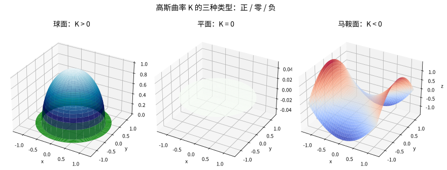

# 第 42 级：微分几何 (Differential Geometry)

> 微分几何是一门用微积分和线性代数工具研究光滑流形（微分流形）的几何结构的学科。它起源于曲线和曲面的古典微分几何，经过 Gauss、Riemann、Cartan、陈省身等数学家的开创性工作，发展成为现代数学的核心分支之一，深刻影响着拓扑学、物理学（特别是广义相对论和规范场论）、以及诸多应用领域。

> **🧠 思考历程：这门学科是如何"越走越深"的？**
>
> 微分几何的种子，其实是"怎么用数学描述一条弯弯的线、一张鼓鼓的面"这个朴素的问题。**平原时期（古希腊→17 世纪）**：人们只会拿圆、直线这些"走得直"的对象分析，而圆的弯曲用一个半径 $R$ 就足以刻画——一个数就能替你记住"它弯成什么样"。**曲线的时代（17–19 世纪）**：Descartes 引入坐标，Newton 与 Euler 用导数算每点的切线斜率，曲率的代数公式随之而来；1851–52 年 Serret 与 Frenet 先后独立得到空间曲线的 **Frenet 标架**——只用"弯不弯（$\kappa$）、扭不扭（$\tau$）"两个量，就完全锁定一条曲线的形状。
>
> **曲面的革命（Gauss，1827）**：Gauss 在《曲面的一般研究》里提出"羊皮地图"的思路——如果一只蚂蚁只生活在曲面表面、看不见外部空间，它能量出多少几何？他发明了**第一基本形式**（内蕴度量）与**第二基本形式**，并证明"绝妙定理"：曲面的**高斯曲率**由内在度量单独决定，与怎么嵌入空间无关。这让"几何"第一次脱离外围空间而独立存在。**Riemann（1854）** 在《论作为几何学基础的假设》里把这一内蕴思想推广到任意维，规范了抽象流形上"如何量长度"的度量，现代黎曼几何由此发端。
>
> **现代的分工**：Levi-Civita（1917）提出"平行移动"，由此长出"联络"；Cartan 用外微分统一表达整套理论；Gauss-Bonnet 定理与陈省身（1944）把它推广到高维，接通几何与拓扑；Killing 的向量场则捕捉空间的对称性。本级的第 2、3 章先补上古典的**曲线**与**曲面**地基，第 4–14 章再沿着这一历史脉络进入现代流形语言。

---

## 1. 学习目标

1. 理解光滑流形的基本概念，掌握切空间、切丛、光滑映射等核心工具。
2. 掌握向量场、张量场、微分形式等流形上的分析工具。
3. 理解外微分运算与 de Rham 上同调理论，掌握流形上的 Stokes 定理。
4. 理解联络与曲率的概念，掌握 Levi-Civita 联络与 Bianchi 恒等式。
5. 掌握黎曼几何的核心理论：测地线、指数映射、Hopf-Rinow 定理、各种曲率概念。
6. 理解 Gauss-Bonnet 定理及其推广，感受几何与拓扑的深刻联系。
7. 掌握 Lie 导数与 Killing 向量场，理解等距变换与对称性。
8. 通过大量示例和习题培养几何直观与计算能力。
9. 掌握平面与空间曲线论：正则曲线、弧长、曲率、挠率与 Frenet-Serret 标架。
10. 掌握曲面论基础：切平面、第一/第二基本形式、Gauss/主/平均曲率、极小曲面与高斯绝妙定理。

---

## 2. 平面与空间曲线（Frenet-Serret 标架）

> **🧠 思考历程：曲线治好了"怎么描述它弯"的强迫症**
>
> 一条曲线是直是弯，人人都看得出，但直到微积分诞生后，人们才明白"弯"是一个**与参数化无关的内在量**。Serret（1851）与 Frenet（1852）独立完成了点睛之笔：对空间曲线取一个"依附在曲线上、随弧长一起动"的正交标架 $\{T,N,B\}$，并给出它们沿弧长的演化方程——曲率 $\kappa$ 回答"在密切平面里弯得多快"，挠率 $\tau$ 回答"紧贴曲线的那块平面自身扭得多快"。最有杀伤力的结论是：**这两条信息就已穷尽一切**——任意两条正则空间曲线，只要 $\kappa(s)$、$\tau(s)$ 完全相同，就能通过刚性运动（平移+转动）重合。这就是"曲线论基本定理"，也是整门微分几何第一次尝到"局部不变量完全决定几何"的滋味，为后面曲面的内蕴理论铺路。

### 2.1 正则曲线与弧长

**定义 2.1**（平面正则曲线）设 $\gamma: I \to \mathbb{R}^2$ 是光滑映射。称 $\gamma$ 为**正则曲线**（regular curve），若其速度 $\gamma'(t) \neq 0$ 对一切 $t \in I$ 成立。

**定义 2.2**（弧长与自然参数）从起点 $\gamma(t_0)$ 到 $\gamma(t)$ 的**弧长**（arc length）为
$$
s(t)=\int_{t_0}^{t}\lVert \gamma'(u) \rVert\,du .
$$
满足 $\lVert \gamma'(s) \rVert = 1$ 的参数 $s$ 称为**弧长参数**（自然参数），此时 $T(s)=\gamma'(s)$ 是**单位切向量**。

> **💡 直观理解（类比）**：正则曲线是"永远在前进、绝不停顿"的轨迹：$\gamma'\ne0$ 保证每一点都有一条确定的切线。弧长参数则是给曲线"重新校准刻度"：无论原先走得快慢，换成 $s$ 后每一步恰好走单位长度，切向量 $T=\gamma'$ 长度恒为 $1$。类比把一条细绳拉直后按厘米刻线——从此所有几何量（曲率、挠率）都在这套"均匀标尺"上度量，与最初的走法无关。

### 2.2 平面曲线的曲率

**定义 2.3**（平面曲率）对弧长参数曲线 $\gamma(s)$，定义**曲率**（curvature）
$$
\kappa(s)=\lVert T'(s) \rVert=\lVert \gamma''(s) \rVert .
$$
对一般参数化 $t$ 有显式公式
$$
\kappa(t)=\frac{|x'y''-y'x''|}{(x'^2+y'^2)^{3/2}} .
$$

**例 2.4** 半径为 $R$ 的圆 $\gamma(t)=(R\cos t,R\sin t)$ 满足 $\kappa=1/R$：**圆越"尖锐"、半径越小，弯曲越快**；直线满足 $\kappa=0$。

> **💡 直观理解（类比）**：曲率是"切线方向转动的快慢"：$T'(s)$ 越大，说明切向量掉头越快、曲线弯得越急。它把"弯不弯"从形容词变成可测量的数——每一点恰有一个与之贴得最紧的圆（曲率圆），其半径正是 $1/\kappa$。

### 2.3 空间曲线与 Frenet-Serret 标架

**定义 2.5**（Frenet 标架）设 $\gamma(s)$ 是 $\mathbb{R}^3$ 中弧长参数化的正则曲线（且 $\kappa>0$），定义
$$
T(s)=\gamma'(s),\qquad N(s)=\frac{T'(s)}{\lVert T'(s) \rVert},\qquad B(s)=T(s)\times N(s) .
$$
$\{T,N,B\}$ 构成随 $s$ 运动的正交右旋标架，称为 **Frenet-Serret 标架**；其中 $N$ 为主法向量、$B$ 为副法向量。

**定义 2.6**（挠率）**挠率**（torsion）定义为
$$
\tau(s)=\langle N'(s),\,B(s)\rangle,
$$
它刻画密切平面绕 $T$ 方向扭转的速率。

**定理 2.7**（Frenet-Serret 公式，Serret 1851 / Frenet 1852）对弧长参数化的 $T$、$N$、$B$ 成立
$$
\begin{aligned}
T'&=+\kappa\,N,\\
N'&=-\kappa\,T+\tau\,B,\\
B'&=-\tau\,N .
\end{aligned}
$$

**定理 2.8**（曲线论基本定理）给定连续光滑函数 $\kappa(s)>0$、$\tau(s)$ 与初始标架，存在唯一（至多相差一个刚性运动）正则曲线以它们为曲率与挠率。特别地，$\tau\equiv 0$ 当且仅当曲线落在一个固定平面内。

> **💡 直观理解（类比）**：Frenet 标架像挂在车头的一副"跟随探头"：$T$ 指向前方，$N$ 指向弯道内侧（向心方向），$B$ 指向路面的横轴。Frenet-Serret 公式就是这些探头的"运动方程"——$\kappa$ 管"方向盘向左打多快"，$\tau$ 管"车身绕前进轴侧倾多少"。类比盘山公路：急弯放大 $\kappa$，路面导致的车辆侧倾趋势就是 $\tau$。有了它们，一条空间曲线的"长相"就被彻底锁定。

### 2.4 平面曲线的整体性质（导读）

> **💡 直观理解（导读）**：曲线的整体理论把"局部怎么弯"升级为"整条闭曲线能圈多大"：给定弧长 $L$ 的平面闭曲线，能圈出的最大面积正是圆——这是经典的**等周不等式**（isoperimetric inequality）$A \le L^2/4\pi$，当且仅当曲线为圆时取等。它与后面 Gauss-Bonnet 定理"整体（拓扑）= 曲率积分"的思想一脉相承，是曲线论过渡到曲面论的桥梁。

---

## 3. 曲面：基本形式与 Gauss 曲率

> **🧠 思考历程：Gauss 如何让"弯曲"不再依赖外界**
>
> 曲面论的开创属于 Gauss。他在 1827 年的《曲面的一般研究》（*Disquisitiones generales circa superficies curvas*）里一肩扛起两件事实质上纠缠的事：**反映曲面内部长短的第一基本形式，和反映"怎么嵌入空间"的第二基本形式，两者决定弯曲的核心量——高斯曲率——竟只由前者确定**。他证明的"绝妙定理"（Theorema Egregium）声称：曲面的**高斯曲率 $K$ 完全由第一基本形式决定**——一只看不见外部空间的蚂蚁，只要会量曲面上的长度与角度，就能算出 $K$。这颠覆了"弯曲必须借助外界"的朴素直觉，也直接为 Riemann（1854）把几何抽象成"任意维流形 + 度量"、以及广义相对论"物质告诉时空如何弯曲"铺平了道路。
>
> 这一章"解决了什么问题"：Euler 与 Meusnier 给出沿任意方向的**法曲率**及其在切平面内的分布规律；Weingarten 发现**形状算子**在主方向取到极值（主曲率）；而**极小曲面**（$H=0$）回答"给定边界，张一幅面积最小的膜有多少种形状"。

### 3.1 正则曲面与切平面

**定义 3.1**（正则曲面）子集 $S\subset\mathbb{R}^3$ 称为**正则曲面**（regular surface），若每点 $p\in S$ 有邻域可由一个光滑且满足 $\mathbf x_u\times\mathbf x_v\neq0$（即偏导线性无关）的参数化 $\mathbf x(u,v)$ 覆盖。

由正则参数化，$S$ 在 $p$ 处的**切平面** $T_pS$ 由 $\{\mathbf x_u,\mathbf x_v\}$ 张成，**单位法向量**为
$$
\mathbf n = \frac{\mathbf x_u\times\mathbf x_v}{\lVert \mathbf x_u\times\mathbf x_v \rVert}.
$$

**例 3.2** 球面 $S^2$：$\mathbf x(\theta,\phi)=(\sin\theta\cos\phi,\sin\theta\sin\phi,\cos\theta)$，$T_pS$ 由 $\{\mathbf x_\theta,\mathbf x_\phi\}$ 张成，$\mathbf n = \mathbf x$（径向单位向量）。

> **💡 直观理解（类比）**：正则曲面是"每一小块都能用一张光滑地图铺开"的表面：参数化 $\mathbf x(u,v)$ 好比给曲面印上经纬网格，条件 $\mathbf x_u\times\mathbf x_v\ne0$ 保证网格不塌成一条线、每点恰有一张良定义的切平面。类比登山地形图——每张图平铺在桌上，但图上每一点各有朝向，$\mathbf n$ 就是"在该点笔直顶上天空的那支铅笔"。

### 3.2 第一基本形式

**定义 3.3**（第一基本形式）对正则曲面定义
$$
E=\mathbf x_u\cdot\mathbf x_u,\qquad F=\mathbf x_u\cdot\mathbf x_v,\qquad G=\mathbf x_v\cdot\mathbf x_v,
$$
则
$$
I=ds^2=E\,du^2+2F\,du\,dv+G\,dv^2
$$
称为**第一基本形式**（诱导度量）。它量出曲面内切向量的长度、夹角以及区域面积 $dA=\sqrt{EG-F^2}\,du\,dv$。

**例 3.4** 球面（例 3.2）$I=d\theta^2+\sin^2\theta\,d\phi^2$；圆柱 $\mathbf x(u,v)=(\cos u,\sin u,v)$ 满足 $I=du^2+dv^2$（与平面等距）。平面 $z=0$：$I=du^2+dv^2$。

> **💡 直观理解（类比）**：第一基本形式就是"贴在曲面上的一把软尺"：它只记录曲面内部的长度与夹角，完全不看曲面如何弯向外部。一张纸卷成圆柱，$I$ 不变；把球面揉皱，$I$ 改变不了。因此 $I$ 是**内蕴量**——而 Gauss 曲率将从这里悄悄涌现（见绝妙定理 3.9）。

### 3.3 第二基本形式与 Weingarten 映射

**定义 3.5**（第二基本形式）设 $\mathbf n$ 为单位法向量，定义
$$
L=\mathbf x_{uu}\cdot\mathbf n,\qquad M=\mathbf x_{uv}\cdot\mathbf n,\qquad N=\mathbf x_{vv}\cdot\mathbf n,
$$
则
$$
II = L\,du^2+2M\,du\,dv+N\,dv^2
$$
称为**第二基本形式**。

**定义 3.6**（Weingarten 映射/形状算子）$p\in S$ 处由
$$
S_p(v)=-d\mathbf n_p(v),\qquad v\in T_pS
$$
定义线性自映射 $S_p:T_pS\to T_pS$，称为**形状算子**。其特征值 $\kappa_1,\kappa_2$ 是**主曲率**；切平面内任意单位方向 $v$ 的**法曲率**为 $\kappa_n(v)=II(v,v)/I(v,v)$，满足 **Euler 公式** $\kappa_n=\kappa_1\cos^2\theta+\kappa_2\sin^2\theta$。

**例 3.7** 球面 $S^2$：$S_p(v)=v$（特征值 $1,1$）；圆柱：$(\kappa_1,\kappa_2)=(1,0)$；平面：$(0,0)$。

> **💡 直观理解（类比）**：如果说 $I$ 是蚂蚁的内部地图，$II$ 就是"从外面看，曲面在这一方向鼓出去多少"。形状算子 $S_p=-d\mathbf n$ 记录"法向量随你在切平面里挪动而偏斜的速率"——法向量转得快，说明该方向弯得急；沿不同方向转得快慢不同，其最大与最小两个极值正是主曲率。

### 3.4 Gauss 曲率、平均曲率与主曲率

**定义 3.8**（Gauss 曲率与平均曲率）
$$
K=\kappa_1\kappa_2=\det S_p,\qquad H=\frac{\kappa_1+\kappa_2}{2}=\frac12\operatorname{tr}S_p .
$$
坐标形式：
$$
K=\frac{LN-M^2}{EG-F^2},\qquad H=\frac{EN-2FM+GL}{2(EG-F^2)} .
$$

**定理 3.9**（Gauss 绝妙定理 Theorema Egregium，1827）对 $\mathbb{R}^3$ 中正则曲面，Gauss 曲率 $K$ 完全由第一基本形式 $I$（及其导数）决定，因此是**等距不变量**：任何保持 $I$ 的变形（等距）都保持 $K$。卷纸成圆柱 $K$ 仍为 $0$；球面无法展平，因为 $K=1/R^2\neq0$。

**例 3.10**（基本曲率一览）
- 球面 $S^2(R)$：$K=1/R^2$，$H=1/R$；
- 圆柱：$K=0$，$H=1/2$；
- 平面：$K=0$，$H=0$；
- 双曲抛物面 $z=x^2-y^2$：$K<0$（马鞍面）；
- 圆环面 $T^2$：$K=\frac{\cos u}{r(R+r\cos u)}$（外侧 $>0$、内侧 $<0$）。

> **💡 直观理解（类比）**：$K$ 是"曲面上每一点的局部总弯曲"，$H$ 是"沿各方向弯曲的平均"：马鞍面两主曲率一正一负、$K<0$；球面两主曲率皆正、$K>0$；圆柱一个为零、$K=0$ 尽管它看起来是弯的——这正说明 $K$ 是内蕴的。**绝妙定理**是本节的发动机：弯曲竟能被"住在表面上的居民"独立侦测出来，这是"几何可以不依赖外围空间"的第一声号角。

### 3.5 极小曲面

**定义 3.11**（极小曲面）平均曲率恒为零 $H=0$ 的正则曲面称为**极小曲面**（minimal surface）。（其几何解释：在给定边界条件下，它是使面积取得极小的驻值曲面。）

**例 3.12**（悬链面）$\mathbf x(u,v)=(a\cosh u\cos v,\;a\cosh u\sin v,\;au)$：代入基本形式计算得 $H=0$，故为极小曲面；其 $K$ 处处为负。

**例 3.13**（螺旋面与悬链面等距）螺旋面 $\mathbf x(u,v)=(u\cos v,\,u\sin v,\,av)$ 与悬链面（交换坐标）具有相同的第一基本形式，二者 $H=0$——这是"平移变形保持曲率"（绝妙定理）的一个活例子。

> **💡 直观理解（类比）**：极小曲面就像肥皂膜：把一根弯曲的金属框浸入皂液再拉出，皂液总张开成面积最小的膜，而膜上每点沿各方向的张力相互抵消、净张力为零——这正是 $H=0$。Plateau（19 世纪）用实验发现这种最小膜的存在，Douglas 与 Radó（约 1930）给出严格的界线，让"极小曲面"成为几何分析经久不衰的课题。

---

## 4. 光滑流形

> **🧠 思考历程：为什么需要一个"流形"概念**
>
> 有了曲线与曲面经验（第 2、3 章），数学家意识到几何对象不必总有全局坐标——球面就无法用一张平面图无扭曲地铺满。Riemann（1854）在《论作为几何学基础的假设》中首次提出"流形"（*Mannigfaltigkeit*）的雏形：每点只用一张局部坐标卡描述，靠重叠区域的"转移映射"把各块光滑地粘成整体。到 20 世纪，Veblen、Whitney（1936）等为其补上严格的拓扑骨架。它解决的核心问题是：**让"可微"（求导、切空间、积分、外微分）这些局部运算，在无法整体打平的空间上依然有意义**——这正是后续张量、外微分与联络能够运行的"厂房"。

### 4.1 光滑流形的定义

**定义 4.1**（拓扑流形）设 $M$ 是一个 Hausdorff 拓扑空间，且满足第二可数公理。称 $M$ 是一个 **$n$ 维拓扑流形**（topological manifold），若每点 $p \in M$ 都有一个邻域同胚于 $\mathbb{R}^n$ 中的某个开集。

**定义 4.2**（光滑结构）设 $M$ 是 $n$ 维拓扑流形。$M$ 上的一个 **光滑结构**（smooth structure）是一个坐标图册 $\mathcal{A} = \{(U_\alpha, \varphi_\alpha)\}$，其中：

- $\{U_\alpha\}$ 是 $M$ 的开覆盖；
- 每个 $\varphi_\alpha: U_\alpha \to \tilde{U}_\alpha \subseteq \mathbb{R}^n$ 是同胚；
- 对任意 $\alpha, \beta$，转移映射 $\varphi_\beta \circ \varphi_\alpha^{-1}: \varphi_\alpha(U_\alpha \cap U_\beta) \to \varphi_\beta(U_\alpha \cap U_\beta)$ 是 $C^\infty$（光滑）的；
- 图册是极大的（包含所有与之相容的坐标卡）。

带有光滑结构的拓扑流形称为 **光滑流形**（smooth manifold）。

> **💡 直观理解（类比）**：光滑结构是"给流形装上一套互相兼容的坐标字典"：用一堆坐标卡 $(U_\alpha,\varphi_\alpha)$ 覆盖流形，并要求任意两张卡在重叠处的转移映射（切换函数）都是 $C^\infty$ 光滑的。类比把地球分成很多张地图拼起来，要求相邻地图在交界处的比例与变形"平滑衔接、不露棱角"。有了它，"光滑函数、光滑曲线、导数"才能在跨卡换坐标时意义不冲突——这正是后续所有微分运算的地基。

**例 4.3**
- $\mathbb{R}^n$ 是光滑流形，由单个坐标卡 $(\mathbb{R}^n, \text{id})$ 覆盖。
- 单位圆 $S^1$ 是 1 维光滑流形。
- 球面 $S^n = \{x \in \mathbb{R}^{n+1} \mid \|x\| = 1\}$ 是 $n$ 维光滑流形，可用球极投影给出坐标卡。
- 环面 $T^n = S^1 \times \cdots \times S^1$ 是 $n$ 维光滑流形。

### 4.2 切空间与切丛

**定义 4.4**（切向量）设 $M$ 是光滑流形，$p \in M$。$M$ 在 $p$ 处的 **切向量** 是一个 $\mathbb{R}$-线性映射 $v: C^\infty(M) \to \mathbb{R}$，满足 **Leibniz 法则**：

$$
v(fg) = f(p) \, v(g) + g(p) \, v(f), \quad \forall f, g \in C^\infty(M).
$$

所有切向量的集合构成一个 $n$ 维向量空间，称为 $M$ 在 $p$ 处的 **切空间**（tangent space），记作 $T_p M$。

> **💡 直观理解（类比）**：切向量是"在一点朝着某方向做一阶线性猜测"的算子：一个切向量 $v$ 把每个光滑函数 $f$ 映成它在 $p$ 处的方向导数，并强令满足 Leibniz 法则 $v(fg)=f(p)v(g)+g(p)v(f)$——恰把"导数的乘积规则"抽象成了切向量的定义。类比在 $p$ 点钉一根"方向探针"：不需要具体曲线就能知道"沿哪个方向函数怎么变"。所有探针拼成 $n$ 维切空间 $T_pM$，是 $p$ 处"可以往哪个方向走"的全部可能。

**定义 4.5**（坐标基）设 $(U, x^1, \ldots, x^n)$ 是 $p$ 附近的局部坐标。则切向量

$$
\frac{\partial}{\partial x^i}\Big|_p: f \mapsto \frac{\partial (f \circ \varphi^{-1})}{\partial x^i}(\varphi(p))
$$

构成 $T_p M$ 的一组基。任何 $v \in T_p M$ 可唯一表示为

$$
v = \sum_{i=1}^n v^i \frac{\partial}{\partial x^i}\Big|_p,\quad v^i = v(x^i).
$$

> **💡 直观理解（类比）**：坐标基是"局部坐标里最自然的切向量"：$\frac{\partial}{\partial x^i}\big|_p$ 表示"沿第 $i$ 个坐标轴求偏导"的算子，恰好构成 $T_pM$ 的一组基，于是任意切向量 $v$ 都能唯一拆成分量 $v=v^i\,\partial_i$。类比经纬网格上的"东向"与"北向"两根基准箭头——任何平面方向都能由它们线性拼出。而 $v^i=v(x^i)$ 说明分量就是"沿第 $i$ 个坐标度量时的读数"。

**定义 4.6**（切丛）$M$ 的 **切丛**（tangent bundle）是

$$
TM = \bigsqcup_{p \in M} T_p M,
$$

自然投射 $\pi: TM \to M$ 将 $v \in T_p M$ 映射到 $p$。$TM$ 本身是一个 $2n$ 维光滑流形，其光滑结构由 $M$ 的光滑结构诱导。

> **💡 直观理解（类比）**：切丛是把"所有点上的切空间"用一把大伞整体收拢：$TM=\bigsqcup_pT_pM$，每根纤维 $T_pM$ 就是 $p$ 处的"方向盘集合"，投射 $\pi$ 把每个切向量送回它所依附的那一点。类比把地图上每个点的一束"方向箭头"全部叠成一摞，底面就是原流形 $M$。$TM$ 自己还是 $2n$ 维光滑流形，为后面"向量场=每点挑一个切向量"的全域光滑选取提供了载体。

**定义 4.7**（余切丛与余切向量）$T_p M$ 的对偶空间 $T_p^* M$ 称为 **余切空间**（cotangent space）。其元素称为 **余切向量**（covector）。局部坐标 $(x^i)$ 下，$dx^i|_p$ 构成 $T_p^* M$ 的对偶基，满足

$$
dx^i\Big|_p\left(\frac{\partial}{\partial x^j}\Big|_p\right) = \delta^i_j.
$$

余切丛 $T^*M = \bigsqcup_{p \in M} T_p^* M$ 是 $2n$ 维光滑流形。

> **💡 直观理解（类比）**：余切向量是"给切向量标价／读数的线性函数"：$T_p^*M$ 是 $T_pM$ 的对偶空间，其元素把每个切向量映成一个实数。局部坐标下的对偶基 $dx^i$ 满足 $dx^i(\partial_j)=\delta^i_j$——$dx^i$ 就像"读取切向量第 $i$ 个坐标分量的读卡器"。类比工程师的测量规：输入一个位移（切向量）就报出对应方向的数值。余切丛 $T^*M$ 把这些读卡器逐点收集，是后面微分形式与联络的原材。

### 4.3 光滑映射

**定义 4.8**（光滑映射）设 $M, N$ 是光滑流形，映射 $F: M \to N$ 称为 **光滑映射**（smooth map），若对任意坐标卡 $(U, \varphi)$ 和 $(V, \psi)$，映射 $\psi \circ F \circ \varphi^{-1}$ 在定义域上是 $C^\infty$ 的。

> **💡 直观理解（类比）**：光滑映射是"局部换成坐标后仍处处可求导"的映射 $F:M\to N$：对任意两张坐标卡，复合 $\psi\circ F\circ\varphi^{-1}$ 是欧氏空间之间的 $C^\infty$ 函数。类比两台机器之间的联动杆：只要换成同一套"刻度表盘"后读数变化依然平滑，就说这台联动是光滑的。光滑映射是流形之间"尊重光滑结构"的正当通道，它的导数（微分 $dF_p$）就是下一步要定义的切映射。

**定义 4.9**（微分/切映射）光滑映射 $F: M \to N$ 在 $p \in M$ 处的 **微分**（differential）或 **切映射**（tangent map）是线性映射

$$
dF_p: T_p M \to T_{F(p)} N,
$$

定义为：对 $v \in T_p M$ 和 $f \in C^\infty(N)$，

$$
(dF_p(v))(f) = v(f \circ F).
$$

在局部坐标下，$dF_p$ 由 Jacobi 矩阵表示。

> **💡 直观理解（类比）**：微分/切映射 $dF_p:T_pM\to T_{F(p)}N$ 是光滑映射 $F$ 在切向量层面的"线性近似"：它把 $p$ 处的切向量 $v$ 送到 $F(p)$ 处对应的切向量（等价定义 $(dF_p(v))(f)=v(f\circ F)$）。类比一台机器的"速度传递函数"：输入 $p$ 处的方向与速率，输出像点处的方向与速率。局部坐标下它正是 Jacobi 矩阵——把"映射的导数"装进线性代数的标准模具，也决定 $F$ 在 $p$ 附近是浸入、浸没还是局部微分同胚。

### 4.4 浸入、浸没与嵌入

**定义 4.10** 设 $F: M \to N$ 是光滑映射，$\dim M = m$，$\dim N = n$。

- 若 $dF_p$ 在每点 $p \in M$ 都是单射，则称 $F$ 为 **浸入**（immersion）。（此时 $m \leq n$）
- 若 $dF_p$ 在每点 $p \in M$ 都是满射，则称 $F$ 为 **浸没**（submersion）。（此时 $m \geq n$）
- 若 $F$ 是浸入，且 $F: M \to F(M) \subseteq N$ 是同胚（$F(M)$ 赋予子空间拓扑），则称 $F$ 为 **嵌入**（embedding）。

**例 4.11**
- 包含映射 $S^2 \hookrightarrow \mathbb{R}^3$ 是嵌入。
- 曲线 $t \mapsto (t^2, t^3)$ 在 $\mathbb{R}^2$ 中是浸入但不是嵌入（在原点处有尖点）。
- 投影 $\mathbb{R}^3 \to \mathbb{R}^2$ 是浸没。

**定理 4.12**（浸没定理）若 $F: M \to N$ 是浸没，则对任意 $q \in N$，$F^{-1}(q)$ 是 $M$ 的 $\dim M - \dim N$ 维子流形。

> **💡 直观理解（类比）**：浸没定理说"浸没的每个纤维都很整齐"：若 $F:M\to N$ 在每点切映射都是满射，那么任取 $q\in N$，原像 $F^{-1}(q)$ 都是一张 $\dim M-\dim N$ 维子流形。类比俯瞰一层叠一层的山峰：沿着"等高线" $F=\text{常数}$ 切一刀，得到的每条等高线本身就是平滑曲线。这从隐函数定理出发宣称这组"方程组 $F=q$"的解集不仅是一堆散点，而是自带光滑结构的子流形——纤维丛与商结构的原型由此诞生。

**定理 4.13**（Whitney 嵌入定理）每个 $n$ 维光滑流形可以光滑地嵌入到 $\mathbb{R}^{2n}$ 中。

Whitney 嵌入定理表明，抽象光滑流形总可以视为欧氏空间的子流形，这大大简化了几何直觉。

> **直观理解（现实类比）**：嵌入与浸入是研究"第二基本形式"的舞台——后者专门刻画子流形如何嵌入到外围空间。把子流形想象成一张悬浮在三维空间中的薄膜：第一基本形式量出薄膜上"蚂蚁能测的"距离与角度（内蕴量），而第二基本形式则像"测量弯曲的工具"，回答薄膜在每一点沿每个方向"往哪一侧鼓、鼓得多厉害"（外蕴量）。它输入切向量返回法向量方向的曲率，是薄膜与外围空间的"弯曲关系说明书"。浸入允许薄膜自交，而嵌入则禁止自交——这正是 Nash 嵌入定理能保证任何抽象度量都可在足够高维的 $\mathbb{R}^N$ 中"无自交地实现"的几何背景。

---

## 5. 向量场与张量场

> **🧠 思考历程：从"局部坐标"到"坐标无关的量"**
>
> 早期几何把一切写成分量，但分量会随坐标选法而变。为从"随时间地点而变的分量"里抓出"真正属于几何的信息"，Ricci 与 Levi-Civita（约 1900）发展出**张量分析**：用"坐标变换下遵循确定规律的分量"来编码与坐标无关的实体。向量场 $X$ 是"每点一个方向"，张量场则是"逐点一个多重线性读数"，而 Riemann 度量 $g$ 正是其中最要紧的一枚 $(0,2)$-张量。这套语言解决的问题：**在任意坐标下给出不变量判据**——为"什么是长度、曲率、对称"提供坐标无关的定义，是所有后续计算共享的字母表。

### 5.1 向量场

**定义 5.1**（向量场）$M$ 上的一个 **光滑向量场**（vector field）是一个光滑映射 $X: M \to TM$，满足 $\pi \circ X = \text{id}_M$，即 $X_p \in T_p M$ 对每点 $p$ 成立。

向量场 $X$ 可视为 $C^\infty(M)$ 上的导子：对 $f \in C^\infty(M)$，定义 $X(f) \in C^\infty(M)$ 为

$$
(X(f))(p) = X_p(f).
$$

> **💡 直观理解（类比）**：向量场是"每点挑一个切向量且让向场的排布光滑"的全域分配：$X:M\to TM$ 满足 $\pi\circ X=\text{id}$，即 $X_p\in T_pM$。类比在每棵树上都插一根随风缓慢转动的小风标——处处有箭头，且整体过渡平滑。它同时等价于"把光滑函数映成光滑函数的导子"（$X(f)(p)=X_p(f)$），因而既能"沿它求导"，又能生成一族"流"（单参数变换群 $\phi_t$）——这正是物理里速度场、流场的抽象化身。

**例 5.2** 在 $\mathbb{R}^2$ 中，$X = x \frac{\partial}{\partial x} + y \frac{\partial}{\partial y}$ 是一个向量场。

**流与单参数变换群**：给定向量场 $X$，对每点 $p \in M$，存在唯一的积分曲线 $\gamma_p(t)$ 满足

$$
\gamma_p(0) = p,\quad \gamma_p'(t) = X_{\gamma_p(t)}.
$$

由此定义 **流**（flow）$\phi_t: M \to M$，$\phi_t(p) = \gamma_p(t)$，在局部上满足 $\phi_{t+s} = \phi_t \circ \phi_s$。

### 5.2 Lie 括号

**定义 5.3**（Lie 括号）设 $X, Y$ 是 $M$ 上的光滑向量场。它们的 **Lie 括号**（Lie bracket）$[X, Y]$ 是向量场，定义为

$$
[X, Y]_p(f) = X_p(Y(f)) - Y_p(X(f)), \quad \forall f \in C^\infty(M).
$$

在局部坐标 $(x^i)$ 下，若 $X = X^i \partial_i$，$Y = Y^i \partial_i$，则

$$
[X, Y] = \left( X^j \frac{\partial Y^i}{\partial x^j} - Y^j \frac{\partial X^i}{\partial x^j} \right) \frac{\partial}{\partial x^i}.
$$

**性质 5.4**（Lie 括号的性质）
- 反交换性：$[X, Y] = -[Y, X]$；
- Jacobi 恒等式：$[X, [Y, Z]] + [Y, [Z, X]] + [Z, [X, Y]] = 0$；
- Leibniz 法则：$[X, fY] = f[X, Y] + (Xf)Y$。

### 5.3 张量场

**定义 5.5**（$(r, s)$-型张量场）$M$ 上的一个 **$(r, s)$-型光滑张量场**（tensor field）$T$ 是一个光滑映射，在每点 $p \in M$ 给出一个多重线性映射

$$
T_p: \underbrace{T_p^* M \times \cdots \times T_p^* M}_{r\text{ 个}} \times \underbrace{T_p M \times \cdots \times T_p M}_{s\text{ 个}} \to \mathbb{R}.
$$

在局部坐标下，

$$
T = T^{i_1 \ldots i_r}_{j_1 \ldots j_s} \frac{\partial}{\partial x^{i_1}} \otimes \cdots \otimes \frac{\partial}{\partial x^{i_r}} \otimes dx^{j_1} \otimes \cdots \otimes dx^{j_s}.
$$

> **💡 直观理解（类比）**：张量场是"逐点赋予一个多重线性量"的分配：一个 $(r,s)$-型张量场 $T$ 在每点 $p$ 给出一个从 $r$ 个余切向量与 $s$ 个切向量到实数的多重线性映射。类比每个位置上搁着一台固定刻度的"多维秤盘"：必须同时喂入若干个"方向刻度（余切）"与"方向箭头（切）"才能读数。分量 $T^{i_1\ldots i_r}_{j_1\ldots j_s}$ 就是它的"读数表"；$(0,0)$ 即函数、$(1,0)$ 即向量场、$(0,1)$ 即余切 1-形式——张量场是贯穿整个微分几何的统一记账符号。

**例 5.6**
- $(0,0)$-型张量场就是光滑函数。
- $(1,0)$-型张量场就是向量场。
- $(0,1)$-型张量场就是余切向量场（1-形式）。
- Riemann 度量是 $(0,2)$-型对称正定张量场。

### 5.4 Riemann 度量

**定义 5.7**（Riemann 度量）$M$ 上的一个 **Riemann 度量**（Riemannian metric）$g$ 是一个 $(0,2)$-型光滑对称正定张量场。即对每点 $p$，$g_p: T_p M \times T_p M \to \mathbb{R}$ 是内积。在局部坐标 $(x^i)$ 下，

$$
g = g_{ij} \, dx^i \otimes dx^j, \quad g_{ij} = g\left(\frac{\partial}{\partial x^i}, \frac{\partial}{\partial x^j}\right),
$$

其中 $(g_{ij})$ 是光滑对称正定矩阵值函数。

带有 Riemann 度量的光滑流形称为 **Riemann 流形**（Riemannian manifold）。

**例 5.8**
- $\mathbb{R}^n$ 上的标准度量 $g = \sum_{i=1}^n dx^i \otimes dx^i$。
- 球面 $S^n$ 从 $\mathbb{R}^{n+1}$ 继承的诱导度量。
- 双曲空间 $\mathbb{H}^n$ 上的 Poincaré 度量 $g = \frac{4}{(1 - |x|^2)^2} \sum_{i=1}^n dx^i \otimes dx^i$。

> **直观理解（现实类比）**：对于 $\mathbb{R}^3$ 中嵌入的曲面，Riemann 度量 $g_{ij}=E\,du^2+2F\,du\,dv+G\,dv^2$ 就是经典微分几何中的 **第一基本形式**——一把"测量长度的工具"。它像贴在曲面上的一张"画满刻度的弹性膜"，蚂蚁用它就能量出任意两条相交切向量的长度与夹角、算出小区域的面积、定义曲面上的"最短路径"。第一基本形式只关心曲面内部的几何（内蕴量），完全不看曲面如何嵌入三维空间——这是高斯绝妙定理"曲率内蕴"的伏笔。抽象 Riemann 流形上的 $g$ 正是这一"长度规则"脱离外围空间后的独立存在。

### 5.5 微分形式

**定义 5.9**（微分形式）$M$ 上的 **$k$-次微分形式**（differential $k$-form）$\omega$ 是一个 $(0,k)$-型全反对称张量场。即 $\omega_p$ 是 $T_p M$ 上的 $k$ 重交错线性形式。

在局部坐标下，

$$
\omega = \frac{1}{k!} \omega_{i_1 \ldots i_k} \, dx^{i_1} \wedge \cdots \wedge dx^{i_k},
$$

其中 $\wedge$ 表示外积（wedge product），$\omega_{i_1 \ldots i_k}$ 关于指标全反对称。

所有 $k$-次微分形式的集合记作 $\Omega^k(M)$。外积 $\wedge: \Omega^k(M) \times \Omega^l(M) \to \Omega^{k+l}(M)$ 满足超交换性：

$$
\omega \wedge \eta = (-1)^{kl} \eta \wedge \omega.
$$

> **💡 直观理解（类比）**：微分 $k$-形式是"全反对称的可积器"：一个 $(0,k)$-型反对称张量场 $\omega$，输入 $k$ 个切向量就给出一个带严格符号约定的数（交换任意两个输入变号）。类比"带转向的有向体积测量仪"：顺序输入得到正体积，调换两个输入方向就变负。局部由 $dx^{i_1}\wedge\cdots\wedge dx^{i_k}$ 张成，外积 $\wedge$ 把形式相乘并遵守超交换律 $\omega\wedge\eta=(-1)^{kl}\eta\wedge\omega$。正是"反对称 + 可积"，让微分形式成为积分 $\int\omega$ 与整体拓扑问题的天然载体。

---

## 6. 外微分与积分

> **🧠 思考历程：从 Stokes 的"尾巴"到 de Rham 的"洞"**
>
> Newton-Leibniz 公式说 $\int_a^b f'=f(b)-f(a)$；Green、Gauss、Ostrogradsky 各自给出二维、三维的推广。Cartan（约 1899–1922）用**外微分** $d$、**外积** $\wedge$ 统一了这些结果，把"导数 + 积分"打包成流形上的协调机器，并令人信服地断言"微分形式正是可以在流形上全局积分的东西"。de Rham（1931）则发现外微分的上同调恰好检测空间的"洞"。这一章解决的问题：**把高维微积分基本定理推广到任意流形，并把分析语言转译为拓扑语言**——为 Stokes 定理与整套拓扑理论奠基。

### 6.1 外导数

**定义 6.1**（外导数）**外导数**（exterior derivative）$d: \Omega^k(M) \to \Omega^{k+1}(M)$ 是唯一满足以下性质的 $\mathbb{R}$-线性映射：

1. 对 $k=0$，$d f$ 是函数的普通微分，即 $d f(X) = X(f)$；
2. $d^2 = 0$（即 $d(d\omega) = 0$）；
3. 对 $\omega \in \Omega^k(M)$ 和 $\eta \in \Omega^l(M)$，
   $$
   d(\omega \wedge \eta) = d\omega \wedge \eta + (-1)^k \omega \wedge d\eta.
   $$

在局部坐标下，若 $\omega = \omega_I \, dx^{i_1} \wedge \cdots \wedge dx^{i_k}$，则

$$
d\omega = d\omega_I \wedge dx^{i_1} \wedge \cdots \wedge dx^{i_k} = \frac{\partial \omega_I}{\partial x^j} \, dx^j \wedge dx^{i_1} \wedge \cdots \wedge dx^{i_k}.
$$

> **💡 直观理解（类比）**：外导数 $d$ 是把微分 $k$-形式升到 $(k+1)$-形式的"求导机器"，满足三条铁律：对函数就是普通微分、$d^2=0$（走两步必为零）、以及对乘积带符号的 Leibniz 法则。类比"漩涡的边界算符"：$d\omega=0$（闭）说明没有"源"，$\omega=d\eta$（恰当）说明它正好是由更低维的 $\eta$ 的"边界"长出来的。$d^2=0$ 正是拓扑里"边界之边界为空"的代数化身，也是全套同调理论的灵魂。

**性质 6.2** $d\omega = 0$ 的 $k$-形式称为 **闭形式**（closed form）。存在 $\eta$ 使得 $\omega = d\eta$ 的 $k$-形式称为 **恰当形式**（exact form）。由于 $d^2 = 0$，每个恰当形式都是闭的，但反之不一定成立。

### 6.2 de Rham 上同调

**定义 6.3**（de Rham 上同调）光滑流形 $M$ 的 **$k$ 次 de Rham 上同调群**（de Rham cohomology）定义为

$$
H^k_{\text{dR}}(M) = \frac{\ker(d: \Omega^k(M) \to \Omega^{k+1}(M))}{\operatorname{im}(d: \Omega^{k-1}(M) \to \Omega^k(M))}.
$$

即 $k$ 次闭形式模 $k$ 次恰当形式。

> **💡 直观理解（类比）**：de Rham 上同调 $H^k_{\text{dR}}$ 是"把闭形式按恰当形式求差"得到的商空间：闭形式（无源可积场）彼此之间若只差一个恰当形式（边界场）则视为同一类，模出来的商空间度量大流形上"独立存在的洞"。类比声波按相差一个"导数场"来等价：本质上无法从某个 $\eta$ 的边界造出的那些闭形式，就对应流形上的一个"圈住洞的哨"。

**定理 6.4**（de Rham 定理）de Rham 上同调群 $H^k_{\text{dR}}(M)$ 同构于 $M$ 的奇异上同调群 $H^k(M; \mathbb{R})$。因此，de Rham 上同调是拓扑不变量。

> **💡 直观理解（类比）**：de Rham 定理是一座连接微积分与拓扑的桥：它宣称用"光滑微分形式+外导数"算出的 $H^k_{\text{dR}}(M)$ 正是用奇异单形拼出空间的奇异上同调 $H^k(M;\mathbb{R})$，两者同构。类比同一条跑道的两种丈量法——用光滑的皮尺（微分形式）量与用一根根直杆（奇异单形）拼量，结果完全相同。由此，纯分析对象竟成了纯拓扑不变量：闭上同调与"洞的个数"绑定，颠覆性地把微积分变成拓扑探测器。

**例 6.5**
- $H^0_{\text{dR}}(M) \cong \mathbb{R}^{\text{连通分支数}}$。
- $H^k_{\text{dR}}(\mathbb{R}^n) = 0$ 对 $k \geq 1$（Poincaré 引理）。
- $H^1_{\text{dR}}(S^1) \cong \mathbb{R}$，生成元是 $\frac{1}{2\pi} d\theta$。
- $H^k_{\text{dR}}(S^n) \cong \mathbb{R}$ 当 $k = 0$ 或 $k = n$，否则为 $0$。

### 6.3 流形上的积分

**定义 6.6**（定向流形）光滑流形 $M$ 称为 **可定向的**（orientable），若 $M$ 上存在一个处处非零的 $n$-形式（$n = \dim M$）。选取这样一个 $n$-形式等价于给 $M$ 指定一个 **定向**（orientation）。

> **💡 直观理解（类比）**：定向流形是"整体能一致地分辨左右/上下"的流形：$n$ 维流形 $M$ 可定向，即存在一个处处非零的 $n$-形式。类比一个表面：球面能统一规定"外侧为正"，因此可定向；而莫比乌斯带沿一圈走回来上下会颠倒，无法一致标号，不可定向。选定这个处处非零的 $n$-形式就订好了流形的"方向标尺"，才能无歧义地谈"带方向的积分" $\int_M \omega$，也是 Stokes 定理的前提。

**定向流形上的积分**：设 $M$ 是 $n$ 维定向光滑流形，$\omega \in \Omega^n_c(M)$（紧支撑的 $n$-形式）。通过单位分解将 $\omega$ 分解到坐标卡上，在每个坐标卡上 $\omega = f \, dx^1 \wedge \cdots \wedge dx^n$，定义

$$
\int_M \omega = \sum_\alpha \int_{\varphi_\alpha(U_\alpha)} (\rho_\alpha f_\alpha) \circ \varphi_\alpha^{-1} \, dx^1 \cdots dx^n,
$$

其中 $\{\rho_\alpha\}$ 是从属于覆盖 $\{U_\alpha\}$ 的单位分解。此定义不依赖于坐标卡和单位分解的选取。

### 6.4 Stokes 定理

**定理 6.7**（Stokes 定理）设 $M$ 是 $n$ 维定向带边光滑流形，$\partial M$ 带有诱导定向。对任意紧支撑的 $(n-1)$-形式 $\omega$，

$$
\int_M d\omega = \int_{\partial M} \omega.
$$

**证明概要**：
1. 利用单位分解将问题化归到 $\omega$ 支撑在 $\mathbb{R}^n$ 或 $\mathbb{H}^n = \{x \in \mathbb{R}^n \mid x^1 \leq 0\}$ 的局部情形。
2. 在 $\mathbb{R}^n$ 内部，$\omega = \sum_{i=1}^n (-1)^{i-1} f_i \, dx^1 \wedge \cdots \wedge \widehat{dx^i} \wedge \cdots \wedge dx^n$，则 $d\omega = \left(\sum_i \frac{\partial f_i}{\partial x^i}\right) dx^1 \wedge \cdots \wedge dx^n$。由 Fubini 定理和 Newton-Leibniz 公式，$\int_{\mathbb{R}^n} d\omega = 0$。
3. 在 $\mathbb{H}^n$ 边界 $x^1 = 0$ 处，仅 $i=1$ 项有贡献，得到 $\int_{\mathbb{H}^n} d\omega = \int_{\partial \mathbb{H}^n} \omega$。
4. 通过单位分解拼合局部结果，完成证明。

Stokes 定理是微积分基本定理的高维推广，它将流形上的积分与边界上的积分联系起来，是微分几何和拓扑学中最重要的定理之一。

> **💡 直观理解（类比）**：Stokes 定理 $\int_M d\omega=\int_{\partial M}\omega$ 断言"流形内部的微分形式的积分等于它在边界上的积分"——对偶的边界算子 $d$ 与拓扑边界 $\partial$ 亦步亦趋，正是"内部总量可由边界净量决定"的统一表述。类比沿山体量"总涨势"（$\int_M d\omega$）与绕山脚一圈量"净抬升"（$\int_{\partial M}\omega$）完全相等。它把牛顿-莱布尼茨公式、格林公式、高斯散度定理…打包成一座"高维微积分基本定理"的大厦。

---

## 7. 联络与曲率

> **🧠 思考历程：如何"比较"不同点的切向量**
>
> 平直空间里"移动箭头"天经地义，可弯曲空间里，把一个箭头从一个切空间搬到另一个，方向怎么才算"平移"？Levi-Civita（1917）给出的答案是：让"平行移动"保持长度与夹角（$\nabla g=0$）且无挠，这样的联络是唯一的——这就是后人所说的 **Levi-Civita 联络**。借助它得到的曲率张量 $R$ 回答"绕一个无穷小环路搬一圈，箭头回起点时差了多少"。它解决的问题：**在没有直觉的弯曲流形上，定义一个唯一自然的"求导"，并把"平行移动的偏差"变成曲率的严格量度**——广义相对论与规范场论的数学骨架都建立其上。

### 7.1 向量丛上的联络

**定义 7.1**（向量丛）$M$ 上的一个 **向量丛**（vector bundle）$E$ 是一个光滑流形，配有光滑满射 $\pi: E \to M$，使得每根纤维 $E_p = \pi^{-1}(p)$ 是 $r$ 维向量空间，且局部平凡化：每点有邻域 $U$ 和微分同胚 $\Phi: \pi^{-1}(U) \to U \times \mathbb{R}^r$，使得 $\Phi|_{E_p}: E_p \to \{p\} \times \mathbb{R}^r$ 是线性同构。

> **💡 直观理解（类比）**：向量丛是"给每一点都挂上一个 $r$ 维向量空间且局部像平铺货架"的总装配：投射 $\pi:E\to M$ 把每根纤维 $E_p=\pi^{-1}(p)$（一个向量空间）送回它依附的点 $p$，并且要求局部平凡化——每个小邻域上 $E$ 微分同胚于"点集 × $\mathbb{R}^r$"。类比一间连锁店：每个门店(点)都有同样的储物空间，只看局部，铺面都长得像标准货架。切丛、余切丛、张量丛都是向量丛的特例，是"在流形上装向量值数据"的通配容器。

**定义 7.2**（联络）设 $E \to M$ 是向量丛。$E$ 上的一个 **联络**（connection）是一个 $\mathbb{R}$-线性映射

$$
\nabla: \Gamma(E) \to \Gamma(T^*M \otimes E),
$$

满足 **Leibniz 法则**：

$$
\nabla(f s) = df \otimes s + f \nabla s, \quad \forall f \in C^\infty(M),\; s \in \Gamma(E).
$$

对向量场 $X$，记 $\nabla_X s = \iota_X(\nabla s) \in \Gamma(E)$，称为 $s$ 沿 $X$ 方向的 **协变导数**（covariant derivative）。

> **💡 直观理解（类比）**：联络 $\nabla$ 是"为张量值函数提供求导方"的规则：它告诉你截面 $s$ 沿哪个方向"该怎么变化"，并且强制满足 Leibniz 法则 $\nabla(fs)=df\otimes s+f\nabla s$（对系数 $f$ 按数乘法则、对 $s$ 按张量法则）。类比在弯曲表面上推一辆小车：平直空间中"箭头平行移动"有了自然答案，而在弯曲流形上必须额外规定"什么才算不偏转"，联络正是这份"平行移动的说明书"。它是把导数推广到带扭曲的向量丛上的关键工具。

### 7.2 切丛上的联络与曲率张量

当 $E = TM$ 时，联络 $\nabla$ 称为 **仿射联络**（affine connection）。

**定义 7.3**（Christoffel 符号）在局部坐标 $(x^i)$ 下，联络 $\nabla$ 由 **Christoffel 符号** $\Gamma^k_{ij}$ 确定：

$$
\nabla_{\partial_i} \partial_j = \Gamma^k_{ij} \partial_k.
$$

> **💡 直观理解（类比）**：Christoffel 符号 $\Gamma^k_{ij}$ 是"联络在局部坐标下的骨架表"：它把基切向量 $\partial_j$ 沿 $\partial_i$ 方向的协变导数拆成 $\partial_k$ 的线性组合，组合系数就是 $\Gamma^k_{ij}$。类比一张规范换算表——告诉你坐标基矢量各自"如何随位置轻轻偏转"。它本身不是张量（随坐标变化），但正是它用清晰的 $n^3$ 个分量承载了弯曲流形"平行移动规则"的一切局部信息。

**定义 7.4**（挠率张量）联络 $\nabla$ 的 **挠率张量**（torsion tensor）$T$ 是 $(1,2)$-型张量场：

$$
T(X, Y) = \nabla_X Y - \nabla_Y X - [X, Y].
$$

若 $T = 0$，称联络是 **无挠的**（torsion-free）。

> **💡 直观理解（类比）**：挠率张量 $T(X,Y)=\nabla_XY-\nabla_YX-[X,Y]$ 度量"平行移动的规矩是否对称"：若按 $X$ 方向位移再沿 $Y$ 方向比对、与反过来比对的差异，减去 Lie 括号后仍残留，就当由挠率记账。类比螺旋楼梯：沿两种顺序绕上去，脚下迈出的台阶差揭示了这座梯子"拧了多少"。大多数黎曼几何采用无挠联络（$T=0$），相当于"移位的规则不偏心、不旋转"。

**定义 7.5**（曲率张量）联络 $\nabla$ 的 **曲率张量**（curvature tensor）$R$ 是 $(1,3)$-型张量场：

$$
R(X, Y)Z = \nabla_X \nabla_Y Z - \nabla_Y \nabla_X Z - \nabla_{[X, Y]} Z.
$$

在局部坐标下，$R(\partial_i, \partial_j)\partial_k = R_{kij}^l \partial_l$，其中

$$
R_{kij}^l = \partial_i \Gamma^l_{jk} - \partial_j \Gamma^l_{ik} + \Gamma^m_{jk} \Gamma^l_{im} - \Gamma^m_{ik} \Gamma^l_{jm}.
$$

> **💡 直观理解（类比）**：曲率张量 $R(X,Y)Z=\nabla_X\nabla_YZ-\nabla_Y\nabla_XZ-\nabla_{[X,Y]}Z$ 度量"沿一个小方环路平行搬一圈、回到原点后与原来差了多少"：把向量沿环路平行移动一周，方向往往回不到原位，返还时的偏差本领正是曲率。类比在弯曲坡面上推一辆"指北针小车"沿小矩形环路的四条边绕一圈，回来时指针相对原方向转过的角度就由 $R$ 记账。曲率张量是弯曲空间不可磨灭的标尺，也控制着测地线的散开与相对加速度（潮汐力）。

### 7.3 Levi-Civita 联络

**定理 7.6**（Levi-Civita 联络的基本定理）在 Riemann 流形 $(M, g)$ 上，存在唯一的联络 $\nabla$ 满足：
1. 无挠性：$T = 0$；
2. 与度量相容：$\nabla g = 0$，即 $Z(g(X, Y)) = g(\nabla_Z X, Y) + g(X, \nabla_Z Y)$。

这个联络称为 **Levi-Civita 联络**（Levi-Civita connection）。

**Christoffel 符号的计算公式**：

$$
\Gamma^k_{ij} = \frac{1}{2} g^{kl} \left( \frac{\partial g_{jl}}{\partial x^i} + \frac{\partial g_{il}}{\partial x^j} - \frac{\partial g_{ij}}{\partial x^l} \right),
$$

其中 $(g^{ij})$ 是 $(g_{ij})$ 的逆矩阵。

> **💡 直观理解（类比）**：Levi-Civita 联络是"度量下面唯一自然而然的那套平行移动规则"：它正好满足两个诉求——无挠（$T=0$，平行移动不偏心不自旋，保持"不变形不扭歪"）且与度量相容（$\nabla g=0$，平行移动保长度保夹角）。类比在山坡上推小车"保持方向盘不转"的那条路是唯一的，且始终保住小车的指北角。由此踢掉不确定的联络选择，从度量 $g$ 直接读出的基督标记号 $\Gamma^k_{ij}$ 由上式唯一确定，是后文测地线、曲率、平行移动共同的标准方言。

### 7.4 Bianchi 恒等式

**定理 7.7**（Bianchi 恒等式）对 Levi-Civita 联络，曲率张量满足：

1. **第一 Bianchi 恒等式**：
   $$
   R(X, Y)Z + R(Y, Z)X + R(Z, X)Y = 0.
   $$

2. **第二 Bianchi 恒等式**：
   $$
   (\nabla_W R)(X, Y)Z + (\nabla_X R)(Y, W)Z + (\nabla_Y R)(W, X)Z = 0.
   $$

在局部坐标下，第二 Bianchi 恒等式写作

$$
\nabla_i R_{jkl}^m + \nabla_j R_{kil}^m + \nabla_k R_{ijl}^m = 0.
$$

> **💡 直观理解（类比）**：Bianchi 恒等式是曲率张量必须满足的"循环守恒律"：第一恒等式 $R(X,Y)Z+R(Y,Z)X+R(Z,X)Y=0$ 说绕任何三条方向的循环组合曲率互相抵消，类比三角形的三个"拐弯损耗"加起来恰好归零；第二恒等式则是曲率的协变导数在三个平移方向上循环相加为零，类比"把曲率背平移一圈，总量不增不减"。它是曲率的"可积性条件"，也是广义相对论里能量-动量守恒与 Einstein 场方程自动成立的关键。

---

## 8. 黎曼几何

> **🧠 思考历程：从"曲面的几何"到"任意维空间的几何"**
>
> Riemann（1854）在题为《论作为几何学基础的假设》的就职演说里大胆推广 Gauss：在 $n$ 维流形上任意给定内积场 $g$，就自动拥有一整套"长度、角度、测地线、曲率"的几何，无须再借助外部空间。**测地线**（来自大地测量学）是"变分意义下最短的曲线"，平行移动让切向量"沿路一直指向前方"；**指数映射**把测地线铺成极坐标；Hopf–Rinow（1931）保证完备空间里最短测地线总是存在。它解决的问题：**把 Gauss 的二维内蕴革命做成普适理论，直接服务于爱因斯坦场方程，并催生了现代几何分析**。

### 8.1 Riemann 流形与测地线

**定义 8.1**（Riemann 流形）配备 Riemann 度量 $g$ 的光滑流形 $M$ 称为 **Riemann 流形**（Riemannian manifold）。

> **💡 直观理解（类比）**：Riemann 流形就是"带一把量尺的光滑流形"：$(M,g)$ 额外给出的度量 $g$ 在每点都是切向量的内积，于是能逐点定义长度、夹角、面积以及"最短路径"。类比一张没刻度的地图配上一把可弯曲的软尺——只谈形状不够，加上 $g$ 才谈"多长、多大角、最短线怎么走"。测地线、曲率、Gauss-Bonnet 等一族理论全部建立在这个结构之上。

**定义 8.2**（测地线）光滑曲线 $\gamma: I \to M$ 称为 **测地线**（geodesic），若其切向量场 $\gamma'(t)$ 沿 $\gamma$ 平行移动，即

$$
\nabla_{\gamma'(t)} \gamma'(t) = 0.
$$

在局部坐标下，测地线满足 **测地线方程**：

$$
\ddot{x}^k + \Gamma^k_{ij} \dot{x}^i \dot{x}^j = 0,
$$

其中 $\dot{x}^i = dx^i/dt$。这是二阶常微分方程组，由初值 $\gamma(0) = p$ 和 $\gamma'(0) = v \in T_p M$ 唯一确定解。

> **直观理解（现实类比）**：把测地线想成飞机的"大圆航线"。从北京飞纽约，看似该走地图上的"直线"，实际却沿一段大圆弧绕极地飞行——因为球面上两点间的最短路径正是这段大圆测地线。所谓"平行移动"，就像你推着一辆指南针小车沿大圆前进，始终让车头指向正前方、不向左也不向右打方向盘（$\nabla_{\gamma'}\gamma'=0$），这样它走的轨迹就是"弯曲空间里的直线"。测地线就是"油门踩直、方向盘不动的自由滑行"在弯曲流形上的推广。

### 8.2 指数映射

**定义 8.3**（指数映射）对 $p \in M$，定义 **指数映射**（exponential map）

$$
\exp_p: T_p M \to M,
$$

满足 $\exp_p(v) = \gamma_v(1)$，其中 $\gamma_v$ 是满足 $\gamma_v(0) = p$、$\gamma_v'(0) = v$ 的唯一测地线。

> **💡 直观理解（类比）**：指数映射 $\exp_p$ 把切空间里的向量"发射成测地线"：从 $p$ 出发沿方向 $v$ 走单位时间（$t=1$）的测地线终点正是 $\exp_p(v)=\gamma_v(1)$。类比从 $p$ 点向四面八方各投一箭，每支箭飞满 $t=1$ 时落点的集合就构成指数映射的像。它在 $0$ 附近是局部微分同胚（切映射 $d(\exp_p)_0=\text{id}$），天然提供了弯曲流形在 $p$ 附近的"极坐标体系"。

**定理 8.4**（指数映射的性质）
- $\exp_p$ 在 $0 \in T_p M$ 处是局部微分同胚（其微分 $d(\exp_p)_0 = \text{id}$）。
- 存在 $p$ 的邻域 $U$（称为 **法邻域**，normal neighborhood），使得 $\exp_p$ 将 $T_p M$ 中的开球微分同胚地映到 $U$。

> **💡 直观理解（类比）**：这两条性质说"指数映射在出发点是可逆的、且每点都有属于自己的极坐标盘"：在 $0$ 处切映射是恒等，故 $p$ 附近（法邻域 $U$）$T_pM$ 中的开球被微分同胚地压平到 $M$ 上，且每个切向量恰好对应一条测地线的一个终点。类比把大本钟的表面压到地面：原点处刻度不挤出褶皱（可逆），任何一个足够小的圆盘内都整齐铺满"以 $p$ 为中心的极坐标直线"。这为"小范围长度/角度实用计算"与测地线自身的局部唯一性打好了地基。

**定义 8.5**（测地线完备性）Riemann 流形 $M$ 称为 **测地线完备的**（geodesically complete），若对任意 $p \in M$ 和 $v \in T_p M$，测地线 $\gamma_v(t)$ 对所有 $t \in \mathbb{R}$ 有定义。

> **💡 直观理解（类比）**：测地线完备指"从任何点、向任何方向出发的测地线都永不过期"：$\gamma_v(t)$ 对一切 $t\in\mathbb{R}$ 皆有定义，不会半路撞上"空间的尽头"或被拽出流形。类比让一辆沿"直线"行驶的车永远开得下去，既不撞墙也不飞出边界。它不是自动成立的——比如欧氏平面去掉一个点后仍有擦边的测地线很短就"断掉"。完备性是 Hopf-Rinow 定理中"度量空间完备、最短测地线存在"的对偶前提。

### 8.3 Hopf-Rinow 定理

**定理 8.6**（Hopf-Rinow 定理）对连通 Riemann 流形 $(M, g)$，以下条件等价：

1. $M$ 是测地线完备的；
2. $M$ 作为度量空间（由 Riemann 度量诱导的距离函数 $d$）是完备的；
3. $M$ 中的有界闭集是紧的。

此外，在这些条件下，任意两点间存在一条最短测地线。

> **💡 直观理解（类比）**：Hopf-Rinow 定理把"能一直沿直线开下去""作为度量空间完备""有界闭集都紧"合并在等号上：三者任一成立则其余都成立，且任意两点间必有一条最短测地线。类比一座连通的城市：只要任一条街都能无限延伸（测地线完备），等价于整座城的导航永远不缺路（度量完备）、任何"有界且关闭"的街区都只有有限个数（紧）。它是 Riemann 几何的定心丸，把存在性/完备性的三种口吻统一成一条"最短路径必可达"的宣言。

Hopf-Rinow 定理是 Riemann 几何的基本定理，它建立了几何完备性与度量空间完备性的等价关系。

### 8.4 曲率

**定义 8.7**（截面曲率）设 $p \in M$，$\Pi \subseteq T_p M$ 是二维子空间，由向量 $u, v$ 张成。**截面曲率**（sectional curvature）定义为

$$
K(\Pi) = \frac{g(R(u, v)v, u)}{g(u, u) g(v, v) - g(u, v)^2}.
$$

截面曲率不依赖于 $u, v$ 的选取，只依赖于平面 $\Pi$。

> **直观理解（现实类比）**：当 $M$ 是二维曲面时，切空间只有一个二维平面，截面曲率就退化为 **高斯曲率** $K$——它是"内在弯曲"的总量，与曲面如何嵌入三维空间无关。想象一只住在曲面上的蚂蚁：它看不到外围的三维空间，却能量出小三角形的内角和——若和大于 $\pi$ 说明 $K>0$（像球面），等于 $\pi$ 说明 $K=0$（像平面或圆柱），小于 $\pi$ 说明 $K<0$（像马鞍）。高斯绝妙定理正是断言 $K$ 完全由第一基本形式决定：把一张纸卷成圆柱，第一基本形式不变故 $K$ 仍为 $0$；而把球面无论怎么"揉"，$K$ 都改变不了。

**定义 8.8**（Ricci 曲率）**Ricci 曲率张量**（Ricci curvature tensor）是 $(0,2)$-型张量：

$$
\operatorname{Ric}(X, Y) = \operatorname{tr}(v \mapsto R(v, X)Y).
$$

在局部坐标下，$\operatorname{Ric}_{ij} = R_{ikj}^k$。

> **💡 直观理解（类比）**：Ricci 曲率 $\operatorname{Ric}(X,Y)=\operatorname{tr}(v\mapsto R(v,X)Y)$ 是把整张曲率"沿所有方向求和压扁"后得到的浓缩版本：它丢掉了"各向异性"的全貌，只问"沿 $X$ 方向、朝 $Y$ 方向上的体积增减效应"。类比把一整片凹凸的地形按各方向平均成"某点沿某方向的净凹凸感"。在广义相对论里 $\operatorname{Ric}=0$（真空）对应"不带物质源的时空"，而测地线附近的体积收缩率正由它掌控。

**定义 8.9**（数量曲率）**数量曲率**（scalar curvature）$S$ 是 Ricci 曲率的迹：

$$
S = \operatorname{tr}_g \operatorname{Ric} = g^{ij} \operatorname{Ric}_{ij}.
$$

> **💡 直观理解（类比）**：数量曲率 $S$ 是"把所有方向维数再平均一遍"的最精简曲率指标：先对 Ricci 张量取度量下的迹（$S=g^{ij}\operatorname{Ric}_{ij}$），剩下一个纯数字函数，度量每点"平均水平上空间弯得多不多"。类比给出整块地形"平均高低不平的程度"这一个综合分，而不区分哪个方向更皱。它直接进入 Einstein 场方程与 Yau 的几何分析，也是"平均曲率般"的全局判据。

**例 8.10**（常曲率空间）
- **欧氏空间** $\mathbb{R}^n$：$K = 0$，$\operatorname{Ric} = 0$，$S = 0$。
- **球面** $S^n(r)$（半径为 $r$）：$K = 1/r^2$，$\operatorname{Ric}_{ij} = ((n-1)/r^2) g_{ij}$，$S = n(n-1)/r^2$。
- **双曲空间** $\mathbb{H}^n$：$K = -1$，$\operatorname{Ric}_{ij} = -(n-1) g_{ij}$，$S = -n(n-1)$。

> **直观理解（现实类比）**：把高斯曲率想成曲面"鼓不鼓、扭不扭"的味道。像西瓜皮那样向外鼓的球面，每点 $K>0$；像马鞍那样中间凹下去、两头翘起来的曲面，每点 $K<0$；而铺平的纸面、或者圆柱的侧面，都能"展平"成平面，故 $K=0$。高斯曲率最神奇之处是它**内蕴**——一只住在曲面上的蚂蚁不借助三维空间，只靠量距离、量夹角就能算出 $K$，这正是"高斯绝妙定理"：$\mathbb{R}^3$ 中嵌入的曲面，其曲率其实由曲面自带的内在度量决定，与它如何嵌入无关。

---

## 9. Gauss-Bonnet 定理

> **🧠 思考历程：把"弯曲"与"洞数"焊在一起**
>
> 这一定理由 Gauss 与 Bonnet 前后推进，最终在二维整体情形的经典表述中确立——它坚持声称，**整张曲面的曲率积分只由拓扑不变量（洞的个数）决定**：$\int_M K\,dA=2\pi\chi(M)$。它解决的问题，是把几何量（曲率积分）与拓扑量（Euler 示性数）紧密相连；而陈省身（1944）用紧致形式把它推广到任意偶数维，开启了示性类理论。更细的"为什么洞数能统治弯曲"的心路，见 §9.1 末尾的 🧠 思考历程。

### 9.1 曲面的 Gauss-Bonnet 定理

**定理 9.1**（Gauss-Bonnet 定理，局部形式）设 $(M, g)$ 是定向 Riemann 曲面，$D \subset M$ 是紧带边区域，边界的测地曲率为 $\kappa_g$，则

$$
\int_D K \, dA + \int_{\partial D} \kappa_g \, ds = 2\pi \chi(D),
$$

其中 $K$ 是 Gauss 曲率，$dA$ 是面积元，$ds$ 是弧长元，$\chi(D)$ 是 $D$ 的 Euler 示性数。

> **直观理解（现实类比）**：测地曲率 $\kappa_g$ 像"偏离最短路径的程度"——它度量一条曲线在曲面内"偏离测地线"的量。想象你在山地上行走：若始终沿"最省力的直道"（测地线）走，$\kappa_g=0$，方向盘不偏不倚；若你刻意绕弯看风景，曲线在曲面内就会"扭"，$\kappa_g$ 正是这种"方向盘转动"在曲面内部的分量。Gauss-Bonnet 公式 $\int_D K\,dA+\int_{\partial D}\kappa_g\,ds=2\pi\chi(D)$ 把"内部弯曲总量"与"边界偏离测地线的总量"绑在一起：二者之和只由拓扑不变量 $\chi$ 决定，像一张"曲率守恒账单"，无论你怎么变形曲面，这笔账总是平的。

**证明概要**：
1. 在 $D$ 上选取正交标架场 $\{e_1, e_2\}$，设 $\omega^1, \omega^2$ 为对偶余标架，联络形式 $\omega^1_2$ 满足结构方程 $d\omega^1 = \omega^2 \wedge \omega^1_2$，$d\omega^2 = \omega^1 \wedge \omega^2_1$（其中 $\omega^2_1 = -\omega^1_2$）。
2. Gauss 曲率满足 $K \, dA = d\omega^1_2$（Gauss 方程）。
3. 对 $D$ 应用 Stokes 定理：$\int_D K \, dA = \int_D d\omega^1_2 = \int_{\partial D} \omega^1_2$。
4. 在边界 $\partial D$ 上，$\omega^1_2 = \kappa_g \, ds - d\theta$，其中 $\theta$ 是切向量与参考方向的夹角。
5. 由 Hopf 旋转指标定理，$\int_{\partial D} d\theta = 2\pi \chi(D)$，代入即得结论。

**定理 9.2**（Gauss-Bonnet 定理，全局形式）对紧无边的定向 Riemann 曲面 $(M, g)$，

$$
\int_M K \, dA = 2\pi \chi(M).
$$

这是几何与拓扑之间最深刻的联系之一：曲率积分完全由拓扑不变量（Euler 示性数）决定。

**例 9.3**
- 球面 $S^2$：$\chi(S^2) = 2$，$\int_{S^2} K \, dA = 4\pi$。对标准球面 $K = 1$，面积为 $4\pi$，一致。
- 环面 $T^2$：$\chi(T^2) = 0$，$\int_{T^2} K \, dA = 0$。这并不意味着 $K = 0$，而是曲率的正负部分相互抵消。
- 亏格 $g$ 的曲面：$\chi = 2 - 2g$，$\int_M K \, dA = 4\pi(1 - g)$。

> **🧠 思考历程："弯曲的总量"，怎么会被"数出多少个洞"一个人掐死？**
>
> Gauss-Bonnet 定理说 $\int_M K\,dA=2\pi\chi(M)$——**曲面的"弯曲之和"只由它有几个"洞"（欧拉示性数）决定，完全不看你怎么弯**。这股"曲率"，牵出了几何与拓扑之间最著名的桥梁之一。
>
> - **高斯的惊人发现（绝妙定理）**。高斯早已发现"内在曲率"其实"不依赖于曲面怎么嵌在空间里"——**拉伸、扭转若不动"内在测地的长度"，曲率就纹丝不动**。这让"曲率"从一个嵌入的视觉属性，升格为曲面本身固有的内在量。
> - **把"弯曲"和"洞数"焊在一起的公式**。Bonnet 修正完善，使全世界看到：**整个曲面的曲率积分，居然精确等于 $2\pi$ 倍的欧拉示性数 $\chi$——这个只数"曲面上有多少个洞"的整数**。球面 $\chi=2$、环面 $\chi=0$（正负曲率恰好相抵）、多洞曲面 $\chi=2-2g$，全部与积分类系一致。
> - **为什么"洞数"能统治"弯曲"**。因为 $\chi$ 本质是一个**拓扑不变量**：只要能连续形变（不撕裂、不粘连）得到，$\chi$ 都不变。**"曲线洞数"这个最粗糙的东西，恰恰去捕捉"弯曲总量"这个精细的量**——它们互相锁定，正是几何与拓扑彼此互动的巅峰。
> - **它是几何、拓扑、物理的汇合点**。从"总曲率只看洞"出发，陈省身推广到高维（Chern-Gauss-Bonnet），也直接影响了"曲率决定拓扑"的整个黎曼几何方向。**在物理里，它还是描述可变形物体"拓扑缺陷"（如胶状物体被洞数限制）的原型。**
> - **心路**：Gauss-Bonnet 告诉你：**研究对象最深的"总量"，往往被看似最粗的"结构特征"（如洞的数量）严格决定**。当你能用"洞数"解释"弯了多少"，你就真正站在了几何与拓扑握手的地方。

### 9.2 Chern-Gauss-Bonnet 定理

**定理 9.4**（Chern-Gauss-Bonnet 定理，陈省身，1944）设 $M$ 是 $2n$ 维紧无边的定向 Riemann 流形，则

$$
\int_M \operatorname{Pf}\left( \frac{\Omega}{2\pi} \right) = \chi(M),
$$

其中 $\Omega$ 是 Levi-Civita 联络的曲率 $2$-形式矩阵，$\operatorname{Pf}$ 表示 Pfaffian，$\operatorname{Pf}(\Omega/2\pi)$ 是 $2n$-形式，称为 **Euler 形式**。

更具体地，对 $2n$ 维 Riemann 流形，

$$
\chi(M) = \frac{(-1)^n}{2^{2n} \pi^n n!} \int_M \varepsilon^{i_1 \ldots i_{2n}} \Omega_{i_1 i_2} \wedge \cdots \wedge \Omega_{i_{2n-1} i_{2n}},
$$

其中 $\varepsilon$ 是 Levi-Civita 符号。

Chern-Gauss-Bonnet 定理是 Gauss-Bonnet 定理向高维的深刻推广，也是陈省身的奠基性贡献之一。

> **💡 直观理解（类比）**：Chern-Gauss-Bonnet 把"曲率积分=拓扑数"这套美学从二维曲面升到任意偶数维：$\int_M\mathrm{Pf}(\Omega/2\pi)=\chi(M)$，其中 $\Omega$ 是 Levi-Civita 联络的曲率 $2$-形式矩阵，$\mathrm{Pf}$ 是 Pfaffian，配成的 $2n$-形式叫 Euler 形式。类比把"二维曲面只看洞数"的说法推广到任何偶数维流形：$\chi(M)$ 仍被曲率积分完全锁定，与选择何种度量无关。它是示性类理论的起点，也是陈省身 1944 年奠基性工作的核心。

### 9.3 应用

1. **曲面分类**：Gauss-Bonnet 定理表明，紧定向曲面的 Euler 示性数（从而拓扑类型）完全由曲率积分决定。例如，具有正曲率的紧定向曲面只能是 $S^2$ 或 $\mathbb{R}P^2$。
2. **等距嵌入的障碍**：若曲面可等距嵌入 $\mathbb{R}^3$，则其 Gauss 曲率积分必须满足 Gauss-Bonnet 公式，这给出了嵌入可能性的必要条件。
3. **高维推广**：Chern-Gauss-Bonnet 定理开创了示性类理论，推动了整个微分几何与拓扑学的发展。

---

## 10. Lie 导数与 Killing 向量场

> **🧠 思考历程：用无穷小算子捕捉"对称性"**
>
> Lie（约 1880 年代）把"连续对称"解释为一族流动（单参数变换群），并发明 **Lie 导数** $\mathcal{L}_X$——"沿某个方向把整个张量场拖着一小会儿，看它变了多少"。Killing（1890 年代）随后发现：若向量场 $X$ 使度量沿其流动不变（$\mathcal{L}_X g=0$），它就是**无穷小等距**，并且沿测地线给出守恒量——以现代眼光看，这正是对称性与 Noether 定理的几何化身。它解决的问题：**把"这个空间哪些方向移动后仍然一模一样"变成可求解的线性方程**——平移、旋转、球面的 $O(n+1)$、双曲平面的 $PSL(2,\mathbb{R})$ 都统一由 Killing 场刻画。

### 10.1 Lie 导数

**定义 10.1**（Lie 导数）设 $X$ 是 $M$ 上的光滑向量场，$\phi_t$ 是 $X$ 生成的流。$M$ 上张量场 $T$ 沿 $X$ 方向的 **Lie 导数**（Lie derivative）定义为

$$
\mathcal{L}_X T = \lim_{t \to 0} \frac{\phi_t^* T - T}{t}.
$$

> **💡 直观理解（类比）**：Lie 导数 $\mathcal{L}_X T$ 度量"让整张张量场被 $X$ 的流拖着一小会儿后变了多少"：把每点处的张量 $T$ 沿流 $\phi_t$ 推回比较，取单位时间的"变形率"。类比把一块印着图案的布沿固定方向来回拖拽，记录图案被"同进退"拉变形得多快。它刻画"张量场整体随流变形的速率"，对函数就是方向导数，对向量场就是 Lie 括号 $[X,Y]$，并满足 Cartan 魔术公式 $\mathcal{L}_X\omega=d\iota_X\omega+\iota_Xd\omega$——与坐标无关、纯粹几何。

**Lie 导数的性质**：
- 对函数 $f$：$\mathcal{L}_X f = X(f)$；
- 对向量场 $Y$：$\mathcal{L}_X Y = [X, Y]$；
- 对 $k$-形式 $\omega$：$\mathcal{L}_X \omega = d(\iota_X \omega) + \iota_X(d\omega)$（Cartan 魔术公式）；
- 对一般张量场，$\mathcal{L}_X$ 通过 Leibniz 法则作用。

**例 10.2** 在 $\mathbb{R}^2$ 中，$X = -y \frac{\partial}{\partial x} + x \frac{\partial}{\partial y}$（旋转向量场），则 $\mathcal{L}_X (dx \wedge dy) = 0$，说明旋转保持面积。

### 10.2 Killing 向量场

**定义 10.3**（Killing 向量场）Riemann 流形 $(M, g)$ 上的向量场 $X$ 称为 **Killing 向量场**（Killing vector field），若

$$
\mathcal{L}_X g = 0,
$$

即 $X$ 生成的流 $\phi_t$ 是等距映射（isometry）。

**Killing 方程**：在局部坐标下，$\mathcal{L}_X g = 0$ 等价于

$$
\nabla_i X_j + \nabla_j X_i = 0,
$$
其中 $X_i = g_{ij} X^j$，$\nabla$ 是 Levi-Civita 联络。这称为 **Killing 方程**（Killing equation）。

> **💡 直观理解（类比）**：Killing 向量场是"顺着它的流，整个空间不伸长不压缩"的方向：$\mathcal{L}_Xg=0$ 即度量沿流不变，等价于 Killing 方程 $\nabla_iX_j+\nabla_jX_i=0$（流动像刚体平移/旋转，处处等距）。类比"匀速推进的地毯"：沿着 $X$ 滑动时，任何两点间的距离都不变。它对物理的馈赠是守恒律——沿测地线 $\gamma$，$g(\gamma',X)$ 是常数（对称性的 Noether 守恒）；旋转、平移、等高对称正是 Killing 场。

**性质 10.4**（Killing 向量场的性质）
- Killing 向量场的集合构成一个 Lie 代数（在 Lie 括号下），对应于 $M$ 的等距群（isometry group）的 Lie 代数。
- 若 $X$ 是 Killing 向量场，则沿测地线 $\gamma$，$g(\gamma'(t), X_{\gamma(t)})$ 是常数（**守恒律**）。

### 10.3 等距

**定义 10.5**（等距）Riemann 流形间的光滑映射 $F: (M, g_M) \to (N, g_N)$ 称为 **等距**（isometry），若 $F^* g_N = g_M$，即

$$
g_N(dF_p(u), dF_p(v)) = g_M(u, v), \quad \forall u, v \in T_p M.
$$

若 $F$ 是微分同胚且为等距，则称 $M$ 与 $N$ **等距**（isometric）。

> **💡 直观理解（类比）**：等距是"完全相同的几何，只是重新摆放"的映射：$F^*g_N=g_M$ 即$F$ 把 $N$ 的度量拉回恰好等于 $M$ 的度量，长度、夹角、面积处处保留。类比两张完全相同的硬纸片，一张只是被整体平移到另一位置（不揉搓不拉伸）——尽管坐标系变了，纸片上蚂蚁量出的距离一样。从等距视角看，这样的两个流形几何上不可区分；$\mathbb{R}^n$ 的平移、旋转、反射，球面的 $O(n+1)$，双曲平面的 $PSL(2,\mathbb{R})$ 都是等距的例子。

**例 10.6**
- $\mathbb{R}^n$ 中的平移、旋转、反射都是等距。
- 球面 $S^n$ 的等距群是 $O(n+1)$。
- 双曲平面 $\mathbb{H}^2$ 的等距群是 $PSL(2, \mathbb{R})$。

---

## 11. 示例

### 示例 1：球面 $S^2$ 上的标准度量

**问题**：在球面 $S^2 = \{(\sin\theta\cos\phi, \sin\theta\sin\phi, \cos\theta) \in \mathbb{R}^3\}$ 上，写出诱导 Riemann 度量，并计算 Gauss 曲率。

**解**：球面从 $\mathbb{R}^3$ 继承的诱导度量在球坐标 $(\theta, \phi)$ 下为

$$
g = d\theta^2 + \sin^2\theta \, d\phi^2.
$$

计算 Christoffel 符号：

$$
g_{ij} = \begin{pmatrix} 1 & 0 \\ 0 & \sin^2\theta \end{pmatrix},\quad
g^{ij} = \begin{pmatrix} 1 & 0 \\ 0 & \csc^2\theta \end{pmatrix}.
$$

非零的 $\Gamma^k_{ij}$ 为：

$$
\Gamma^\theta_{\phi\phi} = -\sin\theta\cos\theta,\quad
\Gamma^\phi_{\theta\phi} = \Gamma^\phi_{\phi\theta} = \cot\theta.
$$

曲率张量的非零分量：

$$
R^\theta_{\phi\theta\phi} = \sin^2\theta.
$$

Gauss 曲率：

$$
K = \frac{R^\theta_{\phi\theta\phi}}{\det(g)} = \frac{\sin^2\theta}{\sin^2\theta} = 1.
$$

因此 $S^2$ 的 Gauss 曲率处处为 $+1$，与预期一致。

---

### 示例 2：双曲平面 $\mathbb{H}^2$

**问题**：双曲平面 $\mathbb{H}^2 = \{(x, y) \in \mathbb{R}^2 \mid y > 0\}$ 上的 Poincaré 度量为 $g = \frac{dx^2 + dy^2}{y^2}$。计算其 Gauss 曲率。

**解**：度量矩阵为

$$
g_{ij} = \begin{pmatrix} 1/y^2 & 0 \\ 0 & 1/y^2 \end{pmatrix}.
$$

计算 Christoffel 符号：

$$
\Gamma^x_{xy} = \Gamma^x_{yx} = -\frac{1}{y},\quad
\Gamma^y_{xx} = \frac{1}{y},\quad
\Gamma^y_{yy} = -\frac{1}{y}.
$$

曲率张量 $R^y_{xyx}$ 计算得：

$$
R^y_{xyx} = \partial_x \Gamma^y_{yx} - \partial_y \Gamma^y_{xx} + \Gamma^y_{x\cdot}\Gamma^\cdot_{yx} - \Gamma^y_{y\cdot}\Gamma^\cdot_{xx} = 0 - \left(-\frac{1}{y^2}\right) + \cdots = -\frac{1}{y^2}.
$$

Gauss 曲率：

$$
K = \frac{R^y_{xyx}}{\det(g)} = \frac{-1/y^2}{1/y^4} = -1.
$$

因此双曲平面具有常数负曲率 $K = -1$。

---

### 示例 3：Lie 群 $SO(3)$ 上的度量

**问题**：$SO(3)$ 是 $3 \times 3$ 正交矩阵（行列式为 $+1$）构成的 Lie 群。其 Lie 代数 $\mathfrak{so}(3)$ 由 $3 \times 3$ 反对称矩阵构成。在 $\mathfrak{so}(3)$ 上取标准内积 $\langle A, B \rangle = -\frac{1}{2}\operatorname{tr}(AB)$，通过左平移给出 $SO(3)$ 上的左不变 Riemann 度量。写出该度量，并说明其截面曲率。

**解**：$\mathfrak{so}(3)$ 的一组基为

$$
L_1 = \begin{pmatrix} 0 & 0 & 0 \\ 0 & 0 & -1 \\ 0 & 1 & 0 \end{pmatrix},\;
L_2 = \begin{pmatrix} 0 & 0 & 1 \\ 0 & 0 & 0 \\ -1 & 0 & 0 \end{pmatrix},\;
L_3 = \begin{pmatrix} 0 & -1 & 0 \\ 1 & 0 & 0 \\ 0 & 0 & 0 \end{pmatrix}.
$$

它们满足 $[L_1, L_2] = L_3$，$[L_2, L_3] = L_1$，$[L_3, L_1] = L_2$。

在 $L_i$ 处计算内积得 $\langle L_i, L_j \rangle = \delta_{ij}$，因此度量在单位元处是标准欧氏度量。通过左平移延拓到整个 $SO(3)$ 上。

对左不变度量，截面曲率由 Lie 括号决定：

$$
K(\Pi_{ij}) = \frac{1}{4} \|[L_i, L_j]\|^2 = \frac{1}{4},
$$

其中 $\Pi_{ij}$ 是由 $L_i, L_j$ 张成的平面。因此 $SO(3)$ 具有正截面曲率 $K = 1/4$。

---

### 示例 4：$\mathbb{R}^3$ 中的环面

**问题**：设 $T^2$ 是 $\mathbb{R}^3$ 中由圆 $(R + r\cos u, 0, r\sin u)$ 绕 $z$-轴旋转得到的环面，参数化为

$$
\mathbf{x}(u, v) = ((R + r\cos u)\cos v, (R + r\cos u)\sin v, r\sin u),
$$

其中 $0 < r < R$。计算其 Riemann 度量和 Gauss 曲率。

**解**：计算偏导数：

$$
\mathbf{x}_u = (-r\sin u\cos v, -r\sin u\sin v, r\cos u),\\
\mathbf{x}_v = (-(R + r\cos u)\sin v, (R + r\cos u)\cos v, 0).
$$

度量系数：

$$
E = \|\mathbf{x}_u\|^2 = r^2,\quad
F = \mathbf{x}_u \cdot \mathbf{x}_v = 0,\quad
G = \|\mathbf{x}_v\|^2 = (R + r\cos u)^2.
$$

因此诱导度量 $g = r^2 du^2 + (R + r\cos u)^2 dv^2$。

Gauss 曲率公式（对正交坐标系 $E, G$）：

$$
K = -\frac{1}{2\sqrt{EG}} \left[ \frac{\partial}{\partial u}\left( \frac{G_u}{\sqrt{EG}} \right) + \frac{\partial}{\partial v}\left( \frac{E_v}{\sqrt{EG}} \right) \right].
$$

计算得 $G_u = -2r(R + r\cos u)\sin u$，$E_v = 0$，因此

$$
K = \frac{\cos u}{r(R + r\cos u)}.
$$

曲率在环面外侧（$u = 0$，最外侧）为正，在内侧（$u = \pi$，最内侧）为负，在顶部和底部（$u = \pm \pi/2$）为零，与直观一致。

---

### 示例 5：$\mathbb{R}^n$ 中的 Lie 导数

**问题**：在 $\mathbb{R}^3$ 中，设 $X = y\frac{\partial}{\partial z} - z\frac{\partial}{\partial y}$，$Y = z\frac{\partial}{\partial x} - x\frac{\partial}{\partial z}$。计算 $[X, Y]$。

**解**：$X = (0, -z, y)$，$Y = (-z, 0, x)$。在 $\mathbb{R}^3$ 中，

$$
[X, Y] = (Y \cdot \nabla) X - (X \cdot \nabla) Y.
$$

计算：

$$
(Y \cdot \nabla)X = (-z\partial_x + 0\partial_y + x\partial_z)(0, -z, y) = (0, -x, 0),\\
(X \cdot \nabla)Y = (0\partial_x - z\partial_y + y\partial_z)(-z, 0, x) = (y, 0, 0).
$$

因此

$$
[X, Y] = (0 - y, -x - 0, 0 - 0) = (-y, -x, 0) = -y\frac{\partial}{\partial x} - x\frac{\partial}{\partial y}.
$$

注意 $X, Y$ 是 $SO(3)$ 的无穷小生成元，它们的 Lie 括号对应 $SO(3)$ 的 Lie 代数结构。

---

### 示例 6：de Rham 上同调的计算

**问题**：计算 $S^1$ 的 de Rham 上同调群。

**解**：$S^1$ 是 1 维紧流形，坐标 $\theta \in [0, 2\pi)$。

- $H^0_{\text{dR}}(S^1)$：闭 0-形式即光滑函数 $f$ 满足 $df = 0$，即常数函数。因此 $H^0_{\text{dR}}(S^1) \cong \mathbb{R}$。
- $H^1_{\text{dR}}(S^1)$：1-形式 $\omega = f(\theta) d\theta$。$\omega$ 是闭的当且仅当 $d\omega = f'(\theta) d\theta \wedge d\theta = 0$，即所有 1-形式自动闭。$\omega$ 是恰当的当且仅当存在 $h$ 使得 $dh = h'(\theta) d\theta = \omega$，即 $\omega = f d\theta$ 是恰当的当且仅当 $\int_0^{2\pi} f(\theta) d\theta = 0$（因为 $h$ 必须在 $S^1$ 上光滑，这要求 $h(2\pi) = h(0)$，即 $\int_0^{2\pi} f = 0$）。因此 $H^1_{\text{dR}}(S^1) \cong \mathbb{R}$，由 $\frac{1}{2\pi} d\theta$ 生成。
- $H^k_{\text{dR}}(S^1) = 0$ 对 $k \geq 2$（因为 $\dim S^1 = 1$，没有 $k \geq 2$ 的微分形式）。

---

### 示例 7：Gauss-Bonnet 定理在 $S^2$ 上的验证

**问题**：对标准球面 $S^2$，验证 Gauss-Bonnet 定理。

**解**：标准球面 $S^2$ 的 Gauss 曲率 $K = 1$，面积元 $dA = \sin\theta \, d\theta \, d\phi$。因此

$$
\int_{S^2} K \, dA = \int_0^{2\pi} \int_0^\pi \sin\theta \, d\theta \, d\phi = 2\pi \cdot 2 = 4\pi.
$$

$S^2$ 的 Euler 示性数 $\chi(S^2) = 2$，因此 $2\pi \chi(S^2) = 4\pi$，等式成立。

---

### 示例 8：Killing 向量场的寻找

**问题**：在 $\mathbb{R}^2$（标准欧氏度量）中，找出所有 Killing 向量场。

**解**：Killing 方程 $\nabla_i X_j + \nabla_j X_i = 0$。在欧氏度量下，$\nabla_i = \partial_i$，方程变为

$$
\frac{\partial X_1}{\partial x} = 0,\quad
\frac{\partial X_2}{\partial y} = 0,\quad
\frac{\partial X_1}{\partial y} + \frac{\partial X_2}{\partial x} = 0.
$$

由前两式，$X_1 = f(y)$，$X_2 = g(x)$。代入第三式得 $f'(y) + g'(x) = 0$，因此 $f'(y) = -g'(x)$ 为常数，记作 $c$。于是

$$
f(y) = a + cy,\quad g(x) = b - cx,
$$

其中 $a, b, c \in \mathbb{R}$。因此 Killing 向量场的一般形式为

$$
X = (a + cy)\frac{\partial}{\partial x} + (b - cx)\frac{\partial}{\partial y}.
$$

这对应于 $\mathbb{R}^2$ 的等距群（平移、旋转）：$a, b$ 对应平移，$c$ 对应绕原点的旋转。

---

### 示例 9：$\mathbb{C}P^n$ 上的 Fubini-Study 度量

**问题**：复射影空间 $\mathbb{C}P^n$ 上的 Fubini-Study 度量是 Kähler 度量。在仿射坐标 $z_i = w_i/w_0$（$i=1,\ldots,n$）下，Kähler 势为 $\Phi = \log(1 + |z|^2)$，Fubini-Study 度量为

$$
g_{i\bar{j}} = \frac{\partial^2 \Phi}{\partial z_i \partial \bar{z}_j} = \frac{\delta_{ij}(1 + |z|^2) - \bar{z}_i z_j}{(1 + |z|^2)^2}.
$$

验证 $\mathbb{C}P^1 \cong S^2$ 的 Fubini-Study 度量与标准球面度量等价。

**解**：对 $n=1$，记 $z = w_1/w_0$，则

$$
g_{1\bar{1}} = \frac{1}{(1 + |z|^2)^2}.
$$

因此度量 $ds^2 = \frac{dz \, d\bar{z}}{(1 + |z|^2)^2}$。令 $z = re^{i\theta}$，则

$$
ds^2 = \frac{dr^2 + r^2 d\theta^2}{(1 + r^2)^2}.
$$

再令 $r = \tan(\phi/2)$（$0 \leq \phi \leq \pi$），则 $dr = \frac{1}{2}\sec^2(\phi/2) d\phi$，$1 + r^2 = \sec^2(\phi/2)$，代入得

$$
ds^2 = d\phi^2 + \sin^2\phi \, d\theta^2,
$$

这正是 $S^2$ 的标准度量（球坐标）。因此 $\mathbb{C}P^1$ 的 Fubini-Study 度量与 $S^2$ 的 Gauss 曲率 $K=1$ 的度量一致。

---

### 示例 10：Hopf-Rinow 定理的应用

**问题**：证明 $\mathbb{R}^n$ 在标准度量下是测地线完备的。

**解**：$\mathbb{R}^n$ 中的测地线是直线 $\gamma(t) = p + tv$，对所有 $t \in \mathbb{R}$ 有定义，因此 $\mathbb{R}^n$ 是测地线完备的。由 Hopf-Rinow 定理，$\mathbb{R}^n$ 作为度量空间是完备的，有界闭集是紧的，且任意两点间存在最短测地线（即直线段）。这验证了 Hopf-Rinow 定理的所有结论。

---

## 12. 习题

### 基础题

**习题 1** 证明单位圆 $S^1 = \{(x,y)\in\mathbb{R}^2 : x^2 + y^2 = 1\}$ 是光滑流形，给出其显式光滑图册。

**习题 2** 证明 $n$ 维球面 $S^n$ 是光滑流形，用球极投影（分别从北极与南极）构造两张坐标卡，并检查转移映射光滑。

**习题 3** 设 $M$ 是 $n$ 维光滑流形。证明任意 $p\in M$ 的切空间 $T_pM$ 都是 $n$ 维向量空间，并指出其自然坐标基。

**习题 4** 证明：若 $v\in T_pM$ 且 $f\in C^\infty(M)$ 在 $p$ 处取得局部极大值，则 $v(f)=0$。

**习题 5** 对平面正则曲线 $\gamma(t)=(t,t^2)$，求其在 $t=1$ 处的单位切向量与弧长函数 $s(t)$。

**习题 6** 对圆柱螺旋线 $\gamma(t)=(\cos t,\sin t,t)$，求速度、速率与弧长参数化。

**习题 7** 对 $\mathbb{R}^2$ 上的标准度量 $g = dx^2 + dy^2$，计算全部 Christoffel 符号，并写出测地线方程。

**习题 8** 计算极坐标 $g = d\rho^2 + \rho^2 d\theta^2$ 下的非零 Christoffel 符号。

**习题 9** 写出球面 $S^2$ 球坐标诱导度量 $g = d\theta^2 + \sin^2\theta\, d\phi^2$ 的度量矩阵及其逆矩阵。

**习题 10** 求 $\mathbb{R}^2$ 中向量场 $X = \partial_x + x\,\partial_y$ 从 $(0,0)$ 出发的积分曲线。

**习题 11** 计算 $\mathbb{R}^2$ 中向量场 $X=\partial_x$，$Y=x\,\partial_y$ 的 Lie 括号 $[X,Y]$。

**习题 12** 在 $\mathbb{R}^3$ 中，计算 $X=x\frac{\partial}{\partial y}-y\frac{\partial}{\partial x}$ 与 $Y=z\frac{\partial}{\partial x}-x\frac{\partial}{\partial z}$ 的 Lie 括号 $[X,Y]$。

**习题 13** 验证旋转向量场 $X=-y\,\partial_x+x\,\partial_y$ 生成的流为等距（保持欧氏长度）。

**习题 14** 对 $f(x,y)=x^2+y^2$ 计算 $X(f)$，其中 $X=y\,\partial_x-x\,\partial_y$。

**习题 15** 对映射 $F(x,y)=(x^2-y^2,\,2xy)$，写出其在 $(1,0)$ 处的切映射的 Jacobi 矩阵。

**习题 16** 说明 $\mathbb{R}^2$ 中的曲线 $t\mapsto(t^2,t^3)$ 是浸入而非嵌入，并解释原点尖点。

**习题 17** 判断投影 $\mathbb{R}^3\to\mathbb{R}^2$ 是否为浸没，写出其原像纤维的维数并验证浸没定理。

**习题 18** 在 $\mathbb{R}^2$ 上，1-形式 $\omega = x\,dy + y\,dx$ 是否闭？是否恰当？

**习题 19** 验证超交换性：对 $\omega = dx\wedge dy$（次数 $k=2$）与 $\eta=x\,dx$（次数 $l=1$），$\omega\wedge\eta=-\eta\wedge\omega$。

**习题 20** 计算外导数 $d(x\,dy)$ 与 $d(x\,dy-y\,dx)$。

**习题 21** 求 $f=x^2+y^2$ 在 $(1,0)$ 处沿方向 $(3/5,4/5)$ 的方向导数。

**习题 22** 写出第一基本形式 $I = E\,du^2+2F\,du\,dv+G\,dv^2$，说明系数 $E,F,G$ 的坐标公式与几何意义。

**习题 23** 对平面 $z=0$ 的参数化 $\mathbf x(u,v)=(u,v,0)$，求第一基本形式。

**习题 24** 对圆柱面 $\mathbf x(u,v)=(\cos u,\sin u,v)$，求第一基本形式。

**习题 25** 对球面 $\mathbf x(\theta,\phi)=(\sin\theta\cos\phi,\sin\theta\sin\phi,\cos\theta)$，求第一基本形式。

**习题 26** 计算平面抛物线 $r(t)=(t,t^2)$ 的曲率 $\kappa(t)$。

**习题 27** 计算圆 $r(t)=(R\cos t,R\sin t)$ 的曲率与挠率。

**习题 28** 计算圆柱螺旋线 $r(t)=(a\cos t,a\sin t,bt)$ 的曲率与挠率。

**习题 29** 写出正则曲线 Frenet 标架 $\{T,N,B\}$ 的定义与 Frenet-Serret 公式。

**习题 30** 求直线 $\gamma(t)=p+t\,v$ 的曲率与挠率。

**习题 31** 计算空间曲线 $r(t)=(t,t^2,t^3)$ 在 $t=0$ 处的曲率。

**习题 32** 写出第二基本形式 $II = L\,du^2+2M\,du\,dv+N\,dv^2$ 中系数 $L,M,N$ 的定义。

**习题 33** 对平面 $z=0$ 的上述参数化，求第二基本形式。

**习题 34** 对圆柱面求第二基本形式。

**习题 35** 对半径为 $R$ 的球面写出第一、第二基本形式。

**习题 36** 求球面的主曲率、平均曲率与 Gauss 曲率。

**习题 37** 求圆柱面的主曲率、平均曲率与 Gauss 曲率。

**习题 38** 求平面上的主曲率、平均曲率与 Gauss 曲率。

**习题 39** 求旋转抛物面 $z=x^2+y^2$ 在原点处的主曲率、平均曲率与 Gauss 曲率。

**习题 40** 验证球面 $S^2$ 上向量场 $X=\partial_\phi$ 是否满足 Killing 方程（$X_i = g_{ij}X^j$ 对应哪个分量）。

**习题 41** 证明向量场 $X$ 满足 $X(fg)=f\,X(g)+g\,X(f)$。

**习题 42** 对 $\mathbb{R}^n$ 标准度量 $g=\sum dx^i\otimes dx^i$，写出 $(g_{ij})$ 及逆，验证 $\Gamma^k_{ij}=0$。

**习题 43** 计算标准度量下 $\mathbb{R}^2$ 的曲率张量作用 $R(\partial_x,\partial_y)\partial_x$ 与 $R(\partial_x,\partial_y)\partial_y$。

**习题 44** 列出 Riemann 度量 $g_p$ 作为切空间内积应满足的三条性质。

**习题 45** 求 $\mathbb{R}^2$ 中从 $(0,0)$ 到 $(3,4)$（标准度量）的最短测地线的长度。

**习题 46** 判断度量为 $g=du^2+u^2dv^2$ 对应哪种经典曲面（提示：极坐标），其 Gauss 曲率为何。

**习题 47** 说明第一基本形式与 Riemann 度量 $g=g_{ij}du^i du^j$ 的对应关系。

**习题 48** 证明：曲线 $\gamma$ 是测地线当且仅当 $\nabla_{\gamma'}\gamma'=0$。

**习题 49** 写出并解出 $\mathbb{R}^2$ 标准度量的测地线方程。

**习题 50** 判断球面 $S^2$ 的赤道（$\theta=\pi/2$，$\phi$ 变动）是否为测地线。

**习题 51** 对共形度量 $g=e^{2u}(du^2+dv^2)$，指出其一个保角图（等温坐标）。

**习题 52** 举出球面 $S^2$ 上大圆是测地线的例子并说明理由。

**习题 53** 对曲线 $\gamma(t)=(t,0)$ 求其切向量与速度，验证其平行移动中长度不变。

**习题 54** 判断映射 $F(x,y)=(e^x\cos y,\, e^x\sin y)$ 在 $(0,0)$ 附近是否为局部微分同胚。

**习题 55** 计算 $S^1$ 上的 1-形式 $d\theta$ 是否恰当（全局）。

**习题 56** 将曲线 $\gamma(t)=(\ln t,\, t)$（$t>0$）用弧长重新参数化。

**习题 57** 求圆 $r(t)=(R\cos t,R\sin t)$ 的单位切向量 $T$ 与主法向量 $N$。

**习题 58** 定义向量场流 $\phi_t$，并用例子验证 $\phi_{t+s}=\phi_t\circ\phi_s$。

**习题 59** 写出 $(0,1)$-型张量场（1-形式）在坐标下的一般表示 $a_i dx^i$。

**习题 60** 写出 $(0,2)$-型对称张量 $g$ 的分量对称性 $g_{ij}=g_{ji}$ 的意义并举例。

**习题 61** 计算 2-形式 $\omega = x\,dx\wedge dy$ 的外导数。

**习题 62** 计算 $\mathbb{R}^3$ 中 $\eta = dy\wedge dz$ 与 $\zeta = x\,dx$ 的外积 $\eta\wedge\zeta$。

**习题 63** 求闭形式与恰当形式的概念，判断 $S^1$ 上 $d\theta$ 是闭但非恰当。

**习题 64** 写出 Stokes 定理的陈述，说明 $\int_M d\omega=\int_{\partial M}\omega$。

**习题 65** 计算单位圆 $S^1$ 上 $f(x,y)=x$ 的切映射 $df$ 在某点的作用。

**习题 66** 给出切丛 $TM$ 的维数并用例子（$S^1$）说明其局部平凡化。

**习题 67** 计算球面外法向 $\mathbf n$ 并判断第二基本形式中 $L,N$ 的符号。

**习题 68** 对平面参数化写出法向量 $\mathbf n=\mathbf x_u\times\mathbf x_v/|\cdot|$。

**习题 69** 计算 $\mathbb{R}^2$ 中向量场 $X=(1,0)$ 与 $Y=(0,1)$ 的 Lie 括号，验证其为零（可交换标架）。

**习题 70** 写出一张正则曲面的定义并要求 $\mathbf x_u,\mathbf x_v$ 线性无关。

**习题 71** 计算螺旋面 $\mathbf x(u,v)=(u\cos v,u\sin v,av)$ 的第一基本形式。

**习题 72** 计算螺旋面的第二基本形式。

**习题 73** 判断螺旋面是否为极小曲面（$H=0$）。

**习题 74** 计算悬链面 $\mathbf x(u,v)=(a\cosh u\cos v,a\cosh u\sin v,au)$ 的第一、第二基本形式。

**习题 75** 计算悬链面的平均曲率，判断是否极小。

**习题 76** 计算球面面积元 $dA$ 并写出 Gauss-Bonnet 中被积项需要的曲面面积。

**习题 77** 对平面曲线给出其测地曲率 $\kappa_g=0$ 的理由。

**习题 78** 计算圆环面 $\mathbf x(u,v)=((R+r\cos u)\cos v,(R+r\cos u)\sin v,r\sin u)$ 的第一基本形式系数 $E,F,G$。

**习题 79** 计算上述环面的 Gauss 曲率 $K=\frac{\cos u}{r(R+r\cos u)}$ 在 $u=0$ 与 $u=\pi$ 的符号。

**习题 80** 写出曲率张量 $(1,3)$-型作用定义 $R(X,Y)Z$。

**习题 81** 对 $\mathbb{R}^3$ 标准度量计算 Levi-Civita 联络满足的无挠与 $\nabla g=0$ 条件。

**习题 82** 写出 Christoffel 符号用 $g_{ij}$ 及逆 $g^{kl}$ 的公式。

**习题 83** 计算单位球面赤道上沿大圆的平行移动是否保持切向量与路径方向。

**习题 84** 说明等距映射 $F$ 满足 $F^*g_N=g_M$ 的含义并给保长度例子。

**习题 85** 计算 $\mathbb{R}^2$ 中绕原点旋转为等距的一个具体例子。

**习题 86** 计算曲面第一基本形式下的小面积公式 $\sqrt{EG-F^2}\,du\,dv$（验证平面与球面）。

**习题 87** 写出曲率主方向对应的 Weingarten 映射（形状算子）定义。

**习题 88** 对球面 $S^2$ 的形状算子 $S_p v = v/R$，求其特征值（主曲率）。

**习题 89** 计算 $S^2$ 上赤道圆作为测地线的测地曲率。

**习题 90** 判定正则曲线在尖点处曲率行为（$\kappa\to\infty$）。

**习题 91** 写出 $k$-形式分量全反对称的含义（$\omega_{i_1\cdots i_k}=(-1)^{| \sigma|}\omega_{\sigma(i_1)\cdots}$）。

**习题 92** 计算 de Rham 上同调 $H^0_{\text{dR}}(M)$ 与连通分支数的关系。

**习题 93** 计算 $H^k_{\text{dR}}(\mathbb{R}^n)$（$k\ge1$）并援引 Poincaré 引理。

**习题 94** 计算曲面主曲率与 Gauss 曲率关系 $K=\kappa_1\kappa_2$ 与平均曲率 $H=(\kappa_1+\kappa_2)/2$。

**习题 95** 判断保角映射是否保角度不保长度的例子。

**习题 96** 计算圆环面外侧（$u=0$）与内侧（$u=\pi$）处 Gauss 曲率的符号。

**习题 97** 写出向量场 $X$ 沿曲线平行移动条件 $\nabla_{\dot\gamma}X=0$。

**习题 98** 对平面极坐标系写出 $\partial_\rho,\partial_\theta$ 的度量分量与测地线方程其中一个。

**习题 99** 计算 $f(x,y)=x^3y$ 沿 $X=\partial_x$ 的 Lie 导数 $\mathcal{L}_X f$。

**习题 100** 说明球面与圆柱均可展平性差异（柱面 $K=0$，球面 $K\ne0$）。

### 进阶题

**习题 101** 设 $M$ 是 $n$ 维光滑流形。证明切丛 $TM$ 总是可定向的，即使 $M$ 不可定向。

**习题 102** 计算双曲平面 $\mathbb{H}^2$ 的 Poincaré 圆盘度量 $g=\frac{4(dx^2+dy^2)}{(1-x^2-y^2)^2}$ 的 Gauss 曲率，验证为 $-1$。

**习题 103** 证明：若 $\gamma$ 是 Riemann 流形上的测地线，则 $\|\gamma'(t)\|$ 沿 $\gamma$ 为常数。

**习题 104** 计算标准球面 $S^3$ 的截面曲率、Ricci 曲率与数量曲率。

**习题 105** 验证 Gauss-Bonnet 定理对平坦环面 $T^2$ 成立：$\int_{T^2}K\,dA=0$，并与 $\chi(T^2)=0$ 对照。

**习题 106** 计算标准半球壳（$\theta\le\theta_0$）上的 Gauss 曲率积分。

**习题 107** 计算 $\mathbb{H}^2$（上半平面 $g=(dx^2+dy^2)/y^2$）的非零 Christoffel 符号。

**习题 108** 计算上半平面 $\mathbb{H}^2$ 上两点间测地线是垂直直线或半圆的依据（写出测地线方程并解）。

**习题 109** 计算 $S^n(r)$ 的 Ricci 曲率 $\operatorname{Ric}_{ij}=\frac{n-1}{r^2}g_{ij}$。

**习题 110** 计算 $S^2$ 上平行移动沿小圆（纬度圈）一圈的转角与高斯曲率的关系（可参考和乐）。

**习题 111** 证明截面曲率 $K(\Pi)$ 的值不依赖平面 $\Pi$ 的向量基选取。

**习题 112** 对 $g$ 为对角线度量 $g_{11}=1,g_{22}=f(u)$ 时，写出 $\Gamma^2_{12}=\frac{f'}{2f}$ 等非零符号。

**习题 113** 计算度量 $g=du^2+f^2(u)dv^2$（旋转对称）时 Gauss 曲率 $K=-f''/f$。

**习题 114** 验证第一 Bianchi 恒等式 $R(X,Y)Z+R(Y,Z)X+R(Z,X)Y=0$ 对 $\mathbb{R}^2$（$R=0$）平凡成立。

**习题 115** 计算单位球面在 $p$ 点曲率张量非零分量 $R^\theta{}_{\phi\theta\phi}=\sin^2\theta$。

**习题 116** 推导 Levi-Civita 联络的 Christoffel 符号公式（写出用 $g$ 表示的关键一步）。

**习题 117** 计算 $S^2$ 的联络形式 $\omega^1_2$ 并说明由 Gauss 方程 $K\,dA=d\omega^1_2$。

**习题 118** 对 $\mathbb{R}^3$ 中圆柱计算平均曲率与 Gauss 曲率，说明圆柱 $K=0$ 但 $H\ne0$。

**习题 119** 计算 $\mathbb{R}^3$ 中正则曲面第二基本形式不变量（主曲率）在球面的值。

**习题 120** 推导平面上测地线为直线并求曲率 $\kappa=0$ 的测地线。

**习题 121** 计算抛物面 $z=x^2-y^2$（马鞍面）原点处 Gauss 曲率为负的事实。

**习题 122** 计算 $T^2$ 平坦度量下的测地线与平行移动。

**习题 123** 证明 Killing 向量场 $X$ 沿测地线的守恒量 $g(\gamma',X)$ 为常数。

**习题 124** 求 $\mathbb{R}^2$ 全部 Killing 向量场（平移两个自由度加旋转一个自由度），写出一般形式。

**习题 125** 计算 $SO(3)$ 左不变度量下截面曲率 $K=1/4$（利用 $\|[L_i,L_j]\|=1$）。

**习题 126** 计算 $\mathbb{C}P^1\cong S^2$ 的 Fubini-Study 度量的 Gauss 曲率（沿用 $g_{1\bar1}$ 公式）。

**习题 127** 证明 Hopf-Rinow 定理对 $\mathbb{R}^n$ 的结论：完备且有界闭紧。

**习题 128** 计算双曲平面上大距离下测地圆长度的增长符合指数行为。

**习题 129** 对极坐标系计算 $\Gamma^\rho_{\theta\theta}=-\rho$，$\Gamma^\theta_{\rho\theta}=\Gamma^\theta_{\theta\rho}=1/\rho$。

**习题 130** 证明指数映射 $\exp_p$ 在 $0$ 处的微分是恒等映射。

**习题 131** 对球面 $S^2$ 计算指数映射 $\exp_p$ 的定义域与极化坐标。

**习题 132** 计算曲率张量的对称性 $R_{ijkl}=-R_{jikl}=-R_{ijlk}$ 的具体意义。

**习题 133** 计算 $\mathbb{R}^n$ 中向量场 $X$ 与 $Y$ 生成的流的可交换性等价于 $[X,Y]=0$。

**习题 134** 用 Killing 方程证明旋转向量场 $X=-y\partial_x+x\partial_y$ 是 $\mathbb{R}^2$ 的 Killing 场。

**习题 135** 计算 $S^1$ 的 de Rham 上同调 $H^1_{\text{dR}}(S^1)$，说明生成元 $d\theta/2\pi$。

**习题 136** 计算 $\mathbb{R}^2\setminus\{0\}$ 上 $d\theta$ 的积分与不恰当性的联系。

**习题 137** 验证 Stokes 定理在 $[0,1]$ 上（微积分基本定理）的退化形式。

**习题 138** 用单位分解说明 $\int_M\omega$ 良定义（不依赖选取）。

**习题 139** 证明：定向曲面恰存在（可选取）全局非零的 $n$-形式，从而给出其定向。

**习题 140** 计算 $\mathbb{H}^n$（半径 $r$）的 Gauss 曲率与数量曲率。

**习题 141** 计算常曲率空间 $\mathbb{R}^n,S^n(r),\mathbb{H}^n$ 的截面曲率归纳表。

**习题 142** 计算平面上的平行移动与联络形式的相互作用。

**习题 143** 计算球面大圆上平行移动一圈后向量是否回转 $2\pi$（视为和乐）。

**习题 144** 推导第二 Bianchi 恒等式在坐标下的形式。

**习题 145** 计算 $S^2$ 上 $\Gamma^\phi_{\theta\phi}=\cot\theta$ 并用于测地线。

**习题 146** 证明共形映射保持角度：给出共形条件第一基本形式成比例。

**习题 147** 计算单位球面与平面的球极投影是否保角度，指出其不保长度。

**习题 148** 计算圆锥面 $z=\rho$ 的 Gauss 曲率（除顶点外）为 0。

**习题 149** 计算圆柱与平面的等距示例并可展条件。

**习题 150** 求平均曲率为常数的曲面例子（球面）与 $K,H$ 值。

**习题 151** 计算椭圆面 $\frac{x^2}{a^2}+\frac{y^2}{b^2}+\frac{z^2}{c^2}=1$ 在顶点处的近似主曲率。

**习题 152** 证明悬链面与螺旋面等距且同为极小曲面。

**习题 153** 计算螺旋面到悬链面的明确参数化等距（用坐标变换说明）。

**习题 154** 计算最小曲面平均曲率为零的条件并给一个例子。

**习题 155** 计算旋转极小曲面方程，推导悬链面为解。

**习题 156** 判断一张直纹面何时可展（即何时 Gauss 曲率处处为零）。

**习题 157** 计算高斯绝妙定理的验证：比较球面内蕴 Gauss 曲率与外蕴。

**习题 158** 计算平行移动沿球面三角形的转角与面积关系。

**习题 159** 证明球面三角形内角和 $\pi+\frac{A}{R^2}$。

**习题 160** 计算曲面的欧拉示性数在 Gauss-Bonnet 中的应用（$\chi=2-2g$）。

**习题 161** 对亏格 $0,1,2$ 曲面计算 $\int K\,dA$。

**习题 162** 证明曲面曲率积分在定向连续变形下的拓扑不变量。

**习题 163** 计算圆环面 Gauss 曲率积分验证为 $0$。

**习题 164** 计算单位球 Gauss 曲率积分验证为 $4\pi$，与 $\chi=2$ 对照。

**习题 165** 计算双曲面上某测地三角形 Gauss 曲率积分与转角。

**习题 166** 证明黎曼流形 $(M,g)$ 等距嵌入 $\mathbb{R}^3$ 的曲率必要条件（陈述）。

**习题 167** 计算 $\mathbb{R}P^2$ 的 $\chi$ 及不可定向性对 Gauss-Bonnet 讨论。

**习题 168** 计算 $\mathbb{H}^2$ 上半平面的等距群为 $PSL(2,\mathbb{R})$ 的元素作用。

**习题 169** 证明 $\mathbb{R}^2$ 中相互垂直坐标方向的向量场其括号为零的条件。

**习题 170** 计算坐标变换下第一基本形式的变换规律（参数换元）。

**习题 171** 计算球面用经纬坐标重新参数化后的 Christoffel。

**习题 172** 计算平面极坐标下测地线方程的解。

**习题 173** 对共形度量 $g=e^{2u}(du^2+dv^2)$ 推导 Gauss 曲率公式 $K=-e^{-2u}\Delta u$，$\Delta=\partial_u^2+\partial_v^2$。

**习题 174** 证明共形度量下 Gauss 曲率的曲率方程公式。

**习题 175** 计算圆盘单位度量在球面看共形变换的面积。

**习题 176** 判断保距是否一定共形，给反例。

**习题 177** 计算曲面平均曲率的外蕴性而 Gauss 曲率内蕴性对比。

**习题 178** 计算球面 Weingarten 映射在各点的特征值处处相等。

**习题 179** 计算圆柱 Weingarten 特征值。

**习题 180** 判断平面是否可展及 $K=0,H=0$。

**习题 181** 计算抛物面 $z=x^2+y^2$ 在 $(0,0,0)$ 的近似球面二次型。

**习题 182** 计算双曲抛物面 $z=xy$ 的原点处的 Gauss 与平均曲率。

**习题 183** 证明一个曲面为极小（$H=0$）当且仅当在其参数化下满足 $EN-2FM+GL=0$，并分别陈述 $E,N$、$F,M$、$G,L$ 各项的几何含义。

**习题 184** 对全脐曲面（主曲率处处相等）证明其满足 $K=H^2$，并讨论何时为球面或平面。

**习题 185** 计算等距地展平一段圆柱并与平面比较 Christoffel。

**习题 186** 计算球面与椭球面的比较曲率分布。

**习题 187** 证明曲面上局部最短路径若存在必为测地线。

**习题 188** 计算两个流形的乘积度量的曲率（积流形）。

**习题 189** 计算 $S^2\times\mathbb{R}$ 的一些截面曲率（混合部分为零）。

**习题 190** 计算 $\mathbb{R}^2$ 指数映射存在整全局，证明测地线完备。

### 挑战题

**习题 191** 设 $M$ 是 $2n$ 维紧定向 Riemann 流形，陈述并写出 Chern-Gauss-Bonnet 定理中 Euler 形式的 Pfaffian 表达式。

**习题 192** 证明由晶格 $\mathbb{Z}^2$ 商得出的 $T^2$ 平坦度量满足 Gauss-Bonnet。

**习题 193** 对紧曲面证明 Gauss-Bonnet $\int_MK=2\pi\chi$ 的完整证明框架（正交标架、联络形式、Stokes、旋转指标）。

**习题 194** 计算双曲平面 $\mathbb{H}^2$ 上面积为 $A$ 的测地三角形内角和。

**习题 195** 证明紧定向曲面的 Euler 示性数与亏格 $g$ 满足 $\chi=2-2g$，从而决定其拓扑类型。

**习题 196** 证明黎曼流形上任意两点在完备时存在最短测地线。

**习题 197** 计算 $S^n$ 的截面曲率直接用 $R(u,v)v = u$ 张量公式。

**习题 198** 证明截面曲率决定曲率张量（代数 Bianchi 与对称性下的唯一性）。

**习题 199** 计算临界维显示 $R_{ijkl}$ 的独立分量数在 $n=2,3$ 时为 1, 6。

**习题 200** 计算球面上平行移动近闭路径的差为曲率的测度。

**习题 201** 计算双曲空间 $\mathbb{H}^n$ 的曲率张量用度量表示（负常曲率空间）。

**习题 202** 证明常曲率 $K$ 空间曲率张量形式 $R_{ijkl}=K(g_{ik}g_{jl}-g_{il}g_{jk})$。

**习题 203** 验证上述公式具 Bianchi 对称性。

**习题 204** 计算 $S^2$ 诱导标架的联络形式与结构方程。

**习题 205** 证明 $\int_D K\,dA+\int_{\partial D}\kappa_g ds=2\pi\chi(D)$ 对半球区域成立。

**习题 206** 计算球面扇形区域 $\theta\le\theta_0$ 的边界测地曲率项。

**习题 207** 计算曲面上多边形的测地曲率积分与 Euler 数的整体。

**习题 208** 证明三维流形截面曲率为常数的曲率张量结构。

**习题 209** 计算 $S^3$ Ricci 曲率为正，数量曲率为 $+6$。

**习题 210** 证明双曲空间负数量曲率 $-n(n-1)$。

**习题 211** 计算黎曼乘积 $M\times N$ 的 Ricci 与数量曲率。

**习题 212** 计算旋转面 $K=-\frac{d^2 f/d u^2}{f}$ 用于悬链推导。

**习题 213** 求旋转面具有常 Gauss 曲率的解（球/平面/伪球）。

**习题 214** 推导伪球（负常曲率旋转面）的曲率方程。

**习题 215** 证明极小曲面悬链面的威内格腾方程平均曲率为零。

**习题 216** 证明每个全脐曲面是局部曲面（球/平面）上的 $\kappa_1=\kappa_2$ 于是 Weingarten 恒等比例。

**习题 217** 证明两个等距曲面第一基本形式相同而第二基本形式可不同。

**习题 218** 计算 $T^2$ 旋转环面的主方向与曲率极值点。

**习题 219** 判断环面凸区域与凹区域对应主曲率。

**习题 220** 计算曲面在脐点附近曲率的恒定。

**习题 221** 计算双曲曲面的等高线在边界的行为。

**习题 222** 证明曲面可展当且仅当 Gauss 曲率处处为零（$K=0$），且等价于其（局部）为可展直纹面。

**习题 223** 计算圆柱、锥、平面这三类可展曲面各自直纹与切平面包络。

**习题 224** 计算锥面在顶点处的曲率奇异。

**习题 225** 证明曲面不可展至少一个主曲率非零。

**习题 226** 计算测地线在球面为任意大圆的证明。

**习题 227** 给出平面上测地线唯一性并受 Hopf-Rinow 保证存在。

**习题 228** 计算指数映射在球面与双曲面局部是微分同胚。

**习题 229** 计算共形映射下的曲率变化公式（对二维共形度量）。

**习题 230** 证明保角映射点列在第一基本形式比例下的坐标变换。

**习题 231** 计算球面赤道从极点看庞加莱（用保角），说明。

**习题 232** 证明所有曲面的第一基本形式在某些参数化下都可写成 $e^{2\lambda}(du^2+dv^2)$（等温坐标）。

**习题 233** 计算等温坐标下 $E=G=e^{2\lambda}$ 的 Gauss 曲率公式。

**习题 234** 证明局部较平坦可通过 Bouligand 型曲率控制。

**习题 235** 用曲率比较证明对称空间的例子。

**习题 236** 计算 Killing 场是一条测地线的守恒应用。

**习题 237** 计算均曲率为常数的面上主曲率关系。

**习题 238** 证明 $R^3$ 中极小曲面只有悬链与平面族（常与参考对比）。

**习题 239** 计算方程 $\phi_{uu}+\phi_{vv}=0$ 对应的调和映射与极小曲面关系。

**习题 240** 证明螺旋面与悬链面是共形等距。

**习题 241** 计算催化剂共形的显式坐标变换公式。

**习题 242** 计算例子：随便一张直纹面何时 $H=0$。

**习题 243** 证明曲面平均曲率与第二基本形式迹关系。

**习题 244** 计算脐点的测地围绕。

**习题 245** 证明二曲面只在一边之差 Euler 示性数下能由同为相连。

**习题 246** 双曲面与伪球在常曲率上的精确参数。

**习题 247** 计算球坐标下法向量对第二基本形式的贡献。

**习题 248** 证明简单闭曲线 Jordan 与 Gauss-Bonnet 给 $\int\kappa_g=2\pi$。

**习题 249** 计算平面上简单闭曲线旋转指数为 2。

**习题 250** 证明球面任何点主曲率相等是脐点。

**习题 251** 计算平行移动沿球面大圆。

**习题 252** 证明曲率张量第一 Bianchi 由代数恒等推。

**习题 253** 证明第二 Bianchi 与 Jacobi 场的联系。

**习题 254** 计算 Jacobi 场弱形式解在常曲率空间。

**习题 255** 计算测地变分场并说明其满足 Jacobi 方程。

**习题 256** 证明指数映射奇点对应共轭点。

**习题 257** 计算球面对点共轭条件。

**习题 258** 证明距离函数的梯度单位。

**习题 259** 计算距离函数在光滑区域满足 eikonal $\|\nabla r\|=1$。

**习题 260** 证明严格凸区域边界截面曲率等条件（简述）。

### 探究题

**习题 261** 证明：对紧 Riemann 流形 $(M,g)$，Killing 向量场集合构成有限维 Lie 代数，维数不超过 $n(n+1)/2$（$n=\dim M$）。

**习题 262** 阅读陈省身对 Chern-Gauss-Bonnet 定理的内蕴证明，写出框架，重点 Pfaffian 与 Chern-Weil 理论。

**习题 263** 研究 $S^2$ 上的所有 Riemann 度量，其 Gauss 曲率积分是否总为 $4\pi$？与 Gauss-Bonnet 关系？若不标准，曲率可否处处为正？

**习题 264** 计算 Lie 群 $SU(2)\cong S^3$ 的左不变度量及其截面曲率，比较与 $SO(3)$ 的关系。

**习题 265** 证明测地线几何中定义的和乐群的性质，比较球面 $S^2$ 与平坦环面的例子。

**习题 266** 研究亏格 $g$ 曲面上图形的最小嵌入曲面问题，用 Gauss-Bonnet 讨论。

**习题 267** 比较扩展串：研究 $S^3$ 的常正曲率与其他度量（Clifford torus）。

**习题 268** 研究曲率符号判定紧曲面拓扑（正曲率 ⇒ $S^2$ 或 $\mathbb{R}P^2$）。

**习题 269** 研究共形块：球面的共形等距群 $O(n+1)$ 作用下的完全列表。

**习题 270** 证明微小曲面族的面积极值等价于平均曲率为零。

**习题 271** 研究 Plateau 问题的存在性与极小曲面。

**习题 272** 计算悬链面与螺旋面间的等距族并讨论其连续性。

**习题 273** 研究黎曼流形上常曲率空间的分类（空间形式定理框架）。

**习题 274** 研究双曲空间的度量与束缚可用来构造二重商紧曲面。

**习题 275** 研究 $T^2$ 平坦椭圆曲线的两种黎曼结构。

**习题 276** 研究球面几何与三角不等式微调体现正曲率。

**习题 277** 研究双曲三角的指数活动。

**习题 278** 讨论曲率与拓扑的三维推广（Sphere Theorem 简述）。

**习题 279** 研究 $(M,g)$ 上 scal 曲率与度量的变分极值（Yamabe 问题简述）。

**习题 280** 研究正数量曲率曲面的限制 Gauss-Bonnet 几何约束。

**习题 281** 研究截面曲率有界的流形上的预紧与紧致结果。

**习题 282** 研究 Kähler 流形的曲率与正交旋转对称。

**习题 283** 研究复几何中 $\mathbb{C}P^n$ Fubini-Study 度量的曲率常数性质。

**习题 284** 证明 Fubini-Study 度量的截面曲率介于 1 与 4 之间（简述）。

**习题 285** 研究平行移动沿无穷小闭环的偏差与曲率张量的对应关系。

**习题 286** 研究等距嵌入的 Nash 定理对低维曲面的意义。

**习题 287** 研究三维常曲率黎曼空间（$\mathbb{R}^3$、球面、双曲空间）中测地线分类的差异。

**习题 288** 研究曲面上测地线汇（geodesic flow）守恒与能量面。

**习题 289** 研究辛流形与黎曼度量的兼容（Kähler 判据）。

**习题 290** 研究曲率算子在第二 Bianchi 下的分解与对称性。

**习题 291** 研究 Weyl 曲率对共形不变性的刻画。

**习题 292** 证明二维 Weyl 曲率为零（共形平坦自动）。

**习题 293** 研究桥映射测地场的不可约伦。

**习题 294** 研究曲面的 Euler 数作为曲率积分在离散三角化上的逼近（离散 Gauss-Bonnet）。

**习题 295** 研究双曲三角面积公式 $A=\pi-(\alpha+\beta+\gamma)$ 的意义。

**习题 296** 研究紧曲面上曲率分布与嵌入方式的全面刻画。

**习题 297** 研究曲面上最短曲线的变分与极小子流形的联系。

**习题 298** 研究 $H=0$ 极小曲面在塑性变形下的对称性。

**习题 299** 研究 Riccati 方程与测地线切入的关系。

**习题 300** 综述微分几何如何影响广义相对论（黎曼度量、平行移动、曲率、测地线的物理意义）。

### 新增题：曲线与曲面论（对应第 2、3 章）

**习题 301** 对平面抛物线 $r(t)=(t,t^2)$，用公式 $\kappa=\frac{|x'y''-y'x''|}{(x'^2+y'^2)^{3/2}}$ 求曲率 $\kappa(t)$。

**习题 302** 对圆柱螺旋线 $r(t)=(a\cos t,a\sin t,bt)$（$a>0$），求曲率 $\kappa$ 与挠率 $\tau$，并写出单位切向量 $T$。

**习题 303** 证明：位于固定平面内的空间曲线，其挠率 $\tau\equiv0$；并说明其几何意义。

**习题 304** 对第一基本形式 $I=du^2+du\,dv+dv^2$，写出 $E,F,G$ 并求面积元 $dA$。

**习题 305** 半径为 $R$ 的球面 $\mathbf x(\theta,\phi)=(R\sin\theta\cos\phi,\,R\sin\theta\sin\phi,\,R\cos\theta)$，写出第一、第二基本形式，并验证 $K=1/R^2$、$H=1/R$。

**习题 306** 用 Gauss 曲率的等距不变性（绝妙定理 3.9）解释：圆柱面可展成平面，而球面不可展。

**习题 307** 对悬链面 $\mathbf x(u,v)=(a\cosh u\cos v,\,a\cosh u\sin v,\,au)$，写出第一、第二基本形式的系数，并据此验证 $H=0$（极小曲面）且 $K$ 处处为负。

**习题 308** 说明螺旋面 $\mathbf x(u,v)=(u\cos v,u\sin v,av)$ 与悬链面可通过坐标变换建立等距（第一基本形式相同），并讨论等距何以能保证 $K$ 相同、却须另行验证 $H=0$。

---

## 13. 习题答案与解析

### 基础题答案

**1** $S^1$ 用两个卡：$U_1=S^1\setminus\{(1,0)\}$ 由 $\phi_1(x,y)=y/(1+x)$ 参数（或 $\theta$），$U_2$ 同位，转移映射光滑。故为 1 维光滑流形。

**2** 两球的极投影：从北极 $N$ 与南极 $S$，卡 $\varphi_N,\varphi_S:\;S^n\setminus\{N\}\to\mathbb{R}^n$，取 $x\mapsto(x_1/(1-x_{n+1}),\dots)$。其逆光滑，交叠处转移映射 $\varphi_S\circ\varphi_N^{-1}(y)=y/\|y\|^2$ 光滑，故构成光滑图册。

**3** 局部坐标 $(x^1,\dots,x^n)$ 下 $\{\partial_{x^1}|_p,\dots,\partial_{x^n}|_p\}$ 线性无关且张成 $T_pM$，故 $\dim T_pM=n$。

**4** $f$ 在 $p$ 极大 ⇒ $f\circ\varphi^{-1}$ 在该点全导数为 $0$，而 $v(f)=\sum_i v(x^i)\partial_i(f\circ\varphi^{-1})|_{\varphi(p)}=0$。

**5** $\gamma'=(1,2t)$，$t=1$ 时速率 $\sqrt5$，单位切 $T=(1,2)/\sqrt5$；$s(t)=\int_0^t\sqrt{1+4\tau^2}d\tau$。

**6** $\gamma'=(-\sin t,\cos t,1)$，速率 $=\sqrt2$，弧长 $s=\sqrt2 t$。

**7** $g_{ij}=\delta_{ij}$ 常数，故 $\Gamma^k_{ij}=0$；测地线 $\ddot x=\ddot y=0\Rightarrow$ 直线，两点间以直线段最短。

**8** $\Gamma^\rho_{\theta\theta}=-\rho$，$\Gamma^\theta_{\rho\theta}=\Gamma^\theta_{\theta\rho}=1/\rho$，其余为 $0$。

**9** $g_{ij}=\begin{pmatrix}1&0\\0&\sin^2\theta\end{pmatrix}$，逆 $g^{ij}=\begin{pmatrix}1&0\\0&\csc^2\theta\end{pmatrix}$。

**10** 解 $\dot u=1,\dot v=u$，$\gamma(t)=(t,t^2/2)$。

**11** $[X,Y]=[\partial_x,x\partial_y]=\partial_x(x)\partial_y=\partial_y$。

**12** $X=(0,-z,y)$，$Y=(-z,0,x)$，则 $[X,Y]=(-y,-x,0)=-y\partial_x-x\partial_y$（见示例 5）。

**13** $X$ 生成旋转流 $\phi_t(x,y)=(x\cos t-y\sin t,x\sin t+y\cos t)$，为欧氏等距，故 $\mathcal{L}_Xg=0$ 且保长度。

**14** $X(f)=y(2x)-x(2y)=0$，因 $X$ 为旋转场 $f$ 相切方向。

**15** Jacobi $=\begin{pmatrix}2x&-2y\\2y&2x\end{pmatrix}$，在 $(1,0)=(2,0;0,2)$，行列式 $4$ 可逆，局部微分同胚。

**16** $r'(t)=(2t,3t^2)$ 处处非零（$t=0$ 非零），故浸入；但在原点自相交逼近尖点，故不同胚于实线的像，非嵌入。

**17** 投影 $dF$ 满秩处处满射，故浸没；任意纤维 $\{x=\text{const}\}$ 为线，维数 $3-2=1$，符合浸没定理。

**18** $d\omega=d(xdy)+d(ydx)=dx\wedge dy+dy\wedge dx=0$，闭；$\omega=d(xy)$，恰当。

**19** $\omega\wedge\eta=(dx\wedge dy)\wedge(xdx)=0$（因 $dx\wedge dx=0$），而 $\eta\wedge\omega=xdx\wedge dx\wedge dy=0$，等式平凡成立。

**20** $d(xdy)=dx\wedge dy$；$d(xdy-ydx)=dx\wedge dy-dy\wedge dx=2\,dx\wedge dy$。

**21** 梯度 $(2x,2y)$ 在 $(1,0)=(2,0)$，沿 $(3/5,4/5)$：$2\cdot\frac35+0=6/5$。

**22** $E=\mathbf x_u\cdot\mathbf x_u,F=\mathbf x_u\cdot\mathbf x_v,G=\mathbf x_v\cdot\mathbf x_v$；$I=ds^2$ 度量切向量模长平方。

**23** $\mathbf x_u=(1,0,0),\mathbf x_v=(0,1,0)$，$E=G=1,F=0$，$I=du^2+dv^2$。

**24** $\mathbf x_u=(-\sin u,\cos u,0)$，$\mathbf x_v=(0,0,1)$：$E=1,F=0,G=1$，$I=du^2+dv^2$（平面等距）。

**25** $\mathbf x_\theta=(\cos\theta\cos\phi,\cos\theta\sin\phi,-\sin\theta)$，$\mathbf x_\phi=(-\sin\theta\sin\phi,\sin\theta\cos\phi,0)$：$E=1,F=0,G=\sin^2\theta$。

**26** $\kappa=\frac{|x'y''-y'x''|}{(x'^2+y'^2)^{3/2}}=\frac{|1\cdot2-2t\cdot0|}{(1+4t^2)^{3/2}}=\frac{2}{(1+4t^2)^{3/2}}$。

**27** $\kappa=1/R$（常数），挠率 $\tau=0$（平面曲线）。

**28** $\kappa=\frac{a}{a^2+b^2}$，$\tau=\frac{b}{a^2+b^2}$。

**29** $T=r'/|r'|$，$N=T'/|T'|$，$B=T\times N$；Frenet：$T'=\kappa N$，$N'=-\kappa T+\tau B$，$B'=-\tau N$。

**30** $\kappa=0$（不弯），$\tau=0$；Frenet 对其退化。

**31** 用 $\kappa=\frac{\|r'\times r''\|}{\|r'\|^3}$，$r'=(1,0,0),r''=(0,2,0)$，$t=0$：$\kappa=\|(0,0,-2)\|/1=2$。

**32** $L=\mathbf x_{uu}\cdot\mathbf n$，$M=\mathbf x_{uv}\cdot\mathbf n$，$N=\mathbf x_{vv}\cdot\mathbf n$，$\mathbf n$ 单位法向。

**33** $\mathbf x_{uu}=\mathbf x_{uv}=\mathbf x_{vv}=0$，故 $L=M=N=0$，$II=0$。

**34** $\mathbf x_{uu}=(-\cos u,-\sin u,0),\mathbf n=(\cos u,\sin u,0)$：$L=-1,M=0,N=0$，$II=-du^2$。

**35** $I=R^2(d\theta^2+\sin^2\theta\,d\phi^2)$；$II=R(d\theta^2+\sin^2\theta\,d\phi^2)$（法向朝外）。

**36** $\kappa_1=\kappa_2=1/R$；$H=1/R$；$K=1/R^2$。

**37** $\kappa_1=0,\kappa_2=1$（柱）；$H=1/2$；$K=0$。

**38** $\kappa_1=\kappa_2=0$；$H=0$；$K=0$。

**39** 在原点 $(0,0,0)$ 主曲率 $\kappa_1=\kappa_2=2$；$H=2$；$K=4$。

**40** $X=\partial_\phi$ 对应 $X^\phi=1$，$X_i=g_{i\phi}$ 与 $\nabla$ 检查 $\mathcal{L}_X g=0$；因 $\partial_\phi g$ 的度量分量含 $\partial_\phi g_{\theta\theta}=0,\partial_\phi g_{\phi\phi}=0$，故 $X$ 为 Killing。

**41** 由导子定义 $X(fg)=X(f)g+fX(g)$ 按 Leibniz 直接验证。

**42** $g_{ij}=\delta_{ij}$，$g^{ij}=\delta^{ij}$ 常数，导数为零，$\Gamma^k_{ij}=\tfrac12g^{km}(\partial_i g_{jm}+\partial_jg_{im}-\partial_m g_{ij})=0$。

**43** 平坦：$R(\partial_x,\partial_y)\partial_x=0$，$R(\partial_x,\partial_y)\partial_y=0$。

**44** 双线性、对称 $g(u,v)=g(v,u)$、正定 $g(u,u)>0$（$u\ne0$）。

**45** 直线段长 $\sqrt{3^2+4^2}=5$。

**46** 极坐标对应平面去掉原点，$K=0$。

**47** $I=g=g_{ij}dx^idx^j$，其中 $g_{11}=E,g_{12}=g_{21}=F,g_{22}=G$。

**48** 由测地线定义切向量平行移动，即 $\nabla_{\gamma'}\gamma'=0$；反之亦然。

**49** $\ddot x=0,\ddot y=0$，解 $\gamma(t)=(x_0+v_x t,y_0+v_y t)$ 为直线。

**50** 是。赤道是大圆弧，球面上大圆是测地线，且 $\Gamma^\theta_{\phi\phi}$ 在 $\theta=\pi/2$ 使 $\nabla_{\gamma'}\gamma'=0$。

**51** 取 $(u,v)$ 为等温/共形坐标，度量已是 $\lambda du^2+\lambda dv^2$，平面上的共形保角图。

**52** 大圆即测地线；例如赤道或子午线，因球面 $K>0$ 且大圆切向量平行移动保持在该大圆。

**53** $\gamma'=(1,0)$，常数，平行移动下长度 $\| \gamma'\|=1$ 不变。

**54** $JF=(e^x\cos y,e^x\sin y;-e^x\sin y,e^x\cos y)$，$\det=e^{2x}\ne0$，局部微分同胚。

**55** 若 $d\theta=df$ 则 $f$ 整体单值给出 $\int_{S^1}d\theta=2\pi\ne0$ 矛盾，故不恰当（闭）。

**56** $s=\int\sqrt{(1/t)^2+1}dt$ 以 $s$ 表示 $t$ 得规范参数化。

**57** $T=(-\sin t,\cos t)$，$N=(-\cos t,-\sin t)$。

**58** $\phi_t$ 由积分曲线定义，满足半群 $g^{[0:1]}$ 的 $\phi_{t+s}=\phi_t\circ\phi_s$。

**59** $\omega=a_i(x)dx^i$。

**60** 对称：$g_{ij}=g_{ji}$，故 $g(u,v)=g(v,u)$；标准度量对称。

**61** $d\omega=dx\wedge dx\wedge dy=0$。

**62** $\eta\wedge\zeta=(dy\wedge dz)\wedge(x\,dx)$。重排微分次序得 $\eta\wedge\zeta=x\,dy\wedge dz\wedge dx=-x\,dx\wedge dy\wedge dz$。

**63** 闭 $\Leftrightarrow d\omega=0$，恰当 $\Leftrightarrow \omega=d\eta$；$d\theta$ 闭但非恰当。

**64** 见正文定理 6.7：$\int_M d\omega=\int_{\partial M}\omega$。

**65** $df$ 为 $(0,1)$-形式，$df_{(x,y)}(v)=\nabla f\cdot v=(1,0)\cdot v=v_x$。

**66** $TM$ 为 $2n$ 维；$S^1$ 的 $TS^1\cong S^1\times\mathbb{R}$ 平凡。

**67** 球面 $\mathbf n=(\sin\theta\cos\phi,\dots)=$ 径向单位，$L,N$ 符号恒正（外凸）。

**68** $\mathbf n=\frac{\mathbf x_u\times\mathbf x_v}{\|\mathbf x_u\times\mathbf x_v\|}$。

**69** $[X,Y]=[\partial/\partial x,\partial/\partial y]=$ 口径交换 $=0$。

**70** 正则：$\mathbf x(u,v)$ 光滑且 $\mathbf x_u,\mathbf x_v$ 线性无关（$\|\times\|\ne0$）。

**71** $\mathbf x_u=(\cos v,\sin v,0)$，$\mathbf x_v=(-u\sin v,u\cos v,a)$：$E=1,F=0,G=u^2+a^2$。

**72** 单位法 $\mathbf n=(-a\sin v,a\cos v,-u)/\sqrt{u^2+a^2}$ 得 $L=0,M=-a/\sqrt{u^2+a^2},N=0$，$II=-2a du dv/\sqrt{u^2+a^2}$。

**73** 螺旋面满足 $L=N=0$（且 $E=1,F=0,G=u^2+a^2,M=-a/\sqrt{u^2+a^2}$），代入 $H=\frac{EN-2FM+GL}{2(EG-F^2)}$ 得 $H=0$，故为极小曲面。

**74** $\mathbf x_u=(a\sinh u\cos v,a\sinh u\sin v,a)$，$\mathbf x_v=(-a\cosh u\sin v,a\cosh u\cos v,0)$：$E=a^2\cosh^2u,F=0,G=a^2\cosh^2u$；$II=-a\,du^2+a\cosh^2u\,dv^2$ 方向待法向取向。

**75** $H=\frac{E N-2FM+G L}{2(EG-F^2)}$ 代入得 $H=0$，极小曲面。

**76** $dA=\sqrt{EG-F^2}\,du\,dv$；球面 $dA=R^2\sin\theta\,d\theta d\phi$。

**77** 平面测地线为直线，其测地曲率 $\kappa_g=0$。

**78** $E=r^2,F=0,G=(R+r\cos u)^2$。

**79** $u=0:K=\cos0/(r(R+r))=1/(r(R+r))>0$；$u=\pi:K=-1/(r(R-r))<0$。

**80** $R(X,Y)Z=\nabla_X\nabla_YZ-\nabla_Y\nabla_XZ-\nabla_{[X,Y]}Z$。

**81** 无挠 $T=0$ 且 $\nabla g=0$ 唯一确定；欧氏度量取普通导数为 Levi-Civita。

**82** $\Gamma^k_{ij}=\tfrac12 g^{kl}(\partial_i g_{jl}+\partial_j g_{il}-\partial_l g_{ij})$。

**83** 沿赤道大圆平行移动，向量保持与路径相切的方向由和乐为 $2\pi$ 转角的总量，比较即得。

**84** $F^*g_N=g_M$ 即保长度；欧氏平移/旋转是等距。

**85** 旋转 $F(x,y)=(x\cos c-y\sin c,x\sin c+y\cos c)$，Jacobi 正交，保长度。

**86** 平面 $\sqrt{EG-F^2}=1$；球面 $\sqrt{1\cdot\sin^2\theta}=\sin\theta$ 与 $dA$ 一致。

**87** 形状算子（Weingarten）$S_p:T_p\Sigma\to T_p\Sigma$ 由乘 $\mathbf n$ 方向导数给出。

**88** 球面 $S_p v=v/R$，特征值 $\kappa_1=\kappa_2=1/R$。

**89** 赤道为大圆测地线，测地曲率 $\kappa_g=0$。

**90** 尖点处 $\kappa\to\infty$，即曲率发散。

**91** $\omega_{i_1\cdots i_k}$ 在指标置换下按 $\operatorname{sign}$ 反号，即全反对称。

**92** $H^0_{\text{dR}}(M)\cong\mathbb{R}^{\text{连通分支数}}$（闭函数为局部分量常数）。

**93** $H^k_{\text{dR}}(\mathbb{R}^n)=0$（$k\ge1$）由 Poincaré 引理：闭形式局部恰当。

**94** $K=\kappa_1\kappa_2$，$H=(\kappa_1+\kappa_2)/2$。

**95** 例 $z\mapsto z^2$ 是保角映射，放大局部但保角。

**96** $u=0$ 处 $K>0$（凸），$u=\pi$ 处 $K<0$（凹）。

**97** $\nabla_{\dot\gamma}X=0$ 沿曲线各点使 $X$ 平行。

**98** 由习题 8：$\ddot\rho-\rho\dot\theta^2=0$，$\ddot\theta+2\tfrac{\dot\rho}{\rho}\dot\theta=0$。

**99** $\mathcal{L}_X f=X(f)=3x^2y$。

**100** 柱面 $K=0$ 可展平；球面 $K\neq0$ 不可展平（Gauss 阻力）。

### 进阶题答案

**1** $TM$ 上的转移映射 Jacobi 行列式为正（子流形连同定向），故 $TM$ 恒可定向。

**2** $g=\frac{4}{r^2}(dx^2+dy^2)$ 与上半平面模型等价，曲线推算得 $K=-1$（同示例 2）。

**3** $\tfrac d{dt}\| \gamma'\|^2=2g(\nabla_{\gamma'}\gamma',\gamma')=0$，故 $\|\gamma'\|$ 常数。

**4** $S^3(r=1)$：截面 $K=1$，Ricci $=\delta_{ij}$（或 $2g_{ij}$），scalar $=6$。

**5** 平坦度量 $K=0$，$\int K=0=2\pi\chi(T^2)$，$\chi(T^2)=0$ 一致。

**6** $\int_0^{2\pi}\int_0^{\theta_0}K\sin\theta d\theta d\phi=\int_0^{2\pi}\int_0^{\theta_0}\sin\theta\,d\theta d\phi=2\pi(1-\cos\theta_0)$（对 $K=1$）。

**7** $\Gamma^x_{xy}=\Gamma^x_{yx}=-1/y$，$\Gamma^y_{xx}=1/y$，$\Gamma^y_{yy}=-1/y$。

**8** 测地线方程解出：铅直线 $x=\text{const}$ 或与实轴正交的半圆。

**9** $S^n(r)$ 为常曲率 $1/r^2$，$\operatorname{Ric}_{ij}=\tfrac{n-1}{r^2}g_{ij}$。

**10** 沿小圆（纬度圈）平行移动一转产生和乐角 $=\int K\,dA=$ 天顶圆面积，差别由 $K$ 给出。

**11** $K(\Pi)$ 关于张成 $(u,v)$ 基不变的代换公式直接比例不变。

**12** 度量 $g_{11}=1,g_{22}=f$：$\Gamma^1_{22}=-f'/2$，$\Gamma^2_{12}=f'/(2f)$ 等。

**13** 对 $g=du^2+f(u)^2dv^2$ 有 $K=-f''/f$。

**14** 平坦 $R=0$ 三角都为零，恒等平凡成立。

**15** 从示例 1：$R^\theta{}_{\phi\theta\phi}=\Gamma$ 组合得 $\sin^2\theta$。

**16** 由 $\nabla g=0$ 的对称性解出 $\Gamma^k_{ij}=\tfrac12g^{kl}(\partial_i g_{jl}+\partial_jg_{il}-\partial_l g_{ij})$。

**17** 正交标架下 Gauss 方程 $\Omega^1_2=K\Theta^1\wedge\Theta^2$，即 $K\,dA=d\omega^1_2$。

**18** 圆柱主曲率 $0,1$：$K=0$，$H=1/2\ne0$。

**19** 球面主曲率处处 $1/R$。

**20** 平面测地线为直线，$\kappa=0$。

**21** 马鞍 $z=x^2-y^2$：$K<0$（主曲率异号）。

**22** 平坦 $T^2$ 测地线为斜直线（绕圈），平行移动平凡。

**23** $\tfrac d{dt}g(\gamma',X)=g(\nabla_{\gamma'}\gamma',X)+g(\gamma',\nabla_{\gamma'}X)=0$，故守恒。

**24** $X=(a+cy)\partial_x+(b-cx)\partial_y$，含平移 $a,b$ 与旋转 $c$。

**25** 用公式 $K(\Pi)=-\tfrac14\|[X,Y]\|^2$（左不变）得 $\tfrac14$。

**26** $\mathbb{C}P^1$ Fubini-Study 度量为 $d\phi^2+\sin^2\phi d\theta^2$，$K=1$。

**27** $\mathbb{R}^n$ 直线测地线完备，Hopf-Rinow 给完备、有界闭紧。

**28** 测地圆周长 $\approx 2\pi\sinh r\sim\pi e^r$，指数增长。

**29** $\Gamma^\rho_{\theta\theta}=-\rho$，$\Gamma^\theta_{\rho\theta}=\Gamma^\theta_{\theta\rho}=1/\rho$。

**30** $d(\exp_p)_0 v=\tfrac d{dt}|_0\gamma_v(t)=v$，故恒等。

**31** $\exp_p$ 定义在半径 $\pi$ 的切球上（$S^2$），为球极坐标参数化。

**32** 由 $g(R(W,X)Y,Z)$ 对称和反对称：$R_{ijkl}=-R_{jikl}=-R_{ijlk}$。

**33** 流交换 $\phi_t\circ\psi_s=\psi_s\circ\phi_t$ 当且仅当 $[X,Y]=0$。

**34** 旋转场 $X=-y\partial_x+x\partial_y$：$\nabla_i X_j+\nabla_jX_i=0$ 直接验证成立。

**35** 闭 $1$-形式 $\omega=f\,d\theta$ 恰当 $\Leftrightarrow\int f=0$，故 $H^1_{\text{dR}}(S^1)\cong\mathbb{R}$。

**36** $\mathbb{R}^2\setminus\{0\}$ 的 $d\theta$ 闭但非恰当，其积分 $2\pi$ 给出 $H^1=\mathbb{R}$。

**37** $[0,1]$：$\int_{[0,1]}f'=f(1)-f(0)$ 即 Stokes 一维情形。

**38** 单位分解把 $\omega$ 化到单卡 $f\,dx^1\wedge\dots$，转换行列式不变保证良定义。

**39** 定义：全局非零 $n$-形式即定向；反之取局部 $n$-形式拼合。

**40** $\mathbb{H}^n$：$K=-1$，scalar $=-n(n-1)$。

**41** $\mathbb{R}^n: K=0,\mathrm{Ric}=0,S=0$；$S^n(r):K=1/r^2,\mathrm{Ric}=\tfrac{n-1}{r^2}g,S=\tfrac{n(n-1)}{r^2}$；$\mathbb{H}^n:K=-1,\mathrm{Ric}=-(n-1)g,S=-n(n-1)$。

**42** 平面平行移动平凡：平移向量不变。

**43** 沿大圆转一圈平行移动恢复原向量（和乐为恒等时），但沿一般闭合路径有转角 $=\int K\,dA$。

**44** $\nabla_W R$ 的三项循环和为零（见正文定理 7.7）。

**45** $\Gamma^\phi_{\theta\phi}=\cot\theta$ 用于测地线方程求解大圆。

**46** 共形条件：$F^* g_M=\lambda^2 g_N$（逐点比例）。

**47** 球极投影保角（Mercator/Poincaré），但不保长度（球面 $K\neq0$ 不可展）。

**48** 锥面 $z=\rho$ 非顶点处 $K=0$（可展直纹面）。

**49** 圆柱与平面由 $(\rho,\theta)\to(\rho,\theta)$ 等距，因 $K$ 均 $0$。

**50** 球面 $H=1/R$ 常数。

**51** 顶点处主曲率近似 $\approx 1/(\text{主轴半径})$；主曲率与长度有关。

**52** 悬链与螺旋面均 $H=0$ 且第一基本形式对应等距（后两题验证）。

**53** 悬链面参数与螺旋面参数互换（$u,v$），$E,G$ 匹配。

**54** $H=0$ 的最小条件（利希尔第一变分为零）。

**55** 旋转极小曲面满足变速方程，解为悬链。

**56** 可展 $\Leftrightarrow K=0$，此时直纹面的高斯映射退化沿某线。

**57** 高斯绝妙定理：$K$ 仅由第一基本形式决定（内蕴）。

**58** 球面三角平行移动转角 $=A/R^2$，与面积成正比。

**59** 内角和 $=\pi+\frac{A}{R^2}$（正曲率凸）。

**60** $\chi=2-2g$；$\int K\,dA=2\pi\chi$。

**61** $g=0:\int K\,dA=4\pi$；$g=1:$ $0$；$g=2:$ $-4\pi$。

**62** Gauss-Bonnet 积分是拓扑量，曲面连续变形保持 $\chi$。

**63** $\int_{T^2}K\,dA=0$（正负相消）。

**64** $\int_{S^2}=4\pi=2\pi\chi(S^2)$，$\chi=2$。

**65** 双曲云 $K=-1$，面积 $A$，$\int K=-A$，转角与赤字 $\pi-(和)$ 修正。

**66** 可嵌入的必要条件：Gauss-Bonnet。若可等距嵌入则曲率积分限定。

**67** $\chi(\mathbb{R}P^2)=1$（不可定向）；Gauss-Bonnet 需用非定向修正形式。

**68** $PSL(2,\mathbb{R})$ 元素为分式线性变换保持上半平面 Metric。

**69** 正交坐标标架（坐标曲线正交）$\Leftrightarrow F=0$ 时 $[\partial_u,\partial_v]=0$ 总是。

**70** 换参 $(\tilde u,\tilde v)$：$(g_{ij})$ 按 Jacobi 变换。

**71** 球坐标 $\Gamma^\theta_{\phi\phi}=-\sin\theta\cos\theta$，$\Gamma^\phi_{\theta\phi}=\cot\theta$ 见示例。

**72** $\rho,\theta$ 测地线解为直线。

**73** $K=-e^{-2u}\Delta u$，$\Delta=\partial_u^2+\partial_v^2$。

**74** 共形度量 Gauss 曲率公式 $K=-e^{-2\lambda}\Delta\lambda$。

**75** 保角图放大半径后面积按 $e^{2\lambda}$ 比例。

**76** 等距保长度故共形（比例 $\lambda=1$）；逆不真（球极投影共形不保长）。

**77** $H$ 外蕴（邻接 $\mathbb{R}^3$），$K$ 内蕴。

**78** 球面 Weingarten $S=v/R$ 所有方向特征值 $1/R$。

**79** 圆柱特征值 $0,1$。

**80** 平面 $K=H=0$ 可展。

**81** 抛物面原点二阶近似 $K\approx$ 由 $a,b$ 的乘积，近似 $4$（习题 39 为 $z=x^2+y^2$ 情形）。

**82** $z=xy$：$K=-1,H=0$（直纹极小）。

**83** 极小判别由 $EN-2FM+GL=0$；参数化使 $E=G$，$L=-N$。

**84** 全脐 $A=\lambda\,\mathrm{id}$：$\kappa_1=\kappa_2$，$K=H^2$。

**85** 圆柱展平为平面段，Christoffel 全零。

**86** 球 vs 椭球：球 $K=1/R^2$ 常数；椭球曲率随点变化。

**87** 最短弧段必为测地线（一阶变分为零）。

**88** 乘积度量 $M\times N$ 曲率分解；截面 $K=K_M$ 或 $K_N$（混合为零）。

**89** $S^2\times\mathbb{R}$ 截面向 $S^2$ 方向 $=1$，含 $\mathbb{R}$ 方向 $=0$。

**90** $\mathbb{R}^n$ 直线无奇点，$\exp$ 全局，完备。

### 挑战题答案

**1** Euler 形式 $\chi(M)=\frac{(-1)^n}{2^{2n}\pi^n n!}\int\ \varepsilon\,\Omega_{i_1i_2}\wedge\cdots\wedge\Omega_{i_{2n-1}i_{2n}}$，$\Omega$ 为联络曲率矩阵。

**2** $T^2=\mathbb{R}^2/\mathbb{Z}^2$ 平坦：$K=0,\int K=0=2\pi\chi$。

**3** 正交标架 $\{e_1,e_2\}$，联络形式 $\omega^1_2$，Gauss 方程 $\Omega^1_2=K\Theta^1\wedge\Theta^2$，Stokes 到边界，$\int_{\partial}d\theta=2\pi\chi$。

**4** 内角和 $=\pi-\arctan$-几何：$A=\pi-(\alpha+\beta+\gamma)$（单位 $K=-1$）。

**5** 由 $\chi=2-2g$ 决定拓扑型；$g=0$ 为球型等。

**6** $\mathbb{R}^n$ 完备，任意两点由直线实现最短。

**7** $S^n$：$R(u,v)v=\langle v,v\rangle u-\langle u,v\rangle v$，截面 $K=\frac{\|u\wedge v\|}{\|u\wedge v\|}=1$。

**8** Bianchi+对称性 ⇒ 截面曲率确定 $R$。

**9** $n=2$：$R_{1212}$ 唯一（1）；$n=3$：6 个独立分量。

**10** 平行移动近闭合路径差 $=R(u,v)w$ 的量级即 Gauss 曲率。

**11** $\mathbb{H}^n$：$R_{ijkl}=-(g_{ik}g_{jl}-g_{il}g_{jk})$。

**12** 常曲率 $K$：$R_{ijkl}=K(g_{ik}g_{jl}-g_{il}g_{jk})$。

**13** 直接检查关于 $i,j$ 反对称及 Bianchi 循环恒等。

**14** 正交标架（$\{\sigma_1,\sigma_2\}$）联络形式为 $\omega=-\cos\theta\,d\phi$，$d\omega=\sin\theta d\theta\wedge d\phi$。

**15** 半球 $\theta\le\pi/2$：$\int K\,dA=2\pi$，边界大圆 $\kappa_g=0$，$\chi=1$。

**16** 扇形 $\theta\le\theta_0$ 边界测地项 $=0$，$\int=2\pi(1-\cos\theta_0)$。

**17** 多边形的旋转指标积分与边界 $d\theta$ 求和。

**18** 常截面 $K$ 的曲率张量结构如题 202。

**19** $S^3$：$\mathrm{Ric}=2g_{ij}$（或 $6/3$），scalar $=6$。

**20** $\mathbb{H}^n$：$\mathrm{Ric}=-(n-1)g$，scalar $=-n(n-1)$。

**21** 乘积：$\mathrm{Ric}_{M\times N}=\mathrm{Ric}_M\oplus\mathrm{Ric}_N$，scalar 相加。

**22** 旋转面 $K=-f''/f$（$f$ 半径函数）。

**23** 常 $K$ 旋转面：平面/球面/伪球（负常曲）。

**24** 伪球是负常曲率旋转面（tractrix）。

**25** 悬链 $H=0$ 由 $L=-N$ 检验。

**26** 全脐 $A=\lambda I$，$\lambda$ 常数则曲面为球/平面（局部）。

**27** 等距保持 $I$；$II$ 可不同（例：柱展平）。

**28** 环面 $u=0$ 与 $u=\pi$ 为主曲率极值点（最大/最小）。

**29** 凸（外侧）主曲率同号，凹（内侧）异号。

**30** 脐点邻近 $\kappa_1\approx\kappa_2$，$K\approx\kappa^2$。

**31** 双曲曲面外边界测地行为指数（题 128 细节）。

**32** 可展 $\Leftrightarrow K=0\Leftrightarrow$ 直纹且处处单叶切线。

**33** 柱/锥/平面由切平面包络，具单参数直纹。

**34** 锥顶点处 $\kappa$ 发散，奇点。

**35** 不可展则直纹沿母线切平面变向。

**36** 球面大圆即测地线（$\kappa_g=0$ 沿之）。

**37** 平面测地线唯一存在，Hopf-Rinow 完备。

**38** $\exp_p$ 局部微分同胚（球半径 $<\pi$，双曲全 $T_pM$）。

**39** 共形变化曲率公式 $K_\lambda=-e^{-2\lambda}(\Delta\lambda+K_0)$。

**40** 保角映射在第一基本形式成比例下坐标变换。

**41** 球极投影把赤道映到圆，共形。

**42** 每张曲面局部等温坐标 $e^{2\lambda}(du^2+dv^2)$。

**43** 等温坐标 $E=G=e^{2\lambda}$：$K=-e^{-2\lambda}\Delta\lambda$。

**44** 曲率控制尺度（Bouligand）局部平直近似。

**45** 对称空间为常曲率或乘积等实例曲率模型。

**46** Killing 守恒沿测地线应用（题 123）。

**47** 均曲率常住 $\kappa_1=\kappa_2$ 或给定和。

**48** $\mathbb{R}^3$ 中完备极小曲面的经典悬链/平面族（Enneper 例外）。

**49** 等温坐标使极小曲面映射调和 $\Delta r=0$。

**50** 螺旋与悬链共形等距（$u,v$ 交换 + $\lambda=0$）。

**51** 显式：$(\theta,t)\to$ 悬链坐标等价。

**52** 直纹面 $H=0$ 要求 generator 满足特定角速度条件。

**53** $H=\tfrac{\mathrm{tr}A_{up}}{2}=\tfrac{L+N}{2}$（$F=0,E=G$ 时）。

**54** 脐点邻域曲率近似球面。

**55** 等距类由第一基本形式决定；第二基本形式须 Gauss 相容。

**56** 双曲面负常曲率参数为伪球/tractrix。

**57** 球面法向量贡献 $L,N$ 的主曲率。

**58** 简单闭曲线 $\int\kappa_g=2\pi-\int K\Rightarrow$ Gauss-Bonnet。

**59** 平面简单闭曲线旋转指标（rotation index）$=2\pi$。

**60** 球面处处脐点。

**61** 平行移动沿大圆可在赤道子午线显式算。

**62** 第一 Bianchi 是 Ricci 恒等式的分量线性组合。

**63** 第二 Bianchi: $\nabla R$ 循环和为零。

**64** 常曲率下 Jacobi 方程 $J''+KJ=0$ 解为 $\sin$ 与 $\cos$。

**65** 测地变分场满足 Jacobi 方程。

**66** $\exp_p$ 奇点即共轭点。

**67** 球面对径点共轭，$d(\exp)_v$ 退化。

**68** 距离函数梯度 $\nabla r$ 单位长。

**69** eikonal $\|\nabla r\|=1$ 沿测地线。

**70** 凸边界与截面曲率限制（拓扑-曲率耦合）简述三角形比较。

### 探究题答案

**1** Killing 方程是线性ODE，初值（$X_p,\nabla X_p$）有限维，维数 $\le n+n\binom n2=n(n+1)/2$。

**2** 用联络形式与曲率 $2$-形式定义 Euler 形式，Chern-Weil 说明其代表欧拉类。

**3** 对任意度量 $g$，$\int K\,dA=2\pi\chi(S^2)=4\pi$ 恒成立（Gauss-Bonnet）；可修的 $S^2$ 一般不能处处 $K>0$ 除非标准球面（缺正曲率约束）。

**4** $SU(2)$ 左不变基 $i\sigma_i$ 满足 $[L_i,L_j]=2\epsilon_{ijk}L_k$，截面曲率 $K=2$（对应半径 $1/2$ 球面），与 $SO(3)$ 曲率不同（后者 $1/4$）。

**5** 和乐群：球面闭合路径转角与非零 $K$ 的 $SO(2)$，平坦环面恒等。

**6** 亏格 $g$ 面嵌入 $\mathbb{R}^3$：$\int K=4\pi(1-g)$；最小曲面存在受几何约束。

**7** $S^3$ 常正曲率单位，Clifford torus 平坦极小子在 $S^3$ 中。

**8** 正曲率紧定向曲面 $\Rightarrow \chi>0\Rightarrow g=0\Rightarrow S^2$ 或 $\mathbb{R}P^2$。

**9** 球面共形等距群为 $O(n+1)$，Möbius/共形扩充。

**10** 面积第一变分对极值 $\Rightarrow H=0$（极小曲面）。

**11** Plateau 问题：极致小圆盘存在（Douglas-Radó）。

**12** 悬链↔螺旋等距族连续互相形变。

**13** 空间形式定理：常曲率流形局部等距于 $\mathbb{R}^n/S^n/\mathbb{H}^n$。

**14** 双曲紧商 $\mathbb{H}^2/\Gamma$ 给出高亏格拓扑曲面。

**15** 平坦环面 $\mathbb{R}/L$ 椭圆曲线的模系。

**16** 正曲率修正三角不等式量化。

**17** 双曲三角几何内角赤字。

**18** Sphere Theorem、正曲率条件下度量结构限制。

**19** Yamabe 问题：共形变寻找常数量曲率。

**20** 正数量曲率下 $\chi$ 约束（二维 Gauss-Bonnet）。

**21** 截面曲率界 $\Rightarrow$ 注入半径/直径估计与紧性（Cheeger-Gromov 基础）。

**22** Kähler 流形曲率与复结构相容（正交性）。

**23** $\mathbb{C}P^n$ FS 度量 Kähler-Einstein 正曲率。

**24** FS 度量的截面曲率介于 $1$ 与 $4$（经典常幅）。

**25** 平行移动无穷小闭环偏差 $\approx R$（和乐/曲率对应）。

**26** Nash 嵌入：任何度量局部嵌入 $\mathbb{R}^N$。

**27** 三维常曲率空间测地线分类各异（直/大圆/测地线双曲）。

**28** 测地流守恒能量面与 Liouville。

**29** Kähler 判据：可积复结构 + 闭合辛 + 含相容度量。

**30** 曲率算子分解：Weyl+Ricci+scalar。

**31** Weyl 曲率共形不变。

**32** 二维自动共形平坦，$W=0$。

**33** 测地流不可约成分与研究亏格相关。

**34** 离散 Gauss-Bonnet：顶点角亏和 $=2\pi\chi$。

**35** 双曲三角公式 $A=\pi-(\alpha+\beta+\gamma)$ 与面积赤字。

**36** 曲面曲率分布与嵌入分类（紧盒）。

**37** 极小子流形一阶级变分解为极小条件。

**38** $H=0$ 曲面对称几何（直线/螺旋对称）。

**39** Riccati 方程控制测地线收敛（共轭点判据）。

**40** 广义相对论：时空 $g$，平行移动=测地自由落体，Ricci/曲率=时空弯曲（引力），Gauss-Bonnet/曲率的几何-拓扑联系。

### 新增题答案

**301** $x'=1,\,x''=0,\,y'=2t,\,y''=2$，故 $\kappa=\frac{|1\cdot2-2t\cdot0|}{(1+4t^2)^{3/2}}=\frac{2}{(1+4t^2)^{3/2}}$。

**302** $r'=(-a\sin t,a\cos t,b)$，$\lVert r'\rVert=\sqrt{a^2+b^2}$；单位切向量 $T=(-a\sin t,a\cos t,b)/\sqrt{a^2+b^2}$。因 $r''=(-a\cos t,-a\sin t,0)$、$r'''=(a\sin t,-a\cos t,0)$，而 $r'\times r''=(ab\sin t,-ab\cos t,a^2)$，故
$\kappa=\dfrac{\lVert r'\times r''\rVert}{\lVert r'\rVert^3}=\dfrac{a}{a^2+b^2}$，$\tau=\dfrac{(r'\times r'')\cdot r'''}{\lVert r'\times r''\rVert^2}=\dfrac{b}{a^2+b^2}$。

**303** 平面曲线可用弧长参数化：其副法向量 $B=T\times N$ 恒为垂直于该平面的常向量，故 $B'=0$；代入 Frenet-Serret 公式 $B'=-\tau N$，由 $N\neq0$ 得 $\tau\equiv0$。几何意义：挠率为零说明曲线"永不脱离一个固定平面"。

**304** $E=1$，$F=1/2$，$G=1$；面积元 $dA=\sqrt{EG-F^2}\,du\,dv=\sqrt{1-\tfrac14}=\tfrac{\sqrt3}{2}\,du\,dv$。

**305** $I=R^2(d\theta^2+\sin^2\theta\,d\phi^2)$；法向取径向朝外时 $L=N=R$、$M=0$，故 $II=R(d\theta^2+\sin^2\theta\,d\phi^2)$；
$K=\dfrac{LN-M^2}{EG-F^2}=\dfrac{R^4\sin^2\theta}{R^4\sin^2\theta}=1/R^2$，$H=\tfrac12(\kappa_1+\kappa_2)=1/R$。

**306** 圆柱的第一基本形式 $I=du^2+dv^2$ 与平面相同，故二者等距，从而 $K$ 同为 $0$，可展平；球面 $K=1/R^2\neq0$，若可展平则由等距到平面应得 $K=0$，与绝妙定理"$K$ 是等距不变量"矛盾，故球面不可展。

**307** $E=G=a^2\cosh^2u$，$F=0$；按单位法向 $\mathbf n$ 计算得 $L=-a,\,M=0,\,N=a$（另行选取 $\mathbf n$ 使 $L,M,N$ 整体变号，不影响结论）。于是
$H=\dfrac{EN-2FM+GL}{2(EG-F^2)}=\dfrac{a^3\cosh^2u-a^3\cosh^2u}{2a^4\cosh^4u}=0$，故为极小曲面；
$K=\dfrac{LN-M^2}{EG-F^2}=\dfrac{-a^2}{a^4\cosh^4u}=-\dfrac{1}{a^2\cosh^4u}<0$，处处为负。

**308** 把螺旋面作代换 $u=a\sinh t,\;v=\phi$：由 $du=a\cosh t\,dt$ 代入 $I=du^2+(u^2+a^2)dv^2$ 得
$ds^2=a^2\cosh^2t(dt^2+d\phi^2)$，恰等于悬链面的第一基本形式 $a^2\cosh^2u(du^2+dv^2)$，故二者等距。等距保持内蕴量 $K$（绝妙定理 3.9），所以两者 $K$ 相同；但 $H$ 是外蕴量，等距并不保证 $H$ 相同，须分别计算（两者确实均满足 $H=0$，见习题 73、75）。

---

## 14. 总结

微分几何是现代数学的核心领域之一，它将微积分与几何结构深度融合，发展出了丰富而深刻的理论体系。

| 概念 | 核心内容 | 意义 |
|:---|:---|:---|
| 光滑流形 | 局部欧氏、全局光滑的拓扑空间 | 微分几何的基本研究对象 |
| 切空间与切丛 | 流形上的线性化逼近 | 将线性代数工具引入流形分析 |
| Riemann 度量 | 切空间上的内积 | 定义长度、角度、体积等几何量 |
| 联络与协变导数 | 不同切空间之间的比较 | 定义方向导数和平行移动 |
| 曲率张量 | 平行移动沿闭路的偏差 | 刻画流形的弯曲程度 |
| 测地线 | 局部最短路径 | 流形上的"直线" |
| 微分形式与外微分 | 反对称张量场及其微分 | 流形上的积分与 Stokes 定理 |
| de Rham 上同调 | 闭形式模恰当形式 | 将分析信息转化为拓扑不变量 |
| Gauss-Bonnet 定理 | 曲率积分 = $2\pi \chi$ | 几何与拓扑的深刻联系 |
| Killing 向量场 | 等距的无穷小生成元 | 流形的对称性 |

**核心脉络**：微分几何从光滑流形出发，通过切空间将线性代数工具引入流形；Riemann 度量赋予流形以长度和角度的概念；联络和曲率描述流形的弯曲程度；微分形式和外积分提供流形上的分析工具；Stokes 定理和 de Rham 上同调揭示了分析、几何与拓扑之间的深层联系；Gauss-Bonnet 定理及其推广（Chern-Gauss-Bonnet）则展示了曲率与拓扑不变量之间的美妙关系。

**关键参考**：
1. do Carmo, *Riemannian Geometry*, Birkhäuser.
2. Lee, *Introduction to Smooth Manifolds*, Springer.
3. Lee, *Riemannian Manifolds: An Introduction to Curvature*, Springer.
4. 陈省身、陈维桓，《微分几何讲义》，北京大学出版社。
5. 伍鸿熙、陈维桓，《黎曼几何选讲》，北京大学出版社。
6. Kobayashi & Nomizu, *Foundations of Differential Geometry*, Vol. I & II, Wiley.
7. Spivak, *A Comprehensive Introduction to Differential Geometry*, Vol. 1-5, Publish or Perish.