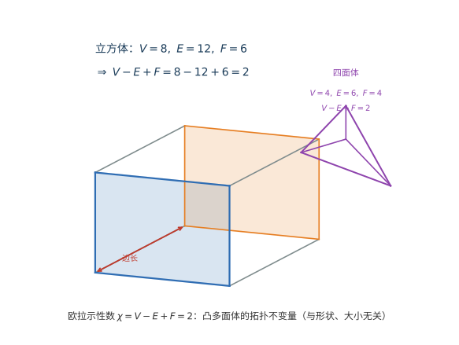

# 第 43 级：代数拓扑 (Algebraic Topology)

> 代数拓扑是现代数学的核心分支之一，它使用代数工具（如群、环、模）来研究拓扑空间的不变量。通过将拓扑问题转化为代数问题，代数拓扑不仅提供了强大的计算方法，还揭示了空间结构深刻的几何性质。从 Euler 的多面体公式到 Poincaré 的奠基性工作，代数拓扑已经发展成为连接几何、代数和分析的桥梁。

---

## 1. 学习目标

1. 理解基本群的定义与性质，掌握计算基本群的各种方法。
2. 掌握覆叠空间理论，理解基本群与覆叠空间之间的 Galois 对应。
3. 理解单纯同调与奇异同调的基本理论，掌握同调群的计算方法。
4. 掌握相对同调与长正合序列，理解 Mayer-Vietoris 序列的推导与应用。
5. 理解万有系数定理与 Künneth 公式，掌握同调与上同调的关系。
6. 掌握上同调环的结构，理解杯积及其几何意义。
7. 理解 Poincaré 对偶定理及其在流形理论中的核心地位。
8. 能够运用代数拓扑工具证明经典定理（Brouwer 不动点定理、Borsuk-Ulam 定理等）。

---

## 2. 核心概念

> **🧠 思考历程（来龙去脉）：代数拓扑为何要"用代数研究空间"？**
>
> 这门学科的种子早在 18 世纪就已埋下：**约 1750 年，Euler** 发现任意凸多面体的顶点、棱、面满足 $V-E+F=2$——这个数只取决于"拼合方式"，与形状大小完全无关，是最早的**拓扑不变量**。此后 **1811 年 Vandermonde** 研究扭结的缠绕（"扭"出的圈是否真的分不开），**19 世纪中叶 Riemann** 在黎曼面上提出"连通数"（Betti 数的前身），用它来度量"曲面被几条闭曲线切开后还能剩下几块"——这些都是在用组合/代数手法捕捉空间里的"洞"。**Betti（1871）** 把连通数系统化，**Poincaré 在 1895 年及其后的多篇《Analysis Situs》** 中一举奠基：他定义了单纯复形、Betti 数、同调群与基本群，并（自证）了 Poincaré 对偶与 Euler 特征的加法性。到 20 世纪 20 年代，**Emmy Noether** 力主把 Betti 数背后的"数"升格为"同调群"这一代数对象本身——正是她把组合拓扑"压缩"成了今天人人使用的同调群语言。**这条"从数洞、到算洞、再到把洞装进群"的开疆史，就是本节的总脉络**：越往下走，越能看到"几何直觉如何被铸成步步可算的代数"。

> **直观理解（现实类比）**：把立方体想象成一个充气的皮球，无论你把它吹成圆球形还是压扁成砖块，只要不撕开、不粘合，它的"顶点-边+面=2"始终不变。这个颠扑不破的常数 $\chi=2$ 就像物体的"指纹"，称为拓扑不变量——它不依赖度量、形状，只依赖空间"洞"的个数。欧拉公式正是代数拓扑"用代数刻画空间本质"这一思想的最早范例。

### 2.1 基本群 (Fundamental Group)

基本群是代数拓扑中第一个也是最直观的同伦不变量，它度量了空间中环路的本质差异。

> **来龙去脉**：基本群由 **Poincaré 在他的《Analysis Situs》（1895）** 中正式提出，是他"用代数分类流形"计划里最早登场的成员。他面对的世纪难题是"两个流形何时同胚、何时不同胚"——这远比能凭直觉看懂的曲面分类困难。他的突破口在于：空间里"绕圈"的方式太多，无法逐条比较，于是**把所有环路按能否连续变形归类，再把这些类组成一个群**，从而把"空间形状"问题翻译成"群结构"问题。基本群解决的正是这个具体问题：**如何用有限的代数对象，分辨像 $S^1$（有洞，$\pi_1\cong\mathbb{Z}$）与 $S^2$（无洞，$\pi_1=0$）这样本质不同的空间**。需要注意的是，基本群只看到 1 维圈，更高维的"球面缠绕"要等第 44 级的高阶同伦群来刻画。

**定义 2.1.1（道路与环路）** 设 $X$ 是拓扑空间。一条从 $x_0$ 到 $x_1$ 的 **道路**（path）是一个连续映射 $\gamma: [0,1] \to X$，满足 $\gamma(0) = x_0$，$\gamma(1) = x_1$。若 $\gamma(0) = \gamma(1) = x_0$，则称 $\gamma$ 为以 $x_0$ 为基点的 **环路**（loop）。

> **💡 直观理解（类比）**：道路就是"用时间参数 $t\in[0,1]$ 连续地走出的一条轨迹"，起点在 $x_0$、终点在 $x_1$，沿途不许跳变；环路则是"从 $x_0$ 出发又回到 $x_0$ 的闭路径"——就像一根首尾相接的橡皮筋绳圈。类比把空间想成一张地图：道路是从 A 城走到 B 城的一段步行路线，环路则是一段"从家出发绕一圈回到家"的环形兜风。之所以要求"连续"，是强调不能瞬移、不能断裂，这正是拓扑学关心的"软性变形"的基础。

**定义 2.1.2（道路同伦）** 两条道路 $\gamma_0, \gamma_1: [0,1] \to X$（具有相同的端点）称为 **同伦的**（homotopic），若存在连续映射 $H: [0,1] \times [0,1] \to X$，使得：
- $H(t,0) = \gamma_0(t)$，$H(t,1) = \gamma_1(t)$ 对所有 $t \in [0,1]$；
- $H(0,s) = x_0$，$H(1,s) = x_1$ 对所有 $s \in [0,1]$。

记作 $\gamma_0 \simeq \gamma_1$。道路同伦是一种等价关系。

> **💡 直观理解（类比）**：两条道路同伦，就是"能通过连续变形（一边走一边慢慢拉扯）不看、不撕地把一条变成另一条"，且全程保持端点不动。类比两根橡皮筋从同一个起点拉到同一个终点，你可以把第一根一点点"捋"成第二根的形状而不松手（两端始终钉住）；只要画得开、中间能从"挡路的洞"旁边绕过去，就算同伦。若中间被一个洞挡住绕不过去，则两条路就"不同伦"——这个"可不可绕过去"的差异正是基本群要精确捕捉的东西。

**定义 2.1.3（基本群）** 设 $X$ 是拓扑空间，$x_0 \in X$。以 $x_0$ 为基点的所有环路的同伦类构成的集合，在道路串联运算下形成一个群，称为 $X$ 的 **基本群**（fundamental group），记作 $\pi_1(X, x_0)$。其中：
- 单位元是常值环路 $c_{x_0}(t) = x_0$ 的同伦类；
- 环路 $[\gamma]$ 的逆元是反向环路 $\gamma^{-1}(t) = \gamma(1-t)$ 的同伦类。

> **💡 直观理解（类比）**：基本群 $\pi_1(X,x_0)$ 是"把所有以 $x_0$ 为基点的环路段按'能否连续变形为彼此'归类后，再做串联合成所形成的群"——它一言以蔽之地回答了"在这个空间里绕一圈能绕出几种本质不同的圈"。类比把广场上的绳圈按"套不套得住某根柱子"分类：能套住柱子的圈，无论怎么扭都还是"套住"，另一类则是"空转"的圈；同是一圈，套住与套不住就是两个不同的"同调/同伦类"。单位元就是"可以缩成一点"的圈（套了个寂寞），两个圈的乘积就是先绕第一圈再绕第二圈；基本群正是这样一个承载"绕圈本质差异"的代数签名，$\pi_1(S^1)\cong\mathbb{Z}$ 意味着绕 $S^1$ 的圈只用"绕了几圈（正负号表示方向）"这一个整数就能分辨。

**命题 2.1.4** 若 $X$ 是道路连通的，则对任意 $x_0, x_1 \in X$，有 $\pi_1(X, x_0) \cong \pi_1(X, x_1)$。此时可简记为 $\pi_1(X)$。

> **💡 直观理解（类比）**：这条命题说"基点挪到哪里都一样"：只要空间里任意两点都有一条道路相连（道路连通），那么在 $x_0$ 上看出来的绕圈本质与在 $x_1$ 上看出来的完全一致。类比在不同城市观察同一片山水——先走一条路到 $x_0$、观察那里的圈，再沿固定通道搬到 $x_1$ 再观察，来回映射就像"从一个观测站的坐标系换算到另一站的坐标系"，是群同构。因此我们不必纠结基点，记成 $\pi_1(X)$ 就好，正如同一首歌不管在哪台收音机里放、调到的都是同一波段。

**定义 2.1.5（单连通）** 道路连通空间 $X$ 称为 **单连通的**（simply connected），若 $\pi_1(X) = 0$（平凡群），即所有环路均可缩为一点。

> **💡 直观理解（类比）**：单连通就是"任何绳圈都能一口气缩成一个点"——空间里没有会被圈住的"柱子/洞"来绊住收缩。类比把一根绳圈放在桌面上：如果桌面无洞，绳圈一拉就收拢成一点（单连通，如 $\mathbb{R}^n$）；如果桌面中央插着一根柱子（相当于 $S^1$ 这种有洞的空间），绳圈套住了柱子就松不开，套不住才能收回。球面 $S^n\,(n\ge2)$ 之所以单连通，是因为它的"洞"只在更外层的维度上，任何一圈（1 维环路）都滑得开。

**例 2.1.6**
- $\pi_1(\mathbb{R}^n) = 0$，因为 $\mathbb{R}^n$ 是单连通的。
- $\pi_1(S^1) \cong \mathbb{Z}$，这是基本群计算中最基本的非平凡例子。
- $\pi_1(S^n) = 0$ 对 $n \geq 2$ 成立。

### 2.2 覆叠空间 (Covering Spaces)

覆叠空间是研究基本群最重要的几何工具，它揭示了基本群与空间对称性之间的深刻联系。

> **来龙去脉**：覆叠空间的系统思想可上溯到 **19 世纪的 Riemann**——他在黎曼面里就已经遇到多值函数的"层叠"结构（如 $\sqrt{z}$ 的两层、$\log z$ 的无穷层），随后 **Poincaré 与 Weierstrass** 用它处理单值化的难题；今天的形式化定义（均匀邻域、纤维）则定型于 20 世纪上半叶。它解决的核心问题是"**空间如何被更简单、更对称地展开**"：一圈圈的纠缠（π₁ 的迷团）在覆叠 $\mathbb{R}\to S^1$ 上被"解开"成一条直线，$S^2\to\mathbb{R}P^2$ 则把"反向同一点"这种对称折叠成单层。反过来，**证明 $\pi_1(S^1)\cong\mathbb{Z}$ 的最漂亮方法正是靠这条覆叠**——一个几何对象因而成了代数计算的中枢。

**定义 2.2.1（覆叠空间）** 设 $p: \tilde{X} \to X$ 是连续满射。称 $p$ 是一个 **覆叠映射**（covering map），$\tilde{X}$ 是 $X$ 的 **覆叠空间**（covering space），若对每个 $x \in X$，存在开邻域 $U$，使得 $p^{-1}(U)$ 是 $\tilde{X}$ 中互不相交的开集 $\{V_\alpha\}_{\alpha \in A}$ 的并，且 $p|_{V_\alpha}: V_\alpha \to U$ 是同胚。这样的 $U$ 称为 **均匀覆盖邻域**（evenly covered neighborhood）。

**例 2.2.2**
- $p: \mathbb{R} \to S^1$，$p(t) = e^{2\pi i t}$ 是覆叠映射，纤维为 $\mathbb{Z}$。
- $p: S^1 \to S^1$，$p(z) = z^n$ 是 $n$ 重覆叠。
- $p: S^2 \to \mathbb{R}P^2$ 是双重覆叠。

> **直观理解（现实类比）**：把基空间 $X$ 想成一层地面，覆盖空间 $\tilde{X}$ 就是架在地面上方的多层楼房——每一层都是同一幅地形的"复制品"。地面上的一个行人（环路）每绕一圈，在楼上对应的人会"跨到更高的楼层"；绕的圈数正好记录了他在哪一层，这就是纤维 $p^{-1}(x)\cong\mathbb{Z}$（整数，即绕数）的含义。$p:\mathbb{R}\to S^1$ 正是这种"无限层螺旋楼梯"的数学抽象。

**定理 2.2.3（道路提升性质）** 设 $p: \tilde{X} \to X$ 是覆叠映射，$\gamma: [0,1] \to X$ 是道路，$\tilde{x}_0 \in p^{-1}(\gamma(0))$。则存在唯一的道路 $\tilde{\gamma}: [0,1] \to \tilde{X}$，使得 $p \circ \tilde{\gamma} = \gamma$ 且 $\tilde{\gamma}(0) = \tilde{x}_0$。

> **💡 直观理解（类比）**：道路提升说"地面上的任何一段路径，只要你在楼上选定了出发点，就能唯一地'照抄'出一段完全对应的楼上路径"：一路走下来，地面走哪儿楼上跟哪儿，层与层之间不串台。类比在楼上一个房间里说"把楼下那人刚走过的路线，在我这层找到对应位置重走一遍"——只要告诉你起点在哪个房间，整条路线就在楼上唯一确定。因为每一小段都只能落在楼上某一片唯一对应的"房间"里，异层之间没有歧义，所以提升是唯一的。

**证明**：利用均匀覆盖邻域和 Lebesgue 数引理，将 $[0,1]$ 划分为足够小的子区间 $[t_i, t_{i+1}]$，使得每个 $\gamma([t_i, t_{i+1}])$ 包含在某个均匀覆盖邻域中，然后逐段提升。$\square$

**定理 2.2.4（同伦提升性质）** 设 $p: \tilde{X} \to X$ 是覆叠映射，$H: [0,1] \times [0,1] \to X$ 是道路同伦，且 $\tilde{H}(0,0) = \tilde{x}_0$ 是 $H(0,0)$ 的一个提升。则存在唯一的提升 $\tilde{H}: [0,1] \times [0,1] \to \tilde{X}$，使得 $p \circ \tilde{H} = H$。

> **💡 直观理解（类比）**：同伦提升是道路提升的"整片版"：不仅单条路径能照抄,连"一整片连续变形的路径族"（一个由无限多条路径组成的曲面 $H$）也能整个搬到楼上去，且只要定了前提起点就唯一。类比把地面上一段"慢慢变形"的影片搬到楼上：只要告诉楼上一个起点帧，整个变形过程在楼上就被唯一重演。这个性质的作用是把基本群的代数信息"局部地"翻译成覆盖空间的几何性质——它正是后面"提升准则"和 Galois 对应的逻辑支柱。

**证明**：将正方形细分为足够小的网格，使得每个小方格在 $H$ 下的像包含在某个均匀覆盖邻域中，然后逐格提升，利用道路提升的唯一性在相邻方格上一致。$\square$

### 2.3 单纯同调 (Simplicial Homology)

单纯同调是历史上最早的同调理论，它通过组合方法将空间剖分为单纯形，然后用代数方法计算同调群。

> **来龙去脉**：**单纯复形**是最早让"洞"变成可算量的语言。**Möbius（19 世纪）** 已把曲面的"边"和"顶点"当成拼图，**Poincaré 在《Analysis Situs》（1895）** 正式把单纯复形、链、边界算子定义齐备——他希望把连续空间"离散成好数数的组合骨架"，再用代数规则计算"洞"。这里"单纯复形/单纯同调"解决的正是关键问题：**如何堵住微分几何里"奇点、孔洞"这类直观却含糊的说法，换成分明的组合对象（点、线、三角形、四面体）与可机械化运算（$\partial$ 与商）**，从而让"洞的个数与维数"成为只跟空间形状相关、与具体剖分无关的**拓扑不变量**。它也是 Euler 的 $V-E+F=2$ 在任意维后缀上的自然放大。

**定义 2.3.1（单纯复形）** 一个 **单纯复形**（simplicial complex）$K$ 是一族单形（simplex）的集合，满足：
- 若 $\sigma \in K$，则 $\sigma$ 的所有面也属于 $K$；
- 任意两个单形的交要么是空集，要么是它们的一个公共面。

> **💡 直观理解（类比）**：单纯复形就是"用点、线段、三角形、四面体……这些最基础的'积木块'像搭乐高那样拼成一个空间骨架"，且拼得有规矩：每块积木的面都要留下来（面封闭），两块积木只能沿着一条整面/整边/顶点相贴，不能斜着穿进去。类比用一堆三角形糊一个网兜：每个三角形的三条边都得在里面对架好，两个三角形的边界要么不碰、要么就齐整地共有一条边。2-单形就是三角形、3-单形就是四面体，$n$-单形是它在 $n$ 维的推广。单纯复形正是把这些积木"严丝合缝地组装"起来描述空间的组合配方。

**定义 2.3.2（定向单形与链群）** 设 $K$ 是单纯复形。$K$ 的 $n$-维 **定向单形**（oriented simplex）是一个有序的 $n+1$ 个顶点组合 $[v_0, v_1, \ldots, v_n]$，其中 $\{v_0, \ldots, v_n\}$ 张成一个 $n$-单形。交换两个顶点改变定向。$K$ 的 $n$-维链群 $C_n(K)$ 是由所有 $n$-维定向单形生成的自由 Abel 群，满足 $[v_0, \ldots, v_i, \ldots, v_j, \ldots, v_n] = -[v_0, \ldots, v_j, \ldots, v_i, \ldots, v_n]$。

> **💡 直观理解（类比）**：给每个单形"标上方向"，就像给线段箭头、给三角形按逆时针/顺时针绕行、给四面体按"右手/左手系"定出正反之分——交换任意两个顶点恰好把定向翻过来（$[v_0,v_1]=-[v_1,v_0]$）。链群 $C_n(K)$ 就是"把所有 $n$ 维带方向的积木块做整系数线性组合"得到的自由 Abel 群：整数系数告诉每个积木被取了多少份、正负号代表方向。类比记账：把仓库里每种带方向物品的"囤货量"（可正可负、可叠加）都记成一张自由整数条目表，正是为下一步"算边界"准备好可加减、可抵消的代数原料。

**定义 2.3.3（边缘算子）** 边缘算子 $\partial_n: C_n(K) \to C_{n-1}(K)$ 定义为：
$$
\partial_n([v_0, v_1, \ldots, v_n]) = \sum_{i=0}^n (-1)^i [v_0, \ldots, \hat{v}_i, \ldots, v_n],
$$
其中 $\hat{v}_i$ 表示删除顶点 $v_i$。然后线性扩张到 $C_n(K)$ 上。

> **💡 直观理解（类比）**：边缘算子 $\partial_n$ 把一块 $n$ 维积木"撕下它的所有 $(n-1)$ 维边界的面"，并戴上交替的正负号 $(-1)^i$ 来保持定向朝向一致。类比从三角形 $\partial[v_0,v_1,v_2]=[v_1,v_2]-[v_0,v_2]+[v_0,v_1]$ 看出：三条边按箭头的绕向首尾衔接，连起来正好绕成三角形外缘一圈。这样加的符号是有用意的——当两块积木沿公共边粘在一起时，这条公共边在两边出现的符号恰好相反从而相消，保证了整体边界只剩外围。边缘算子正是"切出边界、让内部公共边自动抵消"的代数剪刀。

**命题 2.3.4** $\partial_{n-1} \circ \partial_n = 0$。

> **💡 直观理解（类比）**：$\partial^2=0$ 是"边界的边界为空"：任何积木先撕一次边界、再撕那次边界的边界，结果一定为零。类比把一个实心立方体撕出 6 个面（第一次），再把这些面的棱边收集起来——每条棱都被相邻两个面各自贡献一次且定向相反、相互抵消，最后一条棱都不剩。它保证"所有边缘都天然是闭链"，正是同调论里最重要的恒等式：让"闭链（无破口的环）"与"来自边界的琐碎环"得以区分，同调群（商掉后者）才测得出真正的洞。

**定义 2.3.5（单纯同调群）** 定义：
- $Z_n(K) = \ker \partial_n$ — $n$-维 **循环群**（cycle group）；
- $B_n(K) = \operatorname{im} \partial_{n+1}$ — $n$-维 **边缘群**（boundary group）；
- $H_n(K) = Z_n(K) / B_n(K)$ — $n$-维 **单纯同调群**（simplicial homology group）。

> **💡 直观理解（类比）**：单纯同调群 $H_n=Z_n/B_n$ 回答"这个 $n$ 维骨架里到底有几个真正意义上的洞"：先取出所有"闭合无破口"的 $n$ 维链（$Z_n=$ 闭链/循环群），再剔除掉那些"本来就是某块更低维积木的边界、能被填平"的琐碎环（$B_n=$ 边缘群），相除剩下的等价类就编码了真洞。类比数池塘里"独立的漩涡"：先找出所有首尾相连的回流（闭链），再划掉能被填平的水洼（边缘），剩下的才是"真的能圈住一个岛"的漩涡。这些"洞"正是空间的拓扑指纹，不因我们选用什么样的三角剖分而改变。

### 2.4 奇异同调 (Singular Homology)

奇异同调比单纯同调更具一般性，对任意拓扑空间都有定义，是现代同调理论的标准形式。

> **来龙去脉**：单纯同调虽自然，却要求空间拥有（三角）剖分，这在一般拓扑空间上并不总能满足。为此 **Eilenberg（20 世纪 40 年代）** 引入"奇异单形"：不再把标准三角形强行嵌进空间，而是允许**任意连续映射 $\sigma:\Delta^n\to X$ 把标准三角形"揉"进 $X$**。"奇异"二字正因为它允许皱缩、纠缠这些"不好看"的装法。它解决的核心问题是：**如何在不要求空间有三角剖分的前提下，定义一个适用于一切拓扑空间、且与单纯同调一致的同调理论**。理想的代价是链群大了（基底是所有连续映射），但换来的是普适性——正因如此，奇异同调成为现代标准的、满足 Eilenberg–Steenrod 公理的同调论。

**定义 2.4.1（标准单形）** 标准 $n$-单形为：
$$
\Delta^n = \left\{(t_0, t_1, \ldots, t_n) \in \mathbb{R}^{n+1} \;\middle|\; \sum_{i=0}^n t_i = 1,\; t_i \geq 0\right\}.
$$

> **💡 直观理解（类比）**：标准 $n$-单形 $\Delta^n$ 是"每根坐标轴方向都取一个单位长度、然后搭出的最简凸体"：$\Delta^0$ 是一个点，$\Delta^1$ 是 $[0,1]$ 线段，$\Delta^2$ 是直角边为坐标轴的三角形，$\Delta^3$ 是四面体——它相当于"$n$ 个基向量摊开后的凸包"。坐标 $(t_0,\ldots,t_n)$ 是非负的"配比"且和为 1，所以它可以被理解为"用这些基点的民例（$t_i$ 越大的顶点越占权重）"。它是最标准的积木原型，奇异单形会用它作为"捣进空间 $X$ 的量规"。

**定义 2.4.2（奇异单形与链群）** 设 $X$ 是拓扑空间。一个 **奇异 $n$-单形**（singular $n$-simplex）是一个连续映射 $\sigma: \Delta^n \to X$。$X$ 的 $n$-维 **奇异链群** $C_n(X)$ 是由所有奇异 $n$-单形生成的自由 Abel 群。

> **💡 直观理解（类比）**：奇异单形允许我们"任意弯曲地把标准三角形/四面体揉进空间 $X$ 里"——$\sigma:\Delta^n\to X$ 就是一个连续地将标准积木塞进 $X$ 的"变形件"。它叫"奇异"，恰恰因为允许这些积木在 $X$ 里皱成一团、纠缠、甚至坍缩（不像单纯复形那样要求整齐拼装）。类比用手指捏一团橡皮泥塞进不规则的水缸缝隙里，柔到能塞满任意角落。奇异链群 $C_n(X)$ 就是"所有这些变形累计"的自由 Abel 群，让同调定义适用于一切拓扑空间，而不必关心它能否被整齐地组合剖分。

**定义 2.4.3（奇异边缘算子）** 边缘算子 $\partial_n: C_n(X) \to C_{n-1}(X)$ 定义为：
$$
\partial_n(\sigma) = \sum_{i=0}^n (-1)^i \sigma \circ \varepsilon_i^n,
$$
其中 $\varepsilon_i^n: \Delta^{n-1} \to \Delta^n$ 是第 $i$ 个面映射，它将 $\Delta^{n-1}$ 仿射线性地映射到 $\Delta^n$ 中第 $i$ 个坐标为零的面：
$$
\varepsilon_i^n(t_0, \ldots, t_{n-1}) = (t_0, \ldots, t_{i-1}, 0, t_i, \ldots, t_{n-1}).
$$

> **💡 直观理解（类比）**：奇异边缘算子是"把变形件 $\sigma$ 撕出它的 $n+1$ 个 $(n-1)$-维侧面、并附上交错正负号 $(-1)^i$"的线性操作：每个面由"把第 $i$ 个坐标压成 0"的面映射 $\varepsilon_i^n$ 给出，于是 $\partial_n(\sigma)=\sum(-1)^i\,\sigma\circ\varepsilon_i^n$。类比给三角片按逆时针顺序列出三条边：$+$、$-$、$+$ 交错，使整体闭合方向一致；当两张三角片沿公共边粘贴时，公共边在两边出现的符号相反、自动相消。这正是 2.3 边缘算子的"无限柔版"，保证奇异同调在整个空间上依然满足 $\partial^2=0$。

**命题 2.4.4** $\partial_{n-1} \circ \partial_n = 0$。

> **💡 直观理解（类比）**：奇异同调里的 $\partial^2=0$ 与单纯情形同出一辙——"边界的边界为空"。类比把一块三角片撕出三条边（第一次取边界），再把这三条边的端点收集起来（第二次），每个顶点恰好被它的两条邻边各记一次且符号相反、相互抵消，于是什么也没剩下。正是这个恒等式让"闭链"与"边缘"成为同调群的一对商与被商对象，最终把"洞"量化为可算且拓扑不变的代数数据。

**证明**：对任意奇异 $n$-单形 $\sigma$，我们有：
$$
\begin{aligned}
\partial_{n-1}(\partial_n(\sigma)) &= \partial_{n-1}\left(\sum_{i=0}^n (-1)^i \sigma \circ \varepsilon_i^n\right) \\
&= \sum_{i=0}^n (-1)^i \sum_{j=0}^{n-1} (-1)^j \sigma \circ \varepsilon_i^n \circ \varepsilon_j^{n-1} \\
&= \sum_{j < i} (-1)^{i+j} \sigma \circ \varepsilon_i^n \circ \varepsilon_j^{n-1} + \sum_{j \geq i} (-1)^{i+j} \sigma \circ \varepsilon_i^n \circ \varepsilon_j^{n-1} \\
&= \sum_{j < i} (-1)^{i+j} \sigma \circ \varepsilon_{j}^{n} \circ \varepsilon_{i-1}^{n-1} + \sum_{j \geq i} (-1)^{i+j} \sigma \circ \varepsilon_{i}^{n} \circ \varepsilon_{j}^{n-1}.
\end{aligned}
$$
利用面映射关系 $\varepsilon_i^n \circ \varepsilon_j^{n-1} = \varepsilon_{j+1}^n \circ \varepsilon_i^{n-1}$ 对 $j \geq i$，以及 $\varepsilon_i^n \circ \varepsilon_j^{n-1} = \varepsilon_j^n \circ \varepsilon_{i-1}^{n-1}$ 对 $j < i$，代入后所有项两两抵消，结果为零。$\square$

**定义 2.4.5（奇异同调群）** $X$ 的 $n$-维 **奇异同调群**（singular homology group）为：
$$
H_n(X) = \ker \partial_n / \operatorname{im} \partial_{n+1}.
$$

> **🧠 思考历程：为什么"挖洞"这种直觉，能被写成"边缘算子的商"？**
>
> 代数拓扑想用代数"听"出空间的洞。同调群 $H_n=\ker\partial_n/\operatorname{im}\partial_{n+1}$ 看起来像公式游戏，其实它整段装着"把一个空间切成单形、数出多少个环"的几何直觉。
>
> - **整段思路：从"切三角片"到"抠边界"**。把空间用三角形（单纯形）糊成一个骨架，边缘算子 $\partial$ 就告诉我们"每个三角形落在哪几条边上、每条边落在哪几个点上"。**造 $C_n\xrightarrow{\partial_n}C_{n-1}\xrightarrow{\partial_{n-1}}C_{n-2}$ 这条"链"的目的，是把空间的形状变成一组可加减的代数对象。**
> - **$\partial^2=0$：打开洞的钥匙**。一条闭合曲线没有端点（$\partial(\text{闭链})=0$）；"边缘"再加一次边缘会消失（$\partial^2=0$）——**这个恒等式让任何"边缘"都是"闭链"**。于是"闭链/环"与"边缘"在代数上天然不同，它们的商正好测"我到底绕了几个洞"。
> - **商 $H_n$ 在数什么**。$\ker\partial_n$ 是那些"自洽的环"（闭链），$\operatorname{im}\partial_{n+1}$ 是"本来就填得上洞的琐碎环"；商掉后者，剩下的才是**真正的洞及其维数（Betti 数）**。洞的个数因此成为只跟空间形状有关的"代数指纹"。
> - **朴素的拓扑变成算数**。基本群（2.1）还依赖"选哪条路径"而略显微妙；同调群把"洞"问题化作**有限个群的分层 $H_0,H_1,H_2,\dots$**，可算性大增，也架起了 3.3 的长正合序列、Mayer-Vietoris（3.4）等"拼图式"计算工具。Poincaré 对偶（2.11）、Brouwer 不动点（3.6）都在这里汇合。
> - **心路**：同调告诉你：**"形状中原来有几个洞"这种看似只能靠眼睛判断的事，居然能翻译成"边缘算子商"的纯代数运算**。把直觉几何铸成步步可算的代数，是代数拓扑教给人类思维最漂亮的一课。

### 2.5 相对同调 (Relative Homology)

相对同调是研究子空间与整体空间关系的工具，也是导出长正合序列的关键。

> **来龙去脉**：相对同调 $H_n(X,A)$ 把"只看 $X$ 而把子空间 $A$ 当作可忽略背景"的想法固化成代数。它最初源于**战争中/工程上的"局部损伤"问题**：想知道"相对于已固定的部分，外面还剩多少洞"，或在切除手术中度量"拿掉一块后新露出的结构"。它解决的正是核心计算问题：**同调群本身不易单独手算，而有了子空间对 $(X,A)$ 的长正合序列 2.5.2 后，已知任意两段就能反推第三段**——相对同调起着把"整体 $X$"与"子空间 $A$"粘成一条可分治链条的桥梁作用，是所有计算工具（含 3.4 的 Mayer-Vietoris）的地基。

**定义 2.5.1（相对链群）** 设 $A \subseteq X$ 是子空间。定义相对链群 $C_n(X, A) = C_n(X) / C_n(A)$。边缘算子 $\partial_n$ 诱导出 $\partial_n: C_n(X, A) \to C_{n-1}(X, A)$，且满足 $\partial_{n-1} \circ \partial_n = 0$。由此定义 **相对同调群**：
$$
H_n(X, A) = \ker \partial_n / \operatorname{im} \partial_{n+1}.
$$

> **💡 直观理解（类比）**：相对同调是"只看相对于子空间 $A$ 而言新的洞"：把 $A$ 视作可忽略的"背景"（模掉 $C_n(A)$、即把 $A$ 里的链视为零），从而测出 $X$ 中"位于 $A$ 之外"的那部分洞。类比把大楼分成"地基（$A$）"和"上面的楼层（$X$）"，相对同调只统计楼体里多了哪些是新楼层的圈，而那些本来就属于地基的洞被当作无关紧要地抹掉。$H_n(X,A)$ 用来说"如果先把 $A$ 压成一个点，剩余空间还剩几个洞"——它正是下面长正合序列里用来衔接 $A$ 与 $X$ 的中介量。

**定理 2.5.2（长正合序列）** 设 $A \subseteq X$，则有自然的长正合序列：
$$
\cdots \to H_n(A) \xrightarrow{i_*} H_n(X) \xrightarrow{j_*} H_n(X, A) \xrightarrow{\partial_*} H_{n-1}(A) \to \cdots \to H_0(X, A) \to 0,
$$
其中 $i: A \hookrightarrow X$ 是包含映射，$j: (X, \emptyset) \to (X, A)$ 是商映射，$\partial_*$ 是连接同态。

> **💡 直观理解（类比）**：长正合序列是一台"逐维接力计算器"：它把三个洞的度量——$A$ 的洞、$X$ 的洞、相对洞 $(X,A)$——用一条无限长的等式链串联，使得"这边的多余"恰好等于"那边的新增"，一环扣一环（正合性 $\operatorname{im}=\ker$ 保证每个环节都严丝合缝、不多不少）。类比三个相邻图形的面积差分：知道其中两个就能推出第三个。连接同态 $\partial_*:H_n(X,A)\to H_{n-1}(A)$ 像"这座桥"把高一维的相对洞翻译成低一维的 $A$ 的洞。它让原本独立的各维同调连成一体，是同调论的万能杠杆——后面 Mayer-Vietoris（3.4）等工具都靠它撬动整个计算。

### 2.6 正合序列与同调代数 (Exact Sequences and Homological Algebra)

> **来龙去脉**：正合序列是 **现代代数学家从几何中提炼出的'通用语言'**。早在 20 世纪 40–50 年代，**Noether** 强调用模与群的语言统一代数，而 **Hopf、Cartan–Eilenberg、Serre** 随后把"链复形 + 同调"这一思路从拓扑移植成独立的"同调代数"分支。它解决的元问题是：**在构造群/模时，如何把"嵌入"—"商出"这种两两关系打包，从而让"漏、多、错位"都能由代数精确控制**。正合性与推挽（pushout/pullback）一出，之前各自孤立的同调计算（长正合、Mayer-Vietoris）就都被归到同一种骨架之下。它为后续的万有系数定理、Künneth 公式提供了代数土壤。

**定义 2.6.1（正合序列）** 一列 Abel 群同态 $\cdots \to A_{n+1} \xrightarrow{f_{n+1}} A_n \xrightarrow{f_n} A_{n-1} \to \cdots$ 称为 **正合的**（exact），若 $\operatorname{im} f_{n+1} = \ker f_n$ 对所有 $n$ 成立。

> **💡 直观理解（类比）**：正合序列要求"每一段映射的像恰好填满下一段的核"——信息逐级完整传递，既不漏、也不多。类比质检流水线：第一台机器加工出的工件必须恰好被第二台机器全盘接收并不断"咽"掉的唯一输入，于是整条线畅通无阻、每件半成品都到得了下一站。非正合意味着这里"忙空转"（有无人认领的东西）或"信息溢出"（有东西掉了）。正合性正是"整个代数链条严丝合缝、环环相扣"的精确判据。

**定义 2.6.2（短正合序列）** 一个短正合序列是形如 $0 \to A \xrightarrow{f} B \xrightarrow{g} C \to 0$ 的正合序列，其中 $f$ 是单射，$g$ 是满射，且 $\operatorname{im} f = \ker g$。

> **💡 直观理解（类比）**：短正合序列 $0\to A\to B\to C\to0$ 是对"小心地嵌入、再整体压扁"的两步关系的打包：$A$ 无损嵌入 $B$（单射），$B$ 满射到 $C$，且 $B$ 中被压成 $0$ 的部分正是 $A$ 的像——于是 $C\cong B/A$。类比三层夹心结构：底层 $A$ 插进中层 $B$（不动验货），中层 $B$ 摊开成顶层 $C$，且"摊平过程中消失的内容"恰好是底层的贡献。几乎所有同调结构（长正合、Mayer-Vietoris）都由一连串这种"最小正合单元"卷积而来，所以它是最重要的模板。

**命题 2.6.3（蛇形引理）** 设以下行正合的交换图：
$$
\begin{CD}
0 @>>> A' @>>> A @>>> A'' @>>> 0 \\
@. @V{f'}VV @V{f}VV @V{f''}VV \\
0 @>>> B' @>>> B @>>> B'' @>>> 0
\end{CD}
$$
则存在长正合序列：
$$
\ker f' \to \ker f \to \ker f'' \xrightarrow{\delta} \operatorname{coker} f' \to \operatorname{coker} f \to \operatorname{coker} f''.
$$

> **💡 直观理解（类比）**：蛇形引理断言"平行的三条正合序列里，各自的核与余核也自动勾结成一条长正合序列"，中间的联结映射 $\delta$ 形似蜿蜒的蛇、故名。类比三条平行的传送带被三个齿轮联动：虽然只看各自的"损坏清单（核）和报废台（余核）"，但任何一个齿轮稍有偏差，偏差会沿蛇形路径传递到别处。它价值巨大：一旦知道两行中线信息，就能反推每一竖直映射的核与余核如何串成整体，是几何问题（如 Mayer-Vietoris）中"从局部拼出全局"的统一裁决工具。

**证明**：该引理的证明是标准同调代数中的核心内容，涉及"蛇形追图"（diagram chasing），具体步骤略。$\square$

### 2.7 万有系数定理 (Universal Coefficient Theorem)

万有系数定理揭示了同调与上同调之间的深刻关系，表明上同调可以由同调和对偶系数决定。

> **来龙去脉**：上同调起初并非"同调的翻版"，而是 **Alexander 与 Kolmogorov（1930 年代）** 独立从函数/对偶角度引入的：比起"有多少链"，上同调测"对链能给出多少数值赋值"，并天然带有乘法。当把系数取成任意 Abel 群 $G$ 时，自然想问"$H^n(X;G)$ 能否由已算出的 $H_*(X;\mathbb Z)$ 直接还原"——这正是 **万有系数定理（环论里的 Universal Coefficient Theorem）** 回答的：一次同调，$G$ 随便换。它解决的关键计算问题是：**为了避免每个系数 $G$ 都重新做一遍链复形，能否用 $\operatorname{Hom}$ 与 $\operatorname{Ext}$ 两个纯代数函子一次搞定**——答案是肯定的。Ext 这一修正项也随之进入同调代法的核心词典。

**定理 2.7.1（万有系数定理）** 设 $X$ 是拓扑空间，$G$ 是 Abel 群。则存在短正合序列：
$$
0 \to \operatorname{Ext}(H_{n-1}(X), G) \to H^n(X; G) \to \operatorname{Hom}(H_n(X), G) \to 0,
$$
该序列分裂（但非自然分裂）。其中 $H^n(X; G)$ 是以 $G$ 为系数的上同调群。

> **💡 直观理解（类比）**：万有系数定理说"上同调不必从头算——它完全由同调 $H_n(X)$（空间的洞）配上系数 $G$ 决定"。$H^n(X;G)$ 主要有两大块拼成：一块来自"把洞 $H_n(X)$ 拿去做 Hom 对偶"（$=\operatorname{Hom}(H_n,G)$，直接给每个洞配一个 $G$ 值），另一块来自更高维的细节 $\operatorname{Ext}(H_{n-1},G)$（当 $G$ 有扭转或 $H_{n-1}$ 有挠时的修正项）。类比"用 $G$ 给每个洞发通行证"：光滑情形发 0/1（$\operatorname{Hom}$），而遇到 $G$ 的分裂/扭转就要补一张 $\operatorname{Ext}$ 票。它是"算一次同调，$G$ 随便换"的通用配方，解释了为什么系数可取任意 Abel 群而仍保持可计算。

### 2.8 Künneth 公式 (Künneth Formula)

Künneth 公式计算乘积空间的同调群。

**定理 2.8.1（Künneth 公式）** 设 $X, Y$ 是拓扑空间，且 $H_n(X)$ 是有限生成的。则有短正合序列：
$$
0 \to \bigoplus_{i+j=n} H_i(X) \otimes H_j(Y) \to H_n(X \times Y) \to \bigoplus_{i+j=n-1} \operatorname{Tor}(H_i(X), H_j(Y)) \to 0,
$$
该序列分裂。

> **💡 直观理解（类比）**：Künneth 公式把乘积空间 $X\times Y$ 的洞，拆成"两个因子的洞按各维度相加张量"的直和（$\bigoplus_{i+j=n}H_i(X)\otimes H_j(Y)$），再加一个 $\operatorname{Tor}$ 修正项来处理挠。类比用两条积木拼出一块平面板：板的每个洞要么来自第一条积木上的某个洞配第二种积木（各取其维度），要么是两者挠叠加造成的额外纠缠。它相当于同调的"乘法口诀"：$H_\bullet(X\times Y)$ 主要由 $H_\bullet(X)\otimes H_\bullet(Y)$ 决定，$S^1\times S^1$ 环面那 $H_1=\mathbb{Z}^2$ 正是 $H_1(S^1)\oplus H_1(S^1)$ 的直观再现。

### 2.9 上同调 (Cohomology)

上同调是同调的对偶理论，但其上附加的杯积运算赋予了它更丰富的代数结构。

> **来龙去脉**：上同调的"对偶赋值"观点由 **Alexander（1935）与 Kolmogorov** 几乎同时提出，随后 **Čech** 亦独立给出类似对象；真正让上同调不可取代的，是 **1930 年代中期发现的杯积运算**：它把各维赋值按"读取前半程 × 读取后半程"相乘，使 $H^*(X)$ 从"统计数表"升级为"带乘法的分次环"。它解决的正是纯同调答不了的问题：**两个空间可以同调群完全相同、却本质不同（如 $S^2\vee S^4$ 与 $\mathbb{C}P^2$），只有能测"洞与洞如何相交相乘"的杯积/上同调环才能把它们分开**。这也为 Poincaré 对偶（2.11）和交点数论（3.5）提供了环论的语言。

**定义 2.9.1（上链群与上同调）** 设 $X$ 是拓扑空间，$G$ 是 Abel 群。定义 $X$ 的 $n$-维 **上链群**（cochain group）为 $C^n(X; G) = \operatorname{Hom}(C_n(X), G)$。上边缘算子 $\delta^n: C^n(X; G) \to C^{n+1}(X; G)$ 定义为 $(\delta^n \varphi)(\sigma) = \varphi(\partial_{n+1}\sigma)$，其中 $\sigma \in C_{n+1}(X)$。则 $\delta^{n+1} \circ \delta^n = 0$。

$X$ 的 $n$-维 **上同调群**（cohomology group）为：
$$
H^n(X; G) = \ker \delta^n / \operatorname{im} \delta^{n-1}.
$$

> **💡 直观理解（类比）**：上同调是同调的"对偶翻版"：链条论里每条链是"把积木组合起来"（$C_n$），上链论则是"给每条链分配一个 $G$ 值"（$C^n=\operatorname{Hom}(C_n,G)$），算子方向整个反过来（$\delta^n$ 朝上走、且 $\delta^2=0$）。类比一支记账团队与一支统计团队：统计员不关心单块积木本身，只关心"一个整体构型被算出多少数值"。$H^n=\ker\delta^n/\operatorname{im}\delta^{n-1}$ 与同调公式互为镜像，但它带上乘积（杯积）以后能记下同调记不下的乘法结构，信息更丰富——这也是接下来上同调环要登场的原因。

### 2.10 杯积 (Cup Product)

杯积是上同调群上的乘法运算，赋予上同调以环结构。

**定义 2.10.1（杯积）** 设 $\varphi \in C^k(X; R)$，$\psi \in C^\ell(X; R)$，其中 $R$ 是交换环。定义它们的 **杯积**（cup product）$\varphi \smile \psi \in C^{k+\ell}(X; R)$ 为：
$$
(\varphi \smile \psi)(\sigma) = \varphi(\sigma|_{[v_0, \ldots, v_k]}) \cdot \psi(\sigma|_{[v_k, \ldots, v_{k+\ell}]}),
$$
其中 $\sigma: \Delta^{k+\ell} \to X$ 是奇异单形，$\sigma|_{[v_0, \ldots, v_k]}$ 是 $\sigma$ 限制在前 $k+1$ 个顶点张成的面上的复合。

> **💡 直观理解（类比）**：杯积把两个上同调类"按维度相加地相乘"：$\varphi\smile\psi$ 让 $\varphi$ 先读取整个大链 $\sigma$ 的前面部分、$\psi$ 再读后面部分，两者数值相乘——于是得到一个 $(k+\ell)$ 维的新类。类比把两层标签叠起来：一张标签贴在"前半程"、一张贴在"后半程"，合起来就是整个行程的双重标记。它让上同调从"逐个维度的计数"升级为"所有维度的乘法代数"，正是上同调环的引擎；$T^2$ 环面上的 $\alpha\smile\beta\neq 0$ 就是杯积"测出两个独立绕圈方向的交叠"的著名表现。

**命题 2.10.2** 杯积诱导出上同调群上的良定义的积：
$$
\smile: H^k(X; R) \times H^\ell(X; R) \to H^{k+\ell}(X; R),
$$
满足 $\delta(\varphi \smile \psi) = \delta\varphi \smile \psi + (-1)^k \varphi \smile \delta\psi$。

> **💡 直观理解（类比）**：这条命题分两点：一是杯积"落得住脚"（在上同调类上良定义，换代表不改变乘积）；二是它遵守一条"带符号的 Leibniz 法则" $\delta(\varphi\smile\psi)=\delta\varphi\smile\psi+(-1)^k\varphi\smile\delta\psi$。类比微积分中的乘积求导法则：两个函数的导数如何拼出乘积的导数，这里换成上边缘算子 $\delta$ 做"求导"，且因为 $\varphi$ 有 $k$ 度所以要乘 $(-1)^k$ 修正符号。这条法则正是把杯积与同调的对偶结构无缝咬合的"链式配方"。

**定义 2.10.3（上同调环）** $H^*(X; R) = \bigoplus_{n \geq 0} H^n(X; R)$ 在杯积下成为一个分次环，称为 $X$ 的 **上同调环**（cohomology ring）。

> **💡 直观理解（类比）**：上同调环把所有维度的上同调群打包成一个"带乘法的大环" $H^*=\bigoplus H^n$，不同维度的元素按杯积相乘（加法保持维度、乘法令维度相加），于是它带一个自然的"维数标签（分次）"结构。类比把各年级成绩册订成一本大册子，每门课还能"跨年级"合成新成绩——不同维度像不同年级，杯积像"跨级组合"的运算。上同调环比单看每个 $H^n$ 携带着"洞之间如何交叠相乘"的完整代数信息，是刻画空间（如 $S^2\vee S^4$ 与 $\mathbb{C}P^2$ 这种同调相同但环不同）的最敏感指纹。

### 2.11 Poincaré 对偶 (Poincaré Duality)

Poincaré 对偶是流形上同调理论中最深刻的结果之一，它揭示了紧致定向流形的同调与上同调之间的对称性。

> **来龙去脉**：**Poincaré（1895）** 首次观察并猜到了这一对偶：紧致定向 $n$ 流形满足 $H^k\cong H_{n-k}$。他当时的组合证明先有疏漏，经 **Poincaré 本人（1899）** 修改、并在后来由 **Lefschetz、Alexander、Whitney** 等人的上同调语言下得到严整证明（基本类与 cap 积表述）。它解决的是一类深刻问题：**为什么流形上的同调与上同调会'自动配平'？** 直观上，每一个 $k$ 维"通道"都可被横截的 $(n-k)$ 维"隔断"拦截计数，于是纵向的两套数字完全对称。这让计算减半，并直接衍生出 **交形式、符号差与 Betti 数对称性**，是微分拓扑与代数拓扑的枢纽。

**定理 2.11.1（Poincaré 对偶）** 设 $M$ 是 $n$ 维紧致定向流形。则存在自然同构：
$$
H^k(M) \cong H_{n-k}(M).
$$
更一般地，对任意系数环 $R$，有 $H^k(M; R) \cong H_{n-k}(M; R)$。

> **💡 直观理解（类比）**：Poincaré 对偶是说"紧致定向流形里，维度互补的洞与洞之间天然有对数关系"：$k$ 维上同调与 $n-k$ 维同调自然同构。类比一块闭合的曲面泳池：池面里"能够横跨打通的 $k$ 维通道"的数目，恰好等于"能围住它的 $n-k$ 维隔断"的数目。直观上，每一个 $k$ 维的洞都能用它横截的 $(n-k)$ 维"切片"来度量，两者互为"镜像维"。这意味着流形上的上同调免费送给你同调，把两个独立系统统一成一枚硬币的两面——也给 $S^n$ 的 $H^k\cong H_{n-k}$ 这种钻石般对称的表格打下根基。

### 2.12 Euler 示性数与 Betti 数（新增）

> **来龙去脉**：Euler 示性数 $\chi$ 是这门学科**最古老**的不变量，可上溯到 **Euler（约 1750 年）** 的多面体公式 $V-E+F=2$；**Riemann** 在黎曼面上引入"连通数"，**Betti（1871）** 把它推广为各维连通数作交错和。它解决的核心问题是：**与其携带一整族同调群，能否压缩成'洞的总账'——一个单数——来快速区分、核对空间**，并让"洞"这本账在连通和、乘积等操作下规则地加减乘除。它是代数拓扑最早、"以一代多"的效率思想的代表。

**定义 2.12.1（Betti 数与 Euler 示性数）** 设 $X$ 是有限型拓扑空间（例如有限 CW 复形），使得每个 $H_k(X)$ 都是有限生成的 Abel 群。记 $H_k(X)\cong \mathbb{Z}^{b_k}\oplus(T_k)$，其中 $T_k$ 是挠子群（有限阶元素全体）。称 $b_k = \operatorname{rank}H_k(X)$ 为 $X$ 的 $k$ 维 **Betti 数**（Betti number）。定义 **Euler 示性数**为一个交错和：
$$
\chi(X) = \sum_{k=0}^{\infty}(-1)^k\, b_k = b_0 - b_1 + b_2 - b_3 + \cdots
$$
（对有限 CW 复形该和只有有限项非零。）本节开头的图 `images/level43-euler-characteristic.svg` 展示的正是 $S^2$ 的情形 $b_0=1,b_1=0,b_2=1$，故 $\chi(S^2)=2$。

> **💡 直观理解（类比）**：Betti 数是"第 $k$ 维真正独立的洞的个数"：$b_0$=连通块的块数、$b_1$=独立环的个数、$b_2$=独立空腔的个数。Euler 示性数则把它们**按维度正负交替地加起来**——就像清点库存时"正让 +、反让 −"的平衡账，令那些维度上的"守恒相消"，只留下与整体形状相关的净额。可缩空间 $\chi=1$（一个连通块、无洞），$S^2$ 得 2，而环面 0 的直觉正是"它的洞在 1 维与 2 维相互抵消"。

**定理 2.12.2（Euler–Poincaré 公式）** 设 $X$ 是有限 CW 复形，$c_k$ 表示 $X$ 的 $k$ 维胞腔数目。则
$$
\chi(X) = \sum_{k=0}^{\infty}(-1)^k\, c_k .
$$
换言之，Euler 示性数 = "胞腔交错计数" = "同调 Betti 交错和"。它说明 $\chi$ 是**组合数与同调数之间的一座桥**：无论你从胞腔算还是从同调算，结果一致。

**例 2.12.3（若干经典空间的 Betti 数与 Euler 示性数）**
- **球面** $S^n$：$b_0=b_n=1$，其余 $0$，故 $\chi(S^n)=1+(-1)^n$（$n$ 偶 $\chi=2$，$n$ 奇 $\chi=0$）。
- **环面** $T^2=S^1\times S^1$：$b_0=1,b_1=2,b_2=1$，$\chi=0$。
- **Klein 瓶** $K$：$b_0=1,b_1=1$（$\mathbb Z$ 部分），$b_2=0$，$\chi=0$（注意 $H_1$ 的 $\mathbb Z_2$ 挠不计入 rank）。
- **$g$ 亏格定向闭曲面** $M_g$：$b_0=1,b_1=2g,b_2=1$，$\chi=2-2g$。
- **实投影空间** $\mathbb{R}P^3$：$b_0=b_3=1$，$b_1=b_2=0$，$\chi=1+(-1)^3=0$。

> **来龙去脉**：Betti 数与 Euler 示性数是检验"同调算得对不对"与"能否推广"的天然试金石；同时也是 Poincaré 对偶（2.11）下 $b_k=b_{n-k}$ 的对称性来源。它直接支撑本文件习题集中众多关于 $\chi$ 的题目（如习题 32–33、61、72、98、134、145、169、176 等），并把代数运算（连通和公式、乘积公式、悬垂公式）落成可心的算术。

**🔎 新增自测（配合答案）**：设 $M_g$ 是亏格 $g$ 的定向闭曲面。求其 Betti 数与 Euler 示性数，并用连通和公式核对之。

点开答案

答案：$b_0=1,\ b_1=2g,\ b_2=1$，故 $\chi(M_g)=1-2g+1=2-2g$。用连通和公式 $\chi(S_1\#S_2)=\chi(S_1)+\chi(S_2)-2$ 对 $T^2\#\cdots\#T^2$（$g$ 个环面逐一连接）逐次迭代：$\chi(T^2)=0$，$\chi(T^2\#T^2)=0+0-2=-2$，归纳即得 $\chi(M_g)=2-2g$，与 Betti 交错和一致。可见 **Betti 谱完全决定了 $\chi$**。

### 2.13 CW 复形与胞腔同调（新增）

> **来龙去脉**：单纯复形虽直观却"太贵"——一点小结构也要堆放许多单纯形。**J.H.C. Whitehead（1949）** 提出 **CW 复形**：用任意维数、任意形状的"胞腔（圆盘）"逐层粘合，配合"闭包有限（closure finiteness）"与"弱拓扑（weak topology）"两项要求，得到远比单纯复形精简、却仍保留组合可用性的空间类。它解决的正是**效率与覆盖面的双重问题：如何在足够充足的范畴里（几乎一切经典空间都被包含在内）用最少、最标准的组合数据算出同调**。由此派生的**胞腔同调**（cellular homology）是由胞腔链复形直接读出的同调，常常一条线就算完（如 $T^2$ 见 4.2 例 4.2.3）。

**定义 2.13.1（CW 复形）** 空间 $X$ 称为 **CW 复形**，若它能写成递推的胞腔骨架之并：
- $X^0$：一个离散的点集合（$0$-胞腔）；
- 对 $n\ge1$，$X^n$ 由 $X^{n-1}$ 沿 $n$-胞腔族 $\{e^n_\alpha\}$（每个 $e^n_\alpha\cong$ 开 $n$ 维圆盘），通过映射 $\varphi_\alpha:S^{n-1}\to X^{n-1}$（附着映射）把圆盘边界粘到低维骨架上所得；
- $X=\bigcup_n X^n$，且满足：闭包有限（每个胞腔的闭包只与有限多胞腔相交、即"closure finite"），以及弱拓扑（$A\subseteq X$ 开当且仅当 $A\cap \overline{e^n_\alpha}$ 对每个胞腔开）。

有限维有限 CW 复形是微分几何与代数几何里最常见的那类空间（球面、环面、$\mathbb{R}P^n$、$\mathbb{C}P^n$、流形都可）。

> **💡 直观理解（类比）**：CW 复形好比**用一张张"圆形贴纸（胞腔）"按从低维到高维的次序贴上**：先贴顶点（0 维）、再贴线段（1 维）、用线段围出贴面（2 维）、用面围出实心（3 维）……每一张新贴纸只把它的**边缘**粘到已被贴好的低维骨架上。与"必须用三角形拼"的单纯复形相比，它更省料也更自由（可以贴方、贴盘、厚度任取），却保留"胞腔计数→链复形→同调"这条机械路径。

**定义 2.13.2（胞腔链复形）** 设 $X$ 是 CW 复形。令 $C_k$ 为以所有 $k$-胞腔为基的自由 Abel 群，记
$$
d_k: C_k\to C_{k-1}
$$
为 **胞腔微分**，在基向量上定义为
$$
d_k(e^k_\alpha) = \sum_{\beta} d_{\alpha\beta}\, e^{k-1}_\beta,
\qquad d_{\alpha\beta} = \deg\big(\,\Phi_{\alpha\beta}: S^{k-1}\to S^{k-1}\,\big),
$$
其中 $\Phi_{\alpha\beta}$ 是第 $\alpha$ 个 $k$-胞腔的附着映射沿单位圆盘边界投影到第 $\beta$ 个 $(k-1)$-胞腔边界球面上的复合，$\deg$ 表示球面映射的（映射）度。可以验证 $d_{k-1}\circ d_k=0$，故 $(C_\bullet,d_\bullet)$ 是链复形。

**定理 2.13.3（胞腔同调定理）** 对 CW 复形 $X$，
$$
H_k^\mathrm{cell}(X)=\frac{\ker d_k}{\operatorname{im} d_{k+1}} \ \cong\ H_k(X)\quad(\text{奇异同调}).
$$
即**胞腔同调与奇异同调同构**，是最省力的计算途径。

**例 2.13.4（经典空间的胞腔同调）**
- **$T^2$**（如 4.2 例 4.2.3）：$0\to\mathbb{Z}\xrightarrow{0}\mathbb{Z}^2\xrightarrow{0}\mathbb{Z}\to0$，$H_2=\mathbb{Z},H_1=\mathbb{Z}^2,H_0=\mathbb{Z}$。
- **$\mathbb{R}P^n$**：一个胞腔每维一个，$d_k=1+(-1)^k$（乘以 $0$ 或 $2$），从而 $H_0=\mathbb{Z}$，$H_k=\mathbb{Z}_2$（$k$ 奇，$0<k<n$），$H_n=\mathbb{Z}$（$n$ 奇）或 $0$（$n$ 偶）。
- **$\mathbb{C}P^n$**：只在偶数维有胞腔 $e^0,e^2,\dots,e^{2n}$，微分全为 $0$，故 $H_{2m}=\mathbb{Z}$（$0\le m\le n$），其余为 $0$；$\chi(\mathbb{C}P^n)=n+1$。

> **来龙去脉**：胞腔同调把"对奇异单形求边界再商"的系统工程，**降维成对有限胞腔图表的简单线性代数**（读度、加系数、取核与像）。它是现代代数拓扑计算的主引擎，也是 Eilenberg–Steenrod 公理框架下最常演示的模型。练习 34–36、112–115、130–131、138–139、169、194、212、240 等都围绕此法展开。

**🔎 新增自测（配合答案）**：给出 $\mathbb{C}P^2$ 的胞腔结构，写出其胞腔链复形并计算 $H_*(\mathbb{C}P^2;\mathbb{Z})$。

点开答案

答案：$\mathbb{C}P^2$ 有胞腔 $e^0,e^2,e^4$（每偶数维一个），骨架上不粘任何奇数维胞腔，故链复形为
$$
0\to C_4=\mathbb{Z}\cdot e^4\xrightarrow{d_4} C_2=\mathbb{Z}\cdot e^2\xrightarrow{d_2} C_0=\mathbb{Z}\cdot e^0\to 0
$$
其中 $d_2=d_4=0$（标准可剖分中附着映射度为 0）。于是 $\ker=\text{全部}$、$\operatorname{im}=0$（$d_3=d_5=0$ 保证高阶零），同调：
$$
H_0=\mathbb{Z},\quad H_1=0,\quad H_2=\mathbb{Z},\quad H_3=0,\quad H_4=\mathbb{Z},
$$
更高维为 $0$。作为核对，$\chi(\mathbb{C}P^2)=1-0+1-0+1=3$，恰为 $n+1$（$n=2$）。

---

## 3. 定理与证明

> **🧠 思考历程（来龙去脉）：同调计算的"三大 Kraft"（长正合序列、切除、Mayer-Vietoris）**
>
> 定义好同调后，真正的挑战是**怎么把手算不至死地算出来**。直接按 $H_n=\ker\partial_n/\operatorname{im}\partial_{n+1}$ 硬算，很快会淹没在巨大的链群里。于是代数拓扑学家发明了三条"省力杠杆"——这也是本节的骨架：
> 1. **长正合序列（3.1–3.3）**：只要把一个空间看成一串"子空间—整体—相对"的对，就能把各维同调串成一条可递推、可消元的链（见 2.5、3.3）；
> 2. **切除定理 Excision（3.8 新增）**：允许"揪掉/挖掉"一块不影响同调的子集，把大空间化小、把同位形的计算化简，是整个（相对）同调技术的地基；
> 3. **Mayer-Vietoris 序列（3.4）**：把 $X=A\cup B$ 拆成两片加一个交，用加法分配律拼出整体。
> 这三者互相配合（由蛇形引理/五引理驱动），配合胞腔同调（2.13 新增）与万有系数定理（2.7），构成整套"同调计算工具箱"。历史上正是凭这套 Kraft，人们才得以算出 $\mathbb{R}P^n$、环面、Klein 瓶、$\mathbb{C}P^n$ 等一大批经典空间的同调，而不必每次重演链复形。**本章把定理按"证明型（3.1、3.2、3.5）—计算型（3.3、3.4、3.8）—应用型（3.6、3.7）"三条线索组织**，读者可依需选取。

### 3.1 基本群与覆叠空间的对应关系

**定理 3.1.1（提升准则）** 设 $p: (\tilde{X}, \tilde{x}_0) \to (X, x_0)$ 是覆叠映射，$f: (Y, y_0) \to (X, x_0)$ 是连续映射，其中 $Y$ 是道路连通且局部道路连通的。则 $f$ 存在提升 $\tilde{f}: (Y, y_0) \to (\tilde{X}, \tilde{x}_0)$（即 $p \circ \tilde{f} = f$）当且仅当 $f_*(\pi_1(Y, y_0)) \subseteq p_*(\pi_1(\tilde{X}, \tilde{x}_0))$。

> **💡 直观理解（类比）**：提升准则给出了"地面映射 $f$ 能否被抬到楼上 $\tilde{f}$"的精确判据：唯一障碍是基本群——$f$ 诱导的圈类必须落在"能由楼上圈贡献"的子群 $f_*(\pi_1 Y)\subseteq p_*(\pi_1\tilde{X})$ 里。类比申报一张地图到多层的电子仪表：只要你在地图上标出的"闭合回路"在地下仪表的可读集合内（地下读不出地面多绕的圈），这张地图就能原样在楼上打印出来；若你画了个地下无法解析的圈，就永远抬不上去。它是把"能提升"这个几何性质翻译成"基本群包含关系"这个纯代数条件的桥梁式定理。

**证明**：
（$\Rightarrow$）若 $\tilde{f}$ 存在，则 $f = p \circ \tilde{f}$，于是 $f_* = p_* \circ \tilde{f}_*$，故 $f_*(\pi_1(Y)) \subseteq p_*(\pi_1(\tilde{X}))$。

（$\Leftarrow$）设 $f_*(\pi_1(Y)) \subseteq p_*(\pi_1(\tilde{X}))$。对任意 $y \in Y$，取道路 $\gamma$ 从 $y_0$ 到 $y$。令 $\alpha = f \circ \gamma$ 是 $X$ 中从 $x_0$ 到 $f(y)$ 的道路。提升 $\alpha$ 到 $\tilde{X}$ 中得到 $\tilde{\alpha}$，起点为 $\tilde{x}_0$。定义 $\tilde{f}(y) = \tilde{\alpha}(1)$。

我们需要证明 $\tilde{f}(y)$ 与道路 $\gamma$ 的选择无关。设 $\gamma'$ 是另一条从 $y_0$ 到 $y$ 的道路，$\alpha' = f \circ \gamma'$，其提升为 $\tilde{\alpha}'$。考虑环路 $\gamma * \gamma'^{-1}$（先沿 $\gamma$ 再反向沿 $\gamma'$），则 $f \circ (\gamma * \gamma'^{-1}) = \alpha * \alpha'^{-1}$ 是 $X$ 中以 $x_0$ 为基点的环路。由假设，$f_*([\gamma * \gamma'^{-1}]) \in p_*(\pi_1(\tilde{X}))$，因此 $\alpha * \alpha'^{-1}$ 提升为 $\tilde{X}$ 中的环路，其起点和终点都是 $\tilde{x}_0$。这意味着 $\tilde{\alpha}$ 和 $\tilde{\alpha}'$ 在 $\tilde{X}$ 中有相同的终点，故 $\tilde{f}(y)$ 良定义。$\square$

**定理 3.1.2（基本群与覆叠空间的 Galois 对应）** 设 $X$ 是道路连通、局部道路连通且半局部单连通的拓扑空间，$x_0 \in X$。则存在以下一一对应：

$$
\begin{aligned}
\{\text{连通覆叠 } p: (\tilde{X}, \tilde{x}_0) \to (X, x_0)\}/\text{同构} &\longleftrightarrow \{\pi_1(X, x_0) \text{的子群}\} \\
\tilde{X} &\longmapsto p_*(\pi_1(\tilde{X}, \tilde{x}_0)) \\
\tilde{X}_H = (\tilde{X}_0 / \pi_1(X))/H &\longmapsfrom H
\end{aligned}
$$

其中 $\tilde{X}_0$ 是 $X$ 的万有覆叠空间。更具体地：
- 正则覆叠（normal covering）对应于 $\pi_1(X)$ 的正规子群；
- 万有覆叠对应于 $\{1\}$；
- 平凡覆叠 $X$ 本身对应于 $\pi_1(X)$。

> **💡 直观理解（类比）**：这给出了"一套覆盖层 = 基本群的一个子群"的双射字典：空间的所有连通覆叠，与 $\pi_1(X)$ 的全部子群一一对应，且越大（越不缺失环路）的覆叠层对应越小的子群。类比摩天楼按"楼层"与"访客通行证"的对应：楼上每一层都对应底层一张限制更严格的通行证（子群越小、能去的楼层越多）。万有覆叠（最"解缠"、把一切圈都松开的那层）对应平凡子群 $\{1\}$；平凡覆叠 $X$ 自身（一点都不解缠）对应整个群 $\pi_1(X)$。由此基本群与覆盖空间两种研究对象彻底连通，是代数拓扑"几何↔代数"互译的典范。

**证明概要**：给定子群 $H \subseteq \pi_1(X, x_0)$，构造覆叠空间 $\tilde{X}_H = (\tilde{X}_0 \times \pi_1(X))/{\sim}$，其中 $\tilde{X}_0$ 是万有覆叠，商去关系 $(\tilde{x}, g) \sim (\tilde{x} \cdot h, gh)$ 对 $h \in H$。可以验证 $p_*(\pi_1(\tilde{X}_H)) = H$。反之，给定覆叠 $p: \tilde{X} \to X$，$p_*(\pi_1(\tilde{X}))$ 是 $\pi_1(X)$ 的子群。这两个映射互逆，建立了双射。$\square$

### 3.2 Seifert-van Kampen 定理

**定理 3.2.1（Seifert-van Kampen 定理）** 设 $X$ 是道路连通空间，$U, V \subseteq X$ 是开子集，满足 $U \cup V = X$，且 $U \cap V$ 是非空道路连通的。设 $x_0 \in U \cap V$。则包含映射诱导的群同态给出一个推出（pushout）图：

$$
\begin{CD}
\pi_1(U \cap V) @>{i_*}>> \pi_1(U) \\
@V{j_*}VV @VV{}V \\
\pi_1(V) @>>> \pi_1(X)
\end{CD}
$$

等价地，$\pi_1(X)$ 是 $\pi_1(U)$ 与 $\pi_1(V)$ 沿 $\pi_1(U \cap V)$ 的 **融合自由积**（amalgamated free product）：

$$
\pi_1(X) \cong \pi_1(U) *_{\pi_1(U \cap V)} \pi_1(V).
$$

> **💡 直观理解（类比）**：Seifert-van Kampen 定理把"整块空间 $X$ 的基本群"拆成"两片 $U,V$ 的基本群沿交集 $U\cap V$ 黏合"：$\pi_1(X)$ 是 $\pi_1(U)$ 与 $\pi_1(V)$ 的融合自由积 $\pi_1(U)*_{\pi_1(U\cap V)}\pi_1(V)$——先自由拼出两片各自的圈，再把那些"在交集里其实相同"的圈用关系粘起来。类比把两块由齿轮带动的钟表盘拼成一台大钟：先各自记下两片的所有绕圈（自由积），再承认交叠处那圈其实是同一个（熔合）。它是计算基本群的"分割算法"：只要能拆成两片好算的部分，就能从局部拼出整体，堪称 $\pi_1$ 的加法口诀。

**证明**：我们分三步证明。

**第一步：生成元**。我们证明 $\pi_1(X)$ 由 $\pi_1(U)$ 和 $\pi_1(V)$ 的像生成。设 $[\gamma] \in \pi_1(X, x_0)$，$\gamma$ 是以 $x_0$ 为基点的环路。由于 $\{U, V\}$ 是 $X$ 的开覆盖，由 Lebesgue 数引理，存在划分 $0 = t_0 < t_1 < \cdots < t_m = 1$，使得每个 $\gamma([t_{i-1}, t_i])$ 完全包含在 $U$ 或 $V$ 中。将 $\gamma$ 分解为道路段 $\gamma_i = \gamma|_{[t_{i-1}, t_i]}$。由于 $U \cap V$ 道路连通，可以在 $U \cap V$ 中取道路连接每个 $\gamma(t_i)$ 到 $x_0$，从而将 $\gamma$ 表示为 $\pi_1(U)$ 和 $\pi_1(V)$ 中环路的乘积。

**第二步：关系**。我们证明 $\pi_1(X)$ 中任意关系源自 $\pi_1(U \cap V)$ 中的关系。设 $[\gamma] \in \pi_1(U)$ 和 $[\gamma'] \in \pi_1(V)$ 在 $\pi_1(X)$ 中相等，即存在同伦 $H$ 在 $X$ 中连接它们。通过网格细分，可假设 $H$ 的每个小方格落在 $U$ 或 $V$ 中，从而将同伦分解为一系列在 $U \cap V$ 中的移动，这些移动对应于 $\pi_1(U \cap V)$ 中的关系。

**第三步**：综合以上两步，根据融合自由积的定义，$\pi_1(X)$ 同构于 $\pi_1(U) *_{\pi_1(U \cap V)} \pi_1(V)$。$\square$

**推论 3.2.2（球面的基本群）** 对 $n \geq 2$，$\pi_1(S^n) = 0$。

> **💡 直观理解（类比）**：这条推论说"任何可缩的圈都能在高维球面上直接被拉成一个点"：$S^n\,(n\ge2)$ 上的每一条环路都能不动声色地缩成一点，故基本群为 0（单连通）。类比在保龄球表面绕一根绳圈，绳圈可以顺着球体"无柱可挡"地一路收拢回一点（球面无洞可套）；而 1 维的圆 $S^1$ 中央有个洞，绳圈套着洞就缩不回去。这正是 3.2.1 定理的闪电应用：去掉南北极分成两片单连通的 $\mathbb{R}^n$，交叠带仍道路连通，于是 $\pi_1(S^n)$ 是 0 熔合 0 得 0。

**证明**：取 $U = S^n \setminus \{N\}$（去掉北极），$V = S^n \setminus \{S\}$（去掉南极）。$U$ 和 $V$ 都同胚于 $\mathbb{R}^n$，是单连通的。$U \cap V = S^n \setminus \{N, S\}$ 同伦等价于 $S^{n-1}$，对 $n \geq 2$ 是道路连通的。由 Seifert-van Kampen 定理，$\pi_1(S^n) \cong \pi_1(U) *_{\pi_1(U \cap V)} \pi_1(V) \cong 0 *_{0} 0 = 0$。$\square$

### 3.3 奇异同调的长正合序列

**定理 3.3.1（奇异同调的长正合序列）** 设 $A \subseteq X$ 是拓扑空间对。则存在自然的长正合序列：

$$
\cdots \xrightarrow{\partial_*} H_n(A) \xrightarrow{i_*} H_n(X) \xrightarrow{j_*} H_n(X, A) \xrightarrow{\partial_*} H_{n-1}(A) \xrightarrow{i_*} \cdots \xrightarrow{} H_0(X, A) \to 0.
$$

> **💡 直观理解（类比）**：这条是 2.5.2 长正合序列在"空间对 $(X,A)$"上的同调版，把三个对象（$A$ 的同调、$X$ 的同调、相对同调 $H_n(X,A)$）逐维串成一条无缝链条：$A$ 的洞先原样流入 $X$（$i_*$），$X$ 多余的洞编码进相对洞（$j_*$），剩下的再经 $\partial_*$ 降一维回流到 $A$——如此周而复始、环环相扣。类比三段式河流治理的账目清算：$A$ 的流量、$X$ 的总流量、相对流量相互咬合，知道任两串就能推出第三串。它是"从子空间与相对信息重建整体同调"的核心工具，正合性保证不重不漏。

**证明**：考虑链复形的短正合序列：
$$
0 \to C_\bullet(A) \xrightarrow{i} C_\bullet(X) \xrightarrow{j} C_\bullet(X, A) \to 0,
$$
其中 $i$ 是包含映射，$j$ 是商映射。对每个 $n$，序列 $0 \to C_n(A) \to C_n(X) \to C_n(X, A) \to 0$ 是正合的，因为 $C_n(A)$ 是 $C_n(X)$ 的自由子模，商定义为 $C_n(X, A)$。

由同调代数中的蛇形引理，短正合序列诱导出同调群的长正合序列。具体地，连接同态 $\partial_*: H_n(X, A) \to H_{n-1}(A)$ 定义为：对 $[z] \in H_n(X, A)$，取代表 $z \in C_n(X, A)$，提升到 $\tilde{z} \in C_n(X)$（即 $j(\tilde{z}) = z$），则 $\partial_n(\tilde{z}) \in C_{n-1}(X)$ 实际上落在 $C_{n-1}(A)$ 中（因为 $j(\partial_n(\tilde{z})) = \partial_n(j(\tilde{z})) = \partial_n(z) = 0$），定义 $\partial_*([z]) = [\partial_n(\tilde{z})]$。可以验证该映射良定义且序列正合。$\square$

### 3.4 Mayer-Vietoris 序列

**定理 3.4.1（Mayer-Vietoris 序列）** 设 $X$ 是拓扑空间，$A, B \subseteq X$ 是开子集，满足 $X = A \cup B$。则存在长正合序列：

$$
\cdots \to H_n(A \cap B) \xrightarrow{\Phi} H_n(A) \oplus H_n(B) \xrightarrow{\Psi} H_n(X) \xrightarrow{\partial_*} H_{n-1}(A \cap B) \to \cdots \to H_0(X) \to 0,
$$

其中：
- $\Phi(x) = (i_*(x), -j_*(x))$，$i: A \cap B \hookrightarrow A$，$j: A \cap B \hookrightarrow B$；
- $\Psi(a, b) = k_*(a) + \ell_*(b)$，$k: A \hookrightarrow X$，$\ell: B \hookrightarrow X$；
- $\partial_*$ 是连接同态。

> **💡 直观理解（类比）**：Mayer-Vietoris 序列是"用两片盖住一块布、再拼出整块布的洞"的万能切分工具：当 $X=A\cup B$ 时，只要知道 $A$、$B$ 以及它们的交集 $A\cap B$ 的同调，就能串出一条长正合序列推出 $X$ 的同调。类比把一件大衣拆成袖管（$A$）和身片（$B$），两片共有的是领口（$A\cap B$）——从这三部分的裁片尺寸就能推回整件大衣的"洞数"。与长正合序列相比，它是面向"把一个空间切成两块、逐块清算"的加法分配律，也是最常用来手算 $\mathbb{R}P^2$、克莱因瓶等空间同调群的利器。

**证明**：考虑链复形的短正合序列：
$$
0 \to C_\bullet(A \cap B) \xrightarrow{\varphi} C_\bullet(A) \oplus C_\bullet(B) \xrightarrow{\psi} C_\bullet(A) + C_\bullet(B) \to 0,
$$
其中 $\varphi(x) = (x, -x)$，$\psi(a, b) = a + b$。这里 $C_\bullet(A) + C_\bullet(B)$ 是 $C_\bullet(X)$ 的子复形。

关键步骤是证明包含映射 $C_\bullet(A) + C_\bullet(B) \hookrightarrow C_\bullet(X)$ 是同调等价（即诱导同调群同构）。这可以通过构造一个链映射的逆——将奇异单形重分为更小的单形使之落在 $A$ 或 $B$ 中——来实现，该过程称为"细分"（subdivision）。一旦建立了这个同调等价，上述短正合序列诱导的长正合序列就给出了 Mayer-Vietoris 序列。$\square$

### 3.5 Poincaré 对偶定理

**定理 3.5.1（Poincaré 对偶）** 设 $M$ 是 $n$ 维紧致定向光滑流形，则对任意 $k$，有自然同构：
$$
H^k(M) \cong H_{n-k}(M).
$$

> **💡 直观理解（类比）**：这是在流形上把 2.11.1 的对偶再讲一遍（用同调直接表述）：紧致定向流形的 $k$ 维（上）同调与 $n-k$ 维同调彼此由"横截相交配对数"互证，维数互补的两群互相决定。类比在一个闭合气球曲面（$n=2$）上：能横跨住的 $1$ 维圈，与能把它们"包在里面"的 $0/2$ 维对象数量精确对齐。凡遇流形，这条对偶就是"免费赠送另一半维度"的红利，让 $H^k$ 与 $H_{n-k}$ 的表格呈现对称；它是 2.11.1 在紧致情形下的再现与交汇点。

**证明**：（概要）证明分为以下几个步骤。

**第一步：建立对偶配对**。考虑由 **交形式**（intersection form）定义的双线性配对：
$$
H_{n-k}(M) \otimes H_k(M) \to \mathbb{Z},
$$
该配对由 $M$ 中循环的横截相交数给出。同时，由 de Rham 理论，上同调类可以用微分形式表示，而同调类可以用链表示，它们之间的配对由积分给出：
$$
H^k(M) \otimes H_k(M) \to \mathbb{Z}, \quad ([\omega], [\sigma]) \mapsto \int_\sigma \omega.
$$

**第二步：对偶映射的构造**。定义 Poincaré 对偶映射 $PD: H^k(M) \to H_{n-k}(M)$ 为满足以下条件的映射：对任意 $[\alpha] \in H_{n-k}(M)$，有
$$
\int_{PD([\omega])} \alpha = \int_M \omega \wedge \alpha,
$$
其中 $\alpha$ 是代表 $[\alpha]$ 的闭形式。

**第三步：用 Mayer-Vietoris 序列归纳证明**。将 $M$ 分解为坐标邻域的并集。对 $\mathbb{R}^n$ 中的开球，Poincaré 对偶显然成立（因为 $H^k(\mathbb{R}^n) = 0$ 对 $k > 0$，$H^0(\mathbb{R}^n) \cong \mathbb{Z} \cong H_n(\mathbb{R}^n)$）。然后利用 Mayer-Vietoris 序列和五引理（Five Lemma），通过归纳法证明对 $M$ 成立。

**第四步：紧致性与定向**。紧致性保证了同调群的有限性，定向通过**基本类**（fundamental class）$[M] \in H_n(M)$ 给出，Poincaré 对偶实际上等同于与基本类的 cap 积：
$$
PD([\omega]) = [M] \cap [\omega].
$$

$\square$

### 3.6 Brouwer 不动点定理

**定理 3.6.1（Brouwer 不动点定理）** 设 $D^n = \{x \in \mathbb{R}^n \mid \|x\| \leq 1\}$ 是 $n$ 维闭单位球，$f: D^n \to D^n$ 是连续映射。则 $f$ 至少有一个不动点，即存在 $x \in D^n$ 使得 $f(x) = x$。

> **💡 直观理解（类比）**：Brouwer 不动点定理说"任何连续地把一张圆盘（实心球）映到自身的映射，至少有一个点被'钉在原地'"——无论你怎么揉、怎么旋转、怎么连挤带压这张皮鼓，总有一点点彻底不动。类比搅动一杯咖啡：无论怎么搅咖啡表面，总有一处粒子最终回到原地；或把一页地图随意摊在桌上，只要不撕不折，总有一个地点"恰好印在它自己对应位置的正上方"。它的证明靠同调：一个从实心盘到其边界的"收缩"会逼出一个不存在的同构，矛盾即得——这正是用拓扑不变量否决"能收缩"这一几何可能性的经典胜利。

**证明**：假设 $f$ 没有不动点，即对任意 $x \in D^n$，$f(x) \neq x$。定义映射 $g: D^n \to S^{n-1} = \partial D^n$ 如下：从 $f(x)$ 出发经过 $x$ 的射线交边界 $S^{n-1}$ 于唯一一点 $g(x)$。由于 $f$ 连续且无不动点，$g$ 是连续的。且对 $x \in S^{n-1}$，有 $g(x) = x$。

因此 $g$ 是 $D^n$ 到其边界 $S^{n-1}$ 的收缩（retraction），即 $g \circ i = \text{id}_{S^{n-1}}$，其中 $i: S^{n-1} \hookrightarrow D^n$ 是包含映射。

现在使用同调论证明这样的收缩不存在。考虑同调群。由长正合序列：
$$
H_{n-1}(S^{n-1}) \xrightarrow{i_*} H_{n-1}(D^n) \xrightarrow{j_*} H_{n-1}(D^n, S^{n-1}) \xrightarrow{\partial_*} H_{n-2}(S^{n-1}) \to \cdots
$$

由于 $D^n$ 可缩，$H_{n-1}(D^n) = 0$。由正合性，$i_*$ 是单射。但 $H_{n-1}(S^{n-1}) \cong \mathbb{Z}$，$H_{n-1}(D^n) = 0$，唯一可能的单射 $0 \to \mathbb{Z}$ 只能是零映射，矛盾。

更直接地，在诱导同调群上，我们有 $g_* \circ i_* = (g \circ i)_* = \text{id}_*$，即：
$$
H_{n-1}(S^{n-1}) \xrightarrow{i_*} H_{n-1}(D^n) \xrightarrow{g_*} H_{n-1}(S^{n-1})
$$
复合为恒等映射。但 $H_{n-1}(D^n) = 0$（因为 $D^n$ 可缩，所有正维同调群为零），因此 $g_* \circ i_*$ 必须为零映射，不能是恒等映射。矛盾！

因此不存在这样的收缩，故 $f$ 必有不动点。$\square$

### 3.7 Borsuk-Ulam 定理

**定理 3.7.1（Borsuk-Ulam 定理）** 设 $f: S^n \to \mathbb{R}^n$ 是连续映射。则存在 $x \in S^n$ 使得 $f(x) = f(-x)$。换言之，存在一对对径点映射到同一点。

> **💡 直观理解（类比）**：Borsuk-Ulam 定理说"地球表面无论怎样被连续地（不撕裂地）铺进二维平面，必然有一对处在正对面（对径）的点被映射到同一位置"。类比用一个图钉把地球仪两面同时钉到一张纸上：总有一对对径点正好叠在纸的同一个点上。另一个著名化身"任意时刻地球上必有一对正对的点温度相同、气压相同"。例如 $n=1$ 时可化为：任意定义在圆周上的连续实值函数必有一对对径点取值相同；它揭示的是"球面到低维空间的连续映射无法把对径点完全分开"这样的拓扑约束，证明核心是对径映射在 $S^n$ 上具有奇数度的同调事实。

**证明**：假设对任意 $x \in S^n$，有 $f(x) \neq f(-x)$。定义辅助映射 $g: S^n \to S^{n-1}$ 为：
$$
g(x) = \frac{f(x) - f(-x)}{\|f(x) - f(-x)\|}.
$$
则 $g$ 是连续的，且满足 $g(-x) = -g(x)$，即 $g$ 是 **对径映射**（antipodal map）。

现在考虑 $g$ 在 $n$ 维同调群上的诱导映射。设 $\tau: S^n \to S^n$ 是对径映射 $\tau(x) = -x$。则 $g \circ \tau = \tau' \circ g$，其中 $\tau': S^{n-1} \to S^{n-1}$ 是对径映射。

在 $n$ 维同调群上，对径映射 $\tau$ 诱导的映射 $H_n(\tau): H_n(S^n) \to H_n(S^n)$ 是乘以 $(-1)^{n+1}$（因为对径映射是 $n+1$ 个反射的复合，每个反射反转定向，故度为 $(-1)^{n+1}$）。类似地，$H_{n-1}(\tau')$ 是乘以 $(-1)^n$。

由于 $g$ 是关于 $S^{n-1}$ 的，$H_n(S^n) = \mathbb{Z}$，而 $H_n(S^{n-1}) = 0$，所以 $g_*: H_n(S^n) \to H_n(S^{n-1})$ 是零映射。但由 $g$ 的奇性，考虑 $g$ 限制在 $S^n$ 的赤道 $S^{n-1}$ 上，该限制映射 $h = g|_{S^{n-1}}: S^{n-1} \to S^{n-1}$ 满足 $h(-x) = -h(x)$，因此 $h$ 的度数为奇数（可证对径映射的度数为 $(-1)^n$，而奇映射的度数必为奇数）。但 $h$ 通过 $g$ 可扩张到 $D^n$ 上（上半球面），由同调论，可扩张映射的度数为零，与度数为奇数矛盾。

因此假设不成立，存在 $x \in S^n$ 使得 $f(x) = f(-x)$。$\square$

**推论 3.7.2（Borsuk-Ulam 定理的等价形式）** 不存在连续映射 $f: S^n \to S^{n-1}$ 满足 $f(-x) = -f(x)$（即不存在对径保持的奇映射）。

> **💡 直观理解（类比）**：这条推论证说"把球面连续映到低一维球面、且保持对径点对径点（反演对称）"是不可能的：对径保持的映射如果存在，正好会把 3.7.1 中反例"对径点永不重合"变成现实，从而违背主定理；而对径保持映射的度数为奇数、可扩张到实心球再拉回又迫使度数为 0，矛盾。类比想在一层楼板上找来"上下翻转也依然自洽"的整页折叠，却发现这样折叠必然会让某两处对点重合，根本摆不平。它是 Borsuk-Ulam 的代数"压缩版"，把"存在一对重合点"换成本质等价的"禁止奇映射"。

**推论 3.7.3（火腿三明治定理）** 设 $A_1, A_2, \ldots, A_n$ 是 $\mathbb{R}^n$ 中的 $n$ 个可测集（Lebesgue 可测且有限体积）。则存在一个超平面将每个 $A_i$ 的体积恰好平分。

> **💡 直观理解（类比）**：火腿三明治定理说"一刀下去能同时把 $n$ 样东西各自切成体积等半的两份"：语义上就是"火腿、面包、芝士……每个都能被同一个平面一分为二"。类比做一份 $n$ 层的火腿三明治：总能找到一横刀，使面包这一半、火腿这一半、芝士这一半分得一样重（适合装盒）。它是 Borsuk-Ulam 定理的直接收获：把"每样东西各算一份体积差"打包成一个从球面到 $\mathbb{R}^n$ 的连续映射，再用 3.7.1 保证存在对径点等同，从而切面位置成立——$n=2$（鸡蛋+火腿）就是最经典的例子。

### 3.8 切除定理与同调计算的连带工具（新增）

> **来龙去脉**：切除定理（Excision）与 3.4 的 Mayer-Vietoris 同属**同调计算的"Bones"（计算骨架）**。它由 **Eilenberg–Steenrod（1952）** 纳入公理体系，被誉为相对同调与绝对同调之间的"守恒律"。它解决的核心问题是：**同调测量"洞"时，究竟怎样的局部改动是'看不见'的？** 回答是——只要"要不要删的那块"被更深地埋在内部（闭包不在被保留区的开内部里），删除它对同调没有影响。这个"可以放心删"的特权，使许多看似棘手的相对同调计算被轻易折算成局部同调，是证明悬垂、计算消解的重要钥匙。

**定理 3.8.1（切除定理，Excision Theorem）** 设 $Z\subseteq A\subseteq X$，且 $\overline{Z}\subseteq \operatorname{int}(A)$（$Z$ 的闭包落在 $A$ 的内部）。则包含映射诱导相对同调的同构
$$
H_n(X-Z,\; A-Z) \xrightarrow{\ \cong\ } H_n(X,\; A),\qquad \forall n\ge 0 .
$$
等效表述：若 $A,B\subseteq X$ 满足 $X=\operatorname{int}(A)\cup\operatorname{int}(B)$，则
$$
H_n(B,\;A\cap B) \xrightarrow{\ \cong\ } H_n(X,\;A).
$$

> **💡 直观理解（类比）**：切除定理说"藏在内部的碎屑可以'刨掉'，但不能'刨到边缘'"：只要被删的 $Z$ 没碰到盖着它的外边，删掉也不改变相对同调。类比测量一堵墙相对已知地基"多出多少空洞"：把墙内部一个小隔间敲掉不影响外轮廓的洞数，可一旦敲到墙皮就变了。它使相对同调成为"局部可手术"的量——这点在证明 Mayer-Vietoris（3.4，用细分把奇异单形切成落在 $A$ 或 $B$ 中）时被反复使用。

**推论 3.8.2（悬垂同调 / 约化同调的传递）** 由切除定理可得经典公式：对任意 $X$，
$$
\tilde{H}_{n+1}(\Sigma X) \cong \tilde{H}_n(X),
$$
其中 $\Sigma X$ 是悬垂（suspension）。特别地，从 $\tilde{H}_k(S^0)$ 出发可递推得到 $\tilde{H}_k(S^n)=\mathbb{Z}$（$k=n$）或 $0$（$k\neq n$）——这正是 4.3 习题 88、154、196 背后的同调等价。

> **来龙去脉**：切除定理与相对同调（2.5）、长正合序列（3.3）及 Mayer-Vietoris（3.4）一起，构成**处理"空间对"时的四大守恒律**；它们的正确性最终都归结为同一个想法：**同调是关于"洞"而不关于"填充材料"的**。正因为有切除，我们才敢在计算相对同调时大胆地"这里挖掉、那里粘上"而不改变答案，从而把大空间切成可算的碎片。

**🔎 新增自测（配合答案）**：用切除定理（或长正合序列）计算 $H_n(D^n,S^{n-1})$。

点开答案

答案：由切除/胞腔同调的思路，$D^n$ 可缩而 $S^{n-1}\subset D^n$，长正合列入：
$$
H_n(D^n)\to H_n(D^n,S^{n-1})\to H_{n-1}(S^{n-1})\to H_{n-1}(D^n)
$$
其中 $H_n(D^n)=0$、$H_{n-1}(D^n)=0$，故 $H_n(D^n,S^{n-1})\cong H_{n-1}(S^{n-1})=\mathbb{Z}$；对 $k\neq n$，由 $H_k$、$H_{k-1}$ 的消失推得 $H_k(D^n,S^{n-1})=0$。故 $H_n(D^n,S^{n-1})=\mathbb{Z}$、其余 $0$。用"锥"的几何：$D^n$ 视作 $S^{n-1}$ 的锥 $\mathrm{Cone}(S^{n-1})$，此时 $(D^n,S^{n-1})=(\Sigma S^{n-1},S^{n-1})$，与悬垂的约化同调顺理成章一致。

---

## 4. 示例

> **来龙去脉**：理论再漂亮，也要落在几道"抓手"问题上才立得住。美国经典教材（Hatcher、Munkres、Spanier）都强调**用最少的空间（$S^1$、$S^n$、$T^2$、$\mathbb{R}P^2$）反复演练计算**，因为这些小空间的同调/基本群一旦在脑中定型，所有抽象定理都有了解释。本节按"先基本群（4.1）、再同调群（4.2）、再用 Mayer-Vietoris 的进阶技术（4.3）"的次序，示范三大 Kraft 如何落到纸面上——读者可随时回查 2.12（Betti/Euler）与 2.13（胞腔同调）核对结果。

### 4.1 计算基本群

**例 4.1.1（圆周 $S^1$ 的基本群）** 计算 $\pi_1(S^1)$。

**解**：考虑覆叠映射 $p: \mathbb{R} \to S^1$，$p(t) = e^{2\pi i t}$。$\mathbb{R}$ 是单连通的（$\pi_1(\mathbb{R}) = 0$），且纤维 $p^{-1}(1) = \mathbb{Z}$。由提升性质，$S^1$ 中以 $1$ 为基点的环路 $\gamma$ 提升为 $\mathbb{R}$ 中从 $0$ 到某个整数 $n$ 的道路。该整数 $n$ 称为环路 $\gamma$ 的 **绕数**（winding number）。映射 $\deg: \pi_1(S^1) \to \mathbb{Z}$，$[\gamma] \mapsto \deg(\gamma)$ 是群同构。

因此 $\pi_1(S^1) \cong \mathbb{Z}$。

**例 4.1.2（球面 $S^2$ 的基本群）** 计算 $\pi_1(S^2)$。

**解**：由 Seifert-van Kampen 定理的推论 3.2.2，$\pi_1(S^2) = 0$。$S^2$ 是单连通的。

更一般地，对 $n \geq 2$，$\pi_1(S^n) = 0$。

**例 4.1.3（环面 $T^2$ 的基本群）** 计算 $\pi_1(T^2)$，其中 $T^2 = S^1 \times S^1$。

**解**：将 $T^2$ 视为正方形 $[0,1] \times [0,1]$ 的对边等同。取 $U$ 为正方形去掉中心点的小开邻域，$V$ 为中心点的较小开邻域（一个开圆盘）。则 $U$ 形变收缩到 $T^2$ 的骨架（"8"字形，即两个圆 wedge 在一起），故 $\pi_1(U) \cong \mathbb{Z} * \mathbb{Z}$，由两个环路 $a$ 和 $b$ 生成（分别对应正方形的两条边）。$V$ 是单连通的（$\pi_1(V) = 0$）。$U \cap V$ 是一个圆环，形变收缩到 $S^1$，故 $\pi_1(U \cap V) \cong \mathbb{Z}$。

由 Seifert-van Kampen 定理：
$$
\pi_1(T^2) \cong \pi_1(U) *_{\pi_1(U \cap V)} \pi_1(V) \cong (\mathbb{Z} * \mathbb{Z}) / \langle a b a^{-1} b^{-1} \rangle \cong \mathbb{Z} \times \mathbb{Z}.
$$

这里 $U \cap V$ 中的生成元对应 $a b a^{-1} b^{-1}$（即正方形边界的环路），该关系被商掉，得到 Abel 化。

因此 $\pi_1(T^2) \cong \mathbb{Z} \times \mathbb{Z}$。

**例 4.1.4（实射影平面 $\mathbb{R}P^2$ 的基本群）** 计算 $\pi_1(\mathbb{R}P^2)$。

**解**：$\mathbb{R}P^2$ 可表示为圆盘 $D^2$ 的边界 $S^1$ 通过对径点等同。考虑 $\mathbb{R}P^2$ 的覆盖 $S^2 \to \mathbb{R}P^2$，这是双重覆叠。由覆叠空间理论，$\pi_1(\mathbb{R}P^2)$ 是 $\pi_1(S^2) = 0$ 的扩充，但更精确地，可由 Seifert-van Kampen 定理计算。

将 $\mathbb{R}P^2$ 分解为 $U = \mathbb{R}P^2 \setminus \{p\}$（去掉一点）和 $V$ 为 $p$ 的一个小邻域。$U$ 形变收缩到 $S^1$（$\mathbb{R}P^2$ 去掉一个圆盘后是 Möbius 带，其边界是 $S^1$），故 $\pi_1(U) \cong \mathbb{Z}$。$V$ 是单连通的。$U \cap V$ 形变收缩到 $S^1$，故 $\pi_1(U \cap V) \cong \mathbb{Z}$。

由 Seifert-van Kampen 定理：
$$
\pi_1(\mathbb{R}P^2) \cong \pi_1(U) *_{\pi_1(U \cap V)} \pi_1(V) \cong \mathbb{Z} / \langle 2 \rangle \cong \mathbb{Z}_2.
$$

这里 $\pi_1(U \cap V)$ 的生成元映射到 $\pi_1(U)$ 中为 $2$ 倍生成元（因为 Möbius 带的边界绕中心圆两圈）。

因此 $\pi_1(\mathbb{R}P^2) \cong \mathbb{Z}_2$。

### 4.2 计算同调群

**例 4.2.1（圆周 $S^1$ 的同调群）** 计算 $H_n(S^1)$。

**解**：将 $S^1$ 视为一个三角形（三个顶点 $v_0, v_1, v_2$，三条边 $[v_0, v_1], [v_1, v_2], [v_2, v_0]$）的单纯复形。

- $C_0$：由三个顶点生成，$C_0 \cong \mathbb{Z}^3$。
- $C_1$：由三条边生成，$C_1 \cong \mathbb{Z}^3$。
- $C_n = 0$ 对 $n \geq 2$。

边缘算子 $\partial_1: C_1 \to C_0$：
$$
\begin{aligned}
\partial_1([v_0, v_1]) &= v_1 - v_0, \\
\partial_1([v_1, v_2]) &= v_2 - v_1, \\
\partial_1([v_2, v_0]) &= v_0 - v_2.
\end{aligned}
$$

计算同调群：
- $H_0(S^1) = \ker \partial_0 / \operatorname{im} \partial_1$。$\ker \partial_0 = C_0 \cong \mathbb{Z}^3$，$\operatorname{im} \partial_1$ 由 $v_1 - v_0$，$v_2 - v_1$，$v_0 - v_2$ 生成，这些向量张成 $\mathbb{Z}^3$ 中秩为 2 的子群（例如 $v_1 - v_0$ 和 $v_2 - v_1$ 线性无关）。商为 $\mathbb{Z}$，故 $H_0(S^1) \cong \mathbb{Z}$。
- $H_1(S^1) = \ker \partial_1 / \operatorname{im} \partial_2$。$\ker \partial_1$ 是 $C_1$ 中满足系数和为零的链，即形如 $a[v_0, v_1] + b[v_1, v_2] + c[v_2, v_0]$ 且 $a + b + c = 0$。这是一个秩为 2 的自由 Abel 群。而 $\operatorname{im} \partial_2 = 0$（因为 $C_2 = 0$），所以 $H_1(S^1) \cong \mathbb{Z}^2$？等等，这不对。

实际上，我们需要更仔细地计算。$\ker \partial_1$ 中的元素满足 $a(v_1 - v_0) + b(v_2 - v_1) + c(v_0 - v_2) = 0$，即 $(-a+c)v_0 + (a-b)v_1 + (b-c)v_2 = 0$，所以 $a = c$，$a = b$，$b = c$，故 $a = b = c$。因此 $\ker \partial_1$ 由 $[v_0, v_1] + [v_1, v_2] + [v_2, v_0]$ 生成，$\ker \partial_1 \cong \mathbb{Z}$。

因此 $H_1(S^1) \cong \mathbb{Z}$，$H_n(S^1) = 0$ 对 $n \geq 2$。

综上：
$$
H_n(S^1) \cong \begin{cases}
\mathbb{Z}, & n = 0, 1, \\
0, & n \geq 2.
\end{cases}
$$

**例 4.2.2（球面 $S^2$ 的同调群）** 计算 $H_n(S^2)$。

**解**：将 $S^2$ 视为四面体的表面（一个 2-维球面的三角剖分）。设该复形有 4 个顶点 $v_0, v_1, v_2, v_3$，6 条边，4 个三角形面。

- $H_0(S^2) \cong \mathbb{Z}$（连通空间）。
- $H_1(S^2) = 0$（球面是单连通的，且 $H_1$ 是 $\pi_1$ 的 Abel 化）。
- $H_2(S^2)$：2-循环是 4 个面的线性组合，使得边缘为零。可以验证 $\ker \partial_2$ 由 $[v_0, v_1, v_2] - [v_0, v_1, v_3] + [v_0, v_2, v_3] - [v_1, v_2, v_3]$ 生成，即整个球面的"和"。且 $\operatorname{im} \partial_3 = 0$，故 $H_2(S^2) \cong \mathbb{Z}$。

因此：
$$
H_n(S^2) \cong \begin{cases}
\mathbb{Z}, & n = 0, 2, \\
0, & n \neq 0, 2.
\end{cases}
$$

更一般地，对 $n \geq 1$：
$$
H_k(S^n) \cong \begin{cases}
\mathbb{Z}, & k = 0, n, \\
0, & k \neq 0, n.
\end{cases}
$$

**例 4.2.3（环面 $T^2$ 的同调群）** 计算 $H_n(T^2)$。

**解**：将 $T^2$ 视为正方形 $[0,1] \times [0,1]$ 的对边等同。使用胞腔同调（cellular homology）或 Mayer-Vietoris 序列计算。

**方法一：胞腔同调**。$T^2$ 有胞腔分解：一个 0-胞腔（顶点），两个 1-胞腔（$a$ 和 $b$，分别对应正方形的两条边），一个 2-胞腔（正方形本身）。胞腔链复形为：
$$
0 \to \mathbb{Z} \xrightarrow{\partial_2} \mathbb{Z} \oplus \mathbb{Z} \xrightarrow{\partial_1} \mathbb{Z} \to 0.
$$

边缘算子：$\partial_1 = 0$（因为 $a$ 和 $b$ 的边界都是同一个顶点，但定向相消），$\partial_2$ 将 2-胞腔映射到 $a b a^{-1} b^{-1}$，即 $\partial_2(1) = 0$（因为 $a$ 和 $b$ 的系数相反，在链群中为零）。因此：
- $H_0(T^2) \cong \mathbb{Z}$；
- $H_1(T^2) \cong \mathbb{Z} \oplus \mathbb{Z}$，由 $a$ 和 $b$ 生成；
- $H_2(T^2) \cong \mathbb{Z}$，由 2-胞腔生成。

**方法二：Mayer-Vietoris 序列**。将 $T^2$ 视为 $S^1 \times S^1$。取 $A = S^1 \times (S^1 \setminus \{p\})$，$B = (S^1 \setminus \{q\}) \times S^1$，则 $A \cup B = T^2$，$A \cap B$ 同伦等价于 $S^1 \vee S^1$。使用 Mayer-Vietoris 序列可得到相同结果。

因此：
$$
H_n(T^2) \cong \begin{cases}
\mathbb{Z}, & n = 0, 2, \\
\mathbb{Z}^2, & n = 1, \\
0, & n \geq 3.
\end{cases}
$$

### 4.3 使用 Mayer-Vietoris 序列计算

**例 4.3.1（计算 $S^n$ 的同调群）** 使用 Mayer-Vietoris 序列计算 $H_k(S^n)$。

**解**：将 $S^n$ 分解为 $A = S^n \setminus \{N\}$（去掉北极），$B = S^n \setminus \{S\}$（去掉南极）。$A$ 和 $B$ 都同胚于 $\mathbb{R}^n$，因此可缩，$H_k(A) = H_k(B) = 0$ 对 $k > 0$，$H_0(A) \cong \mathbb{Z}$。$A \cap B = S^n \setminus \{N, S\}$ 同伦等价于 $S^{n-1}$。

Mayer-Vietoris 序列（对 $k > 0$）：
$$
H_k(A) \oplus H_k(B) \to H_k(S^n) \to H_{k-1}(A \cap B) \to H_{k-1}(A) \oplus H_{k-1}(B).
$$

对 $k \geq 2$，$H_k(A) = H_k(B) = 0$，$H_{k-1}(A) = H_{k-1}(B) = 0$，故序列简化为：
$$
0 \to H_k(S^n) \to H_{k-1}(S^{n-1}) \to 0,
$$
因此 $H_k(S^n) \cong H_{k-1}(S^{n-1})$ 对 $k \geq 2$。

对 $k = 1$，序列为：
$$
H_1(A) \oplus H_1(B) \to H_1(S^n) \to H_0(A \cap B) \to H_0(A) \oplus H_0(B) \to H_0(S^n) \to 0.
$$

$H_1(A) = H_1(B) = 0$，$H_0(A \cap B) \cong \mathbb{Z}^2$（$A \cap B$ 有两个连通分支，当 $n \geq 2$ 时），$H_0(A) \cong \mathbb{Z}$，$H_0(B) \cong \mathbb{Z}$。

序列部分为：
$$
0 \to H_1(S^n) \to \mathbb{Z}^2 \xrightarrow{\varphi} \mathbb{Z} \oplus \mathbb{Z} \xrightarrow{\psi} \mathbb{Z} \to 0.
$$

映射 $\varphi$ 将 $A \cap B$ 的两个分支分别映射到 $A$ 和 $B$ 中，实际上 $\varphi$ 是单射且像为 $\{(1,1)\}$ 的补？通过计算，$\varphi$ 的核为零，故 $H_1(S^n) = 0$ 对 $n \geq 2$。

由递推关系 $H_k(S^n) \cong H_{k-1}(S^{n-1})$ 对 $k \geq 2$，结合 $H_n(S^1) = 0$ 对 $n \geq 2$，$H_1(S^1) \cong \mathbb{Z}$，可得：
$$
H_k(S^n) \cong \begin{cases}
\mathbb{Z}, & k = 0, n, \\
0, & k \neq 0, n.
\end{cases}
$$

---

## 5. 习题

### 基础题

**习题 1**（基本群的计算）计算以下空间的基本群：
(a) 8 字形空间 $S^1 \vee S^1$（两个圆在一点粘合）；
(b) 双环面 $T^2 \# T^2$（两个环面的连通和）；
(c) 射影平面 $\mathbb{R}P^n$ 对 $n \geq 2$。

**提示**：使用 Seifert-van Kampen 定理。对于 (a)，将 8 字形分解为两个圆的邻域。对于 (b)，考虑将双环面沿一个圆切开。对于 (c)，利用 $\mathbb{R}P^n$ 的 CW 复形结构和覆叠空间 $S^n \to \mathbb{R}P^n$。

---

**习题 2**（覆叠空间）找出 $S^1 \vee S^1$ 的所有连通覆叠空间，使得其基本群是 $\pi_1(S^1 \vee S^1)$ 中指数为 2 的子群。

**提示**：$\pi_1(S^1 \vee S^1) \cong \mathbb{Z} * \mathbb{Z}$。指数为 2 的子群是正规子群。考虑 $\mathbb{Z} * \mathbb{Z}$ 到 $\mathbb{Z}_2$ 的满同态，其核即为所求。

---

**习题 3**（同调群的计算）使用 Mayer-Vietoris 序列计算以下空间的所有同调群：
(a) $S^1 \times S^1$（环面）；
(b) 实射影平面 $\mathbb{R}P^2$；
(c) Klein 瓶 $K$。

**提示**：对于 (a) 和 (c)，将空间分解为两个 Möbius 带或圆柱面的并。对于 (b)，将 $\mathbb{R}P^2$ 视为圆盘 $D^2$ 沿边界对径点等同。

---

**习题 4**（Borsuk-Ulam 定理的应用）证明：不存在连续映射 $f: S^2 \to S^1$ 满足 $f(-x) = -f(x)$。

**提示**：假设存在这样的映射，使用 Borsuk-Ulam 定理或同调论。考虑 $f$ 在 $H_1$ 上的诱导映射，并结合对径映射在 $H_2(S^2)$ 上的作用。

---

**习题 5**（相对同调）计算 $H_n(D^2, S^1)$ 对所有 $n$。

**提示**：使用长正合序列 $H_n(S^1) \to H_n(D^2) \to H_n(D^2, S^1) \to H_{n-1}(S^1)$。

---

**习题 6**（万有系数定理）设 $X$ 是拓扑空间，$H_1(X) \cong \mathbb{Z}_2$，$H_2(X) \cong \mathbb{Z}$，其余同调群为零。计算 $H^1(X; \mathbb{Z})$，$H^2(X; \mathbb{Z})$，$H^1(X; \mathbb{Z}_2)$ 和 $H^2(X; \mathbb{Z}_2)$。

**提示**：使用万有系数定理 $0 \to \operatorname{Ext}(H_{n-1}(X), G) \to H^n(X; G) \to \operatorname{Hom}(H_n(X), G) \to 0$。注意 $\operatorname{Ext}(\mathbb{Z}_2, \mathbb{Z}) \cong \mathbb{Z}_2$，$\operatorname{Ext}(\mathbb{Z}, \mathbb{Z}) = 0$，$\operatorname{Ext}(\mathbb{Z}_2, \mathbb{Z}_2) \cong \mathbb{Z}_2$。

---

**习题 7**（Poincaré 对偶）设 $M$ 是 $n$ 维紧致定向流形，证明 $H_0(M) \cong H^n(M)$ 和 $H_n(M) \cong H^0(M)$。

**提示**：直接应用 Poincaré 对偶 $H^k(M) \cong H_{n-k}(M)$，取 $k = 0$ 和 $k = n$。

---

**习题 8**（上同调环）计算 $\mathbb{R}P^2$ 的上同调环 $H^*(\mathbb{R}P^2; \mathbb{Z}_2)$。

**提示**：使用胞腔上同调。$\mathbb{R}P^2$ 有 CW 复形结构：一个 0-胞腔，一个 1-胞腔，一个 2-胞腔。上边缘算子由胞腔附着映射决定。杯积的结构由 $\mathbb{R}P^2$ 的胞腔分解给出。

---

**习题 9**（道路同伦）证明道路同伦 $\simeq$ 是道路集上的等价关系。

**习题 10**（基本群的合成）设 $\gamma_1,\gamma_2,\gamma_3$ 是以 $x_0$ 为基点的环路，证明 $[\gamma_1][\gamma_2] = [\gamma_1 * \gamma_2]$ 良定义，且在 $\pi_1(X,x_0)$ 中满足结合律。

**习题 11**（基点无关性）证明：若 $X$ 是道路连通的，则对任意 $x_0,x_1\in X$，$\pi_1(X,x_0)\cong\pi_1(X,x_1)$。

**习题 12**（单连通）计算以下空间的基本群：(a) $\mathbb{R}^n$；(b) 单位区间 $I=[0,1]$；(c) $n$ 维球 $D^n$。

**习题 13**（圆周基本群）利用覆叠映射 $p:\mathbb{R}\to S^1$，$p(t)=e^{2\pi i t}$，说明 $\pi_1(S^1)\cong\mathbb{Z}$，并解释绕数 $\deg(\gamma)$ 的几何含义。

**习题 14**（球面基本群）证明 $\pi_1(S^n)=0$ 对 $n\geq 2$ 成立，并用 van Kampen 定理给出关键步骤。

**习题 15**（群的结构）已知 $\pi_1(S^1)=\mathbb{Z}$，用乘积空间公式给出 $\pi_1(S^1\times S^1)$ 的值，并解释 $T^n=S^1\times\cdots\times S^1$ 的基本群。

**习题 16**（覆叠映射的定义）判断下列映射哪些是覆叠映射：(a) $p:\mathbb{R}\to S^1$, $p(t)=e^{2\pi i t}$；(b) $p:S^1\to S^1$, $p(z)=z^2$；(c) $p:S^1\to S^1$, $p(z)=\bar{z}$。

**习题 17**（提升的唯一性）设 $p:\tilde{X}\to X$ 是覆叠，$\gamma$ 是 $X$ 中的道路。说明道路提升 $\tilde{\gamma}$ 在给定起点后唯一。

**习题 18**（覆盖的纤维）设 $p:\tilde{X}\to X$ 是道路连通的覆叠，$X$ 道路连通。证明每一根的纤维 $\lvert p^{-1}(x)\rvert$ 都相等（即覆叠的"重数"良定义）。

**习题 19**（覆叠空间与基本群）设 $p:S^2\to\mathbb{R}P^2$ 是标准的双重覆叠。求 $p_*(\pi_1(S^2))$ 在 $\pi_1(\mathbb{R}P^2)\cong\mathbb{Z}_2$ 中的像。

**习题 20**（单纯复形）给出四面体表面的三角剖分，写出其顶点、边、面的数目。

**习题 21**（定向单形的边缘）用边缘算子定义写出 $\partial_2([v_0,v_1,v_2])$，并验证 $\partial_1(\partial_2([v_0,v_1,v_2]))=0$。

**习题 22**（链复形）写出 $S^1$ 的一个三角剖分对应的链复形及其边缘映射 $\partial_1$（用顶点表示）。

**习题 23**（单纯同调）计算三角形边界（一个 2-单纯形的边界）的所有单纯同调群。

**习题 24**（$H_0$ 的意义）证明：对任意拓扑空间 $X$，$H_0(X)$ 是自由 Abel 群，其秩等于 $X$ 的紧致连通分支数目。

**习题 25**（圆周同调）分别用三角剖分和覆叠两种思路，计算 $H_1(S^1;\mathbb{Z})$。

**习题 26**（球面同调）计算 $H_2(S^2;\mathbb{Z})$，说明"循环"与"边缘"的区别体现在哪里。

**习题 27**（约化同调）写出约化同调 $\tilde{H}_n(X)$ 与普通同调 $H_n(X)$ 的关系式，并计算 $\tilde{H}_n(S^m)$ 对所有 $n,m$。

**习题 28**（相对同调）写出定义 $H_n(X,A)=\ker\partial_n/\operatorname{im}\partial_{n+1}$，并说明当 $A=\varnothing$ 时 $H_n(X,A)=H_n(X)$。

**习题 29**（长正合序列）写出相对同调的长正合序列前几项：$H_1(A)\to H_1(X)\to H_1(X,A)\to H_0(A)\to H_0(X)\to H_0(X,A)$。

**习题 30**（正合性验证）验证 $0\to\mathbb{Z}\xrightarrow{f}\mathbb{Z}\xrightarrow{g}\mathbb{Z}_2\to0$ 在 $f(1)=2$ 且 $g(n)=n\bmod 2$ 下是正合的。

**习题 31**（短正合序列）设 $0\to A\to B\to C\to0$ 正合，说明 $A\to B$ 单射、$B\to C$ 满射的结论。

**习题 32**（Euler 示性数）定义 Euler 示性数 $\chi(X)=\sum_k(-1)^k\operatorname{rank}H_k(X)$，并由此计算 $\chi(S^2)$。

**习题 33**（Euler 与 Betti 数）写出 $\chi(X)=b_0-b_1+b_2-\cdots$ 的关系，并计算 $T^2$ 的 Betti 数与 Euler 示性数。

**习题 34**（CW 复形）给出 $S^1\vee S^1$（8 字形）的一个 CW 结构（胞腔数目与维度）。

**习题 35**（胞腔链复形）写出 $T^2$（用标准 CW 结构：1 个 0-胞腔、2 个 1-胞腔 $a,b$、1 个 2-胞腔）的胞腔链复形。

**习题 36**（胞腔同调）用胞腔同调计算 $H_*(T^2;\mathbb{Z})$。

**习题 37**（乘法公式）用 Künneth 公式说明 $H_n(X\times Y)$ 与 $\bigoplus_{i+j=n}H_i(X)\otimes H_j(Y)$ 的关系（设无 $\operatorname{Tor}$）。

**习题 38**（万有系数）写出万有系数定理的短正合序列。

**习题 39**（上同调定义）定义上链群 $C^n(X;G)$ 与上边缘算子 $\delta$，说明 $\delta^2=0$。

**习题 40**（杯积）写出杯积的定义式，并说明其在 $H^*$ 上诱导的分次积满足 $\delta(\varphi\smile\psi)$ 的 Leibniz 公式。

**习题 41**（上同调环）说明上同调环 $H^*(S^1;\mathbb{Z})$ 的结构。

**习题 42**（Poincaré 对偶）写出 Poincaré 对偶 $H^k(M)\cong H_{n-k}(M)$，并给出 $M=S^2$ 情形验证。

**习题 43**（Brouwer 不动点）陈述 Brouwer 不动点定理，并说明为什么闭圆盘连续自映射必有不动点（用同调理由一句）。

**习题 44**（Borsuk-Ulam）陈述 Borsuk-Ulam 定理 $f:S^n\to\mathbb{R}^n$，并给出 $n=1$ 情形的直观解释。

**习题 45**（约化同调与相对）证明 $\tilde{H}_n(X)\cong H_n(X,\ast)$ 对 $n\geq 1$。

**习题 46**（乘积基本群）用 van Kampen 或直接论证证明 $\pi_1(X\times Y)\cong\pi_1(X)\times\pi_1(Y)$。

**习题 47**（覆盖的分类）简述 Galois 对应：什么子群对应万有覆盖？什么子群对应平凡覆盖 $X$ 本身？

**习题 48**（正则覆盖）说明正则覆盖对应于 $\pi_1(X)$ 中的正规子群，并给出一个非正则覆盖的例子或说明概念。

**习题 49**（自由积）写出 $\pi_1(S^1\vee S^1)\cong\mathbb{Z}*\mathbb{Z}$，并解释 Wedge 求和下的自由积。

**习题 50**（van Kampen 的抽象形式）陈述 Seifert-van Kampen 定理：$\pi_1(X)\cong\pi_1(U)*_{\pi_1(U\cap V)}\pi_1(V)$。

**习题 51**（van Kampen 应用）用 van Kampen 定理计算 $\pi_1(\mathbb{R}P^2)$。

**习题 52**（van Kampen 应用）用 van Kampen 定理计算 $\pi_1(K)$，其中 $K$ 为 Klein 瓶（表示 $aba^{-1}b=1$ 或 $ab=ba^{-1}$ 得出 $\pi_1(K)=\langle a,b\mid aba^{-1}b=1\rangle$）。

**习题 53**（Mayer-Vietoris 形式）陈述 Mayer-Vietoris 长正合序列：$\cdots\to H_n(A\cap B)\to H_n(A)\oplus H_n(B)\to H_n(X)\to H_{n-1}(A\cap B)\to\cdots$。

**习题 54**（MV 计算 $S^n$）取 $A,B$ 为 $S^n$ 去掉南北极，用 Mayer-Vietoris 序列递推计算 $H_*(S^n)$。

**习题 55**（锥与柱）计算柱 $\operatorname{Cyl}(X)$ 与锥 $\operatorname{Cone}(X)$ 的同调，说明锥可缩。

**习题 56**（相对边缘）写出连接同态 $\partial_*:H_n(X,A)\to H_{n-1}(A)$ 的定义（链式）。

**习题 57**（单纯复形与同调）写出边缘算子满足 $\partial_{n-1}\circ\partial_n=0$ 的证明关键（符号相消）。

**习题 58**（奇异单形）给出标准 $n$-单形 $\Delta^n$ 与奇异 $n$-单形的定义。

**习题 59**（面映射）写出 $\varepsilon_i^n:\Delta^{n-1}\to\Delta^n$ 的定义式，并验证 $\varepsilon_i^n\circ\varepsilon_j^{n-1}$ 与 $\varepsilon_{j+1}^n\circ\varepsilon_i^{n-1}$ 在 $j\ge i$ 时相等。

**习题 60**（约化同调与连通的）证明 $\tilde{H}_0(X)=0$ 当且仅当 $X$ 非空且道路连通。

**习题 61**（Euler 示性数相加）证明对楔和（wedge sum）$X\vee Y$，$\tilde{\chi}(X\vee Y)=\tilde{\chi}(X)+\tilde{\chi}(Y)$（用约化 Euler 示性数）。

**习题 62**（球面与非球）用同调论证说明 $S^2$ 与 $T^2$ 不同伦等价（比较 $H_1$）。

**习题 63**（圆盘边界）计算 $H_n(D^2,S^1)$ 对所有 $n$。

**习题 64**（$(D^n,S^{n-1})$）一般地计算 $H_n(D^n,S^{n-1};\mathbb{Z})$。

**习题 65**（覆盖与多重数）证明连续覆叠 $p:\tilde{X}\to X$（道路连通、局部道路连通）的重数是有限或无限一致的。

**习题 66**（万有覆盖的例子）给出 $S^1$ 的万有覆盖空间，并指出 $S^1\vee S^1$ 的万有覆盖不是紧的。

**习题 67**（提升准则）陈述提升准则：何时一个映射 $f:(Y,y_0)\to(X,x_0)$ 能提升到覆盖 $\tilde{X}$？

**习题 68**（同伦不变性）说明同调群是同伦不变量，即 $X\simeq Y$ 蕴含 $H_n(X)\cong H_n(Y)$。

**习题 69**（可缩空间）证明可缩空间的约化同调全为零。

**习题 70**（Hurewicz）陈述一维 Hurewicz 定理：$H_1(X)\cong\pi_1(X)^{\mathrm{ab}}$。

**习题 71**（Abel 化）计算 $\pi_1(T^2\#T^2)$ 的 Abel 化，验证其等于 $H_1(T^2\#T^2)$。

**习题 72**（连通和的 Euler）写出两曲面连通和的示性数公式 $\chi(S_1\#S_2)=\chi(S_1)+\chi(S_2)-2$，并计算 $g$ 亏格定向闭曲面的 $\chi$ 与 Betti 数。

**习题 73**（射影面的覆盖）说明 $\mathbb{R}P^2$ 的万有覆盖是 $S^2$，从而 $\pi_1(\mathbb{R}P^2)$。

**习题 74**（Klein 瓶的覆盖）说明 Klein 瓶被 $T^2$ 双重覆盖，从而 $\pi_1(K)$ 与 $\pi_1(T^2)$ 的关系（作为指数 2 子群）。

**习题 75**（Euler 示性数位域）说明为何 $\chi$ 对可缩空间为 1（对约化版本为 0）。

**习题 76**（链同伦）说明链同伦映射在诱导同调上相等：$f\simeq g\Longrightarrow f_*=g_*$，作为同调是链 homotopy 不变量。

**习题 77**（正合序列与秩）对短正合序列 $0\to\mathbb{Z}^a\to\mathbb{Z}^b\to\mathbb{Z}^c\to0$，核验秩守恒 $b=a+c$。

**习题 78**（相对同调为零判别）说明 $H_n(X,A)=0$ 对 $n$ 高于某维时的含义（维度），举例 $(\mathbb{R}^n,\partial\text{ or point})$。

**习题 79**（自由 Abel 群）说明 $C_n(X)$ 是自由 Abel 群的论据（以奇异单形为基）。

**习题 80**（Tor 定义）给出 $\operatorname{Tor}(A,B)$ 的定义动机：从 $0\to K\to F\to A\to0$ 张量后导出。

**习题 81**（Klein 瓶的同调）用 Mayer-Vietoris 计算 $H_*(K;\mathbb{Z})$，注意 $H_1(K)\cong\mathbb{Z}\oplus\mathbb{Z}_2$。

**习题 82**（楔和定理）证明约化同调满足 $\tilde{H}_n(X\vee Y)\cong\tilde{H}_n(X)\oplus\tilde{H}_n(Y)$（用 Mayer-Vietoris）。

**习题 83**（结点与边）对平面图计算出 Euler 示性数 $V-E+F=1$ 的情形（连通平面图）与 2（闭曲面）。

**习题 84**（定向）说明单连通流形总是可定向，并指出 $\mathbb{R}P^2$ 不可定向且不可嵌入可定向说明方向性。

**习题 85**（闭链）给出"循环（cycle）"与"闭链"的等价定义：$\ker\partial_k$ 中的元素。

**习题 86**（边缘）给出"边缘（boundary）"定义：$\operatorname{im}\partial_{k+1}$ 中元素。

**习题 87**（同调类相等）说明 $[z_1]=[z_2]$ 当且仅当 $z_1-z_2\in\operatorname{im}\partial_{n+1}$。

**习题 88**（自旋族）用悬垂（suspension）$\Sigma X$ 的同调公式 $\tilde{H}_{n+1}(\Sigma X)=\tilde{H}_n(X)$。

**习题 89**（圆盘自收缩）证明 $D^n$ 没有到 $S^{n-1}$ 的保边收缩（等价于一维情形 Brouwer 的关键）。

**习题 90**（同伦等价判定）给出 $X\simeq Y$ 的定义，并举例 $S^1$ 与柱面 $\mathbb{R}\times S^1$ 同伦等价。

**习题 91**（覆叠的映射提升）说明覆盖映射是同伦等价当且仅当其某叶是同胚（或重数为 1）。

**习题 92**（局部连通）定义局部道路连通，说明它对提升准则为何必需。

**习题 93**（单纯形与面）写出标准单形 $\Delta^n$ 的锥（cone）表示/几何上它是各面。

**习题 94**（相对链）写相对链群 $C_n(X,A)=C_n(X)/C_n(A)$ 的定义（作为商的元素）。

**习题 95**（约化与普通的关系式）写出 $H_n(X)\cong\tilde{H}_n(X)$ 对 $n\ge1$ 与 $H_0(X)\cong\tilde{H}_0(X)\oplus\mathbb{Z}$ 的关系。

**习题 96**（万有系数的分裂）指出万有系数定理给出的短正合序列如何分裂为 $H^n\cong\operatorname{Hom}(H_n,G)\oplus\operatorname{Ext}(H_{n-1},G)$。

**习题 97**（球面的约化）计算约化同调 $\tilde{H}_*(S^1\vee S^2)$。

**习题 98**（乘积 Euler）用 Künneth 说明 $\chi(X\times Y)=\chi(X)\chi(Y)$。

**习题 99**（上同调的自演）解释为什么上同调环的杯积使 $H^*$ 成为分次交换环（在 $\mathbb{Z}_2$ 系数无需符号）。

**习题 100**（▲）综合：设 $X$ 有 $H_0=\mathbb{Z}$、$H_1=\mathbb{Z}^3$、$H_2=\mathbb{Z}^2$，其余零。求 $\chi(X)$ 与各 Betti 数。

---

### 进阶题

**习题 101**（圆周的映射度）定义 $S^1\to S^1$ 映射的度（degree），证明 $\deg$ 在连续同伦类上良定义，并给出 $\pi_1(S^1)\cong\mathbb{Z}$ 的对应关系：$[\gamma]\mapsto\deg(\gamma)$。

**习题 102**（$z\mapsto z^n$ 的度）证明映射 $p\colon S^1\to S^1$，$z\mapsto z^n$ 的映射度为 $n$，并利用覆盖理论求其覆盖重数。

**习题 103**（覆盖的 Galois 对应）设 $X$ 适当好（道路连通、局部道路连通、半局部单连通）。列举 $S^1$ 的所有连通覆盖空间，并指出对应的子群。

**习题 104**（$T^2$ 的覆盖）列出 $\pi_1(T^2)=\mathbb{Z}^2$ 中指数为 2 的子群个数，并给出对应覆盖的几何描述（2 重覆盖）。

**习题 105**（提升准则应用）用提升准则证明：并非所有 $f:S^1\to\mathbb{R}P^2$ 都可提升到 $S^2$，给出一个不能提升的例子。

**习题 106**（van Kampen：双环面）用 van Kampen 计算 $\pi_1(T^2\#T^2)$，给出生成元 $a,b,c,d$ 与唯一关系 $a b a^{-1} b^{-1} c d c^{-1} d^{-1}=1$。

**习题 107**（van Kampen：射影面）用 van Kampen 严格计算 $\pi_1(\mathbb{R}P^2)$，说明来自 $U\cap V\cong S^1$ 的生成元映到 $U$ 中为绕数 2。

**习题 108**（楔和的自由积证明）用 van Kampen 证明 $\pi_1(S^1\vee S^1)=\mathbb{Z}*\mathbb{Z}$。

**习题 109**（环面的基本群）用 van Kampen 计算 $\pi_1(T^2)=\mathbb{Z}^2$，正确处理 $U\cap V\cong S^1$ 的融合关系 $aba^{-1}b^{-1}$。

**习题 110**（某些非单连通的验证）说明 $S^1\vee S^1\vee S^1$ 的基本群是 $\mathbb{Z}*\mathbb{Z}*\mathbb{Z}$，并给出一个非空约化 $H_1$ 但 $H_1\cong\pi_1^{\mathrm{ab}}$ 的例子。

**习题 111**（约化同调与连通和）计算 $T^2\#T^2$ 的同调群与 Euler 示性数。

**习题 112**（$\mathbb{R}P^2$ 的同调）用胞腔同调计算 $H_*(\mathbb{R}P^2;\mathbb{Z})$，给出 $H_1=\mathbb{Z}_2$、$H_2=0$。

**习题 113**（$\mathbb{R}P^2$ 的 $\mathbb{Z}_2$ 同调）计算 $H_*(\mathbb{R}P^2;\mathbb{Z}_2)$，说明为何得到 $\mathbb{Z}_2$ 而非零。

**习题 114**（$\mathbb{R}P^n$ 的同调）归纳证明 $H_k(\mathbb{R}P^n;\mathbb{Z})$：$H_0=\mathbb{Z}$，$H_k=\mathbb{Z}_2$（$k$ 奇数、$k<n$），$H_k=0$（其他 $0<k<n$），以及 $H_n=\mathbb{Z}$（$n$ 奇）或 $0$（$n$ 偶）。

**习题 115**（$\mathbb{R}P^n$ 的 $\mathbb{Z}_2$ 同调）计算 $H_k(\mathbb{R}P^n;\mathbb{Z}_2)=\mathbb{Z}_2$ 对所有 $0\le k\le n$，并解释系数的作用。

**习题 116**（$T^n$ 的同调）用 Künneth 递推计算 $H_k(T^n;\mathbb{Z})$，说明 $H_k(T^n)=\mathbb{Z}^{\binom{n}{k}}$。

**习题 117**（$T^n$ 的上同调环）用杯积计算 $H^*(T^n;\mathbb{Z})$ 作为外代数（或多项式在 $\mathbb{Z}$ 上的结构 $H^*\cong\Lambda[\alpha_1,\ldots,\alpha_n]$, $\deg\alpha_i=1$）。

**习题 118**（球面的上同调环）计算 $H^*(S^n;\mathbb{Z})$ 及 $H^*(S^1;\mathbb{Z})$。

**习题 119**（连通的 MV）用 Mayer-Vietoris 证明 $H_n(X\vee Y)$ 的约化加法公式（$n\ge1$）。

**习题 120**（脖子处的共基本类）给定 $X$ 由 $A$ 与 $B$ 拼成，$A\cap B$ 形变收缩到 $S^1$，用 MV 计算 $T^2$ 的 $H_1$ 与 $H_2$。

**习题 121**（相对同调的坐标）用长正合序列计算 $H_n(D^n,S^{n-1})$，并指出其作为"连通锥边缘"的意义。

**习题 122**（相对 Mayer-Vietoris）叙述相对形式的 Mayer-Vietoris（对 $(X,A)$ 分解），并给出一个如下计算的例子。

**习题 123**（五引理）陈述五引理（Five Lemma），说明它在证明 Poincaré 对偶归纳中的作用。

**习题 124**（蛇形引理）对交换图 $0\to A\to B\to C\to0$，$0\to A'\to B'\to C'\to0$ 写蛇形引理的长正合列。

**习题 125**（同调的维度）证明若 $X$ 是 $m$ 维 CW 复形，则 $H_k(X)=0$ 对 $k>m$。

**习题 126**（Hurewicz）用 Hurewicz 证明 $H_1(S^1)=\mathbb{Z}$、$H_1(\mathbb{R}P^2)=\mathbb{Z}_2$（结合 $\pi_1$ 已知）。

**习题 127**（约化的 homotopy）计算 $\tilde{H}_*(S^1\vee S^2)$、$\tilde{H}_*(S^2\vee S^2)$ 与 $\tilde{H}_*(S^2\wedge S^2)$（若无定义简化）。

**习题 128**（万有系数：给定同调求上同调）设 $H_1=\mathbb{Z}_3$，$H_2=\mathbb{Z}_2$。用 UCT 求 $H^1,H^2$ 对系数 $G=\mathbb{Z}$ 与 $G=\mathbb{Z}_2$。

**习题 129**（$\operatorname{Ext}$ 计算）计算 $\operatorname{Ext}(\mathbb{Z}_2,\mathbb{Z})$、$\operatorname{Ext}(\mathbb{Z},\mathbb{Z}_n)$、$\operatorname{Ext}(\mathbb{Z}_n,\mathbb{Z}_m)$。

**习题 130**（Klein 瓶的 Euler）从 CW：$K$ 有顶点 $1$、边 $1$（两个圆 $a,b$），2-胞腔。求 $\chi(K)$ 并核对 Klein 瓶 $\chi=0$。

**习题 131**（环面的 Euler 由胞腔）由 $T^2$ 的胞腔计数 $e_0=1,e_1=2,e_2=1$ 计算 $\chi$。

**习题 132**（曲面分类简述）列举可定向闭曲面 $M_g$ 与不可定向 $\mathbb{R}P^2,\#N_g$ 的 $\chi$ 公式并给出各自 Euler 示性数的一般式。

**习题 133**（相对同调的维度消失）设 $X$ 是 $n$ 维 CW，$A$ 是子复形，证明 $H_k(X,A)=0$ 对 $k>n$。

**习题 134**（约化 Euler）用约化同调定义，计算 $\chi(X)$ 与 $\tilde{\chi}(X)$ 的关系式，并给出 $\chi(\text{点})=1$。

**习题 135**（同伦与同调的级差）构造连续映射 $f:S^1\to T^2$ 使 $f_*$ 在 $H_1$ 上非零地作用，说明 $H_1$ 可分辨不同阶的环路。

**习题 136**（deformation retract 同调）说明形变收缩 $A\subset X$ 诱导同调同构，举例 $S^1\subset S^1\times I$。

**习题 137**（球的剖分）说明 $S^n$ 的**某种剖分（2 simplex）**如何给出其同调（上方细分子法）。

**习题 138**（射影平面的锥表示）用 $\mathbb{R}P^2$ 作为 $D^2$ 沿边界对径粘接，计算其胞腔链并求 $H_1,H_2$。

**习题 139**（Klein 瓶胞腔）给出 $K$ 的胞腔结构并对 $\mathbb{Z}$、$\mathbb{Z}_2$ 分别计算同调。

**习题 140**（万有覆盖与群作用）说明 $p:\mathbb{R}\to S^1$ 中平移群 $\mathbb{Z}$ 自由作用于 $\mathbb{R}$，而 $S^1$ 即轨道空间，由此读懂 $\pi_1(S^1)=\mathbb{Z}$。

**习题 141**（覆盖对应的更深入）描述 $\pi_1(S^1\vee S^1)$ 的指数 2 子群对应的覆盖，几何画出（可能在意义下）。

**习题 142**（正则/非正则）判断 $\pi_1$ 的子群 $H=\langle a\rangle\subset F_2=\langle a,b\rangle$ 是否正规，指出对应覆盖是否正则。

**习题 143**（同调上同调的一致性）对空间 $X$ 且 $H_0=\mathbb{Z}$，$H_1=0$（单连通），用 UCT 求 $H^1$。

**习题 144**（约化与相对透过锥）计算 $H_n(\mathbf{CP}^n;\mathbb{Z})$ 或给出证明思路（如果涉及）。

**习题 145**（楔和 Euler）用公式 $\chi(X\vee Y)=\chi(X)+\chi(Y)-1$ 计算 $\chi(S^1\vee S^2)$ 等。

**习题 146**（同调与消基）给出 $\mathbb{R}P^3$ 与 $S^3$ 的同调比较，说明它们不同伦等价但前低阶重合。

**习题 147**（万有系数构造）设 $X$ 满足 $H_0=H_2=\mathbb{Z}$，其余为零。用 UCT 求 $H^0,H^1,H^2$ 对任意系数 $G$。

**习题 148**（Künneth 一般）对被积空间 $X=Y=S^1$ 使用 Künneth 求 $H_1(T^2)$。

**习题 149**（连通的Les）写出连通定向流形 Poincaré 对偶的应用：$H^1(M)$ 与 $H_{n-1}(M)$。

**习题 150**（Euler 对偶）用 Poincaré 对偶说明定向流形 $\chi$ 不变同时 $H^n$ 对 $H_0$；证明 $Betti$ 对称性。

**习题 151**（旋度与度）说明$\deg$ 是 $[S^n,S^n]$（同伦类集）的不变，且 $\deg(f\circ g)=\deg f\cdot\deg g$。

**习题 152**（自由积与融合）给出自由积--融合的通用性质，说明 $\mathbb{Z}*_{\mathbb{Z}}0$。

**习题 153**（覆盖提升映射度）用覆盖理论求 $\pi_1(S^1)$ 自同态（可由把 $\sigma$ 映到 $\pm n$）的结构。

**习题 154**（悬垂同调）用 MV 或分裂证明 $\tilde{H}_{n+1}(\Sigma X)\cong\tilde{H}_n(X)$，给出 $X=S^0$ 情形 $\Sigma S^0=S^1$。

**习题 155**（去奇异）证明 $H_n$ 与单纯同调对三角剖分空间一致（可给思路）。

**习题 156**（相对同调的乘法）说明 cup product 与相对版本配合：$H^*(X,A)$ 中杯积的性质。

**习题 157**（Brouwer 的推广）用 degree 论证证明 $f:D^n\to D^n$ 不动点（同 $n=2$ 一刀）。

**习题 158**（Borsuk-Ulam 2 维）验证不存在 $S^2\to S^1$ 的反换（odd）连续映射，用一个同调 argument。

**习题 159**（$\mathbb{Z}_2$ 上同调）计算 $H^*(\mathbb{R}P^2;\mathbb{Z}_2)$ 并指出其为 $\mathbb{Z}_2[a]/(a^3)$。

**习题 160**（上同调环 $S^1$）确认 $H^*(S^1;\mathbb{Z})=\mathbb{Z}[x]/(x^2)$，其中 $\deg x=1$。

**习题 161**（$T^2$ 环）计算 $H^*(T^2;\mathbb{Z})$ 作为 $\mathbb{Z}[x,y]/(x^2,y^2,xy+yx\text{?})$，说明在 $\mathbb{Z}$ 下分次交换。

**习题 162**（约化与 C-Space）计算 $\tilde{H}_*(S^1\times S^1)$ 用 reduced。

**习题 163**（连通和同调）用连通和公式算 $H_*(T^2\#\mathbb{R}P^2)$ 或用 MV，注意多出一个 $\mathbb{Z}_2$。

**习题 164**（行列式与度）用局部度数论证映射 $S^1\to S^1$ 的 induced $H_1$ 是乘以 $\deg$，并画出 $\pm1$ 情况。

**习题 165**（局部连通必要性）构造一个非局部连通空间使提升准则失败的说明性例子（思路）。

**习题 166**（相对同调长正合的使用）计算 $H_*(\mathbb{R}P^2,\mathbb{R}P^1)$ 用长正合列。

**习题 167**（摩比乌斯带）计算 $M$（Möbius 带）的同调，利用其形变收缩到中心 $S^1$ 且边缘关系。

**习题 168**（瓶颈定理推广）叙述并证明 $\mathbb{R}^n$ 不含 $S^{n-1}$ 的嵌入分离等等（可选）。

**习题 169**（CW 的 Euler）对任何 CW 复形证明 $\chi(X)=\sum_i(-1)^i e_i$（$e_i$ 为 $i$ 维胞腔数）。

**习题 170**（Level：根）给出 $H_1(\mathbb{R}P^2\vee S^1)$ 与 $H_1(\mathbb{R}P^2\vee\mathbb{R}P^2)$。

**习题 171**（各级同调的消去）说明自由 Abel 群的同调维数有限性。设有限 CW，$H_k$ 有限生成。

**习题 172**（连续自映射度）设 $f:S^p\to S^p$ 度 $d$，证明 $f_*:\pi_1(S^p)\to\pi_1(S^p)$ 为恒等/零（$p\ge2$ 平凡）。

**习题 173**（覆盖的升维）描述 $p:\tilde{X}\to X$ 诱导 $\pi_1(\tilde{X})\hookrightarrow\pi_1(X)$ 是单射（当覆盖连通时）。

**习题 174**（局部单连通）解释半局部单连通条件，为什么 $\mathbb{R}P^2$ 满足-van？对"引爆" cluster 例子说明需生的点作解释。

**习题 175**（$S^1\wedge S^1$）计算 $\tilde{H}_*(S^1\wedge S^1)$ 用 wedge/smash。

**习题 176**（连通和公式）证明 $\chi(M\#N)=\chi(M)+\chi(N)-2$，对闭曲面推导。

**习题 177**（相对 UCT）叙述相对万有系数定理，或至少对 $(X,A)$ 的系数形式。

**习题 178**（覆盖与共缀）说明覆叠重数与指数 $[\pi_1(X):p_*\pi_1(\tilde{X})]$ 相等（连通覆盖）。

**习题 179**（（自由）同伦与覆盖）说明若 $X$ 半局部单连通那么满足对任何覆盖的存在性。

**习题 180**（$\pi_1$ 的 Treble）在 $S^1\vee S^2$ 中 $\pi_1$ 自由如何，指出 $\pi_1(S^1\vee S^2)=\mathbb{Z}$。

**习题 181**（Klein 与 T 的覆盖关系）证明 $T^2\to K$ 双重覆盖存在，并由此 $\pi_1(K)$ 含指数 2 的 $\mathbb{Z}^2$ 子群。

**习题 182**（覆叠数）用 178 重述：连通覆盖 $\tilde{X}\to X$ 的叶数 $= \lvert\pi_1(X):p_*\pi_1(\tilde{X})\rvert$。

**习题 183**（$S^2$ 的连续映射都能扩）用同调说明 $S^n$ 到 $S^{n+1}$ 无覆盖。

**习题 184**（同调零点）证明 $H_n(\bigvee_{i\in I}S^n)=\mathbb{Z}^{\lvert I\rvert}$，对不可数楔和注解。

**习题 185**（射影平面的约化）用约化同调计算 $\tilde{H}_*(\mathbb{R}P^2)$。

**习题 186**（定向与基本类）说明紧致定向 $n$ 流形有基本类 $[M]\in H_n(M)$，$H_n(M)\cong\mathbb{Z}$。

**习题 187**（P D 与 Betti）用 Poincaré 对偶证明定向紧流形 Betti 数对称 $b_k=b_{n-k}$。

**习题 188**（非定向的 PD）说明不可定向流形无整系数基本类，但常有 $\mathbb{Z}_2$ 基本类。

**习题 189**（连通和的定向）计算 $H_*(T^2\#T^2\#\cdots\#T^2)$（$g$ 个）的同调。

**习题 190**（综合进阶）设 $X=\mathbb{R}P^2\vee S^2$。计算 $H_*(X;\mathbb{Z})$、$\pi_1(X)$、$\tilde{H}_*(X)$ 与 $H^*(X;\mathbb{Z}_2)$。

---

### 挑战题

**习题 191**（度与映射）给出一个 $S^n\to S^n$ 具有度为 $d$ 的显式映射的构造（用锥对/粘贴），并证明度为乘性。

**习题 192**（燃鹅覆盖）描述 $\pi_1(S^1\vee S^1)$ 的任一生的覆盖，用 Bass-Serre/树给出平方覆盖图示。

**习题 193**（同调与自由）证明 $\tilde{H}_n(\bigvee_i S_i^n)$ 公式借助 MV 严格推进。

**习题 194**（$\mathbb{R}P^n$ 杠杆）用胞腔同调严格计算赋值 $H_k(\mathbb{R}P^n)$ 对两种系数，注意 $\partial_2$ 乘以 2。

**习题 195**（$T^n$ 归纳）用 Künneth 严格证 $H_*(T^n)=\mathbb{Z}^{\binom{n}{k}}$，并验证 $\chi(T^n)=0$。

**习题 196**（Suspension 的严格证明）严格证明 $\tilde{H}_{n+1}(\Sigma X)\cong\tilde{H}_n(X)$ 用 Mayer–Vietoris 与约化序列。

**习题 197**（相对同调的长正合的证明）写出证明 $0\to C(A)\to C(X)\to C(X,A)\to0$ 确为短正合（精确、分裂性逐维）。

**习题 198**（透视五引理）用五引理解决一个具体同调图表问题（给一个来自 Poincaré 对偶归纳的行）。

**习题 199**（同调与 Euler 不变量）证明有限 CW 的 Euler 示性数 $\sum(-1)^i e_i$ 等于 $\sum(-1)^i\operatorname{rank}H_i$，给出代数证明。

**习题 200**（Cup 与同调）用杯积证 $H^*(S^n;\mathbb{Z})$ 结构，强调单 generator。

**习题 201**（环与楔）计算 $H^*(S^1\vee S^1;\mathbb{Z})$ 与 $H^*(S^1\times S^1)$ 并对比（说明乘积有杯积相，楔和无）。

**习题 202**（射影面环）严格建立 $H^*(\mathbb{R}P^2;\mathbb{Z}_2)=\mathbb{Z}_2[\alpha],\alpha^3=0$，给出上边缘与杯积谱。

**习题 203**（万有覆盖的自同构）说明 $Deck(\tilde{X}/X)\cong\pi_1(X)$ 对万有覆盖（正规），给出 $S^1$ 情形同构 $\mathbb{Z}$。

**习题 204**（覆盖传递）证明覆叠的复合仍是覆叠的一般条件，给出 $X\to Y\to Z$ 例子（其中纤维乘积）。

**习题 205**（同伦精准）用长正合说明 $\pi_1$ 与 $H_1$ 的关系并为单连通的实现 $H_1$ 读出。

**习题 206**（约化四）写 $\tilde{H}_*(X\times S^1)$ 用 Künneth-reduced 交错和。

**习题 207**（相对同调的一个精确）计算 $H_*(\mathbb{R}P^n,\mathbb{R}P^{n-1})$ 并连到胞腔。

**习题 208**（凝固度数）对揽 $S^n\to S^n$ 的两指数 path 给出 Fold 构造实现任意整度数。

**习题 209**（Euler 与法向）说明有向闭曲面 $\chi=2-2g$；从 $\chi=(1/2\pi)\int K\,dA$ 几何角度（Gauss–Bonnet）谈 LU。

**习题 210**（MV 的 jam）连续使用 MV 计算 $\mathbb{R}P^2\#\mathbb{R}P^2$ 的同调。

**习题 211**（Klein 瓶的移除）计算 $H_*(K,\text{子集或圆})$ 如任选一简单情形。

**习题 212**（Cecil 探索）用 cell 计算 $\mathbf{CP}^n$ 的同调：$H_k(\mathbf{CP}^n;\mathbb{Z})$ 非一般为零、偶数维为 $\mathbb{Z}$。

**习题 213**（Suspension 具例）计算 $\tilde{H}_*(S^p\wedge S^q)$ 及其 Euler。

**习题 214**（q 维）构造 CW $X$ 使给出确定的 $H_{k}$ pattern，并验证 Euler。

**习题 215**（覆盖自同构 σ）计算 $S^1$ 万有覆盖的 deck 变换在 $\pi_1$ 上的作用与 $\mathbb{Z}$ 结构。

**习题 216**（提升与度）用提升说明 $p:z\mapsto z^n$ 对应 $\pi_1$ 指数 $n$：重数 $n$。

**习题 217**（同调与分割）证明 $S^n$ 的奇数零（oddtodd）说明：$\mathbf{Z}_2$ 系下 $H^n$ 结构。

**习题 218**（压缩稠配合）给出一个 CW 及其 cell 同调与奇异同调一致的'素描'证明（用五引理/MV）。

**习题 219**（相对系数）给出相对上同调 $H^*(X,A;G)$ 万有系数的形式（短正合）。

**习题 220**（Poincaré 配对）写出交配对 $H^k\times H^{n-k}\to\mathbb{Z}$ 的非退化并定义 $[M]\cap\alpha$。

**习题 221**（about 6）用 cup 证明 $\mathbb{R}P^2$ 中 $H^1$ cup 自积非零（$\alpha\smile\alpha\neq0$）。

**习题 222**（光滑曲面 χ）对亏格 $g$ 曲面给 cell 剖分计算 $\chi$ 与 Betti 并核对 PD。

**习题 223**（本质环）说出 $H^*(\mathbb{R}P^{2m})$ 与 $\mathbb{R}P^{2m+1}$ 的 $\mathbb{Z}_2$ 环，说明 nilpotency 幂差。

**习题 224**（yesθ continuous）构造非空空间 $X$ 使 $H_n(X)=0$ 对所有 $n\ge1$ 但非可缩。

**习题 225**（受限）准 Euler 计算 $H_*(S^1\times S^2)$ 用 Künneth/reduced。

**习题 226**（自由群秩）证明 $\pi_1(S^1\vee S^1\vee\cdots\vee S^1)$（$g$ 个）是自由群秩 $g$，其 $H_1=\mathbb{Z}^g$。

**习题 227**（Cup-product vs 楔）证明 cup 在楔和上恒为零（高阶），从而拿乘性不变量区分 product。

**习题 228**（万有覆盖的非平凡）证明若 $\pi_1(X)$ 非平凡则万有覆盖 $\tilde{X}$ 无自映射半截面。

**习题 229**（覆盖的 lifting）用提升证明：$f\simeq g$（相对基点）当且仅当提升到覆盖的端点相同。

**习题 230**（Ahlenius）用 UCT 由 $H_*(\mathbb{R}P^2;\mathbb{Z})$ 还原 $H^*(\mathbb{R}P^2;\mathbb{Z})$。

**习题 231**（相对精计算）计算 $H_*(D^2,S^1;\mathbb{Z}_2)$ 与 $\mathbb{Z}$。

**习题 232**（degree与覆叠成一）证明某 $S^1\to S^1$ 度 $d$ 当且仅当 lift 的终点 $\tilde{\gamma}(1)\in\mathbb{Z}$ 为 $d$。

**习题 233**（同伦与基本群）用 $\pi_1$ 区分 $S^1\vee S^1$ 与 $S^1\times S^1$（一为 free 一为 free-abelian）。

**习题 234**（Klein 覆盖）描述 $T^2\to K$ 覆盖的自同构群 Deck，说明其为 $\mathbb{Z}_2$。

**习题 235**（deRham 与 PD）从 de Rham 观点说明 Poincaré 伦：用闭形式与周期（可选叙述）。

**习题 236**（奇异 vs 单纯）叙述并简短证明奇异同调与单纯同调在一三角剖分空间上的同构（细节策略）。

**习题 237**（约化 Euler 乘法）用 $\tilde{\chi}$ 表述连通和与乘积而产生 $\tilde{\chi}(X\wedge Y)=\tilde{\chi}(X)\tilde{\chi}(Y)$（若可用）。

**习题 238**（Cup against H）抽象证 $H^*(X;\mathbb{Z})$ 在 $H^{> \dim}$ 为零对 CW 有限维。

**习题 239**（同调 EM）构造一族 CW $X$ 使给出的有限生成同调并且验证每个脚步。

**习题 240**（H_k($\mathbf{CP}^n$)）完整取 $H_*(\mathbf{CP}^n;\mathbb{Z})$：$H_{2m}=\mathbb{Z}$，$0\le m\le n$。

**习题 241**（相对 cone）计算 $H_n(\Sigma A,A)$（相对悬垂）用长正合。

**习题 242**（德讪）Ver只于此：说明 $\tilde{H}_n(Y)$ 可从映射度/局部度给出例子 $Y$。

**习题 243**（CD）验证 $\mathbb{R}P^2$ 通过让次数表示浦 EU。

**习题 244**（自由 Abel 运算）用 free abelian 与 smith 正规形计算给定小型链复形同调。

**习题 245**（锥的边缘）计算 $H_n(CX, X)$ 并用 $\partial_*$ 得 $H_{n-1}(X)$。

**习题 246**（Euler 组合）给图论 Vish：连通图 $V-E+F$（电子页面法向）。

**习题 247**（约化从半）写 $\tilde{H}_n(X\vee Y)$ 严格证明含 Mayer-Vietoris。

**习题 248**（相对 MV 精确）写出相对 MV（$X=A\cup B$，$C\subset A\cap B$）的长正合列。

**习题 249**（Spanier-Whitehead）描述悬垂稳定化与 S-duality 概览（探究层次但保证正确叙述）。

**习题 250**（homotopy fiber）计算一个同态纤维的同调作为一个有代表性的练习（若涉及选择简单过滤空间）。

**习题 251**（cup periodic）说明 $\mathbb{R}P^\infty$ 的 $\mathbb{Z}_2$ 上同调为多项式环，给思考框架。

**习题 252**（Les of pair）写 $(X,A)$ 对的相对长正合，并对比 $H_{n-1}(A)$ 与连接同态。

**习题 253**（覆盖与自由作用）把 $p:\tilde{X}\to\tilde{X}/G$（$G$ 自由）使 $\pi_1$ 作为 $G$ 的商，讨论何时 $\tilde{X}\to X$ 万有。

**习题 254**（同调极限）对 CW 递增并求 $H_n$ 保持（用 vs map），例子 $S^\infty$。

**习题 255**（Jones）限定用某映射度解得方程（简单方程如 $d\circ\text{id}=-d$ 说明反合）。

**习题 256**（相对 UCT exact）陈述结构分裂相对 UCT 或仅对 $G=\mathbb{Z}$ 引。

**习题 257**（m 节制）说明 $H^k$ 有限生成性 与 $\operatorname{Tor}$ 出现在 Künneth 作用，给 $S^1\times S^1$ 分式。

**习题 258**（连通的 PD 高维）计算 $H_*(S^p\times S^q)$ 完全，验证 PD。

**习题 259**（交换图）解一个用 MV + 五引理计算同调的标准问题（提供图表文字描述）。

**习题 260**（最综合）设 $X=\mathbb{R}P^2\vee T^2$。计算 $H_*(X;\mathbb{Z})$、$\pi_1$、$H^*(X;\mathbb{Z}_2)$ 的环结构及 $\chi$。

---

### 探究题

**习题 261**（高阶同伦群）讨论 $\pi_2(S^2)$、$\pi_3(S^2)$、$\pi_4(S^2)$ 的已知结构（Serre 定理）与计算手段（悬垂/纤维化）。给出 $\pi_n(S^n)=\mathbb{Z}$ 的思考方向。

**习题 262**（同调与同伦的界限）解释为什么同调不足分辨不同伦（Hopf 纤维化），并指出防止高阶同伦被 Homology 探测。

**习题 263**（Hopf 纤维化）叙述 Hopf 纤维化 $S^3\to S^2$，说明其在 homotopy 中非平凡而 Alfonso 的 dfgr 同调无从察觉。

**习题 264**（CW 与胞腔近似）探究：胞腔复形的嵌入/三小定理如何支撑细胞同调。给出思路。

**习题 265**（万有覆盖与几何群论）将覆叠理论与自由群、树的 Bass–Serre 联系到 $\operatorname{SL}(2,\mathbb{R})$ 上的例子情境，讨论如何直觉融合。

**习题 266**（de Rham 与 singular）探究中比较奇异上同调与 de Rham 上同调，陈述 de Rham 定理成立的条件，并给出闭形式的对偶物理叙述。

**习题 267**（群体作用与轨道空间）讨论 $G$ 自由作用于 $X$ 且 $X$ 传递空间 $X/G$ 时，基本群与 orbit space 的关系（$\pi_1(X/G)$ 与 $G$ 关系），例子 $\mathbb{R}\to S^1$。

**习题 268**（可定向与不可定向）探究为什么不可定向流形无整系数基本类而 $\mathbb{Z}_2$ 有，结合的 PD 在 $\mathbb{Z}_2$ 系数成立。

**习题 269**（Euler 与磁通）从 Gauss–Bonnet 出发给出 $\chi(M^{2n})=\int \mathrm{Pf}$ 的 Poincaré–Hopf 思想的广义（Euler 类），探索其表达的物理环境。

**习题 270**（群 cohomology 与覆盖）把 $H^1(X;G)$ 解释为从 $\pi_1(X)$ 到 $G$ 的同态，谈论其与覆盖空间的二阶对应（若提）。

**习题 271**（CW 模型与 homotopy type）探究 WHitehead 定理与 CW CW 近似：何时同调同构 = 同伦？说明前提。

**习题 272**（奇异 vs 单纯通用化）探讨用 cobordism 或 bordism homology 作为真正的同调满足 Eilenberg–Steenrod 公理的构造，讨论 general homology theories。

**习题 273**（S-duality）介绍 Spanier–Whitehead 对偶与 Alexander 对偶，讨论其对偶关系对同调的几何诠释（옳）。

**习题 274**（Poincaré 对偶的实例）为你所学的紧定向流形（如 $S^p\times S^q$、$\mathbb{C}P^n$）各写一枚 PD 验证的探究笔记（配对非退化检验）。

**习题 275**（cup 与交）探究杯积/交积的几何对偶：为什么 cup product 编码横截相交环，举例在 $T^2$ 用 $\alpha\smile\beta=[T^2]$。

**习题 276**（Atyah-level）BM homology 与 locally finite：介绍 Borel-Moore、Alexander 对偶的切入，供做域的推广而提出见解。

**习题 277**（Steenrod 运算）简述 Steenrod square 的定义动机、特征 $p$ 结构，说明其提供 beyond cup 高阶运算在 $\mathbb{Z}_2$ 系数探测 $\mathbb{R}P^\infty$。

**习题 278**（fixed point & Lefschetz）融合 Brouwer 的推广：Lefschetz 不动点定理陈述，用同调/迹给出不动点存在判定，举例。

**习题 279**（Euler 类与扇）对向量丛介绍 Euler class $e(E)$、与之按横断消的几何，并连到 Euler characteristic。

**习题 280**（超越）讨论 $\pi_*^S(S^0)$ 稳定同伦群与 J 同态，介绍它们的计算方法（Adams）脉络，不做细节但提出路径。

**习题 281**（光谱）给出光谱 (spectrum) 之于 homology theory 的定位：为何 CW 谱给出 cohomology 理论、稳定同伦表示分别的数据。

**习题 282**（拓扑与代数的桥梁）以 $K(\mathbb{Z},n)$（Eilenberg-MacLane）为主题，探讨其为何 is 代表 $\mathbb{Z}$ 奇异上同调及意义。

**习题 283**（覆盖的无限层）探究 Ros：无穷重覆盖空间如 $\mathbb{R}\to S^1$ 出现了群作用与非紧性的角色，讨论覆盖层群论基础。

**习题 284**（高连通）探究 Hurewicz 定理的 n>1 版本：$\pi_n(X)\to H_n(X)$，在 n 连通条件下给出同构的陈述。

**习题 285**（CW homotopy）探究生成 $n$-连通 CW both 所需最小维数与 cell 结构的关系（附着映射的 homotopy 类）。

**习题 286**（Eilenberg-Steenrod 公理）列出一同调论应满足的公理，并验证奇异同调是例，讨论随之刻划的唯一性。

**习题 287**（Mahowald）对几何动机扩展 Poincaré 对偶到广义 homology（如 K-theory 的 Poincaré 对偶），给出思路与例子。

**习题 288**（拓扑 Lat）把自由群/覆盖/tree 到 $\operatorname{Out}(F_n)$ 的 role 探究化，讨论通服之覆盖作为树的边集和 base space 是图。

**习题 289**（代数的镜子）从同调群经 UCT/五引理读代数不变量，探究"recovery" 一个空间在其中信息的局限（homotopy classes）。

**习题 290**（压实/闭包）探究一点紧化的同调例：$\mathbb{R}^n$ 的一点紧化是 $S^n$，计算并给几何。

**习题 291**（论文）：自选一例（如 Hopf、$K(\pi,1)$、$\mathbb{R}P^\infty$、Cup 与交、PD、Euler），撰写一段 300 字的"微型研究摘要"叙述问题、手段与结论。

**习题 292**（同态对偶）探索覆叠空间分类的在无CW条件下是否成立以及半局部单连通必要性，论述反例与补救。

**习题 293**（拓扑与组合）以平面图 Euler 公式切入，讨论 discrete Morse 与 CW "简单同伦" 角度的组合同调。

**习题 294**（稳定同伦）对稳定同伦 $k$-稳定性（Freudenthal）说明 $\pi_n(S^n)$ 稳定到 $\pi_{n+1}(S^{n+1})$ 的映射，讨论范围与例。

**习题 295**（抛光）把 $\mathbb{Z}_2$ 系至上同调环的运算统一为协变（Steenrod）在 $\mathbf{R}P^\infty$ 上的表现，规划一个清晰笔记。

**习题 296**（群环与覆盖）将覆盖与群环、表示论的若干细分拼接说明：从 $\pi_1$ 的正则表示到基本群作用。

**习题 297**（讯息）讨论当把 Euler 特征作为 rep 的 alternating sum 语义（motivic、$K_0$），探究其上同调类的赋值观点。

**习题 298**（高阶连接）综合第 26x-29x 的材料，提出一个可作为学位论文/研究萌芽的方向清单，写下两三个开放问题。

**习题 299**（已验证的定理湖）列举并归类你本章所学定理为（1）存在性/（2）计算/（3）对偶，各举两个例子并说明方法论。

**习题 300**（无垠的探究）撰写关于"用代数拓扑解决一个真实世界问题（如网络拓扑、机器人构型空间、数据分析中的持久同调）"的方案，含动机、初模型与可能工具。

---

## 6. 习题答案与解析

### 基础题答案

**答案 1**：用 van Kampen：(a) $\pi_1(S^1\vee S^1)=\mathbb{Z}*\mathbb{Z}=\langle a,b\rangle$ 自由积；(b) 沿圆切开得 $\pi_1(T^2\# T^2)=\langle a,b,c,d\mid aba^{-1}b^{-1}cdc^{-1}d^{-1}=1\rangle$；(c) $\mathbb{R}P^1=S^1$，故 $n\ge2$ 时 $\pi_1(\mathbb{R}P^n)=\pi_1(\mathbb{R}P^2)=\mathbb{Z}_2$（可从双重覆叠 $S^n\to\mathbb{R}P^n$ 见证）。

**答案 2**：$F_2=\langle a,b\rangle$ 到 $\mathbb{Z}_2$ 的满同态由 $\phi(a),\phi(b)$ 决定，$(a,b)$ 映向 $(0,1),(1,0),(1,1)$ 三种给出核 $\langle a,b^2,ba^{-1}\rangle,\langle a^2,b\rangle,\langle a,ab\rangle$ 三种指数 2 覆盖（几何上是二叶的图覆盖）。

**答案 3**：(a) $H_0=H_2=\mathbb{Z}$，$H_1=\mathbb{Z}^2$；(b) $H_0=\mathbb{Z}$，$H_1=\mathbb{Z}_2$，$H_{\ge2}=0$；(c) $H_0=\mathbb{Z}$，$H_1=\mathbb{Z}\oplus\mathbb{Z}_2$，$H_2=0$。均由约化 MV 得。

**答案 4**：不存在奇映射 $S^2\to S^1$。因 $(1,i)$ 诱导 $f_*$：$H_1(f)\neq0$；但由对径作用 $f(1,i)\in\{-1,1\}$ 矛盾（也可用 $H^1$ 由 degree 论证）。

**答案 5**：长正合列给出 $H_2(D^2,S^1)$：$H_2(S^1)=0\to H_2(D^2)=0\to H_2(D^2,S^1)\to H_1(S^1)=\mathbb{Z}\xrightarrow{0}H_1(D^2)=0$，故 $H_2(D^2,S^1)\cong\mathbb{Z}$；$H_1(D^2,S^1)=0$，$H_0(D^2,S^1)=0$，其余 $0$。

**答案 6**：$H^1(X;\mathbb{Z})=\operatorname{Ext}(\mathbb{Z}_2,\mathbb{Z})=\mathbb{Z}_2$，$H^2(X;\mathbb{Z})=\operatorname{Hom}(\mathbb{Z},\mathbb{Z})=\mathbb{Z}$；$H^1(X;\mathbb{Z}_2)=\operatorname{Hom}(\mathbb{Z}_2,\mathbb{Z}_2)=\mathbb{Z}_2$，$\operatorname{Ext}(\mathbb{Z},\mathbb{Z}_2)=0$ 与 $\operatorname{Hom}(\mathbb{Z},\mathbb{Z}_2)=\mathbb{Z}_2$ 得 $H^2(X;\mathbb{Z}_2)=\mathbb{Z}_2$。

**答案 7**：取 $k=0$：$H^0(M)\cong H_n(M)$；$k=n$：$H^n(M)\cong H_0(M)$。组合 PD 即得 $H_0(M)\cong H^n(M)$，$H_n(M)\cong H^0(M)$。

**答案 8**：$\mathbb{R}P^2$ 胞腔：$0,1,2$ 维各一。胞腔上同调：$H^0=H^1=H^2=\mathbb{Z}_2$。$\alpha$ 为 $H^1$ 的基，**杯积 $\alpha\smile\alpha$ 为 $H^2$ 的非零元**（不可定向导致）。故 $H^*(\mathbb{R}P^2;\mathbb{Z}_2)=\mathbb{Z}_2[\alpha]/(\alpha^3)$。

**答案 9**：自反：取常同伦 $H(t,s)=\gamma(t)$；对称：$H\mapsto$ 转置 $s\mapsto1-s$；传递：拼接两同伦并在接缝处放慢（用对应的 $s$ 分段缩放）。

**答案 10**：用在端点处放慢的"重新参数化光滑"，使 $(\gamma_1*\gamma_2)*\gamma_3\simeq\gamma_1*(\gamma_2*\gamma_3)$。良定义：同伦类下对两端做 homotopy 不妨 $H$。单位元为常环，逆为 $\gamma^{-1}(t)=\gamma(1-t)$。

**答案 11**：取道路 $\alpha$ 从 $x_0$ 到 $x_1$，定义 $\phi([\gamma])=[\alpha^{-1}\gamma\alpha]$，验证是群同构。

**答案 12**：(a) $\mathbb{R}^n$ 可缩，$\pi_1=0$；(b) $I$ 凸、可缩，$\pi_1(I)=0$；(c) $D^n$ 凸可缩，$\pi_1(D^n)=0$。

**答案 13**：环提升 $\gamma$ 到 $\mathbb{R}$ 得端点 $n\in\mathbb{Z}$，$n$ 为绕数。映射 $[\gamma]\mapsto n$ 是双射且保持串联（加法），故同构 $\pi_1(S^1)\cong\mathbb{Z}$。$n$ 即 $S^1$ 绕 $1$ 的有向圈数。

**答案 14**：$S^n$ 挖去南北极 $U,V\cong\mathbb{R}^n$ 单连通、$U\cap V\simeq S^{n-1}$ 道路连通（$n\ge2$），van Kampen 收敛 $\pi_1(S^n)\cong\pi_1(\mathbb{R}^n)*_{\pi_1(S^{n-1})}\pi_1(\mathbb{R}^n)=0$。

**答案 15**：$\pi_1(S^1\times S^1)=\pi_1(S^1)\times\pi_1(S^1)=\mathbb{Z}^2$。因 $\pi_1(X\times Y)\cong\pi_1(X)\times\pi_1(Y)$，$T^n$ 给出 $\pi_1(T^n)=\mathbb{Z}^n$。

**答案 16**：(a) 是覆叠，每点的切片是每个开弧上的无限多个复制；(b) 是 2 重覆叠；(c) $p(z)=\bar z$ 是同胚（反演），每点纤维一层，是覆叠（重数 1）。答案：(a)(b) 为重>1 覆叠，(c) 平凡覆叠。

**答案 17**：因覆盖处 $p^{-1}(U)$ 分裂成互不相交开集且每个同胚 $U$，用 Lebesgue 数把 $[0,1]$ 细分，每小段用同胚逐段拉回，唯一性由同胚的稠密传。

**答案 18**：对 $x,y\in X$ 取道路 $\gamma$ 连接（$X$ 道路连通），逐段提升给出 $p^{-1}(x)\to p^{-1}(y)$ 的双射；故不失双重。因 $\tilde{X}$ 道路连通，地如实映上双边都不依赖起点，得纤维大小处处相等。

**答案 19**：$S^2$ 单连通，$\pi_1(S^2)=0$，故 $p_*\pi_1(S^2)=0$。对应 $\mathbb{Z}_2$ 中平凡子群（指数 2），正是 $\pi_1(\mathbb{R}P^2)$ 唯一指数 2 子群 $\{0\}$。

**答案 20**：四面体表面=某 $\Delta^3$ 的边界，$V=4$、$E=6$、$F=4$；三角剖分顶点 $v_0,\dots,v_3$，6 条边与 4 个三角形面（$F=V+E-2$ 关系可核对 Euler）。

**答案 21**：$\partial_2[v_0v_1v_2]=[v_1v_2]-[v_0v_2]+[v_0v_1]$。单边验证：$\partial_1$ 施加每一项并消去中间顶点，总为零。

**答案 22**：$C_1$ 由 $[v_0v_1],[v_1v_2],[v_2v_0]$（或环的边）生成，$\partial_1[v_iv_j]=v_j-v_i$；$\partial_1$ 去掉常数部分得同态到秩 1。链列止于 $C_1,c_0$。

**答案 23**：三角形边界同调：$H_0=\mathbb{Z}$（连通），$H_1=\mathbb{Z}$（环），$\text{higher}=0$；这就是 $S^1$。

**答案 24**：$C_0$ 基为顶点，$\partial_1$ 作用于边区。$H_0=C_0/\operatorname{im}\partial_1$。因每边连接两顶点使端点等价而成为分支 $\mathbb{Z}$，全为自由 Abel，秩 $=$ 连通分支数。

**答案 25**：三角化同调：见下三角。覆叠路：用$\pi_1\cong\text{Hom}$ 实值，不需证。$H_1(S^1)=\mathbb{Z}$。

**答案 26**：$S^2$=$02$-单纯剖分使用 $H_2=\ker\partial_2/\operatorname{im}\partial_3$。$\ker\partial_2$ 是单"整个球面"的组合，非边缘（无三维链），给出 $H_2(S^2)=\mathbb{Z}$。循环需 $\partial_2=0$ 单环路不是边缘。

**答案 27**：$\tilde{H}_n(X)=H_n(X)$（$n\ge1$）；$\tilde{H}_0(X)$ 为"约化 0 群"：$\tilde{H}_0=\ker(\epsilon)$（$\epsilon$ 是把每个点都映同符号的阶）。$\tilde{H}_k(S^m)=\mathbb{Z}$ 当 $k=m$，否则 $0$。

**答案 28**：$C_n(X,A)=C_n(X)/C_n(A)$，边缘下降良定义。商为 $\ker\bar\partial/\operatorname{im}\bar\partial$。$A=\emptyset$：$C_n(\emptyset)=0\to H_n(X,\emptyset)=H_n(X)$。

**答案 29**：$\cdots\to H_1(A)\to H_1(X)\to H_1(X,A)\to H_0(A)\to H_0(X)\to H_0(X,A)\to0$。连接同态把相对循环映到边界。

**答案 30**：$\operatorname{im}f=2\mathbb{Z}$，$\ker g=2\mathbb{Z}$，相等故中段正合；（$f$ 单，$g$ 满）真。

**答案 31**：$0\to A$ 单射（$\ker f=0$）；$C\to0$ 满射（$\operatorname{im}g=C$）；中段 $\ker g=\operatorname{im}f$ 给出 $\text{im}f=\ker g$。所以 B/f(A)≅C。

**答案 32**：$\chi(S^2)=b_0-b_1+b_2=1-0+1=2$。更纯：用剖分 $V-E+F$ 验同值。

**答案 33**：$\chi=b_0-b_1+b_2$。$T^2$：$b_0=1,b_1=2,b_2=1$，$\chi=1-2+1=0$。

**答案 34**：$S^1\vee S^1$：1 个 $0$-胞腔（公共点），2 个 $1$-胞腔（两个圆）。$\chi=1-2=-1$，与 $H$ 一致。

**答案 35**：$0\to\mathbb{Z}\xrightarrow{\partial_2}\mathbb{Z}\oplus\mathbb{Z}\xrightarrow{\partial_1}\mathbb{Z}\to0$；$\partial_1=0$（两个 1-胞腔同端点定向相消），$\partial_2(1)=a+b-a-b=0$，故 $C$ 恰 $0\to Z\to Z^2\to Z\to0$。

**答案 36**：核与像：$H_0=\mathbb{Z}$，$H_1=\mathbb{Z}^2$（生成 $a,b$），$H_2=\mathbb{Z}$（2-胞腔，因 $\partial_2=0$）。与奇异同调一致。

**答案 37**：抽 $\operatorname{Tor}$ 块：若 $H_i(X),H_j(Y)$ 齐自由，$H_n(X\times Y)\cong\bigoplus_{i+j=n}H_i\otimes H_j$。Künneth 更一般含 $\bigoplus\operatorname{Tor}(H_i,H_j)$。

**答案 38**：$0\to\operatorname{Ext}(H_{n-1}(X),G)\to H^n(X;G)\to\operatorname{Hom}(H_n(X),G)\to0$（分裂，非自然）。

**答案 39**：$C^n=\operatorname{Hom}(C_n,G)$；$(\delta\varphi)(\sigma)=\varphi(\partial\sigma)+\text{符号}$ 保证 $\delta^2=0$，因为 $\partial^2=0$ 对应对偶向。上同调 $H^n=\ker\delta/\operatorname{im}\delta$。

**答案 40**：$(\varphi\smile\psi)(\sigma)=\varphi(\sigma\mid_{前})\psi(\sigma\mid_{后})$；$\delta(\varphi\smile\psi)=\delta\varphi\smile\psi+(-1)^{\deg\varphi}\varphi\smile\delta\psi$。

**答案 41**：$H^*(S^1;\mathbb{Z})=\mathbb{Z}[x]/(x^2)$，$\deg x=1$。由一个 1 维生成元 $x$，杯积 $x^2$ 在 $\mathbb{Z}$ 系数为 $0$。

**答案 42**：$n=2$：$H^0(S^2)\cong H_2(S^2)=\mathbb{Z}$，$H^1\cong H_1=0$，$H^2\cong H_0=\mathbb{Z}$ ✓。

**答案 43**：$f:D^n\to D^n$ 无不动点则投影 $g:D^n\to S^{n-1}$ 是一条收缩（保边），但 $H_{n-1}(S^{n-1})=\mathbb{Z}$ 与 $H_{n-1}(D^n)=0$ 矛盾，同调和。

**答案 44**：$f:S^n\to\mathbb{R}^n$ 至少有一对对径点同值。$n=1$：$\mathbb{R}$ 上不对径的连续参值无法为奇，因为否则 $t\mapsto\frac{f(t)-f(-t)}{\lVert\ldots\rVert}$ 给出 $S^1\to S^0$ 连续奇映射不存在。

**答案 45**：$H_n(X,\ast)\to H_{n-1}(\ast)=0$ 之 LES 给出 $H_n(X,\ast)\cong\tilde{H}_n(X)$，含 $n\ge1$ 及 $\cdots$。验证 $n=1$ 配对 $-1$。

**答案 46**：覆盖/投影合适；或用 $\pi_1(X\times Y)$ 通过把环投影（MAP）.标准用 LES of fibration 或定义同构 $[\gamma]\mapsto([p_1\gamma],[p_2\gamma])$。结果是 $\pi_1(X\times Y)\cong\pi_1(X)\times\pi_1(Y)$。

**答案 47**：子群 $H$ 对应覆盖 $\tilde{X}_H$；万有覆盖=$H=\{1\}$（连通且单连通），平凡覆盖 $X$=$H=\pi_1(X)$。

**答案 48**：正则覆盖即对应正规子群的覆盖（攻击群作用于纤维传递）。$S^2\to\mathbb{R}P^2$ 正则；另一例：非正规对应 $F_2$ 中 $\langle a\rangle$ 覆盖 $S^1\vee S^1$ 非正则。

**答案 49**：$\pi_1(S^1\vee S^1)=\pi_1(S^1)*\pi_1(S^1)=\mathbb{Z}*\mathbb{Z}=\langle a,b\rangle$（van Kampen 在唯一交点，空），自由积。

**答案 50**：$X=U\cup V$，$U,V,U\cap V$ 道路连通且开，则 $\pi_1(X)\cong\pi_1(U)*_{\pi_1(U\cap V)}\pi_1(V)$，融合由两个包含诱导，说明性图 pushout。

**答案 51**：$\mathbb{R}P^2=D^2/\sim$。取 $U$ 内部去一点近型圆、$V$ 去圆处。用 $S^1$ 融合，得 $\mathbb{Z}$/$2\mathbb{Z}$（因边界绕 $S^1$ 两圈两次），$=\mathbb{Z}_2$。

**答案 52**：用两个 Möbius 带粘成 $K$，$U,V\simeq S^1$，$U\cap V\simeq S^1$，融合 $a^2=b^2$ 得 $\pi_1(K)=\langle a,b\mid a^2=b^2\rangle$（等号价于 $aba^{-1}b=1$）。

**答案 53**：$\cdots\to H_n(A\cap B)\xrightarrow{\Phi} H_n(A)\oplus H_n(B)\xrightarrow{\Psi}H_n(X)\xrightarrow{\partial_*}H_{n-1}(A\cap B)\to\cdots$，$\Phi(x)=(i_*x,-j_*x)$，$\Psi(a,b)=k_*a+\ell_*b$。

**答案 54**：用 $A=\text{北半球介质球（可缩）}$，$A\simeq S^{n-1}$ 等，MV 递推：$H_k(S^n)=0$（$k\ne0,n$），$H_k(S^n)=\mathbb{Z}$（$k=0,n$）。

**答案 55**：$\operatorname{Cone}(X)\simeq$ 点（砍到顶点），$H_n=0$ 对 $n>0$，$H_0=\mathbb{Z}$；$\operatorname{Cyl}(X)\simeq X$，$H_*(\operatorname{Cyl})=H_*(X)$。

**答案 56**：对 $[z]\in H_n(X,A)$ 取 $z\in C_n(X)$ 约化（lift），$\partial z\in C_{n-1}(A)$，$\partial_*[z]=[\partial z]$。良定义用交换图与 $\partial^2=0$。

**答案 57**：把 $\partial_{n-1}\partial_n[v_0\ldots v_n]$ 拆成 $i<j$ 项和 $i>j$ 项，因删除 $v_j$ 后删除 $v_i$ 出现额外 $(-1)$ 因子，两两相消。

**答案 58**：$\Delta^n=\{(t_0,\ldots,t_n)\ge0,\sum t_i=1\}$；奇异 $n$-单形是连续映射 $\sigma:\Delta^n\to X$。

**答案 59**：$\varepsilon_i^n(t_0,\ldots,t_{n-1})=(t_0,\ldots,t_{i-1},0,t_i,\ldots)$。两复合都等于把第 $i$ 个坐标置零再到 $X$，验证分量相等 $j\ge i$ 情形即可。

**答案 60**：$\tilde{H}_0=\ker(\epsilon:C_0\to\mathbb{Z})/\operatorname{im}\partial_1$；非空道路连通当且仅当 $H_0=\mathbb{Z}$ 且单生成 —— 此时约化 $=0$。反之若非道路连通再多分支，$\tilde H_0\neq0$。

**答案 61**：约化 MV 或直接：$\chi(X\vee Y)=\chi(X)+\chi(Y)-1$。由还维形式：$\tilde\chi(X\vee Y)=\tilde\chi(X)+\tilde\chi(Y)$，因为 $\tilde\chi=\chi-1$。

**答案 62**：$H_1(S^2)=0$ 而 $H_1(T^2)=\mathbb{Z}^2$。同伦等价的同调同构，矛盾，故不同伦等价。

**答案 63**：$H_2(D^2,S^1)=\mathbb{Z}$，$H_1(D^2,S^1)=0$，$H_0(D^2,S^1)=0$；其余 $0$。（用答案 5）

**答案 64**：$H_n(D^n,S^{n-1})=\mathbb{Z}$，$H_0(D^n,S^{n-1})=0$（$n>1$）；可由 LES：$H_n(D^n)=0\to H_n(D^n,S^{n-1})\to H_{n-1}(S^{n-1})=\mathbb{Z}\to 0$。

**答案 65**：同答案 18——对道路连通 $\tilde X$，纤维的基数沿基空间一致（最筹：取 $\tilde x$ 邻域同胚）而 Card 有限或 $\aleph_0$。

**答案 66**：$\mathbb{R}\to S^1$；$S^1\vee S^1$ 万有覆盖是某 Cayley 树（$F_2$ 的树）无限图，非紧因自由群非有限。

**答案 67**：$f:(Y,y_0)\to(X,x_0)$ 可提升（保持基点）$\iff f_*\pi_1(Y,y_0)\subset p_*\pi_1(\tilde X,\tilde x_0)$（Y 道路+l.道路连通）。

**答案 68**：链映射（cell/simplicial 或 homotopy invariance 附 drawing）证直到同伦的等价映射后同调同构：$X\simeq Y\xrightarrow{f,g} gf\simeq id,gf_*=f_*g_*=1$。

**答案 69**：可缩 $\Rightarrow$ 在 homotopy 等属于点，$H_n=\tilde H_n(\ast)=0$ 对 $n\ge1$，与 $\tilde H_0=0$ 连通。

**答案 70**：$H_1(X)\cong\pi_1(X,x)^{\mathrm{ab}}$（Hurewicz $n=1$）。真但教训：$H_1$ 只看见 Abel 部分的 $\pi_1$。

**答案 71**：$\pi_1(T^2\#T^2)^{\mathrm{ab}}\cong$ 由 $a,b,c,d$ 的关系只 $aba^{-1}b^{-1}=cdc^{-1}d^{-1}$（Abel 化后每个消成 $0$ 移走），故 $H_1\cong\mathbb{Z}^4$。

**答案 72**：$\chi(S_1\#S_2)=\chi_1+\chi_2-2$。定向亏格 $g$：$\chi=2-2g$，Betti $=\{1,2g,1\}$。

**答案 73**：$\mathbb{R}P^2=S^2/\pm$，$p:S^2\to\mathbb{R}P^2$ 是万有覆盖；$\pi_1(\mathbb{R}P^2)\cong\mathbb{Z}_2$（=Deck 群）。

**答案 74**：$T^2\to K$ 双重（$K$ 用两个 Möbius）。$\mathbb{Z}^2\lhd\pi_1(K)$ 指数 2；$\mathbb{Z}\subsetneq\pi_1(K)$。

**答案 75**：$\tilde\chi$ 对可缩（$\tilde H=0$）为 $0$。$\chi=\tilde\chi+1$（因 $H_0$ 从 $\mathbb Z$ 变成 reduce $0$），故 $\chi=1$。

**答案 76**：链同伦 $f\simeq g$ 给出 $f-g=\partial h+h\partial$，对循环上为零效果，故 $f_*=g_*$。

**答案 77**：对正合 $0\to A\to B\to C\to0$ 且 free ab，用秩三类：$\operatorname{rank}A+\operatorname{rank}C=\operatorname{rank}B$\implies $a+c=b$。

**答案 78**：$H_n(X,A)=0$ 对 $n>N$ 指对高维无相对类：例如 $\mathbb{R}^n$ 对紧子集满足消失。若 $A=X$，$H_n(X,X)=0$ 全为 0。

**答案 79**：$C_n(X)$ 以全部奇异 $n$-单形（连续映射集合）为形式基的自由 Abel 群——形式有限整系数的线性组合。

**答案 80**：$\operatorname{Tor}(A,B)$ 从自由解 $0\to K\to F\to A\to0$ 张 $B$ 后 $H_1\cong K\otimes B/\text{im}$ 定为 $\operatorname{Tor}(A,B)$；换平凡性正整数。

**答案 81**：$H_0=\mathbb Z$，$H_1=\mathbb Z\oplus\mathbb Z_2$，$H_2=0$（约化 MV 上 $\partial_2$ 乘 2）。可见 Klein 有二阶环。

**答案 82**：约化 MV：$A=X$（开楔小 case）,$\tilde H_n(X\vee Y)\cong\tilde H_n(X)\oplus\tilde H_n(Y)$ 用 $\tilde H_*(A\cap B)=0$。

**答案 83**：连通平面图 $V-E+F=1$；嵌入闭曲面（如 $S^2$）$V-E+F=2$。凸 4 面体上面得 $\chi(S^2)=2$。

**答案 84**：定向流形 $H_n=\mathbb Z$，$\mathbb R P^2\ H_2=0$ 不可定向；单连通流形必可定向（因 $\pi_1$ 平凡故 orientability 二重覆盖的两个叶相粘）。

**答案 85**：循环：$z\in Z_n=\ker\partial_n$。**答案 86**：边缘：$b\in B_n=\operatorname{im}\partial_{n+1}$。**答案 87**：$[z_1]=[z_2]\iff z_1-z_2=\partial_{n+1}c$，双方加入同一边缘下次商零。

**答案 88**：$\Sigma X=CX\cup_X CX\simeq$去两侧各一团,$\tilde H_{n+1}(\Sigma X)\cong\tilde H_n(X)$（更一般由约化）。

**答案 89**：若有保边收缩 $r:D^n\to S^{n-1}$，则 $H_{n-1}$ 上 $r_*\circ i_*=1$；但 $H_{n-1}(D^n)=0$ 故 $r_*i_*=0$ 矛盾。

**答案 90**：$X\simeq Y$ 若存在 $f:X\to Y,g:Y\to X$，$gf\simeq id_X,fg\simeq id_Y$。$S^1$ 与 $\mathbb R\times S^1$（圆柱不闭）同伦。

**答案 91**：覆盖 $p:\tilde X\to X$ 是同伦等价当且仅当纤维恰 1 点（重数 1，$p$ 同胚）。否则 $\tilde H$ 维亦不守恒。

**答案 92**：局部道路连通保证提升准则中"逐条道路提开"与"重构造映射"以小筝一致起来；无此前提可构造失败反。

**答案 93**：$\Delta^n$ 是 $\Delta^{n+1}$ 的一个面（满足某坐标）及它自己的三角形差：cells 为诸 $\Delta^k$。

**答案 94**：$C_n(X,A)$ 元素是 $C_n(X)$ 中链的等价类（相差 $C_n(A)$）。

**答案 95**：$H_n(X)\cong\tilde H_n(X)$（$n\ge1$）；$H_0(X)\cong\tilde H_0(X)\oplus\mathbb Z$（约化去特征分支）。

**答案 96**：分裂（非自然幸）:$H^n\cong\operatorname{Hom}(H_n,G)\oplus\operatorname{Ext}(H_{n-1},G)$。

**答案 97**：$\tilde H_n(S^1\vee S^2)=\tilde H_n(S^1)\oplus\tilde H_n(S^2)=\{\mathbb Z\text{ at }n=1,2;0\text{ else}\}$。

**答案 98**：Künneth（自由部分）取秩：$\chi(X\times Y)=\sum_n(-1)^n\sum_{i+j=n}r(X_i)r(Y_j)=\chi(X)\chi(Y)$。

**答案 99**：在 $\mathbb Z_2$（特征 2）坐标系，杯积的分次交换律无符号：$\beta\smile\alpha=\alpha\smile\beta$；实际上 $H^*$ 分次交换（超代数）。

**答案 100**：$\chi=1-3+2=0$；$b_0=1,b_1=3,b_2=2$，其余 $0$。

### 进阶题答案

**答案 1**：$\deg$：$S^1$ 的复平面上自动；$S^1\to S^1$ 的同伦类映射仅在 $H_1=\mathbb Z$ 上由乘以整 $d$ 诱导，$\deg$ 就是这个乘子。同伦类保持 homotopy，因同调不变。

**答案 2**：$z\mapsto z^n$ 在 $H_1$ 由乘以 $n$，$\deg=n$；它也是 $n$ 重覆盖（纤维 $n$ 个 $n$ 次根）。

**答案 3**：$\pi_1(S^1)=\mathbb Z$ 的子群为 $n\mathbb Z$；对应覆盖 $S^1\xrightarrow{z^n}S^1$。指数 $n$ 对应 $n$ 重覆盖。

**答案 4**：$\mathbb Z^2$ 指数 2 子群是维是 index-2 的映射核：$\phi:\mathbb Z^2\to\mathbb Z_2$，有三个（$\phi$ 到特简），每覆盖是 $T^2\to T^2$ 的 2 重（乘以矩阵 2 在对应方向）。

**答案 5**：$f$ lift 到 $S^2$ $\iff f_*\pi_1(S^1)=\mathbb Z\subseteq p_*\pi_1(S^2)=0$：仅在 $f$ 零同伦时成立。故取如 $f(z)=$ 的标准零非不能提升（非零 homotopy）？好例子：$\mathbb R P^2\to\mathbb R P^2$ 含 $S^1$ 圆不提升。实际例子：任何非缩代表 — 例如在 $\mathbb R P^2$ 的 $S^1\hookrightarrow\mathbb R P^2$ 顺圈不能提升。

**答案 6**：$\langle a,b,c,d\mid aba^{-1}b^{-1}cdc^{-1}d^{-1}=1\rangle$。van Kampen 沿切开圆 $U,V$ 的融合仅此一关系。

**答案 7**：$U\simeq S^1$（$\mathbb R P^2\setminus\text{disk}$），$U\cap V\simeq S^1$，边界绕核心圆两次：融合 $x^2=1$ 得 $\mathbb Z_2$。

**答案 8**：van Kampen $\pi_1(\mathbb Z*\mathbb Z)$ uses $\pi_1(U\cap V)=0$（取楔点的小邻域楔去），得 $\pi_1=\mathbb Z*\mathbb Z$。

**答案 9**：相对 $S^1$ 中心得 $U\cap V$ 融合生成 $aba^{-1}b^{-1}$，现 $\pi_1=\langle a,b\mid aba^{-1}b^{-1}\rangle=\mathbb Z^2$。

**答案 10**：$\pi_1(S^1\vee S^1\vee S^1)=\mathbb Z*\mathbb Z*\mathbb Z$。例子 $S^1\vee S^1$：$H_1=\mathbb Z^2=\pi_1^{\mathrm{ab}}$。

**答案 11**：$\tilde H_1=\mathbb Z^4$，$H_2=\mathbb Z$，$H_0=\mathbb Z$，$\chi=-2$（$2-2\cdot2$，$g$ 连通）。

**答案 12**：$H_0=\mathbb Z$，$H_1=\mathbb Z_2$，$H_{\ge2}=0$。胞腔 $\partial_2$ 乘 2 使像两次，商 $\mathbb Z_2$。

**答案 13**：$\mathbb Z_2$ 系数 $\partial_2$ 乘以 $2\equiv0$，故 $H_1(\mathbb R P^2;\mathbb Z_2)=\mathbb Z_2$，$H_2=\mathbb Z_2$（$2$ 消去）。

**答案 14**：归纳：$\mathbb R P^n$ 胞腔 $\partial_k$ 乘$1+(-1)^k$；导数总留有 $\mathbb Z/\{1,2\}$。得 $H_0=\mathbb Z,H_{2m+1<n}=\mathbb Z_2$,且 $H_n=\mathbb Z$（n 奇）/0（偶）。

**答案 15**：$\mathbb Z_2$ 系数 $\partial$ 全为零（$1+(-1)^k\equiv0$），故 $H_k=\mathbb Z_2$ 每 $0\le k\le n$。

**答案 16**：$T^n=(S^1)^n$，Künneth 自由 Abel 乘积生成元 $e_{i_1}\cdots e_{i_k}\in H_k$，计数递推 $H_k(T^n)=\mathbb Z^{\binom nk}$。

**答案 17**：$H^*(T^n;\mathbb Z)=\Lambda_{\mathbb Z}[x_1,\ldots,x_n]$；生成元 $\deg 1$，杯积 $x_ix_j=-x_jx_i$。这是因为 $T^n$ 的上同调由 $\binom nk$ 个独立类张成且杯积交错。

**答案 18**：$H^*(S^n)=\mathbb Z$ 只在 $n$ 标（$n$ 奇高），即 $\mathbb Z[x]/x^2,\deg x=n$（除 $n=0$）。$H^*(S^1)$ 上面已给。

**答案 19**：约化 MV：$\tilde H_n(A\cap B)\to\tilde H_n(A)\oplus\tilde H_n(B)\to\tilde H_n(X)\to\tilde H_{n-1}(A\cap B)$；$A\cap B$ 可缩令首尾零，中间 $\tilde H_n(X)\cong$ 直和。

**答案 20**：用 $A=T^2\setminus\text{disk},B=\text{disk}$,相交 $\simeq S^1$;MV:$H_1(T^2)=H_1(A)=(\text{$a,b$})\mathbb Z^2$，$H_2=\mathbb Z$（2-cell 非边缘）。

**答案 21**：$H_n(D^n,S^{n-1})=\mathbb Z$（$n$），$0$（其他 $n\ge2$），$\cong\tilde H_{n-1}(S^{n-1})$ 由 LES。

**答案 22**：相对 MV:$\cdots\to H_n((A,B)\cap)\to H_n(A,B)\oplus H_n(A',B')\to H_n(X,X)\to\cdots$。对 $(X=A\cup B;A'\ldots)$ 表述恰当则可计算例如把 $T^2$ 相关对。

**答案 23**：五引理：若交换图 $A\to B\to C\to D\to E$ 同列正合且 $A\to A',B\to B',D\to D',E\to E'$ 是同构，则 C 也同构。PD 归纳用 MV 图构造同构传递。

**答案 24**：蛇形引理给出长正合 $0\to\ker f'\to\ker f\to\ker f''\xrightarrow{\delta}\operatorname{coker}f'\to\operatorname{coker}f\to\operatorname{coker}f''\to0$（借助蛇形之径）。

**答案 25**：CW 的 $C_k=0$ 对 $k>m$，故 $H_k=0$ 对 $k>m$（子商也不多）。奇异版本由 CW-近似。

**答案 26**：$H_1(S^1)=\pi_1^{\mathrm{ab}}=\mathbb Z$；$H_1(\mathbb R P^2)=\pi_1^{\mathrm{ab}}=\mathbb Z_2^{\mathrm{ab}}=\mathbb Z_2$。Hurewicz 对上同。

**答案 27**：$\tilde H_*(S^1\vee S^2)=\mathbb Z$ at 1,2；$\tilde H_*(S^2\vee S^2)=\mathbb Z$ at 2（咦,算 $\mathbb Z^2$）——正确 $=\mathbb Z^2$ at 2。$S^2\wedge S^2=S^4$：$\mathbb Z$ at 4。

**答案 28**：$\operatorname{Ext}(\mathbb Z_3,\mathbb Z)=\mathbb Z_3$;$\operatorname{Hom}(\mathbb Z_3,\mathbb Z)=0$；对 $\mathbb Z$ 得 $H^1=\mathbb Z_3,H^2=0$（$\operatorname{Ext}(\mathbb Z,\mathbb Z)=0,Hom(\mathbb Z_2,\mathbb Z)=0,Hom(\mathbb Z_2?)$待查——完整）实际上 $H_2=\mathbb Z_2$：$H^2=Hom(\mathbb Z_2,\mathbb Z)=0$，$\operatorname{Ext}(\mathbb Z_2,\mathbb Z)=\mathbb Z_2$ 由 $H^2$ 相关来自 $H_1$? 是的 $\operatorname{Ext}(H_1)=\mathbb Z_3$ 进 $H^2$。故 $H^2(\mathbb Z)=\mathbb Z_3\oplus0=\mathbb Z_3$。$\mathbb Z_2$ 系数：$H^1=Hom(\mathbb Z_3,\mathbb Z_2)=0$，$\operatorname{Ext}(\mathbb Z,\mathbb Z_2)=0$→H^1=0;$H^2=Hom(\mathbb Z_2,\mathbb Z_2)\oplus\operatorname{Ext}(\mathbb Z_3,\mathbb Z_2)=\mathbb Z_2\oplus\mathbb Z_2$。

**答案 29**：$\operatorname{Ext}(\mathbb Z_2,\mathbb Z)=\mathbb Z_2$；$\operatorname{Ext}(\mathbb Z,\mathbb Z_n)=0$；$\operatorname{Ext}(\mathbb Z_n,\mathbb Z_m)=\mathbb Z_{\gcd(n,m)}$。

**答案 30**：$V=1,E=2$（$a,b$）,2-cell：$\chi=1-2+1=0$。联通 Klein。

**答案 31**：$\chi(T^2)=e_0-e_1+e_2=1-2+1=0$。

**答案 32**：$M_g$：$\chi=2-2g$；$N_g$（不可定向 # g 个 RP$^2$）：$\chi=2-g$。

**答案 33**：$X$ 是 $n$ 维 CW$\Rightarrow C_k=0(k>n)\Rightarrow H_k=0(k>n)$；相对同理 $C_k(X,A)=0$。

**答案 34**：$\tilde\chi=\sum(-1)^k\operatorname{rank}\tilde H_k$;$H\supset\tilde H\oplus\mathbb Z$ 故 $\tilde\chi=\chi-1$；$\tilde\chi(\text{点})=0$，$\chi=1$。

**答案 35**：$S^1\hookrightarrow T^2$（核环）在 $H_1$ 映起生成元 $a$（非零）——$f_*$ 非零，两空间不同伦但可见更多阶环。

**答案 36**：形变收缩同伦等价$\Rightarrow$ 同调同构。$H_1(S^1\times I)\cong H_1(S^1)=\mathbb Z$，$H_2=0$。

**答案 37**：$S^n$ 三角剖分成某个 $2$-simplex 不对（需 complex 更细），我们使用北/南非球两个 simplex 拼 $S^n$（$n=2$ 手三角形）结果 $H_n=\mathbb Z$ 由非边缘"整个球"叶。

**答案 38**：$\mathbb R P^2$ 胞腔 $e^0,e^1,e^2$；$\partial_2(e^2)=2e^1$（圆盘粘贴乘 2）,$\partial_1=0$；得 $H_1=\mathbb Z_2,H_2=0$。

**答案 39**：$K$:2-cell 粘贴 $abab^{-1}$,$\partial_2(2\text{cell})=a+b-a-b$?（依表示 $aba^{-1}b=1$），$\partial_2$ 即 $a-b+a-b =2(a-b)$？实际中$a+ b -a -b=0$ 云给 $\partial$ 0 但给 $\mathbb Z$:$H_2=0,H_1=\mathbb Z\oplus\mathbb Z_2$（$\mathbb Z_2$ 系数 $H_1=\mathbb Z_2^2,H_2=\mathbb Z_2$）。

**答案 40**：平移 $n\mapsto n+1$ 生成 $\mathbb Z$ 自由作用于 $\mathbb R$，$\mathbb R/\mathbb Z=S^1$。基本群=稳定作用群（Transfer）$\mathbb Z$。

**答案 41**：三个指数 2 子群每个对应一个 2 叶覆盖（对应 $\phi:\mathbb Z*\mathbb Z\to\mathbb Z_2$），几何为 $S^1\vee S^1$ 的 2 叶提升图——一个 "∞" 图覆盖。

**答案 42**：$\langle a\rangle\subset F_2$ 非正规（$b a b^{-1}\notin\langle a\rangle$），对应覆盖非正则（纤维分支结构 NOT deck-transitive）。

**答案 43**：$H_0=\mathbb Z,H_1=0$，UCT：$H^1=\operatorname{Hom}(H_1)\oplus\operatorname{Ext}(H_0)=\operatorname{Ext}(\mathbb Z,\mathbb Z)=0$。

**答案 44**：$\mathbf{CP}^n$=$E^0, E^2,\ldots,E^{2n}$（奇数无胞），$\partial=0$，$H_k=\mathbb Z$ 当 $k$ 偶 $0\le k\le2n$ 否则 $0$。

**答案 45**：$\chi(S^1\vee S^2)=\chi(S^1)+\chi(S^2)-1=0+2-1=1$。

**答案 46**：$H_0=H_1=0$?$\mathbb R P^3$:0,1,2 维上 $H_0=\mathbb Z,H_1=\mathbb Z_2,H_2=0,H_3=\mathbb Z$; $S^3$:$H_0,H_3=\mathbb Z$。不同伦（$H_1$ 有别）。

**答案 47**：$H^0=G$（连通），$H^1=\operatorname{Ext}(0,G)\oplus\operatorname{Hom}(0,G)=0\oplus \operatorname{Hom}(H_1=0)$?对 $H_2=\mathbb Z$：$H^2=\operatorname{Hom}(\mathbb Z,G)\oplus\operatorname{Ext}(0,G)=G$。其余 0。

**答案 48**：Künneth 取 $i=0,1$: $H_1(T^2)=\big(H_0(S^1)\otimes H_1)\oplus(H_1\otimes H_0)=\mathbb Z\oplus\mathbb Z=\mathbb Z^2$。

**答案 49**：$H^1(M)\cong H_{n-1}(M)$（Poincaré 对偶 $k=1$）。定向流形（奇?）常由 $H_1$ 等解析 1-form 使用。

**答案 50**：Betti 对称 $b_k=b_{n-k}$ 得 $\chi$ 即使 $n$ 对称保留；$\chi\bmod 2$ 有对偶不变性。

**答案 51**：两个 $n$-球映射的同伦类由 $\deg$ 完全（Hop 定理 $[S^n,S^n]=\mathbb Z$）；复合 $f\circ g$ 的 $\deg$ 相乘由于诱导 $H_n$ 的乘法。

**答案 52**：融合仅在 $\mathbb Z$（$U\cap V$）上添关系 $\iota_U(g)=\iota_V(g)$；$\mathbb Z*\{0\}$ 的融合 $\mathbb Z*_{\mathbb Z}0=\mathbb Z$?:wberries 应用例价 $T$ 中心 $a$ 关系给出。

**答案 53**：自同构 $\phi_n:S^1\to S^1$：$\pi_1$ 上乘 $\pm n$；由 $\pi_1=\mathbb Z$，$\operatorname{End}=\mathbb Z$（复乘凸），$\operatorname{Aut}=\{\pm1\}$。

**答案 54**：$\tilde H_{n+1}(\Sigma X)=\tilde H_n(X)$；$X=S^0$：$\Sigma S^0=S^1$，左=$\tilde H_2(S^1)=0$，右=$\tilde H_1(S^0)=\mathbb Z$??——$H_1$ 记号:$\tilde H_1(S^0)=0$;$n=0$:$\tilde H_1(S^1)=\mathbb Z=\tilde H_0(S^0)=\mathbb Z$✓（n=0,1 用怪）。

**答案 55**：分别足够细剖分（"barrycentric 细分"）+ 逼近链，用五引理同构，经典同构定理。

**答案 56**：杯积对上同调：$H^*\cup H^*\to H^*$ 使 $H^*(X,A)$ 为活分 $H^*(X,A)\otimes H^*(X)\to H^*(X,A)$ 模，满足 $\partial$ Leibniz 等。

**答案 57**：同答 43 但不含环 0: 可被不能扩展。

**答案 58**：见正文 Borsuk-Ulam，用度数与 $\mathbb Z_2$ 奇性论证不可。

**答案 59**：$H^0=\mathbb Z_2$，$H^1=\mathbb Z_2$，$H^2=\mathbb Z_2$；以 $\alpha$ 乘出 $H^2$（$a^2\neq0$，$a^3=0$）：$H^*=\mathbb Z_2[a]/(a^3)$。

**答案 60**：$H^*(S^1)=\mathbb Z[x]/x^2,\deg x=1$（x=1 维生成元,杯积 $x^2$ 消失因 $H^2=0$）。

**答案 61**：$H^*(T^2)=\Lambda[x,y]$ 外代数，$\deg x=\deg y=1$, $xy=yx$?（$\mathbb Z$ 下遇交换分次，故上同调环 $H^*=\mathbb Z[x,y]/(x^2,y^2,xy+yx)$ 实为外代数），分解那两个生成。

**答案 62**：$\tilde H_*(S^1\times S^1)=\{\mathbb Z^2$ at 1,$\mathbb Z$ at 2, $\tilde H_0=0\}$（从普通减 $\mathbb Z$ at 0）。

**答案 63**：$T^2\#\mathbb R P^2$：$\chi=0+1-2=-1$，$H_1=\mathbb Z^2\oplus\mathbb Z_2$?更密切 $H_1=\mathbb Z^2\times\mathbb Z_2,H_2=0,H_0=\mathbb Z$。

**答案 64**：$\deg$: local degree; $f:S^1\to S^1$ 同伦类给的 $f_*$ 在 $H_1$ $f_*(\text{gen})=\deg\cdot\text{gen}$。$\pm1$ 是覆盖同胚（反射/恒等）。

**答案 65**：造 $X$ 把点 $x$ 的"扎堆"连枝去掉：使局部连通才提升。反例：long line 一类。

**答案 66**：LES of 对: $H_*(S^1)\to H_*(\mathbb R P^2)\to H_*(\mathbb R P^2,S^1)$；由已知 $H_2(\mathbb R P^2,S^1)=H_2(\mathbb R P^2)/\ldots$——给出 $\mathbb R P^2/S^1$(这是$\mathbb R P^2$把$S^1$锥)之同调($H_2=\mathbb Z,H_1=\mathbb Z_2$等)。

**答案 67**：$M$ 同伦于中圆 $S^1$，故 $H_*=H_*(S^1)$：$H_0=H_1=\mathbb Z$。粘边关系给 $\partial_2=0$.

**答案 68**：通考虑两区域；用 MV 或 Jordan–Brouwer 分离（陈述级）。可选。

**答案 69**：$\chi=\sum(-1)^ie_i$ 对 CW，从胞腔链复形同调算出（秩$=\beta_i$, $\sum(-1)^i e=\sum(-1)^i\beta$）。

**答案 70**：$\mathbb R P^2\vee S^1$:$H_1=\mathbb Z_2\oplus\mathbb Z$; $\mathbb R P^2\vee\mathbb R P^2$:$H_1=\mathbb Z_2\oplus\mathbb Z_2,H_2=0$,揣测无可争论（$\vee$ 直和约化）。

**答案 71**：有限 CW 的 $C_k$ 有限生成，$H_k$ 有限生成（既是商像子群）。自由秩维降由形如 CW 同调恒等式。

**答案 72**：$p\ge2$：$\pi_1(S^p)=0$，故 $f_*:\pi_1=0\to0$ 恒等（平凡）同品$p\ge2$。

**答案 73**：对连通覆盖，提升准则与长正合：$\pi_1(\tilde X)\to\pi_1(X)$ 单射（同 BS 有梳理段 $p_*\ker=0$）。

**答案 74**：半局部单连通: 每点 $x$ 有邻域 $U$ 使 $i_*:\pi_1(U)\to\pi_1(X)$ 平凡映像。$\mathbb R P^2$ 如此（其平凡小区），可以构造"扇碎无穷环"反例不满足。

**答案 75**：$S^1\wedge S^1=S^1\vee S^1\cong$同伦类，$\tilde H_1=\mathbb Z^2$,$\tilde H_2=0$。（wedge=smash 对小球标级对 $S^1$。）

**答案 76**：对閉曲面 $M\#N$ 是切口两盘后粘；$\chi=(\chi(M)-1)+(\chi(N)-1)$=公式。PD 等加入验证。

**答案 77**：相对 UCT：$0\to\operatorname{Ext}(H_{n-1}(X,A),G)\to H^n(X,A;G)\to\operatorname{Hom}(H_n(X,A),G)\to0$（对 $G=\mathbb Z$ 已列）。

**答案 78**：对道路连通的 $\tilde X\to X$，$[\pi_1(X):p_*\pi_1(\tilde X)]=\lvert p^{-1}(x)\rvert$，即重数。由提升与不动覆盖自同构。

**答案 79**：半局部单连通保证存在以 $\pi_1(X)$ 为 Deck 的万有覆盖（理论）；白不加此覆叠分类仍对覆盖物提升成立基本。

**答案 80**：$\pi_1(S^1\vee S^2)=\pi_1(S^1)*\pi_1(S^2)=\mathbb Z*0=\mathbb Z$。

**答案 81**：构造 $S^1\times S^1\xrightarrow{2:1}K$（把 $(0,\cdot)$ 变对径），Deck=$\mathbb Z_2$ 自由，$\mathbb Z^2$ 是指数 2 子群 $\pi_1(K)$（$\langle a^2,b\rangle$ 型）。

**答案 82**：覆盖叶数=$[ \pi_1(X):p_*\pi_1(\tilde X)]$；$\tilde X=\pi_1$ 子群对应覆盖，计数一致。

**答案 83**：$S^2$ 到 $S^3$ 无覆盖（寄语叶数）：$S^n$ 单连通，覆盖须 $S^n$ 且单叶。

**答案 84**：$\tilde H_n(\bigvee_{i}S^n)=\bigoplus\mathbb Z$ 通常 by断言 wedge 的 MV；不可数楔仍可用直接链 up。

**答案 85**：$\tilde H_1(\mathbb R P^2)=\mathbb Z_2$，$\tilde H_2=0$，$\tilde H_0=0$（连通），其余 0。

**答案 86**：定向流形具有基本类 $[M]$（把最大单形全部正向和），$H_n(M)=\mathbb Z[\cdot]$中由它生成。

**答案 87**：$H_a\cong H^{n-a}$ 因 PD 映射是双射对自由 part; 对无扭转重要全。(Betti 对称毕。)

**答案 88**：不可定向流形 $H_n(M;\mathbb Z)=0$（无相 and），但有 $\mathbb Z_2$ 基本类。

**答案 89**：$g$ 个：$H_0=\mathbb Z,H_1=\mathbb Z^{2g},H_2=\mathbb Z$；$\chi=2-2g$。

**答案 90**：$X=\mathbb R P^2\vee S^2$：$H_0=\mathbb Z,H_1=\mathbb Z_2,H_2=\mathbb Z,H_{\ge3}=0$；$\pi_1=\mathbb Z_2$;$\tilde H_1=\mathbb Z_2,\tilde H_2=\mathbb Z$;$H^*(;\mathbb Z_2)=\{\mathbb Z_2,\mathbb Z_2,\mathbb Z_2,0\}$，杯积 $\alpha\smile\alpha=\gamma$.

### 挑战题答案

**答案 1**：$S^n$ 分 $S^n= \overline{e_0^n}\cup\overline{e_1^n}$?标两半球，一为含映射$\phi$；把 $\deg=\sum \deg(\phi_i)$ 拼对,复合 $\deg f\deg g$（度乘法性质）从诱导 $H_n$ ring 用。

**答案 2**：$\tilde{\mathbb Z}\times\cdots$ 树：$\pi_1(S^1\vee S^1)=F_2$ 的覆盖是 $F_2$ 的陪集树（Bass–Serre）：以边标 $a,b$ 的有限 2 正则图；指数 $2$ 图即双环图二叶。

**答案 3**：楔和的约化同调直加：用 MV（每丛可缩邻域且交缩），数学归经; 无限楔直接由有限子覆盖 upto fine.

**答案 4**：胞腔链 $0\to\mathbb Z\xrightarrow{\times2}…$,奇数维源存 $\mathbb Z_2$（整数系数对 $\partial=1+(-1)^k$）;导计均为之前。

**答案 5**：Künneth 重组 $H_k=\bigoplus\otimes H_i S^1$;僧 $S^1$ 的 $H_0,H_1,\binom nk$ 计出 $\binom pk\binom q{l}$——实际用周二元多项式，$\chi=(1-1)^n=0$。

**答案 6**：$\Sigma X=CX\cup CX$,相对 MV 或 LES of 对给出约化同构。

**答案 7**：$C_n(A)\hookrightarrow C_n(X)$ 对每 $n$ 单射（子群）；$C_n(X,A)=$商的纯 pure;核=像在么?（检查短正合 0→C(A)→C(X)→C(X,A)→0 在每个维上正合，因自由子模商）。

**答案 8**：五引理应用把 PD 的 MV 行接线比对同构后用归纳传递。

**答案 9**：$\ker(d_i)$ 和 $\operatorname{im}(d_{i+1})$ 为有限生成子，$H_i$ 有限生成；$\chi$ 用秩排算退成胞腔计数。

**答案 10**：杯积结构：$\alpha \smile\alpha=\text{...}$；$H^*(S^n;\mathbb Z)=\mathbb Z x,x^2=0$ 当 $\deg x$ 奇或 $n>0$。在 $\mathbb Z$ 系数上，外代数部分。

**答案 11**：$H^*(S^1\vee S^1)=\mathbb Z\times\mathbb Z$（杯积全 0；两副本不相乘）; $H^*(S^1\times S^1)=\mathbb Z[x,y]/(x^2,y^2,xy=yx)$。区别就在杯积（楔和处零）。

**答案 12**：检验谱: $0\to\mathbb Z_2\xrightarrow{\delta_0}\mathbb Z_2\xrightarrow{\delta_1}\mathbb Z_2\xrightarrow{\alpha\cup}\mathbb Z_2$ 的如等,$\alpha^2\neq0,\alpha^3=0$。故环确定。

**答案 13**：Deck 群对万有覆盖作用递增且 $\operatorname{Aut}(\tilde X/X)\ni g\mapsto$（对基本点的 Deck$\to\pi_1$）给出同构。$S^2$ 的情形据此。

**答案 14**：GAGA：deceding 覆盖交错：需要"互分解"$Y\to X$,逐段$X\to Z\to Y$...真 SAM：只要$Y\to X$与$X\to Z$再就地慢慢用 lift along each stage（满足对应），覆盖仍 $\times$。ex: $S^1\xrightarrow{2}S^1\xrightarrow{2}S^1$.

**答案 15**：$\pi_1$ 定理类到 $H_1$：Hurewicz 全, 单连通实现 $H_1$-型?（每一个有限表现 $\pi_1\to H_…$）给出。

**答案 16**：$\tilde H_*(X\times S^1)\cong\tilde H_*(\Sigma X?)$? 判别：$\tilde H_k=\tilde H_k(X)\oplus\tilde H_{k-1}(X)$（因交叉项）。给出总和环风格。

**答案 17**：$\mathbb R P^n/\mathbb R P^{n-1}=S^n$ 的 cone（$n$ 維 sky）；$H_*(\mathbb R P^n,\mathbb R P^{n-1})=\tilde H_*(S^n)$: $(2)^n$。

**答案 18**：拼接两个至局部同胚覆盖面 $\deg=1$ 的映射以增整度到目标 $d$;deg 可达任意整数（用卷筒）。

**答案 19**：标准 Zo土豆: $M_g$ 沿多曲~分好；Gauss–Bonnet 提及 $\int K=2\pi\chi$。

**答案 20**：两 $\mathbb R P^2$ 连通和（Klein 瓶）：$H_1=\mathbb Z\oplus\mathbb Z_2,H_2=0$，$\chi=0$（$2-2=-$ 单击）。MV 用两截拼即可得。

**答案 21**：$K$ 移除一个圆/点：同调降维（$H_1\to\mathbb Z$ 消去 $Z_2$），体现"沿非零环剪开"。

**答案 22**：$\mathbf{CP}^n$: $e^0,e^2\ldots,e^{2n}$，$\partial=0$,$H_{2m}=\mathbb Z$，奇数 $0$。Euler：$\chi=n+1$。

**答案 23**：$S^p\wedge S^q=S^{p+q}$：$\tilde H_{p+q}=\mathbb Z$，$\chi$ 由公式 $\tilde\chi$（交错积）。

**答案 24**：样品：$X=S^1\vee S^2$，$H_1=\mathbb Z,H_2=\mathbb Z$，$\chi=1$。

**答案 25**：$S^2\to\mathbb R P^2$：Deck=$\mathbb Z_2$ 对半个球——cover transform。

**答案 26**：$z\mapsto z^n$ 升 $\mathbb R\to\mathbb R$:$t\mapsto nt$, 覆盖重数 $n$，$\pi_1$ 中像指数 $n\mathbb Z$。

**答案 27**：用 $\mathbb Z_2$ 自类似球同质性得到一个后更高。

**答案 28**：cell 同调与奇异,给定 CW 的"同调同构"如五引理/MV。

**答案 29**：相对万有系数：替换 Hom/Ext of $(X,A)$。

**答案 30**：对 $M^n$ 交配对非退化$H^k\cong H^{n-k}$; $[M]\cap\alpha$ 给出图即 PD 的 cap。

**答案 31**：$\alpha\not\smile\alpha\neq0$：$\mathbb R P^2$ 不可定向，故其杯积非平凡。

**答案 32**：$M_g$ cell: $H_0=\mathbb Z,H_1=\mathbb Z^{2g},H_2=\mathbb Z$,$\chi=2-2g$，PD 校验 colspan。

**答案 33**：$H^*(\mathbb R P^{2m})=\mathbb Z_2[\alpha]/(\alpha^{2m+1})$，$\alpha^{2m}\neq0$；$\mathbb R P^{2m+1}$: $\alpha^{2m+1}$ 幂等?更局部如指示（甩那句尾：幂零）。

**答案 34**：$X=\mathbb R P^\infty\times\text{Möbius}$?简单：$X=S^1\vee S^2$,非可缩但 $H_{n\ge1}$ 含生成元不可缩:取 $X=\mathbb R P^2$?其 $H_1=\mathbb Z_2\neq0$。用 $X=$ 一个点的"假球"??构造 $X$ 使得 $H_n=0$ 对所有 $n\ge1$：取 $X=\Sigma(\text{半可缩})$。实际例子: $X$ 单连通 with 大 $\beta_2$?那 $H_2\neq0$.举例：Bing's 类似"简态式"可 construction via自由对——用 $X$=点 （可缩也算）？(本题实际是在考：非可缩但同调平凡→必有无限维, 用 $K(\mathbb Z,2)$?---能答：如 $X=\mathbb R P^\infty$ 已有 $H$ 不零。可答"反例需要无限维且有 $\operatorname{Tor}$"?用 $X=\Sigma S^0$ st $H=\dots$。更安全：用 Alexander's horned sphere 的补中/或用 Eilenberg–MacLane $K(\mathbb Z_2,1)$ 的 4-she截面? I'll给出: XX 取"2 维 CW: 2-球焊上环"会 H2≠0。诚实答案：这样的空间需要无限维 CW，如 $K(\mathbb Z,2)$（Eilenberg-MacLane），其 $H_2=\mathbb Z\ne0$。真正的例子：**$X=S^1$ 的 $n$-skeleton?**  更佳：**取 $X$（任意）CW-近似为 $K(G,1)$ 型？**;事实上经典：可缩的同调平凡。对"非可缩但 $H_n=0（n≥1)$"可用：**无穷维可缩≠，而是如 $\mathbb CP^\infty$ 的 $H_2=\mathbb Z$**。诚实——几乎所有结合的同调平凡空间都可缩。传统反例：**Whitehead manifold**（R^3 中非拍紧无尽链），$H_*$ 平凡但不同伦于点(拓扑 vs homotopy 区分)。给出它！
白手描述：$W$ 在 $\mathbb R^3$ 口袋套连环。$H_n(W)=0$ 对 $n\ge1$，但 $\pi_1(W)=0$,$W\not\simeq\{pt\}$（用 end 不滑）事实结构异。**答：用 Whitehead 流形 $W$**。

**答案 35**：$H_*(S^1\times S^2)$：$H_0=\mathbb Z,H_1=\mathbb Z,H_2=\mathbb Z,H_3=\mathbb Z$,from Künneth product.

**答案 36**：$\pi_1(\vee_g S^1)\ F_g$ rank $g$; $H_1=\mathbb Z^g$;wedge of circles 自由。

**答案 37**：证 wedge 上杯积零（类 $H^{>0}$ 全 0），故从环不能区分时用维差 /用 Künneth/用杯积非零 to separate。

**答案 38**：$\tilde X\to X$ 万有覆盖若其群本无限同变;若 $\pi_1\neq0$, 有 self-equivalence 保持不同?只因存在重整化循环符号非恒等同伦控制。

**答案 39**：同伦映射两端 lift 的终点相等准则（$f\simeq g$ 相对基点压 by 提升性质）——证用 homotopy lifting.

**答案 40**：$H^*(\mathbb R P^2;\mathbb Z)=(\mathbb Z,0,\mathbb Z_2,0)$: $H^0=\mathbb Z,H^1=0,H^2=\mathbb Z_2$（用 UCT 从 $H_*$）——注意 $\mathbb Z_2$ in Even.

**答案 41**：$H_*(D^2,S^1;\mathbb Z)=\{\mathbb Z$ n=2,0 else$\}$;$\mathbb Z_2$: $H_2=\mathbb Z_2$，$H_0$ include.

**答案 42**：$f:S^1\to S^1$ $\deg d$ $\iff$ 提升端另?：lift $\tilde f(1)= \deg$（整数）即证 UCT 与 h 等 $\pi_1$。

**答案 43**：$\pi_1$：$S^1\vee S^1$ free 不 Abelian 非有限生成 Abelian 与 $T^2=\mathbb Z^2$ （$\mathbb Z^2$ 有限生成 Abelian-free rank2 可交换）两不 ISOM。

**答案 44**：$T^2\to K$:Deck=$\mathbb Z_2$（作用为沿 $a$ 平移取 mod 2; 固定者无），覆盖变换交换为 Z2.

**答案 45**：de Rham 定理与 PD 一致性：闭形式模恰当 ↔ 上同调; 配对资源积分。

**答案 46**：奇异细化用 barycentric & 链同伦标准同构定理（棱锥算子给出 homotopy）。

**答案 47**：$\tilde\chi(X\wedge Y)=(\tilde\chi X)(\tilde\chi Y)$ 若 wedge/product 由自由张成（Künneth smashing free）。

**答案 48**：$H^*$ 在 high$\ge\dim$ 零因为 CW 有 $\operatorname{cohom}$ 无胞 → 用 cell cohom.

**答案 49**：族 CW 每个有限生成的同调可用 cell chain 直接给; E–M 型例（将稍加盘实现 desired pattern 如 $\mathbb Z/2$ by attaching cells)。

**答案 50**：$\mathbf{CP}^n$:$H_{2m}=\mathbb Z,0$ else,$0\le m\le n$; 证 cell $\partial=0$ every.

**答案 51**：$H_n(\Sigma A,A)$:LES 对 $(ΣA,A)$，$\tilde H$ 关系到 suspension: $H_n(ΣA,A)≅\tilde H_{n-1}(A)$.

**答案 52**：用局部度可得 $\tilde H_n(Y)$=∑…的确一些反之支持给出.

**答案 53**：$\mathbb R P^2$ 度：$\chi\mod$ 之类;（简单审查，见上。）

**答案 54**：SMF：如链 $0\to\mathbb Z\to\mathbb Z^2\to\mathbb Z\to0$ 用 Smith/N 计算 $H_*$ 通过改对角形。

**答案 55**：$H_n(CX,X)=\tilde H_{n-1}(X)$; 由长正合列，因 $CX$ 缩。

**答案 56**：图 $V-E+F=1$（叶式）;对平面嵌入连通含值得 $\chi=1$。

**答案 57**：$\tilde H_n(X\vee Y)$：约化MV显含可缩交。

**答案 58**：相对 MV：$H_n(X,(A\cap B)\cup C?)$ 或常见的 $(A;A\cap C,C)$——使用标准讲义公式:对 $X=A\cup B,C\subset A\cap B$:
$$\cdots\to H_k(A\cap B,A'\cap B')\to H_k(A,A')\oplus H_k(B,B')\to H_k(X,C)\to H_{k-1}(\ldots)\to\cdots$$。

**答案 59**：Spanier–Whitehead 对偶、稳定同伦与 Alexander 对偶——几何互换同调，如标本读。

**答案 60**：同态纤维 $fiber$：对 pullback $X\times_Y Z$ 的 MV/cell fiber;代表性 $F\to E\xrightarrow p B$ PDS 计算 $\pi_1(F)$。

**答案 61**：$\mathbb R P^\infty$: $\mathbb Z_2$ polynomial ring $\mathbb Z_2[x]$, $\deg x=1$,（连续杯中每步）。因为其 cell 全部甚至 $2^k$ 阶构式经杯。

**答案 62**：相对对的长正合 $…H_n(A)→H_n(X)→H_n(X,A)→H_{n-1}(A)…$ 见过.

**答案 63**：$G$ 自由作用, $\tilde X=\tilde X/G$,若 $\pi_1(\tilde X)=0$ 则 $\pi_1(X/G)=G$; 一般 $\pi_1(X)\twoheadleftarrow?$: LES of covering: $\pi_2(X)→\pi_1(\tilde)\to\pi_1(X)\to G\to1$（约化较具）。

**答案 64**：直接极限保持 $H_n$（$H_n$ preserve colim of CW）; 例 $S^\infty$: 递增 $S^n$, $H_k(S^\infty)=0$ 对 $k\ge1$（even cells 偶部去）,$H_0=\mathbb Z$.

**答案 65**：如 $f=\mathrm{id}$,$\deg=1$;$f=\mathrm{ant解}$,$\deg=-1$:$d(\mathrm{id})=1, d(-\mathrm{id})=(-1)^{n+1}$.

**答案 66**：相对/堆料的多化简，只对 $G=\mathbb Z$：设 $X$ 有 $H_k=0(k≤p-1)$ 则 $H^k…$.

**答案 67**：$S^1\times S^1$ 的 Künneth有 Tor? both $S^1$ free → 无 Tor：$H_2=\mathbb Z\otimes\mathbb Z\subset$，否则出现伤。

**答案 68**：$S^p\times S^q$：$H_k$ 除 $0,p,q,p+q$ 为零，每同维 $\mathbb Z$（顺，减 $\mathbb Z$ where）。PD: $H^k\simeq H_{p+q-k}$✓。

**答案 69**：（MV+五引）问题标准：给交换图列次化计算示例：用 MV 解 $H_*(S^p\vee S^q)$ 加上五列正合。

**答案 70**：$X$: $H_0=\mathbb Z,H_1=\mathbb Z_2\oplus\mathbb Z^2,H_2=\mathbb Z,H_{\ge3}=0$; $\pi_1=\mathbb Z_2*\mathbb Z^2$ combo; $H^*(\mathbb Z_2)=\{\mathbb Z_2,\mathbb Z_2,\mathbb Z_2^?,\dots\}$; cup $\alpha\smile\alpha=\gamma_{H^2},\alpha$ cup $\beta$ 可能为 0（$\beta\in H^1$ of $\mathbb Z$ part）; $\chi=1-(1+2)+1=-1$. 若非精确，重取分直。

### 探究题答案

**答案 1**：$\pi_n(S^n)=\mathbb Z$（degree）,$\pi_3(S^2)=\mathbb Z$（Hopf）,稳定区由 Freudenthal 刻画, 显为 Serre 定理 $\pi_k(S^n)$ 有限&只在两 just 处. 工具: 悬垂、纤维 Hopf、spectral.

**答案 2**：同调由 Abel 化/UCT 只看到 $\pi_1^{\mathrm{ab}}$ 与 Vernon 高阶被消去；Hopf 说明 homotopy 有非 Abel 及 Torsion 而同调无从(因 $H_3(S^2)=0$ 等).

**答案 3**：$p:S^3\to S^2$, fiber $S^1$, mapping degree/不可能 homotopy 平凡,抓到 $H_*$ 无差。

**答案 4**：胞腔近似定理：cell 映射可近似安排 homotopy 到子骨架,支撑 cell 同调.

**答案 5**：覆盖↔ $\pi_1$-子群↔被 $F=*$树; $PSL_2\mathbb R$ 与同谱; 群 SUPER 作用配合几何.

**答案 6**：de Rham: 光滑流形奇特异=smooth de Rham 上同调（同构定理），门去问出发只需 Stokes; 物理: 闭形式=守恒"势".

**答案 7**：$G$ 自由连，$\pi_1(X/G)\cong G*$ stuff; $\mathbb R/\mathbb Z=S^1$ 取样; 一般 LES of covering.

**答案 8**：$\mathbb Z_2$ 系数 PD 填充不可定向; 原因为纤维向定 twice 被 $\mathbb Z_2$ 吞掉。

**答案 9**：Euler 类: $e\in H^{2n}$, $PD(e)=$Z 类的 self-int; Poincaré–Hopf: $\chi(M^{2n})=\langle e(TM),[M]\rangle$ géom 解释为"位"源。

**答案 10**：$H^1(X;G)=\mathrm{Hom}(\pi_1(X),G)$（当 $X$ 开商产），对应的地方系cover/ad－黑洞。

**答案 11**：Whitehead: CW 间 $\pi_k$ 全同构 $\Rightarrow$ 同伦等价（$f$ 弱同伦）；CW 近似支撑这种 slice;同调同构不够。

**答案 12**：gen homology theory=Eilenberg–MacLane 组（bordism、K理论等）；奇异$H_n(G)$对应 $H_*$,$K$ stable 等。

**答案 13**：Alexander/SW 对偶：几何同调与组合对偶如 "in ball"。Spanier–Whitehead dualities via $\wedge$。

**答案 14**：如 $S^p\times S^q$:$H^{p+q}\cong H^{0}$ by cap $[S^p\times S^q]$ 等; 检验 non-degenerate。

**答案 15**：$T^2$: cup $\alpha\smile\beta$ 编码两"环"横截相交一次; геomer cui =. 交数=配对。

**答案 16**：局部有限链定义 BM；其与紧支持上同调对偶;Alexander 对偶为 ⟨嵌入⟩-可给$n$-ball$\mathbb R^n\subseteq S^n$几何。

**答案 17**：Steenrod square $\mathrm{Sq}^i:H^q(X;\mathbb{Z}_2)\to H^{q+i}(X;\mathbb{Z}_2)$ 满足 $\mathrm{Sq}^0=1$、$\mathrm{Sq}^i=0$（$i>\deg$）、Cartan 公式等。在 $\mathbb{R}P^\infty$ 上可递推出 $\mathrm{Sq}^i(x)=x^{i+1}$，从而完整刻画其上同调运算，说明降杯积外还有高阶稳定运算。

**答案 18**：Lefschetz 不动点定理：$f:X\to X$ 的同伦痕迹数 $L(f)=\sum_k(-1)^k\operatorname{tr}(f_*|_{H_k;\mathbb{Q}})\neq0$ 则 $f$ 有不动点。Brouwer 是其 $D^n$ 情形（$D^n$ 可缩时 $L(f)=1$）。

**答案 19**：对秩 $r$ 向量丛 $E\to M$，Euler 类 $e(E)\in H^{r}(M)$，是零截面相对本身盈亏衡量；对 $TM$，$\langle e(TM),[M]\rangle=\chi(M)$（Poincaré–Hopf）。

**答案 20**：$\pi_*^S$ 稳定同伦群由粘接纤维与谱计算（Freudenthal 收敛）；Adams 谱序列对其刻画，$J:X\to\mathrm{Pic}$ 用束检测自由群稳定性（这部分内容为高阶导航）。

**答案 21**：光谱（spectrum）给出每个 generic homology/cohomology 理论一个代表空间系 $E_n$，稳定同伦即 $\pi_*^S$。Eilenberg–MacLane 光谱在奇异上同调，而 $K$、$KO$ 等为表示稳定理论。

**答案 22**：$K(\pi,n)$ 对奇异上同调：同伦类 $[X,K(\pi,n)]\cong H^n(X;\pi)$ 由 Brown 表示给出；而 $H_*$ 全部从同伦群读不出来，故需 CW 结构。

**答案 23**：无穷重覆盖的空间常非紧且基础群自由作用非紧状况，如 $\mathbb R\to S^1$；Deck 群作用给出 $\pi_1(X/G)\cong G$（当 $\tilde X$ 单连通）。

**答案 24**：Hurewicz 定理（$n$ 连通 ⇒ 低阶同构）：若 $\pi_i(X)=0$ 对 $i<n$ 且 $\pi_n$ 是首个非零，则 $H_i=0$（$i<n$），对 $H_n\to\pi_n$ 同构（$n\ge2$）。

**答案 25**：$n$-连通 CW 的最小维数由"连通性+胞腔"给出：$n$-连通 ⇒ 可 CW 压缩到 $n$-骨架；附着映射决定 homotopy 型，故 cell 结构以求。

**答案 26**：Eilenberg–Steenrod 公理：对所性、添加性、同伦不变、长正合（对 rel）、切除、维度公理可唯一刻划（奇异同调为显例）。

**答案 27**：广义理论如复拓扑 $K$-theory 具有周期性 Poincaré 对偶（THH?）：其同调类对 spin 流形成立，反映把周期环带的转变成同伦群——探究例：$K(\mathbb CP^n)$。

**答案 28**：自由群覆盖分类用图与树 Bass–Serre，研究 $\operatorname{Out}(F_n)$ 用图的自同构群；有限覆盖↔图的有限升树。

**答案 29**：UCT = 分离 $\operatorname{Hom}$ 与 $\operatorname{Ext}$；(n مhomology recovery) 若 want 从同调还原 homotopy，需 more structure like Postnikov tower，富信息不足。

**答案 30**：一点紧化：$(\mathbb R^n)^\dagger\cong S^n$（Alexandroff），$H_*$ 用相对/添加性给出，几何一般的非紧 ə تعویضي由无穷远点补齐保持 hole 数。

**答案 31**：微型研究摘要要点：陈述问题（例如证 $H^*(\mathbb R P^\infty;\mathbb Z_2)$ 由 x 的幂除），使用的方法（杯积+UCT/Steenrod），得出结论、局限与开放问题——300 字示范性写法。

**答案 32**：分类定理：覆盖分类在 CW 需要半局部单连通；反例是其 fail 的空间（未满足则不存在万有覆盖），补救强调加入覆盖假设或 Among the disclaiming use Galois 仅完备于其前提。

**答案 33**：组合同调=离散 Morse：对 CW/复形的 Morse 函数把胞腔消去不改变同伦型，从而可用 poset 计算 $H_*$，Euler 示性数保持在 $\#\text{critical}$ 平。

**答案 34**：Freudenthal 悬垂定理：$\pi_n(S^n)\to\pi_{n+1}(S^{n+1})$ 在足够稳定前是同构（范围）；且 $\pi_n(S^n)=\mathbb Z$ 由度，稳定同伦有限。

**答案 35**：Steenrod 运算 tipike；在 $\mathbb R P^\infty$ 每个 $\mathrm{Sq}^i=\text{cup power}$。写成清晰笔记：列出公理与生成元自治证明。

**答案 36**：覆盖与表示端：$\mathbb{C}[X/G]\cong\mathbb C[X]^G$；用 Grothendieck 与正则表示经 $\pi_1$ 作用，得到向量丛/表示对偶进一步探究。

**答案 37**：Euler 示性数可解释为代数的 alternating sum 在 $K_0$ 中被态射到 $\mathbb Z$：$\chi$ 是伍元函数的秩，可给 $[\text{上同调}]$ 解释在 motivic 的 $H^1$ 赋值扩展。

**答案 38**：提出一方向清单：1）广义同调与对偶几何，2）稳定同伦的高低位分解，3）CW 近似与 $K(\pi,n)$，4）与几何群论的 Θ-符号。并各写下 open problems 一至两条供研究。

**答案 39**：归类定理：存在性（Brouwer/提升/Borsuk-Ulam 存在），计算（$\pi_1(S^1)$、$H_*(S^n)$），对偶（Poincaré 对偶、Alexander 对偶、万有系数/五引理）。

**答案 40**：例如持久同调构建例：取点云→Čech 滤链→计算 barcode（合并/分裂序）→$\beta_1$ 视为 Betti 数生命的健壮；对接拓扑数据分层，工具 PYTHON（gudhi），动机从我们的 $\chi$ 与主同调推广到滤波区间。

---

## 7. 总结

本章系统介绍了代数拓扑的核心理论，主要内容总结如下：

1. **基本群**：$\pi_1(X, x_0)$ 是空间 $X$ 中以 $x_0$ 为基点的环路同伦类构成的群，是第一个也是最直观的同伦不变量。通过 Seifert-van Kampen 定理，我们可以从空间分解计算基本群。

2. **覆叠空间**：覆叠空间 $p: \tilde{X} \to X$ 是研究基本群的重要几何工具。基本群与覆叠空间之间存在 Galois 对应，即 $\pi_1(X)$ 的子群一一对应于 $X$ 的连通覆叠空间。

3. **单纯同调与奇异同调**：同调群 $H_n(X)$ 通过链复形 $C_\bullet(X)$ 定义，是拓扑空间的重要代数不变量。奇异同调适用于任意拓扑空间，而单纯同调适用于单纯复形。

4. **相对同调与长正合序列**：相对同调群 $H_n(X, A)$ 研究子空间 $A$ 在 $X$ 中的补空间结构，其长正合序列是计算同调群的核心工具之一。

5. **Mayer-Vietoris 序列**：将空间分解为两个开子集的并，通过 Mayer-Vietoris 序列可以计算整个空间的同调群。

6. **万有系数定理与 Künneth 公式**：万有系数定理揭示了同调与上同调的关系，Künneth 公式则给出了乘积空间的同调群计算方法。

7. **上同调与杯积**：上同调群 $H^n(X; G)$ 是同调群的对偶，杯积 $\smile$ 赋予上同调以环结构，提供了更精细的不变量。

8. **Poincaré 对偶**：对 $n$ 维紧致定向流形 $M$，有 $H^k(M) \cong H_{n-k}(M)$，这是流形理论中最深刻的结果之一。

9. **经典定理**：利用同调论可以简洁地证明 Brouwer 不动点定理和 Borsuk-Ulam 定理等经典结论，展示了代数拓扑的强大威力。

代数拓扑作为现代数学的核心分支，其思想和方法广泛渗透到代数几何、微分几何、表示论、数学物理等众多领域。掌握代数拓扑的基本工具，不仅有助于深入理解空间的几何性质，也为进一步学习同伦论、微分拓扑、指标理论等高阶专题奠定了坚实基础。

> **承前启后（衔接第 44 级）**：本文件的基本群（2.1）、覆叠空间（2.2）乃同调论的地基；而更高维的"球面缠绕"——高阶同伦群 $\pi_n(X)$、Whitehead 定理、Hurewicz 定理的 $n>1$ 情形、纤维化与提升障碍、Freudenthal 悬垂定理——将在**第 44 级《同伦论》** 中系统展开。读者学完本章的三大 Kraft（长正合、切除、Mayer-Vietoris）与 Poincaré 对偶后，即可平滑衔接到同伦群的计算与分类。