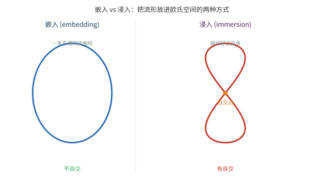
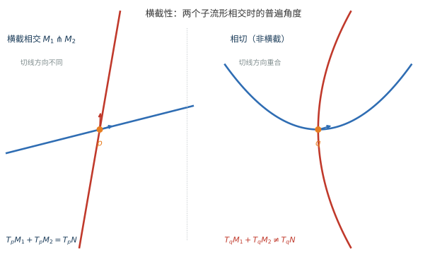

# 第 45 级：微分拓扑 (Differential Topology)

> 微分拓扑是研究光滑流形在光滑映射下的性质与分类的学科。它诞生于 20 世纪中叶，以 Whitney、Thom、Milnor、Smale、Hirsch 等数学家的工作为标志，将微分几何的分析工具与代数拓扑的全局视角深度融合。微分拓扑的核心问题包括：流形何时可以嵌入到欧几里得空间？光滑映射的典型性质是什么？流形的拓扑不变量如何通过分析手段计算？它不仅是纯数学的重要分支，也为理论物理（如规范场论中的瞬子）、经济学（如 Pareto 最优的横截性分析）提供了深刻的理论工具。

---

## 1. 学习目标

1. 掌握光滑流形与光滑映射的严格定义，理解切空间与微分的代数刻画。
2. 理解浸入、嵌入、淹没等基本概念及其局部标准形，掌握秩定理。
3. 掌握横截性的定义及其在光滑映射通有性质中的核心地位。
4. 深刻理解 Sard 定理及其证明中的测度论技巧。
5. 掌握 Thom 横截性定理及其在几何中的应用。
6. 理解 Morse 理论的基本框架：Morse 函数、临界点指数、Morse 引理与 Morse 不等式。
7. 掌握流形上积分与 Stokes 定理的完整证明及其在度理论中的应用。
8. 理解 Whitney 嵌入定理的证明思路与关键步骤。
9. 通过 Brouwer 不动点定理的微分拓扑证明，感受拓扑与分析技术的融合。

---

## 2. 光滑流形与光滑映射

### 2.1 光滑流形

**定义 2.1**（光滑流形）设 $M$ 是一个 Hausdorff 拓扑空间，满足第二可数公理。称 $M$ 是一个 **$n$ 维光滑流形**（smooth manifold），如果存在一个极大光滑图册 $\mathcal{A} = \{(U_\alpha, \varphi_\alpha)\}$，其中：

- $\{U_\alpha\}$ 是 $M$ 的开覆盖；
- 每个 $\varphi_\alpha: U_\alpha \to \tilde{U}_\alpha \subseteq \mathbb{R}^n$ 是同胚；
- 对任意 $\alpha, \beta$，转移映射 $\varphi_\beta \circ \varphi_\alpha^{-1}: \varphi_\alpha(U_\alpha \cap U_\beta) \to \varphi_\beta(U_\alpha \cap U_\beta)$ 是 $C^\infty$（光滑）的。

**例 2.2**（基本例子）
- **欧几里得空间** $\mathbb{R}^n$：由单个坐标卡 $(\mathbb{R}^n, \text{id})$ 构成光滑流形。
- **球面** $S^n = \{x \in \mathbb{R}^{n+1} \mid \|x\| = 1\}$：用球极投影给出两个坐标卡，转移映射光滑。
- **环面** $T^n = S^1 \times \cdots \times S^1$：乘积流形。
- **实射影空间** $\mathbb{RP}^n$：$\mathbb{R}^{n+1}\setminus\{0\}$ 在标量乘法下的商空间，可用齐次坐标给出光滑结构。
- **一般线性群** $\text{GL}(n, \mathbb{R})$：$\mathbb{R}^{n^2}$ 中 $\det \neq 0$ 的开子集，是光滑流形。

### 2.2 光滑映射

**定义 2.3**（光滑映射）设 $M, N$ 是光滑流形，$F: M \to N$ 是连续映射。称 $F$ 是 **光滑的**（smooth），若对任意坐标卡 $(U, \varphi)$ 和 $(V, \psi)$，复合映射
$$
\psi \circ F \circ \varphi^{-1}: \varphi(U \cap F^{-1}(V)) \to \mathbb{R}^{\dim N}
$$
是 $C^\infty$ 的。

**定义 2.4**（微分同胚）光滑映射 $F: M \to N$ 称为 **微分同胚**（diffeomorphism），若它是双射且其逆映射也光滑。此时称 $M$ 与 $N$ **微分同胚**。

**例 2.5**
- 映射 $F: \mathbb{R} \to \mathbb{R}$，$F(t) = t^3$ 是光滑的，但其逆 $F^{-1}(t) = t^{1/3}$ 在 $0$ 处不光滑，所以不是微分同胚。
- 映射 $F: \mathbb{R} \to \mathbb{R}^2$，$F(t) = (t, t^2)$ 是光滑嵌入。

### 2.3 切空间与微分

**定义 2.6**（切向量）设 $M$ 是光滑流形，$p \in M$。$M$ 在 $p$ 处的 **切向量** 是一个 $\mathbb{R}$-线性映射 $v: C^\infty(M) \to \mathbb{R}$，满足 Leibniz 法则：
$$
v(fg) = f(p) \, v(g) + g(p) \, v(f),\quad \forall f, g \in C^\infty(M).
$$

所有切向量的集合构成一个 $n$ 维向量空间，称为 $M$ 在 $p$ 处的 **切空间**（tangent space），记作 $T_p M$。

**定义 2.7**（微分）设 $F: M \to N$ 是光滑映射。$F$ 在 $p \in M$ 处的 **微分**（differential）是一个线性映射
$$
dF_p: T_p M \to T_{F(p)} N,
$$
定义为：对任意 $v \in T_p M$ 和 $f \in C^\infty(N)$，
$$
(dF_p(v))(f) = v(f \circ F).
$$

**性质 2.8**（链式法则）若 $F: M \to N$ 和 $G: N \to P$ 是光滑映射，则
$$
d(G \circ F)_p = dG_{F(p)} \circ dF_p.
$$

**定义 2.9**（坐标表示）在局部坐标 $(x^1, \ldots, x^m)$ 和 $(y^1, \ldots, y^n)$ 下，若 $F$ 由 $y = F(x)$ 给出，则微分 $dF_p$ 的矩阵表示就是 Jacobi 矩阵：
$$
\left( \frac{\partial F^i}{\partial x^j}(p) \right)_{n \times m}.
$$

---

## 3. 浸入、嵌入与淹没

### 3.1 基本概念

**定义 3.1**（浸入、嵌入、淹没）设 $F: M \to N$ 是光滑映射，$m = \dim M$，$n = \dim N$。

- 称 $F$ 在 $p$ 处是 **浸入**（immersion），若 $dF_p: T_p M \to T_{F(p)} N$ 是单射（此时必有 $m \leq n$）。
- 称 $F$ 是 **浸入**，若它在每点都是浸入。
- 称 $F$ 是 **嵌入**（embedding），若它是浸入且是到像的同胚（即 $F: M \to F(M)$ 是同胚）。
- 称 $F$ 在 $p$ 处是 **淹没**（submersion），若 $dF_p$ 是满射（此时必有 $m \geq n$）。
- 称 $F$ 是 **淹没**，若它在每点都是淹没。

**例 3.2**
- $F: \mathbb{R} \to \mathbb{R}^2$，$F(t) = (t^2, t^3)$ 在 $t=0$ 处不是浸入（因为 $dF_0 = 0$）。
- $F: \mathbb{R} \to \mathbb{R}^2$，$F(t) = (\cos t, \sin t)$ 是浸入但不是嵌入（因为像 $S^1$ 紧致而 $\mathbb{R}$ 非紧致，不是同胚）。
- $F: \mathbb{R} \to \mathbb{R}^2$，$F(t) = (t, t^2)$ 是嵌入。
- $F: \mathbb{R}^2 \to \mathbb{R}$，$F(x, y) = x^2 + y^2$ 在 $(0,0)$ 外是淹没。

### 3.2 秩定理

**定理 3.3**（秩定理，Rank Theorem）设 $F: M^m \to N^n$ 是光滑映射，且在 $p \in M$ 的某个邻域内具有常数秩 $r$。则存在 $p$ 附近的局部坐标 $(x^1, \ldots, x^m)$ 和 $F(p)$ 附近的局部坐标 $(y^1, \ldots, y^n)$，使得
$$
F(x^1, \ldots, x^m) = (x^1, \ldots, x^r, 0, \ldots, 0).
$$

**证明**：设在 $p$ 附近 $F$ 的 Jacobi 矩阵秩为 $r$。通过重新排列坐标，可假设前 $r$ 行和前 $r$ 列的子矩阵非奇异。定义新坐标
$$
(\tilde{x}^1, \ldots, \tilde{x}^m) = (F^1, \ldots, F^r, x^{r+1}, \ldots, x^m).
$$
由隐函数定理，这在 $p$ 附近是局部微分同胚。在新坐标下，$F$ 可写为
$$
F(\tilde{x}) = (\tilde{x}^1, \ldots, \tilde{x}^r, \tilde{F}^{r+1}(\tilde{x}), \ldots, \tilde{F}^n(\tilde{x})).
$$
由常数秩条件，$\tilde{F}^{r+1}, \ldots, \tilde{F}^n$ 实际上不依赖于 $\tilde{x}^{r+1}, \ldots, \tilde{x}^m$。再通过 $y$ 坐标的变换即可消去这些分量，得到标准形。$\square$

**推论 3.4**（局部标准形）
- 若 $F$ 在 $p$ 处是浸入，则存在局部坐标使得 $F(x^1, \ldots, x^m) = (x^1, \ldots, x^m, 0, \ldots, 0)$。
- 若 $F$ 在 $p$ 处是淹没，则存在局部坐标使得 $F(x^1, \ldots, x^m) = (x^1, \ldots, x^n)$。

### 3.3 浸入与嵌入的示例

**例 3.5**（圆环面的嵌入）
圆环面 $T^2 = S^1 \times S^1$ 可嵌入到 $\mathbb{R}^3$ 中。具体地，映射
$$
F(\theta, \phi) = ((R + r\cos\theta)\cos\phi, (R + r\cos\theta)\sin\phi, r\sin\theta),\quad 0 < r < R,
$$
是 $T^2$ 到 $\mathbb{R}^3$ 的嵌入，其像就是通常的甜甜圈曲面。

**例 3.6**（Klein 瓶的浸入）
Klein 瓶 $K^2$ 无法嵌入到 $\mathbb{R}^3$ 中（它需要第四维才能避免自交），但可以浸入到 $\mathbb{R}^3$ 中。一个经典的浸入参数化是：
$$
\begin{aligned}
x(\theta, \phi) &= (R + r\cos\theta)\cos\phi,\\
y(\theta, \phi) &= (R + r\cos\theta)\sin\phi,\\
z(\theta, \phi) &= r\sin\theta \cos(\phi/2),
\end{aligned}
$$
其中 $\theta, \phi \in [0, 2\pi]$。这个浸入会穿过自身，形成 Klein 瓶的特征性自交。

**例 3.7**（实射影空间 $\mathbb{RP}^2$ 到 $\mathbb{R}^4$ 的嵌入）
实射影平面 $\mathbb{RP}^2$ 可嵌入到 $\mathbb{R}^4$ 中。映射
$$
F([x:y:z]) = \left( \frac{x^2}{x^2+y^2+z^2}, \frac{y^2}{x^2+y^2+z^2}, \frac{xy}{x^2+y^2+z^2}, \frac{xz}{x^2+y^2+z^2} \right)
$$
给出了一个嵌入。在 $\mathbb{R}^3$ 中，$\mathbb{RP}^2$ 只能浸入（如 Boy 曲面）。

> **直观理解（现实类比）**：把一条纱线"不动剪刀地"平铺在桌面上，如果它首尾相接成圆环且不压到自己，就是**嵌入**；若你把它绕成"8"字形、让两段线交叉叠在一起，则只是**浸入**——交叉处两道线占着同一个桌面点，但沿纱线本身它仍是畅通的一维流形。嵌入要求"互不重叠"，浸入只要求"局部安然无恙"，允许整体自交。

---

## 4. 横截性 (Transversality)

### 4.1 横截性的定义

**定义 4.1**（横截性）设 $F: M \to N$ 是光滑映射，$S \subseteq N$ 是光滑子流形。称 $F$ **横截于** $S$（transversal to $S$），记作 $F \pitchfork S$，若对任意 $p \in F^{-1}(S)$，有
$$
dF_p(T_p M) + T_{F(p)} S = T_{F(p)} N.
$$

特别地，若 $S$ 是单点集 $\{q\}$，则 $F \pitchfork \{q\}$ 当且仅当 $dF_p$ 是满射，即 $q$ 是 $F$ 的正则值。

**定义 4.2**（子流形的横截性）两个子流形 $M_1, M_2 \subseteq N$ 称为 **横截相交**（transversal intersection），记作 $M_1 \pitchfork M_2$，若对任意 $p \in M_1 \cap M_2$，有
$$
T_p M_1 + T_p M_2 = T_p N.
$$

**例 4.3**
- $\mathbb{R}^2$ 中的两条曲线如果相交且切线不重合，则它们横截相交。
- $\mathbb{R}^3$ 中的一条曲线与一个曲面如果相交且曲线不在曲面内，则它们横截相交当且仅交点的切向量不在曲面的切平面内。
- 若两条曲线在 $\mathbb{R}^2$ 中相切，则它们不横截相交。

> **直观理解（现实类比）**：两条晒衣绳在院子里交叉，若它们"交错穿过"（方向明显不同），就是横截相交——这是随手一放就能自然发生的状态；而要让它俩"擦边相切"（方向恰好重合），则必须刻意摆弄、正好对齐。所以横截性是"一般位置"：不打滑、不粘连、干净利落地穿过。这正是 Thom 定理"几乎所有映射都横截"的生活直觉。
>
> **🧠 思考历程：为什么"几乎所有"光滑对象都落在一般位置？**
>
> 微分拓扑想弄明白：光滑的子流形与映射，在"随手一放"时应当如何相交？——横截性宣布，不相切、不粘连、干净利落的相交并非巧合，而是常态，偶然的反常情况只是毫无分量的特例。
>
> - **Morse 的临界点视角**。20 世纪 30 年代前后，Marston Morse 发展临界点理论，把流形的拓扑信息编码进光滑函数的奇异点——奇异性第一次成为可依赖的拓扑资源。
> - **嵌入与"安全值"**。Hassler Whitney 于 1930 年代证明嵌入定理，把光滑流形全都塞进更高维欧氏空间；Morse 的另一位继承者 Arthur Sard（1942）则证明临界值测度为 0，几乎处处都是"安全值"。
> - **Thom 的横截性纲领**。René Thom 开创的横截性理论证明"几乎所有光滑映射都横截"，把"碰巧相切"的反常对齐逐出一般位置之外，使相交理论从此干净、明了、无歧义。
> - **心路**：微分拓扑学家笃信"大多数情况都不打滑"——正是这份对一般位置的信任，让交点与临界点化身为可靠的拓扑路标。

### 4.2 横截性的基本性质

**定理 4.4**（横截像定理）若 $F: M \to N$ 横截于子流形 $S \subseteq N$，则 $F^{-1}(S)$ 是 $M$ 的（可能为空）子流形，其余维数为
$$
\operatorname{codim} F^{-1}(S) = \operatorname{codim} S.
$$

**证明**：设 $p \in F^{-1}(S)$，$\dim M = m$，$\dim N = n$，$\dim S = s$。在 $F(p)$ 附近取局部坐标 $(y^1, \ldots, y^n)$ 使得 $S$ 由 $y^{s+1} = \cdots = y^n = 0$ 给出。则 $F^{-1}(S)$ 在 $p$ 附近由方程 $F^{s+1}(x) = \cdots = F^n(x) = 0$ 定义。横截性条件保证 $dF_p$ 限制在补空间上是满射，因此这些函数的微分在 $p$ 处线性无关。由隐函数定理，$F^{-1}(S)$ 是 $m - (n-s)$ 维子流形。$\square$

**推论 4.5** 若两个子流形 $M_1, M_2 \subseteq N$ 横截相交，则 $M_1 \cap M_2$ 是 $N$ 的子流形，且
$$
\dim(M_1 \cap M_2) = \dim M_1 + \dim M_2 - \dim N.
$$

---

## 5. Sard 定理 (Sard's Theorem)

### 5.1 正则值与临界值

**定义 5.1**（临界点与正则值）设 $F: M \to N$ 是光滑映射。

- $p \in M$ 称为 $F$ 的 **临界点**（critical point），若 $dF_p: T_p M \to T_{F(p)} N$ 不是满射。
- $F$ 的临界点集合记作 $C_F$。
- $c \in N$ 称为 $F$ 的 **临界值**（critical value），若 $c \in F(C_F)$。
- $r \in N$ 称为 $F$ 的 **正则值**（regular value），若它不是临界值，即 $F^{-1}(r)$ 中不含临界点。
- 特别地，若 $r \notin F(M)$，则 $r$ 自动是正则值。

**例 5.2**
- $F: \mathbb{R} \to \mathbb{R}$，$F(x) = x^2$：临界点为 $x=0$，临界值为 $0$。
- $F: \mathbb{R}^2 \to \mathbb{R}$，$F(x, y) = x^2 - y^2$：临界点为 $(0,0)$，临界值为 $0$。
- $F: S^2 \to \mathbb{R}$，$F(x, y, z) = z$（高度函数）：临界点为北极 $(0,0,1)$ 和南极 $(0,0,-1)$。

### 5.2 Sard 定理及其证明

**定理 5.3**（Sard 定理）设 $F: M \to N$ 是光滑映射（$C^\infty$），则 $F$ 的临界值集合 $F(C_F)$ 在 $N$ 中测度为零（即它是 Lebesgue 零测集）。

**注**：Sard 定理最初由 A. P. Morse 在 1939 年对 $C^n$ 映射证明，其后由 Sard 在 1942 年推广到 $C^k$ 情形（要求 $k > \max(m-n, 0)$）。这里我们对 $C^\infty$ 情形给出完整的证明。

**证明**：由于问题局部，可设 $M = U \subseteq \mathbb{R}^m$ 是开集，$N = \mathbb{R}^n$。记 $C = C_F$ 为临界点集。

**步骤 1：化为局部估计**。由于 $\mathbb{R}^n$ 可被可列个立方体覆盖，只需证明 $F(C \cap Q)$ 在 $\mathbb{R}^n$ 中测度为零，其中 $Q$ 是任意紧致立方体。

**步骤 2：对 $n = 1$ 的证明（关键情况）**。

设 $F: U \subseteq \mathbb{R}^m \to \mathbb{R}$ 光滑。临界点集 $C = \{x \in U \mid \nabla F(x) = 0\}$。

对任意整数 $k \geq 1$，定义
$$
C_k = \{x \in U \mid \text{所有阶数 } \leq k \text{ 的偏导数在 } x \text{ 处为零}\}.
$$
则 $C = C_1 \supseteq C_2 \supseteq C_3 \supseteq \cdots$。

**引理 5.4**（对 $C_k \setminus C_{k+1}$ 的估计）设 $x \in C_k \setminus C_{k+1}$，则在 $x$ 的某个邻域内，$F(C)$ 的测度为零。

**证明**：由于 $x \in C_k \setminus C_{k+1}$，存在一个 $k+1$ 阶偏导数 $\partial^\alpha F$（$|\alpha| = k+1$）在 $x$ 处非零。不妨设 $\partial (\partial^\alpha F)/\partial x_1 \neq 0$。由隐函数定理，方程 $\partial^\alpha F(y) = 0$ 在 $x$ 附近定义了一个光滑超曲面 $S$。$C_k \cap S$ 在 $S$ 中的 $(m-1)$ 维测度可由归纳法处理。关键在于，$F$ 在 $x$ 附近有 Taylor 展开
$$
F(x+h) = F(x) + R(x, h),
$$
其中 $R(x, h) = O(\|h\|^{k+1})$。由于前 $k$ 阶导数为零，$F$ 在 $C_k$ 附近的增长被 $k+1$ 阶导数控制。通过精细的覆盖论证，$F(C_k \setminus C_{k+1})$ 的测度为零。$\square$

**引理 5.5**（对 $C_k$ 的估计，$k$ 充分大）对 $k > m/1$（即 $k \geq m$），$F(C_k)$ 的测度为零。

**证明**：设 $Q$ 是边长为 $\delta$ 的小立方体，将其细分为 $N^m$ 个边长为 $\delta/N$ 的小立方体 $Q_i$。对 $x \in C_k \cap Q_i$，由 Taylor 定理，
$$
|F(y) - F(x)| \leq M \|y - x\|^{k+1} \leq M' (\delta/N)^{k+1},
$$
其中 $M$ 是 $k+1$ 阶导数的上界。因此 $F(C_k \cap Q_i)$ 包含在长度为 $C (\delta/N)^{k+1}$ 的区间内。对所有 $N^m$ 个小立方体求和，总长度为
$$
N^m \cdot C (\delta/N)^{k+1} = C \delta^{k+1} N^{m-(k+1)}.
$$
当 $k+1 > m$ 时，令 $N \to \infty$，总长度趋于零。故 $F(C_k)$ 的测度为零。$\square$

**步骤 3：对 $n = 1$ 的归纳**。集合 $C = \bigcup_{k=1}^\infty (C_k \setminus C_{k+1}) \cup C_\infty$，其中 $C_\infty = \bigcap_{k=1}^\infty C_k$。引理 5.4 覆盖了 $C_k \setminus C_{k+1}$，引理 5.5 覆盖了 $C_k$（$k$ 充分大），故 $C_\infty \subseteq C_k$ 也被覆盖。因此 $F(C)$ 测度为零。

**步骤 4：对一般 $n$ 的证明**。对 $n$ 进行归纳。设 $F: \mathbb{R}^m \to \mathbb{R}^n$ 光滑。记 $C$ 为临界点集。设
$$
C^{(1)} = \{x \in \mathbb{R}^m \mid dF_x = 0\} \subseteq C.
$$
首先，考虑 $F_{C^{(1)}}$ 的像。由于在 $C^{(1)}$ 上所有偏导数为零，由引理 5.5 知 $F(C^{(1)})$ 测度为零。

其次，考虑 $C \setminus C^{(1)}$。对 $x \in C \setminus C^{(1)}$，$dF_x \neq 0$ 但不满射。设 $r = \text{rank}(dF_x) < n$。通过局部坐标变换，可假设 $F$ 在 $x$ 附近形如
$$
F(x_1, \ldots, x_m) = (x_1, \ldots, x_r, F_{r+1}(x), \ldots, F_n(x)),
$$
且 $\partial F_i/\partial x_j = 0$ 对 $i > r$ 和 $j > r$ 成立。定义投影 $\pi: \mathbb{R}^n \to \mathbb{R}^{n-1}$ 为 $\pi(y_1, \ldots, y_n) = (y_1, \ldots, y_{n-1})$，则 $x$ 是 $\pi \circ F$ 的临界点。由归纳假设，$\pi \circ F$ 的临界值集在 $\mathbb{R}^{n-1}$ 中测度为零。再结合 Fubini 定理，可得 $F(C)$ 在 $\mathbb{R}^n$ 中测度为零。$\square$

**推论 5.6**（正则值的稠密性）光滑映射 $F: M \to N$ 的正则值集合在 $N$ 中稠密。

**证明**：Sard 定理表明临界值集测度为零，因此其补集（正则值集）稠密。$\square$

### 5.3 Sard 定理的应用

**例 5.7**（正则水平集）设 $F: \mathbb{R}^m \to \mathbb{R}^n$ 光滑，$m > n$。由 Sard 定理，对几乎所有 $c \in \mathbb{R}^n$，$F^{-1}(c)$ 是 $m-n$ 维子流形（或空集）。例如，$F(x, y, z) = x^2 + y^2 + z^2$ 定义在 $\mathbb{R}^3$ 上，则几乎所有水平集（除 $c=0$ 外）都是光滑曲面。

**例 5.8**（代数几何中的经典结果）几乎所有代数曲面都是光滑的。更精确地说，设 $F(x_1, \ldots, x_m) = 0$ 是多项式方程，则对几乎所有小扰动 $F(x) = c$，解集是光滑流形。

---

## 6. Thom 横截性定理 (Thom Transversality Theorem)

### 6.1 函数空间中的通有性质

**定义 6.1**（通有性质）称光滑映射的某个性质是 **通有的**（generic），若满足该性质的映射集合在 $C^\infty(M, N)$ 中是一个稠密 $G_\delta$ 集（在 Whitney $C^\infty$ 拓扑下）。

**定理 6.2**（Thom 横截性定理，弱形式）设 $M, N$ 是光滑流形，$S \subseteq N$ 是光滑子流形。则横截于 $S$ 的光滑映射 $F: M \to N$ 的集合在 $C^\infty(M, N)$ 中是稠密的。

**证明思路**：证明分为以下步骤。

**步骤 1：局部化**。将问题限制在 $M$ 和 $N$ 的局部坐标卡上。设 $M$ 的局部坐标为 $U \subseteq \mathbb{R}^m$，$N$ 的局部坐标为 $V \subseteq \mathbb{R}^n$，且 $S$ 在 $V$ 中由 $y^{s+1} = \cdots = y^n = 0$ 给出。

**步骤 2：构造扰动族**。对给定映射 $F_0: U \to V$，考虑一个参数化扰动族
$$
F_t(x) = F_0(x) + t \cdot \psi(x),
$$
其中 $\psi$ 是精心选择的具有紧支集的光滑函数。将 $F_t$ 视为一个整体映射 $\Phi: U \times \mathbb{R}^k \to V$。

**步骤 3：应用 Sard 定理**。构造 $\Phi$ 使得 $\Phi \pitchfork S$。由横截像定理，$\Phi^{-1}(S)$ 是 $U \times \mathbb{R}^k$ 的子流形。考虑投影 $\pi: \Phi^{-1}(S) \to \mathbb{R}^k$。由 Sard 定理，$\pi$ 的正则值稠密，即对几乎所有 $t \in \mathbb{R}^k$，$F_t \pitchfork S$。

**步骤 4：全局化**。利用单位分解将局部构造粘合为全局扰动，并证明在 Whitney 拓扑下，满足横截性的映射构成稠密 $G_\delta$ 集。$\square$

**定理 6.3**（Thom 横截性定理，强形式，又称多参数横截性定理）设 $M, N$ 是光滑流形，$\{S_i\}$ 是 $N$ 的一族光滑子流形。则同时横截于所有 $S_i$ 的光滑映射在 $C^\infty(M, N)$ 中稠密。

**例 6.4**（通有映射的横截性）考虑 $\mathbb{R}^2$ 到 $\mathbb{R}^2$ 的光滑映射。通有的映射：
- 其像可以自交，但自交必须是横截的（即像曲线在交点处切线不重合）；
- 不会有三重点（即三个分支交于一点）；
- 不会出现尖点（cusp）等奇点。

### 6.2 横截性的几何应用

**例 6.5**（代数几何中的 Bezout 定理）在复射影平面 $\mathbb{CP}^2$ 中，两条代数曲线若横截相交，则交点数等于度数的乘积。横截性保证了每条交点是简单交点（没有重数）。

**例 6.6**（Pareto 最优）在经济学中，Pareto 最优边界在通有条件下是光滑流形，这是横截性定理的直接推论。

---

## 7. Morse 理论 (Morse Theory)

### 7.1 Morse 函数

**定义 7.1**（Morse 函数）设 $M$ 是光滑流形，$f: M \to \mathbb{R}$ 是光滑函数。称 $p \in M$ 是 $f$ 的 **临界点**（critical point），若 $df_p = 0$。临界点 $p$ 称为 **非退化的**（nondegenerate），若 Hessian 矩阵
$$
H_f(p) = \left( \frac{\partial^2 f}{\partial x^i \partial x^j}(p) \right)
$$
在局部坐标下是非奇异的。非退化临界点的 **指数**（index）定义为 Hessian 矩阵负特征值的个数（与坐标选取无关）。

全部临界点都是非退化的光滑函数称为 **Morse 函数**（Morse function）。

**例 7.2**
- $f: \mathbb{R} \to \mathbb{R}$，$f(x) = x^2$：临界点为 $0$，指数为 $0$（最小值）。
- $f: \mathbb{R} \to \mathbb{R}$，$f(x) = -x^2$：临界点为 $0$，指数为 $1$（最大值）。
- $f: \mathbb{R}^2 \to \mathbb{R}$，$f(x, y) = x^2 + y^2$：临界点为 $(0,0)$，指数为 $0$（局部极小）。
- $f: \mathbb{R}^2 \to \mathbb{R}$，$f(x, y) = x^2 - y^2$：临界点为 $(0,0)$，指数为 $1$（鞍点）。
- $f: \mathbb{R}^2 \to \mathbb{R}$，$f(x, y) = -x^2 - y^2$：临界点为 $(0,0)$，指数为 $2$（局部极大）。

**例 7.3**（环面上的 Morse 函数）考虑环面 $T^2$ 嵌入 $\mathbb{R}^3$ 中，高度函数 $f(x, y, z) = z$ 是 Morse 函数。它有四个临界点：
- 最低点（指数 0），
- 两个鞍点（指数 1），
- 最高点（指数 2）。
这正是 Morse 理论的核心例子：$T^2$ 的 Euler 示性数 $\chi = 0 = 1 - 2 + 1$。

### 7.2 Morse 引理

**定理 7.4**（Morse 引理）设 $p$ 是 Morse 函数 $f: M \to \mathbb{R}$ 的非退化临界点，指数为 $\lambda$。则存在 $p$ 附近的局部坐标 $(x^1, \ldots, x^n)$，使得
$$
f(x) = f(p) - \sum_{i=1}^{\lambda} (x^i)^2 + \sum_{j=\lambda+1}^{n} (x^j)^2.
$$

**证明**：**步骤 1**：取 $p$ 附近的任意局部坐标，不妨设 $f(p) = 0$。由 Hadamard 引理，可写
$$
f(x) = \sum_{i,j} x^i x^j \, g_{ij}(x),
$$
其中 $g_{ij}(x)$ 光滑且 $g_{ij}(0) = \frac{1}{2} \frac{\partial^2 f}{\partial x^i \partial x^j}(0)$。由于 $p$ 是非退化临界点，矩阵 $(g_{ij}(0))$ 非奇异。

**步骤 2**：通过对称化，可设 $g_{ij} = g_{ji}$。现在对 $f$ 进行线性变换消去交叉项。考虑变量替换的归纳构造。假设已在前 $k$ 个变量上完成了标准化，即
$$
f(x) = \pm (x^1)^2 \pm \cdots \pm (x^{k-1})^2 + \sum_{i,j \geq k} x^i x^j \, h_{ij}(x),
$$
其中 $h_{ij}(0)$ 非奇异。在 $x^k$ 方向做特征分解，可进一步标准化。通过适当的坐标变换（类似于 Gram-Schmidt 正交化），最终可对角化二次型，得到标准形。

**步骤 3**：由于 Hessian 矩阵的符号差在坐标变换下不变（Sylvester 惯性定律），指数 $\lambda$ 即为负特征值的个数，标准形中正好有 $\lambda$ 个负号。$\square$

**推论 7.5**（Morse 函数的局部结构）Morse 函数的临界点是孤立的。

### 7.3 Morse 不等式

**定义 7.6**（Morse 数）设 $f: M \to \mathbb{R}$ 是紧致流形 $M$ 上的 Morse 函数。记 $c_\lambda$ 为指数为 $\lambda$ 的临界点个数。这些数称为 **Morse 数**（Morse numbers）。

**定理 7.7**（Morse 不等式）设 $M$ 是紧致光滑流形，$f: M \to \mathbb{R}$ 是 Morse 函数。记 $b_\lambda = \dim H_\lambda(M; \mathbb{R})$ 为 $M$ 的 $\lambda$ 次 Betti 数。则
1. **(弱 Morse 不等式)** 对每个 $\lambda$，$c_\lambda \geq b_\lambda$。
2. **(强 Morse 不等式)** 对每个 $k$，
   $$
   \sum_{\lambda=0}^k (-1)^{k-\lambda} c_\lambda \geq \sum_{\lambda=0}^k (-1)^{k-\lambda} b_\lambda.
   $$
3. **(Euler 示性数)** $\chi(M) = \sum_{\lambda=0}^n (-1)^\lambda c_\lambda = \sum_{\lambda=0}^n (-1)^\lambda b_\lambda$。

**证明思路**：Morse 理论的核心思想是研究子水平集 $M_a = f^{-1}((-\infty, a])$ 的拓扑变化。当 $a$ 经过临界值时，$M_a 的拓扑通过粘合一个 $\lambda$-胞腔而改变（其中 $\lambda$ 是临界点指数）。由此建立了临界点与胞腔分解之间的联系，从而得到 Morse 不等式。$\square$

**例 7.8**（球面 $S^n$ 的 Morse 数）考虑高度函数 $f: S^n \to \mathbb{R}$，$f(x_0, \ldots, x_n) = x_{n+1}$。它有两个临界点：南极（指数 0）和北极（指数 $n$）。因此 $c_0 = 1$，$c_n = 1$，其余 $c_\lambda = 0$。这恰好等于 Betti 数：$b_0 = 1$，$b_n = 1$，其余为 0。

**例 7.9**（环面 $T^2$ 的 Morse 数）如前所述，高度函数在 $T^2$ 上有 1 个指数 0 临界点，2 个指数 1 临界点，1 个指数 2 临界点。因此 $c_0 = 1, c_1 = 2, c_2 = 1$，与 Betti 数 $b_0 = 1, b_1 = 2, b_2 = 1$ 完全一致。

### 7.4 Morse 函数的构造

**命题 7.10**（Morse 函数的存在性）任何紧致光滑流形上都存在 Morse 函数。

**构造**：取嵌入 $F: M \to \mathbb{R}^N$（由 Whitney 嵌入定理，$N = 2n+1$ 即可）。考虑高度函数族 $f_v(x) = \langle F(x), v \rangle$，其中 $v \in \mathbb{R}^N$ 是单位向量。可以证明，对几乎所有 $v$，$f_v$ 是 Morse 函数。这利用了 Sard 定理和横截性方法。$\square$

---

## 8. Whitney 嵌入定理 (Whitney Embedding Theorem)

### 8.1 定理陈述

**定理 8.1**（Whitney 嵌入定理，弱形式）设 $M$ 是 $n$ 维紧致光滑流形，则存在光滑嵌入 $F: M \to \mathbb{R}^{2n+1}$。

**定理 8.2**（Whitney 嵌入定理，强形式）设 $M$ 是 $n$ 维光滑流形（不必紧致），则存在光滑嵌入 $F: M \to \mathbb{R}^{2n}$。

**定理 8.3**（Whitney 浸入定理）$n$ 维光滑流形可浸入到 $\mathbb{R}^{2n-1}$ 中。

### 8.2 弱形式的证明思路

我们证明紧致情况下的 $2n+1$ 嵌入定理。

**步骤 1：构造到 $\mathbb{R}^N$ 的嵌入**。由于 $M$ 紧致，存在有限个坐标卡 $(U_i, \varphi_i)$，$i=1, \ldots, k$，以及单位分解 $\{\rho_i\}$ 从属于 $\{U_i\}$。定义映射
$$
G(x) = (\rho_1(x)\varphi_1(x), \ldots, \rho_k(x)\varphi_k(x), \rho_1(x), \ldots, \rho_k(x)) \in \mathbb{R}^{k(n+1)}.
$$
$G$ 是光滑嵌入。因此任何紧致流形可嵌入到某个 $\mathbb{R}^N$ 中。

**步骤 2：降低维数**。设 $M \subseteq \mathbb{R}^N$ 是嵌入子流形，$N > 2n+1$。考虑投影 $\pi_v: \mathbb{R}^N \to v^\perp$（沿方向 $v$ 的正交投影），其中 $v \in S^{N-1}$。我们希望找到 $v$ 使得 $\pi_v|_M$ 仍是嵌入。

**步骤 3：避免非浸入性**。$\pi_v|_M$ 在 $p$ 处不是浸入当且仅当 $v$ 与 $T_p M$ 的某个非零向量平行。考虑集合
$$
\Sigma_1 = \{(p, v) \in M \times S^{N-1} \mid v \in T_p M\}.
$$
$\Sigma_1$ 是 $M \times S^{N-1}$ 中余维数为 $n-1$ 的子流形（实际上是 $2n-1$ 维）。投影 $\pi: \Sigma_1 \to S^{N-1}$ 的像的测度由 Sard 定理控制。当 $N > 2n+1$ 时，$N-1 > 2n-1$，因此 $\pi$ 不是满射，存在 $v$ 使得 $\pi_v|_M$ 是浸入。

**步骤 4：避免非单射性**。$\pi_v|_M$ 不是单射当且仅当存在 $p \neq q$ 使得 $p - q \parallel v$。考虑集合
$$
\Sigma_2 = \{(p, q, v) \in M \times M \times S^{N-1} \mid p \neq q,\; p - q \parallel v\}.
$$
$\Sigma_2$ 是 $(2n)$ 维流形。投影 $\pi: \Sigma_2 \to S^{N-1}$ 的像当 $N-1 > 2n$ 时不是满射，即当 $N > 2n+1$ 时存在 $v$ 使得 $\pi_v|_M$ 是单射。

**步骤 5**：结合步骤 3 和 4，当 $N > 2n+1$ 时，存在 $v$ 使得 $\pi_v|_M$ 既是浸入又是单射。由于 $M$ 紧致，单射浸入自动是嵌入。因此 $M$ 可嵌入到 $\mathbb{R}^{N-1}$ 中。重复这一过程，最终得到嵌入到 $\mathbb{R}^{2n+1}$ 中。$\square$

### 8.3 强形式的注记

$2n$ 嵌入定理的证明更为精细。关键步骤是使用 Whitney 技巧消除自交点：当 $M$ 已嵌入到 $\mathbb{R}^{2n+1}$ 中时，考虑投影到 $\mathbb{R}^{2n}$，若投影不是单射，则自交点形成横截相交的曲线。通过 Whitney 的"圆盘"消去技巧，可以消除这些自交而不引入新的自交。这需要更精细的拓扑论证（Whitney 引理）。

---

## 9. 管状邻域 (Tubular Neighborhood)

### 9.1 定义与存在性

**定义 9.1**（法丛）设 $M \subseteq N$ 是光滑嵌入子流形。$M$ 在 $N$ 中的 **法丛**（normal bundle）是
$$
\nu(M) = \{(p, v) \in M \times T N \mid v \in T_p N,\; v \perp T_p M\},
$$
其中 $\perp$ 由 $N$ 上的某个 Riemann 度量定义（不同度量给出同构的法丛）。

**定理 9.2**（管状邻域定理）设 $M$ 是 $N$ 的紧致光滑子流形。则存在 $M$ 在 $N$ 中的一个开邻域 $U$（称为 **管状邻域**，tubular neighborhood）和微分同胚
$$
\Phi: \nu(M) \supseteq V \to U \subseteq N,
$$
其中 $V$ 是零截面的一个开邻域，且 $\Phi$ 在零截面上是恒等映射。

**证明思路**：取 $N$ 上的 Riemann 度量，定义指数映射 $\exp: \nu(M) \to N$。在紧致性条件下，$\exp$ 在零截面的某个邻域上是微分同胚。管状邻域即 $\exp$ 的像。$\square$

**例 9.3**（圆环面的管状邻域）设 $S^1 \subseteq \mathbb{R}^2$ 是单位圆，则其管状邻域是 $S^1$ 的 $\varepsilon$-邻域 $\{x \in \mathbb{R}^2 \mid \text{dist}(x, S^1) < \varepsilon\}$，微分同胚于 $S^1 \times (-\varepsilon, \varepsilon)$。

### 9.2 管状邻域的应用

管状邻域是横截性证明和代数拓扑中同伦论的重要工具。例如，在构造 Pontryagin-Thom 构造时，管状邻域将子流形映射到法丛的 Thom 空间。

---

## 10. 流形上的积分与 Stokes 定理

### 10.1 微分形式

**定义 10.1**（微分形式）设 $M$ 是 $n$ 维光滑流形。$M$ 上的一个 **$k$ 次微分形式**（differential $k$-form）是一个光滑截面 $\omega: M \to \Lambda^k(T^*M)$，即对每点 $p$，$\omega_p$ 是 $T_p M$ 上的交错 $k$-线性形式。

在局部坐标 $(x^1, \ldots, x^n)$ 下，$k$ 次微分形式可写为
$$
\omega = \sum_{i_1 < \cdots < i_k} \omega_{i_1 \cdots i_k}(x) \, dx^{i_1} \wedge \cdots \wedge dx^{i_k}.
$$

**定义 10.2**（外微分）外微分算子 $d: \Omega^k(M) \to \Omega^{k+1}(M)$ 是唯一的 $\mathbb{R}$-线性映射满足：
1. 对 $f \in \Omega^0(M) = C^\infty(M)$，$df = \sum_i (\partial f/\partial x^i) dx^i$。
2. $d(d\omega) = 0$（即 $d^2 = 0$）。
3. $d(\omega \wedge \eta) = d\omega \wedge \eta + (-1)^{\deg \omega} \omega \wedge d\eta$。

### 10.2 流形上的积分

**定义 10.3**（定向流形）流形 $M$ 称为 **可定向的**（orientable），若存在一个处处非零的 $n$ 次微分形式 $\omega$（称为体积形式）。选择了一个体积形式等价于给出了定向。

**定义 10.4**（支集在坐标卡中的形式的积分）设 $\omega$ 是 $n$ 维定向流形 $M$ 上的 $n$ 次微分形式，其支集包含在定向坐标卡 $(U, \varphi)$ 中。设
$$
\omega = f(x) \, dx^1 \wedge \cdots \wedge dx^n,
$$
则定义
$$
\int_M \omega = \int_{\varphi(U)} f(x) \, dx^1 \cdots dx^n,
$$
其中右边是 $\mathbb{R}^n$ 中的 Lebesgue 积分。

**定义 10.5**（一般形式的积分）对任意有紧支集的 $n$ 次微分形式 $\omega$，利用单位分解 $\{\rho_i\}$，定义
$$
\int_M \omega = \sum_i \int_M \rho_i \omega.
$$
此定义与单位分解的选取无关。

### 10.3 Stokes 定理

**定理 10.6**（Stokes 定理）设 $M$ 是 $n$ 维带边定向光滑流形，$\partial M$ 具有诱导定向。设 $\omega$ 是 $M$ 上的 $n-1$ 次微分形式，具有紧支集。则
$$
\int_M d\omega = \int_{\partial M} \omega.
$$

**证明**：我们给出完整的证明。

**步骤 1：化为局部情况**。利用单位分解，将 $\omega$ 分解为有限个支集在坐标卡中的形式之和。由于 $d$ 和积分都是线性的，只需证明对支集在单个坐标卡中的形式 Stokes 公式成立。

**步骤 2：$\mathbb{R}^n$ 上半空间中的计算**。有两种情况：坐标卡位于 $M$ 内部，或位于边界上。

**情况 A**：坐标卡 $U$ 完全在 $M$ 内部（即与 $\partial M$ 不相交）。设 $\omega$ 的支集包含在 $U$ 中，在局部坐标下
$$
\omega = \sum_{i=1}^n (-1)^{i-1} f_i(x) \, dx^1 \wedge \cdots \wedge \widehat{dx^i} \wedge \cdots \wedge dx^n,
$$
其中 $\widehat{dx^i}$ 表示省略 $dx^i$。则
$$
d\omega = \sum_{i=1}^n \frac{\partial f_i}{\partial x^i} \, dx^1 \wedge \cdots \wedge dx^n.
$$
因此
$$
\int_M d\omega = \sum_{i=1}^n \int_{\mathbb{R}^n} \frac{\partial f_i}{\partial x^i} \, dx^1 \cdots dx^n.
$$
对每个 $i$，由 Fubini 定理和微积分基本定理，
$$
\int_{\mathbb{R}^n} \frac{\partial f_i}{\partial x^i} \, dx^1 \cdots dx^n = \int_{\mathbb{R}^{n-1}} \left( \int_{-\infty}^\infty \frac{\partial f_i}{\partial x^i} \, dx^i \right) dx^1 \cdots \widehat{dx^i} \cdots dx^n = 0,
$$
因为 $f_i$ 具有紧支集，在无穷远处为零。所以 $\int_M d\omega = 0$。同时，由于 $\partial M \cap U = \emptyset$，$\int_{\partial M} \omega = 0$，等式成立。

**情况 B**：坐标卡 $U$ 与 $\partial M$ 相交。取局部坐标 $(x^1, \ldots, x^n)$ 使得 $U \cap M = \{x \in \mathbb{R}^n \mid x^n \geq 0\}$，且 $\partial M$ 由 $x^n = 0$ 给出。诱导定向由 $(-1)^n dx^1 \wedge \cdots \wedge dx^{n-1}$ 给出（符号约定）。

设 $\omega$ 的支集在 $U$ 中，且
$$
\omega = \sum_{i=1}^n (-1)^{i-1} f_i(x) \, dx^1 \wedge \cdots \wedge \widehat{dx^i} \wedge \cdots \wedge dx^n.
$$

首先计算 $\int_M d\omega$：
$$
\int_M d\omega = \sum_{i=1}^n \int_{x^n \geq 0} \frac{\partial f_i}{\partial x^i} \, dx^1 \cdots dx^n.
$$

对 $i < n$，由 Fubini 定理和紧支集性，
$$
\int_{x^n \geq 0} \frac{\partial f_i}{\partial x^i} \, dx^1 \cdots dx^n = 0.
$$

对 $i = n$，
$$
\int_{x^n \geq 0} \frac{\partial f_n}{\partial x^n} \, dx^1 \cdots dx^n = \int_{\mathbb{R}^{n-1}} \left( \int_0^\infty \frac{\partial f_n}{\partial x^n} \, dx^n \right) dx^1 \cdots dx^{n-1}.
$$
由微积分基本定理，
$$
\int_0^\infty \frac{\partial f_n}{\partial x^n} \, dx^n = -f_n(x^1, \ldots, x^{n-1}, 0),
$$
因为 $f_n$ 在 $x^n \to \infty$ 时趋于 0。因此
$$
\int_M d\omega = -\int_{\mathbb{R}^{n-1}} f_n(x^1, \ldots, x^{n-1}, 0) \, dx^1 \cdots dx^{n-1}.
$$

其次，计算 $\int_{\partial M} \omega$。在 $\partial M$ 上，$x^n = 0$，$dx^n = 0$。因此 $\omega$ 限制在 $\partial M$ 上只有 $i=n$ 的项非零：
$$
\omega|_{\partial M} = (-1)^{n-1} f_n(x^1, \ldots, x^{n-1}, 0) \, dx^1 \wedge \cdots \wedge dx^{n-1}.
$$
由诱导定向，
$$
\int_{\partial M} \omega = (-1)^{n-1} \int_{\mathbb{R}^{n-1}} f_n(x^1, \ldots, x^{n-1}, 0) \cdot [(-1)^n dx^1 \cdots dx^{n-1}] = -\int_{\mathbb{R}^{n-1}} f_n(x^1, \ldots, x^{n-1}, 0) \, dx^1 \cdots dx^{n-1}.
$$

因此 $\int_M d\omega = \int_{\partial M} \omega$。$\square$

**例 10.7**（经典 Stokes 定理）设 $\Omega \subseteq \mathbb{R}^3$ 是带边区域，$\vec{F}$ 是向量场。则
$$
\int_\Omega (\nabla \times \vec{F}) \cdot dV = \int_{\partial \Omega} \vec{F} \cdot d\vec{S}.
$$
这是 Stokes 定理在 $\omega = F_1 dx + F_2 dy + F_3 dz$ 时的特例。

**例 10.8**（散度定理）设 $\Omega \subseteq \mathbb{R}^3$ 是带边区域，$\vec{F}$ 是向量场。则
$$
\int_\Omega (\nabla \cdot \vec{F}) \, dV = \int_{\partial \Omega} \vec{F} \cdot \vec{n} \, dS.
$$
这是 Stokes 定理在 $\omega = F_1 dy \wedge dz + F_2 dz \wedge dx + F_3 dx \wedge dy$ 时的特例。

**例 10.9**（Green 定理）设 $\Omega \subseteq \mathbb{R}^2$ 是带边区域，则
$$
\int_\Omega \left( \frac{\partial Q}{\partial x} - \frac{\partial P}{\partial y} \right) dx dy = \int_{\partial \Omega} P \, dx + Q \, dy.
$$

---

## 11. 度理论 (Degree Theory)

### 11.1 映射度的定义

**定义 11.1**（映射度）设 $F: M \to N$ 是紧致定向光滑流形之间的光滑映射，$M$ 无边界，$N$ 连通且 $\dim M = \dim N = n$。设 $y \in N$ 是 $F$ 的正则值。由于 $F^{-1}(y)$ 是有限集，定义 $F$ 的 **度**（degree）为
$$
\deg F = \sum_{p \in F^{-1}(y)} \operatorname{sgn} \det(dF_p),
$$
其中符号由 $dF_p$ 是否保持定向决定（即 $\det(dF_p) > 0$ 时取 $+1$，$\det(dF_p) < 0$ 时取 $-1$）。

**定理 11.2**（度的良定性）$\deg F$ 与正则值 $y$ 的选择无关。

**证明**：设 $y_1, y_2$ 是两个正则值，取 $N$ 中连接 $y_1$ 和 $y_2$ 的光滑路径 $\gamma$，通过横截性论证，可证明 $\deg F$ 沿路径不变。$\square$

**定理 11.3**（度的同伦不变性）若 $F_0, F_1: M \to N$ 是光滑同伦的，则 $\deg F_0 = \deg F_1$。

**证明**：考虑同伦 $H: M \times [0, 1] \to N$，其中 $H(\cdot, 0) = F_0$，$H(\cdot, 1) = F_1$。由 Sard 定理，取 $y$ 为 $H$ 的正则值，则 $H^{-1}(y)$ 是 $M \times [0, 1]$ 中的 1 维子流形，其边界为 $F_0^{-1}(y) \times \{0\} \cup F_1^{-1}(y) \times \{1\}$（带定向）。由 Stokes 定理（或直接利用定向的边界的代数计数），可得 $\deg F_0 = \deg F_1$。$\square$

### 11.2 度理论的应用

**例 11.4**（多项式映射的度）考虑 $F: \mathbb{C} \to \mathbb{C}$，$F(z) = z^k$。将 $F$ 视为 $S^2 \to S^2$（通过 Riemann 球面）。则 $\deg F = k$。正则值 $w \neq 0$ 的原像为 $z = w^{1/k}$，共 $k$ 个点，每个点的局部度都是 $+1$（因为 $dF_z = k z^{k-1}$，定向保持）。

**定理 11.5**（Brouwer 不动点定理的微分拓扑证明）设 $B^n = \{x \in \mathbb{R}^n \mid \|x\| \leq 1\}$ 是闭单位球，$f: B^n \to B^n$ 是连续映射。则 $f$ 存在不动点，即存在 $x \in B^n$ 使得 $f(x) = x$。

**证明**：**步骤 1：光滑逼近**。先假设 $f$ 光滑。若 $f$ 没有不动点，则对任意 $x \in B^n$，$f(x) \neq x$。定义映射 $g: B^n \to S^{n-1} = \partial B^n$：从 $f(x)$ 出发沿射线穿过 $x$ 交 $\partial B^n$ 于点 $g(x)$。具体地，
$$
g(x) = x + t(x)(x - f(x)),
$$
其中 $t(x) \geq 0$ 是满足 $\|g(x)\| = 1$ 的实数。由隐函数定理，$g$ 光滑且 $g|_{\partial B^n} = \text{id}$。

**步骤 2：映射度矛盾**。考虑 $g$ 限制在 $\partial B^n$ 上为恒等映射，因此 $\deg(g|_{\partial B^n}) = 1$。但 $g$ 可延拓到整个 $B^n$（即 $g$ 本身），因此 $g|_{\partial B^n}$ 同伦于常值映射（通过延拓到内部再收缩）。但常值映射的度为 0，与同伦不变性矛盾。

**步骤 3：连续情形**。对连续映射 $f$，用光滑逼近定理取光滑映射 $\tilde{f}$ 逼近 $f$。若 $\tilde{f}$ 有不动点，则由逼近的紧致性可得 $f$ 也有不动点。$\square$

**例 11.6**（代数基本定理）任意非常值复多项式 $p(z)$ 在 $\mathbb{C}$ 上有根。考虑 $p$ 作为 $S^2 \to S^2$ 的映射，当 $p(z) = a_n z^n + \cdots + a_0$ 且 $a_n \neq 0$ 时，$\deg p = n$（因为 $p(z) \sim a_n z^n$ 当 $|z| \to \infty$，且 $z^n$ 的度为 $n$）。由于 $\deg p = n \neq 0$，$p$ 不能是常值映射，因此 $p$ 必须满射，特别地存在零点。

**例 11.7**（Hopf 映射度）Hopf 映射 $H: S^3 \to S^2$ 的度为 0（因为它不是 $S^2$ 到 $S^2$ 的映射，而是 $S^3$ 到 $S^2$ 的映射，映射度的定义要求定义域和值域维数相同）。但 Hopf 映射对同伦群 $\pi_3(S^2) \cong \mathbb{Z}$ 的生成元有贡献，这是通过 Hopf 不变量而非度来度量的。

---

## 12. 综合示例

### 12.1 嵌入与浸入的示例

**例 12.1**（圆环面嵌入 $\mathbb{R}^4$）圆环面 $T^2$ 有标准嵌入到 $\mathbb{R}^4$ 中：
$$
F(\theta, \phi) = (\cos\theta, \sin\theta, \cos\phi, \sin\phi).
$$
这是乘积流形的标准嵌入，每条 $S^1$ 因子嵌入到 $\mathbb{R}^2$ 中。

**例 12.2**（Möbius 带的浸入）Möbius 带是 $\mathbb{RP}^2$ 去掉一个开圆盘所得。它可以浸入到 $\mathbb{R}^3$ 中，且其边界圆（即 Möbius 带的边界）在 $\mathbb{R}^3$ 中形成一个纽结。

### 12.2 Morse 函数的构造与计算

**例 12.3**（$S^n$ 上的 Morse 函数）考虑 $f: S^n \to \mathbb{R}$，$f(x) = x_{n+1}$（最后坐标）。则：
- $f$ 的临界点为北极 $(0, \ldots, 0, 1)$ 和南极 $(0, \ldots, 0, -1)$。
- 在北极，Hessian 为负定，指数为 $n$。
- 在南极，Hessian 为正定，指数为 $0$。
- 因此 $c_0 = 1$，$c_n = 1$。

**例 12.4**（环面 $T^2$ 上的 Morse 函数）设 $T^2$ 由 $\mathbb{R}^2$ 模去整数格点 $\mathbb{Z}^2$ 得到。函数
$$
f(x, y) = \cos(2\pi x) + \cos(2\pi y)
$$
在 $T^2$ 上诱导出 Morse 函数。其临界点：
- 在 $(0, 0)$：局部极小，指数 0。
- 在 $(1/2, 0)$ 和 $(0, 1/2)$：鞍点，指数 1。
- 在 $(1/2, 1/2)$：局部极大，指数 2。

### 12.3 度理论的计算应用

**例 12.5**（计算 $S^1$ 上映射的度）$F: S^1 \to S^1$，$F(\theta) = k\theta$（模 $2\pi$）。则 $\deg F = k$。正则值 $\theta_0$ 的原像为 $k$ 个点 $\theta_0/k + 2\pi j/k$，$j=0, \ldots, k-1$，每个局部度都是 $+1$。

**例 12.6**（向量场的指数）设 $V: M \to TM$ 是光滑向量场，具有孤立零点。在每个零点 $p$ 附近，$V$ 诱导了一个局部映射度，称为向量场在 $p$ 处的 **指数**（index）。Poincaré-Hopf 定理指出，紧致流形上向量场所有零点的指数之和等于 Euler 示性数 $\chi(M)$。

---

## 13. 习题

> 本习题集按难度分为基础题（1--100）、进阶题（101--190）、挑战题（191--260）、探究题（261--300），编号全局连续，覆盖本章全部知识点：光滑流形与光滑映射、切空间与微分、浸入/淹没/嵌入与秩定理、横截性、Sard 定理、Thom 横截性、Morse 理论、Whitney 嵌入、管状邻域与法丛、Stokes 定理、度理论与 Brouwer 不动点等。

### 基础题

**习题 1** 设 $S^n=\{x\in\mathbb{R}^{n+1}\mid \|x\|=1\}$。用球极投影给出两个坐标卡，说明 $S^n$ 是 $n$ 维光滑流形。

**习题 2** 证明一般线性群 $\text{GL}(n,\mathbb{R})=\{A\in\mathbb{R}^{n^2}\mid \det A\neq 0\}$ 是 $n^2$ 维开子流形，并计算其切空间 $T_I\text{GL}(n,\mathbb{R})$。

**习题 3** 证明集合 $M=\{(x,y)\in\mathbb{R}^2\mid x^2-y^2=1\}$ 是一维光滑子流形（用隐函数/Sard 方法）。

**习题 4** 判断 $f:\mathbb{R}\to\mathbb{R}$，$f(t)=t^3$ 是否为微分同胚；若否，说明阻塞原因。

**习题 5** 证明乘积流形 $M\times N$ 的维数为 $\dim M+\dim N$，并给出其自然图册。

**习题 6** 设 $F:\mathbb{R}^2\to\mathbb{R}^3$，$F(x,y)=(x,y,xy)$。写出 $F$ 在 $(1,2)$ 处微分的 Jacobi 矩阵。

**习题 7** 计算 $F:\mathbb{R}\to\mathbb{R}^2$，$F(t)=(t,t^2)$ 在任意 $t$ 处微分的 Jacobi 矩阵，并验证它秩为 $1$。

**习题 8** 光滑函数 $f:\mathbb{R}^n\to\mathbb{R}$，$f(x)=\sum_i (x^i)^2$。求 $df$ 在坐标下的表达式。

**习题 9** 用链式法则计算 $F(t)=(\cos t,\sin t)$ 与 $G(x,y)=x^2+y^2$ 复合后在 $t$ 处的导数。

**习题 10** 设 $F:\mathbb{R}\to\mathbb{R}/(2\pi)$ 为覆盖映射。判断其是否浸入、淹没、嵌入。

**习题 11** 判断 $F:\mathbb{R}\to\mathbb{R}^2$，$F(t)=(t^2,t^3)$ 在 $t=0$ 处是否为浸入。

**习题 12** 判断 $F:\mathbb{R}\to\mathbb{R}^2$，$F(t)=(\cos t,\sin t)$ 是否为浸入，是否为嵌入。

**习题 13** 判断 $F:\mathbb{R}\to\mathbb{R}^2$，$F(t)=(t,t^2)$ 是否为嵌入。

**习题 14** 判断 $F:\mathbb{R}^2\to\mathbb{R}$，$F(x,y)=x^2+y^2$ 在哪些点为淹没，在全空间是否为淹没。

**习题 15** 判断 $F:\mathbb{R}^3\to\mathbb{R}^2$，$F(x,y,z)=(x,y)$ 是否为淹没。

**习题 16** 设 $M^m\subset\mathbb{R}^n$ 是嵌入子流形。说明包含映射是否自动为浸入与嵌入。

**习题 17** 给出一个浸润但非嵌入、以及一个非浸入的例子各一。

**习题 18** 流形 $M$ 的嵌入像 $F(M)$ 是否总是闭集？举例说明。

**习题 19** 设 $F:M\to N$ 在 $p$ 处是浸入，$\dim M=\dim N$。证明 $F$ 在 $p$ 附近是局部微分同胚。

**习题 20** 求秩定理中 $F:\mathbb{R}^2\to\mathbb{R}^2$，$F(x,y)=(x,x^2+y)$ 的秩，并写出其附近的标准形所对应的坐标变换。

**习题 21** 对 $F:\mathbb{R}^3\to\mathbb{R}$，$F(x,y,z)=x^2+y^2+z^2$，确定所有正则值与临界值。

**习题 22** 对 $F:\mathbb{R}^2\to\mathbb{R}$，$F(x,y)=x^2-y^2$，指出临界点、临界值与正则值。

**习题 23** 正则值 $c$ 的定义对 $c\notin F(M)$ 的情形如何理解？例子。

**习题 24** 设 $F:\mathbb{R}^m\to\mathbb{R}^n$，$m\le n$ 是浸入。说明 $-F$ 是否仍是浸入。

**习题 25** 证明高度函数 $f:S^2\to\mathbb{R}$，$f(x,y,z)=z$ 的两个临界点是南极、北极，且都是非退化的。

**习题 26** 设 $f:M\to\mathbb{R}$ 光滑，$p$ 是临界点。若在某个坐标卡中 Hessian 非奇异，证明退化性与坐标选取无关。

**习题 27** 计算 $f(x,y)=x^2+3y^2$ 在 $(0,0)$ 处的指数。

**习题 28** 计算 $f(x,y,z)=x^2-y^2-z^2$ 在 $(0,0,0)$ 处的指数。

**习题 29** 计算 $f(x,y)=xy$ 在 $(0,0)$ 处的指数并说明其临界点类型。

**习题 30** 证明 $C^\infty$ 共有函数空间 $C^\infty(M,N)$ 在单位分解下可局部拉平（说明 Whitney 拓扑的局部基）。

**习题 31** 判断两条曲线 $y=x^2$ 与 $x$-轴在原点是否横截相交。

**习题 32** 判断直线 $L=\{y=0\}$ 与抛物线 $y=x^2$ 在原点的横截性。

**习题 33** 两曲线 $x^2+y^2=1$ 与 $x^2-y^2=1$ 的交点处是否横截？

**习题 34** 验证子流形横截相交的维数公式 $\dim(M_1\cap M_2)=\dim M_1+\dim M_2-\dim N$ 在 $\mathbb{R}^3$ 中两平面情形。

**习题 35** 设 $F:\mathbb{R}^2\to\mathbb{R}$，$S=\{0\}\subset\mathbb{R}$。请说明 $F\pitchfork\{0\}$ 等价于 $0$ 是 $F$ 的正则值。

**习题 36** 设 $S\subset N$ 是子流形，$F:M\to N$ 横截于 $S$。证明 $F^{-1}(S)$ 是子流形并给出其余维数公式。

**习题 37** 计算 $F(x,y)=x^2+y^2$ 与 $S=\{1\}\subset\mathbb{R}$ 的原像 $F^{-1}(1)$，判断是否为子流形。

**习题 38** 若 $M_1\pitchfork M_2$ 且两个子流形紧致，说明 $M_1\cap M_2$ 也紧致从而紧流形。

**习题 39** 设 $F$ 横截于 $S$，$S'$ 是从 $S$ 的小形变所得子流形，讨论 $F\pitchfork S'$ 是否仍成立。

**习题 40** 计算映射 $F(z)=z^2:\mathbb{C}\to\mathbb{C}$ 的正则值，并给出 $F^{-1}(w)$ 的元素个数。

**习题 41** 设 $F:\mathbb{C}\to\mathbb{C}$，$F(z)=z^k$。证明 $w\neq 0$ 为正则值且 $F^{-1}(w)$ 有 $k$ 个点。

**习题 42** 计算 $F:S^1\to S^1$，$F(\theta)=2\theta$ 的度。

**习题 43** 计算 $F:\mathbb{R}\to\mathbb{R}$，$F(x)=\sin x$ 作为 $\mathbb{R}\to\mathbb{R}$ 是否满射、是否具度（要求 $\dim$ 同为 1 且值域连通紧致时才有经典定义）。

**习题 44** 说明常值映射 $c:S^n\to S^n$ 的度为 $0$。

**习题 45** 说明恒等映射 $\text{id}:S^n\to S^n$ 的度为 $1$。

**习题 46** 计算对径映射 $x\mapsto -x$ 在 $S^n$ 上的度。

**习题 47** 设 $F:S^1\to S^1$ 度为 $0$。$F$ 是否一定同伦于常值？说明。

**习题 48** 用度证明 $S^1\to S^1$ 的缠绕数（winding number）等于度。

**习题 49** Brouwer 不动点定理中对 $f:B^1\to B^1$（区间情形）的直接证明。

**习题 50** 由度理论说明非常值复多项式 $p:\mathbb{C}\to\mathbb{C}$ 有零点。

**习题 51** 设 $M$ 紧致，$f:M\to\mathbb{R}$ 光滑，证明 $f$ 必有最大值与最小值（用紧致性）。

**习题 52** 证明紧流形上光滑函数的临界值集在 $\mathbb{R}$ 中紧致且闭。

**习题 53** 设 $F:M\to N$ 光滑，$\dim N>\dim M$ 且 $M$ 紧致。证明 $F$ 不能是满射（用 Sard）。

**习题 54** 给出整数坐标球面 $f:S^1\to\mathbb{R}$，$f(\theta)=\cos\theta$ 的临界点与临界值。

**习题 55** 设 $f$ 是紧流形上的 Morse 函数，说明其临界点个数有限。

**习题 56** 计算 $S^2$ 高度函数的 Morse 数与 Betti 数并核对弱 Morse 不等式。

**习题 57** 计算 $S^3$ 高度函数在北极与南极的指数。

**习题 58** 说明 Morse 引理在指数 $\lambda$ 意义下局部标准形 $f=f(p)-\sum_{i\le\lambda}(x^i)^2+\sum_{j>\lambda}(x^j)^2$ 的负号个数即指数。

**习题 59** 对 $f(x,y)=x^2-y^2$ 写出 Morse 引理标准形。

**习题 60** 对 $f(x,y)=xy$ 做坐标变换化为标准形。

**习题 61** 判断下列 2 阶对称矩阵对应的二次型的指数：$A=\text{diag}(1,-1,0)$（说明非退化性）。

**习题 62** 说明非退化临界点必孤立。

**习题 63** 说出 $n$ 维单位球 $S^n$ 上一个 Morse 函数需要的最少临界点个数。

**习题 64** 定义中的 k 次微分形式 $\omega=\sum_{i_1<\cdots<i_k}\omega_{i_1\cdots i_k}dx^{i_1}\wedge\cdots\wedge dx^{i_k}$，计算 $\omega=dx\wedge dy$ 的外微分。

**习题 65** 计算 $\omega=x\,dy+y\,dx$ 的外微分并判断是否闭。

**习题 66** 计算 $\omega=z\,dx\wedge dy$ 的外微分。

**习题 67** 计算 $f(x,y)=x^2y$ 的外微分 $df$。

**习题 68** 设 $\omega$ 是 $k$ 次形式，$\eta$ 是 $l$ 次形式。写出反交换律 $\omega\wedge\eta=(-1)^{kl}\eta\wedge\omega$，并计算 $dx\wedge dx$。

**习题 69** 说明 $\mathbb{R}^n$ 上的 $k$ 次形式在积分中的定向作用，并计算 $\int_{[0,1]^2}dx\wedge dy$。

**习题 70** 计算 $\int_{[0,1]}dx$ 与 $\int_{\partial[0,1]}x$（检验 $1$ 维 Stokes）。

**习题 71** 用 Stokes 定理计算 $\int_{0}^{2\pi}\cos\theta\,d\theta$（视作 $S^1$ 上的闭形式的积分。

**习题 72** 设 $M$ 紧致无边界定向，证明任一 $0$ 次闭形式（即常数函数）的积分等于定向体积与常数的乘积。

**习题 73** 计算散度定理：$\Omega=B^2$ 单位圆盘，$\vec{F}=(x,y)$，验证 $\int_\Omega\nabla\cdot\vec{F}\,dV=\int_{\partial\Omega}\vec{F}\cdot\vec{n}\,dS$。

**习题 74** 计算 $\vec{F}=(0,0,z)$ 在单位球 $B^3$ 上的散度定理。

**习题 75** 计算 $\int_{[0,1]} d(x\,dy)$ 并验证等于 $\int_{\partial}d$ 的边界。

**习题 76** 说明恰当形式为何在紧致无边界定向流形上积分为零（用 Stokes）。

**习题 77** 判断形式 $\omega=dx$ 在 $\mathbb{R}$ 上是闭否，恰当否，并联系 de Rham 上同调 $H^1_{dR}(\mathbb{R})$。

**习题 78** 计算 $H^1_{dR}(S^1)$ 的维数并给出非适度闭形式的代表。

**习题 79** 说明 $d^2=0$ 为什么保证恰当形式是闭形式。

**习题 80** 给出 Stokes 定理在向量分析中的三种经典形式（Green、Stokes、散度）各自对应的 $\omega$。

**习题 81** 描述切空间的一组自然基（由坐标偏导算子 $\partial/\partial x^i$ 构成）并说明维数。

**习题 82** 设 $F:M\to N$ 是嵌入。说明 $dF_p$ 的像与 $TF(M)$ 在 $F(p)$ 处的切空间的一致。

**习题 83** 设 $F$ 在 $p$ 附近有常数秩 $r$。秩定理保证 $F$ 的像在 $p$ 附近是哪个子流形（维数 $r$）。

**习题 84** 讨论 $F:\mathbb{R}\to\mathbb{R}^2$，$F(t)=(t^2,t)$ 的分支点行为，判定浸入性与嵌入性。

**习题 85** 设 $F_t(x)=F_0(x)+t\psi(x)$ 是扰动族。说明为何对几乎所有 $t$ 它成为横截的（Thom 思想的雏形）。

**习题 86** 说明正则值的集合在 $N$ 中稠密作为 Sard 的推论。

**习题 87** 设 $F:S^2\to\mathbb{R}$ 为高度函数。$t$ 非临界值时 $F^{-1}(t)$ 是什么（圆）。

**习题 88** 判断 $F^{-1}(c)$ 为空集的 $c$ 是否自动为正则值，并举例。

**习题 89** 用 $z^k$ 说明度与正则值 $w$ 无关（$w\neq0$ 各点多度同号）。

**习题 90** 计算 $\deg$：$F:S^1\to S^1$，$F(\theta)=-\theta$（反演）的度。

**习题 91** 说明 $\deg$ 满足 $\deg(G\circ F)=\deg G\cdot\deg F$（复合）。

**习题 92** 由度的同伦不变性说明 $S^n$ 到 $S^n$ 非同伦必有差度的必要。

**习题 93** 判断 $\mathbb{RP}^n$ 维数及 $\mathbb{RP}^n$ 的定向性质（$n$ 奇偶）。

**习题 94** 说明 $\text{SO}(n)$ 与 $\text{O}(n)$ 哪一个连通、哪一个是 $\text{SO}(n)$ 的两个连通分支。

**习题 95** 计算圆环面 $T^2$ 的 Euler 示性数并给出 Morse 数验证。

**习题 96** 描述 $\mathbb{R}$ 上所有一维连通流形（$\mathbb{R}$、$S^1$）。

**习题 97** 说明单位分解为何保证紧流形上有不变积分（定向）与 Riemann 度量。

**习题 98** 用反例说明非紧流形上"紧支形式积分"与单位分解的无关性。

**习题 99** 说明 $S^n$ 的可定向性与 $n$ 的奇偶无关（都可定向）。

**习题 100** 说明 Möbius 带为何不可定向（带边情形）。

### 进阶题

**习题 101** 设 $F:\mathbb{R}^2\to\mathbb{R}^2$，$F(x,y)=(x,y)^2=(x^2-y^2,2xy)$。求全部临界点、临界值与正则值，并验证 Sard。

**习题 102** 求 $F:\mathbb{R}\to\mathbb{R}^2$，$F(t)=(t,\sin t)$ 的最大秩；判定浸入并求其像。

**习题 103** 设 $F:M\to N$ 光滑，$x_0$ 为正则值。证明 $F^{-1}(x_0)$ 是余维数 $\dim N$ 的闭子流形。

**习题 104** 说明正整数维紧流形上不存在处处淹没到 $\mathbb{R}$ 的光滑映射（维数原因）。

**习题 105** 设 $M$ 紧致，$F:M\to\mathbb{R}^{2m+1}$ 为嵌入（Whitney 弱形式）。说明投影到 $\mathbb{R}^{2m}$ 为何可能非单射。

**习题 106** 用单位分解把 $M$ 嵌入 $\mathbb{R}^N$（构造显式映射），简述 Whitney 弱形式的步骤。

**习题 107** 证明紧流形的单射浸入自动是嵌入。

**习题 108** 设 $M$ 非紧（如 $\mathbb{R}$），单射浸入是否自动是嵌入？举例说明。

**习题 109** 判定 $F(t)=(\cos t,\sin t)$ 在 $S^1$ 分段上的嵌入性与 $\mathbb{R}^2$ 中像是否紧致。

**习题 110** 说明 Möbius 带浸入 $\mathbb{R}^3$ 时的自交行为，以及 $\mathbb{RP}^2$ 为何不能嵌入 $\mathbb{R}^3$。

**习题 111** 给出 $\mathbb{RP}^2\to\mathbb{R}^4$ 嵌入的显式公式（齐次坐标分式，见例 3.7）并验证浸入。

**习题 112** 设 $\Sigma\subset\mathbb{R}^3$ 为紧致连通的嵌入曲面。用 Morse/度论证其 Euler 示性数为偶数这一约束。

**习题 113** 结合秩定理写清浸没的标准形：$F(x^1,\dots,x^m)=(x^1,\dots,x^n)$。

**习题 114** 设 $F:M\to N$ 淹没，证明 $F^{-1}(y)$ 是 $\dim M-\dim N$ 维子流形（应用）。

**习题 115** 设 $F:S^2\to\mathbb{R}$ 高度函数。分析 $F^{-1}(t)$ 在 $t$ 取临界值时的退化形态。

**习题 116** 判断 $F:S^2\to\mathbb{R}$，$F(x,y,z)=z^2$ 的非退化临界点，讨论退化情形。

**习题 117** 设 $M$ 紧致，$f$ 光滑。证明 $f$ 的临界点满足：若限于 Morse 情形则每个临界点是孤立的。

**习题 118** 用 Morse 引理给出 $f(x,y)=x^2-2y^2$ 在原点邻域的标准形。

**习题 119** 讨论指数为 $1$ 的曲面上的临界点（鞍点）在子水平集 $f^{-1}((-\infty,c])$ 拓扑中粘合 $1$ 胞腔的过程。

**习题 120** 证明弱 Morse 不等式 $c_\lambda\ge b_\lambda$（用胞腔计数）。

**习题 121** 证明强 Morse 不等式与 Euler 公式 $\chi=\sum(-1)^\lambda c_\lambda$。

**习题 122** 计算 $S^2$ 上的 Morse 数满足强 Morse 不等式的所有 $k$。

**习题 123** 证明紧流形上存在 Morse 函数（命题构造思路：嵌入+高度函数+Sard/横截）。

**习题 124** 说明切丛 $TM$、法丛 $\nu(M)$ 的定义，以及紧情形管状邻域定理的陈述。

**习题 125** 设 $S^1\subset\mathbb{R}^2$ 是单位圆。写出其管状邻域并说明微分同胚于 $S^1\times(-\varepsilon,\varepsilon)$。

**习题 126** 计算 $S^1\subset\mathbb{R}^3$（作为标准嵌入于某平面）的法丛并描述其管状邻域。

**习题 127** 设 $M\subset N$ 是嵌入。说明法丛的维数等于 $\dim N-\dim M$。

**习题 128** 用管状邻域说明为何子流形有小平移不离开管状邻域（横截扰动可用）。

**习题 129** 设 $S\subset N$ 子流形。说明把 $S$ 作 $C^1$-小扰动使其与给定紧 $M$ 横截的原则（关于管状邻域的使用）。

**习题 130** 计算高度函数 $f:\mathbb{RP}^2\to\mathbb{R}$（若嵌入）的可能 Morse 数与 Betti 数约束。

**习题 131** 计算 $F:\mathbb{C}\to\mathbb{C}$，$F(z)=z^3$ 的正则值原像数与单位根的度数符号。

**习题 132** 计算 $F:S^1\to S^1$，$F(\theta)=3\theta$ 的度并列出正则值 $0$ 的原像各点局部符号。

**习题 133** 计算 $F:S^1\to S^1$，$F(\theta)=2\theta$（模 $2\pi$）在正则值处的各点定向计数，验证 $|\deg F|=2$。

**习题 134** 说明 $\deg$ 与正则值选择无关（用连接两正则值的路径与横截）。

**习题 135** 用 Stokes 证明度的同伦不变性（$H^{-1}(y)$ 维数分析与边界代数计数）。

**习题 136** 说明 Brouwer 不动点定理如何由度为 $1$ 的 $g|_{\partial B^n}=\text{id}$ 与延拓同伦于常数矛盾推导。

**习题 137** 证明代数基本定理：用度 $\deg p=n$ 非零推 $p$ 满射故有零点。

**习题 138** 讨论 Hopf 映射 $S^3\to S^2$ 为何没有经典度的定义，简述 Hopf 不变量方向。

**习题 139** 计算向量场 $V(x,y)=(-y,x)$ 在原点的指数，并验证与单位圆上的旋转有关。

**习题 140** 计算向量场 $V(x)=x$ 在 $\mathbb{R}^n$ 原点（汇点）的指数。

**习题 141** 计算向量场 $V(x,y)=(x,-y)$ 在原点（鞍点）的指数。

**习题 142** 叙述 Poincaré--Hopf 定理并用于 $S^2$: 说明任意向量场零点指数和 $=2$。

**习题 143** 用于 $T^2$：说明存在无处为零的向量场（指数和 $=0$）。

**习题 144** 判断存在性与定向：建立 $\mathbb{RP}^{2k}$ 不可定向而 $S^{2k+1}$ 可定向的对比。

**习题 145** 计算 $\omega=x^2\,dy$ 的外微分并沿单位圆积分，检验非闭合与 Stokes。

**习题 146** 计算形式 $\omega=\frac{-y\,dx+x\,dy}{x^2+y^2}$ 沿单位圆 $\gamma$ 的积分，并说明在 $\mathbb{R}^2\setminus\{0\}$ 闭而非恰当。

**习题 147** 说明上述多值角形式给出 $H^1_{dR}(S^1)\cong\mathbb{R}$ 的非适度类。

**习题 148** 计算 $H^2_{dR}(S^2)$ 的代表形式（面积形式）及其积分（体积）。

**习题 149** 用 Stokes 计算二维圆盘上 $dx\wedge dy$ 的积分与边界形式积分的关系。

**习题 150** 验证 Green 公式的 Stokes 推导：$\int_\Omega(\partial_x Q-\partial_y P)$。

**习题 151** 计算 de Rham 上同调 $H^0_{dR}$ 与连通分支数一致。

**习题 152** 说明单位分解在定义积分时与覆盖选择无关。

**习题 153** 设 $F:M\to N$ 光滑，维数相等，$F$ 的度为负（如 $-1$）的构造例子（反演类）。

**习题 154** 说明 $S^2$ 上不存在无处为零的切向量场（由 $\chi=2\neq0$）。

**习题 155** 证明对每个整数 $k$ 存在 $S^1\to S^1$ 度为 $k$ 的映射。

**习题 156** 计算复合 $S^1\to S^1$，两个 $2$ 度映射复合的度。

**习题 157** 解释为何 $S^n\to S^n$ 的度是唯一同伦不变量（$n\ge1$）。

**习题 158** 讨论 $n\ge2$ 时映射度是否识别 $\pi_n(S^n)$ 的自同构（同态）。

**习题 159** 说明泛函分析角度：正则值定理的隐函数方法与秩条件。

**习题 160** 设 $F:M^m\to N^n$，$m=n$ 且 $F$ 覆盖正则值意义清楚。说明 $\deg F$ 为零映射不自满射。

**习题 161** 判断集合 $S=\{(x,y,z):x^2+y^2=z^2\}$（锥）是否子流形，讨论原点奇异性与横截。

**习题 162** 设 $f(x,y)=x^2+y^4$，临界点 $(0,0)$ 是否为 Morse 型；若不是说明退化原因。

**习题 163** 用 Morse 理论说明 $S^2$ 高度函数临界点数与弱不等式紧致。

**习题 164** 讨论 Morse 不等式的等号何时成立（如球面、环面）。

**习题 165** 构造 $T^2$ 上一 Morse 函数并列出全部临界点指数。

**习题 166** 说明 Whitney 强形式 $2n$ 与浸入 $2n-1$ 的关系及极限维度。

**习题 167** 解释 Whitney 技巧消交点对投影非单射的处理思想。

**习题 168** 说明单位分解对从属于覆盖的支撑条件（局部有限）与连续函数的可加性。

**习题 169** 设 $M$ 非紧而非紧嵌入分歧：说明嵌入像未必闭。

**习题 170** 用横截性说明周知的"一般位置的曲线/曲面相交为横截"直观。

**习题 171** 计算两球面 $x^2+y^2+z^2=1$ 与平面 $z=0$ 的横截维数（圆）。

**习题 172** 设 $F$ 光滑，$S$ 紧。"范数有限的小扰动使 $F\pitchfork S$"所依据的定理。

**习题 173** 计算子流形 $M_1=\{y=0\}$ 与 $M_2=\{z=0\}$ 在 $\mathbb{R}^3$ 中的横截交集维数。

**习题 174** 说明正则值空虚时 $F^{-1}(c)$ 为空自动成立横截原像定理。

**习题 175** 判定 $\dim$ 不足时的必然性：$\dim M<\dim S$ 时 $F^{-1}(S)$ 为…（若横截则为空或维数负故空）。

**习题 176** 说明横截性在代数几何 Bezout 中的角色（简单交点与跨界数乘积）。

**习题 177** 说明 Pareto 最优边界用横截性得光滑流形（例 6.6 复述与论证）。

**习题 178** 计算 $\mathbb{R}^4$ 中两个 $2$ 维平面横截时交为点、平行为不交、退化时的维数。

**习题 179** 讨论横截性的维数必要：$\dim M_1+\dim M_2<\dim N$ 时横截必为空交。

**习题 180** 用 Sard 说明几乎所有线性泛函限制在紧子流形上都具有 Morse 性质。

**习题 181** 计算 $\deg$ 的符号对单个正则原像为负的情形（定义符号记）。

**习题 182** 说明映射度为零与不要求映射可逆/非同伦的关系。

**习题 183** 判定 $F:S^n\to S^n$ 度为 $\pm1$ 与同伦等价（$n=1$）的关系。

**习题 184** 讨论连续映射与光滑逼近在度与固定点证明中的衔接。

**习题 185** 说明向量场指数与相对定向：为何负号反映定向翻转。

**习题 186** 对 $\mathbb{R}^2$ 中零向量场整体结构：说明奇点指数和的离散不变性。

**习题 187** 用 Poincaré--Hopf 说明为什么"毛发球"$S^2$ 无法完全梳理。

**习题 188** 说明 $S^1$ 上指数和的普遍性（无处零向量场）。

**习题 189** 说明 de Rham 上同调与映射度之间由 Stokes 建立的配对。

**习题 190** 对闭形式积分的配对 $\int_M$ 说明它在定向紧流形上的良好定义。

### 挑战题

**习题 191** 设 $F:\mathbb{R}^2\to\mathbb{R}^2$，$F(x,y)=(x^2-y^2,2xy)$。写出在临界值 $0$ 附近 $F^{-1}(0)$ 的结构并讨论横截失效。

**习题 192** 证明：对 $m<n$，任何 $C^\infty$ 映射 $F:\mathbb{R}^m\to\mathbb{R}^n$ 的像测度为零（用 Sard）。

**习题 193** 证明：若 $F:M\to N$ 光滑且 $\operatorname{codim}S>\dim M$，则 $F\pitchfork S$ 蕴含 $F(M)\cap S=\emptyset$。

**习题 194** 构造 $F:\mathbb{R}\to\mathbb{R}$ 使临界值集无处稠密但为正测度（Sard 反例的方向，结合习题 8 的思路）。

**习题 195** 设 $f$ 是紧流形上 Morse 函数，证明作为分层的临界值有限个且子水平集在非临界值处同胚。

**习题 196** 说明 $M_a=f^{-1}((-\infty,a])$ 在通过指数 $\lambda$ 临界值时拓扑以粘合 $\lambda$ 胞腔改变，由此写 Morse 链。

**习题 197** 由 Morse 蜂窝分解证明 $M$ 有有限 CW 复形同伦型（紧紧情形）。

**习题 198** 证明 $\chi(M)=\sum_\lambda(-1)^\lambda c_\lambda$ 对任意 Morse $f$ 成立（结合胞腔与 Euler 示性）。

**习题 199** 构造 $S^3$ 上一个 Morse 函数并列出全部临界点指数及 Morse 数。

**习题 200** 说明 Morse 数的最小性：对给定 $M$，$\min\sum c_\lambda$ 如何约束（Witten/Morse 型不等式）。

**习题 201** 证明 $H_{dR}^k(S^n)$ 的 Poincaré 对偶与度配对在 $k$ 与 $n-k$ 的关系。

**习题 202** 用 de Rham/度配对证明 $S^n$ 到 $S^n$ 不同度函数不等伦（对偶验证）。

**习题 203** 对 $T^n$ 计算 $H^k_{dR}$ 的维数 $\binom{n}{k}$ 并说明 de Rham 与 Betti 一致。

**习题 204** 用 Stokes 推导"恰当形式积分为零"在带边流形上的修正（边界项）。

**习题 205** 构造 $\mathbb{R}^3$ 中一个封闭但非恰当的 1 形式（围住孔），说明其 de Rham 类。

**习题 206** 设 $M$ 紧致定向无界，证明任意光滑映射 $F:M\to M$ 的度与拉回 $F^*$ 在 $H^n$ 上的作用相联系。

**习题 207** 叙述并证明度的乘积公式 $\deg(F\circ G)=\deg F\deg G$（用原像计数或拉回）。

**习题 208** 用度理论证明：$S^n$ 上不存在光滑对合（无不动点的对合）当 $n$ 关于度的要求矛盾发生时（分析）。

**习题 209** 证明 Brouwer 不变：映射 $B^n\to B^n$ 不动点的存在可由 deg 论证完整给出。

**习题 210** 构造区间到自身的映射（连续）利用中间值证明 Brouwer（$n=1$）。

**习题 211** 用向量场方法证明 $B^n$ 上不存在无不动点自映射（导出指向外向量场矛盾）。

**习题 212** 说明度对等于 $n$ 的多项式映射 $\mathbb{C}\to\mathbb{C}$ 满射；给出 $-1$ 度多项式例子。

**习题 213** 计算 $F:S^2\to S^2$，$F(x,y,z)=(-x,-y,z)$ 的度，并判断是否为对径映射。

**习题 214** 计算 $F:S^2\to S^2$，$F(x,y,z)=(x,y,-z)$（上下翻转）的度。

**习题 215** 说明 Hopf 纤维化 $S^3\to S^2$ 的纤维是 $S^1$，且整体度概念不适用而 Hopf 不变量为 $1$。

**习题 216** 计算 $\deg$ 在高维：对 $x\mapsto Ax$（线性，$A\in O(n)$），$\deg=\det$，检验符号。

**习题 217** 证明度为 $-(-1)^{n+1}$ 的关于不动点定理的比较：$g$ 为对径时不动点存在条件。

**习题 218** 讨论横截原像的定向：$F^{-1}(S)$ 的诱导定向与 $\deg$ 符号的关系。

**习题 219** 说明交次数：两紧子流形横截交点的代数交数等于相应度/对偶类配对。

**习题 220** 用交次数证明 $\mathbb{RP}^2$ 中两条横截曲线交数为奇偶性约束的方向。

**习题 221** 解释 Pontryagin--Thom 构造：子流形 $\leftrightarrow$ $S^n$ 的映射同伦类的对应（综述）。

**习题 222** 说明法丛与 Thom 空间在同伦群表示的构造中扮演的角色。

**习题 223** 用管状邻域把子流形嵌入映射化为符合横截的映射族（小扰动）。

**习题 224** 分析 Koenig 类正则值的"预像维数"定理：$\dim$ 差即余维。

**习题 225** 对 $S^{n-1}$ 上的向量场，讨论其零点指数与 $\chi(S^{n-1})$（$n$ 与奇偶）。

**习题 226** 证明奇数维紧无界流形上任意连续向量场必有零点（用 $\chi=0$ 与否分析）。

**习题 227** 计算二次曲面 $z=x^2+y^2$ 在原点沿第三方向法丛的一维性与整体法丛。

**习题 228** 讨论圆环面 $T^2$ 嵌入 $\mathbb{R}^3$ 的法丛是否为平凡丛，及管状邻域形状。

**习题 229** 说明 Möbius 带的法丛（嵌入 $\mathbb{R}^3$）不平凡的一个示性（沿中线的扭转）。

**习题 230** 用法丛说明 $\mathbb{RP}^2$ 在 $\mathbb{R}^5$ 的浸入与嵌入维数需求方向。

**习题 231** 证明 $S^m\hookrightarrow S^n$（标准嵌入）的法丛的平凡性/描述。

**习题 232** 说明单位向量丛与管状邻域球面丛的拓扑，以及横截数与其的联系。

**习题 233** 计算一维情形：$S^1\subset\mathbb{R}^2$ 的法线场（法丛平凡）及其指数。

**习题 234** 说明"嵌入像的紧致管状邻域"与投影映射 $\pi:U\to M$ 是纤维丛的验证。

**习题 235** 讨论不同 Riemann 度量下法丛同构，说明管状邻域微分同胚不依赖度量。

**习题 236** 构造显式嵌入 $T^2\hookrightarrow\mathbb{R}^3$ 并检验在每点是浸入（参数化微分秩 2）。

**习题 237** 计算 $F:[0,2\pi)^2\to\mathbb{R}^3$ 环面参数化的 Jacobi 矩阵在某点的秩，证明浸入。

**习题 238** 用横截论证说明 $T^2$ 可在 $\mathbb{R}^4$ 中"典范"嵌入且交自空（例 12.1 反射）。

**习题 239** 讨论平面上"8"字形曲线为何是浸入而非嵌入，及去除自交点的方法（投影扰动）。

**习题 240** 用 Whitney 技巧思想说明 $\mathbb{RP}^2\hookrightarrow\mathbb{R}^4$ 的嵌入可用对消自交改进到 $\mathbb{R}^4$。

**习题 241** 构造 $\mathbb{R}^3$ 中的 Möbius 带浸入并有扭转形自交的显式公式（回顾例 12.2）。

**习题 242** 证明：紧流形 $M$ 嵌入 $\mathbb{R}^N$ 等价于允许有限图册与单位分解（框起构造）。

**习题 243** 讨论强 Whitney $2n$ 定理中"第二步骤"的自交消除与 Whitney 圆盘。

**习题 244** 说明为什么浸入一般最优到 $2n-1$（Whitney 浸入定理）与维数差距的产生。

**习题 245** 计算 $\nu(\mathbb{RP}^1)$ 于 $\mathbb{R}^{2}$（$\mathbb{RP}^1\cong S^1$）的平凡与否。

**习题 246** 讨论 $S^n$ 作为 $\mathbb{R}^{n+1}$ 中超曲面的法丛是线丛且平凡（对偶单位可沿径向量）。

**习题 247** 说明 Euler 类与法丛的关系：对定向 $r$-球面丛，其 Euler 类的上同调类与非零与否。

**习题 248** 用 Poincaré--Hopf 表述 $S^2$ 上向量场零点指数和，并与 Euler 类配对对应。

**习题 249** 讨论圆环面/带边流形的管状邻域边界构成出售—陈述嵌入情形边界 $\nu$ 到边界丛的映射。

**习题 250** 证明横截相交的紧子流形交次数的代数性可由度/Stokes 推导。

**习题 251** 用 Stokes 给出代数交点数的正则值计数公式（用于 $\deg$ 的几何理解）。

**习题 252** 讨论 $\pi_1(S^1)$ 生成元与 $\deg$ 在同构 $H_1$ 的对应。

**习题 253** 对 $F:S^1\to S^1$，用对每点正则值计数验证 $\deg$ 独立于正则值取法。

**习题 254** 计算 $H_1(T^2)$ 的阶与二维横截环的交叉配对。

**习题 255** 说明代数基本定理由度的论证可推广到实系数（奇次）。

**习题 256** 讨论 Lefschetz 不动点定理与度/Brouwer 不动点定理的关联（综述）。

**习题 257** 用度说明 $k>1$ 时 $S^n\to S^n$ 的"度为 $k$"可由连乘（复合）实现。

**习题 258** 描述映射度在高维给出的 $\pi_n(S^n)\to\mathbb{Z}$ 的同构（$n\ge1$ 简述）。

**习题 259** 讨论 $S^2\to S^2$ 的度为 $k$ 映射在 $\pi_2(S^2)$ 的生成元表示。

**习题 260** 综述"三难聚点原理"层—称 $\chi(M)\neq0$ 的必要向量场零点的陈述并给出 $T^2$ 反例。

### 探究题

**习题 261** 探究：单位分解在定义光滑结构上的积分时不依赖覆盖的严格论证——写出完整证明并用反例说明"紧支"条件的必要性。

**习题 262** 探究：把 Morse 引理推广到无限维 Hilbert 流形（Morse--Palais 引理的动机与陈述），说明有限维关键步骤如何移植。

**习题 263** 探究：研究高度函数族 $f_v(x)=\langle F(x),v\rangle$ 对几乎所有 $v$ 为 Morse 函数所需的维数条件与 Sard/横截的配合。

**习题 264** 探究：Whitney $2n$ 嵌入定理中自交消除的精确定义——写"Whitney 技巧"的一个具体低维例子。

**习题 265** 探究：横截性用于构造"一般位置"子流形的显式算法（如对多项式映射逐点去除切点）。

**习题 266** 探究：映射度的拓扑等价刻画与光学绕数（winding）的一致性及其在力学/工程中的意义。

**习题 267** 探究：Poincaré--Hopf 定理在向量场程序设计（初始粒子的相位奇点）中的意义，联系"毛发球"直觉。

**习题 268** 探究：用度理论证明 $\pi_n(S^n)\cong\mathbb{Z}$ 的框架，并讨论其对 $S^n$ 映射分裂的观察。

**习题 269** 探究：横截性在经济学 Pareto 前沿上的应用——写出具体效用函数族的横截条件并讨论退化问题。

**习题 270** 探究：Euler 类与法丛：对定向紧子流形 $M\subset N$，通过欧拉动量类解释为何 $\chi$ 控制向量场零点。

**习题 271** 探究：思考管状邻域作为纤维丛 $\nu(M)$ 到 $M$ 的投影，写出相关转移函数的光滑性。

**习题 272** 探究：可以嵌入 $\mathbb{R}^3$ 的紧曲面恰好是"可定向"这一分类之间的联系，反例（Klein 瓶）处理。

**习题 273** 探究：把度、交次数的代数计数与 de Rham 上同调配对统一说明（写三者的等价证明提纲）。

**习题 274** 探究：说明 Morse 理论与 CW 复形结构的对应，并讨论 Morse 指标与胞腔维数的同一性。

**习题 275** 探究：对固定紧流形计算最小 Morse 数与 Betti 数，给出 $\dim$ 差出现（如实射影空间）的说明。

**习题 276** 探究：Sard 定理中 $C^k$ 阈值 $k>\max(m-n,0)$ 的几何理由简述，并讨论是否可改进到 $C^{m-n}$。

**习题 277** 探究：把正则值定理用于整体流形时"局部化+单位分解"的次序，说明不依赖于具体覆盖。

**习题 278** 探究：用向量场方法证明 Brouwer 不动点裸——给出"指向外"向量场矛盾的具体方程。

**习题 279** 探究：说明为什么 $\mathbb{RP}^2$ 不能嵌入 $\mathbb{R}^3$ 有多种证明途径（Morse、法丛、同调互作），比较其依赖的假设。

**习题 280** 探究：对奇数维 $S^{2k+1}$ 构造几乎处处非零切向量场以配合 $\chi=0$。

**习题 281** 探究：把浸泡与嵌入在 $\mathbb{R}^3$ 曲面上的"自交数"联系起来，讨论 Klein 瓶浸入的自交圈。

**习题 282** 探究：分析一个具体 $C^\infty$ 函数 $f$ 使临界值集为正测度无处处（结合白并 Smooth 修正），回顾反例的思路。

**习题 283** 探究：研究流形之间更一般的"余维"映射理论——讨论 F-流形与横截性在未来章节如配边的铺垫。

**习题 284** 探究：把度理论推广到"相对度"用于带边或带族情形，简述动机（如 Ansatz 解的存在）。

**习题 285** 探究：阐明 Lefschetz 不动点数如何由交集数与向量场零点指数综合而来，写与其 $\chi$ 的联系。

**习题 286** 探究：提出一个可检验的 Morse 不等式实验（对给定多项式高度函数列顿数值验证），讨论误差来源。

**习题 287** 探究：描述 de Rham 定理及其在 $\mathbb{RP}^n$ 上为何 $H^*$ 与 Euler 类的值有周期性，写周期说明。

**习题 288** 探究：分析 Pontryagin--Thom 构造与映射的同调类之间"代换"细节，指明去边界的放置时机。

**习题 289** 探究：对 $S^2\to S^2$ 构造度为 $2$ 的显式光滑映射并逐正则值验证（写清楚坐标）。

**习题 290** 探究：讨论旋量格/规范场论中瞬子度数（如 $H_2^2$）如何由度/交叉数公式给出（综述，非严格）。

**习题 291** 探究：把单位分解定理完整应用于"配对一个紧流形的体积形式存在性"，写步骤（定向性 $\Leftrightarrow$ 处处非零 $n$-形式）。

**习题 292** 探究：证明 $H^1_{dR}(M)$ 维数不超过第一 Betti 数的 Lefschetz 说明与闭闭配对（写提纲）。

**习题 293** 探究：解释公式 $\chi(T^2)=0$ 与"可梳理"（无奇点向量场）的一致性，并比较 $\mathbb{CP}^n$ 情形。

**习题 294** 探究：分析横截性证明中"参数化扰动 $\Phi:U\times\mathbb{R}^k\to V$"构造为何借助 Sard，写清楚可积性。

**习题 295** 探究：说明单位分解如何保证"支集紧形式"积分在有限覆盖下一致，并与非紧比较。

**习题 296** 探究：思考为什么对 $M$ 非紧时 Morse 理论的胞腔分解偏心于有限性，讨论紧致假设的作用。

**习题 297** 探究：围绕度、$\pi_n(S^n)$、Brouwer 之间写一份"三步论证"的长篇（教科书式）说明。

**习题 298** 探究：分析管状邻域与指数映射 $\exp:\nu(M)\to N$ 何时为浸没/嵌入，写出条件与判例。

**习题 299** 探究：研究高度函数对嵌入流形的 Morse 均一般性的变体，比较不同方向 $v$ 的临界结构。

**习题 300** 探究：综述从横截性到 Floer/瞬子群的"通有方法"脉络，撰写一段半页的数学展望。

---

## 14. 习题答案与解析

> 答案按四类难度分节，各节内条目从 1 开始编号，依次对应本难度内的第 $1,2,\ldots$ 题；计算题给出式与结果，证明题给出关键步骤，探究题给出示例与方向。

### 基础题答案

**1.** $S^n$ 取南北极作球极投影两坐标卡，转移映射 $x'=\dfrac{2x}{1-|x|^2}$（余有关于法），是分式代数映射故光滑，从而给出光滑图册；转移光滑即 $S^n$ 光滑流形。

**2.** $\det$ 连续，故 $\{A\mid\det A\neq0\}$ 是 $\mathbb{R}^{n^2}$ 的开集，为 $n^2$ 维子流形；$T_I\text{GL}(n,\mathbb{R})\cong\text{Mat}_n(\mathbb{R})\cong\mathbb{R}^{n^2}$。

**3.** 令 $F(x,y)=x^2-y^2$，$\nabla F=(2x,-2y)$ 处处非零，故 $0$ 为正则值，$M=F^{-1}(0)$ 是 $2-1=1$ 维光滑子流形。

**4.** $t^3$ 是滑双射，但逆 $t^{1/3}$ 在 $0$ 处不可导，故逆不光滑，非微分同胚。

**5.** 图册取 $\{(U_\alpha\times V_\beta,\varphi_\alpha\times\psi_\beta)\}$，转移 $\varphi'\times\psi'$ 光滑；维数为 $m+n$。

**6.** $F_x=(1,0,y),F_y=(0,1,x)$，在 $(1,2)$ 处 $JF=\begin{pmatrix}1&0\\0&1\\2&1\end{pmatrix}$。

**7.** $F'(t)=(1,2t)$，与 $(0,0)$ 无关、处处非零，秩恒为 $1$。

**8.** $df=2\sum_{i=1}^n x^i\,dx^i$。

**9.** $(G\circ F)(t)=1$ 常值，故 $(G\circ F)'=0$；链式法则 $dG=2x\,dx+2y\,dy$，代 $x=\cos t,y=\sin t,dF=(-\sin t,\cos t)$ 得 $=0$，符合。

**10.** 覆盖映射局部微分同胚故为浸没、是浸入；因非单射故非嵌入。

**11.** $F'(t)=(2t,3t^2)$，$F'(0)=(0,0)$ 秩 $0<1$，故在 $t=0$ 不是浸入。

**12.** $F'=(-\sin t,\cos t)$ 处处非零，是浸入；但像 $S^1$ 紧而 $\mathbb{R}$ 非紧，$F$ 非嵌入。

**13.** $F'=(1,2t)$ 处处非零且单；$F:\mathbb{R}\to\{(t,t^2)\}$ 为同胚，故为嵌入。

**14.** $\nabla F=(2x,2y)$ 在 $(0,0)$ 外非零，为淹没；仅 $(0,0)$ 处 $df=0$ 非淹没。

**15.** $JF=\begin{pmatrix}1&0&0\\0&1&0\end{pmatrix}$ 恒满秩 $2$，故处处淹没。

**16.** 嵌入 $\Rightarrow$ 微分单射（浸入）且到像同胚，故包含映射既是浸入也是嵌入。

**17.** 浸入非嵌入：$F(t)=(\cos t,\sin t)$；非浸入：$F(t)=(t^2,t^3)$（$t=0$ 处）。

**18.** 不一定闭。如 $F(t)=\bigl(\tfrac{t^2}{1+t^2},0\bigr)$ 的像为 $[0,1)\times\{0\}$ 非闭；$M$ 紧致时可保证闭。

**19.** $\dim M=\dim N$ 且 $dF_p$ 单射 $\Rightarrow$ $dF_p$ 为同构，由逆函数定理 $F$ 在 $p$ 附近为局部微分同胚。

**20.** $JF=\begin{pmatrix}1&0\\2x&1\end{pmatrix}$，$\det=1$，故处处秩 $2$（最大）；由秩定理 $F$ 在每点为局部微分同胚。

**21.** $\nabla F=0\Leftrightarrow(0,0,0)$，唯一临界 $0$，临界值 $0$；正则值 $\mathbb{R}\setminus\{0\}$（负值无原像亦正则）。

**22.** 临界点 $(0,0)$，临界值 $0$；正则值 $\mathbb{R}\setminus\{0\}$。

**23.** $c\notin F(M)$ 时无临界点落入，自动正则值；如 $F=x^2$ 的 $c=-1$。

**24.** 是。$-F$ 的微分 $-dF$ 仍满秩，故 $-F$ 是浸入。

**25.** 高度函数在球面梯度 vanish 恰在南北极；Hessian 为对角非奇异，非退化，两临界点。

**26.** 坐标变换下 Hessian 相差合同变换，非奇异不变，故退化性由点本身决定。

**27.** $H=\text{diag}(2,6)$ 正定，指数 $0$。

**28.** $H=\text{diag}(2,-2,-2)$，负特征值 $2$ 个，指数 $2$。

**29.** $H=\begin{pmatrix}0&1\\1&0\end{pmatrix}$，特征值 $\pm1$，指数 $1$，鞍点。

**30.** Whitney 拓扑局部基由有限坐标卡与各阶导数 $C^r$ 球给出，单位分解保证可在紧集外调整为恒等，从而构城邻域。

**31.** 原点处两切线方向重合（水平），不横截。

**32.** 直线与抛物线在原点相切，不横截。

**33.** 两圆交点（如 $(\pm\sqrt{2}/2,\pm\sqrt{2}/2)$ 附近）切线互相垂直，横截。

**34.** 代入 $2+2-3=1$，两平面在 $\mathbb{R}^3$ 中一般交为一直线，与该式相合。

**35.** $F\pitchfork\{0\}$ 意味着 $dF_p(T_p\mathbb{R}^2)+0=T_0\mathbb{R}$，即 $dF_p$ 满射，等价于 $0$ 是正则值。

**36.** 由横截像定理，$F^{-1}(S)$ 是子流形且 $\operatorname{codim} F^{-1}(S)=\operatorname{codim} S$。

**37.** $F^{-1}(1)=$ 单位圆，是 $\mathbb{R}^2$ 的 $1$ 维子流形。

**38.** 紧致集中交仍紧，故 $M_1\cap M_2$ 紧致（亦为子流形）。

**39.** 一般仍横截（横截在 $C^1$ 小形变下开放）；但当形变使维数条件破坏时例外。

**40.** $d(z^2)=2z$，正则值 $w\neq0$；$F^{-1}(w)$ 恰 $2$ 个点。

**41.** $dF_z=kz^{k-1}$，$w\neq0$ 处原像点 $z\neq0$ 非临界，故 $w$ 正则，且 $F^{-1}(w)$ 为 $k$ 次单位根平移，$k$ 点。

**42.** $\deg=2$（每正则值的 $2$ 个原像局部度均为 $+1$）。

**43.** $\sin$ 满射但值域 $\mathbb{R}$ 非紧，经典度（要求紧致连通值域）不适用；仅在 $S^1\to S^1$ 解释下有对应。

**44.** 常值像单点，其余正则值原像为空，度 $0$。

**45.** 每点唯一原像且保定向，度 $1$。

**46.** $\deg(-x)=(-1)^{n+1}$。

**47.** 可以同伦于常值：因 $\pi_1(S^1)=\mathbb{Z}$ 由度实现且度 $0$ 类即平凡类。

**48.** 缠绕数等于对单位圆正则值原像的代数计数，即恒等于度。

**49.** 对 $f:[0,1]\to[0,1]$，令 $h(x)=f(x)-x$；$h(0)=f(0)\ge0$，$h(1)=f(1)-1\le0$，中间值给出 $h(\xi)=0$。

**50.** 有 $p(z)\sim a_n z^n$，作为 $S^2\to S^2$ 有 $\deg p=n\neq0$，故 $p$ 满射，存在零点。

**51.** 连续函数在紧致集上达最大最小（极值定理）。

**52.** $\{df=0\}$ 是闭的点集，与紧致 $M$ 交为紧致闭集，故临界点集（及其在 $\mathbb{R}$ 中的像）紧致闭。

**53.** 若填满 $N$ 则每点皆临界值，与 Sard（临界值零测）矛盾。

**54.** $(\cos\theta)'=-\sin\theta=0$ 于 $\theta=0,\pi$；临界值 $\pm1$。

**55.** 非退化临界点孤立，紧致集中孤立点集有限。

**56.** $c_0=1,c_1=0,c_2=1$，$b_0=1,b_1=0,b_2=1$，逐项 $c_\lambda\ge b_\lambda$ 成立。

**57.** 北极指数 $3$，南极指数 $0$。

**58.** Morse 引理中负平方项数恰为负特征值个数，即指数 $\lambda$。

**59.** 已是标准形 $x^2-y^2$。

**60.** 令 $x'=x+y,\,y'=x-y$，则 $xy=(x'^2-y'^2)/2$，即标准形。

**61.** $A$ 含零特征值，交叉阵奇异，故对应函数退化；指数概念此时不适用（非 Morse 临界点）。

**62.** 由隐函数定理，$\nabla f(x)=0$ 在非奇异点处局部只有 $p$ 一个解，故孤立。

**63.** 至少 $2$ 个（$c_0=1,c_n=1$，互补最小）。

**64.** $d\omega=d(dx\wedge dy)=0$（$\mathbb{R}^2$ 上无更高次）。

**65.** $d\omega=dx\wedge dy+dy\wedge dx=0$，故闭（且恰当），$d(xy)=x\,dy+y\,dx$。

**66.** $d\omega=dz\wedge dx\wedge dy$，非零（3-形式）。

**67.** $df=2xy\,dx+x^2\,dy$。

**68.** $dx\wedge dx=0$；反交换律 $dx\wedge dy=-dy\wedge dx$。故 $\omega\wedge\eta=(-1)^{kl}\eta\wedge\omega$。

**69.** 定向决定 $\int_M\omega$ 的符号（换顺序乘 $\pm1$）；$\int_{[0,1]^2}dx\wedge dy=1$。

**70.** $\int_0^1 dx=1$；$\int_{\partial[0,1]}x=x(1)-x(0)=1$，与 Stokes 一致（恰 $\omega=x$）。

**71.** $\int_0^{2\pi}\cos\theta\,d\theta=0$，即 $d(\sin\theta)$ 的积分，边界（同一点）相消。

**72.** 常数函数 $c$ 的积分 $=\int_M c\,dV=c\,V(M)$（恰为定向体积）。

**73.** $\nabla\cdot F=2$，$\int_{B^2}2\,dA=2\pi$；边界 $\partial B^2$ 上 $F\cdot n=1$，$\int=2\pi$，相等。

**74.** $\nabla\cdot F=1$，$\int_{B^3}1\,dV=\tfrac{4\pi}{3}$；边界用球面单位外法，结果亦 $\tfrac{4\pi}{3}$。

**75.** $d(x\,dy)=dx\wedge dy$，$\int_{[0,1]^2}dx\wedge dy=1$；沿方形边界 $\int x\,dy$（两垂直边相消 $+$ 两水平边值差）$=1$，相符。

**76.** Stokes：$\int_M d\eta=\int_{\partial M}\eta=0$（$\partial M=\emptyset$）。

**77.** $dx$ 闭、恰当（$dx=d(x)$），$H^1_{dR}(\mathbb{R})=0$（$\mathbb{R}$ 中无孔）。

**78.** $H^1_{dR}(S^1)\cong\mathbb{R}$，代表 $d\theta=\frac{-y\,dx+x\,dy}{x^2+y^2}$（闭非恰当）。

**79.** 因 $d^2=0$，故 $d(d\omega)=0$，恰当者必闭。

**80.** Green：$\omega=P\,dx+Q\,dy$；Stokes：$\omega=F_1dx+F_2dy+F_3dz$；散度：$\omega=F_1\,dy\wedge dz+F_2\,dz\wedge dx+F_3\,dx\wedge dy$。

**81.** 坐标偏导算子 $\{\partial/\partial x^i\}$ 为基，维数 $n$。

**82.** $dF_p$ 单射且像等于子流形 $F(M)$ 在 $F(p)$ 的切空间 $T_{F(p)}F(M)$。

**83.** 常秩 $r$ 时 $F$ 的像在原点是 $r$ 维子流形。

**84.** $F'=(2t,1)$ 处处非零，且 $(t_1,t_1^2)=(t_2,t_2^2)\Rightarrow t_1=t_2$，故为浸入且单射，嵌入。

**85.** 把 $F_t$ 汇总为 $\Phi:U\times\mathbb{R}\ni(x,t)\mapsto F_t(x)$，Sard 保证几乎所有 $t$ 为正则，从而 $F_t\pitchfork S$。

**86.** 临界值零测（Sard），其补（正则值）在 $N$ 中稠密。

**87.** 非临界 $t\in(-1,1)$ 时 $F^{-1}(t)$ 为水平圈 $z=t$ 与球面交，即一个圆（余维 $1$ 子流形）。

**88.** 是。例 $F=x^2$ 取 $c=-1\notin F(\mathbb{R})$，自动正则值。

**89.** $F(z)=z^k$ 每个正则 $w\neq0$ 原像 $k$ 点局部度均 $+1$，故度恒 $k$ 与 $w$ 无关。

**90.** 反演翻定向，$\deg=-1$。

**91.** 对正则值 $z$，$F^{-1}(G^{-1}(z))$ 按局部分叉数相乘、符号相乘，故 $\deg(F\circ G)=\deg F\,\deg G$。

**92.** 同伦映射度相等；度不同则必非同伦。

**93.** $\dim\mathbb{RP}^n=n$；$n$ 奇时定向，$n$ 偶不可定向。

**94.** $O(n)$ 有两个连通分支（$\det=\pm1$），含 $I$ 的分支为连通子群 $\text{SO}(n)$。

**95.** $\chi(T^2)=1-2+1=0$，与 Morse 数相合。

**96.** 一维连通流形仅两类：非紧 $\mathbb{R}$ 与紧 $S^1$。

**97.** 单位分解把局部度量/体积形式粘成整体，保证积分良定义与 Riemann 度量存在。

**98.** 若形式非紧支，$\sum_i\int \rho_i\omega$ 未必收敛，破坏良定义；紧支保证有限和。

**99.** 球面可沿覆盖的两开半球补上一致定向，$S^n$ 对一切 $n$ 可定向。

**100.** Möbius 带绕中线一周方向反转，不存在处处非零的 $2$-形式（整体定向失效）。

### 进阶题答案

**1.** (习题 101) $JF=\begin{pmatrix}2x&-2y\\2y&2x\end{pmatrix}$，$\det=4(x^2+y^2)$；临界点 $(0,0)$，临界值 $(0,0)$，正则值 $\mathbb{R}^2\setminus\{(0,0)\}$；临界值单点零测，Sard 成立。

**2.** (102) $F'=(1,\cos t)$ 处处非零，秩 $1$，浸入；像为（无限）正弦曲线。

**3.** (103) $x_0$ 正则 ⇒ $dF_p$ 满射，由隐函数定理 $F^{-1}(x_0)$ 是 $\operatorname{codim}=\dim N$ 的闭子流形。

**4.** (104) 紧 $M$ 上光滑 $F:M\to\mathbb{R}$ 在极值点处 $dF=0$ 非满秩，故不存在处处淹没。

**5.** (105) $\pi_v|_M$ 单射需 $\{p-q:p\ne q\}$ 避开方向 $v$；$\Sigma_2$ 高维使 $S^{N-1}$ 上 $v$ 的像非满射即失单射。

**6.** (106) 单位分解把局部嵌入 $(\rho_i\varphi_i,\rho_i)$ 拼成整体嵌入 $G:M\hookrightarrow\mathbb{R}^{k(n+1)}$，再投影降维。

**7.** (107) 紧 $M$ 上单射浸入 $F$：$F$ 闭映射（紧→Hausdorff），开映射到像，故到像同胚为嵌入。

**8.** (108) 否。例 $F(t)=(t,e^{-t})$ 是单射浸入但像 $(0,\infty)$ 方向的图像不闭，非嵌入。

**9.** (109) 在 $(0,2\pi)$ 上为嵌入（开放弧 $S^1$ 的一段）；整体像 $S^1$ 紧，$F$ 浸入非嵌入。

**10.** (110) Möbius 带浸入 $\mathbb{R}^3$ 沿中线自穿一圈；$\mathbb{RP}^2$ 不可嵌入因 $\chi(\mathbb{RP}^2)=1$ 而 $\mathbb{R}^3$ 中闭曲面 $\chi$ 恒偶矛盾。

**11.** (111) $F([x:y:z])=\bigl(\tfrac{x^2}{s},\tfrac{y^2}{s},\tfrac{xy}{s},\tfrac{xz}{s}\bigr)$，$s=x^2+y^2+z^2$；到单位球面限制 Jacobi 秩 $2$，故浸入且单，嵌入。

**12.** (112) 紧嵌入曲面 $\chi=2-2g$ 为偶数；由 Morse $\chi=\sum(-1)^\lambda c_\lambda$ 亦如实。故 $\mathbb{RP}^2$ 不入。

**13.** (113) 淹没时 $r=n$，秩定理给标准形 $F(x^1,\dots,x^m)=(x^1,\dots,x^n)$。

**14.** (114) 淹没 ⇒ 每点为正则值型，$F^{-1}(y)$ 为 $\dim M-\dim N$ 维子流形。

**15.** (115) $t=-1$：单点南极点；$-1<t<1$：水平圆；$t=1$：单点北极。

**16.** (116) $f=z^2$，$\nabla f$ 在 $z=0$ 时为一大圆临界集（非孤立），Hessian 退化，非 Morse。

**17.** (117) Morse 函数临界点孤立（非退化），紧致⇒有限。

**18.** (118) $x^2-2y^2$ 已对角，标准形 $\pm$ 平方，指数 $1$。

**19.** (119) 鞍点处子水平集在两相邻等高区间接通，相当粘贴一条 $1$-胞腔，使 $H_1$ 增。

**20.** (120) 过指数 $\lambda$ 临界值粘 $\lambda$-胞腔 ⇒ $\operatorname{rk}$ 递增态，故 $c_\lambda\ge b_\lambda$。

**21.** (121) 由胞腔链 Euler 数 $\chi$ 恒等及过滤约化可得强不等式与 $\chi=\sum(-1)^\lambda c_\lambda$。

**22.** (122) $S^2$ 各 $k$ 均成立：$k=0$、$1$、$2$ 分别给 $1\ge1$、$1\ge1$、$2=2$。

**23.** (123) $M\hookrightarrow\mathbb{R}^N$，取 $f_v=\langle\cdot,v\rangle$；Sard+横截使几乎所有 $v$ 的 $f_v$ 非退化。

**24.** (124) $TM$（切丛）、$\nu(M)$（法丛）；管状邻域定理给 $\Phi:\nu(M)\supseteq V\xrightarrow{\sim}U$，零截面恒等。

**25.** (125) $U=\{x\mid\operatorname{dist}(x,S^1)<\varepsilon\}$，$\Phi(t,s)=(1+s)(\cos t,\sin t)$ 给出 $U\cong S^1\times(-\varepsilon,\varepsilon)$。

**26.** (126) 余维 $1$，法丛 $\cong S^1\times\mathbb{R}$；管状邻域为环带而非环面实体（仅二维中向外的一维法向）。

**27.** (127) $\operatorname{rank}\nu(M)=\dim N-\dim M$，法纤维维数与余维相同。

**28.** (128) 法向小位移保在管状邻域，可把子流形沿法线平移得到与给定紧子流形横截的转换。

**29.** (129) 用管状邻域坐标把 $S$ 作 $C^1$ 小扰动（单位分解支撑），即可与紧 $M$ 横截。

**30.** (130) $\mathbb{RP}^2$ 不可入 $\mathbb{R}^3$，故无此类嵌入；其 Betti 数 $b_0=1,b_1=0,b_2=1$ 要求 $c_0\ge1,c_2\ge1$。

**31.** (131) $z^3$ 正则 $w\ne0$，原像 $3$ 点均为定向保持（局部度 $+1$），$\deg=3$。

**32.** (132) $\deg=3$；正则值 $0$ 的三个原像各局部符号 $+1$，合计 $3$。

**33.** (133) 两原像各 $+1$，合计 $2$，与 $|\deg|=2$ 相符。

**34.** (134) 连接 $y_1,y_2$ 的路径与 $F$ 横截得带边 $1$-流形，边界代数计数一致，故度不变。

**35.** (135) $H^{-1}(y)$ 是一维带边流形，$\partial H^{-1}(y)=F_0^{-1}(y)\times\{0\}\cup F_1^{-1}(y)\times\{1\}$，由 Stokes 定理结合定向计数得 $\deg F_0=\deg F_1$。

**36.** (136) $\deg g|_{\partial B^n}=1$ 而 $g$ 整球定义 ⇒ $g|_{\partial B^n}$ 同伦常值（度 $0$），矛盾 ⇒ $f$ 有不动点。

**37.** (137) $\deg p=n\ne0$（$p\sim a_nz^n$），故 $p$ 满射，有零点。

**38.** (138) $S^3\to S^2$ 维数不同无经典度；用 Hopf 不变量（两根纤维的链接数 $=1$）。

**39.** (139) 沿正方向小圆 $V/|V|$ 旋转一圈度 $+1$，指数 $+1$。

**40.** (140) $V=x$ 汇点：沿大圆 $V/|V|=\hat x$ 度 $+1$，指数 $+1$。

**41.** (141) 鞍 $V=(x,-y)$ 沿小圆 $V/|V|$ 度 $-1$，指数 $-1$。

**42.** (142) Poincaré–Hopf $\sum\operatorname{ind}=\chi$；$S^2$：$\chi=2$ 故指数和 $=2$（任选场）。

**43.** (143) $T^2$：$\chi=0$，平移常数向量场无处零，指数和 $=0$。

**44.** (144) $\mathbb{RP}^{2k}$ 偶维不可定向，$S^{2k+1}$ 可定向；可定向性与齐次坐标倒向判别。

**45.** (145) $d(x^2dy)=2x\,dx\wedge dy$；由 Green $\int_{S^1}x^2dy=\int_{B^2}2x\,dA=0$。

**46.** (146) 沿单位圆 $\omega=d\theta$，$\int_{S^1}\omega=2\pi\ne0$；$\omega$ 闭 $(d\omega=0)$ 但非恰当。

**47.** (147) $[\omega]\in H^1_{dR}(S^1)$ 为生成元，非适度（无整体 $0$-形式 $f$ 使 $df=\omega$）。

**48.** (148) 面积形式 $\omega_{S^2}$ 闭且 $\int 4\pi\ne0$，生成 $H^2_{dR}(S^2)\cong\mathbb{R}$。

**49.** (149) Stokes：$\int_D dx\wedge dy=\int_{\partial D}x\,dy=$ 面积，正是 Green 特例。

**50.** (150) 对 $\omega=P\,dx+Q\,dy$，$d\omega=(\partial_xQ-\partial_yP)dx\wedge dy$，$\int_\Omega d\omega=\int_{\partial\Omega}$ 即得。

**51.** (151) $H^0_{dR}$=局部常值=每连通分支上常数函数，维数=分支数。

**52.** (152) 两分解 $\rho,\rho'$：$\sum_i\rho_i=\sum_j\rho'_j=1$，其差给出的形式积分为 $\int 0=0$，无关覆盖。

**53.** (153) 反射翻一坐标轴（如 $x_1\mapsto -x_1$）$\deg=-1$。

**54.** (154) $\chi(S^2)=2\ne0$，Poincaré–Hopf 要求有零点，故其后无处零向量场。

**55.** (155) $F_k(\theta)=k\theta$ 有度 $k$，对任意 $k\in\mathbb{Z}$ 构造成功。

**56.** (156) 复合度 $=\deg G\cdot\deg F=2\cdot2=4$。

**57.** (157) 对 $n\ge1$，$\deg:\pi_n(S^n)\to\mathbb{Z}$ 是同构，故度为唯一同伦不变量。

**58.** (158) 是：度映射实现 $\pi_n(S^n)\xrightarrow{\sim}\mathbb{Z}$，识别一切同伦类。

**59.** (159) 正则值定理的本质是隐函数定理（Jacobian 满秩），给出原像为子流形。

**60.** (160) 只需指出 $\deg F\ne0\Rightarrow F$ 满射；$\deg=0$ 时（如常值点态）可就地不满。

**61.** (161) 锥在原点外为 $2$ 维子流形（$c\ne0$ 正则值层）；原点非流形（奇点）。

**62.** (162) $f=x^2+y^4$，原点 Hessian $\begin{pmatrix}2&0\\0&0\end{pmatrix}$ 奇异，退化，故非 Morse 型。

**63.** (163) $S^2$ 高度 $c_0=1,c_2=1$，逐项 $\ge b_\lambda$ 且 $\chi=2$，弱不等式紧致。

**64.** (164) 等号出现在 Morse 分解与胞腔最小重合时（球面、环面等存在"恰好"的 Morse 函数）。

**65.** (165) $f=\cos2\pi x+\cos2\pi y$ 于 $T^2$：$(0,0)$ 指数 $0$、$(1/2,0),(0,1/2)$ 指数 $1$、$(1/2,1/2)$ 指数 $2$。

**66.** (166) Whitney 强形式给出 $2n$ 嵌入、浸入 $2n-1$；浸入只消单射即可避免嵌入的闭性/单射要求。

**67.** (167) Whitney 技巧用嵌入圆盘把一对异号（编号）自交点局部对消而不增新交点，恢复单射。

**68.** (168) 单位分解局部有限、$\sum_j\rho_j=1$、$\operatorname{supp}\rho_j$ 从属于覆盖 $U_j$。

**69.** (169) 非紧 $M$ 的嵌入像可非闭（开子流形），紧致 $M$ 保证像闭。

**70.** (170) "一般位置"=横截，其集合为稠密 $G_\delta$（Thom），故随手相交通常横截。

**71.** (171) $S^2\cap\{z=0\}$ 为单位圆，$\operatorname{codim}=1$，横截。

**72.** (172) Thom 横截性定理：$\{F:F\pitchfork S\}$ 稠密；$F$ 作 $C^1$ 小扰动即可横截。

**73.** (173) $M_1\cap M_2$ 为 $x$-轴，维数 $=3-1-1=1$，横截。

**74.** (174) $F^{-1}(c)=\emptyset$ 是空子流形（自动满足横截原像定理的维数公式）。

**75.** (175) $F^{-1}(S)$ 维数 $=\dim M-\operatorname{codim}S<0$（取负）故为空集。

**76.** (176) Bezout：两曲线横截交点各简单，代数交数 $=d_1d_2$（度数乘积）。

**77.** (177) Pareto 前端=约束等高面的横截交点，通有为光滑流形（Thom 直接推论）。

**78.** (178) 两 $2$-平面横截交为 $0$ 维点；平行不交；近平行（含同一方向）退化维更高。

**79.** (179) 维数不足时横截交为空（交维数非负才可非空）。

**80.** (180) 形参数化 $f_v$，Sard 保证几乎所有 $v$ 使原像非退化，即 Morse。

**81.** (181) 单点原像但 $dF$ 定向翻（$\det<0$）则局部度 $-1$。

**82.** (182) $\deg=0$ 可对应不满射映射（代数计数抵消），非可逆也非单射的判据。

**83.** (183) $n=1$：$\deg=\pm1$ 恰为不同伦且同伦等价类仅二，故度为唯一不变量。

**84.** (184) 连续映射可用光滑逼近且度/同伦/不动点在该桥中保持，使证明自光滑情形延拓到连续。

**85.** (185) 局部指数为 $-1$ 表示在该点处向量场使定向翻转（如鞍点）。

**86.** (186) 各奇点指数之和整体不变量，小扰动只移动不改变总和（等价于整体度）。

**87.** (187) $\chi(S^2)=2\ne0$ 使"无奇点"不可达，正是"毛发球不可能完全梳理"的数学形式。

**88.** (188) $\chi(S^1)=0$，$S^1$ 上存在无处零向量场（如沿切向常值场），指数和 $=0$。

**89.** (189) 配对 $\langle[\omega],[F]\rangle=\int_M F^*\omega$ 由 Stokes 保良定义（闭模恰当消除）。

**90.** (190) 定向紧流形上 $\int_M:\{\text{闭 }k\text{-形式}\}\to\mathbb{R}$ 良定，因恰当形式积分为 $0$。

### 挑战题答案

**1.** (191) $F^{-1}(0)$ 由 $x^2-y^2=0,\,2xy=0$ 定：即 $x=y=0$ 单点；因 $(0,0)$ 处 $dF=0$，原像非子流形、横截失效。

**2.** (192) $m<n$ 时每点 $dF$ 均不满，$F(M)$ 全含于临界值集，由 Sard 其测度为 $0$。

**3.** (193) 若 $F(M)\cap S\ne\emptyset$ 且横截，则交维 $=\dim M-\operatorname{codim}S<0$，矛盾，故交为空。

**4.** (194) 取正测无极集 $C\subset[0,1]$，构造光滑 $f$ 在 $C$ 上全导数为 $0$ 而非常数；$F(x,y)=(f(x),y)$ 的临界值集含 $F(C)$，正测且无处稠。

**5.** (195) 紧 $M\Rightarrow$ 临界值有限；$a$ 非临界值时子水平集在跨 $a$ 的邻域内无拓扑变化，故同胚。

**6.** (196) 过指数 $\lambda$ 临界值在 $M_a$ 上粘 $D^\lambda$，拓扑变化在过滤 $\{M_a\}$ 中记录为 $\lambda$-胞腔。

**7.** (197) 有限个胞腔左粘合给出 $M$ 与一有限 CW 复形等同伦型。

**8.** (198) 胞腔 Euler 计数：数 $e_\lambda$（指数 $\lambda$ 胞腔数）满足 $\sum_\lambda(-1)^\lambda e_\lambda=\chi$，而 Morse 中 $e_\lambda=c_\lambda$。

**9.** (199) $f(x_1,x_2,x_3,x_4)=x_4$ 于 $S^3$：南极（最短）指数 $0$，北极指数 $3$，$c_0=c_3=1$，其余 $0$。

**10.** (200) 弱不等式给下界 $\sum c_\lambda\ge\sum b_\lambda$；存在使下界恰达的"最经济"Morse 函数（如球面）。

**11.** (201) Poincaré 对偶 $H^k\cong(H^{n-k})^*$ 与度配对 $\langle\,\cdot,\,[F]\rangle$ 相容，把度表为积分。

**12.** (202) 取闭 $n$-形式 $\alpha$，$\int_{S^n}F^*\alpha=\deg F\int_{S^n}\alpha$；度不同即积分不同，非同伦。

**13.** (203) $T^n=\prod S^1$，Künneth 给 $\dim H^k_{dR}(T^n)=\binom{n}{k}$，与 Betti 一致。

**14.** (204) 带边时 $\int_M d\omega=\int_{\partial M}\omega$，故对恰当形式为边界项而非零（修正求边界积分）。

**15.** (205) 例 $\omega=\frac{x\,dy-y\,dx}{2(x^2+y^2+z^2)^{3/2}}\wedge(\dots)$ 或球面对偶固体角形式，闭非恰当。

**16.** (206) $F^*$ 作用在 $H^n(M)$ 上为乘 $\deg F$（拉回体积形式），联系积分配对。

**17.** (207) 设 $z$ 正则，$F^{-1}(G^{-1}(z))$ 逐点符号相乘再求和，得 $\deg(F\circ G)=\deg F\deg G$。

**18.** (208) 无不动点的对合形变成对径映射，度 $(-1)^{n+1}$；$n$ 使该度 $\ne1$（恒等度）时与对合同伦于恒等矛盾，排除。

**19.** (209) 三步（光滑化→$g$ 延拓→度矛盾）完整给出 Brouwer 证明，见定理 11.5 的证明结构。

**20.** (210) $f:[0,1]\to[0,1]$，$h=f-\text{id}$ 在端点异号，中间值给不动点。

**21.** (211) 无不动点则 $x-F(x)$ 沿边界处处非零且指向外，与 $S^{n-1}\hookrightarrow B^n$ 可缩（或度）矛盾。

**22.** (212) $\deg p=n\ne0$ 故满射；$\deg=-1$ 例 $p(z)=-z$（或 $-z^n$）。

**23.** (213) $(-x,-y,z)$ 为绕 $z$ 轴的微分同胚，$\deg=+1$；非对径（对径为 $(-x,-y,-z)$）。

**24.** (214) $(x,y,-z)$ 翻转垂向，定向反转，$\deg=-1$。

**25.** (215) $H^{-1}(q)\cong S^1$；维数差使经典度无定义；两根纤维链接数 $1$，即 Hopf 不变量。

**26.** (216) 对线性双射 $A\in O(n)$，$\deg(A)=\operatorname{sgn}\det A$；若 $\det A<0$ 则反定向，度为 $-1$。

**27.** (217) 若 $f$ 无不动点则 $\deg f=(-1)^{n+1}$；故 $\deg f\ne(-1)^{n+1}$ 时 $f$ 必有不动点。

**28.** (218) $F^{-1}(S)$ 的诱导定向载有符号（是否翻转法向），与 $\deg$ 的局部符号一致。

**29.** (219) 代数交数 $= \langle[ M_1],[\partial]\rangle$，通过 Poincaré 对偶等于 $[M_1]\cup$ 相关度配对。

**30.** (220) $\mathbb{RP}^2$ 不可定向，交数取 $\bmod 2$；两横截曲线的 $\bmod 2$ 交数为奇偶不变量。

**31.** (221) Pontryagin–Thom：$\pi_k(S^n)$ ↔ $\{n-k$-维子流形的配边}$，映射的同伦类对应子流形类。

**32.** (222) 法丛及其 Thom 空间把"子流形→同伦类"实化，是 Pontryagin–Thom 的载体。

**33.** (223) 用管状邻域法向坐标把子流形整体小平移，得到与其"擦过"的交为横截的映射族。

**34.** (224) 正则/横截预像维数 = $\dim M-\operatorname{codim}S$（局部标准形直接读出）。

**35.** (225) $\chi(S^{n-1})=2$（$n$ 奇）或 $0$（$n$ 偶）；两端情形对向量场零点给出不同约束。

**36.** (226) 精确结论：$\chi(M)\ne0\Rightarrow$ 必有零点；奇数维并不必然 $\chi=0$，故需以 $\chi$ 而非维数判。

**37.** (227) $z=x^2+y^2$ 为超曲面，法丛秩 $1$ 且在 $\mathbb{R}^3$ 中平凡（有整体法向）。

**38.** (228) $T^2$ 可定向 ⇒ 在 $\mathbb{R}^3$ 中法线丛平凡；管状邻域为实心环 $S^1\times D^2$。

**39.** (229) Möbius 带法线丛（一维）沿中线翻转，无整体非零法向场 ⇒ 非平凡（示性即扭转）。

**40.** (230) $\mathbb{RP}^2$ 需 $4$ 维嵌入（$2\cdot2=4$），$\mathbb{R}^3$ 中可浸入（Boy 曲面）。

**41.** (231) $S^m\hookrightarrow S^n$ 标准嵌入法丛秩 $n-m$；一般不为平凡丛（取决于嵌入与邻域）。

**42.** (232) 单位球丛 $\partial U$=管状邻域边界；其上横截数与交数经由管状邻域一致。

**43.** (233) $S^1\subset\mathbb{R}^2$ 法线丛秩 $1$ 平凡；切向向量场无处零，其（为零）指数和为 $0=\chi(S^1)$（Poincaré–Hopf）。

**44.** (234) $\pi:U\to M$ 局部为 $\nu(U)\times$ 球盘，转移由法丛转移函数给出，故是纤维丛。

**45.** (235) 两 Riemann 度量差给出整体度量同构 $\nu^g\to\nu^{g'}$，故管状邻域微分同胚不依赖度量。

**46.** (236) 参数化 $F(\theta,\phi)=((R+r\cos\theta)\cos\phi,(R+r\cos\theta)\sin\phi,r\sin\theta)$，$0<r<R$，两列微分线性无关，每点浸入，全局单 ⇒ 嵌入。

**47.** (237) 在某点计算 $\partial F/\partial\theta,\,\partial F/\partial\phi$ 线性无关（正交方向），秩 $2$，浸入。

**48.** (238) $T^2\hookrightarrow\mathbb{R}^4$，$(\theta,\phi)\mapsto(\cos\theta,\sin\theta,\cos\phi,\sin\phi)$ 乘积嵌入，无自交。

**49.** (239) $F(t)=(\sin t,\sin 2t)$ 为浸入且自交（$t=0,\pi$ 重合），非嵌入；投影小型扰动可消去切自交。

**50.** (240) 用 Whitney 圆盘把 $\mathbb{R}^4$ 中出现的自交对局部对消，得到真嵌入 $\mathbb{RP}^2\subset\mathbb{R}^4$。

**51.** (241) 例（Möbius 带浸入）：$(u,v)\mapsto\bigl((2+v\cos\tfrac u2)\cos u,\,(2+v\cos\tfrac u2)\sin u,\,v\sin\tfrac u2\bigr)$，$v\in(-1,1)$，$u\in[0,2\pi]$。

**52.** (242) 紧 $M$ 有有限图册 + 单位分解 $\{\rho_i\}$，$G=(\rho_i\varphi_i,\rho_i)$ 为嵌入 $\mathbb{R}^{k(n+1)}$；反之嵌入给有限子覆盖与单位分解。

**53.** (243) 强 $2n$：先用 $2n+1$ 嵌入，向 $2n$ 投影时自交点成横截曲线，用 Whitney 圆盘逐段消去。

**54.** (244) 浸入不需单射、只消局部，故可比嵌入省一维，达到 $2n-1$。

**55.** (245) $\mathbb{RP}^1\cong S^1\subset\mathbb{R}^2$ 余维 $1$，法线丛平凡（线丛 $S^1\times\mathbb{R}$）。

**56.** (246) $S^n\subset\mathbb{R}^{n+1}$ 的超曲面法向量取径向外单位向量，处处非零 ⇒ 法线丛平凡。

**57.** (247) 定向单位球丛的 Euler 类 $e\in H^r$；非零 Euler 类的丛不可能有处处非零截面（对应 $\chi\ne0$）。

**58.** (248) $\sum_p\operatorname{ind}_p V=\chi(TS^2,S^0)$；$=$ 积分 Euler 类 $e(TS^2)$ 的配对，即 $\int_{S^2}e=2$。

**59.** (249) 对带边 $M\subset N$，边界上 $\nu(\partial M)$ 与 $\partial\nu(M)$ 由共线椭圆组装而成，管状邻域含边界邻域。

**60.** (250) 横截交数不随小扰动改变（横截稳定+正则值计数），故为代数不变量。

**61.** (251) 代数交点 $=\deg\Phi$（维数相等映射）或 $\int_M\omega_{M_1}\wedge\omega_{M_2}$，由 Stokes 良定。

**62.** (252) $\pi_1(S^1)=\mathbb{Z}$ 经"缠绕数=度"识别 $H_1(S^1)=\mathbb{Z}$。

**63.** (253) 对任意两正则值 $y_1,y_2$，路径 + 横截带边流形计数保证 $\deg$ 一致。

**64.** (254) $H_1(T^2)\cong\mathbb{Z}^2$（生成元为两生成圈）；交叉配对给出偶整数（环）上的非退化反对称表。

**65.** (255) 实奇次多项式作为 $\mathbb{R}\to\mathbb{R}$：$x\to\pm\infty$ 取异号，由中间值（或度）有实根。

**66.** (256) Lefschetz 数 $L(f)$ 由交点与迹给；$f\simeq\text{id}$ 时 $L(f)=\chi$，结合（$\chi\ne0$ 需条件）给出 Brouwer 型结论。

**67.** (257) $F_k=F_{k-1}\circ F_1$（或 $z^k$），复合度相乘给出任意 $k\in\mathbb{Z}$。

**68.** (258) $\deg:\pi_n(S^n)\to\mathbb{Z}$ 是同构（$n\ge1$），映射的同类由度唯一确定。

**69.** (259) $S^2\to S^2$ 度 $k$ 的映射在 $\pi_2(S^2)\cong\mathbb{Z}$ 中对应 $k[F_1]$（$F_1$ 为恒等或度 $1$ 元）。

**70.** (260) 结论：$\chi(M)\ne0$ $\Leftarrow$ 存在向量场零点必要；$T^2$（$\chi=0$）存在无处零向量场为反例方向的说明。

### 探究题答案

**1.** (261) 完整思路：取局部支集 $\rho_i$（$\sum_i\rho_i=1$）与第二分解 $\rho'_j$，$\sum_i\rho_i-\sum_j\rho'_j=0$ 函数上逐点合零；把 $\int_M\omega$ 分别用 $\rho$ 与 $\rho'$ 展开，其差为 $\int(\sum\rho_i-\sum\rho'_j)\omega=\int 0\cdot\omega=0$，故无关覆盖。紧支条件确保有限和收敛；反例：非紧支形式使无穷和可能发散。

**2.** (262) Morse–Palais：对满足（C）条件的 Arnold–Palais 泛函在 Hilbert 流形上给出梯度流与 Morse/Poincaré 型不等式；有限维关键步（Hessian 非退化 + 隐函数 + Morse 引理）在可微泛函上用紧握（compactness）条件替紧致性移植。

**3.** (263) 映射 $(x,v)\mapsto df_v(x)$ 的零点横截需 $N\ge 2n+1$；由 Sard/横截，对几乎所有单位 $v$，$f_v$ 的临界点非退化，即 Morse。

**4.** (264) 低维例：$S^1$ 在 $\mathbb{R}^2$ 投影到 $S^1$ 的障碍；用 Whitney 圆盘把两个异号交点经环带替换成无交嵌入（细节见 Hirsch《Differential Topology》第1章）。

**5.** (265) 算法方向：把子流形在管状邻域坐标下沿小扰动方向平移，使奇异切线被推开，逐点保证横截，最后用单位分解拼接。

**6.** (266) 缠绕数（对平面曲线的绕原点旋转）等于该映射作为 $S^1\to S^1$ 的度；在力学/工程用于判定环绕圈数、相位奇点与布局稳定性。

**7.** (267) 向量场奇点可视为"相位缺陷"；Poincaré–Hopf 断言其指数和 $=\chi$，故 $\chi\ne0$（如球面）必有奇点——毛发球直觉的严格形态。

**8.** (268) 框架：$\pi_n(S^n)\ni[F]\mapsto\deg F$ 是良定满同态，再由环绕度实数唯一性（或 Hopf）证单射，故 $\pi_n(S^n)\cong\mathbb{Z}$。

**9.** (269) 例：对效用函数族，Pareto 前沿是约束等高面族在效用横截下的交；通有条件下为光滑流形，退化（相切）时出现奇异性——正是横截性的可操作验证。

**10.** (270) 对定向 $r$-法丛，Euler 类 $e(\nu)\in H^r$；非零 $e$ 阻碍处处非零截面的存在，其配对对应 $\chi$ 与零点指数和的计数。

**11.** (271) 管状邻域 $\pi:U\to M$ 的局部坐标 $(x,v)$ 中流动由法丛转移函数 $\varphi_{ij}\in O(r)$ 定义，光滑性由 $\exp$ 的平滑依赖保证。

**12.** (272) 紧曲面嵌 $\mathbb{R}^3$ $\Leftrightarrow$ 可定向；Klein 瓶不可定向故不能达成（只能浸入 $\mathbb{R}^3$、嵌入 $\mathbb{R}^4$）。

**13.** (273) 统一提纲：$\deg F=\langle F^*\alpha,[M]\rangle=\sum_p\operatorname{sgn}\det=0$（等）；交次数与 $H$ 上双线性配对经 Poincaré 对偶与度一致。

**14.** (274) Morse 函数给胞腔分解（指数 $\lambda$ 临界点 $\leftrightarrow$ $\lambda$-胞腔），故 $c_\lambda\ge b_\lambda$、$\chi=\sum(-1)^\lambda c_\lambda$，胞腔维数即指标。

**15.** (275) 最小 Morse 数 $\ge\sum_\lambda b_\lambda$；如 $\mathbb{RP}^n$ 因 $\chi$ 与 Betti 交替出现与下界相等（存在最省 Morse 函数），体现维差在不可定向处的几何困难。

**16.** (276) 阈值由导数的余维估计（$k+1>m$ 消去测度）导出；$C^{m-n}$ 情形是否成立由 Morse 等的例子与改进（非 Sard 可达）决定——提示 Whitney 构型。

**17.** (277) 先取局部坐标下正则值定理，再单位分解把局部结论粘成整体；因正则值是随点满足的开放性质，整合作法不依赖坐标卡选取。

**18.** (278) 无不动点 ⇒ $x-F(x)$ 在 $\partial B^n$ 上指向外；Poincaré–Hopf（或度）与 $B^n$ 可缩矛盾，即 Brouwer。

**19.** (279) 三途径比较：Morse 需高度函数的 Morse/局部分解，法丛需嵌入对偶 $\nu$ 的消束，同调需 $H_1$/交式奇偶性；共同点是"嵌入 $\mathbb{R}^3$ ⇒ $\chi$ 偶"矛盾于 $\chi(\mathbb{RP}^2)=1$。

**20.** (280) 对 $S^{2k+1}$ 用切向量场 $\text{i} z$（复乘）或类实虚单位向量差，证明 $\chi=0$ 可补非零场。

**21.** (281) 浸入的自交表现一维（自交曲线）；Klein 瓶浸入 $\mathbb{R}^3$ 的自交圈为一条圆，围绕中轴扭一周。

**22.** (282) 用 Cantor 型正测 $C$ 构造平坦（全导零）而非平的光滑函数，取 $F(x,y)=(f(x),y)$，临界值集含 $F(C)$：正测且无处稠（对照 Sard 的"零测"不可强成"无处稠"）。

**23.** (283) 余维映射/横截原像树立的影响：配边、Pontryagin–Thom、Floer 等都以"通有横截+稳定结构"为共同方法学。

**24.** (284) 相对度/带族度用于带边界或参数族（如泛代数解分支），动机是"保映射族的代数计数"，是配边与指标型的雏形。

**25.** (285) 不动点对应 $F$ 与 $\Delta$ 的交，$L(F)$＝该交的代数交数；$F\simeq\text{id}$ 时 $L(F)=\chi$，把不动数与 $\chi$ 相连。

**26.** (286) 实验骨架：选多项式高度函数，数值求临界点与指标，比较 $\sum$ 与 Betti；误差主要来自数值退化/临界贴近，可用解析表达式检验。

**27.** (287) de Rham 定理 $H^*_{dR}\cong H^*(\mathbb{RP}^n;\mathbb R)$；周期源于 $\mathbb{RP}^n$ 的胞腔/双覆盖 $S^n$ 的上同调在 $2$-阶群作用下的不变子（$\mathbb R$ 系数下 $H^*(\mathbb{RP}^n)$ $=$ $\mathbb R$ 于偶数维 $\le n$、$0$ 于其他）。

**28.** (288) 要点：先用管状邻域把子流形放入标准位置，再把映射在同伦意义下"挤压"到该子流形（法丛形式）；取去管的时机使同伦类只依赖配边类（对应 $\pi_k(X)$）。

**29.** (289) 例 $F(z)=z^2$ 视作 $S^2\to S^2$，沿经球坐标验证每个正则值原像 2 点均保定向，$\deg=2$；写坐标 $z=re^{i\theta}\mapsto r^2e^{2i\theta}$。

**30.** (290) 综述：瞬子（自对偶联络）按作用分类为平面测度的整数（形如 $\tfrac{1}{8\pi^2}\int|F|^2$ 的组合量），可由横截交叉数/度公式理解其整值性。

**31.** (291) 步骤：定向 ⇒ 每点邻域有局部 $(dx^1\wedge\cdots\wedge dx^n)$；用单位分解粘成整体处处非零 $n$-形式；反之存在该式子如定向。证明关键：局部分支在邻接部分用单位分解过渡，符号统一。

**32.** (292) 提纲：给 $H^1_{dR}(M)$ 配 $\int_\gamma$ 对圈，得到一个从 $H_1$ 满射到 $H^1$ 的配对，利用"闭闭配对非退化"即 Poincaré–Lefschetz，从而 $\dim H^1=\mathbb{Z}^{\beta_1}$-秩。

**33.** (293) $\chi(T^2)=0$ 与存在无处为零向量场一致（Poincaré–Hopf 等号可省）；$\mathbb{CP}^n$ 的 $\chi=n+1\ne0$ 故必有零点。

**34.** (294) 把 $F_t$ 提为 $\Phi(x,t)=F_t(x)$，$\Phi\pitchfork S$ 由构造保证；投影 $\pi:\Phi^{-1}(S)\to\mathbb{R}^k$ 用 Sard 得均匀 $t$ 正则，从而 $F_t\pitchfork S$。

**35.** (295) 紧支 ⇒ 只有有限个 $\rho_i$ 在支集非零，$\int_M\omega=\sum_i\int\rho_i\omega$ 有限；非紧时若分量无穷不收敛则失效——紧支条件必不可少。

**36.** (296) 紧致保证有限临界点与有限胞腔；非紧时 Morse 把子水平集过滤无限步，Cell 分解需无界性要求（Gromov 式）或退化条件。

**37.** (297) 三步论证：①光滑逼近使 $f$ 滑（Lebesgue 数+延拓），②$g\restriction_{\partial B^n}=\text{id}$ 延拓至整球，③度不改变（恒等度 $1$ vs 可缩延拓度 $0$）矛盾 ⇒ 不动点存在。

**38.** (298) $\exp:\nu(M)\to N$ 在 $M$ 上为障碍（沿零截面微分满射=浸没于维数合条件）；在足够紧小区间管状邻域内为嵌入且是含 $M$ 的邻域（Gauss/坐标条件），超大处可非单射。

**39.** (299) 不同方向 $v$ 给出不同高度函数；几乎所有 $v$ 给出 Morse 且临界数与指标稳定，特殊方向（平行于对称轴）出现退化。

**40.** (300) 展望方向：横截性→稳定同伦/谱、Floer（横截把"测地/瞬子模空间"写为有限维横截子流形）、瞬子不变量——把"通有可化简"作为贯穿主线。

---

## 15. 总结

本章系统介绍了微分拓扑的核心理论，可以概括为以下要点：

1. **光滑流形与光滑映射**：微分拓扑的基本研究对象，切空间和微分提供了线性化分析的工具。

2. **浸入、嵌入与淹没**：光滑映射的三种基本类型，由微分的秩决定。秩定理给出了局部标准形，是理解这些概念的基础。

3. **横截性**：微分拓扑中最核心的几何概念之一。横截性保证了子流形原像的流形性质，是通有性质分析的基础。

4. **Sard 定理**：临界值测度为零，是微分拓扑中"通有性质"的理论基础。其证明综合运用了测度论、Taylor 展开和归纳法。

5. **Thom 横截性定理**：横截性是通有性质，即几乎所有的光滑映射都是横截的。这一定理使得横截性成为微分拓扑中可操作的工具。

6. **Morse 理论**：通过研究光滑函数的临界点来揭示流形的拓扑结构。Morse 不等式建立了临界点（分析量）与 Betti 数（拓扑量）之间的深刻联系。

7. **Whitney 嵌入定理**：任何光滑流形都可以嵌入到足够高维的欧几里得空间中，这是微分拓扑的基础定理之一。

8. **管状邻域**：子流形在母流形中具有标准化的邻域结构，是连接几何与拓扑的桥梁。

9. **Stokes 定理**：流形上微积分的基本定理，将边界积分与内部积分联系起来，是 de Rham 上同调的理论基础。

10. **度理论**：映射度是重要的同伦不变量，通过正则值原像的定向计数定义。Brouwer 不动点定理和代数基本定理是其经典应用。

微分拓扑作为现代数学的核心分支，其思想和方法渗透到几何、拓扑、代数、分析乃至理论物理的各个层面。本章所学的工具——横截性、Sard 定理、Morse 理论、度理论——为后续学习更高级的课题（如配边理论、Floer 同调、规范场论）奠定了坚实的基础。