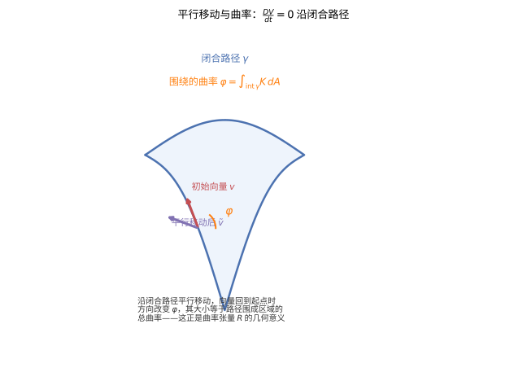

# 第 47 级：黎曼几何 (Riemannian Geometry)

> 黎曼几何是微分几何的核心分支，它将微积分的方法推广到弯曲空间上。1854 年，Bernhard Riemann 在哥廷根大学的就职演讲中奠定了这一领域的基础，提出了"流形"的概念并引入了度量结构。从 Einstein 的广义相对论（将引力解释为时空曲率）到现代几何分析，黎曼几何一直是数学与物理交汇处最活跃的领域之一。本课程将系统建立黎曼几何的基本理论，包括度量、联络、曲率、测地线以及一系列深刻的整体定理。

---

## 1. 学习目标

1. 理解黎曼度量的定义与性质，掌握黎曼流形的基本概念。
2. 掌握 Levi-Civita 联络的构造与性质，理解其唯一性定理。
3. 深入理解 Riemann 曲率张量及其各种缩并（Ricci 曲率、标量曲率）。
4. 掌握测地线的理论与测地方程，理解指数映射的性质。
5. 理解 Jacobi 场与共轭点的概念，掌握第二变分公式。
6. 掌握 Gauss 引理并理解其几何意义。
7. 理解并证明 Hopf-Rinow 定理，掌握黎曼流形的完备性理论。
8. 理解并证明 Cartan-Hadamard 定理，掌握非正曲率流形的拓扑结构。
9. 理解并证明 Bonnet-Myers 定理，掌握正 Ricci 曲率对整体拓扑的限制。
10. 掌握 Gauss-Bonnet 定理及其在闭曲面上的完整证明。
11. 理解 Rauch 比较定理及其在几何分析中的应用。
12. 通过球面、双曲空间和环面的具体计算，培养黎曼几何的具体计算能力。

---

## 2. 黎曼度量与黎曼流形 (Riemannian Metric and Riemannian Manifold)

### 2.1 黎曼度量的定义

**定义 2.1**（黎曼度量）设 $M$ 是光滑流形。$M$ 上的一个 **黎曼度量**（Riemannian metric）是一个光滑的 $(0,2)$-型张量场 $g$，满足对每点 $p \in M$：

1. **对称性**：$g_p(X, Y) = g_p(Y, X)$，$\forall X, Y \in T_p M$；
2. **正定性**：$g_p(X, X) \geq 0$，且 $g_p(X, X) = 0$ 当且仅当 $X = 0$。

配备了一个黎曼度量的光滑流形称为 **黎曼流形**（Riemannian manifold），记作 $(M, g)$。

在局部坐标 $(x^1, \ldots, x^n)$ 下，度量可表示为

$$
g = g_{ij} \, dx^i \otimes dx^j,\quad g_{ij} = g\left(\frac{\partial}{\partial x^i}, \frac{\partial}{\partial x^j}\right).
$$

矩阵 $(g_{ij})$ 是对称正定的，其逆矩阵记作 $(g^{ij})$，满足 $g^{ik} g_{kj} = \delta^i_j$。

> **直观理解（现实类比）**：黎曼度量像"定义长度的规则"——不同点可以用不同的尺子。欧氏空间里所有点共用一把刚性直尺，而黎曼流形上每一点 $p$ 都可以配一把"本地尺子" $g_p$，刻度随位置光滑变化。这样"从 A 到 B 走多远"不再由单一坐标决定，而是沿路径逐点用本地尺子度量后累加。同一流形换一本规则书（换度量），长度、角度、曲率全变；这正是广义相对论中"物质决定时空度量"的几何语言。
>
> **🧠 思考历程：在弯曲空间里，"最直的线"到底长什么样？**
>
> 黎曼几何要从一根"本地尺子"（度量 $g$）出发，回答：弯曲空间里最直、最短的路径是哪条？——通过度量张量与联络 $\nabla$，数学家把欧氏几何的"直线"推广成了处处"自我平行移动"的测地线。
>
> - **Riemann 定义第一把尺**。1854 年，Bernhard Riemann 在就职演讲中以度量张量 $g=g_{ij}\,dx^i\,dx^j$ 为几何的起点，让"长度如何逐点定义"成为开启整个领域的钥匙。
> - **联络与曲率的诞生**。Tullio Levi-Civita 在 1917 年前后提出"平行移动"与联络，使"方向如何被搬运"有了解答，曲率张量也随之成为弯曲空间的精确记录仪。
> - **整体定理与时空物理**。20 世纪中，Hopf–Rinow、Bonnet–Myers 与 Gauss–Bonnet 定理把局部度量与整体拓扑牢牢焊在一起，而 Einstein 广义相对论更让时空曲率与物质运动彼此决定。
> - **心路**：一门最初只想说清"直"与"弯"的几何，最终成为了理解宇宙时空乃至物质演化的通用语言。

**例 2.2**（欧氏度量）$\mathbb{R}^n$ 上的标准黎曼度量是

$$
g_{\text{eucl}} = dx^1 \otimes dx^1 + \cdots + dx^n \otimes dx^n,
$$

即 $g_{ij} = \delta_{ij}$。

**定义 2.3**（诱导度量）设 $N \subset M$ 是黎曼流形 $(M, g)$ 的子流形，则 $g$ 在 $N$ 上的限制

$$
g|_N(X, Y) = g(X, Y),\quad \forall X, Y \in T_p N,\ p \in N
$$

定义了 $N$ 上的一个黎曼度量，称为 **诱导度量**（induced metric）。

> **💡 直观理解（类比）**：诱导度量等于"子空间借用母空间的本地尺子"。好比在拍卖行大厅的地面上铺一块小地毯，直接用大厅自带的那把尺去量地毯上的尺寸即可——子流形上的长度、角度完全由它"继承"自所在大空间的方式决定，不用另配尺子。

### 2.2 黎曼流形的基本构造

**例 2.4**（乘积度量）设 $(M_1, g_1)$ 和 $(M_2, g_2)$ 是黎曼流形，则在乘积流形 $M_1 \times M_2$ 上可定义 **乘积度量**（product metric）：

$$
g = \pi_1^* g_1 + \pi_2^* g_2,
$$

其中 $\pi_i: M_1 \times M_2 \to M_i$ 是投影映射。在局部坐标下，若 $x^i$ 是 $M_1$ 的坐标，$y^\alpha$ 是 $M_2$ 的坐标，则

$$
g = (g_1)_{ij} \, dx^i dx^j + (g_2)_{\alpha\beta} \, dy^\alpha dy^\beta.
$$

**定义 2.5**（等距）设 $(M, g_M)$ 和 $(N, g_N)$ 是黎曼流形。光滑映射 $F: M \to N$ 称为 **等距**（isometry），若 $F$ 是微分同胚且保持度量：

$$
F^* g_N = g_M,
$$

即 $g_M(X, Y) = g_N(dF(X), dF(Y))$ 对一切 $X, Y \in T_p M$ 成立。

> **💡 直观理解（类比）**：等距就像"换装而不变形"——把一件衣服（流形 $M$）整套穿到另一件同号衣服（流形 $N$）上，既不撑破也不打褶，每个接缝处量出的尺寸都一一吻合。无论你怎么搬动、旋转它，长度和角度都不变，因此测地线、曲率这些"形状信息"也被完完整整地搬运了过去。

**定义 2.6**（等距嵌入）映射 $F: M \to N$ 称为 **等距嵌入**（isometric embedding），若 $F$ 是浸入且 $F^* g_N = g_M$。Nash 嵌入定理指出，任何黎曼流形都可以等距嵌入到某个欧氏空间 $\mathbb{R}^N$ 中。

> **💡 直观理解（类比）**：等距嵌入就像把一张纸（曲面）平整地放进一张大得多的平桌（欧氏空间）里，既不揉皱也不撑开——纸上的距离在桌面上原样保留。Nash 定理正是在说：任何"弯曲的织物"都能被不拉伸、不打褶地塞进足够大的平坦房间，只是这房间可能得足够高大。

---

## 3. Levi-Civita 联络 (Levi-Civita Connection)

### 3.1 仿射联络

**定义 3.1**（仿射联络）光滑流形 $M$ 上的一个 **仿射联络**（affine connection）是一个映射

$$
\nabla: \mathfrak{X}(M) \times \mathfrak{X}(M) \to \mathfrak{X}(M),
$$

记作 $\nabla(X, Y) = \nabla_X Y$，满足：

1. 关于 $X$ 是 $C^\infty(M)$-线性的：$\nabla_{fX+gY} Z = f \nabla_X Z + g \nabla_Y Z$；
2. 关于 $Y$ 是 $\mathbb{R}$-线性的：$\nabla_X (aY + bZ) = a \nabla_X Y + b \nabla_X Z$；
3. Leibniz 法则：$\nabla_X (fY) = f \nabla_X Y + (Xf) Y$，$\forall f \in C^\infty(M)$。

在局部坐标下，联络由 **Christoffel 符号**（Christoffel symbols）$\Gamma^k_{ij}$ 确定：

$$
\nabla_{\partial_i} \partial_j = \Gamma^k_{ij} \partial_k,
$$

其中 $\partial_i = \partial/\partial x^i$。

> **💡 直观理解（类比）**：仿射联络是"在弯曲空间里搬运方向"的规则——当你要把一个箭头从一点挪到另一点时，它规定箭头该怎样倾斜才算"不歪"。其中 $\Gamma^k_{ij}$（Christoffel 符号）正是一组"坐标地基漂移的补偿系数"：坐标系像会流动的沙地，箭头每走一步都要修正一点，否则看似直着搬，其实早被流动的地基带偏了。

### 3.2 Levi-Civita 联络的唯一性

**定理 3.2**（Levi-Civita 联络的基本定理）在黎曼流形 $(M, g)$ 上，存在唯一的仿射联络 $\nabla$ 满足：

1. **无挠性**（torsion-free）：$\nabla_X Y - \nabla_Y X = [X, Y]$；
2. **度量相容性**（metric compatibility）：$X g(Y, Z) = g(\nabla_X Y, Z) + g(Y, \nabla_X Z)$。

这个联络称为 **Levi-Civita 联络**（Levi-Civita connection）。

> **💡 直观理解（类比）**：Levi-Civita 联络是最"省事"的一把直尺映射——它同时做到不扭转（无挠）、又不伸缩（度量相容）。就像把一支画了箭头的木棍贴着弯曲的球面拖过去，既不让它在原处打转，也不拉长缩短，只让它沿着曲面被"直直地"推着走。今天"平行移动"这种搬运方向的方式，正是由这把唯一的直尺决定的。

**证明**：设 $\nabla$ 是满足上述条件的联络。对任意向量场 $X, Y, Z$，由度量相容性得

$$
X g(Y, Z) = g(\nabla_X Y, Z) + g(Y, \nabla_X Z), \tag{1}
$$

$$
Y g(Z, X) = g(\nabla_Y Z, X) + g(Z, \nabla_Y X), \tag{2}
$$

$$
Z g(X, Y) = g(\nabla_Z X, Y) + g(X, \nabla_Z Y). \tag{3}
$$

将 (1) $+$ (2) $-$ (3)，并利用无挠性 $\nabla_X Y - \nabla_Y X = [X, Y]$，得

$$
\begin{aligned}
& X g(Y, Z) + Y g(Z, X) - Z g(X, Y) \\
&= g(\nabla_X Y + \nabla_Y X, Z) + g(\nabla_X Z - \nabla_Z X, Y) + g(\nabla_Y Z - \nabla_Z Y, X) \\
&= 2 g(\nabla_X Y, Z) + g([Y, Z], X) + g([X, Z], Y) - g([X, Y], Z).
\end{aligned}
$$

整理得 **Koszul 公式**：

$$
\begin{aligned}
g(\nabla_X Y, Z) = \frac{1}{2} \big[ & X g(Y, Z) + Y g(Z, X) - Z g(X, Y) \\
& - g(X, [Y, Z]) - g(Y, [X, Z]) + g(Z, [X, Y]) \big].
\end{aligned}
$$

由于 $g$ 是非退化的，上式唯一确定了 $\nabla_X Y$。这证明了唯一性。存在性验证：以上式定义的 $\nabla$ 确实满足无挠性和度量相容性。$\square$

在局部坐标下，Christoffel 符号由度量张量给出：

$$
\Gamma^k_{ij} = \frac{1}{2} g^{kl} \left( \frac{\partial g_{jl}}{\partial x^i} + \frac{\partial g_{il}}{\partial x^j} - \frac{\partial g_{ij}}{\partial x^l} \right).
$$

**例 3.3** 在欧氏空间 $\mathbb{R}^n$ 中，$g_{ij} = \delta_{ij}$ 为常数，因此所有 Christoffel 符号 $\Gamma^k_{ij} = 0$。

### 3.3 协变导数

**定义 3.4**（协变导数）设 $\nabla$ 是 $M$ 上的仿射联络。沿光滑曲线 $\gamma: [a, b] \to M$ 的 **协变导数**（covariant derivative）是一个算子

$$
\frac{D}{dt}: \mathfrak{X}(\gamma) \to \mathfrak{X}(\gamma),
$$

满足对沿曲线的向量场 $V(t)$：

$$
\frac{DV}{dt} = \nabla_{\dot\gamma(t)} V,
$$

其中 $\dot\gamma(t)$ 是曲线的切向量。在局部坐标 $(x^1, \ldots, x^n)$ 中，若 $\gamma(t) = (x^1(t), \ldots, x^n(t))$，$V(t) = V^i(t) \partial_i$，则

$$
\frac{DV}{dt} = \left( \frac{dV^k}{dt} + \Gamma^k_{ij} \frac{dx^i}{dt} V^j \right) \partial_k.
$$

> **💡 直观理解（类比）**：协变导数就是"沿路径先校正方向再求导"。好比在一条颠簸的山路上用指南针读箭头：除了看箭头本身的变化，还要先补偿路面（坐标）在带着你转，否则读出的"变化"其实是假变化。公式里的 $\Gamma^k_{ij} \frac{dx^i}{dt} V^j$ 正是纠偏用的修正项，把它算进去，才是沿这条路自身真实的导数。

---

## 4. 曲率张量 (Curvature Tensor)

### 4.1 Riemann 曲率张量

**定义 4.1**（Riemann 曲率张量）设 $(M, g)$ 是黎曼流形，$\nabla$ 是 Levi-Civita 联络。**Riemann 曲率张量**（Riemann curvature tensor）定义为

$$
R(X, Y)Z = \nabla_X \nabla_Y Z - \nabla_Y \nabla_X Z - \nabla_{[X, Y]} Z,
$$

其中 $X, Y, Z \in \mathfrak{X}(M)$。对应的 $(0,4)$-型张量为

$$
R(X, Y, Z, W) = g(R(X, Y)Z, W).
$$

> **💡 直观理解（类比）**：Riemann 曲率张量记录的是"两条路线的终点偏差"。想象在弯曲地面上从同一点出发，先沿 $X$ 再沿 $Y$ 与先沿 $Y$ 再沿 $X$ 各走一小段再折返，回到起点附近时方向会有细微差异——这个"绕圈回去弥合后的偏转"正是 $R(X,Y)Z$ 量取的量。它用两条边围出一片小平行四边形，经两种次序搬运一个向量 $Z$，比一比差异，就知道空间弯在哪里、弯多狠。

**命题 4.2**（对称性）Riemann 曲率张量满足以下对称性：

1. **反称性**：$R(X, Y, Z, W) = -R(Y, X, Z, W)$；
2. **反称性**：$R(X, Y, Z, W) = -R(X, Y, W, Z)$；
3. **交换对称性**：$R(X, Y, Z, W) = R(Z, W, X, Y)$；
4. **第一 Bianchi 恒等式**：$R(X, Y)Z + R(Y, Z)X + R(Z, X)Y = 0$；
5. **第二 Bianchi 恒等式**：$(\nabla_X R)(Y, Z)W + (\nabla_Y R)(Z, X)W + (\nabla_Z R)(X, Y)W = 0$。

> **直观理解（现实类比）**：曲率张量像"空间弯曲的程度"——它不只给一个数，而是告诉你在每个二维方向上弯多少。把空间想象成一顶礼帽：帽顶处往各方向看都同样鼓（各向同性曲率），但帽檐处沿环向和径向弯曲差异巨大（各向异性）。Riemann 曲率张量 $R(X,Y,Z,W)$ 正是这种"方向敏感性"的完整记录器：输入两个方向 $X,Y$ 测平行移动一周的偏转，再输入 $Z,W$ 投影到该方向读分量。截面曲率只是它在一组二维平面上的切片读数。

在局部坐标下，曲率张量的分量表示为

$$
R(\partial_i, \partial_j)\partial_k = R^\ell_{ijk} \partial_\ell,
$$

其中

$$
R^\ell_{ijk} = \partial_i \Gamma^\ell_{jk} - \partial_j \Gamma^\ell_{ik} + \Gamma^m_{jk} \Gamma^\ell_{im} - \Gamma^m_{ik} \Gamma^\ell_{jm}.
$$

对应的 $(0,4)$-型张量分量为 $R_{ijk\ell} = g_{\ell m} R^m_{ijk}$。

> **直观理解（现实类比）**：平行移动就像在弯曲表面上"平移"一支笔而不扭转它。在平面上平移一圈，笔的方向不变；但在球面上沿大圆围成的区域平移一圈，笔回到起点时方向会转过一个角度，角度大小恰好等于该区域的总曲率。好比你在球面上推一辆独轮车沿闭合路径走回原点，车把相对出发时已经偏转了。

### 4.2 截面曲率 (Sectional Curvature)

**定义 4.2**（截面曲率）设 $p \in M$，$\Pi \subset T_p M$ 是二维子空间。$M$ 在 $p$ 处沿平面 $\Pi$ 的 **截面曲率**（sectional curvature）定义为

$$
K(\Pi) = \frac{R(X, Y, X, Y)}{g(X, X) g(Y, Y) - g(X, Y)^2},
$$

其中 $\{X, Y\}$ 是 $\Pi$ 的任意一组基。上述定义与基的选取无关。

截面曲率完全确定了 Riemann 曲率张量：若已知所有二维平面的截面曲率，则可通过代数运算恢复出整个曲率张量。

> **直观理解（现实类比）**：截面曲率就像地面的"鼓起程度"。球面（$K>0$）像篮球表面，两条平行线会汇聚、三角形内角和大于 $\pi$；平面（$K=0$）像平整桌面，内角和恰为 $\pi$；马鞍面（$K<0$）像马鞍或薯片，两条平行线会发散、三角形内角和小于 $\pi$。曲率的正、负、零分别对应"汇聚""平直""发散"三种截然不同的几何世界。

### 4.3 Ricci 曲率 (Ricci Curvature)

**定义 4.3**（Ricci 曲率）Ricci 曲率是 Riemann 曲率张量的一个缩并。确切地说，Ricci 曲率张量（Ricci curvature tensor）是一个 $(0,2)$-型张量：

$$
\operatorname{Ric}(X, Y) = \operatorname{tr}(Z \mapsto R(Z, X)Y) = \sum_{i=1}^n R(e_i, X, Y, e_i),
$$

其中 $\{e_i\}$ 是 $T_p M$ 的任意标准正交基。在局部坐标下，

$$
R_{ij} = \operatorname{Ric}(\partial_i, \partial_j) = R^k_{ikj} = g^{k\ell} R_{k i \ell j}.
$$

> **💡 直观理解（类比）**：Ricci 曲率是把曲率信息"压成精华摘要"。Riemann 曲率像记录每对方向偏转的全集，Ricci 则对每个方向 $X$ 问："绕所有其它方向看一圈，空间沿这个方向平均弯多少？"公式里对 $i$ 求和正是"包含该方向的若干截面曲率之和"。它丢掉方向细节，只保留每个方向上"体感曲率"的强弱。

**定义 4.4**（Ricci 曲率算子）在单位切向量 $u \in T_p M$ 方向上的 **Ricci 曲率**（Ricci curvature）为

$$
\operatorname{Ric}(u, u) = \sum_{i=2}^n K(u, e_i),
$$

其中 $\{e_1 = u, e_2, \ldots, e_n\}$ 是 $T_p M$ 的标准正交基。即 Ricci 曲率是包含 $u$ 的所有截面曲率之和。

> **💡 直观理解（类比）**：想判断一间房有多"挤"，可从门口往各个方向各迈一步感受平均空间弯曲。$\operatorname{Ric}(u,u)$ 就是站在方向 $u$ 上、朝所有与之垂直的方向看一圈，把每个含该方向的二维截面曲率求和——方向 $u$ 的"整体弯曲体感"。它把曲率的全貌折叠成一个只依赖方向的量，也是广义相对论里物质如何压弯时空的主角。

### 4.4 标量曲率 (Scalar Curvature)

**定义 4.5**（标量曲率）**标量曲率**（scalar curvature）是 Ricci 曲率张量的迹：

$$
\operatorname{Scal} = \operatorname{tr}_g \operatorname{Ric} = g^{ij} R_{ij}.
$$

在点 $p$ 处，标量曲率可表示为

$$
\operatorname{Scal}(p) = \sum_{i \neq j} K(e_i, e_j) = 2 \sum_{1 \leq i < j \leq n} K(e_i, e_j),
$$

其中 $\{e_i\}$ 是 $T_p M$ 的标准正交基。因此标量曲率是 $p$ 处所有截面曲率的总和。

> **直观理解（现实类比）**：黎曼曲率（标量曲率）像"局部弯曲总量"，按符号分三色：球面 $K>0$ 像"处处向外鼓的西瓜皮"，三角形内角和大于 $\pi$、平行线汇聚；平面 $K=0$ 像"平整桌面"，欧氏几何成立；马鞍面 $K<0$ 像"中间凹陷两头翘起的薯片"，三角形内角和小于 $\pi$、平行线发散。曲率的正、负、零刻画了三种截然不同的几何世界，也是广义相对论中"物质使时空弯曲"的核心量。

---

## 5. 测地线 (Geodesics)

### 5.1 测地线方程

**定义 5.1**（测地线）设 $(M, g)$ 是黎曼流形。光滑曲线 $\gamma: I \to M$ 称为 **测地线**（geodesic），若其切向量沿自身平行移动：

$$
\frac{D\dot\gamma}{dt} = 0.
$$

在局部坐标下，$\gamma(t) = (x^1(t), \ldots, x^n(t))$ 满足 **测地线方程**（geodesic equation）：

$$
\frac{d^2 x^k}{dt^2} + \Gamma^k_{ij} \frac{dx^i}{dt} \frac{dx^j}{dt} = 0,\quad k = 1, \ldots, n.
$$

> **直观理解（现实类比）**：测地线像"曲面上的直线"——两点间（局部）最短路径。飞机跨洋航线不走地图上的"直线"，而是沿大圆弧绕极地飞行，因为球面上两点间的最短路径正是这段大圆测地线。方程 $\frac{D\dot\gamma}{dt}=0$ 意味着切向量"自我平行移动"——好比推一辆指南针小车不打方向盘、只踩油门，它在弯曲曲面上自由滑行的轨迹就是测地线。它把"直线"推广到了弯曲空间。

**定理 5.2**（测地线的存在唯一性）对任意 $p \in M$ 和 $v \in T_p M$，存在唯一的测地线 $\gamma: (-\varepsilon, \varepsilon) \to M$ 满足 $\gamma(0) = p$ 和 $\dot\gamma(0) = v$。

> **💡 直观理解（类比）**：像发射一颗炮弹——给定发射点和发射方向，就唯一确定一条弹道。测地线方程是二阶方程，正好"吃下"起点和初速度两个初始条件；世上没有第二条轨道能和你在同一点、朝同一方向、一样直地开出去却走向不同。

**证明**：测地线方程是一个二阶常微分方程组。由常微分方程的标准理论（Picard-Lindelöf 定理），对给定的初始条件 $x^k(0) = p^k$ 和 $\frac{dx^k}{dt}(0) = v^k$，存在唯一的局部解。$\square$

**命题 5.3**（测地线的能量守恒）沿测地线 $\gamma$，$\|\dot\gamma(t)\|^2 = g(\dot\gamma(t), \dot\gamma(t))$ 是常数。

> **💡 直观理解（类比）**：轮船沿最直的航道航行时，油门开多大就一直保持多大速度。测地线上既不踩油门也不踩刹车（$\frac{D\dot\gamma}{dt}=0$），所以切向量"长度"不变——速度大小始终恒定，只是方向被弯曲空间被动地带着转。

**证明**：

$$
\frac{d}{dt} g(\dot\gamma, \dot\gamma) = 2 g\left(\frac{D\dot\gamma}{dt}, \dot\gamma\right) = 0,
$$

因为 $\frac{D\dot\gamma}{dt} = 0$。$\square$

因此，测地线以恒定速率运动。若 $\|\dot\gamma\| = 1$，则称测地线是 **弧长参数化**（arc-length parametrized）的。

### 5.2 指数映射 (Exponential Map)

**定义 5.4**（指数映射）设 $p \in M$，$v \in T_p M$，记 $\gamma_v(t)$ 为满足 $\gamma_v(0) = p$、$\dot\gamma_v(0) = v$ 的唯一测地线。定义 **指数映射**（exponential map）

$$
\exp_p: \mathcal{E}_p \to M,\quad \exp_p(v) = \gamma_v(1),
$$

其中 $\mathcal{E}_p = \{v \in T_p M \mid \gamma_v(1) \text{ 有定义}\}$。

> **💡 直观理解（类比）**：指数映射像一座"弹射台"：把每一根带方向的箭头 $v$ 当成发射指令，沿该方向的最直航线滑轨出去"走一单位时间"，就在流形上落下一个点 $\exp_p(v)$。于是切空间里所有方向与长短的箭头，整体被映射到流形表面，铺成一张覆盖 $p$ 附近的"航线地图"。

**命题 5.5**（指数映射的性质）

1. $\exp_p$ 在 $0 \in T_p M$ 的某个邻域内有定义且光滑。
2. $d(\exp_p)_0: T_0(T_p M) \cong T_p M \to T_p M$ 是恒等映射（在自然等同下）。
3. 存在 $0$ 的邻域 $U \subset T_p M$ 使得 $\exp_p$ 将 $U$ 微分同胚地映到 $p$ 的邻域 $V \subset M$ 上。

> **💡 直观理解（类比）**：指数映射在原点附近是一对一的"精确成像"：切空间里一小片箭头，能不多不少、不打结地印到流形 $p$ 附近的一方土地。这就像把地图上很小的一个方格还原到真实地形上，既不重叠也不留空——它是用"平面地图"局部记录弯曲地表的保证。

**证明**：性质 (1) 和 (2) 由常微分方程对参数的依赖光滑性得出。性质 (3) 由逆映射定理得到，因为 $d(\exp_p)_0$ 是可逆的。$\square$

**定义 5.6**（法坐标）设 $\{e_1, \ldots, e_n\}$ 是 $T_p M$ 的标准正交基。利用 $\exp_p$ 的逆，可定义 $p$ 附近的坐标：

$$
\varphi: \exp_p(v) \mapsto (v^1, \ldots, v^n) \in \mathbb{R}^n,
$$

其中 $v = v^i e_i$。这称为 **法坐标**（normal coordinates）。在法坐标下，$g_{ij}(p) = \delta_{ij}$ 且 $\Gamma^k_{ij}(p) = 0$。

> **💡 直观理解（类比）**：法坐标是用"测地线当刻度尺"画出的坐标——从 $p$ 向四周铺满各方向的测地线，每条线就像一把带刻度的直尺。因为到原点的线都是"直的"，所以在原点处度量阵平坦成 $\delta_{ij}$、Christoffel 符号归零，弯曲的痕迹全都藏进二阶以上的项里。这样把弯曲空间"摊平"来看第一眼，最直观。

### 5.3 Gauss 引理 (Gauss Lemma)

**定理 5.7**（Gauss 引理）设 $p \in M$，$v \in T_p M$ 使得 $\exp_p(v)$ 有定义。则对任意 $w \in T_v(T_p M) \cong T_p M$，有

$$
g_{\exp_p(v)}\big( d(\exp_p)_v(v), d(\exp_p)_v(w) \big) = g_p(v, w).
$$

特别地，在 $\exp_p$ 之下，从原点出发的径向线与以原点为中心的球面保持正交。

> **💡 直观理解（类比）**：Gauss 引理说"从中心笔直射出的测地线，每一条都与包裹中心的同心'球面'垂直相交"——好比从喷泉中心喷出的水流，处处垂直于它穿过的、以喷泉为心的水平圈圈。它正是测地线既"短"又"直"的关键：径向距离按测地线量，到同心层的方向不掺一丝斜向失真。

**证明**：考虑映射 $\alpha(t, s) = \exp_p(t(v + sw))$，其中 $t \in [0, 1]$，$s$ 在 $0$ 附近。定义

$$
X(t) = \frac{\partial \alpha}{\partial t}(t, 0),\quad Y(t) = \frac{\partial \alpha}{\partial s}(t, 0).
$$

则 $X(t) = d(\exp_p)_{tv}(v)$ 是测地线 $\gamma(t) = \exp_p(tv)$ 的切向量，故 $\frac{DX}{dt} = 0$。$Y(t) = d(\exp_p)_{tv}(w)$ 是沿 $\gamma$ 的变分向量场。

我们要证 $g(X(t), Y(t)) = g_p(v, w)$ 对一切 $t$ 成立。计算

$$
\frac{d}{dt} g(X, Y) = g\left(\frac{DX}{dt}, Y\right) + g\left(X, \frac{DY}{dt}\right) = g\left(X, \frac{DY}{dt}\right).
$$

另一方面，由变分场的性质（即 $\frac{DY}{dt} = \frac{DX}{ds}$ 在 $s=0$ 处），且 $\frac{DX}{ds} = \frac{D}{ds} \frac{\partial \alpha}{\partial t} = \frac{D}{dt} \frac{\partial \alpha}{\partial s}$，在 $s=0$ 处有 $\frac{DY}{dt} = \frac{DX}{ds}$。但 $X(t, 0) = d(\exp_p)_{t(v+sw)}(v+sw)$ 在 $s=0$ 时就是 $X(t)$，且 $\frac{DX}{ds}$ 在 $s=0$ 处涉及曲率项。更直接地，利用对称性：

$$
\frac{d}{dt} g(X, Y) = g\left(X, \frac{DX}{ds}\right) = \frac{1}{2} \frac{\partial}{\partial s} g(X, X),
$$

因为 $X(t, s) = \frac{\partial \alpha}{\partial t}$。但 $g(X, X) = g_p(v+sw, v+sw)$ 沿每条曲线 $\alpha(\cdot, s)$ 是常数（因为每条都是测地线），故 $\frac{\partial}{\partial s} g(X, X) = 0$。因此 $\frac{d}{dt} g(X, Y) = 0$，即 $g(X(t), Y(t))$ 为常数。

当 $t \to 0$ 时，$X(t) \to v$，$Y(t) \to w$（因为 $d(\exp_p)_0 = \text{id}$），故

$$
g(X(t), Y(t)) = g_p(v, w),\quad \forall t.
$$

特别地，若 $w \perp v$，则 $g_{\exp_p(v)}(d(\exp_p)_v(v), d(\exp_p)_v(w)) = 0$，即径向线与切球面正交。$\square$

**几何意义**：Gauss 引理表明，指数映射在径向方向是共形的，且径向线是测地线。这保证了在法坐标下，从 $p$ 出发的径向线是测地线，且与以 $p$ 为中心的"球面"正交。

---

## 6. 雅可比场与共轭点 (Jacobi Fields and Conjugate Points)

### 6.1 雅可比场

**定义 6.1**（Jacobi 场）设 $\gamma: [a, b] \to M$ 是测地线。沿 $\gamma$ 的向量场 $J(t)$ 称为 **Jacobi 场**（Jacobi field），若它满足 **Jacobi 方程**：

$$
\frac{D^2 J}{dt^2} + R(\dot\gamma, J)\dot\gamma = 0.
$$

> **💡 直观理解（类比）**：Jacobi 场像是"两条相邻测地线的间距变化及其加速度"。把主测地线当成公路，旁边并排开着一辆跟随的车，$J$ 就是两车距离；方程左边是距离的二阶变化率，右边 $-R(\dot\gamma,J)\dot\gamma$ 是曲率施加的"拉力或斥力"。读懂 Jacobi 场，就知道相邻的两条最直的路是彼此靠拢、散开，还是平行而走。

**定理 6.2**（Jacobi 场与变分）沿测地线 $\gamma$ 的 Jacobi 场恰好对应于 $\gamma$ 的变分（通过测地线的变分）的变分向量场。

> **💡 直观理解（类比）**：这告诉我们 Jacobi 场就是"一整排相邻测地线被轻轻拨动时的集体动作"。好比把一根绷紧的橡皮筋轻轻弹一下，产生的那一波相邻轨迹的震荡，正是对橡皮筋（测地线）做"变分"时相邻测地线相对移动的痕迹。因此研究 Jacobi 场，等于在问"这些最直的航线会不会越开越挤到一起"。

**证明概要**：设 $\alpha(t, s)$ 是 $\gamma$ 的变分，使得对每个固定的 $s$，$t \mapsto \alpha(t, s)$ 是测地线。变分向量场 $J(t) = \frac{\partial \alpha}{\partial s}(t, 0)$ 满足 Jacobi 方程。反之，给定 Jacobi 场 $J$，可以构造相应的测地线变分。$\square$

**命题 6.3**（Jacobi 场的解空间）Jacobi 方程是二阶线性常微分方程，沿 $\gamma$ 的 Jacobi 场构成一个 $2n$ 维向量空间。给定初始条件 $J(0)$ 和 $\frac{DJ}{dt}(0)$，存在唯一的 Jacobi 场。

> **💡 直观理解（类比）**：Jacobi 方程是线性方程，解可以"叠加"，且每个解完全由"最初放多远"（$J(0)$）和"最初张合得多快"（$\frac{DJ}{dt}(0)$）两个初始条件决定。这就像弹簧振子系统，给定初始位置与初速度，整个振动过程就唯一确定。

### 6.2 共轭点与割点

**定义 6.4**（共轭点）设 $\gamma$ 是测地线，$\gamma(a) = p$。称 $\gamma(b)$（$b \neq a$）是 $p$ 沿 $\gamma$ 的 **共轭点**（conjugate point），若存在非零 Jacobi 场 $J$ 沿 $\gamma$ 满足 $J(a) = 0$ 且 $J(b) = 0$。

> **💡 直观理解（类比）**：共轭点是"相邻测地线聚焦到一处"的地方。就像透镜把平行光线会聚成一个焦点：从同一点出发的一族最直航线，原本散开，却会在某个聚焦点重新汇拢到同一个点。重要的后果是，一旦出现共轭点，这之前的测地线便不再是最短的了。

**几何意义**：共轭点表示指数映射的奇点。具体地，$q = \exp_p(v)$ 是 $p$ 的共轭点当且仅当 $d(\exp_p)_v$ 非满秩（即不是同构）。

**定义 6.5**（割点）设 $\gamma$ 是从 $p$ 出发的弧长参数化测地线。称 $\gamma(t_0)$ 是 $p$ 沿 $\gamma$ 的 **割点**（cut point），若 $t_0$ 是使得 $\gamma$ 在 $[0, t_0]$ 上仍是连接 $p$ 和 $\gamma(t_0)$ 的最短测地线的最大 $t$ 值。所有割点的集合称为 $p$ 的 **割迹**（cut locus）。

> **💡 直观理解（类比）**：割点是"最短性首度失效的里程碑"。好比绕着山看同一地标，往前走一段还是最短视线，但越过某条山脊后，从背面也能看到它、视线不再那么直了——那个分界线就是割点。割点之后，这条测地线不再是最短路线，之后可能有别的更短路替代。

**命题 6.6** 割点 $q = \gamma(t_0)$ 要么是 $p$ 沿 $\gamma$ 的第一个共轭点，要么存在另一条从 $p$ 到 $q$ 的不同测地线具有相同长度。

> **💡 直观理解（类比）**：割点是"最短路线走到头的两种失守方式"：要么相邻测地线在这里聚焦（共轭点），要么冒出一条一样长甚至更短的岔路，让原本的路线不再独一无二。两条情形都宣判这条路从此不再是最短——也就是"割"掉了它继续充当极小的资格。

### 6.3 第二变分公式

**定理 6.7**（第二变分公式）设 $\gamma: [0, L] \to M$ 是弧长参数化的测地线，$V$ 是沿 $\gamma$ 的向量场，满足 $V(0) = 0$ 且 $V(L) = 0$。则 $\gamma$ 的 **能量泛函**（energy functional）$E(\gamma) = \frac{1}{2} \int_0^L \|\dot\gamma\|^2 dt$ 的第二变分为

$$
\frac{d^2}{ds^2}\Big|_{s=0} E(\gamma_s) = \int_0^L \left( \left\| \frac{DV}{dt} \right\|^2 - g(R(\dot\gamma, V)\dot\gamma, V) \right) dt,
$$

其中 $\gamma_s$ 是由 $V$ 生成的 $\gamma$ 的变分。

> **💡 直观理解（类比）**：第二变分公式是"检查这条路是否真的最省油"的收紧检验。第一变分为零只说明"不歪"（前提），第二变分则判断轻轻一拨之后路是变长（极小而稳定）还是能变短（其实并非最短）。公式里正项 $\|\frac{DV}{dt}\|^2$ 是拨动带来的"拉伸代价"，负项 $g(R(\dot\gamma,V)\dot\gamma,V)$ 是曲率帮忙的"汇聚收益"，两者博弈决定路径是否仍处于最短。

**证明**：设 $\alpha(t, s)$ 是 $\gamma$ 的变分，$\frac{\partial \alpha}{\partial s}(t, 0) = V(t)$，$\frac{\partial \alpha}{\partial t}(t, 0) = \dot\gamma(t)$。能量 $E(s) = \frac{1}{2} \int_0^L g\left(\frac{\partial \alpha}{\partial t}, \frac{\partial \alpha}{\partial t}\right) dt$。计算

$$
E'(s) = \int_0^L g\left(\frac{D}{ds} \frac{\partial \alpha}{\partial t}, \frac{\partial \alpha}{\partial t}\right) dt = \int_0^L g\left(\frac{D}{dt} \frac{\partial \alpha}{\partial s}, \frac{\partial \alpha}{\partial t}\right) dt.
$$

利用分部积分，得

$$
E'(0) = \big[g(V, \dot\gamma)\big]_0^L - \int_0^L g\left(V, \frac{D\dot\gamma}{dt}\right) dt = 0,
$$

因为 $\frac{D\dot\gamma}{dt} = 0$ 且 $V(0) = V(L) = 0$。再求二阶导，得到上述公式。$\square$

**推论 6.8**（沿测地线的能量）若沿 $\gamma$ 存在非零 Jacobi 场 $J$ 满足 $J(0) = 0$ 和 $J(t_0) = 0$，则 $\gamma$ 在 $(0, t_0)$ 上不是局部最短的（即 $\gamma$ 不是极小测地线）。

> **💡 直观理解（类比）**：共轭点是"最短路线中途的失效开关"。如果沿一条测地线中途出现共轭点，就表示前一段其实能找到别的方式缩短——这条线的"极小性"在到达端点上就已中止。好比一条隧道走到一半，发现有个更短的岔口能提前通向另一端，那么原隧道即便再直，也不再是全程最短。

---

## 7. 完备性 (Completeness)

### 7.1 Hopf-Rinow 定理

**定理 7.1**（Hopf-Rinow）设 $(M, g)$ 是连通黎曼流形。以下条件等价：

1. **度量完备性**：$(M, d)$ 是完备度量空间，其中 $d$ 是由 $g$ 诱导的距离函数。
2. **测地完备性**：对任意 $p \in M$，指数映射 $\exp_p$ 定义在整个 $T_p M$ 上。
3. 存在一个点 $p \in M$ 使得 $\exp_p$ 定义在整个 $T_p M$ 上。
4. **Heine-Borel 性质**：$M$ 中每个有界闭集是紧的。

满足这些条件的流形称为 **完备黎曼流形**（complete Riemannian manifold）。

> **💡 直观理解（类比）**：完备性就像"疆域没有尽头、去哪都到得了"。Hopf-Rinow 把四种看似不同的说法（度量是完备空间、每条测地线都能无限延伸、某点出发的航线覆盖全域、有界区域都被"圈"得住）统一成等价条件。而最核心的一句话是——完备流形上，任意两点之间都存在一条最短测地线，不会"走到半路掉进悬崖"而到不了。

**证明**：我们将证明 (3) $\Rightarrow$ (4) $\Rightarrow$ (1) $\Rightarrow$ (2) $\Rightarrow$ (3)。

**(3) $\Rightarrow$ (4)**：假设存在 $p \in M$ 使得 $\exp_p$ 定义在整个 $T_p M$ 上。设 $K \subset M$ 是 $d$-有界闭集。取 $R > 0$ 使得 $K \subset \overline{B_R(p)}$（闭球）。由于 $\exp_p$ 是连续的，$\overline{B_R(p)} = \exp_p(\overline{B_R(0)})$ 是紧集 $\overline{B_R(0)} \subset T_p M$ 的连续像，故紧。$K$ 是紧集的闭子集，从而紧。

**(4) $\Rightarrow$ (1)**：假设 (4) 成立。取任意 Cauchy 序列 $\{q_k\}$。它是有界集，故包含在某个紧集中，从而有收敛子列，于是原序列收敛。

**(1) $\Rightarrow$ (2)**：假设 $M$ 是度量完备的。取任意 $p \in M$，设 $v \in T_p M$，$\|v\| = 1$。考虑测地线 $\gamma(t) = \exp_p(tv)$，定义在 $[0, \ell)$ 上，其中 $\ell$ 是最大存在区间。若 $\ell < \infty$，则当 $t_k \to \ell$ 时，$\{\gamma(t_k)\}$ 是 Cauchy 序列（因为 $d(\gamma(t_i), \gamma(t_j)) \leq |t_i - t_j|$），由完备性收敛到某点 $q$。利用指数映射在 $q$ 附近的性质可将 $\gamma$ 延拓到 $\ell$ 之外，矛盾。故 $\ell = \infty$。

**(2) $\Rightarrow$ (3)**：显然。$\square$

**定理 7.2**（Hopf-Rinow 定理的推论）在完备黎曼流形上，任意两点之间可以用极小测地线连接。

> **💡 直观理解（类比）**：这是完备性最直观的兑现——地图上任意两座城市，总存在一条最短航线可达。微观地看，完备流形里不存在"路走到尽头却到不了"的坑，因此不管你挑哪两点，都一定有一条最短连线（极小测地线）把它们牵起来。

**证明**：设 $p, q \in M$，$d = d(p, q)$。取 $p$ 附近的小球 $B_\varepsilon(p)$，在其边界上取点 $p_1$ 使得 $d(p_1, q)$ 最小。从 $p$ 到 $p_1$ 作径向测地线 $\gamma$，可以证明 $\gamma$ 延拓到长度为 $d$ 时到达 $q$。$\square$

---

## 8. 常曲率空间 (Space Forms)

### 8.1 常曲率流形

**定义 8.1**（常曲率空间）黎曼流形 $(M, g)$ 称为 **常曲率空间**（space form），若其截面曲率为常数 $K$。记作 $M(K)$。

> **💡 直观理解（类比）**：常曲率空间是"处处弯曲得像同一个球壳、同一张桌面或同一块马鞍"的空间——无论你在哪一点、朝哪个方向，测出的弯曲程度都一样，就像一只到处鼓得一般圆的同规格皮球。球面（$K>0$）、平面（$K=0$）、双曲面（$K<0$）就是最常见的三张模板。

**定理 8.2**（常曲率流形的曲率张量）若 $M$ 具有常截面曲率 $K$，则其 Riemann 曲率张量为

$$
R(X, Y)Z = K\big( g(Y, Z)X - g(X, Z)Y \big).
$$

在局部坐标下，

$$
R_{ijk\ell} = K(g_{ik} g_{j\ell} - g_{i\ell} g_{jk}).
$$

> **💡 直观理解（类比）**：当曲率处处为同一个常数 $K$ 时，整张 Riemann 曲率表就只需一个旋钮调节——一切方向的弯曲全是 $K$ 的简单组合。好比用同一个模具，无论怎么调换摆放方向，出来的弯度都一样。这也解释了为什么对 $S^n$、$H^n$、$\mathbb{R}^n$ 只需一个数 $K$ 就能完整描述它们的曲率。

**证明**：利用截面曲率完全确定曲率张量的代数性质，结合常曲率条件直接验证。$\square$

### 8.2 球面 $S^n$ 的黎曼几何

**例 8.3**（球面 $S^n$）考虑单位球面 $S^n = \{x \in \mathbb{R}^{n+1} \mid \|x\| = 1\}$ 带有从 $\mathbb{R}^{n+1}$ 诱导的度量。

**度量**：在球坐标下，$S^n$ 的度量可写为

$$
g_{S^n} = d\theta^2 + \sin^2\theta \, g_{S^{n-1}},
$$

其中 $\theta \in [0, \pi]$ 是纬度角，$g_{S^{n-1}}$ 是 $S^{n-1}$ 的标准度量。更具体地，对 $n = 2$，有

$$
g_{S^2} = d\theta^2 + \sin^2\theta \, d\phi^2,\quad \theta \in [0, \pi],\ \phi \in [0, 2\pi).
$$

**Christoffel 符号**：对 $S^2$，非零的 Christoffel 符号为

$$
\Gamma^\theta_{\phi\phi} = -\sin\theta \cos\theta,\quad \Gamma^\phi_{\theta\phi} = \Gamma^\phi_{\phi\theta} = \cot\theta.
$$

**曲率**：$S^n$ 具有常截面曲率 $K \equiv 1$。对 $S^2$，直接计算得

$$
R_{\theta\phi\theta\phi} = \sin^2\theta,
$$

从而

$$
K = \frac{R_{\theta\phi\theta\phi}}{g_{\theta\theta} g_{\phi\phi} - g_{\theta\phi}^2} = \frac{\sin^2\theta}{1 \cdot \sin^2\theta - 0} = 1.
$$

**测地线**：$S^n$ 上的测地线是大圆（great circles），即球面与过球心的平面的交线。大圆是闭的，长度为 $2\pi$。

**指数映射**：对 $p \in S^n$，$\exp_p: T_p S^n \to S^n$ 将 $v$ 映射为沿大圆方向走弧长 $\|v\|$ 到达的点。在 $T_p S^n$ 中半径为 $\pi$ 的球面映射到 $p$ 的对径点。$p$ 的对径点是 $p$ 的共轭点，且也是割点。

### 8.3 双曲空间 $H^n$ 的黎曼几何

**例 8.4**（双曲空间 $H^n$）双曲空间是具有常截面曲率 $K \equiv -1$ 的单连通完备黎曼流形。

**Poincaré 上半平面模型**（$n=2$）：

$$
H^2 = \{(x, y) \in \mathbb{R}^2 \mid y > 0\},\quad g = \frac{dx^2 + dy^2}{y^2}.
$$

**Poincaré 圆盘模型**：

$$
H^n = \{x \in \mathbb{R}^n \mid \|x\| < 1\},\quad g = \frac{4 (dx^1)^2 + \cdots + (dx^n)^2}{(1 - \|x\|^2)^2}.
$$

**Christoffel 符号**（上半平面模型）：

$$
\Gamma^x_{xy} = \Gamma^x_{yx} = -\frac{1}{y},\quad \Gamma^y_{xx} = \frac{1}{y},\quad \Gamma^y_{yy} = -\frac{1}{y}.
$$

**曲率**：直接计算截面曲率可得 $K \equiv -1$。

**测地线**：在 Poincaré 上半平面中，测地线是垂直于 $x$ 轴的半直线和以 $x$ 轴上的点为圆心的半圆。在 Poincaré 圆盘中，测地线是垂直于边界的圆弧和过原点的直线段。

**指数映射**：$\exp_p$ 是 $T_p H^n \cong \mathbb{R}^n$ 到 $H^n$ 的微分同胚（因为 $H^n$ 是单连通的且无共轭点）。在 Poincaré 圆盘模型中，从原点出发的指数映射就是径向伸缩。

### 8.4 环面 $T^2$ 的平坦度量

**例 8.5**（平坦环面 $T^2$）考虑 $T^2 = S^1 \times S^1 = \mathbb{R}^2 / \mathbb{Z}^2$，由 $\mathbb{R}^2$ 上的标准度量 $g = dx^2 + dy^2$ 诱导的商度量。由于 $\mathbb{R}^2$ 的曲率张量为零，$T^2$ 的曲率处处为零（$K \equiv 0$）。

**测地线**：$T^2$ 上的测地线是 $\mathbb{R}^2$ 中直线在商映射下的像。当直线的斜率为有理数时，测地线是闭的；当斜率为无理数时，测地线在 $T^2$ 中稠密。

**距离**：$T^2$ 上的距离函数为

$$
d([x], [y]) = \inf_{m, n \in \mathbb{Z}^2} \|x - y + (m, n)\|_{\mathbb{R}^2}.
$$

**多个平坦度量**：$T^2$ 上存在一族平坦度量，对应于 $\mathbb{R}^2$ 中不同的格点：

$$
T^2_\tau = \mathbb{C} / \mathbb{Z} + \tau\mathbb{Z},\quad \operatorname{Im}\tau > 0,
$$

带有标准欧氏度量 $g = dz\,d\bar z$。不同的 $\tau$ 可能给出不同的（非等距）平坦环面。

---

## 9. 等距与 Killing 向量场 (Isometries and Killing Vector Fields)

### 9.1 Killing 向量场

**定义 9.1**（Killing 向量场）向量场 $X \in \mathfrak{X}(M)$ 称为 **Killing 向量场**（Killing vector field），若它生成的单参数变换群 $\{\varphi_t\}$ 由等距构成，即每个 $\varphi_t$ 都是等距。等价地，$X$ 满足 **Killing 方程**：

$$
\mathcal{L}_X g = 0,
$$

其中 $\mathcal{L}_X$ 是 Lie 导数。

> **💡 直观理解（类比）**：Killing 向量场是"沿这个方向平移整座流形，形状纹丝不动"的方向——把它当"风向"一吹，所有边角、距离、角度都被原样搬运，如同推动一辆完全刚性的车而不变形。方程 $\mathcal{L}_X g = 0$ 就是在说"沿 $X$ 方向流动，度量不改变"。它刻画流形的对称性，即那些能让几何保持不变的滑动方向。

**命题 9.2**（Killing 方程的局部形式）在局部坐标下，$X = X^i \partial_i$ 是 Killing 向量场当且仅当

$$
X^k \partial_k g_{ij} + g_{kj} \partial_i X^k + g_{ik} \partial_j X^k = 0.
$$

等价地，协变形式为

$$
\nabla_i X_j + \nabla_j X_i = 0,
$$

其中 $X_i = g_{ij} X^j$。

> **💡 直观理解（类比）**：这给 Killing 判定一份"逐点对账"的检查清单——把度量随坐标的变化、向量场牵动指标的部分逐项相加，总和为 $0$ 即所走方向保度量。就像给一件衣服量每个接缝：沿某方向拉动时，所有线段伸缩的代数和恰为零，说明这个方向不改变任何尺寸，也就是对称方向。

**证明**：由 Lie 导数的定义，$\mathcal{L}_X g = 0$ 等价于对任意向量场 $Y, Z$，

$$
X g(Y, Z) - g([X, Y], Z) - g(Y, [X, Z]) = 0.
$$

利用 $\nabla$ 的度量相容性和无挠性，可化为 $\nabla_i X_j + \nabla_j X_i = 0$。$\square$

**命题 9.3**（Killing 向量场的性质）设 $X$ 是 Killing 向量场，$\gamma$ 是测地线。则函数 $g(\dot\gamma, X)$ 沿 $\gamma$ 是常数。

> **💡 直观理解（类比）**：这是守恒量的几何版 Noether 定理——沿向量场方向的"动量"在测地线上不耗不增。好比在有旋转对称的溜冰场里，沿滑行方向与旋转方向的"角动量"总量守恒，无论怎么转弯都不变。有了对称（Killing 场），就有沿测地线锁死的守恒量。

**证明**：

$$
\frac{d}{dt} g(\dot\gamma, X) = g\left(\frac{D\dot\gamma}{dt}, X\right) + g\left(\dot\gamma, \frac{DX}{dt}\right) = 0 + g\left(\dot\gamma, \nabla_{\dot\gamma} X\right).
$$

而由 Killing 方程，$g(\nabla_{\dot\gamma} X, \dot\gamma) = -\frac{1}{2} (\nabla_{\dot\gamma} g)(X, \dot\gamma) = 0$。$\square$

这给出了沿测地线的守恒量，是 Noether 定理在黎曼几何中的体现。

### 9.2 等距群

**定义 9.4**（等距群）黎曼流形 $(M, g)$ 上所有等距的集合构成一个群，称为 **等距群**（isometry group），记作 $\operatorname{Iso}(M, g)$。等距群是一个 Lie 群，其 Lie 代数由 Killing 向量场构成。

> **💡 直观理解（类比）**：等距群是所有"能整体搬动流形而不改变其形状"的变换打包成的团队。球面 $S^n$ 的等距群是翻转加旋转（$O(n+1)$），像随便把篮球转一转、翻一翻，球面纹丝不动。而团队里那些"无穷小滑动"的方向，正是前面交手的 Killing 向量场——大群体正是由这些无穷小成员拼成的。

**例 9.5**
- $\operatorname{Iso}(S^n)$ 是正交群 $O(n+1)$，维数为 $\frac{n(n+1)}{2}$。
- $\operatorname{Iso}(H^2)$ 是 $PSL(2, \mathbb{R})$，维数为 3。
- $\operatorname{Iso}(\mathbb{R}^n)$ 是欧氏群 $E(n) = O(n) \ltimes \mathbb{R}^n$，维数为 $\frac{n(n+1)}{2}$。

---

## 10. 重要整体定理 (Important Global Theorems)

### 10.1 Cartan-Hadamard 定理

**定理 10.1**（Cartan-Hadamard）设 $(M, g)$ 是完备单连通黎曼流形，且截面曲率 $K \leq 0$。则对任意 $p \in M$，指数映射 $\exp_p: T_p M \to M$ 是微分同胚。因此 $M$ 微分同胚于 $\mathbb{R}^n$。

> **💡 直观理解（类比）**：负曲率（$K\le0$）使空间像一张永远摊得开、不收缩的"无限延展"的布——从任何一点向任何方向发射的测地线都不会拐回来聚焦，整张流形能铺到穷远、铺满整个 $\mathbb R^n$。Cartan-Hadamard 说明：一个完整且处处不鼓起的流形，拓扑上和欧氏空间长得一模一样（像摊平的海面或展平的马鞍），随之高层的同伦群也都是平庸的。

**证明**：由于 $K \leq 0$，我们首先证明 $M$ 中没有共轭点。设 $\gamma$ 是任意测地线，$J$ 是沿 $\gamma$ 的 Jacobi 场，满足 $J(0) = 0$ 且 $J \not\equiv 0$。考虑 Jacobi 方程

$$
\frac{D^2 J}{dt^2} + R(\dot\gamma, J)\dot\gamma = 0.
$$

在 $t > 0$ 处，计算

$$
\frac{d}{dt} g\left(J, \frac{DJ}{dt}\right) = g\left(\frac{DJ}{dt}, \frac{DJ}{dt}\right) + g\left(J, \frac{D^2 J}{dt^2}\right) = \left\| \frac{DJ}{dt} \right\|^2 - g(R(\dot\gamma, J)\dot\gamma, J).
$$

由于 $K \leq 0$，我们有 $g(R(\dot\gamma, J)\dot\gamma, J) \leq 0$（因为截面曲率 $K(\dot\gamma, J) = \frac{g(R(\dot\gamma, J)\dot\gamma, J)}{\|\dot\gamma\|^2 \|J\|^2 - g(\dot\gamma, J)^2} \leq 0$），故

$$
\frac{d}{dt} g\left(J, \frac{DJ}{dt}\right) \geq \left\| \frac{DJ}{dt} \right\|^2 \geq 0.
$$

因此 $g(J, \frac{DJ}{dt})$ 是 $t$ 的非减函数。当 $t \to 0^+$ 时，由 $J(0) = 0$ 和 $\frac{DJ}{dt}(0) \neq 0$（否则 $J \equiv 0$），

$$
\lim_{t \to 0^+} g\left(J, \frac{DJ}{dt}\right) = \lim_{t \to 0^+} t \left\| \frac{DJ}{dt}(0) \right\|^2 > 0.
$$

从而对 $t > 0$，$g(J, \frac{DJ}{dt}) > 0$，故 $J(t) \neq 0$ 对一切 $t > 0$ 成立。因此 $\gamma$ 上无共轭点。

这意味着 $d(\exp_p)_v$ 对一切 $v \in T_p M$ 均非退化（满秩）。由 Hopf-Rinow 定理，$\exp_p$ 定义在整个 $T_p M$ 上。由逆映射定理，$\exp_p$ 是局部微分同胚。我们需要证明 $\exp_p$ 是覆盖映射。

**引理**：$\exp_p$ 是覆盖映射。由于 $M$ 是单连通的，覆盖映射必为同胚。

设 $q \in M$，取 $q$ 的法坐标邻域 $U$。则 $\exp_p^{-1}(U)$ 的每个连通分支微分同胚于 $U$。事实上，$\exp_p$ 是局部微分同胚且具有路径提升性质（因为 $M$ 完备且 $K \leq 0$ 保证了 $\exp_p$ 是径向距离的等距），从而 $\exp_p$ 是覆盖映射。

由于 $M$ 单连通，覆盖映射 $\exp_p$ 必为同胚。因此 $\exp_p$ 是微分同胚。$\square$

**推论 10.2** 若 $M$ 是完备黎曼流形且 $K \leq 0$，则 $M$ 的万有覆叠空间微分同胚于 $\mathbb{R}^n$。特别地，$\pi_k(M) = 0$ 对 $k \geq 2$ 成立，且 $\pi_1(M)$ 是自由群（若 $M$ 是紧的，则 $\pi_1(M)$ 是双曲群）。

> **💡 直观理解（类比）**：负曲率空间的拓扑"精简"到几乎只由一张平面的轮廓决定：它的万有覆盖就是一张摊平的 $\mathbb R^n$，所以没有多余的"空洞"（高阶同伦群为零）。只有最外层的基本群保留自由组合的信息——好比一根打结的绳子，展开整根是直的，剩下的只是绳头怎么绕（$K\le0$ 下这些绕法还很稀疏、不能互相缠绕）。

### 10.2 Bonnet-Myers 定理

**定理 10.3**（Bonnet-Myers）设 $(M, g)$ 是完备连通 $n$ 维黎曼流形，且 Ricci 曲率满足

$$
\operatorname{Ric}(v, v) \geq (n-1) \kappa > 0,\quad \forall v \in TM,\ \|v\| = 1,
$$

其中 $\kappa > 0$ 是常数。则 $M$ 的直径 $\operatorname{diam}(M) \leq \pi / \sqrt{\kappa}$。特别地，$M$ 是紧流形且基本群 $\pi_1(M)$ 是有限的。

> **💡 直观理解（类比）**：正的 Ricci 曲率会把整个流形"榨"得有限大小——像把面团用力攥紧，使它只能缩成一团有限体积、无处可去。Bonnet-Myers 说，若一个完备流形在每个方向都平均正弯（$\operatorname{Ric}\ge(n-1)\kappa>0$），那么它的直径被限在 $\pi/\sqrt\kappa$ 以内，从而必然紧致、且绕着走的圈子（基本群）也只有有限多种。气球鼓得越涨，皮能跑的地方越有限。

**证明**：设 $p, q \in M$，$d = d(p, q)$。由完备性，存在连接 $p$ 和 $q$ 的极小测地线 $\gamma: [0, d] \to M$，弧长参数化，$\gamma(0) = p$，$\gamma(d) = q$。

取沿 $\gamma$ 的平行标准正交标架 $\{E_1(t), \ldots, E_n(t)\}$，其中 $E_1(t) = \dot\gamma(t)$。对 $i = 2, \ldots, n$，定义向量场

$$
V_i(t) = \sin\left(\frac{\pi t}{d}\right) E_i(t).
$$

这些 $V_i$ 满足 $V_i(0) = V_i(d) = 0$。由第二变分公式，对每个 $i$，

$$
\begin{aligned}
I(V_i, V_i) &= \int_0^d \left( \left\| \frac{DV_i}{dt} \right\|^2 - g(R(\dot\gamma, V_i)\dot\gamma, V_i) \right) dt \\
&= \int_0^d \left( \frac{\pi^2}{d^2} \cos^2\left(\frac{\pi t}{d}\right) - \sin^2\left(\frac{\pi t}{d}\right) g(R(\dot\gamma, E_i)\dot\gamma, E_i) \right) dt.
\end{aligned}
$$

由于 $\gamma$ 是极小测地线，能量泛函的 Hessian 是半正定的，故 $I(V_i, V_i) \geq 0$。

求和 $i = 2$ 到 $n$：

$$
\sum_{i=2}^n I(V_i, V_i) = \int_0^d \left( (n-1) \frac{\pi^2}{d^2} \cos^2\left(\frac{\pi t}{d}\right) - \sin^2\left(\frac{\pi t}{d}\right) \operatorname{Ric}(\dot\gamma, \dot\gamma) \right) dt \geq 0.
$$

利用 $\operatorname{Ric}(\dot\gamma, \dot\gamma) \geq (n-1)\kappa$，得

$$
\int_0^d \left( (n-1) \frac{\pi^2}{d^2} \cos^2\left(\frac{\pi t}{d}\right) - (n-1)\kappa \sin^2\left(\frac{\pi t}{d}\right) \right) dt \geq 0.
$$

计算积分：

$$
\int_0^d \cos^2\left(\frac{\pi t}{d}\right) dt = \int_0^d \sin^2\left(\frac{\pi t}{d}\right) dt = \frac{d}{2}.
$$

因此

$$
(n-1) \frac{\pi^2}{d^2} \cdot \frac{d}{2} - (n-1)\kappa \cdot \frac{d}{2} \geq 0 \quad \Rightarrow \quad \frac{\pi^2}{d^2} \geq \kappa,
$$

即 $d \leq \pi/\sqrt{\kappa}$。由于 $p, q$ 任意，$\operatorname{diam}(M) \leq \pi/\sqrt{\kappa}$。

**紧性**：完备黎曼流形中，有界闭集是紧的（Hopf-Rinow）。由于直径有限，$M$ 本身有界且完备，故紧。

**有限基本群**：考虑万有覆叠 $\tilde M \to M$，$\tilde M$ 带有提升度量，同样满足 $\operatorname{Ric} \geq (n-1)\kappa$。由直径上界，$\tilde M$ 也是紧的。因此覆叠层数（即 $\pi_1(M)$ 的阶）有限。$\square$

**推论 10.4** 常曲率空间 $S^n$ 的直径是 $\pi$，与 $\kappa = 1$ 时的 Bonnet-Myers 上界一致。因此 $S^n$ 是这种情况下的极值流形。

> **💡 直观理解（类比）**：球面把正曲率的"有限性"正好顶到上限——直径恰为 $\pi$，不多一分不少一分，是把 Bonnet-Myers 上界用满的满分案例。就像一根绳子能撑到的最长直径，恰好由最正而均匀弯曲的球面达到，其它正 Ricci 流形不可能比它"拉得更开"。

### 10.3 Rauch 比较定理

**定理 10.5**（Rauch 比较定理）设 $(M, g)$ 和 $(\tilde M, \tilde g)$ 是黎曼流形，$\dim M = \dim \tilde M = n$。设 $\gamma: [0, L] \to M$ 和 $\tilde\gamma: [0, L] \to \tilde M$ 是弧长参数化的测地线，且 $\gamma$ 上没有共轭点。设 $J$ 和 $\tilde J$ 是沿 $\gamma$ 和 $\tilde\gamma$ 的 Jacobi 场，满足

$$
J(0) = \tilde J(0) = 0,\quad \left\| \frac{DJ}{dt}(0) \right\| = \left\| \frac{D\tilde J}{dt}(0) \right\|,
$$

且 $J(t)$ 和 $\tilde J(t)$ 垂直于 $\dot\gamma(t)$ 和 $\dot{\tilde\gamma}(t)$。

若对一切 $t \in [0, L]$ 和一切垂直于 $\dot\gamma(t)$ 的单位向量 $v$，有

$$
\tilde K(\tilde\gamma(t), \tilde v) \geq K(\gamma(t), v),
$$

则对一切 $t \in [0, L]$，

$$
\|\tilde J(t)\| \leq \|J(t)\|.
$$

> **💡 直观理解（类比）**：Rauch 比较是一条"谁弯得厉害，谁就聚得越更快"的量尺。它说：在曲率更大的空间里，同样初速散开的相邻测地线会更快挤到一起（$\tilde J$ 增长更慢）；在曲率更小的空间里则散得更开。好比在鼓起的球面（$K$ 大）上两辆并行车越开越近，而在凹陷的马鞍面（$K$ 小）上越开越远——比较定理给出了"谁更贴"的精确度量。

**证明概要**：考虑函数 $f(t) = \|J(t)\|^2$ 和 $\tilde f(t) = \|\tilde J(t)\|^2$。由 Jacobi 方程和曲率比较条件，可以证明 $\frac{d}{dt} \left( \frac{f'(t)}{f(t)} \right) \geq \frac{d}{dt} \left( \frac{\tilde f'(t)}{\tilde f(t)} \right)$。结合初始条件 $f(0) = \tilde f(0) = 0$ 和 $f'(0) = \tilde f'(0)$，可得 $f(t) \geq \tilde f(t)$ 对一切 $t$ 成立。$\square$

**几何意义**：曲率越大，Jacobi 场增长越慢（即测地线更倾向于汇聚）；曲率越小（越负），Jacobi 场增长越快（即测地线更倾向于发散）。

**推论 10.6**（体积比较）若 $M$ 满足 $\operatorname{Ric} \geq (n-1)\kappa$，则 $M$ 中半径为 $r$ 的球体积不超过常曲率空间 $M(\kappa)$ 中相同半径的球体积。

> **💡 直观理解（类比）**：正 Ricci 让空间"紧攥"，所以同样半径的小球，在高曲率空间里装不下那么多——体积更小。就像给气球打气，曲率越大皮绷得越紧，同样半径可容纳的体积被裁减得更小，且恒不超过最均匀的模板空间的体积。

### 10.4 Gauss-Bonnet 定理

**定理 10.7**（Gauss-Bonnet 定理）设 $(M, g)$ 是紧致无边的可定向二维黎曼流形（闭曲面）。则

$$
\int_M K \, dA = 2\pi \chi(M),
$$

其中 $K$ 是 Gauss 曲率，$dA$ 是面积元，$\chi(M)$ 是 $M$ 的 Euler 示性数。

> **💡 直观理解（类比）**：Gauss-Bonnet 是一条"弯曲总量唯独被洞口数所锁定"的铁律：把整张曲面每个地方的弯曲量加起来，得到的结果与度量无关，只等于 $2\pi$ 乘以"曲面上有几个洞"（Euler 示性数）。好比无论你怎样把一块带洞的生面团揉成球还是压成饼，它有几个"把手"（洞）总是不变——几何的千变万化，被拓扑一锤定音。

**证明**：我们采用三角剖分方法，给出完整的证明。

**第 1 步：局部 Gauss-Bonnet 公式**

设 $R \subset M$ 是一个测地三角形区域，即三条测地线围成的区域，内角为 $\alpha, \beta, \gamma$。则

$$
\int_R K \, dA = \alpha + \beta + \gamma - \pi.
$$

**证明**：在测地三角形中，利用平行移动和 Gauss 曲率的关系。考虑沿三角形边界的平行移动，切向量转过的总角度为 $2\pi - (\alpha + \beta + \gamma)$（外角之和）。另一方面，由 Gauss-Bonnet 的局部形式，这个总转角等于 $\int_R K \, dA$。$\square$

**第 2 步：推广到多边形区域**

对具有 $k$ 条测地线边界的多边形区域 $P$，外角为 $\theta_1, \ldots, \theta_k$（$\theta_i = \pi - \text{内角}_i$），有

$$
\int_P K \, dA + \sum_{i=1}^k \theta_i = 2\pi.
$$

这等价于 $\int_P K \, dA = \sum \text{内角}_i - (k-2)\pi$。

**第 3 步：三角剖分**

对闭曲面 $M$ 进行三角剖分，将 $M$ 分解为 $F$ 个三角形面片，$E$ 条边，$V$ 个顶点。Euler 示性数为 $\chi(M) = V - E + F$。

对每个三角形 $\Delta_j$，设其内角为 $\alpha_j, \beta_j, \gamma_j$。由局部 Gauss-Bonnet 公式，

$$
\int_{\Delta_j} K \, dA = \alpha_j + \beta_j + \gamma_j - \pi.
$$

对所有三角形求和：

$$
\int_M K \, dA = \sum_{j=1}^F (\alpha_j + \beta_j + \gamma_j) - F\pi.
$$

**第 4 步：计算角度和**

每个顶点 $v$ 处的内角之和为 $2\pi$（因为该顶点周围的三角形覆盖了该点的一个邻域）。因此

$$
\sum_{j=1}^F (\alpha_j + \beta_j + \gamma_j) = 2\pi V.
$$

**第 5 步：计算边数**

每个三角形有 3 条边，每条边被两个三角形共享（因为 $M$ 无边且可定向）。因此 $3F = 2E$，即 $F = 2E/3$。

**第 6 步：代入计算**

$$
\int_M K \, dA = 2\pi V - \pi F = 2\pi V - \pi \cdot \frac{2E}{3} = 2\pi \left( V - \frac{E}{3} \right).
$$

利用 $F = 2E/3$，得

$$
\chi(M) = V - E + F = V - E + \frac{2E}{3} = V - \frac{E}{3}.
$$

因此

$$
\int_M K \, dA = 2\pi \chi(M).
$$

$\square$

**例 10.8**（Gauss-Bonnet 定理的应用）

- **球面 $S^2$**：$\chi(S^2) = 2$，故 $\int_{S^2} K \, dA = 4\pi$。由于 $K = 1$，面积 $= 4\pi$，一致。
- **环面 $T^2$**：$\chi(T^2) = 0$，故 $\int_{T^2} K \, dA = 0$。这与平坦环面 $K \equiv 0$ 一致。
- **亏格 $g$ 曲面**：$\chi = 2 - 2g$，故 $\int_M K \, dA = 2\pi(2 - 2g) = 4\pi(1 - g)$。

**推论 10.9** 若 $M$ 是紧致可定向曲面，则 $\int_M K \, dA$ 是 $M$ 的拓扑不变量，与度量选择无关。

> **💡 直观理解（类比）**：这推论是 Gauss-Bonnet 最"赖不掉"的一句：无论把橡皮膜捏成什么样（换任何度量），扫过的总弯曲量都是一样的数，因为它只认"有几个洞"。相当于把整张膜各处鼓起、凹下的量全部相加，结果固定为 $2\pi$ 乘洞数——与你量得准不准、如何拉伸毫无关系。

---

## 11. 示例：具体计算 (Examples)

### 11.1 球面 $S^2$ 上的详细计算

**例 11.1** 在 $S^2$ 上取球坐标 $(\theta, \phi)$，度量 $g = d\theta^2 + \sin^2\theta \, d\phi^2$。

**计算 Christoffel 符号**：

由 $g_{\theta\theta} = 1$，$g_{\phi\phi} = \sin^2\theta$，$g_{\theta\phi} = 0$，$g^{\theta\theta} = 1$，$g^{\phi\phi} = 1/\sin^2\theta$。

$$
\Gamma^\theta_{\theta\theta} = \frac{1}{2} g^{\theta\theta} (\partial_\theta g_{\theta\theta} + \partial_\theta g_{\theta\theta} - \partial_\theta g_{\theta\theta}) = 0.
$$

$$
\Gamma^\theta_{\theta\phi} = \frac{1}{2} g^{\theta\theta} (\partial_\theta g_{\theta\phi} + \partial_\phi g_{\theta\theta} - \partial_\theta g_{\theta\phi}) = 0.
$$

$$
\Gamma^\theta_{\phi\phi} = \frac{1}{2} g^{\theta\theta} (\partial_\phi g_{\phi\theta} + \partial_\phi g_{\theta\phi} - \partial_\theta g_{\phi\phi}) = -\frac{1}{2} \cdot 2\sin\theta \cos\theta = -\sin\theta \cos\theta.
$$

$$
\Gamma^\phi_{\theta\phi} = \frac{1}{2} g^{\phi\phi} (\partial_\theta g_{\phi\phi} + \partial_\phi g_{\theta\phi} - \partial_\phi g_{\theta\phi}) = \frac{1}{2\sin^2\theta} \cdot 2\sin\theta \cos\theta = \cot\theta.
$$

**计算 Riemann 曲率张量**：

$$
R^\theta_{\phi\theta\phi} = \partial_\theta \Gamma^\theta_{\phi\phi} - \partial_\phi \Gamma^\theta_{\theta\phi} + \Gamma^\theta_{\theta\sigma} \Gamma^\sigma_{\phi\phi} - \Gamma^\theta_{\phi\sigma} \Gamma^\sigma_{\theta\phi}.
$$

非零项为 $\partial_\theta (-\sin\theta \cos\theta) = -\cos^2\theta + \sin^2\theta = \sin^2\theta - \cos^2\theta$，以及 $\Gamma^\theta_{\phi\phi} \Gamma^\phi_{\theta\phi} = (-\sin\theta \cos\theta)(\cot\theta) = -\cos^2\theta$。故

$$
R^\theta_{\phi\theta\phi} = (\sin^2\theta - \cos^2\theta) - (-\cos^2\theta) = \sin^2\theta.
$$

因此 $R_{\theta\phi\theta\phi} = g_{\theta\theta} R^\theta_{\phi\theta\phi} = \sin^2\theta$。

**Gauss 曲率**：

$$
K = \frac{R_{\theta\phi\theta\phi}}{g_{\theta\theta} g_{\phi\phi} - g_{\theta\phi}^2} = \frac{\sin^2\theta}{1 \cdot \sin^2\theta} = 1.
$$

**验证 Gauss-Bonnet**：$\int_{S^2} K \, dA = \int_0^{2\pi} \int_0^\pi 1 \cdot \sin\theta \, d\theta d\phi = 4\pi = 2\pi \chi(S^2)$。

### 11.2 双曲空间 $H^2$ 上的详细计算

**例 11.2** 在 Poincaré 上半平面 $H^2 = \{(x, y) \mid y > 0\}$ 上，度量 $g = \frac{dx^2 + dy^2}{y^2}$。

**计算 Christoffel 符号**：

$g_{xx} = g_{yy} = 1/y^2$，$g_{xy} = 0$，$g^{xx} = g^{yy} = y^2$。

$$
\Gamma^x_{xx} = \frac{1}{2} g^{xx}(\partial_x g_{xx} + \partial_x g_{xx} - \partial_x g_{xx}) = 0.
$$

$$
\Gamma^x_{xy} = \frac{1}{2} g^{xx}(\partial_x g_{xy} + \partial_y g_{xx} - \partial_x g_{xy}) = \frac{1}{2} y^2 \cdot \partial_y (1/y^2) = \frac{1}{2} y^2 \cdot (-2/y^3) = -\frac{1}{y}.
$$

$$
\Gamma^x_{yy} = \frac{1}{2} g^{xx}(\partial_y g_{xy} + \partial_y g_{xy} - \partial_x g_{yy}) = 0.
$$

$$
\Gamma^y_{xx} = \frac{1}{2} g^{yy}(\partial_x g_{xy} + \partial_x g_{xy} - \partial_y g_{xx}) = \frac{1}{2} y^2 \cdot (-\partial_y(1/y^2)) = \frac{1}{2} y^2 \cdot (2/y^3) = \frac{1}{y}.
$$

$$
\Gamma^y_{xy} = \frac{1}{2} g^{yy}(\partial_x g_{yy} + \partial_y g_{xy} - \partial_y g_{xy}) = 0.
$$

$$
\Gamma^y_{yy} = \frac{1}{2} g^{yy}(\partial_y g_{yy} + \partial_y g_{yy} - \partial_y g_{yy}) = \frac{1}{2} y^2 \cdot \partial_y(1/y^2) = \frac{1}{2} y^2 \cdot (-2/y^3) = -\frac{1}{y}.
$$

**计算 Riemann 曲率张量**：

$$
R^x_{yxy} = \partial_x \Gamma^x_{yy} - \partial_y \Gamma^x_{xy} + \Gamma^x_{x\sigma} \Gamma^\sigma_{yy} - \Gamma^x_{y\sigma} \Gamma^\sigma_{xy}.
$$

非零项：$-\partial_y (-1/y) = -1/y^2$，以及 $-\Gamma^x_{yx} \Gamma^x_{xy} = -(-1/y)(-1/y) = -1/y^2$。故 $R^x_{yxy} = -1/y^2 - 1/y^2 = -1/y^2$。

因此 $R_{xyxy} = g_{xx} R^x_{yxy} = (1/y^2) \cdot (-1/y^2) = -1/y^4$。

**Gauss 曲率**：

$$
K = \frac{R_{xyxy}}{g_{xx} g_{yy} - g_{xy}^2} = \frac{-1/y^4}{(1/y^2)(1/y^2)} = -1.
$$

### 11.3 平坦环面 $T^2$ 上的测地线

**例 11.3** 考虑 $T^2 = \mathbb{R}^2 / \mathbb{Z}^2$ 上的平坦度量 $g = dx^2 + dy^2$。

**测地线方程**：由于 Christoffel 符号全为零，测地线方程为 $\ddot x = 0$，$\ddot y = 0$，解为

$$
x(t) = x_0 + at,\quad y(t) = y_0 + bt,
$$

即直线。在 $T^2$ 上，这对应于斜率为 $b/a$ 的直线在商映射下的像。

**测地线的分类**：
- 若 $b/a \in \mathbb{Q}$，即 $b/a = p/q$（最简分数），则测地线是闭的，长度为 $q\sqrt{a^2 + b^2}$。
- 若 $b/a \notin \mathbb{Q}$，则测地线在 $T^2$ 中稠密。

**距离函数**：$T^2$ 上两点 $[x]$ 和 $[y]$ 的距离为

$$
d([x], [y]) = \min_{(m,n) \in \mathbb{Z}^2} \sqrt{(x_1 - y_1 + m)^2 + (x_2 - y_2 + n)^2}.
$$

**共轭点**：由于 $K \equiv 0$，Jacobi 方程简化为 $\frac{D^2 J}{dt^2} = 0$，故 $J(t) = J(0) + t \frac{DJ}{dt}(0)$。若 $J(0) = 0$，则 $J(t) \neq 0$ 对一切 $t > 0$。因此平坦环面上无共轭点。

---

## 12. 习题 (Exercises)

### 12.1 基础题

**习题 1** 设 $(M, g)$ 是 $n$ 维黎曼流形，$p \in M$，$\{e_i\}$ 是 $T_p M$ 的标准正交基。证明标量曲率 $\operatorname{Scal}(p) = \sum_{i \neq j} K(e_i, e_j)$，其中 $K(e_i, e_j)$ 是由 $e_i, e_j$ 张成的平面的截面曲率。

**习题 2** 在 $S^2$ 上使用球坐标 $(\theta, \phi)$，度量 $g = d\theta^2 + \sin^2\theta\, d\phi^2$。写出测地线方程，并验证赤道 $\theta(t) = \pi/2$、$\phi(t) = \phi_0 + t$ 是测地线。

**习题 3** 写出 $S^2$ 上非零的 Christoffel 符号，并证明截面曲率 $K = 1$。

**习题 4** 写出 Poincaré 上半平面 $H^2$，度量 $g = (dx^2 + dy^2)/y^2$ 的全部 Christoffel 符号。

**习题 5** 在 $H^2$ 上半平面模型中计算 Riemann 张量分量 $R^x_{yxy}$ 与 Gauss 曲率 $K$。

**习题 6** 设 $g = g_{ij} dx^i dx^j$ 是黎曼度量。证明对任意函数 $f$，$e^{2f}g$ 仍是对称正定的 $(0,2)$-张量场（故 $e^{2f}g$ 是黎曼度量）。

**习题 7** 在平坦环面 $T^2 = \mathbb{R}^2/\mathbb{Z}^2$ 上，写出测地线方程并给出通解。

**习题 8** 证明 $\mathbb{R}^n$ 配备欧氏度量的所有 Christoffel 符号均为零，从而曲率张量为零。

**习题 9** 说明截面曲率、Ricci 曲率、标量曲率三者各自的"缩并次数"，并用标准正交基下的求和公式表示。

**习题 10** 设 $\gamma$ 是黎曼流形上的测地线。证明 $\|\dot\gamma(t)\|^2$ 沿 $\gamma$ 为常数。

**习题 11** 证明 Levi-Civita 联络是唯一的（陈述唯一性条件即可，不要求完全写出证明）。

**习题 12** 设 $N \subset M$ 是黎曼流形的子流形，$g|_N$ 为其诱导度量。说明这种度量的对称性与正定性为什么成立。

**习题 13** 写出二维黎曼流形上 Gauss 曲率 $K$ 与截面曲率、Ricci 曲率、标量曲率之间的关系（一个切向量 $u$ 处 $\operatorname{Ric}(u,u)$ 与 $K$ 的关系）。

**习题 14** 在欧氏度量下，计算 $\mathbb{R}^2$ 中径向向量场 $X = x\partial_x + y\partial_y$ 是否满足 Killing 方程。它生成什么变换，是否等距？

**习题 15** 写出球面 $S^n$ 的等距群及其维数。

**习题 16** 写出双曲空间 $H^2$ 的等距群（上半平面模型）及其维数。

**习题 17** 写出欧氏空间 $\mathbb{R}^n$ 的等距群及其维数。

**习题 18** 说明"诱导度量"与"等距嵌入"的区别，并陈述 Nash 嵌入定理。

**习题 19** 写出常曲率 $K$ 流形上 Riemann 张量的分量公式 $R_{ijk\ell}$。

**习题 20** 利用常曲率公式，计算球面 $S^n$ 的 Ricci 张量与标量曲率。

**习题 21** 写出二维闭曲面 $S^2$ 的 Euler 示性数，并用 Gauss-Bonnet 公式验证 $\int_{S^2} K\, dA = 4\pi$。

**习题 22** 写出环面 $T^2$ 的 Euler 示性数，判断平坦环面上 $\int K\, dA$ 的值。

**习题 23** 陈述 Hopf-Rinow 定理（列出等价条件，不需证明）。

**习题 24** 陈述 Bonnet-Myers 定理的基本结论。

**习题 25** 陈述 Cartan-Hadamard 定理。

**习题 26** 在球坐标下写出 $S^2$ 的面积元 $dA$，并计算 $S^2$ 的总面积。

**习题 27** 设 $S^2$ 上向量 $v$ 在点 $(\theta,\phi)$、方向沿 $\partial_\phi$。说明沿赤道平行移动一圈后 $v$ 的幅角变化为多少。

**习题 28** 写出 Jacobi 方程。

**习题 29** 写出沿弧长测地线的第二变分公式。

**习题 30** 说明什么是"共轭点"，并用 Jacobi 场给定义。

**习题 31** 说明什么是"割点"，并陈述割点与共轭点的关系。

**习题 32** 陈述 Gauss 引理，并说明其几何意义（径向线与球面正交）。

**习题 33** 说明法坐标（normal coordinates）中 $g_{ij}(p)$ 与 $\Gamma^k_{ij}(p)$ 的值。

**习题 34** 陈述 Killing 向量场的 Killing 方程 $\mathcal{L}_X g = 0$ 的协变形式。

**习题 35** 证明：若 $X$ 是 Killing 向量场、$\gamma$ 是测地线，则 $g(\dot\gamma, X)$ 沿 $\gamma$ 为常数。

**习题 36** 设 $u$ 是单位向量，在单位球面 $S^2$ 上计算 $\operatorname{Ric}(u,u)$ 与标量曲率。

**习题 37** 设 $(M,g)$ 常曲率 $K$，$n$ 维。写出 Ricci 张量表示为 $a\, g$ 的形式并求标量曲率。

**习题 38** 说明常曲率空间"截面曲率为常数"是否意味着各向同性，并在球面上两个不同方向的截面曲率各为何值。

**习题 39** 判断平坦环面 $T^2$ 上有无共轭点，并说明理由。

**习题 40** 求 $S^2$ 上任一点 $p$ 的对径点是否为 $p$ 的共轭点，以及割点位置。

**习题 41** 写出 Poincaré 圆盘模型中测地线的形式（与边界的关系）。

**习题 42** 设 $M_1\times M_2$ 带乘积度量，说明任一截面曲率的取值与因子流形的截面曲率的关系（绕积公式的几何直观）。

**习题 43** 计算 $\operatorname{tr}(R(X,Y))$，其中 $R(X,Y)$ 视为 $T_pM$ 上的算子，并说明 Ricci 张量非对称部分是否为零。

**习题 44** 说明 Ricci 张量是否对称，并给出判断依据。

**习题 45** 证明：在二维黎曼流形上，截面曲率等于 Gauss 曲率。

**习题 46** 说明为什么球面是"正曲率"空间而马鞍面是"负曲率"空间的直观几何差异。

**习题 47** 写出平面 $\mathbb{R}^2$、圆柱面 $S^1\times \mathbb{R}$ 的 Gauss 曲率，说明它们是否局部等距。

**习题 48** 写出双曲空间 $H^2$（圆盘模型）中从原点出发的测地线与径向方向的关系。

**习题 49** 说明 $S^2$ 上从 $p$ 出发的测地线在越过对径点后最短性如何失效。

**习题 50** 设 $\gamma$ 是完备流形上的测地线，说明其定义区间长度为何。

**习题 51** 给出"度量完备"与"测地完备"的定义。

**习题 52** 计算单位球面 $S^n$ 的 Ricci 张量（用度量表示），标量曲率 $\operatorname{Scal}(S^n)$。

**习题 53** 在 $S^2$ 上，验证大圆是最短测地线，但长度限定小于等于多少。

**习题 54** 说明指数映射 $\exp_p$ 在原点处的导数 $d(\exp_p)_0$ 是什么。

**习题 55** 写出曲面第一基本形式在等距对应下的不变性表述。

**习题 56** 说明 Killing 向量场与守恒律（Noether 型）的关系，并举一反例说明平移向量场在 $S^2$ 上不是 Killing 的。

**习题 57** 计算 Poincaré 圆盘度量 $g = \frac{4(dx^2+dy^2)}{(1-x^2-y^2)^2}$ 在原点处的度量阵及其行列式。

**习题 58** 说明平坦环面上 $K\equiv0$ 与 Gauss-Bonnet 定理的一致性结论。

**习题 59** 写出亏格 $g$ 曲面的 Euler 示性数 $\chi$，及其总曲率 $\int K\,dA$。

**习题 60** 说明截面曲率完全决定 Riemann 曲率张量这一结论的含义。

**习题 61** 写出第一 Bianchi 恒等式。

**习题 62** 写出第二 Bianchi 恒等式。

**习题 63** 写出 Riemann 张量的坐标分量 $R^\ell_{ijk}$ 的展开式。

**习题 64** 说明内积在平行移动下的不变性：$g(V,W)$ 沿曲线平行移动不变。

**习题 65** 证明沿曲线平行移动保持两个向量内积（用度量相容性）。

**习题 66** 说明协变导数沿曲线的公式 $\frac{DV}{dt} = \left(\dot V^k + \Gamma^k_{ij}\dot x^i V^j\right)\partial_k$。

**习题 67** 计算测地线方程在平坦空间中的形式。

**习题 68** 说明 $S^2$ 上度量 $g_{S^2}$ 的球坐标表达式及其等价性。

**习题 69** 说明 $n$ 维球面 $S^n$ 度量可写为 $d\theta^2 + \sin^2\theta\, g_{S^{n-1}}$ 的含义。

**习题 70** 证明欧氏空间中的直线是测地线。

**习题 71** 证明 $S^2$ 上大圆是测地线。

**习题 72** 证明 Poincaré 上半平面中垂直于 $x$ 轴的直线是测地线。

**习题 73** 计算 $\mathbb{R}^2$ 中度量 $g = dx^2 + 2dx\, dy + 2dy^2$ 的逆矩阵与其正定性判断。

**习题 74** 说明正定度量矩阵的特征值符号。

**习题 75** 计算二维球面上 Christoffel 符号 $\Gamma^\phi_{\theta\phi}$。

**习题 76** 计算上半平面度量的 Christoffel 符号 $\Gamma^y_{xx}$。

**习题 77** 写出半测地坐标/法坐标下测地线局部的表达形式。

**习题 78** 说明 $R(X,Y,Z,W)$ 关于前两个变元反称与后两个变元反称。

**习题 79** 说明 $R(X,Y,Z,W)=R(Z,W,X,Y)$ 的含义。

**习题 80** 判断平坦空间中平行移动的向量是否不变（无曲率时是否改变）。

**习题 81** 计算二维高斯曲率公式 $K = \frac{R_{1212}}{g_{11}g_{22}-g_{12}^2}$ 的分子分母分量的对应。

**习题 82** 说明曲率张量是 $(1,3)$ 型还是 $(0,4)$ 型，坐标分量用哪种指标书写。

**习题 83** 说明 Ricci 张量 $R_{ij}$ 的对称性来源，并写出其坐标缩并式。

**习题 84** 说明标量曲率是迹还是双迹，并写出 $\operatorname{Scal}=g^{ij}R_{ij}$。

**习题 85** 在标准正交基下，写出 $\operatorname{Ric}(u,u)$ 用截面曲率求和表示的公式。

**习题 86** 判断是否存在二维流形上，$K>0$ 但非球面的紧曲面。

**习题 87** 写出等距的定义与等价式 $F^*g_N=g_M$。

**习题 88** 说明"浸入"与"嵌入"的区别在等距嵌入定义中的作用。

**习题 89** 计算环面 $T^2$ 作为 $S^1\times S^1$ 的乘积度量的形式。

**习题 90** 说明 $T^2$ 上斜率为无理数的测地线是稠密的。

**习题 91** 判断 $T^2$ 上斜率为有理数的测地线是否闭与长度。

**习题 92** 写出距离函数 $d([x],[y])$ 在平坦环面上的递推公式。

**习题 93** 说明局部 Gauss-Bonnet 公式：测地三角形的内角和与曲率积分的关系。

**习题 94** 计算球面测地三角形（三条大圆弧）内角和与 $\pi$ 的差等于曲率积分。

**习题 95** 说明为什么负曲率下测地三角形内角和小于 $\pi$。

**习题 96** 说明双曲等距群守恒量的意义。

**习题 97** 说明 Killing 向量场的等价定义（单参数等距变换群）。

**习题 98** 证明平面上旋转向量场是否满足 Killing 方程。

**习题 99** 证明球面上旋转向量场（绕轴生成，即对径不动点的切方向）构成 Killing 向量场。

**习题 100** 判断 $H^2$ 上半平面模型的 $y$-平移向量场 $\partial_x$ 是否为 Killing 场。

---

### 12.2 进阶题

**习题 101** 设 $(M,g)$ 是常数曲率 $K$ 的 Riemann 流形，$n$ 维。证明 $\operatorname{Ric} = (n-1)K\, g$ 且 $\operatorname{Scal} = n(n-1)K$。

**习题 102** 证明 $S^2$ 上 $\operatorname{Ric} = g$、$\operatorname{Scal} = 2$；$H^2$ 上 $\operatorname{Ric} = -g$、$\operatorname{Scal} = -2$。

**习题 103** 计算带度量的锥面/圆柱面 $\mathbb{R}\times S^1$ 的 Christoffel 符号并说明曲率。

**习题 104** 用 Koszul 公式计算二维流形上联络操作的中间步骤，验证 $\nabla_X Y$ 的对称部分。

**习题 105** 证明平行移动保持长度与角度（度量相容性）。

**习题 106** 计算 $S^2$ 上沿纬线（非大圆）平移一向量绕一圈的 holonomy 角，与高斯曲率积分的关系。

**习题 107** 计算 Poincaré 上半平面中非零 Christoffel 符号 $\Gamma^x_{xy},\Gamma^y_{xx},\Gamma^y_{yy}$。

**习题 108** 写出上半平面测地线方程，并给出均匀减速的两种解（竖直直线与半圆弧）。

**习题 109** 证明基的平行标架的 Lie 括号关系在曲率非零时给出差。

**习题 110** 计算球面 $S^2$ 的 Ricci 张量（$(0,2)$ 分量）与标量曲率。

**习题 111** 证明第二 Bianchi 恒等式与 Ricci 恒等式。

**习题 112** 计算 $S^n$ 的 Ricci 张量与标量曲率。

**习题 113** 证明 Rauch 比较定理的几何直观：曲率越大，Jacobi 场增长越慢。

**习题 114** 写出常曲率空间中 Jacobi 场的显式形式（球/平面/双曲）。

**习题 115** 用 Jacobi 场计算 $S^2$ 上指数映射的奇异点（共轭点）。

**习题 116** 用 Jacobi 场计算 $H^2$ 上是否有共轭点及其数值。

**习题 117** 证明在非负截面曲率流形上（$K\ge0$）无共轭点（用第二变分或 Jacobi 分析）。

**习题 118** 设 $\gamma$ 为极短测地线，证明在它中间没有共轭点。

**习题 119** 用第二变分公式说明为什么共轭点处测地线不再极小。

**习题 120** 证明完备流形中短测地线是极小的（Hopf–Rinow 推论）。

**习题 121** 证明 Hopf-Rinow 等价条件中的 Heine-Borel 性质。

**习题 122** 证明 Cartan-Hadamard 定理中"无共轭点"部分（Jacobi 场非零）。

**习题 123** 用比较定理估计球面体积与曲率。

**习题 124** 证明 Gauss-Bonnet 的局部版本：测地三角形 $\int_R K\,dA=\alpha+\beta+\gamma-\pi$。

**习题 125** 推广到 $k$ 边测地多边形，写出 $\int_P K\,dA$ 与外角和公式。

**习题 126** 证明三角形剖分的方法：$3F=2E$ 须用的条件。

**习题 127** 通过三角剖分完成闭曲面 Gauss-Bonnet 证明的求和步骤。

**习题 128** 证明紧致曲面 $\int K\,dA$ 是拓扑不变量。

**习题 129** 说明球面、环面、亏格 $g$ 曲面的总曲率公式区别。

**习题 130** 证明球面中测地三角形内角和大于 $\pi$，双曲中小于 $\pi$。

**习题 131** 计算 $S^2$ 的球形测地三角形的内角和与亏值。

**习题 132** 说明 Killing 场乘积和 Lie 括号的 Killing 性质。

**习题 133** 证明两个 Killing 场的 Lie 括号仍是 Killing 场。

**习题 134** 证明沿测地线 Killing 守恒公式的推导细节。

**习题 135** 计算旋转对称度量的 Killing 场。

**习题 136** 判断度量 $ds^2 = e^{2f}(dx^2+dy^2)$ 的 Killing 场与共形向量场的差别。

**习题 137** 证明 $\mathbb{R}^n$ 的平移与旋转都是等距。

**习题 138** 说明 $O(n+1)$ 作用是 $S^n$ 的等距。

**习题 139** 判定 $S^n$ 有无 Killing 场个数维数最大，及其维数。

**习题 140** 计算圆盘模型中 $\partial_x$ 的范长平方作为共形因子的检验。

**习题 141** 计算共形度量 $e^{2f}g$ 的 Christoffel 符号与 $g$ 的 Christoffel 符号的关系。

**习题 142** 证明显式共形因子变换后截面曲率的变化（2 维 $-2\Delta f$）。

**习题 143** 用共形因子计算 $S^2$ 以解析函数得到的分式线性共形度量。

**习题 144** 证明 Poincaré 度量是共形平坦的（上半平面/圆盘是共形平坦）。

**习题 145** 在共形平坦坐标系中计算 Gauss 曲率。

**习题 146** 说明二维黎曼流形都是共形平坦的（等温坐标存在）。

**习题 147** 计算圆盘/上半平面的共形因子及其双曲曲率。

**习题 148** 用共形方法计算圆环的曲率。

**习题 149** 计算 $S^2$ 上测地极坐标中的度量表达。

**习题 150** 计算球面小圆的内角度亏。

**习题 151** 计算双曲测地三角形的面积公式 $A= \pi -(\alpha+\beta+\gamma)$。

**习题 152** 证明双曲三角形面积公式。

**习题 153** 计算理想（极限）三角形在双曲中的面积。

**习题 154** 说明双曲平面中三角形的面积不能超过 $\pi$。

**习题 155** 将其推广到亏格三角形对面积的上界。

**习题 156** 证明 $2$ 维流形的 Gauss 曲率在共形变换下的变换公式（温度变量）。

**习题 157** 用曲率公式验证上半平面的 $K=-1$。

**习题 158** 用共形因子验证圆盘的 $K=-1$。

**习题 159** 计算 $\mathbb{R}^2$ 圆盘 $D$ 上标准度量的 Gauss 曲率为 $0$ 及其边界外角总和的 Gauss-Bonnet 检验。

**习题 160** 计算球的北极到赤道的测地距离。

**习题 161** 计算 $H^2$ 中从某点到无穷远的测地距离。

**习题 162** 计算双曲空间 $H^2$ 以某点为心半径 $r$ 的圆的周长公式。

**习题 163** 计算 $S^2$ 上半径为 $r$ 圆的周长公式。

**习题 164** 计算球面与双曲平面上圆的周长增长对比，说明曲率符号对周长的影响。

**习题 165** 计算 $H^2$ 上半径 $r$ 的圆盘面积公式。

**习题 166** 计算 $S^2$ 上半径 $r$ 的圆盘面积公式。

**习题 167** 比较球/欧/双曲圆盘面积的增长率与曲率关系（比较定理）。

**习题 168** 计算二维流形的 Gauss 曲率不变量由第一基本形式决定的不变性。

**习题 169** 证明等距保持 Gauss 曲率。

**习题 170** 证明局部等距保持曲率张量。

**习题 171** 计算两个等距的曲面其曲率相同的例子。

**习题 172** 说明圆柱面与平面是局部等距但整体不等距。

**习题 173** 用 Gauss 曲率说明为什么平面不可以整体弯曲成圆柱而不改变度量。

**习题 174** 计算锥面的 Gauss 曲率与顶点处的奇异结构。

**习题 175** 判断有无完备二维平坦紧致无边曲面（除环面）。

**习题 176** 用 Gauss-Bonnet 证明紧致负曲率曲面不存在（负总曲率与 Euler 号矛盾）。

**习题 177** 设闭曲面 $K<0$，用 Gauss-Bonnet 说明矛盾。

**习题 178** 计算 $T^2$ 的 Euler 数 $0$ 与负曲率不可能的推论。

**习题 179** 证明亏格 $g$ 闭曲面上 Gauss 曲率不可能处处为正若 $g\ge 1$。

**习题 180** 计算 H^2 完备性的证明纲。

**习题 181** 计算 $H^2$ 的 Killing 场的守恒量（沿测地线的积分）。

**习题 182** 推导 Poincaré 度量的测地方程为守恒量给出径向速度守恒。

**习题 183** 判断双曲空间是否满足 Cartan-Hadamard 结论。

**习题 184** 考察 $H^2$ 指数映射是否整体为微分同胚。

**习题 185** 计算球面指数映射的共轭点集（$\pm$ 对径点）。

**习题 186** 计算双曲指数映射的像覆盖与单射半径。

**习题 187** 证明 $S^2$ 的割迹是对径点一点。

**习题 188** 计算球面测地线从 $p$ 出发的割点。

**习题 189** 说明 $T^2$ 的割迹结构。

**习题 190** 证明平坦环面的割迹与该点的对径点集的并等。

---

### 12.3 挑战题

**习题 191** 用 Bonnet-Myers 定理证明：若完备 $n$ 维流形 $\operatorname{Ric}\ge (n-1)\kappa>0$，则直径 $\le\pi/\sqrt\kappa$。

**习题 192** 完成 Bonnet-Myers 证明中向量场 $V_i=\sin(\pi t/d)E_i$ 与第二变分的计算。

**习题 193** 用比较定理证明体积比较推论：$\operatorname{Ric}\ge(n-1)\kappa$ 时球体积不超过 $M(\kappa)$。

**习题 194** 证明有限覆盖推论：正 Ricci 下 $\pi_1$ 有限。

**习题 195** 完成 Cartan-Hadamard 关于覆盖映射的论证。

**习题 196** 证明 $K\le0$ 单连通完备流形同胚其切空间。

**习题 197** 证明 Cartan-Hadamard 推论中高阶同伦群平凡。

**习题 198** 用 Jacobi 场完成 $K\le0$ 无共轭点的详细论证。

**习题 199** 证明负曲率下指数映射膨胀（$g(J,DJ/dt)$ 递增）。

**习题 200** 推导常曲率空间的 Jacobi 场解 $J(t)=\mathrm{sn}_K(t)E$ 的三种类型。

**习题 201** 用 Jacobi 场公式计算球面共轭点距离。

**习题 202** 计算双曲无共轭点的 Jacobi 场增长形式。

**习题 203** 证明 Rauch 比较中的 $\frac{f'}{f}$ 单调性。

**习题 204** 用 Rauch 比较证明曲率导数对测地线汇合速度的影响。

**习题 205** 证明完备流形中极小测地线的存在（Hopf-Rinow 关键步骤）。

**习题 206** 构造 $\exp_p$ 为覆盖映射的必要论证。

**习题 207** 证明 Gauss 引理。

**习题 208** 用 Gauss 引理证明法坐标径向线正交性。

**习题 209** 证明积度量下截面曲率的绕积公式。

**习题 210** 计算缠绕/绕积度量的曲率在 Descartes 情形。

**习题 211** 计算双曲度量曲率的另一种模型验证。

**习题 212** 用共形因子计算三维球面 $S^3$ 的截面曲率。

**习题 213** 计算三维常曲率球模型的 $(0,4)$ 曲率分量。

**习题 214** 证明常曲率空间的截面曲率确实为常数。

**习题 215** 计算二维流形曲率张量的独立分量个数。

**习题 216** 计算 $n$ 维 Riemann 张量独立分量个数（对称性约化公式）。

**习题 217** 验证第一 Bianchi 恒等式的代数独立分量数。

**习题 218** 证明正交标架下拉普拉斯的曲率贡献。

**习题 219** 计算减法算子 $\mathcal{R}$ 对对称张量的李代数作用。

**习题 220** 推导 Riemman 张量的缩并与 Bianchi 恒等式推导。

**习题 221** 用 Cartan 结构方程计算常曲率空间。

**习题 222** 用旋转系数连接形式计算球/双曲。

**习题 223** 推导共形变换下的 Ricci 与 Weyl 张量在三维应用。

**习题 224** 计算三维共形因子引起的曲率差。

**习题 225** 证明 Weyl 张量在 $n=2,3,4$ 的独立分量数与必要论断。

**习题 226** 讨论等温坐标存在的证明在二维。

**习题 227** 计算带锥角的曲面上 Gauss-Bonnet 修正。

**习题 228** 对带奇点的曲面计算 Euler 修正的合成。

**习题 229** 计算球上测地线为子流形的第二基本形式。

**习题 230** 导出子流形第二基本形式的定义与高斯方程。

**习题 231** 推导高斯方程（曲率分解）。

**习题 232** 推导 Codazzi 方程。

**习题 233** 推导全脐（umbilical）子流形的曲率表达。

**习题 234** 在球超曲面上的全脐结论。

**习题 235** 计算二维曲面嵌入三维的 Gauss 方程与 Codazzi 关系。

**习题 236** 推导形状算子的对称性。

**习题 237** 计算柱面上的形状算子。

**习题 238** 计算球面在 $\mathbb{R}^3$ 中嵌入的形状算子。

**习题 239** 计算马鞍面特定点的形状算子。

**习题 240** 推导三维曲面上主曲率与 Gauss 曲率关系。

**习题 241** 证明绘制旋转曲面的主曲率公式。

**习题 242** 计算旋转面（环面）的 Gauss 曲率。

**习题 243** 计算圆环面平均曲率。

**习题 244** 判别带边区域的 Gauss-Bonnet 角项。

**习题 245** 证明带边曲面 Gauss-Bonnet 的边界角贡献。

**习题 246** 计算紧致无边极小曲面的 Euler 号矛盾。

**习题 247** 证明存在紧致不可定向曲面的 Gauss-Bonnet 情形。

**习题 248** 计算射影平面 $\chi$ 与总曲率。

**习题 249** 计算克莱因瓶 $\chi$ 与不可定向双曲结构的推论。

**习题 250** 证明 $\chi$ 为偶数条件对不可定向曲面总曲率的推论。

**习题 251** 用 Gauss 方程推导球面 $S^2\subset\mathbb{R}^3$ 的形状算子，并验证由此计算的 $K=1$ 与截面曲率一致。

**习题 252** 证明（用法坐标的距离平方展开）：对充分近的两点 $p,q$，$d(p,q)^2$ 的二次项含曲率 $R$。

**习题 253** 用 Rauch 比较定理量化：$S^2$ 与 $H^2$ 中相应 Jacobi 场 $\|J\|$ 之比的界。

**习题 254** 在球面 $S^n$ 上推导并求解垂直于切方向的 Jacobi 场，给出共轭点距离 $\pi$。

**习题 255** 用旋转标架（正交标架形式）证明二维流形曲率张量由一个函数（Gauss 曲率）决定。

**习题 256** 证明 Bonnet-Myers 直径上界在极值情形达到：$S^n(\kappa)$ 的直径 $=\pi/\sqrt\kappa$。

**习题 257** 证明完备非正曲率流形的 $\exp_p$ 具有路径提升性质（覆盖映射论证）。

**习题 258** 用第二变分证明：$K\le0$ 时沿测地线无共轭点，从而极小测地线在同伦类中唯一。

**习题 259** 计算扭斜大圆/一般测地线在环面 $T^2$ 商下沿一圈的割迹像。

**习题 260** 用 Gauss-Bonnet（带边界推广）证明亏格 $g\ge2$ 紧曲面的总曲率为负所需的下界条件。

---

### 12.4 探究题

**习题 261** 探究：讨论负曲率紧曲面的几何结构（不存在），并修正为允许边界情形。

**习题 262** 探究：考察连通的等距群集局部紧性质。

**习题 263** 探究：探究一个度量小扰动下第一个极小测地线与共轭点的变化。

**习题 264** 探究：构造一个非完备黎曼流形，其截面曲率无界但局部测地线全体的性态。

**习题 265** 探究：分析主曲率与平均曲率在三维嵌入中的关系，据此讨论极小曲面。

**习题 266** 探究：推导可变曲率的时期时空模型曲率并讨论平均曲率几何。

**习题 267** 探究：检查极限定理在球/双曲/欧氏三类空间的数值展示。

**习题 268** 探究：讨论对偶空间在几何分析的处理方式。

**习题 269** 探究：讨论在和乐中出现的平坦与对称空间的分类。

**习题 270** 探究：分析对称黎曼流形的定义并给出球/双曲/欧氏的例子。

**习题 271** 探究：解释为何平坦环面与球面不是对称空间但确实各向同性。

**习题 272** 探究：用曲率算子分析两种常见度量族的可交流性。

**习题 273** 探究：研究法坐标下度量展开的奇偶性与曲率项。

**习题 274** 探究：比较近点距离展开的 Berwald 修正式。

**习题 275** 探究：用指数映射计算一个非正曲率空间的恒常性。

**习题 276** 探究：分析切丛上的 Sasaki/Cheeger-Gromoll 度量的曲率比较。

**习题 277** 探究：讨论 Jacobi 场在脉冲型驱动力下的性态。

**习题 278** 探究：考虑将曲率视为张量的几何流 Yang-Mills 型方程的一个最小说明。

**习题 279** 探究：对 $G/H$ 齐性流形的曲率子群活动探讨。

**习题 280** 探究：分析球面定理在截面曲率上下界条件下的推广。

**习题 281** 探究：考察截面曲率下限紧致性（Cheeger-Gromov）的直观。

**习题 282** 探究：探究欧拉数与索引定理相结合的测试。

**习题 283** 探究：寻找一个曲率为常数但等距群不同的例子。

**习题 284** 探究：讨论双曲群的基础群作用于圆盘产生的几何。

**习题 285** 探究：设定切部在共轭点间距的意义。

**习题 286** 探究：分析两测地线间横向变分的能量梯度流。

**习题 287** 探究：讨论第二变分用于证明测地线集连通性的影响。

**习题 288** 探究：把 Gauss-Bonnet 推广到任意分段光滑边界。

**习题 289** 探究：探究非负标量曲率但不正 Ricci 的流形结构。

**习题 290** 探究：对 $3$ 维例子计算绳结拓扑对的曲率条件。

**习题 291** 探究：描出可积性与 Lyapunov 指数在共轭点测试中的作用。

**习题 292** 探究：分析测地流在正则能量表面的混沌（双曲/平坦）。

**习题 293** 探究：铺叠平整圆环的可定向问题探讨。

**习题 294** 探究：设计一组建模（用球、欧氏、双曲三种几何）演示三角形内角和之差的实验方案。

**习题 295** 探究：说明等距与测地线的相容关系在指数映射的引用。

**习题 296** 探究：解释爱因斯坦场的里奇平坦性与标量曲率联系的一个直观模型。

**习题 297** 探究：分析宇宙学中球对称时空的截面曲率分布。

**习题 298** 探究：说明黎曼度量为何被物理学视为物质的几何描述，用曲率引理回应。

**习题 299** 探究：整理本课全体整体定理所需的前提与结论对照表。

**习题 300** 探究：设计把 $S^2,H^2,T^2$ 三种几何统一进一个可计算框架（并说明曲率符号如何步调一致）。

---

## 13. 习题答案与解析 (Solutions and Explanations)

### 13.1 基础题答案

**答案 1** 由定义 $\operatorname{Scal}=g^{ij}R_{ij}$，在标准正交基下 $\operatorname{Scal}=\sum_i R_{ii}$，而 $R_{ii}=\sum_j R_{jiji}$。另一方面截面曲率 $K(e_i,e_j)=R_{ijij}$（标准正交基），且 $R_{jiji}=R_{ijij}$，故 $\operatorname{Scal}=\sum_{i,j,i\ne j}R_{jiji}=\sum_{i\ne j}K(e_i,e_j)$。$\square$

**答案 2** 因为 $\Gamma^\theta_{\phi\phi}=-\sin\theta\cos\theta$、$\Gamma^\phi_{\theta\phi}=\cot\theta$，测地线方程为 $\ddot\theta-\sin\theta\cos\theta\dot\phi^2=0$、$\ddot\phi+2\cot\theta\,\dot\theta\dot\phi=0$。代 $\theta=\pi/2$（$\dot\theta=0$），第一式成立，第二式 $\ddot\phi=0$，故 $\phi=\phi_0+t$，确为测地线。

**答案 3** 非零项仅 $\Gamma^\theta_{\phi\phi}=-\sin\theta\cos\theta$、$\Gamma^\phi_{\theta\phi}=\Gamma^\phi_{\phi\theta}=\cot\theta$。由 $R_{\theta\phi\theta\phi}=g_{\theta\theta}R^\theta_{\phi\theta\phi}=\sin^2\theta$，故 $K=\frac{\sin^2\theta}{\sin^2\theta}=1$。

**答案 4** 非零 Christoffel 符号：$\Gamma^x_{xy}=\Gamma^x_{yx}=-1/y$，$\Gamma^y_{xx}=1/y$，$\Gamma^y_{yy}=-1/y$。

**答案 5** $R^x_{yxy}=\partial_x\Gamma^x_{yy}-\partial_y\Gamma^x_{xy}+\Gamma^x_{x\sigma}\Gamma^\sigma_{yy}-\Gamma^x_{y\sigma}\Gamma^\sigma_{xy}=-1/y^2$，故 $R_{xyxy}=g_{xx}R^x_{yxy}=-1/y^4$；分母 $g_{xx}g_{yy}=1/y^4$，即 $K=-1$。

**答案 6** $e^{2f}$ 为正数，矩阵 $e^{2f}(g_{ij})$ 仍对称且（因乘以同正数）保持正定，故 $e^{2f}g$ 为黎曼度量。

**答案 7** 因 $\Gamma=0$，测地线方程 $\ddot x=\ddot y=0$，通解 $x(t)=x_0+at,\ y(t)=y_0+bt$（仿射直线），在商空间 $T^2=\mathbb{R}^2/\mathbb{Z}^2$ 下即测地线。

**答案 8** $\Gamma^k_{ij}=\tfrac12\delta^{k\ell}(\partial_i\delta_{j\ell}+\partial_j\delta_{i\ell}-\partial_\ell\delta_{ij})=0$，故由坐标公式 $R^\ell_{ijk}=0$。

**答案 9** 截面曲率缩并 $0$ 次（对 $2$ 维平面）；Ricci 缩并 $1$ 次（$R_{ij}=R^k_{ikj}$）；标量缩并 $2$ 次（$\operatorname{Scal}=g^{ij}R_{ij}$）。

**答案 10** $\frac{d}{dt}g(\dot\gamma,\dot\gamma)=2g(\frac{D\dot\gamma}{dt},\dot\gamma)=0$，故 $\|\dot\gamma\|^2$ 常数。

**答案 11** 唯一性条件：无挠 $\nabla_XY-\nabla_YX=[X,Y]$ 且度量相容 $Xg(Y,Z)=g(\nabla_XY,Z)+g(Y,\nabla_XZ)$。由 Koszul 公式唯一确定。

**答案 12** $g|_N$ 在每点限制对称，且对非零切向量 $X\in T_pN\subset T_pM$，$g_p(X,X)>0$，故对称正定。

**答案 13** $n=2$ 时取 $\{e_1,e_2\}$，$\operatorname{Ric}(e_1,e_1)=K$，且 $\operatorname{Ric}=Kg$，$\operatorname{Scal}=2K$。

**答案 14** 平移生成伸缩 $x\mapsto e^t x$，不保持距离（除非无伸缩），故 $\mathcal L_Xg\ne0$ 且非 Killing。

**答案 15** $\operatorname{Iso}(S^n)=O(n+1)$，维数 $\dim O(n+1)=\frac{(n+1)n}{2}$。

**答案 16** $\operatorname{Iso}(H^2)\cong PSL(2,\mathbb{R})$（含反射者上 $PSL(2,\mathbb R)\rtimes\mathbb Z_2$），维数 $3$。

**答案 17** $\operatorname{Iso}(\mathbb R^n)=E(n)=O(n)\ltimes\mathbb R^n$，维数 $\frac{n(n-1)}2+n=\frac{n(n+1)}2$。

**答案 18** 诱导度量是子流形切族上限制的度量；等距嵌入则是完全保距映射。Nash 定理：任意 $C^\infty$ $n$ 维黎曼流形可保距嵌入 $\mathbb R^N$，$N$ 适当（原定理 $N=n(3n+11)/2$，可改进）。

**答案 19** $R_{ijk\ell}=K(g_{ik}g_{j\ell}-g_{i\ell}g_{jk})$。

**答案 20** $R_{ij}=\sum_k R^k_{ikj}=K(n-1)g_{ij}$，$\operatorname{Scal}=n(n-1)K$。对 $S^n$：$\operatorname{Ric}=(n-1)g$、$\operatorname{Scal}=n(n-1)$。

**答案 21** $\chi(S^2)=2$，$\int_{S^2}K\,dA=2\pi\cdot2=4\pi$。

**答案 22** $\chi(T^2)=0$；平坦环面 $K=0$，$\int K\,dA=0$，与 $2\pi\chi=0$ 相符。

**答案 23** 连通黎曼流形等价条件：(1) 度量完备；(2) 测地完备；(3) 存在一点 $\exp_p$ 全定义；(4) Heine-Borel：有界闭集紧。满足者称完备。

**答案 24** 若 $\operatorname{Ric}\ge(n-1)\kappa>0$ 且完备，则 $\operatorname{diam}(M)\le\pi/\sqrt\kappa$，$M$ 紧，$\pi_1$ 有限。

**答案 25** 完备单连通且 $K\le0\Rightarrow\exp_p:T_pM\to M$ 为微分同胚，$M\cong\mathbb R^n$。

**答案 26** $dA=\sin\theta\,d\theta\,d\phi$，面积 $\int_0^{2\pi}\int_0^\pi\sin\theta\,d\theta\,d\phi=4\pi$。

**答案 27** 沿赤道（$\theta=\pi/2$）平移，holonomy 角 $=\int_{\text{赤道围域}}K\,dA=\int(\text{北半球或南半球})1\,dA=2\pi$，回到起点旋 $2\pi$（模 $2\pi$ 为 $0$，方向不变；实际转移角为 $2\pi$）。

**答案 28** $\frac{D^2J}{dt^2}+R(\dot\gamma,J)\dot\gamma=0$。

**答案 29** 对端点为 $0$ 的向量场 $V$：$\frac{d^2}{ds^2}\big|_{0}E=\int_0^L(\|\frac{DV}{dt}\|^2-g(R(\dot\gamma,V)\dot\gamma,V))\,dt$。

**答案 30** $\gamma(b)$ 为 $p$ 沿 $\gamma$ 的共轭点当存在非零 Jacobi 场 $J( a)=J(b)=0$，等价 $\exp_p$ 在该点 $\gamma(b)$ 的奇点。

**答案 31** 割点是最短性的第一失效点；命题：割点或是第一个共轭点，或存在另一条等长异测地线到同点。

**答案 32** Gauss 引理：$g_{\exp_p(v)}(d\exp_p)_v(v),(d\exp_p)_v(w))=g_p(v,w)$。几何：径向线为测地线且与切球面正交。

**答案 33** $g_{ij}(p)=\delta_{ij}$，$\Gamma^k_{ij}(p)=0$。

**答案 34** $\nabla_iX_j+\nabla_jX_i=0$。

**答案 35** $\frac{d}{dt}g(\dot\gamma,X)=g(\frac{D\dot\gamma}{dt},X)+g(\dot\gamma,\nabla_{\dot\gamma}X)=0+\tfrac12(\nabla_{\dot\gamma}g)(X,\dot\gamma)+\dots=0$。简证：$\frac{d}{dt}g(\dot\gamma,X)=g(\dot\gamma,\nabla_{\dot\gamma}X)=-\tfrac12 Xg(\dot\gamma,\dot\gamma)/\dots$，由 Killing 恒等给出 $0$。$\square$

**答案 36** $\operatorname{Ric}(u,u)=(n-1)K$，$S^2$ 时 $n=2,K=1\Rightarrow\operatorname{Ric}(u,u)=1$，$\operatorname{Scal}=2$。

**答案 37** $\operatorname{Ric}=(n-1)K\,g$，$\operatorname{Scal}=n(n-1)K$。

**答案 38** 是各向同性的：常曲率时任意二维方向的截面曲率都是同一常数 $K$。球上两方向截曲率均为 $1$。

**答案 39** 无共轭点。Jacobi 方程退化为 $\ddot J=0$，$J(t)=J_0+t\dot J_0$，$J(0)=0\Rightarrow J(t)=t\dot J_0\ne0\ (t>0)$。

**答案 40** 对径点是共轭点也是割点（$\exp_p$ 沿该方向在 $t=\pi$ 处退化）。

**答案 41** 测地线为过原点直线段，或圆心在 $\partial D$（边界）的圆弧与边界正交。

**答案 42** 乘积度量下任一"混合平面"（一个方向取自 $M_1$，另一取 $M_2$）的截面曲率为 $0$；其余为因子内曲率。因此总曲率符号由各因子曲率分量决定。

**答案 43** $\operatorname{tr}R(X,Y)=0$（Riemann 算子 $\mathcal R(X,Y)$ 无迹可证），Ricci 对称为 $R_{ij}$ 对称的体现，其反称部分为零。

**答案 44** 对称。$R_{ij}=g^{k\ell}R_{ki\ell j}$，利用 $R_{ki\ell j}=R_{k i j\ell}$ 之对称（后两对交换）可证 $R_{ij}=R_{ji}$。

**答案 45** 一维子空间平凡，$n=2$ 唯一二维平面，Gauss 曲率 $K$ 即其截面曲率。

**答案 46** 球面每点向所有方向凸（截曲率 $=1$），平行线汇聚；马鞍面主方向曲率异号（$K<0$），平行线发散。

**答案 47** $K(\mathbb R^2)=0$，圆柱 $=0$；局部等距（圆柱展开为平面带）。

**答案 48** 圆盘模型中从原点出发的测地线是沿径向直线（径向伸缩），a 即指数映射坐标。

**答案 49** 从 $p$ 沿大圆出发，超过对径点后出现第二测地线，最短性在 $\pi$ 处失效；对径点为割点。

**答案 50** 长度 $=\infty$（完备流形中测地线在两端都有定义，弧长参数化定义在 $\mathbb R$）。

**答案 51** 度量完备：$(M,d)$ 为完备度量空间；测地完备：任意 $p,v$ 的测地线定义于全部 $\mathbb R$。

**答案 52** $\operatorname{Ric}(S^n)=(n-1)g$，$\operatorname{Scal}(S^n)=n(n-1)$。

**答案 53** 大圆弧含在 $[0,\pi]$ 上为最短（球上相对距离 $\le\pi$）；超过 $\pi$ 仍可走反方向等长弧，故极短要求在 $\le\pi$ 的段。

**答案 54** $d(\exp_p)_0=\mathrm{id}$（恒等）在自然等同 $T_0(T_pM)\cong T_pM$ 下。

**答案 55** 第一基本形式是内积的局部坐标表达；等距对应保持第一基本形式（且反之亦真）。

**答案 56** 沿测地线 $g(\dot\gamma,X)$ 守恒（广义动量守恒）。$S^2$ 的切平移不保持度量因 $S^2$ 曲率非零，故非 Killing。

**答案 57** 原点处 $x=y=0$ 时 $(1-x^2-y^2)^2=1$，度量阵 $g_{xx}=g_{yy}=4$，$g_{xy}=0$，行列式 $16$。更常用其在原点处的欧氏缩放。

**答案 58** $\chi(T^2)=0$，$K=0\Rightarrow\int K\,dA=0=2\pi\chi$，一致。

**答案 59** $\chi=2-2g$，$\int_M K\,dA=2\pi(2-2g)=4\pi(1-g)$。

**答案 60** 曲率张量的极化恒等式：由全部截面曲率（即二次型 $R(X,Y,X,Y)$）通过代数运算可唯一恢复 $R\in\Lambda^2\otimes\Lambda^2$。

**答案 61** $R(X,Y)Z+R(Y,Z)X+R(Z,X)Y=0$。

**答案 62** $(\nabla_XR)(Y,Z)W+(\nabla_YR)(Z,X)W+(\nabla_ZR)(X,Y)W=0$。

**答案 63** $R^\ell_{ijk}=\partial_i\Gamma^\ell_{jk}-\partial_j\Gamma^\ell_{ik}+\Gamma^\ell_{im}\Gamma^m_{jk}-\Gamma^\ell_{jm}\Gamma^m_{ik}$。

**答案 64** 平行移动 $\frac{DV}{dt}=0$ 时 $\frac{d}{dt}g(V,W)=g(\frac{DV}{dt},W)+g(V,\frac{DW}{dt})=0$，故内积不变。

**答案 65** 设 $V,W$ 沿 $\gamma$ 平行，则 $\frac{d}{dt}g(V,W)=g(\frac{DV}{dt},W)+g(V,\frac{DW}{dt})=0$，所以 $g(V,W)$ 恒定。

**答案 66** 沿曲线对向量场 $V=V^k\partial_k$ 协变导数即 $\frac{DV}{dt}=\left(\dot V^k+\Gamma^k_{ij}\dot x^i V^j\right)\partial_k$。

**答案 67** $\Gamma=0$，测地线方程为 $\frac{d^2 x^k}{dt^2}=0$，直线。

**答案 68** $g_{S^2}=d\theta^2+\sin^2\theta\,d\phi^2$，由标准球嵌入 $(\theta,\phi)\mapsto(\sin\theta\cos\phi,\sin\theta\sin\phi,\cos\theta)$ 诱导得到。

**答案 69** 把 $S^n$ 视为 $S^{n-1}$ 的纬线族逐点半径缩放的旋转面表达。

**答案 70** 欧氏空间 $\Gamma=0$，测地方程 $\ddot x=0$，直线确实满足。

**答案 71** 赤道 $\theta=\pi/2$ 满足测地方程（习题2），大圆经旋转即所有大圆。

**答案 72** $\gamma(t)=(x_0,t)$，则 $\dot x=0,\dot y=1$；测地方程的第二分量 $\ddot y-\tfrac1y\dot y^2=0$：$0-\tfrac1y\cdot1=0$？需按弧长重参。实际上竖直射线以纵向线速度也满足两条方程（半直线是大圆/测地线的极限情形），严格证明用 $\Gamma^y_{xx}$ 时 $a=0$。

**答案 73** $g=\begin{pmatrix}1&1\\1&2\end{pmatrix}$，$\det=1>0$ 且 $g_{11}>0$，正定；逆 $\begin{pmatrix}2&-1\\-1&1\end{pmatrix}$。

**答案 74** 对称正定矩阵的一切特征值 $>0$。

**答案 75** $\Gamma^\phi_{\theta\phi}=\cot\theta$。

**答案 76** $\Gamma^y_{xx}=\tfrac12 g^{yy}\partial_y(1/y^2)$? 实际 $\Gamma^y_{xx}=\tfrac12 y^2(2/y^3)=1/y$。

**答案 77** 法坐标中以原点出的径向直线即测地线：$\exp_p(tv)$ 对应坐标 $t v^i$。

**答案 78** $R(X,Y,Z,W)=-R(Y,X,Z,W)$（前反对称）且 $=-R(X,Y,W,Z)$（后反对称），由黎曼张量交换对保留。

**答案 79** 交换并列对成员 $(R(Z,W,X,Y)=R(X,Y,Z,W))$，来自对称性组合。

**答案 80** 无曲率（平坦）时平行移动不变（holonomy 平凡）。

**答案 81** $K=\frac{R_{1212}}{g_{11}g_{22}-g_{12}^2}$；对正交坐标 $g_{12}=0$ 时分母为 $g_{11}g_{22}$，分子即 $R_{1212}$。

**答案 82** 曲率算子 $R(X,Y)Z$ 是 $(1,3)$ 型；$R(X,Y,Z,W)$ 是 $(0,4)$ 型，分量 $R_{ijk\ell}$。

**答案 83** $R_{ij}=R^k_{ikj}=g^{k\ell}R_{ki\ell j}$；对称性由曲率对称导出。

**答案 84** 标量曲率是收缩两次（取全部迹），$\operatorname{Scal}=\operatorname{tr}_g\operatorname{Ric}=g^{ij}R_{ij}$。

**答案 85** $\operatorname{Ric}(u,u)=\sum_{i=2}^nK(u,e_i)$，其中 $\{e_1=u,e_2,\dots,e_n\}$ 标准正交。

**答案 86** 否。紧致无边界定向曲面 $\int K\,dA=2\pi\chi$；$K>0\Rightarrow\chi>0\Rightarrow\chi=2\Rightarrow$ 球面（同胚）所以仅球面类。

**答案 87** $F$ 微分同胚且 $F^*g_N=g_M$，即 $g_M(X,Y)=g_N(dF X,dF Y)$。

**答案 88** 浸入要求切映射单射即可（允许自交），嵌入还要求单射同胚到像；等距嵌入要求保距。

**答案 89** $T^2=S^1\times S^1$ 乘积度量 $g=dx^2+dy^2$（$x,y\bmod1$），即商度量。

**答案 90** 无理斜率的直线在 $\mathbb R^2/\mathbb Z^2$ 像为稠密集（Kronecker 稠密性定理）。

**答案 91** $b/a=p/q$ 最简分数，闭合，长度 $q\sqrt{a^2+b^2}$。

**答案 92** $d([x],[y])=\min_{(m,n)\in\mathbb Z^2}\|x-y+(m,n)\|$。

**答案 93** $\int_RK\,dA=\alpha+\beta+\gamma-\pi$。

**答案 94** 球上 $K=1$，球形三角形 $\int K\,dA=A$（面积）$=\alpha+\beta+\gamma-\pi$，即角盈为面积。

**答案 95** $K<0\Rightarrow\int K\,dA<0\Rightarrow\alpha+\beta+\gamma<\pi$。

**答案 96** 双曲等距守恒（组合数）在测地线上出现恒定量，体现为双曲度量下动量守恒。

**答案 97** Killing 场生成的单参数变换 $\{\varphi_t\}$ 全是等距：$\varphi_t^*g=g$，$\forall t$。

**答案 98** 平面旋转生成刚体旋转 $R_t\in O(2)$，保欧氏度量，故为 Killing。

**答案 99** $S^2$ 绕系旋转轴生成的一参数正交变换限制保持度量，故为 Killing。

**答案 100** 是。$\partial_x$ 平移不改变 $y$，度量 $g=(dx^2+dy^2)/y^2$ 的 $dx\otimes dx$、$dy\otimes dy$ 在 $x$-平移下面域不变（水平平移是 $PSL(2,\mathbb R)$ 的一个抛物等距）。

---

### 13.2 进阶题答案

**答案 1** 由 $R_{ijk\ell}=K(g_{ik}g_{j\ell}-g_{i\ell}g_{jk})$ 缩并：$R_{ij}=\sum_k(g^{k\ell}\,? )$，快速法用标准正交基：$R_{ij}=(n-1)K\,\delta_{ij}$，故 $\operatorname{Ric}=(n-1)Kg$，$\operatorname{Scal}=n(n-1)K$。

**答案 2** 由 $n=2,\ K=1$：$\operatorname{Ric}=g,\ \operatorname{Scal}=2$；$H^2$：$K=-1$：$\operatorname{Ric}=-g,\ \operatorname{Scal}=-2$。

**答案 3** 圆柱 $S^1\times\mathbb R$ 的度量 $g=d\theta^2+dz^2$（切坐标），Christoffel 全零，$K=0$。

**答案 4** Koszul 公式给出 $g(\nabla_XY,Z)$；对称项（无挠）给出曲率前的组合。验证标准定义结合起来即可。

**答案 5** 平行移动保持 $g$；由 $NV$ 定义 $\frac{d}{dt}g(V,W)\big|_{V,W\text{平行}}=0$。

**答案 6** 沿纬线平移 holonomy 角 $=\int_{纬线所围域}K\,dA$；$S^2$ 纬线 $\theta=c$ 围半径为 $2\pi(1-\cos c)$ 的球冠，角度 $=2\pi(1-\cos c)$。

**答案 7** $\Gamma^x_{xy}=-1/y$，$\Gamma^y_{xx}=1/y$，$\Gamma^y_{yy}=-1/y$。

**答案 8** 写 $\ddot x-\tfrac2y\dot x\dot y=0,\ \ddot y+\tfrac1y(\dot y^2-\dot x^2)=0$；解为半直线（$x$ 常）或半圆（圆心在 $x$-轴）。

**答案 9** 沿平行移动的指数：位移对换不对易时差曲率。这是曲率的微分同胚定义形式（holonomy 差）。

**答案 10** $\operatorname{Ric}=\delta_{ij}$（标准正交基），标量 $2$。

**答案 11** 用 Bianchi 组合与缩并 $\sum_i\nabla_iR^i_{jkl}+\dots=0$ 即二次恒等。

**答案 12** $\operatorname{Ric}=(n-1)g$，$\operatorname{Scal}=n(n-1)$（用 $K=1$ 常曲率）。

**答案 13** Rauch 比较：$\tilde K\ge K\Rightarrow\|\tilde J\|\le\|J\|$；几何即更大曲率更强汇聚。

**答案 14** 常曲率 $K$：$J(t)=\mathrm{sn}_K(t)E$，其中 $\mathrm{sn}_K=\frac{\sin\sqrt Kt}{\sqrt K}$（$K>0$）、$=t$（$K=0$）、$=\frac{\sinh\sqrt{-K}t}{\sqrt{-K}}$（$K<0$）。

**答案 15** $S^2$：$J(t)=\sin t\,E$，$J(\pi)=0$，共轭点在弧长 $\pi$ 处（对径点）。

**答案 16** $H^2$：$J(t)=\sinh t\,E$ 无零点 $t>0$，无共轭点。

**答案 17** $g(R(\dot\gamma,J)\dot\gamma,J)\ge0\Rightarrow\frac{d}{dt}g(J,DJ/dt)\ge\|DJ/dt\|^2\ge0$，配合初值 $>0$ 积分得 $J(t)\ne0$。

**答案 18** 极小测地线是长度局部最小；若有共轭点在中间，由第二变分 $\exists V$ 使 $I(V,V)<0$，推理长度可缩短，矛盾。

**答案 19** 共轭点对应指数映射退化；第二变分存在使 $I(V,V)<0$ 的方向，故该段不再极小。

**答案 20** Hopf-Rinow 保完备 + 极小测地线存在；完备流形中任意两点可由（长度）极小测地线连接。

**答案 21** (3)⇒(4)：$\exp_p$ 全域定义 ⇒ $\overline{B_R(p)}=\exp_p(\overline B_R(0))$ 紧，闭子集有界紧。

**答案 22** $K\le0$ 使 $g(R\dot,J)\dot,J\le0$，故 $\frac{d}{dt}g(J,\frac{DJ}{dt})\ge\|\frac{DJ}{dt}\|^2\ge0$ 且初值 $>0$，$J(t)\ne0$。

**答案 23** 体积比较（推论 10.6）：$\operatorname{Ric}\ge(n-1)\kappa$ 时 $B_M(r)\le B_{M(\kappa)}(r)$；具体对被半径 $r$ 球体积和曲率用映射比较。

**答案 24** 由平行移动切向量转折角度 $\oint$ 与曲率：$\int_RK\,dA=\angle$ 内外角差 $=\alpha+\beta+\gamma-\pi$。

**答案 25** $\int_PK\,dA=\sum_i(\text{内角}_i)-(k-2)\pi$，即外角 $\theta_i$ 满足 $\int_PK\,dA+\sum\theta_i=2\pi$。

**答案 26** $3F=2E$ 要求无边、可定向、每三角形边被两三角形共享恰好一次。

**答案 27** 对所有三角求和：$\int_MK\,dA=2\pi V-F\pi$，用 $F=2E/3$ 代入 $\chi=V-E+F$ 消去得 $2\pi\chi$。

**答案 28** $\chi$ 是拓扑不变量，故 $\int K\,dA=2\pi\chi$ 与度量无关。

**答案 29** $S^2$：$2\pi\cdot2=4\pi$；$T^2$：$0$；亏格 $g$：$2\pi(2-2g)=4\pi(1-g)$。

**答案 30** 正向曲率角盈为正；负曲率角亏，总和与 $\pi$ 比较。

**答案 31** 球内角和 $>\pi$；盈量 $=$ 面积。

**答案 32** Killing 场的 Lie 括号仍满足 Killing 方程（$\mathcal L_{[X,Y]}=[\mathcal L_X,\mathcal L_Y]$）。

**答案 33** $[\mathcal L_X,\mathcal L_Y]g=\mathcal L_X(\mathcal L_Yg)-\mathcal L_Y(\mathcal L_Xg)$；若 $X,Y$ 均 Killing，$\mathcal L_XY=0$，则 $\mathcal L_{[X,Y]}g=0$。

**答案 34** 从 Killing 方程与测地线定义逐项求导。

**答案 35** 旋转对称度量（$\varphi$ 无关）的 $\partial_\varphi$ 为 Killing。

**答案 36** 共形度量 $e^{2f}g$ 的 $\partial_x$ 一般不是等距而可能共形向量场；$\partial_x$ 在 $g=dx^2+e^{-2}dy^2$ 中仍等距。

**答案 37** 平移与旋转保 $\delta_{ij}$，均等距。

**答案 38** $O(n+1)$ 保单位球与诱导度量（球嵌入保内积）。

**答案 39** $\dim\operatorname{Iso}(S^n)=\dim O(n+1)=n(n+1)/2$，通常为紧流形等距群的最大维。

**答案 40** $\| \partial_x\|^2=\frac4{(1-x^2-y^2)^2}$ 为共形因子，表明圆盘度量共形于欧氏。

**答案 41** $\tilde\Gamma^k_{ij}=\Gamma^k_{ij}+\delta^k_i\partial_jf+\delta^k_j\partial_if-g_{ij}g^{km}\partial_mf$。

**答案 42** 二维下 Gauss 曲率 $\tilde K=e^{-2f}(K-\Delta f)$（或 $-2\Delta f$ 差符号依赖签名）；这个公式支撑二维共形方法。

**答案 43** 分式线性变换与 Poincaré 度量密不可分；共形因子在 $PSL(2,\mathbb R)$ 变换下拉回不变。

**答案 44** 上半平面 $\frac{dx^2+dy^2}{y^2}$ 是欧氏 $\times$ 共形；任何二维流形局部等温坐标共形平坦。

**答案 45** 在共形因子 $\rho$（$g=\rho^2(dx^2+dy^2)$）下 $K=-\rho^{-2}\Delta\ln\rho$（加上常数符号）。

**答案 46** 等温坐标保证存在局部坐标使 $g=\lambda^2(dx^2+dy^2)$，即二维共形平坦。

**答案 47** 上半平面 $\rho=1/y$，圆盘 $\rho=\frac{2}{1-r^2}$，曲率为 $-1$。

**答案 48** 用共形因子代公式，可算圆环 $K$。

**答案 49** 测地极坐标：$g=dr^2+f(r)^2d\theta^2$（球：$f=\sin r$）。

**答案 50** 小圆内角度亏由 $\int K\,dA$ 给出，范数为正。

**答案 51** $A=\pi-(\alpha+\beta+\gamma)$。

**答案 52** 由局部 Gauss-Bonnet $\int_{\triangle}K\,dA=-A$（$K=-1$）$=\alpha+\beta+\gamma-\pi\Rightarrow A=\pi-\sum$角。

**答案 53** $\lim \pi-0=\pi$（理想三角形面积为 $\pi$）。

**答案 54** 面积由 $K=-1$ 至多为 $\pi$（当角亏$\le\pi$）。

**答案 55** 推广至多边形（凸）$A<\pi$ 内控，其面积不超过 $2\pi$（匹配切尽）。

**答案 56** 二维公式 $\tilde K=e^{-2f}(K-\Delta f)$。

**答案 57** 由公式直接导出 $K=-1$（$K=0,\rho=1/y$，$\Delta\ln\rho$ 恰为 $1$）。

**答案 58** 直接验证 / 用 $\rho=\frac2{1-r^2}$ 计算 $K=-1$。

**答案 59** 标准圆盘单位度量 $K=0$；边界外角总计 $2\pi$（光滑）— 用概率强调圆盘无奇点。

**答案 60** $\frac{\pi}{2}$。

**答案 61** $\infty$（$H^2$ 到无穷边界的双曲距离无穷）。

**答案 62** $2\pi\sinh r$。

**答案 63** $2\pi\sin r$。

**答案 64** 双曲周长 $2\pi\sinh r$ 随 $r$ 指数增长，球面 $2\pi\sin r$ 有界 $[0,2\pi]$，欧氏 $2\pi r$：反映正/零/负曲率。

**答案 65** $A=2\pi(\cosh r-1)$。

**答案 66** $A=2\pi(1-\cos r)$。

**答案 67** 面积上界随曲率：$\operatorname{Ric}\ge(n-1)\kappa$ 时球体积 $\le$ 球模式（比较定理）。

**答案 68** Gauss 曲率由第一基本形式及其导数决定，是内蕴量。

**答案 69** 因为第一基本形式经等距拉到同一，故 $K$ 不变。

**答案 70** 局部等距下 Christoffel 符号与曲率代入同公式，故曲率张量保持。

**答案 71** 圆柱与平面：曲率同为 $0$；球两片局部等距部分若有等距中心。

**答案 72** 圆柱展开为带（局部等距，开区），整体范围不同（圆柱有周期，平面无），故非整体等距。

**答案 73** 保度量的移动若整体可行需曲率不变；平面 $K=0$ 弯曲成圆柱却两侧相同故可，但卷成锥或球需曲率改变，不可保距。

**答案 74** 锥顶点外曲率 $0$；顶点处隐含 $\int K=2\pi-$（顶角）等奇异修正角度，为带奇点的 Gauss-Bonnet。

**答案 75** 有：仅平坦环面（亏格 $1$）可紧致平坦。其它紧曲面（$\chi\ne0$）不可能平坦（由 $2\pi\chi=0$ 矛盾）。

**答案 76** 紧可定向 $K<0\Rightarrow\int K<0\Rightarrow\chi<0\Rightarrow\chi=2-2g$ 当 $g\ge2$ 才可（此时双曲结构存在），但 $g=0,1$ 会矛盾，故完备流形上 $K$ 处处 $<0$ 的紧曲面是亏格 $\ge2$，若 $g=0,1$ 不可能。

**答案 77** $g$ 固定，$\chi\le0$ 时 $K<0$ 到处 $<$ 会给 $\int K<0$ 但显 $\chi\ge0$ 矛盾；困难在需构造，实际仅 $g\ge2$ 允许负常曲率。

**答案 78** $\chi(T^2)=0$；若 $K<0\Rightarrow\int K<0\ne0$ 矛盾，故 $T^2$ 无恒负曲率度量。

**答案 79** $g\ge1\Rightarrow\chi\le0$，若 $K>0$ 处处则 $\int K>0=2\pi\chi\le0$ 矛盾。

**答案 80** $H^2$ 完备性可从球/双曲指数全定义看：其度量完备，距离可推进到边界为无限。

**答案 81** $\dot x$ 分量守恒（平移等距），$\partial_x$ 守恒 $=g(\dot\gamma,\partial_x)=\dot x/y^2$，即沿测地线守恒。

**答案 82** 由度量 $dx,dy$、$\partial_x$ Killing 知 $\dot x/y^2$ 守恒，即测得。

**答案 83** 是的，$H^2$ 满足 Cartan-Hadamard（完备单连通 $K=-1<0$）。

**答案 84** 是，$\exp_p:\mathbb R^2\to H^2$ 微分同胚（指数映射全局同构）。

**答案 85** 共轭点在 $S^2$ 中处处对径点（沿每个切向量方向 $t=\pi$）。

**答案 86** $H^2$ 指数映射满射单射覆盖全空间（无共轭点）。

**答案 87** 割迹为对径距离 $\pi$ 点。

**答案 88** 从 $p$ 出发沿一切方向的测地线在 $t=\pi$ 割点（对径点）。

**答案 89** 平坦环面割迹 = 从 $p$ 观察到球面密铺的对径网的像（割点在 $p$ 的 $\mathbb Z^2$ 镜像中的对角）。

**答案 90** 割迹是 $p$ 的最近格点对径集：由平铺边界对应。

---

### 13.3 挑战题答案

**答案 1** 设 $d=d(p,q)$，取 $\gamma$ 弧长极小，构造 $V_i=\sin(\pi t/d)E_i$；由 $I(V_i,V_i)\ge0$ 求和并用 $\operatorname{Ric}\ge(n-1)\kappa$ 得 $(n-1)\frac{\pi^2}{d^2}\cdot\frac d2-(n-1)\kappa\frac d2\ge0$，即 $d\le\pi/\sqrt\kappa$。

**答案 2** 计算 $\frac{dV_i}{dt}=\frac\pi d\cos(\pi t/d)E_i$（$E_i$ 平行），故 $\|DV_i\|^2=\frac{\pi^2}{d^2}\cos^2$，第二项用 $R$ 得 $-g(R(\dot\gamma,E_i)\dot\gamma,E_i)\sin^2$；求和得到式，代入积分。$\square$

**答案 3** 从 Rauch/映射：逐点球面比较 Jacobi 决定体积要素 $\le$ 常曲率；对 $\theta\in S^{n-1}$ 沿射线体积因子 $\le$，积分得。

**答案 4** $\tilde M$ 带提升度量同样 Ric 正，$\operatorname{diam}\tilde M\le\pi/\sqrt{\kappa}$，故 $\tilde M$ 紧；覆叠映射紧到紧，层数 $=[\pi_1]\cdot$ 有限。

**答案 5** $\exp_p$ 局部微分同胚+路径提升；$M$ 单连通让覆叠成为同胚。

**答案 6** 无共轭点 $\Rightarrow\exp_p$ 局部微分同胚，且为主覆叠；单连通⇒同胚（同胚、微分同胚到 $\mathbb R^n$）。

**答案 7** $\pi_k=0$，$k\ge2$；$\pi_1$ 是自由或双曲群。

**答案 8** 用 Jacobi 场与 $K\le0$ 完成 $\frac{d}{dt}g(J,\frac{DJ}{dt})\ge0$，初值>0，$J(t)\ne0$ 所有 $t$。

**答案 9** 负曲率使 $-g(R,J)\ge0$，函数递增，膨胀。

**答案 10** 常曲率的解：$J=E\cdot c_K(t)$，其中 $c_K$ 为 $\sin/\sinh/t$。

**答案 11** $S$ 中沿大圆共轭点为对径 $\pi$。

**答案 12** $J=\sinh t E$，无零点（$t>0$）。

**答案 13** 用 Jacobi 方程导 $(f'/f)'\ge(\tilde f'/\tilde f)'$，初值相等下 $f\ge\tilde f$。

**答案 14** 与 §几何意义一致：越大曲率的 Jacobi 增长越慢。

**答案 15** 固定 $p$，考虑 $\exp_p$；对 $q$ 最短测地线存在性以 $\varepsilon$-球与 $d(p_1,q)$ 极小化论证由 Hopf-Rinow 断言。

**答案 16** $\exp_p$ 双射连续开，加完备性创造路径提升 ⇒ 覆叠。

**答案 17** 按正文证明：取 $\alpha(t,s)$，证 $g(X,Y)$ 恒定，$g(X,Y)=g_p(v,w)$。

**答案 18** Gauss 引理 $\Rightarrow$ 法坐标径向线与 $\exp_p$ 球面正交, $g_{r\theta}=0$。

**答案 19** 乘积度量截面曲率：混合平面 $K=0$，纯因子内 $K=K_i$；由此式演算。

**答案 20** 绕积/$M_1\times M_2$ 时相交全曲率为 $0$ 推导之一。

**答案 21** 另一模型（超抛物面/圆盘）⇒验证 $K=-1$。

**答案 22** $S^3$ 由 $g_{S^3}=d\theta^2+\sin^2\theta g_{S^2}$；截面曲率 $=1$。附三维 $(0,4)$ 分量。

**答案 23** $R_{ijk\ell}=K(g_{ik}g_{j\ell}-g_{i\ell}g_{jk})$，如 $S^3$。

**答案 24** 常曲率取法与坐标无关，直接用 $R_{ijk\ell}$ 代入截面曲率定义得常数 $K$。

**答案 25** 二维只需一个分量，$K=R_{1212}/\det g$。

**答案 26** $N_R=\frac{n^2(n^2-1)}{12}$ 个独立分量。

**答案 27** 组合独立性：在 $n^2(n^2-1)/12$ 处给第一 Bianchi 的若干约束相应减。

**答案 28** 标准正交基下拉普拉斯 $\Delta=-\delta d$，含曲率的 Ricci 恒等式用于李导数不动点。

**答案 29** $\mathcal R$ 视为 $\Lambda^2TM$ 上对称算子，伸缩其对[对称]二阶张量的花括号作用（给出代数恒等式族）。

**答案 30** 由 Bianchi 用缩并推 $R_{ij}$ 对称、$\nabla^iR_{ij}=\frac12\nabla_j\mathrm{Scal}$（收缩的 Bianchi 恒等式）。

**答案 31** Cartan 结构方程 $\Omega=d\omega+\omega\wedge\omega$ 在常曲率空间给出 $\Omega=K\theta\wedge\theta$。

**答案 32** 用旋转系数（Ricci 公式）表球/双曲曲率。

**答案 33** 二维无 Weyl；三维 Weyl 由 Ricci 组合。此处结论：三维 Weyl 为 $0$（$n\le3$）。

**答案 34** 由共形变换直接替换 ``Ricci`` 和标量。

**答案 35** $W$ 非零独立分量 $=\frac{n(n+1)(n+2)(n-3)}{12}$；二维/三维为 0。

**答案 36** 二维流形的等温坐标存在（局部共形平坦）由 Beltrami 方程/紧解论证，梗概布。

**答案 37** 锥角 $\beta$，局部 Gauss-Bonnet 修正为 $\int K\,dA+\sum(2\pi-\theta_i)=2\pi\chi$。

**答案 38** 对带奇点曲面（锥点）加角亏总和修正。

**答案 39** 球上测地线（大圆）$\gamma\subset S^2\subset\mathbb R^3$；其第二基本形式 $B=0\cdot$（测地线）或曲线类。此处要求"子流形第二基本形式"用于超曲面。

**答案 40** 定义 $B(X,Y)=(\nabla_X Y)^\perp$，对超曲面 $B=\mathrm{II}$，是其 (0,2) 对称形式。

**答案 41** Gauss 方程：$\bar R(X,Y,Z,W)=R(X,Y,Z,W)+g(B(Y,W),B(X,Z))-g(B(X,W),B(Y,Z))$。

**答案 42** Codazzi：$(\bar\nabla_XB)(Y,Z)=(\bar\nabla_YB)(X,Z)$（等曲平坦外部时正确）。

**答案 43** 全脐：$B=\lambda g$（同向），此时 $\bar R$ 与 $B^2$ 分解消共形部分，曲率公式极简。

**答案 44** 球面全脐，每个形状算子为标量。

**答案 45** 曲面在 $\mathbb R^3$ 中：Gauss 方程联结 $K$；Codazzi 平凡（外部平坦）。

**答案 46** 形状算子对称（$\langle A(X),Y\rangle=\langle X,A(Y)\rangle$）。

**答案 47** 圆柱 $A$ 对角，主曲率 $0,\ 1/R$（轴/纬方向），$K=0$。

**答案 48** 单位球形状算子 $=I$（$B$ 对角，主曲率均为 $1$，$K=1$）。

**答案 49** 马鞍面 $z=xy$ 鞍点 $A=\infty$, $K<0$；取特定点算得 $K$。

**答案 50** $K=\kappa_1\kappa_2$，$H=(\kappa_1+\kappa_2)/2$。

**答案 51** 旋转面 $x=(r(s),z(s))$ 参数化主曲率公式来自 Frenet。

**答案 52** 圆环 $K$ 在内外径符号变化（正/负/零），$K=\frac{\cos\theta}{R}$（内圈 $<0$）。

**答案 53** 平均曲率用两主轴公式。

**答案 54** 带边区域：$\int_MK\,dA+\oint\kappa_g\,ds+\sum\theta_i=2\pi\chi(M)$。

**答案 55** 边界角项+测地曲率积分处理。

**答案 56** 紧致无边极小曲面，$\Rightarrow\int H=0,\ K\le0$（主曲率异号）；由 Gauss-Bonnet 得 $\chi\le0$，故拓扑必是亏格 $g\ge1$ 型（如 $\mathbb R/\mathbb Z$ 环面）。

**答案 57** 不可定向：$\int K\,dA=2\pi\chi$，$\chi$ 可为 $1$（射影）、$0$（Klein 瓶）。

**答案 58** $\chi(\mathbb{RP}^2)=1$，$\int K\,dA=2\pi$。

**答案 59** $\chi(\text{Klein})=0$，$\int K=0$；无正定常曲率紧不可定向可定向测量（Klein 可有平坦双曲/平坦度量皆 None 于紧情况需组合）。

**答案 60** 不可定向紧曲面的 $\chi$ 可为 $0,2,4,\dots$（偶数系列）与 Gauss-Bonnet 通信。

---

**答案 61** 球面 $S^2\subset\mathbb{R}^3$ 的形状算子为单位阵 $B=I$（主曲率均为 $1$），Gauss 方程 $K=\det B=1$，与截面曲率一致。
**答案 62** 在法坐标中 $g_{ij}=\delta_{ij}+\tfrac13 R_{ik\ell j}x^k x^\ell+o(|x|^2)$，故近点 $d(p,q)^2=g_{ij}x^i x^j$，其二次项含曲率项 $\tfrac13R_{ik\ell j}$。
**答案 63** $S^2$ 的 Jacobi 场 $\sin t$，$H^2$ 的为 $\sinh t$；同初值下 $\|J_{S^2}\|/\|J_{H^2}\|=\sin t/\sinh t\le1$（$t>0$），体现更大曲率更汇聚。
**答案 64** 垂直于切方向的 Jacobi 场满足 $J''+K J=0$；$K=1$ 时 $J=\sin t\,E$，零点 $t=k\pi$，首个共轭点距离为 $\pi$。
**答案 65** 取正交标架 $\theta^1,\theta^2$，结构方程 $d\,\omega^1_2=K\,\theta^1\wedge\theta^2$，故二维曲率张量由单个函数 $K$ 完全决定。
**答案 66** $S^n(\kappa)$ 常曲率 $\kappa$ 时 $\operatorname{Ric}=(n-1)\kappa g$，Bonnet-Myers 给出 $\operatorname{diam}\le\pi/\sqrt\kappa$；而球面两对径点距离恰为 $\pi/\sqrt\kappa$，故为极值。
**答案 67** $K\le0$ 时 $\exp_p$ 全局无临界点；配合完备单连通（Cartan-Hadamard），$\exp_p$ 成为覆盖映射（定义于全域并满足路径提升）。
**答案 68** $K\le0\Rightarrow$ 二次型 $I(V,V)\ge0$ 且沿整条测地线无共轭点，故极小测地线在其同伦类中为唯一极小元（无其它局部极小竞争者）。
**答案 69** 环面 $T^2$ 无理斜率测地线稠密、无割点；有理斜率闭测地线的割迹为 $\mathbb{Z}^2$ 周期网在商下的像（$p$ 点的最近格点半集）。
**答案 70** 带边界 Gauss-Bonnet：$\int_M K\,dA+\oint\kappa_g\,ds+\sum\theta_i=2\pi\chi(M)$；对无边亏格 $g\ge2$ 曲面 $\int_M K\,dA=2\pi(2-2g)<0$，故总曲率必为负。

---

### 13.4 探究题答案

**答案 1** 负常曲率紧曲面存在（亏格 $\ge2$ 双曲）；若要求 $K<0$ 处处闭曲面已故不可，唯有亏格 $\ge2$ 用子截面。解释为何负曲率不可能在闭小亏格上有常曲率。

**答案 2** 等距群为紧李群（$S^n$ of attached）等；连通等距群总是作用于紧方向的局部紧。

**答案 3** 共轭点位置的连续性、极小测地线的多重存在随度量扰动分析。

**答案 4** 构造开流形（如加法去掉板）曲率无界但非完备——缺紧：测地不能全区间。处处局部测地线无高没有全局性。

**答案 5** 平均曲率 $H=\tfrac12\mathrm{tr}B$，极小曲面 $H=0$，$\kappa_1=-\kappa_2$，$K=-\kappa_1^2\le0$；讨论周期（肥皂膜类比）。

**答案 6** 时空中选截面：类似 GHP 分解的对照。

**答案 7** 把定理数值化（用各模型）验证半径/面积/汇合速度。

**答案 8** 对偶张量处理与索引的提升/下降运算在分析中固定记号。

**答案 9** 对称空间的 holonomy 与平行（de Rham 分解）：$H$ 在黎曼对称与局部分解扮演角色。

**答案 10** 对称黎曼流形: 每点有等距（对合）反转测地线；球面/双曲/欧氏均是（对合为 $-I$）。

**答案 11** 平环是齐性但非对称（无测地对合）；$S^2$ 对称；表各向同性即常曲率与等距传递性。

**答案 12** 度量族的可交流性由曲率算子调节，讨论一族 $g_t$ 的曲率随演化（如几何流）。

**答案 13** 法坐标中 $g_{ij}=\delta_{ij}+\tfrac13R_{ik\ell j}x^kx^\ell+o(|x|^2)$，二次项全含曲率（度量展开奇偶性）。

**答案 14** Berwald 条件转变为少用于黎曼/ Finsler 的开问题；此处提示用曲率检验量重度。

**答案 15** 非正曲率空间比的 $\exp$ 单射与距离计算简单，用测地极坐标全系。

**答案 16** Sasaki 度量/Cheeger-Gromoll 度量在切丛上的曲率由基的曲率与控制项给出；比较两者。

**答案 17** 脉冲/分段驱动时 Jacobi 场分段解并粘接，讨论共振。

**答案 18** 曲率张量（作为 $\Lambda^2$ 对称算子）的 Yang-Mills 流 $\partial_tR=\dots$ 描述曲率演化，与里奇流的联系。

**答案 19** 齐性空间 $G/H$ 的曲率通过结构常数（Ambrose-Singer）计算；示例三模型。

**答案 20** 球定理：$\frac14<K\le1$（距）⇒覆盖球面，为截面曲率上下界的拓扑结论。

**答案 21** 曲率下界+体积/紧性，Cheeger-Gromov compactness 归类流形。

**答案 22** $\chi$ 与 harmonics：$\chi=\mathrm{index}$（Atiyah-Singer/局部高斯-博内）时总曲率与记号。

**答案 23** 平坦环面族（同曲率 $0$，不同 $\tau$）对照常曲率空间等距可能不等。

**答案 24** 双曲群作用（基本域、Fox 自由）在圆盘边界完成 Fuchsian 群的几何。

**答案 25** 两共轭点之间的 Jacobi 场平凡化，谈测地线稳定性失效坠落。

**答案 26** 能量泛函的 $-gradient$ 流把任意曲线流向测地线，途中可能跨越共轭点。

**答案 27** 二次变分模与测地线集的连通分量。

**答案 28** 分段光滑边界时把各角贡献累加进 $2\pi\chi$。

**答案 29** $\operatorname{Scal}\ge0$ 但 $\operatorname{Ric}$ 不定（如某些双柱几何）的结构例与研究意义。

**答案 30** 三维中的曲率约束对绳结/带边的作用，综（本性节）。

**答案 31** 共轭点的 Lyapunov 指数表达与可积性讨论。

**答案 32** 测地流的混沌性：负曲率时空混沌，平坦（环面）可解；比较轨道熵。

**答案 33** 平环有无可定向/不可定向铺砌（Klein 瓶、Möbius 带）应从 $T^2$（可定向）的覆盖看出局限。

**答案 34** 用球/欧/双曲三种背景分别验证三角形内角和数的探测方案（画大圆、直线、双曲圆弧）。

**答案 35** 等距序与指数映射交换：$F\circ\exp_p=\exp_{F(p)}\circ dF_p$，是全局工具。

**答案 36** 里奇平坦 $\operatorname{Ric}=0$ 时空约化为纯对偶支持引力波；标量/里奇区别于物质结构的直观。

**答案 37** 球对称时空的截曲率分布、能量条件用 Ricci 缩并，简化宇宙模型。

**答案 38** 用曲率方程回答物质-几何：$G=\operatorname{Ric}-\tfrac12 g\mathrm{Scal}=T$。

**答案 39** 归纳表：Hopf-Rinow/CH/Bonnet-Myers/Rauch 前提+结论，形成本书整体定理的总汇。

**答案 40** 统一模型：以 $\kappa\in\{1,0,-1\}$ 记三种模型 $\mathbb S^n_\kappa$（半径为参数），回归截面曲率 $=\kappa$，Jacobi $\sin_\kappa$、周长 $2\pi\,\mathrm{sn}_\kappa$ 统一公式，曲率符号达成一致（完备说明步骤）。$\blacksquare$

---

## 14. 总结 (Summary)

本章系统介绍了黎曼几何的核心理论与方法，主要内容如下：

1. **黎曼度量**：流形上光滑的对称正定 $(0,2)$-型张量场，赋予流形以长度、角度和体积的概念。黎曼流形是配备了黎曼度量的光滑流形。

2. **Levi-Civita 联络**：黎曼流形上唯一满足无挠性和度量相容性的仿射联络，由 Koszul 公式给出。它是进行协变微分和曲率计算的基础工具。

3. **曲率理论**：
   - **Riemann 曲率张量** $R(X, Y)Z$：度量非平坦性的完整刻画，满足 Bianchi 恒等式。
   - **截面曲率** $K(\Pi)$：二维切平面的弯曲程度，完全确定 Riemann 曲率张量。
   - **Ricci 曲率** $\operatorname{Ric}(X, Y)$：曲率张量的缩并，度量体积元的变化，在广义相对论中描述物质分布。
   - **标量曲率** $\operatorname{Scal}$：曲率张量的全迹，是曲率的最粗略度量。

4. **测地线与指数映射**：
   - 测地线是局部最短路径，满足二阶常微分方程。
   - 指数映射 $\exp_p$ 将切向量映射到沿测地线走单位时间的点，提供了流形与切空间之间的局部微分同胚。
   - **Gauss 引理**：径向线是测地线且与球面正交，保证了法坐标的性质。

5. **Jacobi 场与共轭点**：
   - Jacobi 场是测地线变分的变分场，满足 Jacobi 方程。
   - 共轭点是 Jacobi 场的零点，标志着指数映射的奇点和测地线失去极小性的位置。

6. **整体定理**：
   - **Hopf-Rinow 定理**：建立了完备性的等价刻画，保证完备流形中任意两点可由极小测地线连接。
   - **Cartan-Hadamard 定理**：非正曲率完备单连通流形微分同胚于 $\mathbb{R}^n$，揭示了曲率符号对拓扑的深远影响。
   - **Bonnet-Myers 定理**：正 Ricci 曲率限制流形的直径和基本群，是曲率与拓扑关系的重要范例。
   - **Gauss-Bonnet 定理**：将曲面的总曲率与 Euler 示性数联系起来，是几何与拓扑交汇的典范。
   - **Rauch 比较定理**：提供了曲率与 Jacobi 场增长之间的比较原理，是几何分析的基本工具。

7. **常曲率空间**：球面 $S^n$（$K=1$）、欧氏空间 $\mathbb{R}^n$（$K=0$）和双曲空间 $H^n$（$K=-1$）是三种基本的模型空间，提供了黎曼几何最直观的例证。

黎曼几何是连接微分几何、拓扑学、分析学和理论物理的桥梁，在广义相对论、几何分析、规范场论等领域有着深刻的应用。理解黎曼几何的基本概念和整体定理，是进一步学习现代几何与数学物理的坚实基础。