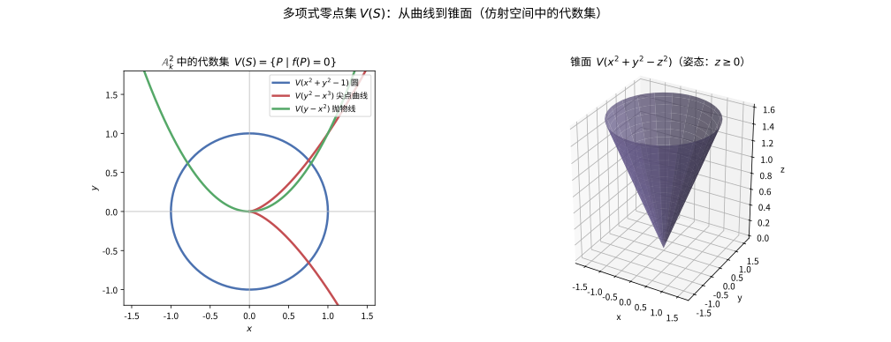
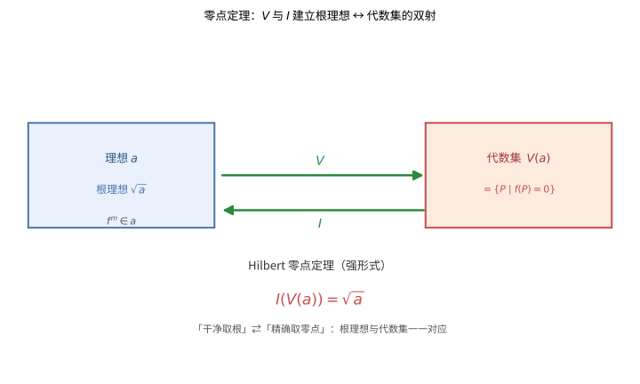

# 第 48 级：代数几何 (Algebraic Geometry)

> 代数几何是现代数学的核心分支之一，它研究多项式的零点集（代数簇）的几何性质。代数几何起源于解析几何与代数方程的经典研究，经过 Riemann、Noether、Zariski、Weil 等人的奠基，在 Grothendieck 的革新下发展出概形（Scheme）理论，成为当代数学中最深刻、最统一的语言之一。代数几何与数论（算术几何）、表示论、微分几何、数学物理等分支深度交叉，是通往现代数学前沿的必经之路。

---

## 1. 学习目标

1. 理解仿射簇与射影簇的定义，掌握 Zariski 拓扑的基本性质。
2. 掌握正则函数与正则映射的概念，理解坐标环与仿射簇之间的对偶对应。
3. 掌握 Hilbert 零点定理并能够独立完成证明。
4. 理解局部化与局部环，掌握代数簇在一点处的局部性质。
5. 理解层的基本概念，掌握结构层与模层的构造。
6. 理解概形的基本思想，掌握仿射概形与一般概形的定义。
7. 掌握代数曲线上的 Riemann-Roch 定理及其证明，理解 Serre 对偶定理。
8. 理解除子与线丛理论，掌握 Bezout 定理。
9. 通过丰富的计算示例和习题，培养代数几何的具体计算能力。

---

## 2. 仿射簇 (Affine Varieties)

### 2.1 仿射空间与代数集

**定义 2.1**（仿射空间）设 $k$ 是一个代数闭域。**$n$ 维仿射空间**（affine space）定义为

$$
\mathbb{A}^n_k = \{(a_1, \ldots, a_n) \mid a_i \in k\}.
$$

**定义 2.2**（代数集）设 $S \subseteq k[x_1, \ldots, x_n]$ 是一族多项式。$S$ 的**零点集**（zero set）定义为

$$
V(S) = \{P \in \mathbb{A}^n_k \mid f(P) = 0,\ \forall f \in S\}.
$$

称 $\mathbb{A}^n_k$ 的子集 $X$ 为**代数集**（algebraic set），若存在 $S \subseteq k[x_1, \ldots, x_n]$ 使得 $X = V(S)$。

**例 2.3**
- $V(0) = \mathbb{A}^n_k$，$V(1) = \varnothing$。
- 仿射直线 $\mathbb{A}^1_k$ 上的代数集只有 $\mathbb{A}^1_k$ 本身和有限个点（因为 $k[x]$ 中非零多项式的零点集有限）。
- 仿射平面 $\mathbb{A}^2_k$ 中，$V(x^2 + y^2 - 1)$ 是单位圆。
- 圆锥曲线 $V(y^2 - x^3)$ 是尖点曲线（cubic with a cusp）。

> **直观理解（现实类比）**：代数集就是"一组多项式方程扫地摊平后的答案集"。就像 GPS 上满足"到某点距离为 1"的所有点画出一个圆，满足"$y=x^2$"的点描出一条抛物线——凡是用多项式方程（如圆、锥面）能"圈定"的几何图形都属于代数集。雷达扫描到某个方程成立的所有位置，就得到这个代数集。

**定义 2.4**（多项式的理想）对任意子集 $X \subseteq \mathbb{A}^n_k$，定义

$$
I(X) = \{f \in k[x_1, \ldots, x_n] \mid f(P) = 0,\ \forall P \in X\}.
$$

容易验证 $I(X)$ 是 $k[x_1, \ldots, x_n]$ 中的一个理想。

**定义 2.5**（Zariski 拓扑）$\mathbb{A}^n_k$ 上的 **Zariski 拓扑**定义为以代数集为闭集的拓扑。即，开集是代数集的补集。

**命题 2.6**（Zariski 拓扑的基本性质）
1. Zariski 拓扑不是 Hausdorff 的（除非 $k$ 有限）。
2. $\mathbb{A}^1_k$ 上的 Zariski 开集是余有限集（即有限个点的补集）。
3. Zariski 拓扑是 $T_1$ 的：单点集是闭集（因为 $V(x_1 - a_1, \ldots, x_n - a_n) = \{(a_1, \ldots, a_n)\}$）。

### 2.2 仿射簇

**定义 2.7**（不可约代数集）代数集 $X \subseteq \mathbb{A}^n_k$ 称为**不可约的**（irreducible），若不能表示为两个真代数子集的并：$X = X_1 \cup X_2$ 蕴涵 $X = X_1$ 或 $X = X_2$。

**定义 2.8**（仿射簇）**仿射簇**（affine variety）是一个不可约代数集，配备 Zariski 子空间拓扑。

**定理 2.9**（不可约性与素理想）代数集 $X$ 不可约当且仅当 $I(X)$ 是素理想。

**证明** 设 $X$ 不可约，假设 $fg \in I(X)$。则 $X \subseteq V(fg) = V(f) \cup V(g)$，故 $X = (X \cap V(f)) \cup (X \cap V(g))$。由不可约性，$X \subseteq V(f)$ 或 $X \subseteq V(g)$，即 $f \in I(X)$ 或 $g \in I(X)$。因此 $I(X)$ 是素理想。反之，若 $I(X)$ 是素理想，设 $X = X_1 \cup X_2$，则 $I(X) = I(X_1) \cap I(X_2)$。若 $I(X) \subsetneq I(X_1)$ 且 $I(X) \subsetneq I(X_2)$，可取 $f \in I(X_1) \setminus I(X)$，$g \in I(X_2) \setminus I(X)$，则 $fg \in I(X_1)I(X_2) \subseteq I(X_1) \cap I(X_2) = I(X)$，这与 $I(X)$ 是素理想矛盾。故 $X = X_1$ 或 $X = X_2$。$\square$

**例 2.10** $V(xy) \subseteq \mathbb{A}^2_k$ 不是不可约的，因为 $V(xy) = V(x) \cup V(y)$，而 $I(V(xy)) = \sqrt{(xy)} = (xy)$ 不是素理想。

### 2.3 坐标环

**定义 2.11**（坐标环）设 $X \subseteq \mathbb{A}^n_k$ 是仿射簇，其**坐标环**（coordinate ring）定义为

$$
k[X] = k[x_1, \ldots, x_n] / I(X).
$$

坐标环是有限生成的 $k$-代数，且是整环（因为 $I(X)$ 是素理想）。

**例 2.12**
- $\mathbb{A}^n_k$ 的坐标环是 $k[\mathbb{A}^n_k] = k[x_1, \ldots, x_n]$。
- 抛物线 $V(y - x^2) \subseteq \mathbb{A}^2_k$ 的坐标环是 $k[x, y]/(y - x^2) \cong k[x]$。
- 单位圆 $V(x^2 + y^2 - 1) \subseteq \mathbb{A}^2_k$ 的坐标环是 $k[x, y]/(x^2 + y^2 - 1)$。

**关键洞察**：坐标环 $k[X]$ 中的元素可以自然地视为 $X$ 上的函数，因为若 $f, g \in k[x_1, \ldots, x_n]$ 在 $I(X)$ 中相差一个多项式，则它们在 $X$ 上的取值相同。因此，坐标环就是 $X$ 上的多项式函数环。

---

## 3. 正则函数与正则映射 (Regular Functions and Regular Maps)

### 3.1 正则函数

**定义 3.1**（正则函数）设 $X \subseteq \mathbb{A}^n_k$ 是仿射簇，$U \subseteq X$ 是非空开集。函数 $f: U \to k$ 称为在 $U$ 上**正则**（regular），若对每个 $P \in U$，存在 $P$ 的邻域 $V \subseteq U$ 和多项式 $g, h \in k[x_1, \ldots, x_n]$，使得在 $V$ 上 $h \neq 0$ 且 $f = g/h$。

**命题 3.2** 若 $X$ 是仿射簇，则 $X$ 上的全体正则函数 $k[X]$ 恰好是坐标环，即每个正则函数 $f: X \to k$ 可以由一个多项式唯一表示。

**证明** 由定义，$f$ 在每点 $P \in X$ 处可表为 $g_P/h_P$，其中 $h_P(P) \neq 0$。考虑理想 $\mathfrak{a} = (h_P)_{P \in X} \subseteq k[X]$。若 $\mathfrak{a} \neq (1)$，则存在极大理想 $\mathfrak{m} \supseteq \mathfrak{a}$，对应于点 $Q \in X$（由 Hilbert 零点定理的推论），但 $h_Q(Q) \neq 0$ 矛盾。故 $1 = \sum a_P h_P$。利用这一关系，可构造多项式 $g$ 使得 $f = g$ 在 $X$ 上处处成立。$\square$

### 3.2 正则映射

**定义 3.2**（正则映射）设 $X \subseteq \mathbb{A}^n_k$，$Y \subseteq \mathbb{A}^m_k$ 是仿射簇。映射 $\varphi: X \to Y$ 称为**正则映射**（regular map），若存在多项式 $f_1, \ldots, f_m \in k[x_1, \ldots, x_n]$ 使得

$$
\varphi(P) = (f_1(P), \ldots, f_m(P)),\quad \forall P \in X.
$$

**命题 3.3**（正则映射与代数同态的对偶）正则映射 $\varphi: X \to Y$ 诱导 $k$-代数同态 $\varphi^*: k[Y] \to k[X]$，定义为 $\varphi^*(g) = g \circ \varphi$。反之，任何 $k$-代数同态 $\psi: k[Y] \to k[X]$ 都来自于唯一的一个正则映射 $\varphi: X \to Y$。

**证明** 若 $\varphi$ 由 $f_1, \ldots, f_m$ 给出，则 $\varphi^*$ 将 $k[Y] = k[y_1, \ldots, y_m]/I(Y)$ 中的 $y_i$ 映为 $f_i \in k[X]$，这确实是良定义的 $k$-代数同态。反之，给定 $\psi: k[Y] \to k[X]$，令 $f_i = \psi(y_i) \in k[X]$，则 $\varphi(P) = (f_1(P), \ldots, f_m(P))$ 定义了一个正则映射，且 $\varphi^* = \psi$。$\square$

**推论 3.4** 仿射簇范畴与有限生成 $k$-代数（整环）范畴是对偶等价的。确切地说，有反变等价：

$$
\{\text{仿射簇}\} \longleftrightarrow \{\text{有限生成 $k$-代数（整环）}\}.
$$

这是代数几何中最基本的对应关系之一，它将几何问题转化为代数问题。

---

## 4. 射影簇 (Projective Varieties)

### 4.1 射影空间

**定义 4.1**（射影空间）**$n$ 维射影空间**（projective space）定义为

$$
\mathbb{P}^n_k = (\mathbb{A}^{n+1}_k \setminus \{0\}) / \sim,
$$

其中 $(a_0, \ldots, a_n) \sim (\lambda a_0, \ldots, \lambda a_n)$ 对任意 $\lambda \in k^*$。等价类记作 $[a_0 : \cdots : a_n]$。

**例 4.2** 射影直线 $\mathbb{P}^1_k$ 由点 $[x:y]$ 组成，其中 $(x, y) \neq (0, 0)$。当 $y \neq 0$ 时，$[x:y] = [x/y:1]$ 对应 $\mathbb{A}^1_k$ 中的点 $x/y$；当 $y = 0$ 时，$[1:0]$ 是无穷远点。因此 $\mathbb{P}^1_k = \mathbb{A}^1_k \cup \{\infty\}$。

### 4.2 射影代数集

**定义 4.3**（齐次理想）称多项式 $f \in k[x_0, \ldots, x_n]$ 为**齐次的**（homogeneous），若其所有单项式次数相同。理想 $I \subseteq k[x_0, \ldots, x_n]$ 称为**齐次理想**，若它由齐次多项式生成。

**定义 4.4**（射影代数集）对齐次理想 $I \subseteq k[x_0, \ldots, x_n]$，定义

$$
V_+(I) = \{P \in \mathbb{P}^n_k \mid f(P) = 0,\ \forall \text{齐次 } f \in I\}.
$$

称 $\mathbb{P}^n_k$ 的子集为**射影代数集**（projective algebraic set），若它形如 $V_+(I)$ 对某个齐次理想 $I$。

**定义 4.5**（射影簇）**射影簇**（projective variety）是不可约的射影代数集。

### 4.3 标准仿射覆盖

射影空间 $\mathbb{P}^n_k$ 有标准开覆盖 $U_i = \{x_i \neq 0\}$，其中 $U_i \cong \mathbb{A}^n_k$，同构由

$$
[x_0: \cdots: x_n] \mapsto \left(\frac{x_0}{x_i}, \ldots, \frac{x_{i-1}}{x_i}, \frac{x_{i+1}}{x_i}, \ldots, \frac{x_n}{x_i}\right)
$$

给出。这一覆盖是研究射影簇局部性质的重要工具。

**例 4.6** 射影平面 $\mathbb{P}^2_k$ 上的三次曲线（elliptic curve）由齐次三次方程 $F(x, y, z) = 0$ 定义，其中 $F$ 光滑（即 $\nabla F \neq 0$ 在曲线上处处成立）。在仿射片 $z \neq 0$ 上，令 $u = x/z$，$v = y/z$，方程化为 $f(u, v) = F(u, v, 1) = 0$。

---

## 5. 希尔伯特零点定理 (Hilbert's Nullstellensatz)

**定理 5.1**（Hilbert 零点定理，强形式）设 $k$ 是代数闭域，$\mathfrak{a} \subseteq k[x_1, \ldots, x_n]$ 是理想。则

$$
I(V(\mathfrak{a})) = \sqrt{\mathfrak{a}},
$$

其中 $\sqrt{\mathfrak{a}} = \{f \in k[x_1, \ldots, x_n] \mid f^m \in \mathfrak{a} \text{ 对某个 } m \geq 1\}$ 是 $\mathfrak{a}$ 的根。

**证明** 显然 $\sqrt{\mathfrak{a}} \subseteq I(V(\mathfrak{a}))$：若 $f^m \in \mathfrak{a}$，则对任意 $P \in V(\mathfrak{a})$，$f(P)^m = 0$，故 $f(P) = 0$，即 $f \in I(V(\mathfrak{a}))$。

反向包含是核心。设 $f \in I(V(\mathfrak{a}))$，即 $f$ 在 $V(\mathfrak{a})$ 的每点上为零。我们证明存在 $m$ 使得 $f^m \in \mathfrak{a}$。

**Rabinowitsch 技巧**：考虑环 $k[x_1, \ldots, x_n, t]$，引入新变量 $t$。令 $\mathfrak{b} = (\mathfrak{a}, 1 - tf) \subseteq k[x_1, \ldots, x_n, t]$。

断言：$V(\mathfrak{b}) = \varnothing$。因为若 $(a_1, \ldots, a_n, b) \in V(\mathfrak{b})$，则 $(a_1, \ldots, a_n) \in V(\mathfrak{a})$，故 $f(a_1, \ldots, a_n) = 0$，于是 $1 - b \cdot 0 = 1 \neq 0$，矛盾。

由 Hilbert 零点定理的弱形式（见下文），$V(\mathfrak{b}) = \varnothing$ 蕴涵 $\mathfrak{b} = (1)$，即 $1 \in \mathfrak{b}$。因此存在 $g_i, h \in k[x_1, \ldots, x_n, t]$ 使得

$$
1 = \sum_i g_i f_i + h(1 - tf),
$$

其中 $f_i \in \mathfrak{a}$。将 $t$ 替换为 $1/f$，得到在 $k(x_1, \ldots, x_n)$ 中的等式

$$
1 = \sum_i g_i(x_1, \ldots, x_n, 1/f) f_i.
$$

两边乘以 $f^N$（$N$ 充分大以消去分母），得到

$$
f^N = \sum_i \tilde{g}_i f_i \in \mathfrak{a},
$$

其中 $\tilde{g}_i \in k[x_1, \ldots, x_n]$。因此 $f^N \in \mathfrak{a}$，即 $f \in \sqrt{\mathfrak{a}}$。$\square$

**定理 5.2**（Hilbert 零点定理，弱形式）设 $k$ 是代数闭域，$\mathfrak{a} \subseteq k[x_1, \ldots, x_n]$ 是真理想。则 $V(\mathfrak{a}) \neq \varnothing$。

**证明** 由强形式直接推出：若 $V(\mathfrak{a}) = \varnothing$，则 $I(V(\mathfrak{a})) = k[x_1, \ldots, x_n]$，故 $\sqrt{\mathfrak{a}} = (1)$，即 $1 \in \sqrt{\mathfrak{a}}$，从而存在 $m$ 使得 $1^m = 1 \in \mathfrak{a}$，与 $\mathfrak{a}$ 是真理想矛盾。$\square$

**推论 5.3**（对应定理）映射 $V$ 和 $I$ 建立了如下一一对应：

$$
\{\text{仿射代数集}\} \longleftrightarrow \{\text{根理想 } \mathfrak{a} = \sqrt{\mathfrak{a}}\},
$$

且不可约代数集对应素理想（即 $V(\mathfrak{p})$，$\mathfrak{p}$ 素理想）。

**例 5.4** 在 $\mathbb{A}^2_k$ 中，$V(x^2, y) = V(x, y) = \{(0,0)\}$，因为 $\sqrt{(x^2, y)} = (x, y)$。这体现了零点定理的核心：只有根理想才唯一确定代数集。

> **直观理解（现实类比）**：零点定理像"相机与底片"的对应——理想是"照片"，代数集是"拍摄对象"，根理想是"清洗过的底片"。你拍下对象得到理想 $I$，冲洗（取根 $\sqrt{\cdot}$）后得到干净的底片，它恰好唯一对应回原对象 $V$。例如 $x^2$ 和 $x$ 描述同一个点，因为它们的"根"相同。所谓"干净取根对应精确取零点"，就是在说：扔掉多余的幂次，只剩真正确定几何形状的信息。

---

## 6. 局部化与局部环 (Localization and Local Rings)

### 6.1 局部化

**定义 6.1**（局部化）设 $R$ 是交换环，$S \subseteq R$ 是乘法封闭子集（$1 \in S$，且 $a, b \in S \Rightarrow ab \in S$）。$R$ 关于 $S$ 的**局部化**定义为

$$
S^{-1}R = \{r/s \mid r \in R, s \in S\} / \sim,
$$

其中 $r_1/s_1 \sim r_2/s_2$ 当且仅当存在 $s \in S$ 使得 $s(r_1 s_2 - r_2 s_1) = 0$。

### 6.2 仿射簇的局部环

**定义 6.2**（局部环）设 $X$ 是仿射簇，$P \in X$。$X$ 在 $P$ 处的**局部环**（local ring）定义为

$$
\mathcal{O}_{X, P} = \left\{ \frac{f}{g} \;\middle|\; f, g \in k[X],\ g(P) \neq 0 \right\},
$$

即 $k[X]$ 关于乘法集 $S = \{g \in k[X] \mid g(P) \neq 0\}$ 的局部化。

**命题 6.3** $\mathcal{O}_{X, P}$ 是局部环，其极大理想为

$$
\mathfrak{m}_P = \left\{ \frac{f}{g} \in \mathcal{O}_{X, P} \;\middle|\; f(P) = 0 \right\},
$$

且剩余域 $\mathcal{O}_{X, P} / \mathfrak{m}_P \cong k$。

**证明** 显然 $\mathfrak{m}_P$ 是真理想。若 $h \in \mathcal{O}_{X, P} \setminus \mathfrak{m}_P$，则 $h(P) \neq 0$，故 $h$ 可逆（逆为 $1/h$）。因此 $\mathfrak{m}_P$ 是唯一的极大理想。$\square$

**例 6.4** 取 $X = \mathbb{A}^1_k$，$P = 0$。则 $\mathcal{O}_{\mathbb{A}^1_k, 0} = k[x]_{(x)} = \left\{ \frac{f}{g} \in k(x) \mid g(0) \neq 0 \right\}$，即 $k[x]$ 在 $(x)$ 处的局部化。这个环中的元素是在 $0$ 处有定义的（形式）有理函数。

---

## 7. 层 (Sheaves)

### 7.1 层的定义

**定义 7.1**（预层）设 $X$ 是拓扑空间。$X$ 上的一个**预层**（presheaf）$\mathcal{F}$ 由以下数据组成：
1. 对每个开集 $U \subseteq X$，一个集合（或群、环、模等）$\mathcal{F}(U)$；
2. 对每对开集 $V \subseteq U$，限制映射 $\rho_{UV}: \mathcal{F}(U) \to \mathcal{F}(V)$，
满足 $\rho_{UU} = \text{id}$ 和 $\rho_{VW} \circ \rho_{UV} = \rho_{UW}$ 对 $W \subseteq V \subseteq U$ 成立。

$\mathcal{F}(U)$ 中的元素称为 $U$ 上的**截面**（section），常记作 $\Gamma(U, \mathcal{F})$。

**定义 7.2**（层）预层 $\mathcal{F}$ 称为**层**（sheaf），若它还满足：
1. **局部性**：若 $\{U_i\}$ 是 $U$ 的开覆盖，$s, t \in \mathcal{F}(U)$ 且 $s|_{U_i} = t|_{U_i}$ 对所有 $i$，则 $s = t$。
2. **胶合性**：若 $\{U_i\}$ 是 $U$ 的开覆盖，$s_i \in \mathcal{F}(U_i)$ 满足 $s_i|_{U_i \cap U_j} = s_j|_{U_i \cap U_j}$ 对所有 $i, j$，则存在 $s \in \mathcal{F}(U)$ 使得 $s|_{U_i} = s_i$。

### 7.2 结构层

**定义 7.3**（仿射簇的结构层）设 $X$ 是仿射簇。定义 $X$ 上的**结构层**（structure sheaf）$\mathcal{O}_X$ 如下：
- 对开集 $U \subseteq X$，$\mathcal{O}_X(U)$ 是 $U$ 上的正则函数环。
- 限制映射是函数的通常限制。

**定理 7.4**（仿射簇的局部性质）对任意 $P \in X$，茎（stalk）

$$
\mathcal{O}_{X, P} = \varinjlim_{P \in U} \mathcal{O}_X(U)
$$

同构于 $X$ 在 $P$ 处的局部环。

**证明** 茎的元素是 $(U, f)$ 的等价类，其中 $U$ 含 $P$，$f \in \mathcal{O}_X(U)$，两个截面等价当且仅当它们在某更小的邻域上相等。由正则函数的定义，每个这样的等价类对应一个在 $P$ 处有定义的 $g/h$ 形式，这恰好是局部环 $\mathcal{O}_{X, P}$ 中的元素。$\square$

---

## 8. 概形基础 (Schemes)

### 8.1 仿射概形

**定义 8.1**（环的素谱）设 $R$ 是交换环。$R$ 的**素谱**（prime spectrum）定义为

$$
\operatorname{Spec} R = \{\mathfrak{p} \subseteq R \mid \mathfrak{p} \text{ 是素理想}\}.
$$

**定义 8.2**（Zariski 拓扑）在 $\operatorname{Spec} R$ 上定义 Zariski 拓扑，闭集为

$$
V(\mathfrak{a}) = \{\mathfrak{p} \in \operatorname{Spec} R \mid \mathfrak{a} \subseteq \mathfrak{p}\},
$$

其中 $\mathfrak{a} \subseteq R$ 是任意理想。

**定义 8.3**（结构层）在 $\operatorname{Spec} R$ 上定义结构层 $\mathcal{O}_{\operatorname{Spec} R}$：对基本开集 $D(f) = \{\mathfrak{p} \mid f \notin \mathfrak{p}\}$，定义

$$
\mathcal{O}_{\operatorname{Spec} R}(D(f)) = R_f,
$$

其中 $R_f = S^{-1}R$，$S = \{1, f, f^2, \ldots\}$ 是 $R$ 关于 $f$ 的局部化。然后通过极限延拓到一般开集。

**定义 8.4**（仿射概形）**仿射概形**（affine scheme）是环化空间 $(\operatorname{Spec} R, \mathcal{O}_{\operatorname{Spec} R})$。

**例 8.5**
- $\operatorname{Spec} k$：单个点（因为域 $k$ 只有素理想 $(0)$），结构层给出 $k$。
- $\operatorname{Spec} \mathbb{Z}$：素谱由素理想 $(p)$ 和 $(0)$ 组成。$(0)$ 是**一般点**（generic point），其闭包是整个空间。
- $\operatorname{Spec} k[x]$：由素理想 $(0)$（一般点）和 $(x - a)$（$a \in k$）组成，加上不可约多项式对应的素理想（若 $k$ 非代数闭）。

### 8.2 概形

**定义 8.6**（概形）**概形**（scheme）是一个局部环化空间 $(X, \mathcal{O}_X)$，使得 $X$ 有开覆盖 $\{U_i\}$，且每个 $(U_i, \mathcal{O}_X|_{U_i})$ 同构于仿射概形 $\operatorname{Spec} R_i$。

**例 8.7** 射影直线 $\mathbb{P}^1_k$ 作为概形：它有标准覆盖 $U_0 = \operatorname{Spec} k[x]$（$x \neq 0$ 片）和 $U_1 = \operatorname{Spec} k[x^{-1}]$（$y \neq 0$ 片），在交 $U_0 \cap U_1 = \operatorname{Spec} k[x, x^{-1}]$ 上通过 $x \mapsto x^{-1}$ 胶合。

### 8.3 模层

**定义 8.8**（$\mathcal{O}_X$-模）设 $(X, \mathcal{O}_X)$ 是环化空间。$\mathcal{O}_X$**-模层**（sheaf of $\mathcal{O}_X$-modules）是一个层 $\mathcal{F}$，使得每个 $\mathcal{F}(U)$ 是 $\mathcal{O}_X(U)$-模，且限制映射与模结构相容。

**定义 8.9**（拟凝聚层）$\mathcal{O}_X$-模 $\mathcal{F}$ 称为**拟凝聚的**（quasi-coherent），若 $X$ 有仿射开覆盖 $\{U_i = \operatorname{Spec} R_i\}$，使得在每个 $U_i$ 上，$\mathcal{F}|_{U_i} \cong \widetilde{M_i}$，其中 $\widetilde{M_i}$ 是 $R_i$-模 $M_i$ 对应的层。

**定义 8.10**（凝聚层）称拟凝聚层 $\mathcal{F}$ 是**凝聚的**（coherent），若每个 $M_i$ 是有限生成的 $R_i$-模。

---

## 9. 上同调 (Cohomology)

### 9.1 Čech 上同调

**定义 9.1**（Čech 上同调）设 $X$ 是拓扑空间，$\mathcal{F}$ 是 $X$ 上的层，$\mathcal{U} = \{U_i\}_{i \in I}$ 是 $X$ 的开覆盖。定义 Čech 上链复形：

$$
C^p(\mathcal{U}, \mathcal{F}) = \prod_{i_0 < \cdots < i_p} \mathcal{F}(U_{i_0} \cap \cdots \cap U_{i_p}),
$$

上边缘算子 $d^p: C^p \to C^{p+1}$ 定义为

$$
(d^p \alpha)_{i_0 \cdots i_{p+1}} = \sum_{j=0}^{p+1} (-1)^j \alpha_{i_0 \cdots \hat{i}_j \cdots i_{p+1}}|_{U_{i_0} \cap \cdots \cap U_{i_{p+1}}}.
$$

则第 $p$ 个 **Čech 上同调群**为

$$
\check{H}^p(\mathcal{U}, \mathcal{F}) = \ker d^p / \operatorname{im} d^{p-1}.
$$

**定义 9.2**（层上同调）取遍所有开覆盖的极限给出 $\check{H}^p(X, \mathcal{F})$。对于仿射簇上的拟凝聚层，Čech 上同调与 Grothendieck 的导函子上同调一致。

### 9.2 代数曲线上的上同调

对于代数曲线 $X$，重要的上同调群是 $H^0(X, \mathcal{F})$（全局截面）和 $H^1(X, \mathcal{F})$。

**定理 9.3** 若 $X$ 是光滑射影曲线，$\mathcal{L}$ 是 $X$ 上的可逆层，则 $H^0(X, \mathcal{L})$ 和 $H^1(X, \mathcal{L})$ 是有限维 $k$-向量空间。

---

## 10. 定理与证明

### 10.1 仿射簇的对应定理

**定理 10.1**（仿射簇与有限生成 $k$-代数的对偶）设 $k$ 是代数闭域。则函子

$$
X \mapsto k[X], \quad \varphi \mapsto \varphi^*
$$

建立了仿射簇范畴与有限生成 $k$-代数整环范畴之间的反变等价。

**证明** 我们分三步建立等价。

**步骤 1：函子定义** 对仿射簇 $X$，$k[X] = k[x_1, \ldots, x_n]/I(X)$ 是有限生成 $k$-代数整环。对正则映射 $\varphi: X \to Y$，$\varphi^*: k[Y] \to k[X]$ 定义为 $\varphi^*(f) = f \circ \varphi$，这是 $k$-代数同态。

**步骤 2：本质满性** 给定有限生成 $k$-代数整环 $A = k[x_1, \ldots, x_n]/\mathfrak{p}$（$\mathfrak{p}$ 是素理想），令 $X = V(\mathfrak{p}) \subseteq \mathbb{A}^n_k$。则 $k[X] \cong A$，且 $X$ 是仿射簇（因为 $\mathfrak{p}$ 是素理想，$X$ 不可约）。因此每个有限生成 $k$-代数整环都同构于某个仿射簇的坐标环。

**步骤 3：完全忠实性** 需要证明对任意仿射簇 $X, Y$，映射

$$
\operatorname{Hom}(X, Y) \to \operatorname{Hom}_{k\text{-alg}}(k[Y], k[X]), \quad \varphi \mapsto \varphi^*
$$

是双射。

- **单射**：若 $\varphi_1, \varphi_2: X \to Y$ 满足 $\varphi_1^* = \varphi_2^*$，则对任意 $f \in k[Y]$，$f \circ \varphi_1 = f \circ \varphi_2$。取 $f$ 为坐标函数 $y_i$，得 $\varphi_1$ 和 $\varphi_2$ 的每个分量相等，故 $\varphi_1 = \varphi_2$。

- **满射**：给定 $k$-代数同态 $\psi: k[Y] \to k[X]$，设 $Y \subseteq \mathbb{A}^m_k$，$k[Y] = k[y_1, \ldots, y_m]/I(Y)$。令 $f_i = \psi(y_i) \in k[X]$，定义 $\varphi: X \to \mathbb{A}^m_k$ 为 $\varphi(P) = (f_1(P), \ldots, f_m(P))$。需要验证 $\varphi(X) \subseteq Y$：对任意 $g \in I(Y)$，$g(f_1, \ldots, f_m) = \psi(g) = 0$，故 $\varphi(P) \in V(I(Y)) = Y$。因此 $\varphi: X \to Y$ 是正则映射，且 $\varphi^* = \psi$。$\square$

**推论 10.2** 仿射簇 $X$ 中的闭子簇一一对应于 $k[X]$ 中的素理想。具体地，若 $Y \subseteq X$ 是闭子簇，则对应的素理想是 $I(Y)/I(X) \subseteq k[X]$；反之，素理想 $\mathfrak{p} \subseteq k[X]$ 对应 $V(\mathfrak{p}) \subseteq X$。

### 10.2 Riemann-Roch 定理

**定理 10.3**（Riemann-Roch 定理）设 $X$ 是亏格为 $g$ 的光滑射影曲线，$D$ 是 $X$ 上的除子。则

$$
\ell(D) - \ell(K - D) = \deg D - g + 1,
$$

其中：
- $\ell(D) = \dim_k H^0(X, \mathcal{O}_X(D))$ 是 $D$ 对应的线丛的全局截面空间维数；
- $K$ 是典范除子（canonical divisor），即 $X$ 上正则微分形式的除子；
- $\deg D$ 是 $D$ 的次数。

**证明** 我们给出一个基于层上同调与 Serre 对偶的现代证明。

**步骤 1：转化为上同调语言** 对除子 $D$，考虑可逆层 $\mathcal{L}(D) = \mathcal{O}_X(D)$。则 $\ell(D) = h^0(X, \mathcal{L}(D))$，其中 $h^0 = \dim_k H^0$。Riemann-Roch 公式可重写为

$$
h^0(X, \mathcal{L}(D)) - h^1(X, \mathcal{L}(D)) = \deg D - g + 1.
$$

**步骤 2：$H^0$ 和 $H^1$ 的有限维性** 由定理 9.3，$H^0(X, \mathcal{L}(D))$ 和 $H^1(X, \mathcal{L}(D))$ 都是有限维 $k$-向量空间。定义 Euler 示性数

$$
\chi(X, \mathcal{L}(D)) = h^0(X, \mathcal{L}(D)) - h^1(X, \mathcal{L}(D)).
$$

**步骤 3：Euler 示性数的可加性** 考虑短正合序列

$$
0 \to \mathcal{L}(D) \to \mathcal{L}(D + P) \to \mathcal{O}_P \to 0,
$$

其中 $\mathcal{O}_P$ 是点 $P$ 处的 skyscraper 层。取上同调得到长正合序列，从而

$$
\chi(X, \mathcal{L}(D + P)) = \chi(X, \mathcal{L}(D)) + 1.
$$

因此 $\chi(X, \mathcal{L}(D))$ 关于 $\deg D$ 是线性的：存在常数 $a$ 使得 $\chi(X, \mathcal{L}(D)) = \deg D + a$。

**步骤 4：确定常数 $a$** 取 $D = 0$（零除子），则 $\mathcal{L}(0) = \mathcal{O}_X$（结构层）。此时

$$
H^0(X, \mathcal{O}_X) = k \quad (\text{因为 $X$ 是射影曲线，全局正则函数只有常数}),
$$
$$
H^1(X, \mathcal{O}_X) \cong H^0(X, \Omega_X)^\vee \quad (\text{Serre 对偶}),
$$

其中 $\Omega_X$ 是 $X$ 上的正则微分形式层，$H^0(X, \Omega_X)$ 的维数正是亏格 $g$。因此

$$
\chi(X, \mathcal{O}_X) = 1 - g.
$$

故 $a = 1 - g$，即 $\chi(X, \mathcal{L}(D)) = \deg D + 1 - g$。

**步骤 5：应用 Serre 对偶** 

$$
H^1(X, \mathcal{L}(D)) \cong H^0(X, \Omega_X \otimes \mathcal{L}(D)^{-1})^\vee = H^0(X, \mathcal{L}(K - D))^\vee,
$$

其中 $\Omega_X = \mathcal{O}_X(K)$。因此 $h^1(X, \mathcal{L}(D)) = h^0(X, \mathcal{L}(K - D))$，代入即得

$$
\ell(D) - \ell(K - D) = \deg D - g + 1.
$$

$\square$

**例 10.4** 对 $X = \mathbb{P}^1_k$（亏格 $g = 0$），Riemann-Roch 给出

$$
\ell(D) - \ell(K - D) = \deg D + 1.
$$

由于 $K \sim -2P$（对任意点 $P$），$\deg K = -2$。对 $D = nP$（$n \geq 0$），有 $\ell(nP) = n + 1$，正是 $\mathbb{P}^1$ 上次数 $\leq n$ 的齐次多项式的维数。

### 10.3 Serre 对偶定理

**定理 10.5**（Serre 对偶，代数曲线情形）设 $X$ 是亏格 $g$ 的光滑射影曲线，$\mathcal{L}$ 是 $X$ 上的可逆层。则存在自然同构

$$
H^1(X, \mathcal{L}) \cong H^0(X, \Omega_X \otimes \mathcal{L}^{-1})^\vee,
$$

其中 $\Omega_X$ 是 $X$ 上的正则微分形式层。

**证明** 分以下步骤。

**步骤 1：配对构造** 考虑自然配对

$$
H^0(X, \Omega_X \otimes \mathcal{L}^{-1}) \times H^1(X, \mathcal{L}) \to H^1(X, \Omega_X) \cong k,
$$

其中最后一个同构是**迹映射**（trace map）$H^1(X, \Omega_X) \cong k$。该配对是非退化的，故给出同构 $H^1(X, \mathcal{L}) \cong H^0(X, \Omega_X \otimes \mathcal{L}^{-1})^\vee$。

**步骤 2：对 $\mathcal{L} = \mathcal{O}_X$ 的情形** 此时配对为

$$
H^0(X, \Omega_X) \times H^1(X, \mathcal{O}_X) \to k,
$$

这通过将微分形式与 Čech 上循环配对并积分（在复曲面上）或利用留数理论实现。这是 Serre 对偶的基本情形。

**步骤 3：一般情形** 对任意可逆层 $\mathcal{L}$，取仿射开覆盖 $\mathcal{U} = \{U_i\}$ 使得 $\mathcal{L}|_{U_i} \cong \mathcal{O}_{U_i}$。利用 Čech 上同调，配对的非退化性可通过局部计算验证。关键在于，对每个 $U_i$，$\mathcal{L}$ 的平凡化诱导局部同构，而全局的配对由这些局部配对胶合而成。$\square$

**推论 10.6**（Riemann-Roch 的另一种形式）

$$
h^0(X, \mathcal{L}) - h^0(X, \Omega_X \otimes \mathcal{L}^{-1}) = \deg \mathcal{L} - g + 1.
$$

### 10.4 Bezout 定理

**定理 10.7**（Bezout 定理）设 $X, Y \subseteq \mathbb{P}^2_k$ 是两条射影平面曲线，次数分别为 $d$ 和 $e$，且无公共分支。则 $X$ 和 $Y$ 的相交重数之和为 $de$，即

$$
\sum_{P \in X \cap Y} I_P(X, Y) = d e,
$$

其中 $I_P(X, Y)$ 是 $X$ 和 $Y$ 在 $P$ 处的**相交重数**（intersection multiplicity）。

**证明** 设 $X = V_+(F)$，$Y = V_+(G)$，其中 $F, G \in k[x, y, z]$ 是齐次多项式，$\deg F = d$，$\deg G = e$，且 $\gcd(F, G) = 1$（无公共分支）。

**步骤 1：射影空间中的相交** 考虑射影空间 $\mathbb{P}^2_k$，其齐次坐标环为 $S = k[x, y, z]$。曲线 $X$ 和 $Y$ 的交集是 $V_+(F, G)$。我们需要计算 $S/(F, G)$ 作为 $k$-向量空间的维数（在适当的意义下）。

**步骤 2：利用 Hilbert 多项式** 考虑齐次坐标环 $S/(F, G)$。这是一个分次 $k$-代数，其 Hilbert 函数为

$$
H_{S/(F, G)}(n) = \dim_k (S/(F, G))_n.
$$

当 $n \gg 0$ 时，Hilbert 函数成为多项式

$$
P_{S/(F, G)}(n) = (\deg F)(\deg G) = d e.
$$

这是因为 $F$ 和 $G$ 是正则序列（因为它们互素），从而 $S/(F, G)$ 的 Hilbert 多项式是常数 $de$。

**步骤 3：相交重数之和** 由代数几何的基本事实，局部相交重数 $I_P(X, Y)$ 由 $S/(F, G)$ 在 $P$ 处的局部化决定，且全局地有

$$
\sum_{P \in X \cap Y} I_P(X, Y) = \dim_k (S/(F, G))_n \quad (n \gg 0),
$$

其中 $(S/(F, G))_n$ 是次数 $n$ 的齐次部分。由步骤 2，这个维数等于 $de$。$\square$

**例 10.8** 考虑直线 $X = V_+(z)$（即 $z = 0$，次数 $1$）和圆锥曲线 $Y = V_+(x^2 + y^2 - z^2)$（次数 $2$）在 $\mathbb{P}^2_k$ 中的相交。代入 $z = 0$ 得 $x^2 + y^2 = 0$，在代数闭域 $k$ 上解得 $x = \pm iy$，即两个交点 $[1: i: 0]$ 和 $[1: -i: 0]$，各重 $1$，总和 $2 = 1 \times 2$。

---

## 11. 除子与线丛 (Divisors and Line Bundles)

### 11.1 Weil 除子

**定义 11.1**（Weil 除子）设 $X$ 是光滑射影曲线。$X$ 上的 **Weil 除子**（Weil divisor）是 $X$ 的闭点的形式有限线性组合：

$$
D = \sum_{P \in X} n_P P,
$$

其中 $n_P \in \mathbb{Z}$，且只有有限个 $n_P \neq 0$。所有除子构成的 Abel 群记作 $\operatorname{Div}(X)$。

**定义 11.2**（主除子）对非零有理函数 $f \in k(X)^*$，定义其**主除子**（principal divisor）

$$
\operatorname{div}(f) = \sum_{P \in X} \operatorname{ord}_P(f) P,
$$

其中 $\operatorname{ord}_P(f)$ 是 $f$ 在 $P$ 处的零/极点阶数。

**定义 11.3**（除子类群）两个除子称为**线性等价**（linearly equivalent），若它们的差是主除子。除子类群是

$$
\operatorname{Cl}(X) = \operatorname{Div}(X) / \{\text{主除子}\}.
$$

### 11.2 Cartier 除子

**定义 11.4**（Cartier 除子）在一般概形上，**Cartier 除子**由局部数据 $\{(U_i, f_i)\}$ 给出，其中 $U_i$ 是开覆盖，$f_i \in \mathcal{K}_X(U_i)^*$（$\mathcal{K}_X$ 是有理函数层），且在交 $U_i \cap U_j$ 上 $f_i/f_j \in \mathcal{O}_X(U_i \cap U_j)^*$。

### 11.3 线丛

**定义 11.5**（可逆层）$X$ 上的**可逆层**（invertible sheaf）是局部同构于 $\mathcal{O}_X$ 的 $\mathcal{O}_X$-模层。可逆层在张量积下构成群，称为 **Picard 群** $\operatorname{Pic}(X)$。

**定理 11.6**（除子与线丛的对应）对光滑射影曲线 $X$，有自然同构

$$
\operatorname{Cl}(X) \cong \operatorname{Pic}(X),
$$

将除子 $D$ 映为可逆层 $\mathcal{O}_X(D)$，其中 $\mathcal{O}_X(D)(U) = \{f \in k(X)^* \mid \operatorname{div}(f) + D \geq 0 \text{ 在 } U \text{ 上}\} \cup \{0\}$。

**证明** 映射 $D \mapsto \mathcal{O}_X(D)$ 是良定义的群同态。若 $D$ 是主除子 $\operatorname{div}(f)$，则 $\mathcal{O}_X(D) \cong \mathcal{O}_X$（乘以 $f^{-1}$ 给出同构），故同态经过 $\operatorname{Cl}(X)$ 分解。满射性和单射性通过对 $X$ 的仿射覆盖的局部计算得到验证。$\square$

### 11.4 典范层

**定义 11.7**（典范层）设 $X$ 是光滑 $n$ 维射影簇。**典范层**（canonical sheaf）定义为

$$
\omega_X = \Omega^n_X,
$$

即 $n$ 次微分形式层。对曲线 $n = 1$，$\omega_X = \Omega_X$ 是正则微分形式层。典范除子 $K$ 是满足 $\mathcal{O}_X(K) \cong \omega_X$ 的除子（在曲线情形，这样的除子存在且唯一）。

---

## 12. 曲线与曲面 (Curves and Surfaces)

### 12.1 代数曲线

**定义 12.1**（代数曲线）**代数曲线**（algebraic curve）是一维的射影簇。曲线最重要的不变量是**亏格**（genus）$g$。

**例 12.2**
- **亏格 0**：$\mathbb{P}^1_k$，即射影直线。
- **亏格 1**：椭圆曲线（elliptic curve），由 $\mathbb{P}^2_k$ 中的光滑三次曲线 $y^2 z = x^3 + axz^2 + bz^3$ 给出。
- **亏格 $\geq 2$**：高亏格曲线，如 $y^2 = x^5 - 1$ 的射影化（亏格 $2$）。

**定理 12.3**（椭圆曲线的群结构）椭圆曲线 $E$ 上的点构成 Abel 群，其群运算由弦切法（chord-tangent method）定义，且 $E \cong \operatorname{Pic}^0(E)$。

### 12.2 代数曲面

**定义 12.4**（代数曲面）**代数曲面**（algebraic surface）是二维的射影簇。曲面分类是代数几何的重要课题。

**例 12.5**
- **$\mathbb{P}^2_k$**：射影平面。
- **$\mathbb{P}^1_k \times \mathbb{P}^1_k$**：双有理等价于 $\mathbb{P}^2_k$ 中的二次曲面。
- **K3 曲面**：典范层平凡且 $H^1(X, \mathcal{O}_X) = 0$ 的曲面。
- **Enriques 曲面**：典范层 2-挠且 $H^1(X, \mathcal{O}_X) = 0$ 的曲面。

---

## 13. 示例

### 13.1 仿射直线

**例 13.1** 仿射直线 $\mathbb{A}^1_k$ 是最简单的仿射簇。其坐标环为 $k[\mathbb{A}^1_k] = k[x]$。Zariski 闭子集为：$\mathbb{A}^1_k$ 本身和有限个点。每个点 $a \in k$ 对应极大理想 $(x - a)$。

正则函数 $f: \mathbb{A}^1_k \to k$ 是多项式函数。正则映射 $\varphi: \mathbb{A}^1_k \to \mathbb{A}^1_k$ 由多项式 $f(x) \in k[x]$ 给出。

### 13.2 仿射平面

**例 13.2** 仿射平面 $\mathbb{A}^2_k$ 的坐标环为 $k[x, y]$。考虑圆锥曲线 $X = V(y - x^2)$（抛物线）。坐标环 $k[X] = k[x, y]/(y - x^2) \cong k[x]$，因为 $y = x^2$。因此 $X \cong \mathbb{A}^1_k$，即抛物线同构于仿射直线。

### 13.3 射影直线

**例 13.3** $\mathbb{P}^1_k$ 由两个仿射片覆盖：$U_0 = \{ [x:y] \mid y \neq 0 \} \cong \mathbb{A}^1_k$（坐标 $x/y$）和 $U_1 = \{ [x:y] \mid x \neq 0 \} \cong \mathbb{A}^1_k$（坐标 $y/x$）。在交 $U_0 \cap U_1$ 上，坐标变换为 $x/y \mapsto (y/x)^{-1}$。

$\mathbb{P}^1_k$ 上的除子：设 $D = n[0:1] + m[1:0]$，则 $\deg D = n + m$。Riemann-Roch 给出 $\ell(D) = \max\{0, \deg D + 1\}$，与直接计算一致。

### 13.4 椭圆曲线

**例 13.4** 设 $k$ 特征 $\neq 2, 3$，椭圆曲线 $E \subseteq \mathbb{P}^2_k$ 由 Weierstrass 方程

$$
y^2 z = x^3 + a x z^2 + b z^3
$$

定义，其中 $a, b \in k$，判别式 $\Delta = -16(4a^3 + 27b^2) \neq 0$。

**基本性质**：
- 亏格 $g = 1$。
- 除子类群 $\operatorname{Cl}(E) \cong \operatorname{Pic}^0(E) \times \mathbb{Z}$，其中 $\operatorname{Pic}^0(E) \cong E$ 作为群。
- 典范除子 $K = 0$（因为 $\omega_E = \mathcal{O}_E$）。
- Riemann-Roch：$\ell(D) = \deg D$ 对 $\deg D \geq 1$。

**弦切法群运算**：对 $P, Q \in E$，作直线 $PQ$ 交 $E$ 于第三点 $R$，则 $P + Q$ 定义为 $R$ 关于 $x$ 轴的反射点。这一运算使 $E$ 成为 Abel 群。

---

## 14. 习题

### 基础题

**习题 1**（仿射空间与代数集）写出 $n$ 维仿射空间 $\mathbb{A}^n_k$ 的定义，并说明 $V(0)$、$V(1)$ 分别是什么集合。$0$、$1$ 指常数多项式。

**习题 2**（代数集的零点）列出仿射直线 $\mathbb{A}^1_k$ 上的全部代数集。

**习题 3**（圆锥曲线的理想）设 $X = V(y - x^2) \subseteq \mathbb{A}^2_k$。写出 $I(X)$，并证明坐标环 $k[x,y]/(y - x^2) \cong k[x]$。

**习题 4**（单位圆坐标环）写出单位圆 $X = V(x^2 + y^2 - 1) \subseteq \mathbb{A}^2_k$ 的坐标环。

**习题 5**（$I(X)$ 是理想）验证对任意 $X \subseteq \mathbb{A}^n_k$，$I(X)$ 是 $k[x_1,\ldots,x_n]$ 中的理想。

**习题 6**（对应对称性）验证 $X \subseteq Y$ 蕴涵 $I(X) \supseteq I(Y)$，以及 $\mathfrak{a} \subseteq \mathfrak{b}$ 蕴涵 $V(\mathfrak{a}) \supseteq V(\mathfrak{b})$。

**习题 7**（并的含义）证明 $V(S) \cup V(T) = V(\{fg \mid f \in S, g \in T\})$。特别地 $V(f) \cup V(g) = V(fg)$。

**习题 8**（交的含义）证明 $V(S_1) \cap V(S_2) = V(S_1 \cup S_2)$，且若 $S_1, S_2$ 是理想则 $V(\mathfrak{a}) \cap V(\mathfrak{b}) = V(\mathfrak{a} + \mathfrak{b})$。

**习题 9**（根理想）证明 $I(X)$ 是根理想，即 $I(V(I(X))) = I(X)$。

**习题 10**（$V$ 与理想）证明 $V(\mathfrak{a}) = V(\sqrt{\mathfrak{a}})$。

**习题 11**（Zariski 拓扑的 $T_1$）证明 $\mathbb{A}^n_k$ 中每个单点集 $\{(a_1,\ldots,a_n)\}$ 是 Zariski 闭集。

**习题 12**（不可约定义）写出代数集不可约的定义，并判断 $V(xy) \subseteq \mathbb{A}^2_k$ 是否不可约。

**习题 13**（素理想对应）说明为什么 $V(xy)$ 对应的理想 $(xy)$ 不是素理想，并写出它的两个素理想分量。

**习题 14**（坐标环是整环）解释为什么仿射簇的坐标环是整环。

**习题 15**（点与极大理想）证明点 $(a,b) \in \mathbb{A}^2_k$ 对应极大理想 $(x - a, y - b)$。

**习题 16**（$k[x]$ 的素理想）当 $k$ 是代数闭域时，列出 $k[x]$ 的所有素理想，并指出哪个是"一般点"。

**习题 17**（Zariski 开集）说明 $\mathbb{A}^1_k$ 的 Zariski 开集是什么样的集合（用余有限集描述）。

**习题 18**（正则函数）写出正则函数的定义，并说明在仿射簇 $X$ 上整体正则函数 $X \to k$ 与坐标环 $k[X]$ 的关系。

**习题 19**（正则映射）写出正则映射的定义，并说明抛物线 $V(y - x^2)$ 到 $\mathbb{A}^1_k$ 的正则映射由什么给出。

**习题 20**（对偶对应）陈述命题：正则映射 $X \to Y$ 与 $k$-代数同态 $k[Y] \to k[X]$ 之间的对偶关系。

**习题 21**（射影空间定义）写出 $n$ 维射影空间 $\mathbb{P}^n_k$ 的定义，并解释坐标 $[x_0:\cdots:x_n]$ 的意义。

**习题 22**（$\mathbb{P}^1$ 的两片覆盖）用 $U_0 = \{y \neq 0\}$ 与 $U_1 = \{x \neq 0\}$ 描述 $\mathbb{P}^1_k$，说明每片同构于 $\mathbb{A}^1_k$。

**习题 23**（齐次多项式判断）判断下列多项式是否齐次：$x^2 + y^2$，$x^2 + xy + z$，$x^3 + y^3$，$xy + 1$。

**习题 24**（齐次理想）说明什么是齐次理想，并举例 $k[x,y]$ 中的齐次理想。

**习题 25**（$V_+$ 定义）写出 $V_+(I)$ 的定义，并解释为什么只用齐次多项式验证。

**习题 26**（无穷远点）说明 $\mathbb{P}^1_k = \mathbb{A}^1_k \cup \{\infty\}$，指出哪个点对应"无穷远点"。

**习题 27**（弱零点定理）陈述 Hilbert 零点定理的弱形式，并说明它在 Rabinowitsch 技巧中的作用。

**习题 28**（强零点定理）陈述 Hilbert 零点定理的强形式 $I(V(\mathfrak{a})) = \sqrt{\mathfrak{a}}$。

**习题 29**（$\sqrt{\cdot}$ 计算）计算 $\sqrt{(x^2, y)}$ 与 $\sqrt{(x^2, xy, y^2)}$ 在 $k[x,y]$ 中。

**习题 30**（根的定义）写出理想 $\mathfrak{a}$ 的根 $\sqrt{\mathfrak{a}}$ 的定义。

**习题 31**（对应定理）陈述零点定理关于根理想与代数集之间一一对应的推论。

**习题 32**（局部化的定义）写出 $R$ 关于乘法子集 $S$ 的局部化 $S^{-1}R$ 的定义及等价关系。

**习题 33**（$k[x]_{(x)}$）在 $X = \mathbb{A}^1_k$，$P = 0$ 处，说明局部环 $\mathcal{O}_{X,0} = k[x]_{(x)}$，指出其极大理想 $\mathfrak{m}_0$。

**习题 34**（局部环的极大理想）写出 $\mathcal{O}_{X,P}$ 的极大理想 $\mathfrak{m}_P$ 的表达式，并说明为什么它是唯一的极大理想。

**习题 35**（剩余域）说明 $\mathcal{O}_{X,P}/\mathfrak{m}_P \cong k$。

**习题 36**（不可逆元素）说明在 $\mathcal{O}_{\mathbb{A}^1_k,0}$ 中哪些元素可逆、哪些不可逆。

**习题 37**（层定义）写下层的局部性与胶合性两条公理的含义。

**习题 38**（预层与层）给出一个预层但不是层的经典例子，并说明它为何不满足胶合性。

**习题 39**（结构层）写出仿射簇结构层 $\mathcal{O}_X$ 的定义，说明 $\mathcal{O}_X(X)$ 是什么。

**习题 40**（茎与局部环）说明为何茎 $\mathcal{O}_{X,P}$ 同构于局部环 $\mathcal{O}_{X,P}$（注意记号，定理 7.4）。

**习题 41**（素谱）写出 $\operatorname{Spec} R$ 的定义，指出 $\operatorname{Spec} k$ 有几个点。

**习题 42**（$\operatorname{Spec} \mathbb{Z}$）列出 $\operatorname{Spec} \mathbb{Z}$ 的所有点，指出一般点 $(0)$。

**习题 43**（基本开集）写出基本开集 $D(f) = \{\mathfrak{p} \mid f \notin \mathfrak{p}\}$ 上结构层的取值 $\mathcal{O}(D(f))$。

**习题 44**（仿射概形定义）写出仿射概形的定义，并说明 $(\operatorname{Spec} k[x], \mathcal{O})$ 与 $\mathbb{A}^1_k$ 的联系。

**习题 45**（概形的定义）写出概形的定义：局部环化空间配上仿射覆盖。

**习题 46**（$\mathbb{P}^1$ 的概形覆盖）用两个仿射片 $\operatorname{Spec} k[x]$、$\operatorname{Spec} k[x^{-1}]$ 描述 $\mathbb{P}^1_k$ 作为概形的胶合。

**习题 47**（$\mathcal{O}_X$-模）写出环化空间上 $\mathcal{O}_X$-模层的定义。

**习题 48**（拟凝聚与凝聚）写出拟凝聚层与凝聚层的定义，说明区别。

**习题 49**（Čech 复形）写出 Čech 上链 $C^p(\mathcal{U},\mathcal{F})$ 的定义。

**习题 50**（$H^0$ 的含义）说明 $H^0(X,\mathcal{F}) = \Gamma(X,\mathcal{F})$ 即全局截面。

**习题 51**（除子的定义）写出 Weil 除子的定义 $D = \sum n_P P$，说明 $n_P$ 取值。

**习题 52**（主除子）写出有理函数 $f$ 的主除子定义 $\operatorname{div}(f)$。

**习题 53**（线性等价）说明两个除子线性等价的定义。

**习题 54**（Picard 群）写出可逆层/线丛的定义，以及 Picard 群 $\operatorname{Pic}(X)$。

**习题 55**（亏格定义）说明代数曲线的亏格 $g$ 是什么不变量，给出亏格 0、1 的曲线例子。

**习题 56**（Riemann-Roch 陈述）写出 Riemann-Roch 公式并说明各项含义。

**习题 57**（$\mathbb{P}^1$ 的 R-R）由 R-R 求 $\mathbb{P}^1_k$ 上 $\ell(D)$ 关于 $\deg D$ 的公式。

**习题 58**（典范除子次数）说明光滑射影曲线的典范除子次数 $\deg K = 2g - 2$。

**习题 59**（Bezout 陈述）写出射影平面曲线的 Bezout 定理。

**习题 60**（Hilbert 多项式）对 $S/(F,G)($两平面曲线），说明其 Hilbert 多项式是常数 $de$。

**习题 61**（椭圆曲线的群）说明椭圆曲线上点的加法群运算（弦切法）。

**习题 62**（坐标到代数）把 $k[x,y]/(xy - 1)$ 同构说明为 $k[t,t^{-1}]$。

**习题 63**（局部在 0 处）写出 $k[x,y]/(x)$ 的坐标环（对应 $y$ 轴）并说明它同构于 $k[y]$。

**习题 64**（形如域）说明 $k[x]/(x)$ 是什么环（域），并判断它对应哪个点。

**习题 65**（幂零元）判断等式 $k[x]/(x^2)$ 中 $x$ 是否幂零，说明这是约化环吗。

**习题 66**（不可约分解）把 $V(x^2 - y^2) \subseteq \mathbb{A}^2_k$ 分解为两个直线的并。

**习题 67**（齐次坐标环）写出 $\mathbb{P}^2_k$ 的齐次坐标环 $S = k[x,y,z]$ 的分次结构。

**习题 68**（截面维数）说明 $\mathbb{P}^1_k$ 上 $\mathcal{O}(n)$ 的全局截面维数 $\ell(nP) = n+1$（$n \geq 0$）。

**习题 69**（切线空间雏形）写出仿射平面曲线 $f(x,y)=0$ 在点 $P$ 的切线的线性化（用偏导）。

**习题 70**（光滑与奇异）给出光滑点与奇异点的定义（用梯度）。

**习题 71**（除子次数）对 $\mathbb{P}^1_k$ 上的除子 $D = n[0:1] + m[1:0]$，求 $\deg D$。

**习题 72**（主除子次数）说明亏格为 $g$ 的光滑曲线上 $\deg \operatorname{div}(f) = 0$。

**习题 73**（$V_+$ 与 $V$ 区别）说明 $V_+$ 与 $V$ 记号的区别（射影 vs 仿射）。

**习题 74**（仿射片）写出 $\mathbb{P}^n_k$ 第 $i$ 个标准仿射片 $U_i$ 的定义。

**习题 75**（有理正则函数）区分"有理函数"与"正则函数"两个概念。

**习题 76**（$k(X)$）说明函数域 $k(X)$ 是坐标环的分式域。

**习题 77**（结构层截面）说明开集 $U$ 上 $\mathcal{O}_X(U)$ 是 $U$ 上的正则函数环。

**习题 78**（光滑射影曲线维数）说明 $H^0(X,\mathcal{L})$ 与 $H^1(X,\mathcal{L})$ 有限维（曲线情形）。

**习题 79**（Serre 对偶陈述）写出曲线情形 Serre 对偶公式。

**习题 80**（曲面对例）列举代数曲面的三个例子（$\mathbb{P}^2$、$\mathbb{P}^1\times\mathbb{P}^1$、K3）。

**习题 81**（K3 定义）写出 K3 曲面的定义（典范层平凡、$H^1=0$）。

**习题 82**（Enriques 定义）写出 Enriques 曲面的定义（典范层 2-挠、$H^1=0$）。

**习题 83**（圆锥曲线坐标环）说明 $V(y^2 - x^3) \subseteq \mathbb{A}^2_k$ 的坐标环为何是 $k[t^2, t^3]$。

**习题 84**（同构簇）说明 $V(y - x^2)$ 与 $\mathbb{A}^1_k$ 同构。

**习题 85**（有限点定位）说明 $\mathbb{A}^1_k$ 的闭子集除了自身就是有限多个点。

**习题 86**（$I(V(\mathfrak{a}))$）用强零点定理写 $I(V(\mathfrak{a}))$ 等于什么。

**习题 87**（弱形式的等命题）说明弱零点定理：真理想 $\mathfrak{a}$ 有 $V(\mathfrak{a}) \neq \varnothing$。

**习题 88**（局部化等价关系）写出局部化中等价 $r_1/s_1 \sim r_2/s_2$ 的条件。

**习题 89**（幂等与映照）说明正则映射把不可约簇映到不可约簇。

**习题 90**（坐标变换）$\mathbb{P}^1$ 两片交上的坐标变换 $x/y \mapsto y/x$ 是多项式吗（说明它是有理式）。

**习题 91**（椭圆曲线 Weierstrass）写出椭圆曲线标准 Weierstrass 方程（$y^2 z = x^3 + axz^2 + bz^3$）。

**习题 92**（判别式）说明 Weierstrass 方程要求判别式 $\Delta \neq 0$ 的意义。

**习题 93**（$E$ 的亏格）指出椭圆曲线亏格 $g=1$，典范除子次数为何。

**习题 94**（$E$ 的 Pic）说明 $\operatorname{Cl}(E) \cong \operatorname{Pic}^0(E) \times \mathbb{Z}$。

**习题 95**（$K=0$ 于椭圆）说明椭圆曲线上典范除子满足 $\ell(K)=1=\deg 0+1-1$（用 R-R 校验）。

**习题 96**（射影直线除子类）说明 $\operatorname{Cl}(\mathbb{P}^1_k) \cong \mathbb{Z}$。

**习题 97**（次数为负）说明 $\deg D < 0$ 时 $\ell(D) = 0$。

**习题 98**（切线存在性）说明尖点曲线 $y^2 = x^3$ 在 $(0,0)$ 处为何不是光滑点。

**习题 99**（Bezout 特例）举一例说明直线与圆锥曲线最多交两点（若无公共分支）。

**习题 100**（结构层茎）用极限 $\varinjlim \mathcal{O}_X(U)$ 表达局部环。

### 进阶题

**习题 101**（Riemann-Roch 于亏格 2）设 $X$ 是亏格 $g=2$ 的光滑射影曲线，$K$ 为典范除子。利用 R-R 计算 $\ell(K)$、$\ell(2K)$。

**习题 102**（Bezout 求交点）在 $\mathbb{P}^2_k$ 中求 $X = V_+(x^2 + y^2 - z^2)$ 与 $Y = V_+(x^2 + y^2 - 2xz)$ 的各交点重数与和。

**习题 103**（椭圆曲线群）在 $E: y^2 = x^3 - x$ 上取 $P=(0,0)$、$Q=(1,0)$，求 $P+Q$ 与 $2P$（弦切法）。

**习题 104**（$\mathbb{A}^2$ 不是乘积拓扑）证明 $\mathbb{A}^2_k$ 的 Zariski 拓扑不是 $\mathbb{A}^1_k \times \mathbb{A}^1_k$ 的乘积拓扑（用对角线）。

**习题 105**（零点定理取根）计算 $I(V(x^2 + y^2, x^2 - y^2))$ 并验证等于 $\sqrt{(x^2+y^2,x^2-y^2)}$。

**习题 106**（正则的不变量）证明若 $X$ 不可约且 $f \in k[X]$ 非零，则 $V(f)$ 的补集非空开；由此证明两个正则函数若在开集上相等则处处相等。

**习题 107**（有理函数到曲线的映射）说明为什么有理函数 $f = g/h$ 在 $h$ 的零点处未必定义，构造 $h=0$ 的例子。

**习题 108**（代数集是有限并的不可约）简述 $\mathbb{A}^2_k$ 中代数集如何分解为不可约分支（用理想分解思想）。

**习题 109**（$\sqrt{(x^2+y^2)(x-y)}$）求 $V((x^2+y^2)(x-y))$ 的不可约分支并写出对应根理想。

**习题 110**（坐标环为整环）判断 $k[x,y]/(x^2-y^2)$ 是否为整环，说明其根。

**习题 111**（投影映射）设 $\pi: \mathbb{A}^2_k \to \mathbb{A}^1_k$ 由 $\pi(x,y)=x$ 给出，写出其诱导代数同态并判断是否满射。

**习题 112**（正则不闭）说明正则映射的像未必是代数集（给 $\mathbb{A}^2 \to \mathbb{A}^2$ 例子或用有理参数化）。

**习题 113**（切空间计算）求 $V(x^2 - y^2 z)$ 在原点的线性化/切锥，指出奇点。

**习题 114**（局部环的 Krull 维）说明 $\mathcal{O}_{\mathbb{A}^2_k, P}$ 的 Krull 维数是 $2$。

**习题 115**（除子线性等价的平凡）用 $\mathbb{P}^1$ 上 $\operatorname{div}(x/y) = [0:1] - [1:0]$ 说明两点线性等价。

**习题 116**（$\mathcal{O}(n)$ 生成元）说明 $H^0(\mathbb{P}^1,\mathcal{O}(n))$ 由齐次多项式 $x^i y^{n-i}$（$i=0..n$）张成，维数 $n+1$。

**习题 117**（Bezout：两条三次）两条三次平面曲线若无公共分支则交 $9$ 点（计重数），用 $d=e=3$ 验证。

**习题 118**（射影定理的局部化）说明相交重数 $I_P(X,Y)$ 由局部环 $\mathcal{O}_{\mathbb{P}^2_k, P}/(F,G)$ 决定。

**习题 119**（椭圆曲线的挠点）对 $E: y^2 = x^3 - x$ 判断 $P=(0,0)$ 的阶（计算 $2P, 3P$）。

**习题 120**（Serre 对偶应用）对亏格 $2$ 曲线计算 $h^1(\mathcal{O}_X)$ 用 R-R。

**习题 121**（典范次数验算）对亏格 $g$ 曲线用 R-R 验证 $\deg K = 2g-2$（令 $D=K$）。

**习题 122**（同构的蕴含）说明 $X \cong Y$（正则映射互逆）蕴涵 $k[X] \cong k[Y]$。

**习题 123**（主开集）解释为什么 $\{f \neq 0\} = D(f)$ 是仿射簇的仿射开子集且坐标环为 $k[X]_f$。

**习题 124**（局部化的意义）说明 $k[X]_f$ 中的元素形如 $g/f^m$ 并在 $\{f \neq 0\}$ 上正则。

**习题 125**（坐标环的余维）说明闭子簇 $Y \subseteq X$ 对应 $k[X]$ 的素理想，且 $\dim Y = \dim X - \operatorname{ht} \mathfrak{p}$（概念层面）。

**习题 126**（光滑点判据）用雅可比判据说明 $V(x^2 + y^2 - 1) \subseteq \mathbb{A}^2_k$ 处处光滑（特征 $\neq 2$）。

**习题 127**（尖点光滑性）说明 $V(y^2 - x^3)$ 除原点外光滑。

**习题 128**（自交计算）在 $\mathbb{P}^1 \times \mathbb{P}^1$ 上说明其类：$(\mathbb{P}^1\times\mathbb{P}^1)$ 的 $\operatorname{Nef}$/相交数 $E\cdot F=1$、$F\cdot F=0$、$E\cdot E=0$（概念理解）。

**习题 129**（Hilbert 函数）对 $S = k[x,y]$，计算分次部分的 $\dim_k S_n$。

**习题 130**（Hilbert 多项式）对 $S = k[x,y,z]/(xy)$，计算其 Hilbert 多项式。

**习题 131**（$V_+(xy)$ 的几何）求 $\mathbb{P}^2_k$ 中 $V_+(xy)$ 的不可约分支。

**习题 132**（锥体与射影）说明齐次理想在 $\mathbb{A}^{n+1}$ 中的零点锥如何投影到 $\mathbb{P}^n$ 的 $V_+$。

**习题 133**（射影完全交）判断 $V_+(x^2+y^2, z)$ 是否完全交，给出其余维。

**习题 134**（有理正则区分）说明 $\mathbb{A}^1_k$ 上 $1/x$ 为何只是在 $\{x\neq0\}$ 上正则而非整体正则。

**习题 135**（最大理想对应）说明为什么仿射簇的点与坐标环的极大理想一一对应（用弱零点定理）。

**习题 136**（$\operatorname{Spec}$ 连续映射）说明环同态 $\phi: R \to S$ 诱导连续映射 $\operatorname{Spec} S \to \operatorname{Spec} R$ 取逆像素理想。

**习题 137**（陪集/坐标）给定 $A^1$ 中 $(0)$ 是一般点，说明其闭包是 $\operatorname{Spec} k[x]$ 全体。

**习题 138**（函数域）说明 $k(\mathbb{A}^1_k) = k(x)$。

**习题 139**（有理映射类比）说明 $\mathbb{A}^2$ 上的 $x/y$ 定义有理映射到 $\mathbb{A}^1$，其定义域为 $\{y \neq 0\}$。

**习题 140**（有理等价）粗略说明有理函数确定主除子，两个相差点为主除子者理性等价。

**习题 141**（双有理）概述"双有理等价"定义（存在稠密开集上的互逆有理映射）。

**习题 142**（Blow-up 思想）概括 blow-up 的基本思想（用 $(u,v)$ 与 $y=ux$ 变换消去奇点）。

**习题 143**（奇点消去例）指出 $V(y^2 - x^3)$ 的原点奇点经 blow-up 后在什么意义下被"更正"。

**习题 144**（切线锥方向）说明奇点在 blow-up 后的例外纤维方向数等于该点的"分支数/重数"直觉。

**习题 145**（$\mathbb{P}^1$ 上 $\mathcal{O}(d)$ 与超平面）说明 $V_+(z)$（直线）作为 $\mathbb{P}^2$ 上某除子的 Cartier 表述。

**习题 146**（Weierstrass 判别式）对 $y^2 = x^3 - x$，写出判别式并说明其光滑。

**习题 147**（椭圆加法坐标公式）给出椭圆曲线加法公式的思想（直线交第三点后再反射）。

**习题 148**（$n$ 点边长）在 $\mathbb{P}^1$ 上任意两个点是否线性等价？说明 $\operatorname{Cl}(\mathbb{P}^1)=\mathbb{Z}$。

**习题 149**（射影空间不仿射）从 $\mathcal{O}(\mathbb{P}^1)=k$ 说明 $\mathbb{P}^1$ 不是仿射簇（若仿射则坐标环=整体正则=k）。

**习题 150**（$\ell(D)$ 的凸）R-R 说明 $\ell(D)$ 关于 $\deg D$ 至少是 $\deg D - g + 1$。

**习题 151**（Bezout 与相切）一条二次曲线与直线相切时交重数 $2$，验证 $de=2\cdot 1$ 如何成立。

**习题 152**（椭圆上给定点）对 $E$ 上一点的倍数，若 $\deg D=3$，$\ell(D)$ 如何（$g=1$）。

**习题 153**（平面三次光滑）说明平面三次曲线非奇异时亏格 $1$，用 $g=\binom{2}{2}$ 级联复古公式给直观。

**习题 154**（射影坐标齐次）把仿射方程 $y^2 = x^3 + ax + b$ 齐次化为 $y^2 z = x^3 + axz^2 + b z^3$。

**习题 155**（无穷远点）指出 $y^2 z = x^3+\cdots$ 在 $z=0$ 的唯一无穷远点 $[0:1:0]$。

**习题 156**（交线方向）两条直线 $V_+(L)$、$V_+(M)$ 交于一点，其相交重数 $1$。

**习题 157**（锥形齐次）说明 $(x^2+y^2)$ 与 $(x^2-y^2)$ 生成的理想其根含 $(x,y)$；几何上二维原点。

**习题 158**（射影中的空集）$V_+(x_0,\ldots,x_n)$ 为空集，说明射影中"全坐标"理想不定义点。

**习题 159**（不可约与齐次）说明不可约射影代数集对应齐次素理想（不计无关的无关理想）。

**习题 160**（Fano 直觉）说明什么是 Fano 簇（反典范类 ample）并给 $\mathbb{P}^n$ 例子。

**习题 161**（典范除子 $\mathbb{P}^n$）说明 $\mathbb{P}^n$ 的典范层 $\omega_{\mathbb{P}^n} \cong \mathcal{O}(-n-1)$。

**习题 162**（曲面上的底差点）概述"除子的完全线性系统"以及基点/有效除子的概念。

**习题 163**（分次环与射影）说明 Proj 构造的思想：分次环摘同次地取素理想得射影概形。

**习题 164**（$\operatorname{Spec}$ 的一般点）说明既约环的 $\operatorname{Spec}$ 中一般点与不可约分支的对应。

**习题 165**（正与正则）说明"整环坐标环对应不可约簇"与严格"约化+整"的说明。

**习题 166**（$\ell$ 与线性系统）用 $|D|$ 维度 说明 $\ell(D)-1$ 是线性系统维度。

**习题 167**（$H^1$ 与亏格）对退化曲线提示 $h^1(\mathcal{L})$ 与亏格的联系概念。

**习题 168**（Serre 对偶降维度）由 R-R 推论说明 $h^0(\Omega)$ 在曲线即亏格。

**习题 169**（参考格）对 $\mathbb{P}^1$ 的 $D=3P$，重数验证 $\ell(3P)=4$（基数为 $\{1,x,y\}$ 次数）。

**习题 170**（Bezout 推广余维）概述"相交数一般 = 次数乘积"在完全交中的推广表述。

**习题 171**（曲面上超平面拉回）概述拉回除子的相交性质 $f^*D$ 的相交数公式。

**习题 172**（自交数）说明平面 $\mathbb{P}^2$ 中直线类 $L$ 满足 $L\cdot L = 1$ 的几何意义。

**习题 173**（扭三次）给出 $v=[s^3:s^2t:st^2:t^3]$ 到 $\mathbb{P}^3$ 的 Veronese 嵌入是三次曲线的直觉（有理参数）。

**习题 174**（有理正规曲线）把 $\mathbb{P}^1$ 由 $[s:t]$ 与 $[s^d:s^{d-1}t:\cdots:t^d]$ 的联系解释成 Veronese。

**习题 175**（Hilbert 多项式锥）对射影锥（仿射锥）给出其 Hilbert 多项式的多项式性感受。

**习题 176**（切锥与重数）说明代数簇在点处的重数等于切锥的维数其中情形与范畴判断。

**习题 177**（正则局部环判定）说明光滑当局部环为正则局部环，三个几何等义。

**习题 178**（$\omega$ 拉回）说明曲面的典范层由二次微分形式 $\Omega^2$。

**习题 179**（平坦与乘积）非常简要说明"平坦映射"的纤维维数恒定性质（概念）。

**习题 180**（除法可逆）说明可逆层张量积的 Picard 群封闭性，$\mathcal{L}\otimes\mathcal{L}^{-1}\cong\mathcal{O}$。

**习题 181**（除子局部数据）写 Cartier 除子局部由 $(U_i, f_i)$ 满足 $f_i/f_j \in \mathcal{O}^*$ 的过渡条件。

**习题 182**（拟凝聚例）给出拟凝聚而非凝聚的可能反例说明（无限生成本质）。

**习题 183**（Čech 维数）对 $\mathbb{P}^1$ 覆盖两片求 $H^1(\mathcal{O})$ 消逝的说法（$h^1=0$ 当亏格 0 时）。

**习题 184**（奇异点消去理想）说明 blow-up 奇点在例外除子的点上的截面。

**习题 185**（K3 的 $h^{2,0}$）从 K3 定义说明 $h^{2,0}=1$（Hodge 数，概念）。

**习题 186**（Enriques 与 $K$）说明 Enriques 的 $\omega^{\otimes 2}\cong \mathcal{O}$。

**习题 187**（Fano 有道）给出 del Pezzo（$-\omega$ ample）作为 Fano 曲面的例子概念。

**习题 188**（交数可加性）概述相交数 $D\cdot E$ 对线性等价不变的线性性质。

**习题 189**（有效锥）简要说明 $\operatorname{Nef}$ 与 $\overline{\operatorname{NE}}$ 锥的直观。

**习题 190**（多项式环素理想高）说明 $k[x,y]$ 中素理想高为 $0,1,2$ 各对应哪类对象。

### 挑战题

**习题 191**（坐标环自同构）求 $\mathbb{A}^n_k$ 坐标环 $k[x_1,\ldots,x_n]$ 的 $k$-代数自同构群（线性可逆情形与更一般的多项式自同构概念）。

**习题 192**（局部化扩张）设 $X = \mathbb{A}^2_k$，说明 $\mathcal{O}_{X,0}$ 如何由 $k[x,y]$ 关于 $(x,y)$ 局部化得到，其唯一极大理想 $(x,y)$。

**习题 193**（理想包含与簇包含）给出两代数集 $V(\mathfrak{a}) \subseteq V(\mathfrak{b})$ 当且仅当 $\sqrt{\mathfrak{b}} \subseteq \sqrt{\mathfrak{a}}$，用零点定理证明。

**习题 194**（乘积簇）说明 $\mathbb{A}^1 \times \mathbb{A}^1$ 的簇结构，坐标环 $k[x]\otimes_k k[y] \cong k[x,y]$。

**习题 195**（不同型的退化）解释在 Zariski 拓扑中 $\{(t,t^2)\}$ 的闭包是 $V(y-x^2)$，说明参数化闭包。

**习题 196**（射影线性群作用）说明 $\operatorname{PGL}_{n+1}$ 在 $\mathbb{P}^n$ 上可迁作用并给出 $\mathbb{P}^1$ 上三点不动性直觉。

**习题 197**（Veronese 曲面）写出 $v_2: \mathbb{P}^2 \to \mathbb{P}^5$ 的方程（二次 Veronese），说明像被二次方程刻画。

**习题 198**（Segre 嵌入）写出 $[s]\times[t] \mapsto [st']$ 的 Segre 映射，说明 $\mathbb{P}^1\times\mathbb{P}^1$ 映入 $\mathbb{P}^3$。

**习题 199**（完全交的亏格）对完备完全交曲线 $V_+(f_1,f_2) \subseteq \mathbb{P}^3$，其亏格公式 $g = \frac{1}{2}(m+n-4)(...) + 1$ 概述（对超曲面情形给 $\frac{(d-1)(d-2)}2$，平面曲线）。

**习题 200**（超曲面亏格）对平面光滑 $d$ 次曲线，验证亏格 $g=\frac{(d-1)(d-2)}2$（用 $d=1,2,3$ 校验）。

**习题 201**（典范线性系统）平面 $d$ 次曲线由次数为超平面截 $H$，说明 $K$ 的线性等价类与 $K = (d-3)H$（用 adjunction）。

**习题 202**（邻接公式）用邻接（adjunction）说明平面 $d$ 次曲线 $C$ 的 $K_C = (d-3)H|_C$。

**习题 203**（Bezout 阶数验算）两条光滑平面曲线次数 $d,e$ 含公共分支时 Bezout 失效，验证 $d=2,e=2,F=G$ 情形。

**习题 204**（交重数计算）对 $V_+(y^2 z - x^3)$ 与 $V_+(x)$ 求在 $[0:0:1]$ 处的交重数（验算 $I$ 满足 Bezout）。

**习题 205**（多点 Bézout）三条直线中两条平行在射影中交于无穷远，验证三条直线选两条交重数和为 $1\cdot 1$。

**习题 206**（$\operatorname{Pic}$ 射影直线）通过分次模证明 $\mathbb{P}^1$ 的 $\operatorname{Pic}(\mathbb{P}^1)=\mathbb{Z}$（由 $\mathcal{O}(n)$）。

**习题 207**（椭圆曲线与 $\operatorname{Pic}^0$）对 $E$ 上基点，说明映射 $E \to \operatorname{Pic}^0(E)$ 由 $P \mapsto D - nP_0$ 诱导为同构（$n=1$）。

**习题 208**（约化与幂零）构造 $k[x]/(x^2)$ 的 $\operatorname{Spec}$ 是单点但结构层含幂零元，说明非既约反对偶。

**习题 209**（双点概形）说明 $\operatorname{Spec} k[x]/(x^2)$ 的几何即"胖点"有双重结构。

**习题 210**（扭理想根）说明 $\operatorname{Proj} k[x,y]$ 与 $\mathbb{P}^1$ 的关系，说明齐次无关理想的误导。

**习题 211**（Hilbert 多项式多项式性）说明 $S/(F,G)$ 的 Hilbert 函数在 $n\gg0$ 后是多项式 $de$。用自由分解或正则序列解释。

**习题 212**（正则序列）说明两个互素平面曲线方程 $F,G$ 构成完整交集的正则序列。

**习题 213**（$\dim$ 与生成）说明 $k[x,y]$ 的 Krull 维为 $2$，闭合链长上界解释。

**习题 214**（仿射锥维数）$\mathbb{P}^2$ 中曲线 $V_+(F)$ 的仿射锥 $\bar{C}$ 是 $\mathbb{A}^3$ 中带 $F=0$ 的 $2$-维锥。

**习题 215**（加权射影）解释加权射影空间 $\mathbb{P}(d_0,\ldots,d_n)$ 的基本思想给一例。

**习题 216**（光滑射影簇维数）对光滑射影簇 $X \subseteq \mathbb{P}^n$ 的维数由切空间的常见维数确定。

**习题 217**（形式化切空间）写出 Zariski 切空间 $T_P X \cong (\mathfrak{m}_P/\mathfrak{m}_P^2)^\vee$。

**习题 218**（雅可比判据）用雅可比矩阵的秩余集求 $X=V(f_1,\ldots,f_r)$ 的光滑点特征（若秩 $= n - \dim$）。

**习题 219**（三线相交）三条直线一般位置交成 $\binom{3}{2}$ 个点，用 Bezout 给 $\sum = 3$ 检验。

**习题 220**（曲线奇点处的切锥）对 $V(y^2 - x^5)$ 求原点切锥与奇点重数。

**习题 221**（Blow-up 方程）对 $X = V(y^2 - x^3) \subseteq \mathbb{A}^2$，写出其 strict transform 方程（在第二片 $x = u y$ 上）并说明光滑。

**习题 222**（例外除子）说明 $\mathbb{A}^2$ 在原点 blow-up 的例外除子是 $\mathbb{P}^1$。

**习题 223**（blow-up 的坐标片）写出 $Bl_0\mathbb{A}^2$ 的两片仿射坐标图（$\{(u,v)\}$ 与 $\{(s,t)\}$）及粘合。

**习题 224**（blow-up 上奇点纤）说明 $V(y^2-x^3)$ 的 strict transform 与例外除子交于一点且光滑。

**习题 225**（拉回与相交数）说明在 blow-up 后严格变换与拉回除子和重数的关系 $(\pi^*C)\cdot E = \operatorname{mult}_p$。

**习题 226**（重数）定义簇在点处的重数 $\operatorname{mult}_p X$ 用切锥/局部理想。

**习题 227**（K3 的曲面不变量）说明 K3 的 $h^{1,0}=0$、$h^{2,0}=1$ 由平凡性 +Hodge 对偶。

**习题 228**（曲面典范类）用邻接公式说明 blow-up 曲面 $\omega_{Bl}$ 与 $\pi^*\omega_{\mathbb{P}^2}+E$ 的线性等价。

**习题 229**（典范 blow-up）说明曲面的 blow-up 保持光滑，且典范类变化 $K_{\tilde X} = \pi^*K_X + E$（曲面）。

**习题 230**（曲面自交数）由 $K_{\tilde X} = \pi^*K_X + E$ 计算例外除子的自交数 $E^2 = -1$。

**习题 231**（自交为 $-1$）对 blow-up 后的例外除子验证 $E^2=-1$。

**习题 232**（第一 Chern 类）说明第一 Chern 类将除子类映到 $H^2$，Picard 数 $\rho = b_2$（曲面）。

**习题 233**（Riemann-Roch 曲面）写出曲面的 R-R：$\chi(\mathcal{O}_X(D)) = \frac12(D^2 - K\cdot D) + \chi(\mathcal{O}_X)$。

**习题 234**（Noether 公式）曲面上的 $K^2 = 2\rho - b_2 + 2 - 2h^{1,0}+...$ 了解Noether公式陈述。

**习题 235**（Hodge 菱形）写光滑射影曲面的 Hodge 菱形给 $h^{1,0}, h^{2,0}$。

**习题 236**（正性）说明 ample 线性系统的嵌入性质由 $K_X$ 的负性（Fano）复数。

**习题 237**（曲面 Kodaira 维数）定义 Kodaira 维数 $\kappa$，给 $\mathbb{P}^2$（$\kappa=-\infty$）与 K3（$\kappa=0$）。

**习题 238**（Enriques Kodaira）说明 Enriques 曲面 $\kappa=0$，$q=0$，$p_g=0$ 有趣组合。

**习题 239**（Abel 曲面）简述 Abel 曲面/一般型曲面由 $\kappa=2$ 的概念。

**习题 240**（邻接公式平面曲线）用 adjunction $K_C=(K_{\mathbb{P}^2}+C)|_C$ 推导平面曲线典范。

**习题 241**（相交形式）说明光滑曲面相交形式的对称双线性型及其符号。

**习题 242**（判别）用 Hodge 指标定理的符号 $(1,b_2-1)$ 说明曲面形式。

**习题 243**（Fano 曲面范例）给出 del Pezzo 曲面 $d$ 次（$\mathbb{P}^2$ blow up 于至多 8 个一般点）作为 Fano。

**习题 244**（线性系统基点）一个线性系统的基点集与 free 层的关系，给曲面上无基点例。

**习题 245**（刚臂曲线）说明曲线 $C \cong \mathbb{P}^1$ 且 $C^2 = -1$ 时可由二次合同理性收缩（Castelnuovo）。

**习题 246**（Castelnuovo 合理性）陈述 Castelnuovo 合理性判据（存在 $\mathbb{P}^1$，$C^2=-1$）。

**习题 247**（几何亏格与算术亏格）说明曲面 $p_g = h^0(\omega)$、$q=h^1(\mathcal{O})$、$p_a = \chi(\mathcal{O})-1$ 定义及联系。

**习题 248**（几何放缩）非常简要注意曲面分类五大类（$\kappa=-\infty,0,1,2$与Enriques叠加）。

**习题 249**（平坦族）给出"单参数平坦退化"理想形，说明维数保持。

**习题 250**（Hilbert 尺度）说明一个平坦族的 Hilbert 多项式恒定（含维数与次数）。

**习题 251**（$\mathcal{O}_{X,p}$ 从局部化）证明光滑射影簇的局部环是正则的，且维数相等于嵌入维数。

**习题 252**（嵌入维数）对一个奇异点如尖点计算嵌入维数（$\dim \mathfrak{m}/\mathfrak{m}^2$）。

**习题 253**（微正则）说明奇异点当 $\dim \mathfrak{m}/\mathfrak{m}^2 > \dim X$ 判定。

**习题 254**（奇异簇切锥）对 $V(y^2 - x^3)$ 原点切锥是 $y^2=0$（重线），说明重数 2。

**习题 255**（Hilbert 多项式曲面）对平面曲线求其 Hilbert 多项式 $dn - \frac{d(d-3)}{2}$ 型（了解并验证 $d=2$）。

**习题 256**（完全交的维数）说明 $\mathbb{P}^3$ 中两超曲面完全交是二次元的曲面（条件无分支）。

**习题 257**（线性同构识别）说明 $V_+(xz - y^2) \subseteq \mathbb{P}^2$（二次曲线）线性等价于 $\mathbb{P}^1$。

**习题 258**（切线与交点）一条二次曲线与切线在切点交重数 2，Bezout 给总和 2 说明切线即为重交。

**习题 259**（射影自交）直线的自交数 $L^2=1$ 在 $\mathbb{P}^2$ 中参与与其他线的计数，说明。

**习题 260**（光滑三次亏格复）用 adjunction 对 $E$（光滑三次）验证 $g=1$：$K_E=(3-3)H=0$。

### 探究题

**习题 261**（Grothendieck 概形的哲学）讨论"概形"相比经典簇带来的三个新层次（一般点、幂零元、相对概形与纤维），并说明每个层次的一个实际数学收益。

**习题 262**（$\operatorname{Spec}$ 与 Zariski 拓扑）从素谱出发，描述 $\operatorname{Spec} \mathbb{Z}$ 的拓扑结构，并比较它与经典分离（Hausdorff）性质的差异。

**习题 263**（仿射直线上 $1/x$ 的层）用层语言描述 $\mathbb{A}^1_k$ 上 $1/x$ 只在 $D(x)$ 上成为正则截面，说明有理式为何不是整体正则函数。

**习题 264**（对角事实）分析 $I(\Delta)$ 推出超曲面级：对角线 $\Delta\subseteq \mathbb{A}^2$ 与 $V(x-y)$，比较作为不可约分支与完全交的差别。

**习题 265**（纤维积中的理想核对）构造两个代数集 $X,Y$ 使 $I(X\times Y)\neq I(X)\otimes I(Y)$ 现象在纤维积中产生，说明 $\mathbb{A}^1\times\mathbb{A}^1$ 例外，给出维数论证。

**习题 266**（有理映射的定义不当性）定义域上的含混：有理映射需要在两开集上一致，举例说明 $[X:Y]\mapsto [X:Y]$ 的唯一化如何利用除子靠近给出合理定义。

**习题 267**（有理等价的基作用）讨论代数循环的基与有理等价类构成 Chow 群，把 Bezout 重述为 $\deg$ 与 Chow 环的乘积公式 $C\cdot D$。

**习题 268**（交乘法性）在 $\mathbb{P}^n$ 上相交数可由次数给出：$(\sum m_i V_i)\cdot(\sum n_j W_j)$ 用线性函数规律，验证类系数如何与 Bezout 一致。

**习题 269**（代数曲线的精度）给出由 $k[C]$ 即全局正则函数环决定的光滑射影曲线的强刚性（$C\cong \mathbb{P}^1$ 时间严格）。

**习题 270**（曲面奇点解析）比较分析 blow-up 对 $V(y^2-x^3)$ 与节点 $V(x y)$ 的处理差异（严格变换/切锥），讨论多重点 vs 节点的重数消去。

**习题 271**（二元化消去）讨论为何奇异点重数 $>1$ 时一再 blow-up 最终可消（只陈述成交的证据），用奇点序列说明。

**习题 272**（resolution of singularities 直觉）解释"曲面奇异点可由有限步 blow-up 消去"在证明 $\operatorname{mult}$ 单调减直觉，说出每步减重量的入口。

**习题 273**（例外曲线与 Picard 数）说明每 blow-up 一点 Picard 数 $\rho$ 增 $1$，对应多一个例外类。

**习题 274**（Picard 群与除子类群在光滑簇等价）讨论 Weyl 除子类群与 Cartier 除子类群（=Pic）在光滑簇上相等的理由与反例（singular）。

**习题 275**（交点理论的重数公理）列举相交重数的四条公理（局部可检验、相交可交换、变形成般、规范化超曲面）并加以解释。

**习题 276**（线性系统与态射）讨论一个线性系统 $|D|$ 无基点的判定，并联系到 $f: X\to \mathbb{P}^N$ 由 $|D|$ 诱导。

**习题 277**（映射到射影空间）说明 $\mathcal{L}$ 全局生成时由 $|D|$ 诱导态射 $\phi_{|D|}:X\to\mathbb{P}(\Gamma(\mathcal{O}(D)))$，并说明无基点正是该态射良定（处处有定义）的必要条件。

**习题 278**（ample 与 Kodaira 维）从 $mK$ 的 $H^0$ 增长速度定义 Kodaira 维，并说明它与典范类符号及曲面分类的关联。

**习题 279**（反典范与 Fano）讨论 $|-K|$（反典范）的 ample 性给出 Fano 簇；以 $\mathbb{P}^2$ 与 del Pezzo 曲面为例。

**习题 280**（Fano 的 degree）非常简要给出 $\deg_X$ 与 $K$ 的关系即令 $\int_X c_1(-K)^n > 0$ 的维度视角。

**习题 281**（Kähler 与代数性）讨论"射影复流形 Kähler，但逆命题（Kähler $\Rightarrow$ 射影）需代数性/Hodge 论断"的论证要点，举一非射影 Kähler 的复环面。

**习题 282**（Hodge 分解的构造）陈述紧 Kähler 流形上的 Hodge 分解 $H^n = \oplus H^{p,q}$，并说明它如何来自 Dolbeault 上同调。

**习题 283**（Hodge 数的对称）说明 $h^{p,q}=h^{q,p}$ 与 $h^{p,q}=h^{n-p,n-q}$ 分别来自 Hodge 共轭与 Poincaré 对偶。

**习题 284**（代数曲线的 Hodge 结构）将亏格 $g$ 曲线塞进 Hodge 结构：$H^1$ 分解为 $H^{1,0}$($=\dim g$) 与 $H^{0,1}$，联系 $h^{1,0}=g$。

**习题 285**（K3 的 Hodge）用 Hodge 结构推导 K3 的 $h^{2,0}=h^{0,2}=1$、$h^{1,1}=20$（总 $b_2=22$），并联系 $\rho$。

**习题 286**（留数与 Serre 对偶）讨论留数对偶与 Serre 对偶在同构 $H^1(\Omega)\cong k$ 中的介入，给出复曲线情形用留数的表示。

**习题 287**（blow-up 相交计算）对定点 blow-up 比较相交数与自交：解释 $\pi^*C\cdot E$ 如何用重数计算。

**习题 288**（正则与光滑）比较"正则点""光滑点""非奇异点"在局部环 $\mathcal{O}_{X,P}$ 层面的差别，说明何时三者一致。

**习题 289**（除子的数值类）用除子数值类（Néron-Severi 群）定义 Picard 数 $\rho$，并用曲面上 $D^2$、$D\cdot K$ 等数值不变量讨论。

**习题 290**（除子相斥）超越线性等价：用 $\operatorname{Cl}$ 与 $\operatorname{Pic}$ 的差异解释 Weil 但非 Cartier 的除子（给非光滑例）。

**习题 291**（处理）解释为什么 Bezout 在射影（不含仿射）才成立，给仿射反例：$\mathbb{A}^2$ 中两交曲线约交一点。

**习题 292**（三角完全交）对一个光滑平面三次与直线相切情况，用 Taylor/正则序列算交重数并以 Bezout 验总。

**习题 293**（实现性）把一个三维二次的超曲面锥与 $\mathbb{P}^2 \times \mathbb{P}^1$ 联系，说明其 Pic/Kodaira。

**习题 294**（Kähler 结构常用）展示在复曲线/曲面上 $c_1$ 与 de Rham 表示即 $H^2$ 保证 Euler 示性由平均来。

**习题 295**（有理形）说明亚纯区间的极点除子与所在层 $\mathcal{O}(D)$ 的匹配：$f\in \Gamma(\mathcal{O}(D))$ 若 $\operatorname{div}(f)+D\ge 0$。

**习题 296**（有理射影）给$\mathbb{P}^1$ 上自同构是 Möbius 变换断言并说说为何 $\operatorname{Aut}(\mathbb{P}^1)=\operatorname{PGL}_2$ 且三角。
（请在合理范围内给出论证主线即可。）

**习题 297**（维数基底）说明 dimension 由切空间与理想的最小生成所刻画，维定理的一种直觉证明。

**习题 298**（代数几何与数论）简述算术曲线 $Y^2=X^3+aX+b$ 的有理点有限性（Mordell/降头）与椭圆曲线群的联系，指出与高度、秩等数论量的关系。

**习题 299**（周环的乘法）解释 Chow 环的级结构把 Bezout 归入环乘法的映射。

**习题 300**（射影簇的分类）讨论"射影簇的分类"大纲：曲线按亏格、曲面按 Kodaira 维、高维用 MMP（最小模型程序），并指出 Morse 理论的拓扑视角。

## 15. 习题答案与解析

### 基础题答案

1. $\mathbb{A}^n_k = \{(a_1,\ldots,a_n) \mid a_i \in k\}$。$V(0)$ 是全体零点集 $\mathbb{A}^n_k$，$V(1)$ 是空集 $\varnothing$（常数 $1$ 处处非零、处处为零均无解）。即 $V(0)=\mathbb{A}^n_k$，$V(1)=\varnothing$。

2. $\mathbb{A}^1_k$ 的代数集恰为：空集、$\mathbb{A}^1_k$ 本身，以及有限多个点组成的集合。因为 $k[x]$ 中每个非零多项式只有有限多个根。

3. $I(X)=(y-x^2)$（素理想，因为 $y-x^2$ 不可约且 $k[x,y]/(y-x^2)\cong k[x]$ 是整环）。同构由 $x\mapsto x$、$y\mapsto x^2$ 给出：$k[x,y]/(y-x^2)\cong k[x]$。

4. $k[X] = k[x,y]/(x^2+y^2-1)$。

5. 若 $f,g\in I(X)$，则 $f+g$ 在 $X$ 上为零；对 $\alpha\in k$、$f\in I(X)$，$\alpha f$ 在 $X$ 上为零；且 $I(X)$ 吸收 $k[x_1,\ldots,x_n]$：$h f$ 在 $X$ 上为零。故 $I(X)$ 是理想。

6. $X\subseteq Y$ 时，若 $f$ 在 $Y$ 上为零则在 $X$ 上为零，故 $I(Y)\subseteq I(X)$。$\mathfrak{a}\subseteq\mathfrak{b}$ 时若 $P$ 使 $\mathfrak{b}$ 中多项式为零则 $\mathfrak{a}$ 中也为零，故 $V(\mathfrak{b})\subseteq V(\mathfrak{a})$。（包含关系反号。）

7. $V(S)\cup V(T)=\{P\mid \forall f\in S,\forall g\in T,\ fg(P)=0\}=V(\{fg\})$。注意若 $P\notin V(S)\cup V(T)$ 则存在 $f,g$ 使 $f(P)g(P)\neq 0$。特别地 $V(f)\cup V(g)=V(fg)$。

8. $V(S_1)\cap V(S_2)=V(S_1\cup S_2)$（零点条件直接叠加）。若皆为理想，$S_1\cup S_2$ 生成的理想正是 $\mathfrak{a}+\mathfrak{b}$，故 $V(\mathfrak{a})\cap V(\mathfrak{b})=V(\mathfrak{a}+\mathfrak{b})$。

9. $I(X)$ 根：若 $f^m\in I(X)$，则 $f^m(P)=0$，故 $f(P)=0$，即 $f\in I(X)$。又 $I(V(I(X)))\supseteq I(X)$ 显然，反向由零点定理的强形式（$I(V(\mathfrak{a}))=\sqrt{\mathfrak{a}}$，且 $I(X)$ 本身是根）给出。

10. 若 $f\in\sqrt{\mathfrak{a}}$，则 $f^m\in\mathfrak{a}$，故 $f$ 在 $V(\mathfrak{a})$ 上为零，$V(\mathfrak{a})\subseteq V(\sqrt{\mathfrak{a}})$；反向显然。故 $V(\mathfrak{a})=V(\sqrt{\mathfrak{a}})$。

11. 单点集 $\{(a_1,\ldots,a_n)\}=V(x_1-a_1,\ldots,x_n-a_n)$ 是有限个多项式的零点集，故为闭集。

12. 不可约：$X=X_1\cup X_2$（$X_i$ 真闭子集）不可能。$V(xy)=V(x)\cup V(y)$，是两个真代数子集的并，故不可约（reducible）。

13. 理想 $(xy)$ 含 $xy$ 但 $x,y\notin(xy)$，故不素。其素理想分支为 $(x)$ 与 $(y)$；$V(xy)=V(x)\cup V(y)$，对应的根理想分支即 $(x)\cap(y)=\sqrt{(xy)}=(xy)$（已根）。

14. 仿射簇 $X$ 不可约，由定理 2.9 得 $I(X)$ 是素理想，故坐标环 $k[X]=k[\cdots]/I(X)$ 是整环。

15. 极大理想对应点：$(x-a,y-b)$ 是极大理想（因为 $k[x,y]/(x-a,y-b)\cong k$ 是域），且其零点即点，由弱零点定理所有极大理想都形如此。

16. $k[x]$（$k$ 代数闭）的素理想：$(0)$ 和 $(x-a)$（$a\in k$）。$(0)$ 是"一般点"，其闭包是整个 $\operatorname{Spec} k[x]$。

17. Zariski 开集是闭集的补集＝有限点集（或 $\mathbb{A}^1$、$\varnothing$）的补集，即余有限集：$\mathbb{A}^1\setminus\{\text{有限点}\}$。

18. $f:U\to k$ 在 $P$ 附近表为 $g/h$（$h(P)\neq0$）即正则；在 $X$ 上整体正则函数全体恰为坐标环 $k[X]$（命题 3.2）。

19. 正则映射 $\varphi:P\mapsto(f_1(P),\ldots,f_m(P))$ 多项式分量。抛物线到 $\mathbb{A}^1$ 的正则映射由 $P=(x,x^2)\mapsto x$（即投影）给出，诱导 $k[\mathbb{A}^1]=k[t]\to k[x]$，$t\mapsto x$。

20. $\varphi:X\to Y$ 唯一对应 $k$-代数同态 $\varphi^*:k[Y]\to k[X]$（$\varphi^*g=g\circ\varphi$），且两者互为逆；反变等价（命题 3.3/推论 3.4）。

21. $\mathbb{P}^n_k=(\mathbb{A}^{n+1}_k\setminus\{0\})/\sim$，$(a_0,\ldots,a_n)\sim(\lambda a_0,\ldots,\lambda a_n)$，$\lambda\in k^*$；类记 $[a_0:\cdots:a_n]$，同比例坐标同一。

22. $U_0=\{[x:y]\mid y\neq0\}\cong\mathbb{A}^1$（坐标 $x/y$），$U_1=\{[x:y]\mid x\neq0\}\cong\mathbb{A}^1$（坐标 $y/x$）；交上坐标变换 $x/y\mapsto 1/(y/x)$。

23. $x^2+y^2$ 齐次（2）；$x^2+xy+z$ 不齐次；$x^3+y^3$ 齐次（3）；$xy+1$ 不齐次（混合 0、2 次）。

24. 由齐次多项式生成的理想即齐次理想。例如 $k[x,y]$ 中 $(x^2,xy)$（由齐次二次生成）、$(x-y)$、$(x,y)$ 都是齐次理想。

25. $V_+(I)=\{P\in\mathbb{P}^n\mid f(P)=0\ \forall\,\text{齐次}\, f\in I\}$。因齐次多项式在射线上的零点不依赖尺度选择，故只在射影类上取值有意义。

26. $[x:y]$，$y\neq0$ 时对应 $\mathbb{A}^1$ 中 $x/y$；$[x:0]$ 即 $[1:0]$ 是无穷远点 $\infty$。故 $\mathbb{P}^1_k=\mathbb{A}^1_k\cup\{\infty\}$。

27. 弱形式：$k$ 代数闭，真理想 $\mathfrak{a}\subseteq k[\cdots]$ 有 $V(\mathfrak{a})\neq\varnothing$。在 Rabinowitsch 技巧中用来断言 $\mathfrak{b}=(1)$ 当 $V(\mathfrak{b})=\varnothing$。

28. 强形式：$I(V(\mathfrak{a}))=\sqrt{\mathfrak{a}}$，其中 $\sqrt{\mathfrak{a}}=\{f\mid f^m\in\mathfrak{a}\ \text{某}\ m\ge1\}$。

29. $\sqrt{(x^2,y)}=(x,y)$（$x^2$ 的根含 $x$，$y$ 已根）。$\sqrt{(x^2,xy,y^2)}=(x,y)$（三个单项式根合并）。

30. $\sqrt{\mathfrak{a}}=\{f\in R\mid \exists m\ge1,\ f^m\in\mathfrak{a}\}$，是包含 $\mathfrak{a}$ 的最小根理想。

31. 代数闭域上，$V$ 在"代数集"与"根理想"之间建立反序一一对应：$X\leftrightarrow I(X)$ 且 $I(V(\mathfrak{a}))=\sqrt{\mathfrak{a}}$；不可约代数集对应素理想。

32. $S^{-1}R=\{r/s\mid r\in R,\,s\in S\}/\sim$，其中 $r_1/s_1\sim r_2/s_2$ 当且仅当存在 $s\in S$ 使 $s(r_1s_2-r_2s_1)=0$。

33. $\mathcal{O}_{X,0}=k[x]_{(x)}=\{f/g\in k(x)\mid g(0)\neq0\}$，即 $k[x]$ 关于 $(x)$ 的局部化；极大理想 $\mathfrak{m}_0=(x)$。

34. $\mathfrak{m}_P=\{f/g\mid f(P)=0\}$。若 $h\notin\mathfrak{m}_P$ 则 $h(P)\neq0$，$h$ 有逆 $1/h$，故 $\mathfrak{m}_P$ 是唯一极大理想（命题 6.3）。

35. 求值 $f/g\mapsto f(P)/g(P)$ 给出满同态 $\mathcal{O}_{X,P}\to k$，核恰为 $\mathfrak{m}_P$，故 $\mathcal{O}_{X,P}/\mathfrak{m}_P\cong k$。

36. 在 $\mathcal{O}_{\mathbb{A}^1,0}=k[x]_{(x)}$ 中，$f/g$ 可逆当且仅当 $f(0)\neq0$；不可逆当且仅当 $f(0)=0$（即 $f\in(x)$）。如 $x$ 不可逆，$1+x$ 可逆。

37. 局部性：限制映射使各片上相同的截面相等；胶合性：交迭处一致的局部截面能拼接成整体截面。二公理概括"局部—整体"。

38. 例：常数预层 $U\mapsto$固定群 $A$（限制为恒等）。若 $A\neq0$，两个不交开集上取不同值的"截面"在空交上仍一致，但无整体截面可限制出各值，破坏胶合性。

39. $\mathcal{O}_X(U)=\{U\to k\ \text{正则函数}\}$，限制即函数限制。$\mathcal{O}_X(X)=k[X]$（整体正则＝坐标环）。

40. 茎 $\varinjlim_{P\in U}\mathcal{O}_X(U)$ 的元素是 $(U,f)$ 在某 $P$ 邻域上相等的等价类，恰好等同于 $P$ 处有定义的 $g/h$（$h(P)\neq0$），即局部环 $\mathcal{O}_{X,P}$（定理 7.4）。

41. $\operatorname{Spec} R=\{\mathfrak{p}\subseteq R\mid \mathfrak{p}\ \text{素理想}\}$。$\operatorname{Spec} k$ 只有一个点（素理想 $(0)$）。

42. $\operatorname{Spec}\mathbb{Z}=\{(0)\}\cup\{(p)\mid p\ \text{素数}\}$；$(0)$ 是一般点，其闭包为整个 $\operatorname{Spec}\mathbb{Z}$（除去 $(0)$ 的其余点闭包为有限 $\{(p)\}$）。

43. $\mathcal{O}_{\operatorname{Spec} R}(D(f))=R_f$，即 $R$ 关于 $\{1,f,f^2,\ldots\}$ 的局部化。

44. 仿射概形是环化空间 $(\operatorname{Spec} R,\mathcal{O}_{\operatorname{Spec} R})$。$\operatorname{Spec} k[x]$ 的闭点 $(x-a)$ 对应 $\mathbb{A}^1$ 的点，一般点 $(0)$ 是额外新增的，故它是 $\mathbb{A}^1_k$ 的域化推广。

45. 概形是局部环化空间 $(X,\mathcal{O}_X)$，且 $X$ 有开覆盖 $\{U_i\}$ 使每个 $(U_i,\mathcal{O}_X|_{U_i})$ 同构于仿射概形 $\operatorname{Spec} R_i$。

46. $\mathbb{P}^1$ 由 $U_0=\operatorname{Spec} k[x]$（$y\neq0$）与 $U_1=\operatorname{Spec} k[x^{-1}]$（$x\neq0$）粘合：交 $U_0\cap U_1=\operatorname{Spec} k[x,x^{-1}]$ 上以 $x\mapsto x^{-1}$ 对应粘合。

47. $\mathcal{O}_X$-模层 $\mathcal{F}$：每个 $\mathcal{F}(U)$ 是 $\mathcal{O}_X(U)$-模，限制映射与模作用相容（$rm$ 限制到 $V$ 等于 $r|_V\cdot s|_V$）。

48. 拟凝聚：仿射覆盖上 $\mathcal{F}|_{U_i}\cong\widetilde{M_i}$（$M_i$ 任意模）；凝聚：进一步要求 $M_i$ 有限生成。即凝聚＝拟凝聚＋有限性。

49. $C^p(\mathcal{U},\mathcal{F})=\prod_{i_0<\cdots<i_p}\mathcal{F}(U_{i_0}\cap\cdots\cap U_{i_p})$。

50. $H^0(X,\mathcal{F})$ 是 $\ker d^0$，即满足相容条件的 $0$-上链，等于全局截面 $\Gamma(X,\mathcal{F})$；$H^p$ 皆为该上链复形的上同调群。

51. Weil 除子 $D=\sum_P n_P P$，$n_P\in\mathbb{Z}$ 且几乎全为零。$\operatorname{Div}(X)$ 是其 Abel 群。

52. $\operatorname{div}(f)=\sum_P \operatorname{ord}_P(f)\,P$，$\operatorname{ord}_P(f)$ 为 $f$ 在 $P$ 处零点（正）或极点（负）的阶数。

53. $D\sim D'$ 当且仅当 $D-D'$ 是主除子 $\operatorname{div}(f)$（某 $f\in k(X)^*$）；除子类群 $\operatorname{Cl}(X)=\operatorname{Div}/\sim$。

54. 可逆层＝局部同构于 $\mathcal{O}_X$ 的 $\mathcal{O}_X$-模（线丛）；在张量积下成群的 $\operatorname{Pic}(X)$。

55. 亏格是曲线"洞的个数"不变元（=$\dim H^0(\Omega)$ 或 $1-\chi(\mathcal{O})$）。亏格 0：$\mathbb{P}^1$；亏格 1：椭圆曲线。

56. $\ell(D)-\ell(K-D)=\deg D-g+1$，其中 $\ell=\dim H^0(\mathcal{O}(D))$，$K$ 典范除子，$\deg D$ 为次数。

57. $g=0$ 时 $\ell(D)-\ell(K-D)=\deg D+1$，且 $\deg K=-2$。对 $n\ge0$ 得 $\ell(nP)=n+1$（一般 $\ell(D)=\max\{0,\deg D+1\}$）。

58. 由第 121 题推导：令 $D=K$，R-R 中 $\ell(K-K)=\ell(0)=1$，$\ell(K)=\deg K-g+1$；又由 $h^0(\Omega)=g$ 及 $\ell(K)=g$，故 $\deg K=2g-2$。

59. 两射影平面曲线（次数 $d,e$，无公共分支）满足 $\sum_{P} I_P(X,Y)=de$。

60. 因 $F,G$ 互素构成正则序列，$S/(F,G)$ 的 Hilbert 多项式当 $n\gg0$ 是常数 $de=\deg F\cdot\deg G$。

61. 对 $P,Q\in E$，直线 $PQ$ 交 $E$ 于第三点 $R$，取 $R$ 关于 $x$ 轴的反射点即 $P+Q$；以无穷远点 $\mathcal{O}$ 为零元。

62. $k[x,y]/(xy-1)$ 由 $x$ 生成（$y=x^{-1}$），同构于 $k[t,t^{-1}]=k[t]$ 关于 $t$ 的局部化，$t\mapsto x$。

63. $k[x,y]/(x)\cong k[y]$（$x\mapsto0$），对应 $y$ 轴 $V(x)=\{(0,b)\}$，坐标函数即 $y$。

64. $k[x]/(x)\cong k$ 是域，对应点 $0$（极大理想 $(x)$）。

65. 在 $k[x]/(x^2)$ 中 $x\neq0$ 而 $x^2=0$，故 $x$ 幂零。非约化（有非零幂零元），不是约化环。

66. $x^2-y^2=(x-y)(x+y)$，故 $V(x^2-y^2)=V(x-y)\cup V(x+y)$，两条直线 $x=y$ 与 $x=-y$ 的并。

67. $S=\bigoplus_{n\ge0}S_n$，$S_n$ 为 $n$ 次齐次多项式空间，$\dim_k S_n=\binom{n+2}{2}$；乘法 $S_m\times S_n\to S_{m+n}$ 保持次。

68. $H^0(\mathbb{P}^1,\mathcal{O}(n))$ 由 $x^i y^{n-i}$（$i=0,\ldots,n$）张成，共 $n+1$ 个线性无关元，故 $\ell(nP)=n+1$（$n\ge0$）。

69. 在 $P$ 处 Taylor 展开保留一次项：$f_x(P)(x-a)+f_y(P)(y-b)=0$，这正是过 $P$ 的切线方程。

70. $P\in X=V(f)$ 光滑，若梯度 $\nabla f(P)=(f_x,f_y)(P)\neq(0,0)$（特征 $\neq2$；一般用雅可比秩）；否则 $P$ 为奇异点。

71. $\deg D=n+m$（各点系数之和）。

72. 有理函数 $f$ 的零点与极点按重数计算抵消：主除子次数 $\sum_P\operatorname{ord}_P(f)=0$（这是"映射到 $\mathbb{P}^1$ 有界次数"的曲线版本）。

73. $V$ 用于 $\mathbb{A}^{n+1}$（$\mathbb{A}^n$）中取零点集，$V_+$ 用于 $\mathbb{P}^n$ 中取齐次理想零点；$V_+$ 忽略"无关理想" $(x_0,\ldots,x_n)$ 的影响。

74. $U_i=\{[x_0:\cdots:x_n]\mid x_i\neq0\}\cong\mathbb{A}^n$，坐标取 $\{x_j/x_i\}_{j\neq i}$。

75. 有理函数是 $k(X)$ 中元素（$g/h$，$h\neq0$），可在 $h$ 零点处无定义；正则函数在某开集上处处局部为 $g/h$且处处良定义。

76. $k[X]$ 是整环，其分式域即函数域 $k(X)$（坐标环的商域）。

77. $\mathcal{O}_X(U)$ 定义为 $U$ 上正则函数环，故其元素即 $U$ 上的正则函数。

78. 光滑射影曲线上 $H^0(X,\mathcal{L})$、$H^1(X,\mathcal{L})$ 是有限维 $k$-向量空间（定理 9.3）。

79. $H^1(X,\mathcal{L})\cong H^0(X,\Omega_X\otimes\mathcal{L}^{-1})^\vee$。

80. $\mathbb{P}^2_k$（射影平面）、$\mathbb{P}^1\times\mathbb{P}^1$（二次曲面）、K3 曲面。

81. K3：$\omega_X\cong\mathcal{O}_X$ 且 $H^1(X,\mathcal{O}_X)=0$（典范平凡＋第一上同调消失）。

82. Enriques：$\omega^{\otimes2}\cong\mathcal{O}_X$ 且 $H^1(X,\mathcal{O}_X)=0$（典范层 2-挠，非平凡）。

83. 参数化 $x=t^2,y=t^3$ 使 $y^2=t^6$、$x^3=t^6$，故 $k[V(y^2-x^3)]\cong k[t^2,t^3]$（像次为 $\ge2$ 或 0 的多项式）。

84. 正则映射 $(x,y)\mapsto x$ 与 $t\mapsto(t,t^2)$ 互为逆，故 $V(y-x^2)\cong\mathbb{A}^1_k$。

85. $k[x]$ 中非零多项式的根集有限，故 $\mathbb{A}^1$ 的闭集除自身外都是有限点集（含 $\varnothing$）。

86. $I(V(\mathfrak{a}))=\sqrt{\mathfrak{a}}$。

87. 只要 $\mathfrak{a}$ 是真理想，$V(\mathfrak{a})\neq\varnothing$（非空零点集）。

88. $r_1/s_1\sim r_2/s_2$ 当且仅当存在 $s\in S$ 使 $s(r_1s_2-r_2s_1)=0$。

89. 连续映射把不可约空间映到不可约空间；正则映射连续，故不可约簇的像不可约（若像为两个闭集之并，则原像背分解）。

90. 不是多项式，是分式有理函数：$x/y\mapsto y/x$ 在本片坐标下是 $u\mapsto 1/u$（仅在 $u\neq0$ 上多项式），正是胶合所需的转换函数。

91. $y^2z=x^3+axz^2+bz^3$（特征 $\neq2,3$），仿射形式 $y^2=x^3+ax+b$。

92. 要求 $\Delta=-16(4a^3+27b^2)\neq0$ 以确保曲线无奇点（三次判别式非零＝光滑椭圆曲线）。

93. $g=1$。典范除子次数 $\deg K=2g-2=0$，故 $K\sim0$（$K$ 为次数 0 除子）。

94. $\operatorname{Cl}(E)\cong\operatorname{Pic}^0(E)\times\mathbb{Z}$：次数为 0 部分（Pic$^0$）即 $E$ 的群结构，次数为 $\mathbb{Z}$ 的部分由单个基点决定（对曲线 $\operatorname{Cl}^0=\operatorname{Pic}^0$）。

95. 对 $g=1$，$\deg K=0$ 且 $K\sim0$。R-R 取 $D=K$：$\ell(K)-\ell(K-K)=\deg K-1+1=0$，即 $\ell(K)=\ell(0)=1$（也可由 $K\sim0$ 直接得 $\ell(K)=\dim H^0(\mathcal{O})=1$）。

96. 每个除子线性等价于 $n[0:1]$（次数即类），故 $\operatorname{Cl}(\mathbb{P}^1)\cong\mathbb{Z}$（由 $\deg$ 给出同构）。

97. 若 $\deg D<0$，则 $\mathcal{O}(D)$ 无非零整体截面（负次数无有效除子），故 $\ell(D)=0$。R-R（$g=0$）：$\ell(D)=\deg D+1\le0$ 时为 0。

98. 尖点 $(0,0)$：$\nabla(y^2-x^3)=(-3x^2,2y)$ 在原点为 $(0,0)$，雅可比秩 $0\neq1$，故不光滑（无唯一切线）。

99. 圆锥曲线（$d=2$）与直线（$e=1$）相加 $de=2$：直线与二次曲线相交重数和为 2（至多两点）。

100. 茎 $\mathcal{O}_{X,P}=\varinjlim_{P\in U}\mathcal{O}_X(U)$，即所有含 $P$ 开集上正则函数茎的归纳极限。

### 进阶题答案

1. （习题 101）$g=2$，$\deg K=2g-2=2$。R-R 对 $D=K$：$\ell(K)-\ell(K-K)=\ell(K)-\ell(0)=2-2+1=1$，$\ell(0)=1$ 得 $\ell(K)=2$。对 $D=2K$（$\deg=4$），$K-2K=-K$（$\deg=-2$）故 $\ell(-K)=0$：$\ell(2K)=4-2+1=3$。

2. （习题 102）相减得 $z(2x-z)=0$。$z=0$ 时 $x^2+y^2=0$ 给 $[1:\pm i:0]$（$[0:1:0]$ 不满足 $Y$，舍去）；$z=2x$ 时 $y^2=3x^2$ 给 $[1:\pm\sqrt3:2]$。共 4 个交点，各重 $1$，相交数之和 $=2+2=4$。与 Bezout：$2\cdot2=4$ 一致。✓

3. （习题 103）$P=(0,0),Q=(1,0)$，直线 $y=0$ 交 $E$ 于 $x=-1,0,1$，第三点 $R=(-1,0)$，故 $P+Q=(-1,0)$。$P$ 处切线为竖直线 $x=0$（垂直，因 $2yy'=3x^2-1$ 在 $(0,0)$ 得 $0=-1$），除子 $2P+\mathcal{O}$，故 $2P=\mathcal{O}=[0:1:0]$。

4. （习题 104）对角线 $\Delta=V(x-y)$ 在 Zariski 中闭。若 Zariski=乘积拓扑，则 $\Delta$ 在乘积中闭，等价于 $\mathbb{A}^1$ Haussdorff，矛盾（Zariski 非 Haussdorff）。故二者不同。

5. （习题 105）两式相加减得 $x^2=0,y^2=0$，故 $V=\{(0,0)\}$，$I(V)=(x,y)$。而 $\sqrt{(x^2+y^2,x^2-y^2)}$ 含 $x,y$，故 $=\sqrt{(x,y)}=(x,y)$。二者相等，且等于 $(x,y)$。

6. （习题 106）$f\neq0$ 使 $V(f)$ 为真闭子集，$X$ 不可约，故 $X\setminus V(f)$ 非空且稠密。设两个正则函数在非空开集 $U$ 上相等，则差 $d$ 在 $U$ 上为零，$V(d)\supseteq U$ 稠密闭，故 $V(d)=X$，$d=0$ 处处。

7. （习题 107）$f=g/h$ 在 $h(P)=0$ 处无定义。例：$\mathbb{A}^1$ 上 $f=1/x$，在 $x=0$ 处未定义，只在 $D(x)$ 上正则。

8. （习题 108）$k[x,y]$ 是 Noether 的，其理想有不可约分解分解为有限个素理想，如 $I(X)=\mathfrak{p}_1\cap\cdots\cap\mathfrak{p}_r$，则 $X=V(I(X))=\bigcup_i V(\mathfrak{p}_i)$ 为不可约分量之并。

9. （习题 109）$x^2+y^2=(x+iy)(x-iy)$（特征 $\neq2$），故三个线性因式 $x+iy,x-iy,x-y$ 对应的三条直线即不可约分支；理想已根 $=\sqrt{(x^2+y^2)(x-y)}=(x^2+y^2)(x-y)$。

10. （习题 110）$x^2-y^2=(x-y)(x+y)$ 是两互素素的乘积，故 $k[x,y]/(x^2-y^2)$ 有零因子（非整环），但无幂零元（约化），对应两条交叉直线的并。

11. （习题 111）诱导 $\pi^*:k[t]=k[\mathbb{A}^1]\to k[x,y]=k[\mathbb{A}^2]$，$t\mapsto x$，是单射（非零多项式映非零），但非满射（$y$ 不在像中，不是同构）。

12. （习题 112）可取 $\varphi:\mathbb{A}^2\to\mathbb{A}^2$，$(x,y)\mapsto(x,xy)$。其像集为 $\{(X,Y)\mid X\neq0\text{ 或 }Y=0\}$（除去 $Y$ 轴非原点部分），是开集而非代数集。

13. （习题 113）最低次齐次部分 $x^2$（二次），切锥 $x^2=0$（重直线）。梯度 $(2x,-2yz,-y^2)$ 在原点为 $(0,0,0)$，故原点为奇异点。

14. （习题 114）$k[x,y]$ 有素理想链 $(0)\subset(y)\subset(x-a,y-b)$ 长 $2$，是其 Krull 维，故 $\dim\mathcal{O}_{\mathbb{A}^2,P}=2$。

15. （习题 115）$\operatorname{div}(x/y)$：$x/y$ 在 $x=0$（即 $[0:1]$）处为零、在 $y=0$（即 $[1:0]$）处为极点，故 $\operatorname{div}(x/y)=[0:1]-[1:0]$。这是主除子，故两点线性等价。

16. （习题 116）$\mathcal{O}(n)$ 的截面（仿射片 $y\neq0$ 上）是有理函数 $x^i/y^{?}$，整体即齐次分式的商；$H^0$ 由 $x^i y^{n-i}$（$i=0,\ldots,n$）张成，共 $n+1$ 个，故 $\dim=n+1$。

17. （习题 117）两条次数 $d=e=3$ 的无公共分支三次曲线，Bezout 求和 $=3\cdot3=9$。

18. （习题 118）相交重数 $I_P(X,Y)=\dim_k\,\mathcal{O}_{\mathbb{P}^2,P}/(F,G)$（该局部环商代数作为 $k$-向量空间的长度），由 $P$ 处的局部方程决定。

19. （习题 119）$P=(0,0)$ 处切线竖直，$2P=\mathcal{O}$，故 $P$ 为 2-挠点（$y=0$ 的三个根 $0,\pm1$ 都是 2-挠），$3P=P\neq\mathcal{O}$，故 $P$ 的阶为 $2$。

20. （习题 120）$g=2$：R-R 给 $h^0-h^1=1-g=-1$，$h^0(\mathcal{O})=1$，故 $h^1(\mathcal{O})=2=g$。

21. （习题 121）令 $D=K$。$\ell(K-K)=\ell(0)=1$，$\ell(K)=h^0(\Omega)=g$，R-R：$g-1=\deg K-g+1\Rightarrow \deg K=2g-2$。

22. （习题 122）$X\cong Y$ 经 $\varphi,\psi$ 互逆，则 $\varphi^*\circ\psi^*=\mathrm{id}_{k[Y]}$、$\psi^*\circ\varphi^*=\mathrm{id}_{k[X]}$，故 $k[X]\cong k[Y]$。

23. （习题 123）集 $\{f\neq0\}=\mathbb{A}^n\setminus V(f)$ 开；其余代数结构：仿射开子集 $D(f)$ 的坐标环是 $k[X]_f$（关于 $f$ 的局部化），覆盖相容。

24. （习题 124）$k[X]_f$ 元素形如 $g/f^m$（$m\ge0$），在 $\{f\neq0\}$ 上分母非零，故为正则函数；反向由整体正则性论证。

25. （习题 125）闭子簇 $Y$ 对应素理想 $\mathfrak{p}=I(Y)\subseteq k[X]$，且余维公式 $\dim Y=\dim(X)-\operatorname{ht}\mathfrak{p}$（高度定理）。

26. （习题 126）$X=V(x^2+y^2-1)$，雅可比 $(\partial_x,\partial_y)=(2x,2y)$，在 $X$ 上 $(2x,2y)\neq(0,0)$（$x=y=0$ 不满足方程），故处处光滑。

27. （习题 127）$V(y^2-x^3)$ 雅可比 $(-3x^2,2y)$；$(-3x^2,2y)=(0,0)$ 当且仅当 $x=y=0$，不在曲线（$0=0$ 排除？$(0,0)$ 在曲线上且为唯一奇点）。其余点光滑。

28. （习题 128）$F=\{\text{pt}\}\times\mathbb{P}^1$、$E=\mathbb{P}^1\times\{\text{pt}\}$ 为两类：$E\cdot F=1$，而同一族的曲线不相交或平行：$E\cdot E=0=F\cdot F$（两个可动理解对方）。

29. （习题 129）$\dim_k S_n=\binom{n+1}{1}=n+1$（两个变量 $n$ 次单项式）。

30. （习题 130）$S=k[x,y,z]/(xy)$。计数 $S_n$ 中含 $ab=0$ 的单项式：只含 $x,z$ 的有 $n+1$ 个，只含 $y,z$ 的有 $n+1$ 个，重叠的仅 $z^n$（$1$ 个），故 $\dim_k S_n=(n+1)+(n+1)-1=2n+1$。于是 Hilbert 多项式 $P(n)=2n+1$（一条次数 $2$ 的曲线，维数 $1$）。

31. （习题 131）$xy=0\Rightarrow x=0$ 或 $y=0$，故 $V_+(xy)=V_+(x)\cup V_+(y)$：两条直线，为两个不可约分支。

32. （习题 132）齐次理想 $I$ 在 $\mathbb{A}^{n+1}$ 的零点集是锥 $\bar C$（含原点），去掉原点后按 $k^*$ 缩放投影即 $V_+(I)\subseteq\mathbb{P}^n$；$V_+(I)$ 的仿射锥即 $\bar C$。

33. （习题 133）$V_+(x^2+y^2,z)\subseteq\mathbb{P}^3$ 由两个方程定义，整体余维 $2$，$\dim=3-2=1$，是曲线。两个方程 $F_1,G=(z)$ 无公共分支，故为完全交。

34. （习题 134）$1/x$ 在 $x=0$ 处分母为零，无定义；故只在 $\mathbb{A}^1\setminus\{0\}=D(x)$ 上正则而非在 $\mathbb{A}^1$ 全域正则。

35. （习题 135）由弱零点定理，$k[X]$ 的每个极大理想对应 $X$ 的一个点 $P$（$\mathfrak{m}_P=I(\{P\})/I(X)$），故点与极大理想一一对应。

36. （习题 136）环同态 $\phi:R\to S$ 诱导 $\phi^{\#}:\operatorname{Spec} S\to\operatorname{Spec} R$，$\mathfrak{q}\mapsto\phi^{-1}(\mathfrak{q})$（素理想的逆像仍是素理想），关于 Zariski 拓扑连续。

37. （习题 137）$(0)\subseteq k[x]$ 是素理想，其闭包 $\overline{\{(0)\}}=V((0))=\{\mathfrak{p}\mid(0)\subseteq\mathfrak{p}\}=\operatorname{Spec} k[x]$ 全体，故 $(0)$ 是唯一一般点。

38. （习题 138）$k[\mathbb{A}^1]=k[x]$，其分式域即 $k(x)$，故 $k(\mathbb{A}^1_k)=k(x)$。

39. （习题 139）$x/y\in k(x,y)$ 在 $k(\mathbb{A}^2)$ 中；仅在 $y\neq0$ 处有定义，故给出到 $\mathbb{A}^1$ 的有理映射，定义域为 $D(y)=\{y\neq0\}$。

40. （习题 140）每个 $f\in k(X)^*$ 给出主除子 $\operatorname{div}(f)$；$D-D'$ 为主除子时定义 $D\sim D'$（线性等价）。

41. （习题 141）$X,Y$ 双有理等价：存在稠密开集 $U\subseteq X$、$V\subseteq Y$ 与互逆有理映射 $\varphi:U{\dashrightarrow}V$ 且 $\varphi\circ\psi=\mathrm{id}$ 在稠密处成立。

42. （习题 142）blow-up：用 $(u,v)$ 满足 $y=ux$（即取 $[u:1]$ 方向）替换 $y$，把原点换成一条 $\mathbb{P}^1$ 例外除子，从而"展开"奇点附近的切线方向。

43. （习题 143）$V(y^2-x^3)$在原点奇异；blow-up 后其严格变换变成光滑曲线，并在原点上方交例外除子于一点（原尖点被"拉开"为光滑分支）。

44. （习题 144）奇点在例外纤维上的交点数（即分支数）等于该点处曲线/簇的切线锥方向的个数，体现重数信息。

45. （习题 145）直线 $V_+(z)$ 由局部数据给出 Cartier 除子：在 $z\neq0$ 片定义函数 $1$，在 $z=0$ 片用 $z$ 的商描述，即 $\mathcal{O}(1)$ 对应 $V_+(z)$。

46. （习题 146）$\Delta=4\cdot 1^3-27\cdot(-1)^2=4-27=-23\neq0$（对 $y^2=x^3-x$，$a=-1,b=0$：$\Delta=-16(4(-1)^3+27\cdot0)=-16(-4)=64\neq0$，或直接 $4a^3+27b^2=-4\neq0$），故光滑。

47. （习题 147）加法：作直线交第三点再沿 $x$ 轴反射。坐标上对 $P=(x_1,y_1),Q=(x_2,y_2)$，斜率 $m=(y_2-y_1)/(x_2-x_1)$，得第三点后反射得到结果（略显式公式）。

48. （习题 148）对 $nP$ 的类 $n\mapsto$ 次数，$\operatorname{Cl}(\mathbb{P}^1)=\mathbb{Z}$；任意两点 $P,Q$ 有 $P-Q$ 为主除子 $\operatorname{div}(L_P/L_Q)$（两个一次式的商），故线性等价。

49. （习题 149）若 $\mathbb{P}^1$ 仿射，则坐标环 $=k[\mathbb{P}^1]$（整体正则函数）$=k$；但 $\mathbb{P}^1$ 有坐标环为有限代数，仿射簇坐标环需有限生成且 $\operatorname{Spec}$ 点为 $\mathbb{P}^1$，矛盾（整体正则函数太少）。

50. （习题 150）R-R 中 $\ell(D)=\deg D-g+1+\ell(K-D)\ge\deg D-g+1$。

51. （习题 151）二次曲线 $Q$ 与直线切于 $P$：$I_P(Q,L)=2$，其余无交点，总和 $2=de$。

52. （习题 152）$g=1$，$\deg D=3$：$\ell(D)=\deg D+1-g+\ell(K-D)$，$\deg(K-D)=-3<0$ 故 $\ell(K-D)=0$，$\ell(D)=3$。

53. （习题 153）平面 $d$ 次曲线的几何亏格 $g=\frac{(d-1)(d-2)}2$；$d=3$ 给 $g=1$，与椭圆曲线一致。

54. （习题 154）令 $x=X/Z,\ y=Y/Z$（$Z\neq0$）代入 $y^2=x^3+ax+b$ 两端乘 $Z^3$：$Y^2Z=X^3+aXZ^2+bZ^3$。

55. （习题 155）取 $z=0$：$0=x^3$（右边 $x^3+ax\cdot0+b\cdot0=x^3$），得 $x=0$，故 $[0:1:0]$ 为唯一无穷远点。

56. （习题 156）两条不同直线 $V_+(L)$、$V_+(M)$ 交于唯一点，且线性方程互质，在交点的相交重数 $I=1$（正则交点）。

57. （习题 157）$(x^2+y^2,x^2-y^2)$ 含 $2x^2$、$2y^2$，根含 $x,y$，故 $\sqrt{}=(x,y)$，几何上二维仍是原点 $\{(0,0)\}$。

58. （习题 158）射影中 $V_+(x_0,\ldots,x_n)=\varnothing$：因任何非零 $(a_0,\ldots,a_n)$ 不全为 0，不能同时为零。故无关理想 $(x_0,\ldots,x_n)$ 对应空代数集。

59. （习题 159）不可约射影代数集对应 $S$ 中齐次素理想 $I$（除有关理想 $(x_0,\ldots,x_n)$ 外），因为 $V_+(I)$ 不可约当且仅当 $\sqrt{I}$ 齐次素。

60. （习题 160）Fano 簇：反典范线丛 $-K_X$ 是 ample。如 $\mathbb{P}^n$（$-K=\mathcal{O}(n+1)$ ample）、del Pezzo 曲面。

61. （习题 161）$\omega_{\mathbb{P}^n}\cong\mathcal{O}(-n-1)$：由 Euler 正合与微分形式计算，典范除子 $K_{\mathbb{P}^n}=-(n+1)H$。

62. （习题 162）完全线性系统 $|D|=\{D'\ge0\mid D'\sim D\}$，与 $\mathbb{P}(\Gamma(\mathcal{O}(D)))$ 双射；若其所有除子有公共点称为基点。

63. （习题 163）Proj 取分次环消去无关理想 $(S_+)$ 的同次素理想，得到射影概形；$k[x_0,\ldots,x_n]$ 的 Proj 即 $\mathbb{P}^n$。

64. （习题 164）既约环 $R$ 的 $\operatorname{Spec}$ 的不可约分支即其极小素理想的闭包，一般点就是对应极小素理想 $(0)$；每个分支对应一个极小素理想。

65. （习题 165）整环坐标环对应不可约（仿射）簇；约化+整结合即"整环"条件，因而等价于不可约＋约化。

66. （习题 166）$|D|\cong\mathbb{P}(\Gamma(\mathcal{O}(D)))$，其维数为 $\ell(D)-1$，即全局截面的射影空间维数。

67. （习题 167）$h^1(X,\mathcal{L})$ 度量缺失截面/亏格的量；Serre 对偶又与 $h^0(\Omega\otimes\mathcal{L}^{-1})$ 相关，体现曲线中亏格角色。

68. （习题 168）由 R-R 推论 $h^0(\Omega)=\deg\Omega+1-g+g=h^0(\mathcal{O})+g$？直接：$K$ 的次数 $\deg\Omega=2g-2$，$\ell(K)-\ell(0)=\deg K-g+1$，$\ell(K)=h^0(\Omega)$，得 $h^0(\Omega)=g$。

69. （习题 169）$D=3P$，$\deg=3$，$g=0$：$\ell(3P)=3+1=4$；基 $\{1,t,t^2,t^3\}$（次数 $\le3$ 的有理函数在 $P$ 外为多项式），维 $4$。

70. （习题 170）完全交 $V_+(F_1,\ldots,F_{c})\subseteq\mathbb{P}^{n}$ 上，与一般超曲面相交数按次数乘积（Bezout 的余维推广）。

71. （习题 171）拉回除子满足 $(f^*D)\cdot C=D\cdot(f_*C)$（投射公式），相交数在线性等价与有限态下转移。

72. （习题 172）$\mathbb{P}^2$ 中两不同直线交于 $1$ 点，同一直线类 $L$ 与 $L$ 的"相交"理解为扰动一个，得 $L\cdot L=1$（自交数为 $1$）。

73. （习题 173）$v=[s^3:s^2t:st^2:t^3]$ 是参数化三次曲线（三次 Veronese 限制在 $\mathbb{P}^1$），次 $3$，亏格 $0$（有理），即"扭三次"在 $\mathbb{P}^3$。

74. （习题 174）$\nu_d:\mathbb{P}^1\to\mathbb{P}^d$，$[s:t]\mapsto[s^d:s^{d-1}t:\cdots:t^d]$ 叫 Veronese（或有理正规曲线），是所有 $d$ 次单项式给出的嵌入。

75. （习题 175）射影锥的 Hilbert 函数最终等于多项式：对射影簇 $X$，$\dim S_{X}(n)$ 在 $n\gg0$ 是次数 $=\dim X$ 的整值多项式。

76. （习题 176）点 $P$ 的重数 $\operatorname{mult}_p X$ 即切锥的次数（最低齐次部分的次数）；重数 $=1$ 当且仅当光滑（切锥是直线→简单）。

77. （习题 177）三种等义：$X$ 在 $P$ 光滑、局部环 $\mathcal{O}_{X,P}$ 是正则局部环、$\dim\mathfrak{m}/\mathfrak{m}^2=\dim X$。

78. （习题 178）曲面 $X$ 的典范层 $\omega_X=\Omega_X^2$（二次 Kähler 微分／正则微分形式层）。

79. （习题 179）平坦映射的每个纤维保持维数 $=\dim$（纤维维数定理）；平坦族中 Hilbert 多项式、维数、次数都恒定。

80. （习题 180）$\mathcal{L}\otimes\mathcal{L}'$ 仍可逆，$\mathcal{L}\otimes\mathcal{L}^{-1}\cong\mathcal{O}$，故 $\operatorname{Pic}(X)$ 是 Abel 群（张量积封闭，有逆元）。

81. （习题 181）Cartier 除子由覆盖 $\{U_i\}$ 与 $f_i\in\mathcal{K}_X(U_i)^*$ 给出，满足在 $U_i\cap U_j$ 上 $f_i/f_j\in\mathcal{O}_X^*$（记规范，给出线丛）。

82. （习题 182）拟凝聚但非凝聚例：仿射概形上由不有限生成模 $\bigoplus_{n} \mathcal{O}_X$（无限直和）对应的层；局部上非有限生成故不凝聚。

83. （习题 183）$\mathbb{P}^1$ 亏格 0，$h^1(\mathcal{O})=g=0$；对 $\mathcal{U}=\{U_0,U_1\}$ 两片覆盖由 Serre 消去原理给出 $H^1(\mathcal{O})=0$。

84. （习题 184）blow-up 后奇点被例外除子"控制"：在原点的严格变换与例外除子交于一个光滑点，奇点信息转入例外除子的相交结构中。

85. （习题 185）K3 中 $\omega\cong\mathcal{O}$，$p_g=h^0(\omega)=h^0(\mathcal{O})=1$，且 $h^{2,0}=p_g=1$。

86. （习题 186）Enriques 的 $\omega^{\otimes2}\cong\mathcal{O}$ 且 $\omega\not\cong\mathcal{O}$：典范层是非平凡 2-挠，$K$ 满足 $2K\sim0$，$K\neq0$。

87. （习题 187）del Pezzo 曲面：$-K$ ample 的光滑曲面（$\mathbb{P}^2$ 在至多 8 个一般点 blow-up），是 Fano 曲面的典型类。

88. （习题 188）相交数只依赖于替换类的线性等价关系（$D\cdot E$ 对 $[D],[E]$ 双线性且 $D\sim D'$ 值不变）。

89. （习题 189）$\overline{\mathrm{NE}}$ 为数值有效曲线类的闭锥，$\mathrm{Nef}$ 为其对偶锥（与之配对非负者），均为闭凸锥。

90. （习题 190）$k[x,y]$ 中素理想：#高度 0 只有 $(0)$；高度 1 由不可约多项式 $(f)$（主、余维 1）给出；高度 2 是极大理想 $(x-a,y-b)$。

### 挑战题答案

1. （习题 191）$\mathbb{A}^n$ 的自同构由 $k[x_1,\ldots,x_n]$ 的自同构给出。可逆线性 $\mathrm{GL}_n(k)$ 是其中一部分；一般（非线性的多项式自同构）如 $n=2$ 的 Nagata 自同构仍有待死猜（Jacobian 猜想），故问题开放。

2. （习题 192）$\mathcal{O}_{\mathbb{A}^2,0}=k[x,y]$ 关于 $(x,y)$ 的局部化：元素 $f/g$，$g(0,0)\neq0$；唯一极大理想 $\mathfrak{m}_0=(x,y)$（含在原点的所有元素）。

3. （习题 193）$V(\mathfrak{a})\subseteq V(\mathfrak{b})\Leftrightarrow\sqrt{\mathfrak{b}}\subseteq\sqrt{\mathfrak{a}}$：由 $I(V(\mathfrak{a}))=\sqrt{\mathfrak{a}}$ 与反序性：$V(\mathfrak{a})\subseteq V(\mathfrak{b})\Rightarrow I(V(\mathfrak{b}))=\sqrt{\mathfrak{b}}\subseteq\sqrt{\mathfrak{a}}=I(V(\mathfrak{a}))$；反向同理。

4. （习题 194）$\mathbb{A}^1\times\mathbb{A}^1$ 即平面，坐标环 $k[\mathbb{A}^1]\otimes_k k[\mathbb{A}^1]=k[x]\otimes k[y]\cong k[x,y]$，对应乘积簇的坐标环。

5. （习题 195）此刻化集合 $\{(t,t^2)\}$ 的闭包是所有 $(t,t^2)$ 满足 $y-x^2=0$；任何多项式消失于刻化点集则消失于 $V(y-x^2)$（多项式在无穷多点上）、反之显然，故闭包 $=V(y-x^2)$。

6. （习题 196）$\operatorname{PGL}_{n+1}$ 由可逆矩阵作用在坐标上，可迁于 $\mathbb{P}^n$ 的线性无关组：取标准基。对 $\mathbb{P}^1$，群有 $3$-可迁性；固定三点（$0,1,\infty$）后 Möbius 变换唯一。

7. （习题 197）$v_2:[x:y:z]\mapsto[x^2:y^2:z^2:xy:xz:yz]$（或全二次单项式）嵌入 $\mathbb{P}^2\to\mathbb{P}^5$，其像由诸二次方程刻画（如 $X_{00}X_{11}=X_{01}^2$ 等对称二次关系）。

8. （习题 198）Segre：$([s_0:s_1],[t_0:t_1])\mapsto[s_0t_0:s_0t_1:s_1t_0:s_1t_1]\in\mathbb{P}^3$。像是二次曲面 $Z_{00}Z_{11}=Z_{01}Z_{10}$。

9. （习题 199）光滑完全交曲线 $V_+(F_1,F_2)\subseteq\mathbb{P}^3$（次数 $m,n$）的亏格 $g=1+\frac{mn(m+n-4)}2$。当退化到平面（第二个方程取 $n=0$ 或让 $F_2$ 为线性无影响时）恢复超曲面曲线公式 $g=\frac{(d-1)(d-2)}2$（见 200）。

10. （习题 200）平面光滑 $d$ 次曲线 $g=\frac{(d-1)(d-2)}2$：$d=1$（直线）$g=0$；$d=2$（圆锥曲线）$g=0$；$d=3$（三次）$g=1$。与椭圆、$\mathbb{P}^1$ 知识相符。

11. （习题 201）对平面 $d$ 次曲线 $C$，$K_C=(d-3)H|_C$（见邻接 202），其中 $H$ 是超平面除子类。

12. （习题 202）邻接公式 $K_C=(K_{\mathbb{P}^2}+C)|_C=(-3H+dH)|_C=(d-3)H|_C$，给出平面曲线典范。

13. （习题 203）若 $F=G$（公共分支为整条曲线），$X=Y$ 是同一曲线，交集是整个曲线而非有限点集，Bezout 失效（要求无公共分支）。

14. （习题 204）代 $x=0$ 得 $y^2z=0$，交点为 $P=[0:0:1]$（$z\neq0$）与 $Q=[0:1:0]$。在 $P$ 片（$z=1$）上 $X:y^2=x^3$，交 $x=0$ 给 $y^2=0$，$I_P=\dim_k k[y]/(y^2)=2$；在 $Q$ 片（$y=1$）上 $z=x^3$，交 $x=0$ 为单重，$I_Q=1$。总和 $I_P+I_Q=3=\deg X\cdot\deg Y=3\cdot1$，Bezout 成立。

15. （习题 205）三条直线（两条平行 $L_1,L_2$ 交于无穷远）。射影中两条互不平行皆交于一点共 $\binom{3}{2}=3$ 个交点，各重数 $1$（$de=1$）。平行线在 $\mathbb{P}^2$ 中交于不定点保证 3 个有限点。

16. （习题 206）$\mathbb{P}^1$ 上每个可逆层 $\mathcal{O}(n)$（$n\in\mathbb{Z}$），且任意可逆层都同构于某个 $\mathcal{O}(n)$（由分次模的分次分解），故 $\operatorname{Pic}(\mathbb{P}^1)=\mathbb{Z}$。

17. （习题 207）基点 $P_0$，映射 $P\mapsto P-P_0$ 注入 $\operatorname{Pic}^0(E)$；因 $g=1$、$\deg=0$ 除子 $D$ 是有效的或 by R-R $\ell(D)\ge1$，故满，故同构 $E\cong\operatorname{Pic}^0(E)$。

18. （习题 208）$\operatorname{Spec} k[x]/(x^2)$ 只有一个素理想 $(x)$（单点），但结构层截面含幂零元 $\bar x$（$\bar x^2=0$），故环非既约，并非经典簇的坐标环（坐标环总约化）。

19. （习题 209）$\operatorname{Spec} k[x]/(x^2)$ 是"胖点"：底层空间单点，但含浓厚幂零层，用语厚化/双重点刻画无穷小信息。

20. （习题 210）$\operatorname{Proj} k[x,y]$：次 $\ge0$ 齐次环的 Proj，点对应齐次素理想（不包含无关理想 $(x,y)$）：$(0)$ 与 $(ax+by)$，即 $\mathbb{P}^1$。无关理想不进入。

21. （习题 211）由正则序列，$S/(F,G)$ 的 Betti 自由分解为 $S^{1}\leftarrow S(-d)\oplus S(-e)\leftarrow S(-d-e)$，Hilbert 序列在 $n\gg0$ 得 $H(n)=\binom{n+2}{2}-\binom{n+2-d}{2}-\binom{n+2-e}{2}+\binom{n+2-d-e}{2}=de$。

22. （习题 212）$F,G$ 互素（无公共因子），故 $G$ 在 $S/(F)$ 中非零因子正则，$F$ 也是，故 $(F,G)$ 是 $\mathbb{P}^2$ 中正则序列，对应完全交。

23. （习题 213）$k[x,y]$ 的最大素理想链 $(0)\subset(x)\subset(x,y)$ 长 $2$，且不会更长（Noether 正规化），故 $\dim k[x,y]=2$。

24. （习题 214）$C=V_+(F)\subseteq\mathbb{P}^2$，其仿射锥 $\bar C=\{(a_0,a_1,a_2)\mid F(a)=0\}\subseteq\mathbb{A}^3$ 是过原点的一维曲线族上的 $2$-维锥（$\dim\bar C=2$，含原点）。

25. （习题 215）加权射影 $\mathbb{P}(d_0,\ldots,d_n)$：$\mathbb{A}^{n+1}\setminus0$ 模 $\lambda$ 作用 $\lambda(x_i)=\lambda^{d_i}x_i$。例 $\mathbb{P}(1,1,2)$ 出现于锥形结构。

26. （习题 216）光滑射影簇嵌入 $\mathbb{P}^N$，其 Zariski 切空间维数处处 $=\dim X$，故由切空间维数可读出维数。

27. （习题 217）Zariski 切空间 $T_PX=(\mathfrak{m}_P/\mathfrak{m}_P^2)^\vee$（所有对偶切向量），其中 $\mathfrak{m}_P$ 为局部环唯一极大理想。

28. （习题 218）$X=V(f_1,\ldots,f_r)$，若雅可比矩阵在 $P$ 的秩 $=r$ 且 $r=N-\dim$ 则该点为正则（光滑）；一般判据：秩 $=\operatorname{codim}$。

29. （习题 219）每条直线与其线交 $\binom{3}{2}=3$ 个交点，任意两条交于一点，用 Bezout（$d=1,e=1$）每次 $1$，共 $\binom{3}{2}=3$ 点。

30. （习题 220）$V(y^2-x^5)$：原点切锥由最低次部分 $y^2$（$=y^2$）给出，是重直线 $y=0$，重数 $2$。

31. （习题 221）在第二片（$x=uy$）代 $y^2-x^3=y^2(1-u^3y)$（除公因子 $y^2$），严格变换 $1-u^3y=0$ 光滑；与例外除子（$y=0$ 在片上的来源）交于一点。

32. （习题 222）$Bl_0\mathbb{A}^2$：例外除子 $E\cong\mathbb{P}^1$（原点的所有方向线 $[m:1]$），把原点映射成整条 $\mathbb{P}^1$。

33. （习题 223）两片：片 $I$ 坐标 $(u,v)$ 满足 $y=ux$；片 $II$ 坐标 $(s,t)$ 满足 $x=ty$。交上 $(u,v)$ 与 $(s,t)$ 以 $u=1/t$、$v=ts$…粘合（$u$,$s$ 互反）。

34. （习题 224）$V(y^2-x^3)$ 的 strict transform 光滑，与例外除子 $E$ 交于一个点（切锥方向对应的唯一方向），奇点消去。

35. （习题 225）$\pi^*C=\tilde{C}+\operatorname{mult}_p(C)\,E$（严格变换加重数倍的例外），故 $\pi^*C\cdot E=\operatorname{mult}_pC$（用 $E\cdot E=-1,\tilde C\cdot E=\operatorname{mult}$）。

36. （习题 226）重数 $\operatorname{mult}_pX$ 定义：切锥的次数（$X$ 在 $p$ 局部方程的最低齐次部分的次数），等价于沿局部环的长度/赋值。

37. （习题 227）K3：$\omega\cong\mathcal{O}$ 与 Hodge 理论 $p_g=h^{2,0}=1$；$q=h^{1,0}=h^1(\mathcal{O})=0$（由定义 $H^1(\mathcal{O})=0$），故 $h^{2,0}=1,h^{1,0}=0$。

38. （习题 228）blow-up $\pi:Bl_p\mathbb{P}^2\to\mathbb{P}^2$，邻接给 $K_{\tilde X}=\pi^*K_{\mathbb{P}^2}+E$（曲面情形见 229），代 $K_{\mathbb{P}^2}=-3H$ 得 $K_{\tilde X}=-3\pi^*H+E$。

39. （习题 229）blow-up 保持光滑且 $\pi$ 在例外点外是同构，故典范类 $K_{\tilde X}=\pi^*K_X+E$（$E$ 例外除子，曲面）。

40. （习题 230）由 $K_{\tilde X}^2=\pi^*K_X^2+2\pi^*K_X\cdot E+E^2$ 与相交 $K_X\cdot$ 与 $E$ （$E$ 例外类 $E\cdot\pi^*D=0$）：$E^2=-1$。

41. （习题 231）例外除子 $E\cong\mathbb{P}^1$ 是 $-1$-曲线（$E^2=-1$），可用 Castelnuovo 收缩回一点。

42. （习题 232）对光滑曲面 $c_1:\operatorname{Pic}\to H^2$ 由每线丛之第一 Chern 类；$\rho=\dim_\mathbb{R}H^{1,1}\cap H^2=\#\{{\text{独立除子类}\}}=b_2$（对 $\mathbb{P}^2$ 其一）。

43. （习题 233）曲面 R-R：$\chi(\mathcal{O}_X(D))=\chi(\mathcal{O}_X)+\frac12(D^2-K\cdot D)$。

44. （习题 234）Noether 公式：$K_X^2+c_2(X)=12\chi(\mathcal{O}_X)$（$c_2=2\rho+b_2$），或 $\chi=1-q+p_g$。

45. （习题 235）光滑曲面 Hodge 菱形：$h^{0,0}=1,\ h^{1,0}=q,\ h^{2,0}=p_g,\ h^{0,1}=q,\ h^{1,1}=b_2,\ h^{0,2}=p_g,\ h^{2,2}=1$。

46. （习题 236）ample 线性系统给出嵌入需要充分正的多个截面；Fano（$-K$ ample）保证充分拉格朗日像。

47. （习题 237）$\kappa=\sup_m\overline{\dim}\varphi_{|mK|}(X)$。$\mathbb{P}^2$：$\kappa=-\infty$；K3：$\kappa=0$。

48. （习题 238）Enriques：$\kappa=0$，且 $q=p_g=0$、$b_2=10$，典范非平凡但 2-挠，无 1 形式/2 形式。

49. （习题 239）Abel 曲面是复 2-环面（$\kappa=0$，$q=2$）；一般型曲面即 $\kappa=2$（大量典范截面）。

50. （习题 240）邻接 $K_C=(K_{\mathbb{P}^2}+C)|_C=(-3H+dH)|_C=(d-3)H|_C$。

51. （习题 241）光滑曲面相交形式是 $\operatorname{Pic}\times\operatorname{Pic}\to\mathbb{Z}$ 的对称双线性型，由 Hodge 指标定理带符号 $(1,b_2-1)$。

52. （习题 242）Hodge 指标：曲面交叉形式符号 $(1,\rho-1)$（一个正方向，其余负），如 $\mathbb{P}^2$ 的 $\langle1\rangle$。

53. （习题 243）del Pezzo 曲面 $S^d$：$\mathbb{P}^2$ 在 $r\le8$ 个一般点 blow-up，$-K$ ample，是 Fano；$K_S^2=d=9-r$。

54. （习题 244）线性系统 $|D|$ 的基点即所有 $D'$ 的公共点；无基点时 $|D|$ 诱导态射 $\phi_{|D|}:X\to\mathbb{P}(\Gamma(\mathcal{O}(D)))$。曲线充分大时无基点。

55. （习题 245）若 $C\cong\mathbb{P}^1$ 且 $C^2=-1$，由 Castelnuovo 有对贞则可降标准况：收缩得到一个光滑曲面的奇点除的点。

56. （习题 246）Castelnuovo：曲面 $X$ 上有 $E\cong\mathbb{P}^1$、$E^2=-1$（且不交 BP）当且仅当 $X$ 是某曲面在光滑点 blow-up 的像，可收缩 $E$。

57. （习题 247）$p_g=h^0(\omega_X)=h^{2,0}$（几何亏格），$q=h^1(\mathcal{O}_X)=h^{1,0}$（不正则数），$p_a=\chi(\mathcal{O}_X)-1=p_g-q$。

58. （习题 248）曲面分类按 Kodaira 维：$\kappa=-\infty$（有理/规则曲面）、$0$（K3/Enriques/Abel 与双椭圆）、$1$（椭圆曲面）、$2$（一般型）；椭面亦是 $\kappa=1$。

59. （习题 249）平坦族 $f:\mathcal{X}\to T$：纤维维数、次数（Hilbert 多项式）恒定；例 $\dim f^{-1}(t)=\dim\mathcal{X}-\dim T$。

60. （习题 250）平坦族中 Hilbert 多项式恒定（仍为多项式且同），故维数、次数、算术亏格（曲面 $\chi$）皆平直。

61. （习题 251）光滑点局部环 $\mathcal{O}_{X,p}$ 正则：$\dim\mathfrak{m}/\mathfrak{m}^2=\dim\mathcal{O}_{X,p}$；正则局部环（Noether）维度等于嵌入维数。

62. （习题 252）尖点 $V(y^2-x^3)$ 在中点：$\mathfrak{m}/\mathfrak{m}^2$ 为二维（$(x,y)$ 生成元），嵌入维数 $2>\dim=1$，奇异。

63. （习题 253）正则/光滑判据：$\dim\mathfrak{m}/\mathfrak{m}^2=\dim X$ 时正则；奇异点即 $\dim\mathfrak{m}/\mathfrak{m}^2>\dim X$。

64. （习题 254）$V(y^2-x^3)$ 原点切锥：最低齐次部分 $y^2=0$（一处重线 $y=0$），重数 2（二次锥）。

65. （习题 255）设 $S=k[x,y,z]$，$\dim_k S_m=\binom{m+2}{2}$。平面 $d$ 次曲线 $C$ 的 Hilbert 函数（$n\ge d$）为 $H(n)=\binom{n+2}{2}-\binom{n+2-d}{2}=dn-\frac{d(d-3)}2$。$d=2$（圆锥曲线，$g=0$）给 $H(n)=2n+1$。

66. （习题 256）$\mathbb{P}^3$ 中两个一般超曲面 $V_+(F_1),V_+(F_2)$ 完全交为曲面（$\dim=2$，$\operatorname{codim}=2$），无公共分支。

67. （习题 257）$V_+(xz-y^2)\subseteq\mathbb{P}^2$ 是二次曲线，与 $\mathbb{P}^1$ 同构（撇开坐标线性变换后可写成 $Z_{00}Z_{11}=Z_{01}^2$，即 Segre/二次）。

68. （习题 258）二次曲线在切点交重数 2：$I_P=2$，Bezout（$d=2,e=1$）给 $de=2$，切线即提供全部重数。

69. （习题 259）$\mathbb{P}^2$ 中直线类 $L$：$L\cdot L=1$（自交），与任意直线也 $=1$；$L^2=1$ 使 $L\cdot L'$ 计数交点。

70. （习题 260）光滑三次 $E$：$K_E=(3-3)H=0$，$g=h^0(\mathcal{O}_E(1))-1$？由 adjunction $\deg K=0$，$p_g=1$，$g=1$（$K=0$，$h^0(\Omega)=1$）。

### 探究题答案

1. （习题 261）层次：(i) 一般点——统一"闭包/像"意义（如 $\operatorname{Spec}k[x]$ 的一般点 $(0)$）；(ii) 幂零元——捕捉无穷小结构（如 $k[x]/(x^2)$ 的厚点）；(iii) 相对概形与纤维——把整族（平坦族）纳入，兼统算术几何（如 $\operatorname{Spec}\mathbb{Z}$）。每个都让几何信息编码更精细。

2. （习题 262）$\operatorname{Spec}\mathbb{Z}$ 的闭集是 $V(\mathfrak{a})$（有限个素数点）。开集即去掉有限几个素数；$(0)$ 是一般点不属于任何真闭集。可见拓扑高度非分离乃至脱点。

3. （习题 263）层语言中 $\mathbb{A}^1$ 上的 $1/x$ 在开集 $D(x)$ 上属于 $\mathcal{O}(D(x))=k[x]_x$，但在 $\mathcal{O}(\mathbb{A}^1)=k[x]$ 上无对应截面：整体正则函数太少，故有理式不为整体正则函数。

4. （习题 264）$\Delta=V(x-y)\subseteq\mathbb{A}^2$ 一条直线；作为环理想 $(x-y)$ 是素理想。与 $V(x-y)$ 的唯一差别是它也可看成"完全交" $V(x,y')\cap$ 等视角，但作为径向不可约分量它只是直线——说明表示不一定唯一（完全交或锥皆可，但几何对象相同）。

5. （习题 265）$\mathbb{A}^2=\mathbb{A}^1\times\mathbb{A}^1$：$I(\mathbb{A}^2)=I(\mathbb{A}^1\times\mathbb{A}^1)=(0)$，而 $I(X)\otimes I(Y)$ 中若取 $X=\{0\}\subseteq\mathbb{A}^1,Y=\{1\}\subseteq\mathbb{A}^1$，$I(X)=(x)$、$I(Y)=(y)$，则 $I(X\times Y)=I(\{0\}\times\{1\})=(x,y)\neq (x)\otimes (y)$（维数同但理想不同）。故纤维积中核对。

6. （习题 266）有理映射在稠密开集上的代表任取，须两代表在共同稠密开集一致。例 $\mathbb{P}^1\to\mathbb{P}^1$ 由坐标比 $[X:Y]\mapsto[X:Y]$ 处处良定义，其"未定义处"集合为空，可用除子/层语言消除意义模糊。

7. （习题 267）Chow 群 $A_*(X)$ 由代数循环模有理等价。Bezout 成为映射 $A^1\times A^1\to A^2$ 的相交积公式：$[C]\cdot[D]=\sum m_P\,[P]$，首项次数恰为 $\deg C\cdot\deg D$。

8. （习题 268）$\mathbb{P}^n$ 中 $V_i$ 为次数 $m_i$ 超曲面类 $m_i[H]$，双线性交 $(m_i[H])\cdot(n_j[H])$ 组合给 $\sum_{i,j}m_in_j[H]^n$ 的次数 $\sum m_in_j$，正是 Bezout 于完全交的推广（对 $\mathbb{P}^2$ 母线为 $[C](d)[D](e)$）。

9. （习题 269）光滑射影曲线中 $C\cong\mathbb{P}^1$ 当且仅当 $k(C)\cong k(t)$ 且 $H^1=0$；整体正则域判据：$C$ 为曲线，二次有理数与亏格 0 判定。

10. （习题 270）尖点 $V(y^2-x^3)$：切锥 $y^2=0$（多重分支），blow-up 后严格变换光滑、单分支；节点 $V(xy)$：两个光滑分支横截相交，blow-up 后变成两个分离光滑分支。奇点"重数"与分支数不同。

11. （习题 271）尖点 $y^2=x^3$ 经一次 blow-up 后成为光滑（curve 情形奇点重数与实例）：奇异点重数降为 1，即"消去"。反复 blow-up 对多重点最终使重数单调下降至 1。

12. （习题 272）奇异点的重数/赋值在 blow-up 后下降：例外除子的引入把切锥展开；正规奇点经二次 blow-up 逐步正规化，每步减失重数或简化方程（奇点指数单调降，有限步终止）。

13. （习题 273）$Bl_pX$ 比 $X$ 多一个例外类 $[E]$（$E$ 不可约除子，独立于 $\pi^*\operatorname{Pic}X$），故 Picard 数 $\rho(\tilde X)=\rho(X)+1$。

14. （习题 274）光滑簇上每个 Weil 除子局部 Cartier（因局部 UFD/正则），故 $\operatorname{Cl}\cong\operatorname{Pic}$。奇异簇有反例：如圆锥曲面上的 Weil 除子不 Cartier。故光滑时两群台一，奇异时才分歧。

15. （习题 275）公理：（1）若 $V_1\cap V_2$ 维度正确，交重数 $(V_1\cdot V_2)$ 定义于局部环上；（2）可交换 $V_1\cdot V_2=V_2\cdot V_1$；（3）变形成般（扰动后不变）；（4）超曲面的交即除子加哑边界。保证良定与 Bezout 的代数结构。

16. （习题 276）$|D|$ 无基点的当且仅当 $\mathcal{O}(D)$ 全局生成；此时定义 $\phi_{|D|}:X\to\mathbb{P}^N$（$N+1=\ell(D)$ 维投影）。基点集合即理想基。

17. （习题 277）$\mathcal{L}$ 全局生成 $\Leftrightarrow H^0$ 分离点与切向量，$\phi_{\mathcal{L}}$ 良定；无基点必要条件是 $\mathcal{L}$ 某开集上可分切。态射的纤维层描述的拉回 $\mathcal{L}$。

18. （习题 278）$\kappa(X)=\max\dim\varphi_{|mK|}(X)$ 随 $m$ 增长率；$K$ 正/负/零决定曲面类，用 $\kappa$ 把曲面列为 4 档。

19. （习题 279）Fano 指 $-K$ ample；$\mathbb{P}^2$ 的 $|-K|\cong\mathbb{P}^2$（${}^2$）、del Pezzo 的多个 MTV 细化基于 $mK$ 大。给 $-K$ 足够多截面保证有限映射或嵌入。

20. （习题 280）对 $n$ 维 Fano，$\int_X c_1(-K)^n>0$；结合套曲 $\deg_0 X$（$H^n$）满足它决定维数附近信息（度与反典范相关）。

21. （习题 281）射影光滑复流形必然 Kähler（超平面类给出 Kähler 形式）；反之 Kähler 未必射影——需 Kähler 类生成 $(1,1)$ 有理点（Chow/lefschetz 条件）且具可积代数结构。反例：一般复环面（Kähler 但非代数）。

22. （习题 282）Hodge 分解 $H^n(X,\mathbb{C})=\bigoplus_{p+q=n}H^{p,q}$，其中 $H^{p,q}\cong H^{q}(X,\Omega^p)$（Dolbeault），由 Hodge star 与 Laplacian 正交分解诱导。

23. （习题 283）$h^{p,q}=h^{q,p}$ 来自复杂共轭将 $(p,q)$ 与 $(q,p)$ 交换；$h^{p,q}=h^{n-p,n-q}$ 来自 Poincaré 对偶（$\cap[X]$ 与 Hodge star 结合）。

24. （习题 284）曲线 $X$（亏格 $g$）的 $H^1$：$h^{1,0}=h^0(\Omega)=g$、$h^{0,1}=g$，故 Hodge 数字 $h^{1,0}=h^{0,1}=g$，与亏格同。

25. （习题 285）K3 的 $b_2=22$；由 $p_g=h^{2,0}=1$ 与 $h^{0,2}=1$、$h^{1,0}=h^{0,1}=0$，故 $h^{1,1}=22-2=20$，Picard 秩 $\rho\le20$。

26. （习题 286）Serre 对偶基于非退化配对 $H^0(\Omega)\otimes H^1(\mathcal{O})\to H^1(\Omega)\cong k$；复数情形由留数/积分给出，Čech 为 $\alpha\otimes\beta\mapsto\sum_p\operatorname{res}_p(\text{ac})$.

27. （习题 287）blow-up 后 $\pi^*(C)=C'+mE$（$m=\operatorname{mult}_pC$），故 $(\pi^*C)\cdot E=(C'+mE)\cdot E=C'\cdot E+mE^2=\operatorname{mult}_pC-m\cdot1= \operatorname{mult}_pC-m$……精确：$E^2=-1$ 与 $C'\cdot E= \operatorname{mult}_p C$ 使 $(\pi^*C)\cdot E=0$（切线方向守恒），体现例外上相交守恒。

28. （习题 288）三概念：正则（局部环正则）、光滑（覆盖同构于 $\mathbb{A}^d$ 的开邻域）、非奇异（约化+tie）在代数簇上等价；尖点即不满足、局部环非正则。

29. （习题 289）数值类 $\operatorname{N}(X)=(\operatorname{Pic}/\sim_{\text{num}})\otimes\mathbb{Z}$ 为肋格，$\rho=\dim_\mathbb{R}\operatorname{N}$；$D^2$、$D\cdot K$ 等数值不变量用于曲面分类。

30. （习题 290）奇异簇上 $\operatorname{Cl}\neq\operatorname{Pic}$：存在 Weil 非 Cartier 除子。例是并非光滑的锥顶点类不 Cartier。其 $\sim$ 类给出差。

31. （习题 291）Bezout 依赖射影（闭合性）：仿射 $\mathbb{A}^2$ 中 $V(y)$ 与 $V(y-x^2)$ 交于 $(0,0)$ 之外可能不齐（如两曲线"平行"跳过零点）。仅在射影闭合里相交数恒等于次数之积。

32. （习题 292）光滑三次 $C$ 与直线相切于 $P$：切点重数 $\ge2$。取切线得 $I_P=2$（正则序列第二项出现），用 Bezout（$3\cdot1=3$）砼总 3；若另交 $Q$ 则 $I_Q=1$，$I_P+I_Q=3$。

33. （习题 293）$\mathbb{P}^2$ 双有理到 $\mathbb{P}^1\times\mathbb{P}^1$ 的二次曲面，其 Picard 秩 2（$\operatorname{Pic}=\mathbb{Z}^2$），Kodaira $-\infty$；比 $\mathbb{P}^2$ 多一类 $E\cdot F$ 结构。

34. （习题 294）复曲面/曲线 $c_1$ 由 de Rham 类给出；$e(X)=\int c_2$ 且亏格 $g=1-\frac{e}2$（曲线 $e=2-2g$）。

35. （习题 295）$\mathcal{O}(D)$ 截面即 $f$ 满足 $\operatorname{div}(f)+D\ge0$ 者（$f$ 极点被 $D$ 抵消），故 $f\in\Gamma(\mathcal{O}(D))$ 恰为"极点被 $D$ 允许"的有理函数。

36. （习题 296）$\operatorname{Aut}(\mathbb{P}^1)=\operatorname{PGL}_2(k)$：坐标变换为可逆线性分式映射，因三个点的像决定变换，且 $\mathrm{GL}_2$ 商标量即 $\mathrm{PGL}_2$。论证主线即三点确定唯一 Möbius 变换。

37. （习题 297）维数由最小生成元数/切空间：$\dim T_pX=\dim X$（光滑），奇异时 $>$；Noether 正规化说明 $\dim=\operatorname{tr.\deg} k(X)/k$，链长即维。

38. （习题 298）算术 $E$ 的有限有理点由 Mordell-Weil 定理，可用弦切法构造 $(x,y)\in E(\mathbb{Q})$ 群；"差错群"辽边节结构由阶与环（如 $\operatorname{rank}$、$\operatorname{III}$）衡量。

39. （习题 299）Chow 环 $A^*(X)$ 按余维分级，$[C]\cdot[D]$ 落入 $A^{\dim}$ 并等于 $\sum m_P[P]$；Bezout 即 $\deg([C]\cdot[D])=\deg C\cdot\deg D$ 在 $A^{d}$ 上用度分割。

40. （习题 300）分类主线：曲线按亏格（0/1/高）；曲面按 $\kappa$ 五大类（有理/规则、K3/Enriques/Abel、椭圆、一般型）；高维用 MMP（极小模型、flip、锥定理）推进；Morse 理论提供拓扑稳定性的微分几何视角。

---

## 16. 总结

本章系统介绍了代数几何的核心概念与基本定理，要点如下：

1. **仿射簇与射影簇**：仿射簇是多项式组的零点集，配备 Zariski 拓扑和坐标环；射影簇是齐次多项式的零点集，通过标准仿射开覆盖将局部性质转化为仿射情形。

2. **Hilbert 零点定理**：建立了代数集与根理想之间的一一对应，是代数几何的基石。其证明中 Rabinowitsch 技巧是引入新变量以利用弱形式的标准方法。

3. **正则函数与正则映射**：正则函数局部上是有理函数，在仿射簇上等同于多项式函数。正则映射与 $k$-代数同态互为对偶，建立了几何与代数的桥梁。

4. **层与概形**：层是描述局部-整体关系的语言，结构层赋予拓扑空间以代数结构。概形是 Grothendieck 的革命性推广，将经典代数簇纳入统一的框架。

5. **Riemann-Roch 定理**：是代数曲线论的中心定理，联系了线丛的截面维数、除子次数和曲线亏格。其证明中 Serre 对偶是关键工具。

6. **Serre 对偶**：建立了 $H^1$ 与 $H^0$ 之间的对偶关系，是 Riemann-Roch 证明中不可或缺的一环。

7. **Bezout 定理**：给出了射影平面曲线的相交理论，将相交重数之和与次数乘积联系起来。

8. **除子与线丛**：Weil 除子与 Cartier 除子是研究曲线和曲面的重要工具，可逆层（线丛）的 Picard 群是除子类群的现代表述。

9. **曲线与曲面**：代数曲线按亏格分类，椭圆曲线具有丰富的群结构。代数曲面分类是更深入的研究课题。

### 进一步阅读

- **R. Hartshorne**, *Algebraic Geometry* — 代数几何的经典标准教材，用概形语言系统阐述。
- **D. Mumford**, *The Red Book of Varieties and Schemes* — 从经典簇到概形的精彩过渡。
- **I. R. Shafarevich**, *Basic Algebraic Geometry I & II* — 经典观点下的代数几何，大量示例。
- **J. Harris**, *Algebraic Geometry: A First Course* — 侧重经典代数几何，计算丰富的入门读本。
- **P. Griffiths, J. Harris**, *Principles of Algebraic Geometry* — 复代数几何的综合教材。
- **R. Miranda**, *Algebraic Curves and Riemann Surfaces* — 代数曲线与 Riemann 曲面的可读性极好的教材。