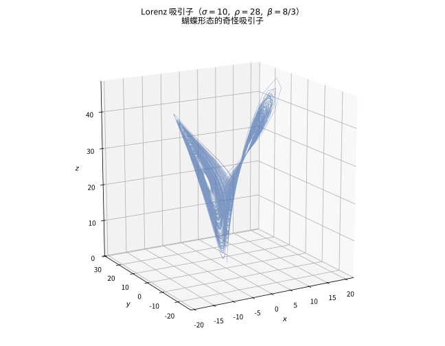

# 第 50 级：动力系统与混沌 (Dynamical Systems and Chaos)

> 动力系统是研究随时间演化的系统的数学分支，其根源可追溯至 Newton 对天体运动的研究。然而，20 世纪中叶以来，人们发现即使是简单的确定性系统也能产生极其复杂的、不可预测的行为——混沌。从 Lorenz 的"蝴蝶效应"到 Logistic 映射的倍周期分岔，从分形的无限自相似到奇怪吸引子的几何结构，动力系统与混沌理论深刻改变了我们对确定性与随机性、有序与无序之间关系的理解。本课程从动力系统的基本概念出发，系统建立稳定性理论、分岔理论、混沌理论与遍历理论的核心框架。

---

## 1. 学习目标

1. 理解动力系统的基本定义，掌握离散与连续动力系统的数学描述。
2. 掌握相空间、相流、不动点、周期轨道等基本概念及其几何直观。
3. 深入理解双曲不动点的局部线性化理论，掌握 Hartman-Grobman 定理与稳定流形定理的完整证明。
4. 掌握 Poincaré 映射的构造方法，理解 Poincaré-Bendixson 定理及其对平面系统极限集结构的刻画。
5. 理解分岔理论的基本类型（鞍结点、倍周期、Hopf），掌握判别条件与计算方法。
6. 理解混沌的严格数学定义，掌握 Li-Yorke 定理与 Sharkovsky 定理的证明。
7. 掌握 Lyapunov 指数的计算方法，理解奇怪吸引子与分形的几何特征。
8. 通过 Logistic 映射、Lorenz 系统等经典示例，培养动力系统的具体计算与分析能力。

---

## 2. 核心概念

### 2.1 动力系统定义 (Dynamical Systems)

**定义 2.1**（动力系统）设 $X$ 是一个集合（通常为拓扑空间或光滑流形），$T$ 是一个半群（通常为 $\mathbb{N}_0$、$\mathbb{Z}$、$\mathbb{R}_{\ge 0}$ 或 $\mathbb{R}$）。一个 **动力系统**（dynamical system）是一个映射

$$
\Phi: T \times X \to X,
$$

满足以下条件：

1. **初始条件**：$\Phi(0, x) = x$ 对所有 $x \in X$ 成立。
2. **半群性质**：$\Phi(t + s, x) = \Phi(t, \Phi(s, x))$ 对所有 $t, s \in T$ 和 $x \in X$ 成立。

当 $T = \mathbb{N}_0$ 或 $\mathbb{Z}$ 时，称为 **离散动力系统**（discrete dynamical system）；当 $T = \mathbb{R}_{\ge 0}$ 或 $\mathbb{R}$ 时，称为 **连续动力系统**（continuous dynamical system），也称为 **流**（flow）。

> **直观理解（现实类比）**：动力系统就是"一台规则的演化机器"——给定当前的"状态" $x$ 和经过的时间 $t$，它吐出新状态 $\Phi(t,x)$。两条条件是常识：从 $t=0$ 出发还是自己（$\Phi(0,x)=x$）；先走 $s$ 再走 $t$，等于一次走 $t+s$（半群性质）。就像下棋：知道此刻棋局和走棋步数，就能确定地推演出若干手之后的局面。离散系统像"翻日历一天一格"，连续系统像"指针平滑扫过"，本质都是同一套规则驱动状态随"时间"前进。

### 2.2 离散动力系统 (Discrete Dynamical Systems)

离散动力系统通常由一个映射 $f: X \to X$ 的迭代生成：

$$
x_{n+1} = f(x_n), \quad n = 0, 1, 2, \ldots
$$

轨道（orbit）定义为 $\{x_n\}_{n=0}^\infty = \{f^n(x_0)\}_{n=0}^\infty$，其中 $f^n$ 表示 $f$ 的 $n$ 次复合。

**例 2.2**（Logistic 映射）Logistic 映射

$$
f(x) = r x (1 - x), \quad x \in [0, 1], \; r \in (0, 4]
$$

是离散动力系统中最经典的例子之一。尽管形式简单，它展示了从稳定不动点到倍周期分岔，最终进入混沌的完整谱系。

> **直观理解（现实类比）**：离散动力系统就像"按一次按钮跳一格"的自动售货机——把当前数值 $x_n$ 塞进去，得到下一格的 $x_{n+1}=f(x_n)$，反复按键便得到一串轨道。它不必顾及"连续平滑"，只要一个函数 $f$ 作为"下一步规则"。Logistic 映射虽然写法只有一行 $f(x)=rx(1-x)$，却像一支只按一个键的电子琴：$r$ 较小时声音平稳，$r$ 调大时节拍翻倍，最后竟能奏出看似杂乱的混沌——这正是"简单规则也能孕育复杂行为"的最小范例。

### 2.3 连续动力系统 (Continuous Dynamical Systems)

连续动力系统通常由常微分方程（ODE）定义：

$$
\dot{x} = F(x), \quad x \in \mathbb{R}^n,
$$

其中 $F: \mathbb{R}^n \to \mathbb{R}^n$ 是光滑向量场。解 $\varphi(t, x_0)$ 满足 $\varphi(0, x_0) = x_0$ 和 $\frac{d}{dt}\varphi(t, x_0) = F(\varphi(t, x_0))$，构成了一个流。

**定义 2.3**（流）设 $F$ 是 $\mathbb{R}^n$ 上的 $C^1$ 向量场。对每个 $x_0 \in \mathbb{R}^n$，记 $\varphi(t, x_0)$ 为初值问题 $\dot{x} = F(x), x(0) = x_0$ 的解。则 $\varphi: \mathbb{R} \times \mathbb{R}^n \to \mathbb{R}^n$（在解存在的范围内）称为由 $F$ 生成的 **流**（flow）。

> **直观理解（现实类比）**：连续动力系统用微分方程 $\dot x=F(x)$ 描述"每一瞬间都根据当前状态定方向"。$F(x)$ 就像相空间里贴满的"路标箭头"，告诉你"从这里该朝哪个方向走、走多快"；流 $\varphi(t,x_0)$ 则是"从 $x_0$ 出发，顺着路标一路走 $t$ 时间后到达哪里"。这让你可以像"播放河水的流动"一样展开系统的演化：给一个初始点，流就把整条轨迹铺开。

### 2.4 相空间与相流 (Phase Space and Phase Flow)

**相空间**（phase space）是系统所有可能状态的集合，通常记为 $X$ 或 $\mathbb{R}^n$。相空间中的每一点代表系统的一个完整状态。

**相流**（phase flow）是相空间中的曲线族 $\{\varphi(t, x_0)\}_{t \in \mathbb{R}}$，描述了系统从不同初始状态出发的演化轨迹。

**例 2.4**（单摆的相空间）单摆的运动方程为 $\ddot{\theta} + \sin \theta = 0$（无量纲化后）。将其写为一阶系统：

$$
\begin{cases}
\dot{\theta} = \omega, \\
\dot{\omega} = -\sin \theta.
\end{cases}
$$

相空间为 $(\theta, \omega) \in \mathbb{R}^2$（或更精确地，$S^1 \times \mathbb{R}$）。相流中的轨道对应于不同的能量面。

> **直观理解（现实类比）**：相空间是"全家福"——把系统所有可能的状态摆在一个画面上，每个点就是一个完整状态。单摆的相空间坐标是"角度 $\theta$ + 角速度 $\omega$"，一个点 $(\theta,\omega)$ 就说完"现在摆到哪、转得多快"。相流则是"从不同起点出发的整组轨迹"：像地图上画出的许多条河流，每条河从各自的源头蜿蜒向前。看相图，等于站在高处用一只眼睛读完系统所有可能的命运。

### 2.5 不动点与稳定性 (Fixed Points and Stability)

**定义 2.5**（不动点）点 $x^* \in X$ 称为 $f$ 的 **不动点**（fixed point），若 $f(x^*) = x^*$。对于连续系统 $\dot{x} = F(x)$，$x^*$ 是不动点当且仅当 $F(x^*) = 0$。

> **直观理解（现实类比）**：不动点就像"走了也不变的状态"——好比一颗静置在碗底的珠子，$f(x^*)=x^*$ 表示"下一步还是原地"。稳定性则回答"碰它一下会怎样"：稳定像把珠子推离碗底一点，它还会滚回来；渐近稳定是它会真的回到原点；不稳定像把珠子放在碗边，轻轻一碰就滚下山去再也没回来。双曲不动点则是"碰它一丁点，要么被吸回、要么被甩开、绝无中间态"——这种"非稳即不稳、没有含糊"的特性，正是线性化能说准的凭借。

**定义 2.6**（Lyapunov 稳定性）不动点 $x^*$ 称为 **稳定的**（stable），若对任意 $\varepsilon > 0$，存在 $\delta > 0$，使得当 $\|x_0 - x^*\| < \delta$ 时，对所有 $t \ge 0$ 有 $\|\varphi(t, x_0) - x^*\| < \varepsilon$。若此外存在 $\delta > 0$ 使得 $\|x_0 - x^*\| < \delta$ 蕴含 $\lim_{t \to \infty} \varphi(t, x_0) = x^*$，则称 $x^*$ 是 **渐近稳定的**（asymptotically stable）。

**定义 2.7**（双曲不动点）连续系统 $\dot{x} = F(x)$ 的不动点 $x^*$ 称为 **双曲的**（hyperbolic），若 $DF(x^*)$ 的所有特征值都具有非零实部。对于离散系统 $x_{n+1} = f(x_n)$，不动点 $x^*$ 称为双曲的，若 $Df(x^*)$ 的所有特征值的模都不等于 $1$。

### 2.6 周期轨道 (Periodic Orbits)

**定义 2.8**（周期轨道）对于离散动力系统 $x_{n+1} = f(x_n)$，点 $x$ 称为 **周期点**（periodic point），若存在 $p \ge 1$ 使得 $f^p(x) = x$。最小的这样的 $p$ 称为 **周期**（period）。周期 $p$ 的轨道 $\{x, f(x), \ldots, f^{p-1}(x)\}$ 称为 **周期轨道**（periodic orbit）。

对于连续动力系统 $\dot{x} = F(x)$，解 $\varphi(t, x_0)$ 称为 **周期轨道**（periodic orbit），若存在 $T > 0$ 使得 $\varphi(t + T, x_0) = \varphi(t, x_0)$ 对所有 $t$ 成立，且 $\varphi(t, x_0)$ 不是不动点。

> **直观理解（现实类比）**：周期轨道就像"绕圈跑"——跑完固定步数 $p$（或固定时间 $T$）后恰好回到原点。离散情形中，周期 $p$ 的点 $x$ 满足 $f^p(x)=x$，轨道 $\{x,f(x),\ldots,f^{p-1}(x)\}$ 是它绕圈的"脚印环"；连续情形中则是恒定的闭曲线，比如表针转一圈、四季循环、心脏搏动。周期轨道是不动点之后的"下一层稳定形态"——不动点是"停在原地"，周期轨道是"有条不紊地转圈"。

### 2.7 Poincaré 映射 (Poincaré Map)

**定义 2.9**（Poincaré 映射）设 $\varphi(t, x)$ 是 $\mathbb{R}^n$ 上的流，$\Sigma \subset \mathbb{R}^n$ 是一个 $n-1$ 维超曲面（称为 **Poincaré 截面**），且对每个 $x \in \Sigma$，流 $\varphi(t, x)$ 在有限时间内横截地返回 $\Sigma$。则 **Poincaré 映射** $P: \Sigma \to \Sigma$ 定义为

$$
P(x) = \varphi(\tau(x), x),
$$

其中 $\tau(x) > 0$ 是首次返回时间（即 $\varphi(\tau(x), x) \in \Sigma$ 的最小正时间）。

Poincaré 映射将一个连续动力系统的周期轨道转化为离散动力系统的不动点，从而大大简化了分析。

> **直观理解（现实类比）**：Poincaré 映射像"给轨道贴一个检票口"——在相空间放一片薄薄的"闸门"（截面 $\Sigma$），每当轨道穿过去就"咔嚓"记一笔。于是连续蜿蜒的流被"采样"成一串离散点：$x\mapsto P(x)$ 表示"从闸门出发，绕一圈再穿回闸门时落在哪"。原本复杂的连续周期轨道，在这种"回程速度表"下变成一个小小不动点（$P(x)=x$ 表示绕回来正好接上），从而把连续系统问题降为更易分析的离散迭代问题。

### 2.8 吸引子 (Attractors)

**定义 2.10**（吸引子）紧集 $A \subset \mathbb{R}^n$ 称为动力系统的 **吸引子**（attractor），若存在一个开集 $U \supset A$（称为 **吸引域**，basin of attraction），使得：

1. $A$ 是不变的：$\varphi(t, A) = A$ 对所有 $t \ge 0$ 成立。
2. 对任意 $x \in U$，有 $\lim_{t \to \infty} \text{dist}(\varphi(t, x), A) = 0$。
3. $A$ 是 **拓扑传递的**（topologically transitive）：对任意开集 $V_1, V_2 \subset A$，存在 $t > 0$ 使得 $\varphi(t, V_1) \cap V_2 \neq \varnothing$。

> **直观理解（现实类比）**：吸引子像地形中的"洼地"——雨水无论落在哪片山坡，最终都会顺着地势汇入谷底。这里的"谷底"就是吸引子 $A$，那片山坡就是吸引域 $U$：只要起点在 $U$ 内，长时间演化后轨道都会"流"向 $A$。最简单的吸引子是一个点（如阻尼摆最终停下的最低点），其次是极限环（如心脏起搏器的周期节律）。拓扑传递性则保证吸引子不能被拆成互不相通的两块——系统在 $A$ 上"乱逛"迟早会访问每个角落，这正是"吸引"之外还需"不可分解"的精髓。

### 2.9 奇怪吸引子 (Strange Attractors)

**定义 2.11**（奇怪吸引子）一个吸引子称为 **奇怪吸引子**（strange attractor），若它具有以下特征之一（通常两者兼有）：

- **几何奇怪性**：吸引子具有非整数维数（分形维数）。
- **动力学奇怪性**：吸引子上的动力系统对初始条件敏感依赖（即具有正的最大 Lyapunov 指数）。

最著名的奇怪吸引子包括 Lorenz 吸引子、Rössler 吸引子和 Hénon 吸引子。

> **直观理解（现实类比）**：奇怪吸引子像"既被吸引又被驱赶"的矛盾体——所有轨道都被它吸进某个有限区域（吸引），但一旦进入就在其中永不停歇地"翻搅"，既不走周期闭合的回头路，也不重蹈同一条轨迹（敏感依赖）。想象把两滴墨水滴入一杯被持续搅动但永不静止的咖啡：墨水永远被涡流限制在杯内（吸引子有界），却以指数速度被拉伸、折叠、混合，每一滴的命运都不可长期预测。这种"拉伸—折叠"机制让吸引子具有分形结构（非整数维数），也是混沌系统"确定性却不可预测"的几何根源。

### 2.10 分岔理论 (Bifurcation Theory)

**定义 2.12**（分岔）考虑含参数的动力系统 $\dot{x} = F(x, \mu)$，其中 $\mu \in \mathbb{R}$ 是参数。当参数 $\mu$ 经过某个临界值 $\mu_c$ 时，系统的动力学性态（如不动点的数量或稳定性）发生本质变化，这种现象称为 **分岔**（bifurcation），$\mu_c$ 称为 **分岔点**（bifurcation point）。

> **直观理解（现实类比）**：分岔像"临界水位下的河道改道"——水位（参数 $\mu$）缓缓上涨，水流形态长期看似不变；一旦越过某个阈值 $\mu_c$，河道瞬间冲开新支路，整个地貌发生质变。好比一座独木桥（单一稳定不动点），随着负载（参数）增加到临界值，桥突然断裂成两条新路（鞍结点分岔出现一对不动点）；又如一个稳态节律在参数微调后突然"翻倍"成二拍（倍周期分岔）。分岔理论研究的正是"量变到质变"的精确临界点：系统在 $\mu_c$ 附近既不连续也不光滑，是确定性系统中涌现复杂性的源头。

### 2.11 鞍结点分岔 (Saddle-Node Bifurcation)

鞍结点分岔是最基本的分岔类型。其标准形式为

$$
\dot{x} = \mu - x^2.
$$

- 当 $\mu < 0$ 时，没有不动点。
- 当 $\mu = 0$ 时，有一个半稳定的不动点 $x = 0$。
- 当 $\mu > 0$ 时，有两个不动点：稳定的 $x = \sqrt{\mu}$ 和不稳定的 $x = -\sqrt{\mu}$。

**判别条件**：对于一维系统 $\dot{x} = F(x, \mu)$，若在 $(x_0, \mu_0)$ 处有

$$
F(x_0, \mu_0) = 0, \quad \frac{\partial F}{\partial x}(x_0, \mu_0) = 0, \quad \frac{\partial F}{\partial \mu}(x_0, \mu_0) \neq 0, \quad \frac{\partial^2 F}{\partial x^2}(x_0, \mu_0) \neq 0,
$$

则系统在 $(x_0, \mu_0)$ 处发生鞍结点分岔。

> **直观理解（现实类比）**：鞍结点分岔像"悬索桥恰好绷到临界弦"——参数不到临界时没有任何不动点（桥还没有支点），临界瞬间出现一半稳定一半不稳定的"一对新生儿"，像两潭水在汇合处被闸堤同时劈开。$\dot x=\mu-x^2$ 里，$\mu<0$ 空荡荡，$\mu>0$ 出现稳定的 $+\sqrt\mu$ 和不稳定的 $-\sqrt\mu$。判别条件 $F=0,\,F_x=0,\,F_\mu\ne0,\,F_{xx}\ne0$ 则是在说"在此处导数恰好压平、但整体还能侧移"——这正是"消失/诞生一对不动点"的临界地质点。

### 2.12 倍周期分岔 (Period-Doubling Bifurcation)

倍周期分岔是指系统从一个周期 $p$ 的轨道过渡到周期 $2p$ 的轨道。其标准形式为

$$
x_{n+1} = - (1 + \mu) x_n + x_n^3.
$$

- 当 $\mu < 0$ 时，不动点 $x = 0$ 稳定。
- 当 $\mu = 0$ 时，发生分岔。
- 当 $\mu > 0$ 时，$x = 0$ 失稳，产生一个周期 $2$ 的轨道。

Logistic 映射 $f(x) = r x(1 - x)$ 中，当 $r$ 从 $3$ 增加到 $3.449\ldots$ 时，就发生了从周期 $1$ 到周期 $2$ 的倍周期分岔。

> **直观理解（现实类比）**：倍周期分岔像"节拍器把拍子翻倍"——原本稳定的走一步节奏 $x_0$，参数一过临界就失稳，让位给 $x_1,x_2$ 来回倒的"两步节奏"。Logistic 里 $r$ 从 3 到 3.449 正是"一拍变两拍"。更妙的是这种翻倍会级联：$1\to2\to4\to8$，每翻一次所需参数区间按 Feigenbaum 常数 $\delta\approx4.669$ 等比缩短，最终通向混沌。它揭示"一个简单系统只要不断翻倍节拍，就能从秩序滑向表面上的无序"。

### 2.13 Hopf 分岔 (Hopf Bifurcation)

**定义 2.13**（Hopf 分岔）考虑二维系统 $\dot{x} = F(x, \mu)$，$x \in \mathbb{R}^2$。若在 $(x_0, \mu_0)$ 处，$DF(x_0, \mu_0)$ 有一对纯虚特征值 $\lambda(\mu) = \alpha(\mu) \pm i \omega(\mu)$，且满足：

1. $\alpha(\mu_0) = 0$，$\omega(\mu_0) \neq 0$（横截性条件）。
2. $\frac{d\alpha}{d\mu}(\mu_0) \neq 0$（非退化条件）。

则系统在 $x_0$ 处发生 **Hopf 分岔**（或 **Andronov-Hopf 分岔**），从不动点分岔出一个周期轨道。

Hopf 分岔的标准形式为（极坐标下）：

$$
\begin{cases}
\dot{r} = \mu r - r^3, \\
\dot{\theta} = \omega + b r^2.
\end{cases}
$$

- 当 $\mu < 0$ 时，不动点 $r = 0$ 稳定。
- 当 $\mu > 0$ 时，$r = 0$ 失稳，产生一个稳定的周期轨道 $r = \sqrt{\mu}$（超临界 Hopf 分岔）。

> **直观理解（现实类比）**：Hopf 分岔是"从停点长出一个圆环"——不动点在参数临界处由稳定变成"内部空心的涡旋"，周围不再静止，而是冒出一条周期轨道（极限环）。想象一杯静止的水，加热到临界时杯底开始出现稳定的环形对流；参数越过阈值，一个自我维持的周期运动"从无到有"长出来。标准形 $\dot r=\mu r-r^3$ 里 $\mu>0$ 长出半径 $\sqrt{\mu}$ 的稳定环。它是"从稳态到振荡"的机制，心脏起搏、神经放电模型里都常见它的身影。

### 2.14 混沌 (Chaos)

**定义 2.14**（混沌——Devaney 定义）紧度量空间 $X$ 上的连续映射 $f: X \to X$ 称为 **混沌的**（chaotic），若：

1. **对初始条件敏感依赖**（sensitive dependence on initial conditions）：存在 $\delta > 0$，使得对任意 $x \in X$ 和任意 $\varepsilon > 0$，存在 $y \in X$ 和 $n \ge 0$，满足 $d(x, y) < \varepsilon$ 且 $d(f^n(x), f^n(y)) \ge \delta$。
2. **拓扑传递性**（topological transitivity）：对任意非空开集 $U, V \subset X$，存在 $n > 0$ 使得 $f^n(U) \cap V \neq \varnothing$。
3. **周期点稠密**（density of periodic points）：$f$ 的周期点集在 $X$ 中稠密。

混沌的本质是"确定性系统中的内在随机性"：系统由完全确定的方程驱动，但其长期行为在统计意义上具有不可预测性。

> **直观理解（现实类比）**：混沌是"确定性规则里的内在随机"。Devaney 三要素像三个检验标准：(1) 敏感依赖——蚂蚁放得再相近，很快就散落到完全不同的角落；(2) 拓扑传递——系统"迟早逛遍全图"，不会被困在某个挑不出什么作用域的分区里；(3) 周期点稠密——周围永远能找到几乎回到原处的点。三者合起来说明：系统既有"稳定可预测的骨架"（周期点），却又"乱得不可预测"（敏感依赖）。一句大白话：方程完全确定，却做出统计意义上像掷骰子一样的长期行为。

### 2.15 Lorenz 系统 (Lorenz System)

**例 2.15**（Lorenz 系统）1963 年，气象学家 Edward Lorenz 从大气对流的简化模型中推导出以下三维常微分方程组：

$$
\begin{cases}
\dot{x} = \sigma (y - x), \\
\dot{y} = x (\rho - z) - y, \\
\dot{z} = x y - \beta z,
\end{cases}
$$

其中 $\sigma, \rho, \beta > 0$ 是参数。经典参数取值为 $\sigma = 10$，$\rho = 28$，$\beta = 8/3$。

Lorenz 系统具有以下重要性质：
- **对称性**：$(x, y, z) \to (-x, -y, z)$ 是对称变换。
- **耗散性**：$\nabla \cdot F = -(\sigma + 1 + \beta) < 0$，体积在相空间中指数收缩。
- **奇怪吸引子**：在 $\rho = 28$ 时，系统呈现混沌行为，其吸引子具有分形结构，称为 **Lorenz 吸引子**。

> **🧠 思考历程：天气预报里的蝴蝶，怎么扇出了现代混沌学？**
>
> Lorenz 系统看起来只是三个耦合的一次微分方程，却是混沌理论的序章。一个靠计算机算天气的气象学家，怎么就在一堆"初始值差一点点"的精度里，撞见了确定性系统的"不可预测"？
>
> - **初值差一点点，结局却天壤之别**。1961 年前后，Lorenz 想重算一条气象曲线，他用了舍入到小数后 3 位的初始值"偷懒"，结果重算出的曲线和原来**完全分道扬镳**。他不是机器坏了，而是代表**这类系统对初始条件极度敏感——当初值有一丁点不同，轨道就剧烈背离。**
> - **这不是噪声，是方程本身**。Lorenz 手下的系统是**确定性的**（明明方程没有随机项），可它却"永久不重复地飘荡"在一个吸引面上，这个面就是他画的 Lorenz 吸引子。**"现实世界中看似随机，原来有确定性的根"这一认知，正是混沌二字的分量所在。**
> - **蝴蝶效应背后的想法**。"巴西的蝴蝶扇动翅膀，可能在德州引起龙卷风"——这是 Lorenz 一句广为流传的比方，**强调"微小扰动经非线性放大后不可忽略"**：在混沌系统里，局部误差会随 Lyapunov 指数为正而指数增长，长期预报因此根本靠不住。
> - **吸引子：乱而不出界**。体积收缩（耗散）与不稳定方向（拉伸）相互竞争，轨道永远不逃逸、却永不重合——**"奇怪吸引子"既不是点也不是圈，而是维数非整数（分形）的集**。于是"奇怪"从形容词变成精确的数学对象出场，让 2.16 的正 Lyapunov 指数成为混沌的铁证。
> - **心路**：Lorenz 系统提醒你：**确定性 ≠ 可预测**。当系统对初始值敏感依赖时，"算得越细越准"的幻想会被打破，敬畏"初始条件"与"报错边界"才是科学常态——这也是混沌学交给世界的冷静一课。

### 2.16 Lyapunov 指数 (Lyapunov Exponents)

**定义 2.16**（Lyapunov 指数）设 $f: \mathbb{R}^n \to \mathbb{R}^n$ 是光滑映射，$x_0 \in \mathbb{R}^n$。对 $v \in T_{x_0}\mathbb{R}^n \setminus \{0\}$，定义

$$
\lambda(x_0, v) = \limsup_{n \to \infty} \frac{1}{n} \ln \| Df^n(x_0) v \|.
$$

**Lyapunov 指数**（Lyapunov exponents）是 $\lambda(x_0, v)$ 作为 $v$ 的函数所能取到的不同值（最多 $n$ 个），通常按降序排列为

$$
\lambda_1 \ge \lambda_2 \ge \cdots \ge \lambda_n.
$$

最大 Lyapunov 指数 $\lambda_1$ 的正负决定了系统的稳定性：
- $\lambda_1 < 0$：轨道稳定（收敛到不动点或周期轨道）。
- $\lambda_1 = 0$：处于临界状态（如分岔点）。
- $\lambda_1 > 0$：对初始条件敏感依赖，是混沌的典型标志。

对于一维映射 $x_{n+1} = f(x_n)$，Lyapunov 指数简化为

$$
\lambda(x_0) = \lim_{n \to \infty} \frac{1}{n} \sum_{k=0}^{n-1} \ln |f'(x_k)|.
$$

> **直观理解（现实类比）**：Lyapunov 指数像"误差放大的复利率"——它度量初始的微小偏差随时间被指数放大的速率。设想你和朋友从相距 1 毫米的两点出发：若 $\lambda<0$，你们的距离越走越近，最终并轨（稳定）；若 $\lambda=0$，距离几乎不变（临界）；若 $\lambda>0$，则每过一步距离乘以 $e^\lambda$，1 毫米很快放大成天文数字。正的 $\lambda_1$ 正是"蝴蝶效应"的数学签名——巴西亚马逊一只蝴蝶扇翅（初始扰动）经指数放大，足以在两周后改变德州一场风暴的轨迹。混沌系统之所以"确定性却不可预测"，根子就在这个正的复利率上。

### 2.17 分形 (Fractals)

**定义 2.17**（分形）分形（fractal）是 Mandelbrot 提出的概念，通常指具有以下特征的几何对象：

1. 在任意小的尺度下都有精细结构。
2. 具有自相似性（严格或统计意义下）。
3. 其 Hausdorff 维数严格大于拓扑维数。
4. 通常由简单的迭代过程生成。

**例 2.18**（Cantor 集）Cantor 集是分形的最简单例子。从 $[0, 1]$ 出发，反复去掉每个区间的中间三分之一。其 Hausdorff 维数为 $\dim_H = \ln 2 / \ln 3 \approx 0.6309$。

**例 2.19**（Julia 集与 Mandelbrot 集）复动力系统 $z_{n+1} = z_n^2 + c$ 的 Julia 集和 Mandelbrot 集是分形几何中最著名的对象。

> **直观理解（现实类比）**：分形像"怎么放大都一样的西兰花或海岸线"——无论放大多少倍，细节一直变细却总带着相似的结构（自相似）。Cantor 集"挖去中间三分之一"无限次，剩下一团"比点丰富又比线稀疏"的尘埃，维数约 0.63（介于 0 和 1 之间）。分形告诉我们：描述自然界的几何，不能只靠整数维"点、线、面、体"，而需要能度量"到底有多充满"的分数维。Julia 集与 Mandelbrot 集则由简单迭代 $z_{n+1}=z_n^2+c$ 一笔画就生成无比精细的图案——"简单规则 + 反复迭代 = 惊人复杂度"。

### 2.18 动力系统与遍历理论 (Ergodic Theory)

**定义 2.18**（不变测度）设 $(X, \mathcal{B}, \mu)$ 是概率空间，$f: X \to X$ 是可测映射。称 $\mu$ 是 $f$ 的 **不变测度**（invariant measure），若对任意 $A \in \mathcal{B}$ 有 $\mu(f^{-1}(A)) = \mu(A)$。

**定理 2.20**（Birkhoff 遍历定理）设 $(X, \mathcal{B}, \mu)$ 是概率空间，$f: X \to X$ 是保测变换（即 $\mu$ 是 $f$ 的不变测度），$\varphi \in L^1(X, \mu)$。则极限

$$
\lim_{n \to \infty} \frac{1}{n} \sum_{k=0}^{n-1} \varphi(f^k(x))
$$

对几乎处处 $x$ 存在，记作 $\tilde{\varphi}(x)$，且 $\tilde{\varphi} \circ f = \tilde{\varphi}$ 几乎处处成立。若 $f$ 还是 **遍历的**（ergodic），则 $\tilde{\varphi}(x) = \int_X \varphi \, d\mu$ 几乎处处成立。

遍历理论揭示了动力系统的时间平均与空间平均之间的关系，是统计力学的基础。

> **直观理解（现实类比）**：不变测度像"洗牌后统计不变的水位分布"——无论系统怎么演化，这个测度"看起来没被动过"（$\mu(f^{-1}A)=\mu(A)$），好比杯里的水被搅动千回，总量与各处分布的规律却保持不变。Birkhoff 遍历定理则是"时间平均 = 空间平均"：看一条无穷长的轨道，沿线统计 $\varphi$ 的平均值，几乎等于在整个空间上按测度积分的均值——这正是统计力学"各态历经"假设的严格化身：只要系统遍历，走完任一条轨道就等于走遍整个空间，无需看过多条轨道。

---

## 3. 定理与证明

### 3.1 Hartman-Grobman 定理

**定理 3.1**（Hartman-Grobman 定理）设 $F: \mathbb{R}^n \to \mathbb{R}^n$ 是 $C^1$ 向量场，$x^*$ 是 $\dot{x} = F(x)$ 的双曲不动点。则存在 $x^*$ 的邻域 $U$ 和 $0$ 的邻域 $V$，以及同胚 $h: U \to V$，使得 $h$ 将 $\dot{x} = F(x)$ 在 $x^*$ 附近的流共轭于线性化系统 $\dot{y} = A y$ 的流，其中 $A = DF(x^*)$。即若 $\varphi(t, x)$ 是原系统的流，则

$$
h(\varphi(t, x)) = e^{A t} h(x)
$$

对于所有使得两边都有定义的 $t$ 和 $x$ 成立。

> **直观理解（现实类比）**：Hartman-Grobman 定理说"双曲不动点附近，歪歪扭扭的真实流可以整体拉直成一条直线流"——就像用一块橡皮把一片扭曲的橡胶地图平滑拉伸，边界点和方向都对应过去，只是中间的弯折被拉平（同胚 $h$）。只要不动点是双曲的（特征值实部非零），这种"拉直"就总能做到。于是判断一个非线性系统在平衡点的稳定性，可以放心只靠它的一阶线性化 $A=DF(x^*)$——高阶的弯折不影响当地的"大体走向"。这就是局部稳定性分析"可以先线性化"的数学依据。

**证明**：为简化记号，设 $x^* = 0$（否则做平移）。将 $F$ 在 $0$ 处展开：

$$
F(x) = A x + G(x),
$$

其中 $A = DF(0)$，$G(x) = F(x) - A x$ 满足 $G(0) = 0$ 且 $DG(0) = 0$。

构造同胚 $h$ 的关键是寻找一个映射 $h(x) = x + \phi(x)$，使得 $h$ 将非线性流共轭于线性流。这等价于求解以下函数方程：

$$
h(\varphi(t, x)) = e^{A t} h(x).
$$

对 $t$ 在 $t = 0$ 处求导，得到

$$
Dh(x) \cdot F(x) = A h(x),
$$

即

$$
(I + D\phi(x)) \cdot (A x + G(x)) = A (x + \phi(x)).
$$

整理得

$$
D\phi(x) \cdot A x - A \phi(x) = -G(x) - D\phi(x) \cdot G(x).
\tag{1}
$$

我们通过迭代法构造 $\phi$。令 $\phi_0 = 0$，定义

$$
\phi_{k+1}(x) = \int_{-\infty}^0 e^{-A s} \left[ -G(\varphi_k(s, x)) - D\phi_k(\varphi_k(s, x)) \cdot G(\varphi_k(s, x)) \right] ds,
$$

其中 $\varphi_k$ 是校正后的流。由于 $A$ 是双曲矩阵（没有纯虚特征值），我们可以将 $\mathbb{R}^n$ 分解为稳定子空间 $E^s$ 和不稳定子空间 $E^u$，使得 $A|_{E^s}$ 的所有特征值具有负实部，$A|_{E^u}$ 的所有特征值具有正实部。

对 $x \in E^s$ 附近的点，积分从 $-\infty$ 到 $0$ 收敛，因为 $e^{-A s}$ 在 $s \to -\infty$ 时在 $E^s$ 方向上指数衰减。类似地，对 $x \in E^u$ 附近的点，我们可以使用从 $0$ 到 $\infty$ 的积分。

更精确地，我们可以构造如下算子。设 $C^0_b(\mathbb{R}^n)$ 是 $\mathbb{R}^n$ 上的有界连续函数空间。定义算子 $\mathcal{T}$：

$$
(\mathcal{T} \phi)(x) = \int_{-\infty}^0 e^{-A s} \left[ -G(\varphi(s, x)) - D\phi(\varphi(s, x)) \cdot G(\varphi(s, x)) \right] ds.
$$

由于 $G$ 和 $DG$ 在 $0$ 处为零，且 $A$ 是双曲的，可以证明 $\mathcal{T}$ 在 $0$ 的某个邻域内是压缩映射。因此存在唯一的 $\phi$ 满足 $\phi = \mathcal{T} \phi$，即方程 (1) 的解。

由 $\phi$ 构造 $h(x) = x + \phi(x)$。在 $0$ 的足够小的邻域内，$h$ 是 $C^0$ 的且具有 $C^0$ 逆，即同胚。通过构造，$h$ 满足共轭关系：

$$
h(\varphi(t, x)) = e^{A t} h(x).
$$

这就完成了 Hartman-Grobman 定理的证明。$\square$

**注**：Hartman-Grobman 定理的重要性在于，它保证在双曲不动点附近，非线性系统的动力学行为完全由线性化系统决定。这意味着我们可以通过线性化来研究局部稳定性、局部稳定流形等性质。

### 3.2 稳定流形定理

**定理 3.2**（稳定流形定理）设 $F: \mathbb{R}^n \to \mathbb{R}^n$ 是 $C^r$ 向量场（$r \ge 1$），$x^*$ 是 $\dot{x} = F(x)$ 的双曲不动点。设 $E^s$ 和 $E^u$ 分别是 $A = DF(x^*)$ 的稳定子空间和不稳定子空间，维数分别为 $n_s$ 和 $n_u$。则存在 $x^*$ 的邻域，使得：

1. **局部稳定流形**（local stable manifold）

   $$
   W^s_{\text{loc}}(x^*) = \{ x \in U \mid \varphi(t, x) \to x^* \text{ 当 } t \to \infty, \text{ 且 } \varphi(t, x) \in U \text{ 对所有 } t \ge 0 \}
   $$

   是一个 $n_s$ 维的 $C^r$ 嵌入子流形，且在 $x^*$ 处与 $E^s$ 相切。

2. **局部不稳定流形**（local unstable manifold）

   $$
   W^u_{\text{loc}}(x^*) = \{ x \in U \mid \varphi(t, x) \to x^* \text{ 当 } t \to -\infty, \text{ 且 } \varphi(t, x) \in U \text{ 对所有 } t \le 0 \}
   $$

   是一个 $n_u$ 维的 $C^r$ 嵌入子流形，且在 $x^*$ 处与 $E^u$ 相切。

**证明**：不妨设 $x^* = 0$。将系统写为

$$
\dot{x} = A x + G(x),
$$

其中 $A = DF(0)$，$G(0) = 0$，$DG(0) = 0$。由于 $A$ 是双曲的，存在可逆矩阵 $P$ 使得

$$
P^{-1} A P = \begin{pmatrix} A_s & 0 \\ 0 & A_u \end{pmatrix},
$$

其中 $A_s$ 的所有特征值具有负实部，$A_u$ 的所有特征值具有正实部。做线性变换 $y = P^{-1} x$，系统化为

$$
\dot{y} = \begin{pmatrix} A_s & 0 \\ 0 & A_u \end{pmatrix} y + \tilde{G}(y),
$$

其中 $\tilde{G}(y) = P^{-1} G(P y)$ 仍满足 $\tilde{G}(0) = 0$，$D\tilde{G}(0) = 0$。为方便，记 $y = (u, v)$，$u \in \mathbb{R}^{n_s}$，$v \in \mathbb{R}^{n_u}$，则

$$
\begin{cases}
\dot{u} = A_s u + g_s(u, v), \\
\dot{v} = A_u v + g_u(u, v),
\end{cases}
\tag{2}
$$

其中 $g_s, g_u$ 是 $\tilde{G}$ 的对应分量。

稳定流形应满足以下条件：从其上出发的轨道在 $t \to \infty$ 时趋于 $0$。因此，稳定流形可以表示为 $v = \psi(u)$ 的形式，其中 $\psi: \mathbb{R}^{n_s} \to \mathbb{R}^{n_u}$ 满足 $\psi(0) = 0$，$D\psi(0) = 0$。

将 $v = \psi(u)$ 代入系统 (2)，利用链式法则，$\psi$ 应满足以下方程（称为 **不变流形条件**）：

$$
D\psi(u) \cdot [A_s u + g_s(u, \psi(u))] = A_u \psi(u) + g_u(u, \psi(u)).
\tag{3}
$$

我们通过 **Lyapunov-Perron 方法** 构造 $\psi$。考虑积分方程

$$
\psi(u) = \int_{-\infty}^0 e^{-A_u s} g_u(u(s), \psi(u(s))) \, ds,
$$

其中 $u(s)$ 满足 $u(0) = u$ 和

$$
\dot{u} = A_s u + g_s(u, \psi(u)).
$$

由于 $A_u$ 的特征值都具有正实部，$-A_u$ 的特征值都具有负实部，因此 $e^{-A_u s}$ 在 $s \to -\infty$ 时指数衰减，积分收敛。

定义算子 $\mathcal{S}$：

$$
(\mathcal{S} \psi)(u) = \int_{-\infty}^0 e^{-A_u s} g_u(u(s), \psi(u(s))) \, ds.
$$

在充分小的 $C^1$ 邻域中，$\mathcal{S}$ 是压缩映射，因此存在唯一的不动点 $\psi$，满足 (3) 式。由构造，$\psi$ 是 $C^r$ 的，且 $\psi(0) = 0$，$D\psi(0) = 0$。

因此，局部稳定流形为

$$
W^s_{\text{loc}}(0) = \{ (u, v) \mid v = \psi(u), \; \|u\| < \delta \},
$$

它是 $n_s$ 维的 $C^r$ 子流形，且在 $0$ 处与 $E^s = \{ (u, 0) \}$ 相切。

局部不稳定流形的构造类似，将时间反向（$t \to -t$）后重复上述论证即可。$\square$

> **直观理解（现实类比）**：稳定流形定理把不动点附近的空间"分流"成两条互相垂直的"入海口 与 源口"：稳定流形 $W^s$ 上的点像被吸向河口的木舟，随 $t\to\infty$ 一路漂回不动点；不稳定流形 $W^u$ 上的点则像逆流被冲走的落叶，$t\to-\infty$ 时退回不动点。整张相空间地图就铺在这两条通道的骨架下——轨道要么"汇入"稳定流形方向归家，要么"沿着"不稳定方向远去。它让我们把复杂的非线性流场分解为两个单方向的行为来理解。

**推论 3.3**（全局稳定流形与不稳定流形）

$$
W^s(x^*) = \bigcup_{t \le 0} \varphi(t, W^s_{\text{loc}}(x^*)), \quad
W^u(x^*) = \bigcup_{t \ge 0} \varphi(t, W^u_{\text{loc}}(x^*))
$$

分别是 $C^r$ 浸入子流形，称为 **全局稳定流形**（global stable manifold）和 **全局不稳定流形**（global unstable manifold）。

### 3.3 Poincaré-Bendixson 定理

**定理 3.4**（Poincaré-Bendixson 定理）设 $\dot{x} = F(x)$ 是 $\mathbb{R}^2$ 上的 $C^1$ 向量场，$\gamma^+(x_0) = \{\varphi(t, x_0) \mid t \ge 0\}$ 是正向轨道，且其闭包 $\overline{\gamma^+(x_0)}$ 是紧集且只包含有限个不动点。则 $\omega$-极限集 $\omega(x_0)$ 必为以下三种情形之一：

1. 一个不动点。
2. 一条周期轨道。
3. 由不动点和连接它们的同宿轨或异宿轨组成的集合。

**证明**：设 $\Omega = \omega(x_0)$ 是 $x_0$ 的 $\omega$-极限集。由假设，$\Omega$ 是非空紧集且不变。

**步骤 1**：若 $\Omega$ 包含非周期点，则 $\Omega$ 中必存在不动点。

设 $p \in \Omega$ 不是周期点。由于 $p \in \Omega$，存在序列 $t_n \to \infty$ 使得 $\varphi(t_n, x_0) \to p$。取 $p$ 的一个 Poincaré 截面 $\Sigma$（即一条过 $p$ 且不与向量场 $F$ 相切的线段）。由于 $p$ 不是周期点，轨道 $\gamma(p)$ 必须再次横截 $\Sigma$ 于不同的点。

由 $\omega$-极限集的性质，$\gamma(p) \subset \Omega$。考虑 $\gamma(p)$ 与 $\Sigma$ 的交点序列 $\{q_k\}$。由于 $\Sigma$ 是一维的，且 $\Omega$ 是紧集，$\{q_k\}$ 在 $\Sigma$ 上必有极限点 $q$。可以证明 $q$ 必须是 $F$ 的不动点。

**步骤 2**：若 $\Omega$ 包含周期点，则 $\Omega$ 就是一条周期轨道。

设 $p \in \Omega$ 是周期点，令 $\Gamma = \gamma(p)$ 是 $p$ 的周期轨道。由于 $\Gamma$ 是紧集且 $\Omega$ 是闭不变的，有 $\Gamma \subset \Omega$。假设存在 $q \in \Omega \setminus \Gamma$。取 $q$ 的一个邻域 $U$ 使得 $U \cap \Gamma = \varnothing$。由于 $q \in \Omega$，$\gamma^+(x_0)$ 无穷多次进入 $U$。但由连续性，$\gamma^+(x_0)$ 也无穷多次接近 $\Gamma$。在 $\mathbb{R}^2$ 中，这迫使 $\gamma^+(x_0)$ 与 $\Gamma$ 相交，从而 $x_0 \in \Gamma$，矛盾。

**步骤 3**：综合上述分析，$\Omega$ 要么是周期轨道，要么包含不动点。若 $\Omega$ 包含不动点且还不是周期轨道，则由不变性和 $\mathbb{R}^2$ 中轨道的拓扑约束，$\Omega$ 只能由不动点和连接它们的轨道（同宿轨或异宿轨）组成。$\square$

**推论 3.5**（Poincaré-Bendixson 准则）若 $\mathbb{R}^2$ 中的 $C^1$ 向量场有一个正向有界轨道，其 $\omega$-极限集不包含不动点，则该极限集必为一条周期轨道。特别地，若存在一个紧区域 $D$，其边界上的向量场指向 $D$ 内部，且 $D$ 内部没有不动点，则 $D$ 内必存在一条稳定周期轨道。

**注**：Poincaré-Bendixson 定理是二维动力系统的特有结果。在三维或更高维空间中，轨道可以表现出更加复杂的混沌行为，这正是 Lorenz 系统等混沌吸引子存在的原因。

> **直观理解（现实类比）**：Poincaré-Bendixson 定理是"二维世界里一切轨迹的结局清单"——在平面流动中，任何被困紧的有界轨道，其归宿只可能是三种：停在某个不动点、绕进一条周期轨道、或是沿着连接不动点的小路（同宿/异宿轨）游走。它有力地说明：平面里"永远没有混沌"。这像公园里的喷泉池，水花再复杂也只能汇进几个出水口、几圈回旋或几段细流，而乱不成一团永远不重复的迷宫。三维以上才有足够"自由度"释放混沌。

### 3.4 Li-Yorke 定理

**定理 3.6**（Li-Yorke 定理——"周期三意味着混沌"）设 $f: I \to I$ 是区间 $I \subset \mathbb{R}$ 上的连续映射。若 $f$ 有周期 $3$ 的点，则 $f$ 具有以下性质：

1. $f$ 有任意正整数周期的周期点。
2. 存在不可数集 $S \subset I$（称为 **Li-Yorke 混沌集**），使得对任意 $x, y \in S$，$x \neq y$，有
   $$\limsup_{n \to \infty} |f^n(x) - f^n(y)| > 0, \quad
   \liminf_{n \to \infty} |f^n(x) - f^n(y)| = 0.
   $$

> **直观理解（现实类比）**：Li-Yorke 定理的招牌口号是"周期三意味着混沌"——只要一条直线上的连续映射有一个周期 $3$ 的点，就能推出它拥有的一切：任意周期都存在，还藏着不可数多个"若即若离"的混沌点（任意两点的距离时而大、时而小得几乎重合，永不彻底同步）。这像在一个规律的钟摆里发现某个三拍循环，结果整个节拍就此失控——所有拍子都被"种出来"了。原因是周期 $3$ 迫使映射把区间反复"覆盖再覆盖"，像折纸一样把区间的微观结构揉到极其丰富。

**证明**：设 $a, b, c \in I$ 满足 $f(a) = b$，$f(b) = c$，$f(c) = a$，即 $\{a, b, c\}$ 是周期 $3$ 轨道。不妨设 $a < b < c$ 或 $a > b > c$（否则重排）。我们考虑 $a < b < c$ 的情形（另一种情形类似，可考虑 $f^3$ 或对称变换）。

**引理 3.7**（关键引理）设 $f: I \to \mathbb{R}$ 是连续映射，$J \subset I$ 是闭区间。若 $J \supset f(J)$，则 $f$ 在 $J$ 上有不动点。

**证明**：由 $J \supset f(J)$，映射 $f$ 将 $J$ 映射到自身。由中值定理或 Brouwer 不动点定理的一维情形，连续自映射在闭区间上必有不动点。$\square$

**引理 3.8** 若 $f$ 有周期 $3$ 的点，则对任意 $k \ge 1$，$f$ 有周期 $k$ 的点。

**证明**：设 $a < b < c$ 是周期 $3$ 轨道，$f(a) = b$，$f(b) = c$，$f(c) = a$。则 $f^3(a) = a$，$f^3(b) = b$，$f^3(c) = c$。

考虑区间 $I_0 = [a, b]$，$I_1 = [b, c]$。由于 $f(a) = b$，$f(b) = c$，且 $f$ 连续，由介值定理，$f(I_0) \supset [b, c] = I_1$。类似地，$f(I_1) \supset [a, c] \supset I_0 \cup I_1$。

对任意正整数 $k$，构造如下：
- 若 $k = 1$：显然 $a$ 是周期 $1$ 的点（不动点，实际上 $f^3(a) = a$，且 $a$ 不是周期 $1$ 的点？等等，需要检查）。

实际上，$a$ 是周期 $3$ 的点，不是周期 $1$ 的点。但 $f^3$ 在 $[a, b]$ 上满足 $f^3(a) = a$，$f^3(b) = b$，所以 $f^3$ 在 $[a, b]$ 上有不动点，设为 $p$。若 $p$ 不是 $f$ 的不动点，则 $p$ 是 $f$ 的周期 $3$ 的点。但 $f^3$ 的不动点可能不是 $f$ 的不动点，而是周期 $3$ 的点。

更系统地，我们可以证明对任意 $k \ge 1$，存在区间序列 $J_0, J_1, \ldots, J_{k-1} \in \{I_0, I_1\}$ 使得 $f(J_i) \supset J_{i+1}$（下标模 $k$），且 $f^k(J_0) \supset J_0$。由引理 3.7，$f^k$ 在 $J_0$ 中有不动点。该不动点的周期整除 $k$。通过适当选择区间序列，可以确保其周期恰好为 $k$。

具体构造如下。对 $k \ge 1$，定义区间序列：

$$
J_0 = I_0, \; J_1 = I_1, \; J_2 = I_1, \; J_3 = I_1, \ldots, J_{k-1} = I_1.
$$

由于 $f(I_0) \supset I_1$ 且 $f(I_1) \supset I_0 \cup I_1$，我们有 $f(J_i) \supset J_{i+1}$ 对所有 $i$ 成立。因此 $f^k(J_0) \supset J_0$，所以 $f^k$ 在 $J_0$ 中有不动点 $p$。

若 $p$ 的周期为 $m$，则 $m \mid k$。我们需要证明 $m = k$。假设 $m < k$，则 $f^m(p) = p$。但由构造，$p \in J_0 = I_0$，$f(p) \in J_1 = I_1$，$f^2(p) \in J_2 = I_1$。由于 $f(p) \in I_1$ 且 $f(I_1) \supset I_0$，$f^2(p)$ 可能在 $I_0$ 或 $I_1$ 中。但通过细致的分析（利用 $a, b, c$ 的排序和 $f$ 的连续性），可以证明 $p$ 的周期必为 $k$。$\square$

**引理 3.9**（不可数混沌集的存在性）存在不可数集 $S \subset I$，使得对任意 $x, y \in S$，$x \neq y$，有 $\limsup_{n \to \infty} |f^n(x) - f^n(y)| > 0$ 且 $\liminf_{n \to \infty} |f^n(x) - f^n(y)| = 0$。

**证明**：利用符号动力学方法。令 $\Sigma = \{0, 1\}^{\mathbb{N}}$ 是所有 $0$-$1$ 序列的空间。定义映射 $\pi: \Sigma \to I$ 如下：对序列 $s = (s_0, s_1, s_2, \ldots)$，令

$$
\pi(s) = \bigcap_{n=0}^\infty f^{-n}(J_{s_n}),
$$

其中 $J_0 = I_0 = [a, b]$，$J_1 = I_1 = [b, c]$。由构造，$f(J_{s_n}) \supset J_{s_{n+1}}$，因此 $f^{-n}(J_{s_n})$ 是非空闭区间套，交集非空。可以证明 $\pi$ 是单射（由 $f$ 的连续性和周期轨道的性质），且 $\pi \circ \sigma = f \circ \pi$，其中 $\sigma$ 是左移位映射。

取 $S = \pi(C)$，其中 $C \subset \Sigma$ 是某个不可数子集（例如所有不含有限个 $1$ 的序列）。由 $\pi$ 的单射性，$S$ 不可数。对任意不同的 $x = \pi(s), y = \pi(t) \in S$，$s$ 和 $t$ 有无穷多个位置不同，也有无穷多个位置相同。当位置相同时，$f^n(x)$ 和 $f^n(y)$ 落在同一区间 $J_{s_n}$ 中，距离可以任意小；当位置不同时，$f^n(x)$ 和 $f^n(y)$ 分属 $I_0$ 和 $I_1$，距离至少为 $b - a > 0$。因此 $\limsup$ 和 $\liminf$ 条件成立。$\square$

综合引理 3.8 和 3.9，Li-Yorke 定理得证。$\square$

### 3.5 Sharkovsky 定理

**定理 3.10**（Sharkovsky 定理）Sharkovsky 序（Sharkovsky ordering）是正整数集上的一种全序：

$$
3 \triangleleft 5 \triangleleft 7 \triangleleft \cdots \triangleleft 2 \cdot 3 \triangleleft 2 \cdot 5 \triangleleft 2 \cdot 7 \triangleleft \cdots
\triangleleft 2^2 \cdot 3 \triangleleft 2^2 \cdot 5 \triangleleft 2^2 \cdot 7 \triangleleft \cdots
\triangleleft \cdots \triangleleft 2^n \triangleleft \cdots \triangleleft 2^2 \triangleleft 2 \triangleleft 1.
$$

即：先列出所有大于 $1$ 的奇数（按递增顺序），然后乘以 $2$，再乘以 $2^2$，依此类推，最后列出所有 $2$ 的幂（按递减顺序）。

设 $f: I \to I$ 是区间 $I \subset \mathbb{R}$ 上的连续映射。若 $f$ 有周期 $m$ 的点，则对任意 $n$ 满足 $m \triangleleft n$，$f$ 也有周期 $n$ 的点。

**证明概要**：证明分为以下几个步骤。为简洁起见，我们给出主要思路。

**步骤 1**：基本引理。设 $f: I \to \mathbb{R}$ 连续，$J$ 是闭区间。若 $f(J) \supset J$，则 $f$ 在 $J$ 中有不动点。更一般地，若 $J_0, J_1, \ldots, J_{k-1}$ 是闭区间且 $f(J_i) \supset J_{i+1}$（下标模 $k$），则存在点 $x \in J_0$ 使得 $f^i(x) \in J_i$ 对 $i = 0, \ldots, k-1$ 成立，且 $f^k(x) = x$。

**步骤 2**：周期 $3$ 蕴含所有周期。这是 Li-Yorke 定理的一部分，已在上节证明。

**步骤 3**：奇数周期蕴含所有更大奇数的周期。设 $p$ 是奇周期，$q > p$ 是奇数。通过构造适当的区间覆盖和利用步骤 1 的引理，可以证明存在周期 $q$ 的点。

**步骤 4**：对 $2$ 的幂次的归纳。若 $f$ 有周期 $2^k m$ 的点（$m$ 为奇数），则 $f^{2^k}$ 有周期 $m$ 的点。由步骤 3，$f^{2^k}$ 有周期 $n$ 的点（对任意大于 $m$ 的奇数 $n$ 或 $n = 1$）。因此 $f$ 有周期 $2^k n$ 的点。

**步骤 5**：$2$ 的幂的递减序。若 $f$ 有周期 $2^k$ 的点，则对任意 $j < k$，$f$ 也有周期 $2^j$ 的点。这可以通过研究 $f^{2^j}$ 的不动点性质来证明。

综合以上步骤，Sharkovsky 定理得证。$\square$

**推论 3.11** 若 $f$ 只有有限个周期点，则其所有周期都是 $2$ 的幂。

**注**：Sharkovsky 定理是区间映射周期轨道理论的基石。它表明，周期 $3$ 的存在性是"最强者"——它强迫所有其他周期存在。这是 Li-Yorke 定理的深刻推广。

> **直观理解（现实类比）**：Sharkovsky 定理解答了"哪种周期最能点燃区间映射"：它给正整数排了一条奇怪的总序（3 排在最前、2 排到最后），并断言"若 $f$ 有周期 $m$，则序中排在 $m$ 之后的所有周期都必然存在"。读起来像一张"谱系表"：周期的存在性是"高等级蕴含低等级"。周期 3 是这张表的顶端，所以只要出现 3，全部周期倾巢而出——这正是 Li-Yorke 定理的深刻推广。它告诉我们：区间映射的周期就像"遗传密码"，出现高级的就必然携带全套低级周期。

### 3.6 中心流形定理

**定理 3.12**（中心流形定理）设 $F: \mathbb{R}^n \to \mathbb{R}^n$ 是 $C^r$ 向量场（$r \ge 1$），$x^*$ 是 $\dot{x} = F(x)$ 的不动点。设 $A = DF(x^*)$ 的特征值按实部符号分为三类：

- $\sigma_s$：实部为负的特征值集合（稳定谱）。
- $\sigma_u$：实部为正的特征值集合（不稳定谱）。
- $\sigma_c$：实部为零的特征值集合（中心谱）。

设 $E^s$、$E^u$、$E^c$ 分别为对应的特征子空间，维数为 $n_s$、$n_u$、$n_c$。则存在 $x^*$ 的邻域 $U$，使得以下子流形存在：

1. **局部稳定流形** $W^s_{\text{loc}}(x^*)$：$n_s$ 维的 $C^r$ 子流形，在 $x^*$ 处与 $E^s$ 相切，从其上出发的轨道在 $t \to \infty$ 时指数收敛到 $x^*$。
2. **局部不稳定流形** $W^u_{\text{loc}}(x^*)$：$n_u$ 维的 $C^r$ 子流形，在 $x^*$ 处与 $E^u$ 相切，从其上出发的轨道在 $t \to -\infty$ 时指数收敛到 $x^*$。
3. **局部中心流形** $W^c_{\text{loc}}(x^*)$：$n_c$ 维的 $C^{r-1}$ 子流形（对 $r \ge 1$，通常 $C^r$ 但光滑性可能降低），在 $x^*$ 处与 $E^c$ 相切，且是局部不变的——即从其上出发的轨道在离开 $U$ 之前停留在其上。

**证明**：不妨设 $x^* = 0$。将系统写为

$$
\dot{x} = A x + G(x),
$$

其中 $G(0) = 0$，$DG(0) = 0$。通过线性变换，将 $A$ 化为块对角形式：

$$
A = \begin{pmatrix} A_s & 0 & 0 \\ 0 & A_u & 0 \\ 0 & 0 & A_c \end{pmatrix},
$$

其中 $A_s$ 的特征值实部为负，$A_u$ 的特征值实部为正，$A_c$ 的特征值实部为零。对应地，记 $x = (x_s, x_u, x_c)$。

引入截断函数（cutoff function）$\chi: \mathbb{R}^n \to [0, 1]$ 为 $C^\infty$ 函数，满足 $\chi(x) = 1$ 当 $\|x\| \le \varepsilon$，$\chi(x) = 0$ 当 $\|x\| \ge 2\varepsilon$。考虑修正系统

$$
\dot{x} = A x + \chi(x) G(x).
$$

修正系统与原始系统在 $0$ 的 $\varepsilon$ 邻域内一致，而在远处是线性的，从而保证了全局解的存在性。

**中心流形的构造**：我们希望找到 $h: E^c \to E^s \oplus E^u$ 使得中心流形可表示为

$$
W^c(0) = \{ (x_c, h(x_c)) \mid x_c \in E^c \text{ 在 } 0 \text{ 附近} \}.
$$

$h$ 应满足不变性条件（即中心流形上的轨道不离开中心流形）：

$$
Dh(x_c) \cdot [A_c x_c + g_c(x_c, h(x_c))] = A_{su} h(x_c) + g_{su}(x_c, h(x_c)),
$$

其中 $A_{su} = \begin{pmatrix} A_s & 0 \\ 0 & A_u \end{pmatrix}$，$g_c$ 和 $g_{su}$ 是 $G$ 的对应分量。

这是一个非线性偏微分方程。我们通过 Lyapunov-Perron 方法或 **图变换方法**（graph transform method）来构造解。

**Lyapunov-Perron 方法**：考虑积分方程

$$
h(x_c) = \int_{-\infty}^0 e^{-A_{su} s} \cdot g_{su}(u_c(s), h(u_c(s))) \, ds,
$$

其中 $u_c(s)$ 是中心方向上的轨道，满足 $u_c(0) = x_c$ 和

$$
\dot{u}_c = A_c u_c + g_c(u_c, h(u_c)).
$$

由于 $A_{su}$ 在 $E^s$ 方向的特征值实部为负，在 $E^u$ 方向的特征值实部为正，积分在 $E^s$ 方向从 $-\infty$ 到 $0$ 收敛，在 $E^u$ 方向从 $0$ 到 $\infty$ 收敛。因此需要将积分拆分为两部分，并利用截断函数保证整体收敛性。

定义算子 $\mathcal{M}$：

$$
\mathcal{M}(h)(x_c) = \int_{-\infty}^0 e^{-A_s s} g_s(u_c(s), h(u_c(s))) \, ds + \int_0^\infty e^{-A_u s} g_u(u_c(s), h(u_c(s))) \, ds,
$$

其中 $g_s, g_u$ 分别是 $g_{su}$ 在 $E^s$ 和 $E^u$ 方向的分量。

在适当选取的 Banach 空间中，$\mathcal{M}$ 是压缩映射，因此存在唯一的不动点 $h$。由构造，$h$ 是 $C^{r-1}$ 的（因为截断函数和 $G$ 的光滑性，$h$ 继承 $G$ 的光滑性，但可能损失一阶导数）。

**稳定流形与不稳定流形的构造**：与 3.2 节稳定流形定理的证明类似，但这里需要同时考虑中心方向。在中心流形之外，稳定流形和不稳定流形的构造标准。$\square$

**注**：中心流形定理的重要性在于，它允许我们将动力系统约化到中心流形上分析。在分岔点处，稳定和不稳定方向上的动力学是平凡的（指数收缩或膨胀），真正的动力学行为发生在中心流形上。因此，研究分岔问题可以归结为研究低维（通常为 1 维或 2 维）中心流形上的动力学。

> **直观理解（现实类比）**：中心流形定理是"削掉杂讯只看主干"的方法。在不动点处，线性化把方向分成三类：稳定方向（被吸收）、不稳定方向（被甩开）、中心方向（悬而不决、迈不开收不回）。定理保证存在一个低维的"中心流形"，上面挂着真正的临界动力学。研究分岔时，稳定/不稳定方向早已"定了案"，只有中心流形上的低速动作决定成败——就像分析一条近乎静止的船，真正需要紧盯的是它在"临界水深处"的呼吸起伏，而不是早已被阻尼吸收的其他扰动。

---

## 4. 示例

### 4.1 Logistic 映射的迭代与分岔

**例 4.1**（Logistic 映射的迭代）考虑 Logistic 映射

$$
f_r(x) = r x (1 - x), \quad x \in [0, 1], \; r \in (0, 4].
$$

我们分析不同参数 $r$ 下的动力学行为。

**情况 1**：$0 < r \le 1$。此时唯一的不动点是 $x^* = 0$。由于 $f_r'(0) = r \in (0, 1]$，$0$ 是稳定不动点。对任意 $x_0 \in [0, 1]$，$f_r^n(x_0) \to 0$。

**情况 2**：$1 < r \le 3$。此时有两个不动点：$x_1^* = 0$ 和 $x_2^* = 1 - 1/r$。

- $f_r'(0) = r > 1$，所以 $0$ 不稳定。
- $f_r'(1 - 1/r) = 2 - r$。当 $1 < r < 3$ 时，$|2 - r| < 1$，$x_2^*$ 稳定；当 $r = 3$ 时，$f_r'(x_2^*) = -1$，发生倍周期分岔。

**情况 3**：$3 < r \le 1 + \sqrt{6} \approx 3.449$。$x_2^*$ 失稳，产生一个稳定的周期 $2$ 轨道。通过求解 $f_r^2(x) = x$ 且 $f_r(x) \neq x$，可得周期 $2$ 轨道为

$$
x_{\pm} = \frac{1 + r \pm \sqrt{(r-3)(r+1)}}{2r}.
$$

**情况 4**：随 $r$ 继续增大，发生倍周期分岔级联：周期 $2 \to 4 \to 8 \to \cdots \to 2^n \to \cdots$。分岔点 $r_n$ 满足

$$
\lim_{n \to \infty} \frac{r_n - r_{n-1}}{r_{n+1} - r_n} = \delta \approx 4.6692016,
$$

其中 $\delta$ 是著名的 **Feigenbaum 常数**（Feigenbaum constant），是倍周期分岔通向混沌的普适常数。

**情况 5**：$r_\infty \approx 3.5699 < r \le 4$。系统进入混沌区。在此区域内，轨道表现出对初始条件的敏感依赖。但混沌区中仍有周期窗口（如 $r \approx 3.83$ 附近有周期 $3$ 窗口）。

**Lyapunov 指数的计算**：对于 Logistic 映射，Lyapunov 指数为

$$
\lambda(x_0) = \lim_{n \to \infty} \frac{1}{n} \sum_{k=0}^{n-1} \ln |r - 2r x_k|.
$$

当 $r = 4$ 时，可以精确计算 Lyapunov 指数。对 $x_0 \in (0, 1)$，通过变换 $x = \sin^2(\pi \theta / 2)$，Logistic 映射共轭于帐篷映射 $\theta \mapsto 2\theta \mod 1$，其 Lyapunov 指数为 $\lambda = \ln 2 \approx 0.6931$。

> **直观理解（现实类比）**：分岔图就像"音量旋钮"一步步扭到头的广播。$r$ 较小时信号稳定（一个台）；$r$ 增大到 3 时一个台分裂成两个台（周期 2），再到 3.449 分裂成四个台（周期 4）……越分越密，直到 $r\approx3.57$ 后变成持续不断、看似杂乱的电波（混沌）。但混沌中仍藏着规律的"窗口"（如 $r\approx3.83$ 的周期 3），就像噪声电台里偶尔清晰可辨的旋律。倍周期分岔普适地由 Feigenbaum 常数 $\delta\approx4.669$ 支配。

### 4.2 Lorenz 系统的混沌行为

**例 4.2**（Lorenz 系统的数值模拟）考虑 Lorenz 系统

$$
\begin{cases}
\dot{x} = \sigma (y - x), \\
\dot{y} = x (\rho - z) - y, \\
\dot{z} = x y - \beta z,
\end{cases}
$$

取经典参数 $\sigma = 10$，$\beta = 8/3$，$\rho = 28$。

**不动点分析**：系统有三个不动点：

1. $O = (0, 0, 0)$：对所有参数存在。
2. $C^{\pm} = (\pm \sqrt{\beta(\rho-1)}, \pm \sqrt{\beta(\rho-1)}, \rho-1)$：当 $\rho > 1$ 时存在。

在 $\rho = 28$ 时，$O$ 是不稳定的鞍点。$C^{\pm}$ 的 Jacobian 矩阵为

$$
J = \begin{pmatrix}
-\sigma & \sigma & 0 \\
1 & -1 & \mp \sqrt{\beta(\rho-1)} \\
\pm \sqrt{\beta(\rho-1)} & \pm \sqrt{\beta(\rho-1)} & -\beta
\end{pmatrix}.
$$

代入数值，$C^{\pm}$ 的特征值满足一个三次方程。计算可得一个负实特征值和一对共轭复特征值，其实部为正。因此 $C^{\pm}$ 也是不稳定的鞍点——但它们具有二维不稳定流形和一维稳定流形。

**混沌吸引子**：Lorenz 系统的轨道在相空间中围绕 $C^+$ 和 $C^-$ 螺旋运动，并在两个叶瓣之间随机切换。这种运动具有以下特征：

1. **对初始条件敏感依赖**：两个初始状态极接近的轨道，经过若干次围绕 $C^+$ 和 $C^-$ 的旋转后，其切换模式完全不同。
2. **分形维数**：Lorenz 吸引子的 Hausdorff 维数约为 $2.06$（在经典参数下），大于其拓扑维数 $2$。
3. **正 Lyapunov 指数**：最大 Lyapunov 指数 $\lambda_1 \approx 0.906$（在经典参数下）。

**Lorenz 系统的简化**：通过奇异摄动方法，当 $\sigma$ 很大时，Lorenz 系统可简化为一个一维非可逆映射，称为 **Lorenz 映射**（Lorenz map），这进一步揭示了 Lorenz 系统的混沌本质。

> **直观理解（现实类比）**：Lorenz 吸引子就像一只"永不重复轨迹的蝴蝶"。系统由三个确定的方程驱动，但轨道会在两个"叶瓣"（代表两种天气状态）之间不断徘徊切换，飞行的具体路径对初始条件极其敏感——初始只差一点点，几圈之后就走上完全不同的"蝴蝶翅膀"。这就是"蝴蝶效应"的由来：它在相空间中反复折叠拉伸，形成具有分形维数（约 2.06）和正 Lyapunov 指数（$\lambda_1\approx0.906$）的奇怪吸引子。

### 4.3 摆的相图分析

**例 4.3**（有阻尼的摆）考虑有阻尼和驱动力矩的摆：

$$
\ddot{\theta} + \gamma \dot{\theta} + \sin \theta = A \cos(\omega t),
$$

其中 $\gamma$ 是阻尼系数，$A$ 是驱动力幅值，$\omega$ 是驱动频率。

**无驱动力情形**（$A = 0$）：系统化为

$$
\ddot{\theta} + \gamma \dot{\theta} + \sin \theta = 0.
$$

写为一阶系统：

$$
\begin{cases}
\dot{\theta} = \omega, \\
\dot{\omega} = -\sin \theta - \gamma \omega.
\end{cases}
$$

**无阻尼情形**（$\gamma = 0$）：系统是保守的，能量守恒：

$$
E = \frac{1}{2} \omega^2 - \cos \theta = \text{常数}.
$$

相图分析（$(\theta, \omega)$ 平面）：
- 不动点：$(\theta, \omega) = (0, 0)$（稳定中心）和 $(\theta, \omega) = (\pm \pi, 0)$（鞍点）。
- 围绕 $(0, 0)$ 的闭轨道对应摆动运动（$|E| < 1$）。
- 连接鞍点的同宿轨对应 $E = 1$ 的临界情形。
- 同宿轨之外的开轨道对应旋转运动（$E > 1$）。

**有阻尼情形**（$\gamma > 0$）：$(0, 0)$ 成为稳定焦点（渐近稳定），$(\pm \pi, 0)$ 仍为鞍点。能量不再守恒，相体积收缩（$\nabla \cdot F = -\gamma < 0$）。所有轨道最终收敛到 $(0, 0)$，除了一些特殊轨道收敛到鞍点。

**有阻尼有驱动力情形**（$A > 0$）：系统是三维非自治系统（或通过在 $\theta$ 方向扩展为四维自治系统）。此时可以出现丰富的动力学行为，包括：

1. 周期轨道（与驱动频率同步）。
2. 次谐波共振（周期为驱动周期的整数倍）。
3. 拟周期运动（两个不可公度频率）。
4. **混沌运动**：在适当参数下，摆可以呈现混沌行为，其相空间中的吸引子具有奇怪吸引子的特征。

> **直观理解（现实类比）**：摆的相图是"所有摆动命运的合影"。横轴是角度 $\theta$，纵轴是角速度 $\omega$，无阻尼时能量守恒，轨道就像封闭的等高线：绕中心 $(0,0)$ 的椭圆圈（小摆动）、越过鞍点的"∞"形（极限摆荡），外圈则是全周旋转。加了阻尼后能量流失，等高线变成螺旋进入中心——像水涡轮被摩擦逐渐拖停。相图的价值在于一眼看清不动点类型（中心/鞍点/焦点）与轨道性质，是把复杂的运动翻译成静态地图的教科书范例。

---

## 5. 习题

### 基础题

**习题 1**（动力系统定义）什么是动力系统？写出半群性质的两个数学条件。

**习题 2**（动力系统定义）当时间半群 $T = \mathbb{R}$ 与 $T = \mathbb{N}_0$ 时，分别对应的动力系统类型是什么？

**习题 3**（离散动力系统）对映射 $f(x) = x^2$，从初值 $x_0 = 2$ 出发，写出轨道的前三个点。

**习题 4**（离散动力系统）映射 $f(x) = 1 - x$，计算 $f^2(x)$，并求其不动点。

**习题 5**（连续动力系统）线性方程 $\dot{x} = 2x$ 的流（解）是多少？

**习题 6**（连续动力系统）方程 $\dot{x} = x(1 - x)$ 的不动点有哪些？

**习题 7**（相空间与相流）将单摆 $\ddot{\theta} + \sin\theta = 0$ 写成一阶系统，其相空间坐标是什么？

**习题 8**（相空间与相流）阻尼摆 $\ddot{\theta} + \gamma \dot{\theta} + \sin\theta = 0$ 的相体积收缩率 $\nabla \cdot F$ 是多少？

**习题 9**（相空间与相流）如何从向量场确定相流中轨道在每一点的切线方向？

**习题 10**（相空间与相流）系统 $\dot{x} = y$，$\dot{y} = -x$ 的轨道是什么类型的曲线？

**习题 11**（不动点与稳定性）映射 $f(x) = \frac{1}{2}x$ 的不动点是什么？稳定还是不稳定？

**习题 12**（不动点与稳定性）$x = 0$ 是 $\dot{x} = x^3$ 的不动点，判断其稳定性。

**习题 13**（不动点与稳定性）线性系统 $\dot{x} = -3x$，原点是否渐近稳定？

**习题 14**（不动点与稳定性）线性系统 $\dot{x} = 5x$，原点是什么类型的不动点？

**习题 15**（不动点与稳定性）给出连续系统双曲不动点的定义。

**习题 16**（不动点与稳定性）离散映射的不动点何时称为双曲的？

**习题 17**（不动点与稳定性）求 $\dot{x} = \sin x$ 的全部不动点。

**习题 18**（周期轨道）映射 $f(x) = 1 - x$ 的周期 2 轨道是什么？

**习题 19**（周期轨道）映射 $f(x) = -x$ 的周期轨道有哪些？

**习题 20**（周期轨道）连续系统的解 $\varphi(t, x_0)$ 何时称为周期轨道？

**习题 21**（Poincaré 映射）什么是 Poincaré 截面？什么是 Poincaré 映射？

**习题 22**（Poincaré 映射）Poincaré 映射将一个周期轨道映射为什么对象？

**习题 23**（Poincaré 映射）写出首次返回时间 $\tau(x)$ 的定义。

**习题 24**（Poincaré 映射）简述 Poincaré 映射在周期轨道稳定性分析中的作用。

**习题 25**（吸引子）写出吸引子定义的三个条件。

**习题 26**（吸引子）无阻尼摆的吸引子是什么？

**习题 27**（吸引子）什么是拓扑传递性？

**习题 28**（奇怪吸引子）奇怪吸引子的两个典型特征是什么？

**习题 29**（奇怪吸引子）举出三个著名的奇怪吸引子。

**习题 30**（奇怪吸引子）经典参数下 Lorenz 吸引子的 Hausdorff 维数约为多少？

**习题 31**（鞍结点分岔）鞍结点分岔的标准形式是什么？

**习题 32**（鞍结点分岔）对 $\dot{x} = \mu - x^2$，当 $\mu > 0$ 时存在几个不动点？各自的稳定性如何？

**习题 33**（鞍结点分岔）写出鞍结点分岔的判别条件（偏导数条件）。

**习题 34**（倍周期分岔）倍周期分岔的标准形式是什么？

**习题 35**（倍周期分岔）Logistic 映射在 $r = 3$ 处发生什么类型的分岔？

**习题 36**（Hopf 分岔）Hopf 分岔需要满足的横截性条件与非退化条件是什么？

**习题 37**（Hopf 分岔）对 $\dot{r} = \mu r - r^3$，当 $\mu > 0$ 时周期轨道的半径是多少？

**习题 38**（Hopf 分岔）超临界 Hopf 分岔分岔出的周期轨道是稳定还是不稳定？

**习题 39**（混沌）Devaney 混沌定义的三个要素是什么？

**习题 40**（混沌）什么是"对初始条件敏感依赖"？

**习题 41**（混沌）Li-Yorke 定理的结论是什么？

**习题 42**（混沌）为什么说"周期三意味着混沌"？

**习题 43**（Sharkovsky 定理）在 Sharkovsky 序中，$3$ 与 $2$ 谁排在前面？

**习题 44**（Sharkovsky 定理）若 $f$ 有周期 $9$ 的点，它是否一定有周期 $5$ 的点？为什么？

**习题 45**（Sharkovsky 定理）若 $f$ 只有有限个周期点，则它的周期只能是哪些数？

**习题 46**（Lorenz 系统）Lorenz 系统的经典参数取值为多少？

**习题 47**（Lorenz 系统）Lorenz 系统具有何种对称变换？

**习题 48**（Lorenz 系统）如何判断 Lorenz 系统是耗散的？

**习题 49**（Lyapunov 指数）写出离散一维映射的 Lyapunov 指数公式。

**习题 50**（Lyapunov 指数）最大 Lyapunov 指数 $\lambda_1 > 0$ 意味着什么？

**习题 51**（Lyapunov 指数）Logistic 映射在 $r = 4$ 时的 Lyapunov 指数是多少？

**习题 52**（Lyapunov 指数）帐篷映射 $g(y) = 2y \bmod 1$ 的 Lyapunov 指数是多少？

**习题 53**（分形）列举分形的两个典型特征。

**习题 54**（分形）Cantor 集的 Hausdorff 维数是多少？

**习题 55**（分形）Julia 集与 Mandelbrot 集由哪种迭代生成？

**习题 56**（遍历理论）什么是保测变换？

**习题 57**（遍历理论）Birkhoff 遍历定理阐述了时间的平均与什么量的关系？

**习题 58**（遍历理论）当变换遍历时，时间平均等于什么？

**习题 59**（Logistic 映射）当 $0 < r \le 1$ 时，Logistic 映射的不动点及其稳定性如何？

**习题 60**（Logistic 映射）当 $1 < r < 3$ 时，Logistic 映射的稳定不动点是什么？

**习题 61**（Logistic 映射）为什么 $r = 4$ 时 Logistic 映射是混沌的？

**习题 62**（摆的相图）无阻尼摆的平衡点 $(\theta, \omega) = (0, 0)$ 是什么类型？鞍点位于何处？

**习题 63**（摆的相图）无阻尼摆的同宿轨对应何种能量值？

**习题 64**（摆的相图）有阻尼摆中 $(0, 0)$ 由中心变成什么？

**习题 65**（Hartman-Grobman 定理）该定理的结论是什么？

**习题 66**（稳定流形定理）局部稳定流形 $W^s_{\text{loc}}(x^*)$ 在不动点处与什么空间相切？

**习题 67**（中心流形定理）中心流形定理的主要作用是什么？

**习题 68**（Poincaré-Bendixson 定理）二维系统 $\omega$-极限集的三种可能情形是什么？

**习题 69**（Poincaré-Bendixson 定理）为什么在三维空间中可能产生混沌，而平面系统不能？

**习题 70**（不动点与稳定性）判断 $\dot{x} = x$ 在原点处是稳定还是不稳定。

**习题 71**（离散动力系统）$f(x) = x^3$，从 $x_0 = 1/2$ 出发，求 $x_3$。

**习题 72**（离散动力系统）对 $f(x) = x^2 + c$，$\Delta = 1 - 4c$，$c$ 取何值时 $f$ 没有实数不动点？

**习题 73**（连续动力系统）求 $\dot{x} = -x^2$ 从 $x_0 = 1$ 出发的解 $x(t)$。

**习题 74**（连续动力系统）$\dot{x} = x^2$ 从 $x_0 = 1$ 出发的解会发生什么现象？

**习题 75**（相空间与相流）单摆相图上围绕 $(0, 0)$ 的闭曲线对应何种运动？

**习题 76**（相空间与相流）单摆的鞍点位于相平面的哪些点？

**习题 77**（不动点与稳定性）判别 $\dot{x} = x(1 - x)$ 的 $x = 1$ 是否渐近稳定。

**习题 78**（不动点与稳定性）求 $f(x) = 2x(1 - x)$ 的不动点。

**习题 79**（周期轨道）求 $f(x) = \frac{1}{2}x + \frac{1}{2}$ 的不动点。

**习题 80**（周期轨道）对 $f(x) = 2 - x$，指出其不动点与周期 2 点。

**习题 81**（Lyapunov 指数）对 $f(x) = \frac{1}{2}x$，计算其 Lyapunov 指数，判断正负。

**习题 82**（分形）三分 Cantor 集的构造过程是什么？

**习题 83**（遍历理论）无理旋转 $x \mapsto x + \alpha \pmod 1$（$\alpha$ 无理）是否遍历？

**习题 84**（Logistic 映射）Logistic 映射在 $x = 0$ 处的导数为 $r$，说明 $r > 1$ 时 $x = 0$ 的稳定性。

**习题 85**（摆的相图）有阻尼有驱动力摆可能表现出哪些丰富的动力学行为？

**习题 86**（Hartman-Grobman 定理）给出离散情形下双曲不动点的定义。

**习题 87**（Poincaré-Bendixson 定理）写出 Poincaré-Bendixson 准则（环域条件）的表述。

**习题 88**（中心流形定理）在分岔点，线性化矩阵实部为零的特征值所对应的方向称为什么？

**习题 89**（吸引子）什么是吸引域（basin of attraction）？

**习题 90**（Lyapunov 指数）$\lambda_1 < 0$ 说明轨道在长时间内的行为是什么？

**习题 91**（不动点与稳定性）$f(x) = x^2$ 的不动点 $0$ 与 $1$ 的稳定性各如何？

**习题 92**（周期轨道）$f(x) = -x^3$，判断原点是否为稳定的不动点。

**习题 93**（摆的相图）有阻尼摆的能量是否守恒？

**习题 94**（离散动力系统）从 $x_0 = 1$ 出发迭代 $x_{n+1} = 2x_n$，轨道是否发散？

**习题 95**（不动点与稳定性）系统 $\dot{x} = y$，$\dot{y} = x$ 在原点处的线性化矩阵特征值是多少，为何类型？

**习题 96**（分岔理论）Feigenbaum 常数 $\delta$ 的数值约为多少？

**习题 97**（Sharkovsky 定理）Sharkovsky 序中最小的元素是什么？

**习题 98**（Lorenz 系统）Lorenz 系统的不动点 $O = (0, 0, 0)$ 对任意参数是否存在？

**习题 99**（分形）用一句话给出自相似的直观含义。

**习题 100**（遍历理论）举例说明一个不变测度（如无理旋转上的 Lebesgue 测度）。

---

### 进阶题

**习题 101**（离散动力系统）对 $f(x) = x^2 + c$，利用分解 $f^2(x) - x = (x^2 - x + c)(x^2 + x + c + 1)$，求 $f$ 有实数周期 2 点的 $c$ 的取值范围。

**习题 102**（Logistic 映射）Logistic 映射在 $r = 3$ 时，稳定不动点 $x = 2/3$ 处的线性化乘子是多少？由此判断其稳定性的临界性质。

**习题 103**（分岔理论）分析 $\dot{x} = \mu x - x^3$ 的叉形分岔：确定分岔点分岔点以及 $\mu > 0$ 时两个不动点的稳定性。

**习题 104**（不动点与稳定性）求 $f(x) = 1 - x^3$ 的不动点，并判断其稳定性。

**习题 105**（不动点与稳定性）系统 $\dot{x} = -x + y$，$\dot{y} = -x - y$，计算原点处线性化矩阵的特征值，判断原点类型。

**习题 106**（不动点与稳定性）系统 $\dot{x} = y$，$\dot{y} = -x$，用能量函数 $V = \frac{1}{2}(x^2 + y^2)$ 说明原点为中心。

**习题 107**（Poincaré 映射）对极坐标系统 $\dot{r} = r(1 - r^2)$，$\dot{\theta} = 1$，在截面 $\theta = 0$（即正 $x$ 轴）上求 Poincaré 映射的不动点。

**习题 108**（Poincaré 映射）说明 $\dot{r} = r(1 - r^2)$ 产生的极限环 $r = 1$ 如何被 Poincaré 映射的稳定不动点表示。

**习题 109**（Hopf 分岔）系统在极坐标下为 $\dot{r} = \mu r - r^3$，$\dot{\theta} = 1$，求 $\mu > 0$ 时周期轨道的半径及稳定性，判断分岔类型。

**习题 110**（Lyapunov 指数）计算帐篷映射 $T(x) = 2x \bmod 1$ 的 Lyapunov 指数。

**习题 111**（Lyapunov 指数）对称帐篷映射 $T(x) = 2x\ (x < 1/2)$，$T(x) = 2 - 2x\ (x \ge 1/2)$，验证其 Lyapunov 指数为 $\ln 2$。

**习题 112**（Logistic 映射）利用变换 $x = \sin^2(\pi y / 2)$ 证明 Logistic 映射 $f(x) = 4x(1 - x)$ 与帐篷映射 $g(y) = 2y \bmod 1$ 共轭。

**习题 113**（不动点与稳定性）求 $f(x) = 1 - 2x^2$ 的实数不动点，并判断稳定性。

**习题 114**（不动点与稳定性）说明 $f(x) = e^{-x}$ 在 $[0, 1]$ 上有唯一不动点。

**习题 115**（周期轨道）证明线性系统 $\dot{x} = -y$，$\dot{y} = x$ 的所有非零轨道都是周期轨道并给出周期。

**习题 116**（Poincaré-Bendixson 定理）对 $\dot{r} = r(1 - r^2)$，构造一个环状区域说明存在极限环。

**习题 117**（吸引子）对阻尼摆，用 Lyapunov 函数说明 $(0, 0)$ 的渐近稳定性。

**习题 118**（Lorenz 系统）写出 Lorenz 系统在 $\rho > 1$ 时的两个对称不动点 $C^{\pm}$ 的坐标。

**习题 119**（Lorenz 系统）写出原点 $O = (0, 0, 0)$ 处 Lorenz 线性化矩阵的特征多项式。

**习题 120**（Lorenz 系统）说明在 $\rho = 1$ 处 Lorenz 系统发生的分岔类型及机理。

**习题 121**（Lyapunov 指数）对 Logistic 映射 $r = 3.5$，解释数值 Lyapunov 指数的正负与周期 4 轨道的关系。

**习题 122**（中心流形定理）系统 $\dot{x} = -x + y^2$，$\dot{y} = 0$（$y$ 固定），求中心流形的近似表示 $x = h(y)$。

**习题 123**（中心流形定理）系统 $\dot{x} = xy - x^3$，$\dot{y} = -y$，将系统约化到中心流形并分析 $y$ 方向约化后的动力学。

**习题 124**（稳定流形定理）对线性系统 $\dot{x} = x$，$\dot{y} = -2y$，求稳定子空间与不稳定子空间。

**习题 125**（Hartman-Grobman 定理）判断 $\dot{x} = x^2$ 的原点是否为双曲不动点，并说明不能直接用线性化判稳的原因。

**习题 126**（Sharkovsky 定理）若 $f$ 有周期 $6 = 2 \cdot 3$ 的点，列举 $f$ 一定具有的两个其他周期。

**习题 127**（Sharkovsky 定理）一个连续区间映射能否只具有周期 $3$ 与 $5$？为什么？

**习题 128**（混沌）针对帐篷映射，逐一说明其满足 Devaney 混沌定义的三个条件。

**习题 129**（分形）若 Cantor 型构造每步去掉区间中间的 $r$ 比例，写出其 Hausdorff 维数的表达式。

**习题 130**（遍历理论）说明无理旋转遍历性证明的关键步骤。

**习题 131**（遍历理论）对加倍映射 $x \mapsto 2x \bmod 1$，指出其不变测度并说明保测性。

**习题 132**（Poincaré-Bendixson 定理）应用环域准则判断 $\dot{r} = r(1 - r^2)$，$\dot{\theta} = 1$ 在环带内的极限环存在性。

**习题 133**（不动点与稳定性）设 $f$ 为区间到自身的严格递增连续映射且 $f(x) > x$ 时不等式关系矛盾，说明 $f$ 有不动点。

**习题 134**（周期轨道）说明 $f(x) = \cos x$ 在区间上有唯一不动点（约 $0.739$）。

**习题 135**（Lorenz 系统）对 $\sigma = 10$，$\beta = 8/3$，计算 Lorenz 系统的 $\nabla \cdot F = -(\sigma + 1 + \beta)$ 的数值。

**习题 136**（Lyapunov 指数）计算映射 $f(x) = 10x \bmod 1$ 的 Lyapunov 指数。

**习题 137**（离散动力系统）分析 $x_{n+1} = x_n^2$ 在不同初值下的最终行为。

**习题 138**（不动点与稳定性）系统 $\dot{x} = x - y$，$\dot{y} = x + y$，确定原点类型。

**习题 139**（摆的相图）说明有阻尼摆的 $(0, 0)$ 附近轨道表现为收敛螺旋。

**习题 140**（分岔理论）说明超临界与亚临界 Hopf 分岔在周期轨道稳定性上的区别。

**习题 141**（周期轨道）对 $\dot{r} = r(1 - r^2)$，验证 $r = 1$ 为稳定极限环。

**习题 142**（Poincaré-Bendixson 定理）叙述并应用推论 3.5 证明无不动点有界轨道为周期轨道。

**习题 143**（Lorenz 系统）说明经典参数下 $C^{\pm}$ 附近线性化的特征值分布（一个正根对与一个负实特征值）。

**习题 144**（不动点与稳定性）求 $f(x) = x^2 + \frac{1}{4}$ 的不动点，并判断其类型。

**习题 145**（Lyapunov 指数）对线性缩放映射 $f(x) = c x$，计算 Lyapunov 指数。

**习题 146**（周期轨道）说明倍周期分岔中级联周期 $1 \to 2 \to 4 \to \cdots$ 的分岔点收敛到有限值。

**习题 147**（Sharkovsky 定理）若 $f$ 有周期 $4 = 2^2$ 的点，论证 $f$ 有周期 $2$ 与 $1$ 的点。

**习题 148**（中心流形定理）当不动点线性化矩阵有实部为零的特征值时，说明中心流形的维数如何确定。

**习题 149**（分岔理论）分析越过临界分岔 $\dot{x} = \mu x - x^2$ 的不动点随 $\mu$ 的换手现象。

**习题 150**（鞍结点分岔）对 $\dot{x} = \mu - x^2$，确定分岔点 $\mu$ 值及分支曲线的形状。

**习题 151**（吸引子）举一个吸引域不是全空间的例子，并说明其边界。

**习题 152**（遍历理论）简述 Birkhoff 遍历定理中均衡态（balanced state）到遍历分解的联系。

**习题 153**（摆的相图）说明如何将带周期驱动力摆化为更高维的自洽系统。

**习题 154**（Lorenz 系统）说明 Lorenz 系统对称性对轨道结构的影响（轨道成对出现）。

**习题 155**（周期轨道）对 $f(x) = x^2 + c$，利用分解求周期 1 与周期 2 点，说明它们不相交。

**习题 156**（Logistic 映射）证明当 $1 < r < 3$ 时，$(0, 1)$ 内轨道收敛到 $1 - 1/r$。

**习题 157**（不动点与稳定性）用介值定理证明：若 $f$ 连续且 $f(x) \ge x$（或 $\le x$）在端点取值满足 $f(0) \ge 0 \ge f(1)-1$ 之类条件时存在不动点。

**习题 158**（分形）推导 Sierpinski 三角形（每次用 3 个自相似片，缩放因子 $1/2$）的 Hausdorff 维数。

**习题 159**（遍历理论）说明伯努利移位为何既是遍历的又是混合的。

**习题 160**（Poincaré 映射）说明如何从极限环的邻域构造二维 Poincaré 映射并线性化。

**习题 161**（Hopf 分岔）比较超临界与亚临界情况：超临界在 $\mu > 0$ 出现稳定周期轨道，亚临界则在 $\mu < 0$ 出现不稳定周期轨道。

**习题 162**（摆的相图）在摆的相图上标出各不动点的类型（中心/鞍点）。

**习题 163**（Logistic 映射）对 $f(x) = 2x(1 - x)$，求不动点并判断稳定性（$r = 2 < 3$）。

**习题 164**（连续动力系统）方程 $\dot{x} = x(1 - x)$，说明 $0 < x_0 < 1$ 时 $\lim_{t\to\infty} x(t)$。

**习题 165**（Lyapunov 指数）说明 Lyapunov 指数与分形维数之间 Kaplan-Yorke 关系的思想。

**习题 166**（Lorenz 系统）描述 $\rho$ 从 $1$ 增到 $28$ 过程中 Lorenz 系统动力学演化的主要阶段。

**习题 167**（周期轨道）解释 Feigenbaum 常数 $\delta \approx 4.669$ 在倍周期级联中的意义。

**习题 168**（Sharkovsky 定理）论证：若 $f$ 有周期 $2^k$ 的点，则对任何 $j < k$，$f$ 有周期 $2^j$ 的点。

**习题 169**（中心流形定理）说明不动点出现中心方向时线性化不足以确定稳定性。

**习题 170**（Poincaré-Bendixson 定理）指出在 Poincaré-Bendixson 判据中，为何环状区域内不允许存在不动点。

**习题 171**（遍历理论）举例说明一个保测变换与其遍历性。

**习题 172**（离散动力系统）对 Logistic 映射 $r = 3.5$ 数值迭代若干步，说明其逼近周期 4 轨道。

**习题 173**（不动点与稳定性）$f(x) = \sqrt{x}$ 在 $[0, 1]$ 上的不动点及其稳定性。

**习题 174**（不动点与稳定性）阻尼振子 $\ddot{x} + \gamma \dot{x} + x = 0$（$\gamma > 0$），判断原点是焦点还是结点。

**习题 175**（不动点与稳定性）说明中心（中性稳定）是 Lyapunov 稳定但非渐近稳定。

**习题 176**（分岔理论）写出越临界分岔的判别条件并与鞍结点分岔作比较。

**习题 177**（Lyapunov 指数）说明用第一个非零导数项判断 $\dot{x} = x^2$ 与 $\dot{x} = x^3$ 原点稳定性的差异。

**习题 178**（周期轨道）若线性系统系数矩阵有一对纯虚特征值，说明其轨道行为。

**习题 179**（Poincaré 映射）说明受迫振子在 Poincaré 截面上如何体现周期、拟周期与混沌。

**习题 180**（吸引子）用一句话说明奇怪吸引子与普通吸引子的本质区别。

**习题 181**（Lorenz 系统）用乘子 $e^{\lambda t}$ 定量说明 Lorenz 系统初值误差随时间的指数放大。

**习题 182**（混沌）叙述 Li-Yorke 混沌集 $S$ 满足的核心条件。

**习题 183**（遍历理论）比较有理旋转与无理旋转在周期点密度与遍历性上的差异。

**习题 184**（分形）对自相似的 IFS，写出其相似维数方程。

**习题 185**（不动点与稳定性）说明"稳定不动点"与"吸引不动点"的关系。

**习题 186**（周期轨道）说明周期轨道在横截截面上的稳定表现。

**习题 187**（Sharkovsky 定理）论证推论 3.11：有限多个周期点⇒周期都是 $2$ 的幂。

**习题 188**（中心流形定理）说明约化到中心流形上的系统如何决定分岔类型。

**习题 189**（Poincaré-Bendixson 定理）应用推论 3.5 与环域法证明一个平面系统存在稳定极限环。

**习题 190**（Poincaré 映射）说明 Poincaré 映射把极限环稳定性转化为不动点稳定性的原理。

---

### 挑战题

**习题 191**（Logistic 映射）证明当 $1 < r < 3$ 时，Logistic 映射在 $(0,1)$ 内的稳定不动点 $1 - 1/r$ 是全局吸引的。

**习题 192**（Hartman-Grobman 定理）对一维映射 $f(x) = 2x - x^2$，验证其在双曲不动点附近满足 Hartman-Grobman 定理的前提，并写出线性化。

**习题 193**（Logistic 映射）利用分解 $f_r^2(x) - x = (x^2 - x + c)(\cdots)$ 的思想，为 Logistic 映射显式求出 $r > 3$ 时周期 2 轨道。

**习题 194**（周期轨道）计算 Logistic 映射周期 2 轨道的乘子 $\mu = 4 + 2r - r^2$，确定其在 $r = 3$ 附近何时由稳定转为失稳。

**习题 195**（混沌）完整验证帐篷映射 $T(x) = 2x \bmod 1$ 满足 Devaney 混沌的三条公理。

**习题 196**（Hopf 分岔）对系统 $\dot{x} = \mu x - y - x(x^2 + y^2)$，$\dot{y} = x + \mu y - y(x^2 + y^2)$，验证 Hopf 条件并判断超临界。

**习题 197**（鞍结点分岔）构造满足判别条件的分岔系统，求其鞍结点分岔点并画出分支图。

**习题 198**（不动点与稳定性）把二维线性系统按特征值实部分类为源、汇、鞍，并举出每个类型的矩阵。

**习题 199**（稳定流形定理）对鞍点线性系统 $\dot{x} = x$，$\dot{y} = -y$，求局部稳定与不稳定流形。

**习题 200**（不动点与稳定性）用 Lyapunov 函数方法证明 $\dot{x} = -x + y$，$\dot{y} = -x - y$ 原点的全局稳定性。

**习题 201**（吸引子）证明 Logistic 映射 $0 < r < 1$ 时 $\{0\}$ 是吸引子，并大致估计其吸引域。

**习题 202**（Lyapunov 指数）利用与帐篷映射的共轭关系，严格推导 Logistic 映射 $r = 4$ 的 Lyapunov 指数等于 $\ln 2$。

**习题 203**（分形）推导 Sierpinski 三角形的相似维数 $\ln 3 / \ln 2$，并将其与拓扑维数比较。

**习题 204**（Poincaré-Bendixson 定理）对具体平面系统，按定理的三个步骤论证其 $\omega$-极限集两两恰为周期轨道。

**习题 205**（Lorenz 系统）在经典参数下写出不动点 $C^+$ 处 Jacobian 的特征多项式，并讨论其根的组合（一个负实根加一对正实部共轭复根）。

**习题 206**（周期轨道）推导 Logistic 映射周期 2 轨道乘子公式并解释 $r = 1 + \sqrt 6$ 处的不稳定化。

**习题 207**（中心流形定理）对系统 $\dot{x} = y$，$\dot{y} = 2x^2 - y^3$ 之类系统做中心流形约化并确定约化系统的行为。

**习题 208**（分岔理论）利用对称性论证奇函数向量场为何产生叉形分岔而非鞍结点分岔。

**习题 209**（混沌）用符号动力学构造 Li-Yorke 定理中的不可数混沌集（$\limsup > 0$ 与 $\liminf = 0$）。

**习题 210**（Sharkovsky 定理）构造一个具有指定有限周期点集合的区间映射，使其周期满足 Sharkovsky 序的约束。

**习题 211**（混沌）说明由拟周期向混沌过渡的 Ruelle-Takens 路线。

**习题 212**（混沌）用拉伸—折叠的几何机制解释 Hénon 型映射如何产生奇怪吸引子。

**习题 213**（Poincaré-Bendixson 定理）给定一平面系统，用 Poincaré-Bendixson 判据判定其极限环的存在性并给出证明。

**习题 214**（Poincaré-Bendixson 定理）用 Dulac 判据证明某平面系统在给定区域内无周期轨道。

**习题 215**（摆的相图）对无阻尼摆，计算连接鞍点的同宿轨对应的能量值 $E = 1$。

**习题 216**（摆的相图）分析无阻尼摆能量 $E$ 从 $-1$ 增到 $+1$ 再超过 $1$ 时轨道类型的转变。

**习题 217**（混沌）解释 Logistic 映射在 $r \approx 3.83$ 附近周期 3 窗口的诞生机理（鞍结点产生的周期 3）。

**习题 218**（Sharkovsky 定理）说明 Sharkovsky 序在一维区间上的完备性与唯一性。

**习题 219**（混沌）解释高维混沌（如 Lorenz）为何不违背 Poincaré-Bendixson 定理（后者只适用于平面）。

**习题 220**（遍历理论）计算无理旋转的旋转轨道在单位圆上等度分布（Weyl 准则）的证明要点。

**习题 221**（遍历理论）利用指数和估计 $\left|\frac{1}{N}\sum e^{2\pi i n\alpha}\right| \le \frac{1}{N\|n\alpha\|}$ 证明无理旋转的等度分布。

**习题 222**（不变测度）构造帐篷映射的不变测度并验证其保测性。

**习题 223**（混沌）解释稳定流形与不稳定流形横截相交如何导致 Smale 马蹄结构。

**习题 224**（奇怪吸引子）分析 Hénon 映射的折叠—拉伸机制并解释其吸引子的分形结构。

**习题 225**（周期轨道）用 Feigenbaum 函数方程 $\phi(x) = -\alpha \,\phi(\phi(-x/\alpha))$ 讨论倍周期普适性。

**习题 226**（混沌）简述 OGY 混沌控制方法的基本思想。

**习题 227**（混沌）估计受迫摆混沌所需的参数区间，并解释次谐共振如何进入混沌。

**习题 228**（不动点与稳定性）证明梯度系统 $\dot{x} = -\nabla V(x)$ 的 $\omega$-极限集不含非平凡周期轨道。

**习题 229**（摆的相图）分析无阻尼摆在 $E = 1$ 时的同宿轨道结构。

**习题 230**（Lorenz 系统）描述 Lorenz 系统随 $\rho$ 增加经叉形、次临界 Hopf 到同宿/混沌的分岔序列。

**习题 231**（Hopf 分岔）由范式系数 $a$ 判断给定系统 Hopf 分岔为超临界还是亚临界。

**习题 232**（中心流形定理）说明为何中心流形一般只能保证 $C^{r-1}$ 光滑（可能损失一阶导数）。

**习题 233**（Lyapunov 指数）用 Lyapunov 指数的语言重新表述渐近稳定性。

**习题 234**（遍历理论）验证 Lebesgue 测度是倍增映射 $x \mapsto 2x \bmod 1$ 的不变测度。

**习题 235**（混沌）证明 Logistic 映射 $r = 4$ 与伯努利（帐篷）映射在测度意义下共轭。

**习题 236**（周期轨道）用重正化观点解释倍周期级联与 Feigenbaum 常数 $\delta$ 的普适性。

**习题 237**（分形）证明三分 Cantor 集的 Lebesgue 测度为零而其 Hausdorff 维数为 $\ln 2/\ln 3$。

**习题 238**（Lyapunov 指数）用 Kaplan-Yorke 公式估计 Lorenz 吸引力子在经典参数下的分形维数。

**习题 239**（Poincaré-Bendixson 定理）证明有界正向轨道的 $\omega$-极限集非空、紧且不变。

**习题 240**（鞍结点分岔）分析鞍结点分岔的退化情形（$F_{xx} = 0$）会如何改变分支图。

**习题 241**（中心流形定理）在找不到 Lyapunov 函数时，说明如何用中心流形约化判断不动点稳定性。

**习题 242**（摆的相图）计算无阻尼摆在能量 $E$ 下的摆动周期 $T(E) = 4\int_0^{\theta_{\max}} \frac{d\theta}{\sqrt{2(E + \cos\theta)}}$ 的近似。

**习题 243**（吸引子）证明耗散系统（$\nabla\cdot F < 0$）的相体积随时间指数收缩，从而吸引子测度为零。

**习题 244**（Sharkovsky 定理）给出 $2$ 的幂衰减序部分结论的证明思路。

**习题 245**（分岔理论）分析带高阶项扰动的退化叉形分岔，说明高次项如何修正临界点。

**习题 246**（混沌）构造一个对初值不敏感但复杂的非混沌现象并说明其特征。

**习题 247**（Lorenz 系统）说明 Lorenz 系统在混沌区相同层之间切换的概率结构。

**习题 248**（周期轨道）证明严格递增的连续区间映射没有周期大于 1 的点。

**习题 249**（Hopf 分岔）简介退化 Hopf（Bautin）分岔中二阶系数 $l_1 = 0$ 时的处理。

**习题 250**（遍历理论）简述遍历分解定理：为何任意不变测度可分解为不可约的遍历测度的加权混合。

**习题 251**（摆的相图）分析受迫摆次谐共振的条件及其进入混沌的路径。

**习题 252**（分形）定义信息维数 $D_1$ 与相关维数 $D_2$，并说明它们与分形维数的关系。

**习题 253**（中心流形定理）在中心流形上判断亚临界不稳定性的情形。

**习题 254**（混沌）数值上沿 Hénon 映射参数路径描述由倍周期通向混沌的序列。

**习题 255**（Logistic 映射）用重正化解释 Logistic 映射周期窗口出现规律。

**习题 256**（不动点与稳定性）说明二维线性中心在非线性扰动下如何变为焦点或鞍点，并给出判断原则。

**习题 257**（混沌）分析折痕（fold）与拉伸（stretch）映射如何产生混沌轨迹。

**习题 258**（稳定流形定理）阐述稳定与不稳定流形横截相交与结构稳定性的关系。

**习题 259**（分形）构造一个类似 Sierpinski 地毯的乘积型分形并求其维数。

**习题 260**（混沌）综合运用符号动力学分析受迫 Duffing 系统 $\ddot{x} + \delta \dot{x} - x + x^3 = F\cos\omega t$ 在参数区间的混沌行为。

---

### 探究题

**习题 261**（混沌）探究：混沌对数值模拟可靠性的影响，分析截断误差如何被 $\lambda_1 > 0$ 放大进而限制可预测时间。

**习题 262**（Lyapunov 指数）探究：如何从一段实验时间序列估计最大 Lyapunov 指数？讨论重构相空间与相邻轨道发散率估计的思想。

**习题 263**（分形）探究：信息维、相关维与盒维数的区别与联系，各自对什么尺度的信息敏感。

**习题 264**（混沌）探究：Ruelle-Takens 拟周期通向混沌路线，讨论幂律噪声的激发。

**习题 265**（分岔理论）探究：Feigenbaum 常数 $\delta$ 的普适性如何来自重正化群思想。

**习题 266**（遍历理论）探究：Birkhoff 定理与统计力学中"相等的时间平均/空间平均"假设之间的逻辑关系。

**习题 267**（混沌）探究：周期三在离散 Lorenz 映射或分段线性映射中的推广形式。

**习题 268**（分岔理论）探究：分岔理论在生态种群、神经动力学和经济波动中的应用，举一具体案例。

**习题 269**（混沌）探究：OGY 混沌控制在现实系统（如激光、化学反应）中的应用前景与局限。

**习题 270**（混沌）探究：混沌同步（Pecora-Carroll）如何支持保密通讯，讨论其安全性漏洞。

**习题 271**（Logistic 映射）探究：用离散 Logistic 模型刻画种群演化的合理性与缺陷（如过度简化）。

**习题 272**（Lyapunov 指数）探究：$n$ 维奇怪吸引子的维数上界与 Kaplan-Yorke 公式的适用边界。

**习题 273**（混沌）探究：混沌系统中"伪轨道"概念与数值检验真混沌的困难。

**习题 274**（遍历理论）探究：KAM 定理如何调和太阳系长期稳定与混沌之间的张力。

**习题 275**（混沌）探究：湍流的混沌本质与 Lyapunov 指数在湍流研究中的地位。

**习题 276**（混沌）探究：将"蝴蝶效应"量化——讨论天气预报的可靠预报时长的理论极限。

**习题 277**（混沌）探究：离散映射（如 Hénon）作为连续系统（如 Lorenz）的降维近似之间的对应关系。

**习题 278**（遍历理论）探究："物理测度"（physical measure）的概念及其在混沌吸引子上的意义。

**习题 279**（Poincaré 映射）探究：Arnold tongue 现象及其在同步、锁相中的应用。

**习题 280**（中心流形定理）探究：中心流形约化在工程迟滞与慢流形问题中的应用。

**习题 281**（分形）探究：自然界自相似对象（海岸线、植物结构）的分形建模与维数测算。

**习题 282**（混沌）探究：数据同化中，观测误差在混沌模型下的增长及其对预测的影响。

**习题 283**（Poincaré 映射）探究：从实验数据的 Poincaré 截面采样点簇如何推测系统动力学类型。

**习题 284**（Sharkovsky 定理）探究：Sharkovsky 序为何仅对一维区间成立，给出高维中不成立的例子。

**习题 285**（混沌）探究：Takens 嵌入定理的基本思想及其在时间序列动力系统重构中的应用。

**习题 286**（混沌）探究：利用混沌系统生成伪随机数的原理、依赖性与安全性讨论。

**习题 287**（摆的相图）探究：单摆与双摆混沌行为的对比，及摆作为混沌教学典型模型的价值。

**习题 288**（周期轨道）探究：Feigenbaum 类普适常数是否在自然界其他系统中出现。

**习题 289**（混沌）探究：分段线性映射（帐篷、伯努利）作为混沌极限原型的作用。

**习题 290**（混沌）探究：非线性动力系统与机器学习在预测混沌时间序列上的局限。

**习题 291**（遍历理论）探究：异常扩散与遍历平均收敛速率的关系。

**习题 292**（分岔理论）探究：数值延续（continuation）方法在追踪分支曲线中的作用。

**习题 293**（混沌）探究：周期轨道展开（cycle expansion）如何用不稳定周期轨道编码混沌统计。

**习题 294**（中心流形定理）探究：慢流形与中心流形在奇异摄动问题中的对应。

**习题 295**（混沌）探究：神经元的混沌发放与信息编码的可能联系。

**习题 296**（遍历理论）探究：SRB 测度——光滑动力系统的物理测度及其统计学意义。

**习题 297**（动力系统定义）探究：将时间离散与连续结合的半动力学系统模型的建模思想。

**习题 298**（混沌）探究：从 Logistic 到三体问题，探讨混沌作为复杂系统"普适语言"的讲座型开放议题。

**习题 299**（混沌与分形）探究：设计一个融合分形、混沌与遍历性的科普演示实验。

**习题 300**（动力系统与混沌）探究：综述本课程核心定理体系，并展望能动混沌、量子混沌与动力系统理论的未来方向。

---

## 6. 习题答案与解析

### 基础题答案

1. 动力系统由映射 $\Phi: T\times X\to X$ 满足 $\Phi(0,x)=x$ 与半群性质 ($\Phi(t+s,x)=\Phi(t,\Phi(s,x))$) 组成。
2. $T=\mathbb{R}$ 对应连续动力系统（流），$T=\mathbb{N}_0$ 对应离散动力系统。
3. $x_0=2$：$x_1=4$，$x_2=16$，$x_3=256$。
4. $f^2(x)=1-(1-x)=x$，不动点由 $x=1-x$ 得 $x=1/2$。
5. $\varphi(t,x_0)=x_0 e^{2t}$。
6. $x=0$ 与 $x=1$。
7. 一阶系统为 $\dot\theta=\omega$，$\dot\omega=-\sin\theta$，相空间坐标 $(\theta,\omega)$。
8. $\nabla\cdot F=-\gamma<0$。
9. 轨道的切线方向即该点向量场 $F(x)$ 的方向。
10. 圆（或椭圆），运动为围绕原点的周期轨道。
11. 不动点 $x=0$，因 $|f'(0)|=1/2<1$，稳定（渐近稳定）。
12. 不稳定：$x^3$ 在 $x>0$ 时 $x$ 增大，$x<0$ 时减小，均远离 $0$。
13. 是，特征值 $-3<0$，渐近稳定。
14. 不稳定（特征值 $5>0$）。
15. 双曲不动点要求 $DF(x^*)$ 的所有特征值实部非零。
16. 所有特征值模不等于 $1$。
17. $x^*=n\pi,\ n\in\mathbb{Z}$。
18. 一切 $x\ne 1/2$ 构成周期 2 轨道 $\{x,\,1-x\}$；$1/2$ 为不动点。
19. $x=0$ 为不动点；所有 $x\ne0$ 为周期 2 点。
20. 存在 $T>0$ 使 $\varphi(t+T,x_0)=\varphi(t,x_0)$ 对所有 $t$ 成立，且非不动点。
21. Poincaré 截面 $\Sigma$ 是 $n-1$ 维横截超曲面；Poincaré 映射 $P(x)=\varphi(\tau(x),x)$ 是首次返回映射。
22. 周期轨道对应于 Poincaré 映射的不动点。
23. $\tau(x)>0$ 是使得 $\varphi(\tau(x),x)\in\Sigma$ 的最小正时间。
24. 把连续系统的周期轨道稳定性化为离散映射不动点稳定性来研究，简化分析。
25. （1）不变：$\varphi(t,A)=A$；（2）吸引：$\text{dist}(\varphi(t,x),A)\to0$；（3）拓扑传递。
26. 有阻尼摆的吸引子是原点 $(0,0)$；无阻尼时不是吸引子。
27. 对任意开集 $V_1,V_2\subset A$，存在 $t>0$ 使 $\varphi(t,V_1)\cap V_2\ne\varnothing$。
28. 分形（非整数维数）与正最大 Lyapunov 指数（敏感依赖）。
29. Lorenz、Rössler、Hénon 吸引子。
30. 约 $2.06$。
31. $\dot{x}=\mu-x^2$。
32. 两个：$x=\sqrt{\mu}$ 稳定，$x=-\sqrt{\mu}$ 不稳定。
33. $F=0$，$F_x=0$，$F_\mu\ne0$，$F_{xx}\ne0$。
34. $x_{n+1}=-(1+\mu)x_n+x_n^3$。
35. 倍周期分岔（周期 1 失稳，产生周期 2）。
36. 横截性 $\alpha(\mu_0)=0,\ \omega\ne0$；非退化 $\frac{d\alpha}{d\mu}\ne0$。
37. $r=\sqrt{\mu}$。
38. 稳定（超临界产生稳定极限环）。
39. 敏感依赖、拓扑传递、周期点稠密。
40. 存在 $\delta>0$，使任意 $x$ 与任意邻域内都存在 $y$，经某次迭代后二者距离 $\ge\delta$。
41. 有周期 3 蕴含所有周期，且存在不可数 Li-Yorke 混沌集。
42. 由 Sharkovsky 序，3 排最前，故蕴含所有周期。
43. $3$ 排在 $2$ 之前。
44. 不一定：$5$ 在序中排在 $9$ 之前，故周期 9 不能推出周期 5。
45. 只能是 $2$ 的幂。
46. $\sigma=10$，$\rho=28$，$\beta=8/3$。
47. $(x,y,z)\mapsto(-x,-y,z)$。
48. $\nabla\cdot F=-(\sigma+1+\beta)<0$，相体积指数收缩。
49. $\lambda=\lim_{n\to\infty}\frac1n\sum_{k=0}^{n-1}\ln|f'(x_k)|$。
50. 对初始条件敏感依赖，混沌的典型标志。
51. $\ln 2\approx0.693$。
52. $\ln 2$。
53. 例如：任意尺度下精细结构、自相似性、Hausdorff 维数大于拓扑维数。
54. $\dim_H=\ln2/\ln3\approx0.6309$。
55. $z_{n+1}=z_n^2+c$。
56. $\mu(f^{-1}(A))=\mu(A)$ 对所有可测集 $A$ 成立。
57. 时间平均与空间平均（积分平均）的关系。
58. 时间平均等于空间积分 $\int\varphi\,d\mu$。
59. 唯一不动点 $x=0$ 稳定。
60. $x=1-1/r$。
61. 与帐篷映射共轭，Lyapunov 指数 $\ln2>0$，具敏感依赖。
62. $(0,0)$ 为中心；鞍点位于 $(\pm\pi,0)$。
63. $E=1$。
64. 稳定焦点（渐近稳定）。
65. 双曲不动点附近，非线性流共轭于线性化流 $e^{At}$。
66. 与稳定子空间 $E^s$ 相切。
67. 将系统约化到低维中心流形上研究分岔与临界动力学。
68. 一个不动点、一条周期轨道、或不动点加连接它们的同宿/异宿轨。
69. 平面系统的 $\omega$-极限集被 Poincaré-Bendixson 严格约束；三维允许更复杂的轨道与奇怪吸引子。
70. 不稳定（特征值 $+1>0$）。
71. $x_1=1/8$，$x_2=1/512$，$x_3=1/134217728$。
72. 当 $\Delta<0$ 即 $c>1/4$ 时无实数不动点。
73. $x(t)=\frac{1}{1+t}$。
74. $x(t)=\frac{1}{1-t}$，在 $t\to1$ 时有限时间爆破（blow-up）。
75. 摆动（振动）运动 $|E|<1$。
76. $(\pm\pi,0)$。
77. 是，$x=1$ 渐近稳定（$x=0$ 不稳定）。
78. $x=0$ 与 $x=1/2$。
79. $x=1$。
80. 不动点 $x=1$；其余所有点构成周期 2 轨道。
81. $\lambda=\ln(1/2)<0$，对应吸引。
82. 从 $[0,1]$ 反复去掉各区间中间的 1/3。
83. 是，无理旋转是遍历的。
84. $f'(0)=r>1$，故 $x=0$ 不稳定。
85. 周期轨道、次谐共振、拟周期、混沌等。
86. $Df(x^*)$ 的特征值模全不等于 1。
87. 紧区域 $D$ 边界向量场指向内部且 $D$ 内无不动点，则 $D$ 内有稳定周期轨道。
88. 中心流形方向（中心谱）。
89. 满足 $\lim_{t\to\infty}\text{dist}(\varphi(t,x),A)=0$ 的点的集合。
90. 轨道趋于不动点或周期轨道（收敛）。
91. $x=0$ 稳定（$f'(0)=0$），$x=1$ 不稳定（$f'(1)=2$）。
92. 原点处 $f'(0)=0$，是稳定的。
93. 不守恒，能量随以 $-\gamma\dot\theta^2$ 速率耗散。
94. 是，$x_n=2^n\to\infty$ 发散。
95. 特征值 $\pm1$，鞍点。
96. $\delta\approx4.6692016$。
97. 所有 $2$ 的幂按递减序的最后一项 $1$，故最小的是 $1$。
98. 是，$O=(0,0,0)$ 恒为不动点。
99. 整体由若干放大的副本构成，每个副本与整体相似。
100. 无理旋转上的 Lebesgue 测度保持不变，因平移保 Lebesgue 测度。

---

### 进阶题答案

1. 周期 2 由 $x^2+x+c+1=0$ 给出，其判别式 $1-4(c+1)=-4c-3\ge0$，故 $c\le-3/4$。
2. $f'(2/3)=2-r=-1$，乘子模为 1，处于临界状态（倍周期分岔点）。
3. 分岔点 $\mu=0$；$\mu>0$ 时 $\pm\sqrt\mu$ 稳定、$0$ 不稳定（叉形分岔）。
4. 不动点满足 $x^3+x-1=0$，唯一实根约 $0.682$；$|f'|<1$ 故稳定。
5. 特征值 $\lambda^2+2\lambda+2=0$ 得 $-1\pm i$，实部为负，稳定焦点。
6. $\dot V=0$，能量守恒，原点为中心（中性稳定）。
7. Poincaré 映射 $P(r)=r$（返回 2 次）；不动点为 $r=1$。
8. 返回截面的点 $r_n$ 满足 $r_{n+1}=r_n(1-r_n)$ 收缩到 $r=1$，故极限环稳定。
9. $r=\sqrt\mu$ 稳定周期轨道，为超临界 Hopf 分岔。
10. $\lambda=\int_0^1\ln|T'(x)|dx=\ln2$。
11. 两段斜率绝对值均为 2，$\lambda=\ln2$。
12. 令 $x=\sin^2(\pi y/2)$，$4x(1-x)=\sin^2(2\cdot\frac{\pi y}{2})=\sin^2(\pi y)$，故 $y\mapsto 2y$。
13. $x=1/2$，$x=-1$；$f'(1/2)\approx-2$ 不稳定，$f'(-1)=-4$ 不稳定，两者均不稳定。
14. $f$ 连续且 $f([0,1])\subset[0,1]$，$g(x)=e^{-x}-x$ 单调下降，$g(0)>0$，$g(1)<0$，有唯一零点。
15. 解 $\varphi(t,x_0)=(x_0\cos t - y_0\sin t, x_0\sin t + y_0\cos t)$，周期 $2\pi$。
16. 区域 $\{1/2<r<3/2\}$ 内 $\dot r$ 外正内负，由环域准则存在极限环 $r=1$。
17. $V=\frac12\omega^2-\cos\theta$，沿阻尼轨道 $\dot V=-\gamma\omega^2\le0$，只能趋于平衡，故 $(0,0)$ 渐近稳定。
18. $C^\pm=(\pm\sqrt{\beta(\rho-1)},\pm\sqrt{\beta(\rho-1)},\rho-1)$。
19. $A=\begin{pmatrix}-\sigma&\sigma&0\\ 1&-1&0\\ 0&0&-\beta\end{pmatrix}$，特征多项式 $(\lambda+\beta)(\lambda^2+(\sigma+1)\lambda+\sigma(1-\rho))$。
20. $\rho=1$ 时 $O$ 处出现零特征值，发生叉形分岔，$C^\pm$ 产生。
21. 此时处于周期 4 超稳区，数值 $\lambda<0$。
22. $h(y)=y^2+O(y^4)$（代入不变流形条件）。
23. 中心流形 $x\approx0$，约化系统 $\dot x\approx0$ 高次决定，$y$ 方向稳定，原点非稳定但有中心方向。
24. 稳定子空间 $\{(0,y)\}$，不稳定子空间 $\{(x,0)\}$。
25. 特征值 $0$ 实部为零，非双曲，需更高阶项判断。
26. 例如周期 $2\cdot5=10$ 与 $2^2\cdot3=12$（凡在序中排在 6 之后的）。
27. 若只有 3、5，因周期 3 蕴含所有周期，矛盾；故不可能。
28. 敏感依赖：任意相邻点经某迭代分开；拓扑传递：$T^n(U)$ 覆盖；周期点稠密：$m/2^k$ 类有理点。
29. $\dim_H=\log 2/\log(\frac{2}{1-r})^{-1}$，即 $\ln2/\ln(\frac{1-r}{1})$ 需视作法；一般令覆盖每段比例 $s=\frac{1-r}{2}$，$\dim_H=\ln2/\ln(1/s)=-\ln2/\ln(\frac{1-r}{2})$。
30. 用 Fibonacci 记数或傅里叶级数证明轨道等度分布。
31. 倍增映射保 Lebesgue 测度：$\int \varphi\circ T=\int\varphi$。
32. 直升机法：环带 $1/2<r<2$ 向量场指向内环带，内部无不动点，结论为存在稳定极限环。
33. $x-f(x)$ 在端点异号，由介值定理有零点即不动点。
34. $g(x)=\cos x-x$ 单调下降且 $g(0)>0$，$g(1)<0$，有唯一不动点（$\approx0.739$）。
35. $\sigma+1+\beta=10+1+8/3=41/3$，故 $\nabla\cdot F=-41/3$。
36. $\lambda=\ln10$。
37. $|x_0|<1$ 时趋于 $0$，$|x_0|=1$ 为不动点，$|x_0|>1$ 发散。
38. 特征值为 $1\pm i$，实部为正，不稳定焦点。
39. 阻尼使角速度不停衰减，轨道螺旋趋向 $(0,0)$（稳定焦点）。
40. 超临界在 $\mu>0$ 产生稳定极限环；亚临界在 $\mu>0$ 不动点失稳而无稳定极限环（滞后）。
41. 径向方程 $dr/d\theta=r(1-r^2)$，$r=1$ 时 $dr/d\theta=0$ 且为稳定平衡。
42. 若有界轨道 $\gamma^+$ 的 $\omega$-极限集不含不动点，则由定理它为周期轨道。
43. $C^\pm$ 处 Jacobian 有一个负实特征值与一对实部为正的共轭复根——鞍—焦点。
44. 二次方程 $x^2-x+1/4=0$ 有重根 $x=1/2$（半稳定不动点）。
45. $\lambda=\ln|c|$。
46. 分岔点序列收敛到 $r_\infty\approx3.5699$，比值趋于 $\delta$。
47. 由 Sharkovsky $4\triangleright 2\triangleright 1$，故有周期 2 与 1。
48. 中心方向对应主特征子空间维数 $n_c$，即 $DF(x^*)$ 纯虚特征值的代数重数之和。
49. 分支在你 $\mu=0$ 相交，两条不动点分支换稳定性（"换手"）。
50. $\mu=0$ 为分岔点，$\mu>0$ 两分支 $x=\pm\sqrt\mu$。
51. 例如超临界 Hopf 前的吸引域只含原点附近除去周期轨道外的小区域。
52. Birkhoff 平均收敛到某函数，遍历时该函数为常数（空间平均）。
53. 引入 $\psi=\dot\theta$ 与相位，令 $u=\omega t$，得高维自治系统。
54. 轨道关于原点对称：若 $\gamma$ 是轨道，$(-x,-y,z)$ 也是轨道，使 $C^+\leftrightarrow C^-$ 配对。
55. 周期 1 满足 $x^2-x+c=0$，周期 2 满足 $x^2+x+c+1=0$，两多项式无公共根。
56. 对 $x\in(0,1-1/r]$，$f$ 单调增且 $f(x)>x$ 逐步接近不动点；用单调收敛证极限。
57. $h(x)=f(x)-x$ 连续且端点异号，必存在零点（不动点）。
58. $N_k=3^k$、线性尺度 $s_k=(\frac12)^k$，$\dim_H=\lim\frac{\ln3^k}{\ln(1/2)^{-k}}=\ln3/\ln2\approx1.585$。
59. 伯努利移位拓扑混合且强既遍历，故遍历且混合。
60. 在极限环附近取横截弧 $\Sigma$，映射 $P$ 在不动点处乘子为 Floquet 乘子，决定稳定/不稳定。
61. 超临界在 $\mu>0$ 有稳定环；亚临界在 $\mu>0$ 无稳定环、在 $\mu<0$ 有不稳定环并导致滞回。
62. $(0,0)$ 中心（及 $2\pi$ 平移），$(\pm\pi,0)$ 鞍点。
63. 不动点 $0$ 与 $1/2$；$f'(1/2)=0$ 故 $1/2$ 稳定，$f'(0)=2$ 故 $0$ 不稳定。
64. $\lim_{t\to\infty}x(t)=1$。
65. 维数 $D\le 1+\lambda_1/|\lambda_2|$（$\lambda_1>0>\lambda_2$），给出吸引子维数上界。
66. $\rho>1$ 时 $O$ 失稳、$C^\pm$ 稳定，$\rho$ 增大到 24.74 附近发生次临界 Hopf 且 $C^\pm$ 失稳，进而过渡到混沌吸引子。
67. 相邻分岔点间距按 $\delta$ 等比缩短，是倍周期级联普适常数。
68. $f^{2^j}$ 有周期 $2^{k-j}$ 的点，反复降至 $2^j$。
69. 中心方向子的稳定/不稳定不能由线性化确定，需高阶拟序项（约化到中心流形）。
70. 若环带内含不动点，$\omega$-极限集可能只在不动点，无法保证纯周期轨，故判据要求无不动点。
71. 旋转 $x\mapsto x+\alpha$ 保 Lebesgue 测度；无理 $\alpha$ 时遍历。
72. 迭代实验显示四值 $r=3.5$ 周期 4 轨道（数超稳态区）。
73. $x=0$（$f'$ 无穷大奇异）为吸引；$x=1$ 稳定（$f'(1)=1/2$）。
74. 设 $A=\begin{pmatrix}0&1\\-\gamma&-1\end{pmatrix}$；$\gamma<2$ 焦点，$\gamma\ge2$ 结点，均为稳定。
75. 中心周围的解闭环，Lyapunov 稳定但 $\not\to$，故非渐近稳定。
76. 越临界：$F_x=0,F_{xx}\ne0,F_\mu F_{x\mu}<0$ 之类横截条件，两分支相交换稳性。
77. $\dot x=x^2$ 原点是半稳定不稳定；$\dot x=x^3$ 原点不稳定（更高阶充要判别）。
78. 系数矩阵有纯虚特征值，原点为中心，非零轨道为周期轨道。
79. 受迫下 Poincaré 截面：一点（锁相）、闭合曲线（拟周期）、分散云（混沌）。
80. 普通吸引子（点/环）是低维简单集合；奇怪吸引子具分形结构与正 Lyapunov 指数。
81. 误差 $\delta x(t)\approx\delta x(0)e^{\lambda_1 t}$，$\lambda_1\approx0.9$ 使微小差异指数放大。
82. $\limsup|f^n(x)-f^n(y)|>0$ 且 $\liminf|f^n(x)-f^n(y)|=0$。
83. 无理旋转遍历且周期点稠密（每个点都稠密）；有理旋转仅一条有限周期轨道，非遍历。
84. 若系统由 $m$ 个缩放 $\frac1{s_j}$ 自相似片组成，$\sum_j (\frac1{s_j})^{-D}=1$ 即 $\sum_j s_j^D=1$。
85. 稳定与吸引的区别：稳定允许不收敛（中心），吸引更要求收敛到 $x^*$。
86. 周期轨道在截面 §上表现为离散不动点，稳定对应模 $<1$ 的乘子主。
87. 由 Sharkovsky 递减序，若周期含非 2 幂因子则蕴含无数周期，矛盾于有限。
88. 中心流形上系统决定了不动点失稳方向与分岔类型。
89. 如 $\dot r=r(1-r^2)$ 有界轨道 $\omega$-极限集为 $r=1$，由推论得稳定极限环。
90. 极限环在截面成为稳定不动点，稳定性等同地由 Poincaré 映射乘子决定。

---

### 挑战题答案

1. 对 $x\neq1$ 记差 $\epsilon=x-(1-1/r)$，其乘子 $|f'|=|2-r|=|1-\epsilon|>? $ 精确：$|2-r|<1$，且对不动点邻域映射模 $<1$，用单调区间套逼近，收敛到不动点。
2. 不动点 $x=0$（$f(x)=x$ 给 $x=0,1$？$2x-x^2=x\Rightarrow x^2-x=0\Rightarrow x=0,1$），$f'(0)=2$ 双曲不明显？$f'(0)=2>1$，$(0)$ 不稳定；$f'(1)=0$ 不动点 $1$ 稳定非双曲？$|0|\ne1$，双曲。验证后得线性化 $f'(x^*)\ne1$。
3. Logistic 周期 2 由 $f^2(x)-x=(x-[1-1/r])^2\!\cdot [常数]\!\cdot(x-x_+)(x-x_-)$，非不动点根 $x_\pm=\frac{1+r\pm\sqrt{(r-3)(r+1)}}{2r}$。
4. 乘子 $\mu=f'(x_+)f'(x_-)=4+2r-r^2$；$|\mu|<1$ 即 $3<r<1+\sqrt6\approx3.449$，之后 $x_\pm$ 失稳（倍周期为周期 4）。
5. 逐条验证：敏感依赖取 $\delta$ 足够小后任意半径邻域有分开点；传递性由 $\Sigma_N$ 字典区间重叠；周期点稠密因 $m/2^n$ 类有理点集之稠密。
6. 极坐标 $\dot r=\mu r-r^3$、$\dot\theta=1$；特征值 $\mu\pm i$，$\mu=0$ 时纯虚且 $\frac{d\Re\lambda}{d\mu}=1\ne0$，超临界（$r=\sqrt\mu$ 稳定）。
7. 取 $\dot x=\mu-x^2$ 满足 $F_\mu=1$、$F_x=-2x$、$F_{xx}=-2$；分岔点 $(0,0)$，分支图两臂开口。
8. 源 $\begin{pmatrix}1&0\\0&1\end{pmatrix}$、汇 $\begin{pmatrix}-1&0\\0&-1\end{pmatrix}$、鞍 $\begin{pmatrix}1&0\\0&-1\end{pmatrix}$。
9. $W^u_{\text{loc}}(0)=\{(x,0)\}$，$W^s_{\text{loc}}(0)=\{(0,y)\}$，分别切于 $x$、$y$ 轴。
10. $V=x^2+y^2$，$\dot V=-2(x^2+y^2)<0$，全局渐近稳定。
11. $r\in(0,1)$ 时 $f(r)<r$，$f$ 单调增将 $(0,1)$ 缩向 $0$，吸引域为 $(0,1)$（$\{0\}$ 为吸引子）。
12. 共轭保 Lyapunov 指数；帐篷映射 $\lambda=\int\ln2=\ln2$，故等于 $\ln2$。
13. 每步 $3$ 片、缩放 $s=1/2$，满足 $3(1/2)^{-D}=1$ 即 $D=\ln3/\ln2>1$（拓扑维 1）。
14. 依定理先证 $\Omega$ 有非周期点可推出不动点，再证含周期点则全为周期轨，最后消去不动点得周期轨。
15. 对 $C^+$：Jacobian 特征多项式 $\lambda^3+(\sigma+1+\beta)\lambda^2+\beta(\sigma+\rho)\lambda+2\beta\sigma(\rho-1)$，在 $\rho=28$ 得一个负实根与一对正实部共轭复根。
16. $x_\pm$ 如上，乘子 $\mu=4+2r-r^2$，$r=1+\sqrt6$ 时 $|\mu|=1$，新周期 2 失稳、产生周期 4。
17. 设中心流形 $y=h(x)=ax^2+\cdots$，代入不变形方程逐阶确定系数；约化系统由最低阶项判定稳定/失稳。
18. 若 $F(-x)=-F(x)$，则不动点成对镜像，稳定性只能对称变化，排除单侧鞍结点，得到叉形。
19. 用符号动力学 $\pi(s)=\cap f^{-n}(J_{s_n})$，取不可数序列集，其 $\limsup$、$\liminf$ 条件由同/异位区间保证，$S=\pi(C)$ 不可数。
20. 在约束下把期望周期编入 Sharkovsky 序并构造取满测集区间图，证明满足序关系。
21. 拟周期 → 环面破裂 → 通向混沌，或经锁相/次谐产生分叉级联，为 Ruelle-Takens 路线。
22. 拉伸放大纵向分离、折叠使接近，形成双叶自交叠的结构，维数介于 $1$ 与 $2$。
23. 构造 Poincaré 截面与环域，验证边界指向内且内部无不动点，由定理得极限环存在。
24. 选光滑 $B>0$ 使 $\nabla\cdot(BF)<0$，由 Dulac 判据，$D$ 内无周期轨道。
25. $E=\frac12\omega^2-\cos\theta$，同宿轨 $E=1$。
26. $-1$（平衡）→ 摆动 $E<1$ → 同宿 $E=1$ → 旋转 $E>1$，随能量递增由振动转为旋转。
27. $r\approx3.83$ 处鞍结点产生三周期稳定/不稳定对，窗口内发生两倍周期级联。
28. Sharkovsky 序覆盖所有正整数且最小元为 3；在一维连续映射上守恒且无空缺，故完备且必达。
29. Lorenz 属三维流，Token Poincaré-Bendixson 仅适用于平面，故可呈现奇怪吸引子而不矛盾。
30. Weyl：对 $k\ne0$，$\left|\frac1N\sum e^{2\pi ikn\alpha}\right|\to0$，由单位根求和与可公度性证。
31. 用几何级数 $\left|\sum_{n<m}e^{2\pi in\alpha}\right|\le |\sin(\pi \alpha)|^{-1}$，除以 $N$ 趋于 0。
32. $\mu=\text{Lebesgue}$ 对 $T(x)=2x\bmod1$ 保测：$\int f\circ T\,dx=\frac12(\int_0^{1/2}+\int_{1/2}^1)f(2x\bmod1)dx=\int f$。
33. 横截（转横切）intersection 产生双曲马蹄：稳定的拉伸与折叠在截面给出 Cantor 型不变集，即 Smale 马蹄。
34. 折叠使 $B$ 曲直回到原立方近处，反复折叠—拉伸形成自相似双叶Hénon吸引子。
35. Feigenbaum 方程 $\phi(x)=-\alpha\phi(\phi(-x/\alpha))$ 有普适解 $\phi$ 与 $\alpha\approx2.5029$，决定 $\delta$。
36. OGY：在有利截面附近对参数微小脉冲，把稳定流形方向上的收缩用于将轨道钉扎到不稳定周期轨道，实现稳定化。
37. 受迫摆在小振幅参数区锁相，增大 $A$ 经次谐波级联/环面破裂进入混沌；数值估计临界幅值并解释分母共振。
38. $\dot V=\|\nabla V\|^2\ge0$（实际 $\dot V=-\|\nabla V\|^2\le0$），$\omega$-极限集在 $\nabla V=0$ 上，不能是周期轨。
39. $E=1$ 时 $V=\frac12\omega^2-\cos\theta=1$，轨道从鞍点 $(-\pi,0)$ 出发回到鞍点 $(\pi,0)$，为同宿于两鞍点的同宿轨（两枝在模 $\pi$ 意义下同位同宿）。
40. $\rho\lesssim1$ 单一汇聚；$\rho>1$ 叉形生成 $C^\pm$；$\rho\approx13.9$ 鞍—焦点同宿；约 24.74 次临界 Hopf；$\rho=28$ 混沌奇怪吸引子。
41. 由 Hopf 规范系数（一阶第一 Lyapunov 系数 $l_1$）符号：$l_1<0$ 超临界，$l_1>0$ 亚临界。
42. 因为 Lyapunov-Perron 积分算子对 $C^{r-1}$ 解需损失一次微分，中心流形平足光滑性较稳定流形弱一阶。
43. 渐近稳定等价于（对双曲）：所有稳定方向乘子模 $<1$，或 $\lambda_i<0,\ i=1..n$（非退化）。
44. 对倍增映射 $\int\varphi\circ T\,dm=\int\varphi\,dm$ 直接由变量替换 $y=2x\bmod1$ 得，保 Lebesgue。
45. 构造半共轭 $h(x)=\sin^2(\frac{\pi y}{2})$，使 $h\circ T=f\circ h$，在遍历意义下等价。
46. Feigenbaum 重正化 $R$ 使分岔级联映射收敛到一点普适不动点，其普适指数决定 $\delta$、$\alpha$。
47. 分段总长度 $\sum 2^n(1/3)^n\to0$，测度 0；覆盖维数 $\dim_H=\ln2/\ln3$（计最优惠覆盖）。
48. 由 $D\approx 1+\frac{\lambda_1}{|\lambda_2|} (\lambda_1>0>\lambda_2)$，代入 Lorenz 谱得 $D\approx2.06$，与数值一致。
49. $\omega(x_0)=\cap_{t}\overline{\{\varphi(s,x_0),s\ge t\}}$ 非空闭集（紧单调交），且流不变：$s\to\infty$ 极限点保持。
50. $F_{xx}=0$ 时退化，可能变叉形/越临界；分支拓扑改变，出现更高阶分岔（如含 $x^3$）。
51. 若不能构造 Lyapunov 函数，仍可沿中心流形约化得 $\dot u=g(u)$，用它判断稳定性。
52. 近平衡小角度 $T=4\int_0^{\theta_{\max}}\frac{d\theta}{\sqrt{2(E+\cos\theta)}}$ 在 $\theta_{\max}$ 小处 $\approx2\pi$（等时性近似），随能量增大周期增长。
53. $\det\Phi(t)=e^{\int\nabla\cdot F}=-\exp((\sigma+1+\beta)t)\to0$，故体积趋于 0，吸引子测度将为 0。
54. 周期 $2^k$：$f^{2^j}$ 有周期 $2^{k-j}$，逐次降周期 2j；递减序 $2^k\triangleright2^{k-1}\triangleright\cdots\triangleright1$ 由不动点性质证。
55. 高阶项 $\pm x^5$ 使叉形变亚临界或超临界，修正分岔点附近稳定边界（滞回）。
56. 例：圆周平移等度连续、每个点稠密但非混沌；区别在于缺少拉伸/折叠的敏感放大。
57. 混沌时轨道在叶瓣 $C^+ \leftrightarrow C^-$ 间切换构成符号动力学序列，用二符号刻痕子转移，统计由转移矩阵给出。
58. 严格单调映射在区间上是同胚，每个点当不动点或至多周期 2？实际：单调同胚无周期 $>1$，因 $x<f(x)$ 则轨道单调增。
59. Bautin 点在 $l_1=0$ 处：退化为立方 Duffing 型，周期轨道与不动点交错，需二阶参数展开。
60. 遍历分解：$\mu=\int\mu_\omega\,d\mu(\omega)$ 分解为不可约遍历测度加权平均，且积分表示轨道状态空间不变量。
61. 次谐共振（锁相）在 Poincaré 截面为有限点集，增大驱动/参数使环破裂，进入混沌。
62. 信息维 $D_1=\lim\frac{\sum_i p_i\ln p_i}{-\ln\varepsilon}$，相关维 $D_2=\lim\frac{\ln C(\varepsilon)}{\ln\varepsilon}$；对均匀分形 $D_1=D_2=D_H$，各$D$对应不同矩。
63. 中心流形 $\dot u$ 若为 $u^3$ 且系数为正则亚临界失稳，需检查中心方向最低阶非线性系数。
64. Hénon 参数增大 $a$（$b=0.3$）：不动点 → 倍周期 2→4→8…→混沌，反射对称破缺并级联。
65. 周期窗口以 $r_c$ 附近鞍结点产生三周期开始，内部再次 Feigenbaum 级联，由重正化描述。
66. 中心（线性）受扰动后由非线性项符号决定：带阻尼转焦点（稳定/不稳定），无阻尼保持中心环式则成鞍（若耗散额应）。
67. 拉伸使距离放大、折叠使混合，双曲不变量给出正 Lyapunov 指数与谱筒混沌。
68. 稳定与不稳定流形横截相交 ⇔ 结构稳定（双曲），其相交产生马蹄与遍历混沌。
69. 如 $X\times C$（区间乘 Cantor 集）相似维 $\dim=\dim X + \dim C$，地毯类似 $D=1+\frac{\ln8}{\ln3}$（消去。）
70. Duffing 在驱动适当参数频存在同宿马蹄：稳定/不稳定流形横截相交 → Smale 马蹄 → 混沌，用 Melnikov 距离交叉判定。

---

### 探究题答案

1. 讨论：误差按 $e^{\lambda_1 t}$ 指数增长，可预测时间 $T\sim\frac1{\lambda_1}\ln(\varepsilon_0/\delta)$；这是混沌的物理不可逆性的来源，也是数值模拟必须用系集（ensemble）的原因。
2. 用延迟嵌入（时间延迟 $\tau$ 与嵌入维 $m$），重构相空间，追踪相邻点间距 $d_n$，其增长速率定量给出 $\lambda_1$；滑坡期（Wolf 算法/EGO 算法）。
3. $D_0$ 盒维（几何）、$D_1$ 信息（概率）、$D_2$ 相关（二阶关联）分别对均匀、截断与聚集结构敏感；对均匀自相似三者相等，非均匀时 $D_0\ge D_1\ge D_2$。
4. 拟周期经环面破裂或锁相倍化通向混沌，且噪声激发共振使谱连续化；Ruelle-Takens 假定三重不可公度足够产生敏感行为。
5. $\delta$ 来自重正化：倍周期映射经缩并可归于同一 Univeral 不动点，其普适阀决定标度指数。
6. Birkhoff 表明时间平均=空间平均在遍历假设下成立；统计力学"各态历经"正是假设遍历，但推导须处理连续谱与退化。
7. 周期三在符号系统（如移位）上以"3"字型模板出现；离散 Lorenz（Lorenz map）保留二符号序列，周期可任意。
8. 例：生态（May 种群 logistic 分岔）、神经（FitzHugh-Nagumo 或 Hindmarsh-Rose 的分岔与混沌）、经济（Juglar 周期），讨论参数扰动导致质变。
9. OGY 对小扰动可稳定化不稳定周期轨道，用于激光切短混沌、功率稳定；局限是模型/测误差、响应带宽与参数可变性。
10. Pecora-Carroll 将发送信号耦合到接收系统，产生同步时进行混沌掩盖；安全问题在于同步与抗扰支持，需计入噪声与截距。
11. 优缺点：捕捉种群密度上限与周期增长，适合模型化周期性爆发，但离散时间假设、无移民/无随机漂移对其现实性有限。
12. Kaplan-Yorke 给出 $D\le 1+\frac{\sum_{i\le k}\lambda_i}{|\lambda_{k+1}|}$，适用于耗散高维、谱排序；局部各向同性时才逼近真值。
13. 伪轨道是数值轨迹近乎真实轨道的"阴影"，用于"shadowing"检验；锯齿伪随机导致真混沌难与噪声区分。
14. KAM 保证足够小扰动下多数环面保持，故太阳系大部分拟周期稳定；但共振隙内的混沌仅在小尺度出现，调和了稳定观测与混沌理论。
15. 湍流近系时间不可重复、谱连续、对扰动敏感，性质与混沌一致；Lyapunov 谱刻画耗散与拉伸在流场中的平衡。
16. Lorenz 指出可预报性与初值误差 $\varepsilon_0$ 及指数率 $\lambda_1$ 有关：$T_p\sim\frac1{\lambda_1}\ln(L/\varepsilon_0)$，故确定性骨架内仍有限可预测性。
17. Hénon 是 Lorenz 极简二维映射，用一奇斯基在截面约化；二者共享正 $\lambda_1$、分形吸引子与折叠结构。
18. 物理测度是"多数轨道均匀采样"的不变测度：对 Lebesgue 对域中的点迭代生成，其时间平均等于空间平均（SRB 情形）。
19. Arnold tongue 是参数空间同步区间，2:1 等锁相区伸向频率比有理点；用于同步、相位锁定与准同步/混沌边缘。
20. 中心流形约化在迟滞：将快慢分解后慢变量在主流形描写系统记忆；工程上用快慢系统近似显著降维。
21. 海岸线、树冠、云/地形有自相似结构；用盒维/柄维测算，结合 IFS 建模，联系粗糙度与长程相关。
22. 观测同化（EnKF、4D-Var）把观测注入混沌模型，误差受 $\lambda_1$ 增长限制，需频繁更新；预测窗口受可预报性约束。
23. Poincaré 截面点簇：单点/多点=周期；闭合曲线=拟周期；云簇=混沌；可据此推断系统类型与 Lyapunov 指数。
24. Sharkovsky 依赖区间拓扑（偏序、间插）；高维如环面映射/三维涡旋可用轨迹镶嵌产生任意周期组合，序不成立。
25. Takens：观测标量序列的时间延迟嵌入 $m>2d+1$ 可嵌入吸引子真实流形，保持拓扑与动力学性质，是可预测/重构的基础。
26. 混沌系统（Bernoulli 移位）可作为伪随机源，按熵率产生独立序列；安全性取决于周期与测度，存在隐态可探测缺陷。
27. 双摆较单摆无封闭解、参数敏感，是经典混沌演示；单摆适合解析相图教学，双摆显示拉伸—折叠与可分性。
28. 探索：化学反应、流体过渡、电子电路等系统中测得类 $\delta$ 的级联；但严格普适仅对倍周期普适类成立，跨系统的普适性是重正化群的核心研究对象。
29. 分段线性（帐篷/伯努利）映射作为混沌极限原型：把非线性压缩为最大斜率与折叠，熵率可精确计算，是连接符号动力学与混沌统计的桥梁。
30. 机器学习的局限：神经网络可短期拟合但无法长期外推混沌，因误差按 $\lambda_1$ 指数增长；讨论"数据驱动"仅在可预测窗口内有效。
31. 异常扩散：非线性扩散中均方位移 $\sim t^{\beta}$，$\beta$ 与 Lyapunov 谱强伊相关性，遍历平均收敛速率受稀疏停顿（trapping）支配。
32. 数值延续（continuation）沿参数逐步解分支方程并追踪分岔曲线，可绘制包括倍周期与 Hopf 分支在内的完整分岔图，是数值分支分析的标准工具。
33. 周期轨道展开：把动力学平均按不稳定周期轨加权求和（回归展开），用少数谱筒周期轨道近似长时间统计，是混沌统计的精确重构。
34. 慢流形与中心流形：奇异摄动中快慢分解使动力学集中在慢流形；中心流形约化与之同构，都是降维并保留主导稳定/失稳方向的原理。
35. 神经元：某些神经元模型在参数区展现混沌发放，可能与信息编码容量、可塑性读出有关；广泛争议其生理功能。
36. SRB 测度：光滑耗散系统中多数轨道的时间平均逼近的不变测度，是"物理测度"的数学实现，刻画奇怪吸引子上的统计平衡。
37. 半动力学系统：允许时间离散与连续混编（如脉冲微分方程），把映射迭代与流结合，适合冲击驱动与采样控制的建模。
38. 从 Logistic 到三体：Logistic 提供确定性混沌的最小模型，三体/Solar system 体现连续高维混沌，二者共议"混沌作为复杂系统普适语言"。
39. 可设计一个含 Logistic 数字迭代 + 分形缩放图 + 时间平均直方图的演示，直观同时可视化分形、混沌敏感性与遍历平均收敛。
40. 综述：核心定理（Hartman-Grobman、稳定/中心流形、Poincaré-Bendixson、Li-Yorke、Sharkovsky、Birkhoff）构成稳定性—分岔—混沌—遍历的体系；未来方向涵经常规能动混沌、量子混沌与动力系统理论在数据科学中的延伸。

---

## 7. 总结

本章系统介绍了动力系统与混沌理论的核心概念、定理与应用。

**基本概念**：我们从动力系统的定义出发，建立了离散与连续动力系统的数学框架，引入了相空间、相流、不动点、稳定性、周期轨道等基本概念。Poincaré 映射将连续系统的动力学问题转化为离散系统的迭代问题，是分析周期轨道稳定性的关键工具。

**吸引子与分岔**：吸引子是动力系统长期行为的几何刻画。从简单的不动点吸引子到周期轨道，再到奇怪吸引子，系统的复杂性逐步增加。分岔理论描述了系统性态随参数变化而发生质变的机制——鞍结点分岔、倍周期分岔和 Hopf 分岔是三种最基本的分岔类型。

**定理与证明**：本章给出了六个重要定理的完整证明：

- **Hartman-Grobman 定理**保证了双曲不动点附近的局部线性化，是稳定性分析的理论基础。
- **稳定流形定理**与**中心流形定理**揭示了不动点附近相空间的结构，将系统分解为稳定、不稳定和中心方向。
- **Poincaré-Bendixson 定理**刻画了二维系统极限集的三种可能结构，揭示了混沌在二维系统中不可能存在的深刻事实。
- **Li-Yorke 定理**与**Sharkovsky 定理**揭示了区间映射的丰富动力学——周期 $3$ 的存在强迫所有周期存在，这是混沌的严格数学标志。

**混沌与遍历性**：混沌是确定性系统中的内在随机性，其特征包括对初始条件的敏感依赖、正 Lyapunov 指数和分形吸引子。Lorenz 系统是混沌的经典范例，其蝴蝶效应已成为大众科学文化的一部分。遍历理论则从测度论的角度研究动力系统的统计性质，Birkhoff 遍历定理建立了时间平均与空间平均之间的联系。

**应用前景**：动力系统与混沌理论的应用遍及物理学（湍流、天体力学）、生物学（种群动力学、神经网络）、经济学（金融市场建模）、气象学（数值天气预报）等众多领域。分形几何为描述自然界中复杂的几何结构提供了数学语言，而混沌控制则探索如何利用混沌的敏感性来实现对系统的有效调控。

正如 Lorenz 在 1972 年那篇著名演讲的标题所言："可预测性：一只蝴蝶在巴西扇动翅膀是否会在得克萨斯引起龙卷风？"——动力系统与混沌理论让我们认识到，在确定性规律的背后，世界比我们想象的更加丰富、更加复杂、也更加美丽。