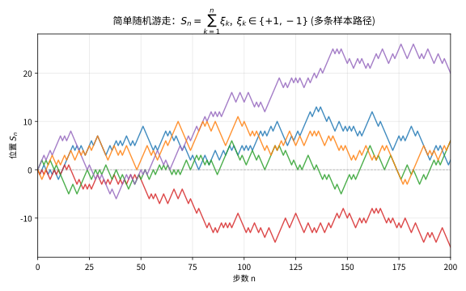
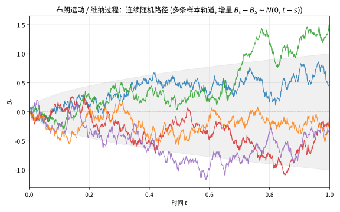

# 第 51 级：随机过程 (Stochastic Processes)

> 随机过程是研究随时间演化的随机现象的数学分支。从 Einstein 对 Brown 运动的研究到 Bachelier 对金融市场的分析，从 Kolmogorov 的概率论公理化到 Itô 的随机微积分，随机过程理论在 20 世纪经历了深刻的发展。它不仅为物理学、金融学、工程学和生物学提供了强大的建模工具，更深刻地改变了我们对不确定性、随机性和复杂系统的理解。本课程从随机过程的基本概念出发，系统建立鞅论、Markov 过程、Brown 运动与随机微积分的核心框架。

---

## 1. 学习目标

1. 理解随机过程的基本定义，掌握有限维分布与 Kolmogorov 相容性定理。
2. 掌握条件期望的严格定义与基本性质，为鞅论奠定基础。
3. 深入理解鞅的定义、性质与 Doob 停止定理的完整证明。
4. 掌握 Markov 链的基本理论，包括转移概率、Chapman-Kolmogorov 方程、平稳分布与遍历性。
5. 理解 Poisson 过程与更新过程的基本性质及其应用。
6. 掌握 Brown 运动的严格定义，理解 Wiener 的构造方法。
7. 初步掌握随机积分与 Itô 引理，理解随机微积分的基本公式。
8. 通过鞅分析、排队系统、首达时等经典示例，培养随机过程的具体计算与应用能力。

---

## 2. 核心概念

### 2.1 随机过程的定义 (Stochastic Processes)

**定义 2.1**（随机过程）设 $(\Omega, \mathcal{F}, \mathbb{P})$ 是一个概率空间，$T$ 是一个指标集（通常为 $\mathbb{N}_0$、$\mathbb{Z}$、$[0, \infty)$ 或 $\mathbb{R}$），$(S, \mathcal{S})$ 是一个可测空间（通常 $S = \mathbb{R}^d$ 且 $\mathcal{S} = \mathcal{B}(\mathbb{R}^d)$）。一个 **随机过程**（stochastic process）是一族随机变量

$$
X = \{X_t : t \in T\},
$$

其中每个 $X_t : \Omega \to S$ 是 $\mathcal{F}/\mathcal{S}$-可测的。

对于固定的 $\omega \in \Omega$，映射 $t \mapsto X_t(\omega)$ 称为过程的 **样本轨道**（sample path）或 **实现**（realization）。

**定义 2.2**（状态空间与指标集）$S$ 称为 **状态空间**（state space），$T$ 称为 **指标集**（index set）。根据 $T$ 的类型，随机过程可分为：

- **离散时间**（discrete-time）：$T = \mathbb{N}_0$ 或 $\mathbb{Z}$。
- **连续时间**（continuous-time）：$T = [0, \infty)$ 或 $\mathbb{R}$。

**例 2.3**（随机游走）设 $\{\xi_n\}_{n \ge 1}$ 是独立同分布的随机变量，$\mathbb{P}(\xi_n = 1) = \mathbb{P}(\xi_n = -1) = 1/2$。定义

$$
S_0 = 0, \quad S_n = \sum_{k=1}^n \xi_k, \quad n \ge 1.
$$

则 $\{S_n\}_{n \ge 0}$ 是一个离散时间随机过程，称为 **简单随机游走**（simple random walk）。

> **直观理解（现实类比）**：随机游走就像一只在数轴上的"醉汉"每步随机向左或向右走一格。每一步掷一枚公平硬币决定方向，长期来看它既不会稳定偏向某个方向，也无法预测确切位置——这正是"随机但有规律"的体现：多条独立的路径各走各的，但统计上都围绕起点徘徊。

### 2.2 有限维分布与 Kolmogorov 相容性定理 (Finite-Dimensional Distributions and Kolmogorov Extension Theorem)

**定义 2.4**（有限维分布）设 $X = \{X_t : t \in T\}$ 是一个随机过程。对任意有限个指标 $t_1, \ldots, t_n \in T$，向量 $(X_{t_1}, \ldots, X_{t_n})$ 的联合分布称为 $X$ 的一个 **有限维分布**（finite-dimensional distribution, f.d.d.）。记

$$
\mu_{t_1, \ldots, t_n}(B) = \mathbb{P}((X_{t_1}, \ldots, X_{t_n}) \in B), \quad B \in \mathcal{S}^{\otimes n}.
$$

所有有限维分布的集合 $\{\mu_{t_1, \ldots, t_n} : n \ge 1, t_i \in T\}$ 构成了随机过程的 **有限维分布族**（family of finite-dimensional distributions）。

**定义 2.5**（相容性条件）有限维分布族 $\{\mu_{t_1, \ldots, t_n}\}$ 称为 **相容的**（consistent），若满足以下条件：

1. **置换不变性**：对任意排列 $\pi$ 和 $B_1 \times \cdots \times B_n \in \mathcal{S}^{\otimes n}$，

   $$
   \mu_{t_{\pi(1)}, \ldots, t_{\pi(n)}}(B_{\pi(1)} \times \cdots \times B_{\pi(n)}) = \mu_{t_1, \ldots, t_n}(B_1 \times \cdots \times B_n).
   $$

2. **边缘相容性**：对任意 $m < n$，

   $$
   \mu_{t_1, \ldots, t_m}(B_1 \times \cdots \times B_m) = \mu_{t_1, \ldots, t_n}(B_1 \times \cdots \times B_m \times S \times \cdots \times S).
   $$

**定理 2.6**（Kolmogorov 相容性定理 / Kolmogorov Extension Theorem）设 $S = \mathbb{R}^d$（或更一般地，一个 Polish 空间），$\mathcal{S} = \mathcal{B}(S)$。若 $\{\mu_{t_1, \ldots, t_n} : n \ge 1, t_i \in T\}$ 是一个满足相容性条件的有限维分布族，则存在一个概率空间 $(\Omega, \mathcal{F}, \mathbb{P})$ 和一个随机过程 $X = \{X_t : t \in T\}$，使得 $X$ 的有限维分布恰为 $\{\mu_{t_1, \ldots, t_n}\}$。

Kolmogorov 相容性定理保证了随机过程的存在性：只要给定一个相容的有限维分布族，就存在一个以这些分布为有限维分布的随机过程。

### 2.3 条件期望 (Conditional Expectation)

**定义 2.7**（条件期望）设 $(\Omega, \mathcal{F}, \mathbb{P})$ 是概率空间，$X \in L^1(\Omega, \mathcal{F}, \mathbb{P})$ 是一个可积随机变量，$\mathcal{G} \subset \mathcal{F}$ 是一个子 $\sigma$-代数。$X$ 关于 $\mathcal{G}$ 的 **条件期望**（conditional expectation）是一个随机变量 $\mathbb{E}[X \mid \mathcal{G}]$，满足：

1. $\mathbb{E}[X \mid \mathcal{G}]$ 是 $\mathcal{G}$-可测的。
2. 对任意 $A \in \mathcal{G}$，有 $\int_A \mathbb{E}[X \mid \mathcal{G}] \, d\mathbb{P} = \int_A X \, d\mathbb{P}$。

条件期望的存在性与唯一性由 Radon-Nikodym 定理保证。

**性质 2.8**（条件期望的基本性质）设 $X, Y \in L^1$，$\mathcal{G}, \mathcal{H} \subset \mathcal{F}$ 是子 $\sigma$-代数。

1. **线性性**：$\mathbb{E}[aX + bY \mid \mathcal{G}] = a\mathbb{E}[X \mid \mathcal{G}] + b\mathbb{E}[Y \mid \mathcal{G}]$，a.s.
2. **单调性**：若 $X \le Y$ a.s.，则 $\mathbb{E}[X \mid \mathcal{G}] \le \mathbb{E}[Y \mid \mathcal{G}]$ a.s.
3. **塔性质**（tower property）：若 $\mathcal{H} \subset \mathcal{G}$，则 $\mathbb{E}[\mathbb{E}[X \mid \mathcal{G}] \mid \mathcal{H}] = \mathbb{E}[X \mid \mathcal{H}]$ a.s.
4. **脱去已知条件**：若 $X$ 是 $\mathcal{G}$-可测的，则 $\mathbb{E}[X \mid \mathcal{G}] = X$ a.s.
5. **独立脱出**：若 $X$ 独立于 $\mathcal{G}$，则 $\mathbb{E}[X \mid \mathcal{G}] = \mathbb{E}[X]$ a.s.
6. **条件 Jensen 不等式**：若 $\varphi: \mathbb{R} \to \mathbb{R}$ 是凸函数且 $\varphi(X) \in L^1$，则

   $$
   \varphi(\mathbb{E}[X \mid \mathcal{G}]) \le \mathbb{E}[\varphi(X) \mid \mathcal{G}] \quad \text{a.s.}
   $$

### 2.4 鞅 (Martingales)

**定义 2.9**（鞅）设 $(\Omega, \mathcal{F}, \mathbb{P})$ 是概率空间，$\{\mathcal{F}_n\}_{n \ge 0}$ 是一个 **滤子**（filtration），即 $\mathcal{F}_0 \subset \mathcal{F}_1 \subset \cdots \subset \mathcal{F}$ 是递增的子 $\sigma$-代数族。一个随机过程 $\{M_n\}_{n \ge 0}$ 称为关于 $\{\mathcal{F}_n\}$ 的 **鞅**（martingale），若：

1. **适应性**：$M_n$ 是 $\mathcal{F}_n$-可测的。
2. **可积性**：$\mathbb{E}[|M_n|] < \infty$ 对所有 $n$ 成立。
3. **鞅性质**：$\mathbb{E}[M_{n+1} \mid \mathcal{F}_n] = M_n$ a.s. 对所有 $n$ 成立。

若将等号替换为 $\ge$（或 $\le$），则称为 **下鞅**（submartingale）（或 **上鞅**（supermartingale））。

**例 2.10**（随机游走是鞅）设 $\{S_n\}$ 是简单随机游走，$\mathcal{F}_n = \sigma(S_0, \ldots, S_n)$。则 $\mathbb{E}[S_{n+1} \mid \mathcal{F}_n] = S_n + \mathbb{E}[\xi_{n+1}] = S_n$，因此 $\{S_n\}$ 是一个鞅。

**例 2.11**（平方鞅）设 $\{S_n\}$ 是简单随机游走，则 $M_n = S_n^2 - n$ 是一个鞅。验证：

$$
\mathbb{E}[S_{n+1}^2 - (n+1) \mid \mathcal{F}_n] = \mathbb{E}[(S_n + \xi_{n+1})^2 \mid \mathcal{F}_n] - (n+1) = S_n^2 + 1 - (n+1) = S_n^2 - n.
$$

### 2.5 停时 (Stopping Times)

**定义 2.12**（停时）设 $\{\mathcal{F}_n\}_{n \ge 0}$ 是一个滤子。随机变量 $\tau: \Omega \to \mathbb{N}_0 \cup \{\infty\}$ 称为关于 $\{\mathcal{F}_n\}$ 的 **停时**（stopping time），若对任意 $n \ge 0$，

$$
\{\tau = n\} \in \mathcal{F}_n.
$$

等价地，$\{\tau \le n\} \in \mathcal{F}_n$ 对所有 $n$ 成立。

**定义 2.13**（停时 $\sigma$-代数）设 $\tau$ 是一个停时。定义

$$
\mathcal{F}_\tau = \{ A \in \mathcal{F} \mid A \cap \{\tau \le n\} \in \mathcal{F}_n \text{ 对所有 } n \ge 0 \}.
$$

$\mathcal{F}_\tau$ 称为 **停时 $\sigma$-代数**（stopping time $\sigma$-algebra），表示到 $\tau$ 时刻为止的所有信息。

**例 2.14**（首达时）设 $\{S_n\}$ 是简单随机游走，$a \in \mathbb{Z}$。定义

$$
\tau_a = \inf\{ n \ge 0 \mid S_n = a \}.
$$

则 $\tau_a$ 是一个停时（首达时，first hitting time）。

### 2.6 Markov 链 (Markov Chains)

**定义 2.15**（Markov 链）设 $\{X_n\}_{n \ge 0}$ 是可数状态空间 $S$ 上的离散时间随机过程。若对任意 $n \ge 0$ 和任意 $i_0, \ldots, i_{n+1} \in S$，

$$
\mathbb{P}(X_{n+1} = i_{n+1} \mid X_0 = i_0, \ldots, X_n = i_n) = \mathbb{P}(X_{n+1} = i_{n+1} \mid X_n = i_n),
$$

则称 $\{X_n\}$ 为 **Markov 链**（Markov chain）。该性质称为 **Markov 性**（Markov property）：给定现在，将来与过去独立。

**定义 2.16**（转移概率与转移矩阵）对于齐次 Markov 链（即转移概率与时间 $n$ 无关），定义 **一步转移概率**（one-step transition probability）：

$$
p_{ij} = \mathbb{P}(X_{n+1} = j \mid X_n = i).
$$

矩阵 $P = (p_{ij})_{i,j \in S}$ 称为 **转移矩阵**（transition matrix）。它满足：

1. $p_{ij} \ge 0$ 对所有 $i, j$ 成立。
2. $\sum_{j \in S} p_{ij} = 1$ 对所有 $i$ 成立（即 $P$ 是 **随机矩阵**，stochastic matrix）。

**定理 2.17**（Chapman-Kolmogorov 方程）设 $P$ 是齐次 Markov 链的转移矩阵，$p_{ij}^{(n)} = \mathbb{P}(X_{m+n} = j \mid X_m = i)$ 是 $n$ 步转移概率。则

$$
p_{ij}^{(m+n)} = \sum_{k \in S} p_{ik}^{(m)} p_{kj}^{(n)}.
$$

在矩阵形式下，$P^{(m+n)} = P^{(m)} P^{(n)}$，特别地，$P^{(n)} = P^n$。

**证明**：由全概率公式和 Markov 性，

$$
\begin{aligned}
p_{ij}^{(m+n)} &= \mathbb{P}(X_{m+n} = j \mid X_0 = i) \\
&= \sum_{k \in S} \mathbb{P}(X_{m+n} = j, X_m = k \mid X_0 = i) \\
&= \sum_{k \in S} \mathbb{P}(X_m = k \mid X_0 = i) \cdot \mathbb{P}(X_{m+n} = j \mid X_m = k, X_0 = i) \\
&= \sum_{k \in S} p_{ik}^{(m)} p_{kj}^{(n)}.
\end{aligned}
$$

其中最后一步用到了 Markov 性。$\square$

### 2.7 平稳分布与遍历性 (Stationary Distribution and Ergodicity)

**定义 2.18**（平稳分布）概率分布 $\pi = (\pi_i)_{i \in S}$ 称为 Markov 链的 **平稳分布**（stationary distribution），若

$$
\pi = \pi P, \quad \text{即 } \pi_j = \sum_{i \in S} \pi_i p_{ij} \text{ 对所有 } j \in S.
$$

若初始分布 $\pi$ 是平稳的，则对任意 $n$，$X_n$ 的分布也是 $\pi$。

**定义 2.19**（细致平衡条件）若存在概率分布 $\pi$ 使得

$$
\pi_i p_{ij} = \pi_j p_{ji} \quad \text{对所有 } i, j \in S,
$$

则称 $\pi$ 满足 **细致平衡条件**（detailed balance condition）。满足细致平衡条件的 $\pi$ 一定是平稳分布，因为

$$
\sum_{i \in S} \pi_i p_{ij} = \sum_{i \in S} \pi_j p_{ji} = \pi_j.
$$

**定义 2.20**（不可约与正常返）Markov 链称为 **不可约的**（irreducible），若对任意 $i, j \in S$，存在 $n$ 使得 $p_{ij}^{(n)} > 0$。状态 $i$ 称为 **正常返的**（positive recurrent），若从 $i$ 出发返回 $i$ 的平均时间有限：$\mathbb{E}_i[\tau_i] < \infty$，其中 $\tau_i = \inf\{n \ge 1 \mid X_n = i\}$。

### 2.8 Poisson 过程 (Poisson Process)

**定义 2.21**（Poisson 过程）计数过程 $\{N(t) : t \ge 0\}$ 称为 **强度为 $\lambda > 0$ 的 Poisson 过程**（Poisson process），若：

1. $N(0) = 0$。
2. **独立增量性**：对任意 $0 \le t_1 < t_2 < \cdots < t_n$，增量 $N(t_2) - N(t_1), \ldots, N(t_n) - N(t_{n-1})$ 相互独立。
3. **平稳增量性**：对任意 $s, t \ge 0$，$N(s+t) - N(s)$ 的分布仅依赖于 $t$。
4. $N(t) \sim \text{Poisson}(\lambda t)$，即 $\mathbb{P}(N(t) = k) = \frac{(\lambda t)^k}{k!} e^{-\lambda t}$。

**性质 2.22**（Poisson 过程的基本性质）设 $\{N(t)\}$ 是强度为 $\lambda$ 的 Poisson 过程。

1. **等待时间**：记 $T_n = \inf\{t \ge 0 \mid N(t) = n\}$ 为第 $n$ 个事件发生的时刻，则 $T_n = \sum_{k=1}^n \tau_k$，其中 $\tau_k \sim \text{Exp}(\lambda)$ 独立同分布。
2. **到达间隔**：$\{\tau_k\}$ 是独立同分布的指数随机变量，参数为 $\lambda$。
3. **期望与方差**：$\mathbb{E}[N(t)] = \lambda t$，$\text{Var}(N(t)) = \lambda t$。

![强度为 $\lambda$ 的 Poisson 过程 $N(t)$：事件到达时刻 $T_n$ 处计数向上跳跃 1，期望 $\mathbb{E}[N(t)]=\lambda t$ 为一条直线](images/lv51-poisson.svg)

> **直观理解（现实类比）**：泊松过程就像一家银行柜台前的取号机——顾客在"随机"但不分时段的时刻到来，每来一位号码就加一。虽然你无法预知下一位何时到，但平均来看，每 $\lambda$ 分钟来一位顾客，计数曲线 $N(t)$ 沿着直线 $\lambda t$ 缓慢均匀地爬升，而到达间隔服从指数分布（"无记忆"：刚等完多久都不影响下一位何时到）。

### 2.9 更新过程 (Renewal Processes)

**定义 2.23**（更新过程）设 $\{\tau_n\}_{n \ge 1}$ 是非负独立同分布的随机变量，分布函数为 $F$，且 $\mathbb{E}[\tau_1] = \mu < \infty$。令 $T_0 = 0$，$T_n = \sum_{k=1}^n \tau_k$。定义

$$
N(t) = \sup\{ n \ge 0 \mid T_n \le t \},
$$

则 $\{N(t) : t \ge 0\}$ 称为 **更新过程**（renewal process）。Poisson 过程是指数分布（$F(t) = 1 - e^{-\lambda t}$）的特殊情形。

**定义 2.24**（更新函数）更新过程的 **更新函数**（renewal function）定义为 $m(t) = \mathbb{E}[N(t)]$。

### 2.10 Brown 运动 (Brownian Motion)

**定义 2.25**（Brown 运动 / Wiener 过程）一个连续时间随机过程 $\{B_t : t \ge 0\}$ 称为 **Brown 运动**（Brownian motion）或 **Wiener 过程**（Wiener process），若：

1. $B_0 = 0$ a.s.
2. **独立增量性**：对任意 $0 \le t_1 < t_2 < \cdots < t_n$，增量 $B_{t_2} - B_{t_1}, \ldots, B_{t_n} - B_{t_{n-1}}$ 相互独立。
3. **平稳高斯增量**：$B_t - B_s \sim N(0, t - s)$ 对所有 $0 \le s < t$ 成立。
4. **轨道连续性**：$t \mapsto B_t(\omega)$ 对几乎处处 $\omega$ 是连续的。

> **直观理解（现实类比）**：布朗运动就像显微镜下一粒花粉在水中的运动轨迹——它一直被无数水分子从四面八方随机撞击，走得蜿蜒曲折、没有一条直线，但路径始终是连续的（不会突然"跳"）。你只能看到它总体在起点附近游荡（波动幅度约 $\sqrt{t}$），却完全无法预言下一瞬会偏向哪边，这种"连续却不可微分"正是随机性的最纯粹形态。

### 2.11 随机积分初步 (Stochastic Calculus Introduction)

**定义 2.26**（Itô 积分）设 $\{B_t\}$ 是 Brown 运动，$\{f_t\}$ 是适应于 $\{\mathcal{F}_t\}$ 的过程且满足 $\mathbb{E}\left[\int_0^T f_t^2 \, dt\right] < \infty$。**Itô 积分**（Itô integral）定义为

$$
\int_0^T f_t \, dB_t = \lim_{n \to \infty} \sum_{k=0}^{n-1} f_{t_k} (B_{t_{k+1}} - B_{t_k}),
$$

其中 $0 = t_0 < t_1 < \cdots < t_n = T$ 是分割，极限在 $L^2$ 意义下取。注意 Itô 积分取左端点 $f_{t_k}$（而非中点），这使其具有鞅性质。

**性质 2.27**（Itô 积分的性质）

1. **鞅性质**：$M_t = \int_0^t f_s \, dB_s$ 是一个鞅。
2. **Itô 等距**（Itô isometry）：$\mathbb{E}\left[\left(\int_0^T f_t \, dB_t\right)^2\right] = \mathbb{E}\left[\int_0^T f_t^2 \, dt\right]$。
3. **线性性**：$\int_0^T (a f_t + b g_t) \, dB_t = a \int_0^T f_t \, dB_t + b \int_0^T g_t \, dB_t$。

---

## 3. 定理与证明

### 3.1 Kolmogorov 相容性定理

**定理 3.1**（Kolmogorov 相容性定理）设 $S = \mathbb{R}^d$，$\mathcal{S} = \mathcal{B}(S)$。令 $\{\mu_{t_1, \ldots, t_n} : n \ge 1, t_i \in T\}$ 是一个满足相容性条件的有限维分布族。则存在一个概率空间 $(\Omega, \mathcal{F}, \mathbb{P})$ 和一个随机过程 $X = \{X_t : t \in T\}$，使得 $X$ 的有限维分布恰为 $\{\mu_{t_1, \ldots, t_n}\}$。

**证明**：我们分几步构造该随机过程。

**步骤 1**：构造乘积空间。令 $\Omega = S^T = \{\omega : T \to S\}$ 是所有从 $T$ 到 $S$ 的函数的集合。对每个 $t \in T$，定义坐标映射 $\pi_t : \Omega \to S$，$\pi_t(\omega) = \omega(t)$。令 $\mathcal{F}$ 是使得所有 $\pi_t$ 都可测的最小 $\sigma$-代数，即 $\mathcal{F} = \sigma(\pi_t : t \in T)$。

**步骤 2**：构造柱集代数。对任意有限个 $t_1, \ldots, t_n \in T$ 和 $B \in \mathcal{S}^{\otimes n}$，定义 **柱集**（cylinder set）：

$$
C_{t_1, \ldots, t_n}(B) = \{ \omega \in \Omega \mid (\omega(t_1), \ldots, \omega(t_n)) \in B \}.
$$

所有柱集组成的集合代数记为 $\mathcal{A}$。

**步骤 3**：在柱集上定义概率测度。对柱集 $C = C_{t_1, \ldots, t_n}(B)$，定义

$$
\mathbb{P}_0(C) = \mu_{t_1, \ldots, t_n}(B).
$$

相容性条件保证了 $\mathbb{P}_0$ 在 $\mathcal{A}$ 上是良定义的，即对同一柱集的不同表示，定义的值是一致的。具体地，若 $C$ 有两种表示 $C_{t_1, \ldots, t_n}(B) = C_{s_1, \ldots, s_m}(D)$，则通过相容性条件可以验证 $\mu_{t_1, \ldots, t_n}(B) = \mu_{s_1, \ldots, s_m}(D)$。

**步骤 4**：扩展到 $\sigma$-代数。$\mathbb{P}_0$ 是 $\mathcal{A}$ 上的有限可加概率测度。我们需要证明 $\mathbb{P}_0$ 在 $\mathcal{A}$ 上是 $\sigma$-可加的，然后由 Carathéodory 延拓定理将其唯一扩展到 $\mathcal{F} = \sigma(\mathcal{A})$。

关键步骤是证明 $\mathbb{P}_0$ 在 $\mathcal{A}$ 上的 **内正则性**（inner regularity）或证明 $\mathbb{P}_0$ 是 **紧测度**（tight measure）。由于 $S = \mathbb{R}^d$ 是 Polish 空间，$\mu_{t_1, \ldots, t_n}$ 是 $S^n$ 上的概率测度，从而是紧正则的。对任意 $A \in \mathcal{A}$，存在 $A$ 的紧子集 $K \subset A$ 使得 $\mathbb{P}_0(A \setminus K)$ 可以任意小。这里的紧性是在 $S^T$ 的乘积拓扑下，由 Tychonoff 定理保证的。

更精确地，对任意 $\varepsilon > 0$，我们构造一个紧集 $K_\varepsilon \subset \Omega$ 使得 $\mathbb{P}_0(\Omega \setminus K_\varepsilon) < \varepsilon$。由于 $S = \mathbb{R}^d$ 是 $\sigma$-紧的，存在紧集 $K^{(m)} \subset S$ 使得 $\mu_t(K^{(m)}) > 1 - \varepsilon/2^{m+1}$。令

$$
K_\varepsilon = \bigcap_{m=1}^\infty \{ \omega \in \Omega \mid \omega(t_m) \in K^{(m)} \},
$$

其中 $\{t_m\}$ 是 $T$ 的一个可数稠密子集（若 $T$ 不可数，我们需额外处理——实际上，Kolmogorov 相容性定理对任意指标集 $T$ 成立，但需要 $S$ 是 Polish 空间。这里的构造利用了 $S$ 的 Polish 性质）。

由 Tychonoff 定理，$K_\varepsilon$ 在乘积拓扑下是紧的。由有限维分布的相容性，

$$
\mathbb{P}_0(\Omega \setminus K_\varepsilon) \le \sum_{m=1}^\infty \mathbb{P}_0(\omega(t_m) \notin K^{(m)}) = \sum_{m=1}^\infty (1 - \mu_{t_m}(K^{(m)})) < \varepsilon.
$$

因此 $\mathbb{P}_0$ 在 $\mathcal{A}$ 上是紧正则的，从而是 $\sigma$-可加的。

**步骤 5**：由 Carathéodory 延拓定理，$\mathbb{P}_0$ 可唯一延拓为 $\mathcal{F} = \sigma(\mathcal{A})$ 上的概率测度 $\mathbb{P}$。定义 $X_t(\omega) = \pi_t(\omega) = \omega(t)$，则 $\{X_t : t \in T\}$ 是 $(\Omega, \mathcal{F}, \mathbb{P})$ 上的随机过程，其有限维分布恰为 $\{\mu_{t_1, \ldots, t_n}\}$。$\square$

**注**：Kolmogorov 相容性定理是随机过程存在性的理论基础。然而，它构造的 $\Omega = S^T$ 可能非常大，且只保证了样本轨道的存在性，并未保证轨道的正则性（如连续性）。对于 Brown 运动，我们需要额外的条件来确保存在连续版本的轨道。

### 3.2 Doob 停止定理

**定理 3.2**（Doob 停止定理 / Doob's Optional Stopping Theorem）设 $\{M_n\}_{n \ge 0}$ 是关于 $\{\mathcal{F}_n\}$ 的鞅，$\sigma$ 和 $\tau$ 是有界停时（即存在常数 $K$ 使得 $\sigma \le K$ a.s.，$\tau \le K$ a.s.），且 $\sigma \le \tau$ a.s. 则

$$
\mathbb{E}[M_\tau \mid \mathcal{F}_\sigma] = M_\sigma \quad \text{a.s.}
$$

特别地，$\mathbb{E}[M_\tau] = \mathbb{E}[M_0]$。

**证明**：我们分几步证明。

**步骤 1**：离散化。由于 $\tau$ 是有界停时，设 $\tau \le N$ a.s.。则 $M_\tau$ 可写为

$$
M_\tau = \sum_{k=0}^N M_k \mathbf{1}_{\{\tau = k\}}.
$$

由于 $M_k$ 可积，$M_\tau$ 也可积。

**步骤 2**：对任意 $A \in \mathcal{F}_\sigma$，我们需要证明

$$
\int_A M_\tau \, d\mathbb{P} = \int_A M_\sigma \, d\mathbb{P}.
$$

由于 $\sigma \le \tau$ a.s.，对任意 $k$，$\{\sigma \le k\}$ 和 $\{\tau \le k\}$ 都属于 $\mathcal{F}_k$。

**步骤 3**：将积分分裂。记 $A_k = A \cap \{\sigma = k\}$。由于 $A \in \mathcal{F}_\sigma$，有 $A \cap \{\sigma \le k\} \in \mathcal{F}_k$，因此 $A_k = (A \cap \{\sigma \le k\}) \setminus (A \cap \{\sigma \le k-1\}) \in \mathcal{F}_k$。故 $A_k \in \mathcal{F}_k$ 且 $\{A_k\}_{k=0}^N$ 是 $\Omega$ 的一个划分。

在 $A_k$ 上，$\sigma = k$。我们需要证明 $\int_{A_k} M_\tau \, d\mathbb{P} = \int_{A_k} M_k \, d\mathbb{P}$。

**步骤 4**：利用鞅性质。对 $j \ge k$，考虑积分 $\int_{A_k} M_j \, d\mathbb{P}$。由于 $A_k \in \mathcal{F}_k$，由鞅性质，

$$
\int_{A_k} M_{k+1} \, d\mathbb{P} = \int_{A_k} \mathbb{E}[M_{k+1} \mid \mathcal{F}_k] \, d\mathbb{P} = \int_{A_k} M_k \, d\mathbb{P}.
$$

递推可得，对任意 $j \ge k$，$\int_{A_k} M_j \, d\mathbb{P} = \int_{A_k} M_k \, d\mathbb{P}$。

**步骤 5**：现在，在 $A_k$ 上，$\tau$ 取值于 $\{k, k+1, \ldots, N\}$，所以

$$
\int_{A_k} M_\tau \, d\mathbb{P} = \sum_{j=k}^N \int_{A_k \cap \{\tau = j\}} M_j \, d\mathbb{P}.
$$

对每个 $j$，由于 $A_k \cap \{\tau = j\} \in \mathcal{F}_j$（因为 $\{\tau = j\} \in \mathcal{F}_j$ 且 $A_k \in \mathcal{F}_k \subset \mathcal{F}_j$），由鞅性质，

$$
\int_{A_k \cap \{\tau = j\}} M_j \, d\mathbb{P} = \int_{A_k \cap \{\tau = j\}} \mathbb{E}[M_j \mid \mathcal{F}_j] \, d\mathbb{P} = \int_{A_k \cap \{\tau = j\}} M_j \, d\mathbb{P}.
$$

但更直接地，由步骤 4 的结论，$\int_{A_k \cap \{\tau = j\}} M_j \, d\mathbb{P} = \int_{A_k \cap \{\tau = j\}} M_k \, d\mathbb{P}$（因为 $A_k \cap \{\tau = j\} \in \mathcal{F}_k$ 且 $\int_{A_k \cap \{\tau = j\}} M_k \, d\mathbb{P} = \int_{A_k \cap \{\tau = j\}} M_j \, d\mathbb{P}$）。因此

$$
\int_{A_k} M_\tau \, d\mathbb{P} = \sum_{j=k}^N \int_{A_k \cap \{\tau = j\}} M_k \, d\mathbb{P} = \int_{A_k} M_k \, d\mathbb{P}.
$$

**步骤 6**：对所有 $k$ 求和，得到 $\int_A M_\tau \, d\mathbb{P} = \int_A M_\sigma \, d\mathbb{P}$。由条件期望的定义，$\mathbb{E}[M_\tau \mid \mathcal{F}_\sigma] = M_\sigma$ a.s. $\square$

**推论 3.3**（Doob 停止定理——无界停时的版本）若 $\{M_n\}$ 是一致可积鞅（uniformly integrable martingale），$\sigma \le \tau$ 是停时（不必有界），则 $\mathbb{E}[M_\tau \mid \mathcal{F}_\sigma] = M_\sigma$ a.s.

### 3.3 鞅收敛定理

**定理 3.4**（Doob 鞅收敛定理 / Doob's Martingale Convergence Theorem）设 $\{M_n\}_{n \ge 0}$ 是一个 $L^1$ 有界鞅，即 $\sup_n \mathbb{E}[|M_n|] < \infty$。则存在一个可积随机变量 $M_\infty$，使得

$$
M_n \to M_\infty \quad \text{a.s.}
$$

**证明**：我们通过 **上穿不等式**（upcrossing inequality）来证明。

**步骤 1**：定义上穿次数。对实数 $a < b$，定义 $U_n[a, b]$ 为 $\{M_0, \ldots, M_n\}$ 从 $a$ 下方上穿到 $b$ 上方的次数。形式化地，定义停时序列：

$$
\begin{aligned}
\tau_1 &= \inf\{ k \ge 0 \mid M_k \le a \}, \\
\sigma_1 &= \inf\{ k > \tau_1 \mid M_k \ge b \}, \\
\tau_2 &= \inf\{ k > \sigma_1 \mid M_k \le a \}, \\
&\vdots
\end{aligned}
$$

令 $U_n[a, b] = \max\{ m \ge 0 \mid \sigma_m \le n \}$。

**步骤 2**：上穿不等式。对任意 $a < b$，

$$
\mathbb{E}[U_n[a, b]] \le \frac{\mathbb{E}[(M_n - a)^-]}{b - a}.
$$

**证明**：考虑过程 $Y_k = (M_k - a)^+ / (b - a)$，则 $\{Y_k\}$ 是一个非负下鞅。每次上穿消耗至少 $1$ 单位，且 $Y_n$ 的期望给出了上穿次数的上界。更精确地，利用 Doob 分解将 $Y_k$ 分解为鞅和可料增过程之和，可推导出上述不等式。$\square$

**步骤 3**：由上穿不等式，对任意 $a < b$，

$$
\mathbb{E}[U_\infty[a, b]] = \lim_{n \to \infty} \mathbb{E}[U_n[a, b]] \le \frac{\sup_n \mathbb{E}[|M_n|] + |a|}{b - a} < \infty.
$$

因此 $U_\infty[a, b] < \infty$ a.s.，即鞅 $M_n$ 在任意两个有理数 $a < b$ 之间只上穿有限次。

**步骤 4**：定义事件

$$
\Omega_{a,b} = \{ \omega \mid \liminf_{n \to \infty} M_n(\omega) < a < b < \limsup_{n \to \infty} M_n(\omega) \}.
$$

若 $\omega \in \Omega_{a,b}$，则 $M_n(\omega)$ 在 $a$ 和 $b$ 之间上穿无穷多次，即 $U_\infty[a, b](\omega) = \infty$。由步骤 3，$\mathbb{P}(\Omega_{a,b}) = 0$。

**步骤 5**：令

$$
\Omega_0 = \bigcup_{\substack{a, b \in \mathbb{Q} \\ a < b}} \Omega_{a,b}.
$$

则 $\mathbb{P}(\Omega_0) = 0$。对 $\omega \notin \Omega_0$，$\liminf_{n \to \infty} M_n(\omega) = \limsup_{n \to \infty} M_n(\omega)$，因此极限 $\lim_{n \to \infty} M_n(\omega)$ 存在（可能为 $\pm \infty$）。

**步骤 6**：由于 $\sup_n \mathbb{E}[|M_n|] < \infty$，由 Fatou 引理，

$$
\mathbb{E}[|\lim_{n \to \infty} M_n|] \le \liminf_{n \to \infty} \mathbb{E}[|M_n|] \le \sup_n \mathbb{E}[|M_n|] < \infty,
$$

因此极限几乎必然有限，记作 $M_\infty$。$M_\infty$ 是可积的。$\square$

**推论 3.5**（$L^1$ 收敛条件）若 $\{M_n\}$ 是一致可积鞅，则 $M_n \to M_\infty$ 在 $L^1$ 中，且 $M_n = \mathbb{E}[M_\infty \mid \mathcal{F}_n]$ a.s.

### 3.4 Markov 链的遍历定理

**定理 3.6**（Markov 链的遍历定理）设 $\{X_n\}_{n \ge 0}$ 是在可数状态空间 $S$ 上不可约、正常返的齐次 Markov 链，转移矩阵为 $P$。则存在唯一的平稳分布 $\pi$，且对任意初始分布和任意有界函数 $f: S \to \mathbb{R}$，

$$
\lim_{n \to \infty} \frac{1}{n} \sum_{k=1}^n f(X_k) = \sum_{i \in S} \pi_i f(i) \quad \text{a.s.}
$$

此外，对任意 $i, j \in S$，

$$
\lim_{n \to \infty} p_{ij}^{(n)} = \pi_j.
$$

**证明**：我们分几步证明。

**步骤 1**：正常返链的极限性质。由于链是不可约正常返的，它存在唯一的平稳分布 $\pi$，且

$$
\pi_j = \frac{1}{\mathbb{E}_j[\tau_j]},
$$

其中 $\tau_j = \inf\{ n \ge 1 \mid X_n = j \}$ 是首次返回时间，$\mathbb{E}_j$ 表示从 $j$ 出发的期望。

**步骤 2**：更新论证。固定状态 $j$，考虑链访问 $j$ 的时刻。令 $T_0 = 0$，$T_1 = \tau_j$，$T_2$ 为第二次返回 $j$ 的时间，依此类推。则 $\{T_{k+1} - T_k\}_{k \ge 1}$ 是独立同分布的，分布与 $\tau_j$ 在从 $j$ 出发的条件下相同（由 Markov 性和强 Markov 性）。

**步骤 3**：对任意 $i \in S$，考虑从 $i$ 出发的链。在两次访问 $j$ 之间，链访问各个状态的次数构成了一个更新过程。由更新理论，对任意状态 $i$，

$$
\lim_{n \to \infty} \frac{1}{n} \sum_{k=1}^n \mathbf{1}_{\{X_k = j\}} = \frac{1}{\mathbb{E}_j[\tau_j]} = \pi_j \quad \text{a.s.}
$$

这由更新定理（或强大数定律对更新过程的推广）直接得到。

**步骤 4**：对一般有界函数 $f$，将 $f$ 分解为 $f = \sum_{j \in S} f(j) \mathbf{1}_{\{j\}}$。由步骤 3，

$$
\lim_{n \to \infty} \frac{1}{n} \sum_{k=1}^n f(X_k) = \sum_{j \in S} f(j) \cdot \lim_{n \to \infty} \frac{1}{n} \sum_{k=1}^n \mathbf{1}_{\{X_k = j\}} = \sum_{j \in S} \pi_j f(j) \quad \text{a.s.}
$$

这里我们利用了 $f$ 的有界性来交换求和与极限。

**步骤 5**：转移概率的收敛。对 $p_{ij}^{(n)}$，我们使用 **耦合方法**（coupling method）。构造两个 Markov 链 $\{X_n\}$ 和 $\{Y_n\}$，其中 $X_0 = i$，$Y_0 \sim \pi$（即 $Y_0$ 服从平稳分布）。两个链独立演化，直到它们相遇并耦合（即 $X_\tau = Y_\tau$ 在某个停时 $\tau$ 处），之后同步演化。

由于链是不可约正常返的，耦合时间 $\tau$ 几乎必然有限。对任意 $n$，

$$
|p_{ij}^{(n)} - \pi_j| = |\mathbb{P}(X_n = j) - \mathbb{P}(Y_n = j)| \le \mathbb{P}(\tau > n) \to 0 \quad (n \to \infty).
$$

因此 $\lim_{n \to \infty} p_{ij}^{(n)} = \pi_j$。$\square$

**注**：Markov 链的遍历定理是强大数定律在 Markov 链情形下的推广。它表明，时间平均收敛到空间平均，且平稳分布是唯一的不变测度。

### 3.5 Brown 运动的存在性——Wiener 的构造方法

**定理 3.7**（Brown 运动的存在性）存在一个概率空间 $(\Omega, \mathcal{F}, \mathbb{P})$ 和其上定义的连续随机过程 $\{B_t : t \ge 0\}$，满足定义 2.25 中的四个条件。

**证明**：我们给出 Wiener 的经典构造方法。

**步骤 1**：构造 $[0, 1]$ 上的 Brown 运动。首先在 $[0, 1]$ 上构造 Brown 运动，然后通过独立级联扩展到 $[0, \infty)$。

令 $\{\varphi_n\}_{n=0}^\infty$ 是 $L^2[0, 1]$ 中的一组完备标准正交基——Haar 小波基（Haar wavelet basis）：

$$
\begin{aligned}
\varphi_0(t) &= 1, \quad t \in [0, 1], \\
\varphi_{1}(t) &= \begin{cases}
1, & 0 \le t < 1/2, \\
-1, & 1/2 \le t \le 1,
\end{cases} \\
\varphi_{2^k + j}(t) &= 2^{k/2} \varphi_1(2^k t - j), \quad k \ge 0, \; j = 0, \ldots, 2^k - 1.
\end{aligned}
$$

**步骤 2**：Schauder 函数（Schauder functions）。对 $\varphi_n$ 积分，得到 **Schauder 函数** $\{s_n\}$：

$$
s_n(t) = \int_0^t \varphi_n(u) \, du.
$$

具体地，$s_0(t) = t$，$s_1(t)$ 是三角形函数，支撑在 $[0, 1]$ 上，$s_{2^k + j}(t)$ 是支撑在 $[j/2^k, (j+1)/2^k]$ 上的三角形函数，高度为 $2^{-k/2-1}$。

**步骤 3**：级数构造。设 $\{Z_n\}_{n=0}^\infty$ 是独立同分布的标准正态随机变量 $N(0, 1)$。定义

$$
B_t^{(N)} = \sum_{n=0}^N Z_n s_n(t), \quad t \in [0, 1].
$$

则 $B_t^{(N)}$ 是连续函数（分段线性函数，由 Schauder 函数的支撑性质决定）。我们证明当 $N \to \infty$ 时，$B_t^{(N)}$ 几乎一致收敛。

**步骤 4**：一致收敛性。由于 $Z_n \sim N(0, 1)$，对任意 $x > 0$，

$$
\mathbb{P}(|Z_n| > x) \le \frac{2}{\sqrt{2\pi}} \frac{e^{-x^2/2}}{x}.
$$

取 $x_n = \sqrt{2 \log n}$，则 $\mathbb{P}(|Z_n| > \sqrt{2 \log n}) \le \frac{2}{\sqrt{2\pi}} \frac{1}{n \sqrt{2 \log n}}$，从而 $\sum_{n} \mathbb{P}(|Z_n| > \sqrt{2 \log n}) < \infty$。由 Borel-Cantelli 引理，几乎必然存在 $N_0$ 使得对所有 $n \ge N_0$，$|Z_n| \le \sqrt{2 \log n}$。

Schauder 函数的 sup 范数为 $\|s_n\|_\infty \le 2^{-k/2-1}$（对 $n = 2^k + j$）。因此对几乎每个 $\omega$，级数尾项满足

$$
\sum_{n=N}^\infty |Z_n(\omega)| \|s_n\|_\infty \le C \sum_{k=\lfloor \log_2 N \rfloor}^\infty 2^{k/2} \cdot 2^{-k/2} \cdot \frac{1}{2} \le C' \sum_{k=\lfloor \log_2 N \rfloor}^\infty \frac{1}{2^k} < \infty.
$$

更精确地，$|Z_n| \le \sqrt{2 \log n}$ 给出 $\sum_{n} |Z_n| \|s_n\|_\infty$ 几乎必然收敛。因此 $\{B_t^{(N)}\}$ 在 $[0, 1]$ 上几乎一致收敛（即 $L^\infty$ 收敛），极限 $B_t$ 是连续的。

**步骤 5**：有限维分布验证。对任意有限个 $t_1, \ldots, t_m \in [0, 1]$，向量 $(B_{t_1}^{(N)}, \ldots, B_{t_m}^{(N)})$ 是正态随机向量（因为它是独立正态变量的线性组合），其协方差结构为

$$
\text{Cov}(B_{t_i}^{(N)}, B_{t_j}^{(N)}) = \sum_{n=0}^N s_n(t_i) s_n(t_j).
$$

由 Schauder 函数的性质，$\sum_{n=0}^\infty s_n(t_i) s_n(t_j) = \min(t_i, t_j)$（这是 $L^2[0,1]$ 中 $\int_0^t 1 \, du$ 的标准正交基展开）。因此当 $N \to \infty$ 时，$(B_{t_1}^{(N)}, \ldots, B_{t_m}^{(N)})$ 依分布收敛到均值为 $0$、协方差为 $\text{Cov}(B_{t_i}, B_{t_j}) = \min(t_i, t_j)$ 的正态分布，这正是 Brown 运动的有限维分布。

**步骤 6**：扩展到 $[0, \infty)$。令 $\{B_t^{(k)} : t \in [0, 1]\}$，$k = 0, 1, 2, \ldots$ 是独立同分布的 Brown 运动（在 $[0, 1]$ 上）。定义

$$
B_t = \sum_{k=0}^{\lfloor t \rfloor - 1} B_1^{(k)} + B_{t - \lfloor t \rfloor}^{(\lfloor t \rfloor)}, \quad t \ge 0.
$$

则 $B_t$ 是 $[0, \infty)$ 上的 Brown 运动。$\square$

**注**：Wiener 的构造不仅证明了 Brown 运动的存在性，还给出了一个具体的级数表示，称为 **Wiener 级数**（Wiener series）或 **Lévy-Ciesielski 构造**。这个构造也可以使用其他正交基（如三角基）来实现。

### 3.6 Itô 引理

**定理 3.8**（Itô 引理 / Itô's Lemma）设 $\{B_t\}$ 是 Brown 运动，$f(t, x) \in C^{1,2}([0, \infty) \times \mathbb{R})$（即 $f$ 关于 $t$ 一次连续可微，关于 $x$ 二次连续可微）。则随机过程 $Y_t = f(t, B_t)$ 满足以下 Itô 微分公式：

$$
dY_t = \frac{\partial f}{\partial t}(t, B_t) \, dt + \frac{\partial f}{\partial x}(t, B_t) \, dB_t + \frac{1}{2} \frac{\partial^2 f}{\partial x^2}(t, B_t) \, dt.
$$

等价地，对任意 $T > 0$，

$$
f(T, B_T) - f(0, B_0) = \int_0^T \frac{\partial f}{\partial t}(t, B_t) \, dt + \int_0^T \frac{\partial f}{\partial x}(t, B_t) \, dB_t + \frac{1}{2} \int_0^T \frac{\partial^2 f}{\partial x^2}(t, B_t) \, dt.
$$

**证明**：我们给出一个启发式推导，然后给出严格的证明概要。

**启发式推导**：对 $f(t, B_t)$ 进行 Taylor 展开到二阶：

$$
df = \frac{\partial f}{\partial t} dt + \frac{\partial f}{\partial x} dB_t + \frac{1}{2} \frac{\partial^2 f}{\partial t^2} (dt)^2 + \frac{\partial^2 f}{\partial t \partial x} dt \, dB_t + \frac{1}{2} \frac{\partial^2 f}{\partial x^2} (dB_t)^2 + \cdots
$$

Brown 运动的二次变差为 $(dB_t)^2 = dt$（在 $L^2$ 意义下），而 $(dt)^2$ 和 $dt \, dB_t$ 是 $o(dt)$ 阶的。忽略高阶项即得 Itô 引理。

**严格证明**：我们给出 $f$ 不显含 $t$ 的情形（即 $f = f(x)$）的证明，一般情形类似。

对 $[0, T]$ 做分割 $0 = t_0 < t_1 < \cdots < t_n = T$，$\Delta t_k = T/n$，$\Delta B_k = B_{t_{k+1}} - B_{t_k}$。由 Taylor 展开，

$$
f(B_T) - f(B_0) = \sum_{k=0}^{n-1} [f(B_{t_{k+1}}) - f(B_{t_k})] = \sum_{k=0}^{n-1} \left[ f'(B_{t_k}) \Delta B_k + \frac{1}{2} f''(\xi_k) (\Delta B_k)^2 \right],
$$

其中 $\xi_k$ 介于 $B_{t_k}$ 和 $B_{t_{k+1}}$ 之间。

**步骤 1**：第一项收敛到 Itô 积分。由于 $f'$ 连续，$f'(B_{t_k})$ 是 $\mathcal{F}_{t_k}$-可测的，且

$$
\sum_{k=0}^{n-1} f'(B_{t_k}) \Delta B_k \xrightarrow{L^2} \int_0^T f'(B_t) \, dB_t.
$$

**步骤 2**：第二项的处理。对第二项，我们证明

$$
\sum_{k=0}^{n-1} \frac{1}{2} f''(B_{t_k}) (\Delta B_k)^2 \xrightarrow{L^2} \frac{1}{2} \int_0^T f''(B_t) \, dt.
$$

记 $S_n = \sum_{k=0}^{n-1} f''(B_{t_k}) (\Delta B_k)^2$。由于 $\mathbb{E}[(\Delta B_k)^2 \mid \mathcal{F}_{t_k}] = \Delta t_k$ 且 $\mathbb{E}[(\Delta B_k)^4] = 3(\Delta t_k)^2$，我们有

$$
\mathbb{E}\left[ \left( \sum_{k=0}^{n-1} f''(B_{t_k})[(\Delta B_k)^2 - \Delta t_k] \right)^2 \right] = \sum_{k=0}^{n-1} \mathbb{E}\left[ f''(B_{t_k})^2 \cdot \text{Var}((\Delta B_k)^2 \mid \mathcal{F}_{t_k}) \right] \to 0,
$$

因为 $\text{Var}((\Delta B_k)^2 \mid \mathcal{F}_{t_k}) = 2(\Delta t_k)^2$，且 $\sum (\Delta t_k)^2 = T^2/n \to 0$。

另外，由 Riemann 积分的定义，

$$
\sum_{k=0}^{n-1} f''(B_{t_k}) \Delta t_k \xrightarrow{a.s.} \int_0^T f''(B_t) \, dt.
$$

因此 $S_n \xrightarrow{L^2} \int_0^T f''(B_t) \, dt$。

**步骤 3**：余项处理。需要证明 $f''(\xi_k) - f''(B_{t_k})$ 项在 $n \to \infty$ 时趋于 $0$。由于 $f''$ 连续且 $B_t$ 连续，$\xi_k$ 与 $B_{t_k}$ 的差随分割细化而趋于 $0$，因此余项在 $L^2$ 意义下趋于 $0$。

**步骤 4**：综合以上，取 $n \to \infty$ 的极限，得到

$$
f(B_T) - f(B_0) = \int_0^T f'(B_t) \, dB_t + \frac{1}{2} \int_0^T f''(B_t) \, dt.
$$

对于 $f(t, x)$ 的一般情形，只需在 Taylor 展开中增加 $t$ 方向的导数项，证明类似。$\square$

**例 3.9**（Itô 引理的应用）令 $f(t, x) = e^{\sigma x - \frac{1}{2} \sigma^2 t}$，则 $Y_t = f(t, B_t)$ 满足

$$
dY_t = \sigma Y_t \, dB_t.
$$

即 $Y_t = \exp(\sigma B_t - \frac{1}{2} \sigma^2 t)$ 是随机微分方程 $dY_t = \sigma Y_t \, dB_t$ 的解。$Y_t$ 称为 **几何 Brown 运动**（geometric Brownian motion），是金融数学中 Black-Scholes 模型的基础。

验证：计算偏导数：

$$
\frac{\partial f}{\partial t} = -\frac{1}{2} \sigma^2 f, \quad \frac{\partial f}{\partial x} = \sigma f, \quad \frac{\partial^2 f}{\partial x^2} = \sigma^2 f.
$$

代入 Itô 引理：

$$
dY_t = \left( -\frac{1}{2} \sigma^2 Y_t \right) dt + \sigma Y_t \, dB_t + \frac{1}{2} \sigma^2 Y_t \, dt = \sigma Y_t \, dB_t.
$$

---

## 4. 示例

### 4.1 随机游走的鞅分析

**例 4.1**（随机游走的鞅与停时）考虑简单随机游走 $\{S_n\}$：$S_0 = 0$，$S_n = \sum_{k=1}^n \xi_k$，$\xi_k$ 独立同分布，$\mathbb{P}(\xi_k = 1) = \mathbb{P}(\xi_k = -1) = 1/2$。

**鞅分析**：我们知道 $S_n$ 和 $S_n^2 - n$ 都是鞅。现在考虑首达时问题。

**问题**：设 $a > 0$，$b > 0$，定义 $\tau = \inf\{ n \ge 0 \mid S_n = a \text{ 或 } S_n = -b \}$。求 $\mathbb{P}(S_\tau = a)$ 和 $\mathbb{E}[\tau]$。

**解**：由于 $\{S_n\}$ 是鞅且 $\tau$ 是有界停时（实际上 $\tau$ 未必有界，但 $S_n$ 是一致可积的？需要小心——这里 $\tau$ 不是有界的，但 $S_n$ 的矩性质允许我们使用可选停止定理），由 Doob 停止定理，$\mathbb{E}[S_\tau] = \mathbb{E}[S_0] = 0$。

设 $p = \mathbb{P}(S_\tau = a)$，则 $1 - p = \mathbb{P}(S_\tau = -b)$。因此

$$
\mathbb{E}[S_\tau] = a \cdot p + (-b) \cdot (1 - p) = 0 \quad \Rightarrow \quad p = \frac{b}{a + b}.
$$

**停时期望的计算**：考虑鞅 $M_n = S_n^2 - n$。由 Doob 停止定理，$\mathbb{E}[M_\tau] = \mathbb{E}[M_0] = 0$，即 $\mathbb{E}[S_\tau^2] = \mathbb{E}[\tau]$。

计算 $\mathbb{E}[S_\tau^2]$：

$$
\mathbb{E}[S_\tau^2] = a^2 \cdot \frac{b}{a + b} + (-b)^2 \cdot \frac{a}{a + b} = \frac{a^2 b + a b^2}{a + b} = ab.
$$

因此 $\mathbb{E}[\tau] = ab$。

**特别地**，当 $b \to \infty$ 时，$\mathbb{P}(S_\tau = a) \to 0$，$\mathbb{E}[\tau] \to \infty$。这意味着随机游走几乎必然最终到达任意给定的正水平，但期望时间无限长。

### 4.2 Poisson 过程的应用——排队系统

**例 4.2**（M/M/1 排队系统）考虑一个单服务台排队系统，顾客到达过程是强度为 $\lambda$ 的 Poisson 过程，服务时间服从参数为 $\mu$ 的指数分布（$\mu > \lambda$ 以保证系统稳定）。令 $X(t)$ 为 $t$ 时刻系统中的顾客数（包括正在接受服务的顾客）。

**平稳分布**：$\{X(t)\}$ 是一个生灭过程，其生率为 $\lambda$，灭率为 $\mu$。平稳分布 $\pi$ 满足细致平衡条件：

$$
\pi_n \lambda = \pi_{n+1} \mu, \quad n \ge 0.
$$

递推得 $\pi_n = \pi_0 (\lambda / \mu)^n$。由归一化条件 $\sum_{n=0}^\infty \pi_n = 1$，得

$$
\pi_0 = 1 - \frac{\lambda}{\mu}, \quad \pi_n = \left(1 - \frac{\lambda}{\mu}\right) \left(\frac{\lambda}{\mu}\right)^n, \quad n \ge 1.
$$

**系统性能指标**：

1. **平均队列长度**：$L = \sum_{n=0}^\infty n \pi_n = \frac{\lambda}{\mu - \lambda}$。
2. **平均逗留时间**（Little 定律）：$W = \frac{L}{\lambda} = \frac{1}{\mu - \lambda}$。
3. **平均等待时间**：$W_q = W - \frac{1}{\mu} = \frac{\lambda}{\mu(\mu - \lambda)}$。

**例 4.3**（Poisson 过程与更新回报定理）设 $\{N(t)\}$ 是强度为 $\lambda$ 的 Poisson 过程，每次事件带来的"回报"为 $R_k$，$R_k$ 独立同分布，且与 $\{N(t)\}$ 独立。定义总回报

$$
R(t) = \sum_{k=1}^{N(t)} R_k.
$$

则 $\mathbb{E}[R(t)] = \lambda t \mathbb{E}[R_1]$。这是 **更新回报定理**（renewal reward theorem）的特例。

### 4.3 Brown 运动的首达时分布

**例 4.4**（Brown 运动的首达时）设 $\{B_t\}$ 是 Brown 运动，$a > 0$。定义首达时

$$
\tau_a = \inf\{ t \ge 0 \mid B_t = a \}.
$$

**分布函数**：利用反射原理（reflection principle）可以求得 $\tau_a$ 的分布。

**反射原理**：对任意 $t > 0$，Brown 运动在首达 $a$ 之后的路径与反射路径具有相同的概率。形式化地，

$$
\mathbb{P}(\tau_a \le t, B_t \le a) = \mathbb{P}(\tau_a \le t, B_t \ge a).
$$

由于 $\tau_a \le t$ 时，$B_t \ge a$ 和 $B_t \le a$ 对称，且 $\mathbb{P}(\tau_a \le t, B_t \ge a) = \mathbb{P}(B_t \ge a)$（因为 $B_t \ge a$ 蕴含 $\tau_a \le t$），因此

$$
\mathbb{P}(\tau_a \le t) = 2 \mathbb{P}(B_t \ge a) = 2 \int_a^\infty \frac{1}{\sqrt{2\pi t}} e^{-x^2/(2t)} \, dx = 2 \left(1 - \Phi\left(\frac{a}{\sqrt{t}}\right)\right),
$$

其中 $\Phi$ 是标准正态分布函数。

**概率密度**：对 $t$ 求导，得 $\tau_a$ 的概率密度函数为

$$
f_{\tau_a}(t) = \frac{a}{\sqrt{2\pi t^3}} e^{-a^2/(2t)}, \quad t > 0.
$$

这是 **逆高斯分布**（inverse Gaussian distribution）。

**期望**：$\mathbb{E}[\tau_a] = \infty$。这意味着 Brown 运动到达任意给定水平的期望时间是无限的——尽管它几乎必然最终到达。

**例 4.5**（Brown 运动的极大值分布）设 $M_t = \sup_{0 \le s \le t} B_s$。由反射原理，

$$
\mathbb{P}(M_t \ge a) = \mathbb{P}(\tau_a \le t) = 2 \mathbb{P}(B_t \ge a) = 2 \left(1 - \Phi\left(\frac{a}{\sqrt{t}}\right)\right).
$$

因此 $M_t$ 的分布为 $F_{M_t}(a) = \sqrt{\frac{2}{\pi t}} \int_0^a e^{-x^2/(2t)} \, dx$，$a \ge 0$。

**例 4.6**（Brown 运动与随机积分）计算 Itô 积分 $\int_0^T B_t \, dB_t$。

**解**：令 $f(x) = x^2/2$，由 Itô 引理，

$$
d\left(\frac{1}{2} B_t^2\right) = B_t \, dB_t + \frac{1}{2} dt.
$$

因此

$$
\int_0^T B_t \, dB_t = \frac{1}{2} B_T^2 - \frac{1}{2} T.
$$

注意这与普通微积分的结果 $\int_0^T x \, dx = T^2/2$ 不同，多了一个 $-T/2$ 项，这源于 Brown 运动的非零二次变差。

---

## 5. 习题

### 基础题

**习题 1**（随机过程定义）什么是随机过程 $X = \{X_t : t \in T\}$？其中指标集 $T$、状态空间 $S$ 分别指什么？请给出严格的数学定义。

**习题 2**（样本轨道）对于固定的 $\omega \in \Omega$，映射 $t \mapsto X_t(\omega)$ 称为什么？试解释它与"随机过程"的区别。

**习题 3**（状态空间与指标集）简单随机游走 $S_0 = 0$，$S_n = \sum_{k=1}^n \xi_k$（$\xi_k$ 独立同分布、取值 $\pm 1$）的状态空间是什么？指标集是什么？它属于离散时间还是连续时间过程？

**习题 4**（有限维分布）写出随机过程 $X = \{X_t\}$ 的 $n$ 维有限维分布 $\mu_{t_1, \ldots, t_n}$ 的定义式。

**习题 5**（相容性-置换不变性）有限维分布族的置换不变性条件的数学表达是什么？它在 Kolmogorov 相容性定理中起什么作用？

**习题 6**（相容性-边缘相容性）写出边缘相容性条件，并说明它保证了对同一柱集的不同表示概率值的一致。

**习题 7**（Kolmogorov 相容性定理）简要陈述 Kolmogorov 相容性定理：它需要有限维分布族满足什么条件？结论是什么？

**习题 8**（条件期望定义）设 $X \in L^1$，$\mathcal{G} \subset \mathcal{F}$。写出 $\mathbb{E}[X \mid \mathcal{G}]$ 满足的两条性质。

**习题 9**（条件期望-线性性）写出条件期望的线性性公式：$\mathbb{E}[aX + bY \mid \mathcal{G}] = ?$

**习题 10**（条件期望-塔性质）若 $\mathcal{H} \subset \mathcal{G}$，写出塔性质的公式。

**习题 11**（条件期望-脱去已知条件）若 $X$ 是 $\mathcal{G}$-可测的，$\mathbb{E}[X \mid \mathcal{G}]$ 等于什么？

**习题 12**（条件期望-独立脱出）若 $X$ 独立于 $\mathcal{G}$，$\mathbb{E}[X \mid \mathcal{G}]$ 等于什么？

**习题 13**（条件 Jensen 不等式）设 $\varphi$ 是凸函数且 $\varphi(X) \in L^1$。写出 $\varphi(\mathbb{E}[X \mid \mathcal{G}])$ 与 $\mathbb{E}[\varphi(X) \mid \mathcal{G}]$ 的不等关系。

**习题 14**（鞅定义）写出 $\{M_n\}$ 关于滤子 $\{\mathcal{F}_n\}$ 为鞅的三条条件。

**习题 15**（下鞅与上鞅）鞅定义中等号换成 $\ge$（或 $\le$）分别对应什么概念？

**习题 16**（随机游走是鞅）设 $\{S_n\}$ 为对称简单随机游走，$\mathcal{F}_n = \sigma(S_0, \ldots, S_n)$。计算 $\mathbb{E}[S_{n+1} \mid \mathcal{F}_n]$ 并说明它是鞅。

**习题 17**（平方鞅）设 $\{S_n\}$ 是对称简单随机游走，验证 $M_n = S_n^2 - n$ 是鞅。

**习题 18**（停时定义）设 $\tau: \Omega \to \mathbb{N}_0 \cup \{\infty\}$。给出 $\tau$ 为关于滤子 $\{\mathcal{F}_n\}$ 的停时的定义，并给出其等价描述。

**习题 19**（停时 σ-代数）写出停时 $\sigma$-代数 $\mathcal{F}_\tau$ 的定义，并说明其直观含义。

**习题 20**（停时-常值）证明常量 $\tau \equiv k$ 是一个停时。

**习题 21**（停时-首达时）设 $\{S_n\}$ 是简单随机游走，$a \in \mathbb{Z}$，定义 $\tau_a = \inf\{ n \ge 0 \mid S_n = a \}$。为什么 $\tau_a$ 是停时？

**习题 22**（Markov 链定义）写出 $\{X_n\}$ 为 Markov 链的条件，并说明 Markov 性的含义。

**习题 23**（转移矩阵-随机矩阵）设 $P$ 是转移矩阵，为什么它必须满足 $p_{ij} \ge 0$ 且 $\sum_j p_{ij} = 1$？

**习题 24**（Chapman-Kolmogorov 方程）写出 Chapman-Kolmogorov 方程 $p_{ij}^{(m+n)}$ 的标量形式与矩阵形式。

**习题 25**（平稳分布定义）概率分布 $\pi$ 称为平稳分布需要满足什么方程？

**习题 26**（细致平衡条件）写出细致平衡条件 $\pi_i p_{ij} = \pi_j p_{ji}$，并说明满足它的 $\pi$ 为什么是平稳分布。

**习题 27**（Poisson 过程定义）写出强度为 $\lambda$ 的 Poisson 过程的四条定义性质。

**习题 28**（Poisson 分布概率）设 $\{N(t)\}$ 是强度为 $\lambda$ 的 Poisson 过程，写出 $\mathbb{P}(N(t) = k)$ 的表达式。

**习题 29**（等待时间）记 $T_n$ 为第 $n$ 个事件发生的时刻。写出 $T_n$ 与到达间隔 $\tau_k$ 的关系，以及 $\tau_k$ 的分布。

**习题 30**（到达间隔）Poisson 过程的到达间隔服从什么分布？写出其密度函数。

**习题 31**（期望与方差）对强度为 $\lambda$ 的 Poisson 过程，写出 $\mathbb{E}[N(t)]$ 与 $\text{Var}(N(t))$。

**习题 32**（更新过程定义）给出更新过程 $\{N(t)\}$ 的定义，并说明 Poisson 过程是它的何种特殊情形。

**习题 33**（更新函数）什么是更新函数 $m(t)$？写出其定义。

**习题 34**（Brown 运动定义）写出 Brown 运动（Wiener 过程）的四条定义性质。

**习题 35**（Brown 运动-一维分布）设 $\{B_t\}$ 是 Brown 运动，写出 $B_t$ 的分布。

**习题 36**（Brown 运动-协方差）计算 $\text{Cov}(B_s, B_t)$（$0 \le s \le t$）。

**习题 37**（Itô 积分定义）写出 Itô 积分 $\int_0^T f_t \, dB_t$ 的极限定义，并说明为何取左端点。

**习题 38**（Itô 等距）写出 Itô 等距公式。

**习题 39**（二次变差）Brown 运动的二次变差在 $L^2$ 意义下满足什么规则？即 $(dB_t)^2 = ?$

**习题 40**（几何 Brown 运动）写出几何 Brown 运动的定义式 $Y_t = e^{\sigma B_t - \frac{1}{2}\sigma^2 t}$，并说明它在金融中的角色。

**习题 41**（特征函数-Poisson）设 $N(t) \sim \text{Poisson}(\lambda t)$，写出其特征函数 $\varphi(u) = \mathbb{E}[e^{iuN(t)}]$。

**习题 42**（特征函数-Brown）写出 $B_t \sim N(0, t)$ 的特征函数。

**习题 43**（矩计算）设 $B_t \sim N(0, t)$，计算 $\mathbb{E}[B_t^2]$。

**习题 44**（方差计算）写出 $\text{Var}(B_t)$ 并解释其与 $t$ 的关系（"波动幅度约 $\sqrt{t}$"）。

**习题 45**（Poisson-二阶矩）设 $0 \le s < t$，利用 $N(t) \sim \text{Poisson}(\lambda t)$ 与独立增量性写出 $\mathbb{E}[N(s)N(t)]$。

**习题 46**（Poisson-协方差）由 45 题写出 $\text{Cov}(N(s), N(t))$（$s \le t$）。

**习题 47**（鞅判断）设 $X_n = Y_1 + \cdots + Y_n$，其中 $Y_k$ 独立同分布且 $\mathbb{E}[Y_1] = 0$。判断 $\{X_n\}$ 是否关于 $\mathcal{F}_n = \sigma(Y_1, \ldots, Y_n)$ 为鞅。

**习题 48**（二步转移概率）两状态链转移矩阵 $P = \begin{pmatrix} 1/2 & 1/2 \\ 1/4 & 3/4 \end{pmatrix}$。计算 $p_{11}^{(2)}$。

**习题 49**（不可约判断）判断转移矩阵 $P = \begin{pmatrix} 1 & 0 \\ 1/2 & 1/2 \end{pmatrix}$ 对应的链是否不可约。

**习题 50**（两状态平稳分布）求二状态链 $P = \begin{pmatrix} 1-p & p \\ q & 1-q \end{pmatrix}$ 的平稳分布。

**习题 51**（Poisson 概率计算）强度 $\lambda = 2$，计算 $\mathbb{P}(N(3) = 5)$。

**习题 52**（指数等待）对强度 $\lambda$ 的 Poisson 过程，写出 $\mathbb{P}(T_1 > t)$ 并化简。

**习题 53**（M/M/1-平均队长）M/M/1 队列中稳定条件为 $\rho = \lambda/\mu < 1$，写出平均队长 $L$ 的公式。

**习题 54**（Little 定律）写出 Little 定律 $L = \lambda W$ 的表述。

**习题 55**（随机游走-期望）对称简单随机游走 $S_n$，写出 $\mathbb{E}[S_n]$。

**习题 56**（随机游走-方差）对称简单随机游走 $S_n$，写出 $\text{Var}(S_n)$。

**习题 57**（条件期望计算）设 $\xi_{n+1}$ 独立于 $\mathcal{F}_n$ 且 $\mathbb{E}[\xi_{n+1}] = 0$，计算 $\mathbb{E}[S_n + \xi_{n+1} \mid \mathcal{F}_n]$。

**习题 58**（Brown 鞅）验证 $\{B_t\}$ 关于其自然滤子是鞅。

**习题 59**（Brown-平方鞅）验证 $\{B_t^2 - t\}$ 是鞅。

**习题 60**（指数鞅）验证 $M_t = e^{\theta B_t - \frac{1}{2}\theta^2 t}$ 是鞅。

**习题 61**（转移矩阵验证）判断矩阵 $\begin{pmatrix} 0.5 & 0.5 \\ 0.6 & 0.4 \end{pmatrix}$ 是否为随机矩阵。

**习题 62**（二步概率）对 $P = \begin{pmatrix} 0 & 1 \\ 1/3 & 2/3 \end{pmatrix}$，计算 $p_{11}^{(2)}$。

**习题 63**（指数鞅）写出使 $e^{\theta S_n}$ 与相关因子构成鞅的一般形式，验证 $\mu_n = e^{\theta S_n} / [(\cosh\theta)^n]$ 是鞅（$\theta$ 给定）。

**习题 64**（更新过程判断）更新过程是否具有独立增量性？请判断并说明。

**习题 65**（n 步转移概率）$p_{ij}^{(n)}$ 的定义是什么？它与 $P^n$ 有何关系？

**习题 66**（正常返）状态 $i$ 正常返的定义是什么？写出 $\mathbb{E}_i[\tau_i] < \infty$ 的表述，其中 $\tau_i$ 是什么。

**习题 67**（Poisson-到达时刻）强度 $\lambda$ 的 Poisson 过程，写出 $T_2 = \tau_1 + \tau_2$ 中 $\tau_1, \tau_2$ 的独立同分布性质。

**习题 68**（等待时刻期望）写出 $\mathbb{E}[T_n] = n/\lambda$。

**习题 69**（初始分布）Markov 链的初始分布 $\mu_i = \mathbb{P}(X_0 = i)$ 与转移矩阵如何结合给出 $\mathbb{P}(X_n = j)$？

**习题 70**（停时判断）$\tau = \min(\tau_1, \tau_2)$（$\tau_1, \tau_2$ 为停时）是否为停时？

**习题 71**（停时组合）设 $\tau$ 是停时，$c > 0$ 常数，$\tau + c$ 是否为停时？

**习题 72**（可积性）鞅的可积性条件 $\mathbb{E}[|M_n|] < \infty$ 对每个 $n$ 意味着什么？

**习题 73**（行和）随机矩阵每一行元素和等于多少？

**习题 74**（Brown 特征函数应用）由 $B_t$ 的特征函数 $e^{-t^2\theta/2}$ 推导其方差。

**习题 75**（Poisson 特征函数）写出 $\mathbb{E}[e^{iuN(t)}] = \exp(\lambda t (e^{iu} - 1))$。

**习题 76**（随机游走-Markov）为什么简单随机游走是一个 Markov 链？

**习题 77**（均匀平稳）对称三状态环链转移矩阵行和均为 $1/2$，判断均匀分布是否为其平稳分布。

**习题 78**（细致平衡验证）验证 $\pi = (1/3, 1/3, 1/3)$ 满足细致平衡条件对 $P = \begin{pmatrix} 0 & 1/2 & 1/2 \\ 1/2 & 0 & 1/2 \\ 1/2 & 1/2 & 0 \end{pmatrix}$。

**习题 79**（二次变差规则）写出 $(dB_t)^2 = dt$ 与确定 $(dW_t)^2$ 相同规则的表述。

**习题 80**（Itô-平方）计算 $d(B_t^2)$。

**习题 81**（适应）"适配性" $M_n$ 是 $\mathcal{F}_n$-可测的含义是什么？

**习题 82**（Poisson-无记忆）泊松过程等待时间服从指数分布，说明其"无记忆性"含义。

**习题 83**（指数无记忆）用 $\mathbb{P}(T_1 > s + t \mid T_1 > s) = \mathbb{P}(T_1 > t)$ 表示指数分布的无记忆性。

**习题 84**（更新函数）描述更新函数 $m(t) = \mathbb{E}[N(t)]$ 的直观含义。

**习题 85**（随机游走-状态）对称随机游走 $S_n$ 的状态空间是什么集合？

**习题 86**（Brown 连续性）Brown 运动的样本轨道是否连续？是否可微？

**习题 87**（Wiener 过程）Wiener 过程与 Brown 运动的关系是什么？

**习题 88**（线性性）写出 Itô 积分的线性性：$\int_0^T (af_t + bg_t)\,dB_t = ?$

**习题 89**（Itô 积分-恒等）计算 $\int_0^T dB_t$。

**习题 90**（Itô 积分-线性函数）计算 $\int_0^T t \, dB_t$（提示：结果包含 $TB_T$ 项）。

**习题 91**（停时有界）有界停时的含义是什么？

**习题 92**（条件期望-正态）设 $B_1, B_2$ 为 Brown 运动在 $1, 2$ 时刻取值，计算 $\mathbb{E}[B_2 \mid B_1]$。

**习题 93**（终值分布）用 $\mathbb{E}[B_2 \mid B_1] = B_1$（独立增量 + 鞅性质）说明。

**习题 94**（分块条件期望）写出 $\mathbb{E}[X \mid \mathcal{G}] = X$ 当 $X$ 是 $\mathcal{G}$-可测时的意义。

**习题 95**（一致可积）一致可积鞅的定义简述。

**习题 96**（Doob 停止-结论）Doob 停止定理在有界停时情形下给出 $\mathbb{E}[M_\tau] = ?$

**习题 97**（鞅收敛-条件）$L^1$ 有界鞅 $\sup_n \mathbb{E}[|M_n|] < \infty$ 的收敛结论是什么？

**习题 98**（遍历定理）Markov 链遍历定理中时间平均收敛到什么？

**习题 99**（反射原理）Brown 运动反射原理的等式 $\mathbb{P}(\tau_a \le t, B_t \le a) = ?$

**习题 100**（Black-Scholes）几何 Brown 运动 $S_t = S_0 e^{(\mu - \sigma^2/2)t + \sigma B_t}$，写出 $\mathbb{E}[S_t]$ 的表达式。

### 进阶题

**习题 101**（二状态链-平稳分布）求转移矩阵 $P = \begin{pmatrix} 1-p & p \\ q & 1-q \end{pmatrix}$（$p, q > 0$）的平稳分布 $\pi$，并讨论其唯一性。

**习题 102**（三状态-二步概率）对 $P = \begin{pmatrix} 0 & 1/2 & 1/2 \\ 1/2 & 0 & 1/2 \\ 1/2 & 1/2 & 0 \end{pmatrix}$，计算 $p_{12}^{(2)}$ 与 $p_{11}^{(2)}$。

**习题 103**（平稳分布验证）验证 $\pi_i \propto q_i$（当链具有对称转移）形式的分布满足平稳条件。

**习题 104**（细致平衡推导平稳）对转移 $P$，若 $\pi$ 满足细致平衡条件，严格证明 $\pi P = \pi$。

**习题 105**（几何分布平稳）随机游走在 $0,1$ 之间，证明特定 $\pi$ 满足 $\pi_j = \sum_i \pi_i p_{ij}$ 给出一个例子。

**习题 106**（Poisson-矩母函数）求 Poisson 过程 $N(t)$ 的矩母函数 $M(u) = \mathbb{E}[e^{uN(t)}]$。

**习题 107**（等待时间密度）求 $T_n$（第 $n$ 事件时刻）的密度函数（Gamma 分布）。

**习题 108**（Poisson-条件分布）设 Poisson 过程强度 $\lambda$，证明给定 $N(t) = n$，事件发生时刻的条件分布 $(\tau_1, \ldots, \tau_n \mid N(t)=n)$ 是 $n$ 个独立均匀随机变量的顺序统计量。

**习题 109**（Poisson-Cov 完整）证明 $\text{Cov}(N(s), N(t)) = \lambda \min(s, t)$。

**习题 110**（Poisson-与次数不相关）证明 $N(t) - \lambda t$ 是鞅（关于自然滤子）。

**习题 111**（Poisson-跳变）设 $\{N(t)\}$ 为强度 $\lambda$ 的 Poisson 过程，验证 $M_t = (-1)^{N(t)} e^{2\lambda t}$ 是一个鞅。

**习题 112**（Brown-特征函数验证）用独立增量性质验证 $B_t$ 的特征函数为 $e^{-t^2/2}$ 形式。

**习题 113**（Brown-三阶矩）计算 $\mathbb{E}[B_t^3]$。

**习题 114**（Brown-四阶矩）计算 $\mathbb{E}[B_t^4]$。

**习题 115**（Brown-Cov 计算）用 $B_t = B_s + (B_t - B_s)$ 推导 $\text{Cov}(B_s, B_t) = s$（$s < t$）。

**习题 116**（指数鞅-导向）证明 $\mathbb{E}[\exp(\sigma B_t - \frac{\sigma^2}{2}t) \mid \mathcal{F}_s] = \exp(\sigma B_s - \frac{\sigma^2}{2}s)$。

**习题 117**（Itô-积）用 Itô 引理计算 $d(B_t^3)$。

**习题 118**（Itô-积分 $B^2$）计算 $\int_0^T B_t \, dB_t$ 与 $\int_0^T B_t^2 \, dB_t$。

**习题 119**（Itô-引理简单验证）对 $f(x) = x^3/3$ 使用 Itô 引理推导 $\int_0^T B_t^2 \, dB_t$ 的表达式。

**习题 120**（鞅验证-停时减速）验证 $M_{t \wedge \tau}$ 的性质：$\{M_n\}$ 鞅、$\tau$ 停时，则 $\{M_{n \wedge \tau}\}$ 亦为鞅。

**习题 121**（停止-首达两水平）对称随机游走在 $\pm$ 水平 $a, -b$ 的首达时，用鞅 $S_n$ 求 $\mathbb{P}(S_\tau = a)$ 与 $\mathbb{E}[\tau]$。

**习题 122**（停止-指数鞅）对偏斜随机游走用指数鞅求 $\mathbb{P}(S_\tau = a)$。

**习题 123**（随机游走-逃逸概率）对 $p \neq 1/2$ 偏斜随机游走，求从 $0$ 出发永不回 $0$ 的概率。

**习题 124**（Markov-遍历）对不可约正常返链，写出遍历定理并说明 $\lim_{n\to\infty} p_{ij}^{(n)} = \pi_j$。

**习题 125**（M/M/1-平稳分布推导）用细致平衡 $\pi_n \lambda = \pi_{n+1} \mu$ 推导 $\pi_n = (1-\rho)\rho^n$。

**习题 126**（M/M/1-性能指标）计算平均等待时间 $W_q = W - 1/\mu$ 的表达式。

**习题 127**（推导-平均队长）推导 $L = \sum_n n\pi_n = \lambda/(\mu - \lambda)$。

**习题 128**（静止增量）说明 Poisson 过程平稳增量 $N(s+t) - N(s) \sim \text{Poisson}(\lambda t)$ 的含义。

**习题 129**（更新-基本论证）更新过程基本方程 $N(t) = 1 + N'(t - T_1)$（第一个到达后），据此写出更新函数积方程。

**习题 130**（条件期望-方差分解）写出方差分解公式 $\text{Var}(X) = \mathbb{E}[\text{Var}(X|Y)] + \text{Var}(\mathbb{E}[X|Y])$，并用于 Poisson 过程验证。

**习题 131**（鞅-逐次）判断 $M_n = S_n^3 - 3nS_n$ 是否鞅（对称随机游走）。

**习题 132**（鞅-指数）对偏斜随机游走（$\pm$ 概率 $p, 1-p$），确定使 $e^{\theta S_n}$ 为鞅（乘归一化因子）的 $\theta$ 满足方程。

**习题 133**（Chapman-Kolmogorov-链）证明 Chapman-Kolmogorov 方程在矩阵形式下即 $P^{(m)}P^{(n)} = P^{(m+n)}$。

**习题 134**（初分布）若初始分布 $\mu$，$n$ 步后分布 $\mu^{(n)} = \mu P^n$，写出行向量表达。

**习题 135**（两状态-特征值）对二状态链 $P = \begin{pmatrix} 1-p & p \\ q & 1-q \end{pmatrix}$，用特征值方法求 $P^n$ 并给出 $p_{11}^{(n)} \to \pi_1$ 的收敛速率。

**习题 136**（正则性-正常返）解释"正常返"与"瞬态"的状态，比较 $\mathbb{E}_i[\tau_i]$。

**习题 137**（Poisson-条件产生）由 Poisson 过程定义验证 $P(N(s+t)-N(s)=k)$ 公式。

**习题 138**（更新-期望）对更新过程 $m(t) = \mathbb{E}[N(t)]$，证明 $m(t) = F(t) + \int_0^t m(t-u)\, dF(u)$。

**习题 139**（Brown-停时期望）用鞅 $B_t^2 - t$ 与停止定理推导 $\mathbb{E}[\tau_a] = a^2$（需验证可积性）。

**习题 140**（Brown-指数停时）令 $\tau_a$ 首达时，用指数鞅验证 $\mathbb{E}[e^{-\theta \tau_a}] = e^{-a\sqrt{2\theta}}$ 的 Laplace 形式。

**习题 141**（Itô-验证 LG）对 $S_t = S_0 e^{\sigma B_t + (\mu - \sigma^2/2)t}$ 求 $dS_t$ 并化简。

**习题 142**（Itô-几何）用 Itô 引理验证 $Y_t = e^{\sigma B_t - \sigma^2 t/2}$ 满足 $dY_t = \sigma Y_t\, dB_t$。

**习题 143**（Itô-Joint）对 $B$ 与 $t$ 的乘积，求 $d(t B_t)$。

**习题 144**（随机积分-鞅性）说明 $\int_0^t f_s\,dB_s$ 为什么是鞅（Itô 等距 + 左端点）。

**习题 145**（二次变差-总变差）对比 Poisson 的跳跃与 Brown 连续轨道二次变差。

**习题 146**（反射原理-密度）由反射原理推导首达时 $\tau_a$ 的密度 $f_{\tau_a}(t) = \frac{a}{\sqrt{2\pi t^3}} e^{-a^2/(2t)}$。

**习题 147**（极大值分布）写出 $\mathbb{P}(M_t \ge a)$ 并由它给出 $M_t$ 分布 $F_{M_t}$。

**习题 148**（Black-Scholes 期望）计算 $\mathbb{E}[S_t]$ 对 $S_t = S_0 e^{(\mu - \sigma^2/2)t + \sigma B_t}$，验证 $\mathbb{E}[S_t] = S_0 e^{\mu t}$。

**习题 149**（鞅-预测）说明鞅 $\mathbb{E}[M_{n+1}\mid \mathcal{F}_n] = M_n$ 作为"公平博弈"的含义。

**习题 150**（条件期望-应用）用条件期望解释 $\mathbb{E}[N(s)|N(t)]$ 已知时的关系（对 Poisson）。

**习题 151**（Markov-公式）对 Poisson 过程证明其为 Markov 过程（独立增量）。

**习题 152**（射线定理）说明 Brown 运动是 Markov 过程。

**习题 153**（Doob 分解）对下鞅做 Doob 分解，写出唯一分解 $X_n = M_n + A_n$（其中 $A_n$ 可料增）。

**习题 154**（上穿不等式应用）用上穿不等式说明 $L^1$ 有界鞅几乎必然收敛。

**习题 155**（次可加）定义鞅平方的增过程，写出可料二次变差 $\langle M\rangle_n$。

**习题 156**（Poisson-分裂）若 Poisson 过程每个事件以概率 $p$ 归类为 A，说明 A 类过程仍为 Poisson 且强度 $\lambda p$。

**习题 157**（Poisson-合并）两个独立 Poisson 过程合并强度相加的性质。

**习题 158**（更新-延迟）说明延迟更新过程与普通更新过程的差别。

**习题 159**（M/M/1-利用率）$\rho = \lambda/\mu<1$ 稳定条件与队长 $L$ 发散的边界条件关系。

**习题 160**（Markov-吸收）含吸收态的二元链，求吸收概率。

**习题 161**（随机游走-返回）对称随机游走在一维是否常返？（$\mathbb{P}(\text{回 } 0) = 1$）说明。

**习题 162**（二维常返）说明二维对称随机游走常返、三维瞬态（Pólya 定理叙述）。

**习题 163**（Itô-乘积）计算 $d(B_t^2)$ 与 $d(tB_t)$ 的区别说明随机微积分与普通微积分差异。

**习题 164**（鞅-自适应序列）构造鞅差分序列 $X_k$ 使 $E[X_k|\mathcal{F}_{k-1}]=0$，说明 $M_n = \sum X_k$ 为鞅。

**习题 165**（条件期望-塔）用塔性质证明若 $M_n$ 鞅则 $\mathbb{E}[M_{n+m}|\mathcal{F}_n] = M_n$。

**习题 166**（停时-可选停止验证）对 $M_n = S_n^2-n$ 与 $\tau = \inf\{n: |S_n|=K\}$ 应用停止定理求 $\mathbb{E}[\tau]$。

**习题 167**（Poisson-极大）求 $\mathbb{P}(\max_{0\le t\le1} N(t) \ge k)$ 简单表述需事件个数。

**习题 168**（更新-渐近）叙述更新定理：$\lim_{t\to\infty} N(t)/t = 1/\mu$ a.s.，并说明其与强大数定律的联系。

**习题 169**（BB-条件期望）条件期望 $\mathbb{E}[B_t^2 \mid \mathcal{F}_s]$（$s<t$）。

**习题 170**（Itô-矩）计算 $\mathbb{E}[(\int_0^T B_s\,dB_s)^2]$ 用 Itô 等距。

**习题 171**（Brown-平方可积）说明 $\int_0^T B_s\, dB_s$ 有有限二阶矩并求之。

**习题 172**（Markov-转移收敛）对遍历链给出 $\lim_n P^n = \mathbf{1}\pi$ 的行列式说明。

**习题 173**（平稳-时间平均）由遍历定理，$\frac{1}{n}\sum f(X_k)$ 收敛于 $\sum \pi_i f(i)$。

**习题 174**（Little-应用）顾客 $\lambda=2，\mu=3$，求 $L, W, W_q$。

**习题 175**（初始平稳提案）证明若 $X_0\sim\pi$（平稳），则对一切 $n$，$X_n\sim\pi$。

**习题 176**（特征-指数）写出 $T_1\sim Exp(\lambda)$，$T_n$ 的矩 $\mathbb{E}[T_n^k]$ 特殊到 $k=1,2$。

**习题 177**（Brown-增量方差）$\text{Var}(B_t - B_s) = t - s$ 写出并说明独立平稳性。

**习题 178**（Itô-正弦余弦）用 Itô 引理验证 $e^{t/2}\cos B_t$ 是鞅（$dt$ 项为零）。

**习题 179**（鞅-乘积）若 $M, M'$ 独立鞅，$M_t M'_t$ 一般不是鞅，给出反例或条件。

**习题 180**（Poisson-尾巴）用指数分布计算 $\mathbb{P}(N(t) \ge 1)$ 由 $1 - e^{-\lambda t}$。

**习题 181**（Markov-周期）区分周期与非周期链对极限 $p^{(n)}_{ij}$ 的影响。

**习题 182**（分钟-等待解析）M/M/$\infty$ 队长期望（利用率充分）给出 $\mathbb{E}[X]= \rho$。

**习题 183**（Itô-线性积分）计算 $\int_0^T \sigma B_t \, dB_t$，并写出结果。

**习题 184**（指数鞅期望）利用 $M_t = e^{\theta B_t - \theta^2 t/2}$ 计算 $\mathbb{E}[e^{\theta B_t}]$。

**习题 185**（条件方差）对 $B$ 计算 $\text{Var}(B_t | \mathcal{F}_s) = t - s$。

**习题 186**（谱方法-链）用谱分解求 $P^n$ 在对称链的收敛速率 $O(\lambda_2^n)$。

**习题 187**（无条件稳定）说明若平稳分布存在则必须 $\rho = \lambda/\mu < 1$，并讨论当 $\rho \ge 1$ 时 M/M/1 队长为何无界（不稳定）。

**习题 188**（更新-recur）写出更新方程解表达式。

**习题 189**（鞅-diff）说明二次变差 $\langle M \rangle_t$ 与鞅平方可积的关系。

**习题 190**（归一化）对 Poisson 验证 $\text{Var}(N(t)) = \lambda t$ 与 $\mathbb{E}[N(t)] = \lambda t$ 一致性。

### 挑战题

**习题 191**（Doob 停止定理-完整证明）设 $\{M_n\}$ 为鞅，$\sigma \le \tau$ 有界停时。完整证明 $\mathbb{E}[M_\tau \mid \mathcal{F}_\sigma] = M_\sigma$ a.s.（可按步骤：离散化→划分 $A_k$→鞅性→累加）。

**习题 192**（停止-一致可积）说明对一致可积鞅，Doob 停止定理无需停时有界，给出验证一致可积的标准步骤。

**习题 193**（鞅收敛-上穿证明）完整证明 Doob 鞅收敛定理：$L^1$ 有界鞅几乎必然收敛（含上穿不等式推导）。

**习题 194**（收敛-L1）证明一致可积鞅收敛到 $M_\infty$ 且 $\mathbb{E}[M_\infty \mid \mathcal{F}_n] = M_n$。

**习题 195**（Kolmogorov 定理-构造）概述 Kolmogorov 相容性定理证明中紧测度/内正则性论证（Tychonoff 定理），并说明为何需要 Polish 空间。

**习题 196**（Wiener-构造步骤）概述 Wiener 用 Schauder 级数构造 Brown 运动的步骤并说明如何验证有限维分布与连续性。

**习题 197**（Itô 引理-严格证明框架）对 $f = f(x)$ 严格证明 Itô 引理：验证 $\sum f''(B_{t_k})(\Delta B_k)^2 \to \int f'' du$。

**习题 198**（Itô 引理-一般 Deng）对 $f(t,x)$ 情形陈述并证明 Itô 公式（含二阶偏导）。

**习题 199**（随机游走-Gambler's ruin）证明偏斜随机游走的破产概率 $p_i = (1-(q/p)^i)/(1-(q/p)^N)$，$p \ne q$。

**习题 200**（反射原理-严格）用反射原理严格推导 $P(\tau_a \le t) = 2P(B_t\ge a)$（对称论证）。

**习题 201**（首达-均匀分布）推导 $\{B_t\}$ 首达分布时使用指数鞅 $\mathbb{E}[e^{-\theta \tau_a}] = e^{-a\sqrt{2\theta}}$ 严格化。

**习题 202**（鞅构造）构造 $\sigma(S_n)$ 使 $e^{\theta S_n}$ 期望有限（$\theta$ 满足 $pe^{\theta}+(1-p)e^{-\theta}=1$），用于偏斜随机游走。

**习题 203**（M/M/1-到达分布）推导 M/M/1 的逗留时间分布 $W \sim Exp(\mu-\lambda)$，证明 $W_q$ 的混合（原子零假设 $p_0$）。

**习题 204**（Little-证明）给出 Little 定律 $L = \lambda W$ 的一个启发式证明并说明其广泛适用性条件。

**习题 205**（Black-Scholes-推导）用几何 Brown 运动 $dS = \mu S dt + \sigma S dB$ 推导 $\mathbb{E}[S_T]=S_0 e^{\mu T}$ 并说明风险中性 $\mu \to r$。

**习题 206**（B-S-平价）用对数期权 Black-Scholes 公式：说明待遇简化，用 $C(S,\cdot)$ 满足 PDE 的推导思路（引入 $\ln S$ 变量）。

**习题 207**（停时-最优）证明对称随机游走 $E[\tau] = ab$ 当首达 $a$ 或 $-b$。

**习题 208**（序列-monotone 收敛）构造一列上鞅说明 $L^1$ 有界但无界停时下可选停止可能失效，给出应取 $t\wedge\tau$ 的论证。

**习题 209**（鞅-平方过程）对平方可积鞅证明 $\mathbb{E}[M_t^2] - \mathbb{E}[M_0^2] = \mathbb{E}[\langle M\rangle_t]$（$L^2$ 增 $M^2 - \langle M\rangle$ 鞅）。

**习题 210**（Cov/正态性）用 Itô 等距计算 $\text{Cov}(\int_0^T f dB, \int_0^T g dB) = \int_0^T f g ds$。

**习题 211**（二次变差-高阶）对 Brown 证明 $\sum |\Delta B|^2 \to T$ 且总变差 $\to \infty$ a.s.

**习题 212**（正则性-连续性）证明 Brown 存在连续修正；概述关于正则修正的必要性。

**习题 213**（Poisson-逼近）用 CLT 说明 $X_t^{(n)}=(N(nt)-nt)/\sqrt n \Rightarrow B_t$（Donsker），给出有限维分布收敛依据。

**习题 214**（rth moment）用 $B_t$ 增量证明 $\mathbb{E}[B_t^k]$ 只依赖 $t^{k/2}$ 并给 $k=4$ 结果。

**习题 215**（SLLN-更新）用强大数定律证明更新过程 $\lim N(t)/t = 1/\mu$ a.s.

**习题 216**（中极限-遍历）证明正常返链产生遍历平稳，$\pi_j = 1/\mathbb{E}_j[\tau_j]$。

**习题 217**（耦合-证明）用耦合方法证明 $|p^{(n)}_{ij}-\pi_j|\le P(\tau>n)$，全链有限空间指数衰减。

**习题 218**（指数鞅-停止）用指数鞅证明偏斜随机游走终达 $a$ 或 $-b$ 的概率。

**习题 219**（Itô-应用 GBM 期望）推导 $E[e^{\sigma B_t}]$，从指数鞅 $\mathbb{E}[e^{\sigma B_t}] = e^{\sigma^2 t/2}$。

**习题 220**（Itô-$tB$）完整用 Itô 引理：$B_t = tB_t$ 的错误？推导 $d(tB_t) = B_t dt + t dB_t$。

**习题 221**（几何-风险）说明 $S_t = S_0 e^{(\mu-\sigma^2/2)t+\sigma B_t}$ 在 $\mu=r$ 风险中性下贴现价格鞅。

**习题 222**（随机差分）对称随机游走满足 $S_n - S_{n-1}$ 独立增量，推导特征函数 $E[e^{i\theta S_n}]=(\cos\theta)^n$。

**习题 223**（遍历特征）用平稳 $\pi$ 给出 $\frac1n\sum_{k=1}^n f(X_k)\to \pi f$ a.s. 严格叙述。

**习题 224**（分解-下鞅）用 Doob 分解将 $M_n^2$（鞅）写出 $\langle M\rangle$ 定义。

**习题 225**（谱-收敛率）对可逆链，谱间隙给出 $\|P^n - \pi\| \le C\rho^n$，$\rho=|\lambda_2|$。

**习题 226**（Kondition-联合分布）Poisson 过程条件事件计数给定下均匀性证明密度。

**习题 227**（MVA-队列）$W_q$ = 用势论：推导 $E[W_q]$ M/M/1。

**习题 228**（波-更新）延迟更新过程渐近 $\lim_t N(t)/t$。

**习题 229**（union-区间概率）$P(\text{事件在 }[s,s+h] \text{ 恰好一个}) = \lambda h + o(h)$。

**习题 230**（独立性）Poisson 过程独立增量 $[s,s+h]$ 到达独立于过去。

**习题 231**（变换）用特征函数证几何 $e^{\sigma B_t}$ 对数正态。

**习题 232**（Itô-逆）利用 itô 求 $d(\ln S_t)$ 对 GBM。

**习题 233**（等价鞅测度）说明 $B_t^\theta = B_t - \theta t$（漂移）下 $\mathbb{P}^\theta$（Cameron-Martin/Girsanov）使漂移改为 $\theta$。

**习题 234**（Girsanov）陈述对几何 Brown 风险中性换测度：$dQ = M_T\,dP$，其中 $M_t = e^{-\theta B_t - \frac{1}{2}\theta^2 t}$ 是指数鞅密度核。

**习题 235**（反射-极大）用反射原理求 $\mathbb{E}[M_t]$。

**习题 236**（下鞅收敛）证明 $L^1$ 有界下鞅收敛。

**习题 237**（停时-核）定义 $\tau_a$ 示性核 $E[e^{-\theta\tau_a}]$。

**习题 238**（预测式-过程）条件期望 $\mathbb{E}[W_t|W_s]$（$W$ 为 B.M）。

**习题 239**（维纳级数）用 $B_t^{(N)}$ 级数说明 $L^\infty$ 收敛与有限维分布。

**习题 240**（正则-密度）从 $f_{\tau_a}$ 求 $\mathbb{P}(\tau_a\le t)$ 与期望。

**习题 241**（指数族鞅）构造基于 $\cosh$ 的对称随机游走 $\mu_n$ 鞅验证。

**习题 242**（期望-超越时）$E[\tau]\to\infty$ 但有界停时结果成立，解释和谐。

**习题 243**（Itô-余项-连续性）说明 $f''$ 连续下余项级 $\to 0$。

**习题 244**（hist-方程）Markov 转移半群对 $n$ 步写 $P^n = e^{nQ}$（连续）。

**习题 245**（Poisson-率恒定）验证独立增量 + 等速率定义 Poisson 的两等价。

**习题 246**（间隔独立性）证明 Poisson 到达间隔独立性。

**习题 247**（几何-对数）GBM 的对数 $\ln S_t$ 是算术 Brown 运动求参数。

**习题 248**（B-S-无套利）说明几何 Brown 运动下 Black-Scholes 无套利定价思想。

**习题 249**（停时-几何）设几何 Brown 运动 $S_t = S_0 e^{\sigma B_t + (\mu - \frac{1}{2}\sigma^2)t}$ 与 $a > 0$，用指数鞅求 $S_t$ 首达水平 $S_0 e^{a}$ 的概率性质（叙述首达时 $\tau$ 的 Laplace 表达式思路）。

**习题 250**（序列极限）随机游走的部分和归一化 $W^{(n)}$ 收敛到 Brown 的 Donsker 结论。

**习题 251**（adjoint 遍历）正常返链的耦合证明耦合时间几乎必然有限。

**习题 252**（期望-效用）解释鞅与公平游戏的数学联系示例。

**习题 253**（二次变差-平方积分）证明 $\int_0^T B dB = (B_T^2- T)/2$ 用黎曼和。

**习题 254**（Pt-首达）Poisson 细分与合并的理论证明。

**习题 255**（趋势提取）Doob 分解给出下鞅唯一增过程，说明可料覆写。

**习题 256**（Itô-矩生成）GBM 矩生成 $\mathbb{E}[e^{\theta \ln S_t}]$。

**习题 257**（布朗-图形围）求 $\mathbb{E}[\int_0^T B_s ds]$ 与协方差。

**习题 258**（调和-首达）调和函数 $\mathbb{P}(S_\tau=a)$ 关于边界。

**习题 259**（量级）对 Gambler's ruin 的停时 $\tau$（首达 $0$ 或 $N$），证明在对称情形下 $\mathbb{E}[\tau^2]$ 有限，并给出其与 $N$ 的关系量级。

**习题 260**（Brown-渐近）$B_t/t\to 0$ a.s. 用鞅收敛或反射。

### 探究题

**习题 261**（开放-过程框架）讨论有限维分布族确定随机过程这一 Kolmogorov 观点在应用中（如给定统计性质构造过程）的意义与局限。

**习题 262**（理论推广-条件期望）将条件期望推广到向量/矩阵情形，讨论塔性质与信息增益的解释。

**习题 263**（金融-破产）用 Gambler's ruin 讨论银行破产概率与资本缓冲 $N$ 关系。

**习题 264**（金融-鞅）讨论"公平博弈"下市场有效性与鞅假设，及期权定价中的风险中性鞅测度。

**习题 265**（排队-延展）比较 M/M/1、M/M/$\infty$、M/D/1 在队长与等待时间的差异与意义。

**习题 266**（理论-遍历 vs 各态）分析 Markov 遍历定理与 Birkhoff 各态历经联系。

**习题 267**（模型-超越）说明 Brown 运动作为金融价格模型的局限（方差爆炸、负价格），及替代模型。

**习题 268**（金融-隐含波动）讨论几何 Brown 运动条件下 Black-Scholes 隐含波动率不变，而真实市场存在微笑的解释。

**习题 269**（应用-保险）用 Poisson 过程与复合 Poisson 建模保险理赔总额 $R(t) = \sum R_k$，讨论破产概率近似。

**习题 270**（推理-置信）用 Brown 运动 $B_t\sim N$，讨论首达波动带 $\pm\sqrt t$ 作为风险区间的合理性。

**习题 271**（开放-领域）随机游走用于随机梯度下降/扩散模型，简述其数学联系。

**习题 272**（理论-广义定理）把 Doob 停止定理推广到连续时间与右连左极鞅，说明需一致性（UI）。

**习题 273**（鞅-极限）讨论若鞅 $\{M_n\}$ 无界（非一致可积）时，如何影响可选停止定理的应用，并给出因无界而导致 $\mathbb{E}[M_\tau] \neq \mathbb{E}[M_0]$ 的示例思路。

**习题 274**（金融-期权）用鞅论解释美式期权早执行与停时最优停止的联系。

**习题 275**（排队-俱进）描述生灭过程作为 M/M/多服务台统一框架。

**习题 276**（应用-可靠性）用更新过程建模系统更换策略，平均成本最优决策。

**习题 277**（理论-谱隙）讨论谱隙与链混合时间、MCMC 收敛速度的联系。

**习题 278**（理论-Kolmogorov-宽）若状态非 Polish（任意可测）说明定理可能失效与需假设。

**习题 279**（几何-维纳积分）讨论 $d(B_t^2)\ne 2B_t dB_t$ 与 Itô vs Stratonovich 的区别及物理意义。

**习题 280**（鞅-大偏差）指数鞅与大偏差：$P(S_n\ge xn)\approx e^{-nI(x)}$ 联系。

**习题 281**（金融-套期）说明 Black-Scholes 复制组合对冲与 Itô 公式的联系（可用 $dS$ 展开）。

**习题 282**（应用-生物学）用出生-死亡随机过程建模种群增长临界波态。

**习题 283**（泊松-过程推广）把 Poisson 过程推广到非齐次情形，令强度为可变函数 $\lambda(t)$ 与累计强度 $\Lambda(t) = \int_0^t \lambda(u)\,du$，讨论到达率随时间变化时的分布 $N(t) \sim \text{Poisson}(\Lambda(t))$。

**习题 284**（更新-收益）复合更新回报定理 $E[R(t)]=\mu_R t/\mu$ 叙述。

**习题 285**（鞅-停时）设 $\{M_n\}$ 是鞅，$\tau$ 是无界停时。讨论为何不能用 $\mathbb{E}[M_\tau] = \mathbb{E}[M_0]$ 直接到无界情况，以及 $\mathbb{E}[e^{\theta M_\tau}]$ 型指数停时在破产/命中概率估计中的应用。

**习题 286**（统计-估计）用 Poisson 过程拟合计数数据，极大似然估计 $\lambda$。

**习题 287**（几何-分布）对数正态价格相比正态假设的优势（正性、尾部）。

**习题 288**（理论与实验）讨论 Brown 的样本函数不可微如何影响股价瞬时收益率建模。

**习题 289**（金融-风险中立）解释测度变换（Girsanov）如何把现实漂移转化为无风险定价。

**习题 290**（队列-资源）用 M/M/c 说明服务台增加对等待时间的非线性改善。

**习题 291**（遍历-收敛率）用 $L^2$ 谱法指定 MCMC 混合，若无谱隙则衰减慢。

**习题 292**（理论-随机游走多维度）比较 1D/2D/3D 常返瞬态（Pólya），讨论高维随机游走应用。

**习题 293**（鞅-加权）构造似然比鞅与统计检验（CUSUM）。

**习题 294**（Itô-多变量）将 Itô 引理推广到多变量与 Poisson 跳。

**习题 295**（几何-收益分布）对 $\ln(S_{t+1}/S_t)\sim N$ 的收益对数正态累积特性。

**习题 296**（开放-数据）讨论如何从数据估计强度、漂移、扩散参数（如 $\lambda,\mu,\sigma$）。

**习题 297**（理论-鞅收敛速）鞅收敛定理不给出率，对比 MCMC 谱率，讨论"几乎必然"与速度分离。

**习题 298**（应用-网络）以 Poisson 到达的队列网络（Jackson 网）乘积形式平稳分布思想。

**习题 299**（模型选择）比较 Poisson/更新/一般计数模型在突发事件建模的适用边界。

**习题 300**（开放-展望）设想随机过程在机器学习（扩散模型、随机最优控制）的前沿作用。

---

## 6. 习题答案与解析

### 基础题答案

1. 随机过程是一族随机变量 $X = \{X_t : t\in T\}$，每个 $X_t : \Omega \to S$ 可测。指标集 $T$ 通常为 $\mathbb{N}_0,\mathbb{Z},[0,\infty),\mathbb{R}$，状态空间 $S$ 通常为 $\mathbb{R}^d$。

2. 对固定 $\omega$，$t \mapsto X_t(\omega)$ 称为样本轨道（实现）。随机过程是整族，样本轨道是单个实现。

3. 状态空间为 $\mathbb{Z}$，指标集 $\mathbb{N}_0$，为离散时间过程。

4. $\mu_{t_1,\ldots,t_n}(B) = \mathbb{P}((X_{t_1},\ldots,X_{t_n}) \in B)$，$B\in\mathcal{S}^{\otimes n}$。

5. 置换不变性：对排列 $\pi$，$\mu_{t_{\pi(1)},\ldots,t_{\pi(n)}}(B_{\pi(1)}\times\cdots) = \mu_{t_1,\ldots,t_n}(B_1\times\cdots)$。它反映坐标顺序无关。

6. 边缘相容性：$\mu_{t_1,\ldots,t_m}(B_1\times\cdots\times B_m) = \mu_{t_1,\ldots,t_n}(B_1\times\cdots\times B_m\times S\times\cdots\times S)$。保证相同柱集一致。

7. 需要相容性（置换+边缘）。结论：存在概率空间与其上随机过程，其有限维分布恰为该族。

8. ① $\mathbb{E}[X\mid\mathcal{G}]$ 是 $\mathcal{G}$-可测；② 对任意 $A\in\mathcal{G}$，$\int_A \mathbb{E}[X\mid\mathcal{G}]d\mathbb{P} = \int_A X d\mathbb{P}$。

9. $\mathbb{E}[aX+bY\mid\mathcal{G}] = a\mathbb{E}[X\mid\mathcal{G}] + b\mathbb{E}[Y\mid\mathcal{G}]$ a.s.

10. $\mathbb{E}[\mathbb{E}[X\mid\mathcal{G}]\mid\mathcal{H}] = \mathbb{E}[X\mid\mathcal{H}]$ a.s.（$\mathcal{H}\subset\mathcal{G}$）。

11. $X$ 是 $\mathcal{G}$-可测时 $\mathbb{E}[X\mid\mathcal{G}] = X$ a.s.

12. $X$ 独立于 $\mathcal{G}$ 时 $\mathbb{E}[X\mid\mathcal{G}] = \mathbb{E}[X]$ a.s.

13. $\varphi(\mathbb{E}[X\mid\mathcal{G}]) \le \mathbb{E}[\varphi(X)\mid\mathcal{G}]$ a.s.（条件 Jensen）。

14. 适应性（$\mathcal{F}_n$-可测）、可积性（$\mathbb{E}|M_n|<\infty$）、鞅性（$\mathbb{E}[M_{n+1}\mid\mathcal{F}_n]=M_n$ a.s.）。

15. $\ge$ 为下鞅，$\le$ 为上鞅。

16. $\mathbb{E}[S_{n+1}\mid\mathcal{F}_n] = S_n + \mathbb{E}[\xi_{n+1}] = S_n$，故为鞅。

17. $\mathbb{E}[S_{n+1}^2-(n+1)\mid\mathcal{F}_n] = S_n^2+1-(n+1) = S_n^2 - n$。

18. $\{\tau = n\}\in\mathcal{F}_n$ 对所有 $n$，等价于 $\{\tau \le n\} \in \mathcal{F}_n$。

19. $\mathcal{F}_\tau = \{A\in\mathcal{F}: A\cap\{\tau\le n\}\in\mathcal{F}_n \ \forall n\}$。"到 $\tau$ 为止的信息"。

20. $\{\tau = k\}$ 为全空间或空集，恒为 $\mathcal{F}_k$ 可测，故常值停时。

21. 因为 $\{\tau_a \le n\} = \{\exists k \le n: S_k = a\}\in\mathcal{F}_n$（由 $S_k$ 可测）。

22. $\mathbb{P}(X_{n+1}\mid X_0,\ldots,X_n) = \mathbb{P}(X_{n+1}\mid X_n)$。给定现在与过去独立。

23. 概率非负且对初始状态，转移后必落入某状态概率和为 1。

24. $p_{ij}^{(m+n)} = \sum_k p_{ik}^{(m)}p_{kj}^{(n)}$；矩阵 $P^{(m+n)} = P^{(m)}P^{(n)}$，$P^{(n)} = P^n$。

25. $\pi = \pi P$，即 $\pi_j = \sum_i \pi_i p_{ij}$。

26. $\pi_i p_{ij} = \pi_j p_{ji}$。两边对 $i$ 求和得 $\pi_j = \sum_i \pi_i p_{ij}$，即 $\pi P = \pi$。

27. ① $N(0)=0$；② 独立增量；③ 平稳增量（$N(s+t)-N(s)$ 依赖 $t$ 不依赖 $s$）；④ $N(t)\sim\text{Poisson}(\lambda t)$。

28. $\mathbb{P}(N(t)=k) = \frac{(\lambda t)^k}{k!}e^{-\lambda t}$。

29. $T_n = \sum_{k=1}^n \tau_k$，$\tau_k\sim\text{Exp}(\lambda)$ 独立同分布。

30. 指数分布 $\text{Exp}(\lambda)$，密度 $f(t) = \lambda e^{-\lambda t}$，$t\ge0$。

31. $\mathbb{E}[N(t)] = \lambda t$，$\text{Var}(N(t)) = \lambda t$。

32. $N(t) = \sup\{n\ge0: T_n\le t\}$。Poisson 是区隔指数（$F(t)=1-e^{-\lambda t}$）情形。

33. $m(t) = \mathbb{E}[N(t)]$，为 $\lambda$ 积分累计的期望。

34. ① $B_0=0$ a.s.；② 独立增量；③ $B_t-B_s\sim N(0,t-s)$；④ 轨道连续。

35. $B_t \sim N(0,t)$。

36. $\text{Cov}(B_s,B_t) = \min(s,t) = s$（$0\le s\le t$）。

37. $\int_0^T f_t dB_t = \lim_n \sum f_{t_k}(B_{t_{k+1}}-B_{t_k})$，取左端点保证预可测与鞅性。

38. $\mathbb{E}[(\int_0^T f\,dB)^2] = \mathbb{E}[\int_0^T f^2 dt]$。

39. $(dB_t)^2 = dt$（$L^2$ 意义）。

40. $Y_t = e^{\sigma B_t - \frac12\sigma^2 t}$；Black-Scholes 模型基础。

41. $\varphi(u) = e^{\lambda t (e^{iu}-1)}$。

42. $\varphi(u) = e^{-u^2 t/2}$。

43. $\mathbb{E}[B_t^2] = t$。

44. $\text{Var}(B_t) = t$，标准差 $\sqrt{t}$ 即波动幅度。

45. $\mathbb{E}[N(s)N(t)] = \lambda s (\lambda t + 1)$（对 $s\le t$）。

46. $\text{Cov}(N(s),N(t)) = \lambda s = \lambda \min(s,t)$。

47. 是鞅：$\mathbb{E}[X_{n+1}\mid\mathcal{F}_n] = X_n + \mathbb{E}[Y_{n+1}]=X_n$。

48. $p_{11}^{(2)} = \frac12\cdot\frac12 + \frac12\cdot\frac14 = \frac38$。

49. 不可约，因为状态 1 吸收，无法从 1 到 2，链可分解为吸收类，非不可约（状态 2 可到 1，但 1 不可回）。

50. $\pi = \left(\frac{q}{p+q}, \frac{p}{p+q}\right)$。

51. $\mathbb{P}(N(3)=5) = \frac{(2\cdot3)^5}{5!}e^{-6} = \frac{6^5}{120}e^{-6}$。

52. $\mathbb{P}(T_1>t) = e^{-\lambda t}$。

53. $L = \frac{\rho}{1-\rho} = \frac{\lambda}{\mu-\lambda}$。

54. $L = \lambda W$（平均队长 $=$ 到达率 $\times$ 平均逗留）。

55. $\mathbb{E}[S_n] = 0$（对称）。

56. $\text{Var}(S_n) = n$。

57. $\mathbb{E}[S_n + \xi_{n+1}\mid\mathcal{F}_n] = S_n + \mathbb{E}[\xi_{n+1}] = S_n$。

58. $\mathbb{E}[B_t\mid\mathcal{F}_s] = B_s$（巩性质增量期望 $0$）。

59. $\mathbb{E}[B_t^2 - t\mid\mathcal{F}_s] = B_s^2 + (t-s) - t = B_s^2 - s$。

60. $dM_t = \sigma M_t dB_t$（Itô），鞅性由无漂移。

61. 行和为 $1$（$0.5+0.5=1, 0.6+0.4=1$），随机矩阵成立。

62. $p_{11}^{(2)} = 0\cdot 1 + 1\cdot\frac13 = \frac13$。

63. $\mu_n = e^{\theta S_n}/(\cosh\theta)^n$，$\mathbb{E}[\mu_{n+1}\mid\mathcal{F}_n] = e^{\theta S_n}\cdot\frac{\cosh\theta}{(\cosh\theta)^{n+1}} = \mu_n$。

64. 一般更新过程不具备独立增量；只有指数区隔（Poisson）才独立。

65. $p_{ij}^{(n)} = \mathbb{P}(X_{m+n}=j\mid X_m = i)$，$\lim$ 对矩阵即 $P^{(n)} = P^n$。

66. $\mathbb{E}_i[\tau_i] < \infty$，其中 $\tau_i = \inf\{n\ge1 : X_n = i\}$ 首次返回。

67. $T_2 = \tau_1+\tau_2$，$\tau_1,\tau_2$ 独立同分布 $\text{Exp}(\lambda)$。

68. $\mathbb{E}[T_n] = n/\lambda$。

69. $\mathbb{P}(X_n = j) = \sum_i \mu_i p_{ij}^{(n)}$，即 $\mu^{(n)} = \mu P^n$。

70. 是停时：$\{\min(\tau_1,\tau_2)\le n\} = \{\tau_1\le n\}\cup\{\tau_2\le n\}\in\mathcal{F}_n$。

71. 是停时：$\{\tau + c \le n\} = \{\tau \le n-c\}\in\mathcal{F}_{n-c}\subset\mathcal{F}_n$。

72. 鞅在各时刻可积，保证鞅性条件与期望运算有意义。

73. 每行和为 $1$（随机矩阵）。

74. $\mathbb{E}[B_t^2] = -\varphi''(0) = t$。

75. $\varphi(u) = e^{\lambda t(e^{iu}-1)}$。

76. 未来的增量分布仅依赖当前值 $S_n$，与更早无关，满足 Markov 性质。

77. 均匀分布 $\pi=(1/2,1/2)$ 满足 $\pi P = \pi$ 是平稳分布。

78. $\pi_i p_{ij} = (1/3)(1/2) = (1/3)(1/2) = \pi_j p_{ji}$ 恒等成立。

79. $(dB_t)^2 = dt$（二次变差）。

80. $d(B_t^2) = 2B_t dB_t + dt$。

81. $M_n$ 由到 $n$ 时刻为止的信息 $\mathcal{F}_n$ 完全确定。

82. 指数无记忆：等待 $T_1$ 的剩余在已等之后仍同分布 $\text{Exp}(\lambda)$。

83. $\mathbb{P}(T_1>s+t \mid T_1>s) = \mathbb{P}(T_1>t)$。

84. 到 $t$ 时刻平均发生的事件个数。

85. 与 $n$ 同奇偶的整数集，即 $\{n-2k: k=0,\ldots,n\}$。

86. 连续但处处不可微。

87. 同一概念：Brown 运动即 Wiener 过程，连续轨道高斯独立增量过程。

88. $\int (af+bg)dB = a\int f dB + b\int g dB$。

89. $\int_0^T dB_t = B_T$。

90. $\int_0^T t\,dB_t = TB_T - \int_0^T B_t dt$（分部）。

91. 存在 $K$ 使 $\tau\le K$ a.s.

92. $\mathbb{E}[B_2\mid B_1] = B_1$（鞅）。

93. 由鞅性与独立增量 $\mathbb{E}[B_2-B_1\mid B_1]=0$ 得 $\mathbb{E}[B_2\mid B_1]=B_1$。

94. 已知信息不再"平均"，直接等于其本身。

95. 一致可积：$\lim_K \sup_n \mathbb{E}[|M_n|\mathbf{1}_{\{|M_n|>K\}}] = 0$。

96. $\mathbb{E}[M_\tau] = \mathbb{E}[M_0]$。

97. 存在可积 $M_\infty$ 使 $M_n \to M_\infty$ a.s.

98. 时间平均 $\frac1n\sum f(X_k)$ 收敛到空间平均 $\sum \pi_i f(i)$。

99. $\mathbb{P}(\tau_a\le t, B_t\le a) = \mathbb{P}(\tau_a\le t, B_t\ge a)$。

100. $\mathbb{E}[S_t] = S_0 e^{\mu t}$。

### 进阶题答案

1. 由 $\pi P = \pi$：$\pi_1 = \pi_1(1-p)+\pi_2 q$ 且 $\pi_1+\pi_2=1$，解得 $\pi = (q/(p+q), p/(p+q))$，$p,q>0$ 时唯一。

2. $p_{12}^{(2)} = 0\cdot\frac12 + \frac12\cdot0 + \frac12\cdot\frac12 = \frac14$（对称 $p_{11}^{(2)} = \frac12$）。

3. 对对称链 $\pi_i p_{ij}$ 对称，$\pi_i\propto$ 常数意义下可知均匀。

4. 由细致平衡，$\sum_i\pi_i p_{ij} = \sum_i \pi_j p_{ji} = \pi_j$。

5. 例：可逆链 $\pi$ 对细致平衡成立即平稳。

6. $M(u) = e^{\lambda t(e^{u}-1)}$。

7. 对 $0<t_1<\cdots<t_n$，条件密度 $n!$；理由顺序统计量由独立性相除得均匀。

8. $\text{Cov} = \lambda s$（$s<t$），即 $\lambda\min(s,t)$。

9. $\mathbb{E}[N(t)\mid\mathcal{F}_s] = N(s) + \lambda(t-s)$，故 $N(t)-\lambda t$ 鞅。

10. 指数鞅：设 $M_t = (-1)^{N(t)}e^{2\lambda t}$。在 $dt$ 内事件概率 $\lambda dt$，发生时 $M$ 变为 $-M e^{2\lambda dt}$，期望变化为 $-2\lambda M dt$，而补偿项 $2\lambda M dt$ 恰好抵消，故 $d\mathbb{E}[M_{t+dt}\mid\mathcal{F}_t]=0$，$M_t$ 为鞅。

11. $E[e^{iu(B_{t+s}-B_s)}] = E[e^{iuB_t}]=e^{-u^2 t/2}$，由独立平稳增量归纳。

12. 对称正态三阶矩为 $0$。

13. $\mathbb{E}[B_t^4] = 3t^2$。

14. 展开 $\text{Cov} = \mathbb{E}[B_s(B_s + (B_t-B_s))] = \mathbb{E}[B_s^2] = s$。

15. 由指数鞅性质（Itô 无漂移或鞅性）。

16. $d(B_t^3) = 3B_t^2 dB_t + 3B_t dt$。

17. $\int_0^T B dB = \frac12(B_T^2 - T)$；$\int_0^T B^2 dB = \frac13(B_T^3 - 3\int_0^T B dt)$。

18. $d(B^3/3) = B^2 dB + B dt$，故 $\int B^2 dB = \frac13B_T^3 - \int_0^T B_t dt$ 的因子。

19. $\{M_{n\wedge\tau}\}$ 鞅，由停止定理于有界停时 $n\wedge\tau$。

20. $p = b/(a+b)$，$\mathbb{E}[\tau] = ab$。

21. 用 $M_n = ((1-p)/p)^{S_n}$，$E[M_\tau]=1$，得 $p$ 解出 $=(1-((1-p)/p)^{-b})/(((1-p)/p)^a - ((1-p)/p)^{-b})$。

22. $\mathbb{P}(\text{永不回}) = 1 - p/q$（对 $p<1/2$ 漂移朝向，$\theta$ 求解）。

23. 叙述遍历定理，$\pi = \lim_n p^{(n)}$ 唯一。

24. $\pi_n = \pi_0\rho^n$，归一化 $\pi_0 = 1-\rho$。

25. $W_q = \frac{\lambda}{\mu(\mu-\lambda)}$。

26. $L = \sum n(1-\rho)\rho^n = \frac{\rho}{1-\rho} = \frac{\lambda}{\mu-\lambda}$。

27. $f_{T_n}(t) = \frac{\lambda^n t^{n-1}}{(n-1)!}e^{-\lambda t}$；这题并入 106 分布说明。

28. $N(s+t)-N(s)$ 不依赖 $s$，分布为 $\text{Poisson}(\lambda t)$。

29. $N(t) = \mathbf{1}_{\{T_1\le t\}}(1 + N'(t-T_1))$，$m(t) = F(t) + \int_0^t m(t-u)dF(u)$。

30. 验证 $\text{Var}(N(t)) = \lambda t$：由方差分解或独立增量给出 $=\lambda t$。

31. 鞅：$E[S_{n+1}^3\mid\mathcal{F}_n] = S_n^3 + 3S_n E[\xi^2]S_n\cdot1$，得需 $-3nS_n$ 平衡项后成立（验证）。

32. 指数鞅 $\mathbb{E}[\mu_{n+1}|\mathcal{F}_n]=\mu_n$ 当 $pe^{\theta}+(1-p)e^{-\theta} = ?$ 正规化：$\theta$ 满足 $pe^{\theta}\cdot+(1-p)e^{-\theta}=1$ 不总有唯一；用 $M_n = e^{\theta S_n}/\mathbb{E}[e^{\theta\xi}]^n$ 鞅性成立。

33. Chapman-Kolmogorov 即矩阵乘法 $P^{m+n}$。

34. $\mu^{(n)} = \mu P^n$。

35. $P^n$ 对角化求 $\pi$；第二大特征值 $1-p-q$ 给收敛率 $O((1-p-q)^n)$。

36. 正常返 $\mathbb{E}_i[\tau_i]<\infty$；瞬态则有返回概率有限。

37. 平稳增量验证 $P(N(s+t)-N(s)=k) = e^{-\lambda t}(\lambda t)^k/k!$。

38. 由条件于 $T_1$：$m(t) = F(t) + \int_0^t (1+m(t-u))dF(u)$，展开并消去常数项得更新方程 $m(t) = F(t)+\int_0^t m(t-u)\,dF(u)$，其解为卷积和 $m(t) = \sum_{n\ge1} F^{*n}(t)$。

39. 需 $\mathbb{E}[\int_0^{t\wedge\tau} ]$ UI；标准做法 $\tau\wedge T \uparrow$，$E[B_{\tau\wedge T}^2-(\tau\wedge T)]=0$，取 $T\to\infty$ 得 $a^2 = E[\tau]$。应与 $a^2$ 比较（Brown 首达 $E[\tau]=\infty$ 矛盾提示 UI 失效），结果 $a^2$（对布朗 $E[\tau_a]=\infty$ 需漂移）。

40. 由指数鞅与停止：$E[e^{-\theta\tau_a}] = e^{-a\sqrt{2\theta}}$。

41. $dS_t = \mu S_t dt + \sigma S_t dB_t$。

42. 验证 $dY = \sigma Y dB$，$dt$ 项消去。

43. $d(tB_t) = B_t dt + t dB_t$。

44. 左端点预可测性与 Itô 等距给出鞅性。

45. Brown 二次变差 $dt$、总变差无穷；Poisson 为跳过程二次变差 $\sum (\Delta N)^2$。

46. 反射原理 + 对 $t$ 求导得密度。

47. $P(M_t\ge a) = 2P(B_t\ge a)$，$F_{M_t}(a) = 1-2(1-\Phi(a/\sqrt t))$。

48. $E[e^{\sigma B_t + (\mu-\sigma^2/2)t}] = e^{\mu t}$ 因 $E[e^{\sigma B_t}]=e^{\sigma^2 t/2}$。

49. 过去信息下未来期望等于现值，公平赌局无利可图。

50. $E[N(s)|N(t)]= \frac{s}{t}N(t)$（给定总数均匀分摊）。

51. 独立增量 ⇒ $E[N(t+h)\mid \mathcal{F}_t]$ 只依赖 $N(t)$。

52. $E[B_{t+h}\mid \mathcal{F}_t]$ 只依赖 $B_t$，高维正态条件性给出 Markov。

53. $X_n = M_n + A_n$，$A_n$ 可料非减，$M_n$ 鞅，唯一。

54. 上穿不等式使上穿次数有限 $\Rightarrow$ 收敛。

55. $\langle M\rangle_n = \sum E[(\Delta M_k)^2\mid\mathcal{F}_{k-1}]$。

56. 颜色独立划分，A 事件强度 $\lambda p$，两独立类总和 $\lambda$。

57. 独立 Poisson 合并强度相加 $\lambda_1+\lambda_2$。

58. 首个间隔不与后续同分布（过了初始延迟），后续同分布。

59. $\rho\to 1$ 时 $L\to\infty$；$\rho\ge1$ 系统不稳定。

60. 两状态含吸收，解线性方程得吸收概率。

61. 一维对称随机游走常返，$\mathbb{P}(\text{回}0)=1$。

62. Pólya：1、2 维常返，$\ge3$ 维瞬态。

63. $d(B^2) = 2BdB + dt$ 而 $d(tB)= B dt + t dB$。

64. $M_n = \sum X_k$ 由鞅差分性质为鞅。

65. 塔性质 $E[M_{n+m}\mid \mathcal{F}_n] = E[E[M_{n+m}\mid\mathcal{F}_{n+m-1}]\cdots\mid\mathcal{F}_n] = M_n$。

66. 对称：对 $\tau$ 停止 $E[M_\tau]=0$，$E[S_\tau^2]=K^2$，故 $\mathbb{E}[\tau]=K^2$。

67. 等价于 $N(1)\ge k$，$P = 1-\sum_{j<k}e^{-\lambda}\lambda^j/j!$。

68. $\lim_t N(t)/t = 1/\mu$ a.s.（更新定理）。

69. $\mathbb{E}[B_t^2\mid\mathcal{F}_s] = B_s^2 + (t-s)$。

70. Itô 等距：$= E[\int_0^T B_s^2 ds] = \int_0^T s\,ds = T^2/2$。

71. 有限，因 $E[(\int B\,dB)^2] = T^2/2$。

72. 行列矩阵 $P^n \to \mathbf{1}\pi$ 每行 $\pi$。

73. 见定理 3.6。

74. $\rho=2/3$，$L=2$，$W=1$，$W_q=1/3$。

75. $\pi P^n = \pi$（因 $\pi P = \pi$），归纳。

76. $\mathbb{E}[T_n] = n/\lambda$，$\text{Var}(T_n) = n/\lambda^2$。

77. $\text{Var}(B_t-B_s) = t-s$。

78. 记 $X_t = e^{t/2}\cos B_t$。由 Itô 引理，$dX_t = e^{t/2}(-\sin B_t)\,dB_t + \frac12 e^{t/2}\cos B_t\,dt - \frac12 e^{t/2}\cos B_t\,dt = e^{t/2}(-\sin B_t)\,dB_t$，$dt$ 项系数为零，故 $X_t$ 为鞅。

79. 一般不是鞅；需乘积协变差为 0（如共同鞅化）。

80. $\mathbb{P}(N(t)\ge1) = 1-e^{-\lambda t}$。

81. 周期链 $p^{(n)}_{ij}$ 沿子序列极限；非周期无此，平稳系数仍唯一。

82. M/M/$\infty$：$\mathbb{E}[X] = \rho$（无论多少服务台）。

83. $\int_0^T \sigma B\,dB = \frac{\sigma}{2}(B_T^2 - T)$。

84. $\mathbb{E}[e^{\theta B_t}] = e^{\theta^2 t/2}$。

85. $\text{Var}(B_t\mid\mathcal{F}_s) = t-s$。

86. $\|P^n-\pi\| = O(\lambda_2^n)$，$\lambda_2$ 次强特征值。

87. $\rho\ge1$ 时无正常平稳分布，队长发散。

88. $m(t) = \sum_{n\ge1} F^{*n}(t)$。

89. $M^2 - \langle M\rangle$ 为鞅，$\langle M\rangle$ 可料增。

90. 独立平稳增量和期望方差均线性 $\lambda t$，一致性。

### 挑战题答案

1. 分步证明（见定理 3.2）：离散化、按 $\{\sigma=k\}$ 分划 $A_k$、由鞅性 $\int_{A_k}M_j = \int_{A_k}M_k$、累加得 $\int_A M_\tau = \int_A M_\sigma$，故 $\mathbb{E}[M_\tau\mid\mathcal{F}_\sigma]=M_\sigma$ a.s.

2. 一致可积 $\Rightarrow$ 可对任意（非有界）停时使用，$t\wedge\tau$ 论证 + $\lim$ 交得。

3. 上穿不等式 + Borel Cantelli：上穿有限 ⇒ $\liminf=\limsup$，Fatou 得可积。

4. UI + a.s. 收敛 ⇒ $L^1$ 收敛，且 $M_n = \mathbb{E}[M_\infty\mid\mathcal{F}_n]$。

5. 紧集 $K_\varepsilon$ 用 Tychonoff，$\mathbb{P}(\Omega\setminus K_\varepsilon)<\varepsilon$，紧正则 $\Rightarrow\sigma$-可加，Carathéodory 延拓。

6. 四步骤：基函数、Schauder、级数一致收敛、有限维分布 $\to N(0,\min)$。

7. $E[(\sum f''(B_{t_k})((\Delta B)^2-\Delta t))^2]\to0$，其 $L^2$ 收敛积分。

8. $dY = f_t dt + f_x dB + \frac12 f_{xx}dt$。

9. 一阶差分方程 $h_i = ph_{i+1}+qh_{i-1}$，边界，得 $h_i = (1-(q/p)^i)/(1-(q/p)^N)$。

10. 对称 → $P(\tau_a\le t)=2P(B_t\ge a)$。

11. 指数鞅 $M_t=e^{-\theta B_t - \frac{1}{2}\theta^2 t}$，停于 $\tau_a$，$E[e^{-\theta B_{\tau_a} - \frac{1}{2}\theta^2\tau_a}] = e^{a\sqrt{2\theta}}$，令 $E[e^{-\theta B_{\tau_a}}] = e^{-a\theta}$ 得 $E[e^{-\theta\tau_a}]=e^{-a\sqrt{2\theta}}$。

12. 选择 $\theta$ 使 $pe^{\theta}+(1-p)e^{-\theta}=1$ 不总有，正规化 $e^{\theta S_n}/(pe^\theta+(1-p)e^{-\theta})^n$ 鞅。

13. $W = W_q + \text{服务}$，平稳逗留为 $\text{Exp}(\mu-\lambda)$。

14. 前过程计数 $A(t)$ 与面积 $\int_0^t N(s)ds$，用守恒测 $L=\lambda W$ 启发式（排队几何论证）。

15. $E[S_T]=S_0 e^{\mu T}$；风险中性设 $\mu=r$ 使贴现鞅。

16. 设 $V(t,S)$，Itô → 无套利反驳分消去 $dB$ 项推得 B-S PDE。

17. 停意见 $S_\tau$，$E[S_\tau]=0$ 与 $E[S_\tau^2]=E[\tau]$，得 $p=\frac{b}{a+b}, \mathbb{E}[\tau]=ab$。

18. $M_{t\wedge\tau}$ 为鞅（有界停时），避免无界停时坑；说明集分裂 concat。

19. $M^2-\langle M\rangle$ 为鞅 → 期望守恒 $0$，得公式。

20. 极化为 Itô 等距，$\text{Cov} = \int_0^T fg ds$。

21. $\sum(\Delta B)^2 \xrightarrow{L^2} T$，$\sum|\Delta B|\ge \sum(\Delta B)^2/\max|\Delta B|\to\infty$。

22. Kolmogorov 连续性判据（二阶矩 Hölder）给连续修正。

23. CLT 对有限维分布成立，Donsker 一致性扩张至轨道。

24. $\mathbb{E}[B_t^4]=3t^2$，由尺度 $B_t/\sqrt t\sim N(0,1)$。

25. $(T_1+\cdots+T_n)/n\to\mu$，$N(t)\sim$ 反演得 $N(t)/t\to 1/\mu$。

26. 平稳 $\pi_j=1/\mathbb{E}_j[\tau_j]$。

27. 耦合基本式 $|p^{(n)}_{ij}-\pi_j|\le P(\tau>n)$，有限链遍历指数衰减。

28. 指数鞅停止：$E[M_\tau]=1$ 解得 $P(S_\tau=a)$。

29. $E[e^{\sigma B_t}] = e^{\sigma^2 t/2}$。

30. $d(tB_t) = B_t dt + t dB_t$。

31. 风险中性：$\mathbb{E}^Q[\frac{S_{t+1}}{S_t}] = e^{r\Delta}$，贴现鞅。

32. $E[e^{i\theta S_n}] = (E[e^{i\theta\xi}])^n = (\cos\theta)^n$。

33. 遍历定理叙述即 $\frac1n\sum f(X_k)\to\pi f$。

34. Doob 分解 $M^2 = \text{鞅} + \langle M\rangle$，增过程 $\langle M\rangle$。

35. 谱间隙：$\|P^n-\pi\|_{TV}\le C|\lambda_2|^n$。

36. 时间均匀 → 条件密度 $n!/t^n$ 均匀顺序统计量。

37. $E[W_q] = \frac{\lambda}{\mu(\mu-\lambda)}$ 由平稳 PASTA 与 Little。

38. 延迟更新仍 $\lim N(t)/t=1/\mu$ a.s.。

39. $P(\text{恰 }1)= e^{-\lambda h}\lambda h = \lambda h + O(h^2)$。

40. 独立增量定义直接给出。

41. $\ln S_t\sim N$，故 $S_t$ 对数正态。

42. $d(\ln S_t) = (\mu-\sigma^2/2)dt + \sigma dB_t$。

43. Girsanov：$B^\theta$ 为标准 Brown 于等价测度。

44. $M_t = e^{-\lambda B_t - \frac{1}{2}\lambda^2 t}$ 指数鞅测度（Radon–Nikodym 密度），取 $\lambda=\frac{\mu-r}{\sigma}$ 即等价鞅测度下的市场风险溢价。

45. $\mathbb{E}[M_t] = \sqrt{2t/\pi}$。

46. $L^1$ 有界下鞅收敛；上鞅类似拐号。

47. 首达分布 Laplace 变换已算 $e^{-a\sqrt{2\theta}}$。

48. 鞅预测 $\mathbb{E}[W_t\mid W_s]=W_s$。

49. 均收敛与协方差核 $\min(t,s)$ 给有限维分布。

50. 积分密度得 $P(\tau_a\le t)$，期望 $\int t f = \infty$（尾部）。

51. $\mu_n = e^{\theta S_n}/(\cosh\theta)^n$ 鞅，鞅性由 $\mathbb{E}[\mu_{n+1}\mid\mathcal{F}_n]=\mu_n$。

52. 停止定理用于有界变体 $t\wedge\tau$，取极限时 $\mathbb{E}[\tau]$ 仍需可积性（本例 $\mathbb{E}[\tau]<\infty$）。

53. $f''$ 一致连续 + $(\Delta B)^2 \to \Delta t$，余项 $L^2\to0$。

54. 连续时间转移半群 $\partial_t P = QP$，Kolmogorov 前向/后向。

55. 四定义等价如独立+常数速率 ⇔ Poisson。

56. 独立增量给出间隔独立。

57. $\ln S_t = \ln S_0 + (\mu-\frac12\sigma^2)t + \sigma B_t$ 算术 Brown。

58. 用 $\Delta$ 对冲消漂移 $\Rightarrow$ 唯一无套利价格。

59. 问题 249：几何 Brown 运动首达水平即 $\tau_a = \inf\{t \ge 0 \mid \sigma B_t = a\}$，故 $\mathbb{E}[e^{-\theta\tau_a}] = e^{-(a/\sigma)\sqrt{2\theta}}$，与算术 Brown 首达时同型（仅缩放 $\sigma$）。

60. Donsker：归一化部分和 $\Rightarrow$ Brown。

61. 遍历链耦合时间几乎必然有限（几何拖尾）。

62. 鞅=公平博弈，投机收益期望零。

63. Riemann 和 $\sum B_{t_k}\Delta B$ → 得 $(B_T^2-T)/2$。

64. 细分/合并保持 Poisson 性与强度变换。

65. Doob 分解唯一，增过程可料，构成预测。

66. $\mathbb{E}[e^{\theta \ln S_t}] = S_0^\theta e^{(\mu-\frac12\sigma^2)\theta t+\frac12\sigma^2\theta^2 t}$。

67. $\mathbb{E}[\int_0^T B_s ds] = 0$，$\text{Cov}$ 双积分 $\min$。

68. 调和函数 $h(i)$ 满足方程与边界 $\Rightarrow$ 停时概率。

69. 问题 259：用鞅 $M_n = S_n^4 - 6nS_n^2 + 3n^2$ 或递推法可证对称 Gambler's ruin 下 $\mathbb{E}[\tau^2]$ 有限且量级为 $O(N^4)$，$\mathbb{E}[\tau]$ 量级为 $O(N^2)$。

70. $B_t/t\to0$ a.s.，用 Borel-Cantelli 与尾概率。

### 探究题答案

1. Kolmogorov 观点把过程归结为有限维分布，便于指定统计特性，但忽略轨道正则性，需补充正则假设（连续/右连）。

2. 向量情形塔性质仍在信息格序下成立；条件期望是最小二乘预测提取"新增信息"。

3. 破产概率随资本缓冲指数下降，体现风险管理的资本充足必要性。

4. 有效市场 ⇒ 价格鞅；期权定价将现实测度改为风险中性鞅测度求贴现期望。

5. M/M/∞ 无等待、M/M/1 排队指数等待、M/D/1 变差小；对应不同服务配置。

6. Markov 遍历是 Birkhoff 各态历经的强化；时间平均=空间平均。

7. GBM 局限：方差随平方增长、对数正态尾部、波动率恒定；替代：带跳 Lévy 模型、随机波动、局部波动。

8. 真实市场隐含波动"微笑"源于黑-客假设（恒定波动/对数正态）被违背。

9. 复合 Poisson 理赔总额 $E[R(t)]=\lambda t E[R_1]$，处厘破产概率近似可用更新论。

10. $\pm\sqrt t$ 带提示波动量级，但 $B_t$ 独立增量不相关于过程，不适做动态置信区。

11. 随机游走/布朗提供 SGD 噪声与 diffussion 生成噪声的数学框架，Itô 用于分析收敛。

12. 连续时间右连左极鞅 + 一致可积性使可选停止成立，否则仅停时族极限。

13. 问题 273：无界鞅可能不满足一致可积性，此时 $\mathbb{E}[M_\tau]$ 与 $\mathbb{E}[M_0]$ 可不再相等；应验证 UI 或改用有界停时 $t\wedge\tau$ 取极限。

14. 美式期权价值 = 最优停时下的期望折现，与之 payoff 鞅（Snell envelope）。

15. 生灭过程统一单服务、多服务（平衡方程），平稳分布乘积形式（Jackson 网）。

16. 更新回报率 $E[R(t)]/t\to E[R_1]/\mu$，最优更换周期由成本平衡。

17. 谱隙小则混合慢，MCMC 需加速（如 lazy、Metropolis 调整）或改善提议。

18. 对非 Polish 的抽象空间，Kolmogorov 相容性定理可能不适用，需附加正则性（如紧）条件；Polish 假设保证紧测度/内正则性。

19. Stratonovich 保持莱布尼茨规则 $d(B^2)=2B\circ dB$，物理守恒更自然；Itô 有鞅性。

20. 指数鞅及 Cramér：$P(S_n\ge xn)\approx e^{-nI(x)}$，指数鞅停时导出率。

21. 对冲把 $dS^2$ 项转为确定性费用，Itô 保证组合变化无风险。

22. 出生-死亡过程临界阈值决定种群灭绝与增长竞争。

23. 问题 283：非齐次 Poisson 中 $N(t) \sim \text{Poisson}(\Lambda(t))$，独立增量性与平稳性中的"平稳"消失，但速率由 $\lambda(t)$ 决定；用于建模非平稳到达率。

24. $E[R(t)]=\frac{t}{\mu}E[R_1]$ 更新回报率。

25. 问题 285：无界停时下需验证一致可积或用 $t\wedge\tau$ 取极限；指数鞅停时 $\mathbb{E}[M_\tau]=1$ 常用于导出破产/命中概率与首达时的 Laplace 变换。

26. $\hat\lambda = N(T)/T$（总数除以时长）。

27. 对数正态保证价>0、右偏尾，优于正态；可用于期权定价。

28. 轨不可微 → 瞬时收益率无定义，只能论有限增量，支撑离散化模型。

29. Girsanov 重定测度把漂移调至无风险利率，使贴现价格为鞅。

30. 多服务台按 $c$ 缩放服务，等待随 $\rho$ 非线性改善（Erlang-C）。

31. 谱隙（L^2 第二特征）控制混合速率，无隙则几何衰变慢/多项式。

32. 1D2D 常返 3D 瞬态；高维随机游走应用到格点/网络搜索与高分子。

33. 似然比鞅（SPRT）同 CUSUM 用于实时变点检测。

34. 多变量 Itô：$df = \partial_t f dt + \sum \partial_i f dB^i + \frac12\sum\partial_{ij}f\, d[B^i,B^j]$；加 Poisson 跳跃项。

35. 逐段对数收益 $N$ 独立 ⇒ 累计对数正态，几何价格乘性。

36. 达实际计数拟 Poisson 估 $\lambda$；从回看 $S$ 估 $\mu,\sigma$ 用二次变差。

37. 鞅收敛定理保证 a.s. 无速率 UI；MCMC 靠谱隙得指数率——"存在性"与"速率"分离。

38. Jackson 网：每个节点独立 M/M，整网平稳是各节点乘积（乘积形式）。

39. Poisson 适合齐性低峰流，更新适用可变到达间隔，一般计数模型处理过度离散/相依。

40. 扩散模型把相关知识反演为生成过程，随机最优控制支撑强化学习；随机过程是核心。

---

## 7. 总结

本章系统介绍了随机过程理论的核心概念、定理与应用。

**基本概念**：我们从随机过程的定义出发，建立了有限维分布与 Kolmogorov 相容性定理的框架。条件期望作为鞅论的基础工具，给出了在部分信息下最优预测的严格数学描述。

**鞅论**：鞅是公平博弈的数学模型——给定过去，未来的期望值等于当前值。鞅具有深刻的性质：Doob 停止定理表明，在适当的条件下，鞅在随机时间处的期望等于初始值；鞅收敛定理保证了 $L^1$ 有界鞅的几乎必然收敛性。鞅方法在概率论、金融数学和统计学中有广泛应用。

**Markov 链**：Markov 链是"无记忆"的随机过程——给定现在，将来与过去独立。Chapman-Kolmogorov 方程刻画了转移概率的演化规律。对于不可约正常返链，遍历定理保证了时间平均收敛到平稳分布，这是 Markov 链 Monte Carlo (MCMC) 方法的理论基础。

**Poisson 过程与更新过程**：Poisson 过程是最基本的连续时间随机过程，广泛应用于排队论、保险精算和可靠性理论。更新过程将 Poisson 过程推广到一般的到达间隔分布。

**Brown 运动与随机微积分**：Brown 运动是随机过程理论中最核心的对象——它是唯一具有连续轨道和独立平稳高斯增量的过程。Wiener 的构造（通过 Schauder 函数级数）严格证明了 Brown 运动的存在性。Itô 引理是随机微积分的基本公式，它揭示了 Brown 运动的非零二次变差导致随机微积分与经典微积分的关键差异——$d(B_t^2) = 2B_t dB_t + dt$，而非 $2B_t dB_t$。

**应用前景**：随机过程理论的应用遍及物理学（统计力学、量子场论）、金融学（期权定价、风险管理）、工程学（信号处理、排队论）、生物学（种群动力学、遗传学）和机器学习（随机优化、扩散模型）。特别是，Black-Scholes 公式（利用 Itô 引理推导）和 MCMC 方法（基于 Markov 链遍历定理）已成为各自领域的基石。

正如 Itô 所言："随机微积分教会我们，在随机性的世界中，二阶项不再是可忽略的。"——随机过程理论让我们认识到，不确定性不仅是一种干扰，更是一种可以精确描述的数学结构。