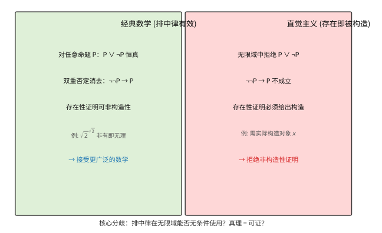
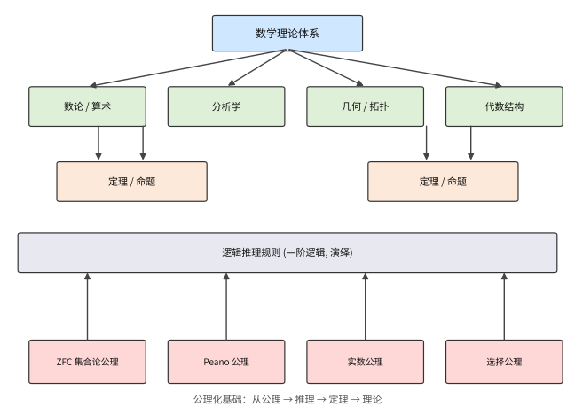

# 第 52 级：数学哲学 (Philosophy of Mathematics)

> 数学是什么？这是数学哲学最核心的问题。数学对象（如数、集合、函数）是独立存在的抽象实体，还是仅仅是人类心智的构造？数学真理是客观的、先验的，还是约定俗成的？数学证明的本质是什么？数学为何能如此有效地应用于自然科学？这些问题从古希腊柏拉图时代起就困扰着哲学家和数学家，而 19 世纪末至 20 世纪初的数学基础危机——集合论悖论的发现、非欧几何的诞生、Gödel 不完全性定理的冲击——更是将数学哲学推向了现代思想舞台的中心。本课程系统梳理数学哲学的基本问题、主要流派和核心论证，帮助读者建立对数学这门学科深刻的哲学理解。

---

## 1. 学习目标

1. 理解数学哲学的基本问题域，包括本体论、认识论和语义学三个维度。
2. 掌握柏拉图主义、唯名论、直觉主义、逻辑主义、形式主义、构造主义和结构主义等主要流派的核心观点与论证。
3. 深入理解数学基础危机的历史脉络及其哲学意义。
4. 掌握 Gödel 不完全性定理和完备性定理的哲学含义，理解其对于数学公理化计划的深刻影响。
5. 理解 Church-Turing 论题和可判定性理论的哲学意义。
6. 掌握 Cantor 对角线论证、连续统假设独立性和 Skolem 悖论所揭示的数学哲学问题。
7. 理解数学实在论与反实在论之间的核心争论，形成自己的批判性思考。
8. 理解数学与经验科学之间关系的不同哲学立场。
9. 深入理解数学认识论的核心问题（Benacerraf 问题），掌握各流派化解"认识论困境"的策略（§2.14）。
10. 掌握约定论（Poincaré、Carnap、Wittgenstein）的立场、价值与局限（§2.15）。
11. 掌握证明论的基本概念（切消定理、序数与超限归纳）及其对"证明"概念的技术性重塑（§2.16）。

---

## 2. 核心概念

### 2.1 数学哲学的基本问题 (Foundational Questions)

> **来龙去脉（历史动机）**：早在毕达哥拉斯（Pythagoras，约公元前 6 世纪）追问"数到底是不是万物的本源"时，人类就开始对数学的根基发问；柏拉图（Plato）则把它推向顶峰——他认为数学对象是"可知而不可见"的完善实在。两千多年里，这个问题始终是哲学暗流。**核心争议**是：数学究竟描述一个独立于我们的世界，还是仅仅记录我们思维中的约定？真正把它推到聚光灯下的，是 19 世纪末的数学基础危机（见 §2.13）——那时"几何不再是唯一真理"、集合论又接连爆出悖论，逼迫人们正面回答"数学到底是什么"。本节先铺开三个最基础的提问维度——本体论、认识论、语义学，它们恰是后面所有流派论战的"棋盘"。

数学哲学主要围绕以下三个相互关联的问题展开：

**本体论问题 (Ontological Questions)**：数学对象是否存在？如果存在，它们以何种方式存在？例如，自然数"2"是一个独立于人类心智的抽象实体，还是仅仅是我们思维中的一种构造？

**认识论问题 (Epistemological Questions)**：我们如何获得数学知识？如果数学对象是抽象的非时空实体，我们如何与之发生认知接触？数学知识的确定性和先验性从何而来？

**语义学问题 (Semantic Questions)**：数学陈述的意义是什么？"1 + 1 = 2"这样的陈述是在描述某种客观事实，还是仅仅表达了某种约定的规则？

这三个问题相互交织，构成了数学哲学争论的基本框架。任何完整的数学哲学都需要同时回答这三个维度的问题。

> **直观理解（现实类比）**：把数学比作一座"无形的城市"。本体论问"这座城市到底存不存在、建在哪里"（数仿佛生活在其中）；认识论问"住在别处的我们凭什么知道城里的街道和坐标"（我们如何认识数学对象）；语义学问"我们说的'1+1=2'这句话，到底是在描述城里的一座桥，还是只是一句约定好的暗号"。三者分开是三个问题，合起来就是"这座城存在、我们怎么知道它、我们的话指的是什么"这套完整追问。

### 2.2 柏拉图主义 (Platonism)

> **来龙去脉（历史动机）**：这套立场的源头直指柏拉图（约公元前 4 世纪）。在毕达哥拉斯那里，数还带着神秘的宗教色彩；亚里士多德则把数学对象降格为从具体事物里"抽象"出的属性。柏拉图给出最强硬的版本：数学对象是独立存在、永恒不变的抽象理念。**它要解决的核心问题**是数学的特殊地位——为什么 $1+1=2$ 无论何时何地都为真，仿佛丝毫不受经验牵绊？柏拉图用"抽象实在王国"一次性解释了数学的客观性、确定性与先在性。**争议则在于**：这个"王国"究竟在哪、我们又凭什么够得到它（这直接引出认识论困境，详见第 2.14 节）。本节给出这个立场最经典的形态、要点与论证。

**柏拉图主义**（Platonism）是数学实在论（mathematical realism）最经典的形态。其核心主张是：数学对象是独立于人类心智、语言和物理世界的抽象实体，它们客观存在，且数学真理是对这些独立实在的描述。

**核心论点**：

1. **存在论主张**：数学对象（数、集合、函数、几何图形等）是真实存在的抽象实体。它们不像物理对象那样存在于时空之中，也不依赖于我们是否思考它们。
2. **独立性主张**：数学真理是客观的，独立于我们的知识、信念或语言。即使没有任何理性存在者，$1 + 1 = 2$ 仍然为真。
3. **真值符合论**：数学陈述的真假取决于它们是否与数学实在相符合。

**经典论证**：Gödel 曾为柏拉图主义辩护，认为我们拥有一种类似于感官知觉的"数学直觉"（mathematical intuition），它使我们能够直接感知到数学对象。他指出，集合论公理（如选择公理）的真值可以通过这种直觉来判定。

**代表人物**：柏拉图 (Plato)、Gödel、Penelope Maddy

> **直观理解（现实类比）**：柏拉图主义相信数学如同一个"早就存在的平行宇宙"——素数、集合、几何图形都在那里静静等着我们去"发现"，就像哥伦布发现新大陆而非"发明"新大陆。哪怕全人类和整个宇宙都不存在，$1+1=2$ 依然为真，因为那座"数之国"不依赖任何人的心智。它的直觉来自数学家的日常体验：当你想出一个新的定理时，往往感觉像"撞见了早已存在的规律"，而非凭空捏造——这正是"发现而非发明"的心理学依据。

**数学上的比喻**：研究数学如同研究物理世界——我们在探索一个独立存在的王国，而非发明它。

### 2.3 唯名论 (Nominalism)

> **来龙去脉（历史动机）**：唯名论把一条古老的"奥卡姆剃刀"（Ockham's Razor，"如无必要，勿增实体"）开满马力，砍向柏拉图主义的抽象实体。它真正的当代宣言来自 **Hartry Field** 1980 年的《Science without Numbers》。当时的背景是：哲学家普遍承认，数学在科学中如此有用（Quine–Putnam 不可分割性论证：我们为解释物理世界而最佳化理论时，难免要承诺其中的数、集合），这是柏拉图主义最难攻破的防线。Field 反其道而行，试图证明"就算没有数，科学照样能转"。**它要解决的问题**：我们真的必须在本体论里塞进一堆看不见的数、集合，才有资格拥有数学吗？**争议点**：数学在科学中的"不可分割作用"到底能否被化约掉。

**唯名论**（Nominalism）是柏拉图主义的直接对立面。其核心主张是：抽象数学对象不存在，数学不应被理解为关于抽象实体的理论。

**核心论点**：

1. **本体论节俭**：只承认具体存在的物理对象，拒绝承认抽象实体。
2. **重构策略**：数学陈述必须被重新解释为关于具体对象的陈述，否则将被视为没有真值。

**Field 的数学唯名论**：Hartry Field 试图在不假设数学对象存在的前提下重建科学理论。他认为数学可以被视为一种"方便的虚构"（useful fiction）——数学本身没有真值，但它在科学推理中起到工具性作用。Field 证明了 Newton 引力理论可以不用实数而用纯定性的几何关系来表述，以此论证数学不是科学不可或缺的组成部分。

**困难**：唯名论面临的主要挑战是解释数学在科学中无可替代的效用——如果数学只是虚构，为何它如此精准地描述物理世界？

**代表人物**：Hartry Field、Goodman、Quine（在其早期）

> **直观理解（现实类比）**：唯名论就像只承认"看得见、摸得着的实车"，拒绝承认"车型号码本"里的抽象编号真的对应某种存在。它认为世界上只有具体的物理对象，没有"数"这种藏在身后的幽灵。Field 的立场好比"用尺子画线代替用坐标算"——坚持纯几何的定性关系也能把牛顿引力讲通，从而论证数学只是"顺手的工具性虚构"（useful fiction），并非科学必不可少的零件。它最大的软肋正如文中所说：如果数学只是虚构，怎么偏偏处处精确贴合物理世界？这就像一个"不存在的账本"却总能算对账。

### 2.4 直觉主义 (Intuitionism)

> **来龙去脉（历史动机）**：直觉主义的奠基人 **L. E. J. Brouwer** 在 1907 至 1913 年间，针对数学基础危机（§2.13）给出一记"釜底抽薪"的回应。彼时 Cantor 的集合论悖论（如 Russell 悖论）令古典数学的根基摇摇欲坠，Frege 与 Russell 忙着"重砌逻辑地基"、Hilbert 忙着"加固形式系统"；Brouwer 却认为问题不在哪一块砖，而在方法论本身——凭什么允许只用"排中律"这种逻辑空洞地断言"某物存在"，却不亲手把它构造出来？**它要解决的问题**：如何让数学摆脱悖论，同时保住"数学是真实的人类心智活动"这一底色。**做法**是切掉不完备的非构造性证明，把"存在"收紧为"亲自构造出来"。**代价**则是放弃了一大批经典数学，也放弃了逻辑主义的立场。

**直觉主义**（Intuitionism）由 L. E. J. Brouwer 创立，是数学哲学中最重要的反实在论立场之一。其核心主张是：数学是心智构造活动的产物，数学对象只存在于人类思维之中。

**核心论点**：

1. **数学即心智构造**：数学对象不是被发现的，而是被构造的。一个数学对象存在的唯一方式是它可以被人类心智构造出来。
2. **排中律的拒绝**：直觉主义拒绝在无限域中应用排中律（law of excluded middle）$P \lor \neg P$。在有限情形下排中律显然成立，但在无限情形下，我们可能无法构造性地证明 $P$ 或 $\neg P$。
3. **存在即被构造**：存在性证明必须提供具体的构造方法。"存在一个 $x$ 使得 $P(x)$" 意味着我们能够实际构造出一个满足 $P$ 的对象。

**数学实践**：直觉主义逻辑与经典逻辑不同。在直觉主义逻辑中，$\neg \neg P \to P$（双重否定消去）不成立。这意味着从"不存在 $x$ 使得 $P(x)$ 不成立"不能推出"存在 $x$ 使得 $P(x)$ 成立"。

**Brouwer 的固定点定理**：Brouwer 在拓扑学中证明了著名的 **Brouwer 固定点定理**，但他本人对该定理的非构造性证明并不满意，这促使他走向直觉主义道路。

**代表人物**：L. E. J. Brouwer、Arend Heyting、Michael Dummett

> **直观理解（现实类比）**：直觉主义与经典数学的分歧，就像"证明某件宝物藏在门后"与"直接把门打开看到宝物"的区别。经典数学只要从逻辑上排除"门后没有宝物"的可能，就敢断言"宝物在门后"（排中律）；直觉主义则要求你必须亲手打开门、亲眼看到宝物才算数（构造性证明）。在无限的世界里，经典数学允许这种"逻辑上的保证"，而直觉主义坚持每一步都要给出具体的构造。

### 2.5 逻辑主义 (Logicism)

> **来龙去脉（历史动机）**：逻辑主义的宏愿可追溯到莱布尼茨（Leibniz，17 世纪）"把推理变成计算"的梦想，但它最辉煌的工程由 **Frege** 在 1879–1903 年间完成。当时微积分刚在 Cauchy、Weierstrass 手里严格化，数学家发现算术的根基仍被"数"这个含混概念拖着走；Frege 想证明"算术不过是被放大了的逻辑"，从而一次性给出数学无可置疑的确定性。**它要解决的问题**：数学的真理凭什么"先验且必然"？如果它原来只是逻辑的一部分，那它的确定性就自动获解。**转折点在 1902 年**：Russell 的悖论如同一枚炸弹，让 Frege 自己承认"算术的根基坍塌了"——这是数学基础危机中最戏剧性的一幕（见 §2.13）。

**逻辑主义**（Logicism）的核心主张是：数学可以还原为逻辑。也就是说，数学概念可以通过纯逻辑概念来定义，数学定理可以从逻辑公理推导出来。

**核心论点**：

1. **数学即逻辑的延伸**：所有数学真理——包括算术和分析——都是逻辑真理。
2. **概念的可定义性**：数学概念（如自然数、函数、集合）都可以用纯逻辑术语定义。
3. **认识论优势**：如果数学是逻辑的一部分，那么数学知识的先验性和确定性就可以从逻辑的确定性得到解释。

**Frege 的定义**：Gottlob Frege 在《算术基础》（1884）中定义了自然数：$n$ 是一个数，当且仅当存在一个概念 $F$ 使得 $n$ 是 $F$ 的"外延"（extension）。具体地，数 $0$ 被定义为"与自身不相等"这一概念的外延；数 $1$ 被定义为"与 $0$ 相等"这一概念的外延，依此类推。

**Frege 的定理**：Frege 从 Hume 原理（Hume's Principle）——"概念 $F$ 和 $G$ 有相同的数当且仅当 $F$ 和 $G$ 之间存在一一对应"——推导出了 Peano 算术公理。

**Russell 悖论**：Frege 的计划在 1902 年被 Russell 的一封信彻底摧毁。Russell 发现，如果允许任意概念的外延都是集合，那么考虑"所有不包含自身的集合的集合"会导致矛盾。这就是著名的 **Russell 悖论**（Russell's Paradox）：

$$
R = \{x \mid x \notin x\} \implies R \in R \iff R \notin R.
$$

**Russell 与 Whitehead 的回应**：在《数学原理》（Principia Mathematica, 1910–1913）中，Russell 和 Whitehead 通过类型论（type theory）来避免悖论，试图将整个数学还原为逻辑。虽然这一计划在技术上可行，但所需的公理（如无穷公理、选择公理）是否属于"纯逻辑"存在争议。

**代表人物**：Gottlob Frege、Bertrand Russell、Alfred North Whitehead

> **直观理解（现实类比）**：逻辑主义想证明"数学不过是逻辑的旗舰店"。好比一辆汽车的所有零件都可以用一套"标准螺丝"一一装配出来——数、函数、集合都能用纯逻辑词汇定义，算术定理都能从纯逻辑的公理一步步推导。这样数学就有了与逻辑同等的"绝对可靠、不言自明"的地位。但 Russell 的悖论掀了桌子：他构造"所有不包含自身的集合的集合" $R$，结果发现 $R\in R$ 与 $R\notin R$ 同时成立——就像"理发师只给不给自己理发的人理发，那他给不给自己理发？"舞台瞬间崩塌。这一记耳光打醒了"用朴素集合论给数学奠基"的天真计划。

### 2.6 形式主义 (Formalism)

> **来龙去脉（历史动机）**：**Hilbert** 在 20 世纪初（约 1900–1930）主持了这场"给数学立规矩"的大工程。面对集合论悖论带来的信任危机，他既不想像逻辑主义者那样拖家带口地搬进逻辑，也不想像直觉主义者那样砍掉大片经典数学，而是主张："数学的地基不需要意义，只需要不矛盾。"于是他把数学改造成纯粹的符号系统，只靠形式规则运行，再用有限的（finitistic）方法去证明系统自身一致。**它要解决的问题**：如何在不信赖一套神秘"数之王国"的前提下，为全部数学重建可靠地基。**争议点**：这种"符号游戏"凭什么在物理世界如此灵验？而 1931 年 Gödel 的两条定理，则从根上宣判了 Hilbert 计划"自证一致 + 完备"的目标不可行（详见 §3.1）。

**形式主义**（Formalism）与 Hilbert 的名字紧密相连。其核心主张是：数学是符号游戏，数学陈述的意义完全由它们在其中运作的形式系统所决定。

**核心论点**：

1. **数学即形式系统**：数学由一组初始符号、形成规则和变形规则（推理规则）组成。数学研究就是按照规则操作符号。
2. **意义无关性**：数学符号本身没有含义，它们只有在被解释时才有意义。数学真理是系统内的可证明性。
3. **一致性即存在**：对一个形式系统而言，"存在"就是"无矛盾"。如果一个形式系统是一致的，那么它所描述的对象就"存在"。

**Hilbert 计划**：Hilbert 为数学基础提出了一个宏大的纲领：

1. **形式化**：将全部数学形式化，即用一阶逻辑的公理系统表述。
2. **完备性**：证明该形式系统是完备的——每个数学真理都可以在该系统中被证明。
3. **一致性**：用有限的（finitistic）方法证明该形式系统的一致性，从而一劳永逸地确立数学的可靠性。

> **直观理解（现实类比）**：数学大厦就像一座用"积木"搭起的高楼：最底层的几块积木是公理（如 ZFC 集合论、Peano 公理），它们本身不被证明，只是"地基"；其上每一层都是通过逻辑推理规则（一锤一锤敲紧）从下层"砌"出来的定理；再往上就汇聚成分析、几何、代数等一幢幢"楼阁"。数学体系的魅力在于，只要地基结实（一致），整座大厦就能拔地而起。

**Gödel 的打击**：Gödel 不完全性定理（详见下文 §3.1）宣布了 Hilbert 计划的破产——任何足够强大的形式系统既不可能完备，也不可能在其内部证明自身的一致性。

**后期形式主义**：虽然 Hilbert 的原始计划失败了，但形式主义作为一种哲学立场仍然存在。现代形式主义者认为，数学研究就是在形式系统中进行推理，而一致性是数学合法性的唯一标准。

**代表人物**：David Hilbert、Haskell Curry、Rudolf Carnap（在其早期）

### 2.7 构造主义 (Constructivism)

> **来龙去脉（历史动机）**：构造主义不是一个单一的学派，而是对"非构造性证明"共同不满的一族立场，Brouwer 的直觉主义、Bishop 的构造性分析、Martin-Löf 的构造性类型论都在其列。它盯上的是这样一个经典怪现状：数学家常能"证明某物存在"，却拿不出那个物、也算不出它（见下文 $\sqrt{2}^{\sqrt{2}}$ 的例子）。**它要解决的问题**：数学的"存在"到底要不要给你点干货？构造主义者的答案是——要。**争议点**：一旦把"存在"标准提至"必须给出算法"，不少漂亮但纯存在性的经典定理会被一起拒绝，数学王国会不会被"越缩越小"？这与直觉主义共享同一个更深的判断：我们能构造出来的，才是我们真正知道的。

**构造主义**（Constructivism）是一个宽泛的范畴，包括直觉主义及其变体。其核心主张是：一个数学对象存在的证明必须是构造性的——必须具体展示如何构造（或计算）该对象。

**非构造性证明的例子**：考虑以下经典论证："存在无理数 $a, b$ 使得 $a^b$ 是有理数。"考虑 $\sqrt{2}^{\sqrt{2}}$。如果它是有理数，则结论成立（取 $a = b = \sqrt{2}$）；如果它是无理数，则取 $a = \sqrt{2}^{\sqrt{2}}, b = \sqrt{2}$，则 $a^b = (\sqrt{2}^{\sqrt{2}})^{\sqrt{2}} = \sqrt{2}^{2} = 2$，是有理数。这个证明使用了排中律（$\sqrt{2}^{\sqrt{2}}$ 要么是有理数要么是无理数），但没有告诉我们实际是哪一种情况——它是一个非构造性证明。

**构造主义的要求**：构造主义者要求证明必须提供算法或具体步骤。例如，证明"存在 $x$ 使得 $P(x)$"必须给出一个具体的 $x$ 以及 $P(x)$ 成立的构造性证明。

**代表人物**：Brouwer、Heyting、Errett Bishop（构造性分析）、Per Martin-Löf（构造性类型论）

> **直观理解（现实类比）**：构造主义把"存在"的标准提到天花板——不能只证明"某样东西必然存在"，还必须亲手把它"做出来"。$\sqrt{2}^{\sqrt{2}}$ 的例子是一把二选一的钥匙：经典数学不管你最后拿到哪把，反正"非开即不开"；构造主义者却斥责你"拿了把没齿的钥匙"，因为并没真的打开门。它就好比找宝藏不许只靠"地图上标了此地必有宝"的推理，必须真挖出金光闪闪的盒子（给出算法/具体构造）才算数。这使构造性证明通常更繁琐，但换来的"算法上可落地"与直觉主义一脉相承。

### 2.8 结构主义 (Structuralism)

> **来龙去脉（历史动机）**：结构主义的种子埋在 **Dedekind** 1888 年的《Was sind und was sollen die Zahlen?》里——他第一次把自然数定义为"任何满足递归公理的链条"，而不是天生自带意义的对象；1939 年法国 **Bourbaki** 学派更把几乎整个数学组织进代数、序、拓扑三种"母结构"之中。20 世纪后半叶，**Resnik、Shapiro、Hellman** 把这股思潮提炼为一种严肃的哲学立场。**它要解决的问题**：柏拉图主义被 Benacerraf 的"数到底是什么"难题（同一组结构可由无数系统实例化，见下文）逼得狼狈，结构主义则有本事绕过它——它宣称"对象不重要，位置才重要"，既保住数学的客观性、又避开"个体抽象对象"的种种尴尬。**争议点**：结构本身算不算一种抽象对象？若算，Platonism 的老问题便又回来了。

**结构主义**（Structuralism）是 20 世纪下半叶兴起的重要数学哲学流派。其核心主张是：数学研究的是结构而非对象——数学对象只是结构中的位置，没有内在的本质。

**核心论点**：

1. **对象即位置**：数学对象（如自然数"2"）不独立存在，它们只是在一个结构（如自然数结构 $\langle \mathbb{N}, 0, S, +, \cdot \rangle$）中占据一个位置。
2. **结构优先性**：结构先于对象。对象由其在一个结构中的关系来定义，而非相反。
3. **抽象性**：同一个结构可以被不同的具体系统所实例化。例如，自然数的 Peano 公理系统可以被 $\omega$ 序列、冯·诺依曼序数或 Zermelo 序数所满足。

**Bourbaki 学派**：法国 Bourbaki 学派（虽然没有明确宣称结构主义哲学）在其《数学原本》中系统地将数学建立在三种母结构之上：代数结构、序结构和拓扑结构。这体现了结构主义的思想方法。

**Shapiro 的 ante rem 结构主义**：Stewart Shapiro 认为结构是独立存在的抽象实体，类似于柏拉图主义的抽象对象，但这里的"对象"是结构而非个体。

**模态结构主义**：Geoffrey Hellman 提出了一种更温和的版本，认为结构陈述应该被理解为模态陈述——"如果存在一个满足某种结构的系统，那么..."——从而避免了本体论承诺。

**代表人物**：Bourbaki、Stewart Shapiro、Geoffrey Hellman、Michael Resnik

> **直观理解（现实类比）**：结构主义说"数学研究的是关系之网而非单点"。好比地铁图上的一个站名"2"并不自带意义，它的全部身份来自它在哪条线上、前后站的间距、换乘关系——换成另一个系统的名字，只要关系不变，它依然是那个"2"。自然数"2"可以被描述成 $\omega$ 序列、冯·诺依曼序数或 Zermelo 序数，本质都是"排在第二位、紧跟在 1 后"那个位置。这解释了为何同一套关系能在无数具体系统里"分身"。Bourbaki 把整个数学压缩进"代数、序、拓扑"三种母结构，正是把"关系优先、个体靠边"的纲领贯彻到底。

### 2.9 数学真理性 (Mathematical Truth)

> **来龙去脉（历史动机）**：当各流派吵完"数学对象存不存在"之后，自然的下一问是：就算对象存在（或不存在），"数学命题为真"究竟指什么？这个问题自 Thales 时代就潜伏，但真正被学术化是 19 世纪末 Frege 等人把"真"变成分析哲学核心概念之后。**它要解决的问题**：给"真"一个可辩护的判据（符合实在、可证、一致……），免得"数学真理"这四个字含混不清。**下表**把柏拉图主义、直觉主义、形式主义、逻辑主义、唯名论的"真理观"并列，是后续一切辩论的一页总账。

关于数学真理性的理解，各流派给出了不同的回答：

| 流派 | 真理观 | 数学真理的本质 |
|:---:|:------|:--------------|
| 柏拉图主义 | 符合论 | 数学陈述与独立数学实在的符合 |
| 直觉主义 | 可证性 | 真理 = 可构造性证明 |
| 形式主义 | 一致性 | 真理 = 系统内的可证明性 |
| 逻辑主义 | 逻辑真理 | 数学真理是逻辑真理的子类 |
| 唯名论 | 虚构论 | 数学陈述严格来说不为真，只是有用的虚构 |

### 2.10 数学本体论 (Mathematical Ontology)

> **来龙去脉（历史动机）**：本体论问题（ontological question）是各流派最初的旗帜，它可被二分：**实在论对反实在论**。柏拉图主义与（部分）结构主义坚持数学对象客观存在；直觉主义、形式主义、唯名论则否认它们独立存在。**它要解决的问题**：在承认"数学看起来很客观"这一现象之后，怎样才能给出最小的本体论承诺来兑现这种客观性。**争议点**：到底能不能"既保客观、又不承诺抽象个体"——结构主义正是在这条钢丝上试图站稳（见 §2.8）。

数学本体论探讨数学中"存在"的含义。不同流派的观点可概括如下：

- **实在论 (Realism)**：数学对象客观存在，独立于我们的认知。柏拉图主义是最典型的实在论。
- **反实在论 (Anti-Realism)**：数学对象不是独立存在的。直觉主义、形式主义、唯名论都属于反实在论。
- **中间立场**：结构主义试图在实在论和反实在论之间找到一条中间道路，认为结构是客观的，但个体对象不是独立存在的。

### 2.11 数学证明的本质 (Nature of Mathematical Proof)

> **来龙去脉（历史动机）**：证明是数学的灵魂，但"证明到底算数、又由什么构成"在 20 世纪被彻底重审。从 Frege 1879 年的 Begriffsschrift 把推理公式化开始，经 Hilbert 的形式化，再到 1976 年 Appel–Haken 用计算机证明四色定理，数学家第一次要问：只能被机器"验过"的长长符号串，还配不配叫"人可理解的证明"？**它要解决的问题**：给"证明"一个足够硬的定义（形式可验证），同时解释它与人类理解、直觉的关系。**争议点**：形式证明与非形式证明谁更"真实"，以及"理解"在证明中扮演什么角色。

数学证明是数学哲学的核心议题之一。传统上，数学证明被理解为从公理出发，通过逻辑推理规则得到结论的一系列步骤。然而，现代数学实践和计算机科学的发展对证明的概念提出了新的挑战：

**形式证明 vs. 非形式证明**：形式证明（formal proof）是完全按照逻辑规则书写的符号序列，可以被机器验证。非形式证明（informal proof）是数学家在论文中使用的日常证明，它省略了许多细节，依赖于读者的理解能力。问题在于：非形式证明与形式证明之间的关系是什么？

**计算机辅助证明**：1976 年，Appel 和 Haken 用计算机证明了四色定理。这引发了关于证明本质的哲学争论：计算机执行的成千上万次计算是否构成了一个"证明"？如果证明可以由机器完成，那么"理解"在证明中扮演什么角色？

**证明与真理**：直觉主义认为证明就是真理（真理 = 可证明性）。经典实在论则认为真理和证明是分离的——一个陈述可以为真，即便我们永远无法证明它。Gödel 不完全性定理的存在正好支持了后一种观点。

### 2.12 数学与经验科学的关系

> **来龙去脉（历史动机）**：数学之所以声名显赫，一大半功劳要算在它"精确描述自然"上。Galileo（17 世纪）早说"自然之书以数学写成"；棘手的则是没人解释得了"为什么"。1959–1960 年，物理学家 **Eugene Wigner** 在《The Unreasonable Effectiveness of Mathematics in the Natural Sciences》中用"不合理"（unreasonable）三个字，把这个谜推到聚光灯下。**它要解决的问题**：数学这套为纯好奇而造的结构，为什么偏偏能与物理世界严丝合缝？这个观察直接威胁形式主义、唯名论这类把数学当纯人为游戏的立场（见 §2.6、§2.3）。**争议点**：数学究竟是发现自然规律的语言、纯工具、科学的一部分，还是纯属幸运的结构匹配。

数学在自然科学中的"不合理的有效性"（unreasonable effectiveness）——物理学家 Eugene Wigner 的名言——是数学哲学中最令人困惑的问题之一。

**主要立场**：

1. **数学是科学的语言**：Galileo 曾说"自然这本书是用数学语言写成的"。数学提供了描述自然规律的最佳框架。
2. **数学是科学推理的工具**：数学是科学理论的演算工具，本身不提供关于世界的知识。
3. **数学是科学的一部分**：Quine 的"自然主义"（naturalism）认为数学与科学是连续的，数学真理和科学真理一样，都是我们最佳理论的一部分。
4. **数学是科学的模型**：数学结构为物理世界提供了模型，两者之间的匹配是一种经验事实。

**Wigner 的困惑**：Wigner 在 1960 年的著名文章中问道，为什么纯数学的抽象结构——那些最初只是出于数学家好奇心的产物——后来会在物理学中惊人地适用？例如，非欧几何为广义相对论提供了基础，群论为粒子物理提供了框架。这是否暗示了数学与物理世界之间存在某种深层联系？

> **直观理解（现实类比）**：Wigner 惊叹的"数学不合理的有效性"，像一张为下棋发明的棋盘规则，莫名其妙地成了现实世界八大行星运行的密码本。数学家纯粹出于"好玩、追求对称美"而磨出的群论、非欧几何，竟精准描述了粒子与引力。这就像随手画的一把钥匙，恰好打开了宇宙的一扇门——所以说"不合理"，是因为纯抽象到极致的产物居然用途密度远超预期。四种立场给出不同解释：语言（数学是先天的描述语法）、工具（只是演算）、科学的一部分（与科学一体）、模型（纯属幸运的结构对应）。

### 2.13 数学基础的危机 (Foundational Crisis)

> **来龙去脉（历史动机）**：这是把数学哲学从"哲学的边缘闲谈"推向"20 世纪数学核心议题"的直接导火索。它有三根引信——非欧几何（19 世纪 30 年代）、微积分严格化（19 世纪下半叶）、Cantor 集合论悖论（1897–1902）。**它要解决的问题**：当数学家发现"几何公理并不唯一"、"被当作天经地义的基础竟出现悖论"，就必须回答——数学的地基到底是什么、还要不要、还能不能要一个统一的地基。**它催生的答案**正是三大基础学派：逻辑主义（Frege/Russell）、形式主义（Hilbert）、直觉主义（Brouwer），第 2 节与第 3 节逐一展开。

19 世纪末到 20 世纪初，数学基础经历了一场深刻的危机，这场危机主要源于三个方面的挑战：

**1. 非欧几何的诞生**：Gauss、Lobachevsky 和 Bolyai 各自独立地发展出了非欧几何，打破了 Euclid 几何是唯一真理的观念。如果几何不是先验必然的，那么数学的基础是什么？

**2. 微积分的严格化**：Cauchy、Weierstrass、Dedekind 等人通过 $\varepsilon$-$\delta$ 语言和实数理论为微积分建立了严格的基础，但这一过程揭示出集合论才是数学的真正基础。

**3. 集合论悖论**：Cantor 的朴素集合论在 1890 年代到 1900 年代初期被一系列悖论震撼：

- **Cantor 悖论**（1899）：所有集合的集合会导致矛盾。
- **Russell 悖论**（1902）："所有不包含自身的集合的集合"导致矛盾。
- **Burali-Forti 悖论**（1897）：所有序数的序数导致矛盾。

这些悖论迫使数学家重新思考数学的基础，从而催生了三大基础学派：逻辑主义（Frege, Russell）、形式主义（Hilbert）和直觉主义（Brouwer）。

> **直观理解（现实类比）**：数学基础危机像一次"地基大验房"。原本大家笃信欧氏几何这座大厦的天花板和地基（也是唯一的一套）是铁打的；结果非欧几何来了，说明"地基也可以有不同的盖法"；微积分严格化又暴露出底层其实垫着"集合论"这块新基岩；而 Cantor 的种种悖论（所有集合的集合、自身不包含自身的集合）则像验房时发现"地基下面竟然是空的"，整个楼层摇摇欲坠。这一连串"爆裂声"逼得三位"包工头"各自提出补救方案——Frege/Russell 想用逻辑重砌、Hilbert 想用形式系统加固、Brouwer 想干脆按构造数自己盖——正是三大基础学派的由来。

### 2.14 数学认识论与 Benacerraf 问题（新增）(Mathematical Epistemology)

> **来龙去脉（历史动机）**：认识论问题（"我们怎么知道数学是对的"）在前几节反复"剧透"却从未正面展开。它的导火索是 **Paul Benacerraf** 1973 年发表的 The Mathematical Truth——他把柏拉图主义的本体论与认识论摆到一起，指出二者不可兼得：若数当真是"抽象、非时空、无因果作用"的实体，我们就没有任何机制能"碰上"它们、进而知道关于它们的事实。这个问题把不少哲学家逼向反实在论（§2.4、§2.5）。**它要解决的问题**：在承认或不承认数学对象之后，都得解释"知识从哪来"。**本节**介绍 Benacerraf 问题的完整形态、Gödel 的"数学直觉"回应，以及直觉主义、逻辑主义、结构主义各动用了哪种认知机制。

在 §2.1 里，认识论被列为数学哲学的三大维度之一；本节把它单独拎出来，深入一层。

**Benacerraf 问题 (Benacerraf's Problem)**：1973 年，Paul Benacerraf 提出，一个合理的数学哲学必须同时满足两条约束：

1. **语义学约束**：给数学语句一个统一、标准的真值语义（最好与一般语句共享，例如 Tarski 式的真之定义）；
2. **认识论约束**：解释我们如何获得数学知识（最好与一般知识的"接触 / 因果"认知观相容）。

柏拉图主义把数学对象设为抽象实体，满足了约束 1，却很难满足约束 2——抽象实体不在时空中、不与我们发生因果作用，那我们凭什么知道 $1+1=2$、乃至更深的事实？这正是 §4.1 表格里"认识论困境"的标准表述。

**Gödel 的"数学直觉"回应**：Gödel 坚持我们拥有一种既不同于感官、也不通过因果的直觉能力，可以直接"看到"抽象对象及其事实（例如集合论的公理）。于是他把认识论约束的"认知机制"放宽到超因果层面。**困难**：这种超直觉缺乏可靠的心理学证据，更像一个"待解释的黑箱"；Chihara 等批评者认为它只是给困难贴了个标签，而非真解决。

**其他流派的化解路径**：

- **直觉主义**：干脆否定独立对象，把数学归为心智构造——于是"知识"自动来自构造活动，认识论问题被消解（代价回顾 §2.4）。
- **逻辑主义**：把数学还原为逻辑，让数学知识的必然性共享逻辑的自明性（代价回顾 §2.5、§4.2）。
- **结构主义**：主张数学知识不必依赖与个体的因果接触，而靠对"系统性结构"的整体把握（但这又引出结构本体论之问，见 §2.8）。

> **直观理解（现实类比）**：Benacerraf 问题像"幽灵屋里的宝藏"。柏拉图主义说宝藏挂在看不见、摸不着、与世隔绝的"抽象阁楼"里；认识论则追问——那你怎么可能既知道宝藏的位置、还知道得这么准？Gödel 的数学直觉好比宣称"仙人有天眼、隔墙能看见"，可对不信的人这等于没解释。直觉主义干脆怼回去"宝藏原本就是我自己砌的"；结构主义则说"先别纠结宝藏材料，认识靠的是摸清整张地图的关系网"。这一问一答，恰好串起了前面几个流派各自的"认识论底气"。

### 2.15 约定论（新增）(Conventionalism)

> **来龙去脉（历史动机）**：约定论给出一种"并非在于客观'逐真'、而在于人选择的"的数学观。它的古典先驱是 **Henri Poincaré**（20 世纪初）：面对非欧几何的诞生冲击（§2.13），他主张几何公理"既非先验综合真理、也非经验事实，而是约定"——好比选尺子度量长度，选哪把尺本身无所谓对错，只有便利与否。后来 **Carnap** 把约定论推进到"语言框架"（linguistic framework）的层面，**Wittgenstein**（后期）在《关于数学基础的评论》里把数学规则比作"语法的延伸"。**它要解决的问题**：在放弃"数学是反映唯一客观实在"之后，仍能解释"为何我们对数学的某些条例不必斤斤计较、又是如何运行起来的"。**争议点**：如果数学只是约定，为什么数学的应用"不接受还价"？若完全约定，那股强烈的约束感又从何而来？——这正是形式主义、直觉主义对它的共同攻口。

**核心主张**：数学真理（至少其中一部分）源于我们做出的约定——是人的决策或语言规则决定了它们为真。

**Poincaré 的几何约定论**：对 Poincaré 而言，欧氏几何之于非欧几何不是"谁更真"，而通常只是"谁更简便"。选择哪种几何，就像在公制与英制之间作选择。

**Carnap 的语言框架**：Carnap 区分"内在问题"（intra-systematic，在某个既定语言框架内部问"存在素数吗"）与"外在问题"（pragmatic，是否采用该框架）。对内在问题有真假可言；对外在问题谈论的只是便利性。数学陈述（例如"存在无穷多素数"）在它所处的语言框架之内为真。

**Wittgenstein（后期）**：把数学命题看作一组可随时调整的"语法规则"——规则的改变是对规则本身的修改，而非发现新的事实。

**回应与局限**：约定论能解释"非欧几何的挑战"（选哪套只是约定），却在下面几处碰壁：①**数学的不可协商性**——$2+2=4$ 无法"约"成 $5$；②**数学的效用**——为何被"约定"出来的数学偏偏精确描述物理世界（回应 §2.12 的 Wigner 问题）；③**规定与事实的边界**难以界定。因此多数当代哲学家不再把约定论当作全称立场，但保留它作为解释"公理选择自由"的合理成分。

> **直观理解（现实类比）**：约定论把数学的一部分比作"靠左还是靠右行驶"这类社会约定——没有谁绝对更对，选定了就顺畅。Poincaré 说几何公理就是这样一把"自选尺子"；Carnap 则升级为"墨守一套语言规则"。但这个类比有软肋：行车规则你明天可以改成靠右，$2+2=4$ 你可改不成。于是问题回到——数学究竟是"我们说了算的语言"，还是"世界说了算的语言"？这恰恰是数学哲学最经典的拉锯。

### 2.16 证明论与证明的技术性（新增）(Proof Theory)

> **来龙去脉（历史动机）**：证明论（proof theory）是 Hilbert 纲领中分化出来的技术性学科——是"关于证明的证明的科学"。它在 1920 年代抱着一个宏大目标诞生：**用足够单纯、够"有限"的方法证明全部数学一致**。尽管 Gödel 的第二定理（§3.1）封死了"用有限法证明 PA 一致"这条路，证明论并没有死——1936 年 **Gentzen** 用超限归纳证明了 Peano 算术一致，把证明论从"宣告失败"重构为"研究证明结构自身的数学"。**它要解决的问题**：除了问"这段推理是否有效"，还要问"这段推理内部能否去掉冗余、能否删掉中间的'切'（cut）"，从而给"证明"一种可操作、可度量的技术形态。**本节**介绍切消定理、序数与超限归纳，以及它们如何让"证明"进入数学研究的前台（可与 §2.11 相互参照）。

**核心概念：cut 规则**：在 Gentzen 的序列演算（sequents calculi）里建立证明，常用到一条规则：由"从前提可推 $A$"和"从 $A$ 可推 $C$"推出"从前提到 $C$"。因为 $A$ 先被断言、其后再被消去，它就像一个"绕弯"的过渡结论——这条规则叫 **cut**。它让证明简洁，却也隐藏冗余。**证明论的一个关键问题**：这类中间过渡能完全消除吗？

**切消定理**（Gentzen 的 Hauptsatz / Cut Elimination Theorem）：在一阶逻辑（经典与直觉主义）中，任何可证明的结论都存在一个**不含 cut** 的（规范化）证明。它的直观含义是：无论一段证明多"绕"，总存在一条"直达"路径。这也是揭示"逻辑一致性"结构性质的关键一步。

**超限归纳与序数 $\varepsilon_0$**：Gentzen 用按序数 $\varepsilon_0$ 的超限归纳证明了 Peano 算术的一致性推论。技巧在于：他把一段证明的"复杂度"编码为序数，每次删除一个 cut 都会令该序数严格下降；由于序数不存在无穷下降链，删除过程必然终止，于是证明本身必然结束。相比之下，Gödel 第一定理已表明这类"证明复杂度"内部表述不可行；Gentzen 的一致性证明因此必须动用 PA 内部无法表述的 $\varepsilon_0$ 超限归纳——这恰好印证了第二定理所划定的能力边界。

**技术性如何重新定义"证明"**：从证明论视角看，"证明"是一种可定位、可比较、可精简的对象——能用复杂度、证明长度、序数高度来度量。这把"证明"从哲学家的语义谜题，变成数学家案头可以计算的工程对象，是"证明的技术性"最具体的体现。

> **直观理解（现实类比）**：证明论像"给证明动手术"。Gödel 说"你证明不了自己一致"，Gentzen 却绕开这条禁令，改用更长一级的楼梯（超限归纳到 $\varepsilon_0$）成功做通了算术的"一致性手术"——代价是手术台必须搭在原本那栋楼之外。而切消定理像是"把解题里那个绕弯剪掉"：不管证明绕得多远，总有一条不绕的"直达隧道"。这两个结果让"证明"第一次变成可度量的工程对象，而非哲学家的玄谈。

---

## 3. 定理与证明的哲学意义

### 3.1 Gödel 不完全性定理的哲学含义 (Gödel's Incompleteness Theorems)

> **来龙去脉（历史动机）**：1931 年，年仅 25 岁的 **Gödel** 连发两条定理，从根上改写了数学哲学的地图。此前 Hilbert 的纲领（§2.6）许诺：一套够强的公理应当既一致又完备——每一个数学真理都能被证明。Gödel 用一句话击碎了它：任何含 Peano 算术的一致形式系统既不完全、也证不了自身一致。**它要解决的问题**：正面回答"到底能不能给数学一个'封顶'的公理化地基"。**结论**是不能——数学真理永远溢出任何固定的形式系统。这正是 20 世纪"真理与可证明性分离"论争的起点，详见下方思考历程。

**定理 3.1**（Gödel 第一不完全性定理，1931）任何包含 Peano 算术的一致的形式系统 $T$ 都是不完全的：存在一个算术语句 $\varphi$，使得 $\varphi$ 在 $T$ 中既不可证明也不可否证。

**定理 3.2**（Gödel 第二不完全性定理，1931）任何包含 Peano 算术的一致的形式系统 $T$ 都不能证明自身的一致性，即 $T \nvdash \text{Con}(T)$。

**哲学含义**：

1. **形式化的固有局限**：数学不能完全被形式化。任何形式系统都无法捕捉到全部数学真理。这意味着数学理解本质上超越了任何算法过程。

2. **Hilbert 计划的终结**：Gödel 定理直接宣告了 Hilbert 计划的核心目标——证明数学形式系统的一致性和完备性——是不可实现的。

3. **真理与可证明性的分离**：Gödel 定理表明，存在为真但不可证明的数学真理。这为柏拉图主义提供了强有力的支持——数学真理超越了我们的证明能力。

4. **心智与机器的界限**：Gödel 定理被 J. R. Lucas 和 Roger Penrose 用来论证人类心智超越计算机——人类能够"看到"Gödel 语句的真值，而形式系统（机器）无法证明它。这一论证存在争议，但引发了深刻的哲学讨论。

5. **数学创造性的空间**：如果数学不是完全形式化的，那么数学创造性和直觉就具有不可替代的地位。

> **🧠 思考历程：25 岁时的一场自我拆台，怎么反而成了 20 世纪数学的"定盘星"？**
>
> Gödel 不完全性定理亲手扑灭了一世纪的梦想——Hilbert 想用一套公理把"数学的一致性"彻底证明。可就是这个"失败"，重新定义了数学与逻辑、心智与机器的关系。
>
> - **Hilbert 的承诺曾是那么诱人**。1900 年后，Hilbert 提出：把数学锁定在一套严格公理里，证明它既一致又完备，从而一劳永逸地为数学奠基。**那几乎是全欧洲数理逻辑的愿望清单**：只要这计划成立，数学的一切问题都可判、可证。
> - **哥德尔暗中"把公式偷换成关于自身的陈述"**。哥德尔的高明在于**给每个符号串（公式）编号**，然后把"我没有编号为 $n$ 的证明"造出来——它恰好指到自己。于是构造出的语句 $\varphi$ 说"我不可证明"：若它是假，就真有证明矛盾；只好承认它"真且不可证"。**"自我指涉"第一次被严谨地搬进算术。**
> - **第二定理：连"自己一致"都证明不了**。紧跟其后的推论更狠：一个够强（含 Peano 算术）的形式系统甚至无法证明**它自身的一致性**（$T\nvdash \text{Con}(T)$）。这意味着 Hilbert 计划的核心目标——给数学一个自足的、能自证一致的地基——从根本上不可行。
> - **它分裂出的三个判断**。真"不等于"可证（条款 3）；"一切皆可判定"的期望泡汤；而是否"人类心智=可计算过程"也成了开放问题（条款 4）。**数学从此明白：完备的基础，可能根本不存在；却有永远做不完的真理等待发现。**
> - **心路**：Gödel 告诉你三件事：**一是"想用一套规则封尽所有真理"，在数学上就无法达成**；**二是"真理"与"可证明"本是两个概念，别急着划等号**；**三是数学所以不朽，正因为它永远有超出任何固定框架的余地。**

### 3.2 Gödel 完备性定理的哲学含义 (Gödel's Completeness Theorem)

> **来龙去脉（历史动机）**：1930 年，年仅 24 岁的 Gödel 在自己的博士论文里证明了这个"顺理成章却一直没人证出来"的结果：一阶逻辑的语法（可证明）与语义（逻辑蕴含）完全重合。它要回答的其实是 Hilbert 与其对手长期争执的问题——"逻辑的公理到底够不够全"。一战前 Frege 与 Hilbert 就"公理是否自明"吵得不可开交；Gödel 用一个干净的结果收束战局：**只要是一阶逻辑真能推出的结论，就一定能被一阶逻辑的形式规则证明**。**争议点**：这套"完美的逻辑"却招架不住算术理论自身的不可判定问题——与 §3.1 形成奇妙的张力。

**定理 3.3**（Gödel 完备性定理，1930）一阶逻辑是完备的：对于任意一阶语句集 $\Sigma$ 和任意一阶语句 $\varphi$，$\Sigma \models \varphi$（语义蕴涵）当且仅当 $\Sigma \vdash \varphi$（语法可推演）。

**哲学含义**：

1. **一阶逻辑的完美性**：Gödel 完备性定理表明一阶逻辑的语义和语法完美对应——逻辑推论恰好就是逻辑可证明的。这意味着一阶逻辑是"理想的"逻辑框架。

2. **与不完全性定理的对比**：Gödel 完备性定理（关于逻辑）与不完全性定理（关于算术理论）形成了鲜明的对比。一阶逻辑本身是完备的，但在一阶逻辑中表述的算术理论是不完备的。这说明数学的不完备性源自数学内容本身，而非逻辑框架。

3. **一阶 vs 高阶逻辑**：二阶逻辑等更强大的逻辑系统不具备完备性定理。这促使数学基础研究者倾向于使用一阶逻辑作为形式化的框架，尽管一阶逻辑的表达能力有限。

> **直观理解（现实类比）**：一个形式系统就像一套"象棋规则"：形式语言是棋盘上的棋子符号和走法规则（语法），语义是"将军""吃掉"这些规则赋予了符号的动作含义（解释），模型则是某局实际摆出来的具体棋局（满足规则的实例）。到底"这一步是否合法"有两种判定：按规则一步步推演（语法推演 $\vdash$）和看它在所有棋局中都成立（语义蕴涵 $\models$）——Gödel 完备性定理断言，在一阶逻辑里这两种判定永远一致。

### 3.3 Church-Turing 论题的哲学意义 (Church-Turing Thesis)

> **来龙去脉（历史动机）**：**判定问题**（Entscheidungsproblem）是 Hilbert 1928 年掷给数理逻辑的终极考题：有没有一个通用算法，能在有穷步内判出任意一阶逻辑命题的真假？1936 年 **Alonzo Church** 与 **Alan Turing** 几乎同时、用两条独立路线（$\lambda$ 演算与 Turing 机）给出否定答案；Turing 顺手定义的"Turing 机"后来成了整个计算机科学的基石。**它要解决的问题**：替"可计算 / 可判定"划下绝对边界，从而回答"机器的能力到底有没有天花板"。**争议点**：直觉意义上的"可计算"缺少形式定义，所以 Church–Turing 论题是一条经受反复检验的"论题"而非可形式证明的定理。

**论题 3.4**（Church-Turing 论题）一个函数是直观意义上"可计算的"当且仅当它是 Turing 机可计算的（或等价地，是递归函数、$\lambda$ 可定义的等）。

**哲学含义**：

1. **计算的哲学边界**：Church-Turing 论题划定了计算能力的绝对界限。某些问题（如停机问题、判定一阶逻辑公式是否为永真公式）在原则上是不可计算的。

2. **可判定性**：Hilbert 的 Entscheidungsproblem（判定问题）——是否存在一个通用算法来确定任何数学陈述的真假——被 Church 和 Turing 独立地证明为不可解。这进一步揭示了数学知识的局限性。

3. **物理世界的计算边界**：Church-Turing 论题不仅适用于数学，也对物理世界有深刻影响。如果物理世界可以被模拟为某种计算过程，那么物理过程也受限于计算能力的边界。

4. **量子计算的挑战**：量子计算能否超越经典 Turing 机的计算能力？目前的主流观点认为，量子 Turing 机在计算能力上并不超越经典 Turing 机（它们计算相同的函数类），只是在效率上有显著差异。

> **直观理解（现实类比）**：Church-Turing 论题划定了"能算的边界"——所有"直觉上可算"的问题，都逃不出 Turing 机这台工厂的产能。就像"可演奏的曲目"这个集合，无论你用钢琴、吉他还是电子合成器，能弹的音符组合完全相同，只是快慢音色不同；同理，递归函数、$\lambda$ 演算、Turing 机这些"不同乐器"弹奏的其实是同一片"可计算"的曲目全集。它的哲学分量在于：停机问题、判定任何数学命题真假这类问题，在原则上就永远"谱不出曲"——不是我们还没学会，而是根本不存在那样的乐谱。量子计算也只是换了个更快的乐器，翻不了这堵"可计算"的墙。这给"计算能力有没有上限"提供了铁的支柱。

### 3.4 Cantor 对角线论证的哲学意义 (Cantor's Diagonal Argument)

> **来龙去脉（历史动机）**：1874 年 **Cantor** 第一次让数学家目瞪口呆——实数竟然比自然数"多得多"；1891 年的对角线论证则给出了一个极其简洁、可复用的证明，成为他那套"超穷数"（transfinite numbers）理论的支柱。它之所以成为哲学话题，是因为它直面一个困扰人类两千年的问题：**无穷到底有多少种**？亚里士多德只承认"潜在无穷"，Cantor 则大胆认定"实无穷"，并为之发明了一整套基数层级。**争议点**：实无穷是否真实存在？另外，这条漂亮的论证后来被 Gödel 与 Turing 复刻成自我指涉武器，成了整座数学哲学大厦的承重墙（见 §3.1、§3.3、§3.5）。

**定理 3.5**（Cantor 定理）实数集 $\mathbb{R}$ 是不可数的，即 $|\mathbb{R}| > |\mathbb{N}|$。更一般地，对于任意集合 $A$，$|A| < |\mathcal{P}(A)|$（幂集的基数严格大于原集合的基数）。

**Cantor 对角线论证**（针对实数）：假设实数集是可数的，则存在一个枚举 $r_1, r_2, r_3, \ldots$。将每个实数写成十进制小数：
$$
\begin{aligned}
r_1 &= 0.a_{11}a_{12}a_{13}\ldots \\
r_2 &= 0.a_{21}a_{22}a_{23}\ldots \\
r_3 &= 0.a_{31}a_{32}a_{33}\ldots \\
&\ \vdots
\end{aligned}
$$
构造一个新实数 $d = 0.b_1b_2b_3\ldots$，其中 $b_i \neq a_{ii}$（例如，$b_i = 1$ 如果 $a_{ii} \neq 1$，否则 $b_i = 2$）。则 $d$ 与所有 $r_i$ 都不同，矛盾。

**哲学含义**：

1. **无穷的层次结构**：Cantor 的论证揭示了无穷不是单一的——存在不同"大小"的无穷。这引发了关于无穷概念的哲学争论：无穷集合是否真的存在？如果存在，它们是否构成一个"实在"的层级结构？

2. **数学直觉的局限**：Cantor 的结论违背了许多人的直觉——一条线段上的点与整个平面上的点一样多（$|\mathbb{R}| = |\mathbb{R}^2|$）。这说明数学直觉不能作为真理的最终标准。

3. **构造主义的质疑**：直觉主义者/构造主义者拒绝接受 Cantor 的论证，因为它依赖于对无穷集合的实在论假设。对于构造主义者来说，$\mathbb{R}$ 的"不可数性"只是意味着不存在一个构造性的方法将 $\mathbb{R}$ 与 $\mathbb{N}$ 一一对应。

4. **对角线论证的普遍性**：对角线论证不仅用于 Cantor 定理，也是 Gödel 不完全性定理和 Turing 停机问题的核心论证方法，具有深刻的数学哲学意义。

> **直观理解（现实类比）**：Cantor 对角线论证就像"造一个所有名单都盖不住的逃票者"。假设你列了本全是实数的"花名册"（每个 $0.a_{i1}a_{i2}\cdots$ 是一个号码），对角线论证沿"每行的第 $i$ 位"一路改造，造出一个新数 $d$，它和第一行至少第 $1$ 位不同、和第二行至少第 $2$ 位不同……所以哪个都不匹配。于是花名册永远盖不完整——实数比自然数"多出无限多档"。这个技巧的威力远不止于实数：把"自己说自己不可证明""自己说自己不停机"都塞进去，就成了 Gödel 与 Turing 的核心武器，堪称"自我指涉的自省手术刀"。

### 3.5 连续统假设的独立性的哲学意义 (Independence of the Continuum Hypothesis)

> **来龙去脉（历史动机）**：这是 Cantor 1878 年提出、Hilbert 1900 年列为"23 个问题之首"的世纪难题：介于自然数的可数无穷与实数集的不可数无穷之间，还有没有第三种无穷？六十多年悬而未决；**直到 1940 年 Gödel 证明 ZF 兼容 CH、1963 年 Cohen 又证明 ZF 兼容 $\neg$CH**，人们才明白：它不是"没解出来"，而是"在当前公理下本就没有确定解答"。**它要解决的问题**：ZFC 这套被指望"奠基全体数学"的公理到底够不够强、够不够全。**争议点**：独立之后，实在论者与反实在论者为"CH 到底有没有客观真值"吵到今天，也把"何种新公理算数"逼成了开放问题。

**假设 3.6**（连续统假设，CH）不存在基数严格介于 $\aleph_0$（自然数集的基数）和 $2^{\aleph_0}$（实数集的基数）之间的无穷集合。即 $2^{\aleph_0} = \aleph_1$。

**定理 3.7**（Gödel, 1940）如果 ZF 集合论是一致的，那么 ZFC + CH 也是一致的（即 CH 在 ZFC 中不可否证）。

**定理 3.8**（Cohen, 1963）如果 ZF 集合论是一致的，那么 ZFC + $\neg$CH 也是一致的（即 CH 在 ZFC 中不可证明）。

**哲学含义**：

1. **ZFC 的不完备性**：CH 的独立性是 ZFC 不完备性的最显著例证。ZFC 作为数学的基础，无法回答关于无穷集合大小的基本问题。

2. **实在论 vs 反实在论的争论**：实在论者认为 CH 一定有一个确定的真值（要么真要么假），只是 ZFC 公理不足以判定它。反实在论者则认为 CH 的"真值"是一个没有意义的问题——不同公理系统可以扩展 ZFC，选择不同的公理会得到不同的答案。

3. **新公理的寻求**：一些集合论学家（如 Gödel）主张我们需要寻找新的公理来判定 CH。然而，什么样的新公理是"正确"的？这个问题本身就是一个深刻的哲学问题。

4. **数学基础的开放性**：CH 的独立性表明，数学基础不是一个封闭的、已完成的项目，而是一个不断发展的、开放的领域。

> **直观理解（现实类比）**：连续统假设（CH）问"有没有介于 $\aleph_0$ 和 $2^{\aleph_0}$ 之间的无穷大"——就像追问"分数以上、小数以下还有没有另一种数量级"。Gödel 和 Cohen 的双向结果说明：无论断言"有"还是"没有"，都不会跟 ZFC 打架——问题像"第五公设"一样横在这个公理框架里"说哪边都行"。实在论者坚称"答案一直在那儿，只是我们公理设少了"；反实在论者则说"这本就是没意义的问题，看你给什么新公理"。于是想判定它就得"拓新路"（寻求新公理），可那条新路该不该选、对不对，又成了新的哲学悬案——这正是数学基础"永远在进行时"的活写照。

### 3.6 Skolem 悖论的哲学意义 (Skolem's Paradox)

> **来龙去脉（历史动机）**：Skolem 悖论常被归功于 **Löwenheim (1915)** 与 **Skolem (1920, 1923)** 的定理：一阶理论若有无穷模型，就有可数模型。这个结果本身平平无奇，但套到 ZFC 身上就刺眼了——ZFC 里明明证明了"存在不可数集合"，它自己却有一个可数模型。**它要解决的问题**：整套"可数 / 不可数"概念到底是绝对的还是相对的？它暴露出**一阶逻辑在表达数学概念时的固有局限**，也让 **Putnam** 借它质疑数学实在论的根基。**争议点**："不可数"一旦随模型漂移，数学概念还有没有稳固的客观语义？实在论的常用回应是"上二楼"改用二阶逻辑，但那样又失去完备性（见 §3.2）。

**定理 3.9**（Löwenheim-Skolem 定理）如果一阶理论 $T$ 有一个无穷模型，那么 $T$ 有一个可数模型（即基数为 $\aleph_0$ 的模型）。

**Skolem 悖论**：ZFC 集合论中，我们可以证明"存在不可数集合"。但根据 Löwenheim-Skolem 定理，ZFC（如果一致）存在一个**可数模型**。在这个可数模型中，一个集合 $A$ 在模型内部"看起来"是不可数的，但在模型外部（从"真实"的元数学视角看）它实际上只有可数多个元素。

**哲学含义**：

1. **一阶逻辑的表达能力限制**：Skolem 悖论揭示了一阶逻辑的根本局限——一阶理论无法唯一地确定其模型的基数。当我们说"存在不可数集合"时，这一陈述在一阶逻辑中只能被"近似地"表达。

2. **相对性**："可数性"和"不可数性"不是绝对的属性，而是相对于某个模型而言的。这引发了关于数学概念客观性的深刻讨论。

3. **模型论与数学实在**：Skolem 悖论使得一些哲学家（如 Putnam）认为数学实在论面临严重困难——如果"不可数"这样的基本概念都是相对的，数学实在论的基础何在？

4. **回应**：实在论者通常回应说，Skolem 悖论只涉及一阶逻辑的模型，而"真正的"数学概念是在二阶逻辑中刻画的。但二阶逻辑不具备完备性，且其自身的哲学基础也面临挑战。

> **直观理解（现实类比）**：Skolem 悖论就像"彩票箱里的'满满当当'其实是相对的"。设想一个 $ZFC$ 的可数盒子（模型）里，装着 $ZFC$ 能证明的"不可数集合 $A$"。请竖起"一阶逻辑"这道审视镜：从盒子内部看，$A$ 找不到和自然数的一一对应，所以"不可数"成立；可盒子本身总共只装了可数多个对象，跳出盒子从元数学看，$A$ 其实只有可数个元素。结论是"可数/不可数"并不是铁板钉钉的绝对属性，而是相对某个模型才成立的说法。这让 Putnam 质疑数学实在论的根基——如果我们连"不可数"这么基础的概念都会随模型漂移，数学对象还稳如泰山吗？实在论的补救是"上二楼"升级到二阶逻辑，却换来完备性损失的新代价。

---

## 4. 学派讨论

> **来龙去脉（本节的用意）**：第 2 节介绍了主要流派的主张，第 3 节讨论了几个关键定理的哲学含义。本节改用"可比较的维度表格"，把五大学派（结构主义在 §2.8 单独介绍后也在此并入）的核心主张、代表人物、关键论证、优势与挑战并排罗列，便于你横向对照并形成自己的判断。它同时补足了前面叙事中被略去的**具体辩护细节**——例如柏拉图主义如何正面回应"认识论困境"（可与第 2.14 节相互参照）。

### 4.1 柏拉图主义 (Platonism)

| 维度 | 内容 |
|:----|:------|
| **核心主张** | 数学对象是独立存在的抽象实体，数学真理是对独立实在的描述 |
| **代表人物** | 柏拉图 (Plato, 约 427–347 BCE)、Kurt Gödel (1906–1978)、Penelope Maddy (1950–) |
| **论证** | Gödel 的"数学直觉"论证：我们拥有感知抽象数学对象的能力，就像我们拥有感知物理对象的能力一样。数学公理的真理性可以通过这种直觉来判断。 |
| **优势** | 1. 与数学实践的日常经验相符（数学家感觉自己在"发现"而非"发明"数学） 2. 为数学真理的客观性提供了最直接的解释 |
| **挑战** | 1. **认识论困境**：如果数学对象是抽象的非时空实体，我们如何与之发生因果联系？ 2. **Benacerraf 问题**：Paul Benacerraf 指出，如果柏拉图主义为真，那么我们关于数学知识的认识论就是不可理解的。 3. 无法解释数学在科学中的应用 |

### 4.2 逻辑主义 (Logicism)

| 维度 | 内容 |
|:----|:------|
| **核心主张** | 数学可以还原为逻辑 |
| **代表人物** | Gottlob Frege (1848–1925)、Bertrand Russell (1872–1970)、Alfred North Whitehead (1861–1947) |
| **关键著作** | Frege《算术基础》(1884)、《算术基本法则》(1893–1903)；Russell & Whitehead《数学原理》(1910–1913) |
| **论证** | 所有数学概念都可以用纯逻辑概念定义；所有数学定理都可以从逻辑公理推导出来 |
| **优势** | 1. 为数学知识提供了坚实的认识论基础 2. 展示了数学与逻辑的深刻联系 |
| **挑战** | 1. Russell 悖论：朴素逻辑主义面临矛盾 2. 类型论公理（无穷公理、选择公理）是否属于"纯逻辑"存在争议 3. Gödel 不完全性定理表明逻辑主义的认识论目标无法完全实现 |

### 4.3 形式主义 (Formalism)

| 维度 | 内容 |
|:----|:------|
| **核心主张** | 数学是符号游戏，数学真理就是系统内的可证明性 |
| **代表人物** | David Hilbert (1862–1943)、Haskell Curry (1900–1982) |
| **关键概念** | Hilbert 计划、元数学 (metamathematics)、有限主义 (finitism) |
| **论证** | 数学的本质是形式符号系统的操作，无需赋予符号任何"意义"；一致性是数学合法性的唯一标准 |
| **优势** | 1. 回避了数学本体论难题 2. 为数学的严格化提供了方法论框架 3. 促进了元数学和证明论的发展 |
| **挑战** | 1. Gödel 不完全性定理：Hilbert 计划的核心目标不可实现 2. 如果数学只是符号游戏，为什么它在科学中如此有效？ 3. 形式系统本身需要元数学来研究，元数学的哲学基础是什么？ |

### 4.4 直觉主义 (Intuitionism)

| 维度 | 内容 |
|:----|:------|
| **核心主张** | 数学是人类心智构造的产物，存在即被构造 |
| **代表人物** | L. E. J. Brouwer (1881–1966)、Arend Heyting (1898–1980)、Michael Dummett (1925–2011) |
| **关键概念** | 心智构造、排中律的拒绝、构造性证明、选择序列 (choice sequence) |
| **论证** | 数学的基础不是逻辑或公理，而是原始直觉——对"二合一"（two-oneness）的直觉，即对时间中发生的事件的感知 |
| **优势** | 1. 避免了与无穷相关的悖论 2. 提供了严格的构造性数学 3. 与计算机科学（构造性类型论、证明论）有深刻的联系 |
| **挑战** | 1. 拒绝了大量已被接受的经典数学（如非构造性存在性证明） 2. 主观主义倾向——数学真理是否依赖于个体心智？ 3. 在数学实践中，直觉主义逻辑的证明更加复杂和繁琐 |

### 4.5 结构主义 (Structuralism)

| 维度 | 内容 |
|:----|:------|
| **核心主张** | 数学研究的是结构，而非个体对象；对象只是结构中的位置 |
| **代表人物** | Bourbaki 学派 (1935–)、Stewart Shapiro (1951–)、Geoffrey Hellman (1945–)、Michael Resnik |
| **关键概念** | 结构 (structure)、位置 (place)、同构 (isomorphism) |
| **论证** | 数学中重要的是关系而非个体。例如，自然数"2"是什么不重要——重要的是"2"在自然数结构中的位置和关系 |
| **优势** | 1. 解释了数学对象的"多可实例化性"（同一结构可由不同系统实例化） 2. 与当代数学实践（范畴论、同调代数）高度一致 3. 回避了柏拉图主义的个体对象本体论难题 |
| **挑战** | 1. 结构本身的本体论地位是什么？ 2. 如何区分"同一结构"和"不同结构"？ 3. 空结构（如空集）是否构成一个结构？ |

---

## 5. 习题

**习题 5.1** 考虑以下陈述："存在无理数 $a, b$ 使得 $a^b$ 是有理数。"（1）给出该陈述的一个经典非构造性证明（如 §2.7 中的论证）。（2）尝试给出一个构造性证明。（提示：考虑 $a = \sqrt{2}, b = \log_2 9$ 或类似构造。）（3）讨论这两个证明在哲学意义上的区别。

**习题 5.2** Gödel 第一不完全性定理表明，任何包含 Peano 算术的一致形式系统 $T$ 中都存在一个真但不可证明的语句 $G_T$。假设我们扩展 $T$ 为 $T' = T + G_T$（即把 $G_T$ 作为新公理加入）。$T'$ 是否仍然不完全？如果是，$T'$ 中新的不可证明的语句是什么？这对"数学真理能否被完全公理化"这一问题有何启示？

**习题 5.3** 柏拉图主义面临的核心挑战是"认识论困境"：如果数学对象是抽象的非时空实体，我们如何与之发生认知接触？请阐述 Gödel 的"数学直觉"回应，并评估这一回应是否成功。你认为数学认识论还可以如何辩护？

**习题 5.4** 考虑 Löwenheim-Skolem 定理及其产生的 Skolem 悖论。假设 ZFC 有一个可数模型 $M$。在 $M$ 中，存在一个集合 $\omega^M$（$M$ 中的自然数集）和一个集合 $\mathbb{R}^M$（$M$ 中的实数集）。$M \models \text{"} |\mathbb{R}| > |\omega| \text{"}$。但在 $M$ 外部，$\mathbb{R}^M$ 和 $\omega^M$ 都是可数的。这是否意味着"不可数"是一个相对的概念？实在论者如何回应这一挑战？

**习题 5.5** 形式主义认为数学是"符号游戏"，数学真理就是系统内的可证明性。但为什么数学在自然科学中如此有效？Wigner 称之为"数学在自然科学中不合理的有效性"。请从形式主义、柏拉图主义和结构主义三个角度分别回应 Wigner 的问题。哪个回应最有说服力？为什么？

**习题 5.6** 直觉主义拒绝在无限域中应用排中律。考虑以下经典定理："每个有上界的实数集都有上确界。"（1）这个定理的经典证明是否使用了排中律或非构造性推理？（2）在直觉主义框架下，能否重新表述和证明上确界定理？（3）直觉主义数学对分析学的重构会面临哪些困难？

**习题 5.7** Cantor 对角线论证揭示了无穷的层次结构。构造主义者对 Cantor 的论证持批评态度。请从直觉主义/构造主义的立场分析 Cantor 对角线论证的哲学假设。Cantor 的论证是否依赖于排中律？如果排除了排中律，我们能否证明 $\mathbb{R}$ 是不可数的？"不可数"在构造主义框架中意味着什么？

**习题 5.8** 连续统假设（CH）在 ZFC 中独立。一些数学家（如 Woodin）主张通过寻找新的集合论公理来判定 CH，而另一些则认为 CH 的"真值"是一个没有意义的问题。请讨论：（1）一个数学命题是否在所有可能的公理系统中都必须有一个确定的真值？（2）如果我们可以自由选择是否接受 CH 作为公理，这是否意味着数学真理是"约定"的？这会对数学实在论产生什么影响？

**习题 5.9**（新增，对应 §2.14）关于 Benacerraf 问题：（1）用一句话讲清它要求数学哲学同时满足的"两条约束"。（2）说明为什么柏拉图主义难以同时满足二者，而直觉主义、逻辑主义分别用什么机制化解。（3）你认为哪条化解路径最终"最便宜"（在哲学代价上最小）？为什么？

> **答案 5.9**：（1）语义学约束——用统一、标准的真值语义解释"数学为什么会真"；认识论约束——用讲得通的机制解释"我们又凭什么知道数学"。（2）柏拉图主义把对象设为抽象、非时空、无因果作用的实体，能满足语义约束却没有因果机制"碰上"它们，认识论约束悬空；直觉主义把数学归结为心智构造，"知识"由构造活动直接产生，认识论约束被消解（代价是否定独立对象，放弃大批经典数学）；逻辑主义把数学还原为逻辑，数学知识的必然性共享逻辑的自明性（代价是逻辑主义本身遭遇 §2.5、§4.2 的困难）。（3）没有唯一标准答案。若你想保住经典数学的客观性，直觉主义不可取，结构主义"位置论"加拟合的认识论是常见折中；若你更看重认识论刚性，直觉主义最省事但抛掉大量经典。相对主流的判据是：既想要客观真、又想要可用的认知机制，结构主义最平衡——这也是 20 世纪下半叶它盛行的原因之一。

**习题 5.10**（新增，对应 §2.15）关于约定论：（1）Poincaré 主张几何公理是"约定"，那么"两点之间直线最短"这句话还有没有真假？（2）给约定论一个反例（例如 $2+2=4$ 能否被"约定"成 $5$）。（3）讨论把数学完全约定化后，会怎样破坏它对数学效用的解释（联系 §2.12 的 Wigner 问题）。

> **答案 5.10**：（1）在 Poincaré 看来，"两点之间直线最短"这类陈述的真假取决于你所采用的几何框架——它只在我们已选定的那套体系内"为真"；而选哪套框架本身没有真假，只有便利与否。（2）反例：数学的许多事实表现出"不可协商性"。你可以宣布"$2+2=5$"，但那只是改头换面地描述另一套约定，并不会改变"两个加两个"原本的意思；用 Kripke 式的说法，这些是必然真理，不是我们表决出来的约定。（3）若数学纯约定，它就没有义务贴合物理世界，可它偏偏贴合——Wigner 的"不合理有效性"会从"现象"升级为"致命疑难"。约定论必须要么否认物理能精确书写进数学、要么承认约定背后仍有客观约束，否则无法自圆其说。因此当代立场通常只把约定论用于"公理选择"的局部范围，而非数学整体的全称解释。

**习题 5.11**（新增，对应 §2.16）关于证明论：（1）用自己的话解释 Gentzen 切消定理与"无绕弯证明"的联系。（2）为什么 Gentzen 需要用按序数 $\varepsilon_0$ 的超限归纳才能证明 Peano 算术一致，而这个序数为何不能在 PA 内表述？（3）这一结果如何印证 Gödel 第二定理？

> **答案 5.11**：（1）切消定理断言在一阶逻辑中每个可证明的结论都存在不含 cut 规则的规范化证明，即把"通过中间结论 $A$ 的绕弯"剪掉，得到直达路径——直观就是"总有一条不绕的证明可走"。（2）删除 cut 的次数与证明的结构要用序数来编码；PA 的一致证明需借助按序数 $\varepsilon_0$ 的超限归纳，而这个归纳的原理对 PA 而言不可表述（超出其证明能力，Gödel 已证明任何可由 PA 内部表述的归纳都证不出 Con(PA)）。（3）这恰好构成第二定理的反向印证：第二定理说 PA 不能证明自己的 $\text{Con}(PA)$，因此任何 PA 的一致性证明都必须"升级"到 PA 之外动用更强大的工具；Gentzen 用 $\varepsilon_0$ 正是"外强一级"的典型例证。可理解为：第二定理封死了"自证一致"，Gentzen 则证明了"外部升级台阶"确实存在。

---

## 6. 总结

本章系统介绍了数学哲学的核心问题和主要流派，可以总结如下：

1. **数学哲学的基本问题**：围绕本体论（数学对象是否存在）、认识论（我们如何知道数学真理）和语义学（数学陈述的意义）三个维度展开。

2. **主要流派**：柏拉图主义（数学对象独立存在）、唯名论（数学对象不存在）、逻辑主义（数学可还原为逻辑）、形式主义（数学是符号游戏）、直觉主义（数学是心智构造）、构造主义（构造性证明为存在标准）和结构主义（数学研究结构而非对象）。

3. **数学基础危机**：19 世纪末至 20 世纪初的集合论悖论、非欧几何的诞生和微积分严格化运动，共同催生了数学基础领域的深刻反思和三大基础学派的形成。

4. **Gödel 定理的哲学意义**：Gödel 不完全性定理揭示了形式化的固有局限，宣告了 Hilbert 计划的破产，同时也为柏拉图主义提供了支持——数学真理超越了可证明性。Gödel 完备性定理则表明一阶逻辑是完美的推理框架，但一阶理论本身是不完备的。

5. **Church-Turing 论题与可计算性**：划定了数学可判定性的边界，决定了哪些问题在原则上是不可解的。

6. **Cantor 与无穷的层次**：Cantor 对角线论证揭示了无穷具有不同的"大小"，连续统假设的独立性表明了 ZFC 作为数学基础的不完备性，Skolem 悖论则揭示了一阶逻辑的表达能力限制。

7. **数学与科学的关系**：数学在自然科学中的"不合理的有效性"是数学哲学中尚未完全解决的深层问题，不同流派给出了不同的回答。

8. **认识论、约定论与证明论**：Benacerraf（1973）问题揭示了"数学客观为真"与"我们如何知道"之间的张力，直觉主义、逻辑主义、结构主义用不同机制化解（§2.14）；约定论（Poincaré、Carnap、Wittgenstein）主张部分数学真理来自人的约定，却难以解释其效用与不可协商性（§2.15）；证明论（切消定理、Gentzen 用序数 $\varepsilon_0$ 的超限归纳）让"证明"成为可度量的数学对象，并从反面印证了 Gödel 第二定理（§2.16）。

数学哲学不是关于具体数学定理的研究，而是对数学本身作为一门学科的本质、方法和基础的反思。它要求我们退后一步，审视数学实践背后的预设和承诺。正如 Gödel 所说："数学哲学的问题，如果不解决数学基础的问题，就永远无法最终解决。"而数学哲学的魅力恰恰在于，这些问题可能永远没有最终的答案，但追问的过程本身深化了我们对数学的理解。

---

> **延伸阅读**：
> 1. Benacerraf, P. & Putnam, H. (eds.) *Philosophy of Mathematics: Selected Readings*, 2nd ed. Cambridge University Press, 1983.
> 2. Shapiro, S. *Thinking about Mathematics*. Oxford University Press, 2000.
> 3. Linnebo, Ø. *Philosophy of Mathematics*. Princeton University Press, 2017.
> 4. 克莱因 (M. Kline) 著，《数学：确定性的丧失》，湖南科学技术出版社。
> 5. Gödel, K. "What is Cantor's Continuum Problem?" (1947/1964)
> 6. Wigner, E. "The Unreasonable Effectiveness of Mathematics in the Natural Sciences" (1960)