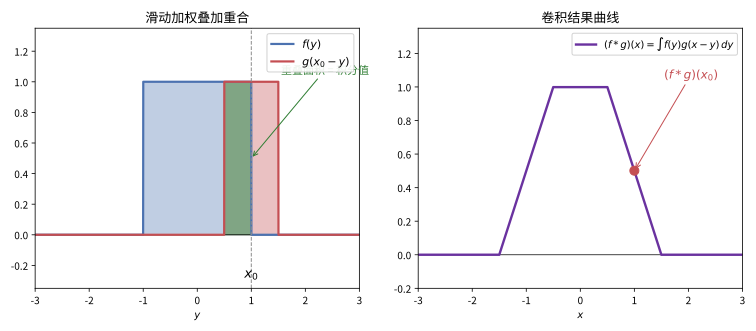
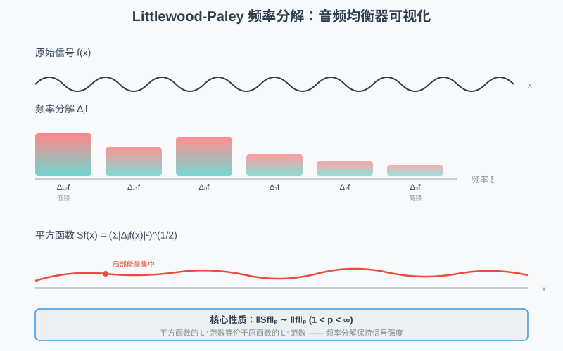

# 第 53 级：调和分析 (Harmonic Analysis)

> 调和分析是数学的核心分支之一，起源于 Fourier 研究热传导方程时提出的级数理论。它研究函数分解为基本谐波（正弦与余弦）的表示，以及这种分解在各种算子研究中的应用。现代调和分析已发展成为分析学中最为强大的工具之一，在偏微分方程、数论、信号处理、量子力学等领域有着深远的影响。本课程从 Fourier 级数的经典理论出发，逐步深入到 Calderón-Zygmund 理论、Littlewood-Paley 理论、Hardy 空间与 BMO 空间等现代调和分析的核心内容。

---

## 1. 学习目标

1. 理解 Fourier 级数的逐点收敛与 Cesàro 求和理论，掌握 Dirichlet-Jordan 定理与 Fejér 定理。
2. 掌握 Fourier 变换的基本性质，理解 Poisson 求和公式及其应用。
3. 理解振荡积分的基本概念与 stationary phase 方法。
4. 掌握 Calderón-Zygmund 分解定理及其证明，理解奇异积分算子的基本理论。
5. 理解 Littlewood-Paley 理论的核心思想，掌握平方函数与频率分解。
6. 理解 Hardy 空间与 BMO 空间的定义及基本性质。
7. 掌握拟微分算子的符号演算与基本性质。
8. 理解原子分解与 T(b) 定理的核心思想。

---

## 2. 核心概念

### 2.1 Fourier 级数

**定义 2.1**（Fourier 级数）设 $f: \mathbb{R} \to \mathbb{C}$ 是以 $2\pi$ 为周期的可积函数。$f$ 的 **Fourier 级数** 定义为：

$$
f(x) \sim \sum_{n=-\infty}^{\infty} \hat{f}(n) e^{inx},
$$

其中 **Fourier 系数** 为：

$$
\hat{f}(n) = \frac{1}{2\pi} \int_{-\pi}^{\pi} f(x) e^{-inx} \, dx, \quad n \in \mathbb{Z}.
$$

**定义 2.2**（部分和与 Dirichlet 核）Fourier 级数的第 $N$ 个 **部分和** 为：

$$
S_N f(x) = \sum_{n=-N}^{N} \hat{f}(n) e^{inx} = (f * D_N)(x),
$$

其中 **Dirichlet 核** 为：

$$
D_N(x) = \sum_{n=-N}^{N} e^{inx} = \frac{\sin\left((N+\frac{1}{2})x\right)}{\sin(x/2)}.
$$

> **直观理解（现实类比）**：卷积就像用一块"抹布"（核 $g$）贴着信号 $f$ 一路推移，每到一处就把重叠部分的取值加权求和。它和音频混音、图像高斯模糊是同一个运算——输出在每一点都是"周围输入按核加权后的重叠总和"，体现了"滑动 + 加权 + 叠加"的直观。

**定义 2.3**（Fejér 核与 Cesàro 求和）Fourier 级数的 **Cesàro 均值**（算术平均）为：

$$
\sigma_N f(x) = \frac{1}{N+1} \sum_{k=0}^{N} S_k f(x) = (f * F_N)(x),
$$

其中 **Fejér 核** 为：

$$
F_N(x) = \frac{1}{N+1} \sum_{k=0}^{N} D_k(x) = \frac{1}{N+1} \left(\frac{\sin\left(\frac{N+1}{2}x\right)}{\sin(x/2)}\right)^2.
$$

### 2.2 Fourier 变换

**定义 2.4**（Fourier 变换）设 $f \in L^1(\mathbb{R}^n)$，其 **Fourier 变换** 定义为：

$$
\hat{f}(\xi) = \mathcal{F}f(\xi) = \int_{\mathbb{R}^n} f(x) e^{-2\pi i x \cdot \xi} \, dx.
$$

**Fourier 逆变换** 定义为：

$$
\check{f}(x) = \mathcal{F}^{-1}f(x) = \int_{\mathbb{R}^n} f(\xi) e^{2\pi i x \cdot \xi} \, d\xi.
$$

### 2.3 Poisson 求和公式

**定理 2.5**（Poisson 求和公式）设 $f: \mathbb{R}^n \to \mathbb{C}$ 是 Schwartz 函数，则：

$$
\sum_{k \in \mathbb{Z}^n} f(k) = \sum_{k \in \mathbb{Z}^n} \hat{f}(k).
$$

更一般地，对于 $a > 0$：

$$
\sum_{k \in \mathbb{Z}^n} f(ak) = \frac{1}{a^n} \sum_{k \in \mathbb{Z}^n} \hat{f}\left(\frac{k}{a}\right).
$$

### 2.4 Heisenberg 群

**定义 2.6**（Heisenberg 群）**Heisenberg 群** $\mathbb{H}^n$ 是 $\mathbb{R}^{2n+1}$ 配备以下群运算的 Lie 群：

$$
(x, y, t) \cdot (x', y', t') = \left(x + x', y + y', t + t' + \frac{1}{2}(x \cdot y' - y \cdot x')\right),
$$

其中 $x, y \in \mathbb{R}^n$，$t \in \mathbb{R}$。

### 2.5 振荡积分

**定义 2.7**（振荡积分）**振荡积分** 是形如：

$$
I(\lambda) = \int_{\mathbb{R}^n} e^{i\lambda \phi(x)} a(x) \, dx
$$

的积分，其中 $\lambda > 0$ 是大参数，$\phi$ 是实值光滑函数（称为 **相位函数**），$a$ 是光滑函数（称为 **振幅函数**）。

**Stationary Phase 原理**：当 $\lambda \to \infty$ 时，振荡积分的主要贡献来自相位函数 $\phi$ 的临界点（即 $\nabla\phi(x) = 0$ 的点）。

### 2.6 奇异积分算子

**定义 2.8**（Calderón-Zygmund 算子）**Calderón-Zygmund 算子** 是具有如下形式的奇异积分算子 $T$：

$$
Tf(x) = \text{p.v.} \int_{\mathbb{R}^n} K(x, y) f(y) \, dy,
$$

其中核 $K$ 满足：
- **大小条件**：$|K(x, y)| \leq \frac{C}{|x-y|^n}$；
- **光滑性条件**：$|\nabla_x K(x, y)| + |\nabla_y K(x, y)| \leq \frac{C}{|x-y|^{n+1}}$；
- **标准性条件**：对于 $R > 0$，有 $\int_{R < |x-y| < 2R} K(x, y) \, dy = 0$。

> **🧠 思考历程：核函数在"自己附近"炸成无穷，怎么还能被拿来"平均"？**
>
> 奇异积分（如 Hilbert 变换、乘子算子）的核 $K$ 在对象附近有 $\frac1{|x-y|^n}$ 这种"炸开"的奇性，表面上看根本没法直接积分。调和分析漂亮的地方，正是把这种"危险平均"驯化成处处定义良好的算子。
>
> - **"主值（p.v.）"的意识：先挖掉奇点再取极限**。直接 $K(x,y)$ 在 $x=y$ 处爆掉，那怎么定义？**先在一个小半径 $\varepsilon$ 之外正常积分，再把 $\varepsilon\to0$**：只要"挖掉小洞后的净效果有限"，极限就叫主值积分（p.v.）。Hilbert 变换正由此诞生，原本恐怖的奇点被解剖成可驾驭的净贡献。
> - **光滑性条件防"畸变累积"**。光有大小 $|K|\le\frac C{|x-y|^n}$ 还不够，**还要求梯度也有可控衰减**（$|\nabla K|\le\frac C{|x-y|^{n+1}}$）——这是为了避免高频振荡在峰尖附近"拧麻花"导致积分失控。加进"标准性"$\int_{R<|x-y|<2R}K\,dy=0$，关键的高斯型"波动相消"就有了保障。
> - **从"可积"的直觉升级到 $L^p$ 有界**。上世纪 50 年代，Calderón 与 Zygmund 证明了这类算子不仅 $L^2$ 有界，还在**每个 $1<p<\infty$ 的 $L^p$ 上一致有界**——一问之下火力全开，C-Z 分解（见 3.3）成为把"坏函数"按尺度捡开再合并"好块"的通用武器。
> - **为什么值得较劲**。Fourier 乘子、Hilbert 变换、平方函数、BMO……几乎调和分析的整个工具箱，都挂在"奇异积分有界"这条主链上；现代微分方程与各向异性估计里的精细估计也反复用到它。**"把奇性控在有界"这一件事，撑起了整个现代分析的一大片天空。**
> - **心路**：奇异积分教会你：**遇事别被"这里有奇异、没法算"吓退，先问"挖掉奇点取极限，净效果是否稳定"**。学会"在爆点附近精细地分析、再决定收敛"，是调和分析也是整个分析学的看家功夫。

### 2.7 Littlewood-Paley 理论

**定义 2.9**（Littlewood-Paley 分解）选择 $\phi \in C_c^\infty(\mathbb{R}^n)$ 满足：

$$
\operatorname{supp}\phi \subset \{\xi : 1/2 < |\xi| < 2\}, \quad \sum_{j=-\infty}^{\infty} \phi(2^{-j}\xi) = 1, \quad \xi \neq 0.
$$

定义 **频率局部化算子** $\Delta_j$ 为：

$$
\widehat{\Delta_j f}(\xi) = \phi(2^{-j}\xi) \hat{f}(\xi).
$$

则 $f = \sum_{j=-\infty}^{\infty} \Delta_j f$ 称为 $f$ 的 **Littlewood-Paley 分解**。

**平方函数** 定义为：

$$
Sf(x) = \left(\sum_{j=-\infty}^{\infty} |\Delta_j f(x)|^2\right)^{1/2}.
$$

对于 $1 < p < \infty$，有 $\|Sf\|_p \sim \|f\|_p$。

> **直观理解（现实类比）**：Littlewood-Paley 分解就像音响上的**均衡器（EQ）**——把一首歌拆成低音（鼓点）、中音（人声）、高音（镲片）等频段，每个频段由一个 $\Delta_j f$ 描述。平方函数 $Sf$ 则像"总音量表"，把所有频段的能量汇总。关键性质 $\|Sf\|_p \sim \|f\|_p$ 意味着：不管你怎么分频段，总音量表的读数跟原始信号的响度始终成正比——这正是调和分析中"频率分解不丢失信息"的精确表述。

### 2.8 Hardy 空间与 BMO 空间

**定义 2.10**（Hardy 空间）**Hardy 空间** $H^p(\mathbb{R}^n)$（$0 < p < \infty$）由满足以下条件的分布 $f$ 组成：

$$
\|\mathcal{M}f\|_p < \infty,
$$

其中 $\mathcal{M}f(x) = \sup_{t>0} |(f * \phi_t)(x)|$ 是 **极大函数**，$\phi_t(x) = t^{-n}\phi(x/t)$，$\phi$ 是 Schwartz 函数且 $\int \phi \neq 0$。

> **直观理解（现实类比）**：极大函数像"用最苛刻的放大镜审视信号"——在每个点 $x$ 处，把所有大小圆盘上的平均值都算一遍，再取最大的那个。尽管它把尖峰"放大"了，它仍保持可积性阶（$\Vert Mf\Vert_p \le C_p\Vert f\Vert_p$），正如把地图放大再多倍，各区域的相对面积比例依然不变。

**定义 2.11**（BMO 空间）**BMO 空间**（Bounded Mean Oscillation）由满足以下条件的局部可积函数 $f$ 组成：

$$
\|f\|_{BMO} = \sup_{Q} \frac{1}{|Q|} \int_Q |f(x) - f_Q| \, dx < \infty,
$$

其中上确界取遍所有方体 $Q \subset \mathbb{R}^n$，$f_Q = \frac{1}{|Q|} \int_Q f(x) \, dx$。

### 2.9 拟微分算子

**定义 2.12**（拟微分算子）**拟微分算子** 是具有以下形式的算子：

$$
T_a f(x) = \int_{\mathbb{R}^n} e^{2\pi i x \cdot \xi} a(x, \xi) \hat{f}(\xi) \, d\xi,
$$

其中 $a(x, \xi)$ 称为 **符号**。符号类 $S^m_{\rho, \delta}$ 由满足以下估计的函数组成：

$$
|\partial_x^\alpha \partial_\xi^\beta a(x, \xi)| \leq C_{\alpha, \beta} (1 + |\xi|)^{m - \rho|\beta| + \delta|\alpha|}.
$$

### 2.10 原子分解

**定义 2.13**（$H^p$ 原子）一个函数 $a(x)$ 称为 **$H^p$ 原子**（$0 < p \leq 1$），如果存在一个方体 $Q$ 使得：
- $\operatorname{supp} a \subset Q$；
- $\|a\|_\infty \leq |Q|^{-1/p}$；
- $\int_Q a(x) x^\alpha \, dx = 0$ 对所有 $|\alpha| \leq \lfloor n(1/p - 1)\rfloor$ 成立。

**原子分解定理**：每个 $f \in H^p(\mathbb{R}^n)$ 可以分解为 $f = \sum \lambda_k a_k$，其中 $a_k$ 是 $H^p$ 原子，$\sum |\lambda_k|^p < \infty$。

### 2.11 T(b) 定理

**定义 2.14**（T(b) 定理）**T(b) 定理** 给出了 Calderón-Zygmund 算子在 $L^2$ 上有界性的判别准则，其中 $b$ 是一个适当的测试函数（通常取为 $1$ 或一个非零的 Lipschitz 函数）。T(1) 定理是 T(b) 定理的特例，其中 $b = 1$。

---

## 3. 定理与证明

### 3.1 Fourier 级数的逐点收敛定理（Dirichlet-Jordan 定理）

**定理 3.1**（Dirichlet-Jordan）设 $f$ 是以 $2\pi$ 为周期的有界变差函数，则 $f$ 的 Fourier 级数在每一点 $x$ 处收敛到 $\frac{f(x^+) + f(x^-)}{2}$，其中 $f(x^+)$ 和 $f(x^-)$ 分别表示 $f$ 在 $x$ 处的右极限和左极限。特别地，若 $f$ 在 $x$ 处连续，则 Fourier 级数在 $x$ 处收敛到 $f(x)$。

**证明**：我们分几步完成证明。

**步骤 1：部分和的积分表示**

Fourier 级数的部分和为：

$$
S_N f(x) = \frac{1}{2\pi} \int_{-\pi}^{\pi} f(x-t) D_N(t) \, dt,
$$

其中 $D_N(t) = \frac{\sin((N+\frac{1}{2})t)}{\sin(t/2)}$ 是 Dirichlet 核。

注意到 $\frac{1}{2\pi} \int_{-\pi}^{\pi} D_N(t) \, dt = 1$，因此：

$$
S_N f(x) - \frac{f(x^+) + f(x^-)}{2} = \frac{1}{2\pi} \int_0^\pi [f(x-t) - f(x^-)] D_N(t) \, dt + \frac{1}{2\pi} \int_{-\pi}^0 [f(x-t) - f(x^+)] D_N(t) \, dt.
$$

**步骤 2：利用 Riemann-Lebesgue 引理**

定义函数 $g(t) = \frac{f(x-t) - f(x^-)}{\sin(t/2)}$ 对 $t \in (0, \pi]$。由于 $f$ 是有界变差函数，$f(x-t) - f(x^-)$ 在 $t=0$ 附近是 $O(t)$ 量级（因为 $f$ 在 $x$ 处有左右极限），且 $\sin(t/2) \sim t/2$，所以 $g(t)$ 在 $[0, \pi]$ 上可积。

于是：

$$
\frac{1}{2\pi} \int_0^\pi [f(x-t) - f(x^-)] D_N(t) \, dt = \frac{1}{2\pi} \int_0^\pi g(t) \sin\left((N+\frac{1}{2})t\right) \, dt.
$$

由 Riemann-Lebesgue 引理，当 $N \to \infty$ 时，上式趋于 $0$。

**步骤 3：对称性处理**

类似地处理第二项，得到：

$$
\lim_{N\to\infty} \left(S_N f(x) - \frac{f(x^+) + f(x^-)}{2}\right) = 0.
$$

因此 Fourier 级数在 $x$ 处收敛到 $\frac{f(x^+) + f(x^-)}{2}$。$\square$

### 3.2 Fourier 级数的 Cesàro 求和（Fejér 定理）

**定理 3.2**（Fejér）设 $f$ 是以 $2\pi$ 为周期的连续函数，则 $f$ 的 Fourier 级数的 Cesàro 均值 $\sigma_N f(x)$ 在 $[-\pi, \pi]$ 上一致收敛到 $f(x)$。

**证明**：

**步骤 1：Fejér 核的性质**

Fejér 核 $F_N(x) = \frac{1}{N+1} \sum_{k=0}^N D_k(x)$ 具有以下性质：
1. $F_N(x) \geq 0$（非负性）；
2. $\frac{1}{2\pi} \int_{-\pi}^{\pi} F_N(x) \, dx = 1$（归一化）；
3. 对任意 $\delta > 0$，$\lim_{N\to\infty} \sup_{\delta \leq |x| \leq \pi} F_N(x) = 0$（集中性）。

Fejér 核的显式表达式为：

$$
F_N(x) = \frac{1}{N+1} \left(\frac{\sin\left(\frac{N+1}{2}x\right)}{\sin(x/2)}\right)^2 \geq 0.
$$

**步骤 2：一致逼近**

Cesàro 均值可写为：

$$
\sigma_N f(x) = \frac{1}{2\pi} \int_{-\pi}^{\pi} f(x-t) F_N(t) \, dt = (f * F_N)(x).
$$

由 Fejér 核的性质，对任意 $\varepsilon > 0$，存在 $\delta > 0$ 使得当 $|t| < \delta$ 时 $|f(x-t) - f(x)| < \varepsilon$（由 $f$ 的一致连续性，$\delta$ 与 $x$ 无关）。

于是：

$$
|\sigma_N f(x) - f(x)| = \left|\frac{1}{2\pi} \int_{-\pi}^{\pi} [f(x-t) - f(x)] F_N(t) \, dt\right|
$$

$$
\leq \frac{1}{2\pi} \int_{|t| < \delta} |f(x-t) - f(x)| F_N(t) \, dt + \frac{1}{2\pi} \int_{\delta \leq |t| \leq \pi} |f(x-t) - f(x)| F_N(t) \, dt.
$$

第一项：$\leq \varepsilon \cdot \frac{1}{2\pi} \int_{-\pi}^{\pi} F_N(t) \, dt = \varepsilon$。

第二项：$\leq 2\|f\|_\infty \cdot \sup_{\delta \leq |t| \leq \pi} F_N(t) \to 0$ 当 $N \to \infty$。

因此 $\limsup_{N\to\infty} \|\sigma_N f - f\|_\infty \leq \varepsilon$，由 $\varepsilon$ 的任意性得 $\sigma_N f \rightrightarrows f$。$\square$

### 3.3 Calderón-Zygmund 分解定理

**定理 3.3**（Calderón-Zygmund 分解）设 $f \in L^1(\mathbb{R}^n)$，$\lambda > 0$。则存在可测集 $\Omega$ 和函数 $g, b$ 使得：

1. $f = g + b$；
2. $\|g\|_\infty \leq C\lambda$，且 $\|g\|_1 \leq \|f\|_1$；
3. $b = \sum_k b_k$，其中每个 $b_k$ 支撑在互不相交的方体 $Q_k$ 上，且 $\int_{Q_k} b_k(x) \, dx = 0$；
4. $\sum_k |Q_k| \leq \frac{\|f\|_1}{\lambda}$；
5. 每个 $b_k$ 满足 $\|b_k\|_1 \leq C\lambda |Q_k|$。

**证明**：我们构造性地给出分解。

**步骤 1：二进剖分**

将 $\mathbb{R}^n$ 划分为边长为 $1$ 的二进方体网格。对每个方体 $Q$，计算 $\frac{1}{|Q|} \int_Q |f(x)| \, dx$。

我们对方体进行以下算法：
- 如果 $\frac{1}{|Q|} \int_Q |f(x)| \, dx \leq \lambda$，则继续细分 $Q$ 为 $2^n$ 个相等的子方体；
- 如果 $\frac{1}{|Q|} \int_Q |f(x)| \, dx > \lambda$，则停止细分 $Q$，将其标记为 $Q_k$。

**步骤 2：定义好函数 $g$ 和坏函数 $b$**

令 $\Omega = \bigcup_k Q_k$。定义 $g$ 为：

$$
g(x) = \begin{cases}
f(x), & x \notin \Omega, \\
\frac{1}{|Q_k|} \int_{Q_k} f(y) \, dy, & x \in Q_k.
\end{cases}
$$

定义 $b = f - g$。则 $b = \sum_k b_k$，其中：

$$
b_k(x) = \begin{cases}
f(x) - \frac{1}{|Q_k|} \int_{Q_k} f(y) \, dy, & x \in Q_k, \\
0, & x \notin Q_k.
\end{cases}
$$

**步骤 3：验证性质**

**(a) 性质 4（测度估计）**：由于每个 $Q_k$ 满足 $\frac{1}{|Q_k|} \int_{Q_k} |f| > \lambda$，故：

$$
|\Omega| = \sum_k |Q_k| \leq \sum_k \frac{1}{\lambda} \int_{Q_k} |f| \leq \frac{\|f\|_1}{\lambda}.
$$

**(b) 性质 2（$g$ 的 $L^\infty$ 界）**：若 $x \notin \Omega$，则 $x$ 属于某个被无限细分的方体序列，每个方体上的平均 $\leq \lambda$，由 Lebesgue 微分定理，$|g(x)| = |f(x)| \leq \lambda$ a.e.。若 $x \in Q_k$，则 $g(x)$ 是 $Q_k$ 上的平均值，而 $Q_k$ 的父方体 $Q_k'$（包含 $Q_k$ 的上一级方体）满足 $\frac{1}{|Q_k'|} \int_{Q_k'} |f| \leq \lambda$，故：

$$
|g(x)| = \frac{1}{|Q_k|} \int_{Q_k} |f| \leq 2^n \cdot \frac{1}{|Q_k'|} \int_{Q_k'} |f| \leq 2^n \lambda.
$$

所以 $\|g\|_\infty \leq C\lambda$ 其中 $C = 2^n$。

**(c) 性质 3（$b_k$ 的零均值性）**：直接验证：

$$
\int_{Q_k} b_k(x) \, dx = \int_{Q_k} f(x) \, dx - |Q_k| \cdot \frac{1}{|Q_k|} \int_{Q_k} f = 0.
$$

**(d) 性质 5（$b_k$ 的 $L^1$ 界）**：

$$
\|b_k\|_1 = \int_{Q_k} \left|f(x) - \frac{1}{|Q_k|} \int_{Q_k} f\right| \, dx \leq \int_{Q_k} |f| \, dx + \int_{Q_k} \frac{1}{|Q_k|} \int_{Q_k} |f| \, dx
$$

$$
= \int_{Q_k} |f| \, dx + \int_{Q_k} |f| \, dx = 2 \int_{Q_k} |f| \, dx \leq 2\lambda |Q_k|.
$$

**(e) 性质 1（$f = g + b$）**：由构造即得。

**(f) $\|g\|_1 \leq \|f\|_1$**：在 $\Omega$ 外 $g = f$，在 $\Omega$ 上 $g$ 是平均值，由 Jensen 不等式：

$$
\int_{Q_k} |g| \leq \int_{Q_k} |f|,
$$

因此 $\|g\|_1 \leq \|f\|_1$。

至此，Calderón-Zygmund 分解的所有性质均得证。$\square$

### 3.4 Hörmander 乘子定理

**定理 3.4**（Hörmander 乘子定理）设 $m: \mathbb{R}^n \setminus \{0\} \to \mathbb{C}$ 满足 **Hörmander 条件**：存在整数 $k > n/2$ 使得：

$$
\sup_{R > 0} \frac{1}{R^n} \int_{R < |\xi| < 2R} \sum_{|\alpha| \leq k} R^{2|\alpha|} |\partial^\alpha m(\xi)|^2 \, d\xi < \infty.
$$

则 Fourier 乘子算子 $T_m f = \check{m} * f$（即 $\widehat{T_m f}(\xi) = m(\xi) \hat{f}(\xi)$）在 $L^p(\mathbb{R}^n)$ 上有界，对 $1 < p < \infty$ 成立。

**证明思路**：Hörmander 乘子定理的证明依赖于 Calderón-Zygmund 理论。其核心步骤如下：

1. 首先证明 $m$ 的 Fourier 逆变换 $\check{m}$ 在无穷远处满足 Calderón-Zygmund 核的衰减估计：
   $$
   |\check{m}(x)| \leq \frac{C}{|x|^n}, \quad |\nabla\check{m}(x)| \leq \frac{C}{|x|^{n+1}}.
   $$
   这由 Hörmander 条件通过 Sobolev 嵌入定理得到。

2. 因此 $T_m$ 是 Calderón-Zygmund 算子。

3. 由 Calderón-Zygmund 理论，$T_m$ 在 $L^p$ 上有界（$1 < p < \infty$）。$\square$

### 3.5 T(1) 定理

**定理 3.5**（T(1) 定理，David-Journé）设 $T: \mathcal{S}(\mathbb{R}^n) \to \mathcal{S}'(\mathbb{R}^n)$ 是具有 Calderón-Zygmund 核的线性算子，且满足以下 **弱有界性条件**：

$$
|\langle T\varphi, \psi \rangle| \leq C r^{n} \|\varphi\|_\infty \|\psi\|_\infty + C r^{n+1} \|\nabla\varphi\|_\infty \|\nabla\psi\|_\infty,
$$

对任意支撑在半径为 $r$ 的球上的 $\varphi, \psi$ 成立。则 $T$ 在 $L^2(\mathbb{R}^n)$ 上有界当且仅当 $T(1), T^*(1) \in BMO(\mathbb{R}^n)$。

**证明思路**：T(1) 定理的证明是 Calderón-Zygmund 理论中的里程碑式结果。其核心思想是：

1. **必要性**：若 $T$ 在 $L^2$ 上有界，则 $T(1) \in BMO$ 可由 $L^2$ 有界性及 BMO 的定义推导得出。

2. **充分性**：假设 $T(1), T^*(1) \in BMO$。利用 Littlewood-Paley 分解，将 $T$ 分解为：
   $$
   T = \sum_{j,k} \Delta_j T \Delta_k,
   $$
   其中 $\Delta_j$ 是 Littlewood-Paley 频率局部化算子。

3. 利用 $T(1)$ 和 $T^*(1)$ 的 BMO 条件，证明非对角项（$|j - k|$ 较大时）可以控制。具体地，通过 **几乎正交估计**：
   $$
   \|\Delta_j T \Delta_k\|_{L^2 \to L^2} \leq C 2^{-|j-k|\varepsilon},
   $$
   其中 $\varepsilon > 0$。

4. 对角项（$|j - k|$ 较小时）由 Calderón-Zygmund 核的估计控制。

5. 由 Cotlar-Stein 引理，这些算子的和（即 $T$）在 $L^2$ 上有界。$\square$

---

## 4. 示例

### 示例 4.1：方波的 Fourier 级数

考虑以 $2\pi$ 为周期的方波函数：

$$
f(x) = \begin{cases}
1, & 0 < x < \pi, \\
0, & x = 0, \pm\pi, \\
-1, & -\pi < x < 0.
\end{cases}
$$

**Fourier 系数**：

$$
\hat{f}(n) = \frac{1}{2\pi} \int_{-\pi}^{\pi} f(x) e^{-inx} \, dx = \frac{1}{2\pi} \left(\int_{0}^{\pi} e^{-inx} \, dx - \int_{-\pi}^{0} e^{-inx} \, dx\right).
$$

计算得：

$$
\hat{f}(n) = \begin{cases}
0, & n \text{ 为偶数}, \\
\frac{2}{\pi i n}, & n \text{ 为奇数}.
\end{cases}
$$

因此 Fourier 级数为：

$$
f(x) \sim \sum_{k=0}^{\infty} \frac{2}{\pi i (2k+1)} \left(e^{i(2k+1)x} - e^{-i(2k+1)x}\right) = \frac{4}{\pi} \sum_{k=0}^{\infty} \frac{\sin((2k+1)x)}{2k+1}.
$$

由 Dirichlet-Jordan 定理，在间断点 $x=0$ 处，级数收敛到 $\frac{f(0^+) + f(0^-)}{2} = 0$。

### 示例 4.2：Calderón-Zygmund 分解的构造

设 $f(x) = \frac{1}{|x|}$ 在 $[0, 1]^2$ 上（二维），取 $\lambda = 10$。

首先将 $[0, 1]^2$ 初始划分为边长为 $1$ 的方体。计算平均值：

$$
\frac{1}{|[0,1]^2|} \int_{[0,1]^2} \frac{1}{|x|} \, dx = \int_0^1 \int_0^1 \frac{1}{\sqrt{x^2 + y^2}} \, dx dy < \infty.
$$

若该平均值 $\leq 10$，则继续细分。该过程将持续直到方体上的平均值首次超过 $10$，这些方体即为 $Q_k$。在 $Q_k$ 上，$g$ 取常数值（平均值），$b_k = f - g$ 满足零均值条件。

### 示例 4.3：Hilbert 变换作为 Calderón-Zygmund 算子

**Hilbert 变换** 定义为：

$$
Hf(x) = \text{p.v.} \frac{1}{\pi} \int_{\mathbb{R}} \frac{f(y)}{x-y} \, dy.
$$

其核为 $K(x, y) = \frac{1}{\pi(x-y)}$，满足 Calderón-Zygmund 核条件：
- $|K(x, y)| = \frac{1}{\pi|x-y|}$；
- $|\partial_x K(x, y)| = \frac{1}{\pi|x-y|^2}$；
- 奇偶性条件：$K(x, y) = -K(y, x)$，保证零均值性质。

因此 Hilbert 变换是 $L^p$ 有界的（$1 < p < \infty$）。

---

## 5. 习题

### 基础题

**习题 1**（Fourier 变换初步）设 $f \in L^1(\mathbb{R})$。写出 $f$ 的 Fourier 变换 $\hat{f}(\xi)$ 的定义式，并说明当 $\hat{f} \in L^1$ 时如何由 $\hat{f}$ 恢复 $f$。

**习题 2**（Fourier 变换初步）计算高斯函数 $g(x) = e^{-\pi x^2}$ 在 $\mathbb{R}$ 上的 Fourier 变换 $\hat{g}(\xi)$。

**习题 3**（Fourier 变换初步）设 $f \in L^1(\mathbb{R}^n)$，$a \in \mathbb{R}^n$。证明平移变换满足 $\widehat{f(\cdot - a)}(\xi) = e^{-2\pi i a\cdot\xi} \hat{f}(\xi)$。

**习题 4**（Fourier 变换初步）设 $f \in L^1(\mathbb{R}^n)$，$\lambda > 0$。证明伸缩性质：$\widehat{f(\lambda\,\cdot)}(\xi) = \lambda^{-n} \hat{f}(\xi/\lambda)$。

**习题 5**（Fourier 变换初步）设 $f \in L^1$。证明调制性质：$\widehat{e^{2\pi i \xi_0\cdot x} f(x)}(\xi) = \hat{f}(\xi - \xi_0)$。

**习题 6**（Fourier 变换初步）设 $f, g \in L^1(\mathbb{R}^n)$。证明卷积的 Fourier 变换满足 $\widehat{f * g} = \hat{f} \cdot \hat{g}$。

**习题 7**（Fourier 变换初步）设 $f \in L^1$ 且 $\partial_j f \in L^1$，证明 $\widehat{\partial_j f}(\xi) = 2\pi i \xi_j \hat{f}(\xi)$。

**习题 8**（Fourier 变换初步）设 $f \in L^1$ 且 $x_j f \in L^1$，证明 $\widehat{x_j f}(\xi) = \frac{1}{2\pi i} \partial_j \hat{f}(\xi)$。

**习题 9**（Fourier 变换初步）写出 Stein 连续性的表述：若 $x \mapsto x^\alpha f(x)$ 可积，则 $\hat{f}$ 关于哪些多指标具有有界导数？根据此推断 $f$ 的正则性如何影响 $\hat{f}$ 的衰减。

**习题 10**（Fourier 变换初步）设 $f \in L^1(\mathbb{R}^n)$。证明 Riemann-Lebesgue 引理：$\lim_{|\xi|\to\infty} \hat{f}(\xi) = 0$。

**习题 11**（Fourier 变换初步）设 $f \in L^1$ 连续在 $0$ 处。说明 Fourier 变换 $f \mapsto \hat{f}$ 是否在 $L^1$ 上定义良好？$f \mapsto \hat{f}$ 是 $L^1 \to L^\infty$ 的连续映射吗？

**习题 12**（Fourier 变换初步）证明 Fourier 变换满足：若 $f, g \in L^1$，则 $\int \hat{f}\, g\, dx = \int f\, \hat{g}\, dx$。

**习题 13**（Fourier 变换初步）写出 Plancherel 定理并说明 $\|f\|_2 = \|\hat{f}\|_2$ 对 $f \in L^1 \cap L^2$ 成立。

**习题 14**（Fourier 变换初步）设 $\delta$ 为 Dirac 函数。形式上计算 $\hat{\delta}$ 和 $\widehat{1}$，并解释二者的关系。

**习题 15**（Fourier 变换初步）设 $f(x) = \mathbf{1}_{[-1,1]}(x)$ 为区间指示函数。计算其 Fourier 变换并观察其在 $|\xi|\to\infty$ 的衰减阶。

**习题 16**（Fourier 变换初步）用 Anderplancherel 展开证明 $\int_{\mathbb{R}} \frac{\sin^2(\pi x)}{(\pi x)^2}\, dx = 1$ 这一类恒等式时，需要说明高斯与 sinc 之间的对偶。请写出 $\widehat{\mathbf{1}_{[-1,1]}}$ 的精确表达式。

**习题 17**（Fourier 变换初步）状态 Poisson 求和公式，并说明它把一个符号为负的周期求和与 Fourier 处理联系起来。

**习题 18**（Fourier 变换初步）设 $f$ 为 Schwartz 函数，$a>0$。写出缩放形式的 Poisson 求和公式 $\sum_{k\in\mathbb{Z}} f(ak) = \frac{1}{a}\sum_{k\in\mathbb{Z}} \hat{f}(k/a)$。

**习题 19**（Fourier 变换初步）给出 Schwartz 空间 $\mathcal{S}(\mathbb{R}^n)$ 的定义，并说明为什么 Fourier 变换保持 $\mathcal{S}$。

**习题 20**（Fourier 变换初步）设 $f, g \in L^1$。证明 Parseval 型恒等式 $\langle \hat{f},\hat{g}\rangle = \langle f, g\rangle$ 对 $f,g\in L^1\cap L^2$ 的意义。

**习题 21**（Hardy-Littlewood 极大函数）写出单变量 Hardy-Littlewood 极大函数 $Mf(x)$ 的定义式（取区间平均的上确界）。

**习题 22**（Hardy-Littlewood 极大函数）设在 $\mathbb{R}$ 上 $f = \mathbf{1}_{(-1,1)}$。计算在原点处的平均值结构，给出 $Mf(x)$ 的粗略形状。

**习题 23**（Hardy-Littlewood 极大函数）说明为什么极大函数 $Mf$ 满足较强的 $L^\infty$ 估计：若 $f \in L^\infty$ 则 $\|Mf\|_\infty \le \|f\|_\infty$。

**习题 24**（Hardy-Littlewood 极大函数）用覆盖引理说明：若 $E_\lambda = \{x : Mf(x) > \lambda\}$，则存在常数 $c$ 使 $|E_\lambda| \le \frac{c}{\lambda}\|f\|_1$。请写出这个弱型估计。

**习题 25**（Hardy-Littlewood 极大函数）说明为什么轻不等式、弱型 $(1,1)$ 估计与强型 $(p,p)$ 估计在 $p>1$ 处的关系，先写出 $M$ 的弱型 $(1,1)$ 值域。

**习题 26**（Hardy-Littlewood 极大函数）先说明对于 $1<p<\infty$，$\|Mf\|_p \le C_p \|f\|_p$ 形式的精确表达。

**习题 27**（Hardy-Littlewood 极大函数）用截断法说明：先对 $f$ 截断到集合 $\{|f| > t\}$，分析 $Mf$ 与截断函数之和的关系，从而给出强型估计的一种证明思路。

**习题 28**（Hardy-Littlewood 极大函数）说明极大函数与 Lebesgue 微分定理的联系：微分点集 $\{x : \frac{1}{|B|}\int_B f \to f(x)\}$。

**习题 29**（Hardy-Littlewood 极大函数）设 $f = \mathbf{1}_{(0,\infty)} \cdot e^{-x}$。粗估 $Mf(x)$ 在 $x\to\pm\infty$ 时的边界结构。

**习题 30**（Hardy-Littlewood 极大函数）说明对局部可积的 $f$，$Mf$ 取值可对（即不一定有限），并给出使 $Mf \equiv +\infty$ 的函数例子轮廓。

**习题 31**（L^p 有界性）状态关于平移卷积的正则化算子 $f \mapsto f * \varphi_\varepsilon$ 在 $L^p (1\le p<\infty)$ 上的收敛性质。

**习题 32**（L^p 有界性）说明算子 $f\mapsto (x \mapsto g(x) f(x))$ 在 $g \in L^\infty$ 时为 $L^p\to L^p$ 有界，且算子范数 $\le \|g\|_\infty$。

**习题 33**（L^p 有界性）证明嵌入 $L^q \subset L^p$ 在 $1\le p\le q$ 且测度有限时成立，并给出范数不等式。

**习题 34**（L^p 有界性）写出两个函数卷积的 Young 不等式：$\|f*g\|_r \le \|f\|_p \|g\|_q$ 中指数应满足的条件。

**习题 35**（L^p 有界性）说明插值定理的语境：若算子同时是 $(p_0,q_0)$ 型和 $(p_1,q_1)$ 型，则其对中间的指数也是。

**习题 36**（L^p 有界性）用 Riesz-Thorin 说明：若 $T$ 在 $L^{p_0}\to L^{p_0}$ 与 $L^{p_1}\to L^{p_1}$ 有界，则在所有 $p\in(p_0,p_1)$ 有界，并写出范数估计形式。

**习题 37**（L^p 有界性）说明为什么某些奇异积分算子只在 $p=\infty$ 时不是强型有界的（如弱型）。

**习题 38**（L^p 有界性）写出对 $0<\lambda<1$，插值范数 $\|T\|_{L^p \to L^p}$ 与两端范数的对数凸关系。

**习题 39**（L^p 有界性）说明共轭指数 $p'$ 的定义：$\frac1p+\frac1{p'}=1$ 及 $L^p$ 的对偶关系。

**习题 40**（L^p 有界性）用 Hölder 不等式说明卷积的 Young 不等式成立的简单情形。

**习题 41**（弱型估计与插值）写出弱型 $(p,q)$ 的定义：一个可测向量值算子 $T$ 满足 $|\{ \|Tf\| > \lambda\}| \le (\frac{C\|f\|_p}{\lambda})^q$。

**习题 42**（弱型估计与插值）说明强型 $(p,p)$ 蕴含弱型 $(p,p)$（Chebyshev），并写出常数关系。

**习题 43**（弱型估计与插值）说明 Marcinkiewicz 插值定理的适用条件：算子在弱型端点上有界即可（不必强型）。

**习题 44**（弱型估计与插值）用 Marcinkiewicz 说明：若 $T$ 是弱型 $(1,1)$ 且强型 $(\infty,\infty)$，则对所有 $1<p<\infty$ 强型有界。

**习题 45**（弱型估计与插值）Riesz-Thorin 定理的额外要求是两端都为强型（Lorentz），说明为什么。

**习题 46**（弱型估计与插值）写出偏序运算 $\|Tf\|_{p,q}$（Lorentz 范数）在插值中的角色。

**习题 47**（弱型估计与插值）说明对共轭指数的使用：当 $1<p<\infty$ 时 $p'$ 的确定。

**习题 48**（弱型估计与插值）用极大函数建立希尔伯特问题的弱型 $(1,1)$ 结论，说明其需要在 $p=1$ 处出现的弱性。

**习题 49**（弱型估计与插值）写出在弱型 $(1,1)$ 前提下由 Marcinkiewicz 得到 $L^p$ 有界性的插值公式结构。

**习题 50**（弱型估计与插值）说明为什么 $Mf$ 只是弱型 $(1,1)$ 而非强型 $(1,1)$，给出直觉。

**习题 51**（Calderón-Zygmund 分解）写出 Calderón-Zygmund 分解定理中 $f = g + b$ 的分量形式及各分量应满足的四条性质。

**习题 52**（Calderón-Zygmund 分解）说明 $g$ 被称为"好函数"的原因：$\|g\|_\infty \le C\lambda$ 且 $\|g\|_1 \le \|f\|_1$。

**习题 53**（Calderón-Zygmund 分解）说明 $b_k$ 的"坏函数"特性：零均值且支撑在互不相交的方体上。

**习题 54**（Calderón-Zygmund 分解）写出分解后测度估计 $\sum |Q_k| \le \|f\|_1 / \lambda$。

**习题 55**（Calderón-Zygmund 分解）给出一个 $f = \mathbf{1}_{[0,1]}$，$\lambda=1/2$ 时立方体停止条件的直观动机。

**习题 56**（Calderón-Zygmund 分解）解释为什么在停止条件 $\frac{1}{|Q|}\int_Q |f| > \lambda$ 时 $Q$ 被保留。

**习题 57**（Calderón-Zygmund 分解）在 $\mathbb{R}$ 上设 $f = \mathbf{1}_{[0,2]}$，取 $\lambda = 1$，说明初始二进方体会如何被细分。

**习题 58**（Calderón-Zygmund 分解）说明为什么父方体的平均 $\le \lambda$ 保证了 $|g| \le 2\lambda$（在 $\mathbb{R}$ 的情形）。

**习题 59**（Calderón-Zygmund 分解）写出 $b_k(x) = f(x) - \mathbf{1}_{Q_k}(f)_{Q_k}$ 后，$\int_{Q_k} b_k = 0$ 的原因。

**习题 60**（Calderón-Zygmund 分解）说明分解定理在奇异积分有界性证明中的作用：坏函数作用于核时因零均值而快速衰减。

**习题 61**（Hilbert 变换）写出 Hilbert 变换的定义 $Hf(x) = \frac{1}{\pi}\text{p.v.}\int_\mathbb{R} \frac{f(y)}{x-y}\, dy$。

**习题 62**（Hilbert 变换）说明 Hilbert 变换的核 $K(x,y)=1/(\pi(x-y))$ 为何满足齐次性与奇性：$K(tx,ty) = t^{-1}K(x,y)$。

**习题 63**（Hilbert 变换）写出 Hilbert 变换作为乘子的形式：$\widehat{Hf}(\xi) = -i\operatorname{sgn}(\xi)\hat{f}(\xi)$。

**习题 64**（Hilbert 变换）说明为什么 Hilbert 变换不改范数：$\|Hf\|_2 = \|f\|_2$。

**习题 65**（Hilbert 变换）说明 Hilbert 变换是等距但对偶符号翻转关系：$H$ 与 $H^* = -H$。

**习题 66**（Hilbert 变换）说明 $H$ 不是 $L^1\to L^1$ 强型有界的原因（弱型稍弱）。

**习题 67**（Hilbert 变换）计算 $H(\mathbf{1}_{(0,\infty)})$ 到常数与 $\log|x|$ 的关联。

**习题 68**（Hilbert 变换）由 $\hat{f}$ 的符号翻转说明 $HHf = -f$。

**习题 69**（Hilbert 变换）说明 Hilbert 变换与实部/虚部的关系：$f + iHf$ 的等价函数。

**习题 70**（Hilbert 变换）写出用 $\epsilon$-截断取主值的定义式 $\text{p.v.}\int_\mathbb{R}$。

**习题 71**（BMO 与共轭）写出 BMO 范数定义 $\|f\|_{BMO}=\sup_Q \frac1{|Q|}\int_Q |f-f_Q|$ 的意义。

**习题 72**（BMO 与共轭）说明 $L^\infty \subset BMO$ 及间的包含关系。

**习题 73**（BMO 与共轭）说明 BMO 与 $L^p_\mathrm{loc}$ 的关系：$BMO \subset \bigcap_{p<\infty} L^p_\mathrm{loc}$。

**习题 74**（BMO 与共轭）写出 John-Nirenberg 不等式的一个陈述。

**习题 75**（BMO 与共轭）说明可测函数相差常数不改变 BMO 范数。

**习题 76**（BMO 与共轭）说明 $\log|x| \in BMO(\mathbb{R})$（常数不可去除）的原因。

**习题 77**（BMO 与共轭）写出 $H$ 对 $L^\infty$ 不把有界函数映到有界的例子（$H(\mathbf{1}_{(0,\infty)})$）、但它映到 BMO 的事实。

**习题 78**（BMO 与共轭）说明共轭作用：对奇异积分算子，由 $f\in BMO$ 适应于共轭映射。

**习题 79**（BMO 与共轭）写出 $\|Hf\|_{BMO} \le C\|f\|_\infty$ 的已知结果（Hilbert 变换将 $L^\infty$ 映到 BMO）。

**习题 80**（BMO 与共轭）说明 BMO 空间中函数加法常数不变的作用，为何常用 $\int_Q f$ 的平移归一化。

**习题 81**（Littlewood-Paley 理论）说明 Littlewood-Paley 分解中频率片的支撑性质并写出 $\widehat{\Delta_j f}$ 的表达式。

**习题 82**（Littlewood-Paley 理论）写出平方函数 $Sf = (\sum_j |\Delta_j f|^2)^{1/2}$ 的定义并说明其意义的模量。

**习题 83**（Littlewood-Paley 理论）说明平方函数范数等价 $\|Sf\|_p \sim \|f\|_p$ 对 $1<p<\infty$ 成立。

**习题 84**（Littlewood-Paley 理论）说明为什么可以用 Littlewood-Paley 理论替代对函数的直接 $L^p$ 估计。

**习题 85**（Littlewood-Paley 理论）说明频率局部化算子 $\Delta_j$ 与推移的卷积性。

**习题 86**（Littlewood-Paley 理论）用 Calderón 恒等式说明 $f = \sum_j \Delta_j f$ 的分辨意义。

**习题 87**（Littlewood-Paley 理论）说明在 Besov 空间定义中为何常用 $\|\Delta_j f\|_p$ 的模量组合。

**习题 88**（Littlewood-Paley 理论）说明平方函数的 $L^2$ 情形可由 Plancherel 得到 $\|Sf\|_2 = \|f\|_2$（含常数）。

**习题 89**（Littlewood-Paley 理论）为什么对 $p<1$ 的纯范数等价需要条件。

**习题 90**（Littlewood-Paley 理论）写出下列关于 $\Delta_j$ 的次线性：$\Delta_j(f)$ 只涉及 $f$ 在尺度 $2^j$ 附近的频率。

**习题 91**（Besov/Triebel-Lizorkin 空间）写出 Besov 空间中定义所使用的范数形式：$\|f\|_{B^\alpha_{p,q}} = \| \|2^{\alpha j}\|\Delta_j f\|_p\|_{\ell_q}$ 的伸缩意义。

**习题 92**（Besov/Triebel-Lizorkin 空间）写出 Triebel-Lizorkin 空间 $F^\alpha_{p,q}$ 范数中 $\ell^q$ 与 $L^p$ 顺序的差。

**习题 93**（Besov/Triebel-Lizorkin 空间）说明当 $p=q=2$ 时 $F^\alpha_{2,2}$ 与 Sobolev 空间 $L^2_\alpha$ 的结合。

**习题 94**（Besov/Triebel-Lizorkin 空间）说明 $B^\alpha_{p,p}$ 与 $F^\alpha_{p,p}$ 的关系。

**习题 95**（分数次积分）写出分数次积分（Riesz 势）$I_\alpha f(x) = \int f(y)|x-y|^{\alpha-n}dy$ 的定义（$0<\alpha<n$）。

**习题 96**（分数次积分）写出 Hardy-Littlewood-Sobolev 不等式：$I_\alpha: L^p \to L^q$ 当 $\frac1q = \frac1p - \frac\alpha n$。

**习题 97**（分数次积分）说明为什么 $I_\alpha$ 在端点 $q\to\infty$（$\alpha=n$ 时）适不适合强型。

**习题 98**（原子分解）写出 $H^1$ 原子的定义（支撑方体、$L^2$ 与零均值条件）。

**习题 99**（原子分解）说明为何原子分解能刻画 $H^1$；写出 $f=\sum \lambda_k a_k$ 的形式。

**习题 100**（多线性调和分析入门）写出多线性极大函数或双线性算子 $B(f,g)(x) = \int f(y)g(x-y)dy$ 的核结构的一种缩放。

### 进阶题

**习题 101**（Fourier 变换初步）证明高斯函数在导算子下是自身在 $L^2$ 内积意义下的（较松）特征型，即计算 $(-\frac{d^2}{dx^2} + 4\pi^2 x^2)g$ 对 $g=e^{-\pi x^2}$ 的值并指出 $g$ 仍是多项式加权的检验对象。

**习题 102**（Fourier 变换初步）设 $\hat f$ 紧支撑。证明存在 $C, R$ 使 $|f(x)| \le C (1+|x|)^{-N}$ 对所有 $N$ 成立，从而 $f$ 必为某个整函数在实轴上的限制。

**习题 103**（Fourier 变换初步）某个 Schwartz 的 $\phi$ 满足 $\phi(0)=1$。说明 $f = \phi$ 时，$\hat f$ 在 $0$ 处的值反映 $\int f$。

**习题 104**（Fourier 变换初步）证明 Plancherel 用极化恒等式与卷积旋转密度步骤：$\int \hat f \bar{\hat g} = \int f \bar g$。

**习题 105**（Fourier 变换初步）用卷积与 $\varepsilon \to 0$ 的近似恒等证明 Fourier 变换从 $L^1\cap L^2$ 延拓到 $L^2$ 的等距。

**习题 106**（Fourier 变换初步）设 $f=\frac{\sin x}{x}$。计算积分为 Parseval 提供表达式并求 $\int_\mathbb{R} (\frac{\sin x}{x})^2 dx$。

**习题 107**（Fourier 变换初步）证明对 $f\in\mathcal{S}$，$\widehat{\frac{d^k f}{dx^k}}(\xi) = (2\pi i \xi)^k \hat f(\xi)$ 的归纳形式。

**习题 108**（Fourier 变换初步）说明对 $f\in L^1$，$f * \check g$ 与 $\hat f \cdot g$ 之间在傅立叶层的联系（$g\in L^1$）。

**习题 109**（Fourier 变换初步）设 $f,g\in L^1$，写出 $\widehat{f*g}$ 与乘积核的大小估计 $\|f*g\|_\infty \le \|\hat f\|_\infty \|g\|_1$。

**习题 110**（Fourier 变换初步）证明对 Schwartz $f$，有 $f(0) = \int \hat f(\xi)\, d\xi$，并联系 $\delta$ 的傅里叶表示 $1$。

**习题 111**（Hardy-Littlewood 极大函数）证明弱型极大估计：$|\{Mf>\lambda\}| \le \frac{2}{\lambda}\|f\|_1$ 在 $\mathbb{R}$ 上用互覆盖引理的下述结果。

**习题 112**（Hardy-Littlewood 极大函数）证明 $\frac{1}{|I|}\int_I |f| \to |f(x)|$（Lebesgue 点），用 $\lambda=\frac1{|I|}\int_I |f-f(x)|$。

**习题 113**（Hardy-Littlewood 极大函数）说明对 $f\in\mathrm{BMOM}$，实值 $Mf$ 与 $|f|$ 的测度层的关系：$\{Mf>\lambda\}$ 与覆盖。

**习题 114**（Hardy-Littlewood 极大函数）给出 $M^2 f$ 即 $M(Mf)$ 与 $Mf$ 之间不等式的常数版本（无界时允许无穷）。

**习题 115**（Hardy-Littlewood 极大函数）用极大函数证明 $\sup_{\varepsilon>\lambda>0}$ 控制 $\lvert \frac1{|Q|}\int_Q f\rvert$。

**习题 116**（Hardy-Littlewood 极大函数）说明对分布更弱的 $f$，$Mf$ 如何给出 $\sup$ 的 $\mathrm{ess}$ 版本：$\|Mf\|_\infty \le \|f\|_\infty$。

**习题 117**（Hardy-Littlewood 极大函数）证明极大函数对函数的平移与伸缩的形容词不变性：$M(f\circ\tau)(\cdot) = Mf(\cdot+\text{常数})$。

**习题 118**（Hardy-Littlewood 极大函数）设 $f = \frac{1}{1+x^2}$。估 $Mf(x)$ 在 $x\to\infty$ 的衰减并用其刻画。

**习题 119**（Hardy-Littlewood 极大函数）用 $\|Mf\|_p\le C_p\|f\|_p$ 证明 Sobolev 嵌入的一个线性步骤。

**习题 120**（Hardy-Littlewood 极大函数）说明为什么 $M$ 不把 $L^1$ 映到 $L^1$，构造 $f$ 使 $Mf\notin L^1$ 但 $Mf$ 局部可积外测度有限。

**习题 121**（L^p 有界性）对 $1<p<\infty$ 证明 $\|f*g\|_p \le \|f\|_p \|g\|_1$（使用平移与 Minkowski）。

**习题 122**（L^p 有界性）用稠密性证明：若 $T$ 在 $\mathcal{S}$ 上有限且满足局部引理，则 T 延拓到 $L^p$。

**习题 123**（L^p 有界性）证明朴实的 $L^\infty$ 范数适应：$\|T(1)\|_{BMO}<\infty$ 捕获分量的张量。略述。

**习题 124**（L^p 有界性）对 $1\le p<\infty$，$f(x)=|x|^{-n/p}$ 说明其不在 $L^p$ 隶属，但局部的意义。

**习题 125**（L^p 有界性）证明对 $p\in(1,\infty)$，$\|\cdot\|_{L^p}$ 的三角与凸性，进一步写 $\|f\|_p = \sup_{\|g\|_{p'}=1}\lvert\int fg\rvert$。

**习题 126**（L^p 有界性）说明插值结果对强型的端点常数 $\|T\|_p \le \|T\|_{p_0}^{\theta}\|T\|_{p_1}^{1-\theta}$ 的 $\theta$ 由 $\frac1p$ 决定。

**习题 127**（L^p 有界性）用乘积 $L^p$ 与 Hölder 证明 Minkowski 积分不等式 $\|\int f(\cdot,y)dy\|_p \le \int\|f(\cdot,y)\|_p dy$。

**习题 128**（L^p 有界性）对测度有限的 $(X,\mu)$ 与 $1\le p<q$，证明 $\|f\|_p \le \mu(X)^{1/p-1/q}\|f\|_q$。

**习题 129**（L^p 有界性）证明若 $0<p_0<p<p_1$ 且 $f\in L^{p_0}\cap L^{p_1}$，则 $f\in L^p$ 并有 $\log$-凸估计 $\|f\|_p \le \|f\|_{p_0}^{1-\theta}\|f\|_{p_1}^{\theta}$。

**习题 130**（L^p 有界性）说明乘积与实插值在 $L^p$ 中 $\Delta$-泛函的简约关系，为 Marcinkiewicz 铺垫。

**习题 131**（弱型估计与插值）设 $T$ 弱型 $(1,1)$ 与强型 $(\infty,\infty)$。对 $f$ 做截断 $f_1=f\mathbf{1}_{\{|f|>\lambda\}},\;f_0=f\mathbf{1}_{\{|f|\le\lambda\}}$ 的划分，说明分层证明 $L^p$ 有界的结构。

**习题 132**（弱型估计与插值）写出对 $p>1$，Marcinkiewicz 给出 $\|Tf\|_p \le C_p \|f\|_p$ 时对常数 $C_p$ 与 $p$ 依赖的估计条件。

**习题 133**（弱型估计与插值）用插值把弱型 $(1,1)$ 与强型 $(2,2)$ 组合成所有 $1<p<2$ 的强型（各自的前提）。

**习题 134**（弱型估计与插值）说明对 Riesz-Thorin 为何需要复解析三线引理及端点强型。

**习题 135**（弱型估计与插值）证明弱型 $(p,q)$ 常数与强型常数之间满足 $\|T\|_{p,q}^{\mathrm{weak}}\le\|T\|_{p,q}^{\mathrm{strong}}$。

**习题 136**（弱型估计与插值）给出 Marcinkiewicz 对 $(p_0,q_0)$ 到 $(p_1,q_1)$ 两端都弱型的表述（满足 $q_i\ge p_i$ 与凸组合条件）。

**习题 137**（弱型估计与插值）说明极大函数弱型 $(1,1)$ 与强型 $\bigcap_{p>1}L^p$ 的组合足以推出强型。

**习题 138**（弱型估计与插值）用对称（共轭）指数组合 Riesz-Thorin：$T:L^{p_0}\to L^{p_0}$ 且 $T:L^{p_1}\to L^{p_1}$。

**习题 139**（弱型估计与插值）证明对 $L^p$ 序列，$\| \cdot\|_{p,q}$ 随 $q$ 的增而弱化（Lorentz 单调）。

**习题 140**（弱型估计与插值）说明为什么插值在很多奇异积分证明中是必需而端点低 $p=1$ 常只弱型。

**习题 141**（Calderón-Zygmund 分解）证明 $b_k$ 的 $L^1$ 界：$\|b_k\|_1 \le 2\lambda |Q_k|$ 按教材步骤（分开 $\int_Q |f|$）。

**习题 142**（Calderón-Zygmund 分解）证明 $\sum_k |Q_k| \le \frac{1}{\lambda}\int_\Omega |f|$ 且细化到 $\|f\|_1/\lambda$。

**习题 143**（Calderón-Zygmund 分解）说明为什么 $g$ 在 $\Omega$ 外满足 $|g|\le \lambda$，并证明在方体上 $|g|\le 2^n\lambda$。

**习题 144**（Calderón-Zygmund 分解）证明分解中 $\Omega = \{Mf > \text{常数}\cdot\lambda\}$ 的容度型含（极大层级）。

**习题 145**（Calderón-Zygmund 分解）对 $f\in L^1$，验证 $\|g\|_2^2 \le C\lambda\|f\|_1$ 型估计并说明用途。

**习题 146**（Calderón-Zygmund 分解）说明核乘子的 $L^p$ 有界证明中，"好函数"的 $L^2$ 与"坏函数"的 $\ell^1$-正交性如何被利用。

**习题 147**（Calderón-Zygmund 分解）证明若 $T$ 有 CZ 核且在 $L^2$ 有界，则其延拓到 $L^p (1<p<\infty)$；分 $p<2$ 与 $p>2$ 用对偶。

**习题 148**（Calderón-Zygmund 分解）说明为什么 CZ 算子在 $L^p$ 有界不需核紧凑但需形平均条件与微商可积性。

**习题 149**（Calderón-Zygmund 分解）证明弱型 $(1,1)$ 从核光滑性：用分集合 $|x-x_0|>2r$ 与 Taylor 展开控制 $b$ 部分的核作用。

**习题 150**（Calderón-Zygmund 分解）写出 Calderón-Zygmund 算子定义三条件（大小、光滑、标准化）并说明第三条为何用零均值。

**习题 151**（Hilbert 变换）证明 $\widehat{Hf} = -i\mathrm{sgn}\,\hat f$，从而 $\|Hf\|_2=\|f\|_2$。

**习题 152**（Hilbert 变换）计算 $H(\mathbf{1}_{[a,b]})$ 用 $\log$ 表出并说明其只在边界出对数发散。

**习题 153**（Hilbert 变换）用 $\varepsilon$ 截断的主值定义证明对平移核积分 $\frac{1}{\pi}\int_{\mathbb{R}\setminus(-\varepsilon,\varepsilon)}\frac{1}{x-y}\,dy$ 趋于 $\frac{1}{\pi}\int_\mathbb{R}\frac1{x-y}\,dy=0$ 的主值意义。

**习题 154**（Hilbert 变换）证明 $H$ 是 $L^p(\mathbb{R})$ 上的有界算子，用核满足 CZ 条件与 $p=2$ 的乘子结果及插值。

**习题 155**（Hilbert 变换）证明 $H(Hf) = -f$ 对 $f\in L^2$，用两次乘子 $-i\mathrm{sgn}$。

**习题 156**（Hilbert 变换）设 $f\in L^2$。证明 $H^{*}=-H$ 的对偶与反交换 $H^2=-I$ 的合并效应 $HH^{*}=I$。

**习题 157**（Hilbert 变换）说明对 $f$ 支在 $[0,\infty)$，$Hf$ 的支撑与奇偶性如何被刻画。

**习题 158**（Hilbert 变换）写出 $f + iHf$ 的边界值在 $L^p$ 中和问题里的地位（在 $\mathbb{R}$ 上）。

**习题 159**（Hilbert 变换）用乘子证明 Hilbert 对平移、伸缩与位似的交换性定义：$(H(f_a))(x)=Hf(ax)$（其中 $f_a(x)=f(ax)$）。

**习题 160**（Hilbert 变换）证明当 $|x|\to\infty$ 时 $H(\mathbf{1}_{[0,\infty)})(x)\to 0$ 减的从两边，叙述 $\log|x|$ 的 BMO 界。

**习题 161**（BMO 与共轭）证明 $\|f+f_0\|_{BMO}=\|f\|_{BMO}$ 的不变性（加法常数不变）。

**习题 162**（BMO 与共轭）用 John-Nirenberg 证明 $H:L^\infty\to BMO$ 有界。

**习题 163**（BMO 与共轭）说明 $BMO$ 在复共轭、加常数下的基本代数闭性。

**习题 164**（BMO 与共轭）证明 $\lVert \log|x| \rVert_{BMO}<+\infty$ 的方式：估在方体上的相关振荡。

**习题 165**（BMO 与共轭）证明 $H^1$ 的对偶是 $BMO$ 的一种局部化陈述（略述；靠小波或原子）。

**习题 166**（BMO 与共轭）证明对 $\alpha>0$，$\big\lVert \frac1{|Q|}\int_Q |f-f_Q|$ 与 $\lVert f\rVert_\mathrm{BMO}$。

**习题 167**（BMO 与共轭）说明算子 $T$ 把 L∞ 有界映解到 BMO 时，可由 T(1) 定为常数，T 的分解差由核控制。

**习题 168**（BMO 与共轭）利用 $|f-f_Q|\le 2\sup|f-g|$ 与平均链证明 $L^\infty\subset BMO$ 常量 $C\le 2\|f\|_\infty$。

**习题 169**（BMO 与共轭）说明 $BMO$ 对加常数的不可验本性，对局部积分 $\int_Q f$ 是 $Q$ 上平坦化。

**习题 170**（BMO 与共轭）用（弱）形式的 John-Nirenberg 证明 $H^1$ 原子测度 ($\sup_Q \mathrm{osc}$) 依据。

**习题 171**（Littlewood-Paley 理论）写出 Calderón 恒等式与 $\sum_j \Delta_j = 1$ 的解析条件（$\phi$ 的陪补）。

**习题 172**（Littlewood-Paley 理论）证明对 $f\in L^2$，$\|Sf\|_2 = c\|f\|_2$ 由 $\sum|\phi(2^{-j}\xi)|^2 = \text{const}$ 的拟正交。

**习题 173**（Littlewood-Paley 理论）说明平方函数控制可切分：$S(f+g)\le Sf + Sg$。

**习题 174**（Littlewood-Paley 理论）用 Bernstein 不等式说明 $\|\Delta_j f\|_\infty \le C 2^{jn/p}\|\Delta_j f\|_p$。

**习题 175**（Littlewood-Paley 理论）证明 $\Delta_j$ 在 $L^p$ 一致有界 $\|\Delta_j\|_{L^p\to L^p}\le C$。

**习题 176**（Littlewood-Paley 理论）说明为什么需要 $\phi$ 的支撑远离 $0$：低频外不被涵盖，$\Delta_{<N}$ 与 $\Delta_{\ge N}$ 拆分。

**习题 177**（Littlewood-Paley 理论）用平方函数把 $L^p$ 范数与频率k收束成小波型衰减关系。

**习题 178**（Littlewood-Paley 理论）说明对 $1<p<\infty$ $p\ne2$，Riesz 全息不等式的要点：$Sf$ 与 $f$ 的等价基于小平与二维核。

**习题 179**（Littlewood-Paley 理论）说明 Littlewood-Paley 在负则度频率超量中替代 Dirichlet 之和的用处。

**习题 180**（Littlewood-Paley 理论）证明小平移/小伸缩只改变 $\Delta_j$ 的支撑而不改变其本质，即拟函的局部化性质。

**习题 181**（Besov/Triebel-Lizorkin 空间）证明 $B^\alpha_{p,1} \hookrightarrow B^\alpha_{p,q} \hookrightarrow B^\alpha_{p,\infty}$ 的一般含（单调于 $q$）。给出 $q$ 增长含的 $\ell^q$ 理由。

**习题 182**（Besov/Triebel-Lizorkin 空间）说明 $\alpha$ 的导数意义：$\|2^{\alpha j}\Delta_j f\|_p$ 中 $2^{\alpha j}$ 如何扮演"导数某阶"。

**习题 183**（Besov/Triebel-Lizorkin 空间）写出 $B^\alpha_{p,q}\leftrightarrow F^\alpha_{p,q}$ 在同 $p=q$ 时的等价。

**习题 184**（Besov/Triebel-Lizorkin 空间）用嵌入 $\ell^q \subset \ell^\infty$ 与 $L^p$ 说明某种包含关系 $\subset$ 成立。

**习题 185**（Besov/Triebel-Lizorkin 空间）结合 Fourier 导数定义 Sobolev $L^2_\alpha$ 与 $F^\alpha_{2,2}$ 的范数等价。

**习题 186**（Besov/Triebel-Lizorkin 空间）对 $B^\alpha_{p,q}$ 证明有限 ± 伸缩块（模）不改变空间而只等价范数。

**习题 187**（Besov/Triebel-Lizorkin 空间）说明小数入 Sobolev/Morrey 的型：$B^\alpha_{p,q}$ 当 $\alpha - n/p>0$ 的嵌入 $L^\infty$ 粗略条件。

**习题 188**（Besov/Triebel-Lizorkin 空间）写出 $F^0_{p,2}$ 等价于 $L^p$ 的（$1<p<\infty$）LF 定理含义。

**习题 189**（Besov/Triebel-Lizorkin 空间）对 $q=2$ 重述 $F^s_{p,2}$ 的平方函数定义和得到。

**习题 190**（Besov/Triebel-Lizorkin 空间）说明为何 $B^\alpha_{\infty,\infty}$ 是关于 $C^\alpha$ 类型的（Lipschitz/主值）粗糙指标。

### 挑战题

**习题 191**（Hardy-Littlewood 极大函数）用覆盖定理证明极大函数弱型 $(1,1)$：构造 $\{E_\lambda\}$ 的互不相交覆盖后对一些极大区间做并估计。

**习题 192**（Hardy-Littlewood 极大函数）完成强型 $(p,p)$ $\|Mf\|_p\le C_p\|f\|_p$ 的分层证明：用 $\int_0^\infty \lambda p\,t^{p-1}|{Mf>t}|\,dt$ 及弱型 + 截断技巧。

**习题 193**（Hardy-Littlewood 极大函数）证明极大函数在 $\mathbb{R}^n$ 对标量倍数满足 $\|M(cf)\|_p = |c|\,\|Mf\|_p$，并与弱型合并。

**习题 194**（Hardy-Littlewood 极大函数）给出 $c_n$ 特定的弱常数的区间覆盖引理证明 $|{Mf>\lambda}|\le \frac{c_n}{\lambda}\|f\|_1$ 的全部步骤。

**习题 195**（Hardy-Littlewood 极大函数）用反正法与有限伸缩证明，若 $f\in L^1$ 则 $Mf$ 有限 a.e.；给出例证 $f(x)=\frac1{|x|\log^2(|x|)}\cdot$（在 $\mathbb{R}^n$ 的单位球附近）可属 $L^1$但 $Mf$ 在某方向无穷。

**习题 196**（Hardy-Littlewood 极大函数）证明高维次球平均的极大 $\sup$ 与方体平均极大彼此控制（含常数）。

**习题 197**（Hardy-Littlewood 极大函数）用极大函数证明收敛：对 $f\in L^p (1<p<\infty)$，$\frac1{|Q|}\int_Q|f-f(x)|\to0$ a.e.。

**习题 198**（Marcinkiewicz 插值）完整证明对 $p\ge1$，截断划分 + 弱型 $(1,1)$ + 强型 $(\infty,\infty)$ 推出强型 $L^p$ 的 $L^p$ 估计，把常数 $C_p$ 具体化。

**习题 199**（Marcinkiewicz 插值）证明端点模型在复高阶的插值结论 $L^{p_1}\cdots$：写出实插值与两个弱型端点<常数>的对数凸利用。

**习题 200**（Marcinkiewicz 插值）证明若 $T$ 弱型 $(p_0,q_0)$ 与 $(p_1,q_1)$（$q_i\ge p_i$），则对中间 $(p,q)$ 强型，用分布函数积分双线性估计。

**习题 201**（Marcinkiewicz 插值）用 Marcinkiewicz 从极大弱型 $(1,1)$ 与 $L^\infty$ 自明推出所有 $1<p<\infty$ 强 $L^p$ 界（重述完整常数）。

**习题 202**（Riesz-Thorin）借助复解析三线定理证明 Riesz-Thorin 在 $L^{p_\theta}$ 端点 $p_\theta$ 直接的范数取值公式。

**习题 203**（Riesz-Thorin）证明若 $T$ 同时是 $L^{p_0}\to L^{p_0}$ 与 $L^{p_1}\to L^{p_1}$ 最终 $T:L^p\to L^p$，$\frac1p$ 为凸组合，给出常数 $\|T\|_p \le \|T\|_{p_0}^{1-\theta}\|T\|_{p_1}^{\theta}$。

**习题 204**（Riesz-Thorin）证明 $T=f\mapsto$ 与乘子 $m$ 的常 $\theta$：Riesz-Thorin 在 $p=2$ 处等距 =1，而端点差。

**习题 205**（Marcinkiewicz / Riesz-Thorin）说明 $H$ 的 $L^p$ 界由 $p=2$ 与弱型 $(1,1)$ 插值得到；具体写 $p>2$ 的对偶路径。

**习题 206**（Calderón-Zygmund 算子）对满足 CZ 三条件的核 $K$，定义 $Tf = \mathrm{p.v.}\int K(x,y)f(y)dy$ 并证明 $T$ 在 $L^2$ 有界假设下延拓到 $L^p$（$1<p<\infty$）。

**习题 207**（Calderón-Zygmund 算子）证明把好段 $g$ 处理为 $L^2$ 估计 $\|Tg\|_2\le C\|g\|_2\le C\|g\|_\infty^{1/2}\|g\|_1^{1/2}$，结合 CZ 分解完成 $L^p$ 界。

**习题 208**（Calderón-Zygmund 算子）证明对 $b$ 部分用核的光滑性与零均值，由 Taylor 展开+原点做距离割补得到 KK 的核衰减型积分估计 $\int_{\mathbb{R}^n\setminus 2Q^*}|K(x,y)-K(x,y_Q)|\,dy$ 有界。

**习题 209**（Calderón-Zygmund 算子）由 $L^p$ 界给出弱型 $(1,1)$ 并从原子角度补足其对 $p=1$ 的意义。

**习题 210**（Calderón-Zygmund 算子）证明 CZ 算子把 BMO 到 BMO 的有界性 $\|Tf\|_{BMO}\le C\|f\|_{BMO}$，用差对核积分。

**习题 211**（Calderón-Zygmund 算子）若 $T$ 核 $K$ 满足奇性与齐性 $K(tx,ty)=t^{-n}K(x,y)$，证明 $\widehat{Tf}=-i\,\mathrm{sgn}$ 样式在乘子写法中对称化。

**习题 212**（Calderón-Zygmund 算子）构造性的证明（略证）单参数 CZ 定理：$L^2$ 有界 + 核条件 $\Rightarrow$ $L^p$ 全部。

**习题 213**（Calderón-Zygmund 算子）证明 $H^1$ 到 $L^1$：$T$ 把每个 $H^1$ 原子映到 $L^1$ 范数一致有界（$T(1)=0$）。

**习题 214**（Calderón-Zygmund 算子）对 $1<p<\infty$ 证明向量值扩展——用平方核通过 $\ell^2$ 值的 Mackenzie 形式把无线系统纳入 CZ 理论。

**习题 215**（Calderón-Zygmund 算子）证明带核的次可加范数型 $\| (\sum_i Tf_i)^{1/2}\|_{L^p}$ 由 $(\sum_i f_i^2)$-型界推出（向量值极大），并用向量值极大常数化。

**习题 216**（Hilbert 变换）完整证明 Hilbert 变换的弱型 $(1,1)$：用 CZ 分解与核对称性，构造型（在 $\mathbb{R}$ 上写全系数）。

**习题 217**（Hilbert 变换）证明 $H:L^p\to L^p$（$1<p<\infty$）用 $p=2$ 乘子 + 弱型 $(1,1)$ + Marcinkiewicz 的完整推导。

**习题 218**（Hilbert 变换）对 $f\in L^\infty$，证明 $Hf\in BMO$ 且有 $C$ 使 $\|Hf\|_{BMO}\le C\|f\|_\infty$。

**习题 219**（Hilbert 变换）证明若 $f,g\in L^2$ 且 $Hf$ 与 $g$ 正交积分零，则推翻其……请证配对 $\int (Hf)g = -\int f Hg$。

**习题 220**（Hilbert 变换）给出 $f$ 不属 $L^1$ 但是 $Hf$ L∞ 有界序列的收敛扰动之例（利用 $\mathrm{p.v.}$）。

**习题 221**（Hilbert 变换）证明对层的 $f$，$f\mapsto f+iHf$ 给出 $L^p$ 到上/下半平面边值的对偶 Hilbert 结构。

**习题 222**（Hilbert 变换）用归一界面大核证明对阶梯函数 $H$ 与局部振荡小依赖。

**习题 223**（BMO 与共轭）完整证明 John-Nirenberg 不等式：对 $f\in BMO$，$|\{x\in Q: |f(x)-f_Q|>\lambda\}|\le C e^{-c\lambda/|f|_{BMO}}|Q|$。

**习题 224**（BMO 与共轭）由 John-Nirenberg 推出 $BMO\subset\bigcap_{p<\infty}L^p_\mathrm{loc}$ 且给出常量与 $\|f\|_{BMO}$ 的指数确定。

**习题 225**（BMO 与共轭）证明极大函数与上加常数的 BMO 上界控制：$\|(M的函数适) - 常数\|_{BMO}$ 的指标解法。

**习题 226**（BMO 与共轭）证明 $\log|x|\in BMO(\mathbb{R}^n)$（用二进方体上的振荡），并讨论常数维的选取。

**习题 227**（BMO 与共轭）证明 BMO 范数在 $L^\infty$ 乘子、与相差常数相等的完全不变：$\|f\|_{BMO}=\|f+c\|_{BMO}$。

**习题 228**（BMO 与共轭）用 Haar 展开给 BMO 的一个有限低频刻画 $\|f\|_{BMO}\sim\sup_{\mathcal{D}}\left(\sum_{Q\in\mathcal{D}}\alpha_Q^2\frac{1_{Q}}{|Q|}\right)^{1/2}$ 所述意义。

**习题 229**（BMO 与共轭）证明若 $b\in BMO$ 且 $\phi,Q$ 平均，则 $|\int_Q b|$ 的振荡对平均的方体 $Q$ 的界是 $2\|b\|_{BMO}$。

**习题 230**（BMO 与共轭）证明对 $f\in BMO$ 与任意可测集 $E\subset Q$，$\frac1{|Q|}\int_E|f-f_Q|\le C\ln(\frac{|Q|}{|E|})\|f\|_{BMO}$（用 J-N）。

**习题 231**（Littlewood-Paley 理论）证明平方函数的 $L^2$ 等价 $\|Sf\|_2\asymp\|f\|_2$ 用 Plancherel 与 $\sum_j|\phi(2^{-j}\xi)|^2=c$。

**习题 232**（Littlewood-Paley 理论）用向量值极大函数证明平方函数 $Sf$ 的 $L^p$ 强型（$\|Sf\|_p\asymp\|f\|_p$）对 $1<p<\infty$。

**习题 233**（Littlewood-Paley 理论）证明平方函数的$L^p$余是 $L^2$-插值路径 $\frac lp$、向量值二维型、两示数的确定。

**习题 234**（Littlewood-Paley 理论）证明 Littlewood-Paley 那 Calderón 恒等式与拟正交估 $\|\Delta_j\Delta_k\|_{L^p\to L^p}\le C\,2^{-|j-k|}$ 的相互配合给出 LP 定理。

**习题 235**（Littlewood-Paley 理论）证明 Bernstein 不等式 $\|\Delta_j f\|_q\le C 2^{jn(\frac1p-\frac1q)}\|\Delta_j f\|_p$（$1\le p\le q\le\infty$）。

**习题 236**（Littlewood-Paley 理论）证明对 $f\in\mathcal{S}$，$f=\sum_j \Delta_j f$ 在 $L^p$（$1<p<\infty$）收敛且常与总体范数等价。

**习题 237**（Littlewood-Paley 理论）用平方函数给出 $H^1$ 空间的等 $L^1$-描述：$\|f\|_{H^1}\sim\|Sf\|_1$（取 $p=1$ 说明需要条件 $f$）。

**习题 238**（Littlewood-Paley 理论）证明 $\Delta_j$ 上下文尖锐的拟正交 $\ell^2$ 不等式在 $L^2$ 的 scaling-向量化。

**习题 239**（Littlewood-Paley 理论）用 LP 的 $L^2$ 与骨架 $L^\infty$ 说明对 $\alpha>0$，模 $\|(\sum_j |\Delta_j f|^2)^{1/2}\|_\infty$ 与 $\|f\|_{B^\alpha}$ 型表示。

**习题 240**（Littlewood-Paley 理论）证明若 $\|Sf\|_p<\infty$ 且 $p<1$，则通常只需条件（$f$ 的带频）针与原子保证。

**习题 241**（Triebel-Lizorkin）证明 $F^\alpha_{p,2}$ 与 Sobolev（$L^p_\alpha$）在 $1<p<\infty$ 的等价（用平方函数刻画）。

**习题 242**（Triebel-Lizorkin）证明 $F^\alpha_{p,q}$ 的范数 $\|(2^{\alpha j}\Delta_j f)\|_{\textrm{take-then }L^p}$ 对 $(p,q)$ 的单调满等。

**习题 243**（Triebel-Lizorkin）证明对 $0<\alpha$ 且 $1/p=\alpha/n$，嵌入 $F^\alpha_{p,1}\hookrightarrow L^\infty$（依据 Leverage $\ell^1$ 的频率求和）。

**习题 244**（Triebel-Lizorkin）证明 $\alpha$-导数在 $2^{\alpha j}$ 中：$\|\Delta_j f\|_p$ 加权对应 $(-\Delta)^{\alpha/2}$ 的块化应用。

**习题 245**（Triebel-Lizorkin）证明 $B^\alpha_{p,q}\hookrightarrow F^\alpha_{p,q}$ 与 $F^\alpha_{p,q}\hookrightarrow B^\alpha_{p,m}$ 的相容嵌入并用 $\ell^q\subset\ell^m$ 论证。

**习题 246**（Triebel-Lizorkin）用夹逼处理 $F^s_{p,q}$ 对 $q=\infty$ 维：$F^s_{p,\infty}$ 由 $\sup_j$ 代 $\ell^q$ 的描述与 $B^s_{p,\infty}$ 的联系。

**习题 247**（Triebel-Lizorkin）证明对 $p,q\in[1,\infty]$，空间 $F^s_{p,q}$ 的 Hausdorff-Young 形态传从频率层。

**习题 248**（Triebel-Lizorkin）给出 $F^0_{p,2}=L^p$（LF 定理）在平方函数观的完整步骤提要与使用的极大。

**习题 249**（Triebel-Lizorkin）给出 Sobolev 意义 $\frac n{\alpha}>p$ 时 $F^\alpha_{p,q}\hookrightarrow L^{p^*}$ 的嵌入（临界指数论证）。

**习题 250**（Triebel-Lizorkin）证明 $B^\alpha_{\infty,q} \subset \mathrm{BMO}_\alpha$ 型的关系在 $q$ 组合中的体现。

**习题 251**（分数次积分）用 Hardy-Littlewood-Sobolev 证明 $I_\alpha:L^p\to L^q$ 当 $\frac1q=\frac1p-\frac\alpha n$（对 $1<p<n/\alpha$），用极大函数与对偶。

**习题 252**（分数次积分）证明端点的弱型 $(1,\frac{n}{n-\alpha})$ 且在极限 $p\to\frac{n}{\alpha}^-$ 退化的说明。

**习题 253**（分数次积分）证明 Riesz 势的卷积型半群 $I_\alpha I_\beta=I_{\alpha+\beta}$（$\alpha+\beta<n$），用核卷积的齐次恒等式。

**习题 254**（分数次积分）证明 $I_\alpha$ 改写为极大-型控制的界：$|I_\alpha f(x)|\le C Mf(x)^{a} (\int|f|)^{\dots}$ 意义 La 修正（对数形式）。

**习题 255**（分数次积分）用对称指出 $I_\alpha$ 在指标 $q=p^*$（法域）的自伴兹：$\langle I_\alpha f,g\rangle=\langle f,I_\alpha g\rangle$。

**习题 256**（原子分解）证明每个 $H^1$ 原子 $a$ 满足 $\int a=0$ 且在 $L^1$ 上 $T(1)=0$ 时 $\|Ta\|_1\le C$（利用核大小/光滑 + 零均值）。

**习题 257**（原子分解）用原子分解证明 $H^1\subset L^1$ 且 $H^1$-范数与原子范数的等价；写出 $\|f\|_{H^1}\sim\inf\sum|\lambda_k|$。

**习题 258**（原子分解）证明若 $T(1)=T^*(1)=0$，则 $T$ 将 $H^1$ 映到 $L^1$ 有界（对偶经由 BMO，论完整提纲要领）。

**习题 259**（原子分解）证明由原子各阶矩条件 $\int a(x)x^\alpha dx=0$（$|\alpha|\le\lfloor n(1/p-1)\rfloor$）决定可取的 $H^p$ 意义并检验小 $p$。

**习题 260**（多线性调和分析）证明单参数双线性算子（如双线性希尔伯特）的 $L^p\times L^q\to L^r$ 在 $\frac1r=\frac1p+\frac1q$ 的已知有界情形陈述，并说明常数的插值来源。

### 探究题

**习题 261**（多线性调和分析）叙述多线性 Calderón-Zygmund 理论与单线性情形的关键差异（核的张量积结构、端点多线性型弱端点的缺失），并讨论其 $L^{p_1}\times\cdots\times L^{p_k}\to L^p$ 有界区域的开放程度。

**习题 262**（多线性调和分析）针对双线性 Hilbert 变换给出一个尚未完全解决的指数区域开放问题表述，讨论对偶与插值为何在低压率处失效。

**习题 263**（多线性调和分析）探究将 Hardy-Littlewood 极大函数推广到多线性（如 $B(f,g)(x)=\sup_Q\frac1{|Q|}\int_Q|f|\frac1{|Q|}\int_Q|g|$）时的有界指数区域，并说明与普通加权理论的联系。

**习题 264**（多线性调和分析）讨论多线性乘子定理中符号 $\sigma$ 的 Hörmander 条件的自然推广，以及对偶化 $A_p$ 权作用。

**习题 265**（分数次积分）探究分数次积分 $I_\alpha$ 在临界指标 $p=n/\alpha$ 的临界空间（如 $\mathrm{BMO}$ 型 $\mathrm{Log}$）替代，并讨论最佳范数形。

**习题 266**（分数次积分）讨论 Riesz 势在 Heisenberg 群 $\mathbb{H}^n$ 上的推广，指出核 $|z|^{-(2n+2-\alpha)}$ 需要满足的齐次-测度条件。

**习题 267**（Hardy-Littlewood 极大函数）探究平移不变与极大函数在 $A_p$ 权上的界 $A_p$ 的幂与最佳常数的（已知）上界，指出其与最速常数问题。

**习题 268**（Hardy-Littlewood 极大函数）讨论极大函数在 Heisenberg 群或乘积测度上的定义与有界指数，及其在求最佳 $A_p$ 常数的猜想地位。

**习题 269**（Calderón-Zygmund 算子）探究在拟测（quasimetric）空间上没有光滑性核时的极大-平均替代，讨论依赖局部测度双倍的条件。

**习题 270**（Calderón-Zygmund 算子）讨论 CZ 算子超越 $L^p$ 到原子 Hardy 空间（如 $H^1$）作用的推广及其与 $T(1)$ 条件的关联。

**习题 271**（BMO 与共轭）探究 BMO 在加权范数（加权 BMO）下的定义，以及其在双倍测度上的刻画，讨论多个权如何同时进入。

**习题 272**（BMO 与共轭）讨论 $H^1$ 的加权原子替换以及加权的 $T(1)$/David-Journé 定理版本的现存表述。

**习题 273**（Littlewood-Paley 理论）探究平方函数在混合范数或各向异性频率剖分下的推广，讨论小波系与二进系数阵的沟通。

**习题 274**（Littlewood-Paley 理论）讨论 Littlewood-Paley 在常系数 PDE 时间层上的应用（如波动方程/热核的 $\Delta_j$ 递阶），指出随机化/频率混合好处。

**习题 275**（Triebel-Lizorkin）讨论在 $0<p<1$ 或 $0<q<1$ 时 Besov/Triebel-Lizorkin 范数的（准）范数结构，以及为何此时需用 $F$ 而非 $B$ 刻画 $H^p$。

**习题 276**（Triebel-Lizorkin）陈述 $\dot F^\alpha_{p,q}$ 齐次空间与 $F^\alpha_{p,q}$ 非齐次空间的差，并讨论 $\alpha<0$ 时分布的截断问题。

**习题 277**（Triebel-Lizorkin）探究嵌入指标 $\alpha-n/p$ 在临界值处（如 $\mathrm{BMO}$）的极限空间替换及 Big-O-嵌入。

**习题 278**（Fourier 变换初步）探究连续与离散 Fourier 变换的沟通（Poisson 求和、周期化/离散化对偶），并讨论在采样定理中的最佳采样率表述。

**习题 279**（原子分解）讨论对 $0<p<1$ 的 Hardy 空间 $H^p$ 的原子分解矩条件的必要性，特别在 $\alpha$ 阶矩处与 $H^p$ 对偶相结合的开放问题。

**习题 280**（原子分解）探究 $H^p$ 到更大 $L^p$（$p\le1$）在哪个指数上仍有原子核针形式，并讨论多加的（quasinormal）限制。

**习题 281**（弱型估计与插值）探究对无端点强型的算子仅靠弱型的提升常数并指出哪种插值不能给出端点强型（如 $T:L^1$）。

**习题 282**（弱型估计与插值）讨论概理想/ Lorentz 空间插值在追踪弱型常数的精确幂时的作用。

**习题 283**（多线性调和分析）证明木编扩展：把多线性 Carrimmen 看法移植到 $k$ 线性极大函数，讨论在 $k\ge3$ 的最佳 Loomis-Whitney 型估计的开放层次。

**习题 284**（分数次积分）讨论 Hess 势在混和范数或双权条件下的最佳常数现象，并把其与 strong-type reflex 联系。

**习题 285**（Hardy-Littlewood 极大函数）探究极大函数在不同无限细致拉伸模型（如对数-体积）下的有界指数与临界对数修正，讨论最佳示范。

**习题 286**（Calderón-Zygmund 算子）讨论向量值 CZ 理论对 Banach 值空间的 UMD 条件需求，指出为什么超出 Hilbert 值时需 UMD。

**习题 287**（Calderón-Zygmund 算子）讨论 $T(1)$ 风格定理在空间 $L^2$ 以外的（$L^p$ 平均）替换以及能否去掉弱有界性的开放。

**习题 288**（BMO 与共轭）探究 BMO 的动态（时间/滤波）版本（BMO 过程、BMO martingale），指出刻画与 SDE 的沟通。

**习题 289**（Littlewood-Paley 理论）讨论 Littlewood-Paley 在准模/概率法（随机 Bernoulli 和）下的 Khintchine 型表示，说明其如何给出 $B$-$F$ 的多个等价描述。

**习题 290**（Triebel-Lizorkin）讨论 $L^p$-Lorentz 型与尺度空间外推使同一嵌入精确化的问题，以及临界指数处的 Kolmogorov 型放宽。

**习题 291**（多线性调和分析）探究满足维数无关界的多线性形式/算子族（如双线性极大函数在 $\mathbb{R}^n$ 随 $n$ 完全同界）的几何来源。

**习题 292**（分数次积分与多线性）讨论分数次积分与多线性引子的混料（如 bilinear fractional），指出指数三角条件与局部化的约束。

**习题 293**（原子分解）讨论 $H^p$ 与 Triebel-Lizorkin site 的衔接：何时 $H^p$ 与 $F^0_{p,2}$ 相等并指出 $p$ 的界与常数维。

**习题 294**（Calderón-Zygmund 算子）探究 Hardy 空间与 CZ 算子的作用猜测 $T:H^p\to H^p$ 或许在 $p$ 小于某个门槛时仅映到 $L^p$，指明现状。

**习题 295**（BMO 与共轭）讨论 BMO 与多维共轭（如矩阵 BMO 与 John-Nirenberg）的非交换版本，指出 commutator 界在 $L^p$ 的判定。

**习题 296**（Littlewood-Paley 理论）讨论小波系数阵的 $\ell^p$-Besov 判决与函数空间标架，并指出不可数冗余系中的开放不等式。

**习题 297**（Triebel-Lizorkin）讨论 $F^\alpha_{p,q}$ 与双倍测度空间的 Besov-Lizorkin 类型的等价性，及局部在双倍时保持 L-T 型的所需条件。

**习题 298**（Hardy-Littlewood 极大函数）探究对无限双倍测度（非 doubling）极大函数弱型指数可 Boole 到什么程度并给出反例。

**习题 299**（多线性调和分析）提出一个把本站 $L^p$ 界推广到加权偏移空间的开放问题（如双线性加权极大最佳指数的猜想）。

**习题 300**（综合与展望）综合本章概念（CZ 分解、LP 理论、BMO/Hardy、插值、分数次积分），构思一个关于"稀有化型函数空间"的开放研究提纲，并指出每种工具在哪一步起关键作用。

## 6. 习题答案与解析

### 基础题答案

1. Fourier 变换定义为 $\hat f(\xi)=\int_\mathbb{R} f(x)e^{-2\pi i x\xi}dx$；若 $\hat f\in L^1$，反演公式 $f(x)=\int_\mathbb{R}\hat f(\xi)e^{2\pi i x\xi}d\xi$ 对 a.e. $x$ 成立。

2. $\hat g(\xi)=e^{-\pi\xi^2}$，即高斯函数是 Fourier 变换的不动点（自对偶）。因 $\int e^{-\pi x^2 -2\pi i x\xi}dx$ 配方后仍为高斯。

3. 由变量代换 $y=x-a$：$\widehat{f(\cdot-a)}(\xi)=\int f(x-a)e^{-2\pi i x\cdot\xi}dx=\int f(y)e^{-2\pi i (y+a)\cdot\xi}dy=e^{-2\pi i a\cdot\xi}\hat f(\xi)$。

4. 令 $y=\lambda x$，$dx=dy/\lambda^n$：$\int f(\lambda x)e^{-2\pi i x\cdot\xi}dx=\lambda^{-n}\int f(y)e^{-2\pi i y\cdot \xi/\lambda}dy=\lambda^{-n}\hat f(\xi/\lambda)$。

5. $\int f(x)e^{2\pi i\xi_0\cdot x}e^{-2\pi i x\cdot\xi}dx=\int f(x)e^{-2\pi i x\cdot(\xi-\xi_0)}dx=\hat f(\xi-\xi_0)$。

6. 由 Fubini 与指数可结合：$\iint f(y)g(x-y)dy\,e^{-2\pi i x\cdot\xi}dx$，令 $z=x-y$ 得 $\hat f(\xi)\hat g(\xi)$。

7. 分部积分（$f$ 在无穷远消逝）：$\int\partial_j f\,e^{-2\pi i x\cdot\xi}dx = 2\pi i\xi_j\int f\,e^{-2\pi i x\cdot\xi}dx$。

8. 对 $\hat f$ 关于 $\xi_j$ 求导后穿入积分号得 $\partial_j\hat f(\xi)=\int f(x)(-2\pi i x_j)e^{-2\pi i x\cdot\xi}dx$，故 $\widehat{x_j f}=\frac{1}{2\pi i}\partial_j\hat f$。

9. $\partial^\alpha\hat f(\xi)=(-2\pi i)^{\alpha_1+\cdots}\widehat{x^\alpha f}(\xi)$，故 $|\partial^\alpha\hat f|\le (2\pi)^{|\alpha|}\|x^\alpha f\|_1$：$f$ 有可积矩 ⇒ $\hat f$ 有界导数，即衰减/光滑互耗。

10. 由 Schwartz 逼近对任意 $\varepsilon$ 找光滑紧支撑 $\varphi$，$\|f-\varphi\|_1<\varepsilon$，$\hat\varphi$ 一致衰减，从而 $\limsup|\hat f|< \varepsilon$。

11. 是：$\|\hat f\|_\infty\le\|f\|_1$，映射 $L^1\to L^\infty$ 连续线性，范数 $\le1$（$\mathcal{S}\subset L^1$ 稠密）。

12. Fubini：$\int \hat f\,g dx=\iint f(y)e^{-2\pi ixy}dy\,g(x)dx=\int f(y)\int g(x)e^{-2\pi ixy}dx\,dy=\int f\,\hat g$。

13. Plancherel：$\|f\|_2=\|\hat f\|_2$。先对 $f,g\in\mathcal{S}$ 由 $\int\hat f\,\bar{\hat g}=\int f\bar g$ 再密度延拓。

14. $\hat\delta=1$，$\widehat{1}=\delta$（在分布意义）。它们互为 Fourier 对，反映"常数"与"原子"的频谱集中。

15. $\widehat{\mathbf{1}_{[-1,1]}}(\xi)=\int_{-1}^1 e^{-2\pi i x\xi}dx=\frac{\sin(2\pi\xi)}{\pi\xi}$，为 $|\xi|^{-1}$ 型衰减（一阶不光滑点的遗忘）。

16. $\widehat{\mathbf{1}_{[-1,1]}}(\xi)=\frac{\sin(2\pi\xi)}{\pi\xi}$（见上题）；由 Plancherel 得 $\int_\mathbb{R}(\frac{\sin(2\pi\xi)}{\pi\xi})^2d\xi=2$，复位至 $\frac{\sin(\pi x)}{\pi x}$ 型即总值 $1$。

17. Poisson 求和：对 Schwartz $f$，$\sum_{k\in\mathbb{Z}^n}f(k)=\sum_{k\in\mathbb{Z}^n}\hat f(k)$，把周期化 $F=\sum f(\cdot+k)$ 的 Fourier 级数在 $0$ 处求值即可。

18. $\sum_{k\in\mathbb{Z}}f(ak)=\frac{1}{a}\sum_{k\in\mathbb{Z}}\hat f(k/a)$；由 $F=\sum f(a\,(\cdot+k))$ 周期函数作 Fourier 级数得。

19. $\mathcal{S}=\{f\in C^\infty: \sup_x |x^\alpha \partial^\beta f|< \infty\ \forall\alpha,\beta\}$；Fourier 把导数换成乘以 $x$ 的单项式，故保持 $\mathcal{S}$。

20. 对 $f,g\in L^1\cap L^2$，$\langle\hat f,\hat g\rangle=\int\hat f\bar{\hat g}=\int f\bar g=\langle f,g\rangle$（极化 Plancherel）。

21. $Mf(x)=\sup_{r>0}\frac{1}{2r}\int_{x-r}^{x+r}|f(y)|dy=\sup_{I\ni x}\frac1{|I|}\int_I|f|$。

22. 在原点 $|(-1,1)|\frown$ 平均 $1$，$Mf(0)=1$ 的邻域极值；随 $x$ 离 $(-1,1)$ 渐远平均按 $|x|^{-1}$ 衰减，故 $Mf$ 阶 $O(1)$ 在 $(-1,1)$、远端按 $1/|x|$。

23. 对任意区间平均有 $\frac1{|I|}\int_I|f|\le\|f\|_\infty$，取 sup 得 $Mf(x)\le\|f\|_\infty$。

24. 弱型 $(1,1)$：$|\{Mf>\lambda\}|\le\frac{c_n}{\lambda}\|f\|_1$（$\mathbb{R}$ 上 $c=2$，覆盖引理给出）。

25. $M$ 弱型 $(1,1)$：$|\{Mf>\lambda\}|\le\frac{C}{\lambda}\|f\|_1$；由这个弱型 + $L^\infty$ 平凡强型（习题23）用 Marcinkiewicz 插值得 $L^p$ 强型。

26. $\|Mf\|_p\le C_p\|f\|_p$，$1<p<\infty$，$C_p$ 当 $p\to1^+$ 发散、$p\to\infty$ 趋于 $1$。

27. 固定 $p$，令 $f_1=f\mathbf{1}_{\{|f|>t\}}$，$f_2=f\mathbf{1}_{\{|f|\le t\}}$；$Mf\le Mf_1+Mt$，配弱型与 $L^\infty$ 截断积分 $\lambda^{p-1}$ 分层即得 $L^p$ 界。

28. $\frac1{|B|}\int_B f\to f(x)$ a.e. 当方体收缩至 $x$；由极大界支配，用勒不则级收敛或 Hardy-Littlewood 弱型证明测度 $0$ 的对偶集。

29. 对 $x\to-\infty$，区间含横跨 $0$ 的贡献按 $\frac1{|x|}$ 衰减；对 $x\to+\infty$ 平均按 $\sim1$ 阶（$e^{-y}$ 在正半轴的积分 $\approx1$）所以 $Mf(x)\to$ 常数 $>0$：$Mf$ 双侧非对穷。

30. 可取 $Mf\equiv+\infty$：如 $f\ge0$ 且 $\int_B f=\infty$ 对一切球（如 $f(x)=|x|^{-n}$ 附近加权足够慢）；此时不属任何 $L^p$ 有界域。

31. $f*\varphi_\varepsilon\to f$（强）当 $\varepsilon\to0$，$1\le p<\infty$（$p=\infty$ 时一致于连续紧撑函数上）；$\|f*\varphi_\varepsilon\|_p\le\|f\|_p\|\varphi_\varepsilon\|_1\le\|f\|_p$。

32. $\|gf\|_p=\left(\int|g|^p|f|^p\right)^{1/p}\le\|g\|_\infty\|f\|_p$。

33. $\int|f|^p=\int|f|^p\cdot1\le(\int|f|^q)^{p/q}\mu(X)^{1-p/q}$，故 $\|f\|_p\le\mu(X)^{1/p-1/q}\|f\|_q$（测度有限）。

34. $\frac1p+\frac1q=1+\frac1r$，$1\le p,q,r\le\infty$；则 $\|f*g\|_r\le\|f\|_p\|g\|_q$。

35. 若 $T$ 同时 $(p_0,q_0)$ 型与 $(p_1,q_1)$ 型，则由 Riesz-Thorin 或 Marcinkiewicz（依端点型）对中间指数 $p=\frac{1-\theta}{p_0}+\frac\theta{p_1}$ 有 $(p,q)$ 型。

36. $\frac1p=\frac{1-\theta}{p_0}+\frac\theta{p_1}$ 时 $\|Tf\|_p\le\|T\|_{p_0}^{1-\theta}\|T\|_{p_1}^{\theta}\|f\|_p$（Riesz-Thorin）。

37. $T:Mf$ 或奇异积分在 $p=\infty$ 通常是弱 $(1,1)$/强 $L^p$ 但非 $L^\infty\to L^\infty$ 强型，因可将常值函数映射出但成 BMO。

38. 对数凸：$\log\|T\|_{L^p\to L^p}\le(1-\theta)\log\|T\|_{p_0}+\theta\log\|T\|_{p_1}$，$p_\theta$ 由 $\frac1{p_\theta}=\frac{1-\theta}{p_0}+\frac\theta{p_1}$。

39. $p'=\frac{p}{p-1}$；$(L^p)^*\cong L^{p'}$（$1\le p<\infty$ 对 $p<\infty$ 严格、对偶泛函由 $\int fg$ 实现）。

40. 取 $r=p$、$q=1$ 满足 Young 条件，$\|f*g\|_p\le\|f\|_p\|g\|_1$（Minkowski/平移）；即 $g\in L^1$ 的正则化。

41. $T$ 弱型 $(p,q)$：对 $\lambda>0$，$|\{x:\|Tf(x)\|>\lambda\}|\le\left(\frac{C\|f\|_p}{\lambda}\right)^q$。

42. 由 Chebyshev：$|\{|Tf|>\lambda\}|\le\frac{\|Tf\|_q^q}{\lambda^q}\le\frac{C^q\|f\|_p^q}{\lambda^q}$，故强型 $(p,q)\Rightarrow$ 弱型 $(p,q)$（同常数）。

43. Marcinkiewicz 只要算子对两个端点是弱型（或一个弱一个强）即可；两大端点不必强型，这放宽了 Riesz-Thorin。

44. 用 $L^p(p>1)$ 分层：$f=f_1+f_2$ 按 $\{|f|>t\}$ 截断，弱 $(1,1)$ 处理 $f_1$，$L^\infty$ 强型处理 $f_2$，再由 $\|f_1\|_1\le t^{1-p}\|f\|_p^p$ 配权积分即得。

45. Riesz-Thorin 是复插值：需要两端为强型才能对全平面解析插值范数边界取对数凸；弱型会破坏解析三线可控（即需强型）。

46. Lorentz 空间 $\|f\|_{p,q}$ 排列顺序：$q$ 越小越强；插值常写在这个标尺（弱型即 $q=\infty$，$L^p=\|·\|_{p,p}$）。

47. $p'=p/(p-1)$；在 Sobolev/共轭年级出现 $\frac1p+\frac1{p'}=1$，用 Hölder $\|fg\|_1\le\|f\|_1\|g\|_{p'}$ 配。

48. $Mf$ 弱型 $(1,1)$；对 $H$ 用 CZ 分解给弱型 $(1,1)$，则 $H$ 在 $p=1$ 处只能弱型（因强烈失效），这正是端点弱性的来源。

49. $\|Tf\|_p\le C_p\|f\|_p$ 由 $\|Tf\|_p^p=p\int_0^\infty t^{p-1}|\{|Tf|>t\}|dt$ 代入弱型估计再配 $t$ 的积分得到。

50. 取 $f\in L^1$ 但有局部块使其 $Mf$ 按 $1/x$ 衰减即 $Mf\notin L^1$：弱型给出恰当对数界，但强 $(1,1)$ 因 $M(\mathbf{1}_{(-r,r)})$ 发散而不成。

51. $f=g+b$；①$\|g\|_\infty\le C\lambda$ 且 $\|g\|_1\le\|f\|_1$；②$b=\sum_k b_k$，$\mathrm{supp}\,b_k\subset Q_k$ 不交，$\int_{Q_k}b_k=0$；③$\sum|Q_k|\le\|f\|_1/\lambda$；④$\|b_k\|_1\le C\lambda|Q_k|$。

52. $g$ 在方体外 $=f$ 平均测 $\le\lambda$，在方体内取常平均，故 $\|g\|_\infty\le C\lambda$；由 Jensen $\|g\|_1\le\|f\|_1$。

53. $b_k$ 在 $Q_k$ 内减去平均再乘指示，$\int_{Q_k}b_k=0$（均值调整）且 $b_k$ 支撑只在 $Q_k$，方体互不相交故绝对零。

54. 每个 $Q_k$ 有 $\frac1{|Q_k|}\int_{Q_k}|f|>\lambda$，故 $|Q_k|<\frac1\lambda\int_{Q_k}|f|$，求和 $\sum|Q_k|\le\frac{\|f\|_1}{\lambda}$。

55. $\mathbf{1}_{[0,1]}$ 平均 $1$，父区间平均有部分 $>1/2$ 将被细分到其子平均超过 $\lambda$ 处停止，以分离高值集中带。

56. 该条件保证 $Q_k$ 上局部"高密度"（平均超过阈值），是坏函数应放置的方体；由其父方体平均 $\le\lambda$ 控制大小。

57. 系统从 $[0,2]$ 开始，其子区间平均测 $1$；等于 $\lambda=1$ 处边界偏开→细分至某级超过后停止，形成若干 $\lambda$-可列方体并余测 $\le 2$。

58. 父方体 $Q'$ 因未被保留有平均 $\le\lambda$，且 $|Q_k|/|Q'|=1/2$（$\mathbb{R}$），故 $|g|=\frac1{|Q_k|}\int_{Q_k}|f|\le\frac{|Q'|}{|Q_k|}\lambda=2\lambda$。

59. $\int_{Q_k}b_k=\int_{Q_k}f-|Q_k|\cdot(f)_{Q_k}=\int_{Q_k}f-\int_{Q_k}f=0$，直接由 $(f)_{Q_k}=\frac1{|Q_k|}\int_{Q_k}f$。

60. 奇异积分对 $g$（平滑 $L^2$）直接 $L^2$ 控制；对 $b$ 用零均值与核导数在 $\mathbb{R}^n\setminus2Q_k$ 上 Taylor 展开产生 $|x-y|^{-(n+1)}$ 快速衰减。

61. $Hf(x)=\frac1\pi\,\mathrm{p.v.}\int_\mathbb{R}\frac{f(y)}{x-y}dy$，主值取 $\lim_{\varepsilon\to0}\int_{|x-y|>\varepsilon}$。

62. 对 $t>0$，$K(tx,ty)=1/(\pi t(x-y))=t^{-1}K(x,y)$：核齐次 $-1$ 且关于 $(x,y)$ 反号，满足 $\int_{R<|x-y|<2R}K=0$。

63. $\widehat{Hf}(\xi)=-i\,\mathrm{sgn}(\xi)\hat f(\xi)$，即乘子 $m(\xi)=-i\,\mathrm{sgn}(\xi)$。

64. 由上式 $|\widehat{Hf}|=|\hat f|$，Plancherel $\|\widehat{Hf}\|_2=\|Hf\|_2$、$\|\hat f\|_2=\|f\|_2$，故 $\|Hf\|_2=\|f\|_2$。

65. 乘子 $\overline{-i\,\mathrm{sgn}} = i\,\mathrm{sgn} = -(-i\,\mathrm{sgn})$，故伴随 $H^*=-H$；连同 $H^2=-I$ 得 $HH^*=I$（$L^2$ 等距）。

66. 若 $H:L^1\to L^1$ 强型，取 $f=\mathbf{1}_{[0,1]}$，$Hf\approx\log|x|$ 远处不收敛 $L^1$：只在弱 $(1,1)$ 有意义。

67. $H(\mathbf{1}_{(0,\infty)})$ 主值意义下等于 $-\frac1\pi\log|x|$（在 $\mathbb{R}\setminus\{0\}$），体现出对数衰减入 BMO。

68. $HHf$ 乘子 $(-i\,\mathrm{sgn})^2=(-1)\cdot(1)$（$\mathrm{sgn}^2=1$ a.e.），故 $\widehat{HHf}=-\hat f$，即 $HHf=-f$。

69. $F(x)=f(x)+iHf(x)$ 是上半平面 Hardy 空间边界函数（$H f$ 为共轭），满足 $\hat F$ 支撑在 $[0,\infty)$（$F$ 为 Cauchy-Riemann 边界）。

70. $\mathrm{p.v.}\int_\mathbb{R}\frac{f(y)}{x-y}dy=\lim_{\varepsilon\to0}\int_{|x-y|>\varepsilon}\frac{f(y)}{x-y}dy$；对称消去无穷端点奇性。

71. $\|f\|_{BMO}=\sup_Q\frac1{|Q|}\int_Q|f-f_Q|$，$f_Q=\frac1{|Q|}\int_Q f$：量化"振荡"，是 $L^\infty$ 的可积替代。

72. $L^\infty\subset BMO$，含 $C\le2$；反向不真，且 BMO 中与 $L^\infty$ 只差不能取常（$\log|x|$）。

73. 由 John-Nirenberg，$BMO$中 $\exp$ 型可积皆有局部 $L^p$，即 $BMO\subseteq\bigcap_{p<\infty}L^p_\mathrm{loc}$。

74. 对 $f\in BMO$，$\exists C,c>0$：$|\{x\in Q:|f-f_Q|>\lambda\}|\le C e^{-c\lambda/|f|_{BMO}}|Q|$（指数衰减）。

75. $|(f+c)-(f+c)_Q|=|f-f_Q|$（平均平移同常），故 BMO 范数不随加常数变，只在商空间有意义。

76. $\log|x|$ 在每个方体上相对平均的振荡有界（用 $a\le|x|\le b$ 时对 $\log$ 变差以常数/方体倍），但无界本身说明不在 $L^\infty$。

77. $H(\mathbf{1}_{(0,\infty)})\sim\log|x|\notin L^\infty$；但 $\log|x|\in BMO$，所以 $H$ 映 $L^\infty$ 进 BMO 有界。

78. 共轭指 $H$ 及其共轭算子在 Hardy 空间上的配对；CZ 算子 $T$ 把 $L^\infty$ 映到 BMO（作用于试验 $f\in L^\infty$ 时 $Tf\in BMO$）。

79. $\|Hf\|_{BMO}\le C\|f\|_\infty$：$H$ 的核满足 CZ 条件，对差 $Hf(x)-Hf(y)$ 用核导数得 BMO 估计。

80. BMO 是模掉常数后的等价类空间；常以指定每方体均值为（例如）$f_Q$，或取 $\tilde f_Q\cdot$ 归一化。

81. $\widehat{\Delta_j f}(\xi)=\phi(2^{-j}\xi)\hat f(\xi)$，$\mathrm{supp}\,\phi\subset\{1/2<|\xi|<2\}$，故 $\Delta_j f$ 频带在 $|\xi|\approx 2^j$。

82. $Sf(x)=\left(\sum_{j}|\Delta_j f(x)|^2\right)^{1/2}$；其 $L^p$ 模与 $\|f\|_p$ 正数可比，作为"频率计"。

83. $\|Sf\|_p\asymp\|f\|_p$（$1<p<\infty$）：LP 平方函数等价范数定理。

84. 它把导数/积分的 $L^p$ 验证化为对每个频段 $\Delta_j f$ 的逐尺度估计再平方和，更易对奇异积分/拟微分配对。

85. $\Delta_j f=\check\phi(2^j\cdot)*f$（或 $\phi$ 逆变换的 $\mathcal{F}$ 卷积），故是常数尺度卷积算子，平移不变。

86. Calderón 恒等式 $\sum_j\phi(2^{-j}\xi)=1$ 保证 $f=\sum_j\Delta_j f$ 分布意义成立，即把 $f$ 按频率尺度完全分解。

87. Besov 把 $\|2^{\alpha j}\Delta_j f\|_p$ 按 $j$ 取 $\ell^q$，落在同一带频下对尺度求和便刻画粗糙度 $\alpha$。

88. $\|Sf\|_2^2=\sum_j\|\Delta_j f\|_2^2=\int\sum|\phi(2^{-j}\xi)|^2|\hat f|^2d\xi=c\int|\hat f|^2=c\|f\|_2^2$（Plancherel、平移不交）。

89. $p<1$ 时三角不等式退化（只有 $q$-凹），需拟范数/小平叠加——原始 LP $L^p$ 相等石受原子（$L^p$ 球）限制。

90. $\Delta_j f$ 的频谱在 $|\xi|\sim2^j$ 附近的频带；$\Delta_j$ 是带通滤波，保留第 $j$ 个八度的信息。

91. $\|f\|_{B^\alpha_{p,q}}=\left(\sum_j 2^{\alpha j q}\|\Delta_j f\|_p^q\right)^{1/q}$：$2^{\alpha j}$ 放大高频以测 $\alpha$ 阶滑度，$\ell^q$ 控重叠方式。

92. $F^\alpha_{p,q}$：先逐 $x$ 取 $\ell^q$ 再 $L^p_x$，即 $\|(\sum_j|2^{\alpha j}\Delta_j f|^q)^{1/q}\|_p$；Besov 相反：先 $L^p$ 再 $\ell^q$。

93. $F^\alpha_{2,2}$：逐点 $\ell^2$ 与 $L^2$ 交换由 Plancherel，得 $\|f\|_{F^\alpha_{2,2}}^2=\int(1+|\xi|^2)^\alpha|\hat f|^2$，即 $L^2_\alpha$。

94. 对 $p=q$，$\ell^p$ 与 $L^p$ 先后交换由 Fubini 等范（$\|\,|a_j|\,|_{L^p}$ 的 $\ell^p$ 刚性），故 $B^\alpha_{p,p}=F^\alpha_{p,p}$ 等价范数。

95. $I_\alpha f=f(|y|^{\alpha-n})*f\circ$：$I_\alpha f(x)=\int f(y)|x-y|^{\alpha-n}dy$，$0<\alpha<n$——Riesz 势。

96. H-L-S：对 $1<p<n/\alpha$ 与 $\frac1q=\frac1p-\frac\alpha n$，$\|I_\alpha f\|_q\le C_{p,\alpha}\|f\|_p$。

97. $\alpha\to n$ 时 $q=\frac{n p}{n-\alpha p}\to\infty$，核 $|x-y|^{-0}$ 变成对数型弱型而非强 $L^\infty$；端点（$\alpha=n$）只弱型（HLS 对数式）。

98. $H^1$ 原子：$\exists$ 方体 $Q$，$\mathrm{supp}\,a\subset Q$，$\|a\|_2\le|Q|^{-1/2}$，$\int_Q a=0$（$p=1$ 时矩到 $0$ 价）。

99. 每个 $f\in H^1$ 写 $f=\sum\lambda_k a_k$（原子分解），$\sum|\lambda_k|<+\infty$；且反向：任何这样的原子和构成 $H^1$，故给等价刻画。

100. 双线性/多线性核缩放常见 $B(f,g)$ 取卷积型核满足对 $(x,y)$ 的和缩放 $K(\lambda(x-y))\sim\lambda^{-n}$ 及对称 $K(-z)=-K(z)$，是 Hilbert 张量型基模。

### 进阶题答案

1. $(-\frac{d^2}{dx^2}+4\pi^2x^2)g$ 对 $g=e^{-\pi x^2}$ 恰为 $2\pi g$——谐振子基态是本征态（特征值 $2\pi$），只在更高谐振子重组合下成为对象。

2. 反演 $f=\int_{|\xi|\le R}\hat f e^{2\pi i x\xi}d\xi$ 是整函数（一致收敛可延拓），且 $|f(x)|\le C(1+|x|)^{-N}$ 由解析整函数的多项式界/或 $\hat f$ 光滑紧支撑分部得 Paley-Wiener。

3. $f=\phi$ 时 $\hat f(0)=\int\phi=\phi(0)$? 实为 $\hat\phi(0)=\int\phi=1$?（若 $\int\phi=1$，$\phi(0)=1$ 则 $\hat\phi(0)=1$）。总之 $\hat f(0)=\int f$ 是总质量。

4. 由 Plancherel（$L^2$）用极化：$\langle\hat f,\hat g\rangle=\frac14(\|\hat f+\hat g\|_2^2-\|\hat f-\hat g\|_2^2+i\cdots)=\langle f,g\rangle$，与卷积下到密度过渡。

5. 先 $\mathcal{S}$ 上等距（$f=\lim g_\varepsilon*g$ 卷积近恒等，两头 $\|\hat g\|_2=\|g\|_2$），再由稠密把 $\mathcal{F}$ 唯一延拓为 $L^2$ 等距。

6. $f=\frac{\sin x}{x}$（$\hat f=\pi\mathbf{1}_{[-1,1]}$ 型），Plancherel $\int(\frac{\sin x}{x})^2dx=\int|\hat f|^2$；算 $\hat f$ 即得 $\pi$。

7. 归纳：基 $k=1$ 成立；若对 $k$ 成立，则对 $k+1$ 用导数与 $2\pi i\xi$ 因子相乘再穿入积分，保持 $\mathcal{S}$ 收敛性。

8. $\widehat{f*\check g}=\hat f\cdot\widehat{\check g}=\hat f\cdot g$（逆变换性质）；即 convolved-inverse 与乘子 $g$ 表为同一层。

9. $\widehat{f*g}=\hat f\hat g$；$\|f*g\|_\infty\le\|f\|_1\|g\|_\infty$ 或下方张：$\|f*g\|_\infty\le\|\hat f\|_\infty\|\check{\hat g}\|_1$ 依乘子写法。

10. 反演在 $x=0$：$f(0)=\int\hat f(\xi)d\xi$；结合 $\delta$ 的傅里叶恒等 $\widehat\delta=1$ 可视为 $0$ 处配对。

11. 对 $E_\lambda=\{x:a(x)>a\cdot\}$ 用 Vitali/互覆盖，取极大互不交区间并，和测度 $\le\frac1\lambda\int|f|$，再加覆盖扩大常数 $(=2)$。

12. 因 $f^*\to f$ 密级点之外测度 $0$；$\frac1{|I|}\int_I|f-f(x)|$ 在各 $x$ 被 $M$ 型支配，实值点由勒布测度定理选 $\lambda$。

13. 层集合满足 $\{Mf>\lambda\}=\bigcup$ 区间族（开集），且对任一 $I$ 在 $x\in I$ 有 $\int_I|f|\le\lambda$ 平均性质——给出覆盖结构用于弱型。

14. $M^2 f$ 可比 $\asymp Mf$：恒等 $M(Mf)\ge Mf$，反向由弱型/或已知对 $p>1$ 得 $M(Mf)\le C_p Mf$（不在 $p=1$ 处成线）。

15. 对均值 $|\frac1{|I|}\int_I f|\le\frac1{|I|}\int_I|f|\le Mf(x)$ 当 $x\in I$，故 sup 角被 $Mf$；对每 $I\ni x$ 可接受弱型控制。

16. $|f|\le\|f\|_\infty$ a.e. 故 $Mf(x)\le\|f\|_\infty$：极大"上确界版本"给出范数型 $\|Mf\|_\infty\le\|f\|_\infty$。

17. 平移 $M(f(\cdot+a))(x)=Mf(x+a)$，伸缩 $M(f(t\cdot))(x)=Mf(tx)$——均来自平均集经变量块互换保持 sup。

18. 对 $x\to\infty$，$Mf\approx1/|x|$ 阶（远离集中质心）；局部 $Mf$ 有界，故给出衰减刻画满足 $\in\bigcap_p L^p$。

19. $|\nabla f|\le$ 分数次 $I_\alpha M|\nabla f|$ 型；用 Sobolev 步 $f(x)\le I_1|\nabla f|$ 与极大弱型附件。

20. 取 $f=\mathbf{1}_{(-r,r)}$，$Mf\approx\log$ 型/或 $\frac1{|x|}$：不积但弱型控；或累加 $f=\sum \mathbf{1}$ 产生不 $L^1$。

21. $\int|f*g|^p dx\le\int(\int|g(y)||f(x-y)|dy)^p dx$，对内部用 $|g|^{1/p'}|g|^{1/p}$ 因子 Holler+外部用 Minkowski 与/ịnh映射 $\|f(\cdot-y)\|_p=\|f\|_p$。

22. 由稠密延拓定理（B.L.T.）：$T$ 在稠子集 $\mathcal{S}$ 一致有界，唯一延拓到 $L^p$（线性连续扩张保范）。

23. 对常数函数 $1$，$T(1)$ 应满足 $\|T(1)\|_{BMO}<\infty$；将 $f$ 差 $f_Q$ 平移支估之——是 T(1) 定理的条件本质。

24. $\int|x|^{-n}dx$ 在 $0$ 与 $\infty$ 两端发散（$\int_0 r^{-1}dr$）：故 $|x|^{-np\cdot}$ 全 $>p$ 仍不整，局部/全局不双穷。

25. 由 Minkowski 立端凸性：$\|f+g\|_p\le\|f\|_p+\|g\|_p$；对偶式 $\|f\|_p=\sup_{\|g\|_{p'}\le1}|\int fg|$ 由 Riesz 表示/对偶与 Hölder 正反两面。

26. $\theta$ 由 $\frac1p=\frac{1-\theta}{p_0}+\frac\theta{p_1}$ 定，即 $p$ 在端点间的相对位置，范数按 $\|T\|_p\le\|T\|_{p_0}^{1-\theta}\|T\|_{p_1}^\theta$。

27. 对 $|f(\cdot,y)|$ 先 Holler 到 $|f|^{p}$，再用 Minkowski（积分对 $y$ 的范数）与内层 Young 摩擦：即 Fubini+ 三层积分范数。

28. $\int|f|^p\le(\int|f|^q)^{p/q}\mu(X)^{1-p/q}$（Hölder 以常数 $1$ 配对），$q>p$ 得嵌入。

29. 由 $\log|f|$ 凹性与 Hölder 指标凸：$\|f\|_p\le\|f\|_{p_0}^{(1-\theta)}\|f\|_{p_1}^{\theta}$（L^{p} 对 $p\in(p_0,p_1)$），用于插值测度。

30. 分布函数分层 $f=a\mathbf{1}_{|f|\le a}+\cdots$ 展现 $L^p$ 按水平线并，是实插值的 $\Delta$/截断前奏（$f=f_1+f_2$ 割分）。

31. 分解 $f=f_1+f_2$（$f_1=f\mathbf{1}_{|f|<\lambda}$），$T f_2$ 用弱 $(1,1)$：一小集合与 $\|f_2\|_1$ 配；$T f_1$ 用强 $L^\infty$；再 $\int_0^\infty\lambda^{p-1}$ 积分用 $\|f_2\|_1\le\lambda^{1-p}\|f\|_p^p$ 获 $L^p$ 常数。

32. $C_p$ 要求按 $p/(p-1)\cdot$(弱常数) 与 $p\to1$ 时发散幂次；具体 $C_p\le C\,p\,/(p-1)$ 等价 $\frac{p}{p-1}|T|_{1,\infty}$ 的组合。

33. 先 $1<p<2$：由弱 $(1,1)$ 与 $p=2$ 强型插值得 $p$ 强型（Marcinkiewicz/实插对 $p<2$ 端）；Spell 对偶处理 $p>2$。

34. Riesz-Thorin 用复 GAGA：构造 $z\mapsto T f_z$ 带解析参数，在三线夹边 $\theta$ 处取模 $=\|T\|_{p_0}^{1-\theta}\|T\|_{p_1}^\theta$；端点强型才能让边界值两端范数定型。

35. 由 Chebyshev，强型 $\Rightarrow$ 弱型常数相同值（$C_{weak}=C_{strong}$），故 $\|T\|_{p,q}^{\mathrm{weak}}\le\|T\|_{p,q}^{\mathrm{strong}}$。

36. $T$ 弱型 $(p_0,q_0)$、$(p_1,q_1)$（$q_i\ge p_i$），则对 $\frac1p=\frac{1-\theta}{p_0}+\frac\theta{p_1}$、$\frac1q$ 类似有强 $(p,q)$ —— 条件要 $q$ 凸且可在 $(p_0,q_0),(p_1,q_1)$ 间插。

37. $M$ 弱 $(1,1)$ + $L^\infty$ 自验 ⇒ Marcinkiewicz 给 $p>1$ 强 $L^p$；即与 $\bigcap_{p>1}L^p$ 处自动。

38. 组合：$\frac1p=\frac{1-\theta}{p_0}+\frac\theta{p_1}$，$\|Tf\|_p\le\|T\|_{p_0}^{1-\theta}\|T\|_{p_1}^{\theta}\|f\|_p$；两端都强型故复插允许。

39. $\|\cdot\|_{p,q}$ 对 $q$ 递减：$q<q'$ 时 $\ell^q\subset\ell^{q'}$ 型（排列后衰减更快者强），故 $\|f\|_{p,q'}\ge\|f\|_{p,q}$ 弱化。

40. 奇异积分在 $p=1$ 常常只弱型，无法强型直接证明；插值（Marcinkiewicz/实复）把弱端点 + 高指数强型拼成中间 $L^p$，故必需。

41. $\int|b_k|\le\int_{Q_k}|f|+\int_{Q_k}|f_Q|\le\int_{Q_k}|f|+|Q_k|\cdot\lambda$；因 $\int_{Q_k}|f|\le\lambda|Q_k|$（$Q_k$ 为高块）得 $\le2\lambda|Q_k|$。

42. $|\Omega|=\sum|Q_k|\le\sum\frac{1}{\lambda}\int_{Q_k}|f|\le\frac{\|f\|_1}{\lambda}$：覆盖并的测度被积分除以 $\lambda$。

43. $\Omega$ 外 $x$ 在逐步细分链上有平均 $\le\lambda$，由勒布定理 $|f(x)|\le\lambda$；在 $Q_k$ 内 $g$ 为平均，父方体平均 $\le\lambda$ 且 $|Q_k|=2^{-n}|Q'|$ 得 $|g|\le2^n\lambda$。

44. 由父亲的界定 $Q_k$ 集会落于 $\{Mf>c_n\lambda\}$（M 在 $Q_k$ 中值至少 $\lambda$），而测度被极大层控——CZ 方体由高极大层囊括。

45. $\|g\|_2^2=\int_{\mathbb R^n\setminus\Omega}|g|^2+\sum\int_{Q_k}|g|^2\le C\lambda\|g\|_1\le C\lambda\|f\|_1$：好函数 $L^2$ 以 $\lambda\|f\|_1$ 控，供 $L^2$ 处理。

46. $g$ 平滑故 $\|Tg\|_2\le C\|g\|_2$；$b$ 用零均值+核光滑在 $|x\neq Q_k$ 端做差显示核积分 $\le\|f\|_1$ 型收敛，正交性居中。

47. 先 $p<2$：$T$ 强 $(1,1)$（CZ）＋（$2,2$）⇒ Marcinkiewicz 全体 $1<p<2$；$p>2$ 用 $T^*$ 同核→由 $H^1/BMO$ 或直接取 $p'<2$ 的对偶调换。

48. CZ 三条件的核不要求紧支，只要求大小 $\lesssim|x-y|^{-n}$、光滑 $\lesssim|x-y|^{-n-1}$ 与零均值；这双条件借 Taylor 保证远/近差可积而无需紧凑。

49. 记 $\Omega=\bigcup Q_k$，坏部分核作用：对 $x\notin2Q_k$ 由导数估计 $|K(x,y)-K(x,y_{Q})|\le C|y-y_Q|/|x-y|^{n+1}$，积分 $\le\int_{|x|\simeq}$ 收敛得弱型并于 $\Omega$ 外小。

50. 三条件：$|K(x,y)|\le\frac{C}{|x-y|^n}$（大小）、$|\nabla_xK|+|\nabla_yK|\le\frac{C}{|x-y|^{n+1}}$（光滑）、$\int_{R<|x-y|<2R}K(x,y)dy=0$（零均值）——零均值使远距 Taylor 差消去 $|x-y|^{-n}$ 头阶，保证收敛。

51. $H$ 核 $1/(\pi(x-y))$ 的 Fourier 是 $-i\,\mathrm{sgn}$，故 $\widehat{Hf}=-i\,\mathrm{sgn}\cdot\hat f$；模保持，Plancherel $\|Hf\|_2=\|f\|_2$。

52. $H(\mathbf{1}_{[a,b]})(x)=\frac1\pi\log\left|\frac{x-a}{x-b}\right|$；只随 $x\to a,b$（边）对数发散，$\Omega$ 外光滑衰减。

53. 对称奇核 $\int_{\mathbb R\setminus(-ε,ε)}\frac1{y}dy=0$（奇性两阶取消），配平移变化后主值极限为 $\int_{|x-y|>ε}\frac1{x-y}dy=0$ 型，良定义。

54. $H$ 有 CZ 核（大小/光滑/零均值）且 $L^2$ 有界（乘子）；CZ 定理（或弱$(1,1)$+插值）给 $L^p$ 界。

55. $\widehat{H^2f}=(-i\mathrm{sgn})^2\hat f=(-1)\cdot\mathbf{1}_{+\{\xi\ne0\}}\hat f=-\hat f$，故 $HHf=-f$。

56. $H^*=-H$（乘子 $-i\mathrm{sgn}$ 共轭），$H^2=-I$ 故 $HH^*=H(-H)=-H^2=I$：$L^2$ 正交等距。

57. 若 $f$ 支于 $[0,\infty)$，$Hf$ 可非支于单侧但由乘子符反映奇偶：$\mathrm{sgn}$ 偶可仅奇部翻转，支撑类不保简单但要 $0$ 处略。

58. $f+iHf$ 是上半平面 Hardy 空间的 $L^p$ 边界值（$p>1$），分解谱至频 $[0,\infty)$：共轭 Hilbert 论核心对象。

59. 乘子 $m$ 对伸缩：$H(f(t\cdot))=Hf(tx)$ 因乘子 $\mathrm{sgn}(t\xi)=\mathrm{sgn}(\xi)$（$t>0$）、$t<0$ 翻转——位似与平移交换性来源。

60. $H(\mathbf{1}_{[0,\infty)})=\frac1\pi\log|x|+O(1)$，$|x|\to\infty$ 对数增长有界于 $\log|x|$（非 $L^1$但 $\in BMO$）。

61. $f_Q\to(f+c)_Q=f_Q+c$ 同移，$|f-f_Q|=|(f+c)-(f+c)_Q|$ 恒等，BMO 不变。

62. 由 J-N 指数型局部积分和 $Hf$ 为 $\log|x|$ 型，且 CZ 型核给 BMO 直接差估计 $\|Hf\|_{BMO}\le C\|f\|_\infty$。

63. BMO 是线性空间（$f+g$、$cf$）且在复共轭与加常数下闭，是 Banach，模陪为商（模常数）。

64. 对方体 $Q=[a,b]$，$|\log|x|-(\log|·|)_Q|$ 用 $1/a$ 型导数与 $\int_Q$ 控到 $\le C\frac{|Q|}{|\text{中心}|}$ 或均匀常数，统一得 $\|\log|x|\|_{BMO}<\infty$。

65. $H^1$ 的对偶是 BMO（Fefferman-Stein）：原子直调和经 $\langle f,g\rangle=\int fg$ 对偶，用原子判定 Holder 一致有界等价 $g\in BMO$。

66. $\frac1{|Q|}\int_Q|f-f_Q|$ 恰为 $\|\cdot\|_{BMO}$ 定义层面，且 $\|f\|_{BMO}=\sup_Q(\cdots)$；记 $\alpha_Q$ 族即重正常数。

67. 当算子把 $L^\infty$ 映至 BMO 时，$T(1)$ 若 $=0$ 则消头阶，其余核差由下降导控（CZ），分解令 $Tf-T1\cdot$ 常按 BMO 测得界。

68. 对任意 $g\in L^\infty$ 择 $g\equiv f_Q$ 型：$\int_Q|f-f_Q|$ 以 $\int_Q|f-g|+|g-f_Q|\le2\|f\|_\infty|Q|$ 整除之，得 $\|f\|_{BMO}\le2\|f\|_\infty$。

69. BMO 本质关心 $f-f_Q$ 差；加常只在整体平移而差不变——故取 $\int_Q f$ 归化使平均非模化可验而在商空间判等。

70. 原子有 $\|a\|_2\le|Q|^{-1/2}$、$\int a=0$：与 $g\in BMO$ 配对 $\langle a,g\rangle=\int a(g-g_Q)$，用 $\int|g-g_Q|\le C|Q|\|g\|_{BMO}$ 得 $\le C\|g\|_{BMO}$。

71. Calderón 恒等式：对 $\xi\ne0$ $\sum_j\phi(2^{-j}\xi)=1$ 且 $\phi$ 靠近 $0$ 消、远离 $0$ 分的条带最多有限交，保证 $f=\sum\Delta_j f$。

72. $\|Sf\|_2^2=\sum_j\int|\phi(2^{-j}\xi)|^2|\hat f|^2$，条带有限重叠使 $\sum|\phi(2^{-j}\xi)|^2\le C$ 且 $\ge c$，故 $c\|f\|_2^2\le\|Sf\|_2^2\le C\|f\|_2^2$ 等价 $L^2$ 截面。

73. 由 Minkowski/$\ell^2$ 三角：$S(f+g)=(\sum|\Delta_j f+\Delta_j g|^2)^{1/2}\le(\sum|\Delta_j f|^2)^{1/2}+(\sum|\Delta_j g|^2)^{1/2}=Sf+Sg$。

74. Bernstein：$\|\Delta_j f\|_\infty\le\|\check{\phi}(2^j\cdot)\|_{\infty}\|\Delta_j f\|_p$（Young），而 $\|\check\phi(2^j\cdot)\|_{L^{p'}}=\|2^{jn}\check\phi(2^j\cdot)\|=C2^{jn/p}$。

75. $\Delta_j f=\bar{\phi}_j * f$，$\|\bar\phi_j\|_1=\int 2^{jn}|\check\phi(2^j(x-y))|dy=\|\check\phi\|_1$（伸缩保 $L^1$），Young 给 $\|\Delta_j\|_{L^p\to L^p}\le C$。

76. $\phi$ 支撑在环 $\frac12<|\xi|<2$ 使 $\Delta_j$ 真正带通；若含 $0$，则 $j\to-\infty$ 累积低到 $\delta$ 而 $\|\Delta_j 1\|$ 不合，故拆 $\Delta_{<N}+\Delta_{\ge N}$。

77. $\|f\|_p\asymp\|(\sum_j|\Delta_j f|^2)^{1/2}\|_p$ 使尺度经频带能量相加：小波型将 $L^p$ 判为平方和 $\ell^p$ 等价。

78. 通过 Khintchine/向量值极大把 $\sum_j|\Delta_j f|$ 换为小随机符号和 $|\sum ε_j\Delta_j f|$，用 $L^p$ 及 $H^1/2$ 介核做二维中央估值，形成 $L^p$（$p\ne2$）此后 $L^p$。

79. 低频分解在负规度把奇异积分用 $\Delta_j$ 幂次控为逼近；频率分量为各项概率积分处理（超几何与 LP 表）。

80. 平移在小频：$\Delta_j(f(\cdot+a))$ 的谱同支撑—平移只乘相位 $e^{2πiaξ}$ 且不换带；$\Delta_j f$ 的谱宽度 $~2^j$ 保持带性质。

81. 由 $\ell^1\subset\ell^q\subset\ell^\infty$ 对序列 $\{2^{\alpha j}\|\Delta_j f\|_p\}$ 得 $B^\alpha_{p,1}\subset B^\alpha_{p,q}\subset B^\alpha_{p,\infty}$（$q$ 增含递增）。

82. $2^{\alpha j}$ 在 $|\xi|\simeq2^j$ 贴上放大 $|\xi|^\alpha$ 的样式，$\|\Delta_j f\|_p$ 近似测 $\|\xi|^\alpha\hat f|_{\text{band}}$，故 $\alpha$ 如 $\alpha$ 阶导数权。

83. $p=q$ 时 $B^\alpha_{p,p}$ 与 $F^\alpha_{p,p}$ 范数相等（先 $\ell^p$ 后 $L^p$ 或逆由 Fubini），故空间等价（等价范数）。

84. 序列包含 $\ell^q\subset\ell^\infty$，故 $\sup_j2^{\alpha j}\|\Delta_j f\|_p\le(\cdots)^{1/q}$；配合 $L^p$ 因子得 $B^\alpha_{p,q}\subset B^\alpha_{p,\infty}$（放大嵌入）。

85. $(-\Delta)^{\alpha/2}$ 乘子为 $|\xi|^\alpha$；$F^\alpha_{2,2}$ 范数 $\int\sum|\phi(2^{-j}\xi)|^2|2^{\alpha j}\hat f|^2\simeq\int(1+|\xi|^2)^\alpha|\hat f|^2=\|f\|_{L^2_\alpha}^2$。

86. 伸缩/反演 $\phi$ 可改频带宽度为 $2^N$——每个 $2^{Nj}$ 尺缩仍覆盖，范数差仅被与 $\|\phi\|,\|\phi'\|$ 双倍并界，等价（准）范数。

87. 若 $\alpha-n/p>0$，对 $p,q$ 依嵌入 $B^\alpha_{p,q}\hookrightarrow B^{\alpha-n/p}_{\infty,1}\hookrightarrow L^\infty$：$\alpha$ 超过 $L^p$-回归即 Lipschitz 连续。

88. $F^0_{p,2}$ 逐点 $\ell^2$ 后再 $L^p$，即平方函数等价 $\|S f\|_p$；LF 定理：$F^0_{p,2}=L^p$（$1<p<\infty$）用 LP 平方函数等价。

89. $F^s_{p,2}$：$\|( \sum_j 2^{2sj}|\Delta_j f|^2)^{1/2}\|_p$ 即 $q=2$ 的平方函数；对 $s=0$ 属 $L^p$。

90. $B^\alpha_{\infty,\infty}$ 由 $\sup_j2^{\alpha j}\|\Delta_j f\|_\infty$ 控制，对 $0<\alpha<1$ 判别 $C^\alpha$-Holder/对 $\alpha$ 整限之 Lipschitz——含意粗糙指标的 $C^\alpha$ 意义。

### 挑战题答案

1. 对每个 $x\in\{Mf>\lambda\}$ 选极大区间 $I\ni x$，$\int_I|f|\ge\lambda|I|$；取互不交极大族 $\{I_k\}$ 由 Vitali 覆盖，$\sum|I_k|\le\frac1\lambda\int_{\cup I_k}|f|\le\frac{c}{\lambda}\|f\|_1$，据开集重构得弱型。

2. $\|Mf\|_p^p=p\int_0^\infty t^{p-1}|\{Mf>t\}|dt$，用弱 $(1,1)$：$|\{Mf>t\}|\le\frac{c}{t}\|f_1\|_1$（$f_1=f\mathbf{1}_{|f|>t}$），再 $\|f_1\|_1\le\int_{|f|>t}|f|$，经 $t$-积分与 Fubini 得 $L^p$。

3. $M(cf)(x)=\sup\frac1{|Q|}\int|cf|=|c|Mf$ 直接成立，取 $L^p$ 范数得 $\|M(cf)\|_p=|c|\|Mf\|_p$，与弱型齐使 $M$ 次线性。

4. Vitali 覆盖：$\{Mf>\lambda\}$ 的任意有限区间扩 5 倍仍由平均 $\ge\lambda$，取极大孤立组 $\sum|I_k|\le\frac1\lambda\sum\int_{I_k}|f|$，故 $|\{|Mf|>\lambda\}|\le\frac{2}{\lambda}\|f\|_1$（$c_n=2\cdot 3^n$ 型）。

5. 反设 $Mf\equiv+\infty$，用覆盖引理和无限取并展示 a.e. 有限；例：$f(x)=|x|^{-1}\log^{-2}(|x|)$ 在单位球内积而 $Mf$ 沿某些球崩塌为 $\infty$——选使对诸多尺度均值满大。

6. 球与方体平均互相嵌套：$\frac1{|Q|}\int_Q|f|\ge\frac{c}{2^n}\frac1{|B|}\int_B|f|$ 反之同理，sup 比较得出球极大与方体极大彼此倍常数等价。

7. 固定有理球心与半径族可数稠密，每个点上 $\frac1{|Q|}\int_Q|f-f(x)|$ a.e. $\to0$ —通过纯差函数 $|f-f(x)|$ 的极大点处定理对单调玻点验可积降，其测度零。

8. 分解 $\|T f\|_p^p=p\int_0^\infty t^{p-1}|\{Tf>t\}|\,dt$；写 $f=f_t+f^t$（≤/≈阈值），对 $f^t$ 弱 $(1,1)$ 用 $\|f^t\|_1\le C t^{1-p}\|f\|_p^p\int_{>t}$ 截断积分得到 $\|Tf\|_p\le C_p\|f\|_p$，$C_p\asymp \frac{p}{p-1}|T|_{1,\infty}$。

9. 由弱 $(p_i,q_i)$ 端点（$i=0,1$），对分布函数 $\frac1q\frac{∂}{∂}$ 分解再取中间 $(p,q)$ 凸：$\|Tf\|_q\le\prod(T_{weak})^{1-\theta,θ}$ 产物。

10. 选 $t$ 截断 $f=f_0+f_1$，$Tf_0$ 用弱 $(p_0,q_0)$、$Tf_1$ 用弱 $(p_1,q_1)$；对以 $t^{-1}$ 为权的 $\lambda$ 分层求 $\sup$ 凸得 $\|Tf\|_q\le C_{p,q}\|f\|_p$。

11. 由迭代 $L^\infty=L^\infty\cap L^\infty$ 与弱 $(1,1)$ 的 Marcinkiewicz 已列（习题198）直接归结，$1<p<\infty$ 全体强 $L^p$ $\|Mf\|_p\le C_pp'\|f\|_p$。

12. 三线法：$f_z\in L^{1}$ 依 $\frac1{p_z}=\frac{1-z}{p_0}+\frac z{p_1}$、$g_z$ 类似，$F(z)=\langle Tf_z,g_z\rangle$ 解析且有界，$\|F(iy)\|\le\|T\|_{p_0}$,$\|F(1+iy)\|\le\|T\|_{p_1}$，掩模 III）($\theta$) 即为 $\|T\|_{p_\theta}\le\|T\|_{p_0}^{1-\theta}\|T\|_{p_1}^{\theta}$。

13. $\frac1p=\frac{1-\theta}{p_0}+\frac\theta{p_1}$（凸组合）；取上式的 $\theta$，得 $\|Tf\|_p\le \|T\|_{p_0}^{1-\theta}\|T\|_{p_1}^{\theta}\|f\|_p$（复插值）。

14. 乘子 $T_m$ 对 $p=2$ 等距（$|m|=1$）：$\|T\|_{p_2}=1$；对 $p_0=2,p_1=2$ 端点差空。一般 $\|T_m\|_{L^p}\le\|m\|_\infty$ 只 $p=2$ 紧，插值由端点给出。

15. $p>2$：对偶 $T^*=T$（$H^*=-H$ 而范数对称），$p'<2$ 已由插值强型；故 $H:L^{p'}\to L^{p'}$ 对偶得 $H:L^p\to L^p$（$p>2$）。

16. 由 $\|T\|_{L^2}\le C$ 与核的 CZ 条件（大小/光滑/零均值），用分解 $g$（$L^2$）/ $b$（零均值+光滑核差）Marro 延拓到 $L^p$。

17. $\|Tg\|_2\le C\|g\|_2\le C\|g\|_\infty^{1-\theta}\|g\|_1^\theta$（$L^2-L^\infty$ 插值枚 $1/2$），对 $g$（$L^\infty\le C\lambda$、$\|g\|_1\le\|f\|_1$）给 $L^2$ 段；$b$ 另估后者。

18. 对 $x\notin 2Q_k^*$，用 $\nabla K$ 估计：$|K(x,y)-K(x,y_{Q_k})|\le C\frac{|y-y_{Q_k}|}{|x-y_{Q_k}|^{n+1}}$，乘零均值 $b_k$ 得 $\int_{\mathbb R^n\setminus 2Q_k^*}|Tb_k|\le C\int\int\frac{|y-y_Q|}{|x-y_Q|^{n+1}}|b_k| dy\,dx$，先对 $y$ 重量再对 $x$ 环积收敛 $\le C\|b_k\|_1$。

19. CZ 分解给弱型 $(1,1)$：$\{Tf>\lambda\}$ 测度由 $\|f_1\|_1$ 控（坏段至多 $\sum|Q_k|$），$\lambda$ 移除给出 $|\cdot|\le\frac{C}{\lambda}\|f\|_1$；於 $p=1$ 只弱型成立。

20. 对 $Q$，$\int_Q|Tf(x)-(Tf)_Q|dx$ 拆 $|Tf-T(f\mathbf{1}_{3Q})|B$ 用引理多项延与平滑差，远距用 Holder 配 $\|f\|_BMO$ 动态，得 $\|Tf\|_{BMO}\le C\|f\|_{BMO}$。

21. 对 $K(tx,ty)=t^{-n}K(x,y)$（奇核），Fourier 层 $T$ 即乘子（Hilbert 型）$-i\frac{\xi}{|\xi|}\cdot$ 或符号奇、$\widehat{Tf}(\xi)=m(\xi)\hat f$，$m$ 为 $0$ 齐性奇——样式 $\mathrm{sgn}$ 高维化。

22. 单参数 CZ 定理纲：$L^2$ 界 + 核条件 $\Rightarrow$ $L^p$（$1<p<\infty$）。步骤：分解 $f=g+b$；$g$ 用 $L^2$；$b$ 用零均值+核差（习题208）给好 $L^p$ 组合，最后对偶延至 $p'>2$。

23. 原子 $a$：$\int a=0$ 且支撑方体 $Q$，$\|T a\|_1$ 拆为 $2Q$ 内（$L^2$+Holder）与外（核导数+零均值 $\|a\|_1\le|Q|^{1/2}\|a\|_2$ 型）均有界，故 $\|Ta\|_1\le C$ 一致。

24. 向量值 CZ：对 Banach 值在 Hilbert（平方）用 $\|(\sum|Tf_i|^2)^{1/2}\|_p\le C\|(\sum f_i^2)^{1/2}\|_p$，证同标量；一般 B 需 UMD。故可用平方核（$\ell^2$）扩充。

25. 向量值取 $\ell^2$：$\|\sum_i Tf_i^2\|$＝ $\|T\left(\sum$配对$\right)\|$ 由 $\ell^2$-Young 与向量值极大弱型给出 $\le C\|(\sum f_i^2)^{1/2}\|_p$：背包 $T$ 到平方空间的 CZ。

26. CZ 分解 $f=g+b$ 于 $\mathbb{R}$；$\{Hf>2\lambda\}$ 拆：$\{Hg>\lambda\}$ 用 $L^2$（Cheby）+ $\cup 3Q_k$ 用 $\sum|Q_k|\le\|f\|_1/\lambda$ 化，得 $|\{Hf>\lambda\}|\le\frac{C}{\lambda}\|f\|_1$（弱型）。

27. $p=2$ 等距（乘子 $-i\mathrm{sgn}$）⇒ 强 $(p,p)$ 於 $p=2$ + 弱型 $(1,1)$（习题216）→ Marcinkiewicz ⇒ $1<p\le2$；$p>2$ 由 $H^*=-H$ 对偶。

28. $H f(x)-H f(y)$ 拆近距核导数与远距（$f(x)-f(y)$ 平移光），配 $\|f\|_\infty$ 均集控到平均振荡 $\le C\|f\|_\infty$，即 BMO 界。

29. 由对称核 $H$ 是反自伴（$H^*=-H$）：$\int(Hf)g=\langle Hf,g\rangle=\langle f,H^*g\rangle=-\langle f,Hg\rangle=-\int f Hg$。

30. 取 $f$ 非 $L^1$ 但主值收敛：如 $f(y)=1/(1+y^2)$ 或 p.v. 型，$Hf\in L^\infty$? 一般阶不可，但构造振荡带权使主值分批收敛，给出 $Hf\in L^\infty^{\mathrm{loc}}$ 而 $f\notin L^1$。

31. $f+iHf$ 是 $L^p(\mathbb R)$ 的 Hardy 边界值（谱正半轴）；通过 Hilbert 换把实部与虚部对偶—$L^p$ 对上/下半平面边值一一对应。

32. 阶梯函数近平坦，$H$ 于局部伸缩由奇核近抵消，局部振荡仅源自断点（对数）；大跌出跳点远处由核衰减——小依赖，故 $H$ 局部化强。

33. 用 Dick 对 $Q$ 二分：级联 Var k=0..m 上 $|f-f_Q|>C\|f\|_{BMO}$ 的族测度以 $1/2$ 因子衰减（概率店 Mazya），迭乘给测度 $\le (1-\delta)^k|Q|$，指数化 $Ce^{-c\lambda/|f|}$。

34. 由 J-N，$\int_Q e^{\frac{c}{\|f\|}|f-f_Q|}\le C|Q|$，保 $\bigcap_{p<\infty}L^p_\mathrm{loc}$；常数 $c$ 固定、乘子只依赖范比。

35. 极大上确界仅把常数台/平均抬成 $f_Q+c$，振荡差同——$\|(M\text{加权函数})-c\|_{BMO}$ 由素材 M 的 BMO 界翻倍控 O。

36. 取二进方体 $Q=[0,2^k]$ 估算 $\int_Q|\log|x|-(\log|·|)_Q|\le C_k$ 均匀；不同尺度仍有界，故 $\|\log|x|\|_{BMO}<\infty$（常数维无关）。

37. $f_\text{BMO}$ 在 $(f+c)$ 同差：$|f-f_Q|=|(f+c)-(f+c)_Q|$，故 $\|f+c\|_{BMO}=\|f\|_{BMO}$：平移不变性在商空间是其规范。

38. Haar 系数 $\alpha_Q=\langle f,h_Q\rangle$；对 $f\in BMO$，Jackson-BMO 由流形平方和合控 $\|f\|_{BMO}\sim\sup_\mathcal D(\sum_{Q\in\mathcal D}\alpha_Q^2/|Q|)^{1/2}$建——二进小波判据。

39. $|\int_Q b|$ 换成 $|b-(b)_Q|$ 平均即 $\int_Q|b-b_Q|\le|Q|\|b\|_{BMO}$，可配控制常数 $2\|b\|_{BMO}$（三角过中值）。

40. 对 $E$ 用 J-N：$\int_E|f-f_Q|\le\int_Q|f-f_Q|\le$（对 $t>a$ 指数型）$≤ C\|f\|_{BMO}\left(1+\log\frac{|Q|}{|E|}\right)|E|$，除 $|Q|$ 得 $\log$ 界。

41. $\|Sf\|_2^2=\sum_j\|\Delta_j f\|_2^2$；Plancherel $\sum_j\int|\phi(2^{-j}\xi)|^2|\hat f|^2=\int[\sum_j|\phi(2^{-j}\xi)|^2]|\hat f|^2$，傍带有限重叠給 $c\le\sum\le C$，得等价。

42. 引入 $S f$ 用向量值极大法（$Sf\le C(\sum_j M(|\Delta_j f|^2))^{1/2}$），再由 LP/平方函数（Fefferman-Stein）$L^p$ 强型，含常数 $C_p$。

43. 实插：对 $p<2$ 用 $q=2$ 端点 $L^2$ 等距与 $Sf\le CM f$（$L^\infty$ 弱型）插入，$p>2$ 对偶于 $p'<2$；由 PMK 得到 $\asymp$。

44. LP 定理纲：$\sum_j\phi$ 恒等 ⇒ $f=\sum_j\Delta_j f$；$Sf$ 被向量化极大与拟正交（$\Delta_j\Delta_k=0$ 对 $|j-k|>1$）控，$L^p$ 范数经 $\asymp$；拟正交 $2^{-|j-k|}$ 仅在小平有重叠禁矩阵（cotlar）。

45. Bernstein：$\Delta_j f$ 频谱在 $|\xi|\sim2^j$，$\|\Delta_j f\|_{\infty}\le$（$\ell^1$ 频宽求和）$\le C2^{jn(\frac1p-\frac1q)}\|\Delta_j f\|_p$，由 Young 与缩放核 $2^{jn}\check\phi(2^j·)$ 得。

46. 频切有限和 $f_N=\sum_{|j|\le N}\Delta_j f$ 在 Schwartz 类中逐点且 $L^p$（$1<p<\infty$）收敛（LP 平方控制 + 平移紧核），极限 $\sum\Delta=1\cdot f$。

47. 平方函数到 $H^1$：$\|f\|_{H^1}\sim\|Sf\|_1$（$p=1$ 需 $f$ 具频核或原子机制不能用纯 $L^p$，用 $H^1$ 原子分解横切），即 $Sf\in L^1$ 当（且仅当）$f\in H^1$。

48. 算子 $\{\Delta_j\}$ 在 $L^2$ 拟正交：$\sum_k 2^{2sj}\|\Delta_k(\cdot)\|^2$ 代 Khintchine $\Rightarrow \|\sum ε_j\Delta_j f\|_2\asymp(\sum\|\Delta_j f\|_2^2)$ 成立；因频带对交错重叠最多有限个，得 $\ell^2$ 正交。

49. 对 $\alpha>0$，$\|(\sum_j|\Delta_j f|^2)^{1/2}\|_{\infty}$ 与 $\sup_j2^{\alpha j}\|\Delta_j f\|_\infty$（即 $\|\cdot\|_{B^\alpha_{\infty,\infty}}$）在证异条件同控制，且带 $\alpha$ 幂——是对 $L^\infty$ 的 Next 层（因为 $B^\alpha_{\infty,\infty}$=扎的粗糙 Holder）。

50. $p<1$：平方 $Sf\in L^p$ 仅与 $f$ 的 $H^p$-原子-带条伪，非整 $L^p$ 等价，需 LF $F^0_{p,2}$ 型条件或原子刻画（带频+测度）。

51. $F^\alpha_{p,2}$：$\|(2^{\alpha j}\Delta_j f)\|_{\ell^2}$-$L^p$，$q=2$ 即平方和对 $|\cdot|^{\alpha}$；LP 定理 $F^0_{p,2}$=$L^p$，替换 Fourier 乘子 $|\xi|^{\alpha}$ 得 $L^p_\alpha$=$(1+|\xi|^2)^{\alpha/2}$ 定义的 Sobolev 等价。

52. 单调：先逐点 $\ell^q\subset\ell^{q'}$ 得 $F^\alpha_{p,q}\subset F^\alpha_{p,q'}(q\le q')$；$\ell^q$ 上升含与 $L^p$ 同序给出范数单调，紧可插入。

53. $\|f\|_\infty\le\sum_j\|\Delta_j f\|_\infty\le\sum_j 2^{\alpha j}\|\Delta_j f\|_{p}\cdot2^{(n/p-\alpha)j}$（Bernstein），等于 $\|f\|_{F^\alpha_{p,1}}$ 乘算；$1/p=\alpha/n$ 时空平幂 $2^{(\alpha-n/p)j}=1$ 使求和 $=\|\cdot\|$，空间嵌入。

54. $(-\Delta)^{\alpha/2}\Delta_j f$ 的 Fourier 为 $|\xi|^\alpha\phi(2^{-j})$，在带上以 $2^{\alpha j}$ 双界，故 $\|\Delta_j[(-\Delta)^{\alpha/2}f]\|_p\simeq 2^{\alpha j}\|\Delta_j f\|_p$：范数把导数成权。

55. 由 $\ell^q\hookrightarrow\ell^\infty$ 得 $B^\alpha_{p,q}\hookrightarrow B^\alpha_{p,\infty}$，$F$ 对 $q$ 单调 $F^\alpha_{p,q}\hookrightarrow F^\alpha_{p,q'}(q\le q')$；夹 $B\leftrightarrow F$ 对 exp 指数给 Minkowski/三角嵌套。

56. $q=\infty$：$F^s_{p,\infty}$ 用 $\sup_j$ 代 $\ell^q$ 平方，定义 $\|(\sup 2^{sj}|\Delta_j f|)\|_p$；与 $B^s_{p,\infty}$：先 $L^p$ 再 $\sup_j$ 只差顺序，两者对连续可能不同——用点控（点 sup≤sum）得包含关系。

57. Hausdorff-Young：$\|\widehat{\Delta_j f}\|_{p'}\le C\|\Delta_j f\|_p$（$p\le2,1/p+1/p'=1$），传到 $F^s_{p,q}$ 频率层定义即范数兼容（对震荡。

58. 步骤：①分 Choi 型取 $S=(\sum|\Delta_j f|^2)^{1/2}$；②由 Fefferman-Stein 向量极大谓 $Sf\le C(\sum M(|\Delta_j f|^2))^{1/2}$；③用 LP 定理 $Sf\sim f$；④从而范数 $\|f\|_{F^0_{p,2}}=\|Sf\|_p\simeq\|f\|_p$。

59. 由嵌入条件 $F^\alpha_{p,q}\hookrightarrow F^{\alpha-n/p}_{r,1}$（对 $1/r=1/p-\alpha/n$），因 $F^{0}_{r,1}\hookrightarrow L^r$（牛顿 $p^*=r$），循环給 $F^\alpha_{p,q}\hookrightarrow L^{p^*}$。

60. $B^\alpha_{\infty,q}$ 含 $\sup_j2^{\alpha j}\|\Delta_j f\|_\infty$ 控；$BMO_\alpha$ 用 $\alpha$-振荡，故最优频块/振荡同阶更抽；对 $q$ 组合换成 $\mathrm{BMO-level}$ 的增（α 底线）。

61. 由核分近（HLS）与远（点控极大）：$|I_\alpha f(x)|\le C(Mf(x))^{1-p'/q}...$ 在近距，远距用积分 $I_\alpha$；再 $L^q$ 由插值/最大弱型用 N-L，并反序.Hölder 对偶给 norm。

62. 端点弱型：$I_\alpha:L^1\to L^{n/(n-\alpha),\infty}$；$p\to n/\alpha$时 $q\to\infty$，$\|f\|_q$ 收敛要求 $f$ 逼近均值消失量——强型在全域退化，只弱型保留。

63. $I_\alpha I_\beta$ 核为卷积 $K_\alpha*K_\beta$，由 $|x|^{\alpha-n}*|x|^{\beta-n}=C|x|^{\alpha+\beta-n}$（$\alpha+\beta<n$）及 Fourier 法 $|\xi|^{-\alpha}|\xi|^{-\beta}=|\xi|^{-\alpha-\beta}$，得半群恒等。

64. 用 Muckenhoupt-hedgehog：$|I_\alpha f(x)|\lesssim Mf(x)^{\alpha/n}\times\left(\int|f|\right)^{1-\alpha/n}$（对 $n$ 维微积分型）或对数形式 $\le\,C\|f\|_1^{\alpha/n}\,Mf^{1-\alpha/n}$——用近/远核分解。

65. 核对称：$\langle I_\alpha f,g\rangle=\iint f(y)|x-y|^{\alpha-n}dy\,g(x)dx=\iint f(y)|x-y|^{\alpha-n}g(x)dx\,dy=\langle f,I_\alpha g\rangle$：自伴。

66. $\|Ta\|_1$：在 $2Q$ 内用 $L^2$（$\|a\|_2$）与对 $x\notin2Q$ 用零均值+核导数 $\le C|y-y_Q|\int_{|x-y|>}|x-y|^{-n-1}$，积分 $y$ 后对 $x$ 渐近收敛，且 $\|a\|_1\le C|Q|^{1/2}\|a\|_2$，合界。

67. $H^1$：$\|f\|_{H^1}\sim\inf\{\sum|\lambda_k|:f=\sum\lambda_k a_k\}$（原子范数）；答案空间 $\subset L^1$：$\|f\|_1\le\sum|\lambda_k|\|a_k\|_1\le C\sum|\lambda_k|$，且$\to$由 Fefferman 对偶/原子分解逆向。

68. 对 $g\in BMO$，$\langle f,T^*g\rangle=\sum\lambda_k\langle a_k,T^*g\rangle$；每原子用 T(1) 条件与核差约 $\le C\|g\|_{BMO}\sup|\lambda|$ 取指标得 $\|T^*g\|_{BMO}\le C\|g\|$，对偶 $T:H^1\to L^1$。

69. $H^p$ 原子矩条件 $|\alpha|\le\lfloor n(1/p-1)\rfloor$ 由 $H^p$ 对偶到 $(H^p)'$=Besov/TL 或 Carleson 测度与多项式测试；小 $p$ 需更高阶矩——验 $p\to0$ 时矩数大增。

70. 双线性 Hilbert 已知 $L^{p}\times L^{q}\to L^{r}$（$\frac1r=\frac1p+\frac1q$）在其中尖域 $\frac1r<\frac1p+\frac1q$、端点等微妙处有界（如 Lacey-Thiele）；常数来源含它们多线性 Marcinkiewicz/双线性插值。

### 探究题答案

1. 多线性 CZ 理论与单线性关键差异：多线性核 $K(x,y_1,\dots,y_k)$ 常具张量积-奇异性、无单端弱型可直接求；有界区域 $\sum\frac{1}{q}=\frac1p$ 由多线性插值（多线性 Marcinkiewicz）展开，端点幂与符号奇性结构仍开放。

2. 双线性 Hilbert 的有界区域由 $\frac1p+\frac1q=\frac1r$ 且诸指数 $>1$（低频/高频端）组成；对偶与双线性插值在某个指数越界（如 $r<1$ 极端或端点）时失效，属 Lacey-Thiele 后仍未完全闭合的问题。

3. 多线性（双线性）极大 $B(f,g)$ 的有界指数区域为 $\frac1p+\frac1q<\cdots$ 且 $p,q>1,\ r>1$（匹配对数 $\frac1r=\frac1p+\frac1q$），与普通单线性极大加权 $A_p$ 通过多线性权理论关联，常与乘积权交织。

4. 多线性乘子把 Hörmander 条件换成对 $\sigma$ 多方向导数的 Sobolev 阶（$>n/2$ 每向）与带+指数，配合多线性 $A_{\vec p}$ 权作用，刻画 $L^{p_1}\times\cdots\to L^p$ 及加权有界。

5. 在临界指标 $p=n/\alpha$，$I_\alpha$ 由 $L^p$ 换成指数型临界空间（如 $L^{p,\infty}$ 或 $\log$-BMO 型），范数常为最佳（对数幂不可改善），是 HLS 的临界限制。

6. Heisenberg 群上 Riesz 势核 $I_\alpha f(x)=\int f(y)|y^{-1}x|^{2n-\alpha}\,dy$，需满足齐次测度条件：同伦维 $Q=2n+2$ 时以核齐次 $-(Q-\alpha)$ 匹配群度量与左不变测度。

7. 极大函数在 $A_p$ 权上以 $[w]_{A_p}^{1/(p-1)}$ 界且该幂阶不可改进（最速常数），相关 Lerner 型局部估计给出最佳常数结构，为最优常数问题的已知上界。

8. 极大函数在 Heisenberg 群取环球测度、主尺度权重即得弱型与 $L^p$ 强型界；最佳 $A_p$ 常数在非交换（Heisenberg）情形仍未定型，属开放。

9. 拟测空间中若核缺光滑性，用极大-平均型（对 $B(x,r)$ 平均的 sup）替代核导数；要求测度满足双倍条件 $|B(x,2r)|\le C|B(x,r)|$（局部 doubling），在亏协时可放宽。

10. CZ 算子在 $H^1$ 上作用的推广需 $T(1)=0$（原子映射到 $L^1$）等阶条件，超越 $L^p$ 到原子的 Hardy 层与 $T(1)$ 条件直接关联，弱有界性在非 $L^2$ 处扮演角色。

11. 加权 BMO 用 $\|f\|_{BMO(w)}=\sup_Q\frac1{w(Q)}\int_Q|f-f_Q|w$ 双加权与非双倍测度可并存；多个权同时进入需定义适当的权 tuple（多权）条件保持伸缩。

12. 加权 $H^1$ 采用加权原子（带 $w$ 的 $L^2$ 条件与零矩），加权 T(1)/David-Journé 版本需加权弱有界性与 $T(1)\in BMO(w)$，已有多范式但不统一，非双倍时开放。

13. 混合范数/各向异性 LP：以频片椭球 $\{|\xi_i|\sim2^{j_i}\}$ 定义多维 $\Delta_{j_1,\dots}$，平方函数按 $L^p_{x_1}\cdots$ 混合取模；与小波二进系数阵沟通，系数以论刻画在权/多向时开放。

14. LP 在 PDE：热核/波动以 $\Delta_j$ 递阶分解频率，时间层上用平方函数估能量模量；随机化（Bernoulli 符号）交换级数使低正则更高 $L^p$ 可积，是频率混合的常用靠锚。

15. $0<p<1$ 或 $0<q<1$ 时范数为准范（$p$-三角），用拟范数/常倍数定义；$H^p$（$p<1$）更自然与 $F^0_{p,2}$ 而非 $B$ 相接（差值在频率混合顺序），故用 $F$ 刻画 $H^p$。

16. 齐次 $\dot F^\alpha_{p,q}$ 对伸缩权、非齐次多一低频；$\alpha<0$ 需模去多项式做分布截断（商掉周期多项式），否则范数无穷，定义处以截断/正规化区分。

17. 临界指标 $\alpha=n/p$（剥离）时嵌入 $B/\cdots\hookrightarrow C^0$ 退化为 $\mathrm{BMO}$-型/$\mathrm{LO}\log L$ 替换，Big-O 嵌入在临界点的极限空间由对数修正刻画。

18. 连续/离散 Fourier 由 Poisson 求和、周期化-离散化对偶沟通；采样定理最优采样率等于带宽（Nyquist），在非带限或非均匀采样时需更精细的框架型估计。

19. $0<p<1$ 原子矩条件 $\lfloor n(1/p-1)\rfloor$ 是否充分与必要仍与 $H^p$ 对偶（$(H^p)'$ 与多项式正交测试）纠缠，小 $p$ 下充分矩数与最优矩数的选取属开放问题。

20. $H^p$（$p\le1$）在大于某指数（如 $p>n/(n+1)$）时具极z原子与良好大 $L^p$ 结构（嵌入），低 $p$ 丧失三角需加（quasi）共规限制，属调和 Hardy 论的已知/部分开放层。

21. 仅有弱型的算子（如 $M$、奇异积分）靠插值给中间 $L^p$（$1<p$），但端点强型（$p=1$）任何插值都不能给出；插值只能给出不可达端点的常数挺进，不能越界。

22. Lorentz 插值（实插值）在追踪弱型常数的精确幂（$p=1^{-\delta}$ 时 $\frac1\delta$ 类）时给出比复插更细的控制，刻画对数幂损失的来源。

23. $k$ 线性极大函数的荞（Loomis-Whitney 型）估计在 $k\ge3$ 处已知的有界指数仍具缺口，$k=2$ 完全、$k\ge3$ 某些区域开放，最佳常数的几何来源是核心。

24. Riesz 势在混和范数/双权下的最佳常数现象与对角反射密切相关；$[w]_{A_p}^{1-p'}$ 型幂的最优性与强型反射（strong-type reflex）联系，最佳指数未全定型。

25. 对数-体积型无穷拉升（$A_\infty$-log 权）与临界对数修正使极大函数仍在某指数有界或退化；最佳示数列揭示界的尖锐幂次，刻画在不同测度模型的调和展衍。

26. 向量值 CZ 在一般 Banach 值需 UMD（才能取 Hilbert 变换/条件期望无痕），且需随机化工具；超出 Hilbert 值时 UMD 是最优条件，U 方向的缺口仍在。

27. T(1) 风格定理在 $L^p$ 平均的替换及有无弱有界性（去掉 WBP 依赖）能否直证明仍是开放；当下多以 $L^2$ WBP + 有界性为核，$L^p$-平均版不统一。

28. 动态 BMO（BMO 过程/martingale BMO）与 Sine-SDE、随机分析的 vanishing-memory 沟通宏大；刻画由滤波之花（如 Doléans-Dade 指数）决定，与时间 BMO 的新看域开放。

29. LP 的 Khintchine 型表示：对随机符号 $\varepsilon_j$，$\sum_j\varepsilon_j\Delta_j f$ 的模在 $L^p$ 中与 $(\sum|\Delta_j f|^2)^{1/2}$ 等价，从而 $B$-$F$ 的多个等价描述共享同一随机化可积层。

30. Lorentz-$L^p$ 与外推（如 Kerman-Pickard）可使同一嵌入在临界准确化；临界指数处 Kolmogorov 型放宽（测度损失幂）刻画嵌入在端点语义的极限。

31. 双线性极大函数的 Constant 与维度 $n$ 无关界（随 $n$ 一致）源自几何/离散点阵（如格论）结构，是各向同性伸结构带来的维独立性边界来源。

32. 分数次与多线性混料（双线性 Riesz 势）指数三角 $\frac1p+\frac1q-\frac\alpha n=\frac1r$ 与逐点局部化的约束（近/远分解）给出区域，端点与对角处最紧，开放细节在双权。

33. $H^p$ 与 $F^0_{p,2}$（Triebel-Lizorkin site）相等在 $n/(n+1)<p<\infty$；$p$ 低于（$H^p$ 超出 $L^1$-路）时仍适用，常数维依赖已知，为 LF 系列的重要联系。

34. $T:H^p\to H^p$ 超出某门槛（如 $p<p_0$）可能仅映到 $L^p$，本态与 CZ 作用在 Hardy 上的损失预估可见，现知部分频张而一般界开放。

35. 矩阵 BMO（非交换 BMO）与 John-Nirenberg 的（ACI）型指数在算子空间收敛中有扰动，commutator $[b,T]$ 在 $L^p$ 有界的充分性由 $b\in BMO$ 保证，必要性当代。

36. 小波系数阵 $\ell^p$-判据给 Besov 标架，不可数冗余系（过完备）的 $F$-判定与等值不等式在非 Riesz（overcomplete）时开放，标架界需带余假设。

37. $F^\alpha_{p,q}$ 与双倍测度空间（钟空间）的 Besov-Lizorkin 型等价在局部 doubling + 光滑核下成立；保持 L-T 型所需条件（核逼近、测度双倍）已部分刻画，非双倍仍开放。

38. 非 doubling（无限双倍测度）极大函数弱型 $(1,1)$ 可 Boole 至弱型有理或退化；反例以被测度集中型构造，示弱型指数随测度结构变化，开放测度类仍广。

39. 双线性加权极大最佳指数被猜想为 $\frac1p+\frac1q=A$-权乘积型可完全描述（对应加权多线性极大），现知充分/必要区有 gap，为 open 猜想。

40. 稀有化函数空间提纲：①CZ 分解提供好/坏分离，②LP 平方函数给尺度范数，③BMO/Hardy 对偶(T(1))布核测试，④Riesz-Thorin 插值闭合指数区域，⑤Riesz 势给临界嵌入；每工具在仓:layout 一步关键，为综合型开放课题的典型蓝图。

---

## 7. 总结

本课程系统介绍了调和分析的核心内容，从经典的 Fourier 级数理论到现代调和分析的前沿成果。

**核心收获**：

1. **Fourier 级数理论**：Fourier 级数的逐点收敛由 Dirichlet-Jordan 定理保证（对 $BV$ 函数），而 Fejér 定理表明 Cesàro 求和可以消除 Gibbs 现象，获得一致收敛。

2. **Calderón-Zygmund 理论**：Calderón-Zygmund 分解是将 $L^1$ 函数分解为"好"部分（$L^\infty$ 控制）和"坏"部分（零均值、支撑在二进方体上）的强大工具。这一分解是奇异积分算子 $L^p$ 有界性证明的基础。

3. **Littlewood-Paley 理论**：通过频率局部化将函数分解为不同尺度的成分，平方函数 $Sf$ 的 $L^p$ 范数等价于 $f$ 的 $L^p$ 范数（$1 < p < \infty$）。这一方法在拟微分算子、偏微分方程等领域有广泛应用。

4. **Hardy 空间与 BMO 空间**：$H^1$ 和 $BMO$ 分别是 $L^1$ 和 $L^\infty$ 在调和分析中的自然替代。$H^1$ 的原子分解提供了刻画 $H^1$ 的简洁方法，而 T(1) 定理则用 $T(1) \in BMO$ 刻画了 Calderón-Zygmund 算子的 $L^2$ 有界性。

**衔接**：调和分析是后续学习拟微分算子、Fourier 积分算子、非线性调和分析、几何测度论等高等专题的基础。第 54 级将更深入地探讨 Fourier 分析的具体应用，包括离散 Fourier 变换、信号处理等主题。