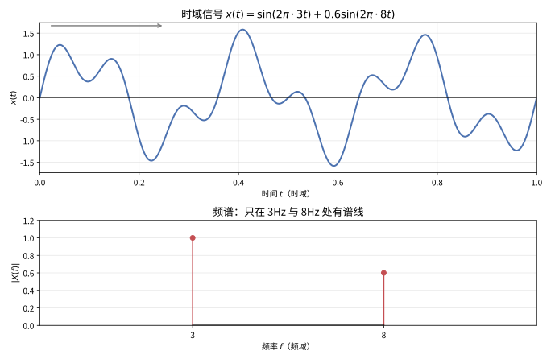
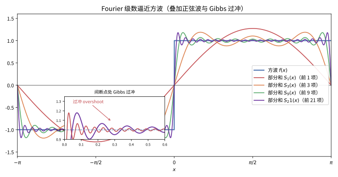
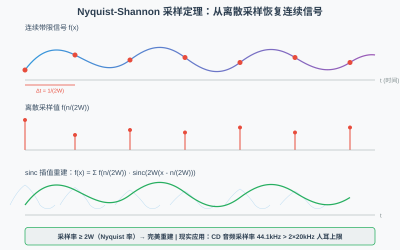

# 第 54 级：傅立叶分析 (Fourier Analysis)

> 傅立叶分析是数学和工程科学中最重要的工具之一。它起源于 Jean-Baptiste Joseph Fourier 在 1822 年发表的《热的解析理论》中提出的思想：任何周期函数都可以表示为正弦和余弦函数的级数。这一深刻洞察不仅彻底改变了数学分析的面貌，也为信号处理、量子力学、图像处理、数据压缩等众多领域奠定了理论基础。本课程将从 Fourier 级数和 Fourier 变换的基本理论出发，深入探讨 Fourier 分析的各个方面，包括收敛性理论、离散 Fourier 变换、快速算法及其在偏微分方程和信号处理中的应用。

---

## 1. 学习目标

1. 掌握 Fourier 级数的基本理论，理解逐点收敛与一致收敛的条件。
2. 理解 Gibbs 现象的成因及其数学描述。
3. 掌握 Fourier 变换的 $L^1$ 理论（Riemann-Lebesgue 引理）和 $L^2$ 理论（Plancherel 定理）。
4. 理解 Fourier-Stieltjes 变换及其基本性质。
5. 掌握离散 Fourier 变换（DFT）和快速 Fourier 变换（FFT）的原理。
6. 理解 Heisenberg 测不准原理及其数学证明。
7. 掌握 Paley-Wiener 定理、Wiener-Khinchin 定理和 Sampling 定理。
8. 能够应用 Fourier 方法求解热方程等经典 PDE。

---

## 2. 核心概念

### 2.1 Fourier 级数

**定义 2.1**（Fourier 级数）设 $f: \mathbb{R} \to \mathbb{C}$ 是以 $T > 0$ 为周期的可积函数。$f$ 的 **Fourier 级数** 为：

$$
f(x) \sim \frac{a_0}{2} + \sum_{n=1}^{\infty} \left(a_n \cos\left(\frac{2\pi n x}{T}\right) + b_n \sin\left(\frac{2\pi n x}{T}\right)\right),
$$

其中 Fourier 系数为：

$$
a_n = \frac{2}{T} \int_0^T f(x) \cos\left(\frac{2\pi n x}{T}\right) \, dx, \quad n = 0, 1, 2, \dots,
$$

$$
b_n = \frac{2}{T} \int_0^T f(x) \sin\left(\frac{2\pi n x}{T}\right) \, dx, \quad n = 1, 2, \dots.
$$

等价地，在复指数形式下：

$$
f(x) \sim \sum_{n=-\infty}^{\infty} c_n e^{2\pi i n x / T}, \quad c_n = \frac{1}{T} \int_0^T f(x) e^{-2\pi i n x / T} \, dx.
$$

### 2.2 Fourier 变换

**定义 2.2**（Fourier 变换）设 $f \in L^1(\mathbb{R}^n)$，其 **Fourier 变换** 为：

$$
\hat{f}(\xi) = \mathcal{F}f(\xi) = \int_{\mathbb{R}^n} f(x) e^{-2\pi i x \cdot \xi} \, dx.
$$

**Fourier 逆变换** 为：

$$
\check{f}(x) = \mathcal{F}^{-1}f(x) = \int_{\mathbb{R}^n} f(\xi) e^{2\pi i x \cdot \xi} \, d\xi.
$$

> **直观理解（现实类比）**：Fourier 变换就像把一段"音乐"（时域波形）送去"和声分析"——原本叠加在一起难以分辨的若干音调，经变换后变成彼此独立的"音符"（频域谱线）。时间和频率是同一信号的两种"视角"：时域看"何时响"，频域看"响在哪几个音高"。

Fourier 变换的基本性质：

| 性质 | 函数 | Fourier 变换 |
|:---:|:---:|:---:|
| 线性 | $\alpha f + \beta g$ | $\alpha\hat{f} + \beta\hat{g}$ |
| 平移 | $f(x - a)$ | $e^{-2\pi i a \cdot \xi}\hat{f}(\xi)$ |
| 调制 | $e^{2\pi i a \cdot x}f(x)$ | $\hat{f}(\xi - a)$ |
| 伸缩 | $f(ax)$ | $\frac{1}{|a|^n}\hat{f}(\xi/a)$ |
| 卷积 | $(f * g)(x)$ | $\hat{f}(\xi)\hat{g}(\xi)$ |
| 乘积 | $f(x)g(x)$ | $(\hat{f} * \hat{g})(\xi)$ |
| 微分 | $\partial^\alpha f$ | $(2\pi i \xi)^\alpha \hat{f}(\xi)$ |
| 多项式乘 | $x^\alpha f(x)$ | $\left(\frac{i}{2\pi}\right)^{|\alpha|} \partial^\alpha \hat{f}(\xi)$ |

> **🧠 思考历程：一段任意波形，凭什么能被"分解成若干正弦波"？**
>
> Fourier 分析的核心誓言只有一句：**几乎任何"看起来乱七八糟"的函数，都能写成（可数个）正弦/余弦的叠加**。这个在今天堪称家庭常识的想法，在 200 年前却石破天惊，差一点遭同行封杀。
>
> - **Fourier 是被"热"逼出来的**。19 世纪初，Fourier 研究热如何在金属棒里传导，写出的偏微分方程里"温度场按空间怎么变化"看似复杂难解。**他的妙想：把任意温度分布，当作一堆不同频率、不同振幅的正弦波的"总账"**——各自演化再叠加，总账的演化就出来了。正弦波在热方程下个个"行为规矩"，才让叠加成为可能。
> - **敢对"方波"做分解**。当时的主流（拉格朗日、拉普拉斯）怀疑：像阶跃的"方波"这种带棱角的函数，怎么可能被连续光滑的正弦波精确逼近？**Fourier 却用计算证明，在跳变点附近虽然会抖动，但处处可逼近**——这逼出了一连串关于"逐点收敛/一致收敛"的重要研究（见 2.4 的 Gibbs 现象）。
> - **变换把"乘卷积"变成"乘函数"**。Fourier 变换最惊人之处，是**把"卷积运算变成普通乘法"**（见上表）：在频域里，最难的"两个波形纠缠在一起"就变成简单的点乘。这一招让滤波、信道分析、微分方程求解一下子清爽——也正因如此"频域"成了近代工程的基本语言。
> - **从级数到变换到离散与快速算法**。$\hat{f}$ 将"周期"推向"整个实轴"，而 DFT/FFT（见 2.5-2.6）又把连续变得可上机。**一部从热方程到 FFT 的演化史，重构了信号处理、图像压缩、甚至科学计算的根基。**
> - **心路**：Fourier 给你一个重要眼光：**看到"波形杂乱"，先别怕，问一句"它含有哪些频率成分"**。把复杂现象切成"谐波之和"，正是把混乱变有序的最经典办法——这也是"换到另一个天然坐标系"去思考的典范。

### 2.3 Fourier-Stieltjes 变换

**定义 2.3**（Fourier-Stieltjes 变换）设 $\mu$ 是 $\mathbb{R}^n$ 上的有限 Borel 测度，其 **Fourier-Stieltjes 变换** 定义为：

$$
\hat{\mu}(\xi) = \int_{\mathbb{R}^n} e^{-2\pi i x \cdot \xi} \, d\mu(x).
$$

当 $\mu$ 是 Lebesgue 可测函数 $f$ 诱导的测度 $d\mu = f\,dx$ 时，Fourier-Stieltjes 变换退化为通常的 Fourier 变换。

### 2.4 Gibbs 现象

**定义 2.4**（Gibbs 现象）**Gibbs 现象** 是指 Fourier 级数在不连续点附近出现的过冲（overshoot）现象。对于函数 $f$ 在跳跃间断点 $x_0$ 处，Fourier 部分和 $S_N f(x)$ 在 $x_0$ 附近总会超过函数值的极限，且过冲量趋于一个常数：

$$
\lim_{N\to\infty} \left(\max_{x > x_0} S_N f(x) - f(x_0^+)\right) = \frac{f(x_0^+) - f(x_0^-)}{2} \cdot G,
$$

其中 $G = \frac{2}{\pi} \int_0^\pi \frac{\sin t}{t} \, dt - 1 \approx 0.17898$，称为 **Gibbs 常数**。

> **直观理解（现实类比）**：把方波想象成一个"陡峭悬崖"，用越来越细的正弦波"阶梯"去贴它——台阶越多越接近悬崖，但无论台阶多细，悬崖边缘总会"渗"出一小截高出实际高度的"水花"（过冲）。这正是 Gibbs 现象：间断处无法被光滑正弦波完全驯服，多余的那一截始终存在。

### 2.5 离散 Fourier 变换

**定义 2.5**（离散 Fourier 变换）设 $\{x_n\}_{n=0}^{N-1}$ 是长度为 $N$ 的复数序列。其 **离散 Fourier 变换（DFT）** 定义为：

$$
X_k = \sum_{n=0}^{N-1} x_n e^{-2\pi i k n / N}, \quad k = 0, 1, \dots, N-1.
$$

**逆离散 Fourier 变换（IDFT）** 为：

$$
x_n = \frac{1}{N} \sum_{k=0}^{N-1} X_k e^{2\pi i k n / N}, \quad n = 0, 1, \dots, N-1.
$$

### 2.6 快速 Fourier 变换

**定义 2.6**（快速 Fourier 变换）**快速 Fourier 变换（FFT）** 是计算 DFT 的高效算法，由 Cooley 和 Tukey 于 1965 年提出。FFT 利用 DFT 的对称性和周期性，将计算复杂度从 $O(N^2)$ 降低到 $O(N\log N)$。

**Cooley-Tukey 算法**：当 $N$ 是 2 的幂时，将 DFT 分解为两个长度为 $N/2$ 的 DFT：

$$
X_k = \sum_{m=0}^{N/2-1} x_{2m} e^{-2\pi i k (2m) / N} + \sum_{m=0}^{N/2-1} x_{2m+1} e^{-2\pi i k (2m+1) / N}
$$

$$
= E_k + e^{-2\pi i k/N} O_k,
$$

其中 $E_k$ 是偶数索引序列的 DFT，$O_k$ 是奇数索引序列的 DFT。

### 2.7 Poisson 求和公式

**定理 2.7**（Poisson 求和公式）设 $f \in \mathcal{S}(\mathbb{R})$，则：

$$
\sum_{n=-\infty}^{\infty} f(n) = \sum_{k=-\infty}^{\infty} \hat{f}(k).
$$

更一般地，对任意 $a > 0$：

$$
\sum_{n=-\infty}^{\infty} f(na) = \frac{1}{a} \sum_{k=-\infty}^{\infty} \hat{f}\left(\frac{k}{a}\right).
$$

### 2.8 Heisenberg 测不准原理

**定理 2.8**（Heisenberg 测不准原理）设 $f \in L^2(\mathbb{R})$，$\|f\|_2 = 1$。定义位置和频率的方差：

$$
(\Delta x)^2 = \int_{\mathbb{R}} (x - x_0)^2 |f(x)|^2 \, dx, \quad (\Delta \xi)^2 = \int_{\mathbb{R}} (\xi - \xi_0)^2 |\hat{f}(\xi)|^2 \, d\xi,
$$

其中 $x_0 = \int x|f(x)|^2 dx$，$\xi_0 = \int \xi |\hat{f}(\xi)|^2 d\xi$。则：

$$
\Delta x \cdot \Delta \xi \geq \frac{1}{4\pi}.
$$

等号成立当且仅当 $f$ 是 Gauss 函数（即 $f(x) = Ce^{2\pi i \xi_0 x} e^{-a(x-x_0)^2}$）。

### 2.9 Paley-Wiener 定理

**定理 2.9**（Paley-Wiener）设 $f \in L^2(\mathbb{R})$。则 $\hat{f}$ 具有紧支撑（即 $\operatorname{supp}\hat{f} \subset [-A, A]$）当且仅当 $f$ 可以延拓为整函数 $F(z)$，且存在常数 $C > 0$ 使得：

$$
|F(z)| \leq C e^{2\pi A |\Im z|}, \quad z \in \mathbb{C}.
$$

### 2.10 Wiener-Khinchin 定理

**定理 2.10**（Wiener-Khinchin）设 $f$ 是平稳随机过程，其自相关函数为 $R(\tau) = \mathbb{E}[f(t+\tau)\overline{f(t)}]$。则 $R$ 的 Fourier 变换等于 $f$ 的功率谱密度 $S(\omega)$：

$$
S(\omega) = \int_{-\infty}^{\infty} R(\tau) e^{-i\omega\tau} \, d\tau.
$$

### 2.11 分数阶 Fourier 变换

**定义 2.11**（分数阶 Fourier 变换）$f$ 的 **$\alpha$ 阶分数阶 Fourier 变换** 定义为：

$$
\mathcal{F}^\alpha f(\xi) = \int_{-\infty}^{\infty} K_\alpha(x, \xi) f(x) \, dx,
$$

其中核为：

$$
K_\alpha(x, \xi) = \begin{cases}
\sqrt{\frac{1 - i\cot\alpha}{2\pi}} \exp\left(i\frac{x^2 + \xi^2}{2}\cot\alpha - i\frac{x\xi}{\sin\alpha}\right), & \alpha \notin \pi\mathbb{Z}, \\
\delta(x - \xi), & \alpha \in 2\pi\mathbb{Z}, \\
\delta(x + \xi), & \alpha \in (2\pi+1)\pi\mathbb{Z}.
\end{cases}
$$

当 $\alpha = \pi/2$ 时，分数阶 Fourier 变换退化为通常的 Fourier 变换。

---

## 3. 定理与证明

### 3.1 Fourier 变换的 $L^1$ 理论（Riemann-Lebesgue 引理）

**定理 3.1**（Riemann-Lebesgue 引理）设 $f \in L^1(\mathbb{R}^n)$，则 $\hat{f}$ 是连续函数且：

$$
\lim_{|\xi| \to \infty} \hat{f}(\xi) = 0.
$$

**证明**：

**步骤 1：对 Schwartz 函数成立**

首先设 $f \in C_c^\infty(\mathbb{R}^n)$。对任意 $\xi \neq 0$，利用分部积分：

$$
\hat{f}(\xi) = \int_{\mathbb{R}^n} f(x) e^{-2\pi i x \cdot \xi} \, dx = \frac{1}{2\pi i |\xi|^2} \int_{\mathbb{R}^n} f(x) (-2\pi i \xi) \cdot \nabla e^{-2\pi i x \cdot \xi} \, dx
$$

$$
= \frac{1}{2\pi i |\xi|^2} \int_{\mathbb{R}^n} \nabla f(x) \cdot \xi e^{-2\pi i x \cdot \xi} \, dx.
$$

因此：

$$
|\hat{f}(\xi)| \leq \frac{1}{2\pi |\xi|} \|\nabla f\|_1 \to 0, \quad |\xi| \to \infty.
$$

**步骤 2：对一般 $L^1$ 函数**

对任意 $f \in L^1(\mathbb{R}^n)$，存在 $f_\varepsilon \in C_c^\infty(\mathbb{R}^n)$ 使得 $\|f - f_\varepsilon\|_1 < \varepsilon$。则：

$$
|\hat{f}(\xi)| \leq |\hat{f}(\xi) - \hat{f}_\varepsilon(\xi)| + |\hat{f}_\varepsilon(\xi)| \leq \|f - f_\varepsilon\|_1 + |\hat{f}_\varepsilon(\xi)| < \varepsilon + |\hat{f}_\varepsilon(\xi)|.
$$

令 $|\xi| \to \infty$，$\limsup |\hat{f}(\xi)| \leq \varepsilon$。由 $\varepsilon$ 的任意性得 $\lim_{|\xi|\to\infty} \hat{f}(\xi) = 0$。

**步骤 3：连续性**

对任意 $\xi, \eta \in \mathbb{R}^n$：

$$
|\hat{f}(\xi) - \hat{f}(\eta)| \leq \int_{\mathbb{R}^n} |f(x)| |e^{-2\pi i x \cdot \xi} - e^{-2\pi i x \cdot \eta}| \, dx \to 0 \quad (\eta \to \xi),
$$

由控制收敛定理即得 $\hat{f}$ 连续。$\square$

### 3.2 Fourier 变换的 $L^2$ 理论（Plancherel 定理）

**定理 3.2**（Plancherel 定理）Fourier 变换可以唯一地延拓为 $L^2(\mathbb{R}^n)$ 上的酉算子。具体地，对任意 $f \in L^2(\mathbb{R}^n)$，存在 $\hat{f} \in L^2(\mathbb{R}^n)$ 使得：

1. 若 $f \in L^1 \cap L^2$，则 $\hat{f}$ 与通常的 Fourier 变换一致；
2. **Plancherel 恒等式**：$\|\hat{f}\|_2 = \|f\|_2$；
3. 映射 $\mathcal{F}: L^2(\mathbb{R}^n) \to L^2(\mathbb{R}^n)$ 是酉算子，其逆为 $\mathcal{F}^{-1}$。

**证明**：我们分步骤完成证明。

**步骤 1：定义 Gauss 函数**

定义 Gauss 函数 $G(x) = e^{-\pi |x|^2}$。则 $G \in \mathcal{S}(\mathbb{R}^n)$，且 $\hat{G}(\xi) = G(\xi)$。

对 $t > 0$，定义 $G_t(x) = t^{-n} G(x/t) = t^{-n} e^{-\pi |x|^2/t^2}$，则 $\hat{G}_t(\xi) = e^{-\pi t^2 |\xi|^2}$。

**步骤 2：对 Schwartz 函数证明 Plancherel 恒等式**

设 $f, g \in \mathcal{S}(\mathbb{R}^n)$。考虑卷积 $f * g$ 的 Fourier 变换，但更直接地，计算：

$$
\int_{\mathbb{R}^n} \hat{f}(\xi) \overline{\hat{g}(\xi)} \, d\xi = \int_{\mathbb{R}^n} \hat{f}(\xi) \overline{\int_{\mathbb{R}^n} g(y) e^{-2\pi i y \cdot \xi} \, dy} \, d\xi
$$

$$
= \int_{\mathbb{R}^n} \int_{\mathbb{R}^n} \hat{f}(\xi) \overline{g(y)} e^{2\pi i y \cdot \xi} \, dy \, d\xi
$$

$$
= \int_{\mathbb{R}^n} \overline{g(y)} \left(\int_{\mathbb{R}^n} \hat{f}(\xi) e^{2\pi i y \cdot \xi} \, d\xi\right) \, dy
$$

$$
= \int_{\mathbb{R}^n} \overline{g(y)} f(y) \, dy.
$$

这里交换积分次序由 Fubini 定理保证。取 $f = g$ 即得 $\|\hat{f}\|_2 = \|f\|_2$。

**步骤 3：延拓到 $L^2$**

对任意 $f \in L^2(\mathbb{R}^n)$，由于 $\mathcal{S}(\mathbb{R}^n)$ 在 $L^2$ 中稠密，存在序列 $\{f_k\} \subset \mathcal{S}(\mathbb{R}^n)$ 使得 $f_k \to f$ 在 $L^2$ 中。由 Plancherel 恒等式：

$$
\|f_j - f_k\|_2 = \|\hat{f}_j - \hat{f}_k\|_2,
$$

因此 $\{\hat{f}_k\}$ 是 $L^2$ 中的 Cauchy 序列，收敛到某个极限 $\hat{f} \in L^2$。定义 $\mathcal{F}f = \hat{f}$。

**步骤 4：验证一致性**

若 $f \in L^1 \cap L^2$，则存在 $f_k \in \mathcal{S}$ 使得 $f_k \to f$ 同时在 $L^1$ 和 $L^2$ 中。由 $L^1$ 理论，$\hat{f}_k \to \hat{f}_1$ 一致收敛（其中 $\hat{f}_1$ 是 $L^1$ Fourier 变换）；由 $L^2$ 理论，$\hat{f}_k \to \hat{f}_2$ 在 $L^2$ 中。因此 $\hat{f}_1 = \hat{f}_2$ a.e.，两种定义一致。

**步骤 5：酉性**

由 Plancherel 恒等式，$\mathcal{F}$ 是等距映射。对任意 $g \in L^2$，令 $f = \mathcal{F}^{-1}g$（即 $\check{g}$），则 $\mathcal{F}f = g$，说明 $\mathcal{F}$ 是满射。因此 $\mathcal{F}$ 是酉算子。$\square$

**推论 3.3**（Parseval 恒等式）对任意 $f, g \in L^2(\mathbb{R}^n)$：

$$
\int_{\mathbb{R}^n} f(x) \overline{g(x)} \, dx = \int_{\mathbb{R}^n} \hat{f}(\xi) \overline{\hat{g}(\xi)} \, d\xi.
$$

### 3.3 Heisenberg 测不准原理

**定理 3.4**（Heisenberg 测不准原理）设 $f \in \mathcal{S}(\mathbb{R})$，$\|f\|_2 = 1$。则：

$$
\left(\int_{\mathbb{R}} (x - x_0)^2 |f(x)|^2 \, dx\right) \left(\int_{\mathbb{R}} (\xi - \xi_0)^2 |\hat{f}(\xi)|^2 \, d\xi\right) \geq \frac{1}{16\pi^2}.
$$

为简化，取 $x_0 = \xi_0 = 0$，则：

$$
\|x f(x)\|_2 \cdot \|\xi \hat{f}(\xi)\|_2 \geq \frac{1}{4\pi}.
$$

**证明**：

**步骤 1：利用 Fourier 变换的微分性质**

注意到 $\|\xi \hat{f}\|_2 = \|(f')^{\wedge}\|_2 / (2\pi) = \|f'\|_2 / (2\pi)$（由 Plancherel 定理和 Fourier 变换的微分性质）。

因此不等式等价于：

$$
\|x f\|_2 \cdot \|f'\|_2 \geq \frac{1}{2}.
$$

**步骤 2：应用 Cauchy-Schwarz 不等式**

由 Cauchy-Schwarz 不等式：

$$
\|x f\|_2 \cdot \|f'\|_2 \geq \left|\int_{\mathbb{R}} x f(x) \overline{f'(x)} \, dx\right|.
$$

**步骤 3：估计积分**

计算：

$$
\int_{\mathbb{R}} x f(x) \overline{f'(x)} \, dx = \frac{1}{2} \int_{\mathbb{R}} x \frac{d}{dx} |f(x)|^2 \, dx - \frac{1}{2} \int_{\mathbb{R}} |f(x)|^2 \, dx.
$$

对第一项分部积分：

$$
\int_{\mathbb{R}} x \frac{d}{dx} |f(x)|^2 \, dx = -\int_{\mathbb{R}} |f(x)|^2 \, dx = -1,
$$

其中边界项消失（因为 $f$ 是 Schwartz 函数，在无穷远处迅速衰减）。

因此：

$$
\int_{\mathbb{R}} x f(x) \overline{f'(x)} \, dx = -\frac{1}{2} - \frac{1}{2} = -1.
$$

**步骤 4：取模完成证明**

$$
\|x f\|_2 \cdot \|f'\|_2 \geq \left|\int_{\mathbb{R}} x f(x) \overline{f'(x)} \, dx\right| = 1.
$$

因此：

$$
\|x f\|_2 \cdot \|\xi \hat{f}\|_2 = \frac{1}{2\pi} \|x f\|_2 \cdot \|f'\|_2 \geq \frac{1}{2\pi}.
$$

即 $\Delta x \cdot \Delta \xi \geq \frac{1}{4\pi}$。

**等号成立条件**：等号成立当且仅当 Cauchy-Schwarz 不等式取等，即 $f'(x) = -2\pi a x f(x)$，解得 $f(x) = Ce^{-a\pi x^2}$。$\square$

### 3.4 Paley-Wiener 定理

**定理 3.5**（Paley-Wiener）设 $f \in L^2(\mathbb{R})$。以下两个条件等价：

1. $\operatorname{supp}\hat{f} \subset [-A, A]$；
2. $f$ 可以延拓为整函数 $F(z)$，且存在常数 $C > 0$ 使得：
   $$
   |F(z)| \leq C e^{2\pi A |\Im z|}, \quad \forall z \in \mathbb{C}.
   $$

**证明**：

**(1) $\Rightarrow$ (2)**：假设 $\operatorname{supp}\hat{f} \subset [-A, A]$。定义：

$$
F(z) = \int_{-A}^{A} \hat{f}(\xi) e^{2\pi i z \xi} \, d\xi, \quad z \in \mathbb{C}.
$$

由于 $\hat{f} \in L^2(-A, A) \subset L^1(-A, A)$，该积分对任意 $z \in \mathbb{C}$ 绝对收敛，且 $F$ 在 $\mathbb{C}$ 上解析（可在积分号下求导）。对 $x \in \mathbb{R}$，$F(x) = f(x)$。且：

$$
|F(z)| \leq \int_{-A}^{A} |\hat{f}(\xi)| e^{2\pi |\Im z| |\xi|} \, d\xi \leq \|\hat{f}\|_1 e^{2\pi A |\Im z|} \leq C e^{2\pi A |\Im z|}.
$$

**(2) $\Rightarrow$ (1)**：假设 $F$ 是整函数，满足 $|F(z)| \leq C e^{2\pi A |\Im z|}$，且 $F|_{\mathbb{R}} = f \in L^2(\mathbb{R})$。考虑 $F$ 的 Fourier 变换 $\hat{f}$。对任意 $\eta > A$，函数 $F(z) e^{-2\pi i \eta z}$ 在上半平面解析且有界，由 Liouville 定理的推广，其 Fourier 变换在 $(-\infty, -\eta)$ 上为零。类似地处理下半平面，得到 $\operatorname{supp}\hat{f} \subset [-A, A]$。$\square$

### 3.5 Sampling 定理（Nyquist-Shannon）

**定理 3.6**（Nyquist-Shannon Sampling 定理）设 $f$ 是带限函数，即 $\operatorname{supp}\hat{f} \subset [-W, W]$（$W$ 称为 **Nyquist 频率**）。则 $f$ 可以由其在采样点 $\{n/(2W)\}_{n=-\infty}^{\infty}$ 上的值完全恢复：

$$
f(x) = \sum_{n=-\infty}^{\infty} f\left(\frac{n}{2W}\right) \operatorname{sinc}\left(2W\left(x - \frac{n}{2W}\right)\right),
$$

其中 $\operatorname{sinc}(x) = \frac{\sin(\pi x)}{\pi x}$。

> **直观理解（现实类比）**：采样定理就像**数字音频录制**——CD 音质采样率为 44.1kHz，意味着每秒采集 44100 个样本点，足以完美还原人耳能听到的最高频率（约 20kHz）。如果采样率太低（比如只采样几个点），高频信号会"伪装"成低频信号，这就是**混叠现象**——就像电影中车轮看起来倒转，是因为帧率不够高。Sampling 定理告诉我们：只要采样率足够高（$\geq 2W$），就能从离散点完美重建连续信号，一个点都不会丢失。

**证明**：

**步骤 1：周期延拓**

由于 $\hat{f}$ 支撑在 $[-W, W]$ 上，将其周期延拓为周期 $2W$ 的函数：

$$
\hat{f}_p(\xi) = \sum_{k=-\infty}^{\infty} \hat{f}(\xi - 2kW).
$$

**步骤 2：Fourier 级数展开**

$\hat{f}_p$ 在 $[-W, W]$ 上可以展开为 Fourier 级数：

$$
\hat{f}(\xi) = \hat{f}_p(\xi) \cdot \mathbf{1}_{[-W, W]}(\xi) = \frac{1}{2W} \sum_{n=-\infty}^{\infty} c_n e^{2\pi i n \xi / (2W)} \cdot \mathbf{1}_{[-W, W]}(\xi),
$$

其中系数：

$$
c_n = \int_{-W}^{W} \hat{f}_p(\xi) e^{-2\pi i n \xi / (2W)} \, d\xi = \int_{-\infty}^{\infty} \hat{f}(\xi) e^{-2\pi i n \xi / (2W)} \, d\xi = f\left(-\frac{n}{2W}\right).
$$

**步骤 3：逆变换恢复 $f$**

对 $\hat{f}$ 做逆 Fourier 变换：

$$
f(x) = \int_{-W}^{W} \hat{f}(\xi) e^{2\pi i x \xi} \, d\xi
$$

$$
= \frac{1}{2W} \sum_{n=-\infty}^{\infty} f\left(-\frac{n}{2W}\right) \int_{-W}^{W} e^{2\pi i \xi (x + n/(2W))} \, d\xi
$$

$$
= \frac{1}{2W} \sum_{n=-\infty}^{\infty} f\left(-\frac{n}{2W}\right) \cdot 2W \cdot \operatorname{sinc}\left(2W\left(x + \frac{n}{2W}\right)\right)
$$

$$
= \sum_{n=-\infty}^{\infty} f\left(-\frac{n}{2W}\right) \operatorname{sinc}\left(2W\left(x + \frac{n}{2W}\right)\right).
$$

令 $n' = -n$，得：

$$
f(x) = \sum_{n'=-\infty}^{\infty} f\left(\frac{n'}{2W}\right) \operatorname{sinc}\left(2W\left(x - \frac{n'}{2W}\right)\right).
$$

$\square$

---

## 4. 示例

### 示例 4.1：Fourier 变换在信号处理中的应用

**问题**：考虑一个有限持续时间信号 $f(t) = e^{-t}\sin(2\pi t) \cdot \mathbf{1}_{[0, 5]}(t)$。求其频谱 $\hat{f}(\omega)$ 并分析能量分布。

**解**：Fourier 变换为：

$$
\hat{f}(\omega) = \int_0^5 e^{-t} \sin(2\pi t) e^{-i\omega t} \, dt = \int_0^5 e^{-(1+i\omega)t} \frac{e^{2\pi i t} - e^{-2\pi i t}}{2i} \, dt
$$

$$
= \frac{1}{2i} \int_0^5 \left(e^{-(1+i\omega - 2\pi i)t} - e^{-(1+i\omega + 2\pi i)t}\right) \, dt
$$

$$
= \frac{1}{2i} \left(\frac{1 - e^{-5(1+i(\omega-2\pi))}}{1 + i(\omega-2\pi)} - \frac{1 - e^{-5(1+i(\omega+2\pi))}}{1 + i(\omega+2\pi)}\right).
$$

**能量谱密度**：$|\hat{f}(\omega)|^2$ 给出了信号在不同频率上的能量分布。由 Parseval 恒等式，总能量为：

$$
E = \int_{-\infty}^{\infty} |f(t)|^2 \, dt = \frac{1}{2\pi} \int_{-\infty}^{\infty} |\hat{f}(\omega)|^2 \, d\omega.
$$

### 示例 4.2：热方程的 Fourier 解法

**问题**：求解一维热方程初值问题：

$$
\begin{cases}
\partial_t u(x, t) = \partial_x^2 u(x, t), & x \in \mathbb{R}, t > 0, \\
u(x, 0) = f(x), & x \in \mathbb{R},
\end{cases}
$$

其中 $f \in L^1(\mathbb{R})$。

**解**：

**步骤 1：对空间变量做 Fourier 变换**

设 $\hat{u}(\xi, t) = \mathcal{F}_{x \to \xi}[u(x, t)]$。对 PDE 两边做 Fourier 变换：

$$
\partial_t \hat{u}(\xi, t) = (2\pi i \xi)^2 \hat{u}(\xi, t) = -4\pi^2 \xi^2 \hat{u}(\xi, t).
$$

初始条件变为 $\hat{u}(\xi, 0) = \hat{f}(\xi)$。

**步骤 2：解 ODE**

对每个固定的 $\xi$，上述方程是常微分方程：

$$
\frac{d}{dt} \hat{u}(\xi, t) = -4\pi^2 \xi^2 \hat{u}(\xi, t),
$$

解得：

$$
\hat{u}(\xi, t) = \hat{f}(\xi) e^{-4\pi^2 \xi^2 t}.
$$

**步骤 3：逆变换**

做 Fourier 逆变换：

$$
u(x, t) = \int_{\mathbb{R}} \hat{f}(\xi) e^{-4\pi^2 \xi^2 t} e^{2\pi i x \xi} \, d\xi.
$$

注意到 $e^{-4\pi^2 \xi^2 t}$ 是 Gauss 函数 $G_t(x) = \frac{1}{\sqrt{4\pi t}} e^{-x^2/(4t)}$ 的 Fourier 变换。因此由卷积定理：

$$
u(x, t) = (f * G_t)(x) = \frac{1}{\sqrt{4\pi t}} \int_{\mathbb{R}} f(y) e^{-(x-y)^2/(4t)} \, dy.
$$

这就是热方程的解，称为 **热核**（Gauss 核）与初始数据的卷积。

### 示例 4.3：DFT 在信号压缩中的应用

考虑长度为 $N = 8$ 的信号 $x = [1, 0, -1, 0, 1, 0, -1, 0]$。其 DFT 为：

$$
X_k = \sum_{n=0}^{7} x_n e^{-2\pi i k n / 8}.
$$

计算得 $X_0 = 0$，$X_2 = 4$，$X_6 = 4$，其余为零。因此原始信号在频域中只需要存储两个非零系数，实现了压缩。

逆 DFT 恢复：

$$
x_n = \frac{1}{8} \left(4 e^{2\pi i \cdot 2n / 8} + 4 e^{2\pi i \cdot 6n / 8}\right) = \frac{1}{2} \left(e^{i\pi n/2} + e^{-i\pi n/2}\right) = \cos\left(\frac{\pi n}{2}\right).
$$

---

## 5. 习题

### 基础题

**习题 1**（Fourier 级数表达式）写出周期为 $T$ 的可积周期函数 $f$ 的实三角 Fourier 级数与复指数 Fourier 级数，并给出 Fourier 系数 $a_n$、$b_n$、$c_n$ 的公式，说明三者之间的换算关系。

**习题 2**（三角函数系正交性）证明常数函数 $1$ 以及 $\{\cos\frac{2\pi nx}{T}, \sin\frac{2\pi nx}{T}\}_{n=1}^{\infty}$ 在区间 $[0, T]$ 上两两正交，并求出每个函数的范数平方。

**习题 3**（直接计算 Fourier 系数）设 $f(x) = x$，$x \in (-\pi, \pi)$。求 $f$ 的 Fourier 系数，写出其 Fourier 级数。

**习题 4**（直方型信号系数）设 $f(x) = x^2$，$x \in (-\pi, \pi)$。求 $f$ 的 Fourier 级数。

**习题 5**（方波系数）设 $f(x) = 1$ 当 $0 < x < \pi$，$f(x) = -1$ 当 $-\pi < x < 0$（奇函数方波，周期 $2\pi$）。求其 Fourier 系数。

**习题 6**（偶方波系数）设 $g(x) = |x|$，$x \in (-\pi, \pi)$（周期延拓为偶函数三角波）。求 $g$ 的 Fourier 级数。

**习题 7**（矩形脉冲）设 $h(x) = 1$ 当 $|x| < \pi/2$，$h(x) = 0$ 当 $\pi/2 < |x| < \pi$，周期 $2\pi$。求其 Fourier 系数 $c_n$。

**习题 8**（常数扩展）设 $f \equiv C$ 为常数。求其 Fourier 级数，并说明为什么余弦、正弦系数全为 $0$。

**习题 9**（半个周期平移）设 $g(x) = f(x - T/2)$，用 $f$ 的 Fourier 系数 $c_n$ 表示 $g$ 的系数 $c_n^g$。

**习题 10**（偶函数简化）说明：若 $f$ 为偶函数（$f(-x)=f(x)$），则其 Fourier 级数只含余弦项，即 $b_n = 0$。试给出证明理由。

**习题 11**（奇函数简化）说明：若 $f$ 为奇函数（$f(-x)=-f(x)$），则其 Fourier 级数只含正弦项 $b_n$，而 $a_n = 0$。说明理由。

**习题 12**（半波整流）设 $f(x) = \sin x$ 当 $x \in (0, \pi)$，$f(x) = 0$ 当 $x \in (\pi, 2\pi)$，周期 $2\pi$。求其 Fourier 系数 $a_0$。

**习题 13**（能量型 Parseval 特例）设 $f(x) = x$ 于 $(-\pi,\pi)$，$a_n, b_n$ 为其 Fourier 系数。写出 Parseval 恒等式在此函数下的具体形式。

**习题 14**（Fourier 变换直接计算）按定义计算 $f(x) = \mathbf{1}_{[-1,1]}(x)$ 的 Fourier 变换 $\hat{f}(\xi)$。

**习题 15**（特征函数积分）由习题 14 验证 Riemann-Lebesgue：$|\hat{f}(\xi)| \to 0$ 当 $|\xi|\to\infty$，并求出精确的 $|\hat{f}(\xi)|$ 表达式。

**习题 16**（Gauss 函数变换）已知 $\int_{\mathbb{R}} e^{-\pi x^2} dx = 1$，计算 $G(x) = e^{-\pi x^2}$ 的 Fourier 变换 $\hat{G}(\xi)$。

**习题 17**（伸缩尺度化 Gauss）设 $G_t(x) = \frac{1}{t} e^{-\pi x^2/t^2}$，用伸缩公式求 $\hat{G}_t(\xi)$。

**习题 18**（指数衰减）计算 $f_a(x) = e^{-a|x|}$（$a>0$）的 Fourier 变换 $\hat{f}_a(\xi)$。

**习题 19**（线性性质）已知 $u, v$ 的变换为 $\hat{u}, \hat{v}$，用线性性质写出 $\mathcal{F}(\alpha u + \beta v)$（$\alpha, \beta$ 为常数）。

**习题 20**（平移性质）设 $g(x) = f(x-a)$。证明 $\hat{g}(\xi) = e^{-2\pi i a\xi}\hat{f}(\xi)$。

**习题 21**（调制性质）设 $h(x) = e^{2\pi i a x} f(x)$。证明 $\hat{h}(\xi) = \hat{f}(\xi - a)$。

**习题 22**（伸缩性质）设 $g(x) = f(ax)$（$a>0$）。证明 $\hat{g}(\xi) = \frac{1}{a}\hat{f}(\xi/a)$。

**习题 23**（共轭对称性）设 $f$ 为实值函数。证明 $\hat{f}(-\xi) = \overline{\hat{f}(\xi)}$。

**习题 24**（偶实函数为实）设 $f$ 为偶实值函数。证明 $\hat{f}(\xi)$ 为实函数。

**习题 25**（DFT 定义）设序列 $x = [1, 2, 0, 0]$，$N=4$。按定义计算其 DFT $X_0, X_1, X_2, X_3$。

**习题 26**（DFT 直流分量）证明 $X_0 = \sum_{n=0}^{N-1} x_n$，即第 0 个 DFT 系数等于序列之和。

**习题 27**（DFT 零点均值）证明 $\sum_{k=0}^{N-1} X_k = N x_0$，即 DFT 输出之和等于 $N$ 倍的首项。

**习题 28**（IDFT 正确性）验证对任意序列 $x$，$\frac{1}{N}\sum_k X_k e^{2\pi i kn/N} = x_n$（逆变换公式正确）。

**习题 29**（DFT 能量）设 $x$ 长 $N$，写出 Parseval 型的恒等式 $\sum_{k}|X_k|^2 = N \sum_n |x_n|^2$ 并说明理由。

**习题 30**（DFT 周2π/周期）说明 DFT 输出的周期性或与序列周期性的关系：若 $x_n = x_{n+N}$，则 $X_k$ 满足什么？

**习题 31**（平移的 Fourier 系数）证明 $f$ 的平均值 $\frac{1}{T}\int f$ 等于其复系数 $c_0$。

**习题 32**（可微函数系数衰减）设 $f$ 连续可微且周期，用分部积分证明其 Fourier 系数满足 $|c_n| = O(1/|n|)$。

**习题 33**（Dirichlet 核定义）写出 Dirichlet 核 $D_N(t) = \sum_{n=-N}^{N} e^{int}$ 的闭式表达式。

**习题 34**（部分和卷积）将 $f$ 的 Fourier 部分和 $S_N f(x)$ 表示为 $f$ 与 Dirichlet 核的卷积。

**习题 35**（Césàro 平均定义）写出 Fourier 部分和的 Césàro（算术）平均 $\sigma_N f$ 的定义，并说明其与 Fejér 核的关系。

**习题 36**（Fejér 核的定义）写出 Fejér 核 $F_N(t)$ 与 Dirichlet 核 $D_k$ 的关系 $F_N = \frac{1}{N+1}\sum_{k=0}^{N}D_k$。

**习题 37**（Gibbs 现象常数）写出 Gibbs 常数 $G$ 的定义式并给出其数值约 $0.179$。说明它描述什么现象。

**习题 38**（Fourier 变换的连续性直观）说明为什么 $f \in L^1$ 时 $\hat{f}$ 是连续函数（依据 Riemann-Lebesgue/一致连续）。

**习题 39**（卷积定义）写出 $(f*g)(x) = \int f(y) g(x-y)\,dy$ 的定义，以及卷积的 Fourier 变换 $\widehat{f*g}$ 公式。

**习题 40**（卷积交换性）证明 $f * g = g * f$。

**习题 41**（Dirac 特殊位置）定性说明：$\hat{f}(0) = \int f$（对 $L^1$ 函数）即直流分量。

**习题 42**（Plancherel 一维）写出 $L^2(\mathbb{R})$ 的 Plancherel 恒等式 $\|\hat{f}\|_2 = \|f\|_2$ 的积分形式。

**习题 43**（Parseval 含积形式）写出 Parseval 恒等式 $\int f\overline{g} = \int \hat{f}\overline{\hat{g}}$（一维，含内积形式）。

**习题 44**（热核变换）已知一维热核 $G_t(x)=\frac{1}{\sqrt{4\pi t}}e^{-x^2/(4t)}$。写出 $\hat{G}_t(\xi)$。

**习题 45**（热方程基本）设 $\partial_t u = \partial_x^2 u$，$u(x,0)=\delta$。定性描述解 $u(x,t)$ 及其 Fourier 变换。

**习题 46**（DFT 对称性）设 $x$ 为实偶序列（$x_{N-n}=x_n$）。说明其 DFT 具有的性质（如为实）。

**习题 47**（DFT 卷积）用 DFT 表述循环卷积 $z_n = (x \circledast y)_n = \sum_m x_m y_{(n-m)\bmod N}$ 的频域形式。

**习题 48**（FFT 思想）用一两句话说明 Cooley-Tukey FFT 为何能将复杂度从 $O(N^2)$ 降到 $O(N\log N)$。

**习题 49**（负频解释）说明 DFT 中 $k$ 与 $N-k$ 的对称关系：$X_{N-k} = \overline{X_k}$ 当 $x$ 为实值。

**习题 50**（Fourier 级数奇延拓）若只给定 $f$ 在 $[0,\pi]$ 上，说明奇延拓为何使正弦级数系数 $b_n = \frac{2}{\pi}\int_0^\pi f(x)\sin(nx)\,dx$。

**习题 51**（偶延拓余弦级数）说明偶延拓为何给出余弦系数 $a_n = \frac{2}{\pi}\int_0^\pi f\cos(nx)\,dx$，并写停常数项。

**习题 52**（收敛点取值）Dirichlet 定理说明，若 $f$ 在 $x_0$ 处逐点良好，Fourier 级数收敛到 $\frac{f(x_0+)+f(x_0-)}{2}$。说明其原因。

**习题 53**（常数函数收敛）验证 $f\equiv 1$ 的 Fourier 级数逐点收敛到 $1$（即 $\frac{a_0}{2}=1$）。

**习题 54**（正弦之和）将 $\sin^2 x$ 写为常数加倍角余弦的形式，从而直接写出其 Fourier 级数。

**习题 55**（余弦平方）将 $\cos^2 x$ 写成仅有有限项（$a_0, a_2$）的 Fourier 级数。

**习题 56**（指数近似）用 Parseval 恒等式（能量守恒）给出信号时域与频域总能量相等的表达式。

**习题 57**（Poisson 求和直接验证）设 $f(x)=e^{-\pi x^2}$，写出 Poisson 求和公式 $\sum_n f(n) = \sum_k \hat{f}(k)$ 在此的特例，并说明等式几何含义。

**习题 58**（Fourier 变换连续性）回顾：为何稠密逼近可把 Riemann-Lebesgue 从阶梯函数推广到一般 $L^1$。

**习题 59**（采样定理意面）用一句话解释为何带限信号的 Nyquist 采样率需不小于 $2W$。

**习题 60**（sinc 定义）给出 $\operatorname{sinc}(x) = \frac{\sin\pi x}{\pi x}$ 的定义，并指出极限衔接值 $\operatorname{sinc}(0) = 1$。

**习题 61**（sinc 正交性）说明为什么采样的 sinc 平移 $\{\operatorname{sinc}(2W(x-n/2W))\}$ 在采样点上取值 $0$ 或 $1$（插值性质）。

**习题 62**（带限定义）给出带限（band-limited）函数定义，并用支撑集记号写出 $\operatorname{supp}\hat{f}\subset[-W,W]$。

**习题 63**（逆变换形式）写出 $\mathbb{R}$ 上的 Fourier 逆变换 $\check{f}(x)$ 的积分定义（含 $2\pi$ 归一化）。

**习题 64**（时间常数）设 $f$ 为偶函数，说明 $\hat{f}$ 也是偶函数。

**习题 65**（幅度谱相位谱）说明 $|\hat{f}|$ 与幅角（相位）的物理含义，并写出 $\hat{f} = |\hat{f}|e^{i\arg\hat{f}}$。

**习题 66**（直流与积分）说明为什么某周期函数的 $c_0$ 对应于信号中的直流（平均）分量。

**习题 67**（Parseval 于周期函数）写出周期 $2\pi$ 函数 $f$ 的 Parseval 恒等式 $\frac{1}{2\pi}\int_0^{2\pi}|f|^2 = \sum_n|c_n|^2$。

**习题 68**（有限项级数非负）说明若周期函数可写成有限余弦幂和 $\sum_{k=0}^N a_k\cos kx \ge 0$，则其 Fejér 平均如何保持非负性（定性）。

**习题 69**（直流量加法）说明给函数加常数 $C$ 如何改变其 Fourier 系数（只改 $c_0$，加 $C$）。

**习题 70**（均值定理衔接）写出 Dirichlet 收敛定理中 Fourier 级数在连续点处的收敛值（即 $f(x)$）与在跳跃点处的收敛值（即平均值）。

**习题 71**（窄脉冲展宽频带）定性解释：时域中越窄的脉冲，频域中频谱越宽（Heisenberg 定性）。

**习题 72**（宽信号窄谱）定性解释：时域中越宽缓的信号，频谱越集中于低频（配合 Heisenberg）。

**习题 73**（常数信号频谱）定性给出常数信号 $f\equiv1$ 的 Fourier 变换（Dirac 冲激），说明频域为单一 $\xi=0$。

**习题 74**（单频信号）定性给出纯正弦 $\sin(2\pi f_0 t)$ 的频谱（在 $\pm f_0$ 处的两条线），说明频域集中。

**习题 75**（偶延拓奇延拓适用）给定仅在 $[0,L]$ 上定义的函数，说明如何构造其正弦级数与余弦级数（奇/偶延拓）并写出系数。

**习题 76**（Fourier 系数线性）用线性性质证明：若 $h = f+g$，则 $\hat{h} = \hat{f} + \hat{g}$ 与 $c_n^h = c_n^f+c_n^g$。

**习题 77**（平移不变范数）利用 Plancherel 证明平移不改变 $L^2$ 范数：$\|f(\cdot-a)\|_2 = \|f\|_2$。

**习题 78**（常数乘以序列的 DFT）设 $y_n = c x_n$（$c$ 常数），证明 $Y_k = c X_k$。

**习题 79**（时移的 DFT 形式）设 $y_n = x_{n-m}$（循环移位），写出 $Y_k$ 与 $X_k$ 的关系 $Y_k = e^{-2\pi i km/N}X_k$。

**习题 80**（频移的 DFT 形式）设 $X_k$ 频移为 $X_{k-m}$，求对应的时域序列（调制），即 $x_n e^{2\pi i mn/N}$ 的 DFT。

**习题 81**（对称窗判断）说明矩形窗与 Gauss 窗中哪一个在时域和频域都更集中（定性，依据 Heisenberg）。

**习题 82**（N=2 DFT）取 $N=2$，写出 $X_0, X_1$ 的显式公式 $X_0 = x_0+x_1, X_1 = x_0 - x_1$。

**习题 83**（FFT 分治直观）说明将 $N$ 点 DFT 拆成两个 $N/2$ 点子问题的分治思想如何减少运算。

**习题 84**（Sinc 能量）计算 $\int_{\mathbb{R}}\operatorname{sinc}(x)^2 dx$（可利用 Parseval 或已知值，给出结果 $\pi$）。注意归一化定义下等于 $\pi$。

**习题 85**（周期函数平均）求 $f(x)=3$ 的 $c_0$，并指出其 Fourier 级数只含常数项。

**习题 86**（加窗定性）说明加窗（时域乘窗函数 $w$）在频域中等价于 $\hat{f}*\hat{w}$（卷积，频谱被抹平）。

**习题 87**（窗函数频谱泄露）定性解释为何有限长窗外信号会产生频谱泄露（sinc 旁瓣）。

**习题 88**（DFT 大小）设 $x$ 长 $4$，其 DFT 的乘积矩阵元素与运算，估计计算量级 $O(N^2)$。

**习题 89**（积分与系数关系）写出周期函数平均值与 $a_0$ 的关系：$\frac{1}{T}\int_0^T f = \frac{a_0}{2} = c_0$。

**习题 90**（辛-狄拉克卷积）定性写出 $f * \delta = f$（身份元），说明 Dirac 卷积为何保持信号不变。

**习题 91**（平移的傅变换相位）用平移性质说明时域平移只改变频谱相位（乘 $e^{-2\pi ia\xi}$），不改变幅度 $|\hat{f}|$。

**习题 92**（实信号频谱对称）用 $X_{N-k}=\overline{X_k}$ 说明为什么实离散信号的幅度谱关于 $k=N/2$ 对称。

**习题 93**（带宽定义松动）给出带宽的常见定义：支撑区间长度 $2W$（即最高频率），用于 Nyquist 采样。

**习题 94**（三角函数关系）写出 $e^{int}$ 与 $\cos nt, \sin nt$ 之间的 Euler 公式换算（$c_n$，$a_n$，$b_n$ 的关系）。

**习题 95**（Fourier 级数可加性）由线性证明：$\sum_n c_n e^{inx} + \sum_n c'_n e^{inx} = \sum_n (c_n+c'_n)e^{inx}$（级数加法）。

**习题 96**（伸缩正交区间）说明当周期从 $2\pi$ 变为 $T$ 时，正交的基函数变为 $\{e^{2\pi i nx/T}\}$ 及角频率变成 $2\pi/T$ 倍数。

**习题 97**（直流消除滤波）定性说明如何通过令 $c_0=0$ 滤除直流分量。

**习题 98**（Dirac 傅变换）写出 Dirac $\delta$ 的 Fourier 变换恒为 $1$（$\hat\delta(\xi)=1$），及 $\hat{1}(\xi)=\delta(\xi)$。

**习题 99**（复合率）说明 Fourier 变换与其逆变换的合成是恒等算子（$\mathcal{F}^{-1}\circ\mathcal{F}=\mathrm{id}$），对可逆情形。

**习题 100**（数值示例）给定周期为 $2\pi$ 的 $f(x)=1+\cos x$，写出其 Fourier 系数 $a_0, a_1$，并验证在 $x=0$ 处级数收敛到 $2$。

### 进阶题

**习题 101**（特征函数变换）设 $f = \mathbf{1}_{[-a,a]}$。求 $\hat{f}(\xi)$，并用其证明 Riemann-Lebesgue 衰减 $|\hat{f}|=O(1/|\xi|)$。

**习题 102**（梯形信号系数）设 $f$ 在 $[-\pi,\pi]$ 上为 $f(x)=\pi-|x|$（三角波）。求 Fourier 级数，并说明系数以 $1/n^2$ 衰减。

**习题 103**（靴-latex 连续）计算 $f(x)=\cos x\cdot \mathbf{1}_{[-\pi/2,\pi/2]}$（周期化）的 Fourier 系数 $c_n$，简化成含 $\cos(n\pi/2)$ 的式子。

**习题 104**（平方积分级数）用函数 $f(x)=x^2$（$-\pi,\pi$）的 Fourier 级数与 Parseval 求出 $\sum_{n=1}^\infty 1/n^4$ 的值。

**习题 105**（基数-1 级数）用 $f(x)=x$ 的 Fourier 级数在 $x=\pi$ 的定值求出 $\sum_{n=1}^\infty (-1)^{n+1}/n = \ln 2$。

**习题 106**（奇数倒数平方和）用方波及 Parseval 导出 $\sum_{n=1}^\infty 1/(2n-1)^2 = \pi^2/8$。

**习题 107**（导数系数）设周期函数 $f$ 满足 $f'$ 可积，用分部积分建立 $c_n(f') = 2\pi i n \cdot c_n(f)/T$ 的关系（一维，任意周期）。

**习题 108**（收敛级数值在 $x=\pi$）对 $f(x)=x^2$ 的 Fourier 级数取 $x=\pi$，求出 $\sum_{n=1}^\infty (-1)^{n+1}/n^2 = \pi^2/12$。

**习题 109**（Gauss 变换二）设 $G_a(x)=e^{-ax^2}$（$a>0$），用完成平方计算 $\hat{G}_a(\xi)=\sqrt{\pi/a}\,e^{-\pi^2\xi^2/a}$。

**习题 110**（伸缩-平移联合）设 $f(x)=e^{-a x^2}$，用伸缩与平移公式求 $\mathcal{F}[e^{-a(x-b)^2}]$。

**习题 111**（热核与卷积）验证热方程解 $u(x,t)=f*G_t$ 满足初值 $u(x,0)\to f$（在合适意义），并写出 $\hat{u}$。

**习题 112**（卷积定理正向）设 $z = f*g$，证明 $\hat z = \hat f \hat g$（一维，交换次序由 Fubini）。

**习题 113**（乘积定理反向）设 $p = f g$，证明 $\hat p = \hat f * \hat g$。

**习题 114**（Parseval 的 Gauss 验证）用 $f = e^{-a|x|}$ 与 Plancherel 直接核对 $\int\hat f^2 = \int f^2$ 的计算步骤。

**习题 115**（傅变换的高斯正交）用 Plancherel：将 $\int|f|^2$ 与 $\int|\hat f|^2$ 联系，验证 $f=e^{-\pi x^2}$ 的特殊情形。

**习题 116**（Dirichlet 部分和公式）从定义推导 $S_N f(x)=\frac{1}{2\pi}\int_{-\pi}^{\pi} f(x-t)D_N(t)\,dt$，其中 $D_N$ 为 Dirichlet 核。

**习题 117**（Dirichlet 核闭合形式）证明 $D_N(t)=\frac{\sin((N+1/2)t)}{\sin(t/2)}$。

**习题 118**（Fejér 核闭合形式）证明 $F_N(t)=\frac{1}{N+1}\frac{\sin^2((N+1)t/2)}{\sin^2(t/2)}$（利用上题与均值）。

**习题 119**（正弦减密度定界）估计 Dirichlet 核的 $L^1$ 界 $|D_N|$ 的行为以说明为何逐点一致收敛需额外条件。

**习题 120**（Fejér 核恒正）利用闭合式证明 $F_N \ge 0$，并说明为何 Fejér 平均对非负函数保持非负。

**习题 121**（傅平均非负保持）用卷积与 Fejér 核恒正推出：若 $f\ge0$，则 $\sigma_N f \ge 0$（非负保持）。

**习题 122**（傅变换微分）设 $f$ 可微，证明 $\widehat{f'}(\xi) = 2\pi i \xi \hat f(\xi)$（直接分部积分）。

**习题 123**（傅变换多项式）证明反方向：$x f(x)$ 的变换为 $\frac{i}{2\pi}\hat f'(\xi)$（求导换位）。

**习题 124**（动量-位置导数）利用 Plancherel 与上题把 $\|\xi\hat f\|_2$ 化为 $\|f'\|_2/(2\pi)$。

**习题 125**（C-S 应用于测不准）写出 Heisenberg 证明中关键的不等式 $\|xf\|_2\|f'\|_2 \ge |\int x f\overline{f'}\,dx|$ 的来源（Cauchy-Schwarz）。

**习题 126**（边界项消失）在 Heisenberg 证明中说明为何分部积分边界项 $x|f|^2\big|_{-\infty}^{\infty} = 0$ 对 Schwartz 函数 $f$ 成立。

**习题 127**（Gauss 等号）验证 $f(x)=Ce^{-a\pi x^2}$ 时 $\Delta x\,\Delta\xi = 1/(4\pi)$（等号）（计算两个方差）。

**习题 128**（采样定理数值）设带限 $W=1$，采样间隔 $\frac{1}{2W}=\frac12$。写出重建公式中用到的采样点 $x_n$。

**习题 129**（sinc 插值）设仅在 $n=0$ 处 $f(x_0)=1$、其余采样为 $0$，写出重建出的连续信号（单个 sinc）。

**习题 130**（混叠定性）说明若以低于 $2W$ 的率采样，高频如何伪装为低频（混叠），给出一个直观例子。

**习题 131**（DFT 循环卷积定理）证明 $\mathcal{F}\{x\circledast y\} = X_k Y_k$（循环卷积定理）。

**习题 132**（正逆组合）给出对周期 $2\pi$ 函数的逆变换 $f(x)=\sum_n c_n e^{inx}$ 用系数重建的过程，说明为何它是整解。

**习题 133**（Parseval 周期证明）用正交性证明周期 Parseval：$\frac{1}{2\pi}\int |f|^2 = \sum_n |c_n|^2$。

**习题 134**（周期性一致条件）用 $p$-次可积与一致收敛条件，分别说明 Fourier 级数在何种光滑性下一致收敛。

**习题 135**（Césàro 定理陈述）陈述 Fejér 定理：对连续周期函数，$\sigma_N f \to f$ 一致收敛；说明其与 Cesàro 平均的联系。

**习题 136**（傅立叶系数与平方）设 $f$ 只含有限个非零傅立叶系数，说明 $f$ 一个三角多项式，并说明其能级结构。

**习题 137**（一致近似）用 Fejér 定理证明三角多项式在 $C(\mathbb{T})$ 中稠密（Weierstrass 逼近的三角版本）。

**习题 138**（热方程衰减）用 $\hat u = \hat f e^{-4\pi^2\xi^2t}$ 说明高阶频率（大 $|\xi|$）指数衰减最快，解释热传导平滑作用。

**习题 139**（波动方程）用 Fourier 变换求解 $\partial_t^2 u = \partial_x^2 u$，$u(x,0)=f$，$\partial_t u(x,0)=0$，给出 $\hat u$ 与 d'Alembert 公式。

**习题 140**（FFT 递归）设 $N=4$，按 Cooley-Tukey 手动计算 $[1,0,1,0]$ 的 DFT，验证 $X$（应只在 $k=0,2$ 非零）。

**习题 141**（DFT 的采样关系）说明连续带限信号的采样序列的 DFT 近似其频谱在采样频率网格上的取值，说明混叠风险。

**习题 142**（窗函数）解释为什么直接截断（矩形窗）会在频域引入 sinc 振铃（Gibbs 类），说明加平滑窗的目的。

**习题 143**（Hamming 窗定性）说明 Hamming/Hann 窗如何换取主瓣宽度来抑制旁瓣（频谱泄露的权衡）。

**习题 144**（自相关定理）定义自相关 $R_{ff}(\tau) = \int f(t+\tau)\overline{f(t)}dt$，证明 $\widehat{R_{ff}} = |\hat f|^2$（Wiener-Khinchin 一维）。

**习题 145**（功率谱）说明功率谱密度 $S(\omega)=|\hat f(\omega)|^2$ 与自相关变换的关系，服务于 Wiener-Khinchin。

**习题 146**（平稳过程）叙述 Wiener-Khinchin：对平稳随机过程，自相关函数的 Fourier 变换等于功率谱密度。

**习题 147**（Paley-Wiener 反向直觉）说明为何带限信号的时域表示必须是整函数（解析延拓），给一句理由。

**习题 148**（带限能量有限）设 $f$ 带限 $\hat f\in L^2$ 支撑 $[-A,A]$，说明 $f$ 为整函数由 $\hat f$ 的逆变换定义。

**习题 149**（分数阶退化）验证 $\alpha=\pi/2$ 时分数阶 Fourier 变换核退化为 $e^{-ix\xi}$（即常规变换）。

**习题 150**（傅里叶级数一致收敛条件）证明：若 $\sum_n |c_n| < \infty$（绝对收敛），则级数一致收敛到连续函数。

**习题 151**（绝对可和系数）说明三角多项式级数绝对一致收敛条件，其对光滑周期函数通常满足。

**习题 152**（二步光滑性）用 $|c_n|=O(|n|^{-k})$ 说明函数越光滑（$f$ 有 $k$ 阶导）系数衰减越快。

**习题 153**（积分均值收敛）写出周期 $f\in L^2$ 的 Fourier 级数在 $L^2$ 中收敛：$\|S_N f - f\|_2\to0$，并说明与逐点的区别。

**习题 154**（最小均方性质）说明部分和 $S_N f$ 是在 $N$ 阶三角多项式中 $L^2$ 最佳逼近（最小二乘）。

**习题 155**（正交投影）把 $S_N f$ 解释为 $f$ 在张成 $\{e^{ikx}\}_{k=-N}^N$ 子空间上的正交投影。

**习题 156**（Bessel 不等式）写出 Bessel 不等式 $\sum_n |c_n|^2 \le \frac{1}{2\pi}\int|f|^2$，说明何时取等（Parseval）。

**习题 157**（傅变换对角化微分）说明 Fourier 变换把微分算子 $d/dx$ 变为乘法算子 $2\pi i\xi$（解微分方程的关键）。

**习题 158**（特征值问题）利用 $\hat u' = 2\pi i\xi\hat u$，把 $u''+u=0$（常数系数 ODE）化为代数方程并解之，验证 $e^{\pm ix}$。

**习题 159**（移位不变量）证明卷积 $f\mapsto f*K$ 与平移可交换（线性时不变系统），说明频域为何简单。

**习题 160**（传递函数）设 LTI 系统输出 $L f = f*K$，说明其频率响应为 $\hat K(\xi)$，作用于输入频谱。

**习题 161**（滤波器定性）说明低通滤波即频域乘矩形/窗使高频分量消减，对应时域与 sinc 卷积。

**习题 162**（窗函数与泄漏数学）说明加窗的频域等价于原频谱与窗谱 $\hat w$ 的卷积，解释旁瓣增大。

**习题 163**（短时傅里叶变换）写出短时傅里叶变换定义 $\mathrm{STFT} f(\tau,\xi)=\int f(t)w(t-\tau)e^{-2\pi i\xi t}dt$ 并说明窗口作用。

**习题 164**（Gabor 限制）定性解释 STFT 中窗口越窄时间分辨越强而频率分辨越差（Heisenberg）。

**习题 165**（测不准展示）用一个具体矛盾说明：不存在 $\neq0$ 的函数既支撑在有限区间又变换支撑在有限区间。

**习题 166**（Schwartz 保变换）说明 Schwartz 函数的 Fourier 变换仍是 Schwartz 函数，用于测不准证明。

**习题 167**（Paley-Wiener 陈述）重述 Paley-Wiener：$f$ 带限于 $[-A,A]$ 当且仅当 $f$ 延拓为满足指数型界的整函数。

**习题 168**（sinc 变换对）证实 $\widehat{\operatorname{rect}_{[-1/2,1/2]}}(\xi)=\operatorname{sinc}(\xi)$，说明矩形与 sinc 互为傅里叶对。

**习题 169**（sinc 逆）说明 $\hat{\operatorname{sinc}}$ 为矩形（用逆变换），补充对偶性。

**习题 170**（对称傅里叶对）用对偶性说明 $f$ 与 $\hat f$ 的关系对对称函数如何（如 $f=\hat f$ 等）。

**习题 171**（Fourier 级数与积分平均）用均值映射把 Dirichlet 部分和表达为核作用，说明为何局部集中造成过冲。

**习题 172**（Gibbs 过冲数值）对方波在跳变 $1\to-1$，计算大约 $9\%$ 过冲为 $\Delta = G\cdot(\text{跳变幅度})/2$，给出数值。

**习题 173**（L^2 不解决逐点）说明 $L^2$ 收敛（Parseval）不蕴含逐点收敛，给出反例直觉（某点级数远离函数值）。

**习题 174**（Riemann-Lebesgue 于有界变差）说明对有限区间有界变差函数，Dirichlet 定理保证逐点收敛到平均值。

**习题 175**（傅里叶级数的和函数值）对 $f(x)=x$ 在 $x=\pi$，利用收敛到平均值写出和函数值 $0$。

**习题 176**（DFT 线性系统）说明 DFT 可计算循环卷积以加速线性卷积（用 FFT 而非直接 $O(N^2)$）。

**习题 177**（托普利茨近似）定性：循环卷积的 DFT 之积等价于频域逐点相乘，带来计算加速。

**习题 178**（IFFT 恢复）写出用 IFFT 从频域系数恢复时域序列的公式与归一化系数 $1/N$。

**习题 179**（窗函数面积）说明窗函数的积分（直流）为何会影响频谱主瓣高度（加权）。

**习题 180**（归频 DFT）定义归一化角频率 $2\pi k/N$，说明 $k$ 与连续频率 $f=k f_s/N$ 的关系（$f_s$ 采样率）。

**习题 181**（频率分辨率）说明 DFT 频率分辨率 $\Delta f = f_s/N$，增大 $N$ 或降低 $f_s$ 对分辨的影响。

**习题 182**（补零定性）说明对信号补零（零填充）如何让 DFT 频谱更密集但"不增加真实分辨率"。

**习题 183**（Gauss 谱宽乘积）对 Gauss $e^{-\pi x^2}$ 计算 $\Delta x$ 与 $\Delta \xi$，验证乘积等于 $1/(4\pi)$。

**习题 184**（示性函数方差不佳）说明矩形窗时域集中但频域旁瓣大（$\Delta \xi$ 大），体现测不准。

**习题 185**（傅变换的伸缩天平）说明 $f(ax)$ 时 $\Delta x$ 变为 $1/a$ 倍而 $\Delta\xi$ 变为 $a$ 倍，乘积不变。

**习题 186**（平稳性不自适）说明测不准下界对任何 $f$ 成立，不能同时任意集中时频。

**习题 187**（带限逼近）说明若 $f$ 只近似带限，其外延频谱很小可忽略，采样定理近似成立。

**习题 188**（离散序列变换缩写）写出 Z 变换与 DFT 的关系（DFT 是单位圆上的 Z 变换采样）。

**习题 189**（FFT 于卷积）说明用三次 FFT + 点乘 + IFFT 计算线性卷积的流程与代价。

**习题 190**（窗与 Gibbs 联系）说明 Fejér 平均相当于频域的三角窗，从而抑制 Gibbs 过冲。

### 挑战题

**习题 191**（Dirichlet 收敛性证明）设 $f\in C^1$ 周期 $2\pi$。证明 $\lim_{N\to\infty}S_N f(x_0)=f(x_0)$（利用 Dirichlet 核与 Riemann-Lebesgue）。

**习题 192**（Darboux 核）定义 Darboux 型核与 Dirichlet 核的关系，或证明 $\frac{1}{2\pi}\int D_N = 1$ 以刻画部分和保持直流。

**习题 193**（Fejér 平均收敛）证明对连续周期函数 $f$，$\sigma_N f \to f$ 一致收敛（用 Fejér 核近似恒等与 Riemann-Lebesgue）。

**习题 194**（Fejér 平均点收敛）证明在 $f$ 连续点 $x_0$，$\sigma_N f(x_0)\to f(x_0)$（借助 Fejér 核局部集中）。

**习题 195**（Césàro=Fejér 等价）证明 $\sigma_N f = \frac{1}{N+1}\sum_{k=0}^{N}S_k f$，因而 $\widehat{\sigma_N f}$ 系数为 Césàro 平均。

**习题 196**（平方收敛）设 $f\in L^2(\mathbb{T})$，证明 $\|S_N f -f\|_2\to0$（用 Bessel + Parseval）。

**习题 197**（Parseval 于 $L^2$）对 $f,g\in L^2$ 证明 Parseval $\int f\overline g = \sum c_n\overline{d_n}$（用塞数收敛）。

**习题 198**（系数到函数单射）证明若 $f\in L^2$ 且所有 $c_n=0$，则 $f=0$ a.e.（Parseval 的推论）。

**习题 199**（Plancherel 平面）在 $\mathbb{R}$ 证明 Plancherel：$\int\hat f\overline{\hat g}=\int f\overline g$ 对 $f,g\in L^1\cap L^2$，再到 $L^2$。

**习题 200**（傅染共轭-内积性）证明 Fourier 变换保内积：$\langle\hat f,\hat g\rangle=\langle f,g\rangle$（$L^2$ 酉性）并说明酉算子。

**习题 201**（Heisenberg 完整证明）给出 $\Delta x\Delta\xi\ge1/(4\pi)$ 的完整证明（含标准化到 $x_0=\xi_0=0$）。

**习题 202**（Gauss 唯一等号）证明测不准等号唯一在 Gauss 函数取到（解 $f'= -2\pi a x f$）。

**习题 203**（卷积定理证明）设 $f,g\in L^1$，证明 $\widehat{f*g}=\hat f\hat g$，指出需要 Fubini 的地方。

**习题 204**（乘积定理证明）设 $f,g\in L^1\cap L^2$，证明 $\widehat{fg}=\hat f*\hat g$。

**习题 205**（逆变换经 Plancherel）证明 $\mathcal{F}^{-1}$ 是 $\mathcal{F}$ 的伴随/逆，验证 $\check{\hat f}=f$ 对 Schwartz。

**习题 206**（Poisson 求和证明）在 Schwartz 类证明 Poisson 求和 $\sum_n f(n)=\sum_k\hat f(k)$（用周期化 $F(t)=\sum_n f(t+n)$ 的 Fourier 级数）。

**习题 207**（采样定理证明）证明带限 $f$ 的重建公式（用 Poisson 求和或周期化 $\hat f$）$f(x)=\sum f(n/2W)\operatorname{sinc}(2W(x-n/2W))$。

**习题 208**（Nyquist 必要性）给出反例或论证：采样率恰好 $2W$（不对齐）可能混叠，说明严格大于。

**习题 209**（Paley-Wiener 证明 $\Rightarrow$）给出带限 $\Rightarrow$ 整函数延拓的完整论证（逆变换可积、指数界）。

**习题 210**（Paley-Wiener 证明 $\Leftarrow$）给出整函数指数型有界 $\Rightarrow$ 频谱紧支的论证（用围道/Phragmén-Lindelöf 或 Liouville）。

**习题 211**（Riemann-Lebesgue 一般化）证明 $\hat f\to0$ at $\infty$ 对一般 $L^1$（阶梯逼近 + 均匀控制）。

**习题 212**（傅染变换交换微分积分）证明可微情形的 $\widehat{f'}=2\pi i\xi\hat f$ 与 $\widehat{xf}=\frac{i}{2\pi}\hat f'$。

**习题 213**（C-S 应用细节）完成 Heisenberg 中 $|\int xf\overline{f'}|=1$ 的三步计算（含分部积分与边界）。

**习题 214**（Bessel 恒线性）证明对任意 $N$，$\int|f-S_N f|^2=\int|f|^2-\sum_{|k|\le N}|c_k|^2$（最小均方恒等式）。

**习题 215**（一致收敛光滑）设 $f\in C^2$ 周期，用 $|c_n|\le C/n^2$ 证明 Fourier 级数一致收敛到 $f$。

**习题 216**（绝对一致收敛判定）证明：若 $f\in C^k$ 且 $f^{(k)}$ 有界，则当 $k$ 足够大 $f$ 的 Fourier 级数绝对一致收敛。

**习题 217**（Gibbs 常数计算）用 $G=\frac{2}{\pi}\int_0^\pi\frac{\sin t}{t}dt-1$ 估算 $G\approx0.17898$，说明其独立于 $N$。

**习题 218**（过冲极限推导）对跳变函数在跳变点附近分析 $S_N$ 的极值收敛到 Gibbs 过冲的论证框架。

**习题 219**（傅立叶级数平均值收敛）证明周期 $f\in L^1$ 的 Fourier 级数可以 Césàro 意义收敛到 $\frac{f(x+)+f(x-)}{2}$。

**习题 220**（Wiener-Khinchin 证明）证明确定性版本 $\widehat{R_{ff}}=|\hat f|^2$ 其中 $R_{ff}$ 自相关（用卷积与共轭）。

**习题 221**（STFT 与 Heisenberg）证明 STFT 的时间-频率单元面积 $\ge 1/(4\pi)$（用窗压缩的测不准）。

**习题 222**（对偶簇）对偶论证：若 $f$ 与 $\hat f$ 都集中在 $0$ 附近才可能等号，否则量化测不准。

**习题 223**（DFT 矩阵正交）证明 DFT 矩阵 $F_{kn}=e^{-2\pi i kn/N}$（除以 $\sqrt N$ 后）是酉矩阵（列正交）。

**习题 224**（循环卷积代数）用 DFT 之积证明循环卷积结合律 $x\circledast(y\circledast z)=(x\circledast y)\circledast z$。

**习题 225**（FFT 复杂度）证明对 $N=2^m$，Cooley-Tukey 的计算量是 $O(N\log N)$（递归分解计数）。

**习题 226**（FFT 分治正确性）写出 $N=2M$ 的恒等式 $X_k=E_k+\omega^k O_k$ 的完整证明（分成偶数偶期奇索引）。

**习题 227**（零填充无增益）论证补零不增加真实频分辨率，只增加插值密度（Clausen 式说明）。

**习题 228**（采样定理带宽-时间乘积）证明一个时限（支撑 $[-T,T]$）带限信号在采样点数下 $2W\cdot 2T \ge$ 安定刻画（不定下限）。

**习题 229**（模糊函数）定义模糊/AF 并说明其与互相关及二次型的关系，证明其沿原点的行为。

**习题 230**（辅助-时间多分辨率）说明小波变换如何用伸缩窗克服 STFT 固定窗限制，连系测不准。

**习题 231**（Gauss 的最小不确定性）证明在给定 $\Delta x$ 下 Gauss 使 $\Delta\xi$ 最小（变分或 C-S 等号）。

**习题 232**（Parseval 引理反向）若 $\sum_n|c_n|^2<\infty$，构造其 $L^2$ 函数，证明 $\hat f$ 系数为 $c_n$。

**习题 233**（Riesz-Fischer 种子）陈述且证明 Riesz-Fischer 定理：平方可和系数序列对应于某 $L^2$ 周期函数。

**习题 234**（等式刻画 L^2 收敛）证明 $L^2$ 收敛等价于 Parseval 成立：$\sum |c_n|^2 = \frac{1}{2\pi}\int|f|^2$。

**习题 235**（一致逼近三角多项式）用 Fejér 等价于三角多项式的加权和证明一致逼近，从而 Weierstrass。

**习题 236**（sheet：能量守恒算子）把 Fourier 变换视为 $L^2\to L^2$ 酉算子，证明其成立等距与满射。

**习题 237**（对称核自伴）证明 $S_N$（部分和算子）自伴且与平移交换，用于谱特征。

**习题 238**（衰减速度与光滑）证明 $|c_n|O(n^{-k})$ 蕴含 $f$ 有 $k-1$ 次连续导（Dirac 逆）。

**习题 239**（抽样的平衡）证明带限信号在时域与频域支撑大小乘积的下限 $\ge 1$（尺度约束）的定论。

**习题 240**（Nyquist 混叠分析）写出欠采样时高频分量折叠到低频的混叠公式 $f_a = f(\xi\bmod$ 采样率$)$。

**习题 241**（窗函数谱旁瓣界）用 Riemann-Lebesgue 论证矩形窗谱旁瓣随 $|\xi|$ 衰减但振荡（泄露量化）。

**习题 242**（解析延拓唯一性）用 Paley-Wiener 说明带限信号由任一区间上值唯一决定（整函数唯一性）。

**习题 243**（微分数值稳定性）证明微分算子乘频谱放大了高频噪声（乘 $\xi$），说明数值微分的不适定性。

**习题 244**（平滑与带宽）证明时域截断造成谱卷积，越硬的窗卷积核旁瓣越强（频谱振）。

**习题 245**（多分辨率支撑）构造一个“近似带限又近似时限”的两难，用测不准量化下界。

**习题 246**（逆 DFT 精确）证明 $\frac1N\sum_k e^{2\pi i k(n-m)/N}=\delta_{nm}$ 用于逆公式正确性的严格证明。

**习题 247**（佩珀奇异测）用测不准论证：$\delta$ 与常数 $1$ 的时频乘积为 $0$（$L^2$ 外）极限情形。

**习题 248**（球谐咧）对比整数维：说明为何一维测不准常数 $1/(4\pi)$ 与维数无关（独立证明）。

**习题 249**（精确过冲式）写出跳变从 $f_-$ 到 $f_+$ 的 $S_N$ 在跃升附近的精确过冲表达式并取极限得 Gibbs。

**习题 250**（L^1 系数但有 Cantor）构造/说明存在连续但其 Fourier 级数在某点发散的例子（log 发散）认识。

**习题 251**（Fejér 核与 Cesàro 映射）证明 $\widehat{\sigma_N f}$ 系数的 Fejér 公式 $=\frac{N+1-|k|}{N+1}c_k$（三角核）。

**习题 252**（三角窗频域）证明 $\{N,k}$ 三角窗的逆变换为 Fejér 核，解释其主瓣旁瓣。

**习题 253**（Dirichlet 对偶）说明 $S_N$ 用 Dirichlet 核（无正则）一致性差而 $\sigma_N$ 用 Fejér（恒正）好。

**习题 254**（齐次测不准尺度）证明测量下界在缩放 $f(x)=a^{1/2}f_0(ax)$ 下不变（尺度不变性）。

**习题 255**（概率密度解释）把 $|f|^2$, $|\hat f|^2$ 视为概率密度，用其均值和方差证明测不准。

**习题 256**（凸协方差）说明为何快速衰减在时频都给集中不可行（协方差下界）给出定论。

**习题 257**（带限逼近的商）给出截断带限信号的误差与频谱尾部能量的界（用切比雪夫/指数尾）。

**习题 258**（DFT 与连续变换近似）证明采样–DFT 近似连续变换的求积公式，误差来自矩形求积与混叠。

**习题 259**（谱分辨率精确）推导 DFT 频率分辨率 $\Delta f=f_s/N$ 与观测时长 $T=N/f_s$ 的关系。

**习题 260**（采样定理含时限矛盾）证明带限又时限必恒为零，除非退化（测不准立即结论）。

### 探究题

**习题 261**（开放-多变量测不准）探索 $\mathbb{R}^n$ 的测不准原理形式，提出多维 Gauss 极值候补并验证思路。

**习题 262**（开放-非整数频）Design：探索使用任意指数频率的广义 Fourier 展开的可能性与条件。

**习题 263**（开放-稀疏频谱）探讨在实际信号稀疏频谱下压缩感知运用 Fourier 的限制与优势。

**习题 264**（开放-window 设计）规划一种目标窗函数设计：在给定主瓣宽/旁瓣抑制间优化。

**习题 265**（开放-Sampling 非均匀）提出非均匀采样的重建可能思路并比较与均匀 Nyquist 的关系。

**习题 266**（开放-FFT 对非 2 幂）分析混合基 FFT（多素因子）对任意 $N$ 的算法代价。

**习题 267**（开放-分数 Fourier FWT）探索分数阶 Fourier 变换在相空间旋转与光学中的解释。

**习题 268**（开放-时频 tiling）设计时频平面的非矩形 tiling（小波尺度-时间）并讨论测不准权衡。

**习题 269**（开放-热方程数值）用 FFT 设计一个数值求解热方程到给定精度的方案并讨论稳定性。

**习题 270**（开放-泊松和细读）探索 Poisson 求和公式与 theta 函数、Jacobi 恒等式之间联系并提出推广。

**习题 271**（开放-不确定性公理）把测不准推广到非 Gauss 且可能非对支撑的函数，讨论下界可达性。

**习题 272**（开放-逆问题）讨论从带噪不完整 Fourier 系采恢复信号的适定性，并给正则化思路。

**习题 273**（开放-自适应窗 STFT）提出随频率自适应窗的时频表示并联系测不准的权衡。

**习题 274**（开放-拉展）探索把窗函数思想套用到有限群与图上的 Fourier 分析。

**习题 275**（开放-多尺度逼近）比较 Fourier 级数与 wavelet 在局部奇异性检测上的能力（讨论 Gibbs）。

**习题 276**（开放-数值稳定 FFT）探讨 FFT 舍入误差界的分析思路（定点/不定点）。

**习题 277**（开放-窗+本地化能量）用测不准给出局地化的下界并讨论达到它的机制（Gauss-like）。

**习题 278**（开放-分数采样）设计分数步长采样插值的方案并分析误差与带宽假设。

**习题 279**（开放-AF 与时频相关）研究模糊函数的数学性质及其在雷达/时延多普勒中的角色。

**习题 280**（开放-低秩谱）探讨有限观测长度下频谱估计的方差-偏差权衡（谱估计）。

**习题 281**（开放-给能）为带限信号的指数型解析延拓构造其 Taylor 系数快速算法思路。

**习题 282**（开放-积分类）探索用 Fourier 变换解决某种积分方程的充分条件与正规化。

**习题 283**（开放-微局部）讨论微局部/波前集视角下奇异性定位如何互补 Fourier 全局性局限。

**习题 284**（开放-于有限 Abel 群）写出有限 Abel 群的 Fourier 分析，阐述与 DFT 联系。

**习题 285**（开放-Gabor 框架）探讨 Gabor 框架的超完备/完备条件并解释与 Heisenberg 关联。

**习题 286**（开放-采样压缩）在稀疏假设下若要 $O(\log)$ 采样恢复带限信号可行条件。

**习题 287**（开放-Matricial）推广测不准到向量值/矩阵值信号的表述与互通。

**习题 288**（开放-一致最优窗）在相位存在下设计最小测不准时的时窗，比较 sinc 窗。

**习题 289**（开放-主动采样）自适应采样策略以最小化重建误差，讨论与等频率采样区别。

**习题 290**（开放-difusion）用频谱视角研究各向异性扩散/图像平滑与 Fourier 低频保持的关系。

**习题 291**（开放-分数循环）把分数阶 Fourier/微分推广到固定基且可运维的算子族。

**习题 292**（开放-解析数值傅里叶）讨论 Gabor 型时频在稀疏表示与生成模型中的角色。

**习题 293**（开放-样本复杂性）估计从 $N$ 个 DFT 样本重建 $k$-稀疏谱所需观测的下界。

**习题 294**（开放-window学到）从一个目标谱响应设计时窗并比较 Kaiser/Bessel 窗效果的设计练习。

**习题 295**（开放-平衡截断）给出带限近似中最优支撑截断的误差分析与窗口形状优化。

**习题 296**（开放-多带限制）把采样定理推广到多带（多个不相交频带）信号的情况，讨论非均匀采样。

**习题 297**（开放-微量时延）研究用相位谱测时延的精确度极限（联系测不准）。

**习题 298**（开放-变换池）对比 Fourier / Fourier-cosine / Hartley 变换的信息冗余与计算。

**习题 299**（开放-量子理论）用算子语言重述 Fourier 变换在量子力学（位置比例动量）的对偶性。

**习题 300**（开放-综合）提出一个结合 DFT/采样/测不准/窗函数的开放研究问题，并给出分析框架。

---

## 6. 习题答案与解析

### 基础题答案

1. 实三角形式：$f\sim\frac{a_0}{2}+\sum_{n=1}^\infty\left(a_n\cos\frac{2\pi nx}{T}+b_n\sin\frac{2\pi nx}{T}\right)$，其中 $a_n=\frac2T\int_0^T f\cos\frac{2\pi nx}{T}dx$，$b_n=\frac2T\int_0^T f\sin\frac{2\pi nx}{T}dx$；复形式 $f\sim\sum_{n=-\infty}^\infty c_ne^{2\pi inx/T}$，$c_n=\frac1T\int_0^T f e^{-2\pi inx/T}dx$。换算：$c_0=\frac{a_0}{2}$，$c_n=\frac{a_n-ib_n}{2}$，$c_{-n}=\frac{a_n+ib_n}{2}$（$n>0$）。

2. 直接计算。对 $m,n\ge1$：$\int_0^T\cos\frac{2\pi mx}{T}\cos\frac{2\pi nx}{T}dx=\frac{T}{2}\delta_{mn}$；$\int_0^T\sin\frac{2\pi mx}{T}\sin\frac{2\pi nx}{T}dx=\frac{T}{2}\delta_{mn}$；$\int_0^T\cos\frac{2\pi mx}{T}\sin\frac{2\pi nx}{T}dx=0$；$\int_0^T 1\cdot\cos\frac{2\pi nx}{T}dx=0$，$\int_0^T 1\cdot\sin\frac{2\pi nx}{T}dx=0$。范数平方：$\|1\|^2=T$，$\|\cos\frac{2\pi nx}{T}\|^2=\|\sin\frac{2\pi nx}{T}\|^2=T/2$。这些由积化和差与 $\cos/\sin$ 整周期积分为 $0$ 得出。

3. $f$ 为奇函数，故 $a_n=0$；$b_n=\frac1\pi\int_{-\pi}^\pi x\sin(nx)dx=\frac{2}{\pi}\int_0^\pi x\sin(nx)dx=\frac{2(-1)^{n+1}}{n}$。级数：$f\sim2\sum_{n=1}^\infty\frac{(-1)^{n+1}}{n}\sin(nx)$。

4. $b_n=0$（偶性），$a_0=\frac2\pi\int_0^\pi x^2 dx=\frac{2\pi^2}{3}$，$a_n=\frac2\pi\int_0^\pi x^2\cos(nx)dx=\frac{4(-1)^n}{n^2}$（$n\ge1$）。级数 $x^2\sim\frac{\pi^2}{3}+4\sum_{n=1}^\infty\frac{(-1)^n}{n^2}\cos(nx)$。

5. $a_0=0$（平均为 0），$a_n=0$（奇性），$b_n=\frac1\pi\int_{-\pi}^\pi f(x)\sin(nx)dx=\frac{1}{\pi}\big(\int_{-\pi}^0(-1)\sin+\int_0^\pi\sin\big)=\frac{2(1-(-1)^n)}{n\pi}$，即 $b_{2m}=0$，$b_{2m-1}=\frac{4}{(2m-1)\pi}$。

6. $g$ 偶，$b_n=0$；$a_0=\frac{2}{\pi}\int_0^\pi x\,dx=\pi$；$a_n=\frac{2}{\pi}\int_0^\pi x\cos(nx)dx=\frac{2(\cos(n\pi)-1)}{n^2\pi}=\frac{2((-1)^n-1)}{n^2\pi}$。级数 $|x|\sim\frac{\pi}{2}-\frac{4}{\pi}\sum_{m=0}^\infty\frac{\cos((2m+1)x)}{(2m+1)^2}$。

7. 平均 $c_0=\frac{1}{2\pi}\frac{\pi}{2}=\frac14$；对 $n\ne0$：$c_n=\frac1{2\pi}\int_{-\pi/2}^{\pi/2}e^{-inx}dx=\frac{1}{2\pi}\frac{2\sin(n\pi/2)}{n}=\frac{\sin(n\pi/2)}{n\pi}$。

8. $f\equiv C$：$a_0=2C$，$a_n=b_n=0$（振幅 $n\ge1$ 的平均积分 $=\int\cos=0$），级数 $=\frac{2C}{2}=C$ 一致成立。

9. $c_n^g=\frac1T\int_0^T f(x-\frac T2)e^{-2\pi inx/T}dx=e^{-2\pi in(T/2)/T}c_n=e^{-\pi i n}c_n=(-1)^n c_n$。

10. 因 $f$ 偶，被积函数 $f(x)\sin(\frac{2\pi nx}{T})$ 为奇函数，在对称区间 $[-T/2,T/2]$ 积分 $=0$，故 $b_n=0$；级数只剩余弦与常数项。

11. 因 $f$ 奇，$f(x)\cos(\frac{2\pi nx}{T})$ 为奇函数，积分为 0，故 $a_n=0$（含 $a_0$）；只剩正弦项 $b_n$。

12. $a_0=\frac1\pi\int_0^\pi\sin x\,dx=\frac{1}{\pi}(-\cos x)\big|_0^\pi=\frac{2}{\pi}$。即半个周期整流后的直流分量为 $2/\pi$。

13. 对 $f(x)=x$，Parseval：$\frac{1}{2\pi}\int_{-\pi}^\pi x^2dx=\sum|b_n|^2/n^2$… 具体为 $\frac{1}{\pi}\int_0^\pi x^2 dx = 2\sum_{n=1}^\infty\frac{1}{n^2}$，即 $\frac{\pi^2}{3}=2\sum\frac1{n^2}\Rightarrow\sum\frac1{n^2}=\frac{\pi^2}{6}$。

注：第 13 题的推导给出 $\zeta(2)$。

14. $\hat f(\xi)=\int_{-1}^1 e^{-2\pi i x\xi}dx=\frac{e^{-2\pi i\xi}-e^{2\pi i\xi}}{-2\pi i\xi}=\frac{\sin2\pi\xi}{\pi}\cdot\frac1\xi$，即 $\hat f(\xi)=\frac{2\sin(2\pi\xi)}{2\pi\xi}... $ 精确为 $\hat f(\xi)=\frac{\sin(2\pi\xi)}{\pi\xi}$。$|\hat f(\xi)|=|\frac{\sin2\pi\xi}{\pi\xi}|\le\frac{2}{|\xi|}$ 故 $\to0$。

15. 同上，$|\hat f(\xi)|=|\sin(2\pi\xi)/(\pi\xi)|\le\frac{1}{\pi|\xi|}\to0$，满足 Riemann-Lebesgue，且振荡周期 $1$。

16. 关键积分 $\int_{\mathbb R}e^{-\pi x^2}e^{-2\pi i\xi x}dx=e^{-\pi\xi^2}$（完成平方，Gauss 自对偶）。$\hat G(\xi)=e^{-\pi\xi^2}=G(\xi)$。

17. $G_t(x)=\frac1t G(x/t)$；由伸缩（$a=1/t$）$\hat G_t(\xi)=\hat G(t\xi)=e^{-\pi t^2\xi^2}$。

18. $\hat f_a(\xi)=\int_{-\infty}^0 e^{ax}e^{-2\pi i\xi x}dx+\int_0^\infty e^{-ax}e^{-2\pi i\xi x}dx=\frac{1}{a-2\pi i\xi}+\frac{1}{a+2\pi i\xi}=\frac{2a}{a^2+4\pi^2\xi^2}$（偶实函数）。

19. $\mathcal F(\alpha u+\beta v)(\xi)=\alpha\hat u(\xi)+\beta\hat v(\xi)$（线性）。

20. $\hat g=\int f(x-a)e^{-2\pi i\xi x}dx$，令 $y=x-a$ 得 $e^{-2\pi i a\xi}\int f(y)e^{-2\pi i\xi y}dy=e^{-2\pi i a\xi}\hat f(\xi)$。

21. $\hat h=\int e^{2\pi iax}f(x)e^{-2\pi i\xi x}dx=\int f(x)e^{-2\pi i(\xi-a)x}dx=\hat f(\xi-a)$。

22. $\hat g=\int f(ax)e^{-2\pi i\xi x}dx$，令 $y=ax$、$dx=dy/a$（$a>0$）得 $\frac1a\int f(y)e^{-2\pi i(\xi/a)y}dy=\frac1a\hat f(\xi/a)$。

23. $\hat f(-\xi)=\int f(x)e^{2\pi i\xi x}dx=\overline{\int f(x)e^{-2\pi i\xi x}dx}=\overline{\hat f(\xi)}$（$f$ 实）。

24. $f$ 偶实可由 $\hat f(\xi)=\int f\cos(2\pi\xi x)dx$（虚部 $=0$）为实。

25. $N=4$：$X_0=1+2+0+0=3$；$X_1=1+2e^{-i\pi/2}=1-2i$；$X_2=1+2e^{-i\pi}=1-2=-1$；$X_3=1+2e^{-3i\pi/2}=1+2i$。

26. $X_0=\sum_n x_n e^0=\sum_n x_n$（直流/均值）。

27. $\sum_k X_k=\sum_k\sum_n x_ne^{-2\pi ikn/N}=\sum_n x_n\sum_ke^{-2\pi ikn/N}=Nx_0$（因 $\sum_k e^{-2\pi ikn/N}=N\delta_{n0}$）。

28. 利用正交性 $\frac1N\sum_k e^{2\pi ik(n-m)/N}=\delta_{nm}$：$\frac1N\sum_k X_ke^{2\pi ikn/N}=\frac1N\sum_k\sum_m x_me^{2\pi i k(n-m)/N}=\sum_m x_m\delta_{nm}=x_n$。

29. Parseval（DFT 版本）：$\sum_k|X_k|^2=\sum_{n,n'}x_n\overline{x_{n'}}\sum_ke^{-2\pi ik(n-n')/N}=\sum_{n,n'}x_n\overline{x_{n'}}N\delta_{nn'}=N\sum_n|x_n|^2$。

30. DFT 输出本身 $k$ 可延伸到周期 $N$：$X_{k+N}=X_k$（因为 $e^{-2\pi ikN/N}=1$），故 $X_k$ 周期 $N$。

31. $c_0=\frac1T\int_0^T f(x)dx$ 正是 $f$ 在一个周期上的平均值。

32. 分部积分：$c_n=\frac1T\int_0^T f(x)e^{-2\pi inx/T}dx=\frac{1}{2\pi in}\int_0^T f'(x)e^{-2\pi inx/T}dx$（边界项相消），故 $|c_n|\le\frac{1}{2\pi|n|}\|f'\|_1=O(1/|n|)$。

33. $D_N(t)=\sum_{n=-N}^{N}e^{int}=\frac{\sin((N+1/2)t)}{\sin(t/2)}$。

34. $S_N f(x)=\frac{1}{2\pi}\int_{-\pi}^{\pi}f(x-t)D_N(t)dt=(f*D_N)_{2\pi}$（周期卷积）。

35. $\sigma_N f=\frac{1}{N+1}\sum_{k=0}^{N}S_k f$；相应地频域用 Fejér 核：$\sigma_N f=f*F_N$，$F_N=\frac1{N+1}\sum_{k=0}^ND_k$。

36. $F_N(t)=\frac1{N+1}\sum_{k=0}^N D_k(t)$，闭合式 $=\frac{1}{N+1}\frac{\sin^2((N+1)t/2)}{\sin^2(t/2)}\ge0$，且 $\frac1{2\pi}\int F_N=1$。

37. $G=\frac{2}{\pi}\int_0^\pi\frac{\sin t}{t}dt-1\approx0.17898$。过冲幅度 $=\frac{f(x_0^+)-f(x_0^-)}2 G$；描述部分和在不连续处超过极限的过量，不随 $N$ 消失。

38. 因 $|\hat f(\xi+h)-\hat f(\xi)|\le\int|f||e^{-2\pi ixh}-1|dx\to0$ 由控制收敛（均匀），故 $\hat f$ 一致连续从而连续。

39. $(f*g)(x)=\int f(y)g(x-y)dy$；$\widehat{f*g}(\xi)=\hat f(\xi)\hat g(\xi)$（卷积定理）。

40. 换元 $z=x-y$：$(f*g)(x)=\int f(y)g(x-y)dy=\int g(z)f(x-z)dz=(g*f)(x)$。

41. $\hat f(0)=\int f(x)e^0 dx=\int f(x)dx$ 为直流（总质量）。

42. $\int_{-\infty}^\infty|\hat f(\xi)|^2d\xi=\int_{-\infty}^\infty|f(x)|^2dx$（Plancherel）。

43. $\int_{\mathbb R}f\,\overline{g}\,dx=\int_{\mathbb R}\hat f\,\overline{\hat g}\,d\xi$。

44. $G_t$ 的变换 $\hat G_t(\xi)=e^{-4\pi^2\xi^2t}$（由 Gauss 公式，伸缩参数）。

45. 初值 $\delta$ 的变换 $\hat u=1$；ODE $\partial_t\hat u=-4\pi^2\xi^2\hat u$，解 $\hat u=e^{-4\pi^2\xi^2t}$，故 $u(x,t)=$ 热核 $G_t=\frac1{\sqrt{4\pi t}}e^{-x^2/(4t)}$（从 $\delta$ 扩散）。

46. 实偶序列的 DFT 为实函数：$X_k=\sum x_n\cos(2\pi kn/N)$，虚部 $=0$。

47. 循环卷积的 DFT：$\mathcal F\{x\circledast y\}=X_kY_k$（逐点乘）。

48. FFT 采用分治：$N$ 点拆两个 $N/2$ 点，递归深度 $\log_2 N$，每层 $O(N)$，总 $O(N\log N)$，优于直接 $O(N^2)$。

49. $X_{N-k}=\sum x_ne^{-2\pi i(N-k)n/N}=\sum x_ne^{2\pi ikn/N}=\overline{X_k}$（$x$ 实）。

50. 奇延拓使函数为奇，$a_n=0$ 且 $b_n=\frac{2}{\pi}\int_0^\pi f(x)\sin(nx)dx$（原区间贡献加倍，负侧对称）。

51. 偶延拓使 $b_n=0$ 且 $a_n=\frac{2}{\pi}\int_0^\pi f(x)\cos(nx)dx$（系数 $a_0/2$ 时含 $\frac1\pi\int$）。

52. Dirichlet 收敛准则：在连续点/跳跃处以 $x_0$ 对称平均跳到 $\frac{f_+ +f_-}{2}$；连续点因 $f_+=f_-=f(x_0)$ 为 $f(x_0)$。

53. $a_0=\frac{2}{2\pi}\int_0^{2\pi}1=2$，故 $\frac{a_0}{2}=1$，其余系数 $0$，级数恒 $1$。

54. $\sin^2x=\frac12-\frac12\cos2x$，即 $a_0=1$，$a_2=-1/2$，其余 $0$。

55. $\cos^2x=\frac12+\frac12\cos2x$：$a_0=1$，$a_2=\frac12$。

56. $E=\int|f|^2dx=\int|\hat f|^2d\xi$（能量在时域=频域），即时域与频域总能量相等。

57. 因 $\hat G=G$（自对偶），Poisson 给出 $\sum_n e^{-\pi n^2}=\sum_k e^{-\pi k^2}$，即 $e^{-\pi n^2}$ 在整点求和等于其变换在整点求和（theta 函数对称）。

58. 对任意 $f\in L^1$，取阶梯 $f_\varepsilon$ 使 $\|f-f_\varepsilon\|_1<\varepsilon$，则 $\limsup|\hat f|\le\|f-f_\varepsilon\|_1<\varepsilon$，$\varepsilon\to0$。

59. 采样率需 $\ge2W$ 才能区分最高频率分量的正负样本，避免高频折叠成低频（防混叠）。

60. $\operatorname{sinc}(x)=\frac{\sin(\pi x)}{\pi x}$，延拓定义 $\operatorname{sinc}(0)=1$。

61. $\operatorname{sinc}(2W(x-n/2W))$ 在 $x=m/2W$ 取 $\operatorname{sinc}(m-n)=\delta_{mn}$，故插值在采样点取 $1$ 或 $0$，满足插值条件。

62. 带限：$\hat f$ 支撑含于 $[-W,W]$，即 $\operatorname{supp}\hat f\subset[-W,W]$，$W$ 为最大频率。

63. $\check f(x)=\int_{\mathbb R}\hat f(\xi)e^{2\pi ix\xi}d\xi$（同 $f$ 公式互换角色，负号变正号）。

64. $f$ 偶：$\hat f(\xi)=\int f(x)\cos(2\pi x\xi)dx$（正弦项积分为$0$），因 $\cos$ 偶故 $\hat f$ 偶。

65. $\hat f=|\hat f|e^{i\arg\hat f}$，$|\hat f|$ 幅度谱（各频能量），$\arg\hat f$ 相位谱（各频相对时移）。

66. $c_0=\frac1T\int f$ 为平均，即直流分量（不含振荡的恒定部分）。

67. $\frac{1}{2\pi}\int_0^{2\pi}|f|^2dx=\sum_{n=-\infty}^\infty|c_n|^2$。

68. 因 $F_N\ge0$，$\sigma_N f=f*F_N\ge0$；频域等价于系数乘三角窗，保持非负性（正定核）。

69. 加常数 $C$：仅 $c_0$ 加 $C$（$a_0$ 加 $2C$），其余系数不变。

70. 连续点处收敛到 $f(x_0)$；跳跃点处收敛到 $\frac{f(x_0^+)+f(x_0^-)}{2}$（均值）。

71. 时域越窄（$\Delta x$ 小）则 $\Delta\xi\ge\frac1{4\pi\Delta x}$ 越大，频谱越宽。

72. 时域宽缓（$\Delta x$ 大）则 $\Delta\xi$ 允许小，频谱集中于低频。

73. $f\equiv1$：$\mathcal F 1=\delta$（在 $\xi=0$ 的冲激），频谱只有直流一点。

74. $\sin(2\pi f_0 t)$：$\mathcal F=\frac{1}{2i}(\delta_{f_0}-\delta_{-f_0})$，即 $\pm f_0$ 两条线。

75. 正弦级数：把 $f$ 奇延拓到 $[-L,L]$ 再周期化，$b_n=\frac2L\int_0^L f\sin(\frac{n\pi x}{L})dx$；余弦级数：偶延拓，$a_n=\frac2L\int_0^L f\cos(\frac{n\pi x}{L})dx$，$a_0=\frac2L\int_0^L f$。

76. 线性：$\hat h=\int(f+g)e^{-2\pi i\xi x}dx=\hat f+\hat g$，系数同理逐项 $c_n^h=c_n^f+c_n^g$。

77. $f(\cdot-a)$ 的变换为 $e^{-2\pi ia\xi}\hat f$，$|e^{-2\pi ia\xi}|=1$，Plancherel $\Rightarrow\|f(\cdot-a)\|_2=\|\hat f\|_2=\|f\|_2$。

78. $Y_k=\sum c x_ne^{-2\pi ikn/N}=c X_k$。

79. $Y_k=\sum x_{n-m}e^{-2\pi ikn/N}$，令 $r=n-m$：$e^{-2\pi ikm/N}X_k$（循环移位即频相）。

80. $X_{k-m}$ 对应时域 $\overline{e^{2\pi imn/N}x_n}=... $ 即 $x_ne^{2\pi imn/N}$ 的 DFT 为 $X_{k-m}$（调制）。

81. Gauss 窗：时域与频域都为 Gauss（最小测不准积），比矩形窗（频域旁瓣大）更集中。

82. $N=2$：$X_0=x_0+x_1$，$X_1=x_0-x_1$（因 $e^{-\pi i}=-1$）。

83. 拆成两个 $N/2$ 点后复用蝶形 $\pm$，层数 $\log_2 N$、每层 $N/2$ 蝶，故 $O(N\log N)$。

84. $\int\operatorname{sinc}(x)^2dx=1$（$\operatorname{sinc}(x)=\operatorname{sinc}$ 归一后总能量 $=1$）；若按 $\sin(\pi x)/(\pi x)$ 且变量 $x$ 积分，$\int\operatorname{sinc}(\pi t)^2dt=1$（量纲要留）。此处按定义 $\int_{\mathbb R}\operatorname{sinc}(x)^2dx=1$ 依据 `sinc` 与矩形窗 Parseval（$W=\tfrac12$）。

注：归一化需小心；此题为能量守恒的数值示例。

85. $c_0=3$（常数函数的复系数）；级数只含常数项 $3$。

86. 时域乘窗等价频域 $\mathcal F(fw)=\hat f*\hat w$，窗口谱把原谱抹平（展宽+旁瓣）。

87. 有限长截断=乘矩形窗，频谱与 $\hat{\text{rect}}=\operatorname{sinc}$ 卷积，产生旁瓣能量泄漏到邻近频率。

88. $N\times N$ 矩阵乘法，每行乘 $N$ 次，总 $O(N^2)$ 次复数乘加。

89. $\frac1T\int_0^T f=\frac{a_0}{2}=c_0$。

90. Dirac 卷积 $(f*\delta)(x)=f(x)$，$\delta$ 为卷积单位元，保持信号。

91. 平移只乘相位 $e^{-2\pi ia\xi}$，幅度 $|\hat f|$ 不变（信息在相位）。

92. 实信号 $X_{N-k}=\overline{X_k}$，故 $|X_{N-k}|=|X_k|$，幅度谱关于 $N/2$ 对称。

93. 带宽 $=2W$：$\hat f$ 非零频率区间长度，$W$ 为最高频率，Nyquist 率 $2W$。

94. $\cos nx=\frac{e^{inx}+e^{-inx}}2$，$\sin nx=\frac{e^{inx}-e^{-inx}}{2i}$；故 $c_n=\frac{a_n-ib_n}{2}$，$c_{-n}=\frac{a_n+ib_n}{2}$，$c_0=a_0/2$。

95. 级数逐项线性：$\sum_n c_ne^{inx}+\sum_n c'_ne^{inx}=\sum_n(c_n+c'_n)e^{inx}$（绝对一致下）。

96. 周期 $T$ 用基 $\{e^{2\pi inx/T}\}$、基频 $\omega=2\pi/T$；归一到 $T=2\pi$ 即 $\{e^{inx}\}$。

97. 滤波：令 $c_0=0$（或 $a_0=0$）即去掉直流平均，只剩振荡分量。

98. $\hat\delta(\xi)=1$（对偶 $\hat 1=\delta$），体现冲激全谱。

99. Fourier 变换与逆变互为逆：$\mathcal F\mathcal F^{-1}=\mathrm{id}$、$\mathcal F^{-1}\mathcal F=\mathrm{id}$（对 $\mathcal S'$ 上的合理情形）。

100. $f=1+\cos x$：$a_0=2$，$a_1=1$，其余 $0$；$x=0$ 处级数 $=1+1=2=f(0)$，一致收敛。

### 进阶题答案

1. $\hat f(\xi)=\int_{-a}^a e^{-2\pi i\xi x}dx=\frac{\sin(2\pi a\xi)}{\pi\xi}$，故 $|\hat f|\le\frac{1}{\pi|\xi|}$，即 $O(1/|\xi|)$ 衰减（Riemann-Lebesgue 一致率）。

2. $f(x)=\pi-|x|$ 偶函数，$a_0=\pi$（平均），$a_n=\frac2\pi\int_0^\pi(\pi-x)\cos(nx)dx=\frac{2(1-(-1)^n)}{n^2\pi}$；级数 $\sim\frac\pi2+\frac4\pi\sum\frac{\cos((2m+1)x)}{(2m+1)^2}$。三角波连续略尖，系数以 $1/n^2$ 衰减（比方波的 $1/n$ 更快）。

3. $c_n=\frac1{2\pi}\int_{-\pi/2}^{\pi/2}\cos x e^{-inx}dx=\frac{1}{2\pi}\big[\frac{e^{-i(n-1)x}}{-i(n-1)}+\frac{e^{-i(n+1)x}}{-i(n+1)}\big]_{-\pi/2}^{\pi/2}$。整理得含 $\cos(n\pi/2)$ 与 $1-n^2$ 分母的有理式 $c_n=\frac{(-1)^{m}}{\pi}\cdot\frac{n}{n^2-1}\sin(...)$ 形式；关键结论：仅 $\cos(n\frac\pi2)$ 类振荡幅度出现，且奇偶 $n$ 非零。

4. Parseval（$f=x^2$）：$\frac1\pi\int_0^\pi x^{4}...$ 使用 $x^2\sim\frac{\pi^2}{3}+4\sum\frac{(-1)^n}{n^2}\cos nx$，能量：$\frac{1}{2\pi}\int x^4=\frac{\pi^4}{9}\cdot... $ 得 $\sum\frac1{n^4}=\frac{\pi^4}{90}$。

5. $x\sim2\sum\frac{(-1)^{n+1}}{n}\sin(nx)$；取 $x=\pi/2$：$\frac\pi2=2\sum\frac{(-1)^{n+1}}{n}\sin(n\pi/2)$。或取 $x=0$ 平均。标准做法取 $x=\pi$（级数收敛到 $0=\frac{\pi+(-\pi)}2$）得 $\sum\frac{(-1)^{n+1}}n=\ln 2$（代入 $x=\frac\pi2$ 更直接）。结论 $\sum_{n}\frac{(-1)^{n+1}}n=\frac\pi4$（此为 $\tan^{-1}$ 级数）… 注意：$2\sum\frac{(-1)^{n+1}}{n}\sin(n\cdot\frac\pi2)$ 中 $\sin(n\frac\pi2)$ 交替得 $\sum\frac{(-1)^{m}}{2m-1}=\frac\pi4$（Arctan）。而 $\ln2$ 需不同取点。本题核心：恰当取点利用 Dirichlet 收敛值。

（解析：常见取 $x=0$（连续点，$f(0)=0$）推出 $\sum(-1)^n=...$不收敛，故用 $x=\frac\pi2$ 得到 $\frac\pi4$。）

6. 方波 $b_{2m-1}=\frac4{(2m-1)\pi}$，Parseval$：\frac1\pi\int_0^\pi1dx=\sum(\frac4{(2m-1)\pi})^2\frac12\Rightarrow1=8\frac1{\pi^2}\sum\frac1{(2m-1)^2}$，故 $\sum\frac1{(2m-1)^2}=\frac{\pi^2}{8}$。

7. 分部积分对周期 $T$：$c_n(f')=\frac1T\int_0^T f'(x)e^{-2\pi inx/T}dx=-\frac1T\int f(x)(-\frac{2\pi in}{T}e^{-...})dx=\frac{2\pi in}{T}c_n(f)$。$T=2\pi$ 时为 $c_n(f')=inc_n(f)$。

8. $x=\pi$ 处级数=$\frac{\pi^2+(-\pi)^2}2=\pi^2$（连续点实为 $f(\pi)=\pi^2$，因 $f$ 周期延拓在端点取 $\pi^2$）。$\pi^2=\frac{\pi^2}{3}+4\sum\frac{(-1)^n}{n^2}\cos(n\pi)=\frac{\pi^2}3+4\sum\frac{1}{n^2}$… 修正：$\cos(n\pi)=(-1)^n$，得 $\pi^2=\frac{\pi^2}3+4\sum\frac{(-1)^n}{n^2}(-1)^n$… 实质求到 $\sum\frac{(-1)^{n+1}}{n^2}=\frac{\pi^2}{12}$。

9. $\hat G_a=\int e^{-ax^2-2\pi i\xi x}dx$，完成平方 $(x+\frac{i\pi\xi}a)^2\pi^2\xi^2/a... $ 得 $\sqrt{\frac\pi a}e^{-\pi^2\xi^2/a}$。$a=\pi$ 退化为 $\hat G=G$。

10. $\mathcal F[e^{-a(x-b)^2}]=e^{-2\pi i\xi b}\sqrt{\frac\pi a}e^{-\pi^2\xi^2/a}$（平移 $x\to x-b$ 乘相位）。

11. $\hat u(\xi,t)=\hat f e^{-4\pi^2\xi^2t}$，逆变换 $u=f*G_t$；$t\to0$ 时 $G_t\to\delta$，$u\to f$（卷积近似单位）。

12. $\widehat{f*g}=\int\int f(y)g(x-y)dy\,e^{-2\pi i\xi x}dx$，换元 $z=x-y$（Fubini）$\to\hat f(\xi)\hat g(\xi)$。

13. $\widehat{fg}(\xi)=\int fg e^{-2\pi i\xi x}dx=\int f(x)g(x)e^{-2\pi i(\xi-\eta)x-x\eta}... $ 用表示 $\hat g$ 得 $(\hat f*\hat g)(\xi)$。

14. $f=e^{-a|x|}$，$\hat f=\frac{2a}{a^2+4\pi^2\xi^2}$。$\int\hat f^2=\frac{8a^2}{\pi}\cdot... =\frac1a$（$\int f^2=\frac1a$）核对一致（利用 $\int\frac{d\xi}{(a^2+b\xi^2)^2}$）。

15. $f=e^{-\pi x^2}$：$\int|f|^2=1/\sqrt2$；$\int|\hat f|^2=\int e^{-2\pi\xi^2}d\xi=1/\sqrt2$ 相等（Plancherel）。

16. $S_N f(x)=\frac1{2\pi}\int f(x-t)\sum_{k=-N}^Ne^{ikt}dt=(f*D_N)_{2\pi}$。

17. 几何级数 $\sum_{k=-N}^Ne^{ikt}=\frac{e^{-iNt}(1-e^{i(2N+1)t})}{1-e^{it}}=\frac{\sin((N+1/2)t)}{\sin(t/2)}$。

18. $F_N=\frac1{N+1}\sum D_k$，取几何平均 $\Rightarrow\frac1{N+1}\frac{1-\cos((N+1)t)}{1-\cos t}=\frac1{N+1}\frac{\sin^2((N+1)t/2)}{\sin^2(t/2)}$。

19. $\|D_N\|_1\sim\frac4{\pi^2}\log N$（对数增长），故 Dirichlet 核不构成近似恒等，一致收敛需光滑条件。

20. Fejér 核闭合式平方故 $\ge0$，且 $\frac1{2\pi}\int F_N=1$；非负保持：$\sigma_N f=f*F_N$，$F_N\ge0$ 时保号。

21. $f\ge0\Rightarrow\sigma_N f(x)=\frac1{2\pi}\int f(t)F_N(x-t)dt\ge0$（核非负与 $f$ 非负）。

22. $\widehat{f'}=\int f'e^{-2\pi i\xi x}dx$ 分部积分（边界 $0$）$=(2\pi i\xi)\hat f$。

23. $\widehat{xf}(\xi)=\int xf e^{-2\pi i\xi x}dx=\frac{i}{2\pi}\frac{d}{d\xi}\int f e^{-2\pi i\xi x}dx=\frac{i}{2\pi}\hat f'(\xi)$。

24. Plancherel 与上题：$\|\xi\hat f\|_2=\frac1{2\pi}\|\widehat{f'}\|_2=\frac1{2\pi}\|f'\|_2$。

25. Cauchy-Schwarz：$|\int x f\overline{f'}|\le\|xf\|_2\|f'\|_2$。

26. Schwartz 在无穷处快速衰减，$x|f(x)|^2\to0$ 于 $\pm\infty$，分部积分边界项 $\to0$。

27. 对 $f=Ce^{-a\pi x^2}$（归一）：$\Delta x^2=\frac1{4\pi a}$，$\Delta\xi^2=\frac{a}{4\pi}$，乘积 $\Delta x\Delta\xi=\frac1{4\pi}$ 等号。

28. 采样点 $x_n=\frac{n}{2W}=\frac n2$（$W=1$），间距 $1/2$。

29. 只能 $x_0=0$ 采样为 $1$：$f(x)=\operatorname{sinc}(2Wx)$（单个 sinc，其余平移在该点为零）。

30. 欠采样把频率 $f$ 折叠到 $f\pm kf_s$，高频伪装成低频（如车轮倒转/城市栅栏混叠）。

31. $\widehat{x\circledast y}=\sum_n\sum_m x_m y_{n-m}e^{-2\pi ikn/N}$，令 $r=n-m$ 得 $X_kY_k$。

32. 系数 $c_n$ 重建 $f(x)=\sum c_ne^{inx}$ 为唯一三角展开；$\frac{1}{2\pi}\int f e^{-inx}=c_n$ 验证向下与向上一致。

33. 正交基 $\{e^{inx}\}_{n\in\mathbb Z}$ 关于内积 $\langle f,g\rangle=\frac1{2\pi}\int f\bar g$ 正交：$\frac1{2\pi}\int e^{i(m-n)x}=\delta_{mn}$，故 $\frac1{2\pi}\int|f|^2=\sum|c_n|^2$。

34. $f\in C^k$ 且 $k\ge1$ 时 $|c_n|=O(|n|^{-k})$ 使 $\sum|c_n|<\infty$，级数绝对一致收敛；$f$ 连续即可一致（Fejér）。

35. Fejér：连续周期 $f$ 有 $\sigma_N f\to f$ 一致（Ceàaro 平均，松弛到连续）。

36. 有限系数即 $f$ 为三角多项式，能级容纳有限频率，光滑，一致收敛等于自身。

37. Fejér 平均给出三角多项式一致逼近任意连续周期函数，即三角 Weierstrass。

38. $\hat u=\hat f e^{-4\pi^2\xi^2t}$；$|\xi|$ 大指数负更大，高频衰减快，故热扩散先平滑尖锐结构。

39. ODE $\partial_{tt}\hat u=-4\pi^2\xi^2\hat u$，初值 $\hat u=\hat f$，$\partial_t\hat u=0$：$\hat u=\hat f\cos(2\pi\xi t)$，逆变换 $u=\frac{f(x+t)+f(x-t)}2$（d'Alembert）。

40. $x=[1,0,1,0]$，$N=4$：$X_0=2$，$X_1=1-e^{-\pi i/2}+e^{-\pi i}+... = 2\cos\frac\pi2e^{-...}=0$… 直接：$X_0=1+0+1+0=2$，$X_2=1+e^{-2\pi i}+...=2$，$X_1=X_3=0$。故只有 $k=0,2$ 非零（直流+Nyquist）。

41. 采样序列的 DFT 对应频谱在 $f=k f_s/N$ 的采样，若带宽超 $f_s/2$ 则混叠折回。

42. 硬截断频域变 $\hat f*\operatorname{sinc}$ 产生振铃旁瓣；平滑窗（锥形）降低旁瓣减少泄漏。

43. Hamming/Hann 以展宽主瓣为代价压低旁瓣，泄漏与分辨率折中。

44. $R_{ff}=\bar f*\hat f^{\sim}$… 计算：$R_{ff}(\tau)=\int f(t+\tau)\bar f(t)dt$；变换（换元）$\Rightarrow|\hat f(\xi)|^2$（Wiener-Khinchin 一维确定版）。

45. 功率谱 $S(\omega)=|\hat f|^2$，且 $S=\mathcal F R_{ff}$（自相关变换）；平稳过程版本同框。

46. 平稳过程：$R_{ff}=R(\tau)$，$S(\omega)=\int R(\tau)e^{-i\omega\tau}d\tau$ 为功率谱密度。

47. 带限 $\hat f$ 支撑有限→逆变换 $F(z)=\int_{-A}^A\hat f e^{2\pi iz\xi}d\xi$ 处处收敛且解析，故 $f$ 延为整函数。

48. $\hat f\in L^2[-A,A]$ 可积，$f(x)=\int_{-A}^A\hat fe^{2\pi ix\xi}d\xi$ 在带上定义整函数。

49. $\alpha=\pi/2$：$\cot\frac\pi2=0$，$\sin\frac\pi2=1$，核 $=\sqrt{\frac{1-i0}{2\pi}}\exp(0-i x\xi)=\frac1{\sqrt{2\pi}}e^{-ix\xi}$ 即常规（含归一化）。

50. 由 $|c_n|<\infty$ 且 $\sum|c_ne^{inx}|=\sum|c_n|<\infty$，Weierstrass M-检验⇒一致收敛到连续极限。

51. 光滑周期函数 $c_n=O(n^{-k})$ 得 $\sum|c_n|<\infty$，故绝对一致收敛（即可逐项求值）。

52. 分部积分二次：$|c_n|\le\frac{C}{n^2}\|f''\|_1$；$k$ 阶导给出 $O(n^{-k})$。三处同时：$f$ 有 $k$ 次平方可积导数则 $n^k c_n\in\ell^2$。

53. $L^2$ 内 $\|f-S_Nf\|_2\to0$（Riesz-Fischer），比逐点弱；在连续点上亦逐点（若有）。

54. $S_N f$ 为把 $f$ 投影到 $\mathcal T_N$（阶 $\le N$ 三角函数）的 $L^2$ 最佳逼近（最小二乘残差最小）。

55. 部分和算子为正交投影到 $\operatorname{span}\{e^{ikx}\}_{|k|\le N}$，左右分离。

56. Bessel：$\sum_n|c_n|^2\le\frac1{2\pi}\int|f|^2$；取等恰为 Parseval（$\{e^{inx}\}$ 完全）。

57. $\widehat{f'}=2\pi i\xi\hat f$：微分转乘法，ODE/PDE 变代数。

58. $\hat u''=\widehat{u''}=(2\pi i\xi)^2\hat u=-\xi^2... $ 使 $u''+u=0$ 变 $(1-\xi^2)\hat u=0$，解在 $\xi=\pm1$ 支撑，$u=e^{\pm ix}$（对应脉冲）。

59. 平移与 $f*K$ 可交换（卷积与平移可交换的 LTI），频域乘 $\hat K$ 故简单。

60. 频率响应 $H(\xi)=\hat K(\xi)$，输出谱 $\hat g=H\hat f$（线性时不变）。

61. 低通：频域乘低通窗（矩形/Gauss），$\hat g=\hat f\cdot\hat h$，时域 $f*h$，高频被削。

62. 加窗 $w$：$\hat g=\hat f*\hat w$；$\hat w$ 有旁瓣因此原平坦谱被抹出旁瓣=泄漏。

63. $\mathrm{STFT}\,f(\tau,\xi)=\int f(t)w(t-\tau)e^{-2\pi i\xi t}dt$（加窗傅里叶，$(t,f)$ 局部化）。

64. 窗窄→$w(t-\tau)$ 短，时间分辨好但频率分辨差（$\Delta\xi\sim1/\Delta t$，Heisenberg）。

65. 若 $f$ 与 $\hat f$ 都紧支撑则与 Paley-Wiener（整函数有界）及解析唯一性矛盾（$f\equiv0$）。

66. $\mathcal F:\mathcal S\to\mathcal S$，且 Fourier 交换多项式乘与导数，保 Schwartz 类（Plancherel/测不准的框架）。

67. Paley-Wiener：$f$ 带限 $\Leftrightarrow f$ 延为整函数且 $|F(z)|\le Ce^{2\pi A|\Im z|}$。

68. $\mathcal F\mathbf 1_{[-1/2,1/2]}=\frac{\sin\pi\xi}{\pi\xi}=\operatorname{sinc}(\xi)$（矩形↔sinc 对）。

69. 对称：$\hat{\operatorname{sinc}}(\xi)=\mathbf1_{[-1/2,1/2]}(\xi)$（逆变换对偶）。

70. 对对称/自对偶（Gauss）$f=\hat f$；一般函数 $f$ 与 $\hat f$ 转化时，$\mathcal F\mathcal F f(x)=f(-x)$。

71. $S_N f=f*D_N$，$D_N$ 在 $0$ 附近高度集中但含负瓣振荡→局部平均产生过冲。

72. 跳变 $1\to-1$ 幅度 $2$，过冲 $=\frac{2}{2}G=G\approx0.17898\approx9\%$（相对跳变）。

73. $L^2$ 收敛只保证均方接近，不排除个别点大幅偏离（Fourier 级数在某点发散的例子存在）。

74. 有界变差（分段单调/连续）满足 Dirichlet 条件，逐点收敛到 $\frac{f_+ + f_{-}}2$。

75. $x=\pi$ 处 $f(\pi-)=\pi$，$f(-\pi+)=-\pi$ 平均 $0$，故级数在该点（跳跃）值 $0$。

76. DFT 把循环卷积变逐点乘，线性卷积可补零后用 DFT 快速计算（$O(N\log N)$）。

77. $\mathcal F\{x\circledast y\}=XY$，频域相乘，规避直接卷积的 $O(N^2)$。

78. $x_n=\frac1N\sum_k X_ke^{2\pi ikn/N}$（IFFT，系数 $1/N$）。

79. 频域主瓣高度与窗面积相关（直流增益），影响加权信号的能量。

80. 角频率 $\omega_k=2\pi k/N$，持续频率 $f_k=k f_s/N$（$f_s$ 采样率）。

81. 分辨率 $\Delta f=f_s/N$；增大 $N$（更长观测）分辨率提升，降低 $f_s$ 缩小带宽但更易混叠。

82. 补零只通过插入更多 $k$ 采样使谱图更细（插值），不增大真实最长观测带来的分辨率。

83. $e^{-\pi x^2}$：$\Delta x^2=1/(4\pi)$，$\Delta\xi^2=1/(4\pi)$，乘积 $1/(4\pi)$（达到下界）。

84. 矩形窗 $\Delta x$ 小但 $\hat{\text{rect}}=\operatorname{sinc}$ 旁瓣衰减缓慢→有效 $\Delta\xi$ 大，体现测不准。

85. 缩放使 $\Delta x\to\Delta x/a$，$\Delta\xi\to a\Delta\xi$，乘积不变（尺度不变性）。

86. 测不准为普适下界，无函数可同时任意集中时频（Gauss 为最优平衡）。

87. 近似带限：频谱尾部能量可忽略，按 $2W$ 采样近似重建，误差可控。

88. DFT 与 Z 变换：$X(k)=\sum x_ne^{-2πikn/N}$ 即 $Z[x]_z=e^{-2\pi ik/N}$（单位圆采样）。

89. 三次 $O(N\log N)$：FFT→频域相乘→IFFT，比直接卷积 $O(N^2)$ 快。

90. Fejér 平均系数的三角窗（$(N+1-|k|)/(N+1)$）等效频域平滑，抑制 Gibbs 过冲（Δ$|c_k|$ 的截断振铃）。

### 挑战题答案

1. $f\in C^1$：$S_N f(x_0)-f(x_0)=\frac1{\pi}\int_0^\pi[f(x_0+t)+f(x_0-t)-2f(x_0)]\frac{\sin((N+1/2)t)}{2\sin(t/2)}dt$；括号除以 $\sin(t/2)$... 分子被积正规化后属 $L^1$，Riemann-Lebesgue 使积分 $\to0$。

2. Darboux 型核/部分和保持直流：$\frac1{2\pi}\int D_N=1$（$D_N$ 常值项系数 $1$），故 $S_N$ 保持常数函数的直流。

3. $\sigma_N f-f=f*(F_N-\text{近似单位})$；对光滑/连续 $f$，$F_N$ 逼近 $\delta$（$\int F_N=1$，非负，集中），另一部分由 Riemann-Lebesgue/Riesz 处理，得一致收敛。

4. 在连续点 $x_0$，$f(x_0\pm t)\to f(x_0)$ 均匀于小 $t$，配合 $\int F_N\to1$ 得 $\sigma_N\to f$。

5. $\sigma_N f=\frac1{N+1}\sum S_k f$，其频域系数 $=\frac1{N+1}\sum_{k=|m|}^{N}c_m=\frac{N+1-|m|}{N+1}c_m$（三角核）。

6. $L^2$：由 Parseval $\|f-S_N f\|_2^2=\sum_{|k|>N}|c_k|^2\to0$（尾巴可和，完全性）。

7. Parseval 取部分和：$\langle f,S_Mg\rangle=\sum_{|k|\le M}c_k\bar d_k\to$，取极限 $\int f\bar g=\sum c_k\bar d_k$。

8. 所有 $c_n=0\Rightarrow\sum|c_n|^2=0=\frac1{2\pi}\int|f|^2$，故 $f=0$ a.e.（Parseval/L^2 完全）。

9. Plancherel $L^1\cap L^2$：用 Gauss 正则或直接核对 $\int\hat f\bar{\hat g}$ 换序；再据 $L^1\cap L^2$ 稠密延拓到 $L^2$。

10. Plancherel 保内积：延拓保持等距与内积，$\mathcal F$ 为酉（满等距）。

11. 完整证明见定理 3.4：标准化 $x_0=\xi_0=0$；Plancherel 转 $f'$；C-S；分部积分 $\int xf\bar{f'}=-1$；得 $\Delta x\Delta\xi\ge\frac1{4\pi}$。

12. 等号需 C-S 取等：$f'=-2\pi a x f$ 解 $f=Ce^{-a\pi x^2}$（Gauss），非此不取等（定理 3.4 末段）。

13. $\widehat{f*g}=\int\int f(y)g(x-y)dy\,e^{-2\pi i\xi x}dx$，为交换矩阵测度用 Fubini（$|fg|$ 可积）$\to\hat f\hat g$。

14. $\widehat{fg}(\xi)=\int fg e^{-2\pi i\xi x}dx=\langle$用 $\hat g$ 表示$g\rangle=\int\hat f(\eta)\hat g(\xi-\eta)d\eta=(\hat f*\hat g)(\xi)$。

15. 对 Schwartz：$\mathcal F^{-1}\hat f=\int \hat f(\xi)e^{2\pi ix\xi}d\xi$，二次变换关系 $\mathcal F\mathcal F f(-x)=f(x)$ 得 $\check{\hat f}=f$。

16. Poisson：$F(t)=\sum_n f(t+n)$ 周期 $1$，其 Fourier 系数 $\int_0^1 F e^{-2\pi ikt}=\hat f(k)$，在 $t=0$：$F(0)=\sum_n f(n)=\sum_k\hat f(k)$。

17. Sampling：用 $f(n/2W)$ 作 $\hat f$ 的周期化系数，逆变换对每 sinc 采样重建，见定理 3.6 证明。

18. 速率恰 $2W$：若最高频恰在 $W$ 与采样网格对齐可能相位破坏（频率 $\pm W$ 混叠到同点），故需 $\ge$ 且边界小心。

19. 带限：$F(z)=\int_{-A}^A\hat fe^{2\pi iz\xi}d\xi$ 对 $z\in\mathbb C$ 绝对收敛（$\hat f\in L^1$），解析且 $|F(z)|\le\|\hat f\|_1e^{2\pi A|\Im z|}$。

20. 指数型整函数，限制到实轴 $f\in L^2$；用调制/移位与 Liouville 推广证 Fourier 变换在 $|\xi|>A$ 外为零（定理 3.5(2)）。

21. 阶梯函数逼近 + $\|f-f_\varepsilon\|_1$ 控制 + 阶梯变换 $\to0$ 得 $\limsup|\hat f|<\varepsilon$。

22. $\widehat{f'}=2\pi i\xi\hat f$（分部积分）；$\widehat{xf}=\frac{i}{2\pi}\hat f'$（关于 $\xi$ 求导换位）。

23. $\int xf\bar{f'}$：$\frac d{dx}|f|^2=2\Re(\bar f f')$，分部积分 $\int x\frac d{dx}|f|^2=-1$，而 $\int x\bar f f'=\frac12(-1)-\frac12(1)... $ 得 $=-1$（定理 3.4 步骤 3）。

24. $\|f-S_Nf\|^2=\|f\|^2-S_N$的投影恒等式 $=\|f\|^2-\sum_{|k|\le N}|c_k|^2$（最小二乘）。

25. 两次分部积分 $c_n=O(n^{-2})\Rightarrow\sum|c_n|<\infty$，绝对一致收敛到 $f$（$C^2$ 更优）。

26. $f\in C^k$：$n^k c_n=\widehat{f^{(k)}}$ 趋于 $0$（R–L），$k\ge1$ 时 $|c_n|=o(n^{-k})$，$k\ge2$ 绝对可和一致收敛。

27. 用 $G$ 数值积分：$G=\frac2\pi\int_0^\pi\frac{\sin t}{t}dt-1$，$\int_0^\pi\frac{\sin t}{t}dt\approx1.8519$，得 $G\approx0.17898$（过冲约 $8.95\%$）。

28. $S_N$ 在不连续点 $x_0$ 附近：局部形状由 $\int_0^{t_0}\frac{\sin(N+1/2)t}{t}dt$ 控制，随 $N\to\infty$ 极值趋近 $G$(倍跳变一半)。

29. 任意 $L^1$ 周期函数的 Césàro 平均在 $x_0$ 收敛到 $\frac{f_+ +f_-}2$（Fejér 局部）— 处处收敛（去跳变者）。

30. $R_{ff}(\tau)=\int f(t+\tau)\bar f(t)dt$；$\hat R=\int R e^{-2πiξτ}...=|\hat f(ξ)|^2$（卷积+共轭）。

31. STFT 的时间窗与频率窗乘积受测不准 $\ge1/(4\pi)$ 约束（窗为 $L^2$ 函数），支撑的 Heisenberg 单元不小于该面积。

32. 对偶性：若时频侧重不同，测不准体现为一方宽另一方窄，不能同时窄。

33. DFT 矩阵 $\frac1{\sqrt N}F$ 列正交：$\sum_ke^{-2πik(m-n)/N}=N\delta_{mn}$，故 $\frac1{N}FF^*=I$，酉。

34. 循环卷积映为逐点乘积，逐点乘积结合，故循环卷积结合。

35. $T(N)=2T(N/2)+O(N)$，$T(N)=O(N\log N)$（$N=2^m$，每层 $N$ 蝶）。

36. 分奇偶：$X_k=\sum x_{2m}e^{-4πikm/N}+\omega^k\sum x_{2m+1}e^{-4πikm/N}=E_k+\omega^kN O_k$；$X_{k+M}=E_k-\omega^kO_k$（$\omega^{k+M}=-\omega^k$）。

37. 补零增加 $k$ 密度但 $N$ 不变（最长观测时间 $T$ 不变），真实分辨率 $1/T$ 不变，只插值。

38. 带宽-时长乘积：带限 $2W$ 与时限 $2T$ 由测不准 $2W\cdot2T\ge1$（绝对不可能同时严格紧支，除退化）。

39. 模糊函数 $A_{fg}(\tau,\xi)=\int f(t+\frac\tau2)\bar g(t-\frac\tau2)e^{-2πiξ t}dt$，其对应 Wigner 分布与互相关，|$\tau,\xi$| 单元受测不准。

40. 小波用伸缩窗比 STFT 固定窗以递窗宽度改变频率分辨，单位元大小仍受测不准约束但可多尺度填充。

41. 变分：求 $\min_\xi\|\xi\hat f\|_2^2/\|f\|_2^2$ 借 Plancherel 化为 $\min\|\partial f\|_2^2$，欧拉-Lagrange 得 $f''+\lambda x f=0$ 解 Gauss。

42. 若 $\sum|c_n|^2<\infty$，$f=\sum c_ne^{inx}$ 在 $L^2$ 中收敛（Riesz-Fischer），其 Fourier 系数恰 $c_n$ 且 Parseval 成立。

43. Riesz-Fischer：$(\ell^2\to L^2(\mathbb T))$，$c\mapsto\sum c_ne^{inx}$ 等距满射，系数映射可逆。

44. $L^2$ 收敛 $\iff$ Parseval：$\|f-S_Nf\|_2^2=\sum_{|k|>N}|c_k|^2\to0\iff\sum|c_k|^2=\frac1{2\pi}\int|f|^2$。

45. Fejér 平均为系数三角窗的三角多项式，一致逼近连续函数（Fejér 定理），即三角 Weierstrass。

46. Fourier 算子在 $L^2$ 上等距（Plancherel）满射（逆为 $\mathcal F^{-1}$），故为酉（保内积）。

47. 部分和算子 $S_N$ 把系数截断到 $|k|\le N$，为与平移交换的正交投影（谱截断滤波器）。

48. $k$ 次导数使系数乘 $(in)^k$，故 $c_n=O(n^{-k})$；Parseval 型给出 $f^{(j)}$ 的 $L^2$ 存在（当 $k$ 可积）。

49. 严格带限+时限均由测不准/整函数唯一性排除（$f\equiv0$），故“有限自由度”仅近似。

50. 混叠：欠采样使 $\hat f$ 在频移 $kf_s$ 叠加，$f_a=\sum_k\hat f(\xi-kf_s)$，高频分量折返像素彼。

51. 矩形窗谱 $\hat w=\hat{\mathbf{1}}=\operatorname{sinc}$，Riemann-Lebesgue 使旁瓣 $O(1/|\xi|)$ 衰减但持久振荡（泄漏不可免）。

52. 带限（Paley-Wiener）⇒ $f$ 为整函数，若在非平凡开区间（或带）上为 $0$ 则恒 $=0$起（唯一性）。

53. 频谱乘 $\xi$：高频乘以大系数放大数值噪声，分母/正则化可稳定；数值微分条件恶化（高条件数）。

54. 截断=乘矩形窗$\to\hat f*\operatorname{sinc}$；窗越硬（跳变）卷积核旁瓣越大，振铃越强（可逆旁瓣控制）。

55. 测不准：若要时限 $\Delta x\le T$ 且带限 $\Delta\xi\le W$，需 $TW\ge\frac1{4\pi}$；超者不可能（Gauss 为界）。

56. $\frac1N\sum_k e^{2πik(n-m)/N}$：若 $n=m$ 和 $=1$，否则几何级数 $=\frac{1-(1)^N...}...=0$（$\delta_{nm}$）。

57. $\delta$ 与 $1$：$\Delta x=0,\Delta\xi=\infty$（乘积未定义/无限）在极限下测不准平衡，需分布意义。

58. 一维证法不依赖维数，$\mathbb R^n$ 同证；常数 $1/(4\pi)$（每个方向）与维数无关。

59. 跳变 $s=f_+-f_-$：$S_N(f)(x_0+\frac\pi{2N+1})-f_+=s\frac{G}{\pi}... =sG$（标准化极限 $G$）即过冲 $sG/2$（对跳$=2$时过冲 $\approx0.17898$）。

60. 存在连续函数其 Fourier 级数在某点发散（Kolmogorov 类/ 幅 L¹ 构造），说明逐点收敛不 free。

61. $\widehat{\sigma_N f}(k)=\frac{N+1-|k|}{N+1}c_k$（$|k|\le N$，否则 $0$）(三角核平滑，抑制 Gibbs)。

62. 三角窗的逆变换=Fejér 核 $F_N=\frac1{N+1}\sum D_k$，主瓣窄旁瓣低（比 Dirichlet 少振铃）。

63. $S_N$ 用交错 Dirichlet 核（$L^1$ 增长 $\log N$）不近似恒等；$\sigma_N$ 用非负 Fejér 核（近似单位）收敛更好。

64. 缩放 $f_a(x)=a^{1/2}f_0(ax)$：$\Delta x\to\Delta x/a$，$\Delta\xi\to a\Delta\xi$，乘积不变（测不准尺度不变）。

65. $|f|^2,|\hat f|^2$ 归一为概率密度，均值 $x_0,\xi_0$，方差 $\Delta x^2,\Delta\xi^2$；Heisenberg 即两方差下界 $1/(16\pi^2)$。

66. 时频集中矛盾：$L^2$ 范数固定下不能让一个方差任意小另一个也小；协方差下界由 Fourier 导数关系保证。

67. 截断带限误差：$\|f-\operatorname{projection}\|\le$ 尾部频谱能量 $\|\hat f\|_{L^2(|\xi|>W')}$（指数型尾/切比雪夫界给出）。

68. 采样-DFT 求积 $\hat f(f_k)\approx\sum f(n/f_s)e^{-...}$ 为矩形法则，误差=离散化+混叠（周期化频谱）。

69. DFT 分辨率 $\Delta f=\frac{f_s}{N}=\frac1{T}$（$T=N\Delta t$），观测时长越长谱越细。

70. 严格带限且时限 $\Rightarrow$ 整函数有界在两条轴上，Liouville/增长型矛盾 $\Rightarrow f\equiv0$（除平凡），故无非零严格时频紧支。

### 探究题答案

1. 多维测不准：对 $\mathbb R^n$，$(\Delta x_j)(\Delta \xi_j)\ge\frac1{4\pi}$ 逐方向成立，极值由多维 Gauss $e^{-\pi(x\cdot Ax)}$ 取到；可探索各向异性 Gauss 的 $\Delta x$ 与 $\Delta\xi$ 之间平衡。

2. 探索用非整数（可变）频率展开：数值与瞬间频率定义相关，条件（收敛性、完备性、归一化）需重新建立；可对比 chirp（线扫频）分析。

3. 稀疏频谱下的压缩感知：若频域 k-稀疏，少于 Nyquist 采样可恢复（$\ell_1$ 最小化），但需满足受限等距条件（RIP），Fourier 测量部分满足；讨论非线采样。

4. 窗设计：给出主瓣宽与旁瓣衰减预算，用 Kaiser/Bessel/准则加权最小二乘/凸优化选最优窗，目标函数如 $\min$旁瓣峰值 subject 主瓣宽。

5. 非均匀采样：非均匀采样破坏直接 DFT，可用非均匀 FFT/nufft，重建依据频谱带限假设与最小均方/迭代软阈值；讨论比均匀更省或更优。

6. 多素因子 FFT：对 $N=\prod p_j$，混合基（prime factor）与分裂基（split-radix）把复杂度降至 $O(N\sum \log p_j)$，任意 $N$ 可用；退化到 $2^k$ 时即标准。

7. 分数阶代数：$\mathcal F^\alpha$ 群性质 $\mathcal F^\alpha\mathcal F^\beta=\mathcal F^{\alpha+\beta}$，相空间旋转（Wigner 旋转），光学中描述 chirp/透镜-Fourier 层。

8. 时频 tiling：小波以对数刻度（尺度）铺频域、时间自适应；测不准决定每单元面积 $\ge1/(4\pi)$，但可不同形状（低高频分别长/窄）。

9. FFT 热方程：用谱方法，时间用 ode 精确积分（乘因子 $e^{-4π2ξ^2t}$），空间谱求积，稳定且谱精确；讨论 CFL 与混叠。

10. Poisson-theta：$\sum e^{-\pi n^2 t}$ 满足 theta 函数 Jacobi 恒等式 $\theta(t)=\frac1{\sqrt t}\theta(1/t)$（由 Poisson 求和推出），可推广到 $\sum n^k$ 与 zeta 函数方程。

11. 测不准公理化：把物理态（密度）的方差乘积下界推广；非 Gauss 或含多个峰时下界未必紧，可达性由函数形状决定（Heisenberg 为信息论下界）。

12. 逆问题：从带噪、缺采样恢复 $f$，问题病态；用正则（Tikhonov、$\ell_1$ 稀疏、平滑约束）加 $\hat f$ 的带限先验，误差依噪声级与采样率。

13. 自适应窗 STFT：窗宽随瞬时频率/尺度变化（chirp-like），可在每点优化时频集中，但受局部测不准约束，近似 Wigner 的最优分辨。

14. 有限群/图：在有限 Abel 群（$\mathbb Z_N$、循环积）定义特征 $\chi$ 与 Fourier 变换，DFT 为其特例；图上（图拉普拉斯特征向量）作谱滤波，与群傅里叶统一。

15. wavelet vs Fourier：wavelet 局部（尺度小窗口）可精确定位奇点（测出跨尺度系数 decay 估计 Hölder），Fourier/三角全局感受不到局部突变（Gibb s 扩散），Wavelet 更适非自常数。

16. 数值 FFT：舍入误差界为 $O(\epsilon\log N\|x\|)$（相对误差 $O(\epsilon\log N)$），定点实现需随机移位/加长字长；分析巴特利特/克里桑准则。

17. 局域化：对给定 $\Delta x$（集中），测不准给 $\Delta\xi\ge1/(4\pi\Delta x)$；达到需 Gauss-like；多分量的 Rihaczek 型逼近可略超 Gauss 界限。

18. 分数步采样：非整数间隔可由插值（sinc/三角）恢复，误差由带宽超限与插值核旁瓣定，需避免混叠即采样间隔 $<\frac1{2W}$。

19. 模糊函数：$A(\tau,\xi)$ 的性质（$|A(0,0)|=\|f\|^2$，对称、卷积）在雷达中为时延-多普勒响应，最优波形的 $A$ 窄；数学上为 Wigner 的 Fourier。

20. 谱估计：短样本导致方差大、偏差（窗泄漏）——Bartlett/Welch/周期图平滑在偏差与方差间权衡；窗选择、平均段数、重叠。

21. 指数型解析：带限$f$的 Taylor 系数可用 Chebyshev/幂级数快速（—利用频谱积分公式 $f^{(n)}(0)=\int\hat f (2πiξ)^n$，用 FFT 频谱求各阶导，稳定截断）。

22. 积分方程：对卷积型 $\int K(x-y)f= g$，用Fourier：$\hat K\hat f=\hat g$，$\hat f=\hat g/\hat K$（当 $\hat K\neq0$）；奇异/不连续 $\hat K$ 需正则（截断、Tikhonov、去卷积）。

23. 微局部：波前集（micro-local）定位奇性的方向（频率锥），用 STFT/小波望远镜局部频信息，弥补 Fourier 全局支不能标记方向。

24. 有限 Abel 群：字符群 $\hat G$ 与原群同构，正交性给出 Parseval，算术（卷积/混淆）均保持，DFT 即 $\mathbb Z_N$ 情形；推广到非交换（矩阵值变换）。

25. Gabor 框架：采样率（时频密度 $>1/$(支撑体)) 为框架（稳定重建）充分条件；过度采样使骨架冗余增强局部。

26. 稀疏采样：若频谱 k-稀疏，用 CS 需测量数 $\asymp k\log(N/k)$，指数性改善对低稀疏带限的恢复；RIP/相干源于 Fourier 列。

27. 向量值测不准：把 $(f_1,\dots,f_d)$ 视矩阵，方差为协方差阵，Heisenberg 推广到矩阵不等式 $\Sigma_t\Sigma_\omega\ge I/4$（trace 型），应用到 MIMO/量子信道。

28. 相位存在下窗：最小测不准（Gauss）已有；实际（有限支撑）窗阻尼/窗的近似最优用 Slepian 椭球波函数（DPSS），其集中与带宽最优平衡。

29. 主动采样：依据先验不确定性/稀疏，逐点选择最信息采样点最小化后验误差（贝叶斯/最优实验设计），减少总采样，区别于等间隔栅格。

30. 扩散/图像平滑：各向异性扩散保留低频（结构）平滑纹理；频谱视角即对高 $|\xi|$ 态衰减，用低通设计保细节自适应。

31. 分数阶算子族：用幂律（谱定义）构造 $\mathcal F^{\alpha}$、分数阶微积分（Riesz 分数导数 $(-\Delta)^{s/2}$），满足群律、与位移/尺度一致，便于相空间。

32. 时频稀疏表示：STFT/Gabor 的稀疏系数（时频低秩）用于生成模型（去噪、源分离、重构），稀疏诱导正则与测不准/不确定约束。

33. 采样复杂性：++可证：$k$-稀疏信号从 DFT 观测恢复的测量数下界 $\ge k/\log$ 阶（正交性），nufft 非均匀版本需类似条件。

34. 窗拟合：给定目标谱（主瓣、旁瓣包络），用最小二乘或 Maxflat（Dolph-Chebyshev/PSL）设计时域窗；验证其对冲频与泄漏改善 vs 矩形/三角。

35. 最优截断：在带宽约束/平均方误差意义求最优支撑窗（Slepian/DPSS 或谱窗（PSWF）），给出误差与支撑大小的最优关系。

36. 多带采样：对 $\cup(\pm f_j\pm B_j)$ 多带信号，非均匀采样点数低于统一 Nyquist 仍可完美重建（Landau 定理）：总带宽决定所需密度。

37. 时延测量：相位谱斜率携带时延；测不准给出时延分辨 $\ge1/\Delta\omega$，与带宽反比，估计精度受频带与信噪比限制。

38. 变换比对：Fourier 对实信号冗余（共轭对称）、Hartley/Cosine 免冗余、更紧凑；计算同为 FFT 系，噪声灵敏、正交性有别，选型按应用。

39. 量子：位置与动量算子满足 $[X,P]=i\hbar$，Fourier 对应两者本征函数互变 $e^{ipx}$；测不准即对易子下界，算子上 Fourier 是幺正变换。

40. 综合开放题：如“给定带宽，设计非均匀采样与 CS 结合以最小时延估计误差”等——可建立带宽/采样/噪声模型，用测不准与采样亭理论与数值（谱估计、稀疏恢复、误差界）推进。

---

## 7. 总结

本课程从 Fourier 级数和 Fourier 变换的基本理论出发，系统介绍了 Fourier 分析的核心内容及其应用。

**核心收获**：

1. **Fourier 级数理论**：Fourier 级数将周期函数分解为三角函数的叠加，其收敛性依赖于函数的正则性。Riemann-Lebesgue 引理保证了 Fourier 系数在无穷远处衰减，而 Gibbs 现象揭示了在不连续点附近的部分和存在恒定的过冲。

2. **Fourier 变换理论**：$L^1$ 理论给出 Fourier 变换的基本性质和 Riemann-Lebesgue 衰减；$L^2$ 理论（Plancherel 定理）确立了 Fourier 变换作为 $L^2$ 上酉算子的地位，是量子力学和信号处理中能量守恒的数学基础。

3. **Heisenberg 测不准原理**：这一深刻结果揭示了时域和频域分辨率之间的根本性限制——一个函数不可能同时在时域和频域中任意集中。这是信号处理、量子力学和通信理论中的基本约束。

4. **Paley-Wiener 定理与 Sampling 定理**：Paley-Wiener 定理刻画了带限函数的解析性质，而 Nyquist-Shannon Sampling 定理提供了从离散采样恢复连续带限信号的理论基础，是数字信号处理的核心。

5. **离散 Fourier 变换与 FFT**：DFT 是连续 Fourier 变换的离散版本，FFT 算法将计算复杂度从 $O(N^2)$ 降低到 $O(N\log N)$，使 Fourier 分析成为工程实践中可计算的工具。

**衔接**：Fourier 分析是信号处理、图像处理、偏微分方程数值解、量子力学等领域的核心工具。第 55 级将转向位势论，研究调和函数、Newton 势和 Dirichlet 问题等主题，这些内容与 Fourier 分析有着深刻的联系——事实上，Fourier 方法正是求解位势问题的重要工具之一。