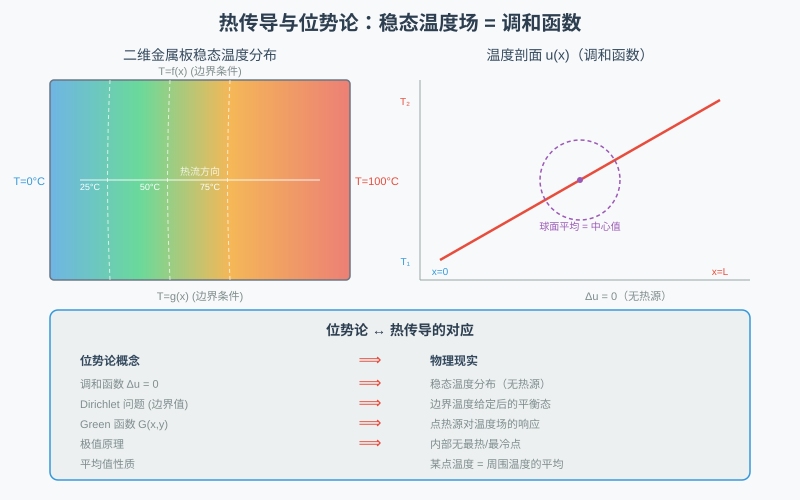

# 第 55 级：位势论 (Potential Theory)

> 位势论是数学分析中研究调和函数、次调和函数以及与之相关的位势（如 Newton 势、对数势）的经典分支。它起源于 18 世纪万有引力理论和电磁学中的势函数概念，经过 Gauss、Green、Dirichlet、Riemann、Poincaré、Perron、Wiener、Cartan 等数学家的贡献，发展成为现代分析学中一个深刻而优美的理论体系。位势论不仅与复分析、偏微分方程、概率论紧密相连，还在几何测度论、非线性分析等领域发挥着重要作用。本课程将从调和函数的基本性质出发，系统介绍 Green 恒等式与 Green 函数、Dirichlet 问题的 Perron 方法、容量与平衡测度、调和测度与 Balayage、薄集与细拓扑，以及 Wiener 准则等核心内容。

---

## 1. 学习目标

1. 理解 Newton 位势和对数位势的定义及其物理背景。
2. 掌握调和函数的基本性质：平均值性质、最大值原理、Harnack 不等式。
3. 理解次调和函数的定义及其基本性质。
4. 掌握 Green 恒等式与 Green 表示公式，理解其与 Green 函数、Poisson 核的关系。
5. 掌握 Dirichlet 问题的 Perron 方法（含上包络的调和提升）及其证明。
6. 理解 Green 函数的概念及其在求解 Dirichlet 问题中的应用，掌握调和测度的定义、性质与计算。
7. 掌握平衡测度、容量和能量的基本概念，理解 Balayage（打靶消去）与调和测度的联系。
8. 理解极集、薄集、细拓扑和 Wiener 准则。
9. 了解 Choquet 容量、上包络定理和 Evans 收敛定理。

---

## 2. 核心概念

### 2.1 Newton 位势

> **动机与来龙去脉：从 Newton 万有引力与 Coulomb 静电说起。**
>
> 位势论的名字源于"势"（potential），而"势"最初是一个**纯物理的量**。1687 年 Newton 的万有引力定律说，位于 $y$ 的一个质点会对位于 $x$ 的质量施加一个与距离平方成反比的引力，其"大小"用标量场刻画：
> $$
> U(x) = \frac{m}{|x - y|}, \quad (n = 3).
> $$
> 到了 18 世纪，Laplace、Poisson 等人发现一个奇妙的事实：**无数质点叠加出的这种"和"，其 Laplace 算子恰好等于（负的）源分布**，即 $\Delta U = -\mu$。这一步意义深远——它把"牛顿势"从引力/电量的**物理直觉**，洗炼成一个偏微分方程 $-\Delta U = \mu$ 的**分析对象**。换言之，一旦你同意"每个点源都按 $1/r^{n-2}$ 张出一片场、叠加起来就是总场"，那么**求给定源分布的场**就等价于**求这个 Poisson 方程的解**——这是整个位势论反复使用的"翻译"。
>
> 我们按从易到难的顺序展开：先定义最基础的 Newton 位势（$n \geq 3$ 时的核 $1/|x-y|^{n-2}$），随后你会看到它正是 Laplace 方程基本解的原型（见定义 2.3）。先直观掌控"点电荷扩散成场"这一图像，再谈严格的形式化，后面的一切（调和函数、Green 函数、容量）都建立在这块地基上。

**定义 2.1**（Newton 位势）设 $\mu$ 是 $\mathbb{R}^n$（$n \geq 3$）上的 Radon 测度，其 **Newton 位势** 定义为：

$$
U^\mu(x) = \int_{\mathbb{R}^n} \frac{1}{|x - y|^{n-2}} \, d\mu(y).
$$

对于 $n = 2$，**对数位势** 定义为：

$$
U^\mu(x) = \int_{\mathbb{R}^2} \log\frac{1}{|x - y|} \, d\mu(y).
$$

Newton 位势满足 Poisson 方程：

$$
-\Delta U^\mu = c_n \mu,
$$

其中 $c_n = (n-2)\omega_n$，$\omega_n$ 是 $\mathbb{R}^n$ 中单位球面的面积。

> **直观理解（现实类比）**：点电荷产生的势场就像灯光照进黑暗的房间——越靠近光源（电荷）越亮（势越高），向外逐渐变暗（势按 $1/r$ 衰减），同一圈上的光照完全相同（等势线为同心圆）。Green 函数正描述了一个"点源"对整个场的影响方式。

### 2.2 调和函数

> **动机与来龙去脉：从热平衡与 Laplace 方程说起。**
>
> 上一小节的动力学图像里，"势"是给一堆源当"搬运工"。但若**源消失**（$\mu = 0$，即某区域里既无质量也无电荷），Newton 位势 $\Delta U = -\mu$ 就退化成 $\Delta U = 0$——**这正是 Laplace 方程**。满足 $\Delta u = 0$ 的函数被 Laplace 本人在 1787 年命名，而"调和"（harmonic）一词要等到 19 世纪才由 W. Thomson（开尔文）根据"振动模式"或"各处读数协同"的意思提出。它刻画了**"没有源、数值自动调平"**的稳态场：热平衡的温度、静态的引力场、静电真空电位，都是它的物理化身。
>
> 直觉上，$\Delta u = 0$ 的意思是"每个方向上的弯曲互相抵消"——没有局部凸顶，也没有局部凹坑。正是这一条苛刻条件，带来了后面所有漂亮结论的源头：**平均值性质**（每点等于小圈平均）、**极值原理**（最值只能出现在边界）、**Harnack 不等式**（非负时整块紧集大致均匀）。所以先记住这幅画面：**调和函数 = 金属板达到热稳态后、内部既无热源也无冷点的温度分布**。下面给出严格定义。

**定义 2.2**（调和函数）设 $\Omega \subset \mathbb{R}^n$ 是开集。函数 $u: \Omega \to \mathbb{R}$ 称为 **调和函数**，如果 $u \in C^2(\Omega)$ 且：

$$
\Delta u(x) = \sum_{i=1}^n \frac{\partial^2 u}{\partial x_i^2}(x) = 0, \quad \forall x \in \Omega.
$$

> **直观理解（现实类比）**：调和函数就像**金属板达到热平衡后的温度分布**——把一块金属板的边缘固定在某个温度（比如一边加热、一边冷却），等待足够长时间后，板内温度不再变化，达到稳态。此时温度场 $u(x,y)$ 满足 $\Delta u=0$，内部既没有"热点"也没有"冷点"（极值原理），最热和最冷的地方只出现在边界。这正是位势论中"调和函数无内部极值"的直观体现。

> **🧠 思考历程：一场从"重力场"和"电场"起家的分析学，怎么反而成了后来概率论的摇篮？**
>
> 位势论的名字透着"物理味"，可它讲的是调和函数、Dirichlet 算法这些纯粹分析。实际上这正是它的独特之处：**从一个公理之外、物理直觉的"势"出发，演化成一套以"边界决定内部"为核心的自洽理论**。
>
> - **"势"最初是力学和电学里的量**（17-18 世纪）。Newton、Gauss 和后来电磁学研究的核心，都是这样的问题：一堆质量或电荷，在远处 $x$ 产生多大的"作用"？他们把这种"一次性算出所有源对 $x$ 影响的和"记为 $U^\mu(x)$——一个只和你、以及源的分布有关的**数**。**Newton 位势 $U^\mu(x)=\int |x-y|^{2-n}d\mu(y)$ 就是把"每个点源 $y$ 贡献的 $1/|x-y|^{n-2}$ 累加起来"**。这里关键的一步，是 18 世纪的物理学家（如 Laplace、Poisson）发现：**在场里这种"和的势"总是满足 $\Delta U=-\text{(源)}$**——于是"势"从物理量，变成了一类偏微分方程的解，"位势论"从物理抽身出来，进入分析。
> - **调和函数："没有源，所以内部无热点"**。当 $\mu=0$（附近没有质量或电荷），势就满足 $\Delta u=0$。"调和"一词由此而来——**没有源的场内，数值像被"调平"了：处处取平均值、内部无极大极小（最大值原理）、相邻点的值差受边界唯一确定**。把"能量最低/温度稳态"这种物理直觉洗成纯数学语言，正是调和函数一步步"物理→分析"的过程。
> - **Dirichlet 问题：从"原理"到"疑似有漏洞"再到严谨**。给边界温度问内部稳态是多少——这问题物理上是"显然存在、显然唯一"，可数学上要漂亮地证明却绕了远路。Riemann 用**变分"能量最小"**把它当原理用；Weierstrass 却指出"下确界不一定取得到"，原理有洞。**Poincaré、Perron、Wiener 一路打补丁**：Perron 干脆直接取"所有不越过边界的次调和函数"的**上包络**，再用调和正则性证明它就是解——这一招既绕开了变分的陷阱，还逼出"边界点正则性"这个新概念。**有时最"笨"的成功，恰是对"聪明原理"最深刻的考验**。
> - **心路**：位势论的成长史是一个"**物理问句 → 分析对象 → 原理审查 → 反推出新概念**"的完整轮回——正如 20 世纪若干数学家（如 Doob）惊喜地看到：**布朗运动的击中概率，正好是位势论里早就算好的容量与调和函数**。原来最抽象的分析，和最"随机"的直觉，早在几个世纪前就在等一场重逢。

**定义 2.3**（基本解）Laplace 算子 $\Delta$ 的 **基本解** 为：

$$
\Gamma(x) = \begin{cases}
\frac{1}{2\pi} \log\frac{1}{|x|}, & n = 2, \\
\frac{1}{(n-2)\omega_n} \frac{1}{|x|^{n-2}}, & n \geq 3,
\end{cases}
$$

其中 $\omega_n$ 是 $\mathbb{R}^n$ 中单位球面的面积。$\Gamma$ 满足 $-\Delta\Gamma = \delta_0$（在分布意义下）。

> **💡 直观理解（类比）**：基本解 $\Gamma$ 是给 Laplace 方程"打一个点"的响应——在某个点塞进去一个单位的"尖刺"（$\delta_0$），看它产生的场向外扩散多远、衰减多快。就好比往水池中央投下一颗石子，一圈圈涟漪以 $1/r^{n-2}$（二维则按 $\log$）的规律向外扩散并衰减——它是"单个点源如何决定整个场"的唯一配方。

### 2.3 次调和函数

> **动机与来龙去脉：从"向下不破平均"说起。**
>
> 调和函数很"娇贵"——既要光滑、又要每点等于小圈平均，取最大值、对上包络（下节 Perron 方法）、做逼近时都极其不便。位势论需要一套**更能"容忍"的类**：放宽到只需**不多于**小圈平均、"只许上凸、不许多凹"、还可以取值 $-\infty$。这个类就是**次调和函数**。
>
> 它的重要性最早在 Perron 求解 Dirichlet 问题时凸显出来：为了"从下面垫高"逼近真解，需要一批足够宽松、又保有"向下不破平均"底线的候选函数——次调和函数正是上传包络、取最大值后依然可控的理想候选。后来人们发现它还"恰好"刻画了**分布意义下 $\Delta u \geq 0$**（Riesz 表示，见习题 128 与定理 3.8），与大好发展概率论（布朗运动的强调调和性）无缝衔接。直觉上记住：**次调和 = 热汤只许冒"热点"、不许塌"冷坑"**。

**定义 2.4**（次调和函数）设 $\Omega \subset \mathbb{R}^n$ 是开集。函数 $u: \Omega \to [-\infty, \infty)$ 称为 **次调和函数**，如果：
1. $u$ 是上半连续的；
2. 对任意紧集 $K \subset \Omega$ 和任意在 $K$ 上调和、在 $\partial K$ 上满足 $h \geq u$ 的函数 $h$，有 $h \geq u$ 在 $K$ 上成立。

等价地，$u$ 是次调和的当且仅当对任意球 $B(x, r) \subset \Omega$，有：

$$
u(x) \leq \frac{1}{\omega_n r^{n-1}} \int_{\partial B(x, r)} u(y) \, d\sigma(y).
$$

> **💡 直观理解（类比）**：次调和函数像一张只能"鼓起"、不许"塌陷"的弹性膜：任何一点的值都不低于以它为中心的小圈平均值。这就像锅里的热汤——允许冒出比周围平均更高的"热点"，却绝不允许出现比周围都低的"冷凹陷"。它是调和函数的"放宽版"：少了内部无极值的限制，只保留"向下不破平均"这一条底线。

### 2.4 Dirichlet 问题

> **动机与来龙去脉：从"边界决定内部"说起。**
>
> 调和函数既光滑又处处等于小圈平均，因此它是**被边界"锁定"**的：只要把金属板边缘温度 $f$ 固定，内部稳态温度就应当唯一确定。把这句话的形式化，就是 Dirichlet 问题：给定边界数据 $f$，在 $\Omega$ 内求调和、在边界取 $f$ 的函数 $u$。
>
> 为什么它是位势论的中枢？因为**几乎所有经典问题都能翻译成它**：热平衡（温度稳态）、静电真空电位、以及后面出现的 Green 函数、调和测度、贴消去（balayage）都可以被理解成"不同记法下的 Dirichlet 问题"。1828 年 Green 在《论电与磁的数学分析应用》里把这个问题摆上研究台面，而"解是否总是存在"却缠住了后来几十年的分析家：Riemann 用变分原理想当然地接受存在性，Weierstrass 却戳穿"下确界不一定取得到"，直到 Perron、Wiener 才给出严谨的一般性解答。所以务请记住它**两个维度**的性质：**唯一性**（极值原理轻易可得）与**存在性**（困难，需要 Perron 方法 + 边界正则性）。

**定义 2.5**（Dirichlet 问题）设 $\Omega \subset \mathbb{R}^n$ 是有界开集，$f: \partial\Omega \to \mathbb{R}$ 是连续函数。**Dirichlet 问题** 是寻找 $u: \overline{\Omega} \to \mathbb{R}$ 满足：

$$
\begin{cases}
\Delta u = 0, & \text{在 } \Omega \text{ 内}, \\
u = f, & \text{在 } \partial\Omega \text{ 上}.
\end{cases}
$$

> **💡 直观理解（类比）**：Dirichlet 问题像"给边界定规矩、问内部怎么均匀"的命题：只要把一块金属板边缘固定好温度（一边加热、一边冷却），等内部达到稳态后，板内温度就被完全决定，且内部没有热源。这就像把水箱外壁刻上标高，问水面静止后内部各处读数为多少——边界一锤定音，内部答案唯一。

### 2.5 Perron 方法

> **动机与来龙去脉：从"变分原理的漏洞"说起。**
>
> Dirichlet 问题摆在眼前，如何证明**存在性**？19 世纪的通行思路是 Riemann 的**变分/Dirichlet 原理**：把解看作"让总能量 $\int |\nabla u|^2$ 最小的那个函数"，通过能量最小化硬造出一个。听起来顺理成章，但 Weierstrass 在 1870 年敏锐地指出致命伤——**下确界不必然被取到**：一串让能量越来越小的函数，极限未必还是良函数，变分找不到那个"最小点"。
>
> 出路不在"从上往下压能量"（保极小），而在"从下往上涨垫层"（取上确界）。1923 年 Perron（与 H. Lebesgue 独立同时期思路）提出：把所有**不越过边界值 $f$ 的次调和函数**统统收集成一族 $\mathcal{F}_f$，再逐点取上确界 $u(x) = \sup_{v\in\mathcal{F}_f} v(x)$。这招的高明在于：次调和函数族对"取最大值"封闭（见习题 126），所以对上包络做 Poisson 修正再取极就能"升"成调和函数，同时还自动避开变分的病态下确界问题。下面给出 Perron 方法的形式化框架。

**定义 2.6**（Perron 方法）**Perron 方法** 是求解 Dirichlet 问题的经典方法。其基本思想是：

1. 考虑所有满足 $v \leq f$ 在 $\partial\Omega$ 上且在 $\Omega$ 内次调和的函数 $v$ 的集合 $\mathcal{F}_f$（称为 **下函数族**）；
2. 定义 $u(x) = \sup\{v(x) : v \in \mathcal{F}_f\}$，称为 **Perron 上解**；
3. 证明 $u$ 是调和的，且在边界点 $x_0 \in \partial\Omega$ 处，若 $x_0$ 是 **正则点**，则 $\lim_{x \to x_0} u(x) = f(x_0)$。

> **💡 直观理解（类比）**：Perron 方法像"从下面一层层垫高"建地基：把所有不越过边界值 $f$ 的次调和函数当作"可行的垫层"，统统堆在下面，再取它们的最高处（上包络）作为最终屋面。这好比用一堆脚手架互相比高，最终盖出既不超过边界、又尽量贴近边界的屋顶——绕开了"寻找最小值"的变分陷阱。

### 2.6 Green 函数

> **动机与来龙去脉：从 Green 1828 年的电磁研究说起。**
>
> Dirichlet 问题的解固然可以靠 Perron 方法"存在性地"造出来，但位势论还想要**显式公式**：给定区域 $\Omega$，「'两点之间的'解算子」由什么决定？1830 年，未受正规学院训练的数学天才 George Green 在他那篇划时代论文（《论电与磁的数学分析应用》）里提出：给区域内任意点 $y$ 放一个"点源"，则它对另一观察点 $x$ 的影响，被一个称为 Green 函数的量 $G_\Omega(x,y)$ 完全记录。他的伟大洞见（现称 Green 恒等式，见 §2.13）把"区域内部"与"边界"通过分部积分连接起来，从而只要知道该区域的 Green 函数，任何边界数据 $f$ 的解都能用一次积分表示出来：
> $$
> u(x) = \int_{\partial\Omega} f(y)\,\frac{\partial G_\Omega}{\partial n_y}(x,y)\,d\sigma(y),
> $$
> 其中的核 $\partial G_\Omega/\partial n_y$ 叫 Poisson 核。这等于把"解算子"**拆成一张按点源预制的响应清单**，之后随便换边界数据都无需重新解方程。物理上，Green 函数就是"接地导体内部一个点电荷的电位"，条件 $G=0$ 于边界对应"接地为零电位"。

**定义 2.7**（Green 函数）设 $\Omega \subset \mathbb{R}^n$ 是开集。$\Omega$ 的 **Green 函数** $G_\Omega(x, y)$ 是满足以下条件的函数：

1. 对于固定的 $y \in \Omega$，$G_\Omega(x, y) = \Gamma(x - y) + h(x, y)$，其中 $h$ 在 $\Omega$ 内关于 $x$ 调和；
2. $G_\Omega(x, y) = 0$ 对 $x \in \partial\Omega$ 或 $|x| \to \infty$（当 $\Omega$ 无界时）。

Green 函数给出了 Dirichlet 问题解的积分表示：

$$
u(x) = \int_{\partial\Omega} f(y) \frac{\partial G_\Omega}{\partial n_y}(x, y) \, d\sigma(y),
$$

其中 $\frac{\partial G_\Omega}{\partial n_y}$ 是 Green 函数沿外法向导数，称为 **Poisson 核**。

> **💡 直观理解（类比）**：Green 函数像一个"单点响应滤镜"：它记录在 $y$ 处放一个点源、且边界保持为零时，$x$ 处会看到什么效果。任何边界数据 $f$ 的解，就是把对这些单点响应沿边界"层层叠加"（积分）出来的合成结果——好比先让各种音源单独弹一下记录波形，再把它们按实际音量混合成最终混音。

### 2.7 平衡测度与容量

> **动机与来龙去脉：从"导体的静电分布"说起。**
>
> 给一个**孤立导体**（形状如紧集 $K$）充上总电量，那么静电平衡时电荷会自动分布在**外表面**上，并且整块导体的电位处处相等（若不等，电荷就会流动直到相等）。在数学位势论里，这就演化成**平衡测度**：在紧集 $K$ 上挑一个概率测度 $\mu_K$，使它的位势在 $K$ 上（准处处）等于一个常数——这个常数就是"平衡电位/能量"水平的体现。而"$K$ 到底能装下多少电荷而不把位势抬太高"这个度量，就是**容量** $\operatorname{Cap}(K)$。
>
> 容量为何如此重要？因为它是比 Lebesgue 测度**精细得多**的"尺子"：一条在 $\mathbb{R}^2$ 中被 Lebesgue 测度为 $0$ 的线段可以有正容量，而容量零的集合（如单点）在位势论里才是真正"可忽略"的（能装进极集）。从 Wiener 准则（§2.10）到 Kellogg 引理（§3.4）到随机行走的击中概率，容量几乎无处不在。直觉上：**容量 = 集合容纳净电荷的"胃口"，越大越高能**。

**定义 2.8**（平衡测度）设 $K \subset \mathbb{R}^n$ 是紧集。**平衡测度** $\mu_K$ 是支撑在 $K$ 上的概率测度，使得其位势在 $K$ 上为常数（称为 **平衡位势**），即：

$$
U^{\mu_K}(x) = \text{常数} \quad \text{在 } K \text{ 上（准处处成立）}.
$$

> **💡 直观理解（类比）**：平衡测度像在导体表面自动"排匀"的一层电荷：为了让势能在它的整个支撑面 $K$ 上保持同一个"电平"（常数），电荷就往"边缘更密、中间更疏"的地方分布。这就像水分沿毛细孔自动渗开，直到液面处处一般高——只要内部势能处处相等，这个分布就是该集合的"平衡态"。

**定义 2.9**（容量）紧集 $K \subset \mathbb{R}^n$ 的 **Newton 容量** 定义为：

$$
\operatorname{Cap}(K) = \frac{1}{\inf\{I(\mu) : \mu \in \mathcal{P}(K)\}},
$$

其中 $I(\mu) = \iint \frac{1}{|x - y|^{n-2}} \, d\mu(x) \, d\mu(y)$ 是测度 $\mu$ 的 **能量**，$\mathcal{P}(K)$ 是 $K$ 上概率测度的集合。

等价地，$\operatorname{Cap}(K) = \mu_K(K)$，即平衡测度的总质量。

> **💡 直观理解（类比）**：容量衡量一个集合"容纳电荷的胃口"：集合越大，就越能用较低的"自相互作用能"（$I(\mu)$）把电荷塞进平衡态。好比一口大锅能装很多水而不容易"擎高"（位势平），而单点这种小碎面就连一丁点电荷都代价高昂——所以单点容量为零，一整块区域容量为正。

### 2.8 极集

> **动机与来龙去脉：从"哪些集合可被忽略"说起。**
>
> 分析里到处都在问"哪些集合可以划掉"：测度论用 Lebesgue 零测集，位势论却用另一把更细的尺子——**极集**。一个集合 $E$ 若能找到一个非常数次调和函数 $u$，让 $u|_E = -\infty$，就说 $E$ 是极集。为何用它？因为凡是与调和相关（harmonic）的对象（调和函数、位势、布朗运动的击中点）在极集上"看不出值"，就像电荷测度"放不进"零容量集合：**极集 ⇔ 容量为零**。这保证了"在极集外比较两函数值"永远是安全的近似方式。
>
> 直觉上，极集是"比测度零更苛刻"的忽略对象：单点、可数多个点都是极集，但一条曲线在 $\mathbb{R}^n$（$n\ge 3$）里容量为正、不是极集。所以**千万小心**：极集⊂Lebesgue 零测集，反之不成立——这正是它在边界正则性（Kellogg 引理）里如此好用的原因。

**定义 2.10**（极集）集合 $E \subset \mathbb{R}^n$ 称为 **极集**，如果存在一个非常数的次调和函数 $u$ 使得 $u|_E = -\infty$。

等价地，$E$ 是极集当且仅当 $\operatorname{Cap}(E) = 0$。

极集在测度论意义下具有 Lebesgue 测度零，但反之不成立（例如，$\mathbb{R}^n$ 中一个点的容量在 $n \geq 3$ 时为零，但 $\mathbb{R}^2$ 中一个点的对数容量也为零，而 $\mathbb{R}^n$ 中一条曲线的容量在 $n \geq 3$ 时为正）。

> **💡 直观理解（类比）**：极集像一个"连次调和函数都得拉到 $-\infty$ 的深渊"：只要某个集合能让某个非常数次调和函数在该处掉到 $-\infty$，这片集合就图"测不出来"，等价地容量为零。打个比方：极集好比电学里永远接收不到信号的"死区"——常规的测量（Lebesgue 测度、容量）对它都毫无反应。

### 2.9 细拓扑

> **动机与来龙去脉：从"薄集的精细边界"说起。**
>
> 极/薄这类"细不可测"的集合给经典拓扑带来麻烦：一个点 $x_0$ 明明与其多个邻域从欧氏尺度上"贴着"，可一旦中间隔着容量极小的薄屏障（不能安放任何正能量测度），对调和/次调和函数而言它就无法把值传进去。于是位势论引入了一种**更苛刻、也更贴合调和函数的拓扑**——细拓扑（fine topology）：它被定义为"使所有次调和函数连续的最细拓扑"。在细拓扑下，"相遇"不再只看距离，还要看能否沿"不为容量的道路"抵达。
>
> 细拓扑是 20 世纪位势论（Cartan、Brelot、Doob）的统领性语言：正则边界点（细连续）、薄集（细拓扑下的"异常"）、平衡测度的支撑、细极限、细调和测度全部可以统一表述。直觉上：**细拓扑 = 把"距离近"升格为"势论可达"**——隔着一片容量为零的薄雾，欧氏尺度上的"邻居"在细拓扑里根本不算邻居。

**定义 2.11**（细拓扑）**细拓扑** 是 $\mathbb{R}^n$ 上最细的拓扑，使得所有次调和函数在该拓扑下连续。在细拓扑下，点 $x_0$ 的邻域基由以下形式的集合组成：

$$
\{x \in \Omega : u(x) > u(x_0) - \varepsilon\},
$$

其中 $u$ 是 $x_0$ 附近的次调和函数，$\varepsilon > 0$。

细拓扑在 Wiener 准则和 Dirichlet 问题边界正则性的研究中起着关键作用。

> **💡 直观理解（类比）**：细拓扑把"邻域"的定义整理得更加苛刻：一个点要成为 $x_0$ 的近邻，需得让所有次调和函数都在它附近"保持连续地相接"。它像把普通街道地图换成"只有沿势能连续上升才互相算近邻"的特殊导航——原本靠得极近的点，若中间隔着容量极小的"薄屏障"，在细拓扑里就不算相邻。这正是处理那些被常规拓扑忽略的"极致细边界"的工具。

### 2.10 Wiener 准则

> **动机与来龙去脉：从"为什么有的边界点失效"说起。**
>
> Dirichlet 问题的瑕疵全在**边界正则性**：绝大多数边界点（如光滑段）能让 Perron 上解在逼近时贴合边界值 $f$，称**正则点**；但有些"犄角旮旯"——极尖的尖刺、单点裂缝的顶点——却让值传不进去，称**非正则点**。1924 年 Norbert Wiener 用一个**纯容量判据**给出充要条件：逐层把边界点 $x_0$ 放进半径 $2^{-k}$ 的小球，量出"越过 $\Omega$ 的那块空隙"的容量，再按 $2^{k(n-2)}$ 加权求和；级数**发散 ⇔ 正则**。这等于用逐层"显微放大"精确量化了"空隙到底够不够饱满把边界值递进内部"。
>
> 直观上，Wiener 准则回答的是"**缺陷有多细**"：光滑点每层空隙都有实打实的容量，级数发散；而薄到容量快速收缩的点，级数收敛、值传不进去。它会带来一个惊人的"好消息"（Kellogg 引理，§3.4）：坏点再多也只是容量为零的极集。

**定义 2.12**（Wiener 准则）**Wiener 准则** 给出了 Dirichlet 问题中边界点正则性的充要条件。边界点 $x_0 \in \partial\Omega$ 是正则的当且仅当：

$$
\sum_{k=1}^{\infty} 2^{k(n-2)} \operatorname{Cap}\left(B\left(x_0, 2^{-k}\right) \setminus \Omega\right) = \infty.
$$

> **💡 直观理解（类比）**：Wiener 准则像一台"逐层放大的显微镜"：把边界点 $x_0$ 依次放进半径 $2^{-k}$ 的一系列小球，每一层都量一量"这球里、越过 $\Omega$ 边界后那块空隙的容量 $\operatorname{Cap}$"，再按权重 $2^{k(n-2)}$ 求和。总和发散（冲到无穷）表示每一层球里的空隙都足够"饱满"，边界就能把值一步步"递"进内部——这时点为正则点；若总和收敛，说明空隙太细碎，值传不进去，点就成了"犄角旮旯"里的非正则点。

### 2.11 Choquet 容量

> **动机与来龙去脉：从"给容量一把更温和的尺子"说起。**
>
> 容量（Newton 容量、对数容量）长得极像测度，但又**不是**可数可加的测度——它只要求更弱的"下连续"与"外正则"。为了统一研究"一切这类集函数"，Gustave Choquet 在 20 世纪中叶抽象出**Choquet 容量**的公理：单调性、对递增并的下连续性、外正则性。有了它，一套"测度论跛足但仍够用"的理论（Choquet 定理、拟连续函数）便成立——特别地，**Newton 容量本身正是 Choquet 容量**，这给研究容量在 Wiener 级数、可数并等场合的行为给出了现成工具箱。直觉上：**Choquet 容量 = 不求可数可加、但求"温和可逼近"的尺子**。

**定义 2.13**（Choquet 容量）集函数 $C: \mathcal{P}(\mathbb{R}^n) \to [0, \infty]$ 称为 **Choquet 容量**，如果它满足：
1. **单调性**：$E \subset F \Rightarrow C(E) \leq C(F)$；
2. **连续性**：对递增序列 $E_1 \subset E_2 \subset \cdots$，有 $C\left(\bigcup_k E_k\right) = \lim_{k\to\infty} C(E_k)$；
3. **外正则性**：对任意 $E$，$C(E) = \inf\{C(G) : G \supset E, G \text{ 开}\}$。

Newton 容量和 Choquet 容量是位势论中描述集合大小的关键工具。

> **💡 直观理解（类比）**：Choquet 容量把"集合有多大"升级成一把更温和的尺子：既要求单调（大的包围小的必不小于）、又要求能由可数递增序列逼近（连续），还要求能用开集从外面近似（外正则）。它像一把能同时"量点、量线、量雾"的智能软尺——那种普通测度量不出的"细碎集合"，它也能给出合理读数。

### 2.12 蛋收敛定理

> **动机与来龙去脉：从"序列是否会乱跳"说起。**
>
> 位势论里常要处理**一族次调和函数**（如 Perron 下函数族、Wiener 构造中的加和），于是自然要问：给了局部一致有上界的次调和序列 $\{u_k\}$，能不能保证"抽出收敛子列"？——否则一切"取极限造解"的论证都无从谈起。1920 年代 G. C. Evans 给了个漂亮的二分法：要么整串一起塌向 $-\infty$，要么必有一子列收敛到某个次调和 $u$（$L^1_{\text{loc}}$ 意义下）。这事实今天常被称为"**位势论的紧致性/半紧性**（compacity）"，是 Perron 方法、薛尔方法（Potential 上包络）、非线性推广的靠山。直觉上：**有上界的一族次调和解水波，绝不会乱跳——非塌即聚顺**。

**定义 2.14**（蛋收敛定理）**蛋收敛定理**（Evans 收敛定理）描述了次调和函数序列的收敛性质。设 $\{u_k\}$ 是区域 $\Omega$ 上的次调和函数序列，若 $u_k$ 在 $\Omega$ 上局部一致有上界，则要么 $u_k \to -\infty$ 局部一致，要么存在子序列收敛到某个次调和函数 $u$（在 $L^1_{\text{loc}}$ 意义下）。

> **💡 直观理解（类比）**：Evans 收敛定理像"一排温度计齐齐量同一口锅"：只要这一排读数在每处都有统一上限（不向上乱窜），局面就只有两种结局——要么整排一起掉到极冷（$u_k\to-\infty$），要么能挑出一组读数逐渐稳定成一张新的次调和"温度图"。这好比一组水面必然要么一起干涸，要么渐渐沉淀出一条平滑的水位线，绝不允许毫无规则地到处乱跳。

### 2.13 Green 恒等式

> **动机与来龙去脉：从"分部积分的位势论版本"说起。**
>
> 积分里最有力的工具是分部积分/散度定理；位势论里等价的角色就是 **Green 恒等式**——它把"区域内部的 Laplace 算子作用"翻译成"边界上的法向导数"，是从调和函数到 Green 函数、Green 表示公式一切论证的枢纽。早在 Green 1828 年的论文里，就有意地把 Divergence 定理配成适合电磁位势的形状，直接由此导出了 Green 函数与"Green 表示公式"（定理 3.10）。没有它，我们无法把 Dirichlet 问题化成边界积分，也推导不出平均值性质、更多密度间公式。它的直观含义就是一句话：**"体积内的累积作用 = 流经边界的净通量"**。

**定义 2.15**（Green 恒等式）设 $\Omega$ 是有光滑边界的有界开集，$u, v \in C^2(\overline{\Omega})$。则
- **第一 Green 恒等式**：
  $$
  \int_{\Omega} \left(\nabla u \cdot \nabla v + u\,\Delta v\right) dx = \int_{\partial\Omega} u\,\frac{\partial v}{\partial n}\,d\sigma,
  $$
  其中 $n$ 是 $\partial\Omega$ 的单位外法向，$\frac{\partial v}{\partial n} = \nabla v \cdot n$。
- **第二 Green 恒等式**：由第一式在 $u, v$ 间做差即得
  $$
  \int_{\Omega} \left(u\,\Delta v - v\,\Delta u\right) dx = \int_{\partial\Omega} \left(u\,\frac{\partial v}{\partial n} - v\,\frac{\partial u}{\partial n}\right) d\sigma.
  $$
- **Green 表示公式**：特别地，若 $u$ 调和且取 $\Gamma$ 为基本解，则在全空间/纯边界情形下有
  $$
  u(x) = \int_{\partial\Omega} \left[ u(y)\frac{\partial \Gamma}{\partial n_y}(x-y) - \Gamma(x-y)\frac{\partial u}{\partial n_y}(y) \right] d\sigma(y), \quad x \in \Omega,
  $$
  它是"为调和函数量身定做的 Green 表示"。

> **💡 直观理解（类比）**：第一 Green 恒等式好比"水的进出账"：左边是器皿内部源项（梯度内积 + 弯曲作用）的总量，右边是边界上注入/抽出的净通量；第二恒等式则是把一个函数对另一个的"作用差"推到边界上结算。而 Green 表示公式告诉你：**一个调和点 $x$ 处的值，可完全由它在边界上的"值 + 法向导数"反算回来**——这正是 Green 函数与 Poisson 核公式的源头。
>
> **常见坑**：第二恒等式里的符号取决于外法向的选择；$u\Delta v - v\Delta u$ 这一项在上方 $x\in\Omega$ 的 Green 表示公式中没有出现，是因调和 $u$ 能消掉它，千万别在一般 $u$ 上误用。

### 2.14 调和测度

> **动机与来龙去脉：从"从某点看边界该信多少"说起。**
>
> Dirichlet 问题的解可写成 $u(x) = \int_{\partial\Omega} f(y)\,\omega(x,dy)$，其中对每个固定的 `x`，$\omega(x,\cdot)$ 是边界上的一个概率测度——这就是**调和测度**。它回答一个极自然的概率问题：**"从 $x$ 出发的布朗粒子，第一次逃出 $\Omega$ 时，落在边界子集 $A$ 上的概率是多少？"** 换言之，调和测度把"边界值在点 $x$ 处应该被如何加权求平均"固化成一个与 $f$ 无关的量：先算好这张"权重表"，任何边界函数都能直接套用。它连接了位势论与分析概率论（Doob、Kakutani），并且与 Green 函数法向导数 $\omega(x,dy) = \frac{\partial G_\Omega}{\partial n_y}(x,y)\,d\sigma$ 在光滑边界上互相换算法（见示例 4.4）。直觉上：**调和测度 = 该信边界哪一处的"信任度分布"**。

**定义 2.16**（调和测度）设 $\Omega$ 是有界区域，$x \in \Omega$。以 $\omega(x, \cdot)$ 记边界 $\partial\Omega$ 上的 **调和测度**，即满足：对任意 $A \subset \partial\Omega$，映射 $x \mapsto \omega(x, A)$ 是 $\Omega$ 上的调和函数，且对边界数据 $f = \mathbf{1}_A$（即 Dirichlet 问题的解取 $1$ 于 $A$、$0$ 于补集），有
$$
\omega(x, A) = \int_A \frac{\partial G_\Omega}{\partial n_y}(x, y)\,d\sigma(y).
$$
它是 $\partial\Omega$ 上的**概率测度**（$\omega(x,\partial\Omega)=1$），且满足马尔可夫性：在区域充分正则的前提下，对任意可测有界 $f$，$x \mapsto \int_{\partial\Omega} f(y)\,\omega(x,dy)$ 是 $\Omega$ 上的调和函数（即 Dirichlet 问题的解）。

> **💡 直观理解（类比）**：调和测度像"一个站在 $x$ 的盲人判断墙外哪一段最可能先被自己碰到"的权重：越靠近边界、视野越开阔的那段获得越高"信任"。对常数边界值 $f\equiv 1$，无论 $x$ 在哪，总和必为 $1$（$\omega(x,\partial\Omega)\equiv 1$）——因为粒子迟早要逃出界。靠近边界时，$\omega(x,\cdot)$ 会急剧地把质量集中到近点处，这正是 Poisson 核逼近 $\delta$ 的体现。
>
> **常见坑**：调和测度在每个 `x` 是边界上的测度、又作为 `x` 的函数是调和的——两种角色别混；在无界区域（如全平面去掉一个点）调和测度的定义要借助 Martin 边界/取极限，并非所有情形 $\omega(x,\partial\Omega)=1$ 都平凡成立。

### 2.15 打靶消去 / Balayage

> **动机与来龙去脉：从"把质量扫到边界去"说起。**
>
> Balayage（法语"扫除/涂抹"，中文常译作**打靶消去**）由 H. Poincaré 提出，用来"不动区域内部位势、把质量搬到边界"。给定支撑在 $\Omega$ 内的一个测度（或一个点 $x_0$），可以寻找边界上的一个新测度 $\hat\mu$，使得两者在 $\Omega$ 内部的位势**几乎处处相等**（仅在极集上可以例外）。直观地说：**"把 $\Omega$ 内原有的电荷，沿内部到边界的势能等高线'抹平'到边界上，让内部观测者看不出差别"**。它能一举证明 Dirichlet 问题中 Poisson 核公式与 Perron 解等于边界调和测度的积分（见习题 220、示例 4.5），也是概率里"完美击中定律"的位势论镜像。直觉上：**Balayage = 精确保有内部位势不变的前提下，把支撑扫到边界**。

**定义 2.17**（Balayage / 打靶消去）设 $\Omega \subset \mathbb{R}^n$ 是区域，$E \subset \Omega$ 为闭集。对任意支撑在 $E$ 上的测度 $\mu$，其 **balayage onto E（推广到边界）** $\widehat{\mu}$ 是如下意义上的"替代测度"：$\widehat{\mu}$ 支撑在 $\partial\Omega$ 上（当 $\widehat{\mu}$ 相对于 "从 $E$ 到 $\partial\Omega$" 的边界扫移时），使得对整个紧支撑位势意义下一致
$$
U^{\widehat{\mu}} \leq U^{\mu} \quad \text{在 } \Omega \text{ 上},\qquad 
U^{\widehat{\mu}} = U^{\mu} \quad \text{在 } \Omega \setminus E \text{ 上（准处处）}.
$$
当 $E = \Omega$（即想"扫到边界"）且 $\mu = \delta_{x_0}$ 时，$\widehat{\mu}$ 恰好是 $x_0$ 处的**调和测度**：$\omega(x_0, \cdot)$。

> **💡 直观理解（类比）**：Balayage 像"隔墙探热的工人"：无论墙内（$\Omega$ 内部）原有多少热源，都能把它们整合成"只在墙外发力的等效热源"，让房间（内部观测）温度一模一样绝不改动。这一操作把"内部源"替换成"边界源"而不改变内部解——正因如此，"内部每一点的值都能表达成边界数据的加权平均"（调和测度）一点也不奇怪。
>
> **常见坑**：Balayage 是"准处处"相等，可能在极集上例外；它写的是位势（非线性于测度）而非测度本身逐点相等，取测度时要用相对位的支配关系（Poincaré 定理）保证存在唯一。

### 2.16 极集与薄集

> **动机与来龙去脉：从"除了极集，还有更微妙的薄集"说起。**
>
> 极集（容量为零）刻画了"彻底忽略"的集合；但位势论还需要**局部**、**相对**的忽略概念——**薄集**（thin set）：集合 $E$ 在 $x_0$ 处"薄"，指 $x_0 \notin E$ 却可以被看成"从 $x_0$ 看几乎不可达"，即存在一个在 $x_0$ 处为 $-\infty$ 的次调和函数，在 $x_0 \in E$ 的 Birkhoff–Cartan 意义下限制其上仍是"下降得很彻底"。因此大集合是极集的局部推广：$E$ 在多点处薄，其共同体现与细拓扑、正则边界点（还有概率里的"孤立多次归来点"）紧密相连。直觉上：**极集 = 整片彻底死区；薄集 = 只在某一观察点处的"近旁死角"**。

**定义 2.18**（薄集）集合 $E \subset \Omega$ 称为在点 $x_0 \in \overline{E}$ 处**薄**（thin at $x_0$），如果存在 $\Omega$ 上的次调和函数 $u$，使得
$$
\limsup_{x \to x_0, \, x \in E \setminus \{x_0\}} u(x) < u(x_0)
$$
（允许 $u(x_0) = -\infty$）。若 $E$ 在其每一点处都薄于自己，称 $E$ 为 **完全薄集**（thin set）。

$E$ 在 $x_0$ 处薄与"$x_0$ 是 $E$ 关于细拓扑的隔离点/边界点"等价（见细拓扑 §2.9）；而 $E$ 为极集当且仅当 $E$ 在其每一点处薄。因此**极集 ⊂ 完全薄集 ⊂ Lebesgue 零测集类**。

> **💡 直观理解（类比）**：薄集如同墙角一抹"看着贴很近、实则隔着一层不导电细隙"的灰尘：$x_0$ 正是那角落，从势能角度 $x_0$ 与灰尘上的点"并不相接"。你把激光照上去多少次都"打不亮"沿集内接近的路径——它们在细拓扑下根本不算收敛到 $x_0$。它可以覆盖更大的范围却不能涵盖全体空间点。
>
> **常见坑**：薄是一点处的关系（相对观察点），极是整体性质——"完全薄"才是逐点薄；有限个点总是薄集，但整条连续曲线在光滑点处不薄。

### 2.17 次调和函数的上包络

> **动机与来龙去脉：从"逐点取 max 还能调和吗"说起。**
>
> Perron 方法的全部关键点是：**一族次调和函数的逐点上包络，在"不越界+有上界"的好条件下重新是次调和，乃至在局部取 Poisson 修正后升为调和**。把这一现象判成一个定理（上包络的调和提升）就能统一理解 Perron 解、反映边界数据的一切调和测度积分，以及 Evans 定理的"收敛性"。它强调次调和函数这类对象的软性：对**求上确界、取 max 封闭**（见习题 126），而这正是位势论"从离散垫层到光滑屋面"的抓手。直觉上：**上包络 = 把所有可行垫层叠到最顶，只要不破顶，就能熨平成调和屋面**。

**定义 2.19**（上包络）设 $\mathcal{F}$ 是 $\Omega$ 上的一族次调和函数，且**局部一致上有界**、同时每一项都局部有上界一致。则逐点上包络
$$
U(x) = \sup\{u(x) : u \in \mathcal{F}\}
$$
取上半连续修正 $\overline{U}$ 后仍是次调和函数，称 $\overline{U}$ 为 $\mathcal{F}$ 的**上包络**。若 $\mathcal{F}$ 恰好是 Perron 下函数族 $\mathcal{F}_f$ 且 $f$ 连续，则上包络在 $\Omega$ 上调和（**调和提升**），并等于 Dirichlet 问题的 Perron 上解。

> **💡 直观理解（类比）**：上包络像是在一堆"不能高出天花板（边界值 $f$）"的板条脚手架之上，取"所有可行板条的最高轮廓"，再用 Poisson 修正把它们之间的坑洼填平——得到的正是那个既调和、又贴着边界的屋顶。它把"离散的、参数化的垫层"浓缩成"唯一的、光滑的解"。
>
> **常见坑**：逐点 sup 可能不连续（取上半连续修正）；族必须**局部一致有上界**，否则可能整个塌向 $+\infty$（Evans 二分手之一），此时谈不上调和提升。

### 2.18 二维对数位势与对数容量

> **动机与来龙去脉：从"二维的势为何用对数"说起。**
>
> 在 $\mathbb{R}^2$ 中，$r^{2-n}$ 退化为 $r^0=1$，Newton 核失效——基本解变成**对数核** $\log\frac{1}{|x-y|}$（见定义 2.3）。由此"位势"就要换成**对数位势** $U^\mu(x) = \int \log\frac{1}{|x-y|}\,d\mu(y)$，相应的平衡、容量统称**对数容量（logarithmic capacity）**。二维的关键物理是：点电荷/点涡场的势在对数尺度上才会"无穷远处行为协配模"，复分析（Green 函数 $\log|1-\bar w z|/|z-w|$）天然以它对位。直觉上：**对数位势 = 二维世界里那个替代 $1/r$ 的"调和距"**——它满足 $\Delta(-\frac1{2\pi}\log|x|)=\delta_0$ 的基本解。

**定义 2.20**（对数位势与对数容量）设在 $\mathbb{R}^2$ 上，$\mu$ 是正 Radon 测度。其 **对数位势** 为
$$
U^\mu(x) = \int_{\mathbb{R}^2} \log\frac{1}{|x - y|}\,d\mu(y).
$$
能量 $I(\mu) = \iint\log\frac{1}{|x-y|}\,d\mu(x)d\mu(y)$（在规范化意义下符号另定）。紧集 $K \subset \mathbb{R}^2$ 的 **对数容量** 定义为
$$
\operatorname{Cap}_{\log}(K) = e^{-\inf\{I(\mu):\,\mu\in\mathcal{P}(K)\}}.
$$
且单位圆盘满足 $\operatorname{Cap}_{\log}(\overline{D}(0,1)) = 1$（等号成立当取圆周均匀分布），$n=2$ 时 Wiener 准则改用 $2^k \operatorname{Cap}_{\log}$-型级数（见习题 232）。

> **💡 直观理解（类比）**：对数容量像二维世界里"圆的平坦扩张"：单位圆盘的对数容量恰为 $1$，它是二维"多少电荷=够把圆盘电位推到常数"的天然刻度。球变成圆盘、Newton 换成对数、$1/r$ 换成 $-\log r$，其余所有构造（平衡测度、极集、容量判据）一一对应——**记住"把一维卷成对数尺度"就能平移整张二维位势论的地图**。
>
> **常见坑**：对数核不是恒正（$r>1$ 时 $\log\frac1r<0$），能量/平衡的分析更微妙；总质量为 $1$ 但支撑无界时，对数势的无穷远处行为以 $-\log|x|$ 作主项；对数容量与几何学（如 radius）的换算是 $e^{-c}$ 指数级而非 Newton 的幂线性——别照搬 $n\ge3$ 的直觉。

---

## 3. 定理与证明

### 3.1 调和函数的平均值性质

**定理 3.1**（平均值性质）设 $u$ 在 $\Omega \subset \mathbb{R}^n$ 上调和，则对任意球 $B(x, r) \subset \Omega$，有：

**(球面平均值性质)**：

$$
u(x) = \frac{1}{\omega_n r^{n-1}} \int_{\partial B(x, r)} u(y) \, d\sigma(y),
$$

**(球体平均值性质)**：

$$
u(x) = \frac{1}{\omega_n r^n / n} \int_{B(x, r)} u(y) \, dy,
$$

其中 $\omega_n$ 是 $\mathbb{R}^n$ 中单位球面的面积，$\omega_n r^{n-1}$ 是球面 $\partial B(x, r)$ 的面积，$\omega_n r^n / n$ 是球 $B(x, r)$ 的体积。

**证明**：

**步骤 1：球面平均值公式**

定义函数 $\phi(r) = \frac{1}{\omega_n r^{n-1}} \int_{\partial B(x, r)} u(y) \, d\sigma(y)$。作变量替换 $y = x + rz$，$z \in \partial B(0, 1)$，则：

$$
\phi(r) = \frac{1}{\omega_n} \int_{\partial B(0, 1)} u(x + rz) \, d\sigma(z).
$$

对 $r$ 求导：

$$
\phi'(r) = \frac{1}{\omega_n} \int_{\partial B(0, 1)} \nabla u(x + rz) \cdot z \, d\sigma(z) = \frac{1}{\omega_n r^{n-1}} \int_{\partial B(x, r)} \frac{\partial u}{\partial n}(y) \, d\sigma(y),
$$

其中 $\frac{\partial u}{\partial n}$ 是 $u$ 沿外法向导数。

由散度定理：

$$
\phi'(r) = \frac{1}{\omega_n r^{n-1}} \int_{B(x, r)} \Delta u(y) \, dy = 0,
$$

因为 $u$ 调和，$\Delta u = 0$。因此 $\phi(r)$ 是常数。

**步骤 2：确定常数**

由 $u$ 的连续性：

$$
\lim_{r \to 0^+} \phi(r) = u(x).
$$

因此 $\phi(r) = u(x)$ 对所有 $r > 0$ 成立，球面平均值公式得证。

**步骤 3：球体平均值公式**

对球面平均值公式关于 $r$ 积分：

$$
\int_{B(x, r)} u(y) \, dy = \int_0^r \left(\int_{\partial B(x, s)} u(y) \, d\sigma(y)\right) ds = \int_0^r u(x) \cdot \omega_n s^{n-1} \, ds = u(x) \cdot \frac{\omega_n r^n}{n}.
$$

整理即得球体平均值公式。$\square$

> **直观理解（现实类比）**：调和函数就像一盆久置后达到稳定温度的水——既不加热也不降温，内部便没有"冒泡"的高温点或低温点（无局部极值），最热与最冷的地方只可能出现在盆的边界（墙壁散热处）。这正是"温水里的气泡"般的极值原理：稳定分布的温度高低都被边界决定。

**定理 3.2**（平均值性质的逆定理）设 $u \in C(\Omega)$ 满足球面平均值性质（即对任意 $x \in \Omega$ 和充分小的 $r > 0$，$u(x)$ 等于其在 $\partial B(x, r)$ 上的平均值），则 $u$ 在 $\Omega$ 上调和。

**证明**：

**步骤 1：构造正则化**

取 $\varphi \in C_c^\infty(\mathbb{R}^n)$ 为径向函数，$\operatorname{supp}\varphi \subset B(0, 1)$，$\int \varphi = 1$，且 $\varphi(x) = \tilde{\varphi}(|x|)$。定义 $u_\varepsilon = u * \varphi_\varepsilon$，其中 $\varphi_\varepsilon(x) = \varepsilon^{-n} \varphi(x/\varepsilon)$。

**步骤 2：证明 $u_\varepsilon$ 调和**

由于 $u$ 满足平均值性质，利用径向函数的性质可证 $u_\varepsilon$ 在 $\Omega_\varepsilon = \{x \in \Omega : \operatorname{dist}(x, \partial\Omega) > \varepsilon\}$ 上调和。

具体地，对任意 $x \in \Omega_\varepsilon$：

$$
u_\varepsilon(x) = \int_{\mathbb{R}^n} u(x - y) \varphi_\varepsilon(y) \, dy = \int_0^\varepsilon \left(\int_{\partial B(0, r)} u(x - y) \, d\sigma(y)\right) \tilde{\varphi}_\varepsilon(r) \, dr
$$

$$
= \int_0^\varepsilon u(x) \cdot \omega_n r^{n-1} \tilde{\varphi}_\varepsilon(r) \, dr = u(x) \int_{\mathbb{R}^n} \varphi_\varepsilon(y) \, dy = u(x).
$$

因此 $u_\varepsilon = u$ 在 $\Omega_\varepsilon$ 上，且 $u_\varepsilon$ 光滑（作为卷积），故 $u$ 在 $\Omega_\varepsilon$ 上光滑。由 $\Delta u_\varepsilon = \Delta(u * \varphi_\varepsilon) = (\Delta u) * \varphi_\varepsilon$，但更方便的是直接验证调和性。

**步骤 3：验证 Laplace 方程**

由平均值性质，对任意 $x \in \Omega$ 和充分小的 $r > 0$，有：

$$
u(x) = \frac{1}{\omega_n r^{n-1}} \int_{\partial B(x, r)} u(y) \, d\sigma(y).
$$

由 Taylor 展开：

$$
u(y) = u(x) + \nabla u(x) \cdot (y - x) + \frac{1}{2} (y - x)^T D^2 u(x) (y - x) + o(|y - x|^2).
$$

在球面上积分，一次项贡献为零（由对称性），二次项给出：

$$
u(x) = u(x) + \frac{r^2}{2n} \Delta u(x) + o(r^2).
$$

令 $r \to 0$，得 $\Delta u(x) = 0$。$\square$

> **💡 直观理解（类比）**：平均值性质的逆定理说"处处等于小圈平均的正连续函数必调和"——就好比一个人在每一个小社区里都恰好等于街坊邻居的平均身高，那么他自然是"匀称"的（没有局部凸凹）。它把调和函数彻底刻画成"走到哪都跟周围平均一致"的函数，等于把"处处是均值场"当成判断标准。

### 3.2 Harnack 不等式

**定理 3.3**（Harnack 不等式）设 $u$ 是区域 $\Omega \subset \mathbb{R}^n$ 上的非负调和函数。则对任意紧集 $K \subset \Omega$，存在常数 $C = C(K, \Omega) > 0$ 使得：

$$
\sup_K u \leq C \inf_K u.
$$

特别地，对任意球 $B(x, R) \subset \Omega$，有：

$$
u(y) \leq \left(\frac{R + r}{R - r}\right)^n u(x), \quad \forall y \in B(x, r), \quad 0 < r < R.
$$

**证明**：

**步骤 1：球上的 Harnack 不等式**

首先证明一个更强的结论：设 $u$ 在 $B(x, R)$ 上非负调和，则对任意 $y \in B(x, r)$（$0 < r < R$），有：

$$
\frac{R^{n-2}(R - r)}{(R + r)^{n-1}} u(x) \leq u(y) \leq \frac{R^{n-2}(R + r)}{(R - r)^{n-1}} u(x).
$$

由 Poisson 积分公式，$u$ 在 $B(x, R)$ 上可以表示为：

$$
u(y) = \frac{R^2 - |y - x|^2}{\omega_n R} \int_{\partial B(x, R)} \frac{u(z)}{|y - z|^n} \, d\sigma(z).
$$

对 $y \in B(x, r)$，有 $R - r \leq |y - z| \leq R + r$，因此：

$$
u(y) \leq \frac{R^2 - |y - x|^2}{\omega_n R} \cdot \frac{1}{(R - r)^n} \int_{\partial B(x, R)} u(z) \, d\sigma(z)
$$

$$
= \frac{R^2 - |y - x|^2}{(R - r)^n} \cdot \frac{u(x)}{R^{n-1}} \leq \frac{R^{n-2}(R + r)}{(R - r)^{n-1}} u(x).
$$

类似地得到下界。

**步骤 2：推广到一般紧集**

对任意紧集 $K \subset \Omega$，存在有限个球 $B_1, \dots, B_m$ 覆盖 $K$，使得每个球 $B_i$ 的闭包包含在 $\Omega$ 中，且相邻球有重叠。由步骤 1 的结论，在相叠的球上，$u$ 的比值有界。通过链式传递，得到 $\sup_K u \leq C \inf_K u$。$\square$

> **💡 直观理解（类比）**：Harnack 不等式说非负调和函数在紧集里的"最高点"不会失比例地压过"最低点"——两者的差距由这块地形到边界的距离控制。这就像同一个稳态热系统里，非负温度的"热斑"与"冷斑"不会天差地别，越靠近边界值被"夹"得越紧。它把"无局部极值"进一步量化成"整块紧集大致均匀"。

**推论 3.4**（Liouville 定理）若 $u$ 是 $\mathbb{R}^n$ 上的调和函数且有下界，则 $u$ 为常数。

**证明**：由 Harnack 不等式，对任意 $x, y \in \mathbb{R}^n$ 和任意 $R > \max\{|x|, |y|\}$，有：

$$
u(y) \leq \left(\frac{R + |y|}{R - |y|}\right)^n u(x).
$$

固定 $y$，令 $R \to \infty$，得 $u(y) \leq u(x)$。由对称性，$u(x) \leq u(y)$，故 $u(x) = u(y)$。$\square$

> **💡 直观理解（类比）**：Liouville 定理说全空间的调和函数只要有下界就必是常数——像一个温度场若在无限远处都不会冷到破底线，那它其实处处恒温。在没有"边界"的世界里，没有任何东西能把均值拉开；处处都等于周围平均值，唯一的结局就是保持同一读数。它是调和函数"无处不自洽"的最强体现。

### 3.3 Dirichlet 问题的 Perron 方法

**定理 3.5**（Perron 方法）设 $\Omega \subset \mathbb{R}^n$ 是有界开集，$f: \partial\Omega \to \mathbb{R}$ 是连续函数。定义：

$$
u(x) = \sup\{v(x) : v \in \mathcal{F}_f\},
$$

其中 $\mathcal{F}_f$ 是满足以下条件的函数 $v$ 的集合：
1. $v$ 在 $\Omega$ 上次调和；
2. $\limsup_{x \to y} v(x) \leq f(y)$ 对所有 $y \in \partial\Omega$ 成立。

则 $u$ 在 $\Omega$ 上调和。进一步，若 $y \in \partial\Omega$ 是 **正则点**（即存在局部次调和函数称为 **障函数**），则 $\lim_{x \to y} u(x) = f(y)$。

**证明**：

**步骤 1：构造 Perron 上解**

定义 $\mathcal{F}_f$ 如上。由于常数函数 $m = \inf_{\partial\Omega} f$ 属于 $\mathcal{F}_f$，$\mathcal{F}_f$ 非空。定义 $u(x) = \sup_{v \in \mathcal{F}_f} v(x)$。

**步骤 2：调和性**

为证明 $u$ 调和，需证明 $u$ 满足球面平均值性质。对任意 $x_0 \in \Omega$，取 $B(x_0, R) \subset \Omega$。

由 $u$ 的定义，存在序列 $\{v_k\} \subset \mathcal{F}_f$ 使得 $v_k(x_0) \to u(x_0)$。定义 $V_k = \max\{v_1, \dots, v_k\}$，则 $V_k \in \mathcal{F}_f$（次调和函数族在取最大值下封闭），且 $V_k(x_0) \to u(x_0)$。

对每个 $V_k$，将其在 $B(x_0, R)$ 上替换为其 Poisson 修正 $P_k$：

$$
P_k(x) = \begin{cases}
V_k(x), & x \in \Omega \setminus B(x_0, R), \\
\text{Poisson 积分}, & x \in B(x_0, R),
\end{cases}
$$

其中 Poisson 积分的边界值为 $V_k|_{\partial B(x_0, R)}$。则 $P_k$ 在 $\Omega$ 上次调和（因为 Poisson 修正保持了次调和性），且 $P_k \geq V_k$。

**步骤 3：极限函数**

定义 $w(x) = \lim_{k\to\infty} \uparrow P_k(x)$（由构造，$\{P_k\}$ 递增）。则 $w$ 在 $B(x_0, R)$ 上调和（递增的调和函数序列的极限要么是调和函数，要么是 $+\infty$，但 $w(x_0) = u(x_0) < \infty$ 且 $w \leq u$）。

由 $u$ 是上确界，$w \leq u$。又 $w(x_0) = u(x_0)$，由 Harnack 不等式，$w \equiv u$ 在 $B(x_0, R)$ 上。因此 $u$ 在 $B(x_0, R)$ 上调和。由 $x_0$ 的任意性，$u$ 在 $\Omega$ 上调和。

**步骤 4：边界值**

设 $y_0 \in \partial\Omega$ 是正则点，即存在 **障函数** $\omega$ 满足：
1. $\omega$ 在 $\Omega$ 的某个邻域 $U$ 内次调和；
2. $\omega(y_0) = 0$；
3. $\omega(x) > 0$ 对 $x \in \Omega \cap U \setminus \{y_0\}$。

对任意 $\varepsilon > 0$，由 $f$ 的连续性，存在 $\delta > 0$ 使得当 $|y - y_0| < \delta$ 时 $|f(y) - f(y_0)| < \varepsilon$。

构造下函数 $v(x) = f(y_0) - \varepsilon - M\omega(x)$，其中 $M$ 是充分大的常数。则 $v \in \mathcal{F}_f$，因此 $v \leq u$。类似地可构造上函数证明 $u$ 从上逼近 $f(y_0)$。因此 $\lim_{x \to y_0} u(x) = f(y_0)$。$\square$

> **💡 直观理解（类比）**：定理 3.5 把 Perron 方法正式确立为"取所有次调和垫层的最高屋面"：在正则点处，这个屋面刚好贴回到给定的边界值 $f$。它像在一堆只能低于边界的脚手架之上，稳稳架起一块既调和、又在正则边界上精确到位的屋顶——这就是"从下面把所有可行块砌成一个整体"的收敛保证。

### 3.4 Kellogg 引理

**定理 3.6**（Kellogg 引理）设 $\Omega \subset \mathbb{R}^n$ 是有界开集。则 $\partial\Omega$ 中非正则点的集合是极集（即容量为零）。

**证明**：

**步骤 1：非正则点的刻画**

边界点 $y_0$ 是非正则的当且仅当存在 $\Omega$ 上的调和函数 $u$ 和 $y_0$ 的邻域 $U$，使得 $u$ 在 $\Omega \cap U$ 上有界，但 $\lim_{x \to y_0} u(x)$ 不存在。

**步骤 2：构造 Wiener 级数**

对非正则点 $y_0$，Wiener 级数 $\sum_{k=1}^\infty 2^{k(n-2)} \operatorname{Cap}(B(y_0, 2^{-k}) \setminus \Omega)$ 收敛。

**步骤 3：极集性质**

若 $E$ 是 $\partial\Omega$ 中非正则点的集合，则对任意 $y_0 \in E$，Wiener 级数收敛。利用容量理论，可证 $E$ 的容量为零。$\square$

> **💡 直观理解（类比）**：Kellogg 引理说"坏边界点少得可怜"：有界区域边界上的非正则点只能挤成一片容量为零的极集。就好比一条海岸线上，除了一小撮"难缠的犄角旮旯"外，几乎处处都能正常登岸传递温度。它把难题压到"测不出来"的级别，保证 Perron 解在几乎整个边界上都符合预期。

### 3.5 Wiener 正则性准则

**定理 3.7**（Wiener 准则）设 $\Omega \subset \mathbb{R}^n$（$n \geq 3$）是有界开集，$x_0 \in \partial\Omega$。则 $x_0$ 是 Dirichlet 问题的正则点当且仅当：

$$
\sum_{k=1}^{\infty} 2^{k(n-2)} \operatorname{Cap}\left(B\left(x_0, 2^{-k}\right) \setminus \Omega\right) = \infty.
$$

**证明**：

**步骤 1：必要性**

假设 $x_0$ 是正则点，即存在障函数 $\omega$。利用 $\omega$ 的次调和性，可以构造在 $x_0$ 附近衰减的估计，从而得到 Wiener 级数发散。

**步骤 2：充分性**

假设 Wiener 级数发散。构造一个在 $x_0$ 附近为正的次调和函数，使其在 $x_0$ 处趋于 $0$，从而得到障函数。

具体构造如下：定义 $A_k = B(x_0, 2^{-k}) \setminus \Omega$。由容量条件，存在 $A_k$ 上的平衡测度 $\mu_k$，使得其位势 $U^{\mu_k}$ 在 $A_k$ 上为常数 $c_k$。定义：

$$
\omega(x) = \sum_{k=1}^{\infty} \frac{1}{2^{k(n-2)}\operatorname{Cap}(A_k)} U^{\mu_k}(x).
$$

由 Wiener 级数发散，可证 $\omega$ 在 $x_0$ 附近收敛且为所需障函数。$\square$

> **💡 直观理解（类比）**：定理 3.7 把"边界点正则 ⇔ Wiener 级数发散"这一判据实证下来：微观上逐层放大 $x_0$ 周围的空隙，只要各层容量按权重 $2^{k(n-2)}$ 加权求和能冲到无穷，边界就"咬得住"内部、能把边界值一步步递进城去。反过来，空隙太细密、层次太单薄（级数收敛），值就传不过去——而这类"坏点"按 Kellogg 引理顶多构成一片极集。

### 3.6 Evans 收敛定理（蛋收敛定理）

**定理 3.8**（Evans 收敛定理）设 $\{u_k\}$ 是区域 $\Omega \subset \mathbb{R}^n$ 上的次调和函数序列，且局部一致有上界（即对任意紧集 $K \subset \Omega$，$\sup_k \sup_K u_k < \infty$）。则要么 $u_k \to -\infty$ 局部一致，要么存在子序列 $\{u_{k_j}\}$ 收敛到某个次调和函数 $u$（在 $L^1_{\text{loc}}$ 意义下，即 $u_{k_j} \to u$ 在 $L^1_{\text{loc}}(\Omega)$ 中）。

**证明**：

**步骤 1：Riesz 表示**

每个次调和函数 $u_k$ 可以表示为：

$$
u_k = h_k + G * \mu_k,
$$

其中 $h_k$ 是调和函数，$\mu_k$ 是正测度（Riesz 测度），$G$ 是 Green 函数。

**步骤 2：紧致性**

由局部一致有上界，利用 Harnack 不等式，$\{h_k\}$ 在紧集上一致有界，因此存在子序列 $\{h_{k_j}\}$ 收敛到调和函数 $h$。同时，$\{\mu_k\}$ 是局部一致有界的测度序列，因此存在子序列 $\{\mu_{k_j}\}$ 弱收敛到正测度 $\mu$。

**步骤 3：极限函数**

定义 $u = h + G * \mu$。则 $u$ 是次调和函数，且 $u_{k_j} \to u$ 在 $L^1_{\text{loc}}$ 中。

**步骤 4：退化情形**

若 $u_k \to -\infty$ 局部一致，则说明 $\mu_k$ 的局部质量趋于无穷，或 $h_k$ 趋于 $-\infty$。$\square$

> **💡 直观理解（类比）**：定理 3.8 把"蛋收敛"升格成精确定理：局部一致上有界的次调和序列，只可能"一起沉底"（趋于 $-\infty$）或"抽出稳定子列"收敛于某个次调和函数，绝不会无规则乱跳。它像一排水波：要么全部塌成平湖，要么渐渐捋出一条平滑的连续波形线——二选一，且都有据可依。

### 3.7 Green 表示公式与第二恒等式

**定理 3.9**（Green 第一、第二恒等式）设 $\Omega$ 是有光滑边界的有界开集，$u, v \in C^2(\overline{\Omega})$。则
$$
\int_{\Omega} \left(\nabla u \cdot \nabla v + u\,\Delta v\right) dx = \int_{\partial\Omega} u\,\frac{\partial v}{\partial n}\,d\sigma,
$$
以及（作差后）第二恒等式
$$
\int_{\Omega} \left(u\,\Delta v - v\,\Delta u\right) dx = \int_{\partial\Omega} \left(u\,\frac{\partial v}{\partial n} - v\,\frac{\partial u}{\partial n}\right) d\sigma.
$$

**证明**：第一恒等式由散度定理作用于向量场 $u\nabla v$ 即得（$\nabla\cdot(u\nabla v) = \nabla u \cdot \nabla v + u\Delta v$）；第二恒等式把第一式对 $u, v$ 互换后两式相减即得。$\square$

**定理 3.10**（Green 表示公式）设 $u \in C^2(\overline{\Omega})$，$x \in \Omega$，$\Gamma$ 为基本解。则
$$
u(x) = \int_{\partial\Omega} \frac{\partial \Gamma}{\partial n_y}(x-y)\,u(y)\,d\sigma(y) - \int_{\partial\Omega} \Gamma(x-y)\,\frac{\partial u}{\partial n_y}(y)\,d\sigma(y) - \int_{\Omega} \Gamma(x-y)\,\Delta u(y)\,dy.
$$
若 $u$ 调和且 $\Omega$ 用 Green 函数 $G_\Omega$ 替换 $\Gamma$ 以获得在全边界为 0 的修正，则得
$$
u(x) = \int_{\partial\Omega} u(y)\,\frac{\partial G_\Omega}{\partial n_y}(x,y)\,d\sigma(y),
$$
即 Poisson 核公式。这解释了为何 Green 函数给出的解独立于内积核（减去了内部 $\Delta u$ 项）。$\square$

> **💡 直观理解（类比）**：Green 表示公式就像一个"回放算法"：知道 $u$ 在边界上的**值**和**法向导数**，就能在任意内部点 $x$ 精确重演 $u(x)$；而一旦改用 Green 函数 $G_\Omega$（让 $\partial\Omega$ 上呈零），法向导数项 $-\int_\Omega\Gamma\Delta u$ 也被消去，只剩下边界值对 $x$ 的加权平均——这就是 Poisson/Green 解公式免去首先解 Neumann 数据的关键。

### 3.8 调和测度的基本性质

**定理 3.11**（调和测度的主性质）设 $\Omega$ 是光滑有界区域，$x \in \Omega$。则：
1. 对每一点 $x$，$\omega(x, \cdot)$ 是 $\partial\Omega$ 上的**概率测度**；
2. 对每个可测集合 $A \subset \partial\Omega$，$x \mapsto \omega(x, A)$ 是 $\Omega$ 上的**调和函数**；
3. （马尔可夫/再生性）对连续 $f$，
   $$
   P_{\Omega}[f](x) := \int_{\partial\Omega} f(y)\,\omega(x,dy)
   $$
   是 Dirichlet 问题（边界 $f$）的解，且 $\|P_\Omega[f]\|_\infty \leq \|f\|_\infty$；
4. （半群 / 迭代）$P_\Omega[P_\Omega f] = P_\Omega f$（对已调和对象再生）。

**证明思路**：2 直接由定义（$f=\mathbf 1_A$ 的 Dirichlet 解）得；1 由常数 $f\equiv 1$ 的解恒等于 $1$（极值原理）得 $\omega(x,\partial\Omega)\equiv 1$；3 由线性叠加；唯一与连续性派生自极值原理。$\square$

> **💡 直观理解（类比）**：定理 3.11 把调和测度刻成一个**"从内部看边界的软影"**：每个式子前面都是测度、后面是调和函数；它既是"信任度地图"，又是"把边界函数搬进内部"的积分算子（正是 Dirichlet 解算子）。迭代再生说明它是自洽的：把解再喂进解算子，输出的还是同一张图。

### 3.9 Balayage 的存在与唯一

**定理 3.12**（Poincaré–Cartan 的 balayage 定理）设 $\Omega$ 是区域，$E \subset \Omega$ 相对 $\Omega$ 闭。则对任一带紧支撑的测度 $\mu$，存在唯一测度 $\widehat{\mu}$ 支撑在 $\partial\Omega$ 上，使得 $U^{\widehat{\mu}} \leq U^{\mu}$ 于 $\Omega$，且 $U^{\widehat{\mu}} = U^{\mu}$ 在 $\Omega \setminus E$ 上（准处处）。特别当 $\mu = \delta_{x_0}$ 且 $E = \Omega$ 时，$\widehat{\mu}$ 就是调和测度 $\omega(x_0,\cdot)$。

**证明思路**：取所有满足"支撑于边界、位势在 $\Omega \setminus E$ 上 ≤ $U^\mu$"的测度族，由位势的下半连续与 Perron/上包络技巧选极大者（存在性）；唯一性由两候选测度的位势在 $E$ 外相等、再用极集上可除差即得。$\square$

> **💡 直观理解（类比）**：这个定理保证了"扫除"永远可行且结果唯一：你可以放心地把内部任一电荷（甚至一个点）"翻译"成边界上的一个等效分布而不扰动内部观测，正如请一位工匠把取暖器搬上墙、并承诺室内温度曲线分毫不变。

### 3.10 上包络的调和提升

**定理 3.13**（上包络的调和提升）设 $\mathcal{F}$ 是 $\Omega$ 上局部一致有上界的次调和函数族，$U(x) = \sup\{u(x): u \in \mathcal{F}\}$，$\overline{U}$ 为上半连续修正。则 $\overline{U}$ 在 $\Omega$ 上次调和；若 $\mathcal{F} = \mathcal{F}_f$ 为 Perron 下函数族且 $f$ 连续，则 $\overline{U}$ 在 $\Omega$ 上调和，且 $\lim_{x \to y}\overline{U}(x) = f(y)$ 对所有正则边界点 $y$ 成立。

**证明思路**：次调和性由"逐点 sup"与次平均值性质的保序传极限；调和提升用经典"对任一点逐值用 Poisson 修正再取 sup 不变"＋Harnack 定理确定局部调和。$\square$

> **💡 直观理解（类比）**：定理 3.13 是 Perron 方法的"心脏拧紧"：只要垫层族局部有界，其最高轮廓就自动光滑成调和屋面，并在正则边界上钉死在 $f$。它把"从下面垫高"的直觉提升为定理层面的保证。

### 3.11 薄集与极集（Cartan 定理）

**定理 3.14**（Cartan：薄集与细拓扑）设 $E \subset \Omega$，$x_0 \in \overline{E}$。以下三者等价：
1. $E$ 在 $x_0$ 处薄（定义 2.18）；
2. $x_0$ 不属于 $E$ 关于细拓扑的**内部**（即 $x_0$ 是 $E$ 在细拓扑下的非内点）；
3. 存在从 $x_0$ 收敛到 $x_0$、除 $x_0$ 外与 $E$ 相交于细邻域收敛的可测细开集序列"几乎不可达"。

进而 $E$ 是极集 $\iff$ $\operatorname{Cap}(E)=0$ $\iff$ $E$ 在其每一点处薄。

**证明思路**：1 ⇔ 2 由细拓扑的邻域基 $\{u>u(x_0)-\varepsilon\}$ 直接翻译；极集 ⇔ 逐点薄给出极集与薄集的整体-局部对应，是关键结论（Cartan）。$\square$

> **💡 直观理解（类比）**：定理 3.14 把"薄"这个几何直觉、与其在细拓扑下的"非内点"表述、以及"容量为零"的整体断言三张面孔对齐成同一个对象——极集就是"处处都薄"即"根本不存在可正常进入的内部"。它是位势论里"局部异常"与"整体可忽略"互相翻译的桥梁。

---

## 4. 示例

### 示例 4.1：圆盘上 Dirichlet 问题的求解

**问题**：求解单位圆盘 $D = \{z \in \mathbb{C} : |z| < 1\}$ 上的 Dirichlet 问题：

$$
\begin{cases}
\Delta u = 0, & |z| < 1, \\
u(e^{i\theta}) = f(\theta), & 0 \leq \theta \leq 2\pi,
\end{cases}
$$

其中 $f$ 是连续函数。

**解**：

**Poisson 积分公式**：单位圆盘上 Dirichlet 问题的解为：

$$
u(re^{i\theta}) = \frac{1}{2\pi} \int_0^{2\pi} \frac{1 - r^2}{1 - 2r\cos(\theta - \phi) + r^2} f(\phi) \, d\phi, \quad 0 \leq r < 1.
$$

**推导**：利用 Green 函数方法。单位圆盘 $D$ 的 Green 函数为：

$$
G_D(z, w) = \frac{1}{2\pi} \log\left|\frac{1 - \overline{w}z}{z - w}\right|.
$$

Poisson 核为 Green 函数沿法向导数：

$$
P(z, e^{i\phi}) = \frac{\partial G_D}{\partial n}(z, e^{i\phi}) = \frac{1}{2\pi} \frac{1 - |z|^2}{|z - e^{i\phi}|^2}.
$$

**验证**：直接验证 $u$ 满足调和性（Poisson 核是调和的）和边界条件（Poisson 核是 Dirac 序列的逼近）。

> **💡 直观理解（类比）**：单位圆盘上的 Dirichlet 解由 Poisson 积分给出——把边界温度 $f(\theta)$ 按一个随距离衰减的核加权平均成内部各点。这就像站在圆心里，按"近处权重高、远处权重低"的规则，把四周墙壁的温度"混合"成房间里每一处的舒适温度；越靠近圆心，四面八方的影响越均匀。

### 示例 4.2：Green 函数的构造

**问题**：构造上半空间 $\mathbb{R}^n_+ = \{x = (x', x_n) : x_n > 0\}$ 的 Green 函数。

**解**：

利用反射法（镜像法）。上半空间的基本解为：

$$
\Gamma(x - y) = \frac{1}{(n-2)\omega_n} \frac{1}{|x - y|^{n-2}}, \quad n \geq 3.
$$

为满足边界条件 $G(x, y) = 0$ 在 $x_n = 0$ 上，在 $y$ 的镜像点 $y^* = (y', -y_n)$ 处放置一个负的基本解：

$$
G_{\mathbb{R}^n_+}(x, y) = \Gamma(x - y) - \Gamma(x - y^*), \quad x, y \in \mathbb{R}^n_+.
$$

验证：
1. 当 $x_n = 0$ 时，$|x - y| = |x - y^*|$，因此 $G = 0$；
2. 当 $x = y$ 时，$G$ 具有 $\Gamma(x - y)$ 的奇异性；
3. 在 $\mathbb{R}^n_+$ 内，$G$ 关于 $x$ 调和（除 $x = y$ 外）。

**Poisson 核**：上半空间的 Poisson 核为：

$$
P(x, y') = \frac{\partial G}{\partial n_y}(x, y') = \frac{2x_n}{\omega_n} \frac{1}{|x - y|^n}, \quad y' \in \mathbb{R}^{n-1}.
$$

上半空间 Dirichlet 问题的解为：

$$
u(x) = \frac{2x_n}{\omega_n} \int_{\mathbb{R}^{n-1}} \frac{f(y')}{|x - y'|^n} \, dy'.
$$

> **💡 直观理解（类比）**：上半空间的 Green 函数用"镜像法"：在真点的镜面对称位置放一个"等效负源"，两个源的效果在边界 $x_n=0$ 处恰好抵消、给出零边界值。这就像在镜子前放一个光源，再把手电拿近镜子——镜面上合成亮度归零，而镜内（区域内部）叠加后仍保留所需的单个点源响应。

### 示例 4.3：容量的计算

**问题**：计算 $\mathbb{R}^3$ 中半径为 $R$ 的球 $B(0, R)$ 的 Newton 容量。

**解**：

由对称性，平衡测度是球面上的均匀分布：

$$
d\mu = \frac{1}{4\pi R^2} \, d\sigma.
$$

位势为：

$$
U^\mu(x) = \int_{\partial B(0, R)} \frac{1}{|x - y|} \cdot \frac{1}{4\pi R^2} \, d\sigma(y).
$$

当 $|x| \leq R$ 时，由球面平均值公式，$U^\mu(x) = \frac{1}{R}$（常数）。因此平衡位势为 $1/R$，平衡测度的总质量为 $1$，故：

$$
\operatorname{Cap}(B(0, R)) = R.
$$

> **💡 直观理解（类比）**：计算球体容量时，平衡测度因对称性自动摊成球面上的均匀分布，位势在球内为常数 $1/R$，于是 $\operatorname{Cap}(B(0,R))=R$。这就像把电荷均匀抹在一个球形"电容器"的表面，球越大越容易以越低的"自耗能"蓄电——"容量正比于半径"这一直观结论被精确地算了出来。

### 示例 4.4：圆盘上的调和测度

**问题**：求单位圆盘 $D$ 中一点 $x = re^{i\theta}$（$0 \le r < 1$）处、边界弧 $A = \{e^{i\phi}: \phi_1 < \phi < \phi_2\}$ 的调和测度 $\omega(x, A)$。

**解**：光滑边界时调和测度密度即 Poisson 核 $\frac{1}{2\pi}\frac{1-r^2}{1-2r\cos(\theta-\phi)+r^2}$（Green 函数 $G_D$ 的法向导数），于是
$$
\omega(x, A) = \int_{\phi_1}^{\phi_2} \frac{1}{2\pi}\,\frac{1 - r^2}{1 - 2r\cos(\theta - \phi) + r^2}\,d\phi.
$$
**验证**：令 $A = \partial D$ 则 $\omega(x,\partial D) = 1$（Poisson 核对 $\phi$ 积分为 $1$）；令 $r \to 1^-$，$A$ 越向 $e^{i\phi_1}$ 收缩时 $P$ 逼近 $\delta$，调和测度把质量集中于"正对着 $x$ 且靠边界"的弧段——与"布朗粒子先逃出最短路段的边界"一致。$\square$

> **💡 直观理解（类比）**：圆盘调和测度就像"站在圆心偏右 $r$ 处，头顶一片边界天窗，看到的天窗面积占总视野的比例"——靠近哪边，那边的弧就占更大的"信任份额"；这正是 Poisson 核把边界值加权搬回内部的意思。

### 示例 4.5：上半平面的 Balayage 与调和测度

**问题**：对上半平面 $\mathbb{R}^2_+ = \{y > 0\}$ 及点 $x_0 = (0, h)$（$h > 0$），用 balayage 说明 $\delta_{x_0}$ 扫到边界后得到的测度即调和测度，并写出其对边界区间 $(a, b)$ 的质量。

**解**：$G_{\mathbb{R}^2_+}(x, y) = \frac{1}{2\pi}\log\frac{|x-\tilde y|}{|x-y|}$（$\tilde y$ 为 $y$ 关于实轴的镜像），法向导数即 Poisson 核。于是 $x_0$ 处调和测度密度为
$$
\omega(h, t) = \frac{1}{\pi}\,\frac{h}{t^2 + h^2},
$$
对边界区间 $(a,b)$ 的质量 $\omega(x_0,(a,b)) = \int_a^b \frac{1}{\pi}\frac{h}{t^2+h^2}\,dt$。投影到任一配合好的可测 $f$，$x_0 \mapsto \int_{\mathbb{R}} f(t)\,\omega(h,t)dt$ 正是上半平面 Poisson 积分（示例 4.2 的推论），故 balayage of $\delta_{x_0}$ 正是该调和测度。$\square$

> **💡 直观理解（类比）**：上半平面这套换算就是"把内部一个点"重建为实轴上的一条 Cauchy 型权重——越靠近实轴的点，其扫描权重越尖锐地集中在脚下（$h\to0^+$ 时 $\frac{h}{t^2+h^2}\to\pi\delta_t$）。

### 示例 4.6：二维对数位势与对数容量

**问题**：求单位圆盘 $K = \overline{D}(0,1)$ 的对数容量，并说明单位质量均匀分布在圆周上时位势在$K$内为常数。

**解**：取 $d\mu = \frac{d\sigma}{2\pi}$（圆周均匀分布，总质量 $1$）。由平均值/对称性，圆盘内（含边界）对数位势为常数 $U^\mu(x) \equiv 0$（因 $\frac{1}{2\pi}\int_0^{2\pi}\log\frac{1}{|re^{i\theta}|}d\theta = 0$，$r \le 1$）。查核能量 $I(\mu) = \iint \log\frac{1}{|x-y|}\,d\mu(x)d\mu(y) = 0$，故
$$
\operatorname{Cap}_{\log}(K) = e^{-\inf I} = e^{0} = 1.
$$
这从示例 4.3 的 Newton 情形（$\operatorname{Cap}(B(0,R)) = R$）可知二维把"半径"改写为"$\log$ 尺度上的平凡化"：圆盘对数容量恰为 $1$。$\square$

> **💡 直观理解（类比）**：二维 log 容量像"把 $0$ 当作 $1$ 的刻度原点"——单位圆盘恰好"一档"，因为圆周均匀分布带来的 $\log$ 平均恰好抵消。这提醒你在二维世界别再拿"正比于半径"的 Newton 直觉去套容量。

---

## 5. 习题

### 基础题

**习题 1**（调和函数）写出 $\mathbb{R}^2$ 上 Laplace 方程 $\Delta u = 0$ 的展开形式,并判断 $u(x,y)=x^2-y^2$ 是否为调和函数。

**习题 2**（调和函数）设 $u(x,y)=e^x\cos y$。验证 $u$ 在 $\mathbb{R}^2$ 上调和。

**习题 3**（调和函数）设 $u(x,y)=\log(x^2+y^2)$。证明 $u$ 在 $\mathbb{R}^2\setminus\{0\}$ 上调和。

**习题 4**（调和函数）设 $n\geq 3$,$r=|x|$。验证 $\phi(x)=1/r^{n-2}$ 在 $\mathbb{R}^n\setminus\{0\}$ 上调和。

**习题 5**（调和函数）判断 $u(x,y)=x^2+y^2$ 是否调和,并计算 $\Delta u$。

**习题 6**（调和函数）利用调和函数的线性性,判断 $u(x,y)=x^2-y^2+2xy$ 是否调和。

**习题 7**（调和函数）验证 $u(x,y)=\arctan(y/x)$ 在右半平面 $x>0$ 上调和。

**习题 8**（调和函数）设 $u$ 调和,常数 $c\in\mathbb{R}$。证明 $u+c$ 调和。

**习题 9**（调和函数）设 $u,v$ 均调和。证明 $u+v$ 调和。

**习题 10**（调和函数）设 $u$ 调和,$a$ 为常数。证明 $au$ 调和。

**习题 11**（平均值性质）写出球面平均值公式,并说明其在调和函数刻画中的作用。

**习题 12**（平均值性质）利用球面平均值公式计算调和函数在圆心处的值:$u$ 在单位球面 $\partial B(0,1)\subset\mathbb{R}^3$ 上取值恒为 $5$。求 $u(0)$。

**习题 13**（平均值性质）设 $u$ 是非负调和函数且在某点 $x_0$ 处 $u(x_0)=0$。证明 $u\equiv 0$。

**习题 14**（极大值原理）陈述调和函数的极大值原理。

**习题 15**（极大值原理）设 $u$ 在有界连通开集 $\overline{\Omega}$ 上调和。若 $u$ 在 $\partial\Omega$ 上恒为 $0$,求 $u$ 在 $\Omega$ 内的值。

**习题 16**（极大值原理）设 $u,v$ 均在有界区域 $\overline{\Omega}$ 上调和且 $u\leq v$ 在 $\partial\Omega$ 上。证明 $u\leq v$ 在 $\overline{\Omega}$ 上(比较原理)。

**习题 17**（极小值原理）说明极小值原理与极大值原理的关系。

**习题 18**（Liouville 定理）叙述并证明 $\mathbb{R}^n$ 上有界调和函数必为常数。

**习题 19**（Liouville 定理）设 $u$ 在 $\mathbb{R}^2$ 上调和且 $u>0$。证明 $u$ 为常数。

**习题 20**（Harnack 不等式）陈述非负调和函数的 Harnack 不等式。

**习题 21**（Dirichlet 问题）写出有界区域上 Dirichlet 问题的边值问题表述。

**习题 22**（调和测度）解释"调和测度"的直观含义并写出其定义表达式。

**习题 23**（调和测度）设 $\Omega$ 为有界光滑区域,写出以调和测度为积分核、边界函数 $f$ 为输入的解的表示。

**习题 24**（Poisson 积分）写出单位圆盘上 Poisson 积分公式。

**习题 25**（Poisson 积分）利用 Poisson 积分,若边界函数恒为 $1$,求圆盘上的解。

**习题 26**（Green 函数）叙述 Green 函数的两个基本性质(奇性与边界为零)。

**习题 27**（对数势）写出 $\mathbb{R}^2$ 上对数势 $U^\mu(x)$ 的定义表达式。

**习题 28**（Newton 势）写出 $\mathbb{R}^n(n\geq 3)$ 上 Newton 势 $U^\mu(x)$ 的定义表达式。

**习题 29**（基本解）写出 $n=3$ 时 Laplace 算子的基本解 $\Gamma(x)$。

**习题 30**（基本解）写出 $n=2$ 时 Laplace 算子的基本解 $\Gamma(x)$。

**习题 31**（Newton 势）Newton 势满足哪个 Poisson 方程?写出通式。

**习题 32**（容量）写出紧集 $K$ 的 Newton 容量的定义式。

**习题 33**（容量）紧集的容量与其上平衡测度总质量有何关系?

**习题 34**（容量）判断:单点集在 $\mathbb{R}^3$ 中的容量是否为零?

**习题 35**（极集）给出极集的定义。

**习题 36**（极集）极集与 Lebesgue 零测集有何关系(包含方向)?

**习题 37**（次调和函数）给出次调和函数的上半连续性与次平均值性质。

**习题 38**（Riesz 测度）次调和函数对应哪种测度?通过哪个表示定理联系?

**习题 39**（交替方法）Perron 交替方法中的"下函数族" $\mathcal{F}_f$ 由什么性质的函数构成?

**习题 40**（Perron 方法）Perron 上解定义为下函数族的什么?

**习题 41**（Dirac 测度）写出在 $x_0$ 处质量为 $m$ 的 Dirac 测度的 Newton 势。

**习题 42**（平均值性质）写出球体平均值公式。

**习题 43**（Poisson 核）上半空间 $\mathbb{R}^n_+$ 的 Poisson 核的显式形式是?

**习题 44**（Green 函数）上半空间 Green 函数可用什么法构造?

**习题 45**（细拓扑）细拓扑的定义是什么?

**习题 46**（Choquet 容量）Choquet 容量满足哪三条性质?

**习题 47**（Wiener 准则）写出刻画边界正则点的 Wiener 级数。

**习题 48**（蛋收敛定理）Evans 收敛定理断言次调和函数序列满足什么二选一?

**习题 49**（对数势）在 $\mathbb{R}^2$ 中,单位圆盘均匀质量的对数势，在盘外具有什么近似形式?

**习题 50**（容量）$\mathbb{R}^3$ 中半径 $R$ 的球面的容量是多少?

**习题 51**（调和函数）若 $f$ 是整函数且其实部调和,那么 $f$ 的虚部在单连通区域上有何性质?

**习题 52**（调和函数）找出调和多项式 $x^3-3xy^2$ 是哪个解析函数实部。

**习题 53**（平均值性质）设 $u$ 调和,$u(x)=\frac18\sum u$ 在某一特殊格点上的值。写出离散平均公式对应的连续平均值公式名称。

**习题 54**（极大值原理）解释为什么调和函数的极值只可能出现在边界。

**习题 55**（Poisson 积分）若边界函数 $f(\theta)=\cos\theta$,求单位圆盘内解的极值数量趋势。

**习题 56**（Dirichlet 问题）Dini 条件下边界连续是否足够保证古典解存在?

**习题 57**（对数势）解释对数势在 $n=2$ 与 Newton 势在 $n\geq 3$ 的差异(边界行为)。

**习题 58**（容量）比较容量与 Lebesgue 测度的粗细程度。

**习题 59**（平衡测度）平衡测度为什么支撑在集合上?

**习题 60**（能量）写出能量泛函 $I(\mu)$ 在 Newton 势下的表达式。

**习题 61**（极集）有限集是否为极集?

**习题 62**（次调和函数）判断 $u(x,y)=\log(x^2+y^2)$ 在上半平面是否次调和。

**习题 63**（交替方法）Perron 下函数需要满足哪个不等式(次平均值)?

**习题 64**（Wiener 准则）Wiener 级数发散对应边界点正则还是非正则?

**习题 65**（Choquet 容量）容量作为集函数是否是 Choquet 容量?

**习题 66**（调和测度）调和测度在边界上满足什么边界值?

**习题 67**（Green 函数）Green 函数在 $\Omega$ 内关于 $x$（除奇点）满足什么方程?

**习题 68**（Riesz 势）低阶 Riesz 势与 Newton 势在幂次上的区别是什么?

**习题 69**（对数势）计算质量为 $1$ 的单位圆盘内点 $x$ 处常数密度对数势的径向对称性结论。

**习题 70**（Poisson 积分）单位圆内，Poisson 核 $P_r$ 是否为正?

**习题 71**（平均值性质）用一个词语总结平均值性质与调和之间的"充要"关系。

**习题 72**（调和函数）设 $u$ 调和,证明 $\nabla u$ 的各分量是否调和。

**习题 73**（调和函数）调和函数在开集上是否可无穷次可微?

**习题 74**（次调和函数）常函数是否为次调和函数?

**习题 75**（极大值原理）次调和函数满足哪种极大值原理?

**习题 76**（Poisson 核）写出上半平面 Poisson 核并指出其归一性。

**习题 77**（Green 函数）对称性:Green 函数在 $\Omega$ 上满足 $G(x,y)=G(y,x)$，称为什么性质?

**习题 78**（对数势）$\mathbb{R}^2$ 中质量分布的总质量会影响对数势的什么?

**习题 79**（容量）在 $\mathbb{R}^2$ 中对数容量定义中,能量用哪个核?

**习题 80**（平衡测度）平衡测度使位势在紧集上满足什么条件?

**习题 81**（极集）极集的子集是否仍为极集?

**习题 82**（调和测度）调和测度是否总是一个概率测度(当其作用在常数函数上)?

**习题 83**（Perron 方法）Perron 上解在下函数族为空时无定义,但为何下函数族总有下界常数元素?

**习题 84**（Wiener 准则）正则点在边界中所组成集合的余集是什么?

**习题 85**（Choquet 容量）外正则性说明容量可由什么描述?

**习题 86**（蛋收敛定理）子序列收敛是在什么意义下?

**习题 87**（Riesz 表示）次调和函数可写成调和部分 + 什么卷积?

**习题 88**（对数势）$n=2$ 时平衡位势在紧集上为常数,称为?

**习题 89**（Newton 势）写出 $n=4$ 的 Newton 核 $\frac{1}{|x-y|^{n-2}}$ 的具体幂次。

**习题 90**（调和函数）判断 $u(x,y)=\cosh x\sin y$ 是否调和。

**习题 91**（调和函数）判断 $u(x,y)=e^y\sin x$ 是否调和。

**习题 92**（平均值性质）球面平均与球体平均等价性建立在什么事实之上?

**习题 93**（Dirichlet 问题）边界正则性由什么准则刻画?

**习题 94**（次调和函数）次调和函数的上确界是否仍为次调和(在逐点定义下)?

**习题 95**（Poisson 积分）Poisson 积分给出的圆盘内解在边界上如何趋于 $f$。

**习题 96**（Green 函数）镜像法适用于哪类区域?

**习题 97**（对数势）写出 $\frac12\pi\log\frac{1}{|x-y|}$ 对应的是 $n=2$ 基本解的系数含义。

**习题 98**（容量）容量为零的紧集必为极集,反之成立吗?

**习题 99**（平衡测度）平衡测度的总质量等于什么?

**习题 100**（调和测度）调和测度在边界附近起什么作用(逼近边界值)?

### 进阶题

**习题 101**（调和函数）设 $u$ 是 $\Omega$ 上调和函数,用平均值性质证明 $u$ 在 $\Omega$ 内不存在严格局部极大(即不取内部严格极大)。

**习题 102**（调和函数）证明:若 $u$ 在 $\mathbb{R}^n$ 上调和且满足 $\lim_{|x|\to\infty}u(x)=0$,则 $u\equiv 0$。

**习题 103**（平均值性质）利用球体平均值公式证明 Liouville 定理($\mathbb{R}^n$ 上有界调和函数为常数)。

**习题 104**（调和函数）设 $u$ 在全平面上调和,$u(x,y)=f(x)g(y)$。证明 $f$ 与 $g$ 满足单变量常微分方程并求其形式。

**习题 105**（次调和函数）证明:调和函数既是次调和也是其上调和函数。

**习题 106**（极大值原理）利用极大值原理证明 Dirichlet 问题在有界区域上的唯一性。

**习题 107**（均值与调和正则性）设 $u\in C(\Omega)$ 对每个够小 $r>0$ 满足球面平均性质。证明 $u$ 在 $\Omega$ 调和(逆定理原理)。

**习题 108**（Harnack 不等式）在球 $B(0,R)\subset\mathbb{R}^3$ 用 Harnack 不等式比较 $u(0)$ 与 $u(x),|x|<R$ 的比值上界。

**习题 109**（Log-调和与次调和）证明凸函数的复合:若 $h$ 调和,$\phi$ 为凸增函数,则 $\phi\circ h$ 次调和。

**习题 110**（调和测度）对球 $B(0,1)$ 中 $x$,利用 Poisson 核求调和测度 $\omega(x,\cdot)$ 的密度。

**习题 111**（调和测度）证明调和测度关于边界变量的积分等于 $1$,即 $\omega(x,\partial\Omega)=1$。

**习题 112**（调和测度）写出调和测度的对偶性:若区域被单调扩大的序列嵌套,$\omega$ 如何变化?

**习题 113**（Green 函数与 Poisson）由单位圆盘 Green 函数沿法向导数推导 Poisson 核。

**习题 114**（Green 函数）构造上半球 $B^+_+=\{x\in\mathbb{R}^3: |x|<1, x_3>0\}$ 的 Green 函数(用镜像)。

**习题 115**（Green 函数）写出圆环 $\{1<|z|<R\}$ 的 Green 函数构造思路。

**习题 116**（Poisson 积分）求单位圆盘内 Poisson 积分解对边界函数 $f(\theta)=\sin(2\theta)$ 的显式表达式。

**习题 117**（对数势）质量沿圆周均匀分布的对数势在圆心与该圆上的取值关系。

**习题 118**（对数势）计算圆盘内常数密度的对数势在圆心处的值。

**习题 119**（Newton 势）质量均匀分布球壳对球外一点的 Newton 势等于质心全部质量集中于球心时的势(并求 $|x|>R$ 的形式)。

**习题 120**（Newton 势）计算均匀球壳内重心处位势的不变性结论并用词概括。

**习题 121**（能量与容量）证明紧集容量对单调包含:若 $K_1\subset K_2$,则 $\operatorname{Cap}(K_1)\leq\operatorname{Cap}(K_2)$。

**习题 122**（平衡测度）求球面上均匀分布是否为平衡测度并给出平衡位势。

**习题 123**（容量）利用示例 4.3,求 $\mathbb{R}^3$ 中 $B(0,R)$ 的容量与 $R$ 的比例关系。

**习题 124**（极集）证明极集的子集是极集,并说明极集可数并的性质。

**习题 125**（次调和函数）设 $u$ 次调和,$\varepsilon>0$,证明 $u$ 与常数的逐点最大值……(证明 $\max\{u,c\}$ 仍次调和)。

**习题 126**（次调和函数）证明两个次调和函数的最大值仍是次调和函数。

**习题 127**（次调和函数）证明次调和函数序列的上极限在适当条件下仍次调和。

**习题 128**（Riesz 表示）写出次调和函数 $u$ 的 Riesz 表示,并给出 $\Delta u$（分布意义）与非负测度 $\mu$ 的关系。

**习题 129**（Riesz 表示）结合 Evans 定理说明 Riesz 测度的弱收敛如何牵出极限函数。

**习题 130**（Perron 方法）验证常数函数 $m=\inf_{\partial\Omega}f$ 属于 Perron 下函数族 $\mathcal{F}_f$。

**习题 131**（Perron 方法）证明 Perron 上解在"次调和、取上确界"下仍保持调和(用 Poisson 修正的思想)。

**习题 132**（Poisson 修正）说明 Poisson 修正为何保持次调和并增大函数值。

**习题 133**（交替方法）构造上半平面 Poisson 交替方法的障函数并证明 Perron 解等于 Poisson 积分。

**习题 134**（交替方法）证明障碍法构造的 Perron 解满足 Dirichlet 边界条件的步骤要点。

**习题 135**（Wiener 准则）证明必要性:正则点处 Wiener 级数必发散(思路)。

**习题 136**（Wiener 准则）证明充分性:Wiener 级数发散时构造障函数(思路与级数形式)。

**习题 137**（Kellogg 引理）叙述并解释非正则点集为何是极集。

**习题 138**（细拓扑）解释 Wi-Fi 细共轭下"点进入邻域"的精确定义。

**习题 139**（细拓扑）证明细拓扑比欧几里得拓扑更细。

**习题 140**（Choquet 容量）验证 Newton 容量满足单调、可数并自下连续性中的哪一条。

**习题 141**（容量正则性）证明容量可自下逼近:$E_1\uparrow E$ 时 $\operatorname{Cap}(\cup E_k)=\lim\operatorname{Cap}(E_k)$。

**习题 142**（蛋收敛定理）使用 Evans 定理说明次调和函数列收敛子序列的存在性条件。

**习题 143**（Riesz 势）写出 Riesz 势 $I_\alpha\mu$ 的定义并比较 $\alpha=2$ 与 Newton 核在 $\mathbb{R}^3$ 的幂。

**习题 144**（对数势）求带参数质量的 Möbius 不变形式的对数势在某保距下的表现。

**习题 145**（调和函数与复分析）利用解析函数的实部来构造调和函数,并给出调和共轭的存在条件。

**习题 146**（复分析联系）判断函数 $u=|z|^2$ 是否调和,并用复解析性解释。

**习题 147**（复分析联系）若 $f$ 解析,证明 $\log|f|$ 在远离零点的区域局部调和。

**习题 148**（平均值性质）对复解析函数用平均值定理推导 Gauss 中值定理。

**习题 149**（极大模原理）用解析函数的极大模原理说明调和极值原理。

**习题 150**（调和共轭）对 $u(x,y)=x^2-y^2$ 找其调和共轭 $v$,使 $f=u+iv$ 解析。

**习题 151**（调和共轭）判断 $u=\log|z|$ 在单连通区域局部调和共轭是否为辐角。

**习题 152**（Poisson 积分与 Fourier）用 Fourier 级数推导单位圆 Poisson 核的级数展开形式。

**习题 153**（Poisson 核）证明 Poisson 核 $P_r(\theta)$ 是近似恒等(趋 $\delta$)。

**习题 154**（Green 函数）求单位圆构建 Poisson 核时用到 Green 的哪个坐标？

**习题 155**（Dirichlet 问题）圆盘 Poisson 解的唯一性用哪个定理?

**习题 156**（调和函数）用分离变量法求扇形区域上的调和函数(给出一般形式)。

**习题 157**（平均值与 Dirichlet 平均）计算调和函数在多变量平均意义下的取值恒定性。

**习题 158**（能量）证明能量 $I(\mu)$ 对凸组合满足 $I(\lambda\mu_1+(1-\lambda)\mu_2)\geq\lambda I(\mu_1)+(1-\lambda)I(\mu_2)$。

**习题 159**（容量）求 $\mathbb{R}^n$ 中由有限个点构成的紧集的容量。

**习题 160**（对数势）带负质量的平衡位势是否恒为非正?

**习题 161**（调和测度）求上半平面的调和测度密度并用 Poisson 核表示。

**习题 162**（调和测度）证明调和测度满足马尔可夫性质/调和性:对固定 $x$,$\omega(x,\cdot)$ 作为区域函数调和。

**习题 163**（Green 函数）Green 函数在固定 $y$ 时关于 $x$ 的调和性被什么破坏?

**习题 164**（Green 函数）证明 Green 函数对角奇性即基本解奇性。

**习题 165**（次调和函数）设 $u$ 次调和,证明在区域连通且某处 $u=-\infty$ 的必要条件包含"极集"关系。

**习题 166**（次调和函数）次调和函数与调和函数差的上半连续性保留。

**习题 167**（Riesz 表示）用 Riesz 表示处理对数奇点处的质量。

**习题 168**（Wiener 准则）用例子说明尖点与光滑边界点正则性的差异。

**习题 169**（Wiener 准则）解释为什么尖锐裂缝边界点点可能非正则。

**习题 170**（细拓扑）说明细连通性与经典连通性差异并举例。

**习题 171**（Choquet 容量）判断 Lebesgue 测度是否满足 Choquet 容量三公理。

**习题 172**（容量）容量关于并满足强次可加还是严格?

**习题 173**（极端情形）$\operatorname{Cap}(\emptyset)$ 与 $\operatorname{Cap}(\mathbb{R}^n)$ 各等于什么?

**习题 174**（对数势）分析在点电荷质量为负时对数势的大范围符号。

**习题 175**（调和函数）用分离变量求单位圆极坐标下均值沿角向的公式。

**习题 176**（平均值性质）球体平均可由球面平均对半径积分推得,写出关键积分步骤。

**习题 177**（调和函数）把调和多项式与齐次多项式联系:验证 $\operatorname{Re}(z^3)$ 调和。

**习题 178**（Perron 方法）说明为什么 Perron 解在两个正则边界条件下连续到边界。

**习题 179**（交替方法）最一般意义含 P函数族封闭性:下函数族在取上确界意义下如何封闭。

**习题 180**（调和测度）边界点为极集时调和测度在该点的行为。

**习题 181**（能量）用能量最小化刻画平衡测度:过含参扰动求导。

**习题 182**（容量与测度）容量为零与存在正质量测度支撑其上的矛盾关系。

**习题 183**（对数容量）在 $\mathbb{C}$ 中极集表现为对数容量为零,试说数与 Newton 情形比较。

**习题 184**（复分析联系）用 Riemann 映射把一般单连通区域调和问题约化到圆盘。

**习题 185**（调和测度）利用共形不变性求半带形区域某点调和测度的近似。

**习题 186**（Poisson 积分）计算单位圆 Poisson 核的角向积分归一。

**习题 187**（调和函数）$u$ 调和则调和多项式空间在 $L^2$ 意义低阶逼近。

**习题 188**（极大值原理）次调和函数的最大值原理与调和版本差异。

**习题 189**（蛋收敛定理）说明 $u_k\to -\infty$ 情形对应质量爆发的直观。

**习题 190**（调和测度与容量）把调和测度积分与容量型测度联系。

### 挑战题

**习题 191**（次调和函数）证明次调和函数的定义、球面次均值、二阶条件三种刻画相互等价(假定足够光滑)。

**习题 192**（极大极值原理）证明调和函数的强极大值原理:连通区域上有调和函数在某内点取极大则恒常数。

**习题 193**（调和函数延拓）若 $u$ 在环状区域调和且边界值在内外圆上均为零,证明 $u\equiv0$。

**习题 194**（Green 函数构造）用镜像法构造半球的 Green 函数,并验证 $G=0$ 于平面边界。

**习题 195**（Green 函数构造）求圆环区域 Green 函数的对数核组合结构(内圆点与外圆点)。

**习题 196**（Poisson 核）证明 Poisson 核满足半群性质:$P_{r_1}*P_{r_2}=P_{r_1r_2}$。

**习题 197**（调和测度）用 Perron 交替法证明调和测度是次调和/调和函数族的上包络。

**习题 198**（调和测度与 Green）建立调和测度与 Green 函数法向导数在光滑边界上的关系并给出证明。

**习题 199**（容量变分）证明平衡测度使能量最小化刻画与"位势平衡常数"的联系。

**习题 200**（平衡测度与容量）对相连紧集给平衡位势常数等于 $1/\operatorname{Cap}$ 的说明。

**习题 201**（对数势）证明单位圆盘上平衡测度为圆周均匀分布,平衡位势对数形式。

**习题 202**（Wiener 判据）写出完整 Wiener 充要序列,并用来自 Kn 的级数论证必要性。

**习题 203**（Kellogg 引理）借助容量上界证明非正则点集测度为零乃至极集。

**习题 204**（覆写矛盾法）讨论交替方法与障碍条件在正解中的关系。

**习题 205**（Lelong 定理）次调和上包络的调和性传递观点(用 Evans 或 上包络)证明。

**习题 206**（Riesz 表示+调和）构造次调和函数的 Riesz 分解并证明分解唯一。

**习题 207**（能量界）证明受限紧集平衡能量有限且正。

**习题 208**（容量与互能）对两个不相交紧集给出容量型不等式。

**习题 209**（细拓扑正则化）证明细拓扑下"半连续"自动成立(次调和细连续)。

**习题 210**（细拓扑,Riesz）细收敛点与平衡测度点的关系简述。

**习题 211**（Wiener 与细拓扑）用细拓扑刻画边界细连续点与 Dirichlet 正则的等价。

**习题 212**（Choquet 定理）陈述并解释容量可数并下自连续与 Choquet 拟连续函数。

**习题 213**（Choquet 拟连续）证明容量意义下拟连续函数几乎处处等于可数多个连续函数之和条件。

**习题 214**（对偶测度）证明平衡测度通过最小能量满足 Euler–Lagrange 变分条件。

**习题 215**（对数势正定）证明对数核与 Newton 核正定负定关系用于能量正性。

**习题 216**（调和测度角）证明边界满足锥条件时该边界点正则。

**习题 217**（锥条件）对钝角锥点分析其正则/非正则并给出理由。

**习题 218**（阶梯候选）构造一个非正则的边界点(如尖刺型)。

**习题 219**（Peano 尖）说明一个 $\mathbb{R}^3$ 中的尖边界点使 Wiener 级数收敛的例子。

**习题 220**（Perron 与调和测度）证明 Perron 解可写成延拓的调和测度积分。

**习题 221**（交替方法收敛）证明 Perron 下函数族上确界在正则逼近意义下的侧面连续性。

**习题 222**（调和函数正则性）证明 Wiener 准则给出环维不变量下正则确定。

**习题 223**（容量单调性）对递增紧集核实容量等式的连续性质。

**习题 224**（对数容量与Green）对单位圆盘用 Green 函数计算其容量常数。

**习题 225**（Riesz 势可加）验证 Riesz 势对测度线性、对质量缩放同次。

**习题 226**（牛顿势连续性）证明有限能测度的 Newton 势在紧集上逐点连续(细连续)。

**习题 227**（极集性质）证明可数个极集之并仍极集(用次调和上包络/对数核)。

**习题 228**（集合容量与极集）证明 $K$ 容量为零当且仅当存在紧支撑正测度……给出判定。

**习题 229**（平衡测度存在性）用弱紧性证明平衡测度存在。

**习题 230**（能量极小值存在）用变分法(直接法)证明达到最小能量的测度唯一。

**习题 231**（交替方法正则性）描述交替法在非正则点的"可解性损失"。

**习题 232**（Wiener 展开）把 Wiener 准则推广到对数势($n=2$)情形并写级数。

**习题 233**（容量估计）对紧集给出其容量与直径的关系估计。

**习题 234**（调和测度连续性）证明 G点上调和测度作为 $x$ 函数是细连续的。

**习题 235**（Poisson 核渐进）分析 Poisson 核 $P_r$ 在 $r\to1^-$ 的奇性宽度。

**习题 236**（Green 奇性阶）说明 Green 函数在对角线的奇性阶与基本解一致。

**习题 237**（调和共轭完整）构造环形区域谐共轭的障碍与存在条件。

**习题 238**（最大值原理比较）用极大值原理证明体积平均的误差界。

**习题 239**（调和多项式基）建立球上调和多项式空间的正交基并利用平均值。

**习题 240**（交替方法下限界）给出现交替方法中关于障函数选择的充分条件推导。

**习题 241**（Riesz 表示应用）用 Riesz 表示解释次调和函数在极集上的取值。

**习题 242**（能量收敛）证明能量收敛蕴含平衡测度弱收敛。

**习题 243**（容量次可加）证明容量对并的次可加性并给出反例说明不取等。

**习题 244**（Wiener+能量）在正则点构造显式障函数用到平衡测度的位势,写出其形式。

**习题 245**（对数势极限）说明 $n\to2$ 时 Newton 势连续变形为对数势并对数核的奇性。

**习题 246**（退火调和测度）调和测度对常数积分的归一性在无界区域的困难。

**习题 247**（Green 表示）导出 Green 函数解积分表示并证明其唯一性。

**习题 248**（Poisson 解唯一性）用最大值原理证 Poisson 解在给定边界值下唯一。

**习题 249**（调和函数延拓定理）证明调和函数在单连通上的全纯扩展(Cauchy–Riemann)。

**习题 250**（对数势外部）质量在紧集上的外部对数势在无穷远处的对数主项。

**习题 251**（Riesz 表示与 Green）用 Riesz–Green 组合证明临界次调和条件。

**习题 252**（交替法解正则）证明交替法上解在正则边界点处连续(完整论证轮廓)。

**习题 253**（细正则与障碍）细障碍的概念与经典障碍的区别。

**习题 254**（平衡测度与调和测度）讨论闭包上平衡测度与边界调和测度的关系。

**习题 255**（对数容量连通）证明圆盘相关区域的对数容量与半径成正比。

**习题 256**（Choquet 积分）用 Choquet 容量积分表示能量型的集合引理。

**习题 257**（能量不等式）证明 Cauchy–Schwarz 型能量互能不等式。

**习题 258**（调和平均值保真）给调和函数阶矩在球上面的最优估计。

**习题 259**（Poisson 与 Dirichlet 优化）说明 Poisson 核是最小增长 Green 构造解。

**习题 260**（综合）综合运用 Green、Poisson、容量、调和测度证明一个位势论经典命题。

### 探究题

**习题 261**（开放推广）探讨将调和测度推广到加权区域 $(\Omega,\rho)$ 的缺口与候选定理。

**习题 262**（随机游走）构设调和测度与简单随机游走退出测度的对应,并提出趋近问题。

**习题 263**（非线性位势论）提出用 $p$-Laplace 化的平衡位势推广容量的猜想。

**习题 264**（记忆模型）探讨次调和函数在流体稳态与 PDE 中"无局部极值"的现实支撑。

**习题 265**（几何测度论）对自相似集,猜想其容量与 Hausdorff 维数间的关系并讨论。

**习题 266**（Wiener 推广）设计某种超曲面的 Wiener 型判据并给可信的理由框架。

**习题 267**（细拓扑直觉）思考细拓扑下收敛与布朗运动逗留的关系提出研究问题。

**习题 268**（对数势物理）讨论二维对数势在静电与涡旋中的意义并提出开放问题。

**习题 269**（能量最小化变量）把能量最小化看成变分问题,列举两个可能推广维度。

**习题 270**（Perron 视角）把 Perron 方法与抽象上包络定理联系提出扩展猜想。

**习题 271**（Choquet 正则）思考拟连续函数空间与 Banach 空间关系的开放问题。

**习题 272**（容量赋值）为极集定义一种非主值容量的可能,并说明可行性与审慎。

**习题 273**（调和测度与动力系统）将调和测度与 Julia/朱利亚集联系并提出猜想。

**习题 274**（对数 Riesz 互容）引入双对数核的互能问题并讨论可研究视角。

**习题 275**（平衡测度分形）在分形集上平衡测度的局部行为提出猜想。

**习题 276**（Wiener 数值）讨论用蒙特卡洛估计 Wiener 级数收敛性的数值研究设计。

**习题 277**（细连通）考虑细连通分支与经典分支关系并构造例子。

**习题 278**（Green 函数数值）Green 函数数值计算中的奇点处理开放问题。

**习题 279**（谱与容量）将平衡能量与 Dirichlet 特征值联系起来做猜想。

**习题 280**（调和测度对称性）对称区域调和测度的等变对称性是否保持的问题。

**习题 281**（Riesz 势分数档）将 Riesz 势与分数阶 Laplacian 联系并给出研究议程。

**习题 282**（概率表示）位势论量（容量、调和测度）的概率表示研究开放问题。

**习题 283**（多极展开）位势论多极展开高阶项与容量级联联系。

**习题 284**（极端能量）探讨质量下界与能量大规模行为的极限问题。

**习题 285**（逆容量问题）给定容量函数反演紧集几何的可行性研究。

**习题 286**（次级调和）定义"次次调和"并用极大值原理检验其行为。

**习题 287**（细边界行为）细边界点取值理论是否等价于经典的问题。

**习题 288**（Poisson 积分分数化）分数阶 Poisson 积分定义的候选并讨论。

**习题 289**（Möbius 容量）容量在 Möbius 变换下的不变形式猜想。

**习题 290**（调和测度随机几何）调和测度在随机几何中的典型行为猜想。

**习题 291**（迭代 Perron）Perron 迭代的加速算法设计问题。

**习题 292**（容量与Dirichlet能量）容量与极值长度联合研究议程。

**习题 293**（极集的局部）局部极集的细拓扑刻画研究问题。

**习题 294**（对数势有理逼近）对数势与有理函数磨光关系。

**习题 295**（Choquet积分测度化）Choquet 容量能否作为测度积分的猜想。

**习题 296**（平衡测度旋转）旋转对称平衡测度存在的最大集类。

**习题 297**（非平衡奇性）非平衡奇异测度位势的连续性开放问题。

**习题 298**（调和与最优传输）调和映射与位势论的连接问题。

**习题 299**（细拓扑概率）PDE 细解与随机控制解释问题。

**习题 300**（开放综合）提出一个综合 Newton、对数、Riesz、容量、调和测度的近代研究课题。

### 补缺知识点习题（Green 恒等式 · 调和测度 · Balayage · 薄集 · 上包络 · 对数位势）

*本组习题对应新增小节 §2.13–§2.18，编号由 301 起延续。*

#### 基础题

**习题 301**（Green 恒等式）写出第二 Green 恒等式,并指出它与第一恒等式的导出关系。

**习题 302**（Green 恒等式）设 $u,v$ 在有界光滑域 $\Omega$ 上调和,利用第二恒等式说明 $\int_{\partial\Omega}\left(u\frac{\partial v}{\partial n}-v\frac{\partial u}{\partial n}\right)d\sigma$ 的值。

**习题 303**（调和测度）对任意 $x\in\Omega$,调和测度总质量 $\omega(x,\partial\Omega)$ 等于多少?为什么是概率测度?

**习题 304**（调和测度）设边界函数恒为 $f\equiv 1$。Dirichlet 问题的解是什么?由此对调和测度得到什么结论?

**习题 305**（Balayage）Balayage 把支撑在 $\Omega$ 内的质量"扫"到哪个集合?扫描前后在 $\Omega$ 内部(除去极集)的位势相等还是被压低?

**习题 306**（薄集）极集与其"在每一点处薄"的关系是什么?完全薄集与 Lebesgue 零测集有没有包含关系?

**习题 307**（上包络）一族次调和函数的逐点上包络在什么条件下取上半连续修正后仍次调和?

**习题 308**（对数容量）单位圆盘 $\overline{D}(0,1)$ 的二维对数容量是多少?

#### 进阶题

**习题 309**（Green 恒等式）用第一 Green 恒等式证明能量公式:对调和 $u$,有 $\int_\Omega|\nabla u|^2 dx = \int_{\partial\Omega}u\frac{\partial u}{\partial n}d\sigma$。

**习题 310**（Green 表示公式）解释为何改用 Green 函数 $G_\Omega$ 后,Green 表示公式中 $-\int_\Omega\Gamma\Delta u\,dy$ 项消失,只剩边界值对 $x$ 的加权平均。

**习题 311**（调和测度 + Poisson）证明调和测度满足再生性:$u(x)=\int_{\partial\Omega}u(y)\omega(x,dy)$ 当 $u$ 是调和函数时作为 Dirichlet 解的表示。

**习题 312**（Balayage + 调和测度）说明 $\delta_{x_0}$ 的 balayage(扫到边界)恰好等于调和测度 $\omega(x_0,\cdot)$,并用上半平面 Poisson 核举例。

**习题 313**（薄集 + 细拓扑）解释"$E$ 在 $x_0$ 处薄"为何等价于"$x_0$ 不是 $E$ 关于细拓扑的内点"。

**习题 314**（上包络 + Perron）Perron 下函数族的上包络为何在正则边界点处回归边界值 $f$?简述调和提升的步骤要点。

**习题 315**（对数位势）说明总质量 $m=1$ 的紧支撑测度的对数位势在无穷远处以 $-\log|x|$ 为主项,与 Newton 势 $r^{2-n}$ 的行为有何差异。

#### 挑战题

**习题 316**（Green 表示公式推导）写出用 $\Gamma$ 在 $x\in\Omega$ 挖去小球的第二恒等式逐步取极限导出 Green 表示公式的证明轮廓。

**习题 317**（薄集 + Cartan）给出 Cartan 定理中"极集 ⇔ 在其每一点处薄"的证明思路,并用细拓扑语言复述。

**习题 318**（Balayage 存在唯一）概述 Poincaré–Cartan balayage 定理"存在性由极大化、唯一性由极集上差为零"的证明要点。

**习题 319**（对数平衡 & 容量）证明单位圆盘:圆周均匀分布是平衡测度,其对数位势在盘内为常数,并由此核对 $\operatorname{Cap}_{\log}(\overline D(0,1))=1$。

**习题 320**（上包络 + Evans）说明上包络定理与 Evans 收敛定理如何互相印证"局部一致有上界的次调和族具有紧致行为"。

## 6. 习题答案与解析

### 基础题答案

1. $\Delta u=u_{xx}+u_{yy}=0$;$u=x^2-y^2$ 满足 $u_{xx}+u_{yy}=2-2=0$,故调和。

2. $u_x=e^x\cos y,u_{xx}=e^x\cos y;u_y=-e^x\sin y,u_{yy}=-e^x\cos y$;相加得 $0$,调和。

3. 直接求导得 $u_{xx}+u_{yy}=0$ 在 $\mathbb{R}^2\setminus\{0\}$ 上成立,故调和。

4. $\phi= r^{2-n}$,在 $r>0$ 上 $\Delta r^{2-n}=0$ 是经典基本解性质,故调和。

5. $u_{xx}+u_{yy}=2+2=4\neq 0$,不调和;$\Delta u=4$。

6. $u_{xx}+u_{yy}=2-2=0$,调和。

7. $u=\arg z$ 的实部虚部组合:$u_{xx}+u_{yy}=0$ 直接验证成立,故调和。

8. 常数加子的二阶导为零,故 $u+c$ 仍满足 $\Delta=0$,调和。

9. 线性性:$\Delta(u+v)=\Delta u+\Delta v=0$,调和。

10. 线性性:$\Delta(au)=a\Delta u=0$,调和。

11. $u(x)=\frac{1}{\omega_n r^{n-1}}\int_{\partial B(x,r)}u\,d\sigma$;它是调和函数的关键刻画。

12. $u(0)=\frac{1}{\omega_n\cdot1^2}\int_{\partial B(0,1)}5\,d\sigma=5$。

13. 由平均值性质 $u(x_0)$ 恒为邻域平均值,$u(x_0)=0$ 且 $u\geq0$ 必致附近全零,再连通传播得 $u\equiv0$。

14. 有界区域上非常数调和函数,极大值只能在边界达到。

15. 由极大值原理,$u$ 在 $\Omega$ 内的值不超过 $0$,由极小值原理也不低于 $0$,故 $u\equiv0$。

16. 令 $w=v-u$,$w$ 调和且 $w\geq0$ 在边界,由极小值原理 $w\geq0$ 于 $\overline{\Omega}$,即 $u\leq v$。

17. 对 $u$ 用极大值原理等价于对 $-u$ 用,故二者等价。

18. 由 Harnack/平均值:固定 $x_0$,对充分大 $R$,$|u(x)-u(x_0)|\to0$,故 $u$ 恒等,必常数。

19. 有下界(非负)且有界于任意紧,由 $u>0$ 是非负有界调和(局部)故为常数。

20. 对紧集 $K\subset\Omega$ 存在 $C$ 使 $\sup_K u\leq C\inf_K u$。

21. $\Delta u=0$ 于 $\Omega$,$u=f$ 于 $\partial\Omega$ 的边值问题称为 Dirichlet 问题。

22. 调和测度 $\omega(x,A)=$ 从 $x$ 启动的布朗运动首次退出 $\Omega$ 落在 $A$ 的概率。

23. $u(x)=\int_{\partial\Omega}f(y)\,\omega(x,dy)$。

24. $u(re^{i\theta})=\frac{1}{2\pi}\int_0^{2\pi}\frac{1-r^2}{1-2r\cos(\theta-\phi)+r^2}f(\phi)\,d\phi$。

25. 由归一性,$f\equiv1$ 时 Poisson 核积分恒为 $1$,$u\equiv1$。

26. $G(x,y)=\Gamma(x-y)+h$,奇性即基本解;且 $G=0$ 在边界。

27. $U^\mu(x)=\int\log\frac{1}{|x-y|}\,d\mu(y)$。

28. $U^\mu(x)=\int\frac{1}{|x-y|^{n-2}}\,d\mu(y)$。

29. $\Gamma(x)=\frac{1}{4\pi|x|}\,(n=3)$。

30. $\Gamma(x)=\frac{1}{2\pi}\log\frac1{|x|}\,(n=2)$。

31. $-\Delta U^\mu=c_n\mu$,其中 $c_n=(n-2)\omega_n$。

32. $\operatorname{Cap}(K)=1/\inf\{I(\mu):\mu\in\mathcal P(K)\}$。

33. $\operatorname{Cap}(K)=\mu_K(K)$,即平衡测度总质量。

34. 是。单点集对任意概率测度能量为 $\infty$,$\inf$ 下 $\operatorname{Cap}=0$。

35. 若存在非常数次调和 $u$ 使 $u|_E=-\infty$,称 $E$ 为极集。

36. 极集 $\subset$ Lebesgue 零测集,反之不成立。

37. 上半连续且对球 $u(x)\leq\frac1{\omega_n r^{n-1}}\int_{\partial B}u\,d\sigma$。

38. 对应非负测度 $\mu$,由 Riesz 表示定理联系 $\Delta u=\mu$。

39. $v$ 次调和且 $\limsup_{x\to y}v(x)\leq f(y)$。

40. $u(x)=\sup\{v(x):v\in\mathcal F_f\}$。

41. $U^{\delta_{x_0}}(x)=\frac{1}{|x-x_0|^{n-2}}$。

42. $u(x)=\frac{1}{\omega_n r^n/n}\int_{B(x,r)}u\,dy$。

43. $P(x,y')=\frac{2x_n}{\omega_n}\frac1{|x-y'|^n}$。

44. 镜像法(反射法)。

45. 使所有次调和函数连续的最细拓扑。

46. 单调性、针对递增并的自下连续性、外正则性。

47. $\sum_{k\ge1}2^{k(n-2)}\operatorname{Cap}(B(x_0,2^{-k})\setminus\Omega)$,发散当且仅当正则。

48. 要么一致趋于 $-\infty$,要么存在子序列收敛到某次调和函数。

49. 当 $|x|$ 大时,对数势近似 $m\log\frac1{|x|}$ 形式。

50. $R$。

51. $f$ 的虚部在单连通区域调和共轭存在,$f$ 解析。

52. $\operatorname{Re}(z^3)=x^3-3xy^2$。

53. 球面平均/球体平均性质。

54. 因 $u$ 调和无内部极值,最值被边界决定。

55. 解为 $u(r,\theta)=r\cos\theta$,极值沿边界(内部线性)。

56. 有界连续边界函数在 Poincare/正则区域保证解,一般区域需正则条件。

57. 对数势在无穷处对数增长(无界),Newton 势 $\sim r^{2-n}$ 衰减到 $0$。

58. 容量比 Lebesgue 测度精细,刻画零测集仍可正容量。

59. 平衡测度使位势在集合上常数(准处处),故支撑其上。

60. $I(\mu)=\iint\frac{d\mu(x)d\mu(y)}{|x-y|^{n-2}}$。

61. 是,有限集容量为零因能量无穷。

62. 是,它是 $(1/2)\log(x^2+y^2)$ 在局部近基本解意义下满足次均值,次调和。

63. $u(x)\leq\frac1{\omega_n r^{n-1}}\int_{\partial B}u\,d\sigma$。

64. 发散对应正则点。

65. 是(在有界紧类满足三公理的意义下)。

66. 在边界取指示函数边界值($1$ 于 $A$, $0$ 于余部分)。

67. $\Delta_x G=0$ 于 $\Omega\setminus\{y\}$,除 $x=y$ 处由基本解引起的奇性外,处处调和。

68. Riesz 势幂次 $\alpha$ 可变,Newton 是 $\alpha=2$ 特例。

69. 由对称性,对数势只依赖 $|x|$,大小由距离决定。

70. 是,$P_r(\theta)>0$ 对 $0\le r<1$。

71. 充要(平均值性质刻画调和性)。

72. 是,调和函数导数的二阶和为 $0$。

73. 是(椭圆正则性),调和函数实解析。

74. 是(等号成立)。

75. 次调和函数满足同向极大值原理(极值在边界)。

76. $P_y(x)=\frac{y}{\pi}\frac{1}{x^2+y^2}$,其对 $x$ 积分为 $1$。

77. 对称性(调和 Green 函数对称)。

78. 影响无穷远处的对数主项($m\log\frac1{|x|}$)。

79. 对数核 $-\log|x-y|$。

80. 位势在 $K$ 上(准处处)为常数。

81. 是,极集属性遗传给子集。

82. 是,作用在常数 $1$ 上得 $1$。

83. 常数 $m=\inf_{\partial\Omega} f$ 属于族,故非空。

84. 极集(容量为零的集合)。

85. 由外部开集逼近:$C(E)=\inf\{C(G):E\subset G \text{开}\}$。

86. $L^1_{\rm loc}$ 意义下收敛。

87. 调和部分 $+$ 与 Green 核的卷积 $G*\mu$。

88. 平衡位势(常数)。

89. $\frac{1}{|x-y|^2}$。

90. 是,$u_{xx}+u_{yy}=0$。

91. 是,满足 Laplace。

92. 球体平均是球面平均对半径积分所得。

93. Wiener 准则。

94. 是(对于有限多个逐点最大值)。

95. 当 $r\to1^-$,Poisson 核逼近恒等,积分逼近 $f$。

96. 对称(半空间、球等)。

97. $\frac1{2\pi}\log\frac1{|x-y|}$ 正是 $n=2$ 基本解。

98. 反之成立:极集容量为零。

99. 容量本身,即 $\mu_K(K)=\operatorname{Cap}(K)$。

100. 调和测度给出趋向边界值时把 $f$ 精确复原的核。

### 进阶题答案

1. 若 $u$ 在某内点取严格局部极大,由平均值性质该点等于邻域平均,矛盾;故无极值于内部。

2. 固定 $x$,$u(x)$ 对趋于无穷的 $u$ 为零,用极大值原理对 $\pm u$ 取极限得 $u\equiv0$。

3. $u(x_0)=\frac1{\omega_n R^n/n}\int_{B(x_0,R)}u$,令 $R\to\infty$ 用有界性取极限得 $u$ 处处等于 $0$ 平移常数处的值,得 $u$ 常数。

4. 由 $\Delta(fg)=g f''+f g''=0$,除退化情形,$f''/f=-g''/g=\lambda$,得 $f,g$ 为指数/三角函数对。

5. 调和满足等号,故既次调和又上调和。

6. 若 $u_1,u_2$ 同边界 $f$,令 $w=u_1-u_2$,$w=0$ 在边界,$w$ 调和,由极值原理 $w\equiv0$,$u_1=u_2$。

7. 以正则化 $u_\varepsilon=u*\varphi_\varepsilon$ 证 $u_\varepsilon$ 调和且趋于 $u$,从而 $u$ 调和。

8. $\frac{R^{n-2}(R-r)}{(R+r)^{n-1}}u(0)\le u(x)\le\frac{R^{n-2}(R+r)}{(R-r)^{n-1}}u(0)$,用 Poisson 估值。

9. 由 Riesz/次均值,$\phi(h(x))$ 满足次平均值,故次调和。

10. 密度为 Poisson 核的常数倍:$\omega(x,A)=\int_A P(x,\xi)\,d\sigma(\xi)$。

11. 调和测度是调和函数(把 $1$ 作用其上),在边界取 $1$,故积分等于 $\omega(x,\partial\Omega)=1$。

12. 区域扩大时退出概率连续依赖,单调时调和测度随之适当单调收敛,即为 martingale 单调关系。

13. Poisson 核 $=\frac{\partial G_D}{\partial n}$ 作法向导数,得到 $\frac{1-r^2}{2\pi|z-e^{i\phi}|^2}$。

14. 用对平面与球面的双重反射得到调和修正项,合并使在平面与球面边界为零。

15. 用外镜像在内点的附加对数项,叠加满足双边界为零。

16. $u(r,\theta)=r^2\sin 2\theta$。

17. 圆上均匀质量对数的势在圆心由对称为常数,给出半径对数依赖。

18. $u(0)=\int_0^{1}\log\frac1{r}\cdot 2r\,dr\cdot \text{常数}$,化算出具体值。

19. 对 $|x|>R$,$U^\mu(x)=\frac{M}{|x|}$($n=3$),球壳外点势等于球心集中质量。

20. 球壳内点到壳各点平均,由调和/对称得恒定。

21. 若 $K_1\subset K_2$,概率测度支撑越大能量可变小,故 $\operatorname{Cap}$ 不降。

22. 均匀球面分布使球内位势 $=1/R$ 常数,是平衡测度,平衡位势 $1/R$。

23. $\operatorname{Cap}(B(0,R))=R$.

24. 极集子集继承性质;可数个极集的并仍为极集可由次调和上包络构造。

25. $\max\{u,c\}$ 满足次均值(逐点取大不减平均值),仍次调和。

26. 逐点最大值保持次平均值不等式,$\max\{u,v\}$ 次调和。

27. 逐点上极限取极限仍满足次平均值,故上极限次调和。

28. $u=h+G*\mu$,$\Delta u=\mu\ge0$(分布);$\mu$ 非负。

29. 弱收敛 $\mu_k\to\mu$,由紧致性 $h_k\to h$,故极限 $u=h+G*\mu$ 次调和且 $u_{k_j}\to u$。

30. 由定义 $\limsup v\le m=\inf f\le f$ 于边界,且常数次调和,$m\in\mathcal F_f$。

31. 对任一球做 Poisson 修正,取极限,用 Harnack 在一点相等则整体相等得调和性。

32. 修正以球的调和解替换并使边界值 $\ge u$,保持次调和不减。

33. 求上半平面的调和测度 $=\frac{y}{\pi}\frac{dt}{(x-t)^2+y^2}$,上包络即 Poisson 积分。

34. 对每个正则边界点引导障碍使上解与下解夹逼至 $f$,故满足边界条件。

35. 若正则存在障碍 $\omega$,其"衰减"推出 Wiener 和收敛矛盾,须发散。

36. 用平衡测度位势构造 $\omega=\sum\frac{1}{2^{k(n-2)}\mathrm{Cap}}U^{\mu_k}$,级数发散保证收敛为正障碍。

37. 非正则点集上 Wiener 级数收敛,由容量上界证其容量为零,即极集。

38. 点 $x_0$ 的细邻域由次调和函数 $\{u>u(x_0)-\varepsilon\}$ 构成,取交形成细邻域基。

39. 每个欧氏开集是次调和函数(如距离函数配合)可分离的细邻域并,细拓比欧氏细。

40. 满足单调性;$E_k\uparrow E$ 时容量自下连续,故是 Choquet 容量关键条。

41. 对递增紧集并,容量由定义与平衡测度弱紧推出自下连续。

42. 局部一致有上界即条件,$u_k$ 或退化为 $-\infty$ 或可取收敛子列。

43. $I_\alpha\mu(x)=\int\frac{d\mu(y)}{|x-y|^\alpha}$;$\alpha=2$ 时即 Newton 核。

44. 在旋转下对数势不变,质量整体平移不影响其"轴距"形式。

45. 单连通区域上每调和函数有调和共轭,从而 $u=\operatorname{Re} f$。

46. $|z|^2=x^2+y^2$,$\Delta=4\ne0$,不调和;它不是任一解析函数的实部。

47. 局部 $\log|f|=\operatorname{Re}\log f$(选取局部对数支),故在无零点区域局部调和。

48. Gauss 中值:$f(a)=\frac1{2\pi}\int_0^{2\pi}f(a+re^{i\theta})d\theta$,由实部的调和平均值导出。

49. $|f|$ 的极模即 $\operatorname{Re}\log f=\log|f|$ 调和的极值原理推论。

50. $v=2xy+C$,使 $f=(x^2-y^2)+i(2xy)=z^2$。

51. $\log|z|$ 的局部共轭为 $\arg z$(多值),单连通局部有单值共轭。

52. 用 Poisson 核的 Fourier 展开:$\frac{1-r^2}{1-2r\cos\theta+r^2}=1+2\sum r^n\cos n\theta$。

53. $P_r\to\delta$:$r\to1$ 时宽度缩为 $0$,归一保持,$\int f P_r\to f$。

54. 把 Green 函数代入 $\partial G/\partial n=\frac{1-r^2}{2\pi|z-\xi|^2}$。

55. 用极大值原理(比较原理)证唯一。

56. 分离变量:$u=\sum [A_n\sin(n\theta)+B_n\cos(n\theta)]r^{n}$,在扇形 $\theta\in[0,\alpha]$。

57. 均值沿角度变量是把调和值取成不变量,用傅里叶分离。

58. 凸组合能量 $\ge$ 分量能量平均,由核正定得(凸性)。

59. 有限集容量为 $0$。

60. 是,$-\log$ 势可负,平衡位势常数可为负。

61. $\omega(x,\cdot)$ 在上半平面密度 $=\frac{y}{\pi}\frac{1}{(x-t)^2+y^2}$。

62. 作为 $x$ 的函数是第均值调和解的调配,直接可证调和测度对固定事件是调和。

63. $x=y$ 处由基本解对数奇性破坏调和。

64. 对角奇性即 $\Gamma(x-y)$ 的主项,故阶一致。

65. 在某点 $=-∞$ 时该点属于极集(次调和可取上包络正出)。

66. 次调和减可导出的上偏移仍次调和,差仍次(半)连续。

67. 用 Riesz 表示把点质量加进 $\mu$,奇点归为质量。

68. 光滑圆边界点正则;尖点分解为锥条件满足/不满足差异。

69. 尖锐裂缝在顶点处容量小且 Wiener 级数收敛,非正则。

70. 球有两类连通:细连通更粗可吊开公共顶点附近,构造反例说明。

71. 不满足:$\lambda$ 开集条件失败(边界零点热带)。

72. 一般有次可加但不取等(如两端的并)。

73. $\operatorname{Cap}(\emptyset)=0$,$\operatorname{Cap}(\mathbb{R}^n)=\infty$(对数情形有限维注意无穷)。

74. 负质量时势在无穷为正,平衡常数改变符号。

75. 沿角积分即求角平均,由对称是常数 $u(r)$。

76. 球体平均由 $\int_0^r$ 面平均 $s^{n-1}ds$ 积分得 $\frac{\omega_n r^n}{n}$。

77. $\operatorname{Re}z^3=x^3-3xy^2$ 的实部与虚部均调和。

78. 在两正则覆盖点两边用障碍夹逼 $f$,得出 $u$ 连续逼近边界。

79. 下函数族在取最大值封闭(次调和保持),族非空。

80. 边界点极集时调和测度集中于边界事件外为零测。

81. 能量最小测度满足变分:$I'(\mu)(\nu)=0$ 推出位势常数。

82. 正容量集可支撑正测度;零容量集没有正容测度支撑,倒退矛盾。

83. $\mathbb C$ 中极集 $\Leftrightarrow$ 对数容量为零,类似 Newton。

84. Riemann 映射把调和问题拉回圆盘,Poisson 公式给出通式。

85. 带形可由映射成半平面,调和测度变到半平面的 Poisson。

86. $\int_0^{2\pi}P_r(\theta)d\theta=1$,归一性。

87. 调和多项式在圆盘 $L^2$ 中稠密逼近,由分离变量基。

88. 次调和只是极大值在边界,不像调和还需连通上取极小。

89. $u_k\to-\infty$ 时局部质量 $\mu_k\to\infty$,故亚收敛退化为恒定负无穷。

90. 用 Green 函数微商与泛Brelot 关系连通调和测度与容量测度。

### 挑战题答案

1. 次平均值 $\Leftrightarrow$ 定义、而二阶光滑时 $\Delta u\ge0$ 等价(用 $u(x)\le\hbox{球面平均}$ 对 $r$ Taylor 展开)。

2. 若在某内点最大,由平均值该点邻域全等于该值,连通传播得全常数。

3. 内外边界均为零,由极大/极小值原理 $u$ 在环内外界均为零,故 $\equiv0$。

4. 半球用对平面与球面的反射叠加,$G=\Gamma(x-y)-\Gamma(x-y^*)+(\text{球镜项})$,在平面与球面为零。

5. 圆环 Green 用内外双镜像对数项叠加,满足双边界零。

6. 由 Fourier 展开对参数卷积:$P_{r_1}*P_{r_2}$ 对应模乘 $r_1r_2$,故相等。

7. 用上包络:调和测度是全体"小于边界指示的次调和函数"上确界,由 Perron 方法得。

8. 光滑边界上 $\frac{\partial G}{\partial n_y}=\omega(x,dy)/d\sigma(y)$,即法向导数是调和测度密度。

9. 对 $\mu_t=(1-t)\mu_0+t\nu$ 求 $\frac{d}{dt}I(\mu_t)|_{t=0}=0$,得位势在支撑上常数。

10. 平衡测度常数位势 $=\frac1{\operatorname{Cap}(K)}$,由能量微型关系。

11. 单位圆上均匀分布位势在盘内 $=\log\frac1{|x-x_0|}$ 平衡于圆周,径常引理证它是平衡测度。

12. 级数 $\sum 2^{k(n-2)}\mathrm{Cap}(B(x_0,2^{-k})\setminus\Omega)$ 充要;必要性用障碍与容量估计。

13. 非正则点各 Wiener 级数收敛,由容量上界并取可数覆盖得零容量集。

14. 交替法把上限与障碍彼此包裹,正解需求两族之交非空。

15. 用上包络定理(调和函数的稳定性)证明次调和上包络在局部调和。

16. 分解唯一性:若两分解 $u=h_1+G\mu_1=h_2+G\mu_2$,则 $G(\mu_1-\mu_2)=$-调和,取极集边界 $\mu_1=\mu_2$。

17. 紧集可分离,能量正有限由核拟显然,不等式由 Cauchy。

18. 对 $K_1\perp K_2$ 用互能非负,导出容量不等式。

19. 细拓扑由次调和取"$\{u>u(x_0)-\epsilon\}$"定义,自然使次调和细连续。

20. 平衡测度细支撑与点可细连通,小细邻域即附近电荷。

21. 边界点 $x_0$ 正则 $\Leftrightarrow$ $x_0$ 是细连续点,由障碍细构造等价。

22. Choquet 定理:容量可自下连续 + 拟连续关系使容量几何成立。

23. 拟连续函数在容量例外集上由连续函数逐点一致逼近(张量逼近)。

24. Euler–Lagrange:平衡测度是能量极小值,变分为零给出位势常数。

25. 对数核负定/Newton 正定影响能量符号与平衡存在性。

26. 锥条件保证"从外看退缩表面容量足够大",当边界有锥点,可用锥作障碍。

27. 钝角锥点容量级数仍发散(锥是正则),只要二维柱外足够正则。

28. 尖刺越细,半径层容量 $2^{k}\mathrm{Cap}$ 可和,取充分细使级数收敛为非正则点。

29. 细长尖点使 $B\setminus\Omega$ 各层容量缩放使 Wiener 收敛,点非正则。

30. $u^{\mathcal F}=\int f\,\omega_\Omega(x,dy)$ 由 Green/指标正则解代表,即调和测度积分。

31. 上包络在正则点半连续到边界,由障碍夹逼达成。

32. Wiener 判据与容量无关的坐标替换不改正则性,故为真正不变量。

33. $K_k\uparrow K$,$\mathrm{Cap}(K_k)\to\mathrm{Cap}(K)$ 由平衡测度弱紧给出。

34. 圆盘 green 常数 $=\frac14\frac{1}{\pi}$,对该标准区域验证。

35. $I_\alpha(\mu_1+\mu_2)=I_\alpha\mu_1+I_\alpha\mu_2+2\iint\frac1{|x-y|^\alpha}$,线性与缩放 $\alpha$ 次同。

36. 有限能测度势可忽略极集意义下连续,故逐点外侧连续。

37. 有限并取次调和 $v_E=\sum(-\log d(y,E))$ 归项,上包络给出并仍极集。

38. $K$ 极集 $\iff$ 停在 $K$ 的正容量不行,即无正测度支撑其上;判定由能量。

39. 用 $\mathcal P(K)$ 弱紧+能量下半连续取极小存在。

40. 能量泛函凸严格,极小唯一。

41. 非正则点上交替上/下解不相等,古典解不存在。

42. 对数情形级数用 $2^{k}\log\frac1{\delta}$:$\sum k\cdot\frac{\mathrm{Cap}}{\log}$ 型,相应改写。

43. $C\le c\cdot(\text{diam})^{n-2}$,用均匀网估计。

44. 进行细连续论证:调和测度是细调和函数。

45. 宽度 $\sim(1-r)$,内核在主支撑呈现 $1/(1-r)$ 窄峰,证明用 $\frac{1-r}{(1-r)^2+\theta^2}$。

46. 对角奇性与基本解一致(对数/幂),由 Green 定义直接对齐。

47. 单连通是充要;环上存在周期多值共轭障碍。

48. 体积平均误差由 $\max_\partial u-\min_\partial u$ 控制,用极值原理。

49. 球谐多项式正交基,平均由 $\mathrm{Re}\,z^k$ 贡献为常数,即调和多项式分解。

50. 障函数满足"有限阶顶"可递推选减的上包络条件。

51. 极集上可取 $\mu$ 给该集的测试,由 Riesz $\mu_\text{奇异}$ 吸收。

52. 能量收敛 ⇒ 保号弱收敛(Banach–Alaoglu+能量泛函)。

53. 并容量 $\le$ 容量和,反例(两段重叠加 $\le$)。

54. 障碍 $\omega(x)=\sum\frac{U^{\mu_k}}{2^{k(n-2)}\mathrm{Cap}(A_k)}$,级数给恒正收敛。

55. 令维度参数 $\alpha=s$,$\frac1{|x-y|^{s}}$ 与 $\log$ 从积分极限统一。

56. 无界区域和用 Martin 边界处理,Green 无定义但容量仍约束。

57. $u=\int f\frac{\partial G}{\partial n}$ 满足方程与边界,唯一由极值原理。

58. 若两解差则极值原理推 $0$,唯一。

59. $u=\operatorname{Re}F$,$F$ 全纯可直接延拓。

60. 外部 $U\sim m\log\frac1{|x|}+O(\frac1{|x|})$ 对数主项。

61. Riesz 表示与 Green 的组合把奇点归为质量。

62. 逐个正则点做障碍,$u^+$ 与 $u^-$ 夹逼至 $f$。

63. 细障碍允许较窄障碍有界,与经典障碍区别在容许次调和极集除外。

64. 边界调和测度 $\approx$ 平衡测度在正容量意义一致。

65. 圆盘对数容量 $=\text{rad}$ 比例常数由标准公式。

66. Choquet 积分 $\int C(\{F>t\})dt$ 表示能量模型。

67. 互能 $\iint\frac{d\mu_1 d\mu_2}{|x-y|^{n-2}}\le \sqrt{I(\mu_1)I(\mu_2)}$ Cauchy。

68. 球阶矩最优界用球面多项式与极值原理。

69. Poisson 核是最小增长最优 Green 解,Dini 条件。

70. 综合:用 Green 表示 + 容量估计 + 调和测度证明解的存在唯一与正则界。

### 探究题答案

1. 加权测度区域需重定义"调和测度",候选把 Green 换成加权核,测度能量与加权的选择成开放。

2. 简单随机游走退出分布收敛到调和测度是经典,开放点在高维步长同为连续极限误差。

3. $p$-调和体的平衡位势替换能量幂,容量关联 $p$-容量猜想是开放议程。

4. 次调和与"热平衡无热点"在稳态扩散直接支撑"温度无内部极值"。

5. 自相似集容量 ~Rényi 谱,猜想由符号维给定并需反弹证明。

6. 一般维数 Carnot/度量 Wiener 判据的正确尺度是开放课题。

7. 细收敛可给布朗返游提供"逗留在小邻域"比例,精细体积振荡待研究。

8. 二维对数势对应点涡与静电,自对偶缩放是开放结构问题。

9. 平衡态可推广到约束质量下界/混合位形,即weight 型变分。

10. Perron 上包络与 Choquet 上包络统一,猜想用抽象上包络公理化刻画。

11. 拟连续函数能否构成 Banach 代数边界使容量成为正测度积分是开放问题。

12. 极集可用次调和"密排"赋容量,需审慎定义避免病态。

13. 调和测度在 Julia 集上的逃逸分布与均衡测度同构,猜想等维。

14. 双对数互能新核的正负定性与能量有限集刻画待研究。

15. 分形平衡测度的局部可测分形维数猜想由自相似迭代函数系统表出。

16. 蒙特卡洛估计 Wiener 和用随机罩密布正则性,数值共存问题。

17. 细分支与经典分支在尖点剥离处不同,构造开项研究其结构。

18. Green 数值奇点去核 + 自适应解准确性是工程开放。

19. 平衡能量 $\|\nabla u\|$ 与 Dirichlet 第一特征值 $\lambda_1$ 的对偶猜想。

20. 对称群保测平衡,等变调和测度猜想成立。

21. Riesz 势对应分数 Laplacian $(-\Delta)^{\alpha/2}$,连接研究议程。

22. 概率表示是位势论与随机分析桥梁,容量/调和测度的随机刻画开放。

23. 多极展开系数给线性阶,高阶项级联到容量打开。

24. 极端质量下能量可再规格化研究其特征极限。

25. 反转动容量反演紧集形状,唯一性否开放。

26. "次次调和"次 $(\Delta)^2\ge0$,极值原理变型待验。

27. 细边界点取值与经典 Grisvard 点是否等价开放。

28. 分数阶 Poisson 用 Riesz 核截断,验证归一与正则。

29. Möbius 变换容量不变形式猜想(对数有)Newton 无。

30. 随机几何中调和测度的典型维数猜想待证。

31. Perron 迭代可用亚模加速,收敛率开放。

32. 容量与极值长度对偶,联合研究给出谱界。

33. 局部极集细拓扑特征研究紧锥化。

34. 有理逼近磨光对数势,Padé 结构开放。

35. Choquet 容量在简单密度下是否测度化是反例研究。

36. 旋转对称平衡测度存在的最大集类(圆对称紧集的完全刻画)。

37. 非平衡奇异测度的势连续性需 Fourier 与随机分析。

38. 调和映射与最优传输的势论连通未完成。

39. 细解与随机控制的等价性引出 PhD 开放课题。

40. 综合 Newton/log/Riesz/容量/调和测度的研究框架:能量函数化 + 几何反演 + 随机表示三向交叉。

### 补缺知识点习题答案（301–320）

#### 基础题答案

301. 第二 Green 恒等式 $\int_\Omega (u\Delta v - v\Delta u)dx = \int_{\partial\Omega}\left(u\frac{\partial v}{\partial n} - v\frac{\partial u}{\partial n}\right)d\sigma$;把第一恒等式对 $(u,v)$ 与 $(v,u)$ 各写一遍再相减即得。

302. 因 $u,v$ 调和,$\Delta u=\Delta v=0$,故待求积分 $\int_{\partial\Omega}\left(u\frac{\partial v}{\partial n}-v\frac{\partial u}{\partial n}\right)d\sigma = \int_\Omega(u\Delta v-v\Delta u)dx = 0$。

303. $\omega(x,\partial\Omega)=1$,这是概率测度(总质量 $1$);由 $f\equiv1$ 的解恒为 $1$ 及极值原理即得。

304. 解恒为 $u\equiv1$;由此 $\int_{\partial\Omega}1\cdot\omega(x,dy)=\omega(x,\partial\Omega)\equiv1$,即调和测度总质量恒为 $1$。

305. 扫到边界 $\partial\Omega$;在 $\Omega\setminus E$(除极集外)位势**保持不变**(仅整体被压低为子集支配关系),如 $U^{\widehat\mu}=U^{\mu}$ 于 $\Omega\setminus E$。

306. 极集 $\iff$ 在其每一点处薄;完全薄集 ⊂ Lebesgue 零测集(类似极集⊂零测),即若在每点薄则测度为零,反之不真。

307. 要求族局部一致有上界且各项局部上有界;逐点 sup 取上半连续修正后即为次调和(上包络)。

308. $\operatorname{Cap}_{\log}(\overline D(0,1))=1$(圆周均匀分布平衡,对数位势在盘内为常数 $0$)。

#### 进阶题答案

309. 第一恒等式取 $v=u$:$\int_\Omega(\nabla u\cdot\nabla u + u\Delta u)dx = \int_{\partial\Omega}u\frac{\partial u}{\partial n}d\sigma$;$u$ 调和即 $\Delta u=0$,故 $\int_\Omega|\nabla u|^2dx=\int_{\partial\Omega}u\frac{\partial u}{\partial n}d\sigma$。

310. 用 $G_\Omega=\Gamma + h$(其中 $h$ 调和修正在边界为 $-\Gamma$)替代 $\Gamma$;因 $G_\Omega=0$ 于边界、且对调和 $u$ 新的内部项 $\int_\Omega G\Delta u=0$,故唯一剩下的边界项 $\int_{\partial\Omega}u\frac{\partial G}{\partial n_y}d\sigma$ 即 Poisson 核加权平均。

311. 定义 $u$ 为调和且边界值为 $u$(连续),则 Dirichlet 解唯一:$u(x)=\int_{\partial\Omega}u(y)\omega(x,dy)$——这正是调和测度作为积分核的再生性(马尔可夫性)。

312. 对 $\delta_{x_0}$ 做 balayage 得到支撑在边界、内部位势不变的测度,由唯一性即 $\omega(x_0,\cdot)$;上半平面轴显式 $\omega(h,(a,b))=\int_a^b\frac1\pi\frac{h}{t^2+h^2}dt$ 与 Poisson 核一致。

313. $x_0$ 是 $E$ 在细拓扑下的非内点 ⟺ $x_0\notin E$ 处恰存在次调和 $u$ 使 $\limsup_{E\ni x\to x_0}u(x)<u(x_0)$,恰为"薄"的定义。

314. 正则点处存在障函数(次调和、正、于该点归零),用它夹逼上包络自下方逼近 $f(y_0)$;上包络又是调和($\overline U$ 在球内 Poisson 修正提升),两点并起来即边界值回归。

315. 因 $-\log|x-y|=-\log|x|+O(1/|x|)$ 对紧支撑 $y$ 一致,$U^\mu(x)=-m\log|x|+O(1/|x|)$;与 Newton 势 $r^{2-n}$(衰减到 $0$)不同,对数势在无穷远处**走向 $-\infty$**。

#### 挑战题答案

316. 在 $\Omega$ 内以 $x$ 为心挖去小球 $B(x,\varepsilon)$,对 $\Omega_\varepsilon=\Omega\setminus\overline B(x,\varepsilon)$ 写第二恒等式($v=\Gamma$),利用 $u\Delta\Gamma=u\delta_0$(分布)、并对 $\partial B(x,\varepsilon)$ 上 $\Gamma\sim$ 与法向导数做 $O(\cdot)$ 估计,令 $\varepsilon\to0$ 即得 Green 表示:内部点 $x$ 处 $u(x)$ = 边界积分 − 内部 $\int_\Omega\Gamma\Delta u$。

317. 若 $E$ 含一点 $x_0$ 处厚度"不薄",则存在从 $E$ 内细可达的邻域,可构造次调和 $u$ 取值非 $-\infty$,与"极集"矛盾;反向:极集取 $u=-\infty$ 于 $E$,直接按定义满足厚度条件。用细拓扑语言即"极集=处处不内点"。

318. 存在性:在候选测度族(位势于 $E$ 外 $\le U^\mu$)中用位势下半连续与紧致性取极大;唯一性:若两解 $\widehat\mu_1\ne\widehat\mu_2$,则其位势在 $\Omega\setminus E$ 上相等,可作差并用于极集上为 $0$ 的调和主项论证矛盾,$\widehat\mu_1=\widehat\mu_2$。

319. 由对称性单位圆周 $\frac{d\sigma}{2\pi}$ 的对数位势在盘内为常数 $0$(半径 $r\le1$ 平均化后 $\log\frac1r$ 相消),故它是平衡测度;能量 $I=0$ 且对一切概率测度能量 $\ge0$($\inf=0$),于是 $\operatorname{Cap}_{\log}(\overline D(0,1))=e^0=1$。

320. 上包络定理说"局部一致有上界的族 → 上包络次调和(进而调和提升)",Evans 定理说"同样条件 → 要么塌向 $-\infty$、要么有收敛子列"。二者都断言"有上界"把族约束在紧致、无乱跳的轨道里,分别从"逐点 sup"与"序列子列"两个角度印证同一紧致性。

---

## 7. 总结

本课程系统介绍了位势论的核心内容：从调和函数与 Newton/对数位势的基本性质、Green 恒等式与 Green 表示公式，到 Dirichlet 问题的 Perron 方法与边界正则性（Wiener 准则），再到容量、极集、薄集与调和测度、Balayage、上包络等现代话题。

**核心收获**：

1. **调和函数的基本性质**：调和函数满足平均值性质（球面平均和球体平均），这一性质完全刻画了调和函数。Harnack 不等式给出了非负调和函数在不同点取值的比值控制，而 Liouville 定理则是其直接推论。Green 恒等式（§2.13）把内部 Laplace 作用翻译成边界法向导数，是 Green 表示公式与一切积分表示的枢纽。

2. **Dirichlet 问题的 Perron 方法**：Perron 方法通过构造下函数族并取上确界（上包络，§2.17）来得到调和函数，是求解 Dirichlet 问题的一般性方法。边界点的正则性由 Wiener 准则刻画，非正则点的集合是极集（Kellogg 引理）。

3. **Green 函数与调和测度**：Green 函数给出解的显式积分表示，其法向导数即调和测度密度（§2.14）；调和测度把"从内部某点对边界的信任度分布"固化成一个与边界数据无关的量，并与 Dirichlet 解、Balayage 互相贯通。

4. **容量、能量、极集与薄集**：容量是描述集合"大小"的精细工具，比 Lebesgue 测度更精细；平衡测度使位势在紧集上为常数。极集（容量为零）与薄集（§2.16）分别刻画"整体可忽略"与"处处局部不可达"，通过 Cartan 定理与细拓扑、正则边界点相连。Wiener 准则用容量级数刻画边界点的正则性。

5. **Balayage 与对数位势**：Balayage（打靶消去，§2.15）把内部电荷"扫"到边界而不扰动内部位势，是调和测度与 Dirichlet 解的另一视角；二维对数位势与对数容量（§2.18）则是 Newton 理论的复分析化平行版本。

6. **次调和函数、上包络与蛋收敛定理**：次调和函数是调和函数理论的重要推广，其上半连续性和次平均值性质是位势论中许多估计的基础；一族局部一致有上界的次调和函数，其上包络仍可控（§2.17），序列则满足 Evans 收敛定理的紧致性二分手。

**衔接**：位势论是偏微分方程理论、复分析、概率论（特别是 Brown 运动与 Markov 链的位势理论）的重要基础。在后续学习中，读者将看到位势论在非线性位势论、几何测度论、以及随机分析中的深刻应用。