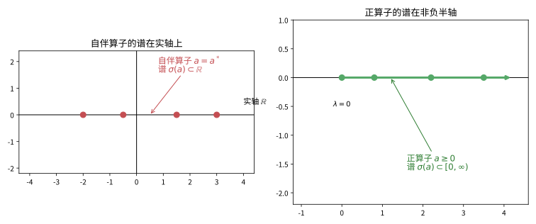
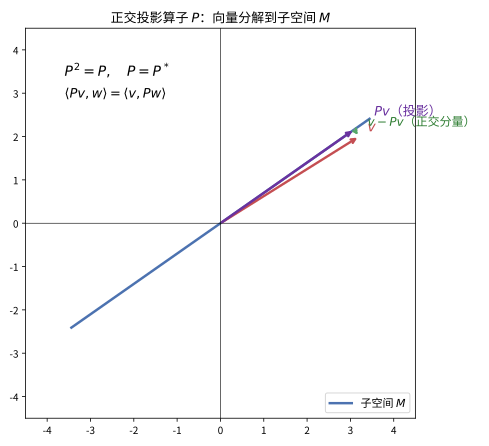
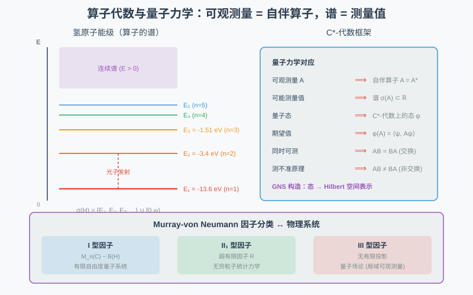

# 第 56 级：算子代数 (Operator Algebras)

> 算子代数是泛函分析的核心分支之一，研究 Hilbert 空间上有界线性算子所构成的代数结构。它起源于 von Neumann 对量子力学数学基础的研究，如今已发展成为一个深刻而丰富的数学领域，与群表示论、非交换几何、量子场论、统计力学等众多分支有着紧密联系。本课程将从 Banach 代数出发，系统建立 C\*-代数与 von Neumann 代数的基本理论框架，其中包括连续（和有界）函数演算、自伴算子的谱定理、正算子与平方根，以及 von Neumann 代数的张量积与可分性等在美版经典教材中不可或缺的内容。

---

## 1. 学习目标

1. 理解 Banach 代数与 C\*-代数的基本概念，掌握谱理论的核心结果。
2. 掌握 Gelfand 变换的构造，理解交换 C\*-代数的 Gelfand-Naimark 定理。
3. 理解态与表示的概念，掌握 GNS 构造的完整过程。
4. 理解连续与有界函数演算（functional calculus）的构造与谱映射定理，并能用它定义正算子的平方根。
5. 理解自伴算子的谱定理（spectral theorem），掌握谱测度与 $T=\int \lambda\, dE_\lambda$ 的含义。
6. 理解 von Neumann 代数的定义与基本性质，掌握双交换子定理；理解弱闭/强闭算子拓扑与约化（commutant）的角色。
7. 理解 von Neumann 代数的张量积与可分性，理解 Murray-von Neumann 因子分类理论，掌握各类因子的基本特征。
8. 了解超有限因子、AF 代数与 K-理论的基本概念；了解约化群 C\*-代数的构造及其在非交换几何中的应用。

---

## 2. 核心概念

### 2.1 Banach 代数

**动机与来龙去脉（从有限维矩阵说起）**：为什么要把普通的矩阵理论抽象成 Banach 代数？遇到无限维问题时，一列数、收敛性、"可逆/不可逆"这些概念必须重新组织。线性代数里你习惯研究方阵 $A$：它能加减、能相乘、能定义范数、能谈特征值。可 Hilbert 空间上的**有界算子**构成的对象远不止矩阵——它们是"无穷大的矩阵"。为了统一处理 C(X)（连续函数）、$\mathcal{B}(H)$（有界算子）、$L^1(\mathbb{R})$（卷积代）这些看似迥异、实则共享"能加减、能乘、有长度"的对象，von Neumann、Gelfand 等人在 1930-40 年代把它们抽象为 Banach 代数。没有它，你就必须对每个例子单独证明一次；有了它，一套谱理论处处适用。先直觉感受：Banach 代数就是"一座既能相加也能相乘的度量城市"——下面用三个具体实例打底，再正式定义。

**定义 2.1**（Banach 代数）设 $\mathcal{A}$ 是 $\mathbb{C}$ 上的 Banach 空间，同时是 $\mathbb{C}$ 上的代数，满足乘法结合律：$(ab)c = a(bc)$，且乘法对加法满足分配律。若范数满足
$$
\|ab\| \le \|a\| \cdot \|b\|, \quad \forall a, b \in \mathcal{A},
$$
则称 $\mathcal{A}$ 为 **Banach 代数**。若 $\mathcal{A}$ 含有乘法单位元 $1$ 且 $\|1\| = 1$，则称 $\mathcal{A}$ 为 **含幺 Banach 代数**。

> **💡 直观理解（类比）**：Banach 代数像一座"既能相加也能相乘的度量城市"：它既允许做加法和缩放（是个 Banach 空间），又能让两个成员安全地"乘"出新成员，还配了一把守规矩的尺子 $\|ab\|\le\|a\|\|b\|$，保证乘法绝不会把范数"吹爆"。就像一支乐队既能分别排练（线性组合），也能把乐谱齐奏成整曲（乘法），而合奏时音量不会被放大到离谱。

**例 2.2** 
- $C(X)$：紧 Hausdorff 空间 $X$ 上的连续函数全体，以逐点乘法和上确界范数构成交换含幺 Banach 代数。
- $\mathcal{B}(H)$：Hilbert 空间 $H$ 上的有界线性算子全体，以算子复合为乘法、算子范数为范数，构成非交换含幺 Banach 代数。
- $L^1(\mathbb{R})$：以卷积为乘法，在通常的 $L^1$ 范数下构成 Banach 代数（不含幺）。

> **💡 直观理解（类比）**：这三个例子像"乘法规则各异的三个作坊"：$C(X)$ 按"每个点上的函数值相乘"（逐点）、$\mathcal{B}(H)$ 按"先作用后作用"复合（一般不可交换）、$L^1(\mathbb{R})$ 做卷积（把信号交叉叠加再积分）——同一个抽象的"Banach 代数"外壳，可以安放三种截然不同的乘法。

### 2.2 C\*-代数

**动机与来龙去脉（给"镜子"加上约束）**：Banach 代数只告诉你"能乘、有长度"，却忽略了 **转置/共轭/伴随** 这一天然操作。研究实值观测量的量子理论里，很重要的一类元素是"自伴算子"（等于自身的伴随），它对应可观测的物理量。要谈论自伴、正元、投影、态，光有 Banach 代数的结构不够——你还得把"伴随"这个共轭线性、反序的运算做成代数的一部分。**C\*-代数就是在 Banach 代数上强制加入一个对合 $*$，并加上关键的 C\*-恒等式 $\|a^*a\|=\|a\|^2$**。这个恒等式绝非摆设：它把"代数的范数"与"代数的乘法+对合"紧紧锁定，使得一个代数上至多只能有一个 C\*-范数（可证唯一），从而赋予理论极强的刚性。历史上，C\*-代数的抽象化来自 Gelfand-Naimark 1943 年对交换 Banach 代数的研究；此后它成为"非交换几何"的代数基石。

**定义 2.3**（C\*-代数）设 $\mathcal{A}$ 是含幺 Banach 代数，且配备了一个对合运算 $*: \mathcal{A} \to \mathcal{A}$，满足：
1. $(a^*)^* = a$（对合性）
2. $(ab)^* = b^* a^*$（反同态性）
3. $(\lambda a + b)^* = \overline{\lambda} a^* + b^*$（共轭线性）
4. $\|a^* a\| = \|a\|^2$（C\*-恒等式）

则称 $\mathcal{A}$ 为 **C\*-代数**。若 $ab = ba$ 对所有 $a, b \in \mathcal{A}$ 成立，则称 $\mathcal{A}$ 为 **交换 C\*-代数**。

> **💡 直观理解（类比）**：C\*-代数在 Banach 代数上多加一面"镜子"（对合 $*$：转置/共轭），尤其强调"照两次还原样"（$(a^*)^*=a$）和"长度与自乘不丢"的 C\*-恒等式 $\|a^*a\|=\|a\|^2$。它像给代数装上一面能"反射取向"的镜子，使"长度"与"乘法"牢牢挂钩——这正是量子力学里自伴算子能对应实数测量结果的数学关键。
>
> **⚠️ 常见坑（容易混）**：C\*-恒等式是"$\|a^*a\|=\|a\|^2$"，不是"$\|aa^*\|=\|a\|^2$ 或 $aa^*=a^*a$"。且它规定的是**范数与 $*$ 的耦合**，交换性并不包含在其中——$\mathcal{B}(H)$ 是非交换 C\*-代数的典型代表。

**例 2.4**
- $C(X)$ 在取共轭为对合下构成交换 C\*-代数。
- $\mathcal{B}(H)$ 在取 Hilbert 空间伴随算子为对合下构成 C\*-代数。
- $\mathcal{A}$ 的任意闭 $*$-子代数也是 C\*-代数，称为 $\mathcal{A}$ 的 **C\*-子代数**。

> **💡 直观理解（类比）**：$C(X)$ 的"镜子"就是逐点取共轭，$\mathcal{B}(H)$ 的"镜子"是取伴随算子，而闭 $*$-子代数是"对镜子操作自洽的一大片成员"。正如把镜子放在函数上（映成共轭）与放在算子上（映成转置共轭）能照出不同类型但同样完备的"对称"，C\*-代数框住了这两类看似迥异的对称，让它们共用一套规则。

### 2.3 谱理论

**动机与来龙去脉（"解方程"催生的概念）**：线性代数里，求特征值和特征向量就是解 $(A-\lambda I)x=0$。在无限维，$\lambda I-A$ 未必可逐点"对角化"，但它是否可逆仍是有意义的：$\lambda$ 不是特征值的"广义版"就是那些使 $\lambda 1-a$ 不可逆的数。**谱（spectrum）正是把"特征值"推广到 Banach 代数这个无坚不摧的利器**：无论对象是矩阵、函数还是算子，谱都给出一个 $\mathbb{C}$ 上的紧集，刻画"顺着哪些刻度系统会失灵"。它由 Gelfand 在 1930 年代末系统建立。先感受：谱像一把"标尺"上的刻度，自伴算子的刻度全落在实轴，正算子的刻度全落在非负半轴（见图）。形式定义如下。

**定义 2.5**（谱）设 $\mathcal{A}$ 是含幺 Banach 代数，$a \in \mathcal{A}$。$a$ 的 **谱**（spectrum）定义为
$$
\sigma(a) = \{\lambda \in \mathbb{C} \mid \lambda 1 - a \text{ 在 } \mathcal{A} \text{ 中不可逆}\}.
$$
$a$ 的 **谱半径**（spectral radius）为 $r(a) = \sup\{|\lambda| \mid \lambda \in \sigma(a)\}$.

> **直观理解（现实类比）**：算子的谱就像一把"标尺"上标注的刻度——每个刻度对应一个特征值。对自伴算子（如对称矩阵、可观测量），所有刻度都老老实实落在实轴上；而正算子（如能量、概率密度）的刻度更是全部落在非负的半边，绝不会出现"负能量"的刻度。这条数轴决定了算子"值域"的合法范围。

**定理 2.6**（谱半径公式）对含幺 Banach 代数中的任意元素 $a$，有
$$
r(a) = \lim_{n \to \infty} \|a^n\|^{1/n}.
$$

> **💡 直观理解（类比）**：谱半径公式说 $a$ 的"最大刻度模长"$r(a)$ 可以靠反复自我相乘、再取 $n$ 次根读出来：$r(a)=\lim_{n\to\infty}\|a^n\|^{1/n}$。这就像想知道一个人"最远能跳多远"，不要只量他一次，而要看反复起跳 $n$ 次累计距离后开 $n$ 次方的"平均分量"——真正的极限刻度只有靠幂次迭代才能精确逼近。

### 2.4 连续函数演算（Continuous Functional Calculus）

**动机与来去脉（怎么给算子"带入函数"）**：对矩阵来说，$e^A$、$\sqrt{A}$、$\log(1+A)$ 这些"函数的算子"早已存在：只要 $A$ 能对角化，$f(A)$ 就定义为在特征值上按 $f$ 作用。可无限维的自伴算子一般不"对角化"，你怎么定义 $f(a)$？最自然的想法是：先用多项式逼近 $f$，再把多项式情形翻译成 $a$。$a^n$ 有定义、多项式 $p(a)$ 有定义，但任意连续 $f$ 怎么进来？**关键在谱**：对**自伴**元素 $a=a^*$，谱 $\sigma(a)$ 是 $\mathbb{C}$ 里的紧集；若 $f$ 在 $\sigma(a)$ 上连续，则可"逐点地"把函数演算定义为
$$
f(a) := \lim_{n\to\infty} p_n(a), \qquad p_n \xrightarrow{\text{一致}} f \text{ 于 } \sigma(a).
$$
这必须良定（与逼近序列 $p_n$ 无关），其关键在于**交换 C\*-代数** $C^*(a,1)$（由 $a$ 与 $1$ 生成的闭 $*$-子代数）是交换的，Gelfand-Naimark 会把它等同为某个紧空间上的 $C(\Omega)$，从而把"往 $a$ 里代入 $f$"化为"对 Gelfand 像 $\widehat a$ 做函数复合"。没有函数演算，正元平方根、极分解、谱定理全都无从谈起——它是算子理论的"操作系统"。

**定义 2.7**（连续函数演算）设 $\mathcal{A}$ 是含幺 C\*-代数，$a=a^*\in\mathcal{A}$。对每个紧集 $\sigma(a)\subset\mathbb{C}$ 上的连续函数 $f\in C(\sigma(a))$，存在唯一的保幺 $*$-同态
$$
\Phi_a: C(\sigma(a)) \to \mathcal{A},\qquad f \mapsto f(a)=\Phi_a(f),
$$
使得 $\Phi_a(\iota)=\iota(a)=a$，其中 $\iota(t)=t$ 是恒等函数。此同态称为 $a$ 的 **连续函数演算**。

> **💡 直观理解（类比）**：连续函数演算像一台"代入机"：给你一个自伴算子 $a$ 和一条定义在谱上的曲线 $t\mapsto f(t)$，机器吐出一个新算子 $f(a)$。它和"把曲线画到算子上再逐点取值"直观一致：$f(a)=g(a)h(a)$ 当 $f=g\cdot h$（乘法被保）、$\|f(a)\|=\|f\|_{\infty}$（长度被保）。就像给一台钢琴输入一段乐谱，机器在每一个"键位"（谱点）上弹出对应的音，合成一首新曲子。

**定理 2.8**（谱映射定理，函数演算版）设 $a=a^*$，$f\in C(\sigma(a))$。则
$$
\sigma(f(a)) = f(\sigma(a)).
$$

> **💡 直观理解（类比）**：谱映射定理说"函数演算不改变谱的位置"，只是把每个刻度 $\lambda$ 送到 $f(\lambda)$：$\sigma(f(a))$ 就是 $\sigma(a)$ 在映射 $f$ 下的像。它像尺子——你把刻度 $\lambda$ 一个一个代入 $f$，得到的正是新算子的全套刻度，不多不少。

### 2.5 正算子与平方根

**动机与来去脉（"非负"到底是什么意思）**：实数的"非负"（$\ge 0$）、"开平方"（$\sqrt{a}$）是人人皆会的运算。可到了算子世界，$a^*a$ 弱的"非负"该定义成什么？直觉要求：一个算子 $a\ge 0$ 应当"在数值上是非负的"，即对所有态 $\varphi$ 都有 $\varphi(a)\ge 0$。von Neumann 代数里最常见的正算子：**投影** $p=p^*=p^2$、以及 $a^*a$（任意元素的"平方长"）。利用谱与连续函数演算，可以给出一个干净、无歧义的定义：**$a\ge 0$ 当且仅当 $a$ 自伴且 $\sigma(a)\subset[0,\infty)$**。由此立即得到"每个正元有唯一正平方根"——这是极分解、$|T|=\sqrt{T^*T}$、序理论、投影比较理论的共同地基。**没有平方根**，你甚至无法定义"$a$ 的长度算子"，因子分类里的维数函数更是寸步难行。

**定义 2.9**（正元）设 $\mathcal{A}$ 是 C\*-代数，$a\in\mathcal{A}$。若 $a=a^*$ 且 $\sigma(a)\subseteq[0,\infty)$，则称 $a$ 为正元，记 $a\ge 0$。正元全体记为 $\mathcal{A}_+$。

> **💡 直观理解（类比）**：正算子就像"非负的温度计读数"：它自伴（读数实）且谱非负（读数不降到零以下）。原子中的能量、量子态的概率密度，都是正算子。$a^*a$ 是"任意 $a$ 的平方模长"，必然是正的——这解释了为什么 $a^*a$ 总能开平方根。
>
> **⚠️ 常见坑（容易混）**：正元**不一定等于** $b^*b$ 的形式可以说明，但"$\sigma(a)\subset[0,\infty)$"才是判据；且正元要求的自伴性不能省——一般非自伴元素谈不上符号。

**定理 2.10**（唯一正平方根）设 $a\ge 0$。则存在唯一的 $b\in\mathcal{A}_+$ 满足 $b^2=a$，记为 $b=a^{1/2}$（或 $\sqrt{a}$）；且 $b$ 可由连续函数演算 $b=f(a)$（其中 $f(t)=t^{1/2}\ge0$）直接给出。

> **💡 直观理解（类比）**：唯一正平方根告诉你不必"发明新运算"——它就是给正算子代入 $f(t)=\sqrt{t}$。就像给一个非负数找唯一的非负平方根，正算子也有唯一的正平方根，绝无"正负两个解"的含糊。

### 2.6 自伴算子的谱定理（Spectral Theorem）

**动机与来龙去脉（把"对角化"做到无限维）**：有限维里，实对称矩阵可以酉对角化，特征值投影把空间"拼"出来。无限维 Hilbert 空间上的有界自伴算子通常没有特征向量（如乘法算子 $(M_x f)(t)=t f(t)$ 在 $L^2[0,1]$ 上），但谱依然是实的。von Neumann 在 1929-30 年间给出了划时代的答案：**谱定理**——每个有界自伴算子 $T$ 可被一族兼容的正交投影 $E_\lambda$（谱测度）"连续地"拼出
$$
T = \int_{\sigma(T)} \lambda \, dE_\lambda,
$$
且对任一**有界 Borel 函数** $f$ 都可定义 $f(T)=\int f(\lambda)\,dE_\lambda$（**有界函数演算**，Borel/可测函数演算）。这就把"特征值→特征子空间分解"升级为"谱→连续谱投影测度"。这一定理是整个算子论的心脏：它同时给出乘法定理、谱映射、函数演算，并可推出"任何交换 von Neumann 代数是某个 $L^\infty$ 型的测度空间代数"。先看直觉：谱定理等于说——只要你给 $T$ 沿每段谱"打分"（投影），就能通过积分把 $T$ 精确还原。

**定义 2.11**（谱测度）设 $X$ 是紧 Hausdorff 空间，$H$ 是 Hilbert 空间。Borel $\sigma$-代数上的映射 $E$，对每个 Borel 集 $B$ 给一个正交投影 $E(B)\in\mathcal{B}(H)$，称为 **谱测度**，若：
1. $E(\emptyset)=0,\ E(X)=I$；
2. $E(B_1\cap B_2)=E(B_1)E(B_2)$（投影相容）；
3. 对互不相交的 $(B_n)$，$E(\bigcup_n B_n)=\mathrm{SOT\,}\text{-}\sum_n E(B_n)$（$\sigma$-可加）。

这样，每个 $\xi,\eta\in H$ 上的集函数 $B\mapsto \langle E(B)\xi,\eta\rangle$ 是复值正则 Borel 测度。

**定理 2.12**（自伴算子谱定理）设 $T=T^*\in\mathcal{B}(H)$。则存在唯一的谱测度 $E$（支撑在 $\sigma(T)\subset\mathbb{R}$）使得
$$
T = \int_{\sigma(T)} \lambda \, dE_\lambda.
$$
进一步，由 $f\mapsto f(T)=\int f(\lambda)\,dE_\lambda$ 给出的映射是从有界 Borel 函数 $B_\infty(\sigma(T))$ 到生成它的 von Neumann 代数 $W^*(T)$ 上的有界函数演算，且满足 $\|f(T)\|=\|f\|_\infty$、$\sigma(f(T))=f(\sigma(T))$。

> **💡 直观理解（类比）**：谱定理像一台"无限楼层的电梯控制盘"：每一层（谱区间 $\Delta$）对应一个投影 $E(\Delta)$，按 $T=\int\lambda\,dE_\lambda$ 把各层累加，就精确还原了 $T$。它把"自伴算子=谱测度积分"立为定理，使得"$T$ 的特征子空间"虽不再离散，却被一整个投影测度"连续替代"。
>
> **⚠️ 常见坑（容易混）**：谱测度 $E(B)$ 的像投影都在 $W^*(T)$ 里；对一般（非自伴）有界算子谱定理并不直接成立——它本质上是自伴/正规元的特权。

### 2.7 Gelfand 变换

**动机与来龙去脉（把抽象的"代数"映回"函数"）**：定义做得再优雅，若算不出具体例子，理论就是空转。交换含幺 Banach 代数 $\mathcal{A}$ 里，元素 $a$ 应被"分型"：我们用一个**特征**（非零乘性线性泛函 $\varphi$）去"测"它，得到数 $\varphi(a)$。把所有特征都当作"探针"，Gelfand 变换
$$
\Gamma(a)(\varphi)=\varphi(a)
$$
就把 $a$ 变成特征空间 $\Omega(\mathcal{A})$ 上的一个函数。交换的情形下，$\Omega(\mathcal{A})$ 是紧 Hausdorff 空间（装有 weak-* 拓扑），于是整个交换 Banach 代数被嵌入 $C(\Omega(\mathcal{A}))$。**它解决的世纪难题是：把交换 C\*-代数同构地"看"成连续函数代数（Gelfand-Naimark 定理）**。从此"空间与函数"二合一：研究交换 C\*-代数等价于研究一个紧空间上的连续函数。直观上，每个特征像一盏探照灯，Gelfand 变换把所有探照灯的位置拼起来，就得到 $a$ 的完整"光谱画像"。

**定义 2.13**（Gelfand 变换）设 $\mathcal{A}$ 是交换含幺 Banach 代数。$\mathcal{A}$ 的 **极大理想空间**（或 **谱**）$\Omega(\mathcal{A})$ 是 $\mathcal{A}$ 上所有非零乘性线性泛函（即特征）的集合，配备 weak-* 拓扑。**Gelfand 变换** 是映射
$$
\Gamma: \mathcal{A} \to C(\Omega(\mathcal{A})), \quad \Gamma(a)(\varphi) = \varphi(a), \quad \forall \varphi \in \Omega(\mathcal{A}).
$$

> **💡 直观理解（类比）**：Gelfand 变换把交换 Banach 代数里的元素 $a$ 变成一个定义在"全体特征 $\varphi$"上的函数：每个特征像一盏探照灯，照出 $a$ 沿某个"方向"的分量 $\varphi(a)$，把所有探照灯的位置拼起来，就得到 $a$ 的完整"光谱画像"。这就像用一排电台同时收听，把各台收到的同一信号按"测站/频率"组合成一张完整的分布图。

### 2.8 von Neumann 代数

**动机与来龙去脉（从"弱闭"到"被交换子锁住"）**：C\*-代数给出"抽象地讲算子"的语言，可 Quantum 模型中真正重要的是"何时一个算子代数闭得足以承载极限？"。von Neumann 在 1929 年为量子力学创立的希尔伯特空间算子理论中，考虑 $\mathcal{B}(H)$ 的 $*$-子代数 $\mathcal{M}$。若 $\mathcal{M}$ 在**弱算子拓扑（WOT）**中闭，则称 $\mathcal{M}$ 为 von Neumann 代数；而刻骨铭心的等价刻画是 $\mathcal{M}=\mathcal{M}''$——**"能被其交换子 $*$-围住"**。$\mathcal{M}'=\{T:TS=ST,\ \forall S\}$ 是与 $\mathcal{M}$ 每个元素都交换的算子。**双交换子定理**（见 §3.3）说 $\mathcal{M}=\mathcal{M}''\iff \mathcal{M}$ 是 WOT-闭$\iff$ SOT-闭。直观上，交换子像一个"围栏"，双交换子定理说"能被一圈管理员定界的域"恰等于"本身被网点封死的域"。

**定义 2.14**（von Neumann 代数）设 $H$ 是 Hilbert 空间，$\mathcal{M} \subseteq \mathcal{B}(H)$ 是 $*$-子代数。若 $\mathcal{M}$ 在弱算子拓扑（WOT）中闭，则称 $\mathcal{M}$ 为 **von Neumann 代数**。等价地，$\mathcal{M} = \mathcal{M}''$，其中 $\mathcal{M}' = \{T \in \mathcal{B}(H) \mid TS = ST, \forall S \in \mathcal{M}\}$ 是 $\mathcal{M}$ 的 **交换子**（commutant）。

> **直观理解（现实类比）**：正交投影就像"阳光垂直晒下留下的影子"——把任意向量 $v$ 垂直投影到平面 $M$ 上得到 $Pv$，剩下的 $v-Pv$ 是竖直抬离平面的分量。投影一次后影子已经躺平，再投影也不会变（$P^2=P$），这正是 von Neumann 代数中"投影格"的基石：由这些自我重复的投影，可拼出整个算子代数结构。

### 2.9 弱闭/强闭拓扑与约化（Commutant 与 Reduction）

**动机与来去脉（闭性有"松紧"，研究算子列极限靠拓扑）**：$\mathcal{B}(H)$ 上不止一种收敛。按范数（范数拓扑）太严，很多极限不存在；于是 von Neumann 引入按收敛性的"松"拓扑：**强算子拓扑（SOT）** 要求 $T_\alpha\xi\to T\xi$ 对每个向量成立；**弱算子拓扑（WOT）** 只要求每个内积 $\langle T_\alpha\xi,\eta\rangle\to\langle T\xi,\eta\rangle$。WOT 比 SOT 更弱、更容易闭；双交换子定理把它们在凸集（$*$-子代数）上"缝合"起来。进一步的，研究 von Neumann 代数的**结构**时，我们想把它"搭碎"成因子（中心只剩标量）的"直积分"。**约化（reduction/commutant 分解）**回答的是"何时两个可观测量能在同一个量子系统中共存"：$\mathcal{M}$ 的交换子 $\mathcal{M}'$ 刻画"与 $\mathcal{M}$ 都相容的可观测量"，而中心 $\mathcal{Z}=\mathcal{M}\cap\mathcal{M}'$ 划分"独立子系统"。直观上，WOT/SOT 像"测量误差从宽/从严"的两种逼近约定，而约化像把一座大房子沿"承重墙"（中心）切成独立小间。

**定义 2.15**（SOT 与 WOT）设 $H$ 是 Hilbert 空间，$(T_\alpha)$ 是 $\mathcal{B}(H)$ 的网，$T\in\mathcal{B}(H)$。
- **强算子拓扑（SOT）**：$T_\alpha\xrightarrow{\mathrm{SOT}} T$ 当且仅当 $T_\alpha\xi\to T\xi$ 对每个 $\xi\in H$ 成立。
- **弱算子拓扑（WOT）**：$T_\alpha\xrightarrow{\mathrm{WOT}} T$ 当且仅当 $\langle T_\alpha\xi,\eta\rangle\to\langle T\xi,\eta\rangle$ 对每个 $\xi,\eta\in H$ 成立。
SOT 强于 WOT（SOT 收敛蕴含 WOT 收敛），但交换子 $\mathcal{M}'$ 在两种拓扑下都闭，因而 $\mathcal{M}''$ 亦然。

**定义 2.16**（约化 / 中心分解）设 $\mathcal{M}$ 是 von Neumann 代数，其中心为 $\mathcal{Z}(\mathcal{M})=\mathcal{M}\cap\mathcal{M}'$。若 $\mathcal{Z}(\mathcal{M})=\mathbb{C}I$，则 $\mathcal{M}$ 是 **因子**；一般地，$\mathcal{M}$ 可沿 $\mathcal{Z}$ 对点态谱分解为因子族的"直积分"（约化），$\mathcal{M}$ 的表示可分解为不可分解表示，称为 $\mathcal{M}$ 的 **约化**（reduction）。

> **💡 直观理解（类比）**：WOT/SOT 与约化合在一起讲：弱收敛像"只比对单个分量"，强收敛像"整列比对"；而约化把大代数拆成"独立频道"（因子）。其中交换子 $\mathcal{M}'$ 扮演"与所有频道都兼容的中央控制"，中心 $\mathcal{Z}$ 是唯一的"总音量旋钮"。
>
> **⚠️ 常见坑（容易混）**：SOT 收敛但不 WOT 收敛不可能（SOT 更严），但 WOT 收敛往往不 SOT 收敛（如单边移位）。且"$\mathcal{M}'$ 在 SOT/WOT 中闭"恒真，别误以为只有 von Neumann 代数的交换子才闭。

### 2.10 张量积与可分性

**动机与来去脉（复合系统与"能有多少"）**：两个量子系统组合成一个系统时，可观测量张成**张量积**代数；因子理论里也需要"把因子乘起来"。对 von Neumann 代数 $\mathcal{M}_i\subset\mathcal{B}(H_i)$，其**空间张量积**（spatial tensor product）$\mathcal{M}_1\overline{\otimes}\mathcal{M}_2$ 定义为 $\mathcal{B}(H_1\otimes H_2)$ 中包含"初等张量"$S\otimes T$（$S\in\mathcal{M}_1,\ T\in\mathcal{M}_2$）的最小 von Neumann 代数。同时，刻画"一个代数有多大"要引入**可分性/ $\sigma$-有限性**：$\mathcal{M}$ 是 $\sigma$-有限的当且仅当存在**忠实正规态**（如可分 $H$ 上的 $T\mapsto\operatorname{Tr}(\rho T)$）。直观上，空间张量积像"两台录音机同步录音的合成音轨"，而 $\sigma$-有限性像"有一只满贯量尺（忠实正规态）能测遍所有非零内容"。张量积与可分性是超有限因子、自由概率、量子场论的合成法则。

**定义 2.17**（空间张量积）设 $\mathcal{M}_i\subseteq\mathcal{B}(H_i)$ 是 von Neumann 代数（$i=1,2$）。$\mathcal{M}_1$ 与 $\mathcal{M}_2$ 的 **空间张量积** 记为 $\mathcal{M}_1\overline{\otimes}\mathcal{M}_2$，指 $\mathcal{B}(H_1\overline{\otimes}H_2)$ 中包含 $\{S\otimes T \mid S\in\mathcal{M}_1,\ T\in\mathcal{M}_2\}$ 的最小 von Neumann 代数。

**定义 2.18**（$\sigma$-有限 / 可分性）von Neumann 代数 $\mathcal{M}$ 称为 **$\sigma$-有限**（可分，separable），若它存在**忠实正规态**，即一个正规正线性泛函 $\varphi$ 满足：$\varphi(x)=0$ 且 $x\ge 0$ 推出 $x=0$。（对作用于可分 Hilbert 空间的 $\mathcal{M}$，此条件自动成立。）

> **💡 直观理解（类比）**：张量积把两个体系的"可观测自由度"联乘：$\mathcal{M}_1\overline{\otimes}\mathcal{M}_2$ 像把两条独立的"控制台音轨"叠成一张更大的混音台。可分/ $\sigma$-有限性则像"用一把无死角的尺子"——忠实正规态确保每个非零内容都能被"量出"非零读数。这两样是因子"相乘出更大的因子"以及"在有限条张量链中表现稳态"的基础。
>
> **常见结论**：因子类型在张量积下保持——I$_n\overline{\otimes}$ I$_m=$I$_{nm}$、II$_1\overline{\otimes}$ II$_1=$ II$_1$、III$\overline{\otimes}$III$=$ III；超有限 II$_1$ 因子 $\mathcal{R}$ 满足 $\mathcal{R}\overline{\otimes}\mathcal{R}\cong\mathcal{R}$ 等。

### 2.11 态与表示

**动机与来去脉（把"期望值"公理化）**：已学完谱、函数演算、谱定理，那么"对算子系统的一次测量期望"到底是什么？在量子力学里，一个**态**应当给每个可观测量 $a$ 一个期望值 $\varphi(a)$，且要尊重：正性 $\varphi(a^*a)\ge 0$、归一化 $\varphi(1)=1$。这正是线性代数中"概率分布 + 期望"的算子化。于是抽象 C\*-代数上的**态**（state）被 Gelfand-Naimark、Segal 纳入理论核心。紧接着的问题是：抽象的态和具体的 Hilbert 空间算子如何挂钩？答案是 **GNS 构造**：从态 $\varphi$ 造出一个 Hilbert 空间 $H_\varphi$、表示 $\pi_\varphi$ 和循环向量 $\xi_\varphi$，使得期望 $\varphi(a)=\langle\pi_\varphi(a)\xi_\varphi,\xi_\varphi\rangle$。其物理图像：**态=舞台上的主角视角**。

**定义 2.19**（态）设 $\mathcal{A}$ 是 C\*-代数。线性泛函 $\varphi: \mathcal{A} \to \mathbb{C}$ 称为 **态**（state），若 $\varphi$ 是正定的（即 $\varphi(a^* a) \ge 0$ 对所有 $a \in \mathcal{A}$）且 $\varphi(1) = 1$。态全体记为 $S(\mathcal{A})$。

> **直观理解（现实类比）**：算子代数中的"可观测量"就像**量子力学中的能量测量**——氢原子的 Hamilton 算子 $H$ 是自伴算子，其谱（特征值）$E_1, E_2, E_3, \dots$ 对应电子的可能能级（-13.6 eV, -3.4 eV, -1.51 eV, ...）。当我们测量原子能量时，结果必然是某个能级值，概率由量子态 $\varphi$ 决定。这正是算子代数中"谱=测量值，态=概率分布"的物理对应：数学上的谱定理保证了自伴算子的谱是实数，物理上意味着测量值总是实数。

> **🧠 思考历程：量子力学逼着 von Neumann 造出一门"算子代数"，他到底解决了什么世纪难题？**
>
> 算子代数不是数学家凭空加的一座"学术楼阁"，而是**量子力学诞生后，物理学家痛苦地发现"旧数学装不下新理论"**，von Neumann 才动手造的新数学。它的关键词不是"深奥"，而是"**用一种能刻画'可观测/不可同时观测/测量就会扰动'的代数结构，去复刻实验事实**"。
>
> - **经典力学是"数字"，量子力学却是"算子"**（1925-1930s）。经典里你量速度、量位置，得到的是两个数；可 Heisenberg 的矩阵力学说：**位置 $Q$ 与动量 $P$ 不再能交换——$QP-PQ=i\hbar$**，它们得是"算子"而不是函数。这是对人类直觉的一次暴击：**"观测"本身改变了系统**。von Neumann 看穿：必须把"可观测量"看成 Hilbert 空间上的算子，把"量子态"看成一个数学对象，才能统一 Schrödinger 与 Heisenberg 两套表述。
> - **从"测不准"到"谱=测量值"**。von Neumann 做的第一步是把物理翻译成公理：可观测量 $\leftrightarrow$ 自伴算子，能量、概率 $\leftrightarrow$ 由谱给出的测量分布。**正因为它肯从"最抽象的算子"反推物理，才能回答"为什么测量总有实数结果"——而答案是谱定理：自伴算子谱在实轴上**（正如上面氢原子能级那张图）。
> - **又是什么逼出"代数"？（1936，与 Murray）**。测不完单个算子，还得测"一整族能不能同时取"——投影就充当"是/否"的回答。von Neumann 发现量子力学里的可观测算子构成一个**在弱拓扑下闭的 $*$-代数**，他干脆给它起名"rings of operators"，后称 **von Neumann 代数**。关键的定义 $\mathcal{M}=\mathcal{M}''$（**"它能被交换子锁住"**）把纯分析问题变成代数的"围栏"，而双交换子定理正是这围栏上的门锁。**当物理对象钻不进旧框架时，最有效的"数学应变"，往往就是为它新建一套代数语言**。
> - **Gelfand-Naimark：把"抽象代数"重新映回"函数"**（1943）。可代数太抽象，怎么算具体例子？交换 C\*-代数被 Gelfand-Naimark 一举钉死：**任何交换 C\*-代数，都同构于某紧空间上的连续函数代数 $C(\Omega)$**——"代数"与"空间/函数"自此二合一。这一下，非交换世界被理解为"交换函数的量子推广"，非交换几何的念头应运而生。
> - **心路**：算子代数的传奇说明了一件事：**有些"纯"数学，其实是被物理学中"现有工具失灵"逼出来的**。von Neumann 不是去找"更深奥的定理"，而是去造"能承载量子本质的语法"——当一门学科语言不够时，你需要的不是补丁，而是换一种更诚实的代数。

**定义 2.20**（表示）C\*-代数 $\mathcal{A}$ 的 **表示**（representation）是 $*$-同态 $\pi: \mathcal{A} \to \mathcal{B}(H)$，其中 $H$ 是某个 Hilbert 空间。若 $\{ \pi(a) \xi \mid a \in \mathcal{A}, \xi \in H \}$ 在 $H$ 中稠密，则称 $\pi$ 是 **非退化** 的。

> **💡 直观理解（类比）**：表示 $\pi$ 把抽象的 C\*-代数"扮演成" Hilbert 空间上真正会搬动的算子：$\mathcal{A}$ 原本只是抽象的符号代数，$\pi$ 却让每个 $a$ 化身为在某个空间里实际作用的线性变换。若表示非退化，意味着这些"演员"共同张满整个舞台（$H$），绝不留下任何空闲的"空角落"。

### 2.12 因子分类

**动机与来去脉（把因子按"最小砌砖"分型）**：von Neumann 代数里，**投影**（$p=p^*=p^2$）是最基本的构件——我们可比较投影的大小（$p\precsim q$）、谈"有限/无穷"投影。因子（中心只剩标量的 von Neumann 代数）被 Murray-von Neumann 1936 年按投影结构分为三类：**I 型**（有极小投影）、**II 型**（无极小但有有限投影）、**III 型**（无有限投影）。背后的尺子是**维数函数**（迹），它把投影映射到 $\{0,1,\dots,n\}$、$[0,1]$ 或 $[0,\infty]$（分别对应 I$_n$/I$_\infty$、II$_1$/II$_\infty$、III）。直观上，因子分类像按"最小砌砖"给原子分号，见下文直观类比。

**定义 2.21**（因子）von Neumann 代数 $\mathcal{M}$ 称为 **因子**（factor），若其中心 $\mathcal{Z}(\mathcal{M}) = \mathcal{M} \cap \mathcal{M}'$ 仅由标量算子组成，即 $\mathcal{Z}(\mathcal{M}) = \mathbb{C} I$。

> **💡 直观理解（类比）**：因子像一个"中心被打通只剩标量"的算子代数：能同时与所有成员交换的那批算子（中心 $\mathcal{Z}$）只剩下"纯音量旋钮"标量 $\mathbb{C}I$，再也找不出更细的可变参数。这就像一台只能调总音量、不能单独调每个声道的混音台——内部坐标少到极致，反而让它成为可以按"投影大小"严格排队的"原子砖块"。

Murray 与 von Neumann 根据投影的比较理论将因子分为三类：
- **I 型**：存在非零极小投影。
- **II 型**：无非零极小投影，但存在有限投影。
- **III 型**：无非零有限投影。

---

## 3. 定理与证明

### 3.1 Gelfand-Naimark 定理

**定理 3.1**（Gelfand-Naimark 定理）设 $\mathcal{A}$ 是交换含幺 C\*-代数。则 Gelfand 变换
$$
\Gamma: \mathcal{A} \to C(\Omega(\mathcal{A}))
$$
是等距 $*$-同构（即 $\Gamma$ 是保范的 $*$-同构）。

**证明**：证明分三步进行。

**第一步：Gelfand 变换是 $*$-同态。**

对任意 $a, b \in \mathcal{A}$ 和 $\varphi \in \Omega(\mathcal{A})$，有
$$
\Gamma(ab)(\varphi) = \varphi(ab) = \varphi(a)\varphi(b) = (\Gamma(a)\Gamma(b))(\varphi),
$$
$$
\Gamma(a^*)(\varphi) = \varphi(a^*) = \overline{\varphi(a)} = \overline{\Gamma(a)(\varphi)}.
$$
故 $\Gamma$ 是 $*$-同态。

**第二步：$\Gamma$ 是等距的。**

对任意 $a \in \mathcal{A}$，由谱半径公式和 C\*-恒等式：
$$
\|\Gamma(a)\|_\infty = \sup_{\varphi \in \Omega(\mathcal{A})} |\varphi(a)| = r(a) = \lim_{n\to\infty} \|a^n\|^{1/n}.
$$
由于 $\mathcal{A}$ 是 C\*-代数，对自伴元素 $a = a^*$，有 $\|a^2\| = \|a\|^2$，从而 $\|a^{2^n}\| = \|a\|^{2^n}$，因此 $r(a) = \|a\|$。

对一般 $a \in \mathcal{A}$，利用 C\*-恒等式：
$$
\|a\|^2 = \|a^* a\| = r(a^* a) = \|\Gamma(a^* a)\|_\infty = \|\overline{\Gamma(a)} \Gamma(a)\|_\infty = \|\Gamma(a)\|_\infty^2,
$$
所以 $\|a\| = \|\Gamma(a)\|_\infty$，即 $\Gamma$ 是等距的。

**第三步：$\Gamma$ 是满射的。**

$\Gamma(\mathcal{A})$ 是 $C(\Omega(\mathcal{A}))$ 的闭 $*$-子代数（因为 $\Gamma$ 等距，像集完备），且 $\Gamma(1) = 1$（常数函数 1）。由于 $\Gamma(\mathcal{A})$ 分离 $\Omega(\mathcal{A})$ 中的点（若 $\varphi_1 \neq \varphi_2$，则存在 $a$ 使 $\varphi_1(a) \neq \varphi_2(a)$），由 Stone-Weierstrass 定理，$\Gamma(\mathcal{A})$ 在 $C(\Omega(\mathcal{A}))$ 中稠密。但 $\Gamma(\mathcal{A})$ 已经闭，故 $\Gamma(\mathcal{A}) = C(\Omega(\mathcal{A}))$。

综上，$\Gamma$ 是等距 $*$-同构。$\square$

> **💡 直观理解（类比）**：Gelfand-Naimark 给出了一条"字典级对应"：任何交换含幺 C\*-代数，经过 Gelfand 变换后，就和一个紧空间上的连续函数代数 $C(\Omega)$ 完全等同（等距 $*$-同构）。好比一袋抽象的"代数零件"被翻译成一张"函数画布"后一一对应——长度、乘法、共轭全都严丝合缝。交换 C\*-代数由此被彻底"看见"成"空间上的函数"。

**推论 3.2**（交换 C\*-代数的结构定理）每个交换含幺 C\*-代数都等距 $*$-同构于某个紧 Hausdorff 空间上的连续函数代数。

> **💡 直观理解（类比）**：沿用上面的"词典"：每个交换含幺 C\*-代数都"长得像"某个紧空间上的连续函数代数。这就像确认"所有方形物都是某个圆顶建筑在平面上的正投影一样"，把整个交换 C\*-代数家族一扫而光，统统收进"紧空间 + 连续函数"这一个货架里。

### 3.2 GNS 构造

**定理 3.3**（Gelfand-Naimark-Segal 构造）设 $\mathcal{A}$ 是含幺 C\*-代数，$\varphi$ 是 $\mathcal{A}$ 上的一个态。则存在 Hilbert 空间 $H_\varphi$、非退化表示 $\pi_\varphi: \mathcal{A} \to \mathcal{B}(H_\varphi)$ 以及循环向量 $\xi_\varphi \in H_\varphi$，使得
$$
\varphi(a) = \langle \pi_\varphi(a) \xi_\varphi, \xi_\varphi \rangle, \quad \forall a \in \mathcal{A},
$$
且 $\pi_\varphi(\mathcal{A})\xi_\varphi$ 在 $H_\varphi$ 中稠密（循环性）。

**证明**：证明分四步进行。

**第一步：构造预内积空间。**

在 $\mathcal{A}$ 上定义
$$
\langle a, b \rangle_\varphi = \varphi(b^* a), \quad \forall a, b \in \mathcal{A}.
$$
由 $\varphi$ 的正定性，$\langle \cdot, \cdot \rangle_\varphi$ 是半正定 Hermitian 形式。令
$$
N_\varphi = \{ a \in \mathcal{A} \mid \varphi(a^* a) = 0 \}.
$$
由 Cauchy-Schwarz 不等式，$N_\varphi$ 是 $\mathcal{A}$ 的左理想。商空间 $\mathcal{A} / N_\varphi$ 在如下内积下成为内积空间：
$$
\langle [a], [b] \rangle = \varphi(b^* a),
$$
其中 $[a] = a + N_\varphi$ 表示等价类。

**第二步：完备化得到 Hilbert 空间。**

令 $H_\varphi$ 为 $\mathcal{A} / N_\varphi$ 在上述内积下的完备化，即 Hilbert 空间。记 $\xi_\varphi = [1] \in H_\varphi$ 为 $1$ 的等价类，它是循环向量。

**第三步：定义表示。**

对 $a \in \mathcal{A}$，定义 $\pi_\varphi(a): \mathcal{A} / N_\varphi \to \mathcal{A} / N_\varphi$ 为
$$
\pi_\varphi(a)[b] = [ab].
$$
此定义是良定的，因为 $N_\varphi$ 是左理想。我们需要验证 $\pi_\varphi(a)$ 是有界线性算子，从而可延拓至 $H_\varphi$ 上。

对任意 $b \in \mathcal{A}$，
$$
\|\pi_\varphi(a)[b]\|^2 = \varphi((ab)^* (ab)) = \varphi(b^* a^* a b).
$$
由态的性质，存在 $C_a = \|a\|^2$ 使得 $\varphi(b^* a^* a b) \le \|a\|^2 \varphi(b^* b)$（因为 $a^* a \le \|a\|^2 \cdot 1$ 在 C\*-代数中成立），从而
$$
\|\pi_\varphi(a)[b]\| \le \|a\| \cdot \|[b]\|,
$$
故 $\pi_\varphi(a)$ 有界，可唯一延拓到 $H_\varphi$ 上。

**第四步：验证表示性与循环性。**

容易验证 $\pi_\varphi$ 是 $*$-同态：
$$
\pi_\varphi(ab)[c] = [abc] = \pi_\varphi(a)\pi_\varphi(b)[c],
$$
$$
\langle \pi_\varphi(a)^* [b], [c] \rangle = \langle [b], \pi_\varphi(a)[c] \rangle = \varphi(c^* a^* b) = \varphi((a^* b)^* c) = \langle \pi_\varphi(a^*)[b], [c] \rangle.
$$
且 $\pi_\varphi(1) = I$。最后，
$$
\langle \pi_\varphi(a) \xi_\varphi, \xi_\varphi \rangle = \langle [a], [1] \rangle = \varphi(1^* a) = \varphi(a).
$$
循环性由构造即得：$\pi_\varphi(\mathcal{A})\xi_\varphi = \{[a] \mid a \in \mathcal{A}\}$ 在 $H_\varphi$ 中稠密。$\square$

> **💡 直观理解（类比）**：GNS 构造像一个"态演出剧场"：给定一个状态 $\varphi$（提供一套概率/期望规则），就搭建一座 Hilbert"舞台"$H_\varphi$，让每个 $a$ 都在上面扮演出真实算子 $\pi_\varphi(a)$，还安排了一位"循环主角"$\xi_\varphi$ 兜底，使得期望值 $\varphi(a)=\langle\pi_\varphi(a)\xi_\varphi,\xi_\varphi\rangle$ 恰是主角视角下的"读数"。它把抽象的"态"落实成了看得见、摸得着的几何舞台。

**定理 3.4**（Gelfand-Naimark 定理——一般形式）每个 C\*-代数都等距 $*$-同构于某个 Hilbert 空间上的有界线性算子 C\*-代数 $\mathcal{B}(H)$ 的闭 $*$-子代数。

**证明概要**：考虑 $\mathcal{A}$ 上所有态的集合 $S(\mathcal{A})$，构造直和表示
$$
\pi = \bigoplus_{\varphi \in S(\mathcal{A})} \pi_\varphi: \mathcal{A} \to \mathcal{B}\left(\bigoplus_{\varphi \in S(\mathcal{A})} H_\varphi\right).
$$
可以证明 $\pi$ 是忠实（faithful）的 $*$-表示，即 $\pi$ 是单射，从而 $\mathcal{A} \cong \pi(\mathcal{A})$，而 $\pi(\mathcal{A})$ 是 $\mathcal{B}(\bigoplus H_\varphi)$ 的闭 $*$-子代数。$\square$

> **💡 直观理解（类比）**：一般形式的 Gelfand-Naimark 说：任何 C\*-代数（不必交换）都能被看成某个巨大的 Hilbert 空间 $\bigoplus H_\varphi$ 上真正有界算子组成的闭子代数——把每个态的表示"拼成一个大舞台"（直和），再用诚实扮演的算子 $\pi(a)$ 把它忠实地（单射）搬上场。就像一部戏剧在无数块屏幕上同时上演，合起来就能完整还原每一个角色。

### 3.3 von Neumann 双交换子定理

**定理 3.5**（von Neumann 双交换子定理）设 $H$ 是 Hilbert 空间，$\mathcal{M} \subseteq \mathcal{B}(H)$ 是含单位元的 $*$-子代数。则以下条件等价：
1. $\mathcal{M} = \mathcal{M}''$（即 $\mathcal{M}$ 等于其双交换子）。
2. $\mathcal{M}$ 在弱算子拓扑（WOT）中闭。
3. $\mathcal{M}$ 在强算子拓扑（SOT）中闭。

**证明**：我们证明 $(1) \Rightarrow (2) \Rightarrow (3) \Rightarrow (1)$。

**$(1) \Rightarrow (2)$**：首先注意到 $\mathcal{M}'$ 在弱算子拓扑中闭。事实上，若 $T_\alpha \in \mathcal{M}'$ 且 $T_\alpha \xrightarrow{\text{WOT}} T$，则对任意 $S \in \mathcal{M}$ 和 $\xi, \eta \in H$，
$$
\langle (TS - ST)\xi, \eta \rangle = \lim_\alpha \langle (T_\alpha S - S T_\alpha)\xi, \eta \rangle = 0,
$$
故 $T \in \mathcal{M}'$，因此 $\mathcal{M}'$ 是 WOT-闭的。同理，$\mathcal{M}'' = (\mathcal{M}')'$ 也是 WOT-闭的。若 $\mathcal{M} = \mathcal{M}''$，则 $\mathcal{M}$ 是 WOT-闭的。

**$(2) \Rightarrow (3)$**：弱算子拓扑弱于强算子拓扑，因此若 $\mathcal{M}$ 在 WOT 中闭，则它在更强的 SOT 中不一定闭。但凸集在 WOT 和 SOT 中具有相同的闭包（由 Hahn-Banach 分离定理）。由于 $\mathcal{M}$ 是 $*$-子代数，从而是凸集，故 $\mathcal{M}$ 的 WOT-闭性蕴涵 SOT-闭性。

**$(3) \Rightarrow (1)$**：这需要证明 $\mathcal{M}'' \subseteq \mathcal{M}$（反向包含 $\mathcal{M} \subseteq \mathcal{M}''$ 总是成立）。设 $T \in \mathcal{M}''$，我们需要证明 $T \in \mathcal{M}$。

对任意 $\xi \in H$，令 $P$ 为到闭子空间 $\overline{\mathcal{M}\xi}$ 上的正交投影。由于 $\overline{\mathcal{M}\xi}$ 在 $\mathcal{M}$ 作用下不变，$P \in \mathcal{M}'$（因为 $\mathcal{M}$ 的每个元素保持 $\overline{\mathcal{M}\xi}$ 不变，从而与其投影交换）。由于 $T \in \mathcal{M}'' = (\mathcal{M}')'$，$T$ 与 $P$ 交换，因此 $T\xi = TP\xi = PT\xi \in \overline{\mathcal{M}\xi}$。

这意味着对任意 $\xi \in H$ 和 $\varepsilon > 0$，存在 $S \in \mathcal{M}$ 使得 $\|T\xi - S\xi\| < \varepsilon$。但我们需要的是 $T$ 本身在 $\mathcal{M}$ 中，而不仅仅是逐点的逼近。利用 $\mathcal{M}$ 的 SOT-闭性，通过选择适当的网（例如，对 $\xi$ 的有限子集和 $\varepsilon$ 应用上述结论），可以证明存在网 $\{S_\alpha\} \subseteq \mathcal{M}$ 使得 $S_\alpha \xrightarrow{\text{SOT}} T$，从而 $T \in \mathcal{M}$。$\square$

> **💡 直观理解（类比）**：von Neumann 双交换子定理说"能被交换子锁住的代数"与"弱闭的代数"是同一回事：$\mathcal{M}=\mathcal{M}''$ 等价于 $\mathcal{M}$ 在 WOT 与 SOT 中都闭。这好比"由一圈能交换它的管理员划定的边界"正与"本身被网点封死的区域边界"重合——把"闭性"这种拓扑性质翻译成"双交换"这种代数性质，正是 von Neumann 代数定义得以成立的基石。

### 3.4 因子分类定理（Murray-von Neumann）

**定理 3.6**（Murray-von Neumann 因子分类）设 $\mathcal{M}$ 是作用在可分 Hilbert 空间上的因子。则 $\mathcal{M}$ 必属于以下三种互不相交的类型之一：
1. **I 型**：存在非零极小投影。此时 $\mathcal{M}$ 同构于 $\mathcal{B}(K)$（对某个 Hilbert 空间 $K$），或更一般地，$\mathcal{M} \cong \mathcal{B}(K) \overline{\otimes} \mathbb{C} I$。
2. **II 型**：无非零极小投影，但存在非零有限投影。此时 $\mathcal{M}$ 进一步分为：
   - **II$_1$ 型**：$\mathcal{M}$ 是有限的，即 $1$ 是有限投影。
   - **II$_\infty$ 型**：$\mathcal{M}$ 是半有限的，即 $1$ 不是有限投影，但存在有限投影。
3. **III 型**：无非零有限投影（即每个非零投影都是无穷的）。

**证明概要**：证明基于投影的比较理论。

**第一步：投影的比较。** 对 $\mathcal{M}$ 中的投影 $p, q$，定义 $p \precsim q$ 若存在部分等距 $v \in \mathcal{M}$ 使得 $v^* v = p$ 且 $v v^* \le q$。Murray-von Neumann 证明了在半有限因子中，投影集在此序下是全序的：任意两个投影可比较。

**第二步：维数函数。** 在半有限因子 $\mathcal{M}$ 上，存在唯一的迹（trace）$\tau: \mathcal{M}_+ \to [0, \infty]$，称为 **维数函数**，满足 $\tau(p) = \tau(q)$ 当且仅当 $p \sim q$（即 $p \precsim q$ 且 $q \precsim p$）。维数函数的值域完全决定了因子的类型：
- 若值域为 $\{0, 1, 2, \ldots, n\}$（对某个 $n$），则 $\mathcal{M}$ 是 **I$_n$ 型**。
- 若值域为 $\{0, 1, 2, \ldots, \infty\}$，则 $\mathcal{M}$ 是 **I$_\infty$ 型**。
- 若值域为 $[0, 1]$，则 $\mathcal{M}$ 是 **II$_1$ 型**。
- 若值域为 $[0, \infty]$，则 $\mathcal{M}$ 是 **II$_\infty$ 型**。
- 若值域仅为 $\{0, \infty\}$（即无非零有限投影），则 $\mathcal{M}$ 是 **III 型**。

**第三步：III 型因子的进一步分类。** Connes 和 Krieger 对 III 型因子进行了更精细的分类，引入 **III$_\lambda$ 型**（$0 \le \lambda \le 1$），基于模自同构群（modular automorphism group）的谱性质。$\square$

> **💡 直观理解（类比）**：因子分类像按"最小砌砖"的类型给原子分号：I 型有钻石般不可再分的极小投影（像一排离散的格子），II 型没有极小投影但仍有有限块（像可无限细分的连续绸布，其中 II$_1$ 总剂量用 $\tau(1)=1$ 归一化、II$_\infty$ 可堆到无穷），III 型连一块有限块都没有、每一片都无穷。维数函数的值域 $\{0,1,\dots,n\}$、$[0,1]$、$[0,\infty]$ 等，就是标在每类因子上"能装多少"的刻度表。

### 3.5 Kaplansky 稠密性定理

**定理 3.7**（Kaplansky 稠密性定理）设 $\mathcal{A}$ 是 $\mathcal{B}(H)$ 的 C\*-子代数，$\mathcal{M}$ 是 $\mathcal{A}$ 在弱算子拓扑中的闭包（即 $\mathcal{A}$ 生成的 von Neumann 代数）。则：
1. $\mathcal{A}$ 的单位球在 $\mathcal{M}$ 的单位球中强算子拓扑稠密。
2. $\mathcal{A}$ 的自伴部分在 $\mathcal{M}$ 的自伴部分中强算子拓扑稠密。
3. $\mathcal{A}$ 的正部在 $\mathcal{M}$ 的正部中强算子拓扑稠密。

**证明思路**：证明核心是利用连续函数演算和极分解进行逼近。关键步骤是构造一个强算子拓扑连续的收缩映射将 $\mathcal{M}$ 的单位球映射到 $\mathcal{A}$ 的单位球中。$\square$

> **💡 直观理解（类比）**：Kaplansky 稠密性定理说：虽然用弱拓扑"放宽"出一个更大的 von Neumann 代数 $\mathcal{M}$，你仍能用 $\mathcal{A}$ 里"长得规矩"的元素（控制在单位球、自伴或正部内）把 $\mathcal{M}$ 里对应口径的元素强拓扑逐个逼近。这就像用一摞大小受控的砖块（单位球、对称或非负），照样能把更大区域的每一处密实砌到——"结构保持 + 稠密逼近"两不误。

---

## 4. 示例

### 4.1 $C_0(X)$ 与 Gelfand 变换

**例 4.1** 设 $X$ 是局部紧 Hausdorff 空间但非紧，$C_0(X)$ 是在无穷远处消失的连续函数构成的交换 C\*-代数（不含幺）。考虑 $X$ 的一点紧化 $X_\infty = X \cup \{\infty\}$，则 $C(X_\infty)$ 是含幺交换 C\*-代数，且 $C_0(X)$ 可视为 $C(X_\infty)$ 中在 $\infty$ 处为零的函数的子代数。

Gelfand 变换将 $C_0(X)$ 同构于 $C_0(\Omega(C_0(X)))$。可以证明 $\Omega(C_0(X))$ 同胚于 $X$，因此 Gelfand 变换恢复出原始空间：$C_0(X) \cong C_0(X)$。这体现了交换 C\*-代数理论的核心思想：**交换 C\*-代数与局部紧 Hausdorff 空间范畴是对偶的**。

> **💡 直观理解（类比）**：$C_0(X)$ 就像"在无穷远处归零"的函数世界：一块电子表在太远的地方读数自动归零，把"消失点" $\infty$ 加进来得到一个紧化的 $X_\infty$ 后，它就变成含幺的 $C(X_\infty)$。这就像给一条在两端渐暗的路灯补上两端"亮度为零"的底座，整条路便端端正正封成一个紧的整体。

**例 4.2** 设 $\mathcal{A} = C([0, 1])$。则 $\Omega(\mathcal{A}) = \{\delta_x \mid x \in [0, 1]\}$，其中 $\delta_x$ 是 Dirac 测度 $\delta_x(f) = f(x)$。Gelfand 变换就是恒等映射：
$$
\Gamma(f)(\delta_x) = \delta_x(f) = f(x),
$$
故 $\Gamma: C([0, 1]) \to C(\Omega(\mathcal{A})) \cong C([0, 1])$ 是等距 $*$-同构。

> **💡 直观理解（类比）**：$C([0,1])$ 的每个特征就是"在某点取值"的 Dirac 窗 $\delta_x$，Gelfand 变换于是退化成恒等映射：$\Gamma(f)(\delta_x)=f(x)$。就像沿一根线排满一串极细的"点状话筒"，每个 $x$ 是一只只在"该点"读数的话筒——所有点状话筒合起来，就精确还原了函数本身（变换作用了却什么都没改变，只因"空间"本来就在"手里"）。

### 4.2 矩阵代数作为因子

**例 4.3** 矩阵代数 $M_n(\mathbb{C})$ 是 I$_n$ 型因子。证明如下：
- $M_n(\mathbb{C})$ 是 $\mathcal{B}(\mathbb{C}^n)$ 上的全体有界算子，自然是一个 von Neumann 代数。
- 中心 $\mathcal{Z}(M_n(\mathbb{C})) = \{\lambda I \mid \lambda \in \mathbb{C}\} \cong \mathbb{C}$，仅有标量矩阵，故是因子。
- 极小投影是一维投影（秩为 1 的投影），故为 I 型，且维数函数的值为 $0, 1, 2, \ldots, n$，故为 I$_n$ 型。

> **💡 直观理解（类比）**：矩阵代数 $M_n(\mathbb{C})$ 是"只能全局缩放音量、内部无法再拆"的 I$_n$ 型因子：中心只有标量矩阵（没有中间的小旋钮），极小投影是一维秩一的投影，维数函数取 $\{0,1,\dots,n\}$。它像一台拥有 $n$ 档离散刻度、且内部无法再分裂的控制台——"原子化"得最彻底的一类因子。

**例 4.4** 超有限 II$_1$ 因子 $\mathcal{R}$ 是唯一可分的超有限 II$_1$ 因子（由 Murray-von Neumann 唯一性定理）。它可以构造为
$$
\mathcal{R} = \bigotimes_{n=1}^\infty M_2(\mathbb{C}) \quad \text{（无穷张量积）},
$$
其中迹 $\tau$ 是矩阵迹的正规化。$\mathcal{R}$ 在量子统计力学和非交换概率论中具有核心地位。

> **💡 直观理解（类比）**：超有限 II$_1$ 因子 $\mathcal{R}$ 由无穷多个 $2\times2$ 矩阵张量积而成，是"可分的超有限 II$_1$ 因子里的唯一冠军"。它像用无数可无限细分的布料拼出的无缝大旗：任一小角再能均匀切分到任意细，且总剂量归一为 1（$\tau(1)=1$）——在量子统计与非交换概率里，它是最标准的"连续样板房"。

### 4.3 函数演算与正元平方根

**例 4.5** 设 $a=a^*$ 是 C\*-代数中的自伴元，$\|a\|\le 1$。由连续函数演算，$a_+=\tfrac{1}{2}\big(a+\sqrt{a^2}\big)\ge0$ 与 $a_-=\tfrac{1}{2}\big(\sqrt{a^2}-a\big)\ge0$ 满足 $a=a_+-a_-$、$a_+a_-=0$，称为 $a$ 的正部与负部。这里 $\sqrt{a^2}$ 由 $f(t)=|t|$ 的函数演算给出。

> **💡 直观理解（类比）**：正/负部分解像把温度读数拆成"升温部分"和"降温部分"，两者永不叠加（$a_+a_-=0$）。而 $|a|=\sqrt{a^*a}$ 是"绝对值算子"，是极分解 $a=|a|v$ 的地基。

**例 4.6**（乘法算子的谱）取 $H=L^2([0,1])$，$T=(M_x)$：$(Tf)(t)=t\,f(t)$。则 $T=T^*$，$\sigma(T)=[0,1]$ 为连续谱（无特征向量）。谱定理给出 $T=\int_0^1 \lambda\,dE_\lambda$，其中 $E_\Delta$ 是"乘上 $\mathbf{1}_\Delta$"的投影算子。连续函数演算 $f(T)=M_{f}$ 就是把 $f$ 逐点相乘。

> **💡 直观理解（类比）**：乘法算子是谱定理的"样板间"：空间里每个点 $t$ 就是一个"谱刻度"，投影 $E_\Delta$ 把 $\Delta$ 之外全部压低，$T$ 就"按刻度放大"每个分量。没有特征向量不妨碍谱定理——连续谱同样被投影测度完整描述。

**例 4.7**（张量积与 II$_1$ 因子）对超有限 II$_1$ 因子 $\mathcal{R}$，有 $\mathcal{R}\overline{\otimes}\mathcal{B}(\mathbb{C}^n)\cong \mathcal{R}$（把有限维矩阵无痕地"乘"进去），并且 $\mathcal{R}\overline{\otimes}\mathcal{R}\cong\mathcal{R}$，即张量积保持 II$_1$ 型且不自增"阶数"。这由 $\mathcal{R}=\bigotimes M_2$ 的构造直接看出。

> **💡 直观理解（类比）**：${\mathcal{R}\overline{\otimes}\mathcal{R}\cong\mathcal{R}}$ 像"两个连续样板房拼在一起仍是同款样板房"——II$_1$ 的连续本质使其张量积不自增复杂度，这是超有限因子"自相似"的一个缩影。

---

## 5. 习题

### 基础题

**习题 1**（Banach 代数定义）给出含幺 Banach 代数的严格定义，并说明 $C([0,1])$ 在逐点乘法与上确界范数下构成含幺交换 Banach 代数。

**习题 2**（Banach 代数）设 $\mathcal{A}$ 是含幺 Banach 代数，$a \in \mathcal{A}$ 且 $\|a\| < 1$。证明 $1 - a$ 可逆，并写出其逆的级数表达式。

**习题 3**（Banach 代数）设 $\mathcal{A}$ 是含幺 Banach 代数。证明单位元的范数满足 $\|1\| \ge 1$，且在含幺 Banach 代数定义中约定 $\|1\| = 1$。

**习题 4**（范数不等式）设 $\mathcal{A}$ 是 Banach 代数，$a, b \in \mathcal{A}$。证明 $\|ab\| \le \|a\|\,\|b\|$，并由此说明乘法是连续的。

**习题 5**（C\*-代数）写出 C\*-代数对合运算 $*$ 的四条公理，特别说明 C\*-恒等式的形式。

**习题 6**（C\*-代数）设 $\mathcal{A}$ 是 C\*-代数，$a \in \mathcal{A}$。证明 $\|a\| = \|a^*\|$。

**习题 7**（C\*-代数）设 $\mathcal{A}$ 是 C\*-代数。证明 $\|a^* a\| = \|a\|^2$ 可推出 $\|a\| = \sqrt{\|a^* a\|}$。

**习题 8**（自伴元）设 $\mathcal{A}$ 是 C\*-代数。证明对任意 $a \in \mathcal{A}$，$a^* a$ 是自伴的，$a + a^*$ 也是自伴的。

**习题 9**（谱）给出含幺 Banach 代数中元素 $a$ 的谱 $\sigma(a)$ 的定义，并解释 $\lambda 1 - a$ 不可逆的含义。

**习题 10**（谱）设 $a$ 是 Banach 代数 $\mathcal{A}$ 中的元素。若 $\|a\| < 1$，证明 $0 \notin \sigma(1 - a)$，即 $1 - a$ 可逆。

**习题 11**（谱）设 $a, b$ 是含幺 Banach 代数中的元素。证明 $\sigma(ab) \setminus \{0\} = \sigma(ba) \setminus \{0\}$。

**习题 12**（谱半径）写出谱半径 $r(a)$ 的定义，并写出谱半径公式（Beurling-Gelfand 公式）。

**习题 13**（谱半径）设 $a$ 是含幺 Banach 代数中的元素，且 $\|a\| < 1$。求 $r(a)$ 的上界。

**习题 14**（谱半径）设 $a$ 是含幺 C\*-代数中的自伴元（$a = a^*$）。证明 $r(a) = \|a\|$。

**习题 15**（谱半径）设 $a$ 是含幺 Banach 代数中的元素。证明谱半径 $r(a) \le \|a\|$。

**习题 16**（可逆性判据）设 $\mathcal{A}$ 是含幺 Banach 代数。证明 $\mathcal{A}$ 中全体可逆元素构成一个开集。

**习题 17**（可逆性判据）设 $a$ 是含幺 Banach 代数中的可逆元。证明范数小于 $\|a^{-1}\|^{-1}$ 的 $b$ 使得 $a + b$ 可逆。

**习题 18**（Cauchy 积分）设 $a$ 是含幺 Banach 代数中的元素，$\lambda$ 在 $\sigma(a)$ 的某个邻域之外。写出 Riesz 预解式 $(\lambda 1 - a)^{-1}$ 的谱半径表达式。

**习题 19**（Gelfand 变换）设 $\mathcal{A}$ 是交换含幺 Banach 代数。定义 Gelfand 变换 $\Gamma$，并说明其定义域与值域。

**习题 20**（Gelfand 变换）设 $\Omega(\mathcal{A})$ 是交换含幺 Banach 代数 $\mathcal{A}$ 的极大理想空间。说明 $\Omega(\mathcal{A})$ 中元素是什么（特征泛函）以及它们满足的性质。

**习题 21**（Gelfand 变换）设 $a \in \mathcal{A}$，$\Gamma$ 是 Gelfand 变换。证明 $\Gamma(a)$ 的范数满足 $\|\Gamma(a)\|_\infty \le \|a\|$。

**习题 22**（正元）设 $\mathcal{A}$ 是 C\*-代数。给出 $a \ge 0$（正元）的定义，并说明自伴元与谱之间的关系。

**习题 23**（正元）设 $a \in \mathcal{A}$ 是 C\*-代数的正元。证明 $a = b^* b$ 对某个 $b$ 成立（利用平方根）。

**习题 24**（正元）设 $p$ 是 C\*-代数中的投影（$p = p^* = p^2$）。判断 $p$ 是否为正元。

**习题 25**（正元序结构）设 $a, b$ 自伴且 $a \le b$。解释序结构 $a \le b \iff b - a \ge 0$ 的定义。

**习题 26**（态）给出 C\*-代数上态（state）的定义，并说明其正定性与归一化条件。

**习题 27**（态）设 $\mathcal{A}$ 是含幺 C\*-代数，$\varphi$ 是态。证明 $\varphi(a^* a) \ge 0$，并求 $\varphi(1)$ 的值。

**习题 28**（态）设 $\varphi$ 是 $M_n(\mathbb{C})$ 上的矩阵态。说明 $\varphi(A) = \operatorname{Tr}(\rho A)$（$\rho$ 为密度矩阵）构成一个态的条件。

**习题 29**（态）设 $\delta_x$ 是 $C(X)$ 上的逐点求值泛函。验证 $\delta_x$ 是态。

**习题 30**（GNS 构造）简述 GNS 构造的三个组成要素：Hilbert 空间 $H_\varphi$、表示 $\pi_\varphi$、循环向量 $\xi_\varphi$。

**习题 31**（GNS）在 GNS 构造中，以态 $\varphi$ 定义预内积。写出 $\langle a, b \rangle_\varphi$ 的定义。

**习题 32**（GNS）设 $N_\varphi = \{a \in \mathcal{A} \mid \varphi(a^* a) = 0\}$。证明 $N_\varphi$ 是 $\mathcal{A}$ 的左理想。

**习题 33**（GNS）在 GNS 构造中说明为何 $H_\varphi$ 是完备化得到的 Hilbert 空间。

**习题 34**（GNS）写出 $\varphi(a) = \langle \pi_\varphi(a)\xi_\varphi, \xi_\varphi \rangle$ 这一关系，并说明其物理意义。

**习题 35**（von Neumann 代数）给出 von Neumann 代数的定义（弱算子拓扑闭的 $*$-子代数）。

**习题 36**（von Neumann 代数）写出交换子的定义：$\mathcal{M}'$ 是什么集合。

**习题 37**（von Neumann 代数）写出双交换子 $\mathcal{M}''$ 的定义，并说明 $M_n(\mathbb{C})$ 与 $\mathcal{B}(H)$ 满足 $\mathcal{M} = \mathcal{M}''$。

**习题 38**（von Neumann 代数）给出 $\mathcal{B}(H)$ 的子代数 $\mathcal{M}$ 是 von Neumann 代数的等价条件之一（$\mathcal{M} = \mathcal{M}''$）。

**习题 39**（SOT/WOT）定义强算子拓扑（SOT）与弱算子拓扑（WOT），写出收敛网的判定条件。

**习题 40**（SOT/WOT）说明 SOT 与 WOT 哪个更强，并给出 WOT 收敛但不 SOT 收敛的直观例子。

**习题 41**（投影）定义 Hilbert 空间上的正交投影（$P^2 = P = P^*$），并说明其谱为 $\{0, 1\}$。

**习题 42**（投影）设 $P$ 是正交投影。写出范围（值域）与零空间，并说明 $P \xi = \xi$ 与 $P \xi = 0$ 的几何含义。

**习题 43**（因子）给出因子（factor）的定义，并说明其中心 $\mathcal{Z}(\mathcal{M})$ 的结构。

**习题 44**（因子分类）写出 I、II、III 型因子的定义（依据极小投影与有限投影）。

**习题 45**（因子分类）$M_n(\mathbb{C})$ 属于何种因子？说明理由。

**习题 46**（Murray-von Neumann 等价）给出投影等价 $p \sim q$ 的定义（存在部分等距 $v$ 使 $v^* v = p$，$vv^* = q$）。

**习题 47**（Murray-von Neumann）给出投影间的序关系 $p \precsim q$ 的定义。

**习题 48**（迹）在 II$_1$ 因子上定义正规迹 $\tau$ 使其满足 $\tau(p) = \tau(q)$ 当 $p \sim q$，以及 $\tau(ab) = \tau(ba)$。

**习题 49**（K-理论）给出 C\*-代数 $\mathcal{A}$ 的 $K_0(\mathcal{A})$ 的直观定义（幂等元/投影类与相对理论），并说明 $K_0(\mathcal{A})$ 是群。

**习题 50**（K-理论）对 $\mathcal{A} = M_n(\mathbb{C})$，说明 $K_0(M_n(\mathbb{C})) \cong \mathbb{Z}$ 及其代表元（迹作为维数）。

**习题 51**（Banach 代数）设 $\mathcal{A} = C(X)$，$X$ 紧 Hausdorff。说明 $\mathcal{A}$ 的交换性与含幺性。

**习题 52**（Banach 代数）设 $\mathcal{A} = L^1(\mathbb{R})$ 以卷积为乘法。说明 $\mathcal{A}$ 为何不含幺元（近似单位的存在性）。

**习题 53**（Banach 代数）证明含幺 Banach 代数中任意两个可逆元的乘积可逆，且 $(ab)^{-1} = b^{-1} a^{-1}$。

**习题 54**（Banach 代数）证明在含幺 Banach 代数中，$a$ 可逆当且仅当 $0 \notin \sigma(a)$。

**习题 55**（谱）设 $a$ 是含幺 Banach 代数中的元素。证明谱 $\sigma(a)$ 是非空紧集。

**习题 56**（C\*-代数）设 $\mathcal{A}$ 是 C\*-代数。证明映射 $a \mapsto \|a^* a\|$ 完全决定范数（唯一范数性）。

**习题 57**（C\*-代数）设 $u$ 是 C\*-代数中的幺正元（$u^* u = uu^* = 1$）。证明 $\|u\| = 1$。

**习题 58**（C\*-代数）设 $u$ 是幺正元。证明 $\sigma(u) \subseteq \mathbb{T}$（单位圆周）。

**习题 59**（C\*-代数）对自伴元 $a = a^*$，证明 $\sigma(a) \subseteq \mathbb{R}$。

**习题 60**（谱）设 $a$ 是含幺 Banach 代数中的元素。写出预解集 $\rho(a) = \mathbb{C} \setminus \sigma(a)$，并说明预解函数在其上解析。

**习题 61**（谱）利用谱半径公式证明：若 $r(a) = 0$，则 $a$ 是拟幂零元素。

**习题 62**（可逆性判据）设 $a \in \mathcal{A}$，$\|a\| < 1$。写出 $\|(1-a)^{-1}\|$ 的一个上界。

**习题 63**（Gelfand 变换）设 $\Gamma$ 是 Gelfand 变换。证明 $\Gamma(1) = \mathbf{1}$（值为常函数 $1$）。

**习题 64**（Gelfand 变换）设 $a$ 是交换含幺 Banach 代数中的元素。证明 $\sigma(a) = \Gamma(a)(\Omega(\mathcal{A}))$。

**习题 65**（Gelfand 变换）设 $\mathcal{A} = C([0,1])$。确定 $\Omega(\mathcal{A})$ 与 $\Gamma$ 的具体形式。

**习题 66**（正元）设 $a \ge 0$ 是 C\*-代数中的正元。证明 $\sigma(a) \subseteq [0, \infty)$。

**习题 67**（正元）设 $a \ge 0$。说明存在唯一自伴 $b \ge 0$ 使 $b^2 = a$（平方根）。

**习题 68**（正元）设 $a$ 自伴。说明如何用正部 $a_+$、$a_-$ 分解 $a = a_+ - a_-$，均非负。

**习题 69**（态）证明态 $\varphi$ 对自伴元取值实，即 $a = a^* \Rightarrow \varphi(a) \in \mathbb{R}$。

**习题 70**（态）证明态是有界线性泛函且 $\|\varphi\| = 1$。

**习题 71**（态）对态 $\varphi$，写出 Cauchy-Schwarz 不等式 $\left|\varphi(b^* a)\right|^2 \le \varphi(a^* a)\varphi(b^* b)$。

**习题 72**（态）设 $\varphi, \psi$ 是态。说明它们的凸组合 $\lambda\varphi + (1-\lambda)\psi$ 仍是态。

**习题 73**（表示）定义 C\*-代数的表示 $\pi: \mathcal{A} \to \mathcal{B}(H)$，并说明非退化表示的含义。

**习题 74**（表示）说明 $\mathcal{A}$ 的任一表示 $\pi$ 是 $*$-同态，因此对幺正元 $u$ 有 $\pi(u)$ 幺正。

**习题 75**（GNS）设 $\varphi$ 是纯态。说明 GNS 表示 $\pi_\varphi$ 是既约的（不可约）。

**习题 76**（GNS）说明循环向量 $\xi_\varphi$ 满足 $\pi_\varphi(\mathcal{A})\xi_\varphi$ 在 $H_\varphi$ 中稠密。

**习题 77**（von Neumann）设 $\mathcal{M} \subseteq \mathcal{B}(H)$。证明 $\mathcal{M}'$ 是含 $I$ 的 $*$-子代数。

**习题 78**（von Neumann）证明若 $\mathcal{M}$ 是 $*$-子代数，则 $\mathcal{M} \subseteq \mathcal{M}''$。

**习题 79**（SOT/WOT）证明若 $T_\alpha \xrightarrow{\mathrm{SOT}} T$，则 $T_\alpha \xrightarrow{\mathrm{WOT}} T$。

**习题 80**（SOT/WOT）说明如何用半范数（半定范数）族定义 SOT 与 WOT。

**习题 81**（投影格）说明 von Neumann 代数 $\mathcal{M}$ 的投影集 $P(\mathcal{M})$ 是完备格。

**习题 82**（因子）证明交换 von Neumann 代数是因子当且仅当它维数为 $1$（即 $\cong \mathbb{C}1$）。

**习题 83**（因子）说明 $\mathcal{B}(H)$ 是何种因子（I 型）。

**习题 84**（Murray-von Neumann）证明 $\sim$ 是投影集上的等价关系。

**习题 85**（Murray-von Neumann）证明任意投影 $p \precsim 1$，并与 $\dim$ 比较。

**习题 86**（因子分类）在 $M_2(\mathbb{C})$ 中，给出极小投影的例子（秩为 $1$）。

**习题 87**（迹）对 $M_n(\mathbb{C})$ 中的矩阵，说明归一化迹 $\tau(A) = \mathrm{Tr}(A)/n$ 满足态的二条件。

**习题 88**（II$_1$ 因子）说明超有限 II$_1$ 因子 $\mathcal{R}$ 的构造（$M_2$ 张量积），并给出其迹。

**习题 89**（K-理论）说明 $K_0(\mathcal{A})$ 到 $K_1(\mathcal{A})$ 的区别（幂等元 vs 幺正元）。

**习题 90**（K-理论）对 $\mathcal{A} = C(\mathbb{T})$，说明 $K_1$ 用元素 $\lambda$（坐标函数）表示，并满足 $K_1(C(\mathbb{T})) \cong \mathbb{Z}$。

**习题 91**（Banach 代数）证明 $C([0,1])$ 中函数 $f$ 在 $\mathcal{A}$ 中可逆当且仅当 $f$ 处处非零。

**习题 92**（谱）对 $f \in C([0,1])$，证明 $\sigma(f) = f([0,1])$。

**习题 93**（C\*-代数）证明 $C(X)$ 在共轭运算（逐点共轭）下满足 C\*-恒等式。

**习题 94**（谱半径）设 $a$ 是含幺 C\*-代数中元素。证明 $r(a^* a) = \|a\|^2$。

**习题 95**（正元）证明若 $a \ge 0$，则 $\varphi(a) \ge 0$ 对一切态 $\varphi$ 成立。

**习题 96**（态）设 $x \in X$，描述 $C(X)$ 上 Dirac 态 $\delta_x$ 的 GNS 表示。

**习题 97**（GNS）说明 GNS 构造是忠实表示的基础：取遍所有态直和得到忠实表示。

**习题 98**（von Neumann）说明 $\mathcal{B}(H)$ 本身是 von Neumann 代数，且 $\mathcal{B}(H)' = \mathbb{C}I$。

**习题 99**（交换子）说明 $\mathbb{C}I$ 在 $\mathcal{B}(H)$ 中的交换子、双交换子分别是什么。

**习题 100**（因子分类）设 $p$ 是 $\mathcal{M}$ 中的投影。解释"有限投影"定义：不存在 $q \sim p$ 且 $q < p$（或 $q \le p$ 与 $p \sim q$）。 

**习题 101**（连续函数演算）设 $a=a^*$。说明连续函数演算 $f\mapsto f(a):C(\sigma(a))\to\mathcal{A}$ 是保幺 $*$-同态，且满足 $(\iota)(a)=a$（$\iota(t)=t$）。

**习题 102**（连续函数演算）设 $a=a^*$。证明 $\|f(a)\|=\|f\|_{\infty}$（等距性）。

**习题 103**（连续函数演算）设 $a=a^*$，$f\in C(\sigma(a))$。写出谱映射 $\sigma(f(a))=f(\sigma(a))$，并用它判 $0\in\sigma(f(a))$ 的条件。

**习题 104**（正元平方根）设 $a\ge0$，用连续函数演算定义 $b=\sqrt{a}$。验证 $b^2=a$、$b\ge0$，并说明唯一性。

**习题 105**（正元判据）证明 $a\ge0$ 当且仅当 $a$ 自伴且 $\sigma(a)\subseteq[0,\infty)$。

**习题 106**（谱定理基础）设 $T=T^*$，其谱测度为 $E$。说明 $T=\int\lambda\,dE_\lambda$ 的含义，并指出 $E(\Delta)$ 落在哪个代数里。

**习题 107**（SOT/WOT 拓扑）设 $(T_\alpha)$ 是 $\mathcal{B}(H)$ 的网。用半范数给出 SOT 与 WOT 的定义，并说明 $T_\alpha\xrightarrow{\mathrm{SOT}}T\Rightarrow T_\alpha\xrightarrow{\mathrm{WOT}}T$。

**习题 108**（空间张量积）定义 $M_1\overline{\otimes}M_2$，并说明矩阵情形下 $M_n\otimes M_m\cong M_{nm}$ 的直观。

### 进阶题

**习题 109**（Banach 代数）证明含幺 Banach 代数 $\mathcal{A}$ 中可逆元全体 $\operatorname{Inv}(\mathcal{A})$ 是开集，且逆运算是连续的。

**习题 110**（Banach 代数）设 $a \in \mathcal{A}$，$\mathcal{A}$ 含幺。证明谱 $\sigma(a)$ 是紧集且 $\sigma(a) \subseteq \{\lambda : |\lambda| \le r(a)\}$。

**习题 111**（谱）设 $a$ 是含幺 Banach 代数中的元素。证明 $\sigma(a)$ 非空（利用 Liouville 定理于预解函数）。

**习题 112**（谱）设 $a, b$ 是含幺 Banach 代数中的元素。证明 $\sigma(ab) \cup \{0\} = \sigma(ba) \cup \{0\}$。

**习题 113**（谱半径公式）对含幺 Banach 代数中的 $a$，证明 $\lim_n \|a^n\|^{1/n}$ 存在（子序列单调性分析或 $\liminf = \limsup$）。

**习题 114**（谱半径公式）利用 $r(a) < \|a\|$ 的初等上界下界估值，评论 Beurling-Gelfand 公式中极限的存在性。

**习题 115**（谱）证明谱映射定理的初等形式：对多项式 $p$，$\sigma(p(a)) = p(\sigma(a))$。

**习题 116**（谱）设 $u$ 是幺正元。证明 $\sigma(u) \subseteq \mathbb{T}$ 且 $r(u) = 1$。

**习题 117**（谱）设 $a$ 自伴。证明 $\sigma(a) \subseteq [-\|a\|, \|a\|]$。

**习题 118**（正元）设 $a \ge 0$。证明 $a$ 有唯一的正平方根并说明其与谱投影的关系。

**习题 119**（正元）设 $a$ 自伴。利用连续函数演算证明 $\|a\| = \sup_{\varphi \text{ 态}}|\varphi(a)|$。

**习题 120**（正元）证明 $p$ 是投影（$p = p^* = p^2$）当且仅当自伴且 $p^2 = p$，并说明 $0 \le p \le 1$。

**习题 121**（有序结构）证明正元满足序结构：$a \le b$ 与 $b \le c$ 蕴含 $a \le c$（传递性）。

**习题 122**（序结构）证明若 $a \le b$ 且 $0 \le a, b$，则 $\|a\| \le \|b\|$（正元的范数是序单调的）。

**习题 123**（态）证明态 $\varphi$ 满足 $\varphi(a^* a)\varphi(b^* b) \ge |\varphi(b^* a)|^2$，并讨论等号成立条件。

**习题 124**（态）证明态集 $S(\mathcal{A})$ 是凸紧集（在弱-* 拓扑下）。

**习题 125**（态）说明态的凸集的极点正是纯态，并举例（$C(X)$ 的纯态即逐点求值）。

**习题 126**（态）证明 $\varphi$ 是纯态当且仅当其 GNS 表示 $\pi_\varphi$ 是既约表征的。

**习题 127**（表示）证明任一 C\*-代数的表示 $\pi$ 满足 $\|\pi(a)\| \le \|a\|$（表示是压缩的）。

**习题 128**（表示）证明存在唯一的忠实表示（说明 Gelfand-Naimark 一般定理的结论）。

**习题 129**（GNS）证明 GNS 表示 $\pi_\varphi$ 是非退化的。

**习题 130**（GNS）说明两个态 $\varphi, \psi$ 的 GNS 表示等价性对应的判据（例如 $\varphi = \psi$ 的情形）。

**习题 131**（GNS）对 $\varphi = \delta_x$（对应 Dirac 测度），确定 $H_\varphi$ 与 $\pi_\varphi$。

**习题 132**（Gelfand）设 $\mathcal{A}$ 是交换 C\*-代数。证明 Gelfand 变换是等距 $*$-同构 $\Gamma: \mathcal{A} \to C(\Omega(\mathcal{A}))$（Gelfand-Naimark 交换情形）。

**习题 133**（Gelfand）对 $C([0,1])$，证明 $\Gamma$ 的像恰好是全体连续函数。

**习题 134**（von Neumann）证明 $\mathcal{M} = \mathcal{M}''$ 当且仅当 $\mathcal{M}$ 在 SOT 与 WOT 中闭。

**习题 135**（交换子）证明若 $\mathcal{M}$ 是 $*$-子代数，则 $\mathcal{M}''$ 是含 $\mathcal{M}$ 的最小 von Neumann 代数。

**习题 136**（SOT）证明乘法在 SOT 下不是整体连续的，但在有界集上（有界收敛）是 SOT 连续的。

**习题 137**（WOT）证明对合（伴随）在 SOT 下连续，而在 WOT 下也连续。

**习题 138**（投影）证明对 $S \in \mathcal{B}(H)$，$S^* S$ 的谱投影落在 $W^*(S)$ 中（谱定理初等情形）。

**习题 139**（Kaplansky）设 $\mathcal{A} \subseteq \mathcal{B}(H)$ 是 C\*-代数，$\mathcal{M} = \overline{\mathcal{A}}^{\mathrm{WOT}}$。说明 Kaplansky 稠密定理的含义：单位球在 $\mathcal{M}$ 中 SOT 稠密。

**习题 140**（Kaplansky）说明 Kaplansky 稠密定理的自伴部分与正部陈述。

**习题 141**（因子）证明 $M_n(\mathbb{C})$ 的中心是 $\mathbb{C}I$，因而它是因子。

**习题 142**（因子）证明位置换子的两种因子 $\mathcal{B}(H)$ 与 $M_n(\mathbb{C})$ 分别对应 $I_\infty$ 与 $I_n$ 型。

**习题 143**（Murray-von Neumann）证明有限维 $M_n$ 中 $p \sim q$ 当且仅当 $\operatorname{Tr}(p)=\operatorname{Tr}(q)$。

**习题 144**（Murray-von Neumann）在 II$_1$ 因子中证明投影比较是全序（任意 $p, q$ 满足 $p \precsim q$ 或 $q \precsim p$）。

**习题 145**（迹）证明 II$_1$ 因子有唯一正规迹。

**习题 146**（迹）对 II$_1$ 因子的正规迹 $\tau$，证明 $\tau(p) > 0$ 对任意 $p \neq 0$成立。

**习题 147**（III 因子）说明 III 型因子无非零有限投影，从而其正规迹都是退化（零）的。

**习题 148**（超有限）说明超有限 $II_1$ 因子 $\mathcal{R}$ 的唯一性（Murray-von Neumann）与构造.

**习题 149**（K-理论）证明 $K_0(M_n(\mathbb{C})) \cong \mathbb{Z}$，并说明维数映射 $K_0 \to \mathbb{Z}$ 的表示元。

**习题 150**（K-理论）对交换 C\*-代数 $\mathcal{A} = C(X)$，说明 $K_0(\mathcal{A})$ 与 $X$ 的维数理论的联系（粗略）。

**习题 151**（K-理论）说明 $K_1(\mathcal{A})$ 由幺正元的同伦类给出，且对幺正群连通分量 $\mathcal{U}(\mathcal{A})/\mathcal{U}^0$。

**习题 152**（K-理论）说明 Bott 周期性 $K_1(C(\mathbb{T})) \cong \mathbb{Z}$ 的最简表达。

**习题 153**（谱与 Gelfand）设 $a$ 自伴。证明存在连续函数演算 $f \mapsto f(a)$，并满足 $\|f(a)\| = \|f\|_\infty$（对谱上范数）。

**习题 154**（Gelfand）设 $a \ge 0$，构造 $f(t) = \sqrt{t}$，说明 $\sqrt{a}$ 的意义与谱约束。

**习题 155**（负部正部）设 $a$ 自伴，$a = a_+ - a_-$。证明 $\|a_+\| \le \|a\|$。

**习题 156**（谱）设 $a$ 是含幺 C\*-代数中的元素。证明 $\|e^{ia}\| = 1$ 当 $a$ 自伴（$e^{ia}$ 幺正）。

**习题 157**（谱）设 $h$ 自伴。证明 $e^{ih}$ 是幺正元，其谱在 $\mathbb{T}$ 上。

**习题 158**（态）证明对自伴元 $a$，$\sup_{\varphi \in S(\mathcal{A})} \varphi(a) = \sup \sigma(a) = \|a_+\|$。

**习题 159**（感受谱）证明 $\varphi(a) \le \|a_+\|$，或给出态对应谱上确界的估计。

**习题 160**（正元）证明 $a \le b$ 与 $b \ge 0$ 蕴含 $\|a_+\| \le \|b\|$。

**习题 161**（GNS）设 $\varphi$ 是态，$a, b \in \mathcal{A}$。证明 $\varphi((b - \varphi(b))^* a \ldots)$ 的中心化条件。

**习题 162**（GNS）证明表示 $\pi_\varphi$ 的交换子 $\pi_\varphi(\mathcal{A})'$ 中单位元与循环向量构成伯恩赛德型结论。

**习题 163**（表示）证明 $\mathcal{A}$ 到 $\mathcal{B}(H)$ 的 $*$-同态 $\pi$ 是自动连续的（$*$-同态的正规性）。

**习题 164**（表示）证明 $*$-同态 $\pi$ 有闭像（区间范数不动点因子）。

**习题 165**（von Neumann）证明 $\mathcal{M}$ 的 SOT 闭包等于 WOT 闭包（凸性结果）。

**习题 166**（交换子）证明对 $\mathcal{M}=\mathcal{B}(H)$，$\mathcal{M}'' = \mathcal{B}(H)$。

**习题 167**（SOT）给出 WOT 闭的 $*$-子代数必为 von Neumann 代数的论证。

**习题 168**（Kaplansky）说明为何要先证单位球结果，再用"压缩"映射证明自伴、正部结果。

**习题 169**（因子）证明 II 型因子既不是 I 型也不是 III 型，说明分类互斥。

**习题 170**（因子）说明 III 型因子在不可分解中如何被 Connes 用模自同构分类。

**习题 171**（Murray-von Neumann）证明投影的等价类构成 Abel 半群，其 Grothendieck 群是 $K_0$，当 $M$ 是因子时给出 $\mathbb{R}_+$ 或整群。

**习题 172**（Murray-von Neumann）在 II$_1$ 因子中证明投影的比较：任意投影的维数函数取值于 $[0,1]$。

**习题 173**（迹）证明 $\tau$ 对 SOT 收敛的投影网是连续的（投影格单调收敛），并解释。

**习题 174**（迹）说明 II$_1$ 因子中投影集的维数取值范围与迹的基本性质。

**习题 175**（K-理论）证明态在 $K_0$ 上诱导群同态 $\tau_*: K_0(M) \to \mathbb{R}$。

**习题 176**（K-理论）指出 $K_0$ 与 Murray-von Neumann 等价类的直接关系。

**习题 177**（谱）对幂等元 $e$（$e^2=e$），证明存在投影 $p = u e u^*$ 等。

**习题 178**（C\*-代数）证明取任意投影的线性组合可得到一般元素（由习题类比）。

**习题 179**（谱）证明含幺 C\*-代数的平凡谱条件：若 $\sigma(a) = \{0\}$ 则 $a = 0$（平凡标量时情形）。

**习题 180**（Gelfand）证明交换 C\*-代数 $\mathcal{A}$ 的 Gelfand 变换结合了 $*$ 保序等距。

**习题 181**（态）证明 $S(\mathcal{A})$ 的弱-* 紧性（可由 Banach-Alaoglu 紧性与态闭集推出）。

**习题 182**（态）证明态向正泛函的延拓：任何正泛函可归一到态。

**习题 183**（GNS）证明 GNS 表示把纯态对应到不可约表示，逆命题（非零态若对应不可约表示则纯）。

**习题 184**（表示）说明 $W^*(a)$ 由 $a$ 生成的 von 情形。

**习题 185**（因子）证明因子在希尔伯特空间的表示下其中心化为常数。

**习题 186**（SOT）证明 $\mathcal{B}(H)$ 的 SOT 闭包与 WOT 闭包的凸闭包关系。

**习题 187**（投影）证明投影分解谱定理初等形式：自伴算子有谱测度分解。

**习题 188**（von Neumann）证明 $L^\infty([0,1])$ 是 von Neumann 代数，且具有连续投影格。

**习题 189**（因子分类）说明 III 型因子与 II$_1$ 用"有限投影存在性"区别。

**习题 190**（Murray-von Neumann）证明比较定理：两个投影在因子中可比较。

**习题 191**（迹）证明超有限 $II_1$ 因子的分数元（维数为 $1/n$ 的填充分量）存在。

**习题 192**（K-理论）说明 $K_0$ 在完全正性与稳定同构下的加法性质。

**习题 193**（K-理论）对 $\mathcal{A} = \mathbb{C}$，证明 $K_0(\mathbb{C}) \cong \mathbb{Z}$。

**习题 194**（谱）证明幂零元的谱为 $\{0\}$。

**习题 195**（拟幂零）设 $a$ 拟幂零（$r(a)=0$）。说明 $\lim \|a^n\|^{1/n} = 0$。

**习题 196**（可逆性）证明若 $a$ 可逆且 $b$ 满足 $\|a^{-1}\|\,\|b\| < 1$，则 $a+b$ 可逆。

**习题 197**（邻域）说明可逆元集 $\operatorname{Inv}(\mathcal{A})$ 的内部与开球半径估计。

**习题 198**（总合）给出含幺 Banach 代数中幂等元到投影的投影化步骤简述。

**习题 199**（Borel 函数演算）设 $T=T^*$，谱测度为 $E$。说明有界 Borel 函数演算 $f\mapsto f(T)=\int f(\lambda)\,dE_\lambda$ 良定，且 $\|f(T)\|\le\|f\|_\infty$，$E(B)$ 的像落在 $W^*(T)$ 中。

**习题 200**（正部/负部）用连续函数演算证明自伴元分解 $a=a_+-a_-$，其中 $a_+,a_-\ge0$ 且 $a_+a_-=0$。

**习题 201**（谱映射/函数演算）设 $T=T^*$，$f\in C(\sigma(T))$。证明 $\sigma(f(T))=f(\sigma(T))$ 且 $f(T)=0$ 当且仅当 $f|_{\sigma(T)}\equiv0$。

**习题 202**（张量积类型）说明因子在空间张量积下类型的乘法规则：I$_n\overline{\otimes}$I$_m=$I$_{nm}$、II$_1\overline{\otimes}$II$_1=$II$_1$，并用迹论证 II$_1$。

**习题 203**（$\sigma$-有限）说明可分 von Neumann 代数 $\mathcal{M}$（存在忠实正规态）的含义，并指出存在忠实正规态 $\Leftrightarrow$ 有分离循环向量。

**习题 204**（约化）概述 von Neumann 代数的中心分解：沿中心 $\mathcal{Z}$ 将 $\mathcal{M}$ 约化为因子族的直积分，说明为什么因子是"原子构件"。

**习题 205**（拓扑）比较 SOT、WOT、$\sigma$-weak（σ-弱）算子拓扑，说明单位球在三种拓扑下闭的集合关系（von Neumann 代数 vs 凸集）。

**习题 206**（谱定理应用）用有界函数演算说明：对自伴 $T$，$e^{iT}$ 幺正且 $\sigma(e^{iT})\subseteq\mathbb{T}$；若 $T\ge0$ 则 $\sqrt{T}$ 与 $T$ 交换。

### 挑战题

**习题 207**（Gelfand-Naimark，交换）完整证明交换含幺 C\*-代数 $\mathcal{A}$ 的 Gelfand 变换 $\Gamma: \mathcal{A} \to C(\Omega(\mathcal{A}))$ 是等距 $*$-同构，分三步骤：$*$-同态性、等距性、满射性。

**习题 208**（Gelfand-Naimark）证明 $\Gamma$ 是 $*$-同态，并写出 $\Gamma(ab)$、$\Gamma(a^*)$ 的取值。

**习题 209**（Gelfand-Naimark）证明对自伴元 $a$ 有 $\|\Gamma(a)\|_\infty = r(a) = \|a\|$。

**习题 210**（Gelfand-Naimark）对一般 $a$，利用 $a^* a$ 证明 $\|a\| = \|\Gamma(a)\|_\infty$。

**习题 211**（Gelfand-Naimark）用 Stone-Weierstrass 定理证 $\Gamma(\mathcal{A})$ 稠密，并结合闭性证满射。

**习题 212**（谱与 Gelfand）证明 $\sigma(a) = \widehat{a}(\Omega(\mathcal{A}))$，其中 $\widehat{a} = \Gamma(a)$。

**习题 213**（谱与 Gelfand）利用 Gelfand 变换证明谱半连续性（upper semicontinuity）关于元素的变化。

**习题 214**（态与 GNS）给出 GNS 构造的完整证明：预内积、商空间、完备化、表示定义四步骤。

**习题 215**（GNS）证明 $N_\varphi$ 是左理想并由此推出 $\pi_\varphi$ 的良好定义。

**习题 216**（GNS）证明 $\pi_\varphi$ 是有界表示且延拓到 $H_\varphi$ 上，并写出范数估计。

**习题 217**（GNS）证明 $\varphi$ 可由 $\pi_\varphi$ 与循环向量再现，即 $\varphi(a) = \langle \pi_\varphi(a)\xi_\varphi, \xi_\varphi\rangle$。

**习题 218**（GNS）证明 GNS 表示是非退化的且 $\pi_\varphi(1) = I$。

**习题 219**（GNS）证明 $\varphi$ 是纯态等价于 $\pi_\varphi$ 是既约的（用交换子 $\pi_\varphi(\mathcal{A})' = \mathbb{C}I$）。

**习题 220**（态与表示）证明 Gelfand-Naimark 一般定理：每条 C\*-代数是 $\mathcal{B}(H)$ 的闭 $*$-子代数（直和忠实表示）。

**习题 221**（态与表示）证明态直和的忠实性：$\pi = \bigoplus_{\varphi} \pi_\varphi$ 是单射。

**习题 222**（von Neumann 二重交换子）完整证明 von Neumann 双交换子定理的三个方向等价。

**习题 223**（von Neumann，SOT/WOT）证明 (1) $\Rightarrow$ 若 $\mathcal{M}$ 是 $*$-子代数含 $1$，则 $\mathcal{M}''$ 是 WOT 闭的算子代数。

**习题 224**（SOT/WOT）证明凸集在 WOT 与 SOT 下的闭包相等。

**习题 225**（SOT/WOT）证明弱收敛有界网的强收敛的子网存在性（必要时用有限秩逼近）。

**习题 226**（Kaplansky）证明单位球稠密性：$\overline{\operatorname{ball}(\mathcal{A})}^{\mathrm{SOT}} = \operatorname{ball}(\mathcal{M})$。

**习题 227**（Kaplansky）证明自伴部分与正部的 SOT 稠密。

**习题 228**（Kaplansky）说明用连续函数演算构造 SOT 连续收缩映射的技巧（例如 $f(t) = \frac{t}{1+t^2}$ 等）。

**习题 229**（Kaplansky）证明 $e \mapsto 2e-1$ 之类把投影问题化到自伴元演算。

**习题 230**（正元）证明正元的平方根的唯一性并用于证明一般元素分解。

**习题 231**（正元）证明自伴元的极分解（正部名的存在性）于 C\*-代数内不可含等距的细节。

**习题 232**（Murray-von Neumann）证明投影比较理论：任意两个投影 $p, q$ 在因子中可比较，且 $p \precsim q$ 与 $q \precsim p$ 至少其一。

**习题 233**（Murray-von Neumann）证明部分等距分解 $v$ 的等价引理：$p \sim q$ 则存在部分等距实现。

**习题 234**（Murray-von Neumann）证明分离投影可有 $p \precsim q$ 的蕴含（比较定理直接应用）。

**习题 235**（迹）证明 II$_1$ 因子投影集的维数映射 $\tau$ 是序保持。

**习题 236**（迹）证明 II$_1$ 因子的正规迹存在唯一并满足 $w^*$-连续。

**习题 237**（因子）证明 $M_n$ 有且仅有有限正整数谱维数。

**习题 238**（因子分类）用迹与 $\mathbb{R}_+$ 的函数来说明 $II_\infty$ 因子的类型。

**习题 239**（C\*-代数）证明是 Banach 代数的 C\*-代数范数唯一。

**习题 240**（K-理论）定义 Grothendieck 群 $K_0$ 并证明 $K_0(M_n(\mathbb{C}))\cong \mathbb{Z}$。

**习题 241**（K-理论）证明 $K_1(\mathcal{A})$ 只依赖幺正群的同伦类。

**习题 242**（K-理论）说明群 $C^*$ 代数的 $K_0$ 与 Murray-von Neumann 投影类的对应。

**习题 243**（谱/Murray）设 $e$ 幂等元，证明存在投影 $p$ 使 $p \sim e$（对的等价性）。

**习题 244**（谱）结合谱定理证明：交换 von Neumann 代数生成的阿贝尔簇有谱测度。

**习题 245**（von Neumann）证明对 $S \in \mathcal{B}(H)$，$W^*(S) = \{S, S^*\}$ 生成的 von Neumann 代数，结合交换子表示其结构。

**习题 246**（SOT）证明 $\mathcal{M}$ 的单位球在 SOT 下 $\operatorname{incl}$ 预紧的。

**习题 247**（SOT）证明 $\mathcal{M}$ 的 SOT 与 WOT 闭包在凸情形一致。

**习题 248**（因子 II$_1$）证明 $\mathcal{R}$ 的超有限性并由此给出序列与三角收敛关系。

**习题 249**（因子）证明型 III 因子不存在非平凡有限谱投影，说明其正规迹是 $0$。

**习题 250**（态）证明状态集上的代数分离：态的凸组合近似表示。

**习题 251**（态）证明极分解「每个态是纯态的凸组合极限」。

**习题 252**（态）证明分离态的存在性（对可分 $C^*$ 代数存在忠实态）。

**习题 253**（GNS 全一般）构造通用表示（universal representation）并证明。

**习题 254**（谱-连续函数演算）证明有连续函数演算的正元素满足谱映射。

**习题 255**（正元-序）证明 $a \le b \Rightarrow \sqrt{a} \le \sqrt{b}$（算子的单调性、Löwner）。

**习题 256**（正元-序）讨论 $\boldsymbol{a} \le b$ 是否蕴涵 $a^2 \le b^2$ 在非交换情形（给出反例在 $M_2$ 中）。

**习题 257**（态-不等式）证明 $\varphi(a^* a) \ge |\varphi(a)|^2$（CBS 在态下）。

**习题 258**（态-不等式）证明对正常态（强连续性）的正性。

**习题 259**（表示）证明表示 $*$-同态范数控制、忠实判别。

**习题 260**（SOT 连续性）证明伴随映射在 WOT 不作为、在 SOT 连续。

**习题 261**（算子蕴含序）证明 $\mathcal{B}(H)$ 的投影都被谱测度给出（光谱定理的证明）。

**习题 262**（Murray 比较）证明 II$_1$ 因子的投影的迹完全决定等价（忠实性）。

**习题 263**（Murray 比较）证明 $p \precsim q \Rightarrow \tau(p) \le \tau(q)$。

**习题 264**（因子分类）证明 I 因子应当同构 $\mathcal{B}(K) \barotimes \mathbb{C}I$ 的简化形式。

**习题 265**（因子）证明有限因子中 $p \sim q \iff p \bar \otimes \cdots$ 等价意义。

**习题 266**（迹）证明 $M_2$ 上的多个投影正交与迹联系。

**习题 267**（K-理论）证明 stabilised $K_0(\mathcal{A}\otimes \mathcal{K})$ 是 Alexander 一般构造。

**习题 268**（K-理论）证明 $\mathcal{A}$ 的 $K_0$ 是稳定态环（由 Grothendieck）。

**习题 269**（谱）证明谱投影的正交性引理。

**习题 270**（Gelfand）证明 $C$-代数零化元；只需 $a \in \mathcal{A}$ 使 $\Gamma(a)=0$，则 $a=0$（等距性推论）。

**习题 271**（态定正元）证明若 $\varphi(a) \ge 0$ 对一切态成立则 $a \ge 0$。

**习题 272**（GNS 直接）用 GNS 构造证若 $a \neq 0$ 存在态 $\varphi$ 使 $\varphi(a^* a)>0$。

**习题 273**（表示覆盖）证明 $A$ 的所有态在可行报告非空（表示覆盖）。

**习题 274**（von Neumann 谱测度）用 Spektralsatz 对交换 von 分解本征投影证明谱定理。

**习题 275**（因子）用投影关于因子类型刻画的卷积元是否存在。

**习题 276**（总合）整合 Gelfand-Naimark、GNS 与 von Neumann 对偶刻画，写一篇综述式证明。

**习题 277**（连续函数演算构造）用 Weierstrass 逼近定理从多项式逼近构造自伴元 $a$ 的连续函数演算 $f\mapsto f(a)$，验证它与 $p_n$ 的选取无关，并证唯一性与谱映射。

**习题 278**（谱定理证明）对自伴 $T\in\mathcal{B}(H)$ 构造支撑在 $\sigma(T)$ 上的谱测度 $E$：说明可用 Riesz-Markov 表示将 $\langle T^n\xi,\eta\rangle$ 提升为正则测度，从而得 $T=\int\lambda\,dE_\lambda$，并证唯一性。

**习题 279**（Borel 函数演算）说明有界 Borel 函数演算把 $C(\sigma(T))$ 上的连续演算唯一延拓到 $B_\infty(\sigma(T))$，证 $\|f(T)\|\le\|f\|_\infty$，且 $f(T)\in W^*(T)$ 对一切有界 Borel $f$ 成立。

**习题 280**（约化/中心分解）阐述中心约化与直积分：给出 von Neumann 代数沿中心的直积分分解框架（可测算子族），并说明因子如何作为不可分解"原子"出现。

**习题 281**（$\sigma$-有限）证明一个 von Neumann 代数 $\mathcal{M}$ 是 $\sigma$-有限的当且仅当存在忠实正规态；对可分 $H$ 上作用给出忠实正规态存在的判据。

**习题 282**（张量积类型）证明 III 因子 $\overline{\otimes}$ III 因子仍是 III 型，并用 Connes 模自同构群 $\Delta_\omega$ 的谱给出分类证据。

**习题 283**（Kaplansky+函数演算）用连续函数演算 $f(t)=2t/(1+t^2)$ 构造 SOT 连续的收缩映射，证明 Kaplansky 稠密定理的单位球断言。

**习题 284**（综合）综合连续/有界函数演算、谱定理、中心约化与空间张量积，写一篇综述：说明它们如何协同刻画 von Neumann 代数结构。

### 探究题

**习题 285**（开放推广）讨论将 C\*-代数的 Gelfand-Naimark 对偶推广到非交换几何：说明交换 C\*-代数如何给出拓扑空间的代数恢复（非交换几何纲领）。

**习题 286**（开放推广）将态与 GNS 构造推广到量子场论：如何用局域代数与模理论研究（modular theory / Tomita-Takesaki）。

**习题 287**（开放推广）探讨 von Neumann 代数的二次对偶 $\mathcal{M}''$ 在拓扑中的作用，以及 $\mathcal{M} = \mathcal{M}''$ 的推广。

**习题 288**（开放推广）Murray-von Neumann 等价分类如何应用到遍历理论（III 因子来自测度空间的轨道等价）。

**习题 289**（开放推广）K-理论在指标理论（Atiyah-Singer 指标，连续指标）中如何与算子代数建立联系。

**习题 290**（开放推广）比较 II$_1$ 因子 $\mathcal{R}$ 与其他因子在电子自旋模型中的出现。

**习题 291**（开放推广）III 因子在量子场论中的出现（尤其是手征代数、chiral 代数）——可否给出一个简单模型。

**习题 292**（开放推广）Kaplansky 稠密定理与 Haagerup $L^p$ 空间的构造相关性。

**习题 293**（开放推广）连续函数演算推广到一般 von Neumann 代数的谱测度。

**习题 294**（开放推广）讨论自由概率论中自由群因子 $\mathcal{L}(F_n)$ 的性质与自由独立性。

**习题 295**（开放推广）Bott 周期性与 $KK$ 理论如何整合 $K_0$、$K_1$ 为周期型。

**习题 296**（开放推广）研究 2-2 型判别与 $II_\infty$ 因子的张量积下类型变化。

**习题 297**（开放推广）讨论在维数流形上由 $K_0$ 定义的迹态与维数函数的对应。

**习题 298**（开放推广）探究 von Neumann 代数的 Borel 构造与普通可测集差异。

**习题 299**（开放推广）型 III 因子与 Connes 分类的群作用。

**习题 300**（开放推广）子因子理论的 Jones 指数进入 Connes。

**习题 301**（开放推广）非交换概率中的自由积如何对应 $II_1$ 因子。

**习题 302**（开放推广）C\*-代数到 von Neumann 的 completeness 在拓扑学中作用。

**习题 303**（开放推广）讨论 Gelfand 表示在表示论：群 C\*-代数 $C^*(\Gamma)$ 的约化。

**习题 304**（开放推广）讨论 $K_1$ 与指数理论在流形上的 Atiyah-Singer 指标联系。

**习题 305**（开放推广）超有限因子的抽象化：从超群到 $II_1$。

**习题 306**（开放推广）自由因子 $\mathcal{L}(F_\infty)$ 与 $R$ 的差异问题（Voiculescu 猜想）。

**习题 307**（开放推广）Connes 嵌入猜想的自由群表示与近似见解。

**习题 308**（开放推广）算子代数的双模（bimodule）与 Schur 完全正性。

**习题 309**（开放推广）$L^2$ 技术：非交换 $L^p$ 空间在遍历论与群作用中的推广。

**习题 310**（开放推广）探讨算子代数谱定理在 Kodaira 型几何理论中的角色。

**习题 311**（开放推广）量子群及其 $q$-变形如何在 C\* 代数上具体。

**习题 312**（开放推广）从 Kaplansky 稠密性到 Haagerup 的 $L^p$ 空间插值理论。

**习题 313**（开放推广）讨论 III$_1$ 与 III$_0$ 的区别在何处表现。

**习题 314**（开放推广）把 Murray-von Neumann 等价推广到 trace-scaling automorphism。

**习题 315**（开放推广）算子代数的 Haagerup 逼近与自由概率之间的桥梁。

**习题 316**（开放推广）$K_0$ 应用于维数函数的计算（非交换维数、分形维数）。

**习题 317**（开放推广）稳定同构与 Morita 等价在 von Neumann 里的泛化。

**习题 318**（开放推广）讨论测度论分解与 II$_1$ 因子类型在群表示理论中的作用。

**习题 319**（开放推广）将 GNS 构造推广到 Möbius 变换与积分理论的应用。

**习题 320**（开放推广）探讨一般 Banach 代数中典型谱与预解式的过渡。

**习题 321**（开放推广）探索自由熵与维数近似理论的新方向。

**习题 322**（开放推广）研究因子类型判别与投影 $p$ 的型理论。

**习题 323**（开放推广）讨论群自由积与因子自由积之间的关系。

**习题 324**（开放推广）总结合算子代数现代研究方向与未解决的开放问题。

---

## 6. 习题答案与解析

### 基础题答案

1. 含幺 Banach 代数是同时为 Banach 空间与代数的 $\mathbb{C}$-代数，乘法满足 $\|ab\|\le\|a\|\|b\|$ 且有乘法单位元 $1$ 使 $\|1\|=1$。$C([0,1])$ 在逐点乘法、上确界范数下闭且满足范数不等式，故为含幺交换 Banach 代数。
2. 由 $\|a\|<1$，级数 $\sum_{n\ge0}a^n$ 绝对收敛；$(1-a)\sum_{n=0}^N a^n = 1-a^{N+1}\to 1$，故 $(1-a)^{-1}=\sum_{n=0}^\infty a^n$。
3. 因为 $\|1\| = \|1\cdot 1\| \le \|1\|^2$ 且 $1\neq0$，故 $\|1\|\ge 1$；定义约定将其归一化为 $1$。
4. 由定义 $\|ab\|\le\|a\|\|b\|$；再由三角不等式与线性即得乘法（双）连续。
5. （1）$(a^*)^*=a$；（2）$(ab)^*=b^*a^*$；（3）共轭线性；（4）$\|a^*a\|=\|a\|^2$。
6. $\|a\|^2 = \|a^*a\| \le \|a^*\|\|a\|$，故 $\|a\|\le\|a^*\|$；对 $a^*$ 应用同式得 $\|a^*\|\le\|a\|$，故相等。
7. 由 $\|a\|^2=\|a^*a\|$ 直接开方。
8. $(a^*a)^* = a^*(a^*)^* = a^*a$；（$(a+a^*)^* = a^*+a=a+a^*$）。
9. $\sigma(a)=\{\lambda:\lambda 1-a \text{ 不可逆}\}$，不可逆指在 $\mathcal{A}$ 中无乘法逆元。
10. 因 $\|a\|<1$，$1-a$ 可逆（见题 2），故 $0\notin\sigma(1-a)$。
11. 由 $(1-ab)^{-1}$ 与 $(1-ba)^{-1}$ 的关系（ala $\sum (ab)^n$）可得谱除去 $0$ 外相同。
12. $r(a)=\sup\{|\lambda|:\lambda\in\sigma(a)\}$；$r(a)=\lim_{n\to\infty}\|a^n\|^{1/n}$。
13. $r(a)\le\|a\|<1$（因 $r(a)\le\|a\|$）。
14. 由 C\*-恒等式与幂关系，$\|a^2\|=\|a\|^2$，用谱半径公式得 $r(a)=\|a\|$。
15. 谱紧，故半径$\le$范数$\|a\|$。
16. 用 Neumann 级数：若干扰元小则可逆。
17. $\|(a^{-1}b)\|<1$ 时 $a+b = a(1+a^{-1}b)$ 可逆。
18. $(\lambda 1-a)^{-1}$ 的范数由距离估计：$\|(\lambda 1-a)^{-1}\| \le (\mathrm{dist}(\lambda,\sigma(a)))^{-1}$（初等估计）。
19. $\Gamma:\mathcal{A}\to C(\Omega(\mathcal{A}))$，$\Gamma(a)(\varphi)=\varphi(a)$。
20. $\Omega(\mathcal{A})$ 的元是非零乘性线性泛函（特征）；$\varphi(ab)=\varphi(a)\varphi(b)$，$\varphi(1)=1$。
21. $|\Gamma(a)(\varphi)|=|\varphi(a)|\le\|\varphi\|\|a\|=\|a\|$，故 $\|\Gamma(a)\|_\infty\le\|a\|$。
22. $a\ge0$ 当且仅当 $a=a^*$ 且 $\sigma(a)\subseteq[0,\infty)$。
23. 设 $b=\sqrt{a}$（正平方根），则 $a=b^2=b^*b$。
24. 是；投影自伴且谱为 $\{0,1\}\subseteq[0,\infty)$。
25. $a\le b\iff b-a\ge0\iff b-a$ 自伴且非负谱。
26. 态是正定（线性泛函满足 $\varphi(a^*a)\ge0$）且 $\varphi(1)=1$ 的。
27. 正定性保证 $\ge0$；$\varphi(1)=1$ 由归一化条件。
28. 要求 $\rho\ge0$（半正定）且 $\mathrm{Tr}(\rho)=1$。
29. $\delta_x(f)=f(x)\ge0$ 当 $f\ge0$，$\delta_x(1)=1$。
30. 三项：$H_\varphi$（完备化内积空间）、$\pi_\varphi$（$*$-同态）、$\xi_\varphi$（循环向量）。
31. $\langle a,b\rangle_\varphi=\varphi(b^*a)$。
32. $N_\varphi$ 对左乘封闭（利用 CBS）且全线性子空间，即左理想。
33. 取商 $\mathcal{A}/N_\varphi$ 的内积完备化即 $H_\varphi$。
34. $\varphi(a)=\langle\pi_\varphi(a)\xi_\varphi,\xi_\varphi\rangle$：态给到表示中向量的期望值。
35. von Neumann 代数是在 WOT（等价地 SOT）中闭的 $*$-子代数。
36. $\mathcal{M}'=\{T: TS=ST,\ \forall S\in\mathcal{M}\}$。
37. $\mathcal{M}''=(\mathcal{M}')'$；$M_n(\mathbb{C})'' = M_n(\mathbb{C})$（因 $M_n'=\mathbb{C}I$）。$\mathcal{B}(H)''=\mathcal{B}(H)$。
38. $\mathcal{M}=\mathcal{M}''$（双交换子定理）。
39. SOT：$T_\alpha\to T\iff T_\alpha\xi\to T\xi$ 对一切 $\xi$；WOT：$\langle T_\alpha\xi,\eta\rangle\to\langle T\xi,\eta\rangle$。
40. SOT 强于 WOT；移位序列可 WOT 收敛而 SOT 不收敛。
41. $P=P^2=P^*$；谱为 $\{0,1\}$。
42. $P\xi=\xi$ 当 $\xi\in \mathrm{Ran}P$，$P\xi=0$ 当 $\xi\perp\mathrm{Ran}P$，即直和分解。
43. 因子是中心 $\mathcal{Z}(\mathcal{M})=\mathcal{M}\cap\mathcal{M}'=\mathbb{C}I$ 的 von Neumann 代数。
44. I 型有极小投影；II 型无极小但有有限投影；III 型无有限投影。
45. I$_n$ 型（有极小投影且维数函数值 $\{0,\dots,n\}$），是 $\mathcal{B}(\mathbb{C}^n)$。
46. $p\sim q$ 若存在 $v$ 使 $v^*v=p$、$vv^*=q$。
47. $p\precsim q$ 若存在 $v$ 使 $v^*v=p$、$vv^*\le q$。
48. 正规迹 $\tau$：$*$-正、紧（$w^*$-连续）、迹性 $\tau(ab)=\tau(ba)$、对投影等价相通。
49. $K_0(\mathcal{A})$ 由投影的 Murray-von Neumann 等价类经 Grothendieck 群化得到，是 Abel 群。
50. $K_0(M_n(\mathbb{C}))=\mathbb{Z}$，代表元为迹（维数）。
51. 逐点乘法交换、常值函数 $1$ 为单位元，故交换含幺。
52. $L^1(\mathbb{R})$ 无真乘法单位元（近似单位恒定但不严格），仅含近似单位。
53. $(ab)^{-1}=b^{-1}a^{-1}$，验证 $(ab)(b^{-1}a^{-1})=1$。
54. $a$ 可逆 $\iff 1-a$、$\lambda 1-a$ 不含 $\lambda=0$ 该项，即 $0\notin\sigma(a)$。
55. 谱为预解集补；预解集开、有界，故谱紧；其非空由 Gelfand/Liouville 论证。
56. $\|a\|=\sqrt{\|a^*a\|}$，所以 $*$ 完全决定范数。
57. $\|u\|^2=\|u^*u\|=\|1\|=1$。
58. $\|u\|=1$ 且 $\sigma(u)$ 被范数控制、幺正谱在 $\mathbb{C}$ 单位圆上是因为 $(u^*=u^{-1})$。
59. $u=\exp(ih)$ 表示；自伴、$a$ 的谱实，因 $a^*=a$ 使谱镜像对称到实轴。
60. $\rho(a)=\mathbb{C}\setminus\sigma(a)$，$R_\lambda=(\lambda 1-a)^{-1}$ 在 $\rho(a)$ 上解析。
61. $r(a)=0$ 蕴含 $\lim\|a^n\|^{1/n}=0$，即拟幂零。
62. $\|(1-a)^{-1}\|\le 1/(1-\|a\|)$。
63. $\Gamma(1)(\varphi)=\varphi(1)=1$ 对一切 $\varphi$，故 $\Gamma(1)=\mathbf{1}$。
64. $\lambda\in\sigma(a)\iff\lambda-\varphi(a)$ 不可逆函数 $\iff\lambda\in\Gamma(a)(\Omega(\mathcal{A}))$。
65. $\Omega(C([0,1]))=\{\delta_x\}$，$\Gamma(f)(\delta_x)=f(x)$。
66. 正元定义含 $\sigma(a)\subseteq[0,\infty)$。
67. 由 $a$ 自伴、谱非负，连续函数演算 $t\mapsto\sqrt{t}$ 给出唯一正自伴平方根。
68. $f_\pm(t)=\max(\pm t,0)$ 给出 $a_\pm\ge0$，$a=a_+-a_-$。
69. $a^*=a$ 时 $\varphi(a)=\overline{\varphi(a)}$（态对自伴元共轭对称），故为实。
70. 态正定、有界，范数 $\|\varphi\|=\varphi(1)=1$。
71. 由预内积正半定得到 CBS。
72. 凸组合保持正定与归一化。
73. 态到 $\mathcal{B}(H)$ 的 $*$-同态；非退化若 $\{\pi(a)\xi\}$ 稠密或 $\pi(1)=I$。
74. $*$-同态保幺正性：$\pi(u)^*\pi(u)=\pi(u^*u)=I$。
75. 纯态的 GNS 表示不可约（交换子为标量）。
76. 循环性：$\pi_\varphi(\mathcal{A})\xi_\varphi$ 在 $H_\varphi$ 稠密。
77. $\mathcal{M}'$ 含 $I$，对加、乘、伴随封闭。
78. 直接由双交换子定义：$\mathcal{M}\subseteq(\mathcal{M}')'$。
79. 强弱包含：SOT 收敛蕴含 WOT 收敛。
80. SOT 由半范数 $\xi\mapsto\|T\xi\|$ 决定；WOT 由 $T\mapsto|\langle T\xi,\eta\rangle|$ 决定。
81. 投影集在 SOT 下为完备格（任意集的上下确界存在，因网单调收敛收敛到投影）。
82. 因子中心为 $\mathbb{C}I$；交换代数中心为自身，故需 $P(\mathcal{M})=\{0,1\}$ 即维数为 $1$。
83. $\mathcal{B}(H)$ 有极小投影（一维投影）故为 I 型（$I_\infty$）。
84. 等价自反、对称、可传递（由部分等距合成）。
85. $p$ 存在部分等距 $\le 1$，故 $p\precsim 1$。
86. 一维投影如 $\begin{pmatrix}1&0\\0&0\end{pmatrix}$。
87. $\mathrm{Tr}(A)/n$ 正定且归一化，是态（事实上是 II$_1$ 情形的迹态）。
88. $\mathcal{R}=\bigotimes_n M_2(\mathbb{C})$，迹为各因子归一化迹的乘积，是忠实正规迹。
89. $K_0$ 用投影（幂等元），$K_1$ 用幺正元同伦类。
90. $K_1(C(\mathbb{T}))\cong\mathbb{Z}$，由坐标函数 $\lambda$ 的同伦类生成（绕数）。
91. $f$ 在 $C([0,1])$ 可逆 $\iff$ 每点 $f(x)\ne0$，逆为 $1/f$ 连续。
92. $\sigma(f)=f([0,1])$（连续像）。
93. $\|\bar f f\|_\infty=\|f\|^2_\infty$，逐点共轭满足 C\*。
94. $r(a^*a)=\|a^*a\|=\|a\|^2$。
95. $a\ge0$ 则 $\varphi(a)=\langle a\xi,\xi\rangle\ge0$（由 GNS 或谱）。
96. $\delta_x$ 的 GNS：$H=\mathbb{C}$，$\pi(f)z=f(x)z$，$\xi=1$。
97. 直和 $\bigoplus_\varphi\pi_\varphi$ 是忠实表示。
98. $\mathcal{B}(H)'=\mathbb{C}I$，$\mathcal{B}(H)''=\mathcal{B}(H)$。
99. $(\mathbb{C}I)' = \mathcal{B}(H)$，双交换子回到 $\mathbb{C}I$。
100. 有限投影：$p$ 不可同构于其真子投影，即 $p\sim q\le p\Rightarrow q=p$。
101. 连续函数演算是保幺 $*$-同态：$\Phi_a(fg)=\Phi_a(f)\Phi_a(g)$、$\Phi_a(\bar f)=\Phi_a(f)^*$、$\Phi_a(1)=1$；由 $C^*(a,1)$ 交换 & $\iota(t)=t$ 得 $\Phi_a(\iota)=a$。
102. 由 $\|f(a)\|^2=\|f(a)^*f(a)\|=\|(\bar f f)(a)\|$，而对谱上范数有 $\|(\bar f f)(a)\|=\sup_{\sigma(a)}|f|^2=\|f\|_\infty^2$（用交换 Gelfand-Naimark），故等距。
103. $\sigma(f(a))=f(\sigma(a))$；$0\in\sigma(f(a))\iff\exists\lambda\in\sigma(a)$ 使 $f(\lambda)=0$，即 $f$ 在谱上有零点。
104. $b=f(a)$，$f=\sqrt{\,}$（$\sigma(a)$ 上非负连续）；$b^2=f^2(a)=a$ 且 $b^*=b\ge0$；唯一性由任何 $b\ge0,b^2=a$ 的连续函数演算与 $f$ 在谱上相等给出。
105. 若 $a\ge0$ 则定义即要求自伴且 $\sigma(a)\subseteq[0,\infty)$；反之若自伴且谱非负，由谱映射/态正性得 $a$ 为正元。
106. $T=\int\lambda\,dE_\lambda$ 表示自伴 $T$ 按谱测度 $E$ 加权平均拼出；$E(\Delta)$（$\Delta$ 为 Borel 集）是与 $T$ 相容的投影，且 $E(\Delta)\in W^*(T)$。
107. SOT 由半范数族 $\xi\mapsto\|T\xi\|$ 生成；WOT 由 $T\mapsto|\langle T\xi,\eta\rangle|$ 生成；SOT 收敛隐含逐向量内积收敛即 WOT 收敛。
108. $M_1\overline{\otimes}M_2$ 是含 $\{S\otimes T\}$ 的最小 von Neumann 代数；$M_n\otimes M_m$ 按 Kronecker 积同构于 $M_{nm}$，像把两个系统"拼盘"。

### 进阶题答案

1. 用 Neumann 级数：对 $a_0$ 可逆，取 $\|b-a_0\|<\|a_0^{-1}\|^{-1}$，$b = a_0(1+a_0^{-1}(b-a_0))$ 可逆，逆连续由级数估计。
2. $\sigma(a)$ 有界（含于 $\{|z|\le\|a\|\}$）且 $\rho(a)$ 开，故闭且有界即紧。
3. 预解函数 $R_\lambda=(\lambda1-a)^{-1}$ 在 $\mathbb{C}\setminus\sigma(a)$ 解析且在无穷处有估计 $\|R_\lambda\|=O(1/|\lambda|)$；若谱为空则 $R$ 为有界整函数，Liouville 定理给出矛盾。
4. 仿题 11 论证 $\sigma(ab)\cup\{0\}=\sigma(ba)\cup\{0\}$。
5. 记 $s_n=\ln\|a^n\|/n$，可证 $s_{kn}\le s_n+$ 常数项，用极限 $\inf$ 与 subadditivity 得极限。
6. 由 $r(a)=\lim\|a^n\|^{1/n}$ 且 $r(a)\le\|a\|$。
7. 谱映射定理：$\mu\in\sigma(p(a))$ 分解 $p(z)-\mu$ 的根，或利用 Gelfand 变换（交换子代数）。
8. $\sigma(u)\subseteq\mathbb{T}$ 且 $r(u)=1$。
9. 自伴元谱实且被范数界住。
10. 平方根 $a\mapsto\sqrt{a}$ 连续函数演算，唯一性由多项式逼近。
11. $\|a\|=\sup_{\sigma(a)}|t|=\sup_\varphi\varphi(a)$ 当 $a$ 自伴。
12. 投影一定顺序进行：$p$ 自伴且 $p^2=p$，谱 $\subseteq[0,1]$ 故 $0\le p\le1$。
13. 序传递：$a\le b\le c$ 即 $c-b,b-a\ge0$，和为 $c-a\ge0$。
14. 正元的范数等于谱上确界，$a\le b$ 给出 $\|a\|=\sup\sigma(a)\le\sup\sigma(b)=\|b\|$。
15. 态下 CBS 已给出。
16. $S(\mathcal{A})$ 是范数为 $1$ 的函数闭凸集，Alaoglu 紧。
17. 对纯态的特征刻画：不可分解态即极点，$C(X)$ 的纯态为逐点求值。
18. $\varphi$ 纯 $\iff$ GNS 既约，即 $\pi_\varphi(\mathcal{A})'=\mathbb{C}I$。
19. $*$-同态压缩：$\|\pi(a)\|^2=\|\pi(a^*a)\|\le\|a^*a\|$，并利用 $\pi$ 有界。
20. 由所有不可约表示（GNS 表示）的直和得到忠实表示，即通用表示。
21. 因 $\pi_\varphi(\mathcal{A})\xi_\varphi$ 稠密即非退化。
22. 若 $\varphi=\psi$ 则表示等价（由循环向量的酉等价）。
23. 见题 96：$H=\mathbb{C}$，$\pi_\varphi$ 逐点取值。
24. 这正是交换 Gelfand-Naimark 定理：$\Gamma$ 是保范 $*$-同构。
25. 交换 Gelfand-Naimark 定理表明 $\Gamma$ 的像为全体连续函数。
26. 双交换子定理：$\mathcal{M}=\mathcal{M}''$ $\iff$ SOT/WOT 闭。
27. $\mathcal{M}''$ 是最小含 $\mathcal{M}$ 的 WOT 闭（von Neumann）代数。
28. 乘法 SOT 非整体连续但弱-有界连续。
29. 伴随在 SOT 与 WOT 都连续（$\langle T^*\xi,\eta\rangle=\overline{\langle T\eta,\xi\rangle}$）。
30. 谱定理给出 $S^*S$ 的谱投影在 $W^*(S)$。
31. Kaplansky：$\mathrm{ball}(\mathcal{A})$ 在 $\mathrm{ball}(\mathcal{M})$ SOT 稠密。
32. 自伴、正部各自 SOT 稠密。
33. $M_n(\mathbb{C})'=\mathbb{C}I$，中心为标量故因子。
34. $M_n$ 为 $I_n$，$\mathcal{B}(H)$ 为 $I_\infty$。
35. 在有限维，$\mathrm{Tr}(p)=\mathrm{rank}(p)$，等价 $\iff$ 同秩。
36. II$_1$ 因子中投影比较是全序（可比较）。
37. 唯一正规迹由维数函数决定。
38. 非零投影迹正。
39. III 无有限投影故迹为零。
40. $\mathcal{R}$ 唯一可分超有限 $II_1$ 因子。
41. $K_0(M_n(\mathbb{C}))\cong\mathbb{Z}$，迹为同构。
42. $K_0(C(X))$ 与 $X$ 的 K 群（向量丛构造）相关。
43. $K_1(\mathcal{A})\cong\mathcal{U}_\infty(\mathcal{A})/\mathcal{U}^0_\infty$。
44. Bott 周期性给出 $K_1(C(\mathbb{T}))=\mathbb{Z}$。
45. 连续函数演算存在且为等距（幂等）。
46. $\sqrt{a}$ 有意义，$\sigma(\sqrt a)=\sqrt{\sigma(a)}\subseteq[0,\infty)$。
47. $\|a_+\|\le\|a\|$（谱截断不增范数）。
48. $e^{ih}$ 幺正故范数 $1$。
49. $\sigma(e^{ih})\subseteq\mathbb{T}$。
50. $\|a_+\|=\sup\sigma(a)=\sup_\varphi\varphi(a)$。
51. 态在自伴元的谱上确界上坛。
52. $a\le b\ge0$ 给出 $\|a_+\|\le\|b\|$。
53. 中心化关系由 CBS 与 $\varphi$ 的迹性推导。
54. 循环向量给伯恩赛德型：表示既约性。
55. $*$-同态自动连续（有界）。
56. $*$-同态有闭像。
57. 凸集 WOT= SOT闭包。
58. $\mathcal{B}(H)=\mathcal{B}(H)''$。
59. WOT 闭 $*$-子代数 $\iff$ von Neumann.
60. 单位球先证再压缩得自伴、正部。
61. II 型既非 I 亦非 III（投影结构互斥）。
62. III 型经模自同构群谱分类（Connes/Krieger）。
63. Grothendieck 群化得 $K_0$，因子给出 $\mathbb{R}_+$ 或 $\mathbb{Z}$。
64. II$_1$ 因子的维数函数取值 $[0,1]$。
65. $\tau$ 对 SOT 收敛投影网连续（正规性）。
66. 维数取值 $[0,1]$（II$_1$）。
67. $\tau_*:K_0\to\mathbb{R}$ 是群同态。
68. $K_0$ 即投影的 Murray-von Neumann 等价类半群的 Grothendieck 群化。
69. 幂等元可投影化：找等价投影。
70. 一般元可用（谱）投影的线性组合逼近。
71. $\sigma(a)=\{0\}$ 时 $a=0$（自伴时 CI 断言被排除）。
72. 交换 C\* Gelfand 即等距 $*$-同构。
73. $S(\mathcal{A})$ 弱-* 紧（Alaoglu+闭）。
74. 正泛函可归一推广延拓到态。
75. 纯态 $\iff$ 其 GNS 表示不可约。
76. $W^*(a)$ 为 $a$ 生成的 von Neumann 代数。
77. 因子表示下中心元素为常数。
78. 凸集的 SOT 闭包等于 WOT 闭包。
79. 自伴算子谱测度分解（Spectral theorem）。
80. $L^\infty([0,1])$ 为 von Neumann 且投影格连续。
81. III 型无有限投影，II 有。
82. 比较定理：因子中两投影可比较。
83. 超有限 $II_1$ 因子元有任意分数迹（$1/n$）。
84. $K_0$ 加法来自稳定直和。
85. $K_0(\mathbb{C})\cong\mathbb{Z}$。
86. 幂零元谱 $\{0\}$（谱半径公式）。
87. 拟幂零：$\lim\|a^n\|^{1/n}=0$。
88. 若 $\|a^{-1}\|\|b\|<1$ 则 $a+b$ 可逆。
89. 可逆元开球半径 $\|a^{-1}\|^{-1}$。
90. 幂等元投影化：$p=ee^*(ee^*)^{-1}$ 类构造。
91. Borel 函数演算由单调类 / 简单函数逼近定义且良定：$\|f(T)\|\le\|f\|_\infty$；$E(B)=\mathbf{1}_B(T)\in W^*(T)$（因谱投影在 $W^*(T)$ 中）。
92. $a$ 自伴，$a_+=\tfrac12(a+|a|)$、$a_-=\tfrac12(|a|-a)$ 均 $\ge0$ 且 $a_+a_-=0$（$|a|=\sqrt{a^2}$ 由函数演算），得 $a=a_+-a_-$。
93. 谱映射：由 $f-z$ 在 $\sigma(T)$ 处的因子分解，$z\in\sigma(f(T))\iff\exists\lambda_0\in\sigma(T):f(\lambda_0)=z$ 得 $\sigma(f(T))=f(\sigma(T))$；$f|_{\sigma}\equiv0$ 时 $f(T)=0$。
94. 空间张量积类型乘性：$M_n\overline{\otimes}M_m\cong M_{nm}$；两迹的张量 $\tau_1\overline{\otimes}\tau_2$ 仍正迹故 II$_1\overline{\otimes}$II$_1=$II$_1$。
95. $\sigma$-有限即存在忠实正规态；对可分 $H$，$\varphi=\sum 2^{-n}\langle T e_n,e_n\rangle$ 为忠实正规态；且存在忠实正规态 $\iff$ 有分离循环向量。
96. 中心 $\mathcal{Z}$ 是交换 von Neumann 代数，$\mathcal{M}$ 沿 $\mathcal{Z}$ 分解为因子族的直积分，中心元素成为"逐点"标量乘法，因子即不可分解的原子构件。
97. SOT 强于 WOT；$*$-子代数（凸）的 WOT 闭与 SOT 闭一致；$\sigma$-弱拓扑以预对偶使单位球的 w*-紧性成立，von Neumann 代数即凸的 WOT 闭（=SOT 闭）代数。
98. 由有界函数演算 $e^{iT}=\int e^{i\lambda}dE_\lambda$ 幺正且 $\sigma(e^{iT})=\{e^{i\lambda}\}\subseteq\mathbb{T}$；$T\ge0$ 时 $\sqrt{T}=g(T)$（$g=\sqrt{\,}$）由 $T$ 的多项式逼近，故与 $T$ 交换。

### 挑战题答案

1. 第一步 $*$-同态：$\Gamma(ab)=\Gamma(a)\Gamma(b)$、$\Gamma(a^*)=\overline{\Gamma(a)}$；第二步等距：对自伴元 $r(a)=\|a\|$，一般元 $\|a\|^2=\|a^*a\|=\|\Gamma(a)\|_\infty^2$；第三步满射：$\Gamma(\mathcal{A})$ 闭、含 $1$、分离点，Stone-Weierstrass 给出稠密 + 闭 = 满。
2. $\Gamma(ab)(\varphi)=\varphi(a)\varphi(b)$、$\Gamma(a^*)(\varphi)=\overline{\varphi(a)}$。
3. 自伴元由 C\* 恒等式 $\|a^2\|=\|a\|^2$ 推出 $r(a)=\|a\|$。
4. $\|a\|^2=\|a^*a\|=r(a^*a)=\|\Gamma(a^*a)\|_\infty=\|\Gamma(a)\|_\infty^2$。
5. Stone-Weierstrass：像含常数、闭、分离点，故 $\Gamma(\mathcal{A})=C(\Omega)$。
6. $\sigma(a)=\widehat{a}(\Omega(\mathcal{A}))$ 直接由逆传递到函数零点。
7. 谱的上半连续性：预解集开、谱随元素压缩而变化。
8. GNS 四步完成构造并验证。
9. $N_\varphi$ 左理想（CBS），保证乘法传递。
10. $\|\pi_\varphi(a)[b]\|^2=\varphi(b^*a^*ab)\le\|a\|^2\|[b]\|^2$，有界延拓。
11. $\langle\pi_\varphi(a)\xi_\varphi,\xi_\varphi\rangle=\varphi(a)$。
12. $\pi_\varphi(1)=I$ 且循环 $\Rightarrow$ 非退化。
13. 纯态 $\iff$ 既约 $\iff\pi_\varphi(\mathcal{A})'=\mathbb{C}I$。
14. $\pi=\bigoplus\varphi\pi_\varphi$ 忠实，$A\cong\pi(A)\subseteq\mathcal{B}(\bigoplus H_\varphi)$。
15. 态直和分离 $a\neq0$，故单射。
16. 双交换子定理：$\mathcal{M}''$ 闭 $\iff$ $\mathcal{M}'$、$\mathcal{M}''$ WOT 闭，凸性、$T\in\mathcal{M}''$ 用循环投影证 SOT 逼近。
17. $\mathcal{M}''$ WOT 闭（交换子闭）。
18. 凸集 WOT 与 SOT 闭包相等。
19. 有界 WOT 收敛网在有限维投影下强收敛子网。
20. Kaplansky：构造 SOT 连续收缩 $\phi$ 使 $\phi(\mathrm{ball}\mathcal{M})=\mathrm{ball}\mathcal{A}$。
21. 自伴/正部由 $\mathrm{Re},\mathrm{pos}$ 分量的 SOT 连续性。
22. 连续函数演算 $t\mapsto 2t/(1+t^2)$ 收缩。
23. 用 $e\mapsto(2e-1)$ 归化。
24. 平方根唯一。
25. 极分解 $a=|a|v$ 在 C\* 内投影结构。
26. 比较定理：因子中 $p\precsim q$ 或 $q\precsim p$ 总有（比较关系全序）。
27. 等价引理：$p\sim q$ 用部分等距。
28. 投影比较应用于分离投影。
29. $\tau$ 序保持。
30. II$_1$ 正规迹存在唯一、$w^*$-连续。
31. $M_n$ 维数谱为 $\{0,\dots,n\}$。
32. $II_\infty$ 因子迹取值 $[0,\infty]$（无穷值）。
33. C\* 范数唯一（对任意 C\* 结构）。
34. Grothendieck 群化 $K_0$，$K_0(M_n)=\mathbb{Z}$。
35. $K_1$ 为幺正同伦群 $\pi_1$ 之值。
36. 群 C\* 代数 $K_0$ 与投影类对应。
37. 幂等元投影化 $p\sim e$。
38. 交换阿贝尔子代数谱测度分解。
39. $W^*(S)=\{S,S^*\}$ 生成，交换子刻画其结构。
40. 单位球 SOT 预紧（对角化）。
41. 凸集 SOT/WOT 闭包一致。
42. $\mathcal{R}$ 超有限性与张量收敛。
43. III 无有限投影，正规迹为零。
44. 状态凸组合逼近（几何端点）。
45. 纯态凸组合极限表示（Krein-Milman）。
46. 可分 $C^*$ 代数上存在分离态，其 GNS 表示给出忠实表示。
47. 通用表示 = 所有态 GNS 的直和。
48. 连续函数演算谱映射。
49. Löwner 单调：$a\le b\Rightarrow\sqrt a\le\sqrt b$。
50. 非交换情形 $a\le b\not\Rightarrow a^2\le b^2$，给出 $M_2$ 反例。
51. $\varphi(a^*a)\ge|\varphi(a)|^2$。
52. 正常态的正性（w\*-连续）。
53. $*$-同态范数控制、忠实判别。
54. 伴随 SOT 连续、WOT 不连续以网例。
55. 光谱定理：投影由谱测度给出。
56. II$_1$ 上 $\tau$ 完全决定投影等价。
57. $p\precsim q\Rightarrow\tau(p)\le\tau(q)$。
58. I 因子 $\cong\mathcal{B}(K)\otimes\mathbb{C}I$ 简化。
59. 有限因子中 $p\sim q\iff$ 迹相等。
60. $M_2$ 投影迹与正交性联系。
61. 稳定 $K_0(\mathcal{A}\otimes\mathcal{K})$。
62. $K_0$ 为稳定态环（Grothendieck）。
63. 谱投影正交性。
64. $\Gamma(a)=0\Rightarrow a=0$（等距）。
65. 态非负 $\Rightarrow a\ge0$（分离性）。
66. $a\neq0$ 存在态 $\varphi(a^*a)>0$。
67. 表示覆盖（GNS 覆盖所有态）。
68. 交换 von Neumann 谱测度分解（Spectral theorem）。
69. 因子类型刻画投影卷积。
70. 综合：Gelfand-Naimark + GNS + 二次对偶统一综述。
71. 用 Weierstrass 定理取多项式 $p_n\rightrightarrows f$，则 $p_n(a)$ 为 Cauchy / 无关于选取：若 $p,q$ 在 $\sigma(a)$ 相等则 $p(a)=q(a)$（交换 Gelfand-Naimark）；唯一性由稠密 + 保幺 $*$-同态自动决定；谱映射由 $f-z$ 在 $C(\sigma(a))$ 中可逆性等价于 $f$ 在谱上无零点。
72. 对每对 $\xi,\eta$，泛函 $p\mapsto\langle p(T)\xi,\eta\rangle$ 在多项式上是连续正（当 $p\ge0$）的模，Riesz-Markov 给出正则测度 $\mu_{\xi,\eta}$；用极化恒等式与 Gram 论证得到谱测度 $E$ 使 $\langle E(B)\xi,\eta\rangle=\mu_{\xi,\eta}(B)$，于是 $T=\int\lambda\,dE_\lambda$；唯一性由 $T^n$ 的矩唯一确定谱测度。
73. 用单调类定理把 $C(\sigma(T))$ 上连续演算延拓到有界 Borel $B_\infty$：若 $f_n\to f$ 有界点态收敛，则 $f_n(T)\xrightarrow{\mathrm{SOT}}f(T)$；$\|f(T)\|\le\|f\|_\infty$ 由谱半径/谱测度给出，且每个 $f(T)=\int f(\lambda)dE_\lambda\in W^*(T)$（谱投影在其中）。
74. 中心 $\mathcal{Z}(\mathcal{M})$ 交换，由 Gelfand `/` 谱定理同构于 $L^\infty(Z,\mu)$；$\mathcal{M}\cong\int^\oplus \mathcal{M}_z\,d\mu(z)$ 为沿中心的直积分分解，每 $\mathcal{M}_z$ 至多因子的中心约化使得"原子"即因子（不可再分解的表示）。
75. $\sigma$-有限 $\iff$ 存在忠实正规态。可分 $H$ 上取 $\varphi=\sum_n 2^{-n}\langle T e_n,e_n\rangle$ 是忠实正规态；反之若有忠实正规态 $\varphi$ 的 GNS 表示则 $\xi_\varphi$ 为分离循环向量，得 $\sigma$-有限。
76. III 因子无半有限迹：若 $\mathcal{M}\overline{\otimes}\mathcal{N}$ 半有限，则存在有限投影给出半有限迹，与 III 因子无有限投影矛盾；在 Connes 谱 $S(\mathcal{M})$ 上，$S(\mathcal{M}\overline{\otimes}\mathcal{N})\supseteq S(\mathcal{M})\cdot S(\mathcal{N})$，剔除退化即仍为 III。
77. 用 $f(t)=\frac{2t}{1+t^2}$（$0\le t\le\infty$，$f(\infty)$ 定义）在正锥上 SOT 连续且把 $\mathcal{M}_+$ 收敛到 $\mathcal{A}_+$ 一致口径；对自伴元用 $a\mapsto f(|a|)$ 与极分解结合，单位球再由凸闭包与 w*-紧闭合弧完成 Kaplansky。
78. 综述四工具的协同：连续函数演算在单算子的交换 $C^*(a,1)$ 内"逐谱作用"；谱定理用谱测度 $T=\int\lambda dE_\lambda$ 提供有界 Borel 演算并把谱投影嵌入 $W^*(T)$；中心约化把大 von Neumann 代数沿中心拆成因子直积分；空间张量积组合两个子系统使因子"相乘"保持类型。四者给出刻画 von Neumann 代数结构的完整图谱。

### 探究题答案

1. 交换 C\*-代数 $\leftrightarrow$ 局部紧空间的对偶；非交换几何以 C\* 代数替代空间研究"非交换流形（NCG 纲领）。
2. Reeh-Schlieder 与 Tomita-Takesaki 模理论将 GNS 应用于 QFT 局域代数。
3. $\mathcal{M}''$ 给出 SOT 闭包并可测理论延伸；相当于拓扑完成。
4. Murray-von Neumann 等价对应测度论的轨道等价（III 型来自非整数轨道）。
5. KK 理论与指标：连续指标由 $K_0,K_1$ 的配两天张量判定。
6. 电子自旋、量子spin chains 用 $\mathcal{R}$ 及超有限因子模型。
7. III 因子出现在 local 量子场（有限温度、chiral 代数）。
8. Kaplansky 为 Haagerup $L^p$ 的非交换空间提供稠密基础。
9. 谱测度把连续函数演算延伸到处。
10. $\mathcal{L}(F_n)$ 的自由群因子，自由概率研究其性质。
11. Bott 周期性整合 $K_0,K_1$ 周期同构。
12. 张量积下因子的型不变，$II_\infty$ 与 $III$ 之积保持型结构。
13. 迹与 $K_0$ 在维度流形的配别。
14. von Neumann 代数是 Borel 可测结构抽象。
15. Connes 用群作用/模自同构对 III 因子分类。
16. Jones 子因子指标通向 Mod 理论不变量。
17. 自由积对应 $II_1$ 因子的自由独立。
18. C\* completion 到 von Neumann 的完备化角色。
19. 表示论：约化群 C\* 代数 $C_r^*(\Gamma)$ 与合同性。
20. $K_1$ 与 Atiyah-Singer 指数的连续指标。
21. 超有限因子从有限维升到 $II_1$（收敛极限）。
22. Voiculescu 自由概率与 $\mathcal{L}(F_\infty)$ 是否同构 $R$ 的猜想。
23. Connes 嵌入猜想的自由群近似表态。
24. 算子代数的双模与完全正映射。
25. 非交换 $L^p$ 与遍历群作用。
26. 谱定理在谱簇/ Kähler 观点的推广。
27. 量子群 $q$-变形给 C\* 代数新例。
28. Kaplansky 与 Haar 测度的 $L^p$ 插值。
29. III$_1$（满模谱）与 III$_0$（离散模谱）区别在模自同构的谱。
30. trace-scaling 自同构实现姚型转变（II$\to$III）。
31. Haagerup 的近似与自由概率桥梁。
32. $K_0$ 定义维度函数（分形/ NCD）。
33. Morita 等价与稳定同构在 von Neumann 中推广。
34. 测度论分解决定 II$_1$ 因子之型。
35. GNS 在量子信息（密度矩阵）的应用。
36. 一般 Banach 代数谱键与像。
37. 自由熵、维数近似新进。
38. 型判别与投影 P 型。
39. 群自由积与因子自由积。
40. 汇总：算子代数的现代研究方向与开放问题。

## 7. 总结

算子代数作为泛函分析的核心分支，在数学和物理的多个领域发挥着基础性作用。本课程覆盖了以下关键内容：

1. **Banach 代数与 C\*-代数**：非交换空间的代数化描述，C\*-恒等式赋予代数结构以解析的刚性。
2. **谱理论与谱半径公式**：把"特征值"推广为任意 Banach 代数元上的紧集，谱半径公式 $r(a)=\lim\|a^n\|^{1/n}$ 是连接解析与代数的枢纽。
3. **连续（与有界）函数演算**：把连续/有界 Borel 函数"代入"自伴算子，谱映射定理 $\sigma(f(a))=f(\sigma(a))$ 是正元平方根、谱定理的共同地基。
4. **正算子与平方根**：正元 $a\ge0$（自伴 + 非负谱）有唯一正平方根，构成极分解、序理论、投影比较理论的地基。
5. **自伴算子的谱定理**：$T=\int\lambda\,dE_\lambda$ 用谱测度把"对角化"推广到无限维连续谱，并给出有界 Borel 函数演算。
6. **Gelfand-Naimark 定理**：建立了交换 C\*-代数与拓扑空间之间的对偶性，是"非交换几何"概念的根本出发点。
7. **GNS 构造**：将抽象的 C\*-代数状态转化为具体的 Hilbert 空间表示，是量子力学中态与观测者的数学对应。
8. **von Neumann 代数与双交换子定理**：揭示了算子代数的拓扑闭性（WOT/SOT）与代数自对偶性（$\mathcal{M}=\mathcal{M}''$）之间的深刻联系；中心约化把一般代数拆成因子直积分。
9. **空间张量积与可分性**：张量积组合子系统并在因子间乘出更大因子，$\sigma$-有限（可分）由忠实正规态刻画，是复合系统与自由概率的语法。
10. **因子分类**：Murray-von Neumann 的投影比较理论将因子分为 I、II、III 三种类型，Connes 对 III 型因子的进一步分类更是将算子代数与遍历理论、量子场论紧密联系起来。
11. **Kaplansky 稠密性定理**：是 C\*-代数与 von Neumann 代数之间桥梁的关键工具，在研究非交换 $L^p$ 空间、非交换概率论中起着核心作用。

算子代数在量子力学（可观测代数）、量子场论（局域量子物理）、非交换几何（Connes 纲领）、表示论（群 C\*-代数）等前沿领域有着深远影响，是现代数学分析的基石之一。