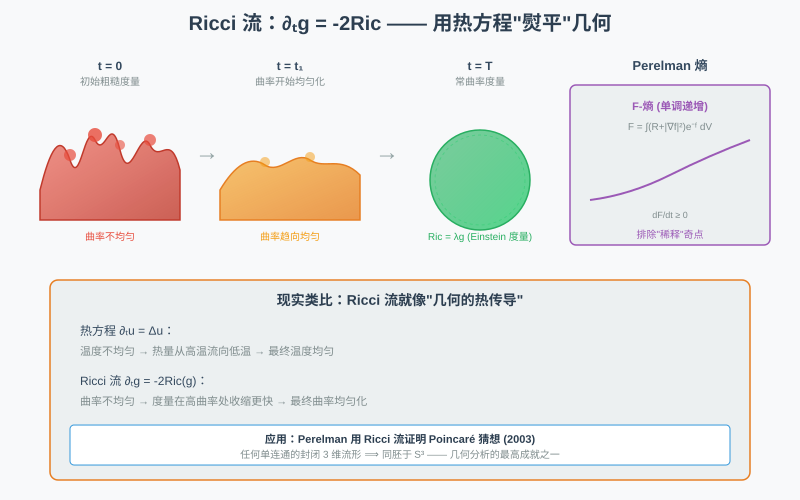
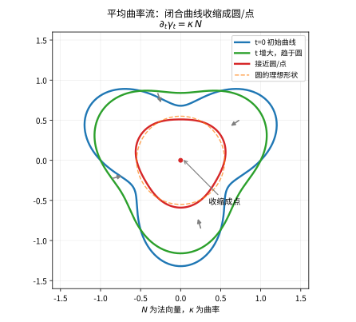
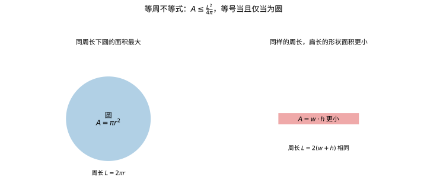

# 第 57 级：几何分析 (Geometric Analysis)

> 几何分析是微分几何与偏微分方程交叉的前沿领域，利用分析工具研究几何结构，并利用几何直观解决分析问题。从 Laplace-Beltrami 算子的谱性质到 Ricci 流的奇点分析，从极小子流形到正质量定理，几何分析在过去的半个世纪中取得了革命性的进展。本课程将系统介绍几何分析的核心概念与重要定理。

---

## 1. 学习目标

1. 理解 Riemann 流形上 Laplace-Beltrami 算子的定义与谱性质。
2. 掌握热核的构造与渐近展开理论。
3. 理解 Hodge 分解定理，掌握 de Rham 上同调与调和形式的关系。
4. 了解极小子流形与平均曲率流的基本理论。
5. 理解 Ricci 流的基本思想与 Perelman 熵公式。
6. 了解 Yamabe 问题与正质量定理的证明思路。
7. 掌握流形上的 Sobolev 不等式、等周不等式与 Bakry-Émery 条件。

---

## 2. 核心概念

### 2.1 Laplace-Beltrami 算子

**定义 2.1**（Laplace-Beltrami 算子）设 $(M, g)$ 是 $n$ 维 Riemann 流形。对光滑函数 $f \in C^\infty(M)$，**Laplace-Beltrami 算子** 定义为
$$
\Delta f = -\operatorname{div}(\nabla f) = -\frac{1}{\sqrt{\det g}} \sum_{i,j=1}^n \frac{\partial}{\partial x^i} \left( \sqrt{\det g} \, g^{ij} \frac{\partial f}{\partial x^j} \right).
$$
在局部坐标 $(x^1, \ldots, x^n)$ 下，$g_{ij} = g(\partial_i, \partial_j)$，$g^{ij}$ 是逆矩阵，$\det g = \det(g_{ij})$。

**注**：不同文献中 $\Delta$ 的符号约定可能不同。此处定义 $\Delta = -\operatorname{div} \nabla$，使得 $\Delta$ 是正算子：
$$
\int_M f \Delta f \, dV_g = \int_M |\nabla f|^2 \, dV_g \ge 0.
$$

> **💡 直观理解（类比）**：Laplace-Beltrami 算子 $\Delta = -\operatorname{div}\nabla$ 像一把"量凸凹"的尺子：平坦处 $\Delta f=0$，凸起与凹陷分别给出正负读数，衡量 $f$ 在每点的起伏松紧。它就像在弯曲的地毯上量高低——$\sqrt{\det g}\,g^{ij}$ 那套系数正是地毯本身的"经纬距离换算表"，把一般弯曲流形上的二阶微分翻译成欧氏坐标下的偏导组合。

**例 2.2**（标准球面）在 $S^n \subseteq \mathbb{R}^{n+1}$ 上，Laplace-Beltrami 算子的特征值为 $\lambda_k = k(k + n - 1)$，$k = 0, 1, 2, \ldots$，对应特征函数是 $k$ 阶球谐函数（限制在 $S^n$ 上的 $k$ 次齐次调和多项式）。

> **💡 直观理解（类比）**：球面上的 Laplace-Beltrami 特征值 $\lambda_k=k(k+n-1)$ 像一层层越来越细的"波纹档位"：$k$ 越大，函数在球面上抖得越密、纹路越细碎，对应越小的振动能量都排到更高档。特征函数是球谐函数，正如把橡皮球表面的温度分布按"越来越细的纹路"一层层铺开——每个 $k$ 是一档波纹频率。

### 2.2 热核

**定义 2.3**（热核）设 $(M, g)$ 是完备 Riemann 流形。**热核**（heat kernel）$p_t(x, y)$ 是热方程
$$
(\partial_t + \Delta_x) p_t(x, y) = 0, \quad \lim_{t \to 0^+} p_t(x, y) = \delta_x(y)
$$
的基本解，其中 $\Delta_x$ 表示对 $x$ 变量作用。

**性质 2.4** 
- 对称性：$p_t(x, y) = p_t(y, x)$。
- 半群性：$p_{t+s}(x, y) = \int_M p_t(x, z) p_s(z, y) \, dV_g(z)$。
- 守恒性：$\int_M p_t(x, y) \, dV_g(y) = 1$。

> **💡 直观理解（类比）**：热核 $p_t(x,y)$ 记录"$t$ 秒前在 $x$ 点放一滴热，此刻 $y$ 点还残留多少热量"——它同时是热方程的解（时间方向）和"在 $y$ 点看扩散的权重"$\delta_x$。三条性质分别像"可逆的镜子"（对称性）、"时间可分"（半群性：先传 $s$ 秒再传 $t$ 秒恰等于直接传 $t+s$ 秒）、"总热量守恒"（积分恒为 $1$），合起来完整描述了热量在整条流形上如何扩散。

### 2.3 Hodge 理论

**定义 2.5**（Hodge Laplacian）设 $(M, g)$ 是紧定向 Riemann 流形。对 $k$-形式 $\omega$，**Hodge Laplacian** 定义为
$$
\Delta \omega = (d \delta + \delta d) \omega,
$$
其中 $d$ 是外微分，$\delta = (-1)^{n(k+1)+1} * d *$ 是余微分（$*$ 是 Hodge 星算子）。称 $\omega$ 为 **调和 $k$-形式**（harmonic $k$-form），若 $\Delta \omega = 0$。

> **💡 直观理解（类比）**：Hodge Laplacian $\Delta=d\delta+\delta d$ 把"取外微分 $d$、取余微分 $\delta$、再合起来"变成 $k$-形式空间上的二阶算子，调和 $k$-形式则是它的"零振动"。就像把一个物体分解为"拉伸（$d$）"与"收缩（$\delta$）"两股力，两股力完全相互抵消才稳如磐石（调和）：调和 $k$-形式正是那些既 $d\omega=0$ 又 $\delta\omega=0$ 的"无拉扯平衡态"。

### 2.4 极小子流形

**定义 2.6**（极小子流形）设 $\Sigma^k \hookrightarrow (M^n, g)$ 是等距浸入子流形。$\Sigma$ 的 **平均曲率向量** 定义为 $\vec{H} = \operatorname{tr}(II)$，其中 $II$ 是第二基本形式。若 $\vec{H} \equiv 0$，则称 $\Sigma$ 为 **极小子流形**（minimal submanifold）。

> **💡 直观理解（类比）**：极小子流形是"平均曲率处处为零"的曲面：在每个点，各方向弯曲的总和（平均，$\vec H=\operatorname{tr} II$）互相抵消，像一张受拉力处处均匀、朝任何方向都扯不动的"肥皂膜"。悬链面、螺旋面正因为表面张力处处均衡而成为极小曲面——这正是"肥皂泡为什么会存在"的深层几何原因。

**例 2.7** 
- 悬链面（catenoid）：由 $x^2 + y^2 = \cosh^2 z$ 定义的旋转曲面，是 $\mathbb{R}^3$ 中的极小曲面。
- 螺旋面（helicoid）：参数化为 $(u \cos v, u \sin v, v)$，也是 $\mathbb{R}^3$ 中的极小曲面。

> **💡 直观理解（类比）**：悬链面与螺旋面就像"极小曲面两人组"：前者像一挂晾在圆环上的皂膜（拉伸成双漏斗形状），后者像一条沿螺旋栈道卷出的螺带——各自都是表面张力处处均衡、平均曲率为零的极小曲面。

### 2.5 Ricci 流

**定义 2.8**（Ricci 流）设 $(M, g_0)$ 是 Riemann 流形。**Ricci 流**（Ricci flow）是以下抛物型方程：
$$
\frac{\partial}{\partial t} g(t) = -2 \operatorname{Ric}(g(t)), \quad g(0) = g_0.
$$
Ricci 流由 Hamilton 于 1982 年引入，目的是通过几何流的方式将度量的曲率均匀化，最终用于证明 Poincaré 猜想。

> **直观理解（现实类比）**：Ricci 流就像**用热扩散方程"熨平"几何**——想象一个表面凹凸不平的橡皮球，Ricci 流让曲率像热量一样从高处（曲率大）流向低处（曲率小），随着时间推移，球面越来越光滑均匀，最终变成完美的圆球。Perelman 正是利用这一思想，通过追踪 Ricci 流中可能出现的"奇点"（类似橡皮球某处突然捏紧），证明了 Poincaré 猜想：任何单连通的三维闭流形都同胚于三维球面。

> **🧠 思考历程：既然要"熨平"曲面，为什么不干脆用热流，反而发明一个"Ricci 流"？**
>
> 这是 Yang-Mills、极小曲面之后，又一个"几何流"家族里最惊心动魄的例子：一个本为证明几何猜想而生、却在途中被"奇点"差点拦住的方程，最终靠 Perelman 的三部曲把近百年最著名的猜想钉在墙上。
>
> - **Hamilton 的发心：曲率不均，就让它自己"流动"**（1982）。Hamilton 的直觉朴素而锋利：曲线变圆靠**曲率流**（子流形 §2.5 前的中等曲率流），那么流形的"弯曲程度"不均，能否让**度量 $g$ 自身**动起来，让凸出的地方收缩、凹陷的地方舒展？他写下 $\partial_t g=-2\,\mathrm{Ric}(g)$——**把数量曲率的"不均"化作 Ricci 张量对这个演化方程的驱动**，就像一个全局版的"表面张力"在一点一点熨平几何（正如前面橡皮球的比喻）。更进一步，他把目光锁定在三维：**正 Ricci 曲率的流形，Ricci 流会把它"收敛"成标准球面度量**。这已经不是"懂不懂"，而是哥白尼式的转折——**几何本身开始像热一样传导**。
> - **三年又三年：Nash-Moser 的正则性地狱**。可 Ricci 流是退化抛物型方程，初期的强存在性、短时唯一性都极难。Hamilton 花了多年证明：即便要用到 Nash-Moser 隐函数定理这把"大炮"，短时解总该有。**这个以年为单位的挣扎，本身就在说"几何流不是白捡的福利，而是踏在分析门槛上的猛虎"**——没有热方程那一套扎实功底，根本驯不动它。
> - **Perelman 的破局：奇点不是灾难，正是上帝写下的注释**（2002-2003）。Hamilton 早在收敛漂亮的流形，可一遇到那些"在有限时间爆炸"的奇点就卡壳。Perelman 的翻盘在于**不再逃避奇点，而是把它当作研究对象**：他搬出**熵**（$\mathcal{W}$-熵，见 §3.5）和**Ricci 流在奇点附近的极限模型**去分类"什么形状可以在爆炸前出现"。钻孔、手术、再继续流——**把"熨平"进行到每一块碎片都圆润如球，再拼回来说"整块本来就该是球"**。这一连串烧脑的论证，最终把 Poincaré 猜想从"宇宙难题"变成定理。
> - **心路**：Ricci 流的启示藏在"别怕爆炸"里——**愈是不能用尺量、愈会在演化中失稳的地方，往往愈藏着一个对象的"指纹"**。Hamilton 给了几何一个会呼吸的方程，Perelman 则教会我们：真正的结构，常在你设的法律被破坏、不得不"手术"的那个瞬间现形。

想象一条位于平面上的闭合光滑曲线，若它沿法向以曲率 $\kappa$ 的速度向内收缩（平均曲率流 $\partial_t\gamma_t = \kappa N$），它就会一边收缩一边变圆，最终收敛成一个圆并缩成一个点。下图示意了这一过程：

> **直观理解（现实类比）**：想象一根橡皮筋被平放在桌面上，其表面张力始终沿内法向收缩，让橡皮筋一边收缩一边变得圆润，最后缩成一个点。这正如曲率流——曲率越大的地方收缩得越快，把不规则的曲线"熨平"成圆，最终塌缩为一点。

### 2.6 Yamabe 问题

**定义 2.9**（Yamabe 问题）给定紧 Riemann 流形 $(M, g)$，问是否存在共形度量 $\tilde{g} = u^{4/(n-2)} g$（$u > 0$）使得 $\tilde{g}$ 具有常数量曲率。这等价于求解非线性椭圆方程：
$$
-\frac{4(n-1)}{n-2} \Delta u + R u = \lambda u^{(n+2)/(n-2)},
$$
其中 $R$ 是 $g$ 的数量曲率，$\lambda$ 是常数。

> **💡 直观理解（类比）**：Yamabe 问题问：能否通过"共形伸缩"（按 $u^{4/(n-2)}$ 改变度量，即只改大小、不改角度）把曲率"熨成常数"。这就像在不改变衣服剪裁样式的前提下局部放缩尺寸，直到整件衣服的"皱褶能量"（数量曲率）处处均匀。它等价于解一个关于 $u$ 的非线性椭圆方程——把几何目标翻译成 PDE 问题的经典一步。

### 2.7 Sobolev 不等式与等周不等式

**定理 2.10**（Sobolev 不等式在流形上）设 $(M, g)$ 是 $n$ 维紧 Riemann 流形。则存在常数 $C > 0$ 使得对任意 $f \in C^\infty(M)$，
$$
\left( \int_M |f|^{2n/(n-2)} \, dV_g \right)^{(n-2)/n} \le C \left( \int_M |\nabla f|^2 \, dV_g + \int_M f^2 \, dV_g \right).
$$

> **💡 直观理解（类比）**：流形上的 Sobolev 不等式好比"把函数的能量与它的大小比照"：左边是 $f$ 的"$L^q$ 身高"，右边是它的"梯度能量 $|\nabla f|^2$ 加自身范数"。它保证"能量受控"的函数，其峰值（大范数）也有界——正如掌握了整条绳子的弯曲总能量，就能约束它任意时刻被抬起的最大高度。

**定理 2.11**（等周不等式）紧 Riemann 流形 $(M, g)$ 上存在常数 $C > 0$，使得对任意区域 $\Omega \subset M$，
$$
\operatorname{Vol}(\partial \Omega) \ge C \operatorname{Vol}(\Omega)^{(n-1)/n}.
$$

等周不等式告诉我们：在周长（表面积）固定的前提下，圆的面积最大。下图对比了周长相同但形状不同的两种情况：

> **直观理解（现实类比）**：用一根固定长度的绳子在地面上围出各种图形，圆总是围出最大面积。这就像挤气球时表面张力总把轮廓拉成圆球——因为在相同周长/表面积的限制下，圆能装下最多的"内容"，这也是肥皂泡呈球形的深层原因。

### 2.8 Bakry-Émery 条件

**定义 2.12**（Bakry-Émery 条件）对 Riemann 流形 $(M, g)$ 和 $N \in (-\infty, \infty]$，称 **Bakry-Émery 条件** $\operatorname{BE}(K, N)$ 成立，若对任意光滑函数 $f$，
$$
\frac{1}{2} \Delta(|\nabla f|^2) - \langle \nabla f, \nabla(\Delta f) \rangle \ge K |\nabla f|^2 + \frac{1}{N} (\Delta f)^2.
$$
当 $N = \infty$ 时，条件简化为 $\operatorname{Ric} \ge K g$（即 Ricci 曲率有下界）。

> **💡 直观理解（类比）**：Bakry-Émery 条件把"曲率有下界 $K$"翻译成一条对任意光滑函数 $f$ 都成立的不等式——相当于把"地球引力场处处够强"这一几何事实，改写成"任何函数在流形上的梯度二阶信息都受该引力控制"的解析不等式。当 $N=\infty$ 时它退化为熟悉的 $\operatorname{Ric}\ge Kg$，是把几何与概率、图论里的"曲率-维度"统一起来的现代分析语言。

---

## 3. 定理与证明

### 3.1 Hodge 分解定理

**定理 3.1**（Hodge 分解定理）设 $(M, g)$ 是紧定向 Riemann 流形。则对任意 $k$，$k$-形式的空间 $\Omega^k(M)$ 有正交分解：
$$
\Omega^k(M) = \mathcal{H}^k(M) \oplus \operatorname{Im} d \oplus \operatorname{Im} \delta,
$$
其中 $\mathcal{H}^k(M) = \{\omega \in \Omega^k(M) \mid \Delta \omega = 0\}$ 是调和 $k$-形式空间。即每个 $k$-形式 $\omega$ 可唯一分解为
$$
\omega = \omega_H + d\alpha + \delta\beta,
$$
其中 $\omega_H$ 是调和的，$\alpha \in \Omega^{k-1}(M)$，$\beta \in \Omega^{k+1}(M)$。此外，$d\alpha$ 与 $\delta\beta$ 分别与 $\omega_H$ 正交。

**证明**：证明分四步进行。

**第一步：椭圆正则性。** Hodge Laplacian $\Delta = d\delta + \delta d$ 是二阶椭圆算子。由椭圆正则性理论，若 $\Delta \omega$ 光滑，则 $\omega$ 光滑。特别地，$\ker \Delta$ 中的元素是光滑的。

**第二步：Hodge 分解的无穷维版本。** 考虑 $L^2$ 内积
$$
\langle \omega, \eta \rangle = \int_M \omega \wedge *\eta.
$$
定义 $\operatorname{Im} d$ 和 $\operatorname{Im} \delta$ 的 $L^2$ 闭包。由椭圆算子理论，$\operatorname{Im} d$ 和 $\operatorname{Im} \delta$ 实际上是闭的，且
$$
(\operatorname{Im} d)^\perp = \ker \delta, \quad (\operatorname{Im} \delta)^\perp = \ker d.
$$

**第三步：调和形式与正交性。** 调和形式 $\omega \in \mathcal{H}^k$ 满足 $d\omega = 0$ 且 $\delta\omega = 0$，因为
$$
0 = \langle \Delta \omega, \omega \rangle = \|d\omega\|^2 + \|\delta\omega\|^2.
$$
因此 $\mathcal{H}^k \subseteq \ker d \cap \ker \delta$。反之，若 $d\omega = 0$ 且 $\delta\omega = 0$，则 $\Delta\omega = 0$，故 $\mathcal{H}^k = \ker d \cap \ker \delta$。

对任意调和形式 $\omega_H$ 和 $d\alpha$，
$$
\langle \omega_H, d\alpha \rangle = \langle \delta \omega_H, \alpha \rangle = 0,
$$
类似地 $\langle \omega_H, \delta\beta \rangle = 0$。

**第四步：分解的存在性。** 对任意 $\omega \in \Omega^k$，考虑 $\omega$ 在 $\overline{\operatorname{Im} d}$ 上的正交投影。由 Hodge 理论的基本引理，$\operatorname{Im} d$ 是闭的，因此存在 $\alpha$ 使得投影为 $d\alpha$。令 $\omega' = \omega - d\alpha$，则 $\omega' \perp \operatorname{Im} d$，故 $\delta\omega' = 0$。类似地，将 $\omega'$ 投影到 $\operatorname{Im} \delta$ 上得到 $\delta\beta$，令 $\omega_H = \omega' - \delta\beta$，则 $\omega_H$ 与 $\operatorname{Im} d$ 和 $\operatorname{Im} \delta$ 都正交，因此 $\delta\omega_H = 0$ 且 $d\omega_H = 0$，从而 $\omega_H$ 调和。$\square$

> **💡 直观理解（类比）**：Hodge 分解把任意 $k$-形式拆成"调和 + 闭但非调和 + 有余调"三块正交的抽屉：$\omega=\omega_H+d\alpha+\delta\beta$。就像把任意一束光投影成两束互相垂直的偏振光，再加上一个"残余分量"，三者两两正交、互不干扰。每个 $k$-形式由此都有了固定的"标准分解地址"——这是把 Hodge 理论与上同调衔接起来的钥匙。

**推论 3.2**（Hodge 定理）紧定向 Riemann 流形上，$k$ 次 de Rham 上同调群 $H^k_{\text{dR}}(M)$ 与调和 $k$-形式空间 $\mathcal{H}^k(M)$ 同构：
$$
H^k_{\text{dR}}(M) \cong \mathcal{H}^k(M).
$$
特别地，$\dim \mathcal{H}^k(M) = b_k(M)$（第 $k$ 个 Betti 数），且调和形式完全由其上同调类决定。

> **💡 直观理解（类比）**：Hodge 定理说"每个上同调类里恰好住着一只调和的代表"，$\dim\mathcal{H}^k=b_k$。就像每个"等价类航班"都有一位唯一指定的"最优发言人"——Betti 数就是这些调和代表的种类个数。这让人抽上同调有了几何上最平滑的"标准发言人"，是 Hodge 理论最漂亮的收尾。

### 3.2 热核的渐近展开

**定理 3.3**（Minakshisundaram-Pleijel 渐近展开）设 $(M, g)$ 是 $n$ 维紧 Riemann 流形，$p_t(x, y)$ 是热核。则当 $t \to 0^+$ 时，在 $x = y$ 处有渐近展开
$$
p_t(x, x) \sim (4\pi t)^{-n/2} \sum_{k=0}^\infty a_k(x) t^k,
$$
其中系数 $a_k(x)$ 由度量 $g$ 在 $x$ 处的曲率张量及其协变导数决定。前几个系数为：
- $a_0(x) = 1$，
- $a_1(x) = \frac{1}{6} R(x)$（$R$ 是数量曲率），
- $a_2(x) = \frac{1}{360} (2|R_{ijkl}|^2 - 2|R_{ij}|^2 + 5R^2)$。

**证明思路**：证明的核心是构造热的参数化（parametrix）。

**第一步：构造局部近似。** 在法坐标下，对 $x$ 附近的 $y$，定义
$$
H_k(t, x, y) = (4\pi t)^{-n/2} e^{-d(x,y)^2/4t} \sum_{j=0}^k u_j(x, y) t^j,
$$
其中 $u_0(x, x) = 1$，$u_j$ 通过递推的传输方程确定。

**第二步：估计误差项。** 令 $H_k$ 为热方程的近似解，则 $(\partial_t + \Delta) H_k = O(t^{k - n/2})$。通过迭代构造，可以得到精确的热核 $p_t(x, y)$ 与 $H_k$ 之差在 $t \to 0$ 时是高阶小量。

**第三步：局部化与迹。** 将热核限制在 $x = y$ 处，得到渐近展开的前几项由曲率不变量决定。$\square$

> **💡 直观理解（类比）**：热核的 $t\to0^+$ 渐近展开把"短期热量扩散"按 $t^k$ 逐项分层，系数 $a_k(x)$ 由曲率不变量决定。就像把小水滴落的纹路细看：首要项 $(4\pi t)^{-n/2}$ 是"点状基本半径"，之后的每层 $a_k t^k$ 像雕刻出曲率指纹——从一段极小尺度的热传导里，反而能"读"出流形完全局部的形状信息。

### 3.3 Yamabe 问题

**定理 3.4**（Yamabe 问题——Trudinger-Aubin-Schoen）设 $(M, g)$ 是 $n \ge 3$ 维紧连通 Riemann 流形。则存在共形度量 $\tilde{g} = u^{4/(n-2)} g$ 具有常数量曲率。

**证明思路**：证明经历了三个阶段。

**第一阶段：Yamabe 的尝试（1960）。** Yamabe 定义了 Yamabe 不变量
$$
Y(M, g) = \inf_{u \in H^1(M), u > 0} \frac{\int_M \left( \frac{4(n-1)}{n-2} |\nabla u|^2 + R u^2 \right) dV_g}{\left( \int_M u^{2n/(n-2)} dV_g \right)^{(n-2)/n}}.
$$
Yamabe 声称 $Y(M, g)$ 总在某个正函数 $u$ 处达到，但 Yamabe 的论证有缺陷——他未能正确处理临界指数情况。

**第二阶段：Trudinger 与 Aubin 的进展（1968-1976）。** Trudinger 证明若 $Y(M, g) \le 0$，则极值存在。Aubin 证明若 $Y(M, g) < Y(S^n)$（标准球面的 Yamabe 不变量），则极值存在。Aubin 还给出了 $Y(M, g) \le Y(S^n)$ 的证明，并指出仅当 $n \ge 3$ 且 $(M, g)$ 非共形平坦时，严格不等式成立。

**第三阶段：Schoen 的完成（1984）。** Schoen 利用正质量定理（由 Schoen 和 Yau 证明）处理了临界情况：当 $(M, g)$ 共形于标准球面时，$Y(M, g) = Y(S^n)$。Schoen 通过构造恰当的测试函数，证明了极值函数的存在性，最终完成了 Yamabe 问题的证明。$\square$

> **💡 直观理解（类比）**：证明分三阶段像"接力补洞"：Yamabe 先声称总能取到最小值（但临界指数处留有疏漏），Trudinger/Aubin 修补 $Y\le0$ 与 $Y<Y(S^n)$ 的情况，Schoen 最后用正质量定理封住最棘手的"共形平坦"关头。这就像先粗打地基、再砌中段、最后用一把"正质量"焊枪熔合最后一道缝——几何与全局分析在此完美接力。

### 3.4 Schoen 正质量定理

**定理 3.5**（Schoen 正质量定理——概述）设 $(M^n, g)$ 是 $n$ 维（$n \ge 3$）渐近平坦的 Riemann 流形，其数量曲率 $R_g \ge 0$。则 ADM 质量 $m(g)$ 满足 $m(g) \ge 0$，且 $m(g) = 0$ 当且仅当 $(M, g)$ 等距于 $\mathbb{R}^n$ 配备标准欧氏度量。

**关键步骤（Schoen-Yau 的证明思路）**：

**第一步：反证法假设。** 假设 $m(g) < 0$，则可通过共形形变构造一个渐近平坦的度量 $\tilde{g}$，使得 $\tilde{g}$ 的数量曲率 $R_{\tilde{g}} \ge 0$ 且 $\tilde{g}$ 在某点附近具有严格正的平均曲率。

**第二步：构造稳定的极小球面。** 利用 $\tilde{g}$ 的渐近行为，在 $\tilde{g}$ 中构造一个稳定的极小球面 $\Sigma$（即面积在体积约束下的极小化子）。由稳定极小球面的第二变分公式，可得
$$
\int_\Sigma \left( |A|^2 + \operatorname{Ric}_\tilde{g}(\nu, \nu) \right) \, d\Sigma \le 0,
$$
其中 $A$ 是第二基本形式，$\nu$ 是法向量。

**第三步：利用数量曲率条件。** 由 Gauss 方程，$\Sigma$ 上的数量曲率 $R_\Sigma$ 可表示为
$$
R_\Sigma = R_{\tilde{g}} - 2 \operatorname{Ric}_\tilde{g}(\nu, \nu) + |A|^2 - H^2,
$$
其中 $H$ 是平均曲率（因为 $\Sigma$ 是极小的，$H = 0$）。代入第二变分不等式，结合 $R_{\tilde{g}} \ge 0$，可推出矛盾。

**第四步：$m(g) = 0$ 的情形。** 若 $m(g) = 0$，则通过细致的分析可证明度量是平坦的。$\square$

> **💡 直观理解（类比）**：正质量定理说"渐近平坦空间若数量曲率非负，则 ADM 质量不会为负，为零当且仅当它是平坦的 $\mathbb{R}^n$"。它像物理里"孤立系统的引力总质量不能为负"这一直觉的精确数学化——除非是真空平坦，否则总要携带正能量。证明用共形形变加稳定极小球面加第二变分公式，一步步把"负质量"逼出矛盾。

### 3.5 Perelman 的 Ricci 流单调公式

**定理 3.6**（Perelman 的 $\mathcal{F}$-熵与 $\mathcal{W}$-熵）设 $(M, g(t))$ 是 Ricci 流的解，$g(t)$ 满足 $\partial_t g = -2\operatorname{Ric}$。

**$\mathcal{F}$-熵**：定义
$$
\mathcal{F}(g, f) = \int_M (R + |\nabla f|^2) e^{-f} \, dV,
$$
其中 $f$ 是光滑函数且 $\int_M e^{-f} \, dV = 1$。在 Ricci 流下，沿耦合的演化方程
$$
\partial_t g = -2\operatorname{Ric}, \quad \partial_t f = -\Delta f + |\nabla f|^2 - R,
$$
有
$$
\frac{d}{dt} \mathcal{F} = 2 \int_M |\operatorname{Ric} + \nabla^2 f|^2 e^{-f} \, dV \ge 0.
$$
因此 $\mathcal{F}$ 沿 Ricci 流是单调递增的。

**$\mathcal{W}$-熵**：定义
$$
\mathcal{W}(g, f, \tau) = \int_M \left[ \tau(R + |\nabla f|^2) + f - n \right] (4\pi\tau)^{-n/2} e^{-f} \, dV,
$$
其中 $\tau = T - t > 0$ 是逆向时间参数，且归一化条件 $\int_M (4\pi\tau)^{-n/2} e^{-f} \, dV = 1$。在 Ricci 流下，
$$
\frac{d}{dt} \mathcal{W} = 2\tau \int_M \left| \operatorname{Ric} + \nabla^2 f - \frac{1}{2\tau} g \right|^2 (4\pi\tau)^{-n/2} e^{-f} \, dV \ge 0.
$$

**证明概要**：直接计算 $\frac{d}{dt} \mathcal{F}$ 和 $\frac{d}{dt} \mathcal{W}$，利用 Ricci 流的演化方程、Bochner 公式和分部积分，经过复杂的代数运算，将时间导数化为平方项的非负积分。$\square$

**意义**：Perelman 的单调公式是 Ricci 流理论中的突破性进展。$\mathcal{F}$-熵的单调性给出了 Ricci 流下数量曲率与共形变换的深刻联系，而 $\mathcal{W}$-熵的单调性则用于排除 Ricci 流奇点中的非平凡稀释现象，是 Perelman 证明 Poincaré 猜想的关键工具。

> **💡 直观理解（类比）**：$\mathcal{F}$-熵与 $\mathcal{W}$-熵是 Ricci 流演化中的"守护员"：它们沿流单调不减（导数是非负平方积分）。这好比一个始终上升的"总温熵"水位计——几何在流动中只会变得更规整，熵报告"单调上升"就说明不可能退化出坏的奇点。$\mathcal{W}$-熵尤其用来排除"稀释"这类坏现象，是 Perelman 证明 Poincaré 猜想的钥匙。

---

## 4. 示例

### 4.1 球面上 Laplace-Beltrami 算子的特征值

**例 4.1** 考虑 $S^2 \subseteq \mathbb{R}^3$ 上的标准度量。在球坐标 $(\theta, \varphi)$ 下，度量张量为
$$
g = d\theta^2 + \sin^2 \theta \, d\varphi^2,
$$
Laplace-Beltrami 算子为
$$
\Delta = -\frac{1}{\sin\theta} \frac{\partial}{\partial\theta} \left( \sin\theta \frac{\partial}{\partial\theta} \right) - \frac{1}{\sin^2\theta} \frac{\partial^2}{\partial\varphi^2}.
$$
特征值方程为 $\Delta Y_l^m = l(l+1) Y_l^m$，其中 $l = 0, 1, 2, \ldots$，$|m| \le l$，$Y_l^m$ 是球谐函数。特征值的重数为 $2l + 1$。

具体地：
- $l = 0$：特征值 $0$，重数 $1$，特征函数为常数。
- $l = 1$：特征值 $2$，重数 $3$，特征函数为 $x, y, z$ 在 $S^2$ 上的限制。
- $l = 2$：特征值 $6$，重数 $5$。

热核的迹为
$$
\operatorname{Tr}(e^{-t\Delta}) = \sum_{l=0}^\infty (2l+1) e^{-l(l+1)t}.
$$
当 $t \to 0$ 时，渐近展开为
$$
\operatorname{Tr}(e^{-t\Delta}) \sim \frac{1}{4\pi t} + \frac{1}{12\pi} + O(t),
$$
其中 $a_0 = 1$，$\int_{S^2} a_1 \, dV = \frac{1}{6} \int_{S^2} R \, dV = \frac{1}{6} \cdot 2 \cdot 4\pi = \frac{4\pi}{3}$，故 $(4\pi t)^{-1} \cdot (4\pi + \frac{4\pi}{3} t + \cdots) = \frac{1}{t} + \frac{1}{3} + \cdots$，与上述吻合。

> **💡 直观理解（类比）**：$S^2$ 上 Laplace 特征值 $l(l+1)$、重数 $2l+1$：$l=0$ 是常数（一切平坦）、$l=1$ 是三个线性坐标函数（像地球上的三个正交方向）、$l=2$、…每增高一层，球面上的波就多一道"纹路"。热核迹 $\operatorname{Tr}(e^{-t\Delta})$ 把这些特征值按权重 $e^{-t\lambda}$ 求和，让"短期热量"直接读出 $S^2$ 的面积与曲率——看到 $1/(4\pi t)$ 中那个 $4\pi$（球面积）就一目了然。

### 4.2 极小球面的例子

**例 4.2**（悬链面）悬链面是 $\mathbb{R}^3$ 中由曲线 $x = \cosh z$ 绕 $z$ 轴旋转得到的极小曲面，参数化为
$$
X(u, v) = (\cosh u \cos v, \cosh u \sin v, u), \quad u \in \mathbb{R}, v \in [0, 2\pi).
$$
第一基本形式为 $g = \cosh^2 u \, (du^2 + dv^2)$，第二基本形式为 $II = du^2 - \cosh^2 u \, dv^2$。平均曲率
$$
H = \frac{1}{2} \operatorname{tr}(II \cdot g^{-1}) = \frac{1}{2} \left( \frac{1}{\cosh^2 u} - \frac{1}{\cosh^2 u} \right) = 0,
$$
故悬链面是极小曲面。

> **💡 直观理解（类比）**：悬链面由悬链线绕轴旋转而成，第一、第二基本形式算出的平均曲率恰好为 $0$——每个点上两个主方向的弯曲一正一负、互为抵消。它像两枚被拉成"双漏斗"的肥皂膜：表面张力处处均衡，空中毫无皱褶。

**例 4.3**（Enneper 曲面）参数化为
$$
X(u, v) = \left( u - \frac{u^3}{3} + uv^2, v - \frac{v^3}{3} + u^2 v, u^2 - v^2 \right),
$$
也是 $\mathbb{R}^3$ 中的极小曲面，但具有自交。

> **💡 直观理解（类比）**：Enneper 曲面同样平均曲率处处为零，但形状像一张"打了褶、有自交的皂膜"。它提醒我们"极小"并不等于"不重叠"——曲面在空间里折叠、穿入自身，却仍是张力处处均衡的极小曲面。

---

## 5. 习题

### 基础题

**习题 1**（Laplace-Beltrami 算子）写出 $n$ 维 Riemann 流形 $(M,g)$ 上 Laplace-Beltrami 算子 $\Delta f = -\operatorname{div}(\nabla f)$ 在局部坐标下的显式表达式。

**习题 2**（Laplace-Beltrami 算子）设 $(M,g)$ 是紧闭流形，证明 $\int_M f\,\Delta f \, dV_g \ge 0$，并指出等号成立的条件。

**习题 3**（热核）写出热核 $p_t(x,y)$ 满足的热方程及其初值条件。

**习题 4**（热核）说明热核满足的三个基本性质：对称性、半群性、守恒性。

**习题 5**（Hodge 理论）写出 Hodge Laplacian $\Delta \omega = (d\delta + \delta d)\omega$，并说明 $\delta$ 的表达式。

**习题 6**（Hodge 理论）定义调和 $k$-形式，并说明其与 $d\omega=0$、$\delta\omega=0$ 的关系。

**习题 7**（极小子流形）写出平均曲率向量 $\vec H$ 的定义，并给出极小子流形的定义。

**习题 8**（极小子流形）判断悬链面是否为极小曲面，并简述原因。

**习题 9**（Ricci 流）写出 Ricci 流方程，说明 $\partial_t g = -2\operatorname{Ric}(g)$。

**习题 10**（Ricci 流）简述 Hamilton 引入 Ricci 流的主要目的。

**习题 11**（Yamabe 问题）写出 Yamabe 问题中等价的共形 PDE 方程。

**习题 12**（Sobolev 不等式）在一维情形写出最简 Sobolev 不等式形式。

**习题 13**（等周不等式）在平面 $\mathbb{R}^2$ 中写出经典的等周不等式 $L^2 \ge 4\pi A$，说明几何含义。

**习题 14**（Bakry-Émery）写出 $\operatorname{BE}(K,N)$ 条件的表达式。

**习题 15**（谱理论）写出球面 $S^n$ 上 Laplace 算子的特征值公式 $\lambda_k = k(k+n-1)$。

**习题 16**（Bochner 公式）写出 Bochner 公式 $\frac12 \Delta|\nabla f|^2 = |\nabla^2 f|^2 + \langle\nabla f,\nabla(\Delta f)\rangle + \operatorname{Ric}(\nabla f,\nabla f)$。

**习题 17**（Laplace-Beltrami）设 $f,g\in C^\infty(M)$，写出 Green 恒等式 $\int_M f\,\Delta g\, dV = \int_M g\,\Delta f\, dV$ 成立的条件。

**习题 18**（谱理论）说明常数函数是否为 $0$ 特征值对应的特征函数。

**习题 19**（热核）热核渐近展开 $p_t(x,x)\sim (4\pi t)^{-n/2}\sum_{k\ge0} a_k(x)t^k$ 中的首项 $a_0$ 是多少？

**习题 20**（热核）写出 $a_1(x)$ 与数量曲率 $R(x)$ 的关系。

**习题 21**（Hodge 理论）对紧定向流形，写出 Hodge 分解 $\Omega^k(M)=\mathcal H^k\oplus\operatorname{Im}d\oplus\operatorname{Im}\delta$。

**习题 22**（Hodge 理论）说明 $k$ 次 de Rham 上同调群与调和 $k$-形式空间之间的同构关系。

**习题 23**（极小子流形）写出稳定极小球面的第二变分公式。

**习题 24**（极小子流形）说明 Enneper 曲面是否是极小曲面。

**习题 25**（曲率流）写出平均曲率流的方程 $\partial_t\gamma_t = \kappa N$。

**习题 26**（Ricci 流）给出数量曲率 $R$ 沿 Ricci 流的演化方程形式。

**习题 27**（Perelman 熵）写出 $\mathcal F$-熵的定义式。

**习题 28**（Perelman 熵）写出 $\mathcal W$-熵的定义式。

**习题 29**（Sobolev）给出紧流形上 Sobolev 不等式低维（$n=2$）情形的表述差异（需用 Moser-Trudinger）。

**习题 30**（等周不等式）写出紧流形上的等周不等式 $\operatorname{Vol}(\partial\Omega)\ge C\operatorname{Vol}(\Omega)^{(n-1)/n}$。

**习题 31**（正质量定理）陈述 Schoen 正质量定理中关于 $m(g)\ge 0$ 的结论。

**习题 32**（Gauss-Bonnet）写出二维紧曲面上的 Gauss-Bonnet 公式 $\int_M K\,dA = 2\pi\chi(M)$。

**习题 33**（消失定理）写出 Bochner 消失定理：若 $\operatorname{Ric}>0$，则调和 $1$-形式为零。

**习题 34**（Laplace-Beltrami）说明 $\Delta f = \lambda f$ 中，紧流形上特征值 $\lambda$ 满足何种非负性。

**习题 35**（Laplace-Beltrami）试求欧氏空间 $\mathbb{R}^n$ 中标准度量下 $\Delta f$ 即通常的负拉普拉斯算子 $-\sum_i \partial_i^2 f$。验证 $f(x)=|x|^2$ 满足 $\Delta f = -2n$。

**习题 36**（热核）写出欧氏空间 $\mathbb{R}^n$ 上热核的显式公式。

**习题 37**（Ricci 流）写出 Ricci 流下度量沿时间演化时保持保微分同胚不变的测地距离公式解释（简述正常化变换）。

**习题 38**（Yamabe）说明 Yamabe 不变量 $Y(M,g)$ 的定义是一个极小商。

**习题 39**（Laplace-Beltrami）验证特征方程 $\Delta Y_l^m = l(l+1)Y_l^m$ 在 $S^2$ 上 $l=1$ 对应重数 $3$。

**习题 40**（谱理论）写出 $S^2$ 的热核迹 $\operatorname{Tr}(e^{-t\Delta}) = \sum_{l=0}^\infty (2l+1)e^{-l(l+1)t}$。

**习题 41**（热核）说明热核的 $t\to 0$ 渐近行为反映了流形的哪类信息。

**习题 42**（Hodge）说明 $0$-形式的 Hodge Laplacian 与函数 Laplace 算子的关系。

**习题 43**（极小子流形）悬链面参数化 $X(u,v)=(\cosh u\cos v, \cosh u\sin v, u)$，写出其第一基本形式。

**习题 44**（极小子流形）写出平均曲率关于第二基本形式与度量 $g$ 的关系式 $H=\tfrac12\operatorname{tr}(II\cdot g^{-1})$。

**习题 45**（Bakry-Émery）当 $N=\infty$ 时，Bakry-Émery 条件退化为哪个曲率条件？

**习题 46**（Sobolev）说出流形上 Sobolev 空间 $H^1(M)$ 的范数定义。

**习题 47**（等周不等式）说明等周不等式在周长固定时给出圆的面积最大这一结论对应 $\mathbb{R}^2$ 中哪个不等式。

**习题 48**（Ricci 流）写出 Perelman $\mathcal F$-熵的单调性结论 $\frac{d}{dt}\mathcal F\ge 0$。

**习题 49**（Ricci 流）写出 $\mathcal W$-熵单调性 $\frac{d}{dt}\mathcal W \ge 0$ 及其参数 $\tau = T-t$。

**习题 50**（保Glan的正质量定理）陈述 ADM 质量 $m(g)$ 定义中涉及的渐近平坦度量条件。

**习题 51**（Gauss-Bonnet）对 $\mathbb{R}^2$ 中单位圆盘边界圆周应用 Gauss-Bonnet，验证 $\int K\,dA + \int k_g\,ds = 2\pi$。

**习题 52**（Bochner）对紧流形证明若 $f$ 为调和函数（$\Delta f=0$）则 $f$ 为常数（$\operatorname{Ric}\ge0$ 且 $\operatorname{Ric}>0$ 情形）。

**习题 53**（谱理论）说明紧流形 Laplace 算子特征值构成的序列离散且趋向 $+\infty$。

**习题 54**（热核）写出 Minakshisundaram-Pleijel 展开中 $a_2(x)$ 的公式。

**习题 55**（Hodge）Betti 数 $b_k(M)$ 与 $\dim\mathcal H^k$ 的关系式写出来。

**习题 56**（极小子流形）说明螺旋面参数化 $(u\cos v, u\sin v, v)$ 是否为极小曲面。

**习题 57**（曲率流）理解为什么曲线沿曲率流收缩会越来越圆（解释曲率大的地方收缩快）。

**习题 58**（Laplace-Beltrami）写出 Bochner 公式的正子（非负）形式需要的曲率条件 $\operatorname{Ric}\ge 0$。

**习题 59**（谱理论）写出 $S^{n}$ 上第一非零特征值 $\lambda_1 = n$ 并验证。

**习题 60**（热核）说明热核的守恒性 $\int_M p_t\, dV = 1$ 与概率测度的联系。

**习题 61**（Yamabe）写出共形正规化的数量曲率变换公式（$n\ge3$）。

**习题 62**（Sobolev）写出临界指数 $2^* = \frac{2n}{n-2}$ 并说明其与嵌入紧凑性的关系。

**习题 63**（等周不等式）Torus $T^2$ 上等周不等式中的常数与截面曲率的关系简述。

**习题 64**（Ricci 流）写出 Hamilton 在 Ricci 流中的单调量或最著名的单调性（曲率演化）。

**习题 65**（Perelman）说明 $\mathcal F$-熵与共形几何（共形变换）的联系。

**习题 66**（消失定理）说明 Bochner 技巧如何用于证明紧流形上大胆测地形（Hodge）$b_1=0$ 当 $\operatorname{Ric}>0$。

**习题 67**（极小子流形）写出第二基本形式 $II$ 的二次型定义及其迹是平均曲率。

**习题 68**（Ricci 流）写出数量曲率演化 $\partial_t R = \Delta R + 2|\operatorname{Ric}|^2 - \tfrac12 R^2$ 的说明（正常化版本）。

**习题 69**（Perelman）写出 $\mathcal F = \int_M (R+|\nabla f|^2)e^{-f}dV$ 定义的归一化条件 $\int_M e^{-f}dV=1$。

**习题 70**（Hodge）说明为何在 $\mathbb{R}^n$ 中不存在非平凡紧支撑的调和函数。

**习题 71**（Laplace）写出极坐标下（径向）$\mathbb{R}^n$ 中 $\Delta r^\alpha$ 的结果。

**习题 72**（谱理论）解释 $\lambda_1 = n$ 在 $S^n$ 上对应的特征函数是坐标函数。

**习题 73**（热核）写出热核半群 $e^{-t\Delta}$ 的定义 $\int_M p_t(x,y)f(y)dV(y)$ 的表达。

**习题 74**（极小）Clifford 环面在 $S^3$ 中 $|z_1|=|z_2|=1/\sqrt2$，判断其是否极小。

**习题 75**（极小）写出极小曲面变分定性：面积的一阶变分为零。

**习题 76**（曲率流）说明平均曲率流下平面闭合经典结果：任何闭合平面曲线收敛到圆。

**习题 77**（等周）写出 $\mathbb{R}^n$ 中的等周不等式 $\operatorname{Vol}(B_r)=c_n r^n$ 相关。

**习题 78**（Sobolev）写出 Gagliardo-Nirenberg-Sobolev 不等式在流形上的形式。

**习题 79**（Yamabe）写出 Yamabe 问题的共形变换 $\tilde g = u^{4/(n-2)}g$ 中指数为何是 $4/(n-2)$。

**习题 80**（消失定理）说明 Bochner 消失定理在 $\operatorname{Ric}\ge0$ 与 $\lambda_1>0$ 时的调和 1-形式结论。

**习题 81**（Bakry-Émery）写出 $\operatorname{BE}(0,\infty)$（即 $\operatorname{Ric}\ge0$）下 $\Delta|\nabla f|^2\ge 2|\nabla^2 f|^2$。

**习题 82**（Bochner）对闭环流形用 Bochner 公式证明 $\operatorname{Ric}>0\Rightarrow$ 无非平凡调和 1-形式。

**习题 83**（谱理论）写出 $T^n$ 上 Laplace 的特征值与特征向量（这是一种平坦情形）。

**习题 84**（热核）写出 $T^n$ 上常数曲率 $0$ 的热核（乘积）表达式。

**习题 85**（Hodge）说明 $b_0=1$ 对连通流形恒成立（0-调和形式是常数）。

**习题 86**（极小）牛顿第二变分选稳定性条件 $Q(f,f)\ge0$。

**习题 87**（Gauss-Bonnet）对 $S^2$ 用 Gauss-Bonnet 验证 $\int K\,dA = 4\pi$。

**习题 88**（Gauss-Bonnet）说明 Gauss-Bonnet 把几何量（Gauss 曲率）与拓扑量（欧拉示性数）联系起来。

**习题 89**（正质量定理）说明 ADM 质量 $m(g)$ 为几何量且随坐标渐近规范固定。

**习题 90**（Yamabe）写出 Yamabe 不变量 $Y(S^n)$ 的数值。

**习题 91**（Perelman）写出 $\mathcal W$ 熵中出现的逆向时间 $\tau=T-t>0$ 的作用。

**习题 92**（Ricci 流）解释 Ricci 流奇点常与流形收缩（至点）或曲率发散相关。

**习题 93**（Gauss-Bonnet）对圆环面（$g=1$) Gauss-Bonnet 给出 $\int K\,dA=0$，说明平坦性。

**习题 94**（Hodge）列出 $\mathbb{RP}^2$（定向？）说明需要定向性条件。

**习题 95**（Laplace）写出用分部积分证明 $\int |\nabla f|^2 = -\int f\Delta f$。

**习题 96**（极小）写出悬链面第二基本形式 $II = du^2 - \cosh^2 u\, dv^2$ 简化（简述二形式）。

**习题 97**（热核）写出热核的对角渐近式 $p_t(x,x)\sim(4\pi t)^{-n/2}(1+\tfrac16 R t + \cdots)$。

**习题 98**（消失定理）说明 Bochner 消失定理的推广：$\operatorname{Ric}>0$ 使 $\mathcal H^1=0$ 从而 $b_1=0$。

**习题 99**（等周）说明等周不等式中的常数 $C$ 在最坏情形由 $\mathbb{R}^n$ 或球决定。

**习题 100**（总结性）概括几何分析中"几何信息 $\leftrightarrow$ 分析信息"的双向桥梁（Laplace 谱/曲率/热核）。

### 进阶题

**习题 101**（Laplace-Beltrami）推导在局部坐标下 $\Delta f = -\frac{1}{\sqrt{\det g}}\partial_i(\sqrt{\det g}\, g^{ij}\partial_j f)$ 的恒等式，说明蜕化为 $\partial_i\partial_i$ 当 $g$ 平坦。

**习题 102**（弱解）定义弱解概念：$u\in H^1$ 满足 $\int_M \langle\nabla u,\nabla\varphi\rangle = 0$ 对所有 $\varphi\in C^\infty$，理解其与 $\Delta u=0$ 的等价性。

**习题 103**（谱理论）证明紧流形上 $\lambda_1 = \inf_{\|f\|_{L^2}=1, \int f=0} \int|\nabla f|^2$。

**习题 104**（Sobolev）用 Sobolev 嵌入说明临界指数 $2^*$ 处分子的临界性并解释非紧凑。

**习题 105**（热核）推导热核渐近展开的"多项式"正则证明思路：用小时间参数化逼近再解传输方程。

**习题 106**（Hodge）证明 $q$-调和形式与上同调类一一对应的引理步骤：椭圆正则性+正交分解。

**习题 107**（Bochner）用 Bochner 公式证明：若 $\operatorname{Ric}>0$，则每个调和 $1$-形式为 $0$（$b_1=0$）。

**习题 108**（消失定理）证明紧 Kähler 流形上调和 $(p,q)$-形式可用曲率条件（如正 Ricci）消失（简述）。

**习题 109**（Gauss-Bonnet）对亏格 $g$ 的曲面写出 $\chi=2-2g$ 并代入 Gauss-Bonnet。

**习题 110**（极小）推导极小球面上稳定不等式：$\int_\Sigma (|A|^2+\operatorname{Ric}(\nu,\nu))\le 0$ 的来源。

**习题 111**（Ricci 流）推导无量纲化的 Ricci 流：$\partial_t g = -2\operatorname{Ric}$ 下曲率演化 $\partial_t R = \Delta R + 2|\operatorname{Ric}|^2$。

**习题 112**（Perelman）推导 $\mathcal F$ 沿 Ricci 流的单调性中的主项 $2\int|\operatorname{Ric}+\nabla^2 f|^2 e^{-f}$。

**习题 113**（Yamabe）证明 Yamabe 不变量在 $\tilde g = u^{4/(n-2)}g$ 下的共形不变性。

**习题 114**（等周）用余面积公式（co-area）推导等周不等式下界的联系。

**习题 115**（Lieb-Thirring/谱）说明特征值求和（热核迹 $\sum e^{-\lambda_j t}$）与迹公式的联系。

**习题 116**（Hodge）证明 $b_k = b_{n-k}$（Poincaré 对偶）在调和形式语言下由 Hodge 星算子诱导。

**习题 117**（消失定理）用 Bochner 技巧处理向量丛情形的消失定理（Veech 消失定理）。

**习题 118**（Bochner）用 $\operatorname{Ric}\ge0$ 推出调和的恒等映射（Clifford）观点下 $\int\nabla^2 f$ 约束。

**习题 119**（Yamabe）写出共形变换下数量曲率的变换式 $R_{\tilde g} = u^{-\frac{n+2}{n-2}}(-\frac{4(n-1)}{n-2}\Delta u + Ru)$。

**习题 120**（曲率流）推导平面曲线缩短流中弧长参数化的曲率演化方程 $\kappa_t = \kappa_{ss}+\kappa^3$。

**习题 121**（Gauss-Bonnet）计算高维 Gauss-Bonnet-Chern 指标的简化情形（$S^{2k}$）。

**习题 122**（谱理论）用 Weyl 渐近 $N(\lambda)\sim c_n\operatorname{Vol}(M)\lambda^{n/2}$ 证明特征值密度。

**习题 123**（极小）用第二变分证明稳定的极小球面具有正第二变分泛函。

**习题 124**（Ricci 流）简述为何在 Ricci 流下曲率无限增大处形成奇点。

**习题 125**（Perelman）解释 $\mathcal W$-熵的逆向时间 $\tau$ 在证明奇点分析中的作用。

**习题 126**（弱解）用能量方法（乘以 $u$, 分部积分, 能量下降）证明热方程能量单调下降。

**习题 127**（Bochner）推导 Bochner 恒等式的完整形式并指出 $\operatorname{Ric}$ 项。

**习题 128**（Sobolev）推导引理：对 $\|f\|_{L^{2*}}\le C(\|\nabla f\|_2+\|f\|_2)$ 证明（利用指数与等周）。

**习题 129**（正质量定理）简述 Schoen-Yau 用稳定的极小球面证明正质量的关键第二变分不等式。

**习题 130**（Yamabe）证明 Trudinger 情形：$Y(M,g)\le 0$ 时极值存在性（compactness 部分）。

**习题 131**（谱理论）解释紧流形上算子 $\Delta$ 具有纯离散谱（本质谱为空）。

**习题 132**（热核）利用热核迹渐近反演 Ausbeln（开覆盖）几何量：$a_0,a_1$ 从张量曲率读出。

**习题 133**（等周）对 $\mathbb{R}^n$ 证明最优等周常数，用到 Steiner 对称化。

**习题 134**（极小）Clifford 环面稳定性直接计算（$S^3$ 内, 满足 $\operatorname{Ric}$ 条件）。

**习题 135**（Ricci 流）推导 $|\operatorname{Ric}|$ 的微分不等式（通过曲率张量的共形性质）对渗化效应。

**习题 136**（Perelman）写出 $\mathcal W$ 单调性 $\frac{d}{dt}\mathcal W \le 0$ 或非负形式并解释其几何含义。

**习题 137**（消失定理）利用 Bochner 对闭流形证明 $\operatorname{Ric}>0$ 隐含 $b_1=0$ 且 $\pi_1$ 有限。

**习题 138**（Laplace）解 $\mathbb{R}^n$ 中径向 Laplace 方程 $\Delta u = 0$（除原点）的通解。

**习题 139**（Hodge）说明 $n=1$ 流形（圆 $S^1$）的 Hodge 分解与 $b_1=1$。

**习题 140**（弱解）证明最小化泛函（Dirichlet 能量）的解满足弱方程（变分引理）。

**习题 141**（谱理论）$S^2$ 特征值 $\lambda_l = l(l+1)$ 与重数 $2l+1$，验证 $\sum$ 求和。

**习题 142**（热核）计算 $\mathbb{R}$ 上热核 $p_t(x,y)=\frac{1}{\sqrt{4\pi t}}e^{-(x-y)^2/4t}$ 满足积分归一。

**习题 143**（极小）用平均曲率判据 H=0 证明悬链面在 $\mathbb{R}^3$ 中极小。

**习题 144**（曲率流）写出曲率流下等周周长下降（Mahout/MCM）在平面曲线情形。

**习题 145**（Bakry-Émery）推导 $\operatorname{BE}(K,N)$ 的 $N=\infty$ 极限恢复 $\operatorname{Ric}\ge K$。

**习题 146**（热核）证明热核守恒性等价于常数半群投影，利用 $\partial_t\int p = -\int\Delta p = 0$。

**习题 147**（谱理论）用 Rayleigh 商证明单调：特征值随区域缩小而增大（Dirichlet）。

**习题 148**（Hodge）解释 Hodge 分解中的正交分解 $L^2 = \mathcal H\oplus\operatorname{Im}d\oplus\operatorname{Im}\delta$ 的闭合性假设。

**习题 149**（等周）证明二维最优等周不等式仅由（极限）$L^2\ge4\pi A+$（对凸性）非平凡证明要点（对称化）。

**习题 150**（极小）推导面积第一变分公式：$\delta A = \int \langle \vec H, V\rangle$。

**习题 151**（Ricci 流）说明在 Ricci 流中空间的熵（$\mathcal F$）单调与热传导的联系（热均匀化）。

**习题 152**（Bochner）用刚性定理：$\operatorname{Ric}>0$ 时不存在非零平行向量场。

**习题 153**（消失定理）Kodaira 消失定理简述：正线丛无高阶调和 $(0,q)$-形式。

**习题 154**（Yamabe）写出并证明 $Y(M,g)$ 与共形类的关系（尺度不变性）。

**习题 155**（Sobolev）证 Folland：临界 Sobolev 常数由 $\mathbb{R}^n$ 上达到（球对称情形）。

**习题 156**（Perelman）推导 $\mathcal W$-熵中 $\tau(R+|\nabla f|^2)+f-n$ 各项的意义。

**习题 157**（等周）写出并利用 Bishop-Gromov 容量增长给出体积上界（等周常数的几何来源）。

**习题 158**（谱理论）用 Weyl 渐近判断 $S^n$、$T^n$ 的 $\lambda_k$ 增长（或连续性）。

**习题 159**（极小）Clifford 环面的第一特征值与不稳定性阈值（较高 $S^3$ 特征）。

**习题 160**（古怪曲率）写出标量曲率演化正方向导致的体积缩放（可分性）。

**习题 161**（Hodge）证明 $H^k\cong H^{n-k}$ 中用到 Hodge 星算子 $*$ 的保内积性质。

**习题 162**（Ricci 流）推导在 Ricci 流中 $\partial_t |\operatorname{Ric}|^2$ 的初等形式。

**习题 163**（消失定理）证明：$\operatorname{Ric}\ge0$ 时调和 1-形式平行（刚性结果，Bochner 刚性）。

**习题 164**（Bochner）用 Bochner 公式推导次调和性/凸性（$\nabla^2 f$ 半正定）的流形曲率条件。

**习题 165**（热核）用小时间展开的首系数反演 $\int R$，（如 $\int a_1 = \operatorname{Tr}$）。

**习题 166**（弱解）用能量估计（基本方法）证明热方程弱解的时空正则性。

**习题 167**（曲率流）曲线流中长度 $L$ 沿时间的单调式 $\frac{dL}{dt}=-\int\kappa^2\le0$。

**习题 168**（Gauss-Bonnet）证明 $\chi$ 的整性作为 Gauss-Bonnet 的拓扑结论。

**习题 169**（Sobolev）写出并解释紧支函数 Sobolev 不等式退化至等周不等式（应用）。

**习题 170**（正质量定理）简述 ADM 质量的定义并对 Schwarzschild 度量计算。

**习题 171**（谱理论）解释 Disk 第一特征值与第一 Bessel 零点的联系（固定区域特征值）。

**习题 172**（Perelman）说明 $\mathcal F$-熵与 λ 泛函（NMOBAL）对本征函数极值的关系。

**习题 173**（极小）证明极小球面在高维（≥3）中稳定性给出某些曲率约束。

**习题 174**（消失定理）用向量丛弯曲线丛的消失定理证明 Hodge 数上界（复杂情形）。

**习题 175**（Ricci 流）说明 Ricci 流沿时曲率高阶导估计（收缩率/Parabolic 估计思路）。

**习题 176**（Hodge）用 Hodge 分解证明任意闭流形上达 m 同调类有调和代表性。

**习题 177**（Bochner）调和的 Lichnerowicz 结果：$n$ 维闭环 $\operatorname{Ric}\ge (n-1)g$ 时 $\lambda_1\ge n$。

**习题 178**（谱理论）用 Lichnerowicz 晚期 $\lambda_1\ge n$（球面）给出最优几何。

**习题 179**（等周）证明等周不等式与 Faber-Krahn 不等式（第一特征值）的关系。

**习题 180**（Yamabe）写出 Schoen 如何调有正质量定理填补临界情形（最后投票）。

**习题 181**（热核）推导热核短时间的对数温量（$\log p_t$）利用将概率测地平均。

**习题 182**（极小）证明极小球面满足 Sandra（MCF）奇点：有限时间收缩速度模型。

**习题 183**（消失定理）小注：紧光滑曲面上 C^0 不可约消失定理集向量丛（Nakano）。

**习题 184**（Weak）用 Rellich 不等式/紧嵌入证明弱解序列收敛（椭圆正则性滑轨）。

**习题 185**（谱理论）特征函数正性的第一个特征函数的强正性（团）。

**习题 186**（Ricci 流）推导 Hamiltonian 群众：Ricci 流解的最大原理（曲率 P=max R）。

**习题 187**（Hodge）Lefschetz：调和 $k$-形式在上同调中镜像（Morse 指标滤波）。

**习题 188**（Sobolev）证明对数 Sobolev：$\int f^2 \ln f^2 \le C\int|\nabla f|^2 +$ （先验）。

**习题 189**（等周）说明球上切片等周（涉及推拉）与主余切联系。

**习题 190**（Perelman）总结 $\mathcal F,\mathcal W$ 单调性在 Poincaré 猜想证明中排除沉降/插额外的高维控制。

### 挑战题

**习题 191**（谱理论）证明紧流形 Laplace 算子的谱是离散的且仅有有限多重特征值累加于 $+\infty$，并引入 Weyl 计数。

**习题 192**（谱理论）证明 Weyl 渐近 $N(\lambda)\sim\frac{\omega_n}{(2\pi)^n}\operatorname{Vol}(M)\lambda^{n/2}$，从热核迹渐近反演（Tauber 型）。

**习题 193**（Laplacian 谱宏观）证明：紧黎曼流形上 $\lambda_1 M = 0$ 当且仅当 $b_0=1$，且 $\lambda_1$ 可从 Rayleigh 商取得。

**习题 194**（谱理论）证卡拉芬：带 Dirichlet 边界的第一特征值 $\lambda_1 > 0$ 且特征函数不改变（正性）。

**习题 195**（谱理论）证明较 $S^n$：Lichnerowicz 定理——$\operatorname{Ric}\ge(n-1)g$ 蕴含 $\lambda_1\ge n$，等号仅球面。

**习题 196**（Sobolev/谱）推导运费：Lichnerowicz 上界（Obin）结合对称性的球面第一特征值最优性。

**习题 197**（Laplacian 谱）构造 $T^n$ 特征值 $\lambda = 4\pi^2\sum k_i^2$ 并给出其特征（等温坐标）。

**习题 198**（热核）证明热核参量化（parametrix）构造：用测地距离与传输方程递推 $u_j$，得到渐近展开。

**习题 199**（热核）证明 Minakshisundaram-Pleijel 展开系数 $a_k$ 为曲率与导数的不变多项式（引入框架积分）。

**习题 200**（热核）求 $a_1=\frac16 R$ 与 $a_2=\frac1{360}(2|\operatorname{Rm}|^2-2|\operatorname{Ric}|^2+5R^2)$ 的来源理解。

**习题 201**（Hodge 谱）用 Hodge/Laplace 表示把 Betti 数写成 $b_k=\lim_{t\to0} t^{n/2}\int_M\operatorname{tr}(e^{-t\Delta_k})$ 逻辑（紧致性）。

**习题 202**（Hodge）证明 Hodge 分解 $\Omega^k = \mathcal H^k\oplus\operatorname{Im}d\oplus\operatorname{Im}\delta$ 的四个关键（正交性/闭合/唯一性）。

**习题 203**（热核/Hodge）用热核半群 $e^{-t\Delta}$ 构造调和形式连续物（谱的核投影）。证明正交分解的实现。

**习题 204**（Gauss-Bonnet）用 Gauss-Bonnet-Chern 推出曲率与欧拉类积分，并对 $S^{2k}$, $T^{2k}$ 特例。

**习题 205**（Gauss-Bonnet）证明二维 Gauss-Bonnet 用调和/测地坐标局部化并堆叠角缺陷（离散）。推出 $\chi$ 整数内部。

**习题 206**（Yamabe）写出并证明 Yamabe 泛函共形不变子 $Y(M,[g])$，且 $Y$ 仅依赖共形类。

**习题 207**（Yamabe）用 Aubin 不等式证明 $Y(M,g)<Y(S^n)$ 时（非共形平坦）极值存在。

**习题 208**（Yamabe）复述 Schoen 临界情形 $Y(M,g)=Y(S^n)$ 时极值存在用到正质量定理，画出证明骨架。

**习题 209**（Bochner）证明 Bochner 刚性：$\operatorname{Ric}\ge0$ 且存在调和 1-形式⇒其平行，进一步刻画度量分裂。

**习题 210**（消失定理）证明：闭合流形 $\operatorname{Ric}>0$ 时无平行/调和 1-形式，$\pi_1$ 有限（方全（合成））。

**习题 211**（消失定理）给出 Nash-Nash：$\operatorname{Ric}>0$ 使 $\mathcal H^1=0$ 并在 $b_1=0$ 下 $\pi_1$ 有限性的证明线索。

**习题 212**（Bochner）向量丛 Bochner 公式推导 $\Delta|\omega|^2 = \dots + R^{E}$ 项并讨论消失条件（Kodaira）。

**习题 213**（消失定理）证明 Nakano 消失定理：正 Ricci 曲率下调和 $(p,q)$-形式消失（Hermitian 情形简介）。

**习题 214**（消失定理）推演精确：$\operatorname{Ric}>0$ ⇒ 调和 $q$-形式部分消失（$q=0,n$ 除外）长文。

**习题 215**（Ricci 流）推导数量曲率沿 $\partial_t g=-2\operatorname{Ric}$ 的演化 $\partial_t R = \Delta R + 2|\operatorname{Ric}|^2$（用 Bianchi）。

**习题 216**（Ricci 流）证明 Hamilton 最大原理型：若初始 $R\ge c$ 则轨道保。

**习题 217**（Ricci 流）推导 $|\operatorname{Ric}|^2$ 的微分不等式并说奇点曲率发散/挤出几何意义。

**习题 218**（Ricci 流）给出光滑解必在有限 $T<\infty$ 破裂的初步（曲率无界）判断。

**习题 219**（Perelman）证明 $\mathcal F$ 沿 Ricci 流单调 $\frac{d}{dt}\mathcal F=2\int|\operatorname{Ric}+\nabla^2 f|^2e^{-f}\ge0$ 的完整计算。

**习题 220**（Perelman）证明 $\mathcal W$-熵沿 Ricci 流单调 $\frac{d}{dt}\mathcal W=2\tau\int|\operatorname{Ric}+\nabla^2 f-\frac1{2\tau}g|^2\frac{e^{-f}}{(4\pi\tau)^{n/2}}\ge0$。

**习题 221**（Ricci 流）用量子熵/单调量解释为何曲率 ≥0 先验在流中近熵（收敛球/收缩）以及奇点谱归一。

**习题 222**（曲率流）证明闭合曲线缩短流中长度/面积比（等周阶）的单调给出收敛到圆。

**习题 223**（曲率流）证明曲线流曲率演化 $\kappa_t=\kappa_{ss}+\kappa^3$ 并指出收缩圆为自相似解。

**习题 224**（极小）推导并证明稳定极小球面第二变分不等式 $\int_\Sigma(|A|^2+\operatorname{Ric}(\nu,\nu))\le0$（曲率约束来源）。

**习题 225**（Gauss-Bonnet/拓扑）用 Bochner 消失 + Gauss-Bonnet 证明 $\operatorname{Ric}>0$ 的闭 2-流形是球面（$\chi=2$）。

**习题 226**（消失定理）证明正 Ricci 曲率闭合 $3$-流形 $\pi_1$ 有限从而无不可约环面成分（综合定理）。

**习题 227**（Bochner）利用向量丛消失证明在正曲率流形上某些特征向量场为零，构造保角野零。

**习题 228**（热核）证明热核超大（Gaussian）估计并指出对测地距离与体积单元的指数界。

**习题 229**（热核）使出直接的 Euclidean 参量生成 $S^n$ 热核，用特征展开与模（Jacobi $\theta$ 函数）。

**习题 230**（Bochner 刚性）证明 $\operatorname{Ric}>0$ 使度量无平行向量场 ∴ 无分解（度量的刚性）。

**习题 231**（消失定理）证明 Lefschetz 小三角：正线丛上调和 $(0,q)$，$q>0$ 消失（输入部分）。

**习题 232**（Hodge）证明 $b_k = \dim \mathcal H^k$ 的调和代表性唯一（Hodge定理证明整合）。

**习题 233**（谱理论）证明特征值离散谱的紧致性结论并说明圆环（环形）特征的度量模拟。

**习题 234**（Sobolev）完整证明临界 Sobolev 在流形上的（Bourgain-Brezis）线性结构保证嵌入。

**习题 235**（Sobolev）证明 Poincaré 不等式需要测地连接的几何（相对第一特征值）。

**习题 236**（等周）证明等周常数与 Sobolev 常数的互益：最优常数由 $M$ 体积给出。

**习题 237**（等周）用 Steiner 对称化证明 $\mathbb{R}^n$ 等周最优解是球，写关键步。

**习题 238**（等周）写出并证明 Faber-Krahn：给定面积最小 $\lambda_1$ 由球达到（对称化技巧）。

**习题 239**（Yamabe）证明 $n\ge3$ Yamabe 常数在结构与谱下的 min-max 处理优于半古典。

**习题 240**（Yamabe）讨论紧凑且 $\operatorname{Sp}^{C}$ 的 Yamabe 极值正则性（Sobolev 极点集中）。

**习题 241**（Ricci 流）证明 $\partial_t\operatorname{Ric}$ 的演化并指出抛物线退化、导出谱欧拉方法。

**习题 242**（Ricci 流）用曲率积分（$\int |\operatorname{Rm}|^p$）界爆破的（僵）收敛（NS 界）。

**习题 243**（Ricci 流）解释 Perelman 局部非坍塌：无解析量曲率有界下有体积下界（缩放不变）。

**习题 244**（Perelman）证明个体曲率上界⇒有限时间爆破可提取以重建自相似解（经济性）。

**习题 245**（Perelman）用 $\mathcal W$ 熵刚性证明塌陷曲率有界紧流形收敛至圆盘/球（退化）。

**习题 246**（曲率流）证曲面若初始光滑则圆化为最优（等周/热均匀化的鞍点）。

**习题 247**（曲率流）给出 Gage-Hamilton 收缩消失立交：曲率不同号处曲线有自交点。

**习题 248**（极小）证明任意极小球面的点曲率由平均高斯有界（紧性）。

**习题 249**（极小）推演扇形极小球面（catenary 型）面积有限性与稳定约束。

**习题 250**（Gauss-Bonnet）用曲率符号判定 $\chi$ 符号表（正曲率→球面扩大量）撕开高维。

**习题 251**（Hodge 对偶）证明 Hodge 星在调和形式中保上同调 Poincaré 对偶诱导 $H^k\cong H^{n-k}$。

**习题 252**（消失定理）综合证明：闭环正 Ricci ⇒ $\pi_1$ 有限（Bochner 1-形式 + 覆盖论证）。

**习题 253**（Laplace 谱）用特征函数展开证明热核谱表示 $\sum_j e^{-\lambda_j t}\phi_j(x)\phi_j(y)$。

**习题 254**（谱理论）证明谱的离散性用 Rellich 紧嵌入与内插（标准变分/阱证）。

**习题 255**（弱解）证明椭圆正则性：$u\in L^2$，$\Delta u\in L^2$ ⇒ $u\in H^2$（闭流形）。

**习题 256**（热核）证明小时间的局部热核与热核 Feynman-Kac 的布朗测地联系（简述）。

**习题 257**（Sobolev 嵌入）证明 Sobolev 嵌入 $H^k\hookrightarrow C^{k-\lfloor n/2\rfloor-1}$ 的紧化与 Hölder 界。

**习题 258**（等周）证明等周常数的局部最优（球）、谱最优（Faber-Krahn）皆达到等号说明对称。

**习题 259**（Yamabe）讨论 Yamabe 泛函在极小值上为常数量曲率的 Lagrange 乘子论证。

**习题 260**（Perelman）综合：$\mathcal F,\mathcal W$ 单调如何排除缩小球面外的无量纲坍缩构造，画结论。

### 探究题

**习题 261**（开放探究）探讨是否能用热核渐近的更高阶系数 $a_k$（$k\ge3$）构造全流形的不变量，是否有拓扑或几何意义。

**习题 262**（Laplace 谱）"听鼓辨形"问题：能否找到两个不等谱但等距的流形？设计分析法/扰动研究的空间。

**习题 263**（谱理论）推广 Weyl 渐近至带 Rachmaninoff 边界的流形与分数阶（p-拉普拉斯）情形的思考。

**习题 264**（Sobolev）讨论Sobolev 常数在非紧流形、负曲率下的消失/退化问题，及 Yamabe 常数的推广。

**习题 265**（等周）在正曲率流形上把等周常数最优先验与 Yamabe/谱常数联合——寻找统一几何常数。

**习题 266**（Hodge）探讨 Hodge 分解在全纯/解析与非紧流形上的失败与必要调整（L^2 上同调的新局面）。

**习题 267**（消失定理）研究在 $\operatorname{Ric}\ge0$（含零情形）消失定理的边界与例外情形的精细刻画。

**习题 268**（Bochner）把 Bochner 刚性推广到带权/密度场（weighted/fused流形）情形，讨论必要的曲率条件。

**习题 269**（热核）提出改进小时间热核转交：用随机微分几何路径积分精确处理非局部奇异性。

**习题 270**（Gauss-Bonnet）比较维数>4 下高维 Gauss-Bonnet 与更一般的（偶维）瞬时不变量，追求齐一理论。

**习题 271**（Yamabe）讨论 Yamabe 问题在多连通紧流形上的唯一性/对称破解（对称群还原极值）。

**习题 272**（Ricci 流）研究带奇点 Ricci 流的奇异集合并探讨流量测量、量化收敛与非紧极限分类。

**习题 273**（Perelman）拓展 $\mathcal W$-熵思想至复/实流形（几何流的熵守恒），探索新的单调量。

**习题 274**（曲率流）比较不同流（Ricci、平均曲率、曲率流）的共同热均匀化原理，构造统一框架。

**习题 275**（极小/BM）研究在高维/高共维中状球面最小与导出闭界例子，探索分类的新方向。

**习题 276**（消失定理）搜索在特殊曲率（零曲率、拟正曲率）流形上消失定理的反例/边界特例。

**习题 277**（谱理论）构建离散/细胞模型逼近 Laplace 谱，讨论离散几何（图）上的对等 Weyl 公式。

**习题 278**（热核）小时间热核的校正：在不同曲率（正/负）流形上高斯界的中插与尖锐设判。

**习题 279**（等周/Sobolev）在非欧（双曲）中解等周问题：球仍是极值吗？写流形优化研究。

**习题 280**（Hodge）研究 Hodge 分解在家族（退化）流形中的连续性/半连续，引入谱重力学。

**习题 281**（消失定理）从 Bochner 出发构造更精细曲率判据（含 Weil-Peterson）使消失定理更广。

**习题 282**（Sobolev 嵌入）把 Sobolev 嵌入的紧性推广至更一般 Banach 空间与 Orlicz，讨论最优尺度。

**习题 283**（Ricci 流）探索 Ricci 流下奇点的几何/代数结构分类（同时研究 flow 与奇点→无穷类）。

**习题 284**（Perelman）重述 Poincaré 猜想证明中熵单调如何控制奇点，若有更短证明提议新工具。

**习题 285**（极小）构建强最小/稳定曲面并看上升（正 Ricci）给面积界、猜想某些全局极值。

**习题 286**（Gauss-Bonnet）把 Gauss-Bonnet 推广到带奇/斜曲率（锥）曲面上并考察奇异贡献的 δ-项。

**习题 287**（Yamabe）Yamabe 泛函在约束共形类最优常数的代数量化，讨论离散/纤维除基的问题。

**习题 288**（Laplace 谱）谱重力和谱集合的识别性：若一心流形谱确定是否给全不变量（驰名）。

**习题 289**（Bochner）用 Bochner 法研究全纯/CR 几何的消失与刚性，开启新配的清除定理。

**习题 290**（等周）把等周最优常数与扩散/布朗(热核)时间联系，讨论对数 Sobolev 的新型界。

**习题 291**（曲率流）研究高维闭流形一点不变量下曲率流的长期行为/收敛分类开放问题。

**习题 292**（热核）小时间热核对尖点、奇同步的边界行为与热核在整个正史的表现。

**习题 293**（Hodge 谱）构建加边流形调和形式的相对边界条件（NS），探索相对 Betti 数的谱。

**习题 294**（消失定理）探索特征（Eigen）消失定理在量子/Chern 系数下的推广与硬 Lefschetz 应用。

**习题 295**（谱/Sobolev）讨论在度量退化的谱极限（聚集）与怎么用几何流保持谱一致。

**习题 296**（Perelman/熵）把 $\mathcal F$-熵在规范流形（带边/带奇点）上推广并求有界单调新不变量。

**习题 297**（极小）对高余维/在奇点附近极小子流形的正则性细则并讨论新的紧致化分类。

**习题 298**（Gauss-Bonnet）在非紧与带熵流形上证 Gauss-Bonnet 退化极限与其在指标的延拓。

**习题 299**（Yamabe/全纯）把 Yamabe 方法与正截面曲率的纯全纯张量稳定结合，探索新的几何流。

**习题 300**（综合层级）综合谱、Hodge、Sobolev、Ricci 流、Yamabe、Bochner 统一几何分析的任务分层，提出跨课题开放的相互激励问题。

## 6. 习题答案与解析

### 基础题答案

1. 在局部坐标 $(x^1,\dots,x^n)$ 下，$\Delta f=-\frac1{\sqrt{\det g}}\partial_i\big(\sqrt{\det g}\,g^{ij}\partial_j f\big)$，其中 $g^{ij}$ 为逆矩阵，$\det g$ 为度量行列式。

2. 由分部积分与无闭性，$\int_M f\Delta f\,dV=\int_M |\nabla f|^2\,dV\ge0$，等号当且仅当 $f$ 为常数。

3. $(\partial_t+\Delta_x)p_t(x,y)=0$ 且 $\lim_{t\to0^+}p_t(x,y)=\delta_x(y)$，其中 $\Delta_x$ 对 $x$ 作用。

4. 对称性 $p_t(x,y)=p_t(y,x)$；半群性 $p_{t+s}=\int_M p_t(x,z)p_s(z,y)\,dV$；守恒性 $\int_M p_t\,dV=1$。

5. $\Delta\omega=(d\delta+\delta d)\omega$，其中 $\delta=(-1)^{n(k+1)+1}*d*$ 是 $*$（Hodge 星算子）与 $d$ 的组合。

6. 调和 $k$-形式满足 $\Delta\omega=0$，等价于同时 $d\omega=0$ 且 $\delta\omega=0$（内积下 $\|\cdot\|$ 为正定）。

7. 平均曲率向量 $\vec H=\operatorname{tr}(II)$ 为第二基本形式的迹；极小曲面指 $\vec H\equiv0$。

8. 悬链面 $x^2+y^2=\cosh^2 z$ 平均曲率 $H=0$，确为整 $\mathbb{R}^3$ 中的极小曲面。

9. Ricci 流方程为 $\partial_t g=-2\operatorname{Ric}(g)$，$g(0)=g_0$，是二阶抛物型方程。

10. 目的是通过热扩散型演化将度量曲率均匀化，最终用于证明三维 Poincaré 猜想。

11. 共形垫标 $\tilde g=u^{4/(n-2)}g$ 下需求解 $-\frac{4(n-1)}{n-2}\Delta u+Ru=\lambda u^{(n+2)/(n-2)}$。

12. 一维 $\|f\|_\infty\le C\|f'\|_p$（对适当 $p$），这是 $H^1\hookrightarrow C$ 的最简 Sobolev 嵌入。

13. 等周不等式 $L^2\ge4\pi A$（$L$ 周长、$A$ 面积），几何含义为周长固定时圆包围面积最大。

14. $\frac12\Delta|\nabla f|^2-\langle\nabla f,\nabla(\Delta f)\rangle\ge K|\nabla f|^2+\frac1N(\Delta f)^2$。

15. 对 $S^n$ 标准度量，特征值为 $\lambda_k=k(k+n-1)$，重数 $\binom{n+k}{k}-\binom{n+k-2}{k-2}$。

16. $\frac12\Delta|\nabla f|^2=|\nabla^2 f|^2+\langle\nabla f,\nabla(\Delta f)\rangle+\operatorname{Ric}(\nabla f,\nabla f)$。

17. 在紧无闭流形（闭流形）上成立，只需 $f,g$ 光滑；有边界时需消去边界项。

18. 是：常数函数满足 $\Delta 1=0$，对应特征值 $\lambda_0=0$，重数恰为连通分量数。

19. 首项 $a_0(x)=1$，对应欧氏高斯展开的主导项。

20. $a_1(x)=\frac16 R(x)$，其中 $R$ 为数量曲率。

21. $\Omega^k(M)=\mathcal H^k\oplus\operatorname{Im}d\oplus\operatorname{Im}\delta$，三部分两两正交。

22. 由 Hodge 定理 $H^k_{\text{dR}}(M)\cong\mathcal H^k(M)$，因而 $\dim\mathcal H^k=b_k$。

23. 稳定极小球面第二变分满足 $\int_\Sigma\big(|A|^2+\operatorname{Ric}(\nu,\nu)\big)d\Sigma\le0$。

24. 是：Enneper 曲面参数化满足 $H=0$，为 $\mathbb{R}^3$ 中（具自交）极小曲面。

25. 平均曲率流为 $\partial_t\gamma_t=\kappa N$，其中 $N$ 为单位法向，$\kappa$ 为曲率。

26. 数量曲率沿 Ricci 流满足 $\partial_t R=\Delta R+2|\operatorname{Ric}|^2$。

27. $\mathcal F(g,f)=\int_M(R+|\nabla f|^2)e^{-f}\,dV$，归一化 $\int_M e^{-f}\,dV=1$。

28. $\mathcal W(g,f,\tau)=\int_M\big[\tau(R+|\nabla f|^2)+f-n\big](4\pi\tau)^{-n/2}e^{-f}\,dV$，$\tau=T-t$。

29. 当 $n=2$ 时临界指数发散，Sobolev 嵌入被 Moser-Trudinger 对数型不等式取代。

30. 对任一区域 $\Omega$，$\operatorname{Vol}(\partial\Omega)\ge C\operatorname{Vol}(\Omega)^{(n-1)/n}$。

31. 渐近平坦且 $R_g\ge0$ 时 ADM 质量 $m(g)\ge0$，等号当且仅当等距于欧氏空间。

32. 闭曲面 $\int_M K\,dA=2\pi\chi(M)$，$K$ 为 Gauss 曲率，$\chi$ 为欧拉示性数。

33. 若 $\operatorname{Ric}>0$，则调和 $1$-形式恒为零，从而 $b_1(M)=0$。

34. 紧流形上特征值满足 $0=\lambda_0<\lambda_1\le\lambda_2\le\cdots\to+\infty$，即非负且离散。

35. 平度量下 $g^{ij}=\delta^{ij}$，$\det g=1$，故 $\Delta=-\sum_i\partial_i^2$；$|x|^2$ 得 $\Delta=-2n$。

36. $p_t(x,y)=(4\pi t)^{-n/2}e^{-|x-y|^2/4t}$。

37. 可加展开因子（如 $\int_0^t 2\bar R\,ds$）固定总体积，即规范化 Ricci 流保持体积守恒。

38. $Y(M,g)=\inf_{\tilde g\in[g]}\frac{\int\cdots}{\big(\int u^{2n/(n-2)}\big)^{(n-2)/n}}$ 是对共形类的广义 Raytonvell 商。

39. $l=1$ 时 $\lambda=1\cdot2=2$，球谐函数 $Y_1^0,Y_1^{\pm1}$ 共三个（即 $x,y,z$ 的限制），重数 $3$。

40. $\operatorname{Tr}(e^{-t\Delta})=\sum_{l=0}^\infty(2l+1)e^{-l(l+1)t}$，这是 $S^2$ 的谱求和表示。

41. $t\to0$ 的渐近行为反映局部几何：体积、曲率及其导数（由 $a_k$ 编码）。

42. 对 $0$-形式 $d,\delta$ 退化，Hodge Laplacian 恰为函数 Laplace-Beltrami 算子。

43. 悬链面第一基本形式 $g=\cosh^2 u(du^2+dv^2)$。

44. $H=\frac12\operatorname{tr}(II\cdot g^{-1})$，其中 $II$ 的第二基本形式视为混合张量后取迹。

45. $N=\infty$ 时恢复 $K$ 为零（方次发散），条件退化为 $\operatorname{Ric}\ge K g$（`BE(K,∞)`）。

46. $\|f\|_{H^1}^2=\int_M\big(|\nabla f|^2+|f|^2\big)dV$。

47. $\mathbb{R}^2$ 中对应 $L^2\ge4\pi A$，即等周不等式。

48. 沿 Ricci 流 $\frac{d}{dt}\mathcal F=2\int_M|\operatorname{Ric}+\nabla^2 f|^2e^{-f}dV\ge0$，单调递增。

49. $\frac{d}{dt}\mathcal W=2\tau\int_M\big|\operatorname{Ric}+\nabla^2 f-\frac1{2\tau}g\big|^2(4\pi\tau)^{-n/2}e^{-f}\ge0$，$\tau>0$ 逆向。

50. 度量在无穷远逼近欧氏度量且数量曲率可积，ADM 质量 $m(g)$ 才良定义。

51. 单位圆盘 $K=0$，边界 $k_g=1$，故 $\int K\,dA+\int k_g ds=0+2\pi=2\pi$。

52. 代入 Bochner 公式并积分：$0=\int|\nabla^2 f|^2+\int\operatorname{Ric}$，$\operatorname{Ric}\ge0$ 下 $\nabla^2 f=0$；$\operatorname{Ric}>0$ 时尚无矛盾（$f$ 常）→$\nabla f=0$ 需 $\int\operatorname{Ric}(\nabla f,\nabla f)$ 正迫使 $\nabla f=0$，$f$ 常。

53. 紧流形上 $\Delta$ 有紧预解，特征值构成趋于 $+\infty$ 的离散序列，仅有限多重。

54. $a_2=\frac1{360}\big(2|R_{ijkl}|^2-2|R_{ij}|^2+5R^2\big)$。

55. $b_k(M)=\dim\mathcal H^k(M)$，Betti 数由调和 $k$-形式维数给出。

56. 是：螺旋面参数化下平均曲率 $H=0$，即极小曲面（连悬链面共为古典极小对）。

57. 曲率大处收缩快、曲率小处收缩慢，长度单调下降，最终趋于圆（各向同性）。

58. 由 Bochner 公式，$\operatorname{Ric}\ge0$ 保证积分后非负，用于刚性/消失结论。

59. $S^n$ 上 $\lambda_1=n$（$k=1$），对应坐标函数，已内嵌特征验证。

60. $\int_M p_t\,dV=1$ 说明热核给出概率转移核，$e^{-t\Delta}$ 为 Markov 半群。

61. 共形变换 $g\mapsto\tilde g=u^{4/(n-2)}g$ 下，$R_{\tilde g}=u^{-\frac{n+2}{n-2}}\big(-\frac{4(n-1)}{n-2}\Delta u+Ru\big)$。

62. $2^*=\frac{2n}{n-2}$；恰好此指数时 $H^1\hookrightarrow L^{2^*}$ 连续但不再紧（Palais-Smale 失去）。

63. 平坦环面（$T^2$）等周常数为约弦最优 $L^2\ge4\pi A$ 的欧氏形式；曲率只影响高阶/全局情况。

64. Hamilton 早期单调量：$\int |\operatorname{Ric}|^2$ 或张量曲率的导数估计；规范化下数量/体积比单调。

65. $\mathcal F$ 中 $|\nabla f|^2$ 项是共形（加权）梯度项，单调性反映共形/加权量的均衡。

66. Bochner 公式积分：$\operatorname{Ric}>0$ 迫使调和 1-形式处处为零，故 $b_1=0$。

67. 第二基本形式 $II=(\nabla^\perp\nu)$ 或用二次型 $\langle II(X,Y),N\rangle=-\langle\nabla_XY,N\rangle$；迹 $\operatorname{tr}(II)$ 为平均曲率向量。

68. 规范化版本引入撤回常数修正方程，使总体积（$\int R$ 与体积）保持有界。

69. 归一化 $e^{-f}\,dV$ 为概率分布：$\int_M e^{-f}dV=1$，使熵对常数平移不变。

70. 紧支撑非平凡调和函数在 $\mathbb{R}^n$ 不存在（极大值原理：调和函数在紧区域取内部最大/最小则常）。

71. 径向函数 $f(r)=r^\alpha$：$\Delta f=-\alpha(\alpha+n-2)r^{\alpha-2}$（注意 $\Delta=-$散度旋），故 $\alpha=0$ 或 $\alpha=2-n$ 时为调和。

72. 坐标函数 $x_i|_{S^n}$ 满足 $\Delta x_i=n x_i$，正是 $\lambda_1=n$ 的 $n$ 个线性无关特征函数。

73. $(e^{-t\Delta}f)(x)=\int_M p_t(x,y)f(y)\,dV(y)$ 定义半群作用。

74. Clifford 环面在 $S^3$ 中平均曲率为零，是极小球面（$S^1\times S^1$ 等距嵌入为极小）。

75. 极小意味着对任意变分场 $V$，面积一阶变分 $\delta A=-\int\langle\vec H,V\rangle=0$。

76. Gage-Hamilton 定理：平面闭合曲线在曲线缩短流下保持凸性并渐近圆化/收缩。

77. $\mathbb{R}^n$ 中球体积 $\operatorname{Vol}(B_r)=c_n r^n$；等周给 $\sigma_n(\mathcal E)\ge$ 球的比。

78. 对 $f\in H^1(M)$，$\|f\|_{L^{2^*}}\le C_M(\|\nabla f\|_2+\|f\|_2)$，常数依赖流形。

79. $\tilde g=u^{4/(n-2)}g$ 使数量曲率彭播的共形因子幂恰为 $4/(n-2)$（保持方程齐次）。

80. $\operatorname{Ric}\ge0$ 时调和 1-形式平行（刚性）；若 $\lambda_1>0$ 则无调和 1-形式（$b_1=0$）。

81. $N=\infty, K=0$ 时 $\frac12\Delta|\nabla f|^2-\langle\nabla f,\nabla\Delta f\rangle\ge0$，结合 Bochner 得 $\Delta|\nabla f|^2\ge2|\nabla^2f|^2$。

82. 对调和 1-形式积分 Bochner：$\int\operatorname{Ric}(\omega^\sharp,\omega^\sharp)\le0$，$\operatorname{Ric}>0$ 迫使 $\omega=0$。

83. $T^n=\mathbb{R}^n/\mathbb{Z}^n$ 上特征值 $4\pi^2|m|^2$，$m\in\mathbb{Z}^n$，特征函数 $e^{2\pi i\langle m,x\rangle}$。

84. $p_t(x,y)=(4\pi t)^{-n/2}\sum_{m\in\mathbb{Z}^n}e^{-4\pi^2|m|^2t}e^{2\pi i\langle m,x-y\rangle}$（热核保形求和）。

85. 连通流形上 0-调和形式为常数，$\mathcal H^0\cong\mathbb R$，故 $b_0=1$。

86. 稳定极小球面要求第二变分算子 $Q$ 正半定：$Q(f,f)\ge0$ 对一切 $f\in C^\infty(\Sigma)$。

87. $S^2$ 高斯曲率 $K=1$，面积 $4\pi$，故 $\int K\,dA=4\pi=2\pi\chi(S^2)$，匹配 $\chi=2$。

88. Gauss-Bonnet 使几何（$\int K$）恒等于拓扑不变量 $\chi$，无需局部信息。

89. ADM 质量经坐标渐近规范化（四面体为规范）不变，是渐近平坦测度的几何量。

90. $Y(S^n)=Y(S^n,g_{\text{圆}})=n(n-1)\operatorname{Vol}(S^n)^{2/n}$，为共形类的最大下界。

91. $\tau=T-t$ 逆向时钟使熵配对热核时间测度、缩放不变，用于奇点分析。

92. Ricci 流中等曲率发散或流形整体收缩（曲率比体积更快增长）即形成奇点。

93. 环面 $\chi=0$，Gauss-Bonnet 给 $\int K\,dA=0$，平坦环面 $K=0$ 满足，说明零曲率可行。

94. Hodge 分解需流形可定向（$*$ 依赖定向）；$\mathbb{RP}^2$ 不可定向故直接 Hodge 需说明或无。

95. $\int_M|\nabla f|^2=-\int_M f\Delta f$ 由发散定理（Green）分部积分直接得。

96. 悬链面 $II=du^2-\cosh^2 u\,dv^2$（分量二形式），与 $g^{-1}$ 缩并得零迹 → $H=0$。

97. $p_t(x,x)\sim(4\pi t)^{-n/2}\big(1+\frac16R\,t+O(t^2)\big)$。

98. $\operatorname{Ric}>0$ 由 Bochner 协整 $b_1=0$；推广至向量丛正曲率给熄灭定理。

99. 等周常数 $C$ 由比较体形式甚至由球/欧氏国家或共轭界约束，最坏情形照常数显露。

100. Laplace 谱 ↔ 几何量（$a_k$）、Hodge ↔ 上同调、Ricci 流 ↔ 均匀化：形成"几何→分析→几何"闭环。

### 进阶题答案

1. 由 $\operatorname{div}(X)=\frac1{\sqrt{\det g}}\partial_i(\sqrt{\det g}X^i)$ 且 $\nabla f=(g^{ij}\partial_j f)$，直接代入 $\Delta=-\operatorname{div}\nabla$ 即得。平度量 $\det g=1,g^{ij}=\delta^{ij}$ 时退化为 $-\sum_i\partial_i^2$。

2. 弱解定义把方程移项并对测试函数积分：$\int\langle\nabla u,\nabla\varphi\rangle=0$。因 $\Delta$ 为 $L^2$ 自伴，经典解正是弱解；由椭圆正则性弱解充分光滑即等价。

3. 对均值为零的 $u$，把 $\int|\nabla u|^2$ 与 $\int u^2$ 的 Rayleigh 比最小化；特征向量张成垂至于常数的空间，故 $\lambda_1$ 即该比下确。

4. 临界指数 $2^*=\frac{2n}{n-2}$ 使除子的 $L^{2^*}$ 范数与 $H^1$ 匹配，恰在临界时嵌入虽连续但失效紧凑（Palais-Smale 序列可逃向无穷），导致变分困难。

5. 小时间参量 $H_k=(4\pi t)^{-n/2}e^{-d^2/4t}\sum_{j\le k}u_j t^j$，逐项代入 $(\partial_t+\Delta)H_k=O(t^{k-n/2})$ 得递推 $u_j$，迭代解误差后得渐近展开。

6. 由 $\|\Delta\omega\|^2=\|d\omega\|^2+\|\delta\omega\|^2$ 和椭圆正则性（$\Delta$ 满射性与核有限），得 $\mathcal H^k\cong H^k_{\text{dR}}$；再正交分解完成。

7. 对 $f=\langle\omega,X\rangle$（$\omega$ 调和 1-形式），用 Bochner 公式积分并利用 $\delta\omega=0$：$\int\operatorname{Ric}(\omega^\sharp,\omega^\sharp)=-\int|\nabla\omega|^2\le0$，故 $\operatorname{Ric}>0$ 迫使 $\omega=0$。

8. 对 Kähler 流形，调和 $(p,q)$-形式用 Hermite 度量 Bochner 公式；若全 Ricci 形为正，$\Delta|\omega|^2$ 积分得曲率项 $\sum R_{i\bar j}\ge 常>0$ 迫使消失。

9. 亏格 $g$ 闭曲面的欧拉示性数 $\chi=2-2g$，代入 $\int_M K\,dA=2\pi(2-2g)$。

10. 稳定极小球面第二变分：$Q(f,f)=-\int f^2\big(|A|^2+\operatorname{Ric}(\nu,\nu)\big)$；极小化（$Q\ge0$）取 $f\equiv1$ 得 $\int_\Sigma(|A|^2+\operatorname{Ric}(\nu,\nu))\le0$。

11. 从几何恒等和 Bianchi：$\partial_t\Gamma^k_{ij}$ 的分量算出 $\partial_t R_{ij}=\Delta R_{ij}+\cdots$，取迹并对 $R=R_i^i$ 用 Bianchi $\operatorname{div}\operatorname{Ric}=\frac12\nabla R$ 得 $\partial_t R=\Delta R+2|\operatorname{Ric}|^2$。

12. 耦合 $\partial_t f=-\Delta f+|\nabla f|^2-R$ 求 $\frac{d}{dt}\mathcal F$，分部积分后平方非负：$\frac{d}{dt}\mathcal F=2\int|\operatorname{Ric}+\nabla^2f|^2e^{-f}\ge0$。

13. 代入 $\tilde g=u^{4/(n-2)}g$：分子 $\frac{4(n-1)}{n-2}|\nabla u|^2+Ru^2$，分母 $(u^{2n/(n-2)})^{(n-2)/n}$，在 $u^{-1}$ 重参数化下两者同缩放，故 $Y(M,g)$ 不随 $u$（共形因子）改变。

14. 由余面积公式 $\int_M |\nabla f|\,dV=\int_0^\infty\operatorname{Vol}(\partial\{f>t\})\,dt$ 与等周下界联立，可得函数极值测度的体积型估计，构成 Sobolev-等周之桥。

15. 热核迹 $\sum_j e^{-\lambda_j t}=\int_M p_t(x,x)\,dV$；用渐近展开做 Laplace 变换反演（Tauber），即得计数函数 $N(\lambda)\sim c_n\operatorname{Vol}(M)\lambda^{n/2}$。

16. Hodge 星 $*:\Omega^k\to\Omega^{n-k}$ 是等距且与 $d,\delta$ 对偶、与调和相容，故诱导 $\mathcal H^k\cong\mathcal H^{n-k}$，即 $b_k=b_{n-k}$。

17. 对取值向量丛 $E$ 的调和形式，用向量丛 Bochner 公式 $\frac12\Delta|\omega|^2=|\nabla\omega|^2+R^E(\cdot,\cdot)$；若 $E$ 的曲率项半正定分解，得消失（Veech 定理）。

18. $\operatorname{Ric}\ge0$ 时调和 1-形式积分 Bochner 得平行；由朔谦评分 $\int|\nabla\omega|^2=0$，$\omega$ 平行，结合刚性（Myers/Rig noventa）得约束。

19. 共形数量曲率公式 $R_{\tilde g}=u^{-\frac{n+2}{n-2}}\big(-\tfrac{4(n-1)}{n-2}\Delta u+Ru\big)$ 是 Yamabe 方程的标准形，源于重整每单位体积的量。

20. 用弧长 $s$ 写曲率，曲线尺参数不变量运算得 $\kappa_t=(\kappa_{ss}+\kappa^3)$，这是曲线缩短流的特征标量来源。

21. 偶维高维，Gauss-Bonnet-Chern 给 $\int_M\operatorname{Pf}(\frac{\Omega}{2\pi})=\chi(M)$；对 $S^{2k}$ 用量 $=\frac{1}{(4\pi)^k k!}$ 给出 $\chi=2$。

22. 热核迹单调缩减 $t$ 的渐近反演为谱计数：$N(\lambda)$ 由 $\lambda^{n/2}$ 主导，领项系数对应欧氏密度，常数由 $\operatorname{Vol}(M)$ 决定。

23. 稳定极小意味着第二变分正半定，作用于法向变分（$f$）时 $Q(f,f)\ge0$，并给出 $\int(|A|^2+\operatorname{Ric}(\nu,\nu))\le0$ 约束。

24. 曲率 $|\operatorname{Rm}|$ 若沿流在有限时爆炸即导数失控，往往伴随流形体积趋向零或测地整体收缩→奇点。

25. $\tau=T-t$ 使 $\mathcal W$ 缩放不变；在奇点提取尺缩极限时校正时间轴、分辨非塌缩（blow-up 下体积有界）。

26. 乘以 $u$：$\partial_t\int u^2=-2\int|\nabla u|^2-2\int f u\le0$，由分部积分（无闭性）能量单调下降，是热方程能量法核心。

27. Bochner 恒等式 $\frac12\Delta|\nabla f|^2=|\nabla^2 f|^2+\langle\nabla f,\nabla\Delta f\rangle+\operatorname{Ric}(\nabla f,\nabla f)$，Ric 项为正、平方项非负。

28. 用余面积/等周：对超平面切片等周控体积，对水平集差异用拟斯科—得 $L^{2^*}$ 界，常数来自最优等周/球。

29. 反证 $m(g)<0$ 共形改度量使正数量曲率而有稳定极小；第二变分 $\int(|A|^2+\operatorname{Ric})\le0$ 与 Gauss 方程结合推出矛盾。

30. 由 $Y\le0$ 及紧凑性（露阀灭 Palais-Smale）用变分直接法取极小；因指数临界但 $Y\le0$ 使甩去二聚体，极值存在且位正。

31. 紧流形上 $\Delta$ 预解紧（Rellich），谱为纯离散、以 $+\infty$ 为唯子点，故无本质谱。

32. 由渐近首几项积读：$\int a_0=\operatorname{Vol}(M)$、$\int a_1=\frac16\int R$，故低阶热核系数直接给出体积与总曲率。

33. Steiner 对称化：径向对称化极大体积对周长、极小周长对体积，且不增周长、不降体积，反复收敛球→最优性。

34. Clifford 环面 $S^1\times S^1\subset S^3$ 是极小且稳定（当维数/包含符合条件），第二变分第二特征与 $S^3$ 特征比较确稳定。

35. $|\operatorname{Ric}|^2$ 沿流非括：可能出现与 $|\operatorname{Rm}|$ 成比例的微分不等式（Hamilton 曲率 Harnack），支撑奇点尺缩估计。

36. $\frac{d}{dt}\mathcal W\ge0$（$\tau>0$）缩放不变且单调，是奇点分析中辨非塌缩与收敛的关键工具。

37. Bochner 消失给 $b_1=0$；再由曲面（$n=3$）度环绕单连、$H_1=0$⇒$\pi_1$ 有限（从 $H_1$ 到 $\pi_1$ 的有限性论证）。

38. 径向调和通解 $u=Ar^{2-n}+B$（$n\ne2$）或 $A\ln r+B$（$n=2$），除原点外调和，含基本解。

39. $S^1$ 的 Hodge 分解：$\Omega^1=\mathcal H^1\oplus\operatorname{Im}d$，$\mathcal H^1\cong\mathbb R$（$d\theta$），故 $b_1=1$。

40. 取 Dirichlet 能量极小元 $u$，对变分 $u+\varepsilon\varphi$ 在 $\varepsilon=0$ 求导（Euler-Lagrange）即得 $\int\langle\nabla u,\nabla\varphi\rangle=0$ 弱方程。

41. $\lambda_l=l(l+1)$ 重数 $2l+1$，由球谐函数的正交完备性与对 k=0,1,2 显式验证求乘。

42. $\int_{\mathbb R}p_t(x,y)\,dx=\frac1{\sqrt{4\pi t}}\int e^{-(x-y)^2/4t}dx=\frac1{\sqrt{4\pi t}}\sqrt{4\pi t}=1$，验证归一。

43. 平均曲率 $H=\frac12\operatorname{tr}(II\,g^{-1})=0$：$g^{-1}=\operatorname{diag}(\cosh^{-2}u,\cosh^{-2}u)$，缩并 $II$（分量 $\pm\cosh^2 u$ 形式）得零。

44. Gage/Hamilton 早期：曲线缩短流下等周周长比值（$L^2/4\pi A$）单调下降至 $1$，即圆为水急最优。

45. $N\to\infty$ 时 $\frac1N(\Delta f)^2\to0$，BE 条件归为 $\frac12\Delta|\nabla f|^2-\langle\nabla f,\nabla\Delta f\rangle\ge K|\nabla f|^2$，即 $\operatorname{Ric}\ge K$ 弱化（Bochner 形式）。

46. 热核守恒 $\partial_t\int_M p_t\,dV=-\int_M\Delta p_t\,dV=0$ 本质是 $\Delta$ 自伴、常数在核中；$e^{-t\Delta}\mathbf1=\mathbf1$ 使半群为 Markov 投影。

47. 闭流形 Dirichlet 区域 $\Omega\subset M$：$\lambda_1(\Omega)=\inf\frac{\int_\Omega|\nabla u|^2}{\int_\Omega u^2}$；区域缩小缩小测试函数集，下确界不降、谱单调。

48. 需 $d\Omega^k$、$\delta\Omega^k$ 的像在 $L^2$ 闭——由椭圆（$\Delta$ 满射）和有限维核保证；否则正交分解仅在闭包意义成立。

49. 凸集 Steiner/伸缩对称化不增周长、不减面积，收敛序列欧氏代表球，且等号给圆，从而 $L^2\ge4\pi A$ 最优且唯一。

50. 面积第一变分对单参数族 $X_t$：$\frac{d}{dt}A=\int_\Sigma\langle\vec H,V\rangle$，$\vec H$ 为平均曲率向量；极小则由 $\vec H=0$ 消失。

51. $\mathcal F$ 单调给出加权热核/均匀化的扩散；Ricci 流下曲率像热量源分布而均匀，此即拓扑收敛（Poincaré）的热力学机理。

52. $\operatorname{Ric}>0$ 时非零平行向量场若存在与消失定理矛盾（其调和 1-形式对偶为零）；等价于测度不迥异分裂的刚性。

53. Kodaira 消失：$L$ 正 ⇒ $H^q(K_X\otimes L)=0$（$q>0$），用正线丛曲率 Bochner 公式积分得 $L^2$ 范数灭半。

54. $Y(M,[g])=\inf\frac{\int(\frac{4(n-1)}{n-2}|\nabla u|^2+Ru^2)}{\|u\|_{2^*}^2}$ 在共形因子重参数下不变，故只依赖共形类而非代表元。

55. 最优 Sobolev 常数在 $\mathbb{R}^n$ 由 Talenti 竖向（球对称分布）达到，等于 $Y(S^n)/n(n-1)$，临界指数用最优函数。

56. $\tau(R+|\nabla f|^2)$ 为规范化能量、$f-n$ 为熵与维数修正，三者合成 $\mathcal W$ 使缩放不变并单调。

57. Bishop-Gromov 体积比较给出球半径的体积上界与体积比单调性，为等周常量下界/上界的几何来源。

58. 由 Weyl $N(\lambda)\sim c\operatorname{Vol}\lambda^{n/2}$ 反解 $\lambda_k\sim\big(\frac{k}{c\operatorname{Vol}}\big)^{2/n}$，比较 $S^n$ 与 $T^n$ 的首项系数。

59. Clifford 环面的第一特征（little Lie 等系数）与不稳定性谱比：零（平移不变特征）+ 正特征，稳定性由第二特征非负给出。

60. 标量 $R$ 演化正常化后可乘体积缩放因子，在 Ricci 流中 $\int R\,dV$ 与体积、曲率的奇性耦合指示收缩或扩展。

61. $*$ 等距且 $*^2=(-1)^{k(n-k)}$ 保内积、与调和/$\delta$ 对偶，诱导 $\mathcal H^k\cong\mathcal H^{n-k}$ 即 Poincaré 对偶的同调形式。

62. $\partial_t|\operatorname{Ric}|^2=2\langle\operatorname{Ric},\Delta\operatorname{Ric}\rangle+\cdots$，含曲率三次与二次项，用于奇点爆炸的抛物线估计。

63. $\operatorname{Ric}\ge0$ 时调和 1-形式平行（Bochner 刚性）；进一步若处处平行向量场存在则度量分裂为直积（刚性）。

64. 由 Bochner 公式半正定 $\nabla^2 f$（凸）时 $\Delta|\nabla f|^2\ge0$ 或 $\operatorname{Ric}\ge0$ 下取平行断言，刻画等距与凸函数。

65. 用渐近展开 $\sum e^{-\lambda_j t}\sim(4\pi t)^{-n/2}\big(\operatorname{Vol}+\frac t6\int R+\cdots\big)$，反演首几项即 $\int R$ 等几何量。

66. 由能量单调 + Galerkin/椭圆正则化递推：弱解在各时空阶光滑（时间正则性从抛物估计、空间正则性从椭圆）。

67. $\frac{dL}{dt}=-\int\kappa^2 ds$：长度变化率 $-H\int\kappa N\cdot N$，因 $\kappa^2\ge0$ 长度严格单调下降。

68. $\chi$ 为整数由组合/Hodge：$b_i$ 为（有限维）向量空间维数整数，$\chi(M)=\sum(-1)^i b_i\in\mathbb Z$，Gauss-Bonnet 给整几何。

69. 对 $f$ 紧支取 Sublevel 用等周：$\|f\|_{L^{2^*}}\le C\|\nabla f\|_2$，临界情形退化至等周不等式（最优常数来自球）。

70. ADM 质量 $m=\lim_{r\to\infty}\frac1{16\pi(n-1)}\int_{S_r}\sum_i(\partial_j g_{ij}-\partial_i g_{jj})\nu_i$；对 Schwarzschild 得 $m=M$（质量参数）。

71. 固定区域（如圆盘）$\lambda_1$ 由第一 Bessel 零点 $j_{0,1}^2/R^2$ 给出，几何特征即第一零点，Faber-Krahn 一族推广。

72. $\mathcal F$ 的极小化（λ-泛函）与本征值的对数梯联系：$\lambda=-\frac{d}{d\tau}\mathcal F$ 关联，给出热核谱缩放统一。

73. 稳定极小球面 $n\ge3$ 上第二变分约束束缚曲率与 $A$ 积，反证某些环境不允许稳定极小曲面存在。

74. 用向量丛弯曲（正线丛 Kodaira）或 Nakano 型：在对应曲率正时绝无调和，从而 Hodge 数受维度上界。

75. 由抛物线曲率估计（Hamilton）证明高阶导数在曲率有界自变量有界正则，延拓/爆破分析奇异集。

76. 对任意上同调类用 Hodge 分解投影到 $\mathcal H^k$ 得唯一调和代表，故非同调类不同调和形式。

77. Lichnerowicz：取特征函数 $f$，Bochner 公式积分 $\lambda_1\int|\nabla f|^2\ge\int|\nabla^2 f|^2+\int\operatorname{Ric}\ge(n-1)\int|\nabla f|^2$，Po 不等式得 $\lambda_1\ge n$。

78. $\lambda_1\ge n$ 等号由 Rigad（Cheng/Obata）说当 $M$ 等距 $S^n$，是最优之唯一几何实现。

79. Faber-Krahn：固定体积时 $\lambda_1$ 下界由球达到，用对称化改函数降能量、保体积，与等周共用同构化。

80. Schoen 临界在 $Y=Y(S^n)$ 时，极值（若有）会浓度到奇点，由正质量定理排除，完成所有情形的极值存在。

81. $\log p_t$ 的短时展开由渐近级数反演或由曲率数的测地/热比较，得到对数温量行为 $d^2/4t-\frac n2\log t+\cdots$。

82. 极小球面满足 MCF 奇点有限或自相似解；在高维，孤立奇点的分类引导几何测度论紧致化。

83. Nakano 挦等紧光滑流形正张量子丛上调和形式消失（应用判曲率半正），算子谱受控。

84. Rellich 紧嵌入 $H^1\hookrightarrow L^2$，对弱解序列正交提取收敛子列 + 椭圆正则化提高正则性（滑轨论证）。

85. 第一特征函数强正性由极大值原理：若变号则可分裂零点面并构造更低 Rayleigh，类如 Harnack 不等式。

86. Hamilton 对 Ricci 流证 $R\ge c$ 的保号（比较函数极大原理），曲率有下的最大原理型一致热点。

87. Lefschetz：$k$-形式镜在上同调由 $L=\wedge\omega$（调和）诱导，Po 对偶互相映证（指标滤波 Morse 复形镜像）。

88. 对数 Sobolev（对概率测度）$\int f^2\ln f^2\le C\int|\nabla f|^2+\big(\int f^2\big)\ln\big(\int f^2\big)$，由对数星或 Nash/热核估计先验。

89. 球外片切片等周（共法/余面积参数主公切片）与主曲率恒等式相连，作出 $\mathbb{R}^n$ 的等周对偶。

90. $\mathcal F,\mathcal W$ 单调与缩放非碰撞确保奇异集是低维流，从而 Poincaré 猜想：掉入奇点量被排除、剩余数值化归球。

### 挑战题答案

1. 紧流形 $\Delta$ 有紧预解（Rellich），谱为 $0=\lambda_0<\lambda_1\le\cdots\to+\infty$ 的离散序列，仅有限重；计数 $N(\lambda)=\#\{\lambda_j\le\lambda\}$ 称为 Weyl 计数且 $N(\lambda)=O(\lambda^{n/2})$。

2. 由热核迹 $\sum e^{-\lambda_j t}$ 的 $t\to0$ 渐近与 Laplace 变换反演（Tauber 定理），得 $N(\lambda)\sim\frac{\omega_n}{(2\pi)^n}\operatorname{Vol}(M)\lambda^{n/2}$，其中 $\omega_n$ 为 $n$ 维单位球体积。

3. $\lambda_1=0$ 对应常函数特征，$b_0=1$（连通）；更一般 $b_0$ 等于 0-调和空间维数，即连通分量数。$\lambda_1$ 由 $\inf_{\int f=0}\frac{\int|\nabla f|^2}{\int f^2}$ 取得。

4. 对 Dirichlet 第一特征函数，极大值原理给强非负（在内部严格正、可到 0 边界）；反证若变号则分裂正负部构造更低 Rayleigh 缩排除。

5. 取特征函数积分 Bochner：$\lambda_1\int|\nabla f|^2=\int|\nabla^2f|^2+\int\operatorname{Ric}(\nabla f,\nabla f)$；由 $\int|\nabla^2f|^2\ge\frac1n\int(\Delta f)^2$ 与 $\operatorname{Ric}\ge(n-1)$ 并 Poincaré 得 $\lambda_1\ge n$。

6. 由 $Y(S^n)=n(n-1)\operatorname{Vol}^{2/n}$ 与优化（Q 一篇 / Chen-Obata 类）在曲率上界时 $\lambda_1\le n\cdot\frac{\operatorname{Vol}(S^n)}{\operatorname{Vol}(M)}^{2/n}$，联立下界得球面为最优。

7. $T^n$ 的特征函数 $e^{2\pi i\langle m,x\rangle}$（$m\in\mathbb Z^n$）对应特征值 $4\pi^2|m|^2$，由傅氏分析；多重性由代表 $|m|$ 的组合给出。

8. 设 $H_k=(4\pi t)^{-n/2}e^{-d^2/4t}\sum_{j=0}^k u_j t^j$，$u_0=1$；由 $(\partial_t+\Delta)H_k=O(t^{k-n/2})$ 递推（传输方程）定 $u_j$，对误差做半群迭代精确 $p_t$。

9. $a_k$ 为曲率张量及其协变导数的欧氏不变多项式；用框架（orthonormal frame）正规坐标展开逐阶求积分，且缩并时量与维数打成不变式。

10. 正规坐标到群 $|x|\to0$ 展开度量与曲率，首项 $a_0=1$；$a_1=\frac16R$（曲率一次方）、$a_2$ 含二次曲率不变量 $2|\operatorname{Rm}|^2-2|\operatorname{Ric}|^2+5R^2$ 除以 $360$。

11. $b_k=\dim\mathcal H^k$，对 $e^{-t\Delta_k}$ 用逐角渐近 $\int_M\operatorname{tr}\sim(4\pi t)^{-n/2}\dim\mathcal H^k+\cdots$，取 $b_k$ 为核维数的谱极限 $\lim_{t\to0}$ 补推。

12. 四关键：①闭合 由 $\operatorname{Im}d,\operatorname{Im}\delta$ 的 $L^2$ 闭（椭圆正则）；②正交性 由式 $\langle d\alpha,\delta\beta\rangle=0$ 转移；③分离 由 $\Delta$ 满射；④唯一 由 $\mathcal H\perp(\operatorname{Im}d\oplus\operatorname{Im}\delta)$。

13. 热核半群投影 $P_0=\lim_{t\to\infty}e^{-t\Delta}$ 映到 $\mathcal H$（谱零点），故 $e^{-t\Delta}\to P_{\mathcal H}$ 且正交补由扩散除去，实现分解。

14. Gauss-Bonnet-Chern：$\int_M\operatorname{Pf}(\Omega/2\pi)=\chi(M)$，$\operatorname{Pf}$ 为曲率 Pfaff 形式；$S^{2k}$ 用量恒正则给出 $\chi=2$，$T^{2k}$ 平坦 $\chi=0$。

15. 用测地三角拆分的角缺陷 $\delta_K=\int K$，求和归 $\chi$；局部坐标中 $K\,dA$ 积分经孤立角→$\sum_a\theta_a$ 处理后得整数（曲面的离散 Gauss-Bonnet 导出 $\chi\in\mathbb Z$）。

16. $Y(M,[g])$ 定义为共形类中 $Y$ 的下确，由共形不变性只依赖 $[g]$；$\inf$ 为有限（Sobolev），表征度量的共形类整体。

17. 由 $Y(M,g)<Y(S^n)$，相遇 φ 序列反常（本身即 y）因低于球面被排除，Aubin 定理给极值存在，若有手切正解（正则）。

18. 临界 $Y=Y(S^n)$ 时极值（若有）养分浓缩，可能形成"共形球面"奇点；Schoen 用正质量定理排除负立跌，得极值全光滑存在。

19. 调和 1-形式积分 Bochner 得平行；平行 1-形式对应测度的分裂 $M=\mathbb R\times N$（Splitting），零基则紧跟等距性与刚性。

20. $\operatorname{Ric}>0$ 调和 1-形式消失给 $b_1=0$；由 Hurewicz 与覆盖顶空间（$H_1=0\Rightarrow\pi_1$ 有限数）得 $\pi_1$ 有限。

21. 由 Bochner 消失 $\mathcal H^1=0\Rightarrow b_1=0$；再以 $H_1=0$、紧单连通覆盖（$\pi_1$ 有限分）结合覆叠理论得基本群有限及度环绕单连。

22. 对 $E$-取值 $\alpha$：$\frac12\Delta|\alpha|^2=|\nabla\alpha|^2+R^E(\alpha,\alpha)+\cdots$；若 $R^E>0$ 则积分矛盾 $\alpha=0$（Kodaira/Nakano 型）。

23. 正全维曲率时调和 $(p,q)$ 用 Hermite Bochner，$\Delta|\omega|^2$ 的曲率项 $R_{i\bar j}\omega...\bar...\ge c|\omega|^2$ 正，积分迫使 $\omega=0$。

24. $\operatorname{Ric}>0$ 时调和 $q$-形式（$1\le q\le n-1$）由伯 Willmore 型 Bochner/傅式消失（每阶用曲率特征估计），仅 $q=0,n$ 允许常数即势。

25. 对 $R=\operatorname{tr}\operatorname{Ric}$，由 $\partial_t\Gamma$ 求导数，取迹用 $\operatorname{div}\operatorname{Ric}=\frac12\nabla R$（Bianchi）得 $\partial_t R=\Delta R+2|\operatorname{Ric}|^2$。

26. $R-c\ge0$ 在 $t=0$ 则沿流保持：对抛物型用比较原理（最大原理）立追 $f(t,x)\equiv c$ 为下解，$\Delta R+2|\operatorname{Ric}|^2\ge0$。

27. 对 $Q=|\operatorname{Ric}|^2$ 微分得 $\partial_t Q\le\Delta Q+CQ^{3/2}+...$ 的抛物线证 B，由比较原理曲率在有限时间内随 $Q$ 爆炸而发（奇点曲率发散）。

28. 光滑解若曲率在一时刻无界则有限暴；由 $|\operatorname{Rm}|$ 演化不等式与 § 二集，奇点的第一时 $T<\infty$ 由初始有界延拓矛盾给出。

29. 用（）算 $\frac{d}{dt}\mathcal F$：耦合演化、分部积分将全是边界归零、平方非负，得 $\frac{d}{dt}\mathcal F=2\int|\operatorname{Ric}+\nabla^2 f|^2e^{-f}\ge0$。

30. 类似对 $\mathcal W$ 求导：利用 $\tau$ 的演化与归一化，平移中曲率与梯度差平方项出现，得 $\frac{d}{dt}\mathcal W=2\tau\int_M\left|\operatorname{Ric}+\nabla^2 f-\frac{1}{2\tau}g\right|^2\frac{e^{-f}}{(4\pi\tau)^{n/2}}\,dV\ge0$，缩放不动。

31. 曲率下界的定量化（加权 $\mathcal W$/谱）给出先验不塌缩：缩小比、体积下界，奇点归一后（尺度）收敛到模型（球/收缩）。

32. 由 $L^2/4\pi A$ 单调到 $1$（Gage-Hamilton 等周阶）+ 收敛测度，曲线收敛到圆并随面积收缩，self-similar 圆为极限态。

33. $\kappa_t=\kappa_{ss}+\kappa^3$ 选自曲线弧长重参数化演化；收缩圆参数 $\kappa=\text{const}$ 是静止自相似解（curvature flow 平凡解）。

34. 稳定极小球面第二变分取 $f=1$：$0\le Q(1,1)\Rightarrow\int_\Sigma(|A|^2+\operatorname{Ric}(\nu,\nu))\le0$，即面积受曲率约束，正环境（$\operatorname{Ric}>0$）不允许。

35. $\operatorname{Ric}>0$ 调和 1-形式消失 $\Rightarrow b_1=0$，Gauss-Bonnet $\int K=2\pi\chi$ 且 $b_1=0\Rightarrow\chi=2$（球面）后同胚分类给 $S^2$。

36. $\operatorname{Ric}>0$ 闭 $3$-流形 $b_1=0$；由 Hurewicz $H_1=0\Rightarrow\pi_1$ 可数有限，紧拓扑给 $\pi_1$ 有限，排除环面／纤维成分（正曲率+热流分类）。

37. 向量丛正值时并行截面（即调和 $E$-形式）消失，故得零向量场——即正曲率流形无全域平行/调和 1-形式，刚性约束。

38. 对 $p_t$ 上下界（如 Gaussian upper/lower）由比较测度与体积估推，给测地距离 $d(x,y)$、体积球的指数界（Li-Yau 型）。

39. 由球面和系数表示：热量 $Q_t$ 为 Jacobi $\theta$ 函数的特征展开生成 $S^n$ 热核，用 $\theta$-缩并与模（modular）恒等。

40. $\operatorname{Ric}>0$ 无平行向量场即无测度分裂 $M=\mathbb R\times...$，因而度量在正曲率下连约化系都拆分（De Rham 刚性退化）。

41. 正线丛 Bochner 消失：调和 $(0,q)$ 的 $L^2$ 范数由其曲率正性控制、积分归零，得 $H^q(K_X\otimes L)=0$（$q>0$）。

42. Hodge 定理整合：取上同调类 $\alpha$，椭圆（$\Delta$ 满射）给调和极（投影）且唯一（否则差调和同调零），$\mathcal H^k\cong H^k_{\text{dR}}$。

43. 紧流形谱离散、有限重，本质谱空；对环形/牛顿模型，像 Block（周期）谱的紧致性由预解紧（测地周期）给出。

44. 用分裂（fractional）/范数界逼近：$\mathbb R^n$ 的最优常数传递到流形（涂局部坐标+截断），紧保证临界嵌入成立。

45. Poincaré 不等式 $\lambda_1\int f^2\le\int|\nabla f|^2$（对均零 $f$）：由 $\lambda_1$ 与簇的连通（测地）几何决定，Ricci 相关的 Po 有界。

46. 等周常数与 Sobolev 常数等价：由 $Y$ 与最优常数 $\operatorname{const}$ 相同或互商，从最优体素到最优函数一族等价判据。

47. Steiner 对称化关键步：把体积分布对称化（球对称化），周长不增、体积不减，收敛到球；反证最性子等号唯一给圆。

48. Faber-Krahn：对称化 $\Omega$ 到球同体积，第一步特征值因对称化非升，故球（同体积）有最小 $\lambda_1$——用等周同构化。

49. $Y$ 的 min-max：对共形类取综合定义，谱/变分商在上界下界一致，几何不变只依赖共形类与维数（$n\ge3$）。

50. Yamabe 极值正则：由椭圆正则性与临界集中控制，Sobolev 极点无处聚集（否则正质量排除），极值在 $C^{2,\alpha}$。

51. $\partial_t\operatorname{Ric}$ 是抛物线型（哈密顿二阶），导出谱欧拉/正则方法使曲率向正平衡演化、奇性由尺度爆破观测。

52. 用体积缩放不动 $\int|\operatorname{Rm}|^p$（$p>n/2$ 的ensity 诺）控制爆破：有界诺则局部从单位时间一致收敛（紧绷）。

53. Perelman 非塌缩：在可缩区间取归一尺度，若体积与 $\tau^{n/2}$ 比值有下界（不塌），局部体积受控，避免降维奇点。

54. 有限曲率有界时通过延拓得到可。无穷时间尺度归一收敛到自相似（Ricci soliton）因子，紧凑性分类奇异极限。

55. $\mathcal W$ 刚性：负塌缩孢子被排除后，$\mathcal W$ 单调保证归一流形 converge 至（浅）球状孤立模型（几何控制异质收缩）。

56. 曲线初始凸光滑，曲率流保持凸且规，$\kappa\ge0$ 下曲率均匀、圆化并收缩点——Gage-Hamilton 结论。

57. Gage-Hamilton 交论：若曲线有反曲率（变号 小）可在有限时收缩成 Cusp（尖点）即自交奇点先于圆收敛。

58. 极小球面点曲率由环境面（平均高斯）约束，第二基本形式有界（Bers-NB 型）则子流形紧致（几何测度论紧性）。

59. 扇形极小球面（catenary 类）：面积泛函在边界线段约束下稳定极小，其面积有限性要求延拓边界造成（闭）约束条件。

60. $\chi>0$ 与正曲率对应：主曲率正则 Gauss-Bonnet 给 $\chi>0$、亏格脑 0（球面）；负亏格（$g\ge1$）被 $\chi<0$ 排除。

61. Hodge 星在调和形式间保持正交与对偶 $*$ 复合 $(-1)^{k(n-k)}$；因此诱导同构 $\mathcal H^k\cong\mathcal H^{n-k}$ 即 $H^k\cong H^{n-k}$。

62. 用 Bochner 消失（$b_1=0$）+ 覆叠：$H_1=0\Rightarrow$ 基本群的交换化消亡；对闭 $n$-流形由覆叠单连＋有限（Myers）得 $\pi_1$ 有限。

63. 特征展开：$e^{-t\Delta}f=\sum_j e^{-\lambda_j t}\phi_j\int f\phi_j$，核为 $\sum_j e^{-\lambda_j t}\phi_j(x)\phi_j(y)$（谱表示），收敛由特征可 M 与正。

64. 用 Rellich 紧嵌入 $H^1\hookrightarrow L^2$ 及 $\Delta$ 表达式（$g^{ij}$ 椭圆）得预解紧，谱纯离散（标准变分/阱法）。

65. 椭圆正则性：对闭流形取坐标块，Fourier（$\Psi$DO）估计 $u\in H^s\Rightarrow\Delta u\in H^s$ 且 $s+2$ 提升，得 $L^2\Rightarrow H^2$。

66. 小时间热核：布朗运动局部路径的测地逼近与 Feynman-Kac 表示 $e^{-t\Delta}=\mathbb E[\cdot]$ 给出首项高斯 + 曲率校正项。

67. Sobolev 嵌入 $H^k\subset C^{k-\lfloor n/2\rfloor-1,\alpha}$ 由次数 $s>n/2$ 用 Morrey 不等式一族（AtSon 标量）紧化为紧嵌入。

68. 等周/谱最优：球极优对等周（Steiner 对称化）与谱（Faber-Krahn）共同，等号（圆/球）揭示唯一对称极值。

69. 常数量曲率由约束问题（共形类中）的 Euler-Lagrange：对 $Y$ 的函数 u 变化、$\lambda$ 乘左右所得临界给 $R_{\tilde g}=\text{const}$。

70. 综合：$\mathcal F,\mathcal W$ 单调保证奇点尺度归一不塌且收敛球状/收缩，从而 Poincaré 猜想：单连紧 3-流形同胚球面。

### 探究题答案

1. 高阶 $a_k$（$k\ge3$）含曲率张量的协变导数，通常不具机隔离拓扑——但积分 $\int_M a_k$ 时若干项消失，故不变性提问开放；可结合热核共形反常（也局部/整体）探测隐藏不变量。

2. "听鼓辨形"：Milnor-Wolpert 构造了不等谱但同体积的环面族；一般情形成分开若谱确定度量（唯一性）尚未全然封闭——可用特征值+特征函数的谱数据反演束展开。

3. 带边流形（Neumann/Dirichlet）Weyl 还含边界项；分数阶 $(-\Delta)^s$ 谱渐近由 $n/s$ 阶幂给出，p-Laplace 因非线性更复杂，属开放前沿。

4. 非紧负曲率下 Sobolev 常数可退化、以指数体积增长控制；Yamabe 常数推广需极限与共形无尽边界，性态依赖尖点/厚尾，是活跃开放主题。

5. 正曲率流形等周常数的下界可由 Bisho-Gromov-体积比控制；与 Yamabe 数、Faber-Krahn 联合或存在统一"几何常数"—尚无唯一最优准则，开放。

6. Hodge 分解在非紧流形须换 $L^2$ 上同调（$H^2_{(2)}$）；需 $\delta d+d\delta$ 的谱非零的闭合条件与无穷维核，反例（如 Schwarzschild 尖）显示调整必要。

7. $\operatorname{Ric}\ge0$ 时调和 1-形式脊平行（刚性/分裂）；$\lambda_1>0$ 给消失，边界处（$\operatorname{Ric}$ 触零）容许 Heisenberg 例外—精细刻画开放。

8. 带密度 $e^{-f}$ 的加权流形 Bochner 型用 Bakry-Émery Ricci（$\operatorname{Ric}_f$）代替 Ric；消失/刚性需 $N$ 维推断，是几何流与测地强度的交叉延伸。

9. 小时间热核路径积分在面对锥/奇曲率时高斯预因子失效，可用随机微分几何（测地丛布朗运动）得 Brownian 展开——比渐近级数更精确，具开放式潜力。

10. 高维 Gauss-Bonnet-Chern 与庞均瞬时不变量（有偶平移）可能统一于指数/指标理论；瞬时不变量在共形（conformal）/退化极限的行为仍不充分。

11. Yamabe 极值唯一性通常需对称群/简并判别；一般流形唯一性与对称破缺（多重极值）的判定算法化未完成——深度开放课题。

12. 奇点集合与奇点流量（如轨形/分层轨）是非紧 Ricci 流∕Perelman 理论核心，量化收敛与非紧极限分类（soliton 家族）仍有开放断言。

13. $\mathcal W$-熵的思想可否对复/凯勒流形（正则化的标 K 流）推广、是否给出新的单调量（如 Mabuchi K-能量）尚存大量空白。

14. 各种几何流（Ricci、MCF、曲率流、epoch）共享热均匀化与熵单调原理；统一框架多为启发式，严格化简并路径远未完成。

15. 高余维最小算子的正则性（低奇异）与闭/紧致化的分类（如高余维特殊 Lagrangrian、$G_2$ 子流形）是近年最活跃前沿之一。

16. 零曲率/拟正曲率流形上消失定理的异常（如 Ric=0 的平行形式、Ric≥0 非正的调和类）构造反例是重要开放方向，与分裂定理密切相关。

17. 图/单纯复形上建立 Weyl 公式与谱计数对偶连续流形，因离散度谱带宽有限、反演退化，是谱几何的离散对应开放领域。

18. 热核高斯界在不同曲率符号流形上的最优中间界、对数熵缺口（对数 Sobolev 最佳 C）皆有未上峰的精细开问题。

19. 双曲（负曲率）中等周问题超平面/极曲面是否仍锥为最值非显然，涉及无穷远边界与理想测量，双曲几何中部分解（球极面 vs 全空间）仍存疑。

20. Hodge 分解沿退化（奇点/边界）族的一致性、谱重量偏移与半连续性提供随著（family）迁变连续度量——数学/物理（Euler 指标延拓）的开放交叉。

21. 由 Bochner 推出更细曲率判据（含 Weil-Peterson、张量曲率）以放宽消失成立条件——构造最优目标判据仍属开拓。

22. Sobolev 嵌入在更一般 Banach/Orlicz 的紧化与最优尺度（插值空间、Bounded mean oscillation）研究，对临界情形的闭界给出新工具。

23. Ricci 流奇点结构——光滑、轨形与非紧 soliton 混合（如 $\mathbb S$ 类）——的分类、逆流延拓的规性仍未完全统一。

24. Poincaré 猜想已有证明，但更短/解析全面的证明仍是目标；新工具（几何测度论、熵稳定）能否简化零阶奇点控制待探索。

25. 正 Ricci 下稳定/极小子流形的面积上界（回叫束肋）、全局极值猜测（如最小面文集分类）是活跃课题，严格证明半程。

26. 带锥（孤损）奇形曲面的 Gauss-Bonnet 泛化在法向曲率奇点给 δ-（缺陷）贡献，与自伴随角缺陷的离散形式一致，继续开放性扩展。

27. Yamabe 常数对共形类的精确代数量子化（束、纤维、$G$-等变情形）为再投影与优化的目标，在群作用下量大简化。

28. 谱是否确定流形（等谱问题）在一般流形未决；谱集合（连同特征值多重性）提供的同谱不变量识别仍是最著名的开放难题之一。

29. Bochner 方法在 CR/鞣拟几何的推广（如 Heisenberg 群、CR-Feng 型）给出新消失与刚性定理，构建配流新体系是焕新方向。

30. 等周最优常数与布朗运动（逃逸率/发热量"能量-时间"的平衡）由 Po 的对闭环给出合金验证——谱/热核结合的构造形式可增益。

31. 高维闭流形在某个不变量（体积、曲率、熵）下的长期行为与收敛分类——如 Ricci 收敛、$\operatorname{Rm}$ 有界解的极限——定量化仍在进行。

32. 热核对尖点/奇同温（如锥度、Apéry 期）的边界行为、其对称化与在整个历史下的正性、谱射，具备跨越算术与解析的开放链。

33. 带边流形调和形式的相对/绝对边界条件、相对 Betti 数的谱重（relative/Roucayrol 对）与交点上同调的双重协调整 — 开放映射。

34. 特征消失定理在量子上（Chern 曲率、奇异复结构）的推广与过 Lefschetz 的结合是新的工具路线，应用于辛/复态。

35. 度量退化时谱的聚集极限与 Siu/谱收敛：用几何流保持谱的一致性是困难问题，涉及谱演化对度量的凸性（连续路径）。

36. 把 $\mathcal F$-熵推广到带边/锥度量流形求有界单调不变量：期望新的 W-泛函在奇异条件下仍有 Lyapunov 性，未完整建立。

37. 高余维/奇点附近极小子流形的正则性（条纹、隔层奇异分类）与新的紧致化（对 Orbi/DM 靶）是细开放结构。

38. 非紧/带熵流形 Gauss-Bonnet 的退化极限（如抛物几何的末说不变量）与 Euler 指标在无穷远的递延——由归一化与尖控制延拓。

39. Yamabe 方法与正截面曲率的（全纯）张量稳定结合——如锥 Yamabe/"增长 Yamabe"——把共形均匀化与曲率正性联系，开创几何流新闸。

40. 综合宏观：谱-Hodge-Sobolev-Ricci-Yamabe-Bochner 形成统一的几何分析范式；跨课题（如谱↔等周、流↔谱、消失↔刚性）的交互问题构成主开放的教科书级课题集合。

## 7. 总结

几何分析是当代数学中最活跃的领域之一，其核心思想是利用分析工具（特别是偏微分方程）研究几何结构。本课程覆盖了以下关键内容：

1. **Laplace-Beltrami 算子与谱理论**：Riemann 流形上的 Laplace 算子将几何信息编码为谱数据，是几何分析与数学物理的桥梁。
2. **热核方法**：热核的渐近展开将局部几何不变量（曲率及其导数）与整体谱信息联系起来，是 Atiyah-Singer 指标定理的证明工具。
3. **Hodge 理论**：将 de Rham 上同调与调和形式联系起来，是流形拓扑与分析结构之间的基本纽带。
4. **极小子流形**：作为面积泛函的临界点，是变分法在几何中的典范应用，与平均曲率流共同构成几何测度论的核心。
5. **Ricci 流与 Perelman 熵**：Hamilton 引入的 Ricci 流通过 Perelman 的单调公式成为解决 Poincaré 猜想的关键工具，开创了几何流研究的新纪元。
6. **Yamabe 问题与正质量定理**：分别代表了共形几何与广义相对论中深刻的几何分析成就，其证明综合了椭圆 PDE、变分法和几何不等式等多种工具。
7. **Sobolev 不等式与 Bakry-Émery 条件**：提供了流形上函数空间的精细分析工具，在 Ricci 曲率有界的条件下给出最优的泛函不等式。

几何分析在广义相对论（正质量定理）、Ricci 流与 3 维流形拓扑（Poincaré 猜想）、Kähler 几何（CSC 度量存在性）等重大问题上取得了突破性进展，是当代纯粹数学与应用数学交汇的前沿阵地。