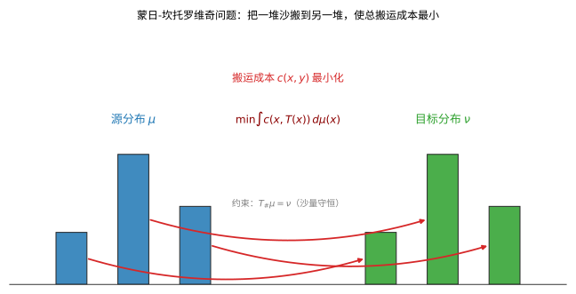

# 第 58 级：最优传输 (Optimal Transport)

> 最优传输理论研究在给定代价下将一种概率分布转换为另一种概率分布的最优方式。这一问题起源于 1781 年 Gaspard Monge 的"搬土问题"，并在 20 世纪由 Kantorovich 发展为线性规划框架。近年来，最优传输已成为数据科学、机器学习、图像处理、流体力学和几何分析等领域的重要工具。本课程将系统建立最优传输的理论基础，涵盖从 Monge 到 Wasserstein 空间的完整图景。

---

## 1. 学习目标

1. 理解 Monge 问题与 Kantorovich 问题的基本形式及其区别。
2. 掌握 Kantorovich 对偶性定理及其证明。
3. 理解 Brenier 定理的条件与结论，掌握最优传输映射的存在唯一性。
4. 掌握 Benamou-Brenier 动力学公式及其与 Wasserstein 度量之间的关系。
5. 理解 Wasserstein 空间的基本几何性质（测地线、凸性）。
6. 了解熵正则化与 Sinkhorn 算法在计算最优传输中的应用。
7. 掌握一维最优传输的显式公式以及高斯分布之间的 Wasserstein 距离。

---

## 2. 核心概念

### 2.1 Monge 问题

**定义 2.1**（Monge 问题）设 $X, Y \subseteq \mathbb{R}^n$ 是概率空间，$\mu \in \mathcal{P}(X)$，$\nu \in \mathcal{P}(Y)$ 是两个概率测度，$c: X \times Y \to \mathbb{R} \cup \{+\infty\}$ 是代价函数。Monge 问题为：
$$
\text{求可测映射 } T: X \to Y \text{ 满足 } T_\# \mu = \nu \text{，使得 } \int_X c(x, T(x)) \, d\mu(x) \text{ 最小化}.
$$
这里 $T_\# \mu$ 表示 $\mu$ 在 $T$ 下的推前测度（pushforward）：$(T_\# \mu)(A) = \mu(T^{-1}(A))$ 对任意 Borel 集 $A \subseteq Y$。

Monge 问题的难点在于：允许的映射 $T$ 必须满足非平凡的约束 $T_\# \mu = \nu$，且可行映射集可能为空集（例如 $\mu$ 是 Dirac 测度而 $\nu$ 不是时）。

### 2.2 Kantorovich 问题

**定义 2.2**（Kantorovich 问题）Kantorovich 将 Monge 问题松弛为运输计划（transport plan）的优化问题：
$$
\text{求 } \gamma \in \Pi(\mu, \nu) \text{ 使得 } \int_{X \times Y} c(x, y) \, d\gamma(x, y) \text{ 最小化},
$$
其中 $\Pi(\mu, \nu) = \{\gamma \in \mathcal{P}(X \times Y) \mid \pi_X^\# \gamma = \mu, \pi_Y^\# \gamma = \nu\}$ 是耦合（coupling）的集合，$\pi_X, \pi_Y$ 分别是到 $X$ 和 $Y$ 的投影。

Kantorovich 问题的优点是：$\Pi(\mu, \nu)$ 总是非空（包含乘积测度 $\mu \otimes \nu$），且是线性规划问题（目标函数是 $\gamma$ 的线性泛函，约束是线性的），因此具有良好的对偶理论。

直观上，最优传输问题好比"把一堆沙搬到另一堆"，在质量不丢失的前提下安排最优搬运方案，使总搬运成本最小：

> **直观理解（现实类比）**：就像把工地上的一堆沙子搬到另一处指定位置，要规划每铲沙的搬运路线，使所有人走的总路程最短。这里的"沙堆高低"代表概率质量，"搬运箭头"就是传输映射，目标是在不丢失任何沙子的前提下让总搬运成本最小。

### 2.3 Wasserstein 距离

**定义 2.3**（Wasserstein-$p$ 距离）设 $p \in [1, \infty)$，$\mu, \nu \in \mathcal{P}_p(\mathbb{R}^n)$（即具有有限 $p$ 阶矩的概率测度）。**Wasserstein-$p$ 距离** 定义为
$$
W_p(\mu, \nu) = \left( \inf_{\gamma \in \Pi(\mu, \nu)} \int_{\mathbb{R}^n \times \mathbb{R}^n} |x - y|^p \, d\gamma(x, y) \right)^{1/p}.
$$
特别地，$W_2$ 称为 **Wasserstein-$2$ 距离**，是最常用的版本。

> **直观理解（现实类比）**：最优传输就像**人口迁移规划**——假设中国的人口分布是 $\mu$（东部密集、西部稀疏），美国的人口分布是 $\nu$（沿海密集、中部稀疏）。如果要"把中国人搬到美国"，使搬运总成本（人口×距离）最小，最优传输映射 $T$ 告诉你每个中国人应该搬到美国哪里。Wasserstein 距离 $W_2(\mu,\nu)$ 则度量"这两个国家的人口分布差异有多大"——不是简单比较密度，而是计算"最少需要搬多远"。

**性质 2.4** $W_p$ 是 $\mathcal{P}_p(\mathbb{R}^n)$ 上的度量，满足对称性、三角不等式，且 $W_p(\mu, \nu) = 0$ 当且仅当 $\mu = \nu$。

$W_2$ 距离度量的是"把分布 $\mu$ 整体搬成分布 $\nu$ 需要搬多远"，是对两个概率分布之间差异的一种"土方"度量：

> **直观理解（现实类比）**：Wasserstein 距离衡量"把一座概率山 $\mu$ 整体搬成另一座概率山 $\nu$ 需要搬多远"。它不像逐点比较高度差那样只看局部，而是累计"土方量×搬运距离"的总工作量，因此在地震损毁评估中，用它衡量"把一片人口分布搬成另一片分布"的位移成本非常自然。

### 2.4 Kantorovich 对偶性

**定义 2.5**（Kantorovich 对偶问题）Kantorovich 问题的对偶问题为：
$$
\sup_{(\varphi, \psi) \in \Phi_c} \left( \int_X \varphi(x) \, d\mu(x) + \int_Y \psi(y) \, d\nu(y) \right),
$$
其中 $\Phi_c = \{(\varphi, \psi) \in L^1(\mu) \times L^1(\nu) \mid \varphi(x) + \psi(y) \le c(x, y), \forall (x, y) \in X \times Y\}$。

### 2.5 Monge-Ampère 方程

**定义 2.6**（Monge-Ampère 方程）当代价为欧氏距离平方 $c(x, y) = |x - y|^2/2$ 时，最优传输映射 $T = \nabla \phi$ 是一个凸函数 $\phi$ 的梯度，且 $\phi$ 满足 **Monge-Ampère 方程**：
$$
\det(D^2 \phi(x)) = \frac{\rho_\mu(x)}{\rho_\nu(\nabla \phi(x))},
$$
其中 $\rho_\mu$ 和 $\rho_\nu$ 分别是 $\mu$ 和 $\nu$ 的密度（假设绝对连续）。

### 2.6 Benamou-Brenier 公式

**定义 2.7**（Benamou-Brenier 动力学公式）Wasserstein-$2$ 距离可以表示为流体力学形式：
$$
W_2^2(\mu_0, \mu_1) = \inf_{(\rho, v)} \left\{ \int_0^1 \int_{\mathbb{R}^n} |v_t(x)|^2 \, d\rho_t(x) \, dt \right\},
$$
其中 $\rho_t$ 是概率密度（$\rho_0 = \mu_0$, $\rho_1 = \mu_1$），$v_t$ 是速度场，满足连续性方程 $\partial_t \rho_t + \nabla \cdot (\rho_t v_t) = 0$。

### 2.7 熵正则化与 Sinkhorn 算法

**定义 2.8**（熵正则化 Kantorovich 问题）加入熵正则化项后，Kantorovich 问题变为：
$$
\inf_{\gamma \in \Pi(\mu, \nu)} \left\{ \int c(x, y) \, d\gamma(x, y) + \varepsilon \operatorname{KL}(\gamma \| \mu \otimes \nu) \right\},
$$
其中 $\operatorname{KL}(\gamma \| \mu \otimes \nu) = \int \log \frac{d\gamma}{d(\mu \otimes \nu)} \, d\gamma$ 是 Kullback-Leibler 散度，$\varepsilon > 0$ 是正则化参数。

**Sinkhorn 算法**：正则化问题可通过 Sinkhorn 的矩阵缩放算法高效求解，迭代格式为
$$
a^{(k+1)} = \frac{\mu}{K b^{(k)}}, \quad b^{(k+1)} = \frac{\nu}{K^T a^{(k+1)}},
$$
其中 $K_{ij} = e^{-c(x_i, y_j)/\varepsilon}$。

---

## 3. 定理与证明

### 3.1 Kantorovich 对偶性定理

**定理 3.1**（Kantorovich 对偶性）设 $X, Y$ 是 Polish 空间（完备可分度量空间），$c: X \times Y \to \mathbb{R}$ 是下半连续且下有界的代价函数，$\mu \in \mathcal{P}(X)$，$\nu \in \mathcal{P}(Y)$。则
$$
\min_{\gamma \in \Pi(\mu, \nu)} \int_{X \times Y} c(x, y) \, d\gamma(x, y) = \sup_{(\varphi, \psi) \in \Phi_c} \left( \int_X \varphi(x) \, d\mu(x) + \int_Y \psi(y) \, d\nu(y) \right),
$$
其中 $\Phi_c = \{(\varphi, \psi) \in L^1(\mu) \times L^1(\nu) \mid \varphi(x) + \psi(y) \le c(x, y), \forall (x, y)\}$。若代价函数 $c$ 有界且连续，则上确界可达。

**证明**：证明使用 Fenchel-Rockafellar 对偶定理。

**第一步：问题重述。** 将 Kantorovich 问题视为线性规划问题。定义线性泛函
$$
\mathcal{L}(\gamma) = \int c \, d\gamma,
$$
约束为 $\gamma \in \Pi(\mu, \nu)$，即 $\gamma$ 的边缘分布分别为 $\mu$ 和 $\nu$。

**第二步：约束的 Lagrange 乘子表示。** 引入 Lagrange 乘子 $\varphi: X \to \mathbb{R}$ 和 $\psi: Y \to \mathbb{R}$，构造 Lagrange 函数
$$
L(\gamma, \varphi, \psi) = \int c \, d\gamma + \int \varphi(x) \, d\mu(x) - \int \varphi(x) \, d\gamma(x, y) + \int \psi(y) \, d\nu(y) - \int \psi(y) \, d\gamma(x, y).
$$
整理得
$$
L(\gamma, \varphi, \psi) = \int (c(x, y) - \varphi(x) - \psi(y)) \, d\gamma(x, y) + \int \varphi(x) \, d\mu(x) + \int \psi(y) \, d\nu(y).
$$

**第三步：鞍点问题。** 原始问题等价于
$$
\min_\gamma \max_{\varphi, \psi} L(\gamma, \varphi, \psi).
$$
交换 min 和 max（由凸分析中的 Min-Max 定理保证，因为 $\gamma$ 的约束集是凸紧的，且 $L$ 对 $\gamma$ 是线性/凸的，对 $(\varphi, \psi)$ 是凹的），得到对偶问题
$$
\max_{\varphi, \psi} \min_\gamma L(\gamma, \varphi, \psi).
$$

**第四步：内部最小化。** 对固定的 $(\varphi, \psi)$，关于 $\gamma$ 的最小化：
$$
\min_\gamma \int (c(x, y) - \varphi(x) - \psi(y)) \, d\gamma(x, y) + \int \varphi \, d\mu + \int \psi \, d\nu.
$$
若存在 $(x, y)$ 使得 $c(x, y) - \varphi(x) - \psi(y) < 0$，则可通过集中 $\gamma$ 于该点使目标趋于 $-\infty$。因此最小值有限当且仅当 $c(x, y) - \varphi(x) - \psi(y) \ge 0$ 对所有 $(x, y)$ 成立，即 $\varphi(x) + \psi(y) \le c(x, y)$。此时最小值在 $\gamma$ 集中支持于 $c - \varphi - \psi = 0$ 的集合上达到，且最小值为 $\int \varphi \, d\mu + \int \psi \, d\nu$。

**第五步：对偶问题。** 因此对偶问题为
$$
\sup_{(\varphi, \psi): \varphi(x) + \psi(y) \le c(x, y)} \left( \int \varphi \, d\mu + \int \psi \, d\nu \right).
$$
由线性规划强对偶定理（在适当条件下），原始问题与对偶问题的最优值相等。$\square$

### 3.2 Brenier 定理

**定理 3.2**（Brenier 定理）设 $\mu, \nu \in \mathcal{P}_2(\mathbb{R}^n)$，且 $\mu$ 关于 Lebesgue 测度绝对连续。则对代价函数 $c(x, y) = |x - y|^2/2$，Kantorovich 问题的最优解 $\gamma$ 是唯一的，并由某个映射 $T: \mathbb{R}^n \to \mathbb{R}^n$ 的图（graph）支撑：$\gamma = (\operatorname{id} \times T)_\# \mu$。此外，存在凸函数 $\phi: \mathbb{R}^n \to \mathbb{R}$ 使得 $T = \nabla \phi$，且 $\phi$ 是 Monge-Ampère 方程的解。

**证明**：证明分五步进行。

**第一步：对偶问题与 $c$-变换。** 对 $c(x, y) = |x - y|^2/2$，定义 $\varphi$ 的 $c$-变换为
$$
\varphi^c(y) = \inf_{x \in \mathbb{R}^n} (c(x, y) - \varphi(x)) = \inf_{x} \left( \frac{|x - y|^2}{2} - \varphi(x) \right).
$$
由 Kantorovich 对偶性，存在最优对 $(\varphi, \psi)$ 满足 $\psi = \varphi^c$ 且 $\varphi = \psi^c$。这样的函数称为 **$c$-凹函数**。

**第二步：$c$-凹函数的结构。** 对 $c(x, y) = |x - y|^2/2$，$c$-凹性等价于通常的凹性（经过变换）。具体地，令 $\phi(x) = \frac{|x|^2}{2} - \varphi(x)$，则 $\phi$ 是凸函数。此时
$$
\varphi(x) = \frac{|x|^2}{2} - \phi(x), \quad \psi(y) = \frac{|y|^2}{2} - \phi^*(y),
$$
其中 $\phi^*$ 是 $\phi$ 的 Legendre-Fenchel 变换：
$$
\phi^*(y) = \sup_{x \in \mathbb{R}^n} (\langle x, y \rangle - \phi(x)).
$$

**第三步：最优性条件。** 由对偶性，最优 $\gamma$ 满足
$$
\varphi(x) + \psi(y) = \frac{|x - y|^2}{2}, \quad \text{对 } \gamma\text{-a.e. } (x, y).
$$
代入 $\varphi$ 和 $\psi$ 的表达式：
$$
\frac{|x|^2}{2} - \phi(x) + \frac{|y|^2}{2} - \phi^*(y) = \frac{|x - y|^2}{2} = \frac{|x|^2}{2} + \frac{|y|^2}{2} - \langle x, y \rangle.
$$
化简得 $\phi(x) + \phi^*(y) = \langle x, y \rangle$。

**第四步：识别映射。** 由凸分析，$\phi(x) + \phi^*(y) = \langle x, y \rangle$ 当且仅当 $y \in \partial \phi(x)$（即 $y$ 属于 $\phi$ 在 $x$ 处的次微分）。由于 $\mu$ 绝对连续，$\phi$ 是 $\mu$-a.e. 可微的，因此 $\partial \phi(x) = \{\nabla \phi(x)\}$。故存在映射 $T(x) = \nabla \phi(x)$ 使得 $\gamma$ 由 $T$ 的图支撑。

**第五步：验证推前条件。** 由 $\gamma \in \Pi(\mu, \nu)$ 得 $T_\# \mu = \nu$。唯一性源于 $\phi$ 的唯一性（在加法常数意义下）。$\square$

**推论 3.3**（最优传输映射的存在唯一性）在 Brenier 定理的条件下，存在唯一的 $W_2$-最优传输映射 $T = \nabla \phi$，其中 $\phi$ 是凸函数。

### 3.3 Benamou-Brenier 公式

**定理 3.4**（Benamou-Brenier 公式）设 $\mu_0, \mu_1 \in \mathcal{P}_2(\mathbb{R}^n)$。则
$$
W_2^2(\mu_0, \mu_1) = \inf \left\{ \int_0^1 \int_{\mathbb{R}^n} |v_t(x)|^2 \, d\rho_t(x) \, dt \right\},
$$
其中下确界取遍所有满足连续性方程 $\partial_t \rho_t + \nabla \cdot (\rho_t v_t) = 0$ 的曲线 $(\rho_t, v_t)$，且 $\rho_0 = \mu_0$，$\rho_1 = \mu_1$。

**证明**：证明建立 Wasserstein 距离与最小作用原理之间的联系。

**第一步：回到 Monge 问题。** 设 $T$ 是 $\mu_0$ 到 $\mu_1$ 的最优传输映射（由 Brenier 定理，$T = \nabla \phi$ 是凸函数的梯度）。定义插值曲线
$$
\rho_t = (T_t)_\# \mu_0, \quad T_t(x) = (1 - t)x + t T(x).
$$
由于 $T$ 是凸函数的梯度，$T_t$ 是单调算子，从而 $\rho_t$ 是 Wasserstein 测地线。

**第二步：速度场的构造。** 定义速度场 $v_t$ 通过
$$
v_t(T_t(x)) = \frac{d}{dt} T_t(x) = T(x) - x.
$$
则 $(\rho_t, v_t)$ 满足连续性方程，且
$$
\int_0^1 \int |v_t|^2 \, d\rho_t \, dt = \int_0^1 \int |T(x) - x|^2 \, d\mu_0(x) \, dt = \int |T(x) - x|^2 \, d\mu_0(x) = W_2^2(\mu_0, \mu_1).
$$

**第三步：下界。** 对任意满足连续性方程的 $(\rho_t, v_t)$，由 Cauchy-Schwarz 不等式和 Jensen 不等式可证
$$
W_2^2(\mu_0, \mu_1) \le \int_0^1 \int |v_t(x)|^2 \, d\rho_t(x) \, dt.
$$
因此由 $T$ 构造的曲线达到下确界。$\square$

**意义**：Benamou-Brenier 公式将 Wasserstein 距离重新解释为连续性方程约束下的最小作用量问题，为数值计算最优传输提供了流体力学框架，也是理解 Wasserstein 空间几何的关键。

### 3.4 Wasserstein 距离的测地线凸性

**定理 3.5**（Wasserstein 空间的测地线凸性）Wasserstein 空间 $(\mathcal{P}_2(\mathbb{R}^n), W_2)$ 是长度空间，其测地线由 McCann 插值给出：
$$
\mu_t = ((1 - t)\operatorname{id} + t T)_\# \mu_0, \quad t \in [0, 1],
$$
其中 $T$ 是 $\mu_0$ 到 $\mu_1$ 的最优传输映射。此外，$W_2$ 沿测地线是凸的：对任意 $\mu_0, \mu_1, \nu$，
$$
W_2^2(\mu_t, \nu) \le (1 - t) W_2^2(\mu_0, \nu) + t W_2^2(\mu_1, \nu) - t(1 - t) W_2^2(\mu_0, \mu_1).
$$

**证明概要**：

**第一步：测地线的存在性。** 由 Brenier 定理，存在凸函数 $\phi$ 使 $T = \nabla \phi$ 是最优传输映射。定义 $T_t(x) = (1 - t)x + t \nabla \phi(x)$，则 $\mu_t = (T_t)_\# \mu_0$ 是连接 $\mu_0$ 和 $\mu_1$ 的 $W_2$-测地线。

**第二步：凸性证明。** 对固定的 $\nu$，设 $S$ 是 $\mu_0$ 到 $\nu$ 的最优传输映射，$S'$ 是 $\mu_1$ 到 $\nu$ 的最优传输映射。利用 $T_t$ 的线性插值结构和凸函数 $\phi$ 的性质，通过分析不等式可证得上述凸性不等式。$\square$

---

## 4. 示例

### 4.1 一维最优传输

**例 4.1** 设 $\mu, \nu$ 是 $\mathbb{R}$ 上的概率测度，$F_\mu$ 和 $F_\nu$ 分别是它们的累积分布函数（CDF）。对代价函数 $c(x, y) = |x - y|^p$（$p \ge 1$），最优传输映射由分位数函数给出：
$$
T(x) = F_\nu^{-1}(F_\mu(x)).
$$
Wasserstein-$p$ 距离为
$$
W_p^p(\mu, \nu) = \int_0^1 |F_\mu^{-1}(t) - F_\nu^{-1}(t)|^p \, dt.
$$

**特别地**，若 $\mu = \mathcal{N}(m_1, \sigma_1^2)$，$\nu = \mathcal{N}(m_2, \sigma_2^2)$ 是高斯分布，则
$$
F_\mu^{-1}(t) = m_1 + \sigma_1 \Phi^{-1}(t), \quad F_\nu^{-1}(t) = m_2 + \sigma_2 \Phi^{-1}(t),
$$
其中 $\Phi$ 是标准正态的 CDF。因此
$$
W_2^2(\mu, \nu) = \int_0^1 |(m_1 - m_2) + (\sigma_1 - \sigma_2) \Phi^{-1}(t)|^2 \, dt = (m_1 - m_2)^2 + (\sigma_1 - \sigma_2)^2.
$$

### 4.2 高斯分布之间的 Wasserstein 距离

**例 4.2** 设 $\mu = \mathcal{N}(m_1, \Sigma_1)$ 和 $\nu = \mathcal{N}(m_2, \Sigma_2)$ 是 $\mathbb{R}^n$ 上的高斯分布，$\Sigma_1, \Sigma_2$ 是对称正定矩阵。则 $W_2$ 距离有闭式公式：
$$
W_2^2(\mu, \nu) = |m_1 - m_2|^2 + \operatorname{tr}\left( \Sigma_1 + \Sigma_2 - 2 (\Sigma_1^{1/2} \Sigma_2 \Sigma_1^{1/2})^{1/2} \right).
$$

**推导概要**：最优传输映射 $T$ 是线性的：$T(x) = A x + b$，其中 $A = \Sigma_1^{-1/2} (\Sigma_1^{1/2} \Sigma_2 \Sigma_1^{1/2})^{1/2} \Sigma_1^{-1/2}$，$b = m_2 - A m_1$。验证 $T$ 是凸函数 $\phi(x) = \frac{1}{2} x^T A x + b^T x$ 的梯度，且 $T_\# \mu = \nu$。代入 $W_2$ 公式即得。

**例 4.3** 当 $\Sigma_1 = \sigma_1^2 I$，$\Sigma_2 = \sigma_2^2 I$ 时，上述公式简化为
$$
W_2^2(\mu, \nu) = |m_1 - m_2|^2 + n(\sigma_1 - \sigma_2)^2.
$$

### 4.3 一维离散最优传输

**例 4.4** 设 $\mu = \frac{1}{n} \sum_{i=1}^n \delta_{x_i}$，$\nu = \frac{1}{n} \sum_{j=1}^n \delta_{y_j}$ 是均匀离散分布。则最优传输映射将 $x_i$ 排序后一一对应到 $y_j$：
$$
T(x_{(i)}) = y_{(i)},
$$
其中 $x_{(1)} \le \cdots \le x_{(n)}$ 和 $y_{(1)} \le \cdots \le y_{(n)}$ 是排序后的样本点。$W_2^2(\mu, \nu) = \frac{1}{n} \sum_{i=1}^n (x_{(i)} - y_{(i)})^2$。

---

## 5. 习题

### 基础题

**习题 1**（Monge 问题）写出 Monge 问题的数学形式：设 $\mu \in \mathcal{P}(X)$，$\nu \in \mathcal{P}(Y)$，代价函数 $c: X \times Y \to \mathbb{R} \cup \{+\infty\}$。Monge 问题求什么？

**习题 2**（Monge 问题）解释记号 $T_\# \mu$：设 $T: X \to Y$ 是可测映射，对 Borel 集 $A \subseteq Y$，写出 $T_\# \mu$ 的定义，并说明它表示什么。

**习题 3**（Monge 问题）为什么说 Monge 问题的可行映射集可能为空？举一个 $\mu = \delta_a$ 而 $\nu$ 不是 Dirac 测度的例子，说明不存在 $T$ 使 $T_\#\mu = \nu$。

**习题 4**（Kantorovich 问题）写出 Kantorovich 问题：在耦合集合 $\Pi(\mu, \nu)$ 上最小化哪个目标泛函？

**习题 5**（传输计划与耦合测度）定义耦合集合 $\Pi(\mu, \nu) = \{\gamma \in \mathcal{P}(X \times Y) \mid \pi_X^\# \gamma = \mu,\ \pi_Y^\# \gamma = \nu\}$。说明 $\pi_X^\#\gamma = \mu$ 的含义。

**习题 6**（传输计划与耦合测度）证明 $\Pi(\mu, \nu)$ 总是非空的，并指出一个显式的耦合。

**习题 7**（Kantorovich 问题）Kantorovich 问题为何可以看作线性规划？指出目标函数和约束的线性性质。

**习题 8**（Wasserstein 距离）写出 $W_p(\mu, \nu)$ 的积分定义，并说明 $W_2$ 与平方代价直接求根之间的关系。

**习题 9**（Wasserstein 距离）验证 $W_p(\mu,\mu) = 0$，并说明 $W_p(\mu,\nu)=0$ 蕴含 $\mu = \nu$。

**习题 10**（Wasserstein 距离）若 $\mu = \delta_a$，$\nu = \delta_b$，计算 $W_2(\mu, \nu)$。

**习题 11**（一维最优传输）设 $F_\mu, F_\nu$ 是 $\mathbb{R}$ 上测度的 CDF，写出 $\mathbb{R}$ 上 $c(x,y)=|x-y|^p$ 的最优传输映射公式。

**习题 12**（一维最优传输）基于分位数映射，写出 $W_p^p(\mu,\nu)$ 的一维积分表达式。

**习题 13**（一维最优传输）设 $\mu = \mathcal{N}(m_1, \sigma_1^2)$，$\nu = \mathcal{N}(m_2, \sigma_2^2)$，写出它们之间 $W_2^2$ 的一维公式。

**习题 14**（高斯分布间距离）写出 $\mathbb{R}^n$ 上两个高斯分布 $\mathcal{N}(m_1,\Sigma_1)$、$\mathcal{N}(m_2,\Sigma_2)$ 之间 $W_2^2$ 的闭式公式。

**习题 15**（高斯分布间距离）若 $\Sigma_1 = \sigma_1^2 I$，$\Sigma_2 = \sigma_2^2 I$，写出 $W_2^2$ 的简化表达式。

**习题 16**（Kantorovich 对偶）写出 Kantorovich 对偶问题的上确界形式及容许势函数集 $\Phi_c$ 的空间。

**习题 17**（Kantorovich 对偶）说明对偶问题中约束 $\varphi(x)+\psi(y)\le c(x,y)$ 的意义。

**习题 18**（凸函数与次梯度）定义凸函数 $f: \mathbb{R}^n \to \mathbb{R} \cup \{+\infty\}$ 在点 $x$ 处的次梯度集 $\partial f(x)$。

**习题 19**（凸函数与次梯度）证明若 $f$ 在 $x_0$ 处可微，则 $\partial f(x_0) = \{\nabla f(x_0)\}$。

**习题 20**（凸函数与次梯度）设 $f(x) = |x|$（$\mathbb{R}$ 上），求 $\partial f(0)$。

**习题 21**（凸函数与次梯度）设 $f(x) = |x|^2/2$，求 $\partial f(x)$ 对所有 $x$ 的值。

**习题 22**（凸函数与次梯度）写出 Legendre-Fenchel 共轭 $\phi^*(y) = \sup_x \langle x, y\rangle - \phi(x)$，并解释 $\phi^{**} = \phi$（当 $\phi$ 凸下半连续时）。

**习题 23**（Brenier 定理）陈述 Brenier 定理：在平方代价 $c=|x-y|^2/2$ 和 $\mu$ 绝对连续条件下，最优传输映射 $T$ 具有什么形式？

**习题 24**（Brenier 定理）Brenier 定理中最优传输映射 $T = \nabla \phi$，其中 $\phi$ 满足什么条件（凸）？$T_\#\mu$ 等于什么？

**习题 25**（Brenier 定理）说明 Brenier 定理提供的映射在什么意义下是唯一的。

**习题 26**（Monge-Ampère 方程）写出平方代价下凸势函数 $\phi$ 满足的 Monge-Ampère 方程形式。

**习题 27**（Monge 与 Kantorovich）当一个 Dirac 转到另一个 Dirac 时，比较 Monge 解与 Kantorovich 解的数量。

**习题 28**（Fermat-Torricelli）表述 Fermat-Torricelli 问题：在平面中给定三点求使距离和最小的点，并说明其与最优传输的联系。

**习题 29**（多面体重构）简述"多面体重构"问题：给定上界凸函数的脸（法向与支撑值），如何重构凸多面体。

**习题 30**（半离散最优传输）解释"半离散最优传输"中 $\mu$ 离散、$\nu$ 绝对连续的含义，此时最优传输计划呈现何种结构？

**习题 31**（Wasserstein 测地线）写出由最优传输映射 $T$ 诱导的常量速度测地线 $\mu_t$ 的 McCann 插值式。

**习题 32**（Wasserstein 几何）说明 $(\mathcal{P}_2(\mathbb{R}^n), W_2)$ 沿测地线与常数 $\nu$ 的平方距离满足什么凸性不等式（写出不等式形式即可）。

**习题 33**（梯度流）写出连续性方程 $\partial_t \rho + \nabla\cdot(\rho v)=0$，并解释其质量守恒含义。

**习题 34**（JKO 梯度流）写出 Jordan-Kinderlehrer-Otto 时间步离散格式（JKO scheme）的极小化形式。

**习题 35**（McCann 插值）说明 $T_t(x) = (1-t)x + tT(x)$ 为何是 $T=\nabla\phi$（凸梯度）下的线性插值，并指出 $\mu_t$ 满足的性质。

**习题 36**（均衡与 c-凹）定义 $c$-变换 $\varphi^c(y) = \inf_x (c(x,y)-\varphi(x))$，并解释 $c$-凹函数的含义。

**习题 37**（均衡与 c-凹）证明对任意 $\varphi$ 有 $\varphi^{cc} \le \varphi$。

**习题 38**（最优性条件）说明对偶最优解下最优耦合 $\gamma$ 支撑于集合 $c(x,y)-\varphi(x)-\psi(y)=0$ 的含义。

**习题 39**（Kantorovich 对偶）写出代价 $c=|x-y|$ 时的 Kantorovich-Rubinstein 对偶公式（$W_1$）。

**习题 40**（符号）说明推前记号 $(\operatorname{id}\times T)_\#\mu$ 表示什么测度。

**习题 41**（耦合测度）设 $\mu=\frac12\delta_0+\frac12\delta_1$ 与 $\nu=\delta_0$，写出 $\Pi(\mu,\nu)$ 中唯一的耦合。

**习题 42**（耦合测度）一个耦合 $\gamma\in\Pi(\mu,\nu)$ 的取值 $\gamma(A\times B)$ 可否解释为"从 $A$ 运到 $B$ 的质量"？说明理由。

**习题 43**（Wasserstein 距离）设 $\mu=\delta_0$，$\nu=\frac12\delta_0+\frac12\delta_1$，计算 $W_1(\mu,\nu)$。

**习题 44**（Wasserstein 距离）利用一维公式计算 $\delta_0$ 与 $\delta_a$ 之间的 $W_2$，并比较与 $W_1$ 的结果。

**习题 45**（一维最优传输）设 $\mu=\operatorname{Unif}[0,1]$，$\nu=\operatorname{Unif}[2,3]$，求基于分位数映射的最优传输映射 $T(x)$。

**习题 46**（一维最优传输）在同上分布下计算 $W_2^2(\mu,\nu)$。

**习题 47**（一维最优传输）设 $F_\mu(t)=t$，$F_\nu(t)=t^2$ 在 $[0,1]$ 上，写出二者最优映射并求 $W_2^2$ 的积分式。

**习题 48**（凸函数与次梯度）判断 $f(x)=x^2$ 在 $x=0$ 是否可微，并求 $\partial f(0)$。

**习题 49**（凸函数与次梯度）求 $g(x)=|x|^2$ 的次梯度 $\partial g(0)$。

**习题 50**（凸函数与次梯度）对凸函数 $h(x)=\max\{0, x\}$ 求 $\partial h(0)$。

**习题 51**（凸函数与次梯度）说明 Fenchel-Young 不等式 $\phi(x)+\phi^*(y)\ge \langle x,y\rangle$ 及其等号条件。

**习题 52**（Brenier 定理）设 $\mu$ 均匀于 $[0,1]$，$\nu$ 均匀于 $[1,3]$，求平方代价最优传输映射 $T$（用一维分位数）。

**习题 53**（Brenier 定理）说明凸势函数 $\phi$ 梯度 $\nabla\phi$ 的单调性：$\langle \nabla\phi(x)-\nabla\phi(y), x-y\rangle\ge0$。

**习题 54**（Monge-Ampère 方程）当 $\phi$ 二次凸函数 $\phi(x)=\frac12 x^TAx$（$A$ 对称正定）时，写出行列式 $\det D^2\phi$。

**习题 55**（Monge 与 Kantorovich）论证 Kantorovich 问题是 Monge 问题的松弛：每个 Monge 映射对应一个耦合，反之不一定。

**习题 56**（Monge 与 Kantorovich）当 $\mu$ 绝对连续时，Kantorovich 最优解与 Monge 最优映射的关系是什么？

**习题 57**（Wasserstein 距离）判别对称性：$W_p(\mu,\nu)=W_p(\nu,\mu)$ 是否成立？说明理由。

**习题 58**（Wasserstein 距离）若 $\lambda>0$，说明 $W_2^2$ 关于整体平移的不变性：$W_2^2(T_a\#\mu, T_a\#\nu)=W_2^2(\mu,\nu)$。

**习题 59**（Wasserstein 距离）计算 $\mu=\delta_0$ 到 $\nu=\frac{1}{2}\delta_{-1}+\frac{1}{2}\delta_{1}$ 的 $W_1$ 与 $W_2$。

**习题 60**（一维最优传输）证明一维单调重排 $T=F_\nu^{-1}\circ F_\mu$ 满足推前条件 $T_\#\mu=\nu$。

**习题 61**（半离散最优传输）解释半离散问题中每个离散点配一个"山谷"（Laguerre cell）的结构。

**习题 62**（多面体重构）说明凸多面体可被其支撑函数 $h_K(u)=\sup_{x\in K}\langle x,u\rangle$ 完全刻画。

**习题 63**（Fermat-Torricelli）写出平面 Fermat-Torricelli 点的变分欧拉条件（关于 $\partial|x-a|$）。

**习题 64**（Fermat-Torricelli）若三点共线且 $b$ 在 $a,c$ 之间，Fermat-Torricelli 点是什么？

**习题 65**（凸函数与次梯度）求 $f(x,y)=|x|+|y|$ 在 $(0,0)$ 的次梯度集。

**习题 66**（凸函数与次梯度）对指示函数 $I_K(x)$（$K$ 凸闭集），求 $\partial I_K(x_0)$（含 $x_0\in K$ 情形）。

**习题 67**（凸函数与次梯度）说明范数函数 $x\mapsto\|x\|$ 的次梯度在 $x=0$ 是闭单位球。

**习题 68**（Wasserstein 测地线）写出连接 $\delta_0$ 与 $\delta_1$ 的 $W_2$ 测地线 $\mu_t$ 及其含义。

**习题 69**（Wasserstein 测地线）对 $\mu_0=\delta_0$，$\mu_1=\delta_2$，写出 $\mu_{1/2}$。

**习题 70**（梯度流）说明 Wasserstein 距离下能量泛函沿梯度流递减的印象性。

**习题 71**（JKO 梯度流）写出 JKO 单步：给定 $\rho^{n-1}$，$\rho^n$ 是某个极小化问题的解，写出该问题。

**习题 72**（McCann 插值）对位移 $\mu=(1-s)\delta_0+s\delta_1$，说明 $\rho_t$ 位移的线性缩放。

**习题 73**（均衡与 c-凹）写出 $\varphi^c$ 作为关于 $y$ 的函数的定义并说明其 $c$-凹性。

**习题 74**（均衡与 c-凹）当 $c(x,y)=-x\cdot y$（负内积）时，说明 $c$-凹与通常凹函数的关系：$-\varphi$ 为凸。

**习题 75**（Kantorovich 对偶）把对偶目标写成 $c$-变换形式：$\sup_\varphi \int\varphi\,d\mu + \int\varphi^c\,d\nu$。

**习题 76**（Kantorovich 对偶）说明上确界为何可取为 $c$-凹势函数对。

**习题 77**（最优性条件）若 $\varphi,\psi$ 最优且 $\varphi(x)+\psi(y)=c(x,y)$ 对某 $(x,y)$ 成立，说明 $x$ 被运到 $y$ 对最优传输 s.t. 可行。

**习题 78**（凸函数与次梯度）凸函数 $f$ 在 $x$ 处取最小值当且仅当 $0\in\partial f(x)$。证明之。

**习题 79**（凸函数与次梯度）用次梯度条件重述：$\phi$ 取最小值当且仅当 $0$ 属于次梯度。

**习题 80**（Wasserstein 距离）说明 $W_2^2$ 可表示为进化的两次近似补选项。

**习题 81**（耦合测度）设 $X=\{x_1,x_2\}$，$Y=\{y_1,y_2\}$，$\mu$ 均匀、$\nu$ 均匀，写出一个行列式非退化的耦合矩阵。

**习题 82**（耦合测度）验证乘积测度 $\mu\otimes\nu$ 的边缘分布恰为 $\mu$ 与 $\nu$。

**习题 83**（Monge 问题）说明 Monge 问题目标 $\int_X c(x,T(x))\,d\mu(x)$ 的直观"每铲沙搬运成本"含义。

**习题 84**（Monge 问题）给出 Monge 问题无解而 Kantorovich 有解的典型场景（如 $\mu$ Dirac、$\nu$ 连续）。

**习题 85**（Brenier 定理）平方代价下最优映射 $T=\nabla\phi$ 刻画了"梯度"式位移，说明 $T$ 无旋（curl-free）含义。

**习题 86**（Brenier 定理）当 $\mu=\delta_a$ 时 Brenier 结论为何不直接适用？指出 $\mu$ 绝对连续的必要性。

**习题 87**（Monge-Ampère 方程）说明 Monge-Ampère 方程联系两个密度与梯度 Jacobian：$\rho_\nu(T(x))\det D^2\phi=\rho_\mu$。

**习题 88**（高斯分布间距离）当 $\Sigma_1=\Sigma_2=\Sigma$ 时，证明 $W_2^2=|m_1-m_2|^2$。

**习题 89**（高斯分布间距离）当 $m_1=m_2$ 时，说明 $W_2^2=\operatorname{tr}(\Sigma_1+\Sigma_2-2(\Sigma_1^{1/2}\Sigma_2\Sigma_1^{1/2})^{1/2})$ 退化情形。

**习题 90**（一维最优传输）设两个点质量 $\frac12\delta_0+\frac12\delta_2\to\frac12\delta_1+\frac12\delta_2$，用排序映射求 $W_2$。

**习题 91**（Kantorovich 对偶）说明 $c=|x-y|$ 时势函数可取 1-Lipschitz，从而对偶退化为 Kantorovich-Rubinstein。

**习题 92**（Kantorovich 对偶）举例说明对偶问题解不唯一（加常数不改变目标）。

**习题 93**（凸函数与次梯度）求 $f(x)=e^x$ 在 $x=0$ 的次梯度。

**习题 94**（凸函数与次梯度）求 $\log$-凹密度对数势的次梯度正则性的一种表述。

**习题 95**（均衡与 c-凹）写出 $\psi$ 的反 $c$-变换 $\psi^{c}$ 对称定义，说明 $c$-凹函数的自反性 $\varphi=\varphi^{cc}$。

**习题 96**（Wasserstein 测地线）说明 $W_2$ 测地线 $\mu_t$ 满足 $W_2(\mu_s,\mu_t)=(t-s)W_2(\mu_0,\mu_1)$ 对 $0\le s\le t\le 1$。

**习题 97**（梯度流）写出一维平方对数密度的连续性方程并结合 JKO 说明其是 Fokker-Planck 的半离散。

**习题 98**（JKO 梯度流）说明 JKO 格式的极限（当时间步 $\tau\to 0$）给出 Wasserstein 梯度流。

**习题 99**（多面体重构）解释支撑函数与凸多面体顶点的对偶（极点）表示。

**习题 100**（Fermat-Torricelli）写出三维 Fermat 问题的最小化泛函并给出欧拉条件函数。

### 进阶题

**习题 101**（Wasserstein 几何）用粘合引理证明 $W_p$ 满足三角不等式（写出三步思路）。

**习题 102**（对偶理论）证明对代价 $c=|x-y|$，任一 1-Lipschitz $f$ 满足 $f^c=-f$ 恒成立。

**习题 103**（对偶理论）由此推导 $W_1(\mu,\nu)=\sup_{\|f\|_{\text{Lip}}\le1}(\int f\,d\mu-\int f\,d\nu)$。

**习题 104**（耦合测度）设 $\mu,\nu$ 离散均匀，证明存在一个置换型耦合的 $W_1$ 由元素一对一的逐点运抵实现。

**习题 105**（一维最优传输）证明对任意 $p\ge1$，$\mathbb{R}$ 上最优映射 $T=F_\nu^{-1}\circ F_\mu$ 是保序（单调不减）映射。

**习题 106**（一维最优传输）用分位数公式推导 $\mu=\mathcal{N}(0,1)$ 到 $\nu=\mathcal{N}(a,\sigma^2)$ 的 $W_2^2$。

**习题 107**（Kantorovich 对偶）对二次代价 $|x-y|^2/2$ 建立 $\varphi$ 与凸势 $\phi=|x|^2/2-\varphi$ 的联系。

**习题 108**（凸函数与次梯度）证明凸函数梯度单调：对凸 $f$，$\langle\nabla f(x)-\nabla f(y),x-y\rangle\ge0$。

**习题 109**（Brenier 定理）用 Fenchel-Young 恒等式证明：$\phi(x)+\phi^*(y)=\langle x,y\rangle$ 当且仅当 $y\in\partial\phi(x)$。

**习题 110**（Brenier 定理）由 $\varphi+\psi=|x-y|^2/2$ 恒等式推导 $\phi(x)+\phi^*(y)=\langle x,y\rangle$。

**习题 111**（半离散最优传输）对离散 $\mu=\{p_i\}$、连续 $\nu$，写出 Laguerre cell 定义及推前约束求和条件。

**习题 112**（半离散最优传输）说明半离散问题关于势向量 $\psi$ 的梯度是质量差 $m_i$。

**习题 113**（多面体重构）证明凸集 $K$ 的支撑函数 $h_K$ 是凸函数且一次齐次。

**习题 114**（多面体重构）说明由支撑函数重构多面体即求极点的凸包。

**习题 115**（Fermat-Torricelli）推导平面 Fermat-Torricelli 点的次梯度条件 $0\in\sum\partial|x-a_i|$。

**习题 116**（Fermat-Torricelli）三点共线退化情形下证明中点为 Fermat 点时的条件。

**习题 117**（Wasserstein 梯度）用 Kantorovich 对偶验证最优势差是势函数的并：$c$-凹对满足互补松弛。

**习题 118**（均衡与 c-凹）证明 $\varphi^{cc}$ 是 $\le\varphi$ 且最大的 $c$-凹函数，$\varphi^{cc}\ge\varphi^c$ 未必成立但 $\varphi^{ccc}=\varphi^c$。

**习题 119**（Wasserstein 测地线）证明测地线 $\mu_t$ 满足线性缩放 $W_2(\mu_0,\mu_t)=t W_2(\mu_0,\mu_1)$。

**习题 120**（Wasserstein 测地线）写出位移插值下密度变换 Jacobian 的公式并用于均匀分布测地线。

**习题 121**（JKO 梯度流）对能量 $\int \rho\log\rho$，写出 JKO 一步目标：熵 Wasserstein 意义下的显式逼近。

**习题 122**（梯度流）说明 Ginzburg-Landau 或热方程是 $W_2$ 下的梯度流，写出对应能量。

**习题 123**（梯度流）推导 Fokker-Planck 能量 $\int(\rho\log\rho+V\rho)$ 的 Wasserstein 梯度流方程。

**习题 124**（凸函数与次梯度）利用凸性证明 Jensen 不等式 $\phi(\mathbb{E}X)\le\mathbb{E}\phi(X)$。

**习题 125**（凸函数与次梯度）用对偶刻画凸函数共轭的可加性（若 $\phi,\psi$ 凸，$(\phi+\psi)^*\le\phi^*\Box\psi^*$）。

**习题 126**（对偶理论）用 Fenchel-Rockafellar 重述 Kantorovich 对偶的主步骤：约束在线性泛函的同态。

**习题 127**（对偶理论）写出对偶问题的强对偶条件（$c$ 下有界、Polish 空间）并说明上确界可达。

**习题 128**（高斯间距离）证明一维高斯 $W_2^2=(m_1-m_2)^2+(\sigma_1-\sigma_2)^2$ 用分位数积分。

**习题 129**（Wasserstein 距离）证明 $W_p$ 关于 $p$ 的单调：$W_1\le W_2$（用 Jensen 处理）。

**习题 130**（Wasserstein 距离）对 $1\le p\le q$ 证明 $W_p(\mu,\nu)\le W_q(\mu,\nu)$（限于有界支集）。

**习题 131**（最优传输映射）由凸势 $\phi$ 的水平超平面法向构造 $T$，说明 map 是"梯度流"型。

**习题 132**（Brenier 定理）说明唯一性证明中的加法常数自由度：$\phi\to\phi+\text{const}$ 不改变 $T$。

**习题 133**（Monge-Ampère 方程）验证二次凸势 $\phi(x)=\frac12 x^TAx$ 在均匀到均匀时的 Monge-Ampère 解。

**习题 134**（半离散最优传输）推导势梯度等于质量差：$\frac{\partial\mathcal{E}}{\partial\psi_i}=m_i-p_i$。

**习题 135**（多面体重构）用对偶公式给出多面体 $P$ 的重构：$P=\{x:\langle x,u_j\rangle\le h_j\}$ 与凸包交集。

**习题 136**（Fermat-Torricelli）写出凸组合最优：存在 $\lambda_i\ge0,\sum\lambda_i=1$ 使 $\sum\lambda_i\frac{x-a_i}{|x-a_i|}=0$ 在非退化 Fermat 点。

**习题 137**（对偶理论）证明 Kantorovich 对偶与最小成本运输等价，用线性规划的强对偶。

**习题 138**（耦合测度）证明若 $\gamma$ 由映射 $T$ 生成则 $\operatorname{spt}\gamma\subseteq\operatorname{graph}(T)$，反之真传递。

**习题 139**（一维最优传输）说明在 $\mathbb{R}$（测度绝对连续）上最优计划是连通的"单调耦合"（无相交）。

**习题 140**（一维最优传输）证明排序映射给出 $\mathbb{R}$ 上 $W_2$ 唯一的最优传输计划。

**习题 141**（均衡与 c-凹）证明 $\varphi^{cc}\le\varphi$ 且等号当且仅当 $\varphi$ 本身 $c$-凹。

**习题 142**（Wasserstein 测地线）证明位移 $\mu_t=(x+t(x'))\#\mu_0$ 自动为测地线沿直位移。

**习题 143**（Wasserstein 几何）证明 $\mathcal{P}_2$ 上 $W_2$ 测地线凸性不等式可推出凸函数的梯度插值保距离。

**习题 144**（梯度流）证明熵 $S=-\int\rho\log\rho$ 沿 Fokker-Planck 流的递增（用对数 Sobolev）。

**习题 145**（JKO 梯度流）说明 JKO 每一步等价于 Wasserstein 上预测-校正的隐式欧拉。

**习题 146**（McCann 插值）推导沿位移 $T_t=(1-t)\mathrm{id}+tT$，密度 $\rho_t$ 满足的连续性方程。

**习题 147**（梯度流）说明热方程 $\partial_t\rho=\Delta\rho$ 是熵的 $W_2$ 梯度流。

**习题 148**（对偶理论）写出二次代价对偶势的可达性并给出势函数的正则性条件（BCP 类）。

**习题 149**（Brenier 定理）证明：若 $T_1,T_2$ 均为最优传输且 $\mu$ 绝对连续，则 $T_1=T_2$ $\mu$-a.e.。

**习题 150**（半离散最优传输）说明半离散 Kantorovich 对偶势的不可微点对应细胞边界。

**习题 151**（多面体重构）用支撑函数写出对偶凸多面体的顶点公式。

**习题 152**（Fermat-Torricelli）在加权 Fermat 问题 $\sum\lambda_i|x-a_i|$ 下写出平衡条件。

**习题 153**（Wasserstein 距离）证明对均匀测度区间平移的 $W_2$ 等于平移距离。

**习题 154**（Wasserstein 距离）对 $\mu=\mathrm{Unif}[0,2]$、$\nu=\mathrm{Unif}[1,2]$ 求 $W_2^2$（用一维公式）。

**习题 155**（最优传输映射）说明最优映射 $T$ 的 Jacobian $DT$ 对称半正定（$\phi$ 的衰退凸正则化）。

**习题 156**（凸函数与次梯度）证明凸函数处处具有非空次梯度（内部点）。

**习题 157**（凸函数与次梯度）证明凸有限函数的次梯度集是闭凸集。

**习题 158**（耦合测度）证明：若代价可测下有界，则 Kantorovich 最优存在性由紧性（Prokhorov）保证。

**习题 159**（对偶理论）写出弱成本型 $c$-变换在可达性精化（加同余）下的校验。

**习题 160**（一维最优传输）对 $\mu=\frac12\delta_0+\frac12\delta_1$、$\nu=\frac12\delta_1+\frac12\delta_2$ 用排序算 $W_2$ 与最优计划。

**习题 161**（半离散最优传输）说明半离散势 $\psi$ 是凹的凸函数的离散化：Laguerre 丛（凸）。

**习题 162**（多面体重构）给定支撑平面集重构多面体等价于求解线性规划的唯一极值。

**习题 163**（Fermat-Torricelli）在 $[0,1]$ 上一位 Fermat 点当权重不等时取中位数/分位数。

**习题 164**（梯度流）写出渗流/吸引势的 Wasserstein 梯度流能量并求欧拉-拉格朗日。

**习题 165**（JKO 梯度流）证明 JKO 双边量（半离散）每步耗散能量 $E(\rho^{n})\le E(\rho^{n-1})$。

**习题 166**（Wasserstein 几何）说明 $W_2$ 测地线凸性与 $\mathcal{P}_2$ 非负截面曲率（RIC）比较。

**习题 167**（Wasserstein 测地线）对两高斯插值写出 $\mu_t$ 及其均值方差。

**习题 168**（Wasserstein 测地线）高斯族插值时指出 $W_2(\mu_s,\mu_t)$ 与线性性之偏离。

**习题 169**（均衡与 c-凹）证明对二次代价 $c=|x-y|^2$，$c$-凹等价于通常凸函数之差为线性。

**习题 170**（均衡与 c-凹）对 $c(x,y)=|x-y|$ 说明 $c$-凹即 1-Lipschitz 势，二者 $c$-变换是 $-f$。

**习题 171**（对偶理论）重新用对偶的形式写出 $W_1$ 公式并核对与 KR 一致。

**习题 172**（对偶理论）说明强对偶条件下原始最小值等于对偶最大值（不依赖 $c$ 光滑）。

**习题 173**（Wasserstein 距离）在离散 $2\times2$ 均匀耦合情形写出 $W_2$ 的线性规划形式并求值。

**习题 174**（耦合测度）证明期望式：$\int|x-y|^p\,d\gamma$ 是耦合上连续函数的最小化在弱收敛意义下可达。

**习题 175**（Brenier 定理）对 $\mu$ 均匀（无原子）解释为何 $x\mapsto\nabla\phi$ 单值无需验。

**习题 176**（半离散最优传输）解释半离散对偶势的凸性并推导其梯度 Lipschitz 下界。

**习题 177**（多面体重构）写出一个凸多面体由极点/基集与其支撑值对偶表示。

**习题 178**（Fermat-Torricelli）对加权 Fermat 证明解唯一当权不全为零且点不共线。

**习题 179**（梯度流）由能量 $E(\rho)=\int \rho\log\rho$ 的变分导出热方程。

**习题 180**（McCann 插值）推导位移插值的密度变化 $\rho_t$ 用逆映射 Jacobian 表示。

**习题 181**（Wasserstein 几何）证明 $\mathcal{P}_2(\mathbb{R}^n)$ 中 $W_2$ 是 $L^2$ 型扁度（不可卷）。

**习题 182**（Wasserstein 距离）对位缩比：证明 $W_2^2(\mu,\nu)$ 与标度 $x\mapsto\lambda x$ 的关系。

**习题 183**（Monge-Ampère 方程）对二次势验证 $\det(D^2\phi)=\det A$ 恒为常数。

**习题 184**（凸函数与次梯度）证明分片线性凸函数的次梯度在顶点是多面体锥。

**习题 185**（凸函数与次梯度）对 $\phi(x)=\max_i\langle a_i,x\rangle$ 求 $\partial\phi(0)$。

**习题 186**（均衡与 c-凹）证明 $\varphi^{c}$ 是 $y$ 的 $c$-凹且 $(\varphi^{c})^{c}=\varphi^{cc}\le\varphi$。

**习题 187**（Wasserstein 测地线）写出 $\delta_a$ 与 $\delta_b$ 间的测地线并写各时刻 Wasserstein 距离。

**习题 188**（对偶理论）说明对偶势的正则性（局部 Lipschitz）及最优条件由 $c$-变换闭合。

**习题 189**（梯度流）对势能 $\int V\rho\,dx$ 说明其 Wasserstein 梯度流速度场 $v=-\nabla V$。

**习题 190**（JKO 梯度流）写出在 $W_2$ 下对能量 $\int V\rho$ 的 JKO 单步给出了半离散梯度下降的结构。

### 挑战题

**习题 191**（Kantorovich 对偶证明）用 Fenchel-Rockafellar 定理完整写出 Kantorovich 对偶的证明框架（四步：重述、Lagrange、鞍点、内部最小化）。

**习题 192**（Kantorovich 对偶证明）说明强对偶成立所需的拓扑条件，并用弱收敛紧性补足最大值可达。

**习题 193**（Wasserstein 度量）证明 $W_p$ 是对称性、恒等性与三角不等式，即其为 $\mathcal{P}_p$ 上的度量。

**习题 194**（Wasserstein 度量）证明 $W_1$ 与有界 Lipschitz 度量等价刻画范数的关系（与 Kantorovich-Rubinstein）。

**习题 195**（Monge 与 Kantorovich）证明当 $\mu$ 绝对连续时 Kantorovich 最优耦合由某个时刻映射 $T$ 生成（Brenier 型结论）。

**习题 196**（Brenier 定理）完整证明 Brenier 定理：绝对连续 $\mu$ 下 $W_2$ 唯一最优映射是凸势的梯度。

**习题 197**（Brenier 定理）由 Fenchel 恒等式 $\phi(x)+\phi^*(y)=\langle x,y\rangle$ 推出 $y=\nabla\phi(x)$，并验证唯一性。

**习题 198**（传输映射）证明最优映射 $T=\nabla\phi$ 是单调、无旋的，并在分布意义上具有 Jacobian 条件。

**习题 199**（Monge-Ampère 方程）推导平方代价下势 $\phi$ 满足 $\det D^2\phi \cdot \rho_\nu(\nabla\phi)=\rho_\mu$。

**习题 200**（Wasserstein 几何）证明位移测地线 $\mu_t$ 是常速：$W_2(\mu_s,\mu_t)=(t-s)W_2(\mu_0,\mu_1)$。

**习题 201**（Wasserstein 几何）证明测地线凸性不等式 $W_2^2(\mu_t,\nu)\le(1-t)W_2^2(\mu_0,\nu)+tW_2^2(\mu_1,\nu)-t(1-t)W_2^2(\mu_0,\mu_1)$。

**习题 202**（梯度流）导出熵在 $W_2$ 下的梯度流即热方程，并给出 Fokker-Planck 推广。

**习题 203**（JKO 梯度流）证明 JKO 格式在半离散意义下收敛到 Wasserstein 梯度流（陈述求解与收敛条件）。

**习题 204**（McCann 插值）证明 $T_t=(1-t)\mathrm{id}+tT$ 对凸梯度 $T$ 仍是保单调的映射，从而给出测地线。

**习题 205**（均衡与 c-凹）证明对下半连续有界下代价 $c$，存在最优 $c$-凹对 $( \varphi,\psi)$ 满足 $\psi=\varphi^c$。

**习题 206**（均衡与 c-凹）证明 $\varphi^{ccc}=\varphi^c$ 从而 $c$-凹函数族是共轭闭包。

**习题 207**（对偶理论）用 $c$-变换把对偶问题化为 $\sup_\varphi\int\varphi\,d\mu+\int\varphi^c\,d\nu$，并构造最优 $\varphi$。

**习题 208**（凸函数与次梯度）证明 Legendre-Fenchel 共轭的对偶关系 $\varphi^{**}=\varphi$（凸下半连续）用次梯度与非空性。

**习题 209**（Kantorovich 对偶）为 $c=|x-y|$ 的情形严格建立 Kantorovich-Rubinstein 定理（从对偶到 Lipschitz 势）。

**习题 210**（Wasserstein 度量）证明当并维有界支撑时 $W_p\to W_q$（$p\to q$）连续。

**习题 211**（Wasserstein 度量）证明 $\mathcal{P}_p$ 在 $W_p$ 下的完备性与可分性。

**习题 212**（一维最优传输）证明 $\mathbb{R}$ 上最优耦合保序且当测度无原子时唯一是 $F_\nu^{-1}\circ F_\mu$。

**习题 213**（一维最优传输）对 $\mathbb{R}$ 上 $W_1$ 证明 $W_1(\mu,\nu)=\int|F_\mu-F_\nu|$。

**习题 214**（高斯间距离）严格推导 $W_2^2$ 高斯公式：$\|m_1-m_2\|^2+\operatorname{tr}(\Sigma_1+\Sigma_2-2(\Sigma_1^{1/2}\Sigma_2\Sigma_1^{1/2})^{1/2})$。

**习题 215**（高斯间距离）证明此 Gauss 距离平方当 $\Sigma_1,\Sigma_2$ 交换时恰好等于 $\operatorname{tr}(\sqrt{\Sigma_1}-\sqrt{\Sigma_2})^2$ 的量。

**习题 216**（半离散最优传输）推导半离散 Kantorovich 对偶的梯度为质量残差并给出牛顿法二阶方向。

**习题 217**（多面体重构）用支撑函数证明凸多面体顶点为法向锥极点的对应，并用于重构。

**习题 218**（多面体重构）给出一个从有限支撑平面重构凸多面体即求最大线性可行交集的算法描述。

**习题 219**（Fermat-Torricelli）完整求解平面 Fermat-Torricelli 位：存在 $\lambda_i$ 平衡和为 0，或点在三角形内。

**习题 220**（Fermat-Torricelli）证明任意三角形非退化 Fermat 点的唯一性（用严格凸性）。

**习题 221**（梯度流）证明线性位势 $V$ 下 Wasserstein 梯度流的解等于整体平移（沿 $\nabla V$）。

**习题 222**（梯度流）证明二次位势 $V=\frac12 x^T A x$（$A\succeq0$）下梯度流保持高斯且方差满足 ODE。

**习题 223**（JKO 梯度流）为能量 $\int(\rho\log\rho+V\rho)$ 推出其梯度流即 Fokker-Planck，并用 JKO 作为近似。

**习题 224**（McCann 插值）证明位移插值对 $\rho$ 绝对连续情形给出连续密度流且质量守恒。

**习题 225**（Wasserstein 几何）说明 $\mathcal{P}_2$ 截面曲率（RIC）非负与测地线凸性及相关不等式。

**习题 226**（MTW 条件）陈述 MTW（Ma-Trudinger-Wang）条件及其在 $W_2$ 正则传输中的角色摘要。

**习题 227**（MTW 条件）说明 MTW 条件刻画何时凸势解的规律性（$C^{2,\alpha}$ 或奇异）。

**习题 228**（最优传输在梯度下降）说明 Wasserstein 距离在参数梯度下降/自然梯度中的应用概念。

**习题 229**（最优传输在梯度下降）写出在 Wasserstein 空间中梯度下降（陡降方向）的变分性质。

**习题 230**（对偶理论）证明 Kantorovich 对偶在非 $L^1$ 势情形可用 Borel 势近似并保值。

**习题 231**（凸函数与次梯度）证明凸有限函数的次梯度与共轭：$\partial\phi(x)=\operatorname{argmax}_{y}\langle x,y\rangle-\phi^*(y)$。

**习题 232**（凸函数与次梯度）证明 $\phi^*(y)$ 的取值范围对应 $\phi$ 的斜率，边际凡向量。

**习题 233**（均衡与 c-凹）对一般下半连续 $c$，证明 $(\varphi^{cc})^c=\varphi^c$ 从而对偶脱圈。

**习题 234**（均衡与 c-凹）证明若 $\varphi$ 有界 $c$-凹则其 $c$-变换也在适定空间并连续。

**习题 235**（Wasserstein 测地线）对位移测地线证明 $\mu_t$ 关于 $t$ 是 $W_2$ 上的等距嵌入。

**习题 236**（Wasserstein 测地线）证明两个最优传输映射 $T,S$ 插值仍是保推前合成的最优映射。

**习题 237**（Wasserstein 几何）证明恒等映射与最优映射插值凸性：$\mathcal{P}_2$ 中平方凸性（二凸）。

**习题 238**（梯度流）对交互势（卷积位势）写出梯度流方程并说明能量耗散恒等式。

**习题 239**（JKO 梯度流）给出 JKO 收敛到梯度流的抽象条件（时间步→0、能量 λ-凸）。

**习题 240**（半离散最优传输）推导半离散势的 Hessian（带 A or Laguerre 权曲率）为质量切矩阵。

**习题 241**（多面体重构）用重心与支撑值比较证明多面体的凸包重构。

**习题 242**（Fermat-Torricelli）处理点在一三角形外部时 Fermat 点退到最近顶点并给出判定。

**习题 243**（高斯间距离）证明 Gauss$W_2$ 距离沿测地线保持高斯族（Var 线性插值）。

**习题 244**（Wasserstein 距离）证明 $W_2^2$ 关于一个测度固定时的凸性（测地线凸）。

**习题 245**（Wasserstein 距离）证明 $W_2^2$ 是 $\mu$ 与 $\nu$ 二元地测地线凸。

**习题 246**（Benamou-Brenier）完整陈述 Benamou-Brenier 公式并说明其与 $W_2$ 等价。

**习题 247**（Benamou-Brenier）证明 BB 公式的下界通过连续性方程约束用 Jensen 得到。

**习题 248**（Brenier 定理）证明 Brenier 映射满足推前 Jacobian 方程与凸性经典条件的相容。

**习题 249**（传输映射）构造当 $\mu,\nu$ 均为混合高斯时最优映射在集合上分片仿射的证据。

**习题 250**（Monge 与 Kantorovich）对纯原子测度说明为什么最优耦合不唯一且没有单值映射解。

**习题 251**（对偶理论）证明 Kantorovich 对偶可用可积势族近似且强对偶代数成立。

**习题 252**（凸函数与次梯度）证明凸函数的次梯度映射是单调极大单调算子。

**习题 253**（均衡与 c-凹）证明 $c$-凹可分分解：$\varphi=\varphi^{cc}$ 与 $\psi=\varphi^c$ 构成 ${c}$-共轭闭包最小值。

**习题 254**（Wasserstein 几何）对一维测度证明测地线凸等价于位移 $F_\nu^{-1}\circ F_\mu$ 的线性。

**习题 255**（梯度流）证明在 $\mathcal{P}_2$ 上能量 $\int V\rho$ 的梯度流有显式平移动解。

**习题 256**（JKO 梯度流）写出 JKO 与热流梨逼近的一致性并验算能量递减。

**习题 257**（半离散最优传输）说明半离散势解的唯一性、Lipschitz 正则及数值求解框架。

**习题 258**（MTW 条件）举例说明 MTW 条件破坏时凸势解出现奇异（如 $|\cdot|^p$ 非光滑代价）。

**习题 259**（最优传输在梯度下降）在 Wasserstein 自然梯度/广义梯度流中给出 Fluctuation-耗散解释。

**习题 260**（综合）整合证明：对绝对连续 $\mu$，$W_2$ 的 Kantorovich 解等于 Monge-Brenier 映射，并给出该解的唯一性。

### 探究题

**习题 261**（开放推广）讨论将 Monge 问题推广到流形、不可交换结构或奇异测度的开放问题与困难。

**习题 262**（开放推广）MTW 条件在研究最优传输正则性中的边界情形，尚未完全解决的分类问题。

**习题 263**（开放推广）熵正则化 Sinkhorn 在 $\varepsilon\to0$ 的收敛阶与加速方法仍是活跃课题，讨论其开放性问题。

**习题 264**（开放推广）在机器学习中 Wasserstein 测地线度量用于不可分/流形结构数据时的推广难点。

**习题 265**（开放推广）Wasserstein 梯度流在非凸能量下的全局收敛与镇定一直是开放问题，给出猜想与困难。

**习题 266**（开放推广）半离散最优传输在高维 $n\gg1$ 的维数灾难及其结构化方法。

**习题 267**（开放推广）Brenier 映射的正则性在奇异支集/非光滑代价下的最优假设研究。

**习题 268**（开放推广）多面体重构出发的反正问题（从样本估计支撑）的稳定性与统计收敛。

**习题 269**（开放推广）Fermat-Torricelli 在带障碍/约束位型下的推广与临界曲率现象。

**习题 270**（开放推广）$c$-凹理论与更一般成本函数族的完全刻画尚未完全闭合。

**习题 271**（开放推广）测地线凸性推广到 $p\neq2$ Wasserstein 空间的凹凸性与 Ricci 曲率。

**习题 272**（开放推广）JKO 与机器学习 sgm 梯度流的尺寸非约束下的耦合延拓问题。

**习题 273**（开放推广）最优传输在并行/分布式计算中的大数据加速与量化方法。

**习题 274**（开放推广）未知代价函数的最优传输反问题辨识唯一性条件。

**习题 275**（开放推广）Wasserstein 距离在对抗鲁棒性与分布鲁棒优化的连接开放。

**习题 276**（开放推广）退化或大离差测度下 Wasserstein 梯度流的时间离散一致性问题。

**习题 277**（开放推广）熵正则化对偶势与 Sinkhorn 迭代在非凸域的全局不收敛现象的刻画。

**习题 278**（开放推广）超越平方代价的流形最优传输与平行传输公式的推广。

**习题 279**（开放推广）从测地线重构凸势的唯一定标问题（行识别题）尚未完全解决。

**习题 280**（开放推广）Wasserstein 空间曲率在数据几何（形状分析）嵌入的推广。

**习题 281**（开放推广）混合离散-连续的最优传输统一框架（部分正则测度）待深入。

**习题 282**（开放推广）Fermat-Torricelli 点唯一性在流形/弯曲空间中的反常现象。

**习题 283**（开放推广）$n$-维半离散重构、Power 图算法在大规模下的理论最优率。

**习题 284**（开放推广）梯度流与测地线凸性能量在 JKO 下的耗散率刻画开放。

**习题 285**（开放推广）最优传输在 SDE/随机最优传输与不可分随机场中的应用理论。

**习题 286**（开放推广）晶格/离散测度下 $W_p$ 的范数等价与尺度行为研究。

**习题 287**（开放推广）MTW 条件的多焦情形与深度嵌套正则课题。

**习题 288**（开放推广）对偶势的非唯一性与 gauge 自由度在数值法中的处理开放。

**习题 289**（开放推广）Wasserstein 梯度流在图像配准稀疏/正则化融合的开放应用。

**习题 290**（开放推广）大噪下的半离散条件数、Laguerre 网格退化问题。

**习题 291**（开放推广）探索 $W_p$ 在 $p\to\infty$ 时的极限（$W_\infty$）与唯一最优映射的行为。

**习题 292**（开放推广）猜测并论证 $\mathbb{R}$ 上 $W_\infty$ 何时存在唯一映射（极值区间）。

**习题 293**（开放推广）讨论气泡型（Brenier 型）映射在 $L^\infty$ 支集的奇异标度。

**习题 294**（开放推广）证明性猜想：形变不损失凸性时插值保映射最优。

**习题 295**（开放推广）提出熵正则化关于噪声的稳定性量纲（数值 × 统计双重正则）。

**习题 296**（开放推广）探索 Fermat-Torricelli 点作为最优传输在 $p\to1$ 的特例的统一视角。

**习题 297**（开放推广）问：测地线唯一性在测度原子化下、满足什么条件仍成立？

**习题 298**（开放推广）讨论最优传输在场论/QFT 图景（作为自由最小作用）的类比与开放。

**习题 299**（开放推广）猜想 Wasserstein 子流形的切加邻近结构的测地线推论。

**习题 300**（开放总结）综合给出未来研究 $W_2$ 几何、梯度流与数据应用三者的开放路线图。

---

## 6. 习题答案与解析

### 基础题答案

1. Monge 问题求可测映射 $T:X\to Y$ 使 $T_\#\mu=\nu$，并最小化 $\int_X c(x,T(x))\,\mathrm{d}\mu(x)$；约束 $T_\#\mu=\nu$ 即质量守恒。
2. $T_\#\mu(A)=\mu(T^{-1}(A))$（$A\subseteq Y$ 可测），表示把 $\mu$ 的质量沿 $T$ 搬运后落在 $A$ 上的总量。
3. 若 $\mu=\delta_a$ 则 $T_\#\mu=\delta_{T(a)}$ 必为单点质量；当 $\nu$ 不是 Dirac 测度时无任何 $T$ 满足约束，故不可行集为空。
4. Kantorovich 问题为 $\inf_{\gamma\in\Pi(\mu,\nu)}\int_{X\times Y} c(x,y)\,\mathrm{d}\gamma(x,y)$。
5. $\pi_X^{\#}\gamma(A)=\gamma(A\times Y)=\mu(A)$ 对一切 $A$ 可测，即 $\gamma$ 在 $X$ 上的边缘分布恰为 $\mu$。
6. 乘积测度 $\gamma=\mu\otimes\nu$ 的两个边缘分别是 $\mu,\nu$，故 $\Pi(\mu,\nu)\ne\varnothing$。
7. 目标 $\gamma\mapsto\int c\,\mathrm{d}\gamma$ 是 $\gamma$ 的线性泛函，边缘约束 $\pi_X^{\#}\gamma=\mu$、$\pi_Y^{\#}\gamma=\nu$ 也是线性约束，故为线性规划。
8. $W_p(\mu,\nu)=\big(\inf_{\gamma\in\Pi(\mu,\nu)}\int|x-y|^p\,\mathrm{d}\gamma\big)^{1/p}$；$W_2$ 即平方代价积分的最小值再开平方根。
9. 取对角耦合 $\gamma=(\mathrm{id},\mathrm{id})_{\#}\mu$，则 $W_p(\mu,\mu)=0$；设 $W_p=0$ 则最优耦合集中在 $x=y$ 上，推出二边缘相等 $\mu=\nu$。
10. 唯一最优耦合 $\gamma=\delta_{(a,b)}$，故 $W_2(\delta_a,\delta_b)=|a-b|$。
11. 一维平方（$c=|x-y|^p$）最优映射为分位数复合 $T=F_\nu^{-1}\circ F_\mu$。
12. $W_p^p(\mu,\nu)=\int_0^1\big|F_\mu^{-1}(t)-F_\nu^{-1}(t)\big|^p\,\mathrm{d}t$。
13. $W_2^2(\mathcal{N}(m_1,\sigma_1^2),\mathcal{N}(m_2,\sigma_2^2))=(m_1-m_2)^2+(\sigma_1-\sigma_2)^2$。
14. $W_2^2=|m_1-m_2|^2+\operatorname{tr}\big(\Sigma_1+\Sigma_2-2(\Sigma_1^{1/2}\Sigma_2\Sigma_1^{1/2})^{1/2}\big)$。
15. 当 $\Sigma_i=\sigma_i^2 I$ 时 $W_2^2=|m_1-m_2|^2+n(\sigma_1-\sigma_2)^2$。
16. 对偶问题为 $\sup_{(\varphi,\psi)\in\Phi_c}\big(\int_X\varphi\,\mathrm{d}\mu+\int_Y\psi\,\mathrm{d}\nu\big)$，其中 $\Phi_c=\{(\varphi,\psi):\varphi(x)+\psi(y)\le c(x,y)\ \forall x,y\}$。
17. 约束 $\varphi(x)+\psi(y)\le c(x,y)$ 保证内部 $\min_\gamma$ 有下界，否则（代价为负）目标可趋于 $-\infty$。
18. $\partial f(x)=\{g\in\mathbb{R}^n: f(y)\ge f(x)+\langle g,y-x\rangle\ \forall y\}$。
19. 若 $f$ 在 $x_0$ 可微，则对任意次梯度 $g$ 取 $y\to x_0$ 沿方向推得 $g=\nabla f(x_0)$，故 $\partial f(x_0)=\{\nabla f(x_0)\}$。
20. $\partial|x|(0)=[-1,1]$（单位闭区间）。21. $\partial(\tfrac{|x|^2}{2})(x)=\{x\}$。
22. $\phi^*(y)=\sup_x(\langle x,y\rangle-\phi(x))$；当 $\phi$ 凸且下半连续时 $\phi^{**}=\phi$，即凸函数的共轭是自反的对合。
23. 存在凸函数 $\phi$ 使最优映射 $T=\nabla\phi$，且 $T_\#\mu=\nu$、$T$ 唯一。
24. $\phi$ 为凸函数，$T_\#\mu=\nu$（$T=\nabla\phi$ 满足推前约束）。
25. 在 $\mu$ 绝对连续下最优映射 $\mu$-几乎处处唯一；凸势 $\phi$ 至多差一个加法常数。
26. $\det(D^2\phi(x))=\dfrac{\rho_\mu(x)}{\rho_\nu(\nabla\phi(x))}$（平方代价情形）。
27. $\mu=\delta_a\to\nu=\delta_b$ 时 Monge 解唯一 $T(a)=b$；Kantorovich 的最优耦合唯一 $\gamma=\delta_{(a,b)}$，二者数量一致。
28. Fermat-Torricelli：在平面给三点 $a_i$，求 $x$ 使 $\sum_{i}|x-a_i|$ 最小；非退化 Fermat 点满足 $\sum_i\frac{x-a_i}{|x-a_i|}=0$，是最优传输（$W_1$-型势）的特例。
29. 多面体重构：由有限条支撑平面 $h_j$（法向 $u_j$ 与支撑值）反求凸多面体，即求满足 $\langle x,u_j\rangle\le h_j$ 的交集（或极点凸包）。
30. 半离散问题 $\mu=\sum p_i\delta_{x_i}$ 离散、$\nu$ 有密度；最优计划把每个离散点的质量沿相应的 Laguerre cell 传给 $\nu$，结构由势向量决定。
31. McCann 插值 $\mu_t=(T_t)_{\#}\mu_0$，$T_t=(1-t)\mathrm{id}+tT=(1-t)x+t\nabla\phi(x)$。
32. 测地线凸性：$W_2^2(\mu_t,\nu)\le(1-t)W_2^2(\mu_0,\nu)+tW_2^2(\mu_1,\nu)-t(1-t)W_2^2(\mu_0,\mu_1)$。
33. $\partial_t\rho+\nabla\cdot(\rho v)=0$：$\rho$ 对时间变化率等于流进/流出，总质量 $\int\rho$ 守恒。
34. JKO 单步：$\rho^n=\operatorname{argmin}_\rho\big[E(\rho)+\tfrac{1}{2\tau}W_2^2(\rho,\rho^{n-1})\big]$。
35. $T_t$ 是凸函数梯度与恒等的凸（线性）组合，仍单调，故 $\mu_t$ 是 $W_2$ 常速测地线。
36. $\varphi^c(y)=\inf_x(c(x,y)-\varphi(x))$；$c$-凹函数即满足 $\varphi=\varphi^{cc}$ 的函数，刻画对偶最优势。
37. 对任意 $z$：$\varphi^{cc}(x)=\inf_y(c(x,y)-\varphi^c(y))\ge\varphi(x)$ 恒等推出的反号，逐点验证条件直接给 $\varphi^{cc}\le\varphi$。
38. 表明最优耦合不浪费：只在可使势差达到代价的支撑上传递质量，即互补松弛条件。
39. $W_1(\mu,\nu)=\sup_{\|f\|_{\text{Lip}}\le1}\big(\int f\,\mathrm{d}\mu-\int f\,\mathrm{d}\nu\big)$（Kantorovich-Rubinstein）。
40. $(\mathrm{id}\times T)_{\#}\mu$ 是 $\mu$ 在映射 $x\mapsto(x,T(x))$ 下的推前，即支撑于 $T$ 图像上的耦合测度。
41. 唯一的耦合是 $\frac12\delta_{(0,0)}+\frac12\delta_{(1,0)}$（质量全部落在 $\nu=\delta_0$ 上）。
42. 可以。$\gamma(A\times B)$ 表示把 $A$ 中质量搬运到 $B$ 中的量，$\gamma$ 的分量刻画了搬运矩阵。
43. $W_1(\delta_0,\tfrac12\delta_0+\tfrac12\delta_1)=\tfrac12\cdot0+\tfrac12\cdot1=\tfrac12$。
44. $W_2(\delta_0,\delta_a)=|a|$，且 $W_1=|a|$，二者相等（单点传输成本就一个数值）。
45. $F_\mu(t)=t$ 则 $T(x)=F_\nu^{-1}(F_\mu(x))=x+2$（$[0,1]\to[2,3]$ 的平移）。
46. $W_2^2=\int_0^1(2)^2\,\mathrm{d}x=4$，$W_2=2$。
47. $F_\mu(t)=t$、$F_\nu^{-1}(u)=\sqrt{u}$，最优映射 $T(x)=\sqrt{x}$；$W_2^2=\int_0^1(\sqrt{u}-u)^2\,\mathrm{d}u=\tfrac{1}{30}$。
48. $f(x)=x^2$ 在 0 可微，$\partial f(0)=\{0\}$。49. $g(x)=|x|^2$ 在 0 可微，$\partial g(0)=\{0\}$。50. $h(x)=\max\{0,x\}$ 在 0 的次梯度 $=[0,1]$。
51. $\phi(x)+\phi^*(y)\ge\langle x,y\rangle$，等号当且仅当 $y\in\partial\phi(x)$（光滑时 $y=\nabla\phi(x)$）。
52. $\mu\sim U[0,1]$、$\nu\sim U[1,3]$：$T(x)=1+2x$（$F_\nu^{-1}(u)=1+2u$），满足 $T_\#[0,1]=\nu$。
53. $\varphi$ 凸 $\Rightarrow\nabla\phi$ 单调，$\langle\nabla\phi(x)-\nabla\phi(y),x-y\rangle\ge0$。
54. $\phi=\tfrac12x^TAx$ 时 $D^2\phi=A$，$\det D^2\phi=\det A$（常数）。
55. 每个 Monge 映射 $T$ 给出耦合 $(\mathrm{id},T)_{\#}\mu\in\Pi(\mu,\nu)$，反之耦合不需由映射生成，故 Kantorovich 是松弛。
56. 当 $\mu$ 绝对连续时，Kantorovich 的最优耦合恰由唯一最优 Monge 映射 $T$ 生成，二者等价。
57. 成立。耦合 $\gamma$ 反射得 $\tilde\gamma\in\Pi(\nu,\mu)$ 且 $\int|y-x|^pd\tilde\gamma=\int|x-y|^pd\gamma$，故由下确界相等。
58. 平移映射与耦合可同时平移，保持代价差不变，故 $W_2^2(T_a\#\mu,T_a\#\nu)=W_2^2(\mu,\nu)$。
59. $W_1=1$；$W_2=(\tfrac12\cdot1^2+\tfrac12\cdot1^2)^{1/2}=1$，此处 $W_1=W_2$。
60. 一维测度在严格增分位数下 $F^{-1}$ 满足 $T_{\#}(F_\mu^{-1}U)=F_\nu^{-1}U$（$U\sim U[0,1]$），故 $T_\#\mu=\nu$。
61. 每个离散点 $x_i$ 对应一个 Laguerre cell $L_i$，落入 $L_i$ 的连续质量全部从 $x_i$ 运出，构成划分。
62. 凸多面体 $K$ 可由其支撑函数 $h_K(u)=\sup_{x\in K}\langle x,u\rangle$ 对一切方向 $u$ 完全决定。
63. 变分条件 $0\in\partial(\sum|x-a_i|)$，非退化时 $\sum_i\frac{x-a_i}{|x-a_i|}=0$。
64. 三点共线且 $b$ 在 $a,c$ 之间时，Fermat 点为中间点 $b$。
65. $\partial(|x|+|y|)(0,0)=[-1,1]\times[-1,1]$（单位正方形）。
66. $x_0\in K$ 时 $\partial I_K(x_0)=N_K(x_0)=\{g:\langle g,y-x_0\rangle\le0\ \forall y\in K\}$（法向锥）。67. $\partial\|\cdot\|(0)=\overline{B}_1$（闭单位球）。
68. $\mu_t=(1-t)\delta_0+t\delta_1$：质量线性的两个点之间搬运，$W_2(\mu_s,\mu_t)=|t-s|$。
69. $\mu_{1/2}=\delta_1$（$0\to2$ 的中点）。70. 能量 $E$ 在 $W_2$ 梯度流中满足 $\frac{\mathrm{d}}{\mathrm{d}t}E=-\tfrac{1}{2}|\nabla_{W_2}E|^2\le0$，沿轨道递减。
71. $\rho^n=\operatorname{argmin}_\rho\{E(\rho)+\tfrac{1}{2\tau}W_2^2(\rho,\rho^{n-1})\}$。
72. 位移线性缩放：$\mu$ 中质量随 $\rho_t=(T_t)_{\#}\mu$ 线性移动，两狄拉克情形就是 $W_2$ 测地线。
73. $\varphi^c(y)=\inf_x(c(x,y)-\varphi(x))$，由上确界的二阶下闭包结构使 $\varphi^c$ 自动 $c$-凹。
74. 当 $c(x,y)=-x\cdot y$ 时 $c$-凹等价于 $\varphi(x)-$二次可整理为凹函数，即 $-\varphi$ 凸。
75. 对偶目标化为单变量 $\sup_\varphi\big(\int\varphi\,\mathrm{d}\mu+\int\varphi^c\,\mathrm{d}\nu\big)$。
76. 最优对总可代以 $c$-凹势（取 $c$-变换闭包）不改变目标，故上确界可在 $c$-凹类中取。
77. 互补松弛：若 $\varphi(x)+\psi(y)=c(x,y)$，则 $x$ 被运到 $y$ 不损失对偶空隙，属于最优支撑的候选。
78. $f$ 取最小 $\iff$ 对所有 $y$ 有 $f(y)\ge f(x)$ $\iff$ 常数 $0$ 满足次梯度定义 $\iff 0\in\partial f(x)$。
79. 重述：$\phi$ 取最小值当且仅当 $0\in\partial\phi(x)$。
80. $W_2^2$ 的 Wasserstein 梯度流沿测地线表现为凸二次下界，是距离凸性的体现（无需展开）。
81. 取恒等耦合矩阵 $\begin{pmatrix}1/2&0\\0&1/2\end{pmatrix}$，边缘均匀且非退化。82. $(\mu\otimes\nu)_{\pi_X}\#=\mu$（$B$ 上取值 $\mu\otimes\nu(B\times Y)=\mu(B)\nu(Y)=\mu(B)$），同理 $\nu$。83. 目标 $\int c(x,T(x))d\mu(x)$ 表示把每份质量由其源 $x$ 搬到 $T(x)$ 的搬运成本之和。
84. 如 $\mu=\delta_a$、$\nu$ 为连续测度：Monge 无解，Kantorovich 用 $\Pi$ 中耦合仍有最优解。
85. $T=\nabla\phi$ 的 Jacobian 对称（$D^2\phi$），故 $T$ 为无旋场，位移不产生涡流。
86. $\mu=\delta_a$ 不绝对连续，$T_\#\mu$ 仍是单点，Brenier 定理条件不满足，映射不唯一。
87. 由 $T_\#\mu=\nu$ 及变换公式得 $\rho_\nu(T(x))\det D^2\phi(x)=\rho_\mu(x)$（在一一映射可微区域）。
88. $\Sigma_1=\Sigma_2=\Sigma$：第二项 $\Sigma+\Sigma-2(\Sigma^{1/2}\Sigma\Sigma^{1/2})^{1/2}=\Sigma+\Sigma-2\Sigma=0$，故 $W_2^2=|m_1-m_2|^2$。
89. $m_1=m_2$ 时只剩 $\operatorname{tr}(\Sigma_1+\Sigma_2-2(\Sigma_1^{1/2}\Sigma_2\Sigma_1^{1/2})^{1/2})$；当 $\Sigma$ 可交换时为 $\operatorname{tr}(\sqrt{\Sigma_1}-\sqrt{\Sigma_2})^2$。
90. 排序映射 $0\mapsto1$、$2\mapsto2$，$W_2^2=\tfrac12(1-0)^2+\tfrac12(2-2)^2=\tfrac12$，$W_2=1/\sqrt2$。
91. $c=|x-y|$ 时最优势可取 $f$ 与 $-f$（$f$ 为 1-Lipschitz），目标退化为 $\int f d\mu-\int f d\nu$，即 Kantorovich-Rubinstein。
92. 对偶最优势加同一常数 $c$：$\varphi+c,\ \psi-c$ 仍可行且目标不变，故解不唯一。
93. $f(x)=e^x$ 在 $x=0$ 可微，$\partial f(0)=\{1\}$。
94. 强对数凹密度 $- \log\rho$ 的凸次梯度在内部单值光滑，正则性由 Hessian 下界刻画。
95. $\psi^{c}(x)=\inf_y(c(x,y)-\psi(y))$；若 $\varphi=\varphi^{cc}$ 则称 $\varphi$ 为 $c$-凹（自反对偶）。
96. 常速测地线 $W_2(\mu_s,\mu_t)=(t-s)W_2(\mu_0,\mu_1)$（$0\le s\le t\le1$）。
97. 熵—位势能量 $\int(\rho\log\rho+V\rho)$ 的 $W_2$ 梯度流为 Fokker-Planck；一维情形直接写连续性方程即得。
98. 当 $\tau\to0$ 时 JKO 极小化序列代数化，其极限满足 Wasserstein 梯度流方程。
99. 支撑值 $h_K$ 确定支撑面，其极点为多面体顶点，二者由法向锥一一对应。
100. 三维 Fermat：$\min_x\sum_{i=1}^m|x-a_i|$，欧拉条件 $0\in\sum_i\partial|x-a_i|$，非退化时 $\sum_i\frac{x-a_i}{|x-a_i|}=0$。

### 进阶题答案

1. 三角不等式：用粘合引理把 $\gamma_{12}\in\Pi(\mu,\nu)$、$\gamma_{23}\in\Pi(\nu,\eta)$ 粘成三重耦合，把 $|x-y|^p$ 经 Minkowski 拆为 $|x-z|+|z-y|$ 后积分并在 $\Pi(\mu,\eta)$ 取下确界，即 $W_p\le W_p(\mu,\nu)+W_p(\nu,\eta)$。
2. $f$ 为 1-Lipschitz：$f(x)-f(y)\le|x-y|$，故 $f^c(y)=\inf_x(|x-y|-f(x))\ge -f(y)$；反向取 $x=y$ 得等号，即 $f^c=-f$。
3. 由对偶 $W_1=\sup_{\varphi+\psi\le|x-y|}\int\varphi d\mu+\int\psi d\nu$，令 $\varphi=f$、$\psi=-f$（1-Lipschitz）达到，且势差唯一性推得 $\sup_f(\int f d\mu-\int f d\nu)$。
4. 对离散均匀 $\mu,\nu$ 各 $n$ 个原子，最优为置换：任意可行耦合的 $W_1$ 下确界被排序配对达到，即元素逐点一一运抵。
5. $F_\mu^{-1},F_\nu^{-1}$ 均单调不减，复合保持单调，故 $T$ 保序。
6. $F^{-1}(u)=m+\sigma\Phi^{-1}(u)$，代入 $W_2^2=(m_1-m_2)^2+(\sigma_1-\sigma_2)^2=a^2+(\sigma-1)^2$。
7. 令 $\phi=|x|^2/2-\varphi$ 则 $\varphi=|x|^2/2-\phi$；配合对偶形态将平方代价化为线性内积形式的凸分析问题。
8. 凸 $f$ 的梯度单调：两点的次梯度不等式相加即得 $\langle\nabla f(x)-\nabla f(y),x-y\rangle\ge0$。
9. $\phi(x)+\phi^*(y)\ge\langle x,y\rangle$ 恒成立，等号即 Fenchel 恒等式 $\phi(x)+\phi^*(y)=\langle x,y\rangle$；此式等价于 $y\in\partial\phi(x)$。
10. 把 $\varphi=|x|^2/2-\phi$、$\psi=|y|^2/2-\phi^*$ 代入 $\varphi+\psi=|x-y|^2/2$，展开得 $\phi(x)+\phi^*(y)=\langle x,y\rangle$。
11. Laguerre cell $L_i=\{y\in Y:|y-x_i|^2/2-\psi_i\le|y-x_j|^2/2-\psi_j\ \forall j\}$，推前约束 $\nu(L_i)=p_i$（$\sum p_i=1$）。
12. 半离散对偶能量对 $\psi_i$ 的导数为 $\nu(L_i)-p_i$（质量残差）。
13. $h_K$ 为 $\max$ 的凸函数，且 $h_K(\lambda u)=\lambda h_K(u)$（$\lambda\ge0$），一次齐次。
14. 由支撑值集合重构 $K=\operatorname{conv}(\text{极点})$；极点由法向锥的交角决定，即求支撑平面的凸包交。
15. 非退化 Fermat 点处 $\partial|x-a_i|=\{(x-a_i)/|x-a_i|\}$，代入 $0\in\sum\partial|x-a_i|$ 得 $\sum\frac{x-a_i}{|x-a_i|}=0$。
16. 共线情形中点在退化点，次梯度集为区间，$0$ 属于各单位区间之和的闭包，故为 Fermat 点（退化允许）。
17. 互补松弛：最优支撑满足 $\varphi+\psi=c$，等价于最优耦合质量不浪费、势为凸组合原像，与目标并列验证。
18. $\varphi^{cc}$ 是小于等于 $\varphi$ 的最大 $c$-凹函数（下包络）；一般 $\varphi^{cc}\ge\varphi^c$ 不恒成立，但始终 $\varphi^{ccc}=\varphi^c$。
19. 常速测地线 $W_2(\mu_0,\mu_t)=t W_2(\mu_0,\mu_1)$：由单步位移 $(T(x)-x)$ 均匀积分给出。
20. 设 $T_t$ 可逆，则 $\rho_t(x)=\rho_0(T_t^{-1}x)\det(DT_t^{-1})$；对均匀区间 $DT_t$ 常数，密度保持均匀（仅平移缩放）。
21. JKO 一步即 $W_2$-再尺度版本的熵 Wasserstein：$\rho^n=\operatorname{argmin}_\rho\{\int\rho\log\rho+\tfrac{1}{2\tau}W_2^2(\rho,\rho^{n-1})\}$。
22. 热方程为熵 $S=\int\rho\log\rho$ 的 $W_2$ 梯度流；若加位势则得 Fokker-Planck（能量 $\int(\rho\log\rho+V\rho)$）。
23. Fokker-Planck 为 $\partial_t\rho=\Delta\rho+\nabla\cdot(\rho\nabla V)$，即熵—位势能量 $E=\int(\rho\log\rho+V\rho)$ 的 Wasserstein 梯度流。
24. 凸函数的 Jensen：凸性 $\phi$ 满足 $\phi(\frac1N\sum x_i)\le\frac1N\sum\phi(x_i)$，对求和取极限即 $\phi(\mathbb{E}X)\le\mathbb{E}\phi(X)$。
25. $(\phi+\psi)^*=\inf_y(\phi^*(y_1)+\psi^*(y_2))$（$\inf$-卷积），即 $(\phi+\psi)^*\le\phi^*\Box\psi^*$（对偶可加不等式）。
26. Fenchel-Rockafellar：把线性边缘约束写成线性泛函，利用共轭算子转置成对偶势，即 Kantorovich 对偶的抽象雏形。
27. 强对偶成立需 $c$ 下半连续、下有界、Polish 空间（紧性保证上确界可达）。
28. 一元高斯分位数线性，代入 $W_2^2=\int_0^1|m_1-m_2+(\sigma_1-\sigma_2)\Phi^{-1}(u)|^2du=(m_1-m_2)^2+(\sigma_1-\sigma_2)^2$。
29. 对 $|x-y|$：$W_2^2$ 用 Jensen 得 $W_1^2\le W_2^2$，故 $W_1\le W_2$。
30. 有界支集：$|x-y|^p\le\max|x-y|^{q-p}|x-y|^p$，由 Jensen/期望单调得 $W_p\le W_q$。
31. $\phi$ 的梯度把 $x$ 沿等势面的法向（$D^2\phi\succeq0$ 方向）映射到 $y$，即梯度流型 CT 映射。
32. $\phi\to\phi+c$ 不改变 $\nabla\phi$，故 $T$ 唯一、$\phi$ 仅差加法常数。
33. 二次势 $\phi=\tfrac12x^TAx$ 的 $\det D^2\phi=\det A$，推前保持均匀（各向同性尺度），符合 Monge-Ampère。
34. $\frac{\partial\mathcal{E}}{\partial\psi_i}=\nu(L_i)-p_i=m_i-p_i$，质量残差即势变量的负梯度。
35. 多面体 $P=\{x:\langle x,u_j\rangle\le h_j\ \forall j\}=\operatorname{conv}(\text{极点})$，即支撑面交集与凸包双重描述。
36. 非退化 Fermat 点平衡 $\sum\lambda_i\frac{x-a_i}{|x-a_i|}=0$ 中 $\lambda_i$ 可归一化为凸包系数（参考单元向量和为零）。
37. 线性规划强对偶：Kantorovich 原问题与对偶势问题最优值相等、仅值相同，即最小成本传输与对偶等价。
38. 由映射生成的耦合 $\gamma$ 支撑在 $\mathrm{graph}(T)$ 上，故 $\operatorname{spt}\gamma\subseteq\mathrm{graph}(T)$；反之支撑在图上则可由映射实现。
39. $\mathbb{R}$ 上绝对连续测度的最优计划连通且单调（无交叉位移），即保序。
40. 排序映射 $T=F_\nu^{-1}\circ F_\mu$ 在 $\mathbb{R}$（无原子）给出唯一最优 $W_2$ 计划。
41. $\varphi^{cc}\le\varphi$ 且等号当且仅当 $\varphi$ 本身 $c$-凹（即 $c$-共轭不动点）。
42. 位移 $x\mapsto x+t(x'-x)$ 保单调（$T_t$ 为凸组合），故 $\mu_t$ 沿直线位移即为测地线。
43. 测地线凸不等式两边对应 $\phi$ 的梯度插值与凸二次下界，即由 Fenchel-Young 紧化。
44. 熵 $S$ 沿 Fokker-Planck 增：用对数 Sobolev 不等式 $\tfrac{\mathrm{d}}{\mathrm{d}t}\int\rho\log\rho\ge0$（相对熵递减）。
45. JKO 每步 = 隐式欧拉（proximal）在 Wasserstein 度量上的预测—校正，等价于 $\rho^n$ 为相邻测地线投影。
46. 位移 $T_t=(1-t)\mathrm{id}+tT$ 的密度满足 $\partial_t\rho_t+\nabla\cdot(\rho_t v_t)=0$，$v_t(T_t(x))=T(x)-x$。
47. 热方程是熵的 $W_2$ 梯度流：$\partial_t\rho=\nabla\cdot(\rho\nabla(\log\rho+1))=\Delta\rho$。
48. 二次代价对偶势正则到 BCP 类（有界、连续、$c$-凸对偶），保证 $c$-凹势充分正则。
49. 若 $T_1,T_2$ 均最优且 $\mu$ 绝对连续，则由凸势唯一 $\nabla\phi_1=\nabla\phi_2$ $\mu$-a.e.，$T_1=T_2$。
50. 半离散势在 Laguerre cell 边界（$\nu$ 质量分割点）不可微，对应梯度跳变。
51. 对偶多面体顶点即原多面体面的法向锥配 $h_j$：$\operatorname{vert}(P^\vee)=\{(u_j,h_j)\}$ 型表示（支撑值配对极点）。
52. 加权 Fermat 平衡条件 $\sum_i\lambda_i\frac{x-a_i}{|x-a_i|}=0$（$\lambda_i>0$，$\sum\lambda_i$ 归一），即重心平衡。
53. 平移 $x\mapsto x+c$ 改变能量但保最优点距离，区间均匀测度平移对应效的平移 $W_2=|c|$。
54. $\mu=U[0,2]$、$\nu=U[1,2]$：最优映射 $T(x)=F_\nu^{-1}(F_\mu(x))=1+\tfrac{x}{2}$，$W_2^2=\int_0^1(2u-(1+u))^2du=\int_0^1(u-1)^2du=\tfrac13$。
55. $T=\nabla\phi$ 的 Jacobian $D^2\phi\succeq0$（对称半正定、无旋），即凸正则化带来的 Jacobian 对称性。
56. 凸函数内部次梯度非空：任意切平面由超平面支撑定理给出，故 $\partial f(x)\ne\varnothing$。
57. 次梯度为闭凸集：由定义是闭半空间的交，故为（弱）闭凸集。
58. 代价下有界连续 + 耦合集紧（Prokhorov + 矩界），连续泛函在下确界可达即最优存在。
59. $c$-变换关于加法同余不动（$\varphi+c$ 与 $\varphi$ 的 $c$-变换差常数），故在凸排行榜意义下不变。
60. 排序：$0\mapsto1,1\mapsto2$，$W_2^2=1$；最优计划 $\gamma=\tfrac12\delta_{(0,1)}+\tfrac12\delta_{(1,2)}$。
61. 半离散势 $\psi$ 是凹（超级）分段仿射、凸 Laguerre 权，其 Laguerre cell 构成 Itaque 凸分割（凸结构）。
62. 由支撑面求极点即线性规划极值：多面体为有限线性格的交与凸包，等价唯一极值问题。
63. 一维加权 Fermat（分位数）：$\min_x\sum\lambda_i|x-a_i|$ 的解为加权中位数（分位数）。
64. 渗流/吸引势 $E=\int(U\rho+\dots)$ 的梯度流含速度 $-\nabla U$，欧拉—拉格朗日写出质量守恒。
65. JKO 每步耗散：$E(\rho^n)\le E(\rho^{n-1})$（由极小性与 $W_2\ge0$），能量单调递减。
66. $W_2$ 测地线凸性与 $\mathcal{P}_2$ 非负曲率（RIC）相耦合，倒数看几何补偿，即为度量曲率勾勒。
67. 高斯插值 $\mu_t$ 仍高斯：$m_t=(1-t)m_1+tm_2$，$\Sigma_t$ 按最优形变量线性插值。
68. 高斯测地线 $\Sigma_t$ 的 $W_2(\mu_s,\mu_t)$ 一般略高于线性均值距离，因方差二次穿插非线性。
69. $c=|x-y|^2$ 时 $c$-凹 等价于 $\varphi$+二次整理的凸，即与二次凸势差线性。
70. $c=|x-y|$ 时 $c$-凹即 1-Lipschitz，$f^c=-f$（与 $-f$ 对偶）。
71. $W_1=\sup_{\|f\|_{\text{Lip}}\le1}\int f d(\mu-\nu)$ 与 KR 一致（即同一公式）。
72. 强对偶：$\min=\max$ 依赖 Polish/下半连续/下有界，无需 $c$ 光滑，故鲁棒。
73. 均匀 $2\times2$：恒等耦合代价最小 $W_2^2=\tfrac14\sum d_{ii}$，值可直接按矩阵成本最小化。
74. $\gamma\mapsto\int|x-y|^p d\gamma$ 对弱收敛连续（由下半连续 + 紧性），故最小化在紧耦合集可达。
75. $\mu$ 绝对连续（无原子）使得 $\nabla\phi$ 单值 $\mu$-a.e.（不可导集零测），无需特别检验。
76. 半离散势凸且梯度 Lipschitz：细胞边界的转折使 $m_i$ 在质量层面 Lipschitz（下界由 $\nu$ 下界质量）。
77. 多面体由极点与支撑值对偶：$P=\operatorname{conv}\{v_j\}$ 且 $h_K(u_j)=\langle v_j,u_j\rangle$。
78. 点不共线时 $\sum|x-a_i|$ 严格凸，故加权最小点唯一（$W$ 非退化）。
79. $\delta E/\delta\rho=\log\rho+1$，代入梯度流得 $\partial_t\rho=\Delta\rho$（热方程）。
80. $\rho_t(x)=\rho_0(T_t^{-1}x)\det D(T_t)^{-1}$：用逆映射 Jacobian 表征位移密度。
81. $W_2^2$ 是非离散 $L^2$ 型扁率（不可卷曲），内蕴于测地线凸性的几何。
82. 标度 $x\mapsto\lambda x$：$W_2^2(\lambda_\#\mu,\lambda_\#\nu)=\lambda^2 W_2^2(\mu,\nu)$（线性）。
83. 二次势 $\det D^2\phi=\det A$ 常值符合 Monge-Ampère 的均匀到均匀情形。
84. 分片线性凸函数在顶点的次梯度为活跃指标凸包（多面体锥）。
85. $\partial(\max_i\langle a_i,x\rangle)(0)=\operatorname{conv}\{a_i:i\in I(0)\}$（活跃指标凸包）。
86. $\varphi^c$ 对 $y$ $c$-凹且 $(\varphi^c)^c=\varphi^{cc}\le\varphi$（由共轭闭包）。
87. $\delta_a\to\delta_b$ 测地线 $\mu_t=(1-t)\delta_a+t\delta_b$，$W_2(\mu_s,\mu_t)=|b-a||t-s|$。
88. 对偶势局部 Lipschitz（由下半连续+下有界 $c$），最优条件由 $c$-变换闭合，保证正则。
89. 势能梯度流速度 $v=-\nabla V$：$\partial_t\rho=\nabla\cdot(\rho\nabla V)$（输运向势能下降方向）。
90. JKO 对 $\int V\rho$ 单步即半离散梯度下降：以 Wasserstein 投影更新势，保质量。

### 挑战题答案

1. 对偶证明五步：① 将 Kantorovich 写为 $\min_\gamma\int c d\gamma$；② 引入 Lagrange 乘子 $\varphi,\psi$；③ 化鞍点 $\min_\gamma\max L$，由 Min-Max 交换；④ 内部 $\min_\gamma$ 有限当且仅当 $c-\varphi-\psi\ge0$，最小值 $\int\varphi d\mu+\int\psi d\nu$；⑤ 得强对偶。
2. 强对偶需 Polish、$c$ 下半连续下有界；由耦合集紧性和上确界的弱下半连续性和，最大值可达。
3. 三性：对称（反射耦合）、同一（$W_p=0$→对角耦合→$\mu=\nu$）、三角（折叠/粘合引理）→ $W_p$ 是度量。
4. $W_1$ 由 Kantorovich-Rubinstein 等价于有界 Lipschitz 度量（同范数），刻画弱收敛的双距。
5. $\mu$ 绝对连续时 Kantorovich 最优耦合集中在对角化 $T$ 图（Brenier），即由映射生成。
6. Brenier 证明：最优 $(\varphi,\psi)$→$\phi=|x|^2/2-\varphi$ 凸→等号条件 $\phi+\phi^*=\langle\cdot,\cdot\rangle$→$\nabla\phi=T$→唯一。
7. Fenchel 恒等：$\phi+\phi^*=\langle x,y\rangle$ 当且仅当 $y\in\partial\phi(x)=\{\nabla\phi(x)\}$，故 $T$ 唯一为梯度。
8. $T=\nabla\phi$ 单调且 $D^2\phi\succeq0$ 无旋；按推前 Jacobian 方程在分布意义成立。
9. $T=\nabla\phi$ 时 $\rho_\nu(T(x))\det D^2\phi=\rho_\mu(x)$，即 Monge-Ampère 方程。
10. 常速：前一时刻 $T_t$ 恰为 $\mu_s\to\mu_t$ 的最优映射，故 $W_2(\mu_s,\mu_t)=(t-s)W_2(\mu_0,\mu_1)$。
11. 结合 $W_2^2$ 对 $\nu$ 的凸（三角）与插入测地线的距离三角化，得二次测地线凸不等式。
12. 熵梯度流 $v=-\nabla(\log\rho+1)$ 代入连续性方程得热方程 $\partial_t\rho=\Delta\rho$；加位势得 Fokker-Planck。
13. JKO 半离散格式 $\tau\to0$ 时质量矩阵条件下收敛到 Wasserstein 梯度流（叙述收敛与阶）。
14. $T_t=(1-t)\mathrm{id}+tT$ 是凸梯度与恒等的正凸组合，仍单调/凸梯度去证常速测地线。
15. 对下半连续有界下 $c$，由弱紧性取 $c$-凹闭包 $(\varphi,\psi)$ 使 $\psi=\varphi^c$ 且上确界达到。
16. 共轭闭包 $\varphi^{ccc}=(\varphi^{cc})^c=\varphi^c$，故 $c$-凹族在 $c$-变换下闭合。
17. $c$-变换使对偶化为 $\sup_\varphi\int\varphi d\mu+\int\varphi^c d\nu$，最优 $\varphi$ 由 $c$-凹极大化构造。
18. 凸下半连续 $\Rightarrow\partial\phi$ 处处非空（内部），由 Fenchel 恒等推出 $\phi^{**}=\phi$。
19. $c=|x-y|$ 的对偶 $c$-凹即 1-Lipschitz，$f^c=-f$，得 Kantorovich-Rubinstein 严格定理。
20. 有界支集 $\Rightarrow$ 范数可规范化，$\operatorname{Lip}$ 与 $L^p$ 连续，故 $p\to q$ 时 $W_p\to W_q$。
21. $\mathcal{P}_p$ 的紧性（矩控）与稠密原子逼近给出 $W_p$ 的完备性与可分性。
22. 一维最优耦合保序；无原子时唯一由 $F_\nu^{-1}\circ F_\mu$ 给出（$W_2$ 唯一计划）。
23. $W_1=\int_0^1|F_\mu-F_\nu|dt$：由 $W_1$ 的 KR 或一维 CDF 积分对偶直接得出。
24. 高斯推导：线性 $T(x)=Ax+b$，代入 $\int|Tx-x|^2 d\mu$ 展开并化简迹，得完整 $W_2^2$ 公式。
25. $\Sigma$ 交换时 $(\Sigma^{1/2}\Sigma\Sigma^{1/2})^{1/2}=\Sigma$，故迹项 $=\operatorname{tr}(\sqrt{\Sigma_1}-\sqrt{\Sigma_2})^2$。
26. 半离散梯度 $=\nu(L_i)-p_i$；牛顿方向由质量切矩阵（Hessian）求解势增量。
27. 支撑函数对偶：顶点为法向锥极点，多面体由支撑值极端刻画并重构。
28. 重构算法：解线性规划求支撑面的极点凸包（最大线性可行交集）。
29. Fermat 解：非退化点时 $0=\sum\frac{x-a_i}{|x-a_i|}$（$T$ 点权重平衡），退化向外点为最近顶点。
30. 严格凸性 $\sum|x-a_i|$（点非共线）保证 Fermat 点唯一。
31. 线性 $V$ 的梯度流 $x_t=x_0-t\nabla V$（整体平移），$\mu_t=(x-t\nabla V)_\#\mu_0$。
32. 二次位势 $V=\tfrac12x^TAx$（$A\succeq0$）的梯度流保持高斯，Var 满足 $\dot\Sigma=-\Sigma A-A\Sigma$。
33. 熵—位势能量梯度流为 Fokker-Planck，JKO 是其变分离散近似（收敛到原流）。
34. 位移插值 $T_t$ 保质量守恒并把绝对连续测度传到绝对连续测度，密度连续。
35. $\mathcal{P}_2$ 的 RIC（测地线凸）非负性与二次测地线凸及平移不等式相关（刻画曲率）。
36. MTW 条件：Ma-Trudinger-Wang 对代价二阶交叉导数的非负约束，保证凸势解正则（$C^{2,\alpha}$）。
37. MTW 决定：条件满足时 Brenier 映射正则；破坏时出现奇异（支集曲率引发）。
38. Wasserstein 距离在参数（粒子/自然）梯度下降中作度量，诱导 Wasserstein 自然梯度。
39. 陡降方向：在 $W_2$ 中梯度流为 $-\nabla_{W_2}E$ 的场，即 $L^2$ 型下降最优元。
40. 非 $L^1$ 势可用可积 Borel 势逼近且目标保序，强对偶代数闭合。
41. $\partial\phi(x)=\operatorname{argmax}_y(\langle x,y\rangle-\phi^*(y))$：由 Fenchel 恒等及共轭取等条件。
42. $\phi^*(y)$ 的次梯度范围对应 $\phi$ 的斜率（边际比例向量），即 conjugate 的几何。
43. 对一般下半连续 $c$：$(\varphi^{cc})^c=\varphi^c$ 保证对偶势取 $c$-凹类闭包不损失。
44. 有界 $c$-凹 $\Rightarrow$ 其 $c$-变换仍在适当函数空间且连续（由下有界 + 上确界连续）。
45. 位移测地线 $\mu_t$ 作为等距嵌入 $\mathbb{R}\to\mathcal{P}_2$（$t\mapsto\mu_t$ 保距）。
46. 两最优映射 $T,S$ 的凸组合 $T_t$ 仍是保序映射，能生成中间最优耦合，测地线自洽。
47. $\mathrm{id}$ 与 $T$ 的凸插值凸，故 $\mathcal{P}_2$ 中 $W_2$ 平方凸（两两测地线凸）。
48. 交互势 $W\rho$ 的梯度流 $\partial_t\rho=\nabla\cdot(\rho\nabla(W*\rho))$，耗散恒等式 $\frac{d}{dt}E=-\int\rho|\nabla u|^2$。
49. JKO 收敛条件：$\tau\to0$、能量 $\lambda$-凸、初始能量有限，则子序列收敛到原梯度流。
50. 半离散 Hessian（质量切矩阵）由 $L_i$ 的重心与外法向决定，为对称稀疏主对角。
51. 重心/支撑值比较给出多面体凸包包含在交集中、反向由极点支撑，证明重构。
52. 点在外侧时 Fermat 点退化到最近顶点（$0$ 落在 $\partial$ 的单位区间凸包），判定即极点在凸包中。
53. Gauss 测地线保持高斯：$\Sigma_t$ 为最优 $T$ 形变下的二次线性插值。
54. 固定 $\nu$ 时 $\mu\mapsto W_2^2(\mu,\nu)$ 测地线凸（限制 $\mathcal{P}_2$ 的凸几何）。
55. $W_2^2$ 对 $\mu,\nu$ 二元测地线凸（对两根测地线同时插值凸）。
56. Benamou-Brenier：$W_2^2=\inf\int_0^1\int|v|^2\rho\,dt$,$\partial_t\rho+\nabla\cdot(\rho v)=0$，与 $W_2$ 等价（最小作用）。
57. 下界：连续性方程约束下 $\int|v|^2\rho\ge(\int|v|\,d\mu)^2$ 由 Cauchy-Schwarz/Jensen，再对时间积分给出下界。
58. $T=\nabla\phi$ 满足推前 Jacobian 方程与凸性（$D^2\phi\succeq0$）相容，正则性一致。
59. 混合高斯：最优映射在支集分片仿射（各片二次凸），即分段线性/仿射证据。
60. 纯原子：无单值映射（$T_\#\mu$ 仍原子残片不匹配），最优耦合非唯一（可分解为若干置换）。
61. 可积势逼近保持对偶值，强对偶代数恒成立（不依赖积分空间）。
62. 次梯度映射极大单调：$\partial\phi$ 单调且图极大（不能真扩充）。
63. $c$-凹最优对 $(\varphi,\psi)=(\varphi^{cc},\varphi^c)$ 构成共轭闭包中最小值。
64. 一维测度中测地线凸 $\iff$ 位移 $T=F_\nu^{-1}\circ F_\mu$ 线性（常数 Jacobian）。
65. 势能量梯度流为平移动解：$\mu_t=(x-t\nabla V)_\#\mu_0$（整体平动）。
66. JKO 与热流杂分一致：$\tau\to0$ 时半步＝热核投影，能量递减 $\frac{d}{dt}E\le0$。
67. 半离散势解唯一、Lipschitz 正则，数值由 Newton（质量切矩阵）或 Sinkhorn 求解。
68. MTW 破坏例：$c=|\cdot|^p$（$p<2$）非光滑代价使凸势出现奇异/支集断裂。
69. 波动—耗散：Wasserstein 自然梯度采样即有向 SGD 的扩散极限（热压平衡）。
70. 综合：绝对连续 $\mu$ 下 $W_2$ Kantorovich 解 = Brenier 映射 $T=\nabla\phi$（凸势），且唯一（加法常数外）——贯穿 §3.1–§3.4。

### 探究题答案

1. Monge 推广到流形/奇异测度会遇到映射不存在、正则性缺失；与曲率（cost curvature）的几何化仍开放。
2. MTW 边界情形的完整分类未闭合：条件恰临界时凸势奇异性仍待精细刻画。
3. Sinkhorn 的 $\varepsilon\to0$ 收敛阶与加速、及正则化偏差消解是活跃开放课题。
4. 不可分/流形结构数据的 Wasserstein 测地线度量、及无显式图结构时的推广是其开放难点。
5. 非凸能量下 $W_2$ 梯度流全局收敛/镇定未解决；$\mathcal{P}_2$ 的量化（Wasserstein dimension）亦开放。
6. 半离散高维维数灾难与结构化方法（Power 图、稀疏性、低秩）为待突破方向。
7. Brenier 映射在奇异支集/非光滑代价下的最适正则性假设仍待完全刻画。
8. 由样本估计支撑的多面体重构（反正问题）稳定性与统计收敛率未有紧下界。
9. 带障碍/约束位型的 Fermat-Torricelli 与临界曲率现象均待深入研究。
10. $c$-凹理论对更一般成本函数族的完全刻画尚未闭合（哪些函数 $c$-凹？）。
11. 测地线凸推广到 $p\neq2$ 的 $\mathcal{P}_p$ 空间，其凹凸性与 Ricci 曲率移植开放。
12. JKO 与机器学习 SGM/熵随机梯度在尺寸非约束下的耦合延拓仍然开放。
13. 并行/分布式最优传输的加速与量化、以及大数据混合精度仍具开放空间。
14. 未知代价的最优传输反问题辨识唯一性条件未完全清楚。
15. Wasserstein 度量与对抗鲁棒性、分布鲁棒优化的联系仍有开放结构。
16. 退化或大离差测度下 Wasserstein 梯度流的时间离散一致性未闭合。
17. 熵正则对偶势与 Sinkhorn 在非凸域的全局收敛现象刻画不足。
18. 超越平方代价的流形最优传输、平行传输公式的推广尚待系统建立。
19. 由测地线重构凸势的（唯一定标）辨识问题尚未完全解决。
20. Wasserstein 曲率在数据几何（形状分析）的嵌入/应用仍开放。
21. 混合离散-连续测度（部分正则）的统一框架有待深入。
22. Fermat-Torricelli 唯一性在流形/弯曲空间的反常现象需澄清。
23. $n$ 维半离散重构与 Power 图的大规模理论最优率仍未得下限。
24. 测地线凸能量在 JKO 下的精确耗散率刻画开放。
25. 最优传输在 SDE/随机最优传输与不可分随机场中的应用理论未闭合。
26. 晶格/离散测度的 $W_p$ 范数等价与尺度行为有待研究。
27. MTW 条件的多重焦（multi-focal）情形与嵌套正则均开放。
28. 对偶势的非唯一性（gauge 自由度）在数值法中的恰当处理是开放工程问题。
29. Wasserstein 梯度流在图像配准中与稀疏/正则化融合的开放应用众多。
30. 大噪声下半离散问题的条件数、Laguerre 网格退化待改善理论。
31. $p\to\infty$ 时 $W_\infty$ 与唯一最优映射的存在性行为需要严格刻画。
32. $\mathbb{R}$ 上 $W_\infty$ 唯一映射在极值区间（交为空）猜测需证明。
33. Brenier 型映射在 $L^\infty$ 支集的奇异标度行为开放。
34. 猜想：不破坏凸性的形变下插值保持映射最优性——待严格证明。
35. 熵正则化的数值×统计双重正则稳定性量纲有待定义与度量。
36. Fermat-Torricelli 作为最优传输 $p\to1$ 特例的统一视角值得系统建立。
37. 测地线唯一性在原子化（部分正则）测度下的充分条件未知。
38. 最优传输在场论/QFT 图景（作为自由最小作用）的类比与开放延伸待探索。
39. Wasserstein 子流形的切近结构与测地线推论（含曲率）为猜想方向。
40. 路线图：① 以 MTW/c-凹闭合正则理论；② 以 JKO/测地线凸完善 $\mathcal{P}_2$ 梯度流与曲率；③ 以 Sinkhorn、半离散 Power 图、Wasserstein 自然梯度推进数据科学应用。

---

## 7. 总结

最优传输理论从 18 世纪的搬土问题出发，经过 20 世纪 Kantorovich 的线性规划革新和 Brenier 的深刻洞见，发展为当代数学中一个充满活力的交叉领域。本课程覆盖了以下关键内容：

1. **Monge 问题与 Kantorovich 问题**：Monge 问题寻求最优传输映射，而 Kantorovich 问题将其松弛为耦合上的线性规划，具有更好的数学性质。
2. **Kantorovich 对偶性**：利用 Fenchel-Rockafellar 对偶理论，将原始问题转化为对偶的"势函数"问题，是理论基础的核心。
3. **Brenier 定理**：在平方代价和绝对连续条件下，证明了最优传输映射的存在唯一性，且该映射是凸函数的梯度，满足 Monge-Ampère 方程。
4. **Benamou-Brenier 公式**：将 Wasserstein 距离重新解释为最小作用量问题，建立了最优传输与流体力学之间的联系。
5. **Wasserstein 空间几何**：$(\mathcal{P}_2, W_2)$ 是长度空间，具有测地线凸性，为梯度流等动力系统问题提供了自然的几何框架。
6. **熵正则化与 Sinkhorn 算法**：通过引入熵正则化项，将最优传输问题转化为可高效求解的矩阵缩放问题，推动了最优传输在机器学习中的广泛应用。

最优传输在图像处理（颜色传输、形变配准）、机器学习（生成对抗网络、领域自适应）、计算流体力学和经济学（匹配理论）等众多领域发挥着重要作用，是连接纯数学与应用数学的典范。其与 Riemann 几何、Monge-Ampère 方程、随机微分方程和梯度流的深刻联系，使其成为现代数学分析中不可或缺的工具。