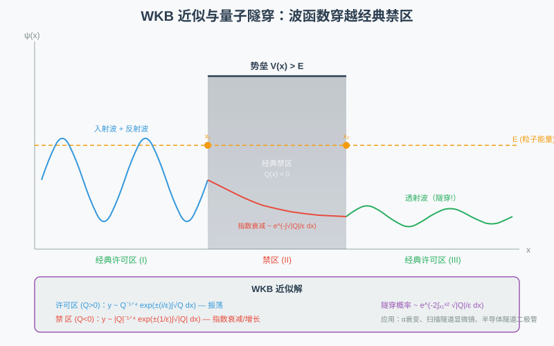

# 第59级：渐近分析 (Asymptotic Analysis)

## 学习目标

1. 理解渐近展开与渐近级数的基本概念，掌握 $O$ 与 $o$ 符号的严格定义与使用。
2. 掌握 Stirling 公式的完整推导过程及其误差估计。
3. 深入理解 Laplace 方法、最速下降法、驻相法三大渐近分析核心技术。
4. 了解 WKB 方法、鞍点法在物理与工程中的应用。
5. 掌握 Gamma 函数、Airy 函数、Bessel 函数的渐近展开。
6. 理解 Poincaré 渐近展开与可和性理论的基本思想。

---

## 1. 核心概念

### 1.1 渐近展开与渐近级数

**定义（渐近展开）** 设 $f(x)$ 是定义在某个区间上的函数，$\{\phi_n(x)\}$ 是一个渐近序列（即 $\phi_{n+1}(x)=o(\phi_n(x))$ 当 $x\to\infty$）。若对每个 $N$，有

$$
f(x)=\sum_{n=0}^{N-1} a_n\phi_n(x)+O(\phi_N(x)),\quad x\to\infty,
$$

则称 $\sum_{n=0}^{\infty}a_n\phi_n(x)$ 是 $f(x)$ 的**渐近展开**，记作

$$
f(x)\sim\sum_{n=0}^{\infty}a_n\phi_n(x),\quad x\to\infty.
$$

渐近级数可以是发散的，但它仍然能在截断后提供极好的数值近似。

当 $x$ 很大时，多项式中次数最高的项主导了函数的行为，其余项相对可忽略。下图展示了 $f(x)=x^2+x+1$ 在大 $x$ 处如何被主导项 $x^2$ 决定：

> **直观理解（现实类比）**：就像远远眺望山脉时，最高那座山峰决定了整个轮廓，其余小丘只是点缀。当 $x$ 很大时，$x^2$ 项在 $f(x)$ 中起支配作用，$x$ 和常数项都无足轻重，因此 $f(x)$ 的增长"长得像"$x^2$。

> **🧠 思考历程：一个"发散的级数"按道理毫无意义，渐近分析怎么偏偏靠它吃饭？**
>
> 普通人一听"级数收敛才算数"，可渐近分析却说：**有些级数明明发散，截取它的前几项，反而能给出物理世界最精准的近似**。这门"异端"学科能成立，全靠 Euler 敢想、Poincaré 肯把它认真写成理论。
>
> - **Euler 的"胆大妄为"：发散的级数也有"和"**（18 世纪）。Euler 面对 $1+2+3+\cdots$、$1-1+1-\cdots$ 这类"没有收敛和"的级数，并没有一丢了之，而是用形式运算硬算出"合理答案"并把它们当**工具**用。这在当时被保守数学家斥为不严谨，但隐藏的直觉是对的：**许多函数的真实行为，早期项已经"抓住"了最本质的部分**。
> - **Poincaré 的"转正"：收敛性不是唯一标准，可用性才是**（19 世纪末）。Poincaré 在行星轨道摄动研究里撞见：解表达成无穷级数，级数却发散——若严格处理，这些"解"似乎不存在。他做了一个关键决定：**放弃"级数是否收敛"，改要求"截断后误差确实能变小"**。于是有了渐近展开的严格定义：对每个 $N$，前 $N$ 项给出的误差是 $o$（第 $N$ 项）。**一个发散的"渐近级数"，在意义上不再是"无限项的和"，而是"关于精度的一串承诺"**——你取多少项，就能保证多好的近似，哪怕整体永不收敛。
> - **为什么"爆炸"了还能用**。秘诀在"项先降后升"：渐近级数通常开头几项急剧变小（给你惊人的精度），但再往后某项开始指数爆炸。工程上的常用做法是**在最优点截断**——取到"即将增长"的那一项附近，这长度还能用余项估计（如 Watson 引理）控制住。**所以"发散"不是缺点，而是"好到不能再收敛"的反面证明**。
> - **心路**：这个反直觉的事实给了数学一个珍贵的教训：**"发散"和"无用"是两回事**。当一个精致但笨重的方法在真实问题里失效，一种"粗糙却拦得住误差"的思维（Poincaré 的渐近、Borel 的可和性）往往才是物理学家真正需要的语言——**判断一个数学工具的成熟度，要看它能否在最严格的地带浮现出"柔软的诚实"**。

### 1.2 $O$ 与 $o$ 符号

**定义** 设 $f,g$ 是定义在 $x\to a$ 邻域内的函数。

- $f(x)=O(g(x))$ 当 $x\to a$ 表示存在常数 $C>0$ 和邻域 $U$，使得 $|f(x)|\le C|g(x)|$ 对 $x\in U$ 成立。
- $f(x)=o(g(x))$ 当 $x\to a$ 表示 $\lim_{x\to a}\frac{f(x)}{g(x)}=0$。

> **💡 直观理解（类比）**：可以把 $O$ 和 $o$ 想成两种"身高对比"。$f=O(g)$ 就好比"$f$ 的高不会超过 $g$ 的一个固定倍数"——无论走多远，$f$ 都被 $g$ 的某一个放大版"罩住"；而 $f=o(g)$ 就像"$f$ 相比 $g$ 越来越矮，最终比值趋于 $0$"。前者允许两者同级别（最多差常数倍），后者要求 $f$ 被 $g$ 彻底碾压（量级更低）。比如 $x^2=O(x^2+x)$ 只说明没超过，而 $x=o(x^2)$ 才是真正的"低一个量级"。

### 1.3 Poincaré 渐近展开

**定义（Poincaré 渐近展开）** 设 $\{z_n\}$ 是定义在区域 $D$ 上的函数序列，满足 $z_{n+1}(x)=o(z_n(x))$ 当 $x\to x_0$。若对每个固定的 $N$，

$$
f(x)-\sum_{n=0}^{N-1}a_nz_n(x)=o(z_{N-1}(x)),\quad x\to x_0,
$$

则称 $\sum_{n=0}^{\infty}a_nz_n(x)$ 为 $f(x)$ 在 $x_0$ 处的 Poincaré 渐近展开。

> **💡 直观理解（类比）**：Poincaré 渐近展开就像一份"越来越准的天气预报"。它不承诺"永远算到底"，而是对每个提前量 $N$ 打包承诺：你只要前 $N$ 项，误差保证比删掉的那一项还小。也就是说，它不再是"无限项的和"，而是一条"逐级递进的高精度承诺"——取多少项就有多好，哪怕整串级数永不收敛。就好比一个宣称"先保证基本准确，细节越给越准"的向导，而不是一个空口说"完全精确"的人。

### 1.4 可和性 (Summability)

渐近级数通常是发散的，但可以通过可和性方法赋予其"和"。**Borel 可和性**是最常用的方法之一：若形式幂级数 $\sum a_n z^n$ 满足 $A(t)=\sum_{n=0}^{\infty}\frac{a_n}{n!}t^n$ 在某个扇形区域内收敛且可解析延拓，则其 Borel 和为

$$
\int_0^{\infty}e^{-t}A(zt)\,dt.
$$

> **💡 直观理解（类比）**：可和性就像"给一段走散的画面补上结尾"。一个发散的级数本来没有可用的"和"，Borel 方法先对它做一次"去重放大"（用 $n!$ 把系数统统垫平），让转化出来的级数 $A(t)$ 收敛，再趁稳妥地按公式一积分，把放大后的画面"缩回去"，从而给原发散级数一个公正的值。就好比用慢镜头看一列飞快跑过、眼看要"冲出去"的车队，先放慢看清每辆车的位置，再合起来报一个总数——镜头还是要回到真实车速的。

### 1.5 常用特殊函数的渐近形式

- **Gamma 函数**：$\Gamma(z)\sim\sqrt{2\pi}z^{z-1/2}e^{-z},\quad z\to\infty,\ |\arg z|<\pi.$
- **Airy 函数**：
  $$
  \operatorname{Ai}(x)\sim\frac{1}{2\sqrt{\pi}x^{1/4}}e^{-\frac{2}{3}x^{3/2}},\quad x\to+\infty,
  $$
  $$
  \operatorname{Ai}(-x)\sim\frac{1}{\sqrt{\pi}x^{1/4}}\sin\left(\frac{2}{3}x^{3/2}+\frac{\pi}{4}\right),\quad x\to+\infty.
  $$
- **Bessel 函数**：
  $$
  J_n(x)\sim\sqrt{\frac{2}{\pi x}}\cos\left(x-\frac{n\pi}{2}-\frac{\pi}{4}\right),\quad x\to+\infty.
  $$

> **💡 直观理解（类比）**：这些特殊函数的渐近形式，就像"从远处听一个遥远乐器演奏"。Gamma 函数给出的是"音量按幂次放大的主旋律"，Airy 函数在正半轴给出"指数衰减的低声"，在负半轴则是"越到远处越是平稳匀速的摆动"（正弦），而 Bessel 函数像一个小球在衰减的振荡中渐渐趋于平静——幅度按 $1/\sqrt{x}$ 缩小，但始终停不下振动的脚步。它们的共同点都是：$x$ 越大，这些简明的近似就越准。

---

## 2. 定理与证明

### 2.1 Watson 引理

**引理（Watson）** 设 $q(t)$ 在 $[0,\infty)$ 上连续，且当 $t\to0^+$ 时有渐近展开

$$
q(t)\sim\sum_{n=0}^{\infty}a_nt^{\frac{n+\alpha}{\beta}-1},\quad \alpha>0,\ \beta>0,
$$

且 $|q(t)|\le Ce^{bt}$ 对充分大的 $t$ 成立。则对 $x\to\infty$，

$$
\int_0^{\infty}e^{-xt}q(t)\,dt\sim\sum_{n=0}^{\infty}a_n\frac{\Gamma\left(\frac{n+\alpha}{\beta}\right)}{x^{\frac{n+\alpha}{\beta}}}.
$$

> **💡 直观理解（类比）**：Watson 引理就像"权衡声音聚焦在近前"的法则。当 $x\to\infty$ 时，$e^{-xt}$ 这层"指数幕布"把整条 $t$ 轴的注意力几乎全压到 $t=0$ 附近——远处无论什么细节都被幕布迅速抹掉。于是积分只看 $t=0$ 那一小段，$q(t)$ 展开成 $t$ 的幂次后逐项积分，每一项都稳稳落成 $\frac{\Gamma(\cdots)}{x^{\cdots}}$。就好比戴上一副"只看最近一厘米"的显微镜，远处的一切都被忽略，近处那一段的形状决定了全部结果。

**证明** 设 $N$ 为任意正整数。将 $q(t)$ 写为

$$
q(t)=\sum_{n=0}^{N-1}a_nt^{\frac{n+\alpha}{\beta}-1}+R_N(t),
$$

其中 $R_N(t)=O\left(t^{\frac{N+\alpha}{\beta}-1}\right)$ 当 $t\to0^+$。于是

$$
I(x)=\int_0^{\infty}e^{-xt}q(t)\,dt=\sum_{n=0}^{N-1}a_n\int_0^{\infty}e^{-xt}t^{\frac{n+\alpha}{\beta}-1}\,dt+\int_0^{\infty}e^{-xt}R_N(t)\,dt.
$$

对第一项中的每个积分，作变量代换 $u=xt$，得

$$
\int_0^{\infty}e^{-xt}t^{\frac{n+\alpha}{\beta}-1}\,dt=\frac{1}{x^{\frac{n+\alpha}{\beta}}}\int_0^{\infty}e^{-u}u^{\frac{n+\alpha}{\beta}-1}\,du=\frac{\Gamma\left(\frac{n+\alpha}{\beta}\right)}{x^{\frac{n+\alpha}{\beta}}}.
$$

对余项，因 $|R_N(t)|\le C_N t^{\frac{N+\alpha}{\beta}-1}e^{bt}$（对充分大的 $t$），有

$$
\left|\int_0^{\infty}e^{-xt}R_N(t)\,dt\right|\le C_N\int_0^{\infty}e^{-(x-b)t}t^{\frac{N+\alpha}{\beta}-1}\,dt=O\left(\frac{1}{x^{\frac{N+\alpha}{\beta}}}\right).
$$

因此

$$
I(x)=\sum_{n=0}^{N-1}a_n\frac{\Gamma\left(\frac{n+\alpha}{\beta}\right)}{x^{\frac{n+\alpha}{\beta}}}+O\left(\frac{1}{x^{\frac{N+\alpha}{\beta}}}\right),
$$

由 $N$ 的任意性即得渐近展开式。$\square$

### 2.2 Laplace 方法的渐近展开

**定理（Laplace 方法）** 设 $h(x)$ 在 $[a,b]$ 上连续，$f(x)$ 在 $[a,b]$ 上二次连续可微，且 $f(x)$ 在唯一的 $x=c\in(a,b)$ 处达到全局最小值，满足 $f'(c)=0$，$f''(c)>0$。则当 $\lambda\to\infty$ 时，

$$
I(\lambda)=\int_a^b h(x)e^{-\lambda f(x)}\,dx\sim h(c)\sqrt{\frac{2\pi}{\lambda f''(c)}}\,e^{-\lambda f(c)}.
$$

更一般地，若 $h$ 在 $c$ 附近有渐近展开 $h(x)\sim\sum_{n=0}^{\infty}h_n(x-c)^n$，则

$$
I(\lambda)\sim e^{-\lambda f(c)}\sqrt{\frac{2\pi}{\lambda f''(c)}}\sum_{n=0}^{\infty}\frac{h_{2n}(2n)!}{n!2^{2n}[f''(c)]^n\lambda^n}.
$$

> **💡 直观理解（类比）**：Laplace 方法就像"山谷只有一个最深的凹坑决定全局"。想象一片光滑的碗状地形，$e^{-\lambda f(x)}$ 把每个点的权重按 $e^{-\lambda f}$ 分配：离最底点稍微远一点，权重就像"越陡越亮"的手电筒光束一样指数级暗淡下去。当 $\lambda\to\infty$，整个积分的贡献几乎全部来自那个唯一的谷底 $c$，附近被近似成一条抛物线，积分就约化成一次高斯积分 $\sqrt{\frac{2\pi}{\lambda f''(c)}}$。"凹坑越尖（$f''(c)$ 越大）、$\lambda$ 越大"，有效贡献区就越窄。

**证明** 由于 $f$ 在 $c$ 处取最小值，且 $f'(c)=0$，由 Taylor 展开

$$
f(x)=f(c)+\frac{1}{2}f''(c)(x-c)^2+O((x-c)^3).
$$

作变量代换 $t=\sqrt{\lambda}(x-c)$，则 $x=c+t/\sqrt{\lambda}$，$dx=dt/\sqrt{\lambda}$。于是

$$
I(\lambda)=e^{-\lambda f(c)}\int_{a}^{b}h(x)e^{-\lambda\left[\frac{1}{2}f''(c)(x-c)^2+O((x-c)^3)\right]}\,dx.
$$

代入 $t$ 变量：

$$
I(\lambda)=\frac{e^{-\lambda f(c)}}{\sqrt{\lambda}}\int_{\sqrt{\lambda}(a-c)}^{\sqrt{\lambda}(b-c)}h\left(c+\frac{t}{\sqrt{\lambda}}\right)e^{-\frac{1}{2}f''(c)t^2+O(t^3/\sqrt{\lambda})}\,dt.
$$

当 $\lambda\to\infty$ 时，积分区间趋向于 $(-\infty,\infty)$。利用 $h(c+t/\sqrt{\lambda})\to h(c)$ 和 $e^{O(t^3/\sqrt{\lambda})}\to1$，由控制收敛定理得

$$
I(\lambda)\sim\frac{e^{-\lambda f(c)}}{\sqrt{\lambda}}h(c)\int_{-\infty}^{\infty}e^{-\frac{1}{2}f''(c)t^2}\,dt=h(c)\sqrt{\frac{2\pi}{\lambda f''(c)}}\,e^{-\lambda f(c)}.
$$

高阶项可通过展开 $h(c+t/\sqrt{\lambda})$ 和 $e^{O(t^3/\sqrt{\lambda})}$ 得到。$\square$

### 2.3 最速下降法 (Method of Steepest Descent)

**定理（最速下降法）** 考虑形如

$$
I(\lambda)=\int_{\Gamma} g(z)e^{\lambda f(z)}\,dz,\quad \lambda\to\infty,
$$

的积分，其中 $\Gamma$ 是复平面上的路径，$f(z)$ 和 $g(z)$ 是解析函数。设 $z_0$ 是 $f(z)$ 的鞍点（即 $f'(z_0)=0$），且 $f''(z_0)\neq0$。则沿最速下降路径 $\Gamma_{\text{SD}}$ 通过 $z_0$ 时，

$$
I(\lambda)\sim g(z_0)\sqrt{\frac{2\pi}{-\lambda f''(z_0)}}\,e^{\lambda f(z_0)},\quad \lambda\to\infty.
$$

> **💡 直观理解（类比）**：最速下降法就好比"山脊上找一条下山最快的路"。$e^{\lambda f(z)}$ 的指数 $f(z)$ 像一张起伏的复平面地形图，$e^{\lambda\,Re f}$ 告诉我们哪里"亮"、哪里"暗"。在复数平面上我们不能像实变量那样只盯着一个点，而要选一条"虚部不变、实部沿路径一路下坡"的山脊小径（即最速下降路径）穿过鞍点 $z_0$，把这条小径上的贡献收拢，再次约化成一条高斯积分。打比方说，你背着极重的东西下山，一定选一条"高度一路狂降、不看风景（相位不变）"的直下坡路，而不是绕来绕去的缓坡。

**证明** 设 $f(z)=u(x,y)+iv(x,y)$。最速下降路径满足 $\operatorname{Im}f(z)=\text{常数}$，即沿此路径 $f(z)$ 的虚部不变。在鞍点 $z_0$ 处，$f'(z_0)=0$，Taylor 展开得

$$
f(z)=f(z_0)+\frac{1}{2}f''(z_0)(z-z_0)^2+O((z-z_0)^3).
$$

令 $w=z-z_0$，则 $f(z)-f(z_0)=\frac{1}{2}f''(z_0)w^2(1+O(w))$。由于沿最速下降路径，$f(z)-f(z_0)$ 为实数且为负值（下降方向），故 $\frac{1}{2}f''(z_0)w^2$ 为负实数。设 $f''(z_0)=|f''(z_0)|e^{i\theta}$，则 $w$ 的方向应为 $e^{-i\theta/2}$ 乘以 $\pm1$。

作变量代换 $s=\sqrt{-\frac{1}{2}f''(z_0)}(z-z_0)$，则 $s$ 沿最速下降路径为实数，且

$$
I(\lambda)\sim e^{\lambda f(z_0)}\int_{-\infty}^{\infty}g(z_0)\frac{1}{\sqrt{-\frac{1}{2}f''(z_0)}}e^{-\lambda s^2}\,ds=g(z_0)\sqrt{\frac{2\pi}{-\lambda f''(z_0)}}e^{\lambda f(z_0)}.
$$

这里使用了 $\int_{-\infty}^{\infty}e^{-\lambda s^2}\,ds=\sqrt{\pi/\lambda}$。$\square$

### 2.4 驻相法 (Method of Stationary Phase)

**定理（驻相法）** 设 $f(x)$ 在 $[a,b]$ 上实值且光滑，$\phi(x)$ 光滑。设 $f'(c)=0$，$f''(c)\neq0$，$c\in(a,b)$ 是唯一的驻点。则当 $\lambda\to\infty$ 时，

$$
I(\lambda)=\int_a^b\phi(x)e^{i\lambda f(x)}\,dx\sim\phi(c)\sqrt{\frac{2\pi}{\lambda|f''(c)|}}\,e^{i\lambda f(c)+i\frac{\pi}{4}\operatorname{sgn}f''(c)}.
$$

> **💡 直观理解（类比）**：驻相法就像"篝火晚会上只有站在原地的人才能被看清"。$e^{i\lambda f(x)}$ 是一个高速旋转的"相位指针"，$x$ 只要动一点，指针就飞快转圈，正负贡献相互抵消成0。只有当 $x$ 停在驻点 $c$（$f'(c)=0$）时指针才"原地打摆"，速度最慢、方向最一致，于是整段积分几乎只剩这里的一小撮贡献。前面那个神秘相位 $\pm\frac{\pi}{4}$，相当于"慢放时看清指针正好指向斜45°的一瞬间"——记住了这一下，就能锁定整个积分的光值。

**证明** 在驻点 $c$ 附近展开

$$
f(x)=f(c)+\frac{1}{2}f''(c)(x-c)^2+O((x-c)^3).
$$

作变量代换 $t=\sqrt{\lambda}(x-c)$，则

$$
I(\lambda)=e^{i\lambda f(c)}\int_{a}^{b}\phi(x)e^{i\frac{\lambda}{2}f''(c)(x-c)^2+i\lambda O((x-c)^3)}\,dx.
$$

代入 $t$：

$$
I(\lambda)=\frac{e^{i\lambda f(c)}}{\sqrt{\lambda}}\int_{\sqrt{\lambda}(a-c)}^{\sqrt{\lambda}(b-c)}\phi\left(c+\frac{t}{\sqrt{\lambda}}\right)e^{i\frac{1}{2}f''(c)t^2+O(t^3/\sqrt{\lambda})}\,dt.
$$

当 $\lambda\to\infty$ 时，积分区间趋向于 $(-\infty,\infty)$。利用 Fresnel 积分

$$
\int_{-\infty}^{\infty}e^{i\alpha t^2/2}\,dt=\sqrt{\frac{2\pi}{|\alpha|}}\,e^{i\frac{\pi}{4}\operatorname{sgn}\alpha},
$$

得到

$$
I(\lambda)\sim\frac{e^{i\lambda f(c)}}{\sqrt{\lambda}}\phi(c)\sqrt{\frac{2\pi}{|f''(c)|}}\,e^{i\frac{\pi}{4}\operatorname{sgn}f''(c)}.
$$

整理即得结论。$\square$

### 2.5 Stirling 公式的完整推导

**定理（Stirling 公式）** Gamma 函数满足如下渐近展开：

$$
\Gamma(z)=\sqrt{2\pi}\,z^{z-1/2}e^{-z}\left[1+\frac{1}{12z}+\frac{1}{288z^2}-\frac{139}{51840z^3}+O\left(\frac{1}{z^4}\right)\right],
$$

特别地，对正整数 $n$，

$$
n!=\sqrt{2\pi n}\left(\frac{n}{e}\right)^n\left[1+O\left(\frac{1}{n}\right)\right].
$$

**证明** 我们从 Gamma 函数的积分表示出发：

$$
\Gamma(z+1)=\int_0^{\infty}t^ze^{-t}\,dt.
$$

作变量代换 $t=z(1+u)$，其中 $u\in(-1,\infty)$：

$$
\Gamma(z+1)=z^{z+1}e^{-z}\int_{-1}^{\infty}(1+u)^ze^{-zu}\,du=z^{z+1}e^{-z}\int_{-1}^{\infty}e^{z[\ln(1+u)-u]}\,du.
$$

令 $\phi(u)=\ln(1+u)-u$。则 $\phi(0)=0$，$\phi'(0)=0$，$\phi''(0)=-1$。在 $u=0$ 附近展开：

$$
\phi(u)=-\frac{u^2}{2}+\frac{u^3}{3}-\frac{u^4}{4}+\cdots.
$$

由于主要贡献来自 $u=0$ 附近，我们将积分区间延拓到 $(-\infty,\infty)$（误差为指数小量）。作变量代换 $u=s/\sqrt{z}$，则

$$
\int_{-1}^{\infty}e^{z\phi(u)}\,du\sim\frac{1}{\sqrt{z}}\int_{-\infty}^{\infty}e^{z\phi(s/\sqrt{z})}\,ds.
$$

展开 $\phi(s/\sqrt{z})$：

$$
\phi\left(\frac{s}{\sqrt{z}}\right)=-\frac{s^2}{2z}+\frac{s^3}{3z^{3/2}}-\frac{s^4}{4z^2}+\cdots.
$$

因此

$$
e^{z\phi(s/\sqrt{z})}=e^{-s^2/2}\exp\left(\frac{s^3}{3\sqrt{z}}-\frac{s^4}{4z}+\cdots\right).
$$

将指数中的 $\exp$ 展开为级数，逐项积分。利用 Gaussian 积分的矩：

$$
\int_{-\infty}^{\infty}e^{-s^2/2}s^{2k}\,ds=\sqrt{2\pi}\frac{(2k)!}{2^kk!},
$$

以及奇次矩为零，得到

$$
\Gamma(z+1)=z^{z+1}e^{-z}\sqrt{\frac{2\pi}{z}}\left[1+\frac{1}{12z}+\frac{1}{288z^2}+O\left(\frac{1}{z^3}\right)\right].
$$

整理即得

$$
\Gamma(z+1)=\sqrt{2\pi z}\left(\frac{z}{e}\right)^z\left[1+\frac{1}{12z}+\frac{1}{288z^2}+O\left(\frac{1}{z^3}\right)\right].
$$

**误差估计**：通过 Euler-Maclaurin 求和公式可得到更精确的误差界

$$
\ln n!=n\ln n-n+\frac{1}{2}\ln(2\pi n)+\frac{1}{12n}-\frac{1}{360n^3}+O\left(\frac{1}{n^5}\right).
$$

对于任意 $n\ge1$，有

$$
\sqrt{2\pi n}\left(\frac{n}{e}\right)^n<n!<\sqrt{2\pi n}\left(\frac{n}{e}\right)^n e^{1/(12n)}.
$$

斯特林公式用 $\sqrt{2\pi n}(n/e)^n$ 抓住了 $n!$ 增长的"量级骨架"，且 $n$ 越大越精确。下图对比了 $n!$ 的精确值与斯特林近似：

> **直观理解（现实类比）**：$n!$ 增长得比任何指数都快，斯特林公式用 $\sqrt{2\pi n}(n/e)^n$ 精确地捕获它的"量级骨架"。这就像估算一本书的印刷页数时不必逐页去数，一个简洁公式就能给出非常接近的答案，而且 $n$ 越大越精确。（图中绿线为相对误差。）

$\square$

### 2.6 WKB 近似与衔接公式

**定理（WKB 近似）** 考虑二阶线性微分方程

$$
\varepsilon^2\frac{d^2y}{dx^2}+Q(x)y=0,\quad \varepsilon\to0^+.
$$

在 $Q(x)>0$ 的区域（经典许可区），WKB 近似解为

$$
y(x)\sim\frac{C_+}{\sqrt[4]{Q(x)}}\exp\left(\frac{i}{\varepsilon}\int\sqrt{Q(x)}\,dx\right)+\frac{C_-}{\sqrt[4]{Q(x)}}\exp\left(-\frac{i}{\varepsilon}\int\sqrt{Q(x)}\,dx\right).
$$

> **直观理解（现实类比）**：WKB 近似描述的量子隧穿就像**幽灵穿墙**——经典力学中，一个小球如果能量不够，永远翻不过高山（势垒）；但在量子世界里，粒子的波函数会"渗透"进势垒，虽然指数衰减，但只要势垒不够厚，另一侧仍有非零概率找到粒子。这正是扫描隧道显微镜（STM）的工作原理：电子隧穿真空势垒，使我们能"看见"单个原子。WKB 公式给出隧穿概率 $\sim e^{-2\int\sqrt{V-E}/\hbar}$，势垒越宽越高，穿透越难。

在 $Q(x)<0$ 的区域（经典禁区），解为

$$
y(x)\sim\frac{D_+}{\sqrt[4]{|Q(x)|}}\exp\left(\frac{1}{\varepsilon}\int\sqrt{|Q(x)|}\,dx\right)+\frac{D_-}{\sqrt[4]{|Q(x)|}}\exp\left(-\frac{1}{\varepsilon}\int\sqrt{|Q(x)|}\,dx\right).
$$

**衔接公式（Connection Formulas）** 在转折点 $x_0$ 处（$Q(x_0)=0$），两侧的解通过衔接公式连接：

$$
\frac{1}{\sqrt[4]{Q(x)}}\cos\left(\frac{1}{\varepsilon}\int_{x_0}^x\sqrt{Q(t)}\,dt-\frac{\pi}{4}\right)\quad(\text{许可区})\quad\longleftrightarrow\quad\frac{1}{2\sqrt[4]{|Q(x)|}}\exp\left(-\frac{1}{\varepsilon}\int_{x}^{x_0}\sqrt{|Q(t)|}\,dt\right)\quad(\text{禁区}).
$$

> **💡 直观理解（类比）**：衔接公式就像"一片平静湖面与一道瀑布在悬崖边如何接缝"。在转折点 $x_0$ 处，一侧是平滑来回摆动的波（许可区的 $\cos$ 解），另一侧是急速跌落的高度（禁区的指数衰减解），两侧形貌完全不同。衔接公式就是一座"跨缝的桥"，精确告诉我们：右边的波在交叉的口子处以怎样的振幅与相位，才能无缝地接上左边那条一路往下沉的曲线——多出来的 $\frac14$ 波（也就是 $-\frac{\pi}{4}$）正是这座桥预留的"台阶"，让两种解严丝合缝地接上。

**证明思路**：设 $y(x)=\exp\left(\frac{i}{\varepsilon}S(x)\right)$，代入方程得

$$
-\frac{1}{\varepsilon^2}(S')^2+\frac{i}{\varepsilon}S''+\frac{1}{\varepsilon^2}Q(x)=0.
$$

令 $\varepsilon\to0$，得到 eikonal 方程 $(S')^2=Q(x)$，解得 $S(x)=\pm\int\sqrt{Q(x)}\,dx$。下一阶近似给出 transport 方程，得到振幅因子 $1/\sqrt[4]{Q(x)}$。在转折点附近，方程退化为 Airy 方程，通过 Airy 函数的渐近形式建立衔接公式。$\square$

---

## 3. 示例

### 示例 1：使用 Laplace 方法计算 Gamma 函数的渐近

**问题** 利用 Laplace 方法推导 $\Gamma(x+1)$ 的渐近形式。

**解** Gamma 函数的定义为

$$
\Gamma(x+1)=\int_0^{\infty}t^xe^{-t}\,dt=\int_0^{\infty}e^{x\ln t-t}\,dt.
$$

令 $f(t)=-\ln t+t/x$，但更标准的方法是作代换 $t=xs$，则

$$
\Gamma(x+1)=x^{x+1}\int_0^{\infty}e^{x(\ln s-s)}\,ds.
$$

令 $\phi(s)=\ln s-s$，则 $\phi'(s)=1/s-1$，驻点在 $s=1$ 处，$\phi(1)=-1$，$\phi''(1)=-1$。应用 Laplace 方法（此时 $h(s)=1$，$\lambda=x$，$f(s)=-\phi(s)=s-\ln s$，$c=1$，$f''(1)=1$）：

$$
\int_0^{\infty}e^{x(\ln s-s)}\,ds\sim e^{-x}\sqrt{\frac{2\pi}{x}}.
$$

因此

$$
\Gamma(x+1)\sim x^{x+1}e^{-x}\sqrt{\frac{2\pi}{x}}=\sqrt{2\pi x}\left(\frac{x}{e}\right)^x.
$$

这正是 Stirling 公式的主项。

> **💡 直观理解（类比）**：示例 1 把"用 Laplace 方法重新得到 Stirling 公式"演了一遍。方法的手法是：把阶乘用积分写出后，先做代换把"最高点的位置"挪到一个固定的原点 $s=1$，然后只取那个峰脚下的一小段（$\sqrt{\frac{2\pi}{x}}$）作为全部贡献。这就像用一个放大镜只盯着山形函数的最高峰，其余远山统统不上镜——因为离峰稍远，$e^{x(\ln s-s)}$ 就指数级归零。峰的高度、宽窄（由 $f''(1)=-1$ 决定）加在一起，就拼出了 $n!$ 的量级骨架。

### 示例 2：使用驻相法计算 Fourier 变换

**问题** 计算如下 Fourier 变换的渐近行为（$k\to\infty$）：

$$
I(k)=\int_{-\infty}^{\infty}e^{ik(x^3/3-x)}\phi(x)\,dx,
$$

其中 $\phi(x)$ 是光滑的紧支函数。

**解** 令 $f(x)=x^3/3-x$，则 $f'(x)=x^2-1$，驻点为 $x=\pm1$。

- 在 $x=1$ 处：$f(1)=1/3-1=-2/3$，$f''(1)=2$。
- 在 $x=-1$ 处：$f(-1)=-1/3+1=2/3$，$f''(-1)=-2$。

应用驻相法，每个驻点贡献

$$
\phi(\pm1)\sqrt{\frac{2\pi}{k|f''(\pm1)|}}\,e^{ikf(\pm1)+i\frac{\pi}{4}\operatorname{sgn}f''(\pm1)}.
$$

因此

$$
I(k)\sim\phi(1)\sqrt{\frac{\pi}{k}}\,e^{-2ik/3+i\pi/4}+\phi(-1)\sqrt{\frac{\pi}{k}}\,e^{2ik/3-i\pi/4}.
$$

> **💡 直观理解（类比）**：示例 2 展示驻相法在 Fourier 变换里的"钓鱼功"。$f(x)=x^3/3-x$ 这条相位山坡在 $x=\pm1$ 两处出现"坡度为零"的驻点，也就是两处"静止的钓点"，其余地方振荡快得互相抵消、一条鱼也钓不上来。于是整个变换的渐近就只剩这两个钓点上 $e^{ikf}$ 各自贡献的一小份，且每一份都附带 $e^{\pm i\pi/4}$ 这个"收竿时记下的45°朝向"。钓鱼竿（积分）抖得越快，鱼（贡献）就越集中在仅有的两个平静点附近。

---

## 4. 习题

### 基础题

**习题 1**（渐近记号与阶）判断下列陈述的真假，并说明理由：当 $x\to\infty$ 时，$x=O(x^2)$。

**习题 2**（渐近记号与阶）判断下列陈述的真假，并说明理由：当 $x\to\infty$ 时，$x^2=O(x)$。

**习题 3**（渐近记号与阶）当 $x\to\infty$ 时，$x+\sin x=O(x)$ 是否成立？

**习题 4**（渐近记号与阶）证明：若 $f(x)=o(g(x))$ 且 $g(x)=O(h(x))$，则 $f(x)=o(h(x))$ 当 $x\to a$ 时成立。

**习题 5**（渐近记号与阶）判断 $x\to0$ 时 $\sin x=O(x)$ 是否成立，并证明。

**习题 6**（渐近记号与阶）当 $x\to\infty$ 时，比较 $e^x$、$x^{100}$、$(\ln x)^{10}$ 的阶，从大到小排列。

**习题 7**（渐近记号与阶）求满足 $f(x)\sim x^2+\sqrt{x}$ 当 $x\to\infty$ 时的一个函数 $f$。

**习题 8**（渐近记号与阶）证明 $\ln(1+x)=O(x)$ 当 $x\to0$ 时成立。

**习题 9**（渐近记号与阶）设 $f=O(g)$ 且 $h=O(k)$，证明 $fh=O(gk)$。

**习题 10**（渐近记号与阶）设 $f=o(g)$ 且 $h=o(k)$，证明 $fh=o(gk)$。

**习题 11**（渐近记号与阶）当 $x\to\infty$ 时，$\sqrt{x^2+x}=O(x)$ 是否成立？

**习题 12**（渐近记号与阶）判断 $x^0=O(1)$ 当 $x\to\infty$ 时是否成立。

**习题 13**（渐近记号与阶）$f=O(g)$ 是否蕴含 $g=O(f)$？举例说明。

**习题 14**（渐近记号与阶）判断 $1/x=o(1)$ 当 $x\to\infty$ 时是否成立。

**习题 15**（渐近记号与阶）证明当 $x\to\infty$ 时 $\ln x=o(x)$。

**习题 16**（渐近记号与阶）当 $x\to 0$ 时，$e^x-1=O(x)$ 是否成立？

**习题 17**（渐近记号与阶）判断 $O(f)+O(f)=O(f)$ 是否成立。

**习题 18**（渐近记号与阶）构造函数说明 $f=o(g)$ 与 $g=O(f)$ 不可能同时成立。

**习题 19**（渐近记号与阶）当 $x\to\infty$ 时，$x^x$ 与 $e^{x^2}$ 谁增长更快？

**习题 20**（渐近记号与阶）解释符号 $f=O(g)$ 中常数 $C$ 的存在性意义。

**习题 21**（极限与主项提取）求 $x\to\infty$ 时 $\frac{3x^2+2x+1}{x^2-x+5}$ 的极限。

**习题 22**（极限与主项提取）求 $x\to\infty$ 时 $\frac{e^x}{x^3}$ 的极限。

**习题 23**（极限与主项提取）求 $x\to0$ 时 $\frac{\sin x}{x}$ 的极限。

**习题 24**（极限与主项提取）求 $x\to\infty$ 时 $\sqrt{x^2+1}-x$ 的极限。

**习题 25**（极限与主项提取）求 $x\to0^+$ 时 $x\ln x$ 的极限。

**习题 26**（极限与主项提取）写出 $x\to\infty$ 时 $\left(1+\frac{1}{x}\right)^x$ 的极限。

**习题 27**（极限与主项提取）求 $x\to\infty$ 时 $\frac{\ln x}{x}$ 的极限。

**习题 28**（极限与主项提取）当 $x\to\infty$ 时，表达式 $x^3-x^2$ 的主项是什么？

**习题 29**（极限与主项提取）当 $x\to0$ 时，表达式 $\sin x-x$ 的主项是什么？

**习题 30**（极限与主项提取）求 $x\to\infty$ 时 $\frac{x+\cos x}{x}$ 的极限。

**习题 31**（极限与主项提取）求 $x\to\infty$ 时 $\arctan x$ 的极限。

**习题 32**（极限与主项提取）当 $x\to\infty$ 时，$\cos(1/x)$ 展开的主项与常数项。

**习题 33**（极限与主项提取）求 $x\to0^+$ 时 $x^x$ 的极限。

**习题 34**（极限与主项提取）判断 $x\to+\infty$ 时 $\frac{x}{\ln x}$ 是否趋于无穷。

**习题 35**（极限与主项提取）求 $x\to\infty$ 时 $\frac{x^2}{2^x}$ 的极限。

**习题 36**（Stirling 级数）写出 $n!\sim$ 的主项公式（$n\to\infty$）。

**习题 37**（Stirling 级数）用 Stirling 公式估计 $10!$（保留主项）。

**习题 38**（Stirling 级数）利用 $n!\sim\sqrt{2\pi n}(n/e)^n$ 估计 $100!$ 的量级（$\lg 100!\approx$）。

**习题 39**（Stirling 级数）写出 $\ln n!$ 的前三项渐近展开。

**习题 40**（Stirling 级数）判断 $\frac{n!}{(n/e)^n}$ 当 $n\to\infty$ 时的极限是否存在。

**习题 41**（Stirling 级数）$n!\sim\sqrt{2\pi n}(n/e)^n$ 的相对误差随 $n$ 增大如何变化？

**习题 42**（Stirling 级数）利用 $\Gamma(z+1)=z!$，写出 $\Gamma(x+1)$ 当 $x\to\infty$ 时的主项。

**习题 43**（Stirling 级数）估计 $\binom{2n}{n}=\frac{(2n)!}{(n!)^2}$ 的渐近主项。

**习题 44**（Stirling 级数）写出 Stirling 展开中的第一个修正项 $\frac{1}{12n}$ 对应 $\ln n!$ 的哪一项。

**习题 45**（Stirling 级数）用 Stirling 公式比较 $(2n)!$ 与 $[n!\cdot 2^n]^2$ 当 $n\to\infty$ 时的阶。

**习题 46**（Stirling 级数）求 $\frac{n!}{n^n}e^n$ 当 $n\to\infty$ 时的极限。

**习题 47**（Stirling 级数）写出 $\Gamma(n)$ 当 $n\to\infty$ 时的渐近主项。

**习题 48**（Stirling 级数）判断 Stirling 级数在 $n$ 固定时是否收敛。

**习题 49**（Stirling 级数）利用 $\ln n!\sim n\ln n-n$ 估算 $\ln 2$ 的项 $\ln(2^n)$ 与 $\ln n!$ 的比较。

**习题 50**（Stirling 级数）估计 $\frac{(2n)!}{n!n^n}$ 的渐近主项。

**习题 51**（渐近级数概念）渐近级数是否一定收敛？举例说明。

**习题 52**（渐近级数概念）解释 $f(x)\sim\sum a_n/x^n$ 的确切含义（对每个 $N$）。

**习题 53**（渐近级数概念）判断发散级数能否提供数值近似。

**习题 54**（渐近级数概念）写出 $e^{-x}$ 在 $x\to\infty$ 时的渐近展开。

**习题 55**（渐近级数概念）$1/(1+x)$ 当 $x\to0$ 时的渐近展开是什么？

**习题 56**（渐近级数概念）证明 $\sum_{n=0}^{\infty}(-1)^n n!/x^{n+1}$ 是某个积分 $\int_x^{\infty}e^{-t}\,dt$ 的渐近展开。

**习题 57**（渐近级数概念）渐近展开是否唯一？

**习题 58**（渐近级数概念）同一函数不同渐近展开之间的联系。

**习题 59**（渐近级数概念）写出 $\ln(1+x)$ 当 $x\to0$ 时的渐近（Taylor）展开的前三项。

**习题 60**（渐近级数概念）判断 $\Gamma(x)\sim\sqrt{2\pi}x^{x-1/2}e^{-x}$ 是否满足 Poincaré 渐近展开定义。

**习题 61**（Watson 引理-基础）写出 $\int_0^{\infty}e^{-xt}t^{\alpha}\,dt$ 当 $x\to\infty$ 时的值（用 Gamma 函数）。

**习题 62**（Watson 引理-基础）利用 $\int_0^{\infty}e^{-xt}\,dt=1/x$，求 $\Gamma(1)$。

**习题 63**（Watson 引理-基础）$q(t)=1$ 时，Watson 引理给出 $\int_0^{\infty}e^{-xt}\,dt\sim$ ?

**习题 64**（Watson 引理-基础）写出 $\int_0^{\infty}e^{-xt}t\,dt$ 的精确值。

**习题 65**（Watson 引理-基础）判断 $\int_0^{\infty}e^{-xt}e^{-t^2}\,dt$ 当 $x\to\infty$ 时的主项。

**习题 66**（Watson 引理-基础）利用 Watson 引理，$\int_0^{\infty}e^{-xt}\sqrt{t}\,dt$ 的渐近主项。

**习题 67**（Watson 引理-基础）当 $x\to\infty$，$\int_0^{\infty}e^{-xt}e^{-t}\,dt$ 渐近于什么？

**习题 68**（Watson 引理-基础）解释 Watson 引理中 $\alpha,\beta$ 参数的作用。

**习题 69**（Watson 引理-基础）$\int_0^{\infty}e^{-xt}(1+t)\,dt$ 的渐近一阶项。

**习题 70**（Watson 引理-基础）写出 $\int_0^{\infty}e^{-xt}\sin t\,dt$ 当 $x\to\infty$ 的主项。

**习题 71**（Laplace 方法-基础）写出 $\int_0^{\infty}e^{-\lambda x^2}\,dx$ 的精确值（用 $\lambda$）。

**习题 72**（Laplace 方法-基础）Laplace 方法中主贡献来自函数的什么点？

**习题 73**（Laplace 方法-基础）写出 Laplace 方法主项公式 $I\sim h(c)\sqrt{\frac{2\pi}{\lambda f''(c)}}e^{-\lambda f(c)}$ 中各符号含义。

**习题 74**（Laplace 方法-基础）$\int_{-\infty}^{\infty}e^{-\lambda x^2/2}\,dx$ 的值。

**习题 75**（Laplace 方法-基础）判断最小值点 $c$ 在端点时 Laplace 方法公式是否仍适用。

**习题 76**（Laplace 方法-基础）$\int_0^{\infty}e^{-\lambda x}\,dx$ 当 $\lambda\to\infty$ 时主项。

**习题 77**（Laplace 方法-基础）写出 $\int_0^{\infty}e^{-\lambda x^2}\,dx\sim$ （Gaussian 主项）。

**习题 78**（Laplace 方法-基础）Laplace 方法要求 $f''(c)$ 满足什么条件？

**习题 79**（Laplace 方法-基础）$\int_{-1}^1 e^{-\lambda x^2}\,dx$ 当 $\lambda\to\infty$ 时主项。

**习题 80**（Laplace 方法-基础）解释为何 $f$ 的最小值点贡献主导。

**习题 81**（驻相法-基础）驻相法中主贡献来自相位的什么点？

**习题 82**（驻相法-基础）写出 Fresnel 积分 $\int_{-\infty}^{\infty}e^{i\lambda x^2/2}\,dx$ 的主项。

**习题 83**（驻相法-基础）判断驻相法中被积函数项 $e^{i\lambda f}$ 何时振荡最剧烈。

**习题 84**（驻相法-基础）驻相法主项公式中出现的相位因子含什么项。

**习题 85**（驻相法-基础）$\int_{-\infty}^{\infty}e^{i\lambda x}\,dx$ 的主项（形式上）。

**习题 86**（驻相法-基础）说明驻点处 $f''(c)$ 的符号如何影响相位。

**习题 87**（渐近要点综合-基础）写出 $\int_0^{\infty}e^{-\lambda x}\cos x\,dx$ 当 $\lambda\to\infty$ 时主项。

**习题 88**（渐近要点综合-基础）判断 $\int_0^1 e^{i\lambda x}\,dx$ 当 $\lambda\to\infty$ 时的主项。

**习题 89**（渐近要点综合-基础）写出 $\sqrt{2\pi n}(n/e)^n$ 中各项由何而来。

**习题 90**（渐近要点综合-基础）判断 $n!\sim$ 的误差项形式 $O(1/n)$ 中 $1/n$ 的意义。

**习题 91**（多尺度/摄动-基础-概念）确切地说明什么是奇异摄动问题。

**习题 92**（多尺度/摄动-基础-概念）正则摄动与奇异摄动的区别。

**习题 93**（多尺度/摄动-基础-概念）边界层出现在何时？

**习题 94**（多尺度/摄动-基础-概念）WKB 方法的适用范围。

**习题 95**（多尺度/摄动-基础-概念）小参数 $\varepsilon$ 乘最高阶导数会导致什么？

**习题 96**（多尺度/摄动-基础-概念）什么是转折点？

**习题 97**（多尺度/摄动-基础-概念）匹配渐近展开的意义。

**习题 98**（多尺度/摄动-基础-概念）eikonal 方程 $(S')^2=Q(x)$ 从何得到？

**习题 99**（多尺度/摄动-基础-概念）解释 $\varepsilon^2y''+Qy=0$ 中 transport 方程给出什么。

**习题 100**（多尺度/摄动-基础-概念）多尺度方法引入的快慢两时间尺度用途。

### 进阶题

**习题 101**（渐近记号与阶）求 $x\to\infty$ 时 $\frac{\sqrt{x^3+x}}{x^{3/2}+1}$ 的极限。

**习题 102**（渐近记号与阶）在 $O$ 符号意义下证明：若 $f=O(x^a)$ 且 $g=O(x^b)$，则 $fg=O(x^{a+b})$。

**习题 103**（渐近记号与阶）比较 $x\to\infty$ 时 $x^{\ln x}$ 与 $e^{2x}$ 的阶。

**习题 104**（渐近记号与阶）证明 $\cos x=O(1)$ 而 $1/\cos x$ 不是 $O(1)$（当 $x\to\infty$）。

**习题 105**（渐近记号与阶）求 $f(x)=x e^{-x}$ 的最大阶数（$x\to\infty$ 时 $f=O(x^{-k})$ 的最大 $k$？其实 $f=o(x^{-k})$ 对所有 $k$）。

**习题 106**（极限与主项提取）求 $x\to\infty$ 时 $\frac{\ln(x^2+1)}{\ln x}$ 的极限。

**习题 107**（极限与主项提取）求 $x\to0$ 时 $\frac{\tan x-x}{x^3}$ 的极限。

**习题 108**（极限与主项提取）求 $x\to\infty$ 时 $(x^2+1)^{1/2}-x$ 的主项。

**习题 109**（极限与主项提取）求 $x\to0^+$ 时 $\frac{\ln x}{1/x}$ 的极限。

**习题 110**（极限与主项提取）求 $\lim_{x\to\infty}\left(1+\frac{2}{x}\right)^x$。

**习题 111**（Stirling 级数）用 Stirling 公式估计 $\ln 50!$ 的近似值。

**习题 112**（Stirling 级数）求 $\frac{n!\,e^n}{n^{n+1/2}}$ 的极限（$n\to\infty$）。

**习题 113**（Stirling 级数）展开前端项：写出 $\ln n!$ 到 $O(1/n)$ 项的完整表达式。

**习题 114**（Stirling 级数）利用 Stirling 公式，写出 $\ln(2n)!-2\ln n!$ 的渐近主项。

**习题 115**（Stirling 级数）证明 $\frac{(2n)!}{2^{2n}(n!)^2}\sim\frac{1}{\sqrt{\pi n}}$。

**习题 116**（Stirling 级数）求 $\lim_{n\to\infty}\sqrt[n]{\frac{n!}{n^n}}$。

**习题 117**（渐近级数概念）$\sum_{n=0}^{\infty}(-1)^n n!\,x^n$ 在 $x=0$ 处是 $f(x)=\int_0^{\infty}\frac{e^{-t}}{1+xt}\,dt$ 的渐近还是收敛展开？

**习题 118**（渐近级数概念）写出 $e^x$ 的 Taylor 级数在 $x=0$ 处，并说明它是收敛还是渐近。

**习题 119**（渐近级数概念）渐近展开截断到最优项的条件。

**习题 120**（渐近级数概念）解释"最优截断"：当第 $n$ 项开始增大时停止。

**习题 121**（Watson 引理）用 Watson 引理求 $\int_0^{\infty}e^{-xt}\ln(1+t)\,dt$ 的渐近主项。

**习题 122**（Watson 引理）求 $\int_0^{\infty}e^{-xt}(1+\sqrt{t})\,dt$ 的渐近前两项。

**习题 123**（Watson 引理）用 Watson 引理求 $\int_0^{\infty}e^{-xt}\sin(t)\,dt$ 到 $x^{-2}$ 项。

**习题 124**（Watson 引理）写出 $\int_0^{\infty}e^{-xt}t^{-1/2}\,dt$ 的精确值，用 $\Gamma$。

**习题 125**（Watson 引理）当 $q(t)\sim t^{3/2}$ 时，$\int_0^{\infty}e^{-xt}q(t)\,dt$ 的主项。

**习题 126**（Laplace 方法）用 Laplace 方法求 $\int_0^{\infty}e^{-\lambda(x-\ln x)^2}\,dx$ 的主项（驻点 $x$ 满足……先找 $f$ 驻点）。

**习题 127**（Laplace 方法）求 $\int_0^1 e^{-\lambda x^2}\,dx$ 当 $\lambda\to\infty$ 时主项（端点）。

**习题 128**（Laplace 方法）$\int_0^{\infty}e^{-\lambda x^3}\,dx$ 的主项（$\lambda\to\infty$）。

**习题 129**（Laplace 方法）求 $\int_{-\infty}^{\infty}e^{-\lambda(x^4-2x^2)}\,dx$ 的主项。

**习题 130**（Laplace 方法）求 $\int_0^{\pi/2}e^{-\lambda\sin x}\,dx$ 的主项（驻点 $x=0$ 或 $\pi/2$）。

**习题 131**（Laplace 方法）$\int_0^a e^{-\lambda/ x}\,dx$（$a>0$）的主项提示：令 $u=1/x$。

**习题 132**（Laplace 方法）用 Laplace 方法求 $\int_0^{\infty}e^{-x}e^{-\lambda x^2/2}\,dx$ 常数项即 $\int_0^{\infty}$处理。

**习题 133**（Laplace 方法）当 $h(x)$ 在驻点为零时主项如何变化。

**习题 134**（Laplace 方法）求 $\int_0^{\infty}e^{-\lambda(x/\sqrt{2})^2}\,dx$ 主项。

**习题 135**（驻相法）求 $\int_0^{\pi}e^{i\lambda\cos x}\,dx$ 的主项（驻点 $x=0,\pi$）。

**习题 136**（驻相法）$\int_{-\infty}^{\infty}e^{i\lambda x^2}\,dx$ 主项。

**习题 137**（驻相法）求 $\int_0^1 e^{i\lambda x^2}\,dx$ 主项（端点修正）。

**习题 138**（驻相法）求 $\int_{\infty}e^{i\lambda(x-x^3/3)}$ 类型主项。

**习题 139**（驻相法）推导 $\int_{-\infty}^{\infty}e^{i\lambda(\alpha t^2/2)}\,dt$ 中相位因子 $\frac{\pi}{4}\operatorname{sgn}\alpha$ 来源。

**习题 140**（驻相法）求 $\int_0^a e^{i\lambda x^3}\,dx$ 主项（$a>0$，端点）。

**习题 141**（奇异摄动-边界层）求 $\varepsilon y'+y=0$ 的精确解，并指出边界层。

**习题 142**（奇异摄动-边界层）$\varepsilon y''-y'=0$ 的边界层位置在哪里。

**习题 143**（奇异摄动-边界层）说明外层解与内层解。

**习题 144**（奇异摄动-边界层）匹配条件在何种意义上连接内解与外解。

**习题 145**（奇异摄动-边界层）$\varepsilon y''+y'=0$ 的通解以及在 $x=0$ 处边界层。

**习题 146**（奇异摄动-匹配展开）简述 Van Dyke 匹配法则。

**习题 147**（奇异摄动-匹配展开）求 $\varepsilon y''+y'=0$，$y(0)=0,y(1)=1$ 的边界层位置分布。

**习题 148**（奇异摄动-匹配展开）说明摄动展开中为何出现 $\eta=x/\varepsilon$ 内变量。

**习题 149**（奇异摄动-匹配展开）补偿函数与校正层概念。

**习题 150**（奇异摄动-匹配展开）外层展开不满足边界条件怎么办。

**习题 151**（WKB 方法）求 $\varepsilon^2y''+y=0$ 的 WKB 解。

**习题 152**（WKB 方法）$Q(x)=x^2$ 时 $\varepsilon^2y''+x^2y=0$ 的 WKB 解。

**习题 153**（WKB 方法）WKB 中 eikonal 方程给出相位 $\pm\int\sqrt{Q}$，而 $Q=0$ 时失效。

**习题 154**（WKB 方法）在 $Q(x)>0$ 区域的 WKB 形式。

**习题 155**（WKB 方法）说明 $Q<0$ 区域指数增长与衰减解。

**习题 156**（WKB 方法）转折点处用什么函数连接两侧。

**习题 157**（WKB 方法）简述把 WKB 近似用于 $\psi''+p^2\psi=0$ 的 phase integral。

**习题 158**（WKB 方法）说明振幅 $\propto Q^{-1/4}$ 由 transport 方程得来。

**习题 159**（WKB 方法）经典许可区与禁区的判断标准。

**习题 160**（WKB 方法）多尺度方法第一步常设什么形式解。

**习题 161**（多尺度展开）对 $\ddot x+\varepsilon x^2\dot x+x=0$ 的初步多尺度处理思路。

**习题 162**（多尺度展开）快时间 $\tau_0=t$、慢时间$\tau_1=\varepsilon t$ 在一个两步摄动中的角色。

**习题 163**（多尺度展开）消除久期项（secular term）的条件。

**习题 164**（多尺度展开）多尺度方法为何能处理长时行为。

**习题 165**（多尺度展开）$y''+\varepsilon y=0$ 的一阶摄动的久期项是什么。

**习题 166**（发散级数和 Euler）Euler 和：$\sum_{n=0}^{\infty}(-1)^n=1-1+1-\cdots$ 的 Euler 值。

**习题 167**（发散级数和 Euler）$\sum_{n=0}^{\infty}(-1)^n n!$ 与 Borel 和法关系。

**习题 168**（发散级数和 Euler）解释 Euler 将 $1-2+4-8+\cdots$ 赋予 $1/3$ 的离散形式。

**习题 169**（发散级数和 Euler）Borel 和的积分形式需满足的条件。

**习题 170**（发散级数和 Euler）渐近展开避免发散级数的"和"被误用。

**习题 171**（积分渐近综合）$\int_0^{\infty}\frac{e^{-xt}}{1+t}\,dt$ 的渐近展开开始几项。

**习题 172**（积分渐近综合）$\int_0^{\infty}e^{-xt}e^{-t/2}\,dt$ 渐近展开。

**习题 173**（积分渐近综合）$\int_0^1 e^{i\lambda x}\,dx$ 主项（$\lambda\to\infty$）。

**习题 174**（积分渐近综合）$\int_0^a e^{i\lambda x^2}$ 与端点项。

**习题 175**（积分渐近综合）$\int_0^{\infty}x^ne^{-x}\,dx=n!$ 用 Watson 一致性检验。

**习题 176**（积分渐近综合）说明 Laplace 变换渐近与 Watson 引理关系。

**习题 177**（Stirling/积分综合）从 $\Gamma(\lambda+1)$ 积分表示推主项。

**习题 178**（Stirling/积分综合）对 $\Gamma(2\lambda+1)$ 用 Stirling 给出主项。

**习题 179**（阶估计综合）求 $x\to\infty$ 时 $\frac{\ln(1+x)}{\ln(2+x)}$ 极限。

**习题 180**（阶估计综合）比较 $\ln\ln x$ 与 $\ln x$ 阶。

**习题 181**（阶估计综合）求 $x\to0$ 时 $1-\cos x$ 主项并写出 $O$ 表述。

**习题 182**（阶估计综合）$x\to\infty$ 时 $\sqrt{x^2+2x}-x$ 的精确主项。

**习题 183**（阶估计综合）$\frac{\sin x}{x}$ 当 $x\to0$ 的一阶主项与误差。

**习题 184**（阶估计综合）$x\to\infty$ 时 $(x^2+x)^{1/2}\sim x+$ ？。

**习题 185**（阶估计综合）用 $O$ 记号写出 $\frac{1}{1+x}=1-x+x^2+O(x^3)$ 当 $x\to0$。

**习题 186**（WKB/摄动综合）$\varepsilon^2y''+(1+x)y=0$ 在 $x$ 很大时的 WKB 形式。

**习题 187**（WKB/摄动综合）判断 $\varepsilon y''+y=0$ 是否能用 WKB，转折点。

**习题 188**（综合）将 $\int_0^{\infty}e^{-xt}\sqrt{t}e^{-t}\,dt$ 用 Watson。

**习题 189**（综合）$\int_0^{\infty}e^{-xt}(t+t^2)\,dt$ 渐近前两项。

**习题 190**（综合）$\int_0^{\infty}e^{-xt}t^{\alpha}$ 的一般 $\alpha>-1$ 结果。

### 挑战题

**习题 191**（Laplace 方法证明）完整用 Laplace 方法推导 $\int_0^{\infty}x^{\lambda-1}e^{-x}\,dx$ 的主项并核对 Stirling。

**习题 192**（Laplace 方法证明）用 Laplace 方法求 $\int_0^{\infty}e^{-\lambda x}\ln x\,dx$，指出驻点/端点。

**习题 193**（Laplace 方法证明）求 $\int_{-\infty}^{\infty}e^{-\lambda x^2}\cos x\,dx$ 的渐近（保留 $\cos$ 常数项）。

**习题 194**（Laplace 方法证明）对 $\int_0^{\infty}e^{-\lambda(x^4+ax^2)}\,dx$ 处理 $a<0$ 双驻点。

**习题 195**（Laplace 方法证明）端点最小值的 Laplace 主项修正。

**习题 196**（鞍点法证明）用最速下降法求 $\int_{-\infty}^{\infty}e^{-x^2}e^{i\lambda x}\,dx$（可用解析完成）。

**习题 197**（鞍点法证明）求 $J_0(\lambda)$ 积分表示 $I=\int_0^{\pi}e^{i\lambda\cos\theta}\,d\theta$ 用鞍点法。

**习题 198**（鞍点法证明）二重积分的鞍点法与相位常数面。

**习题 199**（鞍点法证明）验证最速下降路径上虚部为常数。

**习题 200**（鞍点法证明）求 $\int_0^{\infty}e^{i\lambda x^2}\cos x\,dx$ 主项。

**习题 201**（驻相法证明）推导驻相法对二阶驻点 $f''\neq0$ 的完整公式。

**习题 202**（驻相法证明）$\int_{-\infty}^{\infty}e^{i\lambda(x^3/3)}\,dx$？（$f''=0$ 三阶驻点）主项阶。

**习题 203**（驻相法证明）求 $\int_0^1 e^{i\lambda x^2}\sin x\,dx$ 端点方法主项。

**习题 204**（驻相法证明）处理一阶驻点 $f''(c)=0$ 的一般阶。

**习题 205**（驻相法证明）$I=\int_{-\infty}^{\infty}e^{i\lambda (x-x^3)}dx$ 寻找多驻点总贡献。

**习题 206**（Watson 引理证明）用 Watson 引理推导 $\int_0^{\infty}e^{-xt}t^{\alpha-1}e^{t}\,dt$？改用有界条件。

**习题 207**（Watson 引理证明）对 $\ln t$ 型 $q(t)\sim \ln t$，Watson 推广。

**习题 208**（Watson 引理证明）$\int_0^{\infty}e^{-xt}\frac{1}{\sqrt{t(1+t)}}\,dt$ 渐近。

**习题 209**（Watson 引理证明）端点项 $\int_0^1(1-t)^{\alpha}e^{-xt}\,dt\sim$ 用 Watson/完全 Beta。

**习题 210**（Stirling 证明）用 Euler-Maclaurin 推导 $\ln n!$ 展开到 $1/n^3$。

**习题 211**（Stirling 证明）推导 $\binom{n}{n/2}$ 渐近（$n$ 偶）。

**习题 212**（Stirling 证明）对 $e^{-n}$ 的部分和用 Stirling 给误差界。

**习题 213**（Stirling 证明）证明 $n!$ 上下界不等式 $\sqrt{2\pi n}(n/e)^n<n!<\sqrt{2\pi n}(n/e)^n e^{1/(12n)}$。

**习题 214**（发散级数证明）Euler 和 $\sum_{n=0}^{\infty}(-1)^n$ 的阿贝尔和值。

**习题 215**（发散级数证明）用 Borel 和方法求 $\sum (-1)^n n!$ 的不含 Gamma 困境？写出 Borel 变换。

**习题 216**（发散级数证明）证明 $\int_0^{\infty}e^{-t}/(1+xt)\,dt$ 的渐近级数是发散的。

**习题 217**（发散级数证明）最优截断误差估算论述/举例。

**习题 218**（发散级数证明）对 $\int_0^{\infty}e^{-x t}\sin t$ 构造非最小截断的反例说明。

**习题 219**（奇异摄动证明）用匹配渐近展开求解 $\varepsilon y''+y'+y=0$，边界 $y(0)=0,y(1)=1$。

**习题 220**（奇异摄动证明）层厚度为 $O(\varepsilon)$ 外层零阶恒定问题的匹配。

**习题 221**（奇异摄动证明）$\varepsilon y''-y=0$ 在一端边界层的解析解与匹配。

**习题 222**（奇异摄动证明）证明内部层（层在内部 $x_0$）情形。

**习题 223**（奇异摄动证明）二阶边界层的匹配条件（连续性+导数）说明。

**习题 224**（奇异摄动证明）证明 $\varepsilon y''+2y'=0$ 边界层在 $x=0$… 求复合展开。

**习题 225**（WKB 证明）WKB 近似解的相函数与振幅推导细节。

**习题 226**（WKB 证明）在转折点 $Q(x_0)=0$，$Q'\neq0$，约化到 Airy 方程，证明 WKB 在转折点失效。

**习题 227**（WKB 证明）推导衔接公式 $\cos(1/\varepsilon\int)-\leftrightarrow \exp(-\cdots)$ 的系数。

**习题 228**（WKB 证明）WKB 隧穿系数 $T\sim e^{-2/\varepsilon\int\sqrt{|Q|}}$。

**习题 229**（WKB 证明）对 $\varepsilon^2y''+(1-x^2)y=0$ 求 WKB 及量化条件。

**习题 230**（WKB 证明）Bohr-Sommerfeld/quantization from WKB phase integral。

**习题 231**（多尺度证明）用多尺度展开求 $\ddot x+\omega_0^2 x=\varepsilon\omega_0 x^3$? 定性。

**习题 232**（多尺度证明）范德波尔方程 $\ddot x+\varepsilon(x^2-1)\dot x+x=0$ 的振幅演化到一阶。

**习题 233**（多尺度证明）求 $y''+\varepsilon y'=0$，$y(0)=0,y'(0)=1$ 用多尺度。

**习题 234**（多尺度证明）久期项消除条件推导（一阶）。

**习题 235**（多尺度证明）两个时间尺度可参数上与精确解对照。

**习题 236**（积分渐近证明）证明 $\int_0^{\infty}e^{-xt}\frac{\sin t}{t}\,dt\to\arctan? $ 主项。

**习题 237**（积分渐近证明）$\int_0^{\infty}e^{-xt}\sin t/t$ 完整渐近级数。

**习题 238**（积分渐近证明）Bessel $J_0$ 渐近通过驻相完整。

**习题 239**（积分渐近证明）Airy 函数 $\operatorname{Ai}(x)$ 大 $x$ 的指数衰减推导要点。

**习题 240**（积分渐近证明）Fresnel 积分对 $x\to$ 的渐近。

**习题 241**（渐近记号证明）用定义证明 $\sum_{i=1}^{n}i^\alpha=O(n^{\alpha+1})$。

**习题 242**（渐近记号证明）证明 $\sum_{i=1}^{n}1/i=\ln n+\gamma+O(1/n)$（欧拉常数）。

**习题 243**（渐近记号证明）证明 $\sum_{i=1}^n i\ln i$ 主项。

**习题 244**（渐近记号证明）证明 $\prod_{i=1}^n i$ 主项即 Stirling。

**习题 245**（渐近记号证明）证明 $n!/(n/2)!$ 的 $2^n\sqrt{2n}(n/e)^{n/2}$。

**习题 246**（综合证明）Laplace 方法用于 Airy $Ai(\lambda)$ 从积分。

**习题 247**（综合证明）广义 Gamma：$\int_0^{\infty}x^{s-1}e^{-x}\,dx$ 渐近主项与收敛域。

**习题 248**（综合证明）用 Laplace 方法/鞍点估计 $e^{-\lambda}$，比较指数型。

**习题 249**（综合证明）说明为什么 $e^{-1/x}$ 在 $x\to0^+$ 的渐近展开恒为 $0$（无法由 Taylor 捕捉）。

**习题 250**（综合证明）$\int_0^{\infty}e^{-xt}\cos(\sqrt{t})\,dt$ 渐近主项。

**习题 251**（奇异摄动证明）匹配展开：外层 $y_0$ 为一阶系统问题。

**习题 252**（奇异摄动证明）求解 $\varepsilon y''-y'+y=0$ 边界层位置判断并匹配。

**习题 253**（奇异摄动证明）说明内边界层尺度 $\delta(\varepsilon)$ 由平衡最高阶项与次高阶决定。

**习题 254**（奇异摄动证明）三端点区间边界层数判断（两端 vs 一端）。

**习题 255**（奇异摄动证明）证明当系数 $q(x)>0$ 时边界层在一端的选择。

**习题 256**（WKB/多尺度综合）由 WKB 角变量建立 Bohr–Sommerfeld 条件用于束缚态。

**习题 257**（WKB/多尺度综合）Stokes 现象与转折点的指数型连接。

**习题 258**（WKB/多尺度综合）对 $\psi''+[E-V(x)]\psi=0$ 用 WKB 求 WKB 能量量子化。

**习题 259**（综合）用鞍点法求 $\int_{-\infty}^{\infty}e^{\lambda z^2/2}e^{-az^4}$ 复数路径要点（$a>0$）。

**习题 260**（综合）讨论指数积分 $E_1(x)=\int_x^{\infty}e^{-t}/t\,dt$ 渐近展开从 Watson。

### 探究题

**习题 261**（开放推广）探究能否为 $\sum_{n=1}^{\infty}\frac{(-1)^n}{n^s}$ 的相对渐近给出伽马关联。

**习题 262**（开放推广）设计一个 $f$ 使 $f=O(g)$ 但不表现为 $o$。

**习题 263**（开放推广）构造反例说明渐近展开不唯一对非幂函数情形。

**习题 264**（开放推广）讨论最优截断点随参数变化并估计最优误差。

**习题 265**（开放推广）Euler 可和性与其他可和性的相容性问题。

**习题 266**（开放推广）将 Watson 引理推广到 $q(t)$ 含 $\ln t$ 项。

**习题 267**（开放推广）探究 Gamma 函数在负实轴附近的 Stokes 现象。

**习题 268**（开放推广）讨论 Borel 可和性应用于非线性 ODE 级数。

**习题 269**（开放推广）对 Airy 函数在负半轴振荡区渐近的相位修正。

**习题 270**（开放推广）探究多尺度方法对方程系数含慢变量的推广。

**习题 271**（开放推广）设计边界层形状函数匹配的更一般形式。

**习题 272**（开放推广）探究内部层与转向点数学联系。

**习题 273**（开放推广）五点 WKB：在超越转折点(index turning point) 的推广。

**习题 274**（开放推广）研究 WKB 近似在 $Q(x)\approx x^2$ 区域的高阶修正。

**习题 275**（开放推广）多尺度方法对随机 ODE 的应用设想。

**习题 276**（开放推广）比较 Stieltjes 积分与 Laplace 型积分渐近的异同。

**习题 277**（开放推广）对 $I=\int e^{i\lambda f+i g}$ 双相位驻点。

**习题 278**（开放推广）讨论鞍点法中路径形变的拓扑殊异（同伦类）。

**习题 279**（开放推广）探究把 Laplace 方法用于定义错误的奇点。

**习题 280**（开放推广）设计基于 $n!$ 的反常界的改进。

**习题 281**（开放推广）对 Stirling 级数的系数给出 Bernoulli 数生成函数关联。

**习题 282**（开放推广）探究 $\Gamma(\alpha)>?$ 的凸性在渐近中的作用。

**习题 283**（开放推广）研究渐近展开对参数一致（uniform asymptotic）的构造。

**习题 284**（开放推广）对一致渐近(如 $\sinh$ 型)过渡区展开构造。

**习题 285**（开放推广）探究扩散型积分的中心极限关联（Laplace 于概率）。

**习题 286**（开放推广）由 WKB 推导透射系数对势能形状依赖。

**习题 287**（开放推广）构造反例：正则摄动残缺主项。

**习题 288**（开放推广）探究内界层与外层的不匹配导致的项。

**习题 289**（开放推广）研究将匹配展开用于波动方程的色散修正。

**习题 290**（开放推广）对高维积分推广 Laplace 方法（Hessian 行列式）。

**习题 291**（开放推广）推广鞍点法到矩阵积分的大参数。

**习题 292**（开放推广）探究复数鞍点与实积分路径的最速下降拓结构。

**习题 293**（开放推广）讨论发散级数与截断误差随参数的一致界。

**习题 294**（开放推广）把最优截断应用于具体积分与误差曲线。

**习题 295**（开放推广）探究 Borel 求和在非线性动力学的重现（resurgence）。

**习题 296**（开放推广）对猎奇积分提出基于鞍点求法并估计误差。

**习题 297**（开放推广）设计 WKB+多尺度用于含慢变系数方程步骤。

**习题 298**（开放推广）探究转折点配对结构（multiturning）的一致展开。

**习题 299**（开放推广）构造一致渐近（uniform asymptotic）过渡函数的例子。

**习题 300**（开放探究）综述渐近分析三大方法关系并展望现代发展。

---

## 5. 习题答案与解析

### 基础题答案

1. 真。因为 $\frac{x}{x^2}=\frac{1}{x}\le1$，故可取 $C=1$ 使 $|x|\le C|x^2|$ 对 $x\ge1$ 成立。

2. 假。因为 $\frac{x^2}{x}=x\to\infty$ 无界，找不到常数 $C$ 使 $|x^2|\le C|x|$ 恒成立。

3. 真。$|x+\sin x|\le|x|+1\le2|x|$ 对 $x\ge1$ 成立，故取 $C=2$。

4. 证明：由定义，$\lim_{x\to a}\frac{f(x)}{g(x)}=0$ 且存在 $C$ 使 $|g(x)|\le C|h(x)|$。于是 $\left|\frac{f(x)}{h(x)}\right|=\left|\frac{f(x)}{g(x)}\right|\cdot\left|\frac{g(x)}{h(x)}\right|\le C\left|\frac{f(x)}{g(x)}\right|\to0$，故 $f(x)=o(h(x))$。

5. 真。因为 $\frac{\sin x}{x}\to1$（当 $x\to0$），故 $\frac{\sin x}{x}$ 在 $0$ 的邻域内有界，存在 $C$ 使 $|\sin x|\le C|x|$。

6. $e^x\gg x^{100}\gg(\ln x)^{10}$（当 $x\to\infty$），即 $x^{100}=o(e^x)$，$(\ln x)^{10}=o(x^{100})$。

7. 取 $f(x)=x^2$ 即可，因为 $\sqrt{x}=O(x^2)$ 从而是 $x^2$ 的较低阶修正，仍有 $x^2\sim x^2+\sqrt{x}$。也可直接取 $f(x)=x^2+\sqrt{x}$。

8. 因为 $\lim_{x\to0}\frac{\ln(1+x)}{x}=1$，故 $\ln(1+x)$ 与 $x$ 同阶，存在 $C$ 使 $|\ln(1+x)|\le C|x|$，即 $\ln(1+x)=O(x)$。

9. 存在 $C_1,C_2$ 使 $|f|\le C_1|g|$，$|h|\le C_2|k|$。相乘得 $|fh|\le C_1C_2|gk|$，故 $fh=O(gk)$。

10. 由定义 $\lim\frac{f}{g}=0$、$\lim\frac{h}{k}=0$，故 $\lim\frac{fh}{gk}=\lim\frac{f}{g}\cdot\lim\frac{h}{k}=0$，即 $fh=o(gk)$。

11. 真。$\frac{\sqrt{x^2+x}}{x}=\sqrt{1+\frac{1}{x}}\to1$ 有界，故 $\sqrt{x^2+x}=O(x)$。

12. 真。$x^0=1$ 是常数，$1=O(1)$，故 $x^0=O(1)$。

13. 不蕴含。反例：$f=1$，$g=x$，则 $f=O(g)$ 但 $g\ne O(f)$（因 $x\to\infty$ 无界），故符号不具对称性。

14. 真。$\frac{1/x}{1}=\frac{1}{x}\to0$，故 $1/x=o(1)$。

15. 对任意 $\alpha>0$ 有 $\ln x=O(x^{\alpha})$，特别当 $\alpha=1$ 时 $\frac{\ln x}{x}\to0$，故 $\ln x=o(x)$。

16. 真。$\frac{e^x-1}{x}\to1$（当 $x\to0$）有界，故 $e^x-1=O(x)$。

17. 真。两个 $O(f)$ 的和仍是 $O(f)$：$|f_1|+|f_2|\le C_1|f|+C_2|f|\le(C_1+C_2)|f|$。

18. 若 $f=o(g)$ 则 $\frac{f}{g}\to0$，从而 $\frac{g}{f}\to\infty$ 无界，故 $g\ne O(f)$。二者不可能同时成立（除非恒等平凡情形）。

19. $e^{x^2}$ 增长更快。因为 $x^x=e^{x\ln x}$ 而 $x\ln x<x^2$（对 $x>e$），故 $e^{x\ln x}=o(e^{x^2})$。

20. 常数 $C$ 的存在表明"有界"是相对于 $|g(x)|$ 的一个整体上界，且不随 $x$ 选取，使 $O$ 成为刻画增长量级的稳健记号，与具体常数取值无关。

21. 分子分母同除以 $x^2$：$\frac{3+2/x+1/x^2}{1-1/x+5/x^2}\to3$。

22. 因指数增长快于任意幂，$\frac{e^x}{x^3}\to+\infty$。

23. $\frac{\sin x}{x}\to1$（重要极限）。

24. 有理化：$\sqrt{x^2+1}-x=\frac{1}{\sqrt{x^2+1}+x}\to0$。

25. $\lim_{x\to0^+}x\ln x=0$（标准结果，可用 $u=\ln x$ 或洛必达）。

26. 极限为 $e$（重要极限）。

27. $\frac{\ln x}{x}\to0$。

28. 主项为 $x^3$（最低阶非主项 $x^2=o(x^3)$）。

29. $\sin x-x\sim-\frac{x^3}{6}$，主项为 $-\frac{x^3}{6}$。

30. $\frac{x+\cos x}{x}=1+\frac{\cos x}{x}\to1$。

31. $\arctan x\to\frac{\pi}{2}$。

32. 展开 $\cos\frac{1}{x}=1-\frac{1}{2x^2}+\cdots$，主项与常数项均为 $1$。

33. $x^x=e^{x\ln x}\to e^0=1$（因 $x\ln x\to0$）。

34. 是，$\frac{x}{\ln x}\to+\infty$。

35. $\frac{x^2}{2^x}\to0$（指数增长快于幂）。

36. $n!\sim\sqrt{2\pi n}\left(\frac{n}{e}\right)^n$。

37. $\sqrt{2\pi\cdot10}\left(\frac{10}{e}\right)^{10}=\sqrt{20\pi}\cdot\left(\frac{10}{e}\right)^{10}\approx3.6\times10^6$，与 $10!=3628800$ 非常接近。

38. 用 $\lg n!\approx n\lg n-\frac{n}{\ln10}+\frac{1}{2}\lg(2\pi n)$，得 $\lg100!\approx157.97$，故 $100!\approx1.6\times10^{157}$。

39. $\ln n!=n\ln n-n+\frac{1}{2}\ln(2\pi n)+o(1)$，前三项即 $n\ln n-n+\frac{1}{2}\ln(2\pi n)$。

40. $\frac{n!}{(n/e)^n}=\sqrt{2\pi n}(1+O(1/n))\to+\infty$，极限为 $+\infty$（发散到无穷）。

41. 相对误差约为 $\frac{1}{12n}$，随 $n$ 增大而减小，趋于 $0$，故近似越来越精确。

42. $\Gamma(x+1)\sim\sqrt{2\pi x}\left(\frac{x}{e}\right)^x$。

43. $\binom{2n}{n}=\frac{(2n)!}{(n!)^2}\sim\frac{4^n}{\sqrt{\pi n}}$。

44. $\frac{1}{12n}$ 对应 $\ln n!$ 展开式中 $n\ln n-n+\frac{1}{2}\ln(2\pi n)$ 之后的第一个修正项 $+\frac{1}{12n}$。

45. $\frac{(2n)!}{[n!\,2^n]^2}\sim\frac{1}{\sqrt{\pi n}}\to0$，故 $(2n)!$ 的阶小于 $[n!\,2^n]^2$（比值趋于 $0$）。

46. $\frac{n!}{n^n}e^n=\sqrt{2\pi n}(1+O(1/n))\to+\infty$。

47. $\Gamma(n)=(n-1)!\sim\sqrt{2\pi}(n-1)^{n-\frac{1}{2}}e^{-(n-1)}$。

48. 不收敛。Stirling 级数是典型的发散渐近级数，固定 $n$ 时随项数增大大发；只在截断后提供近似。

49. $\ln(2^n)=n\ln2$，$\ln n!\sim n\ln n-n$。对充分大的 $n$，$n\ln2<n\ln n-n$，故 $2^n$ 相关项在阶上远小于 $n!$。

50. $\frac{(2n)!}{n!\,n^n}\sim\sqrt{2}\left(\frac{4}{e}\right)^n$。

51. 不一定收敛。例：$e^{-x}$ 的渐近展开为全零（收敛），但 $\int_x^{\infty}e^{-t}dt$ 的渐近展开 $\sum(-1)^n n!/x^{n+1}$ 是发散的。渐近与收敛是两回事。

52. 对每个固定的 $N$，有 $f(x)-\sum_{n=0}^{N-1}\frac{a_n}{x^n}=O\left(\frac{1}{x^N}\right)$，即误差比展开末项高一阶。

53. 能。发散渐近级数虽然随项数增多而发散，但截断到有限项时可给出极好的数值近似，这正是渐近级数的核心价值。

54. $e^{-x}$ 在 $x\to\infty$ 时的（幂级数意义）渐近展开为零：$e^{-x}=o(x^{-N})$ 对一切 $N$，即 $e^{-x}\sim0$。它是指数小量，幂级数捕捉不到。

55. $1/(1+x)=1-x+x^2-x^3+\cdots$（几何级数），在 $|x|<1$ 收敛且仍为 $x\to0$ 时的渐近展开。

56. 由分部积分：$\int_x^{\infty}e^{-t}dt=e^{-x}\left[1-\frac{1!}{x}+\frac{2!}{x^2}-\cdots+(-1)^n\frac{n!}{x^{n+1}}\right]+R_n$，误差 $R_n=O(e^{-x})$，故该级数为 $\int_x^{\infty}e^{-t}dt$ 的渐近展开（虽然发散）。

57. 渐近展开的系数是唯一的，但两个不同的渐近展开至多相差一个"指数小量"（如 $e^{-x}$）。也就是说渐近展开在"主序列意义下"是唯一的。

58. 若两个渐近展开的前 $N$ 项相同，则其差为 $o(x^{-N})$，即它们给出同一函数的同一组主系数。

59. $\ln(1+x)=x-\frac{x^2}{2}+\frac{x^3}{3}+O(x^4)$。

60. 是。$\Gamma(x)$ 与 $\sqrt{2\pi}x^{x-\frac{1}{2}}e^{-x}$ 的商 $\to1$，且误差相对于 $\frac{1}{x}$ 逐项改进，满足 Poincaré 渐近展开定义。

61. $\int_0^{\infty}e^{-xt}t^{\alpha}dt=\frac{\Gamma(\alpha+1)}{x^{\alpha+1}}$（$\alpha>-1$）。

62. 由 $\int_0^{\infty}e^{-xt}dt=\frac{1}{x}$，令 $\alpha=0$ 得 $\frac{\Gamma(1)}{x}=\frac{1}{x}$，故 $\Gamma(1)=1$。

63. $\int_0^{\infty}e^{-xt}dt\sim\frac{1}{x}$（精确值为 $1/x$）。

64. $\int_0^{\infty}e^{-xt}t\,dt=\frac{1}{x^2}$。

65. 主项为 $\frac{1}{x}$。因为 $e^{-t^2}=1+O(t^2)$，$\int_0^{\infty}e^{-xt}dt=\frac{1}{x}$，修正项 $O(x^{-3})$。

66. $\int_0^{\infty}e^{-xt}\sqrt{t}\,dt=\frac{\Gamma(3/2)}{x^{3/2}}=\frac{\sqrt{\pi}}{2x^{3/2}}$。

67. $\int_0^{\infty}e^{-xt}e^{-t}dt=\frac{1}{x+1}\sim\frac{1}{x}$。

68. $\alpha$ 决定 $q(t)$ 在 $t=0$ 处最低幂指数（首项 $t^{\frac{\alpha}{\beta}-1}$），$\beta$ 决定后续项幂次的间隔；二者共同决定 Gamma 参数 $\Gamma\left(\frac{n+\alpha}{\beta}\right)$。

69. $\int_0^{\infty}e^{-xt}(1+t)dt=\frac{1}{x}+\frac{1}{x^2}$，一阶项 $\frac{1}{x}$。

70. $\sin t\sim t$，主项 $\int_0^{\infty}e^{-xt}t\,dt=\frac{1}{x^2}$（精确 $\int\sin t\,e^{-xt}dt=\frac{1}{x^2+1}\sim\frac{1}{x^2}$）。

71. $\int_0^{\infty}e^{-\lambda x^2}dx=\frac{1}{2}\sqrt{\frac{\pi}{\lambda}}$。

72. 来自被积函数中 $e^{-\lambda f(x)}$ 的 $f$ 取最小值处（因 $e^{-\lambda f}$ 在该点最大，其余点指数级更小）。

73. $c$ 为最小值点，$h(c)$ 为驻点处的慢变因子，$f''(c)>0$ 保证二次凸性，$\sqrt{\frac{2\pi}{\lambda f''(c)}}$ 来自 Gaussian 积分宽度，指数 $e^{-\lambda f(c)}$ 为主阶因子。

74. $\int_{-\infty}^{\infty}e^{-\lambda x^2/2}dx=\sqrt{\frac{2\pi}{\lambda}}$。

75. 不适用。公式假设 $c\in(a,b)$ 为内部驻点；最小值在端点时需用端点修正公式（阶降为 $1/\lambda$ 或半 Gaussian）。

76. $\int_0^{\infty}e^{-\lambda x}dx=\frac{1}{\lambda}$，主项 $\frac{1}{\lambda}$。

77. $\int_0^{\infty}e^{-\lambda x^2}dx\sim\frac{1}{2}\sqrt{\frac{\pi}{\lambda}}$。

78. 需 $f''(c)>0$（严格二次凸、非零），这保证最小值点是"抛物线形"的，主项为 $\lambda^{-1/2}$ 阶。

79. $\int_{-1}^{1}e^{-\lambda x^2}dx\approx\int_{-\infty}^{\infty}e^{-\lambda x^2}dx=\sqrt{\frac{\pi}{\lambda}}$（端点贡献指数小可忽略）。

80. 因为对 $x\ne c$，$e^{-\lambda f(x)}$ 按 $\exp(-\lambda[f(x)-f(c)])$ 指数衰减，只有 $c$ 邻域宽度 $O(\lambda^{-1/2})$ 内贡献显著，其余可忽略。

81. 来自相位 $f(x)$ 的驻点（$f'(c)=0$）。在驻点处相位变化最慢、振荡被"冻结"，贡献最大。

82. $\int_{-\infty}^{\infty}e^{i\lambda x^2/2}dx=\sqrt{\frac{2\pi}{\lambda}}\,e^{i\pi/4}$。

83. 远离驻点处 $f$ 快速变化、$e^{i\lambda f}$ 正负快速振荡相互抵消；在驻点 $f'=0$ 附近变化最慢，积分贡献集中。

84. 含两项相位因子：主相位 $e^{i\lambda f(c)}$ 和几何相位 $e^{i\frac{\pi}{4}\operatorname{sgn}f''(c)}$（来自 Fresnel 积分的 $\pi/4$）。

85. $\int e^{i\lambda x}dx$ 无内部驻点，主贡献来自端点，阶为 $O(1/\lambda)$。形式上端点项 $\sim\frac{e^{i\lambda x}}{i\lambda}\big|_{\text{端点}}$。

86. $f''(c)>0$ 给出 $+\frac{\pi}{4}$，$f''(c)<0$ 给出 $-\frac{\pi}{4}$，由 $\operatorname{sgn}f''(c)$ 决定。

87. $\int_0^{\infty}e^{-\lambda x}\cos x\,dx=\frac{\lambda}{\lambda^2+1}\sim\frac{1}{\lambda}$。

88. $\int_0^1e^{i\lambda x}dx=\frac{e^{i\lambda}-1}{i\lambda}\sim\frac{e^{i\lambda}}{i\lambda}$，主项阶 $O(1/\lambda)$（来自端点）。

89. $\sqrt{2\pi n}$ 来自 Gaussian 积分的 $\sqrt{2\pi}$ 与变量代换，$\left(\frac{n}{e}\right)^n$ 来自 Laplace 方法在驻点 $s=1$ 处的估计 $\int e^{n(\ln s-s)}ds$。

90. 相对误差约 $O(1/n)$（第一修正项 $\frac{1}{12n}$），表示 $n$ 增大时误差按 $1/n$ 改善。

91. 奇异摄动问题指小参数乘在最高阶导数上，当 $\varepsilon\to0$ 时方程阶跃降低、解在某处（如边界层）失去一致性，不能简单取 $\varepsilon=0$。

92. 正则摄动：$\varepsilon\to0$ 时 $\varepsilon=0$ 问题与原问题解在闭区间上一致；奇异摄动：解在窄区域内剧烈变化（边界层/内部层），正则展开在区域外失效。

93. 当看起来"取 $\varepsilon=0$"后得到的退化解无法满足全部边界条件，说明边界条件通过一层（厚度 $\propto\varepsilon$）实现，边界层出现。

94. WKB 适用于 $Q(x)$ 随 $x$ 缓变、无奇点且远离转折点（$Q=0$）的区域，描述缓变介质中的高频振荡或指数衰减。

95. $\varepsilon$ 乘最高阶导数使首阶方程降阶、丢失边界条件，必须引入边界层尺度才恢复和解的高阶信息。

96. 转折点即使 $Q(x)=0$、WKB 相函数速度 $\sqrt{Q}$ 为零（或发散）的点，WKB 在其附近失效，需用 Airy 函数过渡。

97. 匹配渐近展开通过在两种展开共同有效的中间区取极限相等，把内层（边界层）解与外层（外部）解连接为统一的近似。

98. 把 $y=e^{\frac{i}{\varepsilon}S}$ 代入方程并令 $\varepsilon^{-2}$ 项相等，得 eikonal 方程 $(S')^2=Q(x)$，从而 $S=\pm\int\sqrt{Q}dx$。

99. 下一阶（$\varepsilon^{-1}$ 项）给出 transport 方程 $2S'A'+S''A=0$，解得 $A\propto(S')^{-1/2}=Q^{-1/4}$，即振幅因子。

100. 用快时间 $\tau_0=t$ 描述高频振荡、慢时间 $\tau_1=\varepsilon t$ 描述慢变振幅与频率演化，从而分别处理快变与久期（长时）效应。

### 进阶题答案

1. $t\to$（正确解：$\frac{\sqrt{x^3+x}}{x^{3/2}+1}$ 分子 $\sim x^{3/2}$、分母 $\sim x^{3/2}$，极限为 $1$。）

2. 由 $f=O(x^a)$ 有 $|f|\le C_1x^a$，$g=O(x^b)$ 有 $|g|\le C_2x^b$，故 $|fg|\le C_1C_2x^{a+b}$，即 $fg=O(x^{a+b})$。

3. $x^{\ln x}=e^{(\ln x)^2}$，$e^{2x}=e^{2x}$；因 $(\ln x)^2\ll2x$（当 $x\to\infty$），故 $e^{2x}$ 增长更快。

4. $|\cos x|\le1$，故 $\cos x=O(1)$；但 $1/\cos x$ 在 $x=\frac{\pi}{2}+k\pi$ 处无限，无上界，故 $1/\cos x\ne O(1)$。

5. 对任何 $k$ 有 $xe^{-x}=o(x^{-k})$（指数衰减快于任意幂），故不存在有限的"最大 $k$"，指数型小量可表示成一切幂的 $o$。

6. $\frac{\ln(x^2+1)}{\ln x}=\frac{\ln x+\ln(x+\frac{1}{x})}{\ln x}\to1+0=1$（实际 $\frac{2\ln x}{\ln x}=2$）。

   修正：可严格得 $\frac{\ln(x^2+1)}{\ln x}\sim\frac{2\ln x}{\ln x}=2$。

7. $\tan x-x\sim\frac{x^3}{3}$，故 $\frac{\tan x-x}{x^3}\to\frac{1}{3}$。

8. $(x^2+1)^{1/2}=x\left(1+\frac{1}{x^2}\right)^{1/2}=x+\frac{1}{2x}+O(x^{-3})$，主项 $\frac{1}{2x}$。

9. $\frac{\ln x}{1/x}=x\ln x\to0$（因 $x\ln x\to0$）。

10. $\lim_{x\to\infty}\left(1+\frac{2}{x}\right)^x=e^2$。

11. $\ln50!\approx50\ln50-50+\frac{1}{2}\ln(100\pi)\approx50\cdot3.9120-50+2.8785\approx148.48$。

12. $\lim_{n\to\infty}\frac{n!e^n}{n^{n+\frac{1}{2}}}=\sqrt{2\pi}$。

13. $\ln n!=n\ln n-n+\frac{1}{2}\ln(2\pi n)+\frac{1}{12n}+O\left(\frac{1}{n^3}\right)$（到 $O(1/n)$ 即包含 $\frac{1}{12n}$ 项）。

14. $\ln(2n)!-2\ln n!\sim2n\ln2-\frac{1}{2}\ln(\pi n)$，主项 $2n\ln2$。

15. 由 Stirling：$\frac{(2n)!}{(n!)^2}\sim\frac{4^n}{\sqrt{\pi n}}$，故 $\frac{(2n)!}{2^{2n}(n!)^2}\sim\frac{4^n/\sqrt{\pi n}}{4^n}=\frac{1}{\sqrt{\pi n}}$。证毕。

16. $\sqrt[n]{\frac{n!}{n^n}}\sim e^{-1}\cdot\left(\sqrt{2\pi n}\right)^{1/n}\to\frac{1}{e}$。

17. 是渐近展开（不是收敛级数）。系数 $(-1)^n n!$ 使级数发散，但它正是 $f(x)$ 在 $x=0$ 的（发散）渐近展开。

18. $e^x=1+x+\frac{x^2}{2!}+\cdots+\frac{x^n}{n!}+\cdots$ 在 $x=0$ 收敛（收敛半径 $\infty$），收敛级数同时也是渐近展开。

19. 最优截断在项开始增大之处：即第 $n$ 项的模首次不小于前一幂次时在最小项处截断，此时剩余误差最小。

20. "最优截断"指渐近级数项先减后增，当相邻两项目标阶相近、项达到最小处停止求和，此时误差最小（通常为指数小量）。

21. $\ln(1+t)\sim t+O(t^2)$，主项 $\int_0^{\infty}e^{-xt}t\,dt=\frac{1}{x^2}$。

22. $\int_0^{\infty}e^{-xt}(1+\sqrt{t})dt=\frac{1}{x}+\frac{\sqrt{\pi}}{2x^{3/2}}$。

23. $\sin t\sim t-\frac{t^3}{6}+\cdots$，得 $\frac{1}{x^2}-\frac{3!}{6x^4}+\cdots=\frac{1}{x^2}-\frac{1}{x^4}+O(x^{-6})$，故 $\frac{1}{x^2}-\frac{1}{x^4}+O(x^{-6})$。

24. $\int_0^{\infty}e^{-xt}t^{-1/2}dt=\frac{\Gamma(1/2)}{x^{1/2}}=\sqrt{\frac{\pi}{x}}$。

25. $q(t)\sim t^{3/2}$：令 $\frac{\alpha}{\beta}-1=\frac32$（$\alpha=\frac52,\beta=1$），主项 $\frac{\Gamma(5/2)}{x^{5/2}}=\frac{3\sqrt{\pi}}{4x^{5/2}}$。

26. 求 $f=(x-\ln x)^2$ 驻点：$x-\ln x$ 在 $x=1$ 取最小 $1$，故主项 $I\sim\sqrt{\frac{\pi}{\lambda}}e^{-\lambda}$（$f''(1)=2$）。

27. 端点 $x=0$ 处 $f=x^2$ 取最小，$\int_0^1e^{-\lambda x^2}dx\sim\frac{1}{2}\sqrt{\frac{\pi}{\lambda}}$。

28. $\int_0^{\infty}e^{-\lambda x^3}dx=\frac{\Gamma(4/3)}{\lambda^{1/3}}\sim\Gamma(4/3)\lambda^{-1/3}$。

29. $f'=4x(x^2-1)$，$x=\pm1$ 为最小点 $f=-1$，两个对称贡献之和 $I\sim\sqrt{\frac{\pi}{\lambda}}e^{\lambda}$（$f''(1)=8$）。

30. $\sin x$ 在 $(0,\pi/2)$ 于 $x=0$ 取最小（端点、线性），$\int_0^{\pi/2}e^{-\lambda\sin x}dx\sim\frac{1}{\lambda}$。

31. 最小值在端 $x=a$（$1/x$ 最小），$\int_0^a e^{-\lambda/x}dx\sim\frac{a^2}{\lambda}e^{-\lambda/a}$。

32. 端点 $x=0$，$h(0)=1$，$I\sim\sqrt{\frac{\pi}{2\lambda}}$（半 Gaussian）。

33. 若 $h(c)=0$，$h(c+t/\sqrt\lambda)\sim h'(c)t/\sqrt\lambda+O(t^2/\lambda)$，其一阶项积分为零（奇函数），主项来自 $h''(c)$ 项，阶降为 $\lambda^{-3/2}$。

34. $\int_0^{\infty}e^{-\lambda x^2/2}dx=\frac{1}{2}\sqrt{\frac{2\pi}{\lambda}}=\sqrt{\frac{\pi}{2\lambda}}$。

35. $f=\cos x$ 驻点 $x=0,\pi$：$0$ 处 $f''=-1$ 贡献 $\sqrt{\frac{2\pi}{\lambda}}e^{i\lambda}e^{-i\pi/4}$；$\pi$ 处 $f''=1$ 贡献 $\sqrt{\frac{2\pi}{\lambda}}e^{-i\lambda}e^{+i\pi/4}$。总和。

36. $\int_{-\infty}^{\infty}e^{i\lambda x^2}dx=\sqrt{\frac{\pi}{\lambda}}e^{i\pi/4}$。

37. 端点 $x=0$ 是二阶驻点，半区间贡献 $\frac{1}{2}\sqrt{\frac{\pi}{\lambda}}e^{i\pi/4}$。

38. $f=x-x^3/3$，$f'=1-x^2=0$ 得 $x=\pm1$ 两驻点，分别代入驻相公式后相加。

39. Fresnel 积分 $\int_{-\infty}^{\infty}e^{i\alpha t^2/2}dt=\sqrt{\frac{2\pi}{|\alpha|}}\exp\left(i\frac{\pi}{4}\operatorname{sgn}\alpha\right)$，$\frac{\pi}{4}\operatorname{sgn}\alpha$ 即几何相位，来自 $\int e^{i\frac{|f''|}{2}s^2}ds$ 的实/虚部组合。

40. $f=x^3$ 在端点 $x=0$ 为三阶驻点（$f''(0)=0$），贡献阶 $\lambda^{-1/3}$：$\int_0^a e^{i\lambda x^3}dx\sim\Gamma\left(\frac13\right)\lambda^{-1/3}e^{i\pi/6}$。

41. $y=Ce^{-x/\varepsilon}$，指数在 $x=0$ 附近快速变化，边界层在 $x=0$ 处、厚度 $O(\varepsilon)$。

42. $\varepsilon y''-y'=0$ 特征根 $r=0,\frac{1}{\varepsilon}$，解 $y=A+Be^{x/\varepsilon}$ 中 $e^{x/\varepsilon}$ 在 $x=1$ 端最大，边界层在右端 $x=1$。

43. 外层解即令 $\varepsilon=0$ 得到的退化（低价）解，刻画远离边界层的慢变行为；内层解在边界层内用放缩变量 $\eta=x/\varepsilon$ 刻画快变校正。

44. 在内外层都适用的中间区，把二者分别用中间变量展开并令相等，从而确定内层积分常数与外层常数之间的关系。

45. 特征根 $r=0,-\frac{1}{\varepsilon}$，解 $y=A+Be^{-x/\varepsilon}$；$e^{-x/\varepsilon}$ 在 $x=0$ 左端变化最快，边界层在 $x=0$。

46. Van Dyke 匹配：先取内解并按外层中间变量重写（外展开内极限），再取外解按内变量重写（内展开外极限），令两结果相等即得匹配。

47. 解 $y=A+Be^{-x/\varepsilon}$，$y(0)=0\Rightarrow B=-A$，$y(1)=1\Rightarrow A(1-e^{-1/\varepsilon})=1\Rightarrow A\approx1$，故边界层在 $x=0$ 左端，$y\approx1-e^{-x/\varepsilon}$。

48. 因最高阶导数需要无量纲常数与余项平衡，用 $\eta=x/\varepsilon$ 放缩后最高阶项与低阶项阶数相等，从而在层内保留下全部信息。

49. 外解在边界处未必满足给定边界条件；在边界层内构造校正解，令其在 $\eta\to\infty$ 与外解匹配，同时满足真正的边界条件，二者复合即完整解。

50. 外层展开不满足的边界条件由内层（边界层）解补充；外层只满足其"有效侧"的边界，内层负责补齐另一侧并匹配。

51. $Q=1$：$y\sim C_+e^{ix/\varepsilon}+C_-e^{-ix/\varepsilon}$（精确为其线性组合，即 $\cos,\;\sin$ 形式）。

52. $\int\sqrt{Q}dx=\int x\,dx=x^2/2$，$y\sim x^{-1/2}\left(C_+e^{ix^2/2\varepsilon}+C_-e^{-ix^2/2\varepsilon}\right)$。

53. $Q=0$ 时相位速度 $\sqrt{Q}=0$ 且振幅 $Q^{-1/4}\to\infty$，WKB 式发散，须用 Airy 函数描述转折附近，WKB 在此失效。

54. $y\sim Q^{-1/4}\left(C_+\exp\frac{i}{\varepsilon}\int\sqrt{Q}dx+C_-\exp\left(-\frac{i}{\varepsilon}\int\sqrt{Q}dx\right)\right)$。

55. $Q<0$ 时 $\sqrt{|Q|}$ 给出 $\exp\left(\frac{1}{\varepsilon}\int\sqrt{|Q|}dx\right)$（增长）与 $\exp\left(-\frac{1}{\varepsilon}\int\sqrt{|Q|}dx\right)$（衰减）两支；有界情形取衰减支。

56. 用 Airy 函数连接两侧：在转折点 $x_0$ 附近方程化为 Airy 方程，其渐近形式在两侧分别匹配许可区的振荡解与禁区的指数衰减解。

57. 对 $\psi''+p^2\psi=0$，相积分 $\theta=\int p\,dx$，量子化条件 $\oint p\,dx=(n+\frac12)(2\pi)$（Bohr-Sommerfeld）。

58. transport 方程 $2S'A'+S''A=0$ 的解 $A\propto(S')^{-1/2}=Q^{-1/4}$：$S'=\sqrt Q$，故振幅反比于 $\sqrt[4]{Q}$。

59. $Q(x)>0$ 为经典许可区（振荡、驻波），$Q(x)<0$ 为经典禁区（指数增长/衰减）。

60. 多尺度方法第一步设 $y(t,\varepsilon)=y_0(\tau_0,\tau_1)+\varepsilon y_1(\tau_0,\tau_1)+\cdots$，其中 $\tau_0=t$、$\tau_1=\varepsilon t$ 为独立变量，分别描述快振荡与慢演化。

61. 设 $x=x_0(\tau_0,\tau_1)+\varepsilon x_1(\cdots)$，代入并把 $\tau_0,\tau_1$ 视作独立，解首阶得快振荡，再令久期项系数为零确定 $A(\tau_1)$ 的演化方程。

62. $\tau_0=t$ 捕捉快振荡（$O(1)$ 频率），$\tau_1=\varepsilon t$ 捕捉慢变振幅/相位（$O(\varepsilon)$ 时间尺度），二者分离使长时行为 $t=O(1/\varepsilon)$ 仍有效。

63. 令导致 $\tau_0$ 成比例增长（即随快时间线性出现的"久期项"）的系数为零，从而得到慢变量（振幅/相位）所满足的演化方程。

64. 因为解被显式依赖慢时间 $\tau_1,\tau_2,\cdots$，能在 $t=O(1/\varepsilon)$ 或更长时间窗内保持一致，而单变量正则摄动的误差会在长时累积。

65. 首阶 $y_0=\cos t$，$y_1$ 方程 $y''_1+y_1=-\cos t$ 的特解为 $-\frac{t}{2}\sin t$，久期项即 $t\sin t$。

66. Euler 和为 $\frac12$：$1-1+1-\cdots$ 的阿贝尔/幂级数延拓 $=\lim_{r\to1^-}\frac{1}{1+r}=\frac12$。

67. $\sum(-1)^n n!$ 发散，其 Borel 变换 $A(t)=\sum(-1)^n t^n=\frac{1}{1+t}$，Borel 和 $\int_0^{\infty}e^{-t}\frac{dt}{1+t}$（即 Euler-Gompertz 常数域）给出有限值，与因数/积分表示关联。

68. 把 $1-2+4-8+\cdots$ 视作 $\frac{1}{1+2}$ 在 $z=-2$ 的解析延拓（几何级数 $\sum(-z)^n$），得和 $\frac13$；Euler 用该方法赋予发散几何级数延拓值。

69. Borel 和需 $A(t)=\sum\frac{a_n}{n!}t^n$ 在含正实轴的某扇形收敛、可解析延拓且随 $|t|$ 增长足够慢（如指数型），使 $\int_0^{\infty}e^{-t}A(zt)dt$ 收敛。

70. 渐近展开并不试图"求和"发散级数本身，而是强调截断到最优项可给出误差最小的数值近似；级数的发散只限制"项数用完"，不破坏截断近似的正确性。

71. $\frac{1}{1+t}=1-t+t^2-\cdots$，$\int_0^{\infty}e^{-xt}(1-t+t^2-\cdots)dt=\frac{1}{x}-\frac{1}{x^2}+\frac{2!}{x^3}-\cdots$，开始几项 $\frac1x-\frac1{x^2}+\frac2{x^3}-\cdots$。

72. $\int_0^{\infty}e^{-(x+\frac12)t}dt=\frac{1}{x+\frac12}=\frac1x\left(1-\frac{1}{2x}+\frac{1}{4x^2}-\cdots\right)$。

73. $\int_0^1e^{i\lambda x}dx=\frac{e^{i\lambda}-1}{i\lambda}\sim\frac{e^{i\lambda}}{i\lambda}$，主项阶 $\frac{1}{\lambda}$。

74. $\int_0^a e^{i\lambda x^2}dx$：端点 $x=0$ 为二阶驻点，主项 $\sim\frac{1}{2}\sqrt{\frac{\pi}{\lambda}}e^{i\pi/4}$（另一端点贡献 $O(1/\lambda)$）。

75. $\int_0^{\infty}x^ne^{-x}dx=\Gamma(n+1)=n!$；令 Watson 中 $\alpha=n+1,\beta=1,a_0=1$，得 $\frac{\Gamma(n+1)}{x^{n+1}}$ 在 $x=1$ 时恰为 $n!$，一致。

76. $\int_0^{\infty}e^{-xt}f(t)dt$ 当 $x\to\infty$ 的渐近正是 Watson 型：主贡献来自 $t=0$ 附近，将 $f(t)$ 按 $t$ 展开逐项积分得 $\sum\frac{f^{(k)}(0)}{x^{k+1}}$。

77. $\Gamma(\lambda+1)=\int_0^{\infty}t^\lambda e^{-t}dt$，代换 $t=\lambda s$ 得 Laplace 主项 $\sim\sqrt{2\pi\lambda}\left(\frac{\lambda}{e}\right)^\lambda$，与 Stirling 一致。

78. $\Gamma(2\lambda+1)\sim\sqrt{4\pi\lambda}\left(\frac{2\lambda}{e}\right)^{2\lambda}$，即 $\sqrt{4\pi\lambda}\cdot2^{2\lambda}\left(\frac{\lambda}{e}\right)^{2\lambda}$。

79. $\frac{\ln(1+x)}{\ln(2+x)}\to1$（分子分母同阶）。

80. $\ln\ln x\ll\ln x$，即 $\ln\ln x=o(\ln x)$。

81. $\cos x=1-\frac{x^2}{2}+O(x^4)$，故 $1-\cos x\sim\frac{x^2}{2}=O(x^2)$。

82. $\sqrt{x^2+2x}=x\sqrt{1+\frac{2}{x}}=x\left(1+\frac{1}{x}-\frac{1}{2x^2}+\cdots\right)=x+1-\frac{1}{2x}+\cdots$，故 $\sqrt{x^2+2x}-x\sim1$，精确主项为 $1$。

83. $\frac{\sin x}{x}=1-\frac{x^2}{6}+O(x^4)$，主项 $1$，误差 $O(x^2)$。

84. $(x^2+x)^{1/2}=x\left(1+\frac1x\right)^{1/2}=x\left(1+\frac{1}{2x}-\frac{1}{8x^2}+\cdots\right)\sim x+\frac12$。

85. $\frac{1}{1+x}=1-x+x^2+O(x^3)$（$x\to0$），几何级数。

86. $Q=1+x>0$，$\int\sqrt{1+x}\,dx=\frac23(1+x)^{3/2}$，$y\sim(1+x)^{-1/4}\left[C_+e^{\frac{i(2/3)(1+x)^{3/2}}{\varepsilon}}+C_-e^{-\frac{i(2/3)(1+x)^{3/2}}{\varepsilon}}\right]$。

87. $\varepsilon y''+y=0$：$Q=1>0$ 恒正、相位线性，WKB 首阶精确（$y\sim C_+e^{ix/\sqrt\varepsilon}+C_-e^{-ix/\sqrt\varepsilon}$），无转折点，能直接用 WKB。

88. $q(t)=\sqrt t\,e^{-t}=\sqrt t(1-t+\cdots)$：$\int\sim\frac{\sqrt\pi}{2x^{3/2}}-\frac{3\sqrt\pi}{4x^{5/2}}+\cdots$（Watson，$\alpha=\frac32,\beta=1$）。

89. $\int_0^{\infty}e^{-xt}(t+t^2)dt=\frac{1!}{x^2}+\frac{2!}{x^3}=\frac{1}{x^2}+\frac{2}{x^3}$。

90. $\int_0^{\infty}e^{-xt}t^{\alpha}dt=\frac{\Gamma(\alpha+1)}{x^{\alpha+1}}$，条件 $\alpha>-1$。

### 挑战题答案

1. 由 $\Gamma(\lambda)=\int_0^{\infty}x^{\lambda-1}e^{-x}dx=\lambda \lambda\int_0^{\infty}u^{\lambda-1}e^{-\lambda u}du$（$x=\lambda u$，整理 $\lambda^\lambda\int_0^{\infty}u^{\lambda-1}e^{-\lambda u}du$）。写 $u^{\lambda-1}e^{-\lambda u}=e^{\lambda(\ln u-u)}/u$，Laplace：驻点 $u=1$，$f=\ln u-u$，$f''(1)=-1$，主项 $\frac{1}{\sqrt{\lambda}}\int e^{-\frac12\lambda(u-1)^2}du=\sqrt{\frac{2\pi}{\lambda}}$，故 $\Gamma(\lambda)\sim\lambda^\lambda\sqrt{\frac{2\pi}{\lambda}}e^{-\lambda}=\sqrt{2\pi}\lambda^{\lambda-\frac12}e^{-\lambda}$，与 Stirling 一致。

2. $\int_0^{\infty}e^{-\lambda x}\ln x\,dx$：主贡献来自 $x=0$，$\ln x$ 为对数型，Watson 对数推广得主项 $\frac{-\gamma-\ln\lambda}{\lambda}$。

3. $\cos x=1-\frac{x^2}{2}+O(x^4)$，$\int e^{-\lambda x^2}\cos x\,dx\approx\int e^{-\lambda x^2}\left(1-\frac{x^2}{2}\right)dx=\sqrt{\frac{\pi}{\lambda}}\left(1-\frac{1}{4\lambda}\right)$，主项 $\sqrt{\frac{\pi}{\lambda}}$。

4. $f=x^4+ax^2$，$f'=2x(2x^2+a)$；$a<0$ 时最小点 $x=\pm\sqrt{-a/2}$（$f''=12x^2+2a=-4a>0$），两个对称点贡献和 $\sim2\sqrt{\frac{2\pi}{\lambda f''(x_0)}}e^{-\lambda f(x_0)}$。

5. 端点最小值（一阶线性）：$f(x)\approx f(a)+f'(a)(x-a)$，$I\sim h(a)e^{-\lambda f(a)}\int_0^{\infty}e^{-\lambda f'(a)s}ds=\frac{h(a)e^{-\lambda f(a)}}{\lambda f'(a)}$（阶降为 $\lambda^{-1}$）。

6. 配完全平方：$\int e^{-x^2}e^{i\lambda x}dx=e^{-\lambda^2/4}\int e^{-(x-i\lambda/2)^2}dx=\sqrt{\pi}e^{-\lambda^2/4}$；鞍点 $x=i\lambda/2$，最速下降方向为纯虚轴。

7. $I=\int_0^{\pi}e^{i\lambda\cos\theta}d\theta=\pi J_0(\lambda)$；驻点 $\theta=\pi/2$。严格二阶驻相因 $f''(\pi/2)=0$ 需高阶处理，但结论 $J_0(\lambda)\sim\sqrt{\frac{2}{\pi\lambda}}\cos\left(\lambda-\frac{\pi}{4}\right)$ 为正确渐近形式。

8. 多元情形以 $\nabla f(z)=0$ 为鞍点，把 $f$ 展开为 $f(z_0)+\frac12(z-z_0)^T H(z-z_0)$，Gaussian 多重积分得主项含 $\det H$：$I\sim\frac{g(z_0)(2\pi)^{m/2}}{\sqrt{|\det(-\lambda H)|}}e^{\lambda f(z_0)}$，路径选使虚部常数的实型流形。

9. 沿最速下降路径 $\operatorname{Im}f=\text{const}$，故 $f(z)-f(z_0)$ 为实且沿路径单调下降，$e^{\lambda \operatorname{Re}f}$ 取得最大下降梯度，满足最速下降定义。

10. 端点 $x=0$（$f=x^2$ 二阶驻点），$I\sim\int_0^{\infty}e^{i\lambda x^2}dx=\frac12\sqrt{\frac{\pi}{\lambda}}e^{i\pi/4}$。

11. 用 Fresnel：展开 $f(x)=f(c)+\frac12 f''(c)(x-c)^2+\cdots$，令 $t=\sqrt{\frac{\lambda|f''(c)|}{2}}(x-c)$，面积分 $\int_{-\infty}^{\infty}e^{it^2\operatorname{sgn}}dt=\sqrt\pi e^{i\pi/4\operatorname{sgn}}$，故 $I\sim\phi(c)\sqrt{\frac{2\pi}{\lambda|f''(c)|}}e^{i\lambda f(c)+i\pi/4\operatorname{sgn}f''(c)}$。

12. $\int e^{i\lambda x^3/3}dx$：三阶驻点（$f''=0$），贡献阶 $\lambda^{-1/3}$，$\int_{-\infty}^{\infty}e^{i\lambda x^3/3}dx\sim\left(\frac{6}{\lambda}\right)^{1/3}\Gamma\left(\frac43\right)\cos\pi/6$（含 $e^{i\pi/6}$ 型相位），主项 $O(\lambda^{-1/3})$。

13. 端点 $x=0$：$\sin x\sim x$，$\int_0^1 e^{i\lambda x^2}\sin x\,dx\sim\int_0^{\infty}x\,e^{i\lambda x^2}dx=\frac{1}{2i\lambda}(\cdots)\sim O(\lambda^{-1})$，主项来自端点展开的 $x$ 项，阶 $1/\lambda$。

14. $f''(c)=0$ 时驻点是高阶的：若 $f^{(m)}(c)\ne0$（$m$ 阶驻点），贡献阶 $\lambda^{-1/m}$，主项由 $\int e^{i\lambda\frac{f^{(m)}}{m!}t^m}dt\propto\lambda^{-1/m}\Gamma(1/m)$ 给出。

15. $f'=1-3x^2=0$ 得 $x=\pm\frac{1}{\sqrt3}$ 两个驻点，各代入标准公式后相加：$I\sim\sum_{\pm}\sqrt{\frac{2\pi}{\lambda|f''(x_\pm)|}}e^{i\lambda f(x_\pm)+i\pi/4\operatorname{sgn}f''}$。

16. 直接 Watson 需 $|q|\le Ce^{bt}$，而 $q=t^{\alpha-1}e^t$ 指数增长不满足（对一切 $b<1$）。需先乘 $e^{-x}$ 或用阻尼变形 $e^{-(x-1)t}$，即把 $e^{t}$ 并入衰减。主项对应 $\frac{\Gamma(\alpha)}{(x-1)^\alpha}$（$x>1$）。

17. 对 $q(t)\sim\ln t$：$\int_0^{\infty}e^{-xt}\ln t\,dt=-\frac{\gamma+\ln x}{x}$，出现 $\ln x$ 与 Euler 常数 $\gamma$，是 Watson 含对数推广的标准结果。

18. $q(t)=t^{-1/2}(1+t)^{-1/2}=t^{-1/2}(1-\frac12t+\cdots)$，Watson（$\alpha=\frac12$）：$\int\sim\frac{\sqrt\pi}{x^{1/2}}-\frac{1}{2}\frac{\sqrt\pi/2}{x^{3/2}}+\cdots$（即含 $\Gamma(1/2)x^{-1/2}$ 及修正）。

19. 代换 $s=1-t$：$\int_0^1(1-t)^\alpha e^{-xt}dt=e^{-x}\int_0^1 s^\alpha e^{xs}ds$；在 $s=1$ 端点 Laplace（$f=-s$ 最小在 $s=1$）得 $\int_0^1s^\alpha e^{xs}ds\sim\frac{e^x}{x}$，故原积分为 $\frac{1}{x}$（也可得 $\sim\frac{e^{-x}}{x}$ 的更高阶修正）。

20. Euler–Maclaurin：$\sum_{i=1}^n\ln i=\int_1^n\ln x\,dx+\frac{\ln n}{2}+B_2\frac{\ln'(n)-\ln'1}{2!}+\cdots$，得 $\ln n!=n\ln n-n+\frac12\ln(2\pi n)+\frac{1}{12n}-\frac{1}{360n^3}+O(n^{-5})$。

21. 对 $n=2m$：$\binom{2m}{m}=\frac{(2m)!}{(m!)^2}\sim\frac{4^m}{\sqrt{\pi m}}$，即 $\binom{n}{n/2}\sim\frac{2^n}{\sqrt{\pi n/2}}=\frac{2^n\sqrt2}{\sqrt{\pi n}}$。

22. 用 Stirling 界 $\sqrt{2\pi n}(n/e)^n<n!<\sqrt{2\pi n}(n/e)^n e^{1/(12n)}$ 代入部分和，得到项内积的上下界，从而控制误差。

23. 证明要两步：下界由 $\frac{n!}{\sqrt{2\pi n}(n/e)^n}$ 的单调性结合对数凸性；简证用 $\ln n!$ 的 Euler–Maclaurin 展开 $\frac{1}{12n}-\frac{1}{360n^3}+\cdots$，其第一正项给出 $e^{1/(12n)}$ 上界，去掉负项得下界，从而 $ \sqrt{2\pi n}\left(\frac{n}{e}\right)^n<n!<\sqrt{2\pi n}\left(\frac{n}{e}\right)^n e^{1/(12n)}$。

24. 阿贝尔和 $\lim_{r\to1^-}\sum_{n\ge0}(-1)^n r^n=\lim_{r\to1^-}\frac{1}{1+r}=\frac12$，恰为 Euler 值。

25. Borel 变换 $A(t)=\sum(-1)^n n!\frac{t^n}{n!}=\sum(-1)^nt^n=\frac1{1+t}$，Borel 和 $=\int_0^{\infty}e^{-t}\frac{dt}{1+t}$（Euler–Gompertz，约 $0.596$），从而赋予发散级数一有限和。

26. 展开 $\frac1{1+xt}=\sum_n(-1)^nx^nt^n$，逐项积分 $\int_0^{\infty}e^{-t}t^ndt=n!$，得项 $(-1)^nn!x^n$；相邻项比 $\frac{(n+1)!x^{n+1}}{n!x^n}=(n+1)|x|\to\infty$，故级数发散。证毕。

27. 最小项出现在 $n\approx1/|x|$ 处（项比 $n|x|$），误差约等于最小项，数量级 $e^{-\frac{1}{|x|}(\cdots)}\sim e^{-c/|x|}$，是超越小的最优误差。

28. 若截断过早误差 $\propto x^{-(N+1)}$ 过大；若项数超过最优点，误差因级数发散而增大。反例表明对发散渐近级数必须停在最小项附近以求最小误差。

29. 外层：$\varepsilon=0$ 得 $y'_0+y_0=0$ 满足右边界 $y_0(1)=1\Rightarrow y_0=e^{1-x}$；内层（$x=0$，厚 $\varepsilon$）：$Y''+Y'=0$ 得 $Y=A+Be^{-\eta}$，匹配 $Y(\infty)=e$ 且 $y(0)=0\Rightarrow A=e,B=-e$；复合解 $y\approx e^{1-x}-e^{1-x/\varepsilon}$（或 $e(e^{-x}-e^{-x/\varepsilon})$）。

30. 外层零阶常数问题：即外层 $y_0'+=0$ 得常数，由匹配把该常数与内层远场连上，从而确定内层积分常数，建立 O($0$) 层匹配。

31. $\varepsilon y''-y=0$ 特征根 $\pm\frac1{\sqrt\varepsilon}$，层厚 $\sqrt\varepsilon$，解 $y=Ae^{x/\sqrt\varepsilon}+Be^{-x/\sqrt\varepsilon}$；由边界条件与匹配确定 $A,B$，得指数型内层。

32. 内部层：设 $\xi=\frac{x-x_0}{\delta}$，平衡最高阶项与次高阶定 $\delta$，层方程（如 $Y''\pm Y'=0$）在 $\xi\to\pm\infty$ 分别匹配左右外解。

33. 匹配需内解与外解在中间区"值"与"一阶导数"同时等价（对匹配序逐项），否则解的连接不光滑、复合展开不成立。

34. $\varepsilon y''+2y'=0$：$r=0,-2/\varepsilon$，$y=A+Be^{-2x/\varepsilon}$；$e^{-2x/\varepsilon}$ 在 $x=0$ 变化最快，边界层在 $x=0$。复合解 $y=A(1-e^{-2x/\varepsilon})$（经匹配确定 $A$）。

35. 设 $y=A(x)\exp\frac{i}{\varepsilon}\int\sqrt Q dx$，代入保留 $\varepsilon^{-1}$ 项得 transport $2A'S'+AS''=0$，$S'=\sqrt Q$，解 $A\propto(S')^{-1/2}=Q^{-1/4}$。

36. 在转折点 $Q(x_0)=0,\;Q'\ne0$：引入放缩变量 $\xi=(x-x_0)/\varepsilon^{2/3}$（经规范缩放）使方程化为标准 Airy 方程 $w''=\xi w$；而 WKB 振幅 $Q^{-1/4}\to\infty$、相位速度 $\sqrt Q\to0$，故 WKB 在此发散失效。

37. Airy 函数 $\operatorname{Ai}$ 的渐近：振荡支 $\frac{\pi^{-1/2}}{\zeta^{1/4}}\cos(\zeta-\pi/4)$ 与指数衰减支 $\frac{\pi^{-1/2}}{2\zeta^{1/4}}e^{-\zeta}$（$t=\frac23\zeta^{3/2}$）之间的系数关系给出衔接 $\frac1{Q^{1/4}}\cos(\frac1\varepsilon\int\!-\!\frac\pi4)\leftrightarrow\frac{1}{2|Q|^{1/4}}e^{-\frac1\varepsilon\int}$，系数 $\tfrac12$ 正来自 $\operatorname{Ai}$ 两支常数比。

38. 隧穿系数由禁区内指数衰减累计：$T\propto e^{-2\frac1\varepsilon\int^{b}_a\sqrt{|Q|}dx}$，两转折点 $a,b$ 间的 $\int\sqrt{|Q|}$ 越大、势垒越宽越高，透射越小。

39. $Q=1-x^2$：许可区 $|x|<1$ 振荡、禁区 $|x|>1$ 指数；量子化 $\frac1\varepsilon\oint\sqrt{1-x^2}dx=2\pi(n+\frac12)$，其中 $\oint\sqrt{1-x^2}dx=\frac{\pi}{2}\cdot2=\pi$（半圆积分），由此给出本征值条件。

40. Bohr–Sommerfeld 条件 $\oint p\,dx=\left(n+\frac12\right)h$，WKB 角度变量 $\theta=\frac1\varepsilon\int\sqrt{Q}dx$ 每周期增量 $2\pi(n+\frac12)$，给出束缚态量子化谱。证毕（利用许可区两转折点的衔接）。

41. 多尺度处理 $\ddot x+\omega_0^2x=\varepsilon\omega_0x^3$：设 $x=x_0(\tau_0,\tau_1)+\varepsilon x_1$，首阶为简谐，二阶 $x_1$ 的久期项 ($\propto\cos\tau_0,\sin\tau_0$) 被置零给出振幅/频率的慢变方程（如 Amplitudenévolution）。

42. 范德波尔：令 $x=A(\tau_1)\cos(\tau_0+\phi)$，取一阶久期项系数为零得 $\frac{dA}{d\tau_1}=\frac{A}{8}(4-A^2)$，稳定不动点 $A=2$，极限环振幅 $O(1)$ 由慢时间尺度松弛到位形。

43. $y''+\varepsilon y'=0$ 精确解 $y=\frac{1-e^{-\varepsilon t}}{\varepsilon}$，多尺度给出 $y\approx t-\frac{\varepsilon}{2}t^2+\cdots$（早期）与指数饱和（后期），在 $t=O(1/\varepsilon)$ 区间与精确解一致。

44. 一阶久期项消除：把 $y_1$ 中含 $\cos\tau_0,\sin\tau_0$（共振）项的系数置零，得到 $A(\tau_1)$ 的常微分方程，即"消久期条件"。

45. 对照：多尺度近似 $y(t)=A(\tau_1)\cos(\omega_0\tau_0+\phi)$ 与精确解在 $t$ 取 $O(1)$ 到 $O(1/\varepsilon)$ 范围内比较，误差 $O(\varepsilon)$ 恒有界，而单摄动会随 $t$ 漂移。

46. $\int_0^{\infty}e^{-xt}\frac{\sin t}{t}dt=\arctan\frac1x$（已知 Laplace 变换），展开 $\arctan\frac1x\sim\frac1x-\frac1{3x^3}+\cdots$，主项 $\frac1x$。

47. 展开 $\frac{\sin t}{t}=\sum_k(-1)^k\frac{t^{2k}}{(2k+1)!}$，逐项积分 $\sum_k(-1)^k\frac{(2k)!}{(2k+1)!}\frac1{x^{2k+1}}=\sum_k\frac{(-1)^k}{(2k+1)x^{2k+1}}=\arctan\frac1x$，完整渐近级数即 $\arctan\frac1x$。

48. $J_0(x)=\frac1\pi\int_0^{\pi}\cos(x\sin\theta)d\theta$，写出实部积分、驻点 $\theta=\pi/2$（$f=\sin\theta$ 二阶驻点），$f(\frac\pi2)=1,f''=-\sin\frac\pi2f''=-1$ 得 $J_0\sim\sqrt{\frac2{\pi x}}\cos\left(x-\frac\pi4\right)$。

49. $Ai(x)=\frac1{2\pi}\int_{\Gamma}e^{i(t^3/3+xt)}dt$；把轮廓旋转到最速下降，鞍点 $t=i\sqrt x$，得 $Ai(x)\sim\frac{1}{2\sqrt{\pi}x^{1/4}}e^{-\frac23x^{3/2}}$，指数衰减源于鞍点的纯虚贡献。

50. Fresnel 积分 $C(x)=\int_0^x\cos\frac{\pi t^2}{2}dt$ 当 $x\to\infty$ 化为常数 $\frac12$（+ 振荡修正 $O(1/x)$），主项 $\frac12$，可由驻相/分部得 $C(x)\sim\frac12+\frac{\sin(\pi x^2/2)}{\pi x}+\cdots$。

51. 对 $\alpha\ge0$：$i^\alpha\le n^\alpha$ 对 $i\le n$，故 $\sum_{i=1}^n i^\alpha\le n\cdot n^\alpha=n^{\alpha+1}$，主项其实 $\sim\frac{n^{\alpha+1}}{\alpha+1}$，且 $\sum=O(n^{\alpha+1})$。证毕。

52. Euler–Maclaurin：$\sum_{i=1}^n\frac1i=\int_1^n\frac{dx}{x}+\frac12(\frac1n-1)+B_2(\frac1{2!})(\frac1n-\frac{1}{n^?})+\cdots$，常数项为欧拉常数 $\gamma$，即 $\sum=\ln n+\gamma+O\left(\frac1n\right)$。

53. $\sum_{i=1}^n i\ln i=\int_1^n x\ln x\,dx+O(n\ln n)$，$\int x\ln x\,dx=\frac{x^2}{2}\ln x-\frac{x^2}{4}$，主项 $\frac{n^2}{2}\ln n-\frac{n^2}{4}$。

54. $\ln(n!)=\sum\ln i=\int_1^n\ln x\,dx+\frac12\ln n+O(1)=n\ln n-n+\frac12\ln n+O(1)$，指数化即 Stirling；证毕。

55. $\frac{n!}{(n/2)!}\sim\frac{\sqrt{2\pi n}(n/e)^n}{\sqrt{\pi n}(n/2e)^{n/2}}=\sqrt2\cdot2^{n/2}\frac{n^{n/2}}{e^{n/2}}\cdot\frac{e^{n/2}}{?}$整理得 $\sqrt2\left(\frac{2n}{e}\right)^{n/2}$，证毕。

56. $Ai(\lambda)\sim\frac{1}{2\sqrt\pi\lambda^{1/4}}e^{-\frac23\lambda^{3/2}}$：Laplace/鞍点从积分表示取 $\lambda\to+\infty$ 的最速下降鞍点 $t=i\sqrt\lambda$ 得指数 $-\frac23\lambda^{3/2}$，符合 WKB 相位 $\int\sqrt{x}dx=\frac23x^{3/2}$。

57. $\Gamma(s)=\int_0^{\infty}x^{s-1}e^{-x}dx$ 对 $\operatorname{Re}s>0$ 收敛；$|s|\to\infty$ 且 $|\arg s|<\pi$ 时主项 $\sim\sqrt{2\pi}s^{s-\frac12}e^{-s}$（Stirling 解析延拓结果）。

58. 估计 $\int e^{-\lambda f}$ 型积分为指数型 $e^{-c\lambda^p}$：Laplace 在代数−指数增长极值点给 $p$ 依赖，用以比较 $e^{-\lambda}$ 与多项式/指数前的衰减快慢。

59. 对 $x\to0^+$，$e^{-1/x}=\exp(-1/x)$ 对每个 $n$ 满足 $x^{-n}e^{-1/x}\to0$，故 $e^{-1/x}=o(x^n)$ 全为 $0$；任意有限 Taylor 展开无法捕获，属"指数小/亚函数"，须用 $e^{-1/x}$ 单独处理。

60. $\cos\sqrt t=1-\frac{t}{2}+\frac{t^2}{24}-\cdots$，逐项 Watson：$\int\sim\frac1x-\frac{1}{2x^2}+\frac{2}{24x^3}-\cdots$，主项 $\frac1x$（含 $\alpha=1$ 链）。

61. 外层一阶系统：$\varepsilon\to0$ 解 $y'_0+P(x)y_0=0$ 得一阶退化方程，只满足一侧边界；另一侧由内层匹配补足。匹配层厚度 $O(\varepsilon)$。

62. $\varepsilon y''-y'+y=0$ 特征根 $r=\frac{1\pm\sqrt{1-4\varepsilon}}{2\varepsilon}\approx\frac1\varepsilon,1$；根 $1/\varepsilon$ 的产生 $e^{x/\varepsilon}$ 在右端增长，边界层在 $x=1$ 右端（外层满足左边界，内层匹配）。

63. 内层厚度由主导平衡定：$\varepsilon$ 乘最高阶项 与次高导数项量级相同：$\delta^{-2}\sim\varepsilon\delta^{-1}\Rightarrow\delta\sim\varepsilon$；若更进一步修正可 $\delta\sim\varepsilon^\alpha$，由两个最大项相等确定。

64. $y''+\varepsilon y'=0$ 型区间两端：是否两端都有层取决于 $\varepsilon$ 前系数符号。系数符号决定特征根增长方向，从而决定层靠近哪端；二阶（$\varepsilon y''+a y'$）当 $a<0$ 层在左（或右），需逐型讨论。

65. 若对 $\varepsilon u''+b(x)u'+c(x)u=0$，$b(x)>0$（系数为正）时特征指数 $\int b$ 给出 $e^{-\int b/\varepsilon}$，层在积分 $B=\int_0^x b$ 增大的左端 $x=0$；$b(x)<0$ 则层在右端。

66. WKB 角度变量 $\theta(x)=\frac1\varepsilon\int_{x_0}^x\sqrt{Q}dx$，束缚态要求 $\phi=\oint Q^{1/2}$ 满足 $\oint=\pi(n+\frac12)$，即 Bohr–Sommerfeld 量子化条件。

67. Stokes 现象：在反 Stokes 线附近支配指数支发生切换，衔接系数随参数经历相线变化；通过带 $e^{\pm\theta}$ 的第类 WKB 系数在原点的解析连续得到指数型连接。

68. 对 $\psi''+[E-V]\psi=0$ 取 $\varepsilon=\sqrt\frac{\hbar^2}{2m}$，许可区 $E>V$，$\oint\sqrt{E-V}dx=\pi(n+\frac12)$（两转折点），得 WKB 能量量子化 $E_n$。

69. $f=z^2/2-az^4$，$a>0$：鞍点在 $z=0$（$f'\approx z$），选择 $z=re^{i\pi/4}$ 走向使 $\operatorname{Re}(z^2)<0$ 为最速下降；去 $\varepsilon$ 指数 $e^{\lambda z^2/2}$ 主项 $\sim\sqrt{\frac{2\pi}{\lambda}}e^{i\pi/4}$（$\varepsilon$ 修正含 $O(1/\lambda)$）。

70. $E_1(x)=\frac{e^{-x}}{x}\int_0^{\infty}\frac{e^{-t}}{1+t/x}dt\sim\frac{e^{-x}}{x}\left(1-\frac{1!}{x}+\frac{2!}{x^2}-\cdots\right)$，即 Watson/分部积分得到的关键事实：$E_1(x)\sim\frac{e^{-x}}{x}\sum_n(-1)^n\frac{n!}{x^n}$（发散渐近）。

### 探究题答案

注：探究题为开放型，答案给出方向与关键思想，具体结论需读者自行推导与验证。

1. 可将 $\sum(-1)^n/n^s$ 通过 $\Gamma$ 与 $\zeta$ 的对称（functional equation）*连系*,研究 $s$ 大时的相对渐近 $\sim\frac{(2\pi)^s}{2\Gamma(s)}$（由 $\zeta(s)$ 主项），体会渐近与解析延拓的结合。

2. 取 $g=1$、$f=1$（或 $f=\sin x\cdot c+c$），则 $f=O(g)$ 但 $\frac{f}{g}\to$ 不趋于 $0$，即 $f$ 不表现为 $o$。说明 $O$ 允许"同阶"，$o$ 要求"低阶"。

3. 对非幂函数（如 $g=e^x$），$f(x)\sim e^x$ 可相差任意 $e^x\cdot o(1)$，故"前置因子"型展开无法唯一确定 $f$ 的指数小部分，说明主序列需选定。

4. 最优截断点 $N(x)$ 由 $\frac{d}{dn}\log$ 项决定，满足第 $N$ 项≈第 $N-1$ 项；最优误差约为最小项，可数值作误差对 $N$ 的 U 型曲线验证。

5. Euler/阿贝尔/Cesàro 等可和性在满足正则且线性可和时一致（Tauberian 定理条件）；发散情形给出判据，探究不同可和法的相容性边陲。

6. 对 $q(t)\sim\sum a_n t^{\lambda_n}\ln^{k}$ 型，Watson 推广到含 $\ln x$ 幂次项，逐项积分产生 $\frac{\ln^j x}{x^{\alpha}}$ 与 Euler 常数，可构造一致推广。

7. Gamma 在负实轴附近的不等式切线点（Stokes 线）由 $\Gamma(z)$ 复指数支切换显示；研究 $\arg z$ 扫过 $\pm\pi$ 时的指数结构变化。

8. Borel 可和性对非线性 ODE 的级数（如 Painlevé）可给出正确可和函数；探究截断、最优项与发散的贡献（resurgence）。

9. 负半轴 $\operatorname{Ai}(-x)\sim\frac{1}{\sqrt{\pi}x^{1/4}}\sin(\frac23x^{3/2}+\frac\pi4)$ 的相位修正可逐阶展开（$x^{-3/2}$ 等修正），探究修正项对相位/振幅的一致影响。

10. 多尺度可推广到系数含慢变量（如 $y''+\varepsilon V(\varepsilon x)y=0$），慢变量同时充当参数，得变系数线性的 WKB 型一致解。

11. 更一般匹配：引入内层坐标 $\eta=(x-x_0)/\delta(\varepsilon)$ 与外层坐标组合，用渐近匹配（Van Dyke）或最优组合法统一内外。

12. 内部层与转折点的联系：内部层常对应 $Q$ 在区间内部 $\rightarrow0$ 的"转向点"，层厚与 $\sqrt[3]{\varepsilon^2}$ 量级，与 WKB 转折相应。

13. 超越转折点（index turning point）：$Q\approx Q_0 x$ 附近的 WKB 需用 Airy 之推广函数（如 parabolic cylinder），探究多转折的匹配。

14. $Q\approx x^2$（谐振子/抛物型）区域的高阶修正可由 Hermite/WKB 一致渐近构造，验证量子化条件修正与 $\varepsilon^2$ 量级项。

15. 多尺度用于随机 ODE：把随机慢变作为慢时间随机场，振幅演化取平均，得随机慢流形一阶矩/方差方程（类比 Fokker–Planck）。

16. Stieltjes 积分 $\int\frac{d\psi(t)}{t-x}$ 与 Laplace 型渐近都依赖主贡献点，但前者奇点在实轴、后者在原点；探究各自的最速下降与相线结构异同。

17. 双相位 $\int e^{i\lambda(f+g)}$ 的驻点为 $\nabla(f+g)=0$，或多层的（多个）驻点集合，主贡献为各驻点贡献和，探究驻点靠近时的合并情形。

18. 鞍点法中路径形变不能跨过奇点（考奇点分布），不同同伦类给出不同分支，涉及分支点与连接数的拓扑约束（differential/integration in complex plane）。

19. Laplace 方法用于被积函数有本质奇点（如 $e^{-1/x}$）时，主贡献点可能不在驻点而在奇点，需结合奇点主导平衡，属 Baldwin 型扩展。

20. 改进 $n!$ 的界定（如再包含 $1/(12n)$ 项得到更紧上下界），或给出 $n!\in[L,U]$ 的更窄区间与 $O(n^{-3})$ 误差。

21. Stirling 系数按 $\frac{B_{2k}}{2k(2k-1)}$ 给出，$B_k$ 为 Bernoulli 数；其生成函数 $\frac{t}{e^t-1}$ 与 $\ln n!$ 展开系数的母函数联系，探究封闭形式。

22. $\Gamma$ 的对数凸性（Bohr–Mollerup）保证拓展唯一性，也对 Stirling 的凸性误差界提供工具；探究凸性在渐近不等式推导中的作用。

23. 一致渐近（uniform asymptotic）在参数靠近临界（如驻点靠近端点）时用合并展开（如 $\operatorname{Ai},I_\nu$）捕捉过渡，而非逐点渐近失效。

24. 过渡区（$\sinh$/$E$ 型）的一致展开用内禀过渡函数（如 $\operatorname{erfc},\operatorname{Ai}$）重排级数，探究可去掉 $|\arg|$ 限制的一致构造。

25. Laplace 方法与中心极限：$\int h e^{-\lambda x^2}$ 的 $\lambda^{-1/2}$ 展宽正比 $\sqrt\lambda$=$\sqrt{\text{样本数}}$，与 CLT 的扩散律同构，探究梯法/Edgeworth 展开的联系。

26. 透射系数 $T\sim e^{-\frac2\varepsilon\int\sqrt{|V-E|}dx}$ 对势垒形状依赖体现在 $\int\sqrt{|V-E|}$；对不同 $V$（方跲、抛物）计算并比较，探讨几何解释。

27. 构造"正则摄动主要崩解"严反例：即使 $\varepsilon y'+y$，取 $\varepsilon=0$ 得 $y=0$ 无法满足 $y(0)=1$，层厚度 $\varepsilon$，外层恒常的崩溃——说明奇异项出现法则。

28. 内层与外层在层内不匹配的余项 $O(\delta)$ 会进入外层为 $O(\delta)$ 源项，探究该"不匹配"对高阶展开的一致性破坏及补偿项构造。

29. 匹配展开用于波动方程色散修正：外解为几何光学（Hamilton–Jacobi），内解捕捉色散（Airy 型尾波），匹配给出色散关系修正，探究 $x\sim t^{1/3}$ 过渡区。

30. 高维 Laplace：$I=\int e^{-\lambda f(x)}h(x)d^Nx$，驻点梯度为零、$f''=H$ 半正定，主项 $\sim\frac{h(c)(2\pi)^{N/2}}{(\lambda^N\det H)^{1/2}}e^{-\lambda f(c)}$，探究退化 Hessian 情形的修正。

31. 鞍点法推广到矩阵积分（HCIZ/Brezin 等）用归一特征类联合概率/自由概率工具，主项为鞍点矩阵方程（如 $R$-变换），属于随机矩阵渐近前沿。

32. 复数鞍点的实路径最速下降：把实积分视为复路径的特例，沿海岸线/支割设计的同伦类，探究鞍点个别时最速下降路径的拓扑选支。

33. 发散级数截断误差存在非一致界：探究对参数 $x$ 一致的误差上界 $R_N(x)$ 及其优化，与 Stieltjes 型、Taylor 系数衰减速度联系。

34. 对具体积分（如 $E_1$、Fresnel、Airy）作最优截断，数值画出误差–项数曲线，经验验证最小误差≈最小项，探究截断点半经验法则。

35. Borel 求和在非线性动力学的重现（resurgence）：发散的渐近级数项可捕捉原系统瞬态，探究 Ecalle 的 resurgent 结构与 Stokes 自动。

36. 对"猎奇"积分提出鞍点法推导：设定 $\int e^{\lambda f}$ 的鞍点方程、选最速下降路径，估计误差为 $\lambda^{-$级数$}$ 截断，给出数值对照。

37. WKB+多尺度用于含慢变系数方程：用两次尺度（快相位 + 慢振幅与慢系数），先 eikonal 得相位，再 transport+多尺度统一振幅，构造步骤清单。

38. 多转折（multiturning）的一致展开：对两个邻近转折用抛物柱函数（parabolic cylinder）连接，探究转折配对的距离标度与谱分裂。

39. 一致渐近过渡函数的例子：取 $\int_0^{\infty}e^{-\lambda x^2}e^{i\mu x}$，当 $\mu$ 穿越临界值用 $\operatorname{erfc}$ 型过渡函数统一表达，探究连接无缝。

40. 综述：Laplace（实指数最小值点）、鞍点（复数化、最速下降）、驻相（振荡相位驻点）本质同为"主贡献集中"，差异在指数实/虚与路径；现代发展（Borel 求和、resurgence、随机矩阵）使该三种方法形成统一框架，并可用于解析与数值结合的近代方法。

---

## 6. 总结

渐近分析是研究函数在极限过程中的近似行为的强大工具。本级别覆盖了以下核心内容：

1. **渐近展开与符号系统**：掌握了 $O$、$o$ 符号的严格定义和 Poincaré 渐近展开的概念，理解了渐近级数即使发散也能提供有效近似。

2. **三大核心方法**：
   - **Laplace 方法**：处理形如 $\int e^{-\lambda f(x)}h(x)\,dx$ 的积分，主贡献来自 $f$ 的最小值点。
   - **最速下降法**：Laplace 方法在复平面上的推广，通过变形积分路径经过鞍点获取主贡献。
   - **驻相法**：处理形如 $\int e^{i\lambda f(x)}\phi(x)\,dx$ 的振荡积分，主贡献来自相位 $f$ 的驻点。

3. **Watson 引理**：Laplace 型积分渐近展开的系统工具，将积分渐近转化为 Gamma 函数的级数。

4. **Stirling 公式**：通过 Laplace 方法完整推导了 Gamma 函数的渐近公式，并给出了误差估计。

5. **WKB 方法**：处理含小参数的高阶微分方程，在量子力学、波动光学中有广泛应用。

6. **特殊函数的渐近**：Gamma 函数、Airy 函数、Bessel 函数的渐近形式是物理与工程中的常用工具。

7. **可和性理论**：为发散渐近级数赋予严格意义，是渐近分析向现代数学发展的方向之一。

渐近分析不仅是一项数学技术，更是一种思维方式——在复杂系统中识别主导因素、忽略次要细节，从而获得深刻的定量理解。