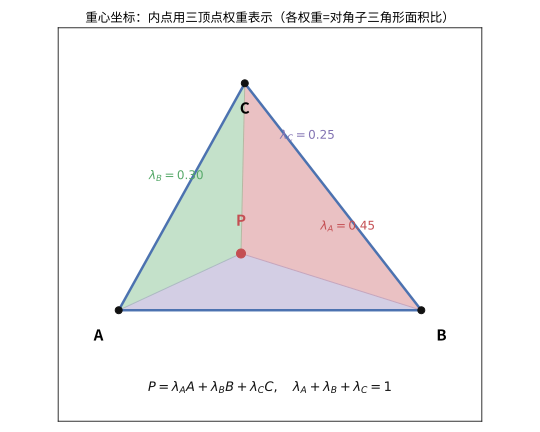
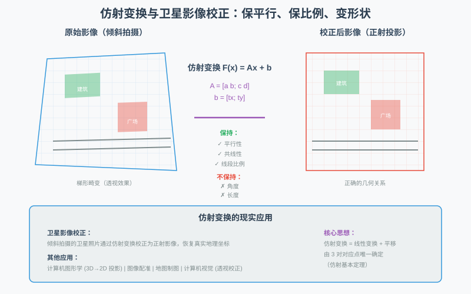
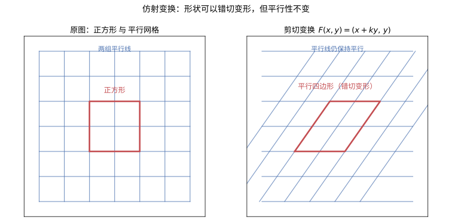

# 第61级：仿射几何 (Affine Geometry)

## 学习目标

1. 理解仿射空间的定义与基本性质，掌握仿射坐标与重心坐标的表示。
2. 掌握仿射变换的定义、性质及其分类。
3. 深入理解仿射基本定理及其证明。
4. 掌握 Cevian 定理、Menelaus 定理与 Desargues 定理及其证明。
5. 了解仿射联络、仿射曲率等微分几何概念。
6. 掌握仿射二次曲面的分类与性质。

---

## 1. 核心概念

### 1.1 仿射空间

**动机与来龙去脉：从"把位置从度量中解放出来"说起**

仿射空间的概念，是几个世纪以来数学家不断追问"什么才是几何的本质"这一问题的产物。早在 **Euler 与 Lagrange** 的时代，人们就已习惯用向量来表示位移——"沿某个方向走若干步"。大家很快发现，大量几何命题（"$A$ 是线段 $BC$ 的中点""直线 $l$ 与 $m$ 平行""$P,Q,R$ 三点共线"）根本不关心"你在哪、离原点多远"，只在乎"点与点之间怎么连"。到 19 世纪，随着射影几何与坐标几何的发展，"去掉原点、去掉度量"变得空前迫切：既然平移、缩放、错切都改不了共线与平行，那么这些性质必定来自某个比"长度与角度"更基础的结构。

**它解决了什么问题？** 没有仿射空间，我们每一步都要先立一个原点，再断言"每个点都是从原点出发的向量"。可几何里并没有天然的"原点"。仿射空间把"世界如何由点构成"（集合 $\mathbb{A}$）和"世界如何由方向构成"（向量空间 $V$）分开：点的集合本身平凡，真正的几何藏在位移向量 $\overrightarrow{AB}\in V$ 里。

**由浅入深。** 想象你站在一个没有门牌的公园里：每个人（点）没有"地址"，但任意两人之间都能说出"他站在我这边、偏东偏北各几米"（一个向量）。把"站的位置"与"走的方向"分开记录，正是仿射空间在做的。下面把这份直觉写成严格定义。

**定义（仿射空间）** 设 $\mathbb{A}$ 是一个非空集合，$V$ 是域 $\mathbb{K}$ 上的向量空间。称 $\mathbb{A}$ 为**仿射空间**，如果存在映射 $+:\mathbb{A}\times V\to\mathbb{A}$，记作 $(A,\mathbf{v})\mapsto A+\mathbf{v}$，满足：
1. 对任意 $A\in\mathbb{A}$，$A+\mathbf{0}=A$。
2. 对任意 $A\in\mathbb{A}$ 和 $\mathbf{u},\mathbf{v}\in V$，$(A+\mathbf{u})+\mathbf{v}=A+(\mathbf{u}+\mathbf{v})$。
3. 对任意 $A,B\in\mathbb{A}$，存在唯一的 $\mathbf{v}\in V$ 使得 $B=A+\mathbf{v}$，记作 $\overrightarrow{AB}=\mathbf{v}$。

集合 $\mathbb{A}$ 中的元素称为**点**，$V$ 称为**平移空间**或**方向空间**，$\dim\mathbb{A}:=\dim V$。

> **💡 直观理解（类比）**：仿射空间就像"一张没有刻度的白纸上的所有点，配合一只能平移的手"。它不像向量空间那样自带一个"原点"作为庙堂中心，而是只提供两件事：怎么走（方向向量 $\mathbf{v}$）、走到哪（点 $A$）。点加一个方向就得到新点（$A+\mathbf{v}$），任何两个点的差就是"从这点到那点的方向"。就好比站在一个空荡的广场上：位置（点）是没有编号的，但你随时可以说"往前走三格、再往左两格"（加上一个向量），并且任意两个点之间都能用唯一的一串步子连起来。

### 1.2 仿射坐标与重心坐标

**动机与来龙去脉：给"无原点"的空间装上临时的尺**

仿射空间没有天然原点，那怎么描述具体的一个点？办法是临时挑一个原点 $O$ 和一组方向路牌，建一套坐标——就像景区给没有门牌号的土地临时立"游客中心"和方向牌。要点是：坐标只是临时说辞，换一套坐标系点还是那个点。**重心坐标**（**Möbius**，1827）走得更妙：它完全不挑原点，而是用 $n+1$ 个"基座点"和它们的权重（系数和为 $1$）来定位，恰好命中仿射几何"位置是相对的"这一命脉。

**仿射坐标**：选定原点 $O\in\mathbb{A}$ 和 $V$ 的一组基 $\{\mathbf{e}_1,\dots,\mathbf{e}_n\}$，则任意点 $P\in\mathbb{A}$ 可唯一表示为

$$
P=O+\sum_{i=1}^n x_i\mathbf{e}_i,
$$

称 $(x_1,\dots,x_n)$ 为 $P$ 的**仿射坐标**。

> **💡 直观理解（类比）**：仿射坐标像"在城市的某个路口设一个定位原点后，用东西南北几步来描述所有地址"。你选定一个原点 $O$ 和一串方向"指路牌" $\{\mathbf{e}_i\}$，那么每个点 $P$ 都能写成"从原点出发，沿第 $i$ 个方向各走 $x_i$ 步"。换一个原点或换一套指路牌，坐标数字会变，但点本身没动——这正说明坐标只是"暂时的标签"，几何事实藏在点与方向的关系里。

**重心坐标**：设 $A_0,\dots,A_n$ 是仿射空间中的 $n+1$ 个仿射无关点（即 $\{\overrightarrow{A_0A_1},\dots,\overrightarrow{A_0A_n}\}$ 线性无关），则任意点 $P$ 可唯一表示为

$$
P=\sum_{i=0}^n\lambda_iA_i,\quad \sum_{i=0}^n\lambda_i=1,
$$

其中 $(\lambda_0,\dots,\lambda_n)$ 称为 $P$ 关于 $\{A_i\}$ 的**重心坐标**。

> **直观理解（现实类比）**：把点 $P=(\lambda_A,\lambda_B,\lambda_C)$ 想象成在三角形桌面上悬挂的钉子，用三根绳子分别挂在顶点 $A,B,C$ 上，绳子的拉力比例就是重心坐标 $\lambda_A:\lambda_B:\lambda_C$。改变三根绳子的拉力，钉子就会"漂移"到三角形内的不同位置——拉力越大的顶点，把钉子拉得越近。另一个类比是调色：把红、绿、蓝三种颜料按比例 $\lambda_A,\lambda_B,\lambda_C$ 混合，混合色对应三角形内唯一的一点。

### 1.3 仿射组合与仿射独立

**动机与来龙去脉：中点与连线背后的代数**

一个中点 $M=\frac12A+\frac12B$，一条连线上的任意一点 $P=(1-t)A+tB$——这些常识里的小事，若把系数取出来看，竟然全是"系数之和为 $1$ 的组合"。这正是仿射几何的引擎：**仿射组合**是唯一不依赖原点的合法"加法"。而**仿射独立**回答"究竟需要几个点才撑得开一个空间"，它把线性代数里"一组基"的判定改编成"没有原点参照的版本"。

**定义** 点 $P_1,\dots,P_k$ 的**仿射组合**是形如 $\sum_{i=1}^k\lambda_iP_i$ 的点，其中 $\sum_{i=1}^k\lambda_i=1$。

**定义** 点集 $\{P_0,\dots,P_k\}$ 称为**仿射无关**的，如果向量 $\{\overrightarrow{P_0P_1},\dots,\overrightarrow{P_0P_k}\}$ 线性无关。否则称为**仿射相关**的。

> **💡 直观理解（类比）**：仿射组合与仿射无关，一个像"配重天平"，一个像"砖块能不能立成骨架"。**仿射组合**要求系数和为 1：就好比把一堆支点按"总重量正好压满秤盘"的方式摆，组合结果落在它们撑起的"质心"位置，和原点无关。**仿射无关**则相当于：从一个固定点出发，到其余各点的方向必须"各走各的、谁都不被别人线性拼出来"——像三个不共线的桩子能撑起一块板，若共线就只能挤成一条直链（仿射相关）。这是判断"几个点能张成一个多大的仿射子空间"的底气。

### 1.4 仿射子空间与平行

**动机与来龙去脉：点集里如何"认出"直线与平面**

在向量空间里，"过原点的子空间"是纯线性概念；可几何中的直线、平面往往不过原点。**仿射子空间**正是"把线性子空间搬到任意位置"，它回答"不过原点的『平面』究竟是什么意思"，并自然带出平行性的严格定义——平行的仿射子空间，无非是方向子空间相同（或互相包含）的兄弟。

**定义（仿射子空间）** 设 $P\in\mathbb{A}$，$D\subseteq V$ 是线性子空间。集合
$$
M=P+D:=\{P+\mathbf{v}:\mathbf{v}\in D\}
$$
称为仿射空间 $\mathbb{A}$ 的**仿射子空间**，$D$ 称为它的**方向子空间**；维数定义为 $\dim M:=\dim D$。支撑点选谁很灵活：若 $Q\in M$，则 $M=Q+D$，即 $M$ 是方向子空间 $D$ 的一个**陪集**（coset）。

- 维数为 $1$ 的仿射子空间称为**直线**；
- 维数为 $n-1$ 的仿射子空间称为**仿射超平面**，可写成 $\{\mathbf{x}:\alpha(\mathbf{x})=c\}$，其中 $\alpha:V\to\mathbb{K}$ 是非零线性泛函。

**平行**：两个仿射子空间 $M=P+D$ 与 $N=Q+D'$ 称为**平行**的，若 $D\subseteq D'$ 或 $D'\subseteq D$（当 $\dim M=\dim N$ 时即为 $D=D'$）。两条直线的平行因此退化为"方向子空间相同"：$l\parallel m\iff D_l=D_m$。

> **💡 直观理解（类比）**：仿射子空间就像"把一叠做好的尺子（方向子空间 $D$）随手放到地面任意一点 $P$"。不管放哪，尺子的朝向没变，$M$ 的"形状"完全由 $D$ 决定，$P$ 只是落点。两条平行的直线，则好比桌面上永不相交的轨道，它们共享同一组"方向"。
>
> **常见坑/容易混**：$P$ 不是 $M$ 的"原点"，只是支撑点，可随便换；方向子空间 $D$ 才唯一。别把 $M=P+D$ 里的 $P$ 误当成"坐标原点"。

### 1.5 仿射映射

**动机与来龙去脉：哪些变换被保留下来？**

Erlangen 纲领（**F. Klein**，1872）给出一个革命性观点：一门几何，就是"在某个变换群下保持不变的性质"。欧氏几何研究的是在刚体运动（平移 + 旋转 / 反射）下不变的量——长度、角度。可现实里大量变形（缩放、错切、镜头倾斜）根本不保长度角度，却照样保"直线、平行、比例"。于是我们问：把这些更"蛮横"的变换也放进来，剩下的不变量是什么？答案就是**仿射映射** $F(\mathbf{x})=A\mathbf{x}+\mathbf{b}$：它由一个线性部分 $A$ 加一个平移 $\mathbf{b}$ 组成，正对应"臣服于仿射变换群的那一类几何"。

**定义** 映射 $F:\mathbb{A}\to\mathbb{A}'$ 称为**仿射映射**，如果存在线性映射 $L:V\to V'$ 使得对任意 $P,Q\in\mathbb{A}$，

$$
\overrightarrow{F(P)F(Q)}=L(\overrightarrow{PQ}).
$$

等价地，存在点 $O\in\mathbb{A}$ 和线性映射 $L$，使得 $F(O+\mathbf{v})=F(O)+L(\mathbf{v})$。

> **直观理解（现实类比）**：仿射变换就像**卫星影像校正**——卫星从太空斜着拍摄地面，照片中的建筑物、道路都发生了倾斜变形（平行线仍平行，但角度变了）。要得到"从上往下看"的正射影像，需要施加一个仿射变换 $F(\mathbf{x})=A\mathbf{x}+\mathbf{b}$，把倾斜的照片"拉正"。仿射变换保持平行性和比例（道路中点仍是中点），但不保持角度和长度——这正是"仿射几何"研究的不变量：什么在拉伸/错切下保持不变。

> **🧠 思考历程：一个"只能保持直线和平行"的贫乏几何，凭什么能和欧氏几何平起平坐？**
>
> 仿射几何不量长度、不测角度，只认"直线、平行、中点、比例"。听起来"少了很多"，可它恰恰在 19 世纪几何革命中找到了自己的江湖地位——**它回答的是欧氏几何答不了的问题：当坐标轴被拉伸或压扁后，还有哪些几何事实是真的？**
>
> - **欧氏几何的"奢侈"提供了起点**。古典几何被长度、角、"全等"这些概念占据了几个世纪，可要真正回答诸如"某点是不是线段中点""两条线是否平行"这类问题，你其实不需要尺和圆规——**只需要一个能保持直线与平行的变换 $F(x)=Ax+b$**。仿射几何就是把这些"不依赖度量的关系"单独抽出来，你会发现它们自成一个完备的世界。
> - **重心坐标：没有原点也能"定位"**（Möbius，1827）。仿射空间的高明之处是没有天然的**原点**——只有"相对于某个方向的偏移"。Möbius 发明**重心坐标**：用 $n+1$ 个仿射无关点的"权重"（总和为 1）来定位任意点，这一下把"点的位置"从"参考坐标系"里解放出来。**中点即"权重各半"，三点共线即"权重线性相关"**——不必有量角器，几何事实照样成立。
> - **平行性为何是"国王"**。在拉伸/错切下，角度、长度全乱套，唯独**平行**不折不弯。仿射几何于是把"平行"奉为第一不变量，从而一口咬定：Cevian 定理、Menelaus 定理（见 §4），乃至射影几何里的 Desargues 定理（见 §5，深层是"无穷远直线"的功课），全是平行结构下的必然。**与其说仿射几何"少"，不如说它"选对了不变量"**——这恰好是 Erlangen 纲领（F. Klein）的核心追问：一门几何，就是那些在某个变换群下不变的性质。
> - **心路**：仿射几何给我们一个可贵的提醒：**"信息少了"未必是坏事，反而逼出更耐用的结构**。当现实里无数扰动（镜头倾斜、坐标缩放、投影偏差）都在摧毁"长度/角度"，只有平行与比例还能幸存——那么在最嘈杂的真实世界，恰恰是这门"贫乏"的几何最扛得住。

### 1.6 仿射映射的矩阵分解与仿射坐标变换

**动机与来龙去脉：一个仿射变换的"零件箱"**

把仿射映射写成 $F(\mathbf{x})=A\mathbf{x}+\mathbf{b}$ 已经很清晰，但更彻底的做法是用一张**增广矩阵**把 $A$ 和平移 $\mathbf{b}$ 一并塞进去：线性部分 $A$ 管"捏形"，平移 $\mathbf{b}$ 管"搬窝"。用齐次坐标
$$
\begin{pmatrix}\mathbf{x}\\1\end{pmatrix}\mapsto
\begin{pmatrix}A & \mathbf{b}\\ \mathbf{0}^T & 1\end{pmatrix}
\begin{pmatrix}\mathbf{x}\\1\end{pmatrix},
$$
两次变换的复合就变成两个增广矩阵相乘——一切都能像普通线性代数一样计算。同理，同一个点在不同坐标系里的**坐标变换**也是仿射形式 $x'=Ax+\mathbf{b}$，只是我们把"动空间"换成了"动坐标系"。

**（$n+1$）×（$n+1$）矩阵表示**：
$$
[F]=\begin{pmatrix}A & \mathbf{b}\\ \mathbf{0}^T & 1\end{pmatrix},\quad \mathbf{0}^T=(0,\dots,0),
$$
且复合 $F_2\circ F_1$ 对应矩阵乘积 $[F_2][F_1]$。

**仿射坐标变换**：同一物理点在两套仿射坐标 $(x_i)$、$(x'_i)$ 下的坐标通过
$$
x'_i=\sum_j a_{ij}x_j+b_i \quad\Longleftrightarrow\quad x'=Ax+\mathbf{b}
$$
联系，其中 $(a_{ij})$ 是基变换矩阵，$(b_i)$ 反映两坐标系原点的相对平移。

**平行四边形法则**：由 Chasles 关系 $\overrightarrow{AB}+\overrightarrow{BC}=\overrightarrow{AC}$，四点 $P,Q,R,S$ 构成平行四边形的充要条件是对角线互相平分，或写为向量方程 $P+R=Q+S$。这是平行四边形在仿射视角下"没有角度也能判定"的核心事实。

> **💡 直观理解（类比）**：增广矩阵像"在三维纸面上把二维图纸连底座一起搬运"——左上块 $A$ 是怎么捏，最后一列 $\mathbf{b}$ 是往哪搬，多加一行"1"把平移也变成线性动作，连锁变换就能一行行叠乘。
>
> **常见坑/容易混**：别把"坐标变换"和"点变换"搞混——$x'=Ax+b$ 既可以解释为点被移动，也可以解释为坐标系被更换，几何事实两者等价，但"谁是动的"要看语境。平行四边形判定 $P+R=Q+S$ 依赖点之间"取平均"这一仿射操作，与长度角度无关。

### 1.7 仿射结构与平行性

**动机与来龙去脉：平行为什么是"国王不变量"**

在缩放、错切、剪切里，角度和长度会变得面目全非，可两条互相错开的直线永远错开——**平行**几乎是仿射变换下手最稳的性质。正因如此，仿射几何把"平行"抬上王座：平行的直线共享同一个**方向子空间**，平行关系构成一个等价类；要看清仿射几何，先看清方向如何被分类。

**平行性**：在仿射几何中，两条直线称为**平行**的，如果它们的方向向量线性相关。平行性是仿射变换下的不变量。

**仿射变换群**：$\mathbb{A}$ 上所有可逆仿射变换构成群，记作 $\operatorname{Aff}(\mathbb{A})$。仿射变换可写为 $F(\mathbf{x})=A\mathbf{x}+\mathbf{b}$，其中 $A\in\operatorname{GL}(V)$，$\mathbf{b}\in V$。

> **💡 直观理解（类比）**：$F(\mathbf{x})=A\mathbf{x}+\mathbf{b}$ 就像"先掰样子再挪窝"：矩阵 $A$ 负责"捏形"（拉伸、旋转、错切），平移向量 $\mathbf{b}$ 负责"搬家"。只看方向不看度量时，平行性是最稳的"锚点"——无论怎么捏，两条永远不相交的直线仍不相交，只是角度和疏密变了。把所有的 $\mathbf{b}$（上、下、各方向搬家）和所有可逆的 $A$ 装进同一个盒子 $A\mathbf{x}+\mathbf{b}$，就组成仿射变换群 $\operatorname{Aff}$，它正是仿射几何"研究哪些性质经得起这个盒子随便折腾"的出发点。

### 1.8 仿射联络与仿射曲率

**动机与来龙去脉：从"整片平"走向"局部的小尺子"**

前面讲的都是"平直"的仿射空间，可现实里的曲面往往是弯的。**仿射联络**要回答"把一个小向量沿着曲面扛着走"会发生什么：它把每一点处的切空间连接起来，定义"如何平移向量"（由 Christoffel 符号 $\Gamma_{ij}^k$ 编码），而**仿射曲率**量度"绕一小圈回来向量转了多少"。仿射联络因此是从"整片仿射空间"走向"微分意义上的局部几何"的第一级台阶。

**仿射联络**：在微分几何中，仿射联络是切空间之间的一种线性联络，用于定义向量的平行移动和协变导数。局部由 Christoffel 符号 $\Gamma_{ij}^k$ 刻画。

**仿射曲率**：仿射联络的曲率张量定义为

$$
R(X,Y)Z=\nabla_X\nabla_YZ-\nabla_Y\nabla_XZ-\nabla_{[X,Y]}Z.
$$

在仿射几何中，我们关注的是无挠仿射联络（即 $\Gamma_{ij}^k=\Gamma_{ji}^k$）。

> **💡 直观理解（类比）**：仿射联络像"给曲面上的一只蚂蚁配了一本地图走的尺子"——它告诉你怎么在弯弯曲曲的表面上把向量"尽量专心地平移着扛着走"，不让自己手忙脚乱到处乱偏。曲率张量 $R(X,Y)Z$ 则是"绕一圈回来后，你扛着的向量转了多少"：沿一个小方框走上一整圈，若向量回到原点时变了方向，就说明这块空间"是弯的"。"无挠"就像"别让两根指路箭头在交叉路口自己绞起来互相喊话抢道"（对称 $\Gamma$），是让整个平行移动规则保持公平整洁的设定。

### 1.9 仿射二次曲面

**动机与来龙去脉：所有圆锥曲线的"种类"都藏在二次型里**

如何判断一条平面曲线是椭圆、双曲线还是抛物线？古典靠画图，近代靠代数：把它们统一写成二次方程，再用坐标变换（平移 + 线性变换）"配方消掉"交叉项与一次项，露出标准型。在仿射变换之下，二次曲面的种类（椭圆型 / 双曲型 / 抛物型）是不变的——正如"同一颗蛋在不同光照下只有固定的几张剪影"。

**定义** 仿射空间 $\mathbb{A}^n$ 中的**二次曲面**是满足如下二次方程的点集

$$
\sum_{i,j=1}^n a_{ij}x_ix_j+\sum_{i=1}^n b_ix_i+c=0,
$$

其中矩阵 $(a_{ij})$ 对称且非零。

> **💡 直观理解（类比）**：仿射二次曲面就像"同一颗鸡蛋在不同光照下的剪影"。方程里那些 $x_ix_j$ 和 $x_i$ 的组合，经仿射变换折腾后不过换了个"捏法"，本质只有三种：像鼓得满满的**鸡蛋**（椭圆型：所有方向都得"往里收"），像一匹马背上的**马鞍**（双曲型：有的方向张开、有的方向收拢，出现正负），还有像**抛物线滑梯**（抛物型：沿 $x_n$ 方向敞开）。$x^2$ 之类配方后，$x_i x_j$ 的交叉导致的斜角，全靠把坐标"拧正"成标准型来显影。所以仿射意义下，全世界的二次曲面基本上就这三副面孔。

在仿射变换下，二次曲面可分为标准型：
- **椭圆型**：$\sum_{i=1}^n \lambda_i x_i^2=1$（所有 $\lambda_i>0$）
- **双曲型**：$\sum_{i=1}^n \lambda_i x_i^2=1$（$\lambda_i$ 有正有负）
- **抛物型**：$\sum_{i=1}^{n-1}\lambda_i x_i^2=x_n$

### 1.10 仿射几何与欧氏几何

**动机与来龙去脉：仿射到底比欧氏"少了什么"？**

欧氏几何在集合与方向之外多配了一把尺子和量角器（由内积给出长度、角度与垂直）；仿射则把度量统统拿走，只留直线、平行、中点与简单比。为什么仿射恰好保留"平行"与"简单比"？因为仿射变换 $F(\mathbf{x})=A\mathbf{x}+\mathbf{b}$ 中 $A$ 只保线性关系、不保内积：简单比只涉及共线点的参数 $t$，是纯线性的，故被线性部分 $L$ 原样带走；而长度、角度依赖内积，$A$ 不必是正交矩阵，于是在仿射作用下漂流。**垂直不是仿射不变量**，这正是仿射与欧氏最刺眼的分界线。

按 Erlangen 纲领，这三门几何由层层包含的变换群刻画：

| 几何 | 变换群 | 典型不变量 |
|---|---|---|
| 射影几何 | 射影变换 | 共线、**交比**、共点 |
| 仿射几何 | 仿射变换 $A\mathbf{x}+\mathbf{b}$ | 共线、平行、**简单比**、面积比 |
| 欧氏几何 | 等距 / 相似变换 | 长度、角度、垂直、全等 |

> **💡 直观理解（类比）**：把三种几何想成三副不同度数的眼镜。欧氏眼镜能看到长度角度；摘掉这些、只见平行与比例的就是仿射眼镜；再让平行线在无穷远处相交、只认共线与交比，就是射影眼镜。
>
> **常见坑/容易混**：中点（简单比 $t=1/2$）、重心、中位线都是仿射不变量，在仿射下安然无恙；但"等腰、直角、垂直、角平分线"这类词在仿射语境下毫无意义——拿仿射变换去切"直角"，直角立刻走形。

---

## 2. 定理与证明

### 2.1 仿射变换保持共线性与比例

**定理** 设 $F:\mathbb{A}\to\mathbb{A}'$ 是仿射映射，则
1. $F$ 将共线点映射为共线点。
2. 若 $F$ 是可逆仿射变换，则它保持共线三点之间的简单比（仿射比例）：对任意共线三点 $P,Q,R$（$Q\neq R$），

$$
\frac{\overrightarrow{PQ}}{\overrightarrow{PR}}=\frac{\overrightarrow{F(P)F(Q)}}{\overrightarrow{F(P)F(R)}}.
$$

> **💡 直观理解（类比）**：这个定理说的就是"拉伸胶垫上的记号不会乱"。$F$ 把点搬家的同时，它内部的"线性骨头" $L$ 会先把方向向量 $\overrightarrow{PQ}=t\,\overrightarrow{PR}$ 整体转一下再送去——因为 $t$（三点间的比例参数）被线性性原封不动地带走，所以 $F(P),F(Q),F(R)$ 依然排成一条直线，而且那段"分块的比" $t$ 一点没变。好比在一张画满同轴刻度的透明胶片上做整体拉伸：上面的标记彼此间的相对位置和比例，完全保持。

**证明** 设 $P,Q,R$ 共线，则存在实数 $t$ 使得 $\overrightarrow{PQ}=t\overrightarrow{PR}$。设 $F$ 对应的线性部分为 $L$，则

$$
\overrightarrow{F(P)F(Q)}=L(\overrightarrow{PQ})=L(t\overrightarrow{PR})=tL(\overrightarrow{PR})=t\overrightarrow{F(P)F(R)}.
$$

因此 $F(P),F(Q),F(R)$ 共线，且比例保持不变。

若 $F$ 可逆，则 $L$ 可逆，因此 $t$ 由 $L(\overrightarrow{PQ})=tL(\overrightarrow{PR})$ 唯一确定，且 $t=\frac{\overrightarrow{PQ}}{\overrightarrow{PR}}=\frac{\overrightarrow{F(P)F(Q)}}{\overrightarrow{F(P)F(R)}}$。$\square$

### 2.2 仿射基本定理

**定理（仿射基本定理）** 设 $\mathbb{A}$ 和 $\mathbb{A}'$ 是域 $\mathbb{K}$ 上的仿射空间，$\dim\mathbb{A}=\dim\mathbb{A}'=n\ge1$。设 $A_0,\dots,A_n\in\mathbb{A}$ 和 $A_0',\dots,A_n'\in\mathbb{A}'$ 分别是两组仿射无关的点。则存在唯一的仿射映射 $F:\mathbb{A}\to\mathbb{A}'$ 使得 $F(A_i)=A_i'$ 对 $i=0,\dots,n$ 成立。

> **💡 直观理解（类比）**：仿射基本定理就像"搭骨架决定全身"。只要给定"一只脚的落点加 $n$ 根撑开骨架的方向"，整只灯笼的形状就被完全锁死。因为你一旦知道 $n+1$ 个仿射无关点的去向（这些点撑起的骨架足够撑开整个空间），那么每个方向都被这一组"支撑向量"线性表出，$F$ 的线性骨头 $L$ 就完全定下来，连想象空间都不留。打个比方：给一位裁缝看杰出了"领口、腰带、下摆"这几个关键标记被怎么摆放，他就推得出整件衣服怎么裁，且只有一种裁法。

**证明** 分两步：存在性和唯一性。

**第一步：存在性**。由于 $\{A_0,\dots,A_n\}$ 仿射无关，$\{\overrightarrow{A_0A_1},\dots,\overrightarrow{A_0A_n}\}$ 是 $V$ 的一组基。定义线性映射 $L:V\to V'$ 在基上的作用为

$$
L(\overrightarrow{A_0A_i})=\overrightarrow{A_0'A_i'},\quad i=1,\dots,n,
$$

然后线性延拓到整个 $V$。定义 $F:\mathbb{A}\to\mathbb{A}'$ 为

$$
F(P)=A_0'+L(\overrightarrow{A_0P}).
$$

则 $F$ 是仿射映射，且

$$
F(A_0)=A_0'+L(\overrightarrow{A_0A_0})=A_0'+L(\mathbf{0})=A_0',
$$
$$
F(A_i)=A_0'+L(\overrightarrow{A_0A_i})=A_0'+\overrightarrow{A_0'A_i'}=A_i'.
$$

**第二步：唯一性**。设 $G$ 是另一个满足 $G(A_i)=A_i'$ 的仿射映射，对应的线性部分为 $L_G$。则对任意 $P\in\mathbb{A}$，$\overrightarrow{A_0P}=\sum_{i=1}^n\alpha_i\overrightarrow{A_0A_i}$，于是

$$
G(P)=G(A_0)+L_G(\overrightarrow{A_0P})=A_0'+L_G\left(\sum_{i=1}^n\alpha_i\overrightarrow{A_0A_i}\right)=A_0'+\sum_{i=1}^n\alpha_iL_G(\overrightarrow{A_0A_i}).
$$

但 $L_G(\overrightarrow{A_0A_i})=\overrightarrow{G(A_0)G(A_i)}=\overrightarrow{A_0'A_i'}=L(\overrightarrow{A_0A_i})$，因此 $L_G=L$，从而 $G=F$。$\square$

**推论** 仿射空间 $\mathbb{A}^n$ 的自同构群 $\operatorname{Aff}(\mathbb{A}^n)$ 同构于 $\operatorname{GL}(n,\mathbb{K})\ltimes\mathbb{K}^n$（半直积）。

> **💡 直观理解（类比）**：这个推论把"仿射变换全家福"装进一个半直积的盒子。所谓半直积，就是"先动骨头、再搬家"的组合法则：光一个线性变换 $A$（捏形）还不够，还要一个平移 $\mathbf{b}$（搬窝），两部分拼在一起 $(A,\mathbf{b})$。为什么叫"半直积"而非"普通直积"？因为当你接连做两次变换再拆包时，第二次平移会被第一把"捏形"的手牵连着转一下——就像先把地图旋转了一个角度，再在上面量"向北走五步"就会被这辈子理解成别的方向。于是 $A$ 会"掺和"进 $\mathbf{b}$，这正是半直积微妙之所在。

### 2.3 Cevian 定理

**定理（Cevian 定理）** 设 $ABC$ 是仿射平面上的三角形，点 $D,E,F$ 分别在边 $BC,CA,AB$ 上（或延长线上）。则三线 $AD,BE,CF$ 共点（或平行）当且仅当

$$
\frac{BD}{DC}\cdot\frac{CE}{EA}\cdot\frac{AF}{FB}=1.
$$

其中线段比取有向长度。

> **💡 直观理解（类比）**：Cevian 定理像"三根绳子要在一根横线上找一个共同的吊点"。三角形三个顶点各发出一条"中线镖"（从顶点射向对边上一点），这三镖若能在三角形内部或外部恰好穿到同一个点，它们的达标比例就得满足"三边分点比的乘积正好为 1"。你可以把它想成三根测距绳：每条线段被切成长一短两节，只要长/短的长短比三乘积恰好是 1，三根绳就能在某处拧在一起；一旦差一点点，就谁也追不上谁。它是三角形共点关系的"护照验证码"。

**证明** 使用重心坐标。设 $A,B,C$ 的重心坐标分别为 $(1,0,0)$，$(0,1,0)$，$(0,0,1)$。则 $D$ 在 $BC$ 上，可写为 $D=(0,\beta,1-\beta)$，其中 $\beta=\frac{CD}{BC}$，即 $\frac{BD}{DC}=\frac{1-\beta}{\beta}$。

类似地，$E$ 在 $CA$ 上，$E=(\gamma,0,1-\gamma)$，$\frac{CE}{EA}=\frac{1-\gamma}{\gamma}$；$F$ 在 $AB$ 上，$F=(\alpha,1-\alpha,0)$，$\frac{AF}{FB}=\frac{1-\alpha}{\alpha}$。

三线 $AD,BE,CF$ 共点当且仅当存在 $P$ 同时在这三条线上。设 $P$ 的重心坐标为 $(x,y,z)$，$x+y+z=1$。

$P$ 在 $AD$ 上 $\iff$ $P$ 可写为 $A$ 和 $D$ 的仿射组合：$P=(1-u)A+uD$。代入坐标得

$$
(x,y,z)=(1-u)(1,0,0)+u(0,\beta,1-\beta)=(1-u,u\beta,u(1-\beta)).
$$

因此 $x:y:z=(1-u):u\beta:u(1-\beta)$，即 $y/z=\beta/(1-\beta)$，所以 $y:z=BD:DC$。

类似地，$P$ 在 $BE$ 上 $\implies$ $z:x=CE:EA$；$P$ 在 $CF$ 上 $\implies$ $x:y=AF:FB$。

三线共点当且仅当这三个条件同时成立，即

$$
\frac{y}{z}=\frac{BD}{DC},\quad \frac{z}{x}=\frac{CE}{EA},\quad \frac{x}{y}=\frac{AF}{FB}.
$$

三式相乘得

$$
\frac{y}{z}\cdot\frac{z}{x}\cdot\frac{x}{y}=1=\frac{BD}{DC}\cdot\frac{CE}{EA}\cdot\frac{AF}{FB}.
$$

反之，若该乘积为 $1$，定义 $x,y,z$ 为满足上述比例关系的任意正数，则 $P=(x,y,z)$（归一化后）即为三条线的交点。$\square$

### 2.4 Menelaus 定理

**定理（Menelaus 定理）** 设 $ABC$ 是仿射平面上的三角形，直线 $l$ 与三边 $BC,CA,AB$（或延长线）分别交于 $D,E,F$。则

$$
\frac{BD}{DC}\cdot\frac{CE}{EA}\cdot\frac{AF}{FB}=-1.
$$

其中线段比取有向长度。

> **💡 直观理解（类比）**：Menelaus 定理是 Cevian 定理的"共线版镜像"。Cevian 问"三线是否同穿一点"，Menelaus 问"一条直线是否恰好横穿三边"。若一条直线像一把切纸刀稳稳切开（或延长线穿出）三条边 $D,E,F$，那么这三个分点比的乘积必须是 $-1$（比 Cevian 的 $1$ 多一个负号，正是"切在外面"的有向性标记）。好比一把横贯三角形的利刃，它同时在三条边上留下的切口位置，彼此默契地满足这个乘法密码，否则切口就不对齐、刀就"切不到一块儿"。

**证明** 设直线 $l$ 截三角形 $ABC$ 于 $D,E,F$。使用重心坐标方法。设 $l$ 的方程为 $\alpha x+\beta y+\gamma z=0$（其中 $x+y+z=1$ 是重心坐标），且 $l$ 不通过任何顶点（否则退化为平凡情形）。

$D$ 是 $l$ 与 $BC$ 的交点。在 $BC$ 上，$x=0$，$y+z=1$，代入 $l$ 的方程得 $\beta y+\gamma(1-y)=0$，解得 $y=\frac{\gamma}{\gamma-\beta}$。因此 $D=(0,\frac{\gamma}{\gamma-\beta},\frac{-\beta}{\gamma-\beta})$。于是

$$
\frac{BD}{DC}=\frac{z_D}{y_D}=\frac{-\beta}{\gamma}.
$$

类似地，$E$ 是 $l$ 与 $CA$ 的交点（$y=0$），$E=(\frac{\gamma}{\gamma-\alpha},0,\frac{-\alpha}{\gamma-\alpha})$，$\frac{CE}{EA}=\frac{x_E}{z_E}=\frac{-\gamma}{\alpha}$。

$F$ 是 $l$ 与 $AB$ 的交点（$z=0$），$F=(\frac{\beta}{\beta-\alpha},\frac{-\alpha}{\beta-\alpha},0)$，$\frac{AF}{FB}=\frac{y_F}{x_F}=\frac{-\alpha}{\beta}$。

三式相乘得

$$
\frac{BD}{DC}\cdot\frac{CE}{EA}\cdot\frac{AF}{FB}=\left(-\frac{\beta}{\gamma}\right)\left(-\frac{\gamma}{\alpha}\right)\left(-\frac{\alpha}{\beta}\right)=-1.
$$

$\square$

**注** Cevian 定理与 Menelaus 定理在射影几何中可统一为对偶命题。Cevian 定理处理共点性，Menelaus 定理处理共线性，两者在射影平面中互为对偶。

### 2.5 Desargues 定理

**定理（Desargues）** 在仿射平面中，设两个三角形 $ABC$ 和 $A'B'C'$ 满足对应顶点的连线 $AA',BB',CC'$ 共点于 $O$。则对应边 $BC$ 与 $B'C'$、$CA$ 与 $C'A'$、$AB$ 与 $A'B'$ 的交点共线。

> **💡 直观理解（类比）**：Desargues 定理像"从一盏射灯投下的两块全息印永远对齐"。把顶点配对线 $AA',BB',CC'$ 想象成三条从同一盏灯 $"O$ 出发的光柱，它们分别照亮了两个三角形"内外两层膜"，投影在屏幕上落下两个三角形影。定理说：只要 A、A' 在同一条光柱上，B、B' 在另一条上，C、C' 在第三条上，那么两个影子的对应三条边（$BC$ 对 $B'C'$ 等）的交点就偏偏排在同一条直线上。这就像手电筒照出两层相嵌的影子，它们的边沿交点自动连成一条影子线——投影几何里"透视 + 共线"这只手笔。

**证明** 设 $P=BC\cap B'C'$，$Q=CA\cap C'A'$，$R=AB\cap A'B'$。我们需要证明 $P,Q,R$ 共线。

**方法一（使用重心坐标）**：选择仿射坐标，设 $O$ 为原点。则有向量表示：

$$
A=\mathbf{a},\quad B=\mathbf{b},\quad C=\mathbf{c},\quad A'=\lambda\mathbf{a},\quad B'=\mu\mathbf{b},\quad C'=\nu\mathbf{c},
$$

其中 $\lambda,\mu,\nu\in\mathbb{K}$ 为非零常数。

直线 $BC$ 上的点可写为 $\mathbf{b}+t(\mathbf{c}-\mathbf{b})$，直线 $B'C'$ 上的点可写为 $\mu\mathbf{b}+s(\nu\mathbf{c}-\mu\mathbf{b})$。设 $P$ 为交点，则存在 $t,s$ 使得

$$
\mathbf{b}+t(\mathbf{c}-\mathbf{b})=\mu\mathbf{b}+s(\nu\mathbf{c}-\mu\mathbf{b}).
$$

整理得

$$
(1-t-\mu+s\mu)\mathbf{b}+(t-s\nu)\mathbf{c}=0.
$$

由于 $\mathbf{b},\mathbf{c}$ 线性无关（$A,B,C$ 不共线），有

$$
1-t-\mu+s\mu=0,\quad t-s\nu=0.
$$

解得 $s=\frac{\mu-1}{\mu-\nu}$，$t=\frac{\nu(\mu-1)}{\mu-\nu}$。因此

$$
P=\mathbf{b}+\frac{\nu(\mu-1)}{\mu-\nu}(\mathbf{c}-\mathbf{b})=\frac{(\mu-\nu-\nu\mu+\nu)\mathbf{b}+\nu(\mu-1)\mathbf{c}}{\mu-\nu}=\frac{\mu(1-\nu)\mathbf{b}+\nu(\mu-1)\mathbf{c}}{\mu-\nu}.
$$

类似地，

$$
Q=\frac{\nu(1-\lambda)\mathbf{c}+\lambda(\nu-1)\mathbf{a}}{\nu-\lambda},\quad R=\frac{\lambda(1-\mu)\mathbf{a}+\mu(\lambda-1)\mathbf{b}}{\lambda-\mu}.
$$

现在验证 $P,Q,R$ 共线。观察到

$$
\frac{\mu-\nu}{\mu(1-\nu)}P+\frac{\nu-\lambda}{\nu(1-\lambda)}Q+\frac{\lambda-\mu}{\lambda(1-\mu)}R=0,
$$

且系数之和为

$$
\frac{\mu-\nu}{\mu(1-\nu)}+\frac{\nu-\lambda}{\nu(1-\lambda)}+\frac{\lambda-\mu}{\lambda(1-\mu)}=0,
$$

因此 $P,Q,R$ 满足一个线性关系，即共线。

**方法二（使用射影几何）**：在射影平面中，Desargues 定理是公理定理，其证明更为简洁。将仿射平面嵌入射影平面，在射影平面中，两条平行线在无穷远点相交。通过射影变换，可设 $O$ 为任意点，然后利用射影坐标直接计算。$\square$

**注** Desargues 定理是射影几何的基本定理，在仿射几何中需要考虑平行线的特殊情况（即交点在无穷远处）。

---

## 3. 示例

### 示例 1：仿射变换的分类

**问题** 在二维仿射平面 $\mathbb{A}^2$ 上，分类所有仿射变换。

**解** 二维仿射变换 $F:\mathbb{A}^2\to\mathbb{A}^2$ 的一般形式为

$$
F\begin{pmatrix}x\\y\end{pmatrix}=A\begin{pmatrix}x\\y\end{pmatrix}+\begin{pmatrix}b_1\\b_2\end{pmatrix},
$$

其中 $A\in\operatorname{GL}(2,\mathbb{R})$。根据 $A$ 的 Jordan 标准型，仿射变换可分为以下类型：

1. **平移**：$A=I$，$F(\mathbf{x})=\mathbf{x}+\mathbf{b}$。
2. **伸缩**（均匀缩放）：$A=\lambda I$，$\lambda\neq0$，$F(\mathbf{x})=\lambda\mathbf{x}+\mathbf{b}$。
3. **旋转**：$A=\begin{pmatrix}\cos\theta & -\sin\theta\\ \sin\theta & \cos\theta\end{pmatrix}$，$F$ 是旋转与平移的复合。
4. **反射**：$A=\begin{pmatrix}1 & 0\\ 0 & -1\end{pmatrix}$，$F$ 是关于某条直线的反射。
5. **剪切**：$A=\begin{pmatrix}1 & k\\ 0 & 1\end{pmatrix}$，$F$ 是剪切变换。
6. **一般仿射变换**：$A$ 为任意可逆矩阵，可分解为旋转、伸缩、剪切和反射的复合。

**仿射变换的不变量**：
- 共线性
- 平行性
- 线段的比例（简单比）
- 面积比（$|\det A|$）
- 重心坐标

> **直观理解（现实类比）**：仿射变换就像把一张画满平行线的透明胶片均匀地拉伸、压扁或斜着错切（shear）——网格中的平行线永远不会弯折或相交，只是整体倾斜或疏密变化。想一想把一张照片斜着拉长的效果：本是方形的棋盘变成平行四边形，但每一行砖缝依然彼此平行。这正是仿射变换"保平行、保比例"的本质。

### 示例 2：重心坐标的应用

**问题** 在三角形 $ABC$ 中，设 $D$ 是 $BC$ 上的点满足 $BD:DC=2:1$，$E$ 是 $CA$ 上的点满足 $CE:EA=1:2$，$F$ 是 $AB$ 上的点满足 $AF:FB=1:1$。证明 $AD,BE,CF$ 三线共点，并求交点 $P$ 的重心坐标。

**解** 计算各线段比：
- $BD:DC=2:1$，即 $\frac{BD}{DC}=2$。
- $CE:EA=1:2$，即 $\frac{CE}{EA}=\frac{1}{2}$。
- $AF:FB=1:1$，即 $\frac{AF}{FB}=1$。

Cevian 定理的条件：

$$
\frac{BD}{DC}\cdot\frac{CE}{EA}\cdot\frac{AF}{FB}=2\cdot\frac{1}{2}\cdot1=1.
$$

因此三线 $AD,BE,CF$ 共点。

设 $P$ 的重心坐标为 $(x,y,z)$，$x+y+z=1$。由共点条件：

$$
\frac{y}{z}=\frac{BD}{DC}=2,\quad \frac{z}{x}=\frac{CE}{EA}=\frac{1}{2},\quad \frac{x}{y}=\frac{AF}{FB}=1.
$$

由 $x/y=1$ 得 $x=y$；由 $y/z=2$ 得 $y=2z$；由 $z/x=1/2$ 得 $x=2z$。因此 $x=y=2z$，且 $x+y+z=5z=1$，故 $z=1/5$，$x=y=2/5$。

所以 $P$ 的重心坐标为 $(2/5,2/5,1/5)$。

> **💡 直观理解（类比）**：示例 2 把 Cevian 定理当"黑匣子验证码"用：先用三条线段比乘起来（$2\cdot\frac12\cdot1=1$）立刻判定三线共点，龙就锁上了，省去画交点的手工麻烦；随后用比例关系反推交点 $P$ 的三股力量大小（重心坐标 $2:2:1$）。整个过程像"用秤先称出三根绳拉力比乘积为 1，从而断定三绳在某处有个共同吊点，再滑回那个吊点的配重"——退化问题天衣无缝变成代数的加减比例。

### 示例 3：仿射二次曲面的分类

**问题** 将二次曲线 $3x^2+2xy+3y^2-4x+2y-1=0$ 化为标准型。

**解** 矩阵形式为

$$
\begin{pmatrix}x & y\end{pmatrix}\begin{pmatrix}3 & 1\\ 1 & 3\end{pmatrix}\begin{pmatrix}x\\y\end{pmatrix}+(-4,2)\begin{pmatrix}x\\y\end{pmatrix}-1=0.
$$

计算特征值：$\det\begin{pmatrix}3-\lambda & 1\\ 1 & 3-\lambda\end{pmatrix}=(3-\lambda)^2-1=0$，得 $\lambda_1=2$，$\lambda_2=4$。

特征向量：$\lambda_1=2$ 对应 $(1,-1)^T$（归一化后为 $(1/\sqrt{2},-1/\sqrt{2})$），$\lambda_2=4$ 对应 $(1,1)^T$（归一化后为 $(1/\sqrt{2},1/\sqrt{2})$）。

作正交变换 $\begin{pmatrix}x\\y\end{pmatrix}=R\begin{pmatrix}X\\Y\end{pmatrix}$，其中 $R=\begin{pmatrix}1/\sqrt{2} & 1/\sqrt{2}\\ -1/\sqrt{2} & 1/\sqrt{2}\end{pmatrix}$。代入化简得

$$
2X^2+4Y^2+\frac{2}{\sqrt{2}}(X+Y)+\frac{4}{\sqrt{2}}(-X+Y)-1=0.
$$

整理得

$$
2X^2+4Y^2-\frac{2}{\sqrt{2}}X+\frac{6}{\sqrt{2}}Y-1=0.
$$

配方：

$$
2\left(X-\frac{1}{2\sqrt{2}}\right)^2+4\left(Y+\frac{3}{4\sqrt{2}}\right)^2=1+\frac{1}{4}+\frac{9}{8}=\frac{19}{8}.
$$

设 $X'=X-1/(2\sqrt{2})$，$Y'=Y+3/(4\sqrt{2})$，则

$$
\frac{X'^2}{19/16}+\frac{Y'^2}{19/32}=1,
$$

这是一个椭圆（$a^2=19/16$，$b^2=19/32$）。

> **💡 直观理解（类比）**：示例 3 演示了美的"转正"过程。方程里那团纠缠的交叉项 $2xy$ 像一张拍歪了角度、看起来走样的照片；先是算特征值、找特征向量，相当于把"歪的镜头"转正（正交变换 $R$），交叉项瞬间消失，只留下干净的 $2X^2+4Y^2$；再平移（配方）把中心挪到原点，就现出标准椭圆 $\frac{X'^2}{19/16}+\frac{Y'^2}{19/32}=1$。这就像把一张倾斜的椭圆贴纸旋正、扶到画纸中心——底下的椭圆本质一点没变，只是摆正了才看得清楚。

---

## 4. 习题

### 基础题

**习题 1**（仿射空间定义）给出仿射空间 $\mathbb{A}$ 的正式定义：需要哪三个公理？

**习题 2**（仿射空间定义）在仿射空间 $\mathbb{A}$ 中，$V$ 起着什么作用？$\dim\mathbb{A}$ 是如何定义的？

**习题 3**（仿射空间定义）设 $\mathbb{A}$ 是仿射空间，$A\in\mathbb{A}$，$\mathbf{0}\in V$ 是零向量。验证 $A+\mathbf{0}=A$。

**习题 4**（仿射空间定义）对任意 $A,B\in\mathbb{A}$，向量 $\overrightarrow{AB}$ 是唯一的。结合公理第 3 条说明为什么。

**习题 5**（仿射空间定义）对于任意三点 $A,B,C$，写出关于向量 $\overrightarrow{AB}$ 与 $\overrightarrow{BC}$ 的 Chasles 关系。

**习题 6**（仿射空间定义）若 $\mathbb{A}$ 的平移空间 $V$ 是一维的，则 $\mathbb{A}$ 是什么对象？

**习题 7**（仿射空间定义）判断命题正误："仿射空间中任意两点的和仍是该空间中的点。"请说明理由。

**习题 8**（仿射空间定义）解释为什么"仿射空间没有固定的原点"这一说法是合理的。

**习题 9**（仿射空间定义）仿射空间 $\mathbb{A}$ 上定义了什么映射？给出其记号 $(A,\mathbf{v})\mapsto A+\mathbf{v}$。

**习题 10**（仿射空间定义）向量空间 $V$ 本身是否构成一个仿射空间？如果是，如何验证。

**习题 11**（仿射坐标）写出仿射坐标的定义：选定原点 $O$ 和基 $\{\mathbf{e}_i\}$ 后，点 $P$ 如何表示？

**习题 12**（仿射坐标）在 $\mathbb{R}^2$ 中，原点取 $(0,0)$，基取标准基。写出点 $(3,5)$ 的仿射坐标。

**习题 13**（仿射坐标）若把原点改为 $(1,2)$，其余基不变，则点 $(3,5)$ 在新坐标系中的仿射坐标是什么？

**习题 14**（仿射坐标）仿射坐标中，平移原点和改变基会如何影响坐标？坐标系 $n$ 个坐标对应多少维空间？

**习题 15**（仿射坐标）已知点 $P$ 的仿射坐标为 $(x_1,x_2)$，写出 $P$ 关于原点 $O$ 的向量表达式。

**习题 16**（仿射坐标）坐标 $(x_1,\dots,x_n)$ 的维数 $n$ 与仿射空间维数有何关系？

**习题 17**（仿射坐标）试说明仿射坐标为何不是唯一的，取决于什么选择。

**习题 18**（仿射坐标）若基向量 $\mathbf{e}_1,\mathbf{e}_2$ 改放顺序，点的仿射坐标如何变化？

**习题 19**（仿射坐标）将点 $P=O+2\mathbf{e}_1+3\mathbf{e}_2$ 用坐标写成 $n=2$ 的形式。

**习题 20**（仿射坐标）坐标变换为 $x'_i=\sum_j a_{ij}x_j+b_i$。写出这个变换对应的仿射矩阵表示。

**习题 21**（重心坐标）给出点 $P$ 关于 $n+1$ 个仿射无关点 $A_0,\dots,A_n$ 的重心坐标的定义。

**习题 22**（重心坐标）重心坐标 $\lambda_i$ 满足哪个约束条件？

**习题 23**（重心坐标）三角形内一点 $P$ 的重心坐标为 $(1/3,1/3,1/3)$，它是什么特殊点？

**习题 24**（重心坐标）设 $A,B,C$ 为三角形顶点，重心坐标为 $(0,1,0)$ 的点是谁？

**习题 25**（重心坐标）判断：重心坐标与点的仿射坐标之间有何关系？重心坐标是否唯一。

**习题 26**（重心坐标）点 $P$ 的重心坐标 $\lambda_A=1$ 且 $\lambda_B=\lambda_C=0$，$P$ 是哪个点？

**习题 27**（重心坐标）给定 $A_0,A_1$，写出线段 $A_0A_1$ 中点的重心坐标。

**习题 28**（重心坐标）在三角形 $ABC$ 中，$BC$ 边上的点 $P$ 重心坐标为 $(0,\lambda_B,\lambda_C)$，则 $\lambda_B+\lambda_C$ 等于什么？

**习题 29**（重心坐标）若 $P$ 的重心坐标中有某个 $\lambda_i<0$，说明 $P$ 位于何处？

**习题 30**（重心坐标）三个重心坐标全为正数，说明 $P$ 位于三角形的何处？

**习题 31**（仿射组合）$P_1,\dots,P_k$ 的仿射组合 $\sum_{i=1}^k\lambda_iP_i$ 中，系数满足什么条件？

**习题 32**（仿射组合）判断：两个仿射组合的差是否仍是一个仿射组合？说明理由。

**习题 33**（仿射组合）写出 $P,Q$ 两点连线上任意一点 $M$ 的仿射组合表达式。

**习题 34**（仿射组合）仿射组合的系数和为 $1$，这条性质有什么几何意义？

**习题 35**（仿射独立）点集 $\{P_0,\dots,P_k\}$ 仿射无关的判定条件是哪些向量线性无关？

**习题 36**（仿射独立）三个点何时仿射无关？何时仿射相关？

**习题 37**（仿射独立）$n$ 维仿射空间中最多有多少个仿射无关的点？

**习题 38**（仿射独立）判断：任意两个不同的点是否一定仿射无关。

**习题 39**（仿射独立）三个点 $A,B,C$ 仿射相关意味着什么几何位置关系？

**习题 40**（仿射独立）若 $\{\overrightarrow{P_0P_1},\dots,\overrightarrow{P_0P_k}\}$ 线性无关，则什么向量组也线性无关？

**习题 41**（仿射子空间）给出仿射子空间的定义，它由什么构成。

**习题 42**（仿射子空间）仿射子空间 $M=P+D$ 中，$D$ 与 $P$ 各代表什么？

**习题 43**（仿射子空间）仿射子空间的维数是如何定义的？

**习题 44**（仿射子空间）仿射空间中维数为 $1$ 的子空间叫什么？维数为 $n-1$ 的呢？

**习题 45**（仿射子空间）两条直线平行，它们的陪集的商空间维数是多少？

**习题 46**（仿射子空间）判断：两个仿射子空间的并是否仍是一个仿射子空间。

**习题 47**（仿射子空间）仿射子空间 $M$ 平行于方向子空间 $D$，若 $M,a\in\mathbb{A}$，$M=a+D$，则这个表示是否唯一？

**习题 48**（仿射子空间）给定点 $P$ 和方向 $\mathbf{v}$，写出过 $P$ 沿 $\mathbf{v}$ 的直线的参数方程。

**习题 49**（仿射子空间）仿射超平面的一阶代数描述是什么？

**习题 50**（仿射子空间）原点的仿射子空间中，方向子空间 $D$ 与仿射坐标中的线性空间有何关系？

**习题 51**（平行性）两条直线平行意味着它们的什么向量线性相关？

**习题 52**（平行性）平行性在仿射变换下是否保持不变？

**习题 53**（平行性）在仿射平面中，两条不同的平行线是否可能相交？

**习题 54**（平行性）给定一点 $P$ 和直线 $l$，过 $P$ 且与 $l$ 平行的直线是否存在且唯一？

**习题 55**（平行性）平行关系是否是仿射空间中直线集合上的等价关系？

**习题 56**（平行性）若 $l\parallel m$ 且 $m\parallel n$，是否有 $l\parallel n$？

**习题 57**（平行性）平行关系的等价类可用什么对象来表示？

**习题 58**（平行性）仿射变换把一组平行线映射为怎样的一组线？

**习题 59**（平行性）平行四边形由几组平行线确定？

**习题 60**（平行性）若 $F$ 是仿射变换，$l\parallel m$ 且 $l\neq m$，$F(l)$ 与 $F(m)$ 的关系如何？

**习题 61**（仿射变换定义）给出仿射映射 $F:\mathbb{A}\to\mathbb{A}'$ 的定义及其线性部分记号。

**习题 62**（仿射变换矩阵表示）仿射变换的一般形式 $F(\mathbf{x})=A\mathbf{x}+\mathbf{b}$ 中，$A$ 与 $\mathbf{b}$ 各是何矩阵、何向量？

**习题 63**（仿射变换矩阵表示）把仿射变换 $F(\mathbf{x})=A\mathbf{x}+\mathbf{b}$ 用分块矩阵写成一个 $(n+1)\times(n+1)$ 矩阵。

**习题 64**（仿射变换）仿射映射保持共线性吗？

**习题 65**（仿射变换）仿射变换的线性部分 $A$ 必须满足什么性质才是可逆仿射变换？

**习题 66**（仿射变换）仿射映射把平行线段映射为什么？

**习题 67**（仿射变换）仿射变换保持中点的性质：$M$ 是 $PQ$ 中点，则 $F(M)$ 是 $F(P)F(Q)$ 的什么？

**习题 68**（仿射变换）平移 $\mathbf{x}\mapsto\mathbf{x}+\mathbf{b}$ 的线性部分 $A$ 是多少？

**习题 69**（仿射变换）恒等映射是否是一个仿射变换？

**习题 70**（仿射变换）判断：仿射映射的复合是否仍是仿射映射。

**习题 71**（仿射映射分类）平移、伸缩、旋转分别对应怎样的矩阵 $A$？

**习题 72**（仿射映射分类）剪切变换的矩阵 $A$ 是什么典型形式？

**习题 73**（仿射映射分类）反射变换的矩阵特征是什么？

**习题 74**（仿射映射分类）均匀伸缩 $A=\lambda I$ 对图形的面积比影响是什么？

**习题 75**（仿射映射分类）投影在仿射意义下有何特点？（关于平行投影）

**习题 76**（仿射映射分类）判断仿射变换 $F(\mathbf{x})=2\mathbf{x}$ 是何种类型。

**习题 77**（仿射映射分类）仿射变换的逆是否仍为仿射变换？若是，其形式如何。

**习题 78**（仿射映射分类）一般仿射变换可分解为哪些基本变换的复合？

**习题 79**（仿射映射分类）旋转是否改变面积比？

**习题 80**（仿射映射分类）剪切变换是否保持直线为直线？

**习题 81**（不变量性质）仿射变换下共线性是否不变？

**习题 82**（不变量性质）仿射变换下平行性是否不变？

**习题 83**（不变量性质）仿射变换下线段的比例（简单比）是否不变？

**习题 84**（不变量性质）仿射变换下面积比变化因子是什么？

**习题 85**（不变量性质）仿射变换下重心坐标是否不变？

**习题 86**（不变量性质）判断：仿射变换是否保持两条线段长度相等？

**习题 87**（不变量性质）仿射变换是否保持角度大小？

**习题 88**（不变量性质）仿射变换把椭圆变为什么图形？

**习题 89**（不变量性质）仿射变换下三角形重心的像是什么？仍是重心吗？

**习题 90**（不变量性质）仿射变换是否保持"三点共线"这一性质？

**习题 91**（基与维数）仿射坐标中 $n$ 个基向量对应多少维仿射空间？

**习题 92**（基与维数）仿射空间维数与方向空间维数有何关系？

**习题 93**（基与维数）两个不同点确定一条什么直线，其维数是多少？

**习题 94**（基与维数）$m+1$ 个仿射无关点张成的仿射子空间维数是多少？

**习题 95**（基与维数）仿射空间 $\mathbb{A}^n$ 的自同构群是哪个？

**习题 96**（与欧氏/射影关系）仿射几何与欧氏几何相比，缺少了哪种结构？

**习题 97**（与欧氏/射影关系）仿射几何可看作射影几何去掉什么得到？

**习题 98**（与欧氏/射影关系）射影平面中两条平行线的交点位于何处？

**习题 99**（与欧氏/射影关系）仿射几何研究的最核心的不变量是什么？

**习题 100**（综合基础）仿射变换把平行四边形映射为平行四边形，这一结论依赖哪条不变量性质？

**习题 101**（仿射子空间）$M=P+D$ 中，方向子空间 $D$ 与支撑点 $P$ 分别决定什么？维度由谁确定？

**习题 102**（仿射映射矩阵）写出仿射变换 $F(\mathbf{x})=A\mathbf{x}+\mathbf{b}$ 的齐次（增广）矩阵表示 $[F]$。

**习题 103**（平行四边形）判断四点 $P,Q,R,S$ 是否构成平行四边形，可以用哪条仿射条件（用中点表示）？

### 进阶题

**习题 104**（仿射组合）设 $M$ 是 $A,B$ 的仿射组合的重心为 $M=\frac{1}{2}A+\frac{1}{2}B$，证明 $M$ 是线段 $AB$ 的中点。

**习题 105**（重心坐标）在三角形 $ABC$ 中，求重心 $G$ 的重心坐标推广到四边形情况。

**习题 106**（重心坐标）设 $P$ 是 $\triangle ABC$ 内点，重心坐标 $(2016,2017,2018)$，归一化后求 $\lambda_A$。

**习题 107**（重心坐标）已知 $P,A_0,A_1,A_2$ 仿射无关，且 $P=\lambda_0A_0+\lambda_1A_1+\lambda_2A_2$，$\lambda$ 和为一。若 $\lambda_0=1$，说明其余系数为多少。

**习题 108**（仿射变换）设 $F:\mathbb{R}^2\to\mathbb{R}^2$，$F(x,y)=(2x+3,y-1)$，问是否是仿射变换，写出 $A,\mathbf{b}$。

**习题 109**（仿射变换矩阵表示）仿射变换 $F(x,y)=(x-2y+5,3x+y)$ 的矩阵 $A$ 是多少？

**习题 110**（仿射变换矩阵表示）把仿射变换 $x'\mapsto2x'+3y'+4$ 用增广矩阵表示。

**习题 111**（仿射变换）求仿射变换 $F(x)=3x+2$ 的逆变换表达式。

**习题 112**（仿射映射分类）判断仿射变换 $F(x,y)=(-x,y)$ 的类型。

**习题 113**（仿射映射分类）下列哪个不是可逆仿射变换：$A=I$，$A=\begin{pmatrix}1&1\\0&0\end{pmatrix}$，$A=2I$。

**习题 114**（不变量性质）仿射变换 $F(x,y)=(x+y,x)$ 把单位正方形变为什么形状？面积比是多少？

**习题 115**（重心坐标与面积）证明：$\triangle ABC$ 内点 $P$ 的重心坐标 $\lambda_A$ 等于 $\triangle PBC$ 与 $\triangle ABC$ 的面积之比。

**习题 116**（仿射组合）设 $D$ 在 $BC$ 上且 $BD:DC=2:1$，用 $B,C$ 的仿射组合写出 $D$。

**习题 117**（仿射组合）证明：仿射组合可写为"固定一个点+方向向量线性组合"的形式。

**习题 118**（重心坐标）求 $\triangle ABC$ 中 $AC$ 中点的重心坐标。

**习题 119**（平行性）过原点方向为 $\mathbf{v}=(1,2)$ 的直线，与方向为 $(2,4)$ 的直线平行吗？

**习题 120**（平行性）给定点 $P=(3,4)$ 与方向 $(1,2)$，写出过 $P$ 的直线方程。

**习题 121**（仿射子空间）说明 $\{(x,y)\in\mathbb{R}^2:2x-y+3=0\}$ 是一个仿射子空间并给出方向。

**习题 122**（仿射子空间）求直线 $x-y=1$ 的方向子空间。

**习题 123**（仿射子空间）$\mathbb{R}^3$ 中平面 $x+y+z=1$ 的维数是多少？

**习题 124**（仿射变换）求将三点 $(0,0),(1,0),(0,1)$ 映射到 $(1,1),(3,1),(1,4)$ 的仿射变换。

**习题 125**（仿射变换矩阵表示）将仿射变换 $F$ 的透明矩阵 $F(x,y)=(2x-y+3,x-2)$ 写出 $A$。

**习题 126**（不变量性质）仿射变换 $\det A=3$ 时，图形的面积会变为原来的几倍？

**习题 127**（重心坐标）证明 Cevian 定理关于重心坐标的乘积条件公式可直接写为比值的乘积等于 1。

**习题 128**（平行性）若 $F$ 是仿射变换且 $l\parallel m$，证明 $F(l)$ 与 $F(m)$ 也平行。

**习题 129**（仿射变换）证明仿射变换保持三角形重心。

**习题 130**（重心坐标）已知重心坐标 $(\lambda_0,\lambda_1,\lambda_2)=(0.2,0.3,0.5)$，验证和为 $1$ 并说明 $P$ 在三角形内的位置。

**习题 131**（仿射组合）把点 $(4,5)$ 写成 $(1,2)$ 与 $(2,1)$ 的仿射组合。

**习题 132**（仿射变换）证明：仿射变换把重心坐标 $(\lambda_A,\lambda_B,\lambda_C)$ 的像的重心坐标仍按同一 $\lambda$ 组合 $A',B',C'$。

**习题 133**（仿射子空间）判断集合 $\{(x,y):x^2=y\}$ 是否为仿射子空间。

**习题 134**（仿射组合）证明中点公式：$M=(A+B)/2$ 等价于 $M$ 为 $A,B$ 的 $1/2$ 仿射组合。

**习题 135**（仿射变换分类）把仿射变换分类中"伸缩-平移-旋转-反射-剪切-一般"按线性部分可逆性排序。

**习题 136**（平行性）证明平行线被仿射变换保持，从而平行四边形被保持。

**习题 137**（重心坐标与共点）用重心坐标证明：三角形三边中点所连的三条线段共点。

**习题 138**（仿射变换）若 $F$ 是仿射变换且 $A$ 可逆，证明 $F$ 把一线段内部点仍映射为对应线段内部点（保持参数 $t$）。

**习题 139**（不变量性质）证明仿射变换下梯形被映射为梯形。

**习题 140**（仿射变换矩阵表示）写出仿射变换 $F(\mathbf{x})=A\mathbf{x}+\mathbf{b}$ 逆变换 $F^{-1}$ 的表达式。

**习题 141**（仿射子空间）仿射超平面 $a(x)+b=0$ 中，平行关系如何用线性泛函判断。

**习题 142**（重心坐标）设 $A(1,0),B(0,1),C(0,0)$，求点 $(1/3,2/3)$ 的重心坐标。

**习题 143**（仿射组合）由 $P=\frac12A+\frac14B+\frac14C$ 说明 $P$ 相对三点的位置。

**习题 144**（平行性）判断直线 $x+y=1$ 与 $x+y=3$ 是否平行。

**习题 145**（仿射变换）求把直线 $y=x$ 映到直线 $y=-x$ 的一个简单仿射变换。

**习题 146**（重心坐标）证明：三角形内心、重心、外心一般重心坐标不同（指出重心最简）。

**习题 147**（仿射组合）用仿射组合表示线段的三等分点（靠近 $A$ 的）。

**习题 148**（仿射子空间）$\mathbb{R}^2$ 中所有仿射子空间（零维、一维、二维）分别是什么？

**习题 149**（平行性）仿射变换保持平行性，从而把矩形（平行四边形）映射为平行四边形，面积比 $\det$ 说明形状如何。

**习题 150**（仿射变换）证明仿射变换把圆映射为椭圆（正解）。

**习题 151**（仿射坐标）原点 $(1,1)$ 基 $(1,0),(0,1)$ 下点 $(3,4)$ 的坐标。

**习题 152**（重心坐标）$P=A+\frac12(\overrightarrow{AB})$ 的重心坐标是什么？

**习题 153**（仿射变换矩阵表示）仿射变换 $F(x,y)=(2x, y+3)$ 的 $A$、$\mathbf{b}$。

**习题 154**（仿射子空间）说明过点 $(1,0,1)$ 方向 $(1,1,0)$ 的直线参数方程。

**习题 155**（仿射组合）证明 $P=\lambda A+(1-\lambda)B$（$0\le\lambda\le1$）在 $A,B$ 间。

**习题 156**（仿射变换）证明仿射变换保持共线点的交比在该点为中间点时退化为简单比。

**习题 157**（重心坐标）在四边形中，对角线中点的仿射组合表示。

**习题 158**（仿射映射分类）证明平移是"线性部分为单位矩阵"的仿射变换。

**习题 159**（平行性）两组直线方向向量成比例，说明这两组直线是否平行。

**习题 160**（仿射子空间）求 $\mathbb{R}^3$ 中两平面 $x+y+z=1$ 与 $x-y=0$ 的交集的维数。

**习题 161**（重心坐标）已知 $P=(2,1)$ 关于 $A=(0,0),B=(2,0),C=(0,2)$，求 $\lambda_A$ 与 $\lambda_C$ 关系（若 $\lambda_B=0$）。

**习题 162**（仿射变换）若 $F$ 仿射且 $F(A)=A'$，$F(B)=B'$，证明对参数 $t$，$F(A+t\overrightarrow{AB})=A'+t\overrightarrow{A'B'}$。

**习题 163**（仿射变换分类）设 $F(x,y)=(x-1, y+2)$，说明它是平移并求平移向量。

**习题 164**（重心坐标）在一个三角形中，重心坐标为 $(0, x, 1-x)$ 的点 $P$ 位于哪条线段上？

**习题 165**（仿射子空间）仿射子空间 $M=P+D$ 与 $N=P+D$ 相同等价于什么条件？

**习题 166**（平行性）判断点 $A=(1,2)$ 与直线 $l:x=2+t,y=3+2t$ 的关系（是否在直线上）。

**习题 167**（仿射变换）求仿射变换把三角形 $ABC$ 映射到对应顶点的变换（用 $A,B,C$ 及 $\overrightarrow{AB},\overrightarrow{AC}$）。

**习题 168**（不变量性质）证明仿射变换保持中心对称性（平行四边形中心）。

**习题 169**（仿射组合）写出三点 $A,B,C$ 中把 $C$ 映到 $A$、$A,B$ 不动的一个仿射变换矩阵条件。

**习题 170**（重心坐标）证明：仿射坐标与重心坐标可以互相过渡（一个仿射无关点组的坐标对应）。

**习题 171**（仿射子空间）证明两条直线平行当且仅当它们方向子空间相同（作为陪集）。

**习题 172**（仿射变换）求仿射变换 $F$ 使 $F(0,0)=(1,1)$，$F(1,0)=(0,3)$，$F(0,1)=(2,2)$。

**习题 173**（不变量性质）仿射变换保持面积比因子为 $\det A$，证明对平行四边形面积也成立。

**习题 174**（重心坐标）求 $\triangle ABC$ 中由 $\lambda=(1,1,1)$ 归一化后的重心。

**习题 175**（平行性）证明过不重合两点有且只有一条直线（利用仿射子空间）。

**习题 176**（仿射坐标）在仿射坐标下直线 $l$ 的参数式写为 $P_0+t\mathbf{v}$，它的方向子空间。

**习题 177**（仿射变换）证明仿射映射把仿射无关点映射为仿射无关点当且仅当其为单射。

**习题 178**（仿射组合）证明重心坐标与仿射组合系数一致，说明两者的同义关系。

**习题 179**（仿射子空间）说明两个仿射子空间的交集仍为仿射子空间。

**习题 180**（平行性）平移一个方向向量集，说明平行陪集结构。

**习题 181**（仿射变换）证明乘积 $\det A$ 在复合仿射变换中满足行列式相乘。

**习题 182**（重心坐标）三角形中，重心坐标为 $\left(\frac12,0,\frac12\right)$ 的点位于哪条边？

**习题 183**（仿射变换矩阵表示）用增广矩阵写出 $F(x,y)=(2x+y,x-3y)$（线性部分），无平移时的增广。

**习题 184**（仿射子空间）求 $\mathbb{R}^2$ 中直线 $y=2x+1$ 的仿射子空间形式 $P+D$。

**习题 185**（平行性）判断 $y=2x+1$ 与 $y=2x+5$ 是否平行，为何常数项不影响方向。

**习题 186**（仿射变换）证明仿射变换保持"线段的中点"这一操作可交换用线性部分。

**习题 187**（重心坐标）三角形内心重心坐标不是简单的线性比例，说明为何重心坐标适合仿射问题。

**习题 188**（仿射映射分类）列举仿射平面中涉及平行投影、单位形变的"仿射意义"投影。

**习题 189**（不变量性质）证明仿射变换下所研究图形的"简单比"不变。

**习题 190**（仿射组合）证明点 $P$ 在 $A,B$ 直线上当且仅当存在实数 $\lambda$ 使 $P=(1-\lambda)A+\lambda B$。

**习题 191**（重心坐标）$\triangle ABC$ 重心坐标乘积 $\lambda_A\lambda_B\lambda_C$ 的最大值点是什么？

**习题 192**（平行性）说明 "平行是仿射空间方向的分类"这一等价类思想。

**习题 193**（综合进阶）证明仿射变换保持梯形及一般平行四边形的仿射性质（中位线性质）。

**习题 194**（矩阵分解）设 $F_1,F_2$ 为仿射变换，用增广矩阵说明 $(F_2\circ F_1)$ 对应的矩阵是 $[F_2][F_1]$。

**习题 195**（坐标变换）同一物理点在两套仿射坐标中满足 $x'=Ax+\mathbf{b}$，说明 $A$ 与 $\mathbf{b}$ 的几何含义。

**习题 196**（平行四边形定律）用 Chasles 关系证明：四边形 $P,Q,R,S$ 的对角线互相平分 $\iff P+R=Q+S$。

### 挑战题

**习题 197**（仿射唯一性）叙述并证明仿射基本定理：$n+1$ 个仿射无关点决定唯一直仿射映射。

**习题 198**（仿射唯一性）证明：二维仿射平面中不共线三点决定唯一仿射变换。

**习题 199**（仿射组合）使用重心坐标证明 Cevian 定理的充分性。

**习题 200**（重心坐标）用重心坐标证明 Menelaus 定理：$\frac{BD}{DC}\frac{CE}{EA}\frac{AF}{FB}=-1$。

**习题 201**（重心坐标-规范化）说明重心坐标的唯一性来自仿射无关性，并给出归一化步骤。

**习题 202**（仿射组合）证明仿射组合保持 Chasles 关系 $\overrightarrow{AB}+\overrightarrow{BC}=\overrightarrow{AC}$。

**习题 203**（重心坐标平面）证明：重心坐标将三角形细分，三角域内点对应正重心坐标。

**习题 204**（仿射变换）用重心坐标证明 Desargues 定理的一个简单情形。

**习题 205**（仿射子空间）证明平行隔离定理：不同平行直线不相交。

**习题 206**（标准几何对象）证明任意平行四边形在仿射变换下都可标准化为单位正方形。

**习题 207**（标准化）证明任意两点在仿射变换下可映射为单位间隔 $[0,1]$ 端点。

**习题 208**（标准化）证明任意三角形在仿射变换下可映射为标准三角形（顶点 $(0,0),(1,0),(0,1)$）。

**习题 209**（标准化）三角形不定形可用仿射变换化为等腰直角三角形（在仿射意义下）。

**习题 210**（仿射不变量）证明简单比（比例）是仿射不变量。

**习题 211**（交比）说明在仿射几何中交比为何一般不保持，而简单比保持。

**习题 212**（仿射变换）证明仿射变换把中心对称图形映为中心对称图形。

**习题 213**（重心坐标）求三角形重心的重心坐标推广到 $n$ 维单形。

**习题 214**（仿射组合）证明仿射空间跑满足仿射组合封闭性：向量空间可看作仿射空间的一个特殊情形。

**习题 215**（仿射子空间）证明：仿射无关点集的凸包（单形）在仿射变换下的像仍是单形。

**习题 216**（平行性）平行线在射影平面交于无穷远点，说明仿射与射影关系。

**习题 217**（仿射变换矩阵）证明 $F(\mathbf{x})=A\mathbf{x}+\mathbf{b}$ 可逆当且仅当 $\det A\neq0$，并给出逆表达式。

**习题 218**（仿射唯一性）证明仿射变换保持共线点的顺序参数 $t$（仿射射线）。

**习题 219**（重心坐标长度）用重心坐标证明三角形中线交于重心。

**习题 220**（仿射变换面积）证明任意三角形面积比为 $|\det A|$。

**习题 221**（仿射二次曲线）证明仿射二次曲线在仿射变换下列出标准型（椭圆/双曲线/抛物线）。

**习题 222**（标准化）说明仿射变换把圆映为椭圆，从而椭圆可标准化。

**习题 223**（仿射不变量）证明平行性是不变量而垂直性不是。

**习题 224**（重心坐标梅涅劳斯）用重心坐标推导 Menelaus 中直线与该直线的关系式。

**习题 225**（仿射变换）证明仿射变换保持维数：$m$ 维仿射子空间映为 $m$ 维仿射子空间。

**习题 226**（仿射子空间）证明两个仿射子空间的交的维数公式（平行/不平行情形）。

**习题 227**（重心坐标共点）用重心坐标证明三角形三条中线共点并求重心坐标。

**习题 228**（标准化）说明任何三角形重心坐标可用仿射变换化为"重心坐标标准"。

**习题 229**（仿射变换）证明仿射变换是线性映射后跟平移的复合，即 $F=T_{\mathbf{b}}\circ L$。

**习题 230**（重心坐标）证明 Cevian 定理与 Menelaus 定理的乘积条件互为补充（共点 vs 共线）。

**习题 231**（仿射不变量）证明仿射变换保持共线三点简单比，从而保持中点。

**习题 232**（仿射二次曲面）将二次曲线 $x^2+4xy+y^2=1$ 化为标准型判断类型。

**习题 233**（标准化）用仿射变换把椭圆不变量化为中心原点标准位置。

**习题 234**（仿射子空间）证明：仿射子空间是某个方向子空间的陪集。

**习题 235**（交比与简单比）说明简单比是交比在规范化点中的极限情形。

**习题 236**（仿射变换群）证明 $\operatorname{Aff}(\mathbb{A}^n)\cong\operatorname{GL}(n)\ltimes\mathbb{K}^n$。

**习题 237**（重心坐标平面）用重心坐标求 $\triangle ABC$ 中 $P$ 满足 $\lambda_A:\lambda_B:\lambda_C=1:2:3$ 的点。

**习题 238**（仿射组合）证明凸组合是仿射组合的特例，凸包在仿射变换下映射到凸包。

**习题 239**（仿射变换）证明仿射变换是双射，若线性部分可逆，则逆映射仿射。

**习题 240**（标准化）三角形顶点 $(0,0),(1,0),(0,1)$ 为标准三角形，任意三角形仿射等价。

**习题 241**（仿射子空间）证明平行直线的方向子空间相同，作为陪集体现。

**习题 242**（重心坐标）用重心坐标证明三角形面积公式 $\lambda_i$ 比。

**习题 243**（仿射变换）证明一个仿射变换完全由基向量加上原点像确定。

**习题 244**（仿射不变量）证明"共线性"被仿射保持，用线性部分作用于向量。

**习题 245**（重心坐标共点）用重心坐标证明高线相关定理不保持（仿射不保垂直）。

**习题 246**（仿射二次曲线）将 $xy=1$ 化为标准型（双曲线）。

**习题 247**（标准化）证明任意直线仿射等价于 $x$ 轴。

**习题 248**（仿射变换面积比）用行列式定义证明面积比性质。

**习题 249**（仿射组合）证明仿射无关点组在仿射映射下保持相仿矩阵，仿射独立性。

**习题 250**（平行性）证明平行线等距（parallel projections 不保持距离但保持平行）。

**习题 251**（仿射子空间）说明仿射超平面划分空间，平行关系组成等价类。

**习题 252**（重心坐标规范化）证明将重心坐标求和归一化不改变表示的几何点。

**习题 253**（仿射变换逆）证明一般仿射变换 $A$ 可逆时逆 $F^{-1}(\mathbf{x})=A^{-1}\mathbf{x}-A^{-1}\mathbf{b}$。

**习题 254**（重心坐标共线）用重心坐标写出三点共线条件。

**习题 255**（标准化）证明梯形可仿射化为一般标准梯形但不改变中位线性质。

**习题 256**（仿射变换）证明仿射变换保持重心（作为面中心）。

**习题 257**（仿射子空间维数）证明两个不平行平面的交是直线。

**习题 258**（仿射组合）证明仿射组合系数和为 $1$ 的几何意义是重心/规范化。

**习题 259**（仿射变换保持性质）证明仿射变换保持仿射无关性当且仅当单射。

**习题 260**（重心坐标三角形）用重心坐标证明三角形旁心不完全仿射不变（有向性）。

**习题 261**（标准化）说明单位正方形、正三角形在仿射意义下不可区分（仿射等价）。

**习题 262**（仿射变换分类）证明任意可逆仿射变换可分解为平移、伸缩、剪切。

**习题 263**（重心坐标凸包）证明三角形内点原点重心坐标全非负。

**习题 264**（仿射子空间）证明过给定点和方向的仿射子空间唯一存在。

**习题 265**（仿射不变量）证明仿射变换保持共线四点简单比组合（若保持中点）。

**习题 266**（综合证明）用仿射变换把 Cevian 定理标准化到标准三角形证明。

**习题 267**（半直积复合）由增广矩阵的乘法验证 $\operatorname{Aff}(\mathbb{A}^n)\cong\operatorname{GL}(n)\ltimes\mathbb{K}^n$ 的复合律 $(A_1,\mathbf{b}_1)(A_2,\mathbf{b}_2)=(A_1A_2,\,A_1\mathbf{b}_2+\mathbf{b}_1)$。

**习题 268**（垂直非仿射）给出一个仿射变换把两条互相垂直的直线变为不再垂直的例子，说明"垂直"不是仿射不变量。

**习题 269**（中点与简单比）证明：仿射变换保持共线点之间的参数 $t$（从而保持中点 $t=1/2$），并由此说明"长度相等"为何不是仿射不变量。

### 探究题

**习题 270**（开放推广）将 Cevian 定理推广到 $n$ 维单形，提出并验证猜想。

**习题 271**（开放推广）研究仿射变换下凸多边形的顶点数与面积的变化规律。

**习题 272**（开放推广）讨论仿射几何与射影几何在不变量上的异同，并给出例子。

**习题 273**（开放探究）仿射二次曲面的标准型分类实在普遍维度下如何推广到 $n$ 维二次型。

**习题 274**（开放推广）探究重心坐标在计算机图形学（插值）中的应用原理。

**习题 275**（开放探究）讨论 Min..ax 在仿射变换下的不变量，寻找新的仿射不变量。

**习题 276**（开放推广）把 Desargues 定理推广到 ${n}$ 维仿射空间。

**习题 277**（开放探究）研究仿射变换下的"面积比"如何推广到体积比。

**习题 278**（开放推广）讨论仿射联络在微分几何中与黎曼联络的关系。

**习题 279**（开放探究）对任意四边形，四边中点连线的仿射性质。

**习题 280**（开放推广）探索不变量的函数：哪些图形性质在仿射变换下保持对称性。

**习题 281**（开放探究）设计用仿射变换将倾斜照片校正的算法步骤。

**习题 282**（开放推广）讨论仿射几何中的"标准化"如何抓住图形本质。

**习题 283**（开放探究）重心坐标在有限元与重心插值中的应用基础。

**习题 284**（开放推广）将 Menelaus 定理推广到多边形或更高维。

**习题 285**（开放探究）研究仿射变换群的轨道与不变量。

**习题 286**（开放推广）仿射等价问题：如何判定两个图形仿射等价。

**习题 287**（开放探究）用仿射变换证明三角形的中位线定理并推广。

**习题 288**（开放推广）探究仿射坐标变换矩阵在几何建模中的作用。

**习题 289**（开放探究）讨论仿射几何中"无穷远点"如何处理平行线。

**习题 290**（开放推广）把三角形重心坐标推广到四面体（重心坐标维数）。

**习题 291**（开放探究）研究仿射变换保持椭圆（中心二次型）不变的条件。

**习题 292**（开放推广）讨论仿射几何在凸优化与多面体理论中的联系。

**习题 293**（开放探究）探究交比、简单比在不变量谱系中的层次。

**习题 294**（开放推广）将仿射变换作用于代数曲线/曲面，讨论标准型。

**习题 295**（开放探究）用重心坐标研究三角形内的随机点的分布性质。

**习题 296**（开放推广）仿射几何的"变换群"如何影响其研究对象。

**习题 297**（开放探究）设计实验：仿射变换下什么性质丢失（角度、垂直）。

**习题 298**（开放推广）将 Cevian/Menelaus 统一到射影对偶角度探讨。

**习题 299**（开放探究）讨论仿射几何与向量机械的尺度不变性。

**习题 300**（开放推广）探究仿射二次曲面高阶维分类的代数工具（对称矩阵合同）。

**习题 301**（开放探究）从仿射不变角度重述欧氏定理中哪些可保留。

**习题 302**（开放推广）研究仿射变换群作用在三角形集合的轨道。

**习题 303**（开放探究）重心坐标在重心插值中避免病态的方案。

**习题 304**（开放推广）将仿射结构加到向量丛上，探讨仿射几何与纤维丛联系。

**习题 305**（开放探究）讨论仿射坐标变换、平行投影、无穷远之间的关系。

**习题 306**（开放推广）用仿射变换研究椭圆的几何不变量。

**习题 307**（开放探究）给出一种判定两组点是否仿射相关的算法。

**习题 308**（开放推广）讨论仿射几何在现代几何中的基础地位及其局限性。

**习题 309**（开放探究）综合：设计一个以仿射不变量为主题的开放研究课题并列出步骤。

---

## 5. 习题答案与解析

### 基础题答案

1. 需要：平移空间 $V$ 上一个作用 $+:\mathbb{A}\times V\to\mathbb{A}$，且满足 $A+\mathbf{0}=A$、$(A+\mathbf{u})+\mathbf{v}=A+(\mathbf{u}+\mathbf{v})$、对任意 $A,B$ 存在唯一 $\mathbf{v}$ 使 $B=A+\mathbf{v}$。

2. $V$ 是平移空间（方向空间），$\dim\mathbb{A}=\dim V$。

3. 由公理第 1 条直接得到：$A+\mathbf{0}=A$。

4. 公理第 3 条保证了存在性兼唯一性：对每个 $A,B$ 恰有一个 $\mathbf{v}$。

5. $\overrightarrow{AC}=\overrightarrow{AB}+\overrightarrow{BC}$（Chasles 关系）。

6. 一条（仿射）直线。

7. 错误。点与点之间只能做差得向量，点与向量可以做和；两个点直接相加没有定义。

8. 因为仿射空间没有原点概念，点之间的差才是向量空间中的元，所有点皆平等，故"没有固定原点"。

9. 定义了一个自由而可迁的作用 $+:\mathbb{A}\times V\to\mathbb{A}$，记 $(A,\mathbf{v})\mapsto A+\mathbf{v}$。

10. 是的。取 $\mathbb{A}=V$，作用定义为向量加法，即满足三条公理。

11. $P=O+\sum_{i=1}^n x_i\mathbf{e}_i$，$(x_1,\dots,x_n)$ 为仿射坐标。

12. $(3,5)$。

13. $(2,3)$（因 $(3-1,5-2)=(2,3)$）。

14. 平移原点使坐标平移，更换基是坐标的线性变换；$n$ 个坐标对应 $n$ 维空间。

15. $\overrightarrow{OP}=\sum x_i\mathbf{e}_i$。

16. 坐标个数 $n$ 等于维数 $\dim\mathbb{A}$。

17. 因为原点与基的选择不同，坐标表示随之不同。

18. 坐标分量相应交换位置。

19. $P=(2,3)$。

20. $x'=A\mathbf{x}+\mathbf{b}$，仿射变换矩阵 $[F]=\begin{pmatrix}A&\mathbf{b}\\0&1\end{pmatrix}$。

21. $P=\sum_{i=0}^n\lambda_iA_i$，$\sum\lambda_i=1$，$(\lambda_0,\dots,\lambda_n)$ 为重心坐标。

22. $\sum_{i=0}^n\lambda_i=1$。

23. 重心（三条中线的交点）。

24. 顶点 $B$（因为 $\lambda_B=1$）。

25. 重心坐标是仿射坐标的一种（相对仿射无关点组），在指定点组下唯一。

26. 顶点 $A_0$。

27. $\left(\frac12,\frac12\right)$。

28. $\lambda_B+\lambda_C=1$。

29. $P$ 位于三角形外部（对应边的外侧延长区域）。

30. $P$ 位于三角形内部。

31. $\sum_{i=1}^k\lambda_i=1$。

32. 是的。仿射组合之差得零和系数的"线性组合"，但其本身仍是点的下标数差意义下……实际两个点之差是向量，不是点，故"差"作向量理解。

33. $M=(1-t)P+tQ$，$0\le t\le1$。

34. 使组合不依赖原点，保证结果的几何意义不变（平移不变）。

35. $\{\overrightarrow{P_0P_1},\dots,\overrightarrow{P_0P_k}\}$ 线性无关。

36. 不共线则仿射无关；共线则仿射相关。

37. $n+1$ 个。

38. 是的。两个不同点，单向量 $\overrightarrow{P_0P_1}\neq0$ 线性无关。

39. 三点共线。

40. $\{\overrightarrow{P_kP_0},\dots,\overrightarrow{P_kP_{k-1}}\}$ 也是另一顺序的线性无关组。

41. 形如 $P+D$ 的集合，其中 $P\in\mathbb{A}$，$D\subseteq V$ 是线性子空间。

42. $P$ 是支撑点，$D$ 是方向子空间。

43. $\dim M=\dim D$。

44. 维数 1 叫直线，维数 $n-1$ 叫超平面。

45. 方向子空间维数差为 $1$（商空间一维）。

46. 一般不是，除非其中一个包含另一个。

47. 不唯一但方向 $D$ 唯一；支撑点可在 $M$ 中任意选取。

48. $M(t)=P+t\mathbf{v}$，$t\in\mathbb{K}$。

49. 形如 $\beta(\mathbf{x})=c$ 的方程定义仿射超平面。

50. 当原点取在子空间点时，方向子空间 $D$ 就是线性方程定义的空间。

51. 方向向量线性相关（成比例）。

52. 是的，平行性是仿射不变性质。

53. 不能，不同的平行线在仿射平面中不相交。

54. 是的，存在且唯一（方向唯一确定）。

55. 是的（自反、对称、传递）。

56. 是的。

57. 用方向子空间（等价类）表示。

58. 一组平行线。

59. 两组平行线。

60. $F(l)\parallel F(m)$ 且仍互异。

61. 存在线性映射 $L:V\to V'$ 使 $\overrightarrow{F(P)F(Q)}=L(\overrightarrow{PQ})$；线性部分为 $L$。

62. $A\in\operatorname{GL}(V)$ 可逆矩阵，$\mathbf{b}\in V$ 平移向量。

63. $\begin{pmatrix}A&\mathbf{b}\\0&1\end{pmatrix}$。

64. 是的，共线点映射为共线点。

65. $\det A\neq0$（$A\in\operatorname{GL}(V)$）。

66. 平行的线段。

67. 中点：$F(M)=\frac{F(P)+F(Q)}2$。

68. $A=I$。

69. 是的（$A=I,\mathbf{b}=0$）。

70. 是的，仿射映射复合仍是仿射映射。

71. 平移 $A=I$，伸缩 $A=\lambda I$，旋转 $A$ 为正交阵。

72. $A=\begin{pmatrix}1&k\\0&1\end{pmatrix}$。

73. $A$ 有特征值 $1,-1$ 且正交，如 $\begin{pmatrix}1&0\\0&-1\end{pmatrix}$。

74. 面积乘以 $|\lambda|^n$（均匀伸缩 $|\lambda|^2$ 于二维）。

75. 平行投影保持平行性、简单比，是仿射变换（线性部分幂等但不一定可逆）。

76. 均匀伸缩（$A=2I$）。

77. 是的，若 $A$ 可逆，$F^{-1}(\mathbf{x})=A^{-1}\mathbf{x}-A^{-1}\mathbf{b}$。

78. 平移、缩放、旋转、反射、剪切的复合。

79. 否，旋转不改变面积比（$|\det|=1$）。

80. 是的。

81. 不变。

82. 不变。

83. 不变。

84. $|\det A|$。

85. 不变（重心坐标是仿射不变）。

86. 否，长度不是仿射不变量。

87. 否，角度不保持。

88. 椭圆。

89. 是重心（重心保持）。

90. 保持。

91. $n$ 维。

92. 相等。

93. 直线，维数 1。

94. $m$ 维。

95. $\operatorname{Aff}(\mathbb{A}^n)\cong\operatorname{GL}(n,\mathbb{K})\ltimes\mathbb{K}^n$。

96. 度量结构（长度、角度、垂直性）。

97. 去掉无穷远直线/射影附加结构。

98. 无穷远点（直线）。

99. 平行性、简单比、共线性、面积比等仿射不变量。

100. 平行性。

101. $D$ 决定方向与维度（$\dim M=\dim D$），$P$ 只是支撑点（落点），不决定维度。

102. $[F]=\begin{pmatrix}A&\mathbf{b}\\ \mathbf{0}^T&1\end{pmatrix}$，作用在齐次坐标 $\begin{pmatrix}\mathbf{x}\\1\end{pmatrix}$ 上。

103. 对角线互相平分：$M_{PR}=\frac{P+R}{2}$，$M_{QS}=\frac{Q+S}{2}$，两者相等 $\iff P+R=Q+S$。

### 进阶题答案

1. $M=\frac12A+\frac12B$ 满足 $A,B,M$ 共线且 $\overrightarrow{AM}=\frac12\overrightarrow{AB}$，故为线段中点。

2. 四边形重心 $G=\frac{A+B+C+D}{4}$，重心坐标为 $(\frac14,\frac14,\frac14,\frac14)$。

3. 归一化：$\lambda_A=\frac{2016}{2016+2017+2018}=\frac{2016}{6051}$。

4. $\lambda_1=\lambda_2=0$（因 $P=\lambda_0A_0$ 与 $\lambda_0=1$，和为 1，故其余为 0）。

5. 是，$A=\begin{pmatrix}2&0\\0&1\end{pmatrix}$，$\mathbf{b}=(3,-1)$。

6. $A=\begin{pmatrix}1&-2\\3&1\end{pmatrix}$。

7. 增广矩阵 $\begin{pmatrix}2&3&4\\0&1&0\end{pmatrix}$（线性部分+平移列）。

8. $F^{-1}(x)=\frac{x-2}{3}$。

9. 关于 $y$ 轴反射（$A$ 正交，行列式 $-1$）。

10. $A=\begin{pmatrix}1&1\\0&0\end{pmatrix}$ 不可逆，故不可逆仿射变换。

11. 变为平行四边形，$A=\begin{pmatrix}1&1\\1&0\end{pmatrix}$，$|\det|=1$，面积不变。

12. $S_{\triangle PBC}=\lambda_A S_{\triangle ABC}$，故 $\lambda_A=\frac{S_{\triangle PBC}}{S_{\triangle ABC}}$。

13. $D=\frac13B+\frac23C$。

14. $\sum\lambda_iP_i=P_0+\sum_{i>0}\lambda_i\overrightarrow{P_0P_i}$（利用 $\sum\lambda_i=1$）。

15. $AC$ 中点重心坐标 $\left(\frac12,0,\frac12\right)$。

16. 平行，因方向 $(2,4)=2(1,2)$ 成比例。

17. $P+t\mathbf{v}=(3,4)+t(1,2)=(3+t,4+2t)$。

18. 是仿射子空间，方向子空间为 $\{(x,y):2x-y=0\}$。

19. $\{(t,t):t\in\mathbb{R}\}$，即方向 $(1,1)$。

20. 维数 2（平面）。

21. $F(x,y)=(2x-1,y+3)+\cdots$：设 $A\begin{pmatrix}x\\y\end{pmatrix}+\mathbf{b}$，由三点确定，可解得 $A=\begin{pmatrix}2&0\\0&3\end{pmatrix}$，$\mathbf{b}=(1,1)$。

22. $A=\begin{pmatrix}2&-1\\1&0\end{pmatrix}$。

23. $|\det A|=3$，面积变为 3 倍。

24. 三比值乘积等于 1 等价于中点共点条件，直接套用。

25. 线性部分 $L$ 把方向向量 $\mathbf{v}$ 映为 $L(\mathbf{v})$，方向仍成比例，故平行。

26. $\frac{F(G)}{}$ 由线性部分保持中点：$F(\frac{A+B+C}3)=\frac{F(A)+F(B)+F(C)}3$。

27. $0.2+0.3+0.5=1$，全非负，$P$ 在内部。

28. 需系数和 $1$：解 $(4,5)=t(1,2)+(1-t)(2,1)\Rightarrow(4,5)=(2-t,1+t)\Rightarrow t=-2,4$，矛盾。故 $(4,5)$ 不在 $(1,2)$ 与 $(2,1)$ 的连线上，不能写成这两点的仿射组合。

29. $F(\sum\lambda_iA_i)=\sum\lambda_iF(A_i)$（线性部分 + 系数和 1），故重心坐标同 $\lambda$ 组合像点。

30. 否，抛物线 $x^2=y$ 不是线性方程，不是仿射子空间。

31. $M=(A+B)/2=\frac12A+\frac12B$，系数和 1，即仿射组合。

32. 可逆可仿射变换按线性部分 $A$ 的可逆性归入"一般"类，伸缩/旋转/反射/剪切都是可逆的。

33. $L$ 把方向成比例的向量映为成比例向量，故平行保持，平行四边形保持。

34. 三边中点连线交于重心，用重心坐标或 Menelaus 证明交于一点。

35. $F(A+t\overrightarrow{AB})=A'+t\overrightarrow{A'B'}$，内部点 $0<t<1$ 仍对应内部。

36. 平行性保持，梯形上下底平行，故仍是梯形。

37. $F^{-1}(\mathbf{x})=A^{-1}\mathbf{x}-A^{-1}\mathbf{b}$。

38. 两个超平面平行当且仅当线性泛函部分 $\alpha$ 成比例（方向相同）。

39. $A(1,0),B(0,1),C(0,0)$，$P=\lambda_AA+\lambda_BB+\lambda_CC$，得 $\lambda_A=1/3,\lambda_B=2/3,\lambda_C=0$。

40. 系数和 $1$，$P$ 在三角形（以 $A$ 最多）内部靠近 $A$。

41. 平行，方向 $(1,1)$ 同，截距不同。

42. 如 $F(x,y)=(x,-y)$（关于 $x$ 轴对称）即可。

43. 重心坐标最简为 $(\frac13,\frac13,\frac13)$；内心、外心一般重心坐标含三角函数/边长，不恒等。

44. 靠近 $A$ 的三等分点 $=\frac23A+\frac13B$。

45. 点（0 维）、直线（1 维）、平面 $\mathbb{R}^2$ 本身（2 维）。

46. 矩形（平行四边形）映射为平行四边形，$\det$ 决定面积缩放，但保持平行性。

47. 圆方程为二次型，仿射变换下二次型变为合同二次型，圆映为椭圆。

48. $(3-1,4-1)=(2,3)$。

49. $P=A+\frac12\overrightarrow{AB}=\frac12A+\frac12B$，重心坐标 $(\frac12,\frac12)$。

50. $A=\begin{pmatrix}2&0\\0&1\end{pmatrix}$，$\mathbf{b}=(0,3)$。

51. $(1,0,1)+t(1,1,0)=(1+t,t,1)$。

52. 因为 $(1-\lambda)+\lambda=1$，$P$ 在线段内。

53. 中点交比退化为简单比；三点共线时交比 $=-1$ 与简单比一致。

54. 四边形对角线中点 $M_{AC}=(A+C)/2$，$M_{BD}=(B+D)/2$，可用仿射组合表示。

55. 平移 $F=\mathbf{x}+\mathbf{b}$，线性部分 $A=I$。

56. 方向成比例，故两组直线平行（互换方向可重合伴侣平行）。

57. 交线维数：$\mathbb{R}^3$ 两平面交线为直线，维数 1。

58. $P=\lambda_A A+\lambda_B B+\lambda_C C=(2\lambda_B,2\lambda_C)$，且 $\lambda_A+\lambda_B+\lambda_C=1$。由 $2\lambda_B=2,\;2\lambda_C=1$ 得 $\lambda_B=1,\;\lambda_C=\frac12$，故 $\lambda_A=-\frac12$。

59. $F(A+t\overrightarrow{AB})=F(A)+L(t\overrightarrow{AB})=A'+t\overrightarrow{A'B'}$。

60. $\mathbf{b}=(-1,2)$，平移向量 $(-1,2)$，$A=I$。

61. 重心坐标 $(0,x,1-x)$ 意味着在 $BC$ 上。

62. 方向子空间相同 $D_1=D_2$ 且支撑点同陪集（$P,Q$ 差属 $D$）。

63. 代入 $l$：需 $(1,2)=(2+t,3+2t)$ 得 $t=-1$ 且 $2=3-2=1$ 矛盾，故不在。

64. 由仿射基本定理：取 $A$ 为原点，基 $\overrightarrow{AB},\overrightarrow{AC}$，线性部分唯一确定。

65. 中心对称图形中点保持，平行四边形的中心（对角线交点）保持。

66. 仿射变换由三点像决定，使 $F(C)=A$ 即线性组合条件：$C$ 的像满足对应。

67. 只要能由一组仿射无关点确定重心坐标就与仿射坐标互相转换（基变换）。

68. 若方向向量成比例则方向子空间相同，反之亦然，故平行等价于方向子空间相同。

69. 解 $F(x,y)=A(x,y)+\mathbf{b}$。由 $F(0,0)=(1,1)\Rightarrow\mathbf{b}=(1,1)$；$A=(F(1,0)-F(0,0),F(0,1)-F(0,0))=((-1,2),(1,1))$，$A=\begin{pmatrix}-1&1\\2&1\end{pmatrix}$。

70. 平行四边形的面积 $|\det(\mathbf{u},\mathbf{v})|$，像为 $|\det A||\det(\mathbf{u},\mathbf{v})|$，故因子 $|\det A|$。

71. 归一化 $(\frac13,\frac13,\frac13)$，即重心。

72. 由仿射组合，两点唯一确定直线。

73. 方向子空间 $\operatorname{span}\{\mathbf{v}\}$。

74. 若 $F$ 单射则把仿射无关点映为仿射无关点，反之亦然（维数不变）。

75. 一个集合的重心坐标恰好是其仿射组合系数，称重心组合。

76. 交仍为 $P+(D_1\cap D_2)$（若非空）为仿射子空间。

77. 平行陪集为 $a+D$，方向相同。

78. $\det(A_2A_1)=\det A_2\det A_1$（复合对应矩阵乘积）。

79. $\left(\frac12,0,\frac12\right)$ 位于边 $AC$。

80. 增广 $\begin{pmatrix}2&1&0\\1&-3&0\end{pmatrix}$。

81. $M=(0,1)+t(1,2)$，即 $P=(0,1)$，$D=\{(t,2t)\}$。

82. 平行，因为方向同 $(1,2)$，常数项只平移直线。

83. 线性部分 $L$ 保持仿射组合，故中点保持。

84. 重心坐标只依赖仿射结构，而内心/外心依赖度量，故重心坐标适合仿射问题。

85. 平行投影把彼此平行的线保持，简单比保持，是仿射变换。

86. 三点共线时 $t$ 由 $\overrightarrow{PQ}=t\overrightarrow{PR}$ 在 $L$ 下不变，故简单比不变。

87. $P=(1-\lambda)A+\lambda B$ 正是直线参数式（系数和 1）。

88. 最大值在 $(\frac13,\frac13,\frac13)$（重心），乘积最大 $\frac1{27}$。

89. 平行性不依赖于原点，是方向的分类，作为等价类。

90. 梯形上下底平行，中位线性质（长度比、中点在仿射下保持）仍成立。

91. 复合 $F_2\circ F_1$ 满足 $F_2(F_1(\mathbf{x}))=A_2(A_1\mathbf{x}+\mathbf{b}_1)+\mathbf{b}_2=(A_2A_1)\mathbf{x}+(A_2\mathbf{b}_1+\mathbf{b}_2)$，恰为 $[F_2][F_1]$ 对应的线性部与平移。

92. $A$ 是从"旧基到新基"表示坐标的转移矩阵（基变换），$\mathbf{b}$ 反映两坐标系原点的相对平移（新原点在新坐标中的位置）。

93. 由 Chasles，平行四边形 $P,Q,R,S$ 的对边平行等价于 $R-P=Q-S$，即 $P+R=Q+S$，也即两对角线中点重合（互相平分）。

### 挑战题答案

1. 由仿射基本定理的证明：存在性（以 $A_0$ 为原点、$\overrightarrow{A_0A_i}$ 为基构造 $L$、$F$）与唯一性（$L$ 在基上确定故唯一）。$n+1$ 个仿射无关点唯一决定 $F$。

2. 不共线三点仿射无关，其像给出 $A$（线性部分，由 $\overrightarrow{AB},\overrightarrow{AC}$ 确定）与 $\mathbf{b}=F(A)$，唯一。

3. 设 $P=(\lambda_A,\lambda_B,\lambda_C)$，$D=(0,\beta,1-\beta)$ 等；共点 $\iff$ 三个比值乘积 $\frac{BD}{DC}\frac{CE}{EA}\frac{AF}{FB}=1$，对应 $\frac{y}{z}\frac{z}{x}\frac{x}{y}=1$，故充分性成立。

4. 直线 $\alpha x+\beta y+\gamma z=0$ 即重心坐标线性方程，$x+y+z=1$；分别解交边得三比值乘积为 $-1$。

5. 仿射无关性保证重心坐标唯一：若两组表示差则为线性关系，推出系数全零，故坐标唯一，正则归化使 $\sum=1$。

6. $F$ 保持 $\overrightarrow{AB}+\overrightarrow{BC}=\overrightarrow{AC}$，因线性部分作用于向量。

7. 重心坐标全非负且和为 1 $\iff$ 点在某单形内，重心坐标把三角形三角剖分对应内部的点。

8. Desargues 的三角形情形可用重心坐标选原点 $O$，直线交点共线关系，详见正文方法一。

9. 设 $l=a+\mathbb{K}\mathbf{v}$，$m=b+\mathbb{K}\mathbf{v}$（同方向），若相交则 $a+t\mathbf{v}=b+s\mathbf{v}$，比较可得若 $\mathbf{v}\neq0$ 两条不同直线不交（$a-b$ 不在方向子空间时）。

10. 仿射变换 $F(x,y)=(x/a,y/b)$ 把 $[0,a]\times[0,b]$ 中的平行四边形映为单位正方形（取对应顶点），由仿射基本定理唯一。

11. 仿射变换 $F(\mathbf{x})=A\mathbf{x}+\mathbf{b}$ 把两点映到端点是线性可实现的，例 $F$ 把 $(0)$ 映 0，把 $(1)$ 映 1。

12. 仿射变换把三角形标准顶点 $(0,0),(1,0),(0,1)$ 是仿射等价类代表，任意三角形可由仿射变换达到此标准形。

13. 任意非退化三角形仿射等价于标准三角形，故在仿射意义下等腰直角三角形是标准代表。

14. 三点共线时 $L(\overrightarrow{PQ})=tL(\overrightarrow{PR})$，$t$ 被线性保持，故简单比（比例）不变。

15. 交比 $\frac{\overrightarrow{PQ}}{\overrightarrow{PR}}/\frac{\overrightarrow{SQ}}{\overrightarrow{SR}}$ 涉及非仿射的组合，一般不被保持；简单比只涉线性比例故保持。

16. 中心对称关于 $C$：$P+P'=2C$；$F(P)+F(P')=2F(C)$，故像中心对称。

17. 单形重心 $\frac{\sum A_i}{n+1}$，重心坐标 $(\frac1{n+1},\dots,\frac1{n+1})$。

18. 向量空间取原点后是仿射空间，其仿射组合即线性组合（系数和 1 的线性组合）。

19. 仿射映射把仿射无关系数保持，单形凸包顶点对应映射，像仍是凸包（单形）。

20. 平行线在射影平面交于无穷远点，仿射几何是射影几何去掉无穷远线得到。

21. $F$ 可逆 $\iff A$ 可逆（$\det A\neq0$），逆为 $F^{-1}(\mathbf{x})=A^{-1}\mathbf{x}-A^{-1}\mathbf{b}$。

22. 对共线三点，$F$ 保持 $t$：$F(A+t\overrightarrow{AB})=A'+t\overrightarrow{A'B'}$，顺序保持。

23. 三中线交于重心 $G$，$G=\frac{A+B+C}3$，重心坐标 $(\frac13,\frac13,\frac13)$，在每条中线上。

24. $S_{F(\triangle)}=|\det L|S_\triangle$，因基向量经 $L$ 后叉积乘 $\det L$。

25. 二次型经合同变换（仿射线性部分）得标准型：正定-椭圆、不定-双曲、半正定退化-抛物（例正文分类）。

26. 圆 $x^2+y^2=1$ 经线性变换成椭圆 $x'^2/a^2+y'^2/b^2=1$，故圆仿射映椭圆。

27. 平行性由线性部分保持；垂直性涉及内积，仿射变换一般不保持内积，故垂直不保持。

28. 直线方程为重心坐标线性方程，Menelaus 中直线交三边得到乘积 $-1$，见正文证明。

29. $m$ 维仿射子空间 $P+D$ 的像为 $F(P)+L(D)$，$L$ 保持维数，故仍 $m$ 维。

30. 相交仿射子空间交的维数公式 $\dim(A\cap B)=\dim A+\dim B-\dim\langle A\cup B\rangle$ 在集中情形适用。

31. 三中线交点重心坐标 $(\frac13,\frac13,\frac13)$ 满足在每条中线上，故共点。

32. 任意三角形经仿射变换可化为重心坐标标准形，故可标准化任意重心配置。

33. $F(\mathbf{x})=A\mathbf{x}+\mathbf{b}=T_{\mathbf{b}}(L(\mathbf{x}))$，即平移后接线性映射。

34. Cevian 定理 $=$ 乘积 1 对应共点；Menelaus $=$ 乘积 $-1$ 对应共线，符号区分两种情形。

35. 简单比 $\frac{\overrightarrow{PQ}}{\overrightarrow{PR}}$ 在线性作用 $L$ 下保持 $t$，故中点（$t=1/2$）保持。

36. $x^2+4xy+y^2=1$，矩阵特征值为 $3,-1$，合同变换下标准型 $\lambda_1X^2+\lambda_2Y^2=1$，一双正一负，是双曲线。

37. 平移把椭圆中心映到原点，线性对角化把标准型化为 $\frac{x'^2}{a^2}+\frac{y'^2}{b^2}=1$。

38. $M=P+D$，故 $M=D+P$，被偏移，是方向子空间 $D$ 的陪集。

39. 交比在四点趋近时退化为简单比，简单比是交比规范化极限。

40. 半直积 $\operatorname{GL}(n)\ltimes\mathbb{K}^n$，复合 $(A_1,\mathbf{b}_1)(A_2,\mathbf{b}_2)=(A_1A_2,A_1\mathbf{b}_2+\mathbf{b}_1)$。

41. $\lambda=(1,2,3)$ 归一化 $(\frac16,\frac26,\frac36)=(\frac16,\frac13,\frac12)$。

42. 凸组合是非负系数的仿射组合；凸包由全非负 $t$ 组合构成，仿射变换保凸性。

43. 若 $A$ 可逆则 $F$ 双射，逆仿射，从而自同构群是 $\operatorname{Aff}(\mathbb{A}^n)$。

44. 标准三角形的任意仿射像仍是三角形的代表，即所有三角形仿射等价。

45. 平行直线方向子空间相同（同为 $D$），作为陪集 $a+D$。

46. $\lambda_A=\frac{S_{\triangle PBC}}{S_{\triangle ABC}}$ 等，面积比即重心坐标。

47. 基向量像加原点像确定仿射映射：$F(O+\mathbf{x})=F(O)+[A]\mathbf{x}$。

48. 共线由线性部分 $L$ 作用在共线向量上保持，其共线性直接体现。

49. 垂直关系依赖内积，仅线性部分不足以保持内积，故垂心/高线非仿射不变。

50. $xy=1$ 经线性变换对角化为 $\frac{X^2}{2}-\frac{Y^2}{2}=1$，是双曲线。

51. 仿射变换把直线 $y=\text{const}\cdot x+b$ 映为直线，任一直线映为 $x$ 轴类直线。

52. $|\det L|$ 因子由行列式线性作用于面积元。

53. 仿射映射诱导基变换映射，$\{P_i\}$ 仿射无关的像仍仿射无关（单射时）。

54. 平行线在平行投影意义下方向保持不变，但距离不保持（非度量）。

55. 仿射超平面 $P+D$（切割空间），平行关系组成方向等价类。

56. 归一化不改变表示点：对 $(\lambda_i)$ 除以 S 仍 $\sum=1$，几何点同。

57. 见答案反代：$F^{-1}(\mathbf{x})=A^{-1}(\mathbf{x}-\mathbf{b})=A^{-1}\mathbf{x}-A^{-1}\mathbf{b}$。

58. 三点共线条件：行列式 $\det\begin{pmatrix}\lambda_A&\lambda_B&\lambda_C\\...\end{pmatrix}$ 相关，或 $y/x,z/x$ 比值固定。

59. 梯形经仿射映为梯形，中位线（上下底中点连线）保持中位线，平行与中点在仿射下保持。

60. 重心即多点仿射组合的质心，仿射变换保持质心。

61. 两不平行平面 $\mathbb{R}^3$ 的交线维数 1（直线）当方向子空间互补时。

62. $\sum\lambda_i=1$ 使组合不依赖原点，几何上是"质心/规范化"。

63. 仿射无关性在单射下保持，非单射则退化，维数减少。

64. 旁心涉及角平分线（度量），一般不是仿射性质，有向重心坐标中体现。

65. 单位正方形、正三角形在仿射意义下等价（可互相变换），因为标准形相同。

66. 任何可逆 $A$ 可分解为奇值分解/高斯消元 => 伸缩、旋转、剪切复合，再配平移。

67. 三角形内点重心坐标全非负，内部 $\iff$ 全非负且和 1。

68. 仿射子空间 $M=P+D$（$D$ 子空间）满足 $P,Q\in M\Rightarrow\overrightarrow{PQ}\in D$，由线性定义唯一存在。

69. 平行四边形的中心（对角线中点）仿射保持，故中点性质反映简单比不变。

70. 仿射变换把标准三角形 Cevian 配置映到任意三角形，在标准形证明后仿射回原形即得。

71. 增广矩阵乘法给出复合 $(A_1,\mathbf{b}_1)(A_2,\mathbf{b}_2)=(A_1A_2,\,A_1\mathbf{b}_2+\mathbf{b}_1)$。第二次的平移 $\mathbf{b}_2$ 会被第一次的线性部分 $A_1$ 吸收，故为半直积而非直积。

72. 切变 $F(x,y)=(x+y,y)$ 把直线 $x=0$（$y$ 轴）映射为 $x=y$，把直线 $y=0$（$x$ 轴）映射为 $y=0$，而 $x=y$ 与 $y=0$ 夹角为 $45^\circ$，不再是直角。可见"垂直"依赖内积，仿射不保。

73. $F(A+t\overrightarrow{AB})=F(A)+tL(\overrightarrow{AB})=A'+t\overrightarrow{A'B'}$，$t$ 被线性部分原样带走，故简单比（含中点 $t=1/2$）保持；而"长度相等"比较的是 $|t_1-t_2|$ 与具体度量，依赖内积，仿射不保。

### 探究题答案

1. $n$ 维单形的 Cevian 定理：各面 $i$ 点共点对应乘积条件，探索通过重心坐标的推广。

2. 凸 $k$ 边形的顶点数不变，面积乘 $|\det A|$，周长非仿射不变；可数值验证。

3. 仿射保持平行、简单比，不保持交比；射影保持交比、共线；例子：平行四边形 vs 完全四线形。

4. $n$ 维二次型标准型（Sylvester 惯性定理）给出椭圆/双曲/抛物型分类，$n\ge3$ 类似。

5. 重心坐标用于三角形内线性插值（重心插值），实现颜色/高度/纹理插值。

6. 探素简单比、面积比、平行、共线为基本不变量，可寻找新的组合不变量。

7. 把 Desargues 推广到 $n$ 维：透视图形对应面交点的共超平面性。

8. 三维体积比是 $|\det A|$（$n$ 维推广为 $|\det A|$），可用行列式证明。

9. 无挠仿射联络推广黎曼度量；仿射曲率 $R(X,Y)Z$ 在平直时为零，联系黎曼联络。

10. 任意四边形的中点四边形是平行四边形（瓦里尼翁定理），仿射保持。

11. 对称性、中心、平行性等仿射保持，长度/角度不保持；探讨特征。

12. 用特征点匹配估计 $A,\mathbf{b}$ 的最小二乘，把倾斜影像校正为正射影像。

13. 标准化抓本质：去度量表达，保仿射不变量，作为分类工具。

14. 重心坐标是有限元基函数（线性元），重心插值族推广（Wachspress 等）。

15. Menelaus 推广到多边形的有向乘积，或 $\mathbb{R}^d$ 截线与面交点的乘积条件。

16. 轨道分类对应仿射等价类，稳定子是不变量群。

17. 用仿射不变量（平行、共点、简单比、面积比）判定两图形是否仿射等价。

18. 中位线定理用仿射变换保持中点证明，推广到三角形/四边形。

19. 坐标变换矩阵在几何建模中实现缩放、旋转、平移、投影的矩阵表示。

20. 在射影平面加无穷远点消平行线，仿射几何是射影去掉无穷远结构。

21. 四面体重心坐标 $\lambda_i,i=0..3,\sum=1$，四点仿射无关唯一确定。

22. 椭圆对应正定二次型，中心是仿射不变量；条件 $\det>0$。

23. 多面体的仿射性质（顶点、边、面是仿射不变量），凸优化中仿射转移保持凸性。

24. 交比是射影不变量，简单比是仿射；谱系：射影⊃仿射⊃欧氏。

25. 代数曲线/曲面在仿射变换下保持不变的光滑次数，标准型分类（二次型）。

26. 三角形内随机点均匀分布由重心坐标服从狄氏分布（Dirichlet(1,1,1)）描述。

27. 变换群决定研究对象：仿射群研究"什么在平移线性拉伸下不变"。

28. 实验：角度、垂直、长度在仿射下不保持，平行、共线、比例保持。

29. Cevian 共点、Menelaus 共线是射影对偶，在射影平面对偶定理。

30. 仿射几何保持尺度的差分结构，广义相对论/机械连杆中尺度不变。

31. 高阶二次型用对称矩阵合同分类（惯性定理）给出安全维标准型。

32. 欧氏定理中纯比例、共线的可保留（如中位线），涉及度量（勾股、垂直）不可。

33. 三角形集合在仿射群作用下的轨道是标准三角形类，稳定子是保持三角形的仿射。

34. 重心插值避免病态：选均匀权重，重心坐标往返稳定。

35. 仿射结构是向量丛（切空间平移），仿射联络联系纤维与基底。

36. 平行投影、坐标变换、无穷远点对应仿射/射影的联系结构。

37. 椭圆的中心、离心率相关的比例性质；焦点在仿射下不保持（度量）。

38. 用秩-重心坐标、线性相关性检测仿射相关性（$k+1$ 点相关 $\iff$ 行秩 $<k$）。

39. 仿射几何的基础地位（连接初等欧氏与射影/代数几何），局限：无度量、无交比。

40. 三步：选定不变量指标、枚举仿射类代表、设计变换实现并数值验证，如标准化分类题型。

---

## 6. 总结

仿射几何是研究在仿射变换下保持不变性质的几何学。本级别覆盖了以下核心内容：

1. **仿射空间**：仿射空间是向量空间的"去原点化"版本，点与点之间的差构成向量空间。仿射坐标和重心坐标提供了两种灵活的描述方式。

2. **仿射变换**：仿射变换是"线性变换+平移"的复合，保持共线性、平行性和简单比。仿射基本定理指出，仿射变换由 $n+1$ 个仿射无关点的像唯一确定。

3. **经典几何定理**：Cevian 定理和 Menelaus 定理是仿射几何中关于三角形共点与共线的核心定理，它们通过重心坐标的方法得到优雅证明。Desargues 定理建立了透视三角形与对应边交点共线之间的深刻联系。

4. **仿射微分几何**：仿射联络和仿射曲率将仿射几何推广到微分几何层面，为研究曲线和曲面的仿射不变量提供了工具。

5. **仿射二次曲面**：二次曲面在仿射变换下可化为标准型（椭圆、双曲线、抛物线），它们的几何性质由二次型矩阵的特征值决定。

仿射几何是连接初等几何与高等几何的桥梁。它不仅为 Euclidean 几何提供了更一般的框架，也是射影几何、代数几何和微分几何的重要基础。掌握仿射几何的思想与方法，对于理解现代几何学具有根本性的意义。