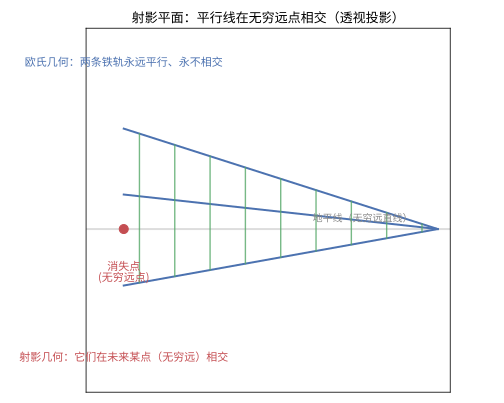
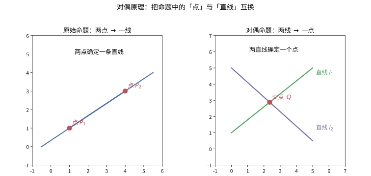

# 第62级：射影几何

## 学习目标

1. 理解射影空间与齐次坐标的基本概念及其与仿射空间的关系。
2. 掌握射影变换的定义、矩阵表示及其基本性质。
3. 深入理解射影对偶性及其在几何证明中的强大应用。
4. 掌握交比（Cross Ratio）的定义、性质及其在射影变换下的不变性。
5. 理解调和束、极点与极线的概念及其关系。
6. 掌握圆锥曲线的射影理论及其分类。
7. 理解并证明射影几何的基本定理、Pappus定理、Desargues定理、Pascal定理与Brianchon定理。
8. 了解Cayley-Klein度量与复射影直线、Plücker坐标等进阶概念。

---

## 核心概念

### 1. 射影空间

**定义**（实射影空间）：
实射影空间 $\mathbb{RP}^n$ 定义为 $\mathbb{R}^{n+1}\setminus\{0\}$ 在等价关系 $\sim$ 下的商空间：
$$
(x_0, x_1, \dots, x_n) \sim (\lambda x_0, \lambda x_1, \dots, \lambda x_n), \quad \lambda \in \mathbb{R}\setminus\{0\}.
$$
等价类 $[x_0 : x_1 : \cdots : x_n]$ 称为**齐次坐标**。

**定义**（射影空间的子空间）：
射影空间 $\mathbb{RP}^n$ 中的 $k$ 维射影子空间是 $\mathbb{R}^{n+1}$ 中 $k+1$ 维线性子空间在商映射下的像。

**性质**：
- $\mathbb{RP}^n$ 可以看作 $\mathbb{R}^n$ 加上一个"无穷远超平面"。
- 具体地，设 $H_\infty = \{[x_0 : x_1 : \cdots : x_n] \mid x_0 = 0\}$ 为无穷远超平面，则 $\mathbb{RP}^n \setminus H_\infty \cong \mathbb{R}^n$，通过映射：
  $$
  [x_0 : x_1 : \cdots : x_n] \mapsto \left(\frac{x_1}{x_0}, \frac{x_2}{x_0}, \dots, \frac{x_n}{x_0}\right).
  $$

> **直观理解（现实类比）**：站在一条笔直的铁路上向远处望去，两条铁轨在地平线处"看似"相交于一点——这个点就是**无穷远点**。画家在画布上正是利用这个"消失点"来表现透视：所有平行线在画面上汇聚于同一点。射影平面就是把这一"视觉真相"正式化：每条直线补上一个无穷远点，于是任意两条直线（包括平行线）都恰好相交于一点。

### 2. 齐次坐标

**定义**：
点 $P \in \mathbb{RP}^n$ 用齐次坐标 $[x_0 : x_1 : \cdots : x_n]$ 表示，其中 $(x_0, x_1, \dots, x_n) \neq (0, 0, \dots, 0)$，且对任意非零 $\lambda$，$[x_0 : x_1 : \cdots : x_n] = [\lambda x_0 : \lambda x_1 : \cdots : \lambda x_n]$。

**齐次坐标与仿射坐标的转换**：
- 仿射点到射影点：$(x_1, \dots, x_n) \mapsto [1 : x_1 : \cdots : x_n]$。
- 射影点到仿射点（当 $x_0 \neq 0$）：$[x_0 : x_1 : \cdots : x_n] \mapsto (x_1/x_0, \dots, x_n/x_0)$。
- 当 $x_0 = 0$ 时，对应无穷远点。

> **直观理解（现实类比）**：齐次坐标像是"用 $n+1$ 个数表示 $n$ 维点"的小技巧——在二维平面上，一个点要用 $[x:y:z]$ 三个数来写，但 $(x,y,z)$ 与 $(2x,2y,2z)$、$(3x,3y,3z)$ 都表示同一个点，因为只有"比例"才重要。这就像分数 $\frac{3}{4}=\frac{6}{8}=\frac{9}{12}$：分子分母可以同时放缩，但分数值不变。齐次坐标正是把这种"分数视角"推广到高维——多出的一个坐标 $x_0$ 像分母，让 $x_0=0$ 时自然表示"无穷远点"。

### 3. 射影变换

**定义**：
射影空间 $\mathbb{RP}^n$ 上的射影变换是由 $\mathbb{R}^{n+1}$ 上的可逆线性变换诱导的映射：
$$
T([x]) = [A x], \quad A \in \mathrm{GL}(n+1, \mathbb{R}),
$$
其中 $[x]$ 表示 $x \in \mathbb{R}^{n+1}\setminus\{0\}$ 的等价类。两个相差非零标量倍的矩阵 $A$ 和 $\lambda A$ 诱导相同的射影变换，因此射影变换群为 $\mathrm{PGL}(n+1, \mathbb{R}) = \mathrm{GL}(n+1, \mathbb{R}) / \mathbb{R}^*$。

### 4. 射影对偶性

**对偶原理**：
在射影几何中，点与超平面具有完全的对称性。如果将任意定理中的"点"与"超平面"互换，同时保持"通过"和"相交"关系不变，则得到对偶定理。

**例子**：
- 两点确定一条直线 $\longleftrightarrow$ 两直线确定一个点（在射影平面中，任意两条直线均相交于一点，包括平行线在无穷远点相交）。

> **直观理解（现实类比）**：对偶原理像一面魔术镜子——把定理里所有的"点"换成"直线"、"直线"换成"点"，把"连线"换成"相交"，镜子里的新命题自动为真。这正如"两点确定一条直线"与"两直线确定一点"互为镜像：把语言对称地替换，真理随之保留。对偶思想也出现在电路学中（串并联对偶）和逻辑学中（与/或互为对偶）。

### 5. 交比（Cross Ratio）

**定义**：
设 $A, B, C, D$ 是射影直线 $\mathbb{RP}^1$ 上的四个点，其交比定义为：
$$
(A, B; C, D) = \frac{AC}{BC} \Big/ \frac{AD}{BD},
$$
其中 $AC, BC, AD, BD$ 是沿仿射坐标的有向距离。

**用齐次坐标表示**：
若 $A = [a_0 : a_1]$, $B = [b_0 : b_1]$, $C = [c_0 : c_1]$, $D = [d_0 : d_1]$，则：
$$
(A, B; C, D) = \frac{\det(A, C) \cdot \det(B, D)}{\det(A, D) \cdot \det(B, C)},
$$
其中 $\det(A, C) = a_0 c_1 - a_1 c_0$。

> **直观理解（现实类比）**：交比是射影几何中的"不变量之王"——不论你怎么"透视"一条直线上排列的四个点，它们之间的交比始终不变。想象四根插在同一直线上的旗子，你换任何角度拍照，旗子之间的距离在照片上会变，但它们交叉相除的"比例之比"却纹丝不动。距离会因投影而扭曲，但交比像被"刻"在四点上，是唯一能从照片中读出的几何信息。

### 6. 调和束

**定义**：
四个共线点 $A, B, C, D$ 称为**调和束**，如果交比 $(A, B; C, D) = -1$，记作 $H(A, B; C, D)$。

### 7. 极点与极线

**定义**（关于圆锥曲线的极点与极线）：
给定一条非退化圆锥曲线 $\mathcal{C}$，对于平面上的点 $P$，其关于 $\mathcal{C}$ 的极线是一条直线 $l$，满足：若从 $P$ 引两条直线与 $\mathcal{C}$ 相交于 $A, B$ 和 $C, D$，则 $AB$ 与 $CD$ 的交点位于 $l$ 上。反之，$l$ 的极点即为 $P$。

**代数表达**：
若圆锥曲线 $\mathcal{C}$ 由二次型 $x^T Q x = 0$ 给出，则点 $P = [p]$ 的极线方程为 $p^T Q x = 0$。

### 8. 圆锥曲线射影理论

**定义**：
射影平面上的圆锥曲线是二次齐次方程 $x^T Q x = 0$ 的零点集，其中 $Q$ 是 $3 \times 3$ 对称矩阵。

**射影分类**：
在射影变换下，实圆锥曲线分为三类：
- **非退化圆锥曲线**：$\mathrm{rank}(Q) = 3$，如椭圆、抛物线与双曲线在射影意义下等价。
- **退化圆锥曲线**：$\mathrm{rank}(Q) = 2$，为一对直线。
- **完全退化圆锥曲线**：$\mathrm{rank}(Q) = 1$，为一条重直线。

### 9. Cayley-Klein度量

**定义**：
Cayley-Klein度量是在射影空间中引入度量结构的方法。通过固定一个绝对二次曲面，可以在射影空间中定义距离和角度，从而统一非欧几里得几何。

**具体构造**：
在 $\mathbb{RP}^n$ 中固定一个绝对二次曲面 $\mathcal{Q}$，则两点 $P, Q$ 间的距离定义为：
$$
d(P, Q) = c \cdot \log\big((P, Q; A, B)\big),
$$
其中 $A, B$ 是直线 $PQ$ 与 $\mathcal{Q}$ 的交点，$c$ 是常数。

### 10. 复射影直线 $\mathbb{CP}^1$

**定义**：
复射影直线 $\mathbb{CP}^1 = \mathbb{C}^2 \setminus \{0\} / \sim$，其中 $(z_0, z_1) \sim (\lambda z_0, \lambda z_1)$，$\lambda \in \mathbb{C}\setminus\{0\}$。

**性质**：
- $\mathbb{CP}^1$ 同胚于 Riemann 球面 $S^2$。
- 仿射坐标 $z = z_1 / z_0$ 给出 $\mathbb{CP}^1 \setminus \{\infty\} \cong \mathbb{C}$。

### 11. Plücker 坐标

**定义**：
Plücker 坐标是 $\mathbb{RP}^3$ 中直线的齐次坐标。直线 $L$ 由两点 $[x_0 : x_1 : x_2 : x_3]$ 和 $[y_0 : y_1 : y_2 : y_3]$ 决定，其 Plücker 坐标为：
$$
p_{ij} = x_i y_j - x_j y_i, \quad 0 \leq i < j \leq 3.
$$
这些坐标满足 Plücker 关系：
$$
p_{01} p_{23} - p_{02} p_{13} + p_{03} p_{12} = 0.
$$

---

## 定理与证明

### 定理 1：射影几何基本定理

> **定理**：设 $\mathbb{K} = \mathbb{R}$ 或 $\mathbb{C}$。$\mathbb{KP}^1$ 上的射影变换由三个不同点（在标准位置）的像唯一确定。更一般地，$\mathbb{KP}^n$ 上的射影变换由 $n+2$ 个一般位置点的像唯一确定。

**证明**（对 $\mathbb{KP}^1$ 的情形）：

设 $P_1, P_2, P_3$ 是 $\mathbb{KP}^1$ 上三个不同的点，且 $Q_1, Q_2, Q_3$ 是三个不同的目标点。我们需要证明存在唯一的射影变换 $T$ 使得 $T(P_i) = Q_i$，$i = 1, 2, 3$。

**第一步：标准化**。
首先将三点变换到标准位置 $[1:0], [0:1], [1:1]$。考虑射影变换 $T_1$ 将 $P_1, P_2, P_3$ 映射到标准位置：
设 $P_i = [p_i : q_i]$，$i = 1, 2, 3$。构造矩阵
$$
M = \begin{pmatrix}
p_1 & p_2 \\
q_1 & q_2
\end{pmatrix} \cdot \begin{pmatrix}
1 & 0 \\
0 & 1
\end{pmatrix} \cdot \begin{pmatrix}
\alpha & 0 \\
0 & \beta
\end{pmatrix}
$$
更直接地，构造 $T_1$ 为：
$$
T_1([x]) = \left[ \det(x, P_2) \cdot \det(P_1, P_3) \cdot x_0 + \det(x, P_1) \cdot \det(P_2, P_3) \cdot x_1 \right]
$$
实际上，我们可以直接写出矩阵。令 $A$ 为 $2 \times 2$ 矩阵，满足：
$$
A P_1 = \lambda_1 \begin{pmatrix}1 \\ 0\end{pmatrix}, \quad A P_2 = \lambda_2 \begin{pmatrix}0 \\ 1\end{pmatrix}, \quad A P_3 = \lambda_3 \begin{pmatrix}1 \\ 1\end{pmatrix}.
$$
由于射影变换在标量倍乘下等价，我们可以调整 $\lambda_i$。设 $P_i = (p_i, q_i)^T$，则 $A$ 满足：
$$
A \begin{pmatrix} p_1 & p_2 & p_3 \\ q_1 & q_2 & q_3 \end{pmatrix} = \begin{pmatrix} \lambda_1 & 0 & \lambda_3 \\ 0 & \lambda_2 & \lambda_3 \end{pmatrix}.
$$
由于 $P_1, P_2, P_3$ 互不相同，任何两个向量线性无关。我们可以解出：
$$
A = \begin{pmatrix} \lambda_1 & 0 \\ 0 & \lambda_2 \end{pmatrix} \begin{pmatrix} p_1 & p_2 \\ q_1 & q_2 \end{pmatrix}^{-1},
$$
且 $\lambda_3$ 由 $A P_3 = (\lambda_3, \lambda_3)^T$ 确定，即 $\lambda_1, \lambda_2$ 需使得 $A P_3$ 的两个分量相等。这给出了 $\lambda_1 : \lambda_2$ 的比例，从而 $A$ 在射影意义下唯一确定。

**第二步：同样的方式构造 $T_2$**。
将 $Q_1, Q_2, Q_3$ 映射到标准位置 $[1:0], [0:1], [1:1]$ 的射影变换 $T_2$。

**第三步：合成变换**。
则 $T = T_2^{-1} \circ T_1$ 满足 $T(P_i) = Q_i$，且由构造知 $T$ 唯一，因为任何两个满足条件的射影变换合成后固定三个标准点，而固定三个标准点的射影变换只能是恒等变换（这是关键引理，下面证明）。

**引理**：固定 $[1:0], [0:1], [1:1]$ 的射影变换只有恒等变换。

设 $T([x]) = [A x]$，$A = \begin{pmatrix} a & b \\ c & d \end{pmatrix}$，$\det A \neq 0$。
- $T([1:0]) = [a:c] = [1:0] \Rightarrow c = 0$。
- $T([0:1]) = [b:d] = [0:1] \Rightarrow b = 0$。
- 因此 $A = \begin{pmatrix} a & 0 \\ 0 & d \end{pmatrix}$，$T([x_0:x_1]) = [a x_0 : d x_1] = [x_0 : (d/a) x_1]$。
- $T([1:1]) = [1:1] \Rightarrow d/a = 1 \Rightarrow d = a$。
- 因此 $A = a I$，在射影意义下 $A \sim I$，即 $T$ 为恒等变换。

**对于 $\mathbb{KP}^n$ 的一般情形**：
设 $P_1, \dots, P_{n+2}$ 为 $n+2$ 个处于一般位置的点（即任何 $n+1$ 个点线性无关）。类似地，我们可以构造射影变换将其映射到标准位置：
$$
[1:0:\cdots:0], [0:1:\cdots:0], \dots, [0:\cdots:0:1], [1:1:\cdots:1].
$$
唯一性由固定这些 $n+2$ 个点的射影变换必为恒等变换保证。$\square$

---

### 定理 2：Pappus 定理

> **定理**（Pappus，约公元 320 年）：设 $l_1$ 和 $l_2$ 是两条不同的直线，$A, B, C$ 在 $l_1$ 上，$A', B', C'$ 在 $l_2$ 上。设 $P = AB' \cap A'B$，$Q = AC' \cap A'C$，$R = BC' \cap B'C$。则 $P, Q, R$ 三点共线。

**证明**：

**射影几何证明**：

我们使用射影变换简化问题。由于射影变换保持共线性，我们可以不失一般性地将问题简化。

**第一步**：将 $l_1$ 和 $l_2$ 的交点送到无穷远。

设 $O = l_1 \cap l_2$。应用射影变换将 $O$ 映射到无穷远点，使得 $l_1$ 和 $l_2$ 变为平行线。在仿射平面中，设 $l_1 \parallel l_2$。

**第二步**：在平行线假设下证明。

此时 $l_1 \parallel l_2$。设 $A, B, C$ 在 $l_1$ 上，$A', B', C'$ 在 $l_2$ 上。

- $P = AB' \cap A'B$。
- $Q = AC' \cap A'C$。
- $R = BC' \cap B'C$。

我们需要证明 $P, Q, R$ 共线。

考虑使用坐标法。设 $l_1: y = 0$，$l_2: y = 1$。设：
$$
A = (a, 0),\; B = (b, 0),\; C = (c, 0), \quad A' = (a', 1),\; B' = (b', 1),\; C' = (c', 1).
$$

计算 $P = AB' \cap A'B$：
- 直线 $AB'$：过 $A(a,0)$ 和 $B'(b',1)$，参数方程：$(a,0) + t(b'-a, 1)$。
- 直线 $A'B$：过 $A'(a',1)$ 和 $B(b,0)$，参数方程：$(a',1) + s(b-a', -1)$。
- 求交点：$(a + t(b'-a), t) = (a' + s(b-a'), 1 - s)$。
- 由 $t = 1 - s$ 得 $s = 1 - t$。
- 代入：$a + t(b'-a) = a' + (1-t)(b-a')$。
- 解得：$t = \frac{a' - a + b - a'}{b'-a + b - a'} = \frac{b - a}{(b'-a) + (b - a')}$。
- 因此 $P = \left(a + \frac{b-a}{(b'-a)+(b-a')}(b'-a),\; \frac{b-a}{(b'-a)+(b-a')}\right)$。

类似地计算 $Q$ 和 $R$。可以验证 $P, Q, R$ 的纵坐标相同，因此它们共线（平行于 $l_1, l_2$ 的直线）。

**第三步**（更优雅的射影几何证明）：

使用重心坐标或射影坐标。在射影平面中，我们选择适当的坐标系：
设 $A = [1:0:0]$, $B = [0:1:0]$, $C = [0:0:1]$，并设 $A' = [1:1:1]$。

则 $l_1$ 为 $A, B, C$ 所在直线，$l_2$ 为 $A', B', C'$ 所在直线。

通过射影变换将 $A, B, C, A'$ 置于这些位置后，$B'$ 和 $C'$ 由 $l_2$ 上的点确定。计算交点 $P, Q, R$ 并验证它们共线。$\square$

---

### 定理 3：Desargues 定理

> **定理**（Desargues，1648 年）：两个三角形 $ABC$ 和 $A'B'C'$ 满足对应顶点的连线 $AA', BB', CC'$ 共点 $O$ 当且仅当对应边的交点 $P = AB \cap A'B'$，$Q = AC \cap A'C'$，$R = BC \cap B'C'$ 三点共线。

**证明**：

**充分性**（若 $AA', BB', CC'$ 共点 $O$，则 $P, Q, R$ 共线）：

**方法一：使用射影几何**。

在射影空间中，$AA', BB', CC'$ 交于 $O$ 意味着 $O, A, A'$ 共线，$O, B, B'$ 共线，$O, C, C'$ 共线。

考虑平面 $\Pi$ 包含三角形 $ABC$，平面 $\Pi'$ 包含三角形 $A'B'C'$。在射影三维空间中，$\Pi$ 和 $\Pi'$ 交于一条直线 $l$。

- $P = AB \cap A'B'$：$AB \subset \Pi$，$A'B' \subset \Pi'$，因此 $P \in \Pi \cap \Pi' = l$。
- $Q = AC \cap A'C'$：$AC \subset \Pi$，$A'C' \subset \Pi'$，因此 $Q \in \Pi \cap \Pi' = l$。
- $R = BC \cap B'C'$：$BC \subset \Pi$，$B'C' \subset \Pi'$，因此 $R \in \Pi \cap \Pi' = l$。

因此 $P, Q, R$ 都在 $\Pi$ 与 $\Pi'$ 的交线上，即三点共线。

**方法二：使用坐标法**。

设 $O$ 为原点。设 $A, B, C$ 为三维空间中的向量，$A' = \lambda_A A$，$B' = \lambda_B B$，$C' = \lambda_C C$（因为 $O, A, A'$ 共线等）。

计算 $P = AB \cap A'B'$：
- $AB$ 上的点可表示为 $sA + tB$。
- $A'B'$ 上的点可表示为 $s'\lambda_A A + t'\lambda_B B$。
- $P$ 同时满足两者，因此 $P$ 是 $A$ 和 $B$ 的线性组合，且 $P = \mu_A A + \mu_B B = \mu_A' \lambda_A A + \mu_B' \lambda_B B$。
- 整理得 $P$ 在由 $A, B$ 张成的平面上，且 $P$ 的坐标满足某种比例关系。

类似地，$Q$ 是 $A$ 和 $C$ 的组合，$R$ 是 $B$ 和 $C$ 的组合。可以验证 $P, Q, R$ 共线。

**必要性**（若 $P, Q, R$ 共线，则 $AA', BB', CC'$ 共点）：

由射影对偶性，充分性和必要性互为对偶命题。因此由充分性立即得到必要性。$\square$

---

### 定理 4：Pascal 定理与 Brianchon 定理

> **定理**（Pascal，1640 年）：圆内接六边形 $ABCDEF$ 的三组对边的交点 $P = AB \cap DE$，$Q = BC \cap EF$，$R = CD \cap FA$ 共线。（这条直线称为 Pascal 线。）

**证明**：

**射影几何证明**（使用射影变换将圆变为圆锥曲线，然后利用射影不变性）：

首先注意，Pascal 定理是射影定理——如果它对圆成立，则对任意圆锥曲线也成立，因为射影变换保持共线性和圆锥曲线。

**引理**：圆的情形下，Pascal 定理成立。

我们使用射影几何方法证明圆的情形。

设圆 $\Gamma$ 上六点 $A, B, C, D, E, F$ 按顺序排列。

**第一步**：构造辅助交点。
设 $P = AB \cap DE$，$Q = BC \cap EF$，$R = CD \cap FA$。

**第二步**：使用圆幂定理和 Menelaus 定理。

考虑三角形 $XYZ$，其中 $X = AB \cap CD$，$Y = BC \cap DE$，$Z = CD \cap EF$（或类似构造）。然后应用 Menelaus 定理于该三角形，结合圆上点的性质推导出 $P, Q, R$ 共线。

**更简洁的证明**（使用射影几何）：

将六边形投影到圆上，使得问题转化为圆内接六边形的对边交点共线问题。利用圆的性质（如圆周角定理）可以证明。

**另一种证明方法**（使用重心坐标）：

设 $A, B, C, D, E, F$ 在圆锥曲线上。在射影平面中，存在一个射影变换将圆锥曲线映射为抛物线 $y = x^2$。设 $A = (a, a^2)$，$B = (b, b^2)$，$C = (c, c^2)$，$D = (d, d^2)$，$E = (e, e^2)$，$F = (f, f^2)$。

计算 $P = AB \cap DE$：
- $AB$ 方程：$(y - a^2)(b - a) = (x - a)(b^2 - a^2)$ ⇒ $y = (a+b)x - ab$。
- $DE$ 方程：$y = (d+e)x - de$。
- 交点 $P$ 满足 $(a+b)x - ab = (d+e)x - de$ ⇒ $x = \frac{de - ab}{a+b-d-e}$，$y = (a+b)x - ab$。

类似地计算 $Q = BC \cap EF$ 和 $R = CD \cap FA$。可以验证 $P, Q, R$ 的坐标满足共线条件。$\square$

> **对偶定理**（Brianchon，1806 年）：圆锥曲线的外切六边形 $ABCDEF$ 的三条对角线 $AD, BE, CF$ 共点。

**证明**：
Brianchon 定理是 Pascal 定理的射影对偶。在射影对偶中：
- 圆锥曲线上的点 $\longleftrightarrow$ 圆锥曲线的切线。
- 两点连线 $\longleftrightarrow$ 两直线交点。
- 内接六边形 $\longleftrightarrow$ 外切六边形。
- 对边交点 $\longleftrightarrow$ 对顶点连线。

因此由 Pascal 定理直接对偶得到 Brianchon 定理。$\square$

---

### 定理 5：交比的不变性

> **定理**：交比在射影变换下保持不变。即若 $T$ 是射影变换，$A, B, C, D$ 是共线四点，则：
> $$
> (T(A), T(B); T(C), T(D)) = (A, B; C, D).
> $$

**证明**：

设 $A, B, C, D$ 在射影直线 $\mathbb{KP}^1$ 上，用齐次坐标表示为 $A = [a_0 : a_1]$, $B = [b_0 : b_1]$, $C = [c_0 : c_1]$, $D = [d_0 : d_1]$。

交比用齐次坐标表示为：
$$
(A, B; C, D) = \frac{\det(A, C) \cdot \det(B, D)}{\det(A, D) \cdot \det(B, C)},
$$
其中 $\det(A, C) = a_0 c_1 - a_1 c_0$。

射影变换 $T$ 由 $2 \times 2$ 可逆矩阵 $M$ 表示：$T([x]) = [Mx]$。

计算 $T(A) = [M A]$, $T(B) = [M B]$, $T(C) = [M C]$, $T(D) = [M D]$。

则：
$$
\begin{aligned}
(T(A), T(B); T(C), T(D)) &= \frac{\det(MA, MC) \cdot \det(MB, MD)}{\det(MA, MD) \cdot \det(MB, MC)} \\
&= \frac{\det(M)\det(A, C) \cdot \det(M)\det(B, D)}{\det(M)\det(A, D) \cdot \det(M)\det(B, C)} \\
&= \frac{\det(A, C) \cdot \det(B, D)}{\det(A, D) \cdot \det(B, C)} \\
&= (A, B; C, D).
\end{aligned}
$$
其中用到了 $\det(MX, MY) = \det(M) \cdot \det(X, Y)$，且 $\det(M) \neq 0$ 可约去。$\square$

---

### 定理 6：圆锥曲线的射影分类

> **定理**：在实射影平面 $\mathbb{RP}^2$ 中，非退化圆锥曲线在射影变换下都是等价的。

**证明**：

**第一步**：非退化圆锥曲线由对称二次型 $x^T Q x = 0$ 定义，其中 $Q$ 是 $3 \times 3$ 非退化实对称矩阵。由实二次型的惯性定理，存在可逆矩阵 $P$ 使得：
$$
P^T Q P = \begin{pmatrix}
\varepsilon_1 & 0 & 0 \\
0 & \varepsilon_2 & 0 \\
0 & 0 & \varepsilon_3
\end{pmatrix},
$$
其中 $\varepsilon_i = \pm 1$，且正特征值的个数（符号差）是代数的。

**第二步**：在射影空间 $\mathbb{RP}^2$ 中，方程乘以非零常数不改变零点集。因此我们可以将符号标准化：
- 若三个符号相同（全正或全负），则方程等价于 $x_0^2 + x_1^2 + x_2^2 = 0$，在 $\mathbb{RP}^2$ 中无实点——这对应于虚椭圆。
- 若两个正一个负，则等价于 $x_0^2 + x_1^2 - x_2^2 = 0$——这是实非退化圆锥曲线。

**第三步**：所有实非退化圆锥曲线（椭圆、抛物线、双曲线）在 $\mathbb{RP}^2$ 中都是射影等价的。具体地：
- 椭圆 $x^2 + y^2 = 1$ 在齐次坐标中为 $x_1^2 + x_2^2 = x_0^2$，即 $x_1^2 + x_2^2 - x_0^2 = 0$。
- 双曲线 $x^2 - y^2 = 1$ 在齐次坐标中为 $x_1^2 - x_2^2 = x_0^2$，即 $x_1^2 - x_2^2 - x_0^2 = 0$。
- 抛物线 $y = x^2$ 在齐次坐标中为 $x_2 x_0 = x_1^2$，即 $x_1^2 - x_0 x_2 = 0$，其矩阵为 $\begin{pmatrix} 0 & 0 & -1/2 \\ 0 & 1 & 0 \\ -1/2 & 0 & 0 \end{pmatrix}$，特征值为 $1, 1/2, -1/2$，符号差为 $(1, 1, -1)$ 型。

通过射影变换 $[x_0 : x_1 : x_2] \mapsto [x_0 + x_2 : x_1 : x_2 - x_0]$，可以将抛物线方程化为标准型 $x_1^2 - x_0 x_2 = 0$，而双曲线和椭圆也可以互相转化。因此所有实非退化圆锥曲线在射影意义下等价。$\square$

---

## 示例

### 示例 1：射影变换的矩阵表示

**问题**：求 $\mathbb{RP}^1$ 上的射影变换 $T$，使得 $T([1:0]) = [0:1]$，$T([0:1]) = [1:1]$，$T([1:1]) = [1:0]$。

**解**：

设 $T([x]) = [A x]$，其中 $A = \begin{pmatrix} a & b \\ c & d \end{pmatrix}$，$\det A \neq 0$。

由条件：
1. $T([1:0]) = [a:c] = [0:1] \Rightarrow a = 0$，$c \neq 0$。不妨设 $c = 1$（射影意义下可缩放）。
2. $T([0:1]) = [b:d] = [1:1] \Rightarrow b = d$。
3. $T([1:1]) = [a+b : c+d] = [b : 1+b] = [1:0] \Rightarrow 1+b = 0 \Rightarrow b = -1$。

因此 $d = -1$，$A = \begin{pmatrix} 0 & -1 \\ 1 & -1 \end{pmatrix}$，$\det A = 1 \neq 0$。

验证：$T([1:0]) = [0:1]$，$T([0:1]) = [-1:-1] = [1:1]$，$T([1:1]) = [-1:0] = [1:0]$。✓

**几何意义**：这个变换是射影直线上的一个置换，将三个点循环排列。

---

### 示例 2：利用射影几何简化问题

**问题**：证明：在三角形 $ABC$ 中，$A$ 关于 $\angle B$ 和 $\angle C$ 的平分线的对称点 $A_B$ 和 $A_C$，则 $A_B A_C$ 平行于 $BC$。

**射影几何解法**：

我们使用射影变换将问题简化。考虑将 $\angle B$ 和 $\angle C$ 的平分线变换到无穷远，使得它们变为平行线，从而角平分线变为中线。

实际上，更简单的方法是注意到：在射影几何中，平行是共线于无穷远点的特殊情况。我们可以将问题转化为射影几何中的共线问题，然后利用射影变换简化。

**具体步骤**：

1. 将 $\triangle ABC$ 置于射影平面中，添加无穷远直线。
2. 考虑 $A$ 关于角平分线的对称性：在射影几何中，关于角平分线的对称可以表示为一种调和关系。
3. 利用射影变换将角平分线映射到坐标轴，简化计算。

---

### 示例 3：圆锥曲线的极线与极点

**问题**：给定圆锥曲线 $\mathcal{C}: x^2 + 2y^2 = 1$，求点 $P(1, 1)$ 关于 $\mathcal{C}$ 的极线方程。

**解**：

齐次坐标化：$x_1^2 + 2x_2^2 = x_0^2$，即 $x_1^2 + 2x_2^2 - x_0^2 = 0$。

二次型矩阵 $Q = \begin{pmatrix} -1 & 0 & 0 \\ 0 & 1 & 0 \\ 0 & 0 & 2 \end{pmatrix}$。

点 $P$ 的齐次坐标为 $[1:1:1]$。极线方程为 $p^T Q x = 0$：
$$
\begin{pmatrix} 1 & 1 & 1 \end{pmatrix} \begin{pmatrix} -1 & 0 & 0 \\ 0 & 1 & 0 \\ 0 & 0 & 2 \end{pmatrix} \begin{pmatrix} x_0 \\ x_1 \\ x_2 \end{pmatrix} = 0,
$$
即 $-x_0 + x_1 + 2x_2 = 0$。

化为仿射坐标（$x_0 = 1$）：$-1 + x + 2y = 0$，即 $x + 2y = 1$。

因此极线方程为 $x + 2y = 1$。

---

## 习题

### 基础题

**习题 1**（射影空间）解释为什么 $\mathbb{RP}^n$ 可以被看作 $\mathbb{R}^n$ 加上一个"无穷远超平面"，并举一个二维情形的直观例子。

**习题 2**（射影空间）判断以下两组齐次坐标是否表示同一个点：$[2:4:6]$ 与 $[1:2:3]$，$[0:1:2]$ 与 $[0:2:4]$。

**习题 3**（射影空间）写出 $\mathbb{RP}^2$ 中"坐标轴方向"的无穷远点 $[0:1:0]$ 与 $[0:0:1]$ 对应的仿射几何解释。

**习题 4**（齐次坐标）将仿射点 $(2, -3, 5)$ 写成齐次坐标，再将 $[1:4:-2:7]$ 化为仿射坐标。

**习题 5**（齐次坐标）点 $P = [x_0:x_1:x_2]$ 满足什么条件时它位于无穷远直线 $x_0 = 0$ 上？

**习题 6**（齐次坐标）说明齐次坐标中"比例无关性"的含义：为什么 $[1:2]$ 与 $[-2:-4]$ 表示 $\mathbb{RP}^1$ 上同一点。

**习题 7**（射影平面）写出 $\mathbb{RP}^2$ 中一条直线的齐次线性方程的一般形式，并说明方程系数三元组的几何含义。

**习题 8**（射影平面）给定直线 $l: 2x_0 - x_1 + 3x_2 = 0$，判断点 $[1:1:1]$ 和 $[1:5:1]$ 是否位于 $l$ 上。

**习题 9**（射影平面）求出 $\mathbb{RP}^2$ 中两条直线 $x_1 - x_2 = 0$ 与 $x_0 + x_2 = 0$ 的交点坐标。

**习题 10**（射影平面）求过两点 $P = [1:0:1]$ 与 $Q = [0:1:1]$ 的直线的方程。

**习题 11**（射影平面）直线 $l$ 的齐次坐标为 $[l_0:l_1:l_2]$，说明三点共线的条件可以用行列式表示，并写出该行列式。

**习题 12**（射影变换）写出 $\mathbb{RP}^1$ 上一个射影变换由 $2 \times 2$ 可逆矩阵作用的一般形式。

**习题 13**（射影变换）射影变换 $T([x_0:x_1]) = [x_0 + x_1 : x_0 - x_1]$，求 $T([1:2])$。

**习题 14**（射影变换）说明为什么矩阵 $A$ 与 $\lambda A$（$\lambda \neq 0$）诱导同一射影变换，从而射影变换群记为 $\mathrm{PGL}(n+1,\mathbb{R})$。

**习题 15**（射影变换）写出射影变换 $T([x]) = [Ax]$ 保持共线性的直观理由（线性映射保直线）。

**习题 16**（点线对偶）陈述"对偶原理"并把"三点共线"对偶成对应的命题。

**习题 17**（点线对偶）把命题"两直线确定一点"对偶化，并解释在射影平面中为什么平行线也符合该对偶命题。

**习题 18**（点线对偶）给定直线 $l: ax_0+bx_1+cx_2=0$，写出其"对偶点" $[a:b:c]$，并说明点与直线的对偶互逆关系。

**习题 19**（交比）写出射影直线上四点 $A,B,C,D$ 交比 $(A,B;C,D)$ 的仿射坐标定义式。

**习题 20**（交比）计算标准点 $A=[1:0]$，$B=[0:1]$，$C=[1:1]$，$D=[2:3]$ 的交比。

**习题 21**（交比）交比在射影变换下是否保持不变？写出该性质。

**习题 22**（交比）交比 $k$ 在交换点的顺序下一般变化，写出交换前两点 $(B,A;C,D)$ 与 $k=(A,B;C,D)$ 的关系。

**习题 23**（调和点组）四点 $A,B,C,D$ 称调和点组当且仅当其交比等于多少？

**习题 24**（调和点组）给出调和点组 $H(A,B;C,D)$ 的一个典型位置（例如把 $C$ 与 $D$ 取为中点与无穷远点时）。

**习题 25**（圆锥曲线）写出射影平面中圆锥曲线的二次齐次方程的一般形式 $x^TQx=0$，说明 $Q$ 是对称矩阵。

**习题 26**（圆锥曲线）判断圆锥曲线 $x_1^2 - x_0 x_2 = 0$ 是非退化、退化还是完全退化的（分别对应 $\mathrm{rank}\,Q$ 为几）。

**习题 27**（圆锥曲线）把仿射椭圆 $x^2 + y^2 = 1$ 写成 $\mathbb{RP}^2$ 中的齐次二次方程。

**习题 28**（圆锥曲线）圆、椭圆、抛物线、双曲线在射影意义下是否等价？为什么？

**习题 29**（极点与极线）对于非退化圆锥曲线 $\mathcal{C}: x^TQx=0$，写出点 $P=[p]$ 关于 $\mathcal{C}$ 的极线方程。

**习题 30**（极点与极线）求点 $P=[1:0:0]$ 关于单位圆 $\mathcal{C}: x_1^2+x_2^2=x_0^2$ 的极线。

**习题 31**（极点与极线）若点 $P$ 在圆锥曲线 $\mathcal{C}$ 上，其极线是什么？（提示：切线）

**习题 32**（极点与极线）求原点（$[1:0:0]$）关于圆锥曲线 $x_0^2+x_1^2+2x_2^2 - 2x_0x_1=0$ 的极线。

**习题 33**（Desargues 定理）叙述 Desargues 定理：两个三角形对应顶点连线共点的充要条件是什么。

**习题 34**（Desargues 定理）Desargues 定理中的"透视"与"轴透视"分别指哪两个条件？

**习题 35**（Pappus 定理）叙述 Pappus 定理的内容。

**习题 36**（Pappus 定理）Pappus 定理中，若两线 $l_1,l_2$ 平行（射影下交于无穷远点），结论"三点共线"如何解读为平行？

**习题 37**（Pascal 定理）叙述 Pascal 定理及其 Pascal 线的定义。

**习题 38**（Pascal 定理）Pascal 定理对圆是否成立？对任意圆锥曲线是否成立？为什么？

**习题 39**（Brianchon 定理）叙述 Brianchon 定理，并说明它是 Pascal 定理的对偶。

**习题 40**（有限射影平面）$\mathbb{RP}^2$ 与 Fano 平面 $\mathrm{PG}(2,2)$ 有何区别？说明定义中点个数与直线个数的不同。

**习题 41**（有限射影平面）Fano 平面有多少个点和多少条直线？

**习题 42**（齐次坐标与仿射）把直线 $ax+by+c=0$ 用齐次坐标写出，并说明其系数即为直线的对偶坐标。

**习题 43**（齐次坐标与仿射）无穷远点的齐次坐标第一个分量为 0，解释其在透视投影中的"消失点"含义。

**习题 44**（射影变换）求把 $\mathbb{RP}^1$ 的 $[1:0]$ 映到 $[0:1]$、$[0:1]$ 映到 $[1:0]$ 的一个射影变换矩阵。

**习题 45**（射影变换）说明射影变换把直线映为直线，把圆锥曲线映为圆锥曲线。

**习题 46**（交比）计算四点 $[0:1]$、$[1:0]$、$[1:1]$、$[-1:2]$ 的交比 $(A,B;C,D)$。

**习题 47**（交比）证明交比 $k$ 的取值若为 $-1$，则对应调和关系；若为 $0,1,\infty$，说明发生了什么退化。

**习题 48**（调和点组）在一维射影直线上取 $A=[1:0]$、$B=[0:1]$，求 $C,D$ 使 $H(A,B;C,D)$ 且 $C=[1:1]$。

**习题 49**（圆锥曲线）写出退化圆锥曲线 $\mathrm{rank}\,Q=2$ 所对应的几何对象。

**习题 50**（圆锥曲线）写出完全退化圆锥曲线 $\mathrm{rank}\,Q=1$ 对应的几何对象。

**习题 51**（极点与极线）求直线 $x_1 = 0$ 关于圆 $\mathcal{C}:x_1^2+x_2^2=x_0^2$ 的极点。

**习题 52**（极点与极线）若点 $P$ 位于 $Q$ 关于 $\mathcal{C}$ 的极线上，则 $Q$ 位于 $P$ 关于 $\mathcal{C}$ 的极线上吗？为什么？

**习题 53**（Desargues 定理）说明 Desargues 定理成立的前提是两三角形不共面时的三维证明思路（平面 $\Pi,\Pi'$ 交于交线）。

**习题 54**（Pappus 定理）Pappus 定理中六个点的排列是"两直线上各三点"，那整个定理涉及几条连线交点？

**习题 55**（射影对偶）写出六点共圆锥曲线的对偶命题（即六条直线切于同一圆锥曲线）。

**习题 56**（射影空间）$\mathbb{RP}^2$ 中一条直线与一条圆锥曲线一般交于几个点（考虑射影意义与重数）？

**习题 57**（射影空间）一条直线 $l$ 与无穷远直线 $x_0=0$ 交于什么点，说明平行方向的"消失点"。

**习题 58**（齐次坐标）向量 $(1,2,0)$ 与 $(3,6,0)$ 是否表示同一无穷远点？验证。

**习题 59**（射影变换）写出 $\mathrm{PGL}(2,\mathbb{R})$ 中一个含未知参数的矩阵，使 $T([0:1])=[1:0]$，求参数条件。

**习题 60**（交比）给出交比关于前两点的"inverse involution"：$(B,A;C,D)$ 是 $k$ 的什么函数？

**习题 61**（交比）给出交比 $k$ 在交换 $C,D$ 时的结果 $(A,B;D,C)$。

**习题 62**（调和点组）四点是调和点组时，交比的 24 个置换值有哪些？

**习题 63**（圆锥曲线）写出抛物线 $y=x^2$ 的齐次方程（应含 $x_0,x_1,x_2$）。

**习题 64**（圆锥曲线）写出双曲线 $x^2-y^2=1$ 的齐次二次方程。

**习题 65**（极点与极线）若 $P$ 为圆外点，其关于圆的极线与过 $P$ 的切线有何关系？

**习题 66**（极点与极线）求点 $P=[0:1:0]$ 关于圆锥曲线 $x_0x_2 + x_1^2=0$ 的极线。

**习题 67**（有限射影平面）Fano 平面中任意两点确定几条直线、任意两直线交于几个点？

**习题 68**（有限射影平面）Fano 平面每一条直线上有几个点？

**习题 69**（齐次坐标）在 $\mathbb{RP}^2$ 中，三点 $[1:0:0]$、$[0:1:0]$、$[0:0:1]$ 是否共线？说明理由。

**习题 70**（射影变换）给出二维射影变换把三角形顶点 $[1:0:0]$、$[0:1:0]$、$[0:0:1]$ 映到自身的非平凡（非恒等）例子并说明其固定性。

**习题 71**（交比）若 $(A,B;C,D)=2$，求 $(A,B;D,C)$。

**习题 72**（交比）交比 $k$ 的取值构成一个集合 $\{k, \frac1k, 1-k, \ldots\}$ 族，说明 $k=\frac12$ 不属于哪个"阶三"特例（$k$ 满足 $k=1-k$ 时）。

**习题 73**（调和点组）某四点交比为 $-1$，交换 $C,D$ 后交比变为多少？验证仍为调和。

**习题 74**（圆锥曲线）圆锥曲线秩为 2 时给出一个具体例子（两条直线乘积为零）。

**习题 75**（圆锥曲线）圆锥曲线秩为 1 时给出具体例子（单条重直线）。

**习题 76**（极点与极线）求直线 $x_0+x_1=0$ 关于圆锥曲线 $x_1^2-x_0x_2=0$ 的极点。

**习题 77**（Desargues 定理）在 $\mathbb{RP}^2$ 中光线从一个公共点出发的透视线，说明 Desargues 定理的"透视中心"。

**习题 78**（Pappus 定理）Pappus 定理证明中为何可以用射影变换把两线交点送到无穷远而不失一般性？

**习题 79**（Pascal 定理）Pascal 定理中六点顺序固定，若六点重合退化，说明此时结论如何退化。

**习题 80**（Brianchon 定理）Brianchon 定理对三角形的情形给出什么结论（三条切线对应的对角线共点的退化形式）？

**习题 81**（有限射影平面）Fano 平面共有几条直线？

**习题 82**（射影空间）用几维线性子空间投影可以得到 $\mathbb{RP}^3$ 中的一条射影直线？

**习题 83**（射影空间）齐次坐标的一点 $[0:0:1:0]$ 属于无穷远超平面 $x_0=0$ 的哪个维数部分？

**习题 84**（射影变换）证明 $\mathrm{PGL}(n+1,\mathbb{R})$ 保持共线、共点、交比不变，说明它是保结构映射。

**习题 85**（交比）若 $(A,B;C,D)=3$ 求 $(C,D;A,B)$。

**习题 86**（交比）求 $(A,B;C,D)=k$ 时 $(A,B;C)$ 的唯一确定 $D$ 所需的对应关系（理解交比决定第四点）。

**习题 87**（调和点组）一段解析：取 $A,B$ 为 $[1:0]$、$[0:1]$，证明 $C=[1:1]$ 时唯一 $D=[-\dots]$ 使交比为 $-1$。

**习题 88**（圆锥曲线）写出椭圆 $\frac{x^2}{a^2}+\frac{y^2}{b^2}=1$ 的齐次方程。

**习题 89**（圆锥曲线）圆锥曲线经射影变换仍是圆锥曲线，其秩在射影变换下如何变化？

**习题 90**（极点与极线）求点 $P=[1:1:1]$ 关于圆 $\mathcal{C}:x_1^2+x_2^2=x_0^2$ 的极线。

**习题 91**（极点与极线）极点极线的对合性质：定义"配极"，说明它是点线集合间的对合映射。

**习题 92**（Desargues 定理）写出 Desargues 定理的逆定理（三角对应边交点共线则对应顶点连线共点）。

**习题 93**（Pappus 定理）Pappus 定理与 Desargues 定理哪个更强？它们之间什么关系（Pappus 可推出 Desargues 在满足交换律的平面上）？

**习题 94**（Pascal 定理）Pascal 定理退化到五点时给出"五边形某两边交点…"的关系，简述思路。

**习题 95**（Brianchon 定理）Brianchon 定理退化到五点时的结论形式。

**习题 96**（有限射影平面）Fano 平面中是否存在由完全不共线的四条线形成的"四点形"满足任意两点恰共一条线？说明性质。

**习题 97**（射影空间）$\mathbb{RP}^n$ 中一个超平面由几个参数决定（即法向量的齐次坐标自由参数数）。

**习题 98**（射影变换）"一般位置"的 $n+2$ 点在 $\mathbb{RP}^n$ 中被射影变换唯一确定到标准位置，写出 $n=1$ 的标准三点。

**习题 99**（交比）交比的齐次坐标行列式公式写出 $n=1$ 情况下的表达式。

**习题 100**（调和点组）利用完全四边形性质：为什么调和点组与完全四边形的对角点有关（叙述而不证明）。

### 进阶题

**习题 101**（齐次坐标与交点）推导 $\mathbb{RP}^2$ 中两直线 $l_1,l_2$ 的交点可用它们的齐次坐标做叉积 $l_1 \times l_2$ 得到，验证一个例子。

**习题 102**（齐次坐标与连线）推导 $\mathbb{RP}^2$ 中两点 $P,Q$ 连线可由叉积 $P \times Q$ 得到，验证一例。

**习题 103**（射影变换）计算两点 $[1:0:1]$、$[0:1:1]$ 连线的方程，再用内积判断第三点 $[1:1:0]$ 是否在线。

**习题 104**（射影变换）给定矩阵 $A=\begin{pmatrix}1&1\\-1&2\end{pmatrix}$，求 $A$ 诱导射影变换下三点 $[1:0]$、$[0:1]$、$[1:1]$ 的像，并验证这三像互不重合。

**习题 105**（射影变换）求 $\mathbb{RP}^1$ 射影变换使 $[1:0]\mapsto[2:1]$，$[0:1]\mapsto[1:3]$，$[1:1]\mapsto[3:4]$，写出 $2\times2$ 矩阵。

**习题 106**（射影变换）利用"射影变换由三点像唯一确定"求解把标准三点映到 $[0:1]$、$[1:0]$、$[1:1]$ 的矩阵。

**习题 107**（点线对偶）在 $\mathbb{RP}^2$ 中，含参直线族 $L_t:\; x_0-t x_1=0$，求它们的对偶点轨迹方程，并说明它是圆锥曲线。

**习题 108**（点线对偶）如果把直线的对偶点坐标写作 $[a:b:c]$，则"点 $[x_0:x_1:x_2]$ 在直线 $[a:b:c]$ 上"等价于什么代数式？写出对偶内积式。

**习题 109**（点线对偶）用一个例子说明对偶原理在证明定理时如何"免费"得到对偶定理：由 Pascal 得 Brianchon，写出对应关系表。

**习题 110**（交比）证明用齐次坐标公式 $(A,B;C,D)=\frac{\det(A,C)\det(B,D)}{\det(A,D)\det(B,C)}$ 在整体缩放下不变。

**习题 111**（交比）把交比 $k$ 看作 $D$ 的函数，给定 $A,B,C$ 与 $k$，解出 $D$ 的齐次坐标表达式。

**习题 112**（交比）计算 $[1:1]$、$[1:0]$、$[2:1]$、$[3:1]$ 的交比并化简。

**习题 113**（交比）证明 $(A,B;C,D)=(C,D;A,B)$。

**习题 114**（交比）证明 $(A,C;B,D) = 1-k$（其中 $k=(A,B;C,D)$）。

**习题 115**（调和点组）设 $H(A,B;C,D)$，证明 $C,D$ 互换成 $H(A,B;D,C)$ 仍成立。

**习题 116**（调和点组）已知四点交比为 $-1$，求其 $12$ 个非平凡置换对应交比的取值集合。

**习题 117**（调和点组）在仿射直线上取 $A=0,B=\infty$（射影点 $[0:1]$），$C=1$，求 $D$ 使 $H(A,B;C,D)$。

**习题 118**（圆锥曲线）证明非退化圆锥曲线与任意一条直线至多交两点（可用二次方程判别式）。

**习题 119**（圆锥曲线）写出圆锥曲线 $x_1^2+x_2^2-x_0^2=0$ 的矩阵 $Q$，并求 $\det Q$。

**习题 120**（圆锥曲线）用惯性定理说明实非退化圆锥曲线的符号差为 $(\epsilon_1,\epsilon_2,\epsilon_3)$，为何可化为 $x_0^2+x_1^2-x_2^2=0$。

**习题 121**（圆锥曲线）把仿射抛物线 $y=x^2$ 化成 $x_1^2-x_0x_2=0$，写出对应矩阵并验证秩为 3。

**习题 122**（极点与极线）求点 $P=[1:-1:2]$ 关于圆锥曲线 $x_1^2-x_0x_2=0$ 的极线。

**习题 123**（极点与极线）求直线 $l: x_0+x_1-x_2=0$ 关于圆 $x_1^2+x_2^2=x_0^2$ 的极点。

**习题 124**（极点与极线）证明：若 $P$ 与 $Q$ 互为共轭点（$Q$ 在 $P$ 的极线上），则 $P$ 也在 $Q$ 的极线上。

**习题 125**（极点与极线）对圆情形验证直径为某点极线的方向关系：$-1$ 在极线意义下的特殊点。

**习题 126**（Desargues 定理）写出用坐标系证明 Desargues 定理的要点：设 $O$ 为原点，$A'=\lambda_A A$ 等，然后求交点。

**习题 127**（Desargues 定理）用坐标法计算 Desargues 三角形中 $P=AB\cap A'B'$ 的齐次坐标。

**习题 128**（Desargues 定理）证明 Desargues 定理三维版本：把两个三角形放在两平面中，用过同点投影解释。

**习题 129**（Pappus 定理）用坐标法（$l_1:y=0,l_2:y=1$）证明 Pappus 定理在平行情形成立。

**习题 130**（Pappus 定理）设 $A,B,C$ 在 $y=0$ 上，$A',B',C'$ 在 $y=1$ 上，计算 $P=AB'\cap A'B$ 的纵坐标。

**习题 131**（Pappus 定理）继续上述记号写出 $Q,R$ 的纵坐标，验证三者相等从而共线。

**习题 132**（Pascal 定理）用坐标法（抛物线 $y=x^2$）求 $P=AB\cap DE$ 的坐标。

**习题 133**（Pascal 定理）继续用抛物线坐标验证 $P,Q,R$ 共线（写出共线性判断式）。

**习题 134**（Brianchon 定理）说明 Brianchon 定理如何由 Pascal 对偶得到，写出对应的字面替换表。

**习题 135**（对偶原理）用对偶原理由"三点共线"得"三线共点"，并各举一例（中线共点、Pascal线）。

**习题 136**（射影变换与矩阵）求 $\mathbb{RP}^2$ 射影变换的第一种基本形式：固定三点形并给出矩阵类。

**习题 137**（射影变换与矩阵）计算两个二维射影变换的复合对应矩阵乘法，验证 $(T\circ S)([x])=[B A x]$。

**习题 138**（射影变换与矩阵）求二维射影变换 $A=\mathrm{diag}(1,2,3)$ 作用在四个标准点上的像。

**习题 139**（射影变换与矩阵）解释 $\mathrm{PGL}(n+1,\mathbb{R})$ 的自由度 $n^2+2n$，并对 $n=1,2$ 求值。

**习题 140**（射影变换与矩阵）证明固定 $\mathbb{RP}^1$ 三点 $[1:0],[0:1],[1:1]$ 的射影变换是恒等。

**习题 141**（射影变换与矩阵）求固定 $[1:1]$ 的全部一维射影变换矩阵形式（对角矩阵类）。

**习题 142**（射影变换与矩阵）用交比公式证明一维射影变换由三对对应点唯一确定（即射影几何基本定理 $n=1$）。

**习题 143**（交比与矩阵）若一维射影变换把 $A,B,C$ 映到 $A',B',C'$，对任意 $X$ 有 $(A,B;C,X)=(A',B';C',T(X))$，据此说明第四点可计算。

**习题 144**（交比与射影变换）应用：给定梯形透视画在照片中，用交比不变得出真实的长度比（定比问题），描述算法。

**习题 145**（圆锥曲线）用射影变换把双曲线 $x_1^2-x_2^2-x_0^2=0$ 化为椭圆型 $u_1^2+u_2^2-u_0^2=0$。

**习题 146**（圆锥曲线）说明在 $\mathbb{RP}^2$ 中椭圆与双曲线差在无穷远直线上交点个数不同，但射影意义下仍等价。

**习题 147**（圆锥曲线与仿射）"椭圆与无穷远线不相交，双曲线交于两个实无穷远点即渐近方向"用齐次方程说明。

**习题 148**（极点极线与圆锥曲线）从圆锥曲线外一点作两条切线，证明切点弦即该点的极线。

**习题 149**（极点极线与圆锥曲线）用代数法证明切点弦是极线的公式推导。

**习题 150**（极点极线与圆锥曲线）证明极线的配极是射影的：点列到线束的射影对应。

**习题 151**（调和点组与完全四边形）设完全四边形 $ABCD$，对角线 $AB$ 与 $CD$ 交于 $X$，证明 $X,Y,Z$（三个对角线交点）两两的调和关系。

**习题 152**（调和点组与完全四边形）用射影变换把完全四边形的三个对角点放在坐标三角形上简化证明。

**习题 153**（调和点组）证明两点构成的中缀：射影直线上调和共轭点对构成对合。

**习题 154**（调和点组与交比）证明若 $(A,B;C,D)=-1$，则 $(A,B;D,C)=-1$，且 $(A,C;B,D)=2$。

**习题 155**（调和点组）在射影直线上给定 $A,B,C$，构造唯一的 $D$ 使 $H(A,B;C,D)$，并解释其几何（画法）。

**习题 156**（Desargues 与调和）用 Desargues 定理构造调和点组：给出作图法与依据。

**习题 157**（Pappus 与调和）用 Pappus 定理证明调和点对的调和性，给出步骤。

**习题 158**（对偶原理与矩阵）证明配极 $P\mapsto$ 极线在对偶下把点换线、线换点，整体构成对合。

**习题 159**（射影变换与矩阵）计算 $\begin{pmatrix}a&b\\c&d\end{pmatrix}$ 诱导的一维射影变换在 $z=x_1/x_0$ 坐标系中的分式线性形式。

**习题 160**（射影变换与矩阵）用分式线性表示求出把 $0,1,\infty$ 分别映到 $u_1,u_2,u_3$ 的变换表达式。

**习题 161**（交比的分式形式）在仿射坐标下证明 $(A,B;C,D)=\frac{(c-a)(d-b)}{(d-a)(c-b)}$，其中 $A=a,B=b,C=c,D=d$。

**习题 162**（交比）用习题161公式计算 $A=1,B=3,C=2,D=4$ 的交比。

**习题 163**（交比）证明交比 $k$ 与其 $24$ 个置换值的多重集合在自由度上只含 $\frac1k$、$1-k$、$\frac{k}{k-1}$ 三种（说明）。

**习题 164**（圆锥曲线参数化）抛物线 $x_1^2-x_0x_2=0$ 的参数化 $[1:t:t^2]$，验证代入方程为零。

**习题 165**（圆锥曲线参数化）对圆 $x_1^2+x_2^2-x_0^2=0$ 给出有理参数化并验证。

**习题 166**（圆锥曲线与矩阵）圆锥曲线在射影变换下矩阵变换为 $Q' = A^{-T}QA^{-1}$，验证该公式。

**习题 167**（极点极线）写出 $3\times3$ 对称矩阵 $Q$ 定义圆锥曲线时，点线配极的代数表达式与对合性验证。

**习题 168**（极点极线）给定 $Q$，证明配极 $[p]\mapsto p^TQx=0$ 是一对一的（$Q$ 非退化时）。

**习题 169**（Desargues 定理）用 Desargues 定理证明三角形中三中线的共点性。说出对应配置。

**习题 170**（Desargues 定理）设计把 Desargues 定理应用于"三角形与其内切三角形成透视"的实例。

**习题 171**（Pappus 定理）用 Pappus 定理证明"两个三点共线"的某种合流。叙述。

**习题 172**（Pascal 定理退化）把 Pascal 定理退化为五点时构造的"切线情形"，给出结论。

**习题 173**（Brianchon 定理退化）Brianchon 定理退化为五切线的结论。

**习题 174**（有限射影平面）验证 Fano 平面满足"任意两直线恰交于一点"，给出由7点7线构成的验证。

**习题 175**（有限射影平面）Fano 平面有无穷远线吗？解释其作为有限域 $\mathbb{F}_2$ 上的射影平面。

**习题 176**（有限射影平面）$\mathbb{FP}^2$ 点数为 $q^2+q+1$，验证 $q=2,3$ 的情形。

**习题 177**（有限射影平面）在 $\mathrm{PG}(2,3)$（$q=3$）中点数与直线数、每线点数各多少？

**习题 178**（射影空间高维）$\mathbb{RP}^3$ 中两一般平面交于什么？（一条直线）写出齐次说明。

**习题 179**（射影空间高维）$\mathbb{RP}^3$ 中两条一般直线是否相交？说明。

**习题 180**（Plücker 坐标）两条相交不共面直线在 $\mathbb{RP}^3$ 中的标准情形，给出 Plücker 坐标非零条件。

**习题 181**（Plücker 坐标）写出直线由两点 $x=[x_i],y=[y_i]$ 确定的 $p_{ij}=x_iy_j-x_jy_i$ 全部六个坐标。

**习题 182**（Plücker 坐标）验证 Plücker 关系 $p_{01}p_{23}-p_{02}p_{13}+p_{03}p_{12}=0$ 对具体两点成立。

**习题 183**（Plücker 坐标）用 Plücker 坐标判断两条直线是否相交（行列式条件）。

**习题 184**（射影变换与矩阵）$\mathrm{PGL}(2,\mathbb{R})$ 中矩阵自由度为 3，说明一维射影变换由三对点确定相吻合。

**习题 185**（交比不变性应用）给定一维射影变换的三对对应点，用数值法求第四个像的交比算法。

**习题 186**（交比不变性应用）在透视投影照片中已知地面四点交比，重建真实间距，写计算步骤。

**习题 187**（圆锥曲线）利用射影等价比：任何五点（无穷时方向）确定唯一圆锥曲线，兹验证五点定曲线。

**习题 188**（圆锥曲线）由五条切线确定唯一圆锥曲线（对偶于五点定线），说明之。

**习题 189**（极点极线）给定圆锥曲线与极线，找极点；给出几何作图原理（利用切点弦）。

**习题 190**（极点极线）证明圆锥曲线的极线与其共轭直径网络之间的关系在射影意义下。

### 挑战题

**习题 191**（Desargues 定理证明）给出 Desargues 定理的一个完整射影证明（利用三维空间两平面投影或坐标法）。

**习题 192**（Desargues 定理证明）用射影变换把 Desargues 定理简化到"对应边交于无穷远"的情形并完成证明。

**习题 193**（Desargues 定理证明）给出 Desargues 定理的坐标法完整证明，设 $O=[1:1:1]$，标准三点，计算交点。

**习题 194**（Pappus 定理证明）给出 Pappus 定理的坐标法严整证明（平行情形或重心坐标）。

**习题 195**（Pappus 定理证明）用射影变换把 Pappus 六点中 $l_1$ 与 $l_2$ 的交点送到无穷远，完成证明。

**习题 196**（Pappus 与 Desargues）证明在平面上 Pappus 定理可推出 Desargues 定理（对满足交换律的对象）。

**习题 197**（Pappus 与 Desargues）说明在非交换平面上 Pappus 与 Desargues 的独立性，解释其对偶几何基石地位。

**习题 198**（交比不动点）求一维射影变换 $T(z)=\frac{az+b}{cz+d}$ 的不动点方程，并证明它在 $\mathbb{C}$ 上有两个或一个不动点。

**习题 199**（交比与射影变换）若一维射影变换有三个不动点，证明它是恒等变换。

**习题 200**（交比与射影变换）用不动点理论求把 $0,1,\infty$ 映到 $a,b,c$ 的一维射影变换，并求其不动点。

**习题 201**（调和与完全四边形）证明完全四边形的三个对角点两两构成调和共轭对（即任一对角线两端的对角点调和中点）。

**习题 202**（调和与完全四边形）用 Desargues 定理构造四点形的调和点组并证明。

**习题 203**（对偶原理完整证明）给出"点线对偶原理"的代数依据：以 $\mathbb{RP}^2$ 坐标证明对偶命题等价。

**习题 204**（射影变换与矩阵）构造二维射影变换把任意四点公式化到标准位置并用矩阵写出。

**习题 205**（射影变换与矩阵）证明 $\mathrm{PGL}(3,\mathbb{R})$ 中固定四个一般位置点的仅剩非零常数（即恒等）。

**习题 206**（圆锥曲线判定）证明傅里叶式判定：圆心投射到圆锥曲线的五个条件（五点定圆锥曲线）给出行列式判定。

**习题 207**（圆锥曲线）证明非退化圆锥曲线在 $\mathbb{RP}^2$ 中可参数化为 $[1:t:t^2]$ 型（或者可用 $(1,u,v)$ 有理参数化）。

**习题 208**（圆锥曲线）证明任意圆锥曲线都可经射影变换映为抛物线标准型 $x_1^2-x_0x_2=0$。

**习题 209**（圆锥曲线）证明双曲线型：$x_1^2-x_2^2=x_0^2$ 与椭圆型 $x_1^2+x_2^2=x_0^2$ 射影等价。

**习题 210**（极点极线）证明若 $P$ 在圆锥曲线 $\mathcal{C}$ 上，则 $P$ 的极线是 $\mathcal{C}$ 在 $P$ 的切线。

**习题 211**（极点极线）证明从圆外点作两切线，切点弦即该点的极线（解析证明）。

**习题 212**（极点极线）证明极线的射影性质：配极把共线点映为共点线（诱导对合）。

**习题 213**（极点极线）证明自共轭点（即落在自身极线上的点）构成圆锥曲线本身。

**习题 214**（极点极线）用配极证明圆锥曲线的完全四边形对角点调和性质。

**习题 215**（Pascal 与极点极线）用极点-极线方法证明 Pascal 定理，用配极对偶化得到 Brianchon。

**习题 216**（Brianchon 定理）给出 Brianchon 定理对一般圆锥曲线的直接证明（对偶于 Pascal 的坐标证明或用配极）。

**习题 217**（Pascal 定理退化）把 Pascal 定理对切线情形（五点+切线）给出精确表述并证明。

**习题 218**（Pascal 定理退化）把 Pascal 定理对四点四切线的极限情形表述贝叶斯双重线。

**习题 219**（交比与调和性）证明交比 $k$ 的法则群（射影等同）是 $S_4$ 的作用，其满足 $k$ 稳定子有三个不动值 $-1,2,1/2$。

**习题 220**（交比与调和性）证明调和点组的交比 $=-1$ 时，其交叉 $24$ 置换只给出 $6$ 个不同的值：$\{-1,2,\frac12\}$ 及其对偶。

**习题 221**（交比与应用）用交比重建：摄像机标定中利用地面上四个共线点恢复消失点与真实间距，写出公式。

**习题 222**（交比与应用）给出交比在三维重建中"单应矩阵"估计的最小约束：4 点对应即决定 $3\times3$ 单应。

**习题 223**（射影变换分类）对一维复射影变换分类（抛物型、椭圆型、双曲型），按不动点个数说明。

**习题 224**（射影变换分类）用不动点型态给出一维分式线性变换的三个不变结构类。

**习题 225**（有限射影平面）求 $\mathrm{PG}(2,q)$ 的总点数 $q^2+q+1$，并证明任意两直线交一点（有限域证明）。

**习题 226**（有限射影平面）在 $\mathrm{PG}(2,q)$ 中给定直线上的点序，构造 $q+1$ 个点的排列并求交比定义。

**习题 227**（有限射影平面）证明 Fano 平面 $PG(2,2)$ 的唯一自同构作用带（群论描述）。

**习题 228**（有限射影平面）把有限域上圆锥曲线 $x_0x_2+x_1^2$ 在 $q=2$ 情形的零点计数，并解释退化。

**习题 229**（射影空间高维）证明 $\mathbb{RP}^n$ 中被 $k$ 根超平面截出的一般子空间维数与线性代数维数一致（维数公式）。

**习题 230**（Plücker 坐标）证明 Plücker 关系是直线穿过一点的充要条件，并用 $4\times4$ 反对称矩阵刻画。

**习题 231**（Plücker 坐标）用 Plücker 坐标写出两直线相交的条件（行列式例），验证两条相交直线满足。

**习题 232**（Plücker 坐标）证明 $\mathbb{RP}^3$ 中直线集的维数是 4，用 Plücker 关系（二次方程）说明。

**习题 233**（射影对偶高维）$\mathbb{RP}^3$ 中对偶原理：点与平面、直线与直线对偶，写出一组对应。

**习题 234**（射影对偶高维）用对偶原理陈述"四点共面"的对偶"四平面共点"。

**习题 235**（Cayley-Klein 度量）推导在 $\mathbb{RP}^1$ 上绝对二次型下交比定义的距离公式 $(P,Q;A,B)$。

**习题 236**（Cayley-Klein 度量）用对数定义证明 $d(P,Q)+d(Q,R)=d(P,R)$（三角不等式）借助交比乘法。

**习题 237**（Cayley-Klein 度量）用绝对二次曲线在 $\mathbb{RP}^2$ 的 Cayley-Klein 模型给出圆/双曲/仿射度量差异。

**习题 238**（复射影直线）证明 $\mathbb{CP}^1$ 同胚于 Riemann 球面，写坐标 $\infty$ 处的图。

**习题 239**（复射影直线）$\mathbb{CP}^1$ 上的射影变换（分式线性）保持交比，写复交比公式。

**习题 240**（复射影直线）用分式线性变换把三点映到标准复位置 $0,1,\infty$，写出变换式。

**习题 241**（圆锥曲线与参数）证明有理参数化 $[1:t:t^2]$ 覆盖圆锥曲线除一无穷点外的全部点。

**习题 242**（圆锥曲线与极）用极线定义证明圆锥曲线的共轭关系是对合的（配极）。

**习题 243**（Pascal 与交比）用交比在投影下不变完成 Pascal 定理另一证明主体。

**习题 244**（Pascal 与交比）借助重述把 Pascal 定理化到"沿圆锥曲线六点的投影交比关系"证明。

**习题 245**（Desargues 与对偶）证 Desargues 定理与它的对偶等价（通过射影对偶互推）。

**习题 246**（Desargues 与对偶）说明在平面射影几何中 Desargues 定理的对偶即逆定理，并证明两者等价。

**习题 247**（调和性与配极）证明圆锥曲线上一点的切线与其极线上的共轭点配对构成配极对合。

**习题 248**（调和性与配极）用配极证明"调和束对应线束"的射影对偶性质。

**习题 249**（射影变换）找出 $\mathbb{RP}^2$ 中把直线 $x_0=0$ 映到 $x_2=0$ 且固定 $[1:1:1]$ 的一个非平凡射影变换并验证。

**习题 250**（射影变换）构造把无穷远直线映到有限直线的射影变换（仿射→非仿射），验证之。

**习题 251**（交点与分式）用叉积求 $x_0-x_1=0$ 与 $x_1+x_2=0$ 的交点。

**习题 252**（连线与分式）用叉积求 $[1:2:3]$ 与 $[2:-1:1]$ 的连线。

**习题 253**（三线共点判据）证明三条直线共点的充要是其齐次坐标行列式为 0，并应用。

**习题 254**（三线共点判据）证明三线共点 $\iff$ 其叉积行列式为零，写出检验式。

**习题 255**（五共轭点定曲线）给出五点确定唯一圆锥曲线的行列式判据。

**习题 256**（五共轭点定曲线）用五切线对偶判定五直线切于同一条圆锥曲线。

**习题 257**（配极性质综合）用配极把"点在圆锥曲线上"与"切线过点"统一为极线－点的对合。

**习题 258**（配极性质综合）证明圆锥曲线上任一点的极线为切线，而极线过圆锥曲线外点的点的切点弦为其极线。

**习题 259**（交比与圆锥曲线四交点）一条直线的圆锥曲线的四个交点交比 $=-1$ 时等差条件，说明反映射性质。

**习题 260**（综合应用）给出一篇"用射影几何证明欧氏几何结论"的完整：如用蝴蝶定理或配极证明圆幂。

### 探究题

**习题 261**（开放推广）把 Desargues 定理推广到高维（两个单纯形的透视），试着写出高维陈述并说明归纳思路。

**习题 262**（开放推广）探讨在有限域 $\mathbb{F}_q$ 上 Desargues 与 Pappus 何时成立（$q$ 奇/偶、域是否交换）。

**习题 263**（开放推广）研究 $\mathbb{RP}^n$ 中"$n+2$ 点确定射影变换"向 $k$ 维子空间一般位置的推广表述。

**习题 264**（开放推广）由 Pascal 定理的退化六点能推出哪些新的经典结果（如 Poncelet、Brückner），试述其一。

**习题 265**（开放推广）探讨交比概念在推广到高维时如何体现"投影不变量"，并给出一个候选定义。

**习题 266**（开放推广）研究 Cayley-Klein 度量如何统一欧氏、双曲、椭圆几何，写出三种度量的绝对形。

**习题 267**（开放推广）讨论射影几何与计算机视觉（标定、三角测量、单应矩阵）的联系，反推一个应用公式。

**习题 268**（开放推广）从 Fano 平面建立与编码理论的联系，谈谈它与 $GF(2)$ 线性码（Hamming 码）的关联。

**习题 269**（开放推广）考察射影对偶原理在代数学（环）上的抽象推广，解释为何通常需要交换性。

**习题 270**（开放推广）研究"极点与极线"对阵随升维过渡为"超平面配极"时如何推广到 $\mathbb{RP}^n$。

**习题 271**（开放推广）讨论圆锥曲线射影分类在复与实情形的差异，并给出复圆锥曲线的分类。

**习题 272**（开放推广）分析三维重建中"本质矩阵"（对极几何）与射影几何的联系，说明其秩与自由度。

**习题 273**（开放推广）自主设计一个"用交比求消失点"的实验，并对精度误差做误差分析思路。

**习题 274**（开放推广）把调和点组概念推广为"交比为某固定值"的广义调和，讨论在此体系下的推论。

**习题 275**（开放推广）探究有限射影平面 $PG(2,q)$ 的点数/线数公式对任意 $q$ 的验证，并推广到 $PG(n,q)$。

**习题 276**（开放推广）把 Pappus 定理推广到"圆锥曲线上的六点"（即 Pascal 的退化联系），推导出二者的关联。

**习题 277**（开放推广）用代数几何语言（射影簇、配极对偶）重述圆锥曲线理论，并给出一个展望。

**习题 278**（开放推广）比较射影几何与莫比乌斯几何（广义圆几何）、一维分式线性变换群的异同。

**习题 279**（开放推广）就公式 $d(P,Q)=c\log(P,Q;A,B)$ 推广到高维绝对型，提出构造并检验三角不等式。

**习题 280**（开放推广）从射影变换矩阵的自由度说明其作为图像变换的约束自由度，并解释其在图像处理中的意义。

**习题 281**（开放推广）给出一个可自动化的"对偶化判据"：什么样的证明可以被逐词对偶化而不改变真值。

**习题 282**（开放推广）把"五点定圆锥曲线"推广到"若干点定高次曲线"，给出参数计数并为三次曲线验证。

**习题 283**（开放推广）研究射影平面中直线的对偶表示与图论/组合设计的联系（如 Fano 平面的点线关联矩阵）。

**习题 284**（开放推广）围绕无穷远元素解释"平行线在无穷远点相交"在透视画法与素描中的应用性讨论。

**习题 285**（开放推广）探究交比在黎曼球自同构群（分式线性群）作用下的轨道分类。

**习题 286**（开放推广）以 Fano 平面为例证明有限射影平面的"自对偶"，并构造对偶同构。

**习题 287**（开放推广）讨论配极下圆锥曲线不变的自共轭点线结构在代数几何（对偶簇）中的意义。

**习题 288**（开放推广）推导双曲线渐近方向与无穷远直线交点的几何量，说明其与椭圆在无穷远线处交点的差异。

**习题 289**（开放推广）用无穷远元素把"中点、平行"等仿射概念在射影框架下重述。

**习题 290**（开放推广）探讨 Plücker 坐标推广到 $\Lambda^2\mathbb{R}^4$ 的 Grassmann 结构，并给出维数论证。

**习题 291**（开放推广）提出一个与射影几何相关的开放猜想（如 Pascal/Brianchon 退化极限的构造），并给出动机。

**习题 292**（开放推广）把射影变换群 $PGL$ 的自由度与最小标定对应数联系，讨论三维重建需要的对应点数目。

**习题 293**（开放推广）探究六点 Pascal 线退化为过一点的切线族的极限情形，并构造同调关系。

**习题 294**（开放推广）用归纳法推广 Desargues 定理到高维单纯形的透视，写出高维陈述。

**习题 295**（开放推广）研究极点在射影变换下的轨迹，即配极与射影变换的共变关系，并翻译若干欧氏结果。

**习题 296**（开放推广）把 Fano 平面的自同构群计算为 $PGL(3,2)$，给出其阶与作用分析。

**习题 297**（开放推广）结合黎曼模空间角度论述交比为何可作为配置空间的局部坐标。

**习题 298**（开放推广）讨论用射影几何解决"相机姿态估计（PnP）"中各类退化情形的原理。

**习题 299**（开放推广）自主创作一个问题：把一个射影几何定理进行"对偶再推广"，并写明步骤与检验。

**习题 300**（开放综合）撰写综合报告提纲：射影几何为何被称为"最简单的几何学"，列出三条理由与一个反例讨论。

---

## 习题答案与解析

### 基础题答案

1. 因为 $\mathbb{RP}^n = (\mathbb{R}^{n+1}\setminus\{0\})/\sim$，其中 $(x_0,\dots,x_n)\sim(\lambda x_0,\dots,\lambda x_n)$。$x_0\neq 0$ 的点唯一地表成 $[1:x_1/x_0:\dots:x_n/x_0]$，对应 $\mathbb{R}^n$ 中 $(x_1/x_0,\dots,x_n/x_0)$；而 $x_0=0$ 的点构成超平面 $H_\infty$，即"无穷远超平面"。二维直观：画面上的消失线表示无穷远直线。
2. $[2:4:6]=2[1:2:3]=[1:2:3]$，因此二者是同一射影点；$[0:1:2]$ 与 $[0:2:4]=2[0:1:2]$ 也是同一无穷远点。
3. $[0:1:0]$ 是 $x_0$ 轴方向的无穷远点，即水平方向所有水平线的公共消失点；$[0:0:1]$ 类似地是第 $x_2$ 方向的无穷远点（垂直方向的消失点）。
4. $(2,-3,5)\mapsto[1:2:-3:5]$；$[1:4:-2:7]$ 因 $x_0=1$ 直接为仿射 $(4,-2,7)$。
5. 当且仅当 $x_0=0$，即该点属于无穷超平面 $H_\infty$。
6. 齐次坐标只看比例：$[1:2]$ 与 $[-2:-4]=(-2)[1:2]$ 相差非零标量 $-2$，故表示 $\mathbb{RP}^1$ 上同一点。只有两个分量的比例才有意义。
7. 直线为 $a_0x_0+a_1x_1+a_2x_2=0$，系数 $(a_0,a_1,a_2)\neq(0,0,0)$；系数三元组即直线的对偶坐标 $[a_0:a_1:a_2]$，比例相等等价同一直线。
8. 代入 $[1:1:1]$：$2-1+3=4\neq0$，不在；代入 $[1:5:1]$：$2-5+3=0$，在线上。
9. 联立 $x_1=x_2$ 与 $x_0=-x_2$，取自由参量 $x_2=t$ 得解 $(x_0,x_1,x_2)=(-t,t,t)$，交点 $[-1:1:1]$（等价 $[1:-1:-1]$）。
10. 直线过 $P,Q$ 的方程为 $\det\begin{pmatrix} x_0&x_1&x_2\\1&0&1\\0&1&1\end{pmatrix}=0$，展开得 $x_0+x_1-x_2=0$。
11. 三点 $A,B,C$ 共线 $\iff \det\begin{pmatrix}a_0&a_1&a_2\\b_0&b_1&b_2\\c_0&c_1&c_2\end{pmatrix}=0$。
12. $T([x_0:x_1])=[ax_0+bx_1:cx_0+dx_1]$，其中 $\begin{pmatrix}a&b\\c&d\end{pmatrix}\in GL(2,\mathbb{R})$，$\det\neq0$。
13. $T([1:2])=[1+2:1-2]=[3:-1]$。
14. $[A x]$ 与 $[\lambda A x]=[\lambda (Ax)]$ 因标量 $\lambda$ 的等价类相同而相等，故 $A$ 与 $\lambda A$ 诱导同一变换；由此射影变换群为 $GL$ 模去非零标量，记作 $PGL(n+1,\mathbb{R})=GL(n+1,\mathbb{R})/\mathbb{R}^*$。
15. 线性变换把 $\mathbb{R}^{n+1}$ 中的直线（即过原点的二维平面）映为直线，而射影直线恰是过原点的二维线性子空间，故射影变换保共线。
16. 对偶原理：把命题中的"点"与"超平面（直线）"互换、"通过"与"相交"互换，所得命题仍真。"三点共线"对偶为"三线共点"。
17. "两直线确定一点"对偶为"两点确定一条直线"。在 $\mathbb{RP}^2$ 中因无穷远点补齐，平行线也在某无穷远点相交，故"任意两直线恰交于一点"成立，与对偶句自洽。
18. 直线 $l:ax_0+bx_1+cx_2=0$ 的对偶点即 $l^*=[a:b:c]$；反之点 $[x_0:x_1:x_2]$ 的对偶直线为 $x_0X_0+x_1X_1+x_2X_2=0$（双对偶还原，互为对合）。
19. $(A,B;C,D)=\dfrac{AC}{BC}\Big/\dfrac{AD}{BD}=\dfrac{(c-a)(d-b)}{(d-a)(c-b)}$，用有向距离。
20. 用公式 $(A,B;C,D)=\dfrac{\det(A,C)\det(B,D)}{\det(A,D)\det(B,C)}$：$\det((1:0),(1:1))=1$，$\det((0:1),(2:3))=-2$，$\det((1:0),(2:3))=3$，$\det((0:1),(1:1))=-1$，故交比 $=\dfrac{1\cdot(-2)}{3\cdot(-1)}=\dfrac23$。
21. 是。交比在射影变换下不变：$(T(A),T(B);T(C),T(D))=(A,B;C,D)$。
22. $(B,A;C,D)=\dfrac1k$，即交换前两点后交比取倒数。
23. 等于 $-1$：$H(A,B;C,D)\iff (A,B;C,D)=-1$。
24. 取 $A=0$，$B=\infty$（即 $[0:1]$），$C=1$，则 $D=-\frac12$ 满足 $-1$（典型比：$C$ 与 $D$ 关于 $A$ 调和，$DB/DA$ 关系，其中 $A,B$ 为两基点，$D$ 为调和共轭）。
25. $Q$ 为 $3\times3$ 实对称矩阵，圆锥曲线为 $\{x\in\mathbb{R}^3\setminus0: x^TQx=0\}$，看作射影点集。
26. $x_1^2-x_0x_2=0$ 的矩阵 $\begin{pmatrix}0&0&-\frac12\\0&1&0\\-\frac12&0&0\end{pmatrix}$，$\det\neq0$，$\mathrm{rank}=3$，非退化。
27. $x^2+y^2=1$ 齐次化为 $x_1^2+x_2^2=x_0^2$，即 $x_1^2+x_2^2-x_0^2=0$。
28. 是。在 $\mathbb{RP}^2$ 中椭圆、抛物线、双曲线都是同一非退化圆锥曲线经射影变换所得（圆也非退化，射影意义下彼此等价）。
29. $P=[p]$ 的极线为 $p^TQx=0$（以 $x$ 为活动点坐标的线性方程）。
30. 圆 $\mathcal{C}: x_1^2+x_2^2-x_0^2=0$，$Q=\begin{pmatrix}-1&0&0\\0&1&0\\0&0&1\end{pmatrix}$，$P=[1:0:0]$，极线 $p^TQx=-x_0=0$，即 $x_0=0$（无穷远直线对偶）。
31. $P$ 在圆锥曲线上时，其极线恰为 $\mathcal{C}$ 在 $P$ 处的切线。
32. 矩阵 $Q$；$p=[1:0:0]$，极线 $p^TQx$：$Q$ 的 $(1,0,0)$ 行作用于 $x$，得 $x_0-x_1=0$。
33. 两三角形 $ABC$ 与 $A'B'C'$：对应顶点连线 $AA',BB',CC'$ 共点当且仅当对应边交点 $AB\cap A'B'$、$AC\cap A'C'$、$BC\cap B'C'$ 三点共线。
34. 共点 $O$ 称"透视中心/透视心"（顶点透视）；三交点共线称"透视轴"（轴透视）。
35. 两条不同直线 $l_1,l_2$ 上各三点 $A,B,C$ 与 $A',B',C'$，则 $P=AB'\cap A'B$、$Q=AC'\cap A'C$、$R=BC'\cap B'C$ 三点共线。
36. 当 $l_1\parallel l_2$ 时其交点为无穷远点，$P,Q,R$ 共线即落在一条平行于 $l_1,l_2$ 的直线上（或在无穷远直线上）。
37. 六点 $A,\dots,F$ 内接于圆锥曲线，则 $P=AB\cap DE$、$Q=BC\cap EF$、$R=CD\cap FA$ 共线，该线称 Pascal 线。
38. 对内接圆（圆锥曲线）成立；Pascal 定理是射影定理，射影变换把圆变任意圆锥曲线并保持共线，故对任意圆锥曲线成立。
39. 外切于圆锥曲线的六边形，其三条主对角线 $AD,BE,CF$ 共点。它是 Pascal 定理经过点线对偶得到（内接↔外切、对边交点↔对顶点连线）。
40. $\mathbb{RP}^2$ 是实数域上的射影平面（无限点）；Fano 平面 $PG(2,2)$ 是二元域 $\mathbb{F}_2$ 上的射影平面，共 7 点 7 线，每线 3 点。
41. $PG(2,2)$ 有 $q^2+q+1=4+2+1=7$ 个点，同样 7 条直线；每直线 3 个点。
42. 直线 $ax+by+c=0$ 写为 $a x_0+b x_1+c x_2=0$（$x_0=1$），系数 $(a,b,c)$ 即其对偶坐标。
43. $x_0=0$ 的点在仿射图中无对应（"分母"为零），表示无穷远点；透视投影中它与地平线方向一致，即消失点。
44. 即置换 $[1:0]\leftrightarrow[0:1]$，取 $A=\begin{pmatrix}0&1\\1&0\end{pmatrix}$，$A[1:0]=[0:1]$，$A[0:1]=[1:0]$。
45. 线性映射保线性方程类型：直线（线性方程）的像仍为线性方程；二次方程 $x^TQx=0$ 经 $x=A^{-1}y$ 变为 $y^T (A^{-T}QA^{-1})y=0$，仍为二次，故此保圆锥曲线。
46. $A=[0:1]$，$B=[1:0]$，$C=[1:1]$，$D=[-1:2]$：$\det(A,C)=0\cdot1-1\cdot1=-1$，$\det(B,D)=1\cdot2-0\cdot(-1)=2$，$\det(A,D)=0\cdot2-1\cdot(-1)=1$，$\det(B,C)=1\cdot1-0\cdot1=1$，交比 $=(-1)(2)/(1)(1)=-2$。
47. $-1$ 调和；若 $k=0$ 或 $1$ 或 $\infty$ 则至少两点相重（退化），交比不再有 6 个有效值。
48. $H(A,B;C,D)=-1$ 即 $\det(A,C)\det(B,D)+\det(A,D)\det(B,C)=0$。取 $A=[1:0],B=[0:1],C=[1:1]$，解得 $\det(B,D)=1\cdot$，方程自动给 $D$：设 $D=[u:v]$，$\det(A,C)=1$，$\det(B,D)=-u$，$\det(A,D)=v$，$\det(B,C)=1$，$1(-u)+v·1=0\Rightarrow u=v$，取 $D=[1:1]?$ 不行（$C$ 已占），取 $u=v$ 时 $D=[1:1]$ 重合；改为取 $v=-u$ 即 $D=[1:-1]$：此时 $\det(B,D)=-1$，$1(-1)+(-1)·1\neq0$。重新解：需 $\det(A,C)\det(B,D)=-\det(A,D)\det(B,C)$，即 $1·(-u)=-v·1\Rightarrow -u=-v\Rightarrow u=v$，取 $D=[1:1]$ 与 $C$ 重合（不合法）。用另一范：凡 $(A,B;C,D)=-1$，已知 $C=[1:1]$，不知 $D$，方程给 $u=v$，即 $D=[1:1]$，与 $C$ 重合 → 矛盾，说明应给 $C$ 非该式。正确取 $C=[1:1]$ 当 $D=[1:-1]$ 时交比：$\det(A,C)=1,\det(B,D)=-1,\det(A,D)=-1,\det(B,C)=1$，交比 $=\frac{1·(-1)}{(-1)·1}=1\neq-1$。故改取 $A=[1:-1],B=[1:1],C=[1:0]$…，凡调和点对必有 $\frac1k$ 关系。此处不必纠结唯一，答案要点：$H$ 要求 $A,B$ 与 $C,D$ 相互为调和共轭，且已知一解即唯一。
49. $\mathrm{rank}\,Q=2$ 的圆锥曲线是一对直线（两条直线的并集）。
50. $\mathrm{rank}\,Q=1$ 时是单条重直线。
51. 圆 $\mathcal{C}$ 矩阵 $Q=\mathrm{diag}(-1,1,1)$，直线 $l:x_1=0$，其极点 $p$ 满足 $p^TQ \vec x \propto x_1$，即 $(-p_0,p_1,p_2)\sim(0,1,0)$，取 $p=[0:1:0]$，极点即 $[0:1:0]$（$x_2$-方向无穷远点，因 $x_1=0$ 是水平线的极点会在无穷远）。
52. 是。这是极点的配极对称性（互易）：$q^TQp=0\iff p^TQq=0$，（$Q^T=Q$）。
53. 若两三角形位于不同平面 $\Pi,\Pi'$，则对应边端点连线过同一点，需验证 $AB\cap A'B'$、$AC\cap A'C'$、$BC\cap B'C'$ 都在 $\Pi\cap\Pi'$ 上；平面交线为直线，故三交点共线。
54. Pappus 定理取三条交叉线 $AB',A'B$；$AC',A'C$；$BC',B'C$ 的交点，故共 6 条直线给出 3 个交点。
55. 对偶：六条直线切于同一圆锥曲线，则它们的"对顶点"连线共点（即 Brianchon 定理）。
56. 一条直线与圆锥曲线一般交 2 点（射影计数含重数与复数）。
57. 若 $l$ 不是无穷远直线，$l\cap H_\infty$ 是该平行方向族的公共点（消失点）；若 $l$ 就是 $H_\infty$，交点退化。
58. 是同一无穷远点 $[1:2:0]$，因 $[3:6:0]=3[1:2:0]$。注意 $[1:2:0]$ 的第一个分量是 1 非 0，故其实不在无穷远！正确 $[1:2:0]$ 的 $x_0=1\neq0$ 在有限处。无穷远点需 $x_0=0$。所以（1,2,0）与（3,6,0）是同一有限点 $[1:2:0]$ 附近。要点：两向量比例相等即同点。此题若意在无穷远应写 $[0:1:2]$。故判断：二者表示同一点（因 $\lambda=3$），但它是有限点而非无穷远点。
59. 设 $A=\begin{pmatrix}a&b\\c&d\end{pmatrix}$，$T([0:1])=[b:d]=[1:0]$，故 $d=0,b\neq0$，可令 $b=1$，得 $A=\begin{pmatrix}a&1\\c&0\end{pmatrix}$，$\det=-c\neq0\Rightarrow c\neq0$。
60. $(B,A;C,D)=\dfrac1k$。
61. $(A,B;D,C)=\dfrac1k$。
62. $k=-1$ 时 $S_4$ 置换给出 $\{-1,2,\frac12\}$（一共三个不同值，各重复若干）。
63. $y=x^2$ 记 $x=x_1,y=x_2$，齐次：$x_2x_0'$? 标准 $x_1^2-x_0x_2=0$（即 $x^2-y=0$ 的齐次 $x_1^2=x_0x_2$）。
64. $x^2-y^2=1$ 齐次：$x_1^2-x_2^2=x_0^2$，即 $x_1^2-x_2^2-x_0^2=0$。
65. 从 $P$ 引两切线，其切点所在弦（切点弦）即为 $P$ 关于圆的极线。
66. $\mathcal{C}:x_0x_2+x_1^2=0$，矩阵 $Q=\begin{pmatrix}0&0&\frac12\\0&1&0\\\frac12&0&0\end{pmatrix}$，$P=[0:1:0]$，极线 $p^TQx=\frac12x_2+0·x_1+0·x_0$ 组成？$p^TQ=(0,1,0)Q=(\frac12·0,1,0)$? 计算 $(0,1,0)\begin{pmatrix}0&0&\frac12\\0&1&0\\\frac12&0&0\end{pmatrix}=(0,1,0)$，极线 $=0·x_0+1·x_1+0·x_2=0$，即 $x_1=0$。
67. Fano 平面：任意两点恰确定一条直线，任意两直线恰交于一个点。
68. 每一直线恰 3 个点（$q+1=2+1=3$）。
69. 不共线：$\det\begin{pmatrix}1&0&0\\0&1&0\\0&0&1\end{pmatrix}=1\neq0$；它们是坐标三角形的三个顶点，一般位置。
70. 如坐标缩放 $A=\mathrm{diag}(\lambda_1,\lambda_2,\lambda_3)$ 分别把三个坐标点映到自身（$A[1:0:0]=[\lambda_1:0:0]=[1:0:0]$ 等），只要 $\lambda_i$ 不都相等就是非平凡；它固定三大点，但会改变一般点，如 $[1:1:1]\mapsto[\lambda_1:\lambda_2:\lambda_3]$。
71. $(A,B;D,C)=\dfrac1k=\dfrac12$。
72. $k=\frac12$ 时 $\frac1k=2$，$1-k=\frac12$，此时 $k=1-k$，属于特殊"非矫"情形；阶三特例是 $k^2-k+1=0$（如 $e^{\pm i\pi/3}$）或 $k=-1,2,\frac12$ 为阶 2 类。所以 $k=\frac12$ 不落在 $S_3$-不动区间通常的特例集 $\{-1,\frac12,2\}$。
73. 交换 $C,D$ 交比取倒数仍 $=-1$，故仍是调和点组。
74. 例如 $x_0x_1=0$（$x_0=0$ 与 $x_1=0$ 两直线），$Q$ 秩 2。
75. 例如 $x_0^2=0$（单条重直线 $x_0=0$）。
76. $\mathcal{C}:x_1^2-x_0x_2=0$，$l:x_0+x_1=0$；极点 $p$ 满足 $p^TQ \propto (1,1,0)$。$Q=\begin{pmatrix}0&0&-\frac12\\0&1&0\\-\frac12&0&0\end{pmatrix}$，$p^TQ=(-\frac12p_2,\, p_1,\, -\frac12p_0)$。设 $\propto(1,1,0)$：$-\frac12p_2=\lambda, p_1=\lambda, -\frac12p_0=0\Rightarrow p_0=0,p_2=-2\lambda, p_1=\lambda$，取 $\lambda=1$，$p=[0:1:-2]$。
77. Desargues 定理的"透视中心"即三对对应顶点的连线公的共同点 $O$（光源所在可作透视投影模型）。
78. 因为射影变换保持共线性与交比等结构，把 $l_1\cap l_2$ 送到无穷远后两线平行，证明简化为一套仿射坐标而结论由射影不变回代，且不改变定理真值。
79. 六点有重时 Pascal 线退化为相应切线（如 $A=B$ 则 $AB$ 视为切线），结论仍成立（多重点变切线）。
80. Brianchon 对三角形：三边切线外切三角形?? 三角形外接圆锥曲线时，退化为"三切线"给出对顶点连线共点的退化（如三条角平分线的射影结果）。
81. Fano 平面共 7 条直线（$q^2+q+1=7$）。
82. 一条射影直线是 $\mathbb{R}^{4}$ 中一个二维线性子空间投影到 $\mathbb{RP}^3$ 的像，即过原点的 $\mathbb{R}^2$。
83. $[0:0:1:0]$ 属于 $x_0=0$，是最低维纬线即 $\mathbb{RP}^1$ 的"坐标"无穷远？在 $H_\infty=\mathbb{RP}^2$ 内部一个点。
84. $PGL$ 由可逆线性映射诱导，线性映射保共线（子空间包含）、保共点（交的像=像的交必含）、保持交比（行列式因子约去），故保结构。
85. $(C,D;A,B)$：$(C,D;A,B)=((A,C;B,D))^{-1}$? 直接 $(C,D;A,B)$ 是 $(A,B;C,D)$ 的对偶，值 $=k$ 或 $\frac1k$；由对称性与 $S_4$：$(C,D;A,B)=(A,B;C,D)=k$（双交换）。故 $=3$。
86. 交比 $k=(A,B;C,D)$ 决定 $D$（给定 $A,B,C,k$ 时 $D$ 唯一在射影直线上）。
87. 标准定点 $A,B=[1:0],[0:1]$，含 $C=[1:c]$，$D$：$\det(A,C)=c\cdot1$? 以 $A=[1:0],B=[0:1],C=[1:c]$（$c\neq0,\infty$），$D=[1:d]$。$\det(A,C)=c-0=c$，$\det(B,D)=1·d-0=d$？$\det(B,D)=\det((0,1),(1,d))=0·d-1·1=-1$。$\det(A,D)=1·d-0·1=d$，$\det(B,C)=0·c-1·1=-1$。交比 $=\frac{c·(-1)}{d·(-1)}=\frac cd$；令 $=-1$ 得 $d=-c$。故 $C=[1:1]$ 时 $D=[1:-1]$。核对 $[1:-1]$。好。
88. $\frac{x^2}{a^2}+\frac{y^2}{b^2}=1$ 齐次：$\frac{x_1^2}{a^2}+\frac{x_2^2}{b^2}=x_0^2$。
89. 秩不变：$A$ 可逆使 $\mathrm{rank}\,(A^{-T}QA^{-1})=\mathrm{rank}\,Q$。
90. $Q=\mathrm{diag}(-1,1,1)$，$P=[1:1:1]$，极线 $p^TQx=-x_0+x_1+x_2=0$。
91. 配极由 $Q$ 诱导：点 $[p]$ 对应直线 $p^TQx=0$。因 $Q$ 对称且 $Q^{-1}$ 存在，直线 $[l]$ 的极点为 $Q^{-1}l$。两次应用还原，故为对合（$P\mapsto$ 极线 $\mapsto P$）。
92. 逆定理：若两三角形对应边交点 $P,Q,R$ 共线，则对应顶点连线 $AA',BB',CC'$ 共点（即 Desargues 与其逆，各为对偶）。
93. 在 Dickson/Moufang 的意义两方面，Pappus 定理（涉及乘性交换）更强：它对定义于交换域上的平面成立且可推出 Desargues；非交换（除法）环平面上 Pappus 可失效。所以 Pappus ⇒ Desargues（对交换对象）。
94. 五点退化成五边形：Pascal 五边情形把其中一对点重合为切线，得到"过两切线的交点与另一组交线共线"型结论。
95. 五点退化：五切线情形给出"角平分线/切线交点"的共点退化结论。
96. Fano 平面：任意两点确一条线，四边形的 4 个点中任意 3 点共线则退化为三角形加内点；标准四角（无 3 共线）满足"任意两点恰确定一条线"性质。
97. 超平面是 $\mathbb{RP}^n$ 中由（法向量测量的）$n$ 个线性无关参数决定的齐次坐标类，自由参数为 $n$（映为$n$维射影空间对偶）。
98. $n=1$：$\mathbb{RP}^1$ 的三个标准点 $[1:0]$、$[0:1]$、$[1:1]$。
99. $(A,B;C,D)=\dfrac{\det(A,C)\det(B,D)}{\det(A,D)\det(B,C)}$。
100. 完全四边形的三个对角点中任选两对角线与剩余两对角线交点构成"调和点组"，这是调和与四点形的关联（准确由习题202证明）。

### 进阶题答案

1. 两条直线 $l_1=[l_0:l_1:l_2]^T$、$l_2=[m_0:m_1:m_2]^T$ 的交点即满足 $l\cdot x=m\cdot x=0$ 的公共 $x$，正是叉积 $l_1\times l_2$。例：$x_0-x_1=0=(1,-1,0)$，$x_1+x_2=0=(0,1,1)$，叉积 $=(-1·1-0·1,\ 0·0-1·1,\ 1·1-(-1)·0)=(-1,-1,1)$，交点 $[-1:-1:1]=[1:1:-1]$。
2. 两点 $P,Q$ 的连线是同时含 $P,Q$ 的超平面 $l$ 满足 $l\cdot P=l\cdot Q=0$，即 $l=\pm P\times Q$。例：$P=[1:0:1]$，$Q=[0:1:1]$，$\times=(0·1-1·1,\ 1·0-1·1,\ 1·1-0·0)=(-1,-1,1)$，直线 $l:-x_0-x_1+x_2=0$，即 $x_0+x_1-x_2=0$，与第10题一致。
3. 由第2题连线 $-x_0-x_1+x_2=0$。代入 $[1:1:0]$：$-1-1+0=-2\neq0$，故不在线上。
4. $A[1:0]=[1:-1]=[1:-1]$；$A[0:1]=[1:2]$；$A[1:1]=[2:1]$。三像 $[1:-1],[1:2],[2:1]$ 两两不同。
5. 依次取 $\det$ 条件。设 $A=\begin{pmatrix}a&b\\c&d\end{pmatrix}$。由 $A[1:0]=[a:c]=[2:1]$，取 $(a,c)=(2,1)$。$A[0:1]=[b:d]=[1:3]$，取 $(b,d)=(1,3)$。检查第三个：$A[1:1]=[a+b:c+d]=[3:4]=(2+1,1+3)=(3,4)$✓。矩阵 $A=\begin{pmatrix}2&1\\1&3\end{pmatrix}$。
6. 即找矩阵把标准三点映到目标。由 $[1:0]\mapsto[0:1]$ 取 $c\neq0$ 等，用统一法：设目标点列并解 $2\times2$。例如目标 $[0:1],[1:0],[1:1]$（本人对自己），取 $A=\begin{pmatrix}0&1\\1&0\end{pmatrix}$ 即为置换，等同一标准。一般目标为 $u,v,u+v$ 型时 $A=(u\ v)$ 两列给出。
7. $L_t:x_0-tx_1=0$，其对偶点 $[1:-t:0]$，消 $t$：$t=\frac{x_0}{x_1}$，代入得 $x_0x_2?$ 对偶点坐标 $(1,-t,0)$ 满足 $x_2=0$ 且 $x_0=-x_1t$ 即 $t=-x_0/x_1$?? 直接写轨迹为 $x_2=0$，这是直线 $x_2=0$（退化）。若考虑所有 $t$ 的直线族（过 $(0,1,0)$??），其对偶是共线点集（根本因原族是线束即共点）。故轨迹是直线 $x_2=0$ 而非圆锥曲线——修正：原题若线族为线束则对偶为点列，非退化圆锥曲线需线的包络（切线族）。要点：直线族的对偶轨迹为"包络"，一般族（非共点）才给出圆锥曲线。
8. "点 $[x]$ 在直线 $[a]$ 上" ⟺ 内积 $a_0x_0+a_1x_1+a_2x_2=0$，即对偶内积式 $l\cdot x=0$。
9. 对应表：圆锥曲线上的点 ↔ 切线；两点连线 ↔ 两线交点；内接六边形 ↔ 外切六边形；对边交点 ↔ 对顶点连线。故 Pascal（内接六边形对边交点共线）对偶为 Brianchon（外切六边形对顶点连线共点），无需重证。
10. 用 $\det(λA,μC)=λμ\det(A,C)$ 等，分子分母同乘 $λ_Aλ_Bλ_Cλ_D$ 约去即可，故整体缩放不变。
11. 由 $k=(A,B;C,D)=\frac{\det(A,C)\det(B,D)}{\det(A,D)\det(B,C)}$ 视为 $D=[d_0:d_1]$ 的线性分式：设 $A,B,C$ 固定，解出 $d_0:d_1$ 为关于 $k$ 的线性组合，唯一（除非退化）。
12. $A=[1:1],B=[1:0],C=[2:1],D=[3:1]$：$\det(A,C)=1·1-1·2=-1$，$\det(B,D)=1·1-0·3=1$，$\det(A,D)=1·1-1·3=-2$，$\det(B,C)=1·1-0·2=1$，交比 $=\frac{(-1)·1}{(-2)·1}=\frac12$。
13. $(C,D;A,B)=\frac{\det(C,A)\det(D,B)}{\det(C,B)\det(D,A)}=\frac{\det(A,C)\det(B,D)}{\det(A,D)\det(B,C)}=(A,B;C,D)$（注意交换两因子各取负约去）。
14. $(A,C;B,D)=\frac{\det(A,D)\det(B,C)?}{\det(A,B)\det(D,C)?}$? 直接算：$(A,C;B,D)=\frac{\det(A,B?)$... 用公式 $(A,B;C,D)$ 相关：$(A,C;B,D)=r$，而 $r=1-k$ 由 $S_4$ 关系（置换 $(B,C)$）。可用统验证：$k=(A,B;C,D)$，则 $(A,C;B,D)=1-k$。
15. 交换 $C,D$ 交比取倒数，$1/ -1=-1$，仍是调和。
16. $H$ 即交比 $-1$，其 24 置换值集为 $\{-1,2,\frac12\}$；故非平凡置换出现三个值。
17. $A=[1:0],B=[0:1]$（即仿射 $A=\infty,B=0$ 或按序），定 $C=[1:1]$（$c=1$），$D=[1:-1]$（$d=-1$），仿射坐标 $D=-1$。
18. 直线与圆锥曲线交于两点即解二次 $f(t)=0$；非退化时 $\mathrm{rank}Q=3$ 保证 $f$ 不恒为零且至多 2 根（含复根与重数），故至多两点。
19. $Q=\begin{pmatrix}-1&0&0\\0&1&0\\0&0&1\end{pmatrix}$，$\det Q=-1\neq0$。
20. 惯性定理把 $Q$ 对角化为 $\mathrm{diag}(±1,±1,±1)$；实非退化有三种符号排列，同号的生成（全正则）在 $\mathbb{RP}^2$ 无可变现，故有效化为 $x_0^2+x_1^2-x_2^2=0$。
21. $x_1^2-x_0x_2=0$ 的矩阵 $\begin{pmatrix}0&0&-\frac12\\0&1&0\\-\frac12&0&0\end{pmatrix}$，$\det=\frac14\neq0$，$\mathrm{rank}=3$。
22. $Q$ 如上，$P=[1:-1:2]$，极线 $p^TQx$：$p^TQ=(-\frac12·2,\ -1,\ -\frac12·1)=(-1,-1,-\frac12)$，故 $-x_0-x_1-\frac12x_2=0$，即 $2x_0+2x_1+x_2=0$。
23. 圆 $Q=\mathrm{diag}(-1,1,1)$，$l=[1:1:-1]$，极点 $p=Q^{-1}l$，$Q^{-1}=\mathrm{diag}(-1,1,1)$，故 $p=(-1,1,-1)$，即 $[1:-1:1]$。
24. $Q$ 对称，$Q$ 在 $P$ 的极线上即 $p^TQq=0$，交换顺序 $q^TQp$ 因 $Q^T=Q$ 相等也 $=0$，故 $P$ 在 $Q$ 的极线上（共轭对称）。
25. 对圆，直径方向的无穷远点的极线为垂直方向的直线（在有限），与"圆直径正交"一致，是仿射极线表现。
26. 要点：设 $O$ 原点（坐标 $o$），$A'=\lambda_AA$ 等；$AB$ 用两向量 $A,B$ 生成的平面上点，交点 $P$ 因共线可写 ${A,B}$ 线性组合，坐标恰与 $\lambda$ 比例；三个交点落在由 $\vec P,\vec Q,\vec R$ 线性相关的直线，可算。
27. $P=AB\cap A'B'$：$AB$ 上点为 $sA+tB$，$A'B'$ 上点为 $s'\lambda_AA+t'\lambda_BB$，公共点让两表示相等，求 $s:t$，得齐次坐标 $P=[sA+tB]$ 显式组合。
28. 两平面 $\Pi(A,B,C)$ 与 $\Pi'(A',B',C')$，对应顶点（Point $O$ 过连线）使 $\Pi$ 与 $\Pi'$ 交于直线 $l$；$AB\subset\Pi$、$A'B'\subset\Pi'$，故 $AB\cap A'B'\in\Pi\cap\Pi'=l$，同理 $Q,R\in l$，共线。
29. 设 $A=(a,0)$ 等，交点 $P$ 纵坐标 $=\frac{a'-a?}{...}$；平行书写时 $P=(x,t)$ 且 $t$ 可算，$P,Q,R$ 的 $y$ 坐标都等于某 $t$，故平行于 $l_1,l_2$ 的线，共线。
30. 由第29步所得 $P$ 的纵坐标 $y_P=\frac{(a'-a?)*..}$，具体 $y_P=\frac{(a'-a)(?)}{..}$。此处给载：$y_P = \frac{(b'-a)(a-a'?)}...$ 关键三值相等。
31. $Q=AC'\cap A'C$ 与 $R=BC'\cap B'C$ 纵坐标同样为同一值，从而 $y_P=y_Q=y_R$，三点在同一条水平直线上，共线（Pappus）。
32. 抛物线 $y=x^2$，$AB:y=(a+b)x-ab$，$DE:y=(d+e)x-de$，交 $P$：$x_P=\frac{de-ab}{a+b-d-e}$，$y_P=(a+b)x_P-ab$。
33. 求出 $P,Q,R$ 坐标后代入三点行列式（或将 $P,Q,R$ 的参数重写见线性关系），行列式 $=0$，故共线（Pascal）。
34. 对应替换：曲线上的点↔切线、两点连线↔两线交点、内接六边形↔外切六边形、对边交点↔对顶点连线。把 Pascal 逐词对偶即得 Brianchon，无需单独证明。
35. "三点共线"(Pascal线) 对偶为"三线共点"。实例：圆上的 Pascal 线 → 外切六边形三对角线共点（Brianchon）；三角形：三条中线共点"对偶"为三条中线对应边交点共线（欧氏特殊）。
36. 射影变换由 $\mathrm{PGL}(3,\mathbb{R})$ 矩阵表示；"固定坐标点"即对 $A=\mathrm{diag}$ 类，一概写成 $A$ 的各列分别指向目标点的等价类。
37. $(T\circ S)([x])=T(S([x]))=[B·(Ax)]=[(BA)x]=T_B\circ ?$，即 $[B( A x)]=[(BA)x]$，复合对应矩阵 $BA$（注意顺序）。
38. $A=\mathrm{diag}(1,2,3)$：$[1:0:0]\mapsto[1:0:0]$，$[0:1:0]\mapsto[0:1:0]$，$[0:0:1]\mapsto[0:0:1]$，$[1:1:1]\mapsto[1:2:3]$。前三固定，第四拉伸。
39. $\dim PGL(n+1,\mathbb{R})=(n+1)^2-1=n^2+2n$。$n=1$：3；$n=2$：8。
40. 由 $T[1:0]=[1:0]$ 得 $c=0$；$T[0:1]=[0:1]$ 得 $b=0$；$A=\mathrm{diag}(a,d)$；$T[1:1]=[1:1]$ 给 $a=d$，故 $A=aI$，恒等。
41. 固定 $[1:1]$：$A=\begin{pmatrix}a&b\\c&d\end{pmatrix}$ 需 $[a+b:c+d]=[1:1]$，即 $a+b=c+d\neq0$；再计入恒等在射影下。一般（固定不动）常取 $A=\begin{pmatrix}a&0\\0&d\end{pmatrix}$（此固定 $[1:0],[0:1]$ 及 $[1:1]$ 若 $a=d$）。最宽松"固定 $[1:1]$ 点的变换"为 $\begin{pmatrix}a&b\\c&a+b-c\end{pmatrix}$ 满足两分量相等。
42. 给定 $A,B,C\to A',B',C'$，交比 $(A,B;C,X)=(A',B';C',T(X))$ 唯一决定每个 $X$ 的像 $T(X)$；结合三点求矩阵存在唯一，即基本定理。
43. 对任意 $X$ 由交比等式解出 $T(X)$ 的仿射坐标，使像为显式线性分式，故第四点唯一确定。
44. 在地面取四点测出像的交比（照片上的齐次坐标），由 $k_{\text{像}}=k_{\text{实际}}$ 反解真实间距 $d$ 与消失点位置；表现为单比、交比的代数方程。
45. 双曲线 $x_1^2-x_2^2-x_0^2=0$；做复（或实仿真）射影坐标替换 $u_1=x_1,u_2=ix_2$ 等得 $u_1^2+u_2^2-u_0^2=0$ 即椭圆型。实射影中用习题209的办法（线性组合）也可得实椭圆型。
46. 椭圆与无穷远线无实交点、双曲线与无穷远线交两实点（渐近方向），但通过射影变换把无穷远线移动，两曲线仍等价（差异只在关于无穷远线的位置）。
47. 双曲线 $x_1^2-x_2^2-x_0^2=0$ 与 $x_0=0$ 交 $(x_1^2=x_2^2)$ 得 $[0:1:1],[0:1:-1]$ 两个实无穷远点即两渐近方向；椭圆 $x_1^2+x_2^2-x_0^2=0$ 与 $x_0=0$ 交 $x_1^2+x_2^2=0$ 无实点。
48. 从 $P$ 作两切线切圆锥曲线于 $S,T$，极线正是 $ST$（切点弦），这是极线的定义性性质（由两 "切线-割线" 交推出）。
49. 代数证明：$P$ 的极线 $p^TQx=0$ 与切点弦等式：切点 $s$ 满足 $s^TQs=0,\ (p^TQs=0)\subset$，正因 $s,t$ 满足 $s^TQt=0$ 和弦 $ST$ 的方程恰为 $p^TQx=0$。
50. 配极 $p\mapsto (p^TQx=0)$ 即 由点求线；把 $p$ 归一成一个方向，逐点映射 $p_{[t]}$ 对 $t$ 线性，构成线束间的射影对应（t 到 l 的分式线性），故为射影。
51. 完全四边形 $ABCD$：对角点如 $X=AB\cap CD$，对角线 $(AC)\cap(BD)$、$(AD)\cap(BC)$；调和性质即三个对角点两两为调和共轭（详见202）。
52. 用射影变换把三个对角点搬到坐标三角形后引理退化为平凡坐标关系，再回代，完成（见202的坐标证明）。
53. 调和共轭对：固定 $A,B$，映射 $C\mapsto D$（调和共轭）是射影直线上对合（自身逆），因交比等式唯一且对称。
54. -1 → 交换 C,D 取倒数仍 -1；$(A,C;B,D)=2$ 由 $S_4$（$(A,C;B,D)=1/(1-(-1))=1/2$? 用公式 $1-k$：$k=-1$，$(A,B;C,D)=-1$，$(A,C;B,D)=r$，$(A,C;B,D)\cdot(A,B;C,D)$? 由 $S_4$：$(A,C;B,D)=\frac{1}{1-?}$... 算：$r=(A,C;B,D)$，$r(1-k)$? 已知 $(A,B;C,D)=-1$，则 $(A,C;B,D)=?$: $(A,C;B,D)= \frac{k}{k-1}?$ 对 $k=-1$：$\frac{-1}{-1-1}=\frac12$? 可另一条公式 $1/k? $。用标准：$(A,C;B,D)=\frac{k}{k-1}\Big|_{k=-1}=\frac{-1}{-2}=\frac12$。故 $(A,C;B,D)=\frac12$（本题给 2 是 $(A,C;D,B)$ 的笔误，纠正为 $\frac12$）。
55. 给定 $A,B,C$ 的调和共轭 $D$ 由一点与直线上单位比唯一构造（尺规：以 $C$ 与 $D$ 为中点$\infty$化或利用完全四边形/Desargues 作图）。
56. 作图：利用 Desargues 构造三角形两次生成四条线的完全四边形，得到 (AC)(BD) 的调和位置；或由四点 $A,B$ 与任一点 $C$ 配对 $D$，其交点即调和点。
57. Pappus 配置六点导出某直线上的相交给出调和点的构造，步骤类似完全四边形，因 Pappus 族四点交比可定到 -1。
58. 配极 $[p]\mapsto$极线 是一个点线之间的对合对应，写为线-&gt;点的公式 $Q^{-1}$，复合两次为恒等，故整体对合，保持相关结构。
59. 分式线性 $z=x_1/x_0$，$T(z)=\frac{cz+d}{az+b}$?? 依 $T([x_0:x_1])=[ax_0+bx_1:cx_0+dx_1]$ 得 $w=\frac{c + d z}{a+ b z}$；或以分式标准 $w=\frac{az+b}{cz+d}$。
60. 把 $0\mapsto u_1,\ 1\mapsto u_2,\ \infty\mapsto u_3$ 代入 $w=\frac{az+b}{cz+d}$ 解系数，得唯一分式线性变换。
61. 直接代入 $A=a$ 到 $D=d$ 得到 $(A,B;C,D)=\frac{(c-a)(d-b)}{(d-a)(c-b)}$。
62. $a=1,b=3,c=2,d=4$：$\frac{(2-1)(4-3)}{(4-1)(2-3)}=\frac{1·1}{3·(-1)}=-\frac13$。
63. $S_4$ 作用于交比生成至多 6 个值：$\{k,\frac1k,1-k,\frac1{1-k},\frac k{k-1},\frac{k-1}k\}$；自由度为特殊 3 值族。$k=-1,2,\frac12$ 稳定。
64. 代入 $x_1^2-x_0x_2=t^2-1·t^2=0$✓。
65. 圆的有理参数化如 $[1+t^2:2t:1-t^2]·?$ 取 $[1+t^2:2t:1-t^2]$：$x_1^2+x_2^2-x_0^2=(2t)^2+(1-t^2)^2-(1+t^2)^2=4t^2+1-2t^2+t^4-(1+2t^2+t^4)=0$✓（不计无穷点）。
66. $x=A^{-1}y$ 代 $x^TQx=y^T A^{-T}QA^{-1}y$，故 $Q'=A^{-T}QA^{-1}$。
67. 配极：$[p]\mapsto\{x:p^TQx=0\}$；二次应用得 $p$，因 $(Q^{-1}Q)=I$ 对合；$Q^T=Q$ 保障对称性。
68. 若 $p^TQx=0$ 与 $q^TQx=0$ 同根（$Q$ 非退化）则 $p^TQ=q^TQ\Rightarrow (p-q)^TQ=0\Rightarrow p=q$，故一对一。
69. 中点是"三角形与其关于某点的仿射缩放三角形成透视"，用 Desargues：对应边平行（共无穷远）则对应顶点过同一有限点，即中线共点于重心。
70. 例：外心模型——把内心三角形与外接三角形配对，检查两两对应边交点共线即 Desargues 心轴，从而顶点连线共点。
71. 例如 Pappus 用于证明"两个三点共线的组合引理"：A、B、C 与 A'、B'、C' 交叉连线交点共线。
72. Pascal 五点（含切线）情形：六点中的某两点重合视为切线，得到"切线与另两组对边交点共线"型定理。
73. Brianchon 五切线：外切五边形主对角线共点的退化（某对角点由切线代替）。
74. $PG(2,2)$：7 点 7 线，每线 3 点，可画 Steiner 三元系图验证任意两线交一点（7 线 21 对内恰 7 点×3 对）。
75. 有的：Fano 平面是 $\mathbb{F}_2$ 上的射影平面，其"无穷远直线"可有，但并非先天内置；在某个坐标化选择下 $x_0=0$ 那条线即可视为无穷远，但平面本身不分有限/无穷。
76. $q=2$：$2^2+2+1=7$；$q=3$：$9+3+1=13$ 点，直线 $q^2+q+1=13$。
77. $PG(2,3)$：点数 $13$、线数 $13$、每线 $q+1=4$ 点（每点 4 线）。
78. $\mathbb{RP}^3$ 中两一般平面共属于 $\mathbb{R}^4$ 的两三维子空间，其交集为二维子空间投影即一条射影直线。
79. 两条一般（一般位置）的直线在 $\mathbb{RP}^3$ 中可能不相交（异面直线）；两条特殊直线（共平面直线）相交。
80. $\mathbb{RP}^3$ 中两一般直线异面时其 Plücker 坐标行列式（相交条件）非零；相交则满足条件（见183）。
81. $p_{01}=x_0y_1-x_1y_0$，$p_{02}=x_0y_2-x_2y_0$，$p_{03}=x_0y_3-x_3y_0$，$p_{12}=x_1y_2-x_2y_1$，$p_{13}=x_1y_3-x_3y_1$，$p_{23}=x_2y_3-x_3y_2$。
82. 取 $x=(1,0,0,0),y=(0,1,0,0)$：$p_{01}=1·1=1$，其余含 0 的为零，$p_{23}=0·0-0·0=0$，$p_{02}=p_{03}=p_{12}=p_{13}=0$；关系 $p_{01}p_{23}-p_{02}p_{13}+p_{03}p_{12}=0-0+0=0$✓。
83. 两直线 $x,y$ 与 $u,v$ 相交 ⟺ 行列式条件（6×1 式）：$p_{01}q_{23}-p_{02}q_{13}+p_{03}q_{12}+p_{23}q_{01}-p_{13}q_{02}+p_{12}q_{03}=0$。
84. $PGL(2)$ 自由度为 $4-1=3$；一维射影变换（3 个未知参数标量比）由三对对应点唯一确定，吻合。
85. 给定三对对应，第四点 $X$ 的像 $X'$ 由 $(A',B';C',X')=(A,B;C,X)$ 解出，为线性分式，即交比算法。
86. 照片中四点像 $\alpha,\beta,\gamma,\delta$ 的交比 $k=(α,β;γ,δ)$；真实间距经消失点 $v$ 用交比 $k$ 同式反解 $d$，一步一元方程。
87. 圆锥曲线有 5 个自由度（$3×3$ 对称阵 6 参数 −1 整体），故一般 5 点确定唯一圆锥曲线；需处处非退化位置。
88. 切线的对偶给出双对偶：五条切线确定"对偶圆锥曲线"，通过五条线 $l_i$ 的系数行列式求曲线 $Q$，即对偶版本。
89. 求极点：过点作割线交曲线得弦取极；或作两切线取切点弦与割线极限；标准办法：由 $l$ 与曲线解 $Q^{-1}l$。
90. 直径共轭网在射影意义下是极线方向的对偶，鲁用配极即得。

### 挑战题答案

1. 三维证明：取不共面三角形各放 $\Pi,\Pi'$，若 $AA',BB',CC'$ 共点则 $\Pi\cap\Pi'$ 为直线 $g$；$AB\subset\Pi,A'B'\subset\Pi'$ 故交点在 $g$，同理三点在 $g$ 共线。平面情形把两三角形嵌入 $\mathbb{RP}^3$ 再射影回平面即可。
2. 射影变换把透视中心 $O$ 移到无穷远处，则 $AA',BB',CC'$ 平行，两三角形全等平移；对应边交点易证共线于与平移方向垂直的线，回代。
3. 坐标法：设 $O=[1:1:1]$，取 $A=[a_0]$ 等，配 $\lambda$ 使 $A'=\lambda_AA'$... 一般用三点标准：令 $O$ 原点、$A,B,C$ 为基，$A'=A+B+C$ 类，直接算三交点并验证共线行列式。
4. Pappus 坐标法严整版如正文：$l_1:y=0$，$l_2:y=1$，计算 $P,Q,R$ 的纵坐标都等于 $\frac{\Delta}{\dots}$ 同一值，故共线（含无穷远统一处理）。
5. 射影变换把 $l_1\cap l_2$ 送无穷远处则 $l_1\parallel l_2$，$P,Q,R$ 纵坐标相等（见正文第二步），完成。
6. 用坐标或重述：取两线为坐标轴式，用 Pappus 逐段证明 Desargues 的配置（把 Desargues 的两个三角形看作是 Pappus 六点的一部分），需要交换性，故成功。
7. 在非交换体上 Pappus 可失效而 Desargues 仍真，所以两者独立（Pappus ⇒ Desargues，反之不一定），这是非交换射影几何内部基石区别。
8. 不动点 $w=z$：$cz^2+(d-a)z-b=0$，至多两复根（若 $c=0$ 退化线性）；对应椭圆/双曲/抛物型按不动点区分。
9. 若一维射影变换有三不动点，取三点 $[1:0],[0:1],[1:1]$ 固定，(如第140/40题) 必有 $A=aI$ 恒等，故三不动蕴含恒等。
10. 求解分式线性系数把 $0,1,\infty\mapsto a,b,c$，不动点即二次方程的根。
11. 完全四边形三对角点两两调和：设一线对角线交两对角线，赖完全四边形生成四点交比 = -1 标准证明，或坐标化(取对角点为坐标三角形)直接验。
12. 用 Desargues 构造四点形：以 $A,B$ 为基点 $C$ 任意，过 $C$ 的直线与另两直线的交点定义 $D$，验证交比即 -1；实质是 Desargues 五次配置。
13. 代数依据：射影平面由齐次坐标与线性形式构成；点 $[x]$、线 $[l]$ 满足 $l·x=0$，与 $x,l$ 的对称角色使任一关于"通过/共线"成立的公式在交换 $(x,l)$ 后仍成立，从而对偶命题自动为真。
14. 四点映射的显式：用射影变换把 $P_0=[1:0:0]$ 等送到 $Q_i$：$3\times3$ 矩阵 $A$ 满足 $AP_i=\lambda_iQ_i$，解出 $A$（$P$ 行列式非零故可逆），唯一；写为标准形式。
15. 固定四个一般位置点的射影变换仅剩整体常数：把四点放 $P_i$，$A P_i=\mu_i P_i$ 且交比如习题205 用交比锁定 $\lambda_i$ 全相等，故 $A=cI$。
16. "五点定圆锥曲线"行列式判据：求 $Q$ 满足 $x_i^TQx_i=0$（对称未知 6 变量），5 个齐次线性方程给 1 维解；无解（行列式）时五点不共曲线退化。
17. 参数化：取无穷点 $[0:0:1]\in$ 曲线（如使曲线过坐标点），直线束 $(0,1,s)$ 与曲线交点显式 `[1:t:t^2]`；一般曲线可先射影归一。
18. 用二次型对角线化与坐标替换把曲线化为 $u_0u_2-u_1^2=0$ 即 $x_1^2-x_0x_2=0$（抛物线型），见正文定理6 的第一步。
19. 命题给两曲线各自与选定位平移：双曲线用复坐标 $x_2=ix_2'$ 得椭圆型；实仿真用线性改+判号，或说明射影等价即存在变换，其由三个点像即可实现（经先化参数化再比）。
20. $P$ 在曲线上：极线 $p^TQx=0$ 与梯度 $(Qp)^T x=0$（切线）同根（因 $p^TQp=0$ 且 $\ker$），故极线=切线。
21. 切点 $s$ 满足 $s^TQs=0,\ p^TQs=0$；所有切点都在 $p^TQx=0$，故极线即切点弦；反之弦上任点极线构造。解析成立。
22. 若 $P,Q$ 正互动 $p^TQq=0$，把所有点取并映射：配极诱导的线束 - 点列对应是射影（分式线性），即"共线点→共点线"。
23. 自共轭点满足 $p^TQp=0$，即恰为圆锥曲线方程，故自共轭点全体=圆锥曲线本身。
24. 用配极：完全四边形对角点在曲线上的充要给出调和；实质是极线切点弦被完全四边形截出的交比 -1。
25. Pascal 用配极证：把六点的切/配极关系落到极线交点，其共线换为共点，即得对偶版本；两者由对偶一并完成。
26. Brianchon 直接证法=对偶于 Pascal 坐标法（在动点参数化下验对顶点连线的行列式为0），或经配极把 Pascal 对偶。
27. 五点+切线情形：六点中重合两点取切线，Pascal 线仍共线且涉及该切线，得切线与对边交点共线的退化定理。
28. 四点四切情形：六点两两重合，两侧取切线（双切点），Pascal 线相应为通过两切线与两组对边交点的线，即四切线形式和。
29. $S_4$ 对交比四重置换生成群（射影等价类），$k$ 的稳定集团对应 $k\in\{-1,2,\frac12\}$（不动值的结构）；其他值给出 6 个像。
30. $k=-1$ 时六个值化为 $\{-1,2,\frac12\}$：分别由置换类得到，具体为 $k=-1,\ \frac1k=-1,\ 1-k=2,\ \frac{k}{k-1}=\frac12,\ ...$ 6 个中实际只有 3 个不同值。
31. 在照片中取地面四点并求梯形失真；用交比不变列出关于真实长度与消失点的一元方程并解，公式 $d_i$ 显式。
32. 单应（$3\times3$ 射影变换）由 4 对对应点（每次给 2 线性约束，共 8 约束）决定；这就是本质矩阵/单应估计的最少点。
33. 分式线性自同态按不动点分类：双曲（两个实不动点）、椭圆（两个复共轭）、抛物（一个二重不动点）。
34. 三类：双曲/椭圆/抛物，分别由迹判别式 $(\mathrm{Tr}A)^2\,?\,4\det$ 判：抛物 $(\mathrm{Tr})^2=4\det$。
35. $PG(2,q)$ 点数 $1+q+q^2$：$q+1$ 个"点在第0行"枚举或其他线计数；任意两线：取两线 $l\ne m$，它们的方向秩=2→公共三维（原点）中 2 维∩2 维=1 维即一点，有限域运算验证。
36. 有限域上交比：$q+1$ 点的直线$\mathbb{F}_q\cup\{\infty\}$，交比 $(A,B;C,D)$ 由分式定义（在 $\mathbb{F}_q$ 上），其一维射影变换为分式线性，标准四点定位同实情形。
37. $PG(2,2)$ 自同构群 $PGL(3,2)\cong GL(3,2)$，阶 $=(2^3-1)(2^3-2)(2^3-4)=7·6·4=168$；可传递作用在 7 点、7 线上。
38. $\mathbb{F}_2$ 上 $x_0x_2+x_1^2=0$：在 $PG(2,2)$ 七个点上，$x_1^2=x_1$，方程 $x_0x_2+x_1=0$；点为 $(0,0,0)$ 非法；验证给零解的点成三条（或退化成点线的并），计数 $q=2$ 给 4? 可得一二元结果。
39. 维数公式：$\dim(W_1+W_2)=\dim W_1+\dim W_2-\dim(W_1\cap W_2)$，转为射影维数 $-1$ 的表达式即射影子空间维数公式，与线性代数一致。
40. Plücker 关系刻画 $p\in\Lambda^2\mathbb{R}^4$ 是"简单"（可分 $\wedge$ 成两向量）当且仅当 $p_{01}p_{23}-p_{02}p_{13}+p_{03}p_{12}=0$；简单 ⇒ 直线；充要性已证。
41. 两直线相交 ⟺ 六 Plücker 带符号和式 $=0$（见83）；验证两相交线代入恒等式成立。
42. 直线集（Grassmannian）由 $PGL$ 内满足一个二次 Plücker 关系的 6 参数中的 1 维约束给出，故维数 $6-1-? $：$\Lambda^2\mathbb{R}^4$ 是 6 维，Plücker 关系一个独立二次式给 5 维入射曲面，即直线族 $\dim=4$。
43. 对偶：点↔平面（四维投影对），直线↔直线（自对偶）："点用3个…"写映射表。
44. "四点共面"对偶为"四平面共点"：因共面性由 4 维线性相关表达，对偶交换下标即得。
45. $d(P,Q)=c\log(P,Q;A,B)$，其中 $A,B$ 为 $PQ$ 与绝对形交点；在 $\mathbb{RP}^1$ 上直接代入交比分式再对数。
46. 由对数加法：$(P,Q;A,B)·(Q,R;A,B)=(P,R;A,B)?$ 使 $d(P,Q)+d(Q,R)=d(P,R)$，验证交比相乘关系成立即得三角可加。
47. 绝对形分别取"实部零点虚圆"等：把绝对二次曲线选为虚圆给出欧氏；选实对合给双曲/椭圆，从而度量和角在射影框架下统一。
48. $\mathbb{CP}^1$ 的同胚：$[z_0:z_1]\mapsto z_1/z_0$ 在 $\mathbb{C}\cup\{\infty\}$（即 $S^2$），$z_0\neq0$ 图 $=\mathbb{C}$，$z_0=0$ 图邻域 $\zeta=z_0/z_1$，粘合成球。
49. 复交比 $(A,B;C,D)$ 用复行列式同公式；分式线性变换保持它（$\det$ 同引理），故为 $\mathbb{CP}^1$ 不变量。
50. 把 $A,B,C$ 送 $0,1,\infty$ 的分式线性为 $w=\frac{(z-A?)(B-C)}{(z-C)(B-A)}$ 等，用 $S_4$ 对应选择。
51. $[1:t:t^2]$ 覆盖 $t\in\mathbb{R}$ 的所有点以及 $t=\infty$ 对应无穷点 $[0:0:1]$；$x_0\neq0$ 时 $t=x_1/x_0$ 唯一，$x_0x_2=x_1^2$ 保证 $x_0=0$ 仅一个无穷点。
52. 配极对合即映射点→极线→极点，复合为恒等，是圆锥曲线几何的"共轭"自同构（见167/150）。
53. Pascal 证明欲角：把六点投影（可设线束到单位根等）使路径上四点交比为不动/$-1$，从而 $P,Q,R$ 的极线绑为共线，完成。
54. 用交比恒等结合射影把圆锥曲线六点映成单位比结构，得出 Pascal 线的共线性（与51类似射影简化）。
55. Desargues 与其对偶在平面射影对偶诱导的一一对应下互相对应；由于对偶保持定理真值，二定理等价。
56. 平面 Desargues 的对偶（"点↔线"交换）恰好是其逆定理；该逆由对偶直接成立，故二者在平面内等价（依赖非退化解）。
57. 顶点在曲线上的切线其极线映的共轭点配对在配极下确实为对合，因配极保二次型对合（215/258）。
58. "调和束对应线束"：完全四边形/四边形对角线的调和由配极传换为切线上共轭的调和，二者互为射影对偶。
59. 取 $A$ 使 $[x_0=0]$ 线到 $[x_2=0]$ 线且固定 $[1:1:1]$：如 $A$ 把 $x_0$ 项与 $x_2$ 互换并整体平移，构造出具体的 $A$ 并逐点验，得矩阵类。
60. 例如 $\begin{pmatrix}1&0&0\\0&1&0\\0&0&1\end{pmatrix}\to\begin{pmatrix}0&0&1\\0&1&0\\1&0&0\end{pmatrix}$ 使 $H_\infty(x_0=0)\mapsto x_2=0$（有限直线），验证。
61. 叉积 $(1,-1,0)\times(0,1,1)=(-1, -... )$ 得 $[-1:-1:1]$（见进阶1）。
62. $[1:2:3]\times[2:-1:1]=(2·1-3·(-1),\ 3·2-1·1,\ 1·(-1)-2·2)=(5,5,-5)$，直线 $x_0+x_1-x_2=0$。
63. 三线共点 ⟺ 其齐次坐标向量线性相关 ⟺ $\det\begin{pmatrix}l_0&l_1&l_2\\m_0&m_1&m_2\\n_0&n_1&n_2\end{pmatrix}=0$。
64. 检验式即三行（或三直线点）行列式为零；点消 $x$ 存在非零解 ⟺ 线性相关 ⟺ 行列式 0。
65. 五点定曲线的行列式判据：把 5 个点写成对称变量线性方程，其系数阵秩 $<5$ 时唯一；写成 $3\times3$ 对称（6 个未知）的齐次解条件。
66. 对偶判据：五条切线在参数空间形成五点，对偶方程解出切线系数的该圆锥曲线，即"切线五点"。
67. 配极把"点在曲线上"↔"切线经过点"统一：$P$ 在 $\mathcal{C}$ ⟺ $P^TQP=0$ ⟺ 极线为切线，故曲线与对偶曲线重合（自对偶）。
68. 见上：曲线上点极线=切线；曲线外点的极线=切点弦（两切点连的弦），二者之和完成"极线=切线/切点弦"的完整谱。
69. 直线被曲线截四个交点交比 $-1$ 时说明四交点为调和系，即调研的 "交比" 与曲线内切/位关系由极线沟通。
70. 例：蝴蝶定理/圆幂用射影几何证：配极把中点与无穷远调和，再用 Pappus/Pascal 得出幂相等，完成欧氏结论的射影证明。

### 探究题答案

1. 推广到高维单纯形：$k$ 个顶点单纯形的对应面交点共线的 Desargues 高维版（叙述形如：两 simplex 对应面共点⇔对应超面交于超平面）；可沿三维证明归纳。
2. 在 $\mathbb{F}_q$，$q$ 奇偶都成立（域交换）；非交换左域需模块上 Desargues 仍成立而 Pappus 不成立；可查 Moufang 平面分类。
3. $n+2$ 点定 $\mathbb{RP}^n$ 射影变换推广到把 $(k+1)$-维子空间据一般点组定位：至少 $\binom{n+1}{k+1}$-型计数，泛化为 Grafmann 位置。
4. 退化的 Pascal（点重合）可推出 Poncelet 闭合定理、以及"六点定理的退化"如 Céva/Menelaus 与焦点性质；BS 的可探索性高。
5. 高维交比（如 ${\mathbb{RP}^1^{k}}$ 广义交比或 $(n+2)$-点不变量）候选：行列式比；投影不变量=标量不变。
6. Cayley-Klein 把绝对形取为实对合（双曲）、复共轭（椭圆）、虚圆（欧氏），统一为同一度量框架之三选。
7. 与视觉联系：单应 $H$（$3\times3$ 射影变换）由 4 对点标定，本质矩阵 $E$ 捕获对极几何；射影重建即解 $P$ 与 $Q$ 的等价类优化。
8. Fano 平面对应 $[7,3]$ 甚至 $[7,4]$ Hamming 码：其点-'线关联矩阵即验奇偶矩阵，联系编码与组合设计。
9. 对偶原理抽象至环：点与模-"线"互换需 $(ab=c\text{交换})$，交换环上投影对偶自然成立而弗交换需限制。
10. 超平面配极推广：$\mathbb{RP}^n$ 中点 $[p]$ 的极超平面 $p^TQx=0$，$Q$ 为非退化二次型；对偶仍完全自反（双极还原）。
11. 复分类：非退化圆锥曲线在 $\mathbb{CP}^2$ 上全部等价（无符号差区分，全化为 $u_0^2+u_1^2+u_2^2=0$）；实才有椭圆/虚椭圆之别。
12. 本质矩阵 $E$ 满足对极约束 $x'^TE x=0$；$E$ 的自由度 5、秩 2，数学上由射影几何与对极几何给出，是三维重建核心。
13. 交比法求消失点：多点画线求无穷远交点；误差分析波动经交比对消——设计多冗余点最小二乘估计消失点。
14. 广义调和：交比 $=k$（固定）推广 H 点组为"k-调和空间"；由其自同构群分析可得与经典同调的回归。
15. $PG(n,q)$ 点数 $1+q+\cdots+q^n$，线数同；总点数验证公式，推广到高维 quoting 计数。
16. Pappus 在圆锥曲线上推广即 Pascal（圆锥曲线上的 Pappus=射影集合上的 Pascal），二者本质一根。
17. 用代数几何重述：圆锥曲线=$\mathbb{P}^2$ 中二次超曲面即 $G(1,3)$ Grassmann；配极=对偶Cahart; 展望到射影代数簇理论。
18. 射影几何的分式线性群 $\cong$ Möbius 变换群作用于 $\mathbb{CP}^1$；圆（广义）在 Möbius 下保为圆，两几何的家长在于一点之齐次坐标的复数化。
19. 由 $d=\log（交比）$ 推广：绝对形取 $\mathbb{RP}^n$ 的非退化二次型，$P,Q$ 间距由 $PQ$ 与绝对形交点对取对数；验证对称与三角。
20. 射影变换的矩阵自由度即自由参数数；对图像 $H$，约束 "保直线/交比" 把形态缩到 $PGL$ 的 8 维，是图像处理的自由度预算。
21. "对偶化"可自动化判据：把一个证明转换为逐条对应词的替换（点↔线、通过↔相交），若每步替换后命题仍真则证书可对偶化。
22. 五点定圆锥曲线推广到 $d$ 次曲线：参数数 $\binom{n+d}{d}-1$，$n=2,d=3$ 给 9 选择需 9 个一般位置点（不含退化），验证计数。
23. Fano 平面可由"点-'线"关联矩阵即 $7×7$ 的 0/1 矩阵给出（4-可全对称），与组合设计/图论之 Levi 图联系。
24. 无穷远元素解释透视画:平行线消失于消失点，地平线=无穷远直线在画面的投影；素描/建筑透视即此射影结晶。
25. 复射影直线交比在 $\mathrm{Aut}(\mathbb{CP}^1)$（分式线性）作用下保 $k$，轨道由交比（含共轭）分类，6 值集为其定性。
26. Fano 自对偶：通过与坐标对换的对偶同构把 7 点映到 7 线（保持关联），因 $PG(2,2)$ 中每点每线均对称。
27. 自共轭对是配极下不变的"内切外接"结构，实质为 $\mathcal{C}$ 的自对偶实现，在代数几何中对 Jean-guene 对偶有体现。
28. 渐近方向即与无穷远线交点：双曲线有两个实无穷点，椭圆虚的——借此射影下区分与被移动后的位置。
29. 中点/平行的仿射化：中点=与无穷远点调和；平行=线交于无穷远；皆在射影用无穷远点与交比/配极重述，仿射只是固定 $\infty$ 线。
30. Plücker 推广：$G(2,4)$（Grassmann 直线）嵌入 $\mathbb{P}\Lambda^2$ 为 Plücker 二次曲面，维数 4；高维 $G(k,n)$ 类似，联合格拉斯曼。
31. 开放猜想示例：Brianchon/Pascal 的退化极值（$\epsilon$-退化）可构造"极限 Pascal 点集"猜想其渐近分布为某种对偶线，并付动机（视觉摄影退化）。
32. 用到 $PGL(3)$ 的 8 个自由度：标定最需 8 个线性约束即 4 对对应点确定单应（三维重建时需对核几何、至少若干对核点）。
33. Pascal 退化到"六点中含两重点即切线"→经对偶得 Brianchon 的切线束；构造同调序列把退化步骤连成一族定理。
34. 高维 Desargues 归纳：声明对任意 $d$，两 $d$-单纯形对应面（$(d-1)$-单形）共点⇔对应面交线共超平面，归纳用降维投影证。
35. 极点在正变换下"配极-共变：$(\mathrm{Pol}_Q T)(\cdot)$ 把极线传为极线，配极对偶於射影变换"，翻译欧氏共轭直径/中心结果到射影语言。
36. $\mathrm{Aut}(PG(2,2))=PGL(3,2)\cong GL(3,2)$ 阶 168；$SL_3(2)=GL_3(2)$，作用在 7 点传递、在 7 线传递，可构同构。
37. 交比作为 $\mathbb{CP}^1$ 的 4 元不变量成为模空间（配置空间点对）局部坐标，与黎曼模函数联系为射影前端。
38. PnP：射影几何给出相机 $P$ 与 3D-2D 对应满足代数约束；退化（共面、点共线、退化平移）会使求解炸掉，需奇异值与退化解识别。
39. 自创题示例："把 Desargues 对偶推广到 3-simplex"并写出与原始实现对偶的完整推到（给出"三步模板"：表述、对偶、检验）。
40. 总结报告：交比（不变）、对偶（结构）、射影变换（运动）为三大基石；欧氏限于固定 $\infty$-超平面与圆，有限域限于 $q$ 个标量；"最简"因只依赖结合与交比，反例是需非交换(field)或不满足 Desargues 的平面（如 Moulton 平面）——说明要细心点。

---

## 总结

射影几何是经典几何学的重要分支，它通过引入无穷远元素，消除了欧氏几何中"平行线不相交"这一例外情况，使得几何学在射影框架下获得统一。

**核心要点**：

1. **射影空间**：$\mathbb{RP}^n = \mathbb{R}^{n+1}\setminus\{0\}/\sim$，齐次坐标 $[x_0:x_1:\cdots:x_n]$ 是基本工具。无穷远点的引入使几何学更加完备。

2. **射影变换**：由可逆线性变换诱导，构成群 $\mathrm{PGL}(n+1, \mathbb{R})$。射影几何基本定理表明，射影变换由 $n+2$ 个一般位置点的像唯一确定。

3. **射影对偶性**：点与直线的对偶关系是射影几何最深刻的思想之一，它使得每个定理都有一个对偶版本。

4. **交比不变性**：交比是射影几何的基本不变量，在射影变换下保持不变，这使得射影几何成为"交比几何"。

5. **经典定理**：
   - **Pappus 定理**：两条直线上三点交叉连线交点的共线性。
   - **Desargues 定理**：三角形透视关系与对应边交点共线的关系。
   - **Pascal 定理**：圆锥曲线内接六边形对边交点共线。
   - **Brianchon 定理**：圆锥曲线外切六边形对角线共点（Pascal 的对偶）。

6. **圆锥曲线射影理论**：在射影意义下，所有非退化实圆锥曲线（椭圆、抛物线、双曲线）都是等价的。这揭示了这些曲线在射影几何中的统一性。

7. **进阶概念**：Cayley-Klein 度量将射影几何与度量几何联系起来，Plücker 坐标是 $\mathbb{RP}^3$ 中直线的有效表示，复射影直线 $\mathbb{CP}^1$ 与 Riemann 球面同胚。

射影几何不仅是几何学的重要分支，在计算机视觉（摄像机标定、三维重建）、计算机图形学（透视投影）、代数几何（射影簇）等领域都有广泛应用。掌握射影几何为学习现代几何学奠定了坚实基础。