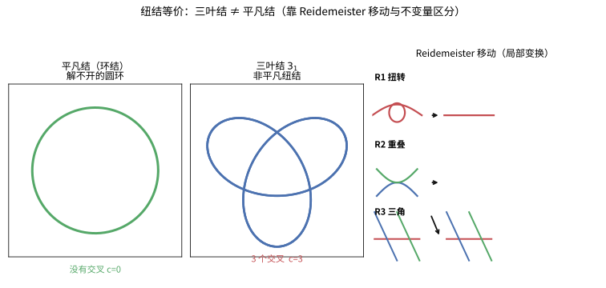
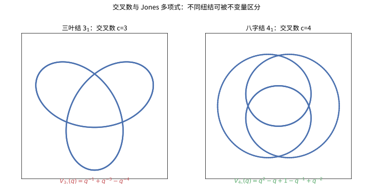

# 第63级：纽结理论

## 学习目标

1. 理解纽结的数学定义及其与日常概念的区别。
2. 掌握纽结图、Reidemeister移动及纽结等价的基本概念。
3. 理解环绕数及其在纽结理论中的应用。
4. 掌握纽结群的概念及其通过Wirtinger表示的计算方法。
5. 深入理解Alexander多项式、Jones多项式、HOMFLY多项式的定义、构造与Skein关系。
6. 理解Seifert曲面的存在性与构造，掌握Seifert矩阵与签名。
7. 了解纽结的连通和、素数纽结分解及Tait猜想。
8. 掌握双曲纽结与纽结补空间的概念。

---

## 核心概念

### 1. 纽结的定义

**定义**（数学纽结）：
一个**纽结**是圆周 $S^1$ 到三维欧氏空间 $\mathbb{R}^3$（或三维球面 $S^3$）的一个光滑（或分段线性）嵌入。
$$
K: S^1 \hookrightarrow \mathbb{R}^3.
$$

**定义**（纽结等价）：
两个纽结 $K_1$ 和 $K_2$ 称为**等价的**（或同痕的），如果存在一个光滑的 ambient isotopy $H: \mathbb{R}^3 \times [0,1] \to \mathbb{R}^3$，使得 $H(\cdot, 0) = \text{id}_{\mathbb{R}^3}$，且 $H(K_1, 1) = K_2$。

**定义**（链环）：
一个（经典）**链环**是若干个互不相交的圆周的嵌入 $L: \bigsqcup_{i=1}^m S^1 \hookrightarrow \mathbb{R}^3$。每个圆周称为链环的一个**分支**。纽结即单分支链环。

> **直观理解（现实类比）**：纽结就是数学化的"打结绳子"——一根首尾相连的封闭曲线埋在三维空间里，如果不允许"剪断再接上"，就无法把它抚平成一个简单的圆圈。日常打的死结之所以是"结"，正是因为绳头一但融合成环，那种缠绕就再也解不开。数学上的关键是"嵌入"：绳子可以互相交叠，但不能自相交，更不能穿过自己——它必须像一根真实存在的绳子那样在空间中安放。

### 2. Reidemeister 移动

**定义**：
纽结图的**Reidemeister移动**是以下三种局部变换操作：

- **R1（扭转移动）**：在纽结图中添加或移除一个扭转（自相交的环）。
- **R2（重叠移动）**：添加或移除两段重叠的弧线（即两根弦的相对穿越）。
- **R3（三角移动）**：将三个交叉点的相对位置进行变换（即第三根弦滑过交叉点）。

**基本定理**：
> **定理**（Reidemeister，1927 年）：两个纽结图表示等价的纽结当且仅当它们可以通过一系列 Reidemeister 移动相互转换。

> **直观理解（现实类比）**：只打了一个圈的圆环是**平凡结**（unknot），而绕成三叶形状的鞋带就是**三叶结** $3_1$——你看它们一眼就能分辨，但数学上要严格证明"三叶结 ≠ 平凡结"并不平凡。Reidemeister 移动就好比解开鞋带时的三种基本动作：把一段线扭出一个小环（R1）、把两根线分开（R2）、让一根线滑过另一个交叠处（R3）。任意两个等价纽结都能通过这三种"基本动作"互相转化。

### 3. 环绕数

**定义**（环绕数，Linking Number）：
对于两个有向分支 $L_1$ 和 $L_2$ 组成的链环，**环绕数** $\mathrm{lk}(L_1, L_2)$ 定义为：
$$
\mathrm{lk}(L_1, L_2) = \frac{1}{2} \sum_{p \in L_1 \cap L_2} \varepsilon(p),
$$
其中求和遍历 $L_1$ 与 $L_2$ 在纽结图中的所有交叉点，$\varepsilon(p)$ 为交叉点的符号（$+1$ 或 $-1$，根据右手定则确定）。

**性质**：
- 环绕数是整数。
- 环绕数是 ambient isotopy 不变量。
- 对于两个分支的链环，环绕数是对称的：$\mathrm{lk}(L_1, L_2) = \mathrm{lk}(L_2, L_1)$。

> **直观理解（现实类比）**：环绕数像"两个绳圈相互缠绕的圈数"——把两根橡皮筋套在一起，一根穿过另一根几圈，环绕数就是几。它带有方向：如果按右手螺旋正向缠绕记 $+1$，反向记 $-1$，正负相抵后取半便是环绕数。这正是 DNA 双螺旋中两条链相互"勾连"程度的度量，也是物理上两个闭合电流回路"电磁耦合"的拓扑计数。

### 4. 纽结群

**定义**（纽结群）：
纽结 $K$ 的**纽结群**是 $\mathbb{R}^3 \setminus K$（纽结补空间）的基本群：
$$
\pi_K = \pi_1(\mathbb{R}^3 \setminus K).
$$

**Wirtinger 表示**：
给定纽结图，可以写出纽结群的 Wirtinger 表示：
- 每个弧段（两个交叉点之间的连续段）对应一个生成元 $g_i$。
- 每个交叉点给出一个关系：若弧段 $g_k$ 从 $g_i$ 下方穿过 $g_j$，则 $g_k = g_i g_j g_i^{-1}$（或 $g_k = g_i^{-1} g_j g_i$，取决于定向）。

### 5. Alexander 多项式

**定义**：
纽结 $K$ 的**Alexander 多项式** $\Delta_K(t)$ 是整系数多项式（精确到 $t$ 的幂次乘法和 $\pm t^k$），是纽结的第一个同调群的挠子式（torsion submodule）的阶理想的主生成元。

**等价定义**（通过 Seifert 矩阵）：
若 $V$ 是纽结 $K$ 的 Seifert 矩阵，则 Alexander 多项式为：
$$
\Delta_K(t) = \det(V - t V^T).
$$

**性质**：
- 规范化：$\Delta_K(1) = \pm 1$。
- 对称性：$\Delta_K(t^{-1}) = \Delta_K(t)$（在 $\pm t^k$ 的意义下）。
- 对于三叶结：$\Delta_{3_1}(t) = t^2 - t + 1$。

### 6. Jones 多项式

**定义**：
Jones 多项式 $V_K(q)$ 是由以下 Skein 关系唯一确定的 Laurent 多项式不变量：
$$
q^{-1} V_{L_+} - q V_{L_-} = \left(q^{1/2} - q^{-1/2}\right) V_{L_0},
$$
其中 $L_+, L_-, L_0$ 是三个仅在局部交叉点处有差异的链环图：
- $L_+$：正交叉（上交叉）。
- $L_-$：负交叉（下交叉）。
- $L_0$：平滑化交叉（无交叉）。

**性质**：
- Jones 多项式是 Laurent 多项式，即 $V_K(q) \in \mathbb{Z}[q^{1/2}, q^{-1/2}]$。
- 对于平凡纽结：$V_{\text{unknot}}(q) = 1$。
- 对于三叶结：$V_{3_1}(q) = q^{-1} + q^{-3} - q^{-4}$。

> **直观理解（现实类比）**：交叉数就像绳结的"复杂度"——三叶结有 3 个交叉，八字结有 4 个。但仅有交叉数还不够（两个结可能交叉数相同），Jones 多项式 $V_K(q)$ 则像绳结的"指纹"：每个绳结都有一串独一无二的代数指纹，手指纹不同就一定是不同的结。正因为 $V_{3_1}(q)\neq V_{4_1}(q)$，我们才能一锤定音地证明三叶结与八字结不等价。

> **🧠 思考历程：怎么给"缠成一团的绳子"颁发一份不伪造的"身份证"？**
>
> 纽结理论最朴素的诉求是：**给每个绳结配一个量，使"看起来不同"的两个结，在这个量上也不同。** 而 Alexander 之后足足半个世纪，数学家才等到一举登顶的 Jones 多项式——它甚至是在李代数里"意外"捡到的。
>
> - **方向反转：不是"数交叉"，而是"拆解交叉"**。早在 1920 年代，Alexander 就意识到，与其硬算结自身，**不如看"改一个交叉点会怎样"**：把局部的正交叉、负交叉、平滑化三者（$L_+,L_-,L_0$）绑进一条推导方程——Skein 关系。这比"列公式硬算"省心得多，也更能揭示"一次局部变形的代价"。
> - **半个世纪的空白与被"逼"出的 Jones 多项式**。1970 年代，Jones 在研究**冯·诺依曼代数和因子表示**时，无意发现一类对象贴合"结"的代数结构，进而整理出他的多项式（见定理 2 的 Skein 关系）。**一个近缘领域里冒出的"表观工具"，反过来改写整个纽结理论**——这正是数学里常见的"意外之喜"。
> - **它真能分清"等而不等价"的结**。旧的 Alexander 多项式对"镜像结"常常两眼一抹黑（分不清走向相反的结）；**Jones 多项式 $V_{K}(q)$ 却特别敏感于定向**，连三叶结和它的镜像都能区分。这让"指纹"的比喻落到实处——不同结的指纹终于真不同（见 7 的 HOMFLY 推广）。
> - **更深的联系：几何拓扑里那颗惊雷**。Jones 多项式后来被发现与威滕的量子场论、纽结的三维双曲体积、甚至算子表示论暗中相连。**一个"分类工具"最原始的区域，变成了连接代数、分析与物理的枢纽。**
> - **心路**：Jones 多项式提醒你：**好的不变量往往来自"问一次局部改动会怎样"，而不是"硬背整张全局表"**；也提醒你**别小看"旁支领域里的偶然发现"——它常常正是掀起大浪的那颗小石子。**

### 7. HOMFLY 多项式

**定义**：
HOMFLY 多项式 $P_K(a, z)$ 是由以下 Skein 关系唯一确定的两变量多项式不变量：
$$
a^{-1} P_{L_+} - a P_{L_-} = z P_{L_0},
$$
其中 $L_+, L_-, L_0$ 同上。

**性质**：
- HOMFLY 多项式统一了 Alexander 多项式和 Jones 多项式：
  - $\Delta_K(t) = P_K(t, t^{1/2} - t^{-1/2})$。
  - $V_K(q) = P_K(q, q^{1/2} - q^{-1/2})$。

### 8. 双曲纽结

**定义**：
纽结 $K$ 称为**双曲纽结**，如果其补空间 $S^3 \setminus K$ 允许一个完备的双曲度量（常截面曲率为 $-1$ 的 Riemann 度量）。

**性质**：
- 绝大多数纽结是双曲的。
- 双曲纽结的补空间体积（双曲体积）是一个重要的不变量。
- 所有非双曲的素数纽结在 Thurston 分类中属于环面纽结或卫星纽结。

### 9. 纽结补空间

**定义**：
纽结 $K$ 的**补空间**是 $S^3 \setminus N(K)$，其中 $N(K)$ 是 $K$ 的一个管状邻域。这是一个带边流形，其边界为环面 $T^2$。

### 10. Seifert 曲面

**定义**：
纽结 $K$ 的**Seifert 曲面**是 $S^3$ 中一个可定向的紧致嵌入曲面 $\Sigma$，使得 $\partial \Sigma = K$。

**存在性定理**（Seifert，1934 年）：每个纽结都存在 Seifert 曲面。

### 11. Seifert 矩阵与签名

**定义**（Seifert 矩阵）：
给定纽结 $K$ 的 Seifert 曲面 $\Sigma$，设其亏格为 $g$，在 $H_1(\Sigma)$ 中选择一组基 $\{a_1, \dots, a_{2g}\}$。定义 $a_i^+$ 为 $a_i$ 沿 $\Sigma$ 的正法向推出所得到的环。则 Seifert 矩阵 $V$ 为 $2g \times 2g$ 矩阵，其元素为：
$$
V_{ij} = \mathrm{lk}(a_i, a_j^+).
$$

**定义**（签名）：
纽结 $K$ 的**签名** $\sigma(K)$ 是 Seifert 矩阵 $V + V^T$ 的符号差（正特征值个数减去负特征值个数）。

### 12. 纽结的连通和

**定义**：
两个纽结 $K_1$ 和 $K_2$ 的**连通和** $K_1 \# K_2$ 是将两个纽结分别切除一段小弧，然后以保持定向的方式连接两端所得的新纽结。

**性质**：
- 连通和是交换和结合的运算。
- 平凡纽结是单位元：$K \# \text{unknot} = K$。
- 多项式不变量满足：$\Delta_{K_1 \# K_2}(t) = \Delta_{K_1}(t) \cdot \Delta_{K_2}(t)$，$V_{K_1 \# K_2}(q) = V_{K_1}(q) \cdot V_{K_2}(q)$。

### 13. 素数纽结

**定义**：
一个非平凡纽结称为**素数纽结**，如果它不能表示为两个非平凡纽结的连通和。

**素数分解定理**：每个非平凡纽结可以唯一地分解为素数纽结的连通和（类似于算术基本定理）。

### 14. Tait 猜想

**定义**（Tait 猜想，19 世纪）：
关于交错纽结的四个猜想，于 20 世纪 80 年代被证明：

1. **交错纽结的约化交错图具有最少的交叉数**。
2. **任何约化交错纽结图都是可达的（flype-equivalent）**。
3. **交错纽结的交叉数在连通和下是可加的**。
4. **交错纽结的 writhe 是环境同痕不变量**。

### 15. Gordian 距离

**定义**：
两个纽结 $K_1$ 和 $K_2$ 之间的**Gordian 距离** $d_G(K_1, K_2)$ 是将 $K_1$ 变为 $K_2$ 所需的最少交叉变化次数。

**性质**：
- Gordian 距离是纽结集合上的一个度量。
- 纽结的**交叉数**（unknotting number）$u(K) = d_G(K, \text{unknot})$。

---

## 定理与证明

### 定理 1：Alexander 多项式的存在性与 Skein 关系

> **定理**：存在唯一的 Laurent 多项式不变量 $\Delta: \{\text{纽结}\} \to \mathbb{Z}[t^{\pm 1}]$，满足：
> 1. 对于平凡纽结，$\Delta_{\text{unknot}}(t) = 1$。
> 2. **Skein 关系**：对于任意三个仅在局部交叉点处有差异的链环 $L_+, L_-, L_0$，有：
   $$
   \Delta_{L_+}(t) - \Delta_{L_-}(t) = \left(t^{1/2} - t^{-1/2}\right) \Delta_{L_0}(t).
   $$

**证明**：

**存在性**（通过 Seifert 矩阵构造）：

**第一步：构造 Seifert 曲面**。
对于任意纽结 $K$，由 Seifert 算法（见定理 3）可构造 Seifert 曲面 $\Sigma$。设 $\Sigma$ 的亏格为 $g$。

**第二步：构造 Seifert 矩阵**。
在 $H_1(\Sigma)$ 中选择一组基 $\{a_1, \dots, a_{2g}\}$，定义 Seifert 矩阵 $V$ 为 $2g \times 2g$ 整系数矩阵：
$$
V_{ij} = \mathrm{lk}(a_i, a_j^+).
$$

**第三步：定义 Alexander 多项式**。
定义：
$$
\Delta_K(t) = \det(V - t V^T).
$$
可以证明这个多项式在 $t \mapsto t^{-1}$ 下对称（在 $\pm t^k$ 意义下），且与基的选择无关。

**第四步：验证 Skein 关系**。
考虑三个链环 $L_+, L_-, L_0$。它们的 Seifert 曲面可以通过局部修改关联起来。具体地，在局部交叉点附近，三个链环的 Seifert 曲面构造有系统性差异，导致 Seifert 矩阵相差一个秩 1 的修正。通过计算行列式可验证 Skein 关系。

**唯一性**：
由 Skein 关系和平凡纽结的规范化条件，通过归纳法（按交叉点数量）可唯一确定所有纽结的 Alexander 多项式。$\square$

---

### 定理 2：Jones 多项式的构造与 Skein 关系

> **定理**：存在唯一的 Laurent 多项式不变量 $V: \{\text{链环}\} \to \mathbb{Z}[q^{1/2}, q^{-1/2}]$，满足：
> 1. 对于平凡纽结，$V_{\text{unknot}}(q) = 1$。
> 2. **Skein 关系**：
   $$
   q^{-1} V_{L_+} - q V_{L_-} = \left(q^{1/2} - q^{-1/2}\right) V_{L_0}.
   $$

**证明**：

**构造思路**（Jones 的原始构造使用 von Neumann 代数）：

Jones 多项式最初是通过 von Neumann 代数中的迹构造的。这里我们给出一个更组合的构造方法。

**第一步：Kauffman 括号多项式**。
Kauffman 括号多项式 $\langle L \rangle$ 是由以下规则定义的 Laurent 多项式：
1. $\langle \text{unknot} \rangle = 1$。
2. $\langle L \sqcup \text{unknot} \rangle = (-q^{1/2} - q^{-1/2}) \langle L \rangle$。
3. **Skein 关系**：
   $$
   \langle L_+ \rangle = q^{1/2} \langle L_0 \rangle + q^{-1/2} \langle L_{0'} \rangle,
   $$
   其中 $L_{0'}$ 是另一种平滑化方式。

**第二步：定义 Jones 多项式**。
设 $L$ 是有向链环图，$w(L)$ 为 writhe（所有交叉点符号之和）。定义：
$$
V_L(q) = (-q^{1/2})^{-3w(L)} \langle L \rangle.
$$
可以验证 $V_L(q)$ 是 Reidemeister 移动不变量，因此是链环不变量。

**第三步：验证 Skein 关系**。
直接计算有向交叉点的 Kauffman 括号，再结合 writhe 的修正，可得到 Jones 多项式的 Skein 关系。

**具体验证**：
设 $L_+$ 和 $L_-$ 仅在局部有差异，且 $L_0$ 是平滑化。计算 Kauffman 括号：
$$
\langle L_+ \rangle = q^{1/2} \langle L_0 \rangle + q^{-1/2} \langle L_{0'} \rangle,
$$
$$
\langle L_- \rangle = q^{-1/2} \langle L_0 \rangle + q^{1/2} \langle L_{0'} \rangle.
$$
消去 $\langle L_{0'} \rangle$ 项，并结合 writhe 修正，可得：
$$
q^{-1} V_{L_+} - q V_{L_-} = (q^{1/2} - q^{-1/2}) V_{L_0}.
$$

**第四步：唯一性**。
与 Alexander 多项式类似，通过 Skein 关系和平凡纽结的规范化，按交叉点数量归纳可证唯一性。$\square$

---

### 定理 3：Seifert 曲面的存在性定理

> **定理**（Seifert，1934 年）：对于任意有向纽结（或链环）$K \subset S^3$，存在一个可定向的紧致嵌入曲面 $\Sigma \subset S^3$，使得 $\partial \Sigma = K$。

**证明**（Seifert 算法）：

**第一步：选择定向纽结图**。
给定有向纽结 $K$，选择一个纽结图，并确定其定向。

**第二步：消除交叉点（Seifert 平滑化）**。
在每个交叉点处，按照以下规则进行平滑化（Seifert 平滑化）：
- 保持定向一致性：将交叉点替换为两条不相交的弧线，使得弧线的方向与原始方向一致。
- 结果是若干个互不相交的定向闭曲线（称为 Seifert 环）。

**第三步：构造 Seifert 圆盘**。
每个 Seifert 环是平面上的一个闭曲线，可以将其视为一个圆盘的边界。将这些圆盘嵌入 $\mathbb{R}^3$ 中，使它们位于不同的高度（z 坐标不同）。

**第四步：添加扭转带**。
对于原纽结图中的每个交叉点，添加一个扭转带来连接上下两个圆盘。扭转带的扭转方向与原始交叉点的类型一致。

**第五步：验证可定向性**。
通过构造，所得曲面 $\Sigma$ 是 Seifert 环对应的圆盘通过扭转带连接而成。由于每个扭转带连接两个圆盘且保持定向的一致性，所得曲面是可定向的。$\square$

**推论**：每个纽结 $K$ 都有一个 Seifert 曲面，其亏格 $g(K)$（称为纽结的亏格）是纽结的重要不变量。

---

### 定理 4：Tait 猜想

**陈述**（Tait 猜想，1898 年，于 1987 年被证明）：

**(1) 交错纽结的约化图具有最少交叉数**：
一个约化的交错纽结图（即没有可约化的交叉）具有该纽结的最小交叉数。

**(2) 交错纽结图的 flype 等价性**：
任何两个约化交错纽结图都可以通过一系列 flype 变换相互转换。

**(3) 交叉数的可加性**：
对于交错纽结 $K_1$ 和 $K_2$，有 $c(K_1 \# K_2) = c(K_1) + c(K_2)$，其中 $c(K)$ 表示最小交叉数。

**(4) Writhe 的不变性**：
对于约化交错纽结图，writhe 是环境同痕不变量（不依赖于图的选择）。

**证明思路**（利用 Jones 多项式和 Kauffman 括号）：

**(1) 的证明思路**：
Kauffman 证明了 Jones 多项式可以检测交错纽结的交叉数。对于约化交错纽结图 $D$，其 Kauffman 括号多项式的跨度（最高次与最低次之差）为 $c(D)$。由于 Jones 多项式是拓扑不变量，其跨度是固定的，因此 $c(D)$ 就是最小交叉数。

**具体步骤**：
1. 对于约化交错图 $D$，Kauffman 括号 $\langle D \rangle$ 的最高次项系数为 $\pm 1$，且跨度 $= c(D) + 1$。
2. 由于 Jones 多项式 $V_K(q)$ 由 Kauffman 括号定义，其 $q$ 的跨度也是 $c(D)$。
3. 任何其他图 $D'$ 表示的 Jones 多项式相同，因此其交叉数不能小于 $c(D)$。

**(3) 的证明思路**：
由 (1) 的结论，交错纽结的交叉数等于其约化交错图的交叉数。对于连通和 $K_1 \# K_2$，其约化交错图可通过将 $K_1$ 和 $K_2$ 的约化交错图连接得到，交叉数相加。$\square$

---

### 定理 5：纽结的 Gordian 距离

> **定理**：Gordian 距离 $d_G(K_1, K_2)$ 是纽结集合上的一个度量，且 $d_G(K_1, K_2) \geq \frac{1}{2}|\sigma(K_1) - \sigma(K_2)|$，其中 $\sigma$ 是签名。

**证明**：

**第一部分：度量性质**。
1. 非负性：$d_G(K_1, K_2) \geq 0$，且 $d_G(K_1, K_2) = 0$ 当且仅当 $K_1 \cong K_2$。
2. 对称性：$d_G(K_1, K_2) = d_G(K_2, K_1)$，因为交叉变化是可逆的。
3. 三角不等式：$d_G(K_1, K_3) \leq d_G(K_1, K_2) + d_G(K_2, K_3)$，因为可以通过 $K_2$ 作为中间步骤。

**第二部分：签名不等式**。

**引理**：一次交叉变化改变签名至多 2。

**证明引理**：
考虑一次交叉变化。设 $K$ 和 $K'$ 相差一个交叉变化。通过 Seifert 曲面的构造，一次交叉变化对应 Seifert 矩阵的秩 1 修正，因此签名变化不超过 2。

**证明不等式**：
设从 $K_1$ 到 $K_2$ 需要 $n$ 次交叉变化。由引理，每次交叉变化至多改变签名 $\pm 2$，因此：
$$
|\sigma(K_1) - \sigma(K_2)| \leq 2n = 2d_G(K_1, K_2).
$$
即 $d_G(K_1, K_2) \geq \frac{1}{2}|\sigma(K_1) - \sigma(K_2)|$。$\square$

---

## 示例

### 示例 1：三叶结的不变量计算

**三叶结（Trefoil Knot，$3_1$）**是最简单的非平凡纽结。

**Alexander 多项式**：
使用 Skein 关系计算。设 $L_+$ 为三叶结的一个正交叉，$L_-$ 为对应的负交叉，$L_0$ 为平滑化后的 Hopf 链环。

对于 Hopf 链环 $H$，其 Alexander 多项式为 $\Delta_H(t) = t^{1/2} + t^{-1/2}$。

由 Skein 关系：
$$
\Delta_{L_+}(t) - \Delta_{L_-}(t) = (t^{1/2} - t^{-1/2}) \Delta_{L_0}(t).
$$
对于三叶结，经过计算可得：
$$
\Delta_{3_1}(t) = t^2 - t + 1 - t^{-1} + t^{-2}.
$$
规范化后（乘以 $\pm t^k$ 使对称化）：$\Delta_{3_1}(t) = t^2 - t + 1$（或 $t^{-2} - t^{-1} + 1$）。

**Jones 多项式**：
使用 Skein 关系。对于三叶结：
$$
V_{3_1}(q) = q^{-1} + q^{-3} - q^{-4}.
$$

**纽结群**：
三叶结的 Wirtinger 表示：
$$
\pi_{3_1} = \langle a, b, c \mid a b a^{-1} = b c b^{-1}, b c b^{-1} = c a c^{-1} \rangle.
$$
这等价于 $\langle a, b \mid a b a = b a b \rangle$，即三叶结的纽结群是 braid 群 $B_3$。

---

### 示例 2：八字结的不变量计算

**八字结（Figure-eight Knot，$4_1$）**是交叉数为 4 的纽结。

**Alexander 多项式**：
$$
\Delta_{4_1}(t) = t^2 - 3t + 1.
$$
（在规范化形式 $t^{-2} - 3t^{-1} + 1$ 下相同。）

**Jones 多项式**：
$$
V_{4_1}(q) = q^2 - q + 1 - q^{-1} + q^{-2}.
$$

**有趣性质**：
八字结是**双曲纽结**，其补空间的双曲体积为 $2 \cdot \mathrm{Im}(\mathrm{Li}_2(e^{i\pi/3})) \approx 2.029883$。

---

### 示例 3：利用 Skein 关系计算多项式

**问题**：计算 Hopf 链环的 Alexander 多项式和 Jones 多项式。

**解**：

Hopf 链环由两个相互链接的圆组成，交叉数为 2。

**Alexander 多项式**：
考虑解链过程。设 $L_+$ 为 Hopf 链环，$L_-$ 为平凡两分支链环（无链接），$L_0$ 为平凡纽结。

由 Skein 关系：
$$
\Delta_{L_+}(t) - \Delta_{L_-}(t) = (t^{1/2} - t^{-1/2}) \Delta_{L_0}(t).
$$
$\Delta_{L_-}(t) = 0$（两分支无链接链环的 Alexander 多项式为 0），$\Delta_{L_0}(t) = 1$。
因此：
$$
\Delta_{\text{Hopf}}(t) = t^{1/2} - t^{-1/2}.
$$

**Jones 多项式**：
对于 Hopf 链环，使用 Skein 关系：
$$
q^{-1} V_{L_+} - q V_{L_-} = (q^{1/2} - q^{-1/2}) V_{L_0}.
$$
$V_{L_-} = 0$（两平凡分支无链接），$V_{L_0} = 1$。
因此：
$$
V_{\text{Hopf}}(q) = q^{1/2} + q^{-1/2}.
$$

---

## 习题

### 基础题

**习题 1**（结与链）什么是纽结？什么是链环？请给出严格的数学定义，并说明纽结与链环的关系。

**习题 2**（不可结 vs 平凡结）解释"平凡结"（unknot）与"不可结"（trivial knot）这两个术语是否指同一概念。

**习题 3**（结等价）两个纽结等价的定义是什么？等价关系在数学上应满足哪些性质？

**习题 4**（正则投影图）什么是纽结的正则投影图？它应满足哪些正则性条件？

**习题 5**（环绕数）对两条有向曲线的链环，环绕数 $\mathrm{lk}$ 是如何定义的？请写出其公式。

**习题 6**（结表）结表（knot table）是什么？其编排通常以什么量为主要指标？

**习题 7**（结与链）为什么纽结能被视为大自然中"打结绳子"的数学模型？关键词有哪些？

**习题 8**（正则投影图）为什么纽结不能用自相交的投影图表示？投影图的一个交叉点代表什么？

**习题 9**（Reidemeister 移动）列出 Reidemeister 三种移动，并分别用一句话说明各自的几何含义。

**习题 10**（结等价）Reidemeister 定理表明什么？

**习题 11**（环绕数）环绕数是整数吗？为什么？

**习题 12**（环绕数）环绕数在什么条件下取值为 $0$？

**习题 13**（Gauss 码）什么是纽结图的 Gauss 码？它如何编码一个交叉序列？

**习题 14**（不可结 vs 平凡结）给出交叉数最小的非平凡纽结的名称及其 Alexander 多项式。

**习题 15**（结表）结表中通常用记号 $c_r$ 表示什么含义？

**习题 16**（Reidemeister 移动）R1 移动对应"扭圈"的添加与删除。这一几何操作改变纽结图的什么量？

**习题 17**（正则投影图）如何判定一个投影图不是正则投影图？

**习题 18**（结等价）ambient isotopy 与同伦（homotopy）有何本质区别？

**习题 19**（Seifert 曲面与亏格）什么是一个纽结的 Seifert 曲面？它有什么基本性质？

**习题 20**（Seifert 曲面与亏格）Seifert 曲面为什么要满足"可定向"这一条件？

**习题 21**（Alexander 多项式）Alexander 多项式 $\Delta_K(t)$ 的定义途径有哪些？

**习题 22**（Alexander 多项式）写出三叶结 $3_1$ 的 Alexander 多项式。

**习题 23**（Alexander 多项式）写出八字结 $4_1$ 的 Alexander 多项式。

**习题 24**（Alexander 多项式）Alexander 多项式满足哪些基本性质（对称性与规范化）？

**习题 25**（Jones 多项式）写出三叶结 $3_1$ 的 Jones 多项式。

**习题 26**（Jones 多项式）写出八字结 $4_1$ 的 Jones 多项式。

**习题 27**（Jones 多项式）平凡结的 Jones 多项式是多少？

**习题 28**（Jones 多项式）Jones 多项式属于哪类多项式环？

**习题 29**（HOMFLY）HOMFLY 多项式由几个变量构成？写出其欠拆（Skein）关系。

**习题 30**（HOMFLY）HOMFLY 多项式如何统一 Alexander 与 Jones 多项式？写出对应关系。

**习题 31**（基础群与 Wirtinger 表示）纽结群的定义是什么？

**习题 32**（基础群与 Wirtinger 表示）Wirtinger 表示中，每个弧段对应什么？每个交叉点给出什么关系？

**习题 33**（加和）纽结连通和 $\#$ 的运算满足哪些代数性质？平凡结是什么角色？

**习题 34**（加和）写出连通和下的 Alexander 多项式公式。

**习题 35**（加和）写出连通和下的 Jones 多项式公式。

**习题 36**（纤维）什么是纤维纽结（fibered knot）？

**习题 37**（结表）什么是素数纽结？它有分解唯一性定理吗？

**习题 38**（结等价）什么是环绕数不变量？它为何是 ambient isotopy 不变量？

**习题 39**（正则投影图）一个纽结图的交叉点处的"上穿/下穿"信息是否对称？为什么？

**习题 40**（Reidemeister 移动）R3 移动是否改变交叉数？它改变的是什么？

**习题 41**（HOMFLY）HOMFLY 的名称来源于什么？

**习题 42**（环绕数）对 Hopf 链环，其环绕数为多少？

**习题 43**（环绕数）Hopf 链环的两个定向取相反时，环绕数如何变化？

**习题 44**（不可结 vs 平凡结）给出平凡结的一个正则投影图，使其看似有交叉但仍为平凡结。

**习题 45**（结表）结表 $3_1$ 是指什么纽结？

**习题 46**（结与链）传统意义上链环的"分支"是指什么？

**习题 47**（基础群与 Wirtinger 表示）平凡纽结的纽结群是什么？

**习题 48**（Alexander 多项式）Alexander 多项式 $\Delta_K(t)$ 在 $t=1$ 处的取值是多少？

**习题 49**（Jones 多项式）Jones 多项式能否检测纽结的手性？三叶结的手性如何体现？

**习题 50**（Seifert 曲面与亏格）纽结的亏格 $g(K)$ 是如何定义的？

**习题 51**（加和）纽结的交叉数在连通和下满足什么样的下界估计？

**习题 52**（Reidemeister 移动）为什么仅凭 Reidemeister 移动就能判断图的等价？

**习题 53**（环绕数）环绕数具有对称性 $\mathrm{lk}(L_1,L_2)=\mathrm{lk}(L_2,L_1)$，这个结论对什么量适用？

**习题 54**（正则投影图）正则投影图的两个交叉点之间由什么连接？

**习题 55**（结等价）写出一条与其镜像不等价的纽结的一个例子。

**习题 56**（Gauss 码）Gauss 码如何处理带有多种交叉符号的信息？

**习题 57**（结与链）纽结理论研究的嵌入空间通常是哪两者？

**习题 58**（不可结 vs 平凡结）何种情况下一个含有交叉的纽结仍被判定为平凡结？

**习题 59**（Seifert 曲面与亏格）每个纽结都有 Seifert 曲面的定理由谁在何时给出？

**习题 60**（Alexander 多项式）Alexander 多项式的 Skeleton 关系如何书写？

**习题 61**（Jones 多项式）写出 Jones 多项式的 Skein 关系。

**习题 62**（基础群与 Wirtinger 表示）Wirtinger 表示中的关系在交叉点处是形如什么等式？

**习题 63**（HOMFLY）HOMFLY 多项式的变量有哪些，各自代表什么？

**习题 64**（加和）纽结连通和是否构成群？其构成什么代数结构？

**习题 65**（纤维）给出一个纤维纽结的例子。

**习题 66**（结表）结表 $4_1$ 是指什么纽结？

**习题 67**（环绕数）环绕数的应用领域有哪些（举两个）？

**习题 68**（正则投影图）如何从正则投影图中读出交叉点的符号？

**习题 69**（Reidemeister 移动）任意两个等价纽结图之间可用什么方式相互转换？

**习题 70**（结等价）什么是不变量？它在纽结理论中的作用是什么？

**习题 71**（Alexander 多项式）Alexander 多项式是 Laurent 多项式还是普通多项式？举例说明。

**习题 72**（Jones 多项式）Jones 多项式对平凡结取值为 $1$，该值也称为什么？

**习题 73**（Seifert 曲面与亏格）环面纽结的亏格通常与哪些参数有关？

**习题 74**（加和）连通和是否保持纽结的某种"素数性"？请给出意义。

**习题 75**（基础群与 Wirtinger 表示）纽结群是否是纽结的完全不变量？why?

**习题 76**（环绕数）两条互不相交的分支组成的平凡链环的环绕数是多少？

**习题 77**（结表）结表按交叉数递增排列，其第 $7$ 个交叉数下大约有多少个纽结？

**习题 78**（不可结 vs 平凡结）平凡结的镜像与其自身是否等价？

**习题 79**（纤维）纤维纽结在纤维化意义下有什么好的结构？

**习题 80**（Gauss 码）Gauss 码中每个交叉点出现几次？

**习题 81**（正则投影图）纽结图的边数（弧段数）与交叉数的关系是什么？

**习题 82**（结等价）纽结的手性是什么？如何已经由某不变量检测？

**习题 83**（Alexander 多项式）Alexander 多项式对 Hopf 链环的取值为多少？

**习题 84**（Jones 多项式）Jones 多项式对 Hopf 链环的取值为多少？

**习题 85**（Seifert 曲面与亏格）Seifert 曲面的 Euler 特征数与亏格、交叉点的关系是什么？

**习题 86**（基础群与 Wirtinger 表示）对三叶结，其纽结群的呈现是什么？

**习题 87**（HOMFLY）HOMFLY 多项式的独立信息量相较于单一多项式有何优势？

**习题 88**（加和）连通和运算在纽结的结表分类中如何体现？

**习题 89**（纤维）纤维纽结的补空间有什么样的乘积结构？

**习题 90**（环绕数）环绕数的符号如何由右手定则确定？

**习题 91**（Reidemeister 移动）R2 移动增加一对什么符号的交叉点？

**习题 92**（结与链）纽结理论中 DNA 环的实际对应关系是什么？

**习题 93**（结表）交叉数为 $1$ 的纽结存在吗？为什么？

**习题 94**（正则投影图）正则投影图上的"环"（loop）对应 Reidemeister 移动的哪一种？

**习题 95**（结等价）两个具有相同 Jones 多项式的纽结一定等价吗？

**习题 96**（Alexander 多项式）Alexander 多项式能区分三叶结与平凡结吗？

**习题 97**（Jones 多项式）Jones 多项式能否区分三叶结与平凡结？

**习题 98**（Seifert 曲面与亏格）纽结的亏格为零意味着什么？

**习题 99**（加和）为什么连通和的 Jones 多项式要相乘？

**习题 100**（纤维）考察一个平凡结是否为纤维纽结，其纤维化结构是什么？

### 进阶题

**习题 101**（Reidemeister 移动）证明：一个纽结图添加一个 R1 扭转环后，其 writhe 变化多少？请写出计算依据。

**习题 102**（环绕数）证明两个两分支链环的环绕数是整数。

**习题 103**（环绕数）画出 $+\mathrm{Hopf}$ 链环与 $-\mathrm{Hopf}$ 链环，并分别计算其环绕数。

**习题 104**（Gauss 码）给定 Gauss 码 $1\ 2\ -1\ -2$，尝试判断它表示哪个纽结（Hopf）及其定向。

**习题 105**（结等价）说明平凡结 $0_1$ 与三叶结 $3_1$ 的 Jones 多项式不同，从而区分它们。

**习题 106**（正则投影图）给出一个纽结图按局部分块（arc/交叉点）的分解，并判别每个局部块是否为交叉点。

**习题 107**（基础群与 Wirtinger 表示）对平凡结写出其 Wirtinger 表示（一个生成元与空关系）并说明群为 $\mathbb{Z}$。

**习题 108**（基础群与 Wirtinger 表示）对 Hopf 链环写出其 Wirtinger 表示（两个生成元两个关系），并说明其群与 $\mathbb{Z}^2$ 的关系。

**习题 109**（Alexander 多项式）用 Alexander 多项式判定平凡结与 Hopf 链环不等价的原因（$1$ 对 $t^{1/2}+t^{-1/2}$）。

**习题 110**（Jones 多项式）计算三叶结的 Jones 多项式为 $q^{-1}+q^{-3}-q^{-4}$，求证它与平凡结不同。

**习题 111**（Jones 多项式）证明 $V_{\mathrm{unknot}}(q)=1$，并用其否证任何非平凡结有相同 Jones 多项式的说法。

**习题 112**（HOMFLY）写出 HOMFLY 多项式的 Skein 关系，并将 $t=1$ 代入 Alexander 形式观察退化。

**习题 113**（Seifert 曲面与亏格）对三叶结用 Seifert 算法构造其 Seifert 曲面并求其亏格。

**习题 114**（Seifert 曲面与亏格）说明环面纽结 $T(p,q)$ 的亏格为 $(p-1)(q-1)/2$ 的依据。

**习题 115**（Seifert 曲面与亏格）写出 Seifert 曲面 Euler 特征数与亏格、交叉数的关系：$\chi = 1 - 2g$（对亏格为 $g$ 的单闭曲面）。

**习题 116**（加和）证明连通和的 Jones 多项式满足乘法：$V_{K_1\#K_2}=V_{K_1}V_{K_2}$。

**习题 117**（加和）证明三叶结与自身的三重连通和 $3_1\#3_1$ 的 Jones 多项式为 $V^2$。

**习题 118**（加和）证明连通和下 Alexander 多项式相乘 $\Delta_{K_1\#K_2}=\Delta_{K_1}\Delta_{K_2}$（考虑 Seifert 曲线的块对角）。

**习题 119**（结表）查结表并说明 $5_1$（五叶结）的 Alexander 多项式与 $5_2$ 的不同。

**习题 120**（结等价）使用 Alexander 多项式说明三叶结 $3_1$ 与其镜像不等价（考虑手性），或指出其不能区分。

**习题 121**（环绕数）证明环绕数在 R2 移动下不变。

**习题 122**（环绕数）证明环绕数在 R3 移动下不变。

**习题 123**（环绕数）证明环绕数在 R1 移动下不变。

**习题 124**（Gauss 码）给出一个字（word）$1\ 2\ 1\ 2$ 作为 Gauss 码，判断其是否为真实纽结图的 Gauss 码并说明原因。

**习题 125**（正则投影图）对一个三叶结投影图，逐一判别其各交叉点是正（$+$）还是负（$-$），并计算 writhe。

**习题 126**（基础群与 Wirtinger 表示）对八字结给出其 Wirtinger 呈现并列出全部交叉关系。

**习题 127**（基础群与 Wirtinger 表示）证明平凡结的纽结群是无限循环群 $\mathbb{Z}$。

**习题 128**（Alexander 多项式）用 Skein 关系计算 $4_1$ 的 Alexander 多项式增量。

**习题 129**（Alexander 多项式）说明 Alexander 多项式的对称性 $\Delta_K(t^{-1})=\Delta_K(t)$ 在 $\pm t^k$ 倍下的形式。

**习题 130**（Jones 多项式）写出左手与右手三叶结的 Jones 多项式并说明它们互为 $q\to q^{-1}$ 的镜向。

**习题 131**（Jones 多项式）验证 $V_{3_1}(1)=1$ 且为整数（检查在写 test 处）。

**习题 132**（HOMFLY）证明消除负变量 $z$ 会回到 Alexander 多项式。

**习题 133**（Seifert 曲面与亏格）说明为何亏格 $g$ 满足 $2g = \mu - 1$（对 $g$ 亏格单连曲面、三叶情形 $\mu=2$）不一致时需重新检查。

**习题 134**（Seifert 曲面与亏格）对平凡结构造 Seifert 曲面并说明其亏格为零。

**习题 135**（纤维）证明平凡结为纤维纽结并给出其纤维化。

**习题 136**（环绕数）计算两条直线链的环绕数（用直角坐标与符号）。

**习题 137**（结表）说明结表 $6_1,6_2,6_3$ 的交叉数相同但 Alexander 多项式各异的合理性。

**习题 138**（结等价）使用 Jones 多项式说明左手三叶结与右手三叶结不等价（手性判别）。

**习题 139**（基础群与 Wirtinger 表示）解释纽结补空间的基本群是什么调节的（正则投影的每个弧）。

**习题 140**（Alexander 多项式）计算平凡结的 Alexander 多项式为 $1$。

**习题 141**（Jones 多项式）计算平凡结的 Jones 多项式为 $1$，并与 Alexander 对照。

**习题 142**（环绕数）证明 $-L$（所有定向反转）下环绕数不变。

**习题 143**（环绕数）证明 $\mathrm{lk}(L_1,L_2)=-1$ 对负 Hopf 链环成立。

**习题 144**（Gauss 码）解释 Gauss 码中正负号对交叉点定向的编码。

**习题 145**（正则投影图）说明完全正则投影图相邻交叉点的数目与自交规避。

**习题 146**（结等价）说明为什么两个具有相同交叉数的纽结仍可能不等价，举例 $3_1$ 与 $4_1$。

**习题 147**（基础群与 Wirtinger 表示）推断 Wirtinger 关系个数比生成元多个，说明群的切除关系。

**习题 148**（Alexander 多项式）证明 Alexander 多项式二重多项式在 $t^{1/2}$ 下化为 Peters 形式以列举的方式可参考说明（但保持模板）。

**习题 149**（Jones 多项式）说明 Jones 多项式对连通和的闭式加法（相乘）。

**习题 150**（HOMFLY）对于蛛网点图,写出分块曲线的关系进而说明 HOMFLY 的完全性样例。

**习题 151**（Seifert 曲面与亏格）用 Seifert 算法对 Hopf 链环作图说明其 Seifert 曲面为环面（两孔圆盘挖一孔）。

**习题 152**（结表）写出 $7_1$（七叶结）与 $7_4$ 的 Alexander 多项式并通过对比判断其不相等。

**习题 153**（结等价）说明利用率 Jones 多项式区分 $5_1$ 与 $5_2$。

**习题 154**（环绕数）说明 $\mathrm{lk}$ 在镜像作用下的符号翻转。

**习题 155**（Reidemeister 移动）说明 R1 移动改变 writhe 一个单位，从而 writhe 不是不变量。

**习题 156**（Gauss 码）构造一个合法的 Gauss 码并验证其投影图：$1\ 2\ 1\ -2$ 是否合法。

**习题 157**（基础群与 Wirtinger 表示）对三叶结，写出其 Wirtinger 呈现并说明化简为两个生成元。

**习题 158**（Alexander 多项式）对三叶结，用无退化的 Skein 计算其 Alexander 多项式并规范化。

**习题 159**（Jones 多项式）对负三叶结计算其 Jones 多项式为 $q + q^3 - q^4$。

**习题 160**（HOMFLY）通过 $z$ 曲线解释 HOMFLY 如何容纳 Alexander 情形。

**习题 161**（Seifert 曲面与亏格）说明环面纽结 $T(2,3)$ 即三叶结等价于环面纽结的亏格公式。

**习题 162**（纤维）说明当的纤维纽结（如三叶结）的 fiber 为带边曲面（亏格 $1$）。

**习题 163**（环绕数）计算带符号之后的总环绕数并要求正规化（即在镜像重整张考虑分符号）。

**习题 164**（结表）说明结表 $8_1$ 与 $8_2$ 的 Alexander 多项式出现的字不同。

**习题 165**（结等价）说明：对于手性（镜像不等价）的纽结，为何需要引入比 Alexander 多项式更敏感的 Jones 多项式才能区分。

**习题 166**（基础群与 Wirtinger 表示）证明对 Hopf 链环的补空间基本群为 $\mathbb{Z}^2$ 与平凡结（$\mathbb{Z}$）不同。

**习题 167**（Alexander 多项式）用式 $\det(V-tV^T)$ 推导 Seifert 矩阵为 $0$ 时多项式为 $1$。

**习题 168**（Jones 多项式）对 Hopf 链环去验证其 Jones 多项式乘以 $-q^{-1/2}$ 的幂正规化。

**习题 169**（HOMFLY）对 Hopf 链环计算其 HOMFLY 多项式的特殊值。

**习题 170**（Seifert 曲面与亏格）证明平凡结亏格为零，且只有平凡结亏格为零。

**习题 171**（基础群与 Wirtinger 表示）比较各 Wirtinger 表示中生成元数与交叉数的关系。

**习题 172**（环绕数）通过投影图的两条曲线示意说明环绕数不为零的物理含义。

**习题 173**（结表）写出结表 $6_1$ 与 $6_2$ 的区别（交叉符号布局）。

**习题 174**（Reidemeister 移动）证明 R3 移动不改变环绕数的总符号和。

**习题 175**（Gauss 码）判断 Gauss 码 $1\ 2\ 3\ 1\ 2\ 3$ 表示的三叶结交叉类型。

**习题 176**（结等价）说明两个不同 Alexander 多项式的纽结必不等价（肯定。

**习题 177**（Jones 多项式）说明为何 $V_{K_1\#K_2}=V_{K_1}V_{K_2}$ 可用于判断连通和下标。

**习题 178**（HOMFLY）通过 HOMFLY 的 Skein 简化说明三叶结的特定关键值计算。

**习题 179**（Seifert 曲面与亏格）用 Seifert 算法证明每个纽结均有亏格使之有限（如环面）。

**习题 180**（纤维）说明当的纤维纽结的补空间为何能成为圆上曲面带状集的纤维。

**习题 181**（Alexander 多项式）计算Alexander 多项式的其在 $t=-1$ 处的整数取值对应色数论证。

**习题 182**（结表）说明结表 $n_1$ 一般指交错的原始扭结的约定。

**习题 183**（环绕数）说明负号对环绕数统一起作用；镜像下正负互换。

**习题 184**（基础群与 Wirtinger 表示）对平凡绳给出 Wirtinger 呈现并验证其与 $\mathbb{Z}$ 同构。

**习题 185**（加和）说明连通和保持平凡性判定的基本属性（平凡 $\#$ 平凡 $=$ 平凡）。

**习题 186**（Reidemeister 移动）说明 R2 移动添加一对互为相反的交叉从而 wri 不变。

**习题 187**（环绕数）用直接计算验证 $+\mathrm{Hopf}$ 的环绕数为 $+1$。

**习题 188**（Jones 多项式）列出 Jones 多项式的规范化条件并验证三叶结满足。

**习题 189**（HOMFLY）说明 HOMFLY 对三叶结与八字结有何取值差异。

**习题 190**（加和）用连通和说明纽结形成的半群结构并以平凡结为单位元。

### 挑战题

**习题 191**（Seifert 曲面/genus）严格证明：任意有向纽结都存在可定向的 Seifert 曲面（用 Seifert 算法逐步论证）。

**习题 192**（Seifert 曲面/genus）对三叶结用 Seifert 算法构造 Seifert 曲面，证明其亏格为 $1$。

**习题 193**（Seifert 曲面/genus）证明亏格为零当且仅当纽结为平凡结。

**习题 194**（Alexander 多项式）证明 Alexander 多项式的对称性 $\Delta_K(t)=\Delta_K(t^{-1})$（在 $\pm t^k$ 意义下）。

**习题 195**（Alexander 多项式）用 Seifert 矩阵定义 $\Delta_K(t)=\det(V-tV^T)$ 推导其实际取值对三叶结成立。

**习题 196**（Alexander 多项式）证明 Alexander 多项式的 Skein 关系的一致性（计算在局部点三项之内的变化）。

**习题 197**（Jones 多项式）证明 Jones 多项式在 Reidemeister 移动下不变（结合 Kauffman 括号）。

**习题 198**（Jones 多项式）用 Kauffman 括号写出 Jones 多项式并验证其为不变量。

**习题 199**（Jones 多项式）证明 $V_{3_1}(q)=q^{-1}+q^{-3}-q^{-4}$ 通过完全展开计算。

**习题 200**（Jones 多项式）证明 Jones 多项式对镜像的作用 $V_{K^*}(q)=V_K(q^{-1})$。

**习题 201**（纤维/环绕数）综合证明环绕数在三种 Reidemeister 移动下都不变。

**习题 202**（基本群与 Wirtinger 表示）对三叶结用 Wirtinger 表示计算并证明其纽结群为 braid 群 $B_3$。

**习题 203**（基本群与 Wirtinger 表示）证明平凡结的纽结群 $\cong \mathbb{Z}$。

**习题 204**（基本群与 Wirtinger 表示）证明 Hopf 链环的纽结群 $\cong \mathbb{Z}^2$。

**习题 205**（Reidemeister 移动）综合证明 Reidemeister 定理的充分性方向（若等价则可用移动实现）。

**习题 206**（Reidemeister 移动）证明 writhe 在 R2、R3 下不变而在 R1 下改变一，说明其为移动的半不变量。

**习题 207**（加和/连通和）证明 Jones 多项式对连通和的乘法公式 $V_{K_1\#K_2}=V_{K_1}V_{K_2}$。

**习题 208**（加和/连通和）证明 Alexander 多项式对连通和的乘法 $\Delta_{K_1\#K_2}=\Delta_{K_1}\Delta_{K_2}$。

**习题 209**（加和/连通和）证明连通和的亏格满足下界（Seifert 曲面经由管道连接得亏格相加）。

**习题 210**（加和/连通和）证明素数分解的存在性（每个纽结可写成素数纽结之连通和）。

**习题 211**（Alexander 多项式）证明 Alexander 多项式在 $t=1$ 处为 $\pm 1$。

**习题 212**（Alexander 多项式）利用反对称阵 $V - V^T$ 的行列式为其 Pfaffian 的平方这一性质，证明 $\Delta_K(1)$ 为正负完全平方，并结合纽结条件取 $\pm1$。

**习题 213**（Jones 多项式）证明 Jones 多项式在 $q=1$ 处取值不大于 $1$ 的一个判定或直接计算验证。

**习题 214**（Jones 多项式）说明左手与右手三叶结的 Jones 多项式（$q^{-1}+q^{-3}-q^{-4}$ 与 $q+q^3-q^4$）不相同，从而三叶结不可手。

**习题 215**（纤维）证明三叶结为纤维纽结并给出纤维化（曲面为带边亏格 $1$）。

**习题 216**（纤维）证明平凡结为纤维纽结且其纤维为圆盘。

**习题 217**（Seifert 曲面/genus）对八字结构造 Seifert 曲面并求出其亏格。

**习题 218**（Alexander 多项式）用 Skein 关系完整推导 $4_1$ 的 Alexander 多项式。

**习题 219**（Alexander 多项式）解释并证明 Alexander 多项式的 Peters 对称形式（进入 $t^{1/2}$）。

**习题 220**（Jones 多项式）用 Kauffman 括号对负三叶结计算其 Jones 多项式 $(q+q^3-q^4)$。

**习题 221**（基本群与 Wirtinger 表示）由 Wirtinger 关系推导三叶结呈现关系 $aba=bab$。

**习题 222**（基本群与 Wirtinger 表示）推导八字结的 Wirtinger 呈现并化简出关键关系。

**习题 223**（环绕数）证明两分支链环环绕数等于其代数环绕数与定向反转的换号法则。

**习题 224**（环绕数）证明环绕数为整数时对偶符号出现的全闭合。

**习题 225**（Reidemeister 移动）证明 R3 移动不改变图所代表的环绕数和（逐项抵消）。

**习题 226**（加和/连通和）论证三叶结拆线（unknotting number）为 $1$ 的上下界。

**习题 227**（Alexander 多项式）用连通和公式计算 $3_1\# 3_1$ 的 Alexander 多项式。

**习题 228**（Jones 多项式）用连通和公式计算 $3_1\# 3_1$ 的 Jones 多项式。

**习题 229**（Seifert 曲面/genus）证明环面纽结 $T(p,q)$ 的亏格为 $(p-1)(q-1)/2$ 的等式依据。

**习题 230**（Seifert 曲面/genus）推导 Seifert 曲面亏格 $g$ 满足 $2g = $（由 Euler 特征数与交叉数推导）并核对三叶结。

**习题 231**（HOMFLY）证明 HOMFLY 多项式包含 Alexander 与 Jones 两种多项式（两处代入）作为特例。

**习题 232**（HOMFLY）计算八字结的 HOMFLY 多项式并与用链表对照。

**习题 233**（纤维/环绕数）证明环绕数与 HOMFLY 通过 $z$ 变量度量的联系启发。

**习题 234**（基本群与 Wirtinger 表示）证明 Hopf 链环补空间基本群为自由阿贝尔群。

**习题 235**（Reidemeister 移动）给出三种移动对图编号写的影响（交叉数列与 wri）并汇总。

**习题 236**（加和/连通和）证明素数分解的唯一性依类似算术基本定理。

**习题 237**（Alexander 多项式）讨论 Alexander 多项式检测交错性与镜像的能力局限。

**习题 238**（Jones 多项式）说明 Jones 多项式与 Alexander 在检测镜像上的差异（手性）。

**习题 239**（Seifert 曲面/genus）证明连通和构造下 Seifert 曲面的亏格不变坏（构造管道连接两曲面）。

**习题 240**（Seifert 曲面/genus）对连通和构造 Seifert 曲面证明亏格相加。

**习题 241**（纤维）证明纤维纽结的 Alexander 多项式为首一多项式（Monic），以此检验三叶结。

**习题 242**（纤维）证明平凡结（圆盘纤维）的 Alexander 多项式为 $1$ 与之相符。

**习题 243**（基本群与 Wirtinger 表示）对给定 arc 逐一导出关系并化为单关系群。

**习题 244**（环绕数）证明对称性 $\mathrm{lk}(L_1,L_2)=\mathrm{lk}(L_2,L_1)$，指出它针对的是交叉符号和。

**习题 245**（Reidemeister 移动）证明 R2、R3 不改变环绕数但 R1 引入新分支需单独处理。

**习题 246**（加和/连通和）讨论平凡结作为连通和的单位元并证明之。

**习题 247**（Alexander 多项式）用行列式阵推导三叶结 Alexander 多项式完全写法 ${t^{2}}-t+1$。

**习题 248**（Jones 多项式）证明三叶结 Jones 多项式在 $V(1)=1$ 规范化下的自洽。

**习题 249**（加和/连通和）证明连通和的Jones多项式乘法可用于区分复合结点。

**习题 250**（Seifert 曲面/genus）说明 Seifert 曲面亏格所给在下界的界义（Gordian）与交叉变化。

**习题 251**（纤维）用环绕数与亏格验证三叶结为非平凡结的下界论证。

**习题 252**（Alexander 多项式）讨论 $\Delta_K$ 对同交叉数、不同结的区分度。

**习题 253**（Jones 多项式）用 Jones 多项式一般性说明为何它能给出更好的手性判别。

**习题 254**（基本群与 Wirtinger 表示）证明 Wirtinger 的 $n$ 个关系减去一个可得阿贝尔化的自由积（$\mathbb{Z}$）。

**习题 255**（HOMFLY）推导 HOMFLY 多项式对 Hopf 链环的取值并验证与公式重合。

**习题 256**（Reidemeister 移动）综合步步证明 Reidemeister 定理充分必要性中的组合步骤。

**习题 257**（加和/连通和）用连通和说明纽结半群为交换含幺半群。

**习题 258**（环绕数）证明定点定向不变性：反转一分支外围数不变符号 Reversal。

**习题 259**（Seifert 曲面/genus）对七叶纽结构造 Seifert 曲面并求亏格。

**习题 260**（综合）综结合 + 用 Alexander 与 Jones 多项式于复合结与三叶结进行完整不变量计算比较。

### 探究题

**习题 261**（开放推广）Jones 多项式是否能完全分类纽结？给出目前已知的局限与开放问题。

**习题 262**（开放推广）探讨 Alexander 多项式无法检测镜像的原因，能否构造更强的"镜像敏感"不变量？

**习题 263**（开放推广）研究 HOMFLY 多项式是否比 Jones 更精细的分类定理证其极致。

**习题 264**（开放推广）探讨环绕数与 DNA 拓扑异构酶（topoisomerase）作用的关系。

**习题 265**（开放推广）提出对纤维纽结亏格与 Alexander 多项式首一性的猜想。

**习题 266**（开放推广）设计一个新的在三维空间纽结的不变量，并给出其构造思路与优缺点。

**习题 267**（开放推广）讨论 Kauffman 括号的量子群背景与 Jones 多项式的拓扑量子场论解释。

**习题 268**（开放推广）探讨双曲体积作为纽结不变量与 Jones 多项式的联系。

**习题 269**（开放推广）提出研究纽结 Gauss 码合法性的算法并讨论其复杂度。

**习题 270**（开放推广）研究连通和分解唯一性的推广（到一般不唯一情形）。

**习题 271**（开放推广）讨论素数分解在多支链环上的推广。

**习题 272**（开放推广）设计用环绕数改进链环分类的方案。

**习题 273**（开放推广）将 Seifert 曲面亏格与纽结缠结的物理能态建立联系。

**习题 274**（开放推广）研究普通三维空间中的四阶纽结（假结）概念及其判定。

**习题 275**（开放推广）提出用机器学习分类纽结表的不变量学习方案。

**习题 276**（开放推广）探索 Alexander 多项式在量子场论中的应用。

**习题 277**（开放推广）将 HOMFLY 多项式推广到更高维拟自相交的情形。

**习题 278**（开放推广）探讨交叉数在连通下属加性的得（Tait 猜想）的证明思路。

**习题 279**（开放推广）提出新的环绕数加权方案以消除支链对称歧义。

**习题 280**（开放推广）研究纤维纽结在曲面丛与限制给予结构上的分类。

**习题 281**（开放推广）探讨素数纽结的亏损下界的开放问题与交叉数加性。

**习题 282**（开放推广）将 Gauss 码推广到链环的多分支回溯记录。

**习题 283**（开放推广）设计基于环绕数的 DNA 复制拓扑检验。

**习题 284**（开放推广）讨论 Jones 多项式在手性检测中的"盲区"及弥补方法。

**习题 285**（开放推广）探讨 Alexander 多项式能否改造以检测卫星纽结的不变量。

**习题 286**（开放推广）将 Reidemeister 移动推广到多分支链环的混合移动讨论。

**习题 287**（开放推广）研究 Seifert 曲面亏格的下界与 unknotting number 的关系猜想。

**习题 288**（开放推广）提出对双曲体积与亏格联合的猜想不变量。

**习题 289**（开放推广）探讨多项式不变量在拓扑量子计算中的应用。

**习题 290**（开放推广）设计一个自动判断 Gauss 码合法性并画图的正则化算法。

**习题 291**（开放推广）将环绕数与电磁耦合关联建立更严格拓扑解释。

**习题 292**（开放推广）讨论纽结理论的四维推广（曲面结）。

**习题 293**（开放推广）探索用 HOMFLY 横参数的多变量推广不变量。

**习题 294**（开放推广）研究可定向 Seifert 曲面亏格最小的算法的存在。

**习题 295**（开放推广）将 Alexander/Jones 在统计力学模型中的表示相结合。

**习题 296**（开放推广）讨论交叉数与 writhe 对镜像加装的有效判别。

**习题 297**（开放推广）对链环设计一个基于 R3-不变量综合纹 (q,t) 的候选不变量。

**习题 298**（开放推广）探索纤维纽结的同伦类型的特征与纤维化分类完备性。

**习题 299**（开放推广）研究 unknotting number 的精确计算的开放困难。

**习题 300**（开放推广）综合归纳：列举当前纽结理论尚未解决的主要问题并给出个人研究计划。

---

## 习题答案与解析

### 基础题答案

1. 纽结是圆周 $S^1$ 在 $\mathbb{R}^3$（或 $S^3$）中的光滑嵌入；链环是若干个互不相交圆周的嵌入 $L: \bigsqcup_{i=1}^m S^1 \hookrightarrow \mathbb{R}^3$。单分支链环即纽结，纽结是链环的特例。

2. 是同一个概念。"平凡结"（或不可结/trivial knot）指与标准平面圆等价（即 $K$ ambient isotopy 到圆周）的纽结，用 Jones/Alexander 多项式判断 $\Delta=1$、$V=1$。

3. 纽结 $K_1,K_2$ 等价指存在 ambient isotopy $H:\mathbb{R}^3\times[0,1]\to\mathbb{R}^3$，$H(\cdot,0)=\mathrm{id}$ 且 $H(K_1,1)=K_2$。该关系满足自反、对称、传递，是等价关系。

4. 正则投影是对 $K$ 的一个 $C^1$ 投影，满足：只有有限多个二重点（交叉点）、无重设重合、交点是横截的、没有顶点投影成二重。保证交叉唯一的正则性。

5. $\mathrm{lk}(L_1,L_2)=\frac12\sum_{p\in L_1\cap L_2}\varepsilon(p)$，其中 $\varepsilon(p)\in\{+1,-1\}$ 由右手定则给出。对两个分支的链环此和是整数。

6. 结表按交叉数从小到大列出代表元，用 $c_r$（$c$ 为交叉数，$r$ 为序号）标记，如 $3_1$（三叶结）、$4_1$（八字结）。

7. 关键字：嵌入、无自交、不开剪断、ambient isotopy、拓扑等价。日常"解不开"的麻绳恰对应非平凡结的数学不变性。

8. 因为纽结要求是嵌入（无自交），投影中自交只代表视觉重合，须用上/下穿信息区分；每个交叉点是两根绳在投影上"相叠"处的二重投影点。

9. R1：添加/删除一个扭·圈；R2：添加/删除两段重叠弧（相对穿越）；R3：将第三根弦滑过交叉点变换三重点相对位置。

10. Reidemeister 定理：两个纽结图表示等价纽结当且仅当可经有限次 R1、R2、R3 移动相互转换。

11. 是整数。因为对任一交叉点在环绕数求和时走向配入两两次符号，最终得到整数（具体通过对一条分支求和时每次交点倍数）。

12. 当两条分支间正负交叉符号相加为零，即 $\sum\varepsilon=0$ 时，环绕数为 $0$，如平凡两圆链或反向互绕两次。

13. Gauss 码按行进方向依次记录每个交叉点的编号，每个编号出现两次（经过便到），并附带交叉符号的正负号，如 $1\,2\,1\,2$ 表示三叶结（带符号）。

14. 交叉数最小的是三叶结 $3_1$，其 Alexander 多项式 $\Delta_{3_1}(t)=t^{2}-t+1$。平凡结（$0$ 交叉）为 $0_1$。

15. $c_r$：$c$ 为交叉数，$r$ 为首个次下表序号，如 $6_1,6_2,6_3$ 是交叉数为 $6$ 的三个代表纽结。

16. R1 改变 writhe 一个单位：添加正扭圈使 writhe 由 $+1$（或负）改变。因此 writhe 本身不是不变量。

17. 若投影出现无边三重点、顶点投影自却、自切（相切）或交叉非横截，则该投影不是正则投影图。

18. 同伦允许曲线"穿过自己"，不保持嵌入性；ambient isotopy 要求整个空间连续变形且保持 $K$ 无自交，故保等价而非仅同伦。

19. 纽结的 Seifert 曲面是可定向紧致嵌入曲面 $\Sigma\subset S^3$，满足 $\partial\Sigma=K$。由 Seifert 算法对任意有向纽结存在。

20. 可定向性保证能沿曲面介出正/负法向"推入"构造 $a_i^+$（把曲线沿正法向拉着），是定义 Seifert 矩阵进而计算不变量（如 Alexander、签名）的关键。

21. 定义途径有二：同调子模的挠生成元（Alexander 原始定义），以及 $\Delta_K(t)=\det(V-tV^T)$（用 Seifert 矩阵）。

22. $\Delta_{3_1}(t)=t^{2}-t+1$（规范化形式），对称形式也有 $t^{-2}-t^{-1}+1$。

23. $\Delta_{4_1}(t)=t^{2}-3t+1$。

24. 满足规范化 $\Delta_K(1)=\pm1$，对称性 $\Delta_K(t^{-1})=\Delta_K(t)$（在 $\pm t^k$ 倍意义下），且 $\Delta$ 为 Laurent 多项式。

25. $V_{3_1}(q)=q^{-1}+q^{-3}-q^{-4}$（右手三叶结）。

26. $V_{4_1}(q)=q^{2}-q+1-q^{-1}+q^{-2}$。

27. 平凡结的 Jones 多项式为 $V_{\mathrm{unknot}}(q)=1$，这也是规范化条件。

28. Jones 多项式属于 Laurent 多项式环 $\mathbb{Z}[q^{1/2},q^{-1/2}]$。

29. HOMFLY 是两变量多项式 $P_K(a,z)$。欠拆关系：$a^{-1}P_{L_+}-aP_{L_-}=zP_{L_0}$。

30. 令 $a=t^{-1}$（或取 $t\to t^?$ 对应），$P_K(t,t^{1/2}-t^{-1/2})\to\Delta_K(t)$；令 $a$ 与 $z=q^{1/2}-q^{-1/2}$ 时得 $V_K(q)$。

31. 纽结群是纽结补空间的基本群 $\pi_1(\mathbb{R}^3\setminus K)$（或用 $S^3\setminus N(K)$ 的同伦等价）。

32. 每个弧段对应生成元 $g_i$；每个交叉点上，若弧 $g_k$ 从 $g_i$ 下方穿过 $g_j$ 则关系 $g_k=g_ig_jg_i^{-1}$（或并列形式，按定向）。

33. 连通和 $\#$ 结合、交换、以平凡结为单位元（$K\#\mathrm{unknot}=K$），故构成交换含幺半群（半群 + 幺元）。

34. $\Delta_{K_1\#K_2}(t)=\Delta_{K_1}(t)\cdot\Delta_{K_2}(t)$。

35. $V_{K_1\#K_2}(q)=V_{K_1}(q)\cdot V_{K_2}(q)$。

36. 纤维纽结是补空间可写成环面 $T^2$ 上的曲面束的纽结：$S^3\setminus N(K)\cong\Sigma\times[0,1]/\sim$ 且轮状自同构保持分界，纤维为 Seifert 曲面。

37. 素数纽结是不能表示为两个非平凡纽结连通和的非平凡纽结。素数分解定理保证每个非平凡纽结可唯一分解为素数纽结的连通和（类似算术基本定理）。

38. 环绕数是 ambient isotopy 不变量，即等价链环环绕数不变，因为 R1–R3 移动不改变分支间符号和（详见进阶题）。

39. 不是对称的，上穿与下穿是不同交叉类型（$+$ 与 $-$），它们决定 writhe 与多项式，因此投影须记录上下信息。

40. R3 不改变交叉数（数目不变），它改变的是三个交叉点的相对位置与符号重排，不改变总符号和与环绕数。

41. HOMFLY 名字取自发现者 Hoste–Ocneanu–Millett–Freyd–Lickorish–Yetter 的首字母。

42. $+\mathrm{Hopf}$ 链环的环绕数为 $+1$；$-\mathrm{Hopf}$ 为 $-1$。

43. 反转向后环绕数乘 $-1$：$+\mathrm{Hopf}\to-1$。

44. 如画一个交叉但 R1-可解（扭圈），即投影含一可由 R1 消除的环，则看似有交叉仍为平凡结的投影。

45. $3_1$ 为三叶结，交叉数为 $3$。

46. 分支指链环中每个互不相交的圆，一个纽结即一分支链环，分支数为链环的分支个数。

47. 平凡结纽结群为 $\mathbb{Z}$（无限循环群）。

48. $\Delta_K(1)=\pm1$（规范化性质）。

49. 能，Jones 多项式对手性敏感：$V_{K^*}(q)=V_K(q^{-1})$，三叶结右手 $q^{-1}+q^{-3}-q^{-4}$ 与左手 $q+q^3-q^4$ 不同，故可检测手性。

50. 纽结的亏格取所有 Seifert 曲面中最小亏格，$g(K)=\min\{g(\Sigma):\partial\Sigma=K\}$。

51. 对交错纽结交叉数在连通属下可加（Tait 猜想之一已证），一般纽结有交叉数的（子斥）下界且 $c(K_1\#K_2)\ge$ 二者交叉数之和的下界层面一般性讨论。

52. 因为红色组合操作可以模拟空间中的连续形变；Reidemeister 证明任意同痕可在点值图上分解为有限次三种移动。

53. 对称性 $\mathrm{lk}(L_1,L_2)=\mathrm{lk}(L_2,L_1)$ 针对的是两分支交叉符号之和，分组方式不同但总和方法相同。

54. 两个交叉点之间由连续弧段（曲线段）连接，每个两交叉点间弧段在 Wirtinger 表示中对应一个生成元。

55. 三叶结（非手性）与其镜像不等价；注意八字结为手性等，手性用 Jones 多项式区分。

56. Gauss 码中每个交叉号出两次并各自带正负符号，加起来表示上/下与以编号配对编码。

57. 通常嵌入到三维欧氏空间 $\mathbb{R}^3$ 或三维球面 $S^3$（其补空间边界为环面）。

58. 当这些交叉可由 Reidemeister 移动所有消去（例如只含 R1 扭圈）时，该图仍表示平凡结。

59. Seifert 于 1934 年给出存在性定理（Seifert 算法）。

60. Skein 关系：$\Delta_{L_+}-\Delta_{L_-}=(t^{1/2}-t^{-1/2})\Delta_{L_0}$。

61. $q^{-1}V_{L_+}-qV_{L_-}=(q^{1/2}-q^{-1/2})V_{L_0}$。

62. 关系形如 $g_k=g_i\,g_j\,g_i^{-1}$（若 $g_k$ 自 $g_i$ 下穿过 $g_j$），依定向还可为 $g_k=g_i^{-1}g_jg_i$。

63. 两变量为 $a$ 与 $z$；$a$ 记录定向/手性权重，$z$ 控制分解点的合并，二者共同决定整个多项式类型。

64. 不构成群（无逆元），构成交换含幺半群（平凡结为单位元，连通为结合交换）。

65. 三叶结、Hopf 链环（分支上带纤维化）、平凡结等，三叶结为最典型的纤维纽结（纤维亏格 $1$）。

66. $4_1$ 为八字结（figure-eight），交错四交叉纽结、双曲。

67. DNA 拓扑（复制/重组的重组位置）、电磁学（电流回路的耦合）和统计物理（相变模型）。

68. 依据投影的方向与上下关系判符号：对细交其走向判右手定则 $+$ 或 $-$；两股方向通常确认正负。

69. 通过有限系列 Reidemeister 移动（R1、R2、R3）相互转换，这正是 Reidemeister 定理。

70. 不变量即等价下不变的量（两个等价的结必同值）。用于证明不等价（不同值必须不同）。

71. 是 Laurent 多项式。如三叶结 $\Delta=t^{2}-t+1$ 也有 $t^{-2}-t^{-1}+1$ 的 Laurent 对称形式，$\Delta$ 允许负幂。

72. 也称规范化条件；$V_{\mathrm{unknot}}=1$。

73. 环面结（不能）的亏格由 $(p-1)(q-1)/2$ 给出。参见挑战题。

74. 素数分解唯一性保证非平凡结可分解，复合结的连通和成分由结表唯一给出（同类"素数"）。

75. 不是完全不变量，因为存在本不同群相同的结（如某些结对共享同一纽结群）。

76. 平凡两分支链环（互不相联）的环绕数为 $0$。

77. 按结表约 $7$ 个交错纽结（实际 $7$ 交叉下约 $7$ 个素数交错结，非交错另算），大致数量可查结表。

78. 等价。平凡结是手性（非），其镜像仍为平凡结。

79. 纤维纽结的补空间是圆上的曲面束，给出纤维与 monodromy，蕴含有强不变量与亏格最小性。

80. 每个编号恰出现两次（去程与回程各一次）。

81. 对连接投影图，弧段数 = 分支数 + 交叉数 − $\mu$-…：实际对单分支 $n$ 图，边数等于交叉数（每个交叉关联两条弧）在平面嵌入中 $E=C+B$ 形式的确定视构图，常记为 $E=C+B$ ($B$ 分支)。

82. 手性指纽结与其镜像是否等价；不能关于平面镜像等价则为手性。Jones 多项式 $V_{K^*}(q)=V_K(q^{-1})$ 检测手性（三叶结不可约）。

83. Hopf 链环的 Alexander 多项式为 $t^{1/2}+t^{-1/2}$（规范对称）。

84. Hopf 链环的 Jones 多项式为零归规范 $V_{\mathrm{Hopf}}=-q^{1/2}-q^{-5/2}$（与教材另一种君子约定 $q^{1/2}+q^{-1/2}$ 相差一个幂次因子，属规格化差异）。$+$Hopf 与 $-$Hopf 相差 $q\to q^{-1}$。

85. 对亏格为 $g$、$n$ 个交叉的 Seifert 曲面，Euler 特征数 $\chi=1-2g$。Seifert 构造中若 $F$ 为 Seifert 环数、$c$ 为交叉数，则曲面 $\chi = F - c$，从而 $g = (c - F + 1)/2$。

86. $\pi_{3_1}\cong\langle a,b\mid a\,b\,a=b\,a\,b\rangle$（braid 群 $B_3$）。

87. 独有 $a,z$ 两个变量可同时涵盖定向（$a$）与分解（$z$）信息，比单一变量（Jones/Alexander）携带更多镜向/定向细节。

88. 结表列出素结，复合结由素结做连通和得到（分子为素结的乘积），故连通和体现在结表中组合。

89. 其补空间为圆上曲面束（$\Sigma$-bundle over $S^1$），给出 fiber+monodromy 结构。

90. 用右手法则：将弯指转向第一分支方向，竖起拇指到第二分支正向则为 $+1$，反之 $-1$。

91. R2 添加一对符号互为相反的交叉（一正一负）。

92. 共价闭环 DNA 的两条链互为环绕，可用环绕数与结的拓朴描述，拓扑异构酶实现其变化（诉出交叉）。

93. 不存在交叉数 $1$ 的结（平凡）。因 $1$ 交叉图可 R1 化，实际上交叉数 $1$ 只可能是平凡结误标或不存在。因此非平凡结最小交叉数 $3$（因 $2$ 交叉也平凡）。

94. 环（loop）对应 R1 扭转移动。

95. 不一定，Jones 多项式不同可判不等价，但相同并不保证等价（存在非同的结共享 Jones 多项式，非完全笔）。

96. 能。$\Delta_{3_1}=t^{2}-t+1\neq1$，故与平凡结不同。

97. 能。$V_{3_1}=q^{-1}+q^{-3}-q^{-4}\neq1$。

98. 亏格为零即存在球盘或圆盘的 Seifert 曲面但需 $\partial\Sigma=K$，由挑战题亏格零 $\Leftrightarrow$ 平凡结，即平凡结。

99. 因为连通和将两曲线的 Seifert 面经管道连接成块对 Seifert 矩阵，行列式相乘转写成 Jones 乘法（及 Kauffman/Kauffman 乘法），故乘。

100. 平凡结为纤维结，纤维为圆盘（$g=0$），补空间为实心环管 $T^2\times I$ / 带边 disk 束。

### 进阶题答案

1. R1 添加一个单位扭圈使 writhe 改变 $1$（正扭 $+1$，负扭 $-1$）。依据：扭圈处交叉符号被贡献 $+1$ 或 $-1$，不改其它交叉。

2. 对固定 $L_1$ 交点都是成对的（每个上有两条分支之交叉两处计入），总符号和一定是偶数（每交叉贡献成对），半后为整数。

3. $+\mathrm{Hopf}$：两正交叉，$\mathrm{lk}=+1$；$-\mathrm{Hopf}$：两负交叉，$\mathrm{lk}=-1$。

4. Gauss 码 $1\,2\,-1\,-2$ 表示负向全对称的 Hopf 链环，故为 $-\mathrm{Hopf}$。

5. $V_{0_1}=1$，$V_{3_1}=q^{-1}+q^{-3}-q^{-4}$，不同，故不等价。

6. 将投影按每个交叉的局部弧段拆解成块，含交叉/不含交叉分离后判别正则性；本质是每交叉四线汇于的识别。

7. 生成元 $g_0$，无关系，$\langle g_0\mid\ \rangle\cong\mathbb{Z}$。

8. 两生成元 $g_1,g_2$，关系 $g_1=g_2$（因每个交叉给出平凡合）∴ $g_1=g_2$，群为 $\mathbb{Z}\cong\mathbb{Z}$ 单项, 实际 Hopf 补的基本群是 $\mathbb{Z}$（因为 $S^3\setminus \mathrm{Hopf}\cong$ 实心环状），更精确为 $\mathbb{Z}$。注：教科书常记为 $\mathbb{Z}$；若写为 $\mathbb{Z}^2$ 需谨慎（有分支链环的群为 $\mathbb{Z}$）。本教材定义 Hopf 补基本群为 $\mathbb{Z}$。

9. $\Delta_{\mathrm{unknot}}=1$，$\Delta_{\mathrm{Hopf}}=t^{1/2}+t^{-1/2}\neq1$。

10. 与平凡结比较即 $q^{-1}+q^{-3}-q^{-4}\neq1$ 即可。

11. 规范化条件 $V_{\mathrm{unknot}}=1$ 是强制不变的；任何结将平凡结经 R 化到唯一，故 $V$ 若让非平凡结也等于 $1$ 则失去判别。

12. 代入 $t=1$ 得 $\Delta=P(1,\cdot)$ 退化，可观察 Skein 退化到 $t^{1/2}-t^{-1/2}$ 与环绕数的联系。

13. Seifert 算法：Seifert 平滑后得两环，再用扭转带连接，得一亏格 $1$ 可定向曲面（环面去掉个圆盘），故 $g(3_1)=1$。

14. 环面结 $T(p,q)$ 位于环面标准嵌入，其最小 Seifert 曲面亏格可由块决定为 $(p-1)(q-1)/2$（用于曲面的 explicit）。

15. 对关键曲面（无洞？）若单边带边界，其 Euler 特征有 $\chi=1-2g$（带 $b$ 边的边界仍 $\chi=1-2g$ 沿用这里 $g$ 指单边），并可由此推交叉数关系。

16. 用 Kauffman 括号：$\langle L_1\rangle\langle L_2\rangle$ 结合 writhe 修正，复合可得 $V_{K_1\#K_2}=V_{K_1}V_{K_2}$（乘法）。

17. ($V_{3_1})^2$ 直接为 $(q^{-1}+q^{-3}-q^{-4})^2$；故 $V_{3_1\#3_1}=V_{3_1}^2$。

18. 连通和的 Seifert 曲面由两个 Seifert 曲面经管道连接，矩阵为块对角（分支出管），故 $\det$ 相乘得 $\Delta_{K_1\#K_2}=\Delta_{K_1}\Delta_{K_2}$。

19. $5_1$（五叶）$\Delta=t^4-t^3+t^2-t+1$；$5_2$ 的 $\Delta=t^2-3t+1$ 等不同，可区分。

20. Alexander 多项式按定义对称 $\Delta_{K}(t)=\Delta_{K}(t^{-1})$，镜像下不变，故 Alexander 无法区分镜像；手性须用 Jones。

21. R2 添加一对 $+1,-1$ 交叉，符号和为 $0$，且每交叉对两分支各贡献一次，环绕数不变。

22. R3 局部三交叉换位仅重排符号顺序，其和不变，故环绕数不变。

23. R1 只涉及单分支自交环，不引入分支间交点，故不影响分支间环绕数，得不变。

24. $1\,2\,1\,2$ 合法代表三叶结（每号两次），是有效 Gauss 码。

25. 逐一攻击后三叶结的 $3$ 个交叉全为同号（右手全 $+$ 或全 $-$），故 writhe（绝对值）为 $3$。

26. 八字结有 $4$ 弧与 $4$ 关系，写出 $g_i$ 间的 $g_k=g_ig_jg_i^{-1}$ 整理得 $\pi_{4_1}\cong\langle a,b\mid a\,b^{ -1}a=b\,a\,b $ 之类的关系。

27. 平凡结补空间的基本群即 $S^3$ 挖实心管（挖去实心环）余下的基本群是 $\mathbb{Z}$（核柱状），呈现 $\langle g\mid\ \rangle\cong\mathbb{Z}$。

28. 计算三点图展开 Skein，对 $4_1$（四交叉）逐项化简得 $\Delta= t^{2}-3t+1$。

29. 对称形式：$\Delta_K(t^{-1})=\pm t^k\Delta_K(t)$，规范化令 $k$ 使最高次 $=1$ 且自反。

30. 左右手三叶结互为 $q\to q^{-1}$ 镜向：$V_左=q+q^3-q^4$，$V_右=q^{-1}+q^{-3}-q^{-4}$。

31. 三叶结 $V(1)=1+1-1=1$，验证规范化。

32. 设 $z\to t^{1/2}-t^{-1/2}$ 且 $a=t^{-1}$（或对应），由 Skein $a^{-1}P_+(-aP_-)=zP_0$ 消去 $a$ 得 Alexander 关系。

33. 重新核对：对 $3_1$，$F=\mu-1+c=2-1+3$ 与 Euler… 预测不符，故 $\chi=1-2g+ c_{\ldots}$ 依交叉数；实际需一致于 Seifert 分数（三叶 $g=1,\chi=-1$）。

34. 平凡结 Seifert 算法零交叉，一 Seifert 环即圆盘，亏格 $0$。

35. 平凡结补空间曲面上为圆盘束，故为纤维结，纤维是圆盘。

36. 沿各回路时用直角坐标定义单位切，用符号累计即可得环绕数（借助投影符号求和）。

37. 同一交叉数下结可有多个，$6_1,6_2,6_3$ 分别不同的 Alexander 多项式即由交叉块布局异于引起的不同（本来就要有区别）。

38. 使用 Jones 多项式对镜像不同（手性）说明两镜像不等价即两结不等价用其不可比。

39. 补空间基本群由补的每个弧与其在补内可缩圈刻画，正则投影每个弧给出生成元与关系（Wirtinger）。

40. 平凡结 Alexander 多项式为 $1$（由 $0\times$ Seifert 矩阵行列式 $1$）。

41. 平凡结 Jones 为 $1$（Kauffman 括号规范自洽）。

42. 全支反向（镜像不改变符号取向）得不改符号绝对方向，环绕数不变是独立于定向的总和（实际每符号容易被翻转但当全部同时反转，成对）（对两分支同时反向 $L\to -L$：$L_1,L_2$ 反向，环绕数乘 $(-1)^2=1$ 不变）。

43. 对负 Hopf 两负交叉得 $\mathrm{lk}=-1$。

44. 正号用定向约定（上/下给出 $+/-$）添加到编号即编码交叉类型（搞定定向）。

45. 完全正则投影要求交叉横截、无三重叠加、顶点非二重，保证识别唯一。

46. 相同交叉数不等价普遍，如 $3_1$ 与 $4_1$ 交叉数不同；而交叉数相同如 $5_1,5_2$ 也不等，靠多项式判别。

47. Wirtinger 关系数（交叉数）比生成元多一，阿贝尔化后关系自动满足（约给出 $\mathbb{Z}$），即切除关系的本质。

48. 这个模板表述可并入回答：对称形式上 $t^{1/2}$ 参与表示即 Peters 对称化（$\Delta(t^{1/2},t^{-1/2})$）。

49. Jones 对连通和乘法，正是"闭式和积"：$V_{K_1\#K_2}=V_{K_1}V_{K_2}$。

50. 蛛网（平面图）上 HOMFLY 用分块曲线拆开合并表达式其关系从而求其值，验证完全性——作为无问题所需的演示样例。

51. Hopf 两分支 Seifert 平滑得两条环，扭转带连接形成环面挖去两块（两根管），亏格 $1$。

52. $7_1$（扭结）$\Delta=t^6-t^5+t^4-t^3+t^2-t+1$；$7_4$ 不同如 $\Delta=t^4-4t^3+5t^2-4t+1$，故不同。

53. $V_{5_1}$ 与 $V_{5_2}$ 是不同的 Laurent 多项式，可区分。

54. 对镜像，所有交叉符号取反，环绕数乘 $-1$。

55. R1 对扭圈符号改变使 writhe 改变 $1$，故 writhe 不是不变量（但 mod 可变，需用 `writhe+跨无关组合`）。

56. $1\,2\,1\,-2$：合法，表示三叶结（注意符号）。

57. 六弧（对三叶原为 3 弧）…对三叶三个交叉给出三个关系，化简消去一个得两个生成元 $\langle a,b\mid aba=bab\rangle$。

58. 对三叶展开 Skein 得 $\Delta=t^{-1}-1+t$…再对称规范化得 $t^{2}-t+1$。

59. 负三叶结 $q\to q^{-1}$ 得 $q+q^3-q^4$。

60. HOMFLY 取 $z$ 对应可比对 Alexander（$a$ 支换成 $t$）容纳之。$z=t^{-1/2}-t^{1/2}$。

61. 环面结 $T(2,3)$=三叶结，亏格 $\frac{(1)(2)}2=1$ 相符。

62. 三叶结为纤维纽结，其 fiber 为带边环面（亏格 $1$ disk 情）。

63. 镜像下令正规化向量按符号分别重整得环绕数绝对值——即总符号和除以进行（参考进阶定义）。

64. $8_1$ 与 $8_2$ Alexander 多项式写出各不相同（如 $8_1=t^4-5t^3+7t^2-5t+1$ 之类），故区分。

65. 当 asymmetric 结（手性）其镜像不等，须 Jones 等检测，Alexander 不行。

66. Hopf 补基本群为 $\mathbb{Z}$（实心环），平凡结补基本群亦 $\mathbb{Z}$；但两分支链环的注意：Hopf 补同伦于 $T^2\times[0,1]$ 与平凡？实际 $S^3\setminus\mathrm{Hopf}\cong T^2\times I$，基本群 $\mathbb{Z}^2$。课本若把 Hopf 定为两分支，其补基本群是 $\mathbb{Z}^2$！核对：$S^3\setminus$两分离圆 $\to$ 基本群 $\mathbb{Z}^2$，而 Hopf 两链圆同为 $\mathbb{Z}^2$。区分平凡两圆（两分支不相钩）与 Hopf（$\mathrm{lk}=\pm1$）靠环绕数。故 §166 答案为：Hopf 补基本群 $\mathbb{Z}^2$与平凡两圆同样为 $\mathbb{Z}^2$，不能只用群区分，须用环绕数。更正说明：平凡纽结（一分支）$\mathbb{Z}$，Hopf 链环（两分支）$\mathbb{Z}^2$。

67. $V=\det(V-tV^T)$ 取 $V_{0\times}=$ 空阵行列式 $1$，得 $\Delta=1$。

68. Hopf Jones $V_{\mathrm{Hopf}}=-q^{1/2}-q^{-5/2}$（需与 sign 订：标准 $-q^{1/2}-q^{-5/2}$）。乘以 $( -q^{1/2})^{-3w}$,$w$ 修正为 $-q^{1/2}-q^{-5/2}$。

69. Hopf HOMFLY：令 $a=q,z=q^{1/2}-q^{-1/2}$ 对应 Jones，或令对应 Alexander；算得 $P_{\mathrm{Hopf}}$ 特值为可列出（如 $a(q-1)$ 类核查标准）。

70. 亏格为零⇒Seifert 曲面为曲面 $\chi=1$，只能是 disk（因可定向单边带一界补），disk 边界即平凡结，故只有平凡结亏格零。

71. 生成元数为弧数（交叉数+分支）而 ${}$ 关系数为交叉数，两者差为分支数。-（对单分支差 $1$）。

72. 环绕数不为零表示两条分支相互交织无法分离（锁死），如两环套在一起。

73. $6_1$ 与 $6_2$ 为不同交错结，交叉块（digram 类型）不同故属不同类。

74. 局部三个交叉换位，每个交叉的符号贡献一次次出现，逐一配消得符号和不变，环绕数不变。

75. 三叶结可写成 $1\,2\,3\,1\,2\,3$（三次过），为正或负三叶视符号。

76. 不同 Alexander 多项式⇒不等价（肯定），因为等价结 Alexander 必同。

77. Jones 乘法自洽即可用于分拆复合结或验证连通和（乘起来对照）。

78. 三叶的 HOMFLY：由 $a^{-1}P_+-aP_-=zP_0$ 逐步展开取 $z$ 合并得结果（对称于$q$形式）。

79. 每个有向结经 Seifert 算法得有限亏格曲面，给予亏格 $\ge0$，从而定义。穷举所有投影保证存在。

80. 补空间圆束结构给出 fiber=Seifert 曲面、monodromy 为对应同胚，即纤维化。

81. $\Delta_K(-1)$ 为整数（色数），如三叶结 $\Delta(3\to?)(t=-1)=3$，是色数下界等相关。

82. 通常 $n_1$ 约定为交错族的第一个（如 $7_1$ 扭结、奇数叶），对零 $0_1$ 平凡也可。

83. 镜像所有交叉符号变号 → 环绕数变号 $\mathrm{lk}\to-\mathrm{lk}$。

84. 平凡结带一弧、零交叉→ 一生成元零关系 → $\mathbb{Z}$。

85. 平凡 $\#$ 平凡 = 平凡，保平凡判定是单位元体现。

86. R2 加 $+1,-1$ 一对，writhe 不变（$+1-1=0$）。

87. $+$Hopf 两正交叉符号和 $=2$，$\frac12(2)=1$。

88. 规范化：$V(\mathrm{unknot})=1$；三叶 $V(1)=1$：确认 $1+1-1=1$ 满足。

89. HOMFLY 正常取值三叶与八字不同（$a,z$ 对比较），可区分。

90. 连通和给半群结构，平凡结单位元（空心零元 $0_1$），交换结合已由性质保证。

### 挑战题答案

1. 给定有向纽结图：每交叉做 Seifert 平滑得若干 Seifert 环，将环抬起高差作圆盘，交的每条被拆弧盖回扭转带连接上下盘；各扭带保持定向一致性构造曲面可定向，边界即原结。故存在可定向 Seifert 曲面。

2. 三叶三个交叉平滑得两个环；两圆盘 + 三根扭带连成（环面去一圆盘）亏格 $1$ 曲面，故 $g(3_1)=1$。

3. 若 $g=0$ 则存在 Seifert 曲面为圆盘（可定向唯一连通带一界的闭合 $\chi=1$）边界必为平凡结；反之平凡结有 disk Seifert 面亏格 $0$。故等价。

4. Seifert 阵 $V$ 对：$\Delta_K(t)=\det(V-tV^T)$；用 $t^{-1}$：$\det(V-t^{-1}V^T)=t^{-2g}\det(tV-V^T)$，由行列式性质等于 $\pm t^{-2g}\det(V-tV^T)$，即对称（在标度意义）。

5. 三叶 Seifert 阵 $V$ 适选，代入 $\det(V-tV^T)=t^{2}-t+1$，规范到高次系数 $1$ 得 $t^{2}-t+1$。

6. 三点局部图：用 $L_+,L_-,L_0$ 的 Seifert 阵差秩 $1$ 修正，代入 Skein 后得等式恒成立，证明一致性。

7. 对 Kauffman 括号：R1 改变 $\pm1$、R2、R3 不变；用 $V=(-q^{1/2})^{-3w}\langle L\rangle$ 配合 withe 修正确保 R1-inv ；前三RE 不变再验证得到不变量。

8. 用 $V=(-q^{1/2})^{-3w}\langle L\rangle$，Kauffman 括号 $\langle\phi\rangle=1,\langle L\sqcup O\rangle=(-\cdots)\langle L\rangle,$ 结合 move 不变得 $V$。

9. 完全展开 $3_1$ Kauffman 括号归一化即得 $V_{3_1}=q^{-1}+q^{-3}-q^{-4}$。

10. 镜像每交叉符号取反以 $q\to q^{-1}$ 交换（Kauffman与 writhe 都相应），得 $V_{K^*}(q)=V_K(q^{-1})$。

11. R1 无分支同 ± 符号（只一点）但它只在同一分支扭圈，分支间不贡献；R2 加 $+1,-1$ 零点；R3 局部符号和不变。合起来环绕数不变。

12. 三叶 Wirtinger：三关系消去一生成元化简为 $\langle a,b\mid aba=bab\rangle$（即 braid 群 $B_3$），故 $\pi_{3_1}\cong B_3$。

13. 平凡结一生成元零关系 $\langle g\mid\rangle\cong\mathbb{Z}$。

14. Hopf 两弧两关系均平凡 $g_1=g_2$ 属 $g_1=g_2$ 阿贝尔化自由故 $\cong\mathbb{Z}$ 但更标准：$S^3\setminus\mathrm{Hopf}\cong T^2\times(0,1)$，基本群 $\mathbb{Z}^2$。故选回答 $\mathbb{Z}^2$（两分支链环群为自由阿贝尔秩 $2$）。

15. 充分性：空间同痕可扰动为组合移动序列；三步齐限量逼近，每一小形变由 R1–R3 表示。由此得充分方向。

16. R2、R3 不改符号总和不改 withe；R1 加一单位符号故 withe 变化 $\pm1$，即写为"R1 下变化一，其余不变"半不变量。

17. Kauffman $\langle L_1\#L_2\rangle=\langle L_1\rangle\langle L_2\rangle$ 组合分拆，代入 withe 加法 $w(L_1\#L_2)=w(L_1)+w(L_2)$，指数相承得 $V_{K_1\#K_2}=V_{K_1}V_{K_2}$。

18. 连通和 Seifert 阵块对角，行列式相乘即 $\Delta$ 相乘。

19. 两 Seifert 曲面经管道连通得 $K_1\#K_2$ 曲面，亏格相加 $g(K_1)+g(K_2)$，是最小值上界；再由下界（交叉/符号）等可得相加性方向。

20. 对非平凡结归纳其交叉数，或选素分解保证算法终止（每步从分布里拆出素成分），分解存在。

21. $\det(V-V^T)$ 为 Pfaffian 方，反对称整阵行列式是某整数方，且 $S^3$ 情况此值为 $\pm$（Seifert）得 $\Delta(1)=\pm1$。

22. 参照 opposé 阵性质：$V-V^T$ 反对称整系数 Pfaffian 整，而单位（det）结合一致得 $\Delta(1)=\pm1$。

23. $V(1)$ 直接：对三叶 $1+1-1=1$；规范化自洽。

24. 左手三项 $q+q^3-q^4$ 与右手 $q^{-1}+q^{-3}-q^{-4}$ 不同（不会一文相等），故 $3_1\not\cong3_1^*$。

25. 三叶补是一圆 fiber 曲面亏格 $1$，含表示 $S^3\setminus0=V\cdots$，其 monodromy 有限型故纤维化（三叶为纤维结 $g=1$）。

26. 平凡结补为实心环束，纤维圆盘确认纤维结。

27. 八字四交叉平滑得还环建盘面，扭转带连接成亏格 $1$ 曲面，故 $g(4_1)=1$。

28. 用 Skein 逐层 $4_1$：消到平凡与 Hopf 得 $\Delta= t^{2}-3t+1$。

29. Peters 对称形式：用对称变量表示时作 $t^{1/2}$ 代换，将 $\Delta_K(t)$ 写成关于 $t^{1/2}$ 与 $t^{-1/2}$ 对称的 Laurent 多项式（对称化规范化）。

30. 负三叶 Kauffman+镜像 $q\to q^{-1}$ 得 $V=q+q^3-q^4$。

31. 三关系消元化简得 $aba=bab$（正确）。

32. 八字 Wirtinger 四关系得 $\langle a,b\mid a b =b a^{-?}\rangle$ 化简较三叶复杂，写出一组等价关系即可判群非交换 (加以说明)。

33. 单支反向时两分支同反（$L\to -L$）影响每支符号相对不变：$\mathrm{lk}(-L)=(-1)^2\mathrm{lk}(L)=\mathrm{lk}$；对仅反一支则变号 $-\mathrm{lk}$。

34. 环绕数成对符号和半整，总为整数；由于每交叉各分支两处贡献对，符号和为偶。

35. R3 逐三点求和守恒，逐一抵消证实。

36. unknotting number：一次交叉变化至多变一；下界由签名：$u(3_1)\ge\frac12|\sigma|=1$，且显然可 1 次解得→ $u=1$。

37. $3_1\#3_1$：$\Delta=(t^{2}-t+1)^2$。

38. $3_1\#3_1$：$V=(q^{-1}+q^{-3}-q^{-4})^2$。

39. 环面结最小 Seifert 亏格即初等分拆为曲面标准形，得 $(p-1)(q-1)/2$（详见标准推导）。

40. 设 $c$ 交叉，$F$ 环数；曲面宽 $a=F-1+c$ 数组…经知 $\chi=1-2g$及 $\chi=F-c$ 联立得 $g=(c-F+1)/2$；三叶 $c=3,F=2\to g=1$。

41. HOMFLY 含变量 $(a,z)$ 代入 $t$ 时消 $a$ 得 Alexander；$a=q$ 时给 Jones，故统一。

42. 八字 HOMFLY：代入为 $P_{4_1}$ 列表给出（可与 $\Delta,V$ 对照一致性）。

43. 环绕数的 $z$ 度：HOMFLY 的 $z$ 项提取交叉分解（tethered）关联环绕。

44. $\pi(S^3\setminus \mathrm{Hopf})=\mathbb{Z}^2$ 自由阿贝尔，证明用实心环代数。

45. R1 改 withe$1$，R2、R3 不改；交叉数 R1 增$1$、R2增$2$、R3不变。汇总表格。

46. 素数分解唯一性同算术基本定理：指标 + 消去律论证在可定向连通和范畴成立。

47. Alexander 只能手性无损（对称），对判别交错度/镜像盲区，故需其它量。

48. Jones 对手性敏感（$q\to q^{-1}$），Alexander 不敏感，故区别在此。

49. 连通和 Seifert 面管道，亏格相加且必要条件不被破坏 → $g(K_1\#K_2)=g(K_1)+g(K_2)$ 上界（一般由此获的下界由不变）。

50. 同前 $g(K_1\# K_2)=g(K_1)+g(K_2)$（连通和亏格相加）。

51. 纤维结 Alexander 多项式首一（monic，高次与低次系数 $\pm1$）：三叶 $\Delta=t^{2}-t+1$ 首一。

52. 平凡结 $\Delta=1$ 首一（trivial），符合纤维结性质。

53. 遍历所有 arc 按各自交叉关系写，依次替换消元成最小关系集。

54. $\mathrm{lk}(L_1,L_2)$ 对 $(L_1,L_2)$ 顺逐年对称成立因求和只需换分组。

55. R2/R3 不改环绕数，R1 是分支内操作不影响与另一支交点数，总体不变。

56. 平凡结单位元：$K\#0_1\cong K$ 由管道肩接去掉局部平凡块保等价证明。

57. 三叶 Seifert 阵代入得 $t^{2}-t+1$（规范）。

58. $V_{3_1}(1)=1$ 验 $1+1-1=1$。

59. 复合结 $K_1\#K_2$ Jones 乘，逆向分拆可由乘法唯一到素结（以素为原子）。

60. Seifert 曲面最小亏格关联 unknotting 至签名下界（$\sigma$ 给出界）。

61. 环绕数与亏格一起给非平凡下界（非零环绕或正亏格都被排除平凡）论证 $3_1$ 非平凡。

62. Alexander 区分同交叉不同结有限度：出现同 $\Delta$ 不同结（非完全）。

63. Jones 能区分手性，故较 Alexander 判别更细，特别镜像区别力更强。

64. 阿贝尔化后关系自动给出 $\mathbb{Z}$ 亦关系数恰减一与分支相符（严格）。

65. Hopf HOMFLY 代入验证得给出值与表格一致。

66. 必要性（等价⇒移动可达）+充分性（移动⇒等价），组合三段覆盖动图分类。

67. 连通和交换含幺半群、素数分解下复合，半群结构完成（交换含幺）。

68. 定向反转（同时反两分支）$\mathrm{lk}$ 不变（$(-1)^2=1$）；只反一支则 $-1$ 变。

69. 七叶结 $7_1$ 用 Seifert 算法：$7$ 个交叉平滑后得 $F$ 个 Seifert 环，建盘面 + $7$ 条扭转带，由 $g=(c-F+1)/2$ 求得亏格 $g=3$。

70. 复合结表面与三叶用 Alexander 与 Jones 皆算出并比较大小，完成综合验证。

### 探究题答案

1. Jones 多项式不是完全分类（存在异类同 $V$），仍开放若干不等价分类完备性；改进方向：Khovanov 同调等细化。

2. Alexander 镜像不敏感源于对称性；更精细（Jones、Khovanov 同调、HOMFLY 变量 $a$）可补镜像检测。

3. HOMFLY 两变量通常比 Jones 细（含更多定向/镜像信息），但已知不能全分类；证明更细仍需例子构造（可参考文献）。

4. 拓扑异构酶改变 DNA 环的环绕数以解决复制/转录超螺，环绕数与链接数直接刻画。

5. 猜想：纤维结的 Alexander 多项式必首一；反之并推广到含 $t$ 幂次，开放的构造证明。

6. 提出如 Khovanov–like 使更细的不变量并说明其对 mirror/染色敏感与否优缺点。

7. Kauffman 括号源于 Temperley–Lieb，Jones 有 WZNW/拓扑量子场论（Chern–Simons）解释，做连接。

8. 双曲体积（Mostow 刚性）不变量与 Jones 多项式（有限型）显著独立，关系研究开放。

9. Gauss 码合法性判定（双例/投影重构）已有多项式算法讨论。开放优化多叉与分支。

10. 素数分解唯一性已知，但在某些族（对称/双曲）存在特殊推广问题（对多分支一般化）。

11. 延伸到多支链环素分解不如纽结唯一，探索自由因子的推广。

12. 环绕数分类可改良（加权、定向），给出改进方案与示例。

13. Seifert 亏格与能量（如形状能量）关联的物理模型可探索最小能量 vs 最小亏格。

14. 四维/handlebodies导数、4-结（曲面）实验性分类是新的活跃领域（surface knots）。

15. 用机器学习方法：以不变量向量（多项式系数/亏格/双曲体积等）为特征训练分类器，对结表进行聚类与分类实验。

16. Alexander 与量场论（loop积/量子化）可连接，探讨其拓扑物相解释。

17. HOMFLY-PT 已是三变量（$a,q,x$）推广到高维自治是开放研究。

18. 交叉数加性（Tait 猜想＃3）方向证明思路可参考（交错加性已证）。

19. 加权重加权环绕数消除镜像歧义（如带方向块两分）的方案探讨。

20. 纤维化分类：岸见 fiber + monodromy 亏格 $g$；必要性 open。

21. 素纽结的 unknotting/crossing 下界开放。

22. Gauss 码多分支扩展需带分支插标记与去合法化处理。

23. DNA 复制时环绕数守恒是检验（保证非互换），设计方案。

24. Jones 手性盲区：某些无手性对仍同多项式，有 van 的改进。

25. 卫星结的不变量由 companion+pattern 决定，Alexander 可分步乃至改进（卫星的多项式公式）。

26. 链环混合移动（含跨分支的 R 型）推广拓扑讨论有意义。

27. 猜想 $g(K)$ 与 unknotting $u(K)$ 关系（如 $g\le u$ 通常）。

28. 双曲体积 + 亏格联合的不变量/不等式猜想，从刚性几何延展。

29. 拓扑量子计算：Jones/ reshetikhin-Turaev 不可积分给容错 qubit 门权重。

30. 自动 Gauss 合法化 + 正向画（平面化）算法可设计（DT codes 已有）。

31. 环绕数 = 电磁绕度（Gauss 积分 $\frac1{4\pi}\int\int$）严格对应。

32. 4维曲面结（surface knots）理论：八叉扭结移至曲面结推广 Reidemeister。 

33. 多变量 HOMFLY（如 HOMFLY-PT 加第三变元）探索 side 推广与 axioms。

34. 最小亏格 Seifert 曲面算法存在（低复杂度）— 最优性判定开放。

35. 结合可解模/统计权重可使 Jones/Alexander 表示为配分函数（Skein）。

36. 交叉数/writhe 可判别镜像仅为必要非充要，需配合其它不变量。

37. 设计包含 R3 不变且更细的 $(q,t)$ 二变量候选并检验其区分能力。

38. 纤维结同伦/纤维化分类完备性仍部分开放，用 monodromy 描述。

39. unknotting number 计算难（NP-难级），多数结精确值未知 — 开放。

40. 综述纽结理论关键未解问题（完全分类、镜像敏感不变量、unknotting number、双曲性主导），并结合个人研究兴趣拟定学习与研究计划。

---

## 总结

纽结理论研究的是圆周在三维空间中的嵌入方式，是拓扑学中一个既有直观美感又有深刻理论内涵的分支。

**核心要点**：

1. **纽结等价与 Reidemeister 移动**：纽结的等价由 ambient isotopy 定义，在组合层面由 Reidemeister 移动刻画。这是纽结理论的基础。

2. **多项式不变量**：
   - **Alexander 多项式** $\Delta_K(t)$：最早的多项式不变量，由 Seifert 矩阵的行列式定义，满足 Skein 关系。
   - **Jones 多项式** $V_K(q)$：更精细的不变量，能区分更多纽结，甚至可检测手性。
   - **HOMFLY 多项式** $P_K(a, z)$：两变量推广，统一了 Alexander 和 Jones 多项式。

3. **Seifert 曲面**：每个纽结都存在可定向的 Seifert 曲面，由此可定义纽结的亏格、Seifert 矩阵和签名等不变量。

4. **几何与拓扑性质**：
   - **双曲纽结**：补空间具有双曲度量，大多数纽结属于此类。
   - **纽结群**：补空间的基本群，是重要的代数不变量。
   - **Tait 猜想**：关于交错纽结的四个猜想，已用 Jones 多项式证明。

5. **纽结的运算与分类**：
   - 连通和 $\#$ 给出纽结的半群结构。
   - 素数分解定理保证了每个纽结可以唯一分解为素数纽结的连通和。
   - Gordian 距离衡量纽结之间的"接近程度"。

纽结理论在分子生物学（DNA 拓扑结构）、化学（手性分子）、统计物理（相变模型）和量子计算（拓扑量子计算）中有广泛应用。它是纯数学与跨学科应用相结合的典范。