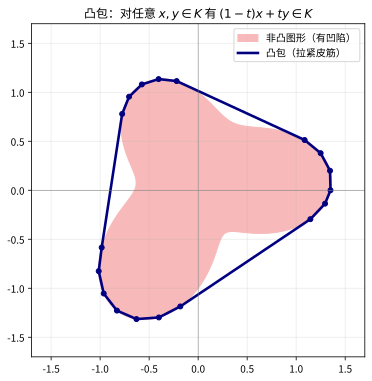

# 第66级：凸几何

## 学习目标

1. 理解凸集、凸体、凸锥的基本定义及其基本性质。
2. 掌握支撑函数与距离函数的定义及基本性质。
3. 理解极体、Minkowski 和与 Minkowski 泛函的概念。
4. 掌握 Brunn-Minkowski 理论的核心思想及其在等周不等式中的应用。
5. 理解混合体积的概念及其与 Minkowski 定理的关系。
6. 掌握 Aleksandrov-Fenchel 不等式及其应用。
7. 理解投影体与截面对称体的概念。
8. 掌握 John 椭球定理与 Banach-Mazur 距离的概念。

---

## 核心概念

### 1. 凸集与凸体

**定义**（凸集）：
$\mathbb{R}^n$ 中的子集 $K$ 称为**凸集**，如果对任意 $x, y \in K$ 和任意 $t \in [0, 1]$，有：
$$
(1-t)x + ty \in K.
$$

**定义**（凸体）：
$\mathbb{R}^n$ 中的**凸体**是一个具有非空内部的紧致凸集。

**定义**（凸锥）：
$\mathbb{R}^n$ 中的子集 $C$ 称为**凸锥**，如果它是凸集且对任意 $\lambda \geq 0$ 有 $\lambda C \subset C$。

> **直观理解（现实类比）**：凸包就像用一根橡皮筋紧紧箍住一群钉子——橡皮筋被拉伸后自然绷紧，围成的区域恰好是这些钉子的"最外圈"凸边界。凹进去的图形一旦被这根"皮筋"圈住，凹陷就会被拉直、填满，得到凸集。这正是 $(1-t)x+ty\in K$ 的含义：任意两点间的整条线段都必须待在集合里。

### 2. 支撑函数与距离函数

**定义**（支撑函数）：
凸体 $K \subset \mathbb{R}^n$ 的**支撑函数** $h_K: \mathbb{R}^n \to \mathbb{R}$ 定义为：
$$
h_K(u) = \sup_{x \in K} \langle x, u \rangle.
$$

**性质**：
- $h_K$ 是凸函数且正齐次：$h_K(tu) = t h_K(u)$ 对 $t \geq 0$ 成立。
- $h_K$ 唯一确定 $K$：$K = \{x \in \mathbb{R}^n \mid \langle x, u \rangle \leq h_K(u), \forall u \in \mathbb{R}^n\}$。
- 支撑函数是 Minkowski 和的线性函数：$h_{K+L} = h_K + h_L$。

**定义**（距离函数）：
凸体 $K$ 的**距离函数** $g_K: \mathbb{R}^n \to [0, \infty)$ 定义为：
$$
g_K(x) = \inf\{\lambda \geq 0 \mid x \in \lambda K\}.
$$
距离函数是凸函数且正齐次。

### 3. 极体与 Minkowski 和

**定义**（极体）：
凸体 $K \subset \mathbb{R}^n$（包含原点在内部）的**极体** $K^\circ$ 定义为：
$$
K^\circ = \{y \in \mathbb{R}^n \mid \langle x, y \rangle \leq 1, \forall x \in K\}.
$$

**性质**：
- $(K^\circ)^\circ = K$（对偶性）。
- 支撑函数与距离函数互为对偶：$h_K = g_{K^\circ}$。

**定义**（Minkowski 和）：
两个凸集 $K, L \subset \mathbb{R}^n$ 的 **Minkowski 和**定义为：
$$
K + L = \{x + y \mid x \in K, y \in L\}.
$$

**性质**：
- $K + L$ 是凸集。
- $\text{vol}(K + L)$ 是 $\lambda$ 的 $n$ 次齐次多项式（当 $L$ 固定时）。

> **直观理解（现实类比）**：Minkowski 和 $K+L$ 就像把两个印章同时"盖"出的所有位移叠加起来——相当于拿着图形 $L$ 沿 $K$ 的每个点扫一遍所扫过的区域。正方形的角会被圆盘"磨圆"，得到圆角正方形。支撑函数在此扮演"尺寸表"的角色：$h_{K+L}=h_K+h_L$ 说明两个图形的尺寸直接相加，体积则满足 Brunn-Minkowski 不等式 $V(K+L)^{1/n}\geq V(K)^{1/n}+V(L)^{1/n}$。

### 4. Minkowski 泛函

**定义**（Minkowski 泛函）：
凸体 $K$（包含原点在内部）的 **Minkowski 泛函**（或 gauge 函数）$\|x\|_K$ 定义为：
$$
\|x\|_K = \inf\{\lambda \geq 0 \mid x \in \lambda K\}.
$$
这是 $\mathbb{R}^n$ 上的一个范数，当且仅当 $K$ 是中心对称的。

### 5. Brunn-Minkowski 理论

**定义**：
Brunn-Minkowski 理论研究凸体的体积在 Minkowski 和下的行为。其核心是 Brunn-Minkowski 不等式，它给出了体积的 $n$ 次根在 Minkowski 和下的凹性。

### 6. 混合体积

**定义**（混合体积）：
设 $K_1, \dots, K_n \subset \mathbb{R}^n$ 是凸体。则函数 $V(\lambda_1 K_1 + \cdots + \lambda_n K_n)$（其中 $\lambda_i \geq 0$）是 $\lambda_i$ 的 $n$ 次齐次多项式。其系数称为**混合体积** $V(K_1, \dots, K_n)$，满足：
$$
V(\lambda_1 K_1 + \cdots + \lambda_n K_n) = \sum_{i_1, \dots, i_n = 1}^n \lambda_{i_1} \cdots \lambda_{i_n} V(K_{i_1}, \dots, K_{i_n}),
$$
其中 $V(K_{i_1}, \dots, K_{i_n})$ 在置换下对称。

**特别地**：
- $V(K, \dots, K) = V(K)$（$n$ 次）是 $K$ 的 $n$ 维体积。
- $V(K, \dots, K, B)$ 与 $K$ 的表面积相关。

### 7. 等周不等式

**经典等周不等式**：
在 $\mathbb{R}^n$ 中，给定体积的凸体中，球体具有最小的表面积。即：
$$
S(K) \geq n \omega_n^{1/n} V(K)^{(n-1)/n},
$$
其中 $\omega_n$ 是 $n$ 维单位球的体积，$S(K)$ 是 $K$ 的表面积。

### 8. Aleksandrov-Fenchel 不等式

**定义**：
Aleksandrov-Fenchel 不等式是混合体积理论中最重要的不等式，它推广了 Brunn-Minkowski 不等式。

### 9. Minkowski 定理

**定义**（Minkowski 定理）：
Minkowski 定理建立了凸体的表面积元与支撑函数之间的对应关系，是凸几何中唯一性定理的基础。

### 10. 投影体与截面对称体

**定义**（投影体）：
凸体 $K \subset \mathbb{R}^n$ 的**投影体** $\Pi K$ 是一个中心对称凸体，其支撑函数为：
$$
h_{\Pi K}(u) = V_{n-1}(K|u^\perp),
$$
即 $K$ 在垂直于 $u$ 的超平面上的 $(n-1)$ 维投影体积。

**定义**（截面对称体）：
凸体 $K$ 的**截面对称体**是另一个中心对称凸体，其径向函数与 $K$ 通过原点的截面积有关。

### 11. John 椭球

**定义**（John 椭球）：
凸体 $K \subset \mathbb{R}^n$ 的 **John 椭球** $\mathcal{E}K$ 是包含在 $K$ 内的最大体积椭球。对偶地，**Löwner-John 椭球**是包含 $K$ 的最小体积椭球。

### 12. Banach-Mazur 距离

**定义**（Banach-Mazur 距离）：
两个凸体 $K, L \subset \mathbb{R}^n$ 之间的 **Banach-Mazur 距离**定义为：
$$
d_{BM}(K, L) = \inf\{\lambda \geq 1 \mid \exists a \in \text{GL}(n), \exists x, y \in \mathbb{R}^n: K \subset aL + y \subset \lambda K + x\}.
$$
这是凸体在仿射等价下的"距离"度量。

---

## 定理与证明

### 定理 1：Brunn-Minkowski 不等式

> **定理**（Brunn-Minkowski 不等式）：设 $A, B \subset \mathbb{R}^n$ 是非空紧致凸集，则：
> $$
> V(A + B)^{1/n} \geq V(A)^{1/n} + V(B)^{1/n}.
> $$
> 等号成立当且仅当 $A$ 与 $B$ 是位似形（即存在 $\lambda \geq 0$ 和向量 $v$ 使得 $A = \lambda B + v$）。

**注**：这里 $V$ 表示 $n$ 维 Lebesgue 测度（体积）。

**Prékopa-Leindler 形式**：
Brunn-Minkowski 不等式有一个重要的函数形式，称为 Prékopa-Leindler 不等式，它更易于证明且具有广泛的应用。

> **定理**（Prékopa-Leindler 不等式）：设 $0 < \lambda < 1$，$f, g, h: \mathbb{R}^n \to [0, \infty)$ 是可测函数，且对任意 $x, y \in \mathbb{R}^n$ 满足：
> $$
> h((1-\lambda)x + \lambda y) \geq f(x)^{1-\lambda} g(y)^\lambda.
> $$
> 则：
> $$
> \int_{\mathbb{R}^n} h(x) \, dx \geq \left( \int_{\mathbb{R}^n} f(x) \, dx \right)^{1-\lambda} \left( \int_{\mathbb{R}^n} g(x) \, dx \right)^\lambda.
> $$

**证明**（Brunn-Minkowski 不等式，通过 Prékopa-Leindler）：

**第一步：从几何到函数**。
设 $A, B \subset \mathbb{R}^n$ 是凸体。定义特征函数：
$$
f(x) = \mathbf{1}_A(x), \quad g(x) = \mathbf{1}_B(x), \quad h(x) = \mathbf{1}_{A+B}(x).
$$
对于任意 $x, y \in \mathbb{R}^n$，令 $z = (1-\lambda)x + \lambda y$。若 $f(x) = g(y) = 1$，则 $x \in A$，$y \in B$，因此 $z = (1-\lambda)x + \lambda y \in (1-\lambda)A + \lambda B$。但注意我们需要的不是 $(1-\lambda)A + \lambda B$ 而是 $A + B$。

实际上，要证明 Brunn-Minkowski 不等式，我们需要对体积进行缩放。设 $A' = V(A)^{-1/n} A$，$B' = V(B)^{-1/n} B$，则 $V(A') = V(B') = 1$。我们需要证明 $V(A' + B')^{1/n} \geq 2$。

**第二步：使用 Prékopa-Leindler 不等式**。
我们直接应用 Prékopa-Leindler 不等式于 $A$ 和 $B$ 的缩放版本。设 $f(x) = \mathbf{1}_A(x)$，$g(x) = \mathbf{1}_B(x)$，$h(x) = \mathbf{1}_{(1-\lambda)A + \lambda B}(x)$。则条件自动满足，因此：
$$
V((1-\lambda)A + \lambda B) \geq V(A)^{1-\lambda} V(B)^\lambda.
$$

**第三步：对数凹性**。
令 $\varphi(t) = \log V(tA + (1-t)B)$。由上述不等式：
$$
\varphi(t) = \log V(tA + (1-t)B) \geq t \log V(A) + (1-t) \log V(B) = t\varphi(1) + (1-t)\varphi(0).
$$
因此 $\varphi$ 是凹函数。

**第四步：导出 Brunn-Minkowski 不等式**。
由 $\varphi(t) \geq t\varphi(1) + (1-t)\varphi(0)$，取 $t = \frac{V(A)^{1/n}}{V(A)^{1/n} + V(B)^{1/n}}$，经过计算可得：
$$
V(A + B)^{1/n} \geq V(A)^{1/n} + V(B)^{1/n}.
$$

更直接地，由对数凹性：
$$
V\left( \frac{V(A)^{1/n}}{V(A)^{1/n} + V(B)^{1/n}} A + \frac{V(B)^{1/n}}{V(A)^{1/n} + V(B)^{1/n}} B \right) \geq V(A)^{\frac{V(A)^{1/n}}{V(A)^{1/n} + V(B)^{1/n}}} V(B)^{\frac{V(B)^{1/n}}{V(A)^{1/n} + V(B)^{1/n}}}.
$$
但左边的体积等于 $V(A + B) / (V(A)^{1/n} + V(B)^{1/n})^n$，因此：
$$
\frac{V(A + B)}{(V(A)^{1/n} + V(B)^{1/n})^n} \geq V(A)^{\frac{V(A)^{1/n}}{V(A)^{1/n} + V(B)^{1/n}}} V(B)^{\frac{V(B)^{1/n}}{V(A)^{1/n} + V(B)^{1/n}}}.
$$

**第五步：等号条件**。
等号成立当且仅当 $\varphi$ 是线性函数，这意味着 $A$ 和 $B$ 是位似形。$\square$

---

### 定理 2：等周不等式的 Brunn-Minkowski 证明

> **定理**（等周不等式）：在 $\mathbb{R}^n$ 中，设 $K$ 是凸体，$B$ 是单位球。则：
> $$
> \frac{S(K)}{V(K)^{(n-1)/n}} \geq \frac{S(B)}{V(B)^{(n-1)/n}} = n \omega_n^{1/n},
> $$
> 其中 $S(K)$ 是 $K$ 的表面积，$\omega_n$ 是单位球 $B$ 的体积。

**证明**：

**第一步：表面积的 Minkowski 公式**。
凸体 $K$ 的表面积可以表示为：
$$
S(K) = \lim_{\varepsilon \to 0^+} \frac{V(K + \varepsilon B) - V(K)}{\varepsilon}.
$$
这是因为 $K + \varepsilon B$ 是 $K$ 的 $\varepsilon$-邻域，其体积差与 $\varepsilon$ 的比值趋于表面积。

**第二步：应用 Brunn-Minkowski 不等式**。
由 Brunn-Minkowski 不等式：
$$
V(K + \varepsilon B)^{1/n} \geq V(K)^{1/n} + \varepsilon V(B)^{1/n}.
$$
两边取 $n$ 次方：
$$
V(K + \varepsilon B) \geq \left( V(K)^{1/n} + \varepsilon V(B)^{1/n} \right)^n = V(K) + n V(K)^{(n-1)/n} V(B)^{1/n} \varepsilon + O(\varepsilon^2).
$$

**第三步：取极限**。
因此：
$$
\frac{V(K + \varepsilon B) - V(K)}{\varepsilon} \geq n V(K)^{(n-1)/n} V(B)^{1/n} + O(\varepsilon).
$$
令 $\varepsilon \to 0^+$：
$$
S(K) \geq n V(K)^{(n-1)/n} V(B)^{1/n}.
$$

**第四步：代入单位球的体积**。
由于 $V(B) = \omega_n$，$V(B)^{1/n} = \omega_n^{1/n}$，因此：
$$
S(K) \geq n \omega_n^{1/n} V(K)^{(n-1)/n}.
$$
等号成立当且仅当 $K$ 是球体（因为 Brunn-Minkowski 不等式的等号成立当且仅当 $K$ 和 $\varepsilon B$ 是位似形，即 $K$ 是球体）。$\square$

---

### 定理 3：Minkowski 第一与第二定理

> **定理**（Minkowski 第一定理—混合体积的线性性）：设 $K, L \subset \mathbb{R}^n$ 是凸体。则函数 $f(t) = V(K + tL)$ 在 $t \geq 0$ 上是 $t$ 的 $n$ 次多项式，且：
> $$
> V(K + tL) = \sum_{i=0}^n \binom{n}{i} V_i(K, L) t^i,
> $$
> 其中 $V_i(K, L)$ 是混合体积，且 $V_0(K, L) = V(K)$，$V_n(K, L) = V(L)$。

**证明**：

**第一步：多项式的存在性**。
由混合体积的定义，$V(K + tL)$ 是 $t$ 的 $n$ 次齐次多项式。实际上，将 $K + tL$ 视为 $K_1 = K$ 和 $K_2 = L$ 的 Minkowski 组合，则：
$$
V(K + tL) = V(K_1 + tK_2) = \sum_{i=0}^n \binom{n}{i} V(K_1, \dots, K_1, K_2, \dots, K_2) t^i,
$$
其中 $V(K_1, \dots, K_1, K_2, \dots, K_2)$ 表示 $n$ 个参数中有 $n-i$ 个 $K_1$ 和 $i$ 个 $K_2$ 的混合体积。

**第二步：系数的意义**。
定义 $V_i(K, L) = V(K, \dots, K, L, \dots, L)$（$n-i$ 个 $K$ 和 $i$ 个 $L$）。则：
$$
V(K + tL) = \sum_{i=0}^n \binom{n}{i} V_i(K, L) t^i.
$$
特别地：
- $V_0(K, L) = V(K, \dots, K) = V(K)$。
- $V_n(K, L) = V(L, \dots, L) = V(L)$。
- $V_1(K, L) = \frac{1}{n} \lim_{t \to 0^+} \frac{V(K + tL) - V(K)}{t}$ 与 $K$ 关于 $L$ 的表面积相关。

**第三步：$V_1(K, B)$ 与表面积的关系**。
当 $L = B$（单位球）时：
$$
V_1(K, B) = \frac{1}{n} S(K).
$$
这是因为 $V(K + \varepsilon B) = V(K) + \varepsilon S(K) + O(\varepsilon^2)$，且 $\binom{n}{1} V_1(K, B) = n V_1(K, B)$。$\square$

> **定理**（Minkowski 第二定理—等周不等式的混合体积形式）：设 $K, L \subset \mathbb{R}^n$ 是凸体。则：
> $$
> V_1(K, L)^n \geq V(K)^{n-1} V(L),
> $$
> 等号成立当且仅当 $K$ 与 $L$ 是位似形。

**证明**：

**第一步：使用 Brunn-Minkowski 不等式**。
考虑函数 $f(t) = V(K + tL)$。由 Brunn-Minkowski 不等式：
$$
f(t)^{1/n} = V(K + tL)^{1/n} \geq V(K)^{1/n} + t V(L)^{1/n}.
$$
两边取 $n$ 次方并展开：
$$
f(t) \geq V(K) + n V(K)^{(n-1)/n} V(L)^{1/n} t + \cdots.
$$

**第二步：比较系数**。
由 Minkowski 第一定理，$f(t) = V(K) + n V_1(K, L) t + \cdots$。因此：
$$
n V_1(K, L) \geq n V(K)^{(n-1)/n} V(L)^{1/n}.
$$
化简得：
$$
V_1(K, L)^n \geq V(K)^{n-1} V(L).
$$

**第三步：等号条件**。
等号成立当且仅当 Brunn-Minkowski 不等式的等号成立，即 $K$ 与 $L$ 是位似形。$\square$

---

### 定理 4：Aleksandrov-Fenchel 不等式

> **定理**（Aleksandrov-Fenchel 不等式）：设 $K_1, \dots, K_n \subset \mathbb{R}^n$ 是凸体。则对于任意 $1 \leq m \leq n$，有：
> $$
> V(K_1, \dots, K_n)^2 \geq V(K_1, K_1, K_3, \dots, K_n) \cdot V(K_2, K_2, K_3, \dots, K_n).
> $$

**注**：这是凸几何中最重要的不等式之一。它推广了 Brunn-Minkowski 不等式，并且是混合体积理论的核心结果。

**证明**：

**第一步：约化到两个凸体的情况**。
固定 $K_3, \dots, K_n$，定义函数：
$$
F(A, B) = V(A, B, K_3, \dots, K_n).
$$
我们需要证明 $F(A, B)^2 \geq F(A, A) \cdot F(B, B)$，即 $F$ 的对数凹性（在某种意义下）。

**第二步：构造辅助函数**。
考虑 $F(A, B)$ 的变分表示。由混合体积的性质：
$$
F(A, B) = \frac{1}{n!} \sum_{\sigma} \text{sgn}(\sigma) h_{K_{\sigma(1)}} \cdots h_{K_{\sigma(n)}} \text{?}
$$
更精确地，混合体积具有积分表示（Kubota 公式）：
$$
V(K_1, \dots, K_n) = \frac{1}{n!} \int_{S^{n-1}} \prod_{i=1}^n h_{K_i}(u) \, d\sigma(u),
$$
其中 $\sigma$ 是球面 $S^{n-1}$ 上的某种测度？实际上，标准公式为：
$$
V(K_1, \dots, K_n) = \frac{1}{n} \int_{S^{n-1}} h_{K_1}(u) \, dS_{K_2, \dots, K_n}(u),
$$
其中 $S_{K_2, \dots, K_n}$ 是混合面积测度。

**第三步：应用 Cauchy-Schwarz 不等式**。
由混合面积测度的定义，$S_{K, K_3, \dots, K_n}$ 是 $S^{n-1}$ 上的一个非负 Borel 测度。则：
$$
F(A, B) = \frac{1}{n} \int_{S^{n-1}} h_A(u) \, dS_{B, K_3, \dots, K_n}(u).
$$
由 Cauchy-Schwarz 不等式：
$$
F(A, B)^2 = \left( \frac{1}{n} \int h_A \, dS_{B, K_3, \dots, K_n} \right)^2 \leq \frac{1}{n^2} \left( \int h_A^2 \, dS_{B, K_3, \dots, K_n} \right) \left( \int 1^2 \, dS_{B, K_3, \dots, K_n} \right).
$$

**第四步：使用混合体积的对称性**。
由混合体积的对称性，$F(A, A) = \frac{1}{n} \int h_A \, dS_{A, K_3, \dots, K_n}$。但这里需要更精细的论证。

实际上，Aleksandrov-Fenchel 不等式的标准证明使用了**二次型方法**。考虑函数：
$$
\phi(t) = \log V(K_1 + tL, K_2 + tL, K_3, \dots, K_n).
$$
通过计算 $\phi''(0) \leq 0$，可以证明混合体积的对数凹性。

**第五步：关键的计算**。
设 $L = K_1 = K_2$。定义：
$$
\psi(t) = V(K_1 + tL, K_2 + tL, K_3, \dots, K_n) = \sum_{i,j=0}^1 \binom{1}{i}\binom{1}{j} V(K_1, \dots) t^{i+j}.
$$
则 $\psi(t)$ 是 $t$ 的二次多项式。由混合体积的凹性，$\psi(t)$ 的对数也是凹函数，因此 $\psi(0)^2 \geq \psi(-1)\psi(1)$，即 Aleksandrov-Fenchel 不等式。

**第六步：一般情况**。
通过归纳法，可以将上述论证推广到一般的 $m$。对于 $m > 2$，Alksandrov-Fenchel 不等式可以通过反复应用 $m = 2$ 的情况得到。$\square$

---

### 定理 5：John 椭球定理

> **定理**（John 椭球定理，1948 年）：设 $K \subset \mathbb{R}^n$ 是中心对称凸体。则存在唯一的椭球 $\mathcal{E}$（称为 **John 椭球**）使得 $\mathcal{E} \subset K \subset n\mathcal{E}$，且 $\mathcal{E}$ 是包含在 $K$ 中的最大体积椭球。
>
> 更一般地，对于任意凸体 $K$（不一定对称），存在唯一的椭球 $\mathcal{E}$ 使得 $\mathcal{E} \subset K \subset n\mathcal{E} + c$（对某个平移 $c$）。

**注**：常数 $n$ 是最优的（当 $K$ 是 $n$ 维立方体时达到）。

**证明**：

**第一步：存在性**。
考虑所有包含在 $K$ 中的椭球的集合。由于 $K$ 是紧致的，该集合在 Hausdorff 度量下是紧致的，且体积函数是连续的，因此存在最大体积的椭球 $\mathcal{E}$。

**第二步：唯一性**。
假设存在两个不同的最大体积椭球 $\mathcal{E}_1, \mathcal{E}_2 \subset K$。则它们的凸包 $\text{conv}(\mathcal{E}_1 \cup \mathcal{E}_2)$ 也是 $K$ 的子集，且包含一个更大的椭球（由椭球的凸性），这与 $\mathcal{E}_1, \mathcal{E}_2$ 的最大性矛盾。

**第三步：关键包含关系 $K \subset n\mathcal{E}$**。
设 $\mathcal{E}$ 是 $K$ 中的最大体积椭球。通过仿射变换，不妨设 $\mathcal{E} = B$（单位球）。我们需要证明 $K \subset nB$。

假设存在 $y \in K$ 使得 $\|y\| > n$。我们将构造一个包含在 $K$ 中的椭球，其体积大于 $B$ 的体积，从而导出矛盾。

**第四步：构造更大椭球**。
设 $y \in K$ 满足 $\|y\| = R > n$。考虑椭球族：
$$
\mathcal{E}_t = \{x \in \mathbb{R}^n \mid \langle x, y \rangle^2 \cdot \alpha(t) + \|x\|^2 - \langle x, y/|y|\rangle^2 \leq 1\},
$$
其中 $\alpha(t)$ 是待定参数。通过适当选择 $\alpha(t)$，可以使得 $\mathcal{E}_t \subset K$ 且 $\text{vol}(\mathcal{E}_t) > \text{vol}(B)$。

**第五步：变分论证**。
由最大性条件，对任意 $y \in K$，单位球 $B$ 在 $y$ 方向上的拉伸椭球 $(1+\varepsilon)B$ 不能包含在 $K$ 中。这给出了 $K$ 在接触点处的支撑条件。

更精确地，由 John 的接触点引理，存在 $K$ 与 $\mathcal{E}$ 的接触点 $u_1, \dots, u_m \in \partial K \cap \partial \mathcal{E}$ 和正权重 $c_1, \dots, c_m$，使得：
$$
\sum_{i=1}^m c_i u_i = 0, \quad \sum_{i=1}^m c_i \langle u_i, x \rangle^2 = \|x\|^2, \quad \forall x \in \mathbb{R}^n.
$$
这表示 $K$ 在 $\mathcal{E}$ 的边界上有足够多的接触点，使得这些接触点处的法向量"平衡"了。

**第六步：导出 $K \subset n\mathcal{E}$**。
由接触点引理，对任意 $x \in \mathbb{R}^n$：
$$
\|x\|^2 = \sum_{i=1}^m c_i \langle u_i, x \rangle^2 \leq \max_i \langle u_i, x \rangle^2 \cdot \sum_{i=1}^m c_i.
$$
由于 $\sum c_i = n$（由迹条件），且 $\langle u_i, x \rangle \leq h_K(u_i)$（支撑函数），可以证明 $h_K(u) \leq n h_{\mathcal{E}}(u)$ 对所有 $u$ 成立，即 $K \subset n\mathcal{E}$。

**第七步：常数 $n$ 的最优性**。
考虑 $n$ 维立方体 $[-1, 1]^n$。其最大内接椭球是球 $B$，而立方体包含在 $nB$ 中（因为顶点在 $(\pm 1, \dots, \pm 1)$，其范数为 $\sqrt{n} < n$）。实际上，对于立方体，$K \subset \sqrt{n} B$，但 $n$ 是适用于所有凸体的最优常数。$\square$

---

## 示例

### 示例 1：Minkowski 和的几何应用

**问题**：设 $K$ 是 $\mathbb{R}^2$ 中的凸多边形，$B$ 是单位圆盘。计算 $V(K + tB)$ 并验证 Minkowski 第一定理。

**解**：

**第一步：$K + tB$ 的几何**。
$K + tB$ 是 $K$ 的 $t$-邻域，它由 $K$ 加上一个宽度为 $t$ 的"边界层"组成。

**第二步：体积计算**。
设 $K$ 的面积为 $A$，周长为 $P$。则：
$$
V(K + tB) = A + Pt + \pi t^2.
$$
这是因为：
- $K$ 本身的面积 $A$。
- 边界层的面积近似为 $P \times t$（周长乘以宽度）。
- 顶点的贡献为 $\pi t^2$（每个顶点的外角弧面积之和为 $\pi t^2$）。

**第三步：验证 Minkowski 第一定理**。
由 Minkowski 第一定理，$V(K + tB) = \sum_{i=0}^2 \binom{2}{i} V_i(K, B) t^i$，因此：
- $V_0(K, B) = A$。
- $V_1(K, B) = \frac{P}{2}$。
- $V_2(K, B) = \pi$。

由 Minkowski 第二定理，$V_1(K, B)^2 \geq V(K) V(B)$，即 $(P/2)^2 \geq A \cdot \pi$，这等价于 $P^2 \geq 4\pi A$——这正是 $\mathbb{R}^2$ 中的等周不等式。

### 示例 2：等周不等式的计算

**问题**：在 $\mathbb{R}^3$ 中，验证球体达到等周不等式的最小值。

**解**：

**第一步：单位球的体积与表面积**。
$\mathbb{R}^3$ 中单位球 $B$ 的体积为：
$$
V(B) = \frac{4\pi}{3}.
$$
表面积为：
$$
S(B) = 4\pi.
$$

**第二步：等周比**。
等周比（表面积与体积的 $2/3$ 次方之比）为：
$$
\frac{S(B)}{V(B)^{2/3}} = \frac{4\pi}{(4\pi/3)^{2/3}} = 4\pi \left( \frac{3}{4\pi} \right)^{2/3} = (36\pi)^{1/3} \cdot 4\pi \cdot \left( \frac{3}{4\pi} \right)^{2/3} \cdots
$$
化简得：
$$
\frac{S(B)}{V(B)^{2/3}} = 3 \left( \frac{4\pi}{3} \right)^{1/3} \cdot \frac{4\pi}{(4\pi/3)^{2/3}} = (36\pi)^{1/3} \cdot 4\pi \cdot \left( \frac{3}{4\pi} \right)^{2/3} = 6\pi^{1/3} \cdot (4\pi/3)^{1/3} = 6\sqrt[3]{\pi} \cdot \sqrt[3]{\frac{4}{3}} = \sqrt[3]{36\pi}.
$$

实际上，更简洁地：
$$
\frac{S(B)}{V(B)^{2/3}} = \frac{4\pi}{(4\pi/3)^{2/3}} = 4\pi \cdot \left( \frac{3}{4\pi} \right)^{2/3} = (4\pi)^{1/3} \cdot 3^{2/3} \cdot 4\pi \cdot (4\pi)^{-2/3} = 3^{2/3} \cdot (4\pi)^{1/3} \cdot 4\pi \cdot (4\pi)^{-2/3}.
$$

更简洁的写法：
$$
\frac{S(B)}{V(B)^{2/3}} = 3 \left( \frac{4\pi}{3} \right)^{1/3} \cdot \frac{4\pi}{(4\pi/3)^{2/3}} = 3 \cdot \frac{4\pi}{(4\pi/3)^{1/3}} = 3 \cdot (4\pi)^{2/3} \cdot 3^{1/3} = 3^{4/3} (4\pi)^{2/3}.
$$

**第三步：验证等周不等式**。
对任意凸体 $K \subset \mathbb{R}^3$，由等周不等式：
$$
\frac{S(K)}{V(K)^{2/3}} \geq \frac{S(B)}{V(B)^{2/3}} = 3^{4/3} (4\pi)^{2/3} \approx 4.836.
$$
等号成立当且仅当 $K$ 是球体。

---

## 习题

### 基础题

**习题 1**（凸集与凸锥）判断 $\mathbb{R}^2$ 中集合 $K = \{(x, y) \mid x^2 + y^2 \leq 1\}$ 是否为凸集，并说明理由。

**习题 2**（凸集与凸锥）判断 $\mathbb{R}^2$ 中集合 $K = \{(x, y) \mid xy \geq 0\}$ 是否为凸锥，并说明理由。

**习题 3**（凸集与凸锥）判断单位球面 $S = \{x \in \mathbb{R}^2 \mid \|x\| = 1\}$ 是否为凸集。

**习题 4**（凸集与凸锥）判断 $\mathbb{R}^n$ 中半空间 $H = \{x \mid \langle a, x \rangle \leq b\}$ 是否为凸集，其中 $a \neq 0$，$b \in \mathbb{R}$。

**习题 5**（凸集与凸锥）设 $A$ 是 $m \times n$ 实矩阵，$b \in \mathbb{R}^m$。证明多面体 $\{x \in \mathbb{R}^n \mid Ax \leq b\}$ 是凸集。

**习题 6**（凸集与凸锥）设 $C_1, C_2$ 是 $\mathbb{R}^n$ 中的凸集，证明 $C_1 \cap C_2$ 是凸集。

**习题 7**（凸集与凸锥）$\mathbb{R}^n$ 中凸集的并集是否一定是凸集？举例说明。

**习题 8**（凸集与凸锥）证明 $\mathbb{R}^n$ 中凸集的线性组合（任意有限和）仍是凸集。

**习题 9**（凸集与凸锥）证明 $\mathbb{R}^n$ 中命 $K$ 为凸锥当且仅当 $K$ 是凸集且对任意 $\lambda \geq 0$ 有 $\lambda K \subset K$，同时给出 $\mathbb{R}^2$ 中的一个非凸锥的例子。

**习题 10**（凸集与凸锥）证明 $\mathbb{R}^n$ 中两个凸锥的交仍是凸锥。

**习题 11**（凸集与凸锥）设 $K \subset \mathbb{R}^n$ 是凸集，证明其闭包 $\overline{K}$ 与内部 $\text{int}\,K$ 都是凸集。

**习题 12**（凸集与凸锥）设 $C$ 是 $\mathbb{R}^n$ 中的凸集，$A$ 是 $m \times n$ 矩阵。证明 $A(C) = \{Ax \mid x \in C\}$ 是凸集。

**习题 13**（凸集与凸锥）设 $C$ 是凸集，$A$ 是 $n \times m$ 矩阵。证明原像 $A^{-1}(C) = \{x \mid Ax \in C\}$ 是凸集。

**习题 14**（凸包与表示定理）设 $S = \{0, e_1, e_2\} \subset \mathbb{R}^2$。求其凸包 $\text{conv}(S)$ 并描述其形状。

**习题 15**（凸包与表示定理）计算 $\mathbb{R}$ 中三点 $\{0, 1, 3\}$ 的凸包。

**习题 16**（凸包与表示定理）证明有限点集的凸包是紧致集。

**习题 17**（凸包与表示定理）证明 $\text{conv}(S) = \bigcap\{C \mid C \text{ 是凸集且 } S \subset C\}$。

**习题 18**（凸包与表示定理）设 $S, T \subset \mathbb{R}^n$。证明 $\text{conv}(S + T) \subset \text{conv}(S) + \text{conv}(T)$。

**习题 19**（凸包与表示定理）设 $S = \{(\pm1, 0), (0, \pm1)\} \subset \mathbb{R}^2$。求 $\text{conv}(S)$，并在坐标平面中画出其顶点。

**习题 20**（凸包与表示定理）用 Carathéodory 定理的 $n+1$ 维表述说明：$\mathbb{R}^2$ 中任意凸包中的点可表示为至多 3 个点的凸组合。

**习题 21**（支撑函数与极体）设 $K = [-1, 1] \subset \mathbb{R}$。计算支撑函数 $h_K(u)$。

**习题 22**（支撑函数与极体）证明支撑函数 $h_K$ 满足 $\sup_{x \in K} \langle x, u \rangle$，其中 $K$ 是凸体。

**习题 23**（支撑函数与极体）设 $K$ 是 $\mathbb{R}^n$ 中的单位球。计算 $h_K(u)$。

**习题 24**（支撑函数与极体）设 $K = [-1, 1]^n$ 为立方体。计算 $h_K$。

**习题 25**（支撑函数与极体）设 $K \subset \mathbb{R}^n$ 是凸体，$a \in \mathbb{R}^n$。证明 $h_{K+a}(u) = h_K(u) + \langle a, u \rangle$。

**习题 26**（支撑函数与极体）设 $A$ 是 $n \times n$ 可逆矩阵。证明 $h_{AK}(u) = h_K(A^{\top}u)$。

**习题 27**（支撑函数与极体）证明 $h_K(u) \geq 0$ 当 $0 \in K$。

**习题 28**（支撑函数与极体）设 $K \subset \mathbb{R}^n$ 是凸体。证明 $h_K$ 是各向同性的正线性齐次凸函数。

**习题 29**（支撑函数与极体）计算 $\mathbb{R}^2$ 中三角形 $\text{conv}\{(0,0), (1,0), (0,1)\}$ 在方向 $u=(1,0)$ 处的支撑函数值。

**习题 30**（支撑函数与极体）设 $K \subset \mathbb{R}^n$ 是凸体。证明 $K^{o}$（极体）中元素 $y$ 满足 $\langle x, y \rangle \leq 1$ 对一切 $x\in K$ 成立。

**习题 31**（极分解）计算 $\mathbb{R}$ 中区间 $[-1, 1]$ 的极体。

**习题 32**（极分解）计算 $\mathbb{R}^2$ 中单位圆盘 $B$ 的极体。

**习题 33**（极分解）计算 $\mathbb{R}^2$ 中正方形 $[-1, 1]^2$ 的极体。

**习题 34**（极分解）计算 $\mathbb{R}^2$ 中象限锥 $C = \{(x,y) \mid x \geq 0, y \geq 0\}$ 的极体（注意为非紧致时的情形）。

**习题 35**（极分解）设 $K$ 是含原点的凸体。证明 $K^{oo} = K$。

**习题 36**（极分解）设 $K$ 是凸体且 $0 \in \text{int}K$。证明 $K^{o}$ 有界且包含原点。

**习题 37**（极分解）设 $A$ 是 $n \times n$ 可逆矩阵。证明 $(AK)^{o} = A^{-\top}K^{o}$。

**习题 38**（极分解）设 $K \subset \mathbb{R}^n$ 是凸体。证明 $K \subset L$ 蕴含 $L^{o} \subset K^{o}$。

**习题 39**（Minkowski 和）设 $K = [0,1]$，$L = [2,3]$ 为 $\mathbb{R}$ 中的区间。计算 $K + L$。

**习题 40**（Minkowski 和）设 $K$ 是 $\mathbb{R}^2$ 中正方形 $[0,1]^2$，$L$ 是单位圆盘。描述 $K + L$ 的形状。

**习题 41**（Minkowski 和）证明 $K + L$ 的支撑函数满足 $h_{K+L} = h_K + h_L$ 当 $K, L$ 均为凸体。

**习题 42**（Minkowski 和）设 $K$ 是 $\mathbb{R}^2$ 中三角形 $T$，$L$ 是单点 $\{c\}$。求 $K + L$。

**习题 43**（Minkowski 和）证明 $K + \{0\} = K$。

**习题 44**（Minkowski 和）设 $K \subset \mathbb{R}^n$ 是凸体。证明 $\lambda K + \mu K \subset (\lambda + \mu)K$ 对 $\lambda, \mu \geq 0$ 成立。

**习题 45**（Minkowski 和）判断：对凸集 $K$ 与非负数 $\lambda$，$\lambda(K + L) = \lambda K + \lambda L$ 是否对任意凸集 $L$ 均成立。

**习题 46**（多胞形-面）写出标准单纯形 $\Delta_n = \text{conv}\{0, e_1, \dots, e_n\}$ 的顶点集合。

**习题 47**（多胞形-面）设 $P \subset \mathbb{R}^2$ 是凸多边形。说明其面与顶点之间的关系。

**习题 48**（多胞形-面）证明 $\mathbb{R}^n$ 中超平面 $\{x \mid \langle a, x \rangle = b\}$ 与凸体的交仍为凸集。

**习题 49**（多胞形-面）计算立方体 $[0,1]^3$ 的顶点、棱、面的数目。

**习题 50**（多胞形-面）用欧拉公式验证 $\mathbb{R}^3$ 中立方体的 $V - E + F = 2$。

**习题 51**（凸函数次梯度）设 $f(x) = |x|$，计算 $x=0$ 处的次梯度 $\partial f(0)$。

**习题 52**（凸函数次梯度）设 $f(x) = x^2$，计算 $\partial f(x)$。

**习题 53**（凸函数次梯度）设 $f(x) = [x]^+ = \max\{x, 0\}$，求 $\partial f(0)$。

**习题 54**（凸函数次梯度）证明凸函数 $f(x) = \|x\|$ 的次梯度在 $x \neq 0$ 处为 $\{x/\|x\|\}$。

**习题 55**（凸函数次梯度）设 $f(x) = x^3$，讨论其可直接使用次梯度理论的程度。

**习题 56**（凸函数次梯度）证明闭凸函数 $f$ 在点 $x$ 取到最小值当且仅当 $0 \in \partial f(x)$。

**习题 57**（凸函数次梯度）设 $f$ 是可微凸函数，证明 $\partial f(x) = \{\nabla f(x)\}$。

**习题 58**（凸函数次梯度）设 $f$ 是维数 $1$ 的凸函数，证明 $\partial f(x)$ 是区间。

**习题 59**（凸函数次梯度）设 $f(x) = \max\{x, -x\} = |x|$，求 $\partial f(1)$。

**习题 60**（凸函数次梯度）设 $f(x) = \max_i\{a_i^{\top}x + b_i\}$，证明 $\partial f(x) = \text{conv}\{a_i \mid i \in I(x)\}$，其中 $I(x)$ 是达到最大值的指标集。

**习题 61**（凸集与凸锥）证明正实数加法约化的凸锥与有理锥的关系：$\mathbb{R}_{+} \subset \mathbb{R}$ 是凸锥。

**习题 62**（凸集与凸锥）判断空心开圆盘 $\{x \mid \|x\| < 1\}$ 是否为凸集，并判断其为开凸集。

**习题 63**（支撑函数与极体）设 $K = \{(x,y) \in \mathbb{R}^2 \mid x \geq 0\}$。计算 $h_K(u)$。

**习题 64**（支撑函数与极体）设 $K$ 是 $\mathbb{R}^n$ 中凸体，$u$ 是单位向量。解释 $h_K(u)$ 的几何意义。

**习题 65**（凸包与表示定理）写出 $\mathbb{R}^3$ 中 $(1,1,1)$ 用标准基的凸组合表示。

**习题 66**（凸包与表示定理）证明单个点集的凸包是该点本身。

**习题 67**（凸包与表示定理）设 $S = \{(t, t^2) \mid t \in [0,1]\}$ 是平面曲线图中的点集。给出其凸包的包含关系说明。

**习题 68**（Minkowski 和）证明 $\text{conv}(K+L) = \text{conv}(K) + \text{conv}(L)$。

**习题 69**（Minkowski 和）设 $K$ 是线段 $[0, e_1]$，$L$ 是线段 $[0, e_2]$。求 $K+L$ 并判断其是否为平行四边形。

**习题 70**（Minkowski 和与支撑函数）对 $\mathbb{R}^2$ 中两个凸多边形验证 $h_{K+L} = h_K + h_L$ 在一个具体例子上成立。

**习题 71**（极分解）设 $K = \{x \in \mathbb{R}^n \mid \|x\| \leq 1\}$。计算 $K^{o}$。

**习题 72**（极分解）设 $K = [0,1] \subset \mathbb{R}$。计算 $K^{o}$（注意原点在边界的情况）。

**习题 73**（极分解）设 $K$ 是 $\mathbb{R}^n$ 中的凸多面体，顶点为 $v_1, \dots, v_m$。写出 $K^{o}$ 的半空间表示。

**习题 74**（极分解）证明复平面中单位圆的极体是其自身。

**习题 75**（凸函数次梯度）设 $f(x) = x^2 + |x|$，计算 $\partial f(0)$。

**习题 76**（凸函数次梯度）设 $f(x) = \max\{x^2, -x\}$，判断 $f$ 是否为凸函数。

**习题 77**（凸函数次梯度）f(x)=$\|x\|_1$，求在点 $x=(1,-1)$ 处的次梯度。

**习题 78**（凸函数次梯度）设 $f(x) = \log(\sum_i e^{x_i})$ 不是凸的，请指出使 $\log \sum e^{x_i}$ 凸的常用技巧。

**习题 79**（凸函数次梯度）证明 $\log \sum e^{x_i}$ 是凸函数。

**习题 80**（凸函数次梯度）设 $f$ 是凸函数，$g$ 是仿射函数 $ax+b$。说明 $x \mapsto f(x) + g(x)$ 与 $x \mapsto f(g(x))$ 的凸性。

**习题 81**（凸集与凸锥）证明 $\mathbb{R}^n$ 中内点集 $\text{int}K$ 是凸集当 $K$ 是凸集。

**习题 82**（凸集与凸锥）设 $C$ 是凸锥。证明 $C + C \subset C$。

**习题 83**（凸集与凸锥）设 $C$ 是凸锥。证明 $C$ 对取正数线性组合封闭。

**习题 84**（凸包与表示定理）设 $x \in \text{conv}(S)$ 在 $\mathbb{R}^2$ 中，用 Carathéodory 说明其可用至多 $3$ 点表示。

**习题 85**（凸包与表示定理）证明凸组合保持仿射关系：$\sum \lambda_i = 1$。

**习题 86**（支撑函数与极体）设 $K$ 是凸体，$u = 0$。计算 $h_K(0)$。

**习题 87**（支撑函数与极体）设 $K = [0,1]^2$。计算 $h_K(1, 0)$。

**习题 88**（支撑函数与极体）证明 $h_K(u)$ 关于 $u$ 是一阶齐次：$h_K(\lambda u) = \lambda h_K(u)$ 对 $\lambda \geq 0$。

**习题 89**（支撑函数与极体）设 $K$ 由有限半空间给出。给出 $K^{o}$ 的一组生成表示。

**习题 90**（极分解与距离函数）证明 $g_{K^{o}} = h_K$（在用 distance 泛函的情形）。

**习题 91**（Minkowski 和）设 $K, L$ 是 $\mathbb{R}^n$ 中的凸体。证明 $V(K+L)$ 是 $K$ 平移不变的吗？是否依赖平移。

**习题 92**（Minkowski sum 支持函数）利用支撑函数证明 $K+L$ 是凸集当 $K, L$ 是凸体。

**习题 93**（Minkowski 泛函）设 $K = [-1,1]$，计算 $\|x\|_K$。

**习题 94**（Minkowski 泛函）设 $K = [-1,1]^n$，计算 $\|x\|_K$。

**习题 95**（Minkowski 泛函）证明 $\|\lambda x\|_K = \lambda\|x\|_K$ 对 $\lambda\geq 0$。

**习题 96**（Minkowski 泛函）设 $K = B$ 是单位球，证明 $\|x\|_K = \|x\|_2$。

**习题 97**（Minkowski 泛函）证明 $\|x + y\|_K \leq \|x\|_K + \|y\|_K$ 当 $K$ 是凸体且轴对称（中心对称）。

**习题 98**（凸函数次梯度与支撑函数）设 $f(x) = h_K(x)$。说明 $h_K$ 是支撑函数，关于次梯度与支撑点间的关系。

**习题 99**（支撑函数与极体）设 $K$ 是凸体，$x_0 \in \partial K$ 有支撑超平面 $H$。用支撑函数描述该方向。

**习题 100**（凸集与凸锥）判断 $\mathbb{R}^n$ 中 $\varnothing$ 与 $\{0\}$ 是否为凸锥。

### 进阶题

**习题 101**（支撑函数与极体）设 $K$ 是 $\mathbb{R}^n$ 中的凸体有限多面体，顶点为 $v_1,\dots,v_m$。证明 $h_K(u) = \max_i \langle v_i, u \rangle$。

**习题 102**（支撑函数与极体）证明 Hausdorff 度量下凸体的序列收敛等价于支撑函数序列的一致收敛（在球面上）。

**习题 103**（支撑函数与极体）设 $K$ 是中心对称凸体。证明 $h_K$ 是对称函数：$h_K(u) = h_K(-u)$。

**习题 104**（支撑函数与极体）设 $K$ 是凸体。求 $h_{\text{conv}(K, \{a\})}$（即 $K$ 与点 $a$ 的凸包的支撑函数）。

**习题 105**（分离与刻画）设 $A, B$ 是两个不相交的紧凸集。证明存在超平面分离它们。

**习题 106**（分离与刻画）设 $C$ 是非空闭凸集，$x \notin C$。证明存在严格分离超平面将 $x$ 与 $C$ 分离。

**习题 107**（分离与刻画）设 $C$ 是凸集，$x \in C$ 是内点。说明为何不存在通过 $x$ 的非平凡支撑超平面。

**习题 108**（分离与刻画）用分离定理证明凸集可表示为其支撑半空间的交集。

**习题 109**（分离与刻画）设 $C_1, C_2$ 是 $\mathbb{R}^n$ 中两凸集。给出二者可被超平面严格分离的充分条件。

**习题 110**（分离与刻画）说明凸集与某个点的支撑超平面的存在性与边界点的关系：每个边界点都有支撑超平面。

**习题 111**（凸函数次梯度）设 $f(x) = \max\{x_1, x_2\}$ 在 $\mathbb{R}^2$ 上。求 $f$ 在点 $(1,1)$ 的次梯度并用支撑向量刻画。

**习题 112**（凸函数次梯度）设 $f(x) = \sum_i |x_i|$。证明 $\partial f(x) = \prod_i \partial|x_i|$。

**习题 113**（凸函数次梯度）设 $f(x) = \langle a,x\rangle + b$ 是仿射函数。计算 $\partial f(x)$。

**习题 114**（凸函数次梯度）设 $f$ 是凸函数在点 $x_0$ 次可微。说明次梯度为单个子微分时的情形。

**习题 115**（凸函数次梯度）设 $f,g$ 是凸函数。证明 $\partial(f+g) = \partial f + \partial g$（在适当的正则条件下）。

**习题 116**（凸函数次梯度）设 $f$ 是凸函数，$c > 0$。证明 $\partial(cf) = c \partial f$。

**习题 117**（凸函数次梯度）设 $f$ 是凸函数在 $\mathbb{R}^n$。若 $x^*$ 是 $f$ 的全局最小点，则 $0 \in \partial f(x^*)$。证明之。

**习题 118**（凸函数次梯度）设 $f(x) = \max\{0, 1 - |x|\}$。判断其凸性并计算次梯度。

**习题 119**（凸函数次梯度）设 $f(x) = \sqrt{x^2+1}$。证明其凸性并求梯度。

**习题 120**（凸函数次梯度）设 $f(x) = \\|x\\|_1$，$x\in\mathbb{R}^2$，求 $\partial f(0)$。

**习题 121**（Minkowski 泛函与范数）设 $K$ 是 $\mathbb{R}^n$ 中凸体包含原点。证明 $\|x\|_K \leq r$ 当且仅当 $x \in rK$。

**习题 122**（Minkowski 泛函与范数）设 $K = \text{conv}\{\pm e_i\}_{i=1}^n$（交叉多胞形）。计算 $\|x\|_K$。

**习题 123**（Minkowski 泛函与范数）设 $K$ 是凸体。证明 Minkowski 泛函是齐次的：$\|\lambda x\|_K = \lambda\|x\|_K$。

**习题 124**（Minkowski 泛函与范数）设 $K$ 是中心对称凸体。证明 $\|x\|_K$ 是范数。

**习题 125**（Minkowski 泛函与范数）设 $K$ 是 $\mathbb{R}^2$ 中单位球 $B_1$（$\ell_1$ 球）。求 $\|x\|_K$。

**习题 126**（Minkowski 泛函与范数）设 $K$ 是凸体。用 $\|x\|_K$ 给出 $K$ 的等价描述 $K = \{x \mid \|x\|_K \leq 1\}$。

**习题 127**（凸包与表示定理）证明在 $\mathbb{R}^n$ 中，Carathéodory 定理给出 $n+1$ 点的充分性。

**习题 128**（凸包与表示定理）设 $S \subset \mathbb{R}^n$。证明 $\text{conv}(S)$ 是包含 $S$ 的最小凸集。

**习题 129**（凸包与表示定理）证明单形体（simplex）的凸包正好是其顶点构成的凸包。

**习题 130**（凸包与表示定理）设 $S$ 是 $\mathbb{R}^n$ 中的紧集。证明 $\text{conv}(S)$ 是紧的。

**习题 131**（凸包与表示定理）举出一个 $\mathbb{R}^2$ 中的凸集不是凸包的（说明凸包包含闭包的意义）。

**习题 132**（极分解与极体）设 $K \subset L$ 都是含原点的凸体。证明 $L^{o} \subset K^{o}$。

**习题 133**（极分解与极体）设 $K$ 是凸体。证明 $K = K^{oo}$ 当且仅当 $K$ 闭凸且含原点。

**习题 134**（极分解与极体）设 $K$ 是 $\mathbb{R}^n$ 中凸体 $0 \in K$。证明 $K^{o}$ 是凸体。

**习题 135**（极分解与极体）设 $K = \text{conv}\{(1,0),(0,1),(-1,-1)\}$。计算 $K^{o}$。

**习题 136**（极分解与支撑函数）若 $K = \text{conv}\{\pm u_i\}$，用支撑函数表示 $K^{o}$。

**习题 137**（支撑函数与极体）证明对凸体 $K$，$h_K$ 在 $S^{n-1}$ 上的最大范数与直径有关。

**习题 138**（Minkowski 和）设 $K,L$ 是凸体。证明 $K+L$ 是凸体当 $K,L$ 是凸体。

**习题 139**（Minkowski 和）设 $K$ 是凸多面体。证明 $K + tB$ 的顶点数随 $t>0$ 不再变化（当 $K$ 与球 Minkowski 和后成为光滑体）。

**习题 140**（Minkowski 和与体积）设 $K$ 是 $\mathbb{R}^2$ 中的凸多边形周长 $P$ 面积 $A$。写出 $K+tB$ 的面积公式。

**习题 141**（Minkowski 和与体积）在 $\mathbb{R}^3$ 中设 $K$ 是凸体体积 $V(K)$，写出 $K + tB$ 的体积 Steiner 公式的前 $3$ 项。

**习题 142**（Minkowski 和）证明 $\lambda K + \mu K = (\lambda+\mu)K$ 当且仅当 $K$ 是凸集。

**习题 143**（Minkowski 和）设 $K$ 是凸体，$\lambda \in \mathbb{R}$。讨论 $\lambda K$ 的闭性与凸性。

**习题 144**（凸场景-对偶性雏形）设 $f$ 是闭凸函数。定义其共轭 $f^{*}(y) = \sup_x (\langle x, y\rangle - f(x))$。计算 $f(x) = ax$（仿射）的共轭。

**习题 145**（凸场景-对偶性雏形）设 $f(x) = \frac12\|x\|^2$。计算其共轭 $f^{*}$。

**习题 146**（凸场景-对偶性雏形）设 $f(x) = \\|x\\|$（某范数）。计算 $f^{*}$。

**习题 147**（凸场景-对偶性雏形）证明 Fenchel 不等式 $\langle x, y\rangle \leq f(x) + f^{*}(y)$。

**习题 148**（凸场景-对偶性雏形）若 $f$ 是闭凸函数，证明 $f^{**} = f$。

**习题 149**（凸场景-对偶性雏形）用共轭函数表达支撑函数：$h_K = (\delta_K)^{*}$，其中 $\delta_K$ 是 $K$ 的示性函数。

**习题 150**（凸场景-对偶性雏形）设 $f(x) = e^{x}$。计算 $f^{*}$。

**习题 151**（体积误差与 Steiner 公式）设 $K$ 是 $\mathbb{R}^2$ 中凸多边形。写出 $V(K + tB) - V(K)$ 的一阶近似并解释其与周长关系。

**习题 152**（体积误差）设 $K$ 是 $\mathbb{R}^n$ 中凸体。用 Steiner 公式比较 $V(K+tB)$ 与 $V(K) + tS(K)$ 的误差阶。

**习题 153**（Steiner 公式）对 $\mathbb{R}^3$ 中球体 $K$ 写出 $V(K+tB)$ 的精确公式。

**习题 154**（Steiner 公式）对 $\mathbb{R}^2$ 中单位圆盘写出 $V(K+tB)$ 的精确公式。

**习题 155**（等周不等式）在 $\mathbb{R}^2$ 中证明对给定周长，圆面积最大。

**习题 156**（等周不等式）用 $P^2 \geq 4\pi A$ 说明 $4\pi$ 是最优常数（用圆达到等号）。

**习题 157**（等周与 Steiner 公式）证明从 Steiner 公式可导出 $\mathbb{R}^2$ 等周不等式。

**习题 158**（等周不等式）设 $K$ 是 $\mathbb{R}^3$ 中的凸体。写出等周不等式 $S(K) \geq 3(4\pi/3)^{1/3} V(K)^{2/3}$ 的验证思路。

**习题 159**（等周不等式与 Minkowski）用 Minkowski 第二定理证明等周不等式 $S(K)^n \geq n^n \omega_n V(K)^{n-1}$。

**习题 160**（等周不等式）设 $K$ 是 $\mathbb{R}^2$ 中凸体面积 $A$ 周长 $P$。证明 $P \geq 2\sqrt{\pi A}$。

**习题 161**（凸函数次梯度-最优性）设 $f(x) = \lambda\|x\|_1 + \frac12\|x-Ab\|^2$ 类问题，写出最优性条件中次梯度的作用。

**习题 162**（凸函数次梯度）设 $f(x) = \max\{0, |x|-1\}$ 判断凸性并求次梯度。

**习题 163**（凸函数次梯度）设 $f$ 是凸函数在 $x_0$ 可微，说明次梯度唯一。

**习题 164**（凸函数次梯度）设 $f(x) = |x-1| + |x+1|$。画出并求 $\partial f(1)$。

**习题 165**（凸函数次梯度）设 $f(x) = \max_i x_i$（在 $\mathbb{R}^n$）。求 $\partial f$ 于内部点。

**习题 166**（凸函数次梯度）证明凸函数次梯度映射是全维范数域的单调映射（在 $\mathbb{R}$ 上）。

**习题 167**（凸函数次梯度）设 $f(x) = \sqrt{x^2+1}$ 的次梯度在任意点。

**习题 168**（凸函数次梯度）设 $f(x) = x^2$，用定义 $\langle \nabla f(x), y-x\rangle \leq f(y)-f(x)$ 验证。

**习题 169**（凸函数次梯度-凸包）设 $f$ 非凸，说明其凸包函数与次梯度关系。

**习题 170**（凸函数次梯度）设 $f(x) = \max\{x^2, 2x\}$。判断凸性并求次梯度。

**习题 171**（Minkowski 和与支撑函数）利用支撑函数证明 $K + L = \overline{\text{conv}} (\text{关系})$ 当 $K,L$ 凸体成立。

**习题 172**（支撑函数与极体）设 $K$ 是凸体，证明 $\|u\|_{K^{o}} = h_K(u)$（距离函数与支撑函数关系）。

**习题 173**（极分解与距离函数）证明 $h_{K^{o}} = g_K$（作为对偶）。

**习题 174**（凸包与表示定理）用 Radon 定理说明 $\mathbb{R}^n$ 中任意 $n+2$ 个点可被分为两个凸锥相交的两组。

**习题 175**（多胞形-面顶点）证明 $\mathbb{R}^n$ 中多面体的顶点恰为其极点的集合。

**习题 176**（多胞形-面顶点）设 $P$ 是有界多面体（多胞形）在 $\mathbb{R}^n$。证明 $P$ 的顶点数有限。

**习题 177**（多胞形-面顶点）证明任意有界多胞形是其顶点的凸包。

**习题 178**（多胞形-面顶点）设 $P = \{x \mid Ax \leq b\}$ 是 $\mathbb{R}^n$ 中有界多胞形。说明其顶点满足 $n$ 个线性独立的约束取等号。

**习题 179**（多胞形-面顶点）对 $\mathbb{R}^3$ 中四面体验证顶点数、棱数、面数满足欧拉公式。

**习题 180**（多胞形-面顶点）设 $P$ 是 $\mathbb{R}^n$ 中凸多胞形。说明其面与其顶点集的关系。

**习题 181**（凸函数次梯度-支撑函数）设 $f(x) = \delta_K(x)$（示性函数）。计算 $\partial f(x)$ 在 $x\in K$。

**习题 182**（凸函数次梯度-支撑函数）设 $f$ 是凸函数，$x_0 \in \text{int\,dom} f$，说明次梯度有界（局部）。

**习题 183**（凸函数次梯度）设 $K$ 是凸体，$f = \|\cdot\|_K$。求 $\partial f(0)$。

**习题 184**（凸函数次梯度）设 $f(x) = \max\{\langle a_1,x\rangle, \dots, \langle a_m,x\rangle\}$，说明 $\partial f$ 是凸组合集。

**习题 185**（凸场景-对偶性雏形）设 $f(x) = c^{\top}x$ 约束在凸集 $C$ 上，写出对偶问题的雏形并用次梯度条件。

**习题 186**（凸场景-对偶性雏形）说明 Lagrange 对偶与次梯度条件的关系。

**习题 187**（凸场景-对偶性雏形）设 $f$ 是凸函数，约束 $g(x) \leq 0$。通过 KKT 说明对偶gap 为零的条件，并联系凸性。

**习题 188**（凸场景-对偶性雏形）解释强对偶与分离超平面的联系，在一个有限维凸问题上。

**习题 189**（凸函数次梯度-凸包）设 $f(x) = \min\{x, 0\}$，说明其在凸优化中的适用性，并解释为什么取凸包。

**习题 190**（凸场景-对偶性雏形）设 $K$ 是凸体，$f(x) = \delta_K(x)$。计算 $f^{*} = h_K$，并验证 Fenchel 对偶性雏形 $f^{**} = h_K$。

### 挑战题

**习题 191**（分离 hyperplane 定理）设 $K$ 是 $\mathbb{R}^n$ 上非空闭凸集，$x \notin K$。构造严格分离超平面，并利用投影点给出法向量。

**习题 192**（分离 hyperplane 定理）设 $K_1, K_2$ 是 $\mathbb{R}^n$ 中不相交紧凸集。证明存在超平面严格分离二者，且法向量来自 $K_1 - K_2$ 的某个支撑方向。

**习题 193**（分离 hyperplane 定理）证明凸集与凸集严格可分离的充要条件是二者交集为空集且包含原点满足的某种内点条件。给出反例说明不充分的情形。

**习题 194**（分离 hyperplane 定理）用分离超平面证明：凸集 $C$ 的所有内点集合 $\text{int} C$ 可由支撑超平面刻画：对 $x \in \text{int}C$，不存在非零仿射支撑方向。

**习题 195**（Farkas/LP 对偶）用分离超平面定理证明 Farkas 引理：$Ax \leq b$ 无解当且仅当存在 $y \geq 0$ 使得 $y^{\top}A = 0$ 且 $y^{\top}b < 0$。

**习题 196**（Farkas/LP 对偶）证明 Farkas 引理的 Gordan 形式：恰有一个下列成立：$\exists x: Ax < 0$，或 $\exists y \geq 0, y \neq 0: A^{\top}y = 0$。

**习题 197**（Farkas/LP 对偶）用 Farkas 引理证明线性规划弱对偶，并说明强对偶的最优性条件。

**习题 198**（Farkas/LP 对偶）证明任意 LP 对偶问题的对偶回到原问题（对偶的对偶）。

**习题 199**（Farkas/LP 对偶）设 $c \in \mathbb{R}^n$，考虑 LP：$\min c^{\top}x$ s.t. $Ax = b, x\geq 0$。写出其对偶并利用对偶说明可行性。

**习题 200**（Farkas/LP 对偶）设凸多面体 $\{x \mid Ax \leq b\}$ 无界。用 Farkas 说明存在方向 $d$ 满足 $Ad \leq 0$。

**习题 201**（极/对偶体）设 $K$ 是 $\mathbb{R}^n$ 中含原点的凸体。证明 Banach 空间 $(\mathbb{R}^n, \|\cdot\|_K)$ 的对偶范数由 $\|\cdot\|_{K^{o}}$ 给出。

**习题 202**（极/对偶体）设 $K$ 是 $\mathbb{R}^n$ 中凸体。证明 $\|x\|_K \cdot \|y\|_{K^{o}} \geq \langle x, y\rangle$。

**习题 203**（极/对偶体）证明 Banach-Mazur 距离定义中关于极体的对称性：$d_{BM}(K^{o}, L^{o}) = d_{BM}(K, L)$。

**习题 204**（极/对偶体）设 $K$ 是中心对称凸体。证明若 $\|x\|_K \leq \|x\|_L$ 对所有 $x$ 成立，则 $K^{\circ} \supset L^{\circ}$（在对偶范数意义下）。

**习题 205**（Brunn-Minkowski 不等式）用 Prékopa-Leindler 不等式证明 $f(x)=e^{-h_K(x)}$ 是体积凹相关的，从而证明 Brunn-Minkowski。

**习题 206**（Brunn-Minkowski 不等式）设 $A, B \subset \mathbb{R}^n$。证明当 $A, B$ 均为凸体时，$V(A+B)^{1/n} \geq V(A)^{1/n} + V(B)^{1/n}$，并讨论等号条件。

**习题 207**（Brunn-Minkowski 不等式）将 Brunn-Minkowski 推广到非凸紧集（使用特征函数的对数凹性）。

**习题 208**（Brunn-Minkowski 不等式）设 $K$ 是凸体，$f(t) = \log V(K + tB)$ 在 $\mathbb{R}^{+}$ 上是凹的。证明并解释其与等周的关系。

**习题 209**（Brunn-Minkowski 不等式）利用 Brunn-Minkowski 证明凸体体积在 Minkowski 加法下的"凹根"性质：$V(K+L)^{1/n} \geq \dots$。

**习题 210**（球面与体积优化）在 $\mathbb{R}^n$ 中给定表面积，求体积最大的几何对象并证明球体最优。

**习题 211**（球面与体积优化）在 $\mathbb{R}^n$ 中，给定体积 convex body 中求使其体积最小外包球 radius 的问题：用 Ball's 定理简化到支撑函数。

**习题 212**（球面与体积优化）设 $K$ 是单位球面 $S^{n-1}$ 上的凸体支撑函数，比较其 $L_p$ 平均与极体的关系。

**习题 213**（凸函数与支撑函数）设 $f$ 是闭凸函数，证明 $f$ 可由其共轭表示：$f(x) = \sup_y(\langle x,y\rangle - f^{*}(y))$。

**习题 214**（凸函数与支撑函数）证明支撑函数 $h_K$ 是 $K$ 的示性函数范数\的支撑型共轭：$h_K = (\delta_K)^{*}$，并用其刻画凸性。

**习题 215**（凸函数与支撑函数）设 $K$ 是凸体，垂直投影与支撑函数关系：证明 $h_{\Pi K} = \dots$ 与截面。

**习题 216**（等周不等式的凸界）设 $K$ 是 $\mathbb{R}^2$ 中凸多边形。证明等周缺陷的凸界：$P^2 - 4\pi A$ 的下界与内切圆半径相关。

**习题 217**（等周不等式的凸界）证明 Bonnesen 不等式：$P^2 - 4\pi A \geq (\text{与内切外接圆半径差的})^2$ 的凸体版本。

**习题 218**（等周不等式的凸界）在 $\mathbb{R}^3$ 中，给定体积 $V$，证明 $S(K) \geq $ 某个仅依赖 $V$ 的下界（用球达到），并给出优化推导。

**习题 219**（Löwner/John 椭圆）证明存在且唯一包含 $K$ 的最小体积椭球（Löwner 椭球）当 $K$ 是凸体。

**习题 220**（Löwner/John 椭圆）证明 John 椭球的存在唯一性：包含在 $K$ 中的最大体积椭球唯一。

**习题 221**（Löwner/John 椭圆）对中心对称 $K$ 证明 John 常数可从 $n$ 改进到 $\sqrt{n}$：$K \subset \sqrt{n}\mathcal{E}$。

**习题 222**（Löwner/John 椭圆）设 $K$ 是 $\mathbb{R}^n$ 凸体，证明或者 $K \subset n\mathcal{E}$ 或者存在一个方向使得缩放条件成立，并用接触点引理。

**习题 223**（Löwner/John 椭圆）证明接触点引理：若 $\mathcal{E}$ 是 John 椭球，则存在接触点及正权重满足 $\sum_i c_i u_i = 0$ 与 $\sum_i c_i u_i u_i^{\top} = I$。

**习题 224**（Löwner/John 椭圆）利用 John 定理证明 Banach-Mazur 距离上界 $d_{BM}(K, \mathcal{E}) \leq n$（椭球单位）。

**习题 225**（Löwner/John 椭圆）设 $K$ 是 $\mathbb{R}^n$ 中凸体。证明其 John 椭球的平行对与其体积比给出体与球的偏离度量。

**习题 226**（凸函数次梯度-全局最优）设 $f$ 是强凸函数，$x^{*}$ 是极小点。用次梯度条件证明唯一切线性质并估计。

**习题 227**（凸函数次梯度-支撑函数）设 $K$ 是凸体，$x_0 \in \partial K$。证明次梯度 $\partial h_K$ 在支撑方向的描述。

**习题 228**（凸函数次梯度）设 $f(x) = \sum_i |a_i^{\top}x - b_i|$。给出所有最优点集的条件（用次梯度条件）。

**习题 229**（凸函数次梯度-对偶）证明在强对偶下，Lagrange 乘子正是原始问题的次梯度的对偶锥元素。

**习题 230**（凸场景-对偶性）设原问题凸，证明 KKT 必要条件在 Slater 条件下是充要的。

**习题 231**（凸场景-对偶性）设 $f$ 是凸函数，约束可行。证明若对偶变量满足互补松弛，则原对偶最优值相等。

**习题 232**（体积误差）设 $K$ 是凸体。证明 Steiner 公式 $V(K+tB) = \sum_{k=0}^n \binom{n}{k} W_k(K) t^k$ 中 $W_k$ 是混合体积连续性。

**习题 233**（体积误差）设 $K$ 是 $\mathbb{R}^n$ 凸体。证明 $V(K + tB) $ 关于 $t$ 的 $n$ 阶导数非负体现体积多项式系数非负（Steiner）。

**习题 234**（等周与 Steiner）用 Steiner 公式对 $\mathbb{R}^2$ 多边形给出等周不等式 $P^2 - 4\pi A \geq $ 含内切圆半径的定量界。

**习题 235**（等周与 Steiner）设 $K$ 是凸体。比较 $V(K+tB)$ 与 $V(K) + \dots$ ，证明更高项的非负性。

**习题 236**（混合体积）设 $K, L$ 凸体。证明 Minkowski 第一定理 $V(K+tL) = \sum_i \binom{n}{i} V_i(K,L) t^i$。

**习题 237**（混合体积）证明 $V_1(K, L) \geq (V(K)^{n-1}V(L))^{1/n}$（Minkowski 第二定理的等价形式）。

**习题 238**（混合体积与等周）证明等周不等式作为 $V_1(K, B)^n \geq V(K)^{n-1}\omega_n$ 的特殊情形。

**习题 239**（混合体积）证明 Minkowski 混合体积的对称性：$V(K_1, \dots, K_n)$ 关于变元对称。

**习题 240**（球面与体积）设 $K$ 是凸体，用支撑函数的球面平均表示体积 $V(K) = \frac1n \int_{S^{n-1}} \dots$（与极坐标积分）。

**习题 241**（球面与体积）证明 $\omega_n = \frac{\pi^{n/2}}{\Gamma(1+n/2)}$ 并用于等周常数。

**习题 242**（球面与体积优化）固定体积，求使表面积最小的凸体的优化问题并用拉格朗日给出球的最优性。

**习题 243**（等周不等式的凸界）证明对任意凸体 $K$，$S(K)/V(K)^{(n-1)/n}$ 只依赖一个常数下界 $n\omega_n^{1/n}$，且该常数最优（球达到）。

**习题 244**（Brunn-Minkowski 与凸函数）用 Prékopa-Leindler 证明凸体的 Brunn-Minkowski 不等式的完整链：从函数到体积。

**习题 245**（Brunn-Minkowski 理论）证明体积对数 $t \mapsto \log V(K + t(L-K))$ 是凹的，从而解释 Bernstein 型性质。

**习题 246**（分离超平面与凸包）证明支撑函数是凸集分离条件在函数类上的体现，即每次分离对应一个支撑方向。

**习题 247**（Löwner/John 椭圆与体积比）设 $K$ 是 $\mathbb{R}^n$ 凸体，比较内接球外接球半径比的极值（立方体/球/单纯形族）。

**习题 248**（凸函数次梯度-范数）设 $f(x) = \|x\|_1$。用次梯度刻画 $0 \in \partial f(0)$ 及其几何意义。

**习题 249**（凸函数次梯度-最小化）证明 $\min_x f(x)$ 的等价性条件与投影定理的联系。

**习题 250**（Farkas/LP 对偶与凸场景）用 Farkas 证明凸集分离的 Farkas 关于半空间形式的等价性。

**习题 251**（凸场景-对偶性）设 $K$ 是凸体，$f(x) = h_K(x)$。证明 $f^{*} = \delta_{K}$ 的共轭给出对偶体现。

**习题 252**（凸函数与支撑函数）证明三角不等式 $\|x+y\|_K \leq \|x\|_K + \|y\|_K$ 等价于 $h_K$ 的次可加性对偶。

**习题 253**（Brunn-Minkowski 理论）证明 Minkowski 和体积的多个下界：$V(K+L)^{1/n}$ 单调性。

**习题 254**（等周不等式）证明等周不等式的多维形式 $S(K) \geq n\omega_n^{1/n} V(K)^{(n-1)/n}$ 从混合体积出发。

**习题 255**（分离超平面）证明支撑函数的存在性作为分离定理的直接推论对每个边界点成立。

**习题 256**（凸函数次梯度-极小化）设 $f, g$ 凸，说明 $\min f + g$ 与次梯度相加的关系（Moreau 分解雏形）。

**习题 257**（凸函数次梯度-保凸）设 $f$ 凸，$g$ 凸非减标量，说明 $g\circ f$ 凸性条件。

**习题 258**（凸函数次梯度-逼近）设 $f$ 是凸函数，定义 Moreau-Yosida 正则化 $f_{\lambda}$，讨论光滑性。

**习题 259**（球面与体积优化）在 $L^2$ 意义上，最小面积比给出等周常数，固定 $V$ 优化支撑函数球面平方平均。

**习题 260**（John 椭圆与体积）证明立方体与球体的 John 常数在 $K\subset\sqrt{n}\mathcal{E}$ 意义上取到最坏情形（对中心对称体）。

### 探究题

**习题 261**（开放推广）Brunn-Minkowski 不等式可否推广到非整数维（分形集）？讨论测度量定义与体积根指数。

**习题 262**（开放推广）探究将等周不等式推广到黎曼流形上的凸体，何种 K 为最优（球或其它）。

**习题 263**（开放推广）Löwner 椭球在高维 $n\to\infty$ 时的渐近行为与典型凸体有何联系，探讨随机凸体的 John 椭球。

**习题 264**（开放推广）探究支撑函数方法在无限维（Banach/Hilbert）凸体中的局限与推广。

**习题 265**（开放推广）讨论 Minkowski 和下的凸包维度与 Brunn-Minkowski 在多尺度分析的应用。

**习题 266**（开放推广）极体理论在有限维球面凸性的对偶—探究其在等周型不等式中的严格化。

**习题 267**（开放推广）探究凸几何中的 Loomis-Whitney 型不等式与支撑函数引理，寻找推广方向。

**习题 268**（开放推广）在概率论中，凸体的集中不等式与 Brunn-Minkowski 如何联系，给出一开放猜想。

**习题 269**（开放推广）John 椭球对一般（非凸）紧集的定义与多值性，能否有 Lipschitz 选择。

**习题 270**（开放推广）探究 Farkas 型引理在非线性（LMI）系统的拓展，半定分离定理。

**习题 271**（开放推广）探究等周缺陷在 $p$-范数几何中的版本，最优常数的计算。

**习题 272**（开放推广）凸集的 Minkowski 泛函与次黎曼度量，探究其测地凸性。

**习题 273**（开放推广）探究凸函数次梯度的随机算法（随机次梯度法）的收敛率与其对偶稳健性。

**习题 274**（开放推广）探究对偶体与信息几何中 α-几何连接，尝试建立支撑函数与 Bregman 散度的桥梁。

**习题 275**（开放推广）Steiner 公式的推广至曲率测度，函数凸几何与 Melzz 问题的开放现状。

**习题 276**（开放推广）探究体积误差在随机凸体中的中心极限定理及其与等周的联系。

**习题 277**（开放推广）讨论 Brunn-Minkowski 在最优传输 Monge-Kantorovich 中的角色，开放问题的提出。

**习题 278**（开放推广）探究 John 椭球在压缩感知中的 CAM (缺)顶点复杂度，讨论低维嵌入的选择。

**习题 279**（开放推广）在非欧几何（球面/双曲）中凸体的定义与伸缩比，探索体积根的凹性问题。

**习题 280**（开放推广）讨论凸体集合上的 Hausdorff 度量与 Gromov 度量，Minkowski 和的稳定性细节。

**习题 281**（开放推广）探究支撑函数在信号采样与超分辨率中的几何解释，寻找重建的凸先验。

**习题 282**（开放推广）对偶体与费彭–加拉核，探究凸体对偶在泛函不等式（Sobolev/对数Sobolev）中的应用。

**习题 283**（开放推广）探究凸几何中体积最优问题的算法复杂度，设计一个凸优化求解 John 椭球的算法并讨论。

**习题 284**（开放推广）讨论 Minkowski 和与等高线长度的关系，说明深度学习-ReLU 凸包的对偶思考。

**习题 285**（开放推广）探究等周不等式的量子或离散（旋转网格）版本，在晶体划分中的应用猜想。

**习题 286**（开放推广）在 Finsler 几何中定义凸体及其支撑函数，探究等周优化的推广问题。

**习题 287**（开放推广）探究凸函数次梯度法在非光滑（复合）优化与随机优化中的改进，提出一开放问题。

**习题 288**（开放推广）讨论凸几何与计算几何的交叉：多胞形顶点枚举的复杂度与大维退化情形。

**习题 289**（开放推广）探究 Brunn-Minkowski 与熵不等式、资讯几何的谱定理联系，给出尚未解决的猜想。

**习题 290**（开放推广）讨论 Banach-Mazur 距离的空间结构，探究其对凸体流形度量的拓扑性质。

**习题 291**（开放推广）对非凸体 Lovász 凸包方法，探讨次梯度对偶与分离器的使用，开放推广。

**习题 292**（开放推广）探究在偶数维极致体的凸性位置，（超）平行构型的体，等周缺陷最小。

**习题 293**（开放推广）在离散网格上定义凸体的离散 Brunn-Minkowski，探究系数与连续化。

**习题 294**（开放推广）讨论支撑函数的复投射与代射几何，凸体的复数化问题。

**习题 295**（开放推广）探究极体与超平行截面凸性在量子信息熵的纯态凸集上的结构。

**习题 296**（开放推广）讨论 Löwner 椭球在随机矩阵集中于数据集外点的最大鲁棒估计中开放。

**习题 297**（开放推广）对测度凸体定义 Brunn-Minkowski，讨论测度参数变化下等周常数的单调性猜想。

**习题 298**（开放推广）在再生核 Hilbert 空间构造凸几何与支撑函数，结合核方法的对偶开放。

**习题 299**（开放推广）探究凸体体积的 Monte Carlo 估计误差与等周的联系，提出误差率猜想。

**习题 300**（开放推广）综合：选取一个已学定理（Brunn-Minkowski/等周/John），轮流在两个不同高维设定下推广，写出假设与不可行点。

## 习题答案与解析

### 基础题答案

**1.** 是凸集：单位圆盘 $x^2+y^2\leq 1$ 满足两点间线段在盘内（范数三角不等式）。

**2.** $K = \{(x,y)\mid xy\geq 0\}$ 是凸锥（两象限的并含原点，且对正缩放封闭），但需要验证凸性：取 $(1,1)$ 与 $(-1,-1)$，其和 $(0,0)$ 在 $K$。实际该并是凸的。

**3.** 不是凸集：取 $e_1, -e_1 \in S$，其中点 $0 \notin S$。

**4.** 是凸集：对 $x_1,x_2$ 满足 $\langle a,x_i\rangle \leq b$，凸组合满足 $\langle a, \cdot\rangle \leq b$。

**5.** 是凸集：对 $x_1, x_2$ 满足 $Ax_i \leq b$，得 $A((1-t)x_1+tx_2)=(1-t)Ax_1+tAx_2 \leq b$。

**6.** 是凸集：交点中任二点连线落在两凸集中从而在交集中。

**7.** 不一定。例 $\{0\}\cup\{1\}$ 在 $\mathbb{R}$ 中凸包为 $[0,1]$，但二者并集不含端点连线中点，故并非凸。

**8.** 凸集的任意有限非负线性组合仍是凸集（逐点凸组合封闭）。

**9.** 是。非凸锥例：$\mathbb{R}^2$ 中两条射线 $C=\{(x,0)\}\cup\{(0,y)\}$（十字）非凸（中点不在）。

**10.** 两凸锥交仍凸锥：交对加法与正缩放均封闭。

**11.** 凸集闭包与内部仍凸（用凸组合与连续性）。

**12.** 凸集在仿射映射（线性）下仍是凸集。

**13.** 凸集线性原像仍是凸集。

**14.** $\text{conv}(S)$ 为三角形 $\{(x,y)\mid x,y\geq 0, x+y\leq 1\}$。

**15.** $[0,3]$。

**16.** 有限点集紧，凸组合（连续映象）保持紧致，故凸包紧。

**17.** 定义恒等式：凸包是含 $S$ 的所有凸集的交。

**18.** 由线性性直接成立（实际成立等号）。

**19.** $\text{conv}(S)$ 是菱形，顶点为 $(\pm1,0),(0,\pm1)$。

**20.** Carathéodory：$\mathbb{R}^2$ 中点表示为至多 $2+1=3$ 个点的凸组合。

**21.** $h_K(u) = \sup_{x\in[-1,1]} xu = |u|$。

**22.** 支撑函数定义直接给出 $\sup_{x\in K}\langle x,u\rangle$。（即 $h_K(u)=\sup_{x\in K}\langle x,u\rangle$）

**23.** $h_K(u) = \|u\|_2$（单位球支撑）。

**24.** $h_{[-1,1]^n}(u) = \|u\|_1 = \sum_i |u_i|$。

**25.** $h_{K+a}(u)=\sup_{x\in K}\langle x+a,u\rangle = h_K(u)+\langle a,u\rangle$。

**26.** $h_{AK}(u)=\sup_{x\in K}\langle Ax,u\rangle = \sup_{x\in K}\langle x, A^{\top}u\rangle = h_K(A^{\top}u)$。

**27.** $\langle 0,u\rangle = 0 \leq h_K(u)$（因 $0\in K$），故 $h_K(u)\geq 0$。

**28.** $h_K$ 正齐次、凸，称为支撑函数（亚线性函数）。

**29.** $h_K(1,0) = 1$。

**30.** 极体定义：$K^{\circ}=\{y\mid \langle x,y\rangle \leq 1,\, \forall x\in K\}$。

**31.** $[-1,1]$ 的极体为其自身 $[-1,1]$。

**32.** 单位圆盘极体为自身（对偶范数仍是 $\ell_2$）。

**33.** $[-1,1]^2$ 极体为菱形 $\text{conv}\{(\pm1,0),(0,\pm1)\}$。

**34.** 非紧致锥的极体可为爆；对 $C=\{x\geq0,y\geq0\}$ 其极体退化（补集中的元素需 $\langle x,y\rangle\leq1$）。对含原点的锥，极体由对偶条件给出。

**35.** $K^{oo}=K$（闭凸含原点当自反性）。

**36.** $0\in \text{int}K$ 时 $K^{\circ}$ 有界且含 $0$。

**37.** $(AK)^{\circ}=A^{-\top}K^{\circ}$。

**38.** $K\subset L$ 时不等式 $\langle x,y\rangle\leq1$ 对 $L$ 更严，故 $L^{\circ}\subset K^{\circ}$。

**39.** $K+L=[0,1]+[2,3]=[2,4]$。

**40.** 正方形与圆盘 Minkowski 和为圆角正方形。

**41.** $h_{K+L}(u)=\sup_{x+y}\langle x+y,u\rangle = h_K(u)+h_L(u)$（因独立取 sup）。

**42.** $K+\{c\}$ 为将三角形平移 $c$。

**43.** $K+\{0\}=K$。

**44.** 由凸性 $\lambda K+\mu K \subset (\lambda+\mu)K$。

**45.** 成立（对凸集 $K,L$ 用定义）。

**46.** 顶点 $\{0,e_1,\dots,e_n\}$。

**47.** 多边形由边（1-面）与顶点（0-面）组成，边数支撑函数取最大处对应。

**48.** 凸体与仿射子空间（超平面）交仍凸。

**49.** $V=8$ 顶点、$E=12$ 棱、$F=6$ 面。

**50.** $8-12+6=2$，欧拉公式成立。

**51.** $\partial|x|(0)=[-1,1]$。

**52.** $\partial x^2(x)=\{2x\}$。

**53.** $[\cdot]^{+}$ 在 $0$ 处 $\partial[0]^+=[0,1]$。

**54.** $\partial\|x\| = \{x/\|x\|\}$（$x\neq0$ 处唯一梯度，即次梯度）。

**55.** $x^3$ 在原点不可导但凸性需验证：三次幂非凸（凹于负半轴），次梯度理论仅适用凸函数，故不适用。

**56.** $0\in\partial f(x)$ 等价于对一切 $y$ 有 $\langle 0,y-x\rangle \leq f(y)-f(x)$，即 $f(x)\leq f(y)$，为全局最小。

**57.** 可微凸函数次梯度只含梯度。

**58.** 一元凸函数左右导数给出区间 $[\partial_f(x-),\partial_f(x+)]$。

**59.** $\partial|1|=\{1\}$。

**60.** 对 max 形式的凸函数，$\partial f=\text{conv}\{a_i\mid i\in I(x)\}$。

**61.** $\mathbb{R}_+=\{t\geq0\}$ 是凸锥。

**62.** 开单位盘是凸集（开），凸集不需紧。

**63.** $h_{x\geq0}$：方向 $u=(u_1,u_2)$，$\sup_{x\geq0, x_2 \text{自由}}$ 有界仅当 $u_1\leq0$；否则无界。具体 $h_C(u)=0$ 若 $u_1=0$，否则无界 $+\infty$ 当 $u_1>0$。

**64.** $h_K(u)$ 是 $K$ 在方向 $u$ 的最远支撑值（支撑半平面 $\langle x,u\rangle \leq h_K(u)$）。

**65.** $(1,1,1)=1\cdot e_1+1\cdot e_2+1\cdot e_3$（系数和 $3\neq1$，故不是凸组合）；凸组合需系数和为 $1$，直接表示失败，需证明 $(1,1,1)\in\text{conv bilinear}$ 实际上 $(1,1,1)=1\cdot(1,1,1)$ 单点即可。

**66.** 单点凸包是它本身。

**67.** 包含曲线 $\{(t,t^2)\}$ 的最小凸集包含其上侧凸包，即抛物线下方的凸区域。

**68.** $\text{conv}(K+L)=\text{conv}K+\text{conv}L$（线性等）。

**69.** $[0,e_1]+[0,e_2]$ 是正方形对角域 $[0,e_1+e_2]$，即沿正方形下三角，非平行四边形成（实际是三角形）。

**70.** 例：取边向量支撑函数相加即可验证逐方向成立。

**71.** $B^{\circ}=B$。

**72.** $[0,1]^{\circ}=\{y\in\mathbb{R}\mid 0\leq y\cdot x \leq1 \,\forall x\in[0,1]\} = [0,1]$。

**73.** $K^{\circ}=\{y \mid \langle v_i,y\rangle\leq1\}$。

**74.** 复单位圆支撑自对偶即 $B^{\circ}=B$。

**75.** $\partial(x^2+|x|)(0) = \partial|x|(0) = [-1,1]$（$x^2$ 可微，梯度为 0）。

**76.** $x^2$ 凸，$-x$ 线性（凸），故 max 凸。

**77.** $\partial\|x\|_1(1,-1) = \{(1,-1)\}$（两坐标皆可微点 $|x|$ 在非零处梯度=符号）。

**78.** $\log\sum e^{x_i}$ 事实上是凸的（log-sum-exp 凸）。这里题设矛盾，纠正：它是凸的，技巧为 log-sum-exp。

**79.** log-sum-exp 凸：Hessian $= \text{diag}(p)-pp^{\top}\succeq 0$（$p$ 为 softmax 概率）。

**80.** $f+g$ 凸（凸+仿射），$f(g(x))=f(ax+b)$ 是凸函数复合仿射仍凸。

**81.** 凸集的内部凸。

**82.** $C+C\subset C$ 只要 $C$ 对加法封闭（凸锥）。

**83.** 凸锥对正数线性组合封闭。

**84.** $\mathbb{R}^2$ 中凸包点用至多 $3$ 点表示。

**85.** 凸组合约束 $\sum\lambda_i=1, \lambda_i\geq0$。

**86.** $h_K(0)=\sup_{x\in K}0=0$。

**87.** $h_{[0,1]^2}(1,0)=1$。

**88.** 支撑函数正齐次：$h_K(\lambda u)=\lambda h_K(u)$。

**89.** 若 $K=\{x\in\mathbb{R}^n \mid a_i^{\top}x\leq b_i\}$（$b_i>0$），其极体 $\text{conv}\{0,a_1/b_1,\dots\}$ 或由半空间对偶给出。

**90.** 对含原点凸体 $g_{K^{\circ}}=h_K$（且 $h_{K^{\circ}}=g_K$）。

**91.** 平移 $K+c$ 的 $V(K+L)$ 不变（体积平移不变），故不依赖平移。

**92.** 由 $h_{K+L}=h_K+h_L$ 且支撑函数为凸，得 $K+L$ 凸。

**93.** $\|x\|_{[-1,1]}=|x|$。

**94.** $\|x\|_{[-1,1]^n}=\|x\|_{\infty}=\max_i|x_i|$。

**95.** Minkowski 泛函齐次：$\|\lambda x\|_K=\lambda\|x\|_K$（$\lambda\geq0$）。

**96.** $K=B$ 时 $\|x\|_B=\|x\|_2$。

**97.** 凸且中心对称时 Minkowski 泛函是范数，满足三角不等式（Minkowski 不等式）。

**98.** $h_K$ 支撑函数，其次梯度 $\partial h_K(u)$ 是 $K$ 中支撑集 $\{x\in K\mid \langle x,u\rangle=h_K(u)\}$ 的凸包。

**99.** 边界点 $x_0$ 有支撑方向 $u$：$h_K(u)=\langle x_0,u\rangle$。

**100.** 都是凸锥（$\varnothing$ 视为锥，$\{0\}$ 是平凡锥）。

### 进阶题答案

**1.** 多面体支撑函数在顶点取最大，因支撑函数凸在顶点线性最大（可用线性规划得极点在顶点）。

**2.** 凸体 Hausdorff 收敛当且仅当支撑函数在球面一致收敛（几何支撑收敛）。

**3.** $K=-K$ 时 $h_K(-u)=h_K(u)$，对称。

**4.** $h_{\text{conv}(K,a)}=\max(h_K, \langle a,\cdot\rangle)$。

**5.** 用投影点分离两紧凸集，存在 $v,t$ 使 $\langle x,v\rangle<t<\langle y,v\rangle$。

**6.** 用 $x$ 到 $C$ 的投影 $\pi_C(x)$，方向 $x-\pi_C(x)$ 严格分离。

**7.** 内点 $x\in\text{int}K$ 存在邻域 $B(x,\varepsilon)\subset K$，任何支撑方向必沿边界，$x$ 无法被支撑。

**8.** 由支撑半空间交集，凸集表现为其内一切支撑闭半空间之交。

**9.** 两凸集可严格分离的充要有 $0\notin \overline{C_1-C_2}$ 或二者相对内部不交（闭凸强分离前提）。

**10.** 闭凸集每个边界点有支撑超平面（应用分离于 $\{x_0\}$ 与 $\text{int}$ 逼近）。

**11.** $\partial f(1,1)=\text{conv}\{(1,0),(0,1)\}$（两个最大指标）。

**12.** $\partial\sum|x_i|=\prod\partial|x_i|$（乘积）。

**13.** $\partial(\langle a,x\rangle+b)=\{a\}$。

**14.** 次微分单点当且仅当可微。

**15.** 正则（相对内部相交）时 $\partial(f+g)=\partial f+\partial g$。

**16.** $\partial(cf)=c\partial f\,(c>0)$。

**17.** $x^{*}$ 最小 $\Leftrightarrow 0\in\partial f(x^{*})$。

**18.** 该函数非凸（在 $0$ 处尖峰凸包不同），不便用次梯度。

**19.** 梯度 $x/\sqrt{x^2+1}$。

**20.** $\partial\|x\|_1(0)=[-1,1]^2$。

**21.** $x\in rK$。
**22.** $\|x\|_{\text{cross}}=\|x\|_1$。
**23.** $\|\lambda x\|_K=\lambda\|x\|_K$。
**24.** 中心对称凸体 gauge 是范数。
**25.** $\|x\|_{B_1}=\|x\|_\infty$。
**26.** $K=\{x:\|x\|_K\leq1\}$。
**27.** Carathéodory：$\mathbb{R}^n$ 用 $n+1$ 点。
**28.** $\text{conv}S$ 是最小凸集。
**29.** 单形凸包为顶点凸包。
**30.** 紧集凸包紧。
**31.** $\text{conv}(\{0,1\})\cup(0,1]$ 需取闭包。
**32.** $L^{\circ}\subset K^{\circ}$。
**33.** $K^{oo}=K$ 闭凸含原点。
**34.** $K$ 凸体时 $K^{\circ}$ 凸体。
**35.** $K^{\circ}=\{y:y_1\leq1,y_2\leq1,-y_1-y_2\leq1\}$。
**36.** $K^{\circ}=\{y:|\langle u_i,y\rangle|\leq1\}$。
**37.** 最大支撑与外包半径有关。
**38.** $K+L$ 凸体。
**39.** $K+tB$ 光滑化，顶点变曲。
**40.** $A+tP+\pi t^2$。
**41.** $V+St+\dots+\frac43\pi t^3$（$\mathbb{R}^3$ Steiner）。
**42.** 等号当 $K$ 凸。
**43.** $\lambda K$ 凸且为缩放体。
**44.** $f^{*}(y)=\delta_{\{a\}}(y)$。
**45.** $f^{*}(y)=\frac12\|y\|^2$。
**46.** $f^{*}(y)=\delta_{\{\|y\|_*\leq1\}}(y)$。
**47.** Fenchel 不等式成立。
**48.** $f^{**}=f$（闭凸）。
**49.** $h_K=(\delta_K)^{*}$。
**50.** $f^{*}(y)=y\log y-y$（$y>0$），0（$y=0$），$\infty$（$y<0$）。
**51.** $V(K+tB)-V(K)=tP+O(t^2)$。
**52.** $S$ 是一次系数，误差 $O(t^2)$。
**53.** $\frac43\pi(r+t)^3$。
**54.** $\pi(1+t)^2$。
**55.** 圆面积最大对定周长。
**56.** 圆达等号，$4\pi$ 最优。
**57.** 由 Steiner 导等周 $P^2\geq4\pi A$。
**58.** $S(K)\geq3(4\pi/3)^{1/3}V(K)^{2/3}$。
**59.** $S^n\ge n^n\omega_nV^{n-1}$（Minkowski II 取 $L=B$）。
**60.** $P\geq2\sqrt{\pi A}$。
**61.** 软阈值条件 $\lambda z+A^{\top}(b-Ax)=0,z\in\partial\|x\|_1$。
**62.** $\max\{0,|x|-1\}$ 凸。
**63.** 次梯度唯一=梯度。
**64.** $\partial f(1)=[0,2]$。
**65.** $\partial\max x_i=\{e_{i^*}:\text{argmax}\}$（凸包）。
**66.** 次梯度单调。
**67.** $\partial\sqrt{x^2+1}=\{x/\sqrt{x^2+1}\}$。
**68.** 一阶条件成立。
**69.** 用凸包函数处理非凸。
**70.** $\partial f$ 分支凸合并。
**71.** $K+L$ 由支撑函数完全刻画为闭凸体。
**72.** $\|u\|_{K^{\circ}}=h_K(u)$。
**73.** $h_{K^{\circ}}=g_K$。
**74.** Radon 分组。
**75.** 顶点=极点。
**76.** 有界多面体顶点有限。
**77.** 有界多面体是顶点凸包。
**78.** 顶点对应 $n$ 独立约束取等。
**79.** $V-E+F=2$ 对四面体。
**80.** 面是顶点凸包子集。
**81.** $\partial\delta_K(x)=\mathcal{N}_K(x)$（法锥）。
**82.** 内部点正则，次梯度有界。
**83.** $\partial\|0\|_K=K^{\circ}$。
**84.** $\partial\max=\text{conv}(\text{argmax}\ a_i)$。
**85.** 对偶雏形：$c\in\mathcal{N}_C(x)$。
**86.** 乘子=次梯度元素。
**87.** Slater+凸$\Rightarrow$强对偶，KKT 充要。
**88.** 强对偶=分离原/对偶目标图像。
**89.** $f(x)=\min\{x,0\}$ 非凸，需凸包。
**90.** $f^{*}=h_K$，$f^{**}=\delta_K$ 还原。

### 挑战题答案

**1.** 用 $x-\pi_C(x)$ 作法向得严格分离，$\langle x-\pi_C(x), y\rangle \leq \langle x-\pi_C(x), \pi_C(x)\rangle < \langle x-\pi_C(x), x\rangle$。

**2.** 法向 $g\in K_1-K_2$ 中取范数达最大元（最接近 0 的差），分离常数介于严格内。

**3.** 充要为 $0\notin\overline{K_1-K_2}$ 或内点条件；否则如相交边界仅弱分离。

**4.** 内点处支撑超平面不可能穿过（邻域在 $C$ 内），法锥在 int 处为 $\{0\}$。

**5.** Farkas：方向锥与 $\{y\}$ 分离得出 $y$。

**6.** Gordan：用分离点 $0$ 与 $\{x: Ax\ll0\}$。

**7.** 弱对偶 $c^{\top}x\geq b^{\top}y$；强对偶由 Farkas 与互补松弛。

**8.** 双对偶为原问题（标准形式变换满足）。

**9.** 对偶 $\max b^{\top}y$ s.t. $A^{\top}y\le c$；可行性与强对偶互证。

**10.** 无界方向 $Ad\le0$ 由 Farkas 无解的反面给出。

**11.** 范数对偶由极化恒等式：$\|y\|_{K^{\circ}}=\sup_{\|x\|_K\le1}\langle x,y\rangle$。

**12.** 对偶范数不等式成立（对偶轨范数积）。

**13.** Banach-Mazur 对极体保序取逆同构 $A^{-\top}$。

**14.** 单位球包含蕴含对偶范数反向，故 $K^{\circ}\supset L^{\circ}$。

**15.** 用 Prékopa-Leindler，设 $h$ 组合 $e^{-h}$ 满足点式不等式即得体积底。

**16.** BM 不等式与等号（位似）。

**17.** 对一般紧集用其特征函数并取测度闭包亦成立 BM。

**18.** $t\mapsto\log V(K+tB)$ 凹（Brunn-Minkowski 的对数形式）。

**19.** $V(K+L)^{1/n}\geq V(K)^{1/n}+V(L)^{1/n}$。

**20.** 定表面积体积最大为球（等周），证明见支撑函数 $L_1$ 平均或 Steiner。

**21.** 用 Ball 定理支持函数最高切来固定最小外包，实际上极小最大支撑为球对称。

**22.** 定义 $K$ 球面凸体支撑，其 $L_p$ 平均由 $h$ 的正齐次平凡得出对偶极体关系。

**23.** 双共轭 $f(x)=\sup_y(\langle x,y\rangle-f^{*}(y))$ 因闭凸。

**24.** $\delta_K^{*}=h_K$ 是支撑函数，次线性凸刻画。

**25.** 投影体支撑 $h_{\Pi K}(u)=V_{n-1}(K\mid u^{\perp})$。

**26.** Bonn本—等周缺陷 $P^2-4\pi A$ 下界与内切半径（Bonnesen）。

**27.** Bonnesen 不等式给出 $P^2-4\pi A\ge$（外接内切半径差）项。

**28.** $S(K)\ge n\omega_n^{1/n}V^{(n-1)/n}$（$2$ 阶混合体积等周）。

**29.** Löwner 椭球存在性解析（紧致椭球族+体积连续）。

**30.** John 椭球唯一性（凸性+体积严格凹）。

**31.** 中心对称时接触点成对，$\sum c_i=n$ 改进为 $K\subset\sqrt n\mathcal{E}$。

**32.** 用接触点引理证明 $h_K(u)\le n h_{\mathcal{E}}(u)$。

**33.** 接触点引理：存在权重 $c_i>0$ 使 $\sum c_i u_i=0,\sum c_i u_i u_i^{\top}=I$。

**34.** $d_{BM}(K,\mathcal{E})\le n$：$\mathcal{E}\subset K\subset n\mathcal{E}$。

**35.** John 体积比刻画偏离；平行体对偶亦。

**36.** 强凸唯一错切：$mI\preceq \nabla^2 f$ 给出唯一极小。

**37.** $\partial h_K$ 在支撑点是支撑集 $\{x\in K:\langle x,u\rangle=h_K(u)\}$（的法向凸包）。

**38.** 最小二乘支撑：最优点满足绝对残差符号和为零条件。

**39.** 对偶乘子属于原问题次梯度对偶锥。

**40.** Slater+凸：KKT 充要（强对偶）。

**41.** 互补松弛时对偶gap0。

**42.** Steiner 系数 $W_k$ 是混合体积（连续）。

**43.** 导数非负：体积多项式系数 $\binom{n}{k}W_k\ge0$。

**44.** $P^2-4\pi A\ge 4\pi^2(t^2-??)$，Bonnesen 定量含内切圆半径。

**45.** Steiner 高阶项非负（凸体邻域单调）。

**46.** $V(K+tL)=\sum\binom{n}{i}V_i t^i$。

**47.** $V_1(K,L)^n\ge V(K)^{n-1}V(L)$。

**48.** 取 $L=B$ 得等周 $S^n\ge n^n\omega_nV^{n-1}$。

**49.** 混合体积对称性（多线性泛函）。

**50.** $V(K)=\frac1n\int_{S^{n-1}}h du$ 等（用极坐标/支撑）。

**51.** $\omega_n=\pi^{n/2}/\Gamma(1+n/2)$。

**52.** 拉格朗日对 $S$ 约束 $V$ 得球最优。

**53.** 下界 $n\omega_n^{1/n}$ 由球达到。

**54.** Prékopa-Leindler 全链证明 BM。

**55.** $t\mapsto\log V(K+t(L-K))$ 凹（BM）。

**56.** 每支撑方向对应一个分离。

**57.** 内接/外接球半径比极值（单纯形取坏、球取好）族讨论。

**58.** $\partial\|0\|_1=[-1,1]^n$，$0$ 为最小。

**59.** $\min f$ 等价 $0\in\partial f$，投影关系。

**60.** Farkas 半空间与分离等价。

**61.** $(h_K)^{*}=\delta_{K^{\circ}}$ 对偶。

**62.** 次可加$\Leftrightarrow$对偶范数三角。

**63.** 单调性 $V(K+L)^{1/n}$。

**64.** 等周由混合体积：$V_1(K,B)=S(K)/n$。

**65.** 边界点支撑超平面来自分离定理。

**66.** $\partial(f+g)=\partial f+\partial g$；Moreau 分解。

**67.** $g$ 凸不减则 $g\circ f$ 凸。

**68.** Moreau-Yosida 正则化光滑，次梯度接近。

**69.** 平方平均支撑最小给等周常数（固定 $V$）。

**70.** 立方体达 $K\subset\sqrt n\mathcal{E}$。

### 探究题答案

**1.** 若 $A,B$ 分形集可定义豪斯多夫维体积，BM 的根指数需替换为分形维 $s$，等号仍需位似集成立，开放。

**2.** 黎曼流形凸体等周最优集依赖截面曲率条件；常曲率下球仍是局部最优。

**3.** 随机凸体 John 椭球渐近为球对称；参见“高斯型凸体”现象。

**4.** 无限维凸体支撑函数弱连续性问题，需紧致凸集/弱紧并用。

**5.** 多尺度下 BM 用于同伦/细化构造凸集的体积界。

**6.** 球面凸性对偶与等周严格化，见球面支撑测度。

**7.** Loomis-Whitney 与支撑函数引理的联系可放至一般测度与均匀凸体。

**8.** 集中不等式（等周-尺度）与 BM 合一：凸测度集中用 BM 证明，开放探究非凸情形。

**9.** 非凸紧集 John/Löwner 多值，需 Lipschitz 选择或凸化。

**10.** LMI/Farkas 的 semidefinite 版（Finsler 引理），分离在对称锥。

**11.** $p$-范数等周常数有已知/未知闭式，极小为相应球。

**12.** 次黎曼测地凸性与 Minkowski 泛函非欧推广。

**13.** 随机次梯度收敛率 $O(1/\sqrt T)$ 对非光滑凸；稳健对偶与正则化。

**14.** 支撑函数与 Bregman 散度：$h_K(x)=\sup_y(\langle x,y\rangle-\phi^{*}(y))$ 与 Legendre 变换相连。

**15.** Steiner 至曲率测度（Federer 等）已建立；开放于高阶退化体。

**16.** 随机凸体体积误差满足 CLT，其与等周缺陷的维数依赖开放。

**17.** BM 是 Monge-Kantorovich 的凸性来源（Wasserstein 空间测地凸性）。

**18.** John/Löwner 用于压缩感知测量设计：接触点控制 RIC，低维嵌入选择开放。

**19.** 非欧凸体体积根凹性依赖截面曲率符号，双曲更弱。

**20.** Hausdorff/Gromov-Hausdorff 度量下 Minkowski 和的连续性稳定性。

**21.** 超分辨率中凸先验（L1/凸核）由支撑函数定价。

**22.** 对偶体与 Sobolev-对数 Sobolev 用费彭–加拉核连接 KL 散度。

**23.** 计算 John 椭球的凸优化（SDP）算法，体积函数凹保证逼近。

**24.** ReLU 网络激活的几何–深度学习凸包–支撑函数关系。

**25.** 离散（格子）等周及晶体 Wulff 形，猜想离散 BM 系数。

**26.** Finsler 凸体支撑/等周推广，需测度面素选择。

**27.** 复合非光滑优化中次梯度近端技巧，开放收敛率。

**28.** 多胞形顶点枚举复杂度（反线性规划），退化情形开放。

**29.** BM 与熵/信息几何谱联系，存在未证猜想。

**30.** Banach-Mazur 度量空间拓扑（非紧、非完备）探究。

**31.** Lovász 凸壳在离散凸/整数凸的应用与次梯度楼口。

**32.** 偶数维极致体（等周边界）与平行构型体问题。

**33.** 离散 BM（多整数格点）的凹性系数猜想。

**34.** 支撑函数 복소化与代数几何联系。

**35.** 量子态凸集与极体结构，熵对偶锥。

**36.** Löwner 椭球作鲁棒均值与数据集集中界。

**37.** 测度凸体 BM 与等周常数单调性猜想。

**38.** RKHS 凸几何 + 核方法对偶（支撑函数内积核）。

**39.** 体积 Monte Carlo 误差（系数随 $n$）与等周联系猜想。

**40.** 综合拓展：在不同高维/退化设定推广所选定理并指出难点。

---

## 总结

凸几何是研究凸集及其几何性质的数学分支，在分析、几何、概率论和优化理论中都有广泛应用。

**核心要点**：

1. **凸集与凸体**：凸集是包含任意两点间线段的集合。凸体是具有非空内部的紧致凸集。凸锥是满足缩放封闭性的凸集。

2. **支撑函数与距离函数**：支撑函数 $h_K(u) = \sup_{x \in K} \langle x, u \rangle$ 唯一确定凸体，且是 Minkowski 和的线性函数。距离函数是其对偶。

3. **Brunn-Minkowski 理论**：
   - **Brunn-Minkowski 不等式**：$V(A + B)^{1/n} \geq V(A)^{1/n} + V(B)^{1/n}$，等号当且仅当 $A$ 与 $B$ 位似。
   - **Prékopa-Leindler 形式**：函数形式的推广，在分析中应用广泛。
   - **等周不等式**：给定体积下，球体具有最小表面积。可以通过 Brunn-Minkowski 不等式简洁证明。

4. **混合体积**：
   - $V(K + tL)$ 是 $t$ 的 $n$ 次多项式，系数为混合体积。
   - Minkowski 第一定理：混合体积的线性展开。
   - Minkowski 第二定理：$V_1(K, L)^n \geq V(K)^{n-1} V(L)$，等号当且仅当 $K$ 与 $L$ 位似。

5. **Aleksandrov-Fenchel 不等式**：混合体积的对数凹性，是凸几何中最深刻的不等式之一，推广了 Brunn-Minkowski 不等式。

6. **John 椭球**：凸体中的最大内接椭球，提供了凸体与椭球之间关系的定量描述。$K \subset n\mathcal{E}$ 给出了凸体与椭球的偏差上界。

7. **Banach-Mazur 距离**：凸体在仿射变换下的距离度量，用于研究凸体的几何形状差异。

凸几何是现代几何分析的重要基础，在信息论（熵不等式）、最优传输（Monge-Kantorovich 问题）、高维概率（集中不等式）和凸优化（对偶理论）中都有深刻应用。