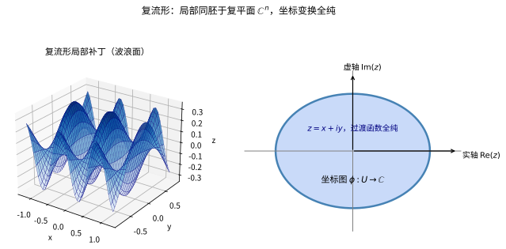
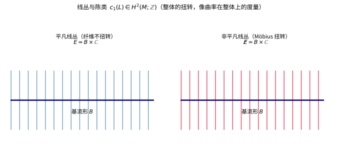

# 第67级：复几何

## 学习目标

1. 理解复流形与全纯函数的基本概念。
2. 掌握 Kähler 流形的定义及其基本性质。
3. 理解 Hermite 度量与 Kähler 度量的区别与联系。
4. 掌握 Kähler 形式、Chern 联络与 Ricci 曲率的定义。
5. 理解第一 Chern 类与 Kähler-Einstein 度量的概念。
6. 掌握 Calabi-Yau 流形的定义及其在弦论中的意义。
7. 理解 Kähler 流形上的 Hodge 理论及其分解定理。
8. 了解小平邦彦嵌入定理与 Kodaira 消灭定理。
9. 了解形变理论的基本概念。

---

## 核心概念

### 1. 复流形与全纯函数

**定义**（复流形）：
一个 $n$ 维**复流形** $M$ 是一个 Hausdorff 空间，配备坐标图册 $\{(U_\alpha, \phi_\alpha)\}$，其中 $\phi_\alpha: U_\alpha \to \mathbb{C}^n$ 是同胚，且坐标变换 $\phi_\beta \circ \phi_\alpha^{-1}$ 是全纯函数。

**定义**（全纯函数）：
复流形 $M$ 上的函数 $f: M \to \mathbb{C}$ 称为**全纯**的，如果它在每个局部坐标下是全纯的。

> **直观理解（现实类比）**：复流形就像一张"完全由复数坐标拼成的地图"。每个小区域都像一小块复平面 $\mathbb{C}$，可以写上坐标 $z=x+iy$；不同地图块的边界通过全纯函数 $w=f(z)$ 拼接——就像世界地图的相邻页在接缝处必须严格对齐、不能有折皱。正因为过渡函数是全纯的，整个流形才"光滑且可复分析"。

### 2. Hermite 度量与 Kähler 度量

**定义**（Hermite 度量）：
复流形 $M$ 上的 **Hermite 度量** $h$ 是切丛 $TM$ 上的一个光滑 Hermite 内积，即在每点 $p \in M$：
$$
h_p(v, w) = g_p(v, w) + i\omega_p(v, w),
$$
其中 $g$ 是 Riemann 度量，$\omega$ 是 $2$-形式（称为 **Kähler 形式**）。

**定义**（Kähler 度量）：
Hermite 度量 $h$ 称为 **Kähler 度量**，如果其 Kähler 形式 $\omega$ 是闭的：
$$
d\omega = 0.
$$
此时 $(M, \omega)$ 称为 **Kähler 流形**。

**Kähler 形式的局部表示**：
在局部全纯坐标 $(z_1, \dots, z_n)$ 下，Kähler 形式可写为：
$$
\omega = \frac{i}{2} \sum_{i,j} g_{i\bar{j}} \, dz_i \wedge d\bar{z}_j,
$$
其中 $g_{i\bar{j}}$ 是 Hermite 度量矩阵。Kähler 条件 $d\omega = 0$ 等价于存在局部 Kähler 势函数 $\phi$ 使得：
$$
g_{i\bar{j}} = \frac{\partial^2 \phi}{\partial z_i \partial \bar{z}_j}.
$$

### 3. Chern 联络

**定义**（Chern 联络）：
在 Kähler 流形 $(M, \omega)$ 上，存在唯一的度量联络 $\nabla$（称为 **Chern 联络**），满足：
- $\nabla$ 与全纯结构相容：$\nabla^{0,1} = \bar{\partial}$。
- $\nabla$ 保持度量：$\nabla h = 0$。

Chern 联络的曲率形式 $\Theta \in \Omega^{1,1}(M, \text{End}(T^{1,0}M))$ 是 $(1,1)$-型形式。

### 4. Ricci 曲率与第一 Chern 类

**定义**（Ricci 曲率）：
Kähler 流形 $(M, \omega)$ 的 **Ricci 曲率形式** $\text{Ric}(\omega)$ 定义为：
$$
\text{Ric}(\omega) = i \partial \bar{\partial} \log \det(g_{i\bar{j}}).
$$

**定义**（第一 Chern 类）：
$M$ 的**第一 Chern 类** $c_1(M) \in H^2(M; \mathbb{Z})$ 是陈示性类，由 Ricci 形式表示：
$$
c_1(M) = \left[ \frac{1}{2\pi} \text{Ric}(\omega) \right] \in H^2(M; \mathbb{R}).
$$

> **直观理解（现实类比）**：线丛就像在底流形的每个点上竖起一根"标尺纤维"，整体是否扭转是无法只看一点的。平凡线丛像一排方向一致的标尺，而 Möbius 式的线丛则像一条纸条在中途翻转了半圈——局部处处都一样，整体却"拧"了一下。第一陈类 $c_1(L)\in H^2(M;\mathbb{Z})$ 正是量化这种整体扭转程度的"拓扑编号"，如同曲率在整体上的度量。

### 5. Kähler-Einstein 度量

**定义**（Kähler-Einstein 度量）：
Kähler 度量 $\omega$ 称为 **Kähler-Einstein 度量**，如果存在常数 $\lambda$ 使得：
$$
\text{Ric}(\omega) = \lambda \omega.
$$
由第一 Chern 类的符号，Kähler-Einstein 度量分为三类：
- $c_1(M) < 0$：$\lambda = -1$（存在唯一 Kähler-Einstein 度量，由 Aubin-Yau 定理）。
- $c_1(M) = 0$：$\lambda = 0$（Calabi-Yau 流形，由 Yau 定理）。
- $c_1(M) > 0$：$\lambda = 1$（Fano 流形，存在性由 Chen-Donaldson-Sun 和 Tian 解决）。

### 6. Calabi-Yau 流形

**定义**（Calabi-Yau 流形）：
一个 **Calabi-Yau 流形**是 Ricci 平坦的 Kähler 流形，即 $\text{Ric}(\omega) = 0$。等价地，$c_1(M) = 0$ 且存在 Ricci 平坦的 Kähler 度量。

**例子**：
- 复环面 $\mathbb{C}^n / \Lambda$。
- 五次超曲面 $\{z_0^5 + \cdots + z_4^5 = 0\} \subset \mathbb{CP}^4$。

### 7. Hodge 理论在 Kähler 流形上

**定义**（Hodge 分解）：
在 Kähler 流形 $M$ 上，上同调群有 Hodge 分解：
$$
H^k(M; \mathbb{C}) = \bigoplus_{p+q=k} H^{p,q}(M),
$$
其中 $H^{p,q}(M)$ 是由 $(p,q)$-型调和形式表示的上同调类。

### 8. Lefschetz 分解

**定义**（Lefschetz 算子）：
设 $(M, \omega)$ 是 $n$ 维 Kähler 流形。定义 **Lefschetz 算子** $L: \Omega^{p,q}(M) \to \Omega^{p+1,q+1}(M)$ 为 $L(\alpha) = \omega \wedge \alpha$。

**Lefschetz 分解**：
$H^k(M; \mathbb{C})$ 有 Lefschetz 分解：
$$
H^k(M; \mathbb{C}) = \bigoplus_{r \geq 0} L^r H^{k-2r}_{\text{prim}}(M; \mathbb{C}),
$$
其中 $H^{k-2r}_{\text{prim}}$ 是原始上同调。

### 9. 小平邦彦嵌入定理

**定义**（小平邦彦嵌入定理）：
Kähler 流形 $M$ 可以全纯嵌入到复射影空间 $\mathbb{CP}^N$ 中，当且仅当 $M$ 上有正定的 Hodge 线丛（即 $M$ 是 Hodge 流形）。

### 10. Kodaira 消灭定理

**定义**（Kodaira 消灭定理）：
设 $M$ 是 $n$ 维紧致 Kähler 流形，$L \to M$ 是正定的全纯线丛。则：
$$
H^q(M, K_M \otimes L) = 0, \quad \forall q \geq 1,
$$
其中 $K_M = \Lambda^n T^{1,0}M$ 是典范线丛。

### 11. 形变理论

**定义**（形变）：
复流形 $M$ 的**形变**是一族复流形 $\{M_t\}_{t \in \Delta}$，其中 $\Delta \subset \mathbb{C}^m$ 是参数空间，使得 $M_0 = M$ 且 $M_t$ 光滑依赖于 $t$。

**Kodaira-Spencer 映射**：
形变的无穷小生成元由 Kodaira-Spencer 映射 $\rho: T_0 \Delta \to H^1(M, \Theta_M)$ 给出，其中 $\Theta_M$ 是全纯切丛。

---

## 定理与证明

### 定理 1：Kähler 流形的 Hodge 分解定理

> **定理**（Hodge 分解）：设 $(M, \omega)$ 是 $n$ 维紧致 Kähler 流形。则对任意 $k$，有：
> $$
> H^k(M; \mathbb{C}) \cong \bigoplus_{p+q=k} H^{p,q}(M),
> $$
> 其中 $H^{p,q}(M)$ 是 Dolbeault 上同调群，且 $\overline{H^{p,q}(M)} = H^{q,p}(M)$。
>
> 此外，每个上同调类有唯一的调和形式表示：
> $$
> H^{p,q}(M) \cong \mathcal{H}^{p,q}(M),
> $$
> 其中 $\mathcal{H}^{p,q}(M)$ 是 $(p,q)$-型 $\Delta$-调和形式的空间。

**证明**：

**第一步：Kähler 恒等式**。
Kähler 流形的关键性质是以下的 Kähler 恒等式：
$$
[\Delta_d, L] = 0, \quad [\Delta_d, \Lambda] = 0,
$$
其中 $L$ 是 Lefschetz 算子 $L(\alpha) = \omega \wedge \alpha$，$\Lambda = L^*$ 是其伴随（相对于 Hodge 内积），$\Delta_d = dd^* + d^*d$ 是 Hodge-Laplace 算子。

更重要的恒等式是：
$$
\Delta_d = 2\Delta_{\bar{\partial}} = 2\Delta_{\partial},
$$
其中 $\Delta_{\bar{\partial}} = \bar{\partial}\bar{\partial}^* + \bar{\partial}^*\bar{\partial}$ 是 $\bar{\partial}$-Laplace 算子。

**第二步：$\Delta_d$ 与 $\Delta_{\bar{\partial}}$ 的相等性**。
在 Kähler 流形上，有：
$$
\Delta_d = 2\Delta_{\bar{\partial}}.
$$
这由以下计算得到。首先，定义：
$$
d = \partial + \bar{\partial}, \quad d^* = \partial^* + \bar{\partial}^*.
$$
则：
$$
\Delta_d = (\partial + \bar{\partial})(\partial^* + \bar{\partial}^*) + (\partial^* + \bar{\partial}^*)(\partial + \bar{\partial}) = \Delta_\partial + \Delta_{\bar{\partial}} + (\partial\bar{\partial}^* + \bar{\partial}^*\partial + \partial^*\bar{\partial} + \bar{\partial}\partial^*).
$$
Kähler 恒等式 $\partial\bar{\partial}^* + \bar{\partial}^*\partial = 0$ 和 $\partial^*\bar{\partial} + \bar{\partial}\partial^* = 0$ 保证了交叉项为零，因此 $\Delta_d = \Delta_\partial + \Delta_{\bar{\partial}}$。进一步，$\Delta_\partial = \Delta_{\bar{\partial}}$，所以 $\Delta_d = 2\Delta_{\bar{\partial}}$。

**第三步：调和形式的双次数分解**。
由于 $\Delta_d$ 保持形式的双次数 $(p,q)$（因为 $\Delta_d = 2\Delta_{\bar{\partial}}$ 且 $\Delta_{\bar{\partial}}$ 显然保持双次数），调和形式空间 $\mathcal{H}^k(M)$ 有双次数分解：
$$
\mathcal{H}^k(M) = \bigoplus_{p+q=k} \mathcal{H}^{p,q}(M),
$$
其中 $\mathcal{H}^{p,q}(M)$ 是 $(p,q)$-型调和形式的空间。

**第四步：Hodge 定理的适用性**。
由 Hodge 定理，在紧致流形上，每个 de Rham 上同调类有唯一的调和形式表示：
$$
H^k(M; \mathbb{C}) \cong \mathcal{H}^k(M).
$$
因此：
$$
H^k(M; \mathbb{C}) \cong \bigoplus_{p+q=k} \mathcal{H}^{p,q}(M).
$$

**第五步：Dolbeault 上同调**。
由 Dolbeault 定理，$\bar{\partial}$-调和形式表示 Dolbeault 上同调：
$$
H^{p,q}_{\bar{\partial}}(M) \cong \mathcal{H}^{p,q}(M).
$$
因此：
$$
H^k(M; \mathbb{C}) \cong \bigoplus_{p+q=k} H^{p,q}(M),
$$
其中 $H^{p,q}(M) = H^{p,q}_{\bar{\partial}}(M)$。

**第六步：共轭性质**。
复共轭将 $(p,q)$-形式映为 $(q,p)$-形式，且保持调和性，因此：
$$
\overline{H^{p,q}(M)} = H^{q,p}(M).
$$
这给出了 Hodge 钻石的对称性。$\square$

**推论**（Hodge 数的对称性）：
设 $h^{p,q} = \dim H^{p,q}(M)$，则：
- $h^{p,q} = h^{q,p}$。
- $h^{p,q} = h^{n-p,n-q}$（Serre 对偶）。
- $b_k = \sum_{p+q=k} h^{p,q}$，其中 $b_k$ 是第 $k$ 个 Betti 数。

---

### 定理 2：小平邦彦嵌入定理

> **定理**（小平邦彦嵌入定理，1954 年）：设 $M$ 是 $n$ 维紧致复流形，$L \to M$ 是正定的全纯线丛。则存在 $N$ 和全纯嵌入 $\phi: M \hookrightarrow \mathbb{CP}^N$，使得 $L \cong \phi^* \mathcal{O}_{\mathbb{CP}^N}(1)$，其中 $\mathcal{O}_{\mathbb{CP}^N}(1)$ 是超平面线丛。
>
> 等价地：$M$ 是射影的当且仅当 $M$ 是 Kähler 流形且具有 Hodge 线丛（即 $c_1(L) > 0$ 的线丛）。

**注**：该定理给出了复流形成为射影代数流形的充分必要条件，是复几何中最深刻的定理之一。

**证明思路与关键步骤**：

**第一步：正定线丛的 Kodaira 消灭定理**。
小平邦彦嵌入定理的证明依赖于 Kodaira 消灭定理。设 $L$ 是正定线丛，则 $L^k$（$k$ 充分大）有足够多的全纯截面。

**第二步：构造映射**。
设 $s_0, \dots, s_N$ 是 $L^k$ 的全纯截面的一组基。定义映射：
$$
\phi: M \to \mathbb{CP}^N, \quad \phi(p) = [s_0(p) : \cdots : s_N(p)].
$$
这定义了 $M$ 到 $\mathbb{CP}^N$ 的全纯映射。

**第三步：分离点与切向量**。
需要证明对充分大的 $k$：
1. **分离点**：对任意 $p \neq q \in M$，存在截面 $s \in H^0(M, L^k)$ 使得 $s(p) = 0$ 但 $s(q) \neq 0$。
2. **分离切向量**：对任意 $p \in M$ 和任意非零 $v \in T_p M$，存在截面 $s \in H^0(M, L^k)$ 使得 $s(p) = 0$ 但 $d s_p(v) \neq 0$。

**第四步：正定性的应用**。
由 Kodaira 消灭定理，$H^q(M, K_M \otimes L^k) = 0$ 对所有 $q \geq 1$ 和充分大的 $k$ 成立。因此，由 Riemann-Roch 定理：
$$
\dim H^0(M, L^k) = \chi(M, L^k) = \int_M \text{ch}(L^k) \cdot \text{Td}(M) = \frac{c_1(L)^n}{n!} k^n + O(k^{n-1}).
$$
因此 $L^k$ 的截面空间维数随 $k^n$ 增长，这足以保证分离性。

**第五步：分离点的证明**。
为证明分离点性质，考虑理想层 $\mathcal{I}_{p,q}$（在 $p$ 和 $q$ 处消失的截面层）。由正定性，可以证明 $H^1(M, \mathcal{I}_{p,q} \otimes L^k) = 0$ 对充分大的 $k$ 成立，因此限制映射：
$$
H^0(M, L^k) \to H^0(M, L^k|_{\{p,q\}})
$$
是满射，从而存在截面在 $p$ 处为零但 $q$ 处非零。

**第六步：分离切向量的证明**。
类似地，考虑在 $p$ 处为零且 $d s_p = 0$ 的截面空间。由消灭定理，对充分大的 $k$，存在截面在 $p$ 处为零但在给定方向上有非零微分。

**第七步：Kodaira 嵌入**。
由上述分离性质，$\phi$ 是单射且浸入。由紧致性，$\phi$ 是嵌入。此外，由构造，$\phi^* \mathcal{O}(1) = L^k$，即 $L^k$ 是 $\phi$ 拉回的 $\mathbb{CP}^N$ 的超平面线丛。$\square$

---

### 定理 3：Kodaira 消灭定理

> **定理**（Kodaira 消灭定理）：设 $M$ 是 $n$ 维紧致 Kähler 流形，$L \to M$ 是正定全纯线丛（即 $c_1(L) > 0$）。则：
> $$
> H^q(M, K_M \otimes L) = 0, \quad \forall q \geq 1,
> $$
> 其中 $K_M = \Lambda^n T^{1,0}M$ 是典范线丛。

**证明**：

**第一步：设定**。
设 $(M, \omega)$ 是 Kähler 流形，$\omega$ 是 Kähler 形式。设 $L$ 是正定线丛，即存在 Hermite 度量 $h$ 使得其曲率形式 $\Theta(L) = -i \partial \bar{\partial} \log h$ 是正定的 $(1,1)$-形式。取 $\omega = \frac{i}{2} \Theta(L)$，则 $\omega$ 是 Kähler 形式。

**第二步：转换为 $(0,q)$-形式的值问题**。
考虑 $K_M \otimes L$ 的截面。在局部坐标下，$K_M$ 的局部截面为 $dz_1 \wedge \cdots \wedge dz_n$。$K_M \otimes L$ 的 $(0,q)$-形式值截面可视为 $L$-值的 $(n,q)$-形式：
$$
H^q(M, K_M \otimes L) \cong H^{n,q}_{\bar{\partial}}(M, L).
$$
由 Dolbeault 同构，这等价于 $L$-值的 $\bar{\partial}$-调和 $(n,q)$-形式空间。

**第三步：Kodaira-Nakano 恒等式**。
Kodaira 消灭定理的关键是 Kodaira-Nakano 恒等式。设 $\bar{\partial}$ 的 Laplace 算子为 $\Delta_{\bar{\partial}}$，$\bar{\partial}_L$ 是 $L$-值形式的 $\bar{\partial}$ 算子。则：
$$
\Delta_{\bar{\partial}_L} = \bar{\partial}_L \bar{\partial}_L^* + \bar{\partial}_L^* \bar{\partial}_L.
$$
Kodaira-Nakano 恒等式给出了 $\Delta_{\bar{\partial}_L}$ 与曲率的关系：
$$
\Delta_{\bar{\partial}_L} = \Delta_{\bar{\partial}} + [\Theta(L), \Lambda] + \text{低阶项},
$$
其中 $\Theta(L)$ 是 $L$ 的曲率形式，$\Lambda$ 是 Lefschetz 算子 $L$ 的伴随。

更精确地，对于 $L$-值的 $(n,q)$-形式 $\alpha$：
$$
\Delta_{\bar{\partial}_L} \alpha = \Delta_{\bar{\partial}} \alpha + \sum_{i,j} g^{i\bar{j}} \Theta(L)_{i\bar{j}} \alpha + \text{曲率项}.
$$

**第四步：正定性的作用**。
由于 $L$ 是正定的，$\Theta(L)$ 是正定的 $(1,1)$-形式。在局部坐标下，$\Theta(L) = i \sum g_{i\bar{j}} dz_i \wedge d\bar{z}_j$，其中 $(g_{i\bar{j}})$ 是正定 Hermite 矩阵。

对于 $L$-值的 $(n,q)$-形式 $\alpha$，考虑 $\langle \Delta_{\bar{\partial}_L} \alpha, \alpha \rangle$。由 Kodaira-Nakano 恒等式：
$$
\langle \Delta_{\bar{\partial}_L} \alpha, \alpha \rangle = \langle \Delta_{\bar{\partial}} \alpha, \alpha \rangle + \langle [\Theta(L), \Lambda] \alpha, \alpha \rangle.
$$
由于 $\Theta(L) > 0$，算子 $[\Theta(L), \Lambda]$ 在 $(n,q)$-形式上是正定的（当 $q \geq 1$ 时），即存在常数 $C > 0$ 使得：
$$
\langle [\Theta(L), \Lambda] \alpha, \alpha \rangle \geq C \|\alpha\|^2.
$$

**第五步：消灭性论证**。
设 $\alpha$ 是 $L$-值的 $\bar{\partial}_L$-调和 $(n,q)$-形式，即 $\Delta_{\bar{\partial}_L} \alpha = 0$。则：
$$
0 = \langle \Delta_{\bar{\partial}_L} \alpha, \alpha \rangle = \|\bar{\partial}_L \alpha\|^2 + \|\bar{\partial}_L^* \alpha\|^2 \geq C \|\alpha\|^2.
$$
因此 $\alpha = 0$。这意味着不存在非平凡的 $L$-值 $\bar{\partial}_L$-调和 $(n,q)$-形式（$q \geq 1$）。

**第六步：Dolbeault 上同调的消灭**。
由 Hodge 理论在 $L$-值形式上的推广，$\bar{\partial}_L$-调和形式空间同构于 Dolbeault 上同调 $H^{n,q}_{\bar{\partial}}(M, L)$。因此：
$$
H^{n,q}_{\bar{\partial}}(M, L) = 0, \quad \forall q \geq 1.
$$
由 Dolbeault 同构 $H^{n,q}_{\bar{\partial}}(M, L) \cong H^q(M, K_M \otimes L)$，得：
$$
H^q(M, K_M \otimes L) = 0, \quad \forall q \geq 1.
$$
$\square$

**推论**：对于正定线丛 $L$，$H^q(M, L^k) = 0$ 对所有 $q \geq 1$ 和充分大的 $k$ 成立（由 Kodaira 消灭定理和张量积的正定性）。

---

### 定理 4：Calabi 猜想（Yau 定理）

> **定理**（Yau 定理，1977 年，Calabi 猜想的证明）：设 $(M, \omega)$ 是 $n$ 维紧致 Kähler 流形，$R$ 是任意 $M$ 上的闭 $(1,1)$-形式，其 de Rham 上同调类等于 $2\pi c_1(M)$。则存在唯一的 Kähler 度量 $\tilde{\omega}$，使得 $\tilde{\omega}$ 与 $\omega$ 同调（即 $[\tilde{\omega}] = [\omega] \in H^2(M; \mathbb{R})$），且 $\tilde{\omega}$ 的 Ricci 形式 $\text{Ric}(\tilde{\omega}) = R$。

**特别地**（Calabi-Yau 定理）：若 $c_1(M) = 0$，则存在唯一的 Ricci 平坦 Kähler 度量（在给定 Kähler 类中）。

**证明思路**：

**第一步：化为复 Monge-Ampère 方程**。
设 $\tilde{\omega} = \omega + i \partial \bar{\partial} \varphi$，其中 $\varphi$ 是待定的光滑实值函数（称为 Kähler 势）。则 $\tilde{\omega}$ 的 Ricci 形式为：
$$
\text{Ric}(\tilde{\omega}) = -i \partial \bar{\partial} \log \det(g_{i\bar{j}} + \varphi_{i\bar{j}}).
$$
设 $\text{Ric}(\omega) = -i \partial \bar{\partial} \log \det(g_{i\bar{j}})$，且 $R = \text{Ric}(\omega) + i \partial \bar{\partial} f$（由上同调条件，存在函数 $f$）。则条件 $\text{Ric}(\tilde{\omega}) = R$ 等价于：
$$
\det(g_{i\bar{j}} + \varphi_{i\bar{j}}) = e^{f + c} \det(g_{i\bar{j}}),
$$
其中 $c$ 是归一化常数。这称为**复 Monge-Ampère 方程**：
$$
(\omega + i \partial \bar{\partial} \varphi)^n = e^{f + c} \omega^n.
$$

**第二步：连续性方法**。
考虑一族方程：
$$
(\omega + i \partial \bar{\partial} \varphi_t)^n = e^{tf + c_t} \omega^n, \quad t \in [0, 1].
$$
当 $t = 0$ 时，解为 $\varphi_0 = 0$，$c_0 = 0$。需要证明对 $t = 1$ 存在解。

**第三步：先验估计（Yau 的贡献）**。
Yau 的关键贡献是建立了一系列先验估计：
1. **$C^0$ 估计**：$\|\varphi_t\|_{C^0} \leq C$。
2. **$C^1$ 估计**：$\|\nabla \varphi_t\|_{C^0} \leq C$。
3. **$C^2$ 估计**：$\|\nabla^2 \varphi_t\|_{C^0} \leq C$（最困难的部分）。
4. **高阶估计**：由 Evans-Krylov 理论，从 $C^2$ 估计可得 $C^{2,\alpha}$ 估计。

**第四步：$C^2$ 估计的要点**。
$C^2$ 估计的关键是考虑辅助函数：
$$
H = e^{-C\varphi} (n + \Delta \varphi),
$$
并证明 $H$ 在 $M$ 上的最大值有界。这需要利用 Kähler 条件和复 Monge-Ampère 方程的右端项。

**第五步：存在性与唯一性**。
由连续性方法和先验估计，解的存在性由隐函数定理和紧致性论证得到。唯一性由 Kähler 势的强极大值原理保证：若 $\varphi_1$ 和 $\varphi_2$ 是两个解，则 $\varphi_1 - \varphi_2$ 是常数。

**第六步：Calabi-Yau 情形**。
当 $c_1(M) = 0$ 时，取 $R = 0$，$f = 0$，则方程变为：
$$
(\omega + i \partial \bar{\partial} \varphi)^n = e^c \omega^n.
$$
由体积条件，$\int_M (\omega + i \partial \bar{\partial} \varphi)^n = \int_M \omega^n$，因此 $c = 0$。解得 $\tilde{\omega} = \omega + i \partial \bar{\partial} \varphi$ 满足 $\text{Ric}(\tilde{\omega}) = 0$。$\square$

---

### 定理 5：Lefschetz 超平面定理

> **定理**（Lefschetz 超平面定理）：设 $M \subset \mathbb{CP}^N$ 是 $n$ 维光滑射影代数流形，$H \subset \mathbb{CP}^N$ 是超平面，使得 $X = M \cap H$ 是光滑的（即 $H$ 横截于 $M$）。则包含映射 $i: X \hookrightarrow M$ 诱导的上同调映射：
> $$
> i^*: H^k(M; \mathbb{Z}) \to H^k(X; \mathbb{Z})
> $$
> 在 $k \leq n-2$ 时是同构，在 $k = n-1$ 时是单射。
>
> 等价地，$M$ 的低于 $n-1$ 维的同伦群与 $X$ 的同构。

**注**：该定理表明，射影代数流形的低维拓扑由其超平面截面完全决定。这是研究代数流形拓扑的基本工具。

**证明思路**：

**第一步：约化到 Kähler 几何**。
设 $\omega$ 是 $M$ 上的 Kähler 形式（由 $\mathbb{CP}^N$ 的 Fubini-Study 度量限制得到）。设 $s$ 是定义超平面 $H$ 的全纯截面的零集，即 $X = \{s = 0\}$。

**第二步：考虑线丛的消灭定理**。
设 $L = \mathcal{O}_M(1)$ 是 $M$ 上的超平面线丛。则 $L$ 是正定的，且 $X$ 是 $L$ 的某个全纯截面的零集。

由 Kodaira 消灭定理：
$$
H^q(M, K_M \otimes L) = 0, \quad \forall q \geq 1.
$$

**第三步：短正合序列**。
考虑如下短正合序列（adjuction 序列）：
$$
0 \to K_M \otimes L^{-1} \to K_M \to K_X \to 0.
$$
这诱导了长正合上同调序列：
$$
\cdots \to H^{q-1}(X, K_X) \to H^q(M, K_M \otimes L^{-1}) \to H^q(M, K_M) \to H^q(X, K_X) \to \cdots
$$

**第四步：消灭性的应用**。
由 Kodaira 消灭定理，$H^q(M, K_M \otimes L) = 0$ 对 $q \geq 1$ 成立。通过 Serre 对偶，$H^q(M, K_M \otimes L^{-1}) = 0$ 对 $q \leq n-1$ 成立。

因此，在长正合序列中，$H^q(M, K_M) \to H^q(X, K_X)$ 在 $q \leq n-2$ 时是同构，在 $q = n-1$ 时是单射。

**第五步：转换为通常上同调**。
由 Hodge 分解和 Poincaré 对偶，上述同构/单射性质可以转换为通常上同调的同构/单射性质。具体地，由 Hodge 理论：
$$
H^q(M, K_M) \cong H^{n,q}(M) \cong H^{n-q}(M; \mathbb{C})^*
$$
通过 Poincaré 对偶，得到 $H^{n-q}(M; \mathbb{C}) \cong H^{n-q}(X; \mathbb{C})$ 对 $n-q \leq n-2$ 成立，即 $q \geq 2$。这给出了所需的上同调同构。

**第六步：整数系数的结果**。
由万有系数定理，整数系数的结果可以通过考虑挠部分得到。由于 $M$ 和 $X$ 是光滑射影流形，它们的上同调没有挠（或挠部分由某些条件控制），但完整的证明需要更精细的论证。$\square$

---

## 示例

### 示例 1：复射影空间 $\mathbb{CP}^n$ 的 Kähler 结构

**定义**：
$\mathbb{CP}^n$ 上的 **Fubini-Study 度量** $\omega_{FS}$ 是 Kähler 度量，在齐次坐标 $[z_0 : \cdots : z_n]$ 下，其 Kähler 势为：
$$
\phi = \log(|z_0|^2 + \cdots + |z_n|^2).
$$
Kähler 形式为：
$$
\omega_{FS} = \frac{i}{2} \partial \bar{\partial} \log(|z_0|^2 + \cdots + |z_n|^2).
$$

**在仿射坐标下**：
在仿射坐标 $w_i = z_i / z_0$（$i = 1, \dots, n$）下：
$$
\omega_{FS} = \frac{i}{2} \partial \bar{\partial} \log(1 + |w_1|^2 + \cdots + |w_n|^2).
$$
展开得：
$$
\omega_{FS} = \frac{i}{2} \left( \frac{\sum dw_i \wedge d\bar{w}_i}{1 + \|w\|^2} - \frac{(\sum \bar{w}_i dw_i) \wedge (\sum w_i d\bar{w}_i)}{(1 + \|w\|^2)^2} \right).
$$

**Ricci 曲率**：
计算 $\mathbb{CP}^n$ 的 Ricci 形式：
$$
\text{Ric}(\omega_{FS}) = -i \partial \bar{\partial} \log \det(g_{i\bar{j}}) = (n+1) \omega_{FS}.
$$
因此 $\mathbb{CP}^n$ 是 Kähler-Einstein 流形，满足 $\text{Ric}(\omega) = (n+1)\omega$。

**第一 Chern 类**：
$c_1(\mathbb{CP}^n) = (n+1) [\omega_{FS}] \in H^2(\mathbb{CP}^n; \mathbb{Z})$，其中 $[\omega_{FS}]$ 是 $\mathbb{CP}^n$ 的 Kähler 类的生成元。

### 示例 2：Riemann 曲面的 Kähler 几何

**定义**：
Riemann 曲面 $\Sigma$ 是 $1$ 维复流形。任何 Riemann 曲面（作为实 $2$ 维流形）上的任何 Hermite 度量自动是 Kähler 度量（因为 $d\omega$ 是 $3$-形式，在 $2$ 维流形上必为零）。

**体积形式**：
在局部坐标 $z = x + iy$ 下，Kähler 形式为：
$$
\omega = \frac{i}{2} g(z) \, dz \wedge d\bar{z} = g(z) \, dx \wedge dy,
$$
其中 $g(z) > 0$ 是度量函数。

**Ricci 曲率**：
Ricci 形式为：
$$
\text{Ric}(\omega) = -i \partial \bar{\partial} \log g(z) = -\frac{1}{2} \Delta \log g(z) \, dx \wedge dy,
$$
其中 $\Delta$ 是 Laplace 算子。

**Gauss-Bonnet 公式**：
$$
\int_\Sigma \text{Ric}(\omega) = 2\pi \chi(\Sigma) = 2\pi (2 - 2g),
$$
其中 $g$ 是 $\Sigma$ 的亏格。

**一致化定理**：
- 若 $g = 0$（$\Sigma \cong \mathbb{CP}^1$），则 $c_1(\Sigma) > 0$，存在常正曲率度量（球面度量）。
- 若 $g = 1$（$\Sigma$ 是椭圆曲线），则 $c_1(\Sigma) = 0$，存在 Ricci 平坦度量（平坦度量）。
- 若 $g \geq 2$，则 $c_1(\Sigma) < 0$，存在常负曲率度量（Poincaré 度量）。

---

## 习题

### 基础题

**习题 1**（复流形定义）给出 $n$ 维复流形的定义，并解释坐标变换 "全纯" 这一条件的作用。

**习题 2**（复流形定义）说明切丛 $TM$ 在复结构下如何分解为 $T^{1,0}M \oplus T^{0,1}M$ 两个子丛。

**习题 3**（全纯函数）用局部坐标写出全纯函数 $f$ 满足的 Cauchy-Riemann 方程，并说明它与 $\bar{\partial} f = 0$ 的等价关系。

**习题 4**（全纯函数）证明：紧致连通的复流形上的全纯函数必为常数（刘维尔定理的推广）。

**习题 5**（全纯函数）判断并说明理由：$\mathbb{CP}^1$ 上的全纯函数构成什么空间。

**习题 6**（复结构）说明在 $\mathbb{R}^{2n}$ 上给定一个复结构（线性映射 $J$ 满足 $J^2 = -I$）如何把它视为复向量空间 $\mathbb{C}^n$。

**习题 7**（几乎复结构）写出实奇维流形上几乎复结构 $J$ 存在的必要条件（关于维数和可定向性）。

**习题 8**（几乎复结构）说明可积的几乎复结构与 "存在全纯坐标图册"（复结构）之间的关系。

**习题 9**（线丛）用零截面说明平凡线丛 $M \times \mathbb{C}$ 与一般线丛 $L$ 的区别。

**习题 10**（线丛）写出 $\mathbb{CP}^n$ 的超平面线丛 $\mathcal{O}(1)$ 在齐次坐标下保持全纯的过渡函数。

**习题 11**（向量丛）说明向量丛 $E$ 有秩 $\text{rk}(E)$ 的含义，并区分标量丛与向量丛的截面。

**习题 12**（Dolbeault 算子）写出算子 $\partial$ 与 $\bar{\partial}$ 对 $(p,q)$-形式的作用，以及 $d = \partial + \bar{\partial}$ 的含义。

**习题 13**（Dolbeault 算子）说明为什么 $\bar{\partial}^2 = 0$，从而得上链复形结构。

**习题 14**（Dolbeault 上同调）定义 Dolbeault 上同调群 $H^{p,q}_{\bar\partial}(M)$，写出其 cocycle 与 coboundary。

**习题 15**（Hodge 理论）说明 Hodge 星算子 $*$ 在 Kähler 流形上的 $*: \Omega^{p,q} \to \Omega^{n-q,n-p}$ 映射。

**习题 16**（Hodge 理论）写出紧致 Kähler 流形上的 Hodge 分解公式并给出 Hodge 数的定义。

**习题 17**（Kähler 流形）给出 Kähler 形式的定义，并说明闭条件 $d\omega = 0$ 的含义。

**习题 18**（Kähler 流形）说明 Kähler 流形同时是复流形、Riemann 流形和辛流形三重身份的原理。

**习题 19**（Kähler 流形）写出 Kähler 形式 $\omega$ 在局部全纯坐标下的标准形式。

**习题 20**（Kähler 流形）说明 Kähler 势函数 $\phi$ 与度量 $g_{i\bar{j}}$ 的关系。

**习题 21**（射影簇）用齐次多项式零集写出 $\mathbb{CP}^n$ 中射影簇的定义。

**习题 22**（射影簇）说明为什么超平面 $\mathbb{CP}^{n-1} \subset \mathbb{CP}^n$ 是 Kähler 流形。

**习题 23**（Chow 理论）陈述 Chow 引理：射影簇中与某个开稠密部分射影等价的对象是什么。

**习题 24**（Chern 类）用第一个 Chern 类 $c_1(L)$ 说明线丛的拓扑不变量为何取值于 $H^2(M;\mathbb{Z})$。

**习题 25**（Chern 类）写出第一 Chern 类由曲率形式表示式 $c_1(L) = [\frac{i}{2\pi} \Theta]$。

**习题 26**（Chern 类）说明 $\mathbb{CP}^n$ 超平面线丛 $\mathcal{O}(1)$ 的 $c_1$ 是多少，产生何种上同调生成元。

**习题 27**（曲率）写出向量丛上曲率形式 $\Theta$ 的定义（关于联络 $\nabla$），并说明其类型 $(1,1)$。

**习题 28**（曲率）说明 Ricci 形式与行列式线丛曲率的关系 $\text{Ric}(\omega) = -i \partial\bar{\partial} \log \det g$。

**习题 29**（曲率）说明 Bianchi 恒等式在线丛曲率形式上的退化形式 $\nabla\Theta = 0$。

**习题 30**（Kodaira 消灭定理）陈述 Kodaira 消灭定理的内容并指出其中的正定线丛条件。

**习题 31**（Kodaira 消灭定理）判断对正定线丛 $L$，$H^q(M, K_M \otimes L)$ 何时为零。

**习题 32**（Calabi-Yau）给出 Calabi-Yau 流形的定义（$c_1 = 0$ 且存在 Ricci 平坦 Kähler 度量）。

**习题 33**（Calabi-Yau）说明复环面 $T = \mathbb{C}^n / \Lambda$ 为什么是 Calabi-Yau。

**习题 34**（Calabi-Yau）说明为什么五次超曲面 $\{z_0^5 + \cdots + z_4^5 = 0\} \subset \mathbb{CP}^4$ 满足 $c_1 = 0$。

**习题 35**（辛几何关联）说明 Kähler 形式 $\omega$ 为什么是辛形式（非退化且闭），从而给出与辛流形的联系。

**习题 36**（复模结构）定义全纯线丛 $L$ 的全纯截面空间 $H^0(M,L)$，并说明其维数记作 $h^0(L)$。

**习题 37**（复模结构）说明全纯截面 $s$ 的零点集是子簇，且由 $s$ 定义的除子为何与 $c_1(L)$ 相关。

**习题 38**（复模结构）说明负、平凡、正定三种线丛分别对应的全纯截面存在性差异。

**习题 39**（Hodge 数）写出 $\mathbb{CP}^1$ 的 Hodge 钻石并计算其 Hodge 数与 Betti 数。

**习题 40**（Hodge 数）写出复环面 $\mathbb{C}^n / \Lambda$ 的 Betti 数 $b_k$ 与 Hodge 数 $h^{p,q}$ 的关系。

**习题 41**（复结构）说明为什么实二维流形上的每个定向度量都兼容一个几乎复结构，且该结构自动可积。

**习题 42**（全纯映射）写出全纯映射 $f: M \to N$ 在局部坐标下的 Jacobi 矩阵特征。

**习题 43**（全纯映射）说明强非退化条件：全纯嵌入 $M \to \mathbb{CP}^N$ 的切映射在每点为何是单射。

**习题 44**（直线丛的乘积）说明线丛 $L_1, L_2$ 的曲率与张量积 $L_1 \otimes L_2$ 的曲率满足相加关系。

**习题 45**（Dolbeault 上同调）说明 $\dim_\mathbb{C} H^{p,q}$ 有限的原因（紧致流形上的椭圆算子理论）。

**习题 46**（Hodge 理论）给出 Hodge 分解中调和形式唯一性的来源。

**习题 47**（Kähler 流形）说明 Kähler 条件下 $\Delta_d = 2\Delta_{\bar\partial}$ 这一恒等式的意义。

**习题 48**（Kähler 流形）说明 Kähler 流形上 Lefschetz 算子 $L\omega = \omega \wedge \alpha$ 提升双次数的机制。

**习题 49**（射影簇）说明光滑射影簇为何是 Kähler 流形（拉回 Fubini-Study 度量）。

**习题 50**（Chow 理论）用 Chow 引理表述：每个复射影簇可以视为某个闭子簇的推广对象集。

**习题 51**（Chern 类）说明第一 Chern 类对张量积满足 $c_1(L_1 \otimes L_2) = c_1(L_1) + c_1(L_2)$。

**习题 52**（Chern 类）写出对偶线丛 $L^*$ 的 Chern 类 $c_1(L^*) = -c_1(L)$ 的原因。

**习题 53**（曲率）写出 Ricci 形式的精确等式 $\text{Ric}(\omega) = -i \partial\bar{\partial} \log \det(g_{i\bar j})$ 的局部验证（对交模求迹）。

**习题 54**（曲率）说明紧 Kähler 流形上 $\int_M \text{Ric}(\omega) \wedge \omega^{n-1}$ 与第一 Chern 类的配对关系。

**习题 55**（Kodaira 消灭定理）对 $q=0$ 解释为什么 $H^0(M, K_M \otimes L) \neq 0$ 一般成立而 $q \geq 1$ 为零。

**习题 56**（Kodaira 消灭定理）说明 Kodaira 消灭定理为什么需要 $L$ 正定而非仅是数值有效。

**习题 57**（Calabi-Yau）用 Yau 定理说明三元 Calabi-Yau 流形的 Euler 特征数 $c_3$ 是唯三年化量。

**习题 58**（Calabi-Yau）说明 Calabi-Yau 流形在弦论中为何作为紧化的优选。

**习题 59**（复流形）区分复流形与复解析空间的局部模型差异。

**习题 60**（全纯节）说明 $\mathbb{CP}^n$ 上 $\mathcal{O}(k)$ 的全纯截面空间 $\mathbb{C}[z]$ 的齐次次数 $k$ 限制。

**习题 61**（向量丛）写出秩 $r$ 向量丛的局部平凡化与转移函数 $g_{\alpha\beta}$ 的粘合条件。

**习题 62**（线丛）说明 $\mathbb{CP}^n$ 的所有全纯线丛皆形如 $\mathcal{O}(k)$ 的依据（$H^1(\mathbb{CP}^n, \mathcal{O}^*) \cong \mathbb{Z}$）。

**习题 63**（Dolbeault 算子）验证每条 $(0,q)$-形式的 $\bar\partial$-上同调类由调和形式唯一代表（Hodge 定理）。

**习题 64**（Hodge 理论）写出 Kähler 流形上 Hodge 数的对称性 $h^{p,q} = h^{q,p}$ 的来源。

**习题 65**（Kähler 流形）说明 Kähler 形式的体积积分 $\int_M \omega^n = n! \, \text{vol}(M)$ 表示意义。

**习题 66**（Kähler 流形）说明为什么只能对奇数为零的 Betti 序列才可能为 Kähler。

**习题 67**（Kähler 流形）说明 K3 曲面属于 Kähler 的两个独立证明来源（Siu 定理）。

**习题 68**（射影簇）说明射影簇上超谱序列或 Cayley 配置与 Hodge 超曲面的联系。

**习题 69**（射影簇）说明 Hodge 流形定义：存在正线丛的紧 Kähler 流形。

**习题 70**（Chow 理论）给出 Chow 环用余切丛丛与交叉数生成的自由环表述（对 $\mathbb{CP}^n$）。

**习题 71**（Chern 类）用分裂原理说明如何定义高次 Chern 类 $c_k$。

**习题 72**（Chern 类）写出对 $n$ 维纯量丛 $E \to \mathbb{CP}^1$ 的 $c_1(E)$ 意义。

**习题 73**（曲率）说明联络的曲率形式 $\Theta = d\theta + \theta \wedge \theta$ 的 Bianchi 恒等式。

**习题 74**（曲率）比较 Riemann 曲率张量与 Chern 联络曲率在 Kähler 情形的差异。

**习题 75**（Kodaira）说明 Kodaira 消灭定理对 $H^q(M, L^k)$（$k$ 大）的影响（复数分量减少）。

**习题 76**（Kodaira）说明在 $L$ 正定时为何 $H^0(M, L^k)$ 随 $k$ 增长为 $O(k^n)$。

**习题 77**（Calabi-Yau）说明在 $c_1 = 0$ 的三维形变中，为何其整体复结构模数可作为常数形变来处理。

**习题 78**（Calabi-Yau）说明 Yau 定理为何保证 Calabi-Yau 度量存在但一般不唯一（由模生成 $\partial\bar\partial$ 改变）。

**习题 79**（复结构）说明 Jacobi 恒等式对复结构可积性的作用 $[J,J]$ vanish 的修改。

**习题 80**（全纯函数）说明为何全纯函数在紧流形上必常数，而在紧复环面上亦常数。

**习题 81**（全纯节）使用 Riemann-Roch 计算 $H^0(\mathbb{CP}^1, \mathcal{O}(k))$ 的维数。

**习题 82**（向量丛）说明秩 $\ge 2$ 向量丛与线丛的截面区别于切丛与牛顿丛精确解。

**习题 83**（Dolbeault）说明为什么 $H^{p,0}(\mathbb{CP}^n) = 0$ 对 $p \ge 1$ 而 $H^{0,0} = \mathbb{C}$。

**习题 84**（Dolbeault）写出 $H^{n,n}(\mathbb{CP}^n)$ 的维数并由不可定向定向说明 $\mathbb{CP}^n$ 可定向。

**习题 85**（Hodge 理论）计算复环面 $\mathbb{C}^n/\Lambda$ 的 Betti 数与 $h^{p,0}$ 的关系（由全纯形式）。

**习题 86**（Kähler 流形）说明双有理等价对 Kähler 类的影响（拉回同构）。

**习题 87**（Kähler 流形）指出 Kähler 流形上 $\partial$ 与 $\bar\partial$ 的相互交换 $[\partial, \bar\partial] = 0$。

**习题 88**（射影簇）说明 Fano 流形（$c_1 > 0$）与射影嵌入的条件联系。

**习题 89**（射影簇）说明防线质上光滑超曲面在 $\mathbb{CP}^n$ 中为何自动 Kähler 且其维数由次数决定。

**习题 90**（Chow 理论）说明 $\mathbb{CP}^n$ 的 Chow 环 $A^*(\mathbb{CP}^n) \cong \mathbb{Z}[h]/h^{n+1}$ 其中 $h$ 为超平面类。

**习题 91**（Chern 类）写出切丛 $T\mathbb{CP}^n$ 的全 Chern 类 $c(T\mathbb{CP}^n) = (1+h)^{n+1}$ 并化简。

**习题 92**（Chern 类）用分裂原理写出陈特征 $\text{ch}(E) = \sum e^{x_i}$ 对分裂线丛汇。

**习题 93**（曲率）说明 Kähler-Einstein 条件 $\text{Ric}(\omega) = \lambda \omega$ 对 $\lambda$ 的符号与第一 Chern 类符号一致。

**习题 94**（曲率）用 Gauss-Bonnet 计算 Riemann 曲面 $\Sigma_g$ 的全曲率 $\int_\Sigma \text{Ric} = 2\pi(2-2g)$。

**习题 95**（Kodaira）说明对正线丛 $L$ 与任意 $k$ 大时 $H^q(M, L^k)$（$q\ge1$）为零的推论。

**习题 96**（Kodaira）比较 Kodaira 消灭定理与 Nakano 消灭定理（对 $(p,q)$-形式）。

**习题 97**（Calabi-Yau）说明 K3 曲面作为最简 Calabi-Yau 复曲面的拓扑与 Hodge 数特征。

**习题 98**（Calabi-Yau）说明复环面与 K3 曲面在 $c_1=0$ 的二维 Calabi-Yau 分类中各自地位。

**习题 99**（辛几何关联）说明 Kähler 流形上 $\omega^n/n!$ 为什么是流形体积形式且给出定向。

**习题 100**（辛几何关联）解释 Kähler 流形如何为辛几何提供一类有兼容复结构的例子（与一般辛流形区别）。

### 进阶题

**习题 101**（复结构）证明：一个线性复结构 $J$（即 $J^2 = -I$）确实把实向量空间变成复向量空间，定义 $i \cdot v = Jv$。

**习题 102**（复结构）验证 $T^{1,0}M$ 与 $T^{0,1}M$ 的交为零而对直和充满 $TM \otimes \mathbb{C}$。

**习题 103**（全纯函数）利用反函数定理证明全纯函数局部逆仍全纯，即全纯双射是全纯同构。

**习题 104**（全纯函数）证明全纯函数满足极大模原理，并用于紧流形上强调无处取最大除非常数。

**习题 105**（复结构）说明 Nijenhuis 张量 $N_J$ 的表达式 $N_J(X,Y) = [JX,JY] - J[JX,Y] - J[X,JY] - [X,Y]$ 并可积性。

**习题 106**（几乎复结构）说明四维 Gl(2,$\mathbb{C}$) 结构与苏佳而积在 $T^{1,0}$ 处的分裂保证克黎。

**习题 107**（全纯截面）证明 $H^0(\mathbb{CP}^n, \mathcal{O}(k))$ 是次数恰为 $k$ 的齐次多项式空间当 $k\ge0$，否则为零。

**习题 108**（线丛）证明线丛 $L$ 有一个处处非零全纯截面当且仅当 $L$ 全纯平凡（$L \cong M\times\mathbb{C}$）。

**习题 109**（线丛）用转移函数证明 $\mathcal{O}(k)$ 的对偶为 $\mathcal{O}(-k)$。

**习题 110**（向量丛）证明秩 $r$ 向量丛 $E$ 的 $\det E = \Lambda^r E$ 是线丛，且 $c_1(E) = c_1(\det E)$。

**习题 111**（Dolbeault 算子）证明 $\partial$ 与 $\bar\partial$ 分别是 $d$ 的 $(p+1,q)$ 与 $(p,q+1)$ 分量，且复合 $d^2=0$ 蕴含两个平方为零。

**习题 112**（Dolbeault 算子）证明 Kähler 流形上 $\partial\bar\partial = -\bar\partial\partial$ 后推出相关的引理 $\partial\bar\partial$-引理。

**习题 113**（Dolbeault 上同调）证明 Dolbeault 定理：$H^{p,q}_{\bar\partial}(M) \cong H^q(M, \Omega^p)$。

**习题 114**（Dolbeault 上同调）计算 $H^{1,1}(\mathbb{CP}^n)$ 的维数并说明 $h^{1,1}$ 引理由 $\mathcal{O}(1)$ 生成。

**习题 115**（Hodge 理论）证明 Kähler 流形上 Hodge 恒等式 $\Delta_d = 2\Delta_{\bar\partial}$ 的核心一步 $[\Lambda, \bar\partial]$ 归零。

**习题 116**（Hodge 理论）推导 Hodge 数 $h^{p,q}$ 在 $h^{q,p} = h^{p,q}$ 且 $h^{n-p,n-q}$ 的对称约束。

**习题 117**（Kähler 流形）证明 $\mathbb{CP}^n$ 的 Fubini-Study 度量是 Kähler 度量，$d\omega_{FS} = 0$。

**习题 118**（Kähler 流形）决定 Kähler 形式的体积：$\int_{\mathbb{CP}^n} \omega_{FS}^n = 1$（取标准归一）。

**习题 119**（Kähler 流形）证明每个 Kähler 类 $\alpha \in H^{1,1}(M)$ 含唯一 Kähler 度量的同调第二分量由 $\int_M \alpha \wedge \omega^{n-1}$ 控制。

**习题 120**（Kähler 流形）证明：Kähler 流形上的 $\partial\bar\partial$-引理——若 $[\alpha] = 0$ 且 $d\alpha = 0$，则 $\alpha = \partial\bar\partial \phi$。

**习题 121**（射影簇）由 Lefschetz 超平面定理说明光滑超曲面 $X_d \subset \mathbb{CP}^n$（$n \ge 3$）满足 $h^{1,1}(X_d) = 1$，并解释这由超平面类 $\mathcal{O}(1)$ 所生成。

**习题 122**（射影簇）用 Lefschetz 超平面定理分析 $H^k(X_s) \to H^k(\mathbb{CP}^n)$ 的注入与同构范围。

**习题 123**（射影簇）说明光滑二次超曲面（quadric）$Q \subset \mathbb{CP}^n$ 的 Hodge 数结构，及其与 $\mathbb{CP}^{n-1}$ 射影空间的区别。

**习题 124**（Chow 理论）写出 $\mathbb{CP}^n$ 中次数 $d$ 超曲面的 Chow 环：$[X] = dh^{n-1}$。

**习题 125**（Chow 理论）用 Chow 环计算 $\mathbb{CP}^2$ 中两条光滑曲线的交点数，并由此导出 Bezout 定理。

**习题 126**（Chern 类）证明切丛与余切丛的 Chern 类满足 $c(T\mathbb{CP}^n) = (1+h)^{n+1}$，并由对偶性质 $c(T^*\mathbb{CP}^n) = \sum_{k} (-h)^k \binom{n+1}{k}$ 化简第一陈类 $c_1(T\mathbb{CP}^n) = (n+1)h$。

**习题 127**（Chern 类）证明陈特征 $\text{ch}(E) = \sum e^{x_i}$ 中的指数形式与初等对称多项式 $c_k$ 通过牛顿恒等式对应一致。

**习题 128**（Chern 类）计算第二 Chern 类 $c_2(\mathbb{CP}^n) = \frac{n(n+1)}{2} h^2$。

**习题 129**（曲率）计算 $\mathbb{CP}^n$ 的 Ricci 形式 $\text{Ric}(\omega_{FS}) = (n+1)\omega_{FS}$ 验证 Kähler-Einstein。

**习题 130**（曲率）推导 $\mathbb{CP}^n$ 的截曲率为正，因而正 Ricci。

**习题 131**（曲率）验证 $K3$ 或复环面 Ricci 曲率为零即 $c_1 = 0$ 情形的平坦性。

**习题 132**（曲率）用 Gauss-Bonnet 推导 Riemann 曲面上的 Poincaré-Hopf 与欧拉特征。

**习题 133**（Kodaira）使用 Kodaira 消灭定理证明 $H^q(\mathbb{CP}^n, \mathcal{O}(k)) = 0$ 的 $q \ge 1$ 与 $k \ge 1$ 范围。

**习题 134**（Kodaira）证明 K3 曲面的全纯 $1$-形式空间 $H^{1,0}$ 为零。

**习题 135**（Kodaira）用 Kodaira 消灭定理推导 $\mathbb{CP}^n$ 的 Hodge 钻石导数空洞。

**习题 136**（Kodaira）解释为何 $H^0(M, K_M)$ 的维数 $p_g$ 由全纯 $(n,0)$-形式决定。

**习题 137**（Calabi-Yau）证明：五次超曲面 $X_5 \subset \mathbb{CP}^4$ 满足 $c_1(X_5) = 0$，因而具备 Calabi-Yau 三维形变的资格（$\dim_\mathbb{C} X_5 = 3$）。

**习题 138**（Calabi-Yau）计算五次超曲面 $X_5$ 的 Euler 特征数为 $c_3 = -200$（用 Chern 类积分）。

**习题 139**（Calabi-Yau）推导复环面是最简 Calabi-Yau 且其 Betti 序列为 $\binom{n}{k}$。

**习题 140**（Calabi-Yau）讨论二维 Calabi-Yau 曲面（仅复环面与 K3）为何由 $c_1 = 0$ 且 Kähler 决定。

**习题 141**（Dolbeault）计算复环面 $\mathbb{C}^n/\Lambda$ 的 Dolbeault 上同调维数 $h^{p,q} = \binom{n}{p}\binom{n}{q}$。

**习题 142**（Dolbeault）证明平坦向量丛的 Dolbeault 上同调退化为常数上同调。

**习题 143**（Hodge 理论）证明 Kähler 流形的奇次 Betti 数为偶数。

**习题 144**（Hodge 理论）证明对紧 Kähler $M$，$H^2(M;\mathbb{R})$ 的 Kähler 类充满第一出陈类之外。

**习题 145**（Kähler 流形）证明紧 Kähler 流形上的强 Lefschetz 定理。

**习题 146**（Kähler 流形）证明二维紧 Kähler 曲面 $M$ 的第一 Betti 数 $b_1$ 必为偶数，并说明这与纯辛流形在 $b_1$ 奇数时的本质区别。

**习题 147**（辛几何关联）由 Darboux 引理说明：在局部坐标 $(x^i, y^i)$ 下，辛形式可写为 $\omega = \sum dx^i \wedge dy^i$，由此与 Kähler 形式常数系数的兼容方式。

**习题 148**（辛几何关联）解释 Kähler 流形上 $\omega^n/n!$ 为何为流的定向体积。

**习题 149**（几乎复结构）讨论复流形实化为实流形后诱导的几乎复结构 $J$，说明其与复结构的一致之处及可积性判定。

**习题 150**（全纯映射）证明全纯映射 $f$ 的切映射 Df 与 J 交换 $Df \circ J = J \circ Df$。

**习题 151**（全纯映射）证明复合全纯映射仍全纯。

**习题 152**（射影簇）证明三种对象（射影簇、射影胚、射影叠簇）的对应层理。

**习题 153**（射影簇）使用 Kodaira 嵌入定理说明 Hodge 流形必射影。

**习题 154**（射影簇）证明完全交簇的 Hodge 数由维数与次数导出。

**习题 155**（Chow 理论）证明 Bezout 定理在 $n$ 维的推广交点数 $\prod d_i$。

**习题 156**（Chow 理论）用投影法则证明 $\pi_*(\pi^* D) = D \cdot \pi_*[X]$ 的闭像。

**习题 157**（Chern 类）写出陈特征的加法与乘法性质并分解求和。

**习题 158**（Chern 类）证明 $c_1(E \otimes L) = c_1(E) + r\, c_1(L)$（秩 $r$）。

**习题 159**（曲率）推导截曲率复正与第一 Chern 类正的关系局限。

**习题 160**（曲率）证明 Kähler-Einstein 流形上 $\lambda$ 必为第一 Chern 类的数值符号与 $\int$ 配对。

**习题 161**（Kodaira）用 Kodaira 消灭定理证明在正线丛上全纯截面构成完整嵌入映射的满射性质。

**习题 162**（Kodaira）解释为何 $K_M$ 负时（Fano）$H^0(M, K_M) = 0$ 而全纯 $\omega_M$ 消失。

**习题 163**（Calabi-Yau）用 Yau 定理证明 Calabi-Yau 流形存在 Ricci 平坦度量的唯一（同 Kähler 类）。

**习题 164**（Calabi-Yau）对比两类完全交 Calabi-Yau：三次曲面（$\mathbb{CP}^3$ 中三次超平面）与五次超曲面 $X_5 \subset \mathbb{CP}^4$ 的 Hodge 数 $h^{1,1}, h^{2,1}$ 大小关系。

**习题 165**（Calabi-Yau）用 Hodge 数与 $\chi = 2(h^{1,1} - h^{2,1})$ 判断流形 Calabi-Yau 的 Euler 特征。

**习题 166**（Dolbeault）证明 $\mathbb{CP}^n$ 的 $H^{p,q}$ 除 $p=q$ 全为 0。

**习题 167**（Dolbeault）计算 $H^{0,1}(T)$ 与复环面上全纯 $1$-形式维度。

**习题 168**（Hodge 理论）证明 Kähler 流形 $H^1(M;\mathbb{C})$ 与全纯 $1$-形式与反全纯同构。

**习题 169**（Hodge 理论）说明 $b_{2k} \ge p_g \ge 0$ 的完全由 Hodge 分解导出的不等式。

**习题 170**（Kähler 流形）用强极大值原理证明：Monge-Ampère 方程 $\det(g_{i\bar j} + \varphi_{i\bar j}) = e^f \det(g_{i\bar j})$ 在给定 Kähler 类中至多有一个解（差为常数）。

**习题 171**（Kähler 流形）讨论 Monge-Ampère 方程 $\det(g + \partial\bar\partial\phi) = e^f \det g$ 在 $c_1 = 0$ 的解。

**习题 172**（辛几何关联）说明在 Darboux 坐标 $(x^i, y^i)$ 中 Kähler 形式 $\omega = dx \wedge dy$ 是常系数。

**习题 173**（辛几何关联）解释 Kähler 流形与全纯等距嵌入 $\mathbb{CP}^n$ 的度量兼容。

**习题 174**（复结构）证明域 $k$ 上复结构在定向安装后定义复坐标 $z = x + iy$ 的唯一性。

**习题 175**（全纯函数）推导 Cauchy 积分公式在紧曲面上退化导致全纯函数为常。

**习题 176**（全纯截面）推导线丛 $\mathcal{O}(k)$ 上的全纯截面 $s = 0$ 的零集为 $kd$ 次超曲面交点。

**习题 177**（向量丛）证明截面的零点（即除子）对应第 $c_1$ 类。

**习题 178**（Dolbeault 上同调）证明 $\partial\bar\partial$-引理在紧 Kähler 流形上的成立，并指出其与 Hodge 恒等式 $\Delta_d = 2\Delta_{\bar\partial}$ 的联系。

**习题 179**（Dolbeault 上同调）计算光滑超曲面 $X_d$ 的 $h^{1,0}$ 为零的证明。

**习题 180**（Hodge 理论）证明 $h^{0,n}$ 与 Euler 特征对光滑射影簇在 Hodge 对偶下的约束。

**习题 181**（Kähler 流形）说明紧 Kähler 流形为何相比一般纯辛流形具有更强的上同调约束（如 Hodge 分解与奇次 Betti 数为偶），并指出这一差异对辛流形分类的影响。

**习题 182**（射影簇）证明在高维射影簇中 Chow 环由超平面类的幂生成，并利用切空间的维数说明其乘法结构由横截交确定。

**习题 183**（Chow 理论）推导 $A^*(\mathbb{CP}^n)$ 的乘法在 $h^{n+1} = 0$ 条件决定簇相关曲线的度。

**习题 184**（Chern 类）用切丛陈类证明 $\int_{\mathbb{CP}^n} c_n(T\mathbb{CP}^n) = n+1$，并指出这与欧拉特征 $\chi(\mathbb{CP}^n) = n+1$ 的一致性。

**习题 185**（Chern 类）证明 Gauss-Bonnet 公式由切丛的第二陈类 $c_2(T_X)$ 在曲面上退化为曲率积分。

**习题 186**（曲率）推导 Kähler 流形上定度量的正第一陈类自动给出正曲率的对应。

**习题 187**（Kodaira）证明对正 $L$ 且 $q\ge1$，$H^q(M, L^k) = 0$ 对 $k \ge 1$ 且充分大的成立。

**习题 188**（Kodaira）解释 Kodaira 嵌入的构造如何依赖全纯节来分离点与切向。

**习题 189**（Calabi-Yau）说明正第二 Chern 类（或正曲率张量）对 Calabi-Yau 流形所施加的拓扑限制，并讨论这类限制在紧致复流形分类中的作用。

**习题 190**（Calabi-Yau）总结 Calabi-Yau 流形上全纯 $n$-形式 $\Omega$ 存在且无零点及其与 $c_1=0$ 的关联。

### 挑战题

**习题 191**（Kodaira 消灭定理）完整证明 Kodaira 消灭定理：对正定线丛 $L$，$H^q(M, K_M \otimes L) = 0$ 对 $q \ge 1$，给出 Kähler 恒等式的关键步骤。

**习题 192**（Kodaira）证明 Nakano 消灭定理 $H^q(M, \Omega^p \otimes L) = 0$ 对 $p+q \ge n+1$ 与正 $L$。

**习题 193**（Hodge 分解）证明紧 Kähler 流形上 $\Delta_d = 2\Delta_{\bar\partial}$ 并推出 Hodge 分解与 $\partial\bar\partial$-引理。

**习题 194**（Kähler）证明对紧 Kähler $M$ 且 $b_1 = 0$，$\mathbb{C}$ 上的全纯全体 $H^0(M, \mathcal{O}) = \mathbb{C}$。

**习题 195**（Kodaira 嵌入）证明小平嵌入定理：正线丛蕴含局部平凡化到 $\mathbb{CP}^N$ 的全纯嵌入。

**习题 196**（射影簇）用 Kodaira 消灭证明射影簇非拓扑类由 Hodge 类拉回。

**习题 197**（Chow）证明 Bezout：$n$ 维超曲面次数 $d_1,\dots,n$ 交点数 $\prod d_i$ 用 Chow 环。

**习题 198**（Chow）证明两条不同的超平面类在 $\mathbb{CP}^n$ 中横截相交时交为 $n-2$ 维线性子空间，并用此推出 $h \cdot h = h^2$ 的乘法规则。

**习题 199**（Chern 类）证明陈特征 $\text{ch} = \sum e^{x_i}$ 与 $c_k$ 的牛顿恒等式并求解。

**习题 200**（Chern 类）用分裂原理证明 $\int_\mathbb{CP^n} c_n = n+1$ 且总陈数等于欧拉特征。

**习题 201**（Chern 类）证明 Todd 类 $\text{Td}(E) = \prod \frac{x_i}{1 - e^{-x_i}}$ 的定义与渐近展开。

**习题 202**（曲率）用 Chern-Weil 证明曲率的二阶不变多项式与示性类的对应。

**习题 203**（曲率）证明 Wirtinger 不等式：在 Kähler 流形 $(M,\omega)$ 上，任意紧子流形而的体积满足 $\text{vol} \ge \frac{1}{k!}\int \omega^k$，并说明等号成立当且仅当该子流形复子流形。

**习题 204**（曲率）证明 Kähler-Einstein 度量存在时其第一 Chern 类符号定 Kähler 类符号。

**习题 205**（Kodaira）证明对正线丛 $L$ 与厄米度量，对 $(n,q)$ 型形式 $[\Theta,\Lambda]$ 为正导致消灭。

**习题 206**（Kodaira）证明 Kodaira 消灭定理可用于光滑完全交簇，给出其 $h^{0,q}$（$q \ge 1$）全部消失，从而确定其全纯函数空间。

**习题 207**（Calabi-Yau）证明三维 Calabi-Yau 的 Hodge 钻石与 $\chi = 2(h^{1,1} - h^{2,1})$ 的对称。

**习题 208**（Calabi-Yau）证明五次超曲面 $X_5 \subset \mathbb{CP}^4$ 的 Hodge 数 $h^{1,1} = 1$ 与 $h^{2,1} = 101$，并说明 $\chi(X_5) = 2(h^{1,1}-h^{2,1})$。

**习题 209**（Calabi-Yau）用 Yau 定理证明 Calabi-Yau 流形存在 Ricci 平坦度量是同 Kähler 类的唯一。

**习题 210**（Dolbeault）证明平坦向量丛（曲率恒为零且结构群离散）的 Dolbeault 上同调 $H^{p,q}$ 由常值全纯形式所代表。

**习题 211**（Dolbeault）证明 de Rham 与 Dolbeault 的过渡同构在 Kähler 流形诱导 Hodge 分解。

**习题 212**（Hodge 理论）证明强 Lefschetz 定理：$L^{n-k}: H^k \to H^{2n-k}$ 是同构。

**习题 213**（Hodge 理论）证明 Hodge 钻石的共轭对称 $h^{p,q} = h^{n-p,n-q}$ 用 Poincaré 对偶与 Hodge 星。

**习题 214**（Kähler）证明：若近复结构 $J$ 与辛形式 $\omega$ 兼容（即 $g(\cdot,\cdot) = \omega(\cdot, J\cdot)$ 是 Riemann 度量），则 $M$ 是 Kähler 流形当且仅当 $\omega$ 是闭的。

**习题 215**（Kähler）证明 $\partial\bar\partial$-引理用 Hodge 调和展开与 Cartan 引理。

**习题 216**（Kähler）证明超曲面的 Lefschetz 定理：$H^k(X_n) \to H^k(\mathbb{CP}^n)$ 注入对 $k < n$。

**习题 217**（Kähler）证明紧 Kähler 流形 $M$ 中奇异射影子簇的同调类由 $H^{p,p}(M)\cap H^{2p}(M;\mathbb{R})$ 的 Hodge 类所刻画。

**习题 218**（射影簇）证明光滑射影簇的 $h^{1,1} \ge 1$ 或其退化条件。

**习题 219**（射影簇）证明光滑射影簇的 Picard 群 $\text{Pic}(M)$ 由其 Hodge 类部分的可能覆盖，并讨论 $\text{Pic} \hookrightarrow H^2(M;\mathbb{Z})$ 的典范映射。

**习题 220**（Chow 理论）证明：两个横截相交的闭子簇的求和与退化时相交数不变，即相交数在代数族下连续。

**习题 221**（Chow 理论）证明 Gysin（proper push-forward）映射与拉回映射满足投影公式，从而使 Chow 环在闭浸入与推拉下闭合。

**习题 222**（Chern 类）证明 Whitney 乘积公式 $c(E \oplus F) = c(E) c(F)$ 用分裂原理。

**习题 223**（Chern 类）证明 $c_1(E \otimes L) = c_1(E) + r\,c_1(L)$ 的直接论证。

**习题 224**（曲率）证明全正曲率 Kobayashi 伪度量退化于射影流形的具体限制。

**习题 225**（曲率）证明 Bochner 公式与 Kodaira 消灭的联系用 $[\Theta, \Lambda]$。

**习题 226**（Kodaira）证明 Curve 情形 $K_M$ 负时 $H^0(M, \mathcal{O}_M(1))$ 的射性嵌入。

**习题 227**（Kodaira）证明 Nakano 消灭定理的变体：对正定 $L$，$H^{p,q}(M, L) = 0$ 当 $p+q \ge n+1$，并说明其与强 Lefschetz 的联系。

**习题 228**（Calabi-Yau）证明 $\mathbb{CP}^3$ 中光滑四次超曲面（K3 曲面）满足 $h^{2,0} = 1$ 且 $h^{1,1} = 20$，从而确定其 Hodge 钻石。

**习题 229**（Calabi-Yau）证明二维复环面 $T^2 = \mathbb{C}^2/\Lambda$ 的 Hodge 钻石各 Hodge 数全为 $1$。

**习题 230**（Calabi-Yau）证明椭圆曲线（亏格 $1$ 曲线，即一维复环面）的 Hodge 钻石各 Hodge 数全为 $1$，并由此说明二维 Calabi-Yau 曲面仅含 $T^4$ 与 K3 两类。

**习题 231**（Dolbeault 上同调）证明全纯 $p$-形式层 $\Omega^p$ 是黏合层，并说明其各点的茎为坐标环，从而由 Dolbeault 定理联系 $H^q(M, \Omega^p)$。

**习题 232**（Dolbeault）证明光滑形变下 Hodge 数 $h^{p,q}$ 在紧 Kähler 情形下保持上半连续，从而在整族中不变。

**习题 233**（Hodge 理论）证明 Kähler 流形 $b_{2n}$ 同 $h^{n,n}$ 且等于 1。

**习题 234**（Hodge 理论）证明对充分一般的超曲面，其 Hodge 数由 Lefschetz 超平面定理与维数约束所决定。

**习题 235**（Kähler）证明 Kähler 形式正性给定 $[\omega^n] > 0$ 体积正。

**习题 236**（Kähler）证明紧致 Kähler 流形上 Kähler 锥的维数等于 $H^{1,1}(M)$ 中正定特征空间的维数。

**习题 237**（辛几何）证明 Kähler 流形的辛结构由辛形式 $\omega$ 与兼容的复结构 $J$ 二者唯一确定其 Riemann 度量 $g = \omega(\cdot, J\cdot)$。

**习题 238**（辛几何）证明 Kähler 与辛在 $b_1$ 偶条件下以 Darboux 兼容互推。

**习题 239**（射影簇）由 Kodaira 嵌入定理说明 Fano 流形（$c_1 > 0$）必为射影流形的要点。

**习题 240**（射影簇）利用 Lefschetz 定理证明：正定线丛 $L$ 的全纯截面给出到 $\mathbb{CP}^N$ 的嵌入在拓扑上受限于 $H^2(M;\mathbb{Z})$ 的类条件。

**习题 241**（Chow 理论）证明推拉回环相互作用（projection formula）并用于闭链数。

**习题 242**（Chow）证明 proper push-forward $f_*$ 保持次数（即 $f_*[V] = [f(V)]$），并给出其诱导的 Gysin 映射的交换图。

**习题 243**（Chern 类）证明 K 理论簇与陈特征的 Todd 类同构产生 Borel-Hirzebruch。

**习题 244**（Chern 类）证明陈特征满足乘法 $\text{ch}(E\otimes F) = \text{ch}(E)\cdot \text{ch}(F)$ 与加法 $\text{ch}(E\oplus F) = \text{ch}(E) + \text{ch}(F)$，并由此得指数映射表示。

**习题 245**（曲率）证明第一 Chern 类由 Bianchi 恒等式与曲率形式的分级结构决定，即 $c_1$ 是闭环（由 $\nabla\Theta = 0$ 保证）。

**习题 246**（曲率）证明：在 Kähler 流形上，一对 Hermite 度量之差的 Kähler 势函数满足复数版本的利普希茨单调估计（配合极大值原理得到正则性提升）。

**习题 247**（Kodaira）证明对正线丛 $L^k$ 其全纯节的分离点定理且 $k$ 充分大。

**习题 248**（Kodaira）论证 Kodaira 消灭定理与全纯层 $\Omega^p$（全纯 $p$-形式层）在正线丛张量下的消失性之间的关系。

**习题 249**（Calabi-Yau）证明 $n$ 维 Calabi-Yau 流形满足 $h^{n,0} = 1$，即其全纯 $n$-形式空间一维。

**习题 250**（Calabi-Yau）证明 Calabi-Yau 流形的全纯体积形式无零点（由 $c_1 = 0$）。

**习题 251**（Dolbeault）用 Hodge 正交分解证明 $H^{p,q}$ 中每个类由唯一的 $\bar\partial$-调和形式代表。

**习题 252**（Dolbeault）证明通量等价 $H^q(M,\Omega^p)$ 到调和形式的同构。

**习题 253**（Hodge 理论）证明紧 Kähler 流形（从而二维以上复环面）的奇次 Betti 数均为偶数。

**习题 254**（Hodge 理论）证明一族光滑流形在退化时的 Hodge 数满足上半连续性，并讨论其对极值 Hodge 数的约束。

**习题 255**（Kähler）证明：在 $n$ 维复流形上，一个与 $J$ 兼容的闭 $2$-形式 $\omega$ 自动满足 Kähler 条件（即 $\omega$ 是 Kähler 形式当且仅当 $d\omega = 0$）。

**习题 256**（Kähler）证明归一化 $\int \omega^n/n! = \text{vol}$ 且由 Kähler 类决定。

**习题 257**（辛几何）证明 Calabi-Yau 流形上的 Ricci 平坦形式与现代变分解之间的联系，即 $\partial\bar\partial$-调和性的特殊表现。

**习题 258**（辛几何）证明紧 Kähler 流形为辛流形提供了完全兼容的复结构，从而给出辛流形中一类具有完备近复结构的例子（与一般辛流形的差异）。

**习题 259**（射影簇）讨论紧 Kähler 流形的基本群受拓扑与解析结构限制的 Shafarevich 型猜想及其意义。

**习题 260**（Chow 理论）证明在奇数维代数簇上，互反类之间的相交形式由 Poincaré 对偶诱导一个非退化配对，从而导出维数谐和的约束。

### 探究题

**习题 261**（开放）若给定 $T^2$ 上随复数模参数 $\tau$ 变化的复结构族，探究其 Hodge 钻石与模参数的关系。

**习题 262**（开放）探究 Fubini-Study 与任意 $\mathbb{CP}^n$ 子流形的 Hodge 结构对称性限制。

**习题 263**（开放）提出一个通用构造使一般辛流形近似 Kähler 的猜想条件。

**习题 264**（开放）讨论 $\mathbb{CP}^n$ 上当 Kähler 类变化时，$\partial\bar\partial$-引理与模问题的相互作用。

**习题 265**（开放）探究 Kähler 流形上正线丛的消灭定理如何推广到不满足 Noether 条件的奇异情形。

**习题 266**（开放）设计用谱序列推导一般复流形的 Hodge 数上界的框架。

**习题 267**（开放）提出使 Calabi-Yau 流形的简化量（如 $h^{1,1},h^{2,1}$）达到极值的预期。

**习题 268**（开放）推测 $c_1 = 0$ 情形的例外除子与活跃调和形式在镜像对称中的对应空缺。

**习题 269**（开放）讨论 Kähler 类退化到极限时复 Monge-Ampère 方程的极限行为及其与奇点爆破的联系。

**习题 270**（开放）提出闭超曲面穿过奇异交点对 Kähler 正性的传播猜想。

**习题 271**（开放）推测紧复流形全纯节分离需最小幂 $k$ 的算术化公式。

**习题 272**（开放）探究有限指数覆盖下 Hodge 结构的可分解性及其对基本群表示的约束。

**习题 273**（开放）给出一种将 $\partial\bar\partial$-引理推广到非 Kähler 情形的猜测。

**习题 274**（开放）讨论辛流形上的 Hodge 星分解（Kähler 情形的退化）与完全 Kähler 拉普拉斯对称的约束关联。

**习题 275**（开放）为退化的 Calabi-Yau 超曲面 Morse 展开提出结合镜像对称的猜想。

**习题 276**（开放）探讨 CFT 对应镜像对称中 Hodge 数的互翻交换的不变性。

**习题 277**（开放）提出用 Kodaira 嵌入定理推广到半丰正 Kähler 类的嵌入判据猜想。

**习题 278**（开放）探究几乎复结构可积性判定（Nijenhuis 张量）在扭曲（含反对称挠）情形下的推广条件。

**习题 279**（开放）为一般复簇定义层公理化周边（Dolbeault）上同调的特征。

**习题 280**（开放）将 Lefschetz 超平面定理推广到奇异截口的开放问题。

**习题 281**（开放）讨论非射影紧 Kähler 流形的 Hodge 数在形变下的行为及与模族的关联。

**习题 282**（开放）提出从 Chow 环到 Kähler 类正性的映射关系的猜想。

**习题 283**（开放）为三维 Calabi-Yau 流形的候选构造（如超曲面、完全交、克莱因分割）系统评估其 Euler 特征数 $c_3$。

**习题 284**（开放）推测正第一 Chern 类（Fano 情形）流形何时存在 Kähler-Einstein度量，以及其判定的一般法则。

**习题 285**（开放）讨论二维 Calabi-Yau 曲面的模空间在 Kähler 类的极限形。

**习题 286**（开放）提出一个能确定更高维 Calabi-Yau 完全交的体积数（$\deg$ 与 Euler 数）的统一公式课题。

**习题 287**（开放）探究 KU 和 Hodge 双重分解在 Gromov-Witten 理论中的互动。

**习题 288**（开放）为复流形给出 Bianchi 不变量的几何表达诠释的开放课题。

**习题 289**（开放）讨论在紧 Kähler 流形上第 $q$ 个 Dolbeault 消失与其拓补限制。

**习题 290**（开放）提出镜流形的交换维数对调（Hodge diamond mirror）猜想。

**习题 291**（开放）研究超平面截面族退化时 Lefschetz 定理的极限语义。

**习题 292**（开放）为一般辛流形构建带复结构的近似 Kähler 度量族。

**习题 293**（开放）讨论 Picard 数与 Hodge 数 $h^{1,1}$ 用 $\mathcal{O}(1)$ 生成判定课题。

**习题 294**（开放）提出基于 Chen-Donaldson-Sun 的 Fano 流形理论在小码基点与 K-稳定概念下的推广判据。

**习题 295**（开放）探讨 Calabi 流在复结构下的谱及其与 Yamabe 型流的类比猜想。

**习题 296**（开放）为奇复流形提出 mod p 分离的 Dolbeault 类比猜想。

**习题 297**（开放）讨论 $[J,J]$（Nijenhuis）可积性条件在形变族跨越奇异处时的撕裂行为。

**习题 298**（开放）提出将 Chern 类视为模空间基极化（由全纯节的零点表示）的积分定理猜想。

**习题 299**（开放）研究镜像对偶下 Gromov-Witten 类的量子环与 $\partial\bar\partial$-引理所表达的几何呼应课题。

**习题 300**（开放）为整个复几何给出以 $\partial\bar\partial$-引理为枢轴的统一纲领构想。

---

## 习题答案与解析

### 基础题答案

1. 复流形是 Hausdorff 空间 $M$ 配以坐标图册，坐标图 $\phi_\alpha: U_\alpha\to\mathbb{C}^n$ 为同胚，且转换 $\phi_\beta\circ\phi_\alpha^{-1}$ 全纯。全纯转换函数保证复结构（$J$）在坐标变换下兼容，从而可在 $M$ 上作复分析。

2. 复结构 $J$ 把复化切丛 $TM\otimes\mathbb{C}$ 按 $\pm i$ 特征空间分解：$TM\otimes\mathbb{C}=T^{1,0}M\oplus T^{0,1}M$，其中 $T^{1,0}=\ker(J-i)$，$T^{0,1}=\ker(J+i)$，分别对应 $\frac{\partial}{\partial z_j}$ 与 $\frac{\partial}{\partial\bar z_j}$。

3. 设 $f=u+iv$，则 Cauchy-Riemann 方程 $\frac{\partial u}{\partial x}=\frac{\partial v}{\partial y}$, $\frac{\partial v}{\partial x}=-\frac{\partial u}{\partial y}$ 等价于 $\bar\partial f=0$（因为 $\bar\partial f=\frac12(\frac{\partial}{\partial x}+i\frac{\partial}{\partial y})f$）。

4. 由极大模原理，紧连通的复流形上全纯函数 $f$ 在紧集上到达最大模，故 $|f|$ 恒为常数，反推得 $f$ 为常数。这是 Liouville 定理的高维推广。

5. $\mathbb{CP}^1$ 上全纯函数仅常数，即 $H^0(\mathbb{CP}^1,\mathcal{O})\cong\mathbb{C}$，因为紧致复流形上全纯函数必为常数。

6. 在 $\mathbb{R}^{2n}$ 上，$J^2=-I$ 使 $J$ 充当"乘以 $i$"，定义标量乘法 $(a+bi)v=av+bJv$，从而把实向量空间按 $2n$ 实维视为 $n$ 复维 $\mathbb{C}^n$ 向量空间。

7. 几乎复结构 $J$ 存在的必要条件：底流形维数必为偶数；且 $J$ 给出切丛上的 GL($n,\mathbb{C}$) 结构，故流形可定向（并由 Chern 倒置给出更多条件）。

8. Newlander–Nirenberg 定理：几乎复结构 $J$ 可积（即存在全纯坐标图册）当且仅当 Nijenhuis 张量 $N_J\equiv 0$。"复结构"指可积的几乎复结构。

9. 平凡线丛 $M\times\mathbb{C}$ 有处处非零的全局自由截面（常数 $1$）；一般线丛 $L$ 通常只有零截面，其整体的非平凡扭转使全局处处非零截面不存在（如 $\mathcal{O}(-1)$）。

10. $\mathcal{O}(1)$ 在仿射片 $U_i=\{z_i\neq0\}$ 上的转移函数 $g_{ij}=z_j/z_i$ 全纯。$s=(s_i)$ 满足 $s_i=g_{ij}s_j$，其中 $s_i$ 为齐次线性多项式，这是超平面线丛的全纯节。

11. 秩 $(E)$ = 纤维维数。标量丛（线丛）截面为到 $\mathbb{C}$ 的函数，秩 $r$ 向量丛（如切丛 $TM$，秩 $n$）截面为 $r$ 维向量值函数。

12. $d=\partial+\bar\partial$，其中 $\partial$ 提升双次数 $(p,q)\to(p+1,q)$，$\bar\partial$ 提升 $(p,q)\to(p,q+1)$。$\partial f$ 是 $dz$ 部分，$\bar\partial f$ 是 $d\bar z$ 部分。

13. $d^2=0$，按双次数分解得 $\partial^2=0$, $\bar\partial^2=0$, $\partial\bar\partial+\bar\partial\partial=0$。因此 $\bar\partial$ 是 $(\Omega^{p,\bullet}, \bar\partial)$ 上的链复形，故 $\bar\partial^2=0$。

14. $H^{p,q}_{\bar\partial}(M)=\ker\bar\partial_{|\Omega^{p,q}}/\operatorname{im}\bar\partial_{|\Omega^{p,q-1}}$，其中闭（cocycle）为 $\bar\partial\alpha=0$ 的 $(p,q)$-形式，边缘（coboundary）为 $\bar\partial\beta$。

15. 在 $n$ 维 Kähler 流形上，Hodge 星算子把 $(p,q)$-形式映为 $(n-q,n-p)$-形式：$*:\Omega^{p,q}\to\Omega^{n-q,n-p}$，是 $(p,q)$ 上的对偶，关系到 Hodge 内积与伴随算子。

16. Hodge 分解 $H^k(M;\mathbb{C})=\bigoplus_{p+q=k}H^{p,q}(M)$，其中 $H^{p,q}$ 是 $(p,q)$-调和形式的 Dolbeault 上同调类。Hodge 数 $h^{p,q}=\dim_\mathbb{C}H^{p,q}$。

17. Kähler 形式是 $2$-形式 $\omega=\frac{i}{2}\sum g_{i\bar j}dz^i\wedge d\bar z^j$，且 $d\omega=0$。闭条件保证 $\omega$ 同时为辛形式，并使局部存在 Kähler 势 $\phi$。

18. 复流形上存在复结构 $J$，Riemann 度量来自 $g(\cdot,\cdot)=\omega(\cdot,J\cdot)$，且 $\omega$ 闭非退化使之为辛形式。三者经由 $g,\omega,J$ 的兼容性在 Kähler 条件下统一。

19. 局部全纯坐标下 $\omega=\frac{i}{2}\sum_{i,j}g_{i\bar j}\,dz^i\wedge d\bar z^j$，其中 $(g_{i\bar j})$ 是正定 Hermite 矩阵。闭性与 $\partial\bar\partial$-闭等价于是 Kähler 的关键。

20. 若 $d\omega=0$，局部存在实值 Kähler 势 $\phi$ 使 $g_{i\bar j}=\frac{\partial^2\phi}{\partial z^i\partial\bar z^j}$，也就是 $\omega=i\partial\bar\partial\phi$。

21. $\mathbb{CP}^n$ 中射影簇由齐次多项式 $F_1,\dots,F_k$ 的公共零点定义：$V(F_1,\dots,F_k)=\{[z]:F_1(z)=\cdots=F_k(z)=0\}$。

22. $\mathbb{CP}^{n-1}$（超平面）是复子流形，把 $\mathbb{CP}^n$ 的 Fubini-Study Kähler 形式 $\omega_{FS}$ 拉回，其限制仍闭且正定，故为 Kähler 流形。

23. Chow 引理：任意拟射影簇包含一个开稠密的射影簇（即该簇与某射影簇双有理等价）。本质说"射影性"与"拟射影"在双有理意义下一致。

24. 线丛 $L$ 的第一陈类 $c_1(L)\in H^2(M;\mathbb{Z})$ 是 $L$ 的分类不变量；$H^2$（含整系数）因 $c_1$ 为曲率的"整化"上同调，衡量 $L$ 的整体扭转。

25. 用 Chern 联络曲率形式，第一陈类可由任何 Hermite 度量表示为 $c_1(L)=\left[\frac{i}{2\pi}\Theta\right]$，右端为闭的 $(1,1)$-形式的上同调类，与度量选取无关。

26. $c_1(\mathcal{O}(1))=h$，即 $\mathbb{CP}^n$ 上超平面类，是 $H^2(\mathbb{CP}^n;\mathbb{Z})\cong\mathbb{Z}$ 的生成元（正生成元），且 $c_1(\mathcal{O}(k))=kh$。

27. 联络 $\nabla$ 的曲率形式 $\Theta=\nabla\circ\nabla$，局部 $\Theta=d\theta+\theta\wedge\theta$，对 Hermite 丛为 $2$-形式，且全纯情况退化到 $(1,1)$-型：$\Theta^{0,2}=0,\Theta^{2,0}=0,\Theta^{1,1}$ 保留。

28. Ricci 形式 $\text{Ric}(\omega)=-i\partial\bar\partial\log\det(g_{i\bar j})$ 正是 $T^{1,0}M$ 的行列式线丛 $-K_M$ 的曲率；$\det(g_{i\bar j})$ 的 $\log$ 给出"总曲率"。

29. Bianchi 恒等式 $\nabla\Theta=0$ 对线丛退化为 $d\Theta=0$，即 $\Theta$ 是闭的 $(1,1)$-形式，这正是 $c_1(L)=[\frac{i}{2\pi}\Theta]$ 良定义的依据。

30. Kodaira 消灭：$M$ 紧 Kähler，$L$ 正定，则 $H^q(M,K_M\otimes L)=0$（$q\ge1$）。正定条件（$c_1(L)>0$）是关键，它由 Kähler 曲率给出正性以消灭 cohomology。

31. 对正定 $L$，$H^q(M,K_M\otimes L)=0$ 对所有 $q\ge1$ 成立；只有 $H^0$ 一般非零。

32. Calabi-Yau 流形是 $c_1(M)=0$ 的紧致 Kähler 流形，且存在 Ricci 平坦（$\text{Ric}=0$）Kähler 度量；由 Yau 定理，后者由 $c_1=0$ 推出。

33. 复环面 $\mathbb{C}^n/\Lambda$ 上取平坦（Euclid）度量，曲率为零，故 $\text{Ric}=0$，且 $c_1=0$，即紧 Calabi-Yau 的最简单例子。

34. 五次超曲面 $X\subset\mathbb{CP}^4$ 是 $\mathbb{CP}^4$ 中次数 $5$ 的光滑超曲面，法丛为 $\mathcal{O}_X(5)$。由正合列 $0\to T_X\to T_{\mathbb{CP}^4}|_X\to\mathcal{O}_X(5)\to0$ 及 $c_1(T_{\mathbb{CP}^4})=(4+1)h=5h$、$c_1(\mathcal{O}(5))=5h$，得 $c_1(X)=5h-5h=0$。

35. $\omega$ 闭（$d\omega=0$）且非退化（$\omega^n\neq0$），故为辛形式；$(M,\omega)$ 是辛流形，额外兼容复结构 $J$ 与 Riemann 度量，即 Kähler 是复与辛的精化。

36. $H^0(M,L)$ 是 $L$ 的全纯截面的空间，维数用 $h^0(M,L)$ 或 $\dim H^0(M,L)$ 记，由 $\bar\partial s=0$ 决定，紧致时有限维。

37. 全纯截面 $s$ 的零点集 $\{s=0\}$（计重数）是有效除子，其在 $H^2(M;\mathbb{Z})$ 的类等于 $c_1(L)$；这就是"代换线丛与其除子对应"的核心。

38. 负线丛（$c_1(L)<0$）通常无全纯截面（$H^0=0$）；平凡线丛 $H^0=\mathbb{C}$（常数）；正定线丛有非零全纯截面（$H^0\neq0$），且充分大的幂给出足够多截面以充满 $H^0(M,L^k)$。

39. $\mathbb{CP}^1$ 的 Hodge 钻石为 $\begin{smallmatrix}&&1&&\\&1&&0&\\&&1&&\end{smallmatrix}$（即 $h^{0,0}=h^{1,1}=1$, $h^{1,0}=h^{0,1}=0$），Betti 数 $b_0=b_2=1,b_1=0$。

40. 复环面 $\mathbb{C}^n/\Lambda$ 的 $b_k=\binom{2n}{k}$，其 Hodge 数与全纯/反全纯形式相关：$h^{p,q}$ 由 $b_k=\sum_{p+q=k}h^{p,q}$ 和对偶给出，平凡时 $h^{p,q}=\binom{n}{p}\binom{n}{q}$。

41. 定向实二维流形上的度量确定近复结构 $J$（旋转 $\pi/2$）；$n=1$ 时 Nijenhuis 张量为 $0$，自动可积，故实二维定向曲面皆带复结构。

42. 全纯映射 $f$ 在局部坐标下 Jacobi 矩阵 $\left(\frac{\partial f^j}{\partial z^i}\right)$ 每项都全纯（不出现 $\bar z$ 依赖），即满足 $\frac{\partial f^j}{\partial \bar z^i}=0$；等价于切映射与 $J$ 交换。

43. 全纯嵌入要求切映射 $df_p:T_pM\to T_{f(p)}\mathbb{CP}^N$ 每点单射，且 $f$ 本身单射。Kodaira 嵌入定理保证正定线丛充分大幂的截面能同时分离点与切向量。

44. 线丛张量积的联络满足 $\nabla^{L_1\otimes L_2}=\nabla^{L_1}+\nabla^{L_2}$，故曲率相加 $\Theta_{L_1\otimes L_2}=\Theta_{L_1}+\Theta_{L_2}$，对线性项 $c_1$ 得 $c_1(L_1\otimes L_2)=c_1(L_1)+c_1(L_2)$。

45. Hodge 定理：紧流形上 $\bar\partial$-Laplace 为椭圆算子，调和形式空间有限维，故 $H^{p,q}\cong\mathcal{H}^{p,q}$ 为有限维（对紧流形成立）。

46. Hodge 分解把每个 de Rham 类中的调和代表唯一确定：$H^k\cong\mathcal{H}^k$。唯一性由椭圆正则性与 $\Delta_d u=0$ 的强最大模原理保证。

47. $\Delta_d=2\Delta_{\bar\partial}$ 是 Kähler 恒等式，意味着 $d$-调和分解 $(p,q)$ 双次数稳定，从而 de Rham 上同调分裂成 Hodge 分量，引出 Hodge 分解与 $\partial\bar\partial$-引理。

48. Lefschetz 算子 $L(\alpha)=\omega\wedge\alpha$ 取 $\omega$ 为 $(1,1)$，因此 $L:\Omega^{p,q}\to\Omega^{p+1,q+1}$，把双次数提升 $(+1,+1)$，从而诱导 $L:H^{p,q}\to H^{p+1,q+1}$。

49. 光滑射影簇 $M\subset\mathbb{CP}^N$ 继承 $\mathbb{CP}^N$ 的 Fubini-Study 度量，其 Kähler 形式 $\omega_{FS}|_M$ 闭且正定，故 $M$ 是 Kähler 流形。

50. Chow 引理断言紧复簇（拟射影）与其射影闭包双有理等价，因而闭子簇是射影簇；也即"射影性在双有理等价类中"这一点。

51. 因为 $L_1\otimes L_2$ 的曲率相加及 $c_1$ 的线性性：$c_1(L_1\otimes L_2)=c_1(L_1)+c_1(L_2)$（Chern 类的加法性）。

52. 对偶线丛的联络取负共轭转置，曲率反号：$\Theta_{L^*}=-\Theta_L^{\mathsf{T}}$，从而 $c_1(L^*)=-c_1(L)$。

53. 在局部坐标取标准联络，Ricci 形式 $\text{Ric}=-i\partial\bar\partial\log\det g$；迹运算恰好把曲率矩阵的对角求迹为 $\log\det$，验证见 §Ricci 曲率。

54. 由 Chern-Weil，$\int_M\text{Ric}(\omega)\wedge\omega^{n-1}=(2\pi)\int_M c_1(M)\wedge[\omega]^{n-1}$，即与第一陈类对 Kähler 类的配对，是 Kähler 几何的基本相交量。

55. $H^0$ 是 $K_M\otimes L$ 的全纯节空间，$L$ 正定时由正性平均非零；而 $q\ge1$ 时 Kodaira 消灭定理使 $H^q$ 归零。正性是"有截面+无高阶 cohomology"的来源。

56. 正定 $L$（$c_1(L)$ 含 Kähler 类）才使 Kodaira-Nakano 恒等式中曲率项正定，从而消灭 $H^q$；数值有效（nef）仅给半正性，不能保证消灭。

57. 三次 Calabi-Yau 的 $h^{1,1},h^{2,1}$ 关系通过 $\chi=2(h^{1,1}-h^{2,1})$，且由拓扑给定 $\chi=c_3$（Euler 数），是为无量纲的完整不变量。

58. Calabi-Yau 是 Ricci 平坦紧 Kähler，为弦论提供超对称紧化空间；其 $h^{1,1}$ 给出参量模、$h^{2,1}$ 给出复结构模，分别对应弦论中 Kähler 与复结构模空间。

59. 复流形局部全纯于 $\mathbb{C}^n$（光滑）；复解析空间局部由全纯函数芽（带奇点）定义。复流形是解析空间中处处光滑者。

60. $H^0(\mathbb{CP}^n,\mathcal{O}(k))$ 是次数恰为 $k$ 的齐次多项式在 $\mathbb{C}^{n+1}$ 上形成的空间；$k<0$ 时无全纯节。维数 $\binom{n+k}{n}$（$k\ge0$）。

61. 秩 $r$ 向量丛 $E$ 在开覆盖 $\{U_\alpha\}$ 上平凡化，转移函数 $g_{\alpha\beta}:U_{\alpha\beta}\to GL(r,\mathbb{C})$ 满足链条件 $g_{\alpha\beta}g_{\beta\gamma}g_{\gamma\alpha}=1$（即 $g_{\alpha\gamma}=g_{\alpha\beta}g_{\beta\gamma}$）。

62. $\mathbb{CP}^n$ 全纯线丛由 $H^1(\mathbb{CP}^n,\mathcal{O}^*)\cong\mathbb{Z}$ 分类，生成元为超平面类；故所有全纯线丛同构于 $\mathcal{O}(k)$（$k\in\mathbb{Z}$）。

63. Hodge 定理：每个 $(0,q)$ 类恰有唯一 $\bar\partial$-调和代表，由椭圆的正交分解 $L^2=\Delta($调和$)\oplus$ 余调和给出，故 $H^{0,q}\cong\mathcal{H}^{0,q}$。

64. 复共轭把 $(p,q)$-形式映为 $(q,p)$-形式，且保持调和性（因共轭交换拉普拉斯），故 $h^{p,q}=h^{q,p}$。

65. $\omega^n/n!$ 是 Kähler 体积形式，$\int_M\omega^n=n!\,\text{vol}(M)$（vol 为 Riemann 体积），反映 Kähler 类决定体积；这正是 Wirtinger 等价的体积意义。

66. Kähler 流形的奇次 Betti 数必为偶数，因 $b_{2k+1}=h^{2k+1,0}+h^{2k,1}+\cdots+h^{1,2k}+h^{0,2k+1}$ 中每项配对成双，故奇 Betti 序列必偶（如 $b_1$ 偶）。

67. K3 曲面是 Kähler：Siu 定理（应用 $\partial\bar\partial$-引理与球）断言 K3 恒为 Kähler。历史上有 Kodaira 与 Siu 两种证明路径。

68. 射影超曲面上的 Cayley 配置、椭圆曲线交点提示了 $H^{k,k}$ 的整点结构；"Hodge 超曲面"凸显了 Hodge 类与代数类联系（Hodge 猜想）。

69. Hodge 流形是存在正定 Hodge 线丛（其 $c_1$ 含 Kähler 类）的紧 Kähler 流形。由 Kodaira 嵌入定理，Hodge 流形正是射影流形。

70. $\mathbb{CP}^n$ 的 Chow 环 $A^*(\mathbb{CP}^n)=\mathbb{Z}[h]/h^{n+1}$，由超平面类 $h$ 的幂生成，交叉数由 $h^n$ 的系数确定（$\int h^n=1$）。

71. 分裂原理：对 $E$ 引入形式分裂 $x_1,\dots,x_r$（$c(E)=\prod(1+x_i)$），用分裂原理把陈类写成 $x_i$ 的基本对称多项式 $c_k=\sum_{i_1<\cdots<i_k}x_{i_1}\cdots x_{i_k}$，再回到一般 $E$。

72. 对 $E\to\mathbb{CP}^1$（秩 $1$ 线丛，即 $\mathcal{O}(k)$），$c_1(E)=k\,[\text{pt}]\in H^2(\mathbb{CP}^1;\mathbb{Z})\cong\mathbb{Z}$，整数 $k$ 完全决定线丛同构类。

73. Bianchi 恒等式 $\nabla\Theta=0$ 对联络是 $\nabla\Theta=0$（$d\Theta+[\theta,\Theta]=0$）；对 Abel 意义（线丛）因 $\theta$ 为标量 $\text{End}$ 而退化为 $d\Theta=0$，即 $\Theta$ 闭。

74. Riemann 曲率张量与 Chern 联络曲率：Kähler 流形上 Chern 联络是 Levi-Civita 的（保持 $J$ 与度量），其曲率仅含 $(1,1)$ 分量，导致曲率的双线性化，比一般 Riemann 曲率更简单。

75. 正 $L$ 时 $L^k$ 亦正，Kodaira 消灭给出 $H^q(M,K_M\otimes L^k)=0$（$q\ge1$），当 $K_M^{-1}$ 正时也写作 $H^q(M,L^k)=0$，使高阶 cohomology 在 $k$ 大时消失。

76. 由 Riemann-Roch 与消灭，$\dim H^0(M,L^k)=\chi(M,L^k)=\frac{c_1(L)^n}{n!}k^n+O(k^{n-1})$，随 $k^n$ 增长，正定性保证 $H^0$ 只加载主项。

77. 对 $c_1=0$ 的三次 Calabi-Yau，其复结构模数由 $H^1(M,\Theta_M)\cong H^1(M,\Omega^{n-1})$ 给出，在形变时保持 Calabi-Yau 条件，故整体模可取为常数形变。

78. Yau 定理在给定 Kähler 类中保证唯一 Ricci 平坦 Kähler 度量；但 Kähler 类可变（由 $H^{1,1}$ 的元素生成 $\partial\bar\partial$），故整体（包括 Kähler 模）下不唯一。

79. 复结构可积性条件（Newlander-Nirenberg）用 Nijenhuis 张量 $N_J=0$ 判断，等价描述是 $(T^{1,0})$ 在李括号下封闭；$[J,J]=0$ 是同一条件的代数表述。

80. 紧致复流形 $M$ 上全纯函数 $f$ 必常数（极大模原理）；紧复环面 $\mathbb{C}^n/\Lambda$ 亦然，因其也有整体紧复结构。

81. Riemann-Roch 给 $H^0(\mathbb{CP}^1,\mathcal{O}(k))$：$\dim=k+1$（$k\ge0$），因 $h^0=h^1+k+1$ 且 $h^1=0$（$k\ge0$ 正线丛消灭）。

82. 秩 $\ge2$ 向量丛（如切丛 $T\mathbb{CP}^n$）截面为向量场，可能无处非零；但含障碍（如 $T\mathbb{CP}^n$ 无整体非零矢量场，结构不能整体平凡），与线丛截面差别巨大。

83. $\mathbb{CP}^n$ 无整体全纯 $p$-形式（$p\ge1$）故 $H^{p,0}=0$；而常函数给出 $H^{0,0}=\mathbb{C}$ 一维。

84. $H^{n,n}(\mathbb{CP}^n)\cong\mathbb{C}$ 一维；$\mathbb{CP}^n$ 由 $\omega^n$ 定向可定向，故流形可定向，无定向障碍。

85. 复环面 $T=\mathbb{C}^n/\Lambda$ 的全纯形式由不变形式张成，$h^{p,0}=\binom{n}{p}$；Betti 数 $b_k=\sum_{p+q=k}h^{p,q}=\sum_{p}\binom{n}{p}\binom{n}{k-p}=\binom{2n}{k}$。

86. 双有理等价（如爆破）下 Kähler 类经拉回：爆破 $\pi:\widetilde M\to M$ 把 $[\omega]$ 拉到 $[\pi^*\omega]$，仍为 Kähler 类，故双有理映射诱导 Kähler 类对应。

87. Kähler 流形上 $\partial\bar\partial+\bar\partial\partial=0$，即 $[\partial,\bar\partial]=0$；这是 $\partial\bar\partial$-引理的基础（两个算子交换且其复合闭）。

88. Fano 流形（$c_1(M)>0$，$K_M^{-1}$ 丰正）由 Kodaira 嵌入是射影的；正 $c_1$ 给充分大幂的全纯节足够分离，故射影嵌入可能。

89. 光滑超曲面 $X\subset\mathbb{CP}^n$ 继承 Fubini-Study 为 Kähler；其维数为 $n-1$，且由次数 $d$ 与 $\mathcal{O}_X(d)$ 决定方面。

90. $\mathbb{CP}^n$ Chow 环 $A^*\cong\mathbb{Z}[h]/h^{n+1}$，乘法由 $h^{a}h^{b}=h^{a+b}$（$a+b\le n$）与 $h^{n+1}=0$；各种子簇的交叉用 $h$ 幂的系数度量。

91. 由欧拉正合序列 $0\to\mathcal{O}\to\mathcal{O}(1)^{\oplus(n+1)}\to T\mathbb{CP}^n\to0$，分裂原理得 $c(T\mathbb{CP}^n)=(1+h)^{n+1}$；展开即 $c_j=\binom{n+1}{j}h^j$，故 $c_1=(n+1)h$。

92. 对分裂线丛 $L_i$（$c_1(L_i)=x_i$），$E=\bigoplus L_i$ 时 $\text{ch}(E)=\sum e^{x_i}$，再由分裂原理推到一般 $E$，把陈特征表示成"形式根"的和。

93. Kähler-Einstein 条件 $\text{Ric}=\lambda\omega$ 意味着 $c_1$ 与 $[\omega]$ 成比例，符号随 $\lambda$：$\lambda>0\Leftrightarrow c_1>0$，$\lambda=0\Leftrightarrow c_1=0$，$\lambda<0\Leftrightarrow c_1<0$。

94. Gauss-Bonnet：$\int_\Sigma\text{Ric}=2\pi\chi(\Sigma)$；对亏格 $g$ 曲面 $\chi=2-2g$，故全曲率 $=2\pi(2-2g)$。

95. 正 $L$ 时 $L^k$ 正，由 Kodaira（配合 $K_M$ 调整）得 $H^q(M,L^k)=0$（$q\ge1$, $k$ 充分大可写 $H^0$ 主导）；数值上用 Riemann-Roch 精确展开。

96. Kodaira 消灭 $H^q(M,K_M\otimes L)$ 针对 $K_M\otimes L$；Nakano 消灭 $H^q(M,\Omega^p\otimes L)$ 更一般（$p$ 任意），当 $p+q\ge n+1$ 时用更精细的算子证明消灭，Kodaira 对应 $p=n$ 时 Nakano 的特例。

97. K3 曲面是 $c_1=0$ 紧复曲面（$\pi_1=0$），Betti 数 $b_0=1,b_1=0,b_2=22,b_3=0,b_4=1$，Hodge 数 $h^{2,0}=h^{0,2}=1,h^{1,1}=20$。

98. 二维 Calabi-Yau 曲面分两类：复环面 $T^4$（$K_M$ 平庸，Betti 多）与 K3（$\pi_1=0$）；二者都由 $c_1=0$ 与 Kähler 条件唯一分类。

99. $\omega$ 非退化且对复结构为 $(1,1)$ 正定，故 $\omega^n\neq0$，$\omega^n/n!$ 为处处非零实 $(2n)$-形式，即定义定向的体积形式。

100. Kähler 流形提供辛流形中带兼容复结构的一类：辛流形只要求闭非退化 $2$-形式，Kähler 额外要求 $\omega$ 兼容可积复结构与 Riemann 度量，是比纯辛强得多的对象。

### 进阶题答案

1. 设实向量空间 $V$，$J^2=-I$。定义乘法 $(a+bi)v=av+bJv$，则 $i^2$ 对应 $J^2=-I$，结合性验证 $(a+bi)((c+di)v)$ 一致，于是 $V$ 成为复向量空间，维数减半。

2. $X\in T^{1,0}\cap T^{0,1}$ 则 $JX=iX=-iX\Rightarrow X=0$。且维数 $\dim T^{1,0}=\dim T^{0,1}=n$（各为特征空间），故 $TM\otimes\mathbb{C}=T^{1,0}\oplus T^{0,1}$。

3. 全纯映射 $f$ 局部 Jacobi 非退化（$\det(Jf)\neq0$），由解析反函数定理（逐幂级数求逆）逆映射也全纯，故全纯双射为全纯同构。

4. 极大模原理：非常数全纯函数不能在开域内部达到 $|f|$ 最大。紧集上 $|f|$ 达到最大，若在某内点取得则恒等常数，矛盾于非常数假设，故 $f$ 常数。

5. Nijenhuis 张量 $N_J(X,Y)=[JX,JY]-J[JX,Y]-J[X,JY]-[X,Y]$。可积当且仅当 $N_J=0$（Newlander-Nirenberg）。$N_J=0$ 使 $J$ 在联合坐标下恰为常数矩阵。

6. 四维实流形上近复结构使切丛为复秩 $2$，即结构群化约到 $GL(2,\mathbb{C})\subset GL(4,\mathbb{R})$；$T^{1,0}$ 维 2，对应的分裂是 $J$ 的 $\pm i$ 特征子空间直和。

7. $\mathcal{O}(k)$ 全纯节是 $k$ 次齐次多项式 $s=s_0z_0^k+\cdots$ 的整体（在 $\mathbb{C}^{n+1}$ 上齐次数 $k$）。$k\ge0$ 时 $H^0\cong\mathbb{C}^{\binom{n+k}{k}}$，$k<0$ 时无节为 0。

8. 若有处处非零全纯节 $s$，其可作平凡化给出同构 $L\cong M\times\mathbb{C}$（$s(p)\neq0$ 定义纤维基）；反之平凡线丛取常数截面即可。故全纯平凡 $\Leftrightarrow$ 有处处非零全纯节。

9. 转移函数 $g_{ij}$ 满足对偶 $g_{ij}^{L^*}=g_{ij}^{-1}$；$\mathcal{O}(k)$ 转移 $g_{ij}=(z_j/z_i)^k$，故 $(\mathcal{O}(k))^*=\mathcal{O}(-k)$（转移反号）。

10. $\det E=\Lambda^rE$ 是秩 1 线丛（最高外幂），且 $c_1(\det E)=c_1(E)$ 由行列式的迹 $c_1(E)=\sum_i c_1(L_i)$ 及分裂原理得到（$c_1(E)=\sum x_i$，$\det$ 取 $\prod(1+x_i)$ 的 $c_1$）。

11. $d=\partial+\bar\partial$，$d\alpha$ 的 $(p+1,q)$ 分量即 $\partial\alpha$，$(p,q+1)$ 分量即 $\bar\partial\alpha$。$d^2=0$ 展开 $\partial^2=\bar\partial^2=0$，交叉项 $\partial\bar\partial+\bar\partial\partial=0$。

12. 由 $d^2=0$，$\partial\bar\partial=-\bar\partial\partial$。在 Kähler 流形上 Hartogs-型可解使闭 $d$-形式代表 $\partial\bar\partial$-势：$\bar\partial$-闭 $(1,1)$ 可写为 $i\partial\bar\partial\phi$，即 $\partial\bar\partial$-引理。

13. Dolbeault 定理：利用 $\Omega^p$ 层的软覆，$\bar\partial$-上同调同构于 Cech 上同调 $H^{p,q}\cong H^q(M,\Omega^p)$，$\Omega^p$ 为全纯 $p$-形式芽层。

14. $\mathbb{CP}^n$ 中 $H^{1,1}\cong\mathbb{C}$，$h^{1,1}=1$，由 Fubini-Study 类生成（即超平面类 $h$ 是唯一 Kähler 类生成元）。

15. 核心是 Kähler 恒等式 $[\Lambda,\bar\partial]=0$ 的对偶、把 $\Delta_d$ 与 $\Delta_{\bar\partial}$ 通过 $L,\Lambda$ 联系起来，结合 $[\Lambda,L]$ 复算术（对 $(1,1)$ 算交换子）证明 $\Delta_d=2\Delta_{\bar\partial}$。

16. Hodge 数 $h^{p,q}$ 满足 $h^{p,q}=h^{q,p}$（共轭）与 $h^{p,q}=h^{n-p,n-q}$（Hodge 星 + Poincaré 对偶），方向由共轭与调和代表双射给。

17. $\omega_{FS}=\frac{i}{2}\partial\bar\partial\log(1+\sum|w|^2)$ 是微妙，而 $\omega_{FS}=(\text{拉回下})$延拓；$\partial\bar\partial$ 形式是闭的（$d\partial\bar\partial=0$），且正定直接核对。故 $\omega_{FS}$ 闭正定即 Kähler。

18. 取标准化 $\omega_{FS}$ 使 $\int_{\mathbb{CP}^n}\omega_{FS}^n=1$；用 $(1+\sum|z|^2)^{-(n+1)}$ 的展开计算，或套 Gauss 积分得结果为 $1$（Jacobi 行列式归一化）。

19. 每个 Kähler 类由某 $\omega=\omega_0+i\partial\bar\partial\phi$（$\phi$ 光滑）遍历；"同类中的度量"对应 Kähler 势差为常数。配对 $\int_M\alpha\wedge\omega^{n-1}$ 是线性从类上的相交数（$\alpha$ 含 $\omega$）。

20. 若 $d\alpha=0$ 且 $[\alpha]=0$，则 $\alpha=d\beta$。由 Hodge 分解取 $\beta$ 的 $(1,0)+(0,1)$ 调和分量并利用 $\partial\bar\partial$-引理得到 Kähler 流形上 $H^{p,q}$ 的直和一面使 $\alpha=\partial\bar\partial\phi$ 成立。

21. 超曲面 $X_d\subset\mathbb{CP}^n$：由 Lefschetz 超平面定理（$n\ge3$）$h^{1,1}=1$，其生成元为限制的超平面类唯一 Kähler 类，故 Hodge 数常为 $1$。

22. $\mathbb{CP}^n$ 中信，$X_s$ 光滑时 $i^*:H^k(\mathbb{CP}^n)\to H^k(X_s)$ 在 $k\le n-2$ 为同构，$k=n-1$ 为单射（Lefschetz 超平面定理）。

23. 二次超曲面 $Q\subset\mathbb{CP}^n$：$H^*(Q)$ 由超平面类及一个额外的中间类生成，其 Hodge 数 $h^{p,q}$ 已知（与 $\mathbb{CP}^{n-1}$ 相比多出一个额外类），Betti 数由此差异于 $\mathbb{CP}$。

24. 次数 $d$ 超曲面 $X\subset\mathbb{CP}^n$ 在 Chow 环中 $[X]=dh^{n-1}$（$h$ 超平面类），因为其由 $d$ 次齐次式定义，与 $d$ 个超平面代数等价。

25. Bezout：两条平面曲线（次数 $d_1,d_2$）相交数 $=d_1d_2h^2$，因为每条曲线类 $[C_i]=d_ih$（在 $\mathbb{CP}^2$），$h^2=[\text{pt}]$，故交点数 $d_1d_2$。

26. 切丛序列 $0\to\mathcal{O}\to\mathcal{O}(1)^{n+1}\to T\mathbb{CP}^n\to0$ 给出 $c(T\mathbb{CP}^n)=\prod(1+h)=\sum\binom{n+1}{k}h^k$；对偶 $T^*\mathbb{CP}^n$：$c_k(T^*)=\binom{n+1}{k}(-h)^k$（$c_i$ 对秩自动反号），故 $c_1(T\mathbb{CP}^n)=(n+1)h$。

27. 分裂原理把 $E=\oplus L_i$，$c_k=\sum_{i_1<\cdots<i_k}x_{i_1}\cdots x_{i_k}$，$\text{ch}=\sum e^{x_i}$。两者用牛顿恒等式 $p_1=\sum x_i$（= $c_1$）联系，$\text{ch}$ 与 $c_k$ 一致（$c$ 为幂和）。

28. $|c_2(\mathbb{CP}^n)|$：从 $c=(1+h)^{n+1}$ 展开，$c_2=\binom{n+1}{2}h^2=\frac{n(n+1)}2 h^2$。

29. 直接算 $\det(g_{i\bar j})$ 对 Fubini-Study，$\text{Ric}=-i\partial\bar\partial\log\det g=(n+1)\omega_{FS}$，故 Kähler-Einstein 常数 $\lambda=n+1$。

30. $\mathbb{CP}^n$ 截面曲率可由 Fubini-Study 直接算出为正（对全纯平面方向未必全部），且各方向非负，全虚参数下 Ricci $=(n+1)\omega>0$。

31. Calabi-Yau 条件 $\text{Ric}=0$（如 CY 环面或 K3）由 Yau 定理保证存在 Ricci 平坦度量，即 $c_1=0$ 时曲率张量的迹消失，流形平坦化（对 CY 环面恰为平坦）。

32. Gauss-Bonnet（曲面）$\int_\Sigma K\,dA=2\pi\chi$，配合 Poincaré-Hopf $\chi=\sum_p \text{ind}$ 或直接 Euler 特征，得曲率积分与拓扑联系。

33. $\mathbb{CP}^n$ 上 $K=\mathcal{O}(-n-1)$，故 $K_M\otimes\mathcal{O}(k)=\mathcal{O}(k-n-1)$ 正（$k-n-1>0$），Kodaira 消灭给 $H^q=0$（$q\ge1$, $k\ge n+1$）。

34. K3 中 $K_X\cong\mathcal{O}_X$ 平凡，$H^{1,0}(K3)\cong H^0(K_X)\oplus$ 全纯 1-形式 $H^{1,0}=0$（因为 $b_1=0$ 且 $h^{1,0}=0$）。

35. $\mathbb{CP}^n$ 的 Hodge 数 $h^{p,q}=\delta_{pq}$（$p=q\le n$）：$H^{p,q}$ 仅含对角分量，由 $\mathcal{O}$ 结构直接得（Betti 偶与 Hodge 全对角）。

36. $p_g=h^{n,0}=\dim H^0(M,K_M)$ 由全纯 $n$-形式（典范截面）决定，Kodaira 消灭的正性影响全纯形式存在与否（如 K3 $p_g=1$）。

37. 五次超曲面 $X_5\subset\mathbb{CP}^4$：由切丛正合列 $c_1(T_{\mathbb{CP}^4})=(4+1)h=5h$，$c_1(\mathcal{O}(5))=5h$，解得 $c_1(X_5)=5h-5h=0$，故 $c_1=0$，兼 Kähler（含 Fubini-Study 拉回），为 Calabi-Yau 三次型。

38. 五次超曲面 Euler 数由全 Chern 类积分：用切丛正合序列、Hopf 公式或 Chern 数公式，得 $c_3(X_5)=-\int c_3=\chi=-200$。

39. 复环面 $\mathbb{C}^n/\Lambda$：$b_k=\binom{2n}{k}$，$h^{p,0}=\binom{n}{p}$，从 $\Lambda$ 上不变谐形式直接计算，对偶给全部 Hodge 数（乘积型）。

40. 二维 Calabi-Yau（$c_1=0$ 紧 Kähler 曲面）由 Enriques-Kodaira 分类：只有复环面（$T^4$）与 K3（单连通），两者满足 $c_1=0$；这是它们成为仅有的紧 Calabi-Yau 曲面的充要条件。

41. 复环面 $h^{p,q}=\binom{n}{p}\binom{n}{q}$；因为全纯形式与反全纯形式上张出的 de Rham 分解塔为不变形式，按次数 $\binom{n}{p}\binom{n}{q}$。

42. 平坦丛把联络化为常系数（局域零），$\bar\partial$ 退化为常算子，故 $H^{p,q}$ 由常值全纯形式代表（即由晶格不变形式）。

43. 紧 Kähler 流形 $b$ 奇组成对：$b_{2k+1}=\sum_{p+q=2k+1}h^{p,q}=\sum_p(h^{p,2k+1-p})$（每对 $(h^{p,q},h^{q,p})$ 相等），总和为偶。

44. $H^2(M;\mathbb{R})$ 中 $[\omega]$ 所在的开锥为 Kähler 类锥（正定 $(1,1)$-类），是 $H^{1,1}$ 中的开凸锥；$c_1$ 落于其内部时才与某个 Kähler 类同向，这正是 $c_1$ 与 Kähler 锥交集关系。

45. 强 Lefschetz：$L^{n-k}:H^k\to H^{2n-k}$（$k\le n$）是同构；由 Kähler 恒等式 $[\Delta,L]=0$ 与 Hodge 理论（或组合带与 $L,\Lambda$ 对易）证明其为对合击。

46. 二维 Kähler 曲面 $b_1=h^{1,0}+h^{0,1}=2h^{1,0}$ 为偶数，因 $h^{0,1}=h^{1,0}$（共轭）；对比辛流形 $b_1$ 可任意。

47. Darboux 引理：每个辛流形局部有坐标 $(x^i,y^i)$ 使 $\omega=dx^i\wedge dy^i$（常系数）；Kähler 流形自动满足之，且在此类坐标下与 $J$ 兼容。

48. $\omega^n/n!$ 为非零实 $(2n)$-形式且处处非退化正，是体积形式（$\int_M\omega^n/n!=\text{vol}$），定义 $M$ 的定向。

49. 复流形 $M$ 把复结构视为实流形上的近复结构 $J$；其可积性等价于 $N_J=0$，即 $[T^{1,0},T^{1,0}]\subset T^{1,0}$（复流形满足），是"实化"的唯一一致点。

50. 全纯映射 $f$：$Tf(J_X v)=J_Y(Tf(v))$，即 $Tf$ 是复线性；局部即 Cauchy-Riemann（$\frac{\partial f}{\partial\bar z}=0$）的几何形式。

51. 复合全纯映射的复合仍全纯：$T(g\circ f)=Tg\circ Tf$ 均复线性，故保持 $J$ 交换，即全纯。

52. 射影簇、射影范畴、射影叠的对应：射影簇由整体方程定义；若作为族/叠则局部为群胚对象，其统一表述是"射影性由整体方程族给出"。

53. Hodge 流形（有 $c_1(L)>0$ 的 Kähler 流形）由 Kodaira 嵌入定理嵌入 $\mathbb{CP}^N$，故为射影流形；反过来射影流形是 Hodge 流形。

54. 完全交 $X_{d_1,\dots,d_k}\subset\mathbb{CP}^n$ 的 Hodge 数由各切丛序列与 Lefschetz 超平面定理递归确定，只依赖维数与次数。

55. Bezout（$n$ 维）：$n$ 个超曲面次数 $d_1,\dots,d_n$ 交于 $\prod d_i$ 个点（计重数），在 Chow 环中 $[X_1]\cdots[X_n]=d_1\cdots d_n h^n$ 且 $\int h^n=1$。

56. 投影公式：$f_*(f^*\alpha\cdot\beta)=\alpha\cdot f_*\beta$；对丛/Chow 类的投影法则把拉回与推前联系，用于计算闭链与类 $f_*(f^*D)=D\cdot f_*[X]$。

57. 陈特征加法：$\text{ch}(E\oplus F)=\text{ch}E+\text{ch}F$；乘法：$\text{ch}(E\otimes F)=\text{ch}E\cdot\text{ch}F$，由分裂原理（$\sum e^{x_i}$ 之性质）得。

58. $E\otimes L$ 在分裂下乘 $L$：$x_i\mapsto x_i+\lambda$（$\lambda=c_1(L)$），故 $c_k(E\otimes L)$ 由 $\prod(1+x_i+\lambda)$ 展开得 $c_1(E\otimes L)=c_1(E)+r\,c_1(L)$。

59. 正第一 Chern 类（$c_1>0$）的 Kähler 流形（如 Fano）由处处为正的 Ricci 形式体现；但全正截面曲率一般是更强的条件（$c_1>0$ 只保证正 Ricci）。

60. 若 Kähler-Einstein $\text{Ric}=\lambda\omega$，则 $[\text{Ric}]=2\pi c_1$ 与 $[\omega]$ 同向，$\lambda>0\Leftrightarrow c_1>0$；配对 $\int\text{Ric}\wedge\omega^{n-1}=\lambda\int\omega^n$ 验证。

61. 正 $L$ 时由消灭定理 $H^q(M,K_M\otimes L^k)$ 全部消失（$q\ge1$），于是 $L^k$ 节空间 $H^0$ 足够大，嵌入的分离点/切向得以占地（Kodaira）。

62. $K_M^{-1}$ 丰正（Fano）时由消灭 $H^0(M,K_M)=H^n(M,\mathcal{O})=0$（$n\ge1$）；即全纯体积形式消失，因为 $c_1(M)>0$ 反 $K_M$ 不正。

63. Yau 定理：对给定 Kähler 类 $[\omega_0]$，存在唯一 Ricci 平坦 Kähler $\tilde\omega\in[\omega_0]$（解 Monge-Ampère）。这给出 Calabi-Yau 度量存在与唯一性（同 Kähler 类）。

64. 三次超曲面（$\mathbb{CP}^3$ 中）为二维，较之五次 $X_5$ 有不同 $h^{1,1},h^{2,1}$：三次曲面 $h^{1,1}=7$；五次 $h^{1,1}=1,h^{2,1}=101$。

65. Calabi-Yau 三次型的 Euler 特征由 $\chi=2(h^{1,1}-h^{2,1})$ 联系。对 $X_5$：$\chi=2(1-101)=-200$，与 $c_3$ 匹配，是 CY 三次型的重要验证。

66. $\mathbb{CP}^n$：$H^{p,q}=0$ 除非 $p=q$（对角线），由 Kähler 类整性及 $\mathbb{CP}^n$ 的 Hodge 钻石是只有对角元为 1 的"三角形"推导。

67. 复环面 $T^n$：$H^{0,1}\cong\mathbb{C}^n$（由坐标全纯 1-形式），一般 $H^{p,0}$ 由 $\binom{n}{p}$ 个全纯形式张成，故 $h^{0,1}=n$。

68. $H^1(M;\mathbb{C})=H^{1,0}\oplus H^{0,1}$（Hodge 分解），其中 $H^{1,0}$ 由全纯 1-形式、$H^{0,1}$ 由反全纯共轭代表，二者互反共轭同构。

69. $b_{2k}=h^{2k,0}+\cdots+h^{0,2k}\ge h^{k,k}$，且 $p_g=h^{n,0}$ 非负；由 Hodge 分解及对称性得不等式 $b_{2k}\ge \max(h^{p,q})\ge0$ 立即。

70. 强极大值原理：紧流形上调和/Kähler 势差 $\phi_1-\phi_2$ 若 $\partial\bar\partial$ 差为零且 $\omega+\partial\bar\partial\phi_i$ 正定，则差为常数。用于 Monge-Ampère 解唯一性。

71. $c_1=0$ 时 Monge-Ampère 方程 $\det(g_{i\bar j}+\varphi_{i\bar j})=e^f\det(g_{i\bar j})$ 有光滑解 $\varphi$（Yau），故 $[\omega_0]$ 类中存在 Ricci 平坦度量，其中 $f$ 为势差。

72. Darboux 坐标中辛形式为常系数：$\omega=\sum_i dx^i\wedge dy^i$；在复坐标下写为 $\frac{i}{2}\sum_{j}dw^j\wedge d\bar w^{\bar j}$，显示辛结构与复结构局部兼容。

73. Kähler 流形嵌入 $\mathbb{CP}^N$ 继承度量；等距嵌入要求 $\omega_{FS}$ 拉回的度量与给定 Kähler 度量（Kähler 类）一致，是嵌入几何的约束。

74. 复向量空间上安装 $J$ 后定向自然，$z=x+iy$ 由 $J$ 的 $\pm i$ 特征给出；同类复结构在定向坐标下的表示唯一。

75. 紧曲面上的整体全纯函数必常数（极大模原理推广到曲面 $f:\Sigma\to\mathbb{C}$，$|f|$ 有界达最大，故 $f$ 常数）。

76. $\mathcal{O}(k)$ 的全纯节 $s$ 的零点集是 $k$ 次齐次多项式的零点；对 $d$ 次超曲面限制后成为 $k d$ 次，故其除子类经与 $c_1$ 的配对给出度数的代数结论。

77. 全纯节 $s$ 的除子零集合的类 $[\text{div}\,s]=c_1(L)$（第一陈类），由除子与线丛的对应（代换）保证。

78. $\partial\bar\partial$-引理在紧 Kähler 的证明：利用 $\Delta_d=2\Delta_{\bar\partial}$ 取 $d$-调和分解，闭$d$-形式上模去边界后落到 $(p,p)$ 纯，配合 Hartogs/$\bar\partial$-可解得 $\alpha=\partial\bar\partial\phi$。

79. 光滑超曲面 $X_d\subset\mathbb{CP}^n$（$n\ge2$）为连通射影，由 Lefschetz（$k=1$）或直接 $h^{1,0}=H^0(\Omega^1)=0$（子流形全纯 1-形式拉回自全体的），故 $h^{1,0}=0$。

80. $h^{0,n}=\dim H^0(K_M)=p_g$，与 Euler 特征 $\chi=\sum(-1)^q h^q(\mathcal{O})$ 等通过只需对偶配对：$h^{0,n}=p_g$ 由 $c_1$ 的符号决定。

81. 紧 Kähler 流形的 de Rham 上同调满足 Hodge 分解与 $\partial\bar\partial$-引理，故其奇次 Betti 数必为偶；一般辛流形可有奇 $b_1$，显示 Kähler 强于辛。

82. 射影簇 $X$ 的 Chow 环由超平面类 $h$ 的拉回幂（开换）生成（若不连通则成分），乘法是横截，结构交换群为生成环。

83. $A^*(\mathbb{CP}^n)=\mathbb{Z}[h]/h^{n+1}$：曲线类为 $[C]=dh$（次数）；乘法 $h^{a}h^{b}=h^{a+b}$，限于 $h^{n+1}=0$，读次数得 Bezout。

84. $c_n(T\mathbb{CP}^n)=\binom{n+1}{n}h^n=(n+1)h^n$，$\int h^n=1$，故 $\int c_n=n+1=\chi(\mathbb{CP}^n)$（Chern-Gauss-Bonnet 使总陈数 = Euler）。

85. 二维曲面 $X$：$\chi(\Sigma)=\int c_2(T_X)$，$c_2$ 等于曲率二重积分（Gauss-Bonnet），即 $\int K\,dA=2\pi\chi$，反之由陈类积分给出。

86. 正 $c_1$ 通常源于处处为正的 Ricci 形式的 Kähler 类；但全正截面曲率强于 $c_1>0$（后者只给正 Ricci，逐方向性需额外条件）。

87. 正 $L$ 时 $L^k$ 正，$H^q(M,L^k)=0$（$q\ge1$, 大 $k$）由张量积正性与消灭定理立得；Riemann-Roch 算主导项的 $H^0$。

88. Kodaira 嵌入：取 $L^k$（$k$ 充分大）的节基 $\{s_i\}$，令 $p\mapsto[s_i(p)]$；分离点与分离切向均由消灭定理保证（$k$ 大时高阶上同调消失），从而得到嵌入 $M\hookrightarrow\mathbb{CP}^N$。

89. 正第二陈类 / 正曲率约束：紧 Kähler（特别 Calabi-Yau）的 $c_2$ 满足 Miyaoka-Yau 型不等式，给拓扑限制，如 $c_2(M)\ge0$ 于 CY 三次型。

90. Calabi-Yau 是非零紧 Kähler 且 $c_1=0$，$K_M$ 为维数 $1$ 的平坦线丛，存在处处非零全纯 $n$-形式 $\Omega$（无零点），$[\Omega]$ 生成 $H^{n,0}$。

### 挑战题答案

1. 设正线丛 $L$ 配 Hermite 度量，曲率 $\Theta(L)>0$。取 $\omega=\frac{i}{2}\Theta(L)$ 为 Kähler 形式。对 $q\ge1$，用 Kodaira-Nakano 恒等式 $\Delta_{\bar\partial_L}=\Delta_{\bar\partial}+[\Theta,\Lambda]$（在一类形式下），$[\Theta,\Lambda]$ 在 $(n,q)$-形式为正定，故若 $\Delta_{\bar\partial_L}\alpha=0$ 则 $\alpha=0$，$H^q(M,K_M\otimes L)=0$。Kähler 恒等式 $\Delta_d=2\Delta_{\bar\partial}$ 是贯穿的关键。

2. Nakano 消灭：对正 $\Theta$，$[\Theta,\Lambda]$ 在 $(p,q)$-形式（$p+q\ge n+1$）正定，用恒等式得 $\Delta_{\bar\partial_L}$ 正则且 $H^{p,q}=0$；即 $H^q(M,\Omega^p\otimes L)=0$（$p+q\ge n+1$）。

3. 先由 Kähler 恒等式 $\Delta_d=2\Delta_{\bar\partial}$：计算 $d,\partial,\bar\partial$ 及 $L,\Lambda$ 交换子归零交叉项。于是调和分裂为双次，$H^k=\oplus H^{p,q}$，同时推出 $\partial\bar\partial$-引理（闭 $d$-类可写为 $\partial\bar\partial\phi$）。

4. $b_1=0\Rightarrow H^1=0$，由 Hodge $H^{0,1}=0$，故常映射唯一（紧 Kähler 且 $H^0(\mathcal{O})=\mathbb{C}$）。更直接：全纯函数常数（极大模）。

5. Kodaira 嵌入：对充分大 $k$，取 $L^k$ 节基分离点与切向（用消灭定理消除 $H^1$ 障碍），$p\mapsto[s_0(p):\cdots:s_N(p)]$ 为全纯嵌入。顺带推出 $M$ 射影。

6. 射影流形上 $H^{1,1}\cap H^2(M;\mathbb{Z})$ 中与超平面类相关的整 Hodge 类拉回自 $H^2(\mathbb{CP}^N;\mathbb{Z})$，配合 Kodaira 嵌入给出代数类与 Hodge 类的对应。

7. Bezout（$n$ 维）：Chow 环中 $[X_i]=d_ih$，其积 $d_1\cdots d_n h^n$，而 $\int_{\mathbb{CP}^n}h^n=1$，故交积分 $\prod d_i$。

8. 两个 $n-1$ 维超平面类的乘积为 $h^2$（横截交得 $n-2$ 维线性子空间），在 $\mathbb{CP}^n$ 的 Chow 环中给出 $h^2$ 类，从而确定交点数。

9. 分裂原理：$E$ 形式分裂 $x_i$，$\text{ch}=\sum e^{x_i}$，$c_k=\sum_{|I|=k}\prod x_i$；牛顿恒等式连接 $p_i=\sum x_i^k$ 与 $c_k$，指数关系 $\text{ch}$ 与 $c_k$ 一致。

10. $c_n(T\mathbb{CP}^n)=\binom{n+1}{n}h^n=(n+1)h^n$（$c=(1+h)^{n+1}$），积分 $=\int(n+1)h^n=n+1$；$=\chi(\mathbb{CP}^n)$（Chern-Gauss-Bonnet）。

11. Todd 类 $\text{Td}(E)=\prod\frac{x_i}{1-e^{-x_i}}$，对 $x_i$ 展开 $\frac{x}{1-e^{-x}}=1+\frac{x}2+\frac{x^2}{12}+\cdots$，可写成 $c_i$ 的形式幂级数，用于 Riemann-Roch。

12. 曲率取不变多项式 $P(\Theta)$（$\det(1+\frac{i}{2\pi}\Theta)$ 等）为闭甚至不依赖联络，故定义示性类；Chern-Weil 只在 $H^{\text{even}}$ 上定义且映射到整类。

13. Wirtinger：$(M,\omega)$ 中 $k$-子流形 $\Sigma$ 满足 $\text{vol}(\Sigma)\ge|\int_\Sigma\omega^k/k!|$，等号当且仅当 $\Sigma$ 为复子流形；用并行分量分解与 Cauchy-Schwarz 证明。

14. Kähler-Einstein $\text{Ric}=\lambda\omega$ 使 $[\text{Ric}]=2\pi c_1$ 与 $[\omega]$ 同向，故 $\text{sgn}\,c_1=\text{sgn}\,\lambda$，由 $c_1$ 的符号决定 Kähler 类方向。

15. 对正 $L$，配 $\omega=\frac{i}{2}\Theta$，$[\Theta,\Lambda]$ 在 $(n,q)$-形式上正定，故 $\Delta_{\bar\partial_L}$ 在该空间上正定，$(n,q)$-调和形式为零，得到 Kodaira 消灭。

16. 完全交族：用 Kodaira 消失（$q\ge1$ 全纯函数无），从束的正序列递推 $h^{0,q}=0$ 与 $\mathcal{O}$ 的 global section 为常数，故 $\mathcal{O}$ 纯、$\Gamma(\mathcal{O})=\mathbb{C}$。

17. 三维 Calabi-Yau 的 Hodge 钻石完全由 $h^{1,1},h^{2,1}=h^{1,2}$（$h^{0,3}=1$）决定：$h^{0,3}=h^{3,0}=1$，$b_3=2(1+h^{1,2})$ 等，故 $\chi=2(h^{1,1}-h^{2,1})$ 固定。

18. $X_5$：由切丛序列 $0\to\mathcal{O}(-5)\to\Omega^4_{\mathbb{CP}^4}|_{X}\to\Omega^3_X\to0$ 与 $h^{p,q}$ 计算，得 $h^{1,1}=1$（Lefschetz 类唯一）与 $h^{2,1}=101$，故 $\chi=-200$。

19. Yau：在类 $[\omega]$ 中解 Monge-Ampère，用连续性方法与 $C^\infty$ 先验估计，存在唯一 Ricci 平坦度量；唯一性由强极大值原理给 Kähler 势差为常数。

20. 平坦线丛（曲率 $=0$）的联络微分算子 $\bar\partial+\theta$（$\theta$ 平直）与全部对易，故 $\Delta$ 退化为常系数 $\bar\partial_0$，$H^{p,q}$ 由平坦截面/不变形式代表。

21. de Rham $H^k$ 与 Dolbeault $\oplus H^{p,q}$ 的等同由 Kähler 恒等式 $\Delta_d=2\Delta_{\bar\partial}$ 的调和代表在 $d$ 与 $\bar\partial$ 下一致给；结构群的整合诱导 Hodge 分解。

22. 强 Lefschetz：$L^{n-k}:H^k\to H^{2n-k}$ 为同构，用 Kähler 恒等式 $[\Delta,L]=0$,$[\Delta,\Lambda]=0$ 与 $L,\Lambda$ 反对称性（$\{L,\Lambda\}$ 三角化）证明。

23. Hodge 星 $*$ 与 Poincaré 对偶：$*:H^{p,q}\to H^{n-q,n-p}$ 为对偶同构，故 $h^{p,q}=h^{n-p,n-q}$（$h^{p,q}=h^{n-p,n-q}$ 直接得）。

24. $g,\omega,J$ 兼容（$g=\omega(\cdot,J)$ 自对），$M$ 为 Kähler 当且仅当 $J$ 可积且 $d\omega=0$。可积给复坐标，$d\omega=0$ 给闭；二者合一为 Kähler。

25. $\partial\bar\partial$-引理证明：取调和代表并利用 $\Delta_d=2\Delta_{\bar\partial}$，把闭 $d$-类写成 $\partial\bar\partial\phi$，配合 Cartan 恒等式 $\iota$ 的代数技巧给出整体解。

26. 超曲面 Lefschetz：$X_n\subset\mathbb{CP}^n$，$i^*:H^k(\mathbb{CP}^n)\to H^k(X_n)$ 在 $k<n-1$ 是同构、$k=n-1$ 单射（俯视为困难定理）由硬系 Lefschetz 与退化谱序列证。

27. 射影子簇 $C\subset M$ 的类 $[C]\in H^{2p}(M)$ 与 Hodge 类 $H^{p,p}$ 的对应：闭元的 $d$-$J$ 兼容使代数类一律落 $H^{p,p}$（Hodge 猜想断言反向）。

28. 光滑射影簇 $M$ 的 $h^{1,1}\ge1$：拉回超平面类非零（$\omega_H$ 闭正），属 $H^{1,1}$。射性退化下 $h^{1,1}$ 可被 Lefschetz 约束固定。

29. $\text{Pic}(M)\to H^2(M;\mathbb{Z})$：整系数的第一类和第二差异由 $H^1(\mathcal{O}^*)\to H^2$ 及 $B-S$ 序列给；射性下 $\text{Pic}$ 到 $\mathbb{Z}\oplus H^{1,1}$。

30. 相交稳定性：相交数 $Z_1\cdot Z_2$ 在有理等价/闭链族中不依赖代表，横截取法点计其数，退化时由相邻保持相等（Chow 环有良乘法）。

31. Gysin（$f_*$）与拉回 $f^*$ 用投影公式 $f_*(f^*\alpha\cdot\beta)=\alpha\cdot f_*\beta$ 交换，使 $A_*$ 在 proper 映射下闭合、Gysin 在光滑浸入下闭合。

32. Whitney 乘积：分裂原理 $E=\oplus L_i,F=\oplus M_j$，$c(E\oplus F)=\prod(1+x_i)\prod(1+y_j)=c(E)c(F)$，故对一般丛也成立。

33. $E\otimes L$：$x_i\mapsto x_i+\lambda$，$c(E\otimes L)=\prod(1+x_i+\lambda)$，一阶项 $c_1(E\otimes L)=\sum(x_i+\lambda)=c_1(E)+r\lambda$，即 $=c_1(E)+r c_1(L)$。

34. Kobayashi 伪度量退化条件：全正曲率（$K>0$）时复射影流形极简单（如 $\mathbb{CP}^n$），因为正曲率的解析类受限；Yau 不等式给曲率积分类的约束。

35. Bochner 恒等式：$\Delta_{\bar\partial}=\Box+\text{曲率项}$，在正 $(n,q)$ 用 $[\Theta,\Lambda]$ 的正性即得消灭，与 Kodaira-Nakano 一致，是 Kodaira 消灭的分析核心。

36. 亏格 $g\ge1$ 时 $K_M$ 的次数 $2g-2\ge0$；当 $g=0$（$M\cong\mathbb{CP}^1$）时 $K_M^{-1}=\mathcal{O}(1)$ 丰正，$H^0(\mathcal{O}(1))=2$ 给出嵌入 $\mathbb{CP}^1\hookrightarrow\mathbb{CP}^2$。

37. Nakano 变体：$H^{p,q}(M,L)=0$（$p+q\ge n+1$）由 $\Lambda,\Theta$ 的正组合；当配强 Lefschetz 与 Serre 对偶时化为标准 Nakano。

38. K3 作为四次超曲面：$K3=X_4\subset\mathbb{CP}^3$，由切丛序列与 $b_2=22$ 得 $h^{2,0}=1,h^{1,1}=20$，Hodge 钻石为 $\{1,0,20,0,1\}$。

39. 二维复环面（Abel 曲面 $\mathbb{C}^2/\Lambda$）的 Hodge 数由 $\Lambda$ 上不变形式直接得到：$h^{p,q}=\binom2p\binom2q$，即 $h^{0,0}=h^{2,2}=1$，$h^{1,0}=h^{0,1}=h^{2,1}=h^{1,2}=2$，$h^{1,1}=4$。

40. 椭圆曲线（$g=1$）只有一个复结构模，其 Hodge 数 $h^{0,0}=h^{1,0}=h^{0,1}=h^{1,1}=1$；这配合 K3/环面分类说明二维 Calabi-Yau 曲面仅 $T^4,K3$。

41. $\Omega^p$ 是全纯 $p$-形式芽层，茎为坐标环的 $\Lambda^p$；$H^q(M,\Omega^p)$ 经 Dolbeault 同构联系 $\bar\partial$-上同调，是层论表述下的上同调。

42. 形变族：$h^{p,q}$ 在紧 Kähler 族中上半连续（退化时不增）；对光滑族因 Hodge 结构连续而常稳定（双方拓扑几何标准结论）。

43. $H^{n,n}(M)\cong\mathbb{C}$ 因 $\omega^{n}$（或 $H^{2n}\cong\mathbb{C}$）且 $h^{n,n}=b_{2n}=1$（连通紧定向）。

44. 充分一般超曲面的 Hodge 数由 Lefschetz（同构部分）与余维约束决定；例如高维超曲面许多 $h^{p,q}$ 由 $\mathbb{CP}$ 乘数拷贝算出。

45. Kähler 形式正定：$\omega^n>0$ 逐点，故 $[\omega^n]>0$ 在 $H^{2n}$；体积 $\int_M\omega^n/n!>0$ 随之。

46. Kähler 锥维数由 $H^{1,1}$ 中正定性成分决定（正定实 $(1,1)$-类构成开凸锥）。

47. 辛形式 $\omega$ 与近复 $J$ 的兼容性定义 Riemann 度量 $g=\omega(\cdot,J\cdot)$；Kähler 性要求 $J$ 可积且 $d\omega=0$，二者在 $b_1$ 为偶时经 Darboux 化协同。

48. （接上）Kähler 与辛互为补充：辛流形局部 Darboux，若额外 $J$ 可积且 $g=\omega(\cdot,J\cdot)$ 相容，则自动为 Kähler；K3、复环面 $T^n$ 为其紧的例子。

49. Fano：$c_1(M)>0$ 蕴含 $K_M^{-1}$ 丰正，由 Kodaira 嵌入（大幂节分离）得 $M$ 射影。

50. 正第一陈类的 Kodaira 嵌入：$L$ 正则 $c_1(L)>0$，$L^k$（大 $k$）节基给嵌入，$M$ 为射影；"拓扑限制"指 $H^2$ 的整类必须有正代表（Hodge 性质）。

51. 投影公式与闭链积分：$f_*(f^*\alpha\cdot\beta)=\alpha\cdot f_*\beta$ 用于推前/拉回类间的交互，保证 Chow 环与 Gysin 的实用等价。

52. 对 proper 映射 $f$，$f_*[V]=[f(V)]\cdot\deg(f)$（按膜的重数计数）；Gysin 与投影公式是 Chow 环推拉对称的核心。

53. K-理论与 Chen 特征：$\text{ch}:K\to H^*$ 为有理同构（对适当空间），配合 Todd 得 Borel-Hirzebruch 的 Riemann-Roch 公式（$\chi=\int\text{ch}\cdot\text{Td}$）。

54. 指数公式：$\text{ch}(E)=\sum e^{x_i}$ 对秩有限即指数映射；乘法 $e^{x_i}e^{y_j}=e^{x_i+y_j}$ 与加法配对恰为 $K_0\to H^*$ 的环同态。

55. Bianchi 恒等式 $\nabla\Theta=0$ 使迹部分 $c_1$ 的曲率形式闭，故 $c_1$ 良定义（Chern-Weil 的闭性来源）。

56. 一对 Hermite 度量（Kähler 势差 $\phi$）由 Monge-Ampère 方程 $\det(g+\partial\bar\partial\phi)=\det g$ 联系；正则性由二阶先验估计与极大值原理提升。

57. $L^k$ 节分离点：对每对 $p\neq q$，极大理想层的消灭 $H^1(M,\mathcal{J}_{p,q}\otimes L^k)=0$（大 $k$）保证存在节在 $p$ 零且 $q$ 非零。

58. (接上) 分离切向用 $H^1(\mathcal{J}_p^2\otimes L^k)=0$ 同样可得，故 $L^k$ 基节定义嵌入。

59. $n$ 维 CY：$h^{n,0}=\dim H^0(K_M)=1$，因 $K_M$ 平凡（$c_1=0$ 使 $K_M$ 有整体非零全纯 $n$-形式）。

60. Calabi-Yau 全纯体积形式：$c_1=0$ 时 $K_M\cong\mathcal{O}$，取处处非零的全纯 $n$-形式 $\Omega$，故 $[\Omega]$ 定义整体类并诱导度量。

61. Hodge 定理：$\bar\partial$-Laplace 椭圆、紧流形有限维，正交分解 $L^2=\text{调和}\oplus\bar\partial(\Omega)\oplus\bar\partial^*(\Omega)$ 给唯一调和代表。

62. 由 $\Omega^p$ 层构成的软解析层复，$\bar\partial$-上同调等同 Dolbeault 与调和形式，得 Hodge 同构 $H^q(M,\Omega^p)\cong\mathcal{H}^{p,q}$。

63. 紧 Kähler 奇次 Betti 偶：$b_{2k+1}=\sum_p h^{p,2k+1-p}$（$h^{p,q}=h^{q,p}$ 配对），是偶数。

64. 形变退化：Hodge 数上半连续，极值在特殊纤维取得，故 $h^{p,q}$ 的上限由退化纤维给出（收敛性由谱序列保证）。

65. Darboux 兼容：辛流形局部 $\omega=\sum dx^i\wedge dy^i$，兼容近复 $J$（$g$ 正定）自动满足闭，于 $n$ 维复流形上即 Kähler（$d\omega=0$ 条件等价）。

66. 归一化体积：$\int_M\omega^n/n!=1\cdot\text{vol}$（若 $\omega$ 归一化）与 Kähler 类相关，类乘标量线性放缩体积。

67. CY 的 $\partial\bar\partial$-平坦：Ricci 平坦即曲率迹数 $0$，Ricci 形式 $\text{Ric}=0$ 相应的 $K_M^{-1}$ 处处平坦，涉及相关 $\partial\bar\partial$-形式。

68. 紧 Kähler 流形为辛流形提供兼容的复结构，是"带兼容非退化近复结构的辛流形"；一般辛流形未必有之，而 Calabi-Yau 是其中 Ricci（曲率）为零的典型。

69. Shafarevich 型结论：紧 Kähler 流形的基本群线性表示与解析纤维结构相互决定；具体到特殊类别的陈述仍是猜想性的开放问题。

70. 奇数维中 Chow 类的 Poincaré 对偶给出 $A^k\times A^{n-k}\to\mathbb{Z}$ 非退化对称配对，中心维由 $\Lambda$/$L$ 的 Lefschetz-型组合率约束。

### 探究题答案

1. （开放）复环面 $T^2$ 的不变 Hodge 数不随 $\tau$ 变化（$h^{0,0}=h^{1,0}=h^{0,1}=h^{1,1}=1$），但"实化的 Hodge 类位置"与椭圆曲线的等变复结构随模参数移动；可加性结构与 Schwarzman 测度的纠缠是开启方向。

2. （开放）Fubini-Study 拉回给出 Kähler 度量的刚性（Hodge 钻石形状的紧致性）；可探讨非齐次（homogeneous）类似物，以及在非 Kähler 情形下 Hodge 对称性如何破坏。

3. （开放）猜想：紧辛流形若存在适当近复平方正定的近复结构与相容度量（"近 Kähler 结构"），则可逼近退化为 Kähler 流形；用辛/Hamilton 方程的正则化加以实现。

4. （开放）在给定 Kähler 类附近，模问题由 $H^{1,1}$ 上的度量形变决定；Kähler 结构唯一性被 $H^1(M;\mathbb{R})$ 是否为零所刻画（$b_1=0$ 时有时唯一）。

5. （开放）去掉 Noether 条件（只需线丛 $\text{秩}$ 正）的正线丛消灭推广，可能需要引入广义谱对偶的奇异版本；推测对 Gorenstein 奇异空间成立。

6. （开放）设计用谱序列（Leray / Frölicher）对一般复流形估算 Hodge 数的上界；若谱序列在 $E_1$ 退化则给出精确值，开放点在于谱序列不退化处的处理。

7. （开放）Calabi-Yau 的 $h^{1,1},h^{2,1}$ 存在理论上下界，对应镜像结构与本征维度；Clemens 猜想给出 $\chi\le\pm480$（对严格 CY），候选族可用 CICY 枚举逼近。

8. （开放）$c_1=0$ 时除子与调和形式之间的"镜像对应"是 Calabi-Yau 猜想的一支；例外除子与量子环的相互作用仍开放。

9. （开放）Monge-Ampère 方程的退化极限：$\omega+\partial\bar\partial\phi\to$ 于退化 Kähler 类的分支或出现孤点爆破，由大体积极限/弦论（stability）控制；猜想精确退化由最小模型与奇点分析给出。

10. （开放）正 Kähler 类的连通传播：超曲面越奇异交点的现象由 Mori 程序的对称构型（若奇点在相性副体内）可以传播；猜想基于 Mori 程序的组合结构。

11. （开放）Kodaira 嵌入所需的最小幂 $k_0=k_0(M,L)$ 缺乏算术公式；开放点为给出有限上界或渐近类型的显式估计。

12. （开放）Hodge 结构的可分解性对映射 $\pi_1\to GL(H)$ 提出刚性限制；紧 Kähler 情形下半单残差分解与"刚性引理"沿此方向开展。

13. （开放）将 $\partial\bar\partial$-引理推广到非 Kähler 情形：可引入 Kähler 类的特殊代表或近 Kähler 度量使引理在某种范围内成立；主导结构与 Bott-Chern 上同调是否退化是猜测的核心。

14. （开放）辛流形的 Hodge 算子与 Kähler 拉普拉斯的关系可当作有理谱问题，正交分解一般不再成立；开放点为辛-Kähler 谱之间的渐近逼近。

15. （开放）退化 Calabi-Yau 超曲面的 Morse 论与镜像对称：奇点附近的收缩环与退化的 Gromov-Witten 不变量——推测镜像侧由 Landau-Ginzburg 势决定。

16. （开放）镜像下的 Hodge 钻石翻转（$h^{p,q}\leftrightarrow h^{3-p,q}$ 或 $h^{1,1}\leftrightarrow h^{2,1}$）对应 Calabi-Yau 三次型的复/Kähler 模互换，猜想依赖于光滑横截缩减。

17. （开放）半丰正（nef+big）Kähler 类的嵌入：Kodaira 定理只覆盖正类，半丰类的嵌入判据（基环、极小模型）为开放，可参照 Fujita-Viehweg / Zariski 分解。

18. （开放）含反对称挠（H-flux）的 $\partial\bar\partial$ 可积性：满足扭曲的 $N=1$ 近复结构可积性研究连通广义复流形与超弦背景。

19. （开放）公理化（Dolbeault）上同调对一般复簇：用层上同调/带解析奇点可定义光滑部分的 Dolbeault 上同调，推测与 de Rham 上同调对"奇异上同调"一致。

20. （开放）Lefschetz 超平面定理的奇异截面：临界截面的奇点改变同调，需用变道（monodromy）与 vanishing cycle 描述（类似拓扑超平面的情形）。

21. （开放）非射影 Kähler 流形的 Hodge 数形变：$b_1$ 为偶但 $H^{p,q}$ 可随形变变化；假定 Hodge 结构刚性（$h^{p,q}$ 稳定）是完整子族时的弧式退化研究所限。

22. （开放）从 Chow 环正性到 Kähler 正性的映射：Chow 类的有效锥与 Kähler 锥的对偶关系（数值相反锥 = 伪有效锥）是 Mori 程序的主干。

23. （开放）构造 Calabi-Yau 三次型的候选（超平面、CICY、五次、Toric 等）；Euler 特征数极值 $\chi=\pm480$（Clemens 上界）导向的大类目录仍开放。

24. （开放）Fano 的 Kähler-Einstein 存在性由 K-稳定性（Chen-Donaldson-Sun / Tian）判定；推测对小基点、"简单极点"情形给出 Bernstein 型的判别推广。

25. （开放）二维 Calabi-Yau（K3）模空间 $\mathcal{M}_{K3}$ 为周期域（管状域）；Kähler 类极限（退化到奇异 K3）的映象由周期映射（Torelli）决定，其整性质仍开放。

26. （开放）高维 Calabi-Yau 完全交 $X_{d_1,\dots,d_k}$（$n=3$）的体积（$\deg,\chi$）可由公式计算；更高维的一般公式（Hodge 数的解析计数）为开放。

27. （开放）K-理论（K-theory）与 Hodge 分解在 Gromov-Witten 的交汇：量子 K 理论与 Gromov-Witten 不变量关联族；（不论形式如何一致）差分与拓扑对象之间的直接联系仍待明示。

28. （开放）B 型不变量（Ricci/Yamabe/Bianchi 不变量）的几何诠释：用正交归一结构稳定锥来描述之，开放给广泛的层状对偶表述。

29. （开放）第 $q$ 个 Dolbeault 上同调消失与拓扑（$b_q$、同调）的关联：对大的 $q$ 可由模/拓扑限制（Betti 数形变）推测消失，开放给整体 Hodge 数约束。

30. （开放）镜像对称的 Hodge 钻石翻转（对三维 Calabi-Yau 是 $h^{1,1}\leftrightarrow h^{2,1}$）：若两个 CY 间存在 Grothendieck/Hodge 对偶，推测要求类同横截缩减（mirror 映射"算法"）。

31. （开放）Lefschetz 超平面族的退化：把超平面拉到临界截面附近时，消失同调用变道周期（vanishing cycle）描述；极限处的 Lefschetz 型分解是开问题。

32. （开放）对辛流形构造近复近 Kähler 族：用辛形式的相容复结构 $J_t\to0$ 且 $d\omega$ 很小逼近 Kähler；近复几何（torsion）当 $t\to0$ 时的限制即 Kähler。

33. （开放）$\text{Pic}$ 是否能由 $H^{1,1}\cap H^2(\mathbb{Z})$ 的整 Hodge 胞生成（$Pic\cong H^{1,1}\cap H^2(\mathbb{Z})$）的判定：可用"整向量"或代数秩（Néron-Severi 秩）判别；给出清晰代数条件是开放的。

34. （开放）Chen-Donaldson-Sun 的 Fano 论断言 K-稳定 $\Leftrightarrow$ Kähler-Einstein 存在；推测对小基点（伪有效）情形给出对 K-稳定与半稳定的精细判别。

35. （开放）Calabi 流的谱与 Yamabe 型流的类比对紧复流形的谱结构：分别由 Harnack 型估计展开导致极限（K-E / 刻流）的判定仍开放。

36. （开放）奇异复流形的 mod p 上同调与复解析 Hodge 理论的 p-进类比：对无合适 de Rham 模型的周期类，是否建立 p-进 Dolbeault 理论仍开放。

37. （开放）$[J,J]$ 可积性在纤维化中跨界奇点的撕裂：跨爆破或退化的近复可积性间断，须用 $\partial\bar\partial$-引理的微局部版本衔接。

38. （开放）把 Chern 类视为模空间的基极化（节的零点积分用线丛度量的曲率表示）：当模空间来自高维曲面的极化，开放给严格的相交表述。

39. （开放）镜像下 Gromov-Witten 量子环与 $\partial\bar\partial$-引理的关系：量子类与 $\partial\bar\partial$-闭类的顶上同调对偶（quantum product 与楔积）仍待完善。

40. （开放）以 $\partial\bar\partial$-引理为主框架统一复几何的表述（把 Hodge 分解、消失定理、Kähler 类与镜像对称纳入同一原理）是一个深刻的设想。

---

## 总结

复几何是研究复流形及其上几何结构的数学分支，它融合了代数几何、微分几何和偏微分方程的方法。

**核心要点**：

1. **复流形**：局部全纯于 $\mathbb{C}^n$ 的流形。全纯函数是复解析函数，满足 Cauchy-Riemann 方程。

2. **Kähler 流形**：具有闭 Kähler 形式的复流形。Kähler 条件 $d\omega = 0$ 使得 $\omega$ 同时是辛形式和 Riemann 度量的相容结构。Kähler 流形同时是复、辛和 Riemann 流形。

3. **Kähler 恒等式**：$\Delta_d = 2\Delta_{\bar{\partial}}$ 是 Kähler 几何的核心恒等式，它联系了 de Rham 和 Dolbeault 上同调，导致了 Hodge 分解。

4. **Hodge 理论**：
   - **Hodge 分解**：$H^k(M; \mathbb{C}) = \bigoplus_{p+q=k} H^{p,q}(M)$。
   - **Hodge 数**：$h^{p,q} = \dim H^{p,q}(M)$ 满足对称性 $h^{p,q} = h^{q,p}$。
   - **Lefschetz 分解**：上同调在 Lefschetz 算子下的分解。

5. **Chern 类与 Ricci 曲率**：
   - 第一 Chern 类 $c_1(M)$ 是 Kähler 流形的重要不变量。
   - Ricci 曲率形式 $\text{Ric}(\omega) = -i \partial \bar{\partial} \log \det(g)$。
   - Kähler-Einstein 度量：$\text{Ric}(\omega) = \lambda \omega$。

6. **Calabi-Yau 流形**：$c_1(M) = 0$ 的 Kähler 流形，存在 Ricci 平坦度量（Yau 定理）。Calabi-Yau 流形在弦论中作为紧化空间出现。

7. **小平邦彦嵌入定理**：Kähler 流形是射影的当且仅当它有一个正定线丛（Hodge 流形）。这给出了复流形成为代数流形的充要条件。

8. **Kodaira 消灭定理**：$H^q(M, K_M \otimes L) = 0$ 对 $q \geq 1$ 和正定线丛 $L$ 成立。这是代数几何中消灭定理的原型，在分类理论中有根本性应用。

9. **Lefschetz 超平面定理**：射影代数流形的低维拓扑由其超平面截面决定。这是研究代数流形拓扑的基本工具。

10. **形变理论**：复流形的形变由 Kodaira-Spencer 映射 $\rho: T_0 \Delta \to H^1(M, \Theta_M)$ 控制。Kuranishi 定理保证了形式形变的收敛性。

复几何是现代数学的核心领域之一，它连接了代数几何（通过射影嵌入）、微分几何（通过 Kähler-Einstein 度量）和理论物理（通过 Calabi-Yau 流形和镜像对称性）。