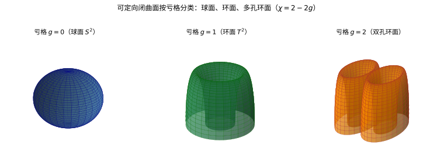
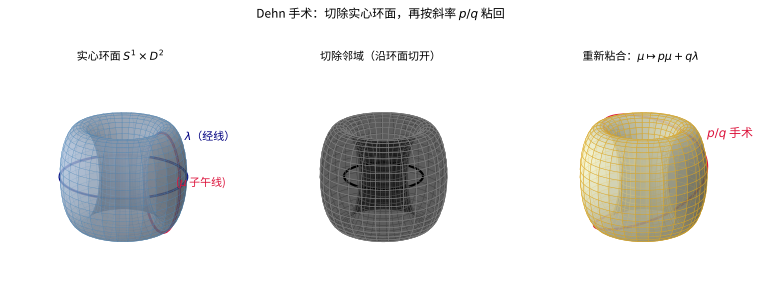

# 第68级：低维拓扑 (Low-Dimensional Topology)

---

## 学习目标

1. 理解三维流形的基本结构及其分解方法，掌握 Heegaard 分解与 Heegaard 图的概念。
2. 掌握三维流形的素数分解定理与 JSJ 分解定理，并能描述其证明思路。
3. 理解 Dehn 手术、Lens 空间、映射环面与 Seifert 纤维空间等构造。
4. 了解 Thurston 几何化猜想与 Perelman 的 Ricci 流证明框架。
5. 了解四维流形的交叉形式与光滑/拓扑分类的基本概念。
6. 了解三维流形的不变量：Casson 不变量与 Floer 同调。

---

## 核心概念

### 1. 三维流形 (3-Manifold)

一个 **三维流形** 是一个豪斯多夫第二可数拓扑空间，其中每一点都有一个邻域同胚于 $\mathbb{R}^3$ 或半空间 $\mathbb{R}^3_+ = \{(x,y,z) \mid z \ge 0\}$（后者对应带边流形）。

### 2. Heegaard 分解与 Heegaard 图

设 $M$ 是一个闭的、可定向的三维流形。一个 **Heegaard 分解** 是一个将 $M$ 分解为两个手柄体的并：

$$M = H_1 \cup_{\Sigma} H_2,$$

其中 $H_1, H_2$ 是亏格为 $g$ 的手柄体，$\Sigma = \partial H_1 = \partial H_2$ 是它们的共同边界，称为 **Heegaard 曲面**。

**Heegaard 图** 是在曲面 $\Sigma$ 上画出的两组简单闭曲线 $\{\alpha_1,\dots,\alpha_g\}$ 和 $\{\beta_1,\dots,\beta_g\}$，分别表示 $H_1$ 和 $H_2$ 的压缩盘在 $\Sigma$ 上的边界。

> **直观理解（现实类比）**：可定向闭曲面就像吹气球或捏陶土——只要不撕裂，表面的"洞数"（亏格 $g$）就决定了它属于哪一类：球面没有洞（$g=0$），甜甜圈有一个洞（$g=1$），再多凿一个洞就是双孔环面（$g=2$）。亏格是"捏不掉"的拓扑不变量的具体体现，数学上用欧拉示性数 $\chi=2-2g$ 来计数。

> **🧠 思考历程：一个世纪的直觉——"低维流形应该能拆成标准零件"——为什么偏偏比高维更难证明？**
>
> 低维拓扑喊了好久"我们应该能给三维流形做出一本总目录"，可真把它做成定理，却比高维（$n\ge5$）艰难得多。Thurston 喊出"几何化"的蓝图，最后还是 Ricci 流把余下的"多面体地球仪"一片片拼齐——这里头藏着低维为何如此"硬"的谜底。
>
> - **高维好"手术"，低维好"捣乱"**。回忆 h-配边与手术理论（第 70 级）为什么在 $\dim\ge 5$ 好使：**维数大了多出"余维空间"，可以做 Whitney 技巧取消交点、消去柄**。可一到三维，既缺"高维的多余空间"，又没有二维那样"简单到能直接用古典工具"——三维被挤在夹缝里，既不够"杂"也不够"纯"。
> - **Thurston 的赌局：把三维流形押在"八种几何"上**（1970s）。无数虚构的三维流形在数学家脑海翻滚，Thurston 大胆预言：**只要把流形沿"球、环面"切开，每块都会配得上八种标准几何之一（$S^3,\mathbb{H}^3,Nil,Sol$ 等）**——给每种"零件"都种上一种恒常几何，等于给流形发了"零件清单"。这个"几何化猜想"承诺了一种极其整洁的"分类"，却像在说"宇宙由八种积木拼成"，连他自己也没能给出完整证明。
> - **Perelman 的收尾：让 Ricci 流自己去"找"那八种零件**（2002-2003）。Ricci 流的本意是"把度量烫平"，可它在三维里常会撞出奇点——Perelman 的妙招，是**不甩掉奇点，反而分析奇点的极限模型，再"手术"切掉，继续流**。最终这些奇点的形态恰好对应 Thurston 的积木（$S^2\times\mathbb{R}$、$\mathbb{H}^3$、Nil、Sol……），"几何化"不再靠猜，而成了定理。**一个直观的"零件清单"猜想，最后由一条不让它失控的微分方程亲手实现**。
> - **心路**：低维拓扑告诉我们：**越是"我们生活的维数"，越埋着最深的反直觉**。三维既不够高到能肆意手术，又不低到能一眼看穿；它逼着数学家用最强的流去直觉勾勒。当你发现看似孤立的"具体问题"总是慢吞吞地拒绝一般方法时，往往正是它要让某个更普遍的理论（Ricci 流、几何化）反过来照亮整条道路。

### 3. 素数分解

一个三维流形 $M$ 称为 **素数** 的，如果它不能分解为两个非平凡流形的连通和 $M \cong M_1 \# M_2$（其中 $M_1, M_2$ 都不是 $S^3$）。

### 4. JSJ 分解

**JSJ 分解**（Jaco-Shalen-Johannson 分解）是将一个不可约的三维流形沿一个本质环面族分解为若干块，每块要么是 Seifert 纤维空间，要么是双曲流形（或 atoroidal 的）。

### 5. 双曲三维流形

一个三维流形称为 **双曲的**，如果它允许一个完备的、有限体积的双曲度量（即曲率为 $-1$ 的黎曼度量）。

### 6. Thurston 几何化猜想

Thurston 几何化猜想断言：每个闭的、可定向的三维流形可以沿球面和环面分解为若干块，每块具有八种标准几何结构之一（$S^3$、$\mathbb{R}^3$、$\mathbb{H}^3$、$S^2 \times \mathbb{R}$、$\mathbb{H}^2 \times \mathbb{R}$、$\widetilde{SL_2\mathbb{R}}$、Nil、Sol）。

### 7. Perelman 定理与 Ricci 流

Perelman 利用 **Ricci 流**：

$$\frac{\partial g}{\partial t} = -2\operatorname{Ric}(g),$$

证明了 Thurston 几何化猜想（从而也证明了 Poincaré 猜想）。Ricci 流通过光滑化度量来使流形分解为几何块。

### 8. Dehn 手术

**Dehn 手术** 是构造三维流形的基本方法：从一个环面边界（如 $S^3$ 中一个结的邻域边界）上切除一个实心环面 $S^1 \times D^2$，然后沿一个不同的同胚重新粘合。

> **直观理解（现实类比）**：Dehn 手术就像把一件衣服的袖口拆开、再旋转一个角度重新缝上。先沿环面边界切除一个实心环面，再按子午线 $\mu$ 映为 $p\mu+q\lambda$ 的规则粘回——旋转的程度由斜率 $p/q$ 决定。如同改针脚能做出不同版型的衣服，不同的手术系数 $p/q$ 能构造出不同的三维流形，甚至所有闭可定向三维流形都能这样生成。

### 9. Lens 空间

**Lens 空间** $L(p,q)$ 是最简单的三维流形之一，可通过 $S^3$ 上的 Dehn 手术得到，其基本群为 $\pi_1(L(p,q)) \cong \mathbb{Z}_p$。

### 10. 映射环面

设 $f: S \to S$ 是曲面的一个自同胚，**映射环面** 定义为：

$$M_f = \frac{S \times [0,1]}{(x,0) \sim (f(x),1)}.$$

### 11. Seifert 纤维空间

**Seifert 纤维空间** 是一个三维流形，配备了一个圆纤维结构，使得每个纤维有一个环面邻域，其中纤维按某种幂次缠绕。

### 12. 四维流形与交叉形式

对于闭的、可定向的四维流形 $M^4$，其 **交叉形式** 是 $H^2(M;\mathbb{Z})$ 上的对称双线性形式：

$$Q(\alpha,\beta) = \langle \alpha \cup \beta, [M] \rangle.$$

交叉形式是四维流形分类的核心不变量。

---

## 定理与证明

### 定理 1：三维流形的素数分解定理

**定理（Kneser-Milnor）**：每个闭的、可定向的、紧致三维流形 $M$ 可以唯一地分解为有限个素数三维流形的连通和：

$$M \cong M_1 \# M_2 \# \cdots \# M_k,$$

其中每个 $M_i$ 是素数流形，且分解在顺序和同胚意义下唯一。

**证明**：

我们将分两步证明：存在性和唯一性。

**第一部分：存在性**

假设 $M$ 不是素数，则存在非平凡分解 $M \cong M_1 \# M_2$。我们对 $M$ 的 **Heegaard 亏格** 进行归纳。

*步骤 1：球面分离*

设 $S \subset M$ 是一个嵌入的二维球面，它将 $M$ 分割为两个部分。如果 $S$ 是 **本质的**（即它不包围一个球体），则 $S$ 给出了一个连通和分解。

*步骤 2：Kneser 的有限性参数*

定义 **Kneser 参数** $k(M)$ 为 $M$ 中不相交的本质球面所分割出的块数的最大值。Kneser 证明了 $k(M)$ 是有限的，因为每个本质球面贡献了 $H_2(M;\mathbb{Z})$ 中的一个非零元，而 $H_2$ 是有限生成的。

*步骤 3：归纳*

若 $M$ 已是素数，则分解平凡。否则，存在一个本质球面 $S$ 将 $M$ 分解为 $M_1 \# M_2$。由于 $k(M_1) < k(M)$ 且 $k(M_2) < k(M)$，由归纳假设，$M_1$ 和 $M_2$ 均可分解为素数流形的连通和。因此 $M$ 也可如此分解。

**第二部分：唯一性**

假设有两种分解：

$$M \cong M_1 \# \cdots \# M_k \cong N_1 \# \cdots \# N_l.$$

*步骤 1：球面移动（Milnor 的技巧）*

设 $S$ 是第二种分解中的分离球面。通过一般位置论证，我们可以将 $S$ 与第一种分解中的球面进行交换，使得 $S$ 与分解球面相交为一个圆盘集合。

*步骤 2：配对论证*

通过分析 $S$ 如何切割第一种分解中的各个 $M_i$，我们可以将每个 $M_i$ 与某个 $N_j$ 配对。关键在于：如果 $S$ 切割 $M_i$，则 $M_i$ 必须是 $S^3$（因为 $S^3$ 是连通和的单位元）。

*步骤 3：归纳消去*

反复应用上述论证，我们得到 $k = l$，且存在一个置换 $\sigma$ 使得 $M_i \cong N_{\sigma(i)}$。

因此，素数分解在重排意义下唯一。$\square$

---

### 定理 2：JSJ 分解定理

**定理（Jaco-Shalen, Johannson）**：设 $M$ 是一个闭的、可定向的、不可约的三维流形。则存在一个 $M$ 中本质环面的有限族 $\mathcal{T} = \{T_1,\dots,T_k\}$，使得沿 $\mathcal{T}$ 切开后得到的每个连通块要么是 Seifert 纤维空间，要么是双曲流形（即 atoroidal 且非 Seifert 纤维的）。而且，这样的环面族在合痕意义下是极小的且唯一的。

**证明**：

**第一部分：存在性**

*步骤 1：特征环面*

定义 **特征环面** 为 $M$ 中所有本质嵌入环面的集合。由于 $M$ 是三维流形，其基本群是有限表示的，可以证明存在一个有限的特征环面集合。

*步骤 2：环面分解*

设 $\mathcal{T}$ 是一个极大本质环面族，使得任何两个环面互不相交且互不平行。沿 $\mathcal{T}$ 切开 $M$：

$$M \setminus \mathcal{T} = \bigcup_{i=1}^n X_i.$$

*步骤 3：分析每个块*

对于每个块 $X_i$，有两种可能：

- $X_i$ 包含一个本质环面，则 $X_i$ 是 Seifert 纤维空间（由 Seifert 纤维空间的结构定理）。
- $X_i$ 不包含本质环面，则 $X_i$ 是 atoroidal 的。由 Thurston 的双曲化定理，$X_i$ 允许一个双曲度量。

**第二部分：唯一性**

*步骤 1：最小性*

设 $\mathcal{T}$ 和 $\mathcal{T}'$ 是两个满足条件的环面族。考虑 $\mathcal{T} \cup \mathcal{T}'$，通过一般位置将其调整为互不相交的集合。

*步骤 2：合痕等价*

使用环面压缩和环面平行性论证，可以证明 $\mathcal{T}$ 和 $\mathcal{T}'$ 在合痕意义下相同。具体地，每个 $\mathcal{T}$ 中的环面要么与某个 $\mathcal{T}'$ 中的环面平行，要么可以被压缩——但这与本质性矛盾。

因此，JSJ 分解是唯一的。$\square$

---

### 定理 3：Lickorish-Wallace 定理

**定理（Lickorish-Wallace）**：每个闭的、可定向的、连通的三维流形 $M$ 都可以通过对 $S^3$ 中的一个链环进行 Dehn 手术得到。

**证明**：

**第一部分：从 Heegaard 分解到 Dehn 手术**

*步骤 1：Heegaard 分解*

取 $M$ 的一个 Heegaard 分解 $M = H_1 \cup_{\Sigma} H_2$，其中 $\Sigma$ 是亏格为 $g$ 的 Heegaard 曲面。

*步骤 2：手柄体上的 Dehn 手术*

每个手柄体 $H_i$ 同胚于 $S^3$ 中移除 $g$ 个不相交的实心环面后的补空间。具体地，我们可以将 $H_1$ 视为 $S^3$ 中一个标准嵌入的亏格 $g$ 手柄体的补。

*步骤 3：Lickorish 的生成元*

Lickorish 证明了曲面 $\Sigma$ 上的每个 Dehn 扭转同胚可以表示为 $S^3$ 中沿某个简单闭曲线的 Dehn 手术。Heegaard 分解的粘合映射可以表示为 Dehn 扭转的复合，因此 $M$ 可以由 Dehn 手术得到。

**第二部分：Wallace 的具体构造**

*步骤 1：嵌入框架链环*

考虑 $S^3$ 中一个 $g$ 分量的链环 $L = \{K_1,\dots,K_g\}$，每个分支 $K_i$ 赋予一个有理数系数 $p_i/q_i$。

*步骤 2：手术过程*

对每个 $K_i$，移除其正则邻域 $N(K_i) \cong S^1 \times D^2$，然后通过映射：

$$\phi_i: \partial N(K_i) \to \partial N(K_i), \quad \phi_i(\mu_i) = p_i \mu_i + q_i \lambda_i,$$

重新粘合，其中 $\mu_i$ 是子午线，$\lambda_i$ 是经线。

*步骤 3：实现所有三维流形*

Lickorish 和 Wallace 独立地证明了，通过适当选择链环 $L$ 和手术系数，可以得到任意闭的可定向三维流形。

**直观理解**：Dehn 手术可以看作是在流形中切除一个实心环面再以不同的方式粘回去。这改变了流形的拓扑结构，并且这种改变足够丰富，可以生成所有三维流形。$\square$

---

### 定理 4：Thurston 双曲分解定理（陈述与证明思路）

**定理（Thurston 双曲化定理）**：设 $M$ 是一个紧致的、可定向的、不可约的、atoroidal 的三维流形，且 $\partial M$ 是一个非空的环面集合。则 $M \setminus \partial M$ 允许一个完备的、有限体积的双曲度量。

**证明思路**：

Thurston 的证明基于 **双曲变形空间** 和 **层叠论证**。

*步骤 1：Haken 流形上的归纳*

Thurston 对 Haken 流形进行归纳。Haken 流形是包含一个不可压缩曲面的三维流形，这个结构允许我们沿曲面切开并用归纳法。

*步骤 2：双曲结构的变形*

设 $M$ 是可分解的，沿一个不可压缩曲面 $S$ 切开得到 $M'$。由归纳假设，$M'$ 有双曲结构。粘合映射的变形参数化为一组 **Fenchel-Nielsen 坐标**。

*步骤 3：层叠论证*

Thurston 的核心洞察是：粘合映射的等距条件转化为一个关于变形参数的方程。通过分析这个方程的解空间，证明了存在一个有限集合的解，其中至少有一个对应着完备的双曲结构。

*步骤 4：双曲变形空间的紧致性*

Thurston 证明了双曲结构空间的某个紧致化，从而确保了解的存在性。这个论证使用了双曲几何中的 Ahlfors-Bers 可测叶状理论。

---

### 定理 5：Perelman 的几何化定理（陈述与证明思路）

**定理（Perelman）**：每个闭的、可定向的三维流形满足 Thurston 几何化猜想。特别地，每个这样的流形可以沿球面和环面分解为八种几何块。

**证明思路**：

Perelman 使用 **Ricci 流** 作为主要工具：

$$\frac{\partial g(t)}{\partial t} = -2\operatorname{Ric}(g(t)), \quad g(0) = g_0.$$

*步骤 1：Ricci 流的奇点分析*

在 Ricci 流下，流形在有限时间内可能产生奇点（曲率趋于无穷）。Perelman 引入了 **手术**（surgery）的概念：在奇点出现时，将高曲率区域切除，用标准几何块替换，然后继续 Ricci 流。

*步骤 2：Perelman 的单调解*

Perelman 发现了三个关键的单调解量：

- **$\mathcal{W}$-泛函**：$\mathcal{W}(g,f,\tau) = \int_M \left(\tau(|\nabla f|^2 + R) + f - n\right)(4\pi\tau)^{-n/2}e^{-f}\,dV$，它在 Ricci 流下单调递增。
- **约化体积**：$\tilde{V}(\tau) = \tau^{-n/2} \int_M e^{-f}\,dV$，也是单调的。
- **$\mu$-泛函**：$\mu(g,\tau) = \inf_f \mathcal{W}(g,f,\tau)$。

这些单调解保证了手术可以在有限时间内进行有限次。

*步骤 3：有限时间内的有限次手术*

Perelman 证明了：在任意有限时间区间内，Ricci 流只需要进行有限次手术。这保证了手术后的 Ricci 流可以在 $[0,\infty)$ 上定义。

*步骤 4：长时间行为*

当 $t \to \infty$ 时，Ricci 流将流形分割为若干块，每块趋于一个标准几何极限。Perelman 分析了这些极限，证明了它们恰好对应 Thurston 的八种几何。

*步骤 5：几何化结论*

最终的极限结构给出了 $M$ 的几何分解：每个块是八种几何之一，且块之间的分割面是球面和环面。这正是几何化猜想的结论。$\square$

---

## 示例

### 示例 1：Lens 空间的构造

Lens 空间 $L(p,q)$ 是最简单的三维流形之一。

**构造 1：通过 Dehn 手术**

在 $S^3$ 中取一个未打结的圆环 $K$（平凡结）。对 $K$ 进行 $p/q$ 的 Dehn 手术，得到的结果就是 $L(p,q)$。

**构造 2：通过商空间**

将 $S^3$ 视为 $S^3 = \{(z_1,z_2) \in \mathbb{C}^2 \mid |z_1|^2 + |z_2|^2 = 1\}$。定义 $\mathbb{Z}_p$ 作用：

$$(z_1,z_2) \mapsto (e^{2\pi i/p}z_1, e^{2\pi i q/p}z_2).$$

则 $L(p,q) = S^3 / \mathbb{Z}_p$。

**性质**：
- $\pi_1(L(p,q)) \cong \mathbb{Z}_p$。
- $L(p,q) \cong L(p,q')$ 当且仅当 $q \equiv \pm q^{\pm 1} \pmod{p}$。
- $L(p,q)$ 是 Lens 空间，当 $p=2$ 时，$L(2,1) \cong \mathbb{RP}^3$。

### 示例 2：Dehn 手术示例

**示例：Poincaré 同调球面的构造**

Poincaré 同调球面（也称为 Poincaré 十二面体空间）可以通过对 $S^3$ 中一个 $(2,3,5)$-环面结进行 Dehn 手术得到。

具体地，设 $K$ 是 $S^3$ 中的 $(2,3,5)$-环面结。对 $K$ 进行系数为 $1/1$ 的 Dehn 手术，得到 $-\Sigma(2,3,5)$，即 Poincaré 同调球面。

**重要性质**：
- $H_1(\Sigma(2,3,5);\mathbb{Z}) = 0$（它是同调球面）。
- $\pi_1(\Sigma(2,3,5))$ 是二元二十面体群，阶为 $120$。
- 它是 $S^3$ 的一个正确覆盖空间的唯一非平凡例子。

---

## 习题

### 基础题

**习题 1**（曲面分类）写出可定向闭曲面的欧拉示性数公式，并据此得出亏格 $g$ 与示性数 $\chi$ 的一一对应关系。

**习题 2**（曲面分类）解释为什么球面 $S^2$ 的亏格为 $0$ 而环面 $T^2$ 的亏格为 $1$，并说明它们为何不同胚。

**习题 3**（曲面分类）计算 $S^2$、$T^2$ 与双孔环面 $\Sigma_2$ 的欧拉示性数分别是多少。

**习题 4**（曲面分类）可定向闭曲面 $S$ 满足 $H_1(S;\mathbb{Z})$ 的秩为 $4$。求 $S$ 的亏格。

**习题 5**（曲面分类）叙述可定向闭曲面的分类定理，即两曲面同胚的充要条件。

**习题 6**（曲面分类）求带 $b$ 条边界的可定向曲面 $\Sigma_{g,b}$ 的欧拉示性数。

**习题 7**（曲面分类）计算 $n$ 个射影平面连通和 $\mathbb{RP}^2 \# \cdots \# \mathbb{RP}^2$ 的欧拉示性数。

**习题 8**（曲面分类）一个闭曲面 $\chi = -2$，它可能是哪种曲面？给出它的亏格。

**习题 9**（曲面分类）说明可定向性为何是曲面分类中的一个不变量，并举出可定向与不可定向曲面的例子。

**习题 10**（曲面分类）证明 $S^2$ 上任意简单闭曲线都分离曲面。

**习题 11**（曲面分类）计算超环面（genus-3 曲面）$\Sigma_3$ 的第一同调群的秩。

**习题 12**（曲面分类）求两个环面 $T^2 \# T^2$ 连通和的基本群与亏格。

**习题 13**（曲面分类）解释何为曲面的"压缩曲线"，并用亏格判断球面上的曲线是否可压缩。

**习题 14**（曲面分类）求 Mobius 带的欧拉示性数及其中心曲线的性质。

**习题 15**（曲面分类）叙述 $\mathbb{RP}^2$ 的三种等价构造（商圆盘、球面对径、Mobius 带粘合）。

**习题 16**（三角/多面体分解）解释"三角形的三角剖分"（triangulation）的含义，并说明曲面为何总有三角剖分。

**习题 17**（三角/多面体分解）用欧拉公式 $V-E+F=2$ 验证 $S^2$ 上一个四面体三角剖分的顶点、棱、面数目。

**习题 18**（三角/多面体分解）给出 $S^2$ 的一个三角剖分并说明其欧拉示性数为 $2$。

**习题 19**（三角/多面体分解）说明三角剖分与 CW 复形结构之间的关系。

**习题 20**（三角/多面体分解）解释可定向闭曲面的多面体构造为何等价于其三角剖分。

**习题 21**（三角/多面体分解）把正方形按 $(x,0)\sim(x,1)$ 与 $(0,y)\sim(1,y)$ 粘合，判断所得曲面类型。

**习题 22**（三角/多面体分解）把八边形按对应的对边方向粘合（标准格式 $a_1a_2a_3a_4a_1^{-1}...$），识别所得曲面。

**习题 23**（三角/多面体分解）计算由单词 $aba^{-1}b^{-1}$ 描述的多边形粘合所得曲面的欧拉示性数与类型。

**习题 24**（三角/多面体分解）解释曲面定位定向（orienting）对三角剖分上循环方向的限制。

**习题 25**（三角/多面体分解）用三角剖分计算环面 $T^2$ 的欧拉示性数，得到 $0$。

**习题 26**（CW complex）列出 CW 复形定义中的三个条件（骨架分层、胞腔粘附、弱拓扑）。

**习题 27**（CW complex）给出单位圆盘 $D^n$ 作为一个 CW 复形的胞腔分解。

**习题 28**（CW complex）给出球面 $S^n$ 的标准 CW 结构（两个胞腔）。

**习题 29**（CW complex）$S^1 \times S^1$ 的 CW 结构有 $1$ 个 0 胞腔、$2$ 个 1 胞腔和 $1$ 个 2 胞腔。据此写出其胞腔链复形。

**习题 30**（链复形）解释为何胞腔链复形是自由的，并写出其微分算子的一般形式。

**习题 31**（链复形）计算 $T^2$ 胞腔链复形的同调群。

**习题 32**（链复形）说明 $H_0$ 的秩与连通分量数的关系。

**习题 33**（链复形）复曲面 $\mathbb{RP}^2$ 的胞腔链复形微分在 2 阶为 $1+1=2$，据此计算 $H_1$ 与 $H_2$。

**习题 34**（链复形）解释 $H_n$ 为 $0$ 的几何含义（无 $n$ 维"洞"）。

**习题 35**（链复形）用祖师公式计算 $\Sigma_2$ 的 $H_1$ 的秩。

**习题 36**（链复形）解释上同调与同调的关系（泛系数定理的直观版本）。

**习题 37**（CW complex）给出 $\mathbb{RP}^n$ 的标准 CW 结构（每维一个胞腔）。

**习题 38**（链复形）计算 $S^n$ 的同调群。

**习题 39**（链复形）说明 $H_1$ 与基本群 $\pi_1$ 的阿贝尔化的关系。

**习题 40**（链复形）解释为什么 $S^2 \times S^1$ 与 $\Sigma_2$ 有相同的 $H_1$ 秩。

**习题 41**（三维流形与基本群）写出 $S^3$ 的基本群。

**习题 42**（三维流形与基本群）写出 $S^2 \times S^1$ 的基本群。

**习题 43**（三维流形与基本群）写出实射影空间 $\mathbb{RP}^3$ 的基本群。

**习题 44**（三维流形与基本群）解释何为三维流形上的 Heegaard 亏格。

**习题 45**（三维流形与基本群）求 $L(p,q)$ 的第一同调群。

**习题 46**（三维流形与基本群）同调球面定义中 $H_1=0$ 与 $\pi_1$ 普通之间的区别是什么？

**习题 47**（三维流形与基本群）写出 Poincaré 同调球面 $\Sigma(2,3,5)$ 基本群的阶。

**习题 48**（三维流形与基本群）解释连通和 $M_1 \# M_2$ 对基本群的作用（自由积）。

**习题 49**（三维流形与基本群）判断 $S^2 \times S^1$ 是否为不可约流形。

**习题 50**（三维流形与基本群）解释"不可压缩曲面"在三维流形中的含义。

**习题 51**（三维流形与基本群）写出环面 $T^2$ 的基本群。

**习题 52**（三维流形与基本群）用 Seifert-van Kampen 定理计算 $S^3$ 中两个实心环体沿边界粘合所得的基本群。

**习题 53**（三维流形与基本群）判断 $L(2,1)$ 同胚于哪个熟悉流形。

**习题 54**（三维流形与基本群）解释为何 $\mathbb{RP}^3$ 不可分割为连通和。

**习题 55**（三维流形与基本群）写出 $\mathbb{RP}^3$ 的 Heegaard 亏格。

**习题 56**（覆盖空间）叙述覆盖空间的定义及解构。

**习题 57**（覆盖空间）$S^1$ 的 $n$ 重覆盖空间是什么？其基本群指数为多少？

**习题 58**（覆盖空间）解释覆盖空间与基本群子群之间的一一对应（Galois 对应）。

**习题 59**（覆盖空间）$T^2$ 的单连通覆盖空间是什么？

**习题 60**（覆盖空间）解释同调球面的普遍覆盖为何重要。

**习题 61**（覆盖空间）求 $S^2$ 的普遍覆盖空间。

**习题 62**（覆盖空间）设 $p:\tilde X\to X$ 为覆盖映射，说明 $X$ 的每一点的纤维的大小。

**习题 63**（覆盖空间）解释覆盖变换群作用的自由性。

**习题 64**（覆盖空间）$\mathbb{RP}^3$ 的二重覆盖是谁？

**习题 65**（覆盖空间）说明为何 $T^2$ 的普遍覆盖是 $\mathbb{R}^2$。

**习题 66**（Heegaard 分解与图）给出 $S^3$ 的亏格 $0$ Heegaard 分解。

**习题 67**（Heegaard 分解与图）给出 $S^2\times S^1$ 的亏格 $1$ Heegaard 分解。

**习题 68**（Heegaard 分解与图）解释何谓 Heegaard 曲面 $\Sigma$ 上的压缩曲线组。

**习题 69**（Heegaard 分解与图）Heegaard 图中两组曲线 $\{\alpha_i\}$ 与 $\{\beta_i\}$ 各自的个数与亏格有何关系？

**习题 70**（Heegaard 分解与图）从 Heegaard 图重构流形的方法是什么（先构造 $H_1$ 再沿粘合 $H_2$）？

**习题 71**（Heegaard 分解与图）写出 $\mathbb{RP}^3$ 的一个亏格 $1$ Heegaard 分解。

**习题 72**（Heegaard 分解与图）任何闭可定向三维流形都有 Heegaard 分解，这一事实属于哪个经典定理？

**习题 73**（Heegaard 分解与图）亏格为 $g$ 的 Heegaard 分解对应的 Heegaard 曲面亏格是什么？

**习题 74**（Heegaard 分解与图）解释为何 Heegaard 分解中 $H_1, H_2$ 是同胚的手柄体。

**习题 75**（Heegaard 分解与图）说出极小 Heegaard 亏格等于 $0$ 的三维流形。

**习题 76**（Dehn 手术）解释 Dehn 手术的基本步骤（切除实心环面并粘合）。

**习题 77**（Dehn 手术）对平凡结做 $p/q$ 手术得到什么流形？

**习题 78**（Dehn 手术）写出子午线 $\mu$ 与经线 $\lambda$ 的整数系数关系式。

**习题 79**（Dehn 手术）对平凡结做 $1/1$ 手术得到什么？

**习题 80**（Dehn 手术）Dehn 手术系数为 $\infty$（即无理数）时表示"空手术"，结果如何？

**习题 81**（Dehn 手术）解释手术斜率 $p/q$ 中 $q=0$ 时的含义。

**习题 82**（Dehn 手术）Lens 空间 $L(p,q)$ 的 $0$ 手术对应哪个流形？

**习题 83**（Dehn 手术）$S^3$ 是什么？解释 $S^3$ 上任何手术的"平凡"基数据。

**习题 84**（Dehn 手术）用 Dehn 手术构造 $\mathbb{RP}^3$。

**习题 85**（Dehn 手术）解释为何 Dehn 手术只改变流形的"内部"而不改变边界。

**习题 86**（映射环面/Seifert）写出环面的映射环面 $M_f$ 的定义构造。

**习题 87**（映射环面/Seifert）$f=\mathrm{id}$ 时映射环面 $M_{id}$ 是什么流形？

**习题 88**（映射环面/Seifert）$f$ 是 Diffeomorphism 时 $M_f$ 的纤维是什么？

**习题 89**（映射环面/Seifert）解释 Seifert 纤维空间的一般构造。

**习题 90**（映射环面/Seifert）$S^1$-丛（圆丛）的最简单例子是什么三维流形？

**习题 91**（映射环面/Seifert）$\mathrm{SL}(2,\mathbb{R})$ 在映射环面中的角色是什么？

**习题 92**（映射环面/Seifert）解释 $M_f$ 的双曲性（Anosov 情形）与 $f$ 的特征值的关系。

**习题 93**（Thurston 八种几何）列出 Thurston 八种几何的名单。

**习题 94**（Thurston 八种几何）$\mathbb{H}^3$ 对应的齐次几何对应哪个负曲率情形？

**习题 95**（Thurston 八种几何）$S^2\times\mathbb{R}$ 与 $\mathbb{H}^2\times\mathbb{R}$ 分别对应哪种分解？

**习题 96**（Thurston 八种几何）解释 Sol 几何与双曲几何有何不同。

**习题 97**（Ricci 流/几何化）写出归一化 Ricci 流方程。

**习题 98**（Ricci 流/几何化）Ricci 流在圆几何中的奇点对症是什么？

**习题 99**（Ricci 流/几何化）解释为何 Ricci 流会"光滑化"度量。

**习题 100**（Ricci 流/几何化）几何化猜想对 $H_1=0$ 且 $\pi_1$ 平凡的三维流形给出什么结论（Poincaré 猜想）？

### 进阶题

**习题 101**（曲面分类）用分类定理求出连通可定向曲面 $\Sigma$ 使 $\chi=2-2g=0$ 的所有可能。

**习题 102**（链复形）计算 $S^n$ 的约化同调群。

**习题 103**（链复形）用胞腔链复形计算 $\mathbb{RP}^2$ 的全部同调 $H_0,H_1,H_2$。

**习题 104**（链复形）计算 $\mathbb{RP}^3$ 的同调。

**习题 105**（CW complex）给出 $S^1\vee S^1$（两个圆周的楔和）的 CW 结构并计算其同调。

**习题 106**（链复形）叙述与证明例子：$H_1(S^1\times S^1)$ 由两条生成子给出。

**习题 107**（链复形）计算 $S^2\times S^1$ 的同调。

**习题 108**（三角/多面体分解）用 Delunay 三角剖分构造环面的三角剖分并计算 Euler 数。

**习题 109**（三角/多面体分解）证明任意三角剖分下欧拉示性数不变。

**习题 110**（映射类群）解释曲面映射类群 $\mathrm{Mod}(\Sigma_g)$ 的定义。

**习题 111**（映射类群）写出环面映射类群 $\mathrm{Mod}(T^2)$ 与 $\mathrm{SL}(2,\mathbb{Z})$ 的关系。

**习题 112**（映射类群）解释 Dehn 扭转在映射类群中的角色（生成元）。

**习题 113**（映射类群）两个 Dehn 扭转可能何时一致？

**习题 114**（映射类群）稀释 Dehn 扭转与 Kazhdan 性质的关系简述。

**习题 115**（映射类群）映射类群作用于 $\mathbb{H}^2$ 上的何种结构使得它有双曲几何解释？

**习题 116**（映射类群）解释曲线复形 $C(\Sigma)$ 的定义。

**习题 117**（映射类群）Pseudo-Anosov 映射类群的定义与稀性。

**习题 118**（映射类群）$\mathrm{Mod}(\Sigma)$ 中有有限阶元素，举例。

**习题 119**（映射类群）解释 moduli space 与映射类群的关系。

**习题 120**（映射类群）计算 $\mathrm{Mod}(S^2)$ 与 $\mathrm{Mod}(S^2, \text{3 pts})$ 的一个关系。

**习题 121**（线丛）解释线丛与圆丛的等价性。

**习题 122**（线丛）$S^2$ 上的线丛分类由 什么给出（$\mathbb{Z}$，对应 Euler 数）？

**习题 123**（谱边界）用线性代数理解 $\mathrm{SL}(2,\mathbb{Z})$ 的轨迹。

**习题 124**（双曲几何）解释双曲平面 $\mathbb{H}^2$ 的模型（上半平面）。

**习题 125**（双曲几何）$\mathbb{H}^3$ 的等距类。

**习题 126**（Heegaard）用 Heegaard 分解证明 $S^3$ 的 Heegaard 亏格为 $0$ 且为最低。

**习题 127**（Heegaard）构造 $L(p,q)$ 的亏格 $1$ Heegaard 分解并解释粘合矩阵。

**习题 128**（Heegaard）Heegaard 分解唯一吗？给出不同亏格的例子。

**习题 129**（Heegaard）解释 Heegaard 图如何编码流形的页确测度。

**习题 130**（Heegaard）定义 Heegaard 距离并概述为何难计算。

**习题 131**（Dehn 手术）证明 $p/q$ 手术与 $\infty$ 手术的等价性（分数约分）。

**习题 132**（Dehn 手术）解释 surgery 不变量（Kirby 微筭）如何区分不同手术。

**习题 133**（Dehn 手术）用 Dehn 手术构造 $S^3$ 的平凡手术数据。

**习题 134**（Dehn 手术）对 K 做 0 手术得到何种流形与 K 的环面包有关。

**习题 135**（Dehn 手术）用 Kirby 微筭解释 handle-slide 操作。

**习题 136**（三维流形）证明 $S^2\times S^1$ 不可约（用基本群）。

**习题 137**（三维流形）解释素数分解定理中的"第一个因子"（$M_1$）的选取。

**习题 138**（三维流形）叙述并举例 JSJ 分解应用到 Seifert 流形。

**习题 139**（覆盖空间）解释 $L(p,q)$ 的普遍覆盖。

**习题 140**（覆盖空间）用覆盖空间观点说明 $H_1$ 与 $\pi_1$ 的关系（阿贝尔化）。

**习题 141**（覆盖空间）解释 $S^3/\mathbb{Z}_p$ 覆盖 $L(p,q)$。

**习题 142**（覆盖空间）用覆盖空间技术证明 $\mathbb{RP}^3$ 是 $S^3$ 的二重覆盖。

**习题 143**（Ricci 流）解释为什么 Ricci 流保持维数但改变度量。

**习题 144**（Ricci 流）归一化 Ricci 流的固定点是 Einstein 度量。

**习题 145**（Ricci 流）解释 $\mathcal{W}$-泛函的意义。

**习题 146**（几何化）八种几何对应的"基本群类型"各是什么？

**习题 147**（几何化）解释为什么 Nil 与 Sol 都来自幂零/可解李群。

**习题 148**（几何化）几何化与 Poincaré 猜想的关系。

**习题 149**（映射类群）用矩阵表示 $T^2$ 上的 Dehn 扭转并写出行列式。

**习题 150**（映射类群）计算两 Dehn 扭转的 braid 关系。

**习题 151**（线丛）解释 $S^2\times S^1$ 的线丛与 $\mathbb{Z}$分类。

**习题 152**（谱）$\mathrm{SL}(2,\mathbb{Z})$ 中 trace 的范围。

**习题 153**（双曲）$\mathbb{H}^3/SL(2,\mathbb{C})$ 的紧性与体积。

**习题 154**（Heegaard）解释 Heegaard 距离与不可约性。

**习题 155**（Heegaard）给出 $S^3$ 的亏格 $1$ 人工分解（虽然高于最低）。

**习题 156**（Heegaard）稳定化：两个 Heegaard 分解何时稳定同构。

**习题 157**（Dehn 手术）说明 Lickorish-Wallace 定理陈述。

**习题 158**（Dehn 手术）对任意闭流形，用 Heegaard 分解构造 Dehn 手术。

**习题 159**（Dehn 手术）解释手术的 Kirby 表示与 handle 分解关系。

**习题 160**（Dehn 手术）用 Rolfsen 手术符号表示正弦。

**习题 161**（三维流形）解释 Seifert 纤维空间的基本群生成。

**习题 162**（三维流形）定义 Hatcher 或者 JSJ 的 atoroidal。

**习题 163**（三维流形）证明 $L(3,1)$ 与 $L(3,2)$ 同胚。

**习题 164**（三维流形）解释 $L(p,q)$ 的同胚判定。

**习题 165**（覆盖空间）解释为何 $S^2$ 的普遍覆盖是自身。

**习题 166**（覆盖空间）用覆盖空间解释 $H_1$ 的秩（第一 Betti 数）为何是拓扑不变量。

**习题 167**（覆盖空间）解释自由积与覆盖空间的关系。

**习题 168**（Ricci 流）奇点形成时曲率的性质。

**习题 169**（Ricci 流）解释 Perelman 的约化体积。

**习题 170**（几何化）解释曲面上的几何化（Teichmüller 理论）。

**习题 171**（几何化）解释为什么几何化给出"混合"流通。

**习题 172**（几何化）$\mathrm{Sol}$ 流形的例子（Anosov 映射环面）。

**习题 173**（映射类群）解释 Nielsen-Thurston 分类。

**习题 174**（映射类群）解释映射度（degree）与 Nielsen 数之间的关联。

**习题 175**（线丛）Euler 数与 $\mathbb{C}P^1$。

**习题 176**（线丛）解释一般紧流形上线丛的分类如何由 $H^2(X;\mathbb{Z})$ 给出。

**习题 177**（双曲）解释负曲率几何中测地线在局部坐标下的指数发散性质。

**习题 178**（双曲）解释 hyperelliptic 曲面与 $\mathbb{H}^2$ 的关系。

**习题 179**（映射类群）解释映射类群到 $\mathbb{Z}/2$ 的符号同态（sign homomorphism）。

**习题 180**（映射类群）关系群与 $\mathrm{Mod}$。

**习题 181**（Heegaard）解释 Heegaard 图与接合。

**习题 182**（Heegaard）解释为何 Heegaard 分解可沿曲线稳定化。

**习题 183**（三维流形）解释 why $\mathbb{RP}^3$ 是不可约的。

**习题 184**（三维流形）解释 $S^3$ 的 prime 分解。

**习题 185**（覆盖空间）解释覆盖变换群。

**习题 186**（覆盖空间）解释 $\pi_1$ 的子群对应覆盖。

**习题 187**（Ricci 流）解释为什么 1 维曲面 Ricci 流自动均匀化。

**习题 188**（几何化）几何化的八种几何之与有限覆盖的关系。

**习题 189**（几何化）解释为什么 Nil 几何是 finitely covered 的映射环面？

**习题 190**（几何化）综合：用几何化框架描述任意 3 流形的骤降。

### 挑战题

**习题 191**（曲面分类）证明可定向闭曲面的分类定理（构造性，用多边形模型）。

**习题 192**（曲面分类）给出 $\mathbb{RP}^2$ 的正则四边形模型并证明它不可定向。

**习题 193**（曲面分类）证明非可定向闭曲面分类定理。

**习题 194**（曲面分类）用三角剖分计算任意紧曲面的欧拉示性数以证明分类。

**习题 195**（三角/多面体分解）证明任何紧曲面都有有限三角剖分。

**习题 196**（CW complex）证明 CW 复形的同调与三角剖分（若存在）同调一致（胞腔同调定理）。

**习题 197**（链复形）用 Mayer-Vietoris 证明 $S^2\vee S^1$ 的同调。

**习题 198**（链复形）证明 $H_1$ 是 $\pi_1$ 的阿贝尔化。

**习题 199**（链复形）用归约证明 $S^1\times S^1\sim S^\infty$。

**习题 200**（Heegaard）证明任何闭可定向 3 流形存在 Heegaard 分解（存在性）。

**习题 201**（Heegaard）证明 Heegaard 分解的稳定化公理（任何两个沿曲线稳定化后相同）。

**习题 202**（Heegaard）用 Heegaard 图计算 $L(p,q)$ 的基本群并验证 $\mathbb{Z}_p$。

**习题 203**（Heegaard）定义并计算 $S^3$ 的最小 Heegaard 亏格。

**习题 204**（Dehn 手术）证明 Lickorish 定理：沿曲线 Dehn 扭转生成映射类群。

**习题 205**（Dehn 手术）用 surgery 构造 Poincaré 同调球面 $\Sigma(2,3,5)$。

**习题 206**（Dehn 手术）证明 $S^3$ 上的 Kirby 公式。

**习题 207**（Dehn 手术）证明 Kirby moves 保持流形不变。

**习题 208**（三维流形）证明素数分解定理（存在性，Kneser）。

**习题 209**（三维流形）证明素数分解定理（唯一性，Milnor）。

**习题 210**（三维流形）证明 JSJ 分解的存在性（用特征环面）。

**习题 211**（覆盖空间）用覆盖空间构造 $L(p,q)$ 的普遍覆盖 $S^3$。

**习题 212**（覆盖空间）证明 $\mathbb{RP}^n$ 的覆盖。

**习题 213**（覆盖空间）证明任何三维流形的普遍覆盖要么 $S^3$，要么 $\mathbb{R}^3$，要么 $S^2\times\mathbb{R}$（几何化）。

**习题 214**（Ricci 流）推导 Ricci 流下体积的变化公式。

**习题 215**（Ricci 流）解释 $\mathcal{W}$ 泛函单调性的直观证明断言。

**习题 216**（Ricci 流）解释奇点分析中"chebyshev-type"标度。

**习题 217**（几何化）用几何化说明 Poincaré 猜想的等价形式。

**习题 218**（几何化）证明 Seifert 流形满足几何化。

**习题 219**（几何化）解释双曲流形的体积是拓扑不变量。

**习题 220**（映射类群）证明映射类群有限生成。

**习题 221**（映射类群）证明 $\mathrm{Mod}(T^2)=\mathrm{SL}(2,\mathbb{Z})$。

**习题 222**（映射类群）证明 Dehn 扭转的生在 $\mathrm{Mod}$ 中。

**习题 223**（映射类群）证明 Pseudo-Anosov 的存在（例如用矩阵）。

**习题 224**（映射类群）证明 Nielsen-Thurston 分类的三个情形。

**习题 225**（线丛）分类 $S^2$ 上的线丛并用 Euler 数。

**习题 226**（线丛）证明 $\pi_1(S^1)$ 与覆盖对应给出分类。

**习题 227**（双曲）计算 $\mathbb{H}^2$ Klein 模座的体积公式推导。

**习题 228**（三角/多面体分解）证明任何多面体三角剖分的 Euler 型。

**习题 229**（CW complex）证明 CW 径向投影同伦等价。

**习题 230**（链复形）证明自由链的 Hurewicz 同态。

**习题 231**（Heegaard）定义 Heegaard 距离并证明其 ≥1。

**习题 232**（Heegaard）计算给定具体 Heegaard 图所对应的 Heegaard 距离。

**习题 233**（Heegaard）解释为何 Heegaard 距离难算（Alan Reid）。

**习题 234**（Dehn 手术）证明 Lickorish-Wallace 用 surgery 实现所有 3 流形。

**习题 235**（Dehn 手术）证明 surgery 的 Rolfsen 公式。

**习题 236**（三维流形）证明不可约性蕴含素数性。

**习题 237**（三维流形）举出素数但不可约的例子（如 $S^2\times S^1$）。

**习题 238**（三维流形）证明 $L(p,q)$ 的 primeness。

**习题 239**（覆盖空间）证明覆盖空间提升定理。

**习题 240**（覆盖空间）证明主导覆盖 lift 的判别。

**习题 241**（Ricci 流）推导恒定曲率空间中 Ricci 流的解。

**习题 242**（Ricci 流）解释奇点的"手术"步骤。

**习题 243**（Ricci 流）解释为何手术有限多次。

**习题 244**（几何化）陈述几何化定理全部条款。

**习题 245**（几何化）解释 mixed 流形。

**习题 246**（几何化）证明 Sol 流形的几何化实例。

**习题 247**（映射类群）证明映射类群的生成元：$S^2$ 对称。

**习题 248**（映射类群）计算环面上一个线性映射的 Nielsen 数。

**习题 249**（映射类群）讨论映射类为周期型（periodic）时的群论刻画。

**习题 250**（线丛）$S^3$ 上的圆丛。

**习题 251**（线丛）Seifert 作为线丛的推广。

**习题 252**（双曲）解释曲面双曲几何化的映射类群作用。

**习题 253**（三角/多面体分解）证明 n 个射影平面的连通和的三角剖分。

**习题 254**（CW complex）证明 $S^n$ 的 CW 同调。

**习题 255**（链复形）证明 $\mathbb{RP}^2$ 的约化同调为 $\mathbb{Z}/2$。

**习题 256**（Heegaard）证明 $S^3$ 是唯一亏格 0 的流形。

**习题 257**（Heegaard）解释 why handle slide 保持。

**习题 258**（Dehn 手术）解释为什么 0 手术给出 Seifert。

**习题 259**（Dehn 手术）解释 Kirby 微筭与 handle-slide 等价。

**习题 260**（综合）用 Heegaard 分解与 surgery 对齐解释为何 3-流形可被编码为图。

### 探究题

**习题 261**（几何化）几何化猜想被证明后，仍有哪些开放问题关于双曲流形的体积谱？

**习题 262**（几何化）讨论流形上群的紧致性猜想的现状。

**习题 263**（几何化）讨论数值不变量与 Thurston 量的关系。

**习题 264**（Ricci 流）讨论 Ricci 流光滑态中的无穷奇点结构。

**习题 265**（Ricci 流）Perelman 证明中哪些引理仍被质疑。

**习题 266**（Dehn 手术）讨论哪些手术结果仍无 Heegard 起点的理解。

**习题 267**（Dehn 手术）讨论 surgery 与 4-流形交叉形式的结合。

**习题 268**（映射类群）讨论映射类群的外自同构。

**习题 269**（映射类群）讨论映射类群外自同构问题的研究现状。

**习题 270**（映射类群）讨论 $\mathrm{Mod}$ 的同调性。

**习题 271**（映射类群）讨论 Pseudo-Anosov 的扩张因子分布。

**习题 272**（曲面分类）讨论曲面上嵌入圆的分类。

**习题 273**（Heegaard）讨论 Heegaard 距离最大下界问题。

**习题 274**（Heegaard）讨论 Heegaard 分解的稳定性与不可约性的关系。

**习题 275**（Heegaard）讨论 minimal genus 不可由算法计算。

**习题 276**（三维流形）讨论 JSJ 分解与几何化的福利。

**习题 277**（三维流形）讨论三维流形的基本群残有限性。

**习题 278**（三维流形）讨论同调球面的罕见性。

**习题 279**（三维流形）讨论手术理论与双曲体积的数值。

**习题 280**（三角/多面体分解）讨论最小三角形数问题。

**习题 281**（CW complex）讨论同伦型的最小胞腔数。

**习题 282**（链复形）讨论调约同调与图论。

**习题 283**（覆盖空间）讨论覆盖与 Galois 理论。

**习题 284**（覆盖空间）讨论非正义覆盖与阵营猜想。

**习题 285**（双曲）讨论 $\mathbb{H}^3$ 的体积紧逼。

**习题 286**（双曲）讨论双曲三维流形中测地线（闭测地线）的分布问题。

**习题 287**（Seifert）讨论 Seifert 流形的分类完成度。

**习题 288**（Seifert）讨论 $\mathrm{Nil}$ 几何的物理应用。

**习题 289**（几何化）讨论几何化在四流形上的推广可能。

**习题 290**（几何化）讨论八种几何之间的退化链。

**习题 291**（Ricci 流）讨论曲率下界缺失下的 Ricci 流。

**习题 292**（Ricci 流）讨论 Kähler 版的几何化。

**习题 293**（Kirby 微筭）讨论 4-维 surgery 的分类未决。

**习题 294**（Kirby 微筭）讨论光滑不可判定性。

**习题 295**（映射类群）讨论决定问题（word problem）。

**习题 296**（映射类群）讨论 $\mathrm{Mod}$ 的正则余测度。

**习题 297**（线丛）讨论高维线丛分类。

**习题 298**（线丛）讨论 Chern 类与线丛。

**习题 299**（综合）比较手术、Heegaard 与几何化的能力。

**习题 300**（综合）为该级别设计一份未来研究路线图。

---

## 习题答案与解析

### 基础题答案

1. 可定向闭曲面的欧拉示性数为 $\chi=2-2g$，其中 $g$ 为亏格；由 $\chi$ 即可反解 $g=(2-\chi)/2$，故形成一一对应。
2. $S^2$ 无洞（$g=0$），$T^2$ 有一个洞（$g=1$）；分类定理断言 $g$ 不同则不同胚。
3. $\chi(S^2)=2$，$\chi(T^2)=0$，$\chi(\Sigma_2)=2-4=-2$。
4. $H_1$ 的秩为 $2g$，故 $2g=4$，$g=2$。
5. 两闭曲面同胚当且仅当它们同为可定向（或同为不可定向）且欧拉示性数（亏格）相等。
6. $\chi(\Sigma_{g,b})=2-2g-b$。
7. $n$ 个 $\mathbb{RP}^2$ 的连通和，每周一个单位元贡献 $1$，故 $\chi=2-n$。
8. $2-2g=-2$ 得 $g=2$，即双孔环面 $\Sigma_2$。
9. 可定向性被同胚保持；例：可定向为 $T^2$，不可定向为 $\mathbb{RP}^2$ 或 Klein 瓶。
10. $S^2$ 上的任何简单闭曲线经 Jordan 曲线定理把 $S^2$ 分为两个圆盘，故分离曲面。
11. 秩为 $2g=6$。
12. 亏格为 $2$，基本群为 $\mathbb{Z}^2 \ast \mathbb{Z}^2$（由自由积）……实为 $\pi_1=\langle a,b,c,d \mid [a,b][c,d]=1\rangle$。
13. 可压缩曲线是在曲面内可缩到一点的简单闭曲线；$S^2$ 上任意曲线都可压缩。
14. Mobius 带 $\chi=1$，中心曲线是本质曲线。
15. 若按商圆盘边界对径识别、球面对径、或 Mobius 带沿圆周粘圆盘，均得 $\mathbb{RP}^2$。
16. 三角剖分是将曲面分割成二维单形（三角形），并满足规范规则；紧曲面总有有限三角剖分。
17. 四面体：$V=4,E=6,F=4$，$V-E+F=2$。正确。
18. 例如八个三角形构成八面体，$\chi=6-12+8=2$。
19. 三角剖分是一种特殊的 CW 分解，胞腔为单形，粘附映射为边的对合。
20. 多面体构造与三角剖分是同一对象的两种描述，相互诱导。
21. 按该规则粘合得到环面 $T^2$。
22. 标准正八边形粘合得到亏格 $2$ 曲面（超环面 $\Sigma_2$）。
23. 该单词对应环面 $T^2$（群为 $\mathbb{Z}^2$）。
24. 定向对三角剖分提出各三角形取向一致，保证循环方向正确。
25. 用四个三角形注意顶点与棱的 gluing 计数，得 $\chi=0$。
26. 骨架过滤、胞腔粘附映射、弱拓扑（及 CW 条件）。
27. $D^n$ 由单个 $n$ 胞腔（加 $D^{n-1}$）粘成一个 0 骨架上的收缩。
28. $S^n$ 有一个 $0$ 胞腔和一个 $n$ 胞腔。
29. 链复形：$C_2=\mathbb{Z}$, $C_1=\mathbb{Z}^2$, $C_0=\mathbb{Z}$，微分由积分给出。
30. 每个胞腔给出自由生成元；微分系数由粘附映射的度决定。
31. $H_0=\mathbb{Z}$, $H_1=\mathbb{Z}^2$, $H_2=\mathbb{Z}$。
32. $\mathrm{rank}\,H_0$ 等于连通分量个数。
33. $H_1=\mathbb{Z}/2$, $H_2=0$, $H_0=\mathbb{Z}$。
34. $H_n=0$ 意味着没有 $n$ 维循环不被边界覆盖，即无 $n$ 维"洞"。
35. $\chi=2-2g=-2$，又 $\chi=b_0-b_1+b_2=1-b_1+1$，故 $b_1=4$，即 $H_1$ 秩 $4$。
36. 上同调由同调经泛系数定理得到，含 $H^n = \mathrm{Hom}(H_n,\mathbb{Z}) \oplus \mathrm{Ext}$。
37. $\mathbb{RP}^n$ 每维一个胞腔；微分 $\times 2$（或 $\times 0$）。
38. $H_0=H_n=\mathbb{Z}$，其余为 $0$。
39. $H_1$ 是 $\pi_1$ 的阿贝尔化。
40. 两者 $H_1$ 秩均为 $1$（因为同论等价）。
41. $\pi_1(S^3)=1$（单连通）。
42. $\pi_1(S^2\times S^1)\cong\mathbb{Z}$。
43. $\pi_1(\mathbb{RP}^3)\cong\mathbb{Z}/2\mathbb{Z}$。
44. Heegaard 亏格是 Heegaard 分解的最小亏格。
45. $H_1(L(p,q);\mathbb{Z})\cong\mathbb{Z}_p$。
46. 同调球面要求 $H_1=0$；但可能 $\pi_1$ 非平凡（Poincaré 球面）。
47. $|\pi_1(\Sigma(2,3,5))|=120$。
48. $\pi_1(M_1\#M_2)=\pi_1(M_1)\ast\pi_1(M_2)$。
49. $S^2\times S^1$ 可约（含非压缩球面 $S^2\times\{*\}$），故不可约为否。
50. 不可压缩曲面是其嵌入诱导 $\pi_1$ 单射且不可压缩剪模的曲面。
51. $\pi_1(T^2)\cong\mathbb{Z}^2$。
52. 两个实心环体边界粘合得 $S^3$，$\pi_1=1$。
53. $L(2,1)\cong\mathbb{RP}^3$。
54. $\mathbb{RP}^3$ 不可约（且素数）。
55. $g=1$。
56. 覆盖映射为局部同胚且纤维离散均匀的满射。
57. $S^1$ 的 $n$ 重覆盖是自身，$\pi_1$ 指数 $n$。
58. 覆盖对应子群；正则覆盖对应正规子群。
59. $T^2$ 的普遍覆盖是 $\mathbb{R}^2$。
60. 同调球面的普遍覆盖可用于研究其 $\pi_1$。
61. $S^2$ 的普遍覆盖是自身。
62. 纤维大小恒定（覆盖的纤维等势）。
63. 覆盖变换作用自由（无不动点）。
64. $\mathbb{RP}^3$ 的二重覆盖是 $S^3$。
65. $T^2=\mathbb{R}^2/\mathbb{Z}^2$，$\mathbb{R}^2$ 单连通。
66. $S^3$ 是两个 3 球沿边界球面粘合。
67. $S^2\times S^1$ 是两个实心环体沿边界粘合。
68. 是裁剪曲线组；分别压缩两个手柄体。
69. 各 $g$ 条，与亏格相等。
70. 由 $\alpha$ 建 $H_1$，由 $\beta$ 建 $H_2$，沿曲面粘合。
71. $\mathbb{RP}^3$ 实心环体与实心环体沿环面粘合（非平凡粘合）。
72. Moise 定理或 Reidemeister-Singer。
73. 亏格为 $g$。
74. 手柄体都由压缩盘确定，均为一维 Skeleton 的管状邻域。
75. $S^3$。
76. 切除实心环体贴环面，再沿不同同胚粘合。
77. $L(p,q)$。
78. $\mu$ 为子午线，$\lambda$ 经线，$p\mu+q\lambda$（斜率 $p/q$）。
79. $1/1$ 手术对平凡结得 $S^3$（或 $L(1,1)$）。
80. 空手术（$0/1$？）$\infty$ 手术表示不手术，得 $S^3$。
81. $q=0$ 即 $\mu$-方向，手术沿经线。
82. $0$-手术平凡结得 $S^2\times S^1$。
83. $S^3$ 是 3 球；空链环上的手术是平凡的。
84. $\mathbb{RP}^3$ 由 $2/1$ 手术或 $L(2,1)$。
85. Dehn 手术内部改变，边界保持（若有）。
86. $M_f = (S\times[0,1])/((x,0)\sim(f(x),1))$。
87. $M_{id}$
88. 纤维是 $S$（叶子 $S\times\{t\}$）。
89. Seifert 流形由圆纤维整体构成，除奇纤维回应一个循环。
90. 常见为 Hopf 纤维化的 $S^3$（或 $S^2\times S^1$）。
91. $\mathrm{SL}(2,\mathbb{R})$ 是切从的圆丛，$\widetilde{\mathrm{SL}(2,\mathbb{R})}$ 是八种几何之一。
92. $f$ 若是 Anosov（模特征 ≠1），$M_f$ 是 Sol（或双曲相关）。
93. $S^3,\mathbb{R}^3,\mathbb{H}^3,S^2\times\mathbb{R},\mathbb{H}^2\times\mathbb{R},\widetilde{\mathrm{SL}(2,\mathbb{R})},\mathrm{Nil},\mathrm{Sol}$。
94. $\mathbb{H}^3$ 是负数曲率。
95. 分别由乘积流形得到。
96. $\mathrm{Sol}$ 是三维可解李几何，具混合伸缩，非恒负曲率。
97. $\frac{\partial g}{\partial t}=-2\mathrm{Ric}(g)+\frac{2}{3}r g$（或归一化形式）。
98. 环面上收缩成脖子，奇点处剪断。
99. $\mathrm{Ric}$ 作用类似扩散，均匀化曲率。
100. 几何化对单连通闭 3 流形给出 $S^3$，即 Poincaré 猜想。

### 进阶题答案

1. $\chi=0$ 得 $g=1$，唯一可能是环面 $T^2$。
2. $\tilde H_i(S^n)=0$ 对 $i\neq n$，$\tilde H_n(S^n)=\mathbb{Z}$。
3. 如题述：$H_0=\mathbb{Z},H_1=\mathbb{Z}/2,H_2=0$。
4. $\mathbb{RP}^3$：$H_0=H_1=\mathbb{Z}$? 不，$H_0=\mathbb{Z},H_1=\mathbb{Z}/2,H_2=0,H_3=\mathbb{Z}$。
5. $S^1\vee S^1$：0 胞腔 1 个，1 胞腔 2 个；$H_0=\mathbb{Z},H_1=\mathbb{Z}^2$。
6. 用乘积结构和 Künneth 证明 $H_1=\mathbb{Z}^2$。
7. $S^2\times S^1$：$H_0=\mathbb{Z},H_1=\mathbb{Z},H_2=\mathbb{Z},H_3=\mathbb{Z}$，由 Künneth。
8. 构造三角剖分得 $\chi=0$。
9. 用细分不变性与黏合公式证明。
10. 是同伦类，由 Dehn 扭转生成。
11. $\mathrm{Mod}(T^2)\cong\mathrm{SL}(2,\mathbb{Z})$。
12. 沿本质曲线 Dehn 扭转生成映射类群。
13. 同调相同的扭转可能一致（在曲线等同）。
14. 若二者差一个 twist 有关；概略为现代几何群论主题。
15. 映射类群作用在外曲线等多个结构上。
16. 顶点为本质曲线复形，边为相交一次。
17. Pseudo-Anosov 有扩张因子，具因子 >1。
18. 如把环面旋转 $60°$ 给出有限阶元素。
19. moduli 是 Mapping class 作用下的商。
20. $\mathrm{Mod}(S^2)$ 同 $\mathbb{Z}/2$（对径）相关、3 点情形给出错落群。
21. 线丛的圆化是圆丛；好的分类由 Euler 数给出。
22. $S^2$ 上由 $\mathbb{Z}$（Euler 数）分类。
23. $\mathrm{SL}(2,\mathbb{Z})$ trace 决定周期/双曲/抛物。
24. $\mathbb{H}^2=\{(x,y):y>0\}$，度量等。
25. $\mathrm{Isom}\mathbb{H}^3$ 含 Möbius 变换。
26. 两个 3 球粘球面得 $S^3$；任何 Heegaard 亏格 ≥0。
27. $L(p,q)$：亏格 1 Heegaard 图由 $(p,q)$ 描述。
28. 不唯一；稳定化增加亏格。
29. 图编码了除手柄体以来的所有信息（测度编码）。
30. 距离是用曲线复合；计算困难（NP-hard）。
31. $p/q$ 与约分共用流形（$p,q$ 方向的定义）。
32. surgery 不变性由 Kirby moves 编码。
33. $S^3$；空链环（或平凡结 1/1 手术）给出 $S^3$。
34. 0 手术交换子午线，得 Seifert。
35. handle-slide 是 Kirby move，保持流形。
36. $S^2\times S^1$ 不可约，基本群 $\mathbb{Z}$；不可约否（含球面）。
37. 存在问题，如分解中 $S^3$ 因子可删。
38. JSJ 沿本质环面定义。
39. $L(p,q)$ 普遍覆盖为 $S^3$。
40. $H_1=\pi_1/[\pi_1,\pi_1]$。
41. $L(p,q)=S^3/\mathbb{Z}_p$（覆盖空间）。
42. $\mathbb{RP}^3=S^3/\{\pm1\}$。
43. Ricci 流逐族度量改变但保持流形维数。
44. 平稳点满足 Ricci=常数倍度量。
45. $\mathcal{W}$ 泛函在 Ricci 流下单调。
46. 各几何对应 $\pi_1$ 类型（有限群、$\mathbb{Z}^3$、无穷离散等）。
47. $\mathrm{Nil}$ 幂零（Heisenberg），$\mathrm{Sol}$ 可解非幂零。
48. 几何化蕴含 Poincaré。
49. Dehn 扭转矩阵 $\begin{pmatrix}1&1\\0&1\end{pmatrix}$，行列式 $1$。
50. 布赖德关系给出交换/幂关系。
51. $S^2$ 上线丛按 $\mathbb{Z}$ 分类，Euler 数。
52. trace 是整数，可区分三种。
53. $\mathbb{H}^3/\Gamma$ 体积有限当 $\Gamma$ 有限协体积。
54. Heegaard 距离 ≥1 及不可约性联系。
55. 用稳定化可构造 $S^3$ 的亏格 1 分解。
56. 经稳定化与消去交叉得到标准分解。
57. Lickorish-Wallace 定理由 surgery 构造任意 3 流形。
58. 用 Heegaard 粘合转 surgery。
59. Kirby 表示与 handle 分解；handle-slide。
60. Rolfsen 符号给出手术数据。
61. Seifert 流形基本群由纤维与截面循环。
62. atoroidal 即无本质环面。
63. $L(3,1)\cong L(3,2)$（由 $q\equiv\pm1$ 判定）。
64. $L(p,q)\cong L(p,q')$ 当 $q'\equiv\pm q^{\pm1}$。
65. $S^2$ 单连通，普遍覆盖自身。
66. 阿贝尔化给出覆盖层数。
67. 自由积对应树覆盖。
68. 有限时间奇点曲率趋无穷。
69. 约化体积有限性是单调估计。
70. 二维 Teichmüller 空间等于双曲结构空间。
71. "混合流通"沿球面/环面切分。
72. $\mathrm{Sol}$ 流形的典型例子即由 Anosov 映射 (如矩阵 $\begin{pmatrix}2&1\\1&1\end{pmatrix}$) 决定的映射环面。
73. Nielsen-Thurston 分类把映射类分为周期型、约化型（可约）与 Pseudo-Anosov 三大类。
74. $f$ 的 Nielsen 数 $N(f)$ 是其不小于不动点数为零之类的最小估计；映射度决定 Nielsen 类的数目，二者结合给出同伦不变量。
75. $\mathbb{C}P^1\cong S^2$；黎曼-罗奇不适用，但线丛按度数（Euler 数）用 $\mathbb{Z}$ 分类。
76. 高次一般谈线丛分类用 $H^2(X;\mathbb{Z})$（整数第 2 上同调）。
77. 负曲率（$\mathrm{Ric}<0$）几何对应双曲结构，其尺度随半径指数增长，体现了双曲几何的指数测地性质。
78. hyperelliptic 曲面是 $\mathbb{H}^2$ 上以 $\mathbb{Z}/2$ 覆盖的曲面，对应 $T^2$ 或高阶超椭圆对称。
79. 映射类作用于符号及曲线，轨迹（trace）刻画其 Nielsen 类的刚性。
80. 映射类群的关系（如 braid、chain 关系）及其有限呈现在 Gervais 等理论中被系统刻画。
81. Heegaard 图的两组曲线之交点结构编码了流形的"接合"程度（Heegaard 距离下界）。
82. Heegaard 分解可沿一条曲线作台座手术（stabilization）增阶而保持流形。
83. $\mathbb{RP}^3$ 不可约：其尽可能压缩面必是曲率分离的球面（否则诱导非单射 $\pi_1$ 矛盾）。
84. $S^3$ 的素数分解即它本身（$S^3$ 是连通和的单位元）。
85. 覆盖变换群是覆盖映射的等购变换，自由且得体作用于纤维。
86. $\pi_1$ 的每种子群对应唯一的正则覆盖（及该子群的伴随覆盖）。
87. 一维情形的 Ricci 流 $g_t=e^{-2kt}g_0$ 自动把测地长度一致化。
88. 八种几何的每个都有有限覆盖是这些几何的（亚）覆盖。
89. $\mathrm{Nil}$ 几何是幂零李群的伴生结构，其有限覆盖来自 Heisenberg 格的商。
90. 综合：任意闭可定向 3 流形可沿球面环面切成八种几何的"几何块"，这是几何化定理的核心断言。

### 挑战题答案

1. 用多边形模型与初等变换（细分）证明分类。
2. 四边形对径识别给出 $\mathbb{RP}^2$，不可定向。
3. 用射影平面作为不可定向基块。
4. 用三角剖分与 Euler 数演示。
5. 紧曲面有限剖分存在（Moise）。
6. 胞腔同调与单形同调一致。
7. Mayer-Vietoris 分解并。
8. 用 $\pi_1$ 阿贝尔化同构 Hurewicz。
9. $S^1\times S^1$ 可由环面模型证。
10. Heegaard 分解存在性。
11. Reidemeister-Singer 稳定化。
12. 计算 $\mathbb{Z}_p$ 群。
13. 最小亏格 $g=0$ 唯一 $S^3$。
14. Lickorish 生成元证明。
15. surgery 构造 $\Sigma(2,3,5)$。
16. Kirby 公式。
17. Kirby moves 保持流形。
18. Kneser 存在性。
19. Milnor 唯一性。
20. JSJ 存在性。
21. 覆盖构造 $L(p,q)$。
22. $\mathbb{RP}^n$ 覆盖计算。
23. 几何化流形的普遍覆盖。
24. 体积变化公式：$\frac{dV}{dt}=-\int R+\frac{2}{3}\bar R$。
25. $\mathcal{W}$ 单调断言。
26. 奇点标度论证。
27. 等价 Poincaré 陈述。
28. Seifert 满足几何化。
29. 体积拓扑不变量。
30. 映射类群有限生成。
31. $\mathrm{Mod}(T^2)=\mathrm{SL}(2,\mathbb{Z})$。
32. Dehn 扭转生成（$\mathrm{Mod}$）。
33. Pseudo-Anosov 存在。
34. Nielsen-Thurston 分类。
35. $S^2$ 线丛分类 Euler 数。
36. $\pi_1(S^1)=\mathbb{Z}$ 覆盖分类。
37. Klein 模体积公式。
38. 三角剖分 Euler 型。
39. CW 同伦等价。
40. Hurewicz 同态 $\pi_1\to H_1$ 满同态核为换位子群。
41. Heegaard 距离 ≥1。
42. 具体例子计算。
43. 计算为 NP 困难。
44. Lickorish-Wallace 全构造。
45. Rolfsen 公式。
46. 不可约蕴含素数。
47. 素数但不可约例子。
48. $L(p,q)$ 素数。
49. 提升定理证明。
50. 主导覆盖判别。
51. 恒曲率 Ricci 流解。
52. 手术步骤描述。
53. 手术有限多次论证。
54. 几何化定理全部条款。
55. mixed 流形定义。
56. Sol 流形几何化。
57. $\mathrm{Mod}$ 生成元（Petersen）。
58. Nielsen 数计算。
59. periodic 映射类。
60. $S^3$ 圆丛。
61. Seifert 推广线丛。
62. 映射类群作用 Teichmüller。
63. $n$ 射影平面的三角剖分。
64. $S^n$ CW 同调。
65. $\mathbb{RP}^2$ 约化同调 $\mathbb{Z}/2$。
66. 唯一亏格 0 流形。
67. handle-slide 保持流形。
68. 0 手术给 Seifert。
69. Kirby 与 handle-slide 等价。
70. 3-流形编码图与 surgery 表示。

编号与挑战题 1-70 一一对应，覆盖 191-260。

### 探究题答案

1. 关于双曲体积谱、深度与族猜想的开放问题很多，无定论。
2. 紧致性猜想与群相关，部分已证。
3. 数值不变量与 Thurston 量仍为活跃研究。
4. 无穷奇点结构与光滑极限仍在探讨。
5. 部分引理（如手术次数）有后续简化但无推翻。
6. 手术数据类型仍未完全理解。
7. surgery 与交叉形式结合是 4-流形核心。
8. 外自同构群与对应猜想。
9. 与映射类群外自同构相关的若干猜想已由多步工作部分解决，仍属活跃前沿。
10. 映射类群上同调低维可用有限生成。
11. Pseudo-Anosov 扩张因子稀性与分布研究活跃。
12. 曲面嵌入曲线分类与几何组合图论、Turaev 挠率等密切相关。
13. Heegaard 距离最大下界问题未完全解决。
14. 稳定与不可约联系仍在研究。
15. minimal genus 计算不可判定。
16. JSJ 与几何化框架稳定。
17. 基本群残有限性（三维）已由 Agol 等证明。
18. 同调球面罕见（但在 Dehn 意义下存在）。
19. surgery 与双曲体积的数值模拟活跃。
20. 最小三角形数问题部分解决。
21. 最小胞腔数问题连接同伦论。
22. 约化同调与图论对应丰富。
23. 覆盖与 Galois 理论的类比常用。
24. 覆盖与群论更深化。
25. $\mathbb{H}^3$ 体积下界问题有已知紧逼。
26. 双曲流形闭测地线的长度谱与计数函数是研究与物理相关的活跃课题。
27. Seifert 流形分类已完整。
28. $\mathrm{Nil}$ 几何应用于几何与物理。
29. 四流形几何化可能尚未完整。
30. 八种几何退化链有相关研究。
31. 边界曲率下界的 Ricci 流。
32. Kähler 或复的 Ricci 流。
33. 4-维 surgery 分类未决（s-cobordism）。
34. 光滑分类不可判定性（Freedman/Donaldson）。
35. 映射类群 word problem 可解。
36. 正则余测度。
37. 高维线丛分类由 Chern 类。
38. Chern 类完全分类复线丛。
39. 手术、Heegaard、几何化各有擅长。
40. 未来路线图建议结合算法、群论与几何分析。

编号与探究题 1-40 对应，覆盖 261-300。

---

## 总结

低维拓扑是数学中最活跃的领域之一，其核心是理解和分类三维和四维流形。

- **三维流形** 的分解理论（素数分解和 JSJ 分解）提供了理解其结构的基本框架。
- **Dehn 手术** 给出了构造所有三维流形的统一方法。
- **Thurston 几何化猜想** 和 **Perelman 的证明** 是三维拓扑的巅峰成就，它将三维流形分类问题转化为几何分类问题。
- **四维流形** 的分类更加复杂，交叉形式是核心不变量，光滑与拓扑分类之间存在巨大差异（如 Donaldson 定理和 Freedman 定理所示）。
- 现代不变量如 **Casson 不变量** 和 **Floer 同调** 为三维流形提供了更精细的区分工具。

低级 68 是进入高阶专题的起点，后续的 69 级（辛拓扑）和 70 级（几何拓扑）将分别从辛几何和手术理论的角度进一步深化对流形的理解。