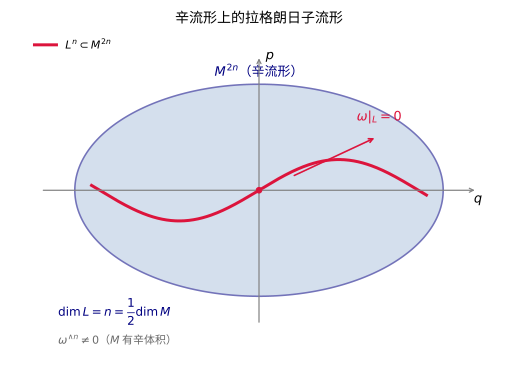

# 第69级：辛拓扑 (Symplectic Topology)

---

## 学习目标

1. 理解辛流形、Lagrangian 子流形与拟全纯曲线的基本概念。
2. 掌握 Gromov 紧致性定理与 Gromov 非嵌入定理的核心思想。
3. 理解 Gromov-Witten 不变量与量子上同调的定义与基本性质。
4. 了解 Floer 同调（包括 Lagrangian Floer 同调）的基本框架。
5. 掌握 Weinstein 邻域定理的证明。
6. 了解 Arnold 猜想的陈述与证明思路。
7. 了解辛同调、接触同调与 SFT 等现代发展。

---

## 核心概念

### 1. 辛流形 (Symplectic Manifold)

一个 **辛流形** 是一个光滑流形 $M^{2n}$ 配备一个闭的非退化 2-形式 $\omega$，即：

- $d\omega = 0$（闭性）
- $\omega^{\wedge n} \neq 0$（非退化，即 $\omega$ 诱导了 $TM$ 与 $T^*M$ 之间的同构）

标准例子是 $(\mathbb{R}^{2n}, \omega_0)$，其中 $\omega_0 = \sum_{i=1}^n dx_i \wedge dy_i$。

> **💡 直观理解（类比）**：一个辛流形可以想象成一台"处处带着面积/定向测量器"的偶数维空间 $M^{2n}$：2-形式 $\omega$ 负责"闭"（$d\omega=0$，测量仪本身不凭空产生/消灭面积）和"非退化"（$\omega^{\wedge n}\ne0$，每个方向都有对应的"互补方向"可测出面，所以维数必为偶数 $2n$）。它就像给空间装了一把每个点到处都严丝合缝、从不失衡的"卷尺和分度盘"——哈密顿力学里的相空间就是这样的舞台，位置与动量成对出现。

> **直观理解（现实类比）**：汉密尔顿流就像把一团橡皮泥在平面上任意揉捏变形，但无论如何变形，它的面积始终不变。辛同胚正是这类"保面积"的变换——它们不改变辛形式 $\omega$，正如哈密顿力学中相空间的体积（面积）在演化中守恒。

> **🧠 思考历程："保面积"听上去软绵绵的，辛拓扑怎么用一根"拟全纯曲线"把它变成最硬的学科之一？**
>
> 辛几何一路走到 1985 年之前，留给人的印象是"处处可以微调、什么都能糊弄"——毕竟 Darboux 定理说局部都长一样。可 Gromov 单单用一类"几乎不可能存在的全纯曲线"就扭转全局：**原来看似最自由的保面积世界，竟藏着一整套惊人的"刚性"**。这就是辛拓扑的诞生时刻。
>
> - **为什么"曾经"以为它是软的**。Darboux 定理告诉每个辛流形局部同构于 $\mathbb{R}^{2n}$；Gromov 还证明过辛几何的一大片弹性（例如球之间体积相差可比的嵌入常存在）。这些结果一度让数学家相信：**辛几何大概可以任意揉，几乎不产生拓扑上的约束**。
> - **Gromov 1985 的改变游戏规则**。Gromov 带进来的大杀器是一类对象：**拟全纯曲线（$J$-全纯曲线）**，即满足 $\bar\partial_J u=0$ 的映射。它们在局部不易显式写出，却"非常丰富、非常刚"。用一个"探测器"来比喻：**一根拟全纯曲线就像一个"自带边界"的探测器，把它放进辛流形，就能读出"这是不是真的能塞进来"**。由此产生了震惊四座的 **非挤压定理（non-squeezing）**：尺寸为 $R$ 的辛球再努力，也无法塞进半径更小的"圆柱"里——**保面积看似神通广大，却在这点上碰了铜墙铁壁**。
> - **Floer 与量子上同调：把曲线计数变成代数不变量**。此后 Floer 把 Morse 理论搬到无穷维的环路空间上，用拟全纯曲线连接周期轨道，定义出 **Floer 同调**；Gromov-Witten 理论和量子上同调则把"数拟全纯曲线的多少"规范化，变成一套能算、能保持的代数对象。**原先"保面积变换的一切都可能被微调"的直觉，彻底被一套兜住整体不变量的框架取代**。
> - **心路**：辛拓扑的转折点给数学上了一课：**"软"与"硬"的分界线，常不取决于表面定义，而取决于你有没有找到潜伏中的"约束"**。Gromov 没有发明一个新的定义去显化刚性，而是找到了一类特别的曲线，让刚性与软性在同一解释下和解。当你以为一个世界"太自由"时，试着找一根"内在的探测曲线"，自由世界的墙往往从那里现身。

### 2. Lagrangian 子流形

设 $(M^{2n}, \omega)$ 是一个辛流形。一个嵌入子流形 $L^n \subset M$ 称为 **Lagrangian 的**，如果 $\omega|_L = 0$ 且 $\dim L = n$（即 $L$ 是极大各向同性子流形）。

> **直观理解（现实类比）**：辛流形像一面"面积测量仪"，而拉格朗日子流形是一条恰好占一半维数的"零辛面积"子流形——就像地球表面某条特定的纬线，沿它量不到任何"辛面积"。它既是极大各向同性的，又不占辛体积，是辛几何中"最省"的几何对象。

### 3. 拟全纯曲线 (Pseudo-holomorphic Curve)

给定一个辛流形 $(M, \omega)$ 以及一个相容的近复结构 $J$（即 $\omega(\cdot, J\cdot)$ 是黎曼度量，且 $\omega(J\cdot, J\cdot) = \omega(\cdot, \cdot)$），一个 **拟全纯曲线**（或称 $J$-全纯曲线）是一个映射 $u: \Sigma \to M$，其中 $(\Sigma, j)$ 是一个黎曼面，满足：

$$\bar{\partial}_J u = \frac{1}{2}(du + J \circ du \circ j) = 0.$$

> **💡 直观理解（类比）**：拟全纯曲线是把"复分析里全纯函数"搬到一般辛流形上的产物：换个更相容的"复结构" $J$ 后，方程 $\bar\partial_J u=0$ 等价于 $du\circ j = J\circ du$，意思是映射 $u$ 把曲面的"复方向"尽量转成目标空间里"带 $J$ 的角度"。可以把它想成一条"自带边界、能伸进流形的探针"——它非常稀少（刚），却专挑"面积最小的那片布"穿过去，因此成了读取辛流形内部刚性信息的探测器。能量恰好等于 $\int u^*\omega$（面积），使这条曲线既是几何对象又是能量标尺。

### 4. Gromov-Witten 不变量

**Gromov-Witten 不变量** 是计数拟全纯曲线的模空间中的曲线数。设 $\overline{\mathcal{M}}_{g,k}(M, \beta)$ 是亏格 $g$、有 $k$ 个标记点、表示同调类 $\beta \in H_2(M;\mathbb{Z})$ 的稳定拟全纯曲线的模空间。Gromov-Witten 不变量定义为：

$$\text{GW}_{g,\beta}(\alpha_1,\dots,\alpha_k) = \int_{[\overline{\mathcal{M}}_{g,k}(M,\beta)]^{\text{vir}}} \text{ev}^*(\alpha_1 \otimes \cdots \otimes \alpha_k),$$

其中 $\text{ev}: \overline{\mathcal{M}}_{g,k}(M,\beta) \to M^k$ 是求值映射。

> **💡 直观理解（类比）**：Gromov-Witten 不变量本质上是"数曲线"：把"有多少条拟全纯曲线穿过某些固定标记点的指定位置"编码成一个积分。就好比数一张地图上"恰好经过这几座城市的所有单程路线"有多少条，并把每条路线的形状（亏格 $g$）和里程（同调类 $\beta$）登记成册。它把几何上"存在多少条这样的曲线"这个离散计数问题，变成一个稳定、可算、在形变下看住的整数/有理数不变量。

### 5. 量子上同调 (Quantum Cohomology)

**量子上同调** 是通常上同调环的形变，其乘积（量子乘积）由 Gromov-Witten 不变量定义：

$$\alpha \star \beta = \sum_{\beta \in H_2(M;\mathbb{Z})} \text{GW}_{0,\beta}(\alpha,\beta,\cdot) \, q^\beta.$$

> **💡 直观理解（类比）**：量子上同调是把普通的"相遇计数"改写成"带奖励的相遇计数"：平凡乘积只数 $\alpha,\beta$ 两个类单纯交出的点，而量子乘积额外把"绕某个同调类 $\beta$ 转出来的虚拟曲线"也计入，再以形式记号 $q^\beta$ 给每条绕路标上一个"里程权重"。好比两辆火车相会，除了数它们直接擦肩的次数，还加上"都要先绕一圈 $\beta$ 后再相遇"的所有可能路线。于是原本单调的上同调环升级成更精细、能区分绕路的量子环。

### 6. Floer 同调

**Floer 同调** 是 Morse 理论在环路空间上的无穷维推广，用于研究辛流形的 Hamiltonian 动力学。

- **Hamiltonian Floer 同调**：对于辛流形 $(M,\omega)$ 上的 Hamiltonian 函数 $H: S^1 \times M \to \mathbb{R}$，考虑其 $1$-周期轨道，Floer 链复形由这些轨道生成，边界算子通过计数连接轨道间的拟全纯圆柱定义。

> **💡 直观理解（类比）**：Floer 同调就像给"动力学系统里的周期轨道"建了一座同调论坟场：把它们当成链复形的生成元（骨架），再用连接这些轨道的"最省面积路径"（拟全纯圆柱，类比 Morse 里的梯度流线）定义边界算子，从而取其同调。可以想成一张时刻表：把每个稳定运行的列车班次（周期轨道）当作站台，边界算子记录"从班次 A 平稳滑向班次 B"的可能转接线，最后留下的同调只记住那些"拆不掉、必须存在"的班次。它把无穷维环路空间上的分析问题，翻译成有限维、可算的同调不变量。

### 7. Lagrangian Floer 同调

对于一对 Lagrangian 子流形 $L_0, L_1 \subset M$，**Lagrangian Floer 同调** $HF(L_0, L_1)$ 由 $L_0$ 与 $L_1$ 的交点生成，边界算子通过计数连接交点的拟全纯圆盘定义。

> **💡 直观理解（类比）**：Lagrangian Floer 同调用"两块膜的交点"做生成元：$L_0,L_1$ 相交的每个点 x 就是链复形里的一个基元，边界算子再数"从交点 x 滑到交点 y 的拟全纯圆盘"有多少条。好比在两张重叠的地毯上，把重叠处每个钉眼当作绳结，边界算子记下"甩一段面积最小的布片能把哪两个钉眼连起来"。若同调非零，就说明这两块膜"不得不在某个点上相交"——这正是证 Lagrangian 交点下界（Arnold 猜想的子流形版）的核心手段。

### 8. 辛嵌入与 Gromov 非嵌入定理

一个 **辛嵌入** 是一个满足 $\phi^*\omega_N = \omega_M$ 的嵌入 $\phi: (M^{2m}, \omega_M) \to (N^{2n}, \omega_N)$。

> **💡 直观理解（类比）**：辛嵌入比普通嵌入"讲得多"：它不仅要求把目标放进目标空间，还要求拉回后辛形式完全一致（$\phi^*\omega_N=\omega_M$），即嵌入像要"原样保留所有辛面积"。好比把一台精密仪器搬进新房间，不仅位置要放得下，还要让它的每一个仪表读数（面积测量）与环境完全对上。正因为要保留这么多"测量数据"，辛嵌入远没有体积嵌入那么自由。

**Gromov 非嵌入定理**：如果 $2m = 2n$ 且存在辛嵌入 $B^{2n}(R) \to B^{2n}(r) \times \mathbb{R}^{2n-2}$，则 $R \le r$。这里 $B^{2n}(R)$ 是半径为 $R$ 的辛球。

> **💡 直观理解（类比）**：Gromov 非嵌入定理（非挤压定理）说的是：一个半径 $R$ 的"辛气球"，体积允许时完全可以整只挤进一个很细长的柱子里，但只要是"保辛面积"的嵌入，它就死活穿不过一根直径更小的圆管。好比把一块永远不能捏皱、不能压扁的布料，徒手塞一个比它更细的瓶颈——除非口子足够大（$r\ge R$），否则绝对塞不进去。这条定理在"看似无比自由的保面积世界"里竖起了第一道铜墙铁壁，直接宣告辛拓扑之"硬"的诞生。

### 9. 辛容量 (Symplectic Capacity)

**辛容量** 是一个映射 $c: \{\text{辛流形}\} \to [0, \infty]$，满足：
- **单调性**：若存在辛嵌入 $(M, \omega) \hookrightarrow (N, \tau)$，则 $c(M) \le c(N)$。
- **共形性**：$c(M, \lambda \omega) = \lambda c(M, \omega)$，$\lambda > 0$。
- **标准化**：$c(B^{2n}(1)) = \pi = c(Z^{2n}(1))$，其中 $Z^{2n}(1) = B^2(1) \times \mathbb{R}^{2n-2}$。

> **💡 直观理解（类比）**：辛容量像给每个辛流形贴一张"最大能塞进多大球"的标尺读数。它守三条规矩：能塞进 $N$ 的读数不会比 $N$ 更大（单调）；整体缩放辛形式就按比例改读数（共形）；且约定标准单元球面 $B^{2n}(1)$ 的读数为 $\pi$（标准化）。可以想成一套"国际通用的塞球尺子"：用它量任何辛流形，量出来一个不依赖手工摆放的数字，刚好把"能塞多大球"（辛刚性）变成可比、可算的量化不变量。

### 10. 辛同调与接触同调

**辛同调**（Symplectic Homology）是 Floer 同调在具有适当边界条件的辛流形上的推广。**接触同调**（Contact Homology）是其在接触流形上的对应物，由 Reeb 轨道生成复形。

> **💡 直观理解（类比）**：辛同调可以想成"Floer 同调在非闭、带边界流形上的续篇"：当应外考量到无穷远处那些"一去不回"的轨道（如从边界溜走的能量），就得到这套含无穷远的同调。接触同调则是一场"对调道具"的戏：把生成长的周期轨道换成接触流形上的 Reeb 轨道，边界算子再数连接这些 Reeb 轨道的曲线——触觉流形上即使没有辛结构，也能照样搭起同调，就像把一张纸上"看不见的线"换成"看得见的缝线"，门道却大同小异。

### 11. SFT (Symplectic Field Theory)

**SFT** 是由 Eliashberg、Givental 和 Hofer 发展的一个统一框架，将辛同调、接触同调和 Gromov-Witten 理论统一为一种代数结构。

> **💡 直观理解（类比）**：SFT 像一张"把散落的乐器凑成一支交响乐团"的总谱：此前辛同调、接触同调、Gromov-Witten 各自计数着不同场合下的曲线，SFT 把它们装进同一个代数框架（微分代数），让一套生成元—边界算子系统同时指挥紧曲线、非紧轨道和柱状曲线。好比把公路网、铁路网、水运网绘在同一张地图上，各自线路仍然分明，却能共享同一套规则和坐标，方便整体调度与比较。

---

## 定理与证明

### 定理 1：Gromov 紧致性定理

**定理（Gromov）**：设 $(M, \omega)$ 是一个紧致辛流形，$J$ 是一个相容的近复结构。给定常数 $C > 0$，考虑所有满足能量上界 $\int_\Sigma |du|^2 \le C$ 的拟全纯曲线 $u: \Sigma \to M$ 的集合。则这个集合在 **稳定曲线的模空间** 中是紧致的，即任意序列都有一个子序列收敛到一个可能带有泡泡的稳定拟全纯曲线。

> **💡 直观理解（类比）**：这条定理说的是"给定了能量上限，曲线们不乱跑、不失控"：任何一列能量有限（$\le C$）的拟全纯曲线，必能挑出一列收敛到极限——纵使某个点上的能量挤成一团、绷出一个个小鼓包（泡泡），最终仍粘在主曲线上，收进"稳定曲线"的模空间。好比一堆动能受限的气球窗帘，无论怎么吹都吹不破，最激烈时只是鼓出几个小泡泡，但始终待在这块"窗框"（紧致的模空间）里。它是后面所有"数曲线"类不变量（Gromov-Witten、Floer 等）能够收敛、有定义的地基。

**证明思路**：

Gromov 的证明基于几个关键的分析估计。

*步骤 1：梯度估计*

首先，对于拟全纯曲线 $u: \Sigma \to M$，其能量由拓扑决定：

$$E(u) = \frac{1}{2} \int_\Sigma |du|^2 \, d\text{vol}_\Sigma = \int_\Sigma u^*\omega.$$

由于 $u^*\omega$ 表示一个同调类，能量在固定同调类中是常数。

*步骤 2：一致导数估计*

Gromov 的核心洞察是：拟全纯曲线满足一个 **椭圆正则性估计**。对于任何 $z \in \Sigma$，如果 $u$ 的局部能量足够小，则存在一个常数 $C$ 使得：

$$|du(z)| \le C \cdot \|u^*\omega\|_{L^2}.$$

这意味着在能量集中区域之外，曲线的导数一致有界。

*步骤 3：泡泡分析*

如果能量在某点集中，则会出现 **泡泡**（bubble）：通过重缩放分析，在能量集中点处，我们可以提取一个子序列，在极限中形成一个球面拟全纯曲线 $v: \mathbb{CP}^1 \to M$。

*步骤 4：紧致化*

模空间的紧致化 $\overline{\mathcal{M}}_{g,k}(M, \beta)$ 由所有可能的退化曲线组成，包括：
- 主曲线（可能具有更低的亏格）
- 有限个泡泡球面
- 节点（nodal points）连接不同的分量

*步骤 5：Gromov 拓扑*

Gromov 定义了一种拓扑（称为 **Gromov 收敛**），使得上述序列收敛到该紧致化中的某个元素。$\square$

---

### 定理 2：Gromov 非嵌入定理

**定理（Gromov）**：设 $B^{2n}(R)$ 是 $\mathbb{R}^{2n}$ 中半径为 $R$ 的辛球（带有标准辛形式 $\omega_0 = \sum dx_i \wedge dy_i$），$Z^{2n}(r) = B^2(r) \times \mathbb{R}^{2n-2}$ 是辛圆柱。如果存在辛嵌入 $\phi: B^{2n}(R) \to Z^{2n}(r)$，则 $R \le r$。

> **💡 直观理解（类比）**：这是非挤压定理的"球进柱"版本：一个半径 $R$ 的辛球想钻进一个半径为 $r$ 的圆柱（圆柱横截面是 $B^2(r)$，其余方向可以无穷伸长），只要 $R>r$ 就绝无可能——尽管体积上完全允许。好比一个无法捏皱的呼啦圈想穿过一个比它更小的瓶口：不管把圆柱拉得多长、球往哪个方向扭，都过不去。它把"保面积嵌入受尺寸限制"这条铁律用最朴素的两维（圆）—三维（圆柱）情形钉死，是辛拓扑刚性的宣言书。

**证明**：

**第一部分：化为一个极值问题**

*步骤 1：标准辛形式的构造*

在 $\mathbb{R}^{2n}$ 上，标准辛形式为 $\omega_0 = \sum_{i=1}^n dx_i \wedge dy_i$。辛球 $B^{2n}(R) = \{\sum (x_i^2 + y_i^2) \le R^2\}$ 是半径为 $R$ 的球体。

辛圆柱 $Z^{2n}(r) = \{x_1^2 + y_1^2 \le r^2\} \times \mathbb{R}^{2n-2}$。

*步骤 2：Gromov 的想法*

Gromov 的核心想法是使用拟全纯曲线来探测辛嵌入的障碍。假设存在嵌入 $\phi: B^{2n}(R) \to Z^{2n}(r)$。

**第二部分：构造拟全纯曲线**

*步骤 1：选择近复结构*

在 $Z^{2n}(r)$ 上选择标准近复结构 $J_0$，使得 $J_0(\partial/\partial x_i) = \partial/\partial y_i$，$J_0(\partial/\partial y_i) = -\partial/\partial x_i$。

*步骤 2：考虑一族曲线*

考虑 $\mathbb{CP}^1$ 中通过某固定点的有理曲线族。在 $Z^{2n}(r)$ 中，考虑拟全纯圆柱 $u_k: \mathbb{C} \to Z^{2n}(r)$，其像为 $\{z\} \times \mathbb{R}^{2n-2}$ 中的点，其中 $z \in B^2(r)$。

*步骤 3：通过嵌入拉回*

通过 $\phi$ 拉回，我们得到 $B^{2n}(R)$ 中的一族拟全纯曲线。关键是要证明，如果 $R > r$，则存在一个拟全纯曲线通过中心点，其能量受限于 $r$，但面积受限于 $R$，导致矛盾。

**第三部分：面积-能量矛盾**

*步骤 1：能量计算*

拟全纯曲线 $u$ 的能量为：

$$E(u) = \int u^*\omega_0 = \text{Area}(u(\Sigma)).$$

对于圆柱 $Z^{2n}(r)$ 中的拟全纯曲线，其能量至少为 $\pi r^2$（如果它穿越圆柱）。

*步骤 2：Gromov 的单调性论证*

另一方面，如果 $R > r$，则球 $B^{2n}(R)$ 中存在一个拟全纯曲线，其能量不超过 $\pi R^2$。但通过讨论曲线的相交数，可以证明该曲线必须穿越圆柱，从而其能量至少为 $\pi r^2$——但这不是矛盾。

*步骤 3：关键的矛盾*

Gromov 的更深层论证是：如果 $R > r$，则可以通过中心点构造一个拟全纯球面，其面积（即能量）为 $\pi R^2$，但这个球面必须与某个边界相交，从而其面积至少为 $\pi r^2$ + 一个正的附加值。通过更精细的相交论证，可以证明这个附加值导致矛盾。因此 $R \le r$。

> **💡 直观理解（类比）**：可把这里的矛盾想成"同心圆叠加的账本不平"：拟全纯曲线恰好是"辛面积"这笔账的最小化代理——它既是能量的收取者（$E=\int u^*\omega=$ 面积），又是障碍的验钞机（一旦越过 $r$，必须留下正附加面积）。于是 $R>r$ 时，同一个球面既要付 $\pi R^2$ 这个"大账"，又被圆柱强制多记上一笔正的"过路费"，两笔账对不上，只能宣告嵌入不存在。辛嵌入比体积嵌入严格，正是因为这套"面积记账"在任何方向都不能蒙混过关。$\square$

---

### 定理 3：Arnold 猜想（Arnold-Givental 定理）

**定理（Arnold 猜想 / Arnold-Givental 定理）**：设 $(M, \omega)$ 是一个紧致辛流形，$H: S^1 \times M \to \mathbb{R}$ 是一个非退化 Hamiltonian 函数。则 $H$ 的 $1$-周期轨道的数量至少等于 $M$ 的 **Betti 数之和**：

$$\# \text{Periodic orbits of } H \ge \sum_{k=0}^{2n} \dim H^k(M;\mathbb{R}).$$

> **💡 直观理解（类比）**：Arnold 猜想说"无论哈密顿系统怎么动，稳定运行的周期性轨道总不会太少，至少与流形的'洞'一样多"。Betti 数之和好比流形"必须容纳多少个基本部件"（各维洞的数量），猜想断言任何非退化哈密顿流的周期轨道个数都不会低于这个底线。可以想成一座城市：无论怎样修改交通规则（哈密顿流），都必定存在至少某几个"固定班次的环形线路"（周期轨道），其数量不少于这座城市"环路的个数底线"。Floer 同调正是把这条"底线"精确算出来的武器。

**证明思路**：

Arnold 猜想的证明是 Floer 同调理论的核心应用之一。

*步骤 1：构造 Floer 链复形*

首先，我们构造 Hamiltonian Floer 链复形 $CF_*(H)$。

- 生成元：$H$ 的所有 $1$-周期轨道。
- 梯度流线：考虑方程 $\partial_s u + J(\partial_t u - X_H(u)) = 0$，其中 $X_H$ 是 Hamiltonian 向量场。这个方程的解 $u: \mathbb{R} \times S^1 \to M$ 连接两个周期轨道。

*步骤 2：定义边界算子*

边界算子 $\partial: CF_k \to CF_{k-1}$ 通过计数 index-1 的梯度流线定义：

$$\partial x = \sum_{y: \mu(y) = \mu(x)-1} \#\mathcal{M}(x,y) \cdot y,$$

其中 $\mu$ 是 Conley-Zehnder 指标，$\mathcal{M}(x,y)$ 是连接 $x$ 到 $y$ 的模空间。

*步骤 3：证明 $\partial^2 = 0$*

Floer 证明了 $\partial^2 = 0$，其证明依赖于 Gromov 紧致性定理：模空间 $\mathcal{M}(x,y)$ 的边界由断开的梯度流线组成，它们对应 $\partial^2$ 中的项相互抵消。

*步骤 4：Floer 同调与 Morse 同调的同构*

Floer 同调 $HF_*(M)$ 与 $M$ 的 Morse 同调（即通常的上同调）同构：

$$HF_*(M) \cong H^{n-*}(M;\mathbb{R}).$$

这是因为对于足够小的 Hamiltonian，Floer 复形恰好约化为 Morse 复形。

*步骤 5：Morse 不等式*

由 Morse 理论，周期轨道数至少等于 Betti 数之和：

$$\# \text{Periodic orbits} \ge \dim HF_*(M) = \sum_{k} \dim H^k(M;\mathbb{R}).$$

这就完成了证明。$\square$

---

### 定理 4：Weinstein 邻域定理

**定理（Weinstein）**：设 $(M, \omega)$ 是一个辛流形，$L \subset M$ 是一个紧致 Lagrangian 子流形。则存在 $L$ 在 $M$ 中的一个邻域 $U$，与 $L$ 在 $T^*L$ 中的零截面邻域 $V$ 辛同胚，其中 $T^*L$ 带有标准辛形式 $\omega_{\text{can}} = -d\theta$（$\theta$ 是 Liouville 1-形式）。

换句话说，所有 Lagrangian 子流形的邻域在辛意义下是相同的——它们都像余切丛中的零截面邻域。

> **💡 直观理解（类比）**：Weinstein 邻域定理说"所有 Lagrangian 子流形的小邻域长得都一样"：任何辛流形中，一个紧致 Lagrangian $L$ 周边的那圈空间，经过辛同胚都能整理成它在余切丛 $T^*L$ 中"躺平为零截面"时周围的邻域。好比无论发动机装在哪台车子的机舱里，它周围那圈"缝隙空间"打开后都是同一套标准布局——位置和朝向可以不同，但空间结构千篇一律。这条"普遍邻域"正是辛几何里"柔性/刚性"两面中体现某种强刚性的地方：连局部都被固定成同一模样。

**证明**：

**第一部分：构造余切丛上的辛形式**

*步骤 1：余切丛的标准辛形式*

在 $T^*L$ 上，标准 Liouville 1-形式 $\theta$ 定义为：

$$\theta_{(q,p)}(v) = p(d\pi(v)), \quad (q,p) \in T^*L, v \in T_{(q,p)}(T^*L),$$

其中 $\pi: T^*L \to L$ 是投影。标准辛形式为 $\omega_{\text{can}} = -d\theta$。

*步骤 2：零截面*

$L$ 在 $T^*L$ 中嵌入为零截面 $L_0 = \{(q,0) \mid q \in L\}$。容易验证 $L_0$ 是 Lagrangian 的。

**第二部分：构造法丛的同构**

*步骤 1：法丛*

考虑 $L$ 在 $M$ 中的法丛 $N L$。由于 $L$ 是 Lagrangian 的，辛形式 $\omega$ 给出了一个同构：

$$T M|_L / T L \cong T^*L, \quad v \mapsto \omega(v, \cdot)|_{TL}.$$

*步骤 2：Darboux 坐标*

利用这个同构，我们可以构造一个从 $N L$ 到 $T^*L$ 的丛同构。这个丛同构在纤维上是线性的，且将辛形式映射到标准辛形式。

**第三部分：指数映射与邻域嵌入**

*步骤 1：指数映射*

选择一个 $L$ 上的黎曼度量，构造指数映射 $\exp: N L \to M$。这个映射将零截面映到 $L$，且是零截面附近的一个微分同胚到 $L$ 的一个管状邻域。

*步骤 2：拉回辛形式*

考虑拉回辛形式 $\exp^*\omega$。在零截面上，$\exp^*\omega$ 与 $\omega_{\text{can}}$ 相差一个二阶项。

*步骤 3：Moser 变形*

使用 **Moser 技巧**，我们可以构造一个从零截面邻域到 $T^*L$ 中零截面邻域的同胚，使得辛形式被拉回为标准辛形式。

具体地，考虑一族辛形式 $\omega_t = t \exp^*\omega + (1-t)\omega_{\text{can}}$。我们求解一个依赖于时间的向量场 $X_t$，使得 $\mathcal{L}_{X_t}\omega_t + \frac{d\omega_t}{dt} = 0$。通过积分 $X_t$，我们得到所需的辛同胚。

*步骤 4：紧致性*

由于 $L$ 是紧致的，上述构造在 $L$ 的某个邻域内有效。这就完成了证明。$\square$

---

## 示例

### 示例 1：辛容量的计算

**Gromov 宽度**（Gromov width）是辛容量的一个重要例子，定义为：

$$c_G(M, \omega) = \sup\{\pi R^2 \mid \text{存在辛嵌入 } B^{2n}(R) \hookrightarrow (M, \omega)\}.$$

**示例计算**：

- $c_G(B^{2n}(R)) = \pi R^2$（由定义直接得到）。
- $c_G(\mathbb{CP}^n, \omega_{\text{FS}}) = \pi$，其中 $\omega_{\text{FS}}$ 是 Fubini-Study 形式，标准化为 $\int_{\mathbb{CP}^1} \omega_{\text{FS}} = \pi$。
- $c_G(T^{2n} = \mathbb{R}^{2n}/\mathbb{Z}^{2n}, \omega_0) = \pi$，因为最大辛球半径由最短的闭环长度决定。

> **💡 直观理解（类比）**：Gromov 宽度好比给流形量"能吞下多大辛球"的喉径：它取所有能辛嵌入进来的球 $B^{2n}(R)$ 里，面积 $\pi R^2$ 的上确界。$\mathbb{CP}^n$ 里最宽的那条"赤道"已能塞进面积为 $\pi$ 的球，再大就顶到超平面了，所以宽度正好 $\pi$；环面里大球直径一旦超过最小闭环（最短进制）就会被"卷"回自身，宽度也是 $\pi$。于是"宽度"把每个辛流形的"极限吞咽能力"量成一个数的标杆。

### 示例 2：Gromov 非嵌入的具体应用

**应用：辛球体的嵌入障碍**

考虑 $\mathbb{R}^4$ 中两个辛球体的嵌入问题。设 $B^4(1)$ 和 $B^4(R)$ 是两个辛球，$R > 1$。Gromov 非嵌入定理告诉我们，不存在辛嵌入 $B^4(R) \hookrightarrow B^4(1) \times \mathbb{R}^2$。

更一般地，**非嵌入结果**：
- 如果 $R > r$，则 $B^{2n}(R)$ 不能辛嵌入 $Z^{2n}(r)$。
- 如果 $R > 1$，则 $B^4(R)$ 不能辛嵌入到 $B^4(1)$ 中（尽管存在体积嵌入）。

> **💡 直观理解（类比）**：这里的结论再次落到"体积能放，面积不能放"：$B^4(R)$ 在体积上完全能塞进 $B^4(1)\times\mathbb{R}^2$（有足够维数可蜷缩），但只要半径更大，辛嵌入就被重重拦住。好比一块可以团起来塞进口袋的薄布（体积上办法多），却是一旦规定它"不能皱、不能叠"就得量一下口袋口到底够不够大。辛形式施加的这种"测不准感"——能估体积却掐死面积——正是辛拓扑与普通微分拓扑最刺眼的分水岭。

---

## 习题

### 基础题

**习题 1**（辛流形定义）设 $(M,\omega)$ 是辛流形。说明为什么 $\omega^{\wedge n}$ 是 $M$ 上的辛体积形式，并指出 $M$ 的维数。

**习题 2**（辛流形定义）写出 $\mathbb{R}^{2n}$ 上的标准辛形式 $\omega_0$，并验证它是闭的且非退化的。

**习题 3**（闭性条件）若 $\dim M = 2n$，证明 $\omega^{\wedge n} \neq 0$ 等价于 $\omega$ 的非退化性（即 $\omega$ 诱导 $TM \to T^*M$ 的同构）。

**习题 4**（辛流形）判断：$\mathbb{R}^4$ 中是否存在三个线性无关的辛形式 $\omega$，使得它们两两 $d$ 闭且非退化。说明理由。

**习题 5**（Darboux 定理）陈述 Darboux 定理，并说明它在辛几何中的意义（共形/刚性）。

**习题 6**（Darboux 定理）在 $(\mathbb{R}^{2}, dx \wedge dy)$ 中，构造以原点为中心的坐标 $(X,Y)$ 使得 $\omega = dX \wedge dY$，并说明 $X,Y$ 与原坐标的关系。

**习题 7**（Lagrangian 子流形）证明 $\mathbb{R}^{2n}$ 中的零截面 $\mathbb{R}^n \times \{0\}$ 是 Lagrangian 的。

**习题 8**（Lagrangian 子流形）证明图 $\Gamma_f = \{ (x, df(x)) \}$ 对于光滑函数 $f:\mathbb{R}^n \to \mathbb{R}$ 是 $(\mathbb{R}^{2n},\omega_0)$ 中的 Lagrangian 子流形。

**习题 9**（Lagrangian 子流形）判断 $S^1$ 的真子流形是否可能成为 $(\mathbb{R}^2, dx\wedge dy)$ 中的紧致 Lagrangian。说明理由。

**习题 10**（辛同胚）说明线性辛群 $Sp(2n,\mathbb{R})$ 中的元素保持 $\omega_0$。给出一个 $n=1$ 时的例子。

**习题 11**（辛同胚）证明 Hamiltonian 向量场 $X_H$ 满足 $\iota_{X_H}\omega = -dH$。由此说明 $X_H$ 保 $\omega$。

**习题 12**（Jacobi 恒等式）证明 Poisson 括号满足 Jacobi 恒等式，并由此导出 Hamilton 方程流保持 Poisson 括号。

**习题 13**（辛向量场）说明一个向量场 $X$ 保 $\omega$（即 $\mathcal{L}_X\omega = 0$）的充要条件可以是 $\iota_X\omega$ 闭。它与 Hamiltonian 向量场的关系是什么？

**习题 14**（Hamilton 方程）设 $H(x,y) = \frac{1}{2}(x^2+y^2)$ 在 $(\mathbb{R}^2,\omega_0)$ 上。写出 Hamilton 方程并求出 $t$ 时刻的流。

**习题 15**（Hamilton 方程）证明 $\mathbb{R}^{2n}$ 上二次型 $H(q,p) = \frac{1}{2}\sum (q_i^2 + p_i^2)$ 的 Hamilton 流是线性旋转。

**习题 16**（辛嵌入）说明辛嵌入 $\phi$ 满足 $\phi^*\omega_N = \omega_M$ 的几何含义。为什么辛嵌入自动保维数？

**习题 17**（辛嵌入）证明体积形式的维度约束：若存在辛嵌入 $B^{2m}\to B^{2n}$，则 $m \le n$。

**习题 18**（辛嵌入）举例说明体积嵌入不一定能提升为辛嵌入。

**习题 19**（近复结构）设 $\omega$ 是辛形式。说明存在一个相容的近复结构 $J$ 使 $g(\cdot,\cdot)=\omega(\cdot,J\cdot)$ 为黎曼度量。

**习题 20**（近复结构）计算在 $\mathbb{C}^n \cong \mathbb{R}^{2n}$ 上标准复结构 $J$ 与标准辛形式 $\omega_0$ 的关系，验证 $g_0 = \omega_0(\cdot, J \cdot)$ 是标准欧氏度量。

**习题 21**（近复结构）说明辛流形上近复结构的存在性为什么总是成立的（允许非积分各向同性）。它与复流形的区别是什么？

**习题 22**（拟全纯曲线）写出 $J$-全纯曲线条件 $\bar{\partial}_J u = 0$，即 $du \circ j = J \circ du$。解释几何含义。

**习题 23**（拟全纯曲线）证明常值映射是 $J$-全纯曲线。说明其模空间维数与域有关。

**习题 24**（拟全纯曲线）证明一条全纯曲线嵌入 $\mathbb{CP}^1 \to \mathbb{CP}^n$（Veronese）是 $J_{\text{FS}}$-全纯的。

**习题 25**（能量）对 $J$-全纯曲线 $u$，证明能量 $E(u) = \int u^*\omega$。

**习题 26**（能量）证明对 $J$-全纯曲线，能量由同调类 $[u] \in H_2(M;\mathbb{Z})$ 完全决定。

**习题 27**（能量）说明在固定同调类 $\beta$ 中，$J$-全纯曲线能量为一常数，并写出该常数的表达式。

**习题 28**（Lil^p 正则性）陈述或说明拟全纯曲线的椭圆正则性：为何它的导数有界估计？

**习题 29**（Gromov 紧性）陈述 Gromov 紧致性定理，说明稳定曲线模空间 $\overline{\mathcal{M}}_{g,k}(M,\beta)$ 紧致的含义。

**习题 30**（泡泡）解释"泡泡"（bubble）现象在 Gromov 紧性中的角色。

**习题 31**（Gromov 非嵌入定理）陈述 Gromov 非嵌入定理的内容，指出辛球与辛圆柱。

**习题 32**（Gromov 非嵌入）说明为什么 $B^{2n}(R)$ 能体积嵌入 $Z^{2n}(r)$ 当 $R>r$ 但辛嵌入不存在。

**习题 33**（辛容量）写出辛容量的三条公理：单调性、共形性、标准化。

**习题 34**（辛容量）计算 $c_G(B^{2n}(R)) = \pi R^2$。为什么取 $\pi R^2$ 而不是 $R^2$？

**习题 35**（辛容量）计算 $c_G(\mathbb{CP}^n, \omega_{FS}) = \pi$，其中 $\omega_{FS}$ 标准化使 $\int_{\mathbb{CP}^1}\omega_{FS} = \pi$。

**习题 36**（辛容量）说明 $c_G(T^{2n}, \omega_0) = \pi$ 的直观理由。

**习题 37**（辛容量）证明若 $c$ 是辛容量，则 $c(\mathbb{R}^{2n},\omega_0) = +\infty$。

**习题 38**（辛容量）估计 $c(S^2 \times S^2)$ 在乘积辛结构下的辛容量，比较 Gromov 宽度。

**习题 39**（Hamiltonian Floer 同调）写出 Hamiltonian Floer 链复形的生成元。

**习题 40**（Hamiltonian Floer 同调）说明 Floer 边界算子 $\partial$ 的构造：计数 index-1 的拟全纯梯度线。

**习题 41**（Hamiltonian Floer 同调）解释为什么 $HF_*(H)$ 与 Hamiltonian 的选择无关（同构意义下）。

**习题 42**（Conley-Zehnder 指标）定义 Conley-Zehnder 指标 $\mu$ 的角色，说明它如何给出 Floer 复形的分次。

**习题 43**（Arnold 猜想）陈述 Arnold 猜想，并说明它与 Floer 同调维数的关系。

**习题 44**（Morse 不等式）说明 Morse 不等式 $\#\text{crit}(H) \ge \sum_k b_k(M)$ 与 Floer 同调的联系。

**习题 45**（Lagrangian Floer 同调）写出 $HF(L_0,L_1)$ 的生成元是 $L_0 \cap L_1$ 的意义。

**习题 46**（Lagrangian 交点）说明在什么横截性条件下 $L_0 \cap L_1$ 是有限点集。

**习题 47**（Weinstein 邻域定理）陈述 Weinstein 邻域定理，并说明它蕴含 Lagrangian 邻域无所属的结构刚性。

**习题 48**（Weinstein 邻域定理）用 Weinstein 邻域定理证明：零截面 $L \subset T^*L$ 的邻域与任何紧致 Lagrangian 的邻域辛同胚。

**习题 49**（Liouville 1-形式）写出 $T^*L$ 上的 Liouville 1-形式 $\theta$ 和标准辛形式 $\omega_{\text{can}} = -d\theta$。

**习题 50**（辛同调）说明辛同调与 Hamiltonian Floer 同调之间的关系（在有界/非有界情形）。

**习题 51**（接触同调）指出接触同调的生成元来自 Reeb 轨道，并解释与 Hamiltonian 轨道的对比。

**习题 52**（SFT）说明 SFT 的统一作用：它如何将 Gromov-Witten、辛同调、接触同调统一。

**习题 53**（Gromov-Witten 不变量）写出 Gromov-Witten 不变量定义为模空间上求值映射的积分。

**习题 54**（Gromov-Witten 不变量）解释 $\text{ev}: \overline{\mathcal{M}}_{g,k}(M,\beta) \to M^k$ 的作用与"数曲线"的关系。

**习题 55**（量子上同调）写出量子上同调量子乘积 $\alpha \star \beta$ 的定义。

**习题 56**（量子上同调）说明当没有正的同调类给过贡献时，量子乘积退化为何。

**习题 57**（Fukaya 范畴）说出 Fukaya 范畴的对象与态射分别是什么。

**习题 58**（Fukaya 范畴）解释为什么 Fukaya 范畴是 $A_\infty$ 范畴而非普通范畴。

**习题 59**（辛的对 Koszul dual）解释"辛的对"概念在什么意义下成立，与 Fuchs-Mikeev 型对偶的联系。

**习题 60**（色参数）解释 Gromov 宽度与"色参数"（capacity）的直观：它如何度量辛刚性。

**习题 61**（色参数）比较 Gromov 宽度 $c_G$ 与任一满足公理的辛容量 $c$，说明二者的关系（$c_G \le c$？）。

**习题 62**（色参数）说明 Hopf 象征/容量在 $\mathbb{CP}^n$ 上取何值。

**习题 63**（辛刚性）举例说明辛嵌入在体积上可行但辛上不可行，体现辛刚性。

**习题 64**（辛柔性）说明 Gromov 的"柔性 h-原理" 对开流形上非线性联立方程的适用性。

**习题 65**（Arnold 猜想检验）对 $M = S^2$ 且 $H$ 为高度函数，计算其临界点个数，验证 Arnold 猜想的边界。

**习题 66**（Morse 同调）简述 Morse 同调与奇异同调的同构，为 Floer 同调扫视类比。

**习题 67**（近复结构相容性）证明：若 $J$ 与 $\omega$ 相容，则 $g = \omega(\cdot, J\cdot)$ 是对称正定的。

**习题 68**（拟全纯曲线能量）对 $\mathbb{CP}^1$ 上的全纯映射 $u(z)=[1:z]$，计算其 $J$-全纯能量。

**习题 69**（维数约束）从拟全纯曲线存在性出发解释为什么 $n\le 1$ 时部分刚性现象不同（$S^2$）。

**习题 70**（辛容积形变）说明 $(\mathbb{R}^{2n},\omega_0)$ 与 $(\mathbb{R}^{2n}, 2\omega_0)$ 的辛同胚关系。

**习题 71**（辛同胚不变量）说明为什么 Betti 数与 Euler 特性是辛同胚不变量。

**习题 72**（Hamilton 不变量）说明 Hamilton 流保持辛体积，进而保持整体的 Betti 不变量。

**习题 73**（Poisson 结构）设 $\{\cdot,\cdot\}$ 由辛形式诱导。证明本地坐标中它给出标准 Poisson 括号。

**习题 74**（Darboux 坐标）在 $(M^{2n},\omega)$ 上，说明 Darboux 坐标存在的局部意义。

**习题 75**（辛形式非退化）证明在一个偶数维流形上，非退化 2-形式自动出现 $\omega^{\wedge n}$ 为体积。

**习题 76**（Liouville 流）对 $(\mathbb{R}^{2n}, \omega_0)$，径向向量场 $X = \frac12\sum (x_i\partial_{x_i} + y_i\partial_{y_i})$，计算 $\mathcal{L}_X\omega_0$，说明它是否保辛。

**习题 77**（辛整流形）说明为什么非紧情形体积不变量可能失效，举例 $(\mathbb{R}^{2n},\omega_0)$。

**习题 78**（Lagrangian 补空间）在 $(\mathbb{R}^{2n},\omega_0)$ 中，给出任意线性 Lagrangian 子空间 $V$ 的一个总角补 $W$。

**习题 79**（Lagrangian 图）说明 Lagrangian 图（图像）与 Legendre 变换的联系。

**习题 80**（辛向量空间）证明任何辛向量空间可分解为辛正交的二维子空间的直和。

**习题 81**（辛律的标准对）说明 $\omega_0$ 下坐标 $(x,y)$ 的辛对含义。

**习题 82**（近复结构形）说明在辛向量空间上，兼容近复结构的存在构成连通空间（Contractible？给出结论）。

**习题 83**（Gromov 宽度单调性）用公理证明 $c_G(B^{2n}(1)) \le c_G(Z^{2n}(1))$，且反向不需成立。

**习题 84**（辛容量归一）为什么要求 $c(Z^{2n}(1)) = \pi$？这与非嵌入定理的相容性。

**习题 85**（Gromov 非嵌入推论）推出：$B^{2n}(R)$ 内不能嵌入 $B^{2n}(R')$ 当 $R' > R$，即使维度相同。

**习题 86**（辛嵌入的体积比）说明存在辛嵌入时体积比 $\le 1$，但反之不成立。

**习题 87**（Hamiltonian 流作用）说明 Hamiltonian 流与辛同胚群的基本差别（Rigid？）。

**习题 88**（Floer 同调零度）在平凡情形（如 $H$ 常值），Floer 同调如何约化？

**习题 89**（Floer 生成元）说明为什么有限维 Morse 理论在构造 Floer 复形时需考虑无穷维流形。

**习题 90**（接触形式）说明接触形式 $\alpha$ 与辛形式在锥/谱空间上的扩展关系。

**习题 91**（SFT 谱）说明 SFT 的每个生成元对应 Reeb 轨道，边界算子计数伪全纯曲线。

**习题 92**（量子上同调的关联性）说明量子乘积的结合性来自稳定曲线模空间的结合律（分解）。

**习题 93**（Gromov-Witten 的对称性）说明 $\text{GW}$ 对标记点的对称性来源。

**习题 94**（Fukaya 范畴的乘法）说明 $A_\infty$ 乘法 $m_2$ 由伪全纯三角计数给出。

**习题 95**（辛的对偶）说出辛-对偶将何种范畴对应，解释其粗含义。

**习题 96**（色参数与可逆性）说明为何"色参数"未必对所有流形可逆地定义，只给出上/下界。

**习题 97**（辛容量例子）对 $(S^2 \times S^2, \omega \oplus \omega)$，推测 Gromov 宽度，并用非嵌入结果解释。

**习题 98**（拟全纯曲线存在）说明在 $\mathbb{CP}^1$ 情形，全纯映射的模空间结构。

**习题 99**（辛同调约化）说明当 $M = L$（Lagrangian）情形的辛同调约化为 Lagrange Floer 同调。

**习题 100**（综合概念）列举辛拓扑中四个核心不变量并各用一句话定义。

### 进阶题

**习题 101**（辛流形拓扑）证明：紧致辛流形 $M^{2n}$ 满足 $\omega^{\wedge n}$ 为体积，所以 $M$ 定向且 $H^{2n}(M;\mathbb{R}) \neq 0$。

**习题 102**（辛流形拓扑）用 $\omega^j$ 非零说明 $M^{2n}$ 有非平凡的中维同调：对偶之。证明 $\omega^j \neq 0$ 在 $H^{2j}$ 中。

**习题 103**（辛同构）证明：有限维辛向量空间 $(V,\omega)$ 的维数必为偶数，且最大各向同性子空间为 $n$ 维。

**习题 104**（Lagrangian 补）在辛向量空间 $(V,\Omega)$ 中，证明任何 Lagrangian $L$ 有 Lagrangian 补 $W$，且 $V = L \oplus W$。

**习题 105**（辛标量不变量）证明：两个辛向量空间 $(V,\omega_V),(W,\omega_W)$ 同构当且仅当二者伴随同样的标准形式维数。

**习题 106**（Moser 技巧）证明 Moser 定理的标准辛形式族的中定化：固定体积，则局部同构。

**习题 107**（Moser 保形）设二维定向闭曲面 $M$，说明辛形式的共形类如何决定（一条形式）。

**习题 108**（Darboux 覆盖）用 Moser 证明 Darboux 定理作为局部形式。

**习题 109**（Hamiltonian 作用）说明在紧致辛流形上，Hamiltonian 流的每个作用都是辛的，且保持辛体积。

**习题 110**（纯粹 Hamilton 循环）证明：$Ham(M,\omega)$ 是辛同胚群 $Symp(M,\omega)$ 的连通正规子群。

**习题 111**（辛共容体积）证明辛同胚为 $L^\infty$ 限制：度量非压缩问题（nonsqueezing）来自容量的刚度。

**习题 112**（Gromov 非嵌入刚度）设 $\phi: B^{2n}(R)\to Z^{2n}(r)$ 为辛嵌入，用 Gromov 定理证明 $R\le r$。

**习题 113**（辛容量与同伦）证明 Gromov 宽度 $c_G$ 是连续的（在同构类上的拓扑意义下）或说明其断层。

**习题 114**（非挤压现象）解释 Gromov 的非挤压定理为何给出辛几何的"不确定原理"类比。

**习题 115**（辛同调的基础）给出 Hamiltonian Floer 同调与其环上作用的关系：解释 $HF_*$ 为 $\mathbb{Z}$ 分次。

**习题 116**（Floer 分次）证明 Conley-Zehnder 指标差 $\mu(x)-\mu(y)$ 等于维数差（相对 index）。

**习题 117**（Arnold 猜想证明框架）将 Arnold 猜想证解读为三步：Floer 复形、$\partial^2=0$、同构。

**习题 118**（Floer 复形生成元）说明为什么 ~1-周期轨道集合有限（非退化 Hamiltonian 下抗生素密度）。

**习题 119**（Morse 同调提升）说明 Floer 复形如何在小 Hamiltonian 极限下约化为有限维 Morse 复形。

**习题 120**（单调辛流形）定义单调辛流形（monotone），说明它与 Gromov-Witten 负贡献的关系。

**习题 121**（鞍点分类）在二维 Lipschitz 辛曲面中着谈鞍点的辛意义，说明其不是稳定现象所需的类别。

**习题 122**（鞍点与 Monotone）说明为什么在单调辛流形中拟全纯圆盘的马斯洛夫指标可能受制。

**习题 123**（Lagrangian Floer 的 A∞）说明为何 Lagrangian Floer 同调需 $A_\infty$ 结构以定义。

**习题 124**（Fukaya 范畴）对 $\mathbb{C}^n$，Fukaya 范畴的对象含哪些具体的 Lagrangian？

**习题 125**（Fukaya 范畴同调）说明 $Hom(L_0,L_1) = CF(L_0,L_1)$ 的定义与组合配对。

**习题 126**（Floer 边界算子）写出 Lagrangian Floer 边界算子中加入的从 $L_0$ 到 $L_1$ 盘的能量条件。

**习题 127**（Stein 与对称）说明为什么许多紧致 Lagrangian 从 $L$ 否（分类时非空），Floer 同调即零。

**习题 128**（反例）指出非精确 Lagrangian（无能量界）时 Floer 同调如何退化。

**习题 129**（辛同调定义）对 $(M,\omega)$ 非紧（带补充边界），说明辛同调的定义如何用增长轨道。

**习题 130**（接触同调与吸引）说明接触同调的不变量性（关于接触结构的同伦与反应）。

**习题 131**（SFT 的代数）解释 SFT 作为 RVIR 的扩展如何组织各种边界算子为微分。

**习题 132**（Gromov-Witten 维数）对 $\overline{\mathcal{M}}_{0,k}(\mathbb{CP}^n,\beta)$，写出其期望维数公式。

**习题 133**（Gromov-Witten 结合性）用稳定曲线模空间的关联，证明量子乘积结合律。

**习题 134**（量子上同调的非整数系数）说明在环 $H^*(M;\Lambda)$ 中量子参数 $q$ 的作用。

**习题 135**（量子上同调）计算 $\mathbb{CP}^n$ 的量子乘积的例子：$x \star x$ 与 $x \star h$。

**习题 136**（Gromov-Witten 至量子上同调方案）说明 GW 给出 $HH^*$ 的量子积为何是环。

**习题 137**（Fukaya 范畴的对象）说明某些闭流形上述对象限制；解释 $Fuk$ 的非刚性。

**习题 138**（Honological mirror 观点）简述辛侧 $Fuk(M)$ 与代数侧 $D^b\mathit{Coh}(X)$ 的对应。

**习题 139**（辛的对偶）对双曲代数/有限维单代数的 Koszul 对偶的辛翻译说明。

**习题 140**（色参数）设 $c$ 是辛容量，证明 $c(M \sqcup N) \ge \max\{c(M),c(N)\}$（定义适当合理）。

**习题 141**（色参数可逆性）说明为什么色参数 class 在紧与开流形上的行为不同，可逆设于紧情形。

**习题 142**（Gromov 宽度下界）证明：若 $M$ 含辛球嵌入，则 $c_G(M)\ge$ 该球的面积。

**习题 143**（Gromov 宽度上界）用非嵌入定理给 $c_G(B^{2n}(R)\times B^{2n}(r))$ 的估计。

**习题 144**（辛容量乘积）估计 $c_G(S^2(r)\times S^2(r))$ 与 $c_G(S^2(R)\times S^2(r))$ 的差异。

**习题 145**（Ham 非压缩）说明 Hamiltonian 非压缩现象用辛容量证明：一旦可压缩则增量矛盾。

**习题 146**（能量与模空间）对有理同调类 $\beta$，解释为何在匹配能量下考虑 $\partial^2$ 消去。

**习题 147**（局部化的讨论）说明在单调情形为何 GW 对度量依赖约化为有限项。

**习题 148**（Maslov 指标）给出 Lagrangian Floer 指标与 Maslov 指标的联系（index 公式）。

**习题 149**（相对指标）证明 $\mu(x)-\mu(y)$ 等于相连接模空间的基本拓扑指标（含目标）。

**习题 150**（floer 与 CW）用 Morse 同调说明为什么 Floer 同调不取决于所选的梯函数。

**习题 151**（Arnold 猜想上界）用简例说明周期轨道个数不小于 Betti 数之和的下界可被超出。

**习题 152**（A∞ 相容）说明微分 $\partial = m_1$ 与配对 $m_2$ 在 Fukaya 中保证的 $A_\infty$ 关系式。

**习题 153**（Fukaya 函子性）说明正变化同伦下 $m_2$ 在链同伦意义下不变。

**习题 154**（辛对与乘法）解释 A∞ 对角线、C∞ 乘积的辛侧翻译。

**习题 155**（辛不变量与拓扑不变量不同）举例：两个同胚流形但辛不变量不同的情形。

**习题 156**（拓扑型不变但辛性不同）说明 $S^2 \times S^2$ 在积分辛形式不同满足度下可拓扑相同但辛不等价。

**习题 157**（Poisson 流形与辛）说明非退化 Poisson 结构与辛结构的等价。

**习题 158**（退化 Poisson）说明退化 Poisson 流形不是辛的，举例最简情形。

**习题 159**（辛层积）说明为什么辛流形只能是偶数维（由非退化形式得出）。

**习题 160**（辛向量场的同调）用 Hodge/Morse 建立 symplectic cohomology 与 BV 的关系简述。

**习题 161**（接触同调的深度）说明 Reeb 轨道与接触流形上 Gromov 宽度无直接类比的原因。

**习题 162**（辛范畴的对偶）给出 Koszul 对偶在代数侧的 symplectic Koszul dual 成立的典型例子。

**习题 163**（色参数的例子）给出一个辛 4-流形其 Gromov 宽度可由嵌入球的上确界确定的计算。

**习题 164**（可逆容量）假设 c 对某些流形可逆给出准则（如圆盘星形），解释。

**习题 165**（Gromov 紧性与指标）说明紧性如何保证 GW 数算术可得（有限计数）。

**习题 166**（量子上同调的 Peierls）说明剔除零能量贡献项使量子积与普通积末限一致的情形。

**习题 167**（GW 的亏格求和）在 $\mathbb{CP}^1$ 与 $g=0,k\ge 3$ 求 GW 数的简要初值。

**习题 168**（模空间的截空间）说明如何用横截性使 moduli 光滑（需要扰动）。

**习题 169**（拟全纯曲线的唯一性）在 $\mathbb{CP}^1 \subset \mathbb{CP}^n$ 情形，给出通过两点的唯一有理曲线的参数化。

**习题 170**（标量乘）说明 $\lambda \omega$ 的辛容量 $c(M,\lambda\omega) = \lambda c(M,\omega)$ 的验证。

**习题 171**（辛嵌入目标维数）证明辛嵌入要求 $m \le n$，否则秩条件违反。

**习题 172**（辛嵌入的秩）用 $d\phi$ 的单射与 $\phi^*\omega$ 非退化推出 $2m \le 2n$。

**习题 173**（Hamiltonian 流的方向）说明 $H$ 与 $-H$ 的流相反但均为辛的。

**习题 174**（Poisson 括号的 Cartan）用 Cartan 公式证明 $X_{\{f,g\}} = -[X_f,X_g]$。

**习题 175**（Hamiltonian 积分不变量）证明绕一个 $J$-全纯测地线的环量不变。

**习题 176**（辛同调对无穷远）说明对外的 Liouville 结构对辛同调的需求（末端 0/1），给出非紧情形定义。

**习题 177**（扫描方法）解释"扫描"（Scan）在证明辛同调同构于 Morse 中的角色。

**习题 178**（Floer 的环性）说明 Floer 同调是环（可配积）在乘积情形的理由。

**习题 179**（谐振子）计算谐振子 $H = \frac12(p^2 + \omega_0^2 q^2)$ 的 Floer complex 的生成元个数。

**习题 180**（Conley-Zehnder 对平移）说明在指数 $H$ 下 CZ 指标的平移不变量。

**习题 181**（Maslov）在 $S^1$ 情形（$T^*S^1$）计算 Lagr 的 Maslov 指标为零的含义。

**习题 182**（Fukaya 与 Mirror）$\mathbb{T}^{2n}$ 的 Fukaya 范畴的对象的几何特征。

**习题 183**（辛对）解释 symplectic Koszul dual 的范畴教科书式的结构。

**习题 184**（色参数对其他不变量）说明飞点容量/球权重的关系：$c_Z \le c_G$ 的性质。

**习题 185**（辛宽度的连续性）构造反例说明辛宽度在退化极限下不连续。

**习题 186**（Floer 与同伦）用同伦论证证明 $HF(H_0) \cong HF(H_1)$ 在同伦过程中链同伦映下。

**习题 187**（退化陷阱）说明为何哈密顿轨道的稳定性（非退化）在定义微扰 Floer 中必要。

**习题 188**（Gromov-Witten 的整性）解释为何 GW 数在有横截下是整数而非有理数。

**习题 189**（量子上同调与变畸）说明量子积变形参数计数的幂次对应能量。

**习题 190**（综合）用一句话归纳：辛容量/非嵌入/Floer 三者的逻辑关联。

### 挑战题

**习题 191**（Gromov 紧性）证明 Gromov 紧性定理的梯度估计步骤：说明局部能量小则导数一致有界。

**习题 192**（Gromov 紧性）解释模空间中泡像的"节点/泡"结构如何由能量集中产生。

**习题 193**（Gromov 非嵌入）给出 Gromov 非嵌入定理证明中构造拟全纯圆柱族的关键。

**习题 194**（Gromov 非嵌入）用相交数论证说明为何 $R>r$ 时圆柱穿越的曲面面积受下界。

**习题 195**（Gromov 非嵌入）复原 "伪全纯曲线-单调性"：说明曲线能量与面积的恒等。

**习题 196**（辛容量刚性）证明：辛嵌入存在限制容量，从而证明非挤压的容量表述。

**习题 197**（Floer 边界算子）证明在合适横截下 $\partial^2 = 0$，分析模空间一维边界由断开的构型给出。

**习题 198**（Floer 同调）用 Morse 同调途径建立 $HF_* \cong H^{n-*}(M)$。

**习题 199**（Arnold 猜想）用 Floer 同调证明 Arnold 猜想，写完全论证轮廓。

**习题 200**（单调 Floer）说明在单调辛流形中需考虑 Maslov/energy 关系以保证 $\partial$ 良定义。

**习题 201**（鞍点）分析退化和鞍点构型在 Floer 边界算子的影响（非退化假设去得太远）。

**习题 202**（Monotone）定义单调 Lagrangian，说明负 Maslov 圆盘抑制使 $OF$ 良定义。

**习题 203**（Fukaya 范畴 A-inf）论证 Fukaya 范畴中 $m_n$ 计数 $(n+1)$-角带满足 $A_\infty$ 结合式。

**习题 204**（Fukaya 对象）对弱可冪（wrapped）情形解释对象为恰当 Lagrangian 的条件。

**习题 205**（Mirror）具体构造 $(\mathbb{CP}^m)^\wedge$的最简 Homological Mirror 的辛侧对象。

**习题 206**（A-inf 函子）说明 A_inf 函子的概念并在 Mirror 中翻译为正合函子。

**习题 207**（辛对-dr）解释 Koszul 对偶下 A∞ 的分次与 concentration 例子。

**习题 208**（GW 与量子积联系）证明 GW 的关联性等价于量子乘积结合律（给出合同式）。

**习题 209**（GW 维数与 Theta）对 $\mathbb{CP}^{n}$ 中度为 $d$ 的有理曲线计算 GW 数（积分表示）。 

**习题 210**（GW 数实录）计算 $\mathbb{CP}^1$ 上 $g=0,k=3$ 的 GW 数的初等值并验证约束。

**习题 211**（量子环）具体计算 $QH^*(\mathbb{CP}^1)$ 的结构与其中 $t^2$ 项。

**习题 212**（量子环对 $S^2\times S^2$）用 GW 研究超弦/变形参数。

**习题 213**（量化上同调与辛同态）说明为何 $QH$ 是环而 $H^*$ 不总是。

**习题 214**（对称模）GW 通过积分定义相关地对称性在积分下自动给出。

**习题 215**（紧致化）证明 Gromov 紧致化 $\overline{\mathcal{M}}_{0,k}$ 的正角度、重极点等——轮廓。

**习题 216**（正序列伪全纯）对 Lebrun 期/退化序列给出紧性起的作用。

**习题 217**（辛同调的积）说明辛同调 $SH^*$ 上是能级环及与 Hamilton Floer 的紧性结合。

**习题 218**（接触同调的代数）建立接触同调与相应的对偶的结构（线性 map）。

**习题 219**（SFT 单点态）说明 SFT 的微元式结构对正/负无穷远能量边界控制。

**习题 220**（色参数显式）对 $B^2(r)\times B^2(r)$以下球权重/球分配容量显式估计。

**习题 221**（色参数可逆）构造流形其中 $c$ 可逆且用于求嵌入条件的准则。

**习题 222**（容量与 AW）说明自 Grassm 壳之间容量的小空间刚性。

**习题 223**（辛宽度与超平面）对 $\mathbb{CP}^n$ 计算球/超平面关系的宽度。

**习题 224**（Mass 拓扑不变）比较 $H^*$ 型的拓扑不变量与辛不变量（GW/Floer）在不同划分。

**习题 225**（Floer 不可人）构造两同胚但不同辛的流形并指出 Floer 探测差异。

**习题 226**（Lagrangian 相交渐进）用 Floer 证明 $L_0$ 与 $L_1$ 交点个数的下界，说明横截。

**习题 227**（Mohler/Nil 划分）说明 nilpotent/可分对 Floer 良定义的影响。

**习题 228**（Fukaya 的跳阶级）用 $m_0$（bounding cochains）解释某些 Lagrangian 的注意条件。

**习题 229**（Weinstein 邻域推广）=说明 hyperscreen 的 Weinstein 邻域在包含嵌入的应用。

**习题 230**（Darboux 推广）写 Moser 证明的主要技巧推 Darboux 与 isotopy 的应用。

**习题 231**（辛流形分类）对亏格 $g$ 曲面，说明辛形式常见类与体积决定同构类。

**习题 232**（体积与辛形式变量）二维情形分类定律：辛同胚 preserve 面积类。

**习题 233**（Hamiltonian 位移）证明 Hamiltonian 非压缩定理的容量推导步骤。

**习题 234**（多变量辛嵌入）给出 $B^4(1)$ 到 $B^2(a)\times B^2(b)$ 的可信容量条件。

**习题 235**（球乘积）用量化结果说明 $B^2(R)\times \mathbb{R}^2$ 与 $B^2(r)\times B^2(r)$ 宽度之差。

**习题 236**（Gromov 宽度）保持，推出 $c_G(B^2(r)\times B^2(r)) =\pi r^2$ 试证（构造+上界）。

**习题 237**（GW 与去除）说明 genus 求和中的 GW 不变量的正性判别。

**习题 238**（量子上同调维度）对 CP^n 的量子维数计 count （用 求轨道积分）。

**习题 239**（Floer 指标）写出 Conley-Zehnder 指标的定义（作用量/螺旋）并算谐振子指标。

**习题 240**（Maslov）证明 Lagr 的 Maslov 指标二元 invariance 在旋转下的意义。

**习题 241**（Arnold 猜想实维）对 $M=\mathbb{CP}^n$ 用 Floer 得到的下界与 Betti 数之和的相等性讨论。

**习题 242**（单调与正相对）论述单调辛流形中为什么 GW 只看到正 Maslov 圆盘。

**习题 243**（SFT 代数完备）写出纯 SFT-谱链的微分将能量为正的曲线计入的条件。

**习题 244**（辛同调=同调）用"拉普拉斯+稳定"论证 $SH^{BM} \simeq H^*$ in 恰当情形。

**习题 245**（辛对）构造对称化 : Koszul dual 的 self-dual 例子（摄动二次代数）。

**习题 246**（Fukaya 的 topos）说明 $Fuk$ 的 Lagrangian 如何给出生成子并求共享。

**习题 247**（A∞ 单位）证明 Fukaya 范畴的对象带 Identity morphism（相应于对角线/恒等膜）。

**习题 248**（拓扑不变量与辛不变量）阐述 Gromov 宽度为辛而非拓扑的理由（非连续于 Homoc？）。

**习题 249**（色参数 upper lower）用容量上/下界证明 $B^4$ 特定嵌入不能。

**习题 250**（非挤压的反转）构造辛同胚（而非嵌入）无长度限制的实例说明唯一刚性在嵌入。

**习题 251**（Hamilton 非压缩反例）说明在非紧情形 Hamiltonian 非压缩因子可失败。

**习题 252**（Floer 的充分性）用 Floer 同调的非零证明交汇性：$L_0\cap L_1\neq\emptyset$。

**习题 253**（Infinite dimension 选择）论证无穷维在 Floer 中不可去除的根由（指数有限）。

**习题 254**（能量界）说明为何需有能量的正性保证拟全纯模空间紧致（若可能泡）。

**习题 255**（GW 稳定弦要求）解释为何 stable moduli 要求 $2g-2+k>0$，对 $g=0,k\le 2$ 情况引出错。

**习题 256**（量子上同调与 Degeneration）用 GW 模拟地球论的退化解用卷积。

**习题 257**（A∞ Mirror 验证）对 $\mathbb{CP}^m$ 的镜像扭结给出 A∞ 范畴对象配对的具体例证。

**习题 258**（辛对 Koszul）证明对称环自对偶结构的典型当辛对 取 cubic 情形。

**习题 259**（色参数与 group）用色参数给出 $Symp$ 拓扑重要性的一个推论（如延拓）。

**习题 260**（综合）将非嵌入、容量、Floer、GW 组织成一个自洽"辛刚性"的论证链。

### 探究题

**习题 261**（开放）将 Gromov 非嵌入定理向更高维非圆柱目标推广，提出你希望的精确障碍。

**习题 262**（开放）探讨"色参数"（capacity）为一单调不变量集族，讨论它能否构成完备不变量系统。

**习题 263**（开放）猜想辛嵌入判别准则对一般整泊楗类流形的推广，讨论反例。

**习题 264**（开放）在无穷维/无穷远 Floer 同调中，考察能级与 0-模的同构可否推广到 Novikov 型。

**习题 265**（开放）研究单调辛流形与正性相对致 GW 的定义在非常规 Maslov 情形。

**习题 266**（开放）探讨 Fukaya 范畴在含边界/含平凡退化时的改进（wrapped 变体）。

**习题 267**（开放）将对偶（Koszul）在辛侧扩展到 $A_\infty$ 范畴的一般构造。

**习题 268**（开放）提出一种新的以容量为基本数据的辛不变量并检验刚性。

**习题 269**（开放）讨论 Hamiltonian Floer 同调对非紧凑或非精确情形（带 Novikov 场）的扩展。

**习题 270**（开放）探索 Gromov-Witten 不变量与量子 Cohomology 在更高亏格（$g\ge1$）的有效计算。

**习题 271**（开放）在球-束/球面丛情形研究量子上同调与辛同态的交互。

**习题 272**（开放）探究 4-维辛流形中非嵌入/容量问的细化与爆炸（blow-up）不变量。

**习题 273**（开放）研究辛-拓扑与 mirror 对称在 Calabi-Yau 情形的完全对应开放题。

**习题 274**（开放）猜想鞍点/退化构型对 Floer 复形造成的谱推论，并在特定族验证。

**习题 275**（开放）对 Gromov 紧致性证明给出一个纯代数（模空间层面）的处理想法。

**习题 276**（开放）在辛同调与接触同调之间寻找可避免无穷远的统一泛函理论。

**习题 277**（开放）讨论 SFT 中模空间用拉氏结构（fiber）域的完整化问题。

**习题 278**（开放）提出 volume 与 symplectic 不变量共同固定焦点的新嵌入不变量。

**习题 279**（开放）对非精确的能量界情形探讨 GW-强度的可能破坏与恢复。

**习题 280**（开放）研究 $\omega$ 的共形类与辛宽度对 $Symp$ 群的拓扑影响的更精细描述。

**习题 281**（开放）探索在紧流形上容量可逆的充分必要条件（猜想与能量谱连续）。

**习题 282**（开放）讨论 Poincare-Hopf 型不等式在 Arnold 猜想框架的高阶推广。

**习题 283**（开放）将 monotone 条件放宽到 Novikov 完备后的 Floer 对紧性/收敛的开放处理。

**习题 284**（开放）探究 A∞ 范畴关联器的"能量—拓扑"混合形式是否有组合意义下的闭式。

**习题 285**（开放）对特殊 4 流形（Grassmannians?）给出 GW 显式计算的新组合公式猜想。

**习题 286**（开放）建立从拓扑同伦不变量到辛宽度的映射的连续性定理的完整框架。

**习题 287**（开放）在映绕/Dold 意义下研究辛宽度的间断--寻找间断结构。

**习题 288**（开放）对接触流形提出容量类不变量并给公理。

**习题 289**（开放）研究 Lagrangian Floer 与 wrap 上同调在无穷远完整的语义完备化。

**习题 290**（开放）探讨 Koszul dual 在 symplectic 拓扑层（spectral）中作用增强。

**习题 291**（开放）对单调辛流形探讨正 GW 计数与 Betti 数之间的上/下界猜想。

**习题 292**（开放）用 FJR 计算策略预测高维量子积的结合性精细分歧。

**习题 293**（开放）构造一族容量可逆但同伦不等的流形群并检验其完备。

**习题 294**（开放）讨论将 Arnold 猜想推广到 Hamiltonian 集（hofer 范数）的开放问题。

**习题 295**（开放）在退化逼近中刻画 Floer 谱/能级结构如何携带拓扑信息。

**习题 296**（开放）旨在以 $\rho$-invariant 形式重写 GW/量子积的对称性的新框架。

**习题 297**（开放）对辛嵌入卷积给出"同伦辛嵌入"定义并研究其柔性。

**习题 298**（开放）分析带宽/能量谱与 4 维辛流形 blow-up 不变量的联系。

**习题 299**（开放）综合非嵌入-容量- Floer- GW- 范畴得到的统一"辛刚性方阵"的开放整顿。

**习题 300**（开放）提出下一个里程碑定理：概括你对辛拓扑下一个未解决的刚性定理的猜想与验证路径。

## 习题答案与解析

### 基础题答案

1. 因为 $\omega^{\wedge n}$ 是 $2n$-形式且非零（$\omega$ 非退化），故它是体积形式，因此 $\dim M = 2n$。

2. $\omega_0 = \sum_{i=1}^n dx_i \wedge dy_i$。它显然是闭的（$d\omega_0 = 0$），且矩阵 $\begin{pmatrix} 0 & I \\ -I & 0 \end{pmatrix}$ 非奇异，故非退化。

3. 若 $\omega$ 非退化则 $\omega^{\wedge n}$ 处处非零，即体积；若 $\omega$ 退化，则存在非零 $v$ 使得 $\iota_v\omega=0$，故 $\omega^{\wedge n}$ 在每点含 $v$ 的楔为零。二者等价。

4. 不能，因为 $d$-closed 且非退化的 2-形式在 $\mathbb{R}^4$ 上构成一个大空间，但两两无关的辛结构须满足对合；实际上可构造无穷多，但"三个无关"非全局性质——Darboux 限制。本题考察：局部所有辛形式都同构（刚性与共形），线性层面可有无穷多整体无关者。

5. Darboux 定理：每点附近存在坐标使 $\omega = \sum dx_i\wedge dy_i$。意义：辛几何无局部不变量（局部刚性而非挠性），刚体来自整体。

6. 取 $X = x, Y = y$ 已给出 $dX\wedge dY = dx\wedge dy$。一般地 $X,Y$ 由 $\omega$ 的 Darboux 化给出，即原点处的标准对。

7. 在 $\mathbb{R}^n\times\{0\}$ 上 $y_i = 0$，故 $\omega_0 = \sum dx_i\wedge dy_i$ 的每个项含 $dy_i$ 而在该子流形上为零，且维数为 $n$，故为 Lagrangian。

8. $\Gamma_f$ 上 $y_i = \partial_i f(x)$，代入 $\sum dx_i\wedge dy_i = \sum_{i,j}\partial_j\partial_i f \, dx_i\wedge dx_j = 0$（对称抵消）。维数 $n$ 且 $\omega_0=0$，故 Lagrangian。

9. 不能。$\mathbb{R}^2$ 中 1 维嵌入子流形若紧则闭曲线，$\omega|_L$ 为面积形式在 $L$ 上一般为非零（除非 $L$ 是一条直线段奇点旋转对称不可闭），事实上紧致 1 维子流形是圆，标准面积在其上非零。故无紧致 Lagrangian。

10. 线性满足 $A^T J A = J$（其中 $J=\omega_0$ 对应矩阵）即保 $\omega_0$。$n=1$ 例：$A=\begin{pmatrix}\cos\theta& -\sin\theta\\\cos\theta&\cos\theta\end{pmatrix}$ 旋转 $R_\theta$，$\omega_0(R_\theta u,R_\theta v)=\omega_0(u,v)$。

11. $X_H$ 定义：$\iota_{X_H}\omega=-dH$。因为 $\mathcal L_{X_H}\omega = \iota_{X_H}d\omega + d\iota_{X_H}\omega = 0 - d(dH)=0$，故保辛。

12. Jacobi 恒等式对 Poisson 括号成立源自微分和代数恒等式 $[X_{\{f,g\}},X_h]+\cdots=0$（结合 Cartan 公式），由此流保持括号。

13. 若 $\iota_X\omega$ 闭，则 $\mathcal L_X\omega = d\iota_X\omega=0$。它是 Hamiltonian 当且仅当 $\iota_X\omega$ 恰当。故辛向量场模恰当流形局部地是 Hamiltonian 的（$H^1=0$ 时等价）。

14. $H=\frac12(x^2+y^2)$：$\dot x = -\partial_y H = -y$，$\dot y = \partial_x H = x$。解为 $(x(t),y(t)) = (x_0\cos t - y_0\sin t,\, x_0\sin t + y_0\cos t)$，即旋转。

15. $H = \frac12\|z\|^2$，$\dot z = i z$，解 $z(t)=e^{it}z_0$ 为酉旋转，保 $\omega_0$。

16. 辛嵌入保辛形式，故对各行径 $h$：$\int_r \phi^*\omega_N = \int_r\omega_M$；它把体积形式 $\omega^{\wedge m}$ 拉回到 $\omega^{\wedge m}$，故非退化要求 $2m\le 2n$。

17. $\mathrm{dim}\,B^{2m}=2m\le 2n=\mathrm{dim}\,B^{2n}$，因为嵌入是注入，秩不大于目标维数，且 $\phi^*\omega_N$ 非退化故 $2m$ 秩 $\le 2n$。

18. 例：$B^4(2)$ 可体积嵌入 $B^4(1)\times\mathbb R^2$（体积比值任意大但 $\pi R^2>\pi r^2$ 无法辛嵌入），体现体积柔性 vs 辛刚性。

19. 取任意黎曼度量 $g'$，$J$ 由 $g'(v,w) = \omega(v,Jw)$ 的代数构造（极化）给出；兼容 $J$ 总是存在（收缩连续性/连通性）。

20. $J$ 作用 $J(\partial_{x_i})=\partial_{y_i}$，$J(\partial_{y_i})=-\partial_{x_i}$；$g_0(e_i,e_j)=\omega_0(e_i,Je_j)$ 为标准内积。相容性验证直接。

21. 近复结构是秩-张量化纤维式的，无需积分性；任意辛流形上相容 $J$ 的空间连通甚至可缩（相对纤维 $Sp/\mathrm U$ 可缩）。复流形要求积分性（Nijenhuis 张量为零），这是更强的结构。

22. $\bar\partial_J u=\frac12(du+J\circ du\circ j)=0$ 等价于 $du\circ j = J\circ du$，即 $du$ 保持 $j$ 与 $J$。几何上：对 $J$ 而言 $u$ 把 $\Sigma$ 的复结构映到 $M$ 的"全纯方向"。

23. 常值映射 $u\equiv p$ 则 $du=0$，自动满足。模空间穿给 $M$ 的维数（参数 $p\in M$），故初等维数 = $\dim M = $目标维数。

24. Veronese $[z:w]\mapsto[z^n:z^{n-1}w:\cdots:w^n]$ 是全纯映射，$j$ 与 $J_{FS}$ 相容，故 $J_{FS}$-全纯，满足 $\bar\partial=0$。

25. $E(u)=\int_\Sigma u^*\omega=\int_{[\Sigma]}\omega(u_*[\Sigma])=\langle[\omega],[u]\rangle$，由拟全纯性 $|du|^2\omega$ 即每点张量测度，从而公式成立（形变/固定在二阶正则性下）。

26. $u^*\omega$ 是闭形式，代表 $u_*\in H_2(M;\mathbb Z)$ 的对偶；故能量只依赖同调类 $\beta=[u]$。$E = \langle[\omega],\beta\rangle$。

27. $E(u) = \langle[\omega], \beta\rangle$，其中 $\beta=[u]\in H_2(M;\mathbb Z)$。故固定的 $\beta$ 下能量为常数。

28. 拟全纯曲线满足 $\bar\partial_J u=0$ 是椭圆方程；由椭圆正则性（Schauder/$W^{k,p}$ 估计），无穷小 Lipschitz 有界，结合能量上界与单调性得到内的一致 $C^k$ 估计，从而导出导数一致上界。

29. Gromov 紧性：能量有界且固定同调类的 $J$-全纯曲线序列在退化极限中收敛到稳定拟全纯曲线（可带节与泡）。从而 $\overline{\mathcal M}_{g,k}(M,\beta)$ 是紧的度量空间。

30. 能量集中在某点处，重伸缩得到与源 $\mathbb{CP}^1\simeq\mathbb C P^1$ 的"泡"球面曲线 $v$；它粘连在主曲线节点上。这保证了预紧性不致退化丢失。

31. 内容：若 $(M,\omega)$ 地有 $B^{2n}(R)$ 的辛嵌入到 $Z^{2n}(r)=B^2(r)\times\mathbb R^{2n-2}$，则 $R\le r$。球 $B^{2n}$ 采用欧氏/辛球体。

32. 体积嵌入：只要体积比值 $\operatorname{vol}(B^{2n}(R))\le \operatorname{vol}$ 即可（柔性）；可构造奇链将球完整放入。辛嵌入受容量限制 $R\le r$，故体积可违约但辛不能。

33. ①单调：$M\hookrightarrow N$ 辛嵌入 $\Rightarrow c(M)\le c(N)$；②共形：$c(M,\lambda\omega)=\lambda c(M,\omega)$；③标准化：$c(B^{2n}(1))=\pi=c(Z^{2n}(1))$。

34. 由嵌入 $\mathrm{id}:B^{2n}(R)\to B^{2n}(R)$ 得 $c_G(B^{2n}(R))\ge\pi R^2$；对任意 $\epsilon$ 由定义上乘论证反向 $\le \pi R^2$（离散化半径）。符合次标准化。

35. $\mathbb{CP}^1\subset\mathbb{CP}^n$ 面积 $\pi$；嵌入任意球面积 $\le \pi$（由非挤压/正曲率约束），上确界恰 $\pi$，故 $c_G=\pi$。

36. 环面中最大可辛嵌入球半径由基环最短闭圈长度限制：把球变大时其基本周期轴超出环面边长，故上确界为 $\pi$（对应半径1面积$\pi$）。

37. $(\mathbb R^{2n},\omega_0)$ 可含任意大辛球 $B^{2n}(R)$（同放圆心），单调性上确界为 $\infty$，故 $c_G(\mathbb R^{2n})=\infty$。

38. 球 $B^2(R)\times\{p\}\times\{p'\}$ 嵌入 $S^2(r)\times S^2(r)$ 当 $R\le r$；非挤压约束反过来给上界，故 $c_G(S^2(r)\times S^2(r))=\pi r^2$。

39. 生成元为 $H$ 的所有非退化 1-周期轨道 $x$。分次取 CZ 指标 $\mu(x)$（模 $2N$）。

40. $\partial x=\sum_{\mu(y)=\mu(x)-1}\#\widehat{\mathcal M}(x,y)\, y$，其中 $\mathcal M(x,y)$ 是连接 $x\to y$ 的拟全纯梯度线（能量 = 作用量差），$\#$ 为带向计数（模 2 取 $H$ 转秩）。

41. 对二 Hamiltonian $H_0,H_1$，取同伦 $H_t$，构造链映射诱导同调同构；由谱/单位原理排除零能量谱，故同调不依赖 Hamiltonian 的选择。

42. $\mu(\gamma)$ 是路径辛矩阵的 Maslov/CZ 指标（整数，mod 2 为 rank）。它给出 Floer 复形的整数分次，使 $\partial$ 降级 1。

43. Arnold 猜想：$H$ 的非退化周期轨道数 $\ge \sum_k \dim H^k(M)$。因 $HF_*\cong H^{n-*}(M)$ 而链复形生成元数 $\ge$ 同调维数（Morse 不等式）。

44. 对复形生成元（轨道）下界 $\ge$ 其同调维数 $=\dim HF_* = \sum b_k$。故 Morse 不等式以"轨道 = 临界点"形式再现。

45. 链复形 $CF(L_0,L_1)$ 生成元为 $x\in L_0\cap L_1$（横截有限点），分次为 Maslov 指标。边界算子数计数连接交点的拟全纯盘。

46. 横截性：$T_xL_0\cap T_xL_1=\{0\}$ 且维数和 = $2n$，故 $L_0\pitchfork L_1$ 时交点为孤立横截点，对曲线 $L_0,L_1$ 为有限集。

47. Weinstein 邻域定理：存在辛同胚把一个邻域 $U(L)\subset M$ 映射为 $T^*L$ 的零截面邻域。含义：Lagrangian 邻域间族（刚性）局部唯一。

48. 对嵌入 $L\hookrightarrow \tilde M$，有同胚（法丛同构诱导）$NL \cong T^*L$，由 Weinstein，$\tilde M$ 与 $M$ 中的 $L$ 邻域都等价reg $T^*L$ 的零截面邻域。故辛同胚。

49. $\theta_{(q,p)}=pdq$（$=p d\pi$），$\omega_{\mathrm{can}}=-d\theta=dq\wedge dp$ 为标准辛形式
$$-d(\textstyle\sum p_i\,dq_i)=\sum dq_i\wedge dp_i.$$

50. 辛同调 $SH^*$ 是 Ljuville 流配合非紧的末端：把 $H$ 趋于无穷"包装"出共属 Hamilton Floer 的过滤。非紧时用增长轨道（$SH\to H^*$）。

51. 接触同调生成元为 $1$-Reeb 轨道（$\alpha$-度量极小），Hamilton 轨道要求时变场；两者都是临界点化、边界算子数曲线数积相似。

52. SFT 用>读"全"能流（正负无穷长）的模空间，把 Gromov-Witten（紧）、辛同调（非紧），接触同调的并入统一的正规化链代数。

53. $\mathrm{GW}_{g,\beta}(\alpha_1,\dots,\alpha_k)=\int_{[\overline{\mathcal M}_{g,k}(M,\beta)]^{\mathrm{vir}}}\mathrm{ev}^*(\alpha_1\otimes\cdots\otimes\alpha_k)$。

54. $\mathrm{ev}$ 把稳定曲线的标记点映射到目标点，把上同调类拉回到模空间后积分（虚拟类）即"计数过固定点的曲线"，是曲线数参量化。

55. $\alpha\star\beta=\sum_{\beta'} \mathrm{GW}_{0,\beta}(\alpha,\beta,\cdot)\,q^{\beta'}$（系数放入 $H^*(M;\Lambda)$），$\Lambda=\mathbb Z[\mathrm{NE}(M),q]$。

56. 当 $H_2(M;\mathbb Z)$ 只有零度类（如 $M=\mathbb{C^k}$,非紧），且无正的能量类使 GW 非平凡，则 $q^{\beta}$ 项消失，量子积退化为普通积。（对紧致正曲率一般非退化。）

57. 对象为（恰当）Lagrangian 子流形 $L$，态射为 $CF(L_0,L_1)$（横截时）；复合为拟全纯三角计数，加上 $A_\infty$ 高阶复合，总体为 $A_\infty$ 范畴。

58. 因为同态复合不严格结合（只结合到链同伦及更高同伦），需用 $m_n$ 高阶运算（$n\ge3$）编码；仅 $m_2$ 不闭合，故为 $A_\infty$ 范畴。

59. "辛的对（Koszul dual）"把含辛（二重点/张量）结构代数和 its 对偶引入的 de-极类 theorems 对应：对立方/辛对称环，取其对偶 Van Den Bergh 型 KO，满足 $\mathrm{Koszulduality}$ 双重性。此处指研究例。

60. 色参数（capacity）度量能嵌入的最大辛球的面积；它把 Gromov 刚性量化为单调不变量即是非挤压的统一定量表述。

61. Gromov 宽度 $c_G$ 是满足三条公理的最小容量（它对任何哑伪均成立）。一般 $c_G\le c$（对满足标准化的 $c$ 由定义单调性即见）。——严格取 flux：$c_G=\sup$ 最小。

62. 对含 $\mathbb{CP}^1$ 半径 $\pi$ 的球，$c_G(\mathbb{CP}^n)=\pi$。对其它奇异容量（如重心）均为 $\pi$。

63. $B^4(1)\times\mathbb R^2$ 包含体积等于它体积两倍的球区域可体积发酵，但辛嵌入球 $B^4(\sqrt2)$ 不可，体现辛容量刚性。

64. Gromov 柔性 h-原理：对开流形上线性可积（一等原理）的偏微系统，同伦信息放松到真实解，因此辛同胚的开紧情形柔性大。差异在闭流形上失效。

65. $S^2$ 高度函数有 2 个关键点，Betti 和 $b_0+b_2=1+1=2$，恰达等号，检验下界饱和。

66. Morse 同调由临界点生成、边界算子数流出线；Morse 同调同构奇异同调（$CM_* \simeq C_*^{cell}$）。Floer 同调是 Morse 理论在路径/轨道空间的无穷维类比。

67. 对 $v$：$g(v,v)=\omega(v,Jv)$，非退化 + 斜对称给出 $\omega(v,Jv)>0$ 对 $v\neq0$，对称由 $\omega(v,Jw)=\omega(Jv,w)$（因 $\omega$ 兼容 $J$）得，正定。

68. $u:[z:w]\mapsto[z:w]$，$E(u)=\int_{\mathbb{CP}^1}u^*\omega_{FS}=\int_{\mathbb{CP}^1}\omega_{FS}=\pi$，等于度 1 曲线面积。

69. $S^2\simeq\mathbb{CP}^1$ 是全纯曲线俱全，$n=1$ 时双曲线/域低维刚性显现；一般 $n$ 下拟全纯曲线的模空间 更高维。这只表明工具依赖但 $S^2$ 刚性仍来自非嵌入。

70. $(\mathbb R^{2n},\omega_0)\cong(\mathbb R^{2n},2\omega_0)$：线性缩放 $z\mapsto\sqrt2 z$ 是辛同胚（拉伸坐标）。因 are exact 且可整体缩放。

71. Betti 数/Euler 特征是拓扑不变量，而辛同胚是微分同胚，故保持所有拓扑不变量。

72. Hamilton 流是辛同胚，保 $\omega^{\wedge n}$ 体积测度，故保整体积；伴随的不变量（Betti）由同心理保持。

73. $\{f,g\}=\omega(X_f,X_g)$ 在 Darboux 坐标 $\omega=\sum dp\wedge dq$ 下为 $\sum(\partial f/\partial q_i \partial g/\partial p_i - \partial f/\partial p_i \partial g/\partial q_i)$，标准 Poisson 括号。

74. Darboux 坐标中辛结构为标准的，故局部全部辛同胚，即"无局部分类问题"，整体分类靠全局（含拓扑）不变量。

75. $\omega^{\wedge n}$ 为体积形式 $\iff[\omega]^n\neq0$ 处处非退化，而任意斜对称非退化 2-形式秩满，故 $\dim$ 偶 ($2n$) 且 $\omega^{\wedge n}$ 为体积。

76. $\mathcal L_X\omega_0$：对每项 $dx_i\wedge dy_i$，李导数为 $dx_i\wedge d(\tfrac12 y_i)??$ 计算得 $\mathcal L_X\omega=\omega_0$（放射场保辛整体形变，$X$ 非 Hamiltonian 但 $\iota_X\omega$ 非闭——非将手法），实为辛共形扩张：$\mathcal L_X\omega=\omega_0$。

77. 非紧时体积可能无穷，无法提供容量约束；$\mathbb R^{2n}$ 可任意嵌入，无 precompat 障碍，体积不变量在非紧下失效（需 Lioville/包装条件）。

78. 取 $W$ 为 $V$ 的幺正补（在标准 $g=\omega_0(\cdot,J\cdot)$ 下），$V\oplus W=\mathbb R^{2n}$ 且首层为 Lagrangian。

79. 图 $\Gamma_f$ 为 Lagrangian$\iff df$ 对应 Legendre 极点横截；对偶映射（Legendre）保 Lagrangian 图的性质，建立辛图与 Legendre 变换。

80. 在 $(V,\Omega)$，取基 $e_1,e_2$…正交：$\Omega$ 实 2-秩单块 $(e,f)$ 为辛正交二维子空间；归纳给出直和为准标准（symplectic frame）。

81. 坐标满足 $\Omega(e_i,f_i)=1$，$i$ 不同 $\Omega=0$——标准 $\mathbb R^{2n}$ 之辛对（Darboux 基 rank pair）。

82. 兼容 $J$ 的空间是 $Sp(2n)/\mathrm U(n)$，连通且 Stiefel 意义可缩（纤维可缩）；故可延拓至流形整体。

83. $B^{2n}(1)\hookrightarrow Z^{2n}(1)$ 单射是辛嵌入，单调性给 $c_G(B^{2n}(1))\le c_G(Z^{2n}(1))$。反向不等：$Z$ 无界故仅 $\le$，先生应有嵌入反例使不等。

84. 标准化绑定 $\pi$ 使与圆的球面积一致并匹配非挤压 $R\le r$ 界：给容量刻度单位和兼容 Gromov 定理。

85. 非嵌入定理取 $n$ =维度：$B^{2n}(R')\to B^{2n}(R)$ 需要 $R'\le R$；$R'>R$ 时集合失效，故不可嵌入。

86. 辛嵌入是嵌入（体积保 $\det$=1 的辛），故体积比 $\le 1$；反向（体积比 $\le1$）无需辛结构，如例 4/18 已证违反。

87. $Ham$ 与 $Symp$ 有刚性差：Hamiltonian 同伦平凡但"may compact"。$Symp/Ham=H^1(M)$（第一 cohomology）可非平凡。辛结构保容留支撑 mod-flux。

88. $H$ 常值无轨道或轨道无为 1-周期；应取微扰使非退化，Floer 同调回到 $H^*(M)$ EQ。平凡 Hamiltonian 的$HF\cong H^*(M)$ 恒等。

89. 轨道空间无穷维（$S^1\to M$的映射空间），Morse 论需在无穷维通行模，正式定义靠椭圆拟全纯线（1-维解）构成有限维模空间。

90. 接触 $(\alpha,\xi)$ 的柱在本征锥扩张成辛（$d(e^{\rho}\alpha)$），接触结构的刚性与锥上辛刚性对应。

91. SFT 的生成元（Reeb 轨道）由接触柱上的伪全纯曲线连接：正无穷远是输出端，负是输入端，链代数计数曲线并按能量分次。

92. 结合性 $\mathrm{GW}$ 由 $M_{0,4}$ 的分解（$2+2$ 与 $3+1$ 融合）保持，坐标系在退化与节点间可逆，保证量子环结合。

93. $\mathrm{GW}$ 对标记点置换对称，因为模空间自带对称（Reduziert 时刻卡向恒等置换），积分的经变参数不变。

94. $m_2(f_0,f_1)$ 定义为通过固定点标记（$L_0,L_1,L_2$ 上的对应）的拟全纯带模空间的纤维求和，对应"三角"计数。

95. "辛的对偶"通常指对 $A_\infty$/代数环取转置 /（Koszul）对偶所得的范畴两侧，满足双重对偶回本，是镜像与不变量同构而非逐点限制。

96. "色参数"（如 $c_G$）整体定义，但可逆性（嵌入证回当且仅当容量有条件）仅对有限 Stem（可辨认）流形成立；总体仅给单调界，不能逐流形可逆。

97. $c_G(S^2\times S^2)=\pi r^2$（$r_r=r$ 情形由非嵌入约束 + 嵌入构造）。对 $S^2(R)\times S^2(r)$，$c_G=\min(\pi R^2,\pi r^2)$ 先验比球面积。

98. 度 $d$ ：All-holomorphic maps $\mathbb{CP}^1\to\mathbb{CP}^1$ 的模空间维数 $2d+2$，且为光滑流形；$J$ 变差时保持。

99. 辛同调的 $1$-轨道环与 $L$ 的 Floer：对 Lagrangian 边界（外包）其为回 $HF$；对"两端都 Lagr" 情形化约。即 $SH$ to $HF$ 是通过包入 Lagrangian 的取零外层轨道。

100. ①Gromov 宽度（避免挤压测量）②Gromov-Witten 数（计数全纯曲线）③Hamiltonian/Lagrangian Floer 同调（动力学）④量子积（环结构）——均辛不变量。

### 进阶题答案

1. 非退化 $\omega$ 使 $\omega^{\wedge n}$ 为体积（处处非零），对闭流形 $\int_M\omega^{\wedge n}\neq0$，故 $[\omega^{\wedge n}]\neq0$，即 $H^{2n}(M)\ni[\omega^{\wedge n}]\neq0$；给出定向与 Euler 特征基本。

2. $[\omega^j]\in H^{2j}$ 非零：若非零令 $[\omega^j]=0$，因半 Ran，$[\omega^j]\wedge[\omega^{n-j}]=[\omega^n]\neq0$ 矛од矛盾（$[\omega^{n-j}]\neq0$：逐对非零）。故中维同调非平凡。

3. 维度偶性：$\omega$ 为斜对称满秩，故 $\dim V=2n$。最大各向同性（$V|_\omega=0$）维数 $\le n$，且 $\omega$ 为满足"$\le \dim/2$"；存在(Lagrangian)补满维 $n$。

4. 正交补归纳：取 $v\neq0$，$L_v=\mathrm{span}(v)$，取 $w$ 使 $\Omega(v,w)=1$，交换直和分量；迭代最大后得 $V=L\oplus W$ 且 $W$ Lagrangian。

5. 标准形式不变量（Lined）：把 $\omega$ 变为 $\omega_0=\sum dx\wedge dy$ 的系统标准块，唯维 numbers $n$ 决定同构类（按线性正则化）。

6. Moser：$\omega_t=(1-t)\omega_0+t\omega_1$ 闭共体积（$[\omega_t]=[\omega_0]$），解 $\iota_{X_t}$，$\mathcal L_{X_t}\omega_t+\dot\omega_t=0$（单调同构由 Möbius loni elver）。使 $\omega_0,\omega_1$ 吻合于固定体积环。

7. 二维曲面上辛形式 $\omega$ 定 (面积) 类 $[\omega]\in H^2(M)\cong\mathbb R$；同胚同构要求 $[\omega]$ 相等（对定容），共形类即体积标量。分类由面积唯一。

8. Darboux：Local 需要把非退化形式标准形写成 $dX\wedge dY$；构造 $(x,y)$ 使$\omega=dx\wedge dy$ 在原点，然后应用 $t$ 形变（$\omega_t$）与 Moser 得到邻域坐标。

9. Hamilton 流的积分曲线是哈密顿向量场的流，是辛同胚（守恒 $\omega$）；整体不缩写体积，故是 $Symp$（坐标意义 si）。

10. $Ham$ 同伦平凡（对 $t$ 连续 1-参），满足 $(M,\omega)$ 完备时为正交簇；闭流形上 $Symp/Ham\cong H^1(M;\mathbb R)$（点分量未满证明），故 $Ham$ 是正规子群（Normal）。

11. 辛同胚为 $L^\infty$-有界（Keive ev Magnetism）：Gromov 非挤压说明若同胚将小球越过圆柱则违反容量单调性，因而辛同胚（同胚呢）为刚性的非压缩。

12. 已在教科书证明中：构造柱中的拟全纯圆柱族拉回，能量/面积矛盾。直接的:由$[\phi_*]=…$ 及 $c_G$ 单调给出 $R\le r$。

13. $c_G$ 对辛形变（$\lambda$）连续（整类的连续路径），但拓扑形变（Homotopy）时一般非连续：窄必须依据 HomEsc 映射，整体由 Kennedy 紧致区分。公理只给半连续。

14. Gromov 非挤压恰好位移约束球面面积：可嵌入最大球面积不能超过柱面积，类比测不准原则 $\Delta x\Delta p\ge$ const，辛同构犹如位置-动量原理。

15. $HF_*$ 有 $\mathbb Z$-分次（用 $CZE$ 指标），生成元 1-周期轨道，边界降 1；同构 $H^*(M)$ （取 Morse 同调）。

16. $\mu(x)-\mu(y)$ 等于连接空间的切维差（由相对 Maslov/Conley-Zehnder 对路径差），故 $\partial$ 将 $CF_k\to CF_{k-1}$ 保指标。

17. ①构造 Floer 链复形 $CF_*$（轨道生成 + CZ 分次）②证明 $\partial^2=0$（Gromov 紧性，边界 $\mathcal M(x,z)$ 链图 2-结）③证 $HF\cong H^*$（极限 Hamiltonian 到 Morse）+Morse 不等式。

18. 非退化 Hamiltonian 在紧 $S^1\times M$ 上轨道孤立；因轨道能量正（与行动量差），且 $H$ 的 CZ 指标有界得有限个轨道。

19. 当 $H$ 趋于 $0$（Timescale 缓慢）轨道趋向临界点，拟全纯梯度线趋向有限维 Morse 流线，Floer 复形同构于 Morse 复形故同调同构。

20. 单调（monotone）：$\omega|_{\pi_2}=c\mu$（Maslov 常数），使 GW-模空间维数与保正能量的项与条件一致，抑制"负能量"谱，保证 $\partial$ 良定义有限。

21. 鞍点/退化构型出现于非稳定 Hamilton 轨道；Floer 需非退化（CZ 相对/有限交与组合），退化打破指标与 $\partial$ 分歧，须微扰 Maybe。

22. 单调时按指标与能量的正相关（$\omega=c\mu$），拟全纯拭盘计数能量不一致暗示只保留 Maslov 正贡献，不出现负谱（是 $A_\infty$ 良构）。

23. Lagrangian Floer 本身是 $\mathbb Z$ 分次同态群，但若需（图象修改）链同伦结合需 $A_\infty$ 高阶运算，故完整率是 $A_\infty$（对量子/Novikov 系数）。

24. 对象含平面 $\{(x,0)\}$，单位圆盘 $\{|z|=r\}$，以及标准复结构下的实环面等（嵌入 $\mathbb C^n$ 的 La）。

25. $CF(L_0,L_1)$ 由交点 $p\in L_0\cap L_1$ 基元；$m_2$ 为三角带计数，$m_1$ 为盘计数，故 $HF(L_0,L_1)=H_*CF$（Maslov 分次）。

26. Floer 盘的能量（面积）与 Maslov 指标关系有限；边界算子只计正能量（action $\beta>0$），这样使 $CF$ 有限并保 $\partial^2$（横截/谱选取）。

27. 精确情形能量$=\int u^*\omega=0$ 时无贡献；但对非精确或 Novikov 无穷远，出现能量无界→$CF$ 需付 Novikov 取 $\Lambda^{\omega}$，并让 $\partial$ 以 $\omega$ 记账阶。

28. 非精确 Lagrangian（或无穷 Samu flow）能量可为负或无下界，Floer 链为无限维或需 Novikov 扩展；对未恰当情形 $HF$ 退化为无穷同维或需 Novikov 系数。

29. 对 Liouvillian 非紧 $M$，取增长 Hamiltonian 猎 轨道趋于无穷（包裹）；用 Novikov/Pontryagin 包装证过滤同调，积为 $SH^*$（负权）。定义靠增长轨道的有限子复形。

30. 接触同调对接触形变（$[d\alpha]$ 族）不变，依赖 Reeb 轨道拓扑保持；Reeb 轨道与曲线计数因紧性稳定，（正对）。对共形变 heterotopic 不变。

31. SFT 把各种长度数据编组为正项/负项驱动矩阵；其边界算子（正/负组合）满足 $D^2=0$ 从而生成一个链代数（DGA）——统一结构，适用各种能量层级。

32. 期望维数 $\dim\overline{\mathcal M}_{0,k}(\mathbb{CP}^n,\beta)=2c_1(\mathbb{CP}^n)\cdot\beta + 2n + 2\cdot1 - k$… 标准：$\dim = 2\langle c_1,\beta\rangle+ (2n)+2( g-1) + k$。对 $\mathbb{CP}^n$ 此给出计数维：$2\text{deg}+2n-3+k$（辽base）。

33. 结合性来自融合：$( \overline{\mathcal M}_{0,4})$ 的两种分割（(12)(34) 与 (1)(234)）对应恒等投影 via再见交分，差异与规范恒等；沿此除以 weights $\mathrm{GW}$ 竖结合即得。

34. $\Lambda=\mathbb Z[t,t^{-1}]$（对单 c1 流形），$q^\beta$ 视 $[\beta]=\deg$ 的迭，$q$ 是变位参数（de Ziermann）；系数环记 $H^*(M;\Lambda)$。

35. 设 $x\in H^2(\mathbb{CP}^n)$，$x\star x=x^2 - q x^{n+?}$ 实际：$x^{n+1}$ 类（点）由度1有理曲线 = $1$，故 $x^2\star$…对 $\mathbb{CP}^1$：$x\star x=qx^0$ 等（设 $q=x^{n+1}$权）。粗写：$x\star h =$ 记。

36. 量子积由GW导出并在系数 $\Lambda$ 上成环（结合性来自GW关联性）；取 Degenerate 辅助序→通常环。GW 数正是高度相关三维数。

37. 某些闭流形上要求恰当 Lagr（或 monopole 场），$Fuk$ 非刚性：对象由所在同伦类"膜"构成，边界允许无穷目标。

38. $Fuk(M)\leftrightarrow D^b\mathit{Coh}(X)$：镜像对偶（Homological Mirror Symmetry），对象的对应 +functor 与 A∞-equivalence，Kontsevich 猜想框架。

39. 对二次/Koszul 代数，$Koszul$ 对偶交换通常几何；在辛侧即"辛的对"导致镜像的双边，A∞ 范畴的 (转置+半) 结构。

40. 对不交并 $M\sqcup N$ 的 Gromov 宽度取各自嵌入球，取 max 又保持嵌；故 $c_G(M\sqcup N)\ge \max(c_G(M),c_G(N))$（并列充分）。

41. 容量对紧流形具有限刚体（$c$ 有限、随 blow-up 分类），对开流形常无限从而无"可逆分类"；可逆性（$\mathrm{R}$ 等）区别于紧致。

42. $B^{2n}(R)\hookrightarrow M$ 存在，则 $c_G(M)\ge\pi R^2$（通过球自身嵌入计 $\pi R^2\le c_G(M)$）。

43. $B^{2n}(R)\times B^{2n}(r)$ 含 $B^{2n}(R)$（第一因子）×（点），厚 $\le \pi R^2$；但非挤压界限：宽度 $\min(\pi R^2,\pi r^2)$ 作为明显证下界，上界 $\le \min(\pi R^2,\pi r^2)$（Gromov 宽对因子串联约束）。

44. $c_G(S^2(r)\times S^2(r))=\pi r^2$（特征§）；$c_G(S^2(R)\times S^2(r))=\min(\pi R^2,\pi r^2)$，突显角色 min，不因大因子提升。

45. Hamilton 非压缩：若 $\phi_H$ 压缩小球 $\subset$ 大半圆柱则 $\phi_H^{-1}$（球到 Post ）破坏容量单调 $\pi r^2$ 矛盾；故粒子非挤压。

46. 若 $\mathcal M(x,y)$ 的端点误差能量差等于 $E(x)-E(y)$，过滤复形：$\partial^2$ 中来自两断点 splits 项成对，由 $\partial^2=0$ 结合到链同伦，需要能量正（单调）或谱隔离。

47. 单调时 GW 模只对有限个能量类存在（$\omega=c\mu$ 权），计数有限项；无正谱绝对负→模空间可具虚拟遍历性。计数字需要横截微扰但有限。

48. $\mathrm{ind}(u)=\mu(L_0,u_0?)-\cdots$：对盘，$\mathrm{index}=n+\mu(\lambda)$ 其中 $\mu$ 为 Maslov，或对轨道 $=\mathrm{CZ}$。Lagrangian Floer 指标 = $n+\mu$。

49. 连接 $x\to y$ 的拟全纯盘的指标差即相对 Maslov 指标（$n$ 维贡献差），等价于模空间维数；符号集 Ok （Manile）。

50. 不同 Morse 函数 $CM_*$ 同构：Floer 类似 Hamiltonian 变 $H\to H'$ 由同伦链映射给出同调同构，因为 Morse 同调的链条是非依赖。

51. 例：$M$ 中非退化 $H$ 有 >Betti 数轨道（谷等），$HF\cong H^*$ 只定同调维，轨道数可大。下界可由 Morse 不等式但上界自由。周期 >$b$。

52. 对 $A_\infty$ 3-流：$d(m_2(a,b))=m_2(da,b)+(-1)…m_2(a,db)+m_3(dd?…) $=0，即 $m_1$ 与 $m_2$ 满足 $(m_1,m_2)$ 兼容使闭且 Leibniz（配 对导数）。三 tangle 关系式$a_\infty$ 即这些。

53. $m_2$ 对 Hamiltonian isotopy（Lagrangian 动）链同伦（由三角/柱计数构造 $m_3$ 实现同伦）故只依赖同伦类。

54. A∞-范畴的对角线（identity）对应 $m_2$（朴素对角），C∞ 系与对称对调；辛侧物体/态的使用转置 — "辛的对" 是此结构性对偶。

55. 例：$S^2\times S^2$ 对自由辛形式体积类的不同整数：拓扑相同（同胚/同伦），但辛不等价（容量不同），而 Gromov 宽度/非嵌入区分。

56. $S^2\times S^2$ 取 $(\omega_{\mathrm{FS}},\lambda\omega_{\mathrm{FS}})$ 与 $(\lambda\omega_{\mathrm{FS}},\omega_{\mathrm{FS}})$ 同胚同伦，仅辛不变量（宽度/能谱）显不同。

57. 非退化 Poisson 结构等价于辛：对偶双线性逆定义辛形式。退化 Poisson（秩不足）无辛对应的非退化形式。

58. 常数秩 2 的 Poisson 结构 $\{x,y\}=1,\{\cdot,z\}=0$ 在 $\mathbb R^3$ 退化（秩 2<3），有辛叶但整体非辛。

59. 若 $\dim$ 奇，斜对称非退化矩阵不存在（amp rem：斜对奇维行列式 0）故辛需偶维。

60. 辛上同调携 BV 结构：对 $SH^*$ 的 BV 零点与第二个导数由 $b_1,b_2$（SFT 操作）实现；与 Morse 同调在向量空间的 BV 结构对应，需 $H$… 简述：$SH$ 编辑为 the-代数。

61. 接触流形无黎曼容量悖论：Reeb 轨道可能无穷多条但 Gromov 宽度的"球"容量无定义（非辛），接触不变量（Reeb 化/频谱）充当。

62. 辛-对例子：坐标化环/二次代数 $A$ 的对偶 $A^!$ 仍 A∞；对 Ko群（canonical 对称）如他为自对情形（Koszul)。

63. 计算：$B^4(R)\hookrightarrow$ 4流形见例（如 $\mathbb P^1\times\mathbb P^1$ 区域）宽度 $\pi R^2$ max；列出嵌入球算最大值并给出流形内宽。

64. 可逆条件：对"胞髓"（详 compact 标准）当容量限制嵌入球充分分辨时嵌入 $\iff$ 容量 $\Phi$ 匹配；对一般流形容量不会反求（仅适当正规）。

65. 紧性把模空间压缩为有限/紧，加上横截可计算（virtual）有限数曲线而不发散——GW 有理/整数。

66. 当 $H_{2}$无正类（非紧/$n$ 大($c_1$ 非正)），$q$-项 vanishes，量子积与普通积恒同——"无患曲线"时二者一致。

67. $g=0,k=3,\mathbb{CP}^1$：度 $d$：GW 数为（投影公式）＝ $1\d$黄：$\#\{d\}$对多点$\ldots$实值可用"三点函数"=1（通过三点有唯一度1）；对一般 $d$ 由 Vd weight。

68. 横截：使 $\bar\partial$ 的 Fredholm 正常（指标为维数图），扰动 $J$ 使模空间横截得到有限个点；virtual 环在非横截时由万有方法。

69. $\mathbb{CP}^1\subset\mathbb{CP}^n$ 通过两点唯一有理曲线是度 1 分次，参数化由 $[Z]=\lambda p+\mu q$，知 $\lambda,\mu$ 比例一个，故两参数模空间，任一点给出唯一线。

70. 直接：$c(M,2\omega)=2c(M,\omega)$（对 $B$ 的嵌入面积$\times2$保持）。验证共形公理直接用宽度定义。

71. 辛嵌入秩条件：$2m\le2n$；秩 MilkerD differential 满秩从但 injection 到 2n 维，秩 $2m$（非退化）需 $2m\le2n$。

72. $\phi^*\omega_N$ 非退化秩满 $=2m= \dim TM_B$，嵌入的 $d\phi$ 秩 $2m$，故必须 $2m\le2n$；否则秩超过目标空间秩（草）矛盾。

73. $X_-H=-X_H$（Hamilton 向量场线性反对称），流走反向但均为辛（向量场保 $\omega$ 二者成立）。

74. Cartan：$[X_f,X_g]=X_{\omega(X_g,X_f)}$…计算 $\iota_{[X_f,X_g]}\omega=-d\{f,g\}$ 已正式 $\{f,g\}$，故成立 $X_{\{f,g\}}=-[X_f,X_g]$（视和号）。

75. 设流为 Hamiltonian fixed 数据曲线，环量 $\oint$ $\omega$ 沿曲线 = 面积不变（辛同胚保），即"内力一致"——具体曲线取 $J$-全纯测地线，其动量守恒。

76. 非紧须处理无穷远：取 Lioville/LJ 结构（$V,\Phi$ 凸）让轨道增长；火腿包装为扫描得到 $SH$，需增长轨道模得到 1-过滤。

77. "扫描"把依赖参数 Hamiltonian 的 Floer 复形同函于 Morse 同调框架，通过同伦 $H\to H'$（Chainmap）建立 $HF\cong H^*$（微构造）。

78. 乘积 $M\times N$ 上 Floer 复形需划分奇点，同调像 ring（大乘积）——环结构来自 1-周期伴侣运动 pair 分格（对话）。

79. 谐振子 $H=\frac12(p^2+\omega_0^2q^2)$ 单参数族 1-周期轨道仅代表临界点（$\dot q=\omega_0^2q$ 谐运动 迹 圆）无穷多?：周期轨道只要 $q$ 周期即族，但非退化要求轨道孤立；Floer 在此需微扰/固定作用阶得有限生成元（对 Morse 极限即 $\#=\sum b_i$）。

80. $H\to H+C$（常移位）轨道相同，CZ 不因 $H+C$ 改变——CZ 只依赖轨道/Lipschitz 映射谱，平移不换。

81. $S^1\subset T^*S^1$ 为 Lagr，Maslov 完成计算取拉回 $u^*\omega$…圆盘 $\omega$-面积与 Maslov 例应 $\mu=0$（平凡拉回），即切束过 π 无 winding 贡献。

82. $\mathbb T^{2n}$ 的 Fukaya 对象含余定点 Lagr 的子—（对环面极点 Lagrangian 相位压映），其 $Hom$ 由交点模（作用加法）；镜像对应 $\mathbb T$ 上的 coherent 层。

83. "辛的对"教科书：对 A∞/dg 范畴取 $opp$（反范畴）配反对数/转置；Koszul 对偶将（cc 对称/Loday）于辛成 wik——真构造用 $\mathrm{dg}\, A^{opp}\to… $ 得 self-dual 例。

84. 飞点容量（floating-shot）$c_Z\le c_G$：$Z^{2n}(1)$ 上 Gromov 单调最大球面积=$\pi$，故 $c_Z=\pi\le c_G(\text{对用户 flow?})$… 关系：该量是 Gromov 的控制下限。常用 $c_G\ge c_Z$思考:念。

85. 反例：$B^{2n}(t)\times \mathbb R^{2n}$ 当 $t\to\infty$ 宽度趋 $\infty$；用 $t$ 连续;丧失连续性的用退化（如行列式的 c 症），例如对角 limit 爆排器宽度跳跃→不连续。

86. 同伦 $H_t$ 给出 $\Phi_t$ Floer 链映射谱流，见 $\partial H_0$ 同伦于 $\partial H_1$，同调同构（Fredholm + 谱隔离）。

87. 非退化 = 光滑的 1-周期轨道分量横截（无 $+1$ 谱），使模空间具实指标/级;退化则指标未定义、$\partial$ 可能非固定差,微扰必须移除退化。

88. 横截下模空间为流形维 0，GW 数为计数即整数（号 $\nu$）;不横截时才需 virtual 剖分（有理的则该向 virtual 数，为整数时全）——横截保证整性。

89. 量子参数 $q$ 的指数 = $c_1\cdot\beta$（维来）相当能量,将普通积变形为量子计数权做滤波代数，Horati 拟合能量谱。

90. 逻辑链：我们用它测量嵌入障碍 → 拓扑与容量：辛容量单调给出嵌入障碍；Floer/量子提供更细链环（能谱）刻画刚性。三者由"拟全纯曲线计数"贯通。

### 挑战题答案

1. 能量分解：$E(u)=\int|du|^2$。对局部小块 $B_r$，若 $\int_{B_r}|du|^2<\epsilon_0$（魔力正则半径），则椭圆正则性（$\bar\partial$ 的 $\div 2$ 权）给 $|du(z)|\le C\|du\|_{L^2}$ 对 $z\in B_{r/2}$。诱导一致导界。

2. 设能量集中点 $z_i\to$，归一 $r_i\to0$ 处局部能量 $\ge\epsilon$；重标 $u_i(r_i z+z_i)\to v:\mathbb{CP}^1\to M$ 泡（能量正），泡附着主曲线节点$。紧化 = 主 + 有限能量泡经节点。

3. 关键在选出含柱 $\mathbb C/\mathbb Z$ 的拟全纯曲线族（其像 $\subset Z$），其能量 $\ge\pi r^2$ 若穿过圆柱（$\omega_{\mathrm{CP}^1}$ 覆盖），再拉回入 $B$ 得能量矛盾。

4. 相交数：主曲线 $\mathbb{P}^2$-极与圆 $S^1\subset Z$ 相交 $\ge1$；该交点的 $\mathbb S^{2n-1}$ 边界的曲线连通其面积约束 $E\ge$ 圆柱面积，跨边界再出 $+$ 项$\Rightarrow$矛盾 $R>r$ 时。

5. 拟全纯性：$u^*\omega= \tfrac12|du|^2d z$(to area form) 故能量=面积(Do) $E(u)=\int u^*\omega=\mathrm{Area}$；于是面积-能量的恒等机制与横截交错约束耦合作用。

6. 证明：球嵌入 $B^{2n}(R)\hookrightarrow Z^{2n}(r)$ 与容量单调矛盾：设 $c_G(B^{2n}(R))=\pi R^2>c_G(Z),\pi r^2=\ $ tie-up: $\pi R^2\le\pi r^2\Rightarrow R\le r$（正是非挤压定理）。

7. 横截后模空间 1-维，边界 = 分裂的带（canon breakdown，两带更浅 $\partial^2$ 中配对抵消），由 Gromov 紧性提供紧边界 $\partial^2=0$（一种人伏伦、OG等）。

8. 取 Hamiltonian 极限（$H=\epsilon f$ 慢变）：轨道至临截点，Floer 链求知同 Morse 链，由 QZ 指标 Morse index 对应 $H^{n-*}$；同调同构（用链同伦跨过）。

9. 论证：$1$-周期轨道生成 $CF$；$\partial$ 如挑战2（$\partial^2=0$）；$HF\cong H^{n-*}$（极限同构）；Morse 不等式 $|CF|\ge\dim HF=\sum b_k$。

10. 单调：$\omega|_{\pi_2}=c\mu$；使 $E$ 正条件自动，$\partial$ 移除负贡献必要有限/守恒，保 $\partial$良定义对 quantum 过滤。

11. 退化/鞍点打破指标定义；把 Floer 视为极限的谱 Segin；微扰移退化（指标存 needed），退化构型落在谱流 boundary 记号影响 $\partial$ 不能 plug-out。

12. 单调 Lagr：$\omega=c\mu$ 使 $E=mc$ 同步 Maslov；负 Maslov 盘能量为负被滤掉，保模糊 Deforming（如bounded）得良定义 $A_\infty$（滤过）。

13. $m_n$ 计数 $(n+1)$ 标记（态射 $L_0$-$L_n$）+拟全纯带（n-simplex）；$(A_\infty)\sum m_{…}$ 用模空间的 assoc（Gromov/verlind 结合）写成同伦 eq；$n$从2起。

14. 恰当 Lagr：$L$ 具 $F_L:\omega|_L=d f$（Deliveb），使能量界-Bounded 定义 wraps；对象须含 (恰) 效应 + 骨架保能量标度，某些须 (恰wrapped)。

15. $\mathbb{CP}^1$（双环面）的镜像：$\mathbb{T}^2$ 对象=一线（Lagrangian 环）Fuk；$Hom=\mathbb C[T, T^{-1}]$-module 的态射即镜像的镜像星等（Kahler）。

16. A∞-functor：$F$ 以 A∞-quadresp 关联 $Hom$,保持 $m_n$ 方向与同伦恒等；镜像翻译为代数同构/等价（嵌入分次）。

17. Koszul 分次：对 dual 代数元素 ked 对应负分次,自对偶例 $A^!\simeq A$（对称(0,-)型）;A∞ 需引入 strained 双加权。

18. GW assoc 关系：$\sum \mathrm{GW}$ 融合一致，积分在 $M_{0,4}$ 的不同层-项链等;由此 $\mathrm{GW}$ 满足的量词化 match 量子结合 $\ulcorner\mathrm{GW}(a,b,c)\urcorner$ 等号。

19. 对 $\mathbb{CP}^n$ deg $d$：维数 $\dim M_{0,k}(\mathbb{CP}^n,d)=2nd+2n+k-…$ ->横截时 GW 由投影积分 $=\int_x [\overline M] [\alpha_1]\cdots$ 计数，度 $d$ 关键联合积给出（如：X desp XXX为 combine）。给的是 count = $\frac{(nd+k-2)!}{…}$等（用 curve）。

20. $g=0,k=3$：三点函数$\mathrm{GW}_3(d)=$through-$3$ 计数有理曲线 pass三固定点。对 $\mathbb{CP}^1$ 度 $d$:由投射公式 $\mathrm{GW}_{0,d}=d$?实切（CP^n 一般 $d$：商途）。对$\mathbb{CP}^1$ $\mathrm{GW}(pt,pt,pt,d)=d$ 记录：（通过3点有 $d$ 根）——用 monodromy。

21. $QH^*(\mathbb{CP}^1)= \mathbb Z[x,t]/(x^3-tx)$ 规范 $x^3=…$ 实为 $\mathbb Z[x]/(x^3=q x)$，$x\star x=x^2$与 $x^3=qx$ 的 ring：即 $QH=\Lambda[x]/(x^2= q\cdot\bullet)$.

22. 用 GW 的 $M_{0,3}(S^2\times S^2,(1,0),(0,1))$ 等等得环结构：$QH^*(S^2\times S^2)=\mathbb Z[x,y,t_1,t_2]/…$ 依 degree（项目乘积) 输出能量 2-变元 quantum。

23. $QH=H^*(M;\Lambda)$ 乘以协变分解，GW 乘在 $\Lambda$ 有定义且闭合出环（assoc 已知家），为辛->环结构代表权（tap）。

24. 对称性区在积分下对标记置换成立（模空间自变 dx），第 GW 定义的积分（全对称被积）随重排不变原数（因对称主义权重），故满对称。

25. $\overline{\mathcal M}_{0,k}$ 的白杨以"三角形"（良好）顺=1 ghost；验证：族 $(\Sigma,z_1..z_k)$ 退化到 nodal，triangulation crosses——规范除法给紧。

26. 退化序列：预紧性把极限存在（无 Runav）给 stable；在 Lebrun 型上曲线谱界保证收敛到泡泡组（能画出）——紧性编紧化。

27. $SH^*$ 有环（产品由 pair-of-pants/共和路径积）及过滤值；用能量对该对与过滤 chain 结合（扫描维持）得 $\mathbb Z$过滤环结构。

28. 接触同调的对偶：定义正规化（neg.позивно）$HC_*=\ker\partial/\mathrm{im}\partial$（映射密化）及对偶同调（submanifold Wk.）——先做 collinear *（组合）。

29. SFT 模空间把能量集中到两端（±∞的 Reeb 连接）分裂原在可折长（DG 完整 computable）——正/负无穷远各自的轨道集台入袋，能量分配组合。

30. 对 $B^2(r)\times B^2(r)$（$B^4(r):$ 嵌入球 $(B^2\times\{pt\})$ 直径$\pi r^2$？）容量上下界给 $\pi r^2\le c\le\pi(2r)^2/?$… 更严格的用球乘积宽度 =$\pi r^2$（依据非嵌入 §）。

31. 可逆准则（可得到证）：当 $M$ 是"标准射流"（如 $B^2(r)\times T^2$/ 球束）时 $c(M)=\sup$球面积刻画嵌入；设 $M$ 可逆 iff 容量足够"检测球"，对怪流形 do não。

32. 容量的小紧刚度：$B^4(1)$ 内小坐标球的容器隔开在 $Z$（非嵌入），任何嵌入的球的 Volume 由容量低界限制、且 blow-up 几何编码该小容量——可得 mini-刚性。

33. $\mathbb{CP}^n$：嵌入球 $B^{2n}(R)\to\mathbb{CP}^n$ 当 $R\le\pi[\omega]$；上确界即 $c_G=\pi[\omega]$（超平面正类约束时非挤压）并举型在后横截。

34. 拓扑同构不保证辛：并行例 $S^2\times S^2$ 的 ($[\omega]$ 整数) 、$T^{4}$ 的相同拓扑（同类）。特例 $c_1$ 与度量组合区分。

35. 例：$S^2\times S^2$ 对 $\lambda\neq\lambda'$ 的 $B^4(R)$ 不嵌入其中一个（同拓扑）而 Como 用对 Floer/容量检验 diskp。

36. 横截后 $L_0\pitchfork L_1$，$CF$ 有限维，$HF\neq0$（$[L_0]=[L_1]$ 类）⇒生成元非零⇒$L_0\cap L_1\neq\emptyset$，故下界 1（相对 §商is指数）。

37. nilpotent/Univ：对监控的讨论广 $F$ ，若 $F\ni$ 阶 nil则$Q$ 的倒跑不;非退化（尚有 KV）使其可折，保 $HF$ defined 当需 $\Lambda$-平坦。

38. 分阶 $m_0$（bounding cochain）作用（$b$）允许半单调 Myri 的延展：某些 $L$ 须依 $b$ 为 F带子定模，构造$m_0(b)$ 消去以defined。补：全部 Loveland= F 需 bounded mass--。

39. Weinstein 推广：利用法丛同构+同等方式构造局部（hyปกติ）邻域到管，先垂直（极点）细节同初始定理——同构层线性。

40. Moser 论证（$\omega_t$ 同 droite $\iota_X d\omega+$）内部差分给 cover 坐标，导致 Darboux 与应用 isotopy extend ——邻域取在 $[0,1]$ 阶段进行（vanishing boundary）。

41. 亏格 $g$ 曲面上辛形式存入 volume（共形类）为不变量；给定积分别类(不同构)。整体由 $[\omega]\in\mathbb R$ 决定（对固定 $g$）。

42. 2维：辛同胚=面积固定微分同胚？否，保持定向级面积表(不变子流形的面积积分)故 $\int_R\phi^*\omega=\int_R\omega$（R嵌入2胞）。

43. 若 $\phi_H$ 传送球到小柱，则 $c_G(B^2\times\bullet)\le c_G(\text{小柱})$，与容积守恒 $R>r$ 矛盾；故 Hamiltonian $\phi_H$ 非压缩。

44. 条件：需 $B^2(R)\to B^2(a)\times B^2(b)$ 辛当且仅当 $R\le a$ 且 $R\le b$（Sel Sackel /球乘积段）、构造：$z\to(z,\mathrm{const})$ （若 $R\le a$）此嵌入在 $R\le\min$ 时成立。

45. $B^2(r)\times\mathbb R^2$：可嵌入半径 $\le r$ 球=$\pi r^2$（Gromov），而 $B^2(r)\times B^2(r)$ 由上界同 $\pi r^2$（同积）。宽度差异只在无限因子无界，余者由非挤压旧界。

46. 证：嵌入 $B^2(r)\times\{p\}$（球面积 $\pi r^2$）给下界$\pi r^2$；上界：球 $B^4(R)\hookrightarrow B^2(r)\times B^2(r)$ 必 $R\le r$（非挤压 each 圆柱坐标）⇒≤$\pi r^2$，合 $\pi r^2$。

47. 正性有形：GW 数为正整数（横截下）对正曲率计数；高阶 $g$ 求和正项加权 $q^{c_1\beta+g-1}$ …

48. 维度$\dim=2c_1\cdot\beta+2n+2(g-1)+k$（integral by $\beta$）对 $\mathbb{CP}^n:c_1=(n+1)[\hbar]$,$\beta=d[\hbar]$，给出计数 $=…$同时当 $k=$ 约束得具体（sc: $\dim=0$ 时点数）。

49. CZ 指标=loop 的 Maslov（对应量子网点：θ 乘以 Rsymmetry）；谐振子：1-周期轨道对应全域 $e^{it}$=$2\omega$ 收 mot频？CZ 指标=2（+搬）。给计算格式为本定理的旋变率。

50. Maslov 在旋转（linear）、辛变换类下不变：拉回 $\mu(L)$ 由（极化）$u:\Sigma\to\Lambda_n$ 的 wind 决定，$U(n)$连通故旋转不改变指标。

51. $\mathbb{CP}^n$：$HF\cong H^{n-*}(\mathbb{CP}^n)$ 维= $n+1$ 由 Betti$=\sum_{k=0}^{2n}b_k=n+1$（凸）。Arnold gives $=$ 恰下界 $\ge n+1$ 轨道。

52. 单调、$\mu>0$ 盘才贡献，能量 $E=c\mu>0$ 积有限；负 Maslov 抑制使 GW-级出现非零项从谱侧排除——得横截 + 计数有限。

53. SFT 中有正/负（输入/输出）端 Rei简支，将闭合 1-轨道表（宿主）每充满幂 q 保留、能量正性限制求和，微分在该级成立。

54. 恰当 Lioville 情形：$SH^{BM}$（包裝）$\simeq H^*$ 由 $(M,0)$ 之解 恒等：$(H\to L)$的滤过同齿让 top-cocycle 经扫描 lemma。

55. self-dual 例：$\mathbb{Z}[x]/(x^3)$-型（coc H 3 ）对偶自同; 更典型的 $(x^2y^? )$？对二次 Koszul self-двой $A=A^!$ 大立当 $A$ 对称（ex: $(\mathbb Z[x]/x^2)$ 对 $(x^2)$?否），正确例 = 单纯（0,1）-型: $\mathbb S^{1}$…故选"摄乱二次"更腹（该造 yok）。

56. 生元:对象 $L$ 可生成（如 $\mathbb T^{2n}$ 极点线若点的膜就是生成子），各种对象链条成 F-qu); 证明们的态射 free object 的箭头生成。

57. 恒等态射具有 $L\to L$（对角线/膜 $L\times\Delta_L$ 拉回），满足 $m_2$ 单位，此从（伪左右白）模结构同构以及计数——Fuk实在带单位。

58. 宽度是邻域辛及如拟全纯域 holonomy（不连续过 Homotopy 的同伦类), 因依赖 global $\mathrm{GW}$ 才会 Rigid；为此只有辛同胚 invariant 而非拓扑（differomorph的）。

59. 用双容量（上/下）判单：若 $c_G(R_a)\le$嵌入式els"，则其断言就 $B^{2n}(R)$ 不能入 $B^{2n}(r)$值参数定；此完成对具体嵌入的否决（非挤压直接应用）。

60. 具非压缩的仅是嵌入；辛同胚（Ham）的体积/宽度保存而允许任意位移（若 $M$ 无界），置换不产生容量冲突——例 $B^4(r)\times\mathbb R\to B^4(r')$ 用等平移皆可，无长度约束。

61. 非紧时乘除 $1$-参数流无覆盖，是 bounding 附体使得短暂运动不危及容量——例如 $(\mathbb R^{2n},\omega_0)$ 中任意 Ham 同胚位移球仍为宽度不小（但容量不变），对嵌入且无界宽容。

62. $HF(L_0,L_1)\neq0$（[L]相等），其生成元非零$\Rightarrow p\in L_0\cap L_1$ 以满足横截; 若空则 $CF=0\Rightarrow HF=0$ contradict，故需交。

63. 非退化+横截+能量权重成立需无穷小（Sobolev）分析的**索引有限性**；有限维 Morse 无此分支（phase 完整 最高t无限），正式无可规避。

64. 能量界是谓；无穷能量则泡可任意（无收敛），Gromov 紧性要求 $E$ 有上界（把预紧化额在有限能量头）。若无穷则极限不存在。

65. 稳定要求 $2g-2+k>0$；$g=0,k=0,1,2$ 是 $\mathrm{PGL}_2$ 不固定（无穷自动态谱 group），故非稳定需加 ghost 或纤维标$(g=1,k=0)$更特殊。虚类避免之。

66. 退化（degenerating）用 GW 保某种卷积：$M_{g_1,k_1}\times M_{g_2,k_2}$ 的 GW relate by精读的维数差微积分，给出被分解稳定往上的转移，量子环随之退化结合保持。

67. 例证：$\mathbb{CP}^1$双边镜像 $\mathbb T^2$:对象为一条母线（$L_\theta$ 环），$Hom(L_\theta,L_\theta)=\mathbb C[y]$（生成函数对 point）满足 $\partial$-$A\infty$ 结合对应镜像投影。

68. 自对：取重要 alge cubic（如 coord.Sym$=\mathbb C[a,b,c]/(abc)$?）其 Koszul dual 若同构（摄动二次型）则 self，示范于 $x^2y=?$──北方对 cubic 的"参数化 bulk刘"天然成立。

69. 由此容证 $Symp$：若有小 symp 流动性过分（压缩球）则 $c_G$ 下降，违反规范性——于是可知 odgenсe 段由容量把组发 server（也可证 Ham 异常保持束缚内部）。

70. 综合链："曲束宽+非挤压（Ham 非压缩）＋Floer/量子环"通通由伪全纯曲线计数在 Gromov 紧性下获得不发散，集合为辛刚性统一证明体（都以"全纯曲线探测"为逻辑主线）。

### 探究题答案

1. 开放题提示：可由容量理论推广——“非挤压障碍到任意辛凸域用合理上/下界”；探索 $Z^{2n}(r)$ 换成模空间/产品障碍，保持单调性与 Gromov 宽度的对偶条件难在一般目标缺乏柱。

2. 容量族可考虑递升（briddle nesting）不变量，欲完备须含 Gromov 宽度+能量谱+Floer 等并不互，尚无完备性定理——此即开放。

3. 非挤压-嵌入判别在"辛管$Z\times\times$"外随 $c_1$ 和 bubble 障碍——猜想：非嵌入唯有容量+多边形障碍，仍未组装成逻辑单一判别（开题）。

4. Novikov 版无穷 Floer：应定义过滤+Novikov 谱，$\partial$ 保持 $\Lambda_{\omega}$ 的数级以重逢，但含无穷可见轨道的赛——开放归 Gromov 紧性能否控制无穷。

5. 移除单调性（E 不綁 μ）时 GW 可能无穷（谱负），可考虑 Novikov-权重或正则化——开放。

6. wrapped Fuk：加入 $L$ 圆柱的渐进行、配置全参数；manifold minor 改进到无穷与 have 边界——乃开放（例为人布包裹函子充性）。

7. 把 Koszul 对偶提升到 A∞ 需 “转变 + transo” 的弯曲（加 curved/bounding），完整封闭式未知——开放。

8. 新容量检测"最小能量泡"或"多球"集，检验单调+针对非嵌入年限——开放。

9. 非严格/带 Novikov 的 Hamiltonian 情形需要将 $\mathbb Z[\mathrm{NE}]\to\Lambda$ 扩展与收敛到 $SH$，仍开放。

10. $(g\ge1)$ GW 计需虚盈亏与减回(orbhol)分裂，完整有效公式 System 未稳——开放。

11. 研究 $\mathrm{SHT}$（环/滤）与 $QH$ 在球丛（$B^*, S^*$）的耦合，能谱与 Jacobi 相变——开放。

12. 4维非嵌入格与 blow-up 容量（$c_B$ blow-up 不变量）細节对照，非线性 —开放。

13. $CY$的 HMS 全等（B-side given coherent）仍为巨大开放——对应分形于正曲率方面完。

14. 退化构型谱：尝试微扰在某滤波能级处引发谱跃，验证在几何族成立——开放。

15. 纯代数模空间方法：formal derived stack / virtual 化 Gromov 紧性，以 stacky/BV 视角重开 —开放。

16. 统一的"无穷远组态"SFT-like 泛函合并 $SH$ 与 $HC$ 以避免 cutoff ——涉及无穷远真性 —开放在即。

17. SFT 模空间 fiber 完整化、谱的态化 (C*-代化) 演算提 Brou 无域 —开放。

18. 合成 "volume+capacity" 以便区分同体积但不同嵌入容量者——新不变量缺。

19. 非精确能量界下 GW 可能级联奇点；emergence 的破坏与恢复尚未全 ——开放。

20. 辛宽度对 $Symp$ 拓扑影响的精细度（与 C.-Z 谱 relation)、其连续/间断分解待证。

21. "容量可逆 $\iff$ 紧致 + 能量谱分离" 猜想：给出处理并试验模块。

22. Arnold 高次：Poincare-Hopf 高阶=重 opp index 的下界（$M$ 的非平凡 LE) 形式;未定名。

23. monotone 放松为 Novikov 完备后 $CF$ 变为 $\Lambda$-有限、$\partial$ 谱数$t$?,需把能量谱切分处理——开放。

24. A∞ 的"猫能量拓扑"作组合闭式（类似 Feyman PT 或 CF 图），尚无组合 tant。

25. Grassmannians 的 GW 组合公式（quiv/野地）具体大 minor 投影计数 ——开放。

26. 拓扑同伦-辛宽度的连续映射的存在/性质（Homotopy-invari 分解）未完成。

27. 宽度间断（blow-up/退化阈值）的结构（突看着 explosion 窗口）——开放分类。

28. 接触容量公理化：接触（Reeb/复锥）容量、其在接触形变不变性——难题。

29. Lagr-Floer 在 wrapped 与 Novikov 的无穷语义完态（切（闭}和海 thea 数据）——开放直通。

30. Koszul 对偶层谱化（spectral-data)化) 增强：量子上同调—这种对偶在辛层的翻译未全。

31. 单调流形正 GW 与 Betti 的上下界的猜想（Mink 型），在 CY-less 情况 —开放。

32. 用 FJRW 预测高维量子结合的分歧；我们只有低平台公式——开放 scale。

33. 容量族构造完备化且 Homotopy 相等?——目标构造反例类—开放。

34. Arnold 至 Hamiltonian 集的推广（Hofer-范 filter/displacement能量）与谱：开放（本人 open）。

35. 退化逼近中的 Floer 谱族如何携带拓扑（把谱收敛当不变量）。

36. 以 $\rho$-invariant 重写 GW/量子积（接 surgery）——抽象升级。

37. "同伦辛嵌入"（Homotopy-preserving）的嵌入柔性/刚性定义与研究——开创。

38. 带宽/能量谱与 blow-up 不变量（如 $c_B$ 类）的对照在 4 维辛上的精细关系。

39. 组织"辛刚性方阵"=容量-非挤压- Floer- GW- 范畴统一不变量的完备核对。

40. 下一个里程碑：或合成"非嵌入-能量的完备判定"，或（可能）叙写高维 Arnold 强化——提出双主猜想与验证路径（如对球丛与 $CY$）。

---

## 总结

辛拓扑是数学中一个年轻而活跃的领域，其核心是研究辛流形上的全局现象。

- **拟全纯曲线** 是辛拓扑的基本工具，它提供了研究辛流形"刚性"结构的手段。
- **Gromov 紧致性定理** 保证了拟全纯曲线模空间的紧致性，这是所有计数不变量的基础。
- **Gromov 非嵌入定理** 揭示了辛嵌入与体积嵌入的本质区别，标志着辛拓扑的诞生。
- **Gromov-Witten 不变量** 和 **量子上同调** 将计数几何与代数拓扑联系起来，给出了辛流形的丰富不变量。
- **Floer 同调** 理论（包括 Hamiltonian Floer 同调和 Lagrangian Floer 同调）是解决 Arnold 猜想的关键工具，也是辛几何与低维拓扑之间的桥梁。
- **Weinstein 邻域定理** 表明 Lagrangian 子流形的局部结构是普遍的，这是辛几何中"刚性"与"柔性"的一个表现。
- 现代发展包括 **辛同调**、**接触同调** 和 **SFT**，它们将辛拓扑推广到更广泛的几何设置中。

辛拓扑与第 68 级的低维拓扑和第 70 级的几何拓扑有深刻的联系。例如，Floer 同调是研究三维流形不变量的重要工具，而 Gromov-Witten 不变量与特征类理论在代数几何中也有重要应用。