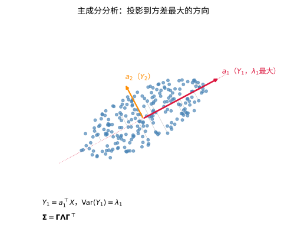
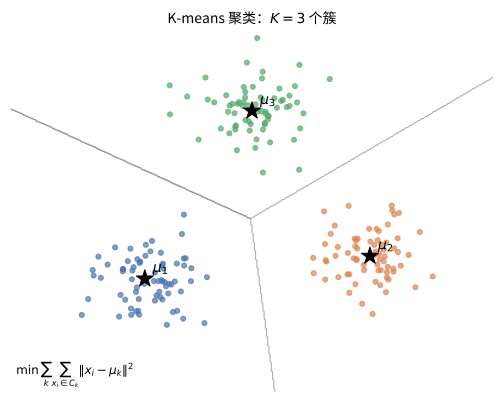
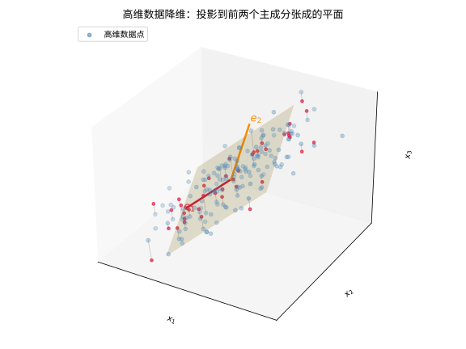

# 第 71 级：多元统计分析 (Multivariate Statistics)

> 多元统计分析是统计学的重要分支，研究同时观测多个相关变量的数据分析方法。随着数据采集技术的飞速发展，高维数据在科学研究和工业应用中无处不在。多元统计分析提供了从高维数据中提取信息、识别模式、做出推断的系统性工具。本课程从多元正态分布的理论基础出发，系统介绍主成分分析、因子分析、判别分析、聚类分析、典型相关分析等核心方法，以及多元方差分析、多维标度、独立成分分析、多元回归和协方差结构模型等高级专题。

---

## 1. 学习目标

1. 理解多元正态分布的定义、性质及其最大似然估计。
2. 掌握 Wishart 分布、Hotelling T² 分布和 Wilks Lambda 分布的定义与基本性质。
3. 理解主成分分析（PCA）的几何意义与最优性原理。
4. 掌握因子分析的基本模型与参数估计方法。
5. 理解判别分析的核心思想与 Fisher 线性判别的最优性。
6. 掌握聚类分析的基本方法（K-means、层次聚类）。
7. 理解典型相关分析（CCA）的最优性定理。
8. 了解多元方差分析（MANOVA）、多维标度（MDS）、独立成分分析（ICA）的基本原理。
9. 理解多元回归与协方差结构模型（SEM）的基本框架。

---

## 2. 核心概念

### 2.1 多元正态分布

**定义 2.1**（多元正态分布）设 $\boldsymbol{\mu} \in \mathbb{R}^p$，$\boldsymbol{\Sigma} \in \mathbb{R}^{p \times p}$ 是对称正定矩阵。随机向量 $\boldsymbol{X} = (X_1, \ldots, X_p)^\top$ 服从 **$p$ 维正态分布**，记作 $\boldsymbol{X} \sim N_p(\boldsymbol{\mu}, \boldsymbol{\Sigma})$，如果其概率密度函数为：

$$
f(\boldsymbol{x}) = \frac{1}{(2\pi)^{p/2} |\boldsymbol{\Sigma}|^{1/2}} \exp\left(-\frac{1}{2}(\boldsymbol{x} - \boldsymbol{\mu})^\top \boldsymbol{\Sigma}^{-1}(\boldsymbol{x} - \boldsymbol{\mu})\right), \quad \boldsymbol{x} \in \mathbb{R}^p.
$$

> **💡 直观理解（类比）**：多元正态分布可以想成一团"多维的高斯蛋糕"：$\boldsymbol{\mu}$ 定的是这团蛋糕最鼓的山顶（中心位置），$\boldsymbol{\Sigma}$ 则刻画蛋糕往各个方向怎么摊开——特征向量告诉你"沿着哪几个主轴伸展"，特征值告诉你"每个方向摊得多远"。指数里的二次型 $(\boldsymbol{x}-\boldsymbol{\mu})^\top\boldsymbol{\Sigma}^{-1}(\boldsymbol{x}-\boldsymbol{\mu})$ 就是"到山顶的马氏距离"，越偏轴（偏离椭球越远）密度越低。好比在桌上倒一堆面粉：中心最高，往四周沿"南瓜形"的等高线平滑地矮下去。

**性质 2.1**（多元正态分布的基本性质）

1. **线性变换不变性**：若 $\boldsymbol{X} \sim N_p(\boldsymbol{\mu}, \boldsymbol{\Sigma})$，$\boldsymbol{A} \in \mathbb{R}^{q \times p}$，$\boldsymbol{b} \in \mathbb{R}^q$，则 $\boldsymbol{AX} + \boldsymbol{b} \sim N_q(\boldsymbol{A\mu} + \boldsymbol{b}, \boldsymbol{A\Sigma A}^\top)$。
2. **边缘分布**：将 $\boldsymbol{X}$ 分块为 $\boldsymbol{X} = (\boldsymbol{X}_1^\top, \boldsymbol{X}_2^\top)^\top$，对应地 $\boldsymbol{\mu} = (\boldsymbol{\mu}_1^\top, \boldsymbol{\mu}_2^\top)^\top$，$\boldsymbol{\Sigma} = \begin{pmatrix} \boldsymbol{\Sigma}_{11} & \boldsymbol{\Sigma}_{12} \\ \boldsymbol{\Sigma}_{21} & \boldsymbol{\Sigma}_{22} \end{pmatrix}$，则 $\boldsymbol{X}_1 \sim N_{p_1}(\boldsymbol{\mu}_1, \boldsymbol{\Sigma}_{11})$。
3. **条件分布**：给定 $\boldsymbol{X}_2 = \boldsymbol{x}_2$，$\boldsymbol{X}_1$ 的条件分布为：
   $$
   \boldsymbol{X}_1 | \boldsymbol{X}_2 = \boldsymbol{x}_2 \sim N_{p_1}(\boldsymbol{\mu}_1 + \boldsymbol{\Sigma}_{12}\boldsymbol{\Sigma}_{22}^{-1}(\boldsymbol{x}_2 - \boldsymbol{\mu}_2),\; \boldsymbol{\Sigma}_{11} - \boldsymbol{\Sigma}_{12}\boldsymbol{\Sigma}_{22}^{-1}\boldsymbol{\Sigma}_{21}).
   $$
4. **独立性**：$\boldsymbol{X}_1$ 与 $\boldsymbol{X}_2$ 独立当且仅当 $\boldsymbol{\Sigma}_{12} = \boldsymbol{0}$。
5. **二次型分布**：若 $\boldsymbol{X} \sim N_p(\boldsymbol{0}, \boldsymbol{\Sigma})$，则 $\boldsymbol{X}^\top \boldsymbol{\Sigma}^{-1} \boldsymbol{X} \sim \chi^2_p$。

> **💡 直观理解（类比）**：这组性质把多元正态说成"最守规矩的一家人"：线性变换不变性——不管怎么裁剪旋转（$\boldsymbol{AX}+\boldsymbol{b}$），出来还是正态，只是山头挪了地方、椭球变了朝向；边缘分布——把蛋糕沿某条线"切一刀"看到的侧影，仍是（那个方向上的）正态峰；条件分布——给定某几个坐标去切另一个"切片"，切片仍是正态，只是中心按相关性平移、形状受 Schur 补收窄（好比给定身高后体重的分布更集中）；独立性——只要 $\boldsymbol{\Sigma}_{12}=0$，两组变量就像互不相干的两堆料。最后马氏距离平方永远服从卡方，像一把"离中心多远"的尺子自带刻度。

### 2.2 Wishart 分布

**定义 2.2**（Wishart 分布）设 $\boldsymbol{X}_1, \ldots, \boldsymbol{X}_n$ 独立同分布于 $N_p(\boldsymbol{0}, \boldsymbol{\Sigma})$。则随机矩阵 $\boldsymbol{W} = \sum_{i=1}^n \boldsymbol{X}_i \boldsymbol{X}_i^\top$ 服从 **Wishart 分布**，记作 $\boldsymbol{W} \sim W_p(n, \boldsymbol{\Sigma})$，其中 $n$ 称为自由度。

Wishart 分布是 $\chi^2$ 分布向随机矩阵的推广，其概率密度函数为：

$$
f(\boldsymbol{W}) = \frac{|\boldsymbol{W}|^{(n-p-1)/2} \exp\left(-\frac{1}{2}\operatorname{tr}(\boldsymbol{\Sigma}^{-1}\boldsymbol{W})\right)}{2^{np/2} \pi^{p(p-1)/4} |\boldsymbol{\Sigma}|^{n/2} \prod_{i=1}^p \Gamma\left(\frac{n+1-i}{2}\right)}, \quad \boldsymbol{W} \succ 0.
$$

> **💡 直观理解（类比）**：Wishart 分布是"$\chi^2$ 变成了矩阵"。一元里样本散布 $\sum X_i^2$ 服从 $\chi^2$；多元里把 $n$ 个 $p$ 维向量两两外积 $\boldsymbol{X}_i\boldsymbol{X}_i^\top$ 累加得到一个对称正定矩阵 $\boldsymbol{W}$，它服从的分布就是 Wishart。好比把"测一次方差的平方"升级成"测一整块椭圆形状"的平方——$n$ 是自由度（累积了几个样本），$\boldsymbol{\Sigma}$ 是每个样本的"标准大小"。它是样本协方差矩阵（乘 $n$）的真身，是所有多元推断（Hotelling、MANOVA）背后的"母分布"，就像 $\chi^2$ 是全部一元方差分析的母亲。

**性质 2.2**（Wishart 分布的性质）

1. **期望**：$\mathbb{E}[\boldsymbol{W}] = n\boldsymbol{\Sigma}$。
2. **可加性**：若 $\boldsymbol{W}_1 \sim W_p(n_1, \boldsymbol{\Sigma})$，$\boldsymbol{W}_2 \sim W_p(n_2, \boldsymbol{\Sigma})$ 且独立，则 $\boldsymbol{W}_1 + \boldsymbol{W}_2 \sim W_p(n_1 + n_2, \boldsymbol{\Sigma})$。
3. **线性变换**：若 $\boldsymbol{W} \sim W_p(n, \boldsymbol{\Sigma})$，$\boldsymbol{A} \in \mathbb{R}^{q \times p}$，则 $\boldsymbol{AWA}^\top \sim W_q(n, \boldsymbol{A\Sigma A}^\top)$。
4. **逆 Wishart 分布**：$\boldsymbol{W}^{-1}$ 服从逆 Wishart 分布，记作 $\boldsymbol{W}^{-1} \sim W_p^{-1}(n, \boldsymbol{\Sigma}^{-1})$。

> **💡 直观理解（类比）**：Wishart 的性质与卡方如出一辙，只是换成了"整块椭圆"的记账：期望 $n\boldsymbol{\Sigma}$ 说"摊开的平均形状就是标准的 $n$ 倍"；可加性说"两批独立样本凑在一起，自由度相加"（像把两堆面粉倒一起，椭圆越堆越大）；线性变换再配一个取舍造型矩阵就还是 Wishart；而它的逆则服从"逆 Wishart"——好比把椭圆"内外翻开"，平均协方差变平均精度，正定结构依旧完整。这几条性质构成多元推断里做"形状的加减乘除"的运算表。

### 2.3 Hotelling T² 分布

**定义 2.3**（Hotelling T² 分布）设 $\boldsymbol{X} \sim N_p(\boldsymbol{\mu}, \boldsymbol{\Sigma})$，$\boldsymbol{W} \sim W_p(n, \boldsymbol{\Sigma})$ 且 $\boldsymbol{X}$ 与 $\boldsymbol{W}$ 独立，则：

$$
T^2 = n\boldsymbol{X}^\top \boldsymbol{W}^{-1} \boldsymbol{X}
$$

服从 **Hotelling T² 分布**，记作 $T^2 \sim T^2(p, n)$。

> **💡 直观理解（类比）**：Hotelling $T^2$ 是把一元里"样本均值离中心有多远"的 $t$ 统计量立方化到多维：分子是一个多元向量 $\boldsymbol{X}$（好比观测到一个"偏移了的方向"），分母用样本散布矩阵 $\boldsymbol{W}$ 的逆来"按椭球形状归一"，得到 $T^2 = n\boldsymbol{X}^\top\boldsymbol{W}^{-1}\boldsymbol{X}$——即一个"马氏距离的平方 × 样本量"。像用一把各方向伸缩不一的尺子量"向量偏离了多少"。它与 $F$ 分布有干净的换算关系，是多元均值假设检验（如"多维身高分布是否等于某个标准"）的标配统计量。

Hotelling T² 分布是 t 分布向多变量的推广。它与 F 分布的关系为：

$$
\frac{n - p + 1}{np} T^2 \sim F_{p, n-p+1}.
$$

### 2.4 Wilks Lambda 分布

**定义 2.4**（Wilks Lambda 分布）Wilks Lambda 统计量用于多元方差分析（MANOVA）中检验组间差异。设 $\boldsymbol{W}_B$ 为组间散布矩阵，$\boldsymbol{W}_W$ 为组内散布矩阵，则：

$$
\Lambda = \frac{|\boldsymbol{W}_W|}{|\boldsymbol{W}_W + \boldsymbol{W}_B|}.
$$

在零假设下，$\Lambda$ 服从 **Wilks Lambda 分布**，记作 $\Lambda \sim \Lambda(p, \nu_H, \nu_E)$，其中 $p$ 是变量维数，$\nu_H$ 和 $\nu_E$ 分别是假设和误差的自由度。

> **💡 直观理解（类比）**：Wilks $\Lambda$ 是多元方差分析的"组间差异探测器"：分子是组内散布 $\boldsymbol{W}_W$ 的体积，分母是组内加组间 $\boldsymbol{W}_W+\boldsymbol{W}_B$ 的体积，比值 $\Lambda=\frac{|\boldsymbol{W}_W|}{|\boldsymbol{W}_W+\boldsymbol{W}_B|}$ 落在 $[0,1]$。当组间差异越大，$\boldsymbol{W}_B$ 越多地"抢占"总体积，$\Lambda$ 越小，说明各组确实分开了。好比问"撒开的各组点云相对总点云占了多少空间"：$\Lambda$ 越接近 $0$，组间分离越明显；越接近 $1$，各组越重合。它是 MANOVA 里最经典的检验统计量。

### 2.5 主成分分析（PCA）

**定义 2.5**（主成分分析）设 $\boldsymbol{X} \in \mathbb{R}^p$ 是协方差矩阵为 $\boldsymbol{\Sigma}$ 的随机向量。**主成分分析** 寻找线性变换 $\boldsymbol{Y} = \boldsymbol{A}^\top \boldsymbol{X}$，使得 $\boldsymbol{Y}$ 的分量按方差递减排列且互不相关。

具体地，第 $k$ 个主成分定义为：

$$
Y_k = \boldsymbol{a}_k^\top \boldsymbol{X}, \quad \boldsymbol{a}_k = \arg\max_{\|\boldsymbol{a}\|=1,\; \boldsymbol{a} \perp \boldsymbol{a}_1, \ldots, \boldsymbol{a}_{k-1}} \operatorname{Var}(\boldsymbol{a}^\top \boldsymbol{X}).
$$

主成分由 $\boldsymbol{\Sigma}$ 的特征分解给出：$\boldsymbol{\Sigma} = \boldsymbol{\Gamma} \boldsymbol{\Lambda} \boldsymbol{\Gamma}^\top$，其中 $\boldsymbol{\Lambda} = \operatorname{diag}(\lambda_1, \ldots, \lambda_p)$，$\lambda_1 \geq \lambda_2 \geq \cdots \geq \lambda_p \geq 0$，$\boldsymbol{\Gamma} = (\boldsymbol{\gamma}_1, \ldots, \boldsymbol{\gamma}_p)$ 是正交矩阵。第 $k$ 个主成分的系数向量为 $\boldsymbol{a}_k = \boldsymbol{\gamma}_k$，方差为 $\lambda_k$。

> **直观理解（现实类比）**：主成分分析就像从侧面看一个被拉长的椭圆面团，找到"最能区分数据"的那个长轴方向。沿这个方向看，数据散得最开（方差最大 $\lambda_1$），沿垂直方向看则挤在一起——于是我们丢掉挤在一起的方向，只用少数几个主成分就能保留绝大部分信息。

> **🧠 思考历程：老式做法"每个变量各测一个数"，为什么在面对高维数据时就捉襟见肘？PCA 想替我们"看准方向"吗？**
>
> 多元统计里的 PCA（主成分分析）在今天几乎人手一份，可它出生时的动机很朴素：**变量太多、彼此纠缠，实在难以取舍——能不能把几十上百个相关变量，压缩成少数几个"综合指数"还不丢太多信息？** 它这一步"降维"，正是从"各变量独立看"跨越到"看数据真正舒展开的方向"的关键。
>
> - **Fisher/Hotelling 年代的问题意识：相关性不该被浪费**（1930s）。当数据是高维向量，变量间常高度相关（身高、体重、鞋码一起测）。传统做法的坏习惯是"一个一个变量单独看"，把它们的相关性当噪声；可相关性其实正是**冗余**的信号——**既然身高和鞋码几乎由同一个因素驱动，那我想要的其实是那个"共同的轴"**。PCA 的直觉由此而来：与其报告 p 个数，不如算出这条数据云"自身延伸"的若干主轴。
> - **从协方差到特征值：降维其实就是"看椭圆的轴"**。把 p 个变量的数据画成云，它会朝某些方向拉得特别长、朝另一些方向几乎不动。PCA 的做法很收敛：**求出协方差矩阵 $\boldsymbol{\Sigma}$ 的特征分解，最大特征值 $\lambda_1$ 的方向就是云拉得最长的轴（第一主成分），其次是第二长的轴……**。最快的情报（方差）都集中在最大的几个特征值上——丢掉小特征值对应的方向，就几乎不损失信息，还顺手把数据"去相关"成一组正交的新坐标。
> - **"方差最大 + 互不相关"：一个漂亮的最优性**（见 3.3 定理）。PCA 最令人服气的地方，是它把直觉翻译成一个**数学上可证明的最优**：在"只用 k 个正交线性组合、使其联合方差最大"的意义下，PCA 的前 k 个主成分无法被任何线性降维超越。**这不是"试着好看的启发式"，而是一条有定理背书的"最佳压缩"**——所以它至今是数据科学的第一步。
> - **心路**：PCA 提醒我们：**数据常常没有告诉我们"哪些变量最重要"，而是告诉了"哪些方向最有信息"**。它把"变量的个数"让位给"结构的维度"——当你面对海量特征无从下手时，先翻译成"协方差/谱"，让几何替你抓主轴，往往比逐个变量争辩更接近答案。

### 2.6 因子分析

**定义 2.6**（因子分析模型）**因子分析** 假设可观测变量 $\boldsymbol{X} \in \mathbb{R}^p$ 可以表示为少数不可观测的公共因子 $\boldsymbol{F} \in \mathbb{R}^m$（$m < p$）和特殊因子 $\boldsymbol{\varepsilon} \in \mathbb{R}^p$ 的线性组合：

$$
\boldsymbol{X} = \boldsymbol{\mu} + \boldsymbol{LF} + \boldsymbol{\varepsilon},
$$

其中 $\boldsymbol{L} \in \mathbb{R}^{p \times m}$ 是 **因子载荷矩阵**，$\boldsymbol{F} \sim N_m(\boldsymbol{0}, \boldsymbol{I})$，$\boldsymbol{\varepsilon} \sim N_p(\boldsymbol{0}, \boldsymbol{\Psi})$，$\boldsymbol{\Psi} = \operatorname{diag}(\psi_1, \ldots, \psi_p)$，且 $\boldsymbol{F}$ 与 $\boldsymbol{\varepsilon}$ 独立。

在此模型下，$\boldsymbol{X}$ 的协方差矩阵为：

$$
\boldsymbol{\Sigma} = \boldsymbol{LL}^\top + \boldsymbol{\Psi}.
$$

> **💡 直观理解（类比）**：因子分析像给许多可观测变量找一个"幕后共同推力"。它假设一堆看似各自不同的分数 $X$ 其实由少数几个隐藏因子 $F$（如"智力""性格"）按载荷 $L$ 线性组合出来，再加各自独立的"独特噪声" $\boldsymbol{\varepsilon}$（特殊因子）。协方差分解 $\boldsymbol{\Sigma}=\boldsymbol{LL}^\top+\boldsymbol{\Psi}$ 就是说：变量间的相关性主要来自它们共享的那几个隐藏因子（$\boldsymbol{LL}^\top$），而 $\boldsymbol{\Psi}$ 是每个变量独有的部分。好比发光的灯泡（因子）照亮好多房间（变量），房间之间的亮度共振就源于共用同一盏灯，而每间房自己的阴影（特殊方差）互不干扰。

### 2.7 判别分析

**定义 2.7**（Fisher 线性判别分析）**Fisher 线性判别分析** 寻找一个投影方向 $\boldsymbol{a} \in \mathbb{R}^p$，使得投影后的数据 $\boldsymbol{a}^\top \boldsymbol{X}$ 具有最大的类间分离度与类内紧密度的比值。

对于两类问题，设类内散布矩阵为 $\boldsymbol{S}_W$，类间散布矩阵为 $\boldsymbol{S}_B$，Fisher 准则为：

$$
J(\boldsymbol{a}) = \frac{\boldsymbol{a}^\top \boldsymbol{S}_B \boldsymbol{a}}{\boldsymbol{a}^\top \boldsymbol{S}_W \boldsymbol{a}}.
$$

最优投影方向为 $\boldsymbol{a} \propto \boldsymbol{S}_W^{-1}(\boldsymbol{\mu}_1 - \boldsymbol{\mu}_2)$。

> **💡 直观理解（类比）**：Fisher 判别的问题朴素得像选角度拍一张合影：找一条能让两类人在底片上"分得最开、又各自不糊"的方向。准则 $J(\boldsymbol{a})=\frac{\boldsymbol{a}^\top\boldsymbol{S}_B\boldsymbol{a}}{\boldsymbol{a}^\top\boldsymbol{S}_W\boldsymbol{a}}$ 的分子衡量类间分离（两类中心拉开多大），分母衡量类内紧致（每类内部多挤），比值越大说明这个投影方向越能把两类"切开"。最优解 $\boldsymbol{a}\propto\boldsymbol{S}_W^{-1}(\boldsymbol{\mu}_1-\boldsymbol{\mu}_2)$ 相当于先按类内形状"去卷曲"（乘 $\boldsymbol{S}_W^{-1}$），再朝两中心连线的方向看去——正是"避开拥挤、直奔差异"的智慧。

### 2.8 聚类分析

**定义 2.8**（K-means 聚类）**K-means 聚类** 将 $n$ 个样本划分为 $K$ 个簇 $\mathcal{C}_1, \ldots, \mathcal{C}_K$，使得以下目标函数最小化：

$$
\min_{\mathcal{C}_1, \ldots, \mathcal{C}_K} \sum_{k=1}^K \sum_{\boldsymbol{x}_i \in \mathcal{C}_k} \|\boldsymbol{x}_i - \boldsymbol{\mu}_k\|^2,
$$

其中 $\boldsymbol{\mu}_k = \frac{1}{|\mathcal{C}_k|} \sum_{\boldsymbol{x}_i \in \mathcal{C}_k} \boldsymbol{x}_i$ 是第 $k$ 个簇的中心。

> **💡 直观理解（类比）**：K-means 的目标函数是在说"把每个点分给它离得最近的那个中心，并让所有点离各自中心的平方距离总和最小"——就像把一堆散落的球分成 $K$ 堆，每堆用一个"代表点"（质心），要求全体球到所属代表点的总路程最短。它靠"先选中心 → 按最近分点 → 重新算中心"反复迭代，好比把一摊橡皮泥掰成 $K$ 块，每轮把每一块的"重心"挪到块内中心再重分，直到块形稳定。缺点是要先知道 $K$，且只能保证局部最优。

**定义 2.9**（层次聚类）**层次聚类** 通过自底向上（凝聚）或自顶向下（分裂）的方式构建树状的聚类结构。凝聚层次聚类从每个样本作为一个簇开始，逐步合并距离最近的簇，直到达到所需的簇数。常用的距离度量包括：单连接（最小距离）、全连接（最大距离）和平均连接。

> **直观理解（现实类比）**：聚类分析就像把一堆颜色相近的糖果按颜色归类：先把糖果粗略分成几堆，然后不断把每堆的"中心"挪到最有代表性的位置，再把每颗糖果重新分给最近的堆，如此反复直到稳定。K-means 就是这种"迭代搬家"过程，最终让每颗糖果都离自己那堆的中心最近。

### 2.9 典型相关分析（CCA）

**定义 2.10**（典型相关分析）设 $\boldsymbol{X} \in \mathbb{R}^p$ 和 $\boldsymbol{Y} \in \mathbb{R}^q$ 是两个随机向量。**典型相关分析** 寻找线性组合 $U = \boldsymbol{a}^\top \boldsymbol{X}$ 和 $V = \boldsymbol{b}^\top \boldsymbol{Y}$，使得 $U$ 和 $V$ 的相关系数最大化：

$$
\rho = \max_{\boldsymbol{a}, \boldsymbol{b}} \operatorname{Corr}(\boldsymbol{a}^\top \boldsymbol{X}, \boldsymbol{b}^\top \boldsymbol{Y}) = \max_{\boldsymbol{a}, \boldsymbol{b}} \frac{\boldsymbol{a}^\top \boldsymbol{\Sigma}_{XY} \boldsymbol{b}}{\sqrt{\boldsymbol{a}^\top \boldsymbol{\Sigma}_{XX} \boldsymbol{a}} \sqrt{\boldsymbol{b}^\top \boldsymbol{\Sigma}_{YY} \boldsymbol{b}}}.
$$

最优解由广义特征值问题给出：$\boldsymbol{\Sigma}_{XY} \boldsymbol{\Sigma}_{YY}^{-1} \boldsymbol{\Sigma}_{YX} \boldsymbol{a} = \rho^2 \boldsymbol{\Sigma}_{XX} \boldsymbol{a}$。

> **💡 直观理解（类比）**：典型相关分析回答"两组变量之间藏着几层关系"：它从 $X$ 组和 $Y$ 组各挑一个线性组合 $U=\boldsymbol{a}^\top\boldsymbol{X}$、$V=\boldsymbol{b}^\top\boldsymbol{Y}$，让它们的相关系数尽可能大，就像在两本账本里各找一个最能对上号的"综合指标"，越像说明两组关系越强。最优解落在广义特征方程上，本质是"把组内噪声先白化掉、再找两组之间的主方向"。它把"两组变量相关"这一模糊概念展开成一组逐级递减的典型相关系数，是研究"脑区活动与行为指标"这类成对高维数据的首选。

### 2.10 多元方差分析（MANOVA）

**定义 2.11**（MANOVA）**多元方差分析** 是 ANOVA 向多响应变量的推广。考虑 $g$ 个组，每组有 $p$ 维观测向量。MANOVA 检验零假设 $H_0: \boldsymbol{\mu}_1 = \cdots = \boldsymbol{\mu}_g$，其中 $\boldsymbol{\mu}_i$ 是第 $i$ 组的均值向量。

常用的检验统计量包括：
- **Wilks Lambda**：$\Lambda = \frac{|\boldsymbol{W}_W|}{|\boldsymbol{W}_W + \boldsymbol{W}_B|}$；
- **Pillai 迹**：$\operatorname{tr}(\boldsymbol{W}_W^{-1} \boldsymbol{W}_B)$；
- **Hotelling-Lawley 迹**：$\operatorname{tr}(\boldsymbol{W}_W^{-1} \boldsymbol{W}_B)$；
- **Roy 最大根**：$\lambda_{\max}(\boldsymbol{W}_W^{-1} \boldsymbol{W}_B)$。

> **💡 直观理解（类比）**：MANOVA 是把一元方差分析（比几个组的均值是否相等）升级到"同时看一组 $p$ 维向量是否全组都很"，检验 $H_0:\boldsymbol{\mu}_1=\cdots=\boldsymbol{\mu}_g$。它不再逐个指标分开检验（那会踩中"多重比较犯错的雷"），而是把组内/组间散布浓缩成几个统计量统一裁决：Wilks $\Lambda$ 看重体积比，Pillai 迹、Hotelling-Lawley 迹、Roy 最大根则从特征值角度捕捉组间差异的不同侧面。好比同时检查整排秤是否校准，而不是一把一把单独验。当响应只有一个维度时，MANOVA 就自然退回一元 ANOVA。

### 2.11 多维标度（MDS）

**定义 2.12**（多维标度）**多维标度** 是一组将样本间的相异度（距离）映射到低维空间中的坐标的方法。给定 $n$ 个样本间的相异度矩阵 $\boldsymbol{D} = (d_{ij})$，经典 MDS 寻找低维表示 $\boldsymbol{y}_1, \ldots, \boldsymbol{y}_n \in \mathbb{R}^k$（$k < p$），使得 $\|\boldsymbol{y}_i - \boldsymbol{y}_j\| \approx d_{ij}$。

经典 MDS 通过对双中心化内积矩阵 $\boldsymbol{B} = -\frac{1}{2} \boldsymbol{J D}^{(2)} \boldsymbol{J}$ 进行特征分解实现，其中 $\boldsymbol{J} = \boldsymbol{I} - \frac{1}{n}\boldsymbol{11}^\top$，$\boldsymbol{D}^{(2)} = (d_{ij}^2)$。

> **💡 直观理解（类比）**：多维标度就像"只看城市间里程表，也能还原一张地图"：我们手上只有样本两两之间的相异度 $d_{ij}$（距离），并不知道它们在真实空间的坐标，MDS 要反推出能近似还原这些距离的低维坐标 $\boldsymbol{y}_i$。它先把距离平方矩阵做双中心化（对 $\boldsymbol{J D}^{(2)}\boldsymbol{J}$，好比把坐标系原点搬到全体质心），再把得到的内积矩阵 $\boldsymbol{B}$ 做特征分解，取前 $k$ 个主要方向当坐标轴。打个比方：给你一摞"各城市距离远近"的表格，MDS 也能铺出一张坐标纸来——就像通过彼此距离反推各点在哪。

### 2.12 独立成分分析（ICA）

**定义 2.13**（独立成分分析）**独立成分分析** 寻找线性变换 $\boldsymbol{S} = \boldsymbol{WX}$，使得 $\boldsymbol{S}$ 的分量尽可能统计独立。模型为：

$$
\boldsymbol{X} = \boldsymbol{AS},
$$

其中 $\boldsymbol{X} \in \mathbb{R}^p$ 是可观测混合信号，$\boldsymbol{S} \in \mathbb{R}^p$ 是未知独立源信号，$\boldsymbol{A} \in \mathbb{R}^{p \times p}$ 是混合矩阵。ICA 通过最大化非高斯性或最小化互信息来估计 $\boldsymbol{W} = \boldsymbol{A}^{-1}$。

> **💡 直观理解（类比）**：独立成分分析就是"鸡尾酒会识音"：几个说话声混进同一个麦克风信号里，ICA 负责把它们一条条拆开还原成彼此独立的原始声源。模型 $\boldsymbol{X}=\boldsymbol{AS}$ 说观测到的混合信号是未知独立源 $\boldsymbol{S}$ 经常数混合矩阵 $\boldsymbol{A}$ 线性搅和而成。跟 PCA 只去相关（二阶矩）不同，ICA 靠"独立要强得多"（高阶矩），通过最大化非高斯性/最小化互信息把信号分开——好比既去重影，还要把重叠的声纹彻底剥开，是脑电/音频源分离的主要工具。

### 2.13 多元回归

**定义 2.14**（多元回归）**多元线性回归** 研究多个响应变量 $\boldsymbol{Y} \in \mathbb{R}^q$ 与多个预测变量 $\boldsymbol{X} \in \mathbb{R}^p$ 之间的关系：

$$
\boldsymbol{Y} = \boldsymbol{XB} + \boldsymbol{E},
$$

其中 $\boldsymbol{B} \in \mathbb{R}^{p \times q}$ 是回归系数矩阵，$\boldsymbol{E}$ 是误差矩阵，其行独立同分布于 $N_q(\boldsymbol{0}, \boldsymbol{\Sigma})$。

> **💡 直观理解（类比）**：多元回归把"一元回归"扩成"多个响应同时被同一堆预测变量解释"：$\boldsymbol{Y}=\boldsymbol{XB}+\boldsymbol{E}$ 里，系数矩阵 $\boldsymbol{B}$ 的每一列描述一个响应变量如何被 $p$ 个预测变量加权拟合，各行的误差向量独立同分布于 $N_q(\boldsymbol{0},\boldsymbol{\Sigma})$（允许不同响应之间有相关）。好比一位厨师用一筐相同的食材（$X$）同时做出多道菜（$Y$ 的各分量），配方表 $\boldsymbol{B}$ 告诉每道菜该放什么、放多少。因为多响应彼此相关，一起拟合比分列单独回归更稳、更能利用协方差信息。

### 2.14 协方差结构模型（SEM）

**定义 2.15**（协方差结构模型）**协方差结构模型**（也称结构方程模型）结合了因子分析和回归分析，用于检验观测变量与潜在变量之间的理论关系。模型包含两个部分：

1. **测量模型**：$\boldsymbol{X} = \boldsymbol{\Lambda}_X \boldsymbol{\xi} + \boldsymbol{\delta}$，$\boldsymbol{Y} = \boldsymbol{\Lambda}_Y \boldsymbol{\eta} + \boldsymbol{\varepsilon}$；
2. **结构模型**：$\boldsymbol{\eta} = \boldsymbol{B\eta} + \boldsymbol{\Gamma\xi} + \boldsymbol{\zeta}$。

其中 $\boldsymbol{\xi}$ 和 $\boldsymbol{\eta}$ 分别为外生和内生潜在变量，$\boldsymbol{\Lambda}_X$ 和 $\boldsymbol{\Lambda}_Y$ 为因子载荷矩阵。

> **💡 直观理解（类比）**：SEM 是"因子分析 + 回归"的合体，专门验证藏在显式测量背后的"潜在概念"（如满意度、品牌忠诚）之间的因果路径。测量模型说"可观测分数是潜在变量的影子"（$\boldsymbol{X}=\boldsymbol{\Lambda}_X\boldsymbol{\xi}+\boldsymbol{\delta}$），结构模型则说"潜在变量之间像回归一样互相指向"（$\boldsymbol{\eta}=\boldsymbol{B\eta}+\boldsymbol{\Gamma\xi}+\boldsymbol{\zeta}$）。好比测量一个人"健康状况"（潜在）靠几项体检指标（观测），再把"健康"到"生活满意度"连成一条可检验的因果链。它让研究者一次同时验证"测没测准"和"因不因果"，是社会科学建模的利器。

---

## 3. 定理与证明

### 3.1 多元正态分布的最大似然估计

**定理 3.1**（多元正态分布的最大似然估计）设 $\boldsymbol{X}_1, \ldots, \boldsymbol{X}_n$ 独立同分布于 $N_p(\boldsymbol{\mu}, \boldsymbol{\Sigma})$，其中 $\boldsymbol{\Sigma} \succ 0$。则 $\boldsymbol{\mu}$ 和 $\boldsymbol{\Sigma}$ 的最大似然估计为：

$$
\hat{\boldsymbol{\mu}} = \bar{\boldsymbol{X}} = \frac{1}{n} \sum_{i=1}^n \boldsymbol{X}_i,
$$

$$
\hat{\boldsymbol{\Sigma}} = \frac{1}{n} \sum_{i=1}^n (\boldsymbol{X}_i - \bar{\boldsymbol{X}})(\boldsymbol{X}_i - \bar{\boldsymbol{X}})^\top.
$$

> **💡 直观理解（类比）**：定理 3.1 给出多元正态的"最合理估计"：均值就用样本平均 $\bar{\boldsymbol{X}}$（把所有点堆一起找中心），协方差就用"样本相对中心的平均散布矩阵" $\hat{\boldsymbol{\Sigma}}=\frac1n\sum(\boldsymbol{X}_i-\bar{\boldsymbol{X}})(\cdot)^\top$（把每个点到中心的偏移向量两两外积后再平均）。好比给一团数据云找一个"最能解释它的椭圆"：圆心取数据中心，每个方向的宽度按数据实际散开程度来定。这个估计由对对数似然求极值直接推算出来，是后续一切多元推断的起点（注意用 $\frac1n$ 时是有偏的，无偏要除以 $n-1$）。

**证明**：我们分步骤完成证明。

**步骤 1：写出似然函数**

样本的联合密度函数为：

$$
L(\boldsymbol{\mu}, \boldsymbol{\Sigma}) = \prod_{i=1}^n \frac{1}{(2\pi)^{p/2} |\boldsymbol{\Sigma}|^{1/2}} \exp\left(-\frac{1}{2}(\boldsymbol{X}_i - \boldsymbol{\mu})^\top \boldsymbol{\Sigma}^{-1}(\boldsymbol{X}_i - \boldsymbol{\mu})\right).
$$

**步骤 2：取对数似然**

$$
\ell(\boldsymbol{\mu}, \boldsymbol{\Sigma}) = \log L(\boldsymbol{\mu}, \boldsymbol{\Sigma}) = -\frac{np}{2} \log(2\pi) - \frac{n}{2} \log |\boldsymbol{\Sigma}| - \frac{1}{2} \sum_{i=1}^n (\boldsymbol{X}_i - \boldsymbol{\mu})^\top \boldsymbol{\Sigma}^{-1}(\boldsymbol{X}_i - \boldsymbol{\mu}).
$$

**步骤 3：对 $\boldsymbol{\mu}$ 求导**

利用矩阵求导公式 $\frac{\partial}{\partial \boldsymbol{\mu}} (\boldsymbol{X}_i - \boldsymbol{\mu})^\top \boldsymbol{\Sigma}^{-1}(\boldsymbol{X}_i - \boldsymbol{\mu}) = -2\boldsymbol{\Sigma}^{-1}(\boldsymbol{X}_i - \boldsymbol{\mu})$，得：

$$
\frac{\partial \ell}{\partial \boldsymbol{\mu}} = \sum_{i=1}^n \boldsymbol{\Sigma}^{-1}(\boldsymbol{X}_i - \boldsymbol{\mu}) = \boldsymbol{\Sigma}^{-1} \sum_{i=1}^n (\boldsymbol{X}_i - \boldsymbol{\mu}).
$$

令其为零：

$$
\boldsymbol{\Sigma}^{-1} \sum_{i=1}^n (\boldsymbol{X}_i - \boldsymbol{\mu}) = \boldsymbol{0} \quad \Longrightarrow \quad \sum_{i=1}^n \boldsymbol{X}_i - n\boldsymbol{\mu} = \boldsymbol{0}.
$$

解得 $\hat{\boldsymbol{\mu}} = \frac{1}{n} \sum_{i=1}^n \boldsymbol{X}_i = \bar{\boldsymbol{X}}$。

**步骤 4：对 $\boldsymbol{\Sigma}$ 求导**

将 $\boldsymbol{\mu} = \bar{\boldsymbol{X}}$ 代入对数似然函数。首先重写二次型项：

$$
\sum_{i=1}^n (\boldsymbol{X}_i - \bar{\boldsymbol{X}})^\top \boldsymbol{\Sigma}^{-1}(\boldsymbol{X}_i - \bar{\boldsymbol{X}}) = \operatorname{tr}\left(\boldsymbol{\Sigma}^{-1} \sum_{i=1}^n (\boldsymbol{X}_i - \bar{\boldsymbol{X}})(\boldsymbol{X}_i - \bar{\boldsymbol{X}})^\top \right) = \operatorname{tr}(\boldsymbol{\Sigma}^{-1} \boldsymbol{S}_n),
$$

其中 $\boldsymbol{S}_n = \sum_{i=1}^n (\boldsymbol{X}_i - \bar{\boldsymbol{X}})(\boldsymbol{X}_i - \bar{\boldsymbol{X}})^\top$。

因此对数似然函数为：

$$
\ell(\hat{\boldsymbol{\mu}}, \boldsymbol{\Sigma}) = -\frac{np}{2} \log(2\pi) - \frac{n}{2} \log |\boldsymbol{\Sigma}| - \frac{1}{2} \operatorname{tr}(\boldsymbol{\Sigma}^{-1} \boldsymbol{S}_n) + \text{常数}.
$$

利用矩阵求导公式：
- $\frac{\partial}{\partial \boldsymbol{\Sigma}} \log |\boldsymbol{\Sigma}| = \boldsymbol{\Sigma}^{-1}$；
- $\frac{\partial}{\partial \boldsymbol{\Sigma}} \operatorname{tr}(\boldsymbol{\Sigma}^{-1} \boldsymbol{S}_n) = -\boldsymbol{\Sigma}^{-1} \boldsymbol{S}_n \boldsymbol{\Sigma}^{-1}$。

于是：

$$
\frac{\partial \ell}{\partial \boldsymbol{\Sigma}} = -\frac{n}{2} \boldsymbol{\Sigma}^{-1} + \frac{1}{2} \boldsymbol{\Sigma}^{-1} \boldsymbol{S}_n \boldsymbol{\Sigma}^{-1}.
$$

令其为零，左乘 $\boldsymbol{\Sigma}$ 再右乘 $\boldsymbol{\Sigma}$：

$$
-\frac{n}{2} \boldsymbol{\Sigma} + \frac{1}{2} \boldsymbol{S}_n = \boldsymbol{0} \quad \Longrightarrow \quad \hat{\boldsymbol{\Sigma}} = \frac{1}{n} \boldsymbol{S}_n.
$$

**步骤 5：验证最大值**

对数似然函数的 Hessian 矩阵在驻点处负定，因此该驻点给出最大值。$\square$

### 3.2 Wishart 分布的密度函数与性质

**定理 3.2**（Wishart 分布的密度函数）设 $\boldsymbol{X}_1, \ldots, \boldsymbol{X}_n$ 独立同分布于 $N_p(\boldsymbol{0}, \boldsymbol{\Sigma})$，$\boldsymbol{W} = \sum_{i=1}^n \boldsymbol{X}_i \boldsymbol{X}_i^\top$。则 $\boldsymbol{W}$ 的概率密度函数为：

$$
f(\boldsymbol{W}) = \frac{|\boldsymbol{W}|^{(n-p-1)/2} \exp\left(-\frac{1}{2}\operatorname{tr}(\boldsymbol{\Sigma}^{-1}\boldsymbol{W})\right)}{2^{np/2} \pi^{p(p-1)/4} |\boldsymbol{\Sigma}|^{n/2} \prod_{i=1}^p \Gamma\left(\frac{n+1-i}{2}\right)}, \quad \boldsymbol{W} \succ 0.
$$

> **💡 直观理解（类比）**：定理 3.2 是在说"样本散布矩阵 $\boldsymbol{W}$ 的形状密度长这样"，把小学里 $\chi^2$ 那套"平方和的分布"搬到了矩阵世界。公式里的 $\exp(-\frac12\operatorname{tr}(\boldsymbol{\Sigma}^{-1}\boldsymbol{W}))$ 是矩阵版的"指数尾巴"（用 $\boldsymbol{\Sigma}$ 归一化），而 $|\boldsymbol{W}|^{(n-p-1)/2}$ 是类比 $\chi^2$ 里 $x^{(n-1)/2}$ 的"体积因子"。证明的关键是把 $\boldsymbol{X}$ 分解成 $\boldsymbol{U}\boldsymbol{T}$（正交部分 $\times$ Cholesky 三角），再在 Stiefel 流形上一步步积分——这就像把一块不规则面团分解成"标准方向 × 三角切法"，分块量好再拼回整体密度。它告诉你 Wishart 的分配细节，是样本协方差推断的地基。

**证明**：我们用变量变换法推导 Wishart 分布的密度函数。

**步骤 1：谱分解与矩阵变量变换**

设 $\boldsymbol{X} = (\boldsymbol{X}_1, \ldots, \boldsymbol{X}_n)^\top \in \mathbb{R}^{n \times p}$，则 $\boldsymbol{W} = \boldsymbol{X}^\top \boldsymbol{X}$。为推导 $\boldsymbol{W}$ 的分布，先考虑 $\boldsymbol{\Sigma} = \boldsymbol{I}_p$ 的情形（标准情形），然后通过线性变换推广到一般情形。

**步骤 2：标准情形 $\boldsymbol{\Sigma} = \boldsymbol{I}_p$**

当 $\boldsymbol{\Sigma} = \boldsymbol{I}_p$ 时，$\boldsymbol{X}$ 的密度函数为：

$$
f(\boldsymbol{X}) = (2\pi)^{-np/2} \exp\left(-\frac{1}{2}\operatorname{tr}(\boldsymbol{X}^\top \boldsymbol{X})\right).
$$

我们需要从 $\boldsymbol{X}$ 的密度通过变量变换 $\boldsymbol{W} = \boldsymbol{X}^\top \boldsymbol{X}$ 得到 $\boldsymbol{W}$ 的密度。这涉及矩阵变量变换的 Jacobian 行列式。

**步骤 3：Cholesky 分解与 Jacobian**

设 $\boldsymbol{W} = \boldsymbol{T}^\top \boldsymbol{T}$，其中 $\boldsymbol{T}$ 是上三角矩阵且对角线元素为正（Cholesky 分解）。$\boldsymbol{X}$ 可以表示为 $\boldsymbol{X} = \boldsymbol{U} \boldsymbol{T}$，其中 $\boldsymbol{U} \in \mathbb{R}^{n \times p}$ 满足 $\boldsymbol{U}^\top \boldsymbol{U} = \boldsymbol{I}_p$（即 $\boldsymbol{U}$ 的列是标准正交的）。

从 $\boldsymbol{X}$ 到 $(\boldsymbol{U}, \boldsymbol{T})$ 的变换的 Jacobian 行列式为：

$$
J(\boldsymbol{X} \to (\boldsymbol{U}, \boldsymbol{T})) = \prod_{i=1}^p t_{ii}^{n-i}.
$$

**步骤 4：在 Stiefel 流形上积分**

在 Stiefel 流形 $V_{n,p} = \{\boldsymbol{U} \in \mathbb{R}^{n \times p} : \boldsymbol{U}^\top \boldsymbol{U} = \boldsymbol{I}_p\}$ 上的均匀分布体积为：

$$
\operatorname{Vol}(V_{n,p}) = \frac{2^p \pi^{np/2}}{\Gamma_p(n/2)},
$$

其中 $\Gamma_p(a) = \pi^{p(p-1)/4} \prod_{i=1}^p \Gamma(a - (i-1)/2)$ 是多元 Gamma 函数。

**步骤 5：整合得到密度**

$$
f(\boldsymbol{W}) = \int_{V_{n,p}} (2\pi)^{-np/2} \exp\left(-\frac{1}{2}\operatorname{tr}(\boldsymbol{W})\right) \cdot \prod_{i=1}^p w_{ii}^{(n-i)/2} \, d\boldsymbol{U}
$$

$$
= \frac{|\boldsymbol{W}|^{(n-p-1)/2} \exp\left(-\frac{1}{2}\operatorname{tr}(\boldsymbol{W})\right)}{2^{np/2} \pi^{p(p-1)/4} \prod_{i=1}^p \Gamma\left(\frac{n+1-i}{2}\right)}.
$$

**步骤 6：一般情形 $\boldsymbol{\Sigma} \neq \boldsymbol{I}_p$**

设 $\boldsymbol{Y}_i = \boldsymbol{\Sigma}^{-1/2} \boldsymbol{X}_i$，则 $\boldsymbol{Y}_i \sim N_p(\boldsymbol{0}, \boldsymbol{I}_p)$，且 $\boldsymbol{W}_Y = \sum \boldsymbol{Y}_i \boldsymbol{Y}_i^\top \sim W_p(n, \boldsymbol{I}_p)$。由于 $\boldsymbol{W} = \boldsymbol{\Sigma}^{1/2} \boldsymbol{W}_Y \boldsymbol{\Sigma}^{1/2}$，通过线性变换的 Jacobian 行列式 $|\boldsymbol{\Sigma}|^{n/2}$，得到一般情形的密度公式。$\square$

**Wishart 分布的性质证明**：

**(a) 期望**：$\mathbb{E}[\boldsymbol{W}] = n\boldsymbol{\Sigma}$。

**证明**：$\mathbb{E}[\boldsymbol{W}] = \mathbb{E}\left[\sum_{i=1}^n \boldsymbol{X}_i \boldsymbol{X}_i^\top\right] = \sum_{i=1}^n \mathbb{E}[\boldsymbol{X}_i \boldsymbol{X}_i^\top] = n\boldsymbol{\Sigma}$。$\square$

**(b) 可加性**：若 $\boldsymbol{W}_1 \sim W_p(n_1, \boldsymbol{\Sigma})$，$\boldsymbol{W}_2 \sim W_p(n_2, \boldsymbol{\Sigma})$ 且独立，则 $\boldsymbol{W}_1 + \boldsymbol{W}_2 \sim W_p(n_1 + n_2, \boldsymbol{\Sigma})$。

**证明**：由定义，$\boldsymbol{W}_1 = \sum_{i=1}^{n_1} \boldsymbol{X}_i \boldsymbol{X}_i^\top$，$\boldsymbol{W}_2 = \sum_{i=n_1+1}^{n_1+n_2} \boldsymbol{X}_i \boldsymbol{X}_i^\top$，其中 $\boldsymbol{X}_i$ 独立同分布于 $N_p(\boldsymbol{0}, \boldsymbol{\Sigma})$。则 $\boldsymbol{W}_1 + \boldsymbol{W}_2 = \sum_{i=1}^{n_1+n_2} \boldsymbol{X}_i \boldsymbol{X}_i^\top \sim W_p(n_1 + n_2, \boldsymbol{\Sigma})$。$\square$

### 3.3 主成分的最优性定理

**定理 3.3**（第一主成分的最优性）设 $\boldsymbol{X} \in \mathbb{R}^p$ 是协方差矩阵为 $\boldsymbol{\Sigma}$ 的随机向量，其特征值为 $\lambda_1 \geq \lambda_2 \geq \cdots \geq \lambda_p \geq 0$，对应的标准正交特征向量为 $\boldsymbol{\gamma}_1, \ldots, \boldsymbol{\gamma}_p$。则第一主成分 $Y_1 = \boldsymbol{\gamma}_1^\top \boldsymbol{X}$ 在以下意义下最优：

$$
\operatorname{Var}(Y_1) = \lambda_1 = \max_{\|\boldsymbol{a}\|=1} \operatorname{Var}(\boldsymbol{a}^\top \boldsymbol{X}).
$$

> **💡 直观理解（类比）**：定理 3.3 是说"第一主成分就是把所有单位方向上投影方差挑到最大"：$\boldsymbol{a}^\top\boldsymbol{\Sigma}\boldsymbol{a}$ 表示把数据往单位方向 $\boldsymbol{a}$ 投影后散开的程度，在全空间里求最大值恰好在 $\boldsymbol{\Sigma}$ 的最大特征向量方向取到，数值就是最大特征值 $\lambda_1$。好比从各个角度观察一团椭圆云，总有某个最"长"的角度让影子拉得最长——第一主成分正是"最长的影子"，接下来的主成分在垂直于它的正交方向里继续挑最长的影子。这用 Lagrange 乘子一求即是特征方程 $\boldsymbol{\Sigma}\boldsymbol{a}=\lambda\boldsymbol{a}$，简单而干净。

**证明**：我们给出完整的证明。

**步骤 1：问题转化**

我们需要求解以下约束优化问题：

$$
\max_{\boldsymbol{a} \in \mathbb{R}^p} \boldsymbol{a}^\top \boldsymbol{\Sigma} \boldsymbol{a} \quad \text{subject to} \quad \boldsymbol{a}^\top \boldsymbol{a} = 1.
$$

**步骤 2：使用 Lagrange 乘子法**

定义 Lagrange 函数：

$$
\mathcal{L}(\boldsymbol{a}, \lambda) = \boldsymbol{a}^\top \boldsymbol{\Sigma} \boldsymbol{a} - \lambda(\boldsymbol{a}^\top \boldsymbol{a} - 1).
$$

对 $\boldsymbol{a}$ 求导并令其为零：

$$
\frac{\partial \mathcal{L}}{\partial \boldsymbol{a}} = 2\boldsymbol{\Sigma} \boldsymbol{a} - 2\lambda \boldsymbol{a} = \boldsymbol{0} \quad \Longrightarrow \quad \boldsymbol{\Sigma} \boldsymbol{a} = \lambda \boldsymbol{a}.
$$

因此，$\boldsymbol{a}$ 必须是 $\boldsymbol{\Sigma}$ 的特征向量，$\lambda$ 是对应的特征值。

**步骤 3：确定最优解**

目标函数 $\boldsymbol{a}^\top \boldsymbol{\Sigma} \boldsymbol{a} = \boldsymbol{a}^\top (\lambda \boldsymbol{a}) = \lambda$。因此最大值在所有特征值中的最大值处取得，即：

$$
\max_{\|\boldsymbol{a}\|=1} \boldsymbol{a}^\top \boldsymbol{\Sigma} \boldsymbol{a} = \lambda_1,
$$

且最优解为 $\boldsymbol{a} = \boldsymbol{\gamma}_1$（第一特征向量），对应的主成分为 $Y_1 = \boldsymbol{\gamma}_1^\top \boldsymbol{X}$，方差为 $\lambda_1$。

**步骤 4：后续主成分的最优性**

对于第 $k$ 个主成分，额外施加正交约束 $\boldsymbol{a}^\top \boldsymbol{\gamma}_j = 0$（$j = 1, \ldots, k-1$）。类似地，解为 $\boldsymbol{a} = \boldsymbol{\gamma}_k$，方差为 $\lambda_k$。$\square$

### 3.4 Fisher 线性判别的最优性

**定理 3.4**（Fisher 线性判别的最优性）考虑两类问题，设类 $\pi_1$ 和 $\pi_2$ 的均值向量分别为 $\boldsymbol{\mu}_1$ 和 $\boldsymbol{\mu}_2$，共同的协方差矩阵为 $\boldsymbol{\Sigma}$。Fisher 线性判别准则选择投影方向 $\boldsymbol{a}$ 最大化 Fisher 比率：

$$
J(\boldsymbol{a}) = \frac{(\boldsymbol{a}^\top(\boldsymbol{\mu}_1 - \boldsymbol{\mu}_2))^2}{\boldsymbol{a}^\top \boldsymbol{\Sigma} \boldsymbol{a}}.
$$

则最优投影方向为 $\boldsymbol{a} \propto \boldsymbol{\Sigma}^{-1}(\boldsymbol{\mu}_1 - \boldsymbol{\mu}_2)$。

> **💡 直观理解（类比）**：定理 3.4 给出"最能把两类分开的看方向"：先计算两类中心之差 $\boldsymbol{d}=\boldsymbol{\mu}_1-\boldsymbol{\mu}_2$（指向差别的方向），再在左侧乘 $\boldsymbol{\Sigma}^{-1}$ 做一次"按类内噪声白化"——把椭圆形的类内分布压成圆形，好让处于拥挤方向的两类在真实意义下"拉开"。于是最优方向 $\boldsymbol{a}\propto\boldsymbol{\Sigma}^{-1}\boldsymbol{d}$ 就是"先去拥挤、再冲差异"。证明用内积 $\langle\cdot,\cdot\rangle_{\Sigma}$ 下的 Cauchy-Schwarz 一步到位，得到的最大 Fisher 比率恰是 Mahalanobis 距离平方 $\Delta^2$——两类隔得越开（马氏距离越大），判别越干净。

**证明**：

**步骤 1：问题表述**

最大化 Fisher 比率等价于求解：

$$
\max_{\boldsymbol{a} \neq \boldsymbol{0}} \frac{(\boldsymbol{a}^\top \boldsymbol{d})^2}{\boldsymbol{a}^\top \boldsymbol{\Sigma} \boldsymbol{a}},
$$

其中 $\boldsymbol{d} = \boldsymbol{\mu}_1 - \boldsymbol{\mu}_2$。

**步骤 2：Cauchy-Schwarz 不等式**

注意到该比率对 $\boldsymbol{a}$ 的缩放不变，可施加约束 $\boldsymbol{a}^\top \boldsymbol{\Sigma} \boldsymbol{a} = 1$。问题化为：

$$
\max_{\boldsymbol{a}^\top \boldsymbol{\Sigma} \boldsymbol{a} = 1} (\boldsymbol{a}^\top \boldsymbol{d})^2.
$$

利用 Cauchy-Schwarz 不等式在 Mahalanobis 内积下的形式。定义内积 $\langle \boldsymbol{u}, \boldsymbol{v} \rangle_{\boldsymbol{\Sigma}} = \boldsymbol{u}^\top \boldsymbol{\Sigma} \boldsymbol{v}$，则约束为 $\|\boldsymbol{a}\|_{\boldsymbol{\Sigma}} = 1$。

由 Cauchy-Schwarz 不等式：

$$
(\boldsymbol{a}^\top \boldsymbol{d})^2 = (\langle \boldsymbol{a}, \boldsymbol{\Sigma}^{-1} \boldsymbol{d} \rangle_{\boldsymbol{\Sigma}})^2 \leq \|\boldsymbol{a}\|_{\boldsymbol{\Sigma}}^2 \cdot \|\boldsymbol{\Sigma}^{-1} \boldsymbol{d}\|_{\boldsymbol{\Sigma}}^2 = 1 \cdot \boldsymbol{d}^\top \boldsymbol{\Sigma}^{-1} \boldsymbol{d}.
$$

**步骤 3：确定最优解**

等号成立当且仅当 $\boldsymbol{a}$ 与 $\boldsymbol{\Sigma}^{-1} \boldsymbol{d}$ 在 $\boldsymbol{\Sigma}$-内积下共线，即 $\boldsymbol{a} \propto \boldsymbol{\Sigma}^{-1} \boldsymbol{d} = \boldsymbol{\Sigma}^{-1}(\boldsymbol{\mu}_1 - \boldsymbol{\mu}_2)$。

此时 Fisher 比率的最大值为：

$$
J_{\max} = \boldsymbol{d}^\top \boldsymbol{\Sigma}^{-1} \boldsymbol{d} = (\boldsymbol{\mu}_1 - \boldsymbol{\mu}_2)^\top \boldsymbol{\Sigma}^{-1}(\boldsymbol{\mu}_1 - \boldsymbol{\mu}_2) = \Delta^2,
$$

即 Mahalanobis 距离的平方。$\square$

### 3.5 典型相关分析的最优性定理

**定理 3.5**（典型相关分析的最优性）设 $\boldsymbol{X} \in \mathbb{R}^p$ 和 $\boldsymbol{Y} \in \mathbb{R}^q$ 的协方差矩阵为：

$$
\operatorname{Cov}\begin{pmatrix} \boldsymbol{X} \\ \boldsymbol{Y} \end{pmatrix} = \begin{pmatrix} \boldsymbol{\Sigma}_{XX} & \boldsymbol{\Sigma}_{XY} \\ \boldsymbol{\Sigma}_{YX} & \boldsymbol{\Sigma}_{YY} \end{pmatrix}.
$$

第一典型相关系数 $\rho_1$ 和典型变量 $(U_1, V_1)$ 由以下优化问题给出：

$$
\rho_1 = \max_{\boldsymbol{a} \in \mathbb{R}^p, \boldsymbol{b} \in \mathbb{R}^q} \operatorname{Corr}(\boldsymbol{a}^\top \boldsymbol{X}, \boldsymbol{b}^\top \boldsymbol{Y}) = \max_{\boldsymbol{a}, \boldsymbol{b}} \frac{\boldsymbol{a}^\top \boldsymbol{\Sigma}_{XY} \boldsymbol{b}}{\sqrt{\boldsymbol{a}^\top \boldsymbol{\Sigma}_{XX} \boldsymbol{a}} \sqrt{\boldsymbol{b}^\top \boldsymbol{\Sigma}_{YY} \boldsymbol{b}}}.
$$

最优解 $(\boldsymbol{a}_1, \boldsymbol{b}_1)$ 满足广义特征方程：

$$
\boldsymbol{\Sigma}_{XY} \boldsymbol{\Sigma}_{YY}^{-1} \boldsymbol{\Sigma}_{YX} \boldsymbol{a}_1 = \rho_1^2 \boldsymbol{\Sigma}_{XX} \boldsymbol{a}_1,
$$

$$
\boldsymbol{\Sigma}_{YX} \boldsymbol{\Sigma}_{XX}^{-1} \boldsymbol{\Sigma}_{XY} \boldsymbol{b}_1 = \rho_1^2 \boldsymbol{\Sigma}_{YY} \boldsymbol{b}_1.
$$

> **💡 直观理解（类比）**：定理 3.5 说明 CCA 的第一对 $(U_1,V_1)$ 就是"两组变量彼此最对得上号的综合指标"：在各自组内把噪声先用 Cholesky 分解"白化"（令 $\boldsymbol{a}^\top\boldsymbol{\Sigma}_{XX}\boldsymbol{a}=1$、$\boldsymbol{b}^\top\boldsymbol{\Sigma}_{YY}\boldsymbol{b}=1$），问题就化成求 $\|\boldsymbol{u}\|=\|\boldsymbol{v}\|=1$ 时 $\boldsymbol{u}^\top\boldsymbol{M}\boldsymbol{v}$ 的最大值，其解由 $\boldsymbol{M}$ 的 SVD 给出，重要奇异值正是第一典型相关系数 $\rho_1$。例如"课程成绩与能力测试"两组指标，第一对典型变量就挑出"最能互相解释"的那组线性组合。最大化相关被奇异值的上界和 Cauchy-Schwarz 钉死，既严谨又漂亮。

**证明**：

**步骤 1：标准化变换**

由于相关系数对缩放不变，施加约束 $\boldsymbol{a}^\top \boldsymbol{\Sigma}_{XX} \boldsymbol{a} = 1$ 和 $\boldsymbol{b}^\top \boldsymbol{\Sigma}_{YY} \boldsymbol{b} = 1$。问题化为：

$$
\max_{\boldsymbol{a}^\top \boldsymbol{\Sigma}_{XX} \boldsymbol{a} = 1, \; \boldsymbol{b}^\top \boldsymbol{\Sigma}_{YY} \boldsymbol{b} = 1} \boldsymbol{a}^\top \boldsymbol{\Sigma}_{XY} \boldsymbol{b}.
$$

**步骤 2：Cholesky 分解与变量替换**

令 $\boldsymbol{\Sigma}_{XX} = \boldsymbol{R}_{XX}^\top \boldsymbol{R}_{XX}$，$\boldsymbol{\Sigma}_{YY} = \boldsymbol{R}_{YY}^\top \boldsymbol{R}_{YY}$（Cholesky 分解），定义 $\boldsymbol{u} = \boldsymbol{R}_{XX} \boldsymbol{a}$，$\boldsymbol{v} = \boldsymbol{R}_{YY} \boldsymbol{b}$。则约束化为 $\|\boldsymbol{u}\| = \|\boldsymbol{v}\| = 1$，且目标函数化为：

$$
\boldsymbol{a}^\top \boldsymbol{\Sigma}_{XY} \boldsymbol{b} = \boldsymbol{u}^\top \boldsymbol{R}_{XX}^{-\top} \boldsymbol{\Sigma}_{XY} \boldsymbol{R}_{YY}^{-1} \boldsymbol{v} = \boldsymbol{u}^\top \boldsymbol{M} \boldsymbol{v},
$$

其中 $\boldsymbol{M} = \boldsymbol{R}_{XX}^{-\top} \boldsymbol{\Sigma}_{XY} \boldsymbol{R}_{YY}^{-1} \in \mathbb{R}^{p \times q}$。

**步骤 3：奇异值分解**

对 $\boldsymbol{M}$ 进行奇异值分解：$\boldsymbol{M} = \boldsymbol{U} \boldsymbol{D} \boldsymbol{V}^\top$，其中 $\boldsymbol{U} = (\boldsymbol{u}_1, \ldots, \boldsymbol{u}_p)$，$\boldsymbol{V} = (\boldsymbol{v}_1, \ldots, \boldsymbol{v}_q)$ 是正交矩阵，$\boldsymbol{D}$ 是对角矩阵，对角线元素为 $\rho_1 \geq \rho_2 \geq \cdots \geq \rho_{\min(p,q)} \geq 0$。

由 Cauchy-Schwarz 不等式：

$$
\boldsymbol{u}^\top \boldsymbol{M} \boldsymbol{v} = \boldsymbol{u}^\top \boldsymbol{U} \boldsymbol{D} \boldsymbol{V}^\top \boldsymbol{v} \leq \|\boldsymbol{U}^\top \boldsymbol{u}\| \cdot \|\boldsymbol{D} \boldsymbol{V}^\top \boldsymbol{v}\| \leq \rho_1,
$$

其中第一不等式来自 Cauchy-Schwarz，第二不等式来自 $\|\boldsymbol{u}\| = \|\boldsymbol{v}\| = 1$ 和 $\boldsymbol{D}$ 的最大奇异值为 $\rho_1$。

**步骤 4：最优解**

等号成立当且仅当 $\boldsymbol{u} = \boldsymbol{u}_1$，$\boldsymbol{v} = \boldsymbol{v}_1$，即 $\boldsymbol{U}^\top \boldsymbol{u}$ 和 $\boldsymbol{V}^\top \boldsymbol{v}$ 分别是第一个标准基向量。

回到原始变量：

$$
\boldsymbol{a}_1 = \boldsymbol{R}_{XX}^{-1} \boldsymbol{u}_1, \quad \boldsymbol{b}_1 = \boldsymbol{R}_{YY}^{-1} \boldsymbol{v}_1.
$$

**步骤 5：广义特征方程**

由 SVD 关系 $\boldsymbol{M}^\top \boldsymbol{M} \boldsymbol{v}_1 = \rho_1^2 \boldsymbol{v}_1$ 和 $\boldsymbol{M} \boldsymbol{M}^\top \boldsymbol{u}_1 = \rho_1^2 \boldsymbol{u}_1$，回代到原始变量即得广义特征方程。$\square$

---

## 4. 示例

### 示例 4.1：PCA 对鸢尾花数据集的分析

鸢尾花数据集（Iris dataset）包含 150 个样本，每个样本有 4 个特征：萼片长度（sepal length）、萼片宽度（sepal width）、花瓣长度（petal length）、花瓣宽度（petal width），分为 3 个品种（setosa、versicolor、virginica）。

**步骤 1：计算协方差矩阵**

样本协方差矩阵（无偏估计）为：

$$
\boldsymbol{S} = \begin{pmatrix}
0.6857 & -0.0424 & 1.2743 & 0.5163 \\
-0.0424 & 0.1900 & -0.3297 & -0.1216 \\
1.2743 & -0.3297 & 3.1163 & 1.2956 \\
0.5163 & -0.1216 & 1.2956 & 0.5810
\end{pmatrix}.
$$

**步骤 2：特征分解**

计算特征值和特征向量：

$$
\lambda_1 = 4.2282, \quad \lambda_2 = 0.2427, \quad \lambda_3 = 0.0782, \quad \lambda_4 = 0.0238.
$$

第一主成分的方差占比为 $\frac{4.2282}{4.2282 + 0.2427 + 0.0782 + 0.0238} \approx 92.5\%$。

对应的特征向量（主成分载荷）：

$$
\boldsymbol{\gamma}_1 = \begin{pmatrix} 0.3614 & -0.0845 & 0.8567 & 0.3583 \end{pmatrix}^\top,
$$

$$
\boldsymbol{\gamma}_2 = \begin{pmatrix} -0.6566 & -0.7302 & 0.1734 & 0.0755 \end{pmatrix}^\top.
$$

**步骤 3：解释**

第一主成分 $Y_1 = 0.3614 \cdot X_1 - 0.0845 \cdot X_2 + 0.8567 \cdot X_3 + 0.3583 \cdot X_4$ 主要反映了花瓣长度和宽度的综合信息，可以解释为"花瓣尺寸"因子。第二主成分 $Y_2 = -0.6566 \cdot X_1 - 0.7302 \cdot X_2 + 0.1734 \cdot X_3 + 0.0755 \cdot X_4$ 主要反映了萼片的信息，可以解释为"萼片形状"因子。

**步骤 4：降维可视化**

将数据投影到前两个主成分上，可以清晰地看到三个品种的分离情况：setosa 与另外两个品种完全分离，versicolor 和 virginica 有部分重叠但大致可分。

> **直观理解（现实类比）**：高维数据就像房间里悬浮的许多小球，直接看是一团乱麻。降维则是把每个小球"垂直投影"到桌面上，让它们落在最能展示差异的平面上。这样虽然丢失了部分方向的信息，却保留了最主要的结构，正如拍照把三维场景压缩成二维画面。

### 示例 4.2：判别分析示例

考虑两类问题，类 $\pi_1$ 和 $\pi_2$ 的样本数据如下：

$$
\boldsymbol{\mu}_1 = \begin{pmatrix} 1 \\ 2 \end{pmatrix}, \quad \boldsymbol{\mu}_2 = \begin{pmatrix} 4 \\ 3 \end{pmatrix}, \quad \boldsymbol{\Sigma} = \begin{pmatrix} 2 & 1 \\ 1 & 2 \end{pmatrix}.
$$

**步骤 1：计算 Fisher 判别方向**

$$
\boldsymbol{\Sigma}^{-1} = \frac{1}{3} \begin{pmatrix} 2 & -1 \\ -1 & 2 \end{pmatrix}, \quad \boldsymbol{d} = \boldsymbol{\mu}_1 - \boldsymbol{\mu}_2 = \begin{pmatrix} -3 \\ -1 \end{pmatrix}.
$$

Fisher 判别方向为：

$$
\boldsymbol{a} \propto \boldsymbol{\Sigma}^{-1} \boldsymbol{d} = \frac{1}{3} \begin{pmatrix} 2 & -1 \\ -1 & 2 \end{pmatrix} \begin{pmatrix} -3 \\ -1 \end{pmatrix} = \frac{1}{3} \begin{pmatrix} -5 \\ 1 \end{pmatrix}.
$$

取 $\boldsymbol{a} = (-5, 1)^\top$（可忽略缩放因子）。

**步骤 2：计算投影后的类均值**

投影后类均值为 $\boldsymbol{a}^\top \boldsymbol{\mu}_1 = -5 \cdot 1 + 1 \cdot 2 = -3$，$\boldsymbol{a}^\top \boldsymbol{\mu}_2 = -5 \cdot 4 + 1 \cdot 3 = -17$。

**步骤 3：判别规则**

对于新样本 $\boldsymbol{x}_0$，计算投影值 $y_0 = \boldsymbol{a}^\top \boldsymbol{x}_0$。若 $y_0$ 更接近 $-3$ 则判为 $\pi_1$，更接近 $-17$ 则判为 $\pi_2$。等价地，使用线性判别函数：

$$
\delta(\boldsymbol{x}) = \boldsymbol{a}^\top \boldsymbol{x} - \frac{1}{2}(\boldsymbol{a}^\top \boldsymbol{\mu}_1 + \boldsymbol{a}^\top \boldsymbol{\mu}_2).
$$

判别边界为 $\delta(\boldsymbol{x}) = 0$，即 $y_0 = -10$。

> **💡 直观理解（类比）**：这个例子把 Fisher 判别走了一遍"从方向到判决"的完整流程：先由两中心之差 $\boldsymbol{d}=(-3,-1)^\top$ 和 $\boldsymbol{\Sigma}^{-1}$ 算出能分离两类的方向 $\boldsymbol{a}=(-5,1)^\top$，再把两个类中心投影成 $-3$ 和 $-17$，最后在两者正中间 $(-10)$ 处立起判决墙——新样本投影后落在哪一侧就归谁。好比先在灯塔间画一条能照清两座灯塔朝向的视线，再在中间线设岗哨：过来的船影偏左归左港、偏右归右港。

---

## 5. 习题

### 基础题

**习题 1**（多元正态定义）写出 $p$ 维正态分布 $N_p(\boldsymbol{\mu}, \boldsymbol{\Sigma})$ 的概率密度函数，并说明参数 $\boldsymbol{\mu}$ 与 $\boldsymbol{\Sigma}$ 的含义。

**习题 2**（多元正态定义）设 $\boldsymbol{X} \sim N_p(\boldsymbol{\mu}, \boldsymbol{\Sigma})$。说明 $\boldsymbol{\Sigma}$ 为什么必须是正定矩阵，并简述其必要性。

**习题 3**（协方差矩阵）设 $\boldsymbol{X} = (X_1, X_2, X_3)^\top$ 的协方差矩阵为 $\boldsymbol{\Sigma}$。写出 $\boldsymbol{\Sigma}_{12}$ 与 $X_1, X_2$ 相关性的关系。

**习题 4**（均值向量）设 $\boldsymbol{X} = (X_1, \ldots, X_p)^\top$ 为随机向量，$\boldsymbol{\mu} = (\mu_1, \ldots, \mu_p)^\top$。解释 $\mu_j$ 的含义，并说明 $\mathbb{E}[\boldsymbol{X}] = \boldsymbol{\mu}$ 的含义。

**习题 5**（线性变换）设 $\boldsymbol{X} \sim N_p(\boldsymbol{\mu}, \boldsymbol{\Sigma})$，$\boldsymbol{A}$ 为 $q \times p$ 矩阵，$\boldsymbol{b} \in \mathbb{R}^q$。写出 $\boldsymbol{AX} + \boldsymbol{b}$ 的分布。

**习题 6**（边缘分布）设 $\boldsymbol{X} = (X_1, X_2)^\top \sim N_2(\boldsymbol{\mu}, \boldsymbol{\Sigma})$。写出 $X_1$ 的边缘分布。

**习题 7**（协方差矩阵）设 $\boldsymbol{X} \sim N_2(\boldsymbol{\mu}, \boldsymbol{\Sigma})$，写出 $\boldsymbol{\Sigma}$ 中元素 $\sigma_{12}$ 与相关系数 $\rho$ 的关系。

**习题 8**（对称性）说明协方差矩阵为什么一定是对称矩阵。

**习题 9**（二次型）设 $\boldsymbol{X} \sim N_p(\boldsymbol{0}, \boldsymbol{I})$。求 $\boldsymbol{X}^\top \boldsymbol{X}$ 的分布。

**习题 10**（二次型）设 $\boldsymbol{X} \sim N_p(\boldsymbol{0}, \boldsymbol{\Sigma})$，$\boldsymbol{\Sigma} \succ 0$。求 $\boldsymbol{X}^\top \boldsymbol{\Sigma}^{-1} \boldsymbol{X}$ 的分布。

**习题 11**（独立与协方差）设 $\boldsymbol{X} = (\boldsymbol{X}_1^\top, \boldsymbol{X}_2^\top)^\top \sim N(\boldsymbol{\mu}, \boldsymbol{\Sigma})$。说明 $\boldsymbol{X}_1$ 与 $\boldsymbol{X}_2$ 独立、协方差、$\boldsymbol{\Sigma}_{12}$ 三者之间的关系。

**习题 12**（相关系数矩阵）设 $\boldsymbol{X} = (X_1, \ldots, X_p)^\top$ 的相关系数矩阵为 $\boldsymbol{R}$。写出 $\boldsymbol{R}$ 与协方差矩阵 $\boldsymbol{\Sigma}$ 及对角阵 $\boldsymbol{D} = \operatorname{diag}(\sigma_{11}, \ldots, \sigma_{pp})$ 的关系。

**习题 13**（Wishart 定义）设 $\boldsymbol{X}_1, \ldots, \boldsymbol{X}_n$ 独立同分布于 $N_p(\boldsymbol{0}, \boldsymbol{\Sigma})$。写出 $\boldsymbol{W} = \sum_{i=1}^n \boldsymbol{X}_i \boldsymbol{X}_i^\top$ 服从的分布及自由度。

**习题 14**（Wishart 期望）设 $\boldsymbol{W} \sim W_p(n, \boldsymbol{\Sigma})$。求 $\mathbb{E}[\boldsymbol{W}]$。

**习题 15**（Wishart 可加性）设 $\boldsymbol{W}_1 \sim W_p(n_1, \boldsymbol{\Sigma})$，$\boldsymbol{W}_2 \sim W_p(n_2, \boldsymbol{\Sigma})$ 独立。求 $\boldsymbol{W}_1 + \boldsymbol{W}_2$ 的分布。

**习题 16**（Hotelling T²）设 $\boldsymbol{X} \sim N_p(\boldsymbol{\mu}, \boldsymbol{\Sigma})$，$\boldsymbol{W} \sim W_p(n, \boldsymbol{\Sigma})$ 独立。写出 $T^2 = n\boldsymbol{X}^\top \boldsymbol{W}^{-1} \boldsymbol{X}$ 服从的分布记号。

**习题 17**（Hotelling T² 与 F）写出 $T^2$ 与 $F$ 分布之间的关系式。

**习题 18**（一维退化）当 $p = 1$ 时，Hotelling $T^2$ 统计量退化为哪个一元统计量？

**习题 19**（Wilks Lambda）写出 MANOVA 中 Wilks Lambda 统计量 $\Lambda$ 的定义式。

**习题 20**（PCA 定义）第 $k$ 个主成分 $Y_k$ 是怎样定义的？它要满足什么约束？

**习题 21**（PCA 方差）设协方差矩阵 $\boldsymbol{\Sigma}$ 的特征值为 $\lambda_1 \geq \cdots \geq \lambda_p$。写出第 $k$ 个主成分的方差。

**习题 22**（PCA 载荷）主成分的系数向量是 $\boldsymbol{\Sigma}$ 的什么对象？

**习题 23**（方差解释率）设特征值为 $\lambda_1, \ldots, \lambda_p$。写出前 $k$ 个主成分的累计方差解释比例。

**习题 24**（PCA 相关矩阵）当各变量量纲不同时，PCA 常基于哪个矩阵进行？为什么？

**习题 25**（因子分析模型）写出因子分析模型 $\boldsymbol{X} = \boldsymbol{\mu} + \boldsymbol{LF} + \boldsymbol{\varepsilon}$ 中各符号的含义。

**习题 26**（因子分析协方差）写出因子分析模型下 $\boldsymbol{X}$ 的协方差矩阵表达式。

**习题 27**（共同度）在因子分析中，什么是变量的共同度（communality）？

**习题 28**（特殊方差）因子分析中 $\boldsymbol{\Psi}$ 的对角元素 $\psi_j$ 表示什么？

**习题 29**（LDA）对两类问题写 Fisher 判别准则 $J(\boldsymbol{a})$ 的表达式。

**习题 30**（LDA 最优方向）写出两类 Fisher 线性判别的最优投影方向公式。

**习题 31**（K-means）写出 K-means 的目标函数。

**习题 32**（K-means 中心）写出第 $k$ 个簇中心 $\boldsymbol{\mu}_k$ 的计算公式。

**习题 33**（层次聚类）层次聚类有哪两种主要策略？

**习题 34**（连接度量）层次聚类中常用的三种连接度量是什么？

**习题 35**（CCA）写出典型相关分析中第一典型相关系数 $\rho$ 的最大化目标。

**习题 36**（CCA 广义特征方程）写出第一典型变量系数 $\boldsymbol{a}_1$ 满足的广义特征方程。

**习题 37**（MANOVA）写出 MANOVA 检验的原假设。

**习题 38**（MANOVA 统计量）列举 MANOVA 的四种常用检验统计量。

**习题 39**（Pillai 迹）写出 Pillai 迹的定义式。

**习题 40**（Roy 最大根）写出 Roy 最大根统计量。

**习题 41**（MDS）经典多维标度通过对哪个矩阵的特征分解实现？

**习题 42**（ICA）独立成分分析的模型是什么？

**习题 43**（多元回归）写出多元线性回归的矩阵形式模型。

**习题 44**（SEM）协方差结构模型由哪两个部分构成？

**习题 45**（MLE）写出 $p$ 维正态分布 $\boldsymbol{\mu}$ 与 $\boldsymbol{\Sigma}$ 的最大似然估计。

**习题 46**（样本协方差）说明 $n$ 个样本的样本协方差矩阵中 $S_n$ 与无偏估计 $\boldsymbol{S}$ 的关系。

**习题 47**（迹运算）设 $\boldsymbol{a}, \boldsymbol{b} \in \mathbb{R}^p$，证明 $\boldsymbol{a}^\top \boldsymbol{b} = \operatorname{tr}(\boldsymbol{b} \boldsymbol{a}^\top)$。

**习题 48**（对称正定）说明若 $\boldsymbol{\Sigma} \succ 0$ 可逆，$\boldsymbol{\Sigma}^{-1}$ 是否也正定。

**习题 49**（标准化）设 $X_j$ 均值 $\mu_j$ 方差 $\sigma_{jj}$。写出标准化变量 $Z_j$ 的定义。

**习题 50**（相关矩阵）说明相关矩阵 $\boldsymbol{R}$ 与协方差矩阵 $\boldsymbol{\Sigma}$ 在什么条件下相等。

**习题 51**（PCA 唯一性）说明特征值互不相等的协方差矩阵其主成分方向是否唯一。

**习题 52**（方差占比）四个特征值分别 $3, 1, 0.5, 0.5$。求第一主成分方差占比。

**习题 53**（特征值之和）说明主成分方差之和 $\sum \lambda_k$ 与协方差矩阵迹的关系。

**习题 54**（特征值非负）说明协方差矩阵特征值为何非负。

**习题 55**（0 特征值）若协方差矩阵有 0 特征值说明数据具有什么结构？

**习题 56**（Wishart 退化 $p=1$）当 $p=1$ 时 Wishart 分布 $W_1(n, \sigma^2)$ 退化为哪种分布？

**习题 57**（卡方自由度）$\boldsymbol{X}^\top \boldsymbol{\Sigma}^{-1}\boldsymbol{X}$ 的卡方自由度是多少？

**习题 58**（MLE 归一化）$p$ 维正态 MLE 中 $\hat{\boldsymbol{\Sigma}} = \frac{1}{n}\boldsymbol{S}_n$。它是无偏的吗？

**习题 59**（Hotelling 记号）写出 $T^2(p, n)$ 中两个参数的含义。

**习题 60**（判别函数）写出两类线性判别函数 $\delta(\boldsymbol{x})$ 的公式。

**习题 61**（距离）写出两点间的欧氏距离公式。

**习题 62**（Mahalanobis 距离）写出两点间的 Mahalanobis 距离公式。

**习题 63**（内积）写出向量 $\boldsymbol{a}, \boldsymbol{b}$ 的欧氏内积。

**习题 64**（正交向量）说明满足什么条件的两向量正交。

**习题 65**（投影）写出向量 $\boldsymbol{x}$ 在单位向量 $\boldsymbol{a}$ 上的投影标量。

**习题 66**（K-means 输入）K-means 需要预先指定的超参数是什么？

**习题 67**（K-means 特性）K-means 得到的簇是凸簇吗？

**习题 68**（距离矩阵对称）说明距离矩阵具有对称性和非负性。

**习题 69**（相关系数值域）相关系数的取值范围是什么？

**习题 70**（独立强于不相关）说明正态情形下不相关与独立的关系。

**习题 71**（一元退化）一元正态的 $\boldsymbol{\mu}$ 与 $\boldsymbol{\Sigma}=\sigma^2$ 的 MLE 分别是哪些统计量？

**习题 72**（期望线性）写出 $\mathbb{E}[\boldsymbol{AX} + \boldsymbol{b}]$。

**习题 73**（协方差线性）写出 $\operatorname{Cov}[\boldsymbol{AX}]$。

**习题 74**（均值向量加法）写出 $\mathbb{E}[\boldsymbol{X}_1 + \boldsymbol{X}_2]$。

**习题 75**（样本均值向量）写出 $n$ 个样本的样本均值向量 $\bar{\boldsymbol{X}}$ 的公式。

**习题 76**（PCA 目标）PCA 的目标本质上是最大化什么？

**习题 77**（PCA 无监督）说明 PCA 属于监督还是无监督方法。

**习题 78**（LDA 监督）说明 LDA 属于监督还是无监督方法。

**习题 79**（聚类无监督）说明聚类属于监督还是无监督方法。

**习题 80**（典型相关的秩）两组变量 $p, q$ 的典型相关系数最多有几个？

**习题 81**（Wishart 参数）Wishart 分布的两个参数是什么？

**习题 82**（逆 Wishart）$\boldsymbol{W}^{-1}$ 服从什么分布？

**习题 83**（线性变换 Wishart）设 $\boldsymbol{W} \sim W_p(n, \boldsymbol{\Sigma})$，$\boldsymbol{A} \in \mathbb{R}^{q \times p}$。写出 $\boldsymbol{AWA}^\top$ 的分布。

**习题 84**（Wilks 参数）写出 Wilks Lambda 分布的三个参数。

**习题 85**（因子数）因子分析中公共因子个数 $m$ 通常大于还是小于变量维数 $p$？

**习题 86**（旋转不变性）因子载荷在什么变换下保持协方差结构不变？

**习题 87**（共同度求和）写出第 $i$ 个变量的共同度表达式。

**习题 88**（判别边界）写出两类线性判别边界方程。

**习题 89**（投影值比较）在 LDA 中如何根据投影值判定类别？

**习题 90**（凝聚/分裂）层次聚类的凝聚方法与分裂方法有什么区别？

**习题 91**（CCA 目标函数）CCA 最大化的对象是什么相关？

**习题 92**（多元正态充分统计量）$N_p$ 的充分统计量是哪些？

**习题 93**（迹的性质）写出 $\operatorname{tr}(\boldsymbol{AB}) = \operatorname{tr}(\boldsymbol{BA})$。

**习题 94**（行列式性质）写出 $|\boldsymbol{AB}| = |\boldsymbol{A}||\boldsymbol{B}|$。

**习题 95**（正交矩阵）正交矩阵 $\boldsymbol{\Gamma}$ 满足什么条件？

**习题 96**（特征分解）写出对称矩阵 $\boldsymbol{\Sigma}$ 的特征分解形式。

**习题 97**（对角阵数）$\boldsymbol{\Sigma} = \operatorname{diag}$ 时各分量独立吗？

**习题 98**（数据矩阵）写出 $n \times p$ 数据矩阵 $\boldsymbol{X}$ 中元素 $x_{ij}$ 的含义。

**习题 99**（中心化）写出对样本第 $j$ 行中心化后的值。

**习题 100**（维度量纲）说明 PCA 为什么要求各变量量纲一致。

### 进阶题

**习题 101**（MLE 推导）写出 $p$ 维正态对数似然函数的完整形式。

**习题 102**（矩阵求导）写出 $\frac{\partial}{\partial \boldsymbol{\mu}}(\boldsymbol{X}_i - \boldsymbol{\mu})^\top\boldsymbol{\Sigma}^{-1}(\boldsymbol{X}_i - \boldsymbol{\mu})$。

**习题 103**（矩阵导数）写出 $\frac{\partial}{\partial\boldsymbol{\Sigma}}\log|\boldsymbol{\Sigma}|$ 与 $\frac{\partial}{\partial\boldsymbol{\Sigma}}\operatorname{tr}(\boldsymbol{\Sigma}^{-1}\boldsymbol{S}_n)$。

**习题 104**（MLE 加法）证明定理 3.1 中 $\hat{\boldsymbol{\Sigma}}$ 是 $\boldsymbol{\Sigma}$ 的 MLE。

**习题 105**（无偏修正）推导 $\mathbb{E}[\boldsymbol{S}_n] = (n-1)\boldsymbol{\Sigma}$。

**习题 106**（Wishart 期望推导）由定义计算 $\mathbb{E}[\boldsymbol{W}]$。

**习题 107**（Wishart 可加性证明）证明 Wishart 分布的可加性。

**习题 108**（二次型分布）设 $\boldsymbol{a} \in \mathbb{R}^p$，$\boldsymbol{W} \sim W_p(n, \boldsymbol{\Sigma})$。求 $\frac{\boldsymbol{a}^\top\boldsymbol{W}\boldsymbol{a}}{\boldsymbol{a}^\top\boldsymbol{\Sigma}\boldsymbol{a}}$ 的分布。

**习题 109**（边际检验）一元情形下 Hotelling $T^2$ 等价于哪种检验？

**习题 110**（PCA 方差和）证明 $\sum_{k=1}^p \lambda_k = \operatorname{tr}(\boldsymbol{\Sigma})$。

**习题 111**（PCA 第一方向）利用 Lagrange 乘子证明第一主成分方向为最大特征向量。

**习题 112**（PCA 正交）证明不同特征值对应的主成分协方差为零。

**习题 113**（方差解释）特征值 $5, 2, 1, 1$，求前两个主成分累计方差占比。

**习题 114**（相关矩阵特征值）说明相关矩阵特征值之和。

**习题 115**（标准化 PCA）说明基于相关矩阵做 PCA 等价于对原变量标准化后再做 PCA。

**习题 116**（因子旋转）证明 $(\boldsymbol{LQ})(\boldsymbol{LQ})^\top = \boldsymbol{LL}^\top$ 当 $\boldsymbol{Q}$ 正交时成立。

**习题 117**（共同度计算）给定载荷矩阵 $\boldsymbol{L}$ 第一行 $(l_{11}, l_{12})$，写出变量 1 的共同度。

**习题 118**（LDA 方向推导）由 Cauchy-Schwarz 不等式推导 Fisher 最优方向。

**习题 119**（LDA 计算）$\boldsymbol{\mu}_1 = (0,0)^\top$, $\boldsymbol{\mu}_2 = (2,2)^\top$, $\boldsymbol{\Sigma} = \begin{pmatrix} 1 & 0.5 \\ 0.5 & 1 \end{pmatrix}$，求判别方向。

**习题 120**（判别边界）接上题计算判别边界。

**习题 121**（Mahalanobis 距离）写出 $\boldsymbol{\mu}_1$ 与 $\boldsymbol{\mu}_2$ 间 Mahalanobis 距离的平方公式。

**习题 122**（K-means 收敛）说明 K-means 的分配步骤不增加目标函数值。

**习题 123**（K-means 更新）说明更新簇中心步骤不增加目标函数值。

**习题 124**（K-means 单调）由 122、123 说明 K-means 目标函数单调递减。

**习题 125**（质心最优）证明在给定划分下，簇内平方和由质心最小时取极小。

**习题 126**（CCA 标准化）说明 CCA 中对 $\boldsymbol{a}, \boldsymbol{b}$ 施加了什么标准化约束。

**习题 127**（CCA 与 SVD）说明第一典型相关系数可通过什么样的矩阵 SVD 得到。

**习题 128**（CCA 广义特征）写出 $\boldsymbol{a}_1, \boldsymbol{b}_1$ 满足的广义特征方程。

**习题 129**（典型变量不相关）说明不同典型变量对是否相关。

**习题 130**（MANOVA 一元情形）当 $p=1$ 时 Wilks Lambda 与什么统计量相联系？

**习题 131**（误差协方差）MANOVA 中组内散布矩阵 $\boldsymbol{W}_W$ 如何定义？

**习题 132**（组间散布）写出组间散布矩阵 $\boldsymbol{W}_B$ 的表达式。

**习题 133**（Wishart 用法）MANOVA 中 $\boldsymbol{W}_W$ 在零假设下服从什么分布？

**习题 134**（Hotelling 检验）一元情形下 Hotelling $T^2$ 检验与 t 检验的关系。

**习题 135**（样本相关）求样本相关系数 $r_{12}$ 的公式。

**习题 136**（共变差）写出样本交叉积矩阵的各元素表达式。

**习题 137**（旋转矩阵）写出二维旋转矩阵及其正交性。

**习题 138**（特征值分解数值）$\boldsymbol{\Sigma} = \begin{pmatrix} 2 & 0 \\ 0 & 3 \end{pmatrix}$，求主成分方向与方差。

**习题 139**（特征值分解数值 2）$\boldsymbol{\Sigma} = \begin{pmatrix} 1 & 0 \\ 0 & 1 \end{pmatrix}$，主成分是否唯一？

**习题 140**（Wishart 谱）$\boldsymbol{W} \sim W_p(n, \boldsymbol{I})$，求 $\mathbb{E}[\operatorname{tr}(\boldsymbol{W})]$。

**习题 141**（独立二次型）设 $\boldsymbol{X} \sim N_p(\boldsymbol{0}, \boldsymbol{\Sigma})$，求 $\mathbb{E}[\boldsymbol{X}^\top \boldsymbol{A}\boldsymbol{X}]$。

**习题 142**（Kay）$\mathbb{E}[\boldsymbol{X}^\top\boldsymbol{X}]$ 当 $\boldsymbol{X} \sim N_p(\boldsymbol{0}, \boldsymbol{I})$ 时等于多少？

**习题 143**（因子方差）分解 $\sigma_{jj}$ 为共同度与特殊方差之和。

**习题 144**（旋转举例）说明因子分析旋转不改变协方差结构的本质。

**习题 145**（判别线性性）说明在等协方差高斯假设下 LDA 判别边界是线性的。

**习题 146**（QDA 前提）说明二次判别分析适用于什么假设。

**习题 147**（K 均值划分）说明把点分配给最近质心为何使 SSE 不增。

**习题 148**（层次合并）凝聚层次聚类每次合并的簇的条件。

**习题 149**（单连接）单连接合并的准则是什么？

**习题 150**（全连接）全连接合并准则是什么？

**习题 151**（CCA 与相关矩阵）CCA 能否用相关矩阵来代替协方差矩阵？

**习题 152**（典型相关界）说明 $0 \leq \rho_1 \leq 1$。

**习题 153**（MANOVA 自由度）写出 Wilks Lambda 中假设 $\nu_H = g-1$ 的来历。

**习题 154**（MLE 一致性）说明 $\hat{\boldsymbol{\Sigma}}$ 作为 MLE 的一致性含义。

**习题 155**（卡方加法）说明 $\chi^2$ 分布的可加性。

**习题 156**（正态可加性）说明一元正态独立同分布样本均值分布。

**习题 157**（样本协方差分布）说明样本协方差矩阵 $(n-1)\boldsymbol{S}$ 的分布。

**习题 158**（均协方差独立）多元正态样本中 $\bar{\boldsymbol{X}}$ 与 $\boldsymbol{S}$ 为何独立。

**习题 159**（LDA 数值）$\boldsymbol{\mu}_1 = (1,2)^\top$, $\boldsymbol{\mu}_2 = (4,3)^\top$, $\boldsymbol{\Sigma}$ 如示例 4.2，求 $\boldsymbol{a} \propto \boldsymbol{\Sigma}^{-1}\boldsymbol{d}$。

**习题 160**（投影均值）接上题计算两投影类均值。

**习题 161**（判别边界数值）接上题给出判别边界。

**习题 162**（主成分解释）鸢尾花第一主成分主要由哪些变量载荷决定？

**习题 163**（方差占比解释）说明第一主成分方差占比的含义。

**习题 164**（降维可视化）说明投影到前两主成分的意义。

**习题 165**（Wishart 期望迹）$\boldsymbol{W} \sim W_2(5, \boldsymbol{I})$，求 $\mathbb{E}[\operatorname{tr}(\boldsymbol{W})]$。

**习题 166**（阶数）说明为什么需要 $n \geq p$ 才能保证样本协方差非奇异。

**习题 167**（条件分布）写出多元正态条件分布均值公式。

**习题 168**（条件协方差）写出多元正态条件协方差公式。

**习题 169**（偏相关）说明条件协方差与偏相关的联系。

**习题 170**（标准化偏相关）写出 $X_1, X_2$ 在给定 $X_3$ 下偏相关系数公式。

**习题 171**（主成分旋转）说明主成分系数向量必为单位向量。

**习题 172**（载荷与相关）说明主成分 $Y_k$ 与变量 $X_j$ 的相关与载荷 $\gamma_{kj}$ 及方差的关系。

**习题 173**（因子载荷数确定）说明因子分析中 $m$ 的选取依据之一。

**习题 174**（K-means 初始化）说明 K-means 对初始质心敏感的原因。

**习题 175**（K-means 局部最优）说明 K-means 只能保证收敛到局部最优。

**习题 176**（层次谱系图）说明凝聚层次聚类得到的树状图特点。

**习题 177**（典型相关目标）写出 CCA 在约束下的最大化目标。

**习题 178**（CCA 与回归）说明 ${p=1}$ 时 CCA 与一元回归的关系。

**习题 179**（MANOVA 与 ANOVA）说明当响应维 $p=1$ 时 MANOVA 退化为 ANOVA。

**习题 180**（Wilks 与 F）说明 g=2 时 Wilks Lambda 与 F 的具体关系。

**习题 181**（矩阵迹对换）证明 $\operatorname{tr}(\boldsymbol{AB}) = \operatorname{tr}(\boldsymbol{BA})$。

**习题 182**（二次型转置）说明 $\boldsymbol{a}^\top\boldsymbol{\Sigma}\boldsymbol{a}$ 是标量。

**习题 183**（正定性）说明 $\boldsymbol{a}^\top\boldsymbol{\Sigma}\boldsymbol{a} > 0$ 对 $\boldsymbol{a} \neq \boldsymbol{0}$ 的意义。

**习题 184**（方差四舍五入）特征值 $10, 4, 4, 2$，求前两主成分累计贡献率（小数一位）。

**习题 185**（累积贡献）判断保留 $\lambda$ 前 $k$ 个主成分的常用准则（累计 80%/90%）。

**习题 186**（Kaiser 准则）说明基于相关矩阵时保留特征值大于多少的主成分。

**习题 187**（碎石图）说明碎石图中肘部点的主成分选择含义。

**习题 188**（因子分数估计）说明因子分数估计的目的。

**习题 189**（聚类距离）说明欧氏距离对量纲敏感的问题。

**习题 190**（数据标准化）说明聚类前为何常对变量标准化。

### 挑战题

**习题 191**（多元正态样本独立性）设 $\boldsymbol{X}_1, \ldots, \boldsymbol{X}_n \sim N_p(\boldsymbol{\mu}, \boldsymbol{\Sigma})$ 独立。证明 $\bar{\boldsymbol{X}}$ 与 $\boldsymbol{S}_n$ 相互独立，且 $\frac{1}{n-1}\boldsymbol{S}_n$ 是 $\boldsymbol{\Sigma}$ 的无偏估计。

**习题 192**（Wishart 二次型）设 $\boldsymbol{W} \sim W_p(n, \boldsymbol{\Sigma})$，$\boldsymbol{a} \in \mathbb{R}^p$。证明 $\frac{\boldsymbol{a}^\top \boldsymbol{W} \boldsymbol{a}}{\boldsymbol{a}^\top \boldsymbol{\Sigma} \boldsymbol{a}} \sim \chi^2_n$。

**习题 193**（PCA 正交性证明）证明 PCA 中第 $k$ 个主成分与前面 $k-1$ 个主成分协方差为零。

**习题 194**（MLE 推导完整）完整推导零均值 $N_p(\boldsymbol{0}, \boldsymbol{\Sigma})$ 下 $\boldsymbol{\Sigma}$ 的 MLE。

**习题 195**（MLE 正定性）说明当 $n < p$ 时 $\hat{\boldsymbol{\Sigma}}$ 为何奇异。

**习题 196**（Wishart 密度验证）验证一般 $\boldsymbol{\Sigma}$ 情形 Wishart 密度与标准情形的关系。

**习题 197**（Hotelling 与 F 转换）设 $T^2 \sim T^2(p, n)$，利用 $\frac{n-p+1}{np}T^2 \sim F_{p,n-p+1}$ 检验单变量假设。

**习题 198**（Hotelling 单样本检验）写出单样本 Hotelling $T^2$ 统计量并说明检验步骤。

**习题 199**（均值检验功效）说明 Hotelling $T^2$ 与样本量、维数的关系。

**习题 200**（因子模型方差分解）由 $\boldsymbol{\Sigma} = \boldsymbol{LL}^\top + \boldsymbol{\Psi}$ 证明 $\sigma_{jj} = \sum_{k=1}^m l_{jk}^2 + \psi_j$。

**习题 201**（共同度上下界）说明共同度在 $[\operatorname{max}(0,\, \sigma_{jj} - \psi_j), \sigma_{jj}]$ 的含义。

**习题 202**（LDA 等价性）证明 Fisher 判别与贝叶斯判别在等协方差高斯假设下等价。

**习题 203**（LDA 最优性证明）用 Cauchy-Schwarz 证明 Fisher 最优方向。

**习题 204**（二次判别 QDA）写出两类协方差不等时贝叶斯决策边界形式。

**习题 205**（K-means 全局最优差距）说明 K-means 目标函数非凸，至多局部最优。

**习题 206**（K-means 与混合高斯）说明高斯混合模型与 K-means 的联系。

**习题 207**（层次聚类距离）写出单连接、全连接、平均连接公式。

**习题 208**（群体距离）说明 Ward 方法的合并准则。

**习题 209**（CCA 证明）证明第一典型相关系数等于某矩阵最大奇异值。

**习题 210**（CCA 广义特征）从 SVD 推导广义特征方程 $\boldsymbol{\Sigma}_{XY}\boldsymbol{\Sigma}_{YY}^{-1}\boldsymbol{\Sigma}_{YX}\boldsymbol{a} = \rho^2\boldsymbol{\Sigma}_{XX}\boldsymbol{a}$。

**习题 211**（典型变量解相关）证明不同典型变量对 $U_i, U_j$（$i \neq j$）不相关。

**习题 212**（典型变量的标准化方差）说明 $\operatorname{Var}(U_1) = \operatorname{Var}(V_1) = 1$ 的标准化。

**习题 213**（MANOVA 分解）证明总散布矩阵 $= \boldsymbol{W}_B + \boldsymbol{W}_W$。

**习题 214**（Wilks 与行列式）由 Wilks Lambda 定义解释其含义。

**习题 215**（Pillai 乘子）说明 Pillai 迹与 Roy 最大根的关系。

**习题 216**（PCA 载荷=特征向量）证明第 $k$ 主成分方差 $\lambda_k$。

**习题 217**（分数树）说明如何用累计方差与特征根选取主成分数的最优权衡。

**习题 218**（特征分解唯一性）分析重复特征值情形下主成分的唯一性问题。

**习题 219**（SVD 与 PCA）说明通过对数据矩阵 SVD 求主成分的方法。

**习题 220**（白化）说明通过 $\boldsymbol{\Sigma}^{-1/2}$ 变换得到不相关变量的过程。

**习题 221**（MLE 的充要）写出 $N_p$ MLE 中 $\hat{\boldsymbol{\Sigma}} \succ 0$ 的充要条件（$n > p$ 且样本秩 $p$）。

**习题 222**（两样本 Hotelling）写出两样本均值差 Hotelling $T^2$ 的公式。

**习题 223**（共同池协方差）写出两类 pooled 协方差估计公式。

**习题 224**（判别函数推导）推导等协方差下 $\delta(\boldsymbol{x}) = \boldsymbol{x}^\top\boldsymbol{\Sigma}^{-1}\boldsymbol{\mu}_k - \frac{1}{2}\boldsymbol{\mu}_k^\top\boldsymbol{\Sigma}^{-1}\boldsymbol{\mu}_k + \log \pi_k$。

**习题 225**（分类误差）说明 Mahalanobis 距离与线性分类误判率的关系。

**习题 226**（CCA 数论）说明可提取的典型变量对个数为 $\min(p, q)$。

**习题 227**（CCA 与相关矩阵）推导基于相关矩阵的 CCA 等价形式。

**习题 228**（Wishart 加板块）说明 Wishart 分块后子阵分布。

**习题 229**（逆 Wishart 期望）给出 $\mathbb{E}[\boldsymbol{W}^{-1}] = \frac{\boldsymbol{\Sigma}^{-1}}{n-p-1}$（$n>p+1$）。

**习题 230**（多元中心极限）说明样本均值向量的渐近正态性与 $\frac{1}{\sqrt{n}}$ 标准化。

**习题 231**（样本协方差距阵）说明样本协方差矩阵的渐近 Wishart 化。

**习题 232**（Hotelling 渐近）说明大样本下 Hotelling $T^2$ 的 $\chi^2$ 近似。

**习题 233**（Wilks 渐近）说明 $-n\log\Lambda \approx \chi^2$ 的近似。

**习题 234**（Pillai 渐近）说明 Pillai 迹大样本近似。

**习题 235**（主成分分解唯一）说明 PCA 解的一阶最优性。

**习题 236**（主成分尺度）说明主成分对变量尺度变换不具不变性。

**习题 237**（相关 PCA 尺度不变）说明基于相关矩阵 PCA 的尺度不变性。

**习题 238**（异方差判别）说明协方差不等时贝叶斯边界为二次曲线。

**习题 239**（维度灾难）说明高维下欧氏距离不可靠。

**习题 240**（收缩估计）说明协方差矩阵收缩估计思想。

**习题 241**（LDA 正则化）说明如何通过正则化改善小样本 LDA。

**习题 242**（稀疏 PCA）说明稀疏 PCA 的目标。

**习题 243**（核 PCA）说明核 PCA 的思路。

**习题 244**（因子分析与 PCA 区别）比较因子分析与 PCA 的目标差异。

**习题 245**（因子旋转类型）写出 varimax 旋转的目的。

**习题 246**（两样本 Hotelling 检验步骤）写出两样本均值检验流程。

**习题 247**（MANOVA 与 Hotelling）说明 MANOVA 与两样本 Hotelling 检验关系。

**习题 248**（Wilks 与 Pillai 数值）$g=2$ 时四种统计量的等价关系说明。

**习题 249**（一致性）说明 $\hat{\boldsymbol{\Sigma}}$ 对 $(\boldsymbol{\mu}, \boldsymbol{\Sigma})$ 估计的一致性。

**习题 250**（正态性检验目标）说明多元正态性检验用于判断 MLE 有效性。

**习题 251**（插值计算特征向量）数值：$\boldsymbol{\Sigma} = \begin{pmatrix} 3 & 1 \\ 1 & 3 \end{pmatrix}$，求特征值与主成分方向。

**习题 252**（旋转不变量）说明 $J(\boldsymbol{a})$ 对仿射变换的组合含义。

**习题 253**（Hotelling 构造 t²）构造 $t^2 = n(\bar{X}-\mu_0)^\top\boldsymbol{S}^{-1}(\bar{X}-\mu_0)$。

**习题 254**（置信椭球）写出 $(\boldsymbol{\mu}- \bar{\boldsymbol{X}})^\top\boldsymbol{S}^{-1}(\boldsymbol{\mu}- \bar{\boldsymbol{X}}) \leq \frac{p(n-1)}{n-p}F_{p,n-p}$ 的置信椭球。

**习题 255**（自作主成分）说明利用 $n\times p$ 数据求前 k 主成分的算法步骤。

**习题 256**（判别得分）说明 LDA 投影得分分类准则。

**习题 257**（PCA 与正太）说明 PCA 是否需要正态假设。

**习题 258**（典型相关与曼）说明 CCA 与回归/判别的关系。

**习题 259**（多类 LDA）说明 K 类扩张 Fisher 判别。

**习题 260**（综合 MLE）设 $\boldsymbol{X}_i \sim N_p(\boldsymbol{0},\boldsymbol{\Sigma})$ 独立，推出 $\hat{\boldsymbol{\Sigma}} = \frac{1}{n}\sum \boldsymbol{X}_i\boldsymbol{X}_i^\top$。

### 探究题

**习题 261**（高维回归）讨论 $n \ll p$ 时 MLE 失效的根本原因及补救思路。

**习题 262**（降维准则）讨论根据累计方差贡献率选择主成分数与领域研究的权衡。

**习题 263**（开源实现）探讨在给定维度灾难下 PCA、Lasso、随机投影的适用场景。

**习题 264**（解释主轴）讨论因子载荷旋转在心理学量表编制中的意义。

**习题 265**（聚类个数）讨论 K-means 中确定 K 的肘部、轮廓系数方法优劣。

**习题 266**（聚类比较）比较 K-means 与层次聚类在规模、结构上的适用性。

**习题 267**（典型相关解释）讨论 CCA 在两组精简变量中如何解释第一对典型变量。

**习题 268**（判别可解释）探讨线性判别系数在特征解释中的作用与局限。

**习题 269**（稳健性）讨论样本协方差矩阵对离群值的敏感性及稳健估计方向。

**习题 270**（大数据 PCA）探讨数据规模大时采用增量/随机 SVD 的动机。

**习题 271**（缺失值）讨论缺失数据下多元统计推断的处理策略（删除、插补、EM）。

**习题 272**（分布假设松弛）讨论利用 Bootstrap 处理多元推断的方法。

**习题 273**（多重检验）讨论 MANOVA 为何优于单变量逐一检验（多重比较问题）。

**习题 274**（协方差结构模型）探讨 SEM 验证性因子分析与探索性因子分析的差异。

**习题 275**（时空数据）讨论时空高维数据的 PCA/张量方法扩展。

**习题 276**（图结构聚类）探讨如何在聚类中融入图与网络结构。

**习题 277**（概率 PCA）讨论从高斯潜在变量模型理解 PCA。

**习题 278**（非线性降维）比较 t-SNE、UMAP 与线性 PCA 的取舍。

**习题 279**（稀疏化动机）讨论稀疏主成分解释性与精度的平衡。

**习题 280**（贝叶斯多元）讨论先验在协方差矩阵估计中的作用（逆 Wishart、Ledoit-Wolf）。

**习题 281**（数据平衡）探讨类别不平衡下线性判别的偏差与改进。

**习题 282**（变量选择）讨论 LDA/QDA 结合 L1 正则的变量选择。

**习题 283**（生成视角）从生成模型角度比较判别分析与生成式分类器。

**习题 284**（聚类评估）讨论内部（轮廓、Dunn）与外部指标在聚类评估中的使用。

**习题 285**（可解释性）讨论如何用主成分或因子结构解释业务决策。

**习题 286**（重采样）讨论将 CCA 与交叉验证结合评估泛化。

**习题 287**（稳健判别）探讨最小协方差行列式在稳健判别中的作用。

**习题 288**（张量 CCA）讨论多视图学习的 CCA 扩展（如 GCCA）。

**习题 289**（元数据整合）研讨在多个来源整合时 PCA/CCA 的角色。

**习题 290**（假设检验 vs预测）讨论 MANOVA 推断与机器学习预测目标的差异。

**习题 291**（偏差-方差）探究高维估计中偏差-方差权衡在多元统计中的体现。

**习题 292**（随机矩阵）探讨 Marchenko-Pastur 定律如何解释样本协方差谱。

**习题 293**（可解释聚类）讨论在监督信息辅助下簇标签的可解释性。

**习题 294**（不确定性量化）讨论为 PCA 主成分引入置信区间的方法。

**习题 295**（自适应方法）讨论交叉验证选择降维维数的实践。

**习题 296**（领域嵌入）探讨在多组学生物数据中多元统计的应用思路。

**习题 297**（概率主成分缺失）讨论 EM 算法在概率 PCA 缺失值下的优势。

**习题 298**（稳健聚类）讨论用中位数/切比雪夫代替均值中心的聚类。

**习题 299**（自动化报告）讨论多元分析结果如何自动生成可解释报告。

**习题 300**（开放性）设计一个将 PCA+MLE+判别+聚类结合回答实际问题的流程。

---

## 6. 习题答案与解析

### 基础题答案

1. $f(\boldsymbol{x}) = \frac{1}{(2\pi)^{p/2}|\boldsymbol{\Sigma}|^{1/2}}\exp\left(-\frac{1}{2}(\boldsymbol{x}-\boldsymbol{\mu})^\top\boldsymbol{\Sigma}^{-1}(\boldsymbol{x}-\boldsymbol{\mu})\right)$，其中 $\boldsymbol{\mu} \in \mathbb{R}^p$ 为均值向量，$\boldsymbol{\Sigma} \succ 0$ 为协方差矩阵。

2. 正定保证密度函数归一化且概率正定，$\boldsymbol{\Sigma}$ 必须可逆正定（即非退化），否则密度无定义。必要性与方差恒非负、二次型平方可积有关。

3. $\boldsymbol{\Sigma}_{12} = \operatorname{Cov}(X_1, X_2)$，相关性 $\rho_{12} = \frac{\sigma_{12}}{\sqrt{\sigma_{11}\sigma_{22}}}$。

4. $\mu_j = \mathbb{E}[X_j]$ 是第 $j$ 个分量的期望；$\mathbb{E}[\boldsymbol{X}] = \boldsymbol{\mu}$ 表示逐分量的期望构成的向量。

5. $\boldsymbol{AX} + \boldsymbol{b} \sim N_q(\boldsymbol{A\mu} + \boldsymbol{b},\; \boldsymbol{A\Sigma A}^\top)$。

6. $X_1 \sim N(\mu_1, \sigma_{11})$。

7. $\sigma_{12} = \rho \sqrt{\sigma_{11}\sigma_{22}}$。

8. 因为 $\operatorname{Cov}(X_i, X_j) = \operatorname{Cov}(X_j, X_i)$，故 $\boldsymbol{\Sigma}_{ij} = \boldsymbol{\Sigma}_{ji}$。

9. $\boldsymbol{X}^\top\boldsymbol{X} \sim \chi^2_p$。

10. $\boldsymbol{X}^\top\boldsymbol{\Sigma}^{-1}\boldsymbol{X} \sim \chi^2_p$。

11. $\boldsymbol{X}_1$ 与 $\boldsymbol{X}_2$ 独立当且仅当 $\boldsymbol{\Sigma}_{12} = \boldsymbol{0}$；正态下不相关即独立。

12. $\boldsymbol{R} = \boldsymbol{D}^{-1/2}\boldsymbol{\Sigma}\boldsymbol{D}^{-1/2}$。

13. $\boldsymbol{W} \sim W_p(n, \boldsymbol{\Sigma})$，自由度为 $n$。

14. $\mathbb{E}[\boldsymbol{W}] = n\boldsymbol{\Sigma}$。

15. $\boldsymbol{W}_1 + \boldsymbol{W}_2 \sim W_p(n_1 + n_2, \boldsymbol{\Sigma})$。

16. $T^2 \sim T^2(p, n)$。

17. $\frac{n-p+1}{np}\,T^2 \sim F_{p,\, n-p+1}$。

18. 一元 $t^2$（即 $t$ 统计量的平方），$\frac{n-1+1-1}{1\cdot n}T^2 = \frac{n-1}{n}T^2$ ...，即标准化 $t$ 分布，等价于 $t^2 = n\bar{X}^2/s^2$。

19. $\Lambda = \frac{|\boldsymbol{W}_W|}{|\boldsymbol{W}_W + \boldsymbol{W}_B|}$。

20. $Y_k = \boldsymbol{\gamma}_k^\top\boldsymbol{X}$，使 $\operatorname{Var}$ 最大且与之前主成分正交、系数单位范数。

21. $\operatorname{Var}(Y_k) = \lambda_k$。

22. $\boldsymbol{\Sigma}$ 的特征向量 $\boldsymbol{\gamma}_k$。

23. $\frac{\sum_{j=1}^k \lambda_j}{\sum_{j=1}^p \lambda_j}$。

24. 基于相关矩阵 $\boldsymbol{R}$，因各变量量纲不同需先标准化消除尺度影响。

25. $\boldsymbol{X}$ 观测向量，$\boldsymbol{\mu}$ 均值，$\boldsymbol{L}$ 载荷矩阵，$\boldsymbol{F}$ 公共因子，$\boldsymbol{\varepsilon}$ 特殊因子。

26. $\boldsymbol{\Sigma} = \boldsymbol{LL}^\top + \boldsymbol{\Psi}$。

27. 变量由公共因子解释的方差部分 $\sum_{k=1}^m l_{jk}^2$。

28. 变量 $X_j$ 未被公共因子解释的特殊方差 $\psi_j$。

29. $J(\boldsymbol{a}) = \frac{\boldsymbol{a}^\top\boldsymbol{S}_B\boldsymbol{a}}{\boldsymbol{a}^\top\boldsymbol{S}_W\boldsymbol{a}}$。

30. $\boldsymbol{a} \propto \boldsymbol{S}_W^{-1}(\boldsymbol{\mu}_1 - \boldsymbol{\mu}_2)$。

31. $\sum_{k=1}^K \sum_{\boldsymbol{x}_i \in \mathcal{C}_k} \|\boldsymbol{x}_i - \boldsymbol{\mu}_k\|^2$。

32. $\boldsymbol{\mu}_k = \frac{1}{|\mathcal{C}_k|}\sum_{\boldsymbol{x}_i\in\mathcal{C}_k}\boldsymbol{x}_i$。

33. 凝聚（自底向上）与分裂（自顶向下）。

34. 单连接、全连接、平均连接。

35. $\rho = \max_{\boldsymbol{a},\boldsymbol{b}} \operatorname{Corr}(\boldsymbol{a}^\top\boldsymbol{X}, \boldsymbol{b}^\top\boldsymbol{Y})$。

36. $\boldsymbol{\Sigma}_{XY}\boldsymbol{\Sigma}_{YY}^{-1}\boldsymbol{\Sigma}_{YX}\boldsymbol{a}_1 = \rho_1^2\boldsymbol{\Sigma}_{XX}\boldsymbol{a}_1$。

37. $H_0: \boldsymbol{\mu}_1 = \cdots = \boldsymbol{\mu}_g$。

38. Wilks Lambda、Pillai 迹、Hotelling-Lawley 迹、Roy 最大根。

39. $\operatorname{tr}\big(\boldsymbol{W}_W^{-1}\boldsymbol{W}_B\big)$。

40. $\lambda_{\max}(\boldsymbol{W}_W^{-1}\boldsymbol{W}_B)$。

41. 双中心化内积矩阵 $\boldsymbol{B} = -\frac{1}{2}\boldsymbol{J}\boldsymbol{D}^{(2)}\boldsymbol{J}$。

42. $\boldsymbol{X} = \boldsymbol{AS}$。

43. $\boldsymbol{Y} = \boldsymbol{XB} + \boldsymbol{E}$。

44. 测量模型与结构模型。

45. $\hat{\boldsymbol{\mu}} = \bar{\boldsymbol{X}}$，$\hat{\boldsymbol{\Sigma}} = \frac{1}{n}\sum_{i=1}^n(\boldsymbol{X}_i - \bar{\boldsymbol{X}})(\boldsymbol{X}_i - \bar{\boldsymbol{X}})^\top$。

46. $\boldsymbol{S} = \frac{1}{n-1}\boldsymbol{S}_n$ 是无偏估计，$\frac{1}{n}\boldsymbol{S}_n$ 是有偏 MLE。

47. $\operatorname{tr}(\boldsymbol{b}\boldsymbol{a}^\top) = \sum_i [\boldsymbol{b}\boldsymbol{a}^\top]_{ii} = \sum_i b_i a_i = \boldsymbol{a}^\top\boldsymbol{b}$。

48. 是，正定矩阵的逆仍正定。

49. $Z_j = \frac{X_j - \mu_j}{\sqrt{\sigma_{jj}}}$。

50. 当各变量方差均为 1（即 $\boldsymbol{\Sigma}$ 即为相关矩阵）时。

51. 特征值互不相等的方向唯一确定（为单位向量）。

52. $\frac{3}{3+1+0.5+0.5} = \frac{3}{5} = 60\%$。

53. $\sum_k \lambda_k = \operatorname{tr}(\boldsymbol{\Sigma})$。

54. 因 $\boldsymbol{\Sigma}$ 半正定，$\lambda_k = \operatorname{Var}(Y_k) \geq 0$。

55. 数据落在低于 $p$ 维的子空间内（存在线性关系或完全共线性）。

56. $\boldsymbol{W} \sim \sigma^2 \chi^2_n$（尺度化的卡方）。

57. $p$ 个自由度。

58. 不是，$\frac{1}{n}\boldsymbol{S}_n$ 有偏；$\frac{1}{n-1}\boldsymbol{S}_n$ 才无偏。

59. $p$ 是维数，$n$ 是自由度（Wishart 参数）。

60. $\delta(\boldsymbol{x}) = \boldsymbol{a}^\top\boldsymbol{x} - \frac{1}{2}(\boldsymbol{a}^\top\boldsymbol{\mu}_1 + \boldsymbol{a}^\top\boldsymbol{\mu}_2)$。

61. $d(\boldsymbol{x},\boldsymbol{y}) = \|\boldsymbol{x} - \boldsymbol{y}\| = \sqrt{\sum_j (x_j - y_j)^2}$。

62. $d_M^2 = (\boldsymbol{x} - \boldsymbol{y})^\top\boldsymbol{\Sigma}^{-1}(\boldsymbol{x} - \boldsymbol{y})$。

63. $\langle\boldsymbol{a},\boldsymbol{b}\rangle = \sum_j a_j b_j$。

64. $\boldsymbol{a}^\top\boldsymbol{b} = 0$。

65. $t = \boldsymbol{a}^\top\boldsymbol{x}$。

66. 簇个数 $K$。

67. 是（由 Voronoi 划分，常见为凸）。

68. 因为 $d_{ij} = d_{ji} \geq 0$。

69. $[-1, 1]$。

70. 正态下不相关即独立（此时零协方差等价于独立）。

71. $\hat{\mu} = \bar{X}$，$\hat{\sigma}^2 = \frac{1}{n}\sum(X_i - \bar{X})^2$。

72. $\mathbb{E}[\boldsymbol{AX} + \boldsymbol{b}] = \boldsymbol{A\mu} + \boldsymbol{b}$。

73. $\operatorname{Cov}[\boldsymbol{AX}] = \boldsymbol{A\Sigma A}^\top$。

74. $\boldsymbol{\mu}_1 + \boldsymbol{\mu}_2$。

75. $\bar{\boldsymbol{X}} = \frac{1}{n}\sum_{i=1}^n \boldsymbol{X}_i$。

76. 最大化投影方差。

77. 无监督（不使用标签）。

78. 监督（使用类别标签）。

79. 无监督。

80. $\min(p, q)$ 个。

81. 自由度 $n$ 与尺度矩阵 $\boldsymbol{\Sigma}$。

82. 逆 Wishart 分布 $W_p^{-1}(n, \boldsymbol{\Sigma}^{-1})$。

83. $\boldsymbol{AWA}^\top \sim W_q(n, \boldsymbol{A\Sigma A}^\top)$。

84. $p, \nu_H, \nu_E$（变量维、假设自由度、误差自由度）。

85. $m < p$。

86. 正交旋转 $\boldsymbol{L} \mapsto \boldsymbol{LQ}$（$\boldsymbol{Q}$ 正交）。

87. $h_i^2 = \sum_{k=1}^m l_{ik}^2$。

88. $\boldsymbol{a}^\top\boldsymbol{x} = \frac{1}{2}(\boldsymbol{a}^\top\boldsymbol{\mu}_1 + \boldsymbol{a}^\top\boldsymbol{\mu}_2)$。

89. 将 $\boldsymbol{x}_0$ 投影到 $y_0 = \boldsymbol{a}^\top\boldsymbol{x}_0$，距哪个类投影均值近即判属该类。

90. 凝聚自底向上合并，分裂自顶向下划分。

91. 两组变量的线性组合之间的相关系数。

92. $\bar{\boldsymbol{X}}$ 与 $\boldsymbol{S}$（或 $\boldsymbol{S}_n$）。

93. 对任意可乘矩阵成立循环轮换。

94. 得 $\boldsymbol{\Sigma}$ 的行列式分解。

95. $\boldsymbol{\Gamma}^\top\boldsymbol{\Gamma} = \boldsymbol{I}$。

96. $\boldsymbol{\Sigma} = \boldsymbol{\Gamma}\boldsymbol{\Lambda}\boldsymbol{\Gamma}^\top$。

97. 是，对角协方差阵下各分量不相关且正态下独立。

98. $x_{ij}$ 是第 $i$ 个样本第 $j$ 个变量的观测值。

99. 中心化后 $\tilde{x}_{ij} = x_{ij} - \bar{x}_j$。

100. 因 PCA 最大化方差，量纲差异会扭曲方向；需标准化统一尺度。

### 进阶题答案

1. $\ell = -\frac{np}{2}\log(2\pi) - \frac{n}{2}\log|\boldsymbol{\Sigma}| - \frac{1}{2}\sum_i(\boldsymbol{X}_i - \boldsymbol{\mu})^\top\boldsymbol{\Sigma}^{-1}(\boldsymbol{X}_i - \boldsymbol{\mu})$。

2. $-2\boldsymbol{\Sigma}^{-1}(\boldsymbol{X}_i - \boldsymbol{\mu})$。

3. $\boldsymbol{\Sigma}^{-1}$ 与 $-\boldsymbol{\Sigma}^{-1}\boldsymbol{S}_n\boldsymbol{\Sigma}^{-1}$。

4. 对 $\boldsymbol{\mu}$ 求导得 $\bar{\boldsymbol{X}}$；代入后对 $\boldsymbol{\Sigma}$ 求导得 $\frac{1}{n}\boldsymbol{S}_n$，Hessian 负定证最大值。

5. $\mathbb{E}[\boldsymbol{S}_n] = \sum_i\mathbb{E}[(\boldsymbol{X}_i - \bar{\boldsymbol{X}})(\cdot)^\top] = (n-1)\boldsymbol{\Sigma}$。

6. $\mathbb{E}[\boldsymbol{W}] = \sum_i\mathbb{E}[\boldsymbol{X}_i\boldsymbol{X}_i^\top] = n\boldsymbol{\Sigma}$。

7. 两者独立异或相加等价于合并样本，由定义得 $W_p(n_1+n_2, \boldsymbol{\Sigma})$。

8. 由线性变换性质 $\boldsymbol{a}^\top\boldsymbol{W}\boldsymbol{a} \sim W_1(n, \boldsymbol{a}^\top\boldsymbol{\Sigma}\boldsymbol{a}) = (\boldsymbol{a}^\top\boldsymbol{\Sigma}\boldsymbol{a})\chi^2_n$。

9. 一元 $t$ 检验（Hotelling $T^2$ 平方化为 $t^2$）。

10. $\sum \lambda_k = \operatorname{tr}(\boldsymbol{\Sigma})$（特征值和等于迹）。

11. 由 $\mathcal{L} = \boldsymbol{a}^\top\boldsymbol{\Sigma}\boldsymbol{a} - \lambda(\boldsymbol{a}^\top\boldsymbol{a}-1)$ 求导得 $\boldsymbol{\Sigma}\boldsymbol{a} = \lambda\boldsymbol{a}$，故为特征向量。

12. 因 $\operatorname{Cov}(\boldsymbol{\gamma}_j^\top\boldsymbol{X}, \boldsymbol{\gamma}_k^\top\boldsymbol{X}) = \boldsymbol{\gamma}_j^\top\boldsymbol{\Sigma}\boldsymbol{\gamma}_k = \lambda_k\boldsymbol{\gamma}_j^\top\boldsymbol{\gamma}_k = 0$。

13. $\frac{5+2}{5+2+1+1} = \frac{7}{9} \approx 77.8\%$。

14. 和为 $p$（相关矩阵对角线均为 1）。

15. 标准化等价于用相关矩阵特征分解，故基于 $\boldsymbol{R}$ 的 PCA 即标准化后的 PCA。

16. $(\boldsymbol{LQ})(\boldsymbol{LQ})^\top = \boldsymbol{LQQ}^\top\boldsymbol{L}^\top = \boldsymbol{LL}^\top$。

17. $h_1^2 = l_{11}^2 + l_{12}^2$。

18. 由 $(\boldsymbol{a}^\top\boldsymbol{d})^2 \leq \|\boldsymbol{a}\|_\Sigma^2\|\boldsymbol{\Sigma}^{-1}\boldsymbol{d}\|_\Sigma^2$，等号时 $\boldsymbol{a}\propto\boldsymbol{\Sigma}^{-1}\boldsymbol{d}$。

19. $\boldsymbol{\Sigma}^{-1} = \frac{1}{0.75}\begin{pmatrix}1&-0.5\\-0.5&1\end{pmatrix}$，$\boldsymbol{d} = (2,2)^\top$，$\boldsymbol{a}\propto\boldsymbol{\Sigma}^{-1}\boldsymbol{d} = \frac{1}{0.75}(0,2)^\top$，取 $\boldsymbol{a} = (0,1)^\top$。

20. 投影均值 $\boldsymbol{a}^\top\boldsymbol{\mu}_1 = 0$，$\boldsymbol{a}^\top\boldsymbol{\mu}_2 = 2$，边界 $y = 1$。

21. $\Delta^2 = (\boldsymbol{\mu}_1 - \boldsymbol{\mu}_2)^\top\boldsymbol{\Sigma}^{-1}(\boldsymbol{\mu}_1 - \boldsymbol{\mu}_2)$。

22. 每个点被分到最近质心，$\sum_i\|\boldsymbol{x}_i - \boldsymbol{\mu}_{k(i)}\|^2$ 不增。

23. 质心取簇内均值使平方和最小，故不增。

24. 两步骤都不增加目标值，故整体单调递减。

25. $f(\boldsymbol{\mu}) = \sum\|\boldsymbol{x}_i - \boldsymbol{\mu}\|^2$ 在 $\boldsymbol{\mu} = \frac{1}{n}\sum\boldsymbol{x}_i$ 处取极小。

26. $\boldsymbol{a}^\top\boldsymbol{\Sigma}_{XX}\boldsymbol{a} = 1$，$\boldsymbol{b}^\top\boldsymbol{\Sigma}_{YY}\boldsymbol{b} = 1$。

27. $\boldsymbol{M} = \boldsymbol{\Sigma}_{XX}^{-1/2}\boldsymbol{\Sigma}_{XY}\boldsymbol{\Sigma}_{YY}^{-1/2}$ 的最大奇异值。

28. 见核心概念 2.9 的广义特征方程。

29. 是，不同典型变量对互不相关。

30. 一元 ANOVA 的 F 统计量（$p=1$ 时 $\Lambda = \frac{SSE}{SST}$）。

31. $\boldsymbol{W}_W = \sum_k\sum_{i\in k}(\boldsymbol{X}_i - \bar{\boldsymbol{X}}_k)(\cdot)^\top$。

32. $\boldsymbol{W}_B = \sum_k n_k(\bar{\boldsymbol{X}}_k - \bar{\boldsymbol{X}})(\cdot)^\top$。

33. $W_p(n - g, \boldsymbol{\Sigma})$。

34. 一元时等价于双样本 $t$ 检验。

35. $r_{12} = \frac{\sum(x_{i1}-\bar{x}_1)(x_{i2}-\bar{x}_2)}{\sqrt{\sum(x_{i1}-\bar{x}_1)^2\sum(x_{i2}-\bar{x}_2)^2}}$。

36. 交叉积矩阵元素 $s_{jk} = \sum_i(x_{ij}-\bar{x}_j)(x_{ik}-\bar{x}_k)$。

37. $\boldsymbol{R}_\theta = \begin{pmatrix}\cos\theta&-\sin\theta\\ \sin\theta&\cos\theta\end{pmatrix}$，$\boldsymbol{R}^\top\boldsymbol{R} = \boldsymbol{I}$。

38. 特征值 $3, 2$，主轴沿坐标轴 $(0,1)^\top$ 与 $(1,0)^\top$。

39. 特征值相等 $1, 1$，主成分方向不唯一。

40. $\mathbb{E}[\operatorname{tr}(\boldsymbol{W})] = \operatorname{tr}(n\boldsymbol{I}) = np$。

41. $\mathbb{E}[\boldsymbol{X}^\top\boldsymbol{A}\boldsymbol{X}] = \operatorname{tr}(\boldsymbol{A}\boldsymbol{\Sigma})$。

42. $\mathbb{E}[\boldsymbol{X}^\top\boldsymbol{X}] = \operatorname{tr}(\boldsymbol{I}) = p$。

43. $\sigma_{jj} = \sum_k l_{jk}^2 + \psi_j$（共同度加特殊方差）。

44. 因为 $\boldsymbol{LF} = (\boldsymbol{LQ})(\boldsymbol{Q}^\top\boldsymbol{F})$ 仍满足模型，故协方差不变。

45. 等协方差下二次项相消，判别函数对 $\boldsymbol{x}$ 线性。

46. 各类协方差不相等时线性不再最优，需二次判别。

47. 与最近质心比较后分配到最近者，平方和减少。

48. 每次合并距离最近的两个簇。

49. 合并两簇间最小距离最近者。

50. 合并两簇间最大距离最近者。

51. 可以，先标准化再 CCA 即基于相关矩阵。

52. 相关系数 $|\rho|\le 1$，作为最大相关非负，故 $0 \le \rho_1 \le 1$。

53. $g$ 个组约束一个总均值，故 $\nu_H = g-1$。

54. $n\to\infty$ 时 $\hat{\boldsymbol{\Sigma}}\to\boldsymbol{\Sigma}$。

55. 独立 $\chi^2$ 变量相加仍为 $\chi^2$，自由度相加。

56. $\bar{X} \sim N(\mu, \sigma^2/n)$。

57. $(n-1)\boldsymbol{S} \sim W_p(n-1, \boldsymbol{\Sigma})$。

58. 由正交变换（Helmert）说明 $\bar{\boldsymbol{X}}$ 与中心化残差独立。

59. $\boldsymbol{a}\propto\boldsymbol{\Sigma}^{-1}\boldsymbol{d} = \frac{1}{3}\begin{pmatrix}2&-1\\-1&2\end{pmatrix}\begin{pmatrix}-3\\-1\end{pmatrix} = \frac{1}{3}(-5,1)^\top$。

60. $\boldsymbol{a}^\top\boldsymbol{\mu}_1 = -5+2=-3$，$\boldsymbol{a}^\top\boldsymbol{\mu}_2 = -20+3=-17$。

61. 边界 $y = \frac{-3+(-17)}{2} = -10$，即 $\delta(\boldsymbol{x}) = 0$。

62. 花瓣长度 0.857 与宽度 0.358 的载荷大，主要反映花瓣尺寸。

63. 表示第一主成分占总体方差的比重，越大信息越集中。

64. 在二维平面上最大化展示数据方差与类间差异。

65. $\mathbb{E}[\operatorname{tr}(\boldsymbol{W})] = 5\cdot 2 = 10$。

66. 样本协方差秩至多 $\min(n-1, p)$，需 $n>p$ 才满秩可逆。

67. $\mathbb{E}[\boldsymbol{X}_1|\boldsymbol{X}_2] = \boldsymbol{\mu}_1 + \boldsymbol{\Sigma}_{12}\boldsymbol{\Sigma}_{22}^{-1}(\boldsymbol{x}_2 - \boldsymbol{\mu}_2)$。

68. $\boldsymbol{\Sigma}_{11} - \boldsymbol{\Sigma}_{12}\boldsymbol{\Sigma}_{22}^{-1}\boldsymbol{\Sigma}_{21}$（Schur 补）。

69. 偏相关用条件协方差标准化得到，反映控制其他变量的净相关。

70. $\rho_{12\cdot 3} = -\frac{s_{12\cdot 3}}{\sqrt{s_{11\cdot 3}\,s_{22\cdot 3}}}$（用条件协方差元素）。

71. 因为约束 $\|\boldsymbol{a}_k\| = 1$。

72. $\operatorname{Corr}(X_j, Y_k) = \frac{\gamma_{kj}\sqrt{\lambda_k}}{\sqrt{\sigma_{jj}}}$。

73. 依据累计共同度、特征根（Kaiser）、模型拟合与可解释性。

74. 目标函数非凸，不同初始落入不同局部极小。

75. 非凸优化，只能保证收敛到局部最优而非全局。

76. 逐层合并记录合并距离，形成嵌套的树状谱系。

77. $\max \boldsymbol{a}^\top\boldsymbol{\Sigma}_{XY}\boldsymbol{b}$，约束 $\boldsymbol{a}^\top\boldsymbol{\Sigma}_{XX}\boldsymbol{a}=\boldsymbol{b}^\top\boldsymbol{\Sigma}_{YY}\boldsymbol{b}=1$。

78. $p=1$ 时 CCA 第一对即 $\boldsymbol{a}X$ 对 $Y$ 的回归预测组合，等价于将 $\boldsymbol{b}$ 视回归系数。

79. 多元统计量退化为单变量 ANOVA 的 F，散布矩阵变平方和。

80. $g=2$ 时 $\Lambda$ 与 Hotelling $T^2$ 满足 $\Lambda = \frac{1}{1 + \frac{n_1n_2}{n}T^2}$ 对应 F 检验。

81. $\operatorname{tr}(\boldsymbol{AB}) = \sum_i \sum_j A_{ij}B_{ji} = \sum_j\sum_i B_{ji}A_{ij} = \operatorname{tr}(\boldsymbol{BA})$。

82. $\boldsymbol{a}^\top\boldsymbol{\Sigma}\boldsymbol{a}$ 是 $1\times1$ 标量，转置等于自身。

83. 表明 $\boldsymbol{\Sigma}$ 正定，所有非零方向方差为正。

84. $\frac{10+4}{10+4+4+2} = \frac{14}{20} = 70\%$。

85. 通常保留累计贡献率约 80%–90% 的主成分。

86. 保留特征值大于 1 的主成分。

87. 碎石图肘部处特征值骤降，肘部之前的个数即建议保留数。

88. 用模型估计每个观测的因子得分，用于后续分析。

89. 欧氏距离受较大量纲变量主导，扭曲聚类。

90. 标准化消除量纲影响，避免大尺度变量支配距离。

### 挑战题答案

1. 利用正交变换化简约残差，验证 $\bar{\boldsymbol{X}}$ 仅由总体均值信息决定而 $\boldsymbol{S}_n$ 由中心化残差决定，二者独立；由 $\mathbb{E}[\boldsymbol{S}_n] = (n-1)\boldsymbol{\Sigma}$ 得无偏性。

2. 由 Wishart 线性性质 $\boldsymbol{a}^\top\boldsymbol{W}\boldsymbol{a}\sim(\boldsymbol{a}^\top\boldsymbol{\Sigma}\boldsymbol{a})\chi^2_n$，除以其尺度即得 $\chi^2_n$。

3. $\operatorname{Cov}(Y_j,Y_k) = \boldsymbol{\gamma}_j^\top\boldsymbol{\Sigma}\boldsymbol{\gamma}_k = \lambda_k\boldsymbol{\gamma}_j^\top\boldsymbol{\gamma}_k = 0$（$j\neq k$）。

4. 对数似然对 $\boldsymbol{\Sigma}$ 求导得 $\frac{n}{2}\boldsymbol{\Sigma}^{-1} - \frac{1}{2}\boldsymbol{\Sigma}^{-1}\boldsymbol{S}_n\boldsymbol{\Sigma}^{-1} = 0$，解得 $\hat{\boldsymbol{\Sigma}} = \frac{1}{n}\sum\boldsymbol{X}_i\boldsymbol{X}_i^\top$。

5. $n < p$ 时 $\sum\boldsymbol{X}_i\boldsymbol{X}_i^\top$ 的秩至多 $n < p$，故奇异不可逆，MLE 不存在（非正定）。

6. 令 $\boldsymbol{Y}_i = \boldsymbol{\Sigma}^{-1/2}\boldsymbol{X}_i$，则 $\boldsymbol{W}_Y\sim W_p(n,\boldsymbol{I})$，$\boldsymbol{W}=\boldsymbol{\Sigma}^{1/2}\boldsymbol{W}_Y\boldsymbol{\Sigma}^{1/2}$，用 Jacobian $|\boldsymbol{\Sigma}|^{n/2}$ 变换即得。

7. 由 F 转换可用 $F$ 分位点构造检验，拒绝域为 $T^2 > \frac{np}{n-p+1}F_{p,n-p+1}(\alpha)$。

8. $T^2 = n(\bar{\boldsymbol{X}}-\boldsymbol{\mu}_0)^\top\boldsymbol{S}^{-1}(\bar{\boldsymbol{X}}-\boldsymbol{\mu}_0)$ 检验 $H_0:\boldsymbol{\mu}=\boldsymbol{\mu}_0$，由 $\frac{n-p}{p(n-1)}T^2$ 的 $F$ 分布查分位点。

9. 功效随 $n$ 增大与非中心参数 $\delta^2 = n(\boldsymbol{\mu}-\boldsymbol{\mu}_0)^\top\boldsymbol{\Sigma}^{-1}(\cdot)$ 增大而提高。

10. 由 $\boldsymbol{\Sigma} = \boldsymbol{LL}^\top + \boldsymbol{\Psi}$ 取对角元即 $\sigma_{jj} = \sum_k l_{jk}^2 + \psi_j$。

11. 共同度 $h_j^2 = \sigma_{jj} - \psi_j$，因 $h_j^2 \ge 0$ 且 $\le \sigma_{jj}$，故落在该区间。

12. 等协方差高斯下后验概率差的对数为 $\boldsymbol{x}$ 的线性函数，与 Fisher 判别得到的线性边界一致。

13. 施加 $\boldsymbol{a}^\top\boldsymbol{\Sigma}\boldsymbol{a}=1$，由 Cauchy-Schwarz 得 $(\boldsymbol{a}^\top\boldsymbol{d})^2\le\boldsymbol{d}^\top\boldsymbol{\Sigma}^{-1}\boldsymbol{d}$，等号在共线时取到。

14. 决策边界为 $\tfrac{1}{2}\log\frac{|\boldsymbol{\Sigma}_2|}{|\boldsymbol{\Sigma}_1|} + \tfrac12(\boldsymbol{x}-\boldsymbol{\mu}_1)^\top\boldsymbol{\Sigma}_1^{-1}(\boldsymbol{x}-\boldsymbol{\mu}_1) - \tfrac12(\boldsymbol{x}-\boldsymbol{\mu}_2)^\top\boldsymbol{\Sigma}_2^{-1}(\boldsymbol{x}-\boldsymbol{\mu}_2) = 0$（含二次项）。

15. SSE 关于簇指派非凸，EM 型迭代至多局部最优。

16. GMM 的硬化极限每个点属于后验概率最大的分量，即 K-means 指派。

17. 单连接 $d_{\min}$、全连接 $d_{\max}$、平均连接 $\frac{1}{|C_i||C_j|}\sum_{a\in C_i}\sum_{b\in C_j}\|\boldsymbol{x}_a-\boldsymbol{x}_b\|$。

18. Ward 合并后总簇内平方和增量最小者。

19. $\boldsymbol{M}^\top\boldsymbol{M}$ 的最大特征根 SQRT 即 $\rho_1$，等于 $\boldsymbol{M}$ 最大奇异值。

20. 由 $\boldsymbol{M}=\boldsymbol{U}\boldsymbol{D}\boldsymbol{V}^\top$，$\boldsymbol{M}^\top\boldsymbol{M}\boldsymbol{v}_1=\rho_1^2\boldsymbol{v}_1$，回代得广义特征方程。

21. 对 $i,j$ 用 $\boldsymbol{\gamma}_i^\top\boldsymbol{\Sigma}\boldsymbol{\gamma}_j = \lambda_j\delta_{ij}$，当 $i\neq j$ 协方差为 0。

22. 因约束 $\boldsymbol{a}^\top\boldsymbol{\Sigma}_{XX}\boldsymbol{a}=\boldsymbol{b}^\top\boldsymbol{\Sigma}_{YY}\boldsymbol{b}=1$，故方差恰好为 1。

23. $\sum_i\sum_k(\boldsymbol{X}_{ik}-\bar{\boldsymbol{X}})(\cdot)^\top = \boldsymbol{W}_B + \boldsymbol{W}_W$ 由均值分解后交叉项为零得。

24. $\Lambda$ 越小表示 $\boldsymbol{W}_B$ 相对 $\boldsymbol{W}_W$ 越大，组间差异越显著。

25. Hotelling-Lawley 迹 $=\operatorname{tr}(\boldsymbol{W}_W^{-1}\boldsymbol{W}_B)$ 为 $\boldsymbol{W}_W^{-1}\boldsymbol{W}_B$ 特征值之和，Roy 取最大特征值，Pillai 为 $\operatorname{tr}(\boldsymbol{W}_B(\boldsymbol{W}_B+\boldsymbol{W}_W)^{-1})$ 等。

26. $\operatorname{Var}(\boldsymbol{\gamma}_k^\top\boldsymbol{X}) = \boldsymbol{\gamma}_k^\top\boldsymbol{\Sigma}\boldsymbol{\gamma}_k = \lambda_k$。

27. 参照累计贡献、碎石图与 Kaiser 准则权衡信息保留与简洁性。

28. 重复特征值对应特征子空间维大于 1，方向在该子空间内不唯一。

29. 对中心化数据 $\tilde{\boldsymbol{X}} = \boldsymbol{U}\boldsymbol{D}\boldsymbol{V}^\top$，右奇异向量即载荷，奇异值 $\propto\sqrt{\lambda}$。

30. $\boldsymbol{Y} = \boldsymbol{\Sigma}^{-1/2}(\boldsymbol{X}-\boldsymbol{\mu})$ 使 $\operatorname{Cov}(\boldsymbol{Y})=\boldsymbol{I}$，得到不相关白化变量。

31. 需 $n > p$ 且样本的秩为 $p$（无线性相关变量）。

32. $T^2 = \frac{n_1n_2}{n}(\bar{\boldsymbol{X}}_1-\bar{\boldsymbol{X}}_2)^\top\boldsymbol{S}_p^{-1}(\bar{\boldsymbol{X}}_1-\bar{\boldsymbol{X}}_2)$，$\boldsymbol{S}_p$ 为合并协方差。

33. $\boldsymbol{S}_p = \frac{(n_1-1)\boldsymbol{S}_1 + (n_2-1)\boldsymbol{S}_2}{n_1+n_2-2}$。

34. 贝叶斯决策对各类高斯取 $\log$ 后，等协方差使二次项相消，得到线性函数加先验项。

35. 类分离度由 Mahalanobis 距离 $\Delta$ 决定，$\Delta$ 越大重叠越小，误判率越低。

36. 广义特征方程的非零解个数等于 $\min(p,q)$。

37. 用相关矩阵替换协方差等价于对变量标准化，CCA 结构仍由 $\boldsymbol{M}$ 的特征分解给出。

38. 分块后 $\boldsymbol{W}_{11} \sim W_{p_1}(n, \boldsymbol{\Sigma}_{11})$（边缘 Wishart）。

39. 由逆 Wishart 期望公式，当 $n > p+1$ 时 $\mathbb{E}[\boldsymbol{W}^{-1}] = \frac{\boldsymbol{\Sigma}^{-1}}{n-p-1}$。

40. $\sqrt{n}(\bar{\boldsymbol{X}}-\boldsymbol{\mu}) \xrightarrow{d} N_p(\boldsymbol{0}, \boldsymbol{\Sigma})$。

41. 大样本下 $\boldsymbol{S}\to\boldsymbol{\Sigma}$，$n\boldsymbol{S} \sim W_p(n-1, \boldsymbol{\Sigma})$，中心极限刻画波动。

42. 大样本下 $\frac{n-p}{p(n-1)}T^2$ 的 $F$ 分布趋于 $\chi^2_p/p$。

43. $-n\log\Lambda$ 渐近 $\chi^2$（Wilks 定理）。

44. Pillai 迹大样本下渐近于 $\chi^2$ 特征和近似（或通过 F 近似）。

45. 第一主成分在约束最大方差意义下是一阶最优解。

46. 各变量乘不同常数会改变方差贡献与方向。

47. 基于相关矩阵逐变量标准化后结果与尺度无关。

48. 协方差不等时 $\log$ 比率含 $\boldsymbol{x}^\top$ 二次项，边界为二次曲线。

49. 高维下距离集中在极端值，最近邻距离不可区分，需正则化或降维。

50. 将样本协方差向单位阵/对角目标收缩，改善病态与维度灾难。

51. 对 $\boldsymbol{S}_W$ 加岭正则 $\boldsymbol{S}_W + \lambda\boldsymbol{I}$ 或采用收缩协方差。

52. 稀疏 PCA 在主成分方向中引入稀疏约束以提高可解释性。

53. 通过核映射到特征空间再做 PCA，捕捉非线性结构。

54. PCA 只分解总协方差，因子分析进一步分离共同与特殊方差、支持旋转解释。

55. varimax 通过正交旋转使载荷趋于两极（0 或大值），更易解释因子。

56. 计算 $\boldsymbol{S}_p$、Hotelling $T^2$，用 $\frac{n_1+n_2-p-1}{p(n_1+n_2-2)}T^2 \sim F_{p, n_1+n_2-p-1}$ 检验。

57. 两样本均值检验是 MANOVA（$g=2$）的特例。

58. $g=2$（单变量方向）下 Wilks、Pillai、Hotelling-Lawley、Roy 均等价于同一 F 检验。

59. LLN 保证 $\bar{\boldsymbol{X}}\to\boldsymbol{\mu}$，连续映射 $\hat{\boldsymbol{\Sigma}}\to\boldsymbol{\Sigma}$（依概率）。

60. 正态性破坏时 MLE 与检验的分布假设失效，需先诊断。

61. $|\boldsymbol{\Sigma} - \lambda\boldsymbol{I}| = (3-\lambda)^2 - 1 = 0$，$\lambda = 4, 2$；第一特征向量 $\propto(1,1)^\top$。

62. Fisher 比例在仿射/坐标变换下保持最优方向结构（方向随变换相应改变）。

63. $t^2 = n(\bar{\boldsymbol{X}}-\boldsymbol{\mu}_0)^\top\boldsymbol{S}^{-1}(\bar{\boldsymbol{X}}-\boldsymbol{\mu}_0) = \frac{p(n-1)}{n-p}$ 的 $F$ 形式用于检验。

64. 椭球为 $(\boldsymbol{\mu}-\bar{\boldsymbol{X}})^\top\boldsymbol{S}^{-1}(\boldsymbol{\mu}-\bar{\boldsymbol{X}}) \le \frac{p(n-1)}{n-p}F_{p,n-p,\alpha}$，覆盖概率 $1-\alpha$。

65. 中心化 → 求 $\boldsymbol{S}=\frac{1}{n-1}\tilde{\boldsymbol{X}}^\top\tilde{\boldsymbol{X}}$ → 特征分解 → 取前 $k$ 特征向量投影。

66. 将样本投影到判别方向，比较与各集团投影均值（加先验）判类。

67. 不需要，PCA 是二阶矩方法，仅依赖协方差结构。

68. 三方法都是求线性组合极值问题，数学结构相关（CCA 与回归、判别有对偶联系）。

69. 多类 Fisher 用组间/组内散布矩阵，求 $\boldsymbol{S}_W^{-1}\boldsymbol{S}_B$ 的前 $K-1$ 特征方向。

70. 对零均值样本，$\hat{\boldsymbol{\Sigma}} = \frac{1}{n}\sum\boldsymbol{X}_i\boldsymbol{X}_i^\top$ 由对数似然对 $\boldsymbol{\Sigma}$ 求导直接求得。

### 探究题答案

1. $n \ll p$ 时 $\hat{\boldsymbol{\Sigma}}$ 奇异不可逆，MLE 不存在、检验失效；应采用正则化、收缩估计或降维后再推断。

2. 需在解释性（信息保留）与简化（更低维）间权衡，可结合累计方差、碎石图、可解释性与下游任务表现选择。

3. 维度灾难下 PCA 捕获全局线性结构，Lasso 做稀疏变量选择，随机投影降维保距；依数据特点选用。

4. 旋转能提升因子的可解释性，使每个变量主要负荷在一个因子上，便于量表机制与构念解释。

5. 肘部法快速但主观，轮廓系数评估紧致与分离度更客观，建议综合使用并交叉验证。

6. K-means 适合大规模凸簇；层次聚类给出嵌套谱系、可解释性好但计算量大，适合小中规模数据。

7. 第一对典型变量提取两组数据最大相关结构，载荷可解释为对该结构贡献的变量权重。

8. LDA 系数反映特征对判别方向的贡献，但受共线性影响，需结合标准化与稳定性考察。

9. 均值和协方差对离群值敏感，应使用稳健 MCD 估计或 Huber 型加权。

10. 数据规模大时全量特征分解昂贵，随机 SVD / 增量式可线性近似主成分空间。

11. 缺失需结合删除（listwise）、多重插补、EM；在多元正态下 EM 可结合 MLE 迭代填充。

12. 当分布假设不可靠时可对样本重抽样（Bootstrap）近似统计量分布，得到稳健区间与 p 值。

13. 逐一检验会膨胀族错误率；MANOVA 同时检验多个响应，控制总错误率，保留变量间相关性。

14. EFA 探索因子结构无明显先验，CFA 验证预设因子模型拟合；SEM 整合测量与结构假设。

15. 时空高维数据可采用张量 PCA / 矩阵化分解，利用空间与时间结构提高估计效率。

16. 图聚类（谱聚类、模块度）将图结构融入，优于纯特征距离的 flat 聚类。

17. 概率 PCA 假定潜在高斯变量、观测为线性映射加噪声；MLE 解即为 PCA 解，为 PCA 提供生成解释与缺失处理。

18. PCA 线性全局；t-SNE/UMAP 非线性局部保持，可捕捉流形但稳定性差，依目标选型。

19. 稀疏化牺牲少量解释方差换取每个主成分只用少数变量，提升可解释性，便于变量选择。

20. Wishart/逆 Wishart 作共轭先验可给出闭式后验；Ledoit-Wolf 收缩为经验贝叶斯的思想。

21. 类别不平衡使决策边界偏向多数类；可用加权先验、过采样/欠采样或设置更优阈值。

22. L1 正则（如稀疏判别）在判别方向中促进稀疏特征选择，提高可解释与抗过拟合。

23. 判别式直接建模边界、不需分布；生成式建模 $P(\boldsymbol{x}|k)$ 可处理缺失和先验但依赖模型假设。

24. 内部指标（轮廓、Dunn）不需标签，外部指标（ARI、NMI）对照真实簇，两者互补评估。

25. 通过主成分载荷/因子结构把高维指标映射为经济含义标签，支撑决策解释。

26. 用交叉验证重复估计典型相关，观察泛化相关性与过拟合风险。

27. 用最小协方差行列式估计稳健散度再判别，削弱离群值对散度矩阵估计的破坏。

28. GCCA 等将多组数据进行联合子空间提取，是多视图学习的 CCA 推广。

29. PCA 用于单视图压缩降噪，CCA 用于视图间关联，二者协同整合多来源数据。

30. MANOVA 关注总体差异的推断与控制错误率，机器学习侧重泛化预测，需按目标选择方法。

31. 高维估计方差随 $p$ 增长，需正则/收缩在偏差与方差间折中，控制泛化误差。

32. Marchenko–Pastur 定律刻画随机矩阵谱，解释高维样本协方差特征值的收缩与界，支撑相关正则。

33. 借助监督标签/NMI 等评估簇与真类一致性，或事后分析簇原型提升可解释性。

34. 可用 Bootstrap 对主成分方向/载荷重抽样给出置信区间，或基于渐近分布的近似。

35. 通过交叉验证评估不同 $k$ 的下游误差/信息损失选择维数，平衡偏差方差。

36. 多组学（基因表达、蛋白、代谢）可用 PCA 整合、CCA/MOFA 揭示多视图关联与潜在因子。

37. EM 结合概率 PCA 可迭代估计缺失行与参数，自然处理缺失数据。

38. 用中位数坐标或切比雪夫/曼哈顿范数作为中心与距离，增强对离群簇的稳健性。

39. 自动日志记录特征值、方差占比、载荷、判别系数与聚类轮廓等，结合模板生成中文解释报告。

40. 推荐：标准化→PCA 选维降维→MLE/正态诊断→判别分类→聚类验证→综合报告，并交叉验证评估。

---

## 7. 总结

本课程系统介绍了多元统计分析的核心理论和方法。

**核心收获**：

1. **多元正态分布与推断**：多元正态分布是多元统计分析的基础，其最大似然估计具有简洁的闭式解。Wishart 分布作为样本协方差矩阵的分布，是多元推断的核心工具。Hotelling T² 和 Wilks Lambda 分布分别用于均值向量和协方差矩阵的假设检验。

2. **降维方法**：主成分分析通过方差最大化原则找到数据的主要变异方向，是最常用的无监督降维方法。因子分析通过潜在变量解释观测变量间的相关性结构，在心理测量学等领域有广泛应用。多维标度从距离矩阵重建低维坐标，适用于可视化高维数据的相似性结构。独立成分分析则利用高阶统计量分离独立源信号。

3. **分类与聚类方法**：Fisher 线性判别分析通过最大化类间分离度找到最优投影方向，分类精度由 Mahalanobis 距离决定。K-means 和层次聚类是最常用的无监督聚类方法，分别适用于不同规模和结构的数据集。

4. **相关性与回归分析**：典型相关分析揭示了两组变量之间的线性关系结构，是多元相关分析的最一般形式。多元回归将一元回归推广到多响应变量的情形，协方差结构模型（SEM）则进一步整合了因子分析和路径分析，是社会科学中重要的建模工具。

**衔接**：多元统计分析是数据科学、机器学习、生物信息学等领域的重要基础。第 72 级将转向李群与李代数的学习，这是几何和代数交汇处的深刻理论，在理论物理和微分几何中有关键应用。