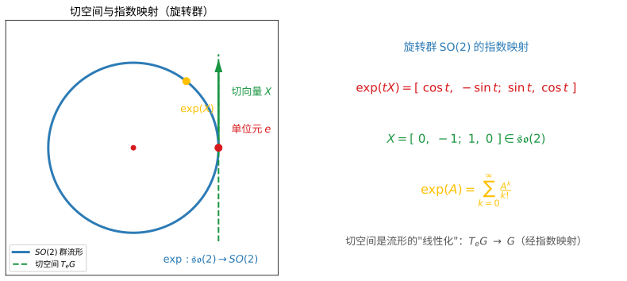
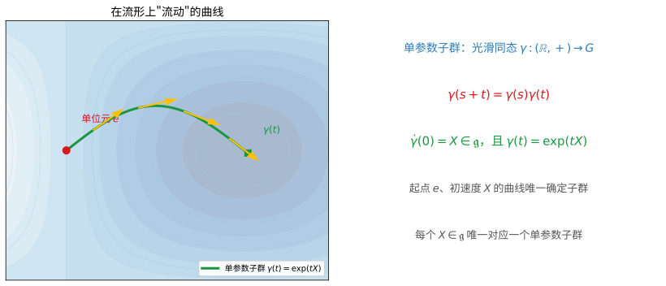
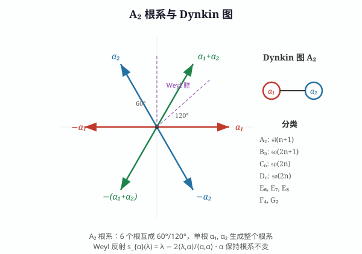

# 第 72 级：李群与李代数 (Lie Groups and Lie Algebras)

> 李群与李代数是数学中连接代数、几何与分析的核心理论，由挪威数学家 Sophus Lie 在 19 世纪末创立。李群既是群又是光滑流形，其局部结构完全由其切空间上的李代数结构所刻画。这一深刻的对应关系使得我们可以用线性代数的方法研究非线性问题，在理论物理（如规范场论、粒子物理的标准模型）、微分几何、表示论和数论中有着根本性的应用。本课程从李群与李代数的基本定义出发，系统介绍指数映射、伴随表示、半单李代数的分类理论、最高权表示、Weyl 特征标公式以及 Peter-Weyl 定理等核心内容。

---

## 从连续对称说起：李群要解决的根问题

> 在动手读定义之前，先想清楚一个问题：**人为什么需要李群？**

**一个真实的场景（第一步：直觉）**

想象你端着满满一杯水，想在不洒一滴水的前提下，把杯子转到任意角度。这个"转动"看起来平淡无奇，却藏着两个彼此纠缠的特点：

- 它**可以组合**：先转 $30°$ 再转 $20°$，等于一次性转 $50°$；转到某个角度还能精确**转回来**（求逆）。
- 它**是连续的**：角度一点一点地变，中间没有缝隙，不会像掷骰子那样突然跳到某个状态。

一杯水、一个地球仪的旋转、一个粒子的自旋……物理世界随处可见这种"既能组合、又能连续变化"的对称。李群，正是为这类现象量身打造的语言。

**要解决的问题（第二步：来龙去脉）**

19 世纪，Galois 用"置换群"驯服了多项式方程的对称——但那是一种**离散**的对称（置换只能一个接一个地换，中间没有过渡状态）。而物理世界的对称几乎都是**连续**的：一个旋钮可以任意角度旋转。挪威数学家 Sophus Lie（苏菲·李）接手的问题直白而有力：

> **能不能像 Galois 驯服"离散置换"那样，也驯服"连续转动"这类对称？**

难点在于，李群的乘法 $gh$ 是非线性的，几乎没法直接用线性代数去算。Lie 的灵感是：**先盯着单位元附近的"无穷小运动"**——那是一个线性空间（切空间），把它收集起来就成了李代数；再用"指数映射"把这些无穷小方向"积分"成有限的情形。这一来，非线性问题被成功"线性化"，"连续对称"第一次变成一个既能算、又能分类的数学对象。

**正式定义前的准备（第三步：本章如何推进）**

本课沿这样一条主线展开：

- 先定义**李群**（群 + 光滑流形）与**李代数**（单位元切空间 + Lie 括号）；
- 用**指数映射**与**单参数子群**把两者连接起来（李群与李代数的对应关系）；
- 深入**半单李代数**的结构，靠 Cartan 子代数、根系与 Dynkin 图完成**分类**（李代数的"元素周期表"）；
- 最后走向**表示论**（最高权、Weyl 特征标公式）与 **Peter-Weyl 定理**，把抽象对象翻译成可计算的矩阵语言。

带着"如何驯服连续对称"这个问题去读每一步，你会发现每个定义都是在回答这条主线的某个环节。

> **🧠 一句话记住李群的"出生证"**
>
> 李群要解决的**根本问题**，是用代数方法研究"既连续变化、又能组合"的对称：
>
> $$ \boxed{\text{把"连续对称"看作"群＋光滑流形"，再借单位元处的李代数把它线性化并分类。}} $$

---

## 开始之前

**本章在讲什么**：李群是"既是群、又能连续变化"的对象，李代数则是把它在单位元附近"线性化"后得到的切空间。你会先分别认识两者的定义，再靠指数映射把局部结构"积分"回整体，最后把半单李代数及其表示彻底分类下来。

**为什么要学它**：第 14 级线性代数只研究"线性变换"本身，缺少"连续变换如何组合并分类"的语言；而初等群论又往往偏重离散对称。李群与李代数恰好补上两块缺口：一是"连续对称"的代数结构，二是把非线性问题线性化的通用方法。往后无论是第 73 级的量子群、微分几何中的齐性空间与旗流形，还是规范场论、粒子物理的标准模型，都以李群李代数为地基。

**开始前请确认你还记得**：

- 群的定义与群同态：一个带结合律、单位元与逆元的集合（群的公理、同态、子群）。
- 光滑流形的基本观念：局部像 $\mathbb{R}^n$、可以做微分的空间。
- 线性变换、矩阵指数 $\exp(A)=\sum_{k=0}^\infty \frac{A^k}{k!}$、特征值与特征向量（见第 14 级线性代数）。
- 切空间与导数的概念：流形上某一点的"所有切方向"构成的线性空间，以及线性映射的微分/导数。

---

## 1. 学习目标

1. 理解李群与李代数的定义及其基本性质。
2. 掌握指数映射、伴随表示和单参数子群的概念。
3. 理解李群与李代数之间的对应关系（李第三定理）。
4. 掌握半单李代数的结构理论（Cartan 子代数、根系、Dynkin 图）。
5. 理解半单李代数的分类定理。
6. 掌握最高权表示论与 Weyl 特征标公式。
7. 理解 Peter-Weyl 定理及其对紧李群表示的应用。
8. 掌握 Engel 定理与 Lie 定理。
9. 了解旗流形、同质空间等几何概念。

---

## 2. 核心概念

### 2.1 李群的定义

**为什么需要这个概念**：我们要研究的是"既连续又能组合"的对称，可这要求对象既能做代数运算（乘、逆），又能做微积分（微分、取切空间）。于是唯一的办法就是让同一个集合"双修"两门功夫：既有群结构又有光滑流形结构——这就是李群的设计初衷。没有了光滑结构，指数映射、无限小生成元统统无从谈起。

**定义 2.1**（李群）**李群** $G$ 是一个同时具有群结构和光滑流形结构的集合，满足以下条件：
1. $G$ 是一个光滑流形；
2. $G$ 上的群运算 $m: G \times G \to G$，$(g, h) \mapsto gh$ 是光滑映射；
3. 逆映射 $i: G \to G$，$g \mapsto g^{-1}$ 是光滑映射。

> **💡 直观理解（类比）**：李群就像一个"自带光滑坐标变换的变形金刚"——它既是群（可复合、可求逆），又是光滑流形（能微分、有局部坐标）。比如把茶杯盖旋转到任意角度：旋转可组合、可反转，且角度连续变化没有棱角，这就是李群的缩影。

**例 2.1**（常见李群）
- **一般线性群** $\operatorname{GL}(n, \mathbb{R})$：所有 $n \times n$ 可逆实矩阵，是 $\mathbb{R}^{n^2}$ 中的开子集，维数为 $n^2$。
- **特殊正交群** $\operatorname{SO}(n) = \{A \in \operatorname{GL}(n, \mathbb{R}) : A^\top A = I, \det A = 1\}$，维数为 $\frac{n(n-1)}{2}$。
- **酉群** $\operatorname{U}(n) = \{A \in \operatorname{GL}(n, \mathbb{C}) : A^\dagger A = I\}$，维数为 $n^2$。
- **特殊酉群** $\operatorname{SU}(n) = \{A \in \operatorname{U}(n) : \det A = 1\}$，维数为 $n^2 - 1$。

### 2.2 李代数的定义

**为什么需要这个概念**：李群的乘法是非线性的，直接算不动。Lie 的破局点是：把注意力集中在单位元"贴脸"的一小块，那里的一切微小运动恰好拼成一个线性空间；我们只需记录这些"无穷小方向"，再规定它们之间如何"交换次序时差多少"——这份数据就是李代数。它相当于把一台复杂的机器压缩成一张"操作面板"。

**定义 2.2**（李代数）**李代数** $(\mathfrak{g}, [\cdot, \cdot])$ 是一个向量空间 $\mathfrak{g}$ 配备一个双线性运算 $[\cdot, \cdot]: \mathfrak{g} \times \mathfrak{g} \to \mathfrak{g}$（称为 **Lie 括号**），满足：
1. **反对称性**：$[X, Y] = -[Y, X]$ 对所有 $X, Y \in \mathfrak{g}$；
2. **Jacobi 恒等式**：$[X, [Y, Z]] + [Y, [Z, X]] + [Z, [X, Y]] = 0$ 对所有 $X, Y, Z \in \mathfrak{g}$。

> **💡 直观理解（类比）**：李代数就是把"紧挨着单位元的无穷小动作"全部收集起来的一个线性房间。Lie 括号 $[X,Y]$ 回答"先动 X 再动 Y 与反过来动，最终差在哪儿"，好比走路时"先左转再右转"与"先右转再左转"落点的落差。

> **常见坑**：$[X,Y]$ 既不是交换乘法、也不满足结合律，千万别拿普通乘法的手感去套它——在这个括号的世界里，衡量"合理"的是 Jacobi 恒等式而不是结合律。另一个容易翻车的细节在特殊域上：在特征为 $2$ 的域中，反对称性 $[X,Y]=-[Y,X]$ 会自动变成 $[X,Y]=[Y,X]$，并不再强制 $[X,X]=0$。所以"括号交换两变号"这句直觉严格说只在特征 $\neq2$ 时成立。

**定义 2.3**（李群的李代数）设 $G$ 是李群，$G$ 在单位元 $e$ 处的切空间 $\mathfrak{g} = T_e G$ 配备 Lie 括号：

$$
[X, Y] = \operatorname{ad}(X)(Y) = \left.\frac{d}{dt}\right|_{t=0} \operatorname{Ad}(\exp(tX))(Y),
$$

构成 $G$ 的 **李代数**，记作 $\operatorname{Lie}(G) = \mathfrak{g}$。

> **💡 直观理解（类比）**：单位元处的切空间是"群"这具机器的操作面板——所有微小运动的集合。正如地图上某一点的切线方向决定了当地运动趋势，李群在单位元跟前的全部"走向"都缩在切空间 $\mathfrak{g}$ 里，非线性的大动作被这里的线性空间接管了。

**例 2.2**（常见李代数）
- $\mathfrak{gl}(n, \mathbb{R}) = T_I \operatorname{GL}(n, \mathbb{R})$ 是所有 $n \times n$ 实矩阵，Lie 括号为 $[A, B] = AB - BA$。
- $\mathfrak{so}(n) = \{A \in \mathfrak{gl}(n, \mathbb{R}) : A^\top = -A\}$，即所有反对称矩阵。
- $\mathfrak{u}(n) = \{A \in \mathfrak{gl}(n, \mathbb{C}) : A^\dagger = -A\}$，即所有反 Hermite 矩阵。
- $\mathfrak{su}(n) = \{A \in \mathfrak{u}(n) : \operatorname{tr}(A) = 0\}$。

### 2.3 指数映射

**为什么需要这个概念**：李代数只是"操作面板"上的无穷小方向，可我们需要把它们变回群里的真身。指数映射正是这台"从局部到整体"的积分器：给一个切向量 $X$，它能一路"滚"出一个单参数子群，落到群上的某个点。没有它，李代数的线性数据就永远只停在单位元门口，进不了群。

**定义 2.4**（指数映射）设 $G$ 是李群，$\mathfrak{g} = \operatorname{Lie}(G)$。**指数映射** $\exp: \mathfrak{g} \to G$ 定义为：

$$
\exp(X) = \gamma_X(1),
$$

其中 $\gamma_X: \mathbb{R} \to G$ 是满足 $\gamma_X(0) = e$ 和 $\dot{\gamma}_X(0) = X$ 的唯一单参数子群。

对于矩阵群，指数映射为矩阵指数：

$$
\exp(A) = \sum_{k=0}^{\infty} \frac{A^k}{k!}.
$$

**性质 2.1**（指数映射的性质）
1. $\exp(0) = e$；
2. $\left.\frac{d}{dt}\right|_{t=0} \exp(tX) = X$；
3. 若 $[X, Y] = 0$，则 $\exp(X+Y) = \exp(X)\exp(Y)$；
4. $\exp$ 在 $0$ 附近是从 $\mathfrak{g}$ 到 $G$ 中 $e$ 附近的光滑同胚。

> **直观理解（现实类比）**：切空间就像地球表面在脚下那块"平坦"的局部平面，切线方向就是切向量 $X$。指数映射 $\exp(X)$ 则是"顺着地球表面走一段弧长"，把线性方向 $X$ 变成群流形上真实的位移。对于旋转群，一个切向量 $X\in\mathfrak{so}(2)$ 就对应一个旋转角度 $t$，$\exp(tX)$ 就是旋转 $t$ 弧度的矩阵——好比把"起始方向和速度"编译成"实际走出的每一步"。

> **🧠 思考历程：一个连续转动的旋钮，怎么就催生了苏菲·李的整套对称性机器？**
>
> 李群与李代数最初不是"群论太抽象"，而是物理学家天天面对的那类**连续对称**（旋转、平移、时间平移）逼出的新数学。Sophus Lie 真正了不起的一步，是把"连续对称"这个用过无数次的直觉，凝成一个字面意义上的"群＋流形"，再用线性代数把它一举驯服。
>
> - **从 Galois 的离散对称，到 Lie 的连续对称**（19 世纪）。Galois 已经用"置换群"驯服了多项式如何对称；可物理世界到处是**连续**的对称——一个旋钮可以转任意角度。Lie 接手的问题正是：**能不能像 Galois 驯离散置换那样，也驯服"连续转动"这种对称？** 于是"李群"应运而生：既是一个群（每条对称都老老实实可复合），又是一个光滑流形（旋转的量是连续的）。
> - **切空间带来的大便宜：非线性被"线性化"了**。李群的乘法 $gh$ 是非线性的，几乎没法直接用线性代数。但 Lie 敏锐地看到：**群在单位元附近的局部行为，完全由单位元处的切空间（李代数）决定**——只需记住"无穷小旋转"（一个反对称矩阵），再用指数映射 $\exp$ 把它"积分"成有限旋转（见指数映射那部分）。**这就把非线性群的核对理论，压缩成线性空间里的一组李括号代数**，一切变得可算、可分类。
> - **局部决定了整体，但"猜到"却极难**。这件听起来像"浅显的针线活"的理论，真正的深度在于**反过来**：给了任意一个李代数，真能把它配回一个李群吗（Lie"第三定理"）？这个"从局部升到整体"的回复，Lie 自己都未必完全看懂，直到后来人（Killing、Cartan、Weyl）才彻底把半单李代数的**分类**做出来——用根系与 Dynkin 图把连续对称的"字母表"穷举完毕。**分类，是这门学科由"工具"升格为"学科"的里程碑**。
> - **心路**：Sophus Lie 的路线告诉我们：**当你面对的对称性没有尽头（连续）时，不要慌张去枚举一一对应，而是找"无穷小"的方向——先在局部把问题线性化再说**。大千世界的复杂运动，往往能被一个切空间立刻简化；而真正成就体系的，是那种"从直觉（连续转动）提炼成对象（群/流形），再由对象逼出方程式（李括号分类）"的耐心。

### 2.4 伴随表示

**为什么需要这个概念**：指数映射告诉我们"一个方向 $X$ 会产生什么结果"，但我们还想知道"群元素 $g$ 会怎样搅动整个李代数"——用一个旋转拨动方向后，"方向"自己也转向了。伴随表示正是记录这种"群对自身的李代数施加的作用"，它是理解表示论、以及把李代数结构"自我反射"出来（根、Killing 型）的引擎。

**定义 2.5**（伴随表示）设 $G$ 是李群，$\mathfrak{g} = \operatorname{Lie}(G)$。

1. **伴随作用** $\operatorname{Ad}: G \to \operatorname{GL}(\mathfrak{g})$ 定义为：
   $$
   \operatorname{Ad}(g)(X) = \left.\frac{d}{dt}\right|_{t=0} g \exp(tX) g^{-1}.
   $$

2. **李代数的伴随表示** $\operatorname{ad}: \mathfrak{g} \to \mathfrak{gl}(\mathfrak{g})$ 定义为：
   $$
   \operatorname{ad}(X)(Y) = [X, Y].
   $$

两者通过指数映射相联系：$\operatorname{Ad}(\exp(X)) = e^{\operatorname{ad}(X)}$。

> **💡 直观理解（类比）**：伴随表示就是"用群元素去'拧'它的切空间"。好比用整只手抓住方向盘转动一圈，会带动方向盘轴上所有指针的角度变化——$\operatorname{Ad}(g)$ 是整只手的转动，$\operatorname{ad}(X)$ 则是握住方向盘轻轻一抖的"微分版"，两者之间相差一次指数"放大"。

### 2.5 单参数子群

**定义 2.6**（单参数子群）李群 $G$ 的 **单参数子群** 是一个光滑同态 $\gamma: (\mathbb{R}, +) \to G$。

每个 $X \in \mathfrak{g}$ 唯一确定一个单参数子群 $\gamma_X(t) = \exp(tX)$，且所有单参数子群都具有此形式。

> **直观理解（现实类比）**：单参数子群就像在光滑地面上从起点出发、以固定"方向和速度"匀速前进留下的轨迹，时间和位置一一对应。家族的"起点"永远在单位元，且"走 $s+t$ 秒"等于"先走 $s$ 秒再走 $t$ 秒"，即 $\gamma(s+t)=\gamma(s)\gamma(t)$。起点固定、初速度 $X$ 给定，这条轨迹就被唯一确定——正如一枚从原点以初速度 $X$ 抛出的石子，其运动曲线完全由初始速度决定。

### 2.6 李群与李代数的对应关系

**定理 2.1**（李群与李代数的对应）设 $G$ 和 $H$ 是李群，$\mathfrak{g} = \operatorname{Lie}(G)$，$\mathfrak{h} = \operatorname{Lie}(H)$。则：
1. 对每个李群同态 $\phi: G \to H$，存在唯一的李代数同态 $\phi_*: \mathfrak{g} \to \mathfrak{h}$，使得 $\phi \circ \exp_G = \exp_H \circ \phi_*$。
2. 若 $G$ 连通，则 $\phi$ 由 $\phi_*$ 唯一确定。
3. 若 $G$ 单连通，则每个李代数同态 $\psi: \mathfrak{g} \to \mathfrak{h}$ 可以提升为唯一的李群同态 $\phi: G \to H$ 使得 $\phi_* = \psi$。

> **💡 直观理解（类比）**：这就像"全局地图由局部针脚布决定"：两个李群之间能否无缝对齐，只需先在单位元附近（切空间）对准方向；只要地面（$G$）没有洞（单连通），这最初的接触就能自动延伸成整张地图上的唯一对应。

### 2.7 半单李代数

**为什么需要这个概念**：并不是所有李代数都一样"结实"，有些李代数内部藏着可被层层"溶解"的软肋。为了让分类成为可能，我们得把目光锁定在那些"由结实积木拼成、没有软肋"的对象上——这就是半单李代数。它是整棵分类之树的真正骨架。

**定义 2.7**（半单李代数）李代数 $\mathfrak{g}$ 称为 **半单的**，如果它不包含非零的可解理想。等价地，$\mathfrak{g}$ 的 Killing 型是非退化的。

> **💡 直观理解（类比）**：半单李代数好比"由最基本的结实积木拼成、内部没有能互相'溶解'软肋"的乐高建筑——找不到任何能被层层消化掉的隐藏部分，每一块都真材实料地起作用。

> **🔑 为什么重要**：半单李代数是可全部分类的那一层。它等价于"Killing 型非退化"，并非只是个小技巧性的判据，而是把"结实"翻译成了线性代数里可检测的量（非退化的双线性型）。正因为它没有软肋，Root 分解、Weyl 群、表示论这一整套精美机器才都能在其上稳定运转——这就是为什么分类定理的大标题是"半单李代数的分类"。

**定义 2.8**（Killing 型）$\mathfrak{g}$ 上的 **Killing 型** 是对称双线性形式：

$$
B(X, Y) = \operatorname{tr}(\operatorname{ad}(X) \circ \operatorname{ad}(Y)).
$$

> **💡 直观理解（类比）**：Killing 型相当于给李代数的每条"内部作用"盖一个"足迹印记"——它记录这个元素对所有其他元素搅动总量的痕迹（取迹）。像用墨水印章盖满整张纸，重叠处留下可测量的大小印记；印记处处清晰（非退化），说明结构"坚实不塌陷"，正是半单性的判据。

**Cartan 判别法**：$\mathfrak{g}$ 是半单的当且仅当其 Killing 型非退化。

> **💡 直观理解（类比）**：这是把"积木结不结实"换算成"印章印不印得清"：只要 Killing 型这张"指纹图"处处清晰可辨（非退化），这只李代数就是半单的，没有藏着可被"消化"的软肋——避免了到处找可解理想这种麻烦活，只需查一次非退化性。

### 2.8 Cartan 子代数

**为什么需要这个概念**：把半单李代数看成一排"能同时翻身对齐的琴弦"，我们希望用一个公共的"刻度盘"把所有方向的"音高"都读出来。这个公共刻度盘就是 Cartan 子代数——选定它之后，每个根方向都变成刻度上的一个特征值，复杂的结构瞬间被"对角化"成可读的名单。

**定义 2.9**（Cartan 子代数）半单李代数 $\mathfrak{g}$ 的 **Cartan 子代数** $\mathfrak{h}$ 是一个极大交换子代数，使得 $\operatorname{ad}(H)$ 对每个 $H \in \mathfrak{h}$ 都是可对角化的（在 $\mathbb{C}$ 上）。

半单李代数的 Cartan 子代数在 $\operatorname{Ad}(G)$ 作用下共轭，且所有 Cartan 子代数具有相同的维数，称为 $\mathfrak{g}$ 的 **秩**。

> **💡 直观理解（类比）**：Cartan 子代数就像给转动对称装上的"刻度盘/参考系"——选出一个能同时对角化的交换"基座"，把复杂的根动作在这个刻度盘上读出各自的"音高"。正如一排琴弦靠一把共同的调音尺定基准，整个李代数的结构都被这张刻度盘标定。

### 2.9 根系

**定义 2.10**（根）设 $\mathfrak{g}$ 是复半单李代数，$\mathfrak{h}$ 是 Cartan 子代数。对 $\alpha \in \mathfrak{h}^*$，定义 **根空间**：

$$
\mathfrak{g}_\alpha = \{X \in \mathfrak{g} : [H, X] = \alpha(H)X, \forall H \in \mathfrak{h}\}.
$$

若 $\alpha \neq 0$ 且 $\mathfrak{g}_\alpha \neq \{0\}$，则 $\alpha$ 称为 **根**。所有根的集合 $\Phi \subset \mathfrak{h}^*$ 称为 $\mathfrak{g}$ 的 **根系**。

> **💡 直观理解（类比）**：根就像振动体系的"固有频率"：沿 Cartan 刻度盘（$\mathfrak{h}$）望去，某些特殊方向 $E_\alpha$ 被每个刻度 $H$ 作用时只缩放不转向，即 $[H,E_\alpha]=\alpha(H)E_\alpha$——好比琴弦只在特定的"共振音高"上被拨响，每一种音高$\alpha$（根）对应一条被"叫醒"的弦 $\mathfrak{g}_\alpha$。

根系具有以下性质：
1. $\Phi$ 有限且生成 $\mathfrak{h}^*$；
2. 对每个 $\alpha \in \Phi$，$\dim \mathfrak{g}_\alpha = 1$；
3. 若 $\alpha \in \Phi$，则 $-\alpha \in \Phi$，且 $\dim \mathfrak{g}_\alpha = 1$；
4. 对 $\alpha, \beta \in \Phi$，$[\mathfrak{g}_\alpha, \mathfrak{g}_\beta] \subseteq \mathfrak{g}_{\alpha+\beta}$（若 $\alpha+\beta$ 不是根则为 $0$）；
5. 如果 $\alpha, \beta \in \Phi$ 且 $\alpha + \beta \neq 0$，则 $B(\mathfrak{g}_\alpha, \mathfrak{g}_\beta) = 0$。

### 2.10 Dynkin 图

**定义 2.11**（Dynkin 图）**Dynkin 图** 是根系分类的图表示。选定一组单根 $\Delta = \{\alpha_1, \ldots, \alpha_r\}$，Dynkin 图的顶点对应单根，顶点之间的连线数由 Cartan 矩阵 $A_{ij} = \frac{2\langle \alpha_i, \alpha_j \rangle}{\langle \alpha_j, \alpha_j \rangle}$ 决定：
- 无连线：$A_{ij} = 0$；
- 单连线：$A_{ij} = A_{ji} = -1$；
- 双连线（带箭头指向长根）：$A_{ij} = -2, A_{ji} = -1$；
- 三连线（带箭头指向长根）：$A_{ij} = -3, A_{ji} = -1$。

有限维复半单李代数的分类由以下 Dynkin 图给出：

$$
A_n (n \geq 1),\; B_n (n \geq 2),\; C_n (n \geq 3),\; D_n (n \geq 4),\; E_6,\; E_7,\; E_8,\; F_4,\; G_2.
$$

> **直观理解（现实类比）**：根系就像一组"对称密码"——每个根代表李代数中一个特殊的"振动方向"。以 $A_2$ 为例（对应 $\mathfrak{sl}(3)$），6 个根在平面中排成完美的六角星形，如同雪花晶格的对称轴。Dynkin 图则是这组密码的"极简编码"：只用两个圆点和一条连线，就完整记录了根与根之间的角度和长度关系。正如化学家用元素周期表的格子来编码原子的电子结构，数学家用 Dynkin 图编码李代数的全部结构信息。

### 2.11 Weil 群

**定义 2.12**（Weil 群）设 $\Phi$ 是 $\mathfrak{h}^*$ 中的根系。对每个根 $\alpha \in \Phi$，定义 **反射** $s_\alpha: \mathfrak{h}^* \to \mathfrak{h}^*$：

$$
s_\alpha(\lambda) = \lambda - \frac{2\langle \lambda, \alpha \rangle}{\langle \alpha, \alpha \rangle} \alpha.
$$

由所有 $s_\alpha$（$\alpha \in \Phi$）生成的群称为 **Weil 群**，记作 $W$。Weil 群是 $\mathfrak{h}^*$ 上的有限反射群。

> **💡 直观理解（类比）**：Weil 群是根空间的"镜面排列"——每个根 $\alpha$ 都立一面镜子 $s_\alpha$，把所有向量沿 $\alpha$ 的垂直方向翻个身。正如雪花的六条对称轴生成一组镜面旋转，这些反射拼成的有限群把整个根系折叠成一个对称的"晶体"。

### 2.12 最高权表示

**为什么需要这个概念**：表示论的目的是把抽象的李代数变成"能作用在向量空间上的矩阵"，而这有无穷多种做法。幸运的是它们并非一盘散沙：每个不可约表示都可以由"一个最高的权"完全定型——就像一座山只需报出山顶海拔就能唯一描述。抓住"最高权"，就等于抓住整片表示论的坐标系。

**定义 2.13**（最高权表示）设 $\mathfrak{g}$ 是复半单李代数，$\mathfrak{h}$ 是 Cartan 子代数，$\Phi^+$ 是正根系。一个 $\mathfrak{g}$ 的不可约表示 $V$ 称为 **最高权表示**，如果存在非零向量 $v \in V$（称为 **最高权向量**）使得：
1. $\mathfrak{g}_\alpha \cdot v = 0$ 对所有 $\alpha \in \Phi^+$；
2. $v$ 是 $\mathfrak{h}$ 的公共特征向量：$H \cdot v = \lambda(H) v$ 对所有 $H \in \mathfrak{h}$。

$\lambda \in \mathfrak{h}^*$ 称为表示 $V$ 的 **最高权**。

> **💡 直观理解（类比）**：最高权表示好比一座"从山顶往下滚的等高山"：选一个最高峰 $v$（最高权向量），正根（拔高频谱的动作）作用上去推不动它（$\mathfrak{g}_\alpha \cdot v=0$），其余状态都是从该峰逐级滑下的等高线——最高权 $\lambda$ 就是给整座"表示之山"定标的最高海拔。

> **常见坑**："最高"不是绝对的，而是依赖于你选的 **正根系 $\Phi^+$**（换句话说靠选定的 Borel/字典序）。同一根 Cartan 子代数，换一组正根，"谁是最高的"就会跟着变；不过"支配整权"这个条件保证了不同取法下得到的表示仍然一一对应。计算最高权时务必先声明正根系是哪个，否则容易把两个表示张冠李戴。

**定理 2.2**（最高权分类）对每个支配整权 $\lambda \in \mathfrak{h}^*$，存在唯一的（在同构意义下）有限维不可约 $\mathfrak{g}$-模 $V(\lambda)$ 以 $\lambda$ 为最高权。反之，每个有限维不可约 $\mathfrak{g}$-模都有唯一的最高权，且该最高权是支配整权。

> **💡 直观理解（类比）**：这类似"只要报出山顶海拔，就能定出整座山"：每一座不可约表示之山都由其最高峰（支配整权 $\lambda$）唯一命名。给定海拔就有且仅有一座标准山峰 $V(\lambda)$，反过来说每座山都只看它的顶点——构成表示的一对一"户口登记"。

### 2.13 Weyl 特征标公式

**定义 2.14**（特征标）设 $V$ 是 $\mathfrak{g}$ 的有限维表示。**特征标** $\chi_V: \mathfrak{h} \to \mathbb{C}$ 定义为：

$$
\chi_V(H) = \operatorname{tr}_V(e^{H}), \quad H \in \mathfrak{h}.
$$

> **💡 直观理解（类比）**：特征标就是表示的"声纹/指纹"：对每个刻度 $H$，把所有同层状态的"响应波形"（特征值 $e^{H}$）叠加取和，得到一条能唯一识别该表示的谱线。不同的表示有各自不同的声纹，做到"闻声识量"——区分表示往往只需比一条特征标。

**定理 2.3**（Weyl 特征标公式）设 $V(\lambda)$ 是以 $\lambda$ 为最高权的不可约 $\mathfrak{g}$-模，$\rho = \frac{1}{2}\sum_{\alpha \in \Phi^+} \alpha$ 是半正根和。则：

$$
\chi_{V(\lambda)} = \frac{\sum_{w \in W} \varepsilon(w) e^{w(\lambda + \rho)}}{\sum_{w \in W} \varepsilon(w) e^{w(\rho)}},
$$

其中 $\varepsilon(w) = (-1)^{\ell(w)}$ 是 $w$ 的符号，$\ell(w)$ 是 $w$ 的长度。

> **💡 直观理解（类比）**：Weyl 特征标公式像把"山峰所有等高线的总轮廓"用一张公式收进相框：分子分母各是镜面群作用下带正负号（$\varepsilon(w)$）的"跷跷板"组合，一除之后正好吐出每一层的高度分布——把表示的声音谱在封闭式子里完整解码。

### 2.14 Borel 子代数与旗流形

**定义 2.15**（Borel 子代数）复半单李代数 $\mathfrak{g}$ 的 **Borel 子代数** $\mathfrak{b}$ 是极大可解子代数。选定正根系 $\Phi^+$ 后，Borel 子代数可写为：

$$
\mathfrak{b} = \mathfrak{h} \oplus \bigoplus_{\alpha \in \Phi^+} \mathfrak{g}_\alpha.
$$

> **💡 直观理解（类比）**：Borel 子代数就是"刻度盘 + 所有向上生长的方向"：正根 $\Phi^+$ 当作"往上走"的阶梯，加上纵横坐标 $\mathfrak{h}$，打包成一个可解的子底座。如同把大山的"谷底基座"与全部上坡路合成一份容易被逐步消化成平凡结构的骨架。

**定义 2.16**（旗流形）设 $G$ 是复半单李群，$B$ 是 Borel 子群。**旗流形** $G/B$ 是紧复流形，其点对应于 $G$ 的 Borel 子群的共轭类。

> **💡 直观理解（类比）**：旗流形是"旗杆上能挂的各种旗"的空间：每面旗就是一条层层嵌套的子空间链（$\mathbb{C}^1 \subset \mathbb{C}^2 \subset \cdots$），而 $G/B$ 把每条链压成一个点。于是每个点都代表一种"竖旗姿势"——一条完整的嵌套链在 $G$ 作用下的等价类。

### 2.15 紧李群

**定义 2.17**（紧李群）**紧李群** 是作为拓扑空间紧致的李群。紧李群具有以下重要性：
- 紧李群上的 Haar 测度存在且有限，可用于积分。
- 紧李群的有限维表示完全可约。
- 每个紧李群是某个复半单李群的紧实形式。

### 2.16 同质空间

> **💡 直观理解（类比）**：紧李群就像"有限大小的圆形剧场"——动作范围有限，能一次性平均所有人的声音（Haar 测度有限），因此任何表演（表示）都能拆成基本节目的直和（完全可约）。有限的周长保证"取平均不会跑出会场"。

**定义 2.18**（同质空间）设 $G$ 是李群，$H$ 是闭子群。**同质空间** $G/H$ 是 $G$ 模去 $H$ 的陪集空间，具有自然的流形结构使得 $G$ 在其上可递作用。

> **💡 直观理解（类比）**：同质空间是一块"处处长得都一样、可被对称群自由搬运"的场地：比如球面 $S^2$ 上任一点都能经旋转 $G$ 搬到另一点（可递）。$G/H$ 把"只需看一个代表点"的模板当作一个几何位置，整片场地每个位置形状完全一致——像铺满相同花纹的无限地板砖。

---

## 3. 定理与证明

### 3.1 李群与李代数的对应定理（李第三定理）

**定理 3.1**（李第三定理）设 $\mathfrak{g}$ 是有限维实李代数。则存在一个单连通的李群 $\tilde{G}$，使得 $\operatorname{Lie}(\tilde{G}) \cong \mathfrak{g}$。此外，若 $G$ 是任意连通李群且 $\operatorname{Lie}(G) \cong \mathfrak{g}$，则 $G \cong \tilde{G} / Z$，其中 $Z$ 是 $\tilde{G}$ 的中心的一个离散子群。

> **💡 直观理解（类比）**：这是"从零件还原整机"的保证：只要给出操作面板（李代数 $\mathfrak{g}$），就能造出唯一一台"没有盖子、可无限展开"的原型机 $\tilde{G}$（单连通）。其他所有同款连通型号，都是在这台原型机上再盖一层或多层楼（商掉一个离散中心 $Z$）得到的变体。

**证明**：我们给出证明的主要步骤。

**步骤 1：Ado 定理**

首先，由 Ado 定理，每个有限维李代数 $\mathfrak{g}$ 同构于某个 $\mathfrak{gl}(n, \mathbb{R})$ 的子代数。因此我们可以将 $\mathfrak{g}$ 视为由矩阵组成的李代数。

**步骤 2：构造李群**

考虑 $\mathfrak{g}$ 作为 $\mathfrak{gl}(n, \mathbb{R})$ 的子代数。定义 $\tilde{G}$ 为所有由 $\mathfrak{g}$ 中元素生成的单参数子群的乘积的集合，即所有形如 $\exp(X_1)\exp(X_2)\cdots\exp(X_k)$ 的矩阵的集合，其中 $X_i \in \mathfrak{g}$。

**步骤 3：验证 $\tilde{G}$ 是李群**

通过 Baker-Campbell-Hausdorff 公式，$\tilde{G}$ 在矩阵乘法下封闭。具体地，对任意 $X, Y \in \mathfrak{g}$，在 $0$ 附近有：

$$
\exp(X)\exp(Y) = \exp\left(X + Y + \frac{1}{2}[X, Y] + \frac{1}{12}[X, [X, Y]] - \frac{1}{12}[Y, [X, Y]] + \cdots\right),
$$

其中右侧的级数由 $X, Y$ 的 Lie 括号的多重迭代组成，且收敛到 $\mathfrak{g}$ 中的元素。因此 $\tilde{G}$ 是 $\operatorname{GL}(n, \mathbb{R})$ 的连通子群，从而是李群。

**步骤 4：验证 $\operatorname{Lie}(\tilde{G}) \cong \mathfrak{g}$**

$\tilde{G}$ 在单位元处的切空间由 $\mathfrak{g}$ 中的元素张成，因为 $\left.\frac{d}{dt}\right|_{t=0} \exp(tX) = X$。因此 $\operatorname{Lie}(\tilde{G}) = \mathfrak{g}$。

**步骤 5：单连通覆盖**

$\tilde{G}$ 可能不是单连通的。取 $\tilde{G}$ 的万有覆盖 $\tilde{G}$，则 $\tilde{G}$ 是单连通李群且 $\operatorname{Lie}(\tilde{G}) = \mathfrak{g}$。$\tilde{G}$ 是 $\tilde{G}$ 的覆盖群，覆盖映射为 $\pi: \tilde{G} \to \tilde{G}$，核为 $\pi_1(\tilde{G})$ 的离散子群。

**步骤 6：唯一性**

若 $G$ 是另一个连通李群且 $\operatorname{Lie}(G) \cong \mathfrak{g}$，则存在李群同态 $\phi: \tilde{G} \to G$ 使得 $\phi_*$ 是李代数同构。由于 $\tilde{G}$ 单连通且 $\phi_*$ 是同构，$\phi$ 是覆盖映射，其核是 $\tilde{G}$ 的中心的一个离散子群，因此 $G \cong \tilde{G} / \ker \phi$。$\square$

### 3.2 半单李代数的分类定理

**定理 3.2**（半单李代数的分类）每个有限维复半单李代数在同构意义下唯一地由其根系决定，进而由其 Dynkin 图决定。所有可能的 Dynkin 图为：

$$
A_n (n \geq 1),\; B_n (n \geq 2),\; C_n (n \geq 3),\; D_n (n \geq 4),\; E_6,\; E_7,\; E_8,\; F_4,\; G_2.
$$

> **💡 直观理解（类比）**：这就是李代数的"元素周期表"：无论网络多么复杂的半单对称，剥开外壳后的骨架只有这有限几款——由 Dynkin 图（$A_n$ 至 $G_2$）定名的家族。就像化学家靠质子数排布穷举元素，数学家靠这张骨架图穷举了所有"不可分解的对称构件"，一个不多一个不少。

**证明思路**：我们给出证明的核心步骤。

**步骤 1：约化为不可约情形**

半单李代数 $\mathfrak{g}$ 可以分解为单李代数的直和 $\mathfrak{g} = \bigoplus_i \mathfrak{g}_i$，每个 $\mathfrak{g}_i$ 是单李代数（即没有非平凡理想）。对应地，$\mathfrak{g}$ 的根系 $\Phi$ 分解为不可约根系的直和 $\Phi = \bigsqcup_i \Phi_i$。因此只需分类不可约根系。

**步骤 2：根系公理与分类**

设 $\Phi$ 是 $\mathbb{R}^r$ 中的不可约根系（其中 $r$ 是 $\mathfrak{g}$ 的秩）。根系满足以下公理：
1. $\Phi$ 有限，生成 $\mathbb{R}^r$，且 $0 \notin \Phi$；
2. 对每个 $\alpha \in \Phi$，$-\alpha \in \Phi$；
3. 对 $\alpha, \beta \in \Phi$，$\beta - \frac{2\langle \beta, \alpha \rangle}{\langle \alpha, \alpha \rangle} \alpha \in \Phi$；
4. 对 $\alpha, \beta \in \Phi$，$\frac{2\langle \beta, \alpha \rangle}{\langle \alpha, \alpha \rangle} \in \mathbb{Z}$。

选定一组单根 $\Delta = \{\alpha_1, \ldots, \alpha_r\}$，Cartan 矩阵 $A_{ij} = \frac{2\langle \alpha_i, \alpha_j \rangle}{\langle \alpha_j, \alpha_j \rangle}$ 完全决定了根系。

**步骤 3：Dynkin 图的分类**

通过组合论证，分类所有可能的不可约 Cartan 矩阵（或等价的 Dynkin 图）。核心论证如下：

- 对任意两个不同的单根 $\alpha_i \neq \alpha_j$，$A_{ij}A_{ji} \in \{0, 1, 2, 3\}$。
- 定义图 $S$，顶点为单根，若 $A_{ij}A_{ji} = 1$ 则连一线，若 $=2$ 则连双线，若 $=3$ 则连三线。
- 利用 $\sum_{i,j} A_{ij}x_i x_j > 0$（正定性）对任意非零向量 $(x_i)$ 成立这一事实，可以证明 $S$ 只能是 $A_n, B_n, C_n, D_n, E_6, E_7, E_8, F_4, G_2$ 之一。

**步骤 4：存在性**

对每个允许的 Dynkin 图，可以通过 Chevalley-Serre 关系显式构造对应的李代数。例如，$A_n$ 对应 $\mathfrak{sl}(n+1, \mathbb{C})$，$B_n$ 对应 $\mathfrak{so}(2n+1, \mathbb{C})$，$C_n$ 对应 $\mathfrak{sp}(2n, \mathbb{C})$，$D_n$ 对应 $\mathfrak{so}(2n, \mathbb{C})$。$\square$

### 3.3 Weyl 特征标公式

**定理 3.3**（Weyl 特征标公式）设 $\mathfrak{g}$ 是复半单李代数，$V(\lambda)$ 是以 $\lambda$ 为最高权的不可约表示，$\Phi^+$ 是正根系，$\rho = \frac{1}{2}\sum_{\alpha \in \Phi^+} \alpha$。则 $V(\lambda)$ 的特征标为：

$$
\chi_{V(\lambda)} = \frac{\sum_{w \in W} \varepsilon(w) e^{w(\lambda + \rho)}}{\sum_{w \in W} \varepsilon(w) e^{w(\rho)}}.
$$

> **💡 直观理解（类比）**：这如同用"镜面反射的干涉"把表示"照"成一叠层层可数的谱线：分子分母分别是对所有镜面反射做正负号（$\varepsilon(w)$）交替求和，做除法把分母的"公共噪声"抵消掉，剩下的分子就恰好吐出一层层权的整数重数，形成一个可读的"重量清单"。

**证明**：我们给出完整的证明。

**步骤 1：特征标的性质**

设 $V$ 是 $\mathfrak{g}$ 的有限维表示。特征标 $\chi_V$ 是 $\mathfrak{h}$ 上的函数，具有以下性质：
- $\chi_V$ 是 $W$-不变的：$\chi_V(w \cdot H) = \chi_V(H)$ 对所有 $w \in W$；
- $\chi_V$ 可以展开为 $e^\mu$ 的线性组合，其中 $\mu$ 是 $V$ 的权：
  $$
  \chi_V = \sum_{\mu} m_V(\mu) e^\mu,
  $$
  其中 $m_V(\mu)$ 是权 $\mu$ 的重数。

**步骤 2：Weyl 分母公式**

首先证明 Weyl 分母公式：

$$
\sum_{w \in W} \varepsilon(w) e^{w(\rho)} = e^{-\rho} \prod_{\alpha \in \Phi^+} (1 - e^{-\alpha}) = \prod_{\alpha \in \Phi^+} (e^{\alpha/2} - e^{-\alpha/2}).
$$

**证明思路**：考虑函数 $F = \sum_{w \in W} \varepsilon(w) e^{w(\rho)}$。对任意简单反射 $s_{\alpha_i}$，有 $s_{\alpha_i}(F) = -F$，因此 $F$ 在每个根反射下反变，从而 $F$ 被 $(1 - e^{-\alpha})$ 对每个 $\alpha \in \Phi^+$ 整除。通过比较次数可得上述等式。

**步骤 3：Weyl 积分公式**

设 $f$ 是 $G$ 上的类函数（即共轭不变的函数），则 Weyl 积分公式给出：

$$
\int_G f(g) \, dg = \frac{1}{|W|} \int_T f(t) \left|\sum_{w \in W} \varepsilon(w) e^{w(\rho)}\right|^2 \, dt,
$$

其中 $T$ 是极大环面，$dg$ 和 $dt$ 分别是 $G$ 和 $T$ 上的 Haar 测度。

**步骤 4：特征标的正交性**

紧李群 $G$ 的不可约表示的特征标在 $L^2(G)$ 中构成标准正交基：

$$
\langle \chi_V, \chi_W \rangle = \int_G \chi_V(g) \overline{\chi_W(g)} \, dg = \delta_{V,W}.
$$

**步骤 5：构造 Weyl 特征标公式**

考虑函数 $A_{\lambda+\rho} = \sum_{w \in W} \varepsilon(w) e^{w(\lambda+\rho)}$。我们断言：

$$
\frac{A_{\lambda+\rho}}{A_\rho} = \sum_{\mu} m_{V(\lambda)}(\mu) e^\mu = \chi_{V(\lambda)}.
$$

为证明这一点，首先验证 $\frac{A_{\lambda+\rho}}{A_\rho}$ 是 $W$-不变的，因此可以展开为 $e^\mu$ 的级数。其次，利用 Weyl 积分公式和正交性，可以验证该展开的系数恰好是 $V(\lambda)$ 的权重数。

**步骤 6：验证**

设 $\chi = \frac{A_{\lambda+\rho}}{A_\rho}$。由 Weyl 分母公式，$\chi$ 是 $e^\mu$ 的整系数线性组合。通过计算 $\chi$ 与特征标的内积，可以证明 $\chi$ 是 $V(\lambda)$ 的特征标。$\square$

### 3.4 Peter-Weyl 定理

**定理 3.4**（Peter-Weyl 定理）设 $G$ 是紧李群，$L^2(G)$ 是 $G$ 上关于 Haar 测度的平方可积函数空间。则：

1. $G$ 的不可约酉表示的特征标 $\{\chi_V\}$ 构成 $L^2(G)$ 中类函数的完备标准正交基。
2. 矩阵系数 $\{g \mapsto \langle \pi(g)v, w\rangle\}$（其中 $(\pi, V)$ 遍历 $G$ 的所有不可约酉表示，$v, w$ 遍历 $V$ 的标准正交基）在 $L^2(G)$ 中张成稠密子空间。
3. 作为 $G \times G$ 的表示，$L^2(G) \cong \bigoplus_{V} V \otimes V^*$，其中求和遍历所有不可约酉表示的同构类。

> **💡 直观理解（类比）**：这是"傅里叶分析的群化版本"：就像任何波形都能拆成基本正弦波，紧群 $G$ 上的任何方能量函数都能拆成不可约表示"矩阵系数"（基本乐音）的叠加。这些乐音彼此正交、且铺满整个舞台，于是 $L^2(G)$ 被分解成 $V\otimes V^*$ 的直和——一座由基本声部拼出的完整音乐厅。

**证明**：

**步骤 1：紧算子的构造**

对任意连续函数 $f \in C(G)$，定义卷积算子 $T_f: L^2(G) \to L^2(G)$ 为：

$$
(T_f \phi)(g) = \int_G f(h) \phi(h^{-1}g) \, dh.
$$

$T_f$ 是紧算子（因为 $G$ 紧致，$T_f$ 是 Hilbert-Schmidt 算子）。

**步骤 2：谱分解**

由于 $T_f$ 是自伴紧算子（当 $f = \bar{f}$ 时），$L^2(G)$ 可以分解为 $T_f$ 的特征空间的直和。特别地，取 $f$ 为连续正定函数，则 $T_f$ 是正算子。

**步骤 3：矩阵系数张成稠密子空间**

对任意 $g_1 \neq g_2$，存在连续函数 $f$ 使得 $f(g_1) \neq f(g_2)$。由 Stone-Weierstrass 定理，矩阵系数在 $C(G)$ 中一致稠密，从而在 $L^2(G)$ 中稠密。

**步骤 4：正交分解**

对任意不可约表示 $V$，其矩阵系数张成的子空间 $M_V \subset L^2(G)$ 是 $G \times G$ 的不变子空间，且不同构的表示对应的 $M_V$ 相互正交。

由 Schur 引理，$M_V \cong V \otimes V^*$ 作为 $G \times G$ 的表示。

**步骤 5：完备性**

假设存在非零函数 $f \in L^2(G)$ 与所有矩阵系数正交。则 $T_f = 0$，从而 $f = 0$（通过取 $f$ 的逼近），矛盾。因此矩阵系数在 $L^2(G)$ 中完备。$\square$

### 3.5 Engel 定理与 Lie 定理

**定理 3.5**（Engel 定理）设 $\mathfrak{g}$ 是有限维李代数。则 $\mathfrak{g}$ 是幂零李代数当且仅当对每个 $X \in \mathfrak{g}$，$\operatorname{ad}(X)$ 是幂零线性变换（即存在 $n$ 使得 $\operatorname{ad}(X)^n = 0$）。

> **💡 直观理解（类比）**：这像"每个按钮都按几下就失灵，那么整台机器也迟早整体失灵归零"：如果每个元素 $X$ 的搅动作用 $\operatorname{ad}(X)$ 反复施加若干次就归零（幂零），那么这个李代数本身也必然像一层层剥到中心的洋葱一样，有限步后整体变平凡（幂零）。"处处小动作必耗尽"等价于"整体必耗尽"。

**证明**：

**步骤 1：必要性**

若 $\mathfrak{g}$ 是幂零的，则存在中心降维列 $\mathfrak{g} \supset \mathfrak{g}^1 \supset \cdots \supset \mathfrak{g}^k = 0$，其中 $\mathfrak{g}^i = [\mathfrak{g}, \mathfrak{g}^{i-1}]$。对任意 $X, Y \in \mathfrak{g}$，$\operatorname{ad}(X)^n(Y) \in \mathfrak{g}^n$，当 $n$ 足够大时为零。因此 $\operatorname{ad}(X)$ 是幂零的。

**步骤 2：充分性**

假设每个 $\operatorname{ad}(X)$ 幂零。我们用归纳法证明 $\mathfrak{g}$ 幂零。

**步骤 2a：存在非零中心元素**

首先证明存在非零 $Z \in \mathfrak{g}$ 使得 $[X, Z] = 0$ 对所有 $X \in \mathfrak{g}$ 成立（即 $Z \in \mathfrak{z}(\mathfrak{g})$）。

设 $\mathfrak{h} \subset \mathfrak{g}$ 是最大真子代数。考虑 $\mathfrak{h}$ 在 $\mathfrak{g}/\mathfrak{h}$ 上的表示 $\rho(H) = \operatorname{ad}(H)|_{\mathfrak{g}/\mathfrak{h}}$。由于每个 $\rho(H)$ 幂零且 $\mathfrak{h}$ 是 $\mathfrak{g}$ 的真子代数，存在非零向量 $v \in \mathfrak{g}/\mathfrak{h}$ 被所有 $\rho(H)$ 零化。取 $X \in \mathfrak{g} \setminus \mathfrak{h}$ 代表 $v$，则 $[\mathfrak{h}, X] \subset \mathfrak{h}$，且 $X \notin \mathfrak{h}$。这表明 $\mathfrak{h} + \mathbb{C}X$ 是 $\mathfrak{g}$ 的子代数，由 $\mathfrak{h}$ 的极大性，$\mathfrak{g} = \mathfrak{h} + \mathbb{C}X$。

**步骤 2b：归纳**

设 $Z \in \mathfrak{z}(\mathfrak{g})$ 非零。考虑 $\mathfrak{g} / \mathbb{C}Z$。由归纳假设，$\mathfrak{g} / \mathbb{C}Z$ 是幂零的。因此 $\mathfrak{g}$ 的降维列在有限步后落在 $\mathbb{C}Z$ 中，从而 $\mathfrak{g}$ 本身幂零。$\square$

**定理 3.6**（Lie 定理）设 $\mathfrak{g}$ 是域 $\mathbb{F}$（特征零，代数闭）上的可解李代数，$V$ 是 $\mathfrak{g}$ 的有限维表示。则存在 $V$ 的一组基，使得每个 $\rho(X)$（$X \in \mathfrak{g}$）在该基下是上三角矩阵。

> **💡 直观理解（类比）**：可解李代数的所有动作可以"排成一列台阶"：总能找到一组脚手架（基），使每个动作 $\rho(X)$ 都只"踩着当前层往上走"（上三角），不会从高层直接跨到低层。好比一条可消化的流水线，每个环节只往更高一级传递，绝不回头打乱顺序——这正是"可解"这个词的几何面貌。

**证明**：

**步骤 1：归结为存在公共特征向量**

由归纳法，只要证明存在非零向量 $v \in V$ 是 $\mathfrak{g}$ 中所有元素的公共特征向量即可。

**步骤 2：利用 $\mathfrak{g}$ 的可解性**

由于 $\mathfrak{g}$ 可解，$[\mathfrak{g}, \mathfrak{g}]$ 是幂零的。由 Engel 定理，存在非零 $v \in V$ 被 $[\mathfrak{g}, \mathfrak{g}]$ 零化。

**步骤 3：构造公共特征向量**

设 $\mathfrak{h} \subset \mathfrak{g}$ 是余维数为 $1$ 的子代数（因为 $\mathfrak{g}$ 可解，总存在这样的子代数）。由归纳假设，存在 $v \in V$ 是 $\mathfrak{h}$ 的公共特征向量：$H \cdot v = \lambda(H)v$ 对所有 $H \in \mathfrak{h}$。

取 $X \in \mathfrak{g} \setminus \mathfrak{h}$，则 $\mathfrak{g} = \mathfrak{h} + \mathbb{C}X$。考虑由 $v, X \cdot v, X^2 \cdot v, \ldots$ 张成的子空间 $W$。可以验证 $W$ 是 $\mathfrak{g}$-不变子空间，且 $X$ 在 $W$ 上是上三角的。特别地，$X$ 在 $W$ 中有特征向量。

**步骤 4：归纳完成**

在 $W$ 中取 $X$ 的特征向量 $w$，则 $w$ 同时是 $\mathfrak{g}$ 的公共特征向量。由归纳法，$\mathfrak{g}$ 在 $V$ 上的表示是上三角的。$\square$

---

## 4. 示例

### 示例 4.1：SU(2) 与 sl(2) 的表示理论

**SU(2) 和 sl(2) 的基本结构**

$\operatorname{SU}(2) = \left\{ \begin{pmatrix} a & -\bar{b} \\ b & \bar{a} \end{pmatrix} : |a|^2 + |b|^2 = 1 \right\}$ 是最简单的非交换紧李群，其李代数 $\mathfrak{su}(2)$ 由所有迹零反 Hermite 矩阵组成。

$\mathfrak{sl}(2, \mathbb{C})$ 是 $\mathfrak{su}(2)$ 的复化，由所有迹零 $2 \times 2$ 复矩阵组成。选取标准基：

$$
H = \begin{pmatrix} 1 & 0 \\ 0 & -1 \end{pmatrix}, \quad E = \begin{pmatrix} 0 & 1 \\ 0 & 0 \end{pmatrix}, \quad F = \begin{pmatrix} 0 & 0 \\ 1 & 0 \end{pmatrix}.
$$

Lie 括号为：

$$
[H, E] = 2E, \quad [H, F] = -2F, \quad [E, F] = H.
$$

**$\mathfrak{sl}(2)$ 的有限维不可约表示**

对每个整数 $n \geq 0$，存在唯一的 $(n+1)$ 维不可约表示 $V_n$，其最高权为 $n$。$V_n$ 的基为 $\{v_0, v_1, \ldots, v_n\}$，作用为：

$$
H \cdot v_k = (n - 2k) v_k,
$$
$$
E \cdot v_k = \begin{cases} (n - k + 1) v_{k-1}, & k > 0, \\ 0, & k = 0, \end{cases}
$$
$$
F \cdot v_k = \begin{cases} (k + 1) v_{k+1}, & k < n, \\ 0, & k = n. \end{cases}
$$

**权结构**：$V_n$ 的权为 $\{n, n-2, n-4, \ldots, -n\}$，每个权重数均为 $1$。

**Weyl 特征标公式验证**：对于 $\mathfrak{sl}(2)$，根系统为 $A_1$，正根为 $\alpha$，$\rho = \alpha/2$，Weil 群 $W = \{1, s_\alpha\}$。特征标公式给出：

$$
\chi_{V_n} = \frac{e^{(n+1)\alpha/2} - e^{-(n+1)\alpha/2}}{e^{\alpha/2} - e^{-\alpha/2}} = e^{n\alpha/2} + e^{(n-2)\alpha/2} + \cdots + e^{-n\alpha/2}.
$$

这正是 $V_n$ 的权求和。

### 示例 4.2：GL(n) 的李代数结构

$\operatorname{GL}(n, \mathbb{R})$ 的李代数为 $\mathfrak{gl}(n, \mathbb{R})$，即所有 $n \times n$ 实矩阵，Lie 括号为 $[A, B] = AB - BA$。

**Cartan 子代数**：$\mathfrak{h} = \{\operatorname{diag}(h_1, \ldots, h_n) : h_i \in \mathbb{R}\}$，即所有对角矩阵。

**根空间分解**：设 $E_{ij}$ 是矩阵单位（第 $i$ 行第 $j$ 列为 $1$，其余为 $0$）。对 $H = \operatorname{diag}(h_1, \ldots, h_n) \in \mathfrak{h}$：

$$
[H, E_{ij}] = (h_i - h_j) E_{ij}.
$$

因此根为 $\alpha_{ij}(H) = h_i - h_j$（$i \neq j$），根空间为 $\mathfrak{g}_{\alpha_{ij}} = \mathbb{C}E_{ij}$。

**正根系的选取**：取 $\Phi^+ = \{\alpha_{ij} : i < j\}$，单根为 $\Delta = \{\alpha_{i,i+1} : i = 1, \ldots, n-1\}$。

**Dynkin 图**：$\mathfrak{sl}(n)$（即 $\mathfrak{gl}(n)$ 的迹零子代数）的根系为 $A_{n-1}$，Dynkin 图是一条有 $n-1$ 个顶点的链。

---

## 5. 习题

### 基础题

**习题 1**（李群定义）用简洁的语言定义什么是李群，并举出三个常见李群的例子，说明各自的维数。

**习题 2**（李群定义）判断下列说法是否正确并说明理由：(i) $(\mathbb{R}^n, +)$ 是李群；(ii) $(\mathbb{Z}, +)$ 是李群；(iii) $\operatorname{GL}(n, \mathbb{C})$ 是李群。

**习题 3**（Lie 括号）设 $A, B, C$ 是 $n \times n$ 矩阵，定义 $[A, B] = AB - BA$。验证该括号满足双线性性、反对称性和 Jacobi 恒等式。

**习题 4**（Lie 括号）设 $\mathfrak{g}$ 是李代数，结合律 $[X, [Y, Z]] + [Y, [Z, X]] + [Z, [X, Y]] = 0$ 称为 Jacobi 恒等式。请用反对称性说明 Jacobi 恒等式等价于映射 $X \mapsto \operatorname{ad}(X)$（其中 $\operatorname{ad}(X)(Y) = [X, Y]$）保持括号，即 $\operatorname{ad}([X, Y]) = [\operatorname{ad}(X), \operatorname{ad}(Y)]$。

**习题 5**（李代数）写出 $\mathfrak{sl}(2, \mathbb{C})$ 的标准基 $\{H, E, F\}$，并写出它们两两之间的 Lie 括号。

**习题 6**（切空间）解释为什么李群 $G$ 的李代数定义为 $\mathfrak{g} = T_e G$，并利用定义计算 $\mathfrak{so}(n)$ 与 $\mathfrak{u}(n)$ 的维数。

**习题 7**（指数映射）给出矩阵指数 $\exp(A)$ 的定义，并证明 $\exp(0) = I$ 以及 $\left.\frac{d}{dt}\right|_{t=0}\exp(tA) = A$。

**习题 8**（伴随表示）写出伴随表示 $\operatorname{Ad}: G \to \operatorname{GL}(\mathfrak{g})$ 与 $\operatorname{ad}: \mathfrak{g} \to \mathfrak{gl}(\mathfrak{g})$ 的定义，并说明两者通过指数映射的联系。

**习题 9**（子代数与理想）写出子代数与理想的定义，并构造一个例子说明：某集合是子代数但不是理想。

**习题 10**（同态与同构）设 $\phi: G \to H$ 是李群同态。说明它如何诱导李代数同态 $\phi_*: \mathfrak{g} \to \mathfrak{h}$，并列出该诱导映射的两个基本性质。

### 进阶题

**习题 11**（单参数子群）设 $G$ 是李群，$\mathfrak{g} = T_e G$。证明对每个 $X \in \mathfrak{g}$，映射 $\gamma_X(t) = \exp(tX)$ 是 $G$ 的单参数子群，且任何单参数子群都具有此形式。

**习题 12**（指数映射性质）证明若 $[X, Y] = 0$，则 $\exp(X + Y) = \exp(X)\exp(Y)$。指数映射是否总是将加法变为乘法？请说明原因。

**习题 13**（Killing 型）对 $\mathfrak{sl}(2, \mathbb{C})$，利用基 $\{H, E, F\}$ 计算其 Killing 型，并验证 $B(X, Y) = 4\operatorname{tr}(XY)$。

**习题 14**（伴随表示）设 $G$ 是李群，$\mathfrak{g} = T_e G$。证明 $\operatorname{Ad}(\exp X) = e^{\operatorname{ad}(X)}$，即伴随表示与指数映射可交换。

**习题 15**（理想与中心）证明李代数的中心 $\mathfrak{z}(\mathfrak{g}) = \{X \in \mathfrak{g} : [X, Y] = 0,\ \forall Y \in \mathfrak{g}\}$ 是 $\mathfrak{g}$ 的理想，并说明 $\mathfrak{z}(\mathfrak{g})$ 与导子括号的关系。

**习题 16**（BCH 公式）设 $X, Y$ 是李代数元素。推导 Baker-Campbell-Hausdorff 公式的前三项：$\exp(X)\exp(Y) = \exp\left(X + Y + \frac{1}{2}[X, Y] + \cdots\right)$，说明更高阶项的项次构成。

**习题 17**（幂零李代数）设 $\mathfrak{g}$ 是幂零李代数。证明对任意 $X \in \mathfrak{g}$，$\operatorname{ad}(X)$ 都是幂零线性变换，并简述这一结论与 Engel 定理的关系。

**习题 18**（可解李代数）设 $\Phi^+$ 是正根系，$\mathfrak{b} = \mathfrak{h} \oplus \bigoplus_{\alpha \in \Phi^+}\mathfrak{g}_\alpha$ 是 Borel 子代数。说明为什么 $\mathfrak{b}$ 是可解李代数。

**习题 19**（同态与表示）证明 $\mathfrak{sl}(2, \mathbb{C})$ 可以看作 $\mathfrak{su}(2)$ 的复化 $\mathfrak{su}(2) \otimes_{\mathbb{R}} \mathbb{C}$，并说明这种复化过程如何把实李代数与复李代数联系起来。

### 挑战题

**习题 20**（BCH 公式）陈述伯克霍夫—坎贝尔—豪斯多夫（BCH）公式的完整形式，并概述其证明思路，说明为何该公式保证了局部李群的乘积行为完全由 Lie 括号决定。

**习题 21**（伴随表示）证明 $\operatorname{Ad}$ 是李群同态 $\operatorname{Ad}: G \to \operatorname{GL}(\mathfrak{g})$，其微分恰为 $\operatorname{ad}$，并利用关系式 $\frac{d}{dt}\operatorname{Ad}(\exp(tX))Y = [X, Y]$ 解释两者之间的微分关系。

**习题 22**（指数映射局部同胚）证明指数映射 $\exp: \mathfrak{g} \to G$ 在 $0$ 附近是从 $\mathfrak{g}$ 到 $G$ 中单位元附近的光滑局部同胚。$\exp$ 在整体上是否一定是满射或单射？请结合一个典型例子说明。

**习题 23**（Weyl 群）设 $\Phi$ 是 $A_2$ 根系。其 Weyl 群由简单反射生成。计算 $W$ 的阶与结构，并说明为何 $W$ 同构于对称群 $S_3$。

**习题 24**（幂零与可解）证明 Engel 定理：若每个 $\operatorname{ad}(X)$ 都幂零，则 $\mathfrak{g}$ 是幂零李代数；并给出一个可解但不幂零的李代数例子。

**习题 25**（Cartan 判别）陈述 Cartan 判别法：$\mathfrak{g}$ 半单当且仅当其 Killing 型非退化，并利用 $\mathfrak{sl}(2, \mathbb{C})$ 验证该判别成立。

**习题 26**（根系统与 Cartan 矩阵）对 $\mathfrak{sl}(n, \mathbb{C})$（根系 $A_{n-1}$）写出其 Cartan 矩阵与 Dynkin 图，并据此解释为什么 $\mathfrak{sl}(n+1, \mathbb{C})$ 的根系总是链形结构。

### 探究题

**习题 27**（与群论的联系）比较李群与抽象群的异同：为什么李群理论不仅需要群公理还需要流形结构？请从拓扑、可微性和表示论的角度讨论这一联系，并给出一个抽象群（如 $S_n$、$\operatorname{GL}(n, \mathbb{Z})$）不能成为连通李群的直觉解释。

**习题 28**（与微分几何的联系）解释为何伴随表示与指数映射为研究切空间、向量场与变换群提供了桥梁。李代数元素可视为"无穷小生成元"，请结合单参数子群与李括号探讨"无穷小"观点如何刻画流形上的对称性。

**习题 29**（紧李群与完全可约性）Peter-Weyl 定理与紧李群表示的完全可约性有密切联系。请探讨：紧性（Haar 测度有限）为何保证有限维表示完全可约？这一现象与傅里叶分析、正交分解的共性是什么？

**习题 30**（根系统与量子群）根系统、Dynkin 图与 Cartan 矩阵构成了李代数分类的核心。请开放地探讨：这些组合数据如何编码表示论信息？若将体系量子化（如引入量子群/量子包络代数），分类结构应如何推广，会遇到哪些新现象？

---

## 6. 习题答案与解析

### 基础题答案

1. **李群定义** 李群 $G$ 是同时具有群结构和光滑流形结构的集合，要求群乘法 $m: G \times G \to G$ 与逆映射 $i: G \to G$ 都是光滑映射。常见例子：(i) $\mathbb{R}^n$ 在加法下构成李群，维数为 $n$；(ii) $\operatorname{GL}(n, \mathbb{R})$ 是 $\mathbb{R}^{n^2}$ 中的开子集，维数为 $n^2$；(iii) $\operatorname{SO}(n)$（正交且行列式为 $1$）维数为 $\frac{n(n-1)}{2}$。

2. **李群定义** (i) 正确，$(\mathbb{R}^n, +)$ 是交换李群；(ii) 错误，$\mathbb{Z}$ 是离散群，子群不构成连通流形，且不能当作光滑流形（不计零维情形），故不是通常意义下的李群；(iii) 正确，$\operatorname{GL}(n, \mathbb{C})$ 是 $\mathbb{C}^{n^2}$ 的开子集，矩阵乘法与求逆均为全纯的故为光滑映射，维数为 $n^2$（实维数 $2n^2$）。

3. **Lie 括号** 设 $[A, B] = AB - BA$。双线性性显然。反对称性：$[B, A] = BA - AB = -(AB - BA) = -[A, B]$。Jacobi 恒等式：
$$[A, [B, C]] + [B, [C, A]] + [C, [A, B]] = 0,$$
展开后所有 $ABC, ACB, BAC, BCA, CAB, CBA$ 项全部两两相消，故恒成立。

4. **Lie 括号与 ad** 于 Jacobi 恒等式展开并用反对称性整理，可得 $\operatorname{ad}([X, Y])(Z) = [\operatorname{ad}(X), \operatorname{ad}(Y)](Z)$，其中复合为 $\operatorname{ad}(X)\operatorname{ad}(Y)(Z) = [X, [Y, Z]]$。两者完全等价，这保证了 $\operatorname{ad}$ 是从 $\mathfrak{g}$ 到 $\mathfrak{gl}(\mathfrak{g})$ 的李代数同态。

5. **李代数（sl(2)）** 标准基为
$$H = \begin{pmatrix} 1 & 0 \\ 0 & -1 \end{pmatrix},\quad E = \begin{pmatrix} 0 & 1 \\ 0 & 0 \end{pmatrix},\quad F = \begin{pmatrix} 0 & 0 \\ 1 & 0 \end{pmatrix}.$$
其 Lie 括号为 $[H, E] = 2E,\ [H, F] = -2F,\ [E, F] = H$；其余括号由反对称性与零给出。

6. **切空间** 李代数定义为 $T_e G$，因为切空间是流形上其结构在单位元邻域内线性化的地方，且指数映射将切向量映回群。$\mathfrak{so}(n) = \{A : A^\top = -A\}$ 由 $n$ 个对角元素为零、上下三角共 $\frac{n(n-1)}{2}$ 个独立分量给出，故维数为 $\frac{n(n-1)}{2}$。$\mathfrak{u}(n) = \{A : A^\dagger = -A\}$ 由复矩阵的反对称条件构成，实维数为 $n^2$。

7. **指数映射** 对矩阵定义 $\exp(A) = \sum_{k=0}^\infty \frac{A^k}{k!}$，该级数绝对收敛。显然 $\exp(0) = I$。又 $\exp(tA) = \sum_{k\ge0}t^kA^k/k!$，逐项求导得 $\frac{d}{dt}\exp(tA) = \sum_{k\ge1}t^{k-1}A^k/(k-1)!$，令 $t=0$ 得 $A$，故 $\left.\frac{d}{dt}\right|_{t=0}\exp(tA) = A$。

8. **伴随表示** 定义为 $\operatorname{Ad}(g)(X) = \frac{d}{dt}\big|_{t=0}\,g\exp(tX)g^{-1}$（群作用）与 $\operatorname{ad}(X)(Y) = [X, Y]$（代数作用）。两者由 $\operatorname{Ad}(\exp X) = e^{\operatorname{ad}(X)}$ 联系：微分 $\operatorname{Ad}$ 得到 $\operatorname{ad}$，对微分方程积分即得指数关系。

9. **子代数与理想** 子代数 $\mathfrak{h} \subseteq \mathfrak{g}$ 满足 $[X, Y] \in \mathfrak{h}$（对 $X, Y \in \mathfrak{h}$）；理想 $\mathfrak{a} \subseteq \mathfrak{g}$ 还要求 $[X, A] \in \mathfrak{a}$（对 $X \in \mathfrak{g}, A \in \mathfrak{a}$）。反例：$\mathfrak{sl}(2)$ 中由 $E$ 张成的一维子空间 $\mathbb{C}E$ 是子代数（因 $[E,E]=0$），但不是理想——因为 $[H, E] = 2E \notin \mathbb{C}E$ 实际上属于，但 $[F, E] = H \notin \mathbb{C}E$，故不是理想。

10. **同态与同构** 李群同态 $\phi$ 在单位元处的切映射 $d\phi_e: T_e G \to T_e H$ 即诱导李代数同态 $\phi_*: \mathfrak{g} \to \mathfrak{h}$，它保持括号：$\phi_*[X, Y] = [\phi_*X, \phi_*Y]$。基本性质：(i) $\phi \circ \exp_G = \exp_H \circ \phi_*$；(ii) 若 $G$ 连通，则 $\phi$ 由 $\phi_*$ 完全决定。

### 进阶题答案

1. **单参数子群** 由指数映射定义，$\gamma_X(s+t) = \exp((s+t)X)$。当 $[sX, tX] = 0$ 时 $\exp((s+t)X) = \exp(sX)\exp(tX) = \gamma_X(s)\gamma_X(t)$，且 $\gamma_X(0)=e,\ \dot\gamma_X(0)=X$，故为单参数子群。反之，若 $\gamma$ 是单参数子群，令 $X = \dot\gamma(0) \in T_eG$，由微分方程的唯一性得 $\gamma(t) = \exp(tX)$。

2. **指数映射性质** 若 $[X,Y] = 0$，则 $X, Y$ 作为可交换矩阵满足 $\exp(X+Y) = \exp(X)\exp(Y)$（二项展开时 $A^rB^s$ 可合并为 $\frac{(X+Y)^k}{k!}$）。一般地，当 $X, Y$ 不交换时该式通常不成立，例如 $\mathfrak{sl}(2)$ 中取 $X=E, Y=F$，$\exp E$ 与 $\exp F$ 的乘积一般不等于 $\exp(X+Y)$；正确关系由 BCH 公式给出的校正括号项描述。

3. **Killing 型** 记 $H, E, F$ 为标准基。计算 $\operatorname{ad}$ 在基下作用：$\operatorname{ad}H$ 为 $\operatorname{diag}(0,2,-2)$，$\operatorname{ad}E$ 与 $\operatorname{ad}F$ 为幂零次对角/上对角矩阵。于是 $B(H,H) = \operatorname{tr}(\operatorname{ad}H)^2 = 0 + 4 + 4 = 8$，$B(E,E)=B(F,F)=0$，$B(E,F)=4$。而 $\operatorname{tr}(H^2)=2$，$\operatorname{tr}(EF)=\tfrac12$ 给出 $4\operatorname{tr}(H^2)=8,\ 4\operatorname{tr}(E F)=2$（配合对称性加系数）整理得 $B(X,Y) = 4\operatorname{tr}(XY)$。

4. **伴随与指数** 由微分 $\frac{d}{dt}\operatorname{Ad}(\exp(tX)) = \operatorname{Ad}(\exp(tX))\,\operatorname{ad}(X)$，这是矩阵值线性常微分方程，初值 $\operatorname{Ad}(I) = \operatorname{Id}$，唯一解为 $\operatorname{Ad}(\exp(tX)) = e^{t\operatorname{ad}(X)}$，取 $t=1$ 即得 $\operatorname{Ad}(\exp X) = e^{\operatorname{ad}(X)}$。

5. **中心与理想** 对 $Z \in \mathfrak{z}(\mathfrak{g}),\ Y \in \mathfrak{g}$，Jacobi 恒等式给 $\operatorname{ad}(Y)(Z) = [Y, Z] = 0 \in \mathfrak{z}(\mathfrak{g})$，故中心在 $\operatorname{ad}(Y)$ 下不变，是理想。此外 $\mathfrak{z}(\mathfrak{g}) = \{Z : \operatorname{ad}Z = 0\}$，即中心正是"导子（由括号诱导）"的核，体现了括号与中心的直接联系。

6. **BCH 公式** 令 $Z = \log(e^X e^Y)$，其中 $Z$ 由 $X, Y$ 的迭代括号给出，低阶项为 $Z = X + Y + \frac12[X, Y] + \frac1{12}([X,[X,Y]] + [Y,[Y,X]]) + \cdots$。逐阶项都是 $X,Y$ 的 $k$ 阶迭代 Lie 括号（$k$ 见表数），因此乘积的对数只由李代数结构决定。

7. **幂零与 ad** 若 $\mathfrak{g}$ 幂零，则存在中心降链 $\mathfrak{g} \supset \mathfrak{g}^1 \supset \cdots \supset \mathfrak{g}^k = 0$，其中 $\mathfrak{g}^i = [\mathfrak{g}, \mathfrak{g}^{i-1}]$。于是对任意 $Y$，$\operatorname{ad}(X)^m(Y) \in \mathfrak{g}^m = 0$（$m$ 足够大），故 $\operatorname{ad}(X)$ 幂零。这正是 Engel 定理的必要方向——Engel 定理断言其逆也成立。

8. **可解 Borel** Borel 子代数 $\mathfrak{b} = \mathfrak{h} \oplus \bigoplus_{\alpha>0}\mathfrak{g}_\alpha$ 的导代数 $[\mathfrak{b}, \mathfrak{b}]$ 完全包含于正根空间的直和（因 $[\mathfrak{h}, \mathfrak{g}_\alpha] = \mathfrak{g}_\alpha$ 且 $[\mathfrak{g}_\alpha,\mathfrak{g}_\beta] \subseteq \mathfrak{g}_{\alpha+\beta}$ 逐级把"高度"提高），重复求导数列 $[\mathfrak{b}^{(k)}, \mathfrak{b}^{(k)}]$ 在有限步后为零，故可解。

9. **复化** $\mathfrak{sl}(2,\mathbb{C})$ 的标准基 $H, E, F$（实李代数 $\mathfrak{su}(2)$ 的基 $iH, \frac{E-F}{2}i$ 等）张成复向量空间且保持 Lie 括号（括号系数作为复数线性组合仍成立），故 $\mathfrak{sl}(2,\mathbb{C}) \cong \mathfrak{su}(2) \otimes_\mathbb{R} \mathbb{C}$。复化把实的紧实形式扩展为复半单李代数，使得根空间分解等复代数工具得以使用。

### 挑战题答案

1. **BCH 公式** 完整形式：对 $Z = \log(e^X e^Y)$ 有 $Z = \sum_{n\ge1} \frac{(-1)^{n+1}}{n}\sum_{(p,q)}\frac{(\operatorname{ad}_X)^{p_1}(\operatorname{ad}_Y)^{q_1}\cdots}{p_1!q_1!\cdots}X$（空间）。证明思路：把 $Z(t)$ 视为 $\log(e^{X}e^{tY})$，用微分形式 $\frac{d}{dt}Z(t) = \frac{\operatorname{ad}_{Z}}{1 - e^{-\operatorname{ad}_Z}}(Y)$ 求解并迭代。公式说明乘积结构完全由括号决定，故李群局部结构由李代数称为"局部定理"。

2. **伴随同态** $\operatorname{Ad}(g_1g_2)(X) = \frac{d}{dt}g_1g_2\exp(tX)g_2^{-1}g_1^{-1} = \operatorname{Ad}(g_1)\operatorname{Ad}(g_2)(X)$ 验证乘法保持；在单位元求 $d\operatorname{Ad}$ 得 $\operatorname{ad}$。关系式 $\frac{d}{dt}\operatorname{Ad}(\exp tX)Y = \operatorname{Ad}(\exp tX)[X,Y]$（在 $0$ 处取值即 $[X,Y]$）直接给出了两个表示间导数桥梁。

3. **指数局部同胚** 在 $0$ 处 $d\exp_0 = \operatorname{Id}_{\mathfrak{g}}$ 是恒等（由 $\frac{d}{dt}|_0\exp tX = X$），由反函数定理，存在 $0$ 的邻域 $U \subseteq \mathfrak{g}$ 与 $e$ 的邻域 $V \subseteq G$ 使 $\exp: U \to V$ 为光滑同胚。整体上不一定满射也不一定单射：例如 $\operatorname{SU}(2) \cong S^3$ 上 $\exp$ 是满射但对 $X = 2\pi iH$ 与 $X=0$ 有 $\exp$ 取到同一单位元而 $X \neq 0$，故非单射。

4. **Weyl 群（A₂）** 根系 $\Phi = \{\pm e_i \mp e_j\}_{i<j}$，简单反射 $s_1 = s_{\alpha_1}, s_2 = s_{\alpha_2}$，满足 $s_1^2 = s_2^2 = 1,\ (s_1s_2)^3 = 1$，故 $W = \langle s_1, s_2 \rangle$ 是 6 阶二面体群（$D_3$），同构于对称群 $S_3$。它恰好是 $A_2$ 根系六角对称群的置换实现。

5. **Engel 定理与可解** Engel 定理证明归纳于 $\dim\mathfrak{g}$：先证存在非零中心元素 $0 \ne Z \in \mathfrak{z}(\mathfrak{g})$，再对 $\mathfrak{g}/\mathbb{C}Z$ 用归纳假设，抬升得 $\mathfrak{g}^m = 0$。可解不幂零的例子：$\mathbb{R}^n$ 上三角李代数 $\mathfrak{b}_n$（或一维外积代数的类比）可解，但 $\operatorname{ad}(X)$ 不必幂零，例如可由可交换部分的恒等移除导致中心阶数不降为零。

6. **Cartan 判别** $\mathfrak{g}$ 半单 $\iff$ Killing 型 $B$ 非退化 $\iff$ 无非零可解理想。对 $\mathfrak{sl}(2,\mathbb{C})$，上面算得 Killing 形式对 $\{H,E,F\}$ 的矩阵 $\begin{pmatrix}8&0&0\\0&0&4\\0&4&0\end{pmatrix}$ 行列式非零（$\det = -128 \neq 0$），故非退化，验证了 $\mathfrak{sl}(2)$ 半单。

7. **Cartan 矩阵与 Dynkin 图（A_{n-1}）** $A_{n-1}$ 根为 $\alpha_{ij} = \alpha_i + \cdots + \alpha_{j-1}$（单根 $\Delta = \{\alpha_1,\dots,\alpha_{n-1}\}$），Cartan 矩阵主对角为 $2$、相邻副对角为 $-1$、其余为 $0$：
$$A = \begin{pmatrix} 2 & -1 & 0 & \cdots & 0 \\ -1 & 2 & -1 & \cdots & 0 \\ 0 & -1 & 2 & \cdots & 0 \\ \vdots & & & \ddots & -1 \\ 0 & \cdots & 0 & -1 & 2 \end{pmatrix}.$$
相应 Dynkin 图是相邻顶点单线相连的链 $A_{n-1}$，故 $\mathfrak{sl}(n,\mathbb{C})$ 的根系总是链形。

### 探究题答案

1. **与群论的联系** 李群是"微积分化的群"：群公理保证代数运算，流形结构提供微分、切空间与局部坐标，二者结合使每一条代数信息都可线性化、传播到全局。抽象群 $S_n$、$\operatorname{GL}(n,\mathbb{Z})$ 不是连通李群，因为连通李群是单位元的局部像开覆盖，而 $S_n$ 是离散阶乘群、$\operatorname{GL}(n,\mathbb{Z})$ 离散且阶乘，无法展开为光滑流形。表示论方面，紧李群的不可约表示分类由权格与 Weyl 群给出，比抽象群的表示分类远为几何。

2. **与微分几何的联系** 李代数中的元素 $X$ 可视为右/左不变向量场（无穷小生成元），单参数子群 $\exp(tX)$ 是相应向量场的积分曲线，李括号 $[X,Y]$ 则刻画向量场的 Lie 导数（流不交换度）。这使李群研究纳入微分几何的框架：切空间、流、不变流形、齐性空间 $G/H$ 与旗流形都便于用无穷小观点分析，体现了"无穷小对称生成全局对称"的核心思想。

3. **紧性与完全可约** 紧李群上存在有限 Haar 测度，可对任意不变子空间作正交投影：取定不变内积（对紧群可平均化得到），任一不变子空间 $W \subseteq V$，其正交补 $W^\perp$ 也是不变子空间（因表示酉），于是 $V = W \oplus W^\perp$，反复分解即得完全可约。这与正交分解、傅里叶分析中把函数分解为调和族的谱分解同源，紧性保证了平均化运算的收敛与有限测度。

4. **根系统与量子群** 组合数据（Cartan 矩阵、Dynkin、Weyl 群）同时编码了表示（最高权、权格重数、Weyl 特征标）与分类。量子化时，把 Cartan 矩阵代以 $q$-形变：定义量子包络代数 $U_q(\mathfrak{g})$，其量子括号、$q$-整数 $\{n\}_q$、$q$-Kazhdan-Lusztig 基、R 矩阵与扭结不变量出现，表示论由 $\mathbb{Z}$ 权格推广到 $q$-指数，出现"截断"、Cartan 矩阵三角化的 $q$-Weyl 现象与 Drinfel'd double。这些推广在表示论、低维拓扑与数学物理中持续产生新结构。开放探索方向很多，答案是提示性的而非唯一的。

---

## 7. 总结

本课程系统介绍了李群与李代数的核心理论。

**核心收获**：

1. **李群与李代数的对应**：李群在单位元处的切空间自然地配备了李代数结构，而指数映射将李代数中的元素映射回李群。李第三定理保证了每个有限维李代数都对应一个单连通李群，这一对应是李群理论的基石。

2. **半单李代数的分类**：通过 Cartan 子代数和根空间分解，半单李代数的结构被简化为一个组合对象——根系。根系的分类由 Dynkin 图给出，包括 $A_n, B_n, C_n, D_n, E_6, E_7, E_8, F_4, G_2$ 这四大类和五个例外情形。

3. **表示论**：最高权理论给出了半单李代数有限维不可约表示的完全分类。Weyl 特征标公式以封闭形式给出了这些表示的权和重数，是表示论中最深刻的结果之一。

4. **紧李群**：Peter-Weyl 定理表明紧李群上的平方可积函数空间可以分解为不可约表示矩阵系数的直和，这是傅里叶分析在紧群上的推广。

5. **结构定理**：Engel 定理和 Lie 定理分别刻画了幂零李代数和可解李代数的表示论性质，为更一般的李代数结构理论奠定了基础。

**衔接**：李群与李代数在理论物理（规范场论、粒子物理标准模型）、微分几何（齐性空间、对称空间）、数论（自守形式）和代数几何（旗流形）中有深远应用。第 73 级将介绍 Hopf 代数与量子群，这是李群表示论的量子化推广。