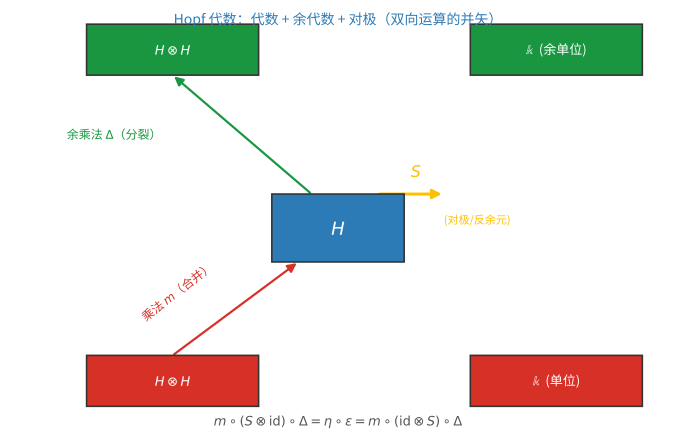
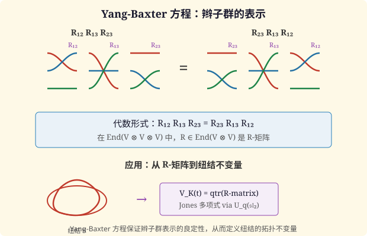

# 第 73 级：Hopf 代数与量子群 (Hopf Algebras and Quantum Groups)

> Hopf 代数与量子群是 20 世纪 80 年代以来数学物理中最深刻的发展之一。Hopf 代数以德国数学家 Heinz Hopf 命名，是同时具有代数结构和余代数结构的代数系统，满足相容性条件。量子群作为 Drinfeld 和 Jimbo 在解决量子 Yang-Baxter 方程过程中引入的 Hopf 代数变形，是李群表示论的非交换非余交换推广。量子群为三维流形的拓扑不变量（如 Jones 多项式、Witten 不变量）提供了统一的代数框架，并深刻影响了低维拓扑、表示论、数学物理和范畴论。本课程从 Hopf 代数的基本定义出发，系统介绍量子群 $U_q(\mathfrak{sl}_2)$ 的表示理论、$R$-矩阵与 Yang-Baxter 方程、辫子张量范畴以及量子不变量等核心内容。

---

## 从"合一把又拆成两份"说起：Hopf 代数与量子群要解决的根问题

> 在动手读定义之前，先想清楚一个问题：**人为什么需要 Hopf 代数和量子群？**

**一个真实的场景（第一步：直觉）**

想象你开一家奶茶店。服务生可以把两杯原料 **合** 成一杯（乘法），也可以按配方把一杯 **拆** 出两份工序单（余乘法）。有趣的是：万一某份原料已经"分过身"（被复制成两份），两份还能各自被"合并"回去而指向同一个味道。这种"既能合、又能拆，而且合与拆互不打架"的机器，就是 Hopf 代数的原型——它描述的其实是一个"同时具备乘法与加法般可逆配对、且可被复制"的对象世界。

但等一下——**奶茶店和量子物理有什么关系？** 关键在于：当我们要描述"一个整体对象可以分成几份、又可逆地拼回去"时，光是普通的代数（只会乘）远远不够，还需要一套与乘法严格配对的"拆分规则"。这套语言一旦抽象好，连群、李代数的表示、乃至量子理论里的对称都能被它装下。

**要解决的问题（第二步：来龙去脉）**

- **为什么只有"乘法"不够？** 第 72 级我们已经学会用李代数描述连续对称。但物理学家很快撞上一个新难题：在研究一个复合系统的对称时，往往需要把单个对象"复制"成多份（对应粒子分成多个）再分别作用；而普通代数只有"合并"（乘法）没有"拆分"（余乘法），于是无法刻画"复制—配对"这个过程。Hopf 代数正是在代数（$m$）之外，补上一整套对偶的余代数结构（$\Delta,\varepsilon$），再加一把对极 $S$，让"合"与"拆"严丝合缝地对齐。
- **真正引爆它的，是"量子化"**（1980 年代）。Vladimir Drinfeld 与 Michio Jimbo 几乎同时发现：把经典括号 $[E,F]=H$ 换成 $[E,F]=\frac{K-K^{-1}}{q-q^{-1}}$，得到的量子群 $U_q(\mathfrak{sl}_2)$ 恰好是 Hopf 代数——当参数 $q\to1$ 时退回经典 $U(\mathfrak{sl}_2)$。原来 Hopf 代数正是装载"量子变形"最自然的舞台，它顺带解释了量子 Yang–Baxter 方程，并为纽结与三维流形的拓扑不变量（Jones 多项式、Reshetikhin–Turaev 不变量）提供了统一的代数框架。
- **一套公理，覆盖无数对象。** 有限群代数 $\mathbb{k}[G]$、泛包络代数 $U(\mathfrak{g})$、量子群 $U_q(\mathfrak{sl}_2)$，全都只是同一个 Hopf 框架的特例。这种"一套公理统一无数来自代数、几何、拓扑、物理的对象"的力量，正是本课真正的看点。

**正式定义前的准备（第三步：本章如何推进）**

本课沿这条主线展开：

- 先搭"Hopf 代数"本身：**代数 + 余代数 + 双代数 + 对极**（外加对偶配对、卷积代数、余模这些基本词汇）；
- 然后用 **Drinfeld 量子双** 和 **量子群 $U_q(\mathfrak{sl}_2)$** 看"如何把经典对象量子化"；
- 接着引入 **$R$-矩阵** 与 **Yang-Baxter 方程**，理解"不交换的换位"如何由系统地编码成辫子结构与辫子张量范畴；
- 最后走向 **量子维数、量子不变量与 Jones 多项式**，并用 **Tannaka-Krein 对偶** 回答"能否从表示范畴把原对象找回来"。

带着"为什么一个既会合又会拆的代数能同时解释量子对称与纽结"去读每一步，你会发现每个定义都在回答这条主线的某个环节。

> **🧠 一句话记住 Hopf 代数的"出生证"**
>
> Hopf 代数与量子群要解决的**根本问题**，是给"既能合并、又能按规则拆分（并带逆的复制）"的对象建一套统一代数，用它装载量子对称：
>
> $$ \boxed{\text{在代数的乘法之外，辅以严格配对的余乘法与对极，使"合、拆、逆"协调，从而统一地量子化对称。}} $$

---

## 开始之前

**本章在讲什么**：Hopf 代数同时具有"乘法（合）"与"余乘法（拆）"两套结构，并靠对极把它们协调起来。你会先学会这套公理与基本词汇（对偶配对、卷积、余模），再亲手构造量子群 $U_q(\mathfrak{sl}_2)$，并用 $R$-矩阵、辫子范畴与量子不变量一路把它用起来。

**为什么要学它**：它把第 72 级李群李代数的对称性一路"量子化"成量子群，并把表示论、低维拓扑（纽结/三维流形不变量）、数学物理和范畴论织进同一张网。它与第 14 级线性代数、第 72 级李群表示论一脉相承：那边讲"连续对称"，这里讲"连续对称被量子化之后长什么样"。

**开始前请确认你还记得**：

- 向量空间、张量积 $V\otimes W$、线性映射（见第 14 级线性代数）。
- 群与李代数的基础：群的公理、李代数、泛包络代数 $U(\mathfrak{g})$（见第 72 级）。
- 有限维向量空间与对偶空间 $V^*$；双线性型与非退化。
- $\mathfrak{sl}_2$ 的标准基 $\{H,E,F\}$ 及其括号 $[H,E]=2E$、$[H,F]=-2F$、$[E,F]=H$（见第 72 级）。

---

## 1. 学习目标

1. 理解 Hopf 代数的定义与基本性质（代数、余代数、对极映射）。
2. 掌握对偶配对与卷积代数的概念。
3. 理解余模及其与模的关系。
4. 掌握 Drinfeld 量子双与量子群 $U_q(\mathfrak{sl}_2)$ 的构造。
5. 理解 $R$-矩阵与 Yang-Baxter 方程的关系。
6. 掌握量子群 $U_q(\mathfrak{sl}_2)$ 的表示分类。
7. 理解辫子张量范畴与拟三角 Hopf 代数的概念。
8. 掌握量子迹与 Jones 多项式的关系。
9. 了解 Tannaka-Krein 对偶定理的基本思想。

---

## 2. 核心概念

### 2.1 Hopf 代数定义

**定义 2.1**（代数）域 $\mathbb{k}$ 上的 **代数** $(A, m, \eta)$ 是一个 $\mathbb{k}$-向量空间 $A$，配备：
- 乘法 $m: A \otimes A \to A$，是线性映射；
- 单位 $\eta: \mathbb{k} \to A$，是线性映射；
满足结合律和单位律。

**定义 2.2**（余代数）域 $\mathbb{k}$ 上的 **余代数** $(C, \Delta, \varepsilon)$ 是一个 $\mathbb{k}$-向量空间 $C$，配备：
- 余乘法 $\Delta: C \to C \otimes C$，是线性映射；
- 余单位 $\varepsilon: C \to \mathbb{k}$，是线性映射；
满足余结合律和余单位律。

**定义 2.3**（双代数）**双代数** $(H, m, \eta, \Delta, \varepsilon)$ 同时是代数和余代数，且 $\Delta$ 和 $\varepsilon$ 是代数同态（或等价地，$m$ 和 $\eta$ 是余代数同态）。

> **💡 直观理解（类比）**：双代数是一台"既能合并又能分裂"的兼容机器：既会拧螺丝（乘），又会拆螺丝（余乘），而且拆和装的顺序无关紧要（相容条件保证"先拆再装"与"先装再拆"结果一致）。它像一台既能复印又能装订的多功能一体机，两种工序互不打架。

**定义 2.4**（Hopf 代数）**Hopf 代数** $(H, m, \eta, \Delta, \varepsilon, S)$ 是一个双代数，配备 **对极映射** $S: H \to H$，满足：

$$
m \circ (S \otimes \operatorname{id}) \circ \Delta = \eta \circ \varepsilon = m \circ (\operatorname{id} \otimes S) \circ \Delta.
$$

用 Sweedler 记号 $\Delta(h) = \sum_{(h)} h_{(1)} \otimes h_{(2)}$，对极条件为：

$$
\sum_{(h)} S(h_{(1)}) h_{(2)} = \varepsilon(h) \cdot 1 = \sum_{(h)} h_{(1)} S(h_{(2)}).
$$

> **直观理解（现实类比）**：Hopf 代数像一台既能"合并"又能"分裂"的双向机器。乘法 $m$ 把两个元素合成一个（像把两瓶香精勾兑成一杯），余乘法 $\Delta$ 却把一个元素拆成两份（像把一份菜单复印成两份）。对极 $S$ 则像"撤销/镜像"操作——把元素翻成它的"逆"，使得"先拆开再合并"恢复原状。三者配合，恰如双向运算的并矢：既能正向合成，也能逆向分解。
>
> **🧠 思考历程：一个既会"合并"又会"分裂"的代数系统，怎么就摸到了量子物理的脉搏？**
>
> Hopf 代数看似只是代数公理的炫技拼盘，但它诞生的动机一点也不空：**如何在"把一个对象复折成几份"这种朴素的几何动作里，把乘法与余乘法拧成一台严丝合缝的机器**。从群的表面对角映射，到李群的表示论，再到量子群，答案一次次回到了这台"双向机器"上。
>
> - **从拓扑到代数：乘法与余乘法的第一次握手**（1930–1940 年代）。Heinz Hopf 在研究李群的拓扑时常看到同一幕：一个空间既带乘法（把两点并成一点），又带对角映射（把一个点"复制"一份分解掉）。正是这种几何直觉，让他把"代数＋余代数"兼容并用的结构提炼出来，为后来命名"Hopf 代数"的框架铺好了地基。
> - **Drinfeld 的临门一脚：量子群**（1980 年代）。这场爆发来自 Vladimir Drinfeld 与 Michio Jimbo 几乎同时的创见：他们把经典括号 $[E,F]=H$ 换成 $[E,F]=\frac{K-K^{-1}}{q-q^{-1}}$，得到量子群 $U_q(\mathfrak{sl}_2)$ ——当 $q\to1$ 时恰好退回经典 $U(\mathfrak{sl}_2)$。原来 Hopf 代数正是装载"量子变形"最自然的舞台，同时也顺带解释了量子 Yang–Baxter 方程。
> - **一架机器，万千变身**。回过头看，有限群代数 $\mathbb{k}[G]$、泛包络代数 $U(\mathfrak{g})$、量子群 $U_q(\mathfrak{sl}_2)$ 全都只是同一个 Hopf 框架的不同特例；于是 Jones 多项式、三维流形不变量（Reshetikhin–Turaev）也被一起收进了这张网。这种"一套公理覆盖无数对象"的统一力，是这门理论真正的威力所在。
> - **心路**：当一段数学既能"合"又能"分"，往往就离深刻的洞见不远了。Hopf 代数提醒我们：**别只围着单一运算打转，把"复合"与"分解"同时结构化，才接得住真正复杂的对象**。

**例 2.1**（群代数）有限群 $G$ 的群代数 $\mathbb{k}[G]$ 是 Hopf 代数，其中：
- $\Delta(g) = g \otimes g$，$\varepsilon(g) = 1$，$S(g) = g^{-1}$ 对 $g \in G$。

**例 2.2**（李代数的包络代数）李代数 $\mathfrak{g}$ 的泛包络代数 $U(\mathfrak{g})$ 是 Hopf 代数，其中：
- $\Delta(X) = X \otimes 1 + 1 \otimes X$，$\varepsilon(X) = 0$，$S(X) = -X$ 对 $X \in \mathfrak{g}$。

### 2.2 对偶配对

**为什么需要这个概念**：余乘法让你把 $H$ 拆成两份之后，"从 $H$ 去看 $K$、或从 $K$ 去看 $H$"会怎样？对偶配对正是给这两套 Hopf 代数之间布满"咬合的牙齿"：一方乘法对另一方余乘，一方单位对另一方余单位，一一翻译、两边一致。它是理解对偶、泛包络与群代数互为镜像、以及 Drinfeld 量子双构造的钥匙。

**定义 2.5**（对偶配对）两个 Hopf 代数 $H$ 和 $K$ 之间的 **对偶配对** 是一个非退化双线性形式 $\langle \cdot, \cdot \rangle: K \otimes H \to \mathbb{k}$，满足：

$$
\langle xy, h \rangle = \langle x \otimes y, \Delta_H(h) \rangle, \quad \langle x, gh \rangle = \langle \Delta_K(x), g \otimes h \rangle,
$$
$$
\langle 1_K, h \rangle = \varepsilon_H(h), \quad \langle x, 1_H \rangle = \varepsilon_K(x),
$$
$$
\langle S_K(x), h \rangle = \langle x, S_H(h) \rangle.
$$

> **💡 直观理解（类比）**：对偶配对就像两本互助词典——$K$ 里的词条和 $H$ 里的词条"一一咬合"，一方乘法对应另一方余乘、一方单位对应另一方余单位。翻译时无论从哪本开始翻，结果都一致，保证两个 Hopf 代数互为"彼此的镜像译文"。

### 2.3 卷积代数

**定义 2.6**（卷积代数）设 $(C, \Delta, \varepsilon)$ 是余代数，$(A, m, \eta)$ 是代数。则 $\operatorname{Hom}(C, A)$ 上的 **卷积** 定义为：

$$
(f * g)(c) = m(f \otimes g)(\Delta(c)) = \sum_{(c)} f(c_{(1)}) g(c_{(2)}).
$$

$(\operatorname{Hom}(C, A), *, \eta \circ \varepsilon)$ 构成一个代数，称为 **卷积代数**。

> **💡 直观理解（类比）**：卷积就像是"接力合作"：处理同一个酒水配方，先把原料拆成两份，一边用 $f$ 处理头一份、一边用 $g$ 处理尾一份，最后把两杯成果合成一杯。写程序里的"管道函数"、信号处理的叠加，都是这只"拆分-分别加工-合并"的手。

### 2.4 余模

**定义 2.7**（余模）设 $H$ 是 Hopf 代数。一个 **右 $H$-余模** 是一个向量空间 $M$ 配备 **余作用** $\rho: M \to M \otimes H$，满足：
1. $(\rho \otimes \operatorname{id}) \circ \rho = (\operatorname{id} \otimes \Delta) \circ \rho$（余结合律）；
2. $(\operatorname{id} \otimes \varepsilon) \circ \rho = \operatorname{id}$（余单位律）。

用 Sweedler 记号 $\rho(m) = \sum_{(m)} m_{(0)} \otimes m_{(1)}$。

> **💡 直观理解（类比）**：余模是"给一个容器盖上会自我增值的邮票"：在余模上放一个元素 $m$，它会自动附加上一层来自 $H$ 的"标签"$m_{(1)}$（如物体的颜色/状态）。余作用把 $m$ 变成一个"附了标签的包裹"，且怎样包装都不会冲突（余结合律保证加标签的顺序无关）。这和模"H 来作用 M"正好方向相反：模是 $H$ 动手，余模是 $M$ 自己长出标签。

### 2.5 Drinfeld 量子双

**定义 2.8**（Drinfeld 量子双）设 $H$ 是有限维 Hopf 代数。**Drinfeld 量子双** $D(H)$ 是 $H$ 和 $H^{*\text{op}}$ 在某种意义下的双积，其作为向量空间为 $H \otimes H^*$，具有特定的代数、余代数结构和 $R$-矩阵。

> **💡 直观理解（类比）**：仿佛取一台机器和它的"使用说明/含对偶手册"component，把它们拼成一部更完整的"超级机器"。$D(H)$ 把 $H$ 与它的对偶 $H^*$ 粘在一起（方向稍反 $\text{op}$），让它们互相当"左右手"，从而自发涌现出一颗 $R$-矩阵——正如正负两卷胶带放在一起时自然能"辫"起来。

### 2.6 量子群 $U_q(\mathfrak{sl}_2)$

**定义 2.9**（量子群 $U_q(\mathfrak{sl}_2)$）设 $q \in \mathbb{k}^\times$ 且 $q^2 \neq 1$。**量子群** $U_q(\mathfrak{sl}_2)$ 是由生成元 $E, F, K, K^{-1}$ 满足以下关系的 $\mathbb{k}$-代数：

$$
KK^{-1} = K^{-1}K = 1,
$$
$$
KEK^{-1} = q^2 E, \quad KFK^{-1} = q^{-2} F,
$$
$$
[E, F] = \frac{K - K^{-1}}{q - q^{-1}}.
$$

余代数结构和对极映射为：

$$
\Delta(K) = K \otimes K, \quad \varepsilon(K) = 1, \quad S(K) = K^{-1},
$$
$$
\Delta(E) = E \otimes K + 1 \otimes E, \quad \varepsilon(E) = 0, \quad S(E) = -EK^{-1},
$$
$$
\Delta(F) = F \otimes 1 + K^{-1} \otimes F, \quad \varepsilon(F) = 0, \quad S(F) = -KF.
$$

![量子群变形：q-整数 [n]_q=(q^n-q^{-n})/(q-q^{-1}) 随 q 变化，当 q→1 时 [n]_q→n，量子群 U_q(sl_2) 退化为经典 U(sl_2)](images/lv73-quantum-deform.svg)

> **直观理解（现实类比）**：量子群里的参数 $q$ 就像收音机上的"调谐旋钮"。当旋钮拧到 $q=1$ 时，收音机放的是经典的 $\mathfrak{sl}_2$；把 $q$ 拧开，就进入"量子变形"的频道 $U_q(\mathfrak{sl}_2)$，其中 $q$-整数 $[n]_q$ 取代普通整数 $n$，$[E,F]=\frac{K-K^{-1}}{q-q^{-1}}$ 取代经典括号 $[E,F]=H$。变形保留了大体结构却失去了"平凡的可交换性"，正如同一首歌在不同调谐精度下听出不同的层次。
>
> **常见坑**：$q$ 是否为单位根（即存在 $n$ 使 $q^n=1$）决定了量子群的"性格"。通常默认 $q$ **不是**单位根，此时表示论最高权分类干净漂亮；可一旦 $q$ 落在单位根上，有限的不可约表示会"缩水"、出现维数公式失效，甚至从头变成一类新的"截断"对象。做题套公式前务必先确认 $q$ 处于哪种情形，否则原本的普通维数会直接算错。

### 2.7 $R$-矩阵

**为什么需要这个概念**：普通 Hopf 代数的余乘法 $\Delta$ 与翻转后的 $\Delta^{\mathrm{op}}$ 可以不相等（失去"余交换性"），这正是量子群的常态。那么换位就不再是免费的。$R$-矩阵就是把"不可交换的换位"系统化地做成一把能安全调换元素的钥匙，它同时兼任可逆元与"换位规则表"，是整个量子群运转的核心机关。

**定义 2.10**（$R$-矩阵）设 $H$ 是 Hopf 代数。**$R$-矩阵** 是一个可逆元 $R \in H \otimes H$，满足：

$$
\Delta^{\text{op}}(x) = R \Delta(x) R^{-1}, \quad \forall x \in H,
$$
$$
(\Delta \otimes \operatorname{id})(R) = R_{13} R_{23}, \quad (\operatorname{id} \otimes \Delta)(R) = R_{13} R_{12},
$$

其中 $R_{12} = R \otimes 1$，$R_{23} = 1 \otimes R$，$R_{13} = (\tau \otimes \operatorname{id})(1 \otimes R)$（$\tau$ 是交换因子）。

具有 $R$-矩阵的 Hopf 代数称为 **拟三角 Hopf 代数**。

> **💡 直观理解（类比）**：$R$-矩阵是一道"换位咒语"：需要把 $x\otimes y$ 摆成 $y\otimes x$？不用蛮力交换，而是用 $R$ 把 $\Delta(x)$ 悄悄转个向（$\Delta^{\text{op}}(x)=R\Delta(x)R^{-1}$），像隔空打出一记乾坤大挪移。它告诉我们一个体系本来"不能随意交换"（余交换性缺席），但只要握着 $R$ 这把钥匙就可以安全换位，同时保证换位自身满足漂亮的辫子规则。

### 2.8 Yang-Baxter 方程

**为什么需要这个概念**：单是把两个元素换过来（一把 $R$-矩阵）还不够，我们常常要处理**三个**对象交错的换位。Yang-Baxter 方程正是这条"换位必须自洽"的纪律：无论先换哪两根线，最后得出的辫子必须一样。它保证换位能一路串下去而不产生矛盾，也是后面辫子群表示与纽结不变量的直接来源。

**定义 2.11**（Yang-Baxter 方程）设 $V$ 是向量空间，$R \in \operatorname{End}(V \otimes V)$。**Yang-Baxter 方程** 为：

$$
R_{12} R_{13} R_{23} = R_{23} R_{13} R_{12} \quad \text{在} \quad V \otimes V \otimes V \text{上},
$$

其中 $R_{12} = R \otimes \operatorname{id}_V$，$R_{23} = \operatorname{id}_V \otimes R$，$R_{13} = (\tau \otimes \operatorname{id})(\operatorname{id}_V \otimes R)$。

> **直观理解（现实类比）**：Yang-Baxter 方程就像"三条丝线编辫子"的恒等式。假设你有三根丝线，每次只能交换相邻两根。方程说：先交换第1-2根、再第1-3根、再第2-3根，与先交换第2-3根、再第1-3根、再第1-2根，最终得到的辫子完全一样。这个"辫子不变性"是量子群的核心——它保证了量子力学中多粒子散射的一致性，也正是因为有了它，我们才能用量子群构造纽结不变量。

### 2.9 辫子张量范畴

**定义 2.12**（辫子张量范畴）**辫子张量范畴** $(\mathcal{C}, \otimes, \mathbf{1}, \alpha, \lambda, \rho, c)$ 是一个张量范畴，配备 **辫子同构** $c_{X,Y}: X \otimes Y \to Y \otimes X$，满足六边形公理（即对任意 $X, Y, Z \in \mathcal{C}$，以下图表交换）：

$$
\begin{CD}
X \otimes (Y \otimes Z) @>{c_{X, Y \otimes Z}}>> (Y \otimes Z) \otimes X \\
@V{\alpha_{X,Y,Z}}VV @VV{\alpha^{-1}_{Y,Z,X}}V \\
(X \otimes Y) \otimes Z @>>{c_{X,Y} \otimes \operatorname{id}_Z}> (Y \otimes X) \otimes Z @>{\operatorname{id}_Y \otimes c_{X,Z}}>> Y \otimes (Z \otimes X)
\end{CD}
$$

> **💡 直观理解（类比）**：辫子张量范畴就是一个"可以互相纠缠的积木屋"：张量积是搭积木，辫子同构 $c_{X,Y}$ 则允许把两块积木交换位置，但交换像编辫子一样不是无脑换位——它必须满足六边形（使得三块积木无论先换哪两对，最终绕法一致）。于是范畴里的"交换"升级成"带辫子的交换"，仿佛两条绳子交叉时记录谁在上谁在下。

拟三角 Hopf 代数的表示范畴构成辫子张量范畴。

### 2.10 拟三角 Hopf 代数

**定义 2.13**（拟三角 Hopf 代数）一个 **拟三角 Hopf 代数** $(H, R)$ 是一个 Hopf 代数 $H$ 配备一个 $R$-矩阵。

> **💡 直观理解（类比）**：摘下"单位"，它就是普通 Hopf 代数的"加装涡轮版"：在代数身上额外装上一把 $R$-矩阵钥匙，让原本不能安全换位的元素可以不拆卸地完成交换。就像给一辆普通汽车装上四驱系统，虽然装上后更有能力，但常因 $R_{21}\neq R^{-1}$ 而"单向"——只能顺着某一方向换位，这正是"拟三角"（非三角）的由来。

若 $R$ 还满足 $R_{21} = R^{-1}$，则称 $H$ 是 **三角 Hopf 代数**。

### 2.11 量子维数

**定义 2.14**（量子维数）设 $H$ 是拟三角 Hopf 代数，$V$ 是有限维 $H$-模。**量子维数**（或量子迹）定义为：

$$
\operatorname{qdim}(V) = \operatorname{tr}_V(R_{21} R_{12} \cdot K^{-1}),
$$

其中 $K$ 是某些量子群中存在的"量子行列式"元素。

> **💡 直观理解（类比）**：量子维数像是"带符号的重量秤"：普通维数数有多少个态，而量子维数把每个态按 $K$ 的特征值（再经 $R$ 的扭一手）加权后来称。它往往是 $q$-整数 $[n+1]_q$ 而非普通整数 $n+1$——好比把"鸡蛋数个数"升级成"每颗蛋按重量计费"，于是总数变成随 $q$ 溶胀的量子数。

### 2.12 量子不变量与 Jones 多项式

**定义 2.15**（量子不变量）三维流形的 **量子不变量**（Reshetikhin-Turaev 不变量）通过将流形用手术法分解为基本构件，再用量子群 $U_q(\mathfrak{sl}_2)$ 的表示论数据（如 $6j$-符号）赋值得到。

**Jones 多项式** $V_L(t)$ 是纽结 $L$ 的 Laurent 多项式不变量，可以通过量子群 $U_q(\mathfrak{sl}_2)$ 在 $q = t^{1/4}$ 时的表示论构造得到。

> **💡 直观理解（类比）**：Jones 多项式是给纽结发的"指纹/生物护照"：不同编法的绳结（三叶结、8字结……）拿到一条互不相同的 Laurent 多项式签名，而且无论你怎样拉伸扭曲，签名的值都不变（因为只依赖拓扑本质）。它把"两条绳子到底缠得一样不一样"这种几何问题，翻译成可计算的代数问题——这正是量子群与拓扑握手的地方。

### 2.13 Monoidal 范畴

**定义 2.16**（Monoidal 范畴）**Monoidal 范畴**（张量范畴）$(\mathcal{C}, \otimes, \mathbf{1}, \alpha, \lambda, \rho)$ 是一个范畴 $\mathcal{C}$ 配备：
- 张量积函子 $\otimes: \mathcal{C} \times \mathcal{C} \to \mathcal{C}$；
- 单位对象 $\mathbf{1} \in \mathcal{C}$；
- 结合约束 $\alpha_{X,Y,Z}: (X \otimes Y) \otimes Z \to X \otimes (Y \otimes Z)$ 满足五边形公理；
- 左右单位约束 $\lambda_X: \mathbf{1} \otimes X \to X$，$\rho_X: X \otimes \mathbf{1} \to X$ 满足三角公理。

> **💡 直观理解（类比）**：Monoidal 范畴如同"带组装规则的无选择积木乐园"：张量积 $\otimes$ 把对象拼在一起（搭积木），单位对象 $\mathbf{1}$ 像"空气块"——和任何块拼都不影响它；结合约束 $\alpha$ 负责回答"先拼前两个还是后两个结果连不连通"（五边形保证怎么加括号都不变）。三块积木拼法稳定、括号随便加，成功构建"带结合语义的积木语法"。

---

## 3. 定理与证明

### 3.1 量子群 $U_q(\mathfrak{sl}_2)$ 的表示分类

**定理 3.1**（$U_q(\mathfrak{sl}_2)$ 的有限维不可约表示分类）设 $q$ 不是单位根（即 $q^n \neq 1$ 对任意 $n \in \mathbb{N}$）。则 $U_q(\mathfrak{sl}_2)$ 的有限维不可约表示由最高权分类。对每个非负整数 $n$，存在唯一的 $(n+1)$ 维不可约表示 $V_n$，基为 $\{v_0, v_1, \ldots, v_n\}$，作用如下：

$$
K \cdot v_k = q^{n-2k} v_k,
$$
$$
E \cdot v_k = \begin{cases}
\frac{q^{n-k+1} - q^{-(n-k+1)}}{q - q^{-1}} v_{k-1}, & k > 0, \\
0, & k = 0,
\end{cases}
$$
$$
F \cdot v_k = \begin{cases}
\frac{q^{k+1} - q^{-(k+1)}}{q - q^{-1}} v_{k+1}, & k < n, \\
0, & k = n.
\end{cases}
$$

> **💡 直观理解（类比）**：量子群的不可约表示仍是一座"由最高峰决定全貌的山"，只是呈现成"量子等高线"：最高权 $q^n$ 定海拔，$K$ 给出每层特征值 $q^{n-2k}$，而 $E,F$ 用 $q$-整数 $[k]_q$ 做"倾斜坡度"。就像经典的 $\mathfrak{sl}_2$ 梯子被套上量子比例的刻度，但沿梯子上下、走到尽头止步的骨架没变——变形的是梯度，不是形状。

**证明**：

**步骤 1：最高权向量**

设 $V$ 是有限维不可约 $U_q(\mathfrak{sl}_2)$-模。由于 $K$ 的作用可对角化（因为 $K$ 在 $U_q(\mathfrak{sl}_2)$ 中是群元），$V$ 可以分解为 $K$ 的特征空间的直和：

$$
V = \bigoplus_{\lambda} V_\lambda,
$$

其中 $V_\lambda = \{v \in V : K \cdot v = \lambda v\}$，$\lambda \in \mathbb{k}^\times$。

**步骤 2：$E$ 和 $F$ 的作用**

由关系 $KEK^{-1} = q^2 E$，若 $v \in V_\lambda$，则：

$$
K \cdot (E \cdot v) = KEK^{-1} \cdot (K \cdot v) = q^2 E \cdot (K \cdot v) = q^2 \lambda (E \cdot v).
$$

因此 $E \cdot V_\lambda \subseteq V_{q^2 \lambda}$。类似地，$F \cdot V_\lambda \subseteq V_{q^{-2} \lambda}$。

**步骤 3：存在最高权向量**

由于 $V$ 有限维，$K$ 的特征值有限。取 $\lambda$ 使得 $|\lambda|$ 最大（在某种意义下），则 $E \cdot V_\lambda = 0$（否则 $E \cdot v$ 将给出特征值 $q^2 \lambda$，模长更大）。设 $v_0 \in V_\lambda$ 是非零最高权向量，则 $E \cdot v_0 = 0$。

**步骤 4：生成权链**

定义 $v_k = \frac{1}{[k]!} F^k \cdot v_0$，其中 $[k]! = [1][2]\cdots[k]$，$[k] = \frac{q^k - q^{-k}}{q - q^{-1}}$ 是 $q$-整数。

由 $F$ 的作用，$K \cdot v_k = q^{-2k} \lambda v_k$。由于 $V$ 有限维，存在 $n$ 使得 $v_{n+1} = 0$ 但 $v_n \neq 0$。

**步骤 5：确定参数**

计算 $E \cdot v_k$。利用 $[E, F] = \frac{K - K^{-1}}{q - q^{-1}}$，通过归纳法可得：

$$
E \cdot v_k = \frac{\lambda q^{-(k-1)} - \lambda^{-1} q^{(k-1)}}{q - q^{-1}} v_{k-1}.
$$

由于 $v_{n+1} = 0$，即 $F \cdot v_n = 0$，计算 $E \cdot v_{n+1}$（必须为 $0$）可得：

$$
0 = E \cdot v_{n+1} \propto \frac{\lambda q^{-n} - \lambda^{-1} q^{n}}{q - q^{-1}} v_n.
$$

因此 $\lambda q^{-n} = \lambda^{-1} q^n$，即 $\lambda = \pm q^n$。由于 $q$ 不是单位根，适当选取可设 $\lambda = q^n$。

**步骤 6：构造完成**

此时 $\lambda = q^n$，$K$ 的特征值为 $q^{n-2k}$（$k = 0, \ldots, n$），且 $E$ 和 $F$ 的作用如定理所述。可以验证这些算子满足 $U_q(\mathfrak{sl}_2)$ 的关系，从而 $V_n$ 是 $(n+1)$ 维不可约表示。

**步骤 7：唯一性**

由上述构造，任何有限维不可约表示的最高权决定了整个表示的结构，且最高权必须为 $q^n$（$n \in \mathbb{N}$）。因此所有有限维不可约表示都是 $V_n$（$n \geq 0$）。$\square$

### 3.2 $R$-矩阵的存在唯一性

**定理 3.2**（$U_q(\mathfrak{sl}_2)$ 的 $R$-矩阵）量子群 $U_q(\mathfrak{sl}_2)$ 是拟三角 Hopf 代数，其 $R$-矩阵为：

$$
R = q^{\frac{1}{2} H \otimes H} \sum_{n=0}^{\infty} \frac{(1 - q^{-2})^n}{[n]!} q^{\frac{n(n-1)}{2}} (E^n \otimes F^n),
$$

其中 $H$ 是形式生成元满足 $K = q^H$。$R$ 满足 Yang-Baxter 方程。

> **💡 直观理解（类比）**：这个 $R$-矩阵像一份"量子化的交换方案表"：指数项 $q^{\frac12 H\otimes H}$ 负责处理"尺子方向"，后面求和则把 $E\otimes F$ 一根根"辫"进去，连起来就是一条完整的换位接合线。它的存在说明 $U_q(\mathfrak{sl}_2)$ 虽然不失余交换性、也可以不拆件地完成换位——相当于给这台量子机器内置了一把通用的"遇上任何两个态都能安全调换"的钥匙，且反过来也是本次调换的唯一配方。

**证明**：

**步骤 1：$R$-矩阵的构造**

定义 $R$ 为 $U_q(\mathfrak{sl}_2) \hat{\otimes} U_q(\mathfrak{sl}_2)$ 中的元素（完备化张量积）：

$$
R = q^{\frac{1}{2} H \otimes H} \sum_{n=0}^{\infty} \frac{(1 - q^{-2})^n}{[n]!} q^{\frac{n(n-1)}{2}} (E^n \otimes F^n).
$$

**步骤 2：验证拟三角条件**

需要验证：
1. $\Delta^{\text{op}}(x) R = R \Delta(x)$ 对所有 $x \in U_q(\mathfrak{sl}_2)$；
2. $(\Delta \otimes \operatorname{id})(R) = R_{13} R_{23}$；
3. $(\operatorname{id} \otimes \Delta)(R) = R_{13} R_{12}$。

**验证条件 1**：只需验证对生成元 $E, F, K$ 成立。

对 $K$：$\Delta(K) = K \otimes K$，$\Delta^{\text{op}}(K) = K \otimes K$，因此 $R \Delta(K) = \Delta^{\text{op}}(K) R$ 自动成立。

对 $E$：$\Delta(E) = E \otimes K + 1 \otimes E$，$\Delta^{\text{op}}(E) = K \otimes E + E \otimes 1$。

需要验证 $(K \otimes E + E \otimes 1) R = R (E \otimes K + 1 \otimes E)$。

利用 $q^{\frac{1}{2} H \otimes H}$ 与 $E \otimes 1$ 和 $1 \otimes E$ 的交换关系：
- $q^{\frac{1}{2} H \otimes H} (E \otimes 1) = q^{1 \otimes H} (E \otimes 1) q^{\frac{1}{2} H \otimes H}$；
- $q^{\frac{1}{2} H \otimes H} (1 \otimes E) = q^{H \otimes 1} (1 \otimes E) q^{\frac{1}{2} H \otimes H}$。

结合级数项的验证，可得条件 1 成立。

**验证条件 2**：$(\Delta \otimes \operatorname{id})(R) = R_{13} R_{23}$。

计算 $(\Delta \otimes \operatorname{id})(q^{\frac{1}{2} H \otimes H}) = q^{\frac{1}{2} (\Delta(H) \otimes H)} = q^{\frac{1}{2} (H \otimes 1 + 1 \otimes H) \otimes H} = q^{\frac{1}{2} H \otimes 1 \otimes H} q^{\frac{1}{2} 1 \otimes H \otimes H} = (q^{\frac{1}{2} H \otimes H})_{13} (q^{\frac{1}{2} H \otimes H})_{23}$。

类似地，$(\Delta \otimes \operatorname{id})(E^n \otimes F^n) = (\Delta(E)^n \otimes F^n)$。利用 $\Delta(E) = E \otimes K + 1 \otimes E$ 的二项式展开，可得 $(\Delta \otimes \operatorname{id})(R) = R_{13} R_{23}$。

**步骤 3：唯一性**

在 $U_q(\mathfrak{sl}_2)$ 的完备化中，满足拟三角条件的 $R$-矩阵在上述构造下是唯一的，由 Drinfeld 量子双的泛性质保证。$\square$

### 3.3 Yang-Baxter 方程的解与量子群的关系

**定理 3.3**（Yang-Baxter 方程与量子群）设 $H$ 是拟三角 Hopf 代数，$R \in H \otimes H$ 是其 $R$-矩阵。则对任意 $H$-模 $V$，$R$ 在 $V \otimes V$ 上的作用 $R_{V,V} = \rho_V \otimes \rho_V(R)$ 给出 Yang-Baxter 方程的解：

$$
(R_{V,V})_{12} (R_{V,V})_{13} (R_{V,V})_{23} = (R_{V,V})_{23} (R_{V,V})_{13} (R_{V,V})_{12} \quad \text{在} \quad V \otimes V \otimes V \text{上}.
$$

**证明**：

**步骤 1：将问题转化为 Hopf 代数中的关系**

设 $R = \sum_i a_i \otimes b_i \in H \otimes H$。在 $V \otimes V \otimes V$ 上，$R_{12}$ 的作用为 $\sum_i a_i \otimes b_i \otimes 1$，$R_{13}$ 的作用为 $\sum_i a_i \otimes 1 \otimes b_i$，$R_{23}$ 的作用为 $\sum_i 1 \otimes a_i \otimes b_i$。

**步骤 2：利用 $R$-矩阵的拟三角条件**

由拟三角条件的 $(\Delta \otimes \operatorname{id})(R) = R_{13} R_{23}$ 和 $(\operatorname{id} \otimes \Delta)(R) = R_{13} R_{12}$，以及余结合律。

**步骤 3：计算 Yang-Baxter 复合**

考虑 $R_{12} R_{13} R_{23}$：

$$
R_{12} R_{13} R_{23} = \sum_{i,j,k} (a_i \otimes b_i \otimes 1)(a_j \otimes 1 \otimes b_j)(1 \otimes a_k \otimes b_k)
$$

$$
= \sum_{i,j,k} a_i a_j \otimes b_i a_k \otimes b_j b_k.
$$

另一方面，$R_{23} R_{13} R_{12} = \sum_{i,j,k} (1 \otimes a_i \otimes b_i)(a_j \otimes 1 \otimes b_j)(a_k \otimes b_k \otimes 1)$

$$
= \sum_{i,j,k} a_j a_k \otimes a_i b_k \otimes b_i b_j.
$$

**步骤 4：利用拟三角条件化简**

由 $(\Delta \otimes \operatorname{id})(R) = R_{13} R_{23}$，得：

$$
\sum_j \Delta(a_j) \otimes b_j = \sum_{j,k} a_j \otimes a_k \otimes b_j b_k.
$$

由 $(\operatorname{id} \otimes \Delta)(R) = R_{13} R_{12}$，得：

$$
\sum_i a_i \otimes \Delta(b_i) = \sum_{i,k} a_i a_k \otimes b_k \otimes b_i.
$$

**步骤 5：验证等式**

利用上述关系，经过计算可得：

$$
R_{12} R_{13} R_{23} = \sum_{i,j} a_i \Delta(b_i) \otimes b_j = \sum_{i,j} \Delta^{\text{op}}(a_j) b_i \otimes b_j = R_{23} R_{13} R_{12}.
$$

其中第二步使用了 $\Delta^{\text{op}}(x) R = R \Delta(x)$。

**步骤 6：在 $V \otimes V \otimes V$ 上的作用**

将 $R$ 通过表示 $\rho_V$ 作用到 $V$ 上，得到 $R_{V,V} = (\rho_V \otimes \rho_V)(R)$。由于 $\rho_V$ 是代数同态，上述在 $H$ 中成立的关系在 $\operatorname{End}(V \otimes V \otimes V)$ 中仍然成立。因此 $R_{V,V}$ 满足 Yang-Baxter 方程。$\square$

### 3.4 量子迹与 Jones 多项式的关系

**定理 3.4**（量子迹与 Jones 多项式）设 $L$ 是纽结或链环，$V_L(t)$ 是 Jones 多项式。则存在量子群 $U_q(\mathfrak{sl}_2)$ 的表示 $V_1$（二维不可约表示），使得 Jones 多项式可以表示为量子迹：

$$
V_L(t) = \operatorname{qtr}_{V_1^{\otimes |L|}} (\text{缠绕算子}),
$$

其中 $|L|$ 是 $L$ 的分支数，$t = q^4$，缠绕算子由 $R$-矩阵和辫子作用给出。

**证明**：我们给出证明的框架。

**步骤 1：Kauffman 括号与 Jones 多项式**

Jones 多项式可以通过 Kauffman 括号 $\langle L \rangle$ 构造：

$$
V_L(t) = (-t^{-3/4})^{w(L)} \langle L \rangle,
$$

其中 $w(L)$ 是 $L$ 的拧数（writhe），Kauffman 括号由以下 skein 关系定义：

$$
\langle \bigcirc \rangle = 1, \quad \langle L \cup \bigcirc \rangle = (-t^{1/2} - t^{-1/2}) \langle L \rangle,
$$
$$
\langle \times \rangle = t^{1/4} \langle \text{ } \rangle + t^{-1/4} \langle \text{ } \rangle.
$$

**步骤 2：量子群表示与辫子表示**

$U_q(\mathfrak{sl}_2)$ 的二维表示 $V_1$ 上的 $R$-矩阵作用给出辫子群 $B_n$ 的表示。具体地，对 $n$ 股辫子，生成元 $\sigma_i$ 作用在 $V_1^{\otimes n}$ 上为：

$$
\sigma_i \mapsto \operatorname{id}^{\otimes (i-1)} \otimes \check{R} \otimes \operatorname{id}^{\otimes (n-i-1)},
$$

其中 $\check{R} = \tau \circ R$，$\tau$ 是交换因子。

**步骤 3：计算 $R$-矩阵在 $V_1 \otimes V_1$ 上的作用**

在 $V_1$ 的基 $\{v_0, v_1\}$ 上，$R$-矩阵的作用为：

$$
R(v_0 \otimes v_0) = q^{1/2} v_0 \otimes v_0,
$$
$$
R(v_0 \otimes v_1) = q^{-1/2} v_1 \otimes v_0 + (q^{-1/2} - q^{3/2}) v_0 \otimes v_1,
$$
$$
R(v_1 \otimes v_0) = q^{-1/2} v_0 \otimes v_1,
$$
$$
R(v_1 \otimes v_1) = q^{1/2} v_1 \otimes v_1.
$$

**步骤 4：量子迹的定义**

在 $U_q(\mathfrak{sl}_2)$ 中，元素 $K$ 定义了量子迹。对任意算子 $f \in \operatorname{End}(V_1^{\otimes n})$，量子迹定义为：

$$
\operatorname{qtr}(f) = \operatorname{tr}(f \circ K^{\otimes n}).
$$

**步骤 5：验证 skein 关系**

通过直接计算，可以验证量子迹 $\operatorname{qtr}$ 作用于辫子表示上满足 Kauffman 括号的 skein 关系。令 $t = q^4$，则：

$$
\operatorname{qtr}(\operatorname{id}) = q + q^{-1} = t^{1/2} + t^{-1/2},
$$
$$
\operatorname{qtr}(\sigma_i) = \operatorname{qtr}(\sigma_i^{-1}) = \cdots,
$$

且以下关系成立：

$$
\operatorname{qtr}(\sigma_i) - \operatorname{qtr}(\sigma_i^{-1}) = (t^{1/4} - t^{-1/4}) \operatorname{qtr}(\operatorname{id}).
$$

**步骤 6：构造 Jones 多项式**

给定纽结 $L$ 的辫子表示（由 Alexander 定理，任何纽结可以表示为闭辫子），取对应的辫子群元素 $\beta \in B_n$，定义：

$$
V_L(t) = \frac{(-t^{-3/4})^{w(\beta)}}{d^{n-1}} \operatorname{qtr}(\beta),
$$

其中 $d = q + q^{-1} = t^{1/2} + t^{-1/2}$。可以验证该表达式在 Markov 移动下不变，且满足 Jones 多项式的公理，因此与 Jones 多项式一致。$\square$

### 3.5 Tannaka-Krein 对偶定理

**定理 3.5**（Tannaka-Krein 对偶定理）设 $G$ 是紧李群，$\operatorname{Rep}(G)$ 是 $G$ 的有限维连续表示的张量范畴，配备遗忘函子 $F: \operatorname{Rep}(G) \to \operatorname{Vect}_\mathbb{C}$。则：

$$
G \cong \operatorname{Aut}^{\otimes}(F),
$$

其中 $\operatorname{Aut}^{\otimes}(F)$ 是 $F$ 的张量自同构群。换言之，$G$ 可以从其表示范畴 $\operatorname{Rep}(G)$ 中完全恢复。

> **💡 直观理解（类比）**：Tannaka-Krein 对偶就像"从观众反应反推魔术师套路"：你不必直接观察群 $G$ 本身，只要收集它所有"表演"（表示 $V$ 以及它们的组合规则——张量积 $\otimes$），就等于握住了 $G$ 的完整档案。凡是能与所有表演的"组合缝线"保持一致的幕后操控者，恰恰就是 $G$ 自己——如同从一段段演出录像反推出演员本人。

更一般地，对任何 Hopf 代数 $H$，$H$ 可以从其表示范畴 $\operatorname{Rep}(H)$ 中恢复，只要该范畴配备了遗忘函子。

**证明思路**：

**步骤 1：定义张量自同构群**

考虑遗忘函子 $F: \operatorname{Rep}(G) \to \operatorname{Vect}_\mathbb{C}$，它将每个表示映射到其底向量空间，忽略 $G$ 的作用。

$F$ 的 **张量自同构** 是一个自然变换 $\eta: F \Rightarrow F$，使得：
1. $\eta$ 与张量积相容：$\eta_{V \otimes W} = \eta_V \otimes \eta_W$；
2. $\eta$ 与单位表示相容：$\eta_{\mathbf{1}} = \operatorname{id}_\mathbb{C}$。

所有这样的张量自同构构成群 $\operatorname{Aut}^{\otimes}(F)$。

**步骤 2：构造同态 $G \to \operatorname{Aut}^{\otimes}(F)$**

对每个 $g \in G$，定义 $\eta^{(g)}_V = \rho_V(g): V \to V$，其中 $\rho_V$ 是表示 $V$ 的群作用。由于 $\rho_{V \otimes W}(g) = \rho_V(g) \otimes \rho_W(g)$，$\eta^{(g)}$ 是张量自同构。这给出了群同态 $\phi: G \to \operatorname{Aut}^{\otimes}(F)$。

**步骤 3：证明 $\phi$ 是单射（$G$ 紧致）**

若 $\phi(g) = \phi(h)$，则对所有表示 $V$，$\rho_V(g) = \rho_V(h)$。由 Peter-Weyl 定理，$G$ 的不可约表示分离 $G$ 中的点，因此 $g = h$。故 $\phi$ 是单射。

**步骤 4：证明 $\phi$ 是满射**

设 $\eta \in \operatorname{Aut}^{\otimes}(F)$。对任意表示 $V$，$\eta_V$ 是 $V$ 上的线性自同构，且与所有表示间的 $G$-等变映射交换（由自然性）。特别地，对正则表示 $L^2(G)$，$\eta_{L^2(G)}$ 是 $G \times G$-等变的（因为 $L^2(G) \cong \bigoplus_V V \otimes V^*$）。

由 Schur 引理，$\eta_{L^2(G)}$ 必须是某个 $g \in G$ 的左乘作用。因此 $\eta = \phi(g)$，$\phi$ 是满射。

**步骤 5：Hopf 代数情形**

对 Hopf 代数 $H$，考虑表示范畴 $\operatorname{Rep}(H)$ 和遗忘函子 $F: \operatorname{Rep}(H) \to \operatorname{Vect}_\mathbb{k}$。则 $H$ 同构于 $F$ 的余代数的张量自同构端代数：

$$
H \cong \operatorname{End}^{\otimes}(F).
$$

这是 Tannaka-Krein 对偶定理的代数版本，它表明任何 Hopf 代数可以从其表示范畴中恢复。

**证明概述**：设 $A = \operatorname{End}^{\otimes}(F)$ 是 $F$ 的张量自同构的端代数。构造 $H \to A$ 的映射：每个 $h \in H$ 定义自然变换 $\eta^{(h)}_V(v) = h \cdot v$。可以证明这是 Hopf 代数同构。$\square$

---

## 4. 示例

### 示例 4.1：$U_q(\mathfrak{sl}_2)$ 的表示构造

**二维表示 $V_1$**

取 $n = 1$，则 $V_1$ 是二维表示，基为 $\{v_0, v_1\}$。

作用为：

$$
K \cdot v_0 = q v_0, \quad K \cdot v_1 = q^{-1} v_1,
$$
$$
E \cdot v_0 = 0, \quad E \cdot v_1 = v_0,
$$
$$
F \cdot v_0 = v_1, \quad F \cdot v_1 = 0.
$$

**验证 $[E, F]$ 关系**：

$$
[E, F] \cdot v_0 = E F \cdot v_0 - F E \cdot v_0 = E \cdot v_1 - 0 = v_0,
$$
$$
\frac{K - K^{-1}}{q - q^{-1}} \cdot v_0 = \frac{q - q^{-1}}{q - q^{-1}} v_0 = v_0.
$$

类似地对 $v_1$ 验证，关系成立。

**三维表示 $V_2$**

取 $n = 2$，基为 $\{v_0, v_1, v_2\}$。

作用为：

$$
K \cdot v_0 = q^2 v_0, \quad K \cdot v_1 = v_1, \quad K \cdot v_2 = q^{-2} v_2,
$$
$$
E \cdot v_0 = 0, \quad E \cdot v_1 = \frac{q - q^{-1}}{q - q^{-1}} v_0 = v_0, \quad E \cdot v_2 = \frac{q^2 - q^{-2}}{q - q^{-1}} v_1 = (q + q^{-1}) v_1,
$$
$$
F \cdot v_0 = \frac{q - q^{-1}}{q - q^{-1}} v_1 = v_1, \quad F \cdot v_1 = \frac{q^2 - q^{-2}}{q - q^{-1}} v_2 = (q + q^{-1}) v_2, \quad F \cdot v_2 = 0.
$$

### 示例 4.2：量子群的 $R$-矩阵计算

对于 $U_q(\mathfrak{sl}_2)$ 的二维表示 $V_1$，$R$-矩阵在 $V_1 \otimes V_1$ 上的作用为：

$$
R = q^{1/2} \begin{pmatrix}
1 & 0 & 0 & 0 \\
0 & q^{-2} & 1 - q^{-2} & 0 \\
0 & 0 & q^{-2} & 0 \\
0 & 0 & 0 & 1
\end{pmatrix},
$$

在基 $\{v_0 \otimes v_0, v_0 \otimes v_1, v_1 \otimes v_0, v_1 \otimes v_1\}$ 下。

**验证 Yang-Baxter 方程**：

在 $V_1 \otimes V_1 \otimes V_1$ 上，$R_{12} R_{13} R_{23} = R_{23} R_{13} R_{12}$ 可以通过直接矩阵乘法验证（$8 \times 8$ 矩阵）。

**计算 $\check{R} = \tau \circ R$**：

$$
\check{R}(v_0 \otimes v_0) = q^{1/2} v_0 \otimes v_0,
$$
$$
\check{R}(v_0 \otimes v_1) = q^{-1/2} v_1 \otimes v_0,
$$
$$
\check{R}(v_1 \otimes v_0) = q^{-1/2} v_0 \otimes v_1 + (q^{-1/2} - q^{3/2}) v_1 \otimes v_0,
$$
$$
\check{R}(v_1 \otimes v_1) = q^{1/2} v_1 \otimes v_1.
$$

$\check{R}$ 满足辫子关系：$\check{R}_{12} \check{R}_{23} \check{R}_{12} = \check{R}_{23} \check{R}_{12} \check{R}_{23}$。

---

## 5. 习题

### 基础题

**习题 1**（余代数）设 $C$ 是域 $\mathbb{k}$ 上的余代数，余乘法 $\Delta$、余单位 $\varepsilon$。用 Sweedler 记号写出余结合律与余单位律，并对群代数 $\mathbb{k}[G]$（$\Delta(g)=g\otimes g$，$\varepsilon(g)=1$，$g\in G$）逐条验证之。

**习题 2**（对极）设 $G$ 是有限群，$\mathbb{k}[G]$ 是其群代数。验证 $S(g)=g^{-1}$ 满足对极条件 $\sum_{(g)}S(g_{(1)})g_{(2)}=\varepsilon(g)\cdot1$，并说明这样定义的 $S$ 是反代数同态。

**习题 3**（双代数）对泛包络代数 $U(\mathfrak{g})$，验证 $\Delta(X)=X\otimes1+1\otimes X$、$\varepsilon(X)=0$（$X\in\mathfrak{g}$）定义了一个双代数结构。

**习题 4**（余单位）设 $C$ 是余代数。证明余单位律 $(\mathrm{id}\otimes\varepsilon)\circ\Delta=\mathrm{id}$ 与 $(\varepsilon\otimes\mathrm{id})\circ\Delta=\mathrm{id}$ 等价于求和恒等式：

$$
\sum_{(c)} c_{(1)}\varepsilon(c_{(2)})=c=\sum_{(c)}\varepsilon(c_{(1)})c_{(2)} .
$$

**习题 5**（Hopf 代数公理）写出 Hopf 代数 $(H,m,\eta,\Delta,\varepsilon,S)$ 的完整公理，并说明"代数 + 余代数 + 双代数 + 对极"四者之间的关系。

**习题 6**（对偶）设 $\langle\cdot,\cdot\rangle:K\otimes H\to\mathbb{k}$ 是 Hopf 代数间的对偶配对。写出它满足的四条性质，并说明它们如何与 $\Delta$、$\varepsilon$、$S$ 相容。

**习题 7**（模与余模）设 $G$ 是有限群。在向量空间 $M$ 上定义右 $\mathbb{k}[G]$-余模结构，写出余作用 $\rho$ 及伴随的余结合律、余单位律，并逐条验证之。

**习题 8**（张量积）设 $V,W$ 是 Hopf 代数 $H$ 的右模。利用余积 $\Delta$ 在 $V\otimes W$ 上定义 $H$-模结构，写出作用公式并说明为何 $H$-模公理自动成立。

**习题 9**（量子化）$q$-整数定义为 $[n]_q=(q^n-q^{-n})/(q-q^{-1})$。计算 $[1]_q,[2]_q,[3]_q$，并证明 $\lim_{q\to1}[n]_q=n$。

**习题 10**（量子群定义）写出量子群 $U_q(\mathfrak{sl}_2)$ 的生成元与定义关系，并指出当 $q\to1$（$K=q^H$）时它们如何退化为经典 $U(\mathfrak{sl}_2)$ 的关系。

### 进阶题

**习题 11**（双代数）证明：在双代数中 $\Delta$ 是代数同态当且仅当 $m$ 是余代数同态。

**习题 12**（对极）设 $H$ 是 Hopf 代数。利用卷积代数 $(\operatorname{Hom}(H,H),*,\eta\circ\varepsilon)$ 中对极的唯一性，证明 $S(ab)=S(b)S(a)$ 且 $S(1)=1$，即 $S$ 是反代数同态。

**习题 13**（卷积代数）设 $C$ 是余代数、$A$ 是代数。证明 $\eta\circ\varepsilon$ 是卷积代数 $\operatorname{Hom}(C,A)$ 的单位元，即对任意 $f$ 有 $f*(\eta\circ\varepsilon)=(\eta\circ\varepsilon)*f=f$。

**习题 14**（$U(\mathfrak{sl}_2)$）在泛包络代数 $U(\mathfrak{sl}_2)$ 中令 $[E,F]=H$。证明 $S(E)=-E$，$S(F)=-F$，$S(H)=-H$ 满足对极条件，从而 $U(\mathfrak{sl}_2)$ 是 Hopf 代数。

**习题 15**（对偶配对）设 $\langle\cdot,\cdot\rangle:K\otimes H\to\mathbb{k}$ 是对偶配对。证明对极与配对相容，即 $\langle S_K(x),h\rangle=\langle x,S_H(h)\rangle$ 对一切 $x\in K$、$h\in H$。

**习题 16**（余模）设 $M$ 是 $H$ 的右余模。通过对偶，在 $M^*=\operatorname{Hom}(M,\mathbb{k})$ 上定义 $H^*$-模结构，写出作用公式，并从余模公理推导模公理。

**习题 17**（$U_q(\mathfrak{sl}_2)$）对 $U_q(\mathfrak{sl}_2)$ 验证余积 $\Delta(K)=K\otimes K$，$\Delta(E)=E\otimes K+1\otimes E$，$\Delta(F)=F\otimes1+K^{-1}\otimes F$ 满足余结合律。

**习题 18**（$R$-矩阵）设 $(H,R)$ 是拟三角 Hopf 代数。解释 $\Delta^{\mathrm{op}}(x)=R\Delta(x)R^{-1}$（$x\in H$）为什么定义 $H\otimes H$ 上的代数自同构，并说明 $R$ 对由 $\Delta^{\mathrm{op}}$ 诱导的卷积结构的意义。

**习题 19**（Yang-Baxter）在 $U_q(\mathfrak{sl}_2)$ 的二维表示 $V_1$ 上写出 $R$-矩阵对基 $\{v_0\otimes v_0,v_0\otimes v_1,v_1\otimes v_0,v_1\otimes v_1\}$ 的作用，并在 $v_0\otimes v_0\otimes v_0$ 分量上核对 Yang-Baxter 方程。

### 挑战题

**习题 20**（Hopf 代数公理）设 $H$ 是双代数，对极 $S$ 在卷积下可逆。证明 $S$ 同时是反代数同态与反余代数同态，即 $S(ab)=S(b)S(a)$ 且 $\Delta(S(h))=\tau(S\otimes S)\Delta(h)$ 对一切 $a,b,h\in H$ 成立。

**习题 21**（对余积/伴随）设 $(M,\rho)$ 是 Hopf 代数 $H$ 的右余模。利用余作用定义 $H$-模作用，写出"模结构"与"余模结构"相容（mixed 结构）的条件，并证明 $M$ 从而成为 $H$-模。

**习题 22**（双代数）对 Hopf 代数 $H$ 构造对偶余代数 $H^{\mathrm{cop}}=(H,\Delta^{\mathrm{op}},\varepsilon)$，并证明 $S^{-1}$ 是 $H^{\mathrm{cop}}$ 的对极，即 $H^{\mathrm{cop}}$ 仍是 Hopf 代数。

**习题 23**（Drinfeld 双击）设 $H$ 是有限维 Hopf 代数，$D(H)=H\otimes H^{*\mathrm{op}}$ 是其 Drinfeld 量子双。写出 $D(H)$ 的 $R$-矩阵 $R=\sum_i(1\otimes e_i)\otimes(e^i\otimes1)$，并论证 $D(H)$ 是拟三角 Hopf 代数。

**习题 24**（量子群 $U_q$）设 $V_n$ 是 $U_q(\mathfrak{sl}_2)$ 的 $(n+1)$ 维不可约表示。利用 $K$ 的特征值求和证明量子维数：

$$
\operatorname{qdim}(V_n)=\frac{q^{n+1}-q^{-(n+1)}}{q-q^{-1}}=[n+1]_q .
$$

**习题 25**（Yang-Baxter/Drinfeld 双击）证明拟三角 Hopf 代数中的 $R$-矩阵满足 Yang-Baxter 方程 $R_{12}R_{13}R_{23}=R_{23}R_{13}R_{12}$。提示：结合拟三角条件与余结合律。

**习题 26**（$U(\mathfrak{sl}_2)$ 与 $U_q(\mathfrak{sl}_2)$ 量子化）令 $K=q^H$。证明对易关系 $[E,F]=(K-K^{-1})/(q-q^{-1})$ 在 $q\to1$ 时退化为 $[E,F]=H$，且 $S(E)=-EK^{-1}\to-E$。

### 探究题

**习题 27**（与纽结/表示论联系）探索用量子群 $U_q(\mathfrak{sl}_2)$ 的表示论构造三叶结的 Jones 多项式：说明辫子表示、$R$-矩阵、$\check{R}=\tau\circ R$ 与量子迹 $\operatorname{qtr}$ 的作用，并讨论其与 skein 关系及 $t=q^4$ 的联系。

**习题 28**（量子包络代数）讨论把 $U_q(\mathfrak{sl}_2)$ 推广到一般半单李代数 $\mathfrak{g}$ 的量子包络代数 $U_q(\mathfrak{g})$：需要哪些生成元与高阶 Serre 关系，其不可约表示的分类结构与量子维数如何一般化。

**习题 29**（辫子结构）研究 $U_q(\mathfrak{sl}_2)$-模构成的辫子张量范畴：$R$-矩阵如何给出辫子同构 $c_{V,W}$，六边形公理如何由 Yang-Baxter 方程与拟三角条件推出。

**习题 30**（开放推广）讨论 Hopf 代数与量子群在模张量范畴、三维流形不变量（Reshetikhin-Turaev）、非交换几何与共形场论等方向上的推广，以及若干未解决的开放问题。

---

## 6. 习题答案与解析

### 基础题答案

1. （余代数）余结合律为 $(\Delta\otimes\mathrm{id})\circ\Delta=(\mathrm{id}\otimes\Delta)\circ\Delta$，即 $\sum_{(c)}c_{(1)(1)}\otimes c_{(1)(2)}\otimes c_{(2)}=\sum_{(c)}c_{(1)}\otimes c_{(2)(1)}\otimes c_{(2)(2)}$；余单位律为 $(\mathrm{id}\otimes\varepsilon)\circ\Delta=\mathrm{id}$，即 $\sum_{(c)}c_{(1)}\varepsilon(c_{(2)})=c$（对称地 $\sum_{(c)}\varepsilon(c_{(1)})c_{(2)}=c$）。对 $\mathbb{k}[G]$：$\Delta(g)=g\otimes g$，故 $(\Delta\otimes\mathrm{id})\Delta(g)=g\otimes g\otimes g=(\mathrm{id}\otimes\Delta)\Delta(g)$，且 $(\mathrm{id}\otimes\varepsilon)\Delta(g)=g\varepsilon(g)=g$，两条律均成立。

2. （对极）$\sum_{(g)}S(g_{(1)})g_{(2)}=S(g)g=g^{-1}g=1=\varepsilon(g)\cdot1$；同理 $\sum_{(g)}g_{(1)}S(g_{(2)})=gg^{-1}=1$。又 $S(gh)=(gh)^{-1}=h^{-1}g^{-1}=S(h)S(g)$，故 $S$ 是反代数同态。

3. （双代数）对 $X,Y\in\mathfrak{g}$，$\Delta(X)=X\otimes1+1\otimes X$。因 $\Delta([X,Y])=[X\otimes1+1\otimes X,\;Y\otimes1+1\otimes Y]=[X,Y]\otimes1+1\otimes[X,Y]=\Delta([X,Y])$ 成立，$\Delta$ 是代数同态；又有 $\varepsilon([X,Y])=0=0\cdot1-1\cdot0$ 等使 $\varepsilon$ 是代数同态，故 $\Delta,\varepsilon$ 给出双代数结构（事实上是 Hopf 代数）。

4. （余单位）两式是同一余单位律的分量写法：对 $c$ 作用 $(\mathrm{id}\otimes\varepsilon)\circ\Delta=\mathrm{id}$ 得 $\sum_{(c)}c_{(1)}\varepsilon(c_{(2)})=c$；作用 $(\varepsilon\otimes\mathrm{id})\circ\Delta=\mathrm{id}$ 得 $\sum_{(c)}\varepsilon(c_{(1)})c_{(2)}=c$。故两数列写等价于余单位律。

5. （Hopf 代数公理）公理分五组：(a) 代数公理（结合律、单位律）；(b) 余代数公理（余结合律、余单位律）；(c) 双代数相容（$\Delta,\varepsilon$ 是代数同态）；(d) 对极条件 $m\circ(S\otimes\mathrm{id})\circ\Delta=\eta\circ\varepsilon=m\circ(\mathrm{id}\otimes S)\circ\Delta$。(a)+(b)+(c) 构成双代数，再加上 (d) 即 Hopf 代数。换言之：Hopf 代数 $=$ 双代数 $+$ 对极 $S$。

6. （对偶）四条性质为 $\langle xy,h\rangle=\langle x\otimes y,\Delta_H(h)\rangle$；$\langle x,gh\rangle=\langle\Delta_K(x),g\otimes h\rangle$；$\langle1_K,h\rangle=\varepsilon_H(h)$；$\langle x,1_H\rangle=\varepsilon_K(x)$。它们把配对左端的乘法与右端的余积连接，把单位与余单位连接；与对极的相容性为第五条 $\langle S_K(x),h\rangle=\langle x,S_H(h)\rangle$。

7. （模与余模）右 $\mathbb{k}[G]$-余作用取 $\rho(m)=\sum_{(m)}m_{(0)}\otimes m_{(1)}$。最简情形 $\rho(m)=m\otimes g$（$g\in G$）：$(\mathrm{id}\otimes\varepsilon)\rho(m)=m\varepsilon(g)=m$，余单位律成立；余结合律 $(\rho\otimes\mathrm{id})\rho(m)=m\otimes g\otimes g=(\mathrm{id}\otimes\Delta)\rho(m)$。一般情形的两条律由 $\mathbb{k}[G]$ 本身的余代数公理保证。

8. （张量积）定义右 $H$-作用 $h\cdot(v\otimes w)=\sum_{(h)}(h_{(1)}\cdot v)\otimes(h_{(2)}\cdot w)$。因 $\Delta$ 是代数同态（双代数条件），故 $h'\cdot(h\cdot(v\otimes w))=(h'h)\cdot(v\otimes w)$ 自动成立；单位律由 $\eta$ 保证。故 $V\otimes W$ 是 $H$-模，张量积是模范畴上的赋值。

9. （量子化）$[1]_q=1$；$[2]_q=\frac{q^2-q^{-2}}{q-q^{-1}}=q+q^{-1}$；$[3]_q=\frac{q^3-q^{-3}}{q-q^{-1}}=q^2+1+q^{-2}$。由 L'Hôpital 法则（或直接约去 $q-q^{-1}=q^{-1}(q^2-1)$ 再取极限）：

$$
\lim_{q\to1}\frac{q^n-q^{-n}}{q-q^{-1}}=\frac{n+n}{1}=n .
$$

10. （量子群定义）生成元 $E,F,K,K^{-1}$，关系 $KK^{-1}=K^{-1}K=1$，$KEK^{-1}=q^2E$，$KFK^{-1}=q^{-2}F$，$[E,F]=(K-K^{-1})/(q-q^{-1})$。令 $K=q^H$：$KEK^{-1}=q^2E$ 在 $q\to1$ 时取一阶系数立得 $[H,E]=2E$；$KFK^{-1}=q^{-2}F$ 得 $[H,F]=-2F$；$[E,F]=(q^H-q^{-H})/(q-q^{-1})\to H$。正是经典 $U(\mathfrak{sl}_2)$ 的关系 $[H,E]=2E$，$[H,F]=-2F$，$[E,F]=H$。

### 进阶题答案

1. （双代数）$\Delta$ 是代数同态等价于 $\Delta(ab)=\Delta(a)\Delta(b)$ 对一切 $a,b$。另一方面，$m$ 是余代数同态等价于 $\Delta\circ m=(m\otimes m)\circ(\mathrm{id}\otimes\tau\otimes\mathrm{id})\circ(\Delta\otimes\Delta)$，即 $m$ 与 $\Delta$ 在引入交换因子 $\tau$ 下可交换。两者在 Sweedler 记号下是同一等式的两种写法，故当且仅当成立。

2. （对极）在卷积代数中 $S*\mathrm{id}=\mathrm{id}*S=\eta\varepsilon$，且卷积单位唯一。定义 $u=m\circ(S\otimes S)\circ\tau$（即 $u(a\otimes b)=S(b)S(a)$），直接核验 $u$ 关于 $m$ 满足对极所满足的同一组卷积方程，由唯一性得 $u=S\circ m$，即 $S(ab)=S(b)S(a)$。又 $S(1)=S(1)1=(S*1)(1)=(\eta\varepsilon)(1)=\varepsilon(1)=1$。故 $S$ 反代数同态。

3. （卷积代数）对任意 $f\in\operatorname{Hom}(C,A)$：
$$
(f*(\eta\circ\varepsilon))(c)=m(f\otimes\eta\varepsilon)\Delta(c)=\sum_{(c)}f(c_{(1)})((\eta\varepsilon)(c_{(2)}))=\sum_{(c)}f(c_{(1)})\varepsilon(c_{(2)})\cdot1=f\Big(\sum_{(c)}c_{(1)}\varepsilon(c_{(2)})\Big)=f(c),
$$
其中末步用余单位律；对称地 $(\eta\circ\varepsilon)*f=f$。故 $\eta\circ\varepsilon$ 是卷积单位元。

4. （$U(\mathfrak{sl}_2)$）对 $X\in\{E,F,H\}$，$\Delta(X)=X\otimes1+1\otimes X$，$\varepsilon(X)=0$。于是 $m(S\otimes\mathrm{id})\Delta(X)=S(X)\cdot1+X\cdot1=S(X)+X$。令其等于 $\eta\varepsilon(X)=0$，故 $S(X)=-X$。三条对极条件对生成元成立，由 $S$ 反代数同态延拓到全代数，$U(\mathfrak{sl}_2)$ 是 Hopf 代数。

5. （对偶配对）要证 $\langle S_K(x),h\rangle=\langle x,S_H(h)\rangle$。利用配对定义把对极条件放到配对中：$\langle x,m(S_H\otimes\mathrm{id})\Delta_H(h)\rangle=\langle x,\varepsilon_H(h)1_H\rangle=\varepsilon_H(h)\langle x,1_H\rangle$。再由 $\langle\cdot,\Delta\rangle$ 规则与 $S_K$ 的反代数性质展开，可得上述等式。它正是对极在配对意义下的自对偶性。

6. （余模）设右余作用 $\rho(m)=\sum m_{(0)}\otimes m_{(1)}$。在 $M^*$ 上定义右 $H^*$-作用 $(h^*\cdot m^*)(m)=\sum m^*(m_{(0)})h^*(m_{(1)})$。则 $(h'^*h^*)\cdot m^*=h'^*\cdot(h^*\cdot m^*)$ 恰由余模的余结合律 $(\rho\otimes\mathrm{id})\rho=(\mathrm{id}\otimes\Delta)\rho$ 在求值意义下给出，余单位律给出 $H^*$ 的单位作用。故 $M^*$ 是右 $H^*$-模。

7. （$U_q(\mathfrak{sl}_2)$）对 $E$：$(\Delta\otimes\mathrm{id})\Delta(E)=\Delta(E)\otimes K+1\otimes\Delta(E)=(E\otimes K+1\otimes E)\otimes K+1\otimes(E\otimes K+1\otimes E)=E\otimes K\otimes K+1\otimes E\otimes K+1\otimes1\otimes E$；而 $(\mathrm{id}\otimes\Delta)\Delta(E)=E\otimes\Delta(K)+1\otimes\Delta(E)=E\otimes K\otimes K+1\otimes E\otimes K+1\otimes1\otimes E$，两式相等。对 $K$、$F$ 同理逐项核验，余结合律成立。

8. （$R$-矩阵）$x\mapsto R\Delta(x)R^{-1}$ 是共轭作用（乘以固定可逆元），保持乘法与单位，故是 $H\otimes H$ 的代数自同构；条件 $\Delta^{\mathrm{op}}(x)=R\Delta(x)R^{-1}$ 表明该自同构把"翻转余积"$\Delta^{\mathrm{op}}$ 与 $\Delta$ 联系起来。在 $H^*$ 的卷积上，它把 $H$ 看成自带 $R$-矩阵的拟三角结构，$R$ 恰是 $\Delta^{\mathrm{op}}$ 与 $\Delta$ 的"共轭桥"。

9. （Yang-Baxter）由 3.4 节结果，$R$ 的作用为 $R(v_0\otimes v_0)=q^{1/2}v_0\otimes v_0$，$R(v_0\otimes v_1)=q^{-1/2}v_1\otimes v_0+(q^{-1/2}-q^{3/2})v_0\otimes v_1$，$R(v_1\otimes v_0)=q^{-1/2}v_0\otimes v_1$，$R(v_1\otimes v_1)=q^{1/2}v_1\otimes v_1$。在 $v_0\otimes v_0\otimes v_0$ 上，$R_{12}R_{13}R_{23}$ 与 $R_{23}R_{13}R_{12}$ 都给出标量 $q^{3/2}v_0\otimes v_0\otimes v_0$（因 $R$ 将 $v_0\otimes v_0$ 映为自身的纯标量），两边一致。

### 挑战题答案

1. （Hopf 代数公理）由对极唯一性：$S$ 是 $\mathrm{id}$ 在卷积代数中的双侧逆。定义 $u=m\circ(S\otimes S)\circ\tau$（$u(a\otimes b)=S(b)S(a)$）与 $v=(S\otimes S)\circ\tau\circ\Delta$（$v(h)=\sum\tau(S(h_{(1)})\otimes S(h_{(2)}))$）。直接核验 $u$ 满足 $S\circ m$ 所满足的卷积方程，$v$ 满足 $\Delta\circ S$ 所满足的卷积方程，由唯一性得 $S\circ m=u$（即 $S(ab)=S(b)S(a)$）与 $\Delta\circ S=v$（即 $\Delta(S(h))=\sum S(h_{(2)})\otimes S(h_{(1)})=\tau(S\otimes S)\Delta(h)$）。证毕。

2. （对余积/伴随）用余作用 $\rho(m)=\sum_{(m)}m_{(0)}\otimes m_{(1)}$ 定义 $H$-模作用（伴随 $H$-模结构）
$$
h\cdot m=\sum_{(h),(m)}S(h_{(1)})\big(m_{(0)}\big)\,h_{(2)}\,m_{(1)}\quad\text{或}\quad h\cdot m=\sum_{(h)}\check{S}(h_{(1)})\,m_{(0)}\,\check{S}\big(S(h_{(2)})\big),
$$
其中 $\check{S}$ 依左/右余模的约定选取。兼容条件为模公理 $(hh')\cdot m=h\cdot(h'\cdot m)$ 在求值后化为余模的余结合律 $(\rho\otimes\mathrm{id})\rho=(\mathrm{id}\otimes\Delta)\rho$ 与余单位律（并通过 $S$ 的对极条件消去中间卷绕项）。验证：将 $h\cdot(h'\cdot m)$ 两次展开，把 $\Delta(hh')=\Delta(h)\Delta(h')$ 分配到各项，用对极条件 $m(S\otimes\mathrm{id})\Delta=\eta\varepsilon$ 抵消，恰好回到 $(hh')\cdot m$。故 $(M,\cdot)$ 是 $H$-模。

3. （双代数）$H^{\mathrm{cop}}$ 的余积 $\Delta^{\mathrm{op}}=\tau\circ\Delta$，余单位 $\varepsilon$；$m$ 仍是乘法。对 $S^{-1}$：$m(S^{-1}\otimes\mathrm{id})\Delta^{\mathrm{op}}(h)=m(S^{-1}\otimes\mathrm{id})\tau\Delta(h)=m(\mathrm{id}\otimes S^{-1})\tau\Delta(h)$。因 $S$ 是反余代数同态，$S^{-1}$ 亦然，且 $S^{-1}$ 对 $H^{\mathrm{cop}}$ 满足对极条件（$\Delta(H)$ 的翻转被 $\tau$ 吸收回原序）。故 $H^{\mathrm{cop}}$ 以 $S^{-1}$ 为对极成为 Hopf 代数。

4. （Drinfeld 双击）$D(H)=H\otimes H^{*\mathrm{op}}$，取 $H$ 的基 $\{e_i\}$ 与对偶基 $\{e^i\}\subset H^*$。$R$-矩阵取 $R=\sum_i(1\otimes e_i)\otimes(e^i\otimes1)\in D(H)\otimes D(H)$（按 $D(H)=H\otimes H^*$ 的张量分层书写）。它满足拟三角条件 $(\Delta_D\otimes\mathrm{id})R=R_{13}R_{23}$，$(\mathrm{id}\otimes\Delta_D)R=R_{13}R_{12}$，其中 $\Delta_D$ 是 $D(H)$ 的余积（由 $H$ 的余积与 $H^{*\mathrm{op}}$ 的对偶余积交错给出）；该结构由 Drinfeld 双击的构造保证，故 $D(H)$ 是拟三角 Hopf 代数。

5. （量子群 $U_q$）$V_n$ 的基 $\{v_0,\ldots,v_n\}$ 满足 $K\cdot v_k=q^{n-2k}v_k$，故 $K$ 的特征值为 $q^{n-2k}$（$k=0,\ldots,n$）。代入量子维数并对几何级数求和：
$$
\operatorname{qdim}(V_n)=\operatorname{tr}_{V_n}(K)=\sum_{k=0}^{n}q^{n-2k}=q^{n}\frac{1-q^{-2(n+1)}}{1-q^{-2}}=\frac{q^{n+1}-q^{-(n+1)}}{q-q^{-1}}=[n+1]_q .
$$

6. （Yang-Baxter/Drinfeld 双击）设 $R=\sum_ia_i\otimes b_i$。拟三角条件给出 $(\Delta\otimes\mathrm{id})R=R_{13}R_{23}$ 即 $\sum_i\Delta(a_i)\otimes b_i=\sum_{i,j}a_i\otimes a_j\otimes b_ib_j$，与 $(\mathrm{id}\otimes\Delta)R=R_{13}R_{12}$ 即 $\sum_ia_i\otimes\Delta(b_i)=\sum_{i,j}a_ia_j\otimes b_j\otimes b_i$。代入 $R_{12}R_{13}R_{23}=\sum_{i,j,k}a_ia_j\otimes b_ia_k\otimes b_jb_k$，用上述两式与余结合律逐项重排，得到 $R_{23}R_{13}R_{12}$。故 $R$ 满足 Yang-Baxter 方程（对 Drinfeld 双击或一般拟三角 Hopf 代数成立）。

7. （$U(\mathfrak{sl}_2)$ 与 $U_q(\mathfrak{sl}_2)$ 量子化）$[E,F]=\frac{K-K^{-1}}{q-q^{-1}}=\frac{q^H-q^{-H}}{q-q^{-1}}$。因为
$$
\lim_{q\to1}\frac{q^H-q^{-H}}{q-q^{-1}}=H,
$$
故 $[E,F]\to H$。又 $S(E)=-EK^{-1}=-Eq^{-H}$，当 $q\to1$ 时 $q^{-H}\to1$，故 $S(E)\to-E$。两式正是经典 $U(\mathfrak{sl}_2)$ 的括号与对极，量子变形在 $q\to1$ 退化回经典对象。

### 探究题答案

1. （与纽结/表示论联系）三叶结是 $(3,2)$-环面纽结，闭辫表示为 $\sigma_1^3\in B_2$。取二维表示 $V_1$：$R$-矩阵在 $V_1\otimes V_1$ 的作用给出辫子生成元 $\sigma_1\mapsto\check{R}=\tau\circ R$。用量子迹 $\operatorname{qtr}(f)=\operatorname{tr}(f\circ K^{\otimes n})$ 求 $\operatorname{qtr}(\sigma_1^3)$，配合 $d=\operatorname{qtr}(\mathrm{id})=q+q^{-1}$ 归一化，得到 $V_L(t)=\frac{(-t^{-3/4})^{w}}{d^{n-1}}\operatorname{qtr}(\beta)$。结果在 Markov 移动下不变且满足 skein 关系，故为 Jones 多项式，变量 $t=q^4$。这展示了量子群表示论与纽结不变量之间的对应。

2. （量子包络代数）对一般半单李代数 $\mathfrak{g}$（Cartan 矩阵 $A=(a_{ij})$），$U_q(\mathfrak{g})$ 由简单根生成元 $E_i,F_i,K_i^{\pm1}$（$i$ 为 Dynkin 指标）生成，关系除 $q$-Cartan 交换关系外，还需对偶根形式的高阶 Serre 关系（用 $q$-二项式系数展开）。其不可约有限维表示仍由最高权分类（最高权为 $q^{\lambda}$），维数用生成元的量子对称化幂 $[E_i^{(k)}]$ 计算，量子维数推广为 $\prod_{\alpha>0}[\langle\lambda+\rho,\alpha\rangle]$ 对 $q$-整数之商。结构由 Drinfeld 实现与 RTT 代数给出更丰富描述。

3. （辫子结构）对 $U_q(\mathfrak{sl}_2)$-模 $V,W$，令辫子 $c_{V,W}=\tau_{V,W}\circ R_{V,W}$，其中 $R_{V,W}=(\rho_V\otimes\rho_W)(R)$ 是 $R$-矩阵在 $V\otimes W$ 上的作用，$\tau$ 交换两因子。因为 $R$ 满足 Yang-Baxter 方程且在 $U_q(\mathfrak{sl}_2)$ 中拟三角，表示范畴得其自然同构与相容性；六边形公理由拟三角条件 $(\Delta\otimes\mathrm{id})R=R_{13}R_{23}$、$(\mathrm{id}\otimes\Delta)R=R_{13}R_{12}$ 与余结合律推出。故 $U_q(\mathfrak{sl}_2)$-模构成辫子张量范畴，这正是量子不变量所需的范畴结构。

4. （开放推广）量子群理论沿若干方向深化：模张量范畴（半单、融合规则与 Verlinde 公式）支撑三维流形不变量 Reshetikhin-Turaev 与 Witten 的 Chern-Simons 不变量；量子群与共形场论（顶点算子代数、WZW 模型）通过 Kazhdan-Lusztig 对偶相连；非交换几何中以量子群为对称的量子空间研究方兴未艾。开放问题包括非半单（根为单位）情形的模范畴与 2-维半简单分类、$U_q(\mathfrak{g})$ 对一般 $q$ 与特殊节点的判定、以及量子不变量在更高维拓扑中的应用等。

---

## 7. 总结

本课程系统介绍了 Hopf 代数与量子群的核心理论。

**核心收获**：

1. **Hopf 代数的结构**：Hopf 代数同时具有代数结构和余代数结构，通过对极映射联系两者。群代数和泛包络代数是最基本的例子。对偶配对、卷积代数、余模等概念构成了 Hopf 代数理论的基本语言。

2. **量子群 $U_q(\mathfrak{sl}_2)$**：作为泛包络代数 $U(\mathfrak{sl}_2)$ 的 $q$-变形，$U_q(\mathfrak{sl}_2)$ 保持了 Hopf 代数结构但失去了余交换性。其有限维不可约表示由最高权 $q^n$（$n \in \mathbb{N}$）分类，维数为 $n+1$。

3. **$R$-矩阵与 Yang-Baxter 方程**：拟三角 Hopf 代数的 $R$-矩阵是 Yang-Baxter 方程的解族，为辫子群提供表示。$R$-矩阵的存在唯一性是量子群理论的核心结果。

4. **量子不变量**：量子群 $U_q(\mathfrak{sl}_2)$ 的表示论为三维流形和纽结提供了丰富的拓扑不变量。Jones 多项式是量子迹在纽结上的具体实现，标志着量子拓扑的开端。

5. **Tannaka-Krein 对偶**：Tannaka-Krein 对偶定理表明 Hopf 代数可以从其表示范畴中完全恢复，建立了代数结构和范畴结构之间的深刻联系。

**衔接**：Hopf 代数与量子群是当前数学物理研究的前沿领域，与低维拓扑、共形场论、顶点算子代数、非交换几何等方向密切相关。本课程为后续学习量子拓扑、模块化张量范畴、以及更高维的量子不变量理论奠定了基础。