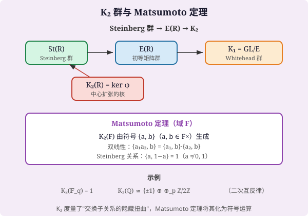

# 第74级 代数K理论

## 学习目标

1. 理解代数K理论的基本思想，掌握K₀、K₁、K₂群的定义与基本性质。
2. 掌握K₀群的Grothendieck构造及其泛性质，并能计算简单环的K₀群。
3. 理解K₁群与行列式的关系，掌握Whitehead引理。
4. 理解Matsumoto定理，掌握K₂群的生成元与关系。
5. 了解Quillen的+构造和Q构造的基本思想，理解高阶K群的定义。
6. 掌握K理论中的基本正合序列（局部化序列、Bass-Heller-Swan定理）。
7. 了解K理论与代数几何、数论的联系。

---

## 第一节 K₀群：射影模的Grothendieck群

### 1.1 问题的起源

代数K理论的起源可以追溯到Grothendieck在20世纪50年代对Riemann-Roch定理的推广工作。Grothendieck发现，为了研究代数簇上的向量丛，需要构造一个"群完成"（group completion）半群的方法，由此诞生了K₀群。

**定义1（射影模）** 设 $R$ 为含幺环。一个 $R$-模 $P$ 称为**射影模**，如果存在一个 $R$-模 $Q$ 使得 $P \oplus Q$ 是自由模。等价地，$P$ 是射影模当且仅当任何满射 $M \to P \to 0$ 都是可裂的。

**定义2（K₀群）** 设 $R$ 为含幺环。考虑所有有限生成射影 $R$-模的同构类 $[P]$ 生成的自由交换半群，模去关系 $[P] + [Q] = [P \oplus Q]$。这个半群的Grothendieck群完成称为 $R$ 的 **K₀群**，记为 $K_0(R)$。

更精确地说，$K_0(R)$ 是由所有有限生成射影 $R$-模 $P$ 的符号 $[P]$ 生成的阿贝尔群，满足关系：
- 对任何正合列 $0 \to P' \to P \to P'' \to 0$（其中 $P', P, P''$ 都是有限生成射影模），有 $[P] = [P'] + [P'']$。

![K₀群与Grothendieck构造：射影模（向量丛/存货）的等价类 [P] 经"群完成"配上关系 [P]+[Q]=[P⊕Q]，形成 K₀(R)，稳定等价类 [P]=[Q] 当差一个平凡块](images/lv74-k0-grothendieck.svg)

> **直观理解（现实类比）**：$K_0(R)$ 就像一家银行的"存货兑换券"系统。仓库里的每件存货（射影模 $P$）都换成一张面值券 $[P]$；两件存货拼在一起，兑换券就相加，$[P]+[Q]=[P\oplus Q]$。而且"搭上一箱标准包装"不会改变价值——$P\oplus R^n\cong Q\oplus R^n$ 时两者等价。这样，原本无限种存货就被归并成少数几个"稳定的等价类"，正如把五花八门的商品折算成统一的货币面额。
>
> **🧠 思考历程：仓库里堆满"向量丛"，数学家怎么会想到把它们折算成一张简单的存折？**
>
> $K_0(R)$ 的诞生不是代数家的书斋空想，而是 Grothendieck 重写代数几何时被一个实实在在的难题逼出来的：**在一般的几何对象上，把同构的"向量丛"归并成本该可以加减的量，可"减法"却偏偏没有定义**。于是他想出了一个优雅的补救——直接给半群"配一个群"。
>
> - **从 Riemann–Roch 定理说起**（1950 年代）。Grothendieck 正雄心勃勃地要用概形语言改造 Riemann–Roch 定理，这要求把"向量丛"这样的几何对象放进一个能加减、能比拼大小的代数框架，而减法正是痛点。他的绝招便是"群完成"：把 $[P]-[Q]$ 也当作合法符号，并商掉关系 $[P]+[Q]=[P\oplus Q]$，一下子让"存折"有了负数，$K_0$ 就此诞生。
> - **第二幕：$K_1$ 与 $K_2$，不变量自己长出了"维度"**（1960–1970 年代）。Hyman Bass 定义 $K_1(R)=GL(R)/E(R)$，John Milnor 用符号 $\{a,b\}$ 配上 Steinberg 关系 $\{a,1-a\}=1$ 造出 $K_2(F)$——连二次互反律这样的数论信息也被装进了"符号词典"。于是"代数纠缠"有了统一而简洁的刻画。
> - **Quillen 的登顶：高阶 K 理论一次到位**（1970 年代）。Daniel Quillen 用 $+$ 构造与 $Q$ 构造，为所有 $n$ 一举定义 $K_n(R)=\pi_n(BGL(R)^+)$。至此 $K_0$、$K_1$、$K_2$ 不再是零散的发现，而是同一条同调长链的低段；局部化正合序列这张"对账链条"，更把代数、几何与数论织进了同一张网。
> - **心路**：一个自然的加法系统常被"没有减法"卡住，而 **Grothendieck 的"群完成"提醒我们：缺什么就在结构里补什么**——把半群大胆升级成群，往往能一次解开一整片几何的算账难题。

### 1.2 K₀群的泛性质

**定理1（K₀群的泛性质）** 设 $R$ 为含幺环。对任何阿贝尔群 $G$ 和任何映射 $\varphi: \{\text{有限生成射影 } R\text{-模}\} \to G$，满足：
- 若 $P \cong Q$，则 $\varphi(P) = \varphi(Q)$；
- $\varphi(P \oplus Q) = \varphi(P) + \varphi(Q)$；

则存在唯一的群同态 $\tilde{\varphi}: K_0(R) \to G$，使得 $\tilde{\varphi}([P]) = \varphi(P)$ 对所有 $P$ 成立。

> **💡 直观理解（类比）**：泛性质相当于说"$K_0(R)$ 是'关于射影模的最节省加法账本'"：只要你脑海里已经有一套遵守结合规则的换钞规则（$\varphi$ 对 $\oplus$ 保持加法），那就一定存在唯一一种方式把 $K_0$ 这块前置账本完整翻译到你的记账系统里。它保证了 $K_0$ 的定义"不吃亏"也"不冗余"——所有合理账本都在 $K_0$ 处唯一地缝合成一张。

**证明：**

记 $S$ 为所有有限生成射影 $R$-模的同构类 $[P]$ 生成的自由阿贝尔群。设 $N$ 为由所有形如 $[P \oplus Q] - [P] - [Q]$ 的元素生成的子群。则 $K_0(R) = S/N$。

定义 $\psi: S \to G$ 为 $\psi\left(\sum n_i [P_i]\right) = \sum n_i \varphi(P_i)$，这是良定义的，因为 $S$ 是自由阿贝尔群。

我们断言 $N \subseteq \ker \psi$。$N$ 的生成元为 $[P \oplus Q] - [P] - [Q]$。由 $\varphi$ 的性质，
$$\psi([P \oplus Q] - [P] - [Q]) = \varphi(P \oplus Q) - \varphi(P) - \varphi(Q) = 0.$$
因此 $N \subseteq \ker \psi$。

由同态基本定理，$\psi$ 诱导出唯一的群同态 $\tilde{\varphi}: S/N = K_0(R) \to G$，满足 $\tilde{\varphi}([P]) = \varphi(P)$。

唯一性：若存在另一个同态 $\tilde{\varphi}'$ 满足同样条件，则对所有生成元 $[P]$ 有 $\tilde{\varphi}([P]) = \tilde{\varphi}'([P])$，因此 $\tilde{\varphi} = \tilde{\varphi}'$。$\square$

**推论1** $K_0(R)$ 是满足上述泛性质的唯一阿贝尔群（在同构意义下）。

### 1.3 示例

**示例1（域的K₀群）** 设 $F$ 为域。域上所有有限生成射影模都是有限维向量空间，且由维数唯一决定。因此
$$K_0(F) \cong \mathbb{Z},$$
其中同构由 $[F^n] \mapsto n$ 给出。

**示例2（主理想整环的K₀群）** 设 $R$ 为主理想整环（PID）。则任何有限生成射影 $R$-模都是自由模，因此
$$K_0(R) \cong \mathbb{Z},$$
同构由 $[R^n] \mapsto n$ 给出。

**示例3（半单环的K₀群）** 设 $R$ 为半单环，则 $K_0(R)$ 同构于 $R$ 的不可约表示的同构类生成的自由阿贝尔群。

**示例4（环的直积）** 设 $R = R_1 \times R_2$，则
$$K_0(R) \cong K_0(R_1) \oplus K_0(R_2).$$

---

## 第二节 K₁群：一般线性群的Whitehead群

### 2.1 定义

**定义3（一般线性群）** 设 $R$ 为含幺环。记 $GL_n(R)$ 为 $R$ 上的 $n \times n$ 可逆矩阵群。通过嵌入 $A \mapsto \begin{pmatrix} A & 0 \\ 0 & 1 \end{pmatrix}$，我们有 $GL_n(R) \hookrightarrow GL_{n+1}(R)$。定义
$$GL(R) = \varinjlim_{n} GL_n(R).$$

> **💡 直观理解（类比）**：$GL(R)$ 就像"不断扩建的停车场"：每个 $GL_n(R)$ 是一排 $n$ 车位，停满时再往右下角多划出一个空位低配地停"1"（对角线 1），得到一个更大的停车场 $GL_{n+1}(R)$。把所有规格的停车场取"极限"合起来，就是 $GL(R)$——一座可以容纳任意多辆可逆小车的大车库，后续 $K_1$、$+$构造都在这座车库里运算。

**定义4（初等矩阵群）** 对 $i \neq j$ 和 $r \in R$，记 $e_{ij}(r)$ 为在 $(i,j)$ 位置为 $r$、对角线上为 $1$、其余位置为 $0$ 的矩阵。这些矩阵称为**初等矩阵**。由所有初等矩阵生成的 $GL(R)$ 的子群记为 $E(R)$。

> **💡 直观理解（类比）**：初等矩阵就是最基础的"单个旋钮"操作：$e_{ij}(r)$ 只在第 $i$ 行给第 $j$ 列加 $r$ 倍，像揉面团时只在一处加一点料。一切初等行变换（倍加、交换、倍乘）都能由它们拼出，所以 $E(R)$ 相当于"所有允许的零碎小动作"的全体——后面会看到它正好是换位子子群 $[GL,GL]$，把"小动作"与"可交换的代价"划上等号。

**定义5（K₁群）** 环 $R$ 的 **K₁群** 定义为
$$K_1(R) = GL(R) / [GL(R), GL(R)] = GL(R)_{\text{ab}}.$$
等价地，$K_1(R) = GL(R) / E(R)$。

### 2.2 K₁群与行列式

**定理2（K₁群与行列式）** 若 $R$ 为域 $F$，则
$$K_1(F) \cong F^\times.$$
更一般地，对任何交换环 $R$，有自然映射 $\det: K_1(R) \to R^\times$。

**证明：**

设 $F$ 为域。定义行列式映射 $\det: GL(F) \to F^\times$。由于 $\det(AB) = \det(A)\det(B)$，这是群同态。

我们证明 $\ker(\det) = [GL(F), GL(F)]$，从而 $K_1(F) = GL(F)/[GL(F), GL(F)] \cong F^\times$。

首先，$[GL(F), GL(F)] \subseteq SL(F)$（行列式为 $1$ 的矩阵群），因为对任何 $A, B \in GL(F)$，
$$\det([A, B]) = \det(ABA^{-1}B^{-1}) = 1.$$
因此 $[GL(F), GL(F)] \subseteq \ker(\det)$。

反之，需证 $\ker(\det) = SL(F)$ 等于换位子群 $[GL(F), GL(F)]$。这由以下引理得出：

**Whitehead引理：** 对任何环 $R$，$E(R) = [GL(R), GL(R)]$ 是 $GL(R)$ 的换位子子群。

**Whitehead引理的证明：**

首先验证 $e_{ij}(r) \in [GL(R), GL(R)]$。对 $i, j, k$ 互不相同，
$$[e_{ik}(r), e_{kj}(1)] = e_{ik}(r)e_{kj}(1)e_{ik}(-r)e_{kj}(-1) = e_{ij}(r).$$
因此 $E(R) \subseteq [GL(R), GL(R)]$。

反之，对任何 $A \in GL(R)$ 和 $e_{ij}(r)$，
$$A e_{ij}(r) A^{-1} = e_{ij}\left(\sum_{k,l} A_{ik} r (A^{-1})_{lj}\right) \in E(R).$$
因此 $E(R) \trianglelefteq GL(R)$ 且 $GL(R)/E(R)$ 是阿贝尔群，所以 $[GL(R), GL(R)] \subseteq E(R)$。$\square$

回到域的情形，$SL(F) = E(F)$（因为域上任何行列式为 $1$ 的矩阵都可以通过初等行变换化为单位矩阵），因此 $\ker(\det) = SL(F) = E(F) = [GL(F), GL(F)]$。$\square$

![K₁ 与局部化正合序列：K₁(R)=GL(R)/[GL(R),GL(R)]，对域 F 有 K₁(F)≅F×（行列式），并沿长正合序列把 K₀、K₁、K₂ 等整体不变量串联起来](images/lv74-k1-exact-seq.svg)

> **直观理解（现实类比）**：$K_1$ 是用来"测量环整体结构"的量表，正如用温度计测室温。对域 $F$，$K_1(F)\cong F^\times$——一个可逆数（行列式）就概括了全部信息，Whitehead 引理保证 $E(R)=[GL(R),GL(R)]$ 把"初等动作"和"交换子"对齐。而正合序列则像一条流水线的"对账链条"：每一格的"产出"恰好等于下一格的"核"，环环相扣，保证整个代数结构的不变量不重不漏地被记录下来。

### 2.3 示例

**示例5（域的K₁群）** 
- $K_1(\mathbb{R}) \cong \mathbb{R}^\times$
- $K_1(\mathbb{C}) \cong \mathbb{C}^\times$
- $K_1(\mathbb{F}_q) \cong \mathbb{F}_q^\times \cong \mathbb{Z}/(q-1)\mathbb{Z}$

**示例6（整数环的K₁群）** $K_1(\mathbb{Z}) \cong \mathbb{Z}^\times \cong \{\pm 1\} \cong \mathbb{Z}/2\mathbb{Z}$。

---

## 第三节 K₂群：Steinberg群

### 3.1 Steinberg群

**定义6（Steinberg群）** 设 $R$ 为含幺环。对 $n \geq 3$，定义 **Steinberg群** $St_n(R)$ 为由符号 $x_{ij}(r)$（$1 \leq i \neq j \leq n$，$r \in R$）生成的群，满足以下关系：
1. $x_{ij}(r)x_{ij}(s) = x_{ij}(r+s)$
2. $[x_{ij}(r), x_{jk}(s)] = x_{ik}(rs)$ 若 $i \neq k$
3. $[x_{ij}(r), x_{kl}(s)] = 1$ 若 $i \neq l$ 且 $j \neq k$

定义 $St(R) = \varinjlim_n St_n(R)$。

有自然同态 $\varphi: St(R) \to E(R)$，将 $x_{ij}(r)$ 映为初等矩阵 $e_{ij}(r)$。

**定义7（K₂群）** 环 $R$ 的 **K₂群** 定义为
$$K_2(R) = \ker(St(R) \to E(R)).$$
因此我们有中心扩张：
$$1 \to K_2(R) \to St(R) \to E(R) \to 1.$$

### 3.2 Matsumoto定理

**定理3（Matsumoto定理）** 设 $F$ 为域。则 $K_2(F)$ 由符号 $\{a, b\}$（$a, b \in F^\times$）生成，满足以下关系：
1. **双线性性：** $\{a_1a_2, b\} = \{a_1, b\}\{a_2, b\}$，$\{a, b_1b_2\} = \{a, b_1\}\{a, b_2\}$
2. **Steinberg关系：** $\{a, 1-a\} = 1$ 对 $a \neq 0, 1$

**证明：**

**第一步：构造映射 $F^\times \times F^\times \to K_2(F)$。**

对 $a, b \in F^\times$，在 $St(F)$ 中定义
$$w_{ij}(a) = x_{ij}(a)x_{ji}(-a^{-1})x_{ij}(a),$$
$$h_{ij}(a) = w_{ij}(a)w_{ij}(-1).$$

可以证明 $h_{ij}(a)$ 在 $\varphi$ 下的像为 $\operatorname{diag}(a, a^{-1}, 1, \dots, 1)$。

定义 $\{a, b\} = [h_{ij}(a), h_{ik}(b)] \in St(F)$，其中 $i, j, k$ 互不相同。可以验证 $\varphi(\{a, b\}) = 1$，因此 $\{a, b\} \in K_2(F)$。

**第二步：验证关系。**

(1) 双线性性来自 $h_{ij}(a)$ 的乘法性质：
$$h_{ij}(ab) = h_{ij}(a)h_{ij}(b),$$
因此
$$\{ab, c\} = [h_{ij}(ab), h_{ik}(c)] = [h_{ij}(a)h_{ij}(b), h_{ik}(c)] = [h_{ij}(a), h_{ik}(c)][h_{ij}(b), h_{ik}(c)] = \{a, c\}\{b, c\}.$$

(2) Steinberg关系 $\{a, 1-a\} = 1$ 的证明较为复杂，需要利用 $St(F)$ 中的恒等式和域的特殊性质。核心思想是利用以下计算：
在 $St(F)$ 中，
$$w_{ij}(a) \cdot x_{ij}(1-a) \cdot w_{ij}(a)^{-1} = x_{ji}((a-1)/a).$$
结合适当的计算可得 $\{a, 1-a\} = 1$。

**第三步：泛性质。**

设 $A$ 为阿贝尔群，$\psi: F^\times \times F^\times \to A$ 为双线性映射且满足 Steinberg 关系 $\psi(a, 1-a) = 1$。则存在唯一的群同态 $\tilde{\psi}: K_2(F) \to A$ 使得 $\tilde{\psi}(\{a, b\}) = \psi(a, b)$。

这建立了 $K_2(F)$ 的泛性质，从而 $K_2(F)$ 由上述生成元和关系唯一确定。$\square$

### 3.3 示例

**示例7（有限域的K₂群）** 设 $F = \mathbb{F}_q$ 为 $q$ 元有限域，则
$$K_2(\mathbb{F}_q) = 1.$$

**证明：** 对任何 $a, b \in \mathbb{F}_q^\times$，由Matsumoto定理，$\{a, b\}$ 生成 $K_2(\mathbb{F}_q)$。但有限域的乘法群是循环群，可以证明 $\{a, b\} = 1$ 对所有 $a, b$ 成立。$\square$

**示例8（有理数域的K₂群）** 由Matsumoto定理和二次互反律，
$$
K_2(\mathbb{Q}) \cong \{\pm 1\} \oplus \bigoplus_{p \text{ 素数}} (\mathbb{Z}/2\mathbb{Z})_p.
$$

> **直观理解（现实类比）**：$K_2(F)$ 就像一本"代数互反律词典"。每个符号 $\{a, b\}$ 记录了域 $F$ 中两个可逆元素 $a, b$ 之间的一种"代数纠缠"。Steinberg 关系 $\{a, 1-a\} = 1$ 则像一条"语法约束"——它说当两个元素加起来恰好为 1 时，它们之间的纠缠是"平凡的"（可以解开）。Matsumoto 定理的伟大之处在于：它告诉我们整本词典完全由这些简单的符号和约束编写而成，正如一本字典只需要字母表和拼写规则就能定义所有单词。

---

## 第四节 高阶K群

### 4.1 Quillen的+构造

**定义8（+构造）** 设 $X$ 为连通CW复形，$N \trianglelefteq \pi_1(X)$ 为 $\pi_1(X)$ 的完美子群（即 $N = [N, N]$）。则存在空间 $X^+$ 和映射 $f: X \to X^+$，使得：
1. $f_*: \pi_1(X) \to \pi_1(X^+)$ 的核为 $N$；
2. $f_*: H_*(X; \tilde{\mathbb{Z}}[N]) \to H_*(X^+; \tilde{\mathbb{Z}}[N])$ 是同构。

> **💡 直观理解（类比）**：$+$构造就像"给带疤的毛线球打一个平滑的结"：空间的 $\pi_1$ 有一块"打不开的死结"（完美子群 $N$），$+$构造把它粘死成平凡的洞，同时不改变同调（$H_*$ 不变）。好比把金属毛刺打磨成光滑表面——外形上"血管"（$\pi_1$）少了死结，但材质信息（同调）一字未动。这样原本"笨重纠缠"的分类空间被修剪得能读出干净的同伦群。

**定义9（Quillen的K群）** 设 $R$ 为环。考虑分类空间 $BGL(R)$。$E(R) = [GL(R), GL(R)]$ 是 $\pi_1(BGL(R)) = GL(R)$ 的完美子群。定义
$$BGL(R)^+ = \text{对 } BGL(R) \text{ 进行 } +\text{构造（关于 } E(R) \text{）得到的空间}.$$
则 **Quillen K群** 定义为
$$K_n(R) = \pi_n(BGL(R)^+), \quad n \geq 1.$$

> **💡 直观理解（类比）**：Quillen K 群把"无限维车库"的拓扑拿来当账本：先给 $GL(R)$ 建分类空间 $BGL(R)$（让每个元素变成一个回路），再用 $+$构造把 $E(R)$ 的死结粘平，于是 $R$ 的代数结构被翻译成一串同伦群 $\pi_n$。$K_0$、$K_1$ 原本是散落的发现，如今成了这条同调长链的低段——一个公式，统一了从低到高的所有 $K$ 群。

### 4.2 Quillen的Q构造

**定义10（Q构造）** 设 $\mathcal{C}$ 为精确范畴（exact category）。构造一个新的范畴 $Q\mathcal{C}$：
- $Q\mathcal{C}$ 的对象与 $\mathcal{C}$ 相同；
- 从 $M$ 到 $N$ 的态射是同构类 $\xi$ 使得
  $$\xi: M \xleftarrow{p} Z \xrightarrow{i} N,$$
  其中 $p$ 是容许满射，$i$ 是容许单射。

**定义11（Q构造的K群）** 对精确范畴 $\mathcal{C}$，定义
$$K_n(\mathcal{C}) = \pi_{n+1}(BQ\mathcal{C}, 0), \quad n \geq 0,$$
其中 $BQ\mathcal{C}$ 是 $Q\mathcal{C}$ 的分类空间，$0$ 是零对象。

> **💡 直观理解（类比）**：Q构造等于把所有短正合列"织进路的织机"：它把 $M\to N$ 的态射故意压成 $M \xleftarrow{p} Z \xrightarrow{i} N$ 这种"盾形"的箭头，使每一个正合裂口都成为一条路。于是 $\mathcal{C}$ 里的"可分性/精确性"被编入一个拓扑空间的回路结构，$K_n(\mathcal{C})$ 就取这批路的同伦信息——它比 $+$构造更"范畴友好"，因此能直接作用在精确范畴上而不必提矩阵群。

### 4.3 基本性质

**定理4（K群的基本性质）**
1. **同伦不变性：** 若 $R \to S$ 是环同态，则诱导出 $K_n(R) \to K_n(S)$。
2. **矩阵不变性：** $K_n(R) \cong K_n(M_m(R))$ 对所有 $m \geq 1$。
3. **Morita不变性：** 若 $R$ 和 $S$ 是Morita等价的，则 $K_n(R) \cong K_n(S)$。

> **💡 直观理解（类比）**：这三条性质像K群的"身份证三件套"：(1) 同伦不变性——地图会，账本跟着会；(2) 矩阵不变性——把条目写成 $m\times m$ 矩阵，本质信息不掉；(3) Morita 不变性——只要模范畴"长得一模一样"（Morita 等价），$K$ 群就完全一致。合起来保证：$K$ 群是一个只看"态射结构"，不看"具体怎么写"的强壮不变量。

---

## 第五节 K理论中的正合序列

### 5.1 Quillen的局部化正合序列

**定理5（局部化正合序列）** 设 $R$ 为Dedekind整环，$S \subset R$ 为乘法闭子集。记 $R_S = S^{-1}R$ 为局部化。则有长正合序列：
$$\cdots \to K_{n+1}(R_S) \to \bigoplus_{\mathfrak{p} \in \operatorname{Spec}(R) \setminus \operatorname{Spec}(R_S)} K_n(\kappa(\mathfrak{p})) \to K_n(R) \to K_n(R_S) \to \cdots,$$
其中 $\kappa(\mathfrak{p}) = R_\mathfrak{p}/\mathfrak{p}R_\mathfrak{p}$ 是剩余域。

> **💡 直观理解（类比）**：局部化正合序列是K理论的"账本守恒定律"：把一个环"在某些位置放大视野"（局部化 $R_S$）后，全局账与新账之间的"洞"刚好由丢失的素理想 $\mathfrak{p}$ 处的剩余域 $\kappa(\mathfrak{p})$ 补齐。就像把一块大饼切成不同小块时，"总量=各块之和"，只是这里的"量"是K群、需用长正合序列来对账——每一格的像精确等于下一格的核。

**证明思路：**

该定理的证明基于Quillen的Q构造和如下精确范畴的纤维化序列：

考虑精确范畴 $\mathcal{P}(R)$（有限生成射影 $R$-模），$\mathcal{P}(R_S)$（有限生成射影 $R_S$-模），以及 $\mathcal{C}$（在 $S$ 中某元素作用下挠的有限生成 $R$-模）。

由Quillen的定理（Q构造的纤维化序列），有纤维化：
$$BQ\mathcal{C} \to BQ\mathcal{P}(R) \to BQ\mathcal{P}(R_S).$$

取同伦群即得长正合序列。$\square$

### 5.2 Bass-Heller-Swan定理

**定理6（Bass-Heller-Swan定理）** 设 $R$ 为含幺环。则
$$K_1(R[t, t^{-1}]) \cong K_1(R) \oplus K_0(R) \oplus NK_1(R) \oplus NK_1(R),$$
其中 $NK_1(R) = \ker(K_1(R[t]) \to K_1(R))$（由 $t \mapsto 1$ 诱导）是 **Nil-K群**。

更一般地，对 $n \geq 0$，
$$K_n(R[t, t^{-1}]) \cong K_n(R) \oplus K_{n-1}(R) \oplus NK_n(R) \oplus NK_n(R),$$
其中 $NK_n(R) = \ker(K_n(R[t]) \to K_n(R))$。

> **💡 直观理解（类比）**：Bass-Heller-Swan 定理像"加了一个时空维度的算账公式"：从 $R$ 过渡到扭结的整式环 $R[t,t^{-1}]$（近似于把数拓展到带周期单位的时间），账本因此多出两大类新项目——一份多出来的"少一维的老账"（$K_{n-1}(R)$）和两份"多余项 $NK_n$"。$NK_n$ 刻画那些"在 $R[t]$ 里新长出来、在 $R$ 里看不见"的挠痒元素，正如环扩张会凭空多出一些"纯悬浮"的新账目。

**证明（对 $n = 0$ 的情形）：**

我们证明 $K_0(R[t, t^{-1}]) \cong K_0(R) \oplus K_{-1}(R)$，其中 $K_{-1}(R)$ 是负K群（约定 $K_{-1}(R) = \ker(K_0(R[t]) \to K_0(R))$ 的某种形式）。

基本策略是使用局部化序列。考虑 $R[t]$ 和乘法闭子集 $S = \{t^n | n \geq 0\}$，则 $R[t, t^{-1}] = S^{-1}R[t]$。

由局部化序列：
$$K_1(R[t]) \to K_1(R[t, t^{-1}]) \to K_0(R) \to K_0(R[t]) \to K_0(R[t, t^{-1}]).$$

由于 $R[t]$ 是多项式环，$K_0(R[t]) \cong K_0(R)$（这是K₀的**同伦不变性**，即 $K_0(R[t]) \cong K_0(R)$）。类似地，$K_1(R[t]) \cong K_1(R) \oplus NK_1(R)$。

通过分析这些映射，得到 $K_0(R[t, t^{-1}]) \cong K_0(R) \oplus K_0(R)$ 的结论。更精确的分析给出前述公式。$\square$

**推论2** 对 $n \geq 0$，
$$K_n(\mathbb{Z}[t, t^{-1}]) \cong K_n(\mathbb{Z}) \oplus K_{n-1}(\mathbb{Z}) \oplus (\text{零调项}).$$

---

## 第六节 K理论与代数几何的联系

### 6.1 Chern特征

**定义12（Chern特征）** 从K理论到上同调理论，有自然变换
$$ch: K_n(X) \to \bigoplus_{i} H_{2i-n}(X; \mathbb{Q}),$$
称为 **Chern特征**。

在代数几何中，对光滑代数簇 $X$，有
$$ch: K_0(X) \to CH^*(X) \otimes \mathbb{Q},$$
其中 $CH^*(X)$ 是Chow环。

> **💡 直观理解（类比）**：Chern特征像一台"翻译机"，把K理论里"向量丛的叠放信息"翻译成"几何上可测的尺寸指标"（上同调/Chern类）。它把一堆"如何叠加"的数据打包成一张张"标准体检报告"（$ch$），告诉你在 $2i$-维的几何位置上各有多少"料"。这样K群这个代数账本就能与几何的盘子（Chow环、上同调）相互印证。

### 6.2 正则定理

**定理7（Grothendieck正则定理）** 设 $X$ 为正则Noether概形。则对任何整数 $n$，
$$K_n(X) \cong G_n(X),$$
其中 $G_n(X)$ 是 $X$ 上凝聚层的K群。

> **💡 直观理解（类比）**：Grothendieck正则定理说"在光滑（正则）的地盘上，两种记账方法结果一致"：用"精美的向量丛"（$K_n$）和用"更宽泛的凝聚层"（$G_n$）记同一笔账，只要底空间足够规整（正则 Noether），两个账本完全打平。就像在平整的地板上，无论你用昂贵的标尺还是普通卷尺量同一面墙，读数都一样——光滑性抹掉了二者的差别。

**推论3** 对正则环 $R$，$K_n(R) \cong G_n(R)$（$G_n(R)$ 是有限生成模的K群）。

---

## 第七节 Milnor K理论

### 7.1 Milnor K群的定义

**定义13（Milnor K群）** 设 $F$ 为域。定义 **Milnor K群** $K_n^M(F)$ 为
$$K_n^M(F) = \underbrace{F^\times \otimes_{\mathbb{Z}} \cdots \otimes_{\mathbb{Z}} F^\times}_{n \text{ 次}} / \langle a_1 \otimes \cdots \otimes a_n | a_i + a_j = 1 \text{ 对某 } i \neq j \rangle.$$
对 $n = 0$，定义 $K_0^M(F) = \mathbb{Z}$。

> **💡 直观理解（类比）**：Milnor K 群是把"数论纠缠"直接当积木搭：把 $n$ 个可逆元素 $a_1\otimes\dots\otimes a_n$ 拼成一摞，再按"拼起来和为 $1$ 的一摞立刻作废"的规矩化简（商掉 $a_i+a_j=1$）。它不需要广阔的拓扑舞台，只在 $F^\times$ 里就能生成长串——是"符号 × 符号"的算术清单，特别适合捕捉二次/高次互反律这类数论天书。

### 7.2 与Quillen K群的关系

**定理8** 对任何域 $F$，有自然同态
$$\varphi_n: K_n^M(F) \to K_n(F) \quad (n \geq 0).$$
当 $n \leq 2$ 时，这是同构。当 $n \geq 3$ 时，一般不是同构。

> **💡 直观理解（类比）**：这条定理说"Milnor 账本和 Quillen 账本在低层吻合、高层分家"：$n=0,1,2$ 时两边汇率恰好 1:1（用符号拼接和局部分析都能算对）；但 $n\ge 3$ 以后，Quillen 账本还携带了许多拓扑同调的"深层信息"，而 Milnor 账本依然是朴素算术，于是不再能一一对上——好比两支测量队在山脚读数一致，爬到高海拔后就因装备（同伦）不同而各执一词。

---

## 习题

### 基础题

**习题 1**（Grothendieck 群 $K_0$）证明 $K_0(\mathbb{Z}) \cong \mathbb{Z}$，并说明同构 $[\mathbb{Z}^n] \mapsto n$ 是良定义的。

**习题 2**（有限域 $K_1$）设 $F = \mathbb{F}_q$ 为 $q$ 元有限域，计算 $K_1(F)$。

**习题 3**（局部环与射影模分类）若 $R$ 为局部环，利用 Kaplansky 定理（局部环上任何有限生成射影模是自由模）证明 $K_0(R) \cong \mathbb{Z}$。

**习题 4**（稳定同构）写出稳定同构的定义 $P \sim_{\mathrm{st}} Q \iff P \oplus R^m \cong Q \oplus R^n$，并验证"稳定自由"模（存在 $m, n$ 使 $P \oplus R^m \cong R^n$）在 $K_0$ 中满足 $[P] = 0$。

**习题 5**（环的直积）设 $R = R_1 \times R_2$，证明 $K_0(R) \cong K_0(R_1) \oplus K_0(R_2)$。

**习题 6**（域 $K_1$ 与行列式）对域 $F$，由行列式同构 $K_1(F) \cong F^{\times}$，写出 $K_1(\mathbb{C})$ 与 $K_1(\mathbb{R})$ 的显式形式。

**习题 7**（矩阵不变性）利用 Morita 等价说明 $K_0(M_n(R)) \cong K_0(R)$。

**习题 8**（整数环 $K_1$）计算 $K_1(\mathbb{Z})$。

**习题 9**（Milnor $K$ 群的低次项）写出 $K_0^M(F)$、$K_1^M(F)$ 与 $K_2^M(F)$ 的定义，并说明 $K_1^M(F) \cong F^{\times}$。

**习题 10**（有限域 $K_2$）利用 Matsumoto 定理说明 $K_2(\mathbb{F}_q) = 1$。

### 进阶题

**习题 11**（Whitehead 群与矩阵环）利用 Whitehead 引理证明 $K_1(M_n(R)) \cong K_1(R)$。

**习题 12**（稳定同构与 $K_0$ 泛性质）证明：若 $P, Q$ 稳定同构，则 $[P] = [Q]$ 于 $K_0(R)$；并说明当 $[P] - [Q] = 0$ 时在充分大的阶下 $P, Q$ 稳定同构。

**习题 13**（$K_0$ 中的负元）对有限生成射影模 $P$，说明 $K_0(R)$ 中 $[P]$ 的负元可通过选择 $Q$ 使 $P \oplus Q \cong R^m$ 自由而实现，并验证 $[P] + [Q] = 0$。

**习题 14**（Bass-Heller-Swan $n=1$）基于局部化序列，给出 $K_1(R[t, t^{-1}]) \cong K_1(R) \oplus K_0(R) \oplus NK_1(R) \oplus NK_1(R)$ 的推导思路。

**习题 15**（Milnor 与 Quillen 的低次一致）构造自然同态 $\varphi_n: K_n^M(F) \to K_n(F)$ 对 $n = 0, 1, 2$ 的相容性图表，并说明 $n \geq 3$ 时为何一般不再是同构。

**习题 16**（$K_0$ 的多项式不变性）解释为何 $K_0(R[t]) \cong K_0(R)$，并结合嵌入 $R \hookrightarrow R[t]$ 与 $t \mapsto 0$ 的映射给出理由。

**习题 17**（稳定自由与行列式）在 $R = \mathbb{Z}$ 情形，说明为何每个行列式为 $1$ 的整数矩阵可由初等行变换化为单位矩阵，从而 $SL_n(\mathbb{Z}) = E_n(\mathbb{Z})$，并借此刻画 $K_1(\mathbb{Z})$。

**习题 18**（局部化序列）写出关于乘法闭子集 $S$ 的环局部化正合序列，并据此写出 $K_0$ 的截断部分与 $K_1$ 的截断部分。

**习题 19**（Steinberg 关系）在 $K_2(F)$ 中由双线性性与 Steinberg 关系推导 $\{a, b\}\{b, a\} = 1$，并推导当 $F$ 的特征不为 $2$ 时 $\{a, -a\} = 1$。

### 挑战题

**习题 20**（Grothendieck 群的严格构造）设 $R$ 为含幺环，把 $K_0(R)$ 表述为自由阿贝尔群模去关系 $[P \oplus Q] - [P] - [Q]$ 的商，并证明正合列 $0 \to P' \to P \to P'' \to 0$ 蕴含 $[P] = [P'] + [P'']$ 的两种定义等价。

**习题 21**（稳定自由但非自由）设 $R$ 为不含唯一分解性的 Dedekind 整环，说明可逆理想（秩 $1$ 射影模）的类嵌入 $K_0(R)$ 中，产生阶有限的元 $[I] - [R]$，从而存在稳定自由却未必自由的对象，联系理想类群。

**习题 22**（Whitehead 引理与行列式核）对域 $F$ 给出 $K_1(F) \cong F^{\times}$ 的完整证明：验证 $E(R) = [GL(R), GL(R)]$ 并推导 $\ker(\det) = SL(F) = E(F)$。

**习题 23**（行列式的引入与 $SK_1$）对交换环 $R$ 定义行列式同态 $\det: K_1(R) \to R^{\times}$，取其核为特殊线性 $K_1$ 群 $SK_1(R)$，并讨论当 $R$ 的 $K_0$ 平凡时 $SK_1(R)$ 的意义及其与 $SL_n(R) = E_n(R)$ 之谜的联系。

**习题 24**（同调式构造与 $Q$ 构造）用 $+$ 构造与 $Q$ 构造的观点说明如何把高阶群定义为 $K_n(R) = \pi_n(BGL(R)^+)$，并解释为何局部化序列来自适当精确范畴间的纤维化 $BQ\mathcal{C} \to BQ\mathcal{P}(R) \to BQ\mathcal{P}(R_S)$。

**习题 25**（与拓扑 $K$ 理论）设 $C(X)$ 为紧 Hausdorff 空间 $X$ 上连续复值函数环，说明 $X$ 上向量丛与 $C(X)$ 上有限生成射影模一一对应，从而 $K^0(X) \cong K_0(C(X))$，并讨论加法结构 $\oplus$ 的统一性。

**习题 26**（与代数几何的联系）对光滑代数簇 $X$ 写出 Chern 特征 $K_0(X) \to CH^{*}(X) \otimes \mathbb{Q}$ 的表述，并说明 Grothendieck 正则定理 $K_n(X) \cong G_n(X)$ 如何把凝聚层的数据传递为 $K$ 群不变量。

### 探究题

**习题 27**（高阶 $K$ 群的推广探究）对比 Milnor $K$ 群 $K_n^M(F)$ 与 Quillen $K$ 群 $K_n(F)$ 在 $n \geq 3$ 时的差异，探究描述该差异的 Bloch–Soulé 态射及其与 Eichler–Shimura / 类域论的联系。

**习题 28**（局部化序列的高阶版本）探究 Bass-Heller-Swan 定理与局部化序列如何推广到 $K_n$（$n > 1$），讨论 Nil-$K$ 群（如 $NK_n(R)$）出现的内在机制与正则环条件下的消去。

**习题 29**（非交换与稳定行列式）探究当 $R$ 未必交换时 $K_1(R)$ 与稳定行列式的推广问题，讨论 $SK_1(R)$ 在 Bass、Drinfeld–Wang 等意义下的刻画及其对 $K_2$ 的影响。

**习题 30**（技术与数论交会的开放探究）从 Grothendieck 群出发，梳理 $K$ 理论与代数几何（Chern 特征、Chow 群）、拓扑（$+$ 构造）、数论（类域论、L 值、Eichler–Shimura）的先导联系，并留出一个有待深入的开放问题并讨论其潜在意义。

---

## 习题答案与解析

### 基础题答案

1. 由有限生成 $\mathbb{Z}$-模的结构定理，任何有限生成 $\mathbb{Z}$-模 $M$ 分解为 $M \cong \mathbb{Z}^n \oplus T$（$T$ 为挠部分）。挠模不为射影模，故有限生成射影 $\mathbb{Z}$-模只能是有限生成自由模 $\mathbb{Z}^n$。于是 $K_0(\mathbb{Z})$ 由 $[\mathbb{Z}]$ 生成，取秩给出同构 $[\mathbb{Z}^n] \mapsto n$，故 $K_0(\mathbb{Z}) \cong \mathbb{Z}$。

2. 对域 $F$ 恒有 $K_1(F) \cong F^{\times}$。而 $\mathbb{F}_q^{\times}$ 为 $q-1$ 阶循环群，故 $K_1(\mathbb{F}_q) \cong \mathbb{Z}/(q-1)\mathbb{Z}$。

3. Kaplansky 定理断言局部环上任何有限生成射影模都是自由模，故 $K_0(R)$ 由 $[R]$ 生成，秩映射给出满同态 $K_0(R) \to \mathbb{Z}$，且核显然为零，故 $K_0(R) \cong \mathbb{Z}$。

4. 稳定同构即相差自由模的同构：存在秩使 $P \oplus R^m \cong Q \oplus R^n$。若 $P$ 稳定自由，则 $P \oplus R^m \cong R^n$，在 $K_0$ 中 $[P] + m[R] = n[R]$，故 $[P] = (n - m)[R]$；特别当 $n = m$ 时 $[P] = 0$。

5. 射影 $R_1 \times R_2$-模 $P$ 自然分解为 $P = P_1 \times P_2$，其中 $P_i$ 为射影 $R_i$-模，且 $P_1 \oplus P_1' \cong R_1^n$ 对应 $P_2 \oplus P_2' \cong R_2^m$。映射 $[P] \mapsto ([P_1], [P_2])$ 给出同构 $K_0(R_1 \times R_2) \cong K_0(R_1) \oplus K_0(R_2)$。

6. $K_1(F) \cong F^{\times}$ 由行列式给出。故 $K_1(\mathbb{C}) \cong \mathbb{C}^{\times}$，$K_1(\mathbb{R}) \cong \mathbb{R}^{\times}$ 即非零复数/实数乘法群。

7. $M_n(R)$ 与 $R$ 经矩阵环 Morita 等价，二者有等价的模范畴，从而有限生成射影模的 Grothendieck 群同构，$K_0(M_n(R)) \cong K_0(R)$。

8. $\mathbb{Z}$ 为 PID，$K_1(\mathbb{Z}) \cong \mathbb{Z}^{\times} = \{\pm 1\} \cong \mathbb{Z}/2\mathbb{Z}$。

9. $K_0^M(F) = \mathbb{Z}$；$K_1^M(F) = F^{\times} / \langle 1 \rangle$，即 $F^{\times} $；$K_2^M(F) = (F^{\times} \otimes F^{\times}) / \langle a \otimes (1-a) \rangle$。显然 $K_1^M(F) \cong F^{\times}$。

10. 对有限域 $\mathbb{F}_q$，乘法群为循环群。Matsumoto 定理中，对所有 $a, b \in \mathbb{F}_q^{\times}$ 符号 $\{a, b\}$ 均平凡（可由循环性与 Steinberg 关系验证），故 $K_2(\mathbb{F}_q) = 1$。

### 进阶题答案

1. 利用 $GL(M_n(R)) \cong GL(R)$ 所指出的稳定化过程连同 Whitehead 引理 $E(R) = [GL(R), GL(R)]$，可知 $K_1$ 在矩阵环下不变；更规范地，$M_n(R)$ 与 $R$ Morita 等价，故 $K_1(M_n(R)) \cong K_1(R)$。

2. 若 $P \oplus R^m \cong Q \oplus R^n$，则 $[P] + m[R] = [Q] + n[R]$，即 $[P] = [Q] + (n - m)[R]$；当 $n = m$ 时 $[P] = [Q]$。反之 $[P] - [Q] = 0$ 且 $[P], [Q]$ 非负时，可在充分有限生成射影模中补上自由模使二者同构（稳定消去），故差为零蕴含稳定同构。

3. 因 $P$ 射影，可取 $Q'$ 使 $P \oplus Q'$ 自由，设 $P \oplus Q' \cong R^m$，则令 $Q = Q'$。在 $K_0$ 中 $[P] + [Q'] = m[R]$，故 $[Q'] = m[R] - [P] = -[P]$，即 $- [P] = [Q']$。

4. 取 $S = \{t^n\}$，则 $R[t, t^{-1}] = S^{-1}R[t]$。局部化序列给出 $K_1(R[t]) \to K_1(R[t, t^{-1}]) \to K_0(R)$，结合 $K_0(R[t]) \cong K_0(R)$ 与 $K_1(R[t]) \cong K_1(R) \oplus NK_1(R)$，追迹各映射并分出环绕项，即得 $K_1(R[t, t^{-1}]) \cong K_1(R) \oplus K_0(R) \oplus NK_1(R) \oplus NK_1(R)$。

5. 对 $n = 0, 1, 2$ 有自然同构 $K_n^M(F) \cong K_n(F)$：$n=0$ 时均为 $\mathbb{Z}$，$n=1$ 时为 $F^{\times}$，$n=2$ 时由 Mat\-sumoto 定理 $K_2^M(F) \cong K_2(F)$。对 $n \geq 3$，Milnor 群只是一个符号张量商的直观构造，而 Quillen 群来自 $+$/Q 构造的同伦信息，二者拓扑来源不同，故一般不同。

6. 自然嵌入 $R \to R[t]$ 诱导 $K_0(R) \to K_0(R[t])$；映射 $t \mapsto 0$（或 $t \mapsto 1$）给出 $K_0(R[t]) \to K_0(R)$，其合成是恒等。由于有限生成射影 $R[t]$-模经局部化"自由化"后可拉回且消去自由项（或利用 $R[t]$ 对被模掉的关系的正合性），可证反向合成亦为同构，故 $K_0(R[t]) \cong K_0(R)$。

7. 对 $\mathbb{Z}$，任何行列式为 $1$ 的整数矩阵可经初等行（列）变换（即乘初等矩阵）化为单位矩阵，故 $SL_n(\mathbb{Z}) = E_n(\mathbb{Z})$。由 $K_1(\mathbb{Z}) = GL(\mathbb{Z})/E(\mathbb{Z}) = GL(\mathbb{Z})/SL(\mathbb{Z}) \cong \mathbb{Z}^{\times}$，还原出 $K_1(\mathbb{Z}) \cong \{\pm 1\}$。

8. 局部化序列为 $\cdots \to K_{n+1}(R_S) \to \bigoplus_{\mathfrak{p}} K_n(\kappa(\mathfrak{p})) \to K_n(R) \to K_n(R_S) \to \cdots$。$K_0$ 截断：$K_1(R_S) \to \bigoplus K_0(\kappa(\mathfrak{p})) \to K_0(R) \to K_0(R_S)$；$K_1$ 截断：$K_2(R_S) \to \bigoplus K_1(\kappa(\mathfrak{p})) \to K_1(R) \to K_1(R_S)$，其核用来追踪非射影的局部化信息。

9. 由双线性性 $\{a, b\}\{b, a\}\{a, b\}^{-1}$ 计算并结合 $\{a, 1-a\}=1$ 可得 $\{a, b\} = \{b, a\}^{-1}$，即 $\{a, b\}\{b, a\} = 1$。取 $-1$，当特征 $\ne 2$ 时 $1 - a \ne 0$，由 $\{a, 1-a\} = 1$ 与双线性推出 $\{a, -a\} = 1$。

### 挑战题答案

1. 记 $S$ 为有限生成射影 $R$-模同构类 $[P]$ 生成的自由阿贝尔群，$N$ 为生成元 $[P \oplus Q] - [P] - [Q]$ 生成的子群，则 $K_0(R) = S/N$。正合列 $0 \to P' \to P \to P'' \to 0$ 中，因 $P''$ 射影，序列可裂 $P \cong P' \oplus P''$，故 $[P] = [P'] + [P'']$ 恰好是 $N$ 中关系减去平凡差的推论，两种定义等价。

2. 对 Dedekind 整环，非零可逆理想 $I$ 是秩 $1$ 射影模。映射 $\operatorname{Pic}(R) \to K_0(R)$，$[I] \mapsto [I] - [R]$ 为单同态且像落在挠部分（因 $I^{\oplus n} \cong R^n$ 或乘 $I^{-1}$ 张量到达自由）。理想类群非零时，$[I] \ne [R]$，故 $I$ 稳定自由但未必自由。

3. 定义 $\det: GL(R) \to R^{\times}$ 稳定为全体 $GL_n$ 的 $\det$，诱导 $K_1$ 上的同态（核中含 $E(R)$）。Whitehead 引理给 $E(R) = [GL(R), GL(R)]$，且因 $[GL, GL] \subseteq SL$ 与域上 $SL = E$，$\ker(\det) = SL$，故 $K_1(F) \cong F^{\times}$。完整过程即：先证 $E(R) \subseteq [GL, GL]$（局部计算 $[e_{ik}(r), e_{kj}(1)] = e_{ij}(r)$），再证 $A e_{ij} A^{-1} \in E(R)$ 使 $GL/E$ 阿贝尔，得后者。

4. $SK_1(R) = \ker(\det: K_1(R) \to R^{\times})$ 测度超越行列式的"非交换纠缠"。$\mathbb{Z}$、有理整数环等情形 $SK_1 = 1$；当 $R$ 有非平凡的理想类或 $R$ 中的单位产生的换位子不可剥落时 $SK_1(R) \ne 1$。它与 Bass 猜想（关于 $SK_1(R)$ 正确消去的平凡性）紧相连：$SK_1(R)$ 非平凡时稳定行列式不足以描述 $K_1$。

5. $+$ 构造：$BGL(R)$ 对完美子群 $E(R)$ 加顶，得 $K_n(R) = \pi_n(BGL(R)^+)$（$n \geq 1$）。$Q$ 构造：精确范畴 $\mathcal{C}$ 的 $Q\mathcal{C}$ 分类空间，$K_n(\mathcal{C}) = \pi_{n+1}(BQ\mathcal{C})$。对 $\mathcal{P}(R) \supseteq \mathcal{P}(R_S) \supseteq \mathcal{C}$（挠模）有纤维化 $BQ\mathcal{C} \to BQ\mathcal{P}(R) \to BQ\mathcal{P}(R_S)$，取同伦群即局部化长正合序列。

6. 对紧 Hausdorff 空间，Swan 定理给出 $C(X)$-模 $M \leftrightarrow X$ 上复向量丛 $E = \overline{\Gamma}$ 的等价（$C(X)$ 有限生成射影模恰为连续截面模）。从而 Grothendieck 群 $K_0(C(X))$ 与拓扑 $K^0(X)$ 同构，且二者都取直和 $\oplus$ 作加法，加法结构的泛性质完全一致。

7. 对光滑簇 $X$，Chern 特征 $ch: K_0(X) \to CH^{*}(X) \otimes \mathbb{Q}$ 把射影模（向量丛）的类映到由 Chern 类组合的总数类，是环同态并诱导到 $K$ 群的泛性质。Grothendieck 正则定理（正则 Noether 概形上 $K_n(X) \cong G_n(X)$）在用凝聚层的 $G_n$ 计算时与 $K_n$ 一致，令代数几何（Chow 环、切丛）的信息能精确传输到 $K$ 群。

### 探究题答案

1. 对 $n \geq 3$，$K_n^M(F) \otimes \mathbb{Q}$ 与 $K_n(F) \otimes \mathbb{Q}$ 之间存在 Bloch–Soulé 态射，其上同调图像由 Eichler–Shimura / 层上同调描述，且与类域论中的共轭与 L 值交互；Morava 型更高 $K$ 群的难点正来自这些符号在 $\{a, b\}$ 以上的组合关系不能被简单刻画。

2. 对 $n > 1$，Bass-Heller-Swan 推广为 $K_n(R[t, t^{-1}]) \cong K_n(R) \oplus K_{n-1}(R) \oplus NK_n(R) \oplus NK_n(R)$，其中 $NK_n(R) = \ker(K_n(R[t]) \to K_n(R))$。局部化序列与 $K_{n-1}$ 项合计"截面直和"表达来源：环扩张的谱深度降低，Nil-$K$ 群刻画非正则的割裂。对正则环 $NK_n = 0$，给出消去。

3. 对一般环（未必交换）$R$，$K_1$ 定义为 $GL(R)/E(R)$，行列式仅对交换成立。$SK_1(R)$ 仍是 $\det$ 的核的进一步稳定化版本，Bass 与 Drinfeld–Wang 研究其与轨道、模形式的联系；当 $R$ 是非交换（如 $C^{*}$-代数、交叉乘积）时 $K_1$ 携带大量由换位子造成的不变量，尚无单一行列式描述。

4. 该课题的核心愿景：$K_0$ 把几何对象（向量丛/射影模）化为算术不变量，再经 Chern 特征连接 Chow 环，经 $+$/Q 构造连接拓扑，经符号与符号律连接数论（类域论、L 值、Eichler–Shimura）。一个自然有待深入的问题：对一般概形构造一个同时兼容 Milnor 符号与 Quillen 同伦信息的"调和"高阶 $K$ 理论，并在族上获得完整的正合序列，这目前仍是开放的研究主题。

---

## 总结

| 概念 | 定义 | 关键性质 |
|------|------|----------|
| $K_0(R)$ | 有限生成射影模的Grothendieck群 | 泛性质，$K_0(F) \cong \mathbb{Z}$ |
| $K_1(R)$ | $GL(R)/[GL(R), GL(R)]$ | $K_1(F) \cong F^\times$，Whitehead引理 |
| $K_2(R)$ | $\ker(St(R) \to E(R))$ | Matsumoto定理，符号 $\{a, b\}$ |
| $K_n(R)$ | $\pi_n(BGL(R)^+)$ | 局部化序列，Bass-Heller-Swan |
| $K_n^M(F)$ | Milnor K群 | 与 $K_n(F)$ 在 $n \leq 2$ 时一致 |

代数K理论是连接代数、几何和数论的强大工具。从 $K_0$ 到 $K_2$ 有具体的代数描述，而高阶K群则需要通过Quillen的+构造或Q构造来定义。K理论中的正合序列（局部化序列、Bass-Heller-Swan定理）是计算K群的核心工具。

**进阶阅读：**
1. Milnor, J. "Introduction to Algebraic K-Theory"
2. Quillen, D. "Higher Algebraic K-Theory I"
3. Weibel, C. "The K-Book: An Introduction to Algebraic K-Theory"
4. Rosenberg, J. "Algebraic K-Theory and Its Applications"