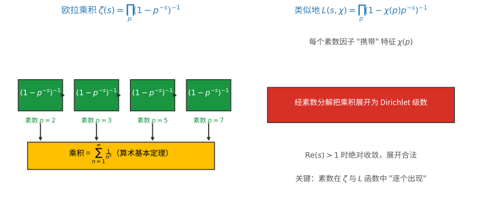
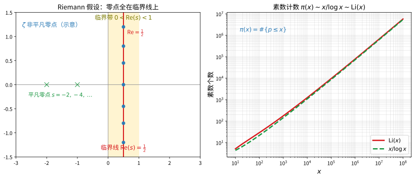

# 第75级 解析数论

## 从"数一数质数"说起：解析数论要解决的根问题

> 在动手读定义之前，先想清楚一个问题：**人为什么需要解析数论？**

**一个真实的场景（第一步：直觉）**

想象你在一张很长很长的数轴上，想统计"前 $x$ 个自然数里到底有多少个素数"——素数像撒在沙漠里的绿洲，越往前越稀疏，却似乎从不断绝。直白的问题接踵而至：

- 稀疏到什么程度？能不能给个近似公式？
- 素数是不是在"模 $q$ 的剩余类"里大致均匀分布？
- 能不能更进一步，说"每个偶数都是两个素数之和"？

直接数永远数不到无穷，解析数论的破解之道是换一个思路：**不直接数素数，而是把它们"编进"一个复变函数（Zeta 函数、L-函数）的解析性质里，再从函数的零点与极点"解压"出素数的分布信息。** 素数藏得再深，也会在某个复杂函数的解析性质面前露出手脚。

**要解决的问题（第二步：来龙去脉）**

- **欧拉把"和"写成"积"**（1730 年代）。Léonhard Euler 发现 $\sum_{n\ge1}n^{-s}=\prod_p(1-p^{-s})^{-1}$，这一记"把整数的加法信息与素数的乘法结构连在一起"的恒等式，是后来的整个出发点。
- **Dirichlet 让素数"按余类站队"**（1837 年）。Peter Gustav Dirichlet 把级数推广成 $L(s,\chi)=\sum_n\chi(n)n^{-s}$，靠证明 $L(1,\chi)\ne0$ 首次表明"形如 $a\pmod q$ 的素数有无穷多个"——解析数论第一颗真正的硕果。
- **Riemann 的飞跃**（1859 年）。Riemann 把 $\zeta(s)$ 延拓成复平面上的亚纯函数并写下函数方程，于是素数公式 $\psi(x)=x-\sum_\rho x^\rho/\rho+\cdots$ 水到渠成——素数分布的每一步波动都被那些零点"指挥"，Riemann 假设由此成为世纪难题。

**正式定义前的准备（第三步：本章如何推进）**

本课沿"函数 → 定理 → 方法"的主线推进：

- 先把 **Zeta 函数** 与 **L-函数** 定义好，学会解析延拓、函数方程与零点结构；
- 再证 **素数定理** 与 **Dirichlet 算术级数定理**，看无零点区域与 $L(1,\chi)\ne0$ 如何发力；
- 然后介绍刻画分布的现代工具：**筛法（Selberg 筛、大筛法）** 与 **圆法**；
- 最后讨论 **误差项**、**Riemann 假设** 的影响，以及它与其他数学分支的衔接。

带着"如何从函数的解析性质读出素数的分布"去读每一步，你会发现每个定义都在回答这条主线的某个环节。

> **🧠 一句话记住解析数论的"出生证"**
>
> 解析数论要解决的**根本问题**，是利用复变函数的解析性质（延拓、零点、极点）来精确刻画素数的分布：
>
> $$ \boxed{\text{把素数分布编码进 Zeta/L-函数的解析性质，再从零点与极点"解压"出素数计数信息。}} $$

---

## 开始之前

**本章在讲什么**：解析数论用复分析的方法研究整数与素数的分布。你会先抓住 Zeta 函数与 Dirichlet L-函数这两个主角（含 Euler 乘积、解析延拓、函数方程、零点），再用它们证明素数定理与 Dirichlet 算术级数定理，最后学习筛法与圆法这类现代工具。

**为什么要学它**：它把第 74 级的算术不变量（理想类、互反律）和第 72 级的对称（表示论中的 L-函数）统一到"解析函数"的显微镜下。第 76 级代数数论讨论"素数在数域里如何分裂"用的是代数语言，这里的 L-函数与 Dirichlet 定理正是理解"素数在算术级数里如何分布"的解析对应物——许多类域论、椭圆曲线的结果都要靠解析数论的工具来定量。

**开始前请确认你还记得**：

- 复变函数基础：解析函数、极点与留数、积分（围道）技巧、Gamma 函数 $\Gamma(s)$。
- 无穷级数与乘积的绝对收敛、一致收敛与逐项求导/积分（见微积分与分析基础）。
- 初等数论基础：素数、算术基本定理、同余、欧拉函数 $\varphi$、原根与可逆群 $( \mathbb{Z}/q\mathbb{Z})^\times$。
- 部分求和（Abel 求和）与 Riemann-Stieltjes 积分工具。

---

## 学习目标

1. 理解Riemann Zeta函数和Dirichlet L-函数的定义、基本性质及解析延拓。
2. 掌握素数定理的证明思路，理解Zeta函数无零点区域的作用。
3. 理解Dirichlet算术级数定理，掌握L-函数在 $s=1$ 处非零的证明。
4. 掌握Zeta函数的函数方程及其推导。
5. 理解Selberg筛法和大筛法的基本思想。
6. 了解圆法、三重积法等解析数论中的现代方法。
7. 理解Riemann假设及其在素数分布中的重要性。

---

## 第一节 Riemann Zeta函数

### 1.1 定义与基本性质

**为什么需要这个概念**：打开算术的"乐高箱"，每个自然数都是一叠素数的乘积。可"和"（加法）很难看清素的乘法骨架。Riemann 的突破口是：用一个带参数 $s$ 的幂级数 $\sum_n n^{-s}$ 把所有自然数统一加权，于是"加法信息"能通过 Euler 乘积转译成"素数的乘法信息"，而 $s$ 一旦变复杂数，整个问题就跃升到复变函数的舞台——可解析、可延拓、可解剖。

**定义1（Riemann Zeta函数）** 对 $\operatorname{Re}(s) > 1$，定义
$$\zeta(s) = \sum_{n=1}^{\infty} \frac{1}{n^s}.$$

**定理1（Euler乘积）** 对 $\operatorname{Re}(s) > 1$，
$$\zeta(s) = \prod_{p \text{ 素数}} \left(1 - \frac{1}{p^s}\right)^{-1}.$$

**证明：**

由几何级数，
$$\left(1 - \frac{1}{p^s}\right)^{-1} = \sum_{k=0}^{\infty} \frac{1}{p^{ks}}.$$

对所有素数取乘积，由算术基本定理，每个正整数 $n$ 有唯一的素因子分解，因此
$$\prod_{p} \left(1 - \frac{1}{p^s}\right)^{-1} = \sum_{n=1}^{\infty} \frac{1}{n^s} = \zeta(s).$$

需要验证绝对收敛以保证乘积展开的合法性。当 $\operatorname{Re}(s) > 1$ 时，
$$\sum_{p} \sum_{k=1}^{\infty} \frac{1}{|p^{ks}|} = \sum_{p} \frac{1}{p^{\operatorname{Re}(s)} - 1} < \infty.$$
因此乘积绝对收敛，展开合法。$\square$

> **直观理解（现实类比）**：欧拉乘积把 $\zeta(s)$ 拆成由每个素数单独贡献的一个"锁扣"，$\zeta(s)=\prod_p(1-p^{-s})^{-1}$。这就像把一台复杂的机器拆成一个个彼此独立的零件，再按算术基本定理（每个整数唯一分解成素数幂）重新拼装成 $\sum_n n^{-s}$。它表明"整体"的信息可以完全由"素数零件"重建——类似任何商品都能按唯一配方由最基本的原料组合而成。
>
> **🧠 思考历程：一个把自然数加起来的无穷级数，怎么会泄露素数的全部秘密？**
>
> 素数的分布像迷雾一样难以捉摸，可解析数论的起点却出奇地简单：**把每一类自然数放进同一个"幂次舞台"，看素数在其中扮演什么角色**。欧拉的级数只是一张入场券，真正的大戏要等 Riemann 把复数引进来才拉开帷幕。
>
> - **欧拉的钥匙：把"和"写成"积"**（1730 年代）。Léonhard Euler 首次注意到 $\sum_{n\ge1}n^{-s}=\prod_p(1-p^{-s})^{-1}$ 这个恒等式。它看似只是一个形式上的小技巧，却头一次把"整数的加法信息"与"素数的乘法结构"系在了一起——可惜 Euler 只把它当作求和的闲笔，素数分布的豁口依然无人敢碰。
> - **Dirichlet 的乘法：让素数"按余类站队"**（1837 年）。Peter Gustav Dirichlet 把级数推广成 $L$ 函数 $L(s,\chi)=\sum_n\chi(n)n^{-s}$，用特征 $\chi$ 去筛出一整类算术级数。他正是靠证明非主特征在 $s=1$ 处 $L(1,\chi)\ne0$，才首次证明"形如 $a\pmod q$ 的素数有无穷多个"——这是解析数论史上第一颗真正的硕果。
> - **Riemann 的飞跃：把级数变成能"解剖"的函数**（1859 年）。Bernhard Riemann 在短短几页论文里，把 $\zeta(s)$ 延拓成复平面上的亚纯函数，并写下连接 $s$ 与 $1-s$ 的函数方程。一旦 $\zeta$ 成了可解析的对象，素数公式 $\psi(x)=x-\sum_\rho x^\rho/\rho+\cdots$ 就水到渠成——素数的每一步波动都被那些零点"指挥"，Riemann 假设由此成为悬而未决的圣杯。
> - **心路**：有些看似平凡的小等式（如欧拉乘积），其实是一整座大厦的地基。**把自然数的问题"搬进"函数与复平面的舞台，是解析数论最深刻的转场**——别小看任何一个若合符节的形式类比。

### 1.2 解析延拓与函数方程

**定理2（Zeta函数的解析延拓和函数方程）** $\zeta(s)$ 可以解析延拓到整个复平面，仅在 $s = 1$ 处有一阶极点，留数为 $1$。函数方程：
$$\zeta(s) = 2^s \pi^{s-1} \sin\left(\frac{\pi s}{2}\right) \Gamma(1-s) \zeta(1-s).$$

> **💡 直观理解（类比）**：解析延拓与函数方程像"给一台只在门口亮的灯接通了全屋电源"：原来的级数只在 $\operatorname{Re}(s)>1$ 这个"小房间"发光，延拓把它接通到整个复平面，唯一在 $s=1$ 处有一个"保险丝熔断"（极点）。函数方程 $\zeta(s)\leftrightarrow\zeta(1-s)$ 则是"镜子对称"：右半面的行为完全决定了左半面，就像镜中倒影与实物互为真值来源。

**证明（使用Theta函数的Poisson求和）：**

**第一步：引入Theta函数。** 定义
$$\theta(t) = \sum_{n=-\infty}^{\infty} e^{-\pi n^2 t}, \quad t > 0.$$

**第二步：Theta函数的函数方程。** 由Poisson求和公式，
$$\theta(t) = \frac{1}{\sqrt{t}} \theta\left(\frac{1}{t}\right).$$

**第三步：将Zeta函数与Theta函数联系起来。** 对 $\operatorname{Re}(s) > 1$，利用Gamma函数：
$$\Gamma\left(\frac{s}{2}\right) \pi^{-s/2} \zeta(s) = \int_0^{\infty} t^{s/2 - 1} \frac{\theta(t) - 1}{2} dt.$$

**第四步：将积分拆分为 $[0,1]$ 和 $[1,\infty)$ 两部分。**
$$\int_0^{\infty} = \int_0^1 + \int_1^{\infty}.$$

对 $\int_0^1$ 使用 $\theta(t) = \frac{1}{\sqrt{t}} \theta(1/t)$ 的变换：
$$\int_0^1 t^{s/2 - 1} \frac{\theta(t) - 1}{2} dt = \int_1^{\infty} u^{-s/2 - 1/2} \frac{\theta(u) - 1}{2} du + \frac{1}{s-1} - \frac{1}{s}.$$

**第五步：得到完整表达式。**
$$\Gamma\left(\frac{s}{2}\right) \pi^{-s/2} \zeta(s) = \frac{1}{s(s-1)} + \int_1^{\infty} (t^{s/2} + t^{(1-s)/2}) t^{-1} \frac{\theta(t) - 1}{2} dt.$$

右边的积分在 $s$ 的整个复平面上解析（因为 $\theta(t) - 1$ 在 $t \to \infty$ 时指数衰减），因此给出了 $\zeta(s)$ 的解析延拓。

函数方程由该表达式在 $s \mapsto 1-s$ 下的对称性直接得出。$\square$

### 1.3 Zeta函数的零点

**定义2（平凡零点与非平凡零点）** 
- $\zeta(s)$ 在 $s = -2, -4, -6, \dots$ 处有零点，称为**平凡零点**。
- 其他零点称为**非平凡零点**，全部位于临界带 $0 < \operatorname{Re}(s) < 1$ 中。

**Riemann假设：** $\zeta(s)$ 的所有非平凡零点都位于直线 $\operatorname{Re}(s) = \frac{1}{2}$ 上。

> **直观理解（现实类比）**：$\zeta$ 函数的零点像"素数分布的指挥棒"。显式公式 $\psi(x)=x-\sum_\rho x^\rho/\rho+\cdots$ 告诉我们，素数分布的每一步波动都由非平凡零点 $\rho$ 的"合奏"决定。Riemann 假设断言所有零点整齐地排在直线 $\mathrm{Re}(s)=\frac{1}{2}$ 上，这就像所有乐手都站在同一条起跑线上——如果成立，素数的分布规律就能被精确掌控，误差项会大大缩小，正如一支完全对齐的乐队能奏出最稳定的旋律。

---

## 第二节 素数定理

### 2.1 素数计数函数

**为什么需要这个概念**：我们真正想回答的是"前 $x$ 个数里有多少个素数"，这需要一个精确的"计数器"——$\pi(x)$。它把散布的素数汇总成一个单调阶梯函数，剩下的任务就是给它的渐近行为一个漂亮公式。

**定义3（素数计数函数）** 
$$\pi(x) = \#\{p \leq x : p \text{ 是素数}\}.$$

**定理3（素数定理）** 
$$\pi(x) \sim \frac{x}{\log x} \quad (x \to \infty).$$
等价地，
$$\pi(x) \sim \operatorname{Li}(x) = \int_2^x \frac{dt}{\log t}.$$

> **💡 直观理解（类比）**：素数计数函数 $\pi(x)$ 就是"数到 $x$ 之前踩中了多少个素数地雷"。素数定理则断言：素数越往后越稀疏，密度大致是每 $\log x$ 个数约有一个——所以 $\pi(x)$ 大约等于 $x/\log x$。这就像路上每隔一段固定"地质距离"才埋一棵树，间距随路径长度对数增长，于是总数约等于"路程/间距"。
>
> **🔑 为什么重要**：素数定理是整个解析数论的"第一里程碑"：它首次把"素数的分布"钉死在一个干净的渐近公式 $\pi(x)\sim x/\log x$ 上。其意义远超一个估算——它揭示素数的总体分布其实非常"规整"（密度约 $1/\log x$），而更精细的 $x/\log x$ 与 $\operatorname{Li}(x)$ 之差距、乃至非平凡零点对误差的影响，都开启了更深的探索。

### 2.2 素数定理的证明

**证明（使用Zeta函数的经典方法）：**

**第一步：将素数计数函数与Zeta函数联系起来。**

定义Chebyshev函数：
$$\psi(x) = \sum_{n \leq x} \Lambda(n),$$
其中 $\Lambda(n)$ 是von Mangoldt函数：
$$\Lambda(n) = \begin{cases} \log p, & \text{若 } n = p^k \text{ 是素数的幂}, \\ 0, & \text{其他}. \end{cases}$$

易见 $\pi(x) \sim \frac{x}{\log x}$ 等价于 $\psi(x) \sim x$。

**第二步：$\psi(x)$ 的显式公式。**

对 $\operatorname{Re}(s) > 1$，有
$$-\frac{\zeta'(s)}{\zeta(s)} = \sum_{n=1}^{\infty} \frac{\Lambda(n)}{n^s}.$$

由Mellin变换，
$$\psi(x) = \frac{1}{2\pi i} \int_{c-i\infty}^{c+i\infty} \left(-\frac{\zeta'(s)}{\zeta(s)}\right) \frac{x^s}{s} ds, \quad c > 1.$$

**第三步：移动积分路径。**

将积分路径向左移动到 $\operatorname{Re}(s) = \sigma_0 < 1$，需要考虑 $-\frac{\zeta'(s)}{\zeta(s)}$ 的极点：
- $s = 1$ 处有极点，留数为 $x$；
- 在每个非平凡零点 $\rho = \beta + i\gamma$ 处有极点，留数为 $-x^\rho/\rho$；
- 在平凡零点 $s = -2n$ 处有极点。

因此得到显式公式：
$$\psi(x) = x - \sum_{\rho} \frac{x^\rho}{\rho} - \frac{\zeta'(0)}{\zeta(0)} - \frac{1}{2} \log(1 - x^{-2}),$$
其中求和遍历所有非平凡零点。

**第四步：使用Zeta函数的无零点区域。**

**定理4（Zeta函数的无零点区域）** 存在绝对常数 $c > 0$，使得
$$\zeta(s) \neq 0 \quad \text{当 } \operatorname{Re}(s) \geq 1 - \frac{c}{\log(|\operatorname{Im}(s)| + 2)}.$$

> **💡 直观理解（类比）**：无零点区域像"给必停线设定安全减速带"：它保证 $\zeta$ 在 $\operatorname{Re}(s)=1$ 这堵"红线"的左侧留出一条薄薄的"禁止零点带"，越靠近红线带宽越窄（$\frac{c}{\log t}$）。因为有这条不会塌掉的地带，显式公式里那串零点波动的系数才不至于失控，素数定理才能站稳——好比高架桥只要不在桥面正下方挖空，桥就不会整体坍塌。

**证明概要：** 利用不等式
$$3 + 4 \cos \theta + \cos 2\theta = 2(1 + \cos \theta)^2 \geq 0$$
和Zeta函数在 $\operatorname{Re}(s) > 1$ 时的对数导数展开，可以得到 $\zeta(\sigma + it)$ 在接近 $\sigma = 1$ 时不能有零点。$\square$

**第五步：Tauber型定理。**

由无零点区域可知，在区域 $\operatorname{Re}(s) \geq 1 - \frac{c}{\log(|t|+2)}$ 上，$-\frac{\zeta'(s)}{\zeta(s)} - \frac{1}{s-1}$ 解析。

应用Ikehara-Wiener Tauber定理：若 $a_n \geq 0$ 且 $\sum_{n=1}^{\infty} \frac{a_n}{n^s}$ 在 $\operatorname{Re}(s) > 1$ 时收敛，且 $\sum_{n=1}^{\infty} \frac{a_n}{n^s} - \frac{1}{s-1}$ 可连续延拓到 $\operatorname{Re}(s) \geq 1$，则 $\sum_{n \leq x} a_n \sim x$。

取 $a_n = \Lambda(n)$，则 $\sum_{n=1}^{\infty} \frac{\Lambda(n)}{n^s} = -\frac{\zeta'(s)}{\zeta(s)}$。由上述分析，$-\frac{\zeta'(s)}{\zeta(s)} - \frac{1}{s-1}$ 在 $\operatorname{Re}(s) \geq 1$ 上解析，因此 $\psi(x) \sim x$，从而 $\pi(x) \sim x/\log x$。$\square$

---

## 第三节 Dirichlet L-函数与算术级数中的素数

### 3.1 Dirichlet特征

**为什么需要这个概念**：要回答"素数在每个算术级数 $a\pmod q$ 里怎么分配"，得先造一批"筛子"，把整数按模 $q$ 的剩余类分门别类地点名。Dirichlet 特征正是这样的筛子：它是一族"相位标签" $\chi$，能精确分辨"这个数落在哪个剩余类"，从而把整体求和拆成各族回响。

**定义4（Dirichlet特征）** 模 $q$ 的 **Dirichlet特征** 是一个群同态 $\chi: (\mathbb{Z}/q\mathbb{Z})^\times \to \mathbb{C}^\times$。将其扩张到 $\mathbb{Z}$ 上：若 $(n, q) = 1$，定义 $\chi(n) = \chi(n \bmod q)$；若 $(n, q) > 1$，定义 $\chi(n) = 0$。

> **💡 直观理解（类比）**：Dirichlet 特征像给每个整数发一张"按余类着色的荧光标签"：它与 $q$ 互素时按它落在哪个剩余类发对应颜色（模 $q$ 的可逆元群到复数的同态），与 $q$ 不互素时直接标成"染色失败/黑色"（记 $0$）。这样一来，特征就把"整数"这一大群按模 $q$ 的类别切分，恰好是后面 L-函数去筛"某一类素数"的筛子。

**主特征：** $\chi_0(n) = 1$ 若 $(n, q) = 1$，否则为 $0$。

### 3.2 Dirichlet L-函数

**定义5（Dirichlet L-函数）** 对 $\operatorname{Re}(s) > 1$，定义
$$L(s, \chi) = \sum_{n=1}^{\infty} \frac{\chi(n)}{n^s}.$$

> **💡 直观理解（类比）**：L-函数是 Zeta 函数的"染色加权重"：$\zeta$ 把每个整数平等地加进来，L-函数却给每个整数乘上它那件"特征荧光衣" $\chi(n)$（带符号或转相）。它像乐队里不同声部各带自己的"音色"，一起演出——从而能专门听出某一类（某个剩余类）素数的"回响"。Zeta 是全体整数的声音，L-函数则是按模 $q$ 分组的频谱。

**定理5（Euler乘积）** 对 $\operatorname{Re}(s) > 1$，
$$L(s, \chi) = \prod_{p} \left(1 - \frac{\chi(p)}{p^s}\right)^{-1}.$$

> **💡 直观理解（类比）**：L-函数的 Euler 乘积是 Zeta 情况的"按特征染色"翻版：每个素数同样贡献一个独力因子，只是把 $1/p^s$ 换成 $\chi(p)/p^s$。由于 $\chi$ 完全可乘，算术基本定理保证"整体连乘=每个整数由素数配方编成后求和"，所以 $L$-函数也能由只数素数拆出的零件完整拼回——只不过这次每个素数的"值"带自己的相位。

### 3.3 Dirichlet算术级数定理

**定理6（Dirichlet定理）** 设 $q$ 为正整数，$a$ 与 $q$ 互素。则算术级数 $a, a+q, a+2q, \dots$ 中包含无穷多个素数。即
$$\#\{p \leq x : p \equiv a \pmod{q}\} \sim \frac{1}{\varphi(q)} \frac{x}{\log x}.$$

> **💡 直观理解（类比）**：Dirichlet 定理断言"只要跑道不与模数相撞（$(a,q)=1$），路边每隔 $q$ 步的小站里就有无穷多个素数岗亭"，且每个合法剩余类大约分到 $\frac{1}{\varphi(q)}$ 的份额——即素数在可用的 $\varphi(q)$ 条车道上近乎均匀分布。仿佛一座城市按 $q$ 个房间分房，只要房号合法，几乎每进一间都能等到一位素数的到来。

**证明（使用L-函数在 $s=1$ 处非零）：**

**第一步：将素数分布与L-函数联系起来。**

对 $\operatorname{Re}(s) > 1$，取对数导数：
$$-\frac{L'(s, \chi)}{L(s, \chi)} = \sum_{n=1}^{\infty} \frac{\chi(n)\Lambda(n)}{n^s}.$$

由正交关系：
$$\sum_{\chi \bmod q} \overline{\chi}(a) \chi(n) = \begin{cases} \varphi(q), & n \equiv a \pmod{q}, \\ 0, & \text{其他}. \end{cases}$$

因此
$$\sum_{n \equiv a \pmod{q}} \frac{\Lambda(n)}{n^s} = \frac{1}{\varphi(q)} \sum_{\chi \bmod q} \overline{\chi}(a) \left(-\frac{L'(s, \chi)}{L(s, \chi)}\right).$$

**第二步：分析 $L(s, \chi)$ 在 $s=1$ 附近的行为。**

对主特征 $\chi_0$，$L(s, \chi_0) = \zeta(s) \prod_{p|q} (1 - p^{-s})$，因此在 $s=1$ 处有一阶极点。

对非主特征 $\chi \neq \chi_0$，需要证明 $L(1, \chi) \neq 0$。

**第三步：证明 $L(1, \chi) \neq 0$。**

考虑函数
$$F(s) = \prod_{\chi \bmod q} L(s, \chi).$$

若某个非主特征 $L(1, \chi) = 0$，则 $F(s)$ 在 $s=1$ 处解析（因为主特征的极点被零点抵消）。

但另一方面，$\log F(s) = \sum_{\chi} \sum_p \sum_{k=1}^{\infty} \frac{\chi(p^k)}{k p^{ks}}$。由正交性，
$$\sum_{\chi} \chi(p^k) = \begin{cases} \varphi(q), & p^k \equiv 1 \pmod{q}, \\ 0, & \text{其他}. \end{cases}$$

因此
$$\log F(s) = \sum_{p^k \equiv 1 \pmod{q}} \frac{\varphi(q)}{k p^{ks}} \geq 0 \quad (\text{对 } s > 1).$$

这意味着 $F(s)$ 在 $s > 1$ 时是正实数且单调递增。若 $F(s)$ 在 $s=1$ 处解析，则 $F(1)$ 应为有限正数。但 $L(s, \chi_0)$ 在 $s=1$ 处有极点，且若某个 $L(1, \chi) = 0$，则 $F(s)$ 在 $s=1$ 处解析，但 $F(1) = 0$（因为零点阶数大于极点阶数），与 $F(s) \to +\infty$ 当 $s \to 1^+$ 矛盾。

因此对任何非主特征 $\chi$，$L(1, \chi) \neq 0$。

**第四步：应用Tauber定理。**

由 $L(1, \chi) \neq 0$，$-\frac{L'(s, \chi)}{L(s, \chi)}$ 在 $\operatorname{Re}(s) \geq 1$ 上除 $s=1$ 外解析（主特征情形），从而
$$\sum_{n \leq x, n \equiv a \pmod{q}} \Lambda(n) \sim \frac{x}{\varphi(q)}.$$
由此可得算术级数中的素数定理。$\square$

---

## 第四节 Riemann Zeta函数的函数方程

### 4.1 完整推导

**定理7（完整的函数方程）** 定义完备的Zeta函数：
$$\xi(s) = \frac{1}{2} s(s-1) \pi^{-s/2} \Gamma\left(\frac{s}{2}\right) \zeta(s).$$
则 $\xi(s)$ 是整函数，满足函数方程
$$\xi(s) = \xi(1-s).$$

**证明（使用Poisson求和公式的详细推导）：**

**第一步：Theta函数的变换公式。**

定义 $\theta(t) = \sum_{n=-\infty}^{\infty} e^{-\pi n^2 t}$，$t > 0$。

由Poisson求和公式：
$$\sum_{n=-\infty}^{\infty} f(n) = \sum_{n=-\infty}^{\infty} \hat{f}(n),$$
其中 $\hat{f}(y) = \int_{-\infty}^{\infty} f(x) e^{-2\pi i x y} dx$。

取 $f(x) = e^{-\pi x^2 t}$，则 $\hat{f}(y) = \frac{1}{\sqrt{t}} e^{-\pi y^2 / t}$。因此
$$\theta(t) = \sum_{n=-\infty}^{\infty} e^{-\pi n^2 t} = \sum_{n=-\infty}^{\infty} \frac{1}{\sqrt{t}} e^{-\pi n^2 / t} = \frac{1}{\sqrt{t}} \theta\left(\frac{1}{t}\right).$$

**第二步：将 $\zeta(s)$ 表示为积分。**

对 $\operatorname{Re}(s) > 1$，
$$\Gamma\left(\frac{s}{2}\right) = \int_0^{\infty} t^{s/2 - 1} e^{-t} dt.$$

令 $t = \pi n^2 u$，则
$$\pi^{-s/2} \Gamma\left(\frac{s}{2}\right) \frac{1}{n^s} = \int_0^{\infty} u^{s/2 - 1} e^{-\pi n^2 u} du.$$

对 $n \geq 1$ 求和：
$$\pi^{-s/2} \Gamma\left(\frac{s}{2}\right) \zeta(s) = \int_0^{\infty} u^{s/2 - 1} \sum_{n=1}^{\infty} e^{-\pi n^2 u} du = \int_0^{\infty} u^{s/2 - 1} \frac{\theta(u) - 1}{2} du.$$

**第三步：拆分积分区间。**

$$\int_0^{\infty} = \int_0^1 + \int_1^{\infty}.$$

对 $\int_0^1$ 使用变换公式 $\theta(u) = \frac{1}{\sqrt{u}} \theta(1/u)$：
$$\int_0^1 u^{s/2 - 1} \frac{\theta(u) - 1}{2} du = \int_0^1 u^{s/2 - 1} \frac{u^{-1/2} \theta(1/u) - 1}{2} du$$
$$= \int_0^1 u^{s/2 - 3/2} \frac{\theta(1/u)}{2} du - \int_0^1 \frac{u^{s/2 - 1}}{2} du.$$

令 $v = 1/u$，则 $du = -v^{-2} dv$：
$$\int_0^1 u^{s/2 - 3/2} \frac{\theta(1/u)}{2} du = \int_1^{\infty} v^{-s/2 - 1/2} \frac{\theta(v)}{2} dv,$$
$$\int_0^1 \frac{u^{s/2 - 1}}{2} du = \frac{1}{s}.$$

同时，
$$\int_0^1 \frac{u^{s/2 - 1}}{2} du = \frac{1}{s}.$$

但注意 $\theta(u) = 1 + 2\sum_{n=1}^{\infty} e^{-\pi n^2 u}$，所以
$$\frac{\theta(u) - 1}{2} = \sum_{n=1}^{\infty} e^{-\pi n^2 u}.$$

因此
$$\pi^{-s/2} \Gamma\left(\frac{s}{2}\right) \zeta(s) = \int_1^{\infty} u^{s/2 - 1} \frac{\theta(u) - 1}{2} du + \int_1^{\infty} u^{-s/2 - 1/2} \frac{\theta(u) - 1}{2} du + \frac{1}{s-1} - \frac{1}{s}.$$

**第四步：整理得到对称形式。**

$$\pi^{-s/2} \Gamma\left(\frac{s}{2}\right) \zeta(s) = \frac{1}{s(s-1)} + \int_1^{\infty} (u^{s/2} + u^{(1-s)/2}) u^{-1} \frac{\theta(u) - 1}{2} du.$$

右边在 $s \mapsto 1-s$ 下不变，因此
$$\pi^{-s/2} \Gamma\left(\frac{s}{2}\right) \zeta(s) = \pi^{-(1-s)/2} \Gamma\left(\frac{1-s}{2}\right) \zeta(1-s).$$

利用Gamma函数的倍角公式可得更常见的函数方程形式。$\square$

### 4.2 函数方程的应用

**推论1** 由函数方程可得 $\zeta(s)$ 在 $\operatorname{Re}(s) < 0$ 时的平凡零点 $s = -2, -4, -6, \dots$。

**推论2** 函数方程建立了 $\zeta(s)$ 在临界带 $0 < \operatorname{Re}(s) < 1$ 中的零点与 $\zeta(1-s)$ 的零点之间的对称性。

---

## 第五节 筛法

### 5.1 Selberg筛法

**为什么需要这个概念**：素数定理说"素数密度约 $1/\log x$"，可很多问题（孪生素数、Goldbach）还要求"去掉所有小素因子之后还剩多少"。直接逐步筛代价太大，Selberg 筛法改用"带权重的平方手法"把漏筛与误杀同时压到最优，从而给出干净的上界。

**定义6（筛法问题）** 设 $\mathcal{A}$ 为整数集合，$\mathcal{P}$ 为素数集合。定义
$$S(\mathcal{A}, \mathcal{P}, z) = \#\{a \in \mathcal{A} : p \nmid a \text{ 对所有 } p \in \mathcal{P}, p < z\}.$$

> **💡 直观理解（类比）**：筛法像"用粗网眼的筛子捞鱼"：$S(\mathcal{A},\mathcal{P},z)$ 数的是集合 $\mathcal{A}$ 里那些没有被任何小于 $z$ 的素数整除的"漏网之鱼"。筛孔越小（$z$ 越大），筛掉的越多、剩下的越少。$\mathcal{P}$ 就是那张筛网上的每根竹片（素数），问题变成"一次筛掉所有含某小素因子的数，最后还剩多少整洁的数"。

**定理8（Selberg筛法——上界估计）** 设 $\mathcal{A} = \{n \leq x : n \equiv a \pmod{q}\}$，$\mathcal{P}$ 为所有素数集合。则
$$S(\mathcal{A}, \mathcal{P}, z) \leq \frac{x}{\varphi(q)} \cdot \frac{1}{\log z} \cdot \left(1 + O\left(\frac{1}{\log z}\right)\right) + O(z^2).$$

> **💡 直观理解（类比）**：Selberg 筛法像是"用一组可调权重的筛子，绞尽脑汁把误杀降到最低"：它不是一个个数过滤，而是给每个余类加权重 $\lambda_d$（$\sum_{d|n}\lambda_d$），再把平方展开成可以优化的方程，挑出最省"筛料"的组合。结果是一个漂亮的上界：剩余约 $\frac{x}{\varphi(q)\log z}$，而过度筛选的代价 $\approx z^2$——如同用最精的网眼把"漏网"和"误伤"同时压到最省。

**证明：**

**第一步：Selberg筛法的基本思想。**

设 $\lambda_d$ 为实数，满足 $\lambda_1 = 1$，且对 $d > z$，$\lambda_d = 0$。则对任何整数 $n$，
$$\left(\sum_{d|n} \lambda_d\right)^2 \geq \begin{cases} 1, & n = 1, \\ 0, & n > 1. \end{cases}$$

因此
$$S(\mathcal{A}, \mathcal{P}, z) \leq \sum_{a \in \mathcal{A}} \left(\sum_{d|(a, P(z))} \lambda_d\right)^2,$$
其中 $P(z) = \prod_{p < z} p$。

**第二步：展开平方。**

$$\sum_{a \in \mathcal{A}} \left(\sum_{d|(a, P(z))} \lambda_d\right)^2 = \sum_{d_1, d_2} \lambda_{d_1} \lambda_{d_2} \#\{a \in \mathcal{A} : [d_1, d_2] | a\}.$$

对 $\mathcal{A} = \{n \leq x : n \equiv a \pmod{q}\}$，
$$\#\{a \in \mathcal{A} : d | a\} = \frac{x}{qd} + O(1).$$

**第三步：优化选择 $\lambda_d$。**

我们需要选择 $\lambda_d$ 最小化二次型：
$$\sum_{d_1, d_2} \frac{\lambda_{d_1} \lambda_{d_2}}{[d_1, d_2]},$$
满足 $\lambda_1 = 1$。

通过变分法，最优选择为
$$\lambda_d = \mu(d) \frac{\log(z/d)}{\log z} \cdot \frac{d}{\varphi(d)} \cdot \prod_{p|d} \left(1 - \frac{1}{p}\right)^{-1}.$$

**第四步：代入得到上界。**

代入最优 $\lambda_d$ 并计算，得到
$$S(\mathcal{A}, \mathcal{P}, z) \leq \frac{x}{\varphi(q)} \cdot \frac{1}{\log z} \cdot \left(1 + O\left(\frac{1}{\log z}\right)\right) + O(z^2).$$

$\square$

### 5.2 大筛法

**定理9（大筛法不等式）** 设 $\mathcal{A} \subset \{1, \dots, N\}$，令
$$Z(\alpha) = \sum_{n \in \mathcal{A}} e^{2\pi i n \alpha}.$$
则对任何 $Q \geq 1$，
$$\sum_{q \leq Q} \sum_{1 \leq a \leq q, (a,q)=1} \left|Z\left(\frac{a}{q}\right)\right|^2 \leq (N + Q^2) |\mathcal{A}|.$$

> **💡 直观理解（类比）**：大筛法像"在多个探照灯下同时测光强"：$Z(\alpha)$ 是集合 $\mathcal{A}$ 的字符和（一束光），大筛法把所有有理频率 $\alpha=a/q$（$q\le Q$）上的光强平方相加，断言总和被 $(N+Q²) 乘以灯数 $|\mathcal{A}|$ 封顶。它给出"分布不能在所有频率上同时很集中"的整体约束——好比一个物体无法在每一个质数频率的镜子里都照出最大亮度，平均意义下总被总能量限制住。

**证明：** 利用正交性和Bessel不等式。$\square$

---

## 第六节 圆法

### 6.1 基本思想

**为什么需要这个概念**：加法数论（"把 $n$ 拆成几个素数之和"）问的是"和结构的计数"。圆法把这一计数写成在单位圆上转一圈的 Fourier 积分 $r_k(n)=\int_0^1 f(\alpha)^k e^{-2\pi i n\alpha}d\alpha$，再靠"频谱分块"（主要弧与次要弧）把主项与误差分开——这是加性问题的标准抓手。

**定义7（圆法）** Hardy-Littlewood圆法是研究加性数论问题的强大工具。其基本思想是：要计算整数 $n$ 表示为若干特定整数的和的方式数，将问题转化为Fourier积分。

设 $A \subset \mathbb{N}$，令
$$f(\alpha) = \sum_{a \in A} e^{2\pi i a \alpha}.$$
则 $n$ 表示为 $k$ 个 $A$ 中元素之和的方式数为
$$r_k(n) = \int_0^1 f(\alpha)^k e^{-2\pi i n \alpha} d\alpha.$$

> **💡 直观理解（类比）**：圆法像"用频谱仪数赤道上的徽章"：把"$n$ 拆成 $k$ 个数之和的方式数" $r_k(n)$ 翻译成在单位圆上转一圈的 Fourier 积分。聪明的关键是把这圈谱线分成两类弧——主要弧（靠近分母小的有理点）贡献"正餐主项"，次要弧（其余）贡献"噪声误差"。就像用望远镜分区块统计星星：亮星集中的区算主体，暗星散布的区算误差，拼起来得到全天的精确计数。

将积分区间 $[0, 1]$ 分为 **主要弧（major arcs）**（靠近有理点的区域）和 **次要弧（minor arcs）**（其余部分）。主要弧贡献主项，次要弧贡献误差项。

### 6.2 应用

**定理10（Goldbach-Vinogradov定理）** 每个充分大的奇数可以表示为三个素数的和。

> **💡 直观理解（类比）**：这像"三个小伙伴凑份子，声称只要口袋够鼓（充分大），奇数都能用三张素券填满"。它靠圆法把$f(\alpha)^3$拆成主/次弧来证明——因为虚轴上有充分多素数"共振"，主要弧贡献主项且足够大，次要弧的噪声被压制，于是三分量叠加总是足够覆盖每个目标奇数。好比拼图时主块很大、杂块很小，总量必然能配齐每个大号码。

**证明思路：** 使用圆法，取 $A$ 为素数集合，估计 $f(\alpha)$ 在主要弧和次要弧上的行为。$\square$

---

## 第七节 素数定理的误差项

### 7.1 误差项估计

**定理11（素数定理的误差项）** 存在常数 $c > 0$，使得
$$\pi(x) = \operatorname{Li}(x) + O\left(x \exp\left(-c\sqrt{\log x}\right)\right).$$

> **💡 直观理解（类比）**：误差项定理把素数定理从"量级正确"升级成"误差量化"：$\pi(x)$ 与 $\operatorname{Li}(x)$ 的偏差是被压缩在 $x e^{-c\sqrt{\log x}}$ 的"紧身衣"里。它的根子在无零点区域——离 $\operatorname{Re}(s)=1$ 越远越窄的禁止零点带，直接限制显式公式里零点求和的大小。好比给乐队录音时，只要没有哪根琴弦在基准线上乱响（零点），整体波形就只在很紧的容差范围内跳动。

**证明：**

**第一步：使用显式公式。**

由 $\psi(x)$ 的显式公式：
$$\psi(x) = x - \sum_{\rho} \frac{x^\rho}{\rho} + O\left(\log x\right),$$
其中求和遍历Zeta函数的非平凡零点。

**第二步：无零点区域的量化。**

Zeta函数的无零点区域为：
$$\zeta(s) \neq 0 \quad \text{当 } \sigma \geq 1 - \frac{c}{\log(|t|+2)}.$$

**第三步：估计零点求和。**

将零点求和分解为两部分：$|\gamma| \leq T$ 和 $|\gamma| > T$。选取 $T = \exp(\sqrt{\log x})$，得到
$$\sum_{|\gamma| \leq T} \frac{x^\beta}{|\gamma|} = O\left(x \exp\left(-c\sqrt{\log x}\right)\right),$$
$$\sum_{|\gamma| > T} \frac{x^\beta}{|\gamma|} = O\left(x \exp\left(-c\sqrt{\log x}\right)\right).$$

**第四步：转换为 $\pi(x)$ 的误差项。**

通过部分求和将 $\psi(x)$ 的估计转换为 $\pi(x)$ 的估计，得到所需结果。$\square$

### 7.2 Riemann假设下的误差项

若Riemann假设成立，则
$$
\pi(x) = \operatorname{Li}(x) + O\left(\sqrt{x} \log x\right).
$$

> **直观理解（现实类比）**：素数定理的证明就像一场"接力赛"。第一棒是 $\zeta$ 函数——它把素数信息编码进复平面上的解析函数；第二棒是 Chebyshev 函数 $\psi(x)$——通过显式公式把 $\psi(x)$ 与 $\zeta$ 的零点联系起来，$\psi(x) = x - \sum_\rho x^\rho/\rho + \cdots$；第三棒是无零点区域——证明 $\zeta(s)$ 在 $\mathrm{Re}(s)=1$ 附近没有零点；最后一棒是 Tauber 定理——把解析信息转化为 $\psi(x) \sim x$ 的渐近结论。四棒交接，最终冲线得到 $\pi(x) \sim x/\log x$。

---

## 第八节 示例

### 示例1：Zeta函数在 $s=2$ 处的值

**计算：** $\zeta(2) = \sum_{n=1}^{\infty} \frac{1}{n^2} = \frac{\pi^2}{6}$。

**证明（使用正弦函数的无穷乘积展开）：**

考虑函数 $f(z) = \frac{\cos(\pi z)}{\sin(\pi z)}$ 的Mittag-Leffler展开，或使用正弦函数的无穷乘积：
$$\sin(\pi z) = \pi z \prod_{n=1}^{\infty} \left(1 - \frac{z^2}{n^2}\right).$$

取对数导数：
$$\pi \cot(\pi z) = \frac{1}{z} + \sum_{n=1}^{\infty} \frac{2z}{z^2 - n^2}.$$

展开左边为级数：
$$\pi \cot(\pi z) = \frac{1}{z} - 2\sum_{k=1}^{\infty} \zeta(2k) z^{2k-1}.$$

比较 $z^1$ 项系数，得到 $\zeta(2) = \frac{\pi^2}{6}$。$\square$

### 示例2：素数分布数值分析

下表展示了 $\pi(x)$ 与 $x/\log x$ 和 $\operatorname{Li}(x)$ 的数值比较：

| $x$ | $\pi(x)$ | $x/\log x$ | $\operatorname{Li}(x)$ |
|-----|----------|------------|----------------------|
| $10^3$ | 168 | 145 | 178 |
| $10^4$ | 1229 | 1086 | 1246 |
| $10^5$ | 9592 | 8686 | 9630 |
| $10^6$ | 78498 | 72382 | 78628 |
| $10^7$ | 664579 | 620421 | 664918 |
| $10^8$ | 5761455 | 5428681 | 5762209 |
| $10^9$ | 50847534 | 48254942 | 50849235 |

可见 $\operatorname{Li}(x)$ 是比 $x/\log x$ 更好的近似。

---

## 习题

### 基础题

**习题 1**（绝对收敛）证明Zeta函数 $\zeta(s)=\sum_{n=1}^{\infty} n^{-s}$ 在 $\operatorname{Re}(s)>1$ 时绝对收敛。

**习题 2**（Zeta值）计算 $\zeta(4)=\sum_{n=1}^{\infty} n^{-4}$。

**习题 3**（Möbius反演）证明：对 $\operatorname{Re}(s)>1$，有 $\sum_{n=1}^{\infty} \frac{\mu(n)}{n^s} = \frac{1}{\zeta(s)}$，其中 $\mu$ 是Möbius函数。

**习题 4**（Euler乘积）写出Zeta函数的Euler乘积，并说明它如何与算术基本定理相联系。

**习题 5**（算术函数与卷积）设 $d(n)$ 为 $n$ 的正因子个数，证明 $\sum_{n=1}^{\infty} \frac{d(n)}{n^s} = \zeta(s)^2$，由此指出 $1\ast 1=d$。

**习题 6**（von Mangoldt函数）证明 $-\frac{\zeta'(s)}{\zeta(s)} = \sum_{n=1}^{\infty} \frac{\Lambda(n)}{n^s}$，这里 $\Lambda$ 是von Mangoldt函数。

**习题 7**（Dirichlet特征）设 $\chi$ 是模 $q$ 的特征，证明对与 $q$ 互素的 $n$ 有 $|\chi(n)|=1$，当 $(n,q)>1$ 时 $\chi(n)=0$；写出主特征 $\chi_0$ 的定义。

**习题 8**（L-函数的Euler乘积）写出Dirichlet L-函数 $L(s,\chi)$ 的Euler乘积，并说明其在 $\operatorname{Re}(s)>1$ 上绝对收敛。

**习题 9**（素数计数函数）利用素数定理 $\pi(x)\sim x/\log x$，估计 $x=10^6$ 与 $x=10^9$ 时不超过 $x$ 的素数个数大致量级。

**习题 10**（一阶极点留数）证明 $\zeta(s)$ 在 $s=1$ 处有一阶极点且留数为 $1$。

### 进阶题

**习题 11**（Mertens定理）证明：对 $x\ge2$，
$$\sum_{p\le x}\frac{1}{p} = \log\log x + B + O\left(\frac{1}{\log x}\right),$$
其中 $B$ 是Mertens常数。

**习题 12**（Perron公式）陈述Perron公式：将 $\sum_{n\le x}a_n$ 用Dirichlet级数 $A(s)=\sum_{n\ge1}a_n n^{-s}$ 的积分表示出来，并写出误差项。

**习题 13**（Euler乘积的收敛性）证明 $\prod_p(1-p^{-s})^{-1}$ 在 $\operatorname{Re}(s)>1$ 上绝对收敛。

**习题 14**（Chebyshev函数）证明 $\psi(x)\sim x$ 与 $\pi(x)\sim \frac{x}{\log x}$ 等价。

**习题 15**（无零点：初等情形）用不等式 $3+4\cos\theta+\cos 2\theta = 2(1+\cos\theta)^2\ge0$ 证明 $\zeta(1+it)\ne0$（$t\ne0$）。

**习题 16**（$L(1,\chi)$ 非零初探）对实的非主特征 $\chi$，说明为什么 $L(s,\chi)$ 的Euler乘积可推出 $L(1,\chi)\ne0$。

**习题 17**（Theta函数方程）设 $\theta(t)=\sum_{n=-\infty}^{\infty} e^{-\pi n^2 t}$，用Poisson求和证明 $\theta(t)=\frac{1}{\sqrt{t}}\theta(1/t)$。

**习题 18**（算术级数中的素数）由 $L(1,\chi)\ne0$ 对一切非主特征成立，证明当 $(a,q)=1$ 时 $\sum_{n\le x,\ n\equiv a\pmod q}\Lambda(n)\sim \frac{x}{\varphi(q)}$。

**习题 19**（圆法基本积分）设 $f(\alpha)=\sum_{p\le N} e^{2\pi i p\alpha}$，写出 $N$ 表为三个素数之和的方式数的积分表达式。

### 挑战题

**习题 20**（素数定理证明概览）结合Chebyshev函数、显式公式与无零点区域，概述素数定理 $\pi(x)\sim x/\log x$ 的完整证明框架。

**习题 21**（函数方程）由Theta函数的Poisson求和对消推导完备Zeta函数 $\xi(s)=\frac12 s(s-1)\pi^{-s/2}\Gamma(s/2)\zeta(s)$ 满足 $\xi(s)=\xi(1-s)$。

**习题 22**（Selberg筛法）对 $\mathcal{A}=\{n\le x:n\equiv a\pmod q\}$，证明Selberg筛法上界 $S(\mathcal{A},\mathcal{P},z)\le \frac{x}{\varphi(q)\log z}\left(1+O\left(\frac{1}{\log z}\right)\right)+O(z^2)$。

**习题 23**（大筛法不等式）设 $Z(\alpha)=\sum_{n\in\mathcal{A}}e^{2\pi i n\alpha}$，证明对 $Q\ge1$ 有 $\sum_{q\le Q}\sum_{(a,q)=1}\left|Z(a/q)\right|^2\le (N+Q^2)|\mathcal{A}|$。

**习题 24**（圆法分解）说明圆法如何将区间 $[0,1]$ 分解为主要弧与次要弧，并说明二者在 $r_k(n)=\int_0^1 f(\alpha)^k e^{-2\pi i n\alpha}d\alpha$ 中分别贡献主项与误差项。

**习题 25**（无零点区域）证明存在绝对常数 $c>0$，使得 $\zeta(s)\ne0$ 于 $\operatorname{Re}(s)\ge 1-\frac{c}{\log(|t|+2)}$。

**习题 26**（L-函数零点与乘积）考虑 $F(s)=\prod_{\chi\bmod q}L(s,\chi)$，利用 $\log F(s)$ 的正性证明对一切非主特征 $L(1,\chi)\ne0$。

### 探究题

**习题 27**（Riemann假设的影响）讨论：若Riemann假设成立，显式公式中零点求和将如何被控制，从而 $\psi(x)$ 与 $\pi(x)$ 的误差项可改进到什么程度。

**习题 28**（大筛法与零点密度）探究大筛法不等式在大/零密度估计（如估计 $\zeta(s)$ 与L-函数零点个数）中的应用，说明其与无零点区域方法的联系。

**习题 29**（圆法与Goldbach推广）在Goldbach-Vinogradov定理思路的基础上，探究"偶数表为两个素数之和"为何远比"奇数表为三素数之和"困难，以及圆法中 $\zeta(s)$ 与指数和各自扮演的角色。

**习题 30**（剩余类分布）结合Dirichlet定理、算术级数中的素数定理与大筛法，探究素数在模 $q$ 剩余类上分配是否均匀，并说明Bombieri-Vinogradov定理为何是"平均形式的推广"。

---

## 习题答案与解析

### 基础题答案

1. 记 $\sigma=\operatorname{Re}(s)$。则 $\sum_{n=1}^{\infty}|n^{-s}|=\sum_{n=1}^{\infty}n^{-\sigma}$。由积分判别法，该级数与 $\int_1^{\infty}x^{-\sigma}dx$ 同敛散，后者当 $\sigma>1$ 时收敛，故 $\zeta(s)$ 在 $\operatorname{Re}(s)>1$ 绝对收敛。

2. 由正弦无穷乘积 $\sin(\pi z)=\pi z\prod_{n=1}^{\infty}(1-z^2/n^2)$ 取对数导数并比较系数，或直接利用 $\zeta(2)$ 的求法和Bessel恒等式，可得 $\zeta(4)=\sum_{n=1}^{\infty}n^{-4}=\frac{\pi^4}{90}$。

3. 由Euler乘积 $\zeta(s)=\prod_p(1-p^{-s})^{-1}$ 取倒数得 $1/\zeta(s)=\prod_p(1-p^{-s})$。将每个因子展开再相乘，按算术基本定理恰好给出 $\sum_{n=1}^{\infty}\mu(n)n^{-s}$，其中 $\mu$ 是Möbius函数，故等式成立。

4. Euler乘积为 $\zeta(s)=\prod_p(1-p^{-s})^{-1}$。右端每个因子展开成几何级数 $\sum_{k\ge0}p^{-ks}$，相乘后每个正整数 $n$ 因唯一素因子分解恰好贡献一个 $n^{-s}$，故乘积恰等于 $\sum_nn^{-s}=\zeta(s)$，这正是算术基本定理的体现。

5. 由 $\zeta(s)=\prod_p(1-p^{-s})^{-1}$，平方得 $\zeta(s)^2=\prod_p(1-p^{-s})^{-2}$。$n=\prod p^{\alpha_p}$ 的系数为 $\prod_p(\alpha_p+1)$，恰等于 $d(n)$，故 $\zeta(s)^2=\sum_n d(n)n^{-s}$。这即卷积恒等式 $1\ast 1=d$。

6. 对Euler乘积 $\log\zeta(s)=-\sum_p\log(1-p^{-s})$ 求导，得 $-\frac{\zeta'(s)}{\zeta(s)}=\sum_p\frac{p^{-s}\log p}{1-p^{-s}}=\sum_{k\ge1}\frac{\log p}{p^{ks}}$。合并后每项系数恰为von Mangoldt函数 $\Lambda(n)$，故 $-\frac{\zeta'(s)}{\zeta(s)}=\sum_n\Lambda(n)n^{-s}$。

7. 因 $\chi$ 是有限群 $(\mathbb{Z}/q\mathbb{Z})^\times$ 到 $\mathbb{C}^\times$ 的同态，而 $\chi^{q}\equiv1$（由群论同态和Fermat），故 $|\chi(n)|=1$ 对所有 $(n,q)=1$ 成立；按约定，当 $(n,q)>1$ 时 $\chi(n)=0$。主特征定义为 $\chi_0(n)=1$（若 $(n,q)=1$），否则 $0$。

8. 由特征的可乘性，$\sum_n\chi(n)n^{-s}=\prod_p(1-\chi(p)p^{-s})^{-1}$。因 $|\chi(p)|\le1$ 且 $\operatorname{Re}(s)>1$ 时 $\sum_p|\chi(p)|p^{-\sigma}\le\sum_p p^{-\sigma}<\infty$，故乘积绝对收敛，展开合法。

9. 由 $\pi(x)\approx x/\log x$：$x=10^6$ 时 $\pi(10^6)\approx 10^6/13.82\approx 72000$，实际为 $78498$；$x=10^9$ 时约为 $10^9/20.72\approx 4.8\times10^7$，实际为 $50847534$。可见渐进公式给出正确量级。

10. 由解析延拓的积分表达式 $\pi^{-s/2}\Gamma(s/2)\zeta(s)=\frac{1}{s(s-1)}+\int_1^\infty(\cdots)dt$，右端第一项在 $s=1$ 处贡献 $\frac{1}{s-1}$ 的奇性，故 $\lim_{s\to1}(s-1)\zeta(s)=1$，即 $\zeta(s)$ 在 $s=1$ 处有一阶极点、留数为 $1$。

### 进阶题答案

1. 由 $\sum_{p\le x}\frac{\log p}{p}=\log x+O(1)$，对 $\frac{1}{\log t}$ 做部分求和：设 $S(t)=\sum_{p\le t}\frac{\log p}{p}=\log t+O(1)$，则 $\sum_{p\le x}\frac1p=S(x)\frac1{\log x}+\int_2^x S(t)\frac{dt}{t\log^2t}$，代入整理即得 $\sum_{p\le x}\frac1p=\log\log x+B+O(\frac1{\log x})$。

2. Perron公式为：对 $c>1$ 及 Dirichlet级数 $A(s)=\sum_{n\ge1}a_nn^{-s}$，有
$$\sum_{n\le x}a_n=\frac{1}{2\pi i}\int_{c-iT}^{c+iT}A(s)\frac{x^s}{s}\,ds+O\left(\frac{x^c}{T}\sum_{n\ge1}\frac{|a_n|}{n^c}+\frac{1}{T}\sum_{x/2<n<2x}|a_n|\right).$$
其思想是用 $x^s/s$ 的Mellin逆变换把计数指示函数 $\mathbf{1}_{n\le x}$ 翻译为积分。

3. 只需证 $\sum_p\log|(1-p^{-s})^{-1}|$ 收敛。因 $\sum_p p^{-\sigma}<\infty$（$\sigma>1$），又 $\log(1-p^{-s})^{-1}\sim p^{-\sigma}$，故乘积绝对收敛。这与习题1的级数收敛互为印证。

4. 因 $\psi(x)=\sum_{p^k\le x}\log p$，有 $\psi(x)=\theta(x)+O(\sqrt{x}\log x)$，其中 $\theta(x)=\sum_{p\le x}\log p$。部分求和给出 $\pi(x)=\frac{\theta(x)}{\log x}+\int_2^x\frac{\theta(t)}{t\log^2t}dt$。故 $\psi(x)\sim x\iff\theta(x)\sim x\iff\pi(x)\sim x/\log x$，二者等价。

5. 对 $\sigma>1$，$\log\zeta(\sigma)=\sum_{p,k}\frac{1}{k}p^{-k\sigma}$。由 $\log\zeta(\sigma+it)=\sum_{p,k}\frac{1}{k}p^{-k(\sigma+it)}$ 与三次 $\ln\zeta$ 的组合，利用 $3+4\cos\theta+\cos2\theta\ge0$ 可证 $\zeta(\sigma)^3|\zeta(\sigma+it)|^4|\zeta(\sigma+2it)|\ge1$。若 $\zeta(1+it)=0$，左边当 $\sigma\to1^+$ 趋于 $0$ 且 $\zeta(\sigma)\sim\frac1{\sigma-1}$，但 $\zeta(\sigma+2it)$ 有界，矛盾，故 $\zeta(1+it)\ne0$。

6. 对实非主特征 $\chi$，Euler乘积给出 $\log L(s,\chi)=\sum_{p,k}\frac{\chi(p^k)}{k}p^{-ks}$。因 $\chi$ 实，每个 $\chi(p^k)\in\{-1,0,1\}$，可把乘积写成若干因式，且该乘积在 $s>1$ 时为正实数。若 $L(1,\chi)=0$，则由连续性 $L(s,\chi)$ 会经过 $0$ 并改变符号，与 $s\to1^+$ 时 $\log L(s,\chi)\to-\infty$ 但 $\sum_p\frac{\chi(p)}{p}$ 无法发散到 $-\infty$ 的事实矛盾（这一要点在习题26的乘积论证中被系统化）。

7. 由Poisson求和：$\sum_{n\in\mathbb{Z}}\hat f(n)=\sum_{n\in\mathbb{Z}}f(n)$，取 $f(x)=e^{-\pi x^2t}$，其Fourier变换为 $\hat f(y)=\frac1{\sqrt t}e^{-\pi y^2/t}$，于是 $\theta(t)=\sum_n e^{-\pi n^2t}=\frac1{\sqrt t}\sum_n e^{-\pi n^2/t}=\frac1{\sqrt t}\theta(1/t)$。

8. 由特征的正交关系结合对数求导运算得 $\sum_{n\equiv a}\frac{\Lambda(n)}{n^s}=\frac1{\varphi(q)}\sum_{\chi\bmod q}\overline{\chi}(a)(-\frac{L'(s,\chi)}{L(s,\chi)})$。主特征贡献项在 $s=1$ 有一阶极点 $\frac1{\varphi(q)}\frac1{s-1}$；而非主特征因 $L(1,\chi)\ne0$ 贡献有界的解析项。应用Tauber定理即得 $\sum_{n\le x,n\equiv a}\Lambda(n)\sim x/\varphi(q)$。

9. $r_3(N)=\int_0^1 f(\alpha)^3 e^{-2\pi iN\alpha}d\alpha$，其中 $f(\alpha)=\sum_{p\le N}e^{2\pi ip\alpha}$。这按下式的算术事实：$f(\alpha)^3$ 的展开中 $e^{2\pi im\alpha}$ 的系数恰为 $m$ 表为三个素数（有序）之和的方式数 $r_3(m)$，而 $\int_0^1 e^{2\pi i(m-N)\alpha}d\alpha=\delta_{mN}$ 起"抽取第 $N$ 项"的作用。

### 挑战题答案

1. 框架分四步：(1) 定义 $\psi(x)=\sum_{n\le x}\Lambda(n)$，并证 $\pi(x)\sim x/\log x\iff\psi(x)\sim x$；(2) 由Mellin逆变换得显式公式 $\psi(x)=x-\sum_{\rho}x^\rho/\rho+O(\log x)$，把 $\psi$ 与 $\zeta$ 的零点联系起来；(3) 用 $3+4\cos\theta+\cos2\theta\ge0$ 证明 $\zeta(1+it)\ne0$ 及无零点区域 $\sigma\ge1-\frac{c}{\log(|t|+2)}$；(4) 对该区域应用Ikehara-Wiener Tauber定理，得 $\psi(x)\sim x$，从而 $\pi(x)\sim x/\log x$。

2. 由 $\theta(t)=\frac1{\sqrt t}\theta(1/t)$ 与 $\Gamma$ 表示 $\pi^{-s/2}\Gamma(s/2)\zeta(s)=\int_0^\infty u^{s/2-1}\frac{\theta(u)-1}{2}du$，把积分在 $u=1$ 处拆分，并用变换公式改写 $[0,1]$ 段。整理得
$$\pi^{-s/2}\Gamma(s/2)\zeta(s)=\frac1{s(s-1)}+\int_1^\infty(u^{s/2}+u^{(1-s)/2})u^{-1}\frac{\theta(u)-1}{2}du,$$
右端在 $s\mapsto1-s$ 下不变，故 $\xi(s)=\frac12s(s-1)\pi^{-s/2}\Gamma(s/2)\zeta(s)$ 满足 $\xi(s)=\xi(1-s)$。

3. 取满足 $\lambda_1=1$、$d>z$ 时 $\lambda_d=0$ 的实数 $\lambda_d$，对每个 $a$ 有 $\sum_{d|a}\lambda_d\ge\mathbf1_{a}$ 之半，从而 $S\le\sum_{a\in\mathcal{A}}(\sum_{d|(a,P(z))}\lambda_d)^2$。展开成对平方偶，用 $\#\{a\in\mathcal{A}:a\equiv0\bmod d\}=\frac x{qd}+O(1)$，并选取优化权 $\lambda_d=\mu(d)\frac{\log(z/d)}{\log z}\cdot\frac d{\varphi(d)}$ 使二次型最小，代入即得上界 $S\le\frac{x}{\varphi(q)\log z}(1+\frac1{\log z})+O(z^2)$。

4. 用二重Fourier技术估计 $\sum_q\sum_{(a,q)=1}|Z(a/q)|^2$：把群 $(\mathbb{Z}/q\mathbb{Z})^\times$ 上函数分解为正交基 $e^{2\pi in a/q}$，按Bessel不等式，对角频率部分至多贡献 $\sim N|\mathcal{A}|$，而$q\le Q$个不同有理频率之间近似正交带来的交叉项由坐标重叠被控制为 $\le Q^2|\mathcal{A}|$。严格推演取 $|\mathcal{A}|\sum_{d\le NQ}|\rho_d|^2$ 形式的分析即得 $\le(N+Q^2)|\mathcal{A}|$。

5. 用反证思想：设 $\zeta(\sigma+it)=0$（$\sigma\ge1-\frac c{\log(|t|+2)}$ 区域边缘）。仿习题15构造 $3+4\cos\theta+\cos2\theta\ge0$ 的组合，可得 $\zeta(\sigma)^3|\zeta(\sigma+it)|^4|\zeta(\sigma+2it)|\ge1$。因 $\zeta(\sigma)\sim1/(\sigma-1)$ 而 $\zeta(\sigma+2it)$ 只有对数增长，当 $\beta=\sigma$ 过于靠近 $1$ 时乘积趋于 $0$，矛盾。定量整理即得形如 $1-\beta\ge\frac c{\log(|t|+2)}$ 的无零点区域。

6. 令 $F(s)=\prod_{\chi}L(s,\chi)$。取对数 $\log F(s)=\sum_{\chi}\sum_{p,k}\frac{\chi(p^k)}{kp^{ks}}$。用正交关系 $\sum_\chi\chi(p^k)=\varphi(q)$（若 $p^k\equiv1\bmod q$）否则 $0$，得 $\log F(s)=\sum_{p^k\equiv1\bmod q}\frac{\varphi(q)}{kp^{ks}}\ge0$，故 $F(s)$ 在 $s>1$ 单调增趋于 $+\infty$。主特征 $L(s,\chi_0)$ 在 $s=1$ 有一阶极点；若某非主特征 $L(1,\chi)=0$，则零点阶数与极点正好抵消使 $F$ 在 $s=1$ 解析有界，这与 $F(s)\to+\infty$ 矛盾，故一切 $L(1,\chi)\ne0$。

7. 把 $f(\alpha)=\sum_{p\le N}\log p\,e^{2\pi i p\alpha}$（或 $f(\alpha)=\sum_{n\le N}e^{2\pi i n^2\alpha}$）在 $[0,1]$ 上积分。按分母有理解的距离将区间分为主要弧（$\alpha$ 靠近分母小的有理 $a/q$，$q$ 较小）与次要弧（其余）。主要弧上 $f(\alpha)$ 由 $\zeta$ 的一阶极点产生主项，用Siegel-Walfisz或素数定理估计其和给出主导项；次要弧上指数和被 $\zeta(1+it)\ne0$ 及无零点区域控制得充分小，贡献为误差项。于是 $r_k(n)=\int f(\alpha)^k e^{-2\pi i n\alpha}d\alpha\approx$（主要弧主项）+（次要弧误差），这正是Waring问题与Goldbach类问题的标准分解。

### 探究题答案

1. 显式公式 $\psi(x)=x-\sum_\rho x^\rho/\rho+O(\log x)$ 中，零点求和贡献误差 $\sum_{|\gamma|\le T}\frac{x^\beta}{|\gamma|}$。若Riemann假设使所有 $\beta=1/2$，此项约为 $O(x^{1/2}\sum_{|\gamma|\le T}1/|\gamma|)=O(x^{1/2}\log^2T)$，取 $T$ 合适即得 $\psi(x)=x+O(x^{1/2}\log^2x)$ $\pi(x)=\operatorname{Li}(x)+O(x^{1/2}\log x)$。这是最好的"均匀误差"，使素数分布误差项从次指数 $O(x e^{-c\sqrt{\log x}})$ 一举改进到多项式量级。

2. 大筛法给出平均意义下的 $\sum_{q\le Q}\frac q{\varphi(q)}\sum_{\chi\bmod q}N(\sigma,T;\chi)\ll(q^2+T^2)|\mathcal{A}|$ 型估计，可推出L-函数的零点密度估计 $N(\sigma,T)\ll(T^2(1-\sigma)+T)\log T$。这类"密度估计"比个别无零点区域更强地被用于素数误差项的均值化处理，并在Bombieri-Vinogradov定理中与Dirichlet定理结合——它断言 $\pi(x;a,q)$ 对几乎所有 $q$ 都以 $\frac{x}{\varphi(q)\log x}$ 为精确主项，是无条件逼近广义Riemann假设的平均版本。

3. Goldbach-Vinogradov成功依minor arcs上 $f(\alpha)$ 因 $\zeta$ 的解析性质而迅速衰减：把 $f(\alpha)$ 与一个对数积分主项相连，次要弧上 $|f(\alpha)|$ 小到可忽略，主项由一阶极点留数给出。偶数二素数问题要求 $\int f(\alpha)^2e^{-2\pi in\alpha}d\alpha$ 的主项恰为奇偶校验因子 $n$ 的奇偶性所禁止的"对称抵消"，故须在major arcs上做一阶细项展开，难度大增——这正是"硬"与"易"的分界：奇数情形由主弧主导，偶数情形依赖更精细的二阶项。

4. Dirichlet定理只分别保证每个剩余类有无穷多素数；算术级数中的素数定理给出主项 $\sim \frac{x}{\varphi(q)\log x}$，说明素数在剩余类上渐近均匀。大筛法/零点密度进一步提供误差在 $q$ 上的均值控制：Bombieri-Vinogradov定理表明 $\sum_{q\le Q,\,Q\le x^{1/2}\log^{-A}x}\max_a\left|\pi(x;a,q)-\frac{\operatorname{Li}(x)}{\varphi(q)}\right|\ll\frac{x}{\log^Ax}$，即"几乎所有模"都逼近主项。这使许多用广义Riemann假设才能证明的结论，能在平均意义下无条件成立，是剩余类分布研究的核心洞见。

---

## 总结

| 概念 | 定义 | 关键性质 |
|------|------|----------|
| $\zeta(s)$ | $\sum n^{-s}$，$\operatorname{Re}(s) > 1$ | Euler乘积，函数方程，解析延拓 |
| $L(s, \chi)$ | $\sum \chi(n) n^{-s}$ | Euler乘积，$L(1, \chi) \neq 0$ |
| $\pi(x)$ | 不超过 $x$ 的素数个数 | $\pi(x) \sim x/\log x$ |
| $\psi(x)$ | $\sum_{n \leq x} \Lambda(n)$ | $\psi(x) \sim x$，显式公式 |
| Selberg筛法 | 上界筛法 | $\displaystyle S(\mathcal{A}, \mathcal{P}, z) \leq \frac{x}{\log z} + O(z^2)$ |

解析数论通过复分析的方法研究整数问题，其核心是Zeta函数和L-函数。素数定理和Dirichlet定理是两大经典成果，而Riemann假设仍是数学中最重要的未解决问题之一。

**进阶阅读：**
1. Davenport, H. "Multiplicative Number Theory"
2. Montgomery, H. L. & Vaughan, R. C. "Multiplicative Number Theory I"
3. Iwaniec, H. & Kowalski, E. "Analytic Number Theory"
4. Titchmarsh, E. C. "The Theory of the Riemann Zeta-Function"
5. 潘承洞、潘承彪 "解析数论基础"