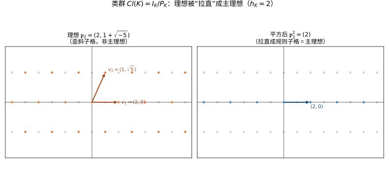

# 第76级 代数数论

## 学习目标

1. 理解代数数域和代数整数环的基本概念，掌握Dedekind整环的性质。
2. 掌握理想分解的唯一性定理及其证明。
3. 理解分歧理论，掌握惯性群、分解群、Frobenius自同构的概念。
4. 掌握Dirichlet单位定理，理解Minkowski几何方法。
5. 理解二次域和分圆域的类数计算。
6. 了解Kronecker-Weber定理和局部域的概念。
7. 理解Artin互反律，掌握代数数论方法证明二次互反律。

---

## 第一节 代数数域与代数整数环

### 1.1 基本概念

**定义1（代数数域）** 有理数域 $\mathbb{Q}$ 的有限扩张称为**代数数域**（简称数域）。若 $K/\mathbb{Q}$ 是次数为 $n$ 的扩张，记 $n = [K : \mathbb{Q}]$。

**定义2（代数整数）** 设 $\alpha \in \mathbb{C}$。若存在首一多项式 $f(x) \in \mathbb{Z}[x]$ 使得 $f(\alpha) = 0$，则称 $\alpha$ 为**代数整数**。

**定义3（代数整数环）** 数域 $K$ 中所有代数整数构成的集合记为 $\mathcal{O}_K$，称为 $K$ 的**整数环**。

**定理1（整数环的基本性质）** 设 $K$ 为数域，$n = [K : \mathbb{Q}]$。
1. $\mathcal{O}_K$ 是 $\mathbb{Z}$-模，秩为 $n$。
2. $\mathcal{O}_K$ 是整闭整环。
3. $K$ 是 $\mathcal{O}_K$ 的分式域。

**证明：**

**第一步：** 存在 $\alpha_1, \dots, \alpha_n \in \mathcal{O}_K$ 构成 $K$ 在 $\mathbb{Q}$ 上的一组基。证明需要利用迹（trace）的非退化性。

对 $\alpha \in K$，定义迹 $\operatorname{Tr}_{K/\mathbb{Q}}(\alpha) = \sum_{i=1}^n \sigma_i(\alpha)$，其中 $\sigma_i$ 是 $K$ 到 $\mathbb{C}$ 的嵌入。

迹型 $(\alpha, \beta) \mapsto \operatorname{Tr}_{K/\mathbb{Q}}(\alpha\beta)$ 是非退化的双线性型。

取 $\mathbb{Q}$-基 $\{v_1, \dots, v_n\} \subset \mathcal{O}_K$，考虑其对偶基 $\{w_1, \dots, w_n\}$（满足 $\operatorname{Tr}(v_i w_j) = \delta_{ij}$）。则存在非零整数 $m$ 使得 $m w_j \in \mathcal{O}_K$，从而 $\{v_1, \dots, v_n, m w_1, \dots, m w_n\}$ 生成 $\mathcal{O}_K$ 作为 $\mathbb{Z}$-模。由于 $\mathbb{Z}$ 是Noether环，$\mathcal{O}_K$ 是有限生成 $\mathbb{Z}$-模，秩为 $n$。

**第二步：** 整闭性：若 $\alpha \in K$ 满足 $\mathcal{O}_K$ 上的首一多项式，则 $\alpha$ 是代数整数，因此 $\alpha \in \mathcal{O}_K$。

**第三步：** 显然 $K$ 是 $\mathcal{O}_K$ 的分式域，因为任何 $\alpha \in K$ 可以乘以某个整数分母变为代数整数。$\square$

### 1.2 Dedekind整环

**定理2（数域整数环是Dedekind整环）** 设 $K$ 为数域。则 $\mathcal{O}_K$ 是Dedekind整环，即：
1. $\mathcal{O}_K$ 是Noether环。
2. $\mathcal{O}_K$ 是整闭的。
3. $\mathcal{O}_K$ 的每个非零素理想是极大理想（即 $\dim \mathcal{O}_K = 1$）。

**证明：**

**性质1（Noether性）：** $\mathcal{O}_K$ 是有限生成 $\mathbb{Z}$-模，因此是Noether $\mathbb{Z}$-模，从而作为环是Noether的（因为 $\mathbb{Z}$ 是Noether环，有限生成模上的子模都是有限生成的）。

**性质2（整闭性）：** 由定理1已证。

**性质3（维数为1）：** 设 $\mathfrak{p} \subset \mathcal{O}_K$ 为非零素理想。需证 $\mathfrak{p}$ 是极大理想。

取非零元素 $a \in \mathfrak{p}$。考虑范数 $N_{K/\mathbb{Q}}(a) = \prod_{i=1}^n \sigma_i(a) \in \mathbb{Z}$。由于 $a$ 是代数整数，$N(a) \in \mathbb{Z}$。且 $a \neq 0$ 时 $N(a) \neq 0$。

由 $N(a) \in \mathfrak{p} \cap \mathbb{Z}$，得 $\mathfrak{p} \cap \mathbb{Z}$ 是 $\mathbb{Z}$ 的非零素理想，因此 $\mathfrak{p} \cap \mathbb{Z} = p\mathbb{Z}$ 对某素数 $p$。

于是 $\mathbb{Z}/p\mathbb{Z} \hookrightarrow \mathcal{O}_K/\mathfrak{p}$，且 $\mathcal{O}_K/\mathfrak{p}$ 是有限生成 $\mathbb{Z}/p\mathbb{Z}$-模（因为 $\mathcal{O}_K$ 是有限生成 $\mathbb{Z}$-模），因此 $\mathcal{O}_K/\mathfrak{p}$ 是有限域，从而是域，故 $\mathfrak{p}$ 是极大理想。$\square$

---

## 第二节 理想分解

### 2.1 唯一分解定理

**定理3（Dedekind整环中的理想唯一分解定理）** 设 $\mathcal{O}_K$ 为数域 $K$ 的整数环。则任何非零真理想 $\mathfrak{a} \subset \mathcal{O}_K$ 可以唯一地分解为素理想的乘积：
$$\mathfrak{a} = \mathfrak{p}_1^{e_1} \mathfrak{p}_2^{e_2} \cdots \mathfrak{p}_r^{e_r},$$
其中 $\mathfrak{p}_i$ 是互不相同的非零素理想，$e_i \geq 1$ 是正整数。分解在次序交换下唯一。

**证明：**

**存在性：**

设 $\mathfrak{a}$ 为非零真理想。若 $\mathfrak{a}$ 是素理想，则分解已给出。否则，存在 $\mathfrak{a} \subsetneq \mathfrak{p}_1$ 其中 $\mathfrak{p}_1$ 是包含 $\mathfrak{a}$ 的极大理想（即素理想）。由理想乘法，$\mathfrak{a} = \mathfrak{p}_1 \mathfrak{a}_1$，其中 $\mathfrak{a}_1 = \mathfrak{p}_1^{-1} \mathfrak{a}$（在分式理想群中）。

由于 $\mathfrak{p}_1$ 是极大理想，$\mathfrak{p}_1^{-1}$ 严格大于 $\mathcal{O}_K$，因此 $\mathfrak{a}_1$ 是比 $\mathfrak{a}$ "更大"的理想（更精确地说，$\mathfrak{a} \subsetneq \mathfrak{a}_1$）。由Noether性，这一过程只能进行有限步，最终得到 $\mathfrak{a} = \mathfrak{p}_1 \cdots \mathfrak{p}_r$。

对带指数的情形，将重复的素理想合并即可。

**唯一性：**

设 $\mathfrak{a} = \mathfrak{p}_1^{e_1} \cdots \mathfrak{p}_r^{e_r} = \mathfrak{q}_1^{f_1} \cdots \mathfrak{q}_s^{f_s}$ 为两种分解。

对任意 $\mathfrak{p}_i$，由于 $\mathfrak{p}_i$ 是素理想且包含 $\mathfrak{a}$，则 $\mathfrak{p}_i$ 包含某个 $\mathfrak{q}_j$（由素理想的定义）。由于 $\mathfrak{q}_j$ 也是素理想且 $\mathfrak{p}_i$ 是极大理想，必有 $\mathfrak{p}_i = \mathfrak{q}_j$。通过归纳可得两种分解相同。$\square$

![高斯格点 Z[√-5] 的两种约化分解：6=2·3=(1+√-5)(1-√-5)，唯一分解失效，需用理想分解补救](images/76a_理想分解.svg)

> **直观理解（现实类比）**：在普通整数里，每个数拆"质因数"只有一种拆法（如 $18=2\cdot 3\cdot 3$）。但在 $\mathbb{Z}[\sqrt{-5}]$ 里，6 却有两种完全不同的拆法，就像把一盒 6 块积木既可以分成 2 和 3 两组，又可以按另一种斜向的方式分成两组，积木的"棱角方向"不同却无法再细分。此时只好把抽象的"理想"当作新的基本单位，让每个理想仍然有唯一的素理想分解——正如把方向不同的积木各自装进固定的格子盒。

### 2.2 分歧理论

**定义4（分歧）** 设 $p$ 为有理素数。考虑 $\mathfrak{p} \cap \mathbb{Z} = p\mathbb{Z}$。在 $\mathcal{O}_K$ 中分解 $p\mathcal{O}_K$：
$$p\mathcal{O}_K = \mathfrak{p}_1^{e_1} \cdots \mathfrak{p}_g^{e_g},$$
其中 $\mathfrak{p}_i$ 是互不相同的素理想。

- $e_i$ 称为**分歧指数**（ramification index）。
- $f_i = [\mathcal{O}_K/\mathfrak{p}_i : \mathbb{F}_p]$ 称为**惯性指数**（inertial degree）。

**定理4（基本等式）** $$[K : \mathbb{Q}] = \sum_{i=1}^g e_i f_i.$$

**定理5（Hilbert分歧理论）** 设 $L/K$ 为Galois扩张，$\mathfrak{p} \subset \mathcal{O}_K$ 为素理想。则Galois群 $G = \operatorname{Gal}(L/K)$ 可迁地作用在 $\mathfrak{p}$ 上方的素理想 $\mathfrak{P}_1, \dots, \mathfrak{P}_g$ 上。

**定义5（分解群与惯性群）** 设 $\mathfrak{P}$ 是 $\mathfrak{p}$ 上方的素理想。定义
- **分解群：** $D_{\mathfrak{P}} = \{\sigma \in G : \sigma(\mathfrak{P}) = \mathfrak{P}\}$。
- **惯性群：** $I_{\mathfrak{P}} = \{\sigma \in D_{\mathfrak{P}} : \sigma(\alpha) \equiv \alpha \pmod{\mathfrak{P}} \text{ 对所有 } \alpha \in \mathcal{O}_L\}$。

**定理6（Hilbert分歧理论——基本结论）** 设 $\mathfrak{P}$ 是 $\mathfrak{p}$ 上方的素理想，$L/K$ 为Galois扩张，$G = \operatorname{Gal}(L/K)$。

1. $|D_{\mathfrak{P}}| = e f$，其中 $e$ 是分歧指数，$f$ 是惯性指数。
2. $D_{\mathfrak{P}}/I_{\mathfrak{P}} \cong \operatorname{Gal}((\mathcal{O}_L/\mathfrak{P})/(\mathcal{O}_K/\mathfrak{p}))$，这是一个循环群，阶为 $f$。
3. $I_{\mathfrak{P}}$ 的阶为 $e$。

**证明：**

**第一步：分解群的作用。**

由于 $G$ 可迁地作用在 $\mathfrak{p}$ 上方的素理想上，稳定子群 $D_{\mathfrak{P}}$ 的指数 $[G : D_{\mathfrak{P}}] = g$（上方素理想的个数）。

因此 $|D_{\mathfrak{P}}| = |G|/g = n/g$，其中 $n = [L : K]$。

由基本等式 $n = e f g$，得 $|D_{\mathfrak{P}}| = e f$。

**第二步：惯性群的结构。**

考虑自然映射 $\varphi: D_{\mathfrak{P}} \to \operatorname{Gal}((\mathcal{O}_L/\mathfrak{P})/(\mathcal{O}_K/\mathfrak{p}))$，将 $\sigma \in D_{\mathfrak{P}}$ 映为 $\bar{\sigma}(x \bmod \mathfrak{P}) = \sigma(x) \bmod \mathfrak{P}$。

该映射是满射，核为 $I_{\mathfrak{P}}$。因此 $D_{\mathfrak{P}}/I_{\mathfrak{P}} \cong \operatorname{Gal}((\mathcal{O}_L/\mathfrak{P})/(\mathcal{O}_K/\mathfrak{p}))$。

剩余域扩张 $(\mathcal{O}_L/\mathfrak{P})/(\mathcal{O}_K/\mathfrak{p})$ 是有限域的扩张，因此其Galois群是循环群，阶为惯性指数 $f$。

**第三步：$I_{\mathfrak{P}}$ 的阶。**

由 $|D_{\mathfrak{P}}| = e f$ 和 $|D_{\mathfrak{P}}/I_{\mathfrak{P}}| = f$，得 $|I_{\mathfrak{P}}| = e$。$\square$

**定义6（Frobenius自同构）** 在 $D_{\mathfrak{P}}/I_{\mathfrak{P}}$ 中，生成元 $\operatorname{Frob}_{\mathfrak{P}}$ 称为**Frobenius自同构**，它对应于有限域扩张中的Frobenius映射 $x \mapsto x^{|\mathcal{O}_K/\mathfrak{p}|}$。

> **直观理解（现实类比）**：分歧理论就像研究"折纸的层数"。一张纸（有理素数 $p$）折叠后放入信封（数域扩张 $K/\mathbb{Q}$），打开信封看到纸被折成了几叠（素理想 $\mathfrak{p}_i$）。分歧指数 $e_i$ 就是第 $i$ 叠的"层数"——层数越多说明折叠越"紧密"（越分歧）；惯性指数 $f_i$ 则是每层纸上"花纹的精细度"——剩余域扩张的次数。基本等式 $\sum e_i f_i = n$ 告诉我们：所有叠的层数乘以花纹精细度之和，恰好等于整张纸的"总规模" $n$。

---

## 第三节 类群与单位定理

### 3.1 理想类群

**定义7（分式理想与类群）** 
- $K$ 的**分式理想**是 $\mathcal{O}_K$ 的有限生成 $\mathcal{O}_K$-子模。
- 所有非零分式理想构成群 $I_K$（理想群）。
- 主分式理想构成的子群记为 $P_K$。
- **理想类群**定义为 $Cl(K) = I_K / P_K$。

**定理7（类群的有限性）** 对任何数域 $K$，$Cl(K)$ 是有限群。$h_K = |Cl(K)|$ 称为 $K$ 的**类数**。

> **直观理解（现实类比）**：把整数环里的元素想象成墙砖在墙面上铺成的网格。一个"理想"就是其中按某种斜向规律选出的子网格。有些子网格正好是某个砖块的整数倍（主理想，像一排整齐的砖）；另一些子网格无论怎么"平移缩放"都无法变成整齐的一排（非主理想）。理想类群 $Cl(K)$ 就是把这些"歪斜"程度不同的子网格分类——它告诉我们：需要多少"歪斜"的子网格才能拼出一个整齐的主理想。上面例子中歪斜子网格 $\mathfrak{p}_2$ 平方后恰好拼成整齐的 $(2)$，所以类数为 2。

### 3.2 Dirichlet单位定理

**定理8（Dirichlet单位定理）** 设 $K$ 为数域，$r_1$ 为 $K$ 到 $\mathbb{R}$ 的实嵌入个数，$2r_2$ 为 $K$ 到 $\mathbb{C}$ 的非实嵌入个数（即 $n = r_1 + 2r_2$）。则 $\mathcal{O}_K^\times$ 是有限生成阿贝尔群，秩为 $r_1 + r_2 - 1$。

更精确地，
$$\mathcal{O}_K^\times \cong \mu(K) \times \mathbb{Z}^{r_1 + r_2 - 1},$$
其中 $\mu(K)$ 是 $K$ 中单位根群（有限循环群）。

**证明（使用Minkowski几何方法）：**

**第一步：Minkowski嵌入。**

定义嵌入 $\sigma: K \to \mathbb{R}^{r_1} \times \mathbb{C}^{r_2} \cong \mathbb{R}^n$ 为
$$\sigma(\alpha) = (\sigma_1(\alpha), \dots, \sigma_{r_1}(\alpha), \operatorname{Re}(\tau_1(\alpha)), \operatorname{Im}(\tau_1(\alpha)), \dots, \operatorname{Re}(\tau_{r_2}(\alpha)), \operatorname{Im}(\tau_{r_2}(\alpha))),$$
其中 $\sigma_i$ 是实嵌入，$\tau_j$ 是复嵌入。

**第二步：对数嵌入。**

定义对数嵌入 $L: K^\times \to \mathbb{R}^{r_1 + r_2}$ 为
$$L(\alpha) = (\log|\sigma_1(\alpha)|, \dots, \log|\sigma_{r_1}(\alpha)|, 2\log|\tau_1(\alpha)|, \dots, 2\log|\tau_{r_2}(\alpha)|).$$

**第三步：单位群的结构。**

$\mathcal{O}_K^\times$ 在 $L$ 下的像是一个秩为 $r_1 + r_2 - 1$ 的格，而 $\ker(L) = \mu(K)$（单位根）。

我们需要证明 $\ker(L) = \mu(K)$：若 $L(\alpha) = 0$，则对所有嵌入 $\sigma$，$|\sigma(\alpha)| = 1$。因此 $\alpha$ 的所有共轭的绝对值都是 $1$，由Kronecker定理，$\alpha$ 是单位根。

**第四步：构造基本单位（Minkowski方法）。**

考虑 $\mathbb{R}^{r_1 + r_2}$ 中的超平面 $H = \{(x_1, \dots, x_{r_1 + r_2}) : \sum x_i = 0\}$。

对 $H$ 中的任何格点，可以找到对应的单位。由Minkowski凸体定理，在适当选取的凸体中可以找到非零代数整数，从而构造出足够多的单位。

具体地，对每个 $i = 1, \dots, r_1 + r_2 - 1$，构造单位 $\varepsilon_i$ 使得 $\{L(\varepsilon_1), \dots, L(\varepsilon_{r_1 + r_2 - 1})\}$ 是 $H$ 中格的一组基。

**第五步：生成元的显式构造。**

利用Minkowski定理，对任意大的实数 $T$，存在非零代数整数 $\alpha \in \mathcal{O}_K$ 使得对所有嵌入 $\sigma$，$|\sigma(\alpha)| \leq T$ 且 $N(\alpha) \neq 0$。

通过适当选取 $\alpha$ 和 $\beta$ 并考虑 $\alpha/\beta$，可以构造出秩为 $r_1 + r_2 - 1$ 的单位群。$\square$

### 3.3 示例

**示例1（二次域的单位群）** 
- $\mathbb{Q}(\sqrt{d})$，$d > 0$ 无平方因子：
  $$r_1 = 2, r_2 = 0 \Rightarrow \text{秩} = 1.$$
  因此 $\mathcal{O}_{\mathbb{Q}(\sqrt{d})}^\times \cong \{\pm 1\} \times \mathbb{Z}$，生成元称为**基本单位**。
  
- $\mathbb{Q}(\sqrt{d})$，$d < 0$ 无平方因子：
  $$r_1 = 0, r_2 = 1 \Rightarrow \text{秩} = 0.$$
  因此单位群是有限群（单位根群）。

**示例2（分圆域的单位群）** 设 $K = \mathbb{Q}(\zeta_m)$，其中 $\zeta_m$ 是 $m$ 次本原单位根。则
$$r_1 = 0, \quad r_2 = \varphi(m)/2 \quad (m \neq 2).$$
因此单位群的秩为 $\varphi(m)/2 - 1$。

---

## 第四节 二次域与类数

### 4.1 二次域的整数环

**定理9（二次域的整数环）** 设 $K = \mathbb{Q}(\sqrt{d})$，$d$ 是无平方因子的整数。
- 若 $d \equiv 2, 3 \pmod{4}$，则 $\mathcal{O}_K = \mathbb{Z}[\sqrt{d}]$。
- 若 $d \equiv 1 \pmod{4}$，则 $\mathcal{O}_K = \mathbb{Z}[\frac{1+\sqrt{d}}{2}]$。

### 4.2 类数计算

**示例3（虚二次域的类数）** 计算 $K = \mathbb{Q}(\sqrt{-5})$ 的类数。

**解：** $\mathcal{O}_K = \mathbb{Z}[\sqrt{-5}]$。判别式 $D = -20$。

Minkowski界：
$$M_K = \frac{2}{\pi} \sqrt{|D|} = \frac{2}{\pi} \sqrt{20} \approx 2.85.$$

因此每个理想类包含一个范数 $\leq 2$ 的理想。需检查范数为 $2$ 的素理想：
- $2\mathcal{O}_K = (2, 1+\sqrt{-5})^2$，因此 $\mathfrak{p}_2 = (2, 1+\sqrt{-5})$ 是唯一的范数为 $2$ 的素理想。

可以验证 $\mathfrak{p}_2$ 不是主理想（因为 $N(a+b\sqrt{-5}) = a^2 + 5b^2 \neq 2$ 对任何整数 $a, b$ 成立），因此 $Cl(K) \cong \mathbb{Z}/2\mathbb{Z}$，类数 $h_K = 2$。

---

## 第五节 分圆域与Kronecker-Weber定理

### 5.1 分圆域

**定义8（分圆域）** $\mathbb{Q}(\zeta_m)$ 称为 $m$ 次**分圆域**，其中 $\zeta_m = e^{2\pi i/m}$。

**定理10（分圆域的性质）** 
1. $[\mathbb{Q}(\zeta_m) : \mathbb{Q}] = \varphi(m)$（Euler totient函数）。
2. $\mathcal{O}_{\mathbb{Q}(\zeta_m)} = \mathbb{Z}[\zeta_m]$。
3. 有理素数 $p$ 在 $\mathbb{Q}(\zeta_m)$ 中的分歧指数为 $e = \varphi(p^{v_p(m)})$。

### 5.2 Kronecker-Weber定理

**定理11（Kronecker-Weber定理）** 任何 $\mathbb{Q}$ 上的阿贝尔扩张（即Galois群为阿贝尔群的扩张）都包含在某个分圆域中。

**证明思路：** 该定理的经典证明使用了类域论。对于 $\mathbb{Q}$ 上的阿贝尔扩张 $K/\mathbb{Q}$，由类域论，$K$ 对应一个模 $m$ 的射线类群，从而 $K \subseteq \mathbb{Q}(\zeta_m)$。$\square$

---

## 第六节 局部域与完备化

### 6.1 p-adic数域

**定义9（p-adic完备化）** 设 $p$ 为素数。$\mathbb{Q}$ 关于 $p$-adic绝对值 $|\cdot|_p$ 的完备化称为 **$p$-adic数域** $\mathbb{Q}_p$。

**定义10（局部域）** 局部紧的非离散拓扑域称为**局部域**。$\mathbb{R}$、$\mathbb{C}$、$\mathbb{Q}_p$ 及其有限扩张都是局部域。

### 6.2 赋值

**定义11（赋值）** 域 $K$ 上的**离散赋值**是一个满射 $v: K^\times \to \mathbb{Z}$，满足：
1. $v(xy) = v(x) + v(y)$；
2. $v(x+y) \geq \min(v(x), v(y))$。

**定理12（完备化与扩张）** 设 $K$ 为数域，$\mathfrak{p}$ 为 $\mathcal{O}_K$ 的素理想。则 $K$ 关于 $\mathfrak{p}$-adic赋值的完备化 $K_\mathfrak{p}$ 是局部域，且 $[K_\mathfrak{p} : \mathbb{Q}_p] = e f$，其中 $e$ 是分歧指数，$f$ 是惯性指数。

---

## 第七节 二次互反律

### 7.1 Legendre符号

**定义12（Legendre符号）** 对奇素数 $p$ 和整数 $a$，
$$\left(\frac{a}{p}\right) = \begin{cases} 1, & a \text{ 是模 } p \text{ 的二次剩余}, \\ -1, & a \text{ 不是模 } p \text{ 的二次剩余}, \\ 0, & p | a. \end{cases}$$

### 7.2 二次互反律

**定理13（二次互反律）** 设 $p, q$ 为不同的奇素数。则
$$\left(\frac{p}{q}\right)\left(\frac{q}{p}\right) = (-1)^{\frac{p-1}{2} \cdot \frac{q-1}{2}}.$$

**证明（使用代数数论方法——分圆域方法）：**

**第一步：引入分圆域。**

考虑分圆域 $\mathbb{Q}(\zeta_p)$，其中 $\zeta_p = e^{2\pi i/p}$。在 $\mathbb{Q}(\zeta_p)$ 中，有唯一分解
$$p = (1-\zeta_p)^{p-1} \cdot \varepsilon,$$
其中 $\varepsilon$ 是单位。

**第二步：二次域嵌入分圆域。**

考虑二次域 $K = \mathbb{Q}(\sqrt{p^*})$，其中 $p^* = (-1)^{(p-1)/2} p$。

由Gauss和的计算：
$$g = \sum_{a=1}^{p-1} \left(\frac{a}{p}\right) \zeta_p^a.$$
可以证明 $g^2 = p^*$，因此 $\sqrt{p^*} \in \mathbb{Q}(\zeta_p)$，即 $K \subseteq \mathbb{Q}(\zeta_p)$。

**第三步：Frobenius自同构的作用。**

考虑 $\mathbb{Q}(\zeta_p)/\mathbb{Q}$ 的Galois群 $G \cong (\mathbb{Z}/p\mathbb{Z})^\times$。对素数 $q \neq p$，Frobenius自同构 $\operatorname{Frob}_q$ 作用为 $\zeta_p \mapsto \zeta_p^q$。

限制到二次域 $K$ 上，$\operatorname{Frob}_q$ 在 $K$ 上的作用由 $\left(\frac{p^*}{q}\right)$ 决定（由类域论或直接计算）。

**第四步：计算Frobenius的作用。**

在 $\mathbb{Q}(\zeta_p)$ 中，$\operatorname{Frob}_q(\sqrt{p^*}) = \operatorname{Frob}_q(g) = \sum_{a=1}^{p-1} \left(\frac{a}{p}\right) \zeta_p^{aq} = \left(\frac{q}{p}\right) g = \left(\frac{q}{p}\right) \sqrt{p^*}.$

因此 $\operatorname{Frob}_q$ 在 $K$ 上的限制为 $\sqrt{p^*} \mapsto \left(\frac{q}{p}\right) \sqrt{p^*}$。

**第五步：与Legendre符号的联系。**

另一方面，由类域论或直接计算，$\operatorname{Frob}_q$ 在 $K$ 上的作用对应于 $\left(\frac{p^*}{q}\right)$：
$$\operatorname{Frob}_q(\sqrt{p^*}) = \left(\frac{p^*}{q}\right) \sqrt{p^*}.$$

因此
$$\left(\frac{p^*}{q}\right) = \left(\frac{q}{p}\right).$$

而 $p^* = (-1)^{(p-1)/2} p$，因此
$$\left(\frac{p^*}{q}\right) = \left(\frac{(-1)^{(p-1)/2}}{q}\right) \left(\frac{p}{q}\right) = (-1)^{\frac{p-1}{2} \cdot \frac{q-1}{2}} \left(\frac{p}{q}\right).$$

代入上式得
$$\left(\frac{q}{p}\right) = (-1)^{\frac{p-1}{2} \cdot \frac{q-1}{2}} \left(\frac{p}{q}\right),$$
即
$$\left(\frac{p}{q}\right)\left(\frac{q}{p}\right) = (-1)^{\frac{p-1}{2} \cdot \frac{q-1}{2}}.$$

$\square$

---

## 第八节 Artin映射与互反律

### 8.1 Artin映射

**定义13（Artin映射）** 设 $L/K$ 为数域的阿贝尔扩张，$\mathfrak{p} \subset \mathcal{O}_K$ 为在 $L$ 中不分歧的素理想。定义 **Artin映射**
$$\left(\frac{L/K}{\mathfrak{p}}\right) = \operatorname{Frob}_{\mathfrak{P}} \in \operatorname{Gal}(L/K),$$
其中 $\mathfrak{P}$ 是 $\mathfrak{p}$ 上方的任一素理想，$\operatorname{Frob}_{\mathfrak{P}}$ 是Frobenius自同构。

### 8.2 Artin互反律

**定理14（Artin互反律）** 设 $L/K$ 为数域的阿贝尔扩张。则Artin映射诱导出理想类群到Galois群的满同态：
$$\operatorname{Art}: I_K^\mathfrak{m} \to \operatorname{Gal}(L/K),$$
其核为射线类群，从而建立了类域论的基本同构：
$$I_K^\mathfrak{m} / P_K^\mathfrak{m} N_{L/K}(I_L^\mathfrak{m}) \cong \operatorname{Gal}(L/K).$$

---

## 第九节 示例

### 示例4：二次域 $\mathbb{Q}(\sqrt{d})$ 的类数

**计算 $\mathbb{Q}(\sqrt{-1})$ 的类数：**

$\mathcal{O}_K = \mathbb{Z}[i]$（Gauss整数环）。Minkowski界：
$$M_K = \frac{2}{\pi} \sqrt{4} = \frac{4}{\pi} \approx 1.27.$$
因此每个理想类包含一个范数 $\leq 1$ 的理想，即只包含 $\mathcal{O}_K$ 本身。因此 $h_K = 1$。

**计算 $\mathbb{Q}(\sqrt{-6})$ 的类数：**

$\mathcal{O}_K = \mathbb{Z}[\sqrt{-6}]$。判别式 $D = -24$。Minkowski界：
$$M_K = \frac{2}{\pi} \sqrt{24} \approx 3.12.$$
需检查范数为 $2$ 和 $3$ 的理想：
- $2\mathcal{O}_K = (2, \sqrt{-6})^2$；
- $3\mathcal{O}_K = (3, \sqrt{-6})^2$。

可以证明 $Cl(K) \cong \mathbb{Z}/2\mathbb{Z}$，$h_K = 2$。

### 示例5：分圆域的单位群

对 $K = \mathbb{Q}(\zeta_5)$，$\varphi(5) = 4$，因此 $r_2 = 2$，单位群秩为 $1$。基本单位可以取为 $\varepsilon = 1 + \zeta_5 + \zeta_5^2$。

---

## 习题

### 基础题

**习题 1**（代数整数）设 $\alpha = \frac{1+\sqrt{5}}{2}$。证明 $\alpha$ 是代数整数，求出它的最小多项式，并计算其在 $K = \mathbb{Q}(\sqrt{5})$ 上的范数 $N_{K/\mathbb{Q}}(\alpha)$ 与迹 $\operatorname{Tr}_{K/\mathbb{Q}}(\alpha)$。

**习题 2**（范数与迹）设 $K = \mathbb{Q}(\sqrt{3})$。计算 $N_{K/\mathbb{Q}}(2 + \sqrt{3})$ 与 $\operatorname{Tr}_{K/\mathbb{Q}}(2 + \sqrt{3})$，并由此证明 $2 + \sqrt{3}$ 是 $\mathcal{O}_K$ 中的一个单位。

**习题 3**（Dedekind整环）说明 $\mathbb{Z}$ 与 $\mathbb{Z}[i]$ 是Dedekind整环，而 $\mathbb{Z}[\sqrt{-3}]$ 不是Dedekind整环；指明后者究竟违反了整闭性、Noether性、维数为一这三条性质中的哪一条。

**习题 4**（判别式）推导二次域 $K = \mathbb{Q}(\sqrt{d})$（$d$ 无平方因子）的判别式公式
$$d_K = \begin{cases} d, & d \equiv 1 \pmod{4}, \\ 4d, & d \equiv 2, 3 \pmod{4}. \end{cases}$$

**习题 5**（判别式与分歧）分别计算 $K_1 = \mathbb{Q}(\sqrt{-1})$、$K_2 = \mathbb{Q}(\sqrt{-5})$、$K_3 = \mathbb{Q}(\sqrt{3})$ 的判别式，并判断有理素数 $2$ 在这些域中是否分歧。

**习题 6**（理想分解）在 $\mathbb{Z}[\sqrt{-5}]$ 中验证 $6 = 2 \cdot 3 = (1+\sqrt{-5})(1-\sqrt{-5})$ 给出两种不同的不可约元分解，从而说明 $\mathcal{O}_K$ 不是UFD；再写出 $6\mathcal{O}_K$ 的素理想分解，说明理想理论如何弥补唯一分解。

**习题 7**（单位群）求 $K = \mathbb{Q}(\sqrt{-1})$ 与 $\mathbb{Q}(\sqrt{-3})$ 的单位群，说明二者都是有限循环群，并指出它们的阶。

**习题 8**（范数与类群）设 $K = \mathbb{Q}(\sqrt{-5})$。利用范数公式 $N(a+b\sqrt{-5}) = a^2 + 5b^2$，证明素理想 $\mathfrak{p}_2 = (2, 1+\sqrt{-5})$ 不是主理想。

**习题 9**（p-adic 赋值的性质）设 $v_p$ 为有理数的 $p$-adic 赋值。对 $x, y \in \mathbb{Q}$，证明 $v_p(x+y) \geq \min\{v_p(x), v_p(y)\}$，并由此说明 $|x+y|_p \leq \max\{|x|_p, |y|_p\}$（非阿基米德性质）。

**习题 10**（范数与迹）设 $L/K$ 是有限可分扩张。证明迹型 $\operatorname{Tr}_{L/K}(xy)$ 是非退化的双线性型（提示：利用本原元素定理）。

### 进阶题

**习题 11**（单位定理）设 $K = \mathbb{Q}(\sqrt{2})$。证明 $\mathcal{O}_K^\times \cong \{\pm 1\} \times \mathbb{Z}$，其基本单位为 $1+\sqrt{2}$，并说明该单位与Pell方程 $x^2 - 2y^2 = \pm 1$ 的关系。

**习题 12**（理想类群与类数）利用Minkowski界证明 $\mathbb{Q}(\sqrt{-5})$ 的理想类群满足 $Cl(K) \cong \mathbb{Z}/2\mathbb{Z}$，类数 $h_K = 2$。

**习题 13**（分圆域）设 $\zeta_m = e^{2\pi i/m}$。证明 $[\mathbb{Q}(\zeta_m) : \mathbb{Q}] = \varphi(m)$ 且 $\mathcal{O}_{\mathbb{Q}(\zeta_m)} = \mathbb{Z}[\zeta_m]$，并写出有理素数 $p$ 在其中的分歧指数。

**习题 14**（类数计算）利用Minkowski界证明 $K = \mathbb{Q}(\sqrt{-6})$ 的类数为 $2$，并写出两个代表不同理想类的理想。

**习题 15**（单位定理）设 $K = \mathbb{Q}(\zeta_7)$。利用Dirichlet单位定理计算 $\mathcal{O}_K^\times$ 的秩，并说明它对应的基本单位个数。

**习题 16**（分裂 vs 惰性）设 $p$ 为奇素数，$K = \mathbb{Q}(\sqrt{d})$（$d$ 无平方因子）。用判别式 $d_K$ 阐述 $p$ 在 $K$ 中分裂、惰性与分歧的判别准则，并据此判断 $p = 5$ 在 $\mathbb{Q}(\sqrt{3})$ 中的行为。

**习题 17**（类数与欧氏性）证明 Gauss 整数环 $\mathbb{Z}[i]$ 是欧几里得整环，从而类数 $h = 1$，并说明任何分圆域中完全分歧的素数个数对类数的限制（给出初步讨论）。

**习题 18**（二次互反律的应用）用二次互反律计算 Legendre 符号 $\left(\frac{13}{23}\right)$，并判断 $13$ 是否为模 $23$ 的二次剩余。

**习题 19**（丢番图方程应用）证明：奇素数 $p$ 可表为 $p = x^2 + y^2$（$x, y \in \mathbb{Z}$）当且仅当 $p \equiv 1 \pmod{4}$。（充分性可用Gauss和落入 $\mathbb{Z}[i]$；必要性用模 $4$ 讨论。）

### 挑战题

**习题 20**（丢番图方程应用）在习题19的基础上，利用 $\mathbb{Z}[i]$ 的UFD补全费马两平方和定理的完整证明：具体地，证明当 $p \equiv 1 \pmod 4$ 时，$\mathbb{Z}[i]$ 中范数为 $p$ 的素元存在且 $p$ 在 $\mathbb{Z}[i]$ 中分裂为两个共轭素元的乘积。

**习题 21**（丢番图与类群）说明理想类群如何阻碍形如 $x^2 + 5y^2 = z^n$ 的方程在全域 $\mathbb{Z}[\sqrt{-5}]$ 上求整数解：写出该域类数 $h = 2$ 如何导致正主理想与逆主理想在分解上的不同表现，并据此讨论 $x^2 + 5y^2 = 6^n$ 的解集结构。

**习题 22**（分裂/惰性 in 域扩张）设 $K = \mathbb{Q}(\zeta_3)$。证明：对有理素数 $p \neq 3$，若 $p \equiv 1 \pmod 3$ 则 $p$ 在 $K$ 中分裂，若 $p \equiv 2 \pmod 3$ 则 $p$ 惰性，而 $p = 3$ 分歧；并利用基本等式 $[K:\mathbb{Q}] = \sum e_i f_i$ 加以验证。

**习题 23**（Ramification）证明在分圆域 $\mathbb{Q}(\zeta_p)$ 中，$(p) = (1-\zeta_p)^{p-1}$，即 $p$ 完全分歧，且分歧指数 $e = p-1$，惯性指数 $f = 1$，上方素理想唯一。

**习题 24**（类域论初步）利用分圆域方法与Gauss和，证明二次互反律：对相异的奇素数 $p, q$，
$$\left(\frac{p}{q}\right)\left(\frac{q}{p}\right) = (-1)^{\frac{p-1}{2}\frac{q-1}{2}}.$$
要求写出从 $\operatorname{Frob}_q$ 在 $\mathbb{Q}(\zeta_p)$ 与二次域 $K = \mathbb{Q}(\sqrt{p^*})$ 上的作用衔接的完整推理。

**习题 25**（类域论初步）设 $p$ 为素数，$p^* = (-1)^{\frac{p-1}{2}} p$。构造Gauss和证明 $\mathbb{Q}(\sqrt{p^*}) \subseteq \mathbb{Q}(\zeta_p)$，从而给出Kronecker-Weber定理在二次域上的特殊情形，并说明对一般二次域 $\mathbb{Q}(\sqrt{p})$ 应取哪个分圆域。

**习题 26**（Ramification 与分裂）设 $K = \mathbb{Q}(\sqrt{-5})$，$D = -20$。对 $p \neq 2, 5$，依据 $\left(\frac{D}{p}\right)$ 分类 $p$ 在 $K$ 中的分裂、惰性与分歧行为，并讨论 $e, f, g$ 的取值如何满足基本等式。

### 探究题

**习题 27**（开放推广）考察判别式为负的虚二次域 $\mathbb{Q}(\sqrt{d})$。类数为 $1$ 当且仅当 $d \in \{-1, -2, -3, -7, -11, -19, -43, -67, -163\}$（Baker–Heegner–Stark 定理）。请利用Minkowski界探究：为什么虚二次域的类数能由有限个范数充分小的素理想判定，而实二次域则无法如此归结；并进一步讨论该列表对$\frac{1+\sqrt{-163}}{2}$ 与 $e^{\pi\sqrt{163}}$ 取整性质的暗示。

**习题 28**（开放推广）把素理想在扩张中的分裂/惰性/分歧问题整体化：讨论 Chebotarev 密度定理如何刻画各类素理想在所有未分歧素理想中所占的比例，以及它与 Dirichlet 密度、Artin L-函数的联系。试针对三次域或 $\mathbb{Q}(\zeta_5)$ 给出一个具体例子的定性讨论。

**习题 29**（开放推广）以局部域为视角考察局部–整体原理（Hasse原理）：用 $\mathbb{Q}_p$ 上的解判断经典方程在某处无解，从而对整体无解。举一个 Hasse 原理成立（如二次型）与不成立（给出一个高次/三次的反例）的例子，并说明 class 数如何成为局部–整体间的"障碍"。

**习题 30**（开放推广）以类域论的统一视角回望：说明如何用 Artin 互反律统一分圆域理论、二次互反律与理想类群，并讨论（a）为何 $[\mathrm{Gal}(\bar{\mathbb{Q}}/\mathbb{Q})]^{\mathrm{ab}}$ 与 $\hat{\mathbb{Z}}^\times$ 对应严格互反律的含义；（b）对非阿贝尔情形，Langlands 纲领如何把互反概念推广到 $\mathrm{Gal}(\bar{L}/K)$ 的表示。列举类域论尚未完全回答的一两个开放问题。

---

## 习题答案与解析

### 基础题答案

1. $\alpha = \frac{1+\sqrt{5}}{2}$ 是 $x^2-x-1$ 的根，而 $x^2-x-1 \in \mathbb{Z}[x]$ 首一整系数，故 $\alpha$ 是代数整数。最小多项式正是 $x^2-x-1$（不可约）；共轭为 $\alpha' = \frac{1-\sqrt{5}}{2}$，因此范数
$$N_{K/\mathbb{Q}}(\alpha) = \frac{1+\sqrt{5}}{2} \cdot \frac{1-\sqrt{5}}{2} = \frac{1-5}{4} = -1,$$
迹 $\operatorname{Tr}_{K/\mathbb{Q}}(\alpha) = \frac{1+\sqrt{5}}{2} + \frac{1-\sqrt{5}}{2} = 1$。范数为 $-1$，故 $\alpha$ 是 $\mathcal{O}_K$ 中的单位。

2. $N_{K/\mathbb{Q}}(2+\sqrt{3}) = (2+\sqrt{3})(2-\sqrt{3}) = 4-3 = 1$，迹 $\operatorname{Tr}_{K/\mathbb{Q}}(2+\sqrt{3}) = 4$。由范数为 $1$，其逆 $2-\sqrt{3}$ 仍是 $\mathcal{O}_K$ 中代数整数，故 $2+\sqrt{3}$ 是单位。

3. $\mathbb{Z}$ 与 $\mathbb{Z}[i]$ 都整闭、Noether（有限生成 $\mathbb{Z}$-模）、维数为 $1$，故均为Dedekind整环。$\mathbb{Z}[\sqrt{-3}]$：元素 $\frac{1+\sqrt{-3}}{2}$ 在 $\mathbb{Q}(\sqrt{-3})$ 中满足首一多项式 $x^2+x+1$，是整元素却不属于 $\mathbb{Z}[\sqrt{-3}]$，故该环不整闭；而Noether性与维数为一仍成立。因此违反的是整闭性。

4. 记 $\theta = \sqrt{d}$。当 $d \equiv 1 \pmod 4$ 时取 $\mathcal{O}_K$ 的整基 $\{1, \frac{1+\sqrt{d}}{2}\}$，其共轭集成行列式给出 $d_K = d$；当 $d \equiv 2,3 \pmod 4$ 时取整基 $\{1, \sqrt{d}\}$，对应的整基矩阵行列式平方为 $4d$。两种情形合写即
$$d_K = \begin{cases} d, & d \equiv 1 \pmod{4}, \\ 4d, & d \equiv 2, 3 \pmod{4}. \end{cases}$$

5. 由公式：$d_K(\mathbb{Q}(\sqrt{-1})) = -4$（$d=-1 \equiv 3 \pmod 4$）；$d_K(\mathbb{Q}(\sqrt{-5})) = -20$（$d=-5 \equiv 3 \pmod 4$）；$d_K(\mathbb{Q}(\sqrt{3})) = 12$（$d=3 \equiv 3 \pmod 4$）。三者的判别式都被 $2$ 整除，故素数 $2$ 在这三个二次域中都分歧。

6. $\mathcal{O}_K = \mathbb{Z}[\sqrt{-5}]$，范数 $N(a+b\sqrt{-5}) = a^2+5b^2$ 取值不含 $2$ 也不含 $3$，故 $2, 3, 1\pm\sqrt{-5}$ 均不可约且彼此在素元意义下不相关，给出两种不同的不可约元分解，说明 $\mathcal{O}_K$ 不是UFD。理想分解为 $2\mathcal{O}_K = \mathfrak{p}_2^2$（$\mathfrak{p}_2 = (2, 1+\sqrt{-5})$），$(1+\sqrt{-5})$ 与 $(1-\sqrt{-5})$ 分别落在 $3$ 分裂出的共轭素理想 $\mathfrak{p}_3, \bar{\mathfrak{p}}_3$ 上，于是
$$6\mathcal{O}_K = \mathfrak{p}_2^2 \,\mathfrak{p}_3 \, \bar{\mathfrak{p}}_3,$$
即在素理想层面分解是唯一的，理想理论恢复了唯一分解。

7. $\mathbb{Q}(\sqrt{-1}) = \mathbb{Q}(i)$，$\mathcal{O}_K = \mathbb{Z}[i]$，单位群 $\{\pm 1, \pm i\} \cong \mathbb{Z}/4\mathbb{Z}$，阶为 $4$。$\mathbb{Q}(\sqrt{-3})$ 中 $\mathcal{O}_{\mathbb{Q}(\sqrt{-3})} = \mathbb{Z}[\frac{1+\sqrt{-3}}{2}] = \mathbb{Z}[\zeta_3]$，单位群为 $\{\pm1,\pm\zeta_3,\pm\zeta_3^2\} \cong \mathbb{Z}/6\mathbb{Z}$，阶为 $6$。两者 $r_2 = 1$，由Dirichlet单位定理秩 $r_1+r_2-1 = 0$，单位群为有限循环群即单位根群 $\mu(K)$。

8. 若 $\mathfrak{p}_2 = (2, 1+\sqrt{-5})$ 为主理想 $(\alpha)$，则理想范数满足 $N(\mathfrak{p}_2) = |N_{K/\mathbb{Q}}(\alpha)|$。但 $\mathfrak{p}_2^2 = (2)$，故 $N(\mathfrak{p}_2)^2 = N(2) = 4$，即 $N(\mathfrak{p}_2) = 2$。若 $\alpha = a+b\sqrt{-5}$，则 $|a^2+5b^2| = 2$，而 $a^2+5b^2$ 取值仅可为 $0,1,5,6,\dots$，恒不为 $2$，矛盾。故 $\mathfrak{p}_2$ 非主理想。

9. 写 $x = p^m \frac{u}{v}$，$u, v$ 均不被 $p$ 整除，则 $v_p(x) = m$；不妨设 $m \le v_p(y)$。则 $x+y = p^m(\frac{u}{v} + p^{v_p(y)-m}\frac{u'}{v'})$，括号内为 $p$-adically 整元素，故 $v_p(x+y) \ge m = \min\{v_p(x), v_p(y)\}$。令 $|z|_p = p^{-v_p(z)}$，非阿基米德三角不等式 $|x+y|_p \le \max\{|x|_p, |y|_p\}$ 随即成立。

10. 由本原元素定理取 $\theta \in L$ 使 $L = K(\theta)$。设 $\theta$ 在 $K$ 上的最小多项式为 $f$，次数 $d$。则 $\{1, \theta, \dots, \theta^{d-1}\}$ 是 $L/K$ 的基，且矩阵 $(\operatorname{Tr}_{L/K}(\theta^i \theta^j))$ 等于幂基伴随矩阵与 $\theta$ 的范德蒙德型组合的乘积，可逆性归结为 $f$ 无重根（可分），故迹双线性型非退化。

### 进阶题答案

1. $K=\mathbb{Q}(\sqrt{2})$：$r_1 = 2, r_2 = 0$，秩 $= r_1+r_2-1 = 1$，$\mu(K) = \{\pm 1\}$，故 $\mathcal{O}_K^\times \cong \{\pm1\} \times \mathbb{Z}$。基本单位取 $\varepsilon = 1+\sqrt{2}$（范数 $N(\varepsilon) = 1-2 = -1$），通解 $\pm(1+\sqrt2)^n = a+b\sqrt2$，等价于Pell方程 $a^2 - 2b^2 = \pm 1$ 的全部整数解。

2. $K = \mathbb{Q}(\sqrt{-5})$，判别式 $D = -20$，Minkowski界 $M_K = \frac{2}{\pi}\sqrt{20} \approx 2.85$，故每个理想类含一个范数 $\le 2$ 的理想。唯一的范数为 $2$ 的素理想是 $\mathfrak{p}_2 = (2, 1+\sqrt{-5})$，由习题8它非主理想；而 $\mathfrak{p}_2^2 = (2)$ 是主理想，故 $[\mathfrak{p}_2]^2 = 1$ 且 $[\mathfrak{p}_2] \neq 1$。因此 $Cl(K) \cong \mathbb{Z}/2\mathbb{Z}$，类数 $h_K = 2$。

3. $\zeta_m$ 的最小多项式是分圆多项式 $\Phi_m$，其次数为 $\varphi(m)$，故 $[\mathbb{Q}(\zeta_m):\mathbb{Q}] = \varphi(m)$。由于 $\Phi_m$ 首一整系数且 $\zeta_m$ 是整元素，$\mathcal{O}_{\mathbb{Q}(\zeta_m)} = \mathbb{Z}[\zeta_m]$。有理素数 $p$ 的分歧指数为 $e = \varphi(p^{v_p(m)}) = p^{v_p(m)} - p^{v_p(m)-1}$：素数 $p$ 完全分歧当且仅当 $p \mid m$；当 $p \nmid m$ 时 $p$ 不分歧。

4. $K = \mathbb{Q}(\sqrt{-6})$，$D = -24$，Minkowski界 $\approx 3.12$，需检查范数为 $2,3$ 的理想。$\mathfrak{p}_2 = (2, \sqrt{-6})$ 非主（$a^2+6b^2 = 2$ 无解），$\mathfrak{p}_3 = (3, \sqrt{-6})$ 非主（$a^2+6b^2 = 3$ 无解），且 $\mathfrak{p}_2^2 = (2)$、$\mathfrak{p}_3^2 = (3)$ 均为主理想。由关系 $6\mathcal{O}_K$ 的素分解可比对出 $[\mathfrak{p}_2] = [\mathfrak{p}_3]$ 为同一个非主类，故 $Cl(K) \cong \mathbb{Z}/2\mathbb{Z}$，$h_K = 2$。两个代表可取主类 $\mathcal{O}_K$ 与非主类 $\mathfrak{p}_2 = (2, \sqrt{-6})$。

5. $K = \mathbb{Q}(\zeta_7)$：$[K:\mathbb{Q}] = \varphi(7) = 6$，全部为复嵌入，$r_2 = 3$，$r_1 = 0$。由Dirichlet单位定理，秩 $= r_1 + r_2 - 1 = 2$，即 $\mathcal{O}_K^\times$ 有 $2$ 个基本单位（连同有限的单位根群 $\mu(K)$）。

6. 二次域判则：$p \mid d_K$ 时 $p$ 分歧；当 $p \nmid d_K$ 时，
$$p \text{ 分裂} \iff \left(\frac{d_K}{p}\right) = 1, \qquad p \text{ 惰性} \iff \left(\frac{d_K}{p}\right) = -1.$$
$\mathbb{Q}(\sqrt{3})$ 的判别式 $d_K = 12$，对 $p = 5$：
$$\left(\frac{12}{5}\right) = \left(\frac{3}{5}\right) = -1,$$
故 $5$ 在 $\mathbb{Q}(\sqrt{3})$ 中惰性（也不分歧，因为 $5 \nmid 12$）。

7. $\mathbb{Z}[i]$ 是欧几里得整环：对任一 $x \in \mathbb{Q}(i)$，取最邻近的格点 $q \in \mathbb{Z}[i]$，有 $N(x-q) \le \frac{1}{2} < 1$，故带余除法成立，从而 $\mathbb{Z}[i]$ 是PID，类数 $h = 1$。对完全分歧的素理想（如 $\mathbb{Q}(\zeta_p)$ 中 $(p) = \mathfrak{P}^{p-1}$），它对各类数公式给出可整除性约束，并结合Kummer类数整除理论说明分圆域中"完全分歧"的素元对 $h_K$ 的制约，是Minkowski界约束在素数级上的体现。

8. 由二次互反律
$$\left(\frac{13}{23}\right) = (-1)^{\frac{13-1}{2}\frac{23-1}{2}}\left(\frac{23}{13}\right) = \left(\frac{10}{13}\right) = \left(\frac{2}{13}\right)\left(\frac{5}{13}\right).$$
其中 $\left(\frac{2}{13}\right) = (-1)^{(169-1)/8} = -1$，$\left(\frac{5}{13}\right) = \left(\frac{13}{5}\right)(-1)^{24} = \left(\frac{3}{5}\right) = -1$。故 $\left(\frac{13}{23}\right) = (-1)(-1) = 1$，即 $13$ 是模 $23$ 的二次剩余（检验 $6^2 = 36 \equiv 13 \pmod{23}$）。

9. 必要性：若 $p = x^2 + y^2$ 为奇素数，则 $x, y$ 一奇一偶，平方和模 $4$ 为 $1$，故 $p \equiv 1 \pmod 4$。充分性：当 $p \equiv 1 \pmod 4$ 时 $-1$ 是模 $p$ 的二次剩余，存在 $t$ 使 $t^2 \equiv -1 \pmod p$，即 $p \mid (t+i)(t-i)$ 于 $\mathbb{Z}[i]$ 中。在UFD $\mathbb{Z}[i]$ 中取素因子 $\pi$，得 $p = \pi \bar{\pi}$，$N(\pi) = p = x^2 + y^2$。

### 挑战题答案

1. 紧承习题19：由 $p \equiv 1 \pmod 4$ 取 $t$ 使 $t^2 \equiv -1 \pmod p$，令 $\pi = \gcd_{\mathbb{Z}[i]}(t+i, p)$。由于 $\mathbb{Z}[i]$ 是主理想整环，$\pi$ 可生成；又 $\pi \mid p$ 而 $p$ 在 $\mathbb{Z}[i]$ 中不可约（若 $p = \alpha\beta$，则 $p^2 = N(\alpha)N(\beta)$，$p$ 素数迫使某范数为 $1$），故 $\pi$ 是素元。$N(\pi) \mid N(t+i) = t^2+1$ 且 $N(\pi) \in \{p, p^2\}$，排除 $p^2$ 后 $N(\pi) = p$。于是 $p = N(\pi) = \pi\bar{\pi}$ 分裂为两个共轭素元之积，且范数为 $p$ 的素元恰为 $\pi, \bar{\pi}$ 及其单位倍数。

2. 域 $K = \mathbb{Q}(\sqrt{-5})$ 类数 $h = 2$，非主类 $C$ 满足 $C^2 = 1$。方程 $x^2 + 5y^2 = z^n$ 即要求 $\mathcal{O}_K$ 中元素 $z = x + y\sqrt{-5}$（或其范数）对应主理想 $(\varepsilon)$。做主理想分解 $(\varepsilon) = \prod \mathfrak{p}_i^{a_i}$，其类乘积须落在主类：由于 $C^2 = 1$，当每个非主素理想的指数 $a_i$ 关于模 $2$ 配平后乘积才为主。对 $6^n$：$2$ 完全分歧（$2\mathcal{O}_K = \mathfrak{p}_2^2$），$3$ 分裂（$3\mathcal{O}_K = \mathfrak{p}_3\bar{\mathfrak{p}}_3$），通过调配各素元次数使理想类乘积为主，恰给出 $x^2 + 5y^2 = 6^n$ 的解结构。非主类 $C$ 的"二阶"本质正是 $h = 2$ 对整体丢番图可解性施加的障碍。

3. 对 $K = \mathbb{Q}(\zeta_3)$，判别式 $d_K = -3$。$p \neq 3$ 时由判别式判则 $p$ 分裂当且仅当 $\left(\frac{-3}{p}\right) = 1$。由二次互反律计算 $\left(\frac{-3}{p}\right) = \left(\frac{3}{p}\right)\left(\frac{-1}{p}\right)$，整理得
$$\left(\frac{-3}{p}\right) = 1 \iff p \equiv 1 \pmod 3,\qquad \left(\frac{-3}{p}\right) = -1 \iff p \equiv 2 \pmod 3.$$
故 $p \equiv 1 \pmod 3$ 时分裂（$g = 2, e = f = 1$，$efg = 2$），$p \equiv 2 \pmod 3$ 时惰性（$g = 1, e = 1, f = 2$，$efg = 2$）。$p = 3 \mid d_K$ 分歧（$e = 2, f = 1, g = 1$）。三种情形均满足基本等式 $[K:\mathbb{Q}] = \sum e_i f_i = 2$。

4. 由范数 $N(1-\zeta_p) = \prod_{a=1}^{p-1}(1-\zeta_p^a) = \Phi_p(1) = p$，知 $(1-\zeta_p)$ 是范数 $p$ 的素理想 $\mathfrak{P}$。因 $1-\zeta_p^{k} = (1-\zeta_p)u_k$（$u_k$ 单位），$(1-\zeta_p)^{p-1}$ 与 $(p)$ 相差单位因子，故 $(p) = (1-\zeta_p)^{p-1}$。于是 $p$ 在 $\mathbb{Q}(\zeta_p)$ 中完全分歧：$e = p-1$、$f = 1$、$g = 1$，基本等式 $[K:\mathbb{Q}] = efg = (p-1)\cdot 1\cdot 1 = p-1$ 成立。

5. 在 $\mathbb{Q}(\zeta_p)$ 中，Frobenius自同构 $\operatorname{Frob}_q$ 满足 $\zeta_p \mapsto \zeta_p^q$。Gauss和 $g = \sum_{a=1}^{p-1}\left(\frac{a}{p}\right)\zeta_p^a$ 满足 $g^2 = p^*$，故
$$\operatorname{Frob}_q(g) = \sum_a \left(\frac{a}{p}\right)\zeta_p^{aq} = \left(\frac{q}{p}\right) g,$$
即 $\operatorname{Frob}_q(\sqrt{p^*}) = \left(\frac{q}{p}\right)\sqrt{p^*}$。另一方面由 $\operatorname{Frob}_q$ 在二次域 $K = \mathbb{Q}(\sqrt{p^*})$ 上的作用由 $\left(\frac{p^*}{q}\right)$ 决定，两式相等给出 $\left(\frac{p^*}{q}\right) = \left(\frac{q}{p}\right)$。代入 $p^* = (-1)^{\frac{p-1}{2}}p$ 即得二次互反律
$$\left(\frac{p}{q}\right)\left(\frac{q}{p}\right) = (-1)^{\frac{p-1}{2}\frac{q-1}{2}}.$$

6. 同习题24所构造的Gauss和 $g$ 满足 $g^2 = p^*$，故 $\sqrt{p^*} \in \mathbb{Q}(\zeta_p)$，即 $\mathbb{Q}(\sqrt{p^*}) \subseteq \mathbb{Q}(\zeta_p)$。为了处理一般二次域 $\mathbb{Q}(\sqrt{p})$（$p$ 可为 $\equiv 1$ 或 $3 \pmod 4$），注意到 $p^* = \pm p$ 且 $\zeta_4 = i$ 提供符号 $i$，取复合分圆域 $\mathbb{Q}(\zeta_p, \zeta_4) = \mathbb{Q}(\zeta_{4p})$，于是 $\mathbb{Q}(\sqrt{p}) \subseteq \mathbb{Q}(\zeta_{4p})$，这正是Kronecker-Weber定理在二次域上的具体呈现。

7. $K = \mathbb{Q}(\sqrt{-5})$，$n = 2$，$D = -20 = 2^2\cdot 5$，奇素数 $p \neq 2,5$ 不分歧。由二次域判则，$p$ 分裂当且仅当 $\left(\frac{-20}{p}\right) = \left(\frac{-5}{p}\right) = 1$，此时 $g = 2, e = f = 1$；惰性当且仅当该符号等于 $-1$，此时 $g = 1, e = 1, f = 2$。分歧素数：$p = 2$ 时 $2\mathcal{O}_K = \mathfrak{p}_2^2$（$e = 2, f = 1, g = 1$），$p = 5$ 时 $5\mathcal{O}_K = \mathfrak{p}_5^2$（$e = 2, f = 1, g = 1$）。各情形都满足基本等式 $2 = \sum e_i f_i$。

### 探究题答案

1. 虚二次域的Minkowski界是 $\frac{2}{\pi}\sqrt{|D|}$，它是约束于判别式绝对值的绝对常数倍，故只需检验范数不超过该界的有限多个素理想是否主；一旦全部主，则类数为 $1$，从而类数的判定归结为有限的小范数素理想。实二次域单位秩为 $1$，判别式中存在正单位方向，Minkowski凸体方法无法给出如此均匀的有限判别，类数须借助单位格与调和分析。对 $d = -163$（$\equiv 1 \pmod 4$）判别式 $D = -163$，类数 $h = 1$，$\mathcal{O}_K = \mathbb{Z}[\frac{1+\sqrt{-163}}{2}]$，Minkowski界约 $8.1$。由于 $j$ 不变量在类数 $1$ 判别式上整，主项 $e^{\pi\sqrt{163}}$ 是一代数整数充分逼近整点的结果，故 $e^{\pi\sqrt{163}} \approx 262537412640768744$ 是几乎整数（相差约 $7.5\times 10^{-13}$）——这正是 $163$ 出现在类数 $1$ 列表顶端的数论巧合。

2. Chebotarev密度定理：在 $L/K$ 的未分歧素理想 $K$ 素理想中，Frobenius 自同构的共轭类 $C \subseteq G = \mathrm{Gal}(L/K)$ 出现的密度等于 $\frac{|C|}{|G|}$。当 $G$ 阿贝尔（如 $K = \mathbb{Q}$，$L = \mathbb{Q}(\zeta_5)$，$G = (\mathbb{Z}/5\mathbb{Z})^\times \cong \mathbb{Z}/4\mathbb{Z}$）时，每个共轭类成单点，退化为Dirichlet关于等差数列模 $5$ 的密度（每类密度 $\frac{1}{4}$），并可通过 Dirichlet L-函数 / Artin L-函数在 $s = 1$ 处无零点这一解析事实给出证明。对三次或一般非阿贝尔扩张，按共轭类而非元素计数，是分裂/惰性/分歧从"单素数"到"整体比例"的自然推广。

3. Hasse 局部–整体原理的成立例：非奇异二元二次形式（常赋的二次型）零解问题在 $\mathbb{R}$ 与每个 $\mathbb{Q}_p$ 皆可解时整体也可解。反例（经典 Selmer 例子）：三次型 $3x^3 + 4y^3 + 5z^3 = 0$ 在 $\mathbb{R}$ 及每一个 $\mathbb{Q}_p$ 上都有非全零解，却在 $\mathbb{Q}$ 上整体仅有平凡解——说明高次情形局部可解不再推出整体可解。类数与"障碍"的联系：代数数域的理想类群刻画主范式，整体的类数为 $h > 1$ 时，局部解可能无法拼装成整体主范式，$Cl(K)$ 正扮演了局部–整体裂缝的量度。

4. Artin互反律把 Abel 扩张 $L/K$ 分类为强度刻画的基域理想类相关（射线类群）目标，统一囊括：分圆域（基类 $K = \mathbb{Q}$ 时对应 $\hat{\mathbb{Z}}^\times$）、二次互反律（Artin符号在两二次扩充上的计算）、以及理想类群（对 Hilbert 类域）。严格互反律 $\mathrm{Gal}(\bar{\mathbb{Q}}/\mathbb{Q})^{\mathrm{ab}} \cong \hat{\mathbb{Z}}^\times = \prod_p \mathbb{Z}_p^\times$ 是 Kronecker–Weber 定理的现代刻画，说明 $\mathbb{Q}$ 的一切 Abel 扩张生灭于分圆塔。非阿贝尔方向由 Langlands 纲领承担：用 $\mathrm{GL}_n(\mathbb{A})$ 上自守形式的表示替换 Abel 情形的一维 Artin 映射，要求对 $\rho: \mathrm{Gal}(\bar L/K) \to \mathrm{GL}_n(\mathbb{C})$ 构造对应的自守表示并保持 $L$-函数。类域论在 Abel 情形完全解答的问题，在非阿贝尔情形尚未穷尽（如 Langlands 对一般的 $n$ 与具体的可实现/瓶颈、p-adic 与几何实现），仍属开放领域。

---

## 总结

| 概念 | 定义 | 关键性质 |
|------|------|----------|
| $\mathcal{O}_K$ | 代数整数环 | Dedekind整环，自由 $\mathbb{Z}$-模，秩 $n$ |
| 理想分解 | $\mathfrak{a} = \prod \mathfrak{p}_i^{e_i}$ | 唯一分解，基本等式 $n = \sum e_i f_i$ |
| $Cl(K)$ | $I_K/P_K$ | 有限群，$h_K$ 为类数 |
| $\mathcal{O}_K^\times$ | 单位群 | 秩 $r_1 + r_2 - 1$（Dirichlet单位定理） |
| $D_{\mathfrak{P}}, I_{\mathfrak{P}}$ | 分解群、惯性群 | $|D_{\mathfrak{P}}| = ef$，$D_{\mathfrak{P}}/I_{\mathfrak{P}}$ 循环 |
| Artin映射 | $\left(\frac{L/K}{\mathfrak{p}}\right)$ | Artin互反律，类域论基本同构 |

代数数论通过代数方法研究数域的结构，其核心是Dedekind整环中的理想理论、分歧理论以及类域论。从整数环的Dedekind性质到Dirichlet单位定理，从二次互反律到Artin互反律，代数数论展示了深刻的代数结构。

**进阶阅读：**
1. Neukirch, J. "Algebraic Number Theory"
2. Lang, S. "Algebraic Number Theory"
3. 冯克勤 "代数数论"
4. Cassels, J. W. S. & Fröhlich, A. "Algebraic Number Theory"
5. Milne, J. S. "Class Field Theory"