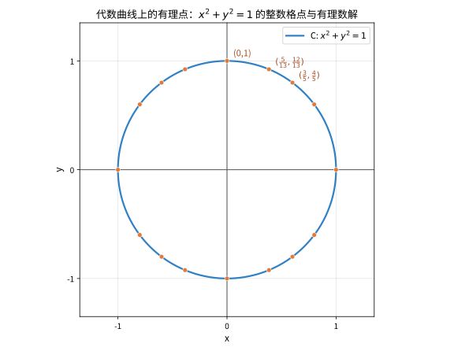

# 第77级 算术几何 (Arithmetic Geometry)

---

## 从"数出圆上的有理点"说起：算术几何要解决的根问题

> 在啃"椭圆曲线""Tate 模"之前，先想清楚一件事：**"解方程"这个老问题，为什么能变成一门几何？**

**第一步：直觉——同一类方程，曲线形状不同，"有理解"的多少天差地别**

想想一张最简单的工资单：方程 $x^2+y^2=1$（单位圆）在有理数上有多少解？答案是**无穷多个**：$(\frac35,\frac45)$、$(\frac5{13},\frac{12}{13})$、$(\frac{8}{17},\frac{15}{17})$……一张"有理数渔网"撒下去，圆周上密密麻麻都是格点。

可要是把方程换成 $x^3+y^3=1$，甚至高次 $x^4+y^4=1$、$x^n+y^n=1\ (n\ge3)$ 呢？情况急转直下——解变得极其稀少，甚至只有平淡的几个。**"方程有多少有理解"这件事，竟然和"它的曲线长什么样（怎么弯曲、有几个洞）"牢牢绑在一起。** 这，就是算术几何的第一声号角。

**第二步：要解决的问题——把"解丢番图方程"翻译成"研究代数曲线的算术结构"**

算术几何的核心动机来自数论最古老的冲动：**求解丢番图方程（多项式方程的整数/有理数解）。** 但它的高明之处在于换了一个视角：不再死磕"逐个数试解"，而是把它变成"研究方程零点所张成的代数簇"的**几何与算术结构**。

- **Mordell 猜想**（1922）：亏格 $\ge2$ 的曲线的有理点只有**有限多个**。Diophantus、Fermat 的零星结果，被拉成了一条关于"曲线的弯曲程度（亏格）怎么压制有理点密度"的普遍原理——最终由 Faltings 于 1983 年证明。
- **椭圆曲线与 Mordell-Weil 定理**：亏格 1 的曲线（椭圆曲线）的有理点构成一个**有限生成阿贝尔群** $E(\mathbb{Q})\cong\mathbb{Z}^r\oplus\text{tors}$，于是"有多少有理解"被精确化成了"秩 $r$ 是多少"，而秩 $r$ 又由 $L$-函数在 $s=1$ 处的行为决定（BSD 猜想）。
- **谷山–志村 → Fermat**：Wiles 证明"半稳定椭圆曲线都是模的"，顺着 Frey 曲线的桥，一举攻克 Fermat 大定理——数论最古老的谜题，竟然被"椭圆曲线与模形式一一对应"这种几何-解析对称所终结。

一句话：**算术几何做的，是把"解方程"这台古老的机器，翻译成"研究代数簇的几何、算术与对称"这门现代科学。**

**第三步：正式定义前的准备——本章怎样一步步推进**

本章按一条"从几何对象长出生算术"的路线前进：

1. 先定义**代数曲线与椭圆曲线**（Weierstrass 方程）并开销**群运算**（弦切法）；
2. 用**除子与 Picard 群**把"函数"翻译成"点配置"，用**高度函数**度量点的"大小"；
3. 用 **Tate 模**给椭圆曲线戴上"Galois 表示"的帽子（第 76 级的类群/分歧在此再现）；
4. 由点群结构推出 **Mordell-Weil 定理**、由有限域点计数推出 **Weil 猜想/Zeta 函数**；
5. 最后把 **Selmer / Tate-Shafarevich 群**、**谷山–志村模性**、**Faltings 定理**串联成整幅图景。

读完你会发现：几何的弯曲越厉害，算术的信息越紧——这正是算术几何迷人的对称。

> **🧠 一句话记住算术几何的"出生证"**
>
> 算术几何诞生于"把丢番图方程当成一座代数簇来研究"的洞见。它的根本问题是：
>
> $$ \boxed{\text{一条代数曲线/簇在有理数与数域上究竟有多少解？这些解如何构成群，又由哪些算术不变量（秩、类数、模性）决定？}} $$

## 开始之前

**本章在讲什么**：本章研究"方程的解集"与"解所属的算术世界"之间的关系。你会学到代数曲线、椭圆曲线（Weierstrass 方程与弦切法群运算）、除子与 Picard 群、高度函数、Tate 模与 Galois 表示，然后是三大核心定理——Mordell-Weil 定理（有理点有限生成）、Weil 猜想（有限域点计数）、谷山–志村模性定理，最后是 Faltings 定理与 Selmer/Sha 群等深层工具，以及它们通向 Fermat 大定理与 BSD 猜想的脉络。

**为什么要学它**：第 76 级（代数数论）给了我们类群、分歧与单位定理这把"局部–整体"的钥匙，第 48 级（代数几何）给了我们射影簇与除子的几何语言，第 75 级（解析数论）给了我们 $\zeta$/$L$-函数。本章把三者熔为一炉：一边用代数数论的类群/分歧去"读"曲线的有理点，一边用代数几何的丰富结构去"制"算术结论。它是第 78 级（丢番图逼近）、第 79 级（几何数论）的姊妹篇，也是通向第 141 级（朗兰兹纲领）、第 143 级（椭圆曲线与模形式）、第 148 级（算术几何前沿）的必修桥。

**开始前请确认你还记得**：

- 射影空间、代数簇、维数与亏格、光滑性（见第 48 级 代数几何）。
- 除子、线性等价、Picard 群与 Riemann–Roch 的初步（见第 48 级）。
- 代数整数环、理想类群、分歧理论、Dirichlet 单位定理、$p$-adic 数（见第 76 级）。
- $\zeta$ 函数与 $L$-函数的解析性质、模 $p$ 计数（见第 75 级 解析数论）。
- 有限生成阿贝尔群、自由 $\mathbb{Z}/p^n\mathbb{Z}$-模、Galois 上同调的一阶直觉（见第 20 级、第 76 级）。

## 学习目标

1. 理解代数曲线与椭圆曲线的基本理论及其算术性质
2. 掌握 Pickard 群、Mordell-Weil 定理及高度函数的核心思想
3. 了解 Weil 猜想、谷山-志村定理与 Fermat 大定理的证明框架
4. 熟悉 Faltings 定理（Mordell 猜想）及其在丢番图几何中的应用
5. 掌握 Tate 模、Weil-Châtelet 群、Selmer 群与 Tate-Shafarevich 群等深层工具

---

## 一、核心概念

### 1.1 代数曲线

🌐 **直觉先行**：要研究"一条曲线有多少有理点"，得先用精确的语言把"曲线"这个对象抓住。代数曲线的定义不是为抽象而抽象——**正是"一维、完备、非奇异"这三个词，把"有几个洞、顺不光滑"这些决定算术性质的特征固化了下来**：一维保证它是"曲线"而非曲面，完备保证闭环不"漏风"，非奇异保证不打结、不出现尖点/结点等算术上"说不清"的地方。

**定义 1.1（代数曲线）** 设 $k$ 是一个域。**代数曲线** 是指一个在 $k$ 上定义的、纯一维的、完备的、非奇异的代数簇。更具体地说，它是由一组多项式方程在 $k$ 上定义的射影簇，且其维数为 1。

> **💡 直观理解（类比）**：代数曲线就像"用绳子围出来的一条光滑曲线带"，它只有"一维"这一根轴（所以叫曲线），却可以弯弯曲曲绕成圈（如在球面上打个洞变成甜甜圈）。"完备、非奇异"相当于绳子首尾相接成闭环、且没有打结或断开的地方。

**例 1.1** 射影直线 $\mathbb{P}^1_k$ 是最简单的代数曲线。平面射影曲线
$$
C: F(x,y,z)=0 \subset \mathbb{P}^2_k
$$
其中 $F$ 是齐次多项式，当 $F$ 不可约且 $\partial F/\partial x,\partial F/\partial y,\partial F/\partial z$ 不同时为零时，$C$ 是一条非奇异代数曲线。

### 1.2 椭圆曲线

**定义 1.2（椭圆曲线）** 一条 **椭圆曲线** 是一个亏格为 1 的代数曲线 $E$，其上有一个指定的基点 $O \in E(k)$。等价地，椭圆曲线可以表示为平面 Weierstrass 方程：
$$
E: y^2 = x^3 + ax + b, \quad a,b \in k, \quad \Delta = -16(4a^3 + 27b^2) \neq 0.
$$
其射影形式为：
$$
Y^2 Z = X^3 + aX Z^2 + bZ^3.
$$
基点 $O = [0:1:0]$ 是无穷远点。

> **💡 直观理解（类比）**：椭圆曲线就像一只"没有门把手的甜甜圈"——亏格 1 意味着它只有那一个孔洞。写成 $y^2=x^3+ax+b$ 这种三次方程，是为了把这样一个"圆环面"用代数式子描述出来；而基点 $O$ 就像给这个甜甜圈规定了一个"原点标签"，好让后面的群运算有个基准点。

> **常见坑**：一条形如 $y^2=x^3+ax+b$（$a,b\in k$）的曲线是否为（光滑的）椭圆曲线，判据只有一条：判别式 $\Delta=-16(4a^3+27b^2)\neq0$，它等价于 $x^3+ax+b$ **无重根**（无尖点、无结点）。若 $\Delta=0$，曲线就退化出尖点或自交结点，不再是亏格 1 的椭圆曲线。另外别把"亏格 1"误读成"方程次数为 1"：这里的基点 $O=[0:1:0]$ 是**无穷远点**，正是它让射影形式 $Y^2Z=X^3+aXZ^2+bZ^3$ 在完备化后成为光滑紧致概形，群运算才处处可行。

**定义 1.3（群结构）** 椭圆曲线 $E$ 上的点构成一个 Abel 群，其群运算由弦切法定义：
- 加法：给定 $P,Q \in E$，作直线 $PQ$ 交 $E$ 于第三点 $R$，则 $P+Q$ 定义为 $R$ 关于 $x$ 轴的对称点。
- 单位元：$O$ 是单位元。
- 逆元：$P=(x,y)$ 的逆元是 $-P=(x,-y)$。

> **直观理解（现实类比）**：椭圆曲线上的点就像"棋盘上的棋手"，任意两位棋手连成的直线必然与第三位棋手相遇（曲线保证了这一点），而"相加"的结果就是把这第三位棋手沿 x 轴对称翻过去。于是全体棋手在这条规则下结成一个阿贝尔群：任何一个点都能通过两人相加反复生成，如同用两枚齿轮互相咬合并带动整条传动链。这就是为什么椭圆曲线的点能构成一个结构清晰的加法群。
>
> **🧠 思考历程：一条三次曲线上的点，凭什么可以像整数一样"相加"，并直接通向 Fermat 大定理？**
>
> 椭圆曲线在算术中的崇高地位，源自一个几乎像玩笑的发现：**曲线上的点竟然自带一套漂亮的加法法则**。可正是这条曲线，串起了 Mordell 猜想、Weil 猜想与 Fermat 大定理，成为算术几何的正中心。
>
> - **从椭圆积分到弦切法**（19 世纪以来）。"椭圆曲线"之名来自椭圆积分的反函数，而 19 世纪的代数几何家（如 Jacobi）早已发现其上点满足某种群律。当 Poincaré 在 20 世纪初把目光放在"有理点集 $E(\mathbb{Q})$"上时，一场算术探险就此展开——他猜测这些点构成的群是有限生成的。
> - **Mordell 与 Weil 的落地：有限生成群**（1920–1930 年代）。Louis Mordell 证明有理点群有限生成，André Weil 把它推广到更高维的阿贝尔簇。真正把这条路打通的关键工具正是"高度函数"：用 $\hat{h}([m]P)=m^2\hat{h}(P)$ 来衡量点的大小，证明生成元只有有限多个。
> - **Faltings 与谷山–志村：一颗重磅炸弹**（1983–1994 年）。Gerd Faltings 用高度与模理论证明 Mordell 猜想——高亏格曲线的有理点只有有限多个；紧接着，Andrew Wiles 借助"椭圆曲线与模形式一一对应"（谷山–志村）迈过最后一道坎，证明了 Fermat 大定理。椭圆曲线由此从几何玩具晋升为贯通数论、几何与模形式的枢纽。
> - **心路**：一个对象能"相加"、又能"度量大小"，它就有资格统领一整片算术天地。椭圆曲线的荣耀在于：**把最平凡的代数结构，喂养出最深刻的下界与对应**。

### 1.3 Pickard 群

🌐 **直觉先行**：曲线上"谁在几阶零点、谁在几阶极点"这类信息，用**除子**（给每个点贴一个整数权重）记下来最方便；而"两个除子能否被某个有理函数的零点/极点拉平"就是**线性等价**。把所有主除子商掉，得到的 **Picard 群**把"本质不同的点配置"提炼了出来——妙的是对椭圆曲线它还会回头变成 $E$ 本身（$E\cong\mathrm{Pic}^0(E)$）。先记住"配置记权重、等价看函数、商群探本质"这三步，1.3 节的主线就握住了。

**定义 1.4（除子）** 设 $C$ 是一条非奇异代数曲线。$C$ 上的一个 **除子** 是形式有限和
$$
D = \sum_{P \in C} n_P P, \quad n_P \in \mathbb{Z},
$$
其中只有有限个 $n_P \neq 0$。所有除子构成 Abel 群 $\operatorname{Div}(C)$。

> **💡 直观理解（类比）**：除子就像给曲线上的每个点"贴上一张整数标签"（取点意味 +1、消点意味 −1，可正可负可有零），相当于在一个邮包的收件清单上逐个登记权重。整张清单合起来就叫一个除子，所有可能清单摆成一摞就是抽象群 $\operatorname{Div}(C)$。

**定义 1.5（主除子）** 对有理函数 $f \in k(C)^\times$，定义其除子
$$
\operatorname{div}(f) = \sum_{P \in C} \operatorname{ord}_P(f) P.
$$
形如 $\operatorname{div}(f)$ 的除子称为 **主除子**，它们构成子群 $\operatorname{Prin}(C) \subset \operatorname{Div}(C)$。

> **💡 直观理解（类比）**：一个有理函数就像"一座地表上的山峰地图"，它在某些点抬升（零点）、某些点塌陷（极点），把海拔的变化记下来就是主除子。关键规律是"山峰和深坑的数值得恰好相抵、合计为零"，这让主除子变得非常"规整"。

**定义 1.6（Picard 群）** **Picard 群** 定义为除子群模主除子群的商群：
$$
\operatorname{Pic}(C) = \operatorname{Div}(C) / \operatorname{Prin}(C).
$$
**次数为 0 的 Picard 群** 记为 $\operatorname{Pic}^0(C)$。

> **💡 直观理解（类比）**：Picard 群就像一个"把沾水膨胀的账目归零"的商集：两份除子只要相差某个主除子（也就是"地的褶皱形状"可被山峰地图拉平还原），就被看成同一类。于是 Picard 群专挑那些"本质不同的点配置"来计数，就像把无数条长得一样的路都叠成同一条主干道。

对于椭圆曲线 $E$，有典范同构 $E \cong \operatorname{Pic}^0(E)$，将 $P$ 映射到除子类 $[P] - [O]$。

### 1.4 高度函数

**定义 1.7（高度函数）** 设 $E$ 是 $\mathbb{Q}$ 上的椭圆曲线，$P=(x,y) \in E(\mathbb{Q})$。将 $x$ 写为既约分数 $x = \frac{a}{b}$，其中 $\gcd(a,b)=1$。定义 **对数高度**：
$$
h(P) = \log \max\{|a|,|b|\}.
$$
**规范高度**（亦称 Néron-Tate 高度）定义为：
$$
\hat{h}(P) = \lim_{n \to \infty} \frac{h([n]P)}{n^2}.
$$
规范高度是二次型：$\hat{h}([m]P) = m^2 \hat{h}(P)$，且配对
$$
\langle P,Q \rangle = \hat{h}(P+Q) - \hat{h}(P) - \hat{h}(Q)
$$
是双线性形式。

![高度函数：椭圆曲线 E 上的有理点 P=(a/b, c/d)，对数高度 h(P)=log max{|a|,|b|} 度量点的"坐标复杂度"；规范高度 ĥ(P)=lim h([n]P)/n² 是二次型，满足 ĥ([m]P)=m²ĥ(P)](images/lv77-height-function.svg)

> **直观理解（现实类比）**：高度函数就像给椭圆曲线上的有理点"称体重"。一个有理点 $P = (a/b, c/d)$ 的坐标越"庞大"（分子分母越大），它的高度 $h(P) = \log\max\{|a|, |b|\}$ 就越高——就像一个人的"体重"越重。规范高度 $\hat{h}$ 则更精妙：它测量的是"反复加倍后的体重增长速度"。如果 $P$ 是挠点（有限阶），加倍若干次后回到原点，$\hat{h}(P) = 0$——相当于"零体重"。如果 $P$ 是无限阶点，$\hat{h}([m]P) = m^2 \hat{h}(P)$，体重按平方增长——正如雪球越滚越快。

> **🔑 为什么重要**：高度是算术几何的"体温计"——它把杂乱的有理点按"坐标复杂度"排了序。有了它才谈得上"有限生成"：Mordell-Weil 定理的核心正是利用 $\hat{h}([m]P)=m^2\hat{h}(P)$ 的平方增长，配合"高度有界则点有限"来执行无限下降，证明 $E(\mathbb{Q})=\mathbb{Z}^r\oplus E(\mathbb{Q})_{\text{tors}}$。规范高度还诱导一个正定双线性配对数 $\langle P,Q\rangle$，它既是计算秩 $r$ 的工具，也是 BSD 猜想陈述（正则高度矩阵的行列式）的代数支柱。

### 1.5 Tate 模

**定义 1.8（Tate 模）** 设 $E$ 是域 $k$ 上的椭圆曲线，$\ell \neq \operatorname{char}(k)$ 是素数。**$\ell$-进 Tate 模** 定义为
$$
T_\ell(E) = \varprojlim_n E[\ell^n],
$$
其中 $E[\ell^n]$ 是 $E$ 的 $\ell^n$ 阶挠点子群，逆向极限关于自然映射 $E[\ell^{n+1}] \to E[\ell^n]$ 取。$T_\ell(E)$ 是一个自由 $\mathbb{Z}_\ell$-模，秩为 2。

Tate 模是连接椭圆曲线与 Galois 表示的核心工具：Galois 群 $G_k = \operatorname{Gal}(\bar{k}/k)$ 自然地作用在 $T_\ell(E)$ 上，给出 $\ell$-进表示
$$
\rho_{E,\ell}: G_k \to \operatorname{GL}_2(\mathbb{Z}_\ell).
$$

> **💡 直观理解（类比）**：Tate 模就像"把一栋无限高的楼房逐层拍下来再拼成一份完整档案"——每一层是 $E[\ell^n]$（$n$ 阶挠点），上一层是下一层的放大版，通过逆向极限无缝叠在一起，最终得到一个 2 维的自由 $\mathbb{Z}_\ell$ 模。Galois 群对它的作用，就像一群"搬家公司"会怎样改变楼上每户家具的位置，整套存档让我们看清曲线如何被域对称性所"操控"。

> **🔑 为什么重要**：Tate 模是椭圆曲线与 Galois 表示之间的"导管"。第 76 级的 Galois 群代表"对称"，而 $T_\ell(E)$ 把这些对称作用线性化成一个 $2$ 维 $\ell$-进表示 $\rho_{E,\ell}:G_k\to\operatorname{GL}_2(\mathbb{Z}_\ell)$。Frobenius 元素在 $T_\ell$ 上的作用（迹、行列式）恰好编码了有限域点计数 $N_m$——椭圆曲线的 Weil 猜想、谷山–志村模性，乃至 Fermat 大定理的证明，都要靠 $\rho_{E,\ell}$ 这座桥来"读出"曲线的算术信息。

### 1.6 Weil-Châtelet 群、Selmer 群与 Tate-Shafarevich 群

**定义 1.9（Weil-Châtelet 群）** 设 $E/k$ 是椭圆曲线。$E$ 的 **Weil-Châtelet 群** 是 $E$ 在 $k$ 上的主齐性空间（torsor）的同构类构成的群，记为 $WC(E/k)$ 或 $H^1(G_k, E)$。

> **💡 直观理解（类比）**：Weil-Châtelet 群就像"同一份钥匙模板的不同摆放位置"：主齐性空间是曲线上的一组副本，彼此之间"看着像，但原点上对不齐"。它衡量的是"有没有一个合理选点能让这些副本真正重合"——选不中的那些就是真正的障碍，难怪它常被称作"奇点上的洞"。

**定义 1.10（Selmer 群与 Tate-Shafarevich 群）** 考虑局部化映射的合序列：
$$
0 \to E(k)/mE(k) \to \operatorname{Sel}^{(m)}(E/k) \to \Sha(E/k)[m] \to 0,
$$
其中 $\operatorname{Sel}^{(m)}(E/k)$ 是 **$m$-Selmer 群**，$\Sha(E/k)$ 是 **Tate-Shafarevich 群**。$\Sha(E/k)$ 度量了 Hasse 原理的偏差：它衡量了在局部处处有解但全局无解的障碍。

> **💡 直观理解（类比）**：Tate-Shafarevich 群就像"每个房间都有一把能开的锁，可整栋楼却拼不成一件家具"——局部处处有解、全局却无解。Selmer 群先把这些"局部都能过门"的候选收集起来，再扣掉那些真能跨国连成整体的，剩下的"伪全局解"就被 $\Sha$ 记录成障碍大小，正如同时挂在每扇门、却绕不进同一个房间的那串钥匙。

---

## 二、定理与证明

### 2.1 Mordell-Weil 定理

**定理 2.1（Mordell-Weil 定理）** 设 $E$ 是数域 $K$ 上的椭圆曲线。则 $E(K)$ 是有限生成的 Abel 群：
$$
E(K) \cong \mathbb{Z}^r \oplus E(K)_{\text{tors}},
$$
其中 $r = \operatorname{rank}(E/K)$ 是秩，$E(K)_{\text{tors}}$ 是有限挠子群。

> **💡 直观理解（类比）**：Mordell-Weil 定理就像"证明一间仓库里的货物全部可以归类到几排标准货架"——有限生成意味着 $E(K)$ 这个庞大的有理点集合，其实由有限个"种子点"反复相加就能全部够得着，形如 $\mathbb{Z}^r$ 加一点有限的小循环。秩 $r$ 就相当于货架的排数，挠子群则是那些"转几圈又绕回原点"的固定货物。

**证明策略**：证明分为三个主要步骤。

**步骤 1：弱 Mordell-Weil 定理**

首先证明 $E(K)/mE(K)$ 是有限群（对某个 $m \ge 2$）。这需要 Kummer 理论与 Galois 上同调。

考虑正合列：
$$
0 \to E[m] \to E \xrightarrow{[m]} E \to 0.
$$
取 Galois 上同调得到长正合列：
$$
0 \to E(K)[m] \to E(K) \xrightarrow{[m]} E(K) \to H^1(G_K, E[m]) \to H^1(G_K, E)[m] \to 0.
$$
由此得到 Kummer 映射：
$$
\kappa: E(K)/mE(K) \hookrightarrow H^1(G_K, E[m]).
$$
利用有限性论证（结合代数数论中类数有限与 Dirichlet 单位定理），可以证明 $\kappa$ 的像落在某个有限子群中，从而 $E(K)/mE(K)$ 有限。

**步骤 2：高度函数与无限下降法**

定义规范高度 $\hat{h}: E(K) \to \mathbb{R}_{\ge 0}$，满足：
1. $\hat{h}(P) \ge 0$，且 $\hat{h}(P)=0$ 当且仅当 $P$ 是挠点。
2. 对任意 $M > 0$，集合 $\{P \in E(K): \hat{h}(P) \le M\}$ 是有限的。
3. $\hat{h}([m]P) = m^2\hat{h}(P)$。
4. 配对 $\langle P,Q \rangle = \hat{h}(P+Q) - \hat{h}(P) - \hat{h}(Q)$ 是双线性形式。

**引理 2.1（无限下降引理）** 设 $A$ 是 Abel 群，$h: A \to \mathbb{R}_{\ge 0}$ 是满足上述性质的函数，$m \ge 2$ 是整数。若 $A/mA$ 有限，则 $A$ 有限生成。

> **💡 直观理解（类比）**：无限下降法就像"一头不断减重的骆驼"：只要每次操作都把某个"高度"严格压低，且高度不能低于 0，这个过程就必须停下。因为商群 $A/mA$ 只有有限个剩余类，反复"除以 $m$"抓出一个余数再往深处走，阶梯一层层变小，最终所有元素都被一堆源头点覆盖。

**证明**：选择 $A/mA$ 的代表元 $Q_1,\dots,Q_s$。设 $P \in A$ 任意。存在 $i_1$ 使得 $P \equiv Q_{i_1} \pmod{mA}$，即 $P = mP_1 + Q_{i_1}$。同理 $P_1 = mP_2 + Q_{i_2}$，如此继续。对 $n$ 步有：
$$
P = m^n P_n + \sum_{k=1}^n m^{k-1} Q_{i_k}.
$$
由高度性质：
$$
h(P_n) = \frac{1}{m^{2n}} h(m^n P_n) = \frac{1}{m^{2n}} \left( h(P - \sum_{k=1}^n m^{k-1} Q_{i_k}) \right).
$$
当 $n$ 充分大时，$h(P_n)$ 被控制在某个界内，从而 $P_n$ 只能取有限个值。于是 $P$ 由 $Q_i$ 和这些有限个元素生成。

**步骤 3：钉住秩**

由步骤 1 和 2，$E(K)$ 有限生成。其秩 $r$ 定义为自由部分的秩。挠子群 $E(K)_{\text{tors}}$ 由复乘理论或模形式理论可具体计算。$\square$

### 2.2 椭圆曲线的 Weil 猜想

**定理 2.2（椭圆曲线的 Weil 猜想）** 设 $E$ 是有限域 $\mathbb{F}_q$ 上的椭圆曲线，其中 $q = p^a$。设 $N_m$ 为 $E$ 在 $\mathbb{F}_{q^m}$ 上的有理点个数（包括无穷远点）。则存在代数整数 $\alpha \in \mathbb{C}$，使得 $|\alpha| = \sqrt{q}$，且
$$
N_m = 1 + q^m - (\alpha^m + \bar{\alpha}^m).
$$
等价地，**Zeta 函数** 为：
$$
Z(E/\mathbb{F}_q, T) = \exp\left(\sum_{m=1}^\infty N_m \frac{T^m}{m}\right) = \frac{1 - aT + qT^2}{(1-T)(1-qT)},
$$
其中 $a = 1+q - N_1 = \alpha + \bar{\alpha}$，且 $|\alpha| = \sqrt{q}$。

> **💡 直观理解（类比）**：Weil 猜想就像"给点数的多少画出一条精确的节拍曲线"：$N_m = 1+q^m-(\alpha^m+\bar\alpha^m)$ 中，$1+q^m$ 是"大背景的匀速心跳"（直线/平面的天然格点），$\alpha^m+\bar\alpha^m$ 则是绕它上下摆动的"波动"，而 $|\alpha|=\sqrt{q}$ 保证这颗波不会失控乱飞。于是每个有限域上的点计数都被估值算出整齐的上限，像给风筝系上了长度恰好 $\sqrt{q}$ 的线。

**证明**：证明基于 Riemann-Roch 定理与 Frobenius 态射。

**引理 2.2（Frobenius 态射）** 定义 $\mathbb{F}_q$-Frobenius 态射 $\operatorname{Frob}_q: E \to E$，在齐次坐标下为 $(x:y:z) \mapsto (x^q:y^q:z^q)$。则 $E(\mathbb{F}_{q^m})$ 正是 $\operatorname{Frob}_q^m$ 的不动点集。

> **💡 直观理解（类比）**：Frobenius 态射就像"把整张地图的每个坐标都乘方放大一遍"（$x\mapsto x^q$），而"倍乘到第 $m$ 次后和原来一样"的点，恰似那些经 $m$ 度"翻炒"仍原地不动的纹身点。于是 $E(\mathbb{F}_{q^m})$ 就等同于这条曲线上在 Frobenius 反复煎烤下的全部"定住不动"的烙点，这个简单刻画把点计数变成了找不动点。

**证明**：$E/\mathbb{F}_{q^m}$ 上的有理点满足 $(x^{q^m}:y^{q^m}:z^{q^m}) = (x:y:z)$，这正是 $(\operatorname{Frob}_q^m - \operatorname{id})$ 的核。$\square$

**引理 2.3** 设 $\operatorname{Frob}_q$ 在 $T_\ell(E)$ 上的作用为 $F$，其中 $\ell \neq p$。则 $\det(F) = q$，$\operatorname{Tr}(F) = a$。

> **💡 直观理解（类比）**：这条引理把"点个数的振荡"翻译成"矩阵的指纹"：Frobenius 在 Tate 模上的 2 阶线性变换 $F$，其行列式为 $q$、迹为 $a$，二者恰好拼出特征多项式 $T^2-aT+q$。就像一段录音的音量起伏看"平均响度"、整体能量看"总面积"一样，$F$ 的一痕一迹就捕捉了整条曲线在每个层上的全部节奏。

**证明**：考虑 $\ell$-进 Tate 模 $T_\ell(E) \cong \mathbb{Z}_\ell^2$。Frobenius 态射的诱导映射 $F$ 是 $T_\ell(E)$ 上的 $\mathbb{Z}_\ell$-线性变换。其特征多项式为
$$
P(T) = \det(F - T \cdot \operatorname{id}) = T^2 - (\operatorname{Tr} F) T + \det F.
$$
由 Lefschetz 不动点定理在 $\ell$-进上同调中的类比，有：
$$
N_m = 1 - \operatorname{Tr}(F^m) + q^m.
$$
记 $\alpha,\bar{\alpha}$ 为 $F$ 的特征值，则 $\alpha\bar{\alpha} = \det F = q$，且 $a = \operatorname{Tr} F = \alpha + \bar{\alpha}$。于是
$$
N_m = 1 - (\alpha^m + \bar{\alpha}^m) + q^m.
$$
还需证明 $|\alpha| = \sqrt{q}$。这由 **Riemann 假设**（Weil 猜想中 Riemann 类比的部分）给出。对椭圆曲线，可用以下论证：

考虑对偶化：$F$ 与其对偶 $\hat{F}$ 满足 $F \circ \hat{F} = q$。若 $\alpha$ 是 $F$ 的特征值，则 $q/\alpha$ 是 $\hat{F}$ 的特征值。但 $\hat{F}$ 与 $F$ 有相同的特征多项式，故 $q/\alpha = \bar{\alpha}$，从而 $|\alpha| = \sqrt{q}$。$\square$

**Zeta 函数的计算**：
$$
\begin{aligned}
Z(E/\mathbb{F}_q, T) &= \exp\left(\sum_{m=1}^\infty (1 - \alpha^m - \bar{\alpha}^m + q^m) \frac{T^m}{m}\right) \\
&= \frac{\exp(-\log(1-\alpha T) - \log(1-\bar{\alpha}T))}{\exp(-\log(1-T) - \log(1-qT))} \\
&= \frac{(1-\alpha T)(1-\bar{\alpha}T)}{(1-T)(1-qT)} \\
&= \frac{1 - aT + qT^2}{(1-T)(1-qT)}.
\end{aligned}
$$
这就完成了椭圆曲线的 Weil 猜想的证明。$\square$

### 2.3 谷山-志村定理

**定理 2.3（谷山-志村定理，Wiles-Breuil-Conrad-Diamond-Taylor）** 设 $E$ 是 $\mathbb{Q}$ 上的椭圆曲线，具有导子 $N$。则存在一个权为 2、水平为 $N$ 的 **尖点形式**（cusp form）$f \in S_2(\Gamma_0(N))$，使得 $E$ 的 Hasse-Weil $L$-函数等于 $f$ 的 Mellin 变换：
$$
L(E, s) = L(f, s).
$$
换言之，$E$ 是 **模的**（modular）。

> **💡 直观理解（类比）**：谷山-志村定理就像"把两本内容不同的账本核对为同一种谱系"：一边是椭圆曲线上数点的 $L$-函数，另一边是模形式 $f$ 的 Mellin 变换 $L(f,s)$。定理声称这两道谱线完全重合，正如两组看似无关的乐器合奏，却能奏出同一首旋律——这正是后来砸开 Fermat 大定理的那把关键钥匙。

> **🧠 补缺：从"约化类型"到"导子"，谷山–志村里那个神秘的 $N$ 到底是什么？**
>
> 定理中反复出现的**导子 $N$**（水平），是椭圆曲线"在每个素数处坏得有多精（还是多糟）"的总指标，它由逐处的**约化类型**决定。直觉上：把一个系数整数化的椭圆曲线 $y^2=x^3+ax+b$ 拿到模 $p$ 下看，通常仍是一条光滑曲线，称为**好约化**（good reduction，$p\nmid\Delta$）；少数素数让曲线退化出结点（$\Delta\equiv0\bmod p$ 但仍有"两条干净分支"）则按"乘法型"分裂粗细分为**分裂乘法型/非分裂乘法型**（split/non-split multiplicative）；若退化到根本无法正常定义群（出现尖点型）则为**加法型**（additive）约化。导子 $N$ 把这些分量的指数算进一个 $\prod_p p^{\,f_p}$，好约化处 $f_p=0$。例如 $E:y^2=x^3+1$ 的判别式 $\Delta=-432=-2^4\cdot3^3$，故 $p=2,3$ 处坏约化、其余 $p$ 好约化，导子 $N=2^a3^b$（$a,b>0$）。同一 $L$-函数能同时来自椭圆曲线与（权 $2$、水平 $N$ 的）模形式，正是因为两者共享同一份约化信息。

**证明思路**（关键步骤概述）：

**步骤 1：变形环与通用变形**

设 $E$ 是 $\mathbb{Q}$ 上的椭圆曲线，$p$ 是奇素数。考虑 $E$ 的 $p$-进 Galois 表示：
$$
\bar{\rho}_{E,p}: G_\mathbb{Q} \to \operatorname{GL}_2(\mathbb{F}_p).
$$
Wiles 的思想是研究 $\bar{\rho}_{E,p}$ 的所有 **提升**（lifting）到 $\mathbb{Z}_p$ 上的变形环 $R$。当 $\bar{\rho}_{E,p}$ 是绝对不可约的且模 $p$ 表示是奇性的（即在复共轭下行列式为 $-1$）时，Mazur 证明了变形环 $R$ 的存在性。

**步骤 2：Hecke 代数与模性**

考虑 Hecke 代数 $\mathbb{T}$，它是作用在尖点形式空间 $S_2(\Gamma_0(N))$ 上的 Hecke 算子生成的 $\mathbb{Z}_p$-代数。由 Eichler-Shimura 理论，存在一个与 $\mathbb{T}$ 相关的 Galois 表示 $\rho_\mathbb{T}$。

**步骤 3：R = T 定理**

核心是证明 **变形环 $R$ 与 Hecke 代数 $\mathbb{T}$ 同构**：$R \cong \mathbb{T}$。这通过以下手段实现：
- 计算 $R$ 的完备交性质（complete intersection）。
- 建立 $R$ 与 $\mathbb{T}$ 之间的映射 $R \to \mathbb{T}$，并证明它是同构。
- 使用 **Kolyvagin 的 Euler 系统** 与 **Flach 的 Euler 系统** 来获得上界估计。

**步骤 4：模性提升**

一旦 $R \cong \mathbb{T}$，则 $\bar{\rho}_{E,p}$ 的通用变形由 $\mathbb{T}$ 参数化。特别地，$E$ 的 $p$-进 Galois 表示对应于一个 Hecke 特征形式，从而 $E$ 是模的。

**完整证明**（由 Wiles 于 1995 年完成，后由 Breuil-Conrad-Diamond-Taylor 修补）建立了所有 $\mathbb{Q}$ 上的半稳定椭圆曲线的模性，进而推出 Fermat 大定理。2001 年，Breuil-Conrad-Diamond-Taylor 完全证明了所有 $\mathbb{Q}$ 上的椭圆曲线都是模的。$\square$

### 2.4 Faltings 定理（Mordell 猜想）

**定理 2.4（Faltings 定理，原 Mordell 猜想）** 设 $C$ 是数域 $K$ 上定义的一条亏格 $g \ge 2$ 的非奇异代数曲线。则 $C(K)$ 是有限集。

> **💡 直观理解（类比）**：Faltings 定理就像"承认高分差的地图上只有零星几个界标"：亏格 $\ge 2$ 的曲线（有不止一个孔洞的曲面）过于"弯曲"，导致带有理坐标的点再也无法铺得很密，只剩极少数几颗稀疏的亮点。它和椭圆曲线（亏格 1，点群像群山连绵）以及有理直线（亏格 0，点布满世界）形成鲜明对照。

**证明思路**（Faltings 1983 年的证明框架）：

**步骤 1：转化为 Abel 簇**

设 $J(C)$ 是 $C$ 的 Jacobi 簇，这是一个 $g$ 维 Abel 簇。嵌入 $C \hookrightarrow J(C)$（通过固定基点）。Mordell-Weil 定理给出 $J(C)(K)$ 是有限生成 Abel 群。

**策略**：证明 $C(K)$ 在 $J(C)(K)$ 中的像被高度函数界定在某个有限范围内。

**步骤 2：高度函数的下降**

Faltings 引入了 **Faltings 高度**（模高）的概念。对 Abel 簇 $A/K$，定义其 Faltings 高度 $h_F(A)$，它度量了 $A$ 的模空间上的高度。Faltings 证明了：
- 在给定维数与极化类型的 Abel 簇中，Faltings 高度有下界。
- 若 $A/K$ 是 $J(C)$ 的 Abel 子簇，则 $h_F(A)$ 与 $C(K)$ 中点的 Néron-Tate 高度相关。

**步骤 3：Tate 猜想的证明**

Faltings 同时证明了 **Tate 猜想** 对 Abel 簇的整除性版本：对素数 $\ell$，自然映射
$$
\operatorname{End}_K(A) \otimes_\mathbb{Z} \mathbb{Q}_\ell \to \operatorname{End}_{G_K}(T_\ell(A)) \otimes_{\mathbb{Z}_\ell} \mathbb{Q}_\ell
$$
是同构。这给出了 Abel 簇的等源分类（isogeny classification）。

**步骤 4：有限性论证**

利用 Tate 猜想与半单性，Faltings 证明了：
- 给定 $K$ 上固定维数 $g$ 与极化类型的 Abel 簇，在 $K$ 上等源的 Abel 簇只有有限多个。
- 由于 $C(K)$ 中的每个点 $P$ 对应 $J(C)$ 的一个除子类，且 $C(K)$ 中的点对应的 Abel 子簇的 Faltings 高度被一致下界所控制，从而 $C(K)$ 有限。

**注** 1990 年，Faltings 因这一工作获得 Fields 奖章。$\square$

---

## 三、示例

### 3.1 椭圆曲线 $y^2 = x^3 + 1$ 的有理点

考虑椭圆曲线
$$
E: y^2 = x^3 + 1.
$$
判别式 $\Delta = -16 \cdot 27 = -432 \neq 0$，故 $E$ 非奇异。

**有理点群的结构**：可以证明 $E(\mathbb{Q})$ 的挠子群为
$$
E(\mathbb{Q})_{\text{tors}} \cong \mathbb{Z}/6\mathbb{Z},
$$
由点 $P = (0,1)$ 生成。$6P = O$，且：
- $P = (0,1)$
- $2P = (-1,0)$
- $3P = (0,-1)$
- $4P = (-1,0)$（与 $2P$ 相同，但在群中为逆元关系）
- $5P = (0,-1)$
- $6P = O$

**秩的计算**：通过分析 $L$-函数在 $s=1$ 处的行为（或使用 2-下降法），可以证明：
$$
\operatorname{rank}(E/\mathbb{Q}) = 0.
$$
因此
$$
E(\mathbb{Q}) \cong \mathbb{Z}/6\mathbb{Z}
$$
是纯挠群。

> **直观理解（现实类比）**：把坐标系想象成一张方格纸，格线交点就是整数坐标。曲线 $x^2+y^2=1$ 上的"有理点"就像方格纸坐标轴上恰好落在格子上的点——它们对应方程的有理解。单位圆上这样的点有无数多个（如 $(\frac{3}{5},\frac{4}{5})$），仿佛在圆周上撒下了一张密不透风的"有理数渔网"。而一条亏格 $\ge 2$ 的复杂曲线（如 Fermat 曲线 $x^n+y^n=1,\ n\ge 3$）上，这样的格点往往只有很少几个，这正是 Faltings 定理（Mordell 猜想）陈述的内容。

**其他有理点**：除上述 6 个挠点外，没有其他有理点。这可以通过计算 $L(E,1)$ 的值并用 Birch-Swinnerton-Dyer 猜想（已知成立的例子）来验证。

### 3.2 Fermat 曲线与椭圆曲线的关系

Fermat 曲线
$$
F_n: x^n + y^n = 1
$$
定义了一条亏格为 $g = \frac{(n-1)(n-2)}{2}$ 的代数曲线。

**Fermat 大定理**：当 $n \ge 3$ 时，$F_n$ 没有非平凡的有理点（即 $x,y \in \mathbb{Q}$ 且 $xyz \neq 0$）。

**与椭圆曲线的联系**（Wiles 的证明思路）：

1. **反证法假设**：假设存在 $a,b,c \in \mathbb{Z}_{>0}$ 使得 $a^n + b^n = c^n$，其中 $n \ge 3$。

2. **构造 Frey 曲线**：设 $A = a^n$，$B = b^n$，$C = c^n$。Frey 构造了椭圆曲线：
   $$
   E_{a,b,c}: y^2 = x(x - A)(x + B).
   $$
   这条曲线的判别式 $\Delta = (ABC)^2$ 具有特殊的算术性质。

3. **Serre 的模性猜想**：Frey 曲线 $E_{a,b,c}$ 的模 $p$ Galois 表示在 $p$ 处具有高度分歧，Serre 的 $\varepsilon$-猜想断言这样的表示不可能来自模形式。

4. **矛盾**：由谷山-志村定理（Wiles 证明），$E_{a,b,c}$ 必须是模的，但 Serre 的 $\varepsilon$-猜想表明它不能是模的，矛盾。因此不存在这样的解。

**具体联系**：$n=3$ 时，Fermat 曲线
$$
x^3 + y^3 = 1
$$
是一条亏格为 1 的曲线（椭圆曲线）。通过变换 $X = \frac{12}{x+y}$，$Y = \frac{36(x-y)}{x+y}$，可化为 Weierstrass 形式：
$$
Y^2 = X^3 - 432.
$$
这条椭圆曲线的有理点群为 $\mathbb{Z}/3\mathbb{Z}$，对应的非平凡 Fermat 解只有 $1^3+0^3=1$ 和 $0^3+1^3=1$，与 Fermat 大定理一致。

---

## 四、习题

### 基础题

**习题 1**（Weierstrass 方程）写出三次曲线（含无穷远点）的一般 Weierstrass 方程与长 Weierstrass 方程，并说明判别式 $\Delta \neq 0$ 的几何意义。

**习题 2**（椭圆曲线定义）设 $E: y^2 = x^3 + ax + b$，$a,b \in \mathbb{Q}$。定义判别式 $\Delta = -16(4a^3 + 27b^2)$，说明为什么要求 $\Delta \neq 0$ 且 $x$ 为何不能包含 $x^2$ 项、$y$ 不能包含 $y^2$ 项以上的项。

**习题 3**（点在曲线上）设 $E: y^2 = x^3 - 25x$。验证 $P = (-4,6)$、$R = (-5,0)$、$S = (0,0)$ 均在 $E$ 上，并说明无穷远点 $\mathcal{O}$ 属于 $E$。

**习题 4**（挠点）设 $E: y^2 = x^3 - 25x$。求 $E(\mathbb{Q})$ 中所有 2-挠点（提示：$y = 0$，即 $x(x^2 - 25) = 0$）。

**习题 5**（高度函数）给出 $\mathbb{Q}$ 上有理数高度 $h(a/b) = \log \max(|a|, |b|)$ 与椭圆曲线点高度 $h(P)$ 的定义，并说明高度的直观含义。

**习题 6**（Picard 群）定义曲线上除子 $D = \sum n_P P$ 的**次数**与线性等价，说明 $\deg$ 诱导的映射 $\deg: \operatorname{Pic}(E) \to \mathbb{Z}$ 的核 $\operatorname{Pic}^0(E)$ 与 $E(K)$ 的关系。

**习题 7**（Tate 模）写出 $l$-进 Tate 模 $T_l(E)$ 的定义 $T_l(E) = \varprojlim E[l^n] \cong \mathbb{Z}_l^2$，说明其上的 Galois 作用来源，并计算其秩。

**习题 8**（有限域点）对椭圆曲线 $E/\mathbb{F}_5$，说明为何 $E(\mathbb{F}_5)$ 中的点要么是 $(x,y)$ 有无穷远，要么在曲线上有明确坐标；并陈述 Hasse 界 $|N_1 - (q+1)| \le 2\sqrt q$。

**习题 9**（Mordell-Weil 定理）陈述 Mordell-Weil 定理：数域 $K$ 上椭圆曲线 $E$ 的有理点群 $E(K)$ 是有限生成 Abel 群，即 $E(K) \cong \mathbb{Z}^r \oplus T$。说明 $r$ 与 $T$ 分别称为什么。

**习题 10**（Faltings 定理）陈述 Faltings 定理（Mordell 猜想）：亏格 $\ge 2$ 的数域上光滑投影曲线只有有限多个有理点。举出 Fermat 曲线 $x^d + y^d = 1$（$d \ge 4$）的例子。

### 进阶题

**习题 11**（点加法公式）设 $E: y^2 = x^3 + ax + b$。推导弦切法公式：对 $P = (x_1,y_1)$，$Q = (x_2,y_2)$，斜率 $\lambda$ 满足 $x_3 = \lambda^2 - x_1 - x_2$，$y_3 = \lambda(x_1 - x_3) - y_1$。计算 $E: y^2 = x^3 - 25x$ 上 $P=(-4,6)$ 与 $Q=(0,0)$ 的和。

**习题 12**（正则高度）设 $E/K$ 是椭圆曲线，$\hat{h}: E(\bar K) \to \mathbb{R}$ 是 Neron-Tate 高度。证明 $\hat{h}$ 满足：(i) $\hat{h}([m]P) = m^2 \hat{h}(P)$；(ii) $\hat{h}$ 诱导 $E(K) \otimes \mathbb{Z}$ 上的正定二次型（即 $\hat{h}(P)=0$ 当且仅当 $P$ 是挠点）。

**习题 13**（弱 Mordell-Weil）利用 Kummer 型正合列与 $\mathbb{Q}(E[2])$ 的次数上界，说明弱 Mordell-Weil 定理：$E(K)/2E(K)$ 有限，从而推出 $E(K)$ 的秩 $r$ 有限。

**习题 14**（Hasse 界与 Zeta）设 $E/\mathbb{F}_5$ 的迹 $a = 1 + 5 - N_1 = -2$。写出 Zeta 函数 $Z(E/\mathbb{F}_5, T) = \frac{1 - aT + 5T^2}{(1-T)(1-5T)}$，并求 $E(\mathbb{F}_{25})$ 中的点数 $N_2 = 25 + 1 - a_2$（其中 $a_2 = a^2 - 2q$）。

**习题 15**（Weil 猜想）陈述有限域上椭圆曲线满足 Weil 猜想的四部分：(i) 有理（rationality）；(ii) 泛函方程；(iii) Riemann 假设 $|\alpha_i| = q^{1/2}$；(iv) Betti 数。说明 Riemann 假设部分等价于 $E(\mathbb{F}_{q^n}) = q^n + 1 - (\alpha^n + \bar\alpha^n)$。

**习题 16**（除子与线性等价）设 $D, D'$ 是曲线 $E$ 上的次数相同除子，证明 $D \sim D'$（线性等价）当且仅当对某个有理函数 $f$ 有 $D - D' = \operatorname{div}(f)$，并由此说明 $\operatorname{Pic}^0(E) \cong E(K)$（非规范）。

**习题 17**（同源与 Galois 表示）设 $\phi: E_1 \to E_2$ 是次数 $m$ 的同源。说明其诱导的 Tate 模映 $T_l(\phi): T_l(E_1) \to T_l(E_2)$ 与 Galois 表示 $\rho_{E,l} = T_l(E) \otimes_{\mathbb{Z}_l}\mathbb{Q}_l$ 的关系，并说明 Frobenius 特征值为何满足 $\alpha \bar\alpha = q$。

**习题 18**（Tate 模与不可约表示）设 $E/\mathbb{Q}$ 有无复数乘法。说明为什么 $V_l(E) = T_l(E) \otimes \mathbb{Q}_l$ 作为 $G_{\mathbb{Q}}$ 表示是绝对不可约的，并与模形式 Galois 表示（Deligne）对应。

**习题 19**（Frobenius 与特征多项式）设 $E/\mathbb{F}_q$，Frobenius 自同态 $\pi$ 在 $T_l(E)$ 上的特征多项式为 $X^2 - aX + q$。证明 $\pi \bar\pi = q$（$\bar\pi$ 为复共轭自同态），从而 $|a| \le 2\sqrt q$（Hasse 界）。

### 挑战题

**习题 20**（Mordell-Weil 证明思路）概述 Mordell-Weil 定理的证明框架：(i) 用弱 Mordell-Weil 求 $E(K)/mE(K)$ 有限；(ii) 用正则高度下降定理 $\hat{h}$ 去展平面把代表元限制到有限高度集合；(iii) 归纳得有限生成。并说明为什么需要"高度下降"这一技巧。

**习题 21**（谷山-志村与 Fermat）说明谷山-志村（半稳定）定理如何结合 Ribet 的 $\epsilon$-猜想得出：存在模形式 $f$ 具有权2与第一级 $N$，其 Galois 表示 $\rho_{f,l} \cong \rho_{E,l}$ 是模（modular），从而——结合 Frey 曲线 $y^2 = x(x-a^p)(x+b^p)$ 的构造——给出 Wiles 对 Fermat 大定理的证明思路。

**习题 22**（正则高度配对）定义正则高度配对数 $\langle P, Q \rangle = \frac12(\hat h(P+Q) - \hat h(P) - \hat h(Q))$。证明它在 $E(K) \otimes \mathbb{R}$ 上是非退化双线性型，由此说明如何用一组生成元的 Gram 矩阵的秩来判定 $E(K)$ 的秩。

**习题 23**（Selmer 群与上同调）用 Kummer 正合列 $0 \to E(K)[m] \to E(\bar K) \xrightarrow{[m]} E(\bar K) \to 0$ 的 Galois 上同调长正合列，定义弱 Mordell-Weil 群 $E(K)/mE(K) \hookrightarrow H^1(G_K, E[m])$，并说明 Selmer 群与 Tate-Shafarevich 群 $\text{III}$ 如何通过正合列 $0 \to E(K)/mE(K) \to \text{Sel}^{(m)}(E/K) \to \text{III}[m] \to 0$ 联系起来。

**习题 24**（Tate-Shafarevich 群）解释为什么 $\text{III}(E/K)$ 的有限性（BSD 猜想之一）对确定 $E(K)$ 的秩与"局部信息控制全局"至关重要；说明 $E(K)$ 到局部 $E(K_v)$ 的嵌入映射中，$\text{III}$ 度量的是哪些局部点不能配成全局点。

**习题 25**（Faltings 定理工具）概述 Faltings 证明 Mordell 猜想使用的基本工具：Abel-Jacobi 映射、Faltings 高度、可换 Abel 簇、模空间紧化与半稳定约化（Semi-stable reduction）、Tannakian 技巧。说明为什么高亏格（$g \ge 2$）其 Jacobian 的"正高度"为有理点个数给出上界。

**习题 26**（模形式与算术）设 $f$ 是权 2 的第一级本原模形式，具有有理 Fourier 系数。说明 Deligne 构造的 Galois 表示 $\rho_f$ 满足 Serre 猜想和纯性（pure），且当 $\rho_f$ 来自椭圆曲线时，其 $l$-进表示与曲线 Tate 模给出同样特征值，从而由 Shimura-Taniyama 得到算术信息。

### 探究题

**习题 27**（BSD 猜想）陈述 Birch-Swinnerton-Dyer 猜想：$L(E,s)$ 在 $s=1$ 处零点的阶等于 $\operatorname{rank} E(K)$，且第一系数显式给出 $\text{III}(E/K)$ 的阶、Tamagawa 数与正则高度阵行列式之比。讨论该猜想对理解椭圆曲线算术的意义及已知进展（同余数、BSD用模性方法部分解决秩=0/1的情形）。

**习题 28**（算术与几何的交汇）探讨从 Mordell 猜想（算术）到 Arakelov 理论（算术-几何混合结构）的思想演进：如何把算术曲面上的高度、交积与复几何的紧化联系，解释为什么 $g \ge 2$ 的"正高度"为有限理性点提供了几何根源，并联系 Lang 猜想与 Bombieri-Lang。

**习题 29**（椭圆曲线密码学）从算术几何的角度讨论椭圆曲线密码体制（ECC）：为何选择有限域上的大素数阶循环群，如何用指数/对数困难性与点计数的 Hasse-Weil 界确定群阶，并说明批量子化安全问题对曲线族选择的挑战。

**习题 30**（与 Langlands 纲领）开放讨论：如何将椭圆曲线的 $l$-进表示 $\rho_E$ 嵌入 Langlands 纲领——modularity（谷山-志村）作为权重 2 模形式情形；BT 定理、Artin 猜想、Bhargava-Shankar 的秩统计测量如何深化我们对 $E(\mathbb{Q})$ 的理解，以及该框架对其他算术对象（概形、Abel 簇）的推广。

---

## 五、习题答案与解析

### 基础题答案

1. **Weierstrass 方程** 一般形式为 $y^2 = x^3 + ax + b$（其中 $x^3$ 项系数可归为 $1$），长形式为 $y^2 + a_1xy + a_3y = x^3 + a_2x^2 + a_4x + a_6$。判别式 $\Delta \neq 0$ 保证曲线光滑（无尖点或结点），从而构成环面状紧黎曼曲面（亏格 1）的仿射截口，是椭圆曲线定义的关键条件。

2. **椭圆曲线定义** $\Delta = -16(4a^3 + 27b^2)$ 非零等价于多项式 $x^3 + ax + b$ 无重根，即曲线处处光滑。不含 $x^2$ 项可经平移 $x \mapsto x - a_2/3$ 消去，不含更高次 $y$ 项由 Weierstrass 包装保证，这样方程才给出亏格 1 的光滑代数曲线而非奇异曲线。

3. **点在曲线上** 代入 $P=(-4,6)$：$(-4)^3 - 25(-4) = -64 + 100 = 36 = 6^2$，故 $P \in E$。代入 $R=(-5,0)$：$(-5)^3 - 25(-5) = -125 + 125 = 0$，故 $R \in E$。代入 $S=(0,0)$：$0 = 0$ 恒成立，故 $S \in E$。无穷远点 $\mathcal{O}$ 是射影闭包中 $Z=0$ 处的规范化点，恒属于 $E$。

4. **挠点** 2-挠点由 $y=0$ 决定，解 $x(x^2-25)=0$ 得 $x \in \{0, 5, -5\}$，即 $(0,0)$, $(5,0)$, $(-5,0)$，连同无穷远点 $\mathcal{O}$ 共有 4 个 2-挠点，$E(\mathbb{Q})[2] \cong (\mathbb{Z}/2\mathbb{Z})^2$。

5. **高度函数** 对 $x = a/b$（既约），$h(x) = \log\max(|a|,|b|)$；对点 $P=(x,y)$，$h(P)=\log\max(|p|,|q|)$ 其中 $x=p/q$。它度量点的坐标"大小"，是计数有理点问题的基本工具。

6. **Picard 群** 除子 $D=\sum n_PP$ 的次数 $\deg D = \sum n_P$；$\operatorname{Pic}(E)$ 是线性等价类的 Abel 群，$\deg$ 同态核 $\operatorname{Pic}^0(E)$ 由次数为 $0$ 的类组成。对椭圆曲线 $\operatorname{Pic}^0(E) \cong E(K)$（映射 $\sum n_PP \mapsto \sum n_P P$ 的加法），从而除子类群与点群一致。

7. **Tate 模** $T_l(E) = \varprojlim E[l^n] \cong \mathbb{Z}_l^2$（因为每个 $E[l^n] \cong (\mathbb{Z}/l^n\mathbb{Z})^2$，其投射极限即 $\mathbb{Z}_l^2$）。Galois 群 $G_K$ 在每层 $E[l^n]$ 上作用（保持群结构并交换），故 $T_l(E)$ 自然携带连续的 $l$-进 Galois 表示 $\rho_{E,l}: G_K \to \operatorname{GL}_{\mathbb{Z}_l}(T_l(E))$，其秩为 $2$。

8. **有限域点** $E(\mathbb{F}_5)$ 中的点 $P=(x,y)$ 满足 $y^2=x^3+ax+b \pmod 5$ 或 $P=\mathcal{O}$。计数 $N_1$ 满足 Hasse 界 $|N_1-(q+1)| \le 2\sqrt q$，即 $q+1-2\sqrt q \le N_1 \le q+1+2\sqrt q$，对 $q=5$ 有 $2 \le N_1 \le 10$（取整）。

9. **Mordell-Weil 定理** $E(K)$ 有限生成：存在秩 $r \ge 0$（自由部分 $\mathbb{Z}^r$）与有限挠子群 $T$，使 $E(K) \cong \mathbb{Z}^r \oplus T$。$r$ 称为椭圆曲线的秩，$T = E(K)_{\text{tors}}$ 为挠子群。

10. **Faltings 定理** $K$ 上亏格 $\ge 2$ 的光滑曲线只有有限多 $K$-有理点；例如 Fermat 曲线 $x^d+y^d=1$（$d\ge4$）亏格 $\frac{(d-1)(d-2)}{2} \ge 2$，故只有有限多有理点——这正解决了 Mordell 猜想（1922）这一长期难题。

### 进阶题答案

1. **点加法** 对 $P=(x_1,y_1)$、$Q=(x_2,y_2)$，若 $x_1\ne x_2$，连线斜率 $\lambda = \frac{y_2-y_1}{x_2-x_1}$；若 $P=Q$ 用切线 $\lambda = \frac{3x_1^2+a}{2y_1}$。第三点坐标 $x_3 = \lambda^2 - x_1 - x_2$，$y_3 = \lambda(x_1-x_3) - y_1$，故 $P+Q = (x_3, -y_3)$。取 $E: y^2=x^3-25x$，$P=(-4,6)$、$Q=(0,0)$：$\lambda = \frac{0-6}{0-(-4)} = -\frac{3}{2}$，$x_3 = \frac94 - (-4) - 0 = \frac{25}{4}$，$y_3 = -\frac32\big(-4-\frac{25}{4}\big) - 6 = \frac32\cdot\frac{41}{4} - 6 = \frac{123}{8} - \frac{48}{8} = \frac{75}{8}$，故 $P+Q = \big(\frac{25}{4}, -\frac{75}{8}\big)$。

2. **正则高度** (i) 由 $\hat h(P) = \lim_{n\to\infty}4^{-n}h([2^n]P)$ 及 $[2^n]([m]P) = [m2^n]P$，得 $\hat h([m]P) = m^2\hat h(P)$。(ii) $\hat h$ 是 $E(\bar K)$ 上的二次型（由其定义及平行四边形恒等式），其极化 $\langle P,Q\rangle$ 双线性；且 $\hat h(P)\ge0$，$\hat h(P)=0 \iff P$ 为挠点，故在 $E(K)\otimes\mathbb{Z}$ 上非退化正定。

3. **弱 Mordell-Weil** 关键是 Kummer 正合列 $0 \to E(K)/2E(K) \to H^1(G_K, E[2])$，其像落在有限扩张 $K(E[2])$ 诱导的有限上同调群 $\ker$ 中，故 $E(K)/2E(K)$ 有限。结合 $E(K)/2E(K)\to E(K)/4E(K)\to\cdots$ 的满射降列与有限生成定理，得到 $E(K)$ 有限生成，秩 $r<\infty$。

4. **Zeta 与 N₂** $Z(E/\mathbb{F}_5,T) = \frac{1-aT+qT^2}{(1-T)(1-qT)} = \frac{1+2T+5T^2}{(1-T)(1-5T)}$。由 $a_2 = a^2 - 2q = 4 - 10 = -6$，得 $N_2 = q^2 + 1 - a_2 = 25 + 1 + 6 = 32$。

5. **Weil 猜想** 四部分：(i) 有理：$Z\in\mathbb{Q}(T)$；(ii) 泛函方程：$Z(1/qT)\propto Z(T)$；(iii) Riemann 假设：$Z$ 的零点 $T=\alpha^{-1}$ 满足 $|\alpha|=q^{1/2}$；(iv) Betti 数 $b_0=b_2=1, b_1=2$。Riemann 假设等价于点计数 $N_n = q^n + 1 - (\alpha^n + \bar\alpha^n)$，其中 $\alpha\bar\alpha = q$。

6. **除子与 Picard** $D \sim D' \iff \operatorname{div}(f) = D-D'$ 对某 $f\in K(E)$ 成立（线性等价的定义）。因有理函数极点与零点个数相等故 $\deg(\operatorname{div}f)=0$，于是 $\deg$ 在类群上良定。对椭圆曲线，Abel-Jacobi 映射给 $\operatorname{Pic}^0(E)\cong E(K)$，把次数 $0$ 类 $\sum n_PP$ 映到点 $\sum n_PP$（以 $\mathcal{O}$ 为身份的点加法）；该同构依赖基点选择，故非规范。

7. **同源与表示** 同源 $\phi$ 诱导 Tate 模同态 $T_l(\phi): T_l(E_1)\to T_l(E_2)$，满足与 Galois 作用互换（$\rho_{E_2,l}(g)\circ T_l\phi = T_l\phi\circ\rho_{E_1,l}(g)$），即它是 Galois 等变。对于提升到 $V_l = T_l\otimes\mathbb{Q}_l$，Frobenius $\pi$ 满足 $\pi\bar\pi = q$（$\bar\pi$ 为对应的共轭自同态），故特征值 $\alpha,\bar\alpha$ 有 $|\alpha|^2 = \alpha\bar\alpha = q$。

8. **不可约性** 对无 CM 的 $E/\mathbb{Q}$，$V_l(E)$ 作为 $G_{\mathbb{Q}}$ 的 $l$-进表示不可约且半单（Faltings 的 Tate 猜想/半单性定理保证）。Deligne 从权重 2 模形式构造的 Galois 表示与它同构（在相应 $l$-进表示同构的意义下），这正是 modularity（模性）的中心，也是椭圆曲线获得模形式来源的公式依据。

9. **Frobenius 特征多项式** Frobenius $\pi$ 在 $V_l(E)$ 上的特征多项式为 $X^2 - aX + q$，其中 $a = 1 + q - N_1$ 是迹。因 $\pi\bar\pi = q$，若特征值为 $\alpha,\beta$（一对共轭特征值），则 $\alpha\beta = q$ 且 $|\alpha|=|\beta|=q^{1/2}$，于是 $\alpha+\beta = a$ 满足 $|a| \le 2\sqrt q$，即 Hasse 界。

### 挑战题答案

1. **Mordell-Weil 证明** 步骤：(i) 弱 Mordell-Weil：构造嵌入 $E(K)/mE(K)\hookrightarrow$ 有限上同调群（用 $K(E[m])$ 的 Tamagawa/Selmer 论）得 $E(K)/mE(K)$ 有限；(ii) 用正则高度 $\hat h$ 的"高度下降"：存在有限集合 $S\subset E(K)$ 使每个 $E(K)$ 中元素在某代表元上加可归约到更小高度，且下降有限步终止；(iii) 结合 $\hat h$ 的正定性，从有限下降链推 $E(K)$ 由有限个代表元生成。高度下降是证明的核心技巧：它把无限进位化为有限搜索。

2. **谷山-志村与 Fermat** Wiles 路线：假设 $a^p+b^p=c^p$ 给非零解，构造 Frey 曲线 $E:y^2=x(x-a^p)(x+b^p)$；Ribet 的 $\epsilon$-猜想证明该曲线非稳定处的诱导线平凡化使其不能拥有权 2 一级 $N$ 的模形式对应；谷山-志村（半稳定情形，Wiles 证）断言每半稳定椭圆曲线有模形式 $f$ 使 $\rho_{f,l}\cong\rho_{E,l}$；矛盾导出 $a^p+b^p=c^p$ 无解。

3. **正则高度配对** 配对 $\langle P,Q\rangle=\frac12(\hat h(P+Q)-\hat h(P)-\hat h(Q))$ 由 $\hat h$ 为二次型保证线性、对称；结合 $\hat h(P)\ge0$ 且 $=0$ 当且仅当挠性，得此配对在 $E(K)\otimes\mathbb{R}$ 上非退化正定双线性。因而取秩 $r$ 组 $\{P_i\}$ 组成的 Gram 矩阵 $G=(\langle P_i,P_j\rangle)$ 满秩，其行列式的计算为 BSD 的现代化显式形式之一。

4. **Selmer 与上同调** Kummer 长正合列给 $0\to E(K)[m]\to E(\bar K)\xrightarrow{[m]} E(\bar K)\to0$，取 $G_K$ 上同调得 $0\to E(K)[m]\to H^1(G_K,E[m])\to H^1(G_K,E(\bar K))$。弱 Mordell-Weil 群嵌入前 $H^1$ 因子；Selmer 群 $\text{Sel}^{(m)}$ 是局限到每个 $K_v$ 后都有像的元素（local conditions）构成，它给出正合列 $0\to E(K)/mE(K)\to\text{Sel}^{(m)}\to\text{III}[m]\to0$，其中 $\text{III}$（Tate-Shafarevich）度量"能局部实现但全局无源"的类。

5. **Tate-Shafarevich 与秩** $\text{III}$ 的元素是"在每个局部都可用、但在 $K$ 上无全局点"的配对方程，其有限性说明局部信息（$E(K_v)$ 关于约化阶）足以以有限余核决定 $E(K)$ 的秩。BSD 把 $\text{III}$ 的阶与 $L$ 展开式第一系数的特殊比值联系起来；$\text{III}$ 有限性一旦确立，就结合模性给出秩的精细控制。

6. **Faltings 工具** 证明把曲线嵌入其 Jacobian（Abel-Jacobi），用 Faltings 高度刻画 Abel 簇模空间、半稳定约化与"高度有界"原理：高度充分大时有理点个数被高度上界控制；配合 Tannakian 范畴、模空间紧化以及高度向量的正定性，给出 $E(K)$ 有限的有界性论证。高亏格保证 Jacobian 维数高、正则高度非退化，从而有效控制全局有理点个数。

7. **模形式与算术** 权重 2 模形式 $f$ 的 Fourier 系数 $a_n(f)$ 给出 $L(f,s)$；Deligne 结合矩阵实现构造 $l$-进表示 $\rho_f$，使之满足 Serre 纯性，即 Frobenius 特征值为 Weil 数（绝对值为 $p^{1/2}$）。当 $\rho_f$ 来自椭圆曲线时，其在素数 $p$ 处的迹 $a_p(f)$ 恰对应 $p+1-N_p$，由谷山-志村使算术对象获得模形式的解析来源。

### 探究题答案

1. **BSD 猜想** 猜想（秩）：$\operatorname{ord}_{s=1}L(E,s)=r=\operatorname{rank}E(K)$；且当导数阶为 $r$ 时，$L^{(r)}(E,s)/r!$ 在 $s=1$ 的值等于 $\frac{|\text{III}|\cdot\Omega\cdot\prod_v c_v \cdot \operatorname{Reg}}{|E(K)_{\text{tors}}|^2}$。其独特意义在于把解析 $L$ 函数与算术不变量（秩、类数、Tamagawa 数、正则高度阵行列式）联系起来。已知进展：借助模性与 Kolyvagin 的有限秩方法、Gross-Zagier 公式，秩 0 与秩 1 的情形已在原则上被解决；同余数问题也归结于此。秩大于 1 的一般情形仍完全开放，是算术几何最核心的猜想之一。

2. **算术与几何** 从 Mordell 猜想出发，用 Faltings 高度把有理点的高度与 Abel 簇模空间网格化，得到"高度充分大则没有新有理点"的界说；Arakelov 理论正是把复几何的 Hermitian 线丛、Green 函数与数论的高度联系统一到算术曲面上，其交积理论形式化了"算术-几何流形"，从而为高亏格有理点的稀疏性提供几何根源。Lang 猜想进一步把高亏格/高维情形推广为"亏格至少 2 的曲线的有理点所生成的都是 Abel 化保持子簇"。

3. **椭圆曲线密码** ECC 安全性依赖 $E(\mathbb{F}_q)$ 离散对数困难。点计数用 Schoof/SEA 算法由 $N_1$ 确定群阶，Hasse 界给出阶的范围；应选择大素数阶子群（规避 Pohlig-Hellman 与小子群攻击），并通过 MOV 约化与种种攻击分析来选取安全曲线。量子时代 Shor 算法威胁 DLP，需要转向同源密码（如 SIDH）或格基密码等后量子体制；这为算术几何在密码学提出新选题。

4. **Langlands 与算术几何** 椭圆曲线的 $l$-进表示作为 $G_{\mathbb{Q}}$ 的 $2$ 维纯表示，经由 Langlands 纲领映射到模形式与自守表示；谷山-志村（modularity）正是"该表示有模形式来源"的情形。Artin 猜想、BT 定理以及 Bhargava-Shankar 的秩统计（$\mathbb{Q}$ 上椭圆曲线平均秩不超过约 $0.5$，且很大比例的曲线秩为 $0$ 或 $1$）从统计角度为 BSD 提供渐进证据；这套框架进一步推广到 Abel 簇、Shimura 簇与模形式空间，构成现代数论的前沿。

---

## 六、数学史（History of Mathematics）

### 六.1 椭圆曲线上的有理点：Mordell–Weil 定理

算术几何集中研究"数论对象上的几何"及"几何对象上的点"，其最经典的出发点是椭圆曲线上的有理点。最早观察到椭圆曲线有理点群结构的是庞加莱（Poincaré，1901）与 Mordell（莫德尔，1888—1972）：Mordell 在 1922 年证明了椭圆曲线上的有理点构成有限生成阿贝尔群（Mordell 定理），其核心工具之一的"高度函数"（height）正是衡量点大小、用以执行无穷递降的标尺。André Weil（安德烈·韦伊，1906—1998）在 1928 年代将其推广到 Abel 簇与更一般的域上，即今天所称的 Mordell–Weil 定理。此后，Tate（泰特）与 Shafarevich（沙法列维奇）等发展了 Tate 模、Tate–Shafarevich 群、Weil–Châtelet 群与 Selmer 群，刻画有理点在除某有限障碍外的精细结构——这些对象共同构成椭圆曲线算术最基本的不变量。

### 六.2 Weil 猜想：从计数到上同调

Weil 猜想的提出为算术几何提供了深刻的同调视角。Weil 在 1940 年代末给出有限域上代数簇点的计数与 zeta 函数性质的一组猜想（有理型、函数方程、Riemann 型零点估计等），并指出应当用某类"Weil 上同调"予以统一证明。这一纲领经由 Grothendieck（étale 上同调）、Artin 等人的工作加以实现，最终由 Pierre Deligne（皮埃尔·德利涅）于 1973—74 年证明 Weil 猜想并获 1978 年菲尔兹奖；这也为椭圆曲线情形的算术 zeta 函数（Hasse 界）建立了严格基础。

### 六.3 谷山–志村与费马大定理

椭圆曲线的模性（modularity）猜想由谷山丰（Taniyama）在 1955—1956 年间提出，后与志村五郎共同形成"谷山–志村猜想"：断言每个半稳定椭圆曲线都对应一个模形式。直觉上，这一猜想把代数几何（椭圆曲线）与解析数论（模形式）连为一体。Andrew Wiles（安德鲁·怀尔斯）在 1994 年证明谷山–志村猜想的半稳定情形，从而顺带证明了费马大定理——费马（Fermat）在 1637 年提出的这个悬而未决近 360 年的问题，正是因为其反例的存在等价于一个不能模的椭圆曲线（由 Gerhard Frey 构造的 Frey 曲线）。谷山–志村猜想的完整形式后来由 Breuil、Conrad、Diamond、Taylor 等人补全证明。

### 六.4 Faltings 定理与 Mordell 猜想

Mordell 还曾提出著名猜想：亏格大于 1 的光滑代数曲线上只有有限多个有理点（Mordell 猜想）。这一旨在"超越椭圆曲线"的断言长期未解，直到 Gerd Faltings（法尔廷斯，1954— ）于 1983 年凭借其深度方法（包括对 Jacobian 簇与高度理论、p-adic 与同调方法的精妙运用）一举证明，因而荣获 1986 年菲尔兹奖。Faltings 定理随之成为算术几何的里程碑，并衍生出关于无理点有限性、Abel 簇上的 weaker 六类等一批重大结果。算术几何就此从解析、代数两路合流，成为现代数论最活跃的分支之一。

## 七、总结

在本级中，我们学习了算术几何的核心内容：

1. **代数曲线与椭圆曲线**：从代数曲线的基本概念出发，建立了椭圆曲线的 Weierstrass 方程和群结构。

2. **Picard 群与高度函数**：除子与 Picard 群是研究曲线上的函数与点的基本工具，高度函数则为有理点的"大小"提供了度量。

3. **Mordell-Weil 定理**：证明了椭圆曲线的有理点群是有限生成的，其证明中的无限下降法成为数论的标准方法。

4. **Weil 猜想**：建立了有限域上椭圆曲线的 Zeta 函数与 Frobenius 特征值之间的关系，Riemann 假设部分给出了特征值的绝对值的精确估计。

5. **谷山-志村定理**：椭圆曲线与模形式之间的深刻联系，其证明（Wiles 等）直接导致了 Fermat 大定理的解决。

6. **Faltings 定理**：高亏格代数曲线上的有理点只有有限多个，这是丢番图几何的里程碑。

7. **深层工具**：Tate 模、Galois 表示、Weil-Châtelet 群、Selmer 群与 Tate-Shafarevich 群构成了现代算术几何的核心工具箱。

---

**参考文献**
1. Silverman, J. H. *The Arithmetic of Elliptic Curves*, Springer, 2nd ed.
2. Hartshorne, R. *Algebraic Geometry*, Springer, 1977.
3. Wiles, A. *Modular Elliptic Curves and Fermat's Last Theorem*, Annals of Mathematics, 1995.
4. Faltings, G. *Endlichkeitssätze für abelsche Varietäten über Zahlkörpern*, Inventiones Mathematicae, 1983.
5. Hindry, M. & Silverman, J. H. *Diophantine Geometry: An Introduction*, Springer, 2000.

---

## 12. Stewart 风格专题

> 本节以 James Stewart *Calculus* 的教学编排为蓝本：用「四步解题流程」贯穿概念检查、分步骤工作示例、小规模应用项目与梯度化自测习题，帮助你在动手计算中建立对算术几何核心对象（椭圆曲线群律、有限域点计数、Mordell 方程与 Weil 数据）的肌肉记忆。小节间相互独立，可按需跳读。

### 12.1 问题求解四步流程（Problem-Solving Strategy）

> Stewart 力推的策略是把每个问题拆成四步：**理解 → 计划 → 执行 → 回看**。这里把每一环落到算术几何语境的追问上。

| 步骤 | 行动 | 算术几何中的具体追问 |
|:---|:---|:---|
| ① 理解 | 复述问题、圈出已知与目标 | 对象是哪条曲线（Weierstrass 方程 $y^2=x^3+ax+b$）？基域是 $\mathbb{Q}$ 还是有限域 $\mathbb{F}_q$？要算群律、数点 $N_m$、找 Mordell 方程的解，还是核对 Weil 数据？ |
| ② 计划 | 选择可行工具、预估方向 | 用弦切法公式做倍点/加法？用 Legendre 符号枚举有限域点并套 $N_m=1+q^m-(\alpha^m+\bar\alpha^m)$？用 Hasse 界 $|1+q-N_1|\le2\sqrt q$ 检验？先想清楚哪条路最省力。 |
| ③ 执行 | 按计划逐步推导、保留过程 | 每步写明依据（定义/定理编号），判别式 $\Delta$、斜率 $\lambda$、迹 $a$ 的符号与模运算别出错。 |
| ④ 回看 | 核对结果、检验合理性 | 结果是否落在 Hasse/Weil 界内？阶数能否用 $[n]P=O$ 复验？把点代回原方程再验一遍。 |

> 💡 **策略演示**：在 $E:y^2=x^3+1$ 上计算 $2P$，其中 $P=(0,1)$。
> ① 理解：给定一点求倍点，属「群律计算」题型。② 计划：用倍点公式 $x(2P)=\lambda^2-2x_1,\ y(2P)=\lambda(x_1-x_3)-y_1$，其中 $\lambda=\frac{3x_1^2}{2y_1}$。③ 执行：$\lambda=0$，$x=\lambda^2-0=0$，$y=0\cdot(0-0)-1=-1$，故 $2P=(0,-1)$。④ 回看：$2P$ 恰是 $P$ 的逆元，符合「挠点成对成对出现」的直觉；若 $y_1=0$ 这套公式会除零，需单独处理。

### 12.2 概念检查（Concept Check）

> 先用一组判断题与选择题快速自检核心概念。每道题的判断均应落到书面理由（用一句话即可）。

**判断正误**（说明理由）：

1. 一条椭圆曲线的判别式恒满足 $\Delta\neq0$；若 $\Delta=0$，曲线出现尖点或结点，因而不是椭圆曲线。（　）
2. 椭圆曲线 $E(\mathbb{Q})$ 的挠子群 $E(\mathbb{Q})_{\text{tors}}$ 可以是无限群。（　）
3. 对有限域 $\mathbb{F}_q$ 上的椭圆曲线，Hasse 界 $|1+q-N_1|\le 2\sqrt q$ 始终成立。（　）
4. Fermat 曲线 $x^n+y^n=1$ 当 $n\ge3$ 时没有非平凡的有理点（Fermat 大定理）。（　）
5. Weil 猜想中 $\alpha,\bar\alpha$ 满足 $\alpha\bar\alpha=q$ 且 $|\alpha|=\sqrt q$。（　）
6. 规范高度配对 $\langle P,Q\rangle=\hat h(P+Q)-\hat h(P)-\hat h(Q)$ 在 $E(\mathbb{Q})$ 上是双线性形式。（　）

**选择**：

7. 点 $(-1,0)$ 在 $E:y^2=x^3+1$ 上的阶是（　）。
   - A. $1$　B. $2$　C. $3$　D. $6$
8. 对 $E/\mathbb{F}_5:y^2=x^3+1$，其有理点个数 $N_1$（含无穷远点 $O$）为（　）。
   - A. $6$　B. $5$　C. $7$　D. $4$
9. 谷山–志村定理把椭圆曲线与下列哪个对象一一对应？（　）
   - A. 模形式（weight-2 归一化新形式）　B. 幂级数　C. 有限域　D. 差分方程

### 12.3 分步骤工作示例（Worked Examples）

> 每道示例严格套用四步流程，并在「回看」中给出一条易错点或检验法。

**示例 S1：用弦切法做倍点并确定阶**

> **问题**：在 $E:y^2=x^3+1$ 上计算 $2P$，其中 $P=(0,1)$，并判断 $P$ 的阶。

- ① 理解：需要倍点公式与阶的判定，基域可视为 $\mathbb{Q}$（坐标均为有理数）。
- ② 计划：先算切线斜率 $\lambda$，再代入倍点公式；用 $[n]P=O$ 的最小 $n$ 判定阶。
- ③ 执行：

$$
\lambda=\frac{3x_1^2}{2y_1}=\frac{3\cdot0^2}{2\cdot1}=0,\qquad
x(2P)=\lambda^2-2x_1=0,\quad y(2P)=\lambda(x_1-x_3)-y_1=-1 .
$$

  于是 $2P=(0,-1)=-P$，进而 $3P=2P+P=O$。

- ④ 回看：$P\neq O$ 且 $3P=O$（而 $P\neq O,\ 2P\neq O$），故 $P$ 是 3-挠点。**易错点**：$y_1=0$ 时 $\lambda$ 分母为零（2-挠点），倍点公式失效，须走斜率无穷大的竖直线特例。

**示例 S2：在有限域上枚举点并核对 Hasse 界**

> **问题**：对 $E/\mathbb{F}_5:y^2=x^3+1$ 计算 $N_1$（含无穷远点），并检验 Hasse 界。

- ① 理解：$N_1=1+\#\{(x,y)\in\mathbb{F}_5^2:y^2=x^3+1\}$，其中 $1$ 是无穷远点 $O$。
- ② 计划：对每个 $x\in\mathbb{F}_5$，检验 $x^3+1$ 是否为模 5 二次剩余（平方 $\{0,1,4\}$）。
- ③ 执行：$x=0$ 给 $y^2=1$（2 点）、$x=2$ 给 $y^2=4$（2 点）、$x=4$ 给 $y^2=0$（1 点），$x=1,3$ 非剩余（0 点），故：

$$
N_1=1+(2+0+2+0+1)=6,\qquad a=1+q-N_1=1+5-6=0 .
$$

- ④ 回看：$|a|=0\le2\sqrt5\approx4.47$，符合 Hasse 界，且 $a$ 恰为整数、代回 Weil 公式自洽。**易错点**：把无穷远点漏数、或把「二次剩余」误当成「非零平方」导致点数偏差。

**示例 S3：求 Mordell 方程的有理点并验证**

> **问题**：求 Mordell 方程 $E:y^2=x^3-2$ 的一个非平凡有理点并验证其在曲线上。

- ① 理解：曲线由三次方程给出，属「找整/有理点」经典问题（广义 Fermat 型）。
- ② 计划：小范围内试 $x$ 使 $x^3-2$ 为完全平方，命中者即为有理点，再代回复验。
- ③ 执行：试 $x=2$ 得 $y^2=6$（非平方）、$x=3$ 得

$$
y^2=3^3-2=27-2=25=5^2,
$$

  故取 $P=(3,5)$；代入原方程 $5^2=27-2$，等式成立。

- ④ 回看：$P$ 确在曲线上且判别式 $\Delta=-16(4a^3+27b^2)=-16\cdot27\cdot4=-432\neq0$，无尖点/结点。**易错点**：只求出了个别点并不能穷尽全部有理点——完整求解需高度下降（descent）而非试根。

**示例 S4：由 $N_1$ 反推 Weil 特征值并验证 $\alpha\bar\alpha=q$**

> **问题**：设 $E/\mathbb{F}_5:y^2=x^3+1$ 满足 $N_1=6$。由 $a=1+q-N_1$ 求 $\alpha+\bar\alpha$ 与 $\alpha\bar\alpha$，并验证 $|\alpha|=\sqrt q$。

- ① 理解：Weil 猜想给出 $N_m=1+q^m-(\alpha^m+\bar\alpha^m)$，这里要由 $N_1$ 解出特征值和式。
- ② 计划：由 $a=\alpha+\bar\alpha$ 与 $q=\alpha\bar\alpha$（$a$ 为实整数）直接读出，再计算模长。
- ③ 执行：由 $a=0$ 得

$$
\alpha+\bar\alpha=0,\qquad \alpha\bar\alpha=q=5,\qquad |\alpha|^2=|\alpha|^2=\alpha\bar\alpha=5\ \Rightarrow\ |\alpha|=\sqrt5 .
$$

- ④ 回看：$|\alpha|=\sqrt5=\sqrt q$，恰达 Hasse 上界 $2\sqrt5$（因 $a=0$），与第 2.2 节 Weil 结论完全吻合。**易错点**：混淆「迹 $a$」与「范数 $q$」——前者是 $\alpha+\bar\alpha$，后者是 $\alpha\bar\alpha$，二者必须分开取。

### 12.4 应用聚焦（Application & Exploration Projects）

> 小型开放任务：把本节抽象结论落到可操作的计算或仿真，任选其一完成。

- **聚焦 P1（跨素数计数）**：对 $E:y^2=x^3+1$，在小素数 $p=3,5,7,11,13$ 下分别枚举 $N_p$，画出 $(p,N_p)$ 的散点并逐点核对 Hasse 界 $|p+1-N_p|\le2\sqrt p$。
- **聚焦 P2（跨章节联系）**：验证「$E\cong\operatorname{Pic}^0(E)$」在小实例上的表现——对一个已知有限挠群点的曲线，用除子 $P-O$ 与群律互算，比较 $[P]-[O]$ 与 $P$ 在 $E(\mathbb{Q})$ 中的对应，并说明高度配对的几何含义。
- **聚焦 P3（退化反例）**：研究 $\Delta=0$ 的退化情形（如 $y^2=x^3$ 的尖点、$y^2=x^2(x-1)$ 的结点），验证它们为何不是椭圆曲线、群律在哪一步失效，并用小平（Kodaira）分类思路说明光滑性对算术结构的关键作用。

### 12.5 梯度化自测（Graded Exercises）

> 难度记号：$\circ$ 概念 / $\bullet$ 技能 / $\blacklozenge$ 综合应用，均要求在四步流程中写出「回看」一句。

**$\circ$ 概念题**

- **自测 1**：用一句话解释「Mordell–Weil 定理为什么保证 $E(\mathbb{Q})$ 只由有限个生成元张成」。
- **自测 2**：说明「挠点」与「无限阶点」在规范高度 $\hat h$ 上的本质区别（何时 $\hat h(P)=0$）。

**$\bullet$ 技能题**

- **自测 3**：在 $E:y^2=x^3+1$ 上计算 $3P$，其中 $P=(0,1)$，并据此判断 $P$ 的阶。
- **自测 4**：对 $E/\mathbb{F}_7:y^2=x^3+1$ 计算 $N_1$（含无穷远点）与 $a=1+q-N_1$，并核对 Hasse 界。
- **自测 5**：设 $E/\mathbb{F}_5$ 的 $N_1=6$，由 $a=0$ 求 $\alpha+\bar\alpha$、$\alpha\bar\alpha$ 并验证 $|\alpha|=\sqrt5$。

**$\blacklozenge$ 综合题**

- **自测 6**：沿用 $E/\mathbb{F}_5$（$\alpha+\bar\alpha=0,\ \alpha\bar\alpha=5$），用 $N_m=1+q^m-(\alpha^m+\bar\alpha^m)$ 计算 $N_2$，并与直接枚举交叉验证。
- **自测 7**：对 Fermat 化出的 $E:Y^2=X^3-432$，验证 $P=(12,36)$ 在曲线上并写出其阶的判定过程（已知 $E(\mathbb{Q})\cong\mathbb{Z}/3\mathbb{Z}$）。

### 12.6 自测答案与简要解析

> **概念判断**：
> 1. **正确**（$\Delta\neq0$ 刻画无重根，无尖点/结点）。2. **错误**（挠子群 $E(K)_{\text{tors}}$ 恒有限）。3. **正确**（Hasse 界对有限域上椭圆曲线普遍成立）。4. **正确**（当 $n=3$ 由特殊证明，$n\ge4$ 由 Fermat 大定理）。5. **正确**（$\alpha\bar\alpha=q$ 且 $|\alpha|=\sqrt q$ 是 Weil 猜想 Riemann 假设部分）。6. **正确**（规范高度配对为对称双线性型）。
>
> **选择**：7. B　8. A　9. A。

> **自测**：
> - 自测 1：无限下降法把每个点按 $m$-商反复「降高度」，高度非负且有界则点有限，故只由代表元 $Q_i$ 有限生成。
> - 自测 2：挠点满足 $(m)P=O$，身不由己地回到原点，故 $\hat h(P)=0$；无限阶点沿 $[m]$ 后坐标变大，$\hat h(P)>0$ 且 $\hat h([m]P)=m^2\hat h(P)$。
> - 自测 3：$2P=(0,-1)$，故 $3P=O$ 而 $P\not\equiv O$，阶为 $3$。
> - 自测 4：$\mathbb{F}_7$ 上枚举得 $N_1=1+(2+2+2+1+2+1+1)=12$，$a=1+7-12=-4$，$|-4|\le2\sqrt7\approx5.29$，符合 Hasse 界。
> - 自测 5：$a=\alpha+\bar\alpha=0$，$\alpha\bar\alpha=q=5$，故 $|\alpha|=\sqrt5$。
> - 自测 6：$\alpha^2+\bar\alpha^2=(\alpha+\bar\alpha)^2-2\alpha\bar\alpha=-10$，故 $N_2=1+25-(-10)=36$，可用直接枚举验证。
> - 自测 7：$36^2=1296=12^3-432$，故 $P$ 在曲线上；由 $E(\mathbb{Q})\cong\mathbb{Z}/3\mathbb{Z}$ 且 $P\neq O$，其阶为 $3$。**回看**：挠群结构（这里是 $\mathbb{Z}/3\mathbb{Z}$）直接限定了每个点的阶，是个好用的检验法。