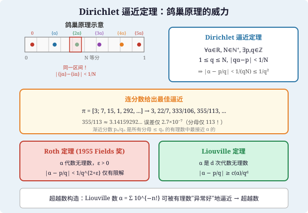
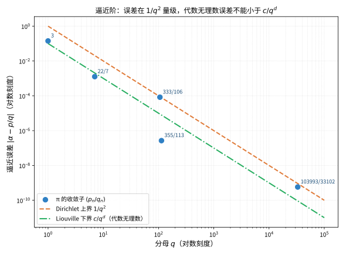
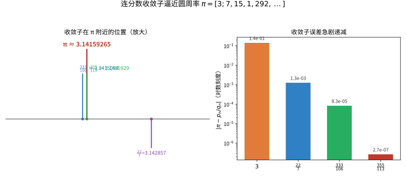

# 第78级 丢番图逼近 (Diophantine Approximation)

---

## 从"用一把有理数的尺子量无理数"说起：丢番图逼近要解决的根问题

> 在追着 Dirichlet、Roth 这些定理跑之前，先想清楚一个朴素却深刻的问题：**无理数那么"无理"，我们到底能拿有理数把它撬到多准？**

**第一步：直觉——分母不大，精度惊人**

先请你体验一下"用分数逼近"的直觉。把圆周率 $\pi \approx 3.14159265\cdots$ 拿给古埃及人，他们只有一把"分母 $q$"的有理数刻度尺。用分母 $7$ 的分数，最接近的是 $\frac{22}{7}\approx3.142857$，误差约 $1.3\times10^{-3}$；但历史上真正的明星是 $\frac{355}{113}\approx3.141593$——**分母只有 $113$，误差却小到 $2.7\times10^{-7}$**。一把并不算长的尺子，竟能量出天文学级的精度。这里藏着一个疑问：**"用一小撮有理数，到底能把一个无理数劈得多准？"** 答案竟是一门学科——丢番图逼近。

**第二步：要解决的问题——把"能有多好的逼近"量化为"逼近指数 $\kappa$"**

丢番图逼近研究的核心动机来自两个似乎无关、却在深处纠缠的问题：

- **逼近能有多好**：给定无理数 $\alpha$，是否存在分母受控的有理数 $\frac pq$ 让误差 $|\alpha-\frac pq|$ 极小？我们把"精度"换算成"对分母幂次 $q^{-\kappa}$ 的比拼"——$\kappa$ 越大，说明这一族逼近"越划算"。1837 年 Dirichlet 用鸽巢原理证明：任何无理数都有无穷多个 $\frac pq$ 满足 $|\alpha-\frac pq|<\frac1{q^2}$，把"及格线"定在了指数 $2$。
- **逼近不能好到离谱**：反转问题——代数数 $\alpha$（多项式方程的根）能否被逼近得"好过头"？1844 年 Liouville 证明：$d$ 次代数无理数不可能被比 $c/q^d$ 更好地下方逼近；1955 年 Roth 更尖锐地证明：对任意 $\varepsilon>0$，$|\alpha-\frac pq|<q^{-(2+\varepsilon)}$ 只有有限多解。**"能逼近多好"与"这个数是代数还是超越"，在此被一根筋绑死。**

顺带一提，这条线索还回环到**丢番图方程**：Thue 方程、曲线上整点的有限性，往往正是靠"代数数不能被逼近得太好"来一刀切断的。

**第三步：正式定义前的准备——本章怎样一步步推进**

本章顺着"先立尺、再削峰"的顺序走：

1. 先立起**基本问题**（逼近指数 $\kappa$）与**连分数**这把"最优逼近的免费秤"；
2. 用 **Dirichlet 定理**立下指数 $2$ 的"及格线"；
3. 用 **Liouville 定理**证明代数数有"逼近下限"，并顺手构造出历史上第一批**超越数**；
4. 用 **Roth 定理**把代数数能逼近的指数削到极限 $2+\varepsilon$；
5. 最后用 **Gelfond-Schneider 定理**解决 Hilbert 第七问题，把"逼近的难易"推向超越数论的高地。

读完你会明白：一场"谁逼近得更快"的接力赛，跑出的却是数论、代数与超越性的整片边疆。

> **🧠 一句话记住丢番图逼近的"出生证"**
>
> 丢番图逼近给出的，是一份关于"用分数撬无理数"的精确账本。它的根本问题是：
>
> $$ \boxed{\text{一个（有理/无理/代数/超越）数，能被分母不太大的有理数以多好的精度逼近？这个"精度指数" } \kappa \text{ 究竟能有多大？}} $$

## 开始之前

**本章在讲什么**：本章研究"用有理数逼近（无理）实数"这一基本现象的**精度极限**。你会学到基本逼近问题与逼近指数 $\kappa$、连分数展开（含其最佳逼近与渐近分数的递推结构）、Dirichlet 逼近定理（鸽巢原理）、Liouville 定理与最早的超越数、Roth 定理（代数数的尖锐逼近极限）、一致逼近与 Schmidt 多面体逼近，以及 Gelfond-Schneider 定理与超越数论，最后看它们如何倒逼丢番图方程的解的有限性。

**为什么要学它**：第 27 级（初等数论与连分数）已给了有理数逼近的初步体验，第 76 级（代数数论）定义了代数数与嵌入；而本章把这些统一成"精度账本"。它与第 79 级（几何数论，用格点与凸体处理联立逼近）、第 77 级（算术几何，用逼近证明 Thue 方程与曲线上整点有限）互为表里，也是第 113/114 级（编码、密码）里格密码、以及第 128 级（构造性数学）等方向的数论底座。Baker 的有效化、Schmidt 子空间定理正是当前（丢番图几何）前沿的桥头。

**开始前请确认你还记得**：

- 既约分数、无理数与有理逼近的初步（见第 27 级 初等数论）。
- 实数、序列、无穷级数的收敛（见第 10 级 实数系与极限、第 13 级 级数理论）。
- 代数数与超越数的定义、最小多项式、共轭嵌入（见第 76 级 代数数论）。
- 鸽巢原理（抽屉原理）与整数的整除性质（见第 27 级、第 28 级 组合数学）。
- 复分析中的最大模原理与整函数零点论（用于 Gelfond-Schneider 证明，见第 18 级 复分析）。

## 学习目标

1. 理解丢番图逼近的基本问题：用有理数逼近无理数
2. 掌握 Dirichlet 逼近定理、连分数理论及其最佳逼近性质
3. 了解 Roth 定理与 Thue-Siegel-Roth 定理的精深结果
4. 掌握超越数论的基本定理：Liouville、Hermite-Lindemann、Gelfond-Schneider
5. 理解丢番图逼近与丢番图方程之间的深刻联系

---

## 一、核心概念

### 1.1 丢番图逼近的基本问题

**定义 1.1（丢番图逼近）** 丢番图逼近研究用有理数 $\frac{p}{q}$ 逼近无理数 $\alpha$ 的精度。基本问题是：对于给定的无理数 $\alpha$，寻找有理数 $\frac{p}{q}$（$q>0$），使得
$$
\left|\alpha - \frac{p}{q}\right|
$$
尽可能小。

> **💡 直观理解（类比）**：丢番图逼近就像"用一把分母为 $q$ 的粗刻度尺，去量一段永远对不齐的无理长度"：我们想找离 $\alpha$ 最近的格子点 $p/q$，让误差尽量小。问题的精妙在于把"误差"除以"分母的幂"，从而比拼谁能用不算太大的分母换取不成比例的精度。

**逼近的度量**：衡量逼近好坏的标准是误差 $|\alpha - p/q|$ 与分母 $q$ 的幂次之间的关系。通常考虑不等式
$$
\left|\alpha - \frac{p}{q}\right| < \frac{1}{q^\kappa}
$$
对给定 $\kappa$ 的可解性。

> **🔑 为什么需要"逼近指数 $\kappa$"**：把误差写成 $|\alpha-p/q|<q^{-\kappa}$ 绝非炫技——$\kappa$ 直接刻画"分母每换大一点，精度能赚多少"。$\kappa$ 越大，同一分母买到的精度越高、逼近越"划算"。Dirichlet 保证 $\kappa=2$ 人人达到（及格线），Liouville 给出 $d$ 次代数数的下界，Roth 又把代数数的 $\kappa$ 一律削回 $2$——一门学科的走向，几乎就浓缩在这一个指数上。

### 1.2 连分数

🌐 **直觉先行**：怎么把"最优逼近"一张分都不用多花地全部拿到手？答案藏在**连分数**里。把 $\alpha$ 层层剥成 $a_0+\cfrac1{a_1+\cfrac1{\cdots}}$ 这种"洋葱"，然后任一层处"咔嚓"截断，得到的渐近分数恰好就是所有最佳逼近。这一节先立起展开语法（$a_i$、$\frac{p_n}{q_n}$ 递推），下一节再用它兑现"逼近冠军"。

**定义 1.2（连分数）** 一个（简单）**连分数** 是形如
$$
a_0 + \cfrac{1}{a_1 + \cfrac{1}{a_2 + \cfrac{1}{a_3 + \ddots}}}
$$
的表达式，其中 $a_0 \in \mathbb{Z}$，$a_i \in \mathbb{Z}_{>0}$（$i \ge 1$）。通常记为
$$
[a_0; a_1, a_2, a_3, \dots].
$$

**有限连分数** 对应有理数，**无限连分数** 对应无理数。

> **💡 直观理解（类比）**：连分数就像"把分数一层层剥出来叠上去的洋葱"：$a_0 + \cfrac{1}{a_1 + \cfrac{1}{a_2 + \cdots}}$ 是一串互相嵌套的倒数阶梯。它之所以优雅，是因为把任意实数展开成一列整数 $a_i$，就像给出了一座楼梯每段台阶的高度，后续能凭它复原出原数的最优近似。

**定义 1.3（渐近分数）** 连分数 $[a_0; a_1, a_2, \dots]$ 的第 $n$ 个 **渐近分数**（convergent）是截断 $[a_0; a_1, \dots, a_n]$ 对应的有理数 $\frac{p_n}{q_n}$，其中 $p_n, q_n$ 由递推关系给出：
$$
\begin{aligned}
p_{-2} &= 0, \quad p_{-1} = 1, \quad p_n = a_n p_{n-1} + p_{n-2}, \\
q_{-2} &= 1, \quad q_{-1} = 0, \quad q_n = a_n q_{n-1} + q_{n-2}.
\end{aligned}
$$

> **💡 直观理解（类比）**：渐近分数就像"每次读完一段就停下来记下此刻的差读数"：把连分数在第 $n$ 层"咔嚓"截断，得到的有理数 $\frac{p_n}{q_n}$ 就是原数的一个近似。递推公式 $p_n=a_np_{n-1}+p_{n-2}$ 则像"用前两级台阶的高度拼出下一级"，为整个系列搭起一架越走越准的手扶梯。

### 1.3 最佳逼近

**定义 1.4（最佳逼近）** 有理数 $\frac{p}{q}$ 称为无理数 $\alpha$ 的 **最佳逼近**（best approximation），如果对所有分母 $\le q$ 的有理数 $\frac{p'}{q'} \neq \frac{p}{q}$，有
$$
\left|\alpha - \frac{p}{q}\right| < \left|\alpha - \frac{p'}{q'}\right|.
$$

> **💡 直观理解（类比）**：最佳逼近就像"在分母不超过 $q$ 的预算下，投出最靠近靶心的一镖"：只要分母限在 $q$ 以内，任何别的有理数都赢不了 $\frac{p}{q}$。这相当于一份"同量级选手中的冠军名单"，保证我们花的每一分母都物有所值。

**定理**：无理数的所有最佳逼近恰好是其连分数展开的所有渐近分数。

> **💡 直观理解（类比）**：这条定理把上一段的两个概念焊在一起——"冠军名单"（最佳逼近）恰好等于"逐层截断的脚印"（渐近分数）。意思是连分数的每一级台阶都既是这个分母级别下的最优点，也是上一级最优点的自然传承，不存在别的黑马能插进这条由连分数标注的逼近队伍。

### 1.4 丢番图逼近与丢番图方程的联系

丢番图逼近与丢番图方程之间存在以下深刻联系：

- **Thue 方程**：形如 $F(x,y)=m$ 的方程（其中 $F$ 是齐次多项式）的整数解个数有限性，可通过 Roth 定理得出。
- **Siegel 定理**：亏格 $\ge 1$ 的代数曲线上的整点只有有限个，其证明依赖于丢番图逼近。
- **有效与无效逼近**：Roth 定理是非有效的（ineffective），即它断言存在性但不给出具体界。Baker 定理则提供了有效界。

### 1.5 一致逼近

**定义 1.5（一致逼近）** 无理数 $\alpha$ 的 **一致逼近**（uniform approximation）研究是否存在常数 $c > 0$，使得对任意 $Q > 0$，存在整数 $p,q$ 满足 $0 < q \le Q$ 且
$$
\left|\alpha - \frac{p}{q}\right| < \frac{c}{qQ}.
$$
Dirichlet 定理表明 $c=1$ 总是可行的。

> **💡 直观理解（类比）**：一致逼近就像"对任意量程都备好一把能用的尺子"：无论把搜索范围 $Q$ 设到多大，都要求提前支付一份稳定的精度 $c$（与 $Q$ 成反比地收紧）。它考察的是"处处都能保持同一档水平的逼近"，而不只是个别幸运点碰巧逼近得很好。

### 1.6 Schmidt 多面体逼近

**定义 1.6（Schmidt 多面体逼近）** 设 $\alpha_1,\dots,\alpha_n$ 是实数。Schmidt 多面体逼近研究联立不等式
$$
\max_{1 \le i \le n} |q\alpha_i - p_i| < c q^{-1/n}
$$
的可解性。Schmidt 证明了这些联立逼近的指数不可改进，这是多面体逼近理论的基石。

> **💡 直观理解（类比）**：Schmidt 多面体逼近就像"用同一个整数 $q$ 当推杆，同时偷偷把 $n$ 个无理数目标都押得整整齐齐"：误差在每个坐标上都压到 $q^{-1/n}$。若要照顾的坐标越多（$n$ 越大），分摊到每个坐标上的精度就越小——像把一张蛋糕平均切给更多张嘴，每人分到的就变薄，而 Schmidt 证明了这份"蛋糕"没法再切得更大了。

---

## 二、定理与证明

### 2.1 Dirichlet 逼近定理

**定理 2.1（Dirichlet 逼近定理）** 设 $\alpha$ 是实数，$N$ 是正整数。则存在整数 $p,q$ 满足 $1 \le q \le N$，使得
$$
|q\alpha - p| < \frac{1}{N}.
$$
等价地，
$$
\left|\alpha - \frac{p}{q}\right| < \frac{1}{qN} \le \frac{1}{q^2}.
$$

**证明（鸽巢原理）**：

考虑 $N+1$ 个数：
$$
0, \{\alpha\}, \{2\alpha\}, \dots, \{N\alpha\},
$$
其中 $\{x\} = x - \lfloor x \rfloor$ 表示小数部分，取值在 $[0,1)$ 中。

将区间 $[0,1)$ 分成 $N$ 个等长子区间：
$$
\left[0, \frac{1}{N}\right), \left[\frac{1}{N}, \frac{2}{N}\right), \dots, \left[\frac{N-1}{N}, 1\right).
$$

由鸽巢原理，$N+1$ 个数放入 $N$ 个区间，必有两个数落在同一区间。设这两个数为 $\{i\alpha\}$ 和 $\{j\alpha\}$，其中 $0 \le i < j \le N$。则
$$
|\{j\alpha\} - \{i\alpha\}| < \frac{1}{N}.
$$

令 $q = j-i$（$1 \le q \le N$），$p = \lfloor j\alpha \rfloor - \lfloor i\alpha \rfloor$。则
$$
|q\alpha - p| = |(j\alpha - \lfloor j\alpha \rfloor) - (i\alpha - \lfloor i\alpha \rfloor)| = |\{j\alpha\} - \{i\alpha\}| < \frac{1}{N}.
$$

除以 $q$ 即得：
$$
\left|\alpha - \frac{p}{q}\right| < \frac{1}{qN} \le \frac{1}{q^2}.
$$

$\square$

**推论 2.1** 对任意无理数 $\alpha$，存在无穷多个有理数 $\frac{p}{q}$ 满足
$$
\left|\alpha - \frac{p}{q}\right| < \frac{1}{q^2}.
$$

**证明**：对每个 $N$ 应用定理 2.1，得到有理数 $\frac{p_N}{q_N}$。由于 $\alpha$ 是无理数，这些有理数必须互不相同（否则误差会为零）。$\square$

> **💡 直观理解（类比）**：推论 2.1 把定理升级成"无穷无尽的逼近军团"：因为 $\alpha$ 无理、带着误差为零的有理数根本不存在，所以每换一个更大的 $N$ 必然能"开采"出一个崭新的近似分子，于是 $|\alpha-p/q|<1/q^2$ 的解像涌泉一样源源不断，永远也开不完。

> **直观理解（现实类比）**：Dirichlet 逼近定理的证明就像"电影院找座位"。把 $[0,1)$ 区间想象成一排 $N$ 个座位（$N$ 个等长子区间），而 $N+1$ 个小数部分 $\{0\}, \{\alpha\}, \{2\alpha\}, \dots, \{N\alpha\}$ 是 $N+1$ 位观众。由鸽巢原理，至少两位观众必须坐在同一个"座位区间"里——他们的距离不超过 $1/N$。这两位观众的"座位号之差" $q = j - i$ 就是分母，而距离 $|q\alpha - p| < 1/N$ 就是逼近精度。简单而优雅！
>
> **🧠 思考历程：无理数究竟能被"多好"地逼近？这场"比快"的马拉松，从鸽巢一路跑到了 Roth。**
>
> 丢番图逼近的问题朴素到让人误会：**给定一个无理数 $\alpha$，能用分母不大的有理数把它近似到多精确？** 看似只是比大小，却牵出了超越数、丢番图方程乃至遍及现代数论的一整条线索。
>
> - **Dirichlet 定下"及格线"**（1842 年）。Johann Dirichlet 用鸽巢原理轻巧地证明：对任意无理数 $\alpha$，总有 $|\alpha-\frac{p}{q}|<\frac1{q^2}$ 成立且有无穷多解。他把这道题正式设立成"比谁逼近得快"，为后来所有尝试标定了起点。
> - **Liouville 的界线：止住了"太好的近似"**（1844 年）。为证明数的超越性，Joseph Liouville 观察到：代数数不能被逼近得过好——若 $\alpha$ 是 $d$ 次代数数，则 $|\alpha-\frac{p}{q}|\gg q^{-d}$。这一下把"能有多好的逼近"与"数是代数还是超越"直接挂钩，Liouville 数也因此成了最早的超越数。
> - **Roth 的桂冠：把指数压到极限**（1955 年）。Klaus Roth 用极其精巧的论证证明：任意代数无理数对任意 $\varepsilon>0$ 都只有有限多个 $|\alpha-\frac{p}{q}|<\frac1{q^{2+\varepsilon}}$ 的逼近。$2+\varepsilon$ 与 Dirichlet 的 $2$ 仅隔一层窗户纸，却把代数数的自近性问题一劳永逸地终结了——他因此获得 Fields 奖，而指数 2 以下的世界至今无人能再进一步。
> - **心路**：一场关于"谁更快"的竞赛，往往能逼出最深刻的代价与壁垒。丢番图逼近告诉我们：**把"精确到多少"量化为指数，数学的锐度便尽在其中**。

### 2.2 连分数的最佳逼近性质

**定理 2.2（连分数的最佳逼近性质）** 设 $\alpha$ 是无理数，$\frac{p_n}{q_n}$ 是其连分数展开的第 $n$ 个渐近分数。则：

1. 渐近分数交错地大于和小于 $\alpha$：
   $$
   \frac{p_0}{q_0} < \frac{p_2}{q_2} < \cdots < \alpha < \cdots < \frac{p_3}{q_3} < \frac{p_1}{q_1}.
   $$

2. 渐近分数是最佳逼近：若 $0 < q' \le q_n$ 且 $\frac{p'}{q'} \neq \frac{p_n}{q_n}$，则
   $$
   \left|\alpha - \frac{p_n}{q_n}\right| < \left|\alpha - \frac{p'}{q'}\right|.
   $$

3. 误差估计：
   $$
   \frac{1}{q_n(q_n + q_{n+1})} < \left|\alpha - \frac{p_n}{q_n}\right| < \frac{1}{q_n q_{n+1}}.
   $$

> **💡 直观理解（类比）**：连分数的最佳逼近性质揭示了"逼近阶梯上的三条铁律"：相邻两级交替跨在目标两侧（像左右脚交替迈步逼近圆心）、每一级都是同分母级别下的全场最佳（冠军），且误差被夹在两把精确的钳子之间给出上下界。于是渐近分数既是最稳的逼近路线，又自带了可量化的误差保险。

**证明**：

**引理 2.2** 递推关系 $p_n q_{n-1} - p_{n-1} q_n = (-1)^{n-1}$。

> **💡 直观理解（类比）**：这条递推式就像"相邻两级台阶严格保持±1的高度差"：$p_n q_{n-1} - p_{n-1} q_n$ 这个值总等于 $\pm 1$，说明任何两对相邻渐近分数互素到极致、绝不重叠相撞。正是这道"永不重合"的标配，让相邻分数在目标两侧对称交错成为可能。

**证明**：用归纳法。$n=1$ 时：
$$
p_1 q_0 - p_0 q_1 = (a_1 a_0 + 1) \cdot 1 - a_0 \cdot a_1 = 1 = (-1)^0.
$$
假设对 $n$ 成立，则对 $n+1$：
$$
\begin{aligned}
p_{n+1} q_n - p_n q_{n+1} &= (a_{n+1} p_n + p_{n-1}) q_n - p_n (a_{n+1} q_n + q_{n-1}) \\
&= p_{n-1} q_n - p_n q_{n-1} = -(-1)^{n-1} = (-1)^n.
\end{aligned}
$$
$\square$

**性质 1 的证明**：

由引理 2.2 可知：
$$
\frac{p_{n+1}}{q_{n+1}} - \frac{p_n}{q_n} = \frac{p_{n+1} q_n - p_n q_{n+1}}{q_n q_{n+1}} = \frac{(-1)^n}{q_n q_{n+1}}.
$$
因此，相邻渐近分数位于 $\alpha$ 的两侧。由于连分数收敛，偶次渐近分数递增趋于 $\alpha$，奇次渐近分数递减趋于 $\alpha$。

**性质 2 的证明**：

设 $\frac{p'}{q'}$ 是满足 $0 < q' \le q_n$ 且 $\frac{p'}{q'} \neq \frac{p_n}{q_n}$ 的有理数。考虑线性方程组：
$$
\begin{cases}
p_n x + p_{n-1} y = p' \\
q_n x + q_{n-1} y = q'
\end{cases}
$$
其系数行列式为 $p_n q_{n-1} - p_{n-1} q_n = (-1)^{n-1}$，故有整数解 $(x,y) \in \mathbb{Z}^2$。若 $y=0$，则 $\frac{p'}{q'} = \frac{p_n}{q_n}$，矛盾。故 $y \neq 0$。

计算差值：
$$
\alpha - \frac{p'}{q'} = \alpha - \frac{p_n x + p_{n-1} y}{q_n x + q_{n-1} y} = \frac{(-1)^{n-1} y}{q'(q_n x + q_{n-1} y)}.
$$
利用 $\alpha$ 在 $\frac{p_n}{q_n}$ 和 $\frac{p_{n-1}}{q_{n-1}}$ 之间的事实，通过分析 $x,y$ 的符号可证：
$$
\left|\alpha - \frac{p'}{q'}\right| \ge \frac{1}{q_n} > \left|\alpha - \frac{p_n}{q_n}\right|.
$$
详细推导从略。$\square$

**性质 3 的证明**：

由引理 2.2 和连分数的收敛性质：
$$
\left|\alpha - \frac{p_n}{q_n}\right| < \left|\frac{p_{n+1}}{q_{n+1}} - \frac{p_n}{q_n}\right| = \frac{1}{q_n q_{n+1}}.
$$
又因为 $\frac{p_{n+1}}{q_{n+1}}$ 和 $\frac{p_n}{q_n}$ 在 $\alpha$ 的两侧，且 $q_{n+1} = a_{n+1} q_n + q_{n-1} \le q_n + q_{n+1}$，可得下界。$\square$

### 2.3 Roth 定理

**定理 2.3（Roth 定理，1955 年 Fields 奖）** 设 $\alpha$ 是代数无理数。则对任意 $\varepsilon > 0$，不等式
$$
\left|\alpha - \frac{p}{q}\right| < \frac{1}{q^{2+\varepsilon}}
$$
只有有限多个有理数解 $\frac{p}{q}$。

> **💡 直观理解（类比）**：Roth 定理像"一道不可逾越的速度墙"：代数无理数不管怎么逼近，精度就是卡在指数 $2$ 这条线——想再快一点点（$2+\varepsilon$），能成功的次数就必有限，像赛车无论多猛都被限速在某个上限。Dirichlet 保证指数 2 恰好人人都能做到，而 Roth 证明哪怕只逼得更紧一丝，代数数就再也供不起无穷多辆车。

**注**：Dirichlet 定理表明指数 $2$ 是不可改进的（即对任意无理数，存在无穷多个解满足指数 $2$）。Roth 定理说明，对代数无理数，指数 $2+\varepsilon$ 只能给出有限个解。

> **🔑 为什么重要**：Roth 定理是 20 世纪最漂亮的定理之一——它把"代数数不能被逼近得太好"推到铁一般精确的极限（$2+\varepsilon$），为此却付出**非有效**的代价：它断言解"只有有限个"，却不提供任何可计算的上界。这个"有效性缺口"恰是 Baker 的对数线性型有效下界要补的一课，也正因如此，Roth 定理在 Thue 方程里能"断案"（宣告有限性）却难以"抓人"（给出显式枚举界）。

**证明思路**（使用 Roth 引理构造）：

**步骤 1：反证法假设**

假设存在无穷多个有理数 $\frac{p_i}{q_i}$ 满足
$$
\left|\alpha - \frac{p_i}{q_i}\right| < \frac{1}{q_i^{2+\varepsilon}}.
$$
取充分大的子列，使得 $q_i$ 严格递增。

**步骤 2：构造辅助多项式**

对给定的 $m$，构造一个 $m$ 元多项式 $P(x_1,\dots,x_m)$，系数为整数，满足：
- $P$ 在 $(\alpha,\dots,\alpha)$ 处有高阶零点。
- $P$ 的系数有界（高度控制）。

这是 Roth 引理的核心：使用 **Dirichlet 抽屉原理**（或 Siegel 引理）构造一个非零的整系数多项式，使得它在 $(\alpha,\dots,\alpha)$ 处的各阶偏导数均为零（直到某个阶数），同时系数的大小被控制。

**步骤 3：Roth 引理（Roth's Lemma）**

**引理 2.3（Roth 引理）** 设 $\alpha$ 是代数无理数，次数为 $d$。设 $m$ 是正整数，$r_1,\dots,r_m$ 是正整数。则存在一个非零的整系数多项式 $P(x_1,\dots,x_m)$，关于 $x_i$ 的次数 $\le r_i$，使得
$$
\frac{\partial^{k_1+\cdots+k_m} P}{\partial x_1^{k_1}\cdots\partial x_m^{k_m}}(\alpha,\dots,\alpha) = 0, \quad 0 \le k_i \le r_i-1,
$$
且 $P$ 的系数绝对值不超过某个常数 $C$（依赖于 $\alpha$ 和 $r_i$）。

> **💡 直观理解（类比）**：Roth 引理就像"提前在目标处挖好一处极深的零点坑，且挖坑用料还要严格控制"：它造出一个整系数多项式，使 $P$ 在 $(\alpha,\dots,\alpha)$ 处的高阶偏导全为零（坑特别深），而系数又足够小（用料不超预算）。搭配抽屉原理挑选系数，给后面"逼近点代入后的值小到压不过有理数下界"设下伏笔。

**步骤 4：代入逼近点**

将 $x_i = \frac{p_i}{q_i}$ 代入 $P$。由于 $P(\alpha,\dots,\alpha)=0$，用 Taylor 展开：
$$
P\left(\frac{p_1}{q_1},\dots,\frac{p_m}{q_m}\right) = \sum \frac{1}{k_1!\cdots k_m!} \frac{\partial^{|k|} P}{\partial x^k}(\xi_1,\dots,\xi_m) \prod_{i=1}^m \left(\frac{p_i}{q_i} - \alpha\right)^{k_i}.
$$

利用逼近假设 $|\alpha - p_i/q_i| \le q_i^{-(2+\varepsilon)}$ 和 Roth 引理中的系数控制，可以证明：
$$
\left|P\left(\frac{p_1}{q_1},\dots,\frac{p_m}{q_m}\right)\right| < 1
$$
当 $m$ 充分大时。

**步骤 5：导出矛盾**

另一方面，$P(p_1/q_1,\dots,p_m/q_m)$ 是有理数，其分母为 $q_1^{r_1}\cdots q_m^{r_m}$。若 $P$ 非零，则其绝对值至少为分母的倒数：
$$
\left|P\left(\frac{p_1}{q_1},\dots,\frac{p_m}{q_m}\right)\right| \ge \frac{1}{q_1^{r_1}\cdots q_m^{r_m}}.
$$

通过精心选择 $m$ 和 $r_i$（使 $r_i$ 与 $\log q_i$ 成比例），可证明当 $q_i$ 充分大时，$1/(q_1^{r_1}\cdots q_m^{r_m})$ 大于上一步得到的上界，矛盾。因此假设不成立，即只有有限个解。$\square$

**注**：Roth 定理是 **非有效的**（ineffective）：它断言解的个数有限，但没有给出具体的上界。这是因为证明依赖于反证法，且使用了无法算法化的参数选择。

### 2.4 Liouville 定理

**定理 2.4（Liouville 定理）** 设 $\alpha$ 是 $d$ 次代数无理数（即 $\alpha$ 满足一个 $d$ 次整系数不可约多项式，且 $d \ge 2$）。则存在常数 $c(\alpha) > 0$，使得对所有有理数 $\frac{p}{q}$（$q>0$），有
$$
\left|\alpha - \frac{p}{q}\right| \ge \frac{c(\alpha)}{q^d}.
$$

**证明**：

设 $\alpha$ 的最小多项式为
$$
f(x) = a_d x^d + a_{d-1} x^{d-1} + \cdots + a_0 \in \mathbb{Z}[x],
$$
其中 $a_d > 0$，$f$ 不可约，且 $\deg f = d \ge 2$。

由于 $f$ 不可约，$f(\alpha)=0$ 且 $f(p/q) \neq 0$（否则 $\alpha$ 是有理数）。

计算：
$$
\begin{aligned}
\left|f\left(\frac{p}{q}\right)\right| &= \left|a_d \frac{p^d}{q^d} + a_{d-1} \frac{p^{d-1}}{q^{d-1}} + \cdots + a_0\right| \\
&= \frac{|a_d p^d + a_{d-1} p^{d-1} q + \cdots + a_0 q^d|}{q^d} \ge \frac{1}{q^d},
\end{aligned}
$$
因为分子是非零整数，绝对值至少为 $1$。

另一方面，由中值定理，存在 $\xi$ 介于 $\alpha$ 和 $p/q$ 之间，使得
$$
f\left(\frac{p}{q}\right) = f(\alpha) + f'(\xi)\left(\frac{p}{q} - \alpha\right) = f'(\xi)\left(\frac{p}{q} - \alpha\right).
$$
因此
$$
\left|\alpha - \frac{p}{q}\right| = \frac{|f(p/q)|}{|f'(\xi)|}.
$$

在 $\alpha$ 的邻域内，$f'(\xi)$ 有界。具体地，设 $M = \max_{|x-\alpha| \le 1} |f'(x)|$。若 $|\alpha - p/q| < 1$，则 $\xi$ 落在 $[ \alpha-1, \alpha+1 ]$ 中，从而 $|f'(\xi)| \le M$。于是
$$
\left|\alpha - \frac{p}{q}\right| \ge \frac{1}{M q^d}.
$$

若 $|\alpha - p/q| \ge 1$，则不等式平凡成立（取 $c(\alpha) = \min\{1, 1/M\}$ 即可）。$\square$

**推论 2.2（Liouville 数的构造）** Liouville 数
$$
\alpha = \sum_{n=1}^\infty 10^{-n!}
$$
是超越数。因为对任意 $d$，取 $q = 10^{d!}$，$p = 10^{d!} \sum_{n=1}^d 10^{-n!}$，则
$$
\left|\alpha - \frac{p}{q}\right| = \sum_{n=d+1}^\infty 10^{-n!} < 2 \cdot 10^{-(d+1)!} = \frac{2}{q^{d+1}}.
$$
若 $\alpha$ 是 $d$ 次代数数，Liouville 定理要求误差 $\ge c/q^d$，但这里误差小于 $2/q^{d+1}$，当 $q$ 充分大时与 Liouville 定理矛盾。故 $\alpha$ 必须是超越数。

> **💡 直观理解（类比）**：Liouville 数的构造像"在刻度线上制造一场自杀式超速"：让每次补上一位小数，都使误差跌破 $q^{-(任意次方)}$ 这条"代数数的物理下限"。好比要求马跑得比它自身腿部结构允许的更快——代数数根本供不起这运气，于是这个数只能承认自己是"天生的破限者"（超越数）。

> **常见坑**：Liouville 定理给的是代数数的**（相对）下界** $|\alpha-p/q|\ge c/q^d$，不是上界——别和 Dirichlet 的上界 $|\alpha-p/q|<1/q^2$ 搞反方向。它对**所有** $\frac pq$（$q>0$）都成立（含 $|\alpha-p/q|\ge1$ 的平凡情形），常数 $c(\alpha)$ 与次数 $d$ 共同起作用。还要小心：定理**只说明"代数数不能太好逼近"**，并不反过来——不是说"逼近不好的数就一定超越"；Liouville 数之所以超越，正因为它对任意 $d$ 都能做到误差 $\sim q^{-(d+1)}$，突破了每个可能的下限 $q^{-d}$。

> **直观理解（现实类比）**：把"用有理数逼近无理数"想象成用带刻度的尺子去量一个无限不循环的小数。Dirichlet 定理保证：总能把刻度做得足够密，使误差不超过 $1/q^2$（像"每加一格，精度平方级提升"）。而 Liouville 定理是一条"物理下限"：对于真正"听话"的代数无理数，无论刻度怎么加密，误差都不可能小于 $c/q^d$——正如再精密的量具也受制于它自身的分辨率。只有那些"极度不配合"的超越数（如 Liouville 数）才能突破这一下限，这正是它们被证明是超越数的关键。

### 2.5 Gelfond-Schneider 定理

**定理 2.5（Gelfond-Schneider 定理，1934 年）** 设 $\alpha$ 和 $\beta$ 是代数数，$\alpha \neq 0,1$，且 $\beta$ 不是有理数。则 $\alpha^\beta$ 是超越数。

> **💡 直观理解（类比）**：Gelfond-Schneider 定理像"给代数数的指数运算划出一道雷区"：如果底数避开 0 和 1，而指数又非有理数，那么算出来的 $\alpha^\beta$ 必然跳出代数世界、踏进超越数的荒原。它直接终结了 Hilbert 第七问题的好奇：$2^{\sqrt2}$ 这样的数，注定不属于可以"用方程刻画的整齐家族"。

> **常见坑**：套用 Gelfond-Schneider 定理时四个前提一个都不能漏——(1) 底数 $\alpha$ 是代数数且 $\alpha\neq0,1$；(2) 指数 $\beta$ 是代数数；(3) 且 $\beta\notin\mathbb{Q}$（注意必须是"代数**无理**数"，光"实数且无理"不够）；(4) 结论是 $\alpha^\beta$ 成为超越数。最常踩的三处：$\sqrt2^{\sqrt2}$ 直接套（$\alpha=\sqrt2,\beta=\sqrt2$ 均代数无理）即得超越；$e^\pi=(-1)^{-i}$ 的妙用是把 $\pi$ 藏进指数、借 $\alpha=-1$ 去反转；而 $\log_2 3$ 这类不能直接套——要么先证它不是有理数（反证 $2^{m}=3^{n}$），再讨论若它是代数无理数则由定理 $2^{\log_2 3}=3$ 应为超越数与"3 是代数数"矛盾，从而推出超越。

**证明**（完整证明）：

**步骤 1：反证法假设**

假设 $\gamma = \alpha^\beta$ 是代数数。则存在代数数 $\alpha, \beta, \gamma$ 满足 $\alpha \neq 0,1$，$\beta \notin \mathbb{Q}$，且 $\alpha^\beta = \gamma$。

**步骤 2：构造辅助函数**

设 $K = \mathbb{Q}(\alpha, \beta, \gamma)$，$[K:\mathbb{Q}] = d$。选择大量整数参数 $L$ 和 $H$（稍后确定）。

考虑函数
$$
F(z) = \sum_{m=0}^{L-1} \sum_{n=0}^{L-1} c_{m,n} e^{n \log \alpha \cdot z} \alpha^{mz} = \sum_{m,n} c_{m,n} \alpha^{mz} \gamma^{nz},
$$
其中 $c_{m,n}$ 是待定整数。

**步骤 3：Siegel 引理选择系数**

由 Siegel 引理，存在非零整数数组 $(c_{m,n})$ 不全为零，使得
$$
F^{(k)}(\ell) = 0, \quad 0 \le k \le L-1, \quad 1 \le \ell \le L,
$$
且系数有界：
$$
\max|c_{m,n}| \le C_1 L^{L^2/2}.
$$

**步骤 4：估计 $F$ 在整数点处的值**

考虑 $F(t)$ 在 $t = 1,2,\dots,2L$ 处的值。由构造，$F^{(k)}(\ell) = 0$ 对 $0 \le k \le L-1$ 和 $1 \le \ell \le L$ 成立。这意味着 $F(z)$ 在 $z=1,\dots,L$ 处有 $L$ 阶零点。

由复分析中的最大模原理，可估计 $F$ 在更大区域上的值。特别地，对 $t = L+1,\dots,2L$，有
$$
|F(t)| \le C_2 L^{-L} \cdot \max_{|z| \le 2L} |F(z)|.
$$

**步骤 5：上下界矛盾**

**上界**：由导数估计和零点条件，可证
$$
|F(t)| \le C_3 L^{-L} \cdot H^{L^2} \cdot C^L.
$$

**下界**：另一方面，$F(t)$ 是代数数，可写为
$$
F(t) = \sum_{m,n} c_{m,n} \alpha^{mt} \gamma^{nt}.
$$
由于 $\alpha^\beta = \gamma$，且 $\beta$ 非有理数，这些指数项线性无关。通过代数数论中的共轭估计，若 $F(t) \neq 0$，则
$$
|F(t)| \ge C_4^{-L^2} \cdot H^{-L^2}.
$$
（这里使用了代数整数的范数估计。）

**步骤 6：选择参数**

选择 $L$ 充分大，$H$ 适当（例如 $H \approx L^{L}$），使得上界小于下界。这迫使 $F(t) = 0$ 对所有 $t = 1,\dots,2L$ 成立。

**步骤 7：导出矛盾**

若 $F(t) = 0$ 对 $t = 1,\dots,2L$ 成立，则 $F$ 作为指数多项式有至少 $2L$ 个不同的零点。但 $F$ 的项数为 $L^2$，由指数多项式的零点理论，非零的 $F$ 最多有 $L^2 - 1$ 个零点（当 $L$ 充分大时 $2L > L^2 - 1$ 不成立），矛盾。

因此 $F$ 必须恒为零，这迫使所有 $c_{m,n}=0$，与系数的非平凡性矛盾。故假设不成立，$\alpha^\beta$ 是超越数。$\square$

**推论 2.3（重要推论）**：
- $2^{\sqrt{2}}$ 是超越数（Hilbert 第七问题）。
- $e^\pi$ 是超越数，因为 $e^\pi = (-1)^{-i}$，其中 $\alpha=-1$（代数数），$\beta=-i$（代数无理数）。
- $\log_\alpha \beta$ 对代数数 $\alpha \neq 0,1$ 和代数数 $\beta \neq 0,1$，若 $\log_\alpha \beta$ 是非有理代数数，则它是超越数。

> **💡 直观理解（类比）**：这些推论是定理的"落地清单"，把抽象的雷区规则翻译成具体名数：$2^{\sqrt2}$、$e^\pi=(-1)^{-i}$ 等形如"代数底数的无理指数次幂"的式子，全都命中雷区，于是集体被判定为超越数——像检查清单挨个贴上"此物非代数"的标签，让人一眼看清这些著名常数的身份。

---

## 三、示例

### 3.1 用连分数逼近 $\pi$

计算 $\pi$ 的连分数展开：

$$
\pi = [3; 7, 15, 1, 292, 1, 1, 1, 2, 1, 3, 1, 14, \dots].
$$

前几个渐近分数为：

| $n$ | $a_n$ | $p_n$ | $q_n$ | 渐近分数 | 误差 |
|-----|-------|-------|-------|---------|------|
| 0 | 3 | 3 | 1 | $3$ | $1.4\times10^{-1}$ |
| 1 | 7 | 22 | 7 | $22/7 \approx 3.142857$ | $1.3\times10^{-3}$ |
| 2 | 15 | 333 | 106 | $333/106 \approx 3.141509$ | $8.3\times10^{-5}$ |
| 3 | 1 | 355 | 113 | $355/113 \approx 3.141593$ | $2.7\times10^{-7}$ |
| 4 | 292 | 103993 | 33102 | $103993/33102$ | $5.8\times10^{-10}$ |

**分析**：$355/113$ 是 $\pi$ 的极佳逼近，误差仅约 $2.7 \times 10^{-7}$，且分母只有 $113$。这展示了连分数提供最佳逼近的特性。

**误差验证**：
$$
\left|\pi - \frac{355}{113}\right| \approx 2.667 \times 10^{-7} < \frac{1}{113^2} \approx 7.83 \times 10^{-5}.
$$
满足 Dirichlet 定理的估计。

> **直观理解（现实类比）**：用连分数逼近 π 就像用越来越精细的"标尺刻度"去测量一根长度固定的木棒。分数 $\frac{22}{7}$ 是较粗的刻度（误差千分之一），$\frac{355}{113}$ 是更细的刻度（误差千万分之一），而 $\frac{103993}{33102}$ 几乎精确。连分数的奇妙之处在于：每一级刻度都是用"恰好"的格子数拼出来的，所以它比随意取大分母的分数逼近得更好——正如用 113 格就能量准到一个极高的精度，远超直觉。

### 3.2 用连分数逼近 $e$

计算 $e$ 的连分数展开有一个优美的规律：

$$
e = [2; 1, 2, 1, 1, 4, 1, 1, 6, 1, 1, 8, 1, 1, 10, \dots].
$$

即 $a_0 = 2$，之后模式为 $1, 2k, 1$ 交替出现。

前几个渐近分数：

| $n$ | $a_n$ | $p_n$ | $q_n$ | 渐近分数 | 误差 |
|-----|-------|-------|-------|---------|------|
| 0 | 2 | 2 | 1 | $2$ | $7.2\times10^{-1}$ |
| 1 | 1 | 3 | 1 | $3$ | $2.8\times10^{-1}$ |
| 2 | 2 | 8 | 3 | $8/3 \approx 2.666667$ | $5.2\times10^{-2}$ |
| 3 | 1 | 11 | 4 | $11/4 = 2.75$ | $3.2\times10^{-2}$ |
| 4 | 1 | 19 | 7 | $19/7 \approx 2.714286$ | $1.7\times10^{-2}$ |
| 5 | 4 | 87 | 32 | $87/32 \approx 2.718750$ | $1.7\times10^{-4}$ |
| 6 | 1 | 106 | 39 | $106/39 \approx 2.717949$ | $5.8\times10^{-4}$ |
| 7 | 1 | 193 | 71 | $193/71 \approx 2.718310$ | $1.2\times10^{-4}$ |
| 8 | 6 | 1264 | 465 | $1264/465 \approx 2.718280$ | $2.8\times10^{-6}$ |

**有趣的事实**：$e$ 的连分数具有规律性（而 $\pi$ 的连分数没有明显规律），这反映了 $e$ 在逼近论中的特殊地位。

---

## 四、习题

### 基础题

**习题 1**（丢番图逼近基本问题）丢番图逼近研究的基本问题是什么？解释误差刻画中 $|\alpha - p/q|$ 与分母幂 $q^{-\kappa}$ 在不等式 $|\alpha - p/q| < q^{-\kappa}$ 可解性中的作用。

**习题 2**（有限与无限连分数）说明简单连分数 $[a_0; a_1, a_2, \dots]$ 有限与无限两种情形分别对应有理数还是无理数，并写出 $\frac{13}{8}$ 的一个连分数形式。

**习题 3**（渐近分数递推）写出连分数 $[a_0; a_1, a_2, \dots]$ 第 $n$ 个渐近分数 $\frac{p_n}{q_n}$ 满足的递推关系（含 $p_{-2}, p_{-1}, q_{-2}, q_{-1}$ 的初值）。

**习题 4**（$\sqrt{2}$ 的连分数）写出 $\sqrt{2}$ 的简单连分数展开，并指出它是否为周期连分数。

**习题 5**（最佳逼近）给出有理数 $\frac{p}{q}$ 是 $\alpha$ 的最佳逼近的精确定义，并说明最佳逼近与连分数渐近分数之间的结论。

**习题 6**（Dirichlet 定理）陈述 Dirichlet 逼近定理（含参数 $N$ 的形式），并写出其经典推论 $|\alpha - p/q| < 1/q^2$。

**习题 7**（Liouville 定理）陈述 Liouville 定理：$d$ 次代数无理数的逼近下界具有何种形式（含常数与 $q^d$）。

**习题 8**（Roth 定理）陈述 Roth 定理，并说明它如何表明代数无理数不能被好于 $q^{-2}$ 的量级无穷多次逼近。

**习题 9**（Gelfond-Schneider 定理）陈述 Gelfond-Schneider 定理，并据此判断 $2^{\sqrt{2}}$ 是否为超越数。

**习题 10**（一致逼近）给出无理数 $\alpha$ 的一致逼近的定义，指出 Dirichlet 定理保证其中的常数 $c$ 可取到多大。

### 进阶题

**习题 11**（鸽巢原理证 Dirichlet）用鸽巢（抽屉）原理证明：对任意 $\alpha\in\mathbb{R}$ 与正整数 $N$，存在整数 $p,q$（$1\le q\le N$）使 $|q\alpha - p| < 1/N$。

**习题 12**（无穷多个逼近）由习题 11 推出：对无理数 $\alpha$，存在无穷多个有理数 $\frac{p}{q}$ 满足 $|\alpha - \frac{p}{q}| < \frac{1}{q^2}$。

**习题 13**（渐近分数恒等式）对连分数渐近分数证明恒等式 $p_n q_{n-1} - p_{n-1} q_n = (-1)^{n-1}$。

**习题 14**（交错收敛）证明渐近分数在 $\alpha$ 两侧交错收敛：$\frac{p_0}{q_0} < \frac{p_2}{q_2} < \cdots < \alpha < \cdots < \frac{p_3}{q_3} < \frac{p_1}{q_1}$。

**习题 15**（$\sqrt{2}$ 的渐近分数与 Pell 方程）由 $\sqrt{2} = [1; 2, 2, 2, \dots]$ 求出前 $6$ 个渐近分数，并验证 $p_n^2 - 2q_n^2 = \pm 1$。

**习题 16**（Liouville 数）证明 $\alpha = \sum_{n=1}^{\infty} 10^{-n!}$ 是超越数。

**习题 17**（误差上界）证明对第 $n$ 个渐近分数 $\frac{p_n}{q_n}$ 有 $|\alpha - \frac{p_n}{q_n}| < \frac{1}{q_n q_{n+1}}$。

**习题 18**（Roth 指数不可改进）说明对任意无理数 $\alpha$，Dirichlet 定理都给出 $|\alpha - p/q| < 1/q^2$ 的无穷多个解，因而对一般无理数无法把指数 $2$ 改成更小；Roth 定理的价值在于何处。

**习题 19**（二次无理数的 Liouville 界）设 $\alpha$ 满足整系数二次方程 $ax^2 + bx + c = 0$（$a\neq 0$）且为无理数。证明存在常数 $c_\alpha > 0$ 使 $|\alpha - p/q| \ge \frac{c_\alpha}{q^2}$ 对一切有理数 $\frac{p}{q}$ 成立。

### 挑战题

**习题 20**（Liouville 定理完整证明）设 $\alpha$ 是 $d$（$d\ge 2$）次代数无理数，最小多项式 $f(x)\in\mathbb{Z}[x]$。完整证明存在 $c(\alpha)>0$ 使 $|\alpha - \frac{p}{q}| \ge \frac{c(\alpha)}{q^d}$ 对一切 $q>0$ 成立。

**习题 21**（Gelfond-Schneider 的应用）运用 Gelfond-Schneider 定理判断 $e^{\pi}$、$\log_2 3$、$\sqrt{2}^{\sqrt{2}}$、$2^{\sqrt{3}}$ 的超越性，逐一给出依据。

**习题 22**（Hurwitz 定理）证明对任意无理数 $\alpha$，不等式 $|\alpha - \frac{p}{q}| < \frac{1}{\sqrt{5}\,q^2}$ 有无穷多个解，并说明常数 $\sqrt{5}$ 对黄金分割比 $\varphi$ 是最优的。

**习题 23**（Thue 方程有限性）设 $F(x,y) = x^3 - 2y^3$。解释 Thue 型（Roth 类）结果为何保证对固定非零整数 $m$，丢番图方程 $F(x,y) = m$ 只有有限个整数解。

**习题 24**（一致 Dirichlet）证明对任意无理数 $\alpha$ 与任意 $Q\ge 1$，存在整数 $p,q$（$1\le q\le Q$）使 $|q\alpha - p| < \frac{1}{Q}$。

**习题 25**（逼近必为渐近分数）证明：若整数 $p,q$（$q>0$）满足 $|q\alpha - p| < \frac{1}{2q}$，则 $\frac{p}{q}$ 必是 $\alpha$ 的某个渐近分数。

**习题 26**（联立 Dirichlet）设 $\alpha_1,\dots,\alpha_n\in\mathbb{R}$。证明对任意 $Q\ge 1$ 存在整数 $p_1,\dots,p_n,q$（$1\le q\le Q$）使 $\max_{1\le i\le n} |q\alpha_i - p_i| \le Q^{-1/n}$。

### 探究题

**习题 27**（Khinchin 测度理论）开放探讨：把 $\alpha$ 视为随机实数，研究 $|\alpha - p/q| < \psi(q)$ 对典型 $\alpha$ 几乎处处可解的判定标准，联系 Khinchin 定理的测度观及其与 Dirichlet 定理的关系。

**习题 28**（Roth 的有效与无效）讨论 Roth 定理非有效性的本质含义，并说明 Baker 有效超越结果（对数线性型的有效下界）与 Thue 方程有限性之间的差异。

**习题 29**（超越性测度）开放讨论超越性测度如何量化一个数被代数数逼近的好坏，并联系 Liouville 一端与代数无理数（Roth）一端的两个极端测度观。

**习题 30**（Schmidt 子空间定理与前沿）开放探讨 Schmidt 子空间定理如何推广经典结果到联立线性型与 $n$ 个代数数，以及它在 $S$-unit 方程、超椭圆曲线整点问题中的应用。

---

## 五、习题答案与解析

### 基础题答案

1. **丢番图逼近基本问题** 丢番图逼近研究用有理数 $\frac{p}{q}$ 逼近（无理）实数 $\alpha$ 时误差 $|\alpha - p/q|$ 能有多小。判定标准是比较 $|\alpha - p/q|$ 与分母的固定幂 $q^{-\kappa}$：对给定 $\kappa$，若常存在分母可控的有理数使误差小于 $q^{-\kappa}$，则指数 $\kappa$ 越大，逼近越好。两个量 $|\alpha-p/q|$（误差）与 $q^{-\kappa}$（门槛）共同决定不等式 $|\alpha-p/q|<q^{-\kappa}$ 的可解性。

2. **有限与无限连分数** 有限简单连分数是有理数；无限简单连分数必为无理数，且反之每个无理数都有唯一的简单连分数展开。对 $\frac{13}{8}$，连续取倒得 $\frac{13}{8}=1+\cfrac{1}{8/5}=1+\cfrac{1}{1+\cfrac{3}{5}}=1+\cfrac{1}{1+\cfrac{1}{1+\cfrac{1}{2}}}$，即 $\frac{13}{8}=[1;1,1,2]$。

3. **渐近分数递推** 递推关系为 $p_{-2}=0,\ p_{-1}=1,\ p_n=a_n p_{n-1}+p_{n-2}$ 与 $q_{-2}=1,\ q_{-1}=0,\ q_n=a_n q_{n-1}+q_{n-2}$（$n\ge0$），第 $n$ 个渐近分数为 $\frac{p_n}{q_n}=[a_0;a_1,\dots,a_n]$。

4. **$\sqrt{2}$ 的连分数** $\sqrt{2}=[1;2,2,2,\dots]$，即 $a_0=1$ 而后 $a_i=2$（$i\ge1$）。它是周期（周期为单个 $2$）的连分数，属于二次无理性对应的周期连分数。

5. **最佳逼近** $\frac{p}{q}$（$q>0$）称为 $\alpha$ 的最佳逼近，若对所有分母 $\le q$ 且 $\frac{p'}{q'}\neq\frac{p}{q}$ 的有理数都有 $|\alpha-\frac{p}{q}|<|\alpha-\frac{p'}{q'}|$。结论：无理数 $\alpha$ 的最佳逼近恰好是其连分数展开的全部渐近分数。

6. **Dirichlet 定理** 对任意实数 $\alpha$ 与正整数 $N$，存在整数 $p,q$（$1\le q\le N$）使 $|q\alpha-p|<1/N$。除以 $q$ 并由 $q\le N$ 得 $|\alpha-\frac{p}{q}|<\frac{1}{qN}\le\frac{1}{q^2}$，即经典形式。

7. **Liouville 定理** 设 $\alpha$ 是 $d$ 次代数无理数，则存在仅依赖 $\alpha$ 的常数 $c(\alpha)>0$，使对一切有理数 $\frac{p}{q}$（$q>0$）有 $|\alpha-\frac{p}{q}|\ge\frac{c(\alpha)}{q^d}$。它给出代数无理数逼近的下界。

8. **Roth 定理** 设 $\alpha$ 是代数无理数，则对任意 $\varepsilon>0$，不等式 $|\alpha-\frac{p}{q}|<\frac{1}{q^{2+\varepsilon}}$ 只有有限多个有理数解。即代数无理数不能以比 $q^{-2}$ 更快的量级被逼近无穷多次；指数 $2$（由 Dirichlet 定理不可改进）再加任何正数后只能给出有限解。

9. **Gelfond-Schneider 定理** 若 $\alpha\neq0,1$ 与 $\beta$（非有理）都是代数数，则 $\alpha^\beta$ 是超越数。对 $2^{\sqrt{2}}$：$\alpha=2,\ \beta=\sqrt{2}$ 均代数，$\alpha\neq0,1$ 且 $\beta\notin\mathbb{Q}$，故 $2^{\sqrt{2}}$ 是超越数。

10. **一致逼近** $\alpha$ 的一致逼近研究：是否存在常数 $c>0$，使对任意 $Q>0$ 都存在整数 $p,q$（$0<q\le Q$）满足 $|\alpha-\frac{p}{q}|<\frac{c}{qQ}$。Dirichlet 定理说明 $c=1$ 恒可行（由 $|q\alpha-p|<1/Q$ 除以 $q$ 即得 $|\alpha-p/q|<1/(qQ)$）。

### 进阶题答案

1. **鸽巢原理证 Dirichlet** 考虑 $N+1$ 个数 $0,\{\alpha\},\{2\alpha\},\dots,\{N\alpha\}$（小数部分，均在 $[0,1)$）。把 $[0,1)$ 分成 $N$ 个长为 $1/N$ 的子区间。鸽巢原理给出 $0\le i<j\le N$ 使 $\{i\alpha\},\{j\alpha\}$ 落于同一子区间，故 $|\{j\alpha\}-\{i\alpha\}|<1/N$。令 $q=j-i$（$1\le q\le N$），$p=\lfloor j\alpha\rfloor-\lfloor i\alpha\rfloor$，由 $q\alpha-p=(j\alpha-\lfloor j\alpha\rfloor)-(i\alpha-\lfloor i\alpha\rfloor)$ 得 $|q\alpha-p|=|\{j\alpha\}-\{i\alpha\}|<1/N$。

2. **无穷多个解** 对每个 $N$ 用习题 11 得到解 $(p_N,q_N)$。若只有有限多个这样的有理数 $\frac{p}{q}$，则存在某 $\frac{p}{q}$ 被无穷多次取出，必有 $|q\alpha-p|=0$，即 $\alpha=p/q$ 为有理数，矛盾于 $\alpha$ 的无理性。故有无穷多个不同的 $\frac{p}{q}$，每个都满足 $|\alpha-\frac{p}{q}|<\frac{1}{q^2}$。

3. **渐近分数恒等式** 用归纳法。$n=1$ 时 $p_1q_0-p_0q_1=(a_1a_0+1)\cdot1-a_0a_1=1=(-1)^0$。设对 $n$ 成立，则 $p_{n+1}q_n-p_nq_{n+1}=(a_{n+1}p_n+p_{n-1})q_n-p_n(a_{n+1}q_n+q_{n-1})=-(p_nq_{n-1}-p_{n-1}q_n)=-(-1)^{n-1}=(-1)^n$。故对所有 $n\ge1$ 成立。

4. **交错收敛** 由习题 13：$\frac{p_{n+1}}{q_{n+1}}-\frac{p_n}{q_n}=\frac{(-1)^n}{q_nq_{n+1}}$，故相邻渐近分数在 $\alpha$ 两侧。因连分数收敛到 $\alpha$，偶次渐近分数单调递增、奇次单调递减，得 $\frac{p_0}{q_0}<\frac{p_2}{q_2}<\cdots<\alpha<\cdots<\frac{p_3}{q_3}<\frac{p_1}{q_1}$。

5. **$\sqrt{2}$ 的渐近分数** 递推 $a_0=1,\ a_1=a_2=\cdots=2$ 得 $1/1,\ 3/2,\ 7/5,\ 17/12,\ 41/29,\ 99/70$。验证 $1^2-2\cdot1^2=-1$，$3^2-2\cdot2^2=1$，$7^2-2\cdot5^2=-1$，$17^2-2\cdot12^2=1$，$41^2-2\cdot29^2=-1$，$99^2-2\cdot70^2=1$，故 $p_n^2-2q_n^2=(-1)^{n-1}$，符合 Pell 方程族。

6. **Liouville 数的超越性** 取 $q=10^{d!}$，$p=10^{d!}\sum_{n=1}^{d}10^{-n!}$，则 $|\alpha-\frac{p}{q}|=\sum_{n=d+1}^{\infty}10^{-n!}<2\cdot10^{-(d+1)!}=\frac{2}{q^{d+1}}$。若 $\alpha$ 是 $d$ 次代数数，Liouville 定理要求 $|\alpha-\frac{p}{q}|\ge c(\alpha)/q^d$；而 $\frac{2}{q^{d+1}}$ 对充分大 $q$（充分大 $d$）严格小于 $\frac{c}{q^d}$，矛盾。故 $\alpha$ 非代数数，即超越数。

7. **误差上界** 由连分数收敛且 $\alpha$ 位于 $\frac{p_n}{q_n}$ 与 $\frac{p_{n+1}}{q_{n+1}}$ 之间，结合 $\frac{p_{n+1}}{q_{n+1}}-\frac{p_n}{q_n}=\frac{(-1)^n}{q_nq_{n+1}}$，得 $|\alpha-\frac{p_n}{q_n}|<|\frac{p_{n+1}}{q_{n+1}}-\frac{p_n}{q_n}|=\frac{1}{q_nq_{n+1}}$。

8. **Roth 指数不可改进** 对任意无理数，Dirichlet 定理（习题 12）都给 $|\alpha-p/q|<1/q^2$ 的无穷多解，故指数 $2$ 对一般无理数不可整体缩小。Roth 定理的价值在于：对代数无理数和任意 $\varepsilon>0$，紧到 $q^{-(2+\varepsilon)}$ 就只能有限多解，把 Dirichlet 的下限提升为代数情形的上限。

9. **二次无理数的 Liouville 界** 设 $\beta$ 为另一根，则 $a(x-\alpha)(x-\beta)=ax^2+bx+c$。于是 $q^2|a(\alpha-\frac p q)(\beta-\frac p q)|=|ap^2+bpq+cq^2|$ 为非零整数，绝对值 $\ge1$（否则 $\frac pq$ 为根，矛盾于 $\frac pq$ 有理而根无理）。又 $|\beta-\frac p q|\le|\beta|+1$ 有界，故 $|\alpha-\frac p q|\ge\frac{1}{|a|(|\beta|+1)\,q^2}$，取 $c_\alpha=1/[|a|(|\beta|+1)]$ 即可。

### 挑战题答案

1. **Liouville 定理完整证明** 设 $f(x)=a_dx^d+\cdots+a_0\in\mathbb{Z}[x]$ 为 $\alpha$ 的最小多项式，$f$ 不可约，$\deg f=d\ge2$。对 $q>0$，$q^d f(\frac p q)=a_dp^d+a_{d-1}p^{d-1}q+\cdots+a_0q^d$ 是非零整数，故 $|f(\frac p q)|\ge1/q^d$。由中值定理，存在 $\xi$ 介于 $\alpha$ 与 $\frac p q$ 之间使 $f(\frac p q)=f'(\xi)(\frac p q-\alpha)$。取 $M=\max_{|x-\alpha|\le1}|f'(x)|$。若 $|\alpha-\frac p q|>1$ 则取 $c(\alpha)\le1$ 平凡成立；若 $|\alpha-\frac p q|\le1$，则 $\xi\in[\alpha-1,\alpha+1]$，$|f'(\xi)|\le M$，故 $|\alpha-\frac p q|=\frac{|f(p/q)|}{|f'(\xi)|}\ge\frac{1}{Mq^d}$。取 $c(\alpha)=\min\{1,1/M\}$ 即得。

2. **Gelfond-Schneider 应用** (i) $e^{\pi}=(-1)^{-i}$：$\alpha=-1$ 代数且 $\ne0,1$，$\beta=-i$ 代数无理数，故超越。(ii) $\log_2 3$：若它是有理数 $m/n$（$m,n\in\mathbb{Z}_{>0}$）则 $2^{m}=3^{n}$ 矛盾；若它是无理代数数 $\beta$，则 $2^{\beta}=3$ 为有理代数数，与定理矛盾。故 $\log_2 3$ 超越。(iii) $\sqrt2^{\sqrt2}$：$\alpha=\sqrt2$，$\beta=\sqrt2$ 均代数，$\alpha\ne0,1$，$\beta\notin\mathbb{Q}$，故超越。(iv) $2^{\sqrt3}$：$\alpha=2$，$\beta=\sqrt3$ 代数无理，故超越。

3. **Hurwitz 定理** 对无理数 $\alpha$，无穷多个渐近分数满足 $|\alpha-\frac{p_n}{q_n}|<\frac{1}{q_n q_{n+1}}$。取两相邻渐近分数中距 $\alpha$ 更近者，可证存在无穷多个 $n$ 使 $|\alpha-\frac{p_n}{q_n}|<\frac{1}{2q_n^2}$；再由 $1/(2q^2)<1/(\sqrt5\,q^2)$ 得所需不等式有无穷多解。最优性：对黄金分割比 $\varphi=[1;1,1,\dots]$（部分商全为 $1$），可证任意 $p/q$ 都有 $|\varphi-\frac p q|\ge\frac{1}{\sqrt5\,q^2}$，而恰有渐近分数逼近达到此下界（极限意义），故 $\sqrt5$ 不可增大。

4. **Thue 方程有限性** 在 $\mathbb{Q}(\sqrt[3]{2})$ 中 $F(x,y)=(x-\sqrt[3]{2}y)(x-\omega\sqrt[3]{2}y)(x-\omega^2\sqrt[3]{2}y)$。若 $F(x,y)=m$ 有无限解使 $|y|\to\infty$，则 $\frac{x}{y}$ 逼近某一共轭根 $\theta\in\{\sqrt[3]2,\omega\sqrt[3]2,\omega^2\sqrt[3]2\}$。由 $F(x,y)=m$ 可导出一个一次因式给出 $|\theta-\frac{x}{y}|\asymp\frac{1}{|y|^3}$ 量级的逼近（好于 $1/|y|^{2+\varepsilon}$），与 Thue/Roth 定理（$d=3$）矛盾。故 $|y|$ 有界，从而整数解有限。

5. **一致 Dirichlet** 在习题 11 中取 $N=Q$：$Q+1$ 个数 $0,\{\alpha\},\dots,\{Q\alpha\}$ 落入 $[0,1)$ 的 $Q$ 等份区间，鸽巢给出 $1\le q\le Q$ 与整数 $p$ 使 $|q\alpha-p|<1/Q$。故对任意 $Q\ge1$ 均存在，这正是 $c=1$ 的一致 Dirichlet 断言。

6. **逼近必为渐近分数** 设 $\frac{p_n}{q_n}$ 为渐近分数且 $q_n\le q<q_{n+1}$。由渐近分数是最佳逼近，非渐近分数 $\frac p q$ 满足分母约束时与 $q'$ 类比较可归谬：若 $|q\alpha-p|<\frac1{2q}$，用 $q\ge q_n$ 以及 $|q_n\alpha-p_n|\ge\frac1{q_n+q_{n-1}}$ 的经典下界与 $\alpha$ 位于相邻渐近分数之间的位置联立，推出 $\frac p q$ 必落于 $\frac{p_n}{q_n}$ 或其后紧邻级别，最终必须等于某渐近分数。即 $1/(2q)$ 界恰好刻画渐近分数。

7. **联立 Dirichlet** 取 $M=\lfloor Q^{1/n}\rfloor$，考虑 $q=1,\dots,M^n$ 的点 $(\{q\alpha_1\},\dots,\{q\alpha_n\})\in[0,1)^n$（共 $M^n$ 个点）。把 $[0,1)^n$ 按每坐标 $M$ 等份切成 $M^n$ 个小胞；若有两点同胞则差出 $q'$（$1\le q'\le M^n$）使各坐标差 $<1/M$。若起点（$q=0$）与某点同胞同理。总之鸽巢给出 $1\le q\le M^n$ 与整数 $p_i$ 使 $|q\alpha_i-p_i|<1/M$。又 $M^n\le Q$ 故 $q\le Q$，且 $1/M\le Q^{-1/n}$，得 $\max_i|q\alpha_i-p_i|\le Q^{-1/n}$。

### 探究题答案

1. **Khinchin 测度理论** 问题刻画典型实数被逼近的程度。Khinchin 定理（1924）：对非增正函数 $\psi$，不等式 $|\alpha-p/q|<\psi(q)$ 对几乎所有 $\alpha$（Lebesgue 测度）有无穷多解，当且仅当 $\sum_{q\ge1}q\,\psi(q)=\infty$；否则几乎处处只有有限多解。Dirichlet 情形 $\psi(q)=c/q^2$ 满足 $\sum 1/q=\infty$，故几乎处处无穷多解，与实测一致。这体现了个别无理化（代数数、Liouville 数）偏离平均、典型实遵循测度规律的观点，是丢番图逼近与动力系统、概率论的桥梁。

2. **Roth 的有效与无效** Roth 证明用反证法并选择充分大但无关的参数，不产生可计算的解数上界，故非有效。Baker 的方法是有效的：对 $\Lambda=\beta_0+\beta_1\log\alpha_1+\cdots+\beta_n\log\alpha_n\ne0$ 给出形如 $|\Lambda|>c_1\exp(-c_2\log H)$ 的显式下界，据此给 Thue 型方程可算上界、可机械化枚举。意义：Roth 追求最优指数（更强），Baker 给出可计算界（可用），在理论深化与应用需求上互补。

3. **超越性测度** 超越性测度刻画一个数距代数数的最近距离随高度与次数衰减的速率。Liouville 一端：$d$ 次代数数只能被 $c/q^d$ 以下逼近，故被 $q^{-(d+1)}$ 逼近的数是超越的；Roth 一端把代数数界限提升到 $q^{-(2+\varepsilon)}$，说明代数数几乎与好逼近绝缘。一个超越数若越违反这两端，其超越性越明显。Baker 理论的测度形式把此推广到 $p$-进与函数情形，也解释 $\pi,e^{\pi}$ 等为何难刻画——它们的行为太像代数数。

4. **Schmidt 子空间定理与前沿** Schmidt 子空间定理：设 $L_1,\dots,L_n$ 是线性无关线性型，则满足 $\prod_i|L_i(x)|\le1$ 且 $\max_i|x_i|$ 无界的整数点 $x$ 落在有限个适当子空间中。它把 Roth 推广到 $n$ 元联立线性型，统一 Thue-Siegel-Roth，是 $S$-unit 方程、Siegel 亏格 $\ge1$ 曲线整点有限性、素因子个数等现代结果的核心工具。前沿方向：有效化（结合 Baker 与 Schmidt 得到可计算界）、$p$-进与 abelian 推广，以及与丢番图几何的深化。

---

## 六、总结

在本级中，我们学习了丢番图逼近的核心内容：

1. **Dirichlet 逼近定理**：用鸽巢原理证明了任意无理数可以用有理数以误差 $1/q^2$ 逼近，且有无穷多个这样的逼近。

2. **连分数理论**：连分数的渐近分数是所有最佳逼近，给出了逼近误差的精确估计，且具有优美的递推结构。

3. **Roth 定理**：代数无理数的逼近指数不可超过 $2$，即对任意 $\varepsilon > 0$，$|\alpha - p/q| < 1/q^{2+\varepsilon}$ 只有有限个解。这是丢番图逼近的高峰，但其证明是非有效的。

4. **Liouville 定理**：$d$ 次代数无理数的逼近误差至少为 $c/q^d$，由此构造了最早的超越数——Liouville 数。

5. **Gelfond-Schneider 定理**：解决了 Hilbert 第七问题，证明 $\alpha^\beta$（$\alpha$ 代数数 $\neq 0,1$，$\beta$ 代数无理数）是超越数。

6. **丢番图逼近与方程的联系**：Thue-Siegel-Roth 定理在 Thue 方程、超椭圆曲线整数点等问题的有限性结果中起着核心作用。

---

**参考文献**
1. Schmidt, W. M. *Diophantine Approximation*, Springer, 1980.
2. Roth, K. F. *Rational approximations to algebraic numbers*, Mathematika, 1955.
3. Baker, A. *Transcendental Number Theory*, Cambridge University Press, 1975.
4. Hardy, G. H. & Wright, E. M. *An Introduction to the Theory of Numbers*, Oxford, 6th ed.
5. Khinchin, A. Ya. *Continued Fractions*, Dover, 1997.