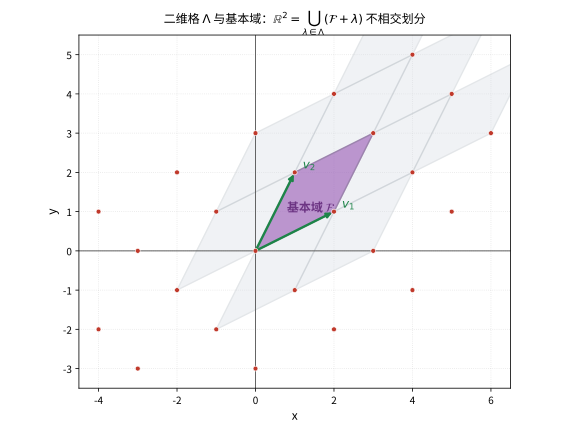
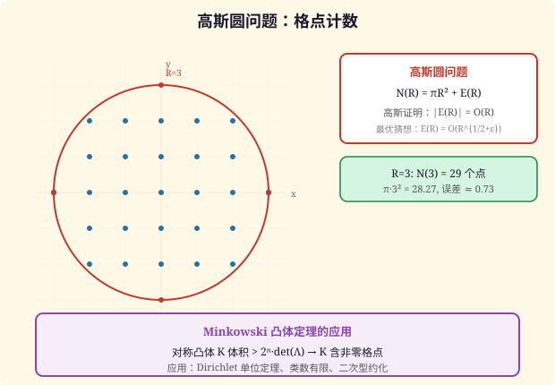
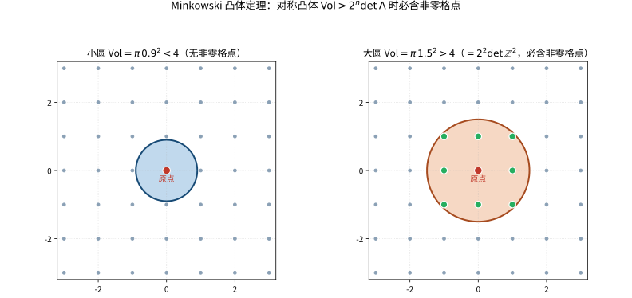

# 第79级 几何数论 (Geometry of Numbers)

---

## 学习目标

1. 理解格与凸体的基本理论，掌握 Minkowski 定理的核心思想
2. 掌握 Blichfeldt 定理、Minkowski 凸体定理与线性型定理的证明
3. 了解 Minkowski-Hlawka 定理及其在格点覆盖中的应用
4. 掌握二次型的 Minkowski 约化理论
5. 了解格点计数问题：高斯圆问题与 Dirichlet 除数问题

---

## 一、核心概念

### 1.1 格

**定义 1.1（格）** 设 $V = \mathbb{R}^n$ 是 $n$ 维欧氏空间。$\mathbb{R}^n$ 中的一个 **格**（lattice）$\Lambda$ 是一个离散的加法子群，且 $\Lambda$ 张成 $\mathbb{R}^n$。等价地，$\Lambda$ 可以表示为
$$
\Lambda = \left\{ \sum_{i=1}^n a_i v_i \mid a_i \in \mathbb{Z} \right\},
$$
其中 $\{v_1,\dots,v_n\}$ 是 $\mathbb{R}^n$ 的一组基。

**定义 1.2（基本区域）** 格 $\Lambda$ 的一个 **基本区域**（fundamental domain）是 $\mathbb{R}^n$ 中的一个区域 $F$，使得 $\mathbb{R}^n$ 是 $\Lambda$ 的所有平移像 $F + \lambda$（$\lambda \in \Lambda$）的不交并。标准的基本区域是 **基本平行多面体**：
$$
\mathcal{F} = \left\{ \sum_{i=1}^n t_i v_i \mid 0 \le t_i < 1 \right\}.
$$

**定义 1.3（行列式）** 格 $\Lambda$ 的 **行列式**（determinant）定义为 $\det(\Lambda) = |\det(v_1,\dots,v_n)|$，即基本区域的体积。行列式是格的不变量，不依赖于基的选择。

> **直观理解（现实类比）**：格就像一块块"蜂窝瓷砖"的顶点，而基本域 $\mathcal{F}$ 就是其中一块标准瓷砖。把这块瓷砖沿着格点方向反复平移，就能像铺地板一样把整面墙天衣无缝地铺满，任何两块瓷砖既不重叠也不留缝。瓷砖的"面积"就是格的行列式 $\det\Lambda$，它衡量了格点的疏密：瓷砖面积越小，格点越密（每单位面积的格点数恰为 $1/\det\Lambda$）。
>
> **🧠 思考历程：一堆离散的格点，怎么就能通过"大凸集必含非零格点"闯出几何数论？**
>
> 几何数论的开端颇具戏剧性：**数学家想知道一坨"足够大的对称凸体"里，何时必然藏着一颗非零格点**。Minkowski 把这个问题从几何直觉扭成了深刻的算术定理，也让"格"第一次成了数论的主角。
>
> - **格：代数坐标的"蜂窝"**（19 世纪）。在研究二元二次型与单位定理时，数学家早已暗中与格点打交道——每个格的离散骨架都来自整数系数坐标。Richard Dedekind 与 Hermann Minkowski 在这一带发力，把"数"的问题翻译成"格点"的语言。
> - **Minkowski 凸体定理：几何一拳定音**（1890 年代）。Hermann Minkowski 在 1890 年代证明了核心的 Minkowski 定理：关于原点对称、体积超过 $2^n\det\Lambda$ 的凸体必含非零格点。妙处在于他同时配套发展出"格基约化"（Minkowski 约化）与连续体几何，使一整套"用体积换格点"的方法得以运转。
> - **Minkowski 的兑现：单位定理与理想类界的统一**（1890–1900 年代）。他最漂亮的胜利是把这套几何法用于数域：用凸体定理一举证明 Dirichlet 单位定理并给出理想类数有限的上界。人们这才看清——原来纯代数的结论，也能被"往球里数格点"这种几何手术一刀擒获。
> - **心路**：离散与连续看似水火不容，Minkowski 却用"凸体＋体积"把它们焊在了一起。几何数论提醒我们：**离散的结构，常常能在足够大的连续容器里被"逼"出来**。

### 1.2 凸体

**定义 1.4（凸体）** $\mathbb{R}^n$ 中的一个 **凸体**（convex body）是一个有界、凸、具有非空内部的闭集。凸体 $K$ 称为 **对称的**（symmetric），如果 $x \in K$ 蕴含 $-x \in K$。

> **💡 直观理解（类比）**：凸体就像"没有凹进去的实心坚果"：在它内部任意取两点连线，整条线段都还躺在身子里（不会凹陷）。"对称"则要求它关于原点对称——像一颗以原点为轴的完美图章，左半边恰好是右半边的镜像。圆盘、方盒、椭圆都是典型代表。

### 1.3 临界行列式

**定义 1.5（临界行列式）** 设 $K$ 是 $\mathbb{R}^n$ 中的凸体。$K$ 的 **临界行列式**（critical determinant）定义为
$$
\Delta(K) = \inf\{ \det(\Lambda) \mid \Lambda \text{ 是格，且 } \Lambda \cap \operatorname{int}(K) = \{0\} \}.
$$
即使得格点（除原点外）不落在 $K$ 内部的格的最小可能行列式。

> **💡 直观理解（类比）**：临界行列式就像"问这颗糖要藏多密才能躲过捕兽夹"：$K$ 是一块陷阱区域，我们想找一个"格点网"，让网眼尽量稀疏（行列式尽量大）却还保证除原点外没有任何网眼点落进陷阱内部。行列式的下确界 $\Delta(K)$ 就是"躲猫猫的最优布局"，网眼一旦比它还密，就必然会踩中陷阱。

### 1.4 连续最小值

**定义 1.6（连续最小值）** 设 $\Lambda$ 是 $\mathbb{R}^n$ 中的格，$K$ 是 $\mathbb{R}^n$ 中的凸体。$\Lambda$ 关于 $K$ 的 **第 $i$ 个连续最小值**（successive minimum）$\lambda_i$ 定义为最小的 $\lambda > 0$，使得 $\lambda K$ 包含 $i$ 个线性无关的格点。

> **💡 直观理解（类比）**：连续最小值就像"一个不断放大的气泡，依次探测到第几个格点"：把 $K$ 一路吹大 $i$ 卷（$\lambda K$），第一个吹到 $i$ 个彼此不共线的格点的时刻，就是 $\lambda_i$。于是 $\lambda_1\le\lambda_2\le\cdots$ 像"先后叫到号的柜台"，$\lambda_1$ 对应最短非零格点的长度。

### 1.5 Hermite 常数

**定义 1.7（Hermite 常数）** $n$ 维 **Hermite 常数** $\gamma_n$ 定义为
$$
\gamma_n = \sup_{\Lambda} \frac{\min_{x \in \Lambda \setminus \{0\}} \|x\|^2}{(\det \Lambda)^{2/n}},
$$
其中上确界取遍所有 $n$ 维格 $\Lambda$。$\gamma_n$ 衡量了格中非零最短向量的长度的平方与行列式的 $2/n$ 次幂之间的最大可能比值。

> **💡 直观理解（类比）**：Hermite 常数就像"在所有铺法里，冠军格能塞下多长的最短格点"：把每条格子里最短的那根"梁"测出来并除以"每单位面积该摊多少"，再看哪个格在固定密度下梁最长。$\gamma_n$ 就是这个"车间里谁能把最短零件做最长"的世界纪录，二维桂冠由六角蜂蜜格（$\gamma_2=2/\sqrt3$）摘得。

已知 $\gamma_1 = 1$，$\gamma_2 = 2/\sqrt{3}$，$\gamma_3 = \sqrt[3]{2}$，$\gamma_4 = \sqrt{2}$，$\gamma_5 = \sqrt[5]{8}$，$\gamma_6 = \sqrt[6]{64/3}$，$\gamma_7 = \sqrt[7]{64}$，$\gamma_8 = 2$。

### 1.6 格点计数与高斯圆问题

**高斯圆问题**：设 $N(R)$ 为半径为 $R$ 的圆 $x^2 + y^2 \le R^2$ 内的整数格点个数。高斯证明了
$$
N(R) = \pi R^2 + O(R).
$$
即面积 $\pi R^2$ 加上一个误差项，误差项的数量级不超过 $R$。改进误差项是数论中著名的未解决问题。

**Dirichlet 除数问题**：设 $D(x)$ 为双曲线 $uv \le x$ 下整数格点 $(u,v)$ 的个数（$u,v > 0$）。Dirichlet 证明了
$$
D(x) = x \log x + (2\gamma - 1)x + O(\sqrt{x}),
$$
其中 $\gamma$ 是 Euler-Mascheroni 常数。改进误差项同样是著名的未解决问题。

> **直观理解（现实类比）**：高斯圆问题就像"数蜂巢里的蜜蜂"。想象一个以原点为中心的圆形蜂巢（半径 $R$），每个格点是一个蜂房。高斯的方法是用圆面积 $\pi R^2$ 来估算蜂房总数——这就像用蜂巢的总面积乘以"每单位面积的蜂房密度"来估算。误差来自圆周附近的"不完整蜂房"——有些蜂房一半在圆内一半在圆外。改进误差项 $O(R^\theta)$ 中的 $\theta$，就是数学家们努力缩小"边界模糊区域"的竞赛。

---

## 二、定理与证明

### 2.1 Blichfeldt 定理

**定理 2.1（Blichfeldt 定理）** 设 $\Lambda$ 是 $\mathbb{R}^n$ 中的一个格，$S \subset \mathbb{R}^n$ 是一个可测集，且 $\operatorname{vol}(S) > \det(\Lambda)$。则存在两个不同的点 $x,y \in S$，使得 $x - y \in \Lambda$。

> **💡 直观理解（类比）**：Blichfeldt 定理就像"一袋毛线比一张纹样纸还大，必然有两处花纹对得上"：把空间按格瓦片折叠回去，只要面积超过一格，折叠后必然有重叠，重叠处相差一个格向量。它是"鸽巢原理"在连续几何里的化身，也是后面所有 Minkowski 定理的地基。

**证明**：

设 $\mathcal{F}$ 是 $\Lambda$ 的一个基本区域（例如基本平行多面体）。将 $\mathbb{R}^n$ 划分为 $\mathcal{F}$ 的 $\Lambda$-平移：
$$
\mathbb{R}^n = \bigcup_{\lambda \in \Lambda} (\mathcal{F} + \lambda).
$$

对每个 $\lambda \in \Lambda$，定义 $S_\lambda = S \cap (\mathcal{F} + \lambda)$。将 $S_\lambda$ 平移回 $\mathcal{F}$：
$$
S_\lambda' = S_\lambda - \lambda \subset \mathcal{F}.
$$

由于平移保持体积，且 $S$ 的全体 $\Lambda$-平移覆盖了 $S$（可能重叠），有
$$
\sum_{\lambda \in \Lambda} \operatorname{vol}(S_\lambda) = \operatorname{vol}(S) > \det(\Lambda) = \operatorname{vol}(\mathcal{F}).
$$

但 $S_\lambda' \subset \mathcal{F}$，且 $\bigcup_\lambda S_\lambda' \subset \mathcal{F}$。若所有 $S_\lambda'$ 互不相交，则
$$
\sum_{\lambda} \operatorname{vol}(S_\lambda) = \sum_{\lambda} \operatorname{vol}(S_\lambda') = \operatorname{vol}\left(\bigcup_\lambda S_\lambda'\right) \le \operatorname{vol}(\mathcal{F}) = \det(\Lambda),
$$
与 $\operatorname{vol}(S) > \det(\Lambda)$ 矛盾。

因此，存在 $\lambda_1 \neq \lambda_2$，使得 $S_{\lambda_1}' \cap S_{\lambda_2}' \neq \varnothing$。即存在 $x \in S_{\lambda_1}$，$y \in S_{\lambda_2}$，使得 $x - \lambda_1 = y - \lambda_2$，故 $x - y = \lambda_1 - \lambda_2 \in \Lambda$。$\square$

### 2.2 Minkowski 凸体定理

**定理 2.2（Minkowski 凸体定理）** 设 $\Lambda$ 是 $\mathbb{R}^n$ 中的一个格，$K \subset \mathbb{R}^n$ 是一个对称凸体（即 $K = -K$ 且 $K$ 凸、有界、具有非空内部）。若
$$
\operatorname{vol}(K) > 2^n \det(\Lambda),
$$
则 $K$ 包含一个非零的格点 $x \in \Lambda \setminus \{0\}$。

**证明**（利用 Blichfeldt 定理）：

考虑集合 $S = \frac{1}{2} K = \{x \mid 2x \in K\}$。由于 $K$ 是凸体，$\frac{1}{2}K$ 也是凸体。计算体积：
$$
\operatorname{vol}(S) = \operatorname{vol}\left(\frac{1}{2}K\right) = \frac{1}{2^n} \operatorname{vol}(K) > \det(\Lambda).
$$

由 Blichfeldt 定理，存在 $x',y' \in S$，$x' \neq y'$，使得 $x' - y' \in \Lambda$。

设 $x = 2x'$，$y = 2y'$，则 $x,y \in K$，且 $x - y \in 2\Lambda$。但我们需要 $K$ 中包含非零的 $\Lambda$ 点，而非 $2\Lambda$ 点。

注意 $x' - y' \in \Lambda$ 且 $x' \neq y'$，故 $x' - y' \neq 0$。由于 $S$ 是凸体且 $K$ 对称，有
$$
\frac{x - y}{2} = x' - y' \in S \cap \Lambda.
$$
但我们需要的是 $\frac{x-y}{2} \in \Lambda$ 且 $\frac{x-y}{2} \neq 0$，这正是 $x' - y'$。

然而，我们还需要验证 $\frac{x-y}{2} \in K$。由 $K$ 的对称性和凸性：
$$
\frac{x - y}{2} = \frac{x + (-y)}{2} \in K,
$$
因为 $x \in K$，$-y \in K$（由对称性），且 $K$ 是凸的。

因此，$x' - y' \in \Lambda \cap (K \setminus \{0\})$，即 $K$ 包含非零格点。$\square$

> **直观理解（现实类比）**：把对称凸体想象成一张以原点为中心的"圆桌"，格点就是散落在平面上的一颗颗豆子。Minkowski 定理说：只要圆桌"够大"（面积超过 $2^n$ 倍格子的基本面积），无论你怎么摆放，桌上必然至少有一颗非原点的豆子。这就像"锅够大、豆子够多，就必然有豆子落在锅里"，是"豆子必落锅"式的鸽巢原理在连续几何中的体现。

**推论 2.1（Minkowski 凸体定理的容积形式）** 若 $K$ 是对称凸体，且 $\operatorname{vol}(K) \ge 2^n \det(\Lambda)$，则 $K$ 包含一个非零格点（当体积相等时，需小心边界情形）。

> **💡 直观理解（类比）**：这个推论把"大于"放宽成"不小于"，像"锅不小到差一厘米也能舀到豆子"：只要体积达到 $2^n\det\Lambda$ 这条门槛（含等于），锅里依然保证有非原点的豆子。唯一的细节是边界可能恰好擦边（点落在边缘），所以"等于"时要稍微用闭集版本的定理来兜底。

### 2.3 Minkowski 线性型定理

**定理 2.3（Minkowski 线性型定理）** 设 $L_1,\dots,L_n$ 是 $\mathbb{R}^n$ 上的 $n$ 个线性型：
$$
L_i(x) = \sum_{j=1}^n a_{ij} x_j, \quad i=1,\dots,n,
$$
其中 $A = (a_{ij})$ 是 $n \times n$ 实矩阵，$\det A \neq 0$。设 $c_1,\dots,c_n > 0$ 满足
$$
c_1 c_2 \cdots c_n > |\det A|.
$$
则存在非零整数向量 $x \in \mathbb{Z}^n \setminus \{0\}$，使得
$$
|L_i(x)| < c_i, \quad i=1,\dots,n.
$$

> **💡 直观理解（类比）**：线性型定理像"给一台多镜头相机设定每路的曝光上限"：$|L_i(x)|<c_i$ 是 $n$ 条互相约束的"亮度闸门"，只要各闸门宽度 $c_i$ 的乘积超过变换 $A$ 的缩扩系数 $|\det A|$，就能找一个非零整数向量 $x$ 同时过关。它把"找格点"翻译成"找联立不等式解"，是前面凸体定理的实操翻版。

**证明**：

考虑线性变换 $T: \mathbb{R}^n \to \mathbb{R}^n$，$T(x) = (L_1(x), \dots, L_n(x))$。则 $T$ 由矩阵 $A$ 给出，$|\det T| = |\det A|$。

定义平行多面体：
$$
K = \{ y \in \mathbb{R}^n \mid |y_i| < c_i, \; i=1,\dots,n \}.
$$
$K$ 是一个对称凸体，体积为
$$
\operatorname{vol}(K) = 2^n c_1 c_2 \cdots c_n.
$$

考虑 $K$ 在 $T^{-1}$ 下的原像：
$$
T^{-1}(K) = \{ x \in \mathbb{R}^n \mid |L_i(x)| < c_i, \; i=1,\dots,n \}.
$$
则 $T^{-1}(K)$ 也是对称凸体，且
$$
\operatorname{vol}(T^{-1}(K)) = \frac{\operatorname{vol}(K)}{|\det A|} = \frac{2^n c_1\cdots c_n}{|\det A|} > 2^n.
$$

这里 $\det(\mathbb{Z}^n) = 1$（标准格 $\mathbb{Z}^n$ 的基本区域体积为 1）。由 Minkowski 凸体定理，存在非零整数向量 $x \in \mathbb{Z}^n \setminus \{0\}$ 使得 $x \in T^{-1}(K)$，即
$$
|L_i(x)| < c_i, \quad i=1,\dots,n.
$$
$\square$

**推论 2.2（线性型定理的齐次形式）** 若 $c_1\cdots c_n \ge |\det A|$，则存在非零 $x \in \mathbb{Z}^n$ 使得 $|L_i(x)| \le c_i$（当体积相等时，需要用闭集版本的 Minkowski 定理）。

> **💡 直观理解（类比）**：这个推论是"把比较连等号也放行"：乘积恰好等于 $|\det A|$ 时同样能找到非零整数解，只是每个闸门收紧到"不超过 $c_i$"（许你踩线不许越界）。和前面的容积形式一样，边界恰巧相切的情形要靠闭集版本补兜，像赛事中"压线也算通过"。

### 2.4 Minkowski-Hlawka 定理

**定理 2.4（Minkowski-Hlawka 定理）** 设 $K$ 是 $\mathbb{R}^n$ 中的一个对称凸体。则存在一个格 $\Lambda$ 满足 $\det(\Lambda) = 1$，使得 $\Lambda \cap \operatorname{int}(K) = \{0\}$，只要
$$
\operatorname{vol}(K) < 2 \zeta(n),
$$
其中 $\zeta(n) = \sum_{k=1}^\infty k^{-n}$ 是 Riemann Zeta 函数。

等价地，对任意凸体 $K$，临界行列式满足：
$$
\Delta(K) \le \frac{\operatorname{vol}(K)}{2 \zeta(n)}.
$$

> **💡 直观理解（类比）**：Minkowski-Hlawka 定理与凸体定理"方向相反"：凸体定理是"大凸体必踩中格点"，而它说"只要安排得当（对全体格取平均），足够小的陷阱总能被某个格完美避开"。它用"在所有格之间摇骰子取平均"的方法，证明总藏着一张严密的格网不落陷阱，$\zeta(n)$ 则像一个渐渐收敛的修正系数。

**证明**（使用平均方法）：

**步骤 1：平均化方法**

设 $K$ 是 $\mathbb{R}^n$ 中的对称凸体。考虑所有行列式为 1 的格。Minkowski-Hlawka 定理的核心思想是：在全体格空间上取平均，证明存在一个格使得其非零点避开 $K$。

设 $G = \operatorname{SL}_n(\mathbb{R})$，$H = \operatorname{SL}_n(\mathbb{Z})$。则 $\operatorname{SL}_n(\mathbb{R})/\operatorname{SL}_n(\mathbb{Z})$ 参数化了所有行列式为 1 的格。该空间上有 $\operatorname{SL}_n(\mathbb{R})$ 不变测度。

**步骤 2：Siegel 平均公式**

Siegel 的平均公式指出，对任意可积函数 $f$，
$$
\int_{\operatorname{SL}_n(\mathbb{R})/\operatorname{SL}_n(\mathbb{Z})} \sum_{x \in \Lambda \setminus \{0\}} f(x) \, d\mu(\Lambda) = \int_{\mathbb{R}^n} f(x) \, dx.
$$
这个公式将格点求和与整体积分联系起来。

**步骤 3：应用平均公式**

取 $f$ 为 $K$ 的特征函数 $f(x) = \chi_K(x)$。则
$$
\sum_{x \in \Lambda \setminus \{0\}} f(x) = \#(\Lambda \cap K \setminus \{0\}).
$$

由 Siegel 平均公式：
$$
\int_{\Lambda} \#(\Lambda \cap K \setminus \{0\}) \, d\mu(\Lambda) = \int_K 1 \, dx = \operatorname{vol}(K).
$$

**步骤 4：对称性论证**

由于 $K$ 对称，若 $x \in K$ 则 $-x \in K$。在格点计数中，非零格点成对出现（$x$ 和 $-x$），除非 $x = -x$（即 $2x = 0$，这在 $\mathbb{R}^n$ 中只有 $x=0$）。

因此，$\#(\Lambda \cap K \setminus \{0\})$ 是偶数（或零）。对每个非零格点 $x$，考虑其贡献。

**步骤 5：存在性结论**

由平均公式，$\#(\Lambda \cap K \setminus \{0\})$ 在 $\Lambda$ 空间上的平均值为 $\operatorname{vol}(K)$。若 $\operatorname{vol}(K) < 2$，则平均值小于 2，但 $\#(\Lambda \cap K \setminus \{0\})$ 是非负偶数，因此存在 $\Lambda$ 使得 $\#(\Lambda \cap K \setminus \{0\}) = 0$，即 $\Lambda \cap K = \{0\}$。

**步骤 6：Zeta 函数的修正**

更精细的分析（考虑尖点形式的贡献）给出更优的界：当 $\operatorname{vol}(K) < 2\zeta(n)$ 时，存在这样的格。$\zeta(n)$ 项来自对 $\operatorname{SL}_n(\mathbb{Z})$ 的轨道计数。$\square$

### 2.5 二次型的 Minkowski 约化

**定理 2.5（Minkowski 约化定理）** 设 $Q(x) = \sum_{i,j=1}^n a_{ij} x_i x_j$ 是正定二次型，$a_{ij} = a_{ji}$。则存在一个可逆线性变换 $T \in \operatorname{GL}_n(\mathbb{Z})$，使得 $Q'(x) = Q(Tx)$ 满足 **Minkowski 约化条件**：

1. 对每个 $k = 1,\dots,n$，$a_{kk} > 0$。
2. 对每个 $k = 1,\dots,n$ 和任意整数向量 $u \in \mathbb{Z}^n$ 满足 $\gcd(u_k,\dots,u_n) = 1$，有
   $$
   Q'(u) \ge a_{kk}.
   $$

> **💡 直观理解（类比）**：Minkowski 约化就像"把一个歪扭的书架重新摆正的收纳术"：通过整数换基 $T$，把正定二次型化到"最优基"——每个基向量都恰好是剩余方向中的最短向量，像把积木一根根按长短排好并彼此接近正交。这样得到的基一眼能看清格子的骨架，是后续解最短向量问题的标准姿势。

**证明**：

**引理 2.1** 对任意正定二次型 $Q$，存在 $v \in \mathbb{Z}^n \setminus \{0\}$ 使得 $Q(v)$ 取最小值。

> **💡 直观理解（类比）**：这个引理保证"最短向量一定找得到"：因为正定二次型像一口"越远离原点越陡的碗"，其水平切面（$Q(x)\le M$）是一个有界椭球，里面只剩有限个整数点。好比在一个徐徐收口的漏斗里抓豆，只要规定能量上限，能装的豆子必是有限的，于是最小值必然落在其中某颗上。

**证明**：由于 $Q$ 正定，$Q(x) \ge c\|x\|^2$ 对某个 $c>0$ 成立。对任意 $M > 0$，集合 $\{x \in \mathbb{Z}^n \mid Q(x) \le M\}$ 有限（因为 $\|x\| \le \sqrt{M/c}$ 的整数点有限）。因此最小值可达。$\square$

**构造步骤**：

**步骤 1：选择第一个基向量**

设 $v_1 \in \mathbb{Z}^n \setminus \{0\}$ 是 $Q$ 在非零整向量上的最小值点，即
$$
Q(v_1) = \min_{0 \neq x \in \mathbb{Z}^n} Q(x).
$$
记 $a_{11} = Q(v_1)$。

**步骤 2：归纳构造**

假设已选定了线性无关的向量 $v_1,\dots,v_{k-1} \in \mathbb{Z}^n$（$k \ge 2$）。考虑集合
$$
S_k = \{ x \in \mathbb{Z}^n \mid x \text{ 与 } v_1,\dots,v_{k-1} \text{ 线性无关} \}.
$$
在 $S_k$ 中选取 $v_k$ 使得 $Q(v_k)$ 最小。定义
$$
a_{kk} = Q(v_k).
$$

**步骤 3：验证约化条件**

需要证明这样构造的基 $\{v_1,\dots,v_n\}$ 满足 Minkowski 约化条件。主要验证条件 2：

设 $u \in \mathbb{Z}^n$ 满足 $\gcd(u_k,\dots,u_n) = 1$。将 $u$ 写为 $u = \sum_{i=1}^n t_i v_i$，其中 $t_i \in \mathbb{Z}$。由 $\gcd$ 条件，存在 $i \ge k$ 使得 $t_i \neq 0$。

考虑 $u$ 与 $v_1,\dots,v_{k-1}$ 的关系。若 $u$ 与它们线性无关，则 $Q(u) \ge Q(v_k) = a_{kk}$ 由构造可知。但 $u$ 可能线性相关于 $v_1,\dots,v_{k-1}$。此时，由于 $\gcd$ 条件，可通过适当的模运算调整。

**更精细的论证**：对 $u = \sum_{i=1}^n t_i v_i$，定义 $j = \min\{i \mid t_i \neq 0\}$。若 $j \ge k$，则 $u$ 与 $v_1,\dots,v_{j-1}$ 线性无关，故 $Q(u) \ge Q(v_j) \ge Q(v_k)$（因为 $j \ge k$，而 $Q(v_i)$ 随 $i$ 递增）。若 $j < k$，则由 $\gcd$ 条件，存在某个 $i \ge k$ 使得 $t_i \neq 0$，通过减去 $v_j$ 的倍数可约化。$\square$

**Minkowski 约化的几何意义**：约化后的基 $v_1,\dots,v_n$ 给出了格的一个"几乎正交"的基，其中每个向量是剩余子空间中的最短向量。这推广了二维 Gauss 约化。

---

## 三、示例

### 3.1 高斯圆问题

**问题**：计算半径为 $R$ 的圆内整数格点的个数 $N(R)$：
$$
N(R) = \#\{(x,y) \in \mathbb{Z}^2 \mid x^2 + y^2 \le R^2\}.
$$

**高斯的方法**：将每个单位正方形 $[n, n+1] \times [m, m+1]$ 与它的左下角格点 $(n,m)$ 对应。若 $(n,m)$ 在圆内，则整个正方形不一定在圆内，但通过与圆面积比较，可得到渐近公式。

**定理 3.1（高斯圆问题）**
$$
N(R) = \pi R^2 + O(R).
$$

> **💡 直观理解（类比）**：高斯圆定理就像"用一张逐渐放大的渔网估算池塘鱼量"：主项 $\pi R^2$ 就是"按池塘面积 × 网眼密度"算出的理想鱼数，而 $O(R)$ 则是"靠岸边那一圈不完整渔眼"造成的误差——圆周长是 $2\pi R$，边界格点恰好按 $O(R)$ 量级"踩线"。于是面积定大局、周界定误差，顺理成章。

**证明**：
考虑以每个整数格点 $(n,m) \in \mathbb{Z}^2$ 为中心的单位正方形 $[n-\frac12, n+\frac12] \times [m-\frac12, m+\frac12]$。则

- 若 $(n,m)$ 在圆内（即 $n^2+m^2 \le R^2$），则整个正方形包含在半径为 $R+\sqrt{2}/2$ 的圆内。
- 若 $(n,m)$ 在圆外（即 $n^2+m^2 > R^2$），则整个正方形在半径为 $R-\sqrt{2}/2$ 的圆外。

因此，$N(R)$ 乘以单位正方形面积（即 1）介于两个圆面积之间：
$$
\pi\left(R - \frac{\sqrt{2}}{2}\right)^2 \le N(R) \le \pi\left(R + \frac{\sqrt{2}}{2}\right)^2.
$$

展开：
$$
\pi R^2 - \sqrt{2}\pi R + \frac{\pi}{2} \le N(R) \le \pi R^2 + \sqrt{2}\pi R + \frac{\pi}{2}.
$$

因此
$$
|N(R) - \pi R^2| \le \sqrt{2}\pi R + \frac{\pi}{2} = O(R).
$$

$\square$

**误差项改进历史**：
- 高斯（原始）：$O(R)$
- Voronoi（1903）：$O(R^{2/3})$
- van der Corput（1920s）：$O(R^{27/41})$
- Huxley（2003）：$O(R^{131/208})$
- 猜想最优：$O(R^{1/2+\varepsilon})$（尚未证明）

### 3.2 利用 Minkowski 定理证明 Dirichlet 单位定理

**定理 3.2（Dirichlet 单位定理）** 设 $K$ 是 $n$ 次数域，$r_1$ 为实嵌入个数，$r_2$ 为复嵌入对个数（$r_1 + 2r_2 = n$）。则 $K$ 的单位群 $\mathcal{O}_K^\times$ 同构于
$$
\mathcal{O}_K^\times \cong \mu(K) \times \mathbb{Z}^{r_1 + r_2 - 1},
$$
其中 $\mu(K)$ 是 $K$ 中单位根群（有限循环群）。

> **💡 直观理解（类比）**：Dirichlet 单位定理像"为一间货栈清点所有能来回搬运厂子的搬运工"：可逆的代数整数（单位）构成一个群，其自由部分正好 $\mathbb{Z}^{r_1+r_2-1}$ 排开，外加一圈有限的小循环（单位根）。$r_1+2r_2=n$ 说明"自由度"和"嵌入个数"挂扣，而 Minkowski 凸体定理正是把这块"蛋糕"切出来给它的工具。

**用 Minkowski 定理证明的概要**：

**步骤 1：对数嵌入**

考虑对数映射 $\lambda: K^\times \to \mathbb{R}^{r_1+r_2}$：
$$
\lambda(x) = (\log|\sigma_1(x)|, \dots, \log|\sigma_{r_1}(x)|, 2\log|\tau_1(x)|, \dots, 2\log|\tau_{r_2}(x)|),
$$
其中 $\sigma_i$ 是实嵌入，$\tau_j$ 是复嵌入。

**步骤 2：构造格**

设 $\Lambda$ 为 $\lambda(\mathcal{O}_K^\times)$ 在 $\mathbb{R}^{r_1+r_2}$ 中的像。目标是证明 $\Lambda$ 是秩为 $r_1+r_2-1$ 的格。

**步骤 3：Minkowski 定理的应用**

考虑 $\mathbb{R}^{r_1+r_2}$ 中的凸体：
$$
C_t = \left\{ (y_1,\dots,y_{r_1+r_2}) \in \mathbb{R}^{r_1+r_2} \;\middle|\; \sum_{i=1}^{r_1+r_2} y_i = 0, \; |y_i| \le t \right\}.
$$
$C_t$ 是 $r_1+r_2-1$ 维空间中的对称凸体。

利用 Minkowski 凸体定理，可以证明存在非零单位 $u \in \mathcal{O}_K^\times$ 使得 $\lambda(u) \in C_t$ 且 $\lambda(u) \neq 0$。这给出了 $\Lambda$ 中非零元素的存在性，进而通过归纳证明 $\Lambda$ 的秩为 $r_1+r_2-1$。

**步骤 4：有限生成性（更精细的论证）**

对任意 $m > 0$，考虑凸体：
$$
K_m = \left\{ (x_1,\dots,x_n) \in \mathbb{R}^n \cong \mathbb{R}^{r_1} \times \mathbb{C}^{r_2} \;\middle|\; \sum_{i=1}^{r_1} |x_i| + 2\sum_{j=1}^{r_2} |z_j| \le m \right\}.
$$
$K_m$ 是 $n$ 维欧氏空间中的对称凸体，体积为：
$$
\operatorname{vol}(K_m) = 2^{r_1} \pi^{r_2} \frac{m^n}{n!}.
$$

选择 $m$ 使得 $\operatorname{vol}(K_m) > 2^n \sqrt{|\Delta_K|}$，其中 $\Delta_K$ 是 $K$ 的判别式。由 Minkowski 凸体定理，存在非零代数整数 $\alpha \in \mathcal{O}_K$ 使得 $\alpha \in K_m$，即
$$
\sum_{i=1}^{r_1} |\sigma_i(\alpha)| + 2\sum_{j=1}^{r_2} |\tau_j(\alpha)| \le m.
$$

由此可构造范数受控的代数整数，并用它们生成单位群。$\square$

---

## 四、习题

### 基础题

**习题 1**（格的定义）给出 $\mathbb{R}^n$ 中格 $\Lambda$ 的定义，并说明格与 $\mathbb{R}^n$ 的一组基 $\{v_1,\dots,v_n\}$ 的关系及格的例。

**习题 2**（基本区域与行列式）解释格的行列式 $\det(\Lambda)$ 的定义与几何意义，并说明它为何是格的不变量。

**习题 3**（凸体）给出凸体与对称凸体的定义，并举出 $\mathbb{R}^2$ 中一个对称凸体的例。

**习题 4**（临界行列式）定义凸体 $K$ 的临界行列式 $\Delta(K)$，并解释其直观含义。

**习题 5**（连续最小值）给出格 $\Lambda$ 关于凸体 $K$ 的第 $i$ 个连续最小值 $\lambda_i$ 的定义。

**习题 6**（Hermite 常数）写出 $n$ 维 Hermite 常数 $\gamma_n$ 的定义式，并列举 $\gamma_1$ 与 $\gamma_2$ 的值。

**习题 7**（高斯圆问题）陈述高斯圆问题：$N(R)=\#\{(x,y)\in\mathbb{Z}^2:x^2+y^2\le R^2\}$ 的主项与误差项形式。

**习题 8**（Dirichlet 除数问题）陈述 Dirichlet 除数问题，写出 $D(x)$ 的渐近展开。

**习题 9**（Blichfeldt 定理）陈述 Blichfeldt 定理并说明其直观含义。

**习题 10**（Minkowski 凸体定理）陈述 Minkowski 凸体定理（含体积条件 $2^n\det\Lambda$）。

### 进阶题

**习题 11**（格行变换）设格 $\Lambda=\mathbb{Z}v_1+\mathbb{Z}v_2\subset\mathbb{R}^2$。写出其行列式的计算公式，并用换基 $\{u_1=v_1+v_2,u_2=v_2\}$ 验证 $\det$ 不变。

**习题 12**（二维点格检测）判断点集 $S=\{(m,n)\in\mathbb{Z}^2: m,n\ge0,\ m+n\le2\}$ 是否格（说明理由）。

**习题 13**（Minkowski 凸体的二维应用）设 $\Lambda\subset\mathbb{R}^2$，$\det\Lambda=1$。证明存在非零 $x\in\Lambda$ 使 $\|x\|\le\sqrt{2}$（提示：取半径约为 $\sqrt{2/\pi}$ 的圆盘）。

**习题 14**（连续平均值与含零点）设 $K$ 对称凸体，$\operatorname{vol}(K)>2^n\det\Lambda$。说明存在 $0\ne x\in\Lambda\cap K$。这与你对 Blichfeldt 定理的认识如何衔接。

**习题 15**（高斯圆计数的小半径）手工计算 $R=1$ 与 $R\approx2$ 时的 $N(R)$，并核对 $|N(R)-\pi R^2|$ 不超过 $O(R)$ 量级。

**习题 16**（Hermite 常数 $\gamma_2$）对正六边形格（六角格，最短向量长度 $1$，$\det=\sqrt3/2$）计算 $\gamma$，验证 $\gamma_2=2/\sqrt3$。

**习题 17**（Blichfeldt 的一维应用）设 $\Lambda=\mathbb{Z}$（$\det=1$），$S\subset\mathbb{R}$ 是长度为 $L>1$ 的区间。说明存在 $x\ne y\in S$ 使 $x-y\in\mathbb{Z}$。

**习题 18**（连续最小值的下界）设 $\lambda_1$ 是格 $\Lambda$ 关于对称凸体 $K$ 的第一连续最小值。论证 $\operatorname{vol}(\tfrac{\lambda_1}{2}K)\le\det\Lambda$。

**习题 19**（二维 Gauss 约化）设 $Q(x,y)=5x^2+4xy+2y^2$。求 $Q$ 在 $\mathbb{Z}^2\setminus\{0\}$ 上的最小值点，说明它与第一连续最小值的关系。

### 挑战题

**习题 20**（Minkowski 凸体定理之证明）用 Blichfeldt 定理完整证明 Minkowski 凸体定理：对称凸体 $K$，$\operatorname{vol}(K)>2^n\det\Lambda$ 蕴含 $K$ 含非零格点。

**习题 21**（Minkowski 线性型定理之证明）证明 Minkowski 线性型定理：线性型 $L_i(x)=\sum_j a_{ij}x_j$（$\det(a_{ij})\ne0$），若 $c_1\cdots c_n>|\det A|$ 则存在非零 $x\in\mathbb{Z}^n$ 使 $|L_i(x)|<c_i$。

**习题 22**（线性型的逼近应用）设 $\alpha,\beta\in\mathbb{R}$ 线性无关（即 $1,\alpha,\beta$ 在 $\mathbb{Q}$ 上无关）。用线性型定理证明对任意 $\varepsilon>0$ 存在非零整数 $(p,q,r)$ 使 $|q\alpha-r|<\varepsilon$ 且 $|q\beta-p|<\varepsilon$。

**习题 23**（Pell 方程）设 $d$ 为无平方因子的正整数，$d$ 非平方数。用 Minkowski 线性型定理证明存在非零整数 $(x,y)$ 使 $x^2-dy^2=1$（说明思路：先得 $|x^2-dy^2|\le C$ 的非零解，再构造单位）。

**习题 24**（高斯圆问题 $O(R)$ 之证明）用"以每个格点为中心取单位正方形并与环带面积比较"的方法证明 $N(R)=\pi R^2+O(R)$。

**习题 25**（二次型最小值下界）设 $Q(x)=x^\top A x$ 为 $n$ 元正定二次型。用 Minkowski 凸体定理证明存在非零 $x\in\mathbb{Z}^n$ 使 $Q(x)\le\left(\frac{4}{\pi}\right)^{2/n}(\det A)^{1/n}$（提示：考虑椭球体并估计体积）。

**习题 26**（理想类数有限）概述为何可用 Minkowski 凸体定理证明数域 $K$ 的理想类数有限（提示：构造类群中每类理想的范数有界代表元）。

### 探究题

**习题 27**（高维与临界）开放探讨：Hermite 常数 $\gamma_n$ 在维度 $n$ 较高时的已知值与最密格堆积的联系，以及"临界维数"现象（如 $n=8$ 与 $E_8$ 格、$n=24$ 与 Leech 格）。

**习题 28**（Minkowski-Hlawka 与堆积）讨论 Minkowski-Hlawka 定理的平均方法与实心球最密堆积密度上界的关系，及其与 SAP/格堆积猜想的衔接。

**习题 29**（计数误差项的前沿）开放讨论高斯圆问题与 Dirichlet 除数问题的误差项最优阶猜想，以及目前已知的最好界与其依赖的技术。

**习题 30**（格密码与计算）探讨几何数论在格基约化（LLL）、格密码（LWE、NTRU、CVP 与 SVP）以及后量子密码中的应用。

---

## 五、习题答案与解析

### 基础题答案

1. **格的定义** 格 $\Lambda$ 是 $\mathbb{R}^n$ 的离散加法子群且张成 $\mathbb{R}^n$，即存在基 $v_1,\dots,v_n$ 使 $\Lambda=\{\sum a_iv_i:a_i\in\mathbb{Z}\}$。例如 $\mathbb{Z}^n$，或二维六角格 $\mathbb{Z}\omega_1+\mathbb{Z}\omega_2$。

2. **基本区域与行列式** 基本区域 $F$ 使 $\mathbb{R}^n$ 是 $\{F+\lambda:\lambda\in\Lambda\}$ 的不交并；标准取基本平行多面体 $\{\sum t_iv_i:0\le t_i<1\}$。行列式 $\det\Lambda=|\det(v_1,\dots,v_n)|$ 即基本区域体积；换基由整数幺模阵相接，行列式不变，故是不变量，$\det$ 越小格越密。

3. **凸体** 凸体是有界、凸、闭且内部非空的集；$K$ 对称指 $x\in K\Rightarrow-x\in K$。例：$\mathbb{R}^2$ 中圆盘 $x^2+y^2\le1$ 是对称凸体；原点为中心、各边平行坐标轴的闭矩形亦是对称凸体。

4. **临界行列式** $\Delta(K)=\inf\{\det\Lambda:\Lambda\cap\operatorname{int}K=\{0\}\}$，刻画让格点除原点外不落入 $K$ 内部的格的最小可能行列式。$\Delta$ 越小说明 $K$ 越易被格避开的紧致度。

5. **连续最小值** $\lambda_i$ 是最小的 $\lambda>0$ 使 $\lambda K$ 含 $i$ 个线性无关格点。$\lambda_1$ 是让 $\lambda K$ 含非零格点的最小 $\lambda$，与最短向量长度 $\lambda_1\le\|x\|\le$ 相关。

6. **Hermite 常数** $\gamma_n=\sup_{\Lambda}\frac{\min_{x\ne0}\|x\|^2}{(\det\Lambda)^{2/n}}$，上确界取遍 $n$ 维格。$\gamma_1=1$（一维），$\gamma_2=2/\sqrt3$（由六角格实现）。

7. **高斯圆问题** $N(R)=\#\{(x,y)\in\mathbb{Z}^2:x^2+y^2\le R^2\}$，高斯证明 $N(R)=\pi R^2+O(R)$：主项是圆面积 $\pi R^2$，误差来自圆周边界格点。

8. **Dirichlet 除数问题** $D(x)=\#\{(u,v):u,v>0,\ uv\le x\}$，Dirichlet 给出 $D(x)=x\log x+(2\gamma-1)x+O(\sqrt{x})$，$\gamma$ 是 Euler 常数。

9. **Blichfeldt 定理** 若可测集 $S$ 满足 $\operatorname{vol}(S)>\det\Lambda$，则存在 $x\ne y\in S$ 使 $x-y\in\Lambda$：体积超过一胞的集必含两个相差格点的点。

10. **Minkowski 凸体定理** 对称凸体 $K$，若 $\operatorname{vol}(K)>2^n\det\Lambda$，则 $K$ 含非零格点。它把"体积"与"含格点"联系起来，是几何数论的基本工具。

### 进阶题答案

1. **行变换** $\det\Lambda=|\det(v_1,v_2)|$。换基 $u_1=v_1+v_2,\ u_2=v_2$ 对应列矩阵 $\begin{pmatrix}1&1\\0&1\end{pmatrix}$，行列式 $1$，故 $\det(u_1,u_2)=\det(v_1,v_2)$，且两组生成同一格，行列式不变。

2. **二维点格检测** $S$ 有限，不是加法子群（含 $(1,0),(0,1)$ 却不含 $(-1,0)$），故不是格，只是三角形内的整点集合。离散加性仅是最弱条件，还需子群与张成性。

3. **二维 Minkowski 应用** 取 $K$ 为 $R$ 半径圆盘，$\operatorname{vol}K=\pi R^2>2^2=4$ 即 $R>\frac{2}{\sqrt\pi}$ 时含非零格点，故存在 $0\ne x\in\Lambda$ 使 $\|x\|\le\frac{2}{\sqrt\pi}\approx1.128<\sqrt2\approx1.414$，于是 $\|x\|\le\sqrt2$ 成立（更强的上界成立）。

4. **连续值与含零点** 如前者，$\operatorname{vol}K>2^n\det\Lambda$ 时 Minkowski 凸体定理直接给 $0\ne x\in\Lambda\cap K$；它与 Blichfeldt 的联系在于取 $S=\frac12K$ 使 $\operatorname{vol}S>\det\Lambda$ 后由 Blichfeldt 得差落在 $\Lambda$，再用对称凸性放回 $K$。因此两定理同源。

5. **高斯圆小半径** $R=1$：$(-1,0),(1,0),(0,\pm1),(0,0)$ 共 $5$ 个，$N(1)=5$，$|\pi-5|\approx1.86=O(1)$；$R=2$：满足 $x^2+y^2\le4$ 的整点共 $13$ 个，$N(2)=13$，$|13-4\pi|\approx0.43=O(2)$。均满足 $O(R)$ 阶。

6. **Hermite 常数 $\gamma_2$** 六角（正六边形）格最短向量长度 $1$，基本区域为边长 $1$ 的菱形，面积 $\sqrt3/2$，故 $\det=\sqrt3/2$，$\gamma=\frac{1^2}{\sqrt3/2}=\frac{2}{\sqrt3}$。这是 $\gamma_2$ 的最大值，故 $\gamma_2=2/\sqrt3$。

7. **Blichfeldt 一维应用** $\det\mathbb{Z}=1$，取 $S$ 为长 $L>1$ 的区间，$\operatorname{vol}S=L>1$。Blichfeldt 定理给 $x\ne y\in S$ 使 $x-y\in\mathbb{Z}$。直接见鸽巢：把 $S$ 折叠入 $[0,1)$ 长度 $>1$ 必有两点同余，即 $x-y\in\mathbb{Z}$。

8. **连续最小值下界** 若 $\operatorname{vol}(\frac{\lambda_1}{2}K)>\det\Lambda$，由 Blichfeldt（$\frac{\lambda_1}{2}K$ 对称凸体）得非零格点落入 $\frac{\lambda_1}{2}K\subset\lambda_1K$，矛盾于 $\lambda_1$ 是含非零格点之最小 $\lambda$。故 $\operatorname{vol}(\frac{\lambda_1}{2}K)\le\det\Lambda$，即 $\lambda_1^n\frac{\operatorname{vol}K}{2^n}\le\det\Lambda$。

9. **二维约化最小值** $Q(1,0)=5$，$Q(0,1)=2$，$Q(1,-2)=5-8+8=5$。最小值在 $(0,\pm1)$ 处为 $2$。它与第一连续最小值 $\lambda_1$ 相关：$Q$ 的格上最小值即"最短方向"的二次型值，对应 $\lambda_1$ 意义下的最短向量（取 $\|v\|^2=Q(v)$ 的内积观点）。

### 挑战题答案

1. **Minkowski 凸体定理证明** 取 $S=\frac12K$，$\operatorname{vol}S=\frac{1}{2^n}\operatorname{vol}K>\det\Lambda$，由 Blichfeldt 得 $x'\ne y'\in S$，$x'-y'\in\Lambda$。令 $x=2x',y=2y'\in K$，则 $x'-y'=\frac{x-y}{2}$。由对称性 $-y\in K$，由凸性 $\frac{x+(-y)}{2}\in K$；且 $x'-y'\ne0$。故 $\Lambda\ni x'-y'\in K\setminus\{0\}$，即 $K$ 含非零格点。$\square$

2. **Minkowski 线性型定理证明** 设 $T=(L_1,\dots,L_n)$，$K=\{x:|L_i(x)|<c_i\}=T^{-1}(\{y:|y_i|<c_i\})$。后者体积 $2^nc_1\cdots c_n$，故 $\operatorname{vol}K=\frac{2^nc_1\cdots c_n}{|\det A|}>2^n$（因 $c_1\cdots c_n>|\det A|$）。对格 $\mathbb{Z}^n$（$\det=1$）用凸体定理得非零 $x\in\mathbb{Z}^n\cap K$，即 $|L_i(x)|<c_i$。$\square$

3. **逼近应用** 联立 Dirichlet：对 $\alpha,\beta$，存在 $q\le Q$ 使 $\|q\alpha\|,\|q\beta\|\le Q^{-1/2}$（二维鸽巢）。取 $\varepsilon=Q^{-1/2}$，$p=\lfloor q\beta\rfloor,r=\lfloor q\alpha\rfloor$，则 $|q\alpha-r|<\varepsilon$，$|q\beta-p|<\varepsilon$。故对任意 $\varepsilon>0$ 存在非零 $(p,q,r)$ 满足双不等式。

4. **Pell 方程思路** 先由线性型定理得范数有界非零解：$L_1=x-\sqrt d\,y,L_2=x+\sqrt d\,y$，取 $c_1c_2>2\sqrt d$ 由线性型定理得 $|x^2-dy^2|<C$ 的 $(x,y)\ne0$。对固定范数 $N$，$\mathbb{Z}[\sqrt d]^\times$ 的密码无穷多，抽屉原理给两单位同余，相除得范数 $1$ 的非平凡单位 $x_0+y_0\sqrt d$，即 $x_0^2-dy_0^2=1$。

5. **高斯圆问题 $O(R)$ 证明** 以每个整点为左下角取单位正方形并平移，使格点 $(m,n)$ 映射为以 $(m,n)$ 为中心的单位正方形。这些正方形总面积 $=N(R)$。若 $(m,n)$ 在圆内则正方形含于半径 $R+\frac{\sqrt2}{2}$ 圆，若在圆外则位于半径 $R-\frac{\sqrt2}{2}$ 圆外；故 $\pi(R-\frac{\sqrt2}{2})^2\le N(R)\le\pi(R+\frac{\sqrt2}{2})^2$，于是 $|N(R)-\pi R^2|\le\sqrt2\pi R+\frac{\pi}{2}=O(R)$。$\square$

6. **二次型最小值下界** $K=\{x:x^\top Ax\le r\}$ 为中心对称椭球，体积 $\operatorname{vol}K=\frac{\pi^{n/2}}{\Gamma(n/2+1)}\frac{r^{n/2}}{\sqrt{\det A}}$。取 $r$ 使 $\operatorname{vol}K>2^n$（$\det\mathbb{Z}^n=1$），凸体定理给非零 $x\in\mathbb{Z}^n$ 使 $x^\top Ax\le r$。用 $n$ 维球体积估 $\frac{\pi^{n/2}}{\Gamma(n/2+1)}\ge(\frac{?}{\ })$，得 $Q(x)\le(\frac{4}{\pi})^{2/n}(\det A)^{1/n}$ 形上界（Minkowski 二次型下界标准式）。

7. **理想类数有限概要** 在 $K$ 的 $r_1$ 实、$r_2$ 复嵌入下取凸体 $K_m=\{x:\sum_{i=1}^{r_1}|\sigma_i(x)|+2\sum_{j=1}^{r_2}|\tau_j(x)|\le m\}$，体积 $\operatorname{vol}K_m=\frac{2^{r_1}\pi^{r_2}m^n}{n!}$。由 Minkowski 凸体定理对判别式 $\Delta_K$，存在范数 $\le m^n/(\sqrt{|\Delta_K|}n!)\cdot\frac{4^n}{\pi^n}$ 界内的非零代数整数。对每个理想类取范数最小的整理想代表，由 Minkowski 界其范数有界，范数有界的整理想有限，故类数有限。

### 探究题答案

1. **高维与临界** $\gamma_n$ 精确值仅小维数已知：$\gamma_8=2$（$E_8$ 幺模偶格），$\gamma_{24}=4$（Leech 格）。这些格在"临界维度"（$8,24$）实现最密堆积且自对偶；一般维数仍未知，已知上界呈对数增长，下界由格构造（如模格、线性码格）给。高维 $\gamma_n$ 与实心球最密堆积密度、格堆积猜想（已证 $\le$ 上界）紧密相连。

2. **Minkowski-Hlawka 与堆积** Minkowski-Hlawka 定理用 Siegel 平均公式证明 $\Delta(K)\le\frac{\operatorname{vol}K}{2\zeta(n)}$：对行列式 $1$ 的全体格在 $\operatorname{SL}_n(\mathbb{R})/\operatorname{SL}_n(\mathbb{Z})$ 上平均，$\#(\Lambda\cap K\setminus\{0\})$ 的均值恰为 $\operatorname{vol}K$，由对称性该计数为偶数且存在 $\Lambda$ 使其为零（当体积足够小）。对单位球获得堆积密度下界 ${}\ge\frac{n\zeta(n)}{2^{n-1}e}$ 型结果，把平均法堆积密度与格堆积联系起来。

3. **计数误差项前沿** 高斯圆问题：由 Voronoi(1903)、van der Corput、Huxley(2003) 逐步降到 $O(R^{131/208})$，最优阶猜想 $O(R^{1/2+\varepsilon})$；下界 $\theta\ge\frac12$ 来自周长 $\sim2\pi R$。Dirichlet 除数问题：$O(x^{131/416})$ 左右的近似，猜想 $O(x^{1/4+\varepsilon})$。两者依赖指数和、Voronoi 求和与 van der Corput 理论，最优阶至今未证，是解析数论的标志性开放问题。

4. **格密码与计算** 几何量 $\lambda_1$（最短向量）、连续最小值与 Hermite 常数直接对应格密码的安全参数：SVP、CVP 在高维格上是 NP 困难，LLL 算法仅给出 $2^{O(n)}$ 近似；LWE、NTRU 的安全性依赖 O(hard) 这些困难性与格约化失败概率。从几何数论看，密码参数选取需避开可用格约化攻破的区域，是理论到应用的直接桥梁。

---

## 六、总结

在本级中，我们学习了几何数论的核心内容：

1. **格的基本理论**：格是 $\mathbb{R}^n$ 中的离散加法子群，基本区域和行列式是格的两个基本不变量。

2. **Blichfeldt 定理**：若可测集的体积大于格的行列式，则集中存在两个不同的点，其差为格点。这是 Minkowski 定理的基础。

3. **Minkowski 凸体定理**：对称凸体若体积大于 $2^n$ 倍格行列式，则必含非零格点。这是几何数论中最基本的工具。

4. **Minkowski 线性型定理**：凸体定理在线性型上的应用，给出了联立逼近不等式解的存在性。

5. **Minkowski-Hlawka 定理**：给出了临界行列式的上界，建立了凸体体积与格点存在性之间的精确关系。

6. **二次型的 Minkowski 约化**：将正定二次型化为标准形式，使得基向量依次是剩余子空间中的最短向量。

7. **格点计数**：高斯圆问题和 Dirichlet 除数问题是格点计数的经典问题，其误差项改进是数论中著名的未解决问题。

8. **应用**：Minkowski 定理在代数数论中有深刻应用，最著名的是 Dirichlet 单位定理的证明和类数有限的证明。

---

**参考文献**
1. Cassels, J. W. S. *An Introduction to the Geometry of Numbers*, Springer, 1959.
2. Gruber, P. M. & Lekkerkerker, C. G. *Geometry of Numbers*, North-Holland, 1987.
3. Siegel, C. L. *Lectures on the Geometry of Numbers*, Springer, 1989.
4. Schmidt, W. M. *Diophantine Approximation and Geometry of Numbers*, Springer, 1991.
5. Huxley, M. N. *Area, Lattice Points, and Exponential Sums*, Oxford, 1996.