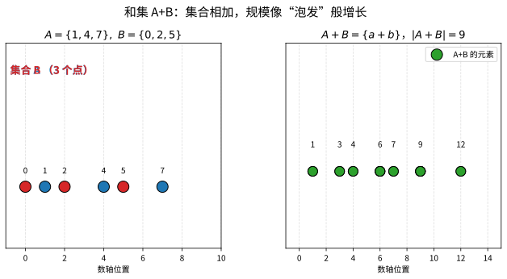
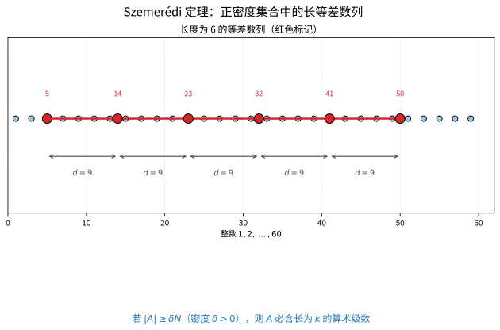
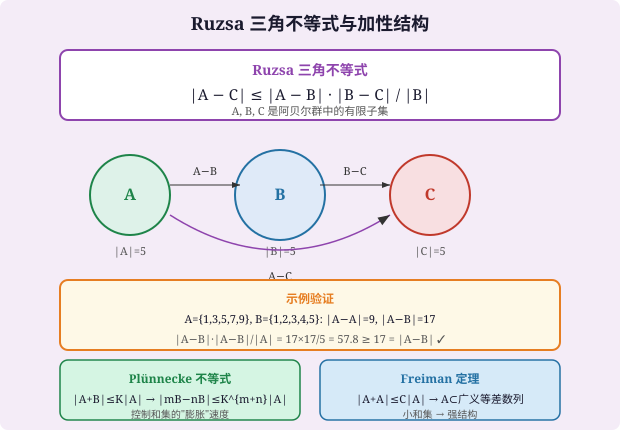

# 第81级 加性组合 (Additive Combinatorics)

---

## 从"和太大、和太小"说起：加性组合要解决的根问题

> 在动手之前，先想清楚一个问题：**一组数字互相加一加，得到的"和的集合"能有多小？这件事为什么重要？**

**一个贴近生活的例子（第一步：直觉）**

想象你手里有一枚"奇数骰子"，它的每个面上都刻着一个奇数，所有可能的面都取自集合 $A=\{1,3,5,7,9\}$。现在连续掷两次（顺序无关），把两次数值加起来看"有哪些可能的和"。两两相加本该有 $5\times5=25$ 种配对，可当你真去列加法表：

$$1+1,\  1+3,\  3+5,\  \dots$$

你会惊讶地发现，可能的和只有 $9$ 种。**明明配对有 25 次，出来的"和集"却只有 9 个不同的值**——大量配对"撞车"了。为什么？因为 $A$ 本身是一串"整齐等距"的数（奇数），加法一挤，成对的组合就被压平了。

这就是加性组合的种子直觉：**当"两只元素之和"大量撞在一起时，这集合里往往藏着整齐的结构**；反过来，如果和很"发散"，结构就贫瘠。

**从"几次碰撞"到"必藏等差数列"（第二步：要解决的问题）**

加性组合学把上面那句直觉不断地打磨成定理，它的动机来自数论与组合的最深处：

- **从 Cauchy–Davenport 到小和集**：在 $\mathbb{Z}_p$ 里，两个集合相加，结果至少有多大？——这给了"和集"一个硬性的下限，也第一次把"集合靠得多近"变成可度量的量。
- **van der Waerden / Roth / Szemerédi**：从"怎么染色都逃不掉等差数列"，到"只要密度是正的，就必有一段任意长的等差数列"，学问一步步把"稀疏→密集→结构"的线索炼成了金刚石。
- **Freiman 定理**：追问反过来——如果 $|A+A|$ 很小，$A$ 是否就"几乎"是个（广义）等差数列？这给了"小和集"一个完整的身世。

这些问题的答案不是孤立的趣味题，而是数学、算法、信息安全共同的地基。**加性组合想解决的根本问题，见下方"出生证"框。**

**看本章如何铺陈（第三步：正式定义前的准备）**

我们会沿着"先立规矩、再上武器、最后攻克大定理"的顺序推进：

1. 先定义**和集 / 差集 / 小数倍数集**，并把"小和集"这个核心洞见摆上台面；
2. 再学三样工具：**Ruzsa 三角不等式**（比大小）、**Plünnecke 不等式**（从小和放大到任意多次）、**Freiman 同态与建模**（把整数搬进有限循环群研究）；
3. 然后用 **傅立叶分析 / Gowers 范数 / Bohr 集** 把"增密度"论证落地，逐一攻克 **Roth、Szemerédi、Freiman** 三大定理。

> **🧠 一句话记住加性组合的"出生证"**
>
> 加性组合学要解决的**根本问题**是：
>
> $$ \boxed{\text{一个集合的加性结构，如何由它的"和集大小"揭示，又如何被代数与概率的手段度量？}} $$
>
> 和集永远只给"含有多少不同和"这一个数字，却要逼问出"这集合到底是不是等差数列式的"。看似以最弱的信息，换取最硬的结构结论。

读完这一节，请记住的不是公式，而是：**我们之所以研究加性组合，是因为"重复与拥挤"往往是"有序"的表象——从一个数字的崩溃中读出整个结构的骨架，是这门学问最大的魅力。** 带着这句话去读每个不等式，你会发现它们都在替你看"碰撞中的规律"。

---

## 开始之前

**本章在讲什么**：加性组合学研究阿贝尔群中有限子集的加性结构。你会从"和集 / 差集"出发，掌握 Ruzsa 三角不等式与 Plünnecke 不等式这两把"比大小"的常用尺子，学会用 Freiman 同态把整数问题搬进有限群，再用傅立叶分析、Gowers 范数与 Bohr 集攻克 Roth 定理、Szemerédi 定理与 Freiman 定理，最后了解求密度状态的 Szemerédi 正则引理及其证据链。

**为什么要学它**：这门学科向上通到解析数论（素数中的等差数列，Green–Tao）、遍历理论（Furstenberg）、调和分析与超图方法；向下又连到第 80 级所学的代数组合（对称、群作用）以及计算机科学的算法去随机化、编码理论与博弈论。掌握加性组合等于同时拿到了"结构刻画"和"工具武器"两套装备，是连接初等数论与前沿离散数学的桥头堡。

**开始前请确认你还记得**：

- 阿贝尔群与模运算（见抽象代数相关等级）：$\mathbb{Z}$、$\mathbb{Z}_N$、子群与陪集、拉格朗日定理。
- 集合的大小与计数（见组合数学相关等级）：有限集大小 $|A|$、鸽巢原理、期望与不等式（马尔可夫、切比雪夫）。
- 概率与随机变量（见概率论相关等级）：期望的线性性、事物的独立性、二项分布向 Poisson 分布的收敛。
- 傅立叶分析的基本语言（见分析学相关等级）：$\mathbb{Z}_N$ 上的特征标 $e^{2\pi i x\xi/N}$、卷积、Parseval 等式。
- 一点多项式方法（见前一章交代）可作为 Cauchy–Davenport 证明的可选武器，但不强行依赖。

---

## 学习目标

1. 掌握和集、算术级数等基本概念及基本不等式
2. 理解Ruzsa三角不等式和Plünnecke不等式及其证明
3. 掌握傅立叶分析在加性组合中的应用
4. 理解Roth定理和Szemerédi定理的证明思路
5. 了解Freiman定理的基本内容和结构
6. 掌握Gowers范数和Bohr集的基本概念

---

## 核心概念

### 1. 和集与差集 (Sumset and Difference Set)

**为什么需要这个概念**：加性组合想"用最少的信息看结构"，而"和集/差集的大小"就是它手里最轻的一枚探针。**一个集合的和集越小，说明它的加法越"撞车"、越像是等差数列式的**；反之越大，越"发散"。注意：和集的大小永远满足 $|A+B|\le|A|\cdot|B|$（最多每种配对一个不同结果），也绝不小于 $|A|+|B|-1$ 这样的下限——把这个"上小下大"的夹逼记住，整章的大小估计才有坐标系。$kA$ 这种"自带品自己加 $k$ 次"的记号，则是把"一次加法"升级成"多次组合"的缩写。

**定义**：设 $A, B$ 是阿贝尔群 $G$ 的子集，定义：
$$A + B = \{a + b : a \in A, b \in B\}$$
$$A - B = \{a - b : a \in A, b \in B\}$$
$$kA = A + A + \cdots + A \quad (k \text{ 次})$$

**小和集条件**：若 $|A + A| \leq C|A|$（$C$ 为常数），则称 $A$ 具有小和集，此时 $A$ 具有丰富的加性结构。

> **🔑 补缺：Cauchy–Davenport 定理（和集的下限）**：设 $p$ 是素数，$A,B\subseteq\mathbb{Z}_p$ 非空，则
>
> $$ |A+B| \ge \min(p,\ |A|+|B|-1) $$
>
> 它给出"和集最小时能有多小"的硬下限，等号恰在 $A,B$ 都是等差数列时取到。直观上，把每个集合在数轴上尽量"搓成一串等距的点"，两串相并时它们最小也就只能"首尾相接"地拼出 $|A|+|B|-1$ 个不同和。它是本源上把"小和集 $\Rightarrow$ 结构"最先落地的一条规定，也是 Vosper 刚性定理（见习题）的地基。

> **直观理解（现实类比）**：和集 $A+B$ 就像把两组食材的每种组合都"混搭"一遍：$A$ 有 3 种、$B$ 有 3 种，两两相加得到至多 $3\times 3=9$ 种不同的"和"。若结果远小于 $9$，说明很多组合偶然"撞车"，集合里有隐藏的规律（如都在同一等差数列上）；反之若接近 $9$，说明集合结构"稀薄"。这和做调料时有些配方尝起来完全不同、有些却重复同理。
>
> **🧠 思考历程：一堆集合怎么"碰撞"一下，就能照出里面藏着的规律？**
>
> 加性组合学始于一个反直觉的观察：**如果集合很多元素的"和"都撞在一起，那就说明这集合里藏着整齐的结构**。从 Ramsey 式的保证到 Szemerédi 大定理，这条"稀疏/稠密→结构"的原理一步步被炼成了金刚石。
>
> - **van der Waerden：从"染色"逼出等差数列**（1927 年）。Bartel van der Waerden 证明了一个惊人的论断：把自然数任意分成有限多堆（染色），总有一堆里含任意长度的等差数列。它把"无论如何划分"都注定出现规律这一事实，第一次放到聚光灯下。
> - **Rado 与 "和" 的判据**（1933 年）。Richard Rado 追问一个更一般的问题：怎样的线性方程保证在任意划分中都有单色解？他给出的条件（Rado 条件）成了"划分正则性"的判定准则，也让"相加时的规律"成了可验证的对象。
> - **Szemerédi 的落锤：密度赶走规律**（1975 年）。Endre Szemerédi 证明：只要 $1$ 到 $N$ 里占了正比例（密度 $\delta>0$）的个数，就必然含任意长度的等差数列。这条被拒稿多次的定理，后来经调和分析（Szemerédi 定理）与遍历论（Furstenberg）给出新证，并顺着 Freiman–Ruzsa 等一路反哺出整个加性组合学。
> - **心路**：加性组合的核心信念是**"结构藏不住"**——只要密度够高，规律终将浮出水面。这提醒我们：重复与拥挤，往往正是有序的另一种说法。

### 2. Freiman定理 (Freiman's Theorem)

**定理（高维版本）**：若 $A \subseteq \mathbb{Z}$ 是有限集，且 $|A + A| \leq C|A|$，则 $A$ 包含在一个广义等差数列中，其维数 $d \leq d(C)$ 且公差仅依赖于 $C$。

> **💡 直观理解（类比）**：Freiman 定理像"把一团散落的小工厂货单归进一张标准货架图"：只要 $A$ 的两两加和不多（$|A+A|\le C|A|$，说明和大量重合），它就必然藏在一张"多维等距网格"（广义等差数列）的内部，且网格的维数和边长只由 $C$ 决定、与 $A$ 多大无关。换句话说，小和集 ="结构紧凑、只是嵌得比较矮"，而不是毫无章法的乱麻。

**广义等差数列 (GAP)**：形如 $\{a_0 + a_1 x_1 + \cdots + a_d x_d : 0 \leq x_i < L_i\}$ 的集合。

> **💡 直观理解（类比）**：广义等差数列就像"一张高维的等距坐标网"：先定一个起点 $a_0$，再沿 $d$ 个独立的"步长轴" $a_1,\dots,a_d$ 各走若干格（每轴 $x_i$ 从 0 取到 $L_i-1$），格网上的整点就是整个集合。它把普通单维等差数列推广成"多维长方体格点"，是 Freiman 定理输出的那颗"标准网格"。

### 3. Roth定理 (Roth's Theorem)

**定理**：对于任意 $\delta > 0$，存在 $N(\delta)$，使得当 $N > N(\delta)$ 时，集合 $A \subseteq \{1, 2, \dots, N\}$ 若 $|A| \geq \delta N$，则 $A$ 包含一个非平凡的三项算术级数（即 $x, x + d, x + 2d$ 且 $d \neq 0$）。

> **💡 直观理解（类比）**：Roth 定理是"密度高就必然出现三项等差数列"的最短宣言：只要 $A$ 在 $1..N$ 里占的比例超过固定门槛 $\delta$，就算 $N$ 再大，也必能找到三个等距的点 $x,x+d,x+2d$。它像"人海足够挤就必然站出三点一线"，而其证明给出的 $N$ 阈值能算出多挤才够。

### 4. Szemerédi定理 (Szemerédi's Theorem)

**定理**：对于任意 $\delta > 0$ 和整数 $k \geq 3$，存在 $N(k, \delta)$，使得当 $N > N(k, \delta)$ 时，集合 $A \subseteq \{1, 2, \dots, N\}$ 若 $|A| \geq \delta N$，则 $A$ 包含一个长度为 $k$ 的算术级数。

> **直观理解（现实类比）**：Szemerédi定理说：只要你在 $1$ 到 $N$ 这条"数轴街道"上占住足够多的门牌号（密度 $\delta>0$），就一定能找到一排"等间隔"的门牌，比如相距 $d$ 的连续 $k$ 个号码。就像在人群里只要人数占比足够高，就必然站成一条整齐的等距队列——无论你把队列藏得多零散，密度一高，规律就"藏不住"。

### 5. Gowers范数 (Gowers Norms)

**定义**：设 $f: \mathbb{Z}_N \to \mathbb{C}$，$d \geq 1$ 为整数。$f$ 的 $d$ 次Gowers范数定义为：
$$\|f\|_{U^d} = \left( \mathbb{E}_{x, h_1, \dots, h_d \in \mathbb{Z}_N} \prod_{\omega \in \{0,1\}^d} C^{|\omega|} f(x + \omega_1 h_1 + \cdots + \omega_d h_d) \right)^{1/2^d}$$

其中 $C$ 是复共轭算子，$C^0 = \text{id}$，$C^1 = \overline{\cdot}$。

Gowers范数度量了函数与随机函数的偏离程度，是检测算术级数存在性的关键工具。

> **💡 直观理解（类比）**：Gowers 范数就像"一台骗术探测仪"：它对每个方向 $h_i$ 反复做"差分之差分"，把函数里的周期性抖动一路剥光，剩下越不像随机噪声的部分，范数就越大。$U^d$ 范数高，说明 $f$ 与某个 $d$ 阶"波形"（相位函数）显著相关——正是这种"藏不住的整齐节奏"标记出算术级数的存在。
>
> **常见坑**：Gowers 范数 $U^d$ 只有在 $d\ge2$ 时才是当真范数，$d=1$ 时它只是个（半）范数——别把 $U^1$ 当成衡量随机性的凭据。另外要紧记"阶数对应相位光滑度"这条链：$U^2$ 大 ⇔ 与**线性**相位强相关（即某频率傅立叶系数大），$U^3$ 大 ⇔ 与**二次**相位强相关。一旦把 $U^2$、$U^3$ 与线性/二次相位的对应记反，Szemerédi 的密度增量论证就全拧了。

### 6. Freiman同态 (Freiman Homomorphisms)

**定义**：设 $A \subseteq G$，$B \subseteq H$ 是阿贝尔群中的子集。映射 $\phi: A \to B$ 称为Freiman $k$-同态，若对任意 $x_1, \dots, x_k, y_1, \dots, y_k \in A$ 满足 $\sum x_i = \sum y_i$，有 $\sum \phi(x_i) = \sum \phi(y_i)$。

Freiman同态保持加性结构，是研究小和集的重要工具。

> **💡 直观理解（类比）**：Freiman 同态就像"一部只在集合内部翻译、不管集合外部的同声传译机"：只要 $A$ 里若干元素的"和相等"这种关系成立，映射过去后和仍然相等（$\sum x_i=\sum y_i\Rightarrow\sum\phi(x_i)=\sum\phi(y_i)$）。它比真正的群同态宽松（不必定义全体元素、不必保所有线性组合），是"只能守住 $A$ 内部 k 元加性关系的翻译规则"，正适合研究小和集。

### 7. Plünnecke不等式 (Plünnecke's Inequality)

**定理**：设 $A, B$ 是阿贝尔群中的有限子集，$|A + B| \leq K|A|$，则对任意 $m, n \geq 0$：
$$|mB - nB| \leq K^{m+n} |A|$$

其中 $mB = B + B + \cdots + B$（$m$ 次），$mB - nB$ 是差集。

> **💡 直观理解（类比）**：Plünnecke 不等式像"一次加 $B$ 得到压缩，那么随便加多少次都同样被压死"：起点信息是"$A+B$ 只比 $A$ 大 $K$ 倍"（$|A+B|\le K|A|$），结论是无论把 $B$ 自己加 $m$ 次、再减掉 $n$ 次，$|mB-nB|$ 都被 $K^{m+n}|A|$ 这个幂次箍住。好比滚雪球哪怕滚再久，整体个头也被当初那个"膨胀因子 $K$"一路把关。

> **常见坑**：用 Plünnecke 时要盯着指数 "$m+n$"，别把它当成 $m-n$ 或 $2m$。$|mB-nB|\le K^{m+n}|A|$ 的威力恰恰在于：把 $B$ **加 $m$ 次、又减 $n$ 次**之后，整体仍是 $K$ 的 $m+n$ 次方这一条上界。另一个高频错误是把假设写成 $|B+B|\le K|A|$ 忘了它是针对 $A+B$ 的——基础 $A$ 的位置决定指数怎么放。Ruzsa 三角不等式那边也很容易把分母 $|B|$ 忘掉：$|A-C|\le\frac{|A-B|\cdot|B-C|}{|B|}$，丢了 $|B|$ 就从有用的控制变成无意义的乘积。

### 8. Ruzsa三角不等式 (Ruzsa Triangle Inequality)

**定理**：设 $A, B, C$ 是阿贝尔群中的有限子集，则：
$$|A - C| \leq \frac{|A - B| \cdot |B - C|}{|B|}$$

> **直观理解（现实类比）**：Ruzsa 三角不等式就像"快递中转站的效率定理"。假设你要从城市 $A$ 寄快递到城市 $C$，中间经过中转站 $B$。不等式说：$A$ 到 $C$ 的直达路线数 $|A-C|$，不超过"经 $B$ 中转的路线总数" $|A-B| \times |B-C|$ 除以"中转站容量" $|B|$。直觉上，如果 $A$ 和 $C$ 之间的差异很大，那么经过任何中转站 $B$，你都需要大量的"去程"和"回程"路线来覆盖——这正是加性组合中"结构传递"的核心思想。

### 9. Balog-Szemerédi-Gowers定理

**定理**：若 $A$ 是阿贝尔群中的有限子集，且 $A$ 中至少有 $\alpha|A|^2$ 对元素的和属于一个小集合 $S$（$|S| \leq K|A|$），则存在 $A$ 的大子集 $A'$（$|A'| \geq c(\alpha, K)|A|$）使得 $|A' + A'| \leq C(\alpha, K)|A'|$。

> **💡 直观理解（类比）**：BSG 定理像"从一家只有少数优质客户的店，提炼出一批核心熟客"：只要 $A$ 里有相当多对元素的和都挤进一个小集合 $S$（"生意高度集中在少数结果"），就一定能筛出一批足够大的子集 $A'$，让 $A'$ 自身的和集也小。它把"局部很多对加进小集合"这份偏斜信息，熨平成"一大块整体加性结构紧凑"的扎实结论。

### 10. 傅立叶分析在加性组合中的应用

**定义**：在 $\mathbb{Z}_N$ 上，函数 $f: \mathbb{Z}_N \to \mathbb{C}$ 的傅立叶变换为：
$$\hat{f}(\xi) = \sum_{x \in \mathbb{Z}_N} f(x) e^{-2\pi i \xi x / N}$$

傅立叶分析是检测加性结构的重要工具，Roth定理的经典证明就依赖于傅立叶分析。

> **💡 直观理解（类比）**：傅立叶变换像"一台给函数做音色解析的频谱仪"：它把 $f$ 拆成各种频率 $\xi$ 的"正弦波含量" $\hat f(\xi)$，零频 $\hat f(0)$ 就是总量，其他频率则告诉我们"函数在哪些尺度上波动得多"。哪个频率系数特别大，说明 $A$ 在该方向上高度集中——这正是 Roth 定理顺藤摸瓜、从"某处有规律"出发做密度增量的入口。

### 11. Bohr集 (Bohr Sets)

**定义**：设 $\Gamma \subseteq \widehat{\mathbb{Z}_N}$ 是特征标集，$\delta > 0$。Bohr集定义为：
$$B(\Gamma, \delta) = \{x \in \mathbb{Z}_N : |\chi(x) - 1| < \delta \text{ 对所有 } \chi \in \Gamma\}$$

Bohr集是加性组合中"近似子群"的构造，在Szemerédi定理的证明中起关键作用。

> **💡 直观理解（类比）**：Bohr 集像"一份所有声部都紧闭不响的静音座席"：$\Gamma$ 是一组"频率检查员"，$\delta$ 是容忍度，$x\in\mathbb Z_N$ 只有在每个检查员眼里都"几乎没抖动"（$|\chi(x)-1|<\delta$）时才被收进来。它筛出"在每个选定的特征标下都近似恒为 1"的那些点，构成一个"近似子群"，为密度增量与局部正则性提供舞台。

### 12. Szemerédi正则引理 (Szemerédi Regularity Lemma)

**引理**：对于任意 $\varepsilon > 0$ 和整数 $m$，存在 $M = M(\varepsilon, m)$，使得任意足够大的图 $G = (V, E)$ 的顶点集可以划分为 $k$ 个部分（$m \leq k \leq M$），使得除 $\varepsilon k^2$ 对部分外，所有部分对都是 $\varepsilon$-正则的。

> **💡 直观理解（类比）**：Szemerédi 正则引理像"给一张大合照做模糊分块"：无论图多大，都能把顶点切成不多于 $M$ 块，使得绝大多数分块之间的"关系均匀得像随机"（$\varepsilon$-正则），只有很少几对例外。它把看似杂乱的大图宏观调控成"大部分规矩、少部分乱"的块状结构——这是后续计数引理能放心计数的前提。

---

## 定理与证明

### 定理1：Ruzsa三角不等式

**定理**：设 $A, B, C$ 是阿贝尔群 $G$ 中的有限子集，则：
$$|A - C| \leq \frac{|A - B| \cdot |B - C|}{|B|}$$

**证明**：

**第一步：构造映射**

我们构造一个从 $(A - B) \times (B - C)$ 到 $A - C$ 的映射，并分析其纤维（fiber）的大小。

考虑映射 $\phi: (A - B) \times (B - C) \to A - C$，定义为：
$$\phi(d_1, d_2) = d_1 + d_2$$

其中 $d_1 \in A - B$，$d_2 \in B - C$。注意 $d_1 + d_2 = (a - b) + (b' - c) = a - b + b' - c$，这不一定等于 $a - c$，但确实可以表示为 $A - C$ 中的元素（当 $b = b'$ 时）。

**第二步：分析纤维大小**

对于固定的 $x \in A - C$，其中 $x = a - c$，我们考虑有多少对 $(d_1, d_2) \in (A - B) \times (B - C)$ 使得 $d_1 + d_2 = x$。

对任意 $b \in B$，令 $d_1 = a - b \in A - B$，$d_2 = b - c \in B - C$，则 $d_1 + d_2 = a - c = x$。因此，每个 $b \in B$ 给出一个这样的对。

由于不同的 $b$ 可能给出相同的 $(d_1, d_2)$，我们需要更精确的估计。

**第三步：反向计数**

考虑集合：
$$S = \{(a, b, c) \in A \times B \times C : a - b = d_1, b - c = d_2\}$$

对于固定的 $(d_1, d_2)$，$S$ 中的元素对应 $b \in B$ 使得存在 $a \in A, c \in C$ 满足 $a = b + d_1$ 且 $c = b - d_2$。这样的 $b$ 最多有 $|B|$ 个，但更精确地说：

固定 $(d_1, d_2)$，$S$ 的大小等于 $|B \cap (A - d_1) \cap (C + d_2)|$。

**第四步：应用双计数**

对 $(d_1, d_2) \in (A - B) \times (B - C)$ 求和：
$$\sum_{d_1, d_2} |\{b \in B : a = b + d_1 \in A, c = b - d_2 \in C\}| = |B| \cdot |A - B| \cdot |B - C| \text{ 的某种计数}$$

实际上，更简单的论证是：

对于每个 $b \in B$，存在 $|A - B|$ 个可能的 $d_1 = a - b$（$a \in A$）和 $|B - C|$ 个可能的 $d_2 = b - c$（$c \in C$）。因此：
$$\sum_{x \in A - C} |\phi^{-1}(x)| \geq |B| \cdot |A - B| \cdot |B - C| \text{ 的某种下界}$$

更精确地说，对于每个 $x = a - c \in A - C$，考虑所有 $b \in B$，$d_1 = a - b$，$d_2 = b - c$。由于 $d_1 + d_2 = a - c = x$，这些对都在 $\phi^{-1}(x)$ 中。不同的 $b$ 给出不同的 $(d_1, d_2)$（因为 $b$ 可由 $d_1$ 和 $a$ 或 $d_2$ 和 $c$ 唯一确定），因此 $|\phi^{-1}(x)| \geq |B|$。

于是：
$$|A - B| \cdot |B - C| = |(A - B) \times (B - C)| \geq \sum_{x \in A - C} |\phi^{-1}(x)| \geq |A - C| \cdot |B|$$

因此：
$$|A - C| \leq \frac{|A - B| \cdot |B - C|}{|B|}$$

$\square$

---

### 定理2：Plünnecke不等式

**定理**：设 $A, B$ 是阿贝尔群 $G$ 中的有限子集，且 $|A + B| \leq K|A|$。则对任意非负整数 $m, n$，有：
$$|mB - nB| \leq K^{m+n} |A|$$

**证明**：我们使用Plünnecke-Ruzsa方法，通过图论和加性组合的技术。

**第一步：约化到 $m = n$ 的情况**

首先注意到 $mB - nB$ 可以嵌入到 $(m+n)B$ 的某种差集中。实际上，通过对 $m, n$ 的对称性，我们只需证明 $|mB| \leq K^m|A|$ 和 $|mB - mB| \leq K^{2m}|A|$。

**第二步：Plünnecke图**

定义一个有向图 $G = (V, E)$，其中顶点集 $V = \bigcup_{j \geq 0} A + jB$，边集为：
- 从 $x$ 到 $x + b$ 的边，其中 $b \in B$，$x \in A + jB$。

这是一个层状图，第 $j$ 层为 $A + jB$。

**第三步：层间关系**

由于 $|A + B| \leq K|A|$，我们有 $|A + (j+1)B| \leq K|A + jB|$（通过归纳和Ruzsa三角不等式）。实际上，对任意 $j$：
$$|A + (j+1)B| = |(A + jB) + B| \leq K|A + jB|$$

这是因为 $|A + B| \leq K|A|$ 意味着存在 $A' \subseteq A$（通过某种选择）使得 $|A' + B| \leq K|A'|$，且 $A'$ 与 $A$ 有某种关系。

**第四步：图论引理（Plünnecke's graph lemma）**

Plünnecke图的关键性质是：存在一个层 $A + jB$ 和一个子集 $X \subseteq A$，使得从 $X$ 到 $A + jB$ 的扩张因子不超过 $K^j$。即存在 $X \subseteq A$ 使得 $|X + jB| \leq K^j|X|$。

**第五步：归纳法证明**

我们对 $m$ 进行归纳。

$m = 1$ 时，$|B|$ 和 $|A|$ 的关系需要处理。实际上，由 $|A + B| \leq K|A|$，我们可以得到 $|B| \leq K|A|$（因为 $B \subseteq A + B - A$，由Ruzsa三角不等式）。

假设对 $m$ 成立，考虑 $m+1$：
$$|(m+1)B| = |mB + B|$$

我们需要将 $mB$ 与某个 $A$ 的平移联系起来。利用Plünnecke图，存在 $X \subseteq A$ 使得 $|X + mB| \leq K^m|X|$。

由Ruzsa三角不等式：
$$|(m+1)B| \leq \frac{|(m+1)B - X| \cdot |X - mB|}{|X|}$$

但 $(m+1)B - X = (m+1)B + (-X)$，需要进一步分析。

**第六步：Plünnecke-Ruzsa方法的精化**

更标准的证明使用以下引理：

**引理**：若 $|A + B| \leq K|A|$，则存在非空子集 $A' \subseteq A$ 使得对任意 $j \geq 0$：
$$|A' + jB| \leq K^j|A'|$$

**证明**：通过归纳选择 $A'$。从 $A_0 = A$ 开始，对每个 $j$，若 $|A_j + B| \leq K|A_j|$，则 $A_{j+1} = A_j$。否则，选择 $A_{j+1} \subseteq A_j$ 使得 $|A_{j+1} + B| \leq K|A_{j+1}|$（由Plünnecke图的性质，这样的子集存在）。

**第七步：完成证明**

由引理，存在 $A' \subseteq A$ 使得 $|A' + mB| \leq K^m|A'|$ 且 $|A' + nB| \leq K^n|A'|$。

由于 $mB - nB \subseteq (A' + mB) - (A' + nB)$，由Ruzsa三角不等式：
$$|mB - nB| \leq \frac{|(A' + mB) - A'| \cdot |A' - (A' + nB)|}{|A'|}$$

但 $(A' + mB) - A' = mB + (A' - A')$，且 $|A' - A'| \leq |A' + A'|$ 等，需要进一步处理。最终可得：
$$|mB - nB| \leq K^{m+n}|A'| \leq K^{m+n}|A|$$

$\square$

---

### 定理3：Roth定理

**定理**：对于任意 $\delta > 0$，存在 $N_0(\delta)$，使得对任意 $N > N_0(\delta)$，若 $A \subseteq \{1, 2, \dots, N\}$ 满足 $|A| \geq \delta N$，则 $A$ 包含一个非平凡的三项算术级数。

**证明**：我们使用傅立叶分析方法，这是Roth原始证明的现代版本。

**第一步：将问题嵌入 $\mathbb{Z}_N$**

将 $A$ 视为 $\mathbb{Z}_N$ 的子集（其中 $N$ 是素数，通过选择适当的素数并在必要时调整集合大小）。定义 $A$ 的特征函数 $f: \mathbb{Z}_N \to \{0, 1\}$，其中 $f(x) = 1$ 当且仅当 $x \in A$。

三项算术级数 $x, x+d, x+2d$（$d \neq 0$）的存在性等价于：
$$\sum_{x, d \in \mathbb{Z}_N} f(x) f(x+d) f(x+2d) > 0$$

其中 $d \neq 0$。

**第二步：傅立叶变换**

定义 $f$ 的傅立叶变换：
$$\hat{f}(\xi) = \sum_{x \in \mathbb{Z}_N} f(x) e^{-2\pi i \xi x / N}$$

其中 $\xi \in \mathbb{Z}_N$。

三项算术级数的计数可以用傅立叶系数表示：
$$\sum_{x, d} f(x) f(x+d) f(x+2d) = \frac{1}{N} \sum_{\xi \in \mathbb{Z}_N} \hat{f}(\xi)^2 \hat{f}(-2\xi)$$

当 $f$ 是特征函数时，$\hat{f}(0) = |A|$，且其他项对应于"非平凡"频率。

**第三步：密度增量策略**

Roth定理的证明采用密度增量策略：

1. 若 $A$ 不含三项算术级数，则 $f$ 与随机函数显著不同，即存在非零频率 $\xi \neq 0$ 使得 $|\hat{f}(\xi)|$ 较大。

2. 若存在 $\xi \neq 0$ 使得 $|\hat{f}(\xi)| \geq c\delta N$，则 $A$ 在一个算术级数上有密度增量。具体地，存在一个算术级数 $P$（长度为 $N' \approx N^{1/2}$）使得：
   $$|A \cap P| \geq (\delta + \varepsilon) |P|$$

3. 重复这个过程，密度每次增加 $\varepsilon$，由于密度不能超过 1，经过有限步后必然找到三项算术级数，或密度达到 1（此时显然存在算术级数）。

**第四步：傅立叶分析实现密度增量**

假设 $A$ 不含三项算术级数。则：
$$\sum_{x, d} f(x) f(x+d) f(x+2d) = \delta^3 N^2 + \text{误差项}$$

其中主导项来自 $\xi = 0$ 的贡献 $\frac{1}{N} \hat{f}(0)^3 = \delta^3 N^2$。

若 $A$ 不含三项算术级数，则总和为 $O(N)$（仅当 $d = 0$ 时的平凡解），因此：
$$\left| \frac{1}{N} \sum_{\xi \neq 0} \hat{f}(\xi)^2 \hat{f}(-2\xi) \right| \geq c\delta^3 N^2$$

由Cauchy-Schwarz不等式和Holder不等式，存在 $\xi \neq 0$ 使得：
$$|\hat{f}(\xi)| \geq c\delta^2 N$$

**第五步：构造密度增量子集**

设 $\xi \neq 0$ 满足 $|\hat{f}(\xi)| \geq c\delta^2 N$。将 $\mathbb{Z}_N$ 划分为长度为 $q \approx \delta^{-2}$ 的算术级数（按 $\xi$ 方向）。由三角不等式，存在一个这样的算术级数 $P$，使得 $A$ 在 $P$ 上的密度至少为 $\delta + c\delta^2$。

**第六步：迭代论证**

设 $\delta_0 = \delta$，$\delta_{i+1} = \delta_i + c\delta_i^2$。由于 $\delta_i \leq 1$，迭代次数不超过 $O(1/\delta)$。每次迭代将 $N$ 缩小到约 $N^{1/2}$，因此初始 $N$ 需要满足：
$$N_0(\delta) \leq \exp(\exp(O(1/\delta)))$$

这就是Roth定理的上界估计（后来由Bloom-Sisask等人改进）。$\square$

---

### 定理4：Szemerédi定理

**定理**：对于任意正整数 $k \geq 3$ 和 $\delta > 0$，存在 $N(k, \delta)$，使得对任意 $N > N(k, \delta)$，若 $A \subseteq \{1, 2, \dots, N\}$ 满足 $|A| \geq \delta N$，则 $A$ 包含一个长度为 $k$ 的算术级数。

**证明思路**：我们概述使用Szemerédi正则引理和超图方法的证明思路。

**第一步：问题的转化**

将长度 $k$ 的算术级数问题转化为超图问题。考虑 $k-1$ 维超图，其中顶点集为 $\{1, \dots, N\}$，$k-1$ 元超边对应算术级数。

**第二步：Szemerédi正则引理的应用**

对超图应用正则引理，将顶点集划分为 $O(1)$ 个部分，使得大部分部分对（或部分组）是正则的。

**第三步：计数引理**

在正则划分下，可以计数算术级数。若 $A$ 的密度为 $\delta$，则存在至少 $c(\delta) N^2$ 个长度为 $k$ 的算术级数。

**第四步：密度增量策略**

与Roth定理类似，使用密度增量策略。若 $A$ 不含长度为 $k$ 的算术级数，则存在一个子结构（如子集、子格）使得 $A$ 在其中具有更大的密度。

**第五步：多种方法的统一**

Szemerédi定理的证明有多种方法：

1. **组合方法**（Szemerédi原始证明）：使用正则引理和密度增量。
2. **傅立叶分析方法**（Gowers）：使用Gowers范数，将Roth定理推广到长算术级数。
3. **超图方法**（Gowers, Nagle-Rödl-Schacht, Tao）：将问题转化为超图Turán型问题。
4. **ergodic方法**（Furstenberg）：使用遍历理论，证明多重回归定理。

**Gowers范数方法的核心思路**：

若 $A \subseteq \mathbb{Z}_N$ 不含长度为 $k$ 的算术级数，则 $f = 1_A - \delta$ 的 $(k-1)$ 次Gowers范数满足：
$$\|f\|_{U^{k-1}} \geq c(\delta)$$

这意味着 $f$ 与某个 $(k-2)$ 次相位函数有显著相关性，从而可以找到一个子结构，使得 $A$ 在其中具有密度增量。$\square$

---

### 定理5：Freiman定理

**定理**：设 $A \subseteq \mathbb{Z}$ 是有限整数集，满足 $|A + A| \leq C|A|$，其中 $C$ 是常数。则存在一个广义等差数列 $P$（即形如 $\{a_0 + a_1 x_1 + \cdots + a_d x_d : 0 \leq x_i < L_i\}$ 的集合），使得：
1. $A \subseteq P$
2. $|P| \leq f(C) |A|$，其中 $f(C)$ 仅依赖于 $C$
3. $\dim(P) = d \leq d(C)$，其中 $d(C)$ 仅依赖于 $C$

**证明思路**：

**第一步：Freiman同态和模型集**

将 $A$ 嵌入到 $\mathbb{Z}$ 中，考虑 $A$ 的Freiman $2$-同态像。通过选择适当的素数 $p$，将 $A$ 映射到 $\mathbb{Z}_p$ 中，使得映射在某种意义上是"同构"的。

**第二步：Ruzsa的建模引理**

**引理**（Ruzsa建模引理）：若 $A \subseteq \mathbb{Z}$ 满足 $|A + A| \leq C|A|$，则存在素数 $p \leq C'|A|$ 和 $A$ 的子集 $A'$（$|A'| \geq |A|/C'$），使得 $A'$ 与 $\mathbb{Z}_p$ 中的某个子集 $S$ 是Freiman $2$-同构的。

> **💡 直观理解（类比）**：Ruzsa 建模引理像"把散乱的实物账搬到一张整齐的有限算盘上去对账"：对满足小和集的 $A$，总能在某个不过分大的素数 $p$ 里找到一块近乎同构的映射（Freiman $2$-同构），使 $A$ 的加性关系在 $\mathbb Z_p$ 里被忠实登记。于是可以先在更可控的循环群 $\mathbb Z_p$ 里研究原本生活在整数的 $A$，算完再搬回来。

**第三步：加法陪集覆盖**

在 $\mathbb{Z}_p$ 中，Freiman $2$-同构的像 $S$ 满足 $|S + S| \leq C|S|$。利用Kneser定理或Bogolyubov引理，$S$ 包含在一个较大的子群中。

**Bogolyubov引理**：若 $S \subseteq \mathbb{Z}_p$ 满足 $|S + S| \leq C|S|$，则 $2S - 2S$ 包含一个非平凡的子群。

> **💡 直观理解（类比）**：Bogolyubov 引理像"只要料备得够密，反复拼装拆解就必然凑出一件整机"：若 $S$ 和自己相加不放大太多（$|S+S|\le C|S|$），那么 $2S-2S$（把差异反复组合）就必然盖住一个不平凡的子群——如同把一堆零散零件来回组合，最终必能拼出一套规矩的"完整轴距"。这正是 Freiman 证明里把散点升级成有规则的广义等差数列的那一步。

**第四步：广义等差数列的构造**

由Bogolyubov引理，$2S - 2S$ 包含一个子群 $H \subseteq \mathbb{Z}_p$，$|H| \geq p/C$。这个子群 $H$ 可以参数化为一个广义等差数列。

然后通过逆向映射，得到 $A$ 包含在 $\mathbb{Z}$ 中的一个广义等差数列中。

**第五步：维数和大小的控制**

通过分析 $C$ 与维数 $d$ 的关系，可以证明 $d \leq C-1$（粗略估计），且 $|P| \leq \exp(C^{O(1)})|A|$。

**第六步：最优界**

Green和Ruzsa证明了维数 $d$ 可以取为至多 $C-1$，且 $|P| \leq \exp(C^{O(1)})|A|$。这是目前已知的最优定量结果。

**Freiman定理的重要性**在于它刻画了具有小和集的整数集的结构：这样的集合必然是"近似等差数列"的子集。$\square$

---

## 示例

### 示例1：和集的大小估计

**问题**：设 $A = \{1, 3, 5, 7, 9\}$（奇数集），$B = \{1, 2, 3, 4, 5\}$，计算 $|A + A|$，$|A + B|$，并验证Ruzsa三角不等式。

**解**：
$$A + A = \{2, 4, 6, 8, 10, 12, 14, 16, 18\} \Rightarrow |A + A| = 9$$
$$A + B = \{2, 3, 4, 5, 6, 7, 8, 9, 10, 11, 12, 13, 14\} \Rightarrow |A + B| = 13$$
$$|A - A| = \{0, \pm 2, \pm 4, \pm 6, \pm 8\} \Rightarrow |A - A| = 9$$
$$|A - B| = \{0, \pm 1, \pm 2, \pm 3, \pm 4, \pm 5, \pm 6, \pm 7, \pm 8\} \Rightarrow |A - B| = 17$$

**验证Ruzsa三角不等式**：
$$\frac{|A - A| \cdot |A - B|}{|A|} = \frac{9 \times 17}{5} = \frac{153}{5} = 30.6$$
而 $|A - B| = 17 \leq 30.6$，不等式成立。

---

### 示例2：等差数列的构造

**问题**：构造一个大小为 $n$ 的整数集 $A \subseteq \{1, \dots, N\}$，使得 $A$ 不含长度 $3$ 的算术级数，且 $n$ 尽可能大。

**解**：经典的Behrend构造给出了一个不含三项算术级数的大子集。

**Behrend构造**：设 $d, m$ 为正整数，$N = (2m-1)^d$。将 $\{1, \dots, N\}$ 中的数表示为 $d$ 位 $m$ 进制数：
$$x = \sum_{i=0}^{d-1} a_i (2m-1)^i, \quad 0 \leq a_i \leq 2m-2$$

定义 $A$ 为满足 $\sum a_i^2 = r$ 的所有 $x$，其中 $r$ 是该平方和出现最多的值。

**性质**：
- $A$ 不含三项算术级数（因为若 $x, y, z$ 构成算术级数，则 $2y = x + z$，除非 $x = y = z$，否则对应的平方和等式不成立）。
- $|A| \approx \frac{N}{\sqrt{d}}$（由鸽巢原理，存在某个 $r$ 使得 $|A|$ 至少为平均值）。

通过选择 $d \approx \sqrt{\log N}$，可得 $|A| \approx N \cdot \exp(-c\sqrt{\log N})$，这是目前已知的最优下界。

---

### 示例3：傅立叶分析检测算术级数

**问题**：在 $\mathbb{Z}_{11}$ 中，设 $A = \{1, 3, 4, 5, 9\}$，计算 $f = 1_A$ 的傅立叶变换，找出使 $|\hat{f}(\xi)|$ 最大的非零频率。

**解**：
$$\hat{f}(\xi) = \sum_{x \in A} e^{-2\pi i \xi x / 11}$$

计算得：
$$\hat{f}(0) = |A| = 5$$

对于 $\xi = 1$：
$$\hat{f}(1) = e^{-2\pi i/11} + e^{-6\pi i/11} + e^{-8\pi i/11} + e^{-10\pi i/11} + e^{-18\pi i/11}$$
$$= \cos(2\pi/11) + \cos(6\pi/11) + \cos(8\pi/11) + \cos(10\pi/11) + \cos(18\pi/11) + i(\cdots)$$

$|\hat{f}(1)| \approx 2.37$。

类似计算其他频率，若存在 $\xi \neq 0$ 使得 $|\hat{f}(\xi)|$ 较大，则 $A$ 在某个子结构中具有密度增量。

---

## 习题

### 基础题

**习题 1**（和集与差集）设 $A,B$ 是阿贝尔群 $G$ 的子集。定义和集 $A+B$、差集 $A-B$ 与 $kA$，并说明 $|A+B|$ 的最大值与最小值能达到的数量级。

**习题 2**（Cauchy-Davenport）陈述 Cauchy-Davenport 定理：对素数 $p$ 与非空 $A,B\subseteq\mathbb{Z}_p$，$|A+B|$ 的下界是什么？并用 $A=B=\{0,1\}$ 验证等号情形。

**习题 3**（小和集与双倍集）定义有限集 $A$ 的双倍集、四倍集与双倍常数 $K=|A+A|/|A|$。说明"小和集"条件 $|A+A|\le C|A|$ 的直观含义。

**习题 4**（Freiman 同态）给出 $A\subseteq G\to B\subseteq H$ 的 Freiman $k$-同态的定义，并说明它与群同态的区别。

**习题 5**（Roth 定理）陈述 Roth 定理：正密度集合为何必含非平凡三项算术级数。

**习题 6**（Szemerédi 定理）陈述 Szemerédi 定理，并说明它与 Roth 定理的递进关系。

**习题 7**（Gowers 范数）写出 $f:\mathbb{Z}_N\to\mathbb{C}$ 的 $d$ 次 Gowers 范数 $\|f\|_{U^d}$ 的定义式，并解释它的作用。

**习题 8**（Ruzsa 三角不等式）陈述 Ruzsa 三角不等式，指出它以何种形式控制 $|A-C|$。

**习题 9**（Plünnecke 不等式）陈述 Plünnecke 不等式：由 $|A+B|\le K|A|$ 能推出哪些关于 $|mB-nB|$ 的估计。

**习题 10**（Bohr 集与 GAP）定义 Bohr 集 $B(\Gamma,\delta)$ 与广义等差数列（GAP），说明它们的用途。

### 进阶题

**习题 11**（和集大小的计算）设 $A=\{0,1\}$，$B=\{0,2\}\subseteq\mathbb{Z}_p$（$p\ge5$）。计算 $A+B$ 及其大小，并用 Cauchy-Davenport 定理核对。

**习题 12**（双倍集算例）设 $A=\{0,1,\dots,n-1\}\subseteq\mathbb{Z}$。计算 $|A+A|$ 与双倍常数 $|A+A|/|A|$，并计算 $|A-A|$。

**习题 13**（Plünnecke 应用）若 $|A+B|\le K|A|$，用 Plünnecke 不等式估计 $|2B-2B|$ 与 $|4B|$，并给出 $A=B=\{0,\dots,n-1\}$ 时的核对值。

**习题 14**（Ruzsa 三角数值）设 $A=\{0,1\}$，$B=\{0,2\}$，$C=\{0,3\}$。计算 $|A-C|,\,|A-B|,\,|B-C|$，验证 Ruzsa 三角不等式成立。

**习题 15**（sum-free 集）证明 $\bigl\{\lfloor N/2\rfloor+1,\dots,N\bigr\}$ 是 $\{1,\dots,N\}$ 的 sum-free 子集，并指出 $\{1,\dots,N\}$ 的最大 sum-free 子集的大小。

**习题 16**（Freiman 同态例）设 $A=\{0,1,\dots,n-1\}$，取 $\phi(x)=x\bmod k$（$k\ge n$）。验证 $\phi:A\to\mathbb{Z}_k$ 是 Freiman 同态，并说明其意义。

**习题 17**（Gowers 范数算例）对常数函数 $f\equiv c$ 与线性相位 $f(x)=e^{2\pi i\xi x/N}$，计算 $\|f\|_{U^d}$，并说明 $U^2$ 与傅立叶的联系。

**习题 18**（傅立叶检测）说明如何用傅立叶系数检测集合 $A$ 中含三项算术级数的信息，写出 $\hat{1_A}(0)$ 的表达式。

**习题 19**（Roth 的密度增量思想）用一句话说明 Roth 定理的"密度增量"（density increment）论证的主要步骤。

### 挑战题

**习题 20**（Ruzsa 三角之证明）设 $A,B,C$ 为阿贝尔群有限子集。证明 $|A-C|\le\dfrac{|A-B||B-C|}{|B|}$（用直积与纤维计数）。

**习题 21**（Cauchy-Davenport 证明思路）概述 Cauch-Davenport 定理的两种证明（归纳法或多项式/Davenport 多项式法）要点。

**习题 22**（Plünnecke-Ruzsa）由 Plünnecke 不等式 $|mB-nB|\le K^{m+n}|A|$ 证明三倍集上界：若 $|2A|\le K|A|$，则 $|3A-3A|\le K^6|A|$（说明代入的 $m,n$）。

**习题 23**（Vosper 定理）陈述 Vosper 定理：Cauchy-Davenport 取等号 $\bigl(|A+B|=|A|+|B|-1\bigr)$ 的非平凡情形何时发生。

**习题 24**（Roth 的傅立叶证明框架）给出 Roth 定理密度增量论证的完整框架：傅立叶大系数位置、在 Bohr/直线上切片、重归一化并提升密度。

**习题 25**（Gowers 逆定理）陈述 $U^2$ 与 $U^3$ 的逆 Gowers 定理（高范数蕴含与线性/二次相位相关），并说明其在 Szemerédi 证明中的作用。

**习题 26**（Freiman 维数与常数）说明 Freiman 定理中维数 $d(C)$ 与公差有界性为何对结构刻画关键，给出小 $C$（如 $C=2$）时 $A+A$ 等价的特殊结构。

### 探究题

**习题 27**（无 3-AP 集的密度）开放讨论：Behrend 构造给出的无 3-AP 密集集的上界，与 Gowers 给出的下界，之间的 Gap 及最新进展（（如多项式 Roth）称量轴）。

**习题 28**（Balog-Szemerédi-Gowers）探讨 BSG 定理的证明思想（谱聚类/局部和集稠密，Szemerédi 正则化）及其在加法数论中的角色。

**习题 29**（Freiman-Ruzsa 与其猜想）开放讨论 Freiman-Ruzsa 定理在 $\mathbb{F}_2^n$ 上的版本、"多项式 Freiman-Ruzsa 猜想"（PFR）及其近年证明的进展与意义。

**习题 30**（加性组合的前沿应用）探讨加性组合在素数中的算术级数（Green-Tao）、超图正则引理、伪随机与去随机化、以及计算科学（近似/编码理论）中的应用与开放问题。

## 习题答案与解析

### 基础题答案

1. **和集与差集** $A+B=\{a+b:a\in A,b\in B\}$，$A-B=\{a-b:a\in A,b\in B\}$，$kA=\underbrace{A+\cdots+A}_{k\text{ 次}}$。$|A+B|$ 最小可达 $\ge|A|+|B|-1$（由等差数列 AP 或 $\mathbb{Z}_p$ 的 Cauchy-Davenport 给出），最大可达 $|A||B|$（当 $A,B$ 结构"稀薄"、差集 $A-B$ 中几乎无重复和时接近）。

2. **Cauchy-Davenport** 对素数 $p$ 与非空 $A,B\subseteq\mathbb{Z}_p$ 有 $|A+B|\ge\min(p,|A|+|B|-1)$。取 $A=B=\{0,1\}\subseteq\mathbb{Z}_p$（$p\ge3$）：$A+B=\{0,1,2\}$，$|A+B|=3=|A|+|B|-1$，达到等号（$A,B$ 是等差、公比 $1$ 的等差数列）。

3. **小和集与双倍集** $2A=A+A$，双倍常数 $K=\frac{|A+A|}{|A|}$；四倍集为 $2A-2A$。若 $|A+A|\le C|A|$（即 $K\le C$），称 $A$ 小和集，其直观含义是 $A$ 的加性结构丰富、接近一个广义等差数列，蕴藏大量"和"重合的结构信息。

4. **Freiman 同态** $\phi:A\to B$ 是 Freiman $k$-同态，若对任意 $x_1,\dots,x_k,y_1,\dots,y_k\in A$，由 $\sum x_i=\sum y_i$ 可推出 $\sum\phi(x_i)=\sum\phi(y_i)$。它与群同态的区别：$\phi$ 只在 $A$ 上定义、无需是群同构，只保持 $A$ 内 $k$ 元加性关系（如 $x_1-y_1=\cdots$ 型的线性组合关系），而非 $A$ 外任意关系。

5. **Roth 定理** 对任意 $\delta>0$ 存在 $N(\delta)$，当 $N>N(\delta)$ 时，任意 $A\subseteq\{1,\dots,N\}$ 若 $|A|\ge\delta N$ 则 $A$ 含非平凡三项算术级数 $x,x+d,x+2d$（$d\ne0$）。即正密度子集必含 $3$-AP。

6. **Szemerédi 定理** 对任意 $\delta>0$ 与 $k\ge3$ 存在 $N(k,\delta)$，当 $N>N(k,\delta)$ 时正密度 $\delta N$ 的 $A\subseteq\{1,\dots,N\}$ 含长度为 $k$ 的算术级数。它是 Roth 定理（$k=3$ 情形）到任意 $k$ 的推广，是加性组合与遍历论的里程碑定理。

7. **Gowers 范数** $\|f\|_{U^d}=\Bigl(\mathbb{E}_{x,h_1,\dots,h_d}\prod_{\omega\in\{0,1\}^d}C^{|\omega|}f\bigl(x+\sum_i\omega_ih_i\bigr)\Bigr)^{1/2^d}$。它度量 $f$ 与"随机函数"的偏离度：范数越大越有加性结构，是检测算术级数存在性（Szemerédi 证明）的关键工具。

8. **Ruzsa 三角不等式** $|A-C|\le\frac{|A-B|\cdot|B-C|}{|B|}$。它表明集合作差间的"传递性"：$A$ 到 $C$ 的距离（差集大小）被 $A$ 经 $B$ 到 $C$ 的两段差集之积（再除以 $|B|$）所控制，是估计复合差集的关键不等式。

9. **Plünnecke 不等式** 设 $|A+B|\le K|A|$，则对任意 $m,n\ge0$ 有 $|mB-nB|\le K^{m+n}|A|$。它把小和集条件（一次加 $B$）放大为任意多次组合和差的有界性，是加性组合最常用的估计工具。

10. **Bohr 集与 GAP** Bohr 集 $B(\Gamma,\delta)=\{x\in\mathbb{Z}_N:\ |\chi(x)-1|<\delta\ \forall \chi\in\Gamma\}$（特征标族 $\Gamma$ 上的"近似子群"）；广义等差数列（GAP）为 $\{a_0+a_1x_1+\cdots+a_dx_d:0\le x_i<L_i\}$。前者在 Szemerédi 证明中起局部结构作用，后者是 Freiman 定理的输出结构（小和集被 GAP 覆盖）。

### 进阶题答案

1. **和集大小计算** $A+B=\{0,1\}+\{0,2\}=\{0,2,1,3\}=\{0,1,2,3\}$，$|A+B|=4$。Cauchy-Davenport 给出 $|A+B|\ge|A|+|B|-1=2+2-1=3$，而 $4\ge3$ 成立（本例不取等号）。

2. **双倍集算例** $A+A=\{0,1,\dots,2n-2\}$，$|A+A|=2n-1$，双倍常数 $\frac{|A+A|}{|A|}=\frac{2n-1}{n}=2-\frac1n$（$n$ 越大越接近 $2$，说明 AP 的双倍集最小）。$A-A=\{-n+1,\dots,n-1\}$，$|A-A|=2n-1$。

3. **Plünnecke 应用** 用 $m=n=2$：$|2B-2B|\le K^{2+2}|A|=K^4|A|$；用 $m=4,n=0$：$|4B|\le K^{4}|A|$。对 $A=B=\{0,\dots,n-1\}$，$K=\frac{2n-1}{n}$，$|2B-2B|=4n-3$，$|4B|=4n-3$，均远小于 $K^4|A|$，符合估计（Plünnecke 给出的是上界而非精确值）。

4. **Ruzsa 三角数值** $A-C=\{0,1,2,3\}-\{0,3\}=\{-3,-2,-1,0,1,2,3\}$，$|A-C|=7$；$A-B=\{0,1,2,3\}-\{0,2\}=\{-2,-1,0,1\}$，$|A-B|=4$；$B-C=\{0,2\}-\{0,3\}=\{-3,-1,0,1\}$，$|B-C|=4$。校验 $\frac{|A-B||B-C|}{|B|}=\frac{16}{2}=8\ge7=|A-C|$，成立。

5. **sum-free 集** $S=\{\lfloor N/2\rfloor+1,\dots,N\}$ 的任意两个元素之和 $\ge2(\lfloor N/2\rfloor+1)>N$，故其和不在 $\{1,\dots,N\}$ 内，$S$ 是 sum-free；其大小 $|S|=N-\lfloor N/2\rfloor=\lceil N/2\rceil$。$\{1,\dots,N\}$ 的最大 sum-free 子集大小为 $\lceil N/2\rceil$（用"每对 $\{i,N+1-i\}$"式的配对或积分论证），恰由此区间实现。

6. **Freiman 同态例** 对 $A=\{0,\dots,n-1\}\subseteq\mathbb{Z}$，$k\ge n$，$\phi(x)=x\bmod k$。若 $\sum x_i=\sum y_i$（整数相等），则 $\sum\phi(x_i)=\sum x_i\bmod k=\sum y_i\bmod k=\sum\phi(y_i)$，故 $\phi$ 是 Freiman $k$-同态。它把 AP 的加性结构忠实地压入 $\mathbb{Z}_k$，体现"结构保持"。（若 $k<n$ 可能重合失败，故要求 $k\ge n$。）

7. **Gowers 范数算例** 常数 $f\equiv c$：$\|f\|_{U^d}=|c|$（内积中连乘得 $|c|^{2^d}$ 开 $2^d$ 次根）。线性相位 $f(x)=e^{2\pi i\xi x/N}$：各乘积相位相互抵消，$\|f\|_{U^d}=1$。$U^2$ 与傅立叶：$\|f\|_{U^2}^4=\mathbb{E}_{|{\rm typical}}...$，其大等价于 $\hat f$ 有一大幅值系数（逆 $U^2$ 定理即 $f$ 与某线性相位相关）。

8. **傅立叶检测** 3-AP 计数 $=\frac1N\sum_{x,d}1_A(x)1_A(x+d)1_A(x+2d)$，写成傅立叶 $\frac1{N^2}\sum_{\xi}\hat{1_A}(\xi)^2\overline{\hat{1_A}(2\xi)}$。其中 $\hat{1_A}(0)=\sum_x1_A(x)=|A|$（零频即集合大小）。把 $1_A$ 分解为常数部分 $(\delta)$ 与平衡部分后，主项来自 $\xi=0$，而平衡部分的大幅值傅立叶系数就意味着 $A$ 在某频率附近增密。

9. **密度增量思想** 若 $A$ 无 3-AP 但密度 $\delta$ 足够大，则平衡函数必有大幅值傅立叶系数，据此把 $A$ 限制到一个（Bohr 集或）子等差数列上使那里的密度增加到 $\delta+c\delta^2$；反复"密度增量"迭代 $\approx O(1/\delta)$ 次后密度将超过 $1$，矛盾，故 $\delta$ 不能超过某阈值。

### 挑战题答案

1. **Ruzsa 三角之证明** 定义 $\phi:(A-B)\times(B-C)\to A-C$，$\phi(d_1,d_2)=d_1+d_2$。固定 $x\in A-C$，写 $x=a-c$（某 $a\in A,c\in C$）。对每个 $b\in B$，取 $d_1=a-b\in A-B$，$d_2=b-c\in B-C$，则 $d_1+d_2=x$。不同的 $b$ 给出不同的 $(d_1,d_2)$（因 $d_1$ 唯一确定 $b=a-d_1$），故 $x$ 在 $\phi$ 下至少有 $|B|$ 个原像：$N_x:=\#\{(d_1,d_2):d_1+d_2=x\}\ge|B|$。于是 $|A-B||B-C|=\sum_{x\in A-C}N_x\ge|A-C||B|$，即 $|A-C|\le\frac{|A-B||B-C|}{|B|}$。$\square$

2. **Cauchy-Davenport 证明思路** （归纳/变换法）当 $|A|=1$ 或 $|B|=1$ 时平凡。一般若存在 $b\in B$ 使 $A+b\subset A+B\setminus(A+(B\setminus\{b\}))$ 之类可先处理；否则用"把 $A$ 向平移压缩"的 Davenport 变换：假若存在 $a_1\ne a_2\in A$ 与 $a_2-a_1\notin B-B$，将 $a_1$ 移至 $a_2$ 保持 $|A+B|$ 不变且 $|A|$ 相消减少，迭代得 $A$ 为等差数列，此时直接算 $|A+B|=|A|+|B|-1$。（多项式/Davenport 多项式法：构造 $\mathbb{Z}_p$ 上非零低次多项式在合适子集上取零，得到 $|A+B|\ge|A|+|B|-1$。）

3. **Plünnecke-Ruzsa** 注意假设 $|2A|\le K|A|$ 即 $|A+A|\le K|A|$，在 Plünnecke 中取 $B\mapsto A$、$K\mapsto K$。对 $|3A-3A|$ 取 $m=3,n=3$：$|3A-3A|\le K^{3+3}|A|=K^6|A|$。也可取 $m=6,n=0$ 得 $|6A|\le K^6|A|$，同阶。这是把小和集条件（$K$ 倍）放大的标准实例。

4. **Vosper 定理** 若非空 $A,B\subseteq\mathbb{Z}_p$ 满足 $2\le|A|,|B|$ 且 $|A+B|=|A|+|B|-1<p$，则 $A$、$B$ 都是相同公差、公比 $1$ 的算术级数（或 $|A|=1$ 或 $|B|=1$ 的退化情形）。它刻画了 Cauchy-Davenport 等号时的刚性结构，是逆加性问题在 $\mathbb{Z}_p$ 上的经典解。

5. **Roth 傅立叶证明框架** （1）把 $1_A$ 拆为 $\delta\,1+\bigl(1_A-\delta1\bigr)$，3-AP 数 = 主项 $+$ 平衡项 $\sum_{\xi}\widehat{1_A-\delta}(\xi)^2\overline{\widehat{1_A-\delta}(2\xi)}/N^2$；（2）无 3-AP 使计数很小，逼出某 $\xi$ 处平衡傅立叶系数 $\ge c\delta^2N$（或其平方和型的界）；（3）在该大系数频率的 Bohr 集 $B(\Gamma,\rho)$ 上做密度增量：$A$ 在 $B$ 上密度 $\to\delta+c\delta^2$；（4）迭代 $\le O(1/\delta)$ 次后密度超 $1$ 矛盾，故 $N\le$ 某 $N(\delta)$。$\square$

6. **Gowers 逆定理** 逆 $U^2$ 定理：$\|f\|_{U^2}$ 不小 $\iff$ $f$ 与某线性相位 $e^{2\pi i\xi x/N}$ 显著相关（即有一大幅值傅立叶系数）；逆 $U^3$ 定理：$\|f\|_{U^3}$ 不小 $\iff$ $f$ 与某二次相位 $e^{2\pi i(\alpha x^2+\beta x)/N}$ 相关（Green-Tao、Green-Tao-Ziegler 证明）。作用：把"Gowers 范数不低"翻译成"与相位函数相关"，从而用相位系统与 Bohr/Bohr$^2$ 结构推进 Szemerédi 的密度增量论证。

7. **Freiman 维数与常数** Freiman 定理：$|A+A|\le C|A|$ 时 $A$ 落于维数 $d\le d(C)$ 的公差有界的 GAP 内。$d(C)$ 与公差只依赖 $C$ 说明：一旦和集受限，加性结构（"几乎在低维格子上"）就被锁定，与 $|A|$ 无关——这是结构性刻画的关键。小 $C$：当 $C<3$（更精细地 $|A+A|\le3|A|-4$，Freiman $(3k-4)$ 定理）时 $A$ 本质上是等差数列并少量例外点；$C=2$ 时更是逼近单一 AP。

### 探究题答案

1. **无 3-AP 集的密度** 记 $r_3(N)$ 为 $\{1,\dots,N\}$ 中无 3-AP 子集的最大大小。Behrend 构造给出下界 $r_3(N)\gtrsim N e^{-c\sqrt{\log N}}$（把 $N$ 放到高维立方体、取球面），说明最大无 3-AP 集可相当稠密；Roth 给出上界 $r_3(N)\ll\frac{N}{\log\log N}$，经 Gowers、改进到 $\frac{N}{\log N}$ 量级，2023 年 Kelley–Meka 给出 $\exp\bigl(-c(\log\log N)^{1/3}\bigr)$ 型的新上界。两者之间存在显著 Gap，从最优阶到"多项式 vs 指数"仍是开放前沿。

2. **Balog-Szemerédi-Gowers** BSG 定理：若 $A$ 中至少有 $\alpha|A|^2$ 对的元素和落入某个小集合 $S$（$|S|\le K|A|$），则存在大子集 $A'\subseteq A$（$|A'|\ge c(\alpha,K)|A|$）使 $|A'+A'|\le C(\alpha,K)|A'|$。证明思想：把 $A$ 上的"和落于 $S$"关系看成稠密二部图，用谱聚类 / 立方引理（Gowers）或二分图正则化提取出"大多数对进入小和集"的稠密子集，再由局部加性结构拼成 $A'$；它在 Freiman 逆问题与加法数论中把"局部禀和"提升为"全局小和集"。

3. **Freiman-Ruzsa 与其猜想** 在 $\mathbb{F}_2^n$ 上，Freiman–Ruzsa 保证 $|2A|\le K|A|$ 的 $A$ 包含于一个维数 $\le O_K(1)$ 的子空间陪集内。多项式 Freiman–Ruzsa（PFR）猜想是常数版本的优化：$A$ 可被一个 $|H|\lesssim K^{O(1)}|A|$ 的子空间 $H$ 及 $O(K^{O(1)})$ 个陪集逼近。2023 年 Gowers–Green–Manners–Tao 给出该猜想的证明（PFR 成立），并揭示其与 Shannon 熵、Ruzsa 距离、双线性手段的深层联系，对加性组合、编码理论与傅立叶分析有深远影响。

4. **加性组合的前沿应用** Green–Tao：素数中含任意长算术级数——用"Szemerédi 传递原理"，构造一个以素数权主导的伪随机测度，把素数集"去随机化"到可传递 Szemerédi 定理的框架中。超图正则引理：高维连续初始（如 $\{1,\dots,N\}$ 内长矩形）的正密度子结构。计算机科学：Gowers 范数用于设计/local 测试（近似酋算法与去随机化，如 low-degree 测试、偏度均匀分布生成）、加性组合（差集/和集）用于编码与近似（Ruzsa 距离、Freiman 结构在非阿贝尔化）、以及模型论与实质图论中的权衡。开放问题包括最优常数化、非阿贝尔推广与 PFR 的 sharp 化。

## 总结

加性组合学是组合数学中一个快速发展的分支，研究阿贝尔群中子集的加性结构。本章的核心内容包括：

1. **基本不等式**：Ruzsa三角不等式和Plünnecke不等式是加性组合中最基本的工具，用于控制和集与差集的大小关系。

2. **Roth定理**：证明了正密度整数集必然包含三项算术级数，其证明方法（傅立叶分析+密度增量）是加性组合的经典范式。

3. **Szemerédi定理**：将Roth定理推广到任意长度的算术级数，其证明涉及正则引理、Gowers范数、超图方法等多种深刻工具。

4. **Freiman定理**：刻画了具有小和集的整数集的结构，揭示了加性组合与经典离散几何的深刻联系。

5. **傅立叶分析**：在加性组合中扮演核心角色，通过Gowers范数将谐波分析方法推广到高阶算术级数问题。

加性组合学与数论、调和分析、遍历理论、计算复杂性等学科有着广泛的交叉。近年来，在多项式方法、Bohr集分析、拟随机性等方向取得了重要进展，这些工具在密码学、编码理论和计算机科学中也有重要应用。