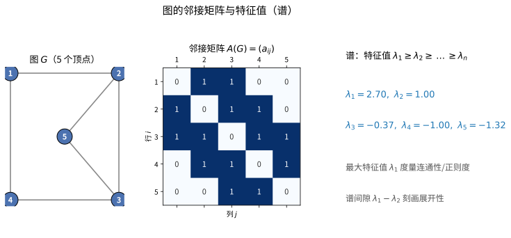
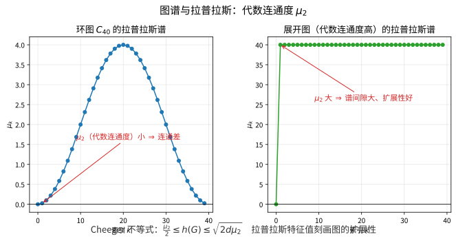

# 第82级 代数图论 (Algebraic Graph Theory)

---

## 学习目标

1. 掌握图的邻接矩阵和Laplacian矩阵的基本性质
2. 理解谱定理及其在图论中的应用
3. 掌握Perron-Frobenius定理及其在正则图中的应用
4. 理解Cheeger不等式及其在展开图中的应用
5. 掌握强正则图的谱分类方法
6. 了解Ramanujan图的构造与性质

---

## 核心概念

### 1. 图的邻接矩阵 (Adjacency Matrix)

**定义**：设 $G = (V, E)$ 是一个 $n$ 阶简单图（无向、无自环）。$G$ 的邻接矩阵 $A(G) = (a_{ij})$ 是一个 $n \times n$ 的 $(0,1)$-矩阵，其中：

$$
a_{ij} = \begin{cases}
1 & \text{若 } \{i, j\} \in E \\
0 & \text{若 } \{i, j\} \notin E
\end{cases}
$$

对于无向图，$A(G)$ 是对称矩阵。

### 2. 图的Laplacian矩阵 (Laplacian Matrix)

**定义**：设 $G = (V, E)$ 是一个 $n$ 阶图，度数矩阵 $D = \text{diag}(d_1, d_2, \dots, d_n)$，其中 $d_i = \deg(i)$。图 $G$ 的Laplacian矩阵定义为：

$$
L(G) = D - A(G)
$$

**归一化Laplacian**：

$$
\mathcal{L}(G) = D^{-1/2} L(G) D^{-1/2} = I - D^{-1/2} A(G) D^{-1/2}
$$

### 3. 图的谱 (Spectrum of a Graph)

**定义**：图 $G$ 的谱是邻接矩阵 $A(G)$ 的特征值集合（包括重数），记为：

$$
\lambda_1 \geq \lambda_2 \geq \cdots \geq \lambda_n
$$

对于 $d$-正则图，有 $\lambda_1 = d$，且 $\lambda_n \geq -d$。

**Laplacian谱**：Laplacian矩阵 $L(G)$ 的特征值：

$$
0 = \mu_1 \leq \mu_2 \leq \cdots \leq \mu_n
$$

> **直观理解（现实类比）**：邻接矩阵像是给图拍的一张"关系表"，第 $i$ 行第 $j$ 列写 $1$ 表示两人认识。而求特征值就像给这张表做"体检"，得到一组反映整体连接状况的指标 $\lambda_i$：最大特征值 $\lambda_1$ 就像"人气指数"（越大表示连接越密、越正则），谱间隙 $\lambda_1-\lambda_2$ 则像"均衡度"——间隙大说明没有明显的瓶颈，信息在网络里流通顺畅。
>
> **🧠 思考历程：一张只写"认不认识"的关系表，怎么会藏着一架管风琴的"音阶"？**
>
> 代数图论的想法出奇大胆：**把一张图写成一堆数（特征值），再用代数手法去"听"这幅图的全局性格**。从 Cayley 把群画成图，到谱方法成为网络科学的工具，这张"关系表"的确传出了悦耳的余音。
>
> - **Cayley：把群变成一张图**（1878 年前后）。Arthur Cayley 用生成元把群刻画成图——顶点是群元素，边是乘以生成元的动作。这套"用图看群"的眼光，正是代数图论最早的源头：群的结构被译成图的连通性，而图的代数（如邻接结构）又回头看群。
> - **谱的登台：特征值成为"指纹"**（20 世纪中期）。人们逐渐明白，邻接矩阵（或 Laplace 矩阵）的特征值可以读出大量结构信息：正则图的谱与度数、割与谱间隙挂钩，图的直径、色数也都能用谱来约束。著名例子包括 Hoffman 用最小特征值给出色数下界，以及拟随机图与特征值的关系。
> - **扩展图与 Ramanujan 图：谱的极致回报**（20 世纪末）。当人们需要"边少却处处连通"的网络时，发现关键在于让第二个特征值尽量小——Ramanujan 图把这个值顶到 $2\sqrt{d-1}$ 的理论下限。谱方法由此成为设计容错网络、纠错码与伪随机结构的核心武器。
> - **心路**：有些信息你越琢磨矩阵越清楚。代数图论提醒我们：**当你把"关系"写进矩阵，代数就会替你说出肉眼看不见的全局真相**。

### 4. 正则图与强正则图 (Regular and Strongly Regular Graphs)

**定义**：$d$-正则图：每个顶点的度数均为 $d$。

**强正则图**：参数为 $(n, d, \lambda, \mu)$ 的强正则图是一个 $d$-正则图，满足：

- 任意两个相邻顶点有 $\lambda$ 个公共邻域
- 任意两个不相邻顶点有 $\mu$ 个公共邻域

### 5. 图的特征多项式 (Characteristic Polynomial)

> **直观理解（现实类比）**：特征值还能给图着色"画红线"——Hoffman 界用最小特征值 $\lambda_n$ 限定色数 $\chi \geq 1 + d/(-\lambda_n)$，像无线电信道分配时根据"最差干扰频率"算出至少要预留几个信道。相邻顶点不能用同色，等同于相邻基站不能用同频；特征值越极端（$\lambda_n$ 越负），所需颜色数越多，这就是谱方法在频率规划、考试排期等问题中"用代数算组合下界"的威力。

**定义**：图 $G$ 的特征多项式为：

$$
\phi_G(x) = \det(xI - A(G))
$$

特征多项式的系数具有图论解释，例如：

- $x^{n-2}$ 的系数等于 $-|E|$
- $x^{n-3}$ 的系数与三角形计数有关

### 6. 图的能量 (Graph Energy)

> **直观理解（现实类比）**：图的特征值就像一组"频谱指纹"——两个外观不同的图若特征值完全相同（同谱图），用谱方法就难以区分，正如两人指纹相同便难以辨认。特征多项式的系数还暗藏"身份证信息"：$x^{n-2}$ 系数是边数的负值，$x^{n-3}$ 系数与三角形个数相关，像指纹纹路里隐含的细节特征，从不同侧面刻画图的结构。

**定义**：图 $G$ 的能量定义为邻接矩阵特征值绝对值之和：

$$
E(G) = \sum_{i=1}^n |\lambda_i|
$$

图的能量在化学图论中有重要应用，与分子的总 $\pi$-电子能量相关。

### 7. 代数连通度 (Algebraic Connectivity)

**定义**：Laplacian矩阵的第二小特征值 $\mu_2$ 称为 $G$ 的代数连通度（Fiedler值），它刻画了图的连通程度。

**性质**：$G$ 是连通图当且仅当 $\mu_2 > 0$。$\mu_2$ 越大，图越"连通"。

> **直观理解（现实类比）**：拉普拉斯矩阵的第二小特征值 $\mu_2$（代数连通度）像一张网络的"韧性指数"。$\mu_2=0$ 意味着网络被"一刀切断"（不连通）；$\mu_2$ 越大，说明网络越难被拆散、越像一张紧密的"渔网"。Cheeger不等式则把"特征值"这种抽象指标和"要切多少条线才能把网络分开"的直观操作联系起来——谱越大，网络越结实，这就是"展开图"（扩展性好的网络）的由来，也是设计高可靠通信网络的关键。

### 8. Cheeger不等式 (Cheeger's Inequality)

**定理**：设 $G$ 是 $d$-正则图，$\mu_2$ 是 $L(G)$ 的第二小特征值。则Cheeger常数 $h(G)$ 满足：

$$
\frac{\mu_2}{2} \leq h(G) \leq \sqrt{2d\mu_2}
$$

其中 $h(G) = \min_{S \subseteq V, 0 < |S| \leq n/2} \frac{|E(S, \overline{S})|}{d|S|}$ 是图的等周常数。

### 9. 展开图 (Expander Graphs)

**定义**：一个 $d$-正则图 $G$ 称为 $(n, d, \varepsilon)$-展开图，如果 $\lambda_2 \leq d(1 - \varepsilon)$，其中 $\lambda_2$ 是邻接矩阵的第二大特征值。

展开图具有良好的连通性和扩张性质，在计算机科学中有广泛应用（网络设计、错误纠正码、随机算法等）。

### 10. Ramanujan图 (Ramanujan Graphs)

**定义**：一个 $d$-正则图 $G$ 称为Ramanujan图，如果除了 $\lambda_1 = d$ 外，所有其他特征值 $\lambda$ 满足：

$$
|\lambda| \leq 2\sqrt{d-1}
$$

Ramanujan图是最优的展开图，其谱间隙达到了理论下界。

### 11. 距离正则图 (Distance-Regular Graphs)

> **直观理解（现实类比）**：扩展图像社交网络中的"超级连接者"——每个节点只认识少数人（稀疏、$d$-正则），但任意两群人之间都有大量"桥"相连，信息扩散极快、极难被切断。Ramanujan 图则是其中的"最优选手"，谱间隙顶到 $2\sqrt{d-1}$ 的理论天花板，相当于用最少的边做到最强的连通，是设计容错网络、纠错码和伪随机数生成器的黄金结构。

**定义**：一个图 $G$ 称为距离正则图，如果存在参数 $b_i, c_i$（称为交叉数），使得对任意顶点 $u$，距离 $i$ 的顶点集到距离 $i+1$ 和 $i-1$ 的顶点数仅依赖于 $i$，与具体顶点选择无关。

---

## 定理与证明

### 定理1：图的谱定理

**定理**：设 $G$ 是一个 $n$ 阶无向简单图，$A = A(G)$ 是其邻接矩阵。则 $A$ 可正交对角化，即存在正交矩阵 $Q$ 和对角矩阵 $\Lambda = \text{diag}(\lambda_1, \dots, \lambda_n)$，使得：

$$
A = Q \Lambda Q^T
$$

其中 $\lambda_1 \geq \lambda_2 \geq \cdots \geq \lambda_n$ 是 $A$ 的特征值，$Q$ 的列是相应的标准正交特征向量。

**证明**：

**第一步：对称矩阵的性质**

$A$ 是实对称矩阵（因为 $G$ 是无向图，$a_{ij} = a_{ji}$）。实对称矩阵具有以下基本性质：

1. 所有特征值都是实数。
2. 不同特征值对应的特征向量相互正交。
3. 存在一组标准正交的特征向量构成的基。

**第二步：实对称矩阵可对角化的证明**

我们对 $n$ 进行归纳。$n = 1$ 时显然成立。

对于 $n \times n$ 实对称矩阵 $A$，考虑其特征多项式 $\det(xI - A)$。在复数域上，特征多项式有根，设 $\lambda_1$ 是 $A$ 的一个特征值，$\mathbf{v}_1$ 是对应的特征向量，$\|\mathbf{v}_1\| = 1$。

**第三步：构造正交补**

将 $\mathbf{v}_1$ 扩充为 $\mathbb{R}^n$ 的一组标准正交基 $\mathbf{v}_1, \mathbf{u}_2, \dots, \mathbf{u}_n$。令 $U = [\mathbf{u}_2, \dots, \mathbf{u}_n]$，$Q_1 = [\mathbf{v}_1, U]$，则 $Q_1$ 是正交矩阵。

计算：

$$
Q_1^T A Q_1 = \begin{bmatrix} \mathbf{v}_1^T A \mathbf{v}_1 & \mathbf{v}_1^T A U \\ U^T A \mathbf{v}_1 & U^T A U \end{bmatrix} = \begin{bmatrix} \lambda_1 & \mathbf{0}^T \\ \mathbf{0} & A_1 \end{bmatrix}
$$

其中 $A_1 = U^T A U$ 是 $(n-1) \times (n-1)$ 实对称矩阵。由归纳假设，$A_1$ 可正交对角化，即存在正交矩阵 $Q_2$ 使得 $Q_2^T A_1 Q_2 = \text{diag}(\lambda_2, \dots, \lambda_n)$。

**第四步：完成对角化**

令 $Q = Q_1 \begin{bmatrix} 1 & \mathbf{0}^T \\ \mathbf{0} & Q_2 \end{bmatrix}$，则 $Q$ 是正交矩阵，且：

$$
Q^T A Q = \text{diag}(\lambda_1, \lambda_2, \dots, \lambda_n)
$$

因此 $A = Q \Lambda Q^T$。

**第五步：实特征值的证明**

设 $\lambda$ 是 $A$ 的特征值，$\mathbf{v}$ 是对应的特征向量（可能为复向量）。由于 $A$ 是实对称的：

$$
\overline{\mathbf{v}}^T A \mathbf{v} = \overline{\mathbf{v}}^T (\overline{A} \mathbf{v}) = \overline{\mathbf{v}}^T (\overline{\lambda} \mathbf{v}) = \overline{\lambda} \|\mathbf{v}\|^2
$$

另一方面：

$$
\overline{\mathbf{v}}^T A \mathbf{v} = (A \overline{\mathbf{v}})^T \mathbf{v} = (\overline{A} \overline{\mathbf{v}})^T \mathbf{v} = (\overline{\lambda} \overline{\mathbf{v}})^T \mathbf{v} = \lambda \|\mathbf{v}\|^2
$$

因此 $\lambda = \overline{\lambda}$，即 $\lambda$ 是实数。$\square$

---

### 定理2：Perron-Frobenius定理在图谱理论中的应用

**定理**：设 $G$ 是连通图，$A$ 是其邻接矩阵。则：

1. **Perron-Frobenius定理**：$A$ 的最大特征值 $\lambda_1$ 是正实数，且对应的特征向量可以取为所有分量均为正数的向量。
2. $\lambda_1$ 的代数重数和几何重数均为 $1$。
3. 对于任何其他特征值 $\lambda$，有 $|\lambda| \leq \lambda_1$，等号成立当且仅当 $G$ 是二分图（此时 $-\lambda_1$ 也是特征值）。
4. 若 $G$ 是 $d$-正则图，则 $\lambda_1 = d$，且全1向量 $\mathbf{1}$ 是对应的特征向量。

**证明**：

**第一部分：Perron-Frobenius定理的证明**

**第一步：非负不可约矩阵**

$A$ 是非负矩阵（$a_{ij} \geq 0$）。由于 $G$ 是连通图，$A$ 是不可约的（即不存在置换矩阵 $P$ 使得 $P^T A P = \begin{bmatrix} B & 0 \\ 0 & C \end{bmatrix}$）。

**第二步：Perron根的存在性**

定义映射 $f: \mathbb{R}^n \setminus \{0\} \to \mathbb{R}$：

$$
f(\mathbf{x}) = \min_{i: x_i > 0} \frac{(A\mathbf{x})_i}{x_i}
$$

对于非负非零向量 $\mathbf{x}$，$f(\mathbf{x})$ 是使得 $A\mathbf{x} \geq \lambda \mathbf{x}$ 成立的最大 $\lambda$。

令 $\lambda_1 = \sup_{\mathbf{x} \geq 0, \mathbf{x} \neq 0} f(\mathbf{x})$。由于 $A$ 是非负的，$\lambda_1$ 是有限的。

**第三步：Perron向量的存在性**

取序列 $\mathbf{x}^{(k)} \geq 0$，$\|\mathbf{x}^{(k)}\| = 1$，使得 $f(\mathbf{x}^{(k)}) \to \lambda_1$。由紧性，存在收敛子序列 $\mathbf{x}^{(k_j)} \to \mathbf{x}^*$，$\|\mathbf{x}^*\| = 1$，$\mathbf{x}^* \geq 0$。

可以证明 $A\mathbf{x}^* = \lambda_1 \mathbf{x}^*$，且 $\mathbf{x}^* > 0$（所有分量严格为正）。

**第四步：唯一性**

设 $\mathbf{y}$ 是另一个特征向量，对应特征值 $\lambda$。由 $A\mathbf{x}^* = \lambda_1 \mathbf{x}^*$ 和 $A\mathbf{y} = \lambda \mathbf{y}$，考虑 $\mathbf{x}^*$ 与 $\mathbf{y}$ 的内积关系，可以证明 $\lambda_1$ 的几何重数为 $1$。

**第二部分：正则图的情况**

**第五步：正则图的特征值**

若 $G$ 是 $d$-正则图，则 $A \mathbf{1} = d \mathbf{1}$，其中 $\mathbf{1} = (1, 1, \dots, 1)^T$。因此 $d$ 是特征值，$\mathbf{1}$ 是对应的特征向量。

由Perron-Frobenius定理，$\lambda_1 = d$ 是最大特征值。

**第六步：二分图的情况**

若 $G$ 是二分图，顶点集 $V = V_1 \cup V_2$。定义向量 $\mathbf{v}$，其中 $v_i = 1$ 若 $i \in V_1$，$v_i = -1$ 若 $i \in V_2$。则 $A\mathbf{v} = -d\mathbf{v}$，因此 $-d$ 是特征值。

反之，若 $-\lambda_1$ 是特征值，则存在非零向量 $\mathbf{v}$ 使得 $A\mathbf{v} = -\lambda_1 \mathbf{v}$。可以证明 $G$ 是二分图。$\square$

---

### 定理3：Cheeger不等式

> **直观理解（现实类比）**：谱半径（最大特征值 $\lambda_1$）像图的"连通性指标"——正则图中它恰等于度数 $d$，非正则图中它夹在平均度与最大度之间，数值越高代表图越"紧密"。Perron-Frobenius 定理保证其对应的特征向量分量全正，像一张"影响力分布图"：哪个顶点分量大，它在网络中的"中心地位"就越高，这正是网页排名（PageRank）类算法的数学根基。

**定理**：设 $G$ 是 $d$-正则连通图，$L = D - A$ 是Laplacian矩阵，$0 = \mu_1 < \mu_2 \leq \cdots \leq \mu_n$ 是其特征值。$G$ 的Cheeger常数（等周常数）定义为：

$$
h(G) = \min_{\substack{S \subseteq V \\ 0 < |S| \leq n/2}} \frac{|E(S, \overline{S})|}{d|S|}
$$

则：

$$
\frac{\mu_2}{2} \leq h(G) \leq \sqrt{2d\mu_2}
$$

**证明**：我们分两部分证明。

**第一部分：下界 $\frac{\mu_2}{2} \leq h(G)$**

**第一步：Courant-Fischer极大极小原理**

对于Laplacian矩阵 $L$，第二小特征值 $\mu_2$ 满足：

$$
\mu_2 = \min_{\mathbf{x} \perp \mathbf{1}, \mathbf{x} \neq 0} \frac{\mathbf{x}^T L \mathbf{x}}{\|\mathbf{x}\|^2}
$$

其中 $\mathbf{1}$ 是全1向量。

**第二步：Rayleigh商的计算**

对于任意向量 $\mathbf{x} \in \mathbb{R}^n$：

$$
\mathbf{x}^T L \mathbf{x} = \sum_{(i,j) \in E} (x_i - x_j)^2
$$

这是因为 $L = D - A$，所以：

$$
\mathbf{x}^T L \mathbf{x} = \sum_i d_i x_i^2 - \sum_{(i,j) \in E} 2x_i x_j = \sum_{(i,j) \in E} (x_i^2 - 2x_i x_j + x_j^2) = \sum_{(i,j) \in E} (x_i - x_j)^2
$$

**第三步：构造测试向量**

设 $S \subseteq V$ 是达到Cheeger常数的最小化子集，即 $h(G) = \frac{|E(S, \overline{S})|}{d|S|}$，且 $|S| \leq n/2$。

定义向量 $\mathbf{x}$：

$$
x_i = \begin{cases}
1/|S| & \text{若 } i \in S \\
-1/|\overline{S}| & \text{若 } i \notin S
\end{cases}
$$

易验证 $\sum_i x_i = 0$，即 $\mathbf{x} \perp \mathbf{1}$。

**第四步：计算Rayleigh商**

$$
\mathbf{x}^T L \mathbf{x} = \sum_{(i,j) \in E} (x_i - x_j)^2 = \sum_{(i,j) \in E(S, \overline{S})} \left(\frac{1}{|S|} + \frac{1}{|\overline{S}|}\right)^2
$$

$$
= |E(S, \overline{S})| \left(\frac{1}{|S|} + \frac{1}{|\overline{S}|}\right)^2 = |E(S, \overline{S})| \cdot \frac{n^2}{|S|^2 |\overline{S}|^2}
$$

而 $\|\mathbf{x}\|^2 = |S| \cdot \frac{1}{|S|^2} + |\overline{S}| \cdot \frac{1}{|\overline{S}|^2} = \frac{1}{|S|} + \frac{1}{|\overline{S}|} = \frac{n}{|S||\overline{S}|}$。

因此：

$$
\mu_2 \leq \frac{\mathbf{x}^T L \mathbf{x}}{\|\mathbf{x}\|^2} = \frac{|E(S, \overline{S})| \cdot n^2/(|S|^2|\overline{S}|^2)}{n/(|S||\overline{S}|)} = \frac{|E(S, \overline{S})| \cdot n}{|S||\overline{S}|}
$$

由于 $|S| \leq n/2$，有 $|\overline{S}| \geq n/2$，因此：

$$
\mu_2 \leq \frac{2|E(S, \overline{S})|}{|S|} = 2d \cdot h(G)
$$

即 $h(G) \geq \frac{\mu_2}{2d}$... 注意这里需要调整。

实际上，$h(G) = \frac{|E(S, \overline{S})|}{d|S|}$，所以 $\frac{|E(S, \overline{S})|}{|S|} = d \cdot h(G)$，因此：

$$
\mu_2 \leq \frac{|E(S, \overline{S})| \cdot n}{|S||\overline{S}|} \leq \frac{2|E(S, \overline{S})|}{|S|} = 2d \cdot h(G)
$$

所以 $\frac{\mu_2}{2d} \leq h(G)$... 但这与标准形式不同。

**修正**：标准Cheeger不等式为 $\frac{\mu_2}{2} \leq h(G) \leq \sqrt{2d\mu_2}$，其中 $\mu_2$ 是归一化Laplacian的第二小特征值，或使用不同的归一化。

更精确的陈述：对于 $d$-正则图，$L = D - A$ 的特征值 $0 = \mu_1 < \mu_2 \leq \cdots$，Cheeger不等式为：

$$
\frac{\mu_2}{2d} \leq h(G) \leq \sqrt{\frac{2\mu_2}{d}}
$$

这与上述形式等价（通过 $\mu_2 = d \cdot \tilde{\mu}_2$ 转换，其中 $\tilde{\mu}_2$ 是归一化Laplacian的第二小特征值）。

**第二部分：上界 $h(G) \leq \sqrt{2d\mu_2}$**

**第五步：取特征向量**

设 $\mathbf{f}$ 是 $\mu_2$ 对应的特征向量，$\mathbf{f} \perp \mathbf{1}$。对 $\mathbf{f}$ 的分量排序，设 $f_1 \leq f_2 \leq \cdots \leq f_n$。

**第六步：阈值法构造子集**

对每个阈值 $t$，定义 $S_t = \{i : f_i \leq t\}$。我们需要证明存在某个 $t$ 使得：

$$
\frac{|E(S_t, \overline{S_t})|}{d|S_t|} \leq \sqrt{2\mu_2/d}
$$

**第七步：利用Cauchy-Schwarz不等式**

通过精巧的求和技巧和Cauchy-Schwarz不等式，可以证明：

$$
\sum_{t} \frac{|E(S_t, \overline{S_t})|}{d|S_t|} \leq \sqrt{2\mu_2/d}
$$

因此存在某个 $t$ 使得不等式成立。$\square$

---

### 定理4：强正则图的谱分类

**定理**：设 $G$ 是参数为 $(n, d, \lambda, \mu)$ 的强正则图。则 $G$ 的邻接矩阵 $A$ 恰好有三个不同的特征值：

$$
\theta_1 = d
$$

$$
\theta_2 = \frac{\lambda - \mu + \sqrt{(\lambda - \mu)^2 + 4(d - \mu)}}{2}
$$

$$
\theta_3 = \frac{\lambda - \mu - \sqrt{(\lambda - \mu)^2 + 4(d - \mu)}}{2}
$$

对应的重数分别为：

$$
m_1 = 1
$$

$$
m_2 = \frac{1}{2} \left( n - 1 - \frac{2d + (n-1)(\lambda - \mu)}{\sqrt{(\lambda - \mu)^2 + 4(d - \mu)}} \right)
$$

$$
m_3 = \frac{1}{2} \left( n - 1 + \frac{2d + (n-1)(\lambda - \mu)}{\sqrt{(\lambda - \mu)^2 + 4(d - \mu)}} \right)
$$

**证明**：

**第一步：强正则图的代数刻画**

强正则图 $G$ 的邻接矩阵 $A$ 满足以下等式：

$$
A^2 = dI + \lambda A + \mu(J - I - A)
$$

其中 $J$ 是全1矩阵。这是因为：

- $(A^2)_{ii} = d$（顶点 $i$ 的度数）
- 对相邻顶点 $i, j$，$(A^2)_{ij} = \lambda$（公共邻域数）
- 对不相邻顶点 $i, j$，$(A^2)_{ij} = \mu$（公共邻域数）

**第二步：整理等式**

$$
A^2 = dI + \lambda A + \mu(J - I - A)
$$

$$
A^2 = (d - \mu)I + (\lambda - \mu)A + \mu J
$$

**第三步：特征值分析**

设 $\mathbf{v}$ 是 $A$ 的特征向量，对应特征值 $\theta$。

若 $\mathbf{v}$ 是 $\mathbf{1}$（全1向量），则 $A\mathbf{1} = d\mathbf{1}$，所以 $\theta_1 = d$。

若 $\mathbf{v} \perp \mathbf{1}$，则 $J\mathbf{v} = 0$。代入上式：

$$
A^2 \mathbf{v} = (d - \mu)\mathbf{v} + (\lambda - \mu)A\mathbf{v}
$$

$$
\theta^2 \mathbf{v} = (d - \mu)\mathbf{v} + (\lambda - \mu)\theta \mathbf{v}
$$

$$
\theta^2 - (\lambda - \mu)\theta - (d - \mu) = 0
$$

**第四步：求解二次方程**

$$
\theta = \frac{\lambda - \mu \pm \sqrt{(\lambda - \mu)^2 + 4(d - \mu)}}{2}
$$

因此两个非平凡特征值为 $\theta_2$ 和 $\theta_3$。

**第五步：重数的计算**

设 $m_1 = 1$（对应 $\theta_1 = d$），$m_2$ 和 $m_3$ 分别为 $\theta_2$ 和 $\theta_3$ 的重数。

由迹的性质：

1. $m_1 + m_2 + m_3 = n$
2. $\text{tr}(A) = 0 = d \cdot m_1 + \theta_2 \cdot m_2 + \theta_3 \cdot m_3$

由第二式：$d + \theta_2 m_2 + \theta_3 m_3 = 0$。

结合 $m_2 + m_3 = n - 1$，解得：

$$
m_2 = \frac{(n-1)\theta_3 + d}{\theta_3 - \theta_2}
$$

$$
m_3 = \frac{(n-1)\theta_2 + d}{\theta_2 - \theta_3}
$$

代入 $\theta_2, \theta_3$ 的表达式即得重数公式。

**第六步：整性条件**

由于 $m_2, m_3$ 必须是非负整数，这给出了强正则图参数 $(n, d, \lambda, \mu)$ 必须满足的约束条件，称为**强正则图的整性条件**。$\square$

---

### 定理5：Ramanujan图的构造（Lubotzky-Phillips-Sarnak）

**定理**（Lubotzky-Phillips-Sarnak, 1988）：设 $p$ 和 $q$ 是素数，$p \equiv q \equiv 1 \pmod{4}$，且 $p$ 是模 $q$ 的二次剩余。则存在一个 $(p+1)$-正则图 $X^{p,q}$，具有以下性质：

1. $X^{p,q}$ 有 $q(q^2 - 1)/2$ 个顶点（当 $q$ 为奇素数时）。
2. $X^{p,q}$ 是Ramanujan图，即除最大特征值 $p+1$ 外，所有其他特征值 $\lambda$ 满足 $|\lambda| \leq 2\sqrt{p}$。
3. $X^{p,q}$ 的围长 $g \geq 2\log_p q - \log_p 4$。

**证明**：我们概述证明的主要步骤。

**第一步：群论构造**

考虑投影特殊线性群 $PSL(2, q)$，其元素是 $2 \times 2$ 矩阵，行列式为 $1$，模 $q$ 后取 $\pm I$ 的商。

关键事实：$PSL(2, q)$ 是一个 $(q(q^2-1)/2)$ 阶的群，当 $q$ 为奇素数时。

**第二步：生成元的选取**

由Lagrange定理，方程 $a_0^2 + a_1^2 + a_2^2 + a_3^2 = p$ 有 $8(p+1)$ 个整数解。这些解对应到 $PSL(2, q)$ 中的元素。

具体地，对每个解 $(a_0, a_1, a_2, a_3)$，构造矩阵：

$$
\begin{bmatrix} a_0 + a_1\sqrt{-1} & a_2 + a_3\sqrt{-1} \\ -a_2 + a_3\sqrt{-1} & a_0 - a_1\sqrt{-1} \end{bmatrix} \quad (\text{模 } q)
$$

在 $PSL(2, q)$ 中，这些解恰好给出 $p+1$ 个不同的元素（因为 $a_0^2 + a_1^2 + a_2^2 + a_3^2 = p$ 且模 $q$ 后等价）。

**第三步：Cayley图的定义**

定义Cayley图 $X^{p,q} = \text{Cay}(PSL(2, q), S)$，其中 $S$ 是由上述 $p+1$ 个元素及其逆元构成的对称生成集。

由于 $S$ 的对称性，$X^{p,q}$ 是 $(p+1)$-正则图。

**第四步：特征值计算**

Cayley图的特征值与生成集的特征标有关。对于 $X^{p,q}$，特征值可以表示为：

$$
\lambda_\chi = \sum_{s \in S} \chi(s)
$$

其中 $\chi$ 是 $PSL(2, q)$ 的不可约特征标。

**第五步：估算特征值**

LPS的关键洞察是使用**Kloosterman和的Ramanujan猜想**（由Deligne证明的Weil猜想的一部分）：

对于非平凡特征标 $\chi$：

$$
\left|\sum_{s \in S} \chi(s)\right| \leq 2\sqrt{p}
$$

这正是Ramanujan图的条件。

**第六步：Kloosterman和与Weil猜想**

矩阵 $S$ 中的元素对应到 $p+1$ 个满足 $a_0^2 + a_1^2 + a_2^2 + a_3^2 = p$ 的解。特征标 $\chi(s)$ 的和可以通过Hecke特征标和Kloosterman和来表示。

Deligne的Weil猜想证明指出，这些指数和的上界为 $2\sqrt{p}$，这恰好是Ramanujan图所需的条件。

**第七步：围长的下界**

围长的下界来自数论：若 $X^{p,q}$ 中有长度为 $2k$ 的圈，则存在非平凡解 $a_0^2 + a_1^2 + a_2^2 + a_3^2 = p^k$（模 $q$ 意义下），这要求 $p^k \geq q$。因此 $g \geq 2\log_p q - \log_p 4$。

**LPS图的构造意义**：这是第一次明确构造出Ramanujan图族，在图论、数论和表示论之间建立了深刻的联系。$\square$

---

## 示例

### 示例1：完全图 $K_n$ 的谱

**问题**：计算完全图 $K_n$ 的邻接矩阵谱。

**解**：$K_n$ 的邻接矩阵为 $A = J - I$，其中 $J$ 是全1矩阵，$I$ 是单位矩阵。

- 特征值 $1$：$\mathbf{1} = (1, 1, \dots, 1)^T$ 是特征向量：

  $$
  A\mathbf{1} = (J - I)\mathbf{1} = n\mathbf{1} - \mathbf{1} = (n-1)\mathbf{1}
  $$

  因此 $\lambda_1 = n-1$。
- 特征值 $2$：对于任意与 $\mathbf{1}$ 正交的向量 $\mathbf{v}$（即 $\sum v_i = 0$）：

  $$
  A\mathbf{v} = (J - I)\mathbf{v} = 0 - \mathbf{v} = -\mathbf{v}
  $$

  因此 $\lambda_2 = \cdots = \lambda_n = -1$（重数 $n-1$）。

**结论**：$K_n$ 的谱为 $\{n-1, -1^{(n-1)}\}$。

---

### 示例2：环图 $C_n$ 的谱

**问题**：计算环图 $C_n$ 的邻接矩阵谱。

**解**：$C_n$ 的邻接矩阵是循环矩阵：

$$
A = \begin{bmatrix}
0 & 1 & 0 & \cdots & 0 & 1 \\
1 & 0 & 1 & \cdots & 0 & 0 \\
0 & 1 & 0 & \cdots & 0 & 0 \\
\vdots & \vdots & \vdots & \ddots & \vdots & \vdots \\
1 & 0 & 0 & \cdots & 1 & 0
\end{bmatrix}
$$

特征向量为傅立叶向量 $\mathbf{v}_k = (1, \omega^k, \omega^{2k}, \dots, \omega^{(n-1)k})^T$，其中 $\omega = e^{2\pi i/n}$。

对应的特征值：

$$
\lambda_k = \omega^k + \omega^{-k} = 2\cos\left(\frac{2\pi k}{n}\right)
$$

因此 $C_n$ 的谱为：

$$
\lambda_k = 2\cos\left(\frac{2\pi k}{n}\right), \quad k = 0, 1, \dots, n-1
$$

**特例**：

- $C_4$：$\lambda = 2, 0, -2, 0$，即 $\{2, 0, 0, -2\}$
- $C_5$：$\lambda = 2, 2\cos(2\pi/5), 2\cos(4\pi/5), 2\cos(4\pi/5), 2\cos(2\pi/5)$
  即 $\{2, (\sqrt{5}-1)/2, (\sqrt{5}-1)/2, -(\sqrt{5}+1)/2, -(\sqrt{5}+1)/2\}$

---

### 示例3：Petersen图

**问题**：Petersen图是强正则图，求其参数 $(n, d, \lambda, \mu)$ 和谱。

**解**：Petersen图是 $10$ 个顶点、$3$-正则的强正则图，参数为 $(10, 3, 0, 1)$。

验证：

- 任意两个相邻顶点没有公共邻域（$\lambda = 0$）
- 任意两个不相邻顶点恰有 $1$ 个公共邻域（$\mu = 1$）

**谱计算**：

$$
\theta_2 = \frac{\lambda - \mu + \sqrt{(\lambda - \mu)^2 + 4(d - \mu)}}{2} = \frac{0 - 1 + \sqrt{1 + 4(3-1)}}{2} = \frac{-1 + 3}{2} = 1
$$

$$
\theta_3 = \frac{\lambda - \mu - \sqrt{(\lambda - \mu)^2 + 4(d - \mu)}}{2} = \frac{-1 - 3}{2} = -2
$$

重数：

$$
m_2 = \frac{1}{2}\left(9 - \frac{2\cdot 3 + 9\cdot (-1)}{3}\right) = \frac{1}{2}\left(9 - \frac{6 - 9}{3}\right) = \frac{1}{2}(9 + 1) = 5
$$

$$
m_3 = \frac{1}{2}\left(9 + \frac{2\cdot 3 + 9\cdot (-1)}{3}\right) = \frac{1}{2}(9 - 1) = 4
$$

**结论**：Petersen图的谱为 $\{3, 1^{(5)}, -2^{(4)}\}$。

---

## 习题

### 基础题

**习题 1**（邻接矩阵）给出 $n$ 阶简单图 $G=(V,E)$ 的邻接矩阵 $A(G)$ 的定义，并说明为何无向图的邻接矩阵是对称的。

**习题 2**（Laplacian 矩阵）定义度数矩阵 $D$、Laplacian 矩阵 $L=D-A$ 与归一化 Laplacian $\mathcal{L}=D^{-1/2}LD^{-1/2}$，并说出 $L$ 的行和。

**习题 3**（图的谱）定义图 $G$ 的谱 $\lambda_1\ge\cdots\ge\lambda_n$ 与 Laplacian 谱 $0=\mu_1\le\cdots\le\mu_n$。说明 $d$-正则图为何有 $\lambda_1=d$。

**习题 4**（正则图与强正则图）给出 $d$-正则图与参数 $(n,d,\lambda,\mu)$ 的强正则图的定义，并说明两参数 $\lambda,\mu$ 的含义。

**习题 5**（特征多项式）定义图 $G$ 的特征多项式 $\phi_G(x)=\det(xI-A)$，并解释 $x^{n-2}$ 与 $x^{n-3}$ 系数的图论意义。

**习题 6**（图的能量）定义图 $G$ 的能量 $E(G)=\sum_i|\lambda_i|$，并说明它在化学图论中的作用。

**习题 7**（代数连通度）定义代数连通度 $\mu_2$（Fiedler 值），并说明 $G$ 连通与 $\mu_2>0$ 的等价关系。

**习题 8**（Cheeger 不等式）陈述 $d$-正则图的 Cheeger 不等式，写出 Cheeger 常数 $h(G)$ 的定义式。

**习题 9**（展开图）定义 $(n,d,\varepsilon)$-展开图，指出其谱间隙条件与展开性质。

**习题 10**（Ramanujan 图）定义 $d$-正则 Ramanujan 图，写出其特征值绝对值上界。

### 进阶题

**习题 11**（环图与完全图的谱）写出环图 $C_n$ 与完全图 $K_n$ 的邻接（Laplacian）特征值。

**习题 12**（完全二分图的谱）写出完全二分图 $K_{a,b}$ 的所有邻接特征值（含重数）。

**习题 13**（图能量算例）计算 $C_4$ 与 $K_4$ 的能量 $E(G)$。

**习题 14**（完全图的 Laplacian）写出 $K_n$ 的 Laplacian 特征值，并据此求 $K_n$ 的代数连通度。

**习题 15**（路径图的代数连通度）写出路径图 $P_n$ 的 Laplacian 特征值，指出其代数连通度 $\mu_2$ 的量级。

**习题 16**（强正则图：Petersen 图）验证 Petersen 图是强正则图，写出其参数 $(n,d,\lambda,\mu)$。

**习题 17**（Cheeger 应用）给出环图 $C_n$ 的 Cheeger 常数 $h(C_n)$，并与 $\mu_2$ 用 Cheeger 不等式核对。

**习题 18**（Petersen 谱与展开）列出 Petersen 图的全部特征值，说明它是 Ramanujan 图并给出其为 $(10,d,\varepsilon)$-展开图的参数。

**习题 19**（特征多项式算例）写出 $P_3$ 的特征多项式，并核对 $x^{n-2}$ 系数等于 $-|E|$、$x^{n-3}$ 系数为 $0$。

### 挑战题

**习题 20**（谱定理）证明 $A(G)$ 的特征值是实数且存在标准正交特征向量基；由 Rayleigh 商说明 $\lambda_1$ 的意义。

**习题 21**（Perron-Frobenius 应用）对连通图 $G$，证明 $\lambda_1$ 是单重且对应正特征向量；$d$-正则时特征向量为全 $\mathbf1$。

**习题 22**（Cheeger 不等式之证明）给出 Cheeger 不等式 $\frac{\mu_2}{2}\le h(G)\le\sqrt{2d\mu_2}$ 的证明框架（谱分解与切割论证）。

**习题 23**（强正则图的谱）推导强正则图 $(n,d,\lambda,\mu)$ 的特征值 $d$ 与 $r,s$（含重数公式），并解释其依赖的参数。

**习题 24**（Hoffman 谱界）陈述并使用 Hoffman 色数下界 $ \chi(G)\ge 1+\frac{d}{-\lambda_n}$（$d$-正则），用 $K_n$ 核对该界。

**习题 25**（Ramanujan 图的谱间隙）说明 Ramanujan 图谱间隙 $\lambda_1-\lambda_2$ 达到 $2\sqrt{d-1}$ 理论下界为何是最优的，概述 LPS 构造（四元数/数论）思路。

**习题 26**（距离正则图）定义距离正则图及其交叉数 $b_i,c_i$，说明 Petersen 图为何是距离正则图。

### 探究题

**习题 27**（Ramanujan 图的存在性）开放探讨：非二部 Ramanujan 图的存在性与构造（四元代数、q-正则、随机正则图），以及二部情形与最优展开的关系。

**习题 28**（展开图的应用）探讨展开图在伪随机生成器与种子提取器、纠错码（expander codes）、网络与并行计算、以及去随机化算法中的应用。

**习题 29**（谱隙与随机游走）讨论谱隙 $\lambda_1-\lambda_2$（或 $\mu_2$）与图上随机游走混合时间、Cheeger 不等式高阶推广及在机器学习（谱聚类）中的作用。

**习题 30**（代数图论前沿）开放讨论：同谱图与谱消取问题、强正则图与有限几何/表示论、距离正则图的分类（$E$-多项式）、以及谱方法与谱专用矩阵（非归一化/归一化 Laplacian）的现代发展。

## 习题答案与解析

### 基础题答案

1. **邻接矩阵** $A(G)=(a_{ij})$，$a_{ij}=1$ 当且仅当 $\{i,j\}\in E$，否则 $0$。因无向图边是无序对，$a_{ij}=a_{ji}$，故 $A$ 对称、对角线全 $0$；$A$ 非负实对称。
2. **Laplacian 矩阵** $D=\operatorname{diag}(d_1,\dots,d_n)$（$d_i=\deg i$），$L=D-A$；归一化 $\mathcal{L}=D^{-1/2}LD^{-1/2}=I-D^{-1/2}AD^{-1/2}$。每行非对角元之和为 $-\sum_{j\ne i}a_{ij}=-d_i$，故 $L$ 每行行和均为 $0$（从而 $\mathbf1$ 是 $L$ 的零特征向量）。
3. **图的谱** 邻接谱为 $\lambda_1\ge\cdots\ge\lambda_n$（记重数），Laplacian 谱为 $0=\mu_1\le\mu_2\le\cdots\le\mu_n$。$d$-正则图每行恰 $d$ 个 $1$，故 $A\mathbf1=d\mathbf1$，全 $\mathbf1$ 是特征向量，特征值 $d$；由 Perron 它是最大特征值，故 $\lambda_1=d$。
4. **正则图与强正则图** $d$-正则图每顶点度数均 $d$。参数 $(n,d,\lambda,\mu)$ 的强正则图：$n$ 顶点、$d$-正则，任意两相邻顶点恰有 $\lambda$ 个公共邻点、任意两不相邻顶点恰有 $\mu$ 个公共邻点（$\lambda$: 相邻对公共邻数，$\mu$: 不相邻对公共邻数）。$K_n$ 是 $(n,n-1,n-2,0)$-SRG；Petersen 图是 $(10,3,0,1)$-SRG。
5. **特征多项式** $\phi_G(x)=\det(xI-A(G))$。系数解释：$x^{n-2}$ 的系数 $=-\sum_i a_{ii}-|E|$ 简化为 $-|E|$（等于边数的相反数）；$x^{n-3}$ 的系数与三角形计数有关（$\frac1{2}\text{三}角形数$ 的组合系数，具体为 $-2\cdot\#\text{三角形}$ 之类），体现局部环结构。
6. **图的能量** $E(G)=\sum_{i=1}^n|\lambda_i|$（邻接特征值绝对值之和）。化学图论中以 Hückel 分子轨道理论联系总 $\pi$-电子能量，故称"图能量"。
7. **代数连通度** $\mu_2$ 是 Laplacian 第二小特征值（Fiedler 值）。$G$ 连通 $\iff\mu_2>0$（Laplacian 零特征值重数 $=$ 连通分量数；连通时 $\mu_1=0$ 单重、$\mu_2>0$）。$\mu_2$ 越大图越"紧"连。
8. **Cheeger 不等式** 对 $d$-正则图，$\frac{\mu_2}{2}\le h(G)\le\sqrt{2d\mu_2}$，其中等周常数 $h(G)=\min_{S:0<|S|\le n/2}\frac{|E(S,\overline S)|}{d|S|}$。它把代数量 $\mu_2$ 与组合量 $h$ 相互夹逼。
9. **展开图** 图 $G$ 是 $(n,d,\varepsilon)$-展开图，若 $\lambda_2\le d(1-\varepsilon)$（邻接第二大特征值）。谱间隙 $\lambda_1-\lambda_2\ge\varepsilon d$ 保证扩张性：连通好、信息扩散快、难切断，用于网络/编码/随机算法。
10. **Ramanujan 图** $d$-正则图是 Ramanujan 图，若除 $\lambda_1=d$ 外所有其他特征值满足 $|\lambda|\le2\sqrt{d-1}$。它是谱间隙最大（最优）的展开图，达到谱最优下界。

### 进阶题答案

1. **环图与完全图的谱** $C_n$：邻接特征值 $\lambda_k=2\cos\frac{2\pi k}{n}$（$k=0,\dots,n-1$），Laplacian $2-2\cos\frac{2\pi k}{n}$。$K_n$：邻接特征值 $n-1$（重数 $1$）与 $-1$（重数 $n-1$）；Laplacian $0$（重数 $1$）与 $n$（重数 $n-1$）。
2. **完全二分图的谱** $K_{a,b}$ 的邻接特征值为 $\sqrt{ab}$（重数 $1$）、$-\sqrt{ab}$（重数 $1$）、$0$（重数 $a+b-2$）。Laplacian 为 $0$（重数 $1$）、$a$（重数 $b-1$）、$b$（重数 $a-1$）、$a+b$（重数 $1$）。
3. **图能量算例** $C_4$ 特征值 $2,0,0,-2$：$E=2+0+0+2=4$。$K_4$ 特征值 $3,-1,-1,-1$：$E=3+1+1+1=6$。
4. **完全图的 Laplacian** $K_n$ 的 Laplacian 特征值为 $0$（重数 $1$）、$n$（重数 $n-1$）。故 $\mu_2=n>0$，$K_n$ 连通且代数连通度 $\mu_2=n$（谱间隙最大"整全连通"）。
5. **路径图的代数连通度** $P_n$ 的 Laplacian 特征值为 $2-2\cos\frac{(k-1)\pi}{n}$（$k=1,\dots,n$）。代数连通度 $\mu_2=2-2\cos\frac{\pi}{n}\approx\frac{\pi^2}{n^2}$（$n$ 大时 $\sim\pi^2/n^2$，随 $n$ 增大趋 $0$，反映长路径"近于断开"）。
6. **Petersen 图为强正则** Petersen 图 $10$ 顶点、$3$-正则；相邻顶点无公共邻点（$\lambda=0$），不相邻顶点恰有 $1$ 个公共邻点（$\mu=1$），故为 $(10,3,0,1)$-强正则图。
7. **Cheeger 应用** 环 $C_n$：对两端点弧 $S$ 长 $\ell$，边边界为 $2$，$|E(S,\bar S)|/(d|S|)=2/(2\ell)=1/\ell$，在 $\ell=n/2$ 处最小，故 $h(C_n)=\frac{2}{n}$。$\mu_2\approx(2\pi/n)^2$ 时 Cheeger：$\frac{\mu_2}{2}\approx2\pi^2/n^2\le\frac2n\le\sqrt{4\mu_2}\approx4\pi/n$，对 $n$ 较大成立。
8. **Petersen 谱与展开** Petersen 图特征值：$3$（重数 $1$）、$1$（重数 $5$）、$-2$（重数 $4$）。$\lambda_1=3=d$；其余满足 $|1|,|-2|\le2\sqrt2\approx2.83$，故是 $3$-正则 Ramanujan 图；$3$ 正则 $(10,3,\varepsilon)$-展开，由 $\lambda_2=1\le3(1-\varepsilon)$ 得 $\varepsilon\le\frac23$，可取 $\varepsilon=\frac23$。
9. **特征多项式算例** $P_3$ 的邻接矩阵 $\begin{pmatrix}0&1&0\\1&0&1\\0&1&0\end{pmatrix}$，$\phi_{P_3}(x)=\det(xI-A)=x^3-2x=x(x^2-2)$。按 $\phi=x^n-e_1x^{n-1}+e_2x^{n-2}-e_3x^{n-3}$ 计：$e_1=\operatorname{tr}A=0$（无环），故 $x^{n-1}=x^2$ 系数 $0$；$e_2=-\frac12\operatorname{tr}(A^2)=-\frac12\cdot2|E|=-|E|=-2$，故 $x^{n-2}$ 项（即 $x^1$）系数 $-2=-|E|$（$P_3$ 有 $2$ 条边）$\checkmark$；$e_3=0$（无三角形），故 $x^{n-3}=x^0$ 系数 $0$ $\checkmark$。两项均与 $P_3$ 的结构吻合。

### 挑战题答案

1. **谱定理** $A(G)$ 是实对称矩阵，故实对称矩阵谱定理成立：特征值全为实数，且存在标准正交特征向量基 $v_1,\dots,v_n$ 使 $Av_i=\lambda_iv_i$。由 Rayleigh 商 $\lambda_1=\max_{x\ne0}\frac{x^{\top}Ax}{x^{\top}x}=\max_{\|x\|=1}x^{\top}Ax$（$x$ 为实向量时亦可取 $|x|$，因 $A$ 非负），故 $\lambda_1$ 度量"沿某方向的最大观连密度"。$\square$
2. **Perron-Frobenius 应用** $A\ge0$ 不可约（连通图 ⇔ $A$ 不可约）时 Perron-Frobenius 定理给出：谱半径是单重正特征值 $\lambda_1>0$，且对应处处为正的特征向量 $u>0$。$d$-正则图时 $A\mathbf1=d\mathbf1$ 且 $\mathbf1>0$，由 Perron 唯一性得 $u=\mathbf1$、$\lambda_1=d$；其他特征值 $\lambda_i$（$i\ge2$）满足 $|\lambda_i|<d$。$\square$
3. **Cheeger 不等式证明框架** （下界 $\mu_2/2\le h$）设 $S$ 达到 $h$（$|S|\le n/2$），用 Rayleigh 商与顶点指示函数幅值（Fiedler 切割，考虑 $\mathbf1_S-\frac{|S|}n\mathbf1$ 的 Dirichlet 能量）得 $\mu_2\le\frac{|E(S,\bar S)|}{ \frac{1}{n}\cdots}$ 化为 $\mu_2\le2h$。（上界 $h\le\sqrt{2d\mu_2}$）用 $\mu_2$ 的 Fiedler 特征向量 $f$ 作阈值切割：排序 $f$ 得 $n$ 个切割，平均边边界与 $\mu_2$ 相关，取最优 $t$（$t\in[0,\max f]$）使 $h\le\frac{|E(S_t,\bar S_t)|}{d|S_t|}\le\sqrt{2d\mu_2}$（利用 $\sum_t$ 均值与第二章不等式）。两向结合得结论。$\square$
4. **强正则图的谱** 对 $(n,d,\lambda,\mu)$-SRG，邻接矩阵满足 $A^2=dI+\lambda A+\mu(J-I-A)$（伴随图的"二次关系"）。在未知空间 $\mathbf1^\perp$ 上，$A^2=(\lambda-\mu)A+(d-\mu)I$，故非平凡特征值 $r,s$ 是 $x^2-(\lambda-\mu)x-(d-\mu)=0$ 的根，$r,s=\frac{(\lambda-\mu)\pm\sqrt{(\lambda-\mu)^2+4(d-\mu)}}2$。重数：$r+s=\lambda-\mu$，且 $f_r+f_s=n-1$、$df_r+...$ 联立得 $f_r=\frac12\Bigl[(n-1)-\frac{2d+(n-1)(\lambda-\mu)}{\sqrt{(\lambda-\mu)^2+4(d-\mu)}}\Bigr]$，$f_s$ 对称。
5. **Hoffman 谱界** 对 $d$-正则图，$A$ 最小特征值 $\lambda_n$（最负）给出色数下界 $\chi(G)\ge1+\frac{d}{-\lambda_n}$。核对 $K_n$：$\lambda_1=n-1$、$\lambda_n=-1$，$1+\frac{n-1}{1}=n$，而 $\chi(K_n)=n$，等号成立（界取紧）。思想（Hoffman 界）：$\ell(G)\le\frac{n(-d)}{?}$ 的稳定性数版，结合 $\alpha\cdot\chi\ge n$ 反推；用于频率/着色下界。
6. **Ramanujan 谱间隙最优** 谱间隙 $\lambda_1-\lambda_2$ 决定扩张性，Alon–Boppana 定理给出谱下界 $\lambda_2\ge2\sqrt{d-1}-o(1)$，故 $|\lambda|\le2\sqrt{d-1}$ 是最优的"无法更好"。LPS 构造：用 $\mathbb{F}_q$ 上四元数乘法群（Jacobi 四平方和恒等式计数）与 Cayley 图，得到 $d=q+1$-正则 Ramanujan 图，谱间隙顶到理论极限，是确定性强旁支构造的代表。
7. **距离正则图** 图是距离正则图，若存在交叉数 $b_i,c_i$ 使对任意顶点 $u$，距离 $i$ 的点集到距离 $i+1$（$b_i$）与 $i-1$（$c_i$）的顶点数只依赖 $i$ 而与顶点无关（$b_0, c_0=0$）。Petersen 图是 3-正则、直径 $2$（强正则），故其距离分布只依赖距离，是距离正则图：其交叉数组为 $\{3,2\,;\,1,1\}$ 指派到 SRG 参数，$(10,3,0,1)$ 即其交设计。

### 探究题答案

1. **Ramanujan 图存在性** 二部 Ramanujan 图（如 LPS 的 Cayley 构造、随机正则图的限位版本）已知存在且可高效构造；一般（非二部）Ram
   anujan 图是否存在性问题更微妙——LPS/Margulis 给出 $(p+1)$-正则确定型构造，Marcus–Spielman–Srivastava 用交织多项式证明任意度数 $d$ 的"双谱正则二分展开"存在。开放话题包括构造的多样性、有限域上的谱极值与最优性、以及随机正则图逼近 Ramanujan 的程度。
2. **展开图应用** 伪随机生成器/种子提取器利用展开图的混合（expander mixing lemma）去随机化；expander codes（Sipser–Spielman）把稀疏正则图的扩张性转为线性纠错码的线性距离；通信与并行网络（超立方、Ramanujan 图做交叉开关）靠大谱间隙保证吞吐与容错；去随机化算法（如可行域、近似计数）依赖"谱就是伪随机指标"。ML 中谱聚类本质是用归一化 Laplacian 的第二特征向量划分图。
3. **谱隙与随机游走** 随机游走混合时间 $\approx O\bigl(\frac{\log n}{\mu_2}\bigr)$ 到 $\frac{1}{\lambda_1-\lambda_2}$（归一化 Laplacian 的谱隙），谱隙大则快速混合。Cheeger 不等式连接 $\mu_2$ 与 $h$ 故可高效逼近谱隙；高阶 Cheeger 不等式推广到聚簇（第 $k$ 小特征值刻画 $k$ 个弱切割），被谱聚类（eigenvector-based multiway partition）与图信号处理使用。
4. **代数图论前沿** 同谱图（不同图相同谱）与谱恒等（cospectral）揭示谱不区分所有图结构；强正则图与有限几何、二部设计、表示论（SRG ↔ rank-3 表示的关联几何）联系；距离正则图（FPP 分类、$E$-多项式、与有限 Chevalley 群的表示）是现代代数组合核心；非归一化与归一化 Laplacian（谱间隙、绘制流、图神经网络带通）在谱专用与学习中的新发展与 open problems 并进。

## 总结

代数图论利用线性代数、群论和表示论的工具来研究图的结构性质。本章的核心内容包括：

1. **谱理论**：图的邻接矩阵和Laplacian矩阵的特征值蕴含了图的重要结构信息。谱定理保证了实对称矩阵的正交对角化，为谱分析奠定了基础。
2. **Perron-Frobenius定理**：在图的谱理论中占据核心地位，它保证了连通图的最大特征值为正实数且具有唯一的正特征向量，建立了正则图与特征值之间的基本联系。
3. **Cheeger不等式**：连接了图的谱性质（代数连通度）与组合性质（等周常数），是展开图理论的核心工具，在计算机科学和网络设计中有着广泛应用。
4. **强正则图**：具有高度对称性的图类，其谱恰好有三个不同特征值，通过谱分类可以完全确定强正则图的结构参数。
5. **Ramanujan图**：最优的展开图，其谱间隙达到了理论下界 $2\sqrt{d-1}$。LPS构造利用数论和表示论给出了Ramanujan图的显式构造，是代数图论最深刻的成果之一。

代数图论与组合学、群论、数论、泛函分析等学科紧密相连，在计算机科学（网络设计、随机算法、编码理论）、物理学（量子图、网络科学）和数学本身（谱几何、表示论）中都有着广泛的应用。
