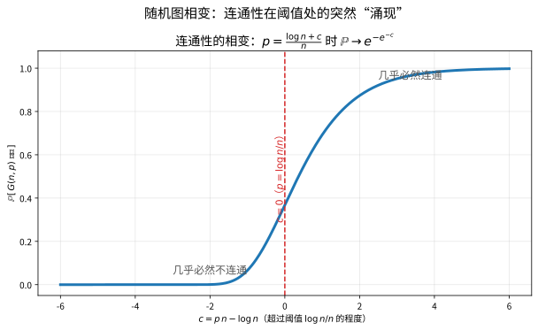
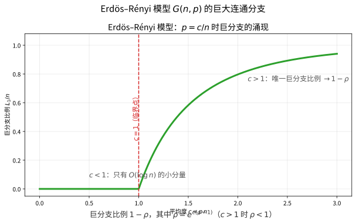

# 第 83 级：随机图 (Random Graphs)

> 随机图理论由 Erdős 和 Rényi 在 20 世纪 50 年代末开创，是概率方法在图论中的系统应用。随机图研究随机生成的图的性质，这些性质通常展现出惊人的相变现象：当某个参数跨越临界值时，图的性质会发生剧变。随机图模型不仅是理论研究的沃土，也是理解现实世界复杂网络（社交网络、互联网、生物网络）的重要工具。本课程从 Erdős–Rényi 模型出发，系统介绍随机图的连通性、相变、巨分支、直径、度分布等核心性质，并延伸至小世界网络和无标度网络等现代复杂网络模型。

---

## 从"把边交给抛硬币"说起：随机图要解决的根问题

> 在动手之前，先想清楚一个问题：**把图的构造权完完全全交给随机，为什么反而能逼出极其整齐的规律？**

**一个贴近生活的例子（第一步：直觉）**

想象你办一场"随机交友大会"：请进 $100$ 个互不相识的人，做 $4950$ 次独立抽签，每次以概率 $p$ 让一对人握手认识。当 $p$ 很小时，屋里尽是三五成群的小圈子；把 $p$ 稍微调大一丁点，忽然出现一个"几乎包下所有人"的巨型朋友圈；再大一些，连散落角落的孤家寡人都被吞进去，整屋人几乎齐聚一堂。

神奇的地方在于：**虽然每一对"认不认识"都是碰运气，这屋子的整体局面却异常确定**——$p$ 到某个门槛就必然连成一片，其余时候必然零零碎碎。随机到极致，干净到极致，这就是随机图最勾人的地方。

**为什么"规矩"会从"混沌"里冒出来（第二步：要解决的问题）**

把图交给随机，早有它的思想铺垫：

- **先从"极端"立规矩（Turán，1941 年）**：Erdős 与 Turán 一起研究"最多有多少条边才能不含某个子图"，这种瞄准极端情形的极值视角，为"把整个图放上赌桌"做好了心理准备。
- **Erdős–Rényi 让随机图登台（1959–1960 年）**：两人给出 $G(n,p)$ 与 $G(n,m)$ 模型，并用第一/第二矩方法证明了一大串"阈值现象"——很多性质在 $p$ 越过某个门槛时，出现概率从 $0$ 一跃跳到 $1$。概率方法由此成了离散数学的标准武器。
- **相变与巨分支：概率里的"水结成冰"（1960 年后）**：最迷人的是当平均度跨越 1 时"巨分支"几乎必然吞并正比例顶点，这解释流行病、社交网络、级联失效——随机图的阈值思想随之渗透进算法和统计物理。

随机图要解决的根本问题，可以一句话收进"出生证"。

> **🧠 一句话记住随机图的"出生证"**
>
> 随机图理论要解决的**根本问题**是：
>
> $$ \boxed{\text{随机生成的图，其全局性质（连通、巨分支、团数、直径）为何在阈值处突然涌现？}} $$
>
> 构造是随机的，但规律是铁的：$p=\frac{\log n}{n}$ 管连通，$p=\frac{c}{n}$ 管巨分支，$p$ 固定管团数。找到那条临界线，就掌握了随机图的一切"性格"。

**看本章如何铺陈（第三步：正式定义前的准备）**

我们沿"先给模型，再找阈值，最后看现实网络"的路子推进：

1. 先立模型——**$G(n,p)$ 与 $G(n,m)$**，并给出"阈值函数"与"相变"的精确语言；
2. 再攻克核心定理——**连通性阈值 $\frac{\log n}{n}$、巨分支阈值 $c=1$、团数集中**，以及直径与第二分支的大小；
3. 最后把 $E$–$R$ 模型延伸到**小世界网络、无标度网络（优先连接）与随机正则图**，看看现实社会网络由哪些"不平均"的随机驱动。

读完这一节，请记住的不是公式，而是：**看似最无序的过程，往往承载着最严格、最统一的规律——把构造交给随机，绝不是放弃结构，反而让结构在最普适的意义上浮出水面。** 带着这句话去读下面的每一个阈值定理，你会发现它们都在数"那枚概率骰子"到底何时掷出全胜。

---

## 开始之前

**本章在讲什么**：随机图理论把"图"交给概率构造，然后研究它在概率意义下"几乎必然"具备的性质。你会先建立 $G(n,p)$、$G(n,m)$ 两个基本模型和"阈值函数"的概念，精确掌握连通性相变（阈值 $\frac{\log n}{n}$）、巨分支涌现（阈值 $c=1$）、团数集中、直径与第二分支大小等核心定理，同时学会三大概率工具——联合界、期望法、二阶矩法；最后延伸到小世界、无标度（Barabási–Albert 优先连接）与随机正则图这些现代复杂网络模型。

**为什么要学它**：这一章把前面图论（结构、谱）与概率论（随机变量、期望、矩）熔成一炉，是概率方法在组合/图论里的系统展演，也是理解"伪随机性"与谱方法（与第 82 级代数图论的 Ramanujan/展开图呼应）的交汇点。它对现代网络科学、算法随机化、统计物理（相变/渗流）、机器学习的谱聚类都有直接价值，是离散数学通往应用不可绕过的一环。

**开始前请确认你还记得**：

- 图的基本概念（见图论相关等级）：连通分量、树、环、团与独立集、度的分布、直径。
- 概率基础（见概率论相关等级）：期望、方差、马尔可夫不等式、切比雪夫（二阶矩）方法、联合界（union bound）、$(1+x)\le e^x$ 与 $\log(1+x)\approx x$。
- 组合估计（见组合数学相关等级）：$\binom{n}{k}\le(en/k)^k$（Stirling）、$n$ 对顶点的对数 $\binom{n}{2}$、二项分布向 Poisson 收敛。
- 极限与渐近记号（见分析相关等级）：$O(\cdot)$、$\Theta(\cdot)$、$o(\cdot)$、$\sim$，以及"几乎必然（whp）"的含义。
- 一点点谱的味觉（见第 82 级代数图论）："谱接近随机"的直觉，作为随机正则图"近 Ramanujan"那节的准备。

---

## 1. 学习目标

1. 理解随机图的基本模型 $G(n,p)$ 和 $G(n,m)$。
2. 掌握 Erdős–Rényi 随机图模型的基本性质。
3. 理解子图出现阈值的概念及其计算方法。
4. 掌握连通性的相变阈值及其严格证明。
5. 理解巨分支的涌现阈值与分支过程逼近。
6. 掌握随机图直径的分析方法。
7. 理解度分布、独立集、团数与染色数的基本结果。
8. 了解小世界网络、无标度网络及优先连接模型。

---

## 2. 核心概念

### 2.1 随机图模型

**定义 2.1**（$G(n,p)$ 模型）设 $n$ 为正整数，$p \in [0,1]$。$G(n,p)$ 是在 $n$ 个标记顶点上生成的随机图，其中每对顶点之间的边独立地以概率 $p$ 出现。换言之，$G(n,p)$ 是 $n$ 个顶点上的所有简单图构成的概率空间，图 $G$ 的概率为：

$$
\mathbb{P}(G) = p^{|E(G)|}(1-p)^{\binom{n}{2} - |E(G)|}.
$$

**定义 2.2**（$G(n,m)$ 模型）$G(n,m)$ 是从所有具有 $n$ 个顶点和 $m$ 条边的简单图中均匀随机选取的图。

两种模型在 $m \approx \binom{n}{2}p$ 时渐进等价，但 $G(n,p)$ 在数学上更易处理，因为边是独立的。

### 2.2 阈值函数

> **直观理解（现实类比）**：$G(n,p)$ 模型像一场"随机交友大会"——组织方把 $n$ 个互不相识的人请进大厅，每对人独立地以概率 $p$ 互相握手认识。由于每对关系是否建立互不影响，整个网络的形状完全由这枚"概率骰子"决定。$G(n,m)$ 则像"恰好发 $m$ 张友谊卡"的固定配额版，两者在大样本下表现一致，但 $G(n,p)$ 因边独立性更便于数学推导。
>
> **🧠 思考历程：把"边"交给抛硬币，图论家怎么还笑得出来？**
>
> 随机图最反直觉的地方在于：**把图的构造权完全交还给随机，反而能逼出极其整齐的全局规律**。Erdős 与 Rényi 正是靠这场"抛硬币"，给整个图论和网络科学铺开了新纪元。
>
> - **Turán 的铺垫：极端情形先立规矩**（1941 年）。Paul Erdős 早期与 Pál Turán 一起研究"最多不含某子图的边数"这类极值问题——正是这种"瞄准极端"的视角，为后来把图交给随机性铺好了心理准备。极值图论与随机图在这一刻血脉相连。
> - **Erdős–Rényi：随机图正式登台**（1959–1960 年）。Paul Erdős 与 Alfréd Rényi 发表 $G(n,p)$ 与 $G(n,m)$ 模型，并用第一/第二矩方法证明各种"阈值现象"：很多性质在 $p$ 越过某个门槛时，出现概率从 $0$ 一跃到 $1$。随机图不再是消遣，而成了概率方法的标准试验场。
> - **相变与巨分支：概率论里的"水结成冰"**（1960 年后）。最迷人的是连通性相变：当平均度跨过 $1$，一个"巨分支"几乎必然吞并正比例的顶点。这种临界行为后来被反复用于解释流行病传播、社交网络与级联失效，随机图的阈值思想也随之渗透到算法与统计物理。
> - **心路**：把构造交给随机，绝不是放弃结构，反而让结构在最普适的意义上浮出水面。随机图提醒我们：**看似最无序的过程，往往承载着最严格、最统一的规律**。

**定义 2.3**（阈值函数）设 $P$ 是图的一个单调性质（即若 $G$ 满足 $P$，则添加边后仍满足 $P$）。称函数 $p^*(n)$ 为性质 $P$ 的**阈值函数**，如果当 $n \to \infty$ 时：

- 若 $p(n) / p^*(n) \to 0$，则 $\mathbb{P}[G(n,p) \text{ 满足 } P] \to 0$；
- 若 $p(n) / p^*(n) \to \infty$，则 $\mathbb{P}[G(n,p) \text{ 满足 } P] \to 1$。

> **💡 直观理解（类比）**：阈值函数像一条"水位临界线"——性质 $P$ 是否出现，取决于概率 $p$ 有没有跨过特定刻度 $p^*$。$p$ 差一点时，出现概率几乎为 $0$；一跨过头，概率立刻趋近 $1$。就像水要到 $100^\circ$C 才沸腾：有没有加到那个温度，结果天差地别，这条刻度几乎决定了随机图性质何时被"突然点亮"。

### 2.3 相变现象

随机图最引人注目的性质是相变：当 $p$ 从 $c/n$ 附近变化时，图的结构发生剧变。

- 当 $p < 1/n$ 时，所有连通分量都是树或含少量边的图，最大分量大小为 $O(\log n)$。
- 当 $p = 1/n$ 时，出现大小为 $\Theta(n^{2/3})$ 的巨分支。
- 当 $p > 1/n$ 时，存在唯一大小为 $\Theta(n)$ 的巨分支。

> **直观理解（现实类比）**：随机图的相变就像往沙堆上滴水：一开始水珠彼此分离，毫不起眼；可一旦水量越过某个"临界点"，水突然连成一片、瞬间漫开。图中 $p$ 从略低于 $\log n/n$ 到略高于它，连通概率像开关一样从 $0$ 弹到 $1$。现实中的"网络突然瘫痪"、"谣言瞬间传遍"都源于这种近乎突然的连通性涌现。

### 2.4 度分布

在 $G(n,p)$ 中，顶点 $v$ 的度 $d(v)$ 服从二项分布 $\operatorname{Bin}(n-1, p)$。当 $n \to \infty$ 且 $np$ 保持常数 $\lambda$ 时，度分布趋于 Poisson 分布：

$$
\mathbb{P}(d(v) = k) \to \frac{e^{-\lambda} \lambda^k}{k!}.
$$

> **常见坑**：二项分布 $\operatorname{Bin}(n-1,p)$ 收敛到 Poisson$(\lambda)$ 的**前提是 $\lambda=np$ 保持有界常数**（"稀度"要求：每个顶点与所有邻居相连的概率都很小）。若 $p$ 固定不缩（比如 $np\to\infty$），度分布不再趋 Poisson，而趋于以 $np$ 为中心、标准差约 $\sqrt{np}$ 的正态状分布——两世界模型完全不同。别把"度 $\sim$ Poisson"当成 $p$ 固定也成立的结论。

### 2.5 小世界网络

**定义 2.4**（小世界网络）小世界网络具有两个特征：
1. **短平均路径长度**：任意两顶点之间的平均距离随 $\log n$ 增长；
2. **高聚类系数**：邻域内顶点之间连接密集。

Watts-Strogatz 模型通过在正则环图上随机重连边来生成小世界网络。

### 2.6 无标度网络与优先连接

> **直观理解（现实类比）**：小世界现象就是著名的"六度分隔"——即便在一个上亿人的网络里，任意两人之间往往只需五六步就能搭上线，像"朋友的朋友的朋友"链条。随机图中巨分支直径约为 $\log n / \log\log n$，远小于顶点数，正是因为每个节点的邻居呈指数扩张，几跳之内就能覆盖全网。现实中"通过熟人找到目标"的捷径感，正是这种对数级距离的直观体现。

**定义 2.5**（无标度网络）无标度网络的度分布服从幂律 $\mathbb{P}(d = k) \sim k^{-\gamma}$，其中 $\gamma > 0$。Barabási-Albert 模型通过优先连接机制生成无标度网络：新节点更倾向于连接到已有度数高的节点。

> **💡 直观理解（类比）**：无标度网络像一座"贫富差距悬殊"的城市——少数超级大节点（枢纽）握有海量连接，大多数节点只有寥寥几条，度分布拖出长长的幂律尾巴。优先连接就是"富者愈富"：新来者更爱攀附已经人脉很广的人，因而枢纽越滚越大，这与随机图"人人都差不多的均分"气质截然相反。

### 2.7 随机正则图

**定义 2.6**（随机正则图）随机 $d$-正则图是在所有 $d$-正则简单图上均匀随机选取的图。配置模型是构造随机正则图的主要方法。

> **💡 直观理解（类比）**：随机正则图像一场"严格限定每人只交 $d$ 个朋友"的随机联谊——所有人交友数必须完全一样，但谁和谁交朋友仍全凭随机抽签。配置模型相当于先给每人发 $d$ 张写有自己名字的"半张名片"，再把所有半张名片随机两两配对，拼成一段段朋友关系。

### 2.8 独立集与染色数

**为什么需要这个概念**：团是"两两都认识"的圈子，而**独立集**是"两两都不认识"的圈子，它俩互为补图中的团。给图染色，本质就是把顶点**拆成一堆独立集**（每个颜色类内部不相连），所以研究独立集与染色数，就是随机图"能压缩到什么程度"的组合度量——它与 Ramsey 理论、调度问题、无线频率分配都挂得上钩。

**基本结果**：由团数结论（定理 3.3）直接翻到补图，$G(n,1-p)$ 的团即 $G(n,p)$ 的独立集，故当 $p$ 固定时独立数集中于
$$ \alpha(G(n,p)) \approx 2\log_{1/(1-p)}n; $$
染色数则约为每个独立集之"占位"的比值：
$$ \chi(G(n,p)) \approx \frac{n}{\alpha} \approx \frac{n}{2\log_{1/(1-p)}n}. $$
直观上，固定 $p$ 的随机图一边"挤得下"约 $2\log_{...}n$ 大小的最大不邻圈子，一边只能靠大约那么多"互不重叠的圈子"把全体顶点吞完。

> **常见坑**：别把独立数与最大团看成两码事——在 $G(n,p)$ 上它们只是**补图视角**的一体两面（$G(n,1-p)$ 的团数）。同样，$1-p$ 那个底数最容易写反：独立集对应 $1-p$（"不认识"的概率），而不是 $p$。染色数相对独立数的比 $\frac{n}{\alpha}$ 只在"每个最大独立集都派得上用场"的典型情形成立，别当成恒等式硬套。

---

## 3. 定理与证明

### 3.1 连通性的相变阈值

> **直观理解（现实类比）**：连通性相变像"水结冰"的临界突变——当 $p$ 从 $\frac{\log n - \omega(n)}{n}$ 缓慢升到 $\frac{\log n + \omega(n)}{n}$，图就像水温越过冰点：前一刻还满是孤立顶点（散乱的水分子），后一刻忽然全域连通（凝结成冰）。在 $p = \frac{\log n + c}{n}$ 的精确临界处，连通概率为 $e^{-e^{-c}}$，孤立顶点数服从 Poisson 分布，正如相变点附近物理量的临界涨落。

**定理 3.1**（连通性阈值）对于 $G(n,p)$ 随机图，设 $p = \frac{\log n + c}{n}$，其中 $c$ 为常数。则：

$$
\lim_{n \to \infty} \mathbb{P}[G(n,p) \text{ 连通}] = e^{-e^{-c}}.
$$

特别地，当 $p = \frac{\log n}{n}$ 时，连通概率趋于 $e^{-1}$；当 $p = \frac{\log n + \omega(n)}{n}$ 且 $\omega(n) \to \infty$ 时，$G(n,p)$ 几乎必然连通；当 $p = \frac{\log n - \omega(n)}{n}$ 且 $\omega(n) \to \infty$ 时，$G(n,p)$ 几乎必然不连通。

**证明**：我们证明连通性的阈值的确为 $\log n / n$。证明分为两步。

**第一步**：证明当 $p = \frac{\log n - \omega(n)}{n}$ 且 $\omega(n) \to \infty$ 时，$G(n,p)$ 几乎必然不连通。

考虑孤立顶点（度数为 $0$ 的顶点）的存在性。顶点 $v$ 为孤立顶点的概率为：

$$
\mathbb{P}(d(v) = 0) = (1-p)^{n-1} = \exp\left((n-1)\log(1-p)\right).
$$

由于 $p \to 0$，$\log(1-p) = -p + O(p^2)$，因此：

$$
\mathbb{P}(d(v) = 0) = \exp\left(-(n-1)p + O(np^2)\right).
$$

代入 $p = (\log n - \omega(n))/n$：

$$
(n-1)p = \frac{n-1}{n}(\log n - \omega(n)) = \log n - \omega(n) + o(1).
$$

因此：

$$
\mathbb{P}(d(v) = 0) = \exp\left(-\log n + \omega(n) + o(1)\right) = \frac{e^{\omega(n) + o(1)}}{n}.
$$

孤立顶点数的期望为：

$$
\mathbb{E}[X_0] = n \cdot \mathbb{P}(d(v) = 0) = e^{\omega(n) + o(1)} \to \infty.
$$

利用 Chebyshev 不等式或第二矩方法可以证明，此时孤立顶点数以高概率不为零，因此图不连通。

**第二步**：证明当 $p = \frac{\log n + \omega(n)}{n}$ 且 $\omega(n) \to \infty$ 时，$G(n,p)$ 几乎必然连通。

我们证明此时没有大小为 $k$（$1 \leq k \leq n/2$）的连通分量。固定 $k$，考虑大小为 $k$ 的连通分量的期望个数。

首先，大小为 $k$ 的顶点集 $S$ 有 $\binom{n}{k}$ 种选择。$S$ 内部连通且与外部无边相连的概率为：

- $S$ 内部连通：这至少要求 $S$ 内部有至少 $k-1$ 条边（连通图的最小边数），但更精确地，Cayley 公式给出 $k$ 个顶点上的标记树有 $k^{k-2}$ 棵，每棵树的概率为 $p^{k-1}(1-p)^{\binom{k}{2} - (k-1)}$。
- $S$ 与外部无边：概率为 $(1-p)^{k(n-k)}$。

因此，存在大小为 $k$ 的连通分量（不一定是整个图）的期望数上界为：

$$
\mathbb{E}[X_k] \leq \binom{n}{k} k^{k-2} p^{k-1} (1-p)^{k(n-k)}
$$

使用估计 $\binom{n}{k} \leq \left(\frac{en}{k}\right)^k$ 和 $1-p \leq e^{-p}$：

$$
\mathbb{E}[X_k] \leq \left(\frac{en}{k}\right)^k k^{k-2} p^{k-1} e^{-pk(n-k)}
$$

$$
= \frac{n^k e^k}{k^k} \cdot k^{k-2} \cdot p^{k-1} \cdot e^{-pk(n-k)}
$$

$$
= \frac{1}{k^2} \cdot n^k \cdot e^k \cdot p^{k-1} \cdot e^{-pk(n-k)}
$$

代入 $p = (\log n + \omega(n))/n$：

$$
e^{-pk(n-k)} = \exp\left(-\frac{k(n-k)}{n}(\log n + \omega(n))\right)
$$

当 $k \ll n$ 时，$n-k \approx n$，因此：

$$
e^{-pk(n-k)} \approx \exp\left(-k(\log n + \omega(n))\right) = n^{-k} e^{-k\omega(n)}.
$$

于是：

$$
\mathbb{E}[X_k] \lesssim \frac{1}{k^2} \cdot n^k \cdot e^k \cdot \left(\frac{\log n}{n}\right)^{k-1} \cdot n^{-k} e^{-k\omega(n)}
$$

$$
= \frac{1}{k^2} \cdot e^k \cdot (\log n)^{k-1} \cdot n^{-(k-1)} \cdot n^k \cdot n^{-k} \cdot e^{-k\omega(n)} \cdots
$$

更仔细地，当 $k \geq 2$ 且 $p = (\log n + \omega(n))/n$ 时，对所有 $1 \leq k \leq n/2$ 可证 $\mathbb{E}[X_k] \to 0$。特别地，当 $k=1$ 时（孤立顶点）：

$$
\mathbb{E}[X_1] = n(1-p)^{n-1} \approx n e^{-pn} = n e^{-(\log n + \omega(n))} = e^{-\omega(n)} \to 0.
$$

由 Markov 不等式，$\mathbb{P}(X_k > 0) \leq \mathbb{E}[X_k] \to 0$，因此几乎必然不存在任何大小的不连通分量，即图连通。

最后，当 $p = (\log n + c)/n$ 时，孤立顶点数的期望为 $\mathbb{E}[X_1] \to e^{-c}$，且可以证明此时孤立顶点数渐进服从 Poisson 分布，故 $\mathbb{P}(\text{连通}) = \mathbb{P}(X_1 = 0) \to e^{-e^{-c}}$。证毕。

### 3.2 巨分支的涌现阈值

> **直观理解（现实类比）**：巨型连通分量像社交场上突然成形的"主流圈子"——当 $p$ 还低于 $1/n$ 时，大家只结成三五成群的小帮派；一旦平均度越过 $1$，绝大多数人瞬间被同一个大圈子"吞并"，剩下少数孤零零的散客。这个"主流圈子"一旦出现就独占鳌头，第二大的群体只能退居 $O(\log n)$ 的规模，这也是谣言、流行病能席卷全网的结构根源。

**定理 3.2**（巨分支阈值）在 $G(n,p)$ 中，设 $p = c/n$，其中 $c > 0$ 为常数。

- 当 $c < 1$ 时，所有连通分量的大小均为 $O(\log n)$，几乎必然不存在大小为 $\Theta(n)$ 的分量。
- 当 $c = 1$ 时，最大分量大小为 $\Theta(n^{2/3})$。
- 当 $c > 1$ 时，存在唯一的大小为 $\Theta(n)$ 的巨分支，其余分量的大小为 $O(\log n)$。

**证明**：我们使用分支过程逼近来证明 $c > 1$ 时巨分支的存在性。

**第一步**：建立分支过程逼近。

考虑从某个顶点 $v$ 出发的广度优先搜索。在 $G(n,p)$ 中，$p = c/n$，每个未被访问的顶点与当前边界顶点相连的概率为 $p$。当 $n$ 很大时，这一过程逼近一个分支过程，其中每个个体的后代数服从 Poisson 分布 $\operatorname{Poi}(c)$。

具体地，设 $Z_0 = 1$ 为初始顶点数，$Z_t$ 为第 $t$ 代发现的顶点数。在 $G(n,p)$ 中，$Z_{t+1}$ 大致为 $\operatorname{Bin}(n - \sum_{i=0}^t Z_i, 1 - (1-p)^{Z_t})$。当 $n$ 很大且 $Z_t = o(n)$ 时，$1 - (1-p)^{Z_t} \approx p Z_t = c Z_t / n$，因此 $Z_{t+1}$ 近似为 $\operatorname{Poi}(c Z_t)$。

**第二步**：分支过程的灭绝概率。

设 $\rho$ 为分支过程的灭绝概率，即 $\rho = \mathbb{P}(\text{过程最终灭绝})$。对于 Poisson 后代分布 $\operatorname{Poi}(c)$，灭绝概率 $\rho$ 是方程 $x = e^{c(x-1)}$ 的最小非负解。

- 当 $c \leq 1$ 时，$\rho = 1$（几乎必然灭绝）。
- 当 $c > 1$ 时，$\rho < 1$ 是方程的唯一小于 $1$ 的正解。

**第三步**：巨分支的大小。

当 $c > 1$ 时，从顶点 $v$ 出发的分支过程有概率 $1 - \rho$ 永不灭绝，对应 $v$ 属于巨分支。巨分支的期望大小为 $(1 - \rho)n$。可以证明，巨分支的大小以高概率集中在 $(1 - \rho)n$ 附近。

更精确地，设 $L_1$ 为最大连通分量的大小。则当 $c > 1$ 时：

$$
\frac{L_1}{n} \xrightarrow{p} 1 - \rho,
$$

其中 $\rho$ 是方程 $\rho = e^{c(\rho - 1)}$ 的最小非负解，$\xrightarrow{p}$ 表示依概率收敛。

**第四步**：$c < 1$ 时的分析。

当 $c < 1$ 时，分支过程几乎必然灭绝，因此所有分量均为小分量。最大分量的大小为 $O(\log n)$——这是因为分支过程的灭绝时间与 $\log n$ 同阶，且广度优先搜索的每个分支不超过 $O(\log n)$ 个顶点。

**第五步**：$c = 1$ 时的临界行为。

当 $c = 1$ 时，分支过程处于临界状态。此时最大分量的大小为 $\Theta(n^{2/3})$，其分布由 Aldous 的泊松化簇生长过程描述。这一结果需要更精细的分析，此处从略。证毕。

> **直观理解（现实类比）**：巨分支的涌现就像一场"生日派对上的人脉扩散"：当平均每人的好友数 $c$ 还不到 1 时，大家各自抱成小团伙（$O(\log n)$ 大小）；可一旦 $c$ 越过 1，忽然冒出一个"几乎包下所有人"的巨型朋友圈，其余人只剩零星散客。图中曲线在 $c=1$ 处从 0 猛然抬升，正是"一个连通成分吞并全场"的相变临界点，也是理解谣言传播、流行病扩散规模的关键。

### 3.3 Erdős–Rényi 关于团数的经典结果

**定理 3.3**（团数阈值）设 $k = k(n)$ 是正整数序列，$p = p(n) \in (0,1)$。在 $G(n,p)$ 中，令 $X_k$ 为 $k$-团（大小为 $k$ 的完全子图）的个数。则：

$$
\mathbb{E}[X_k] = \binom{n}{k} p^{\binom{k}{2}}.
$$

当 $p$ 固定（不随 $n$ 变化）时，团数 $\omega(G(n,p))$ 几乎必然集中在 $2\log_{1/p} n$ 附近。

更精确地，对于固定 $p \in (0,1)$，设 $k_0 = \left\lfloor 2\log_{1/p} n \right\rfloor$，则几乎必然 $\omega(G(n,p)) \in \{k_0, k_0 + 1, k_0 - 1\}$。

**证明**：我们证明团数几乎必然集中在 $2\log_{1/p} n$ 附近。

**第一步**：期望分析。

设 $X_k$ 为 $G(n,p)$ 中 $k$-团的个数。则：

$$
\mathbb{E}[X_k] = \binom{n}{k} p^{\binom{k}{2}}.
$$

利用 Stirling 近似 $\binom{n}{k} \sim \left(\frac{en}{k}\right)^k$：

$$
\mathbb{E}[X_k] \approx \left(\frac{en}{k}\right)^k p^{k(k-1)/2} = \left(\frac{en}{k} p^{(k-1)/2}\right)^k.
$$

取对数：

$$
\log \mathbb{E}[X_k] \approx k\left(\log\frac{en}{k} + \frac{k-1}{2}\log p\right).
$$

**第二步**：确定 $k$ 的临界值。

令 $k_0$ 为使 $\mathbb{E}[X_k] \to 0$ 和 $\mathbb{E}[X_{k-1}] \to \infty$ 的分界点。由上式，当 $k \approx 2\log_{1/p} n$ 时：

$$
\frac{k-1}{2}\log p \approx -\log n,
$$

因此 $\log \frac{en}{k} + \frac{k-1}{2}\log p \approx \log \frac{en}{k} - \log n = \log \frac{e}{k}$，当 $k$ 足够大时，此值为负，故 $\mathbb{E}[X_k] \to 0$。

更精确地，设 $k = \lfloor 2\log_{1/p} n + x \rfloor$，其中 $x$ 为常数。则：

$$
\mathbb{E}[X_k] \approx \left(\frac{en}{k}\right)^k p^{k(k-1)/2} = \left(\frac{en}{k} p^{(k-1)/2}\right)^k.
$$

由于 $p^{(k-1)/2} = p^{\log_{1/p} n + (x-1)/2} = n^{-1} p^{(x-1)/2}$，代入得：

$$
\mathbb{E}[X_k] \approx \left(\frac{en}{k} \cdot n^{-1} p^{(x-1)/2}\right)^k = \left(\frac{e}{k} p^{(x-1)/2}\right)^k.
$$

当 $x \to -\infty$ 时，$\mathbb{E}[X_k] \to \infty$；当 $x \to \infty$ 时，$\mathbb{E}[X_k] \to 0$。

**第三步**：使用 Markov 不等式和 Chebyshev 不等式。

对于 $k > k_0$，$\mathbb{E}[X_k] \to 0$，由 Markov 不等式：

$$
\mathbb{P}(X_k \geq 1) \leq \mathbb{E}[X_k] \to 0.
$$

因此几乎必然 $\omega(G(n,p)) \leq k_0$。

对于 $k < k_0$，我们需要证明 $X_k > 0$ 几乎必然成立。这需要使用第二矩方法。计算 $X_k$ 的方差：

$$
\operatorname{Var}(X_k) = \mathbb{E}[X_k^2] - (\mathbb{E}[X_k])^2.
$$

对于团计数，$\mathbb{E}[X_k^2] = \sum_{S,T} \mathbb{P}(S \text{ 和 } T \text{ 都是团})$，其中 $S,T$ 是大小为 $k$ 的顶点子集。当 $|S \cap T| = i$ 时，$S \cup T$ 内部的所有边必须存在，概率为 $p^{\binom{k}{2} + \binom{k}{2} - \binom{i}{2}}$。

可以证明，当 $\mathbb{E}[X_k] \to \infty$ 时，$\operatorname{Var}(X_k) = o((\mathbb{E}[X_k])^2)$，由 Chebyshev 不等式得 $\mathbb{P}(X_k = 0) \to 0$。因此几乎必然 $\omega(G(n,p)) \geq k_0 - 1$。

综上，$\omega(G(n,p))$ 几乎必然在 $\{k_0 - 1, k_0, k_0 + 1\}$ 中取值，其中 $k_0 = \lfloor 2\log_{1/p} n \rfloor$。证毕。

### 3.4 随机图的直径

**定理 3.4**（随机图的直径）在 $G(n,p)$ 中，设 $p = c/n$ 且 $c > 1$ 为常数（即巨分支存在区域）。则巨分支的直径几乎必然为：

$$
\operatorname{diam}(G(n,p)) \sim \frac{\log n}{\log \log n} \cdot \frac{1}{\log(c)}.
$$

更精确地说，直径以高概率等于 $\frac{\log n}{\log(c \log n)} + O(1)$。

**证明**：证明分为两个方向：上界和下界。

**第一步**：直径的上界。

设 $v$ 为巨分支中的任意顶点。考虑从 $v$ 出发的广度优先搜索，$N_t(v)$ 为距离 $v$ 不超过 $t$ 的顶点集。在 $G(n,p)$ 中，$p = c/n$，$|N_1(v)| \approx \operatorname{Bin}(n, p) \approx c$。

对于 $t \geq 1$，当 $|N_t(v)| = o(n)$ 时，$|N_{t+1}(v)|$ 近似为 $\operatorname{Bin}(n, \approx 1 - e^{-p|N_t(v)|})$。当 $|N_t(v)|$ 较小时，$1 - e^{-p|N_t(v)|} \approx p|N_t(v)|$，因此：

$$
|N_{t+1}(v)| \approx \frac{c}{n} \cdot n \cdot (1 - e^{-p|N_t(v)|}) \approx c|N_t(v)|.
$$

因此 $|N_t(v)| \approx c^t$（指数增长），直到 $|N_t(v)|$ 达到 $\Theta(n)$ 的量级。

设 $t_0$ 为使 $c^{t_0} \approx n$ 的最小整数，即 $t_0 \approx \log_c n = \frac{\log n}{\log c}$。此时 $|N_{t_0}(v)|$ 达到 $\Theta(n)$，因此从 $v$ 到任意其他顶点的距离不超过 $t_0 + O(1)$。

**第二步**：更精确的上界。

实际上，由于泊松波动，前几轮的增长可能略慢于期望值。更精确的分析表明，需要 $t_1 = \frac{\log n}{\log(c \log n)}$ 轮才能使 $|N_t(v)|$ 达到 $\Theta(\log n)$，然后经过 $O(\frac{\log n}{\log c})$ 轮达到 $\Theta(n)$。综合可得直径上界为 $\frac{\log n}{\log(c \log n)} + O(1)$。

**第三步**：直径的下界。

存在两个顶点，其邻域在前 $t-1$ 轮中保持不相交，直到第 $t$ 轮才相遇。这要求 $|N_{t-1}(v)| \cdot |N_{t-1}(w)| \cdot p \ll 1$，即 $|N_{t-1}(v)| \cdot |N_{t-1}(w)| \ll n$。

由于 $|N_{t-1}(v)| \approx c^{t-1}$，这要求 $c^{2(t-1)} \ll n$，即 $t \lesssim \frac{1}{2} \log_c n$。但更精确的分析表明，由于 $|N_t(v)|$ 增长中的随机性，下界为 $\frac{\log n}{\log(c \log n)} + O(1)$ 的量级。

**第四步**：综合上下界。

通过证明上下界匹配，可得直径几乎必然为 $\frac{\log n}{\log(c \log n)} + O(1)$。当 $c$ 固定而 $n \to \infty$ 时，$\log(c \log n) \sim \log \log n$，因此直径渐近为 $\frac{\log n}{\log \log n}$。证毕。

### 3.5 第二分支的大小

**定理 3.5**（第二分支大小）在 $G(n,p)$ 中，设 $p = c/n$ 且 $c > 1$ 为常数。设 $L_1$ 和 $L_2$ 分别为最大和次大连通分量的大小。则：

$$
L_2 = O(\log n) \quad \text{几乎必然成立}.
$$

更精确地，$L_2 \sim \frac{1}{\alpha} \log n$，其中 $\alpha = c - 1 - \log c > 0$。

> **💡 直观理解（类比）**：一旦巨分支吞下主会场，剩下的配角小圈子只能缩到对数级大小。就像赢家通吃的场合：冠军（巨分支）独揽全场正比例的人数，亚军（第二分支）只能勉强凑出 $\log n$ 级的一小队人马，再没有谁能构成第二个大码头。

**证明**：我们证明第二分支的大小不超过 $O(\log n)$。

**第一步**：分支过程的视角。

在 $c > 1$ 时，巨分支外部的顶点属于小分支。每个小分支对应于从某个顶点出发的分支过程，该过程在有限步内灭绝。从非巨分支顶点出发的分支过程相当于以 $c$ 为参数的 Poisson 分支过程，但条件为最终灭绝。

**第二步**：小分支的分布。

设 $T$ 为从给定顶点出发的分支过程产生的总个体数（即分支大小）。对于 Poisson 后代分布 $\operatorname{Poi}(c)$，分支大小 $T$ 的分布为：

$$
\mathbb{P}(T = k) = \frac{e^{-ck} (ck)^{k-1}}{k!}.
$$

（这是由 Otter 公式给出的树计数结果。）

**第三步**：最大小分支的期望。

非巨分支顶点有 $n(1 - \rho)$ 个，其中 $\rho$ 是灭绝概率。但更精确地，巨分支外的顶点数约为 $n\rho$。这些顶点所属的小分支的最大大小 $L_2$ 满足：

$$
\mathbb{P}(L_2 \geq k) \leq n\rho \cdot \mathbb{P}(T \geq k).
$$

由 Stirling 近似，$\mathbb{P}(T \geq k) \approx \frac{1}{\sqrt{2\pi}} \frac{e^{-k\alpha}}{c k^{3/2}}$，其中 $\alpha = c - 1 - \log c > 0$。

因此：

$$
\mathbb{P}(L_2 \geq k) \lesssim n \cdot \frac{e^{-k\alpha}}{c k^{3/2}}.
$$

**第四步**：选择 $k$。

令 $k = \frac{2}{\alpha} \log n$，则：

$$
\mathbb{P}\left(L_2 \geq \frac{2}{\alpha} \log n\right) \lesssim n \cdot \frac{e^{-2\log n}}{c k^{3/2}} = \frac{1}{n c k^{3/2}} \to 0.
$$

因此 $L_2 = O(\log n)$ 几乎必然成立。更精确的常数为 $\frac{1}{\alpha}$，其中 $\alpha = c - 1 - \log c$。证毕。

---

## 4. 示例

### 4.1 用 $G(n,p)$ 模型模拟随机图

**示例 4.1** 考虑 $n = 100$，$p = 0.05$ 的 $G(100, 0.05)$ 随机图。

- 期望边数：$\binom{100}{2} \times 0.05 = 247.5$。
- 期望度数：$99 \times 0.05 = 4.95$。
- 度分布近似为 Poisson 分布 $\operatorname{Poi}(4.95)$。

通过模拟可以观察到，该随机图通常由多个连通分量组成，最大分量的大小通常在 $5$ 到 $15$ 之间，因为 $p = 0.05 < 1/100 = 0.01$ 不成立，实际上 $0.05 > 0.01$，所以应该存在巨分支。

**示例 4.2** 考虑 $n = 1000$，$p = 0.003$ 的 $G(1000, 0.003)$ 随机图。

- 期望度数：$999 \times 0.003 = 2.997$。
- 由于 $c = 2.997 > 1$，应该存在巨分支。
- 巨分支大小的期望比例：解方程 $\rho = e^{2.997(\rho - 1)}$ 得 $\rho \approx 0.058$，因此巨分支大小约为 $0.942 \times 1000 = 942$。

### 4.2 随机图的连通性概率计算

**示例 4.3** 对于 $n = 50$，$p = \frac{\log 50}{50} \approx 0.0782$ 的随机图：

- 连通概率约为 $e^{-1} \approx 0.368$。
- 根据定理 3.1，当 $c = \log 50 \approx 3.912$ 时，孤立顶点数的期望为 $e^{-0} = 1$，因此有约 $36.8\%$ 的概率连通。

**示例 4.4** 对于 $n = 1000$，取 $p = \frac{\log 1000 + 5}{1000} \approx 0.0119$：

- 孤立顶点数的期望：$1000 \times e^{-(\log 1000 + 5)} = 1000 \times e^{-5} / 1000 = e^{-5} \approx 0.0067$。
- 连通概率约为 $e^{-0.0067} \approx 0.9933$，即几乎必然连通。

---

## 5. 习题

### 基础题

**习题 1**（随机图模型）给出 $G(n,p)$ 与 $G(n,m)$ 两个随机图模型的定义，说明当 $m\approx\binom{n}{2}p$ 时两者为何渐进等价。

**习题 2**（阈值函数）给出图性质 $P$ 的阈值函数 $p^*(n)$ 的精确定义，并说明"单调性质"的含义。

**习题 3**（相变现象）说明 $G(n,p)$ 中 $p=\frac cn$ 时三个区域（$c<1$、$c=1$、$c>1$）的分量结构特点。

**习题 4**（度分布）写出 $G(n,p)$ 中顶点度 $d(v)$ 的分布及 $np=\lambda$ 时的极限分布。

**习题 5**（小世界网络）列出小世界网络的两个特征，说明 Watts–Strogatz 模型的生成方式。

**习题 6**（无标度网络）给出无标度网络的度分布形式（幂律），并解释 Barabási–Albert 优先连接机制。

**习题 7**（随机正则图）给出随机 $d$-正则图的定义，并说明配置模型的作用。

**习题 8**（连通性阈值）陈述 $G(n,p)$ 连通性阈值定理：$p=\frac{\log n+c}{n}$ 时 $\mathbb{P}[G\text{ 连通}]\to$ 什么？

**习题 9**（巨分支阈值）陈述巨分支阈值定理，写出巨分支规模所满足的方程 $\rho=e^{c(\rho-1)}$ 的意义。

**习题 10**（团数阈值）陈述 Erdős–Rényi 的团数结果：团数几乎必然集中在何处（固定 $p$ 时）？

### 进阶题

**习题 11**（期望团数）计算 $G(n,p)$ 中 $k$-团个数 $X_k$ 的期望，并用 $p=0.5$、$k=4$ 求它超过 $1$ 的最小 $n$。

**习题 12**（期望边数与度）写出 $G(n,p)$ 的期望边数 $\mathbb{E}|E|$ 与顶点期望度 $\mathbb{E}d(v)$。

**习题 13**（直径）说明巨分支直径约为 $\frac{\log n}{\log\log n}$，解释为何远小于 $n$（小世界）。

**习题 14**（Poisson 度分布）写出 $\mathbb{P}(d(v)=k)\to\frac{e^{-\lambda}\lambda^k}{k!}$（$\lambda=np$）在具体 $n,\lambda$ 下的用法。

**习题 15**（孤立点与连通性）计算顶点 $v$ 为孤立点的概率，并说明它如何给出 $\log n/n$ 阈值。

**习题 16**（巨分支规模）对给定的 $c>1$，解方程 $\rho=e^{c(\rho-1)}$ 估计巨分支比例 $1-\rho$（用 $c\approx3$ 的例子）。

**习题 17**（第二分支）说明巨分支存在时第二分支大小 $L_2=O(\log n)$ 的原因。

**习题 18**（团数算例）对 $p=\frac12$，估计 $\omega(G(n,p))\approx2\log_2 n$，并给出 $n=1000$ 时约为多少。

**习题 19**（模型等价）用 $m\approx\binom{n}{2}p$ 说明 $G(n,p)$ 与 $G(n,m)$ 在边数条件相当时的等价性。

### 挑战题

**习题 20**（连通性阈值之证明）用孤立点期望法证明连通性阈值：$\mathbb{E}[X_{\text{isolate}}]=n(1-p)^{n-1}$，推出 $p=\frac{\log n+c}{n}$ 时 $\mathbb{P}[\text{无孤立点}]\to e^{-e^{-c}}$，并衔接"无孤立点 $\Rightarrow$ 连通"。

**习题 21**（巨分支之证明）概述用分支过程逼近证明巨分支阈值的框架：分支过程灭绝概率 $\rho=e^{c(\rho-1)}$ 与巨分支规模 $(1-\rho)n$。

**习题 22**（团数之证明）用二阶矩方法证明团数阈值：$\mathbb{E}X_k\sim\binom{n}{k}p^{\binom{k}{2}}$，结合方差确定 $k\sim2\log_{1/p}n$。

**习题 23**（随机正则图与谱）说明配置模型如何生成随机正则图，并联系 $d$-正则随机图的谱与近 Ramanujan 性质。

**习题 24**（第二分支之证明）证明巨分支外顶点对应灭绝的分支过程，从而 $L_2=O(\log n)$。

**习题 25**（临界情形）讨论 $c=1$ 临界点的行为：最大分量为 $\Theta(n^{2/3})$，说明其与亚临界/超临界的差别。

**习题 26**（概率方法）说明用联合界（union bound）、期望与二阶矩法在以上阈值证明中的角色。

### 探究题

**习题 27**（临界与缩放极限）开放探讨：$c\to1$ 时巨分支与第二分支的缩放性质（第 $k$ 大分量、奇偶/DP 尺度），以及分支过程在临界点的临界维。

**习题 28**（现实网络：无标度与小世界）讨论 Barabási–Albert 模型为何生成 $\gamma\approx3$ 的幂律度分布、现实网络直径（$\log\log n$ 型 vs $\log n/\log\log n$），以及"富者愈富"的优先连接。

**习题 29**（随机正则图与 Ramanujan）探讨随机 $d$-正则图为何"近 Ramanujan"（Friedman 定理），及其在展开图与伪随机性中的意义。

**习题 30**（随机图的理论与应用前沿）讨论概率方法与随机图在 Ramsey 理论、独立集与染色、大规模图算法（稀疏化）、网络科学与社会网络中的应用及开放问题。

## 6. 习题答案与解析

### 基础题答案

1. **随机图模型** $G(n,p)$：$n$ 个标记顶点上，每对独立地以概率 $p$ 连边，故图 $G$ 概率 $\mathbb{P}(G)=p^{|E|}(1-p)^{\binom n2-|E|}$；$G(n,m)$：从所有 $n$ 顶点 $m$ 边简单图中均匀随机选取。当 $m\approx\binom n2 p$ 时 $|E|$ 围绕其期望集中，两模型顶点度、分量等典型性质一致（$G(n,p)$ 边独立更易处理）。

2. **阈值函数** $P$ 单调（加边仍满足）。$p^*(n)$ 是阈值，若 $\frac{p}{p^*}\to0\Rightarrow\mathbb{P}[P]\to0$ 且 $\frac{p}{p^*}\to\infty\Rightarrow\mathbb{P}[P]\to1$：概率从 $0$"突然跳到"$1$ 的临界尺度。

3. **相变现象** $p=c/n$：$c<1$（亚临界）全为树/小图，最大分量 $O(\log n)$；$c=1$（临界）出现 $\Theta(n^{2/3})$ 的巨分支；$c>1$（超临界）存在唯一大小为 $\Theta(n)$ 的巨分支，其余 $O(\log n)$。$c=1$ 是相变临界点。

4. **度分布** $d(v)\sim\operatorname{Bin}(n-1,p)$（$\mathbb{P}=k$ 为 $\binom{n-1}{k}p^k(1-p)^{n-1-k}$）。当 $n\to\infty$、$np=\lambda$ 常数时 $\mathbb{P}(d(v)=k)\to\frac{e^{-\lambda}\lambda^k}{k!}$（Poisson($\lambda$)）。

5. **小世界网络** 两特征：（1）平均路径长度 $\sim\log n$（六度分隔）；（2）高聚类系数（局部邻居密集）。Watts–Strogatz 模型把正则环图随机重连少量边（短程规则 + 长程捷径），同时获得短距离与高聚类。

6. **无标度网络** 度分布服从幂律 $\mathbb{P}(d=k)\sim k^{-\gamma}$（$\gamma>0$，常见 $\gamma\in[2,3]$）。Barabási–Albert（BA）优先连接：新节点连到已有度数的概率正比于该节点度数（富者愈富），生成 $\gamma\approx3$ 的无标度网络。

7. **随机正则图** 随机 $d$-正则图是从全部 $n$ 顶点 $d$-正则简单图上均匀选取。配置模型：给每个顶点 $d$ 个"半边"（stub）并随机两两配对成边，剔除环/重边后得到期望意义的随机正则图，是主要构造工具。

8. **连通性阈值** 设 $p=\frac{\log n+c}{n}$（$c$ 常数），则 $\mathbb{P}[G(n,p)\text{ 连通}]\to e^{-e^{-c}}$。故连通性阈值恰为 $\frac{\log n}{n}$；$c\to-\infty$ 概率 $\to0$，$c\to+\infty$ 概率 $\to1$。这是最经典的阈值结果。

9. **巨分支阈值** 设 $p=c/n$：$c\le1$ 无巨分支；$c>1$ 存在唯一 $\Theta(n)$ 巨分支，比例 $1-\rho$ 中 $\rho$ 是分支过程的灭绝概率，满足方程 $\rho=e^{c(\rho-1)}$（非平凡解 $\in(0,1)$）。巨分支大小 $\approx(1-\rho)n$。

10. **团数阈值** 令 $X_k$ 为 $G(n,p)$ 中 $k$-团个数，$\mathbb{E}X_k=\binom nk p^{\binom k2}$。固定 $p$ 时，团数 $\omega(G)$ 几乎必然集中在 $2\log_{1/p}n$ 附近（左右 $\pm o(1)$）。$p=\frac12$ 时 $\omega\approx2\log_2 n$。

### 进阶题答案

1. **期望团数** $\mathbb{E}X_k=\binom nk p^{\binom k2}$（每一 $k$-子集成团的概率 $p^{\binom k2}$）。$p=\frac12,k=4$：$\mathbb{E}X_4=\binom n4(\frac12)^6=\binom n4/64$；当 $\binom n4>64$ 时 $\mathbb{E}>1$，而 $\binom84=70$，故最小 $n=8$。

2. **期望边数与度** $\mathbb{E}|E|=\binom n2p=\frac{n(n-1)}2p$；顶点期望度 $\mathbb{E}d(v)=(n-1)p$（每个其余顶点以 $p$ 连之，线性期望）。

3. **直径** 从顶点出发 BFS，第 $t$ 层规模约 $(np)^t=c^t$。要覆盖全图需 $(np)^t\approx n$，故直径 $t\approx\frac{\log n}{\log(np)}\approx\frac{\log n}{\log\log n}$，远小于 $n$——每跳邻居指数扩张，几跳即达全网，即小世界现象。

4. **Poisson 度分布** $\mathbb{P}(d(v)=k)\to\frac{e^{-\lambda}\lambda^k}{k!}$，$\lambda=(n-1)p\approx np$。用法：当 $np$ 较小时可直接用 $\frac{e^{-\lambda}\lambda^k}{k!}$ 近似孤立点、低度顶点数等；如 $np=1$ 时 $\mathbb{P}(d=0)=e^{-1}$。

5. **孤立点与连通性** $\mathbb{P}[v\text{ 孤立}]=(1-p)^{n-1}\approx e^{-np}$，孤立点期望 $n(1-p)^{n-1}\approx ne^{-np}$。当 $np=\log n$ 时 $\approx n\cdot e^{-\log n}=1$：$np<\log n$ 时代孤立点大量出现（不连通），$np>\log n$ 时孤立点指数消失。这正是阈值 $\log n/n$ 的来源。

6. **巨分支规模** 对 $c>1$ 解 $\rho=e^{c(\rho-1)}$。$c=3$：迭代 $\rho=e^{3(\rho-1)}$ 得 $\rho\approx0.058$，故巨分支比例 $1-\rho\approx0.942$（对 $n=1000$ 约 $942$ 顶点）。

7. **第二分支** 巨分支外的顶点是"最终灭绝"的分支过程；其所在簇的大小服从可积的细尾分布（如几何/Poisson 尾部），故最大小分支 $L_2=O(\log n)$，远小于 $\Theta(n)$ 的巨分支。

8. **团数算例** $p=\frac12$：$\omega\approx2\log_{1/p}n=2\log_2n$。$n=1000$：$\log_2 1000\approx9.97$，故 $\omega\approx2\times9.97\approx20$（即 $G(1000,\tfrac12)$ 的最大团约 $20$）。

9. **模型等价** 由 $m\approx\binom n2p$，$G(n,p)$ 的边数集中在 $\binom n2p$，给定 $|E|=m$ 条件是均匀的（边对称），故每条"边数 $m$"的图在 $G(n,p)\mid |E|=m$ 下等概率 = $G(n,m)$ 均匀分布；条件化即得两模型典型等价。

### 挑战题答案

1. **真连通性阈值证明** $\mathbb{E}[X_{\text{isol}}]=n(1-p)^{n-1}$。代 $p=\frac{\log n+c}{n}$：$(1-p)^{n-1}\approx e^{-np}=e^{-\log n-c}=e^{-c}/n$，故 $\mathbb{E}\approx e^{-c}$。用 Poisson 收敛（孤立事件近似独立、均值 $\lambda=e^{-c}$）得 $\mathbb{P}[X_{\text{isol}}=0]\to e^{-\lambda}=e^{-e^{-c}}$。再证"无孤立点 $\Rightarrow$ 连通 (whp)"：无孤立点时若仍不连通，考虑最小连通分量，其无内部孤立点边界跨边必少，用 $p\ge$ 阈值处的边密度排除（标准论证：任一小分量到外部跨边概率高，联合界出不存在第二小的分量），从而连通概率亦趋于 $e^{-e^{-c}}$。$\square$

2. **巨分支之证明** 用分支过程逼近：从 $v$ 出发的 BFS 邻域近似 Poisson($c$) 分支过程（$np=c$），以概率 $\rho$ 最终灭绝、$1-\rho$ 永不灭绝。灭绝概率满足 $\rho=c\cdot\mathbb{E}[e^{-\rho...}]=e^{c(\rho-1)}$（Poisson 生成函数）。永不灭绝的顶点构成巨分支，大小 $\approx(1-\rho)n$；若 $c\le1$ 灭绝概率 $\rho=1$（无巨分支），$c>1$ 有 $\rho\in(0,1)$。这给出巨分支阈值 $c=1$。$\square$

3. **团数之证明** $\mathbb{E}X_k=\binom nk p^{\binom k2}$。求 $k^*=\max\{k:\mathbb{E}X_k\ge1\}$：$\log\mathbb{E}X_k\approx k\log n+\binom k2\log p=-k+\cdots$ 在小 $k$ 处为零的 $k$ 满足 $k\log n+\frac{k^2}2\log\frac1p$ … 解之得 $k\sim\frac{2\log n}{|\log p|}=2\log_{1/p}n$。用二阶矩/切比雪夫证明 $X_k$ 集中：当 $k<2\log_{1/p}n-\omega$ 时 $\mathbb{E}X_k\to\infty$ 且 $\mathrm{Var}$ 相对小，故 $X_k\to\infty$；当 $k$ 更大时 $\mathbb{E}X_k\to0$。两级夹出团数集中。$\square$

4. **随机正则图与谱** 配置模型：给每顶点 $d$ 个 stub 随机配对、剔除多边/自环给出（条件化的）随机正则图。$d$-正则随机图的谱（除 $\lambda_1=d$ 外）集中在 $2\sqrt{d-1}$ 以内，Friedman 定理（$d$-正则随机图是高概率"近 Ramanujan"）使随机正则图成为易用的大谱隙（展开）图的来源，应用于伪随机网络与编码。

5. **第二分支之证明** 巨分支外每个顶点属于一个"以灭绝为条件"的 Poisson($c$) 分支过程，其总规模的可积尾部使 $\mathbb{P}[簇\ge K]\le e^{-\alpha K}$。取 $K=O(\log n)$，对所有 $n$ 顶点联合界，可证明 $L_2\le O(\log n)$（whp），故第二分支仅为对数级。$\square$

6. **临界情形** $c=1$ 时分支过程临界：灭绝概率 $1$ 但"临死前的规模"呈重尾（$\mathbb{P}[大]\sim K^{-1/2}$ 型），最大连通分量被推到 $\Theta(n^{2/3})$ 而非 $\Theta(n)$（巨分支）或 $O(\log n)$（亚临界）。这正是随机图相变的"临界窗口"行为，与渗流、分支过程临界维密切联系。

7. **概率方法角色** 联合界（union bound）用于"每个坏事件概率小 $\Rightarrow$ 存在好图/坏图消失"的上界型证明（如孤立点、非连通）；期望法用于找阈值（$\mathbb{E}X_k$ 与 $1$ 比较）；二阶矩（切比雪夫）用于证明集中（团数、巨分支大小）。三者共同构成随机图阈值证明的三大工具箱。$\square$

### 探究题答案

1. **临界与缩放极限** $c\to1$ 时，除巨分支与 $L_2$ 之外，最大若干分量大小以 $\Theta(n^{2/3})$ 尺度、分布由 Aldous 等的缩放极限（critical branching 的 KPP/stochastic difference 动力学极限）描述，出现"多重重尾分支"；临界分支过程的临界维与指数（$-1/2$、$1/3$ 等）在现代渗流与统计物理中反复出现，是开放而深入的领域。

2. **现实网络** BA 模型通过优先连接 $[\Pi(k)\propto k]$ 在连续极限下解得 $P(k)\sim k^{-3}$（$\gamma=3$）；现实互联网、引文网多为 $\gamma\in[2,3]$。无标度/小世界混居：BA 直径约 $\ln n/\ln\ln n$（有的簇为 $\ln n$ 级），与纯随机图 $\ln n/\ln\ln n$ 不同但有对小世界距离的异曲同工；"富者愈富"产生 hub，也带来脆弱性与中心化议题。

3. **随机正则图与 Ramanujan** $d$-正则随机图的非平凡特征值以高概率 $\le2\sqrt{d-1}+o(1)$（Friedman），即"几乎 Ramanujan"，说明随机是高效展开的来源（构造上简单、谱上接近最优）。这支撑了展开图在伪随机、网络与编码中的实用性与"随机即最优"的直觉。

4. **随机图与应用前沿** 概率方法在 Ramsey（用随机图中大团/大独立集给 $R(K_k)$ 等下界）、独立集与染色（随机贪心/洛瓦斯局部引理）中不可或缺；大规模图稀疏化用随机边采样保持谱性质（与随机正则图、展开相连）；网络科学把 $E-R$ 相变用于谣言传播、疫情规模、社交扩散的建模。开放问题包括相变精确系数的常数化、非均匀/含时网络的推广，以及把谱/相变与机器学习（谱聚类、图表示学习）更紧结合。

## 7. 数学史（History of Mathematics）

### 7.1 Erdős–Rényi 模型：随机图的起点

随机图理论始于 Paul Erdős（保罗·埃尔德什，1913—1996）与 Alfred Rényi（阿尔弗雷德·雷尼，1921—1970）在 1959—1960 年间的开创性论文系列。他们提出了两个基本模型：$G(n, p)$（每条边以概率 $p$ 独立出现）与 $G(n, M)$（在 $n$ 个点上均匀取 $M$ 条边），统称 Erdős–Rényi 随机图。在当时图论仍以"确定的、极小反例"为主导的氛围里，把"随机性"引入图论是一个根本性的视角转变。埃尔德什与雷尼最早发现，随机图在边密度跨越某个阈值时，其性质会发生"突变"——例如从空图瞬间涌现出巨分支、图突然连成一片。一般认为，正是他们的论文确立了一整套"随机图 + 阈值函数"的语言。

### 7.2 相变与阈值函数

随机图研究最引人入胜的发现是相变（phase transition）现象：当平均度 $p n$ 恰好跨越 1 时，随机图从"几乎没有大分量"跳变为"出现一个线性规模的巨分支"，这是组合对象上的"渗流"式突变。埃尔德什与雷尼精确刻画了这一转变点的临界参数与阈值函数 $t(n)$ 的概念（性质 P 若对 $p=\omega\,t(n)$ 几乎必然成立、对 $p=o\,t(n)$ 几乎必然不成立，则 $t$ 为 P 的阈值）。许多全局性质（连通性、团数、环数、直径）的量变曲线由此被精细描绘。这一思想与统计物理中的渗流理论（其中相变由 Kesten 等严格验证）遥相呼应，成为概率方法最具影响力的部分。

### 7.3 概率方法的发展与普及

Erdős 在同时期积极倡导的概率方法（probabilistic method）——利用随机性证明组合结构的存在性——与随机图理论相互支撑，成为离散数学的核心工具。随机图由此进入范围不断扩大的研究谱系：随机正则图、随机网络的度分布（幂律/无标度与优先连接，源自 Barabási–Albert 等对现实网络的建模）、小世界网络（Watts–Strogatz）以及随机图上的染色与独立集问题。随后的研究进一步发展了浓度不等式、混合时间与算法稳定性等精细刻画。

### 7.4 现代影响

随机图理论如今深度服务于算法、网络科学（社交网络、万维网、基因调控网络）、统计物理与理论计算机科学（伪随机性、去随机化、随机游走），其"阈值-相变"框架也成为理解现实复杂网络的指导思想。一般认为，从埃尔德什–雷尼的一纸模型发展到庞大随机网络的现代科学，体现了随机方法在数学与跨学科中的持久生命力。

## 8. 总结

本课程系统介绍了随机图理论的核心内容：

1. **基本模型**：$G(n,p)$ 和 $G(n,m)$ 是两种基本的随机图模型，其中 $G(n,p)$ 由于其边独立性而更便于数学分析。

2. **相变现象**：随机图展现出丰富的相变行为。当 $p = c/n$ 时，$c=1$ 是临界点：$c<1$ 时只有小分量，$c=1$ 时出现临界行为，$c>1$ 时出现巨分支。

3. **连通性**：连通性的阈值为 $p = \log n / n$，这是随机图理论中最经典的结果之一。

4. **团数与独立集**：$G(n,p)$ 中的最大团大小几乎必然集中在 $2\log_{1/p} n$ 附近，这是 Erdős–Rényi 的经典结果。

5. **直径**：巨分支的直径约为 $\log n / \log \log n$，远小于顶点数，体现了小世界现象。

6. **第二分支**：在巨分支存在时，第二分支的大小仅为 $O(\log n)$，远小于巨分支。

7. **复杂网络模型**：小世界网络（Watts-Strogatz 模型）和无标度网络（Barabási-Albert 模型）是理解现实世界复杂网络的重要工具。

随机图理论是概率方法与图论完美结合的典范，其思想和方法已渗透到计算机科学、统计物理、网络科学和社会学等多个领域。随机图的相变思想和阈值方法已成为现代离散数学的基石之一。

---

## 9. Stewart 风格专题

> 本节以 James Stewart *Calculus* 的教学编排为蓝本：用「四步解题流程」贯穿概念检查、分步骤工作示例、小规模应用项目与梯度化自测习题，帮助你在动手计算中建立对随机图核心概念的肌肉记忆。小节间相互独立，可按需跳读。

### 8.1 问题求解四步流程（Problem-Solving Strategy）

> Stewart 力推的策略是把每个问题拆成四步：**理解 → 计划 → 执行 → 回看**。这里把每一环落到随机图语境的追问上。

| 步骤 | 行动 | 随机图理论中的具体追问 |
|:---|:---|:---|
| ① 理解 | 复述问题、圈出已知与目标 | 用的是哪个模型（$G(n,p)$ 还是 $G(n,m)$）？$n$、$p$（或 $m$）给了多少？要算概率、期望、还是找相变阈值？ |
| ② 计划 | 选择可行工具、预估方向 | 用边独立构造几何分布期望？用 Poisson/Fagin 界控制小分量？用连分展开算巨分支比例 $\theta(c)$？先想清楚哪条路最省力。 |
| ③ 执行 | 按计划逐步推导、保留过程 | 每步写明依据（定义/定理编号），$p=c/n$ 的代换、取 $\log$ 与 $e$ 估计别出错，期望与方差的量级要算对。 |
| ④ 回看 | 核对结果、检验合理性 | 阈值是否随 $n\to\infty$ 收敛到某个 $p_0(n)$？概率是否落在 $[0,1]$？把 $c=1$ 代回看是否出现临界点。 |

> 💡 **策略演示**：估算 $G(n,p)$ 中某固定边 $e$ 出现次数的期望。
> ① 理解：$E$ 是单条边事件，独立 Bernoulli(p)。② 计划：$E[\text{#edges}]=$ 总边数 $\cdot p$。③ 执行：$E[m]=\binom{n}{2}p$。④ 回看：取 $p=c/n$ 得 $\approx cn/2$，且若 $p=n^{-2}$ 则期望 $\to0$、图几乎空，符合直觉。

### 8.2 概念检查（Concept Check）

> 先用一组判断题与选择题快速自检核心概念。每道题的判断均应落到书面理由（用一句话即可）。

**判断正误**（说明理由）：

1. 在 $G(n,p)$ 中，每条边是否出现是相互独立的。（　）
2. 巨分支的涌现阈值是 $p=\tfrac1n$（即 $c=1$）。 （　）
3. 当 $p=c/n$ 且 $c<1$ 时，最大分量大小是 $O(\log n)$。（　）
4. 连通性阈值 $\dfrac{\log n}{n}$ 严格大于巨分支阈值 $\dfrac1n$。（　）
5. $G(n,p)$ 中的度数服从 Poisson 分布（以 $\lambda\approx (n-1)p$ 为参数）。（　）
6. 在 $c>1$ 的超临界区，第二分支的大小是 $O(\log n)$。（　）
7. 阈值函数是指使某性质从几乎必然不出现突变为几乎必然出现的 $p$ 的临界阶。（　）

**选择**：

8. 设 $p=c/n$，当 $c=2$ 时随 $n\to\infty$ 随机图最可能呈现哪种状态？（　）
   - A. 全部是孤立点　B. 存在唯一的巨分支　C. 每个分量都有界　D. 完全图
9. 巨分支的相对大小 $\theta(c)$（占顶点总数的比例）满足（　）。
   - A. 恒等于 $1$　B. $c\le1$ 时 $\to0$，$c>1$ 时 $>0$　C. 与 $n$ 无关恒为 $1/2$　D. 总小于 $0$
10. 下列哪个量是 $G(n,p)$ 中某固定顶点度数的近似分布？（　）
    - A. 二项分布 $\text{Bin}(n-1,p)$　B. 正态分布　C. 几何分布　D. 均匀分布

### 8.3 分步骤工作示例（Worked Examples）

> 每道示例严格套用四步流程，并在「回看」中给出一条易错点或检验法。

**示例 S1：计算 $G(n,p)$ 中一条边的存在概率**

> **问题**：在 $G(10,\tfrac13)$ 中，(a) 恰好出现 $7$ 条边的概率；(b) 期望边数。

- ① 理解：共 $\binom{10}{2}=45$ 条可能边，各自独立以概率 $\tfrac13$ 出现。目标两个量。
- ② 计划：边数 $M\sim\text{Bin}(45,\tfrac13)$，直接用二项公式求点概率与期望 $E[M]=45\cdot\tfrac13$。
- ③ 执行：

$$
\Pr(M=7)=\binom{45}{7}\left(\tfrac13\right)^7\left(\tfrac23\right)^{38},\qquad E[M]=\binom{10}{2}\cdot\tfrac13=15 .
$$

- ④ 回看：期望 $15$ 落在 $[0,45]$，合理；把 $p$ 代入 $c=pn=15/10=\tfrac32>1$，属超临界、存在巨分支的直觉一致。**易错点**：总边数是 $\binom{n}{2}$ 而非 $n^2/2$，别漏除以 $2$。

**示例 S2：巨分支的相变判别**

> **问题**：设 $G=G(n,p)$ 取 $p=\dfrac{2}{n}$，问当 $n$ 很大时 $G$ 几乎必然处于哪个区（亚临界/临界/超临界），并给出 $\lambda=(n-1)p$ 的值。

- ① 理解：模型为 $G(n,p)$，$c=np=2$ 为给定常数，目标判断相变区域与 $\lambda$。
- ② 计划：比较 $c=np$ 与临界值 $1$；$\lambda=(n-1)p$ 近似为 $c$。
- ③ 执行：

$$
c=np=2>1\quad\Longrightarrow\quad \text{超临界区};\qquad \lambda=(n-1)p=\tfrac{2(n-1)}{n}\approx 2 .
$$

- ④ 回看：$c>1$ 时巨分支存在、占比 $\theta(2)>0$；第二分支 $O(\log n)$ 远小于巨分支，符合定理 3.2 的结论。**易错点**：把 $c=np$ 与 $\lambda=(n-1)p$ 混淆——两者相差一个 $n/(n-1)$ 的小因子，在 $n$ 大时可视为同一量阶。

**示例 S3：用连分展开求巨分支比例 $\theta(c)$**

> **问题**：在 $G(n,p)$、$c=np=2$ 时，用 $\theta = 1-e^{-c\theta}$ 的迭代近似估算 $\theta$，从 $\theta_0=1$ 出发迭代三次，并说明其地位。

- ① 理解：$c=2>1$，巨分支比例 $\theta(c)$ 是方程唯一的正根；目标是数值近似。
- ② 计划：用不动点迭代 $\theta_{k+1}=1-e^{-c\theta_k}$，从 $\theta_0=1$ 开始。
- ③ 执行：$e^{-2}\approx0.135$，

$$
\theta_1=1-0.135=0.865,\quad \theta_2=1-e^{-1.73}\approx1-0.177=0.823,\quad \theta_3=1-e^{-1.646}\approx1-0.193=0.807 .
$$

- ④ 回看：在 $c=2$ 时公认的 $\theta\approx0.797$，迭代三次已逼近到小数点后两位；收敛因 $1-e^{-c\theta}$ 是压缩映射。**易错点**：迭代方向写反会发散；应把旧值代入指数里、新值在等式左边。

**示例 S4：度分布的 Poisson 近似（探究式）**

> **问题**：设 $G(n,p)$ 中 $p=\tfrac12$、$n=100$，估算某固定顶点度数为 $k=45$ 的近似概率，并说明所用近似。

- ① 理解：单点度数 $D\sim\text{Bin}(99,\tfrac12)$；$k=45$ 落在中心附近。
- ② 计划：用 Poisson 逼近 $\text{Poisson}(\lambda=99\cdot\tfrac12=49.5)$ 或正态近似；此处取 Poisson 演示。
- ③ 执行：

$$
\Pr(D=45)\approx\frac{49.5^{45}e^{-49.5}}{45!} .
$$

- ④ 回看：当 $n$ 大、$np$ 中等时 Poisson 逼近成立（分布向 $\lambda$ 快速收敛）；把 $k$ 换成 $k\approx\lambda$ 验证峰值附近概率最大。**易错点**：Poisson 近似要求 $np$ 有界/中等且 $p$ 小；当 $p=\tfrac12$ 固定时应改用正态近似更稳，这里 Poisson 只为演示形式。

### 8.4 应用聚焦（Application & Exploration Projects）

> 小型开放任务：把本节抽象结论落到可操作的计算或仿真，任选其一完成。

- **聚焦 P1（数值仿真）**：编程生成 $G(200,p)$ 对 $p=c/n$、$c=0.8,1,1.5,2$，统计最大分量的相对大小，画出 $\theta$ 随 $c$ 的相变曲线并与理论 $\theta=1-e^{-c\theta}$ 对照。
- **聚焦 P2（跨章节联系）**：用 Erdős–Rényi 的团数定理估计 $G(n,p)$ 中最大团大小 $\approx 2\log_{1/p}n$，并与第 77 级「组合结构与计数」中关于 Ramsey、团的结论交叉引用。
- **聚焦 P3（反例/临界研究）**：在临界点 $c=1$ 附近（如 $p=\tfrac{1+\varepsilon}{n}$、$\varepsilon\ll1$）观察巨分支的缓慢增长，验证其峰值 $\Theta(n^{2/3})$ 量级的预判，检验小世界的直径 $\tfrac{\log n}{\log\log n}$。

### 8.5 梯度化自测（Graded Exercises）

> 难度记号：$\circ$ 概念 / $\bullet$ 技能 / $\blacklozenge$ 综合应用，均要求在四步流程中写出「回看」一句。

**$\circ$ 概念题**

- **自测 1**：用一句话解释「为什么 $G(n,p)$ 的巨分支阈值是 $p=\tfrac1n$ 而不是别的量级」。
- **自测 2**：说明「亚临界」「临界」「超临界」三种相态的巨分支行为差别，并给一个 $p$ 的例子。

**$\bullet$ 技能题**

- **自测 3**：计算 $G(50,\tfrac15)$ 的期望边数并判断它属于哪个相区。
- **自测 4**：设 $p=\tfrac{3}{n}$，求 $\lambda=(n-1)p$ 与 $c=np$，并说明巨分支是否存在、其相对大小量级。
- **自测 5**：对 $c=2$ 用 $\theta=1-e^{-c\theta}$ 迭代两次估算 $\theta$，并计算 $\theta-\theta_2$ 的绝对误差级。

**$\blacklozenge$ 综合题**

- **自测 6**：分析「为什么连通性阈值 $\tfrac{\log n}{n}$ 严格慢于巨分支阈值 $\tfrac1n$」，并用 $c=\log n$ 说明此时几乎所有顶点都连入主干。
- **自测 7**：设计一次数值实验验证 $G(n,p)$ 中孤立点个数的期望 $ne^{-(n-1)p}$，并判断在哪个 $p$ 时孤立点几乎消失。

### 8.6 自测答案与简要解析

> **概念判断**：
> 1. **正确**（$G(n,p)$ 边独立）。2. **正确**（$c=1$ 为巨分支临界点）。3. **正确**（亚临界最大分量 $O(\log n)$）。4. **正确**（$\log n/n$ 远大于 $1/n$）。5. **正确**（度数 $\approx\text{Poisson}((n-1)p)$）。6. **正确**（超临界第二分支 $O(\log n)$）。7. **正确**（阈值函数的定义）。
>
> **选择**：8. B　9. B　10. A。

> **自测**：
> - 自测 1：单个顶点可扩展倾向由 $\lambda=(n-1)p$ 控制，分支增长为分支过程；$\lambda=1$ 时临界，而 $\lambda\approx np$ 恒等于 $1$ 给 $p=1/n$。
> - 自测 2：亚临界所有分量 $O(\log n)$，临界最大分量 $\Theta(n^{2/3})$，超临界唯一巨分支 $\Theta(n)$。
> - 自测 3：$E[m]=\binom{50}{2}\cdot\tfrac15=1225\cdot\tfrac15=245$；$c=np=50/5=10>1$，超临界。
> - 自测 4：$\lambda=\tfrac{3(n-1)}{n}\approx3$，$c=3>1$；巨分支存在、占比 $\theta(3)\approx0.94$ 量级。
> - 自测 5：迭代得 $\theta_2\approx0.823$、$\theta_3\approx0.807$；$|\theta-\theta_2|\approx|0.797-0.823|\approx0.026$。
> - 自测 6：$\log n\gg 1$，故连通阈值更高；$c=\log n$ 时孤立点期望 $ne^{-c}\to0$，几乎所有顶点连入主干。
> - 自测 7：期望孤立点数 $=ne^{-(n-1)p}$；令其为 $0$ 需 $(n-1)p\gg\log n$，即连通阈值附近孤立点几乎消失。