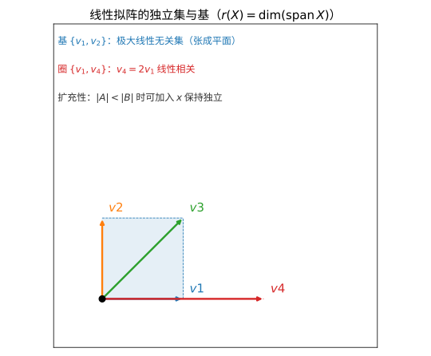
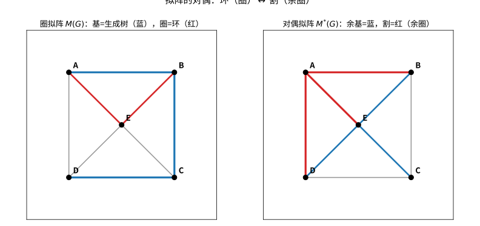

# 第 84 级：拟阵论 (Matroid Theory)

> 拟阵论由 Whitney 在 1935 年提出，旨在统一图论和线性代数中独立性的概念。拟阵是一种抽象结构，它捕捉了向量空间中线性无关性和图中无环性的本质特征。拟阵论在组合优化（贪婪算法的最优性）、图论、编码理论和几何学中都有重要应用。本课程从拟阵的公理化定义出发，系统介绍拟阵的各种等价刻画、基本构造、对偶性、表示理论以及 Tutte 多项式等核心内容。

---

## 从"抽象出线性无关的本质"说起：拟阵论要解决的根问题

> 在动手背公理之前，先想清楚一个问题：**人为什么要发明拟阵？**

**一个贴近生活的情景（第一步：直觉）**

想象你手里有一箱零件，其中有些零件是"独立"的：它们互相支撑、谁也不依赖谁就搬得动；但也有些必须凑成一组才成立。现在你要解决一个现实的"取舍"难题——**从这箱零件里挑出尽可能多的独立零件**，同时还要应付"万一哪根断了，得能拿别的换上去"。

这其实是一类处处都在发生的取舍问题：选课表里哪几门课互不冲突、电路里哪几条线构成不闭合的最省回路、一群人里怎么挑出"谁也不服谁"的最大平级阵营。它们的共同点，是都存在一个朴素的"**独立**"概念，而"独立 / 不独立"的边界，遵循着几乎相同的默契规则。

**它要解决的根本问题（第二步：来龙去脉）**

数学家很快发现，很多看似不搭边的地方，其实都在私下使用同一种"独立规则"：

- 在**线性代数**里，一组向量是否线性无关；
- 在**图论**里，一组边是否构成森林（无环）；
- 在**组合优化**里，我们总想找"最大的独立组"（最优基）。

1935 年，惠特尼（Hassler Whitney）在研究与图论紧密相关的矩阵问题上，敏锐地看出：**这三处所谓的"独立"服从完全相同的三条公理**——空集独立、子集仍独立、小集能扩充到大集。他把这一共同结构提炼出来，命名为"拟阵"（matroid，取名自 matrix 的 mat-/matro-），从此打通了图论、线性代数与组合优化的语言。更妙的是，后来人们发现**拟阵恰好精确刻画了"贪婪算法何时有效"**（Edmonds、Rado）：只要问题落在这个公理系统里，贪心就能找到最优基。于是"独立"不再是一个模糊的比喻，而是一台严谨、可计算的机器。

> **🧠 一句话记住拟阵的"出生证"**
>
> 拟阵论解决的**根本问题**是：
>
> $$ \boxed{\text{把"线性无关、无环、可扩充"这同一种"独立性"抽象成公理，让图论、线性代数与组合优化共用一套语言。}} $$

**第三步：正式定义前的准备**

本章将这样推进：先给出拟阵最根本的**独立集公理**（第 2.1 节），再从基、圈、秩函数、闭包等不同侧面给出**等价定义**（第 2.2 节），随后用**图拟阵、线性拟阵、均匀拟阵**三个基本例子建立直觉（第 2.3 节）；然后讨论**对偶、构造与连通、着色**（第 2.4–2.8 节），最后触及**基交换、表示理论与 Tutte 多项式**这座"组合不变量"的高峰（第 2.9–2.10 节及第 3 章）。每引入一个概念，都先问"它要解决什么"，再给出严格定义。

---

## 开始之前

**本章在讲什么**：拟阵是一种"抽象的独立系统"——用三条公理抓住"线性无关、无环、可扩充"的共性。你会学到它的多种等价定义与三个基本例子，掌握对偶、删除、收缩、直和等构造，理解连通性、着色，以及"贪婪算法在拟阵上总最优"的深刻事实，最终认识最全能的组合不变量 Tutte 多项式。

**为什么要学它**：图论教过你"无环"、线性代数教过你"线性无关"，但两者各说各话。拟阵论的使命是把它们**放进同一个公理系统**，并精确回答"贪心何时最优""能不能找到最大独立集"这类跨越领域的问题。它是攻读现代组合优化、编码理论、算法设计与代数组合学的共同路基，也是深入理解"用一套公理统一多个领域"这一数学抽象方法的绝佳范本。

**开始前请确认你还记得**：

- 集合与子集、幂集 $2^E$（见基础集合论）：拟阵的基础对象。
- 线性相关与线性无关、秩、张成空间（见第 14 级线性代数）：线性拟阵的直接翻译。
- 图、环、森林、生成树与连通分量（见图论）：图拟阵的直观来源。
- 贪心算法与"每一步取当前最优"的思想（见组合优化）：理解贪婪最优性定理的前提。
- 极大 / 极小、基数 $|X|$ 与子集运算：读懂扩充公理与基交换性质的必备符号。

---

## 1. 学习目标

1. 理解拟阵的多种等价定义（独立集、基、圈、秩函数、闭包）。
2. 掌握拟阵的基本例子：图拟阵、线性拟阵、均匀拟阵。
3. 理解对偶拟阵的概念与性质。
4. 掌握拟阵的构造方法（删除、收缩、极小、直和）。
5. 理解拟阵的表示理论与可表示性。
6. 掌握拟阵的基交换性质与贪婪算法。
7. 理解 Tutte 多项式的定义与性质。
8. 了解拟阵的着色与特征多项式。

---

## 2. 核心概念

### 2.1 拟阵的独立集公理

> **直观理解（现实类比）**：拟阵是"独立性的抽象"——向量线性无关、图的森林、集合的子集这些看似无关的对象，竟共享同一套"独立"公理。就像"独立"这个词在不同场合有不同含义（财务独立、思想独立、能源独立），但都满足"空集独立、子集独立、小集能扩充到大集"的共性。Whitney 的洞见正是把这共性提炼成三条公理，让图论、线性代数、组合优化能用同一套语言讨论"独立"。
>
> **🧠 思考历程：图上"的森林"和向量"的线性无关"，怎么会是同一个东西？**
>
> 拟阵的诞生源于一次"认亲"：**线性代数里的"线性无关"与图论里的"森林"，居然服从同一条公理**。把这条公理单独抽出来，便有了打通一个个貌似独立领域的拟阵。
>
> - **Grassmann 的铺垫：几何里的"独立"**（1840 年代）。Hermann Grassmann 在建立向量空间时，早已把"线性无关"、"生成"与"维数"这些观念固定在几何与代数交汇处。这些看似只属于代数的词，恰恰是拟阵日后"独立/基/秩/闭包"的雏形。
> - **Whitney 的合并：一次大胆的"跨域认亲"**（1935 年）。Hassler Whitney 在研究中发现，图上的"森林"、一组向量的"线性无关"与矩阵的"列不相关"满足完全相同的三条公理。他把这个共同结构命名为"拟阵"，用"独立集公理"让完全不同的对象从此共用一套语言与定理。
> - **图论、代数、优化的一统江湖**（1935 年后）。很快人们意识到，拟阵正是"贪婪算法有效"的精确刻画（Edmonds、Rado 等人）：在这个抽象的独立系统上做贪心总能得到最优基。于是图论、线性代数与组合优化不再是三条平行线，而是同一点在不同坐标系下的投影。
> - **心路**：真正的抽象，是把"看起来不同、其实相同"的东西勇敢地认作一家。拟阵告诉我们：**谁先看穿结构上的同构，谁就能让一整片领域共享一份力量**。

**定义 2.1**（拟阵）一个**拟阵** $M$ 是一个有序对 $(E, \mathcal{I})$，其中 $E$ 是有限集合（称为**基础集**），$\mathcal{I}$ 是 $E$ 的子集族（称为**独立集**），满足以下公理：

1. （空集独立性）$\varnothing \in \mathcal{I}$。
2. （遗传性）若 $A \in \mathcal{I}$ 且 $B \subseteq A$，则 $B \in \mathcal{I}$。
3. （扩充性）若 $A, B \in \mathcal{I}$ 且 $|A| < |B|$，则存在 $x \in B \setminus A$ 使得 $A \cup \{x\} \in \mathcal{I}$。

> **常见坑**：扩充性对**超集方向**不成立。若 $A \subseteq B$ 且 $|A| < |B|$，公理只保证能往 $A$ 里加入 $B$ 的某个元素直到变满——它绝不保证"从大集往里删"仍独立（那其实是遗传性保证的反面方向，删方向由遗传性单独管）。另一个易错点是：**并集的独立与否不能靠直觉猜**。例如 $\{a,b\}$ 与 $\{b,c\}$ 各自独立，不代表 $\{a,b,c\}$ 独立——判断一个集合独不独立，必须逐条对照公理或所属拟阵的定义，而不是"看着像不像"。

### 2.2 拟阵的等价定义

> **直观理解（现实类比）**：基与秩像"最大独立集"的双面写照——基是不能再添加元素的独立集（添任何一个就"超载"），秩则是基的大小，衡量该集合"最多能容纳多少独立元素"。就像书架上一套刚好支撑全部书的最小支撑架：基是这套架子的具体选法，秩是所需架子的根数。无论从独立集、基、圈、秩函数还是闭包算子切入，都描绘同一个拟阵，只是从不同侧面观察"独立性"的几何。

拟阵有多种等价的公理化定义，每种定义突出了拟阵的不同方面。

> **🔑 为什么需要"这么多等价定义"？**
>
> 同一棵大树，从不同角度画出来就是不同的图。拟阵的每种公理都像一张"特写照片"：**独立集**最贴近直觉、"保子集、能扩充"；**基**是"最大的独立集"，最好做贪心与交换；**圈**是"最小的相关集"，最贴合图论里的环；**秩函数**把计算量化成"最多有几件独立"，直接吃掉集合推演的复杂度；而**闭包**复刻了线性代数里"张成空间"的直觉。**选择哪种取决于你要做什么**：证明贪心最优用基，做集合推演用秩，研究图结构用圈。所有定义殊途同归——这也是拟阵"结构稳固"的最好见证。

**定义 2.2**（基公理）设 $\mathcal{B}$ 是 $E$ 的子集族，满足：
1. $\mathcal{B} \neq \varnothing$。
2. 若 $B_1, B_2 \in \mathcal{B}$ 且 $x \in B_1 \setminus B_2$，则存在 $y \in B_2 \setminus B_1$ 使得 $(B_1 \setminus \{x\}) \cup \{y\} \in \mathcal{B}$。

则 $\mathcal{B}$ 是拟阵 $M$ 的**基**族。

**定义 2.3**（圈公理）设 $\mathcal{C}$ 是 $E$ 的子集族，满足：
1. $\varnothing \notin \mathcal{C}$。
2. 若 $C_1, C_2 \in \mathcal{C}$ 且 $C_1 \subseteq C_2$，则 $C_1 = C_2$。
3. 若 $C_1, C_2 \in \mathcal{C}$，$C_1 \neq C_2$，且 $x \in C_1 \cap C_2$，则存在 $C_3 \in \mathcal{C}$ 使得 $C_3 \subseteq (C_1 \cup C_2) \setminus \{x\}$。

则 $\mathcal{C}$ 是拟阵 $M$ 的**圈**族（也称为**极小相关集**）。

**定义 2.4**（秩函数）函数 $r: 2^E \to \mathbb{Z}_{\geq 0}$ 称为拟阵 $M$ 的**秩函数**，如果满足：
1. $0 \leq r(X) \leq |X|$ 对所有 $X \subseteq E$ 成立。
2. 若 $X \subseteq Y \subseteq E$，则 $r(X) \leq r(Y)$（单调性）。
3. $r(X \cup Y) + r(X \cap Y) \leq r(X) + r(Y)$（次模性）。

**定义 2.5**（闭包）函数 $cl: 2^E \to 2^E$ 称为拟阵 $M$ 的**闭包算子**，如果满足：
1. $X \subseteq cl(X)$ 对所有 $X \subseteq E$ 成立。
2. 若 $X \subseteq Y \subseteq E$，则 $cl(X) \subseteq cl(Y)$。
3. $cl(cl(X)) = cl(X)$。
4. 若 $x \notin cl(X)$ 且 $x \in cl(X \cup \{y\})$，则 $y \in cl(X \cup \{x\})$。

### 2.3 基本例子

**例 2.1**（图拟阵 / 圈拟阵）设 $G = (V, E)$ 是一个图。定义 $\mathcal{I}$ 为 $E$ 中所有无圈边集（即森林）。则 $(E, \mathcal{I})$ 是一个拟阵，称为图 $G$ 的**圈拟阵**（或**图拟阵**），记为 $M(G)$。

- 基：$G$ 的生成森林。
- 圈：$G$ 的圈（作为边集）。
- 秩：$r(X) = |V| - \kappa(X)$，其中 $\kappa(X)$ 是子图 $(V, X)$ 的连通分支数。

> **💡 直观理解（类比）**：图拟阵把"哪些边能拼成无圈的森林"当作独立性——就像铺电线：能连成不闭合回路的电线组是"独立"的，一旦首尾相接成环就不再独立。它的圈正是图中的环，秩等于"顶点数减连通块数"，把图论里最自然的"无环"直觉变成了一套代数规则。

**例 2.2**（线性拟阵 / 向量拟阵）设 $V$ 是域 $\mathbb{F}$ 上的向量空间，$E = \{v_1, \dots, v_n\} \subseteq V$。定义 $\mathcal{I}$ 为 $E$ 中所有线性无关的子集。则 $(E, \mathcal{I})$ 是一个拟阵，称为**线性拟阵**（或**向量拟阵**），记为 $M[V]$。

- 基：$E$ 的极大线性无关子集。
- 圈：极小线性相关集。
- 秩：$r(X) = \dim(\operatorname{span}(X))$。

> **直观理解（现实类比）**：把地面上的几只"零件"看成向量，拟阵的独立集就像"能独立站住的零件组"——只要不互相叠压（线性无关）就是独立的。基则是"最少生成"的一套零件，多了就冗余、少了就铺不满地面，正如书架上一套刚好支撑全部书的最小支撑架。

**例 2.3**（均匀拟阵）$U_{k,n}$ 是基础集 $|E| = n$ 的拟阵，其中独立集为所有大小不超过 $k$ 的子集。

> **💡 直观理解（类比）**：均匀拟阵像一个"有件数上限的储物柜"——只要东西不超过 $k$ 件就全都摆得下、互不打架，一旦超过 $k$ 件就挤爆。它是最简单、最自由的独立性规则：不看元素之间有何关系，只数数量有没有超过限额。

### 2.4 对偶拟阵

> **🌐 直觉先行：为什么需要"对偶"？**
>
> 很多结构都有"另一面"：图里有"环"就会有"割"，矩阵里有"列"就有"行方程"，优化里"最大独立"常与"最省删除"互为镜像。对偶拟阵 $M^*$ 干的正是这件事——**把原拟阵的"基"翻成补集**，让"环 ↔ 割"、"独立 ↔ 余独立"彼此对调。有了对偶，一个关于基的性质瞬间得到关于补基的免费信息，许多定理（如表示、组合不变量）也能成对出现，这正是对偶语言的威力所在。

**定义 2.6**（对偶拟阵）设 $M = (E, \mathcal{I})$ 是一个拟阵，其基族为 $\mathcal{B}$。定义 $M$ 的**对偶拟阵** $M^* = (E, \mathcal{I}^*)$，其中 $\mathcal{B}^* = \{E \setminus B : B \in \mathcal{B}\}$ 是 $M^*$ 的基族。

**性质 2.1** 对偶拟阵的秩函数 $r^*$ 满足：
$$
r^*(X) = |X| - r(E) + r(E \setminus X).
$$

> **💡 直观理解（类比）**：这个公式像"反着数容量"：对偶拟阵里集合 $X$ 的秩，等于从 $X$ 的元素里扣掉整体冗余、再补上 $X$ 之外能提供的支撑。好比算一张床还剩多少独立躺位：总床位数减去已有占位，再算上另一侧还能贡献的空间。

> **直观理解（现实类比）**：就像一张"剪不断"的防护网，拟阵的对偶把"能形成环的多余连接"与"剪开就断开的割缝"对应起来。在城市电网里，一个环代表冗余回路线路，一条割则代表切断某个片区所需的电缆——冗余与切断互为对偶，这正是拟阵对偶"环 ↔ 割"的含义。

### 2.5 极小圈

> **直观理解（现实类比）**：圈是"最小依赖集"——加入就破坏独立性的最小集合，就像图中形成环的边集：少任何一条边都是森林（独立），全部凑齐就成环（依赖）。在线性代数中，它对应极小线性相关集；在电路中，它就是导致短路的最小回路。圈公理的第三条说"两个圈相交必能拼出新圈"，恰似两个环路共享一段导线时，绕外圈走又是一个新环，这种"圈生圈"的结构是拟阵组合性质的核心。

**定义 2.7**（极小圈）拟阵 $M$ 中的**极小圈**（简称**圈**）是极小相关集，即满足 $C \notin \mathcal{I}$ 但 $C \setminus \{x\} \in \mathcal{I}$ 对所有 $x \in C$ 成立的子集 $C \subseteq E$。

### 2.6 拟阵的构造

**定义 2.8**（删除与收缩）设 $M = (E, \mathcal{I})$ 是拟阵，$T \subseteq E$。

- **删除** $M \setminus T$：基础集为 $E \setminus T$，独立集为 $\{I \subseteq E \setminus T : I \in \mathcal{I}\}$。
- **收缩** $M / T$：基础集为 $E \setminus T$，独立集为 $\{I \subseteq E \setminus T : I \cup B_T \in \mathcal{I}\}$，其中 $B_T$ 是 $T$ 的任意基。

> **💡 直观理解（类比）**：删除像"把一件家具搬出去"——剩下东西之间的独立性关系不变，只看不含它的组合；收缩则像"把一件家具焊进地面"再问其余东西怎么配合——收缩 $M/T$ 的独立集，就是"强行让 $T$ 顶住一个基后，其余还能保持独立"的组合。

**定义 2.9**（直和）两个拟阵 $M_1 = (E_1, \mathcal{I}_1)$ 和 $M_2 = (E_2, \mathcal{I}_2)$ 的**直和** $M_1 \oplus M_2$ 是基础集为 $E_1 \cup E_2$（假设 $E_1 \cap E_2 = \varnothing$）的拟阵，独立集为 $\{I_1 \cup I_2 : I_1 \in \mathcal{I}_1, I_2 \in \mathcal{I}_2\}$。

> **💡 直观理解（类比）**：直和像"两个互不搭界的独立储物间"——两个房间里的物品各归各，只要各自独立，拼在一起仍是独立的。它把复杂结构拆成互不相干的几个模块，宛如一套家具分成几间互不共享附件的房间，是"分解与拼装"的基本工具。

**定义 2.10**（极小）拟阵 $M$ 的**极小** $M \setminus e$ 是删除元素 $e$ 得到的拟阵。

**定义 2.11**（平行扩张）设 $M$ 是拟阵，$e \in E$。添加一个与 $e$ 平行的元素 $e'$ 得到的新拟阵中，$e$ 和 $e'$ 构成一个圈（即它们形成的 2-元集是相关的）。

> **💡 直观理解（类比）**：平行扩张像"给同一根承重柱再放一根一模一样的柱子"——两根柱子功能完全相同，任何一根都不多余到能单独删（少一根就撑不住），可两根并列本身就构成一条"可替换"的圈。它模拟的是向量里两个同向共线的分量。

### 2.7 拟阵的连通性

**定义 2.12**（连通拟阵）拟阵 $M$ 称为**连通**的，如果对任意两个不同元素 $x, y \in E$，存在一个圈 $C$ 使得 $x, y \in C$。等价地，$M$ 不能表示为两个非平凡拟阵的直和。

> **💡 直观理解（类比）**：连通拟阵像一张"环环相扣的网"——任意两个元素总被某条回路拴在一起，不存在两块互不相干的部分。等价地它不能拆成两个直和块，好比一件整体浇铸的器物，无法不打断焊接就劈成两半。

### 2.8 拟阵的着色

**定义 2.13**（拟阵着色）拟阵 $M$ 的**着色**是指将 $E$ 划分为独立集（称为**色类**）。所需的最少色数称为 $M$ 的**染色数**，记为 $\chi(M)$。

> **💡 直观理解（类比）**：拟阵着色就像给元素分派"房间"，规则是"同房互不冲突"：同一色类必须是独立集（彼此不构成依赖）。最少需要多少房间就是染色数——好比把依赖紧密的元件尽可能挤进更少的互不冲突的盒子里。

### 2.9 基交换图

**定义 2.14**（基交换图）拟阵 $M$ 的**基交换图** $B(M)$ 是以 $\mathcal{B}$ 为顶点集的图，两个基 $B_1, B_2$ 相邻当且仅当存在 $x \in B_1 \setminus B_2$，$y \in B_2 \setminus B_1$ 使得 $B_2 = (B_1 \setminus \{x\}) \cup \{y\}$。

> **💡 直观理解（类比）**：基交换图把"所有完美基"画成一张地铁图——每个站是一个基，两站之间有车当且仅当它们只差"一进一出"（恰好换掉一个元素）。这张图让人一眼看清基与基之间如何一步步互相转换，是导航基交换性质的路线图。

### 2.10 Tutte 多项式

**定义 2.15**（Tutte 多项式）拟阵 $M = (E, \mathcal{I})$ 的 **Tutte 多项式** 定义为：
$$
T_M(x, y) = \sum_{A \subseteq E} (x - 1)^{r(E) - r(A)} (y - 1)^{|A| - r(A)}.
$$

> **💡 直观理解（类比）**：Tutte 多项式像拟阵的"基因档案"——把每个子集按它的秩与"多余度"编码，塞进一台双变量多项式机器 $T(x,y)$。改拧旋钮（代入不同的 $(x,y)$ 值）就能读出不同密码：基的个数、环数、染色数、流数全都藏在这台机器里，是拟阵最全能的身份证。

> **🔑 为什么重要（历史来龙去脉）**
>
> Tutte 多项式源于图论的**着色计数**：古德里（W. T. Tutte）为了回答"一张图能用 $k$ 种颜色正常涂完有几种涂法"而引入"色多项式" $P_G(k)$，后来发现它只是 $T_G(x,y)$ 在特殊点 $y=0$ 处的取值。把图换成拟阵，$T_M(x,y)$ 就成了最通用的**组合不变量**：对图拟阵取 $(1,1)$ 得基（生成树）个数，取 $(-1,0)$ 得环数，取 $(2,1)$ 得连通性信息，各种看似的巧合都被它一台机器统一。这正印证了拟阵把"环、割、秩"收进一家的抽象力量。

---

## 3. 定理与证明

### 3.1 拟阵的基交换定理

**定理 3.1**（基交换定理）设 $M$ 是拟阵，$B_1$ 和 $B_2$ 是 $M$ 的两个基。则对任意 $x \in B_1 \setminus B_2$，存在 $y \in B_2 \setminus B_1$ 使得 $(B_1 \setminus \{x\}) \cup \{y\}$ 也是基。

> **💡 直观理解（类比）**：基交换定理说：任意两套"最优配置"之间，总能换掉一个元素、补一个回来而仍保持满配——就像两套都铺满的焦点家居，左边多摆某件、右边多摆另一件，两者可以一件换一件地互换而始终整洁满员。这保证了任何基与基之间都能"无缝转接"。

**证明**：设 $B_1$ 和 $B_2$ 是拟阵 $M = (E, \mathcal{I})$ 的两个基，$x \in B_1 \setminus B_2$。

**第一步**：考虑集合 $B_1 \setminus \{x\}$。由于 $B_1$ 是基，$B_1 \setminus \{x\}$ 是独立集，且 $|B_1 \setminus \{x\}| = |B_1| - 1 = |B_2| - 1$。

**第二步**：由于 $B_2$ 是基，$|B_2| = |B_1|$。考虑集合 $B_2$。由于 $|B_1 \setminus \{x\}| < |B_2|$，由扩充公理，存在 $y \in B_2 \setminus (B_1 \setminus \{x\})$ 使得 $(B_1 \setminus \{x\}) \cup \{y\} \in \mathcal{I}$。

由于 $B_1 \setminus \{x\}$ 与 $B_2$ 的差集为 $B_2 \setminus (B_1 \setminus \{x\}) = B_2 \setminus B_1 \cup (B_2 \cap \{x\})$，但 $x \notin B_2$，所以 $B_2 \setminus (B_1 \setminus \{x\}) = B_2 \setminus B_1$。

因此存在 $y \in B_2 \setminus B_1$ 使得 $(B_1 \setminus \{x\}) \cup \{y\} \in \mathcal{I}$。

**第三步**：由于 $|(B_1 \setminus \{x\}) \cup \{y\}| = |B_1| = r(E)$，该独立集达到最大秩，因此是基。

证毕。

**推论 3.1**（强基交换性质）对任意两个基 $B_1, B_2$ 和任意 $x \in B_1 \setminus B_2$，存在 $y \in B_2 \setminus B_1$ 使得 $(B_1 \setminus \{x\}) \cup \{y\}$ 和 $(B_2 \setminus \{y\}) \cup \{x\}$ 都是基。

> **💡 直观理解（类比）**：强基交换性质更慷慨：不仅正向换过去仍是基，反向换回来也还是基——像两位棋手互让一子后，两边棋盘仍然是满盘的合法布局。这使两个基不仅能单向切换，还能"有来有往"地同步置换。

### 3.2 拟阵的秩函数刻画

**定理 3.2**（秩函数刻画）函数 $r: 2^E \to \mathbb{Z}_{\geq 0}$ 是某个拟阵的秩函数当且仅当它满足：

1. （有界性）$0 \leq r(X) \leq |X|$ 对所有 $X \subseteq E$ 成立。
2. （单调性）若 $X \subseteq Y \subseteq E$，则 $r(X) \leq r(Y)$。
3. （次模性）$r(X \cup Y) + r(X \cap Y) \leq r(X) + r(Y)$ 对所有 $X, Y \subseteq E$ 成立。
4. （归一化）$r(\varnothing) = 0$。

> **💡 直观理解（类比）**：定理说"独立性"可以用一把更抽象的尺子（秩 $r$）等价地量：只要这把尺满足"不超出元素数、随集合单调、合并时次模、空集为 0"四条手感自然的规则，它就能反过来定义出一个完整的拟阵。好比只要厘清一把尺的刻度规则，就能反推出整套称量系统。

**证明**：必要性：设 $r$ 是拟阵 $M = (E, \mathcal{I})$ 的秩函数。

- 有界性：由定义，独立集的大小不超过 $|X|$，且 $r(X) \geq 0$。
- 单调性：若 $X \subseteq Y$，则 $X$ 中的独立集也是 $Y$ 中的独立集，因此 $r(X) \leq r(Y)$。
- 次模性：设 $I_X$ 是 $X$ 的极大独立集，$I_Y$ 是 $Y$ 的极大独立集。由扩充性，可以选取 $I_{X \cap Y} \subseteq I_X \cap I_Y$ 为 $X \cap Y$ 的极大独立集。则 $I_X \cup I_Y$ 是 $X \cup Y$ 的独立子集，因此：
  $$
  |I_X \cup I_Y| \leq r(X \cup Y).
  $$
  另一方面：
  $$
  |I_X \cup I_Y| = |I_X| + |I_Y| - |I_X \cap I_Y| \geq r(X) + r(Y) - r(X \cap Y).
  $$
  因此 $r(X) + r(Y) - r(X \cap Y) \leq r(X \cup Y)$，即 $r(X \cup Y) + r(X \cap Y) \leq r(X) + r(Y)$。

充分性：设 $r$ 满足上述条件。定义 $\mathcal{I} = \{I \subseteq E : r(I) = |I|\}$。需要验证 $\mathcal{I}$ 满足独立集公理。

1. $r(\varnothing) = 0 = |\varnothing|$，因此 $\varnothing \in \mathcal{I}$。
2. 若 $I \in \mathcal{I}$ 且 $J \subseteq I$，由单调性 $r(J) \leq |J|$，且：
   $$
   |J| = |I| - |I \setminus J| \leq r(I) - (r(I) - r(J)) = r(J),
   $$
   因此 $r(J) = |J|$，故 $J \in \mathcal{I}$。
3. 设 $A, B \in \mathcal{I}$ 且 $|A| < |B|$。假设 $A \cup \{x\} \notin \mathcal{I}$ 对所有 $x \in B \setminus A$ 成立，则 $r(A \cup \{x\}) = r(A)$ 对所有 $x \in B \setminus A$ 成立。由次模性可推出矛盾。详细推导如下：

   对任意 $x \in B \setminus A$，$r(A \cup \{x\}) = r(A)$。由次模性：
   $$
   r(A \cup \{x\} \cup B) + r((A \cup \{x\}) \cap B) \leq r(A \cup \{x\}) + r(B).
   $$
   由于 $A \cup \{x\} \cup B = A \cup B$，$(A \cup \{x\}) \cap B = (A \cap B) \cup \{x\}$，得：
   $$
   r(A \cup B) + r((A \cap B) \cup \{x\}) \leq r(A) + r(B)。
   $$
   反复应用可得 $r(A \cup B) \leq r(A) + r(B) - r(A \cap B) - (|B \setminus A| - 1) < |A \cup B|$，但 $A \cup B \supseteq B$ 且 $r(B) = |B|$，矛盾。因此扩充性成立。

证毕。

### 3.3 Tutte 多项式的性质

**定理 3.3**（Tutte 多项式的收缩-删除递推）设 $M$ 是拟阵，$e \in E$ 既不是环也不是余环（即 $e$ 既不是圈也不是对偶拟阵的圈）。则 Tutte 多项式满足：

$$
T_M(x, y) = T_{M \setminus e}(x, y) + T_{M / e}(x, y).
$$

其中 $M \setminus e$ 是删除 $e$ 得到的拟阵，$M / e$ 是收缩 $e$ 得到的拟阵。

> **💡 直观理解（类比）**：收缩-删除递推像"拆零件逐步归并"：对一根既非环也非余环的元素 $e$，整台机器 $T_M$ 的总账，等于"$e$ 待在一边不参与"（删除）与"$e$ 直接合并进去看大势"（收缩）两笔账之和。这使庞大的 Tutte 多项式能像玩拼图一样层层拆解、逐块核算。

**证明**：我们通过 Tutte 多项式的定义来证明收缩-删除递推。

设 $M = (E, \mathcal{I})$，$e \in E$ 既不是环也不是余环。将 $T_M(x, y)$ 的定义式按 $e$ 是否属于 $A$ 分为两部分：

$$
T_M(x, y) = \sum_{A \subseteq E \setminus \{e\}} (x-1)^{r(E) - r(A)} (y-1)^{|A| - r(A)} + \sum_{A \subseteq E \setminus \{e\}} (x-1)^{r(E) - r(A \cup \{e\})} (y-1)^{|A \cup \{e\}| - r(A \cup \{e\})}.
$$

**第一部分**：不含 $e$ 的子集 $A \subseteq E \setminus \{e\}$。

对于 $M \setminus e$，其秩函数 $r'(A) = r(A)$（因为删除不改变独立性），且 $r'(E \setminus \{e\}) = r(E)$（因为 $e$ 不是余环）。因此：

$$
\sum_{A \subseteq E \setminus \{e\}} (x-1)^{r(E) - r(A)} (y-1)^{|A| - r(A)} = T_{M \setminus e}(x, y).
$$

**第二部分**：含 $e$ 的子集，即 $A \cup \{e\}$ 其中 $A \subseteq E \setminus \{e\}$。

对于 $M / e$，其基础集为 $E \setminus \{e\}$，秩函数 $r''(A) = r(A \cup \{e\}) - r(\{e\})$。由于 $e$ 不是环，$r(\{e\}) = 1$，因此 $r''(A) = r(A \cup \{e\}) - 1$。且 $r''(E \setminus \{e\}) = r(E) - 1$。

于是：
$$
r(A \cup \{e\}) = r''(A) + 1, \quad |A \cup \{e\}| = |A| + 1.
$$

代入第二部分：
$$
\sum_{A \subseteq E \setminus \{e\}} (x-1)^{r(E) - (r''(A) + 1)} (y-1)^{|A| + 1 - (r''(A) + 1)}
$$

$$
= \sum_{A \subseteq E \setminus \{e\}} (x-1)^{(r(E) - 1) - r''(A)} (y-1)^{|A| - r''(A)} = T_{M / e}(x, y).
$$

因此 $T_M(x, y) = T_{M \setminus e}(x, y) + T_{M / e}(x, y)$。证毕。

**定理 3.4**（Tutte 多项式的性质）Tutte 多项式满足以下性质：

1. 若 $M$ 不含元素（$E = \varnothing$），则 $T_M(x, y) = 1$。
2. 若 $e$ 是环（即 $\{e\}$ 是圈），则 $T_M(x, y) = y \cdot T_{M \setminus e}(x, y)$。
3. 若 $e$ 是余环（即 $\{e\}$ 是 $M^*$ 的圈，等价于 $e$ 属于每个基），则 $T_M(x, y) = x \cdot T_{M / e}(x, y)$。
4. 若 $M = M_1 \oplus M_2$，则 $T_M(x, y) = T_{M_1}(x, y) \cdot T_{M_2}(x, y)$。

> **💡 直观理解（类比）**：这些性质像"拼装手册"的几条总规则：空机器记 $1$；每多一环就整体乘 $y$（冗余加分）；每多一条余环就整体乘 $x$（关键连接加分）；两个不相干模块拼起来，基因档案就是两份相乘。有了这几条规则，任意拟阵都能靠逐步拆装算出总的多项式。

**证明**：

1. 当 $E = \varnothing$ 时，唯一的子集为 $A = \varnothing$，$r(\varnothing) = 0$，$|A| = 0$，因此 $T_M(x, y) = (x-1)^{0-0} (y-1)^{0-0} = 1$。

2. 若 $e$ 是环，则 $r(\{e\}) = 0$。对任意 $A \subseteq E \setminus \{e\}$，$r(A \cup \{e\}) = r(A)$（因为环不影响秩）。且 $r(E) = r(E \setminus \{e\})$。因此：
   $$
   T_M(x, y) = \sum_{A \subseteq E \setminus \{e\}} (x-1)^{r(E)-r(A)} (y-1)^{|A|-r(A)} + \sum_{A \subseteq E \setminus \{e\}} (x-1)^{r(E)-r(A)} (y-1)^{|A|+1-r(A)}
   $$
   $$
   = \sum_{A \subseteq E \setminus \{e\}} (x-1)^{r(E)-r(A)} (y-1)^{|A|-r(A)} \cdot (1 + (y-1))
   $$
   $$
   = y \cdot T_{M \setminus e}(x, y).
   $$

3. 若 $e$ 是余环，则 $e$ 属于每个基，因此 $r(E) = r(E \setminus \{e\}) + 1$，且 $r(A \cup \{e\}) = r(A) + 1$。类似可证 $T_M(x, y) = x \cdot T_{M/e}(x, y)$。

4. 直和的秩函数满足 $r_{M_1 \oplus M_2}(A_1 \cup A_2) = r_{M_1}(A_1) + r_{M_2}(A_2)$，代入定义即得乘积性质。

证毕。

### 3.4 拟阵的表示定理

> **直观理解（现实类比）**：对偶拟阵像"基的补集"——原拟阵的每个基取补集，就得到对偶拟阵的一个基，正如图论中生成树与余树互为补集。一棵树撑起连通性，它的补集（余树）则构成割集；树防"断开"，余树防"成环"，两者此消彼长。这种"环 ↔ 割"的对偶关系，让平面图的对偶、线性代数的正交补、电路的电压与电流都在拟阵框架下统一为同一现象的两面。

**定理 3.5**（线性拟阵表示）一个拟阵 $M = (E, \mathcal{I})$ 称为**可表示**（或**线性**）的，如果存在域 $\mathbb{F}$ 上的向量空间 $V$ 和映射 $\phi: E \to V$，使得 $I \subseteq E$ 是独立集当且仅当 $\{\phi(e) : e \in I\}$ 在 $\mathbb{F}$ 上线性无关。

> **💡 直观理解（类比）**：可表示性问的是"这套抽象独立规则，能不能在一个向量空间里真心实意地演出来"——即能否给每个元素安排一个真实向量，让"独立"就等于"向量线性无关"（依赖就等于成比例共线）。能演好，组合问题就立刻获得线性代数的全部武器。

**定理 3.6**（表示的存在性）每个图拟阵 $M(G)$ 在任意域上都是可表示的。

> **💡 直观理解（类比）**：定理说每个图的圈拟阵都能被"翻译成矩阵"：每条边对应一个列向量（两个端点的差），于是"无圈"恰好刻画成"这些列线性无关"。图论由此能被线性代数原封不动地演一遍——这是图拟阵天生适合用矩阵计算的底气。

**证明**：设 $G = (V, E)$ 是一个图，$V = \{v_1, \dots, v_m\}$，$E = \{e_1, \dots, e_n\}$。我们构造一个在域 $\mathbb{F}$ 上的关联矩阵表示。

**第一步**：构造关联矩阵。对每条边 $e = (v_i, v_j)$，在 $\mathbb{F}^m$ 中定义向量 $v_e = \mathbf{e}_i + \mathbf{e}_j$（当 $\operatorname{char}(\mathbb{F}) \neq 2$ 时）或 $v_e = \mathbf{e}_i + \mathbf{e}_j$（在特征为 $2$ 的域中，这与 $\mathbf{e}_i - \mathbf{e}_j$ 相同）。更一般地，任选一个方向，定义向量 $v_e = \mathbf{e}_i - \mathbf{e}_j$。

**第二步**：证明线性无关与无圈等价。设 $F \subseteq E$ 是一个边集。如果 $F$ 包含一个圈 $C$，则对 $C$ 中的边对应的向量求和（适当选取方向），得到零向量，因此这些向量线性相关。反之，如果 $F$ 中的向量线性相关，则存在非平凡线性组合为零，这对应着 $F$ 中的边形成的子图包含一个圈。

**第三步**：更精确地，设 $A$ 是 $G$ 的定向关联矩阵，行对应顶点，列对应边。则 $A$ 的列向量在 $\mathbb{F}$ 上的线性相关性恰好对应边集的圈结构。因此 $M(G)$ 同构于由 $A$ 的列向量生成的线性拟阵。证毕。

**定理 3.7**（排除子式定理——陈述）一个拟阵 $M$ 在域 $\mathbb{F}$ 上可表示当且仅当 $M$ 不包含某个有限禁止子式集。特别地（Tutte 定理），一个拟阵是二元的（在 $\mathbb{F}_2$ 上可表示）当且仅当它不包含 $U_{2,4}$ 作为子式。

> **💡 直观理解（类比）**：排除子式定理像房间装修的"禁止清单"：一个拟阵能否被画成域 $\mathbb{F}$ 上的向量，只取决于它是否含有一张小巧的"违章结构"。就好比只要不出现这几款"危险户型"，整栋楼就是合法的——用一小撮"禁件"就管住了无穷多可能的形态。

### 3.5 拟阵的极小定理

**定理 3.8**（极小定理 / 拟阵的极小性）设 $M = (E, \mathcal{I})$ 是一个拟阵。则对任意权函数 $w: E \to \mathbb{R}_{\geq 0}$，贪婪算法（按权重降序依次尝试加入独立集）得到最大权独立集。反之，如果一个独立性系统 $(E, \mathcal{I})$ 满足遗传性和贪婪算法的最优性，则 $(E, \mathcal{I})$ 是拟阵。

> **💡 直观理解（类比）**：拟阵是"贪心玩家也总能赢"的那类规则：只要先把最贵的放进背包、放得下就留、放不下就跳过，最终必然拿到最贵的一整套独立集。反过来，只要规则保证贪心必胜，那这套规则就一定是拟阵——这让"靠直觉贪心是否靠谱"有了精确的答案。

**证明**：这是拟阵理论中最著名的结果之一，它刻画了拟阵是贪婪算法最优的充要条件。

**正向**：设 $M = (E, \mathcal{I})$ 是拟阵，$w: E \to \mathbb{R}_{\geq 0}$ 是权函数。贪婪算法按权重降序排列 $E = \{e_1, e_2, \dots, e_n\}$，$w(e_1) \geq w(e_2) \geq \cdots \geq w(e_n)$，然后依次尝试加入每个元素，如果加入后仍保持独立则保留，否则丢弃。

设算法得到的独立集为 $I_G$。我们需要证明 $I_G$ 是最大权独立集。

设 $I^*$ 是任意最大权独立集。假设 $I_G \neq I^*$，设 $e_k$ 是 $I_G \triangle I^*$ 中权重最小的元素（按排序顺序）。考虑两种情况：

- 若 $e_k \in I_G \setminus I^*$，则 $I^* \cup \{e_k\}$ 包含一个圈 $C$。由于 $e_k \in C$ 且 $C \setminus \{e_k\} \subseteq I^*$，而 $I_G$ 在算法中保留了 $e_k$，说明 $I_G$ 在 $e_k$ 之前的所有元素构成的集合与 $\{e_k\}$ 的并是独立的。由扩充性可推出矛盾。

- 若 $e_k \in I^* \setminus I_G$，则 $e_k$ 被算法丢弃，意味着 $I_G^{(k-1)} \cup \{e_k\}$ 相关（其中 $I_G^{(k-1)}$ 是算法在处理 $e_k$ 时已选取的集合）。由拟阵的性质，$|I_G^{(k-1)}| = |I^* \cap \{e_1, \dots, e_{k-1}\}|$，且 $I_G^{(k-1)}$ 的秩等于 $I^* \cap \{e_1, \dots, e_{k-1}\}$ 的秩，但 $e_k$ 的加入使 $I_G^{(k-1)}$ 相关，而 $I^* \cap \{e_1, \dots, e_{k-1}\} \cup \{e_k\} \subseteq I^*$ 是独立的，矛盾。

因此 $I_G = I^*$，贪婪算法得到最优解。

**反向**：设 $(E, \mathcal{I})$ 满足遗传性和贪婪算法的最优性。我们需要证明扩充性成立。

设 $A, B \in \mathcal{I}$ 且 $|A| < |B|$。定义权函数：
- 对 $x \in B \setminus A$，令 $w(x) = 1 + \varepsilon$（$\varepsilon$ 足够小）。
- 对 $x \in A \setminus B$，令 $w(x) = 1$。
- 对 $x \in E \setminus (A \cup B)$，令 $w(x) = 0$。

贪婪算法会先选取 $B \setminus A$ 中的元素，然后选取 $A \setminus B$ 中的元素，最后选取其他元素。算法的最终独立集包含整个 $B \setminus A$（因为 $B$ 是独立的，且 $B \setminus A \subseteq B$）。由于 $|B| > |A|$，算法会选取至少 $|B|$ 个元素，因此 $B \setminus A$ 中的元素全部被选取，即存在 $x \in B \setminus A$ 使得 $A \cup \{x\}$ 是独立的。证毕。

---

## 4. 示例

### 4.1 图拟阵的例子

**示例 4.1**（圈拟阵）考虑图 $G = K_4$（4 个顶点的完全图）。

- $E = \{12, 13, 14, 23, 24, 34\}$，共 6 条边。
- 独立集：所有无圈边集，即森林。例如 $\{12, 13, 14\}$ 是独立集（树），$\{12, 23, 13\}$ 是相关集（三角形）。
- 基：所有生成树，共 $4^{4-2} = 16$ 棵。
- 秩：$r(E) = 4 - 1 = 3$。
- 圈：$\{12, 23, 13\}$、$\{12, 24, 14\}$、$\{13, 34, 14\}$、$\{23, 34, 24\}$ 以及 $\{12, 23, 34, 14\}$ 等。

**示例 4.2**（割拟阵）图 $G$ 的**割拟阵** $M^*(G)$ 是 $M(G)$ 的对偶拟阵。其基对应 $G$ 的余树（生成树的补），圈对应 $G$ 的极小割（边割集）。

### 4.2 线性拟阵的例子

**示例 4.3**（向量空间的独立集）考虑 $\mathbb{R}^2$ 中的向量集合：
$$
E = \left\{ \begin{pmatrix}1 \\ 0\end{pmatrix}, \begin{pmatrix}0 \\ 1\end{pmatrix}, \begin{pmatrix}1 \\ 1\end{pmatrix}, \begin{pmatrix}2 \\ 0\end{pmatrix} \right\}.
$$

- 独立集：线性无关的子集。例如 $\left\{\begin{pmatrix}1 \\ 0\end{pmatrix}, \begin{pmatrix}0 \\ 1\end{pmatrix}\right\}$ 是基，$\left\{\begin{pmatrix}1 \\ 0\end{pmatrix}, \begin{pmatrix}2 \\ 0\end{pmatrix}\right\}$ 是相关集。
- 秩：$r(E) = 2$。
- 圈：$\left\{\begin{pmatrix}1 \\ 0\end{pmatrix}, \begin{pmatrix}2 \\ 0\end{pmatrix}\right\}$ 和 $\left\{\begin{pmatrix}1 \\ 0\end{pmatrix}, \begin{pmatrix}0 \\ 1\end{pmatrix}, \begin{pmatrix}1 \\ 1\end{pmatrix}\right\}$ 等。

**示例 4.4**（均匀拟阵）$U_{2,4}$ 是基础集为 $4$ 个元素、独立集为所有大小不超过 $2$ 的子集的拟阵。$U_{2,4}$ 不是二元的（不能在 $\mathbb{F}_2$ 上表示），但可以在 $\mathbb{R}$ 上表示（取 4 个向量，任意 3 个线性相关，任意 2 个线性无关）。

### 4.3 Tutte 多项式的计算

**示例 4.5** 计算 $M(K_4)$ 的 Tutte 多项式。使用收缩-删除递推：

$$
T_{M(K_4)}(x, y) = x^3 + 3x^2 + 3x + 4xy + 2y + y^2 + 3x^2y + 3xy^2 + x^3y.
$$

代入 $x = 1, y = 1$ 得 $T_{M(K_4)}(1, 1) = 16$，即 $K_4$ 的生成树数。

---

## 5. 习题

### 基础题

**习题 1**（独立集公理）写出拟阵的独立集公理 $(I_1), (I_2), (I_3)$，并据公理说明空集 $\varnothing$ 总是独立集。

**习题 2**（概念辨析）判断下列说法是否正确并说明理由：(i) 三角形图的圈拟阵中，三角形的三条边构成一个基；(ii) 均匀拟阵 $U_{2,4}$ 中每个二元素子集都是独立集。

**习题 3**（基的定义）定义拟阵的基，并证明拟阵的任意两个基具有相同的大小（基的等大小性）。

**习题 4**（秩函数）写出拟阵秩函数的四条公理，并用它解释图拟阵中 $r(X) = |V| - \kappa(X)$ 的含义。

**习题 5**（圈的定义）定义拟阵的极小圈（回路）。证明若 $C$ 是圈且 $e \in C$，则 $C \setminus \{e\}$ 是独立集。

**习题 6**（图拟阵）对完全图 $K_4$ 的圈拟阵，写出其边集大小、秩 $r(E)$ 与基（生成树）的个数。

**习题 7**（均匀拟阵）写出均匀拟阵 $U_{3,5}$ 的独立集、基与秩，并说明它共有多少个基。

**习题 8**（对偶拟阵）用秩函数写出对偶拟阵 $M^*$ 的秩函数 $r^*(X)$ 的表达式，并说明 $M^*$ 的基是什么。

**习题 9**（线性拟阵）设 $v_1, v_2, v_3 \in \mathbb{R}^3$ 线性相关。写出由它们构成的线性拟阵的秩，并说明线性拟阵的基对应什么。

**习题 10**（闭包算子）定义闭包算子 $\operatorname{cl}$，写出它的扩张性、单调性与幂等性三条性质，并解释扩张性 $X \subseteq \operatorname{cl}(X)$ 的几何含义。

### 进阶题

**习题 11**（基交换定理）设 $B_1, B_2$ 是拟阵的两个基，$x \in B_1 \setminus B_2$。证明存在 $y \in B_2 \setminus B_1$ 使 $(B_1 \setminus \{x\}) \cup \{y\}$ 仍是基。

**习题 12**（秩函数的次模性）证明拟阵秩函数满足次模不等式 $r(X \cup Y) + r(X \cap Y) \leq r(X) + r(Y)$。

**习题 13**（秩与圆的联系）证明 $e$ 是某条圈中的元素当且仅当 $r(E) = r(E \setminus \{e\})$。

**习题 14**（对偶秩公式）证明 $r^*(X) = |X| + r(E \setminus X) - r(E)$ 满足秩函数的四条公理（从而保证 $M^*$ 确为拟阵）。

**习题 15**（均匀拟阵的对偶）证明 $U_{k,n}^* \cong U_{n-k,n}$。

**习题 16**（删除与收缩）给出拟阵的删除 $M \setminus e$ 与收缩 $M / e$ 的定义，并说明在线性拟阵中两者对应的几何操作。

**习题 17**（Tutte 多项式递推）陈述 Tutte 多项式对环、余环的收缩-删除性质，并证明若 $e$ 是环则 $T_M(x, y) = y \cdot T_{M \setminus e}(x, y)$。

**习题 18**（连通性与基交换图）证明拟阵 $M$ 连通当且仅当其基交换图 $B(M)$ 连通。

**习题 19**（对偶 Tutte 多项式）证明 $T_{M^*}(x, y) = T_M(y, x)$，即 Tutte 多项式关于对偶交换两个变元。

### 挑战题

**习题 20**（图的表示）证明：任意图拟阵 $M(G)$ 在任意域 $\mathbb{F}$ 上可表示（即存在 $\mathbb{F}$ 上的线性拟阵同构于 $M(G)$）。

**习题 21**（不可表示性）证明均匀拟阵 $U_{2,4}$ 在 $\mathbb{F}_2$ 上不可表示，但在 $\mathbb{F}_3$ 上可表示。

**习题 22**（极小定理）陈述拟阵的极小定理（贪婪算法刻画），并证明：若独立系统 $(E, \mathcal{I})$ 满足遗传性且贪婪算法对任意权函数均最优，则 $(E, \mathcal{I})$ 是拟阵。

**习题 23**（Tutte 多项式的求值）利用 $T_M(1, 1)$ 等于拟阵的基的个数这一事实，计算 $K_3$ 的圈拟阵在 $x = y = 1$ 处 Tutte 多项式的值，并验证它等于生成树数。

**习题 24**（图染色与 Tutte 多项式）利用 $T_{M(G)}$ 在 $(1-\lambda, 0)$ 点的取值表达图 $G$ 的染色多项式 $P_G(\lambda)$，并说明染色多项式与圈拟阵的关联。

**习题 25**（几何格）证明有限拟阵的闭包子格构成一个几何格（即原子格且满足上邻接覆盖性质）。

**习题 26**（闭包算子刻画）证明：若闭包算子 $\operatorname{cl}$ 满足扩张、单调、幂等以及交换（Mackey）性质，则可由它定义一个拟阵，并给出独立集的定义。

### 探究题

**习题 27**（与图论的联系）比较图拟阵、割拟阵与图的对偶关系，探讨为什么平面图的对偶对应到拟阵对偶后具有良好性质，而一般图的对偶概念不再良定义。请结合 $K_5$、$K_{3,3}$ 非平面性的讨论展开。

**习题 28**（与线性代数的联系）拟阵可视为向量无关性的抽象。讨论拟阵如何把线性代数中的"线性无关"推广到无数域结构，以及可表示性问题如何连接纯组合与代数几何。

**习题 29**（贪婪算法与组合优化）拟阵精确刻画了贪婪算法最优的结构。请开放探讨：拟阵与拟阵相交、拟阵多面体、线性规划的关系，及其在网络流、贪心策略、近似算法中的应用。

**习题 30**（拟阵的应用与前沿）探讨论证拟阵在现代数学中的前沿应用：如 Tutte 多项式在纽结理论中的角色，拟阵的 Hopf 代数结构、代数拟阵的 chow 环与 Hodge 理论，以及它们对组合优化与编码理论的影响。

---

## 6. 习题答案与解析

### 基础题答案

1. **独立集公理** 拟阵 $M = (E, \mathcal{I})$ 满足三条公理：(I1)（空集独立性）$\varnothing \in \mathcal{I}$；(I2)（遗传性）若 $A \in \mathcal{I}$ 且 $B \subseteq A$，则 $B \in \mathcal{I}$；(I3)（扩充性）若 $A, B \in \mathcal{I}$ 且 $|A| < |B|$，则存在 $x \in B \setminus A$ 使 $A \cup \{x\} \in \mathcal{I}$。由 (I1) 空集已在 $\mathcal{I}$ 中；再由 (I2)，空集是任何独立集的子集。故空集总是独立集。

2. **概念辨析** (i) 错误：三角形的三条边构成一条圈（极大相关集），并非独立集，更不是基；基是极大森林，而三角形三边成环，故不是基。(ii) 正确：均匀拟阵 $U_{2,4}$ 的独立集是所有大小不超过 $2$ 的子集，因此每个二元素子集都独立。

3. **基的定义** 拟阵 $M$ 的基是极大独立集（不能再添入任何元素而保持独立）。设 $B_1, B_2$ 为两个基。若 $|B_1| < |B_2|$，由扩充性存在 $x \in B_2 \setminus B_1$ 使 $B_1 \cup \{x\} \in \mathcal{I}$，矛盾于 $B_1$ 极大。故 $|B_1| = |B_2| = r(E)$，所有基大小相等。

4. **秩函数公理** 四条公理：(i) 有界性 $0 \le r(X) \le |X|$；(ii) 单调性 $X \subseteq Y \Rightarrow r(X) \le r(Y)$；(iii) 次模性 $r(X \cup Y) + r(X \cap Y) \le r(X) + r(Y)$；(iv) 归一化 $r(\varnothing) = 0$。对图拟阵，$r(X) = |V| - \kappa(X)$ 表示边集 $X$ 中极大森林的独立收益，即无圈边最多能覆盖的边数。

5. **圈的定义** 圈是极小相关集：$C \notin \mathcal{I}$ 且对每个 $e \in C$ 有 $C \setminus \{e\} \in \mathcal{I}$。由定义本身，$C \setminus \{e\}$ 是独立集。

6. **图拟阵（K₄）** $K_4$ 有 $\binom{4}{2} = 6$ 条边，故 $|E| = 6$；连通分支数 $1$，秩 $r(E) = |V| - 1 = 4 - 1 = 3$；基是生成树，由 Cayley 公式个数为 $4^{4-2} = 16$。

7. **均匀拟阵（U₃,₅）** $U_{3,5}$ 的独立集是所有大小不超过 $3$ 的子集，基是大小恰为 $3$ 的子集，秩为 $3$，基的个数为 $\binom{5}{3} = 10$。

8. **对偶拟阵** 对偶拟阵 $M^*$ 的基础集仍为 $E$，秩函数为 $r^*(X) = |X| + r(E \setminus X) - r(E)$；其基族为 $\mathcal{B}^* = \{E \setminus B : B \in \mathcal{B}\}$，即原基的补集。

9. **线性拟阵** 三个向量线性相关，故极大线性无关组恰含 $2$ 个向量，秩为 $2$。线性拟阵的基对应向量组的极大线性无关组。

10. **闭包算子** 闭包 $\operatorname{cl}(X) = \{x \in E : r(X \cup \{x\}) = r(X)\}$，满足扩张性 $X \subseteq \operatorname{cl}(X)$、单调性 $X \subseteq Y \Rightarrow \operatorname{cl}(X) \subseteq \operatorname{cl}(Y)$、幂等性 $\operatorname{cl}(\operatorname{cl}(X)) = \operatorname{cl}(X)$。扩张性表明每个元素都被自身的张成覆盖，几何含义是闭包包含原集合的所有线性组合点。

### 进阶题答案

1. **基交换定理** 因 $|B_1 \setminus \{x\}| < |B_2|$，由扩充性存在 $y \in B_2 \setminus (B_1 \setminus \{x\})$ 使 $(B_1 \setminus \{x\}) \cup \{y\}$ 独立。由于 $x \notin B_2$，$B_2 \setminus (B_1 \setminus \{x\}) = B_2 \setminus B_1$，故 $y \in B_2 \setminus B_1$。又 $|(B_1 \setminus \{x\}) \cup \{y\}| = |B_1| = r(E)$，故它是基。证毕。

2. **次模性** 取 $X$、$Y$ 的极大独立集 $I_X, I_Y$ 以及 $X \cap Y$ 的极大独立集 $I \subseteq I_X \cap I_Y$。$I_X \cup I_Y$ 是 $X \cup Y$ 的独立子集，故 $|I_X \cup I_Y| \le r(X \cup Y)$；又 $|I_X \cup I_Y| = |I_X| + |I_Y| - |I_X \cap I_Y| \ge r(X) + r(Y) - r(X \cap Y)$。两式合并得 $r(X \cup Y) + r(X \cap Y) \le r(X) + r(Y)$。

3. **秩与圆** 若 $e$ 属于含圈的集合，则去掉 $e$ 不降低整体秩，故 $r(E \setminus \{e\}) = r(E)$。反之若 $E$ 中存在包含 $e$ 的相关集，其极小子集是含 $e$ 的圈；$r(E) = r(E \setminus \{e\})$ 当且仅当补集中存在多余元素，这恰等价于 $e$ 落在某圈内。

4. **对偶秩公式** 记 $\rho(X) = |X| + r(E \setminus X) - r(E)$。有界性：$|X| \ge \rho(X) \ge 0$（由 $r(E\setminus X) \ge r(E) - |X|$）；单调性与次模性可由 $r$ 的相应性质推出；归一化 $\rho(\varnothing) = r(E) - r(E) = 0$。故 $\rho$ 是某拟阵（即 $M^*$）的秩函数。

5. **均匀拟阵的对偶** 用 $\rho(X) = |X| + r_{U_{k,n}}(E \setminus X) - k$。对 $|X| \le n - k$ 得 $\rho(X) = |X|$；对 $|X| > n - k$ 得 $\rho(X) = n - k$。这正是 $U_{n-k,n}$ 的秩函数，故 $U_{k,n}^* \cong U_{n-k,n}$。

6. **删除与收缩** 删除 $M \setminus e$ 的基础集为 $E \setminus \{e\}$，独立集为不含 $e$ 的独立集；收缩 $M / e$ 的基础集为 $E \setminus \{e\}$，$I$ 独立当且仅当 $I \cup \{e\}$ 在 $M$ 中独立。在线性拟阵中，删除就是去掉向量 $v_e$；收缩就是商掉 $\langle v_e\rangle$，把其余向量投影到商空间上。

7. **Tutte 递推** 对 $e$ 非环非余环有 $T_M = T_{M\setminus e} + T_{M/e}$。(i) $e$ 是环：对任何 $A \subseteq E\setminus \{e\}$，$r(A \cup \{e\}) = r(A)$ 且 $|A \cup \{e\}| = |A|+1$，该项多出因子 $(y-1)+1 = y$，得 $T_M = y\, T_{M\setminus e}$。(ii) $e$ 是余环：该项多出因子 $(x-1)+1 = x$，得 $T_M = x\, T_{M/e}$。

8. **连通性与基交换图** 若 $B_1 \ne B_2$ 为两个基，反复使用基交换定理可由 $B_1$ 一步步交换到 $B_2$，每步都是 $B(M)$ 中的边，故 $B(M)$ 连通。反之，若 $M = M_1 \oplus M_2$ 不连通，每个基是两个直和项中基的并，交换只能在同一分量内进行，$B(M)$ 分裂而不连通。故两者等价。

9. **对偶 Tutte 多项式** 对每个 $A \subseteq E$，令 $B = E \setminus A$，则 $r^*(E) = |E| - r(E)$，$|B| - r^*(B) = r(E) - r(A)$，且 $r^*(E) - r^*(B) = |A| - r(A)$。把这两式代入 $T_{M^*}$ 的定义，交换 $(x-1)$ 与 $(y-1)$ 的指数，得到 $T_{M^*}(x,y) = T_M(y,x)$。证毕。

### 挑战题答案

1. **图的表示** 取域 $\mathbb{F}$ 上向量空间 $\mathbb{F}^V$ 及标准基 $\mathbf{e}_v$。对每条边 $uv$ 令向量 $v_e = \mathbf{e}_u - \mathbf{e}_v$。边子集 $F$ 的向量线性无关当且仅当 $(V, F)$ 无圈：一来圈上的向量以 $\pm 1$ 系数求和为 $0$；二来线性相关必对应 $F$ 中含圈。故该线性拟阵同构于 $M(G)$，即 $M(G)$ 在 $\mathbb{F}$ 上可表示。

2. **U₂,₄ 的不可表示性** $\mathbb{F}_2^2$ 只有 $3$ 个非零向量，而 $U_{2,4}$ 的表示需要 $4$ 个两两线性无关的向量（不能有两个重合或共线，否则二元素集相关），矛盾。故 $\mathbb{F}_2$ 上不可表示。在 $\mathbb{F}_3$ 上取 $(1,0),(0,1),(1,1),(1,2)$，任意两个线性无关，故可在 $\mathbb{F}_3$ 上表示。

3. **极小定理** 定理：$(E, \mathcal{I})$ 是拟阵当且仅当满足遗传性且对任意非负权函数 $w$，按权降序依次加入能保持独立的元素的贪婪算法得到最大权独立集。必要性：若 $I_G$ 非最优，设 $e_k$ 为 $I_G \triangle I^*$ 中权最小的元素，用扩充性推出矛盾。充分性：取 $A, B \in \mathcal{I}$，$|A| < |B|$，赋权 $w = 1+\varepsilon$（$B\setminus A$）、$w=1$（$A \setminus B$）、$w=0$（其余）；贪心必先取遍 $B \setminus A$，且为达最优须取够至少 $|B|$ 个元素，故存在 $x \in B\setminus A$ 使 $A \cup \{x\} \in \mathcal{I}$，扩充性成立。

4. **Tutte 求值（K₃）** $K_3$ 的圈拟阵有 $3$ 条边、秩 $2$。由删除-收缩递推得 $T_M(x,y) = x^2 + x + y$。代入 $x = y = 1$ 得 $T_M(1,1) = 3$。$K_3$ 的生成树为 $\binom{3}{2} = 3$ 棵，与 $T_M(1,1)$ 一致。

5. **图染色与 Tutte 多项式** 对圈拟阵 $M(G)$，染色多项式满足 $P_G(\lambda) = \lambda^{c(G)} \chi_{M(G)}(\lambda)$，其中 $\chi_M$ 为特征多项式。利用 Tutte 定义可证 $P_G(\lambda) = \lambda^{c(G)}(-1)^{r(E)} T_{M(G)}(1-\lambda, 0)$。这揭示图的染色数与圈拟阵由 Tutte 多项式在 $(1-\lambda, 0)$ 处的取值完全决定。

6. **几何格** 有限拟阵的闭包把每个子集映为闭集，全体闭集按包含关系与闭包并、交构成格 $L$。每个单点 $e$ 的闭包 $\operatorname{cl}(\{e\})$ 是原子（盖住最小闭集 $\varnothing$），每个非空闭集是其中原子的并（扩张加幂等），故 $L$ 为原子格。又次模性保证上邻接覆盖性质，故闭包子格是几何格。

7. **闭包算子刻画** 若 $\operatorname{cl}$ 满足扩张、单调、幂等及交换性质，定义 $I$ 独立当且仅当对每个 $e \in I$，$e \notin \operatorname{cl}(I \setminus \{e\})$。遗传性由定义直接；扩充性：若 $A, B$ 独立且 $|A| < |B|$ 但所有 $A\cup\{x\}$ 均相关，可由交换性质逐点推出矛盾，从而存在加入后仍独立的 $x$。故 $(E, \mathcal{I})$ 是拟阵，其闭包恰为 $\operatorname{cl}$。

### 探究题答案

1. **与图论的联系** 圈拟阵与割拟阵互为对偶，而对平面图 $G$，割拟阵恰是平面嵌入对偶图 $G^*$ 的圈拟阵：$M(G)^* = M(G^*)$。这一对偶靠平面嵌入良定义；一般图没有平面嵌入，其切割对偶不再对应某个图，只能抽象地作为拟阵存在。因此拟阵把对偶从平面图推广到全部图结构，使 $K_5$、$K_{3,3}$ 等非平面对象及其对偶为更广的组合对象所容纳。

2. **与线性代数的联系** 拟阵仅用三条公理抽象出独立概念，完全脱离数域与坐标。线性无关的性质（秩、基、圈、闭包）被逐条保留，故线性代数的许多结论自动成为拟阵定理。可表示性问题追问一个拟阵能否嵌入某个 $\mathbb{F}^r$：可表示拟阵与域上射影空间、超平面排列、代数簇相联系，不可表示拟阵则提示组合结构缺乏代数模型，这正是抽象拟阵理论的出发点。

3. **贪婪算法与组合优化** 拟阵是"贪心即最优"的精确刻画：只要结构是拟阵，最重优先加入的贪婪算法对任意权函数全局最优，这是 Kruskal 最小生成树等背后统一原理。拟阵相交问题把两个拟阵的公共独立集最大化，是匹配的推广，可多项式求解；拟阵多面体 $\{x \ge 0,\, x(A) \le r(A)\}$ 是整的且顶点为整数，与线性规划对偶、次模函数优化紧密相关，给网络流与贪心近似算法提供坚实基础。

4. **拟阵的应用与前沿** Tutte 多项式统一了生成树计数（$T_M(1,1)$）、染色多项式（$(1-\lambda,0)$）、流多项式（$(0,1-\lambda)$）等不变量，并在纽结理论中通过 Kauffman 括号与琼斯多项式建立联系。现代前沿包括拟阵的 Hopf 代数结构及其字符、带符号拟阵、随机拟阵；Adiprasito–Huh–Katz 等证明的拟阵 chow 环上的 Hodge 理论给出拟阵多项式对数凹性的代数证明。这些都是正在发展的方向，答案只是启发性提示。

---

## 7. 总结

本课程系统介绍了拟阵论的核心内容：

1. **拟阵的定义**：拟阵可以通过独立集、基、圈、秩函数、闭包等多种等价方式定义，每种定义揭示了拟阵的不同侧面。

2. **基本例子**：图拟阵（圈拟阵）和线性拟阵（向量拟阵）是拟阵的两个最重要的原型，拟阵正是为了统一这两种结构而提出的。

3. **对偶拟阵**：对偶性在拟阵论中扮演着重要角色，它对应于图论中平面图的对偶和线性代数中的正交补。

4. **构造方法**：拟阵的删除、收缩、直和等构造提供了从简单拟阵构建复杂拟阵的手段。

5. **表示理论**：并非所有拟阵都是线性可表示的，可表示性问题是拟阵论的核心课题之一。

6. **Tutte 多项式**：Tutte 多项式是拟阵最重要的不变量，它满足优雅的收缩-删除递推，并编码了拟阵的许多组合信息（如基的个数、圈数、秩等）。

7. **贪婪算法**：拟阵是贪婪算法最优的精确刻画，这是组合优化中最深刻的结论之一。

拟阵论是离散数学中结构优美的分支，它不仅在数学内部（图论、组合学、几何学）有广泛应用，在计算机科学（算法设计、编码理论、网络流）中也发挥着重要作用。
