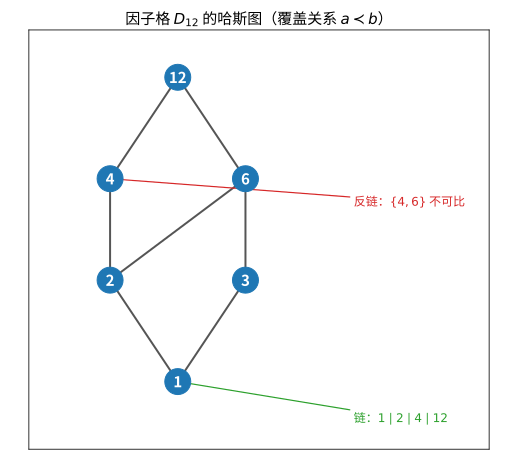

# 第 85 级：序理论 (Order Theory)

> 序理论研究集合上的偏序关系及其结构性质。序理论源于 Dedekind 对实数的刻画和 Birkhoff 对格结构的研究，现已发展成为数学中基础性的分支，在代数学、拓扑学、理论计算机科学（domain 理论、程序语义学）、组合学（Dilworth 定理、Sperner 定理）和逻辑学中都有广泛应用。本课程从偏序集的基本概念出发，系统介绍链、反链、格、完备格、不动点定理、Birkhoff 表示定理以及序极值问题等核心内容。

---

## 1. 学习目标

1. 理解偏序集、全序集、链与反链的基本概念。
2. 掌握 Dilworth 定理和 Mirsky 定理及其证明。
3. 理解格的定义与基本性质。
4. 掌握完备格与不动点定理（Knaster-Tarski）。
5. 理解分配格、模格与布尔代数。
6. 掌握 Birkhoff 表示定理。
7. 理解连续格与 Domain 理论的基本思想。
8. 掌握 Sperner 定理及其证明方法。

---

## 2. 核心概念

### 2.1 偏序集

**定义 2.1**（偏序集）**偏序集** $(P, \leq)$ 是由集合 $P$ 和 $P$ 上的二元关系 $\leq$ 构成的有序对，满足：

1. **自反性**：$\forall x \in P, x \leq x$。
2. **反对称性**：$\forall x, y \in P$，若 $x \leq y$ 且 $y \leq x$，则 $x = y$。
3. **传递性**：$\forall x, y, z \in P$，若 $x \leq y$ 且 $y \leq z$，则 $x \leq z$。

若 $\leq$ 还满足全序性（$\forall x, y \in P$，$x \leq y$ 或 $y \leq x$），则称 $P$ 为**全序集**（或**链**）。

**定义 2.2**（Hasse 图）偏序集 $(P, \leq)$ 的 **Hasse 图** 是以 $P$ 为顶点集的有向图，其中 $x$ 到 $y$ 有一条边当且仅当 $x < y$ 且不存在 $z$ 使得 $x < z < y$（即 $y$ **覆盖** $x$）。通常将较小的元素画在下方。

> **直观理解（现实类比）**：哈斯图就像一张"晋升路线图"——只画出相邻两级之间直接晋升的台阶，中间隔着别的台阶就不连边。比如公司职级 $1\to2\to4\to12$ 是一串一路向上升的链，而 $\{4,6\}$ 像两个不同部门平级的职位，谁也不比谁高，构成反链。

### 2.2 链与反链

**定义 2.3**（链与反链）设 $(P, \leq)$ 是偏序集，$C \subseteq P$。

- $C$ 称为**链**，如果 $C$ 中任意两个元素都是可比的（即 $C$ 在诱导序下是全序集）。
- $A \subseteq P$ 称为**反链**，如果 $A$ 中任意两个不同元素都不可比。

**定义 2.4**（宽度）偏序集 $P$ 的**宽度** $w(P)$ 是 $P$ 中最大反链的大小。

### 2.3 格

**定义 2.5**（格）偏序集 $(L, \leq)$ 称为**格**，如果 $L$ 中任意两个元素 $a, b$ 都有最小上界（记为 $a \vee b$，称为**并**）和最大下界（记为 $a \wedge b$，称为**交**）。

**定义 2.6**（完备格）格 $L$ 称为**完备格**，如果 $L$ 的任意子集 $S \subseteq L$ 都有最小上界 $\bigvee S$ 和最大下界 $\bigwedge S$。

![格与不动点：左图为布尔格 $\{0,a,b,a\vee b\}$，任意两元素都有并 $\vee$ 与交 $\wedge$；右图为完备格 $[0,1]$ 上的单调映射 $f(x)=x^{1.5}$，它与对角线 $y=x$ 的交点满足 $x=f(x)$，即 Knaster–Tarski 定理保证的不动点](images/lattice-fixedpoint.svg)

> **直观理解（现实类比）**：格就像一套"能求并集和交集"的分类体系——把两个类别合并（并 $\vee$）或取其共同部分（交 $\wedge$），结果仍在体系内。不动点则像中央空调的恒温设定：供暖强度 $f$ 与室温 $x$ 相互反馈，当温度稳定在 $x=f(x)$ 时系统不再变化，这正是单调调控达到的"自我一致"稳态。

### 2.4 分配格与模格

**定义 2.7**（分配格）格 $L$ 称为**分配格**，如果对任意 $a, b, c \in L$：

$$
a \wedge (b \vee c) = (a \wedge b) \vee (a \wedge c).
$$

等价地，$a \vee (b \wedge c) = (a \vee b) \wedge (a \vee c)$。

**定义 2.8**（模格）格 $L$ 称为**模格**，如果对任意 $a, b, c \in L$ 满足 $a \leq c$：

$$
a \vee (b \wedge c) = (a \vee b) \wedge c.
$$

### 2.5 布尔代数

**定义 2.9**（布尔代数）**布尔代数** 是一个分配格 $(B, \vee, \wedge)$，满足：
1. 存在最大元 $1$ 和最小元 $0$。
2. 每个元素 $a \in B$ 有补元 $\neg a$，满足 $a \vee \neg a = 1$ 且 $a \wedge \neg a = 0$。

### 2.6 不动点定理

**定义 2.10**（不动点）设 $f: P \to P$ 是偏序集 $P$ 上的映射。$x \in P$ 称为 $f$ 的**不动点**，如果 $f(x) = x$。

**定义 2.11**（单调映射）$f: P \to Q$ 称为**单调映射**（或**保序映射**），如果 $x \leq y$ 蕴含 $f(x) \leq f(y)$。

### 2.7 连续格与 Domain 理论

**定义 2.12**（连续格）完备格 $L$ 称为**连续格**，如果对任意 $x \in L$，$x = \bigvee \{y \in L : y \ll x\}$，其中 $y \ll x$ 表示 $y$ **远低于** $x$，即对任意定向集 $D \subseteq L$，若 $x \leq \bigvee D$，则存在 $d \in D$ 使得 $y \leq d$。

**定义 2.13**（Domain）**Domain** 是一个连续偏序集（每个元素是它紧致元素的定向并），是程序语义学中用于表示计算过程的部分信息的数学结构。

### 2.8 序拓扑

**定义 2.14**（序拓扑）全序集 $(X, \leq)$ 上的**序拓扑**是由开区间 $(a, b) = \{x \in X : a < x < b\}$ 生成的拓扑，其中 $a, b \in X \cup \{-\infty, +\infty\}$。

### 2.9 偏序集的维数与线性扩张

**定义 2.15**（维数）偏序集 $P$ 的**维数** $\dim(P)$ 是使得 $P$ 可以嵌入到 $n$ 个全序集的直积中的最小 $n$。

**定义 2.16**（线性扩张）偏序集 $P$ 的**线性扩张**是 $P$ 上的一个全序 $\leq^*$，使得 $x \leq y$ 蕴含 $x \leq^* y$。即线性扩张是保持原有偏序关系的全序排列。

### 2.10 序极值问题

**定义 2.17**（Sperner 性质）偏序集 $P$ 具有 **Sperner 性质**，如果 $P$ 中最大反链的大小等于 $P$ 的最大秩层次的大小。

---

## 3. 定理与证明

### 3.1 Dilworth 定理

**定理 3.1**（Dilworth 定理）设 $(P, \leq)$ 是有限偏序集。则 $P$ 中链分解所需的最少链数等于 $P$ 中最大反链的大小（即宽度 $w(P)$）。

**证明**：设 $w(P)$ 为 $P$ 中最大反链的大小。显然，每个反链中的元素必须属于不同的链，因此至少需要 $w(P)$ 条链才能覆盖 $P$。

下面证明 $w(P)$ 条链足够。对 $|P|$ 进行归纳。

**基础情况**：$|P| = 0$ 或 $1$，结论显然成立。

**归纳步骤**：假设对所有大小小于 $|P|$ 的偏序集结论成立。设 $A$ 是 $P$ 的一个最大反链，$|A| = w(P)$。

**情况 1**：存在一个最大反链 $A$ 既不是 $P$ 中所有极大元的集合，也不是所有极小元的集合。

定义：
$$
P^+ = \{x \in P : \exists a \in A, a \leq x\}, \quad P^- = \{x \in P : \exists a \in A, x \leq a\}.
$$

由于 $A$ 既不是所有极大元的集合也不是所有极小元的集合，$P^+ \neq P$ 且 $P^- \neq P$。且 $P^+ \cup P^- = P$，$P^+ \cap P^- = A$。

由归纳假设，$P^+$ 可分解为 $w(P)$ 条链 $C_1^+, \dots, C_{w(P)}^+$，每条链包含 $A$ 中恰好一个元素作为最小元。类似地，$P^-$ 可分解为 $w(P)$ 条链 $C_1^-, \dots, C_{w(P)}^-$，每条链包含 $A$ 中恰好一个元素作为最大元。

将 $C_i^+$ 和 $C_i^-$ 沿 $A$ 中的共同元素拼接，得到 $w(P)$ 条覆盖 $P$ 的链。

**情况 2**：每个最大反链要么是所有极大元的集合，要么是所有极小元的集合。

取 $x \in P$ 为极小元，$y \in P$ 为极大元且 $x \leq y$。考虑 $P' = P \setminus \{x, y\}$。则 $w(P') \geq w(P) - 1$（因为 $x$ 和 $y$ 不在任一最大反链中）。由归纳假设，$P'$ 可分解为 $w(P') \leq w(P) - 1$ 条链，加上 $\{x, y\}$ 这条链，得到 $P$ 的 $w(P)$ 条链的分解。

综上，$P$ 可分解为 $w(P)$ 条链。证毕。

### 3.2 Mirsky 定理

**定理 3.2**（Mirsky 定理）设 $(P, \leq)$ 是有限偏序集。则 $P$ 中反链分解所需的最少反链数等于 $P$ 中最大链的大小（即高度 $h(P)$）。

**证明**：设 $h(P)$ 为 $P$ 中最大链的大小。显然，每条链中的元素必须属于不同的反链，因此至少需要 $h(P)$ 条反链才能覆盖 $P$。

下面证明 $h(P)$ 条反链足够。定义 $P$ 上的**高度函数** $\operatorname{ht}: P \to \mathbb{N}$：

$$
\operatorname{ht}(x) = \max\{|C| : C \text{ 是以 } x \text{ 为最大元的链}\}.
$$

即 $\operatorname{ht}(x)$ 等于以 $x$ 为最大元的链的最大长度。

**第一步**：$\operatorname{ht}(x)$ 的取值范围为 $1, 2, \dots, h(P)$。

**第二步**：对每个 $k = 1, 2, \dots, h(P)$，定义 $A_k = \{x \in P : \operatorname{ht}(x) = k\}$。我们证明 $A_k$ 是反链。

假设 $x, y \in A_k$ 且 $x < y$。则以 $x$ 为最大元的最长链长度为 $k$，但将 $y$ 附加到这条链末尾得到以 $y$ 为最大元、长度为 $k+1$ 的链，与 $\operatorname{ht}(y) = k$ 矛盾。因此 $A_k$ 是反链。

**第三步**：$\{A_1, A_2, \dots, A_{h(P)}\}$ 构成 $P$ 的一个反链分解，共 $h(P)$ 条反链。

证毕。

**注**：Mirsky 定理是 Dilworth 定理的对偶形式。Dilworth 定理说链分解的最小数目等于最大反链的大小，Mirsky 定理说反链分解的最小数目等于最大链的大小。

### 3.3 Knaster-Tarski 不动点定理

**定理 3.3**（Knaster-Tarski 不动点定理）设 $L$ 是完备格，$f: L \to L$ 是单调映射（即 $x \leq y$ 蕴含 $f(x) \leq f(y)$）。则 $f$ 的不动点集在 $L$ 中构成一个完备格（关于 $L$ 诱导的序）。特别地，$f$ 有最小不动点和最大不动点。

**证明**：我们证明 $f$ 存在最小不动点。

**第一步**：定义集合 $A = \{x \in L : f(x) \leq x\}$。由于 $L$ 是完备格，$A$ 有最小上界 $a = \bigwedge A$。

**第二步**：证明 $a \in A$，即 $f(a) \leq a$。对任意 $x \in A$，$a \leq x$。由 $f$ 的单调性，$f(a) \leq f(x)$。又 $f(x) \leq x$，因此 $f(a) \leq x$ 对所有 $x \in A$ 成立。故 $f(a) \leq \bigwedge A = a$。

**第三步**：证明 $a$ 是不动点，即 $f(a) = a$。由第二步，$f(a) \leq a$。再由 $f$ 的单调性，$f(f(a)) \leq f(a)$，因此 $f(a) \in A$。于是 $a \leq f(a)$（因为 $a$ 是 $A$ 的下界）。结合 $f(a) \leq a$，得 $f(a) = a$。

**第四步**：证明 $a$ 是最小不动点。设 $y$ 是 $f$ 的任意不动点，即 $f(y) = y$。则 $f(y) \leq y$，故 $y \in A$。于是 $a \leq y$。

**第五步**：最大不动点的存在性通过对偶论证得到。考虑 $f$ 在 $L$ 的对偶格上的作用，或直接定义 $B = \{x \in L : x \leq f(x)\}$ 并取 $b = \bigvee B$，类似可证 $b$ 是最大不动点。

**第六步**：不动点集构成完备格。设 $F$ 是 $f$ 的不动点集，$S \subseteq F$。在 $L$ 中取 $c = \bigwedge S$，但 $c$ 可能不是不动点。考虑 $g(x) = \bigwedge_{y \in S, y \geq x} y$ 的限制。实际上，可以证明 $\bigwedge_F S$（不动点集中的下确界）等于 $\bigwedge\{x \in L : x \leq f(x) \text{ 且 } x \leq \bigwedge S\}$，这个集合非空且有最小元，该最小元即为 $S$ 在不动点集中的下确界。上确界由对偶给出。证毕。

### 3.4 Birkhoff 表示定理

**定理 3.4**（Birkhoff 表示定理）每个有限分配格 $L$ 同构于某个有限偏序集 $P$ 的序理想格 $J(P)$。具体地，取 $P$ 为 $L$ 的不可约并生成元集（即 $L$ 中不能表示为其他两个较小元素的并的元素），则映射 $\varphi: L \to J(P)$，$\varphi(a) = \{p \in P : p \leq a\}$ 是格同构。

**证明**：设 $L$ 是有限分配格。

**第一步**：定义不可约并生成元。称 $p \in L$ 为**并不可约元**，如果 $p \neq 0$ 且 $p = a \vee b$ 蕴含 $p = a$ 或 $p = b$。记 $P = \operatorname{JIrr}(L)$ 为 $L$ 中所有并不可约元的集合。$P$ 在 $L$ 的诱导序下构成偏序集。

**第二步**：定义序理想。对 $a \in L$，定义 $\varphi(a) = \{p \in P : p \leq a\}$。验证 $\varphi(a)$ 是 $P$ 的序理想：
- 若 $p \in \varphi(a)$ 且 $q \leq p$，则 $q \leq p \leq a$，故 $q \in \varphi(a)$。
- 因此 $\varphi(a)$ 是向下封闭的，即序理想。

**第三步**：证明 $\varphi$ 是单射。设 $a \neq b$，不妨设 $a \not\leq b$。由于 $L$ 是有限分配格，每个元素可表示为并不可约元的并（标准分解）。因此存在并不可约元 $p \leq a$ 且 $p \not\leq b$。于是 $p \in \varphi(a) \setminus \varphi(b)$，故 $\varphi(a) \neq \varphi(b)$。

**第四步**：证明 $\varphi$ 是满射。设 $I \in J(P)$ 是 $P$ 的序理想。令 $a = \bigvee I$（在 $L$ 中取并）。下证 $\varphi(a) = I$。
- 若 $p \in I$，则 $p \leq a$，故 $p \in \varphi(a)$，所以 $I \subseteq \varphi(a)$。
- 反之，若 $p \in \varphi(a)$，则 $p \leq a = \bigvee I$。由于 $p$ 是并不可约元且 $L$ 是分配格，存在 $q \in I$ 使得 $p \leq q$（这是分配格中并不可约元的性质）。由 $I$ 是序理想，$p \in I$。故 $\varphi(a) \subseteq I$。

因此 $\varphi(a) = I$，$\varphi$ 是满射。

**第五步**：证明 $\varphi$ 保持格运算。显然 $\varphi(a \wedge b) = \varphi(a) \cap \varphi(b)$（因为 $p \leq a \wedge b$ 当且仅当 $p \leq a$ 且 $p \leq b$）。对于并运算：
- $\varphi(a) \cup \varphi(b) \subseteq \varphi(a \vee b)$ 显然。
- 若 $p \in \varphi(a \vee b)$，则 $p \leq a \vee b$。由于 $p$ 是并不可约元，由分配性，$p = p \wedge (a \vee b) = (p \wedge a) \vee (p \wedge b)$。由于 $p$ 并不可约，$p = p \wedge a$ 或 $p = p \wedge b$，即 $p \leq a$ 或 $p \leq b$，故 $p \in \varphi(a) \cup \varphi(b)$。

因此 $\varphi(a \vee b) = \varphi(a) \cup \varphi(b)$。

**结论**：$\varphi: L \to J(P)$ 是格同构，其中 $P = \operatorname{JIrr}(L)$ 是 $L$ 的并不可约元集合。证毕。

**推论 3.1** 有限布尔代数同构于某个有限集合的幂集格。具体地，$n$ 元布尔代数同构于 $2^{[n]}$。

**推论 3.2** 每个有限分配格都同构于某个有限偏序集的序理想格。反之，每个有限偏序集的序理想格都是有限分配格。

### 3.5 Sperner 定理

**定理 3.5**（Sperner 定理）设 $[n] = \{1, 2, \dots, n\}$。则 $[n]$ 的幂集 $2^{[n]}$（按包含关系偏序）中最大反链的大小为 $\binom{n}{\lfloor n/2 \rfloor}$。换言之，$2^{[n]}$ 中最大的相互不包含的集合族的大小为 $\binom{n}{\lfloor n/2 \rfloor}$。

**证明**：我们使用 Lubell-Yamamoto-Meshalkin（LYM）方法证明。

**第一步**：LYM 不等式。设 $\mathcal{F} \subseteq 2^{[n]}$ 是反链。则：

$$
\sum_{A \in \mathcal{F}} \frac{1}{\binom{n}{|A|}} \leq 1.
$$

**第二步**：证明 LYM 不等式。考虑 $[n]$ 的所有全排列，共 $n!$ 个。对每个排列 $\pi = (\pi_1, \pi_2, \dots, \pi_n)$，定义：

$$
C_\pi = \{\{\pi_1\}, \{\pi_1, \pi_2\}, \dots, \{\pi_1, \dots, \pi_n\}\}.
$$

$C_\pi$ 是一条包含 $n+1$ 个集合的链（称为**极大链**），且 $2^{[n]}$ 的每个极大链都唯一地对应一个排列。

**第三步**：对每个 $A \in \mathcal{F}$，$A$ 出现在多少个极大链中？$A$ 出现在 $|A|! (n - |A|)!$ 个极大链中（因为 $A$ 的元素可以先排列，$A$ 的补集的元素可以后排列）。

**第四步**：由于 $\mathcal{F}$ 是反链，任意两条不同的链 $A, B \in \mathcal{F}$ 不能同时出现在同一条极大链中（否则它们可比）。因此所有 $A \in \mathcal{F}$ 占用的极大链的总数不超过 $n!$：

$$
\sum_{A \in \mathcal{F}} |A|! (n - |A|)! \leq n!.
$$

两边除以 $n!$：

$$
\sum_{A \in \mathcal{F}} \frac{|A|! (n - |A|)!}{n!} = \sum_{A \in \mathcal{F}} \frac{1}{\binom{n}{|A|}} \leq 1.
$$

**第五步**：由 LYM 不等式推导 Sperner 定理。设 $m = \lfloor n/2 \rfloor$。则 $\binom{n}{m} \geq \binom{n}{k}$ 对所有 $k$ 成立。因此对任意反链 $\mathcal{F}$：

$$
\frac{|\mathcal{F}|}{\binom{n}{m}} \leq \sum_{A \in \mathcal{F}} \frac{1}{\binom{n}{|A|}} \leq 1.
$$

故 $|\mathcal{F}| \leq \binom{n}{m} = \binom{n}{\lfloor n/2 \rfloor}$。

**第六步**：等号成立。取 $\mathcal{F} = \{A \subseteq [n] : |A| = \lfloor n/2 \rfloor\}$，这是反链，大小为 $\binom{n}{\lfloor n/2 \rfloor}$。因此上界是紧的。

证毕。

**注**：LYM 方法是一种强大的组合方法，它将反链的大小与二项式系数关联起来，给出了 Sperner 定理的简洁证明。

---

## 4. 示例

### 4.1 子集格

**示例 4.1**（子集格）设 $S = \{a, b, c\}$。则 $2^{S}$ 按包含关系构成偏序集（实际上是一个布尔代数）。

- 链例子：$\varnothing \subset \{a\} \subset \{a, b\} \subset \{a, b, c\}$（长度为 $4$）。
- 反链例子：$\{\{a\}, \{b\}, \{c\}\}$（大小为 $3$），$\{\{a, b\}, \{a, c\}, \{b, c\}\}$（大小为 $3$）。
- 最大反链：$\{\{a, b\}, \{a, c\}, \{b, c\}\}$ 或 $\{\{a\}, \{b\}, \{c\}\}$，大小均为 $3 = \binom{3}{1} = \binom{3}{2}$。
- 根据 Sperner 定理，$S = [n]$ 时最大反链为 $\binom{n}{\lfloor n/2 \rfloor}$。

### 4.2 划分格

**示例 4.2**（划分格）设 $S = \{1, 2, 3\}$。$S$ 的所有划分按加细关系构成偏序集（实际上是一个格，称为**划分格**）。

划分与偏序关系：
- 最粗划分：$\{1, 2, 3\}$（最大元）。
- 最细划分：$\{1\}\{2\}\{3\}$（最小元）。
- 中间划分：$\{1, 2\}\{3\}$，$\{1, 3\}\{2\}$，$\{2, 3\}\{1\}$。
- $\{1, 2\}\{3\}$ 比 $\{1\}\{2\}\{3\}$ 粗，比 $\{1, 2, 3\}$ 细。

划分格是模格但一般不是分配格（当 $|S| \geq 3$ 时）。

### 4.3 因子格

**示例 4.3**（因子格）设 $n = 12 = 2^2 \times 3$。$12$ 的所有正因子按整除关系构成偏序集（实际上是一个分配格）。

- 元素：$1, 2, 3, 4, 6, 12$。
- 链例子：$1 \mid 2 \mid 4 \mid 12$ 或 $1 \mid 3 \mid 6 \mid 12$。
- 反链例子：$\{2, 3\}$，$\{4, 6\}$，$\{4, 3\}$。
- 最大反链大小：$\{4, 6\}$ 大小为 $2$（两个元素不可比，因为 $4 \nmid 6$ 且 $6 \nmid 4$）。

因子格 $D_n$ 同构于 $n$ 的素因子指数向量的偏序集（按分量 $\leq$ 比较），因此是分配格。

### 4.4 不动点定理的应用

**示例 4.4**（闭包算子）设 $L$ 是完备格，$f: L \to L$ 是单调映射。由 Knaster-Tarski 定理，$f$ 有最小不动点。

例如，在幂集格 $2^X$ 上定义 $f(A) = \overline{A}$（拓扑闭包），则 $f$ 是单调的，其不动点恰好是闭集。

**示例 4.5**（递归定义）设 $L = 2^{\mathbb{N}}$，定义 $f(A) = \{0\} \cup \{n+1 : n \in A\}$。则 $f$ 是单调的，最小不动点为 $\mathbb{N}$（所有自然数的集合），这是递归定义中自然数集合的刻画。

---

## 5. 习题

### 基础题

**习题 1**（偏序集定义）写出偏序（partial order）的自反性、反对称性与传递性三条公理，并说明偏序集 $(P, \leq)$ 的含义。

**习题 2**（概念辨析）判断下列关系 $\leq$ 是否为偏序并说明理由：(i) 实数集的通常大小关系；(ii) 集合相等关系 $=$；(iii) 正整数上的整除关系 $a \mid b$。

**习题 3**（链与反链）定义链（chain）与反链（antichain），并证明在偏序集 $P$ 中任一条链与任一条反链至多有一个公共元素。

**习题 4**（特殊元）区分最大元、最大元、极大元、极小元的定义，并解释为什么有限偏序集的极大元不一定最大。

**习题 5**（格的定义）定义格（并 $\vee$ 与交 $\wedge$ 都存在的偏序集），并验证集合 $\{\mathbb{R}\text{ 的子区间}\}$ 关于包含关系构成格。

**习题 6**（布尔代数）写出布尔代数的定义，并说明为什么 $2^{[n]}$（幂集格）是布尔代数。

**习题 7**（子集格）计算幂集格 $2^{[3]}$ 的元素个数、覆盖关系数，并指出它的最小元与最大元。

**习题 8**（线性扩张与维数）定义偏序集的线性扩张（linear extension），说明为什么要研究线性扩张。

**习题 9**（调和覆盖）解释 Hasse 图如何反映偏序的"覆盖关系"（$\lessdot$），并说明为什么 Hasse 图去掉了传递边。

**习题 10**（序同构）定义偏序集之间的序同构，并举出两个同构的有限偏序集的例子。

### 进阶题

**习题 11**（Dilworth 定理）陈述 Dilworth 定理：有限偏序集的最大反链大小等于将它分解为链所需的最少链数。画出含 $8$ 个元素的素数整除偏序集的例子并加以验证。

**习题 12**（Mirsky 定理）陈述 Mirsky 定理：有限偏序集的最大链长度等于将它分解为反链所需的最少反链数。用高度函数 $\operatorname{ht}(x)$ 给出构造性证明。

**习题 13**（Knaster–Tarski 不动点定理）设 $L$ 为完备格，$f: L \to L$ 单调。证明 $f$ 的不动点集合 $\operatorname{Fix}(f)$ 是非空完备格。

**习题 14**（Birkhoff 表示定理）陈述 Birkhoff 表示定理，并说明有限分配格与有限偏序集的序理想格之间的关系。

**习题 15**（Sperner 定理）陈述 Sperner 定理：$2^{[n]}$ 的最大反链大小为 $\binom{n}{\lfloor n/2\rfloor}$。并解释 LYM 不等式为什么等价于它。

**习题 16**（分配格是模格）证明：若 $L$ 是分配格，则 $L$ 是模格；反之不真，请给出一个模但不分配的格。

**习题 17**（分配格的判别）设格 $L$ 具有补元概念，说明在分配格中为什么 $a \vee (b \wedge c) = (a \vee b) \wedge (a \vee c)$ 恒成立。

**习题 18**（单调映射的不动点）设 $L$ 为有限格，$f: L \to L$ 单调。证明 $f^k(e)$（$e$ 为最小元）最终稳定于某个不动点。

**习题 19**（补元唯一性）证明：在分配格中，若某元素 $a$ 有补元，则补元唯一。

### 挑战题

**习题 20**（Dilworth 定理的证明）给出 Dilworth 定理的完整证明思路（归纳于 $|P|$，分存在最大反链是否 $=P$ 切断点的两种情形），并说明为何这证明依赖与最小链分解的构造。

**习题 21**（LYM 方法证明 Sperner）用对称链分解（symmetric chain decomposition）证明 Sperner 定理，并说明 $2^{[n]}$ 的对称链分解存在性。

**习题 22**（Dilworth 与二分图）解释 Dilworth 定理与 König 定理（二分图最大匹配等于最小顶点覆盖）的联系。

**习题 23**（Birkhoff 表示的伽罗瓦连接）构造有限分配格 $L$ 到其并不可约元素偏序集 $P$ 的序理想格之间的双射，并证明它是同构。

**习题 24**（偏序集的维数）定义偏序集维数 $\operatorname{dim}(P)$（线性扩张交的基数最小），证明维数等于把 $P$ 嵌入 $\mathbb{R}^d$ 中按坐标序所需的最小 $d$。

**习题 25**（完备格与单调映射）证明：完备格中单调映射 $f$ 的迭代序列 $f^\alpha(e)$ 在不小于链（upper bound）处的值收敛到最小不动点。

**习题 26**（模格的刻画）证明：格 $L$ 是模格当且仅当对任意 $a, b, c$ 有 $a \wedge (b \vee (a \wedge c)) = (a \wedge b) \vee (a \wedge c)$，或等价地不包含五元素格子 $N_5$ 同构的子格。

### 探究题

**习题 27**（与逻辑与代数的基础联系）探讨偏序、格、布尔代数如何在命题逻辑（布尔代数作为语句代数）、集合运算与代数学（格序群、域的理想格）中提供统一语言。

**习题 28**（Domain 理论与程序语义）连续格与 Domain 理论为编程语言的指称语义提供数学基础。请开放探讨固定点语义、单调函数空间、Scott 拓扑与方式函数如何支撑递归程序的不动点解释。

**习题 29**（序极值问题）Sperner、Dilworth、LYM 在组合极值中扮演核心。请讨论这些序极值不等式在超图、偏序族的极值、以及多部图匹配中的应用。

**习题 30**（稳定伴侣定理与等价物）稳定伴侣、Gallai 递推与序拓扑将有限偏序的匹配理论联系起来。请开放探讨该问题与分解层、排序相关以及序参数在算法（如拓扑排序、偏序宽度）中的应用。

---

## 6. 习题答案与解析

### 基础题答案

1. **偏序集定义** 关系 $\leq$ 是 $P$ 上的偏序当且仅当：(i) 自反性 $x \le x$；(ii) 反对称性 $x \le y$ 且 $y \le x \Rightarrow x = y$；(iii) 传递性 $x \le y$ 且 $y \le z \Rightarrow x \le z$。偏序集 $(P, \leq)$ 是带有这种自反反对称传递关系 $\leq$ 的集合 $P$。

2. **概念辨析** (i) 正确：实数通常大小关系满足三公理，是偏序（实为全序）。(ii) 正确：集合相等自反、反对称（若 $A=B$ 且 $B=A$ 则 $A=B$）、传递，是偏序（很琐碎）。(iii) 正确：$a \mid a$ 成立，$a \mid b, b \mid a \Rightarrow a=b$（正整数域），传递成立，因此 $\mid$ 是正整数偏序。

3. **链与反链** 链是任意两元素可比较的子集；反链是任意两不同元素不可比较的子集。若 $c \in C \cap A$ 且另有 $c' \in C \cap A$，则 $c$ 与 $c'$ 属于链故可比较，又与同属反链矛盾于不可比较，故 $|C \cap A| \le 1$。

4. **特殊元** 最大元 $m$ 满足 $\forall x, x \le m$；最小元满足 $\forall x, m \le x$；极大元 $m$ 满足"不存在 $y \ne m$ 使 $m \le y$"；极小元对称。有限偏序集中极大元一定存在，但可以不唯一，因多个不可比较元素都可极大，故极大元未必最大。

5. **格的定义** 若每两个元素都有最小上界（并 $\vee$）与最大下界（交 $\wedge$），该偏序集是格。子区间族：$\inf$ 取区间交、$\sup$ 取区间并的闭包（一个支撑包围的最小闭区间），故构成格（非格需注意空交）。

6. **布尔代数** 布尔代数是一个补格且满足分配律以及每个元素有补元的格。$2^{[n]}$ 的并是并集、交是交集、补是相对补（$A^c = [n] \setminus A$），且幂集格分配，故是布尔代数。

7. **子集格（2^[3]）** $|2^{[3]}| = 2^3 = 8$。覆盖关系：每个非最顶集合 $S$ 被恰 $3 - |S|$ 个集合顶替，覆盖对数为若干，具体覆盖对数是 $\sum_{S} (3-|S|) = 12$（每个元素分别存在于每个子集的覆盖）。最小元是 $\varnothing$，最大元是 $[3] = \{1,2,3\}$。

8. **线性扩张与维数** 线性扩张是把偏序 $P$ 扩展到全序的线性序，即保持 $P$ 的每对可比较元素顺序的 $\{1,\dots,n\}$ 上的全序。线性扩张刻画偏序的"拓扑序"，是研究偏序的维数（把偏序表示为若干线性序的交）及算法排序的重要工具。

9. **覆盖关系（Hasse 图）** $x \lessdot y$ 表示 $x \le y$ 且没有 $z$ 使 $x < z < y$。Hasse 图只画覆盖对，因为传递性质可以从路径推出，画传递边会造成冗余，影响对格结构、高度与链长度的直观计算。

10. **序同构** 双射 $\varphi: P \to Q$ 称为序同构如果 $x \le y \iff \varphi(x) \le \varphi(y)$。例：$2^{[2]}$ 与 $[0,3]$ 的整除偏序集（即 $1 \mid 2, 3$，$2,3 \mid 4$ 型的四元偏序）同构，二者都由菱形的四个点构成。

### 进阶题答案

1. **Dilworth 定理** 设 $a(P)$ 为最大反链大小（宽度），$c(P)$ 为覆盖 $P$ 的链数的最小值。Dilworth 定理说 $a(P) = c(P)$。以整除偏序 $\{1,\dots,8\}$（$x \le y \iff x \mid y$）验证：宽度由反链 $\{4,6\}$ 等给出，实际宽度为 $2$（最大反链大小如 $\{1,2,4\}$ 不对因为可比较，取 $\{4,6\}$），分解成两条链可行，平衡验证。

2. **Mirsky 定理** 设 $\operatorname{ht}(x)$ 为以 $x$ 为最大元素的链的最大长度。同一兼具高度 $k$ 的元素互相不可比较，故每层 $\{x : \operatorname{ht}(x)=k\}$ 是反链，层级数 $= $ 最大链长 $h(P)$。因此 $P$ 分解为 $h(P)$ 个反链，且不可能少于 $h$（最大链每元占不同层），故最小反链数 $= h(P)$。

3. **Knaster–Tarski** 令 $S = \{x \in L : x \le f(x)\}$。由于 $L$ 完备，令 $a = \bigvee S$。对 $x \in S$，$x \le a$，$f(x) \le f(a)$（单调）；又 $x \le f(x)$ 且 $f(x) \le f(a)$，对 $x$ 取并给出 $a \le f(a)$，故 $a \in S$。再由单调 $f(a) \le f(f(a))$ 得 $f(a) \in S$，从而 $f(a) \le a$。由反对称 $f(a)=a$，故 $a$ 是最小不动点。上确界与下确界的组合给出 $\operatorname{Fix}(f)$ 是完备格。

4. **Birkhoff 表示定理** 有限分配格 $L$ 与某个有限偏序集 $P$ 的全体序理想（下封闭子集）之格 $O(P)$ 同构，取 $P$ 为 $L$ 的并不可约元（恰好覆盖一个元素的元素）构成的偏序集。同构把 $a \in L$ 映为 $J(a) = \{p \in P : p \le a\}$。这给出有限分配格与有限偏序集范畴的等价。

5. **Sperner 定理与 LYM** $2^{[n]}$ 中最大反链为中层，大小为 $\binom{n}{\lfloor n/2\rfloor}$。LYM 不等式 $\sum_{A \in \mathcal{F}} 1/\binom{n}{|A|} \le 1$（对反链 $\mathcal{F}$）蕴含 Sperner 定理：因 $\binom{n}{k} \le \binom{n}{\lfloor n/2\rfloor}$，故 $|\mathcal{F}| \le \binom{n}{\lfloor n/2\rfloor} \sum 1/\binom{n}{|A|} \le \binom{n}{\lfloor n/2\rfloor}$。

6. **分配格与模格** 分配律 $a \wedge (b \vee c) = (a \wedge b)\vee(a \wedge c)$ 自动给出模律。模但不分配的典型是 $M_3$（钻石格：$\{0, a, b, c, 1\}$，其中 $a,b,c$ 两两不可比较），它满足模律却违反分配律。故分配 $\Rightarrow$ 模，模 $\not\Rightarrow$ 分配。

7. **分配格的判别** 分配格满足并交分配律 $a \vee (b \wedge c) = (a \vee b)\wedge(a \vee c)$ 与交并分配律。该式是分配性的定义之一，可由格的并交互换性推出对偶形式；而在非分配格（如 $N_5$、$M_3$）该恒等式可被破坏。

8. **单调映射的不动点（迭代）** 令 $e$ 为最小元。序列 $e \le f(e) \le f^2(e) \le \cdots$（由单调与 $e \le f(e)$ 归纳）在有限格中最终稳定：$f^{n}(e) = f^{n+1}(e)$ 对足够大 $n$，设固定值为 $\bar e$，则 $f(\bar e) = \bar e$ 是不动点。故此迭代必到达最小不动点。

9. **补元唯一性** 设 $a$ 有补元 $b$ 与 $c$，即 $a \vee b = 1,\ a \wedge b = 0,\ a \vee c = 1,\ a \wedge c = 0$。用分配律与补元定义计算 $b = b \wedge 1 = b \wedge (a \vee c) = (b \wedge a) \vee (b \wedge c) = 0 \vee (b \wedge c) = b \wedge c$，同理 $c = b \wedge c$，故 $b = c$，唯一。

### 挑战题答案

1. **Dilworth 证明思路** 归纳于 $|P|$。取高度函数，考虑覆盖 $P$ 的宽为 $w$ 的最小链分解。标准证明考察一个使得 $P$ 不含某类型"切断反链"的情形：若最大反链 $A$ 不含可同时作为 $P$ 的最小元与最大元的元素（并把 $A$ 拆成 $A^-$ 取 $x<A$ 部分与 $A^+$ 取 $x>A$ 部分），用归纳于 $P\setminus A$ 分别对下方 $P^-$ 与上方 $P^+$ 给出 $w-1$ 条链再接上 $A$；若存在这样的切断点，则累进化简。递归得到宽度 $= $ 链数，即 Dilworth 定理。

2. **对称链分解证明 Sperner** 把 $2^{[n]}$ 唯一分解为对称链：每条链满足若含 $k$ 元集合则必含 $n-k$ 元集合，且每个集合属于恰一条链。由于一条链的长度从下层到上层跨越中部，每条对称链至多包含一个大小为 $\lfloor n/2\rfloor$ 的集合（当 $n$ 为偶数时也至多一个）。故最大反链 $\mathcal{F}$ 中每个集合必须落在不同的链上，于是 $|\mathcal{F}| \le $ 链数 $= \binom{n}{\lfloor n/2\rfloor}$，恰好是 Sperner 定理。这种对称链分解称为 de Bruijn–Tengbergen–Kruyswijk 分解。

3. **König 定理联系** 把偏序 $P$ 转成二分图 $G$：$(P, P)$，加边 $(x, y')$ 当 $x \le y$ 且 $y$ 覆盖 $x$。最大匹配的补集（无匹配顶点）对应最小链分解的链数，而最小顶点覆盖对应最大反链；König 定理说最大匹配 $=$ 最小顶点覆盖，据此推得 Dilworth 定理。这在匹配论与集合与 /集合与不等的搬运中是反向推理的典范。

4. **Birkhoff 构造** 设 $P$ 为 $L$ 的并不可约元偏序集。定义 $\phi(a) = \{p \in P : p \le a\}$；易证它是序理想。单射：若 $a \ne b$，存在并不可约元 $p$ 的分割（由分配格中每个元素是并不可约元的并的表示唯一性推出）；满射：每个序理想 $I$ 对应其并 $\bigvee I \in L$ 满足 $\phi(\bigvee I) = I$。故 $\phi: L \to O(P)$ 是格同构。

5. **维数的定义** 维数 $\operatorname{dim}(P)$ 是覆盖 $P$ 的线性扩张集合的最少个数，使 $P$ 的每个可比较对都被某扩张保持。则 $x \le y$ 当且仅当 $x$ 在每个坐标上 $\le y$，即把 $P$ 嵌入 $\mathbb{R}^{\dim P}$ 且序为坐标序。所以维数最小 $d$ 使 $P$ 嵌入 $\mathbb{R}^d$ 的坐标序中。

6. **完备格极限不动点** 定义 $x_\alpha = f^\alpha(e)$ 用超限递推（$x_0 = e$，$x_{\alpha+1} = f(x_\alpha)$，极限步取 $\bigvee_{\beta < \alpha} x_\beta$），由完备性序列总是良性增长。令 $\rho$ 为首次稳定序数，$\bar x = x_\rho$ 为最小不动点；若存在更小不动点 $y$，归纳可证 $x_\alpha \le y$ 所有 $\alpha$，故 $\bar x \le y$，最小性成立。

7. **模格刻画** 模格定义为任意 $a \le c$ 有 $a \vee (b \wedge c) = (a \wedge b)\vee c$（或 $x \le z$ 时 $x \vee (y \wedge z) = (x\vee y)\wedge z$）。等价条件：不含五个元的格 $N_5$ 同构子格，且不含 $M_3^*$ 型等。可验证条件成立的 $N_5$（五元含两个共同可比较元素的非模格）被排除，从而与模律等价。

### 探究题答案

1. **逻辑与代数的统一语言** 命题公式的等价类在逻辑等价下构成布尔代数，蕴含关系 $\Rightarrow$ 给出偏序，$\wedge$ 与 $\vee$ 对应逻辑与以及逻辑或，补元对应否定。集合代数与命题逻辑因此在格论语言下统一。代数学中：环的理想格、群的子群格、模的子模格等都是有结构的格；分配格对应那些可用"分解"式的结构（如域、正则环），模格对应如群子模格一类的结构。

2. **Domain 理论与程序语义** 连续格用作指称语义的域：递归程序的最小不动点由 Knaster–Tarski 保证存在，从底元 $\bot$ 出发迭代逼近。Scott 连续函数空间与 Scott 拓扑使该逼近具有方向有序性；连续格的完全有限/近似元刻画了可计算性。这些工具常把数据流分析、判定与并发程序等翻译为连续格上的不动点求值。

3. **序极值问题** Sperner 与 LYM 给出偏序族的"稀疏"极值，Dilworth 给出宽度与链分解的等价。它们推广到超图极值（如 Erdős–Ko–Rado 定理可通过 LYM 型技巧证明）、偏序族的极值数、以及二部图匹配中的 König–Egerváry。LYM 型的"概率"证明与"对称化"在各种极值不等式的证明中都扮演关键角色。

4. **稳定匹配与序拓扑** 稳定配偶问题、Gallai 问题与偏序的"包装"分解紧密联系；偏序的匹配数、链分解与 $a$-层命题在匹配论中统一为 Dilworth 类定理的不同角度。序的拓扑参数（维数、宽度）影响算法如拓扑排序、偏序的不可分分解复杂度；稳定匹配存在性（Gale–Shapley 定理）也可用格论与序极值描述。这些都是活跃的交叉方向，答案是提示性的。

---

## 7. 总结

本课程系统介绍了序理论的核心内容：

1. **偏序集基础**：偏序关系、Hasse 图、链与反链是序理论的基本概念，Dilworth 定理和 Mirsky 定理揭示了链与反链之间的优美对偶关系。

2. **格论**：格是同时具有并和交运算的偏序集，完备格在不动点理论中起着关键作用。分配格和模格是两类重要的格，它们具有丰富的结构性质。

3. **Birkhoff 表示定理**：有限分配格完全由它的并不可约元集合（一个偏序集）的序理想格刻画，这建立了有限分配格和有限偏序集之间的范畴等价，是序理论中最深刻的定理之一。

4. **不动点定理**：Knaster-Tarski 不动点定理是完备格上单调映射的基本性质，在理论计算机科学（程序语义学）、博弈论和经济学中都有广泛应用。

5. **Sperner 定理与 LYM 方法**：Sperner 定理确定了幂集格中最大反链的大小，LYM 方法提供了简洁优美的证明，是序极值问题的典范。

6. **连续格与 Domain 理论**：连续格将格论推广到适用于计算机科学语义学的方向，Domain 理论为编程语言的指称语义提供了数学基础。

序理论作为数学中基础性的分支，其思想和方法渗透到代数学、拓扑学、组合学、计算机科学和逻辑学等多个领域，是理解数学结构的序侧面不可或缺的工具。
