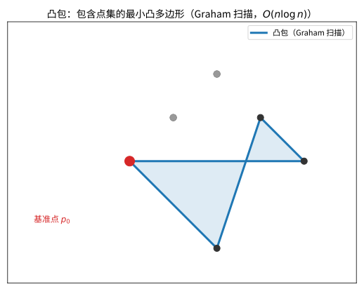
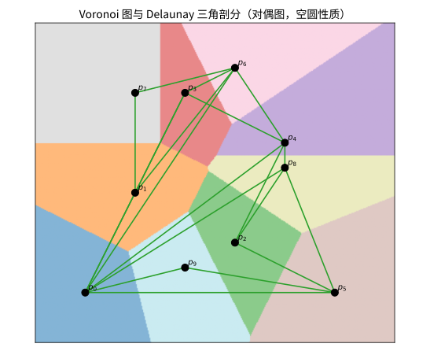

# 第86级：计算几何

## 学习目标

1. 掌握计算几何的核心问题与基本算法
2. 理解凸包算法（Graham扫描、Jarvis步进）的原理与正确性证明
3. 掌握Voronoi图与Delaunay三角剖分的性质与构造方法
4. 理解平面扫描、点定位、线段相交等基本几何算法
5. 掌握最近点对、最小圆覆盖等经典问题的算法与证明
6. 了解几何数据结构（KD树、R树、四叉树）及其应用

---

## 1. 引言

计算几何（Computational Geometry）是计算机科学与数学的交叉领域，研究几何问题的算法设计与分析。它广泛应用于计算机图形学、机器人学、地理信息系统、计算机辅助设计等领域。本节将系统介绍计算几何的核心概念、算法与理论基础。

---

## 2. 核心概念

### 2.1 凸包算法

**凸包**（Convex Hull）是包含给定点集的最小凸集。对于平面上的点集 $S$，其凸包是包含 $S$ 的最小凸多边形。

**Graham扫描算法**：
1. 选取 $y$ 坐标最小的点（若多个则取 $x$ 最小）作为基准点 $p_0$
2. 将剩余点按相对于 $p_0$ 的极角排序
3. 维护一个栈，依次处理每个点，检查是否形成左转
4. 算法时间复杂度 $O(n \log n)$

**Jarvis步进算法**（礼品包装算法）：
1. 从最左下的点开始
2. 每次选择与当前边夹角最小的点作为下一个顶点
3. 算法时间复杂度 $O(nh)$，其中 $h$ 为凸包顶点数

> **直观理解（现实类比）**：凸包就像用一根橡皮筋把所有钉子紧紧箍住后形成的形状——橡皮筋绷到最外圈钉子就被撑成一个凸多边形，内圈的钉子全被包在里面。Graham 扫描则像从最下的一颗钉子开始，按逆时针一步步"转"出最外面的轮廓。
>
> **🧠 思考历程：给一堆点找"最外圈"，怎么会催生出一门学科和无数算法？**
>
> 计算几何的起点非常"工程化"：**当"找凸包""找最近点"这类几何问题搬上计算机，才发现不设计算法就寸步难行**。于是 1970 年代起，一群人要做的不是证明存在性，而是把几何答案一步步"算"出来。
>
> - **凸包：从分治到 Graham 扫描**（1970 年代初）。Ronald Graham 在 1972 年给出"Graham 扫描"，一举把凸包时间压到 $O(n\log n)$；Preparata 与 Hong、Shamos 与 Hoey 随后引入分治策略，凸包、最近点对、Voronoi 图都获得了近乎最优的算法。几何问题的"可算性"第一次有了明确标尺。
> - **Shamos 与 Preparata：一门学科起名字**（1970 年代中期）。Michael Shamos 在博士论文里系统梳理了平面扫描、区域查询与几何算法，并与 Franco Preparata 一道把这一整套方法命名为"计算几何"，让散落的技巧凝聚成独立而系统的学科。
> - **从理论到工业：几何算法落地生根**（1980 年代至今）。计算几何的成果随即渗入图形学、机器人路径规划、地理信息系统（GIS）与制造加工——Voronoi 图与 Delaunay 三角剖分的"最大最小角"性质至今仍是网格生成和空间检索的幕后英雄。
> - **心路**：当一个问题没有算法，再多几何定理也派不上用场。计算几何提醒我们：**把"算出答案"本身当作一门学问，几何就能从书斋走进每一个工程产品**。

### 2.2 Voronoi图

**Voronoi图**将平面划分为若干区域，每个区域包含距离一个给定站点最近的所有点。对于站点集 $S = \{p_1, p_2, \ldots, p_n\}$，Voronoi区域定义为：

$$V(p_i) = \{x \in \mathbb{R}^2 \mid d(x, p_i) \leq d(x, p_j), \forall j \neq i\}$$

### 2.3 Delaunay三角剖分

**Delaunay三角剖分**是Voronoi图的对偶图，其重要性质是空圆性质：任何三角形的外接圆内不包含其他点。

> **直观理解（现实类比）**：Voronoi 图就像按"就近原则"划分的快递网点服务区——每个点归最近的网点管，边界恰好在两网点中间。Delaunay 三角剖分则是把相邻网点连起来拼成的网格，它保证三角形尽量"圆润"（最大最小角性质），如同用不产生细长三角形的方式给地形铺三角网格。

### 2.4 平面扫描

**平面扫描**（Plane Sweep）是一种算法设计范式，通过一条扫描线从左到右（或从上到下）移动，维护与扫描线相交的几何结构，在扫描过程中处理事件。

### 2.5 点定位

**点定位**（Point Location）问题：给定一个平面 subdivision 和一个查询点，确定该点位于哪个区域中。

### 2.6 线段相交

**线段相交**问题：判断两条线段是否相交，或找出所有相交线段对。

### 2.7 多边形三角剖分

**多边形三角剖分**：将多边形分割成不相交的三角形，其对角线不相交且完全位于多边形内部。

### 2.8 最近点对

**最近点对**问题：给定平面上的 $n$ 个点，找出距离最近的两个点。

### 2.9 几何数据结构

- **KD树**：$k$ 维空间中的二叉树，每个节点按某一维划分空间
- **R树**：B树在高维空间的推广，用于空间索引
- **四叉树**：递归地将平面划分为四个象限

### 2.10 几何对偶与半平面交

**几何对偶**：将点与直线建立对偶关系，例如点 $(a, b)$ 对偶为直线 $y = ax - b$。

**半平面交**：求多个半平面的交集，通常是一个凸多边形（可能无界）。

---

## 3. 定理与证明

### 3.1 凸包算法正确性证明 — Graham扫描

**定理1（Graham扫描正确性）**：Graham扫描算法正确计算点集的凸包。

**证明**：

设输入点集 $S = \{p_0, p_1, \ldots, p_{n-1}\}$，其中 $p_0$ 为 $y$ 坐标最小的点（若有多个则取 $x$ 最小）。其余点按与 $p_0$ 的极角从小到大排序为 $p_1, p_2, \ldots, p_{n-1}$。

算法维护一个栈 $H$，初始压入 $p_0, p_1, p_2$。对于每个 $i = 3, 4, \ldots, n-1$，执行：
- 当栈中至少有两个点且 $p_i$ 在栈顶两个点构成的向量的右侧（即非左转）时，弹出栈顶
- 将 $p_i$ 压入栈

**不变式**：在处理完 $p_i$ 后，栈 $H$ 中的点按顺序构成点集 $\{p_0, p_1, \ldots, p_i\}$ 的凸包。

我们用数学归纳法证明。

**基情况**：$i = 2$ 时，三个点 $p_0, p_1, p_2$ 的凸包就是它们本身（按极角排序后，这三点构成三角形），不变式成立。

**归纳步骤**：假设处理完 $p_{i-1}$ 后，栈 $H$ 包含 $\{p_0, p_1, \ldots, p_{i-1}\}$ 的凸包顶点。现在考虑加入 $p_i$。

由于点按极角排序，$p_i$ 位于所有已处理点的"右侧"。对于栈顶的两个点 $p_{k-1}$ 和 $p_k$（$p_k$ 为栈顶），考虑向量 $\overrightarrow{p_{k-1}p_k}$ 和 $\overrightarrow{p_kp_i}$：

- 如果 $\overrightarrow{p_{k-1}p_k} \times \overrightarrow{p_kp_i} \leq 0$（即叉积非正，表示非左转），则 $p_k$ 不可能是凸包顶点。这是因为 $p_k$ 位于三角形 $p_{k-1}p_ip_0$ 内部（或边上），可以从凸包中删除。

- 重复此过程直到栈顶满足左转条件，此时 $p_i$ 位于当前凸包的"外部"，将其加入栈中。

**正确性**：经过上述过程，栈中保存的正是所有凸包顶点，且按逆时针顺序排列。算法结束时，栈 $H$ 即为 $S$ 的凸包。

**复杂度**：排序 $O(n \log n)$，每个点至多入栈和出栈一次，故线性扫描 $O(n)$，总复杂度 $O(n \log n)$。

### 3.2 Voronoi图的性质与构造

**定理2（Voronoi图的基本性质）**：设 $S = \{p_1, p_2, \ldots, p_n\}$ 为平面上 $n$ 个点（无三点共线，无四点共圆），则：
1. 每个Voronoi区域 $V(p_i)$ 是凸多边形（可能无界）
2. Voronoi图有 $O(n)$ 个顶点和边
3. 若 $p_i$ 和 $p_j$ 的Voronoi区域相邻，则它们的公共边是线段 $p_ip_j$ 的垂直平分线的一部分

**证明**：

**性质1**：$V(p_i) = \bigcap_{j \neq i} H(p_i, p_j)$，其中 $H(p_i, p_j) = \{x \in \mathbb{R}^2 \mid d(x, p_i) \leq d(x, p_j)\}$ 是半平面（由线段 $p_ip_j$ 的垂直平分线划分）。半平面是凸集，凸集的交集仍是凸集，故 $V(p_i)$ 是凸的。

**性质2**：Voronoi图是平面图。由Euler公式 $V - E + F = 1 + C$（考虑无界面），其中 $C$ 为连通分量数。由于每个Voronoi顶点至少是三条边的交点，且每个Voronoi区域至少有三条边，可以推导出 $V \leq 2n - 5$，$E \leq 3n - 6$。

**性质3**：若 $x$ 在 $V(p_i)$ 和 $V(p_j)$ 的公共边上，则 $d(x, p_i) = d(x, p_j)$，且对任意 $k \neq i, j$，有 $d(x, p_i) \leq d(x, p_k)$。距离相等点的轨迹正是垂直平分线。

**平面扫描构造Voronoi图**（Fortune算法）：

Fortune算法使用平面扫描线从上到下移动，维护一个"海滩线"（beach line）——由若干抛物线弧组成，每个抛物线弧对应一个站点，其参数为站点到扫描线的距离。

**定理3（Fortune算法正确性）**：Fortune算法在 $O(n \log n)$ 时间内正确构造Voronoi图。

**证明概要**：

1. **事件**：算法处理两类事件——站点事件（遇到新的站点）和圆事件（三个抛物线弧交于一点，对应Voronoi顶点）。

2. **海滩线**：在海滩线上，点 $x$ 到最近站点 $p_i$ 的距离等于 $x$ 到扫描线的距离。海滩线由抛物线弧组成，相邻弧的交点称为"断点"。

3. **不变式**：扫描线以上部分，Voronoi图已完全确定。扫描线以下部分，Voronoi图由海滩线近似表示。

4. **正确性**：当扫描线到达某个站点时，该站点产生一个新的抛物线弧，初始时退化为垂直线。当三个抛物线弧相交时，产生一个Voronoi顶点。算法通过维护事件队列，按 $y$ 坐标递减处理所有事件，最终得到完整的Voronoi图。

5. **复杂度**：每个站点产生一个站点事件，每个Voronoi顶点对应一个圆事件，事件总数为 $O(n)$。每个事件处理时间为 $O(\log n)$，总复杂度 $O(n \log n)$。

### 3.3 Delaunay三角剖分的空圆性质

**定理4（Delaunay三角剖分的空圆性质）**：对于平面上的点集 $S$，三角剖分 $T$ 是Delaunay三角剖分当且仅当 $T$ 中每个三角形的外接圆内部不包含 $S$ 中的任何其他点。

**证明**：

**必要性**：假设 $T$ 是Delaunay三角剖分。由定义，Delaunay三角剖分是Voronoi图的对偶图。对于三角形 $\triangle p_i p_j p_k$，其外心是三个Voronoi区域 $V(p_i), V(p_j), V(p_k)$ 的交点（即Voronoi顶点）。由Voronoi图的定义，外心到 $p_i, p_j, p_k$ 的距离相等，且小于到其他任何站点的距离。因此，外接圆内不包含任何其他点。

**充分性**：假设 $T$ 中每个三角形的外接圆都是空的。考虑任意一条边 $p_i p_j$，它是两个三角形 $\triangle p_i p_j p_k$ 和 $\triangle p_i p_j p_l$ 的公共边（若为凸包边则只有一个三角形）。由空圆性质，$p_k$ 不在 $\triangle p_i p_j p_l$ 的外接圆内，$p_l$ 不在 $\triangle p_i p_j p_k$ 的外接圆内。这意味着 $p_i$ 和 $p_j$ 的Voronoi区域相邻，因此边 $p_i p_j$ 属于Delaunay三角剖分。

**推论**：Delaunay三角剖分最大化所有三角形的最小角（最大化最小角性质）。

**证明**：由空圆性质，若对Delaunay三角剖分中的一条边进行翻转（flip），得到的三角形的最小角不会更大。因此Delaunay三角剖分在所有可能的三角剖分中最大化最小角。

### 3.4 最近点对的分治算法

**定理5（最近点对的分治算法正确性）**：给定平面上 $n$ 个点，可以在 $O(n \log n)$ 时间内找到距离最近的一对点。

**证明**：

**算法描述**：
1. **排序预处理**：将点按 $x$ 坐标排序，得到序列 $P_x$；按 $y$ 坐标排序，得到序列 $P_y$
2. **分治**：将 $P_x$ 从中点 $m$ 分为左右两半 $L$ 和 $R$
3. **递归**：分别计算 $L$ 和 $R$ 中的最近点对距离 $\delta_L$ 和 $\delta_R$，令 $\delta = \min(\delta_L, \delta_R)$
4. **合并**：考虑跨越中线的点对

**合并步骤的正确性**：

设中线为 $x = x_m$。构造带状区域 $B = \{(x, y) \mid |x - x_m| < \delta\}$。

选取 $B$ 中所有点，按 $y$ 坐标排序。对于每个点 $p \in B$，只需检查 $B$ 中 $y$ 坐标在 $[y_p, y_p + \delta]$ 范围内的点。关键观察是：在此 $\delta \times 2\delta$ 的矩形内，最多存在 $O(1)$ 个点。

**证明这个关键观察**：将 $\delta \times 2\delta$ 矩形划分为 $2 \times 4$ 个边长为 $\delta/2$ 的小正方形。每个小正方形内最多包含 $L$ 中的一个点或 $R$ 中的一个点（否则同侧的两点距离会小于 $\delta$，矛盾）。因此，矩形内最多有 $8 \times 2 = 16$ 个点（实际上可以证明最多 $7$ 个点）。

因此，对于每个点 $p \in B$，只需检查常数个后续点，合并步骤的时间复杂度为 $O(n)$。

**复杂度分析**：

$$
T(n) = 2T\left(\frac{n}{2}\right) + O(n)
$$

由主定理，$T(n) = O(n \log n)$。加上排序预处理 $O(n \log n)$，总复杂度 $O(n \log n)$。

### 3.5 最小圆覆盖的随机增量算法

**定理6（最小圆覆盖的随机增量算法）**：给定平面上 $n$ 个点，可以在期望 $O(n)$ 时间内找到覆盖所有点的最小圆。

**证明**：

**算法描述**：
1. 将点集随机打乱为 $p_1, p_2, \ldots, p_n$
2. 初始化圆 $C_2$ 为覆盖 $p_1, p_2$ 的最小圆
3. 对于 $i = 3$ 到 $n$：
   - 若 $p_i \in C_{i-1}$，则 $C_i = C_{i-1}$
   - 否则，$C_i$ 为覆盖 $\{p_1, p_2, \ldots, p_i\}$ 且 $p_i$ 在边界上的最小圆

**正确性**：我们证明每次迭代后 $C_i$ 是覆盖前 $i$ 个点的最小圆。

**归纳**：假设 $C_{i-1}$ 是覆盖 $\{p_1, \ldots, p_{i-1}\}$ 的最小圆。若 $p_i \in C_{i-1}$，则 $C_{i-1}$ 也覆盖 $p_i$，故 $C_i = C_{i-1}$ 是最小圆。若 $p_i \notin C_{i-1}$，则最小覆盖圆必须将 $p_i$ 放在边界上。算法递归地构造以 $p_i$ 为边界点的最小圆，保证正确性。

**时间复杂度分析**：

当加入第 $i$ 个点时，$p_i$ 不在当前圆内的概率是关键。由于点集是随机排列的，$p_i$ 在最终最小圆边界上的概率不超过 $3/i$（因为最小圆由至多三个点确定）。

因此，第 $i$ 步触发重构的期望次数为 $O(3/i)$，每次重构需要 $O(i)$ 时间。总期望时间：

$$
E[T(n)] = O\left(\sum_{i=1}^n \left(1 + \frac{3}{i} \cdot i\right)\right) = O(n)
$$

---

## 4. 示例

### 4.1 用Graham扫描计算凸包

**问题**：给定点集 $S = \{(0, 0), (1, 1), (2, 0), (1, -1), (0.5, 0.5), (1.5, 0.5)\}$，计算其凸包。

**解**：

**步骤1**：选择基准点 $p_0 = (0, 0)$（$y$ 坐标最小）。

**步骤2**：按极角排序：
- $p_1 = (1, 1)$，极角 $45^\circ$
- $p_2 = (2, 0)$，极角 $0^\circ$
- $p_3 = (1, -1)$，极角 $-45^\circ$
- $p_4 = (0.5, 0.5)$，极角 $45^\circ$
- $p_5 = (1.5, 0.5)$，极角 $\arctan(1/3) \approx 18.4^\circ$

排序后：$(0,0), (2,0), (1.5, 0.5), (1,1), (0.5, 0.5), (1,-1)$

**步骤3**：扫描过程：
- 初始栈：$[(0,0), (2,0), (1.5, 0.5)]$
- 处理 $(1,1)$：左转，入栈 → $[(0,0), (2,0), (1.5,0.5), (1,1)]$
- 处理 $(0.5, 0.5)$：$(1.5,0.5) \to (1,1) \to (0.5,0.5)$ 非左转，弹出 $(1,1)$；再检查 $(2,0) \to (1.5,0.5) \to (0.5,0.5)$ 左转，入栈 → $[(0,0), (2,0), (1.5,0.5), (0.5,0.5)]$
- 处理 $(1,-1)$：$(1.5,0.5) \to (0.5,0.5) \to (1,-1)$ 非左转，弹出 $(0.5,0.5)$；$(2,0) \to (1.5,0.5) \to (1,-1)$ 左转，入栈 → $[(0,0), (2,0), (1.5,0.5), (1,-1)]$

**结果**：凸包为 $(0,0) \to (2,0) \to (1.5,0.5) \to (1,-1) \to (0,0)$，即四边形。

### 4.2 Delaunay三角剖分在网格生成中的应用

**问题**：在有限元分析中，需要将区域分割为高质量的三角形网格。Delaunay三角剖分如何保证网格质量？

**解**：

Delaunay三角剖分具有以下有利于网格生成的性质：

1. **最大化最小角**：避免出现狭长三角形，提高数值稳定性
2. **空圆性质**：保证三角形形状的"均匀性"
3. **局部优化**：通过边翻转操作，可以将任意三角剖分转化为Delaunay三角剖分

**实际应用步骤**：
1. 在区域边界和内部布置节点
2. 计算节点的Delaunay三角剖分
3. 检查是否有三角形落在区域外部，删除之
4. 对质量不满足要求的三角形进行局部细化（插入新节点到外心处）

**示例**：考虑一个带有圆孔的正方形区域，使用Delaunay三角剖分生成的网格在圆孔附近自动加密，且三角形角度分布均匀，避免了"瘦长"三角形。

---

## 5. 习题

### 基础题

**习题 1**（凸包定义）给出平面上点集 $S$ 的凸包 $\operatorname{conv}(S)$ 的定义，并说明为什么凸包恒为凸多边形。

**习题 2**（叉积方向判断）写出二维叉积 $\operatorname{cross}(O, A, B) = (A-O)\times(B-O)$ 的定义，说明如何用它判断三点 $O, A, B$ 的转向（左转/右转/共线）。

**习题 3**（Graham 扫描）简述 Graham 扫描求凸包的算法步骤，并说明其时间复杂度。

**习题 4**（凸包顶点数）说明 $n$ 个点的凸包至多有多少个顶点，以及 $nh$ 算法（Jarvis 步进）的时间复杂度含义。

**习题 5**（Voronoi 图）给出平面上点集 $P$ 的 Voronoi 图定义，说明每个顶点 $p_i$ 的 cell $V(p_i)$ 是什么区域。

**习题 6**（Delaunay 三角剖分）解释 Delaunay 三角剖分的定义（空圆性质）以及它与 Voronoi 图的对偶关系。

**习题 7**（最近点对）描述分治求最近点对的大致框架。

**习题 8**（点定位）说明点定位问题的目标，以及在三角形剖分中基点定位的查询时间。

**习题 9**（半平面交）用几何解释半平面交的含义,以及它如何表达一个凸多边形。

**习题 10**（几何数据结构）解释为什么把平衡搜索树用于平面扫描中的水平序维护。

### 进阶题

**习题 11**（Graham 扫描正确性）证明 Graham 扫描得到的点列构成凸包，说明为什么按极角排序后单调栈能得到凸多边形。

**习题 12**（Voronoi 顶点）证明 Voronoi 图的每个顶点（cell 交点）到最近的两个位点距离相等，解释其对偶 Delaunay 三角剖分中该顶点对应一个外接圆。

**习题 13**（Delaunay 空圆）证明 Delaunay 三角剖分的空圆性质：每个三角形外接圆不含其他位点。

**习题 14**（最近点对分治）写出最近点对分治的递推 $T(n) = 2T(n/2) + O(n)$，并解释合并时为什么只需检查带内的 $O(1)$ 个点。

**习题 15**（最小圆覆盖）证明随机增量最小圆覆盖算法的期望复杂度为 $O(n)$，阐明"不在当前圆内才更新"的期望步数。

**习题 16**（线段相交扫描）用平面扫描判断线段相交，说明事件包括线段起点、终点、交点三类。

**习题 17**（凸包对偶）解释点对偶到直线（对偶变换 $p \leftrightarrow p^*$），说明凸包在对偶变换下对应半平面交。

**习题 18**（Voronoi 与 Delaunay 边数）证明平面点集 Delaunay 三角剖分的边数至多为 $3n-3-h$（$h$ 为凸包顶点数）。

**习题 19**（三角剖分点数）证明平面上 $n$ 个点（含凸包 $h$ 顶点）的任意三角剖分恰好具有 $2n - 2 - h$ 个三角形与 $3n - 3 - h$ 条边。

### 挑战题

**习题 20**（凸包与 Graham 复杂度下界）说明凸包在比较模型下为什么需要 $\Omega(n\log n)$ 的时间（规约到排序）。

**习题 21**（Delaunay 三角剖分最优性）证明 Delaunay 三角剖分在所有三角剖分中使最小角最大（LPP 性质）。

**习题 22**（Voronoi 图构建）描述 Fortune 平面扫描构建 Voronoi 图的算法，说明抛物线与 beach line 的作用。

**习题 23**（最小圆覆盖的正确性）证明随机增量最小圆覆盖中，"若 $p$ 不在圆 $C_{i-1}$ 内则 $p$ 必在 $C_i$ 边界上"这一关键事实。

**习题 24**（点定位的梯形图）描述梯形图（trapezoidal map）构造点定位数据结构的过程，说明其查询与构造复杂度。

**习题 25**（最近点对的概率支撑）用"每点被检查 7 次"证明分治最近点对合并的线性能做到——说明 $\delta \times 2\delta$ 矩形中每小格至多一个点。

**习题 26**（半平面交与对偶的二分查找）说明半平面交如何用于判断点是否位于凸多边形内，结合平衡树实现 $O(\log n)$ 支持。

### 探究题

**习题 27**（几何算法的鲁棒性与退化情形）探讨浮点计算对叉积、共线、退化输入（竖直、共圆）的处理，以及这些困难如何影响 Graham 扫描与 Delaunay 三角剖分的实现。

**习题 28**（与凸优化和线性规划的联系）讨论计算几何的凸包、半平面交与线性规划求交集的关系，以及几何算法思想（旋转卡壳、Chan 算法）如何解决低维优化问题。

**习题 29**（几何数据结构与近似）开放探讨 KD 树、四叉树、R 树等空间索引数据结构在点定位、最近邻、范围搜索中的角色，及其与近似最近邻算法的关系。

**习题 30**（计算几何的应用前沿）探讨论证计算几何在机器人运动规划、网格生成、分子建模、计算机图形学渲染与地理信息处理中的应用，并讨论其与深度学习、大规模几何数据的结合。

---

## 6. 习题答案与解析

### 基础题答案

1. **凸包定义** 点集 $S$ 的凸包 $\operatorname{conv}(S)$ 是包含 $S$ 的最小凸集，等价地，$\operatorname{conv}(S) = \{\sum_i \lambda_i p_i : \lambda_i \ge 0,\, \sum_i \lambda_i = 1,\, p_i \in S\}$（所有凸组合）。因它是有限个点凸组合的集合，边界由最多 $n$ 条线段围成，故为凸多边形（或退化线段、点）。

2. **叉积方向判断** $\operatorname{cross}(O,A,B)$ 是 $(A_x - O_x)(B_y - O_y) - (A_y - O_y)(B_x - O_x)$。若为正，从 $OA$ 转向 $OB$ 是逆时针（左转）；若为负是顺时针（右转）；若为零则三点共线。该符号是凸包排序与相交判定的基本工具。

3. **Graham 扫描** 选取最低点 $p_0$，其余点按 $p_0$ 的极角排序，用单调栈依次处理：栈顶与次顶点的叉积小于零（右转）则弹出，最后栈内点按序构成凸包。排序 $O(n\log n)$，扫描 $O(n)$，总体 $O(n\log n)$。

4. **凸包顶点数** 凸包顶点数至多为 $n$（在一般位置时）。Jarvis 步进每次沿最外层"礼物包围"取下一个顶点，每步 $O(n)$ 找最小偏转角点，$h$ 个顶点共 $O(nh)$。

5. **Voronoi 图** $V(p_i) = \{q \in \mathbb{R}^2 : d(q,p_i) \le d(q,p_j),\ \forall j \ne i\}$。它是所有距离 $p_i$ 不比任何其他位点更远的点的集合，是半平面的交，故为一（可能无界或空）凸多边形区域。

6. **Delaunay 三角剖分** 满足空圆性质的三角剖分：任意三角形外接圆内部不含其他位点。它与 Voronoi 图互为对偶：Delaunay 三角形对应于 Voronoi 顶点（外接圆圆心），Delaunay 边对应共用 cell 边的 Voronoi 边。

7. **最近点对（分治框架）** 把点按 $x$ 排序，中线分成左右两半分别递归求最近对，然后合并：考虑距中线 $\delta$（$=\min$ 左右最近距）带内的点，按 $y$ 排序并只检查每个点后固定数量的点，从而 $O(n)$ 合并，递推 $T(n) = 2T(n/2)+O(n)$ 得 $O(n\log n)$。

8. **点定位** 给定平面的三角剖分与一个查询点，确定它落在哪个三角形。用梯形图分层或 Kirkpatrick 结构可将查询时间做到 $O(\log n)$，构造 $O(n)$（期望）。

9. **半平面交** 半平面是 $\{x : a\cdot x \le b\}$（闭半平面）或其补；有限个半平面的交集是一个（可能为空或无界）凸区域。凸多边形恰是它的边的半平面的交，因此半平面交是凸多边形的"线性刻面"表示。

10. **几何数据结构（平衡树）** 平面扫描需动态维护与扫描线相交的线段集合，并按当前 $y$ 坐标排序。平衡搜索树支持 $O(\log n)$ 插入、删除与相邻查询，正好维持该垂直序，从而支撑线段相交与 Voronoi 扫描。

### 进阶题答案

1. **Graham 正确性** 按极角排序后，每次压入最外侧点。若当前三点的转向为右（叉积 $<0$），则中间点位于已连通凸区域内，直接弹出；若左转则可能是凸顶点而保留。栈底到栈顶恰好是按极角递增、无右转的三折线，闭合后形成最大凸多边形，即凸包。

2. **Voronoi 顶点与 Delaunay** 三个 cell 的共同顶点 $q$ 距 $p_1, p_2, p_3$ 等距（因 $q$ 在各 cell 边界上），故 $p_1p_2p_3$ 的外接圆之圆即 $q$，半径为该等距。所以 Delaunay 三角形外接圆圆心恰是 Voronoi 顶点，半径是无更近位点的边界的等距值。

3. **Delaunay 空圆** 若三角形 $p_ap_bp_c$ 外接圆内含某 $p_e$，则 $p_e$ 比三角形的三个顶点更近于圆心；交换一条对角线（把 $p_a p_b p_c$ 与相邻三角形重翻转）产生的新的剖分更优（最小角增大），矛盾于 Delaunay 的极大性。因此 Delaunay 三角形必为空圆。

4. **最近点对分治** $T(n)=2T(n/2)+O(n)$，解为 $O(n\log n)$。合并时把距中线 $\delta$ 内的各点按 $y$ 排序后，对每个点只需检查 $\le 7$ 个后续点：因为在 $\delta\times 2\delta$ 矩形中可划成 $4\times 2 = 8$ 个小 $\delta/2\times\delta/2$ 格，每格至多一个点（否则格内两点距离 $< \delta$）。故合并线性。

5. **最小圆覆盖随机增量** 算法按随机顺序插入，若点已在当前最小圆内直接跳过（概率高），否则以它为边界点增大圆并递归。第 $i$ 步在圆内的期望跳过次数使期望更新次数是 $\sum 3/i = O(\log n)$ 型，通过轮次外层即期望 $O(n)$。

6. **线段相交扫描** 事件是线段左端点、右端点与已求出交点。扫描线从左向右：到端点插入线段（将其加入有序结构），到右端点删除，当两条线段在扫描线上下相邻且交换位置时，记录交点并重新排序。这样在 $O((n+k)\log n)$ 内枚举全部交 $k$ 个。

7. **凸包对偶** 点 $p=(a,b)$ 对偶到直线 $p^* : y = ax - b$，直线对偶回点。点集 $S$ 恰好位于某直线上方，等价于其对偶直线（点）位于对偶系越过直线的一侧。于是 $S$ 的凸包对应半平面族 $\{y \le p_i^*(x)\}$ 的交（即其上包络），从而把凸包问题转化为半平面之交问题。

8. **Delaunay 边数** 设凸包顶点 $h$，Delaunay 三角剖分是非退化三角形的平面子图，由 Euler 公式 $V-E+F=2$（含外部凸包面）得三角剖分的三角形数 $= 2n-2-h$，边数 $= 3n-3-h$。故 Delaunay 边数至多为 $3n-3-h$。

9. **三角剖分点数** 由 Euler 公式 $V - E + F = 2$（含外界凸包面）。设内三角形 $T$ 个、外界 $1$ 个面，共 $n$ 顶点，外围 $h$ 顶点在外边。顶点度数与面关系给出 $3T + h = 2E_i$ 与 $E = E_i + h$。解方程得 $T = 2n - 2 - h$，$E = 3n - 3 - h$。

### 挑战题答案

1. **凸包比较下界** 给定 $n$ 个待排序实数 $x_1,\dots,x_n$，把它们映到抛物线 $y = x^2$ 上的点 $(x_i, x_i^2)$。这些点全在凸包上且按 $x$ 单调，凸包的给出顺序恰是对应排序。故若存在亚 $O(n\log n)$ 凸包算法，就有亚 $O(n\log n)$ 比较排序，矛盾。所以凸包比较模型需要 $\Omega(n\log n)$。

2. **Delaunay 三角剖分与最小角** LPP（MaxMin angle）性质说 Delaunay 三角剖分使所有三角形最小角最大。这由最小角不增于原三角剖分在任意边翻转下的最小角保序推出：翻转前后最小角只可能减小（等价于外接圆性质），反复翻转必停在局部最大，而 Delaunay（空圆）恰是全局最优三角剖分，从而得到最大最小角。

3. **最小圆覆盖正确性** 关键引理：最小圆 $C_i$ 若包含 $p_i$ 才是正确的。若 $p_i\notin C_{i-1}$，但声称 $p_i$ 不在 $C_i$ 边界上，即 $p_i \in \operatorname{int}(C_i)$。由 $C_i$ 是包含前 $i$ 点的最小圆，若 $p_i$ 在内部可把圆朝远离 $p_i$ 的方向略缩到仍含其余前 $i-1$ 点且更小，矛盾于最小性。故 $p_i$ 必在 $C_i$ 边界上，据此递归计算。

4. **梯形图点定位** 梯形图把平面按线段安排切分为梯形面单元：从上到下维护垂直序，每次加入一条线段定义一组新梯形；对每个梯形保存其左右线段。点定位时在这样的一棵决策树（垂直剖分）中下降，每层按 $x, y$ 比较，期望 $O(\log n)$ 查询，构造期望 $O(n\log n)$。

5. **最近点对合并** 把 $\delta\times 2\delta$ 窗口划分为 $4$ 列 $\times 2$ 行的 $\delta/2\times\delta/2$ 小格。任一小格内不能同时含两个带内点（否则它们距离 $\le \sqrt{2}\delta/2 < \delta$，矛盾于左右各自最近距 $\ge \delta$）。带内每点至多与其他 $7$ 个点（周围 $7$ 格）竞争最近，故检查每点后 $7$ 个即可。

6. **半平面交二分** 把凸多边形存储为有序边直线，判断点 $q$ 是否在内部等价于检查 $q$ 对 $n$ 个半平面约束。按对偶全部转成"上方/下方"约束后，用二分在平衡树上求约束中是否全部满足；配合预计算的下凸包/上凸包，可 $O(\log n)$ 判定点在凸多边形内外。

7. **Fortune 平面扫描** 一条中点保持在扫描线与其一位点 $p_i$ 等距的抛物线代表 $p_i$；所有抛物线之并（beach line 的下包络）即当前 Voronoi 前缘。事件分两类：位点事件使新抛物线点入 beach line，圆事件（三相邻 sitepoint 共同定义的外接圆与扫描线相切）产生 Voronoi 顶点。用平衡树维护 beach line、优先队列调度圆事件，总复杂度 $O(n\log n)$，得到完整的 Voronoi 图。

### 探究题答案

1. **鲁棒性与退化** 浮点叉积在共线或三点近共线时符号不可靠，退化输入（竖直边、共圆、三点共线、重复点）破坏一般位置假设。Graham 需处理极角相等取远点、竖直排序；Delaunay 需处理共圆（四点点共圆时剖分非唯一）。精确几何（exact predicates，如自适应精度叉积）与此类表结构是工程化计算几何的难点核心。

2. **与凸优化/线性规划** 凸包、半平面交本质是低维线性不等式求交集，两维半平面交可在 $O(n\log n)$ 完成，是二维线性规划的几何形式；旋转卡壳用于求凸多边形直径、对跖点，Chan 算法实现 $O(n\log h)$ 凸包。这些思想在多边形求交、最小外接矩形、支撑线性建模等低维优化中直接套用。

3. **几何数据结构与近似** KD 树、四叉树、R 树把空间按超平面切分以支持近邻、范围与点定位；点定位的梯形图与 Kirkpatrick 分层达成 $O(\log n)$。近似最近邻（ANN）则引入哈希、球树、LSH 等，牺牲精确性换取高维高数据量下的速度，与精确几何查询互为补充。

4. **应用与前沿** 计算几何在机器人路径规划（配置空间、可见图）、网格生成（Delaunay/Voronoi 网格）、分子几何与 CAD/CAM、图形学渲染（层次包围盒、BVH）、GIS 与卫星数据（多边形叠加、Voronoi 服务区）中基础而关键;近年与机器学习结合用于点云深度学习、几何重建与大规模近似。这些应用反过来催生对退化、鲁棒性与高维几何算法的持续需求。

---

## 7. 总结

本节介绍了计算几何的核心概念与算法：

| 概念 | 关键算法 | 时间复杂度 |
|------|---------|-----------|
| 凸包 | Graham扫描 / Jarvis步进 | $O(n \log n)$ / $O(nh)$ |
| Voronoi图 | Fortune算法（平面扫描） | $O(n \log n)$ |
| Delaunay三角剖分 | 增量构造 / 边翻转 | $O(n \log n)$ |
| 最近点对 | 分治算法 | $O(n \log n)$ |
| 最小圆覆盖 | 随机增量算法 | 期望 $O(n)$ |
| 线段相交 | 平面扫描 | $O((n+k)\log n)$ |
| 点定位 | 梯形图 / 分层结构 | $O(\log n)$ 查询 |

计算几何的核心思想包括：
- **平面扫描**：将二维问题转化为一维事件序列
- **分治策略**：将问题分解为子问题，合并时利用几何性质
- **随机增量**：随机化顺序降低期望复杂度
- **对偶变换**：将几何问题转化为代数问题

这些算法和数据结构构成了计算机图形学、机器人路径规划、地理信息系统等领域的理论基础。
