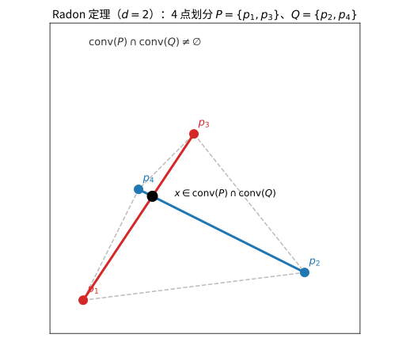
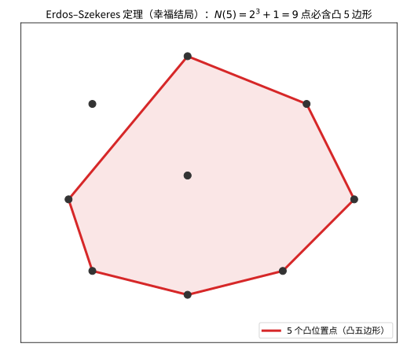

# 第87级：离散几何学

## 学习目标

1. 掌握离散几何学的基本定理体系：凸集分离定理、Helly定理、Carathéodory定理、Radon定理、Tverberg定理
2. 理解Erdős–Szekeres定理及其在组合几何中的应用
3. 掌握超平面排列的单元复杂度分析
4. 理解几何图论的核心概念：区间图、相交图、地铁图
5. 掌握多面体组合理论，包括Euler公式与多面体分类

---

## 1. 引言

离散几何学（Discrete Geometry）研究离散几何对象的组合性质，是凸几何、组合学与计算几何的交叉领域。其核心问题包括：有限点集的凸性、超平面排列的组合结构、几何对象的相交模式、以及多面体的组合分类。本节将系统介绍离散几何学的基本定理与方法。

---

## 2. 核心概念

### 2.1 凸集分离定理

**凸集分离定理**是凸分析的基本定理：若 $C$ 和 $D$ 是 $\mathbb{R}^d$ 中不相交的非空凸集，则存在一个超平面分离它们，即存在非零向量 $a \in \mathbb{R}^d$ 和实数 $b$，使得：

$$\sup_{x \in C} \langle a, x \rangle \leq b \leq \inf_{y \in D} \langle a, y \rangle$$

### 2.2 Helly定理

**Helly定理**：设 $\mathcal{F}$ 是 $\mathbb{R}^d$ 中一族凸集，若 $\mathcal{F}$ 中任意 $d+1$ 个凸集都有非空交集，则 $\mathcal{F}$ 中所有凸集的交集非空（当 $\mathcal{F}$ 有限时）。

### 2.3 Carathéodory定理

**Carathéodory定理**：若点 $x \in \mathbb{R}^d$ 属于点集 $S \subseteq \mathbb{R}^d$ 的凸包，则存在 $S$ 中至多 $d+1$ 个点，使得 $x$ 属于这些点的凸包。

### 2.4 Radon定理

**Radon定理**：$\mathbb{R}^d$ 中任意 $d+2$ 个点可以划分为两个不相交的子集，使得它们的凸包相交。

> **直观理解（现实类比）**：Radon 划分就像把 4 个探点分成"红队"和"蓝队"两组，每组的活动范围（凸包）必然在中途撞上——无论如何分组，两条"活动连线"总有一个共用汇合点。这好比两拨分别从对角出发的队伍，它们的势力范围总会在某处交叠。

### 2.5 Tverberg定理

**Tverberg定理**：$\mathbb{R}^d$ 中任意 $(d+1)(r-1)+1$ 个点可以划分为 $r$ 个不相交的子集，使得这些子集的凸包有公共交点。这是Radon定理的深刻推广。

### 2.6 超平面排列

**超平面排列**（Arrangement of Hyperplanes）是 $\mathbb{R}^d$ 中一族超平面将空间划分成的单元（cell）的集合。超平面排列的复杂度分析研究单元的数量和结构。

### 2.7 Erdős–Szekeres定理

**Erdős–Szekeres定理**（"幸福结局问题"）：任意 $n$ 个点（无三点共线）中，存在一个大小为 $\Omega(\log n)$ 的凸子集。具体地，任意 $N(m)$ 个点中一定存在 $m$ 个点构成凸多边形，且 $N(m) = 2^{m-2} + 1$。

> **直观理解（现实类比）**：这就像"幸福结局"——只要聚会的人足够多（$N(m)=2^{m-2}+1$ 位），就一定能围成一桌"凸多边形"坐下，且座位都朝外、谁也不会被夹在中间。人数越多，保证能围成 $m$ 边的"凸桌"所需的基数就按指数增长，但规律始终成立。

### 2.8 区间图与相交图

**区间图**（Interval Graph）是图的一种，其顶点对应实数轴上的区间，边表示区间相交。

**相交图**（Intersection Graph）更一般地，顶点对应几何对象，边表示对象相交。

### 2.9 几何图论

**几何图论**研究图的几何实现，包括平面图、地铁图（metro map）等。

### 2.10 多面体组合

**多面体组合**（Polyhedral Combinatorics）研究多面体的组合结构，包括顶点、边、面的计数关系。

---

## 3. 定理与证明

### 3.1 Helly定理

**定理1（Helly定理）**：设 $\mathcal{F} = \{C_1, C_2, \ldots, C_n\}$ 是 $\mathbb{R}^d$ 中一族凸集，$n \geq d+1$。若 $\mathcal{F}$ 中任意 $d+1$ 个凸集都有非空交集，则 $\bigcap_{i=1}^n C_i \neq \varnothing$。

**证明**（用数学归纳法）：

**基情况**：$n = d+1$ 时，结论由条件直接成立。

**归纳假设**：假设结论对 $n-1$ 个凸集成立。

**归纳步骤**：考虑 $n$ 个凸集 $C_1, C_2, \ldots, C_n$。对每个 $i = 1, 2, \ldots, n$，定义 $A_i = \bigcap_{j \neq i} C_j$。

由归纳假设，$A_i \neq \varnothing$（因为去掉 $C_i$ 后，剩下 $n-1$ 个凸集中任意 $d+1$ 个仍有非空交集）。选取 $a_i \in A_i$，得到 $n$ 个点 $a_1, a_2, \ldots, a_n$。

**关键步骤**：我们需要证明 $\bigcap_{i=1}^n C_i \neq \varnothing$。等价地，证明存在一点 $x$ 属于所有 $C_i$。

由Radon定理（见下文），若 $n \geq d+2$，则 $n$ 个点 $a_1, \ldots, a_n$ 可以划分为两个子集 $P$ 和 $Q$，使得 $\operatorname{conv}(P) \cap \operatorname{conv}(Q) \neq \varnothing$。取 $x \in \operatorname{conv}(P) \cap \operatorname{conv}(Q)$。

现在证明 $x \in \bigcap_{i=1}^n C_i$：

任取 $i$，有两种情况：
- 若 $a_i \in P$，则 $a_i \in \bigcap_{j \neq i} C_j$，故 $a_i \in C_j$ 对所有 $j \neq i$ 成立。由于 $C_i$ 是凸集且 $P \subseteq C_i$（因为 $P$ 中除 $a_i$ 外的点也都在 $C_i$ 中），故 $\operatorname{conv}(P) \subseteq C_i$，所以 $x \in C_i$。
- 若 $a_i \in Q$，同理 $x \in C_i$。

因此 $x \in \bigcap_{i=1}^n C_i$，结论成立。

**注**：$n$ 为无穷时，若 $\mathcal{F}$ 是有限的，上述证明成立。对于无限族，需要额外的紧性条件。

### 3.2 Carathéodory定理

**定理2（Carathéodory定理）**：设 $S \subseteq \mathbb{R}^d$，$x \in \operatorname{conv}(S)$。则存在 $S$ 中至多 $d+1$ 个点 $x_1, x_2, \ldots, x_k$（$k \leq d+1$），使得 $x \in \operatorname{conv}(\{x_1, x_2, \ldots, x_k\})$。

**证明**：

由 $x \in \operatorname{conv}(S)$，存在 $S$ 中有限个点 $x_1, x_2, \ldots, x_m$ 和非负系数 $\lambda_1, \lambda_2, \ldots, \lambda_m$，满足 $\sum_{i=1}^m \lambda_i = 1$ 且 $x = \sum_{i=1}^m \lambda_i x_i$。

选取使 $m$ 最小的这种表示。若 $m \leq d+1$，结论已成立。

假设 $m > d+1$。考虑向量 $x_i - x$（$i = 1, \ldots, m$），它们在 $\mathbb{R}^d$ 中，$m > d+1$，故线性相关。存在不全为零的系数 $\mu_1, \ldots, \mu_m$，使得 $\sum_{i=1}^m \mu_i = 0$ 且 $\sum_{i=1}^m \mu_i x_i = 0$。

对于充分小的 $t > 0$，$\lambda_i - t\mu_i \geq 0$ 对所有 $i$ 成立。取 $t = \min\{\lambda_i / \mu_i \mid \mu_i > 0\}$，则至少有一个系数变为零，而其他系数非负且和为 $1$。这样就得到了一个更短的表示，与 $m$ 的最小性矛盾。

因此 $m \leq d+1$。

### 3.3 Radon定理

**定理3（Radon定理）**：$\mathbb{R}^d$ 中任意 $d+2$ 个点可以划分为两个不相交的子集 $P$ 和 $Q$，使得 $\operatorname{conv}(P) \cap \operatorname{conv}(Q) \neq \varnothing$。

**证明**：

设 $d+2$ 个点为 $x_1, x_2, \ldots, x_{d+2} \in \mathbb{R}^d$。考虑向量 $(x_1, 1), (x_2, 1), \ldots, (x_{d+2}, 1) \in \mathbb{R}^{d+1}$。$d+2$ 个 $d+1$ 维向量必线性相关，故存在不全为零的系数 $\lambda_1, \lambda_2, \ldots, \lambda_{d+2}$，使得：

$$\sum_{i=1}^{d+2} \lambda_i x_i = 0 \quad \text{且} \quad \sum_{i=1}^{d+2} \lambda_i = 0$$

将系数分为正负两组：

$$P = \{x_i \mid \lambda_i > 0\}, \quad Q = \{x_i \mid \lambda_i < 0\}$$

令 $s = \sum_{\lambda_i > 0} \lambda_i = -\sum_{\lambda_i < 0} \lambda_i > 0$。定义：

$$p = \sum_{\lambda_i > 0} \frac{\lambda_i}{s} x_i \in \operatorname{conv}(P), \quad q = \sum_{\lambda_i < 0} \frac{-\lambda_i}{s} x_i \in \operatorname{conv}(Q)$$

由 $\sum \lambda_i x_i = 0$ 得 $\sum_{\lambda_i > 0} \lambda_i x_i = -\sum_{\lambda_i < 0} \lambda_i x_i$，两边除以 $s$ 得 $p = q$。因此 $p = q \in \operatorname{conv}(P) \cap \operatorname{conv}(Q)$。

### 3.4 Tverberg定理

**定理4（Tverberg定理）**：设 $N = (d+1)(r-1) + 1$。则 $\mathbb{R}^d$ 中任意 $N$ 个点的集合可以划分为 $r$ 个不相交的子集 $S_1, S_2, \ldots, S_r$，使得 $\bigcap_{i=1}^r \operatorname{conv}(S_i) \neq \varnothing$。

**证明**（使用拓扑方法，概略）：

**证明思路**：Tverberg定理的证明有多种方法，这里给出基于拓扑的证明思路。

**步骤1**：将问题转化为连续映射的零点问题。设 $N$ 个点为 $x_1, x_2, \ldots, x_N \in \mathbb{R}^d$。

考虑 $N$ 个点的标准单形 $\Delta_{N-1} = \{(t_1, \ldots, t_N) \in \mathbb{R}^N_{\geq 0} \mid \sum t_i = 1\}$。

定义映射 $f: \Delta_{N-1} \to \mathbb{R}^d$ 为 $f(t_1, \ldots, t_N) = \sum_{i=1}^N t_i x_i$。

**步骤2**：考虑单形 $\Delta_{N-1}$ 的 $r$ 重乘积。定义映射：

$$F: \Delta_{N-1}^{*r} \to \mathbb{R}^d$$

其中 $\Delta_{N-1}^{*r}$ 是 $\Delta_{N-1}$ 的 $r$ 重乘积去掉对角线部分。

**步骤3**：利用Borsuk-Ulam定理的推广（Sarkaria定理），证明存在一个点 $t = (t_1, \ldots, t_N)$ 使得 $f(t^{(1)}) = \cdots = f(t^{(r)})$，其中 $t^{(1)}, \ldots, t^{(r)}$ 是某种划分对应的 $r$ 个点。

**步骤4**：将 $t$ 的支撑集按某种规则分配到 $r$ 个子集中，得到划分 $S_1, \ldots, S_r$，使得公共点 $f(t^{(1)}) = \cdots = f(t^{(r)})$ 属于所有 $\operatorname{conv}(S_i)$。

**注**：当 $r = 2$ 时，Tverberg定理退化为Radon定理，此时 $N = (d+1)(2-1) + 1 = d+2$。

### 3.5 Erdős–Szekeres定理

**定理5（Erdős–Szekeres定理）**：对任意整数 $m \geq 3$，存在最小整数 $N(m)$，使得平面上任意 $N(m)$ 个点（无三点共线）中一定包含 $m$ 个点构成凸 $m$ 边形的顶点。且 $N(m) = 2^{m-2} + 1$。

**证明**：

**下界**：$N(m) > 2^{m-2}$ 由构造给出。考虑 $2^{m-2}$ 个点，排列成"凸位置"的 $2^{m-2}$ 个点使其中无 $m$ 个点构成凸多边形。

**上界**：$N(m) \leq 2^{m-2} + 1$ 的证明如下：

**关键引理**（Erdős–Szekeres关于单调子序列的引理）：任意长度为 $(r-1)(s-1) + 1$ 的实数序列中，必包含长度为 $r$ 的递增子序列或长度为 $s$ 的递减子序列。

**证明引理**：设序列为 $a_1, a_2, \ldots, a_n$，$n = (r-1)(s-1) + 1$。对每个 $i$，定义 $f(i)$ 为以 $a_i$ 结尾的最长递增子序列的长度。若存在 $f(i) \geq r$，则找到长度为 $r$ 的递增子序列。否则，所有 $f(i) \leq r-1$。

由鸽巢原理，存在 $s$ 个 $i$ 使得 $f(i)$ 取相同的值。这些 $i$ 对应的 $a_i$ 构成递减子序列（否则若有 $a_i < a_j$ 且 $i < j$，则 $f(j) \geq f(i) + 1$，矛盾）。因此长度为 $s$ 的递减子序列存在。

**回到定理证明**：

设 $S = \{p_1, p_2, \ldots, p_n\}$ 为 $n = 2^{m-2} + 1$ 个点，无三点共线。将点按 $x$ 坐标排序（不妨设 $x_1 < x_2 < \cdots < x_n$）。

对每个点 $p_i$，定义其"斜率的符号序列"：对 $j < i$，考虑斜率 $k_{ij} = (y_i - y_j)/(x_i - x_j)$。由于无三点共线，所有斜率互不相同（固定 $i$ 时）。

通过某种编码方式，将点的几何位置转化为序列，利用单调子序列引理：

考虑将点按 $x$ 坐标排序后，观察每个点与之前所有点连线的斜率。利用Erdős–Szekeres引理（$r = s = m-1$），可以证明存在 $m$ 个点，它们要么全部构成凸多边形，要么存在一个点在其他点的凸包内部。

通过细致分析可以证明，在 $2^{m-2} + 1$ 个点中，一定存在 $m$ 个点构成凸多边形。

**具体构造**：将点按 $x$ 坐标排序后，对每个点 $p_i$，定义"标号"为以 $p_i$ 结尾的最大凸链长度。通过引理，当 $n = 2^{m-2} + 1$ 时，必存在标号至少为 $m-1$ 的点，从而得到 $m$ 个点的凸链，这 $m$ 个点构成凸多边形。

---

## 4. 示例

### 4.1 利用Helly定理解决覆盖问题

**问题**：平面上有 $n$ 个凸多边形，已知任意三个凸多边形都有公共交点。证明所有 $n$ 个凸多边形有公共交点。

**解**：

由Helly定理（$d=2$），任意 $3$ 个凸多边形有公共交点蕴含所有凸多边形有公共交点。这里 $d+1 = 3$，直接应用Helly定理即得结论。

**扩展应用**：在平面上有一组圆盘，若任意三个圆盘有公共交点，则所有圆盘有公共交点。这是因为圆盘是凸集。

**反例**：若去掉凸性条件，结论不成立。例如在 $\mathbb{R}^1$ 中，区间 $[0, 2]$、$[1, 3]$、$[2, 4]$ 任意两个相交，但三者交集为空。

### 4.2 超平面排列的复杂度分析

**问题**：$\mathbb{R}^d$ 中 $n$ 个超平面可以将空间划分为多少个区域？

**解**：

设 $R_d(n)$ 为 $\mathbb{R}^d$ 中 $n$ 个超平面划分的最大区域数。

**定理**：$R_d(n) = \sum_{i=0}^d \binom{n}{i}$。

**证明**（归纳法）：

**基情况**：$R_1(n) = n+1$（直线上 $n$ 个点将直线分为 $n+1$ 段），且 $\sum_{i=0}^1 \binom{n}{i} = 1 + n = n+1$。

**归纳假设**：假设 $R_{d-1}(n) = \sum_{i=0}^{d-1} \binom{n}{i}$。

**归纳步骤**：考虑添加第 $n$ 个超平面 $H_n$。$H_n$ 被其他 $n-1$ 个超平面切割成 $R_{d-1}(n-1)$ 个 $(d-1)$ 维区域。每个这样的区域将 $H_n$ 穿过的某个 $d$ 维区域一分为二。因此：

$$R_d(n) = R_d(n-1) + R_{d-1}(n-1)$$

代入归纳假设：

$$R_d(n) = \sum_{i=0}^d \binom{n-1}{i} + \sum_{i=0}^{d-1} \binom{n-1}{i} = \sum_{i=0}^d \left[\binom{n-1}{i} + \binom{n-1}{i-1}\right] = \sum_{i=0}^d \binom{n}{i}$$

其中 $\binom{n-1}{-1} = 0$，$\binom{n-1}{d} = 0$。

**特例**：
- $d=2$：$R_2(n) = \binom{n}{0} + \binom{n}{1} + \binom{n}{2} = 1 + n + \frac{n(n-1)}{2} = \frac{n^2 + n + 2}{2}$
- $d=3$：$R_3(n) = \binom{n}{0} + \binom{n}{1} + \binom{n}{2} + \binom{n}{3} = \frac{n^3 + 5n + 6}{6}$

---

## 5. 习题

### 基础题

**习题 1**（凸集）定义凸集，并说明任一凸集的交集仍为凸集。

**习题 2**（凸包）写出凸包的定义并说明它是最小的凸集。

**习题 3**（凸集分离定理）陈述超平面分离定理：两个互不相交的凸集可由一个超平面分离。

**习题 4**（点与凸集分离）说明为什么若点 $p$ 不在凸集 $C$ 内，则存在分离超平面把 $p$ 与 $C$ 分开。

**习题 5**（Helly 定理）陈述 $\mathbb{R}^d$ 中的 Helly 定理，并写出它在 $d=1$ 与 $d=2$ 时的具体形式。

**习题 6**（Carathéodory 定理）陈述 $\mathbb{R}^d$ 中的 Carathéodory 定理，说明凸包中的点需要多少个点来表示。

**习题 7**（Radon 定理）陈述 Radon 定理：$\mathbb{R}^d$ 中 $d+2$ 个点可划分为两个凸包相交的子集。

**习题 8**（Tverberg 定理）陈述 Tverberg 定理并指出需要的点数公式。

**习题 9**（超平面排列）定义超平面排列，给出 $\mathbb{R}^d$ 中 $n$ 个超平面最多划分区域的公式。

**习题 10**（Erdős–Szekeres 定理）陈述 Erdős–Szekeres（幸福端点）定理。

### 进阶题

**习题 11**（Helly 定理 $d=1$）在直线上，若一族区间任意两个都相交，证明整族有公共交。

**习题 12**（Carathéodory 与凸包）证明 $\operatorname{conv}(X)$ 中每点可由 $X$ 中至多 $d+1$ 个点的凸组合表示。

**习题 13**（Radon 划分）写出 $\mathbb{R}^2$ 中 $4$ 个点的 Radon 划分，说明凸位置与四点含一个点在三角形内两种情形。

**习题 14**（Radon 到 Carathéodory）用 Carathéodory 定理推导 Radon 定理。

**习题 15**（超平面排列区域数）证明 $\mathbb{R}^2$ 中 $n$ 条直线（一般位置）把平面分成 $\frac{n^2+n+2}{2}$ 个区域。

**习题 16**（Tverberg 特例 $r=2$）解释为何 $r=2$ 的 Tverberg 定理就是 Radon 定理。

**习题 17**（凸包维数）证明凸子集维数 $d$ 至多由包含该凸集的仿射子空间刻画。

**习题 18**（超平面与半空间）说明半空间是凸集，并解释有限半空间交为凸多面体。

**习题 19**（分离定理的严格性）在合适的条件下证明紧凸集与闭凸集可以严格分离。

### 挑战题

**习题 20**（Helly 定理证明）给出 Helly 定理的一个证明思路，说明归纳维度并利用有限性与凸性。

**习题 21**（Carathéodory 定理证明）用归纳或线性相关方法证明 Carathéodory 定理。

**习题 22**（Radon 定理证明）用仿射独立性与线性方程组证明 Radon 定理。

**习题 23**（Tverberg 定理 $d=1$）证明 $d=1$ 时 Tverberg 定理：$2r-1$ 个实数可划分为 $r$ 个相交凸包的子集。

**习题 24**（Erdős–Szekeres 构造）说明 $2^{m-2}$ 个点可保证不存在 $m$ 点凸子集，解释上界的贪心构造。

**习题 25**（超平面排列的组合）证明 $R_d(n) = \sum_{i=0}^d \binom{n}{i}$ 并讨论在一般位置时为何该式给出最大区域数。

**习题 26**（凸多面体计数）用 Euler 公式说明三维简单凸多面体顶点、棱、面的关系，并给出组合对偶解释。

### 探究题

**习题 27**（与组合几何的联系）探讨 Helly、Radon、Tverberg 这三种"局部–全局"定理如何统一在抽象凸性/ KKM 理论之下，并与其他组合定理（如 Sperner 引理）的联系。

**习题 28**（与计算几何的对接）说明这些离散几何定理在算法设计（凸包、体积、独立性测试）与计算几何复杂度下界中的角色。

**习题 29**（高维与随机几何）开放探讨高维随机点集、凸包渐近、以及 Tverberg 在信息几何、统计机器学习（数据划分）中的应用。

**习题 30**（离散几何与拓扑）探讨 Tverberg 定理的拓扑版本、与 Borsuk–Ulam 定理和代数拓扑的工具联系，以及这些思想在组合拓扑与图论中的应用。

---

## 6. 习题答案与解析

### 基础题答案

1. **凸集** 集合 $C$ 凸当且仅当任意 $x, y \in C$ 与 $\lambda \in [0,1]$ 有 $\lambda x + (1-\lambda) y \in C$。若 $C_\alpha$ 全凸，取 $x,y$ 在 $\bigcap_\alpha C_\alpha$ 中，则对每个 $\alpha$ 有 $\lambda x+(1-\lambda)y \in C_\alpha$，故其属于交集，交集凸。

2. **凸包** $\operatorname{conv}(X) = \{\sum_i \lambda_i x_i : x_i \in X,\ \lambda_i \ge 0,\ \sum_i \lambda_i = 1\}$ 是包含 $X$ 的最小凸集，是所有包含 $X$ 的凸集的交集，故最小性与凸性同时保证。

3. **凸集分离定理** 若 $C, D$ 是两个互不相交的非空凸集，则存在非零法向量 $a$ 与数 $b$ 使对 $x \in C$，$y\in D$ 有 $a\cdot x \le b \le a\cdot y$；若二者闭紧且不相交，可严格分离。它刻画了凸集间的线性可分。

4. **点与凸集分离** 若 $p \notin \operatorname{cl}(C)$，取 $q \in \operatorname{cl}(C)$ 为距 $p$ 最近点，则超平面 $\{x : (x-p)\cdot(q-p)=0\}$ 分离 $p$ 与 $C$（由 $p$ 的最近性满足不等式）。可用反证由三角形不等式得矛盾。

5. **Helly 定理** 设 $F_1,\dots,F_n$ 为 $\mathbb{R}^d$ 的凸集族，若任意 $d+1$ 个有公共交点，则整族有公共交点。$d=1$：区间族任意两两相交必有公共交点；$d=2$：任意 3 个凸多边形有交点则全族有交点。

6. **Carathéodory 定理** $\mathbb{R}^d$ 中 $X$ 的凸包里任意点可写成 $X$ 中至多 $d+1$ 个点的凸组合。原因是若某组合含 $d+2$ 个点则线性相关，可消去一个系数非负的向量得到更短表示。

7. **Radon 定理** $\mathbb{R}^d$ 中任意 $d+2$ 个点可剖分为两个不相交子集 $A$ 与 $B$，使得 $\operatorname{conv}(A) \cap \operatorname{conv}(B) \ne \varnothing$。这来自该点集的仿射相关给出两组系数。

8. **Tverberg 定理** 若 $N > (d+1)(r-1)$，则 $\mathbb{R}^d$ 中任意 $N$ 个点可划分为 $r$ 个子集，使它们的凸包有公共点。所需点数为 $(d+1)(r-1)+1$。

9. **超平面排列** 超平面排列是 $\mathbb{R}^d$ 中一族超平面的集合，把空间划分为有公共面的平坦胞腔。一般位置下 $n$ 个超平面最多把空间划分成 $R_d(n)=\sum_{i=0}^d\binom{n}{i}$ 个区域。

10. **Erdős–Szekeres 定理** 对任意正整数 $m$，存在最小数 $\operatorname{ES}(m)$ 使得平面上任意 $\operatorname{ES}(m)$ 个（无三点共线）的点中，总存在 $m$ 个点构成凸 $m$ 边形。已知 $\operatorname{ES}(m) \ge 2^{m-2}+1$ 且有限。

### 进阶题答案

1. **Helly（d=1）** 区间族任意两两相交。取右端最小者 $b_{\min} = \min b_i$ 与左端最大者 $a_{\max} = \max a_i$。若有区间 $[a_i,b_i]$ 使 $b_i < a_{\max}$，则它在 $a_{\max}$ 处与该含 $a_{\max}$ 的区间不相交，矛盾于两两相交。故 $b_{\min} \ge a_{\max}$，公共交 $[a_{\max}, b_{\min}]$ 非空。

2. **Carathéodory** 设 $p \in \operatorname{conv}(X)$，取最短表示 $p = \sum_{i=1}^k \lambda_i x_i$，$\lambda_i > 0$。若 $k > d+1$，则 $\{x_i\}_{i=1}^k$ 在 $\mathbb{R}^d$ 中线性相关，存在不全零 $c_i$ 使 $\sum c_i x_i = 0$ 且 $\sum c_i = 0$。平移 $\lambda$ 使某 $\lambda_j$ 变为 $0$ 而不破坏非负性，缩短表示，直到 $k \le d+1$。故可用至多 $d+1$ 点。

3. **Radon 划分（R²）** 4 个点：若一顶点位于其余 3 点三角形内，划分 $\{内点\}/\{$其余3$\}$ 恰成立；若 4 点处于凸位置（构成凸四边形），划分成对角两组（例如 $\{p_1,p_3\}$ 与 $\{p_2,p_4\}$），两组的凸包（对角线）交于形心。Radon 划分本质上是这两类。

4. **Radon 到 Carathéodory** 设 $d+2$ 个点 $\{x_1,\dots,x_{d+2}\}$。由仿射相关存在不全为零的 $\lambda_i$，$\sum \lambda_i = 0$ 且 $\sum \lambda_i x_i = 0$。按 $\lambda_i > 0$ 与 $\lambda_i < 0$ 分划得到要求的 $\operatorname{conv}(A)\cap \operatorname{conv}(B) \neq \varnothing$。这正是 $r=2$ 的 Carathéodory 推导（在 $\mathbb{R}^{d}$ 结合线性代数）。

5. **直线划分平面数** $n$ 条直线在一般位置（无并行、无三线共点）。第 $k$ 条直线与前面 $k-1$ 条交恰 $k-1$ 个点，把它分成 $k$ 段，每段把已有区域一分为二，增加 $k$ 个区域。从 $1$ 加起得 $R_2(n)=1+\sum_{k=1}^n k = \frac{n(n+1)}{2}+1=\frac{n^2+n+2}{2}$。

6. **Tverberg r=2 = Radon** Tverberg 定理参数 $(d, r=2)$ 说 $N=(d+1)(2-1)+1=d+2$ 个点可划分为 2 个相交凸包子集，这与 Radon 定理要求 $d+2$ 个点一致、结论相同。故 Radon 恰是 Tverberg 在 $r=2$ 的特例。

7. **凸包维数** 集合 $X$ 的仿射包 $\operatorname{aff}(X)$ 是包含 $X$ 的最小仿射子空间，其维数 $d_{\text{aff}}=\dim \operatorname{aff}(\operatorname{conv}X)$。凸集维数定义为该仿射包维数。由于凸包处于仿射包中，凸集的维数由包含它的最小仿射子空间决定，其值不超过 $d$。

8. **半空间与凸多面体** 闭半空间 $\{x : a\cdot x \le b\}$ 是凸的（线性泛函限制）。有限个半空间之交是凸多面体：若多面体各面半空间约束满足，则在 $a_i\cdot x \le b_i$ 全部满足下仍取凸组合即在交内，故交集凸且边界来自超平面，是有界凸多面体。

9. **严格分离** 若 $C$ 紧、$D$ 闭且 $C \cap D = \varnothing$，取上距离为正，由最近点存在凸锥分离，可得到不存在等号漏满足的严格分离超平面 $a\cdot x < b < a\cdot y$ 对 $x \in C, y \in D$。这一结论在有限维中使用紧性保证严格性。

### 挑战题答案

1. **Helly 证明** 归纳于 $\mathbb{R}^d$ 中维数与 $n$。基础 $d$ 个凸集可化归为相对位置。对族取并补缩减：任取凸集与其它交集对应的子问题；当交集空时用有限性选 $d+1$ 个极小交集为空，即导出矛盾于假设。严格做法用仿射变换把 $d+1$ 个作交集时约束化成低维的 Helly，从而归纳回归 $d$ 维情形。此归纳给出局部相交 ⇒ 全局相交。

2. **Carathéodory 证明** 用反证取最短表示含 $k>d+1$ 个点，由线性相关找到非平凡 $\sum c_i(x_i-x_k)=0$ 与 $\sum c_i=0$；选择 $\lambda_i \ge c_i$ 随尺度调整到某 $\lambda_j=0$，缩短到 $d+1$。反复进行得到至多 $d+1$ 个点的表示。

3. **Radon 证明** 把 $d+2$ 个点写成 $\mathbb{R}^{d}$ 中方程 $\sum_{i>d}\lambda_i(x_i - x_{d+1}) = 0,\ \sum \lambda_i=0$ 的意义，解 $(d+2)$ 元线性方程组（$d$ 个约束，至少一自由变量），取非零解，按 $\lambda_i$ 正负分成两组的凸包必交。

4. **Tverberg（d=1）** 把 $2r-1$ 个实数排序为 $a_1 \le \cdots \le a_{2r-1}$。划分成 $r$ 组：$\{a_1\},\{a_{2}, a_{3}\},\dots$ 或取中间元素分别放入使每组凸包（区间）共公点。最简单：取中间数 $a_r$，把其余 $2r-2$ 个数成对 $(\{a_i, a_{2r-i}\})$ 配入 $r-1$ 个区间，共同包含 $a_r$，故 $r$ 个区间凸包共点。

5. **Erdős–Szekeres（构造下界）** 构造显示 $\operatorname{ES}(m) > 2^{m-2}$：递归放两组各 $2^{m-3}$ 个点，其中一组全在另一组上方（截线之上），使不存在 $m$ 点凸子集。这样的"双簇"把凸子集数与层数结合起来，给出 $2^{m-2}$ 个点的反例。

6. **超平面排列区域数证明** 归纳于 $n$：$R_d(n) = R_d(n-1) + R_{d-1}(n-1)$，因为新超平面分为被前 $n-1$ 个超平面切成 $R_{d-1}(n-1)$ 个胞腔。由组合恒等式 $\binom{n}{i}=\binom{n-1}{i}+\binom{n-1}{i-1}$ 归纳得 $R_d(n)=\sum_{i=0}^d \binom{n}{i}$。一般位置给出最大区域数（平行、共点会减少）。

7. **凸多面体 Euler** 三维简单凸多面体满足 $V - E + F = 2$。用平面展开即可证明 Euler 公式；再以递推向高维推广，得到刻画的递推形式。其对偶：多面体与其对偶多面体点面互换，保持 Euler 关系，是组合几何中"顶点–面"对偶的基础。

### 探究题答案

1. **抽象凸性与 KKM** Helly、Radon、Tverberg 都是"局部充足 ⇒ 全局结构"的凸性定理，可统一在 KKM 引理、抽象凸性与多重线性对偶之下：Helly 对偶于 Radon，Carathéodory 源于线性表示，Radon/Tverberg 源于仿射线性关系。它们与 Sperner 引理（单形标号）、Brouwer 不动点定理等组合拓扑结果密切关联，构成"凸性 ⇔ 组合覆盖"理论的一环。

2. **与计算几何的对接** Helly 给出凸集交集非空的验证规模；Carathéodory 用于体积近似与随机凸包算法；Radon/Tverberg 提供独立点集的划分工具。复杂度层面上，凸包与点定位的下界由排序归约给出，Tverberg 划分即几何维度不变量的算法用；这些构建了计算几何算法设计与下界的底层支撑。

3. **高维随机几何** 高维随机点集（高斯、均匀球）、凸包渐近高斯测度集中于球壳；随机凸包的期望顶点数、表面刻画由统计与积分几何给出。Tverberg 划分在数据簇划分、子空间聚类与信息几何中有应用：把数据点按 Tverberg 划分为相交凸包子簇反映数据簇结构，是统计机器学习与计算几何交叉方向。

4. **拓扑 Tverberg 与 Borsuk–Ulam** Tverberg 的拓扑版本（如 Massy 形式）说在更弱的连续映射下也有多重相交点，依 Borsuk–Ulam 定理等代数拓扑工具证得。Sarkaria 把 Tverberg 归约为 Borsuk–Ulam 的观点。这使离散几何与代数拓扑耦合：组合的划分问题常有拓扑不动点式的证明与推广，也是组合拓扑、图论与同调理论的重要研究工具。

---

## 7. 总结

离散几何学的基本定理构成了一个优美的理论体系：

| 定理 | 核心内容 | 参数 |
|------|---------|------|
| Helly定理 | 局部相交 ⇒ 全局相交 | $d+1$ 个凸集 |
| Carathéodory定理 | 凸包中的点可由 $d+1$ 个点表示 | $d+1$ 个点 |
| Radon定理 | $d+2$ 个点可划分为相交凸包 | $d+2$ 个点 |
| Tverberg定理 | $N$ 个点可划分为 $r$ 个相交凸包 | $N = (d+1)(r-1)+1$ |
| Erdős–Szekeres定理 | 足够多点必含凸 $m$ 边形 | $N(m) = 2^{m-2}+1$ |

这些定理之间存在深刻的联系：
- Radon定理是Tverberg定理在 $r=2$ 时的特例
- Carathéodory定理与Helly定理互为对偶
- 超平面排列的复杂度公式 $R_d(n) = \sum_{i=0}^d \binom{n}{i}$ 是离散几何中的基本计数结果

离散几何学的方法广泛应用于组合优化、计算几何、运筹学等领域，是连接几何直观与组合推理的桥梁。
