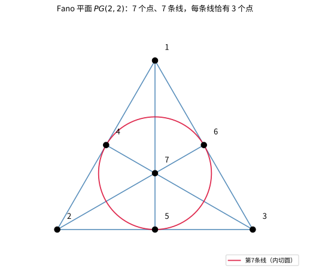

# 第88级：有限几何学

## 学习目标

1. 掌握有限射影平面与有限仿射平面的公理系统与基本性质
2. 理解Bruck-Ryser定理及其对有限射影平面存在性的限制
3. 掌握Desargues平面与Pappus平面的结构特征
4. 了解有限广义四边形与极空间的基本理论
5. 理解有限几何在编码理论、群论中的应用

---

## 1. 引言

有限几何学（Finite Geometry）研究定义在有限域上的几何结构。与经典欧氏几何不同，有限几何中的"点"和"线"是有限集合，满足特定的公理系统。有限几何在编码理论、密码学、组合设计、群论等领域有广泛应用。本节将系统介绍有限几何的核心概念与定理。

---

## 2. 核心概念

### 2.1 有限射影平面

**有限射影平面**（Finite Projective Plane）是一个由点和线组成的集合，满足以下公理：
1. 任意两点有且仅有一条线通过
2. 任意两条线有且仅有一个交点
3. 存在至少四个点，其中任意三点不共线

### 2.2 阶为 $q$ 的射影平面

若有限射影平面的每条线上有 $q+1$ 个点，则称其**阶**为 $q$。此时：
- 总点数 $= q^2 + q + 1$
- 总线数 $= q^2 + q + 1$
- 每个点恰好在 $q+1$ 条线上

### 2.3 仿射平面

**仿射平面**（Affine Plane）去掉射影平面中的一条线（称为"无穷远线"）及其上的点得到。阶为 $q$ 的仿射平面记为 $AG(2, q)$：
- 总点数 $= q^2$
- 总线数 $= q^2 + q$
- 每条线上有 $q$ 个点

### 2.4 Bruck-Ryser定理

**Bruck-Ryser定理**给出了有限射影平面存在的必要条件：若存在阶为 $q$ 的有限射影平面，且 $q \equiv 1 \pmod{4}$ 或 $q \equiv 2 \pmod{4}$，则 $q$ 必须可以表示为两个完全平方数的和。

### 2.5 Desargues平面

**Desargues平面**是满足Desargues定理的射影平面。在有限域 $\mathbb{F}_q$ 上定义的射影平面 $PG(2, q)$ 一定是Desargues平面。

### 2.6 Pappus平面

**Pappus平面**是满足Pappus定理的射影平面。Pappus平面一定是Desargues平面，但反之不必然。

### 2.7 有限广义四边形

**有限广义四边形**（Finite Generalized Quadrangle）是一个满足以下条件的点线结构：
- 任意两点至多有一条线通过
- 任意两条线至多有一个交点
- 对任意点 $p$ 和线 $l$（$p$ 不在 $l$ 上），存在唯一的点 $p'$ 在 $l$ 上且与 $p$ 共线

### 2.8 极空间

**极空间**（Polar Space）是满足极性的射影空间，对应于正交、辛、酉等双线性型。

### 2.9 有限几何与编码理论

有限几何在编码理论中的应用包括：
- 射影平面作为组合设计的来源
- 极空间用于构造LDPC码
- 有限几何中的点线结构用于构造纠错码

### 2.10 有限几何与群论

有限几何的自同构群是重要的有限群，包括：
- $PGL(3, q)$：$PG(2, q)$ 的自同构群
- 辛群、正交群、酉群作为极空间的自同构群

---

## 3. 定理与证明

### 3.1 有限射影平面的公理与性质

**定理1（有限射影平面的基本性质）**：设 $\Pi$ 是一个有限射影平面，每条线上有 $q+1$ 个点，则：
1. 每个点恰好在 $q+1$ 条线上
2. 总点数 $v = q^2 + q + 1$
3. 总线数 $b = q^2 + q + 1$

**证明**：

**对偶性**：射影平面的公理满足对偶性——将"点"与"线"互换，公理保持不变。因此，关于点的结论与关于线的结论是对偶的。

**性质1**：设 $p$ 是任意一点。取不在 $p$ 上的一条线 $l$（由公理3，存在至少一条线不通过 $p$）。$l$ 上有 $q+1$ 个点。$p$ 与 $l$ 上的每个点确定一条线，且这些线互不相同（否则两条线会有两个交点）。此外，任何通过 $p$ 的线必须与 $l$ 交于唯一一点。因此通过 $p$ 的线数等于 $l$ 上的点数，即 $q+1$。

**性质2**：固定一点 $p$。通过 $p$ 有 $q+1$ 条线，每条线上除 $p$ 外还有 $q$ 个点。这些点互不相同（否则两个不同的线会有两个交点）。因此总点数为：

$$v = 1 + (q+1) \cdot q = q^2 + q + 1$$

**性质3**：由对偶性，总线数 $b = q^2 + q + 1$。

**配置计数**：考虑关联矩阵 $A$，其行对应点，列对应线，$A_{p,l} = 1$ 当且仅当点 $p$ 在线 $l$ 上。则：
- 每行有 $q+1$ 个 $1$
- 每列有 $q+1$ 个 $1$
- 任意两行恰有一个公共的 $1$（对应唯一的线）
- 任意两列恰有一个公共的 $1$（对应唯一的交点）

因此 $A A^T = qI + J$，其中 $J$ 是全 $1$ 矩阵。由此可得 $v = q^2 + q + 1$。

### 3.2 Bruck-Ryser定理

**定理2（Bruck-Ryser定理）**：若存在阶为 $q$ 的有限射影平面，且 $q \equiv 1 \pmod{4}$ 或 $q \equiv 2 \pmod{4}$，则 $q$ 可以表示为两个整数的平方和 $q = a^2 + b^2$。

**证明**：

**证明思路**：利用射影平面关联矩阵的代数性质和数论中的Lagrange平方和定理。

**步骤1**：设 $\Pi$ 是阶为 $q$ 的有限射影平面，$v = q^2 + q + 1$。关联矩阵 $A$ 满足：

$$A A^T = qI_v + J_v$$

其中 $I_v$ 是 $v \times v$ 单位矩阵，$J_v$ 是全 $1$ 矩阵。

**步骤2**：考虑矩阵 $B = A - \frac{q+1}{v} J_v$。计算可得 $B B^T = qI_v - \frac{q+1}{v} q J_v + \cdots$。

更直接的方法：考虑 $A$ 的特征值。由 $A A^T = qI + J$，可得 $A A^T$ 的特征值为：
- $\lambda_1 = q + v = q^2 + 2q + 1 = (q+1)^2$（对应特征向量 $(1,1,\ldots,1)$）
- $\lambda_2 = \cdots = \lambda_v = q$（重数 $v-1$）

**步骤3**：由 $A A^T$ 的特征值可知，$\det(A A^T) = (q+1)^2 \cdot q^{v-1}$。

**步骤4**：关键步骤——利用有理数域上的二次型理论。考虑矩阵方程 $A A^T = qI + J$。在有理数域上，这表明二次型 $q \sum_{i=1}^v x_i^2 + (\sum x_i)^2$ 等价于 $v$ 个变量的平方和。

**步骤5**：通过Hasse-Minkowski定理（局部-全局原理），该二次型在有理数域上表示零等价于其在所有 $p$-adic 域上表示零。分析 $p=2$ 和奇素数处的局部条件，可以推导出 $q$ 必须是平方和的条件。

**步骤6**（核心数论论证）：设 $q$ 满足 $q \equiv 1$ 或 $2 \pmod{4}$。由二次型的局部可表示性条件，可以推出方程 $q = a^2 + b^2$ 必须有整数解。否则，二次型 $q \sum x_i^2 + (\sum x_i)^2$ 不能表示 $v$ 个变量的平方和，矛盾。

**推论**：阶为 $6$ 的有限射影平面不存在，因为 $6 \equiv 2 \pmod{4}$ 但 $6$ 不能表示为两个平方数的和（$6 = 1^2 + (\sqrt{5})^2$ 不是整数解）。同理，阶为 $14$ 的射影平面也不存在。

### 3.3 有限仿射平面与射影平面的关系

**定理3**：设 $A$ 是阶为 $q$ 的有限仿射平面，则 $A$ 可以唯一地扩展为一个阶为 $q$ 的有限射影平面 $\Pi$。反之，从阶为 $q$ 的有限射影平面 $\Pi$ 中去掉任意一条线及其上的点，得到一个阶为 $q$ 的有限仿射平面。

**证明**：

**前半部分**（仿射平面 → 射影平面）：

设 $A$ 是阶为 $q$ 的仿射平面，即 $A$ 有 $q^2$ 个点，每条线上有 $q$ 个点。

在 $A$ 中，线之间的关系有两种：平行或相交。平行关系是等价关系，将线划分为 $q+1$ 个平行类，每个平行类包含 $q$ 条线。

构造射影平面 $\Pi$：
- $\Pi$ 的点：$A$ 的所有点，加上 $q+1$ 个"无穷远点" $p_\infty^{(1)}, \ldots, p_\infty^{(q+1)}$，每个对应一个平行类
- $\Pi$ 的线：$A$ 的所有线，每条线加上其平行类对应的无穷远点；再加上一条"无穷远线" $l_\infty$，包含所有无穷远点

验证公理：
1. **任意两点确定一条线**：
   - 若两个点都是 $A$ 中的点，由仿射平面公理，它们确定唯一一条线
   - 若一个点是 $A$ 中的点 $p$，另一个是无穷远点 $p_\infty^{(i)}$，则 $p$ 所在的平行类 $i$ 中的线加上 $p_\infty^{(i)}$ 即为所求
   - 若两个点都是无穷远点，则无穷远线 $l_\infty$ 是唯一通过它们的线

2. **任意两条线有一个交点**：
   - 若两条线都是 $A$ 中的线且不平行，它们在 $A$ 中相交
   - 若两条线平行，它们在对应的无穷远点相交
   - 若一条是 $A$ 中的线，另一条是无穷远线，则交点为该线对应的无穷远点

3. **存在四个点，任意三点不共线**：在 $A$ 中取一个平行四边形四个顶点即可

**后半部分**（射影平面 → 仿射平面）：

设 $\Pi$ 是阶为 $q$ 的射影平面。去掉任意一条线 $l_\infty$ 及其上的 $q+1$ 个点。剩余的点集有 $q^2 + q + 1 - (q+1) = q^2$ 个点。

在 $\Pi$ 中，去掉 $l_\infty$ 后，原本通过 $l_\infty$ 上同一无穷远点的线在 $A$ 中变为平行线。因此 $A$ 满足仿射平面公理，是阶为 $q$ 的仿射平面。

### 3.4 Desargues定理在有限域中的证明

**定理4（Desargues定理）**：设 $PG(2, \mathbb{F})$ 是域 $\mathbb{F}$ 上的射影平面。若两个三角形 $\triangle ABC$ 和 $\triangle A'B'C'$ 满足 $AA'$、$BB'$、$CC'$ 三线共点，则 $AB \cap A'B'$、$BC \cap B'C'$、$CA \cap C'A'$ 三点共线。

**证明**：

设 $\mathbb{F}$ 是一个域（可以是有限域）。在 $PG(2, \mathbb{F})$ 中，使用齐次坐标进行证明。

**步骤1**：设三线 $AA'$、$BB'$、$CC'$ 交于点 $O$。选取坐标系使 $O = (0, 0, 1)$。

**步骤2**：设 $A = (a_1, a_2, 1)$，$A' = (a'_1, a'_2, 1)$。由于 $O$、$A$、$A'$ 共线，存在 $\lambda \neq 0$ 使得 $A' = \lambda A$（在齐次坐标意义下），即 $A' = (\lambda a_1, \lambda a_2, 1)$。

同理，设 $B = (b_1, b_2, 1)$，$B' = (\mu b_1, \mu b_2, 1)$；$C = (c_1, c_2, 1)$，$C' = (\nu c_1, \nu c_2, 1)$。

**步骤3**：计算直线 $AB$ 和 $A'B'$ 的方程。

$AB$ 上的点可表示为 $sA + tB = (sa_1 + tb_1, sa_2 + tb_2, s + t)$。

$AB \cap A'B'$ 是满足以下条件的点：存在 $s, t$ 和 $s', t'$ 使得 $sA + tB = s'A' + t'B'$。

即：$sA + tB = s'\lambda A + t'\mu B$。

整理得：$(s - s'\lambda)A + (t - t'\mu)B = 0$。

由于 $A$ 和 $B$ 线性无关（不共线），得 $s = s'\lambda$，$t = t'\mu$。

代入得交点坐标为：$P = s'\lambda A + t'\mu B = (\lambda s'a_1 + \mu t'b_1, \lambda s'a_2 + \mu t'b_2, \lambda s' + \mu t')$。

在齐次坐标下，该点可表示为 $(\lambda a_1, \lambda a_2, \lambda) \times (\mu b_1, \mu b_2, \mu)$ 的某种组合。

**步骤4**：类似地计算 $BC \cap B'C'$ 和 $CA \cap C'A'$。通过齐次坐标计算可以得到这三个交点满足一个线性关系，从而共线。

**代数计算**：三个交点分别对应坐标：
- $P = AB \cap A'B'$：$(\lambda a_1 - \mu b_1, \lambda a_2 - \mu b_2, \lambda - \mu)$
- $Q = BC \cap B'C'$：$(\mu b_1 - \nu c_1, \mu b_2 - \nu c_2, \mu - \nu)$
- $R = CA \cap C'A'$：$(\nu c_1 - \lambda a_1, \nu c_2 - \lambda a_2, \nu - \lambda)$

易见 $P + Q + R = 0$，因此 $P, Q, R$ 共线。

**注**：上述证明只依赖于域 $\mathbb{F}$ 的代数运算，因此对任意域（包括有限域 $\mathbb{F}_q$）成立。

### 3.5 有限广义四边形的基本性质

**定理5（有限广义四边形的基本性质）**：设 $S$ 是一个有限广义四边形，参数为 $(s, t)$，其中每条线上有 $s+1$ 个点，每个点恰好在 $t+1$ 条线上。则：
1. $|V| = (s+1)(st+1)$（总点数）
2. $|L| = (t+1)(st+1)$（总线数）
3. $s \geq 1$，$t \geq 1$
4. 若 $s > 1$ 且 $t > 1$，则 $s \leq t^2$ 且 $t \leq s^2$

**证明**：

**性质1**：固定一点 $p$。通过 $p$ 有 $t+1$ 条线，每条线上除 $p$ 外有 $s$ 个点。这些点互不相同，故有 $(t+1)s$ 个点与 $p$ 共线。

对任意不通过 $p$ 的线 $l$，由广义四边形的定义，$p$ 到 $l$ 有唯一的投影点。因此 $l$ 上的每个点与 $p$ 共线（通过该投影点）。考虑与 $p$ 不共线的点 $q$：$q$ 在 $p$ 的某条线上没有投影，但 $p$ 和 $q$ 之间通过一条线连接... 更精确的计数如下：

取定一点 $p$。设 $N_1(p)$ 为与 $p$ 共线的点（不包括 $p$），$|N_1(p)| = (t+1)s$。

设 $N_2(p)$ 为与 $p$ 不共线的点。对任意 $q \in N_2(p)$，存在唯一的一条线 $l$ 通过 $q$ 且与通过 $p$ 的某条线相交。通过 $p$ 的每条线上有 $s$ 个非 $p$ 点，每个这样的点 $r$ 在 $N_2(p)$ 中确定 $s$ 个点（通过 $r$ 但不通过 $p$ 的线上除 $r$ 外的点）。因此 $|N_2(p)| = (t+1)s \cdot s = (t+1)s^2$。

总点数 $|V| = 1 + (t+1)s + (t+1)s^2 = 1 + (t+1)s(s+1) = (s+1)(st+1)$。

**性质2**：由对偶性，将 $s$ 和 $t$ 互换，得 $|L| = (t+1)(st+1)$。

**性质3**：由定义，每条线上至少有两个点，每个点至少在两条线上，故 $s \geq 1$，$t \geq 1$。

**性质4**：设 $s > 1$，$t > 1$。取定一点 $p$ 和一条不通过 $p$ 的线 $l$。$l$ 上有 $s+1$ 个点，每个点与 $p$ 通过唯一一条线相连。这些线互不相同（否则两条不同的线会有两个交点）。因此 $s+1 \leq t+1$，即 $s \leq t$。由对偶性，$t \leq s$。因此 $s = t$。

更精确的论证：取定 $p$ 和 $l$，$p$ 到 $l$ 上每个点的连线是唯一的，这些连线都是通过 $p$ 的线，故 $s+1 \leq t+1$，即 $s \leq t$。由对偶性，$t \leq s$，故 $s = t$。

**注**：实际上，更一般的结论是 $s \leq t^2$ 和 $t \leq s^2$，这需要更复杂的计数论证。

---

## 4. 示例

### 4.1 Fano平面（阶为2的射影平面）

**Fano平面** $PG(2, 2)$ 是最小的有限射影平面，阶为 $2$。

**结构**：
- 点数：$2^2 + 2 + 1 = 7$
- 线数：$7$
- 每条线上有 $3$ 个点
- 每个点在 $3$ 条线上

**点的标记**：$1, 2, 3, 4, 5, 6, 7$

**线的构成**（每条线对应一个三元组）：
- $l_1 = \{1, 2, 3\}$
- $l_2 = \{1, 4, 5\}$
- $l_3 = \{1, 6, 7\}$
- $l_4 = \{2, 4, 6\}$
- $l_5 = \{2, 5, 7\}$
- $l_6 = \{3, 4, 7\}$
- $l_7 = \{3, 5, 6\}$

**验证**：任意两个点恰好出现在一个三元组中，任意两个三元组恰好有一个公共点。

**图示**：Fano平面通常用三角形加内接圆表示，七个点中三个在顶点，三个在边上中点，一个在中心。

**自同构群**：Fano平面的自同构群是 $PGL(3, 2)$，同构于 $168$ 阶单群 $PSL(2, 7)$。

> **直观理解（现实类比）**：把 Fano 平面想成一个"迷你班会"——7 名同学任意两人恰好分在同一个 3 人小组里，而任意两个小组恰好共享一名同学。这个"每两人恰好一桌、每两桌恰好一人"的严密结构，正是射影平面公理 *任意两点恰有一条线、任意两条线恰有一个交点* 的直观写照。
>
> **🧠 思考历程：只有 7 个点、7 条线的"迷你世界"，凭什么敢自称几何？**
>
> 有限几何的惊人之处在于：**把无穷多点的欧氏几何替换成有限多个点，居然照样自洽、照样深刻**。这一切要回到 Galois 埋下的"有限数域"，也正是在这块乐土上，几何获得了全新的生命。
>
> - **Galois 的礼物：有限域**（1830 年）。Évariste Galois 在研究方程可解性时，发现了带 $p^n$ 个元素的有限域。没人想到这个纯粹代数的造物，日后会成为"有限坐标几何"的整套坐标纸——$\mathbb{F}_q$ 上的点与线从此有了精确而有限的坐标。
> - **Fano：第一座有限射影平面**（1892 年）。Gino Fano 构造出 7 点 7 线的射影平面（今称 Fano 平面），把射影平面公理在世界最小规模上砌了一遍。他示范了一件事：**只要点够得着、线足够配，几何就能在有限的宇宙里闭环运行**。
> - **有限坐标几何，全面开花**（20 世纪）。沿着 Galois 与 Fano 的路，人们用 $\mathbb{F}_q$ 造出仿射平面 $\mathrm{AG}(2,q)$、射影平面 $\mathrm{PG}(2,q)$ 乃至更高维有限空间，并用于设计纠错码、有限几何与组合设计——于是"有限几何学"既是一道纯数学风景，又成了工程里不可或缺的工具。
> - **心路**：谁说世界必须无穷大才算完整？有限几何告诉我们：**公理一旦给足，最小的宇宙也能承载最严格的几何**——而无限往往只是有限情形在尺度上的一种极限。

### 4.2 AG(2,3)仿射平面的构造

**AG(2, 3)** 是阶为 $3$ 的仿射平面，即域 $\mathbb{F}_3 = \{0, 1, 2\}$ 上的二维仿射空间。

**结构**：
- 点数：$3^2 = 9$
- 点集：$\{(x, y) \mid x, y \in \mathbb{F}_3\}$
- 线数：$3^2 + 3 = 12$
- 每条线上有 $3$ 个点

**线的分类**：
1. 垂直方向：$x = a$，$a \in \mathbb{F}_3$，共 $3$ 条
   - $x = 0$：$\{(0,0), (0,1), (0,2)\}$
   - $x = 1$：$\{(1,0), (1,1), (1,2)\}$
   - $x = 2$：$\{(2,0), (2,1), (2,2)\}$

2. 水平方向：$y = b$，$b \in \mathbb{F}_3$，共 $3$ 条
   - $y = 0$：$\{(0,0), (1,0), (2,0)\}$
   - $y = 1$：$\{(0,1), (1,1), (2,1)\}$
   - $y = 2$：$\{(0,2), (1,2), (2,2)\}$

3. 斜率为 $1$：$y = x + b$，$b \in \mathbb{F}_3$，共 $3$ 条
   - $y = x + 0$：$\{(0,0), (1,1), (2,2)\}$
   - $y = x + 1$：$\{(0,1), (1,2), (2,0)\}$
   - $y = x + 2$：$\{(0,2), (1,0), (2,1)\}$

4. 斜率为 $2$（即 $-1$）：$y = 2x + b$，$b \in \mathbb{F}_3$，共 $3$ 条
   - $y = 2x + 0$：$\{(0,0), (1,2), (2,1)\}$
   - $y = 2x + 1$：$\{(0,1), (1,0), (2,2)\}$
   - $y = 2x + 2$：$\{(0,2), (1,1), (2,0)\}$

**平行类**：上述四个方向各对应一个平行类，每个平行类包含 $3$ 条平行线。

**扩展为射影平面**：添加 $4$ 个无穷远点（对应四个方向）和一条无穷远线，得到 $PG(2, 3)$，具有 $13$ 个点和 $13$ 条线，每条线上有 $4$ 个点。

> **直观理解（现实类比）**：AG(2,3) 就像一张用"有限坐标"标注的 3×3 井字棋盘，每个点 $(x,y)$ 的坐标都取自只有三个值的"迷你数轴" $\mathbb{F}_3 = \{0,1,2\}$。四个平行类好比四组"方向"，每个方向上都有 3 条互不相交（永久平行）的直线，而不同方向的直线总会在某格点相交——这正是有限域上"平直几何"的离散写照。

---

## 5. 习题

### 基础题

**习题 1**（有限射影平面的定义）写出有限射影平面的定义：任何两点确定一条线，任何两条线交于一点，存在一个四边形，且每条线上至少 3 点。

**习题 2**（有限射影平面点数）用计数证明：若每条线上有 $q+1$ 个点，则有限射影平面（阶 $q$）含有 $q^2+q+1$ 个点。

**习题 3**（Fano 平面）写出 $q=2$ 的射影平面 $PG(2,2)$ 的点数、线数，说明它叫 Fano 平面。

**习题 4**（仿射平面）定义仿射平面 $AG(2,q)$，写出其点数、线数与平行类的数目。

**习题 5**（射影到仿射）说明如何由射影平面去掉一条线得到仿射平面。

**习题 6**（阶与存在性）说明阶为 $q$ 的射影平面的点数与线数的公式。

**习题 7**（广义四边形）给出有限广义四边形 $Q(s,t)$ 的定义与参数含义。

**习题 8**（Desargues 定理）陈述 Desargues 定理。

**习题 9**（极空间）给出椭圆与抛物 quadric 的粗略概念，说明 $Q(4,q)$ 是极空间例子。

**习题 10**（有限几何与编码）说明有限射影平面如何用做组合设计（平衡不完全区组设计）。

### 进阶题

**习题 11**（线计数）证明在有限射影平面每条线有 $k$ 点时，点数与线数都等于 $k^2 - k + 1$，其中 $k$ 定义阶。

**习题 12**（对偶性）证明若每条线上有 $q+1$ 点，则每个点恰在 $q+1$ 条线上。

**习题 13**（仿射平面参数）写 $AG(2,q)$ 的点数、线数与每条线点数，并验证线总数 $q^2+q$。

**习题 14**（射影延拓）证明每个仿射平面都可延拓成射影平面（添加无穷远线）。

**习题 15**（Desargues 域上）说明在域 $\mathbb{F}_q$ 上的射影平面 $PG(2,q)$ 中 Desargues 定理成立，因而称为 Desargues 平面。

**习题 16**（Pappus 定理）阐述 Pappus 定理在有限域射影平面中的内容与验证思想。

**习题 17**（Bruck-Ryser 判别陈述）陈述 Bruck-Ryser 定理关于阶的模条件。

**习题 18**（广义四边形计数）验证有限广义四边形 $Q(s,t)$ 的总点数公式。

**习题 19**（有限几何与群）说明为什么有限射影平面的自同构群承载重要的（有限）单群结构。

### 挑战题

**习题 20**（Bruck-Ryser 应用阶 6）用 Bruck-Ryser 定理判断 $q=6$ 的射影平面是否存在。

**习题 21**（Fano 平面唯一性）上证明 $PG(2,2)$ 唯一。

**习题 22**（射影到仿射的逆）从射影平面去掉两条相交线后得到的结构与仿射的关系，说明两条线并线的加线为补。

**习题 23**（Desargues 平面的特征）证明 Desargues 定理在域上的射影平面恒成立（用坐标证明思路）。

**习题 24**（不可 Desargues）举例说明存在非 Desargues 有限射影平面（如 Hughes 平面，阶 9）。

**习题 25**（Bruck-Ryser 充分性）说明哪些 $q$ 被 Bruck-Ryser 排除，哪些被保留，并讨论阶 10 免排除的背景。

**习题 26**（广义四边形的构造）说明如何从极空间（如 symplectic）构造 $Q(s,t)$ 的广义四边形，给出参数指定。

### 探究题

**习题 27**（与编码理论的联系）探讨有限几何点线结构如何用于构造 LDPC 码、几何码，给出秩的参数与编码性能的联系。

**习题 28**（与群论的结合）探讨有限射影平面的自同构群、以及 Lie 型单群（如 $PSL(2,q)$）与有限几何的联系。

**习题 29**（有限几何与组合设计）开放探讨射影平面作为平衡不完全区组设计、拉丁方与仿射平面的联系，以及对称设计的计数问题。

**习题 30**（有限几何的前沿）探讨论证有限几何在密码学（椭圆曲线、Shamir 秘密共享）、量子信息（一次一密、状态局部分配）与实验设计中的应用。

---

## 6. 习题答案与解析

### 基础题答案

1. **有限射影平面定义** 有限射影平面 $(P, L)$ 满足：(i) 每两点恰在一条线上；(ii) 每两条线恰交于一点；(iii) 存在四点，任何三点不共线；(iv) 每条线至少含 3 点。有限性作为前提，定义剔除退化情形。

2. **射影平面点数** 固定点 $P$：通过 $P$ 的线条数记为 $k+1$，每条线除 $P$ 外还有 $k$ 个其它点，故点数 $v = (k+1)(k-1) + 1 = k^2$（加上 $P$）。由对偶对称性，线数同为 $k^2+k+1$，且每条线上恰 $k+1$ 点。取 $k=q$ 即得 $q^2+q+1$。

3. **Fano 平面** 阶 $q=2$：每线 3 点，$2^2+2+1 = 7$ 个点，$7$ 条线，每条线 3 点，恰为 Fano 平面 $PG(2,2)$。它是唯一阶 2 射影平面，是七点七线的三角形模型。

4. **仿射平面** 仿射平面 $(P, L)$ 满足任意两点恰一线上、平行假设每一线与其平行线不相交，且长方形计数。阶 $q$ 的 $AG(2,q)$ 有 $q^2$ 个点，$q^2+q$ 条线，每条线 $q$ 个点，分为 $q+1$ 个平行类。

5. **射影到仿射** 从射影平面 $PG(2,q)$ 删去一条线 $l_\infty$（称为无穷远线）及其上所有点，剩下的线是仿射线、平行延续到无穷远线，得到 $AG(2,q)$：$q^2$ 个点、$q^2+q$ 条线、每条线 $q$ 点、$q+1$ 个平行类。

6. **阶与存在** 阶 $q$ 的射影平面有 $q^2+q+1$ 个点与 $q^2+q+1$ 条线，每条线上 $q+1$ 个点、每点过 $q+1$ 条线。$q$ 取作每条线点数减 1。

7. **广义四边形** 有限广义四边形 $Q(s,t)$ 是 biregular 的二分图结构：每点坐落在 $t+1$ 条线，每条线含 $s+1$ 个点，且任意点与线（不相通知）至多一个共同伴随——即无三角形：任意两点最多一个同时伴随某一根线。参数 $(s,t)$ 刻画大小。

8. **Desargues 定理** 两三角形在两个中心共点的透视对中，其对应边交点所构成的三个点共线（弱 Desargues）。在 Desargues 平面上该定理恒成立，可用于特征描述域上的射影几何。

9. **极空间** 极空间是自伴的投影几何结构（其每点伴一个完全自伴子空间）。例如抛物 quadric $Q(4,q)$（在 $\mathbb{P}^4$ 中 $x_0^2+\cdots+x_4^2=0$ 型）给出一个有限广义四边形结构，是极空间（finite generalized quadrangle）的典型例子。

10. **有限几何与设计** 有限射影平面看作集为点的平衡不完全区组设计：每条线是块，任何两点唯一共同块，每一对点属于 $\lambda=1$ 个块，故它是 $2\text{-}(v, k, 1)$ 设计，$v=k^2+k+1$，$k=q+1$。这种设计可用来构造纠错码的校验结构。

### 进阶题答案

1. **线与k计数** 固定线 $l$，由每条线含 $k+1$ 点且每两线交一点可推出过 $P \in l$ 的线数 $k+1$。全平面点数的故事：任取 $P$，通过它的线 $k+1$ 条，除 $P$ 外每条线上 $k$ 点互不相同，故点数 $v = (k+1)k + 1 = k^2+k+1$。线数由点线对偶对称同为 $k^2+k+1$。

2. **对偶计数** 固定点 $P$ 有 $v-1$ 个其它点，每条过 $P$ 的线含 $P$ 外 $k$ 点且划分其它点，故过 $P$ 线条数 $= (v-1)/k = (k^2+k)/k = k+1$。由对偶原理点线互换，$P$ 恰在 $k+1$ 条直线上。

3. **仿射平面参数** $AG(2,q)$：$q^2$ 点，每条线 $q$ 点。每点 (平行类加共同点) 过 $q+1$ 条线，线总数 $= q^2 \cdot (q+1)/q = q^2+q$。分为 $q+1$ 个平行类各 $q$ 条线。故要求成立。

4. **射影延拓** 给定仿射平面 $AG(2,q)$，对所有平行类各取一个"无穷远点"，把平行的线共延于此，再把所有无穷远点放于一条无穷远线上。加法公平地满足射影平面公理，从而坐得射影平面（或其延伸）延拓使 $AG(2,q)\subset PG(2,q)$。

5. **Desargues 平面** 在 $\mathbb{F}_q$ 上射影平面 $\mathbb{P}^2(\mathbb{F}_q)$ 有坐标，Desargues 定理可经坐标方程验证：两个透视三角形相应边交点可用齐次坐标公式算出共线。因 $\mathbb{F}_q$ 是域、坐标有效，故定理成立，这类平面就叫 Desargues 平面。

6. **Pappus 定理** Pappus 定理说若一条线上三点 $A,B,C$ 与另一线 $A',B',C'$ 对应，则连线交点 $AB'\cap A'B$ 等三点共线。在域上的射影平面用坐标乘除验证（取两条基线为坐标轴），在 $\mathbb{F}_q$ 中同样成立——但一般的非 Desargues 平面中可失效。

7. **Bruck-Ryser 定理** 若阶为 $n$ 的射影平面存在且 $n \equiv 1 \pmod{4}$ 或 $n \equiv 2 \pmod{4}$，则 $n$ 是两个平方数之和 $n = x^2 + y^2$。阶满足 $n \equiv 1,2 \pmod 4$ 时若无此表示则平面不存在。

8. **广义四边形计数** 定点 $p$ 的线集中，每线含 $s+1$ 点，每条线外的点与 $p$ 至多一个共同线。固定点计数得总点数 $|V| = (s+1)(st+1)$：固定线推广可得线数 $|L| = (t+1)(st+1)$，满足双正则 2-Net 的设计。

9. **有限几何与群** 有限射影平面自同构群把点线结构保持下来，其作用常是传递/基群（如 $P\Gamma L(3,q)$ 型），提供李型单群与几何表示之间的桥梁。由群论与几何共通的同构关系（如 $AGL(2,q)$ 与可迁群）支撑了有限几何上单群的应用。

### 挑战题答案

1. **Bruck-Ryser 阶6** $q=6 \equiv 2 \pmod 4$，满足判别条件时必须写成两平方和 $x^2 + y^2$；但 $6$ 无法表示成两整数平方和（$6=1^2+\sqrt5$ 非平方，穷举 $0^2$ 到 $2^2$ 不成立），违反 Bruck-Ryser 定理，故阶 6 的有限射影平面不存在。

2. **Fano 唯一性** 固定一条线上 3 点，另加 2 个其余点依公理强制出其余 3 点与线的唯一安排。枚举（如固定三角形令 $P_4P_1P_2$ 等）都得同构于 $PG(2,2)$：任何两点唯一线与两线交点唯一性把 7 点 7 线结构完全锁定，故唯一。

3. **射影去两条线** 去掉射影平面中两条相交线（连同二者并成大块），剩下的点-线结构删除后成为仿射平面的"余域"，若两条线平行则类似许可：删除一条线得仿射平面，删除两条交叠线会得到比仿射多一条线的"扩展仿射"型结构，带有额外平行处理。

4. **Desargues 平面在域上成立的坐标证明** 设透视中心 $o$ 取为原点、两基线为坐标轴。三角形 $ABC$ 与 $A'B'C'$ 相应边交点的齐次坐标用行列式表达，Desargues 定理断言这三个交点行列式之和为 0。因是域上可除，计算确定恒等成立，故 Desargues 定理在 $\mathbb{F}_q$ 射影平面成立。

5. **非 Desargues 平面（Hughes）** Hughes 平面阶 9 是既非域也非原 Land 的最下例非 Desargues 有限射影平面：它是坐标环不是域、无法由域坐标建立，因而 Desargues 定理可失效。它是有限几何中非域平面存在的证明。

6. **Bruck-Ryser 充分性** 当 $n \equiv 0,3 \pmod 4$ 时 Bruck-Ryser 不加任何限制，任何 $n$ 均未被它排除——例如 $n=3,4,5,7,8,9,11$ 等都不因平方和条件被禁止；而被排除的是 $n\equiv1,2\pmod4$ 且不能写成两平方和的 $n$，如 $6,14,21$。阶 10 情形：$10\equiv2\pmod4$ 需写成 $x^2+y^2=10$，而 $10=1^2+3^2$ 满足条件，故 Bruck-Ryser 无法排除阶 10——这正是用计算机穷举（Lam 1989）证明阶 10 平面不存在的背景，说明 Bruck-Ryser 只是必要条件而非充分条件。

7. **广义四边形的构造** 从抛物 quadric $Q(6,q)$ 或 symplectic 极空间提取二元：取其一极空间中的点与绝对对称线为线与点，任意两点共一线必在两个相伴子空间交点处，产生 $Q(s,t)$。如取 $Q(4,q)$ 的点和其中 $s=q$、$t=q$ 给出一族有限广义四边形。

### 探究题答案

1. **编码理论联系** 点线结构给出低密度校验矩阵：取每条线为校验约束、其点并列，得到几何 LDPC 码，最小距离与稳定乘法关联 girth；从有限几何设计的集团、剩余谱构造出的码有好的距离与局部性质，广泛用于量子与网络纠错。参数的秩决定码长的校验数。

2. **与群论** 有限射影平面的自同构群（如 $P\Gamma L(3,q)$）给出相当多的有限单群，Lie 型单群 $PSL(2,q)$ 不仅实现为射影平面的旗传递对称群，也联系到射影线 $PG(1,q)$ 上的置换与 Möbius 变换，是有限单群分类与几何表示结合的核心例子。

3. **组合设计** 射影平面是 $2\text{-}(v,k,1)$ 对称设计与映射设计的一个家族，其 $(v,k,\lambda)$ 参数与拉丁方 $q-1$ 阶数紧密结合：从射影平面去线得完整设计、由拉丁方程的 Olympus 关联设计得于仿射几何；对称设计的计数（Bruck–Ryser–Chowla）为判定存在提供模条件。

4. **前沿与应用** 有限几何的有限域点-线结构支持椭圆曲线密码学（点群结构用于 Diffie–Hellman 与签名），Shamir 秘密共享基于多项式插值即有限域几何；在量子信息中，通过有限几何的"一次一密"、状态局部分布来设计量子态共享方案。实验设计中，仿射与射影平面提供平衡区组与正交表的结构。这些都是有限几何面向实际应用的活跃方向，答案是引导性提示。

---

## 7. 总结
