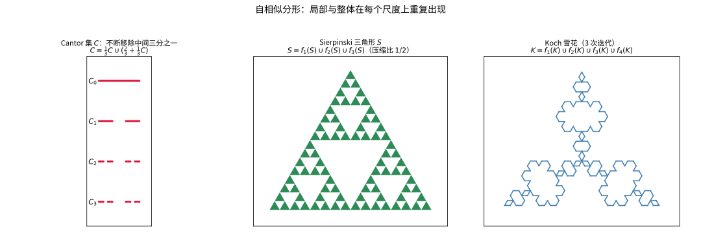
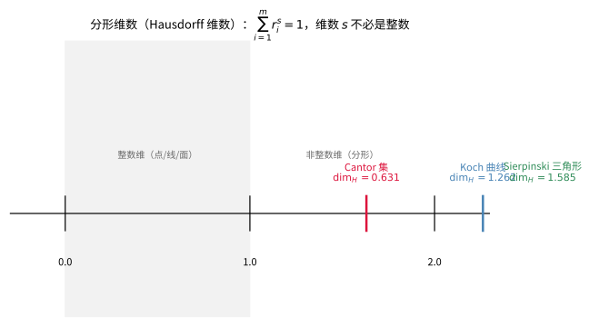

# 第89级：分形几何 (Fractal Geometry)

## 学习目标

1. 理解分形的基本定义与自相似性概念
2. 掌握 Hausdorff 测度与 Hausdorff 维数的严格定义及计算方法
3. 熟悉盒维数的定义及其与 Hausdorff 维数的关系
4. 掌握迭代函数系统（IFS）理论及其吸引子的存在唯一性
5. 能够计算经典分形（Cantor 集、Sierpinski 三角形、Koch 曲线）的维数
6. 了解 Julia 集、Mandelbrot 集与 L-系统的概念
7. 理解多分形与随机分形的基本思想

---

## 第一节：分形的基本概念

### 1.1 分形的定义

> **直观理解（现实类比）**：自相似性像俄罗斯"套娃结构"——打开大娃娃，里面是个形状相同的小娃娃，再打开又是更小的同款；分形的整体与局部形状相同，放大后看起来和原来一样。无论是 Cantor 集的逐次删段、Sierpinski 三角形的逐次挖空，还是 Koch 曲线的逐次折角，都遵循"把同一规则在每一尺度上重复"的递归放大逻辑，这正是分形区别于普通几何图形的标志。
>
> **🧠 思考历程：一种"怎么量都量不准维数"的图形，怎么颠覆了"点一线一面一体"的老规矩？**
>
> 分形几何的追问直戳古典几何的软肋：**雪花、海岸线、树冠这些真实物体，既不是线段也不是面积，那它们究竟"几维"？** 这个看似天真的问题，把可微点和测度论一并卷了进来。
>
> - **Hausdorff：维数可以被"续"成小数**（1918 年）。Felix Hausdorff 证明，维数不必是整数——他发明的 Hausdorff 维数把"尺度与度量的增长关系"定成任意实数。只可惜这套精致的测度论维数，当时被视作数学象牙塔里的珍玩。
> - **Cantor、Koch 与 Sierpinski：病态曲线的提前登台**（19–20 世纪初）。Georg Cantor 的三分去除集、Helge von Koch 的雪花、Wacław Sierpiński 的三角形，早已摆出"处处奇异却规则"的阶梯；它们是"自相似"最古老的样本，只是还没有统一的名字与理论外壳。
> - **Mandelbrot：给"碎形"一个名字与一场运动**（1975 年）。Benoît Mandelbrot 把这些散见的研究收拢，冠以"分形"（fractal）之名，并用计算机画出 Mandelbrot 集与各种分形图像，让"整体与局部形似"一跃成为观察自然界（海岸线、山脉、枝干）的日常语言。分形自此从病态例子升格为大众皆知的新几何。
> - **心路**：所谓"维数"，本质是"粗糙程度和尺度的关系"。分形几何提醒我们：**大自然不买"整数维"的账——承认连续、承认分数，反而能把混乱的世界描述得更准**。

"分形"（Fractal）一词由 Mandelbrot 于 1975 年提出，源自拉丁语 *fractus*（意为"破碎的"）。分形是几何学中一类具有**自相似性**（self-similarity）的集合，即其局部与整体在某种意义下相似。

**定义 1（分形——B. Mandelbrot 的原始定义）**：  
称集合 $F \subset \mathbb{R}^n$ 为分形，如果其 Hausdorff 维数 $\dim_H F$ 严格大于其拓扑维数 $\dim_T F$。

> **💡 直观理解（类比）**：一个"分形"是个尺寸对不上账的图形——用整数维的量尺（拓扑维数）去量嫌不够，得换上更高一档的"分数维码"（Hausdorff 维数）才量得准。说白了就是："看起来像几维，实际要再高一截"。

**注**：这一定义并非普遍适用，但提供了分形的核心特征：分形维数通常不是整数。

**定义 2（自相似性）**：  
集合 $F$ 称为**自相似**的，如果存在一组压缩映射 $\{f_1, f_2, \dots, f_m\}$，使得

$$
F = \bigcup_{i=1}^{m} f_i(F)
$$

且每个 $f_i$ 是压缩的（即存在 $0 < r_i < 1$，使得 $|f_i(x) - f_i(y)| \leq r_i |x - y|$）。

> **💡 直观理解（类比）**：整幅图形能用自己的几份"缩小版"精准拼出来——像把原图复制缩小后当拼图零件，一块块按序拼回去又严丝合缝还原出原图：每一份局部都是整体按比例缩小的孪生兄弟。

### 1.2 经典分形示例

#### 示例 1：Cantor 集

Cantor 集 $C$ 是 $[0,1]$ 的子集，通过反复移除中间三分区间构造：

- $C_0 = [0, 1]$
- $C_1 = [0, \frac{1}{3}] \cup [\frac{2}{3}, 1]$
- $C_2 = [0, \frac{1}{9}] \cup [\frac{2}{9}, \frac{1}{3}] \cup [\frac{2}{3}, \frac{7}{9}] \cup [\frac{8}{9}, 1]$
- $\displaystyle C = \bigcap_{k=0}^{\infty} C_k$

Cantor 集满足自相似方程：

$$
C = \frac{1}{3}C \cup \left(\frac{2}{3} + \frac{1}{3}C\right)
$$

其中 $\frac{1}{3}C = \{\frac{x}{3} : x \in C\}$。

#### 示例 2：Sierpinski 三角形

从一个等边三角形开始，反复移除中心倒立的小三角形。Sierpinski 三角形 $S$ 满足自相似方程：

$$
S = f_1(S) \cup f_2(S) \cup f_3(S)
$$

其中 $f_1, f_2, f_3$ 是以 $1/2$ 为压缩比、分别将大三角形映射到三个角上的小三角形的压缩映射。

#### 示例 3：Koch 曲线

Koch 曲线 $K$ 的构造：从单位线段 $[0,1]$ 开始，每次将每条线段三等分，将中间一段替换为等边三角形的另外两边（不含底边）。Koch 曲线满足自相似方程：

$$
K = f_1(K) \cup f_2(K) \cup f_3(K) \cup f_4(K)
$$

其中 $f_1, f_2, f_3, f_4$ 为四个压缩映射，压缩比为 $1/3$，分别对应四个子段。

> **直观理解（现实类比）**：分形的自相似如同"西兰花"——撕下一小朵，它的形状几乎和整颗一样；再撕更小一朵，仍是同样的"小树"。Cantor 集、Sierpinski 三角形、Koch 雪花正是把这种"一叶知秋"的递归放大规则（每次迭代都按同一比例重复整体结构）画到了极致。

---

## 第二节：Hausdorff 测度与 Hausdorff 维数

### 2.1 Hausdorff 测度

**定义 3（Hausdorff 测度）**：  
设 $F \subset \mathbb{R}^n$，$s \geq 0$，$\delta > 0$。定义

$$
\mathcal{H}^s_\delta(F) = \inf\left\{ \sum_{i=1}^{\infty} |U_i|^s : \{U_i\} \text{ 是 } F \text{ 的 } \delta\text{-覆盖} \right\}
$$

其中 $|U_i| = \sup\{|x - y| : x, y \in U_i\}$（即 $U_i$ 的直径），$\{U_i\}$ 是 $F$ 的覆盖，且每个 $U_i$ 满足 $|U_i| \leq \delta$。

$s$ 维 Hausdorff（外）测度定义为

$$
\mathcal{H}^s(F) = \lim_{\delta \to 0} \mathcal{H}^s_\delta(F) = \sup_{\delta > 0} \mathcal{H}^s_\delta(F)
$$

> **💡 直观理解（类比）**：用一把可调粗细的"格子尺"去量图形：凡能盖住它的所有小片，都按"直径的 $s$ 次方"记账求和，再把这份账目压到最小花费。$s$ 就是你选什么尺寸精度的"刻度"，测度就是这笔被扣到最省的开销。

**性质**：
1. $\mathcal{H}^s$ 是 $\mathbb{R}^n$ 上的 Borel 外测度。
2. $\mathcal{H}^0$ 是计数测度。
3. 当 $s = n$ 时，$\mathcal{H}^n$ 是 $n$ 维 Lebesgue 测度的常数倍（精确到因子 $\alpha(n)$，即 $n$ 维单位球的体积）。
4. 对于 $s < t$，若 $\mathcal{H}^s(F) < \infty$，则 $\mathcal{H}^t(F) = 0$；若 $\mathcal{H}^t(F) > 0$，则 $\mathcal{H}^s(F) = \infty$。

### 2.2 Hausdorff 维数

> **直观理解（现实类比）**：分形维数像"粗糙度的度量"——非整数维数刻画了图形填充空间的程度。一条光滑直线是 1 维，一块实心平面是 2 维，而一条曲折的海岸线介于两者之间：越曲折、越能"挤进"二维平面，维数就越接近 2。著名的"英国海岸线有多长"悖论正源于此——用越细的尺子量，长度越大，最终趋于无穷，而其 Hausdorff 维数约 1.25 才是真正描述其"粗糙程度"的不变量。

**定义 4（Hausdorff 维数）**：  
集合 $F \subset \mathbb{R}^n$ 的 Hausdorff 维数定义为

$$
\dim_H F = \inf\{ s \geq 0 : \mathcal{H}^s(F) = 0 \} = \sup\{ s \geq 0 : \mathcal{H}^s(F) = \infty \}
$$

即存在唯一的临界值 $s = \dim_H F$，使得

$$
\mathcal{H}^s(F) = \begin{cases}
\infty, & s < \dim_H F \\
0, & s > \dim_H F
\end{cases}
$$

> **💡 直观理解（类比）**：把"刻度" $s$ 从 0 一点往大拨，测度起初是无穷、过了某个拐点唰地塌成 0——这个骤然"跳账"的临界刻度，正是图形的 Hausdorff 维数。就像做工时换尺子：找到一把"刚够用、再细也没必要"的临界细度。

在 $s = \dim_H F$ 处，$\mathcal{H}^s(F)$ 可以是 $0$、$\infty$ 或 $0 < \mathcal{H}^s(F) < \infty$。

### 2.3 Hausdorff 维数的基本性质

**定理 1（Hausdorff 维数的基本性质）**：

1. **单调性**：若 $E \subset F$，则 $\dim_H E \leq \dim_H F$。
2. **可数稳定性**：$\displaystyle \dim_H \left(\bigcup_{i=1}^{\infty} F_i\right) = \sup_{i} \dim_H F_i$。
3. **Lipschitz 不变性**：若 $f: F \to \mathbb{R}^m$ 是 Lipschitz 映射（即存在 $c > 0$ 使 $|f(x) - f(y)| \leq c|x - y|$），则 $\dim_H f(F) \leq \dim_H F$。
4. **等距不变性**：若 $F$ 与 $G$ 等距，则 $\dim_H F = \dim_H G$。
5. **开集性**：若 $F \subset \mathbb{R}^n$ 是开集，则 $\dim_H F = n$。

> **💡 直观理解（类比）**：这五条像"维数行为守则"——子集不会比父集更"占地方"（单调）、拼起来取最大档（可数稳定）、任拉伸都不放大占地方程度（Lipschitz）、平移旋转不改维数（等距）、实心开域就是整维（开集）。一条条把"占地方程度"这件直觉事梳理得井井有条。

**证明**：

**(1) 单调性**：  
若 $E \subset F$，则 $F$ 的任何 $\delta$-覆盖也是 $E$ 的 $\delta$-覆盖，因此 $\mathcal{H}^s_\delta(E) \leq \mathcal{H}^s_\delta(F)$，取极限得 $\mathcal{H}^s(E) \leq \mathcal{H}^s(F)$。若 $s > \dim_H F$，则 $\mathcal{H}^s(F) = 0$，从而 $\mathcal{H}^s(E) = 0$，故 $\dim_H E \leq \dim_H F$。$\square$

**(2) 可数稳定性**：  
首先，由单调性知 $\dim_H F_i \leq \dim_H (\bigcup_i F_i)$ 对所有 $i$ 成立，故 $\sup_i \dim_H F_i \leq \dim_H (\bigcup_i F_i)$。

反之，设 $s > \sup_i \dim_H F_i$，则对所有 $i$ 有 $s > \dim_H F_i$，故 $\mathcal{H}^s(F_i) = 0$。由 Hausdorff 测度的可数次可加性：

$$
\mathcal{H}^s\left(\bigcup_{i=1}^{\infty} F_i\right) \leq \sum_{i=1}^{\infty} \mathcal{H}^s(F_i) = 0
$$

因此 $\mathcal{H}^s(\bigcup_i F_i) = 0$，从而 $\dim_H (\bigcup_i F_i) \leq s$。令 $s \to \sup_i \dim_H F_i^+$，得 $\dim_H (\bigcup_i F_i) \leq \sup_i \dim_H F_i$。

综合两个方向即得等式。$\square$

**(3) Lipschitz 不变性**：  
设 $f$ 的 Lipschitz 常数为 $c$，即 $|f(x) - f(y)| \leq c|x - y|$。若 $\{U_i\}$ 是 $F$ 的 $\delta$-覆盖，则 $\{f(F \cap U_i)\}$ 的直径不超过 $c|U_i|$，因此 $\{f(F \cap U_i)\}$ 是 $f(F)$ 的 $c\delta$-覆盖。

于是

$$
\mathcal{H}^s_{c\delta}(f(F)) \leq \sum_i |f(F \cap U_i)|^s \leq c^s \sum_i |U_i|^s
$$

取下确界得 $\mathcal{H}^s_{c\delta}(f(F)) \leq c^s \mathcal{H}^s_\delta(F)$。令 $\delta \to 0$，得 $\mathcal{H}^s(f(F)) \leq c^s \mathcal{H}^s(F)$。

若 $s > \dim_H F$，则 $\mathcal{H}^s(F) = 0$，从而 $\mathcal{H}^s(f(F)) = 0$，故 $\dim_H f(F) \leq s$，进而 $\dim_H f(F) \leq \dim_H F$。$\square$

**(4) 等距不变性**：等距映射是 Lipschitz 常数为 $1$ 的 Lipschitz 映射，由 (3) 即得。

**(5) 开集性**：若 $F \subset \mathbb{R}^n$ 是非空开集，则 $F$ 包含一个 $n$ 维球体，其 $n$ 维 Hausdorff 测度为正（与 Lebesgue 测度等价），故 $\dim_H F \geq n$。又 $F \subset \mathbb{R}^n$，而 $\mathbb{R}^n$ 的 Hausdorff 维数为 $n$，由单调性知 $\dim_H F \leq n$。因此 $\dim_H F = n$。$\square$

---

## 第三节：盒维数

### 3.1 盒维数的定义

**定义 5（盒维数）**：  
设 $F \subset \mathbb{R}^n$ 是非空有界集。令 $N_\delta(F)$ 表示能覆盖 $F$ 的直径为 $\delta$ 的集合的最小个数，或边长为 $\delta$ 的 $n$ 维立方体网格与 $F$ 相交的个数。$F$ 的**下盒维数**和**上盒维数**分别定义为

$$
\underline{\dim}_B F = \liminf_{\delta \to 0} \frac{\log N_\delta(F)}{-\log \delta}, \quad
\overline{\dim}_B F = \limsup_{\delta \to 0} \frac{\log N_\delta(F)}{-\log \delta}
$$

若两者相等，则称该共同值为 **盒维数**（box dimension）或 **Minkowski 维数**，记为 $\dim_B F$。

> **💡 直观理解（类比）**：像用固定大小的小方格给图形"盖房子数格子"：格子越细，盖住它要的方块数 $N_\delta$ 就按 $\delta^{-\text{维数}}$ 的速度疯长，看增长速度 $(\log N)/(-\log\delta)$ 的极限就知道维数——"尺子变细要补多少方块"有多急，维数就有多高。

### 3.2 分形维数的等价性定理

**定理 2（Hausdorff 维数与盒维数的关系）**：  
对于有界集 $F \subset \mathbb{R}^n$，有

$$
\dim_H F \leq \underline{\dim}_B F \leq \overline{\dim}_B F
$$

> **💡 直观理解（类比）**：Hausdorff 维数是"精打细算派"（找最省钱的小片去盖），盒维数是"大手大脚派"（统一用整格小方块去数），越粗放法子算出的结果只会越"大"，所以 $\dim_H\le$ 盒维数——像精挑细选的账单总不会比按满价估算的花费更高。

**证明**：

设 $s > 0$，$\delta > 0$。令 $N_\delta(F)$ 是覆盖 $F$ 所需的最大直径为 $\delta$ 的集合的最小个数。则存在一个由 $N_\delta(F)$ 个直径为 $\delta$ 的集合构成的 $F$ 的覆盖，因此

$$
\mathcal{H}^s_\delta(F) \leq N_\delta(F) \cdot \delta^s
$$

若 $s < \dim_H F$，则 $\mathcal{H}^s(F) = \infty$，从而对充分小的 $\delta$，$\mathcal{H}^s_\delta(F) > 1$，故 $N_\delta(F) \cdot \delta^s > 1$，即

$$
\log N_\delta(F) + s \log \delta > 0 \quad \Longrightarrow \quad \frac{\log N_\delta(F)}{-\log \delta} > s
$$

取 $\delta \to 0$ 的下极限，得 $\underline{\dim}_B F \geq s$。令 $s \to \dim_H F^-$，得 $\underline{\dim}_B F \geq \dim_H F$。

上盒维数显然不小于下盒维数，因此 $\dim_H F \leq \underline{\dim}_B F \leq \overline{\dim}_B F$。$\square$

**注**：反向不等式一般不成立。例如，可数稠密集的 Hausdorff 维数为 $0$，但盒维数可能为 $n$。

---

## 第四节：迭代函数系统（IFS）

### 4.1 压缩映射与 Hausdorff 距离

**定义 6（压缩映射）**：  
映射 $f: \mathbb{R}^n \to \mathbb{R}^n$ 称为**压缩映射**，如果存在常数 $0 \leq r < 1$，使得

$$
|f(x) - f(y)| \leq r|x - y|, \quad \forall x, y \in \mathbb{R}^n
$$

常数 $r$ 称为压缩比。

> **💡 直观理解（类比）**：一块"收缩镜"——任意两点的距离都会被按 $r<1$ 的比例缩短映过去，像把整张地图按 $r$ 倍缩小贴到墙上：结构一点不变，只是个头缩了、所有间距都跟着缩成 $r$ 倍。

**定义 7（Hausdorff 距离）**：  
设 $X, Y \subset \mathbb{R}^n$ 是非空紧集。Hausdorff 距离定义为

$$
d_H(X, Y) = \max\left\{ \sup_{x \in X} \inf_{y \in Y} |x - y|,\; \sup_{y \in Y} \inf_{x \in X} |x - y| \right\}
$$

记 $\mathcal{K}(\mathbb{R}^n)$ 为 $\mathbb{R}^n$ 中所有非空紧集构成的集合，则 $(\mathcal{K}(\mathbb{R}^n), d_H)$ 是完备度量空间。

> **💡 直观理解（类比）**：衡量两团紧图形"贴得多近"的尺子：看甲团里离乙团最远的点、再比乙团里离甲团最远的点，取那个较大的"最大空隙"当距离。像判断两家地盘是否贴脸——谁离对方最近只算标配，谁被趁得最远才是关键。

### 4.2 IFS 吸引子的存在唯一性

**定义 8（迭代函数系统）**：  
一个**迭代函数系统**（Iterated Function System，简称 IFS）是一组有限的压缩映射 $\{f_1, f_2, \dots, f_m\}$，其中 $f_i: \mathbb{R}^n \to \mathbb{R}^n$ 的压缩比为 $r_i$。

> **💡 直观理解（类比）**：一套"缩小镜"被打包成模具——每轮把各缩小版摆回同一画布（求并），再往下反复叠放；无论从哪张草稿起笔，最终都会叠出一朵既唯一又稳定的"花"（吸引子）。就像用一小套印章周而复始地盖章，越盖越细、越盖越出规律。

**定理 3（IFS 吸引子的存在唯一性——Hutchinson 定理）**：  
设 $\{f_1, f_2, \dots, f_m\}$ 是 $\mathbb{R}^n$ 上的一个 IFS。定义变换 $F: \mathcal{K}(\mathbb{R}^n) \to \mathcal{K}(\mathbb{R}^n)$ 为

$$
F(K) = \bigcup_{i=1}^m f_i(K)
$$

则 $F$ 是 $(\mathcal{K}(\mathbb{R}^n), d_H)$ 上的压缩映射，压缩比为 $r = \max\{r_1, \dots, r_m\}$。因此，$F$ 存在唯一的不动点 $A \in \mathcal{K}(\mathbb{R}^n)$，称为该 IFS 的**吸引子**，满足

$$
A = \bigcup_{i=1}^m f_i(A)
$$

且对任意初始紧集 $K_0$，迭代 $K_{k+1} = F(K_k)$ 收敛到 $A$（在 Hausdorff 距离意义下）。

> **💡 直观理解（类比）**："用模具盖一遍"这件事本身，就是把两块图形的距离按 $r$ 倍缩短的"压缩操作"；于是像在一圈圈收紧的绳套里找绳头——反复迭代必然收到唯一的那个不动点，保证每次盖章都落回同一朵"花"。

**证明**：

**第一步：证明 $F$ 是压缩映射。**  
任取 $K, L \in \mathcal{K}(\mathbb{R}^n)$。设 $x \in F(K) = \bigcup_i f_i(K)$，则存在 $i$ 和 $y \in K$ 使得 $x = f_i(y)$。由于 $L$ 是紧集，存在 $z \in L$ 使得 $|y - z| = \inf_{w \in L} |y - w|$。于是

$$
d(x, f_i(L)) \leq |f_i(y) - f_i(z)| \leq r_i |y - z| \leq r_i \cdot d_H(K, L)
$$

因此 $\sup_{x \in F(K)} d(x, F(L)) \leq r \cdot d_H(K, L)$，其中 $r = \max_i r_i$。

类似地，$\sup_{x \in F(L)} d(x, F(K)) \leq r \cdot d_H(K, L)$。故

$$
d_H(F(K), F(L)) \leq r \cdot d_H(K, L)
$$

由于 $0 \leq r < 1$，$F$ 是压缩映射。

**第二步：应用 Banach 不动点定理。**  
$(\mathcal{K}(\mathbb{R}^n), d_H)$ 是完备度量空间，$F$ 是压缩映射，由 Banach 不动点定理，$F$ 存在唯一的不动点 $A \in \mathcal{K}(\mathbb{R}^n)$，满足 $F(A) = A$，即 $A = \bigcup_{i=1}^m f_i(A)$。

**第三步：收敛性。**  
Banach 不动点定理还保证，对任意初始 $K_0 \in \mathcal{K}(\mathbb{R}^n)$，迭代 $K_{k+1} = F(K_k)$ 收敛到 $A$，且收敛速率满足

$$
d_H(K_k, A) \leq \frac{r^k}{1 - r} d_H(K_0, K_1)
$$

$\square$

### 4.3 IFS 维数定理

**定理 4（IFS 吸引子的维数）**：  
设 $\{f_1, \dots, f_m\}$ 是 $\mathbb{R}^n$ 上的 IFS，每个 $f_i$ 是相似压缩映射，压缩比为 $r_i$，且满足**开集条件**（OSC）：存在非空有界开集 $V \subset \mathbb{R}^n$ 使得

$$
\bigcup_{i=1}^m f_i(V) \subset V, \quad f_i(V) \cap f_j(V) = \varnothing\;(i \neq j)
$$

则吸引子 $A$ 的 Hausdorff 维数 $\dim_H A$ 等于满足方程

$$
\sum_{i=1}^m r_i^s = 1
$$

的唯一解 $s$。

> **💡 直观理解（类比）**：每个缩小镜按 $r_i^s$ 贡献一份"尺寸账"，把所有副本的贡献加起来恰好算平（$\sum r_i^s=1$）时，这个 $s$ 就是图形的维数——像对账：拆出几个副本、每个缩多少，账一旦收支平衡，维数就敲定了。

---

## 第五节：经典分形的维数计算

### 5.1 Cantor 集的 Hausdorff 维数

**定理 5（Cantor 集的 Hausdorff 维数）**：  
经典 Cantor 集 $C$ 的 Hausdorff 维数为

$$
\dim_H C = \frac{\log 2}{\log 3}
$$

> **💡 直观理解（类比）**：每次迭代把一段一分为二、每段缩到 1/3，账上 $2\cdot(1/3)^s=1$ 解得 $s=\log2/\log3\approx0.63$。就像把纸"剪成两截、再各缩到三分之一"——多是两小块、块只有原长度 1/3，折出来的"占空间指数"比点多（0维）又比线（1维）少。

**证明**：

**第一步：建立上界估计。**  
在 Cantor 集的第 $k$ 步构造 $C_k$ 中，我们有 $2^k$ 个区间，每个区间长度为 $3^{-k}$。这些区间构成 $C$ 的一个 $\delta_k$-覆盖，其中 $\delta_k = 3^{-k}$。

对任意 $s > 0$，

$$
\mathcal{H}^s_{\delta_k}(C) \leq 2^k \cdot (3^{-k})^s = 2^k \cdot 3^{-ks} = (2 \cdot 3^{-s})^k
$$

若 $s > \log 2 / \log 3$，则 $2 \cdot 3^{-s} < 1$，令 $k \to \infty$ 得 $\mathcal{H}^s(C) = 0$，故 $\dim_H C \leq \log 2 / \log 3$。

**第二步：建立下界估计。**  
需要证明当 $s = \log 2 / \log 3$ 时，$\mathcal{H}^s(C) > 0$。

设 $\mu$ 为 Cantor 集上的均匀概率测度，即对每个第 $k$ 级区间 $I_{k,j}$（$j = 1, \dots, 2^k$），定义 $\mu(I_{k,j}) = 2^{-k}$。由测度延拓定理，$\mu$ 可唯一延拓为 $C$ 上的 Borel 概率测度。

我们断言：存在常数 $c > 0$，使得对任意 $x \in C$ 和任意 $0 < r < 1$，有

$$
\mu(B(x, r)) \leq c \cdot r^s
$$

其中 $s = \log 2 / \log 3$。

事实上，对给定的 $r$，取 $k$ 使得 $3^{-(k+1)} \leq r < 3^{-k}$。球 $B(x, r)$ 至多与 $C$ 的两个第 $k$ 级区间相交（因为 Cantor 集的构造中，第 $k$ 级区间之间的间距至少为 $3^{-k}$）。每个第 $k$ 级区间的 $\mu$-测度为 $2^{-k}$，因此

$$
\mu(B(x, r)) \leq 2 \cdot 2^{-k} = 2 \cdot 2^{-k}
$$

又 $r \geq 3^{-(k+1)}$，故 $r^s \geq 3^{-(k+1)s} = 3^{-s} \cdot 3^{-ks}$。而 $2^{-k} = 3^{-ks}$（因为 $s = \log 2 / \log 3$ 意味着 $2 = 3^s$），因此

$$
\mu(B(x, r)) \leq 2 \cdot 2^{-k} = 2 \cdot 3^{-ks} = 2 \cdot 3^s \cdot 3^{-(k+1)s} \leq 2 \cdot 3^s \cdot r^s
$$

取 $c = 2 \cdot 3^s$ 即得 $\mu(B(x, r)) \leq c \cdot r^s$。

由质量分布原理（Mass Distribution Principle）：若存在概率测度 $\mu$ 支撑在 $C$ 上，且常数 $c > 0$ 使得 $\mu(B(x, r)) \leq c \cdot r^s$，则 $\mathcal{H}^s(C) \geq 1/c > 0$。

因此 $\mathcal{H}^s(C) > 0$，故 $\dim_H C \geq s$。

**第三步：综合上下界。**  
由 $\dim_H C \leq s$ 和 $\dim_H C \geq s$，得 $\dim_H C = s = \log 2 / \log 3$。$\square$

### 5.2 Sierpinski 三角形的 Hausdorff 维数

**定理 6（Sierpinski 三角形的 Hausdorff 维数）**：  
Sierpinski 三角形 $S$ 的 Hausdorff 维数为

$$
\dim_H S = \frac{\log 3}{\log 2}
$$

> **💡 直观理解（类比）**：三个角各放一枚 $1/2$ 缩小的三角副本，$3\cdot(1/2)^s=1$ 解得 $s=\log3/\log2\approx1.585$。像往漏斗里筛沙子——三角形拆得越来越"铺得开"却始终留孔洞，维数就卡在 1（线）与 2（面）之间、偏向 2。

**证明思路**：

Sierpinski 三角形由三个压缩比为 $1/2$ 的相似压缩映射生成。由 IFS 维数定理（定理 4），维数 $s$ 满足方程

$$
3 \cdot \left(\frac{1}{2}\right)^s = 1
$$

解得 $s = \log 3 / \log 2$。开集条件成立（取 $V$ 为原始等边三角形的内部），因此 $\dim_H S = \log 3 / \log 2$。

**详细证明**（上界）：第 $k$ 步构造中，Sierpinski 三角形由 $3^k$ 个边长为 $2^{-k}$ 的小等边三角形组成。这些三角形构成 $S$ 的一个 $\delta_k$-覆盖，$\delta_k = 2^{-k}$。因此

$$
\mathcal{H}^s_{\delta_k}(S) \leq 3^k \cdot (2^{-k})^s = (3 \cdot 2^{-s})^k
$$

当 $s > \log 3 / \log 2$ 时，$3 \cdot 2^{-s} < 1$，故 $\mathcal{H}^s(S) = 0$，即 $\dim_H S \leq \log 3 / \log 2$。

下界估计同样可通过质量分布原理得到，构造均匀概率测度（每个第 $k$ 级小三角形的测度为 $3^{-k}$），类似 Cantor 集的方法可证 $\dim_H S \geq \log 3 / \log 2$。$\square$

### 5.3 Koch 曲线的 Hausdorff 维数

> **直观理解（现实类比）**：Koch 雪花是"无限边界的有限面积"的奇观——每一步在每条线段中间加入小三角形，使周长不断乘以 $4/3$，趋于无穷；但整个雪花始终被原始三角形的外接圆框住，面积收敛到 $\frac{8}{5}$ 倍原始三角形面积的有限值。这种"周长无穷而面积有限"的反直觉组合，正是分形维数 $\log 4/\log 3 \approx 1.26$ 所描述的"比线更厚、比面更薄"的填充特性。

**定理 7（Koch 曲线的 Hausdorff 维数）**：  
Koch 曲线 $K$ 的 Hausdorff 维数为

$$
\dim_H K = \frac{\log 4}{\log 3}
$$

> **💡 直观理解（类比）**：每段折成 4 小齿、每齿缩到 1/3，$4\cdot(1/3)^s=1$ 得 $s=\log4/\log3\approx1.26$。像拿折线去追一条海岸线——每折一次路线拉长，弯得越多越能"挤满"平面，因此维数夹在 1 与 2 之间。

**证明**：

**第一步：上界估计。**  
Koch 曲线由四个压缩比为 $1/3$ 的相似映射生成。在第 $k$ 步构造中，Koch 曲线近似由 $4^k$ 条长度为 $3^{-k}$ 的线段组成。这些线段构成 $K$ 的一个 $\delta_k$-覆盖，$\delta_k = 3^{-k}$。

对任意 $s > 0$，

$$
\mathcal{H}^s_{\delta_k}(K) \leq 4^k \cdot (3^{-k})^s = (4 \cdot 3^{-s})^k
$$

若 $s > \log 4 / \log 3$，则 $4 \cdot 3^{-s} < 1$，令 $k \to \infty$ 得 $\mathcal{H}^s(K) = 0$，故 $\dim_H K \leq \log 4 / \log 3$。

**第二步：下界估计。**  
需证明 $\mathcal{H}^s(K) > 0$ 对 $s = \log 4 / \log 3$ 成立。

将 Koch 曲线视为 IFS 吸引子：四个压缩映射 $f_1, f_2, f_3, f_4$ 的压缩比均为 $1/3$，分别对应：

- $f_1$：沿 $x$ 轴方向压缩 $1/3$ 平移
- $f_2$：压缩 $1/3$，旋转 $60^\circ$ 后平移
- $f_3$：压缩 $1/3$，旋转 $-60^\circ$ 后平移
- $f_4$：压缩 $1/3$，沿 $x$ 轴平移 $2/3$

这些映射满足开集条件（取 $V$ 为以 $(0,0)$ 和 $(1,0)$ 为端点的等边三角形的内部）。

由 IFS 维数定理，$s$ 满足 $4 \cdot (1/3)^s = 1$，解得 $s = \log 4 / \log 3$。

为给出直接证明，构造 Koch 曲线上的自然概率测度 $\mu$，使得每个第 $k$ 级子区间的测度为 $4^{-k}$。可以证明存在常数 $c > 0$ 使得 $\mu(B(x, r)) \leq c \cdot r^s$，由质量分布原理得 $\mathcal{H}^s(K) > 0$，故 $\dim_H K \geq s$。

**第三步：综合。**  
由上下界得 $\dim_H K = \log 4 / \log 3$。$\square$

> **直观理解（现实类比）**：维数可以是"分数"，就像一条被揉得极皱的"海岸线"——它比一条直线（1 维）占据更多空间，却又填不满一整块平面（2 维），于是它的"粗糙程度"落在 $1$ 和 $2$ 之间。Koch 曲线就是这样的例子：每放大一次细节变多是原来的 4 倍，而尺度只缩小到 1/3，算出的维数 $1.26$ 恰好刻画了这种"介于线与面之间"的填充程度。

---

## 第六节：Julia 集与 Mandelbrot 集

### 6.1 Julia 集

**定义 9（Julia 集）**：  
设 $f: \mathbb{C} \to \mathbb{C}$ 是复多项式，通常考虑 $f_c(z) = z^2 + c$，其中 $c \in \mathbb{C}$。**填充 Julia 集**定义为

$$
K(f_c) = \{ z \in \mathbb{C} : f_c^{\circ n}(z) \text{ 有界}, \forall n \geq 0 \}
$$

其中 $f_c^{\circ n}$ 表示 $n$ 次迭代。**Julia 集** $J(f_c)$ 是填充 Julia 集的边界：$J(f_c) = \partial K(f_c)$。

> **💡 直观理解（类比）**：对 $z\mapsto z^2+c$ 反复迭代，把"怎么迭代都不跑远"的起点们标出来，它们勾出的这条界线就是 Julia 集——就像一圈被"引力井"（有界轨道）拴住的岸线。常数 $c$ 一调，这条岸线也跟着变：有时连成一片、有时碎成满天尘埃。

**性质**：
1. $J(f_c)$ 是紧集，且 $f_c(J(f_c)) = J(f_c) = f_c^{-1}(J(f_c))$。
2. $J(f_c)$ 要么是连通的（当 $c$ 在 Mandelbrot 集中时），要么是 Cantor 集（当 $c$ 在 Mandelbrot 集外时）。
3. $J(f_c)$ 具有自相似性，是某个 IFS 的吸引子。

### 6.2 Mandelbrot 集

> **直观理解（现实类比）**：Mandelbrot 集是"数学的万花筒"——只需一个简单迭代 $z \mapsto z^2 + c$，却能生成永无止境的复杂图案。它的边界是分形，Hausdorff 维数为 2，意味着细节之丰富已填满整个平面；每放大一次，就涌现出新的螺旋、海马、迷你 Mandelbrot 副本，像万花筒里层层嵌套的对称花纹。这种"简单规则产生无限复杂"的现象，正是分形几何最迷人的魅力所在。

**定义 10（Mandelbrot 集）**：  
Mandelbrot 集定义为

$$
M = \{ c \in \mathbb{C} : f_c^{\circ n}(0) \text{ 有界}, \forall n \geq 0 \}
$$

其中 $f_c(z) = z^2 + c$。

> **💡 直观理解（类比）**：把所有"让起点 0 不被甩飞"的常数 $c$ 收集起来，就铺成一张参数空间里的"说明书地图"——地图上的每个点 $c$，都对应着某个 Julia 集；地图点是否在手，恰好告诉我们那个 Julia 集连不连成一片。它是一个"索引所有 Julia 集的目录"。

**性质**：
1. $M$ 是连通紧集。
2. $c \in M$ 当且仅当 Julia 集 $J(f_c)$ 是连通的。
3. $M$ 的边界 $\partial M$ 是分形，其 Hausdorff 维数为 $2$。

---

## 第七节：L-系统与分形插值

### 7.1 L-系统

L-系统（Lindenmayer 系统）是一种基于字符串重写的并行文法，用于生成分形结构。

**定义 11（L-系统）**：  
一个 L-系统是一个三元组 $(V, \omega, P)$，其中：
- $V$ 是字母表（符号集）
- $\omega \in V^+$ 是公理（初始字符串）
- $P \subset V \times V^*$ 是产生式规则集

每个符号 $a \in V$ 对应一个产生式 $a \to \chi(a)$，其中 $\chi(a) \in V^*$。L-系统通过并行替换所有符号来生成字符串。

> **💡 直观理解（类比）**：像一套"文字替换魔咒"——给每个字母规定好要改写成的长串，然后所有字符同步替换、一轮轮展开，最后把这串密码翻译成画笔走向（前进/转弯），就画出藤蔓、雪花这类分形。"让字符串自己生长"，正是它的引擎。

**示例**：Koch 曲线的 L-系统：
- 公理：$\omega = F$
- 规则：$F \to F + F - - F + F$
- 解释：$F$ = 向前画线，$+$ = 左转 $60^\circ$，$-$ = 右转 $60^\circ$

### 7.2 分形插值

**定义 12（分形插值函数）**：  
给定数据点 $\{(x_i, y_i)\}_{i=0}^n$，其中 $x_0 < x_1 < \cdots < x_n$。分形插值函数 $f: [x_0, x_n] \to \mathbb{R}$ 是通过 IFS 构造的满足 $f(x_i) = y_i$ 的连续函数。

构造方法：定义 IFS $\{f_1, \dots, f_n\}$，其中

$$
f_i\begin{pmatrix} x \\ y \end{pmatrix} = \begin{pmatrix} a_i & 0 \\ c_i & d_i \end{pmatrix} \begin{pmatrix} x \\ y \end{pmatrix} + \begin{pmatrix} e_i \\ h_i \end{pmatrix}
$$

参数 $a_i, c_i, e_i, h_i$ 由插值条件确定，$d_i$ 是自由参数（垂直压缩因子），控制分形维数。

> **💡 直观理解（类比）**：给定一些"必经打卡点"，再用整套缩小镜每轮在相邻点之间"填细毛刺"、层层加密，让曲线既穿过这些点、又在任意两格之间无限曲折——像用递归把一条平滑弧线一点点磨成布满棱脊的山脊线。

---

## 第八节：多分形与随机分形

### 8.1 多分形

**定义 13（多分形）**：  
多分形（multifractal）是一类分形，其不同区域具有不同的局部标度指数，即分形维数不是一个单一值，而是由**奇异谱** $f(\alpha)$ 描述，其中 $\alpha$ 是局部 Hölder 指数。

**多分形谱**：设 $\mu$ 是支撑在分形上的测度，定义

$$
f(\alpha) = \dim_H \{ x : \text{局部 Hölder 指数为 } \alpha \}
$$

其中 $\alpha(x) = \lim_{r \to 0} \frac{\log \mu(B(x, r))}{\log r}$。

> **💡 直观理解（类比）**：普通分形像"一把尺子（一个维数）量到底"，多分形则似"各处粗细不同的织锦"——不同区域顶着不同的局部指数 $\alpha$，像地质图上一块块疏松度各异的土壤，用一整条谱 $f(\alpha)$ 逐档登记这些局部维数：处处有差异、合起来才完整。

### 8.2 随机分形

**定义 14（随机分形）**：  
随机分形是通过随机过程生成的分形，其构造中包含随机性。典型例子包括：
- 随机 Cantor 集：每次移除区间的中间部分时，以概率 $p$ 保留左子区间，以概率 $q$ 保留右子区间
- 布朗运动：其轨道的 Hausdorff 维数以概率 $1$ 为 $2$
- 渗流（percolation）簇

> **💡 直观理解（类比）**：把"掷硬币"的随机性塞进构造规则——每一步抛硬币来决定删哪个子块、往哪个方向走，结果仍长出"整体自相似、细节却随机"的图案：像每片树叶脉络各不相同又神似同一株树。布朗运动的轨迹就是这样的随机分形，处处随机却几乎总占着 2 维。

---

## 5. 习题

### 基础题

**习题 1**（分形的定义与自相似）给出"分形"的定义，解释"自相似性"的含义，并说明经典 Cantor 集为何是分形。

**习题 2**（Hausdorff 外测度）写出 $s$ 维 Hausdorff 外测度 $\mathcal{H}^s(F)$ 的定义，说明 $\delta$-覆盖与集合直径 $|U_i|$ 的含义。

**习题 3**（Hausdorff 维数）给出 Hausdorff 维数 $\dim_H F$ 的定义，并说明 $\mathcal{H}^s(F)$ 在 $s = \dim_H F$ 处的三种可能取值。

**习题 4**（Cantor 集的自相似）写出经典 Cantor 集 $C$ 的自相似方程，指出它所对应的两个压缩映射。

**习题 5**（盒维数）给出下盒维数与上盒维数的定义，说明它们何时相等并给出共同的盒维数。

**习题 6**（IFS 与吸引子）定义迭代函数系统（IFS）与吸引子，叙述 Hutchinson 定理。

**习题 7**（IFS 维数定理）叙述 IFS 吸引子的维数定理及开集条件（OSC），说明该条件的作用。

**习题 8**（Sierpinski 三角形维数）利用 IFS 维数定理计算 Sierpinski 三角形的 Hausdorff 维数。

**习题 9**（Julia 集与 Mandelbrot 集）给出填充 Julia 集、Julia 集与 Mandelbrot 集的定义。

**习题 10**（L-系统）给出 L-系统的定义（字母表、公理、产生式规则），并写出 Koch 曲线对应的 L-系统。

### 进阶题

**习题 11**（Cantor 尘维数）计算 Cantor 尘 $C \times C \subset \mathbb{R}^2$ 的 Hausdorff 维数，其中 $C$ 是经典 Cantor 集。

**习题 12**（笛卡尔积维数）证明 $\dim_H(E \times F) = \dim_H E + \dim_H F$ 对一般 Borel 集 $E, F$ 成立。

**习题 13**（Sierpinski 地毯）证明 Sierpinski 地毯的 Hausdorff 维数为 $\log 8 / \log 3$。

**习题 14**（Koch 曲线与 IFS）构造以 Koch 曲线为吸引子的 IFS，写出四个相似压缩映射 $f_1, f_2, f_3, f_4$ 的具体表达式。

**习题 15**（Lipschitz 不变性）证明：若 $f: \mathbb{R}^n \to \mathbb{R}^m$ 是 Lipschitz 映射，则 $\dim_H f(F) \leq \dim_H F$，并给出一个严格不等式成立的例子。

**习题 16**（Hausdorff 与盒维数）证明对有界集 $F$ 有 $\dim_H F \leq \underline{\dim}_B F \leq \overline{\dim}_B F$。

**习题 17**（可数稳定性）证明 Hausdorff 维数的可数稳定性：$\dim_H(\bigcup_{i=1}^{\infty} F_i) = \sup_i \dim_H F_i$。

**习题 18**（质量分布原理）叙述并证明质量分布原理，并说明它在 Cantor 集维数下界估计中的作用。

**习题 19**（L-系统维数）计算下列 L-系统生成分形的 Hausdorff 维数：公理 $\omega = F$，规则 $F \to F - F + F + F F - F - F + F$，转角为 $90^\circ$。

### 挑战题

**习题 20**（Cantor 集维数的完整证明）利用质量分布原理与自相似覆盖，完整证明 $\dim_H C = \log 2 / \log 3$。

**习题 21**（Sierpinski 三角形维数证明）给出 Sierpinski 三角形维数的上界证明，并用质量分布原理建立相应的下界。

**习题 22**（IFS 维数定理证明）对由相似压缩映射构成且满足开集条件的 IFS，证明 $\sum_{i=1}^m r_i^s = 1$ 的唯一解 $s$ 就是吸引子的 Hausdorff 维数。

**习题 23**（Mandelbrot 集的连通性）基于 Douady-Hubbard 定理，论证 Mandelbrot 集 $M$ 是连通的。

**习题 24**（Julia 集的连通判别）解释"$c \in M$ 当且仅当 $J(f_c)$ 连通"这一事实，并据此说明 $J(f_c)$ 的自相似（或 Cantor 集）性质。

**习题 25**（随机 Cantor 的期望维数）构造随机 Cantor 集，以左右子区间保留概率 $p$ 计算其期望 Hausdorff 维数，并讨论 $p$ 的临界取值。

**习题 26**（盒维数的非 Lipschitz 不变性）举出例子说明盒维数并不像 Hausdorff 维数那样具备 Lipschitz 不变性，并解释两者差异的根源。

### 探究题

**习题 27**（分形维数与拓扑维数）探讨 $\dim_H F$ 与拓扑维数 $\dim_T F$ 的关系，以及 Mandelbrot 原始分形定义的适用边界。

**习题 28**（多分形与奇异谱）探讨多分形奇异谱 $f(\alpha)$ 的数学意义，以及在湍流、图像等多标度现象中的应用。

**习题 29**（随机分形与布朗运动）探讨布朗运动轨道以概率 1 具有 Hausdorff 维数 2 的直观与证明思路，并联系随机分形。

**习题 30**（分形几何的应用）开放讨论分形理论在图像压缩（如分形图像压缩）、分形天线、湍流与海岸线测量等领域的应用。

---

## 6. 习题答案与解析

### 基础题答案

1. **分形的定义与自相似** 分形（Fractal）是满足 $\dim_H F > \dim_T F$ 的集合（Mandelbrot 原始定义）。自相似性指集合 $F$ 可写成一组压缩映射的并：$F = \bigcup_{i=1}^m f_i(F)$，整体与放大的局部形状"同类"。Cantor 集 $C = \frac{1}{3}C \cup (\frac{2}{3}+\frac{1}{3}C)$ 自相似，且 $\dim_H C = \log 2/\log 3 \approx 0.63$，其拓扑维数为 $0$，故为分形。

2. **Hausdorff 外测度** $\mathcal{H}^s_\delta(F) = \inf\{ \sum_i |U_i|^s : \{U_i\} \text{ 是 } F \text{ 的 } \delta\text{-覆盖} \}$，其中 $|U_i|\leq \delta$。$s$ 维 Hausdorff 外测度 $\mathcal{H}^s(F) = \lim_{\delta \to 0} \mathcal{H}^s_\delta(F)$。$|U_i| = \sup\{|x-y| : x,y \in U_i\}$ 表示集合直径。

3. **Hausdorff 维数** $\dim_H F = \inf\{ s : \mathcal{H}^s(F)=0 \} = \sup\{ s : \mathcal{H}^s(F)=\infty \}$。存在唯一临界值 $s = \dim_H F$：$s$ 以下 $\mathcal{H}^s = \infty$、以上 $\mathcal{H}^s = 0$；在临界点可正可零可无穷。

4. **Cantor 集自相似** $C = \frac{1}{3}C \cup (\frac{2}{3}+\frac{1}{3}C)$，即 $C = f_1(C) \cup f_2(C)$，其中 $f_1(x) = x/3$，$f_2(x) = 2/3 + x/3$，两个压缩映射压缩比均为 $1/3$。

5. **盒维数** $N_\delta(F)$ 为覆盖 $F$ 所需直径为 $\delta$ 的集合最小个数。下盒维数 $\underline{\dim}_B F = \liminf_{\delta \to 0} \log N_\delta(F)/(-\log \delta)$，上盒维数 $\overline{\dim}_B F = \limsup_{\delta\to 0} \log N_\delta(F)/(-\log \delta)$。两者相等时共同的值为盒维数 $\dim_B F$。

6. **IFS 与吸引子** IFS 是有限压缩映射集 $\{f_1,\dots,f_m\}$，压缩比为 $r_i$。定义 $F(K) = \bigcup_i f_i(K)$。Hutchinson 定理：$F$ 是 $\mathcal{K}(\mathbb{R}^n)$（带 Hausdorff 距离）上的压缩映射（压缩比 $r = \max r_i$），故有唯一不动点 $A$ 满足 $A = \bigcup_i f_i(A)$，称为吸引子，且迭代 $K_{k+1}=F(K_k)$ 收敛到 $A$。

7. **IFS 维数定理** 若每个 $f_i$ 为相似压缩（比 $r_i$）且满足开集条件：存在非空有界开集 $V$ 使 $\bigcup_i f_i(V) \subset V$ 且 $f_i(V) \cap f_j(V) = \varnothing$（$i \neq j$）。则吸引子 $A$ 的 Hausdorff 维数为 $\sum_i r_i^s = 1$ 的唯一解 $s$。OSC 保证各 $f_i(A)$ 不"过度重叠"，使维数可由压缩比精确计算。

8. **Sierpinski 三角形维数** 由三个 $r=1/2$ 的相似映射生成。由 IFS 维数定理 $3(1/2)^s = 1$，解得 $s = \log 3 / \log 2 \approx 1.585$，即 $\dim_H S = \log 3 / \log 2$。

9. **Julia 集与 Mandelbrot 集** 填充 Julia 集 $K(f_c) = \{z : f_c^{\circ n}(z) \text{ 有界}, \forall n \geq 0\}$，Julia 集 $J(f_c) = \partial K(f_c)$。Mandelbrot 集 $M = \{c \in \mathbb{C} : f_c^{\circ n}(0) \text{ 有界}\}$，其中 $f_c(z) = z^2 + c$。

10. **L-系统** L-系统是三元组 $(V, \omega, P)$：$V$ 是字母表，$\omega \in V^+$ 是公理，$P$ 是并行替换的产生式规则。Koch 曲线：$\omega = F$，规则 $F \to F + F - - F + F$，解释为 $F$ 前进画线、$+$ 左转 $60^\circ$、$-$ 右转 $60^\circ$。

### 进阶题答案

1. **Cantor 尘维数** 因 $\dim_H(E \times F) = \dim_H E + \dim_H F$（对一般 Borel 集），故 $\dim_H(C \times C) = 2 \dim_H C = 2 \log 2 / \log 3 \approx 1.26$。

2. **笛卡尔积维数** 由乘积型估计：若 $e > \dim_H E$、$f > \dim_H F$，可构造 $E \times F$ 的覆盖使 $\mathcal{H}^{e+f}(E\times F)=0$，从而 $\dim_H(E\times F) \leq \dim_H E + \dim_H F$；再用质量分布原理（找到支撑在 $E\times F$ 上满足 $\mu(B)\leq c r^{e+f}$ 的测度）得反向不等式，故等式成立。

3. **Sierpinski 地毯** 单位正方形 $9$ 等分后保留 $8$ 个边长为 $1/3$ 的小正方形，对应 $8$ 个压缩比 $1/3$ 的相似映射。由 IFS 维数定理 $8(1/3)^s = 1$，解得 $s = \log 8 / \log 3 \approx 1.893$，即 $\dim_H = \log 8 / \log 3$。

4. **Koch 曲线与 IFS** 取 $f_1(z) = \frac{1}{3}z$；$f_2(z) = \frac{1}{3}e^{i\pi/3}z + \frac{1}{3}$；$f_3(z) = \frac{1}{3}e^{-i\pi/3}z + (\frac{1}{2}+\frac{i\sqrt{3}}{6})$；$f_4(z) = \frac{1}{3}z + \frac{2}{3}$。它们把单位线段依次映射到四个子段，满足单位等边三角形内部的开集条件，故吸引子即 Koch 曲线，其维数满足 $4(1/3)^s = 1$。

5. **Lipschitz 不变性** 若 $\{U_i\}$ 是 $F$ 的 $\delta$-覆盖，则 $\{f(F\cap U_i)\}$ 是 $f(F)$ 的 $c\delta$-覆盖，且 $|f(F\cap U_i)| \leq c|U_i|$，故 $\mathcal{H}^s_{c\delta}(f(F)) \leq c^s \mathcal{H}^s_\delta(F)$，令 $\delta \to 0$ 得 $\mathcal{H}^s(f(F)) \leq c^s \mathcal{H}^s(F)$。若 $s > \dim_H F$ 则 $\mathcal{H}^s(F)=0$，故 $\dim_H f(F)\leq s$，从而 $\dim_H f(F) \leq \dim_H F$。严格不等式例子：对 Cantor 集的某个一维投影，其维数可小于原集维数。

6. **Hausdorff 与盒维数** 若 $s>0$，则存在由 $N_\delta(F)$ 个直径为 $\delta$ 的集合构成的覆盖，故 $\mathcal{H}^s_\delta(F) \leq N_\delta(F)\delta^s$。设 $s < \dim_H F$ 则 $\mathcal{H}^s(F)=\infty$，故对充分小 $\delta$ 有 $N_\delta(F)\delta^s > 1$，取对数除以 $-\log \delta$ 并取上/下极限，得 $\underline{\dim}_B F \geq \dim_H F$；而显然 $\underline{\dim}_B F \leq \overline{\dim}_B F$。

7. **可数稳定性** 由单调性 $\dim_H F_i \leq \dim_H(\bigcup_i F_i)$，故 $\sup_i \dim_H F_i \leq \dim_H(\bigcup_i F_i)$。反之，设 $s > \sup_i \dim_H F_i$，则每个 $\mathcal{H}^s(F_i)=0$，由可数次可加性 $\mathcal{H}^s(\bigcup_i F_i) \leq \sum_i \mathcal{H}^s(F_i) = 0$，所以 $\dim_H(\bigcup_i F_i) \leq s$，令 $s$ 逼近上确界得反向不等式。合起来等式成立。

8. **质量分布原理** 若存在支撑在 $F$ 上的概率测度 $\mu$ 及常数 $c>0$，使 $\mu(B(x,r)) \leq c r^s$ 对所有 $x\in F$、$r>0$ 成立，则 $\mathcal{H}^s(F) \geq 1/c > 0$，从而 $\dim_H F \geq s$。证明：对 $F$ 的任意覆盖 $\{U_i\}$，选 $r_i = |U_i|$ 及 $x_i \in F\cap U_i$，则 $1 = \mu(F) \leq \sum_i \mu(U_i) \leq \sum_i c|U_i|^s$，故 $\sum_i |U_i|^s \geq 1/c$，取下确界即得。它给出了 Cantor 集维数的下界，因为其上存在该类测度。

9. **L-系统维数** 该规则对应 4 个压缩比为 $\frac{1}{\sqrt{2}}$ 的相似映射（一次迭代把单位线段换为折线，每段为原长的 $\sqrt{2}/2$）。由 IFS 维数定理 $4(1/\sqrt{2})^s = 1$，解得 $2s = 2$，即 $s=2$；此即"龙曲线"（dragon curve），其 Hausdorff 维数为 $2$。

### 挑战题答案

1. **Cantor 集维数证明** 上界：第 $k$ 步有 $2^k$ 个长度 $3^{-k}$ 的区间，构成 $\delta_k = 3^{-k}$ 覆盖，$\mathcal{H}^s_{\delta_k}(C) \leq 2^k(3^{-k})^s = (2\cdot 3^{-s})^k$；当 $s > \log 2/\log 3$ 时 $2\cdot 3^{-s}<1$，令 $k\to\infty$ 得 $\mathcal{H}^s(C)=0$，故 $\dim_H C \leq \log 2/\log 3$。下界：取均匀测度 $\mu$（每第 $k$ 级区间测度 $2^{-k}$），对 $r$ 选 $k$ 使 $3^{-(k+1)}\leq r < 3^{-k}$，球 $B(x,r)$ 至多交两个第 $k$ 级区间，故 $\mu(B(x,r))\leq 2\cdot 2^{-k}=2\cdot 3^{-ks}\leq 2\cdot 3^s r^s$（用 $2=3^s$）。由质量分布原理 $\dim_H C \geq s$。综合得 $\dim_H C = \log 2/\log 3$。

2. **Sierpinski 三角形维数** 上界：第 $k$ 步由 $3^k$ 个边长 $2^{-k}$ 的小三角形组成，$\mathcal{H}^s_{\delta_k}(S) \leq 3^k(2^{-k})^s = (3\cdot 2^{-s})^k$；当 $s>\log 3/\log 2$ 时趋于 $0$，故 $\dim_H S \leq \log 3/\log 2$。下界：定义均匀测度（每第 $k$ 级三角形测度 $3^{-k}$），仿 Cantor 集方法对任意 $r$ 选合适 $k$ 得 $\mu(B(x,r))\leq c r^s$ 且 $c\to\infty$ 有界，由质量分布原理 $\dim_H S \geq \log 3/\log 2$。

3. **IFS 维数定理证明** 上界：由开集条件与相似性，$\bigcup_i f_i(A)$ 的 $\mathcal{H}^s$ 满足次可加 $\mathcal{H}^s(A) \leq \sum_i r_i^s \mathcal{H}^s(A)$；若 $s$ 满足 $\sum_i r_i^s < 1$，则 $\mathcal{H}^s(A)=0$，故 $\dim_H A \leq s_0$（$s_0$ 为 $\sum_i r_i^s = 1$ 的解）。下界：利用 OSC 构造一致密度的测度，使质量分布原理成立而 $\mathcal{H}^{s_0}(A)>0$，从而 $\dim_H A \geq s_0$。合起来 $\dim_H A = s_0$。

4. **Mandelbrot 集连通性** 由 Douady-Hubbard 定理，$M$ 的补集在黎曼球 $\hat{\mathbb{C}}$ 上单连通，因而 $M$ 本身连通且补集无界单连通，存在一致的 Böttcher 坐标/扩展。模上界 $|c|\leq 2$ 说明 $M$ 有界紧致，且不能分裂成若干不相交非空分支，故 $M$ 为连通紧集。

5. **Julia 集连通判别** 对 $f_c(z)=z^2+c$，$c\in M$ 当且仅当拒不点 $0$ 的轨道有界，这等价于 Julia 集 $J(f_c)$ 连通：当 $c\in M$ 时临界轨道有界，$J(f_c)$ 连通（自相似、常为局部连通的树状结构）；当 $c\notin M$ 时临界点轨道逃逸，$J(f_c)$ 是完全不连通的 Cantor 集。这解释了 $c$ 变化时 $J(f_c)$ 拓扑与分形结构的突变。

  
6. **随机 Cantor 的期望维数** 每个节点以概率 $p$ 同时保留左右两个长 $1/3$ 的子区间，否则两者都放弃（等价于随机 IFS 的分支数为 $2p$）。期望意义下由 $E[\log N]/\log 3$ 得 $E[\dim_H] = \log(2p)/\log 3$，须 $p>1/2$ 否则保留分支期望不小于 $1$ 才能是非简并分形；$p=1/2$ 为临界（相变）点，此时维数趋于 $0$。

7. **盒维数的非 Lipschitz 不变性** 例如取 $F=[0,1]$，把其投影映到可数稠密集：虽为 Lipschitz，像集的盒维数可比原集大得多（可数稠密集的盒维数可为 $1$，而其 Hausdorff 维数为 $0$）。差异根源在于盒维数只按覆盖数目 $N_\delta(F)$ 计数、对"针尖式"稠密例外不敏感，而 Hausdorff 维数由加权的 $\mathcal{H}^s$ 极限定义、对可数稠密点鲁棒，故严格不等式可成立。

### 探究题答案

1. **分形维数与拓扑维数** $\dim_T F$ 是离散、与度量无关的局部亏格不变量（如点集 $\dim_T=0$、区域 $\dim_T=n$），而 $\dim_H F$ 是度量敏感的衡量。Mandelbrot 定义 $\dim_H > \dim_T$ 强调"分数维"，但存在 $\dim_H=\dim_T$ 的分形（无团点迭代集），故定义更实用地以自相似、复杂局部结构与非整数维为标志；边界情形提示单一维数并不能唯一识别分形，需结合度量、局部结构与可数稳定性等特征综合判断。

2. **多分形与奇异谱** 多分形把单一维数推广为奇异谱 $f(\alpha)$，其中 $\alpha(x)=\lim_{r\to 0}\log\mu(B(x,r))/\log r$ 是局部 Hölder 指数，$f(\alpha)$ 是这些点集的 Hausdorff 维数。$f(\alpha)$ 一般为上凸函数，刻画测度在不同尺度上的分布"谱"，用于湍流能量耗散、股票收益率波动、图像纹理等多标度现象，是单一分形维数的自然推广。

3. **随机分形与布朗运动** 布朗运动 $B_t$ 处处不光滑，其轨道（作为 $[0,1]$ 到 $\mathbb{R}^2$ 的像）以概率 1 具有 Hausdorff 维数 2。直观上轨道"布满平面"又保留无限细节。证明用 Lévy 模连续性得到上界，用分部布朗运动的不等式与质量分布原理得到下界，最终在几乎处处意义下等于 2。随机分形的维数可在概率 1 意义下计算，是随机几何与分形几何的交汇。

4. **分形几何的应用** 分形图像压缩利用 IFS 吸引子逼近自然图像，编码紧凑；分形天线以自相似结构在窄体积内获得宽带与高增益；Koch 型海岸线测量解释了"测量尺度依赖"的长度悖论；湍流耗散的多分形谱用于能量级联建模；L-系统模拟植物形态与分形插值用于地形、血管等。答案为引导性开放讨论。

---

## 7. 总结

分形几何是研究不规则几何结构的数学分支，其核心概念包括：

1. **分形维数**：Hausdorff 维数和盒维数是描述分形复杂度的两个基本工具。Hausdorff 维数具有可数稳定性和 Lipschitz 不变性等优良性质，而盒维数更容易计算。

2. **迭代函数系统（IFS）**：提供了一种统一的方法来构造和描述自相似分形。Hutchinson 定理保证了 IFS 吸引子的存在唯一性，IFS 维数定理给出了吸引子的 Hausdorff 维数计算方法。

3. **经典分形**：Cantor 集、Sierpinski 三角形、Koch 曲线等是分形几何的基本范例，其维数可通过 IFS 方法统一计算。

4. **复动力系统**：Julia 集和 Mandelbrot 集是复动力系统中的分形，展示了简单规则如何产生极其复杂的结构。

5. **L-系统与分形插值**：提供了生成和模拟分形结构的实用方法，在计算机图形学中有广泛应用。

6. **多分形与随机分形**：将分形理论推广到更一般的情形，适用于描述自然界中更为复杂的结构。

分形几何在物理学（湍流、相变）、生物学（血管系统、植物形态）、图像压缩、天线设计等众多领域都有重要应用。

