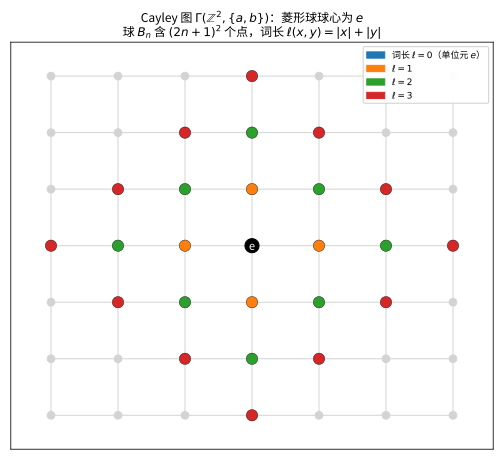
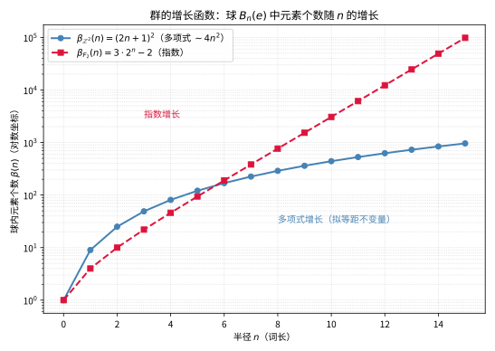

# 第90级：几何群论 (Geometric Group Theory)

> 把抽象的群"铺"成一张张可以走路、测距、看形状的地图，用几何的眼睛重新读群的代数性格。

---

## 从"让代数变得看得见"说起：几何群论要解决的根本问题

> 在动手记定义之前，先想清楚一个问题：**一堆满足运算规则的冷冰冰元素，凭什么能"看"出它的性格？**

**一个真实的生活场景（第一步：直觉）**

设想你走进一个陌生的城市，手里没有地图，只有两个指令：向东走（记作 $a$）、向北走（记作 $b$）。任何一个街区都能用一串指令（如 $a b a^{-1} b^{-1}$）走到——但有些"绕法"其实绕回原点。这座城市本身就成了一幅"画在棋盘上的图"：每个街区是车站、每条指令是一条路。现在问：**这座城市的人口随"距中心站几步"增长得多快？它的道路会不会在某个半径外分叉成密林？** 这些问题不用群论也能靠"走路"回答，而几何群论恰恰发现：**这群的答案，居然就是群本身的增长快慢、双曲程度与端数。** 抽象的代数，从此有了能长、能量、能比的"体型"。

**它要解决的根本问题（第二步：来龙去脉）**

代数群论擅长用"子群、同态、生成元"来刻画群，却很难回答"这群到底有多大、有多弯"。几何群论的雄心，是把代数问题翻译成几何问题。

- **Cayley 画出第一张群的地图**（1878 年）。Arthur Cayley 意识到：给定一组生成元，把每个群元素当顶点、把"乘以一个生成元"当边，就能画出一张图——后人称它 **Cayley 图**。抽象的乘法第一次变成看得见的连通与距离。
- **从几何读出群的性质**（20 世纪前半叶）。Dehn 在研究曲面基本群的词问题与等周问题里，用几何直观处理代数难题；Svarc 与 Milnor 则证明"能规整铺满一座好空间的群，与那座空间粗看同构"（Svarc-Milnor 引理），架起"群作用"与"拟等距"的桥。
- **Gromov 把"粗几何"发扬光大**（1980 年代）。Mikhael Gromov 提出"拟等距"与"粗几何/大范围几何"，让千差万别的群能在"宏观形状相同"的意义下被归并；他还以"多项式增长 ⟺ virtually 幂零"的分类，把代数、度量与 Lie 群理论焊在一起。
- **Stallings、Thurston 补齐拼图**。Stallings 端定理（$e(G)>1$ ⟺ 自由积分裂）把"端数"变成代数分解的探针；Thurston 则用双曲几何研究三维流形基本群。几何群论由此成为连接群论、拓扑与度量几何的枢纽学科。

> **🧠 一句话记住几何群论的"出生证"**
>
> 几何群论源于"把群嵌入一张看得见的几何地图"的信念，它要解决的根本问题是：
>
> $$ \boxed{\text{如何用 Cayley 图、词度量与群作用，把群的代数问题转化为几何问题，再用增长、双曲性、端数等几何量反推出群的代数结构？}} $$
>
> Cayley 图给出"看得见的群"，词度量给出"量得出的群"，拟等距给出"比得出大小的群"——三者环环相扣。

**看待本章的四种眼光（第三步：正式定义前的准备）**

- **组合的眼光**：群表示 $\langle S \mid R \rangle$、Cayley 图、词度量，把群装进一张可计数的路网。
- **粗几何的眼光**：增长函数、拟等距、Gromov 双曲——从"大范围形状"读出群的性格。
- **作用的眼光**：Svarc-Milnor 引理、几何作用，让"群怎么住进一座空间"成为研究群的入口。
- **结构与谱系的眼光**：Stallings 端定理、Dehn 函数、Gromov 多项式增长定理，把几何量一步步翻译回代数分类。

读完这一节，请记住的不是定理清单，而是：**几何群论在做的是"给代数配一副几何眼镜，用'长什么样'反推'是什么'"。** 带着这句话去读后面的每个概念，你会发现那条地铁图、那根增长曲线、那个 $\delta$ 常数，全都在为同一个目标服务。

---

## 开始之前

**本章在讲什么**：几何群论用几何与度量的工具研究群。你会先学会用群表示、Cayley 图、词度量把群"画"出来并"量"出来；然后接触两条反推路线——一是用增长函数、Gromov 双曲性、Stallings 端定理从"体型"读出群结构；二是用 Svarc-Milnor 引理、拟等距分类、Dehn 函数与 Gromov 多项式增长定理，让"几何等价"给出"代数分类"。

**为什么要学它**：在更早的群论专题里，群只活在符号与运算中，缺少"大小""形状"这类直觉。本章用度量空间与拓扑的工具把这块补上，同时它是三维流形（Thurston 几何化）、代数数论（算术群、格）、以及动力系统与组合学交叉处的基础语言。它向上承接了代数与点集拓扑/度量几何，向下为低维拓扑与群作用理论提供了出发的跑道。

**开始前请确认你还记得**：

- 群、子群、同态、商群与生成元（见群论/近世代数专题）。
- 自由群 $F(S)$、群表示 $\langle S \mid R \rangle$ 与正规闭包（见组合群论专题）。
- 度量空间、完备性、测地空间、紧致性与等距变换（见点集拓扑/度量空间专题）。
- Left 陪集、有限指数子群、virtually 性质、Bass-Serre 树（后者可选，见群论延伸）。
- 数列与 $\liminf/\limsup$，以及连续性的基本概念。

---

## 学习目标

1. 理解群的生成元与关系的表示方法
2. 掌握 Cayley 图与词度量的概念
3. 理解增长函数及其与群结构的关系
4. 掌握 Gromov 双曲群的定义与基本性质
5. 理解拟等距的概念及其在群分类中的作用
6. 掌握群作用的基本理论及 Svarc-Milnor 引理
7. 了解 Stallings 端定理与 Dehn 函数
8. 理解 Gromov 多项式增长定理

---

## 第一节：群表示的几何基础

### 1.1 生成元与关系

🌐 **直觉先行**：许多群长得像拼图游戏——给一堆"积木"（生成元）和规则"哪些搭法算作同义"（关系），就能记住整群。**群表示** $\langle S \mid R \rangle$ 就是这句话的形式化：它用"字母表＋拼词规则"把群交代清楚。它既揭示群的生成效率，也很自然地把"能否把词化简"变成几何里的走路问题。

**为什么需要这个概念**：同构意义下的群千千万，但很多都能用极少生成元＋有限条关系描述（称有限表示）。群表示是"写给群的密码本"，也是几何群论一切后续概念（Cayley 图、词度量、Dehn 函数）的共同前提——没有它，几何无从谈起。

**定义 1（群表示）**：  
群 $G$ 的一个**表示**（presentation）是一个二元组 $\langle S \mid R \rangle$，其中 $S$ 是生成元集合，$R$ 是关系集合。关系是 $S \cup S^{-1}$ 上的自由群 $F(S)$ 中的元素，群 $G$ 同构于 $F(S) / \langle\langle R \rangle\rangle$，其中 $\langle\langle R \rangle\rangle$ 是 $R$ 的正规闭包。

> **💡 直观理解（类比）**：像用"字母表 + 拼词规则"写一份群说明书——生成元是字母，关系是拼字条规（哪些词算同义）。把受条规约束的所有"同义字"归并后，剩下的就是这群的完整密码本。例如 $\mathbb{Z}^2=\langle a,b\mid aba^{-1}b^{-1}\rangle$ 只靠一句"走 ab 与走 ba 等效"就锁定了交换性。

**示例**：
- 自由群 $F_n = \langle a_1, \dots, a_n \mid \rangle$（无关系）
- 循环群 $C_n = \langle a \mid a^n = 1 \rangle$
- 无限二面体群 $D_\infty = \langle a, b \mid a^2 = 1, aba = b^{-1} \rangle$
- 整数格群 $\mathbb{Z}^2 = \langle a, b \mid aba^{-1}b^{-1} = 1 \rangle$

### 1.2 Cayley 图

🌐 **直觉先行**：把群元素当车站、"乘以一个生成元"当一步路，抽象的群就被"铺"成一座城市——这就是 **Cayley 图**。它是几何群论的第一张底图：有了它，群才有"距离""连通""增长"可言。越往后读（双曲性、拟等距、端数），你会发现所有几何量几乎都定义在这张图上。

**定义 2（Cayley 图）**：  
设 $G$ 是群，$S$ 是 $G$ 的生成元集（通常假设 $S = S^{-1}$，即 $S$ 对取逆封闭）。群 $G$ 关于 $S$ 的 **Cayley 图** $\Gamma(G, S)$ 定义为：
- 顶点集：$G$ 的元素
- 对每个 $g \in G$ 和 $s \in S$，有一条从 $g$ 到 $gs$ 的有向边（通常视为无向边，因为 $S = S^{-1}$）

> **💡 直观理解（类比）**：把每个群元素当车站、"乘以一个生成元"当迈一步路，连成一张地铁图——抽象的乘法从此变成了可见的步行，群一下子有了能看、能走、能量出距离的形状。

**示例**：自由群 $F_2 = \langle a, b \mid \rangle$ 的 Cayley 图是 4-正则的无限树，称为 **Bethe 晶格**。

**示例**：$\mathbb{Z}^2 = \langle a, b \mid aba^{-1}b^{-1} = 1 \rangle$ 的 Cayley 图是 $\mathbb{Z}^2$ 上的网格图。

> **直观理解（现实类比）**：Cayley 图就像一张"城市地铁线路图"——地铁站是群的元素，相邻站之间由生成元（a、b）连接。从中心站 e 出发，步行 n 步能到达的所有站点就是"增长球" $B_n$。代数上的"乘积"在这里变成了"沿路走"，把抽象的群变成了看得见、量得出的几何地图。
>
> **🧠 思考历程：把抽象的群"铺成"一张地图，几何群论是怎么做到的？**
>
> 几何群论的宣言掷地有声：**群不该只活在符号里，它应当能被"走路""测距""看形状"**。而把群铺成一张路网的办法，正是发明一张"以群元素为站点的地铁图"。
>
> - **Cayley：第一张群的地图**（1878 年）。Arthur Cayley 意识到，任给一组生成元，就能把每个群元素当作顶点、把"乘以一个生成元"当作边，画出一张图——后人称它为 Cayley 图。这张图把抽象的代数命名，换成了一套看得见的距离与连通性。
> - **从局部形状看出整个群**（20 世纪后半叶）。人们进一步相信，群的性质应能从其（大范围）几何中读出：群的"增长函数"是把人口随距离膨胀的速率，Mikhael Gromov 正是靠"多项式增长"这一条几何线索，开创性地把具有多项式增长的有限生成群分类为"近乎幂零群"。
> - **Gromov 与 Thurston：把几何、拓扑与群焊在一起**（1980 年代）。William Thurston 用几何结构（双曲几何等）研究三维流形，Mikhael Gromov 则提出"拟等距"与"粗几何"，让千差万别的群能在"宏观形状相同"的意义下被归并。几何群论由此成为连接群论、拓扑与度量几何的枢纽学科。
> - **心路**：一个对象是否深刻，往往看它能不能"被看见"。几何群论提醒我们：**给抽象的代数配一副几何眼镜，往往立刻能照出它真实的体型与性格**。

### 1.3 词度量

🌐 **直觉先行**：Cayley 图给出了"哪里有路"，还得有"两站间隔多少"才算完整的地图。**词度量**就是按"从 $g$ 走到 $h$ 的最少步数"来定义距离的。它把"乘法串"换算成"最短路径"，从而让群成为一个度量空间——这是后面一切定量结论（增长、双曲、拟等距）的度量地基。

**为什么需要这个概念**：群的代数运算（$g^{-1}h$）本来毫无"长度"可言；词度量把一个反映"生成效率"的步数概念硬塞进群，令 $d(g,h)=\ell(g^{-1}h)$ 左不变（规则对谁都公平）。有了它，群才敢自称"度量空间"，几何工具才能开进群论。

> **常见坑**：词度量依赖生成元的选择（换成另一组生成元，距离会整体缩放）。好在它是"有限生成元集下的等价度量"——按拟等距意义所有结果一致，而"每点词长"本身会随字典不同而变，别忘加"有限对称生成元集"这个前提。

**定义 3（词度量）**：  
设 $G$ 是群，$S$ 是有限生成元集。对 $g \in G$，定义 $g$ 的**词长**（word length）为

$$
\ell_S(g) = \min\{ n \geq 0 : g = s_1 s_2 \cdots s_n, s_i \in S \cup S^{-1} \}
$$

群 $G$ 上的**词度量**定义为

$$
d_S(g, h) = \ell_S(g^{-1}h)
$$

**性质**：
1. $d_S$ 是 $G$ 上的左不变度量：$d_S(xg, xh) = d_S(g, h)$ 对所有 $x \in G$ 成立。
2. Cayley 图 $\Gamma(G, S)$ 中从 $g$ 到 $h$ 的最短路径长度等于 $d_S(g, h)$。
3. 度量空间 $(G, d_S)$ 是**测地空间**：任意两点之间存在最短路径。

> **💡 直观理解（类比）**：从单位元凑出 $g$ 至少要几步生成元，最少步数就是词长；任意两点的距离取"从 $g$ 走到 $h$"的最少步数。像地铁按最少换乘计价，而它只盯相对步数、不被起点绑架——这是"左不变"的含义：人人从自己家门口起步，规则对谁都一样。

---

## 第二节：增长函数

### 2.1 增长函数的定义

🌐 **直觉先行**：从单位元出发，半径多少步内有多少个元素？记录这一串数字，就是群的**增长函数**。它回答一个最朴素也最深刻的问题：**"这个群大到离中心多远，才刚开始稀疏？"** 多项式增长（像城市向外摊饼）与指数增长（像树猛分叉）就是两种截然不同的体格，而体格藏着群的性质。

**为什么需要这个概念**：增长函数是"群的尺度"指标，它的快慢（多项式/指数/中间）是群的**拟等距不变量**（见 2.2 定理 1），也是 Gromov 分类定理（多项式增长 ⟺ virtually 幂零）的核心量——一个朴素的计数，竟能刻画群的家庭出身。

> **常见坑**：增长函数要在**有限对称生成元集**下定义。换一套生成元，具体数值 $\beta_{G,S}(n)$ 会变，但**增长类型**（多项式/指数/中间）不变——所以记结论时务必是"增长类型"，而不要把某个特定生成元下的具体球大小当成群的不变量。

**定义 4（增长函数）**：  
设 $G$ 是有限生成群，$S$ 是有限对称生成元集。$G$ 的**增长函数** $\beta_{G, S}(n)$ 定义为半径为 $n$ 的闭球中元素的个数：

$$
\beta_{G, S}(n) = |\{ g \in G : \ell_S(g) \leq n \}|
$$

> **💡 直观理解（类比）**：从中心站出发数 $n$ 步能到达的车站总数，随 $n$ 膨胀成一条"人口—半径曲线"——$\mathbb{Z}^2$ 像摊饼朝四面铺开（约 $n^2$），自由群则像岔路疯长的树（$\approx 2^n$）。看得见膨胀速度，就猜得出群的家底。

**定义 5（增长类型）**：
- $G$ 称为**多项式增长**的，如果存在 $C, d > 0$ 使得 $\beta_{G, S}(n) \leq C \cdot n^d$ 对所有 $n$ 成立。
- $G$ 称为**指数增长**的，如果存在 $a > 1$ 使得 $\beta_{G, S}(n) \geq a^n$ 对所有充分大的 $n$ 成立。
- $G$ 称为**中间增长**的，如果它既不是多项式增长也不是指数增长。

> **💡 直观理解（类比）**：按增长曲线的"脾性"给群贴标签——像盖楼一层层稳加（多项式）、还是像利滚利疯涨（指数）、抑或卡在中间不上不下（中间型）。一个标签，先把群的大致体格粗略筛出来。

> **直观理解（现实类比）**：增长函数衡量"群里的人口随距离膨胀得多快"。$\mathbb{Z}^2$ 像一座向四周铺开的城市，人口随半径大致按 $n^2$（面积）增长，属于"温和"的多项式增长；而自由群 $F_2$ 像一棵疯狂分叉的树，每走一步可选的方向都在翻倍，人口按 $2^n$ 爆炸式增长。光看"增长快慢"就能把群大致分类，这正是几何群论"以形状辨群"的出发点。

### 2.2 增长函数与拟等距

**定理 1（增长函数的拟等距不变性）**：  
设 $S_1$ 和 $S_2$ 是群 $G$ 的两个有限对称生成元集，则存在常数 $C > 0$ 使得

$$
\beta_{G, S_1}(n/C) \leq \beta_{G, S_2}(n) \leq \beta_{G, S_1}(Cn)
$$

因此，增长类型（多项式/指数/中间）是生成元选择无关的，是群的拟等距不变量。

> **💡 直观理解（类比）**：换一套字母表（生成元），各方案"每步长度"虽不同，但只要都是有限表就能互相限量兑换，球的膨胀速度在常数倍的含糊内不变——所以"增长快慢"是群送不走的户口，跟用哪套字典无关。

**证明**：  
由于 $S_1$ 和 $S_2$ 都是有限生成元集，每个 $s \in S_1$ 可以表示为 $S_2$ 中元素的词，故存在常数 $C_1 > 0$ 使得 $\ell_{S_2}(s) \leq C_1$ 对所有 $s \in S_1$ 成立。同理，存在 $C_2 > 0$ 使得 $\ell_{S_1}(t) \leq C_2$ 对所有 $t \in S_2$ 成立。

取 $C = \max\{C_1, C_2\}$。则对任意 $g \in G$，

$$
\ell_{S_2}(g) \leq C \cdot \ell_{S_1}(g), \quad \ell_{S_1}(g) \leq C \cdot \ell_{S_2}(g)
$$

因此 $\{g : \ell_{S_1}(g) \leq n\} \subset \{g : \ell_{S_2}(g) \leq Cn\}$，从而 $\beta_{G, S_1}(n) \leq \beta_{G, S_2}(Cn)$。同理可得反向不等式。$\square$

---

## 第三节：双曲群

### 3.1 Gromov 双曲性

🌐 **直觉先行**：在平坦平面上画个三角形，最深处的点离边线可以很远；可在一棵树上画三角形，三条边几乎互相压在一起——"三角形都长得很瘪"就是**负曲率**的味道。Gromov 把"负曲率"概括成一条可量化的公理：**任意测地三角形的每条边都在另外两条边的 $\delta$-邻域内**（$\delta$ 越小越"瘪"）。这就是 Gromov 双曲性，它是把黎曼几何的曲率思想"粗量化"、并搬到任意度量空间的钥匙。

**为什么需要这个概念**：经典双曲空间（如双曲平面 $\mathbb{H}^2$）要求光滑可微，群论却需要一套"仅靠度量"的离散版本。Gromov 双曲性的全部目的，就是造出一个**不要求光滑、只问三角形瘦不瘦**的负曲率定义，好让它能直接施加在群的 Cayley 图上。

**定义 6（测地三角形）**：  
度量空间 $(X, d)$ 中的**测地三角形**由三条测地线段 $[x, y], [y, z], [z, x]$ 组成。

> **💡 直观理解（类比）**：就是空间里"三条最短路径首尾相接"围成的三角形——像三根绷紧的皮筋两两首尾相连，量它的主角正是这三条最紧的路线，一点不多走。

**定义 7（Gromov 双曲空间）**：  
度量空间 $(X, d)$ 称为 $\delta$**-双曲**的（$\delta \geq 0$），如果对任意测地三角形 $[x, y] \cup [y, z] \cup [z, x]$ 和任意点 $p \in [x, y]$，有

$$
d(p, [y, z] \cup [z, x]) \leq \delta
$$

即测地三角形的每条边都包含在另外两条边的 $\delta$-邻域中。$X$ 称为**双曲的**，如果存在某个 $\delta$ 使得 $X$ 是 $\delta$-双曲的。

> **💡 直观理解（类比）**：这样的空间里三角形越画越"瘪"——任意边上一点到另外两条边的垂直距离都被同一个常数 $\delta$ 罩住，像河滩上的浅脚印：处处一眼望穿，不会凹出深洞。$\delta$ 是这"一眼望穿度"的公共上限。

**等价定义**：以下条件等价于 $\delta$-双曲性：
- **细三角形条件**：存在 $\delta \geq 0$，使得任意测地三角形都是 $\delta$**-细的**，即每条边包含在另外两条边的 $\delta$-邻域中。
- **Gromov 积条件**：对任意 $x, y, z \in X$ 和基点 $w$，

$$
(x \cdot y)_w \geq \min\{(x \cdot z)_w, (z \cdot y)_w\} - \delta
$$

其中 $(x \cdot y)_w = \frac{1}{2}(d(x, w) + d(y, w) - d(x, y))$ 是 Gromov 积。

### 3.2 双曲群

🌐 **直觉先行**：把"三角形瘪"这套标准放到群的 Cayley 图上，瘦到什么程度才叫"双曲群"呢？——只要**换哪套有限字典图都不影响"瘪"的常数 $\delta$ 有限**就行（生成元选择无关）。自由群（Cayley 图是树）$\delta=0$ 最瘦，双曲群就是"在粗几何意义上带负曲率"的群。

> **🔑 为什么重要**：双曲群是几何群论"最容易相处、最被研究透"的族群：它们具有线性 Dehn 函数（词问题可判定）、紧的 Gromov 边界、有限阶元与拟测地轴等丰富结构，还是三维流形几何化与曲面基本群的天然归宿。判定"一个群是否双曲"能带来一整套现成性质，因此它是本章的分水岭概念。

**定义 8（双曲群）**：  
有限生成群 $G$ 称为**双曲群**（hyperbolic group），如果对某个（从而任意）有限对称生成元集 $S$，Cayley 图 $\Gamma(G, S)$ 作为度量空间是 Gromov 双曲的。

> **💡 直观理解（类比）**：凡是用哪种有限字典铺出的地铁图都"瘪得出一个 $\delta$"的群——不管怎么画，图上三角形都不凹深。像一类脾气直来直去的群，自由群（树）当头，康庄大道一目了然。

**示例**：
1. 有限群是双曲群（Cayley 图是有限直径的）。
2. 自由群 $F_n$（$n \geq 2$）是双曲群（Cayley 图是树，$\delta = 0$）。
3. 双曲曲面的基本群是双曲群。
4. $\mathbb{Z}^n$（$n \geq 2$）不是双曲群。

### 3.3 双曲群的 Cartan-Hadamard 定理

**定理 2（双曲群的 Cartan-Hadamard 定理）**：  
设 $X$ 是完备的 $\delta$-双曲测地空间，$\tilde{X}$ 是 $X$ 的泛覆盖空间，则 $\tilde{X}$ 也是 $\delta$-双曲的。

> **💡 直观理解（类比）**：把空间"揭开封面"铺成泛覆盖后，局部的"瘪"被等距复制到每一小块；取一个三角形，先投影到底层归好"瘪"的程度，再原样拎回——局部瘪劲就这样一层层传成整体瘪劲，像把一张平图纸复印到每层楼，楼层再多、瘪度照样不变。

**证明**（Gromov 双曲性局部到整体的推广）：

**第一步：局部双曲性。**  
设 $\tilde{X}$ 装备了从 $X$ 提升的度量。由于覆盖映射 $p: \tilde{X} \to X$ 是局部等距，$\tilde{X}$ 的每个点都有邻域等距于 $X$ 的开子集。因此 $\tilde{X}$ 是**局部 $\delta$-双曲的**：对任意 $\tilde{x} \in \tilde{X}$，存在 $r > 0$，使得球 $B(\tilde{x}, r)$ 是 $\delta$-双曲的。

**第二步**： 
设 $\Delta = [\tilde{x}, \tilde{y}] \cup [\tilde{y}, \tilde{z}] \cup [\tilde{z}, \tilde{x}]$ 是 $\tilde{X}$ 中的测地三角形。投影到 $X$ 得到三角形 $\Delta' = p(\Delta)$，它是 $\delta$-双曲的。

**第三步：利用 $\delta$-双曲性。**  
取 $p \in [\tilde{x}, \tilde{y}]$，设 $p' = p(p)$。由于 $\Delta'$ 是 $\delta$-细的，存在 $q' \in [\tilde{y}', \tilde{z}'] \cup [\tilde{z}', \tilde{x}']$ 使得 $d(p', q') \leq \delta$。

将 $q'$ 提升到 $\tilde{X}$ 中的点 $q$，使得 $q$ 位于 $[\tilde{y}, \tilde{z}] \cup [\tilde{z}, \tilde{x}]$ 上（由覆盖空间理论，路径提升是唯一的，只需选择正确的起点）。由于覆盖映射是局部等距，$d(p, q) = d(p', q') \leq \delta$。

**第四步：结论。**  
因此 $\tilde{X}$ 中的任意测地三角形都是 $\delta$-细的，故 $\tilde{X}$ 是 $\delta$-双曲的。$\square$

---

## 第四节：拟等距与群作用

### 4.1 拟等距

🌐 **直觉先行**：两幅地图，一幅按 1:10000、一幅按 1:20000 印，远近比例不同但"大结构"一样——这就是**拟等距**要抓的感觉：允许把距离在 $\frac1C$ 到 $C$ 倍间缩放、再容忍 $\pm L$ 的平移误差，只要不拧成麻花就算"粗看同款"。它是几何群论的"同形态"：只看宏观骨架，无视局部细节。

**为什么需要这个概念**：群的词度量依赖生成元，但换生成元并不会改变"大形状"（只差一个常数）。拟等距正是把这种"生成元无关的等价"精确化的工具——它让"群与空间""群与群"能在大范围意义下比较，为"粗分类"提供了语言。

**定义 9（拟等距嵌入）**：  
度量空间 $(X, d_X)$ 到 $(Y, d_Y)$ 的映射 $f: X \to Y$ 称为 $(C, L)$**-拟等距嵌入**，如果存在常数 $C \geq 1$，$L \geq 0$，使得对任意 $x_1, x_2 \in X$，

$$
\frac{1}{C} d_X(x_1, x_2) - L \leq d_Y(f(x_1), f(x_2)) \leq C d_X(x_1, x_2) + L
$$

> **💡 直观理解（类比）**：两座空间之间的距离，除了允许按 $\frac1C$ 到 $C$ 倍缩放，还许 $\pm L$ 的误差——像用橡皮把地图拉开一段再贴：长宽可能变形、还得容忍 $L$ 的拉伸余量，但只要没拧成麻花、远近大致不翻盘，就算"粗看差不多"。

**定义 10（拟等距等价）**：  
$X$ 和 $Y$ 称为**拟等距等价**的，如果存在拟等距嵌入 $f: X \to Y$ 和 $g: Y \to X$，使得 $g \circ f$ 和 $f \circ g$ 分别与恒等映射有界距离（即 $\sup_{x \in X} d_X(g \circ f(x), x) < \infty$，类似对 $Y$）。

> **💡 直观理解（类比）**：两团空间能互相"粗看映射"，来回一趟的误差都不超过有限值——像两座城市的地图：远近不是一比一，但任意两点间的远近排序大体对得上、误差有界，便算"大结构同款"。以后所有"粗不变量"都认它们是一家人。

### 4.2 Svarc-Milnor 引理

**定理 3（Svarc-Milnor 引理）**：  
设 $G$ 是群，$X$ 是**测地**、**固有**（proper）且**拟测地**的度量空间。若 $G$ 通过**拟等距作用**（即每个群元素的作用是等距，且轨道 $G \cdot x$ 是拟等距嵌入）**真 discontinuous** 地作用于 $X$ 上，且商空间 $X/G$ 是紧的，则 $G$ 是有限生成的，且对任意 $x \in X$，映射

$$
g \mapsto g \cdot x : G \to X
$$

是 $G$ 到 $X$ 的拟等距嵌入（$G$ 装备词度量）。

> **💡 直观理解（类比）**：只要一个群能"规整地铺满"一座好空间（作用克制、占地紧凑），那这张空间地图同时就是群的地图——沿空间走一段摸清与基点的距离，就能粗量出群元素的步数，步长与臂长严丝合缝（拟等距）。于是"群要几步"和"空间要多远"粗成同一本账。

**证明**：

**第一步：$G$ 的有限生成性。**  
取 $x_0 \in X$。由于 $X/G$ 是紧的，存在紧集 $K \subset X$ 使得 $G \cdot K = X$。设 $R = \text{diam}(K) + 1$。令

$$
S = \{ g \in G : g \neq e, d(x_0, g \cdot x_0) \leq 3R \}
$$

我们断言 $S$ 生成 $G$。对任意 $g \in G$，连接 $x_0$ 和 $g \cdot x_0$ 的测地线 $\gamma$。由于 $G \cdot K = X$，存在 $k_0, k_1, \dots, k_m = g$ 使得 $k_i \cdot x_0$ 沿 $\gamma$ 等距分布，相邻点距离 $\leq R$。则 $k_{i+1}^{-1} k_i \in S$，故 $g = (k_0^{-1}k_1)(k_1^{-1}k_2)\cdots(k_{m-1}^{-1}k_m)$ 是 $S$ 中元素的乘积。

**第二步：拟等距性质。**  
对 $g \in G$，有 $\ell_S(g) \leq C \cdot d(x_0, g \cdot x_0)$，其中 $C = 1/R$。

反过来，由 $S$ 的定义，对任意 $s \in S$，$d(x_0, s \cdot x_0) \leq 3R$。若 $g = s_1 \cdots s_n$，则

$$
d(x_0, g \cdot x_0) \leq \sum_{i=1}^n d(s_1 \cdots s_{i-1} \cdot x_0, s_1 \cdots s_i \cdot x_0) = \sum_{i=1}^n d(x_0, s_i \cdot x_0) \leq 3R \cdot n = 3R \cdot \ell_S(g)
$$

因此 $\frac{1}{3R} d(x_0, g \cdot x_0) \leq \ell_S(g) \leq C \cdot d(x_0, g \cdot x_0)$，即 $g \mapsto g \cdot x_0$ 是拟等距嵌入。$\square$

### 4.3 群的拟等距分类

**定理 4（群的拟等距分类）**：  
拟等距是群的粗分类（coarse classification）的基本工具。两个群若拟等距等价，则它们共享许多几何性质：

1. 双曲性：若 $G$ 是双曲群且 $G \sim_{QI} H$，则 $H$ 也是双曲群。
2. 增长类型：多项式增长、指数增长在拟等距下保持不变。
3. 端数：群的端数（ends）在拟等距下不变。
4. 可解性：若 $G$ 是拟等距可解的，则 $G$ 本身是 virtually 可解的。

> **💡 直观理解（类比）**：两个群只要"大结构同款"，很多脾性就跟着绑定了——双不双曲、增长快慢、端数几个、可不可解，全都彼此带货（拟等距不变）。像两家工厂只换了车间名，产量、阈值这些"粗指标"稳稳守恒。

**证明**（双曲性在拟等距下的不变性）：

设 $G$ 是 $\delta$-双曲群，$f: G \to H$ 是 $(C, L)$-拟等距嵌入，且存在拟等距逆 $g: H \to G$。

我们需要证明 $H$ 的 Cayley 图是双曲的。关键思想是：拟等距映射将测地线映到拟测地线，而双曲空间中的拟测地线保持在测地线的有界邻域内。

**引理（拟测地线稳定性）**：在 $\delta$-双曲空间中，对任意 $C \geq 1$，$L \geq 0$，存在常数 $R = R(\delta, C, L)$，使得任何 $(C, L)$-拟测地线段都在其端点间任意测地线的 $R$-邻域内。

> **💡 直观理解（类比）**：在"瘪三角形"的双曲空间里，凡是勉强像直线的"准直线"（拟测地线）都不会跑太偏——它们被死死吸在真正最短路径旁边 $R$ 距离内。像在浅河谷里拉一条马尔可夫折线，再怎么绕也出不了河床两侧不远的地带。

设 $\Delta$ 是 $H$ 中的测地三角形，将其通过 $g$ 映射到 $G$ 中的拟测地线三角形。由拟测地线稳定性，$G$ 中的拟测地线三角形是 $\delta'$-细的（$\delta'$ 依赖于 $\delta, C, L$）。再通过 $f$ 映回 $H$，得到 $\Delta$ 是 $\delta''$-细的。因此 $H$ 是 $\delta''$-双曲的。$\square$

---

## 第五节：Stallings 端定理

### 5.1 群的端数

🌐 **直觉先行**：想象把一张群地图的球越扩越大，数数球外"伸向无限远的触角"到底有几条——这个计数就是群的**端数** $e(G)$。有限群缩成一小团（$0$ 端）；无限循环群像一条笔直的通道（$2$ 端）；自由群像四处撒野的树杈（无穷端）。端数是个极朴素又极锋利的拓扑量：它只看"远方有几条出路"。

**为什么需要这个概念**：端数是一个不依赖可数细节、只看"远处造型"的拟等距不变量，而且它几乎把群一刀切成几大家族（见 Stallings 端定理）。这个"远方有几条出路"的小数，是通往自由积分裂这一深刻代结论的探测器。

**定义 11（群的端数）**：  
设 $G$ 是有限生成群，$S$ 是有限生成元集。$G$ 的**端数** $e(G)$ 定义为 Cayley 图 $\Gamma(G, S)$ 的端数，即当 $n \to \infty$ 时，球 $B_n(e)$ 的补集的无界连通分支数。

> **💡 直观理解（类比）**：把以 $e$ 为圆心的球越扩越大，数数圆外"伸向无限远的触角"有几条——有限群缩成一团（0条）、无限循环像一条笔直通道（2条）、自由群像四处撒野的树杈（无穷条）。数清"出海口"，就能给群分出大事。

**性质**：
1. $e(G) \in \{0, 1, 2, \infty\}$。
2. $e(G) = 0$ 当且仅当 $G$ 是有限群。
3. $e(G) = 2$ 当且仅当 $G$ 是 virtually $\mathbb{Z}$（即包含 $\mathbb{Z}$ 作为有限指数子群）。
4. $e(G) = \infty$ 当且仅当 $G$ 包含自由群 $F_2$ 作为子群。

### 5.2 Stallings 端定理

**定理 5（Stallings 端定理）**：  
有限生成群 $G$ 满足 $e(G) > 1$（即 $G$ 有无穷多个端）当且仅当 $G$ 可以分解为自由积 $G = A * B$（其中 $A \neq 1 \neq B$）或作为 HNN 扩张 $G = A *_C$（其中 $C$ 是有限子群）。

> **💡 直观理解（类比）**：触角越多越发这是地图存着"能一刀切断的病根"：端数 $>1$ 的根源正是一处可切除的"紧瓶颈"——沿它一刀两断，大群就裂成两辫自由积，或一辫带上 HNN 拼接缝。像一条河分成几条支流，源头必然是能泄水的水口。

**等价地**：$e(G) = \infty$ 当且仅当 $G$ 是 virtually 自由的（即包含一个有限指数的自由群），或者 $G$ 可以分解为两个非平凡子群沿有限子群的非平凡融合积。

**证明思路**：

**第一步：端数 > 1 的群结构。**  
设 $G$ 是有限生成群且 $e(G) > 1$。考虑 Cayley 图 $\Gamma = \Gamma(G, S)$。

**第二步：端数 > 1 的几何刻画。**  
$e(G) > 1$ 等价于存在某个紧子集 $K \subset \Gamma$，使得 $\Gamma \setminus K$ 至少有两个无界连通分支。

**第三步：Dunwoody 的割理论。**  
利用 Dunwoody 的"割"（cut）理论研究 Cayley 图中可分离的端。可以证明存在一个有限子集 $F \subset G$，使得 $G$ 沿 $F$ 分裂为 $G = A * B$ 或 $G = A *_C$ 的形式，其中 $C$ 是有限子群。

**第四步：分类。**  
- 若 $e(G) = 2$，则 $G \cong \mathbb{Z}$ 或 $G$ 包含 $\mathbb{Z}$ 作为有限指数子群。
- 若 $e(G) = \infty$，则 $G$ 包含一个有限指数的自由子群（即 $G$ 是 virtually 自由的）。

**第五步：反之。**  
若 $G = A * B$ 且 $A \neq 1 \neq B$，则 $e(G) = \infty$。若 $G = A *_C$ 且 $C$ 是 $A$ 的真子群，则 $e(G) > 1$。$\square$

---

## 第六节：Dehn 函数与等周不等式

### 6.1 Dehn 函数的定义

🌐 **直觉先行**：如果一句话在群里等号 1，那它必能用几条基本关系一层层"消"掉——到底至少需要垫几层"草稿纸"？这个最少层数叫**面积**，而 Dehn 函数 $\delta_G(n)$ 就是在所有长度 $\le n$ 的"绕口令"里挑出最费纸的那个。它度量的正是"这群错误消掉有多费劲"。

**为什么需要这个概念**：Dehn 函数等价地描述了"群填充空白的能力"，也就是几何里的**等周不等式**。它一石三鸟：既能刻画双曲性（$\delta_G$ 线性 ⟺ 双曲群），又衡量词问题的可解效率，还是拟等距不变量——一个函数把几何、代数、可计算性串在了一起。

> **常见坑**：Dehn 函数依赖群表示的选取，但它是"在等价意义下"（$\simeq$）独立于表示的。所以提到"Dehn 函数"时标明是在等价类意义下比较，尤其别把某个表示下的具体常数当成群本身的性质。

**定义 12（Dehn 函数）**：  
设 $G = \langle S \mid R \rangle$ 是有限表示群。对 $G$ 中的词 $w$，若 $w = 1$ 在 $G$ 中成立，则存在 $w$ 在自由群 $F(S)$ 中的表示

$$
w = \prod_{i=1}^m u_i r_i^{\pm 1} u_i^{-1}
$$

其中 $r_i \in R$。$m$ 的最小值称为 $w$ 的**面积** $\text{Area}(w)$。$G$ 的 **Dehn 函数**定义为

$$
\delta_G(n) = \max\{ \text{Area}(w) : |w| \leq n, w = 1 \text{ in } G \}
$$

> **💡 直观理解（类比）**：看到一句要念成"1"的绕口令（关系词），得垫多厚的"草稿纸"（用基本关系一路消掉它）？最少垫的层数就是面积；再在所有长度 $\le n$ 的绕口令里挑最费纸的那句，就是 $\delta_G(n)$。它量的正是"这群消错要花多少心思"。

### 6.2 等周不等式

**定义 13（等周不等式）**：  
群 $G$ 满足**等周不等式**，如果存在函数 $f: \mathbb{N} \to \mathbb{N}$ 使得对任意长为 $n$ 的关系词 $w$，有 $\text{Area}(w) \leq f(n)$。

> **💡 直观理解（类比）**：类同"绳围面积"的群版——绕一圈长 $n$ 的圈子（关系词），把它填平要花的"填充面积"，得能被一个统一的函数 $f(n)$ 罩住。能罩住＝这群消词不太费劲、填得又快又规整；罩得越紧，群的"好脾气"越明显。

**定理 6（Dehn 函数的性质）**：  
设 $G$ 是有限表示群，$\delta_G$ 是其 Dehn 函数。

1. **双曲群的特征**：$G$ 是双曲群当且仅当 $\delta_G$ 是线性的，即 $\delta_G(n) \leq C \cdot n$ 对所有 $n$ 成立。
2. **多项式增长**：若 $G$ 是 virtually 可解群，则 $\delta_G$ 至多是指数的。
3. **拟等距不变性**：若 $G \sim_{QI} H$，则 $\delta_G \simeq \delta_H$（在等价意义下）。

> **💡 直观理解（类比）**：三条铁律拼成一张性格卡——只要消词工整到线性，就返本归真、认定它是双曲（①）；virtually 可解的不至于颠得太厉害、顶多指数（②）；两台机器粗同款则思维辛苦度同档（③）。一卡在手，这群消词得费多大劲，一目了然。

**证明**（双曲群的线性 Dehn 函数）：

**第一步：双曲群中词的填充。**  
设 $G$ 是 $\delta$-双曲群。考虑 Cayley 图中一个长为 $n$ 的闭路 $\gamma$，对应 $G$ 中的关系词 $w$。

**第二步：面积与双曲性的关系。**  
在 $\delta$-双曲空间中，任意闭路可以分解为有限个测地三角形的并。具体地，从 $\gamma$ 上某点出发，连接到其他点形成测地三角形，每个三角形的周长有界（依赖于 $\delta$）。

**第三步：线性上界。**  
可以证明存在常数 $C = C(\delta, |S|)$ 使得 $\text{Area}(w) \leq C \cdot n$。构造方法：将 $\gamma$ 细分为 $O(n)$ 个小三角形，每个小三角形的面积有界（因为每个小三角形对应一个长度为 $O(1)$ 的关系词），因此总面积是 $O(n)$。

**第四步：逆命题。**  
反过来，若 $\delta_G(n) \leq C \cdot n$，则 Cayley 图是双曲的。这需要证明：若存在线性等周不等式，则测地三角形是细的。关键步骤是：若测地三角形不细，则可构造一个面积过大的关系词，与线性等周不等式矛盾。$\square$

---

## 第七节：Gromov 多项式增长定理

### 7.1 定理陈述

**定理 7（Gromov 多项式增长定理）**：  
有限生成群 $G$ 具有多项式增长当且仅当 $G$ 是 **virtually 幂零群**（即包含一个有限指数的幂零子群）。

> **💡 直观理解（类比）**：把"慢热型（多项式增长）"的名单一次开到底——它们恰好是"离幂零只差一个有限壳"（virtually 幂零）的群。像密探摸底：凡是平缓铺开的地图，千篇一律地绕着一块有限核心规整展开；反过来也一样，铁印对铁印，绝无漏网。

### 7.2 证明概览

**证明**（核心步骤概述）：

**第一步：多项式增长蕴含 virtually 幂零性。**  
设 $G$ 是多项式增长的，即存在 $C, d$ 使得 $\beta_{G, S}(n) \leq C \cdot n^d$。

**第二步：使用 Gromov-Hausdorff 收敛。**  
考虑缩放后的 Cayley 图 $(G, \frac{1}{n} d_S)$。由多项式增长，这些度量空间在 Gromov-Hausdorff 意义下收敛到一个极限空间 $X$（称为**渐近锥**，asymptotic cone）。

**第三步：渐近锥的性质。**  
$X$ 是完备的、齐次的、测地度量空间，且是**连通的**（由多项式增长保证）。关键结果是：$X$ 是**幂零 Lie 群**（由 Montgomery-Zippin 定理和 Gleason-Yamabe 定理，连通齐次空间是 Lie 群）。

**第四步：构造同态。**  
存在一个 Lipschitz 同态 $\varphi: G \to \text{Iso}(X)$，其像在 $\text{Iso}(X)$ 中生成一个幂零子群。进一步，$\ker(\varphi)$ 是有限子群，$G/\ker(\varphi)$ 是幂零群。因此 $G$ 是 virtually 幂零的。

**第五步：逆命题。**  
若 $G$ 是幂零群，则 $G$ 具有多项式增长。设 $G$ 是阶为 $c$ 的幂零群，即下中心列 $G = G_1 \supset G_2 \supset \cdots \supset G_{c+1} = \{1\}$。可以证明存在常数 $C$ 使得 $\beta_{G, S}(n) \leq C \cdot n^c$。$\square$

### 7.3 推论

**推论 1**：$\mathbb{Z}^n$ 是多项式增长的，增长次数为 $n$。

**推论 2**：自由群 $F_n$（$n \geq 2$）是指数增长的。

**推论 3**：Grigorchuk 群是中间增长的（既不是多项式增长也不是指数增长），这是第一个中间增长的群。

---

## 第八节：群作用的几何解释

### 8.1 群作用的基本概念

🌐 **直觉先行**：让群去"搬空间"——每个元素表现为一个等距变换（旋转、平移、反射），群就"住"进了那座空间。**群作用**正是把代数运算落实为几何搬动的桥梁。而一个"好"作用要满足两条纪律：**真 discontinuous**（每块砖只被有限只手碰过）与**余紧**（几块布就能盖满全城）——二者合称**几何作用**，是 Svarc-Milnor 引理与"群＝空间"思想的前提。

**为什么需要这个概念**：研究群的最有力姿势之一，就是让它作用在一座良好空间上，再用这座空间的几何反推群的性质。几何作用把"群与空间粗看同款"变成严密定理，也让三维流形、对称群等自然进入几何群论的视野。

**定义 14（群作用）**：  
群 $G$ 在度量空间 $X$ 上的作用是指同态 $\varphi: G \to \text{Iso}(X)$，其中 $\text{Iso}(X)$ 是 $X$ 的等距群。

- **真 discontinuous 作用**：对任意紧集 $K \subset X$，集合 $\{g \in G : gK \cap K \neq \varnothing\}$ 是有限的。
- **余紧作用**：存在紧集 $K \subset X$ 使得 $G \cdot K = X$。
- **几何作用**：真 discontinuous 且余紧的等距作用。

> **💡 直观理解（类比）**：让群里的每个元素都当一回"平移/旋转机关"，去搬动整座空间（同态进等距群）——作用真不连续、余紧、几何，分别像"每块砖只被有限只手碰过"、"几块布就能盖满全城"、"既轻巧又铺得严严实实"。商图越紧凑，群与空间越是贴脸配。

### 8.2 群的双曲性边界

🌐 **直觉先行**：从单位元射出的每条"射线"都奔向某个无限远的方位，把"渐近平行"（彼此距离有界）的射线归并成一个点，拼起来就是群的**Gromov 边界**——它把"群长什么样"补充到"地平线上一眼望穿的远方图谱"。
>
> 边界往往比想象中小而规整：自由群 $F_n$ 的边界是一族 Cantor 尘、双曲曲面群是圆周 $S^1$、有限群则是空集。它常被当作"双曲群身边的谱系身份证"。

**为什么需要这个概念**：双曲群本身是离散的（Cayley 图是图），真正承载"群的样子"并不直观。Gromov 边界用紧致度量空间把双曲群的"远方拓扑"完整记了下来，且它是拟等距不变量——两个双曲群是否粗略同款，常可从边界看出端倪。

**定义 15（双曲群的边界）**：  
设 $G$ 是双曲群，$\Gamma = \Gamma(G, S)$ 是其 Cayley 图。$\Gamma$ 的 **Gromov 边界** $\partial \Gamma$ 定义为所有测地射线（从单位元出发）的等价类，其中两条射线等价如果它们有有界距离。

> **💡 直观理解（类比）**：从原点射出的每条"射线"奔向无限远的方位，按"是否渐近平行"归并成一个个"地平线点"，拼起来就是这群的边界——自由群像一圈密密匝匝的 Cantor 尘、双曲曲面群像一条圆，而有限群压根没有地平线（空集）。它把群的"远方长相"一次拍全。

**性质**：
1. $\partial G$ 是紧致度量空间。
2. 若 $G$ 是自由群 $F_n$，则 $\partial F_n$ 是 Cantor 集。
3. 若 $G$ 是双曲曲面群，则 $\partial G$ 是圆 $S^1$。
4. 若 $G$ 是有限群，则 $\partial G = \varnothing$。

---

## 习题

### 基础题

**习题 1**（Cayley 图）设 $G$ 由生成集 $S$ 生成。定义 $G$ 关于 $S$ 的 Cayley 图 $C(G,S)$ 的顶点集与边集，说明并解释其为何是正则边着色的局部有限图。

**习题 2**（词度量）定义词长 $\ell_S(g)$ 与词度量 $d_S(g,h)$，并证明 $d_S$ 是 $G$ 上的左不变度量（即 $d_S(ag,ah)=d_S(g,h)$）。

**习题 3**（生成元与关系）写出群 $G=\langle a,b \mid a^2=1, b^3=1\rangle$ 的展示，判断它是什么经典群，并给出其生长函数粗略特征。

**习题 4**（增长函数）定义有限生成群 $G$ 的增长函数 $b(n)=|B_n(e)|$（半径为 $n$ 的球内元素个数），并指出多项式型、指数型与中间增长型的含义。

**习题 5**（双曲性定义）陈述 Gromov 双曲度量的 $\delta$-细三角形（slim triangle）定义，说明 $\delta$ 的作用。

**习题 6**（拟等距）定义映射 $f:X\to Y$ 是 $(L,C)$-拟等距嵌入，并说明何时称 $X$ 与 $Y$ 拟等距等价。

**习题 7**（群作用）说明群 $G$ 种子在度量空间 $X$ 上的**真不连续**（properly discontinuous）与**余紧**（cocompact）作用，并结合 $G$ 在 Cayley 图上的作用解释。

**习题 8**（端数）用 $G$ 在 Cayley 图上作用定义群的端数 $e(G)$，指出 $e(G)$ 的可能取值（$0,1,2$ 与 $\infty$）及对应的典型群。

**习题 9**（Dehn 函数）定义群 $G$ 的 Dehn 函数 $\delta(n)$（用最小面积的填充面积），说明其与等周不等式的联系。

**习题 10**（群展示几何）解释"几何群论"这个方向如何把代数问题(词的判定、共轭、增长)转化为度量几何问题，举一例说明词度量在其中起的作用。

### 进阶题

**习题 11**（Cayley 图刻划）设 $S$ 对称封闭。证明 Cayley 图 $C(G,S)$ 的度数为 $|S|$，且它是 $|G|$ 个顶点、$|G||S|/2$ 条边的正则图；若 $|S|=2n$，说明其标准边着色。

**习题 12**（增长与拟等距之不变性）证明：若 $S_1,S_2$ 是 $G$ 的两个有限生成集，则 $(G,d_{S_1})$ 与 $(G,d_{S_2})$ 拟等距等价，从而增长类型是生成集无关的。

**习题 13**（$\mathbb{Z}^2$ 非双曲）证明 $\mathbb{Z}^2$（关于标准生成集）不是双曲群：考虑由 $(0,0),(n,0),(n,n)$ 围成的测地三角形，说明其不满足 $\delta$-细性且 $\delta$ 无界。

**习题 14**（Svarc-Milnor 引理）陈述并证明关键部分：设 $G$ 真不连续且余紧地作用在良好度量空间 $X$ 上，则 $G$ 有限生成且对任意基点双利普希茨等价于 $X$ 的轨道；据此说明为何自由群的有限指数子群仍是有限生成自由群。

**习题 15**（双曲群中无限阶元）证明双曲群中每个无限阶元 $g$ 的某些幂 $g^k$ 对应 Cayley 图中一条拟测地线（"轴"），并简述无限阶元的指数增长性质。

**习题 16**（幂零群多项式增长）证明幂零群的增长最多是多项式型的（用中心降列与 Bass 定理的幂指数），并说明这一方向正是 Gromov 多项式增长定理的一部分。

**习题 17**（双曲群边界）定义双曲群 $\partial_\infty G$（Gromov 边界），说明它是紧致度量空间，且对拟等距不变；并描述 $F_2$、$\mathbb{Z}$ 与曲面基本群边界的不同。

**习题 18**（Stallings 端定理，一方向）证明：若 $G=A*B$ 且 $A\ne 1,B\ne 1$（非平凡自由积），则 $e(G)=\infty$：利用自由积 Cayley 图的结构构造半径 $n$ 球补集的无穷多无界分支。

**习题 19**（Dehn 函数计算）计算自由群 $F_n$ 的 Dehn 函数并说明其为线性；证明双曲群的 Dehn 函数是线性的（等价地，双曲群满足线性等周不等式）。

### 挑战题

**习题 20**（拟等距分类）说明几何群论的核心问题之一是按照拟等距类分类有限生成群。陈述并推演：有限指数子群、直积沿维数不同、以及若干例子（如 $F_2$ 与 $\mathbb{Z}^2$、$\mathbb{F}_2$ 与曲面群）在拟等距下不互相等价的原因。

**习题 21**（双曲常数与细性）证明双曲的空间中，任意测地多边形的 $\delta$-细性可通过对角线粘连的大 $O(\delta)$ 常数推广，从而给出双曲性对"任意边界的三角形"的优化刻画。

**习题 22**（Gromov 多项式增长定理）概述 Gromov 多项式增长定理：拟等距意义下多项式增长的有限生成群是**无穷近幂零**的——即具有有限指数的幂零子群。用 Svarc-Milnor 与生长维数论证其思路，并指出 Bass-Guivarc'h 的幂指数公式。

**习题 23**（双曲群的元素分类）在双曲群 $G$ 中按平移常数把元素分为椭圆（有限阶）、抛物（保持单点不动）与双曲（两个不动边界点）三类，利用轴的性质证明每个无限阶元都是双曲的，并讨论双曲元素共轭类的指数增长。

**习题 24**（Stallings 端定理，完备）陈述 Stallings 端定理：$e(G)>1$ 当且仅当 $G$ 分解为自由积 $A*B$（$A,B\ne1$）或 HNN 扩张（$e(G)=2$ 时）。结合 Bass-Serre 理论说明这如何给出有限群、无限循环与无限端群的分拆。

**习题 25**（等周不等式与 Dehn 函数）证明：群的词问题可判定当且仅当其（组合）Dehn 函数可计算，进而说明双曲群有可判定的词问题（线性 Dehn 函数保证）。比较多项式与指数 Dehn 函数的可解性差异。

**习题 26**（BS 群与拟等距）考虑 Baumslag-Solitar 群 $\mathrm{BS}(1,2)=\langle a,t\mid tat^{-1}=a^2\rangle$。说明它为何不是双曲、为何增长是指数的，并讨论 Smith 引理：$\mathrm{BS}(m,n)$ 只对其自同构拟等距于 $\mathrm{BS}(m',n')$ 当 $m=n'$ 或 $m'=n$。指出其作为拟等距障碍的价值。

### 探究题

**习题 27**（负曲率与 CAT(0)）探讨 Gromov 双曲群与 CAT(0)（或其局部凸对偶 $CAT(-1)$）的联系：双曲性等价于粗负曲率，而 CAT(0) 给出非正曲率。讨论为什么双曲群可具非线性等周缺口、CAT(0) 群如何给出线性 Dehn 函数；给出对某些反射群成立的例子。

**习题 28**（与低维拓扑）讨论几何群论与三维拓扑的互动：曲面基本群的双曲性（$\chi<0$）、Dehn 手术、以及 3-流形基本群如何由双曲/Bass-Serre 分裂刻划。说明 Stallings 端定理与 Haken/几何化断言的分裂角色的对应。

**习题 29**（随机群）介绍 Gromov 密度模型 $d<1/2$ 的随机群的主要结果：证明随机群在高密度下是双曲且具有病态的双曲边界、在低密度/深度下病态性质。讨论随机群理论对"典型群"与几何性质的统计预期冲击。

**习题 30**（开放问题）开放探讨几何群论中的未解决问题：是否有区分拟等距类的完整不变量？双曲群边界在拟等距下的唯一性问题；Kazhdan 性与增长、超刚性（superrigidity）与粗超刚性等关系。请给出你认为可能的方向，并说明为何该学科的结合代数/几何工具使其深具交叉价值。

---

## 习题答案与解析

### 基础题答案

1. **Cayley 图** 顶点集为 $G$，对每个 $g\in G$、$s\in S$ 连一条从 $g$ 到 $gs$ 的（有向标号 $s$）边；$S$ 对称时图无向。因任一点都有且仅有一对 $s,\bar s$ 出入边，故图为 $|S|$-正则的边着色局部有限图（有限生成集保证局部有限）。

2. **词度量** 词长 $\ell_S(g)=\min\{n:g=s_1\cdots s_n,\ s_i\in S\}$，度量 $d_S(g,h)=\ell_S(g^{-1}h)$。左不变性：$d_S(ag,ah)=\ell_S((ag)^{-1}ah)=\ell_S(g^{-1}h)=\ell_S(g^{-1}h)$ 即 $d_S(g,h)$。

3. **生成元与关系** $G=\langle a,b\mid a^2,b^3\rangle\cong C_2*C_3$（自由积）。其增长是使任意字不归约的测地计数，故为指数增长；球 $B_n(e)$ 的元素数随 $n$ 指数增加。

4. **增长函数** $b(n)=|B_n(e)|$，其中 $B_n(e)=\{g:d_S(g,e)\le n\}$。若 $b(n)$ 被 $C n^d$ 上界则称（至多）多项式型；若被 $C a^n$（$a>1$）给指数上界则指数型；处于两者之间（如 $\mathbb{Z}\wr\mathbb{Z}$）则中间增长。

5. **双曲性** 度量空间 $X$ 是 $\delta$-双曲的，若其中任意测地三角形满足"细性"：每条边落在其余两条边 $\delta$-邻域中。$\delta\ge0$ 度量三角形的"细度"，是该空间具有粗负曲率的定量刻画。

6. **拟等距** $f:X\to Y$ 是 $(L,C)$-拟等距嵌入，若对 $x,x'\in X$ 有 $\frac1L d_X(x,x')-C \le d_Y(fx,fx')\le L d_X(x,x')+C$；若又存在类似的（近似）逆映射 $g:Y\to X$ 使 $d_X(gf,\mathrm{id})\le C$ 等，则称 $X,Y$ 拟等距等价。

7. **群作用** $G$ 真不连续作用：每个紧集 $K$，仅有限多个 $g$ 使 $gK\cap K\ne\emptyset$。余紧作用：存在紧 $K$ 使 $X=\bigcup_g gK$。$G$ 在 Cayley 图上沿代数的右平移作用是真不连续且余紧的。

8. **端数** $e(G)$ 定义为集合极限 $\varprojlim_n\pi_0(G\setminus B_n)$ 的元素个数（$G$ 移除半径 $n$ 球后连通分支的极限）。取值：有限群 $e=0$；$\mathbb{Z}$ 与 $\mathbb{Z}^n(n\ge2)$ 型具 $e\ge1$；具体地有限群 $e=0$、无限循环 $e=2$、自由群 $F_n(n\ge2)$ 与 $\mathbb{Z}^2$ 具 $e=\infty$。

9. **Dehn 函数** 对词 $w$（值为单位元），$\delta(n)$ 等于面积（填充在 Cayley 复形圆盘中的 2-胞元数）不超来衡量，$n$ 输入为最长长度 $\le n$ 的定义关系词之最小填充面积。等周不等式 $\delta(n)\le f(n)$ 给出填充面积的公共上界。

10. **几何化** 几何群论把"$w$ 是否等于单位元""$u$ 是否与 $v$ 共轭""增长多快"等代数问题转化为几何对象（Cayley 图、测地线、球、群作用）的度量问题，词度量是最基本的接口，使 Dehn 函数、边界、拟等距等成为代数不变式。

### 进阶题答案

1. **Cayley 图正则度** 由 Cayley 图定义，每顶点恰有 $|S|$ 条（有向）边，故度数 $|S|$；顶点数 $=|G|$，每条无向边由两端的两个元素计数两次，故边数为 $|G||S|/2$（$S$ 对称、无 $s=s^{-1}$）。径迹边着色由标号 $S$ 给出 $|S|$ 种颜色。

2. **增长不变** 两个有限生成集 $S_1,S_2$ 诱导的度量满足 $\frac1L d_{S_1}\le d_{S_2}\le L d_{S_1}+C$（$L,C$ 取生成元长度的最值），故二者拟等距；增长类型（多项式/指数/中间）不随生成集改变，只取决于群的代数结构。

3. **$\mathbb{Z}^2$ 非双曲** 取三角形 $(0,0),(n,0),(n,n)$：其三条边都是测地线（坐标长度），但 $x$-轴上任一顶点到斜边的垂直距离随 $n$ 增长可任意大而不落入其他两边联成的 $\delta$-邻域；因而细常数 $\delta$ 必须 $\ge n$ 无界，矛盾，故 $\mathbb{Z}^2$ 非双曲。

4. **Svarc-Milnor 引理** 取基点，用余紧（$K$）与真连续性，群 $G$ 的任一元素移动基点不超过直径 $D$ 的测地距离，从而 $G$ 以双利普希茨嵌入 $X$；由 $K$ 的连通性可生成 $G$ 有限生成。于是 $H\le G$ 有限指数时 $H$ 作用在 $G$ 的 Cayley 图上（有限指数子群作用），由引理 $H$ 有限生成，且 $G,H$ 拟等距。

5. **无限阶元轴** 对双曲元素 $g$，其"平移"在 Cayley 图中给出一条由 $e, g, g^2,\dots$ 构成的拟测地线（轴），这是因为 $g$ 的轨道按拟测地间隔前进。无限阶元又可取某幂使轨道近似测地，故指数增长（与 $n\mapsto g^n$ 的球交叠指数）成立。

6. **幂零多项式增长** 幂零群有中央降列 $1=Z_c\subsetneq\cdots\subsetneq Z_1=G$，借助 Bass 定理，增长以 $\sum_i n^{d_i}$ 型界，$d_i$ 为底座维数。这给出幂零群为多项式增长；其逆（Gromov）即多项式增长蕴含近似幂零。

7. **Gromov 边界** 群边界 $\partial_\infty G$ 由从基点出发的测地射线按粗等价（有界距离）分类构成，赋予拓扑与（拟）度量，紧致。其拟等距不变（粗同伦保持边界类型）。例子：$F_2$ 边界为 Cantor 集；$\mathbb{Z}$ 边界为两点集；曲面（$\chi<0$）群边界为圆周 $S^1$。

8. **自由积无穷端** 自由积 $C_2*C_3$（或 $F_2$）的 Cayley 图是自由树，删除半径 $n$ 球后，$e$ 的余集由无穷多个关于树边界的无界分支组成；由于树有至少 $2$ 端无穷分支，平移下得到无穷多个无界分支，故 $e(G)=\infty$。

9. **双曲 Dehn 线性** 双曲性（$\delta$-细）保证 Cayley 图中每个定义词可被 $\le C\cdot \mathrm{len}$ 个 2-胞元填充，故 $\delta(n)\le Cn$（线性等周）。自由群 $F_n$ 的 Cayley 图是树，任何定义词按树填充恰需线性面积，故其 Dehn 函数 $\simeq n$。

### 挑战题答案

1. **拟等距分类** 有限指数子群作用给出拟等距；但维数不同的直积（$\mathbb{Z}^m,\mathbb{Z}^n,m\ne n$）不同拟等距（增长指数不同）。$F_2$ 与 $\mathbb{Z}^2$ 不同（一个非双曲、另一个双曲）；$F_2$ 与曲面群（均双曲、多生成元）虽都双曲但边界不同（Cantor 集 vs $S^1$），故不同拟等距。

2. **细性粘连** 用双曲性可从互 $\delta$-细的测地多边形出发，用"相邻边的 $\delta$-邻域"技巧把任意多边形约化为有限的 $\delta'=O(\delta)$ 常数四边形/三角形，从而证明细性对任意多边形成立（三角粘连原理）。

3. **Gromov 定理** 若 $b(n)$ 多项式型，则 Cayley 图的一族等距放大 $G \to G$ 收敛到可解释的实度量空间，配合 Svarc-Milnor 得到 $G$ 的（渐近）幂零结构与有限指数幂零子群；幂指数由 Bass-Guivarc'h 公式 $\sum_i d_i^2$ 刻画。结论：多项式增长 $\iff$ 近似幂零（拟等距所需）。

4. **元素三分类** 用 Cayley 图上平移常数 $l(g)=\lim |g^n|/n$：$l(g)=0$ 且有限阶为椭圆；$l(g)=0$ 无限阶为抛物（不动点唯一，如 $\mathrm{BS}$ 型；在双曲群中实际因双曲性抛物不存在）；$l(g)>0$ 为双曲（两个边界不动点）。双曲元素对应拟测地轴，且其共轭类可能无限，但依指数的增长由轴与其它测地线的交叠控制。

5. **Stallings 端定理** 对非 nmc(非有限/非单端/非双双曲型)而言，$e(G)>1$ 当且仅当 $G$ 有非平凡自由积分解 $G=A*B$（$A,B\ne1$）或 HNN 扩张（后者恰对应 $e(G)=2$ 的情形，如 $\mathrm{BS}(1,2)$、无限循环 $\mathbb{Z}$）。Bass-Serre 理论把这种分裂解释为 $G$ 在树上作用：自由积对应在线的（非 trivial 分裂）沿顶点稳定子作用，HNN 对应沿边的稳定子扩张线。因此有限群（$e=0$）、$\mathbb{Z}$（$e=2$，HNN）、自由群与 $\mathbb{Z}^2$（$e=\infty$）被统一地按端数与其分裂结构分类：端数 $>1$ 恰好捕捉到"被 Bass-Serre 树分裂"的几何内容。

6. **等周与词问题** 若 Dehn 函数可计算（如线性），给定词 $w$，用 $\delta(|w|)$ 作为填充面积的上界，构造有限搜索判字：若 $w\neq e$ 在长度 $\le\delta(|w|)$ 内必有非平凡填充，从而可在有限步决定之。故双曲群（线性 $\delta$）词问题可判定；对指数 Dehn 函数仍需可计算函数而已于停机问题非决定。

7. **BS(1,2)** 关系 $tat^{-1}=a^2$ 让 $a$ 沿 $t$ 呈指数扩张，Cayley 图含指数增大的环（非粗负曲率），故非双曲且增长指数；Smith 引理按同构类 $m\mapsto n'$ 对应拟等距在 $\mathrm{BS}(m,n)$ 之间划界，说明它们构成互不拟等距的谱，是拟等距分类的重要障碍/范例。

### 探究题答案

1. **负曲率与 CAT(0)** 双曲性（粗）对应 $CAT(-1)$ 的粗形式：任何测地三角形细于 $\delta$。CAT(0)（非正曲率）则有长到无界邻域，不考虑粗；不同双曲性可通过等周缺口与"存在测地三角形非细"区分。例：$F_2\times\mathbb{Z}$ 有 CAT(0)（直积）结构但非双曲，仍是 Dehn 线性；这表明负曲率与 CAT(0) 是不同层次的类。

2. **低维拓扑互动** 曲面群 $\pi_1(S_g)$（$g\ge2$）双曲，其 Cayley 球沿测地展开与 $\mathbb{H}^2$ 大同小异；Dehn 手术与双曲 Dehn 引理表明 3-流形基本群所分裂（Haken/DFS）对应 Stallings 端定理在维数更高的推广。Bass-Serre 分裂是"端数 / 素空间分解"在几何层面的体现。

3. **随机群** 在密度模型 $d<1/2$，几乎必然随机群是无限、双曲、非自反的（无不动线），且具有 Cantor 边界、几乎群性质有限指数子群等；$d>1/2$ 则群平凡等等。这给出"典型（Generic）群是双曲但极病态"的反直觉统计，激发了对极端性质与新不变量（如随机群的边界通常不是球面）的研究。

4. **开放问题** 关键开放课题：划分拟等距类的完整图谱（本质几何性 vs 组合离差）；双曲群边界是否唯一/由拟等距决定（粗边界理论）成立？Kazhdan 性 (T) 与增长关系中指数增长 vs 多项式增长的分类的边界情形；以及"超曲率元/粗超刚性"对高阶秩群的影响。几何群论在其结合了组合群论、度量几何与表示论的交汇处仍存在许多待清理的缺口。

---

## 总结

几何群论通过几何方法和度量空间研究群的代数性质，其核心思想包括：

1. **Cayley 图与词度量**：将群转化为几何对象，使得代数问题转化为几何问题。

2. **双曲群**：Gromov 双曲性是群的粗双曲几何性质，具有线性 Dehn 函数、有限边界等丰富性质。

3. **拟等距**：拟等距是群的粗分类工具，许多代数性质（双曲性、增长类型、端数）在拟等距下保持不变。

4. **Svarc-Milnor 引理**：建立了群作用与拟等距之间的桥梁，是几何群论的基础工具。

5. **Stallings 端定理**：将群的端数与其代数分解结构联系起来，是群结构理论的重要结果。

6. **Dehn 函数**：衡量群中"填充"关系的复杂程度，是群的双曲性的重要刻画。

7. **Gromov 多项式增长定理**：完全刻画了多项式增长的群，是几何群论最深刻的成果之一。

几何群论在低维拓扑、黎曼几何、动力系统等领域都有广泛应用，是理解群结构的强大工具。