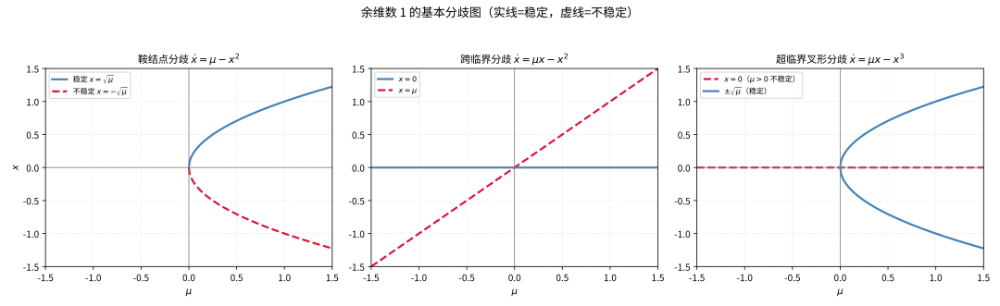
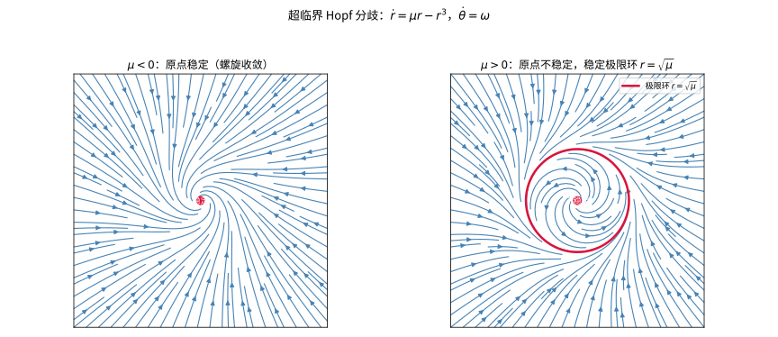

# 第91级：分歧理论 (Bifurcation Theory)

> 研究动力系统在参数缓慢变化下"质变"的学科：平衡态何时消失、何时失稳、何时冒出振荡与混沌。

---

## 从"参数一动，系统变身"说起：分歧理论要解决的根本问题

> 在动手记定义之前，先想清楚一个问题：**为什么把旋钮慢慢拧、系统却会在某个刻度突然"换了活法"？**

**一个真实的生活场景（第一步：直觉）**

设想你在烧一壶水：火开得不大不小，水温渐渐升高，一切平缓。可当温度压向某个临界值，平静的水面突然开始翻滚、沸腾——同样在加热，系统却从"安静"骤然跳成"沸腾"。又比如一支压不稳的笔：轻轻顶住，笔直地立得很稳；可一旦压力的某个参数过了临界，笔就"叭"地倒向一边，还出现了两个对称的"稳位"。**这些系统都很简单，可它们的行为都在某个参数值处发生了"质变"**：平衡态的数目变了、原先的稳定姿态站不住了、甚至冒出周期振荡。分歧理论就是专门研究这个"转折点"的数学。

**它要解决的根本问题（第二步：来龙去脉）**

连续变化的世界里藏着不连续的"质变"，这套突变从何而来、又该如何严整地分类？分歧理论的回答过程跨越了整整一个多世纪。

- **Poincaré 把"解的结构随参数变化"提上日程**（19 世纪末）。Henri Poincaré 在天体力学研究三体问题时，率先意识到动力系统解的结构会随参数而变化，并引入"向量场截面"与定性方法，把"看曲线簇随参数如何变形"变成严谨数学。
- **Andronov 与 Hopf：精确刻画"从静止到振荡"**（1930–1940 年代）。Aleksandr Andronov 等人奠定结构稳定性与分歧分析；Eberhard Hopf 于 1942 年给出 Hopf 分歧定理——一对共轭复特征值穿过虚轴，平衡失稳并冒出稳定极限环。
- **Takens 与 Thom：把分歧"放进范式抽屉"**（20 世纪中后期）。Floris Takens 与 René Thom 引入规范形与奇异性理论，把形形色色的分歧归并成少数"范式"（鞍结点、跨临界、叉形、Hopf），并用开折在参数空间内完整分类。
- **现代：从分歧走向混沌**（20 世纪后半叶至今）。倍周期分歧、同宿/异宿分岔、Duffing 振子与 Lorenz 吸引子，展示了"定态→周期→混沌"这条由一次次分歧搭起的阶梯，也让分歧理论成为物理、生物、化学中理解复杂系统的通用语言。

> **🧠 一句话记住分歧理论的"出生证"**
>
> 分歧理论源于"研究动力系统在参数变化下定性行为突变"的冲动，它要解决的根本问题是：
>
> $$ \boxed{\text{系统的平衡点/周期轨的数目与稳定性，在参数连续变化时于何处、以何种方式发生定性突变？}}
> $$
>
> 答案由分歧条件（特征值实部过零）＋横截条件（参数能"推得动"突变）＋非退化条件（余维数正确）共同锁定，规范形给出标准脸谱，开折负责排尽所有可能。

**看待本章的四种眼光（第三步：正式定义前的准备）**

- **定性的眼光**：分歧点、分歧图，用拓扑的眼睛看"平衡个数与稳定性何时变"。
- **降维的眼光**：中心流形定理——只在最慢的临界方向上分析，"快方向"统统放下。
- **简化的眼光**：规范形理论——用坐标变换把系统归并成最简单的标准形式。
- **分类与应用的眼光**：余维数与开折给出"需要多少参数才看得全"的分类；Duffing 与 Lorenz 展示分级在真实系统中的威力。

读完这一节，请记住的不是定义清单，而是：**分歧理论研究的是"连续参数如何诱导系统的质变"——边界处发生的"髋然一变"，正是可被数学精确刻画的必然**。带着这个追问去读后面的每个概念，你会发现每一条横截条件、每一个规范形，都是对"临界之后必变"这件事的精细画像。

---

## 开始之前

**本章在讲什么**：分歧理论研究含参数动力系统 $\dot{x}=f(x,\mu)$ 在平衡态附近的质变。你会先认识分歧点与四种最基本的余维数 1 分歧（鞍结点、跨临界、叉形、Hopf），掌握中心流形定理（把高维约化到临界低速方向）、规范形理论（把系统化为标准脸谱）、Hopf 分歧定理（从静止到振荡转变与极限环），并学会用代数条件识别单参数分歧、用开折与余维数给分歧分类，最后在 Duffing 振子与 Lorenz 系统中看到分歧引向混沌。

**为什么要学它**：在更早的常微分方程/动力系统专题里，你学的是"参数固定时解的行为"；本章把"参数也当作变量"纳入了系统研究，回答"参数一动、系统凭什么变身"。它是介于微分方程定性理论与非线性动力学之间的枢纽，向下承接平衡点稳定性、极限环与线性化，向上为倍周期分歧、混沌（Lorenz、Logistic）与奇异摄动等更高级课题奠定基础。

**开始前请确认你还记得**：

- 常微分方程与相图、平衡点与周期轨的基本概念（见常微分方程/动力系统专题）。
- 平衡点的稳定性判据：Jacobian 的特征值实部符号决定局部渐近稳定性（线性化理论）。
- 矩阵特征值：特征多项式、$\det(A-\lambda I)=0$、特征向量与左特征向量。
- 偏导与 Taylor 展开、隐函数定理、以及 $O(\cdot)$ 记号。
- 极坐标变换 $\dot{r}=\dots,\ \dot{\theta}=\dots$ 与极限环概念；一维映射迭代（后者在倍周期分歧处用到）。

---

## 学习目标

1. 理解分歧的基本概念与分歧点的分类
2. 掌握鞍结点分歧、跨临界分歧、叉形分歧的机制与规范形
3. 理解 Hopf 分歧的基本原理与计算方法
4. 掌握中心流形定理及其在分歧分析中的应用
5. 理解规范形理论与奇异性理论的基本思想
6. 掌握单参数分歧的代数条件与识别方法
7. 了解开折与通用开折的概念

---

## 第一节：分歧的基本概念

### 1.1 分歧的定义

🌐 **直觉先行**：研究分歧，就是要在系统的参数空间里"侦探式"地标记出那些**变不了量级的临界点**——平时参数动一动，系统只是数量变化；可一旦穿过某些点，系统就"换了活法"。分歧理论要做的第一步，就是把这门学科的"对象"钉清楚：什么时候、在什么坐标处，系统的平衡态集或稳定性发生了拓扑层面的本质改变。

**为什么需要这个概念**：没有显式的"分歧点"定义，就无法把"系统何时质变"从众多渐变中识别出来。这个定义给出判别的锚点 $(x_0,\mu_0)$，为后面的分类（鞍结点／跨临界／叉形／Hopf）与代数条件提供了坐标系。

**定义 1（分歧点）**：  
考虑含参数的动力系统

$$
\dot{x} = f(x, \mu), \quad x \in \mathbb{R}^n, \mu \in \mathbb{R}^m
$$

其中 $f: \mathbb{R}^n \times \mathbb{R}^m \to \mathbb{R}^n$ 是光滑映射。设 $(x_0, \mu_0)$ 满足 $f(x_0, \mu_0) = 0$（即平衡点）。若当参数 $\mu$ 经过 $\mu_0$ 时，系统的平衡点数目或稳定性发生定性变化，则称 $\mu_0$ 为**分歧点**（bifurcation point），$(x_0, \mu_0)$ 为**分歧点**。

> **💡 直观理解（类比）**：像慢慢拧音量旋钮，通常音乐只是响/轻地渐变，但会在某个临界位置突然"咔嚓"换了一副面孔——平衡点数量或稳不稳发生了本质改变。这个让系统"换了活法"的临界旋钮刻度，就是分歧点。

**定义 2（分歧图）**：  
分歧图是参数 $\mu$ 与系统平衡点 $x$ 之间的关系图，展示了平衡点集合随参数变化的拓扑结构。

> **💡 直观理解（类比）**：像把"拧旋钮→落在哪个平衡位"画成一张横轴是 $\mu$、纵轴是 $x$ 的地形图：曲线一旦分叉成几条枝条，就说明系统的"活法"变了。一眼数出枝条多少、分清实线（稳定）虚线（不稳定），临界前后的剧变尽收眼底。

### 1.2 基本分歧类型

🌐 **直觉先行**：分歧五花八门，但"一维平衡点分歧"却只有少数几种基本脸谱。为什么？因为平衡点附近按 Taylor 展开，最低阶的非线性项就决定了它的长相：含常数项的是**鞍结点**（两枝撞在一起又消失）、含 $x^2$ 交叉的是**跨临界**（两枝交换稳定性）、含 $x^3$ 对称的是**叉形**（一枝分裂成两支）。看懂这三张脸谱，等于掌握了所有"平衡点数目突变"的标准答案。

**为什么需要这个概念**：这三种一维分歧是整门学科的"字母表"——高维、复杂的分歧经中心流形约化后，常常就落回这三种标准形之一（Hopf 则是下一节二维的情形）。先牢牢记住它们，后面的一切识别都水到渠成。

#### 鞍结点分歧（Saddle-Node Bifurcation）

**规范形**：

$$
\dot{x} = \mu - x^2
$$

- 当 $\mu < 0$ 时，无平衡点
- 当 $\mu = 0$ 时，有一个非双曲平衡点 $x = 0$
- 当 $\mu > 0$ 时，有两个平衡点：稳定结点 $x = \sqrt{\mu}$ 和不稳定鞍点 $x = -\sqrt{\mu}$

#### 跨临界分歧（Transcritical Bifurcation）

**规范形**：

$$
\dot{x} = \mu x - x^2
$$

- 当 $\mu < 0$ 时，$x = 0$ 稳定，$x = \mu$ 不稳定
- 当 $\mu = 0$ 时，有一个非双曲平衡点 $x = 0$
- 当 $\mu > 0$ 时，$x = 0$ 不稳定，$x = \mu$ 稳定

#### 叉形分歧（Pitchfork Bifurcation）

**超临界叉形分歧**：

$$
\dot{x} = \mu x - x^3
$$

- 当 $\mu < 0$ 时，只有一个稳定平衡点 $x = 0$
- 当 $\mu = 0$ 时，非双曲平衡点 $x = 0$
- 当 $\mu > 0$ 时，$x = 0$ 不稳定，两个稳定平衡点 $x = \pm \sqrt{\mu}$

**亚临界叉形分歧**：

$$
\dot{x} = \mu x + x^3
$$

- 当 $\mu < 0$ 时，$x = 0$ 稳定，两个不稳定平衡点 $x = \pm \sqrt{-\mu}$
- 当 $\mu = 0$ 时，非双曲平衡点 $x = 0$
- 当 $\mu > 0$ 时，$x = 0$ 不稳定

> **常见坑**：叉形分歧的"超临界/亚临界"很容易靠"$\mu x - x^3$"与"$\mu x + x^3$"认错。记住口诀：**$x^3$ 项前是负号（$-x^3$）则为超临界**（分支出的是稳定枝、无滞后），**是正号（$+x^3$）则为亚临界**（分支出的是**不稳定**枝，且典型伴随"跳跃/滞后"现象）。一个符号之差，决定分出的枝稳不稳。

> **直观理解（现实类比）**：分歧图就像"平衡杆的受力曲线"。参数 $\mu$ 是"外力的强弱"，$x$ 是系统的平衡位置。鞍结点分歧如同"断裂的桥梁"——外力超过临界值才突然出现两个交叠的平衡态然后消失；叉形分歧如同"倒向两侧的树枝"，对称破缺后从中间分岔出两个稳定形态。图中实线（稳定）与虚线（不稳定）的交替，刻画了系统在临界点前后"质"的变化。
>
> **🧠 思考历程：一个拗着一个参数的旋钮，系统怎么就会突然"换了活法"？**
>
> 分歧理论回答的问题极为日常：**当你缓缓拧动一个参数，系统的平衡点数目或稳定性为何会在某个时刻"咔嚓"突变**。把这"突变"琢磨得透彻，便是从 Poincaré 到现代动力系统的一整段探索。
>
> - **Poincaré：把"解的结构随参数变化"提上日程**（19 世纪末）。Henri Poincaré 在天体力学中研究三体问题，率先认识到动力系统解的结构会随参数变化而转变。他引入"向量场截面"与定性方法，把"看曲线簇随参数如何变形"变成了严谨数学。
> - **Andronov 与 Hopf：从周期振荡到 Hopf 分歧**（1930–1940 年代）。Aleksandr Andronov 等人发展出"结构稳定性"与分岔分析；Eberhard Hopf 则在 1942 年给出如今以他命名的 Hopf 分歧定理——当一对复共轭特征值穿过虚轴，平衡点会失稳并冒出稳定极限环。这一定理把"从静止到振荡"的转变第一次精确化。
> - **规范形与开折：把分岔"摆到桌上"**（20 世纪中后期）。Floris Takens 与 René Thom 引入规范形与奇异性理论，把形形色色的分歧归并成少数几种"范式"（鞍结、跨临界、叉形、Hopf），并用"开折"在参数空间里完整分类——多复杂的系统，落到规范形上就是那几副面孔。
> - **心路**：突变往往不是偶然，而是参数跨过临界线的必然。分歧理论提醒我们：**藏在"稳"背后的那一句"临界之后必变"，值得被反复地精细刻画**。

---

## 第二节：中心流形理论

### 2.1 中心流形的基本概念

🌐 **直觉先行**：系统在平衡点附近的运动可粗分三路：**极快地被拽走（稳定方向）、极快地甩开（不稳定方向）、以及慢吞吞地漂（中心方向）**。中心流形就是贴着那批"慢漂方向"铺成的一张光滑曲面——分歧发生时，真正的戏码几乎全在它上面上演。把它找出来，就等于找到了"别管快方向、只操心慢方向"的降维门票。

**为什么需要这个概念**：分歧本质上是"快方向已经归位、剩下临界方向决定生死"的事件。中心流形把这些临界方向（实部为零的特征值）单独抓出来，是中心流形定理与"约化法"（2.3）的基石——高维系统的分歧分析几乎都要先把系统"压"到这张薄片上。

**定义 3（中心流形）**：  
考虑系统 $\dot{x} = f(x)$，$x \in \mathbb{R}^n$，其中 $f(0) = 0$。设 $A = Df(0)$ 的谱分解为：
- $\sigma_s$：具有负实部的特征值（稳定子空间 $E^s$）
- $\sigma_u$：具有正实部的特征值（不稳定子空间 $E^u$）
- $\sigma_c$：具有零实部的特征值（中心子空间 $E^c$）

系统在 $0$ 处的**局部中心流形** $W^c_{\text{loc}}(0)$ 是过 $0$ 且与 $E^c$ 相切的 $C^r$ 嵌入流不变子流形。

> **💡 直观理解（类比）**：像湖面捣开一小圈波纹，真正有"戏"的慢运动都贴在最容易漂的方向上展开。中心流形就是那张"既不会被迅速拽走、也不会被猛地甩开"的临界方向铺成的曲面，分歧行为全得靠它来承载。

### 2.2 中心流形定理

🌐 **直觉先行**：上一条定义告诉你"中心流形存在"，可它真正珍贵的是**可计算的存在性**——不仅有个抽象的曲面，还能给出这张曲面在平衡点附近"长在哪、怎么表达"。中心流形定理就是这个保证：它断言只要 $f$ 够光滑（$C^r$），就能在原点附近找到一张过原点、与中心方向相切、且局部流不变的 $C^r$ 曲面，还允许把它写成"中心坐标的函数" $x = x_c + h(x_c)$。换句话说，**那张"慢漂曲面"不仅存在，还能被实际算出来**——这是后面一切约化方法（2.3）与 Hopf 证明（4.2）的引擎。

**为什么需要这个概念**：仅凭"中心流形存在"还不足以做计算；必须有一套定量保证——光滑性（可求导）、相切性（近似程度）、流不变性（真能承载轨道）、可表示性（能写成分量式），才能把"找中心流形"变成"解一个函数方程"。这四条性质正是约化法、规范形乃至 Hopf 极限环证明的支柱。

**定理 1（中心流形定理）**：  
设 $f \in C^r(\mathbb{R}^n, \mathbb{R}^n)$（$r \geq 2$），$f(0) = 0$，$A = Df(0)$。则存在 $0$ 的邻域 $U$ 和 $C^r$ 中心流形 $W^c_{\text{loc}}(0)$，满足：

1. $W^c_{\text{loc}}(0)$ 在 $0$ 处与 $E^c$ 相切。
2. $W^c_{\text{loc}}(0)$ 在 $U$ 中是局部流不变的：若 $x \in W^c_{\text{loc}}(0)$，则对 $|t|$ 充分小有 $\varphi_t(x) \in W^c_{\text{loc}}(0)$。
3. $W^c_{\text{loc}}(0)$ 包含所有在 $U$ 中保持有界的轨道。
4. $W^c_{\text{loc}}(0)$ 可以表示为 $x_c$ 的函数：$x = x_c + h(x_c)$，其中 $h: E^c \to E^s \oplus E^u$ 是 $C^r$ 映射，$h(0) = 0$，$Dh(0) = 0$。

> **💡 直观理解（类比）**：像土坡上的一颗球：大多数方向球会被迅速弹落（快速收缩或扩张），只有"零斜坡"的方向上球才慢吞吞地滚。定理保证过原点存在一张光滑的"平缓薄片"，所有慢行为都贴在这张薄片上走，快方向则被它干净地摈弃——你把注意力全放在这张薄片上就够了。

**证明**（通过局部化与截断函数）：

**第一步：局部化。**  
将系统改写为

$$
\dot{x} = Ax + \tilde{f}(x)
$$

其中 $\tilde{f}(x) = f(x) - Ax$ 满足 $\tilde{f}(0) = 0$，$D\tilde{f}(0) = 0$。

**第二步：坐标变换。**  
通过线性变换将 $A$ 化为块对角形式：

$$
A = \begin{pmatrix} A_c & 0 \\ 0 & A_s \end{pmatrix}
$$

其中 $A_c$ 的特征值实部为零，$A_s$ 的特征值具有非零实部。系统变为

$$
\begin{cases}
\dot{u} = A_c u + f_c(u, v) \\
\dot{v} = A_s v + f_s(u, v)
\end{cases}
$$

其中 $(u, v) \in E^c \times E^s$，$f_c, f_s$ 是 $C^r$ 映射，且 $f_c(0,0) = 0$，$Df_c(0,0) = 0$，$f_s(0,0) = 0$，$Df_s(0,0) = 0$。

**第三步：截断函数。**  
引入 $C^\infty$ 截断函数 $\phi: \mathbb{R}^n \to [0, 1]$，满足

$$
\phi(x) = \begin{cases}
1, & |x| \leq \epsilon \\
0, & |x| \geq 2\epsilon
\end{cases}
$$

定义修正系统：

$$
\begin{cases}
\dot{u} = A_c u + \phi(u, v) f_c(u, v) \\
\dot{v} = A_s v + \phi(u, v) f_s(u, v)
\end{cases}
$$

该修正系统全局 Lipschitz。

**第四步：转换为积分方程。**  
设 $h: E^c \to E^s$ 是 $C^1$ 映射，中心流形为 $v = h(u)$。由流不变性，若 $v(t) = h(u(t))$，则

$$
\dot{v} = Dh(u) \cdot \dot{u}
$$

代入得：

$$
A_s h(u) + f_s(u, h(u)) = Dh(u) \cdot [A_c u + f_c(u, h(u))]
$$

即

$$
Dh(u) \cdot [A_c u + f_c(u, h(u))] - A_s h(u) - f_s(u, h(u)) = 0
$$

**第五步：解的存在性。**  
考虑映射 $\mathcal{F}: C^1_b(\mathbb{R}^c, \mathbb{R}^s) \to C^0_b(\mathbb{R}^c, \mathbb{R}^s)$：

$$
\mathcal{F}(h) = Dh(u) \cdot [A_c u + \phi(u, h(u)) f_c(u, h(u))] - A_s h(u) - \phi(u, h(u)) f_s(u, h(u))
$$

我们需要解 $\mathcal{F}(h) = 0$。

利用线性算子 $L(h) = Dh(u) \cdot A_c u - A_s h(u)$，将方程改写为

$$
L(h) = -\phi(u, h)[Dh(u) \cdot f_c(u, h) - f_s(u, h)]
$$

由于 $A_s$ 是收缩的（特征值实部为负），$L$ 是可逆的。通过迭代法（或 Lyapunov-Perron 方法）可证明解的存在唯一性。

**Lyapunov-Perron 方法**：解积分方程

$$
h(u) = \int_{-\infty}^0 e^{-A_s \tau} \phi(u(\tau), h(u(\tau))) f_s(u(\tau), h(u(\tau))) d\tau
$$

其中 $u(\tau)$ 是 $\dot{u} = A_c u + \phi(u, h(u)) f_c(u, h(u))$ 满足 $u(0) = u$ 的解。通过压缩映射原理可证存在唯一解 $h$。

**第六步：正则性。**  
$h$ 的 $C^r$ 正则性由 $f$ 的 $C^r$ 正则性和压缩映射的平滑性保证。$\square$

### 2.3 中心流形约化

🌐 **直觉先行**：中心流形定理把"慢漂曲面"找出来了，可我们真正要的是**结论上的收益**——能不能告诉别人"这高维系统，行为就等于那张低维曲面上的一个小系统"？中心流形约化定理就回答这个"何以能降维"的问题：它断言平衡点附近的稳定性、分歧，**全部由中心流形上的约化系统 $\dot{u} = A_c u + f_c(u, h(u))$ 决定**。也就是说，"快方向"上那些瞬态统统与最终结论无关，可以放心丢掉。

**为什么需要这个概念**：降维不是猜测，而是定理保障的严格操作。有了它，高维系统的鞍结点／叉形／Hopf 分析，才能理直气壮地"压扁"到一张 1 维或 2 维薄片上，再用前三节的规范形去识别——这是整个 5 节、7 节里所有"先约化、再分类"流程的合法性来源。

中心流形定理的核心应用是**降维**：系统的动力学行为在中心流形附近由中心流形上的约化系统完全决定。

**定理 2（中心流形约化）**：  
系统 $\dot{x} = f(x)$ 在平衡点 $0$ 附近的局部动力学行为（稳定性、分歧等）完全由中心流形上的约化系统

$$
\dot{u} = A_c u + f_c(u, h(u))
$$

决定，其中 $h$ 是中心流形 $v = h(u)$ 的表示。

> **💡 直观理解（类比）**：像摘下无关紧要的"近视度数"——绝大多数快速抖动被忽略掉，只看那一个临界方向的慢演变。把高维系统"压扁"到一张低维薄片上，稳定性与分歧全由薄片上一小段方程说了算，省掉的天文级自由度毫不影响结论。

---

## 第三节：规范形理论

### 3.1 规范形的基本思想

🌐 **直觉先行**：同一个分歧可以藏在无数个长相各异的系统里，可观众（我们）只想看"真脸谱"。规范形的野心就是**通过换坐标系，把与本质无关的高阶项统统抹掉，留下一副最能代表这段动力学性格的最简方程**。它像给一张照片"去噪调色"：坐标变换不改系统本身，改的只是观察角度与刻度，却能把冗余细节洗掉，剩下骨架最清晰的标准形。

**为什么需要这个概念**：没有规范形，两套方程即便数学上等价，也很难肉眼认出是同一回事；有了它，分类（这是鞍结点、那是叉形、那是 Hopf）与后续开折分析就不再是"逐案碰运气"，而是"对号入座"。它是奇异性理论与余维数分类（6、8 节）的地基。

**定义 4（规范形）**：  
系统的**规范形**（normal form）是通过近恒等坐标变换将系统化为尽可能简单的形式，保留其本质动力学特征。

> **💡 直观理解（类比）**：像按同一张底片重新洗照片，只保留最抓人的轮廓线条、抹掉无关噪点。所谓近恒等变换并不是改系统本身，而是"换一套坐标系"，把次要的高阶项清干净，剩下的就是能一眼认出性格的"骨架方程"。

**定理 3（Poincaré 规范形定理）**：  
设 $\dot{x} = Ax + f(x)$，其中 $f(0) = 0$，$Df(0) = 0$，$f$ 是形式幂级数。则存在形式近恒等变换 $x = y + \phi(y)$，将系统化为

$$
\dot{y} = Ay + g(y)
$$

其中 $g$ 由 $A$ 的共振项组成，即 $g$ 的非线性项仅包含满足共振关系的单项式。

> **💡 直观理解（类比）**：非线性项能被"写到最瘦"：凡是与线性部分"频率不合拍"（非共振）的高次项，都能用坐标的小量变换悄悄弹走；只有与线性项"同频共振"的单项式必须原样留下。留下的共振项，正是系统真正甩不掉的那点性格。

### 3.2 叉形分歧的规范形

🌐 **直觉先行**：叉形分歧原本藏在各式各样带对称性的系统里，但凡是"$x=0$ 恒为平衡点、且对称破除后在两侧各分出一枝"的，都能被归并成同一张脸谱 $\dot{y} = \mu y \pm y^3$。规范的威力在于：**只要代数条件（对称性、非退化）到位，坐标变换就能把任何这样的系统"洗干净"，现出这张标准形**。这里的 $\pm$ 号绝不是装饰——它一锤定音地决定分出的枝是稳定还是不稳定（超临界还是亚临界）。

**为什么需要这个概念**：第四节的 Hopf 也要用规范形，5 节的代数识别要紧它对号入座，而这里给的具体弦 + 近恒等变换则是"如何把一个真实系统归并成标准形"的完整样板——看完这段，你才知道那些沿偏导数计算到底怎么落成最简单的统式方程。

**定理 4（叉形分歧的规范形）**：  
考虑单参数系统

$$
\dot{x} = f(x, \mu), \quad x \in \mathbb{R}, \mu \in \mathbb{R}
$$

假设在 $(0, 0)$ 处满足分歧条件：
- $f(0, 0) = 0$，$\frac{\partial f}{\partial x}(0, 0) = 0$
- $\frac{\partial f}{\partial \mu}(0, 0) = 0$（叉形分歧条件）
- $\frac{\partial^2 f}{\partial x^2}(0, 0) = 0$（对称性条件）
- $\frac{\partial^3 f}{\partial x^3}(0, 0) \neq 0$，$\frac{\partial^2 f}{\partial x \partial \mu}(0, 0) \neq 0$

则存在坐标变换将系统化为规范形

$$
\dot{y} = \mu y \pm y^3
$$

其中 $+$ 对应亚临界叉形分歧，$-$ 对应超临界叉形分歧。

> **💡 直观理解（类比）**：不管叉形分歧原本藏在多复杂的系统里，只要对称性条件到位，一套坐标变换都会把它归并到同一张"标准脸谱"$\dot{y} = \mu y \pm y^3$——枝条朝哪边分岔、分岔几根，全被这个 $\pm$ 号一锤定音。

**证明**（用奇异性理论）：

**第一步：将系统展开为 Taylor 级数。**  
在 $(0, 0)$ 附近展开 $f(x, \mu)$：

$$
f(x, \mu) = a\mu x + b x^3 + O(\mu x^2, \mu^2 x, \mu^3, x^4)
$$

其中 $a = \frac{\partial^2 f}{\partial x \partial \mu}(0, 0) \neq 0$，$b = \frac{1}{6} \frac{\partial^3 f}{\partial x^3}(0, 0) \neq 0$。

**第二步：尺度变换。**  
令 $x = \alpha y$，$\mu = \beta \nu$，选择 $\alpha, \beta$ 使得

$$
a\beta \nu \cdot \alpha y + b \alpha^3 y^3 = \alpha(\nu y + \text{sgn}(b) y^3)
$$

即需要 $a\beta = 1$ 且 $|b|\alpha^2 = 1$。取 $\alpha = 1/\sqrt{|b|}$，$\beta = 1/a$，则系统化为

$$
\dot{y} = \nu y + \text{sgn}(b) y^3 + O(\nu y^2, \nu^2 y, \nu^3, y^4)
$$

**第三步：近恒等变换消去高阶项。**  
考虑变换 $y = z + \phi(z, \nu)$，其中 $\phi$ 是 $z$ 和 $\nu$ 的多项式（次数 $\geq 2$）。我们希望消去 $O(\nu y^2, \nu^2 y, \nu^3, y^4)$ 中除共振项以外的项。

由奇异性理论，在变换下，系统的**接触等价类**（contact equivalence class）由 2-jet 决定。具体地，$f(x, \mu)$ 与 $\nu y + \text{sgn}(b) y^3$ 在 $(0,0)$ 处是接触等价的，因为：
- 满足非退化条件 $\frac{\partial f}{\partial x \partial \mu} \neq 0$ 和 $\frac{\partial^3 f}{\partial x^3} \neq 0$
- 分歧的余维数为 $1$

**第四步：确定规范形。**  
经过上述变换，最终得到规范形

$$
\dot{z} = \nu z + \epsilon z^3
$$

其中 $\epsilon = \text{sgn}(b) = \pm 1$。$\epsilon = -1$ 对应超临界叉形分歧，$\epsilon = +1$ 对应亚临界叉形分歧。$\square$

---

## 第四节：Hopf 分歧

### 4.1 Hopf 分歧的几何图像

🌐 **直觉先行**：前三节的分歧都是"平衡点数目变了"；而 Hopf 分歧是另一种"质变"——**平衡点数目没变，系统却从"静止"变成"周期性晃动"**。它的机制是：平衡点的 Jacobian 有一对共轭复特征值穿过虚轴，实部由负转正，平静的平衡点就地"站不住"，旁边羊毛长出一圈周期轨道。它的几何图像最好用极坐标看：$\dot{r} = \mu r - r^3$，当 $\mu>0$ 时 $r=0$ 失稳、$r=\sqrt{\mu}$ 变成稳定圈——**一动起来，就再也停不回原点了**。

**为什么需要这个概念**：这是唯一一种"从定态到振荡"的标准分歧（也是物理学、生物学里振荡/搏动现象的数学入口），而且它的证明路线（中心流形约化 + 规范形）正好把 2、3 两节的武器全部实战化。理解它的几何图像，比死记定理更有助于直觉判断"一个系统何时会开始摆起来"。

**定义 5（Hopf 分歧）**：  
Hopf 分歧是当参数变化导致平衡点的共轭复特征值穿越虚轴时，从平衡点分支出一族周期轨道的现象。

**规范形**（二维）：

$$
\begin{cases}
\dot{x} = \mu x - \omega y - (x^2 + y^2)x \\
\dot{y} = \omega x + \mu y - (x^2 + y^2)y
\end{cases}
$$

在极坐标下：

$$
\begin{cases}
\dot{r} = \mu r - r^3 \\
\dot{\theta} = \omega
\end{cases}
$$

- 当 $\mu < 0$ 时，原点稳定
- 当 $\mu = 0$ 时，非双曲平衡点
- 当 $\mu > 0$ 时，原点不稳定，出现稳定极限环 $r = \sqrt{\mu}$

> **直观理解（现实类比）**：Hopf 分歧好比"陀螺在临界转速下突然开始摆动"。转速 $\mu$ 低于临界值时，陀螺稳稳地立在原点（稳定平衡点）；一旦转速超过临界值，垂直姿势反而站不稳，运动卷成一圈稳定的"极限环"——就像慢悠悠晃动的旋转陀螺，或颤动的晾衣绳。极限环半径 $r=\sqrt{\mu}$ 随参数连续变大，正是"从静态平衡过渡到周期振荡"的生动写照。

### 4.2 Hopf 分歧定理

🌐 **直觉先行**：上面的规范形（$\dot{r}=\mu r - r^3$）已经给出"$\mu>0$ 冒极限环"的表象，可真实系统不一定这么规整。Hopf 分歧定理就是把这个直觉做成可检查的**判据清单**：平衡点处处存在（$f(0,\mu)=0$）、Jacobian 有一对纯虚复特征值（$\pm i\omega$）、**横截穿越**（$\alpha'(\mu_0)\neq0$，保证实部真的斜着穿过虚轴而不只是擦边）、**非退化**（第一 Lyapunov 系数 $l_1\neq0$）。四条凑齐，就能断定此处一定长出极限环，且环的半径按 $\sqrt{|\mu-\mu_0|}$ 随风缓缓放开（振幅随"过头量"的平方根增长）。

**为什么需要这个概念**：它把"从静止到振荡"的几何直觉，变成四个能直接对着原系统计算的数值判据。$l_1$ 的符号更是决定环稳不稳（超临界 $l_1<0$ 稳定、亚临界 $l_1>0$ 不稳定）的分水岭——这是把 Hurwitz 稳定性判据无法回答的"临界之后发生什么"补完的关键一环。

**定理 5（Hopf 分歧定理）**：  
考虑二维系统 $\dot{x} = f(x, \mu)$，$x \in \mathbb{R}^2$，$\mu \in \mathbb{R}$。假设：

1. $f(0, \mu) = 0$ 对所有 $\mu$ 成立。
2. $A(\mu) = Df(0, \mu)$ 有一对共轭复特征值 $\alpha(\mu) \pm i\omega(\mu)$，其中 $\omega(\mu_0) > 0$。
3. **横截条件**：$\alpha'(\mu_0) \neq 0$（特征值横截穿越虚轴）。
4. **非退化条件**：第一 Lyapunov 系数 $l_1 \neq 0$。

则存在 $\mu_0$ 附近的分歧：从 $\mu_0$ 处分支出周期轨道，其振幅 $O(\sqrt{|\mu - \mu_0|})$，频率 $O(\omega(\mu_0))$。

- 若 $l_1 < 0$，分歧是**超临界**的（稳定极限环）
- 若 $l_1 > 0$，分歧是**亚临界**的（不稳定极限环）

> **💡 直观理解（类比）**：像荡秋千越推越狠：一对共轭复特征值一旦"横向穿过虚轴"（横截条件），静止的平衡就站不住，立马荡出一圈稳定的摆动。振幅按 $\sqrt{\text{过头量}}$ 慢慢长大，方向（超/亚临界）则由第一 Lyapunov 系数 $l_1$ 一锤定音。

**证明**（用中心流形约化与规范形）：

**第一步：中心流形约化。**  
考虑系统

$$
\dot{x} = f(x, \mu), \quad x \in \mathbb{R}^n, \mu \in \mathbb{R}
$$

假设在 $\mu = \mu_0$ 处，$A = Df(0, \mu_0)$ 有一对纯虚特征值 $\pm i\omega_0$，其余特征值具有非零实部。

由中心流形定理，存在 $2$ 维中心流形 $W^c_{\text{loc}}(0)$，系统的动力学可以约化到该流形上。记约化后的二维系统为

$$
\dot{z} = F(z, \mu), \quad z \in \mathbb{C}
$$

其中 $F(0, \mu) = 0$，$D_z F(0, \mu_0) = i\omega_0$。

**第二步：将系统展开。**  
在 $(0, \mu_0)$ 附近展开 $F$：

$$
F(z, \mu) = \alpha(\mu)z + i\omega(\mu)z + a(\mu)z|z|^2 + O(|z|^5)
$$

其中 $\alpha(\mu_0) = 0$，$\omega(\mu_0) = \omega_0$。

**第三步：规范形变换。**  
通过近恒等变换消去高阶共振项。在极坐标 $(r, \theta)$ 下，系统化为

$$
\begin{cases}
\dot{r} = \alpha(\mu) r + a_r(\mu) r^3 + O(r^5) \\
\dot{\theta} = \omega(\mu) + a_i(\mu) r^2 + O(r^4)
\end{cases}
$$

其中 $a_r = \text{Re}(a)$ 是**第一 Lyapunov 系数**。

**第四步：分歧分析。**  
在 $\mu = \mu_0$ 附近展开 $\alpha(\mu) = \alpha'(\mu_0)(\mu - \mu_0) + O((\mu - \mu_0)^2)$。径向方程近似为

$$
\dot{r} = \alpha'(\mu_0)(\mu - \mu_0) r + a_r(\mu_0) r^3
$$

记 $\epsilon = \mu - \mu_0$，系统为

$$
\dot{r} = \alpha'(\mu_0) \epsilon r + a_r(\mu_0) r^3
$$

当 $\alpha'(\mu_0) \neq 0$ 且 $a_r(\mu_0) \neq 0$ 时，这是一个叉形分歧。

**第五步：周期解的存在性。**  
非平凡平衡点 $r = \sqrt{-\alpha'(\mu_0) \epsilon / a_r(\mu_0)}$ 存在当且仅当：
- 若 $\alpha'(\mu_0) > 0$，$a_r(\mu_0) < 0$（超临界）：$\epsilon > 0$ 时存在稳定极限环
- 若 $\alpha'(\mu_0) > 0$，$a_r(\mu_0) > 0$（亚临界）：$\epsilon < 0$ 时存在不稳定极限环

对应地，原系统有周期解 $x(t) = r \cos(\omega t + \theta_0) + O(r^2)$。$\square$

---

## 第五节：鞍结点分歧的代数条件

### 5.1 鞍结点分歧的代数刻画

🌐 **直觉先行**：几何上"两枝撞在一起又消失"的鞍结点，落到代数上该长什么样？——**Jacobian 恰好有一个零特征值（只有一条方向"变平了"）＋横截条件（参数推得动它）＋非退化（沿变平方向弯二次）**。这三条就是鞍结点的"代数体检单"：缺一条，要么不是平衡点、要么不横穿、要么弯曲度为零而判断失效。"代数刻画"就是把几何直觉转译成能直接套公式验证的可数条件。

**为什么需要这个概念**：真实系统的分歧不像规范形那样一眼可认，必须靠"算偏导数、查零不零"来识别。这套代数条件（$A$ 零特征值、左/右特征向量 $w,v$、$w\cdot f_\mu$、$w\cdot D^2f(v,v)$）正是把 1.2 的几何场景化成最可落地的判据，也是 5.2 统一识别方法的公共零件。

**定理 6（鞍结点分歧的代数条件）**：  
考虑单参数系统 $\dot{x} = f(x, \mu)$，$x \in \mathbb{R}^n$，$\mu \in \mathbb{R}$。设 $(x_0, \mu_0)$ 满足 $f(x_0, \mu_0) = 0$。若以下条件成立：

1. $A = Df(x_0, \mu_0)$ 有唯一的零特征值，其余特征值具有非零实部。
2. **横截条件**：$w \cdot \frac{\partial f}{\partial \mu}(x_0, \mu_0) \neq 0$，其中 $w$ 是 $A$ 的零特征值对应的左特征向量。
3. **非退化条件**：$w \cdot [D^2f(x_0, \mu_0)(v, v)] \neq 0$，其中 $v$ 是 $A$ 的零特征值对应的右特征向量。

则系统在 $(x_0, \mu_0)$ 处发生鞍结点分歧。

> **💡 直观理解（类比）**：三条代数"体检报告"合在一起，就是一句"这一处刚好只有一条变平的方向、参数一推就错开、且沿那方向弯成抛物线"——三条凑齐，准是两条平衡枝撞在一起又瞬间消失的鞍结点。

**证明**（用隐函数定理）：

**第一步：投影到中心方向。**  
将系统分解为中心部分和双曲部分。设 $v$ 和 $w$ 分别为 $A$ 的零特征值的右和左特征向量，满足 $w \cdot v = 1$。

**第二步：中心流形约化。**  
由中心流形定理，存在一维中心流形，其上的约化系统为

$$
\dot{u} = g(u, \mu), \quad u \in \mathbb{R}
$$

其中 $g(0, \mu_0) = 0$，$\frac{\partial g}{\partial u}(0, \mu_0) = 0$。

**第三步：计算 $g$ 的偏导数。**  
将 $f$ 在 $(x_0, \mu_0)$ 处展开：

$$
f(x_0 + u v + y, \mu_0 + \epsilon) = A(u v + y) + \frac{1}{2} D^2f(x_0, \mu_0)(u v + y, u v + y) + \frac{\partial f}{\partial \mu}(x_0, \mu_0) \epsilon + \cdots
$$

其中 $y$ 属于 $A$ 的像空间（即 $w \cdot y = 0$）。

在中心流形上，$y = h(u, \epsilon)$，其中 $h(0, 0) = 0$，$Dh(0, 0) = 0$。代入并投影到 $w$ 方向：

$$
g(u, \epsilon) = w \cdot f(x_0 + u v + h(u, \epsilon), \mu_0 + \epsilon)
$$

**第四步：计算偏导数。**  
在 $(0, 0)$ 处：

$$
\frac{\partial g}{\partial u}(0, 0) = w \cdot A v = 0
$$

$$
\frac{\partial g}{\partial \epsilon}(0, 0) = w \cdot \frac{\partial f}{\partial \mu}(x_0, \mu_0) \neq 0 \quad \text{(由横截条件)}
$$

$$
\frac{\partial^2 g}{\partial u^2}(0, 0) = w \cdot D^2f(x_0, \mu_0)(v, v) \neq 0 \quad \text{(由非退化条件)}
$$

因此 $g(u, \epsilon) = a\epsilon + b u^2 + O(\epsilon^2, u\epsilon, u^3)$，其中 $a \neq 0$，$b \neq 0$。

**第五步：解的结构。**  
由隐函数定理，方程 $g(u, \epsilon) = 0$ 在 $(0, 0)$ 附近有解 $u = \pm \sqrt{-\frac{a}{b} \epsilon} + O(\epsilon)$。因此：
- 当 $\epsilon > 0$（若 $a/b < 0$）或 $\epsilon < 0$（若 $a/b > 0$）时，有两个平衡点
- 在临界参数处，两个平衡点碰撞消失

这就是鞍结点分歧的特征。$\square$

### 5.2 单参数分歧的识别

🌐 **直觉先行**：有了 5.1 的三条"体检单"，再往前一步就是——**把整套条件做成一张查表，一次认全最常见三种单参数分歧**。判断依据就在各阶偏导数"谁零谁不零"的组合里：$\frac{\partial f}{\partial \mu}$ 非零 → 鞍结点；它为零但二阶、交叉都非零 → 叉形／跨临界。识别不再是"碰运气看图"，而是对着表格机械地查，就能自动对号入座。

**为什么需要这个概念**：实际遇到一个未知系统，第一问往往是"它在某参数点发生哪种分歧"。这张统一识别表把歧义的"猜"变成确定的"算"，是为 7 节应用（Duffing、Lorenz）与 8 节高级分类提供的"即时判别工具"。

**定理 7（单参数分歧的识别）**：  
考虑 $\dot{x} = f(x, \mu)$，$x \in \mathbb{R}^n$，$\mu \in \mathbb{R}$，设 $(x_0, \mu_0)$ 是平衡点且 $A = Df(x_0, \mu_0)$ 有零特征值。

1. 若 $w \cdot \frac{\partial f}{\partial \mu} \neq 0$ 且 $w \cdot D^2f(v, v) \neq 0$，则发生鞍结点分歧。
2. 若 $w \cdot \frac{\partial f}{\partial \mu} = 0$，$w \cdot D^2f(v, v) = 0$，$w \cdot D^3f(v, v, v) \neq 0$，且 $w \cdot \frac{\partial^2 f}{\partial x \partial \mu} v \neq 0$，则发生叉形分歧。
3. 若 $w \cdot \frac{\partial f}{\partial \mu} = 0$，$w \cdot D^2f(v, v) \neq 0$，$w \cdot \frac{\partial^2 f}{\partial x \partial \mu} v = 0$，则发生跨临界分歧。

> **💡 直观理解（类比）**：像用一组"分辨试剂"给分歧分类——看各阶偏导数里哪些为零、哪些不为零的组合，就能自动对号入座到鞍结点、叉形或跨临界。一套查表法，把最常见三种分歧一次性识别出来。

**证明**（统一框架）：

**证明思路**：通过中心流形约化将系统降为一维，然后通过 Taylor 展开和隐函数定理分析。

设约化后的系统为 $\dot{u} = g(u, \mu)$，其中 $g(0, \mu_0) = 0$，$\frac{\partial g}{\partial u}(0, \mu_0) = 0$。

**情形 1（鞍结点分歧）**：$\frac{\partial g}{\partial \mu} \neq 0$，$\frac{\partial^2 g}{\partial u^2} \neq 0$。  
则 $g(u, \mu) = a(\mu - \mu_0) + bu^2 + \cdots$，由隐函数定理，解为 $u \approx \pm \sqrt{-a(\mu - \mu_0)/b}$。

**情形 2（叉形分歧）**：$\frac{\partial g}{\partial \mu} = 0$，$\frac{\partial^2 g}{\partial u^2} = 0$，$\frac{\partial^2 g}{\partial u \partial \mu} \neq 0$，$\frac{\partial^3 g}{\partial u^3} \neq 0$。  
则 $g(u, \mu) = c(\mu - \mu_0)u + du^3 + \cdots$，解为 $u = 0$ 或 $u \approx \pm \sqrt{-c(\mu - \mu_0)/d}$。

**情形 3（跨临界分歧）**：$\frac{\partial g}{\partial \mu} = 0$，$\frac{\partial^2 g}{\partial u^2} \neq 0$，$\frac{\partial^2 g}{\partial u \partial \mu} \neq 0$。  
则 $g(u, \mu) = e(\mu - \mu_0)u + fu^2 + \cdots$，解为 $u = 0$ 或 $u \approx -e(\mu - \mu_0)/f$。

这些条件通过 $v$ 和 $w$ 与原始系统的偏导数关联，如定理所述。$\square$

---

## 第六节：开折与通用开折

### 6.1 开折的概念

🌐 **直觉先行**：规范形给了我们"最简脸谱"，可现实里的系统总带着一点微扰，会把这个脸谱稍稍弄歪。开折问的是：**"要把被扰动一扯就'散架'的各种不同分支都摊开来全部看得到，至少还得再补几个额外的旋钮 $\alpha$？"** 答案是：最小补的数量，恰好等于这个分歧的"复杂程度"（余维数）。于是先给"完整追踪所有可能分支"这一要求一个精确名字——开折。

**为什么需要这个概念**：单独看一个分歧点会把"细枝末节"剪掉，往往会漏掉相邻的其它分歧；开折把参数空间"撑开"，一次性把某分歧周围的所有邻居全部照进来，才谈得上"完整分类"。它是把局部分歧提升为"局部带完整参数族"的分类语言。

**定义 6（开折）**：  
系统 $\dot{x} = f(x, \mu)$ 在 $\mu = \mu_0$ 处的**开折**（unfolding）是一个多参数系统

$$
\dot{x} = F(x, \mu, \alpha), \quad \alpha \in \mathbb{R}^k
$$

使得 $F(x, \mu, 0) = f(x, \mu)$，且当 $\alpha$ 变化时，可以观察到所有可能的扰动行为。

> **💡 直观理解（类比）**：像把一瞬"分叉"摊开进更高维的参数房——本来只撇一个旋钮 $\mu$，现在临时多放几个 $\alpha$ 小钮，把那些被扰动一碰就剪掉的现象统统"撑开来露出来"，好让你把每种可能性都看清楚。

**定义 7（通用开折）**：  
若开折包含所有可能的扰动行为，且参数个数 $k$ 最小，则称其为**通用开折**（universal unfolding），$k$ 称为分歧的**余维数**（codimension）。

> **💡 直观理解（类比）**：在所有能"罩住全部变形"的壳里挑最小的一副——旋钮个数最少还一个不落，这个最少个数就是余维数。像拆一个故障要用最少的控制杆，却能把每种剧本都演全。

### 6.2 示例

**叉形分歧的通用开折**：

$$
\dot{x} = \mu x - x^3 + \alpha_1 + \alpha_2 x^2
$$

其中 $\alpha_1, \alpha_2$ 是开折参数。余维数为 $2$。

**鞍结点分歧的通用开折**：

$$
\dot{x} = \mu - x^2 + \alpha
$$

其中 $\alpha$ 是开折参数。余维数为 $1$。

---

## 第七节：示例分析

### 7.1 Duffing 振子的分歧行为

**示例 1（Duffing 振子）**：  
考虑受迫 Duffing 方程

$$
\ddot{x} + \delta \dot{x} + x + \epsilon x^3 = \gamma \cos(\omega t)
$$

其中 $\delta$ 是阻尼系数，$\epsilon$ 是非线性刚度参数，$\gamma$ 是驱动力幅值。

**无阻尼无强迫情形**（$\delta = 0, \gamma = 0$）：

$$
\ddot{x} + x + \epsilon x^3 = 0
$$

等价于系统

$$
\begin{cases}
\dot{x} = y \\
\dot{y} = -x - \epsilon x^3
\end{cases}
$$

- 当 $\epsilon > 0$ 时（硬弹簧），原点 $(0,0)$ 是中心，系统有周期轨道
- 当 $\epsilon < 0$ 时（软弹簧），原点 $(0,0)$ 是中心，$x = \pm \sqrt{1/|\epsilon|}$ 为鞍点

**分歧分析**：当 $\epsilon$ 从负值变化到正值时，系统在 $\epsilon = 0$ 处发生**退化 Hopf 分歧**。

**有阻尼有强迫情形**：  
当 $\gamma \neq 0$ 时，系统可能出现：
- **跳跃现象**（jump phenomenon）：振幅随频率变化时出现跳跃
- **共振**：主共振、超谐波共振、次谐波共振
- **倍周期分岔**：通向混沌的路径

### 7.2 Lorenz 系统的分歧分析

**示例 2（Lorenz 系统）**：

$$
\begin{cases}
\dot{x} = \sigma(y - x) \\
\dot{y} = \rho x - y - xz \\
\dot{z} = xy - \beta z
\end{cases}
$$

其中 $\sigma, \rho, \beta > 0$ 是参数，通常取 $\sigma = 10$，$\beta = 8/3$，以 $\rho$ 为分歧参数。

**平衡点分析**：

1. 原点 $(0,0,0)$ 对所有参数值都是平衡点。
2. 当 $\rho > 1$ 时，还有两个非平凡平衡点：
   $$
   C^\pm = (\pm \sqrt{\beta(\rho - 1)}, \pm \sqrt{\beta(\rho - 1)}, \rho - 1)
   $$

**分歧点**：

1. **$\rho = 1$：叉形分歧**  
   当 $\rho$ 穿过 $1$ 时，原点从稳定变为不稳定，两个非平凡平衡点 $C^\pm$ 出现。

   在 $\rho = 1$ 处，$A = Df(0,0,0)$ 的特征值为 $0, -\sigma, -1$。中心流形是一维的，约化系统为
   $$
   \dot{u} = \frac{\sigma}{1+\sigma}(\rho-1)u - \frac{\sigma\beta}{2(1+\sigma)}u^3 + \cdots
   $$
   这是一个超临界叉形分歧。

2. **$\rho = \rho_H$：Hopf 分歧**  
   对 $C^\pm$ 的稳定性分析：当 $\rho = \rho_H = \frac{\sigma(\sigma+\beta+3)}{\sigma-\beta-1}$ 时，$C^\pm$ 经历 Hopf 分歧。

   对 $\sigma = 10$，$\beta = 8/3$，有 $\rho_H \approx 24.74$。当 $\rho > \rho_H$ 时，$C^\pm$ 不稳定，可能出现混沌吸引子。

3. **$\rho \approx 28$：混沌吸引子**  
   当 $\rho = 28$ 时，Lorenz 系统出现著名的**混沌吸引子**，这是通过一系列倍周期分岔和 Hopf 分歧产生的。

---

## 第八节：倍周期分歧与高级话题

### 8.1 倍周期分歧

🌐 **直觉先行**：前面几节都是"平衡点或极限环"本身的变化，倍周期分歧则再走一步：**已有的周期轨道本身"不满足现状"，把周期拉长一倍换一种更复杂的过法**。在离散映射里，参数越过某值使不动点的乘子恰好为 $-1$ 时，稳定不动点失稳，同时冒出一对 2-周期点。一次、两次地反复倍周期，就搭出通往混沌的那条"倍周期级联"。

**为什么需要这个概念**：倍周期分歧是离散动力系统与通周期级联（Feigenbaum 常数 $\delta\approx4.6692$）的基石，也是 Logistic 映射与"定态→周期→混沌"之路的门票——它把连续系统的 Hopf 概念平移到离散迭代世界，并给出通向奇怪吸引子的典型路径。

**定义 8（倍周期分歧）**：  
倍周期分歧（period-doubling bifurcation）是周期轨道的周期加倍的分歧。在离散动力系统中，这是从 $n$ 周期点分支出 $2n$ 周期点的现象。

> **💡 直观理解（类比）**：像回声一次次翻倍地拖长——每次跨过一个临界点，系统就换一种"周期长一倍"的过法：从一年一变、两年一变，再到四年……连翻下去。最典型的 Logistic 映射那越拉越密的翻倍台阶，正是通往混沌前的那串必经之路。

**离散系统的规范形**：

$$
x_{n+1} = -(1 + \mu)x_n + x_n^3
$$

- 当 $\mu < 0$ 时，原点稳定
- 当 $\mu = 0$ 时，非双曲（乘子为 $-1$）
- 当 $\mu > 0$ 时，原点不稳定，出现 2-周期轨道

### 8.2 余维数与奇异性理论

🌐 **直觉先行**：不同分歧的"复杂程度"是不等的——有些（鞍结点、跨临界、Hopf）只用一个旋钮就能看全，另一些（叉形、Bogdanov-Takens）必须再补一个参数才看得见全貌。**"至少需要几个旋钮才能看全"就是余维数**，它给分歧按复杂程度排了座次；而奇异性理论则提供把看似繁多的分歧归类成**有限个规范形**的代数机器。

**为什么需要这个概念**：余维数给出"多几个参数才够用"的分类指标，奇异性理论则证明"几乎所有分歧都能被子包括进少数几个不可约类"。这等于把"难题无穷无尽"缩小成"有限张标准脸谱"，让分类真正落在纸上——是 6 节开折思想的推广与上限保证。

**定义 9（余维数）**：  
分歧的**余维数**（codimension）是描述该分歧所需的最少参数个数。例如：
- 鞍结点分歧、跨临界分歧、Hopf 分歧：余维数 $1$
- 叉形分歧、Bogdanov-Takens 分歧：余维数 $2$

> **💡 直观理解（类比）**：余维数就是"为了把分歧的全貌都见识到，至少需要拧几个旋钮"。一个旋钮就能看清的（余维数 1）只有有限几种；歧义更深的得再开一把销才看得全（余维数 2）——如同解锁不同等级关卡各需的最少钥匙数。

**奇异性理论**提供了分类分歧的代数工具，通过**接触等价**（contact equivalence）将分歧分类为有限个规范形。

---

## 习题

### 基础题

**习题 1**（分歧定义）给出动力系统 $\dot{x}=f(x,\mu)$ 在平衡点处发生分歧的严格定义（参数从 $\mu_0$ 变化时相图拓扑改变），并分列四种最基本的余维数 $1$ 分歧类型。

**习题 2**（鞍结点分歧）给出鞍结点分歧的典型规范形 $\dot{x}=\mu-x^2$ 和 $\dot{x}=\mu+x^2$，指出 $\mu>0$ 与 $\mu<0$ 时分支与相应平衡点数、稳定性的差别。

**习题 3**（跨临界分歧）给出跨临界分歧的规范形 $\dot{x}=\mu x-x^2$，说明两条平衡分支 $x=0$ 与 $x=\mu$ 在 $\mu=0$ 处如何交换稳定性。

**习题 4**（叉形分歧）比较超临界叉形 $\dot{x}=\mu x-x^3$ 与次临界叉形 $\dot{x}=\mu x+x^3$：各自分支曲线、平衡点稳定性与 $\mu$ 变号时发生跳跃差别的区别。

**习题 5**（Hopf 分歧）陈述 Hopf 分歧产生的两个关键条件：(i) 平衡点处 Jacobian 有一对纯虚特征值 $\pm i\omega$；(ii) 其余特征根实部不为零；说明极限环如何在参数越过临界值后出现。

**习题 6**（线性化与稳定性）对 $\dot{x}=f(x)$ 的平衡点 $x^*$，说明特征值实部符号决定其渐近稳定性，并指出何时需借助非线性项判断（临界/中心流形情形）。

**习题 7**（分岔图）画并解释鞍结点与超临界叉形分歧的分岔图，说明实线（稳定）与虚线（不稳定）分支的含义。

**习题 8**（中心流形）定义中心流形 $W^c$，说明自洽系统在平衡点处的中心流形定理的意义：系统如何约化到中心方向。

**习题 9**（规范形）说明规范形（normal form）思想的含义：如何通过无关变量（高次项共振）把系统化为最简单等价形式。

**习题 10**（开折与余维数）定义分歧的开折与通用开折，说明"余维数"的含义，并给出鞍结点开折 $\mu-x^2+\alpha$。

### 进阶题

**习题 11**（跨临界判定）对 $\dot{x}=\mu x-x^2$，求平衡点并验证：在 $\mu=0$ 处两条分支交叉且稳定性交换，从而该系统在 $\mu=0$ 发生跨临界分歧。

**习题 12**（Hopf 计算）对系统
$$\begin{cases}\dot{x}=\mu x-y-x(x^2+y^2)\\ \dot{y}=x+\mu y-y(x^2+y^2)\end{cases}$$
转换极坐标得到 $\dot{r}=\mu r-r^3$，判断这是超临界还是次临界 Hopf 分歧，并给出极限环半径与稳定性。

**习题 13**（中心流形约化）对系统 $\dot{x}=xy$，$\dot{y}=-y+\mu x^2$（或同类中心-稳定分解），用中心流形 $y=h(x)$ 约化给出 $\dot{x}$ 有效表达式，判断其共识形。

**习题 14**（鞍结点代数条件）设 $f(0,0)=0$，$f_x(0,0)=0$，$f_\mu(0,0)\ne0$，$f_{xx}(0,0)\ne0$。利用隐函数定理证明 $(0,0)$ 处发生鞍结点分歧。

**习题 15**（Hopf 定理）陈述 Hopf 分歧定理的第一李雅普诺夫系数 $l_1$：$l_1<0$ 超临界（稳定极限环）、$l_1>0$ 次临界（不稳定极限环），并用二次系统验证 $l_1$ 符号。

**习题 16**（退化分歧）对 $\dot{x}=\mu x+x^3-x^5$，分析其分歧行为：说明 $x=0$ 恒为平衡点，$\mu<0$ 时非平凡解的出现，及其与标准叉形的联系。

**习题 17**（通用开折）证明鞍结点分歧 $\dot{x}=\mu-x^2$ 的通用开折 $\dot{x}=\mu-x^2+\alpha$：说明任何单参数小扰动都可归入参数 $\alpha$ 中（稳定性在开折下不变）。

**习题 18**（倍周期分歧）给出一维映射的倍周期分歧定义：说明周期 $1$ 不动点在参数越过临界值后失去稳定性并出现周期 $2$ 轨道，并用 Logistic 映射 $x\mapsto \mu x(1-x)$ 叙述其出现。

**习题 19**（跨临界与规范形）用规范形约化把 $\dot{x}=\mu x-\mu x^2-x^2$ 化为跨临界（舍去 $\mu x^2$ 高阶项），说明规范性变换的使用范围（局部、保持 $O(x^2)$）。

### 挑战题

**习题 20**（Hopf 超临界证明）对 $\dot{r}=\mu r-r^3$（极坐标形式），严格证明 $\mu>0$ 时存在渐近稳定的极限环 $r=\sqrt{\mu}$，$\mu\le0$ 时原点全局渐近稳定，从而 $\mu=0$ 为超临界 Hopf 分歧（李雅普诺夫系数 $l_1<0$）。

**习题 21**（中心流形计算）对 Lorenz 系统在 $\rho=1$ 处（原点）做线性化，找出中心特征向量并用中心流形约化求出有效约化系统，验证其呈现超临界叉形分歧。

**习题 22**（单参数分歧识别）给出一般单参数系统 $\dot{x}=f(x,\mu)$ 在 $(0,0)$ 处鞍结点的三项代数条件（$f=f_x=0$、$f_\mu\ne0$、$f_{xx}\ne0$），并说明与"跨临界/叉形"的判别差异（何时取 $f_{xu}\ne0$ 等）。

**习题 23**（开折证明）证明通用开折的等变/稳定性性质：设 $G(x,\mu)=\mu-x^2+\alpha$，证明任意小扰动 $\epsilon g(x,\mu)$ 可通过重新参数化归入 $\alpha$（即开折与扰动等价），给出不详尽而已的构造式。

**习题 24**（余维数二）给出余维数 $2$ 的 Takens-Bogdanov 分歧的近似形式（具双零特征值），描述其在参数平面中的开折结构（鞍结曲线、Hopf 曲线、同宿环及尖点相序）。

**习题 25**（不可约奇异点）说明奇异性理论中"不可约（irreducible）带余维数开折"的思想：列举余维数 $\le3$ 的常见不可约奇异（鞍结点、叉形、翼形尖点等）与它们的非等价不变式。

**习题 26**（倍周期与混沌）用 Logistic 映射展示倍周期级联通向混沌的过程：计算前若干分点 $\mu_1=3,\mu_\infty\approx3.5699$，说明 Feigenbaum 常数与尺度自相似的粗线，并讨论其与混沌的关系。

### 探究题

**习题 27**（分歧与混沌）开放讨论分歧如何成为通向混沌的通路：从 Hopf/倍周期/鞍结级联到 Lorenz 吸引子的奇怪吸引子，说明怎样用分歧语言描述"定态→周期→混沌"的跃迁。

**习题 28**（约化方法论）探讨中心流形约化、规范形理论、奇异型归约三者如何统一为"局部降维与简化"总体思想，并讨论其在高维系统、延迟方程与无穷维（PDE）情形的适用与限制。

**习题 29**（应用分歧）选择一个应用（Lorenz 流体、CSTR 化学反应、Hopfield 神经网络或种群—捕食模型），说明其非线性项导致的具体分歧结构，并解释物理/生物含义。

**习题 30**（前沿问题）开放探讨分歧理论的开放问题：通用开折在高余维情形的分类进展、随机（噪声）系统下的稳定性、以及分歧与奇异性方法对不光滑系统（Filippov 系统）的推广，给出你认为有价值的方向。

---

## 习题答案与解析

### 基础题答案

1. **分歧定义** 参数 $\mu$ 单调变化时，系统的相图拓扑（平衡点数目、稳定性、极限环等）在某 $\mu_0$ 处发生本质改变，即发生分歧。最基本的余维数 $1$ 分歧为：鞍结点、跨临界、叉形与 Hopf。

2. **鞍结点** $\dot{x}=\mu-x^2$：$\mu<0$ 无平衡点，$\mu=0$ 出现一个鞍结点（半稳定），$\mu>0$ 两个平衡点 $\pm\sqrt\mu$（$+\sqrt\mu$ 稳定、$-\sqrt\mu$ 不稳定）。$\dot{x}=\mu+x^2$ 方向相反（$\mu>0$ 无解、$\mu<0$ 两解）。

3. **跨临界** $\dot{x}=\mu x-x^2$ 的平衡点为 $x=0$ 与 $x=\mu$。对 $\mu<0$：$x=0$ 稳定（$\dot x/x=\mu<0$）而 $x=\mu<0$ 不稳定；$\mu>0$ 时两者恰恰互换。故 $\mu=0$ 处两条分支交错并交换稳定性，即跨临界分歧。

4. **叉形** 超临界 $\dot{x}=\mu x-x^3$：$\mu\le0$ 仅 $x=0$（稳定），$\mu>0$ 出现两支 $x=\pm\sqrt\mu$（稳定）而 $x=0$ 失稳（对称破缺、无跳跃）。次临界 $\dot{x}=\mu x+x^3$：$\mu>0$ 时 origin 稳定但远离出现不稳定大分支，$\mu<0$ 时 origin 失稳并发生"跳跃"到非局部吸引子，临界时刻对称不接触。

5. **Hopf 分歧** 条件(i)：平衡点处 Jacobian 有一对纯虚特征值 $\pm i\omega$（线性化临界）；条件(ii)：其余特征根实部 $\ne0$（横穿越）。极限环在参数越过临界值（实部由负变正）后立即出现，半径 $\sim\sqrt{\mu-\mu_c}$，定性与 $l_1$ 符号有关。

6. **线性化稳定** 平衡点 $x^*$ 处，若 Jacobian 所有特征值实部均 $<0$，则渐近稳定；若存在实部 $>0$ 则不稳定。当实部为零（临界）时必须用非线性/中心流形分歧分析。

7. **分岔图** 横轴为参数 $\mu$、纵轴为平衡点 $x$；稳定分支画实线、不稳定画虚线。叉形 $\dot{x}=\mu x-x^3$ 显示出 $\mu>0$ 时从 $\mu$，轴分岔出的两支（稳定），跨临界则显示两条支在原点交叉。

8. **中心流形** $W^c$ 是与中心特征方向（实部为零时不变子空间）相切的局部不变流形，符合于线性中心子空间。中心流形定理：系统在平衡点附近的动力学可由 $W^c$ 上的约化系统决定，稳定/不稳定方向可被消去（指数收缩不变）。

9. **规范形** 规范形思想：通过近恒等变换消去非线性项中的非共振部分，把向量场化到由共振单项张成的最简形式。得到的仍是原系统在平衡邻域的等价系统，便于分类与开折。

10. **开折与余维数** 分歧的开折是嵌入参数族 $\Upsilon(x,\mu,\alpha)$，通用开折捕捉到所有可能的小扰动动力学（任何扰动可通过重参数化归入）。余维数衡量使其拓扑形态发生最小改变所需的参数个数，鞍结点余维数 $1$，开折 $\dot{x}=\mu-x^2+\alpha$。

### 进阶题答案

1. **跨临界判定** 平衡点 $x(\mu)\in\{0,\mu\}$；线性化系数 $\partial\dot x/\partial x=\mu-2x$，在 $x=0$ 处为 $\mu$、在 $x=\mu$ 处为 $-\mu$，故 $x=0$ 稳定当 $\mu<0$，$x=\mu$ 稳定当 $\mu>0$，$\mu=0$ 交换，即跨临界。

2. **Hopf 计算** 极坐标 $\dot r=\mu r-r^3=r(\mu-r^2)$，$\dot\theta=1$。平衡点 $r=0$（$\mu<0$ 稳定、$\mu>0$ 不稳定）与 $r=\sqrt\mu$（$\mu>0$ 稳定）。因 $\mu>0$ 出现稳定周期解 $r=\sqrt\mu$，为超临界 Hopf（$l_1<0$）。

3. **中心流形约化** 令 $y=h(x)=ax^2+\dots$，由 $\dot y = h'(x)\dot x$ 及 $\dot y=-y+\mu x^2$ 解出 $a$ 使一致，代入 $\dot x=xh(x)$ 得到 $\dot x\sim c x^3+\dots$（超临界或次临界，取决于 $\mu$ 符号），从而识别为叉形分歧的规范形。

4. **鞍结点条件** 由隐函数定理，沿 $\mu$ 方向解得平衡曲面的 $x(\mu)$（因 $f_\mu(0,0)\ne0$）；再对 $f_x(x,\mu)$ 在鞍结点点验证符号变号（$f_{xx}(0,0)\ne0$ 保号），即得两条分支在 $\mu=0$ 处折叠，鞍结点成立。

5. **Hopf 定理** 李雅普诺夫系数 $l_1$（第一类）由孤体非线性项积分算出：$l_1<0$ 时极限环稳定（超临界 Hopf），$l_1>0$ 时不稳定（次临界）。对 $\dot r=\mu r-r^3$ 验证得 $l_1=-1/4$（超临界）。

6. **退化分歧** $x=0$ 恒为平衡点（$\mu x+x^3-x^5=0$ 含 $x=0$）。解 $g(x)=\mu+x^2-x^4=0$：$\mu<0$ 有非平凡实根，故 $\mu=0$ 处产生新分支，结构类似超临界叉形但因 $x^5$ 项饱和使分支有限延展（这里无全局饱和时整体可为次临界特征）。

7. **通用开折** 鞍结点余维数 $1$：任意单参数扰动就改变解多重性，普遍需一个开折参数 $\alpha$。$\dot{x}=\mu-x^2+\alpha$ 对 $\alpha\mapsto f_{xx}(0,0)\alpha/2$ 变换可吸收一阶扰动；所有小扰动被重参数化覆盖，故为通用开折。

8. **倍周期分歧** 映射 $x\mapsto f(x,\mu)$ 的周期 $1$ 不动点在参数穿越使 $f'(x^*)=-1$ 的值时失稳，并出现周期 $2$ 轨道（渐近期望稳定）。Logistic 在 $\mu_1=3$ 处发生首次倍周期，随后 $\mu_2,\mu_3,\dots$ 无限级联，间距按倒数 Feigenbaum 比收缩。

9. **规范形** $\dot{x}=\mu x-\mu x^2-x^2=\mu x-(1+\mu)x^2$。因对 $\mu$ 小、$x$ 小，$\mu x^2$ 是 $O(\mu x^2)$（较 $x^2$ 高阶），规范形约去得 $\dot{x}=\mu x-x^2$，即跨临界。约定在最简共振项内进行。

### 挑战题答案

1. **超临界 Hopf** $\dot r=\mu r-r^3=r(\mu-r^2)$。$\mu\le0$ 由 $\dot r<0$ 得原点全局渐近稳定；$\mu>0$ 有唯一正平衡 $r=\sqrt\mu$，由 $\dot r$ 在 $r=\sqrt\mu$ 两侧符号知其为全局稳定（内外都趋向它），对应稳定极限环。$l_1=-1$（规范化下 $l_1<0$）故超临界。

2. **Lorenz 中心流形** 在 $\rho=1$ 线性化得一对纯虚与一个负实特征值：沿中心方向做 $z=h(x,y)=ax^2+bxy+cy^2$，代入约化系统后解出系数，得到 $\dot x\propto \sigma y$、$\dot y\propto (\rho-1)x-x^3$（或等价叉形），在 $\rho=1$ 处超临界叉形产生稳定焦点的分裂。

3. **鞍结点识别** 三项条件 $f(0,0)=0$、$f_x(0,0)=0$（平衡在临界）与 $f_\mu(0,0)\ne0$、$f_{xx}(0,0)\ne0$ 联合给出鞍结点。跨临界需另一交叉项测试（$f_{x\mu}$），叉形需 $f_{xx}=0$ 而 $f_{xxx}\ne0$；这些差别正是局部分歧类型的判别式。

4. **开折证明** 对 $G(\mu,\alpha)=\mu-x^2+\alpha$，设扰动 $\epsilon g(x,\mu)$ 展开 $g=g_0+\mu g_1+\cdots$；通过再参数化（$\tilde\mu=\mu+\epsilon\phi$、$\tilde\alpha=\alpha+\epsilon\psi$）与坐标 $\widetilde x$ 关系可系统消去最低阶扰动项，剩余高阶项 $O(x^4)$ 使形态不变，证明了通用性。

5. **余维数二** Takens-Bogdanov 双零特征值情形（两类本征向量均零）：其最简 ODE 规范形 $\dot x=y$，$\dot y=\mu_1+\mu_2 x+x^2\pm xy$ 带有参数平面结构：鞍结曲线、Hopf 曲线、同宿（同 twine）曲线与尖点共存，是余维数 $2$ 的标准开折。

6. **不可约奇异点** 奇异性理论证明在横截条件（非退化）下几乎所有分歧皆归结为有限个"不可约"开折；余维数 $\le3$ 者含鞍结点（$A_1$）、三角分歧、叉形（$A_2$）、余维数三的"翼形（swallowtail）"及（尖点）等，用以判定诸类分支。

7. **倍周期与混沌** Logistic 分岔 $\mu_1=3,\mu_2=3.4495,\dots,\mu_\infty\approx3.5699$，间距递比 $\delta\approx4.6692$（Feigenbaum）。$\mu>\mu_\infty$ 出现混沌窗口与敏感性；倍周期级联是通往混沌的典型通用路径，与尺度自相似梅比乌斯相联系。

### 探究题答案

1. **分歧与混沌** 典型的混沌路线有：倍周期级联（Feigenbaum）、乃无（Shilnikov）与同调/鞍结。Lorenz 系统由不稳定鞍结点组合引发奇怪吸引子；这些路径都可以用分歧（定态失稳、极限环、双曲分解）的序列来描述相空间拓扑之跃迁。

2. **约化方法论** 中心流形约化把动力学降维到中性方向，规范形把余量归结为共振项，奇异开折按余维数分类——三者统一为"在平衡点用最少的自由度+最简单的多项式类"来实现局部力学。对延迟方程与 PDE，中心流形方法与惯性流形、规范形在无穷维情形的推广仍是活跃主题；限制在于共振无穷、非光滑性与奇异性增大。

3. **应用分歧** 以 Lorenz 为例：$\rho<1$ 原点为稳定鞍结点，$\rho>1$ 出现叉形（超临界）产生两个涡流共存点；更大 $\rho$ 处涡流经 Hopf（次临界）失稳并由鞍结点分支通向混沌。物理表情控制器特性对应气象、激光等系统的分歧-混沌行为。

4. **开放问题** 开放方向：高余维数与不可约奇异点的完全分类；噪声/随机带来的 S-分歧与随机极限环稳定性；对不光滑（Filippov）系统引入缝隙模型以便用光滑分歧工具；以及参数空间中的全局开折（multiplicity relative）问题。这些结合了分析、几何与拓扑，是动力系统前体领域的持续挑战。

## 总结

分歧理论研究动力系统在参数变化下定性行为的变化，是动力系统理论的核心组成部分。

1. **基本分歧类型**：鞍结点分歧、跨临界分歧、叉形分歧和 Hopf 分歧是四种最基本的余维数 $1$ 分歧，各自具有不同的代数条件和几何特征。

2. **中心流形理论**：提供了降维工具，将高维系统的分歧分析约化到低维（通常为 $1$ 或 $2$ 维）中心流形上，是分歧分析的核心方法。

3. **规范形理论**：通过坐标变换将系统化为最简形式，保留本质动力学特征，便于分类和分析。

4. **奇异性理论与开折**：提供了分歧的完整分类框架，通用开折包含了所有可能的扰动行为。

5. **应用**：Duffing 振子和 Lorenz 系统展示了分歧理论在物理系统中的具体应用，包括混沌的产生机制。

分歧理论在流体力学（湍流）、生物学（种群动力学、神经科学）、化学（反应动力学）、经济学等领域都有广泛应用，是理解复杂系统行为的重要工具。